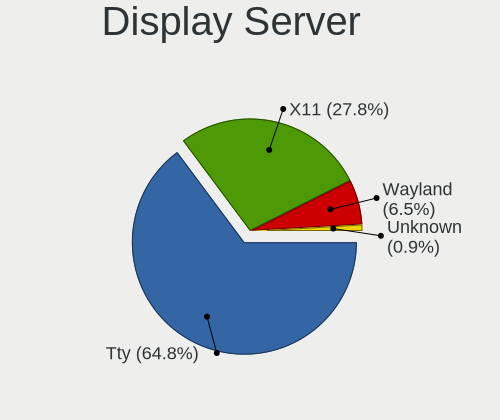
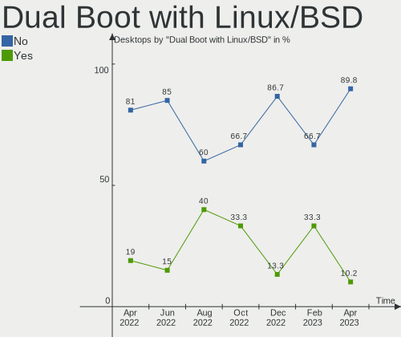
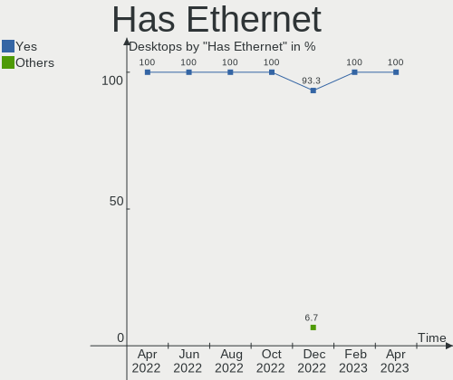
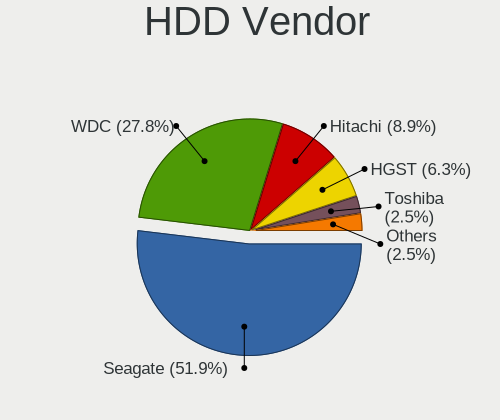
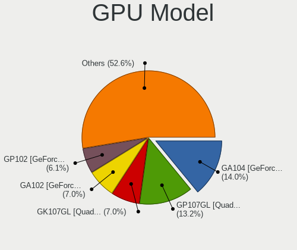
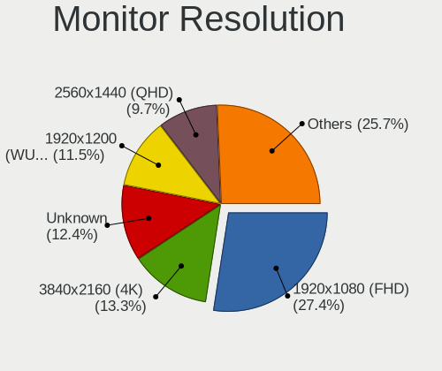
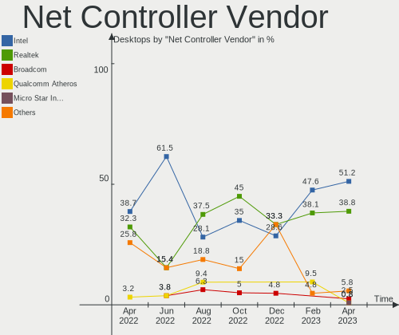

Linux in Switzerland - Hardware Trends (Desktops)
-------------------------------------------------

A project to identify most popular hardware characteristics and track their change
over time based on data collected by Linux users at https://Linux-Hardware.org.

Anyone can contribute to this report by the [hw-probe](https://github.com/linuxhw/hw-probe) tool:

    sudo -E hw-probe -all -upload

Period: Apr, 2023.

Contents
--------

* [ System ](#system)
  - [ OS                       ](#os)
  - [ OS Family                ](#os-family)
  - [ Kernel                   ](#kernel)
  - [ Kernel Family            ](#kernel-family)
  - [ Kernel Major Ver.        ](#kernel-major-ver)
  - [ Arch                     ](#arch)
  - [ DE                       ](#de)
  - [ Display Server           ](#display-server)
  - [ Display Manager          ](#display-manager)
  - [ OS Lang                  ](#os-lang)
  - [ Boot Mode                ](#boot-mode)
  - [ Filesystem               ](#filesystem)
  - [ Part. scheme             ](#part-scheme)
  - [ Dual Boot with Linux/BSD ](#dual-boot-with-linuxbsd)
  - [ Dual Boot (Win)          ](#dual-boot-win)

* [ Board ](#board)
  - [ Vendor                   ](#vendor)
  - [ Model                    ](#model)
  - [ Model Family             ](#model-family)
  - [ MFG Year                 ](#mfg-year)
  - [ Form Factor              ](#form-factor)
  - [ Secure Boot              ](#secure-boot)
  - [ Coreboot                 ](#coreboot)
  - [ RAM Size                 ](#ram-size)
  - [ RAM Used                 ](#ram-used)
  - [ Total Drives             ](#total-drives)
  - [ Has CD-ROM               ](#has-cd-rom)
  - [ Has Ethernet             ](#has-ethernet)
  - [ Has WiFi                 ](#has-wifi)
  - [ Has Bluetooth            ](#has-bluetooth)

* [ Location ](#location)
  - [ Country                  ](#country)
  - [ City                     ](#city)

* [ Drives ](#drives)
  - [ Drive Vendor             ](#drive-vendor)
  - [ Drive Model              ](#drive-model)
  - [ HDD Vendor               ](#hdd-vendor)
  - [ SSD Vendor               ](#ssd-vendor)
  - [ Drive Kind               ](#drive-kind)
  - [ Drive Connector          ](#drive-connector)
  - [ Drive Size               ](#drive-size)
  - [ Space Total              ](#space-total)
  - [ Space Used               ](#space-used)
  - [ Malfunc. Drives          ](#malfunc-drives)
  - [ Malfunc. Drive Vendor    ](#malfunc-drive-vendor)
  - [ Malfunc. HDD Vendor      ](#malfunc-hdd-vendor)
  - [ Malfunc. Drive Kind      ](#malfunc-drive-kind)
  - [ Failed Drives            ](#failed-drives)
  - [ Failed Drive Vendor      ](#failed-drive-vendor)
  - [ Drive Status             ](#drive-status)

* [ Storage controller ](#storage-controller)
  - [ Storage Vendor           ](#storage-vendor)
  - [ Storage Model            ](#storage-model)
  - [ Storage Kind             ](#storage-kind)

* [ Processor ](#processor)
  - [ CPU Vendor               ](#cpu-vendor)
  - [ CPU Model                ](#cpu-model)
  - [ CPU Model Family         ](#cpu-model-family)
  - [ CPU Cores                ](#cpu-cores)
  - [ CPU Sockets              ](#cpu-sockets)
  - [ CPU Threads              ](#cpu-threads)
  - [ CPU Op-Modes             ](#cpu-op-modes)
  - [ CPU Microcode            ](#cpu-microcode)
  - [ CPU Microarch            ](#cpu-microarch)

* [ Graphics ](#graphics)
  - [ GPU Vendor               ](#gpu-vendor)
  - [ GPU Model                ](#gpu-model)
  - [ GPU Combo                ](#gpu-combo)
  - [ GPU Driver               ](#gpu-driver)
  - [ GPU Memory               ](#gpu-memory)

* [ Monitor ](#monitor)
  - [ Monitor Vendor           ](#monitor-vendor)
  - [ Monitor Model            ](#monitor-model)
  - [ Monitor Resolution       ](#monitor-resolution)
  - [ Monitor Diagonal         ](#monitor-diagonal)
  - [ Monitor Width            ](#monitor-width)
  - [ Aspect Ratio             ](#aspect-ratio)
  - [ Monitor Area             ](#monitor-area)
  - [ Pixel Density            ](#pixel-density)
  - [ Multiple Monitors        ](#multiple-monitors)

* [ Network ](#network)
  - [ Net Controller Vendor    ](#net-controller-vendor)
  - [ Net Controller Model     ](#net-controller-model)
  - [ Wireless Vendor          ](#wireless-vendor)
  - [ Wireless Model           ](#wireless-model)
  - [ Ethernet Vendor          ](#ethernet-vendor)
  - [ Ethernet Model           ](#ethernet-model)
  - [ Net Controller Kind      ](#net-controller-kind)
  - [ Used Controller          ](#used-controller)
  - [ NICs                     ](#nics)
  - [ IPv6                     ](#ipv6)

* [ Bluetooth ](#bluetooth)
  - [ Bluetooth Vendor         ](#bluetooth-vendor)
  - [ Bluetooth Model          ](#bluetooth-model)

* [ Sound ](#sound)
  - [ Sound Vendor             ](#sound-vendor)
  - [ Sound Model              ](#sound-model)

* [ Memory ](#memory)
  - [ Memory Vendor            ](#memory-vendor)
  - [ Memory Model             ](#memory-model)
  - [ Memory Kind              ](#memory-kind)
  - [ Memory Form Factor       ](#memory-form-factor)
  - [ Memory Size              ](#memory-size)
  - [ Memory Speed             ](#memory-speed)

* [ Printers & scanners ](#printers--scanners)
  - [ Printer Vendor           ](#printer-vendor)
  - [ Printer Model            ](#printer-model)
  - [ Scanner Vendor           ](#scanner-vendor)
  - [ Scanner Model            ](#scanner-model)

* [ Camera ](#camera)
  - [ Camera Vendor            ](#camera-vendor)
  - [ Camera Model             ](#camera-model)

* [ Security ](#security)
  - [ Fingerprint Vendor       ](#fingerprint-vendor)
  - [ Fingerprint Model        ](#fingerprint-model)
  - [ Chipcard Vendor          ](#chipcard-vendor)
  - [ Chipcard Model           ](#chipcard-model)

* [ Unsupported ](#unsupported)
  - [ Unsupported Devices      ](#unsupported-devices)
  - [ Unsupported Device Types ](#unsupported-device-types)

System
------

OS
--

Installed operating systems

| Name                         | Desktops | Percent |
|------------------------------|----------|---------|
| Ubuntu 22.04                 | 88       | 81.48%  |
| OpenMandriva 23.03           | 3        | 2.78%   |
| Fedora 38                    | 3        | 2.78%   |
| openSUSE Tumbleweed-XXXXXXXX | 2        | 1.85%   |
| OpenMandriva 23.01           | 2        | 1.85%   |
| Linux Mint 21.1              | 2        | 1.85%   |
| Ubuntu 20.04                 | 1        | 0.93%   |
| openSUSE Leap-15.5           | 1        | 0.93%   |
| openSUSE Leap-15.4           | 1        | 0.93%   |
| Linux Mint 20.3              | 1        | 0.93%   |
| LFS 11.3-systemd             | 1        | 0.93%   |
| Garuda Linux Rolling         | 1        | 0.93%   |
| Debian 12                    | 1        | 0.93%   |
| Arch Rolling                 | 1        | 0.93%   |

OS Family
---------

OS without a version

| Name         | Desktops | Percent |
|--------------|----------|---------|
| Ubuntu       | 89       | 82.41%  |
| OpenMandriva | 5        | 4.63%   |
| openSUSE     | 4        | 3.7%    |
| Linux Mint   | 3        | 2.78%   |
| Fedora       | 3        | 2.78%   |
| LFS          | 1        | 0.93%   |
| Garuda Linux | 1        | 0.93%   |
| Debian       | 1        | 0.93%   |
| Arch         | 1        | 0.93%   |

Kernel
------

Version of the Linux kernel

| Version                      | Desktops | Percent |
|------------------------------|----------|---------|
| 5.15.0-67-generic            | 28       | 25.93%  |
| 5.15.0-69-generic            | 23       | 21.3%   |
| 5.15.0-58-generic            | 14       | 12.96%  |
| 5.15.0-46-generic            | 8        | 7.41%   |
| 5.15.0-43-generic            | 6        | 5.56%   |
| 5.15.0-70-generic            | 4        | 3.7%    |
| 6.2.6-desktop-1omv2390       | 3        | 2.78%   |
| 6.2.11-300.fc38.x86_64       | 2        | 1.85%   |
| 6.1.0-1007-oem               | 2        | 1.85%   |
| 5.19.0-35-generic            | 2        | 1.85%   |
| 6.2.9-300.fc38.x86_64        | 1        | 0.93%   |
| 6.2.9-1-default              | 1        | 0.93%   |
| 6.2.10-zen2-xanmod1-1        | 1        | 0.93%   |
| 6.2.10-zen1-1-zen            | 1        | 0.93%   |
| 6.2.10-1-default             | 1        | 0.93%   |
| 6.1.11                       | 1        | 0.93%   |
| 6.1.1-desktop-1omv2290       | 1        | 0.93%   |
| 6.1.0-5-amd64                | 1        | 0.93%   |
| 5.19.0-40-generic            | 1        | 0.93%   |
| 5.19.0-38-generic            | 1        | 0.93%   |
| 5.19.0-32-generic            | 1        | 0.93%   |
| 5.17.1-desktop-2omv4050      | 1        | 0.93%   |
| 5.15.0-71-generic            | 1        | 0.93%   |
| 5.15.0-60-generic            | 1        | 0.93%   |
| 5.14.21-150400.24.60-default | 1        | 0.93%   |
| 5.14.21-150400.24.46-default | 1        | 0.93%   |

Kernel Family
-------------

Linux kernel without a distro release

| Version | Desktops | Percent |
|---------|----------|---------|
| 5.15.0  | 85       | 78.7%   |
| 5.19.0  | 5        | 4.63%   |
| 6.2.6   | 3        | 2.78%   |
| 6.2.10  | 3        | 2.78%   |
| 6.1.0   | 3        | 2.78%   |
| 6.2.9   | 2        | 1.85%   |
| 6.2.11  | 2        | 1.85%   |
| 5.14.21 | 2        | 1.85%   |
| 6.1.11  | 1        | 0.93%   |
| 6.1.1   | 1        | 0.93%   |
| 5.17.1  | 1        | 0.93%   |

Kernel Major Ver.
-----------------

Linux kernel major version

| Version | Desktops | Percent |
|---------|----------|---------|
| 5.15    | 85       | 78.7%   |
| 6.2     | 10       | 9.26%   |
| 6.1     | 5        | 4.63%   |
| 5.19    | 5        | 4.63%   |
| 5.14    | 2        | 1.85%   |
| 5.17    | 1        | 0.93%   |

Arch
----

OS architecture (x86_64, i586, etc.)

| Name   | Desktops | Percent |
|--------|----------|---------|
| x86_64 | 108      | 100%    |

DE
--

Desktop Environment

| Name       | Desktops | Percent |
|------------|----------|---------|
| GNUstep    | 66       | 61.11%  |
| GNOME      | 30       | 27.78%  |
| KDE5       | 6        | 5.56%   |
| X-Cinnamon | 2        | 1.85%   |
| Unknown    | 2        | 1.85%   |
| MATE       | 1        | 0.93%   |
| Cinnamon   | 1        | 0.93%   |

Display Server
--------------

X11 or Wayland

| Name    | Desktops | Percent |
|---------|----------|---------|
| Tty     | 70       | 64.81%  |
| X11     | 30       | 27.78%  |
| Wayland | 7        | 6.48%   |
| Unknown | 1        | 0.93%   |

Display Manager
---------------

SDDM, LightDM, etc.

| Name    | Desktops | Percent |
|---------|----------|---------|
| LightDM | 67       | 62.04%  |
| GDM3    | 22       | 20.37%  |
| Unknown | 12       | 11.11%  |
| GDM     | 4        | 3.7%    |
| SDDM    | 3        | 2.78%   |

OS Lang
-------

Language

| Lang  | Desktops | Percent |
|-------|----------|---------|
| en_US | 90       | 83.33%  |
| de_CH | 12       | 11.11%  |
| en_GB | 2        | 1.85%   |
| it_IT | 1        | 0.93%   |
| fr_CH | 1        | 0.93%   |
| de_DE | 1        | 0.93%   |
| C     | 1        | 0.93%   |

Boot Mode
---------

EFI or BIOS

| Mode | Desktops | Percent |
|------|----------|---------|
| EFI  | 71       | 65.74%  |
| BIOS | 37       | 34.26%  |

Filesystem
----------

Type of filesystem

| Type    | Desktops | Percent |
|---------|----------|---------|
| Ext4    | 95       | 87.96%  |
| Btrfs   | 10       | 9.26%   |
| Overlay | 3        | 2.78%   |

Part. scheme
------------

Scheme of partitioning

| Type    | Desktops | Percent |
|---------|----------|---------|
| GPT     | 98       | 90.74%  |
| Unknown | 9        | 8.33%   |
| MBR     | 1        | 0.93%   |

Dual Boot with Linux/BSD
------------------------

Hosting more than one Linux/BSD

| Dual boot | Desktops | Percent |
|-----------|----------|---------|
| No        | 97       | 89.81%  |
| Yes       | 11       | 10.19%  |

Dual Boot (Win)
---------------

Hosting Linux and Windows

| Dual boot | Desktops | Percent |
|-----------|----------|---------|
| No        | 101      | 93.52%  |
| Yes       | 7        | 6.48%   |

Board
-----

Vendor
------

Motherboard manufacturer

| Name                | Desktops | Percent |
|---------------------|----------|---------|
| ASUSTek Computer    | 65       | 60.19%  |
| Fujitsu             | 14       | 12.96%  |
| Intel               | 6        | 5.56%   |
| Hewlett-Packard     | 6        | 5.56%   |
| Gigabyte Technology | 5        | 4.63%   |
| ASRock              | 5        | 4.63%   |
| Lenovo              | 3        | 2.78%   |
| Medion              | 1        | 0.93%   |
| Dell                | 1        | 0.93%   |
| AZW                 | 1        | 0.93%   |
| Apple               | 1        | 0.93%   |

Model
-----

Motherboard model

| Name                                                  | Desktops | Percent |
|-------------------------------------------------------|----------|---------|
| ASUS PRIME Z590-P                                     | 16       | 14.81%  |
| ASUS PRIME X570-PRO                                   | 11       | 10.19%  |
| ASUS PRIME B550M-A                                    | 10       | 9.26%   |
| Fujitsu CELSIUS_W550                                  | 5        | 4.63%   |
| ASUS PRIME Z370-A II                                  | 4        | 3.7%    |
| ASUS All Series                                       | 4        | 3.7%    |
| Intel DP67BA AAG10219-303                             | 2        | 1.85%   |
| HP Z1 Entry Tower G6                                  | 2        | 1.85%   |
| Gigabyte H97-HD3                                      | 2        | 1.85%   |
| Fujitsu CELSIUS W570                                  | 2        | 1.85%   |
| Fujitsu CELSIUS W530                                  | 2        | 1.85%   |
| Fujitsu CELSIUS M740                                  | 2        | 1.85%   |
| ASUS STRIX Z270F GAMING                               | 2        | 1.85%   |
| ASUS ROG Strix G35CG_G35CG                            | 2        | 1.85%   |
| ASUS PRIME Z490M-PLUS                                 | 2        | 1.85%   |
| ASRock B760M Steel Legend WiFi                        | 2        | 1.85%   |
| Medion ERAZER X47004 MD34010/C562                     | 1        | 0.93%   |
| Lenovo Legion T530-28ICB 90L3                         | 1        | 0.93%   |
| Lenovo Legion T5 26IAB7 90SV00EMSZ                    | 1        | 0.93%   |
| Lenovo IdeaCentre 5 14IMB05 IdeaCentre 5-14IMB05 Desk | 1        | 0.93%   |
| Intel DX58SO2 AAG10925-207                            | 1        | 0.93%   |
| Intel DP55WB AAE64798-207                             | 1        | 0.93%   |
| Intel DH87MC AAG74242-401                             | 1        | 0.93%   |
| Intel DH67CL AAG10212-210                             | 1        | 0.93%   |
| HP Z400 Workstation                                   | 1        | 0.93%   |
| HP Victus by 15L Gaming Desktop TG02-0xxx             | 1        | 0.93%   |
| HP ProLiant ML150 G6                                  | 1        | 0.93%   |
| HP 595-P0569NG                                        | 1        | 0.93%   |
| Gigabyte Z97-HD3                                      | 1        | 0.93%   |
| Gigabyte P55A-UD7                                     | 1        | 0.93%   |
| Gigabyte GA-MA790FXT-UD5P                             | 1        | 0.93%   |
| Fujitsu CELSIUS W580                                  | 1        | 0.93%   |
| Fujitsu CELSIUS M770                                  | 1        | 0.93%   |
| Fujitsu CELSIUS M740B                                 | 1        | 0.93%   |
| Dell OptiPlex 3050                                    | 1        | 0.93%   |
| AZW GTR                                               | 1        | 0.93%   |
| ASUS ROG STRIX Z370-F GAMING                          | 1        | 0.93%   |
| ASUS ROG STRIX X570-F GAMING                          | 1        | 0.93%   |
| ASUS ROG STRIX X570-E GAMING                          | 1        | 0.93%   |
| ASUS Pro WS WRX80E-SAGE SE WIFI                       | 1        | 0.93%   |

Model Family
------------

Motherboard model prefix

| Name                      | Desktops | Percent |
|---------------------------|----------|---------|
| ASUS PRIME                | 48       | 44.44%  |
| Fujitsu CELSIUS           | 14       | 12.96%  |
| ASUS ROG                  | 5        | 4.63%   |
| ASUS All                  | 4        | 3.7%    |
| Lenovo Legion             | 2        | 1.85%   |
| Intel DP67BA              | 2        | 1.85%   |
| HP Z1                     | 2        | 1.85%   |
| Gigabyte H97-HD3          | 2        | 1.85%   |
| ASUS STRIX                | 2        | 1.85%   |
| ASRock B760M              | 2        | 1.85%   |
| Medion ERAZER             | 1        | 0.93%   |
| Lenovo IdeaCentre         | 1        | 0.93%   |
| Intel DX58SO2             | 1        | 0.93%   |
| Intel DP55WB              | 1        | 0.93%   |
| Intel DH87MC              | 1        | 0.93%   |
| Intel DH67CL              | 1        | 0.93%   |
| HP Z400                   | 1        | 0.93%   |
| HP Victus                 | 1        | 0.93%   |
| HP ProLiant               | 1        | 0.93%   |
| HP 595-P0569NG            | 1        | 0.93%   |
| Gigabyte Z97-HD3          | 1        | 0.93%   |
| Gigabyte P55A-UD7         | 1        | 0.93%   |
| Gigabyte GA-MA790FXT-UD5P | 1        | 0.93%   |
| Dell OptiPlex             | 1        | 0.93%   |
| AZW GTR                   | 1        | 0.93%   |
| ASUS Pro                  | 1        | 0.93%   |
| ASUS P9X79                | 1        | 0.93%   |
| ASUS P8P67                | 1        | 0.93%   |
| ASUS P6T                  | 1        | 0.93%   |
| ASUS Maximus              | 1        | 0.93%   |
| ASUS M5A99X               | 1        | 0.93%   |
| ASRock Z170               | 1        | 0.93%   |
| ASRock B560M-HDV          | 1        | 0.93%   |
| ASRock B550M              | 1        | 0.93%   |
| Apple MacPro5             | 1        | 0.93%   |

MFG Year
--------

Motherboard manufacture year

| Year | Desktops | Percent |
|------|----------|---------|
| 2021 | 22       | 20.37%  |
| 2020 | 15       | 13.89%  |
| 2019 | 14       | 12.96%  |
| 2015 | 9        | 8.33%   |
| 2017 | 8        | 7.41%   |
| 2018 | 7        | 6.48%   |
| 2011 | 7        | 6.48%   |
| 2014 | 6        | 5.56%   |
| 2022 | 5        | 4.63%   |
| 2010 | 5        | 4.63%   |
| 2016 | 4        | 3.7%    |
| 2013 | 2        | 1.85%   |
| 2023 | 1        | 0.93%   |
| 2012 | 1        | 0.93%   |
| 2009 | 1        | 0.93%   |
| 2008 | 1        | 0.93%   |

Form Factor
-----------

Physical design of the computer

| Name    | Desktops | Percent |
|---------|----------|---------|
| Desktop | 108      | 100%    |

Secure Boot
-----------

Enabled or disabled

| State    | Desktops | Percent |
|----------|----------|---------|
| Disabled | 106      | 98.15%  |
| Enabled  | 2        | 1.85%   |

Coreboot
--------

Have coreboot on board

| Used | Desktops | Percent |
|------|----------|---------|
| No   | 108      | 100%    |

RAM Size
--------

Total RAM memory

| Size in GB      | Desktops | Percent |
|-----------------|----------|---------|
| 32.01-64.0      | 39       | 36.11%  |
| 64.01-256.0     | 30       | 27.78%  |
| 16.01-24.0      | 23       | 21.3%   |
| 8.01-16.0       | 8        | 7.41%   |
| 4.01-8.0        | 4        | 3.7%    |
| 24.01-32.0      | 3        | 2.78%   |
| More than 256.0 | 1        | 0.93%   |

RAM Used
--------

Used RAM memory

| Used GB    | Desktops | Percent |
|------------|----------|---------|
| 1.01-2.0   | 41       | 37.96%  |
| 2.01-3.0   | 17       | 15.74%  |
| 3.01-4.0   | 15       | 13.89%  |
| 8.01-16.0  | 14       | 12.96%  |
| 4.01-8.0   | 13       | 12.04%  |
| 16.01-24.0 | 3        | 2.78%   |
| 24.01-32.0 | 2        | 1.85%   |
| 0.51-1.0   | 2        | 1.85%   |
| 32.01-64.0 | 1        | 0.93%   |

Total Drives
------------

Number of drives on board

| Drives | Desktops | Percent |
|--------|----------|---------|
| 2      | 46       | 42.59%  |
| 1      | 44       | 40.74%  |
| 4      | 7        | 6.48%   |
| 3      | 6        | 5.56%   |
| 6      | 2        | 1.85%   |
| 5      | 2        | 1.85%   |
| 7      | 1        | 0.93%   |

Has CD-ROM
----------

Has CD-ROM on board

| Presented | Desktops | Percent |
|-----------|----------|---------|
| No        | 84       | 77.78%  |
| Yes       | 24       | 22.22%  |

Has Ethernet
------------

Has Ethernet on board

| Presented | Desktops | Percent |
|-----------|----------|---------|
| Yes       | 108      | 100%    |

Has WiFi
--------

Has WiFi module

| Presented | Desktops | Percent |
|-----------|----------|---------|
| No        | 91       | 84.26%  |
| Yes       | 17       | 15.74%  |

Has Bluetooth
-------------

Has Bluetooth module

| Presented | Desktops | Percent |
|-----------|----------|---------|
| No        | 83       | 76.85%  |
| Yes       | 25       | 23.15%  |

Location
--------

Country
-------

Geographic location (country)

| Country     | Desktops | Percent |
|-------------|----------|---------|
| Switzerland | 108      | 100%    |

City
----

Geographic location (city)

| City             | Desktops | Percent |
|------------------|----------|---------|
| Zurich           | 91       | 84.26%  |
| Uster            | 1        | 0.93%   |
| Unterentfelden   | 1        | 0.93%   |
| St. Gallen       | 1        | 0.93%   |
| Schonbuhl        | 1        | 0.93%   |
| Samstagern       | 1        | 0.93%   |
| Nidau            | 1        | 0.93%   |
| Lausanne         | 1        | 0.93%   |
| Langnau am Albis | 1        | 0.93%   |
| Landquart        | 1        | 0.93%   |
| Jegenstorf       | 1        | 0.93%   |
| Horgen           | 1        | 0.93%   |
| Goldach          | 1        | 0.93%   |
| Geneva           | 1        | 0.93%   |
| Dulliken         | 1        | 0.93%   |
| Bern             | 1        | 0.93%   |
| Basel            | 1        | 0.93%   |
| Amriswil         | 1        | 0.93%   |

Drives
------

Drive Vendor
------------

Hard drive vendors

| Vendor              | Desktops | Drives | Percent |
|---------------------|----------|--------|---------|
| Samsung Electronics | 54       | 89     | 32.73%  |
| Seagate             | 41       | 44     | 24.85%  |
| WDC                 | 23       | 27     | 13.94%  |
| Intel               | 13       | 13     | 7.88%   |
| Hitachi             | 7        | 7      | 4.24%   |
| HGST                | 5        | 5      | 3.03%   |
| SanDisk             | 4        | 4      | 2.42%   |
| Kingston            | 3        | 3      | 1.82%   |
| Crucial             | 3        | 3      | 1.82%   |
| Toshiba             | 2        | 2      | 1.21%   |
| SK hynix            | 2        | 2      | 1.21%   |
| SPCC                | 1        | 1      | 0.61%   |
| Plextor             | 1        | 1      | 0.61%   |
| OCZ                 | 1        | 1      | 0.61%   |
| Micron Technology   | 1        | 1      | 0.61%   |
| Hewlett-Packard     | 1        | 2      | 0.61%   |
| Adaptec             | 1        | 1      | 0.61%   |
| A-DATA Technology   | 1        | 1      | 0.61%   |
| Unknown             | 1        | 1      | 0.61%   |

Drive Model
-----------

Hard drive models

| Model                                              | Desktops | Percent |
|----------------------------------------------------|----------|---------|
| Samsung SSD 980 PRO 1TB                            | 18       | 10%     |
| Samsung NVMe SSD Drive 1TB                         | 12       | 6.67%   |
| Seagate ST2000DM008-2FR102 2TB                     | 11       | 6.11%   |
| Seagate ST2000DM006-2DM164 2TB                     | 8        | 4.44%   |
| Intel SSDSC2KB240G8 240GB                          | 6        | 3.33%   |
| SanDisk NVMe SSD Drive 1TB                         | 4        | 2.22%   |
| WDC WD10EALX-009BA0 1TB                            | 3        | 1.67%   |
| Seagate ST2000DM008-2UB102 2TB                     | 3        | 1.67%   |
| Seagate ST16000NM001G-2KK103 16TB                  | 3        | 1.67%   |
| Seagate ST1000DM003-1ER162 1TB                     | 3        | 1.67%   |
| Samsung SSD 970 EVO Plus 1TB                       | 3        | 1.67%   |
| Intel SSDSC2KG400G7M 118000654 400GB               | 3        | 1.67%   |
| WDC WUH721816ALE6L4 16TB                           | 2        | 1.11%   |
| WDC WD40EZRZ-00GXCB0 4TB                           | 2        | 1.11%   |
| WDC WD10EZEX-08WN4A1 1TB                           | 2        | 1.11%   |
| Toshiba DT01ACA200 2TB                             | 2        | 1.11%   |
| Seagate ST4000DM004-2CV104 4TB                     | 2        | 1.11%   |
| Seagate ST2000DM001-1ER164 2TB                     | 2        | 1.11%   |
| Seagate ST2000DM001-1CH164 2TB                     | 2        | 1.11%   |
| Samsung SSD 970 EVO Plus 250GB                     | 2        | 1.11%   |
| Samsung SSD 960 EVO 500GB                          | 2        | 1.11%   |
| Samsung SSD 870 EVO 2TB                            | 2        | 1.11%   |
| Samsung SSD 860 EVO 250GB                          | 2        | 1.11%   |
| Samsung SSD 860 EVO 1TB                            | 2        | 1.11%   |
| Samsung SSD 840 EVO 250GB                          | 2        | 1.11%   |
| Samsung NVMe SSD Controller SM981/PM981/PM983 1TB  | 2        | 1.11%   |
| Samsung NVMe SSD Controller PM9A1/PM9A3/980PRO 2TB | 2        | 1.11%   |
| Hitachi HUA723030ALA640 3TB                        | 2        | 1.11%   |
| HGST HUS724040ALA640 4TB                           | 2        | 1.11%   |
| WDC WUH721818ALE6L4 18TB                           | 1        | 0.56%   |
| WDC WDS120G1G0A-00SS50 120GB SSD                   | 1        | 0.56%   |
| WDC WD60PURX-64T0ZY0 6TB                           | 1        | 0.56%   |
| WDC WD5000AAKX-001CA0 500GB                        | 1        | 0.56%   |
| WDC WD4000F9YZ-09N20L1 4TB                         | 1        | 0.56%   |
| WDC WD30EZRZ-00Z5HB0 3TB                           | 1        | 0.56%   |
| WDC WD30EFRX-68EUZN0 3TB                           | 1        | 0.56%   |
| WDC WD2500AAJS-00L7A0 250GB                        | 1        | 0.56%   |
| WDC WD20EFRX-68EUZN0 2TB                           | 1        | 0.56%   |
| WDC WD20EFRX-68AX9N0 2TB                           | 1        | 0.56%   |
| WDC WD20EFAX-68B2RN1 2TB                           | 1        | 0.56%   |

HDD Vendor
----------

Hard disk drive vendors

| Vendor          | Desktops | Drives | Percent |
|-----------------|----------|--------|---------|
| Seagate         | 41       | 44     | 51.9%   |
| WDC             | 22       | 26     | 27.85%  |
| Hitachi         | 7        | 7      | 8.86%   |
| HGST            | 5        | 5      | 6.33%   |
| Toshiba         | 2        | 2      | 2.53%   |
| Hewlett-Packard | 1        | 2      | 1.27%   |
| Adaptec         | 1        | 1      | 1.27%   |

SSD Vendor
----------

Solid state drive vendors

| Vendor              | Desktops | Drives | Percent |
|---------------------|----------|--------|---------|
| Samsung Electronics | 17       | 22     | 43.59%  |
| Intel               | 13       | 13     | 33.33%  |
| Crucial             | 3        | 3      | 7.69%   |
| WDC                 | 1        | 1      | 2.56%   |
| SPCC                | 1        | 1      | 2.56%   |
| Plextor             | 1        | 1      | 2.56%   |
| OCZ                 | 1        | 1      | 2.56%   |
| Kingston            | 1        | 1      | 2.56%   |
| Unknown             | 1        | 1      | 2.56%   |

Drive Kind
----------

HDD or SSD

| Kind | Desktops | Drives | Percent |
|------|----------|--------|---------|
| HDD  | 69       | 87     | 45.39%  |
| NVMe | 50       | 77     | 32.89%  |
| SSD  | 33       | 44     | 21.71%  |

Drive Connector
---------------

SATA, SAS, NVMe, etc.

| Type | Desktops | Drives | Percent |
|------|----------|--------|---------|
| SATA | 81       | 130    | 61.36%  |
| NVMe | 50       | 77     | 37.88%  |
| SAS  | 1        | 1      | 0.76%   |

Drive Size
----------

Size of hard drive

| Size in TB | Desktops | Drives | Percent |
|------------|----------|--------|---------|
| 1.01-2.0   | 41       | 43     | 35.96%  |
| 0.01-0.5   | 29       | 34     | 25.44%  |
| 0.51-1.0   | 20       | 29     | 17.54%  |
| 3.01-4.0   | 9        | 10     | 7.89%   |
| 10.01-20.0 | 7        | 7      | 6.14%   |
| 2.01-3.0   | 5        | 5      | 4.39%   |
| 4.01-10.0  | 3        | 3      | 2.63%   |

Space Total
-----------

Amount of disk space available on the file system

| Size in GB     | Desktops | Percent |
|----------------|----------|---------|
| More than 3000 | 22       | 20.37%  |
| 1001-2000      | 18       | 16.67%  |
| Unknown        | 18       | 16.67%  |
| 101-250        | 17       | 15.74%  |
| 2001-3000      | 14       | 12.96%  |
| 501-1000       | 10       | 9.26%   |
| 251-500        | 7        | 6.48%   |
| 1-20           | 2        | 1.85%   |

Space Used
----------

Amount of used disk space

| Used GB        | Desktops | Percent |
|----------------|----------|---------|
| 101-250        | 19       | 17.59%  |
| 51-100         | 19       | 17.59%  |
| Unknown        | 18       | 16.67%  |
| 501-1000       | 14       | 12.96%  |
| More than 3000 | 12       | 11.11%  |
| 251-500        | 10       | 9.26%   |
| 1001-2000      | 6        | 5.56%   |
| 1-20           | 5        | 4.63%   |
| 21-50          | 3        | 2.78%   |
| 2001-3000      | 2        | 1.85%   |

Malfunc. Drives
---------------

Drive models with a malfunction

Zero info for selected period =(

Malfunc. Drive Vendor
---------------------

Vendors of faulty drives

Zero info for selected period =(

Malfunc. HDD Vendor
-------------------

Vendors of faulty HDD drives

Zero info for selected period =(

Malfunc. Drive Kind
-------------------

Kinds of faulty drives

Zero info for selected period =(

Failed Drives
-------------

Failed drive models

Zero info for selected period =(

Failed Drive Vendor
-------------------

Failed drive vendors

Zero info for selected period =(

Drive Status
------------

Number of failed and malfunc. drives

| Status   | Desktops | Drives | Percent |
|----------|----------|--------|---------|
| Detected | 80       | 143    | 74.07%  |
| Works    | 28       | 65     | 25.93%  |

Storage controller
------------------

Storage Vendor
--------------

Storage controller vendors

| Vendor                      | Desktops | Percent |
|-----------------------------|----------|---------|
| Intel                       | 76       | 42.7%   |
| Samsung Electronics         | 43       | 24.16%  |
| AMD                         | 30       | 16.85%  |
| Marvell Technology Group    | 7        | 3.93%   |
| ASMedia Technology          | 6        | 3.37%   |
| SanDisk                     | 4        | 2.25%   |
| JMicron Technology          | 3        | 1.69%   |
| SK hynix                    | 2        | 1.12%   |
| Kingston Technology Company | 2        | 1.12%   |
| Silicon Image               | 1        | 0.56%   |
| Micron Technology           | 1        | 0.56%   |
| Hewlett-Packard             | 1        | 0.56%   |
| ADATA Technology            | 1        | 0.56%   |
| Adaptec                     | 1        | 0.56%   |

Storage Model
-------------

Storage controller models

| Model                                                                          | Desktops | Percent |
|--------------------------------------------------------------------------------|----------|---------|
| Samsung NVMe SSD Controller PM9A1/PM9A3/980PRO                                 | 27       | 13.85%  |
| Intel 500 Series Chipset Family SATA AHCI Controller                           | 19       | 9.74%   |
| AMD FCH SATA Controller [AHCI mode]                                            | 17       | 8.72%   |
| Samsung NVMe SSD Controller SM981/PM981/PM983                                  | 13       | 6.67%   |
| AMD 500 Series Chipset SATA Controller                                         | 11       | 5.64%   |
| Intel 200 Series PCH SATA controller [AHCI mode]                               | 9        | 4.62%   |
| Intel Q170/Q150/B150/H170/H110/Z170/CM236 Chipset SATA Controller [AHCI Mode]  | 8        | 4.1%    |
| Intel C610/X99 series chipset 6-Port SATA Controller [AHCI mode]               | 6        | 3.08%   |
| ASMedia ASM1062 Serial ATA Controller                                          | 6        | 3.08%   |
| Intel 6 Series/C200 Series Chipset Family 6 port Desktop SATA AHCI Controller  | 5        | 2.56%   |
| SanDisk WD PC SN810 / Black SN850 NVMe SSD                                     | 4        | 2.05%   |
| Intel Comet Lake SATA AHCI Controller                                          | 4        | 2.05%   |
| Intel 8 Series/C220 Series Chipset Family 6-port SATA Controller 1 [AHCI mode] | 4        | 2.05%   |
| Samsung NVMe SSD Controller SM961/PM961/SM963                                  | 3        | 1.54%   |
| Intel SATA Controller [RAID mode]                                              | 3        | 1.54%   |
| Intel Cannon Lake PCH SATA AHCI Controller                                     | 3        | 1.54%   |
| Intel C610/X99 series chipset sSATA Controller [AHCI mode]                     | 3        | 1.54%   |
| Intel 9 Series Chipset Family SATA Controller [AHCI Mode]                      | 3        | 1.54%   |
| Intel 82801JI (ICH10 Family) SATA AHCI Controller                              | 3        | 1.54%   |
| Intel 700 Series Chipset Family SATA AHCI Controller                           | 3        | 1.54%   |
| Marvell Group 88SE9123 PCIe SATA 6.0 Gb/s controller                           | 2        | 1.03%   |
| Marvell Group 88SE6111/6121 SATA II / PATA Controller                          | 2        | 1.03%   |
| Kingston Company Company Non-Volatile memory controller                        | 2        | 1.03%   |
| JMicron JMB363 SATA/IDE Controller                                             | 2        | 1.03%   |
| Intel Volume Management Device NVMe RAID Controller Intel Corporation          | 2        | 1.03%   |
| AMD SB7x0/SB8x0/SB9x0 SATA Controller [AHCI mode]                              | 2        | 1.03%   |
| SK hynix Gold P31/PC711 NVMe Solid State Drive                                 | 1        | 0.51%   |
| SK hynix BC501 NVMe Solid State Drive                                          | 1        | 0.51%   |
| Silicon Image SiI 3132 Serial ATA Raid II Controller                           | 1        | 0.51%   |
| Samsung NVMe SSD Controller SM951/PM951                                        | 1        | 0.51%   |
| Samsung NVMe SSD Controller 980                                                | 1        | 0.51%   |
| Micron NVMe Storage Controller                                                 | 1        | 0.51%   |
| Marvell Group 88SE91A3 SATA-600 Controller                                     | 1        | 0.51%   |
| Marvell Group 88SE9182 PCIe 2.0 x2 2-port SATA 6 Gb/s Controller               | 1        | 0.51%   |
| Marvell Group 88SE9172 SATA 6Gb/s Controller                                   | 1        | 0.51%   |
| Marvell Group 88SE912x IDE Controller                                          | 1        | 0.51%   |
| Marvell Group 88SE9128 PCIe SATA 6 Gb/s RAID controller with HyperDuo          | 1        | 0.51%   |
| Marvell Group 88SE6440 SAS/SATA PCIe controller                                | 1        | 0.51%   |
| JMicron JMB362 SATA Controller                                                 | 1        | 0.51%   |
| Intel C600/X79 series chipset 6-Port SATA AHCI Controller                      | 1        | 0.51%   |

Storage Kind
------------

Kind of storage controller (IDE, SATA, NVMe, SAS, ...)

| Kind | Desktops | Percent |
|------|----------|---------|
| SATA | 103      | 61.68%  |
| NVMe | 50       | 29.94%  |
| RAID | 8        | 4.79%   |
| IDE  | 5        | 2.99%   |
| SAS  | 1        | 0.6%    |

Processor
---------

CPU Vendor
----------

Processor vendors

| Vendor  | Desktops | Percent |
|---------|----------|---------|
| Intel   | 75       | 69.44%  |
| AMD     | 32       | 29.63%  |
| Unknown | 1        | 0.93%   |

CPU Model
---------

Processor models

| Model                                    | Desktops | Percent |
|------------------------------------------|----------|---------|
| Intel 11th Gen Core i9-11900F @ 2.50GHz  | 16       | 14.81%  |
| AMD Ryzen 7 5800X 8-Core Processor       | 15       | 13.89%  |
| Intel Core i7-6700 CPU @ 3.40GHz         | 5        | 4.63%   |
| Intel Core i7-9700K CPU @ 3.60GHz        | 4        | 3.7%    |
| Intel Core i7-7700K CPU @ 4.20GHz        | 4        | 3.7%    |
| AMD Ryzen 9 3900X 12-Core Processor      | 4        | 3.7%    |
| Intel Xeon CPU E5-1650 v3 @ 3.50GHz      | 3        | 2.78%   |
| Intel 13th Gen Core i9-13900K            | 3        | 2.78%   |
| Intel Xeon CPU E5-1660 v3 @ 3.00GHz      | 2        | 1.85%   |
| Intel Xeon CPU E3-1240 v6 @ 3.70GHz      | 2        | 1.85%   |
| Intel Core i9-10900 CPU @ 2.80GHz        | 2        | 1.85%   |
| Intel Core i7-4790 CPU @ 3.60GHz         | 2        | 1.85%   |
| Intel Core i7-2600 CPU @ 3.40GHz         | 2        | 1.85%   |
| Intel Core i7-10700K CPU @ 3.80GHz       | 2        | 1.85%   |
| Intel Core i5-4430 CPU @ 3.00GHz         | 2        | 1.85%   |
| Intel Core i5-2400 CPU @ 3.10GHz         | 2        | 1.85%   |
| Intel 11th Gen Core i9-11900KF @ 3.50GHz | 2        | 1.85%   |
| AMD Ryzen 9 5950X 16-Core Processor      | 2        | 1.85%   |
| AMD Ryzen 9 5900X 12-Core Processor      | 2        | 1.85%   |
| Intel Xeon W-2133 CPU @ 3.60GHz          | 1        | 0.93%   |
| Intel Xeon E-2136 CPU @ 3.30GHz          | 1        | 0.93%   |
| Intel Xeon CPU W3680 @ 3.33GHz           | 1        | 0.93%   |
| Intel Xeon CPU W3550 @ 3.07GHz           | 1        | 0.93%   |
| Intel Xeon CPU W3530 @ 2.80GHz           | 1        | 0.93%   |
| Intel Xeon CPU E5520 @ 2.27GHz           | 1        | 0.93%   |
| Intel Xeon CPU E5-1650 v4 @ 3.60GHz      | 1        | 0.93%   |
| Intel Core i7-9700KF CPU @ 3.60GHz       | 1        | 0.93%   |
| Intel Core i7-9700 CPU @ 3.00GHz         | 1        | 0.93%   |
| Intel Core i7-8700K CPU @ 3.70GHz        | 1        | 0.93%   |
| Intel Core i7-4930K CPU @ 3.40GHz        | 1        | 0.93%   |
| Intel Core i7-4770 CPU @ 3.40GHz         | 1        | 0.93%   |
| Intel Core i7-2600K CPU @ 3.40GHz        | 1        | 0.93%   |
| Intel Core i7 CPU 920 @ 2.67GHz          | 1        | 0.93%   |
| Intel Core i5-7500 CPU @ 3.40GHz         | 1        | 0.93%   |
| Intel Core i5-4570S CPU @ 2.90GHz        | 1        | 0.93%   |
| Intel Core i5-4440 CPU @ 3.10GHz         | 1        | 0.93%   |
| Intel Core i5-10600K CPU @ 4.10GHz       | 1        | 0.93%   |
| Intel Core i5-10400 CPU @ 2.90GHz        | 1        | 0.93%   |
| Intel Core i5 CPU 760 @ 2.80GHz          | 1        | 0.93%   |
| Intel Core i5 CPU 750 @ 2.67GHz          | 1        | 0.93%   |

CPU Model Family
----------------

Processor model prefix

| Model                  | Desktops | Percent |
|------------------------|----------|---------|
| Intel Core i7          | 26       | 24.07%  |
| Other                  | 23       | 21.3%   |
| AMD Ryzen 7            | 16       | 14.81%  |
| Intel Xeon             | 14       | 12.96%  |
| Intel Core i5          | 11       | 10.19%  |
| AMD Ryzen 9            | 10       | 9.26%   |
| AMD Ryzen 5            | 3        | 2.78%   |
| Intel Core i9          | 2        | 1.85%   |
| AMD Ryzen Threadripper | 1        | 0.93%   |
| AMD Phenom II X3       | 1        | 0.93%   |
| AMD FX                 | 1        | 0.93%   |

CPU Cores
---------

Number of processor cores

| Number | Desktops | Percent |
|--------|----------|---------|
| 8      | 46       | 42.59%  |
| 4      | 31       | 28.7%   |
| 6      | 14       | 12.96%  |
| 12     | 7        | 6.48%   |
| 24     | 4        | 3.7%    |
| 16     | 3        | 2.78%   |
| 10     | 2        | 1.85%   |
| 3      | 1        | 0.93%   |

CPU Sockets
-----------

Number of sockets

| Number | Desktops | Percent |
|--------|----------|---------|
| 1      | 107      | 99.07%  |
| 2      | 1        | 0.93%   |

CPU Threads
-----------

Threads per core (Hyper-Threading)

| Number | Desktops | Percent |
|--------|----------|---------|
| 2      | 91       | 84.26%  |
| 1      | 17       | 15.74%  |

CPU Op-Modes
------------

CPU Operation Modes (32-bit, 64-bit)

| Op mode        | Desktops | Percent |
|----------------|----------|---------|
| 32-bit, 64-bit | 108      | 100%    |

CPU Microcode
-------------

Microcode number

| Number     | Desktops | Percent |
|------------|----------|---------|
| Unknown    | 25       | 23.15%  |
| 0xa0671    | 13       | 12.04%  |
| 0x906e9    | 6        | 5.56%   |
| 0x506e3    | 6        | 5.56%   |
| 0xa0655    | 5        | 4.63%   |
| 0x306f2    | 4        | 3.7%    |
| 0x206a7    | 4        | 3.7%    |
| 0x0a20120a | 4        | 3.7%    |
| 0x0a201205 | 4        | 3.7%    |
| 0xb0671    | 3        | 2.78%   |
| 0x906ed    | 3        | 2.78%   |
| 0x306c3    | 3        | 2.78%   |
| 0x0a201016 | 3        | 2.78%   |
| 0x08701021 | 3        | 2.78%   |
| 0x906ea    | 2        | 1.85%   |
| 0x106e5    | 2        | 1.85%   |
| 0x106a5    | 2        | 1.85%   |
| 0x0a201204 | 2        | 1.85%   |
| 0x0800820d | 2        | 1.85%   |
| 0x906ec    | 1        | 0.93%   |
| 0x50654    | 1        | 0.93%   |
| 0x406f1    | 1        | 0.93%   |
| 0x306e4    | 1        | 0.93%   |
| 0x206c2    | 1        | 0.93%   |
| 0x106a4    | 1        | 0.93%   |
| 0x0a50000c | 1        | 0.93%   |
| 0x0a404102 | 1        | 0.93%   |
| 0x0a201025 | 1        | 0.93%   |
| 0x0a201009 | 1        | 0.93%   |
| 0x08701013 | 1        | 0.93%   |
| 0x010000db | 1        | 0.93%   |

CPU Microarch
-------------

Microarchitecture

| Name             | Desktops | Percent |
|------------------|----------|---------|
| Zen 3            | 21       | 19.44%  |
| KabyLake         | 15       | 13.89%  |
| Icelake          | 13       | 12.04%  |
| Haswell          | 12       | 11.11%  |
| Unknown          | 8        | 7.41%   |
| Skylake          | 7        | 6.48%   |
| Nehalem          | 6        | 5.56%   |
| CometLake        | 6        | 5.56%   |
| Zen 2            | 5        | 4.63%   |
| SandyBridge      | 5        | 4.63%   |
| Alderlake Hybrid | 3        | 2.78%   |
| Zen+             | 2        | 1.85%   |
| Westmere         | 1        | 0.93%   |
| Piledriver       | 1        | 0.93%   |
| K10              | 1        | 0.93%   |
| IvyBridge        | 1        | 0.93%   |
| Broadwell        | 1        | 0.93%   |

Graphics
--------

GPU Vendor
----------

Vendors of graphics cards

| Vendor                     | Desktops | Percent |
|----------------------------|----------|---------|
| Nvidia                     | 95       | 84.07%  |
| Intel                      | 10       | 8.85%   |
| AMD                        | 7        | 6.19%   |
| Matrox Electronics Systems | 1        | 0.88%   |

GPU Model
---------

Graphics card models

| Model                                                                       | Desktops | Percent |
|-----------------------------------------------------------------------------|----------|---------|
| Nvidia GA104 [GeForce RTX 3070 Lite Hash Rate]                              | 16       | 14.04%  |
| Nvidia GP107GL [Quadro P400]                                                | 15       | 13.16%  |
| Nvidia GK107GL [Quadro K420]                                                | 8        | 7.02%   |
| Nvidia GA102 [GeForce RTX 3090 Ti]                                          | 8        | 7.02%   |
| Nvidia GP102 [GeForce GTX 1080 Ti]                                          | 7        | 6.14%   |
| Nvidia GA102 [GeForce RTX 3090]                                             | 6        | 5.26%   |
| Nvidia GP102 [TITAN Xp]                                                     | 4        | 3.51%   |
| Intel CometLake-S GT2 [UHD Graphics 630]                                    | 4        | 3.51%   |
| Nvidia TU102 [GeForce RTX 2080 Ti Rev. A]                                   | 3        | 2.63%   |
| Nvidia GP106 [GeForce GTX 1060 6GB]                                         | 3        | 2.63%   |
| Intel Raptor Lake-S GT1 [UHD Graphics 770]                                  | 3        | 2.63%   |
| Nvidia TU106 [GeForce RTX 2060 SUPER]                                       | 2        | 1.75%   |
| Nvidia GT218 [GeForce 210]                                                  | 2        | 1.75%   |
| Nvidia GF119 [GeForce GT 520]                                               | 2        | 1.75%   |
| Nvidia GA104 [GeForce RTX 3060 Ti Lite Hash Rate]                           | 2        | 1.75%   |
| AMD Ellesmere [Radeon RX 470/480/570/570X/580/580X/590]                     | 2        | 1.75%   |
| Nvidia TU116 [GeForce GTX 1660 Ti]                                          | 1        | 0.88%   |
| Nvidia TU116 [GeForce GTX 1650 SUPER]                                       | 1        | 0.88%   |
| Nvidia TU102 [GeForce RTX 2080 Ti]                                          | 1        | 0.88%   |
| Nvidia GV100 [TITAN V]                                                      | 1        | 0.88%   |
| Nvidia GT218 [GeForce 405]                                                  | 1        | 0.88%   |
| Nvidia GP102 [TITAN X]                                                      | 1        | 0.88%   |
| Nvidia GM200 [GeForce GTX TITAN X]                                          | 1        | 0.88%   |
| Nvidia GM107GL [Quadro K2200]                                               | 1        | 0.88%   |
| Nvidia GK208B [GeForce GT 710]                                              | 1        | 0.88%   |
| Nvidia GK104GL [Quadro K5000]                                               | 1        | 0.88%   |
| Nvidia GF119 [NVS 310]                                                      | 1        | 0.88%   |
| Nvidia GF119 [GeForce GT 610]                                               | 1        | 0.88%   |
| Nvidia GF116 [GeForce GTX 550 Ti]                                           | 1        | 0.88%   |
| Nvidia GF108 [GeForce GT 630]                                               | 1        | 0.88%   |
| Nvidia GF108 [GeForce GT 430]                                               | 1        | 0.88%   |
| Nvidia GA104 [GeForce RTX 3070]                                             | 1        | 0.88%   |
| Nvidia GA102 [GeForce RTX 3080 Ti]                                          | 1        | 0.88%   |
| Nvidia G96C [GeForce 9500 GT]                                               | 1        | 0.88%   |
| Matrox Electronics Systems MGA G200e [Pilot] ServerEngines (SEP1)           | 1        | 0.88%   |
| Intel Xeon E3-1200 v3/4th Gen Core Processor Integrated Graphics Controller | 1        | 0.88%   |
| Intel HD Graphics 630                                                       | 1        | 0.88%   |
| Intel 2nd Generation Core Processor Family Integrated Graphics Controller   | 1        | 0.88%   |
| AMD Rembrandt [Radeon 680M]                                                 | 1        | 0.88%   |
| AMD Navi 21 [Radeon RX 6800/6800 XT / 6900 XT]                              | 1        | 0.88%   |

GPU Combo
---------

Combinations of graphics cards

| Name           | Desktops | Percent |
|----------------|----------|---------|
| 1 x Nvidia     | 90       | 83.33%  |
| 1 x Intel      | 6        | 5.56%   |
| 1 x AMD        | 6        | 5.56%   |
| Intel + Nvidia | 3        | 2.78%   |
| 2 x Nvidia     | 1        | 0.93%   |
| 1 x Matrox     | 1        | 0.93%   |
| AMD + Nvidia   | 1        | 0.93%   |

GPU Driver
----------

Free vs proprietary

| Driver      | Desktops | Percent |
|-------------|----------|---------|
| Proprietary | 84       | 77.78%  |
| Free        | 22       | 20.37%  |
| Unknown     | 2        | 1.85%   |

GPU Memory
----------

Total video memory

| Size in GB | Desktops | Percent |
|------------|----------|---------|
| 7.01-8.0   | 23       | 21.3%   |
| 1.01-2.0   | 19       | 17.59%  |
| 8.01-16.0  | 18       | 16.67%  |
| Unknown    | 14       | 12.96%  |
| 16.01-24.0 | 12       | 11.11%  |
| 0.51-1.0   | 12       | 11.11%  |
| 5.01-6.0   | 4        | 3.7%    |
| 3.01-4.0   | 4        | 3.7%    |
| 2.01-3.0   | 1        | 0.93%   |
| 0.01-0.5   | 1        | 0.93%   |

Monitor
-------

Monitor Vendor
--------------

Monitor vendors

| Vendor               | Desktops | Percent |
|----------------------|----------|---------|
| Samsung Electronics  | 39       | 38.24%  |
| Dell                 | 18       | 17.65%  |
| Philips              | 10       | 9.8%    |
| BenQ                 | 6        | 5.88%   |
| AOC                  | 6        | 5.88%   |
| Goldstar             | 4        | 3.92%   |
| Acer                 | 4        | 3.92%   |
| Unknown              | 3        | 2.94%   |
| NEC Computers        | 3        | 2.94%   |
| Eizo                 | 2        | 1.96%   |
| MSI                  | 1        | 0.98%   |
| Lenovo               | 1        | 0.98%   |
| Hewlett-Packard      | 1        | 0.98%   |
| Fujitsu Siemens      | 1        | 0.98%   |
| ASUSTek Computer     | 1        | 0.98%   |
| Ancor Communications | 1        | 0.98%   |
| Unknown              | 1        | 0.98%   |

Monitor Model
-------------

Monitor models

| Model                                                                | Desktops | Percent |
|----------------------------------------------------------------------|----------|---------|
| Samsung Electronics LCD Monitor LF24T450F 1920x1080                  | 15       | 13.16%  |
| Samsung Electronics LCD Monitor SyncMaster 1920x1200                 | 6        | 5.26%   |
| Philips LCD Monitor PHL 272S4L 2560x1440                             | 3        | 2.63%   |
| Philips LCD Monitor PHL 272S4L                                       | 3        | 2.63%   |
| Dell LCD Monitor P2719H 3840x1080                                    | 3        | 2.63%   |
| Dell LCD Monitor P2719H                                              | 3        | 2.63%   |
| BenQ LCD Monitor EW3270U 3840x2160                                   | 3        | 2.63%   |
| Unknown LCD Monitor XMD Mi TV 1920x1080                              | 2        | 1.75%   |
| Samsung Electronics SyncMaster SAM0587 1920x1200 518x324mm 24.1-inch | 2        | 1.75%   |
| Samsung Electronics LCD Monitor S24C650 3840x1200                    | 2        | 1.75%   |
| Samsung Electronics LCD Monitor S24C650                              | 2        | 1.75%   |
| AOC LCD Monitor 2778X 2560x1440                                      | 2        | 1.75%   |
| Unknown LCD Monitor SAMSUNG 3840x2160                                | 1        | 0.88%   |
| Samsung Electronics U32R59x SAM0F94 3840x2160 697x392mm 31.5-inch    | 1        | 0.88%   |
| Samsung Electronics U32J59x SAM0F35 3840x2160 697x392mm 31.5-inch    | 1        | 0.88%   |
| Samsung Electronics U28E590 SAM0C4D 3840x2160 607x345mm 27.5-inch    | 1        | 0.88%   |
| Samsung Electronics SyncMaster SAM0352 1680x1050 459x296mm 21.5-inch | 1        | 0.88%   |
| Samsung Electronics SyncMaster SAM01AE 1600x1200 408x306mm 20.1-inch | 1        | 0.88%   |
| Samsung Electronics SMB2240W SAM0699 1680x1050 459x296mm 21.5-inch   | 1        | 0.88%   |
| Samsung Electronics S27H85x SAM0E0E 2560x1440 597x336mm 27.0-inch    | 1        | 0.88%   |
| Samsung Electronics S27E450 SAM0C83 1920x1080 598x336mm 27.0-inch    | 1        | 0.88%   |
| Samsung Electronics LCD Monitor SyncMaster 3840x1200                 | 1        | 0.88%   |
| Samsung Electronics LCD Monitor SMS24A450 1920x1200                  | 1        | 0.88%   |
| Samsung Electronics LCD Monitor SMB2240W 1680x1050                   | 1        | 0.88%   |
| Samsung Electronics LC32G7xT SAM7058 2560x1440 698x393mm 31.5-inch   | 1        | 0.88%   |
| Samsung Electronics C43J89x SAM0F5B 3840x1200 1052x329mm 43.4-inch   | 1        | 0.88%   |
| Samsung Electronics C24F390 SAM0D2C 1920x1080 521x293mm 23.5-inch    | 1        | 0.88%   |
| Philips PHL 329P1 PHL0959 3840x2160 697x392mm 31.5-inch              | 1        | 0.88%   |
| Philips LCD Monitor PHL 272S4L 5120x1440                             | 1        | 0.88%   |
| Philips LCD Monitor PHL 272S4L 4480x1440                             | 1        | 0.88%   |
| Philips LCD Monitor 272P4 2560x1440                                  | 1        | 0.88%   |
| Philips 272P4 PHL08C5 2560x1440 597x336mm 27.0-inch                  | 1        | 0.88%   |
| Philips 170B2 PHL0807 1280x1024 337x270mm 17.0-inch                  | 1        | 0.88%   |
| NEC Computers LCD Monitor LCD2490WUXi2 1920x1200                     | 1        | 0.88%   |
| NEC Computers LCD Monitor EA244WMi 1920x1200                         | 1        | 0.88%   |
| NEC Computers LCD Monitor EA232WMi                                   | 1        | 0.88%   |
| MSI MAG341CQ MSI1462 3440x1440 797x333mm 34.0-inch                   | 1        | 0.88%   |
| Lenovo P27h-20 LEN61E9 2560x1440 609x349mm 27.6-inch                 | 1        | 0.88%   |
| Hewlett-Packard 24fw HPN3545 1920x1080 527x296mm 23.8-inch           | 1        | 0.88%   |
| Goldstar ULTRAWIDE GSM59F1 2560x1080 673x284mm 28.8-inch             | 1        | 0.88%   |

Monitor Resolution
------------------

Monitor screen resolution

| Resolution         | Desktops | Percent |
|--------------------|----------|---------|
| 1920x1080 (FHD)    | 31       | 27.43%  |
| 3840x2160 (4K)     | 15       | 13.27%  |
| Unknown            | 14       | 12.39%  |
| 1920x1200 (WUXGA)  | 13       | 11.5%   |
| 2560x1440 (QHD)    | 11       | 9.73%   |
| 3840x1080          | 6        | 5.31%   |
| 1680x1050 (WSXGA+) | 5        | 4.42%   |
| 3840x1200          | 4        | 3.54%   |
| 3440x1440          | 3        | 2.65%   |
| 1600x1200          | 3        | 2.65%   |
| 4480x1440          | 2        | 1.77%   |
| 1280x1024 (SXGA)   | 2        | 1.77%   |
| 6400x2160          | 1        | 0.88%   |
| 5120x1440          | 1        | 0.88%   |
| 3520x1200          | 1        | 0.88%   |
| 2560x1080          | 1        | 0.88%   |

Monitor Diagonal
----------------

Diagonal size in inches

| Inches  | Desktops | Percent |
|---------|----------|---------|
| Unknown | 61       | 61%     |
| 27      | 10       | 10%     |
| 24      | 9        | 9%      |
| 31      | 6        | 6%      |
| 21      | 3        | 3%      |
| 20      | 3        | 3%      |
| 34      | 2        | 2%      |
| 22      | 2        | 2%      |
| 43      | 1        | 1%      |
| 35      | 1        | 1%      |
| 23      | 1        | 1%      |
| 17      | 1        | 1%      |

Monitor Width
-------------

Physical width

| Width in mm | Desktops | Percent |
|-------------|----------|---------|
| Unknown     | 61       | 61%     |
| 501-600     | 16       | 16%     |
| 601-700     | 10       | 10%     |
| 401-500     | 8        | 8%      |
| 701-800     | 2        | 2%      |
| 801-900     | 1        | 1%      |
| 301-350     | 1        | 1%      |
| 1001-1500   | 1        | 1%      |

Aspect Ratio
------------

Proportional relationship between the width and the height

| Ratio   | Desktops | Percent |
|---------|----------|---------|
| Unknown | 61       | 62.24%  |
| 16/9    | 23       | 23.47%  |
| 16/10   | 7        | 7.14%   |
| 21/9    | 3        | 3.06%   |
| 4/3     | 2        | 2.04%   |
| 5/4     | 1        | 1.02%   |
| 3.20    | 1        | 1.02%   |

Monitor Area
------------

Area in inch

| Area in inch | Desktops | Percent |
|----------------|----------|---------|
| Unknown        | 61       | 61%     |
| 201-250        | 11       | 11%     |
| 301-350        | 10       | 10%     |
| 351-500        | 9        | 9%      |
| 251-300        | 4        | 4%      |
| 151-200        | 3        | 3%      |
| 141-150        | 1        | 1%      |
| 501-1000       | 1        | 1%      |

Pixel Density
-------------

Pixels per inch

| Density | Desktops | Percent |
|---------|----------|---------|
| Unknown | 61       | 63.54%  |
| 51-100  | 19       | 19.79%  |
| 121-160 | 7        | 7.29%   |
| 101-120 | 7        | 7.29%   |
| 161-240 | 2        | 2.08%   |

Multiple Monitors
-----------------

Total monitors connected

| Total | Desktops | Percent |
|-------|----------|---------|
| 1     | 73       | 67.59%  |
| 2     | 22       | 20.37%  |
| 0     | 13       | 12.04%  |

Network
-------

Net Controller Vendor
---------------------

Controller vendors

| Vendor                   | Desktops | Percent |
|--------------------------|----------|---------|
| Intel                    | 62       | 51.24%  |
| Realtek Semiconductor    | 47       | 38.84%  |
| Broadcom                 | 3        | 2.48%   |
| Qualcomm Atheros         | 1        | 0.83%   |
| Micro Star International | 1        | 0.83%   |
| MediaTek                 | 1        | 0.83%   |
| Marvell Technology Group | 1        | 0.83%   |
| Linksys                  | 1        | 0.83%   |
| Belkin Components        | 1        | 0.83%   |
| ASUSTek Computer         | 1        | 0.83%   |
| Arduino SA               | 1        | 0.83%   |
| Aquantia                 | 1        | 0.83%   |

Net Controller Model
--------------------

Controller models

| Model                                                                                   | Desktops | Percent |
|-----------------------------------------------------------------------------------------|----------|---------|
| Realtek RTL8111/8168/8411 PCI Express Gigabit Ethernet Controller                       | 27       | 20.61%  |
| Realtek RTL8125 2.5GbE Controller                                                       | 20       | 15.27%  |
| Intel I211 Gigabit Network Connection                                                   | 14       | 10.69%  |
| Intel Ethernet Connection (2) I219-V                                                    | 10       | 7.63%   |
| Intel Ethernet Connection (2) I219-LM                                                   | 8        | 6.11%   |
| Intel Ethernet Connection I217-LM                                                       | 5        | 3.82%   |
| Intel 82579V Gigabit Network Connection                                                 | 5        | 3.82%   |
| Intel 82574L Gigabit Network Connection                                                 | 4        | 3.05%   |
| Intel Ethernet Controller I225-V                                                        | 3        | 2.29%   |
| Intel Ethernet Connection (2) I218-V                                                    | 3        | 2.29%   |
| Realtek RTL8822CE 802.11ac PCIe Wireless Network Adapter                                | 2        | 1.53%   |
| Intel Wi-Fi 6 AX210/AX211/AX411 160MHz                                                  | 2        | 1.53%   |
| Intel Wi-Fi 6 AX200                                                                     | 2        | 1.53%   |
| Intel Ethernet Connection (11) I219-V                                                   | 2        | 1.53%   |
| Intel Ethernet Connection (11) I219-LM                                                  | 2        | 1.53%   |
| Intel 700 Series Chipset Family Wi-Fi                                                   | 2        | 1.53%   |
| Realtek RTL8822BE 802.11a/b/g/n/ac WiFi adapter                                         | 1        | 0.76%   |
| Realtek RTL8821CE 802.11ac PCIe Wireless Network Adapter                                | 1        | 0.76%   |
| Qualcomm Atheros Killer E2400 Gigabit Ethernet Controller                               | 1        | 0.76%   |
| Micro Star International MS-3871 802.11bgn Wireless Module [Ralink RT8070]              | 1        | 0.76%   |
| MediaTek Wi-Fi 6E MT7922 160MHz Wireless Network Adapter                                | 1        | 0.76%   |
| Marvell Group 88E8056 PCI-E Gigabit Ethernet Controller                                 | 1        | 0.76%   |
| Linksys Gigabit Ethernet Adapter                                                        | 1        | 0.76%   |
| Intel Ethernet Controller X550                                                          | 1        | 0.76%   |
| Intel Ethernet Connection (7) I219-LM                                                   | 1        | 0.76%   |
| Intel Ethernet Connection (14) I219-V                                                   | 1        | 0.76%   |
| Intel Alder Lake-S PCH CNVi WiFi                                                        | 1        | 0.76%   |
| Intel 82583V Gigabit Network Connection                                                 | 1        | 0.76%   |
| Intel 82567LF-2 Gigabit Network Connection                                              | 1        | 0.76%   |
| Broadcom NetXtreme BCM5764M Gigabit Ethernet PCIe                                       | 1        | 0.76%   |
| Broadcom NetXtreme BCM5723 Gigabit Ethernet PCIe                                        | 1        | 0.76%   |
| Broadcom BCM4322 802.11a/b/g/n Wireless LAN Controller                                  | 1        | 0.76%   |
| Belkin Components F7D2102 802.11n N300 Micro Wireless Adapter v3000 [Realtek RTL8192CU] | 1        | 0.76%   |
| ASUS USB-AC56 802.11a/b/g/n/ac Wireless Adapter [Realtek RTL8812AU]                     | 1        | 0.76%   |
| Arduino SA Arduino MKR WiFi 1010                                                        | 1        | 0.76%   |
| Aquantia AQC107 NBase-T/IEEE 802.3bz Ethernet Controller [AQtion]                       | 1        | 0.76%   |

Wireless Vendor
---------------

Wireless vendors

| Vendor                   | Desktops | Percent |
|--------------------------|----------|---------|
| Intel                    | 7        | 41.18%  |
| Realtek Semiconductor    | 4        | 23.53%  |
| Micro Star International | 1        | 5.88%   |
| MediaTek                 | 1        | 5.88%   |
| Broadcom                 | 1        | 5.88%   |
| Belkin Components        | 1        | 5.88%   |
| ASUSTek Computer         | 1        | 5.88%   |
| Arduino SA               | 1        | 5.88%   |

Wireless Model
--------------

Wireless models

| Model                                                                                   | Desktops | Percent |
|-----------------------------------------------------------------------------------------|----------|---------|
| Realtek RTL8822CE 802.11ac PCIe Wireless Network Adapter                                | 2        | 11.76%  |
| Intel Wi-Fi 6 AX210/AX211/AX411 160MHz                                                  | 2        | 11.76%  |
| Intel Wi-Fi 6 AX200                                                                     | 2        | 11.76%  |
| Intel 700 Series Chipset Family Wi-Fi                                                   | 2        | 11.76%  |
| Realtek RTL8822BE 802.11a/b/g/n/ac WiFi adapter                                         | 1        | 5.88%   |
| Realtek RTL8821CE 802.11ac PCIe Wireless Network Adapter                                | 1        | 5.88%   |
| Micro Star International MS-3871 802.11bgn Wireless Module [Ralink RT8070]              | 1        | 5.88%   |
| MediaTek Wi-Fi 6E MT7922 160MHz Wireless Network Adapter                                | 1        | 5.88%   |
| Intel Alder Lake-S PCH CNVi WiFi                                                        | 1        | 5.88%   |
| Broadcom BCM4322 802.11a/b/g/n Wireless LAN Controller                                  | 1        | 5.88%   |
| Belkin Components F7D2102 802.11n N300 Micro Wireless Adapter v3000 [Realtek RTL8192CU] | 1        | 5.88%   |
| ASUS USB-AC56 802.11a/b/g/n/ac Wireless Adapter [Realtek RTL8812AU]                     | 1        | 5.88%   |
| Arduino SA Arduino MKR WiFi 1010                                                        | 1        | 5.88%   |

Ethernet Vendor
---------------

Ethernet vendors

| Vendor                   | Desktops | Percent |
|--------------------------|----------|---------|
| Intel                    | 59       | 52.68%  |
| Realtek Semiconductor    | 47       | 41.96%  |
| Broadcom                 | 2        | 1.79%   |
| Qualcomm Atheros         | 1        | 0.89%   |
| Marvell Technology Group | 1        | 0.89%   |
| Linksys                  | 1        | 0.89%   |
| Aquantia                 | 1        | 0.89%   |

Ethernet Model
--------------

Ethernet models

| Model                                                             | Desktops | Percent |
|-------------------------------------------------------------------|----------|---------|
| Realtek RTL8111/8168/8411 PCI Express Gigabit Ethernet Controller | 27       | 23.68%  |
| Realtek RTL8125 2.5GbE Controller                                 | 20       | 17.54%  |
| Intel I211 Gigabit Network Connection                             | 14       | 12.28%  |
| Intel Ethernet Connection (2) I219-V                              | 10       | 8.77%   |
| Intel Ethernet Connection (2) I219-LM                             | 8        | 7.02%   |
| Intel Ethernet Connection I217-LM                                 | 5        | 4.39%   |
| Intel 82579V Gigabit Network Connection                           | 5        | 4.39%   |
| Intel 82574L Gigabit Network Connection                           | 4        | 3.51%   |
| Intel Ethernet Controller I225-V                                  | 3        | 2.63%   |
| Intel Ethernet Connection (2) I218-V                              | 3        | 2.63%   |
| Intel Ethernet Connection (11) I219-V                             | 2        | 1.75%   |
| Intel Ethernet Connection (11) I219-LM                            | 2        | 1.75%   |
| Qualcomm Atheros Killer E2400 Gigabit Ethernet Controller         | 1        | 0.88%   |
| Marvell Group 88E8056 PCI-E Gigabit Ethernet Controller           | 1        | 0.88%   |
| Linksys Gigabit Ethernet Adapter                                  | 1        | 0.88%   |
| Intel Ethernet Controller X550                                    | 1        | 0.88%   |
| Intel Ethernet Connection (7) I219-LM                             | 1        | 0.88%   |
| Intel Ethernet Connection (14) I219-V                             | 1        | 0.88%   |
| Intel 82583V Gigabit Network Connection                           | 1        | 0.88%   |
| Intel 82567LF-2 Gigabit Network Connection                        | 1        | 0.88%   |
| Broadcom NetXtreme BCM5764M Gigabit Ethernet PCIe                 | 1        | 0.88%   |
| Broadcom NetXtreme BCM5723 Gigabit Ethernet PCIe                  | 1        | 0.88%   |
| Aquantia AQC107 NBase-T/IEEE 802.3bz Ethernet Controller [AQtion] | 1        | 0.88%   |

Net Controller Kind
-------------------

Ethernet, WiFi or modem

| Kind     | Desktops | Percent |
|----------|----------|---------|
| Ethernet | 108      | 86.4%   |
| WiFi     | 17       | 13.6%   |

Used Controller
---------------

Currently used network controller

| Kind     | Desktops | Percent |
|----------|----------|---------|
| Ethernet | 103      | 97.17%  |
| WiFi     | 3        | 2.83%   |

NICs
----

Total network controllers on board

| Total | Desktops | Percent |
|-------|----------|---------|
| 1     | 88       | 81.48%  |
| 2     | 15       | 13.89%  |
| 3     | 4        | 3.7%    |
| 0     | 1        | 0.93%   |

IPv6
----

IPv6 vs IPv4

| Used | Desktops | Percent |
|------|----------|---------|
| No   | 100      | 92.59%  |
| Yes  | 8        | 7.41%   |

Bluetooth
---------

Bluetooth Vendor
----------------

Controller vendors

| Vendor                   | Desktops | Percent |
|--------------------------|----------|---------|
| Intel                    | 7        | 28%     |
| Realtek Semiconductor    | 5        | 20%     |
| Cambridge Silicon Radio  | 5        | 20%     |
| ASUSTek Computer         | 4        | 16%     |
| Micro Star International | 1        | 4%      |
| IMC Networks             | 1        | 4%      |
| Apple                    | 1        | 4%      |
| Unknown                  | 1        | 4%      |

Bluetooth Model
---------------

Controller models

| Model                                               | Desktops | Percent |
|-----------------------------------------------------|----------|---------|
| Cambridge Silicon Radio Bluetooth Dongle (HCI mode) | 5        | 20%     |
| Realtek Bluetooth Radio                             | 3        | 12%     |
| ASUS ASUS USB-BT500                                 | 3        | 12%     |
| Intel Bluetooth Device                              | 2        | 8%      |
| Intel AX210 Bluetooth                               | 2        | 8%      |
| Intel AX200 Bluetooth                               | 2        | 8%      |
| Realtek RTL8822BE Bluetooth 4.2 Adapter             | 1        | 4%      |
| Realtek  Bluetooth 4.2 Adapter                      | 1        | 4%      |
| Micro Star International Bluetooth Device           | 1        | 4%      |
| Intel AX201 Bluetooth                               | 1        | 4%      |
| IMC Networks Wireless_Device                        | 1        | 4%      |
| ASUS Bluetooth Adapter                              | 1        | 4%      |
| Apple Built-in Bluetooth 2.0+EDR HCI                | 1        | 4%      |
| Unknown                                             | 1        | 4%      |

Sound
-----

Sound Vendor
------------

Sound card vendors

| Vendor                      | Desktops | Percent |
|-----------------------------|----------|---------|
| Nvidia                      | 94       | 43.52%  |
| Intel                       | 76       | 35.19%  |
| AMD                         | 32       | 14.81%  |
| ASUSTek Computer            | 3        | 1.39%   |
| Tenx Technology             | 2        | 0.93%   |
| Logitech                    | 2        | 0.93%   |
| GN Netcom                   | 2        | 0.93%   |
| C-Media Electronics         | 2        | 0.93%   |
| FiiO Electronics Technology | 1        | 0.46%   |
| Creative Labs               | 1        | 0.46%   |
| Aisa Expert                 | 1        | 0.46%   |

Sound Model
-----------

Sound card models

| Model                                                                      | Desktops | Percent |
|----------------------------------------------------------------------------|----------|---------|
| AMD Starship/Matisse HD Audio Controller                                   | 26       | 11.61%  |
| Nvidia GA104 High Definition Audio Controller                              | 19       | 8.48%   |
| Intel Tiger Lake-H HD Audio Controller                                     | 18       | 8.04%   |
| Nvidia GP107GL High Definition Audio Controller                            | 15       | 6.7%    |
| Nvidia GA102 High Definition Audio Controller                              | 15       | 6.7%    |
| Nvidia GP102 HDMI Audio Controller                                         | 12       | 5.36%   |
| Intel 200 Series PCH HD Audio                                              | 10       | 4.46%   |
| Intel 100 Series/C230 Series Chipset Family HD Audio Controller            | 9        | 4.02%   |
| Nvidia GK107 HDMI Audio Controller                                         | 8        | 3.57%   |
| Intel C610/X99 series chipset HD Audio Controller                          | 6        | 2.68%   |
| Intel 6 Series/C200 Series Chipset Family High Definition Audio Controller | 5        | 2.23%   |
| Nvidia TU102 High Definition Audio Controller                              | 4        | 1.79%   |
| Nvidia GF119 HDMI Audio Controller                                         | 4        | 1.79%   |
| Intel Comet Lake PCH cAVS                                                  | 4        | 1.79%   |
| Intel 82801JI (ICH10 Family) HD Audio Controller                           | 4        | 1.79%   |
| Intel 8 Series/C220 Series Chipset High Definition Audio Controller        | 4        | 1.79%   |
| Nvidia High Definition Audio Controller                                    | 3        | 1.34%   |
| Nvidia GP106 High Definition Audio Controller                              | 3        | 1.34%   |
| Intel Cannon Lake PCH cAVS                                                 | 3        | 1.34%   |
| Intel 9 Series Chipset Family HD Audio Controller                          | 3        | 1.34%   |
| Intel 700 Series Chipset Family Precise Touch and Stylus Port #1           | 3        | 1.34%   |
| ASUSTek Computer USB Audio                                                 | 3        | 1.34%   |
| Tenx Technology USB AUDIO                                                  | 2        | 0.89%   |
| Nvidia TU116 High Definition Audio Controller                              | 2        | 0.89%   |
| Nvidia TU106 High Definition Audio Controller                              | 2        | 0.89%   |
| Nvidia GF108 High Definition Audio Controller                              | 2        | 0.89%   |
| Intel 5 Series/3400 Series Chipset High Definition Audio                   | 2        | 0.89%   |
| GN Netcom Jabra EVOLVE Link MS                                             | 2        | 0.89%   |
| AMD Family 17h/19h HD Audio Controller                                     | 2        | 0.89%   |
| AMD Family 17h (Models 00h-0fh) HD Audio Controller                        | 2        | 0.89%   |
| AMD Ellesmere HDMI Audio [Radeon RX 470/480 / 570/580/590]                 | 2        | 0.89%   |
| Nvidia GV100 TITAN V High Definition Audio Controller                      | 1        | 0.45%   |
| Nvidia GM200 High Definition Audio                                         | 1        | 0.45%   |
| Nvidia GM107 High Definition Audio Controller [GeForce 940MX]              | 1        | 0.45%   |
| Nvidia GK208 HDMI/DP Audio Controller                                      | 1        | 0.45%   |
| Nvidia GK104 HDMI Audio Controller                                         | 1        | 0.45%   |
| Nvidia GF116 High Definition Audio Controller                              | 1        | 0.45%   |
| Logitech QuickCam Pro 5000                                                 | 1        | 0.45%   |
| Logitech H390 headset with microphone                                      | 1        | 0.45%   |
| Intel Xeon E3-1200 v3/4th Gen Core Processor HD Audio Controller           | 1        | 0.45%   |

Memory
------

Memory Vendor
-------------

Memory module vendors

| Vendor              | Desktops | Percent |
|---------------------|----------|---------|
| Kingston            | 55       | 52.88%  |
| Corsair             | 13       | 12.5%   |
| SK hynix            | 11       | 10.58%  |
| Samsung Electronics | 11       | 10.58%  |
| Micron Technology   | 4        | 3.85%   |
| G.Skill             | 4        | 3.85%   |
| Crucial             | 2        | 1.92%   |
| Unknown             | 1        | 0.96%   |
| Team                | 1        | 0.96%   |
| Ramaxel Technology  | 1        | 0.96%   |
| Kingmax             | 1        | 0.96%   |

Memory Model
------------

Memory module models

| Model                                                     | Desktops | Percent |
|-----------------------------------------------------------|----------|---------|
| Kingston RAM 9905734-415.A00G 16GB DIMM DDR4 3200MT/s     | 12       | 10.43%  |
| Kingston RAM 9905734-016.A00G 16GB DIMM DDR4 3200MT/s     | 9        | 7.83%   |
| Corsair RAM CM4X16GC3000C16K4D 16GB DIMM DDR4 3000MT/s    | 7        | 6.09%   |
| Kingston RAM 9905734-120.A00G 16GB DIMM DDR4 3200MT/s     | 3        | 2.61%   |
| Kingston RAM 9905734-020.A00G 16GB DIMM DDR4 3200MT/s     | 3        | 2.61%   |
| Corsair RAM CM4X16GC3000C16K8 16GB DIMM DDR4 3000MT/s     | 3        | 2.61%   |
| SK hynix RAM HMA81GU6AFR8N-UH 8GB DIMM DDR4 2400MT/s      | 2        | 1.74%   |
| Samsung RAM M378A1G43EB1-CPB 8GB DIMM DDR4 2667MT/s       | 2        | 1.74%   |
| Kingston RAM Module 4GB DIMM DDR3 1333MT/s                | 2        | 1.74%   |
| Kingston RAM KF556C40-32 32GB DIMM DDR5 5808MT/s          | 2        | 1.74%   |
| Kingston RAM 99U5471-020.A00LF 4GB DIMM DDR3 1600MT/s     | 2        | 1.74%   |
| Kingston RAM 9905734-403.A00G 32GB DIMM DDR4 3200MT/s     | 2        | 1.74%   |
| Kingston RAM 9905734-082.A00G 16GB DIMM DDR4 3200MT/s     | 2        | 1.74%   |
| Kingston RAM 9905734-062.A00G 32GB DIMM DDR4 2933MT/s     | 2        | 1.74%   |
| Kingston RAM 9905701-143.A00G 16GB DIMM DDR4 2666MT/s     | 2        | 1.74%   |
| Kingston RAM 9905701-132.A00G 16GB DIMM DDR4 2667MT/s     | 2        | 1.74%   |
| Crucial RAM BLS4G3D169DS3.16FE 4GB DIMM DDR3 1600MT/s     | 2        | 1.74%   |
| Corsair RAM CMK64GX4M2E3200C16 32GB DIMM DDR4 3200MT/s    | 2        | 1.74%   |
| Corsair RAM CMK32GX4M2B3000C15 16384MB DIMM DDR4 3000MT/s | 2        | 1.74%   |
| Unknown RAM Module 8GB DIMM 1333MT/s                      | 1        | 0.87%   |
| Unknown RAM Module 2GB DIMM 1333MT/s                      | 1        | 0.87%   |
| Team RAM TEAMGROUP-UD4-3200 8GB DIMM DDR4 3800MT/s        | 1        | 0.87%   |
| SK hynix RAM Module 16GB DIMM DDR4 3200MT/s               | 1        | 0.87%   |
| SK hynix RAM HMAA2GU6AJR8N-XN 16GB DIMM DDR4 3200MT/s     | 1        | 0.87%   |
| SK hynix RAM HMA851U6AFR6N-UH 4GB DIMM DDR4 2400MT/s      | 1        | 0.87%   |
| SK hynix RAM HMA84GR7AFR4N-UH 32GB DIMM DDR4 2400MT/s     | 1        | 0.87%   |
| SK hynix RAM HMA82GU7AFR8N-UH 16GB DIMM DDR4 2400MT/s     | 1        | 0.87%   |
| SK hynix RAM HMA82GU6JJR8N-VK 16GB DIMM DDR4 2667MT/s     | 1        | 0.87%   |
| SK hynix RAM HMA81GU6CJR8N-VK 8GB DIMM DDR4 2667MT/s      | 1        | 0.87%   |
| SK hynix RAM HMA41GU6AFR8N-TF 8GB DIMM DDR4 2465MT/s      | 1        | 0.87%   |
| SK hynix RAM HMA41GR7AFR8N-TF 8GB DIMM 2133MT/s           | 1        | 0.87%   |
| Samsung RAM Module 16GB DIMM DDR4 3200MT/s                | 1        | 0.87%   |
| Samsung RAM M393A4K40EB3-CWE 32GB DIMM DDR4 3200MT/s      | 1        | 0.87%   |
| Samsung RAM M393A4K40BB2-CTD 32GB DIMM DDR4 2666MT/s      | 1        | 0.87%   |
| Samsung RAM M393A1G43DB0-CPB 8GB DIMM 2133MT/s            | 1        | 0.87%   |
| Samsung RAM M391B5673GB0-CH9 2GB DIMM DDR3 1333MT/s       | 1        | 0.87%   |
| Samsung RAM M378B1G73QH0-CK0 8GB DIMM DDR3 1600MT/s       | 1        | 0.87%   |
| Samsung RAM M378B1G73EB0-CK0 8GB DIMM DDR3 1600MT/s       | 1        | 0.87%   |
| Samsung RAM M378A1K43DB2-CVF 8GB DIMM DDR4 2933MT/s       | 1        | 0.87%   |
| Samsung RAM M378A1K43CB2-CTD 8GB DIMM DDR4 3266MT/s       | 1        | 0.87%   |

Memory Kind
-----------

Memory module kinds

| Kind    | Desktops | Percent |
|---------|----------|---------|
| DDR4    | 80       | 81.63%  |
| DDR3    | 14       | 14.29%  |
| DDR5    | 3        | 3.06%   |
| Unknown | 1        | 1.02%   |

Memory Form Factor
------------------

Physical design of the memory module

| Name | Desktops | Percent |
|------|----------|---------|
| DIMM | 96       | 97.96%  |
| RIMM | 2        | 2.04%   |

Memory Size
-----------

Memory module size

| Size  | Desktops | Percent |
|-------|----------|---------|
| 16384 | 53       | 53%     |
| 8192  | 20       | 20%     |
| 32768 | 14       | 14%     |
| 4096  | 11       | 11%     |
| 2048  | 2        | 2%      |

Memory Speed
------------

Memory module speed

| Speed | Desktops | Percent |
|-------|----------|---------|
| 3200  | 39       | 37.86%  |
| 1600  | 12       | 11.65%  |
| 3000  | 10       | 9.71%   |
| 2667  | 9        | 8.74%   |
| 2400  | 7        | 6.8%    |
| 1333  | 5        | 4.85%   |
| 2133  | 4        | 3.88%   |
| 2933  | 3        | 2.91%   |
| 2666  | 3        | 2.91%   |
| 5808  | 2        | 1.94%   |
| 5600  | 1        | 0.97%   |
| 3933  | 1        | 0.97%   |
| 3800  | 1        | 0.97%   |
| 3600  | 1        | 0.97%   |
| 3400  | 1        | 0.97%   |
| 3334  | 1        | 0.97%   |
| 3266  | 1        | 0.97%   |
| 2465  | 1        | 0.97%   |
| 1866  | 1        | 0.97%   |

Printers & scanners
-------------------

Printer Vendor
--------------

Printer device vendors

| Vendor             | Desktops | Percent |
|--------------------|----------|---------|
| STMicroelectronics | 2        | 50%     |
| Brother Industries | 2        | 50%     |

Printer Model
-------------

Printer device models

| Model                                                     | Desktops | Percent |
|-----------------------------------------------------------|----------|---------|
| STMicroelectronics LED badge -- mini LED display -- 11x44 | 2        | 50%     |
| Brother Printer                                           | 1        | 25%     |
| Brother MFC Composite Device                              | 1        | 25%     |

Scanner Vendor
--------------

Scanner device vendors

| Vendor      | Desktops | Percent |
|-------------|----------|---------|
| Seiko Epson | 1        | 100%    |

Scanner Model
-------------

Scanner device models

| Model                                                         | Desktops | Percent |
|---------------------------------------------------------------|----------|---------|
| Seiko Epson GT-8700/GT-8700F [Perfection 1640SU/1640SU PHOTO] | 1        | 100%    |

Camera
------

Camera Vendor
-------------

Camera device vendors

| Vendor           | Desktops | Percent |
|------------------|----------|---------|
| Logitech         | 5        | 71.43%  |
| Sonix Technology | 1        | 14.29%  |
| HD USB Camera    | 1        | 14.29%  |

Camera Model
------------

Camera device models

| Model                         | Desktops | Percent |
|-------------------------------|----------|---------|
| Logitech Webcam C270          | 3        | 42.86%  |
| Sonix QHD Webcam              | 1        | 14.29%  |
| Logitech Webcam C930e         | 1        | 14.29%  |
| Logitech BRIO Ultra HD Webcam | 1        | 14.29%  |
| HD USB Camera HD USB Camera   | 1        | 14.29%  |

Security
--------

Fingerprint Vendor
------------------

Fingerprint sensor vendors

| Vendor                | Desktops | Percent |
|-----------------------|----------|---------|
| LighTuning Technology | 1        | 100%    |

Fingerprint Model
-----------------

Fingerprint sensor models

| Model                         | Desktops | Percent |
|-------------------------------|----------|---------|
| LighTuning Fingerprint Sensor | 1        | 100%    |

Chipcard Vendor
---------------

Chipcard module vendors

Zero info for selected period =(

Chipcard Model
--------------

Chipcard module models

Zero info for selected period =(

Unsupported
-----------

Unsupported Devices
-------------------

Total unsupported devices on board

| Total | Desktops | Percent |
|-------|----------|---------|
| 0     | 96       | 88.89%  |
| 1     | 10       | 9.26%   |
| 4     | 1        | 0.93%   |
| 3     | 1        | 0.93%   |

Unsupported Device Types
------------------------

Types of unsupported devices

| Type                     | Desktops | Percent |
|--------------------------|----------|---------|
| Unassigned class         | 6        | 35.29%  |
| Communication controller | 3        | 17.65%  |
| Graphics card            | 2        | 11.76%  |
| Storage/raid             | 1        | 5.88%   |
| Network                  | 1        | 5.88%   |
| Net/wireless             | 1        | 5.88%   |
| Fingerprint reader       | 1        | 5.88%   |
| Camera                   | 1        | 5.88%   |
| Bluetooth                | 1        | 5.88%   |

