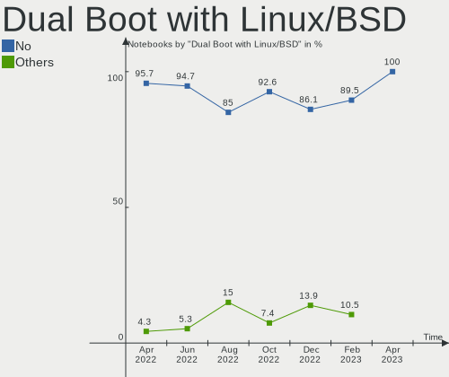
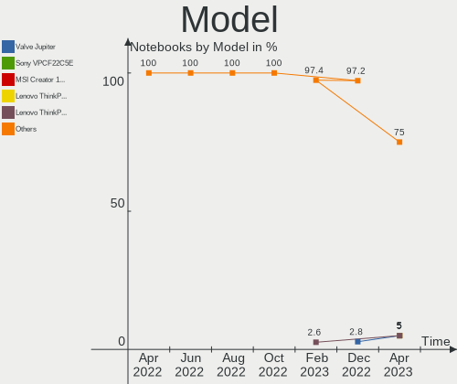
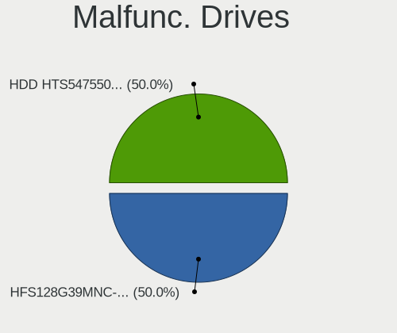
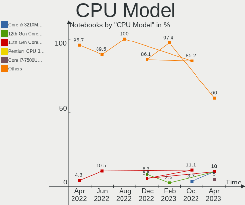
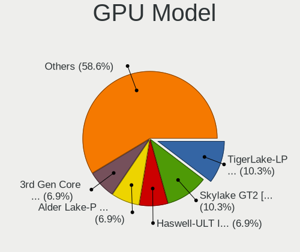
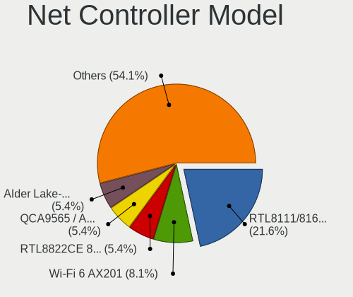
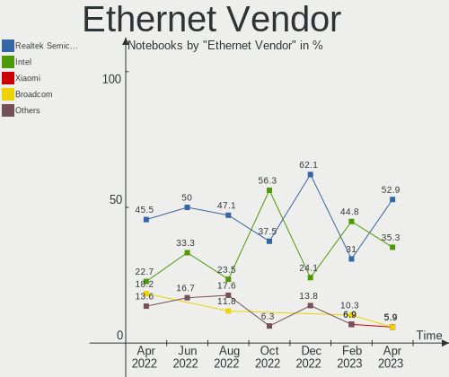
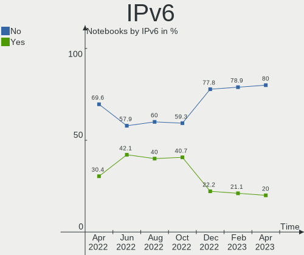
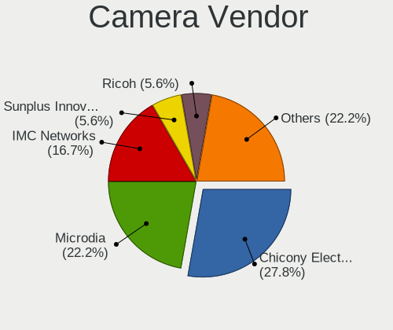
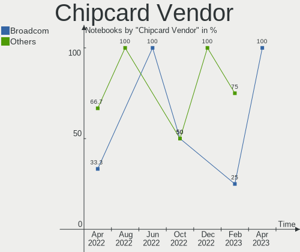

Linux in Switzerland - Hardware Trends (Notebooks)
--------------------------------------------------

A project to identify most popular hardware characteristics and track their change
over time based on data collected by Linux users at https://Linux-Hardware.org.

Anyone can contribute to this report by the [hw-probe](https://github.com/linuxhw/hw-probe) tool:

    sudo -E hw-probe -all -upload

Period: Apr, 2023.

Contents
--------

* [ System ](#system)
  - [ OS                       ](#os)
  - [ OS Family                ](#os-family)
  - [ Kernel                   ](#kernel)
  - [ Kernel Family            ](#kernel-family)
  - [ Kernel Major Ver.        ](#kernel-major-ver)
  - [ Arch                     ](#arch)
  - [ DE                       ](#de)
  - [ Display Server           ](#display-server)
  - [ Display Manager          ](#display-manager)
  - [ OS Lang                  ](#os-lang)
  - [ Boot Mode                ](#boot-mode)
  - [ Filesystem               ](#filesystem)
  - [ Part. scheme             ](#part-scheme)
  - [ Dual Boot with Linux/BSD ](#dual-boot-with-linuxbsd)
  - [ Dual Boot (Win)          ](#dual-boot-win)

* [ Board ](#board)
  - [ Vendor                   ](#vendor)
  - [ Model                    ](#model)
  - [ Model Family             ](#model-family)
  - [ MFG Year                 ](#mfg-year)
  - [ Form Factor              ](#form-factor)
  - [ Secure Boot              ](#secure-boot)
  - [ Coreboot                 ](#coreboot)
  - [ RAM Size                 ](#ram-size)
  - [ RAM Used                 ](#ram-used)
  - [ Total Drives             ](#total-drives)
  - [ Has CD-ROM               ](#has-cd-rom)
  - [ Has Ethernet             ](#has-ethernet)
  - [ Has WiFi                 ](#has-wifi)
  - [ Has Bluetooth            ](#has-bluetooth)

* [ Location ](#location)
  - [ Country                  ](#country)
  - [ City                     ](#city)

* [ Drives ](#drives)
  - [ Drive Vendor             ](#drive-vendor)
  - [ Drive Model              ](#drive-model)
  - [ HDD Vendor               ](#hdd-vendor)
  - [ SSD Vendor               ](#ssd-vendor)
  - [ Drive Kind               ](#drive-kind)
  - [ Drive Connector          ](#drive-connector)
  - [ Drive Size               ](#drive-size)
  - [ Space Total              ](#space-total)
  - [ Space Used               ](#space-used)
  - [ Malfunc. Drives          ](#malfunc-drives)
  - [ Malfunc. Drive Vendor    ](#malfunc-drive-vendor)
  - [ Malfunc. HDD Vendor      ](#malfunc-hdd-vendor)
  - [ Malfunc. Drive Kind      ](#malfunc-drive-kind)
  - [ Failed Drives            ](#failed-drives)
  - [ Failed Drive Vendor      ](#failed-drive-vendor)
  - [ Drive Status             ](#drive-status)

* [ Storage controller ](#storage-controller)
  - [ Storage Vendor           ](#storage-vendor)
  - [ Storage Model            ](#storage-model)
  - [ Storage Kind             ](#storage-kind)

* [ Processor ](#processor)
  - [ CPU Vendor               ](#cpu-vendor)
  - [ CPU Model                ](#cpu-model)
  - [ CPU Model Family         ](#cpu-model-family)
  - [ CPU Cores                ](#cpu-cores)
  - [ CPU Sockets              ](#cpu-sockets)
  - [ CPU Threads              ](#cpu-threads)
  - [ CPU Op-Modes             ](#cpu-op-modes)
  - [ CPU Microcode            ](#cpu-microcode)
  - [ CPU Microarch            ](#cpu-microarch)

* [ Graphics ](#graphics)
  - [ GPU Vendor               ](#gpu-vendor)
  - [ GPU Model                ](#gpu-model)
  - [ GPU Combo                ](#gpu-combo)
  - [ GPU Driver               ](#gpu-driver)
  - [ GPU Memory               ](#gpu-memory)

* [ Monitor ](#monitor)
  - [ Monitor Vendor           ](#monitor-vendor)
  - [ Monitor Model            ](#monitor-model)
  - [ Monitor Resolution       ](#monitor-resolution)
  - [ Monitor Diagonal         ](#monitor-diagonal)
  - [ Monitor Width            ](#monitor-width)
  - [ Aspect Ratio             ](#aspect-ratio)
  - [ Monitor Area             ](#monitor-area)
  - [ Pixel Density            ](#pixel-density)
  - [ Multiple Monitors        ](#multiple-monitors)

* [ Network ](#network)
  - [ Net Controller Vendor    ](#net-controller-vendor)
  - [ Net Controller Model     ](#net-controller-model)
  - [ Wireless Vendor          ](#wireless-vendor)
  - [ Wireless Model           ](#wireless-model)
  - [ Ethernet Vendor          ](#ethernet-vendor)
  - [ Ethernet Model           ](#ethernet-model)
  - [ Net Controller Kind      ](#net-controller-kind)
  - [ Used Controller          ](#used-controller)
  - [ NICs                     ](#nics)
  - [ IPv6                     ](#ipv6)

* [ Bluetooth ](#bluetooth)
  - [ Bluetooth Vendor         ](#bluetooth-vendor)
  - [ Bluetooth Model          ](#bluetooth-model)

* [ Sound ](#sound)
  - [ Sound Vendor             ](#sound-vendor)
  - [ Sound Model              ](#sound-model)

* [ Memory ](#memory)
  - [ Memory Vendor            ](#memory-vendor)
  - [ Memory Model             ](#memory-model)
  - [ Memory Kind              ](#memory-kind)
  - [ Memory Form Factor       ](#memory-form-factor)
  - [ Memory Size              ](#memory-size)
  - [ Memory Speed             ](#memory-speed)

* [ Printers & scanners ](#printers--scanners)
  - [ Printer Vendor           ](#printer-vendor)
  - [ Printer Model            ](#printer-model)
  - [ Scanner Vendor           ](#scanner-vendor)
  - [ Scanner Model            ](#scanner-model)

* [ Camera ](#camera)
  - [ Camera Vendor            ](#camera-vendor)
  - [ Camera Model             ](#camera-model)

* [ Security ](#security)
  - [ Fingerprint Vendor       ](#fingerprint-vendor)
  - [ Fingerprint Model        ](#fingerprint-model)
  - [ Chipcard Vendor          ](#chipcard-vendor)
  - [ Chipcard Model           ](#chipcard-model)

* [ Unsupported ](#unsupported)
  - [ Unsupported Devices      ](#unsupported-devices)
  - [ Unsupported Device Types ](#unsupported-device-types)

System
------

OS
--

Installed operating systems

| Name               | Notebooks | Percent |
|--------------------|-----------|---------|
| Ubuntu 22.10       | 2         | 10%     |
| Ubuntu 20.04       | 2         | 10%     |
| OpenMandriva 23.03 | 2         | 10%     |
| Fedora 37          | 2         | 10%     |
| Zorin 16           | 1         | 5%      |
| Ubuntu 23.04       | 1         | 5%      |
| Ubuntu 22.04       | 1         | 5%      |
| TUXEDO OS 22.04    | 1         | 5%      |
| SteamOS 3.4.6      | 1         | 5%      |
| Pop!_OS 22.04      | 1         | 5%      |
| Parrot 5.3         | 1         | 5%      |
| OpenMandriva 22.90 | 1         | 5%      |
| Manjaro            | 1         | 5%      |
| Linux Mint 21.1    | 1         | 5%      |
| Fedora 38          | 1         | 5%      |
| Debian 11          | 1         | 5%      |

OS Family
---------

OS without a version

| Name         | Notebooks | Percent |
|--------------|-----------|---------|
| Ubuntu       | 6         | 30%     |
| OpenMandriva | 3         | 15%     |
| Fedora       | 3         | 15%     |
| Zorin        | 1         | 5%      |
| TUXEDO OS    | 1         | 5%      |
| SteamOS      | 1         | 5%      |
| Pop!_OS      | 1         | 5%      |
| Parrot       | 1         | 5%      |
| Manjaro      | 1         | 5%      |
| Linux Mint   | 1         | 5%      |
| Debian       | 1         | 5%      |

Kernel
------

Version of the Linux kernel

| Version                  | Notebooks | Percent |
|--------------------------|-----------|---------|
| 5.15.0-69-generic        | 4         | 20%     |
| 6.2.6-desktop-1omv2390   | 2         | 10%     |
| 5.19.0-38-generic        | 2         | 10%     |
| 6.2.8-200.fc37.x86_64    | 1         | 5%      |
| 6.2.12-300.fc38.x86_64   | 1         | 5%      |
| 6.2.12-1-MANJARO         | 1         | 5%      |
| 6.2.11-200.fc37.x86_64   | 1         | 5%      |
| 6.2.0-20-generic         | 1         | 5%      |
| 6.2.0-10005-tuxedo       | 1         | 5%      |
| 6.1.0-1parrot1-amd64     | 1         | 5%      |
| 6.0.7-desktop-2omv22090  | 1         | 5%      |
| 6.0.12-76060006-generic  | 1         | 5%      |
| 5.15.0-71-generic        | 1         | 5%      |
| 5.13.0-valve36-1-neptune | 1         | 5%      |
| 5.10.0-21-amd64          | 1         | 5%      |

Kernel Family
-------------

Linux kernel without a distro release

| Version | Notebooks | Percent |
|---------|-----------|---------|
| 5.15.0  | 5         | 25%     |
| 6.2.6   | 2         | 10%     |
| 6.2.12  | 2         | 10%     |
| 6.2.0   | 2         | 10%     |
| 5.19.0  | 2         | 10%     |
| 6.2.8   | 1         | 5%      |
| 6.2.11  | 1         | 5%      |
| 6.1.0   | 1         | 5%      |
| 6.0.7   | 1         | 5%      |
| 6.0.12  | 1         | 5%      |
| 5.13.0  | 1         | 5%      |
| 5.10.0  | 1         | 5%      |

Kernel Major Ver.
-----------------

Linux kernel major version

| Version | Notebooks | Percent |
|---------|-----------|---------|
| 6.2     | 8         | 40%     |
| 5.15    | 5         | 25%     |
| 6.0     | 2         | 10%     |
| 5.19    | 2         | 10%     |
| 6.1     | 1         | 5%      |
| 5.13    | 1         | 5%      |
| 5.10    | 1         | 5%      |

Arch
----

OS architecture (x86_64, i586, etc.)

| Name   | Notebooks | Percent |
|--------|-----------|---------|
| x86_64 | 20        | 100%    |

DE
--

Desktop Environment

| Name       | Notebooks | Percent |
|------------|-----------|---------|
| KDE5       | 8         | 40%     |
| GNOME      | 8         | 40%     |
| X-Cinnamon | 1         | 5%      |
| MATE       | 1         | 5%      |
| LXDE       | 1         | 5%      |
| Unknown    | 1         | 5%      |

Display Server
--------------

X11 or Wayland

| Name    | Notebooks | Percent |
|---------|-----------|---------|
| X11     | 16        | 80%     |
| Wayland | 3         | 15%     |
| Unknown | 1         | 5%      |

Display Manager
---------------

SDDM, LightDM, etc.

| Name    | Notebooks | Percent |
|---------|-----------|---------|
| Unknown | 6         | 30%     |
| GDM3    | 5         | 25%     |
| SDDM    | 4         | 20%     |
| LightDM | 3         | 15%     |
| GDM     | 2         | 10%     |

OS Lang
-------

Language

| Lang  | Notebooks | Percent |
|-------|-----------|---------|
| de_CH | 9         | 45%     |
| en_US | 8         | 40%     |
| fr_CH | 2         | 10%     |
| fr_FR | 1         | 5%      |

Boot Mode
---------

EFI or BIOS

| Mode | Notebooks | Percent |
|------|-----------|---------|
| EFI  | 12        | 60%     |
| BIOS | 8         | 40%     |

Filesystem
----------

Type of filesystem

| Type  | Notebooks | Percent |
|-------|-----------|---------|
| Ext4  | 12        | 60%     |
| Btrfs | 6         | 30%     |
| Tmpfs | 2         | 10%     |

Part. scheme
------------

Scheme of partitioning

| Type    | Notebooks | Percent |
|---------|-----------|---------|
| GPT     | 13        | 65%     |
| Unknown | 6         | 30%     |
| MBR     | 1         | 5%      |

Dual Boot with Linux/BSD
------------------------

Hosting more than one Linux/BSD

| Dual boot | Notebooks | Percent |
|-----------|-----------|---------|
| No        | 20        | 100%    |

Dual Boot (Win)
---------------

Hosting Linux and Windows

| Dual boot | Notebooks | Percent |
|-----------|-----------|---------|
| No        | 15        | 75%     |
| Yes       | 5         | 25%     |

Board
-----

Vendor
------

Motherboard manufacturer

| Name             | Notebooks | Percent |
|------------------|-----------|---------|
| Dell             | 5         | 25%     |
| Lenovo           | 3         | 15%     |
| Hewlett-Packard  | 3         | 15%     |
| ASUSTek Computer | 3         | 15%     |
| Apple            | 2         | 10%     |
| Valve            | 1         | 5%      |
| Sony             | 1         | 5%      |
| MSI              | 1         | 5%      |
| Acer             | 1         | 5%      |

Model
-----

Motherboard model

| Name                                      | Notebooks | Percent |
|-------------------------------------------|-----------|---------|
| Valve Jupiter                             | 1         | 5%      |
| Sony VPCF22C5E                            | 1         | 5%      |
| MSI Creator 15 A10SGS                     | 1         | 5%      |
| Lenovo ThinkPad T420 4180MG1              | 1         | 5%      |
| Lenovo ThinkPad P50s 20FKS0A300           | 1         | 5%      |
| Lenovo ThinkPad E14 Gen 2 20TA000FMZ      | 1         | 5%      |
| HP ProBook 4540s                          | 1         | 5%      |
| HP OMEN by Laptop 16-b1xxx                | 1         | 5%      |
| HP EliteBook 820 G1                       | 1         | 5%      |
| Dell XPS 17 9720                          | 1         | 5%      |
| Dell XPS 13 9350                          | 1         | 5%      |
| Dell Vostro 3558                          | 1         | 5%      |
| Dell Latitude 7530                        | 1         | 5%      |
| Dell Latitude 5520                        | 1         | 5%      |
| ASUS X756UJ                               | 1         | 5%      |
| ASUS ASUS TUF Gaming A15 FA506II_FA506II  | 1         | 5%      |
| ASUS ASUS EXPERTBOOK B1400CEAEY_B1400CEAE | 1         | 5%      |
| Apple MacBookPro9,2                       | 1         | 5%      |
| Apple MacBookAir6,1                       | 1         | 5%      |
| Acer Aspire E5-575G                       | 1         | 5%      |

Model Family
------------

Motherboard model prefix

| Name              | Notebooks | Percent |
|-------------------|-----------|---------|
| Lenovo ThinkPad   | 3         | 15%     |
| Dell XPS          | 2         | 10%     |
| Dell Latitude     | 2         | 10%     |
| ASUS ASUS         | 2         | 10%     |
| Valve Jupiter     | 1         | 5%      |
| Sony VPCF22C5E    | 1         | 5%      |
| MSI Creator       | 1         | 5%      |
| HP ProBook        | 1         | 5%      |
| HP OMEN           | 1         | 5%      |
| HP EliteBook      | 1         | 5%      |
| Dell Vostro       | 1         | 5%      |
| ASUS X756UJ       | 1         | 5%      |
| Apple MacBookPro9 | 1         | 5%      |
| Apple MacBookAir6 | 1         | 5%      |
| Acer Aspire       | 1         | 5%      |

MFG Year
--------

Motherboard manufacture year

| Year | Notebooks | Percent |
|------|-----------|---------|
| 2022 | 4         | 20%     |
| 2020 | 4         | 20%     |
| 2016 | 3         | 15%     |
| 2015 | 2         | 10%     |
| 2013 | 2         | 10%     |
| 2012 | 2         | 10%     |
| 2011 | 2         | 10%     |
| 2021 | 1         | 5%      |

Form Factor
-----------

Physical design of the computer

| Name     | Notebooks | Percent |
|----------|-----------|---------|
| Notebook | 20        | 100%    |

Secure Boot
-----------

Enabled or disabled

| State    | Notebooks | Percent |
|----------|-----------|---------|
| Disabled | 18        | 90%     |
| Enabled  | 2         | 10%     |

Coreboot
--------

Have coreboot on board

| Used | Notebooks | Percent |
|------|-----------|---------|
| No   | 20        | 100%    |

RAM Size
--------

Total RAM memory

| Size in GB | Notebooks | Percent |
|------------|-----------|---------|
| 16.01-24.0 | 6         | 30%     |
| 4.01-8.0   | 4         | 20%     |
| 3.01-4.0   | 4         | 20%     |
| 8.01-16.0  | 4         | 20%     |
| 32.01-64.0 | 2         | 10%     |

RAM Used
--------

Used RAM memory

| Used GB   | Notebooks | Percent |
|-----------|-----------|---------|
| 2.01-3.0  | 7         | 35%     |
| 1.01-2.0  | 6         | 30%     |
| 4.01-8.0  | 3         | 15%     |
| 8.01-16.0 | 3         | 15%     |
| 3.01-4.0  | 1         | 5%      |

Total Drives
------------

Number of drives on board

| Drives | Notebooks | Percent |
|--------|-----------|---------|
| 1      | 16        | 80%     |
| 2      | 3         | 15%     |
| 3      | 1         | 5%      |

Has CD-ROM
----------

Has CD-ROM on board

| Presented | Notebooks | Percent |
|-----------|-----------|---------|
| No        | 14        | 70%     |
| Yes       | 6         | 30%     |

Has Ethernet
------------

Has Ethernet on board

| Presented | Notebooks | Percent |
|-----------|-----------|---------|
| Yes       | 17        | 85%     |
| No        | 3         | 15%     |

Has WiFi
--------

Has WiFi module

| Presented | Notebooks | Percent |
|-----------|-----------|---------|
| Yes       | 20        | 100%    |

Has Bluetooth
-------------

Has Bluetooth module

| Presented | Notebooks | Percent |
|-----------|-----------|---------|
| Yes       | 20        | 100%    |

Location
--------

Country
-------

Geographic location (country)

| Country     | Notebooks | Percent |
|-------------|-----------|---------|
| Switzerland | 20        | 100%    |

City
----

Geographic location (city)

| City               | Notebooks | Percent |
|--------------------|-----------|---------|
| Zurich             | 6         | 30%     |
| Winterthur         | 1         | 5%      |
| Siggenthal Station | 1         | 5%      |
| Muttenz            | 1         | 5%      |
| Lugano             | 1         | 5%      |
| Lovens             | 1         | 5%      |
| Liebefeld          | 1         | 5%      |
| Lausen             | 1         | 5%      |
| Herisau            | 1         | 5%      |
| Geneva             | 1         | 5%      |
| Dubendorf          | 1         | 5%      |
| Diepoldsau         | 1         | 5%      |
| Cernier            | 1         | 5%      |
| Bern               | 1         | 5%      |
| Aarburg            | 1         | 5%      |

Drives
------

Drive Vendor
------------

Hard drive vendors

| Vendor              | Notebooks | Drives | Percent |
|---------------------|-----------|--------|---------|
| Samsung Electronics | 7         | 7      | 29.17%  |
| Toshiba             | 3         | 3      | 12.5%   |
| WDC                 | 2         | 2      | 8.33%   |
| Phison Electronics  | 2         | 2      | 8.33%   |
| Kingston            | 2         | 2      | 8.33%   |
| Apple               | 2         | 2      | 8.33%   |
| Unknown             | 1         | 1      | 4.17%   |
| SK hynix            | 1         | 1      | 4.17%   |
| Sandisk             | 1         | 2      | 4.17%   |
| Intenso             | 1         | 1      | 4.17%   |
| Dogfish             | 1         | 1      | 4.17%   |
| Crucial             | 1         | 1      | 4.17%   |

Drive Model
-----------

Hard drive models

| Model                                              | Notebooks | Percent |
|----------------------------------------------------|-----------|---------|
| Samsung SSD 860 EVO 1TB                            | 2         | 8%      |
| Samsung NVMe SSD Controller PM9A1/PM9A3/980PRO 2TB | 2         | 8%      |
| WDC PC SN730 SDBPNTY-1T00-1032 1TB                 | 1         | 4%      |
| WDC PC SN530 SDBPNPZ-512G-1002 512GB               | 1         | 4%      |
| Unknown MMC Card  256GB                            | 1         | 4%      |
| Toshiba THNSNK128GVN8 M.2 2280 128GB SSD           | 1         | 4%      |
| Toshiba MK5061GSY 500GB                            | 1         | 4%      |
| Toshiba KXG6AZNV1T02 1TB                           | 1         | 4%      |
| SK hynix HFS128G39MNC-2300A 128GB SSD              | 1         | 4%      |
| Sandisk WD_BLACK SN850X 1000GB                     | 1         | 4%      |
| Sandisk WD Black SN850 1TB                         | 1         | 4%      |
| Samsung PSSD T7 500GB                              | 1         | 4%      |
| Samsung NVMe SSD Controller SM981/PM981/PM983 1TB  | 1         | 4%      |
| Samsung MZ7LN512HMJP-000L7 512GB SSD               | 1         | 4%      |
| Phison PS5013 E13 NVMe Controller 500GB            | 1         | 4%      |
| Phison E16 PCIe4 NVMe Controller 500GB             | 1         | 4%      |
| Kingston SA400S37240G 240GB SSD                    | 1         | 4%      |
| Kingston OM8PCP3512F-AB 512GB                      | 1         | 4%      |
| Intenso SSD Sata III 128GB                         | 1         | 4%      |
| Dogfish SSD 500GB                                  | 1         | 4%      |
| Crucial CT250MX500SSD1 250GB                       | 1         | 4%      |
| Apple SSD SD0128F 121GB                            | 1         | 4%      |
| Apple HDD HTS547550A9E384 500GB                    | 1         | 4%      |

HDD Vendor
----------

Hard disk drive vendors

| Vendor  | Notebooks | Drives | Percent |
|---------|-----------|--------|---------|
| Toshiba | 1         | 1      | 50%     |
| Apple   | 1         | 1      | 50%     |

SSD Vendor
----------

Solid state drive vendors

| Vendor              | Notebooks | Drives | Percent |
|---------------------|-----------|--------|---------|
| Samsung Electronics | 4         | 4      | 36.36%  |
| Toshiba             | 1         | 1      | 9.09%   |
| SK hynix            | 1         | 1      | 9.09%   |
| Kingston            | 1         | 1      | 9.09%   |
| Intenso             | 1         | 1      | 9.09%   |
| Dogfish             | 1         | 1      | 9.09%   |
| Crucial             | 1         | 1      | 9.09%   |
| Apple               | 1         | 1      | 9.09%   |

Drive Kind
----------

HDD or SSD

| Kind | Notebooks | Drives | Percent |
|------|-----------|--------|---------|
| SSD  | 10        | 11     | 45.45%  |
| NVMe | 9         | 11     | 40.91%  |
| HDD  | 2         | 2      | 9.09%   |
| MMC  | 1         | 1      | 4.55%   |

Drive Connector
---------------

SATA, SAS, NVMe, etc.

| Type | Notebooks | Drives | Percent |
|------|-----------|--------|---------|
| SATA | 11        | 12     | 50%     |
| NVMe | 9         | 11     | 40.91%  |
| SAS  | 1         | 1      | 4.55%   |
| MMC  | 1         | 1      | 4.55%   |

Drive Size
----------

Size of hard drive

| Size in TB | Notebooks | Drives | Percent |
|------------|-----------|--------|---------|
| 0.01-0.5   | 9         | 10     | 75%     |
| 0.51-1.0   | 3         | 3      | 25%     |

Space Total
-----------

Amount of disk space available on the file system

| Size in GB | Notebooks | Percent |
|------------|-----------|---------|
| 251-500    | 7         | 35%     |
| 501-1000   | 5         | 25%     |
| 101-250    | 4         | 20%     |
| 1001-2000  | 2         | 10%     |
| 1-20       | 1         | 5%      |
| Unknown    | 1         | 5%      |

Space Used
----------

Amount of used disk space

| Used GB   | Notebooks | Percent |
|-----------|-----------|---------|
| 1-20      | 8         | 40%     |
| 251-500   | 3         | 15%     |
| 21-50     | 3         | 15%     |
| 101-250   | 3         | 15%     |
| 1001-2000 | 1         | 5%      |
| 501-1000  | 1         | 5%      |
| Unknown   | 1         | 5%      |

Malfunc. Drives
---------------

Drive models with a malfunction

| Model                                 | Notebooks | Drives | Percent |
|---------------------------------------|-----------|--------|---------|
| SK hynix HFS128G39MNC-2300A 128GB SSD | 1         | 1      | 50%     |
| Apple HDD HTS547550A9E384 500GB       | 1         | 1      | 50%     |

Malfunc. Drive Vendor
---------------------

Vendors of faulty drives

| Vendor   | Notebooks | Drives | Percent |
|----------|-----------|--------|---------|
| SK hynix | 1         | 1      | 50%     |
| Apple    | 1         | 1      | 50%     |

Malfunc. HDD Vendor
-------------------

Vendors of faulty HDD drives

| Vendor | Notebooks | Drives | Percent |
|--------|-----------|--------|---------|
| Apple  | 1         | 1      | 100%    |

Malfunc. Drive Kind
-------------------

Kinds of faulty drives

| Kind | Notebooks | Drives | Percent |
|------|-----------|--------|---------|
| SSD  | 1         | 1      | 50%     |
| HDD  | 1         | 1      | 50%     |

Failed Drives
-------------

Failed drive models

Zero info for selected period =(

Failed Drive Vendor
-------------------

Failed drive vendors

Zero info for selected period =(

Drive Status
------------

Number of failed and malfunc. drives

| Status   | Notebooks | Drives | Percent |
|----------|-----------|--------|---------|
| Detected | 11        | 14     | 52.38%  |
| Works    | 8         | 9      | 38.1%   |
| Malfunc  | 2         | 2      | 9.52%   |

Storage controller
------------------

Storage Vendor
--------------

Storage controller vendors

| Vendor                       | Notebooks | Percent |
|------------------------------|-----------|---------|
| Intel                        | 11        | 47.83%  |
| SanDisk                      | 3         | 13.04%  |
| Samsung Electronics          | 3         | 13.04%  |
| Phison Electronics           | 2         | 8.7%    |
| Toshiba America Info Systems | 1         | 4.35%   |
| Marvell Technology Group     | 1         | 4.35%   |
| Kingston Technology Company  | 1         | 4.35%   |
| AMD                          | 1         | 4.35%   |

Storage Model
-------------

Storage controller models

| Model                                                                        | Notebooks | Percent |
|------------------------------------------------------------------------------|-----------|---------|
| Intel Sunrise Point-LP SATA Controller [AHCI mode]                           | 3         | 12%     |
| Samsung NVMe SSD Controller PM9A1/PM9A3/980PRO                               | 2         | 8%      |
| Intel 7 Series Chipset Family 6-port SATA Controller [AHCI mode]             | 2         | 8%      |
| Intel 6 Series/C200 Series Chipset Family 6 port Mobile SATA AHCI Controller | 2         | 8%      |
| Toshiba America Info Systems XG6 NVMe SSD Controller                         | 1         | 4%      |
| Sandisk Western Digital WD Black SN850X NVMe SSD                             | 1         | 4%      |
| SanDisk WD PC SN810 / Black SN850 NVMe SSD                                   | 1         | 4%      |
| SanDisk WD Blue SN550 NVMe SSD                                               | 1         | 4%      |
| SanDisk WD Black SN750 / PC SN730 NVMe SSD                                   | 1         | 4%      |
| Samsung NVMe SSD Controller SM981/PM981/PM983                                | 1         | 4%      |
| Phison PS5013 E13 NVMe Controller                                            | 1         | 4%      |
| Phison E16 PCIe4 NVMe Controller                                             | 1         | 4%      |
| Marvell Group 88SS9183 PCIe SSD Controller                                   | 1         | 4%      |
| Kingston Company Company Non-Volatile memory controller                      | 1         | 4%      |
| Intel Wildcat Point-LP SATA Controller [AHCI Mode]                           | 1         | 4%      |
| Intel Volume Management Device NVMe RAID Controller                          | 1         | 4%      |
| Intel Tiger Lake-LP SATA Controller                                          | 1         | 4%      |
| Intel 82801 Mobile SATA Controller [RAID mode]                               | 1         | 4%      |
| Intel 8 Series SATA Controller 1 [AHCI mode]                                 | 1         | 4%      |
| AMD FCH SATA Controller [AHCI mode]                                          | 1         | 4%      |

Storage Kind
------------

Kind of storage controller (IDE, SATA, NVMe, SAS, ...)

| Kind | Notebooks | Percent |
|------|-----------|---------|
| SATA | 12        | 52.17%  |
| NVMe | 9         | 39.13%  |
| RAID | 2         | 8.7%    |

Processor
---------

CPU Vendor
----------

Processor vendors

| Vendor | Notebooks | Percent |
|--------|-----------|---------|
| Intel  | 18        | 90%     |
| AMD    | 2         | 10%     |

CPU Model
---------

Processor models

| Model                                   | Notebooks | Percent |
|-----------------------------------------|-----------|---------|
| Intel Core i5-3210M CPU @ 2.50GHz       | 2         | 10%     |
| Intel 12th Gen Core i7-12700H           | 2         | 10%     |
| Intel 11th Gen Core i7-1165G7 @ 2.80GHz | 2         | 10%     |
| Intel Pentium CPU 3825U @ 1.90GHz       | 1         | 5%      |
| Intel Core i7-7500U CPU @ 2.70GHz       | 1         | 5%      |
| Intel Core i7-6600U CPU @ 2.60GHz       | 1         | 5%      |
| Intel Core i7-6500U CPU @ 2.50GHz       | 1         | 5%      |
| Intel Core i7-2640M CPU @ 2.80GHz       | 1         | 5%      |
| Intel Core i7-2630QM CPU @ 2.00GHz      | 1         | 5%      |
| Intel Core i7-10875H CPU @ 2.30GHz      | 1         | 5%      |
| Intel Core i5-6200U CPU @ 2.30GHz       | 1         | 5%      |
| Intel Core i5-4300U CPU @ 1.90GHz       | 1         | 5%      |
| Intel Core i5-4250U CPU @ 1.30GHz       | 1         | 5%      |
| Intel 12th Gen Core i7-1255U            | 1         | 5%      |
| Intel 11th Gen Core i7-1185G7 @ 3.00GHz | 1         | 5%      |
| AMD Ryzen 7 4800H with Radeon Graphics  | 1         | 5%      |
| AMD Custom APU 0405                     | 1         | 5%      |

CPU Model Family
----------------

Processor model prefix

| Model         | Notebooks | Percent |
|---------------|-----------|---------|
| Other         | 7         | 35%     |
| Intel Core i7 | 6         | 30%     |
| Intel Core i5 | 5         | 25%     |
| Intel Pentium | 1         | 5%      |
| AMD Ryzen 7   | 1         | 5%      |

CPU Cores
---------

Number of processor cores

| Number | Notebooks | Percent |
|--------|-----------|---------|
| 2      | 10        | 50%     |
| 4      | 5         | 25%     |
| 14     | 2         | 10%     |
| 8      | 2         | 10%     |
| 10     | 1         | 5%      |

CPU Sockets
-----------

Number of sockets

| Number | Notebooks | Percent |
|--------|-----------|---------|
| 1      | 20        | 100%    |

CPU Threads
-----------

Threads per core (Hyper-Threading)

| Number | Notebooks | Percent |
|--------|-----------|---------|
| 2      | 20        | 100%    |

CPU Op-Modes
------------

CPU Operation Modes (32-bit, 64-bit)

| Op mode        | Notebooks | Percent |
|----------------|-----------|---------|
| 32-bit, 64-bit | 20        | 100%    |

CPU Microcode
-------------

Microcode number

| Number  | Notebooks | Percent |
|---------|-----------|---------|
| Unknown | 14        | 70%     |
| 0x806c1 | 2         | 10%     |
| 0x40651 | 2         | 10%     |
| 0x306a9 | 1         | 5%      |
| 0x206a7 | 1         | 5%      |

CPU Microarch
-------------

Microarchitecture

| Name             | Notebooks | Percent |
|------------------|-----------|---------|
| TigerLake        | 3         | 15%     |
| Skylake          | 3         | 15%     |
| Unknown          | 3         | 15%     |
| SandyBridge      | 2         | 10%     |
| IvyBridge        | 2         | 10%     |
| Haswell          | 2         | 10%     |
| Zen 2            | 1         | 5%      |
| KabyLake         | 1         | 5%      |
| CometLake        | 1         | 5%      |
| Broadwell        | 1         | 5%      |
| Alderlake Hybrid | 1         | 5%      |

Graphics
--------

GPU Vendor
----------

Vendors of graphics cards

| Vendor | Notebooks | Percent |
|--------|-----------|---------|
| Intel  | 17        | 58.62%  |
| Nvidia | 9         | 31.03%  |
| AMD    | 3         | 10.34%  |

GPU Model
---------

Graphics card models

| Model                                                                     | Notebooks | Percent |
|---------------------------------------------------------------------------|-----------|---------|
| Intel TigerLake-LP GT2 [Iris Xe Graphics]                                 | 3         | 10.34%  |
| Intel Skylake GT2 [HD Graphics 520]                                       | 3         | 10.34%  |
| Intel Haswell-ULT Integrated Graphics Controller                          | 2         | 6.9%    |
| Intel Alder Lake-P Integrated Graphics Controller                         | 2         | 6.9%    |
| Intel 3rd Gen Core processor Graphics Controller                          | 2         | 6.9%    |
| Nvidia TU117M [GeForce GTX 1650 Ti Mobile]                                | 1         | 3.45%   |
| Nvidia TU104M [GeForce RTX 2080 SUPER Mobile / Max-Q]                     | 1         | 3.45%   |
| Nvidia GM108GLM [Quadro K620M / Quadro M500M]                             | 1         | 3.45%   |
| Nvidia GM107M [GeForce GTX 950M]                                          | 1         | 3.45%   |
| Nvidia GK208BM [GeForce 920M]                                             | 1         | 3.45%   |
| Nvidia GF119M [Quadro NVS 4200M]                                          | 1         | 3.45%   |
| Nvidia GF108M [GeForce GT 540M]                                           | 1         | 3.45%   |
| Nvidia GA107M [GeForce RTX 3050 Mobile]                                   | 1         | 3.45%   |
| Nvidia GA106M [GeForce RTX 3060 Mobile / Max-Q]                           | 1         | 3.45%   |
| Intel HD Graphics 620                                                     | 1         | 3.45%   |
| Intel HD Graphics                                                         | 1         | 3.45%   |
| Intel CometLake-H GT2 [UHD Graphics]                                      | 1         | 3.45%   |
| Intel Alder Lake-UP3 GT2 [Iris Xe Graphics]                               | 1         | 3.45%   |
| Intel 2nd Generation Core Processor Family Integrated Graphics Controller | 1         | 3.45%   |
| AMD VanGogh [AMD Custom GPU 0405]                                         | 1         | 3.45%   |
| AMD Thames [Radeon HD 7550M/7570M/7650M]                                  | 1         | 3.45%   |
| AMD Renoir                                                                | 1         | 3.45%   |

GPU Combo
---------

Combinations of graphics cards

| Name           | Notebooks | Percent |
|----------------|-----------|---------|
| 1 x Intel      | 9         | 45%     |
| Intel + Nvidia | 7         | 35%     |
| 1 x Nvidia     | 1         | 5%      |
| Intel + AMD    | 1         | 5%      |
| AMD + Nvidia   | 1         | 5%      |
| 1 x AMD        | 1         | 5%      |

GPU Driver
----------

Free vs proprietary

| Driver      | Notebooks | Percent |
|-------------|-----------|---------|
| Free        | 17        | 85%     |
| Proprietary | 3         | 15%     |

GPU Memory
----------

Total video memory

| Size in GB | Notebooks | Percent |
|------------|-----------|---------|
| Unknown    | 15        | 75%     |
| 0.51-1.0   | 2         | 10%     |
| 7.01-8.0   | 1         | 5%      |
| 5.01-6.0   | 1         | 5%      |
| 1.01-2.0   | 1         | 5%      |

Monitor
-------

Monitor Vendor
--------------

Monitor vendors

| Vendor                  | Notebooks | Percent |
|-------------------------|-----------|---------|
| BOE                     | 4         | 18.18%  |
| AU Optronics            | 4         | 18.18%  |
| Sharp                   | 3         | 13.64%  |
| Chimei Innolux          | 3         | 13.64%  |
| Apple                   | 2         | 9.09%   |
| Valve                   | 1         | 4.55%   |
| Sony                    | 1         | 4.55%   |
| PANDA                   | 1         | 4.55%   |
| LG Display              | 1         | 4.55%   |
| Dell                    | 1         | 4.55%   |
| Chi Mei Optoelectronics | 1         | 4.55%   |

Monitor Model
-------------

Monitor models

| Model                                                                     | Notebooks | Percent |
|---------------------------------------------------------------------------|-----------|---------|
| Valve ANX7530 U VLV3001 800x1280 100x150mm 7.1-inch                       | 1         | 4.55%   |
| Sony TV SNYA401 1920x1080                                                 | 1         | 4.55%   |
| Sharp LCD Monitor SHP1518 1920x1200 366x229mm 17.0-inch                   | 1         | 4.55%   |
| Sharp LCD Monitor SHP14A1 3840x2160 344x194mm 15.5-inch                   | 1         | 4.55%   |
| Sharp LCD Monitor SHP1449 1920x1080 294x165mm 13.3-inch                   | 1         | 4.55%   |
| PANDA LCD Monitor NCP004D 1920x1080 344x194mm 15.5-inch                   | 1         | 4.55%   |
| LG Display LCD Monitor LGD0395 1366x768 344x194mm 15.5-inch               | 1         | 4.55%   |
| Dell P2414H DELA09C 1920x1080 527x297mm 23.8-inch                         | 1         | 4.55%   |
| Chimei Innolux LCD Monitor CMN1735 1920x1080 381x214mm 17.2-inch          | 1         | 4.55%   |
| Chimei Innolux LCD Monitor CMN15C4 1920x1080 344x193mm 15.5-inch          | 1         | 4.55%   |
| Chimei Innolux LCD Monitor CMN14D4 1920x1080 309x173mm 13.9-inch          | 1         | 4.55%   |
| Chi Mei Optoelectronics LCD Monitor CMO1601 1920x1080 374x192mm 16.6-inch | 1         | 4.55%   |
| BOE LCD Monitor BOE0AAE 1920x1080 355x200mm 16.0-inch                     | 1         | 4.55%   |
| BOE LCD Monitor BOE0928 1920x1080 344x194mm 15.5-inch                     | 1         | 4.55%   |
| BOE LCD Monitor BOE0630 1920x1080 344x194mm 15.5-inch                     | 1         | 4.55%   |
| BOE LCD Monitor BOE0620 1366x768 344x194mm 15.5-inch                      | 1         | 4.55%   |
| AU Optronics LCD Monitor AUO4599 1920x1080 344x194mm 15.5-inch            | 1         | 4.55%   |
| AU Optronics LCD Monitor AUO403D 1920x1080 309x174mm 14.0-inch            | 1         | 4.55%   |
| AU Optronics LCD Monitor AUO213E 1600x900 309x174mm 14.0-inch             | 1         | 4.55%   |
| AU Optronics LCD Monitor AUO206C 1366x768 277x156mm 12.5-inch             | 1         | 4.55%   |
| Apple LCD Monitor APP9CCB 1280x800 286x179mm 13.3-inch                    | 1         | 4.55%   |
| Apple Color LCD APP9CF2 1366x768 256x144mm 11.6-inch                      | 1         | 4.55%   |

Monitor Resolution
------------------

Monitor screen resolution

| Resolution        | Notebooks | Percent |
|-------------------|-----------|---------|
| 1920x1080 (FHD)   | 12        | 57.14%  |
| 1366x768 (WXGA)   | 4         | 19.05%  |
| 800x1280          | 1         | 4.76%   |
| 3840x2160 (4K)    | 1         | 4.76%   |
| 1920x1200 (WUXGA) | 1         | 4.76%   |
| 1600x900 (HD+)    | 1         | 4.76%   |
| 1280x800 (WXGA)   | 1         | 4.76%   |

Monitor Diagonal
----------------

Diagonal size in inches

| Inches | Notebooks | Percent |
|--------|-----------|---------|
| 15     | 8         | 36.36%  |
| 13     | 3         | 13.64%  |
| 17     | 2         | 9.09%   |
| 16     | 2         | 9.09%   |
| 14     | 2         | 9.09%   |
| 72     | 1         | 4.55%   |
| 24     | 1         | 4.55%   |
| 12     | 1         | 4.55%   |
| 11     | 1         | 4.55%   |
| 7      | 1         | 4.55%   |

Monitor Width
-------------

Physical width

| Width in mm | Notebooks | Percent |
|-------------|-----------|---------|
| 301-350     | 11        | 50%     |
| 351-400     | 4         | 18.18%  |
| 201-300     | 4         | 18.18%  |
| 501-600     | 1         | 4.55%   |
| 1501-2000   | 1         | 4.55%   |
| 1-100       | 1         | 4.55%   |

Aspect Ratio
------------

Proportional relationship between the width and the height

| Ratio | Notebooks | Percent |
|-------|-----------|---------|
| 16/9  | 17        | 85%     |
| 16/10 | 2         | 10%     |
| 0.67  | 1         | 5%      |

Monitor Area
------------

Area in inch²

| Area in inch² | Notebooks | Percent |
|----------------|-----------|---------|
| 101-110        | 9         | 40.91%  |
| 81-90          | 3         | 13.64%  |
| 71-80          | 2         | 9.09%   |
| 121-130        | 2         | 9.09%   |
| More than 1000 | 1         | 4.55%   |
| 61-70          | 1         | 4.55%   |
| 51-60          | 1         | 4.55%   |
| 1-40           | 1         | 4.55%   |
| 201-250        | 1         | 4.55%   |
| 111-120        | 1         | 4.55%   |

Pixel Density
-------------

Pixels per inch

| Density       | Notebooks | Percent |
|---------------|-----------|---------|
| 121-160       | 14        | 63.64%  |
| 101-120       | 3         | 13.64%  |
| 161-240       | 2         | 9.09%   |
| More than 240 | 1         | 4.55%   |
| 1-50          | 1         | 4.55%   |
| 51-100        | 1         | 4.55%   |

Multiple Monitors
-----------------

Total monitors connected

| Total | Notebooks | Percent |
|-------|-----------|---------|
| 1     | 18        | 90%     |
| 2     | 2         | 10%     |

Network
-------

Net Controller Vendor
---------------------

Controller vendors

| Vendor                | Notebooks | Percent |
|-----------------------|-----------|---------|
| Realtek Semiconductor | 10        | 34.48%  |
| Intel                 | 10        | 34.48%  |
| Qualcomm Atheros      | 4         | 13.79%  |
| Broadcom              | 2         | 6.9%    |
| Xiaomi                | 1         | 3.45%   |
| MediaTek              | 1         | 3.45%   |
| Broadcom Limited      | 1         | 3.45%   |

Net Controller Model
--------------------

Controller models

| Model                                                             | Notebooks | Percent |
|-------------------------------------------------------------------|-----------|---------|
| Realtek RTL8111/8168/8411 PCI Express Gigabit Ethernet Controller | 8         | 21.62%  |
| Intel Wi-Fi 6 AX201                                               | 3         | 8.11%   |
| Realtek RTL8822CE 802.11ac PCIe Wireless Network Adapter          | 2         | 5.41%   |
| Qualcomm Atheros QCA9565 / AR9565 Wireless Network Adapter        | 2         | 5.41%   |
| Intel Alder Lake-P PCH CNVi WiFi                                  | 2         | 5.41%   |
| Xiaomi Mi/Redmi series (RNDIS)                                    | 1         | 2.7%    |
| Realtek RTL8153 Gigabit Ethernet Adapter                          | 1         | 2.7%    |
| Qualcomm Atheros QCA9377 802.11ac Wireless Network Adapter        | 1         | 2.7%    |
| Qualcomm Atheros AR9285 Wireless Network Adapter (PCI-Express)    | 1         | 2.7%    |
| MediaTek MT7921 802.11ax PCI Express Wireless Network Adapter     | 1         | 2.7%    |
| Intel Wireless 8260                                               | 1         | 2.7%    |
| Intel Wireless 7260                                               | 1         | 2.7%    |
| Intel Wireless 3160                                               | 1         | 2.7%    |
| Intel Ethernet Controller I225-V                                  | 1         | 2.7%    |
| Intel Ethernet Connection I219-LM                                 | 1         | 2.7%    |
| Intel Ethernet Connection I218-LM                                 | 1         | 2.7%    |
| Intel Ethernet Connection (13) I219-V                             | 1         | 2.7%    |
| Intel Ethernet Connection (13) I219-LM                            | 1         | 2.7%    |
| Intel Comet Lake PCH CNVi WiFi                                    | 1         | 2.7%    |
| Intel Centrino Ultimate-N 6300                                    | 1         | 2.7%    |
| Intel 82579LM Gigabit Network Connection (Lewisville)             | 1         | 2.7%    |
| Broadcom NetXtreme BCM57765 Gigabit Ethernet PCIe                 | 1         | 2.7%    |
| Broadcom Limited BCM4360 802.11ac Wireless Network Adapter        | 1         | 2.7%    |
| Broadcom BCM4350 802.11ac Wireless Network Adapter                | 1         | 2.7%    |
| Broadcom BCM4331 802.11a/b/g/n                                    | 1         | 2.7%    |

Wireless Vendor
---------------

Wireless vendors

| Vendor                | Notebooks | Percent |
|-----------------------|-----------|---------|
| Intel                 | 10        | 50%     |
| Qualcomm Atheros      | 4         | 20%     |
| Realtek Semiconductor | 2         | 10%     |
| Broadcom              | 2         | 10%     |
| MediaTek              | 1         | 5%      |
| Broadcom Limited      | 1         | 5%      |

Wireless Model
--------------

Wireless models

| Model                                                          | Notebooks | Percent |
|----------------------------------------------------------------|-----------|---------|
| Intel Wi-Fi 6 AX201                                            | 3         | 15%     |
| Realtek RTL8822CE 802.11ac PCIe Wireless Network Adapter       | 2         | 10%     |
| Qualcomm Atheros QCA9565 / AR9565 Wireless Network Adapter     | 2         | 10%     |
| Intel Alder Lake-P PCH CNVi WiFi                               | 2         | 10%     |
| Qualcomm Atheros QCA9377 802.11ac Wireless Network Adapter     | 1         | 5%      |
| Qualcomm Atheros AR9285 Wireless Network Adapter (PCI-Express) | 1         | 5%      |
| MediaTek MT7921 802.11ax PCI Express Wireless Network Adapter  | 1         | 5%      |
| Intel Wireless 8260                                            | 1         | 5%      |
| Intel Wireless 7260                                            | 1         | 5%      |
| Intel Wireless 3160                                            | 1         | 5%      |
| Intel Comet Lake PCH CNVi WiFi                                 | 1         | 5%      |
| Intel Centrino Ultimate-N 6300                                 | 1         | 5%      |
| Broadcom Limited BCM4360 802.11ac Wireless Network Adapter     | 1         | 5%      |
| Broadcom BCM4350 802.11ac Wireless Network Adapter             | 1         | 5%      |
| Broadcom BCM4331 802.11a/b/g/n                                 | 1         | 5%      |

Ethernet Vendor
---------------

Ethernet vendors

| Vendor                | Notebooks | Percent |
|-----------------------|-----------|---------|
| Realtek Semiconductor | 9         | 52.94%  |
| Intel                 | 6         | 35.29%  |
| Xiaomi                | 1         | 5.88%   |
| Broadcom              | 1         | 5.88%   |

Ethernet Model
--------------

Ethernet models

| Model                                                             | Notebooks | Percent |
|-------------------------------------------------------------------|-----------|---------|
| Realtek RTL8111/8168/8411 PCI Express Gigabit Ethernet Controller | 8         | 47.06%  |
| Xiaomi Mi/Redmi series (RNDIS)                                    | 1         | 5.88%   |
| Realtek RTL8153 Gigabit Ethernet Adapter                          | 1         | 5.88%   |
| Intel Ethernet Controller I225-V                                  | 1         | 5.88%   |
| Intel Ethernet Connection I219-LM                                 | 1         | 5.88%   |
| Intel Ethernet Connection I218-LM                                 | 1         | 5.88%   |
| Intel Ethernet Connection (13) I219-V                             | 1         | 5.88%   |
| Intel Ethernet Connection (13) I219-LM                            | 1         | 5.88%   |
| Intel 82579LM Gigabit Network Connection (Lewisville)             | 1         | 5.88%   |
| Broadcom NetXtreme BCM57765 Gigabit Ethernet PCIe                 | 1         | 5.88%   |

Net Controller Kind
-------------------

Ethernet, WiFi or modem

| Kind     | Notebooks | Percent |
|----------|-----------|---------|
| WiFi     | 20        | 54.05%  |
| Ethernet | 17        | 45.95%  |

Used Controller
---------------

Currently used network controller

| Kind     | Notebooks | Percent |
|----------|-----------|---------|
| WiFi     | 18        | 78.26%  |
| Ethernet | 5         | 21.74%  |

NICs
----

Total network controllers on board

| Total | Notebooks | Percent |
|-------|-----------|---------|
| 2     | 15        | 75%     |
| 1     | 5         | 25%     |

IPv6
----

IPv6 vs IPv4

| Used | Notebooks | Percent |
|------|-----------|---------|
| No   | 16        | 80%     |
| Yes  | 4         | 20%     |

Bluetooth
---------

Bluetooth Vendor
----------------

Controller vendors

| Vendor                          | Notebooks | Percent |
|---------------------------------|-----------|---------|
| Intel                           | 9         | 45%     |
| IMC Networks                    | 4         | 20%     |
| Qualcomm Atheros Communications | 2         | 10%     |
| Broadcom                        | 2         | 10%     |
| Apple                           | 2         | 10%     |
| Foxconn / Hon Hai               | 1         | 5%      |

Bluetooth Model
---------------

Controller models

| Model                               | Notebooks | Percent |
|-------------------------------------|-----------|---------|
| Intel AX201 Bluetooth               | 4         | 20%     |
| Intel Bluetooth wireless interface  | 3         | 15%     |
| Intel Bluetooth Device              | 2         | 10%     |
| IMC Networks Bluetooth Radio        | 2         | 10%     |
| Apple Bluetooth USB Host Controller | 2         | 10%     |
| Qualcomm Atheros AR3012 Bluetooth   | 1         | 5%      |
| Qualcomm Atheros AR3011 Bluetooth   | 1         | 5%      |
| IMC Networks Wireless_Device        | 1         | 5%      |
| IMC Networks Bluetooth Device       | 1         | 5%      |
| Foxconn / Hon Hai Bluetooth Device  | 1         | 5%      |
| Broadcom BCM2045B (BDC-2.1)         | 1         | 5%      |
| Broadcom BCM2045A0                  | 1         | 5%      |

Sound
-----

Sound Vendor
------------

Sound card vendors

| Vendor   | Notebooks | Percent |
|----------|-----------|---------|
| Intel    | 18        | 66.67%  |
| Nvidia   | 6         | 22.22%  |
| AMD      | 2         | 7.41%   |
| Logitech | 1         | 3.7%    |

Sound Model
-----------

Sound card models

| Model                                                                      | Notebooks | Percent |
|----------------------------------------------------------------------------|-----------|---------|
| Intel Sunrise Point-LP HD Audio                                            | 4         | 12.9%   |
| Intel Tiger Lake-LP Smart Sound Technology Audio Controller                | 3         | 9.68%   |
| Intel Alder Lake PCH-P High Definition Audio Controller                    | 3         | 9.68%   |
| Intel Haswell-ULT HD Audio Controller                                      | 2         | 6.45%   |
| Intel 8 Series HD Audio Controller                                         | 2         | 6.45%   |
| Intel 7 Series/C216 Chipset Family High Definition Audio Controller        | 2         | 6.45%   |
| Intel 6 Series/C200 Series Chipset Family High Definition Audio Controller | 2         | 6.45%   |
| Nvidia TU107 GeForce GTX 1650 High Definition Audio Controller             | 1         | 3.23%   |
| Nvidia TU104 HD Audio Controller                                           | 1         | 3.23%   |
| Nvidia GK208 HDMI/DP Audio Controller                                      | 1         | 3.23%   |
| Nvidia GF119 HDMI Audio Controller                                         | 1         | 3.23%   |
| Nvidia GF108 High Definition Audio Controller                              | 1         | 3.23%   |
| Nvidia GA106 High Definition Audio Controller                              | 1         | 3.23%   |
| Logitech ClearChat Pro USB                                                 | 1         | 3.23%   |
| Intel Wildcat Point-LP High Definition Audio Controller                    | 1         | 3.23%   |
| Intel Comet Lake PCH cAVS                                                  | 1         | 3.23%   |
| Intel Broadwell-U Audio Controller                                         | 1         | 3.23%   |
| AMD Renoir Radeon High Definition Audio Controller                         | 1         | 3.23%   |
| AMD Rembrandt Radeon High Definition Audio Controller                      | 1         | 3.23%   |
| AMD Family 17h/19h HD Audio Controller                                     | 1         | 3.23%   |

Memory
------

Memory Vendor
-------------

Memory module vendors

| Vendor              | Notebooks | Percent |
|---------------------|-----------|---------|
| SK hynix            | 4         | 33.33%  |
| Samsung Electronics | 3         | 25%     |
| Elpida              | 2         | 16.67%  |
| Unknown             | 1         | 8.33%   |
| Micron Technology   | 1         | 8.33%   |
| Kingston            | 1         | 8.33%   |

Memory Model
------------

Memory module models

| Model                                                     | Notebooks | Percent |
|-----------------------------------------------------------|-----------|---------|
| Elpida RAM Module 2GB SODIMM DDR3 1600MT/s                | 2         | 15.38%  |
| Unknown RAM Module 4GB SODIMM DDR3                        | 1         | 7.69%   |
| Unknown RAM Module 2GB SODIMM DDR3                        | 1         | 7.69%   |
| SK hynix RAM HMT451S6BFR8A-PB 4GB SODIMM DDR3 1600MT/s    | 1         | 7.69%   |
| SK hynix RAM HMT351S6CFR8C-H9 4096MB SODIMM DDR3 1333MT/s | 1         | 7.69%   |
| SK hynix RAM HMAB2GS6AMR6N-XN 16GB SODIMM DDR4 3200MT/s   | 1         | 7.69%   |
| SK hynix RAM HMA82GS6DJR8N-XN 16GB SODIMM DDR4 3200MT/s   | 1         | 7.69%   |
| Samsung RAM M471B5273CH0-CH9 4GB SODIMM DDR3 1334MT/s     | 1         | 7.69%   |
| Samsung RAM M471A2K43DB1-CWE 16GB SODIMM DDR4 3200MT/s    | 1         | 7.69%   |
| Samsung RAM M471A2K43CB1-CTD 16384MB SODIMM DDR4 8400MT/s | 1         | 7.69%   |
| Micron RAM 8ATF2G64HZ-3G2E2 16GB SODIMM DDR4 3200MT/s     | 1         | 7.69%   |
| Kingston RAM KNWMX1-ETB 4GB SODIMM DDR3 1600MT/s          | 1         | 7.69%   |

Memory Kind
-----------

Memory module kinds

| Kind | Notebooks | Percent |
|------|-----------|---------|
| DDR3 | 6         | 54.55%  |
| DDR4 | 5         | 45.45%  |

Memory Form Factor
------------------

Physical design of the memory module

| Name   | Notebooks | Percent |
|--------|-----------|---------|
| SODIMM | 11        | 100%    |

Memory Size
-----------

Memory module size

| Size  | Notebooks | Percent |
|-------|-----------|---------|
| 16384 | 5         | 41.67%  |
| 4096  | 4         | 33.33%  |
| 2048  | 3         | 25%     |

Memory Speed
------------

Memory module speed

| Speed   | Notebooks | Percent |
|---------|-----------|---------|
| 3200    | 4         | 33.33%  |
| 1600    | 4         | 33.33%  |
| 8400    | 1         | 8.33%   |
| 1334    | 1         | 8.33%   |
| 1333    | 1         | 8.33%   |
| Unknown | 1         | 8.33%   |

Printers & scanners
-------------------

Printer Vendor
--------------

Printer device vendors

Zero info for selected period =(

Printer Model
-------------

Printer device models

Zero info for selected period =(

Scanner Vendor
--------------

Scanner device vendors

Zero info for selected period =(

Scanner Model
-------------

Scanner device models

Zero info for selected period =(

Camera
------

Camera Vendor
-------------

Camera device vendors

| Vendor                        | Notebooks | Percent |
|-------------------------------|-----------|---------|
| Chicony Electronics           | 5         | 27.78%  |
| Microdia                      | 4         | 22.22%  |
| IMC Networks                  | 3         | 16.67%  |
| Sunplus Innovation Technology | 1         | 5.56%   |
| Ricoh                         | 1         | 5.56%   |
| Realtek Semiconductor         | 1         | 5.56%   |
| Quanta                        | 1         | 5.56%   |
| Bison Electronics             | 1         | 5.56%   |
| Apple                         | 1         | 5.56%   |

Camera Model
------------

Camera device models

| Model                             | Notebooks | Percent |
|-----------------------------------|-----------|---------|
| IMC Networks USB2.0 HD UVC WebCam | 2         | 11.11%  |
| Chicony integrated camera         | 2         | 11.11%  |
| Sunplus FHD Camera Microphone     | 1         | 5.56%   |
| Ricoh USB2.0 Camera               | 1         | 5.56%   |
| Realtek HD WebCam                 | 1         | 5.56%   |
| Quanta HP Wide Vision HD Camera   | 1         | 5.56%   |
| Microdia Integrated_Webcam_HD     | 1         | 5.56%   |
| Microdia Integrated_Webcam_FHD    | 1         | 5.56%   |
| Microdia Integrated Webcam HD     | 1         | 5.56%   |
| Microdia Integrated Webcam        | 1         | 5.56%   |
| IMC Networks Integrated Camera    | 1         | 5.56%   |
| Chicony USB2.0 VGA UVC WebCam     | 1         | 5.56%   |
| Chicony HP HD Webcam [Fixed]      | 1         | 5.56%   |
| Chicony HP HD Webcam              | 1         | 5.56%   |
| Bison HD Camera                   | 1         | 5.56%   |
| Apple FaceTime HD Camera          | 1         | 5.56%   |

Security
--------

Fingerprint Vendor
------------------

Fingerprint sensor vendors

| Vendor           | Notebooks | Percent |
|------------------|-----------|---------|
| Validity Sensors | 2         | 50%     |
| Upek             | 1         | 25%     |
| Synaptics        | 1         | 25%     |

Fingerprint Model
-----------------

Fingerprint sensor models

| Model                                                  | Notebooks | Percent |
|--------------------------------------------------------|-----------|---------|
| Validity Sensors VFS495 Fingerprint Reader             | 1         | 25%     |
| Validity Sensors VFS 5011 fingerprint sensor           | 1         | 25%     |
| Upek Biometric Touchchip/Touchstrip Fingerprint Sensor | 1         | 25%     |
| Synaptics WBDI Fingerprint Reader USB 086              | 1         | 25%     |

Chipcard Vendor
---------------

Chipcard module vendors

| Vendor   | Notebooks | Percent |
|----------|-----------|---------|
| Broadcom | 2         | 100%    |

Chipcard Model
--------------

Chipcard module models

| Model          | Notebooks | Percent |
|----------------|-----------|---------|
| Broadcom 58200 | 2         | 100%    |

Unsupported
-----------

Unsupported Devices
-------------------

Total unsupported devices on board

| Total | Notebooks | Percent |
|-------|-----------|---------|
| 0     | 12        | 60%     |
| 1     | 7         | 35%     |
| 2     | 1         | 5%      |

Unsupported Device Types
------------------------

Types of unsupported devices

| Type                  | Notebooks | Percent |
|-----------------------|-----------|---------|
| Fingerprint reader    | 4         | 44.44%  |
| Net/ethernet          | 1         | 11.11%  |
| Multimedia controller | 1         | 11.11%  |
| Graphics card         | 1         | 11.11%  |
| Chipcard              | 1         | 11.11%  |
| Camera                | 1         | 11.11%  |

