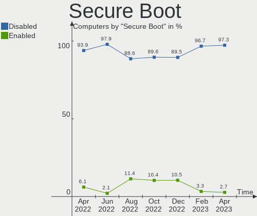
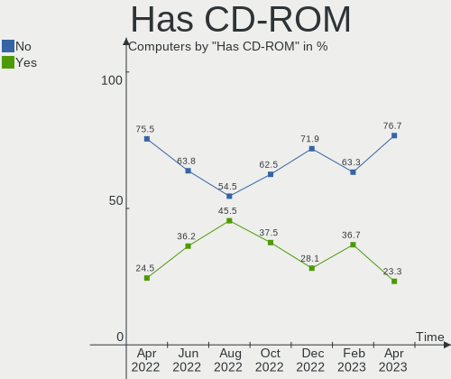
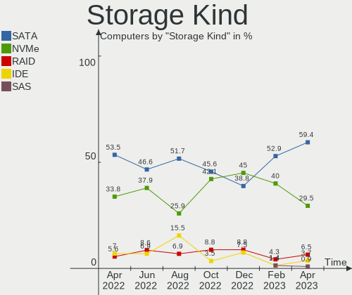
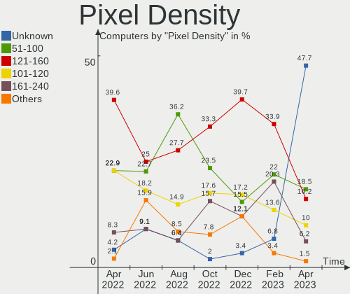
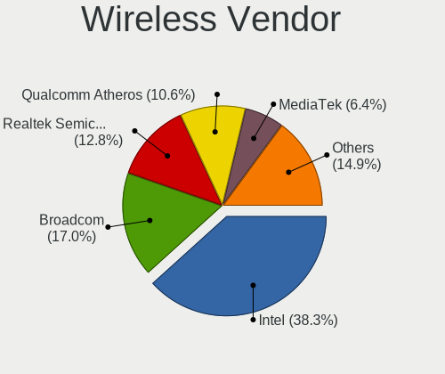

Linux in Switzerland - Hardware Trends
--------------------------------------

A project to identify most popular hardware characteristics and track their change
over time based on data collected by Linux users at https://Linux-Hardware.org.

Anyone can contribute to this report by the [hw-probe](https://github.com/linuxhw/hw-probe) tool:

    sudo -E hw-probe -all -upload

This is a report for all computer types. See also reports for [desktops](/Location/Switzerland/Desktop/README.md) and [notebooks](/Location/Switzerland/Notebook/README.md).

Period: Apr, 2023.

Contents
--------

* [ System ](#system)
  - [ OS                       ](#os)
  - [ OS Family                ](#os-family)
  - [ Kernel                   ](#kernel)
  - [ Kernel Family            ](#kernel-family)
  - [ Kernel Major Ver.        ](#kernel-major-ver)
  - [ Arch                     ](#arch)
  - [ DE                       ](#de)
  - [ Display Server           ](#display-server)
  - [ Display Manager          ](#display-manager)
  - [ OS Lang                  ](#os-lang)
  - [ Boot Mode                ](#boot-mode)
  - [ Filesystem               ](#filesystem)
  - [ Part. scheme             ](#part-scheme)
  - [ Dual Boot with Linux/BSD ](#dual-boot-with-linuxbsd)
  - [ Dual Boot (Win)          ](#dual-boot-win)

* [ Board ](#board)
  - [ Vendor                   ](#vendor)
  - [ Model                    ](#model)
  - [ Model Family             ](#model-family)
  - [ MFG Year                 ](#mfg-year)
  - [ Form Factor              ](#form-factor)
  - [ Secure Boot              ](#secure-boot)
  - [ Coreboot                 ](#coreboot)
  - [ RAM Size                 ](#ram-size)
  - [ RAM Used                 ](#ram-used)
  - [ Total Drives             ](#total-drives)
  - [ Has CD-ROM               ](#has-cd-rom)
  - [ Has Ethernet             ](#has-ethernet)
  - [ Has WiFi                 ](#has-wifi)
  - [ Has Bluetooth            ](#has-bluetooth)

* [ Location ](#location)
  - [ Country                  ](#country)
  - [ City                     ](#city)

* [ Drives ](#drives)
  - [ Drive Vendor             ](#drive-vendor)
  - [ Drive Model              ](#drive-model)
  - [ HDD Vendor               ](#hdd-vendor)
  - [ SSD Vendor               ](#ssd-vendor)
  - [ Drive Kind               ](#drive-kind)
  - [ Drive Connector          ](#drive-connector)
  - [ Drive Size               ](#drive-size)
  - [ Space Total              ](#space-total)
  - [ Space Used               ](#space-used)
  - [ Malfunc. Drives          ](#malfunc-drives)
  - [ Malfunc. Drive Vendor    ](#malfunc-drive-vendor)
  - [ Malfunc. HDD Vendor      ](#malfunc-hdd-vendor)
  - [ Malfunc. Drive Kind      ](#malfunc-drive-kind)
  - [ Failed Drives            ](#failed-drives)
  - [ Failed Drive Vendor      ](#failed-drive-vendor)
  - [ Drive Status             ](#drive-status)

* [ Storage controller ](#storage-controller)
  - [ Storage Vendor           ](#storage-vendor)
  - [ Storage Model            ](#storage-model)
  - [ Storage Kind             ](#storage-kind)

* [ Processor ](#processor)
  - [ CPU Vendor               ](#cpu-vendor)
  - [ CPU Model                ](#cpu-model)
  - [ CPU Model Family         ](#cpu-model-family)
  - [ CPU Cores                ](#cpu-cores)
  - [ CPU Sockets              ](#cpu-sockets)
  - [ CPU Threads              ](#cpu-threads)
  - [ CPU Op-Modes             ](#cpu-op-modes)
  - [ CPU Microcode            ](#cpu-microcode)
  - [ CPU Microarch            ](#cpu-microarch)

* [ Graphics ](#graphics)
  - [ GPU Vendor               ](#gpu-vendor)
  - [ GPU Model                ](#gpu-model)
  - [ GPU Combo                ](#gpu-combo)
  - [ GPU Driver               ](#gpu-driver)
  - [ GPU Memory               ](#gpu-memory)

* [ Monitor ](#monitor)
  - [ Monitor Vendor           ](#monitor-vendor)
  - [ Monitor Model            ](#monitor-model)
  - [ Monitor Resolution       ](#monitor-resolution)
  - [ Monitor Diagonal         ](#monitor-diagonal)
  - [ Monitor Width            ](#monitor-width)
  - [ Aspect Ratio             ](#aspect-ratio)
  - [ Monitor Area             ](#monitor-area)
  - [ Pixel Density            ](#pixel-density)
  - [ Multiple Monitors        ](#multiple-monitors)

* [ Network ](#network)
  - [ Net Controller Vendor    ](#net-controller-vendor)
  - [ Net Controller Model     ](#net-controller-model)
  - [ Wireless Vendor          ](#wireless-vendor)
  - [ Wireless Model           ](#wireless-model)
  - [ Ethernet Vendor          ](#ethernet-vendor)
  - [ Ethernet Model           ](#ethernet-model)
  - [ Net Controller Kind      ](#net-controller-kind)
  - [ Used Controller          ](#used-controller)
  - [ NICs                     ](#nics)
  - [ IPv6                     ](#ipv6)

* [ Bluetooth ](#bluetooth)
  - [ Bluetooth Vendor         ](#bluetooth-vendor)
  - [ Bluetooth Model          ](#bluetooth-model)

* [ Sound ](#sound)
  - [ Sound Vendor             ](#sound-vendor)
  - [ Sound Model              ](#sound-model)

* [ Memory ](#memory)
  - [ Memory Vendor            ](#memory-vendor)
  - [ Memory Model             ](#memory-model)
  - [ Memory Kind              ](#memory-kind)
  - [ Memory Form Factor       ](#memory-form-factor)
  - [ Memory Size              ](#memory-size)
  - [ Memory Speed             ](#memory-speed)

* [ Printers & scanners ](#printers--scanners)
  - [ Printer Vendor           ](#printer-vendor)
  - [ Printer Model            ](#printer-model)
  - [ Scanner Vendor           ](#scanner-vendor)
  - [ Scanner Model            ](#scanner-model)

* [ Camera ](#camera)
  - [ Camera Vendor            ](#camera-vendor)
  - [ Camera Model             ](#camera-model)

* [ Security ](#security)
  - [ Fingerprint Vendor       ](#fingerprint-vendor)
  - [ Fingerprint Model        ](#fingerprint-model)
  - [ Chipcard Vendor          ](#chipcard-vendor)
  - [ Chipcard Model           ](#chipcard-model)

* [ Unsupported ](#unsupported)
  - [ Unsupported Devices      ](#unsupported-devices)
  - [ Unsupported Device Types ](#unsupported-device-types)

System
------

OS
--

Installed operating systems

| Name                         | Computers | Percent |
|------------------------------|-----------|---------|
| Ubuntu 22.04                 | 97        | 66.44%  |
| OpenMandriva 23.03           | 5         | 3.42%   |
| Debian 11                    | 5         | 3.42%   |
| Fedora 38                    | 4         | 2.74%   |
| Ubuntu 20.04                 | 3         | 2.05%   |
| Linux Mint 21.1              | 3         | 2.05%   |
| Fedora 37                    | 3         | 2.05%   |
| Debian 12                    | 3         | 2.05%   |
| Zorin 16                     | 2         | 1.37%   |
| Ubuntu 22.10                 | 2         | 1.37%   |
| openSUSE Tumbleweed-XXXXXXXX | 2         | 1.37%   |
| OpenMandriva 23.01           | 2         | 1.37%   |
| Ubuntu 23.04                 | 1         | 0.68%   |
| TUXEDO OS 22.04              | 1         | 0.68%   |
| SteamOS 3.4.6                | 1         | 0.68%   |
| Raspbian 11                  | 1         | 0.68%   |
| Pop!_OS 22.04                | 1         | 0.68%   |
| Parrot 5.3                   | 1         | 0.68%   |
| openSUSE Leap-15.5           | 1         | 0.68%   |
| openSUSE Leap-15.4           | 1         | 0.68%   |
| OpenMandriva 22.90           | 1         | 0.68%   |
| Manjaro 22.1.0               | 1         | 0.68%   |
| Manjaro                      | 1         | 0.68%   |
| Linux Mint 20.3              | 1         | 0.68%   |
| LFS 11.3-systemd             | 1         | 0.68%   |
| Garuda Linux Rolling         | 1         | 0.68%   |
| Arch Rolling                 | 1         | 0.68%   |

OS Family
---------

OS without a version

| Name         | Computers | Percent |
|--------------|-----------|---------|
| Ubuntu       | 103       | 70.55%  |
| OpenMandriva | 8         | 5.48%   |
| Debian       | 8         | 5.48%   |
| Fedora       | 7         | 4.79%   |
| openSUSE     | 4         | 2.74%   |
| Linux Mint   | 4         | 2.74%   |
| Zorin        | 2         | 1.37%   |
| Manjaro      | 2         | 1.37%   |
| TUXEDO OS    | 1         | 0.68%   |
| SteamOS      | 1         | 0.68%   |
| Raspbian     | 1         | 0.68%   |
| Pop!_OS      | 1         | 0.68%   |
| Parrot       | 1         | 0.68%   |
| LFS          | 1         | 0.68%   |
| Garuda Linux | 1         | 0.68%   |
| Arch         | 1         | 0.68%   |

Kernel
------

Version of the Linux kernel

| Version                 | Computers | Percent |
|-------------------------|-----------|---------|
| 5.15.0-67-generic       | 29        | 19.86%  |
| 5.15.0-69-generic       | 28        | 19.18%  |
| 5.15.0-58-generic       | 14        | 9.59%   |
| 5.15.0-46-generic       | 8         | 5.48%   |
| 5.15.0-43-generic       | 7         | 4.79%   |
| 6.2.6-desktop-1omv2390  | 5         | 3.42%   |
| 5.15.0-70-generic       | 5         | 3.42%   |
| 5.10.0-21-amd64         | 5         | 3.42%   |
| 5.19.0-38-generic       | 3         | 2.05%   |
| 5.15.0-56-generic       | 3         | 2.05%   |
| 6.2.11-300.fc38.x86_64  | 2         | 1.37%   |
| 6.1.0-5-amd64           | 2         | 1.37%   |
| 6.1.0-1007-oem          | 2         | 1.37%   |
| 5.19.0-35-generic       | 2         | 1.37%   |
| 5.15.0-71-generic       | 2         | 1.37%   |
| 5.15.0-60-generic       | 2         | 1.37%   |
| 6.2.9-300.fc38.x86_64   | 1         | 0.68%   |
| 6.2.9-200.fc37.x86_64   | 1         | 0.68%   |
| 6.2.9-1-default         | 1         | 0.68%   |
| 6.2.8-200.fc37.x86_64   | 1         | 0.68%   |
| 6.2.12-300.fc38.x86_64  | 1         | 0.68%   |
| 6.2.12-1-MANJARO        | 1         | 0.68%   |
| 6.2.11-200.fc37.x86_64  | 1         | 0.68%   |
| 6.2.10-zen2-xanmod1-1   | 1         | 0.68%   |
| 6.2.10-zen1-1-zen       | 1         | 0.68%   |
| 6.2.10-1-default        | 1         | 0.68%   |
| 6.2.0-20-generic        | 1         | 0.68%   |
| 6.2.0-10005-tuxedo      | 1         | 0.68%   |
| 6.1.22-1-MANJARO        | 1         | 0.68%   |
| 6.1.21-v8+              | 1         | 0.68%   |
| 6.1.11                  | 1         | 0.68%   |
| 6.1.1-desktop-1omv2290  | 1         | 0.68%   |
| 6.1.0-3-amd64           | 1         | 0.68%   |
| 6.1.0-1parrot1-amd64    | 1         | 0.68%   |
| 6.0.7-desktop-2omv22090 | 1         | 0.68%   |
| 6.0.12-76060006-generic | 1         | 0.68%   |
| 5.19.0-40-generic       | 1         | 0.68%   |
| 5.19.0-32-generic       | 1         | 0.68%   |
| 5.17.1-desktop-2omv4050 | 1         | 0.68%   |
| 5.15.0-33-generic       | 1         | 0.68%   |

Kernel Family
-------------

Linux kernel without a distro release

| Version | Computers | Percent |
|---------|-----------|---------|
| 5.15.0  | 99        | 67.81%  |
| 5.19.0  | 7         | 4.79%   |
| 6.1.0   | 6         | 4.11%   |
| 6.2.6   | 5         | 3.42%   |
| 5.10.0  | 5         | 3.42%   |
| 6.2.9   | 3         | 2.05%   |
| 6.2.11  | 3         | 2.05%   |
| 6.2.10  | 3         | 2.05%   |
| 6.2.12  | 2         | 1.37%   |
| 6.2.0   | 2         | 1.37%   |
| 5.14.21 | 2         | 1.37%   |
| 6.2.8   | 1         | 0.68%   |
| 6.1.22  | 1         | 0.68%   |
| 6.1.21  | 1         | 0.68%   |
| 6.1.11  | 1         | 0.68%   |
| 6.1.1   | 1         | 0.68%   |
| 6.0.7   | 1         | 0.68%   |
| 6.0.12  | 1         | 0.68%   |
| 5.17.1  | 1         | 0.68%   |
| 5.13.0  | 1         | 0.68%   |

Kernel Major Ver.
-----------------

Linux kernel major version

| Version | Computers | Percent |
|---------|-----------|---------|
| 5.15    | 99        | 67.81%  |
| 6.2     | 19        | 13.01%  |
| 6.1     | 10        | 6.85%   |
| 5.19    | 7         | 4.79%   |
| 5.10    | 5         | 3.42%   |
| 6.0     | 2         | 1.37%   |
| 5.14    | 2         | 1.37%   |
| 5.17    | 1         | 0.68%   |
| 5.13    | 1         | 0.68%   |

Arch
----

OS architecture (x86_64, i586, etc.)

| Name    | Computers | Percent |
|---------|-----------|---------|
| x86_64  | 145       | 99.32%  |
| aarch64 | 1         | 0.68%   |

DE
--

Desktop Environment

| Name       | Computers | Percent |
|------------|-----------|---------|
| GNUstep    | 74        | 50.68%  |
| GNOME      | 42        | 28.77%  |
| KDE5       | 15        | 10.27%  |
| MATE       | 5         | 3.42%   |
| X-Cinnamon | 3         | 2.05%   |
| Unknown    | 3         | 2.05%   |
| LXDE       | 2         | 1.37%   |
| i3         | 1         | 0.68%   |
| Cinnamon   | 1         | 0.68%   |

Display Server
--------------

X11 or Wayland

| Name    | Computers | Percent |
|---------|-----------|---------|
| Tty     | 79        | 54.11%  |
| X11     | 52        | 35.62%  |
| Wayland | 13        | 8.9%    |
| Unknown | 2         | 1.37%   |

Display Manager
---------------

SDDM, LightDM, etc.

| Name    | Computers | Percent |
|---------|-----------|---------|
| LightDM | 79        | 54.11%  |
| GDM3    | 30        | 20.55%  |
| Unknown | 19        | 13.01%  |
| GDM     | 9         | 6.16%   |
| SDDM    | 8         | 5.48%   |
| NODM    | 1         | 0.68%   |

OS Lang
-------

Language

| Lang    | Computers | Percent |
|---------|-----------|---------|
| en_US   | 108       | 73.97%  |
| de_CH   | 21        | 14.38%  |
| fr_CH   | 6         | 4.11%   |
| en_GB   | 4         | 2.74%   |
| C       | 2         | 1.37%   |
| it_IT   | 1         | 0.68%   |
| fr_FR   | 1         | 0.68%   |
| fr_CA   | 1         | 0.68%   |
| de_DE   | 1         | 0.68%   |
| Unknown | 1         | 0.68%   |

Boot Mode
---------

EFI or BIOS

| Mode | Computers | Percent |
|------|-----------|---------|
| EFI  | 98        | 67.12%  |
| BIOS | 48        | 32.88%  |

Filesystem
----------

Type of filesystem

| Type    | Computers | Percent |
|---------|-----------|---------|
| Ext4    | 120       | 82.19%  |
| Btrfs   | 19        | 13.01%  |
| Overlay | 4         | 2.74%   |
| Tmpfs   | 2         | 1.37%   |
| Xfs     | 1         | 0.68%   |

Part. scheme
------------

Scheme of partitioning

| Type    | Computers | Percent |
|---------|-----------|---------|
| GPT     | 127       | 86.99%  |
| Unknown | 16        | 10.96%  |
| MBR     | 3         | 2.05%   |

Dual Boot with Linux/BSD
------------------------

Hosting more than one Linux/BSD

| Dual boot | Computers | Percent |
|-----------|-----------|---------|
| No        | 134       | 91.78%  |
| Yes       | 12        | 8.22%   |

Dual Boot (Win)
---------------

Hosting Linux and Windows

| Dual boot | Computers | Percent |
|-----------|-----------|---------|
| No        | 133       | 91.1%   |
| Yes       | 13        | 8.9%    |

Board
-----

Vendor
------

Motherboard manufacturer

| Name                    | Computers | Percent |
|-------------------------|-----------|---------|
| ASUSTek Computer        | 69        | 47.26%  |
| Fujitsu                 | 14        | 9.59%   |
| Apple                   | 10        | 6.85%   |
| Intel                   | 9         | 6.16%   |
| Hewlett-Packard         | 9         | 6.16%   |
| Dell                    | 9         | 6.16%   |
| Lenovo                  | 7         | 4.79%   |
| Gigabyte Technology     | 7         | 4.79%   |
| ASRock                  | 5         | 3.42%   |
| Valve                   | 1         | 0.68%   |
| Sony                    | 1         | 0.68%   |
| Raspberry Pi Foundation | 1         | 0.68%   |
| MSI                     | 1         | 0.68%   |
| Medion                  | 1         | 0.68%   |
| AZW                     | 1         | 0.68%   |
| Acer                    | 1         | 0.68%   |

Model
-----

Motherboard model

| Name                                                  | Computers | Percent |
|-------------------------------------------------------|-----------|---------|
| ASUS PRIME Z590-P                                     | 16        | 10.96%  |
| ASUS PRIME X570-PRO                                   | 11        | 7.53%   |
| ASUS PRIME B550M-A                                    | 10        | 6.85%   |
| Fujitsu CELSIUS_W550                                  | 5         | 3.42%   |
| ASUS PRIME Z370-A II                                  | 4         | 2.74%   |
| ASUS All Series                                       | 4         | 2.74%   |
| Intel DP67BA AAG10219-303                             | 2         | 1.37%   |
| HP Z1 Entry Tower G6                                  | 2         | 1.37%   |
| Gigabyte H97-HD3                                      | 2         | 1.37%   |
| Fujitsu CELSIUS W570                                  | 2         | 1.37%   |
| Fujitsu CELSIUS W530                                  | 2         | 1.37%   |
| Fujitsu CELSIUS M740                                  | 2         | 1.37%   |
| ASUS STRIX Z270F GAMING                               | 2         | 1.37%   |
| ASUS ROG Strix G35CG_G35CG                            | 2         | 1.37%   |
| ASUS PRIME Z490M-PLUS                                 | 2         | 1.37%   |
| ASRock B760M Steel Legend WiFi                        | 2         | 1.37%   |
| Apple iMac7,1                                         | 2         | 1.37%   |
| Valve Jupiter                                         | 1         | 0.68%   |
| Sony VPCF22C5E                                        | 1         | 0.68%   |
| RPi Raspberry Pi 4 Model B Rev 1.1                    | 1         | 0.68%   |
| MSI Creator 15 A10SGS                                 | 1         | 0.68%   |
| Medion ERAZER X47004 MD34010/C562                     | 1         | 0.68%   |
| Lenovo Yoga 6 13ABR8 83B2                             | 1         | 0.68%   |
| Lenovo ThinkPad T420 4180MG1                          | 1         | 0.68%   |
| Lenovo ThinkPad P50s 20FKS0A300                       | 1         | 0.68%   |
| Lenovo ThinkPad E14 Gen 2 20TA000FMZ                  | 1         | 0.68%   |
| Lenovo Legion T530-28ICB 90L3                         | 1         | 0.68%   |
| Lenovo Legion T5 26IAB7 90SV00EMSZ                    | 1         | 0.68%   |
| Lenovo IdeaCentre 5 14IMB05 IdeaCentre 5-14IMB05 Desk | 1         | 0.68%   |
| Intel S4600LH                                         | 1         | 0.68%   |
| Intel S2600WTTR                                       | 1         | 0.68%   |
| Intel S2600WFT                                        | 1         | 0.68%   |
| Intel DX58SO2 AAG10925-207                            | 1         | 0.68%   |
| Intel DP55WB AAE64798-207                             | 1         | 0.68%   |
| Intel DH87MC AAG74242-401                             | 1         | 0.68%   |
| Intel DH67CL AAG10212-210                             | 1         | 0.68%   |
| HP Z400 Workstation                                   | 1         | 0.68%   |
| HP Victus by 15L Gaming Desktop TG02-0xxx             | 1         | 0.68%   |
| HP ProLiant ML150 G6                                  | 1         | 0.68%   |
| HP ProBook 4540s                                      | 1         | 0.68%   |

Model Family
------------

Motherboard model prefix

| Name                 | Computers | Percent |
|----------------------|-----------|---------|
| ASUS PRIME           | 48        | 32.88%  |
| Fujitsu CELSIUS      | 14        | 9.59%   |
| ASUS ROG             | 6         | 4.11%   |
| ASUS All             | 4         | 2.74%   |
| Lenovo ThinkPad      | 3         | 2.05%   |
| Dell XPS             | 3         | 2.05%   |
| Lenovo Legion        | 2         | 1.37%   |
| Intel DP67BA         | 2         | 1.37%   |
| HP Z1                | 2         | 1.37%   |
| Gigabyte H97-HD3     | 2         | 1.37%   |
| Dell PowerEdge       | 2         | 1.37%   |
| Dell Latitude        | 2         | 1.37%   |
| ASUS STRIX           | 2         | 1.37%   |
| ASUS ASUS            | 2         | 1.37%   |
| ASRock B760M         | 2         | 1.37%   |
| Apple iMac7          | 2         | 1.37%   |
| Apple iMac13         | 2         | 1.37%   |
| Valve Jupiter        | 1         | 0.68%   |
| Sony VPCF22C5E       | 1         | 0.68%   |
| RPi Raspberry        | 1         | 0.68%   |
| MSI Creator          | 1         | 0.68%   |
| Medion ERAZER        | 1         | 0.68%   |
| Lenovo Yoga          | 1         | 0.68%   |
| Lenovo IdeaCentre    | 1         | 0.68%   |
| Intel S4600LH        | 1         | 0.68%   |
| Intel S2600WTTR      | 1         | 0.68%   |
| Intel S2600WFT       | 1         | 0.68%   |
| Intel DX58SO2        | 1         | 0.68%   |
| Intel DP55WB         | 1         | 0.68%   |
| Intel DH87MC         | 1         | 0.68%   |
| Intel DH67CL         | 1         | 0.68%   |
| HP Z400              | 1         | 0.68%   |
| HP Victus            | 1         | 0.68%   |
| HP ProLiant          | 1         | 0.68%   |
| HP ProBook           | 1         | 0.68%   |
| HP OMEN              | 1         | 0.68%   |
| HP EliteBook         | 1         | 0.68%   |
| HP 595-P0569NG       | 1         | 0.68%   |
| Gigabyte Z97-HD3     | 1         | 0.68%   |
| Gigabyte R182-Z91-00 | 1         | 0.68%   |

MFG Year
--------

Motherboard manufacture year

| Year    | Computers | Percent |
|---------|-----------|---------|
| 2021    | 24        | 16.44%  |
| 2020    | 20        | 13.7%   |
| 2019    | 17        | 11.64%  |
| 2015    | 13        | 8.9%    |
| 2022    | 11        | 7.53%   |
| 2018    | 9         | 6.16%   |
| 2017    | 9         | 6.16%   |
| 2011    | 9         | 6.16%   |
| 2016    | 8         | 5.48%   |
| 2014    | 7         | 4.79%   |
| 2010    | 6         | 4.11%   |
| 2013    | 4         | 2.74%   |
| 2012    | 3         | 2.05%   |
| 2007    | 2         | 1.37%   |
| 2023    | 1         | 0.68%   |
| 2009    | 1         | 0.68%   |
| 2008    | 1         | 0.68%   |
| Unknown | 1         | 0.68%   |

Form Factor
-----------

Physical design of the computer

| Name           | Computers | Percent |
|----------------|-----------|---------|
| Desktop        | 108       | 73.97%  |
| Notebook       | 20        | 13.7%   |
| All in one     | 8         | 5.48%   |
| Server         | 7         | 4.79%   |
| Convertible    | 2         | 1.37%   |
| System on chip | 1         | 0.68%   |

Secure Boot
-----------

Enabled or disabled

| State    | Computers | Percent |
|----------|-----------|---------|
| Disabled | 142       | 97.26%  |
| Enabled  | 4         | 2.74%   |

Coreboot
--------

Have coreboot on board

| Used | Computers | Percent |
|------|-----------|---------|
| No   | 146       | 100%    |

RAM Size
--------

Total RAM memory

| Size in GB      | Computers | Percent |
|-----------------|-----------|---------|
| 32.01-64.0      | 41        | 28.08%  |
| 64.01-256.0     | 32        | 21.92%  |
| 16.01-24.0      | 32        | 21.92%  |
| 8.01-16.0       | 15        | 10.27%  |
| 4.01-8.0        | 10        | 6.85%   |
| 3.01-4.0        | 6         | 4.11%   |
| More than 256.0 | 5         | 3.42%   |
| 24.01-32.0      | 4         | 2.74%   |
| 1.01-2.0        | 1         | 0.68%   |

RAM Used
--------

Used RAM memory

| Used GB     | Computers | Percent |
|-------------|-----------|---------|
| 1.01-2.0    | 50        | 34.25%  |
| 2.01-3.0    | 25        | 17.12%  |
| 8.01-16.0   | 20        | 13.7%   |
| 4.01-8.0    | 19        | 13.01%  |
| 3.01-4.0    | 18        | 12.33%  |
| 16.01-24.0  | 4         | 2.74%   |
| 0.51-1.0    | 4         | 2.74%   |
| 32.01-64.0  | 2         | 1.37%   |
| 24.01-32.0  | 2         | 1.37%   |
| 64.01-256.0 | 1         | 0.68%   |
| 0.01-0.5    | 1         | 0.68%   |

Total Drives
------------

Number of drives on board

| Drives | Computers | Percent |
|--------|-----------|---------|
| 1      | 72        | 49.32%  |
| 2      | 51        | 34.93%  |
| 3      | 9         | 6.16%   |
| 4      | 8         | 5.48%   |
| 5      | 3         | 2.05%   |
| 6      | 2         | 1.37%   |
| 7      | 1         | 0.68%   |

Has CD-ROM
----------

Has CD-ROM on board

| Presented | Computers | Percent |
|-----------|-----------|---------|
| No        | 112       | 76.71%  |
| Yes       | 34        | 23.29%  |

Has Ethernet
------------

Has Ethernet on board

| Presented | Computers | Percent |
|-----------|-----------|---------|
| Yes       | 140       | 95.89%  |
| No        | 6         | 4.11%   |

Has WiFi
--------

Has WiFi module

| Presented | Computers | Percent |
|-----------|-----------|---------|
| No        | 99        | 67.81%  |
| Yes       | 47        | 32.19%  |

Has Bluetooth
-------------

Has Bluetooth module

| Presented | Computers | Percent |
|-----------|-----------|---------|
| No        | 91        | 62.33%  |
| Yes       | 55        | 37.67%  |

Location
--------

Country
-------

Geographic location (country)

| Country     | Computers | Percent |
|-------------|-----------|---------|
| Switzerland | 146       | 100%    |

City
----

Geographic location (city)

| City               | Computers | Percent |
|--------------------|-----------|---------|
| Zurich             | 105       | 71.92%  |
| Miege              | 4         | 2.74%   |
| Geneva             | 3         | 2.05%   |
| Winterthur         | 2         | 1.37%   |
| Bern               | 2         | 1.37%   |
| Uster              | 1         | 0.68%   |
| Unterentfelden     | 1         | 0.68%   |
| Umiken             | 1         | 0.68%   |
| St. Gallen         | 1         | 0.68%   |
| Siggenthal Station | 1         | 0.68%   |
| Schonbuhl          | 1         | 0.68%   |
| Samstagern         | 1         | 0.68%   |
| Niederwangen       | 1         | 0.68%   |
| Nidau              | 1         | 0.68%   |
| Muttenz            | 1         | 0.68%   |
| Lugano             | 1         | 0.68%   |
| Lovens             | 1         | 0.68%   |
| Liebefeld          | 1         | 0.68%   |
| Lausen             | 1         | 0.68%   |
| Lausanne           | 1         | 0.68%   |
| Langnau am Albis   | 1         | 0.68%   |
| Landquart          | 1         | 0.68%   |
| Jegenstorf         | 1         | 0.68%   |
| Horgen             | 1         | 0.68%   |
| Herisau            | 1         | 0.68%   |
| Goldach            | 1         | 0.68%   |
| Dulliken           | 1         | 0.68%   |
| Dubendorf          | 1         | 0.68%   |
| Diepoldsau         | 1         | 0.68%   |
| Cernier            | 1         | 0.68%   |
| Brugg              | 1         | 0.68%   |
| Bischofszell       | 1         | 0.68%   |
| Basel              | 1         | 0.68%   |
| Amriswil           | 1         | 0.68%   |
| Aarburg            | 1         | 0.68%   |

Drives
------

Drive Vendor
------------

Hard drive vendors

| Vendor              | Computers | Drives | Percent |
|---------------------|-----------|--------|---------|
| Samsung Electronics | 65        | 101    | 30.95%  |
| Seagate             | 45        | 51     | 21.43%  |
| WDC                 | 25        | 29     | 11.9%   |
| Intel               | 15        | 16     | 7.14%   |
| Hitachi             | 8         | 8      | 3.81%   |
| HGST                | 7         | 7      | 3.33%   |
| Apple               | 7         | 7      | 3.33%   |
| Toshiba             | 5         | 5      | 2.38%   |
| Sandisk             | 5         | 6      | 2.38%   |
| Kingston            | 5         | 5      | 2.38%   |
| Crucial             | 4         | 4      | 1.9%    |
| Unknown             | 3         | 3      | 1.43%   |
| SK hynix            | 3         | 3      | 1.43%   |
| Phison Electronics  | 2         | 2      | 0.95%   |
| Micron Technology   | 2         | 2      | 0.95%   |
| SPCC                | 1         | 1      | 0.48%   |
| Plextor             | 1         | 1      | 0.48%   |
| OCZ                 | 1         | 1      | 0.48%   |
| Intenso             | 1         | 1      | 0.48%   |
| Hewlett-Packard     | 1         | 2      | 0.48%   |
| Dogfish             | 1         | 1      | 0.48%   |
| Adaptec             | 1         | 1      | 0.48%   |
| A-DATA Technology   | 1         | 1      | 0.48%   |
| Unknown             | 1         | 1      | 0.48%   |

Drive Model
-----------

Hard drive models

| Model                                              | Computers | Percent |
|----------------------------------------------------|-----------|---------|
| Samsung SSD 980 PRO 1TB                            | 18        | 7.93%   |
| Samsung NVMe SSD Drive 1TB                         | 12        | 5.29%   |
| Seagate ST2000DM008-2FR102 2TB                     | 11        | 4.85%   |
| Seagate ST2000DM006-2DM164 2TB                     | 8         | 3.52%   |
| Intel SSDSC2KB240G8 240GB                          | 6         | 2.64%   |
| SanDisk NVMe SSD Drive 1TB                         | 4         | 1.76%   |
| Samsung SSD 860 EVO 1TB                            | 4         | 1.76%   |
| Samsung NVMe SSD Controller SM981/PM981/PM983 1TB  | 4         | 1.76%   |
| Samsung NVMe SSD Controller PM9A1/PM9A3/980PRO 2TB | 4         | 1.76%   |
| WDC WD10EALX-009BA0 1TB                            | 3         | 1.32%   |
| Seagate ST2000DM008-2UB102 2TB                     | 3         | 1.32%   |
| Seagate ST16000NM001G-2KK103 16TB                  | 3         | 1.32%   |
| Seagate ST1000DM003-1ER162 1TB                     | 3         | 1.32%   |
| Samsung SSD 970 EVO Plus 1TB                       | 3         | 1.32%   |
| Intel SSDSC2KG400G7M 118000654 400GB               | 3         | 1.32%   |
| WDC WUH721816ALE6L4 16TB                           | 2         | 0.88%   |
| WDC WD40EZRZ-00GXCB0 4TB                           | 2         | 0.88%   |
| WDC WD10EZEX-08WN4A1 1TB                           | 2         | 0.88%   |
| Toshiba DT01ACA200 2TB                             | 2         | 0.88%   |
| Seagate ST4000DM004-2CV104 4TB                     | 2         | 0.88%   |
| Seagate ST3250820AS Q 250GB                        | 2         | 0.88%   |
| Seagate ST2000DM001-1ER164 2TB                     | 2         | 0.88%   |
| Seagate ST2000DM001-1CH164 2TB                     | 2         | 0.88%   |
| Samsung SSD 970 EVO Plus 250GB                     | 2         | 0.88%   |
| Samsung SSD 960 EVO 500GB                          | 2         | 0.88%   |
| Samsung SSD 870 EVO 2TB                            | 2         | 0.88%   |
| Samsung SSD 860 EVO 250GB                          | 2         | 0.88%   |
| Samsung SSD 840 EVO 250GB                          | 2         | 0.88%   |
| Hitachi HUA723030ALA640 3TB                        | 2         | 0.88%   |
| HGST HUS724040ALA640 4TB                           | 2         | 0.88%   |
| Apple HDD ST1000DM003 1TB                          | 2         | 0.88%   |
| Apple HDD HTS541010A9E662 1TB                      | 2         | 0.88%   |
| WDC WUH721818ALE6L4 18TB                           | 1         | 0.44%   |
| WDC WDS120G1G0A-00SS50 120GB SSD                   | 1         | 0.44%   |
| WDC WD60PURX-64T0ZY0 6TB                           | 1         | 0.44%   |
| WDC WD5000AAKX-001CA0 500GB                        | 1         | 0.44%   |
| WDC WD4000F9YZ-09N20L1 4TB                         | 1         | 0.44%   |
| WDC WD30EZRZ-00Z5HB0 3TB                           | 1         | 0.44%   |
| WDC WD30EFRX-68EUZN0 3TB                           | 1         | 0.44%   |
| WDC WD2500AAJS-00L7A0 250GB                        | 1         | 0.44%   |

HDD Vendor
----------

Hard disk drive vendors

| Vendor          | Computers | Drives | Percent |
|-----------------|-----------|--------|---------|
| Seagate         | 45        | 51     | 48.91%  |
| WDC             | 22        | 26     | 23.91%  |
| Hitachi         | 8         | 8      | 8.7%    |
| HGST            | 7         | 7      | 7.61%   |
| Apple           | 5         | 5      | 5.43%   |
| Toshiba         | 3         | 3      | 3.26%   |
| Hewlett-Packard | 1         | 2      | 1.09%   |
| Adaptec         | 1         | 1      | 1.09%   |

SSD Vendor
----------

Solid state drive vendors

| Vendor              | Computers | Drives | Percent |
|---------------------|-----------|--------|---------|
| Samsung Electronics | 22        | 27     | 41.51%  |
| Intel               | 14        | 14     | 26.42%  |
| Crucial             | 4         | 4      | 7.55%   |
| Kingston            | 2         | 2      | 3.77%   |
| Apple               | 2         | 2      | 3.77%   |
| WDC                 | 1         | 1      | 1.89%   |
| Toshiba             | 1         | 1      | 1.89%   |
| SPCC                | 1         | 1      | 1.89%   |
| SK hynix            | 1         | 1      | 1.89%   |
| Plextor             | 1         | 1      | 1.89%   |
| OCZ                 | 1         | 1      | 1.89%   |
| Intenso             | 1         | 1      | 1.89%   |
| Dogfish             | 1         | 1      | 1.89%   |
| Unknown             | 1         | 1      | 1.89%   |

Drive Kind
----------

HDD or SSD

| Kind | Computers | Drives | Percent |
|------|-----------|--------|---------|
| HDD  | 81        | 103    | 41.75%  |
| NVMe | 64        | 95     | 32.99%  |
| SSD  | 46        | 58     | 23.71%  |
| MMC  | 3         | 3      | 1.55%   |

Drive Connector
---------------

SATA, SAS, NVMe, etc.

| Type | Computers | Drives | Percent |
|------|-----------|--------|---------|
| SATA | 103       | 159    | 59.88%  |
| NVMe | 64        | 95     | 37.21%  |
| MMC  | 3         | 3      | 1.74%   |
| SAS  | 2         | 2      | 1.16%   |

Drive Size
----------

Size of hard drive

| Size in TB | Computers | Drives | Percent |
|------------|-----------|--------|---------|
| 0.01-0.5   | 43        | 49     | 30.94%  |
| 1.01-2.0   | 41        | 43     | 29.5%   |
| 0.51-1.0   | 27        | 36     | 19.42%  |
| 3.01-4.0   | 10        | 14     | 7.19%   |
| 10.01-20.0 | 8         | 9      | 5.76%   |
| 2.01-3.0   | 5         | 5      | 3.6%    |
| 4.01-10.0  | 5         | 5      | 3.6%    |

Space Total
-----------

Amount of disk space available on the file system

| Size in GB     | Computers | Percent |
|----------------|-----------|---------|
| More than 3000 | 29        | 19.86%  |
| 101-250        | 26        | 17.81%  |
| 1001-2000      | 21        | 14.38%  |
| Unknown        | 19        | 13.01%  |
| 251-500        | 16        | 10.96%  |
| 501-1000       | 16        | 10.96%  |
| 2001-3000      | 14        | 9.59%   |
| 1-20           | 5         | 3.42%   |

Space Used
----------

Amount of used disk space

| Used GB        | Computers | Percent |
|----------------|-----------|---------|
| 101-250        | 23        | 15.75%  |
| 51-100         | 22        | 15.07%  |
| Unknown        | 19        | 13.01%  |
| 1-20           | 18        | 12.33%  |
| 501-1000       | 16        | 10.96%  |
| More than 3000 | 15        | 10.27%  |
| 251-500        | 14        | 9.59%   |
| 21-50          | 9         | 6.16%   |
| 1001-2000      | 8         | 5.48%   |
| 2001-3000      | 2         | 1.37%   |

Malfunc. Drives
---------------

Drive models with a malfunction

| Model                                 | Computers | Drives | Percent |
|---------------------------------------|-----------|--------|---------|
| SK hynix HFS128G39MNC-2300A 128GB SSD | 1         | 1      | 50%     |
| Apple HDD HTS547550A9E384 500GB       | 1         | 1      | 50%     |

Malfunc. Drive Vendor
---------------------

Vendors of faulty drives

| Vendor   | Computers | Drives | Percent |
|----------|-----------|--------|---------|
| SK hynix | 1         | 1      | 50%     |
| Apple    | 1         | 1      | 50%     |

Malfunc. HDD Vendor
-------------------

Vendors of faulty HDD drives

| Vendor | Computers | Drives | Percent |
|--------|-----------|--------|---------|
| Apple  | 1         | 1      | 100%    |

Malfunc. Drive Kind
-------------------

Kinds of faulty drives

| Kind | Computers | Drives | Percent |
|------|-----------|--------|---------|
| SSD  | 1         | 1      | 50%     |
| HDD  | 1         | 1      | 50%     |

Failed Drives
-------------

Failed drive models

Zero info for selected period =(

Failed Drive Vendor
-------------------

Failed drive vendors

Zero info for selected period =(

Drive Status
------------

Number of failed and malfunc. drives

| Status   | Computers | Drives | Percent |
|----------|-----------|--------|---------|
| Detected | 98        | 169    | 67.12%  |
| Works    | 46        | 88     | 31.51%  |
| Malfunc  | 2         | 2      | 1.37%   |

Storage controller
------------------

Storage Vendor
--------------

Storage controller vendors

| Vendor                       | Computers | Percent |
|------------------------------|-----------|---------|
| Intel                        | 99        | 43.81%  |
| Samsung Electronics          | 51        | 22.57%  |
| AMD                          | 34        | 15.04%  |
| Marvell Technology Group     | 8         | 3.54%   |
| SanDisk                      | 7         | 3.1%    |
| ASMedia Technology           | 6         | 2.65%   |
| LSI Logic / Symbios Logic    | 3         | 1.33%   |
| Kingston Technology Company  | 3         | 1.33%   |
| JMicron Technology           | 3         | 1.33%   |
| SK hynix                     | 2         | 0.88%   |
| Phison Electronics           | 2         | 0.88%   |
| Micron Technology            | 2         | 0.88%   |
| Toshiba America Info Systems | 1         | 0.44%   |
| Silicon Image                | 1         | 0.44%   |
| Hewlett-Packard              | 1         | 0.44%   |
| Areca Technology             | 1         | 0.44%   |
| ADATA Technology             | 1         | 0.44%   |
| Adaptec                      | 1         | 0.44%   |

Storage Model
-------------

Storage controller models

| Model                                                                          | Computers | Percent |
|--------------------------------------------------------------------------------|-----------|---------|
| Samsung NVMe SSD Controller PM9A1/PM9A3/980PRO                                 | 30        | 11.9%   |
| AMD FCH SATA Controller [AHCI mode]                                            | 21        | 8.33%   |
| Intel 500 Series Chipset Family SATA AHCI Controller                           | 19        | 7.54%   |
| Samsung NVMe SSD Controller SM981/PM981/PM983                                  | 16        | 6.35%   |
| AMD 500 Series Chipset SATA Controller                                         | 11        | 4.37%   |
| Intel Q170/Q150/B150/H170/H110/Z170/CM236 Chipset SATA Controller [AHCI Mode]  | 10        | 3.97%   |
| Intel 200 Series PCH SATA controller [AHCI mode]                               | 9         | 3.57%   |
| Intel C610/X99 series chipset 6-Port SATA Controller [AHCI mode]               | 7         | 2.78%   |
| ASMedia ASM1062 Serial ATA Controller                                          | 6         | 2.38%   |
| SanDisk WD PC SN810 / Black SN850 NVMe SSD                                     | 5         | 1.98%   |
| Intel 8 Series/C220 Series Chipset Family 6-port SATA Controller 1 [AHCI mode] | 5         | 1.98%   |
| Intel 6 Series/C200 Series Chipset Family 6 port Desktop SATA AHCI Controller  | 5         | 1.98%   |
| Intel Comet Lake SATA AHCI Controller                                          | 4         | 1.59%   |
| Intel C610/X99 series chipset sSATA Controller [AHCI mode]                     | 4         | 1.59%   |
| Intel 9 Series Chipset Family SATA Controller [AHCI Mode]                      | 4         | 1.59%   |
| Samsung NVMe SSD Controller SM961/PM961/SM963                                  | 3         | 1.19%   |
| Kingston Company Company Non-Volatile memory controller                        | 3         | 1.19%   |
| Intel Sunrise Point-LP SATA Controller [AHCI mode]                             | 3         | 1.19%   |
| Intel SATA Controller [RAID mode]                                              | 3         | 1.19%   |
| Intel Cannon Lake PCH SATA AHCI Controller                                     | 3         | 1.19%   |
| Intel 82801JI (ICH10 Family) SATA AHCI Controller                              | 3         | 1.19%   |
| Intel 700 Series Chipset Family SATA AHCI Controller                           | 3         | 1.19%   |
| Micron NVMe Storage Controller                                                 | 2         | 0.79%   |
| Marvell Group 88SE9123 PCIe SATA 6.0 Gb/s controller                           | 2         | 0.79%   |
| Marvell Group 88SE6111/6121 SATA II / PATA Controller                          | 2         | 0.79%   |
| JMicron JMB363 SATA/IDE Controller                                             | 2         | 0.79%   |
| Intel Volume Management Device NVMe RAID Controller Intel Corporation          | 2         | 0.79%   |
| Intel C600/X79 series chipset 6-Port SATA AHCI Controller                      | 2         | 0.79%   |
| Intel 82801JI (ICH10 Family) 4 port SATA IDE Controller #1                     | 2         | 0.79%   |
| Intel 82801JI (ICH10 Family) 2 port SATA IDE Controller #2                     | 2         | 0.79%   |
| Intel 82801HM/HEM (ICH8M/ICH8M-E) SATA Controller [AHCI mode]                  | 2         | 0.79%   |
| Intel 82801HM/HEM (ICH8M/ICH8M-E) IDE Controller                               | 2         | 0.79%   |
| Intel 7 Series/C210 Series Chipset Family 6-port SATA Controller [AHCI mode]   | 2         | 0.79%   |
| Intel 7 Series Chipset Family 6-port SATA Controller [AHCI mode]               | 2         | 0.79%   |
| Intel 6 Series/C200 Series Chipset Family 6 port Mobile SATA AHCI Controller   | 2         | 0.79%   |
| AMD SB7x0/SB8x0/SB9x0 SATA Controller [AHCI mode]                              | 2         | 0.79%   |
| Toshiba America Info Systems XG6 NVMe SSD Controller                           | 1         | 0.4%    |
| SK hynix Gold P31/PC711 NVMe Solid State Drive                                 | 1         | 0.4%    |
| SK hynix BC501 NVMe Solid State Drive                                          | 1         | 0.4%    |
| Silicon Image SiI 3132 Serial ATA Raid II Controller                           | 1         | 0.4%    |

Storage Kind
------------

Kind of storage controller (IDE, SATA, NVMe, SAS, ...)

| Kind | Computers | Percent |
|------|-----------|---------|
| SATA | 129       | 59.45%  |
| NVMe | 64        | 29.49%  |
| RAID | 14        | 6.45%   |
| IDE  | 8         | 3.69%   |
| SAS  | 2         | 0.92%   |

Processor
---------

CPU Vendor
----------

Processor vendors

| Vendor  | Computers | Percent |
|---------|-----------|---------|
| Intel   | 105       | 71.92%  |
| AMD     | 39        | 26.71%  |
| ARM     | 1         | 0.68%   |
| Unknown | 1         | 0.68%   |

CPU Model
---------

Processor models

| Model                                    | Computers | Percent |
|------------------------------------------|-----------|---------|
| Intel 11th Gen Core i9-11900F @ 2.50GHz  | 16        | 10.96%  |
| AMD Ryzen 7 5800X 8-Core Processor       | 15        | 10.27%  |
| Intel Core i7-6700 CPU @ 3.40GHz         | 5         | 3.42%   |
| Intel Core i7-9700K CPU @ 3.60GHz        | 4         | 2.74%   |
| Intel Core i7-7700K CPU @ 4.20GHz        | 4         | 2.74%   |
| AMD Ryzen 9 3900X 12-Core Processor      | 4         | 2.74%   |
| Intel Xeon CPU E5-1650 v3 @ 3.50GHz      | 3         | 2.05%   |
| Intel 13th Gen Core i9-13900K            | 3         | 2.05%   |
| Intel Xeon CPU E5-1660 v3 @ 3.00GHz      | 2         | 1.37%   |
| Intel Xeon CPU E3-1240 v6 @ 3.70GHz      | 2         | 1.37%   |
| Intel Core i9-10900 CPU @ 2.80GHz        | 2         | 1.37%   |
| Intel Core i7-4790 CPU @ 3.60GHz         | 2         | 1.37%   |
| Intel Core i7-2600 CPU @ 3.40GHz         | 2         | 1.37%   |
| Intel Core i7-10700K CPU @ 3.80GHz       | 2         | 1.37%   |
| Intel Core i5-4430 CPU @ 3.00GHz         | 2         | 1.37%   |
| Intel Core i5-3210M CPU @ 2.50GHz        | 2         | 1.37%   |
| Intel Core i5-2400 CPU @ 3.10GHz         | 2         | 1.37%   |
| Intel Core 2 Duo CPU T7300 @ 2.00GHz     | 2         | 1.37%   |
| Intel 12th Gen Core i7-12700H            | 2         | 1.37%   |
| Intel 11th Gen Core i9-11900KF @ 3.50GHz | 2         | 1.37%   |
| Intel 11th Gen Core i7-1165G7 @ 2.80GHz  | 2         | 1.37%   |
| AMD Ryzen 9 5950X 16-Core Processor      | 2         | 1.37%   |
| AMD Ryzen 9 5900X 12-Core Processor      | 2         | 1.37%   |
| AMD EPYC 7742 64-Core Processor          | 2         | 1.37%   |
| Intel Xeon W-2133 CPU @ 3.60GHz          | 1         | 0.68%   |
| Intel Xeon Gold 6136 CPU @ 3.00GHz       | 1         | 0.68%   |
| Intel Xeon E-2136 CPU @ 3.30GHz          | 1         | 0.68%   |
| Intel Xeon CPU X5660 @ 2.80GHz           | 1         | 0.68%   |
| Intel Xeon CPU W3680 @ 3.33GHz           | 1         | 0.68%   |
| Intel Xeon CPU W3550 @ 3.07GHz           | 1         | 0.68%   |
| Intel Xeon CPU W3530 @ 2.80GHz           | 1         | 0.68%   |
| Intel Xeon CPU E5520 @ 2.27GHz           | 1         | 0.68%   |
| Intel Xeon CPU E5-4640 v2 @ 2.20GHz      | 1         | 0.68%   |
| Intel Xeon CPU E5-2697 v3 @ 2.60GHz      | 1         | 0.68%   |
| Intel Xeon CPU E5-1650 v4 @ 3.60GHz      | 1         | 0.68%   |
| Intel Pentium CPU 3825U @ 1.90GHz        | 1         | 0.68%   |
| Intel Core i7-9700KF CPU @ 3.60GHz       | 1         | 0.68%   |
| Intel Core i7-9700 CPU @ 3.00GHz         | 1         | 0.68%   |
| Intel Core i7-8700K CPU @ 3.70GHz        | 1         | 0.68%   |
| Intel Core i7-7700 CPU @ 3.60GHz         | 1         | 0.68%   |

CPU Model Family
----------------

Processor model prefix

| Model                  | Computers | Percent |
|------------------------|-----------|---------|
| Intel Core i7          | 33        | 22.6%   |
| Other                  | 30        | 20.55%  |
| Intel Core i5          | 21        | 14.38%  |
| AMD Ryzen 7            | 18        | 12.33%  |
| Intel Xeon             | 17        | 11.64%  |
| AMD Ryzen 9            | 11        | 7.53%   |
| AMD Ryzen 5            | 3         | 2.05%   |
| AMD EPYC               | 3         | 2.05%   |
| Intel Core i9          | 2         | 1.37%   |
| Intel Core 2 Duo       | 2         | 1.37%   |
| Intel Xeon Gold        | 1         | 0.68%   |
| Intel Pentium          | 1         | 0.68%   |
| ARM BCM                | 1         | 0.68%   |
| AMD Ryzen Threadripper | 1         | 0.68%   |
| AMD Phenom II X3       | 1         | 0.68%   |
| AMD FX                 | 1         | 0.68%   |

CPU Cores
---------

Number of processor cores

| Number | Computers | Percent |
|--------|-----------|---------|
| 8      | 50        | 34.25%  |
| 4      | 43        | 29.45%  |
| 6      | 15        | 10.27%  |
| 2      | 12        | 8.22%   |
| 12     | 7         | 4.79%   |
| 24     | 5         | 3.42%   |
| 16     | 4         | 2.74%   |
| 14     | 3         | 2.05%   |
| 10     | 3         | 2.05%   |
| 128    | 1         | 0.68%   |
| 64     | 1         | 0.68%   |
| 40     | 1         | 0.68%   |
| 3      | 1         | 0.68%   |

CPU Sockets
-----------

Number of sockets

| Number | Computers | Percent |
|--------|-----------|---------|
| 1      | 142       | 97.26%  |
| 2      | 3         | 2.05%   |
| 4      | 1         | 0.68%   |

CPU Threads
-----------

Threads per core (Hyper-Threading)

| Number | Computers | Percent |
|--------|-----------|---------|
| 2      | 119       | 81.51%  |
| 1      | 27        | 18.49%  |

CPU Op-Modes
------------

CPU Operation Modes (32-bit, 64-bit)

| Op mode        | Computers | Percent |
|----------------|-----------|---------|
| 32-bit, 64-bit | 145       | 99.32%  |
| Unknown        | 1         | 0.68%   |

CPU Microcode
-------------

Microcode number

| Number     | Computers | Percent |
|------------|-----------|---------|
| Unknown    | 44        | 30.14%  |
| 0xa0671    | 13        | 8.9%    |
| 0x906e9    | 7         | 4.79%   |
| 0x506e3    | 6         | 4.11%   |
| 0xa0655    | 5         | 3.42%   |
| 0x206a7    | 5         | 3.42%   |
| 0x306f2    | 4         | 2.74%   |
| 0x0a20120a | 4         | 2.74%   |
| 0x0a201205 | 4         | 2.74%   |
| 0xb0671    | 3         | 2.05%   |
| 0x906ed    | 3         | 2.05%   |
| 0x306c3    | 3         | 2.05%   |
| 0x306a9    | 3         | 2.05%   |
| 0x0a201016 | 3         | 2.05%   |
| 0x08701021 | 3         | 2.05%   |
| 0x906ea    | 2         | 1.37%   |
| 0x806c1    | 2         | 1.37%   |
| 0x40651    | 2         | 1.37%   |
| 0x306e4    | 2         | 1.37%   |
| 0x206c2    | 2         | 1.37%   |
| 0x106e5    | 2         | 1.37%   |
| 0x106a5    | 2         | 1.37%   |
| 0x0a404102 | 2         | 1.37%   |
| 0x0a201204 | 2         | 1.37%   |
| 0x0800820d | 2         | 1.37%   |
| 0x906ec    | 1         | 0.68%   |
| 0x6fb      | 1         | 0.68%   |
| 0x6fa      | 1         | 0.68%   |
| 0x50654    | 1         | 0.68%   |
| 0x406f1    | 1         | 0.68%   |
| 0x40671    | 1         | 0.68%   |
| 0x106a4    | 1         | 0.68%   |
| 0x0a50000d | 1         | 0.68%   |
| 0x0a50000c | 1         | 0.68%   |
| 0x0a201025 | 1         | 0.68%   |
| 0x0a201009 | 1         | 0.68%   |
| 0x08701013 | 1         | 0.68%   |
| 0x08301055 | 1         | 0.68%   |
| 0x0830104d | 1         | 0.68%   |
| 0x08301025 | 1         | 0.68%   |

CPU Microarch
-------------

Microarchitecture

| Name             | Computers | Percent |
|------------------|-----------|---------|
| Zen 3            | 22        | 15.07%  |
| KabyLake         | 17        | 11.64%  |
| Haswell          | 16        | 10.96%  |
| Icelake          | 13        | 8.9%    |
| Unknown          | 13        | 8.9%    |
| Skylake          | 12        | 8.22%   |
| Zen 2            | 9         | 6.16%   |
| SandyBridge      | 7         | 4.79%   |
| CometLake        | 7         | 4.79%   |
| Nehalem          | 6         | 4.11%   |
| IvyBridge        | 6         | 4.11%   |
| Alderlake Hybrid | 4         | 2.74%   |
| TigerLake        | 3         | 2.05%   |
| Broadwell        | 3         | 2.05%   |
| Zen+             | 2         | 1.37%   |
| Westmere         | 2         | 1.37%   |
| Core             | 2         | 1.37%   |
| Piledriver       | 1         | 0.68%   |
| K10              | 1         | 0.68%   |

Graphics
--------

GPU Vendor
----------

Vendors of graphics cards

| Vendor                     | Computers | Percent |
|----------------------------|-----------|---------|
| Nvidia                     | 108       | 67.08%  |
| Intel                      | 29        | 18.01%  |
| AMD                        | 16        | 9.94%   |
| Matrox Electronics Systems | 5         | 3.11%   |
| ASPEED Technology          | 3         | 1.86%   |

GPU Model
---------

Graphics card models

| Model                                                                     | Computers | Percent |
|---------------------------------------------------------------------------|-----------|---------|
| Nvidia GA104 [GeForce RTX 3070 Lite Hash Rate]                            | 16        | 9.88%   |
| Nvidia GP107GL [Quadro P400]                                              | 15        | 9.26%   |
| Nvidia GK107GL [Quadro K420]                                              | 8         | 4.94%   |
| Nvidia GA102 [GeForce RTX 3090 Ti]                                        | 8         | 4.94%   |
| Nvidia GP102 [GeForce GTX 1080 Ti]                                        | 7         | 4.32%   |
| Nvidia GA102 [GeForce RTX 3090]                                           | 6         | 3.7%    |
| Nvidia GP102 [TITAN Xp]                                                   | 4         | 2.47%   |
| Intel CometLake-S GT2 [UHD Graphics 630]                                  | 4         | 2.47%   |
| Nvidia TU102 [GeForce RTX 2080 Ti Rev. A]                                 | 3         | 1.85%   |
| Nvidia GP106 [GeForce GTX 1060 6GB]                                       | 3         | 1.85%   |
| Matrox Electronics Systems MGA G200e [Pilot] ServerEngines (SEP1)         | 3         | 1.85%   |
| Intel TigerLake-LP GT2 [Iris Xe Graphics]                                 | 3         | 1.85%   |
| Intel Skylake GT2 [HD Graphics 520]                                       | 3         | 1.85%   |
| Intel Raptor Lake-S GT1 [UHD Graphics 770]                                | 3         | 1.85%   |
| ASPEED Technology ASPEED Graphics Family                                  | 3         | 1.85%   |
| AMD Ellesmere [Radeon RX 470/480/570/570X/580/580X/590]                   | 3         | 1.85%   |
| Nvidia TU106 [GeForce RTX 2060 SUPER]                                     | 2         | 1.23%   |
| Nvidia GT218 [GeForce 210]                                                | 2         | 1.23%   |
| Nvidia GF119 [GeForce GT 520]                                             | 2         | 1.23%   |
| Nvidia GA104 [GeForce RTX 3060 Ti Lite Hash Rate]                         | 2         | 1.23%   |
| Intel HD Graphics 630                                                     | 2         | 1.23%   |
| Intel Haswell-ULT Integrated Graphics Controller                          | 2         | 1.23%   |
| Intel Alder Lake-P Integrated Graphics Controller                         | 2         | 1.23%   |
| Intel 3rd Gen Core processor Graphics Controller                          | 2         | 1.23%   |
| Intel 2nd Generation Core Processor Family Integrated Graphics Controller | 2         | 1.23%   |
| AMD RV610/M74 [Mobility Radeon HD 2400 XT]                                | 2         | 1.23%   |
| AMD Rembrandt [Radeon 680M]                                               | 2         | 1.23%   |
| Nvidia TU117M [GeForce GTX 1650 Ti Mobile]                                | 1         | 0.62%   |
| Nvidia TU116 [GeForce GTX 1660 Ti]                                        | 1         | 0.62%   |
| Nvidia TU116 [GeForce GTX 1650 SUPER]                                     | 1         | 0.62%   |
| Nvidia TU104M [GeForce RTX 2080 SUPER Mobile / Max-Q]                     | 1         | 0.62%   |
| Nvidia TU102 [GeForce RTX 2080 Ti]                                        | 1         | 0.62%   |
| Nvidia GV100 [TITAN V]                                                    | 1         | 0.62%   |
| Nvidia GT218 [GeForce 405]                                                | 1         | 0.62%   |
| Nvidia GP102 [TITAN X]                                                    | 1         | 0.62%   |
| Nvidia GM200 [GeForce GTX TITAN X]                                        | 1         | 0.62%   |
| Nvidia GM108GLM [Quadro K620M / Quadro M500M]                             | 1         | 0.62%   |
| Nvidia GM107M [GeForce GTX 950M]                                          | 1         | 0.62%   |
| Nvidia GM107GL [Quadro K2200]                                             | 1         | 0.62%   |
| Nvidia GK208BM [GeForce 920M]                                             | 1         | 0.62%   |

GPU Combo
---------

Combinations of graphics cards

| Name            | Computers | Percent |
|-----------------|-----------|---------|
| 1 x Nvidia      | 94        | 64.38%  |
| 1 x Intel       | 16        | 10.96%  |
| 1 x AMD         | 12        | 8.22%   |
| Intel + Nvidia  | 10        | 6.85%   |
| 1 x Matrox      | 5         | 3.42%   |
| Intel + AMD     | 2         | 1.37%   |
| 1 x ASPEED      | 2         | 1.37%   |
| AMD + Nvidia    | 2         | 1.37%   |
| Other           | 1         | 0.68%   |
| 2 x Nvidia      | 1         | 0.68%   |
| Nvidia + ASPEED | 1         | 0.68%   |

GPU Driver
----------

Free vs proprietary

| Driver      | Computers | Percent |
|-------------|-----------|---------|
| Proprietary | 89        | 60.96%  |
| Free        | 54        | 36.99%  |
| Unknown     | 3         | 2.05%   |

GPU Memory
----------

Total video memory

| Size in GB | Computers | Percent |
|------------|-----------|---------|
| Unknown    | 41        | 28.08%  |
| 7.01-8.0   | 25        | 17.12%  |
| 1.01-2.0   | 22        | 15.07%  |
| 8.01-16.0  | 18        | 12.33%  |
| 0.51-1.0   | 14        | 9.59%   |
| 16.01-24.0 | 12        | 8.22%   |
| 5.01-6.0   | 5         | 3.42%   |
| 3.01-4.0   | 4         | 2.74%   |
| 0.01-0.5   | 4         | 2.74%   |
| 2.01-3.0   | 1         | 0.68%   |

Monitor
-------

Monitor Vendor
--------------

Monitor vendors

| Vendor                  | Computers | Percent |
|-------------------------|-----------|---------|
| Samsung Electronics     | 39        | 28.68%  |
| Dell                    | 20        | 14.71%  |
| Philips                 | 10        | 7.35%   |
| Apple                   | 8         | 5.88%   |
| BenQ                    | 6         | 4.41%   |
| AOC                     | 6         | 4.41%   |
| BOE                     | 5         | 3.68%   |
| AU Optronics            | 5         | 3.68%   |
| Goldstar                | 4         | 2.94%   |
| Acer                    | 4         | 2.94%   |
| Unknown                 | 3         | 2.21%   |
| Sharp                   | 3         | 2.21%   |
| NEC Computers           | 3         | 2.21%   |
| Eizo                    | 3         | 2.21%   |
| Chimei Innolux          | 3         | 2.21%   |
| LG Display              | 2         | 1.47%   |
| Unknown                 | 2         | 1.47%   |
| Valve                   | 1         | 0.74%   |
| Sony                    | 1         | 0.74%   |
| PANDA                   | 1         | 0.74%   |
| MSI                     | 1         | 0.74%   |
| Lenovo                  | 1         | 0.74%   |
| Hewlett-Packard         | 1         | 0.74%   |
| Fujitsu Siemens         | 1         | 0.74%   |
| Chi Mei Optoelectronics | 1         | 0.74%   |
| ASUSTek Computer        | 1         | 0.74%   |
| Ancor Communications    | 1         | 0.74%   |

Monitor Model
-------------

Monitor models

| Model                                                                | Computers | Percent |
|----------------------------------------------------------------------|-----------|---------|
| Samsung Electronics LCD Monitor LF24T450F 1920x1080                  | 15        | 10.14%  |
| Samsung Electronics LCD Monitor SyncMaster 1920x1200                 | 6         | 4.05%   |
| Philips LCD Monitor PHL 272S4L 2560x1440                             | 3         | 2.03%   |
| Philips LCD Monitor PHL 272S4L                                       | 3         | 2.03%   |
| Dell LCD Monitor P2719H 3840x1080                                    | 3         | 2.03%   |
| Dell LCD Monitor P2719H                                              | 3         | 2.03%   |
| BenQ LCD Monitor EW3270U 3840x2160                                   | 3         | 2.03%   |
| Unknown LCD Monitor XMD Mi TV 1920x1080                              | 2         | 1.35%   |
| Samsung Electronics SyncMaster SAM0587 1920x1200 518x324mm 24.1-inch | 2         | 1.35%   |
| Samsung Electronics LCD Monitor S24C650 3840x1200                    | 2         | 1.35%   |
| Samsung Electronics LCD Monitor S24C650                              | 2         | 1.35%   |
| Apple iMac APPA012 1920x1080 475x267mm 21.5-inch                     | 2         | 1.35%   |
| AOC LCD Monitor 2778X 2560x1440                                      | 2         | 1.35%   |
| Unknown                                                              | 2         | 1.35%   |
| Valve ANX7530 U VLV3001 800x1280 100x150mm 7.1-inch                  | 1         | 0.68%   |
| Unknown LCD Monitor SAMSUNG 3840x2160                                | 1         | 0.68%   |
| Sony TV SNYA401 1920x1080                                            | 1         | 0.68%   |
| Sharp LCD Monitor SHP1518 1920x1200 366x229mm 17.0-inch              | 1         | 0.68%   |
| Sharp LCD Monitor SHP14A1 3840x2160 344x194mm 15.5-inch              | 1         | 0.68%   |
| Sharp LCD Monitor SHP1449 1920x1080 294x165mm 13.3-inch              | 1         | 0.68%   |
| Samsung Electronics U32R59x SAM0F94 3840x2160 697x392mm 31.5-inch    | 1         | 0.68%   |
| Samsung Electronics U32J59x SAM0F35 3840x2160 697x392mm 31.5-inch    | 1         | 0.68%   |
| Samsung Electronics U28E590 SAM0C4D 3840x2160 607x345mm 27.5-inch    | 1         | 0.68%   |
| Samsung Electronics SyncMaster SAM0352 1680x1050 459x296mm 21.5-inch | 1         | 0.68%   |
| Samsung Electronics SyncMaster SAM01AE 1600x1200 408x306mm 20.1-inch | 1         | 0.68%   |
| Samsung Electronics SMB2240W SAM0699 1680x1050 459x296mm 21.5-inch   | 1         | 0.68%   |
| Samsung Electronics S27H85x SAM0E0E 2560x1440 597x336mm 27.0-inch    | 1         | 0.68%   |
| Samsung Electronics S27E450 SAM0C83 1920x1080 598x336mm 27.0-inch    | 1         | 0.68%   |
| Samsung Electronics LCD Monitor SyncMaster 3840x1200                 | 1         | 0.68%   |
| Samsung Electronics LCD Monitor SMS24A450 1920x1200                  | 1         | 0.68%   |
| Samsung Electronics LCD Monitor SMB2240W 1680x1050                   | 1         | 0.68%   |
| Samsung Electronics LC32G7xT SAM7058 2560x1440 698x393mm 31.5-inch   | 1         | 0.68%   |
| Samsung Electronics C43J89x SAM0F5B 3840x1200 1052x329mm 43.4-inch   | 1         | 0.68%   |
| Samsung Electronics C24F390 SAM0D2C 1920x1080 521x293mm 23.5-inch    | 1         | 0.68%   |
| Philips PHL 329P1 PHL0959 3840x2160 697x392mm 31.5-inch              | 1         | 0.68%   |
| Philips LCD Monitor PHL 272S4L 5120x1440                             | 1         | 0.68%   |
| Philips LCD Monitor PHL 272S4L 4480x1440                             | 1         | 0.68%   |
| Philips LCD Monitor 272P4 2560x1440                                  | 1         | 0.68%   |
| Philips 272P4 PHL08C5 2560x1440 597x336mm 27.0-inch                  | 1         | 0.68%   |
| Philips 170B2 PHL0807 1280x1024 337x270mm 17.0-inch                  | 1         | 0.68%   |

Monitor Resolution
------------------

Monitor screen resolution

| Resolution         | Computers | Percent |
|--------------------|-----------|---------|
| 1920x1080 (FHD)    | 45        | 30.82%  |
| 3840x2160 (4K)     | 18        | 12.33%  |
| 1920x1200 (WUXGA)  | 15        | 10.27%  |
| Unknown            | 15        | 10.27%  |
| 2560x1440 (QHD)    | 13        | 8.9%    |
| 1680x1050 (WSXGA+) | 7         | 4.79%   |
| 3840x1080          | 6         | 4.11%   |
| 3840x1200          | 4         | 2.74%   |
| 1366x768 (WXGA)    | 4         | 2.74%   |
| 3440x1440          | 3         | 2.05%   |
| 1600x1200          | 3         | 2.05%   |
| 1280x1024 (SXGA)   | 3         | 2.05%   |
| 4480x1440          | 2         | 1.37%   |
| 800x1280           | 1         | 0.68%   |
| 6400x2160          | 1         | 0.68%   |
| 5120x1440          | 1         | 0.68%   |
| 3520x1200          | 1         | 0.68%   |
| 2560x1600          | 1         | 0.68%   |
| 2560x1080          | 1         | 0.68%   |
| 1600x900 (HD+)     | 1         | 0.68%   |
| 1280x800 (WXGA)    | 1         | 0.68%   |

Monitor Diagonal
----------------

Diagonal size in inches

| Inches  | Computers | Percent |
|---------|-----------|---------|
| Unknown | 62        | 46.27%  |
| 27      | 13        | 9.7%    |
| 24      | 10        | 7.46%   |
| 15      | 8         | 5.97%   |
| 31      | 7         | 5.22%   |
| 21      | 5         | 3.73%   |
| 20      | 5         | 3.73%   |
| 13      | 4         | 2.99%   |
| 17      | 3         | 2.24%   |
| 16      | 3         | 2.24%   |
| 34      | 2         | 1.49%   |
| 22      | 2         | 1.49%   |
| 14      | 2         | 1.49%   |
| 72      | 1         | 0.75%   |
| 43      | 1         | 0.75%   |
| 35      | 1         | 0.75%   |
| 23      | 1         | 0.75%   |
| 19      | 1         | 0.75%   |
| 12      | 1         | 0.75%   |
| 11      | 1         | 0.75%   |
| 7       | 1         | 0.75%   |

Monitor Width
-------------

Physical width

| Width in mm | Computers | Percent |
|-------------|-----------|---------|
| Unknown     | 62        | 46.27%  |
| 501-600     | 20        | 14.93%  |
| 301-350     | 13        | 9.7%    |
| 401-500     | 12        | 8.96%   |
| 601-700     | 11        | 8.21%   |
| 351-400     | 5         | 3.73%   |
| 201-300     | 5         | 3.73%   |
| 701-800     | 2         | 1.49%   |
| 801-900     | 1         | 0.75%   |
| 1501-2000   | 1         | 0.75%   |
| 1001-1500   | 1         | 0.75%   |
| 1-100       | 1         | 0.75%   |

Aspect Ratio
------------

Proportional relationship between the width and the height

| Ratio   | Computers | Percent |
|---------|-----------|---------|
| Unknown | 62        | 48.06%  |
| 16/9    | 45        | 34.88%  |
| 16/10   | 13        | 10.08%  |
| 21/9    | 3         | 2.33%   |
| 5/4     | 2         | 1.55%   |
| 4/3     | 2         | 1.55%   |
| 3.20    | 1         | 0.78%   |
| 0.67    | 1         | 0.78%   |

Monitor Area
------------

Area in inch

| Area in inch | Computers | Percent |
|----------------|-----------|---------|
| Unknown        | 62        | 46.27%  |
| 201-250        | 14        | 10.45%  |
| 301-350        | 13        | 9.7%    |
| 351-500        | 10        | 7.46%   |
| 101-110        | 9         | 6.72%   |
| 151-200        | 6         | 4.48%   |
| 251-300        | 4         | 2.99%   |
| 81-90          | 3         | 2.24%   |
| 71-80          | 3         | 2.24%   |
| 121-130        | 2         | 1.49%   |
| 111-120        | 2         | 1.49%   |
| More than 1000 | 1         | 0.75%   |
| 61-70          | 1         | 0.75%   |
| 51-60          | 1         | 0.75%   |
| 1-40           | 1         | 0.75%   |
| 141-150        | 1         | 0.75%   |
| 501-1000       | 1         | 0.75%   |

Pixel Density
-------------

Pixels per inch

| Density       | Computers | Percent |
|---------------|-----------|---------|
| Unknown       | 62        | 47.69%  |
| 51-100        | 24        | 18.46%  |
| 121-160       | 21        | 16.15%  |
| 101-120       | 13        | 10%     |
| 161-240       | 8         | 6.15%   |
| More than 240 | 1         | 0.77%   |
| 1-50          | 1         | 0.77%   |

Multiple Monitors
-----------------

Total monitors connected

| Total | Computers | Percent |
|-------|-----------|---------|
| 1     | 106       | 72.6%   |
| 2     | 25        | 17.12%  |
| 0     | 15        | 10.27%  |

Network
-------

Net Controller Vendor
---------------------

Controller vendors

| Vendor                   | Computers | Percent |
|--------------------------|-----------|---------|
| Intel                    | 79        | 45.93%  |
| Realtek Semiconductor    | 57        | 33.14%  |
| Broadcom                 | 14        | 8.14%   |
| Qualcomm Atheros         | 6         | 3.49%   |
| MediaTek                 | 3         | 1.74%   |
| Marvell Technology Group | 3         | 1.74%   |
| Broadcom Limited         | 3         | 1.74%   |
| Xiaomi                   | 1         | 0.58%   |
| Micro Star International | 1         | 0.58%   |
| Linksys                  | 1         | 0.58%   |
| Belkin Components        | 1         | 0.58%   |
| ASUSTek Computer         | 1         | 0.58%   |
| Arduino SA               | 1         | 0.58%   |
| Aquantia                 | 1         | 0.58%   |

Net Controller Model
--------------------

Controller models

| Model                                                                      | Computers | Percent |
|----------------------------------------------------------------------------|-----------|---------|
| Realtek RTL8111/8168/8411 PCI Express Gigabit Ethernet Controller          | 35        | 17.86%  |
| Realtek RTL8125 2.5GbE Controller                                          | 20        | 10.2%   |
| Intel I211 Gigabit Network Connection                                      | 14        | 7.14%   |
| Intel Ethernet Connection (2) I219-V                                       | 10        | 5.1%    |
| Intel Ethernet Connection (2) I219-LM                                      | 9         | 4.59%   |
| Intel Ethernet Connection I217-LM                                          | 5         | 2.55%   |
| Intel 82579V Gigabit Network Connection                                    | 5         | 2.55%   |
| Broadcom NetXtreme BCM57766 Gigabit Ethernet PCIe                          | 5         | 2.55%   |
| Realtek RTL8822CE 802.11ac PCIe Wireless Network Adapter                   | 4         | 2.04%   |
| Intel Ethernet Controller I225-V                                           | 4         | 2.04%   |
| Intel 82574L Gigabit Network Connection                                    | 4         | 2.04%   |
| Intel Wi-Fi 6 AX210/AX211/AX411 160MHz                                     | 3         | 1.53%   |
| Intel Wi-Fi 6 AX201                                                        | 3         | 1.53%   |
| Intel Ethernet Connection (2) I218-V                                       | 3         | 1.53%   |
| Qualcomm Atheros QCA9565 / AR9565 Wireless Network Adapter                 | 2         | 1.02%   |
| MediaTek MT7921 802.11ax PCI Express Wireless Network Adapter              | 2         | 1.02%   |
| Marvell Group 88E8058 PCI-E Gigabit Ethernet Controller                    | 2         | 1.02%   |
| Intel Wi-Fi 6 AX200                                                        | 2         | 1.02%   |
| Intel Ethernet Controller X550                                             | 2         | 1.02%   |
| Intel Ethernet Controller 10-Gigabit X540-AT2                              | 2         | 1.02%   |
| Intel Ethernet Connection (11) I219-V                                      | 2         | 1.02%   |
| Intel Ethernet Connection (11) I219-LM                                     | 2         | 1.02%   |
| Intel Alder Lake-P PCH CNVi WiFi                                           | 2         | 1.02%   |
| Intel 700 Series Chipset Family Wi-Fi                                      | 2         | 1.02%   |
| Broadcom Limited BCM4331 802.11a/b/g/n                                     | 2         | 1.02%   |
| Broadcom BCM43602 802.11ac Wireless LAN SoC                                | 2         | 1.02%   |
| Broadcom BCM4321 802.11a/b/g/n                                             | 2         | 1.02%   |
| Xiaomi Mi/Redmi series (RNDIS)                                             | 1         | 0.51%   |
| Realtek RTL8822BE 802.11a/b/g/n/ac WiFi adapter                            | 1         | 0.51%   |
| Realtek RTL8821CE 802.11ac PCIe Wireless Network Adapter                   | 1         | 0.51%   |
| Realtek RTL8153 Gigabit Ethernet Adapter                                   | 1         | 0.51%   |
| Qualcomm Atheros QCA9377 802.11ac Wireless Network Adapter                 | 1         | 0.51%   |
| Qualcomm Atheros QCA6174 802.11ac Wireless Network Adapter                 | 1         | 0.51%   |
| Qualcomm Atheros Killer E2400 Gigabit Ethernet Controller                  | 1         | 0.51%   |
| Qualcomm Atheros AR9285 Wireless Network Adapter (PCI-Express)             | 1         | 0.51%   |
| Micro Star International MS-3871 802.11bgn Wireless Module [Ralink RT8070] | 1         | 0.51%   |
| MediaTek Wi-Fi 6E MT7922 160MHz Wireless Network Adapter                   | 1         | 0.51%   |
| Marvell Group 88E8056 PCI-E Gigabit Ethernet Controller                    | 1         | 0.51%   |
| Linksys Gigabit Ethernet Adapter                                           | 1         | 0.51%   |
| Intel Wireless 8260                                                        | 1         | 0.51%   |

Wireless Vendor
---------------

Wireless vendors

| Vendor                   | Computers | Percent |
|--------------------------|-----------|---------|
| Intel                    | 18        | 38.3%   |
| Broadcom                 | 8         | 17.02%  |
| Realtek Semiconductor    | 6         | 12.77%  |
| Qualcomm Atheros         | 5         | 10.64%  |
| MediaTek                 | 3         | 6.38%   |
| Broadcom Limited         | 3         | 6.38%   |
| Micro Star International | 1         | 2.13%   |
| Belkin Components        | 1         | 2.13%   |
| ASUSTek Computer         | 1         | 2.13%   |
| Arduino SA               | 1         | 2.13%   |

Wireless Model
--------------

Wireless models

| Model                                                                                   | Computers | Percent |
|-----------------------------------------------------------------------------------------|-----------|---------|
| Realtek RTL8822CE 802.11ac PCIe Wireless Network Adapter                                | 4         | 8.51%   |
| Intel Wi-Fi 6 AX210/AX211/AX411 160MHz                                                  | 3         | 6.38%   |
| Intel Wi-Fi 6 AX201                                                                     | 3         | 6.38%   |
| Qualcomm Atheros QCA9565 / AR9565 Wireless Network Adapter                              | 2         | 4.26%   |
| MediaTek MT7921 802.11ax PCI Express Wireless Network Adapter                           | 2         | 4.26%   |
| Intel Wi-Fi 6 AX200                                                                     | 2         | 4.26%   |
| Intel Alder Lake-P PCH CNVi WiFi                                                        | 2         | 4.26%   |
| Intel 700 Series Chipset Family Wi-Fi                                                   | 2         | 4.26%   |
| Broadcom Limited BCM4331 802.11a/b/g/n                                                  | 2         | 4.26%   |
| Broadcom BCM43602 802.11ac Wireless LAN SoC                                             | 2         | 4.26%   |
| Broadcom BCM4321 802.11a/b/g/n                                                          | 2         | 4.26%   |
| Realtek RTL8822BE 802.11a/b/g/n/ac WiFi adapter                                         | 1         | 2.13%   |
| Realtek RTL8821CE 802.11ac PCIe Wireless Network Adapter                                | 1         | 2.13%   |
| Qualcomm Atheros QCA9377 802.11ac Wireless Network Adapter                              | 1         | 2.13%   |
| Qualcomm Atheros QCA6174 802.11ac Wireless Network Adapter                              | 1         | 2.13%   |
| Qualcomm Atheros AR9285 Wireless Network Adapter (PCI-Express)                          | 1         | 2.13%   |
| Micro Star International MS-3871 802.11bgn Wireless Module [Ralink RT8070]              | 1         | 2.13%   |
| MediaTek Wi-Fi 6E MT7922 160MHz Wireless Network Adapter                                | 1         | 2.13%   |
| Intel Wireless 8260                                                                     | 1         | 2.13%   |
| Intel Wireless 7260                                                                     | 1         | 2.13%   |
| Intel Wireless 3160                                                                     | 1         | 2.13%   |
| Intel Comet Lake PCH CNVi WiFi                                                          | 1         | 2.13%   |
| Intel Centrino Ultimate-N 6300                                                          | 1         | 2.13%   |
| Intel Alder Lake-S PCH CNVi WiFi                                                        | 1         | 2.13%   |
| Broadcom Limited BCM4360 802.11ac Wireless Network Adapter                              | 1         | 2.13%   |
| Broadcom BCM4360 802.11ac Wireless Network Adapter                                      | 1         | 2.13%   |
| Broadcom BCM4350 802.11ac Wireless Network Adapter                                      | 1         | 2.13%   |
| Broadcom BCM4331 802.11a/b/g/n                                                          | 1         | 2.13%   |
| Broadcom BCM4322 802.11a/b/g/n Wireless LAN Controller                                  | 1         | 2.13%   |
| Belkin Components F7D2102 802.11n N300 Micro Wireless Adapter v3000 [Realtek RTL8192CU] | 1         | 2.13%   |
| ASUS USB-AC56 802.11a/b/g/n/ac Wireless Adapter [Realtek RTL8812AU]                     | 1         | 2.13%   |
| Arduino SA Arduino MKR WiFi 1010                                                        | 1         | 2.13%   |

Ethernet Vendor
---------------

Ethernet vendors

| Vendor                   | Computers | Percent |
|--------------------------|-----------|---------|
| Intel                    | 71        | 49.31%  |
| Realtek Semiconductor    | 56        | 38.89%  |
| Broadcom                 | 10        | 6.94%   |
| Marvell Technology Group | 3         | 2.08%   |
| Xiaomi                   | 1         | 0.69%   |
| Qualcomm Atheros         | 1         | 0.69%   |
| Linksys                  | 1         | 0.69%   |
| Aquantia                 | 1         | 0.69%   |

Ethernet Model
--------------

Ethernet models

| Model                                                                 | Computers | Percent |
|-----------------------------------------------------------------------|-----------|---------|
| Realtek RTL8111/8168/8411 PCI Express Gigabit Ethernet Controller     | 35        | 23.49%  |
| Realtek RTL8125 2.5GbE Controller                                     | 20        | 13.42%  |
| Intel I211 Gigabit Network Connection                                 | 14        | 9.4%    |
| Intel Ethernet Connection (2) I219-V                                  | 10        | 6.71%   |
| Intel Ethernet Connection (2) I219-LM                                 | 9         | 6.04%   |
| Intel Ethernet Connection I217-LM                                     | 5         | 3.36%   |
| Intel 82579V Gigabit Network Connection                               | 5         | 3.36%   |
| Broadcom NetXtreme BCM57766 Gigabit Ethernet PCIe                     | 5         | 3.36%   |
| Intel Ethernet Controller I225-V                                      | 4         | 2.68%   |
| Intel 82574L Gigabit Network Connection                               | 4         | 2.68%   |
| Intel Ethernet Connection (2) I218-V                                  | 3         | 2.01%   |
| Marvell Group 88E8058 PCI-E Gigabit Ethernet Controller               | 2         | 1.34%   |
| Intel Ethernet Controller X550                                        | 2         | 1.34%   |
| Intel Ethernet Controller 10-Gigabit X540-AT2                         | 2         | 1.34%   |
| Intel Ethernet Connection (11) I219-V                                 | 2         | 1.34%   |
| Intel Ethernet Connection (11) I219-LM                                | 2         | 1.34%   |
| Xiaomi Mi/Redmi series (RNDIS)                                        | 1         | 0.67%   |
| Realtek RTL8153 Gigabit Ethernet Adapter                              | 1         | 0.67%   |
| Qualcomm Atheros Killer E2400 Gigabit Ethernet Controller             | 1         | 0.67%   |
| Marvell Group 88E8056 PCI-E Gigabit Ethernet Controller               | 1         | 0.67%   |
| Linksys Gigabit Ethernet Adapter                                      | 1         | 0.67%   |
| Intel I350 Gigabit Network Connection                                 | 1         | 0.67%   |
| Intel Ethernet Controller 10G X550T                                   | 1         | 0.67%   |
| Intel Ethernet Connection X722 for 10GBASE-T                          | 1         | 0.67%   |
| Intel Ethernet Connection I219-LM                                     | 1         | 0.67%   |
| Intel Ethernet Connection I218-LM                                     | 1         | 0.67%   |
| Intel Ethernet Connection (7) I219-LM                                 | 1         | 0.67%   |
| Intel Ethernet Connection (14) I219-V                                 | 1         | 0.67%   |
| Intel Ethernet Connection (13) I219-V                                 | 1         | 0.67%   |
| Intel Ethernet Connection (13) I219-LM                                | 1         | 0.67%   |
| Intel 82599ES 10-Gigabit SFI/SFP+ Network Connection                  | 1         | 0.67%   |
| Intel 82583V Gigabit Network Connection                               | 1         | 0.67%   |
| Intel 82579LM Gigabit Network Connection (Lewisville)                 | 1         | 0.67%   |
| Intel 82567LF-2 Gigabit Network Connection                            | 1         | 0.67%   |
| Broadcom NetXtreme II BCM5716 Gigabit Ethernet                        | 1         | 0.67%   |
| Broadcom NetXtreme BCM57765 Gigabit Ethernet PCIe                     | 1         | 0.67%   |
| Broadcom NetXtreme BCM5764M Gigabit Ethernet PCIe                     | 1         | 0.67%   |
| Broadcom NetXtreme BCM5723 Gigabit Ethernet PCIe                      | 1         | 0.67%   |
| Broadcom NetXtreme BCM5720 Gigabit Ethernet PCIe                      | 1         | 0.67%   |
| Broadcom BCM57416 NetXtreme-E Dual-Media 10G RDMA Ethernet Controller | 1         | 0.67%   |

Net Controller Kind
-------------------

Ethernet, WiFi or modem

| Kind     | Computers | Percent |
|----------|-----------|---------|
| Ethernet | 140       | 74.87%  |
| WiFi     | 47        | 25.13%  |

Used Controller
---------------

Currently used network controller

| Kind     | Computers | Percent |
|----------|-----------|---------|
| Ethernet | 118       | 81.94%  |
| WiFi     | 26        | 18.06%  |

NICs
----

Total network controllers on board

| Total | Computers | Percent |
|-------|-----------|---------|
| 1     | 95        | 65.07%  |
| 2     | 42        | 28.77%  |
| 3     | 5         | 3.42%   |
| 4     | 2         | 1.37%   |
| 0     | 2         | 1.37%   |

IPv6
----

IPv6 vs IPv4

| Used | Computers | Percent |
|------|-----------|---------|
| No   | 133       | 91.1%   |
| Yes  | 13        | 8.9%    |

Bluetooth
---------

Bluetooth Vendor
----------------

Controller vendors

| Vendor                          | Computers | Percent |
|---------------------------------|-----------|---------|
| Intel                           | 17        | 30.91%  |
| Apple                           | 10        | 18.18%  |
| Realtek Semiconductor           | 5         | 9.09%   |
| IMC Networks                    | 5         | 9.09%   |
| Cambridge Silicon Radio         | 5         | 9.09%   |
| ASUSTek Computer                | 4         | 7.27%   |
| Qualcomm Atheros Communications | 3         | 5.45%   |
| Foxconn / Hon Hai               | 2         | 3.64%   |
| Broadcom                        | 2         | 3.64%   |
| Micro Star International        | 1         | 1.82%   |
| Unknown                         | 1         | 1.82%   |

Bluetooth Model
---------------

Controller models

| Model                                               | Computers | Percent |
|-----------------------------------------------------|-----------|---------|
| Apple Bluetooth USB Host Controller                 | 6         | 10.91%  |
| Intel AX201 Bluetooth                               | 5         | 9.09%   |
| Cambridge Silicon Radio Bluetooth Dongle (HCI mode) | 5         | 9.09%   |
| Intel Bluetooth Device                              | 4         | 7.27%   |
| Realtek Bluetooth Radio                             | 3         | 5.45%   |
| Intel Bluetooth wireless interface                  | 3         | 5.45%   |
| Intel AX210 Bluetooth                               | 3         | 5.45%   |
| ASUS ASUS USB-BT500                                 | 3         | 5.45%   |
| Intel AX200 Bluetooth                               | 2         | 3.64%   |
| IMC Networks Wireless_Device                        | 2         | 3.64%   |
| IMC Networks Bluetooth Radio                        | 2         | 3.64%   |
| Apple Bluetooth HCI                                 | 2         | 3.64%   |
| Realtek RTL8822BE Bluetooth 4.2 Adapter             | 1         | 1.82%   |
| Realtek  Bluetooth 4.2 Adapter                      | 1         | 1.82%   |
| Qualcomm Atheros  Bluetooth Device                  | 1         | 1.82%   |
| Qualcomm Atheros AR3012 Bluetooth                   | 1         | 1.82%   |
| Qualcomm Atheros AR3011 Bluetooth                   | 1         | 1.82%   |
| Micro Star International Bluetooth Device           | 1         | 1.82%   |
| IMC Networks Bluetooth Device                       | 1         | 1.82%   |
| Foxconn / Hon Hai Wireless_Device                   | 1         | 1.82%   |
| Foxconn / Hon Hai Bluetooth Device                  | 1         | 1.82%   |
| Broadcom BCM2045B (BDC-2.1)                         | 1         | 1.82%   |
| Broadcom BCM2045A0                                  | 1         | 1.82%   |
| ASUS Bluetooth Adapter                              | 1         | 1.82%   |
| Apple Built-in Bluetooth 2.0+EDR HCI                | 1         | 1.82%   |
| Apple Bluetooth Host Controller                     | 1         | 1.82%   |
| Unknown                                             | 1         | 1.82%   |

Sound
-----

Sound Vendor
------------

Sound card vendors

| Vendor                      | Computers | Percent |
|-----------------------------|-----------|---------|
| Nvidia                      | 103       | 40.08%  |
| Intel                       | 102       | 39.69%  |
| AMD                         | 37        | 14.4%   |
| Logitech                    | 3         | 1.17%   |
| ASUSTek Computer            | 3         | 1.17%   |
| Tenx Technology             | 2         | 0.78%   |
| GN Netcom                   | 2         | 0.78%   |
| C-Media Electronics         | 2         | 0.78%   |
| FiiO Electronics Technology | 1         | 0.39%   |
| Creative Labs               | 1         | 0.39%   |
| Aisa Expert                 | 1         | 0.39%   |

Sound Model
-----------

Sound card models

| Model                                                                      | Computers | Percent |
|----------------------------------------------------------------------------|-----------|---------|
| AMD Starship/Matisse HD Audio Controller                                   | 26        | 9.56%   |
| Nvidia GA104 High Definition Audio Controller                              | 19        | 6.99%   |
| Intel Tiger Lake-H HD Audio Controller                                     | 18        | 6.62%   |
| Nvidia GP107GL High Definition Audio Controller                            | 15        | 5.51%   |
| Nvidia GA102 High Definition Audio Controller                              | 15        | 5.51%   |
| Nvidia GP102 HDMI Audio Controller                                         | 12        | 4.41%   |
| Intel 100 Series/C230 Series Chipset Family HD Audio Controller            | 11        | 4.04%   |
| Nvidia GK107 HDMI Audio Controller                                         | 10        | 3.68%   |
| Intel 200 Series PCH HD Audio                                              | 10        | 3.68%   |
| Intel 6 Series/C200 Series Chipset Family High Definition Audio Controller | 7         | 2.57%   |
| Intel C610/X99 series chipset HD Audio Controller                          | 6         | 2.21%   |
| Nvidia GF119 HDMI Audio Controller                                         | 5         | 1.84%   |
| Intel Comet Lake PCH cAVS                                                  | 5         | 1.84%   |
| Intel 8 Series/C220 Series Chipset High Definition Audio Controller        | 5         | 1.84%   |
| AMD Family 17h/19h HD Audio Controller                                     | 5         | 1.84%   |
| Nvidia TU102 High Definition Audio Controller                              | 4         | 1.47%   |
| Intel Sunrise Point-LP HD Audio                                            | 4         | 1.47%   |
| Intel 9 Series Chipset Family HD Audio Controller                          | 4         | 1.47%   |
| Intel 82801JI (ICH10 Family) HD Audio Controller                           | 4         | 1.47%   |
| Intel 7 Series/C216 Chipset Family High Definition Audio Controller        | 4         | 1.47%   |
| Nvidia High Definition Audio Controller                                    | 3         | 1.1%    |
| Nvidia GP106 High Definition Audio Controller                              | 3         | 1.1%    |
| Nvidia GF108 High Definition Audio Controller                              | 3         | 1.1%    |
| Intel Tiger Lake-LP Smart Sound Technology Audio Controller                | 3         | 1.1%    |
| Intel Cannon Lake PCH cAVS                                                 | 3         | 1.1%    |
| Intel Alder Lake PCH-P High Definition Audio Controller                    | 3         | 1.1%    |
| Intel 700 Series Chipset Family Precise Touch and Stylus Port #1           | 3         | 1.1%    |
| ASUSTek Computer USB Audio                                                 | 3         | 1.1%    |
| AMD Renoir Radeon High Definition Audio Controller                         | 3         | 1.1%    |
| AMD Rembrandt Radeon High Definition Audio Controller                      | 3         | 1.1%    |
| Tenx Technology USB AUDIO                                                  | 2         | 0.74%   |
| Nvidia TU116 High Definition Audio Controller                              | 2         | 0.74%   |
| Nvidia TU106 High Definition Audio Controller                              | 2         | 0.74%   |
| Nvidia GK208 HDMI/DP Audio Controller                                      | 2         | 0.74%   |
| Nvidia GK104 HDMI Audio Controller                                         | 2         | 0.74%   |
| Intel Haswell-ULT HD Audio Controller                                      | 2         | 0.74%   |
| Intel Broadwell-U Audio Controller                                         | 2         | 0.74%   |
| Intel 82801H (ICH8 Family) HD Audio Controller                             | 2         | 0.74%   |
| Intel 8 Series HD Audio Controller                                         | 2         | 0.74%   |
| Intel 5 Series/3400 Series Chipset High Definition Audio                   | 2         | 0.74%   |

Memory
------

Memory Vendor
-------------

Memory module vendors

| Vendor              | Computers | Percent |
|---------------------|-----------|---------|
| Kingston            | 57        | 42.54%  |
| SK hynix            | 20        | 14.93%  |
| Samsung Electronics | 17        | 12.69%  |
| Corsair             | 13        | 9.7%    |
| Micron Technology   | 11        | 8.21%   |
| G.Skill             | 4         | 2.99%   |
| Unknown             | 2         | 1.49%   |
| Nanya Technology    | 2         | 1.49%   |
| Elpida              | 2         | 1.49%   |
| Crucial             | 2         | 1.49%   |
| Team                | 1         | 0.75%   |
| Ramaxel Technology  | 1         | 0.75%   |
| Melco               | 1         | 0.75%   |
| Kingmax             | 1         | 0.75%   |

Memory Model
------------

Memory module models

| Model                                                     | Computers | Percent |
|-----------------------------------------------------------|-----------|---------|
| Kingston RAM 9905734-415.A00G 16GB DIMM DDR4 3200MT/s     | 12        | 8.22%   |
| Kingston RAM 9905734-016.A00G 16GB DIMM DDR4 3200MT/s     | 9         | 6.16%   |
| Corsair RAM CM4X16GC3000C16K4D 16GB DIMM DDR4 3000MT/s    | 7         | 4.79%   |
| Kingston RAM 9905734-120.A00G 16GB DIMM DDR4 3200MT/s     | 3         | 2.05%   |
| Kingston RAM 9905734-020.A00G 16GB DIMM DDR4 3200MT/s     | 3         | 2.05%   |
| Corsair RAM CM4X16GC3000C16K8 16GB DIMM DDR4 3000MT/s     | 3         | 2.05%   |
| SK hynix RAM Module 4GB SODIMM DDR3 1600MT/s              | 2         | 1.37%   |
| SK hynix RAM HMA81GU6AFR8N-UH 8GB DIMM DDR4 2400MT/s      | 2         | 1.37%   |
| Samsung RAM M378A1G43EB1-CPB 8GB DIMM DDR4 2667MT/s       | 2         | 1.37%   |
| Kingston RAM Module 4GB DIMM DDR3 1333MT/s                | 2         | 1.37%   |
| Kingston RAM KF556C40-32 32GB DIMM DDR5 5808MT/s          | 2         | 1.37%   |
| Kingston RAM 99U5471-020.A00LF 4GB DIMM DDR3 1600MT/s     | 2         | 1.37%   |
| Kingston RAM 9905734-403.A00G 32GB DIMM DDR4 3200MT/s     | 2         | 1.37%   |
| Kingston RAM 9905734-082.A00G 16GB DIMM DDR4 3200MT/s     | 2         | 1.37%   |
| Kingston RAM 9905734-062.A00G 32GB DIMM DDR4 2933MT/s     | 2         | 1.37%   |
| Kingston RAM 9905701-143.A00G 16GB DIMM DDR4 2666MT/s     | 2         | 1.37%   |
| Kingston RAM 9905701-132.A00G 16GB DIMM DDR4 2667MT/s     | 2         | 1.37%   |
| Elpida RAM Module 2GB SODIMM DDR3 1600MT/s                | 2         | 1.37%   |
| Crucial RAM BLS4G3D169DS3.16FE 4GB DIMM DDR3 1600MT/s     | 2         | 1.37%   |
| Corsair RAM CMK64GX4M2E3200C16 32GB DIMM DDR4 3200MT/s    | 2         | 1.37%   |
| Corsair RAM CMK32GX4M2B3000C15 16384MB DIMM DDR4 3000MT/s | 2         | 1.37%   |
| Unknown RAM Module 8GB DIMM 1333MT/s                      | 1         | 0.68%   |
| Unknown RAM Module 4GB SODIMM DDR3                        | 1         | 0.68%   |
| Unknown RAM Module 2GB SODIMM DDR3                        | 1         | 0.68%   |
| Unknown RAM Module 2GB DIMM 1333MT/s                      | 1         | 0.68%   |
| Team RAM TEAMGROUP-UD4-3200 8GB DIMM DDR4 3800MT/s        | 1         | 0.68%   |
| SK hynix RAM Module 1GB SODIMM DDR2 667MT/s               | 1         | 0.68%   |
| SK hynix RAM Module 16GB DIMM DDR4 3200MT/s               | 1         | 0.68%   |
| SK hynix RAM HMT451S6BFR8A-PB 4GB SODIMM DDR3 1600MT/s    | 1         | 0.68%   |
| SK hynix RAM HMT351S6CFR8C-H9 4096MB SODIMM DDR3 1333MT/s | 1         | 0.68%   |
| SK hynix RAM HMAB2GS6AMR6N-XN 16GB SODIMM DDR4 3200MT/s   | 1         | 0.68%   |
| SK hynix RAM HMAA2GU6AJR8N-XN 16GB DIMM DDR4 3200MT/s     | 1         | 0.68%   |
| SK hynix RAM HMA851U6AFR6N-UH 4GB DIMM DDR4 2400MT/s      | 1         | 0.68%   |
| SK hynix RAM HMA84GR7AFR4N-UH 32GB DIMM DDR4 2400MT/s     | 1         | 0.68%   |
| SK hynix RAM HMA82GU7AFR8N-UH 16GB DIMM DDR4 2400MT/s     | 1         | 0.68%   |
| SK hynix RAM HMA82GU6JJR8N-VK 16GB DIMM DDR4 2667MT/s     | 1         | 0.68%   |
| SK hynix RAM HMA82GS6DJR8N-XN 16GB SODIMM DDR4 3200MT/s   | 1         | 0.68%   |
| SK hynix RAM HMA81GU6CJR8N-VK 8GB DIMM DDR4 2667MT/s      | 1         | 0.68%   |
| SK hynix RAM HMA81GS6AFR8N-UH 8GB SODIMM DDR4 2667MT/s    | 1         | 0.68%   |
| SK hynix RAM HMA41GU6AFR8N-TF 8GB DIMM DDR4 2465MT/s      | 1         | 0.68%   |

Memory Kind
-----------

Memory module kinds

| Kind    | Computers | Percent |
|---------|-----------|---------|
| DDR4    | 91        | 72.8%   |
| DDR3    | 26        | 20.8%   |
| DDR5    | 4         | 3.2%    |
| DDR2    | 2         | 1.6%    |
| LPDDR4  | 1         | 0.8%    |
| Unknown | 1         | 0.8%    |

Memory Form Factor
------------------

Physical design of the memory module

| Name         | Computers | Percent |
|--------------|-----------|---------|
| DIMM         | 103       | 82.4%   |
| SODIMM       | 19        | 15.2%   |
| RIMM         | 2         | 1.6%    |
| Row Of Chips | 1         | 0.8%    |

Memory Size
-----------

Memory module size

| Size  | Computers | Percent |
|-------|-----------|---------|
| 16384 | 60        | 46.15%  |
| 8192  | 25        | 19.23%  |
| 4096  | 19        | 14.62%  |
| 32768 | 15        | 11.54%  |
| 2048  | 6         | 4.62%   |
| 65536 | 3         | 2.31%   |
| 1024  | 2         | 1.54%   |

Memory Speed
------------

Memory module speed

| Speed   | Computers | Percent |
|---------|-----------|---------|
| 3200    | 46        | 35.11%  |
| 1600    | 19        | 14.5%   |
| 3000    | 10        | 7.63%   |
| 2667    | 10        | 7.63%   |
| 2400    | 7         | 5.34%   |
| 1333    | 7         | 5.34%   |
| 2133    | 5         | 3.82%   |
| 2666    | 4         | 3.05%   |
| 2933    | 3         | 2.29%   |
| 5808    | 2         | 1.53%   |
| 1867    | 2         | 1.53%   |
| 667     | 2         | 1.53%   |
| 8400    | 1         | 0.76%   |
| 5600    | 1         | 0.76%   |
| 4800    | 1         | 0.76%   |
| 4266    | 1         | 0.76%   |
| 3933    | 1         | 0.76%   |
| 3800    | 1         | 0.76%   |
| 3600    | 1         | 0.76%   |
| 3400    | 1         | 0.76%   |
| 3334    | 1         | 0.76%   |
| 3266    | 1         | 0.76%   |
| 2465    | 1         | 0.76%   |
| 1866    | 1         | 0.76%   |
| 1334    | 1         | 0.76%   |
| Unknown | 1         | 0.76%   |

Printers & scanners
-------------------

Printer Vendor
--------------

Printer device vendors

| Vendor             | Computers | Percent |
|--------------------|-----------|---------|
| STMicroelectronics | 2         | 50%     |
| Brother Industries | 2         | 50%     |

Printer Model
-------------

Printer device models

| Model                                                     | Computers | Percent |
|-----------------------------------------------------------|-----------|---------|
| STMicroelectronics LED badge -- mini LED display -- 11x44 | 2         | 50%     |
| Brother Printer                                           | 1         | 25%     |
| Brother MFC Composite Device                              | 1         | 25%     |

Scanner Vendor
--------------

Scanner device vendors

| Vendor      | Computers | Percent |
|-------------|-----------|---------|
| Seiko Epson | 1         | 100%    |

Scanner Model
-------------

Scanner device models

| Model                                                         | Computers | Percent |
|---------------------------------------------------------------|-----------|---------|
| Seiko Epson GT-8700/GT-8700F [Perfection 1640SU/1640SU PHOTO] | 1         | 100%    |

Camera
------

Camera Vendor
-------------

Camera device vendors

| Vendor                        | Computers | Percent |
|-------------------------------|-----------|---------|
| Apple                         | 8         | 22.22%  |
| Logitech                      | 5         | 13.89%  |
| Chicony Electronics           | 5         | 13.89%  |
| Microdia                      | 4         | 11.11%  |
| IMC Networks                  | 3         | 8.33%   |
| Realtek Semiconductor         | 2         | 5.56%   |
| Quanta                        | 2         | 5.56%   |
| Bison Electronics             | 2         | 5.56%   |
| Sunplus Innovation Technology | 1         | 2.78%   |
| Sonix Technology              | 1         | 2.78%   |
| Ricoh                         | 1         | 2.78%   |
| HD USB Camera                 | 1         | 2.78%   |
| Generalplus Technology        | 1         | 2.78%   |

Camera Model
------------

Camera device models

| Model                               | Computers | Percent |
|-------------------------------------|-----------|---------|
| Apple FaceTime HD Camera (Built-in) | 5         | 13.89%  |
| Logitech Webcam C270                | 3         | 8.33%   |
| IMC Networks USB2.0 HD UVC WebCam   | 2         | 5.56%   |
| Chicony integrated camera           | 2         | 5.56%   |
| Apple Built-in iSight               | 2         | 5.56%   |
| Sunplus FHD Camera Microphone       | 1         | 2.78%   |
| Sonix QHD Webcam                    | 1         | 2.78%   |
| Ricoh USB2.0 Camera                 | 1         | 2.78%   |
| Realtek Integrated_Webcam_HD        | 1         | 2.78%   |
| Realtek HD WebCam                   | 1         | 2.78%   |
| Quanta USB2.0 HD UVC WebCam         | 1         | 2.78%   |
| Quanta HP Wide Vision HD Camera     | 1         | 2.78%   |
| Microdia Integrated_Webcam_HD       | 1         | 2.78%   |
| Microdia Integrated_Webcam_FHD      | 1         | 2.78%   |
| Microdia Integrated Webcam HD       | 1         | 2.78%   |
| Microdia Integrated Webcam          | 1         | 2.78%   |
| Logitech Webcam C930e               | 1         | 2.78%   |
| Logitech BRIO Ultra HD Webcam       | 1         | 2.78%   |
| IMC Networks Integrated Camera      | 1         | 2.78%   |
| HD USB Camera HD USB Camera         | 1         | 2.78%   |
| Generalplus GENERAL - UVC           | 1         | 2.78%   |
| Chicony USB2.0 VGA UVC WebCam       | 1         | 2.78%   |
| Chicony HP HD Webcam [Fixed]        | 1         | 2.78%   |
| Chicony HP HD Webcam                | 1         | 2.78%   |
| Bison Integrated RGB Camera         | 1         | 2.78%   |
| Bison HD Camera                     | 1         | 2.78%   |
| Apple FaceTime HD Camera            | 1         | 2.78%   |

Security
--------

Fingerprint Vendor
------------------

Fingerprint sensor vendors

| Vendor                | Computers | Percent |
|-----------------------|-----------|---------|
| Validity Sensors      | 2         | 40%     |
| Upek                  | 1         | 20%     |
| Synaptics             | 1         | 20%     |
| LighTuning Technology | 1         | 20%     |

Fingerprint Model
-----------------

Fingerprint sensor models

| Model                                                  | Computers | Percent |
|--------------------------------------------------------|-----------|---------|
| Validity Sensors VFS495 Fingerprint Reader             | 1         | 20%     |
| Validity Sensors VFS 5011 fingerprint sensor           | 1         | 20%     |
| Upek Biometric Touchchip/Touchstrip Fingerprint Sensor | 1         | 20%     |
| Synaptics WBDI Fingerprint Reader USB 086              | 1         | 20%     |
| LighTuning Fingerprint Sensor                          | 1         | 20%     |

Chipcard Vendor
---------------

Chipcard module vendors

| Vendor   | Computers | Percent |
|----------|-----------|---------|
| Broadcom | 2         | 100%    |

Chipcard Model
--------------

Chipcard module models

| Model          | Computers | Percent |
|----------------|-----------|---------|
| Broadcom 58200 | 2         | 100%    |

Unsupported
-----------

Unsupported Devices
-------------------

Total unsupported devices on board

| Total | Computers | Percent |
|-------|-----------|---------|
| 0     | 122       | 83.56%  |
| 1     | 19        | 13.01%  |
| 4     | 2         | 1.37%   |
| 2     | 2         | 1.37%   |
| 3     | 1         | 0.68%   |

Unsupported Device Types
------------------------

Types of unsupported devices

| Type                     | Computers | Percent |
|--------------------------|-----------|---------|
| Unassigned class         | 8         | 25%     |
| Communication controller | 6         | 18.75%  |
| Fingerprint reader       | 5         | 15.63%  |
| Graphics card            | 4         | 12.5%   |
| Camera                   | 2         | 6.25%   |
| Storage/raid             | 1         | 3.13%   |
| Network                  | 1         | 3.13%   |
| Net/wireless             | 1         | 3.13%   |
| Net/ethernet             | 1         | 3.13%   |
| Multimedia controller    | 1         | 3.13%   |
| Chipcard                 | 1         | 3.13%   |
| Bluetooth                | 1         | 3.13%   |

