Linux in UK - Hardware Trends
-----------------------------

A project to identify most popular hardware characteristics and track their change
over time based on data collected by Linux users at https://Linux-Hardware.org.

Anyone can contribute to this report by the [hw-probe](https://github.com/linuxhw/hw-probe) tool:

    sudo -E hw-probe -all -upload

This is a report for all computer types. See also reports for [desktops](/Location/UK/Desktop/README.md) and [notebooks](/Location/UK/Notebook/README.md).

Period: Dec, 2022.

Contents
--------

* [ System ](#system)
  - [ OS                       ](#os)
  - [ OS Family                ](#os-family)
  - [ Kernel                   ](#kernel)
  - [ Kernel Family            ](#kernel-family)
  - [ Kernel Major Ver.        ](#kernel-major-ver)
  - [ Arch                     ](#arch)
  - [ DE                       ](#de)
  - [ Display Server           ](#display-server)
  - [ Display Manager          ](#display-manager)
  - [ OS Lang                  ](#os-lang)
  - [ Boot Mode                ](#boot-mode)
  - [ Filesystem               ](#filesystem)
  - [ Part. scheme             ](#part-scheme)
  - [ Dual Boot with Linux/BSD ](#dual-boot-with-linuxbsd)
  - [ Dual Boot (Win)          ](#dual-boot-win)

* [ Board ](#board)
  - [ Vendor                   ](#vendor)
  - [ Model                    ](#model)
  - [ Model Family             ](#model-family)
  - [ MFG Year                 ](#mfg-year)
  - [ Form Factor              ](#form-factor)
  - [ Secure Boot              ](#secure-boot)
  - [ Coreboot                 ](#coreboot)
  - [ RAM Size                 ](#ram-size)
  - [ RAM Used                 ](#ram-used)
  - [ Total Drives             ](#total-drives)
  - [ Has CD-ROM               ](#has-cd-rom)
  - [ Has Ethernet             ](#has-ethernet)
  - [ Has WiFi                 ](#has-wifi)
  - [ Has Bluetooth            ](#has-bluetooth)

* [ Location ](#location)
  - [ Country                  ](#country)
  - [ City                     ](#city)

* [ Drives ](#drives)
  - [ Drive Vendor             ](#drive-vendor)
  - [ Drive Model              ](#drive-model)
  - [ HDD Vendor               ](#hdd-vendor)
  - [ SSD Vendor               ](#ssd-vendor)
  - [ Drive Kind               ](#drive-kind)
  - [ Drive Connector          ](#drive-connector)
  - [ Drive Size               ](#drive-size)
  - [ Space Total              ](#space-total)
  - [ Space Used               ](#space-used)
  - [ Malfunc. Drives          ](#malfunc-drives)
  - [ Malfunc. Drive Vendor    ](#malfunc-drive-vendor)
  - [ Malfunc. HDD Vendor      ](#malfunc-hdd-vendor)
  - [ Malfunc. Drive Kind      ](#malfunc-drive-kind)
  - [ Failed Drives            ](#failed-drives)
  - [ Failed Drive Vendor      ](#failed-drive-vendor)
  - [ Drive Status             ](#drive-status)

* [ Storage controller ](#storage-controller)
  - [ Storage Vendor           ](#storage-vendor)
  - [ Storage Model            ](#storage-model)
  - [ Storage Kind             ](#storage-kind)

* [ Processor ](#processor)
  - [ CPU Vendor               ](#cpu-vendor)
  - [ CPU Model                ](#cpu-model)
  - [ CPU Model Family         ](#cpu-model-family)
  - [ CPU Cores                ](#cpu-cores)
  - [ CPU Sockets              ](#cpu-sockets)
  - [ CPU Threads              ](#cpu-threads)
  - [ CPU Op-Modes             ](#cpu-op-modes)
  - [ CPU Microcode            ](#cpu-microcode)
  - [ CPU Microarch            ](#cpu-microarch)

* [ Graphics ](#graphics)
  - [ GPU Vendor               ](#gpu-vendor)
  - [ GPU Model                ](#gpu-model)
  - [ GPU Combo                ](#gpu-combo)
  - [ GPU Driver               ](#gpu-driver)
  - [ GPU Memory               ](#gpu-memory)

* [ Monitor ](#monitor)
  - [ Monitor Vendor           ](#monitor-vendor)
  - [ Monitor Model            ](#monitor-model)
  - [ Monitor Resolution       ](#monitor-resolution)
  - [ Monitor Diagonal         ](#monitor-diagonal)
  - [ Monitor Width            ](#monitor-width)
  - [ Aspect Ratio             ](#aspect-ratio)
  - [ Monitor Area             ](#monitor-area)
  - [ Pixel Density            ](#pixel-density)
  - [ Multiple Monitors        ](#multiple-monitors)

* [ Network ](#network)
  - [ Net Controller Vendor    ](#net-controller-vendor)
  - [ Net Controller Model     ](#net-controller-model)
  - [ Wireless Vendor          ](#wireless-vendor)
  - [ Wireless Model           ](#wireless-model)
  - [ Ethernet Vendor          ](#ethernet-vendor)
  - [ Ethernet Model           ](#ethernet-model)
  - [ Net Controller Kind      ](#net-controller-kind)
  - [ Used Controller          ](#used-controller)
  - [ NICs                     ](#nics)
  - [ IPv6                     ](#ipv6)

* [ Bluetooth ](#bluetooth)
  - [ Bluetooth Vendor         ](#bluetooth-vendor)
  - [ Bluetooth Model          ](#bluetooth-model)

* [ Sound ](#sound)
  - [ Sound Vendor             ](#sound-vendor)
  - [ Sound Model              ](#sound-model)

* [ Memory ](#memory)
  - [ Memory Vendor            ](#memory-vendor)
  - [ Memory Model             ](#memory-model)
  - [ Memory Kind              ](#memory-kind)
  - [ Memory Form Factor       ](#memory-form-factor)
  - [ Memory Size              ](#memory-size)
  - [ Memory Speed             ](#memory-speed)

* [ Printers & scanners ](#printers--scanners)
  - [ Printer Vendor           ](#printer-vendor)
  - [ Printer Model            ](#printer-model)
  - [ Scanner Vendor           ](#scanner-vendor)
  - [ Scanner Model            ](#scanner-model)

* [ Camera ](#camera)
  - [ Camera Vendor            ](#camera-vendor)
  - [ Camera Model             ](#camera-model)

* [ Security ](#security)
  - [ Fingerprint Vendor       ](#fingerprint-vendor)
  - [ Fingerprint Model        ](#fingerprint-model)
  - [ Chipcard Vendor          ](#chipcard-vendor)
  - [ Chipcard Model           ](#chipcard-model)

* [ Unsupported ](#unsupported)
  - [ Unsupported Devices      ](#unsupported-devices)
  - [ Unsupported Device Types ](#unsupported-device-types)

System
------

OS
--

Installed operating systems

| Name                         | Computers | Percent |
|------------------------------|-----------|---------|
| Ubuntu 22.04                 | 27        | 14.21%  |
| Pop!_OS 22.04                | 16        | 8.42%   |
| Fedora 37                    | 12        | 6.32%   |
| Linux Mint 21                | 11        | 5.79%   |
| Debian 11                    | 11        | 5.79%   |
| Zorin 16                     | 10        | 5.26%   |
| Ubuntu 22.10                 | 8         | 4.21%   |
| OpenMandriva 4.3             | 8         | 4.21%   |
| Ubuntu 20.04                 | 6         | 3.16%   |
| Linux Mint 20.3              | 6         | 3.16%   |
| Arch Rolling                 | 6         | 3.16%   |
| KDE neon 22.04               | 5         | 2.63%   |
| openSUSE Tumbleweed-XXXXXXXX | 4         | 2.11%   |
| OpenMandriva 22.12           | 4         | 2.11%   |
| Manjaro                      | 4         | 2.11%   |
| SteamOS 3.3.2                | 3         | 1.58%   |
| Linux Mint 21.1              | 3         | 1.58%   |
| Kali 2022.4                  | 3         | 1.58%   |
| Xubuntu 22.10                | 2         | 1.05%   |
| Xubuntu 22.04                | 2         | 1.05%   |
| Ubuntu 18.04                 | 2         | 1.05%   |
| SteamOS 3.3.3                | 2         | 1.05%   |
| Nobara 36                    | 2         | 1.05%   |
| Kubuntu 22.04                | 2         | 1.05%   |
| Gentoo 2.9                   | 2         | 1.05%   |
| Ubuntu Unity 20.04           | 1         | 0.53%   |
| Ubuntu MATE 22.10            | 1         | 0.53%   |
| Ubuntu MATE 20.04            | 1         | 0.53%   |
| Ubuntu Core 18               | 1         | 0.53%   |
| SteamOS 3.5                  | 1         | 0.53%   |
| SteamOS 3.4.4                | 1         | 0.53%   |
| SteamOS 3.4.3                | 1         | 0.53%   |
| SteamOS 3.4.2                | 1         | 0.53%   |
| ROSA 12.3                    | 1         | 0.53%   |
| Raspbian 11                  | 1         | 0.53%   |
| Puppy 9                      | 1         | 0.53%   |
| Pop!_OS 20.10                | 1         | 0.53%   |
| Pop!_OS 20.04                | 1         | 0.53%   |
| Parrot 5.1                   | 1         | 0.53%   |
| openSUSE Leap-15.4           | 1         | 0.53%   |

OS Family
---------

OS without a version

| Name         | Computers | Percent |
|--------------|-----------|---------|
| Ubuntu       | 44        | 23.16%  |
| Linux Mint   | 21        | 11.05%  |
| Pop!_OS      | 18        | 9.47%   |
| OpenMandriva | 13        | 6.84%   |
| Fedora       | 13        | 6.84%   |
| Debian       | 12        | 6.32%   |
| Zorin        | 10        | 5.26%   |
| SteamOS      | 9         | 4.74%   |
| Manjaro      | 6         | 3.16%   |
| Arch         | 6         | 3.16%   |
| openSUSE     | 5         | 2.63%   |
| KDE neon     | 5         | 2.63%   |
| Xubuntu      | 4         | 2.11%   |
| Kubuntu      | 3         | 1.58%   |
| Kali         | 3         | 1.58%   |
| Ubuntu MATE  | 2         | 1.05%   |
| Nobara       | 2         | 1.05%   |
| Gentoo       | 2         | 1.05%   |
| Ubuntu Unity | 1         | 0.53%   |
| ROSA         | 1         | 0.53%   |
| Raspbian     | 1         | 0.53%   |
| Puppy        | 1         | 0.53%   |
| Parrot       | 1         | 0.53%   |
| Lubuntu      | 1         | 0.53%   |
| Endless      | 1         | 0.53%   |
| Elementary   | 1         | 0.53%   |
| CentOS       | 1         | 0.53%   |
| CachyOS      | 1         | 0.53%   |
| ArcoLinux    | 1         | 0.53%   |
| antergos     | 1         | 0.53%   |

Kernel
------

Version of the Linux kernel

| Version                      | Computers | Percent |
|------------------------------|-----------|---------|
| 5.15.0-56-generic            | 56        | 29.47%  |
| 6.0.6-76060006-generic       | 12        | 6.32%   |
| 5.19.0-26-generic            | 10        | 5.26%   |
| 5.4.0-135-generic            | 8         | 4.21%   |
| 5.16.7-desktop-1omv4003      | 8         | 4.21%   |
| 6.0.11-300.fc37.x86_64       | 5         | 2.63%   |
| 5.13.0-valve21.3-1-neptune   | 5         | 2.63%   |
| 5.10.0-19-amd64              | 5         | 2.63%   |
| 6.0.10-desktop-2omv22090     | 4         | 2.11%   |
| 5.15.0-57-generic            | 4         | 2.11%   |
| 6.0.12-arch1-1               | 3         | 1.58%   |
| 5.15.0-53-generic            | 3         | 1.58%   |
| 5.15.0-43-generic            | 3         | 1.58%   |
| 5.13.0-valve36-1-neptune     | 3         | 1.58%   |
| 6.1.1-1-MANJARO              | 2         | 1.05%   |
| 6.0.15-300.fc37.x86_64       | 2         | 1.05%   |
| 6.0.12-76060006-generic      | 2         | 1.05%   |
| 6.0.12-300.fc37.x86_64       | 2         | 1.05%   |
| 6.0.10-1-default             | 2         | 1.05%   |
| 6.0.0-0.deb11.2-amd64        | 2         | 1.05%   |
| 6.1.0-arch1-1                | 1         | 0.53%   |
| 6.1.0-2-cachyos-lto          | 1         | 0.53%   |
| 6.1.0-1-MANJARO              | 1         | 0.53%   |
| 6.1.0-060100rc5-generic      | 1         | 0.53%   |
| 6.0.8-1-MANJARO              | 1         | 0.53%   |
| 6.0.8-1-default              | 1         | 0.53%   |
| 6.0.6-zen1-2-zen             | 1         | 0.53%   |
| 6.0.2-76060002-generic       | 1         | 0.53%   |
| 6.0.14-201.fsync.fc36.x86_64 | 1         | 0.53%   |
| 6.0.13-602.inttf.fc37.x86_64 | 1         | 0.53%   |
| 6.0.13-300.fc37.x86_64       | 1         | 0.53%   |
| 6.0.12-1-default             | 1         | 0.53%   |
| 6.0.11-arch1-1               | 1         | 0.53%   |
| 6.0.11-100.fc35.x86_64       | 1         | 0.53%   |
| 6.0.10-zen2-1-zen            | 1         | 0.53%   |
| 6.0.10-arch2-1               | 1         | 0.53%   |
| 6.0.10-300.fc37.x86_64       | 1         | 0.53%   |
| 6.0.10-201.fc36.x86_64       | 1         | 0.53%   |
| 6.0.0-pf5                    | 1         | 0.53%   |
| 6.0.0-kali6-amd64            | 1         | 0.53%   |

Kernel Family
-------------

Linux kernel without a distro release

| Version | Computers | Percent |
|---------|-----------|---------|
| 5.15.0  | 68        | 35.79%  |
| 5.19.0  | 14        | 7.37%   |
| 6.0.6   | 13        | 6.84%   |
| 5.4.0   | 11        | 5.79%   |
| 6.0.10  | 10        | 5.26%   |
| 5.13.0  | 9         | 4.74%   |
| 6.0.12  | 8         | 4.21%   |
| 6.0.0   | 8         | 4.21%   |
| 5.16.7  | 8         | 4.21%   |
| 6.0.11  | 7         | 3.68%   |
| 5.10.0  | 6         | 3.16%   |
| 6.1.0   | 4         | 2.11%   |
| 6.1.1   | 2         | 1.05%   |
| 6.0.8   | 2         | 1.05%   |
| 6.0.15  | 2         | 1.05%   |
| 6.0.13  | 2         | 1.05%   |
| 6.0.2   | 1         | 0.53%   |
| 6.0.14  | 1         | 0.53%   |
| 5.8.0   | 1         | 0.53%   |
| 5.4.53  | 1         | 0.53%   |
| 5.19.12 | 1         | 0.53%   |
| 5.18.0  | 1         | 0.53%   |
| 5.17.5  | 1         | 0.53%   |
| 5.15.81 | 1         | 0.53%   |
| 5.15.80 | 1         | 0.53%   |
| 5.15.76 | 1         | 0.53%   |
| 5.15.75 | 1         | 0.53%   |
| 5.15.74 | 1         | 0.53%   |
| 5.15.60 | 1         | 0.53%   |
| 5.14.21 | 1         | 0.53%   |
| 5.11.0  | 1         | 0.53%   |
| 4.18.0  | 1         | 0.53%   |

Kernel Major Ver.
-----------------

Linux kernel major version

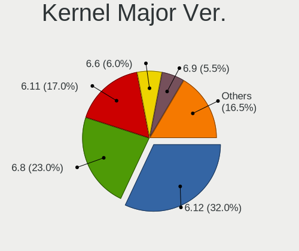

| Version | Computers | Percent |
|---------|-----------|---------|
| 5.15    | 74        | 38.95%  |
| 6.0     | 54        | 28.42%  |
| 5.19    | 15        | 7.89%   |
| 5.4     | 12        | 6.32%   |
| 5.13    | 9         | 4.74%   |
| 5.16    | 8         | 4.21%   |
| 6.1     | 6         | 3.16%   |
| 5.10    | 6         | 3.16%   |
| 5.8     | 1         | 0.53%   |
| 5.18    | 1         | 0.53%   |
| 5.17    | 1         | 0.53%   |
| 5.14    | 1         | 0.53%   |
| 5.11    | 1         | 0.53%   |
| 4.18    | 1         | 0.53%   |

Arch
----

OS architecture (x86_64, i586, etc.)

| Name    | Computers | Percent |
|---------|-----------|---------|
| x86_64  | 188       | 98.95%  |
| armv7l  | 1         | 0.53%   |
| aarch64 | 1         | 0.53%   |

DE
--

Desktop Environment

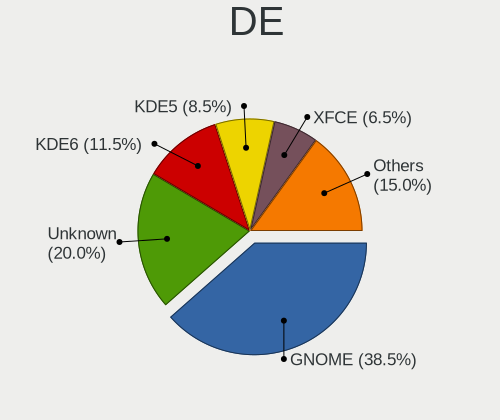

| Name          | Computers | Percent |
|---------------|-----------|---------|
| GNOME         | 89        | 46.84%  |
| KDE5          | 45        | 23.68%  |
| X-Cinnamon    | 20        | 10.53%  |
| XFCE          | 16        | 8.42%   |
| Unknown       | 7         | 3.68%   |
| MATE          | 6         | 3.16%   |
| LXDE          | 3         | 1.58%   |
| Unity         | 1         | 0.53%   |
| Pantheon      | 1         | 0.53%   |
| LXQt          | 1         | 0.53%   |
| GNOME Classic | 1         | 0.53%   |

Display Server
--------------

X11 or Wayland

| Name    | Computers | Percent |
|---------|-----------|---------|
| X11     | 139       | 73.16%  |
| Wayland | 43        | 22.63%  |
| Tty     | 6         | 3.16%   |
| Unknown | 2         | 1.05%   |

Display Manager
---------------

SDDM, LightDM, etc.

| Name    | Computers | Percent |
|---------|-----------|---------|
| Unknown | 74        | 38.95%  |
| GDM3    | 36        | 18.95%  |
| LightDM | 33        | 17.37%  |
| SDDM    | 30        | 15.79%  |
| GDM     | 15        | 7.89%   |
| LXDM    | 2         | 1.05%   |

OS Lang
-------

Language

| Lang           | Computers | Percent |
|----------------|-----------|---------|
| en_GB          | 148       | 77.89%  |
| en_US          | 31        | 16.32%  |
| C              | 4         | 2.11%   |
| Unknown        | 2         | 1.05%   |
| ru_UA          | 1         | 0.53%   |
| ru_RU          | 1         | 0.53%   |
| pl_PL          | 1         | 0.53%   |
| fr_FR          | 1         | 0.53%   |
| en_GB.iso88591 | 1         | 0.53%   |

Boot Mode
---------

EFI or BIOS

| Mode | Computers | Percent |
|------|-----------|---------|
| BIOS | 104       | 54.74%  |
| EFI  | 86        | 45.26%  |

Filesystem
----------

Type of filesystem

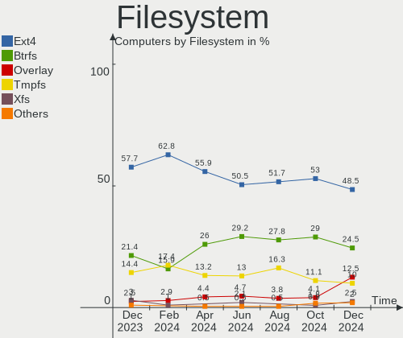

| Type    | Computers | Percent |
|---------|-----------|---------|
| Ext4    | 137       | 72.11%  |
| Btrfs   | 36        | 18.95%  |
| Overlay | 12        | 6.32%   |
| Xfs     | 2         | 1.05%   |
| Zfs     | 1         | 0.53%   |
| Ext3    | 1         | 0.53%   |
| Aufs    | 1         | 0.53%   |

Part. scheme
------------

Scheme of partitioning

| Type    | Computers | Percent |
|---------|-----------|---------|
| GPT     | 96        | 50.53%  |
| Unknown | 66        | 34.74%  |
| MBR     | 28        | 14.74%  |

Dual Boot with Linux/BSD
------------------------

Hosting more than one Linux/BSD

| Dual boot | Computers | Percent |
|-----------|-----------|---------|
| No        | 165       | 86.84%  |
| Yes       | 25        | 13.16%  |

Dual Boot (Win)
---------------

Hosting Linux and Windows

| Dual boot | Computers | Percent |
|-----------|-----------|---------|
| No        | 145       | 76.32%  |
| Yes       | 45        | 23.68%  |

Board
-----

Vendor
------

Motherboard manufacturer

| Name                                 | Computers | Percent |
|--------------------------------------|-----------|---------|
| Lenovo                               | 29        | 15.26%  |
| ASUSTek Computer                     | 24        | 12.63%  |
| Dell                                 | 23        | 12.11%  |
| Hewlett-Packard                      | 20        | 10.53%  |
| MSI                                  | 16        | 8.42%   |
| Gigabyte Technology                  | 13        | 6.84%   |
| Acer                                 | 11        | 5.79%   |
| Valve                                | 10        | 5.26%   |
| Toshiba                              | 5         | 2.63%   |
| ASRock                               | 5         | 2.63%   |
| Apple                                | 5         | 2.63%   |
| Samsung Electronics                  | 4         | 2.11%   |
| Intel                                | 3         | 1.58%   |
| Star Labs                            | 2         | 1.05%   |
| Raspberry Pi Foundation              | 2         | 1.05%   |
| Microsoft                            | 2         | 1.05%   |
| Google                               | 2         | 1.05%   |
| Alienware                            | 2         | 1.05%   |
| Unknown                              | 2         | 1.05%   |
| Teclast                              | 1         | 0.53%   |
| System76                             | 1         | 0.53%   |
| Supermicro                           | 1         | 0.53%   |
| Shenzhen Meigao Electronic Equipment | 1         | 0.53%   |
| RM Education                         | 1         | 0.53%   |
| PC Specialist                        | 1         | 0.53%   |
| LG Electronics                       | 1         | 0.53%   |
| Fusion5                              | 1         | 0.53%   |
| ECS                                  | 1         | 0.53%   |
| CompuLab                             | 1         | 0.53%   |

Model
-----

Motherboard model

| Name                                          | Computers | Percent |
|-----------------------------------------------|-----------|---------|
| Valve Jupiter                                 | 10        | 5.26%   |
| MSI MS-7C91                                   | 2         | 1.05%   |
| ASUS ROG STRIX B550-F GAMING                  | 2         | 1.05%   |
| ASUS ROG STRIX B450-F GAMING                  | 2         | 1.05%   |
| Unknown                                       | 2         | 1.05%   |
| Toshiba Satellite Pro C50-A-1MX               | 1         | 0.53%   |
| Toshiba Satellite C855-1W4                    | 1         | 0.53%   |
| Toshiba Satellite C850-1GL                    | 1         | 0.53%   |
| Toshiba Satellite C50-B                       | 1         | 0.53%   |
| Toshiba EQUIUM A300D                          | 1         | 0.53%   |
| Teclast X4                                    | 1         | 0.53%   |
| System76 Lemur Pro                            | 1         | 0.53%   |
| Supermicro C7Q67                              | 1         | 0.53%   |
| Star Labs StarLite                            | 1         | 0.53%   |
| Star Labs StarBook                            | 1         | 0.53%   |
| Shenzhen Meigao Electronic Equipment HX90G    | 1         | 0.53%   |
| Samsung NB30/N146                             | 1         | 0.53%   |
| Samsung 3570R/370R/470R/450R/510R/4450RV      | 1         | 0.53%   |
| Samsung 300E4C/300E5C/300E7C                  | 1         | 0.53%   |
| Samsung 300E4A/300E5A/300E7A                  | 1         | 0.53%   |
| RM Education RM                               | 1         | 0.53%   |
| RPi Raspberry Pi 3 Model B Rev 1.2            | 1         | 0.53%   |
| RPi Raspberry Pi 2 Model B Rev 1.1            | 1         | 0.53%   |
| PC Specialist PCX0DX                          | 1         | 0.53%   |
| MSI Stealth GS66 12UGS                        | 1         | 0.53%   |
| MSI Prestige 14 A11SC                         | 1         | 0.53%   |
| MSI MS-7D76                                   | 1         | 0.53%   |
| MSI MS-7D70                                   | 1         | 0.53%   |
| MSI MS-7D25                                   | 1         | 0.53%   |
| MSI MS-7C56                                   | 1         | 0.53%   |
| MSI MS-7C37                                   | 1         | 0.53%   |
| MSI MS-7B51                                   | 1         | 0.53%   |
| MSI MS-7B09                                   | 1         | 0.53%   |
| MSI MS-7A38                                   | 1         | 0.53%   |
| MSI MS-7A12                                   | 1         | 0.53%   |
| MSI Delta 15 A5EFK                            | 1         | 0.53%   |
| MSI CCL Ryzen 5 5600G B550 Motherboard Bundle | 1         | 0.53%   |
| MSI Alpha 15 A4DEK                            | 1         | 0.53%   |
| Microsoft Surface Laptop Go                   | 1         | 0.53%   |
| Microsoft Surface Laptop 4                    | 1         | 0.53%   |

Model Family
------------

Motherboard model prefix

| Name                                       | Computers | Percent |
|--------------------------------------------|-----------|---------|
| Lenovo ThinkPad                            | 15        | 7.89%   |
| Valve Jupiter                              | 10        | 5.26%   |
| Acer Aspire                                | 8         | 4.21%   |
| Dell Latitude                              | 7         | 3.68%   |
| HP Pavilion                                | 6         | 3.16%   |
| ASUS ROG                                   | 6         | 3.16%   |
| Lenovo Yoga                                | 5         | 2.63%   |
| Lenovo ThinkCentre                         | 5         | 2.63%   |
| Dell XPS                                   | 5         | 2.63%   |
| Toshiba Satellite                          | 4         | 2.11%   |
| Dell OptiPlex                              | 4         | 2.11%   |
| HP EliteBook                               | 3         | 1.58%   |
| Dell Inspiron                              | 3         | 1.58%   |
| ASUS PRIME                                 | 3         | 1.58%   |
| RPi Raspberry                              | 2         | 1.05%   |
| MSI MS-7C91                                | 2         | 1.05%   |
| Microsoft Surface                          | 2         | 1.05%   |
| HP ProBook                                 | 2         | 1.05%   |
| HP ENVY                                    | 2         | 1.05%   |
| Dell Precision                             | 2         | 1.05%   |
| ASUS VivoBook                              | 2         | 1.05%   |
| ASUS TUF                                   | 2         | 1.05%   |
| Acer Swift                                 | 2         | 1.05%   |
| Unknown                                    | 2         | 1.05%   |
| Toshiba EQUIUM                             | 1         | 0.53%   |
| Teclast X4                                 | 1         | 0.53%   |
| System76 Lemur                             | 1         | 0.53%   |
| Supermicro C7Q67                           | 1         | 0.53%   |
| Star Labs StarLite                         | 1         | 0.53%   |
| Star Labs StarBook                         | 1         | 0.53%   |
| Shenzhen Meigao Electronic Equipment HX90G | 1         | 0.53%   |
| Samsung NB30                               | 1         | 0.53%   |
| Samsung 3570R                              | 1         | 0.53%   |
| Samsung 300E4C                             | 1         | 0.53%   |
| Samsung 300E4A                             | 1         | 0.53%   |
| RM Education RM                            | 1         | 0.53%   |
| PC Specialist PCX0DX                       | 1         | 0.53%   |
| MSI Stealth                                | 1         | 0.53%   |
| MSI Prestige                               | 1         | 0.53%   |
| MSI MS-7D76                                | 1         | 0.53%   |

MFG Year
--------

Motherboard manufacture year

| Year    | Computers | Percent |
|---------|-----------|---------|
| 2022    | 31        | 16.32%  |
| 2021    | 20        | 10.53%  |
| 2018    | 18        | 9.47%   |
| 2020    | 15        | 7.89%   |
| 2019    | 14        | 7.37%   |
| 2014    | 14        | 7.37%   |
| 2013    | 11        | 5.79%   |
| 2012    | 10        | 5.26%   |
| 2015    | 9         | 4.74%   |
| 2011    | 9         | 4.74%   |
| 2017    | 8         | 4.21%   |
| 2010    | 8         | 4.21%   |
| 2008    | 8         | 4.21%   |
| 2016    | 6         | 3.16%   |
| 2009    | 4         | 2.11%   |
| Unknown | 2         | 1.05%   |
| 2007    | 1         | 0.53%   |
| 2006    | 1         | 0.53%   |
| 2005    | 1         | 0.53%   |

Form Factor
-----------

Physical design of the computer

| Name           | Computers | Percent |
|----------------|-----------|---------|
| Notebook       | 100       | 52.63%  |
| Desktop        | 74        | 38.95%  |
| Convertible    | 6         | 3.16%   |
| Tablet         | 3         | 1.58%   |
| Mini pc        | 3         | 1.58%   |
| System on chip | 2         | 1.05%   |
| All in one     | 2         | 1.05%   |

Secure Boot
-----------

Enabled or disabled

| State    | Computers | Percent |
|----------|-----------|---------|
| Disabled | 179       | 94.21%  |
| Enabled  | 11        | 5.79%   |

Coreboot
--------

Have coreboot on board

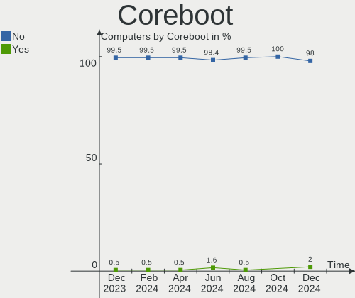

| Used | Computers | Percent |
|------|-----------|---------|
| No   | 185       | 97.37%  |
| Yes  | 5         | 2.63%   |

RAM Size
--------

Total RAM memory

| Size in GB  | Computers | Percent |
|-------------|-----------|---------|
| 16.01-24.0  | 43        | 22.63%  |
| 8.01-16.0   | 38        | 20%     |
| 4.01-8.0    | 37        | 19.47%  |
| 32.01-64.0  | 30        | 15.79%  |
| 3.01-4.0    | 21        | 11.05%  |
| 24.01-32.0  | 8         | 4.21%   |
| 64.01-256.0 | 5         | 2.63%   |
| 1.01-2.0    | 4         | 2.11%   |
| 2.01-3.0    | 2         | 1.05%   |
| 0.51-1.0    | 2         | 1.05%   |

RAM Used
--------

Used RAM memory

| Used GB    | Computers | Percent |
|------------|-----------|---------|
| 2.01-3.0   | 48        | 25.26%  |
| 4.01-8.0   | 46        | 24.21%  |
| 1.01-2.0   | 44        | 23.16%  |
| 3.01-4.0   | 31        | 16.32%  |
| 0.51-1.0   | 9         | 4.74%   |
| 8.01-16.0  | 7         | 3.68%   |
| 0.01-0.5   | 4         | 2.11%   |
| 24.01-32.0 | 1         | 0.53%   |

Total Drives
------------

Number of drives on board

| Drives | Computers | Percent |
|--------|-----------|---------|
| 1      | 108       | 56.84%  |
| 2      | 46        | 24.21%  |
| 3      | 13        | 6.84%   |
| 4      | 11        | 5.79%   |
| 5      | 7         | 3.68%   |
| 6      | 3         | 1.58%   |
| 10     | 1         | 0.53%   |
| 0      | 1         | 0.53%   |

Has CD-ROM
----------

Has CD-ROM on board

| Presented | Computers | Percent |
|-----------|-----------|---------|
| No        | 127       | 66.84%  |
| Yes       | 63        | 33.16%  |

Has Ethernet
------------

Has Ethernet on board

| Presented | Computers | Percent |
|-----------|-----------|---------|
| Yes       | 155       | 81.58%  |
| No        | 35        | 18.42%  |

Has WiFi
--------

Has WiFi module

| Presented | Computers | Percent |
|-----------|-----------|---------|
| Yes       | 146       | 76.84%  |
| No        | 44        | 23.16%  |

Has Bluetooth
-------------

Has Bluetooth module

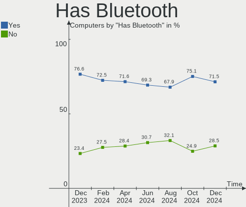

| Presented | Computers | Percent |
|-----------|-----------|---------|
| Yes       | 122       | 64.21%  |
| No        | 68        | 35.79%  |

Location
--------

Country
-------

Geographic location (country)

| Country | Computers | Percent |
|---------|-----------|---------|
| UK      | 190       | 100%    |

City
----

Geographic location (city)

| City               | Computers | Percent |
|--------------------|-----------|---------|
| London             | 34        | 17.89%  |
| Manchester         | 5         | 2.63%   |
| Birmingham         | 5         | 2.63%   |
| Bristol            | 4         | 2.11%   |
| Perth              | 3         | 1.58%   |
| Newton Abbot       | 3         | 1.58%   |
| Gloucester         | 3         | 1.58%   |
| York               | 2         | 1.05%   |
| Wolverhampton      | 2         | 1.05%   |
| Watford            | 2         | 1.05%   |
| Warwick            | 2         | 1.05%   |
| Thornton Heath     | 2         | 1.05%   |
| Stoke-on-Trent     | 2         | 1.05%   |
| Rotherham          | 2         | 1.05%   |
| Rochester          | 2         | 1.05%   |
| Reading            | 2         | 1.05%   |
| Nottingham         | 2         | 1.05%   |
| Luton              | 2         | 1.05%   |
| Llandudno          | 2         | 1.05%   |
| Leeds              | 2         | 1.05%   |
| Harrow             | 2         | 1.05%   |
| Gateshead          | 2         | 1.05%   |
| Edinburgh          | 2         | 1.05%   |
| Croydon            | 2         | 1.05%   |
| Cardiff            | 2         | 1.05%   |
| Cambridge          | 2         | 1.05%   |
| Yeovil             | 1         | 0.53%   |
| Wrexham            | 1         | 0.53%   |
| Workington         | 1         | 0.53%   |
| Worcester          | 1         | 0.53%   |
| Witham             | 1         | 0.53%   |
| Wigan              | 1         | 0.53%   |
| Welwyn Garden City | 1         | 0.53%   |
| Warrington         | 1         | 0.53%   |
| Walthamstow        | 1         | 0.53%   |
| Wallsend           | 1         | 0.53%   |
| Uxbridge           | 1         | 0.53%   |
| Unstone            | 1         | 0.53%   |
| Twickenham         | 1         | 0.53%   |
| Thrapston          | 1         | 0.53%   |

Drives
------

Drive Vendor
------------

Hard drive vendors

| Vendor                      | Computers | Drives | Percent |
|-----------------------------|-----------|--------|---------|
| Samsung Electronics         | 53        | 73     | 17.85%  |
| WDC                         | 35        | 44     | 11.78%  |
| Seagate                     | 32        | 38     | 10.77%  |
| Crucial                     | 21        | 23     | 7.07%   |
| Toshiba                     | 19        | 20     | 6.4%    |
| SanDisk                     | 19        | 21     | 6.4%    |
| Unknown                     | 18        | 18     | 6.06%   |
| Kingston                    | 13        | 14     | 4.38%   |
| Phison Electronics          | 9         | 10     | 3.03%   |
| Intel                       | 7         | 7      | 2.36%   |
| Hitachi                     | 7         | 7      | 2.36%   |
| SK hynix                    | 6         | 6      | 2.02%   |
| Unknown                     | 5         | 5      | 1.68%   |
| HGST                        | 4         | 4      | 1.35%   |
| A-DATA Technology           | 4         | 4      | 1.35%   |
| Micron/Crucial Technology   | 3         | 3      | 1.01%   |
| Micron Technology           | 3         | 3      | 1.01%   |
| Transcend                   | 2         | 2      | 0.67%   |
| Silicon Motion              | 2         | 2      | 0.67%   |
| PNY                         | 2         | 2      | 0.67%   |
| OCZ                         | 2         | 2      | 0.67%   |
| O2 Micro                    | 2         | 2      | 0.67%   |
| KIOXIA-EXCERIA              | 2         | 2      | 0.67%   |
| Kingston Technology Company | 2         | 2      | 0.67%   |
| China                       | 2         | 2      | 0.67%   |
| Apple                       | 2         | 2      | 0.67%   |
| ADATA Technology            | 2         | 2      | 0.67%   |
| Union Memory (Shenzhen)     | 1         | 1      | 0.34%   |
| TSA                         | 1         | 1      | 0.34%   |
| TO Exter                    | 1         | 1      | 0.34%   |
| Teclast                     | 1         | 1      | 0.34%   |
| Star Drive                  | 1         | 1      | 0.34%   |
| Star                        | 1         | 1      | 0.34%   |
| SABRENT                     | 1         | 1      | 0.34%   |
| RSH-339                     | 1         | 1      | 0.34%   |
| Realtek Semiconductor       | 1         | 1      | 0.34%   |
| Realtek                     | 1         | 1      | 0.34%   |
| Phison                      | 1         | 1      | 0.34%   |
| Netac                       | 1         | 2      | 0.34%   |
| Maxtor                      | 1         | 1      | 0.34%   |

Drive Model
-----------

Hard drive models

| Model                                               | Computers | Percent |
|-----------------------------------------------------|-----------|---------|
| Samsung NVMe SSD Controller SM981/PM981/PM983 500GB | 8         | 2.4%    |
| Crucial CT240BX500SSD1 240GB                        | 8         | 2.4%    |
| Kingston SA400S37240G 240GB SSD                     | 6         | 1.8%    |
| Unknown                                             | 5         | 1.5%    |
| Phison PS5013 E13 NVMe Controller 512GB             | 4         | 1.2%    |
| Phison E16 PCIe4 NVMe Controller 512GB              | 4         | 1.2%    |
| Unknown MMC Card  512GB                             | 3         | 0.9%    |
| Toshiba MQ01ABF050 500GB                            | 3         | 0.9%    |
| Toshiba BG3 NVMe SSD Controller 256GB               | 3         | 0.9%    |
| Seagate ST4000DM004-2CV104 4TB                      | 3         | 0.9%    |
| Seagate ST4000DM000-1F2168 4TB                      | 3         | 0.9%    |
| Sandisk WD Black SN850 1TB                          | 3         | 0.9%    |
| SanDisk NVMe SSD Drive 500GB                        | 3         | 0.9%    |
| Samsung SSD 870 QVO 1TB                             | 3         | 0.9%    |
| Samsung NVMe SSD Controller PM9A1/PM9A3/980PRO 2TB  | 3         | 0.9%    |
| Crucial CT1000MX500SSD1 1TB                         | 3         | 0.9%    |
| WDC WDS500G2B0A-00SM50 500GB SSD                    | 2         | 0.6%    |
| WDC WD40EZRX-00SPEB0 4TB                            | 2         | 0.6%    |
| WDC WD20EZRZ-00Z5HB0 2TB                            | 2         | 0.6%    |
| WDC WD20EFRX-68EUZN0 2TB                            | 2         | 0.6%    |
| Unknown SD/MMC/MS PRO 64GB                          | 2         | 0.6%    |
| Unknown MMC Card  128GB                             | 2         | 0.6%    |
| Toshiba MK2555GSX 250GB                             | 2         | 0.6%    |
| Toshiba DT01ACA200 2TB                              | 2         | 0.6%    |
| SK hynix SKHynix_HFM512GD3HX015N 512GB              | 2         | 0.6%    |
| Seagate ST9500325AS 500GB                           | 2         | 0.6%    |
| Seagate ST2000DM001-1ER164 2TB                      | 2         | 0.6%    |
| Seagate ST2000DM001-1CH164 2TB                      | 2         | 0.6%    |
| Seagate ST1000LM014-SSHD-8GB                        | 2         | 0.6%    |
| Seagate ST1000DM010-2EP102 1TB                      | 2         | 0.6%    |
| SanDisk SDSSDP128G 128GB                            | 2         | 0.6%    |
| SanDisk NVMe SSD Drive 1TB                          | 2         | 0.6%    |
| Samsung SSD 980 PRO 1TB                             | 2         | 0.6%    |
| Samsung SSD 980 500GB                               | 2         | 0.6%    |
| Samsung SSD 980 1TB                                 | 2         | 0.6%    |
| Samsung SSD 970 EVO Plus 1TB                        | 2         | 0.6%    |
| Samsung SSD 860 EVO 1TB                             | 2         | 0.6%    |
| Samsung Portable SSD T5 250GB                       | 2         | 0.6%    |
| Samsung HD204UI 2TB                                 | 2         | 0.6%    |
| O2 Micro E2M2 64GB                                  | 2         | 0.6%    |

HDD Vendor
----------

Hard disk drive vendors

| Vendor              | Computers | Drives | Percent |
|---------------------|-----------|--------|---------|
| Seagate             | 32        | 37     | 34.78%  |
| WDC                 | 24        | 30     | 26.09%  |
| Toshiba             | 12        | 12     | 13.04%  |
| Samsung Electronics | 8         | 9      | 8.7%    |
| Hitachi             | 7         | 7      | 7.61%   |
| HGST                | 4         | 4      | 4.35%   |
| Unknown             | 2         | 2      | 2.17%   |
| RSH-339             | 1         | 1      | 1.09%   |
| Maxtor              | 1         | 1      | 1.09%   |
| Apple               | 1         | 1      | 1.09%   |

SSD Vendor
----------

Solid state drive vendors

| Vendor              | Computers | Drives | Percent |
|---------------------|-----------|--------|---------|
| Samsung Electronics | 23        | 29     | 24.73%  |
| Crucial             | 20        | 22     | 21.51%  |
| Kingston            | 10        | 11     | 10.75%  |
| WDC                 | 6         | 7      | 6.45%   |
| SanDisk             | 6         | 6      | 6.45%   |
| A-DATA Technology   | 4         | 4      | 4.3%    |
| PNY                 | 2         | 2      | 2.15%   |
| OCZ                 | 2         | 2      | 2.15%   |
| KIOXIA-EXCERIA      | 2         | 2      | 2.15%   |
| Intel               | 2         | 2      | 2.15%   |
| China               | 2         | 2      | 2.15%   |
| Unknown             | 2         | 2      | 2.15%   |
| Unknown             | 1         | 1      | 1.08%   |
| TSA                 | 1         | 1      | 1.08%   |
| Transcend           | 1         | 1      | 1.08%   |
| Toshiba             | 1         | 1      | 1.08%   |
| TO Exter            | 1         | 1      | 1.08%   |
| Teclast             | 1         | 1      | 1.08%   |
| Star                | 1         | 1      | 1.08%   |
| Netac               | 1         | 2      | 1.08%   |
| MaxDigital          | 1         | 1      | 1.08%   |
| Gigabyte Technology | 1         | 1      | 1.08%   |
| Drevo               | 1         | 1      | 1.08%   |
| Corsair             | 1         | 2      | 1.08%   |

Drive Kind
----------

HDD or SSD

| Kind    | Computers | Drives | Percent |
|---------|-----------|--------|---------|
| NVMe    | 93        | 112    | 35.91%  |
| SSD     | 77        | 105    | 29.73%  |
| HDD     | 69        | 104    | 26.64%  |
| MMC     | 18        | 18     | 6.95%   |
| Unknown | 2         | 2      | 0.77%   |

Drive Connector
---------------

SATA, SAS, NVMe, etc.

| Type | Computers | Drives | Percent |
|------|-----------|--------|---------|
| SATA | 116       | 193    | 47.93%  |
| NVMe | 91        | 110    | 37.6%   |
| MMC  | 18        | 18     | 7.44%   |
| SAS  | 17        | 20     | 7.02%   |

Drive Size
----------

Size of hard drive

| Size in TB | Computers | Drives | Percent |
|------------|-----------|--------|---------|
| 0.01-0.5   | 85        | 107    | 50.3%   |
| 0.51-1.0   | 39        | 46     | 23.08%  |
| 1.01-2.0   | 24        | 30     | 14.2%   |
| 3.01-4.0   | 15        | 18     | 8.88%   |
| 4.01-10.0  | 4         | 4      | 2.37%   |
| 2.01-3.0   | 1         | 1      | 0.59%   |
| 10.01-20.0 | 1         | 3      | 0.59%   |

Space Total
-----------

Amount of disk space available on the file system

| Size in GB     | Computers | Percent |
|----------------|-----------|---------|
| 101-250        | 44        | 23.16%  |
| 501-1000       | 36        | 18.95%  |
| 251-500        | 35        | 18.42%  |
| More than 3000 | 22        | 11.58%  |
| 1001-2000      | 14        | 7.37%   |
| 1-20           | 11        | 5.79%   |
| 51-100         | 9         | 4.74%   |
| 2001-3000      | 7         | 3.68%   |
| Unknown        | 7         | 3.68%   |
| 21-50          | 5         | 2.63%   |

Space Used
----------

Amount of used disk space

| Used GB        | Computers | Percent |
|----------------|-----------|---------|
| 1-20           | 63        | 33.16%  |
| 51-100         | 27        | 14.21%  |
| 21-50          | 24        | 12.63%  |
| 251-500        | 21        | 11.05%  |
| 101-250        | 19        | 10%     |
| 501-1000       | 10        | 5.26%   |
| More than 3000 | 7         | 3.68%   |
| Unknown        | 7         | 3.68%   |
| 2001-3000      | 6         | 3.16%   |
| 1001-2000      | 6         | 3.16%   |

Malfunc. Drives
---------------

Drive models with a malfunction

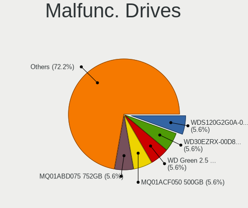

| Model                                    | Computers | Drives | Percent |
|------------------------------------------|-----------|--------|---------|
| WDC WD10EARS-00Y5B1 1TB                  | 1         | 2      | 6.67%   |
| Toshiba MK2555GSX 250GB                  | 1         | 1      | 6.67%   |
| Toshiba DT01ACA200 2TB                   | 1         | 1      | 6.67%   |
| Seagate ST9500325AS 500GB                | 1         | 1      | 6.67%   |
| Seagate ST3320310CS 320GB                | 1         | 1      | 6.67%   |
| Seagate ST31000340NS 1TB                 | 1         | 1      | 6.67%   |
| Samsung Electronics SSD 840 Series 120GB | 1         | 1      | 6.67%   |
| Samsung Electronics HM160HI 160GB        | 1         | 1      | 6.67%   |
| Samsung Electronics HD753LJ 752GB        | 1         | 1      | 6.67%   |
| Samsung Electronics HD103SJ 1TB          | 1         | 1      | 6.67%   |
| Intel SSD 600P Series 512GB              | 1         | 1      | 6.67%   |
| Hitachi HDT725025VLA380 250GB            | 1         | 1      | 6.67%   |
| Drevo X1 Pro SSD 128GB                   | 1         | 1      | 6.67%   |
| Crucial CT128M550SSD1 128GB              | 1         | 1      | 6.67%   |
| A-DATA Technology SU630 480GB SSD        | 1         | 1      | 6.67%   |

Malfunc. Drive Vendor
---------------------

Vendors of faulty drives

| Vendor              | Computers | Drives | Percent |
|---------------------|-----------|--------|---------|
| Seagate             | 3         | 3      | 21.43%  |
| Samsung Electronics | 3         | 4      | 21.43%  |
| Toshiba             | 2         | 2      | 14.29%  |
| WDC                 | 1         | 2      | 7.14%   |
| Intel               | 1         | 1      | 7.14%   |
| Hitachi             | 1         | 1      | 7.14%   |
| Drevo               | 1         | 1      | 7.14%   |
| Crucial             | 1         | 1      | 7.14%   |
| A-DATA Technology   | 1         | 1      | 7.14%   |

Malfunc. HDD Vendor
-------------------

Vendors of faulty HDD drives

| Vendor              | Computers | Drives | Percent |
|---------------------|-----------|--------|---------|
| Seagate             | 3         | 3      | 33.33%  |
| Toshiba             | 2         | 2      | 22.22%  |
| Samsung Electronics | 2         | 3      | 22.22%  |
| WDC                 | 1         | 2      | 11.11%  |
| Hitachi             | 1         | 1      | 11.11%  |

Malfunc. Drive Kind
-------------------

Kinds of faulty drives

| Kind | Computers | Drives | Percent |
|------|-----------|--------|---------|
| HDD  | 9         | 11     | 64.29%  |
| SSD  | 4         | 4      | 28.57%  |
| NVMe | 1         | 1      | 7.14%   |

Failed Drives
-------------

Failed drive models

| Model                           | Computers | Drives | Percent |
|---------------------------------|-----------|--------|---------|
| Toshiba DT01ACA100 1TB          | 1         | 1      | 50%     |
| Samsung Electronics SSD 980 1TB | 1         | 1      | 50%     |

Failed Drive Vendor
-------------------

Failed drive vendors

| Vendor              | Computers | Drives | Percent |
|---------------------|-----------|--------|---------|
| Toshiba             | 1         | 1      | 50%     |
| Samsung Electronics | 1         | 1      | 50%     |

Drive Status
------------

Number of failed and malfunc. drives

| Status   | Computers | Drives | Percent |
|----------|-----------|--------|---------|
| Detected | 112       | 206    | 53.59%  |
| Works    | 82        | 117    | 39.23%  |
| Malfunc  | 13        | 16     | 6.22%   |
| Failed   | 2         | 2      | 0.96%   |

Storage controller
------------------

Storage Vendor
--------------

Storage controller vendors

| Vendor                       | Computers | Percent |
|------------------------------|-----------|---------|
| Intel                        | 104       | 40%     |
| AMD                          | 46        | 17.69%  |
| Samsung Electronics          | 30        | 11.54%  |
| Sandisk                      | 19        | 7.31%   |
| Phison Electronics           | 11        | 4.23%   |
| Toshiba America Info Systems | 8         | 3.08%   |
| SK hynix                     | 6         | 2.31%   |
| Nvidia                       | 6         | 2.31%   |
| Kingston Technology Company  | 5         | 1.92%   |
| ASMedia Technology           | 5         | 1.92%   |
| Micron/Crucial Technology    | 4         | 1.54%   |
| Silicon Motion               | 3         | 1.15%   |
| Micron Technology            | 3         | 1.15%   |
| O2 Micro                     | 2         | 0.77%   |
| ADATA Technology             | 2         | 0.77%   |
| Union Memory (Shenzhen)      | 1         | 0.38%   |
| Realtek Semiconductor        | 1         | 0.38%   |
| Marvell Technology Group     | 1         | 0.38%   |
| JMicron Technology           | 1         | 0.38%   |
| Apple                        | 1         | 0.38%   |
| Adaptec                      | 1         | 0.38%   |

Storage Model
-------------

Storage controller models

| Model                                                                          | Computers | Percent |
|--------------------------------------------------------------------------------|-----------|---------|
| AMD FCH SATA Controller [AHCI mode]                                            | 25        | 8.5%    |
| Samsung NVMe SSD Controller SM981/PM981/PM983                                  | 13        | 4.42%   |
| Intel 7 Series Chipset Family 6-port SATA Controller [AHCI mode]               | 12        | 4.08%   |
| AMD 500 Series Chipset SATA Controller                                         | 10        | 3.4%    |
| Samsung NVMe SSD Controller 980                                                | 9         | 3.06%   |
| SanDisk Non-Volatile memory controller                                         | 8         | 2.72%   |
| Samsung NVMe SSD Controller PM9A1/PM9A3/980PRO                                 | 8         | 2.72%   |
| Intel Q170/Q150/B150/H170/H110/Z170/CM236 Chipset SATA Controller [AHCI Mode]  | 8         | 2.72%   |
| Intel 8 Series/C220 Series Chipset Family 6-port SATA Controller 1 [AHCI mode] | 8         | 2.72%   |
| AMD 400 Series Chipset SATA Controller                                         | 8         | 2.72%   |
| SK hynix Gold P31/PC711 NVMe Solid State Drive                                 | 5         | 1.7%    |
| SanDisk WD PC SN810 / Black SN850 NVMe SSD                                     | 5         | 1.7%    |
| Intel Volume Management Device NVMe RAID Controller                            | 5         | 1.7%    |
| ASMedia ASM1062 Serial ATA Controller                                          | 5         | 1.7%    |
| AMD SATA controller                                                            | 5         | 1.7%    |
| Toshiba America Info Systems BG3 NVMe SSD Controller                           | 4         | 1.36%   |
| Phison PS5013 E13 NVMe Controller                                              | 4         | 1.36%   |
| Phison E16 PCIe4 NVMe Controller                                               | 4         | 1.36%   |
| Intel Wildcat Point-LP SATA Controller [AHCI Mode]                             | 4         | 1.36%   |
| Intel 82801IBM/IEM (ICH9M/ICH9M-E) 4 port SATA Controller [AHCI mode]          | 4         | 1.36%   |
| Intel 82801 Mobile SATA Controller [RAID mode]                                 | 4         | 1.36%   |
| Intel 8 Series SATA Controller 1 [AHCI mode]                                   | 4         | 1.36%   |
| AMD SB7x0/SB8x0/SB9x0 IDE Controller                                           | 4         | 1.36%   |
| SanDisk WD Blue SN570 NVMe SSD                                                 | 3         | 1.02%   |
| Micron/Crucial P2 NVMe PCIe SSD                                                | 3         | 1.02%   |
| Micron Non-Volatile memory controller                                          | 3         | 1.02%   |
| Intel 82801JI (ICH10 Family) SATA AHCI Controller                              | 3         | 1.02%   |
| Intel 6 Series/C200 Series Chipset Family 6 port Desktop SATA AHCI Controller  | 3         | 1.02%   |
| Intel 5 Series/3400 Series Chipset 6 port SATA AHCI Controller                 | 3         | 1.02%   |
| AMD SB7x0/SB8x0/SB9x0 SATA Controller [AHCI mode]                              | 3         | 1.02%   |
| Toshiba America Info Systems XG6 NVMe SSD Controller                           | 2         | 0.68%   |
| Silicon Motion SM2263EN/SM2263XT SSD Controller                                | 2         | 0.68%   |
| SanDisk WD Blue SN550 NVMe SSD                                                 | 2         | 0.68%   |
| SanDisk WD Black 2018/SN750 / PC SN720 NVMe SSD                                | 2         | 0.68%   |
| Phison E12 NVMe Controller                                                     | 2         | 0.68%   |
| O2 Micro Non-Volatile memory controller                                        | 2         | 0.68%   |
| Nvidia MCP79 AHCI Controller                                                   | 2         | 0.68%   |
| Kingston Company Company Non-Volatile memory controller                        | 2         | 0.68%   |
| Kingston Company A2000 NVMe SSD                                                | 2         | 0.68%   |
| Intel Sunrise Point-LP SATA Controller [AHCI mode]                             | 2         | 0.68%   |

Storage Kind
------------

Kind of storage controller (IDE, SATA, NVMe, SAS, ...)

| Kind | Computers | Percent |
|------|-----------|---------|
| SATA | 132       | 52.38%  |
| NVMe | 91        | 36.11%  |
| IDE  | 17        | 6.75%   |
| RAID | 12        | 4.76%   |

Processor
---------

CPU Vendor
----------

Processor vendors

| Vendor | Computers | Percent |
|--------|-----------|---------|
| Intel  | 125       | 65.79%  |
| AMD    | 63        | 33.16%  |
| ARM    | 2         | 1.05%   |

CPU Model
---------

Processor models

| Model                                       | Computers | Percent |
|---------------------------------------------|-----------|---------|
| AMD Custom APU 0405                         | 10        | 5.26%   |
| AMD Ryzen 7 5700U with Radeon Graphics      | 5         | 2.63%   |
| Intel Core i7-10510U CPU @ 1.80GHz          | 4         | 2.11%   |
| AMD Ryzen 5 5600X 6-Core Processor          | 4         | 2.11%   |
| AMD Ryzen 5 3600 6-Core Processor           | 4         | 2.11%   |
| Intel Core i7-8850H CPU @ 2.60GHz           | 3         | 1.58%   |
| Intel Core i7-8550U CPU @ 1.80GHz           | 3         | 1.58%   |
| Intel Core i5-3320M CPU @ 2.60GHz           | 3         | 1.58%   |
| Intel 12th Gen Core i7-1260P                | 3         | 1.58%   |
| Intel 11th Gen Core i7-1165G7 @ 2.80GHz     | 3         | 1.58%   |
| AMD Ryzen 9 3900X 12-Core Processor         | 3         | 1.58%   |
| AMD Ryzen 5 5600G with Radeon Graphics      | 3         | 1.58%   |
| Intel Core i7-8650U CPU @ 1.90GHz           | 2         | 1.05%   |
| Intel Core i7-6700K CPU @ 4.00GHz           | 2         | 1.05%   |
| Intel Core i7-4510U CPU @ 2.00GHz           | 2         | 1.05%   |
| Intel Core i5-6500T CPU @ 2.50GHz           | 2         | 1.05%   |
| Intel Core i5-5300U CPU @ 2.30GHz           | 2         | 1.05%   |
| Intel Core i5-5200U CPU @ 2.20GHz           | 2         | 1.05%   |
| Intel Core i5-4590 CPU @ 3.30GHz            | 2         | 1.05%   |
| Intel Core i5-4570 CPU @ 3.20GHz            | 2         | 1.05%   |
| Intel Core i5-3210M CPU @ 2.50GHz           | 2         | 1.05%   |
| Intel Core i5-1035G1 CPU @ 1.00GHz          | 2         | 1.05%   |
| Intel Core i3-2330M CPU @ 2.20GHz           | 2         | 1.05%   |
| Intel Core 2 Duo CPU P8600 @ 2.40GHz        | 2         | 1.05%   |
| Intel 12th Gen Core i7-12700H               | 2         | 1.05%   |
| Intel 11th Gen Core i7-1185G7 @ 3.00GHz     | 2         | 1.05%   |
| AMD Ryzen 9 7950X 16-Core Processor         | 2         | 1.05%   |
| AMD Ryzen 9 5900HX with Radeon Graphics     | 2         | 1.05%   |
| AMD Ryzen 7 7700X 8-Core Processor          | 2         | 1.05%   |
| AMD Ryzen 7 4800H with Radeon Graphics      | 2         | 1.05%   |
| AMD Ryzen 7 3800X 8-Core Processor          | 2         | 1.05%   |
| AMD FX-8350 Eight-Core Processor            | 2         | 1.05%   |
| Intel Xeon CPU X5675 @ 3.07GHz              | 1         | 0.53%   |
| Intel Xeon CPU W3540 @ 2.93GHz              | 1         | 0.53%   |
| Intel Xeon CPU E5620 @ 2.40GHz              | 1         | 0.53%   |
| Intel Xeon CPU E5345 @ 2.33GHz              | 1         | 0.53%   |
| Intel Xeon CPU E5-2620 0 @ 2.00GHz          | 1         | 0.53%   |
| Intel Pentium Silver N5030 CPU @ 1.10GHz    | 1         | 0.53%   |
| Intel Pentium Gold G5400 CPU @ 3.70GHz      | 1         | 0.53%   |
| Intel Pentium Dual-Core CPU E5800 @ 3.20GHz | 1         | 0.53%   |

CPU Model Family
----------------

Processor model prefix

| Model                          | Computers | Percent |
|--------------------------------|-----------|---------|
| Intel Core i5                  | 33        | 17.37%  |
| Intel Core i7                  | 31        | 16.32%  |
| Other                          | 26        | 13.68%  |
| AMD Ryzen 5                    | 17        | 8.95%   |
| Intel Core i3                  | 14        | 7.37%   |
| AMD Ryzen 7                    | 14        | 7.37%   |
| AMD Ryzen 9                    | 8         | 4.21%   |
| Intel Core 2 Duo               | 7         | 3.68%   |
| Intel Celeron                  | 6         | 3.16%   |
| Intel Xeon                     | 5         | 2.63%   |
| Intel Pentium                  | 4         | 2.11%   |
| Intel Atom                     | 3         | 1.58%   |
| Intel Core 2 Quad              | 2         | 1.05%   |
| AMD FX                         | 2         | 1.05%   |
| AMD Athlon 64 X2               | 2         | 1.05%   |
| Intel Pentium Silver           | 1         | 0.53%   |
| Intel Pentium Gold             | 1         | 0.53%   |
| Intel Pentium Dual-Core        | 1         | 0.53%   |
| Intel Pentium Dual             | 1         | 0.53%   |
| Intel Core m7                  | 1         | 0.53%   |
| ARM BCM                        | 1         | 0.53%   |
| AMD Turion X2 Dual-Core Mobile | 1         | 0.53%   |
| AMD Sempron                    | 1         | 0.53%   |
| AMD Ryzen Threadripper         | 1         | 0.53%   |
| AMD Ryzen 5 PRO                | 1         | 0.53%   |
| AMD Ryzen 3                    | 1         | 0.53%   |
| AMD Phenom                     | 1         | 0.53%   |
| AMD Athlon II X4               | 1         | 0.53%   |
| AMD A8                         | 1         | 0.53%   |
| AMD A6                         | 1         | 0.53%   |
| AMD A10                        | 1         | 0.53%   |

CPU Cores
---------

Number of processor cores

| Number | Computers | Percent |
|--------|-----------|---------|
| 4      | 74        | 38.95%  |
| 2      | 55        | 28.95%  |
| 6      | 23        | 12.11%  |
| 8      | 20        | 10.53%  |
| 12     | 8         | 4.21%   |
| 14     | 3         | 1.58%   |
| 16     | 2         | 1.05%   |
| 10     | 2         | 1.05%   |
| 1      | 2         | 1.05%   |
| 24     | 1         | 0.53%   |

CPU Sockets
-----------

Number of sockets

| Number | Computers | Percent |
|--------|-----------|---------|
| 1      | 187       | 98.42%  |
| 2      | 3         | 1.58%   |

CPU Threads
-----------

Threads per core (Hyper-Threading)

| Number | Computers | Percent |
|--------|-----------|---------|
| 2      | 137       | 72.11%  |
| 1      | 53        | 27.89%  |

CPU Op-Modes
------------

CPU Operation Modes (32-bit, 64-bit)

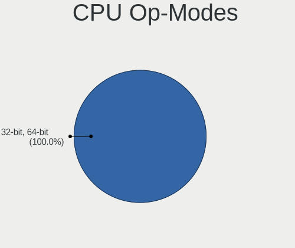

| Op mode        | Computers | Percent |
|----------------|-----------|---------|
| 32-bit, 64-bit | 189       | 99.47%  |
| Unknown        | 1         | 0.53%   |

CPU Microcode
-------------

Microcode number

| Number     | Computers | Percent |
|------------|-----------|---------|
| Unknown    | 66        | 34.74%  |
| 0x506e3    | 7         | 3.68%   |
| 0x306a9    | 7         | 3.68%   |
| 0x08701021 | 7         | 3.68%   |
| 0x206a7    | 6         | 3.16%   |
| 0x806ea    | 5         | 2.63%   |
| 0x306c3    | 5         | 2.63%   |
| 0x906a3    | 4         | 2.11%   |
| 0x906ea    | 3         | 1.58%   |
| 0x806ec    | 3         | 1.58%   |
| 0x806c1    | 3         | 1.58%   |
| 0x706e5    | 3         | 1.58%   |
| 0x40651    | 3         | 1.58%   |
| 0x306d4    | 3         | 1.58%   |
| 0x30678    | 3         | 1.58%   |
| 0x1067a    | 3         | 1.58%   |
| 0x0a601203 | 3         | 1.58%   |
| 0x0a50000c | 3         | 1.58%   |
| 0x08608103 | 3         | 1.58%   |
| 0xa0652    | 2         | 1.05%   |
| 0x906e9    | 2         | 1.05%   |
| 0x6fb      | 2         | 1.05%   |
| 0x406e3    | 2         | 1.05%   |
| 0x106ca    | 2         | 1.05%   |
| 0x0a50000d | 2         | 1.05%   |
| 0x08701013 | 2         | 1.05%   |
| 0x08001138 | 2         | 1.05%   |
| 0x010000c8 | 2         | 1.05%   |
| 0xb0671    | 1         | 0.53%   |
| 0xa0655    | 1         | 0.53%   |
| 0xa0653    | 1         | 0.53%   |
| 0x906c0    | 1         | 0.53%   |
| 0x906a4    | 1         | 0.53%   |
| 0x90672    | 1         | 0.53%   |
| 0x806e9    | 1         | 0.53%   |
| 0x806c2    | 1         | 0.53%   |
| 0x706a8    | 1         | 0.53%   |
| 0x6fd      | 1         | 0.53%   |
| 0x6f7      | 1         | 0.53%   |
| 0x506ca    | 1         | 0.53%   |

CPU Microarch
-------------

Microarchitecture

| Name             | Computers | Percent |
|------------------|-----------|---------|
| Unknown          | 24        | 12.63%  |
| KabyLake         | 20        | 10.53%  |
| Zen 2            | 16        | 8.42%   |
| Haswell          | 14        | 7.37%   |
| SandyBridge      | 12        | 6.32%   |
| Skylake          | 11        | 5.79%   |
| IvyBridge        | 10        | 5.26%   |
| Zen 3            | 9         | 4.74%   |
| Penryn           | 7         | 3.68%   |
| Alderlake Hybrid | 7         | 3.68%   |
| Westmere         | 6         | 3.16%   |
| TigerLake        | 6         | 3.16%   |
| Core             | 5         | 2.63%   |
| Zen+             | 4         | 2.11%   |
| Silvermont       | 4         | 2.11%   |
| IceLake          | 4         | 2.11%   |
| CometLake        | 4         | 2.11%   |
| Broadwell        | 4         | 2.11%   |
| Zen              | 3         | 1.58%   |
| K10              | 3         | 1.58%   |
| Puma             | 2         | 1.05%   |
| Piledriver       | 2         | 1.05%   |
| Nehalem          | 2         | 1.05%   |
| K8 Hammer        | 2         | 1.05%   |
| Goldmont plus    | 2         | 1.05%   |
| Goldmont         | 2         | 1.05%   |
| Bonnell          | 2         | 1.05%   |
| Tremont          | 1         | 0.53%   |
| K8 & K10 hybrid  | 1         | 0.53%   |
| Excavator        | 1         | 0.53%   |

Graphics
--------

GPU Vendor
----------

Vendors of graphics cards

| Vendor | Computers | Percent |
|--------|-----------|---------|
| Intel  | 99        | 46.26%  |
| Nvidia | 60        | 28.04%  |
| AMD    | 55        | 25.7%   |

GPU Model
---------

Graphics card models

| Model                                                                       | Computers | Percent |
|-----------------------------------------------------------------------------|-----------|---------|
| Intel 2nd Generation Core Processor Family Integrated Graphics Controller   | 10        | 4.52%   |
| AMD VanGogh [AMD Custom GPU 0405]                                           | 10        | 4.52%   |
| Intel 3rd Gen Core processor Graphics Controller                            | 8         | 3.62%   |
| Intel UHD Graphics 620                                                      | 6         | 2.71%   |
| Intel TigerLake-LP GT2 [Iris Xe Graphics]                                   | 6         | 2.71%   |
| Intel Mobile 4 Series Chipset Integrated Graphics Controller                | 5         | 2.26%   |
| Intel HD Graphics 530                                                       | 5         | 2.26%   |
| Intel Alder Lake-P Integrated Graphics Controller                           | 5         | 2.26%   |
| AMD Raphael                                                                 | 5         | 2.26%   |
| AMD Lucienne                                                                | 5         | 2.26%   |
| AMD Cezanne [Radeon Vega Series / Radeon Vega Mobile Series]                | 5         | 2.26%   |
| Nvidia GK208B [GeForce GT 710]                                              | 4         | 1.81%   |
| Intel Xeon E3-1200 v3/4th Gen Core Processor Integrated Graphics Controller | 4         | 1.81%   |
| Intel HD Graphics 5500                                                      | 4         | 1.81%   |
| Intel Haswell-ULT Integrated Graphics Controller                            | 4         | 1.81%   |
| Intel CometLake-U GT2 [UHD Graphics]                                        | 4         | 1.81%   |
| Intel CoffeeLake-H GT2 [UHD Graphics 630]                                   | 4         | 1.81%   |
| AMD Ellesmere [Radeon RX 470/480/570/570X/580/580X/590]                     | 4         | 1.81%   |
| Nvidia GT218 [GeForce 210]                                                  | 3         | 1.36%   |
| Nvidia GM206 [GeForce GTX 960]                                              | 3         | 1.36%   |
| Intel Core Processor Integrated Graphics Controller                         | 3         | 1.36%   |
| Intel Atom Processor Z36xxx/Z37xxx Series Graphics & Display                | 3         | 1.36%   |
| AMD Renoir                                                                  | 3         | 1.36%   |
| AMD Navi 21 [Radeon RX 6800/6800 XT / 6900 XT]                              | 3         | 1.36%   |
| Nvidia TU116M [GeForce GTX 1660 Ti Mobile]                                  | 2         | 0.9%    |
| Nvidia GP107 [GeForce GTX 1050 Ti]                                          | 2         | 0.9%    |
| Nvidia GM204 [GeForce GTX 970]                                              | 2         | 0.9%    |
| Nvidia GM108M [GeForce MX130]                                               | 2         | 0.9%    |
| Intel Skylake GT2 [HD Graphics 520]                                         | 2         | 0.9%    |
| Intel Iris Plus Graphics G1 (Ice Lake)                                      | 2         | 0.9%    |
| Intel CometLake-H GT2 [UHD Graphics]                                        | 2         | 0.9%    |
| Intel Atom Processor D4xx/D5xx/N4xx/N5xx Integrated Graphics Controller     | 2         | 0.9%    |
| Intel 4 Series Chipset Integrated Graphics Controller                       | 2         | 0.9%    |
| AMD RV730/M96-XT [Mobility Radeon HD 4670]                                  | 2         | 0.9%    |
| AMD Picasso/Raven 2 [Radeon Vega Series / Radeon Vega Mobile Series]        | 2         | 0.9%    |
| AMD Navi 23 [Radeon RX 6600/6600 XT/6600M]                                  | 2         | 0.9%    |
| AMD Navi 22 [Radeon RX 6700/6700 XT/6750 XT / 6800M]                        | 2         | 0.9%    |
| AMD Mullins [Radeon R4/R5 Graphics]                                         | 2         | 0.9%    |
| Nvidia TU117M [GeForce GTX 1650 Mobile / Max-Q]                             | 1         | 0.45%   |
| Nvidia TU117GLM [T550 Laptop GPU]                                           | 1         | 0.45%   |

GPU Combo
---------

Combinations of graphics cards

| Name           | Computers | Percent |
|----------------|-----------|---------|
| 1 x Intel      | 77        | 40.53%  |
| 1 x AMD        | 43        | 22.63%  |
| 1 x Nvidia     | 38        | 20%     |
| Intel + Nvidia | 18        | 9.47%   |
| 2 x AMD        | 5         | 2.63%   |
| AMD + Nvidia   | 3         | 1.58%   |
| Other          | 2         | 1.05%   |
| Intel + AMD    | 2         | 1.05%   |
| 2 x Nvidia     | 1         | 0.53%   |
| 2 x Intel      | 1         | 0.53%   |

GPU Driver
----------

Free vs proprietary

| Driver      | Computers | Percent |
|-------------|-----------|---------|
| Free        | 149       | 78.42%  |
| Proprietary | 35        | 18.42%  |
| Unknown     | 6         | 3.16%   |

GPU Memory
----------

Total video memory

| Size in GB | Computers | Percent |
|------------|-----------|---------|
| Unknown    | 131       | 68.95%  |
| 1.01-2.0   | 13        | 6.84%   |
| 0.51-1.0   | 11        | 5.79%   |
| 0.01-0.5   | 11        | 5.79%   |
| 7.01-8.0   | 9         | 4.74%   |
| 3.01-4.0   | 7         | 3.68%   |
| 8.01-16.0  | 5         | 2.63%   |
| 5.01-6.0   | 3         | 1.58%   |

Monitor
-------

Monitor Vendor
--------------

Monitor vendors

| Vendor              | Computers | Percent |
|---------------------|-----------|---------|
| Samsung Electronics | 29        | 13.94%  |
| LG Display          | 23        | 11.06%  |
| AU Optronics        | 20        | 9.62%   |
| Dell                | 13        | 6.25%   |
| BOE                 | 13        | 6.25%   |
| Chimei Innolux      | 10        | 4.81%   |
| Acer                | 10        | 4.81%   |
| Valve               | 7         | 3.37%   |
| Sharp               | 7         | 3.37%   |
| AOC                 | 7         | 3.37%   |
| Philips             | 6         | 2.88%   |
| Iiyama              | 6         | 2.88%   |
| Gigabyte Technology | 6         | 2.88%   |
| Hewlett-Packard     | 5         | 2.4%    |
| BenQ                | 5         | 2.4%    |
| Apple               | 5         | 2.4%    |
| Lenovo              | 4         | 1.92%   |
| Goldstar            | 4         | 1.92%   |
| Analogix            | 4         | 1.92%   |
| Unknown             | 2         | 0.96%   |
| NEC Computers       | 2         | 0.96%   |
| MSI                 | 2         | 0.96%   |
| LG Philips          | 2         | 0.96%   |
| InfoVision          | 2         | 0.96%   |
| ASUSTek Computer    | 2         | 0.96%   |
| ViewSonic           | 1         | 0.48%   |
| Vestel Elektronik   | 1         | 0.48%   |
| Sony                | 1         | 0.48%   |
| SGT                 | 1         | 0.48%   |
| Panasonic           | 1         | 0.48%   |
| MiTAC               | 1         | 0.48%   |
| MHD                 | 1         | 0.48%   |
| HVR                 | 1         | 0.48%   |
| HannStar            | 1         | 0.48%   |
| ENMAR               | 1         | 0.48%   |
| CSO                 | 1         | 0.48%   |
| Unknown             | 1         | 0.48%   |

Monitor Model
-------------

Monitor models

| Model                                                                 | Computers | Percent |
|-----------------------------------------------------------------------|-----------|---------|
| Valve ANX7530 U VLV3001 800x1280 100x150mm 7.1-inch                   | 7         | 3.26%   |
| Analogix ANX7530 U ANX7539 800x1280                                   | 4         | 1.86%   |
| Samsung Electronics S22C150 SAM0AE5 1920x1080 477x268mm 21.5-inch     | 2         | 0.93%   |
| Samsung Electronics LCD Monitor SEC5441 1366x768 344x194mm 15.5-inch  | 2         | 0.93%   |
| Hewlett-Packard E190i HWP3119 1280x1024 374x299mm 18.9-inch           | 2         | 0.93%   |
| Gigabyte Technology M27Q GBT270D 2560x1440 596x335mm 26.9-inch        | 2         | 0.93%   |
| Gigabyte Technology G32QC GBT3200 2560x1440 697x392mm 31.5-inch       | 2         | 0.93%   |
| Chimei Innolux LCD Monitor CMN15E8 1920x1080 344x193mm 15.5-inch      | 2         | 0.93%   |
| Chimei Innolux LCD Monitor CMN14D5 1920x1080 309x173mm 13.9-inch      | 2         | 0.93%   |
| AU Optronics LCD Monitor AUO40EC 1366x768 344x193mm 15.5-inch         | 2         | 0.93%   |
| AU Optronics LCD Monitor AUO403D 1920x1080 309x173mm 13.9-inch        | 2         | 0.93%   |
| ViewSonic VA2718-FHD VSCD839 1920x1080 598x336mm 27.0-inch            | 1         | 0.47%   |
| Vestel Elektronik 40UHD_LCD_TV VES3700 3840x2160 890x500mm 40.2-inch  | 1         | 0.47%   |
| Unknown LCD Monitor XXX AAA 1920x1080                                 | 1         | 0.47%   |
| Unknown LCD Monitor SAMSUNG 1920x1080                                 | 1         | 0.47%   |
| Sony TV SNY8400 1920x1080 735x420mm 33.3-inch                         | 1         | 0.47%   |
| Sharp LQ156T1JW04 SHP153C 2560x1440 344x194mm 15.5-inch               | 1         | 0.47%   |
| Sharp LQ156M1JW03 SHP155D 1920x1080 344x194mm 15.5-inch               | 1         | 0.47%   |
| Sharp LQ150P1JX51 SHP14B4 2496x1664 317x211mm 15.0-inch               | 1         | 0.47%   |
| Sharp LCD Monitor SHP1516 3840x2400 336x210mm 15.6-inch               | 1         | 0.47%   |
| Sharp LCD Monitor SHP14F9 1920x1200 288x180mm 13.4-inch               | 1         | 0.47%   |
| Sharp LCD Monitor SHP143E 3840x2160 346x194mm 15.6-inch               | 1         | 0.47%   |
| Sharp LCD Monitor SHP1420 1920x1080 294x165mm 13.3-inch               | 1         | 0.47%   |
| SGT HS156PC SGT9156 1920x1080 345x194mm 15.6-inch                     | 1         | 0.47%   |
| Samsung Electronics SyncMaster SAM0587 1920x1200 518x324mm 24.1-inch  | 1         | 0.47%   |
| Samsung Electronics SyncMaster SAM044B 1680x1050 474x296mm 22.0-inch  | 1         | 0.47%   |
| Samsung Electronics SyncMaster SAM0304 1680x1050 494x320mm 23.2-inch  | 1         | 0.47%   |
| Samsung Electronics SyncMaster SAM027F 1680x1050 474x296mm 22.0-inch  | 1         | 0.47%   |
| Samsung Electronics SE790C SAM0C63 2560x1080 700x310mm 30.1-inch      | 1         | 0.47%   |
| Samsung Electronics S34J55x SAM0F70 3440x1440 797x333mm 34.0-inch     | 1         | 0.47%   |
| Samsung Electronics S24B300 SAM08CC 1920x1080 521x293mm 23.5-inch     | 1         | 0.47%   |
| Samsung Electronics S24B150 SAM0983 1920x1080 521x293mm 23.5-inch     | 1         | 0.47%   |
| Samsung Electronics S22F350 SAM0D1A 1920x1080 477x268mm 21.5-inch     | 1         | 0.47%   |
| Samsung Electronics LU28R55 SAM1018 3840x2160 632x360mm 28.6-inch     | 1         | 0.47%   |
| Samsung Electronics LS49AG95 SAM71AC 2560x1440 1193x336mm 48.8-inch   | 1         | 0.47%   |
| Samsung Electronics LS27AG55x SAM71E0 2560x1440 597x336mm 27.0-inch   | 1         | 0.47%   |
| Samsung Electronics LS27A70 SAM719F 3840x2160 597x336mm 27.0-inch     | 1         | 0.47%   |
| Samsung Electronics LCD Monitor SEC5448 1920x1080 353x198mm 15.9-inch | 1         | 0.47%   |
| Samsung Electronics LCD Monitor SEC384A 1366x768 344x194mm 15.5-inch  | 1         | 0.47%   |
| Samsung Electronics LCD Monitor SEC344C 1366x768 353x198mm 15.9-inch  | 1         | 0.47%   |

Monitor Resolution
------------------

Monitor screen resolution

| Resolution         | Computers | Percent |
|--------------------|-----------|---------|
| 1920x1080 (FHD)    | 72        | 36.73%  |
| 1366x768 (WXGA)    | 32        | 16.33%  |
| 2560x1440 (QHD)    | 21        | 10.71%  |
| 3840x2160 (4K)     | 18        | 9.18%   |
| 800x1280           | 10        | 5.1%    |
| 3440x1440          | 6         | 3.06%   |
| 1680x1050 (WSXGA+) | 5         | 2.55%   |
| 1280x800 (WXGA)    | 5         | 2.55%   |
| 1920x1200 (WUXGA)  | 4         | 2.04%   |
| 1600x900 (HD+)     | 4         | 2.04%   |
| 1280x1024 (SXGA)   | 4         | 2.04%   |
| 2560x1600          | 2         | 1.02%   |
| 3840x2400          | 1         | 0.51%   |
| 3840x1080          | 1         | 0.51%   |
| 2880x1800          | 1         | 0.51%   |
| 2880x1600          | 1         | 0.51%   |
| 2736x1824          | 1         | 0.51%   |
| 2560x1080          | 1         | 0.51%   |
| 2496x1664          | 1         | 0.51%   |
| 2240x1400          | 1         | 0.51%   |
| 1680x945           | 1         | 0.51%   |
| 1600x1200          | 1         | 0.51%   |
| 1440x900 (WXGA+)   | 1         | 0.51%   |
| 1360x768           | 1         | 0.51%   |
| 1280x720 (HD)      | 1         | 0.51%   |

Monitor Diagonal
----------------

Diagonal size in inches

| Inches  | Computers | Percent |
|---------|-----------|---------|
| 15      | 50        | 24.04%  |
| 27      | 22        | 10.58%  |
| 13      | 19        | 9.13%   |
| 14      | 14        | 6.73%   |
| 23      | 12        | 5.77%   |
| 31      | 11        | 5.29%   |
| Unknown | 11        | 5.29%   |
| 24      | 10        | 4.81%   |
| 21      | 9         | 4.33%   |
| 17      | 7         | 3.37%   |
| 7       | 7         | 3.37%   |
| 34      | 6         | 2.88%   |
| 18      | 5         | 2.4%    |
| 22      | 4         | 1.92%   |
| 12      | 4         | 1.92%   |
| 84      | 3         | 1.44%   |
| 25      | 3         | 1.44%   |
| 11      | 2         | 0.96%   |
| 48      | 1         | 0.48%   |
| 43      | 1         | 0.48%   |
| 37      | 1         | 0.48%   |
| 33      | 1         | 0.48%   |
| 32      | 1         | 0.48%   |
| 30      | 1         | 0.48%   |
| 28      | 1         | 0.48%   |
| 19      | 1         | 0.48%   |
| 16      | 1         | 0.48%   |

Monitor Width
-------------

Physical width

| Width in mm | Computers | Percent |
|-------------|-----------|---------|
| 301-350     | 73        | 35.78%  |
| 501-600     | 41        | 20.1%   |
| 201-300     | 17        | 8.33%   |
| 601-700     | 16        | 7.84%   |
| 401-500     | 16        | 7.84%   |
| Unknown     | 11        | 5.39%   |
| 351-400     | 9         | 4.41%   |
| 701-800     | 8         | 3.92%   |
| 1-100       | 7         | 3.43%   |
| 1501-2000   | 3         | 1.47%   |
| 801-900     | 1         | 0.49%   |
| 1001-1500   | 1         | 0.49%   |
| 901-1000    | 1         | 0.49%   |

Aspect Ratio
------------

Proportional relationship between the width and the height

| Ratio   | Computers | Percent |
|---------|-----------|---------|
| 16/9    | 134       | 72.04%  |
| 16/10   | 19        | 10.22%  |
| 21/9    | 7         | 3.76%   |
| 0.67    | 7         | 3.76%   |
| Unknown | 6         | 3.23%   |
| 5/4     | 5         | 2.69%   |
| 0.62    | 4         | 2.15%   |
| 3/2     | 3         | 1.61%   |
| 32/9    | 1         | 0.54%   |

Monitor Area
------------

Area in inch

| Area in inch | Computers | Percent |
|----------------|-----------|---------|
| 101-110        | 49        | 23.79%  |
| 201-250        | 28        | 13.59%  |
| 81-90          | 24        | 11.65%  |
| 301-350        | 23        | 11.17%  |
| 351-500        | 20        | 9.71%   |
| Unknown        | 11        | 5.34%   |
| 71-80          | 10        | 4.85%   |
| 1-40           | 7         | 3.4%    |
| 251-300        | 6         | 2.91%   |
| 141-150        | 6         | 2.91%   |
| 151-200        | 5         | 2.43%   |
| 121-130        | 4         | 1.94%   |
| More than 1000 | 3         | 1.46%   |
| 61-70          | 3         | 1.46%   |
| 501-1000       | 3         | 1.46%   |
| 51-60          | 2         | 0.97%   |
| 111-120        | 2         | 0.97%   |

Pixel Density
-------------

Pixels per inch

| Density       | Computers | Percent |
|---------------|-----------|---------|
| 51-100        | 56        | 28.28%  |
| 101-120       | 55        | 27.78%  |
| 121-160       | 48        | 24.24%  |
| 161-240       | 21        | 10.61%  |
| Unknown       | 11        | 5.56%   |
| More than 240 | 5         | 2.53%   |
| 1-50          | 2         | 1.01%   |

Multiple Monitors
-----------------

Total monitors connected

| Total | Computers | Percent |
|-------|-----------|---------|
| 1     | 143       | 75.26%  |
| 2     | 31        | 16.32%  |
| 0     | 10        | 5.26%   |
| 3     | 6         | 3.16%   |

Network
-------

Net Controller Vendor
---------------------

Controller vendors

| Vendor                            | Computers | Percent |
|-----------------------------------|-----------|---------|
| Realtek Semiconductor             | 100       | 36.9%   |
| Intel                             | 95        | 35.06%  |
| Qualcomm Atheros                  | 17        | 6.27%   |
| Broadcom                          | 16        | 5.9%    |
| MediaTek                          | 7         | 2.58%   |
| Nvidia                            | 5         | 1.85%   |
| Samsung Electronics               | 3         | 1.11%   |
| Ralink Technology                 | 3         | 1.11%   |
| Marvell Technology Group          | 3         | 1.11%   |
| Lenovo                            | 3         | 1.11%   |
| Broadcom Limited                  | 3         | 1.11%   |
| ASIX Electronics                  | 3         | 1.11%   |
| TP-Link                           | 2         | 0.74%   |
| Microchip Technology              | 2         | 0.74%   |
| OnePlus Technology (Shenzhen)     | 1         | 0.37%   |
| Microsoft                         | 1         | 0.37%   |
| MicroPython                       | 1         | 0.37%   |
| Mellanox Technologies             | 1         | 0.37%   |
| HTC (High Tech Computer)          | 1         | 0.37%   |
| Ericsson Business Mobile Networks | 1         | 0.37%   |
| Dell                              | 1         | 0.37%   |
| Belkin Components                 | 1         | 0.37%   |
| Aquantia                          | 1         | 0.37%   |

Net Controller Model
--------------------

Controller models

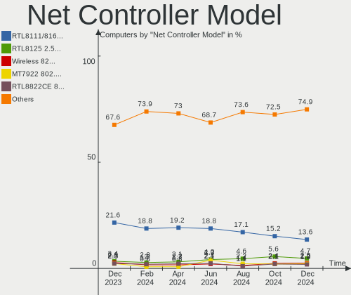

| Model                                                             | Computers | Percent |
|-------------------------------------------------------------------|-----------|---------|
| Realtek RTL8111/8168/8411 PCI Express Gigabit Ethernet Controller | 56        | 16.97%  |
| Realtek RTL8822CE 802.11ac PCIe Wireless Network Adapter          | 13        | 3.94%   |
| Realtek RTL810xE PCI Express Fast Ethernet controller             | 9         | 2.73%   |
| Realtek RTL8125 2.5GbE Controller                                 | 8         | 2.42%   |
| Intel Wi-Fi 6 AX200                                               | 8         | 2.42%   |
| Intel 82579LM Gigabit Network Connection (Lewisville)             | 8         | 2.42%   |
| Intel I211 Gigabit Network Connection                             | 7         | 2.12%   |
| Realtek RTL8153 Gigabit Ethernet Adapter                          | 6         | 1.82%   |
| Intel Ethernet Controller I225-V                                  | 6         | 1.82%   |
| Intel Alder Lake-P PCH CNVi WiFi                                  | 6         | 1.82%   |
| Realtek RTL8821CE 802.11ac PCIe Wireless Network Adapter          | 5         | 1.52%   |
| Realtek 802.11ac NIC                                              | 5         | 1.52%   |
| Intel Wi-Fi 6 AX201                                               | 5         | 1.52%   |
| Intel Ethernet Connection (2) I219-V                              | 5         | 1.52%   |
| Intel Wireless 8265 / 8275                                        | 4         | 1.21%   |
| Intel Wi-Fi 6 AX210/AX211/AX411 160MHz                            | 4         | 1.21%   |
| Intel Comet Lake PCH-LP CNVi WiFi                                 | 4         | 1.21%   |
| Intel Centrino Advanced-N 6205 [Taylor Peak]                      | 4         | 1.21%   |
| Samsung Galaxy series, misc. (tethering mode)                     | 3         | 0.91%   |
| Realtek RTL8723BE PCIe Wireless Network Adapter                   | 3         | 0.91%   |
| Realtek Killer E3000 2.5GbE Controller                            | 3         | 0.91%   |
| Qualcomm Atheros QCA9565 / AR9565 Wireless Network Adapter        | 3         | 0.91%   |
| Qualcomm Atheros AR9462 Wireless Network Adapter                  | 3         | 0.91%   |
| MediaTek MT7922 802.11ax PCI Express Wireless Network Adapter     | 3         | 0.91%   |
| MediaTek MT7921K (RZ608) Wi-Fi 6E 80MHz                           | 3         | 0.91%   |
| Intel Wireless 8260                                               | 3         | 0.91%   |
| Intel Wireless 7265                                               | 3         | 0.91%   |
| Intel Wireless 7260                                               | 3         | 0.91%   |
| Intel Ethernet Connection (7) I219-LM                             | 3         | 0.91%   |
| Intel Dual Band Wireless-AC 3168NGW [Stone Peak]                  | 3         | 0.91%   |
| Intel Cannon Lake PCH CNVi WiFi                                   | 3         | 0.91%   |
| Broadcom BCM4360 802.11ac Wireless Network Adapter                | 3         | 0.91%   |
| Broadcom BCM4322 802.11a/b/g/n Wireless LAN Controller            | 3         | 0.91%   |
| ASIX AX88179 Gigabit Ethernet                                     | 3         | 0.91%   |
| Realtek RTL8822BE 802.11a/b/g/n/ac WiFi adapter                   | 2         | 0.61%   |
| Realtek RTL8723AE PCIe Wireless Network Adapter                   | 2         | 0.61%   |
| Realtek Realtek Network controller                                | 2         | 0.61%   |
| Ralink MT7601U Wireless Adapter                                   | 2         | 0.61%   |
| Qualcomm Atheros AR9485 Wireless Network Adapter                  | 2         | 0.61%   |
| Qualcomm Atheros AR928X Wireless Network Adapter (PCI-Express)    | 2         | 0.61%   |

Wireless Vendor
---------------

Wireless vendors

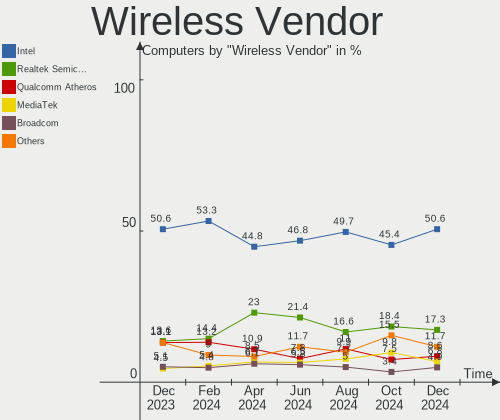

| Vendor                | Computers | Percent |
|-----------------------|-----------|---------|
| Intel                 | 72        | 46.45%  |
| Realtek Semiconductor | 41        | 26.45%  |
| Qualcomm Atheros      | 14        | 9.03%   |
| Broadcom              | 12        | 7.74%   |
| MediaTek              | 7         | 4.52%   |
| Ralink Technology     | 3         | 1.94%   |
| TP-Link               | 2         | 1.29%   |
| Microsoft             | 1         | 0.65%   |
| Dell                  | 1         | 0.65%   |
| Broadcom Limited      | 1         | 0.65%   |
| Belkin Components     | 1         | 0.65%   |

Wireless Model
--------------

Wireless models

| Model                                                          | Computers | Percent |
|----------------------------------------------------------------|-----------|---------|
| Realtek RTL8822CE 802.11ac PCIe Wireless Network Adapter       | 13        | 8.39%   |
| Intel Wi-Fi 6 AX200                                            | 8         | 5.16%   |
| Intel Alder Lake-P PCH CNVi WiFi                               | 6         | 3.87%   |
| Realtek RTL8821CE 802.11ac PCIe Wireless Network Adapter       | 5         | 3.23%   |
| Realtek 802.11ac NIC                                           | 5         | 3.23%   |
| Intel Wi-Fi 6 AX201                                            | 5         | 3.23%   |
| Intel Wireless 8265 / 8275                                     | 4         | 2.58%   |
| Intel Wi-Fi 6 AX210/AX211/AX411 160MHz                         | 4         | 2.58%   |
| Intel Comet Lake PCH-LP CNVi WiFi                              | 4         | 2.58%   |
| Intel Centrino Advanced-N 6205 [Taylor Peak]                   | 4         | 2.58%   |
| Realtek RTL8723BE PCIe Wireless Network Adapter                | 3         | 1.94%   |
| Qualcomm Atheros QCA9565 / AR9565 Wireless Network Adapter     | 3         | 1.94%   |
| Qualcomm Atheros AR9462 Wireless Network Adapter               | 3         | 1.94%   |
| MediaTek MT7922 802.11ax PCI Express Wireless Network Adapter  | 3         | 1.94%   |
| MediaTek MT7921K (RZ608) Wi-Fi 6E 80MHz                        | 3         | 1.94%   |
| Intel Wireless 8260                                            | 3         | 1.94%   |
| Intel Wireless 7265                                            | 3         | 1.94%   |
| Intel Wireless 7260                                            | 3         | 1.94%   |
| Intel Dual Band Wireless-AC 3168NGW [Stone Peak]               | 3         | 1.94%   |
| Intel Cannon Lake PCH CNVi WiFi                                | 3         | 1.94%   |
| Broadcom BCM4360 802.11ac Wireless Network Adapter             | 3         | 1.94%   |
| Broadcom BCM4322 802.11a/b/g/n Wireless LAN Controller         | 3         | 1.94%   |
| Realtek RTL8822BE 802.11a/b/g/n/ac WiFi adapter                | 2         | 1.29%   |
| Realtek RTL8723AE PCIe Wireless Network Adapter                | 2         | 1.29%   |
| Realtek Realtek Network controller                             | 2         | 1.29%   |
| Ralink MT7601U Wireless Adapter                                | 2         | 1.29%   |
| Qualcomm Atheros AR9485 Wireless Network Adapter               | 2         | 1.29%   |
| Qualcomm Atheros AR928X Wireless Network Adapter (PCI-Express) | 2         | 1.29%   |
| Intel Ultimate N WiFi Link 5300                                | 2         | 1.29%   |
| Intel Ice Lake-LP PCH CNVi WiFi                                | 2         | 1.29%   |
| Intel Centrino Wireless-N 1030 [Rainbow Peak]                  | 2         | 1.29%   |
| Intel Centrino Ultimate-N 6300                                 | 2         | 1.29%   |
| Broadcom Network controller                                    | 2         | 1.29%   |
| TP-Link TL-WN823N v2/v3 [Realtek RTL8192EU]                    | 1         | 0.65%   |
| TP-Link Archer T2U PLUS [RTL8821AU]                            | 1         | 0.65%   |
| Realtek RTL88x2bu [AC1200 Techkey]                             | 1         | 0.65%   |
| Realtek RTL8852AE 802.11ax PCIe Wireless Network Adapter       | 1         | 0.65%   |
| Realtek RTL8812AU 802.11a/b/g/n/ac 2T2R DB WLAN Adapter        | 1         | 0.65%   |
| Realtek RTL8192E/RTL8192SE Wireless LAN Controller             | 1         | 0.65%   |
| Realtek RTL8192CU 802.11n WLAN Adapter                         | 1         | 0.65%   |

Ethernet Vendor
---------------

Ethernet vendors

| Vendor                        | Computers | Percent |
|-------------------------------|-----------|---------|
| Realtek Semiconductor         | 80        | 48.19%  |
| Intel                         | 50        | 30.12%  |
| Broadcom                      | 7         | 4.22%   |
| Nvidia                        | 5         | 3.01%   |
| Qualcomm Atheros              | 4         | 2.41%   |
| Samsung Electronics           | 3         | 1.81%   |
| Marvell Technology Group      | 3         | 1.81%   |
| Lenovo                        | 3         | 1.81%   |
| ASIX Electronics              | 3         | 1.81%   |
| Microchip Technology          | 2         | 1.2%    |
| Broadcom Limited              | 2         | 1.2%    |
| OnePlus Technology (Shenzhen) | 1         | 0.6%    |
| Mellanox Technologies         | 1         | 0.6%    |
| HTC (High Tech Computer)      | 1         | 0.6%    |
| Aquantia                      | 1         | 0.6%    |

Ethernet Model
--------------

Ethernet models

| Model                                                             | Computers | Percent |
|-------------------------------------------------------------------|-----------|---------|
| Realtek RTL8111/8168/8411 PCI Express Gigabit Ethernet Controller | 56        | 32.56%  |
| Realtek RTL810xE PCI Express Fast Ethernet controller             | 9         | 5.23%   |
| Realtek RTL8125 2.5GbE Controller                                 | 8         | 4.65%   |
| Intel 82579LM Gigabit Network Connection (Lewisville)             | 8         | 4.65%   |
| Intel I211 Gigabit Network Connection                             | 7         | 4.07%   |
| Realtek RTL8153 Gigabit Ethernet Adapter                          | 6         | 3.49%   |
| Intel Ethernet Controller I225-V                                  | 6         | 3.49%   |
| Intel Ethernet Connection (2) I219-V                              | 5         | 2.91%   |
| Samsung Galaxy series, misc. (tethering mode)                     | 3         | 1.74%   |
| Realtek Killer E3000 2.5GbE Controller                            | 3         | 1.74%   |
| Intel Ethernet Connection (7) I219-LM                             | 3         | 1.74%   |
| ASIX AX88179 Gigabit Ethernet                                     | 3         | 1.74%   |
| Nvidia MCP79 Ethernet                                             | 2         | 1.16%   |
| Microchip SMSC9512/9514 Fast Ethernet Adapter                     | 2         | 1.16%   |
| Intel Ethernet Connection I217-LM                                 | 2         | 1.16%   |
| Intel Ethernet Connection (4) I219-LM                             | 2         | 1.16%   |
| Intel Ethernet Connection (3) I218-LM                             | 2         | 1.16%   |
| Intel Ethernet Connection (16) I219-V                             | 2         | 1.16%   |
| Intel 82574L Gigabit Network Connection                           | 2         | 1.16%   |
| Broadcom NetXtreme BCM5764M Gigabit Ethernet PCIe                 | 2         | 1.16%   |
| Broadcom NetXtreme BCM5761 Gigabit Ethernet PCIe                  | 2         | 1.16%   |
| Realtek RTL8152 Fast Ethernet Adapter                             | 1         | 0.58%   |
| Realtek Killer E2600 Gigabit Ethernet Controller                  | 1         | 0.58%   |
| Qualcomm Atheros QCA8171 Gigabit Ethernet                         | 1         | 0.58%   |
| Qualcomm Atheros AR8151 v2.0 Gigabit Ethernet                     | 1         | 0.58%   |
| Qualcomm Atheros AR8132 Fast Ethernet                             | 1         | 0.58%   |
| Qualcomm Atheros AR8131 Gigabit Ethernet                          | 1         | 0.58%   |
| OnePlus (Shenzhen) OnePlus                                        | 1         | 0.58%   |
| Nvidia MCP67 Ethernet                                             | 1         | 0.58%   |
| Nvidia MCP61 Ethernet                                             | 1         | 0.58%   |
| Nvidia CK804 Ethernet Controller                                  | 1         | 0.58%   |
| Mellanox MT27500 Family [ConnectX-3]                              | 1         | 0.58%   |
| Marvell Group 88E8071 PCI-E Gigabit Ethernet Controller           | 1         | 0.58%   |
| Marvell Group 88E8040T PCI-E Fast Ethernet Controller             | 1         | 0.58%   |
| Marvell Group 88E8040 PCI-E Fast Ethernet Controller              | 1         | 0.58%   |
| Lenovo USB-C Dock Ethernet                                        | 1         | 0.58%   |
| Lenovo ThinkPad TBT3 LAN                                          | 1         | 0.58%   |
| Lenovo ThinkPad TBT 3 Dock                                        | 1         | 0.58%   |
| Intel Ethernet Connection I219-V                                  | 1         | 0.58%   |
| Intel Ethernet Connection I219-LM                                 | 1         | 0.58%   |

Net Controller Kind
-------------------

Ethernet, WiFi or modem

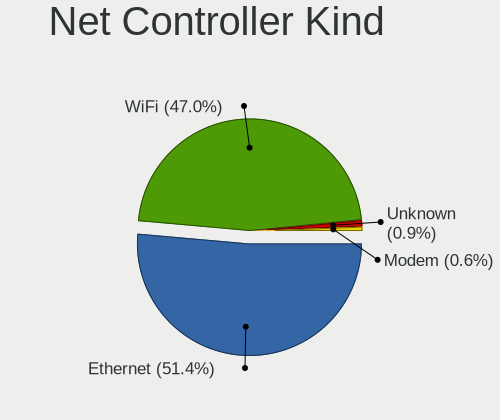

| Kind     | Computers | Percent |
|----------|-----------|---------|
| Ethernet | 155       | 50.99%  |
| WiFi     | 146       | 48.03%  |
| Modem    | 2         | 0.66%   |
| Unknown  | 1         | 0.33%   |

Used Controller
---------------

Currently used network controller

| Kind     | Computers | Percent |
|----------|-----------|---------|
| WiFi     | 112       | 58.03%  |
| Ethernet | 81        | 41.97%  |

NICs
----

Total network controllers on board

| Total | Computers | Percent |
|-------|-----------|---------|
| 2     | 97        | 51.05%  |
| 1     | 83        | 43.68%  |
| 3     | 5         | 2.63%   |
| 0     | 5         | 2.63%   |

IPv6
----

IPv6 vs IPv4

| Used | Computers | Percent |
|------|-----------|---------|
| No   | 153       | 80.53%  |
| Yes  | 37        | 19.47%  |

Bluetooth
---------

Bluetooth Vendor
----------------

Controller vendors

| Vendor                          | Computers | Percent |
|---------------------------------|-----------|---------|
| Intel                           | 56        | 45.53%  |
| Realtek Semiconductor           | 14        | 11.38%  |
| IMC Networks                    | 14        | 11.38%  |
| Broadcom                        | 8         | 6.5%    |
| Cambridge Silicon Radio         | 7         | 5.69%   |
| Qualcomm Atheros Communications | 4         | 3.25%   |
| MediaTek                        | 4         | 3.25%   |
| Apple                           | 4         | 3.25%   |
| Foxconn / Hon Hai               | 3         | 2.44%   |
| Toshiba                         | 2         | 1.63%   |
| Hewlett-Packard                 | 2         | 1.63%   |
| TP-Link                         | 1         | 0.81%   |
| Lite-On Technology              | 1         | 0.81%   |
| HTC (High Tech Computer)        | 1         | 0.81%   |
| Dell                            | 1         | 0.81%   |
| ASUSTek Computer                | 1         | 0.81%   |

Bluetooth Model
---------------

Controller models

| Model                                                                | Computers | Percent |
|----------------------------------------------------------------------|-----------|---------|
| Intel AX201 Bluetooth                                                | 14        | 11.38%  |
| IMC Networks Bluetooth Radio                                         | 13        | 10.57%  |
| Intel Bluetooth wireless interface                                   | 12        | 9.76%   |
| Realtek Bluetooth Radio                                              | 9         | 7.32%   |
| Intel AX200 Bluetooth                                                | 8         | 6.5%    |
| Cambridge Silicon Radio Bluetooth Dongle (HCI mode)                  | 7         | 5.69%   |
| Intel Bluetooth Device                                               | 6         | 4.88%   |
| Intel Bluetooth 9460/9560 Jefferson Peak (JfP)                       | 5         | 4.07%   |
| MediaTek Wireless_Device                                             | 4         | 3.25%   |
| Realtek  Bluetooth 4.2 Adapter                                       | 3         | 2.44%   |
| Intel Wireless-AC 3168 Bluetooth                                     | 3         | 2.44%   |
| Intel Centrino Advanced-N 6230 Bluetooth adapter                     | 3         | 2.44%   |
| Intel AX210 Bluetooth                                                | 3         | 2.44%   |
| Qualcomm Atheros AR3012 Bluetooth 4.0                                | 2         | 1.63%   |
| HP Broadcom 2070 Bluetooth Combo                                     | 2         | 1.63%   |
| Foxconn / Hon Hai Bluetooth Device                                   | 2         | 1.63%   |
| Broadcom BCM20702A0 Bluetooth 4.0                                    | 2         | 1.63%   |
| Apple Bluetooth Host Controller                                      | 2         | 1.63%   |
| TP-Link UB500 Adapter                                                | 1         | 0.81%   |
| Toshiba Bluetooth Device                                             | 1         | 0.81%   |
| Toshiba Atheros AR3012 Bluetooth                                     | 1         | 0.81%   |
| Realtek RTL8723B Bluetooth                                           | 1         | 0.81%   |
| Realtek RTL8723A Bluetooth                                           | 1         | 0.81%   |
| Qualcomm Atheros  Bluetooth Device                                   | 1         | 0.81%   |
| Qualcomm Atheros QCA61x4 Bluetooth 4.0                               | 1         | 0.81%   |
| Lite-On Atheros AR3012 Bluetooth                                     | 1         | 0.81%   |
| Intel Wireless-AC 9260 Bluetooth Adapter                             | 1         | 0.81%   |
| Intel Centrino Bluetooth Wireless Transceiver                        | 1         | 0.81%   |
| IMC Networks Wireless_Device                                         | 1         | 0.81%   |
| HTC (High Tech Computer) Vive Hub Bluetooth 4.1 (Broadcom BCM920703) | 1         | 0.81%   |
| Foxconn / Hon Hai BCM2045A0                                          | 1         | 0.81%   |
| Dell Wireless 370 Bluetooth Mini-card                                | 1         | 0.81%   |
| Broadcom HP Portable SoftSailing                                     | 1         | 0.81%   |
| Broadcom Bluetooth 2.1 Device                                        | 1         | 0.81%   |
| Broadcom BCM20702A0 Bluetooth                                        | 1         | 0.81%   |
| Broadcom BCM20702 Bluetooth 4.0 [ThinkPad]                           | 1         | 0.81%   |
| Broadcom BCM2045B (BDC-2.1) [Bluetooth Controller]                   | 1         | 0.81%   |
| Broadcom BCM2045B (BDC-2.1)                                          | 1         | 0.81%   |
| ASUS Broadcom BCM20702 Single-Chip Bluetooth 4.0 + LE                | 1         | 0.81%   |
| Apple Built-in Bluetooth 2.0+EDR HCI                                 | 1         | 0.81%   |

Sound
-----

Sound Vendor
------------

Sound card vendors

| Vendor                   | Computers | Percent |
|--------------------------|-----------|---------|
| Intel                    | 121       | 43.53%  |
| AMD                      | 68        | 24.46%  |
| Nvidia                   | 52        | 18.71%  |
| SteelSeries ApS          | 3         | 1.08%   |
| Logitech                 | 3         | 1.08%   |
| Lenovo                   | 3         | 1.08%   |
| Creative Technology      | 3         | 1.08%   |
| C-Media Electronics      | 3         | 1.08%   |
| Texas Instruments        | 2         | 0.72%   |
| Razer USA                | 2         | 0.72%   |
| Micro Star International | 2         | 0.72%   |
| ASUSTek Computer         | 2         | 0.72%   |
| XMOS                     | 1         | 0.36%   |
| Unknown                  | 1         | 0.36%   |
| Tenx Technology          | 1         | 0.36%   |
| ROCCAT                   | 1         | 0.36%   |
| Realtek Semiconductor    | 1         | 0.36%   |
| Kingston Technology      | 1         | 0.36%   |
| JMTek                    | 1         | 0.36%   |
| HTC (High Tech Computer) | 1         | 0.36%   |
| Giga-Byte Technology     | 1         | 0.36%   |
| Generalplus Technology   | 1         | 0.36%   |
| Focusrite-Novation       | 1         | 0.36%   |
| DSEA A/S                 | 1         | 0.36%   |
| B & W Group              | 1         | 0.36%   |
| Apple                    | 1         | 0.36%   |

Sound Model
-----------

Sound card models

| Model                                                                      | Computers | Percent |
|----------------------------------------------------------------------------|-----------|---------|
| AMD Family 17h/19h HD Audio Controller                                     | 19        | 5.81%   |
| AMD Starship/Matisse HD Audio Controller                                   | 17        | 5.2%    |
| AMD Rembrandt Radeon High Definition Audio Controller                      | 15        | 4.59%   |
| Intel 7 Series/C216 Chipset Family High Definition Audio Controller        | 13        | 3.98%   |
| AMD Renoir Radeon High Definition Audio Controller                         | 11        | 3.36%   |
| Intel Sunrise Point-LP HD Audio                                            | 10        | 3.06%   |
| Intel 6 Series/C200 Series Chipset Family High Definition Audio Controller | 8         | 2.45%   |
| Intel 100 Series/C230 Series Chipset Family HD Audio Controller            | 8         | 2.45%   |
| AMD Navi 21/23 HDMI/DP Audio Controller                                    | 8         | 2.45%   |
| Intel 82801I (ICH9 Family) HD Audio Controller                             | 7         | 2.14%   |
| Intel 8 Series/C220 Series Chipset High Definition Audio Controller        | 7         | 2.14%   |
| Nvidia GK208 HDMI/DP Audio Controller                                      | 6         | 1.83%   |
| Intel Tiger Lake-LP Smart Sound Technology Audio Controller                | 6         | 1.83%   |
| Intel Cannon Lake PCH cAVS                                                 | 6         | 1.83%   |
| Intel Alder Lake PCH-P High Definition Audio Controller                    | 6         | 1.83%   |
| Nvidia High Definition Audio Controller                                    | 5         | 1.53%   |
| Nvidia GP107GL High Definition Audio Controller                            | 5         | 1.53%   |
| Nvidia GA104 High Definition Audio Controller                              | 5         | 1.53%   |
| Intel Xeon E3-1200 v3/4th Gen Core Processor HD Audio Controller           | 5         | 1.53%   |
| Intel 5 Series/3400 Series Chipset High Definition Audio                   | 5         | 1.53%   |
| AMD SBx00 Azalia (Intel HDA)                                               | 5         | 1.53%   |
| Intel Wildcat Point-LP High Definition Audio Controller                    | 4         | 1.22%   |
| Intel Haswell-ULT HD Audio Controller                                      | 4         | 1.22%   |
| Intel Comet Lake PCH-LP cAVS                                               | 4         | 1.22%   |
| Intel Broadwell-U Audio Controller                                         | 4         | 1.22%   |
| Intel 82801JI (ICH10 Family) HD Audio Controller                           | 4         | 1.22%   |
| Intel 8 Series HD Audio Controller                                         | 4         | 1.22%   |
| AMD Family 17h (Models 00h-0fh) HD Audio Controller                        | 4         | 1.22%   |
| AMD Ellesmere HDMI Audio [Radeon RX 470/480 / 570/580/590]                 | 4         | 1.22%   |
| Nvidia TU116 High Definition Audio Controller                              | 3         | 0.92%   |
| Nvidia GM206 High Definition Audio Controller                              | 3         | 0.92%   |
| Nvidia GA106 High Definition Audio Controller                              | 3         | 0.92%   |
| Intel Ice Lake-LP Smart Sound Technology Audio Controller                  | 3         | 0.92%   |
| Intel Audio device                                                         | 3         | 0.92%   |
| AMD Raven/Raven2/Fenghuang HDMI/DP Audio Controller                        | 3         | 0.92%   |
| AMD Kabini HDMI/DP Audio                                                   | 3         | 0.92%   |
| SteelSeries ApS Arctis Pro Wireless                                        | 2         | 0.61%   |
| Nvidia TU106 High Definition Audio Controller                              | 2         | 0.61%   |
| Nvidia MCP79 High Definition Audio                                         | 2         | 0.61%   |
| Nvidia GP104 High Definition Audio Controller                              | 2         | 0.61%   |

Memory
------

Memory Vendor
-------------

Memory module vendors

| Vendor              | Computers | Percent |
|---------------------|-----------|---------|
| Samsung Electronics | 27        | 23.28%  |
| SK hynix            | 18        | 15.52%  |
| Kingston            | 14        | 12.07%  |
| Corsair             | 13        | 11.21%  |
| Crucial             | 11        | 9.48%   |
| Micron Technology   | 10        | 8.62%   |
| Unknown             | 5         | 4.31%   |
| Elpida              | 4         | 3.45%   |
| Ramaxel Technology  | 2         | 1.72%   |
| Patriot             | 2         | 1.72%   |
| Unknown             | 2         | 1.72%   |
| Unknown (ABCD)      | 1         | 0.86%   |
| Timetec             | 1         | 0.86%   |
| KingFast            | 1         | 0.86%   |
| GSkill              | 1         | 0.86%   |
| G.Skill             | 1         | 0.86%   |
| Apacer              | 1         | 0.86%   |
| A-DATA Technology   | 1         | 0.86%   |
| 48spaces            | 1         | 0.86%   |

Memory Model
------------

Memory module models

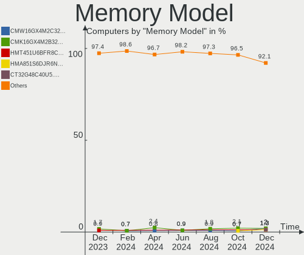

| Model                                                            | Computers | Percent |
|------------------------------------------------------------------|-----------|---------|
| SK hynix RAM HMA82GS6AFR8N-UH 16GB SODIMM DDR4 2667MT/s          | 2         | 1.6%    |
| Samsung RAM M471B5673FH0-CH9 2GB SODIMM DDR3 1334MT/s            | 2         | 1.6%    |
| Samsung RAM M471B5273CH0-CH9 4GB SODIMM DDR3 1334MT/s            | 2         | 1.6%    |
| Samsung RAM M471A2G43BB2-CWE 16GB SODIMM DDR4 3200MT/s           | 2         | 1.6%    |
| Samsung RAM M471A1K43EB1-CWE 8GB SODIMM DDR4 3200MT/s            | 2         | 1.6%    |
| Unknown                                                          | 2         | 1.6%    |
| Unknown RAM Module 2GB SODIMM DDR2 800MT/s                       | 1         | 0.8%    |
| Unknown RAM Module 2GB SODIMM DDR2 667MT/s                       | 1         | 0.8%    |
| Unknown RAM Module 2GB Row Of Chips LPDDR4 4267MT/s              | 1         | 0.8%    |
| Unknown RAM Module 2GB DIMM DDR3 1333MT/s                        | 1         | 0.8%    |
| Unknown RAM Module 2GB DIMM DDR2                                 | 1         | 0.8%    |
| Unknown (ABCD) RAM 123456789012345678 2GB SODIMM LPDDR4 2400MT/s | 1         | 0.8%    |
| Timetec RAM UD3-1600 8GB DIMM DDR3 1600MT/s                      | 1         | 0.8%    |
| SK hynix RAM Module 32GB SODIMM DDR4 2667MT/s                    | 1         | 0.8%    |
| SK hynix RAM HYMP151F72CP4N3-Y5 4GB FB-DIMM DDR2 667MT/s         | 1         | 0.8%    |
| SK hynix RAM HMT851S6AMR6R-PB 4GB Chip DDR3 1600MT/s             | 1         | 0.8%    |
| SK hynix RAM HMT451U6BFR8C-PB 4GB DIMM DDR3 1600MT/s             | 1         | 0.8%    |
| SK hynix RAM HMT451S6AFR8C-PB 4GB SODIMM DDR3 1600MT/s           | 1         | 0.8%    |
| SK hynix RAM HMT41GS6BFR8A-PB 8GB SODIMM DDR3 1600MT/s           | 1         | 0.8%    |
| SK hynix RAM HMT351S6EFR8C-PB 4GB SODIMM DDR3 1600MT/s           | 1         | 0.8%    |
| SK hynix RAM HMT351S6CFR8C-PB 4GB SODIMM DDR3 1600MT/s           | 1         | 0.8%    |
| SK hynix RAM HMT351S6CFR8A-PB 4096MB SODIMM DDR3 1600MT/s        | 1         | 0.8%    |
| SK hynix RAM HMT351S6BFR8C-H9 4GB SODIMM DDR3 1334MT/s           | 1         | 0.8%    |
| SK hynix RAM HMT125S6BFR8C-G7 2GB SODIMM DDR3 1067MT/s           | 1         | 0.8%    |
| SK hynix RAM HMCG66MEBSA092N 8GB SODIMM DDR5 4800MT/s            | 1         | 0.8%    |
| SK hynix RAM HMA82GS6MFR8N-TF 16GB SODIMM DDR4 2133MT/s          | 1         | 0.8%    |
| SK hynix RAM HMA82GS6JJR8N-VK 16GB SODIMM DDR4 2667MT/s          | 1         | 0.8%    |
| SK hynix RAM HMA81GU6AFR8N-UH 8GB DIMM DDR4 2400MT/s             | 1         | 0.8%    |
| SK hynix RAM HMA41GS6AFR8N-TF 8GB SODIMM DDR4 2667MT/s           | 1         | 0.8%    |
| SK hynix RAM H9HCNNNBKMALHR-NEE 4GB Row Of Chips LPDDR4 4267MT/s | 1         | 0.8%    |
| SK hynix RAM H5ANAG6NCMR-VKC 8GB DDR4 2400MT/s                   | 1         | 0.8%    |
| Samsung RAM UBE3D4AA-MGCR 2048MB Row Of Chips LPDDR4 4267MT/s    | 1         | 0.8%    |
| Samsung RAM M471B5673EH1-CF8 2GB SODIMM DDR3 4199MT/s            | 1         | 0.8%    |
| Samsung RAM M471B5273CM0-CH9 4096MB SODIMM DDR3 1334MT/s         | 1         | 0.8%    |
| Samsung RAM M471B2873FHS-CH9 1GB SODIMM DDR3 1334MT/s            | 1         | 0.8%    |
| Samsung RAM M471B1G73EB0-YK0 8GB SODIMM DDR3 1600MT/s            | 1         | 0.8%    |
| Samsung RAM M471B1G73DB0-YK0 8GB SODIMM DDR3 1600MT/s            | 1         | 0.8%    |
| Samsung RAM M471A5244CB0-CWE 4GB SODIMM DDR4 3200MT/s            | 1         | 0.8%    |
| Samsung RAM M471A5244CB0-CTD 4GB SODIMM DDR4 3266MT/s            | 1         | 0.8%    |
| Samsung RAM M471A1K43CB1-CTD 8GB SODIMM DDR4 2667MT/s            | 1         | 0.8%    |

Memory Kind
-----------

Memory module kinds

| Kind   | Computers | Percent |
|--------|-----------|---------|
| DDR4   | 43        | 43.43%  |
| DDR3   | 33        | 33.33%  |
| DDR5   | 7         | 7.07%   |
| DDR2   | 6         | 6.06%   |
| LPDDR4 | 5         | 5.05%   |
| LPDDR5 | 2         | 2.02%   |
| LPDDR3 | 2         | 2.02%   |
| SDRAM  | 1         | 1.01%   |

Memory Form Factor
------------------

Physical design of the memory module

| Name         | Computers | Percent |
|--------------|-----------|---------|
| SODIMM       | 52        | 52.53%  |
| DIMM         | 34        | 34.34%  |
| Row Of Chips | 9         | 9.09%   |
| Unknown      | 2         | 2.02%   |
| FB-DIMM      | 1         | 1.01%   |
| Chip         | 1         | 1.01%   |

Memory Size
-----------

Memory module size

| Size  | Computers | Percent |
|-------|-----------|---------|
| 8192  | 42        | 38.89%  |
| 4096  | 25        | 23.15%  |
| 16384 | 21        | 19.44%  |
| 2048  | 16        | 14.81%  |
| 32768 | 4         | 3.7%    |

Memory Speed
------------

Memory module speed

| Speed   | Computers | Percent |
|---------|-----------|---------|
| 1600    | 19        | 17.43%  |
| 3200    | 14        | 12.84%  |
| 2667    | 12        | 11.01%  |
| 2400    | 9         | 8.26%   |
| 1333    | 8         | 7.34%   |
| 1334    | 7         | 6.42%   |
| 4800    | 6         | 5.5%    |
| 3600    | 5         | 4.59%   |
| 667     | 4         | 3.67%   |
| 4267    | 3         | 2.75%   |
| 3733    | 3         | 2.75%   |
| 3000    | 2         | 1.83%   |
| 2133    | 2         | 1.83%   |
| 1867    | 2         | 1.83%   |
| 800     | 2         | 1.83%   |
| 6400    | 1         | 0.92%   |
| 5800    | 1         | 0.92%   |
| 4266    | 1         | 0.92%   |
| 4199    | 1         | 0.92%   |
| 3800    | 1         | 0.92%   |
| 3466    | 1         | 0.92%   |
| 3334    | 1         | 0.92%   |
| 3266    | 1         | 0.92%   |
| 1067    | 1         | 0.92%   |
| 400     | 1         | 0.92%   |
| Unknown | 1         | 0.92%   |

Printers & scanners
-------------------

Printer Vendor
--------------

Printer device vendors

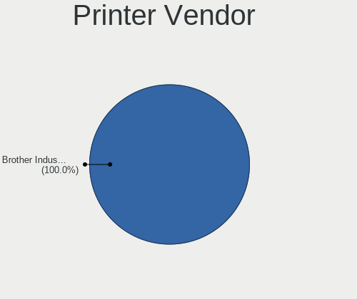

| Vendor          | Computers | Percent |
|-----------------|-----------|---------|
| Hewlett-Packard | 1         | 50%     |
| Canon           | 1         | 50%     |

Printer Model
-------------

Printer device models

| Model                   | Computers | Percent |
|-------------------------|-----------|---------|
| HP Deskjet F2280 series | 1         | 50%     |
| Canon TS3100 series     | 1         | 50%     |

Scanner Vendor
--------------

Scanner device vendors

Zero info for selected period =(

Scanner Model
-------------

Scanner device models

Zero info for selected period =(

Camera
------

Camera Vendor
-------------

Camera device vendors

| Vendor                                 | Computers | Percent |
|----------------------------------------|-----------|---------|
| Chicony Electronics                    | 20        | 17.09%  |
| Realtek Semiconductor                  | 12        | 10.26%  |
| Logitech                               | 10        | 8.55%   |
| Sunplus Innovation Technology          | 9         | 7.69%   |
| Microdia                               | 9         | 7.69%   |
| IMC Networks                           | 6         | 5.13%   |
| Apple                                  | 6         | 5.13%   |
| Acer                                   | 6         | 5.13%   |
| Lite-On Technology                     | 5         | 4.27%   |
| Quanta                                 | 4         | 3.42%   |
| Cheng Uei Precision Industry (Foxlink) | 4         | 3.42%   |
| Syntek                                 | 3         | 2.56%   |
| Suyin                                  | 3         | 2.56%   |
| Samsung Electronics                    | 3         | 2.56%   |
| Microsoft                              | 3         | 2.56%   |
| Lenovo                                 | 3         | 2.56%   |
| DJJHFA1BIF5595                         | 2         | 1.71%   |
| Z-Star Microelectronics                | 1         | 0.85%   |
| Sonix Technology                       | 1         | 0.85%   |
| Silicon Motion                         | 1         | 0.85%   |
| Primax Electronics                     | 1         | 0.85%   |
| Novatek Microelectronics               | 1         | 0.85%   |
| MacroSilicon                           | 1         | 0.85%   |
| HTC (High Tech Computer)               | 1         | 0.85%   |
| Hewlett-Packard                        | 1         | 0.85%   |
| Creative Technology                    | 1         | 0.85%   |

Camera Model
------------

Camera device models

| Model                                    | Computers | Percent |
|------------------------------------------|-----------|---------|
| Chicony Integrated Camera                | 7         | 5.93%   |
| Realtek Integrated_Webcam_HD             | 5         | 4.24%   |
| Samsung Galaxy A5 (MTP)                  | 3         | 2.54%   |
| Microdia USB 2.0 Camera                  | 3         | 2.54%   |
| IMC Networks Integrated Camera           | 3         | 2.54%   |
| Apple Built-in iSight                    | 3         | 2.54%   |
| Syntek Lenovo EasyCamera                 | 2         | 1.69%   |
| Sunplus Integrated_Webcam_HD             | 2         | 1.69%   |
| Realtek Acer 640 x 480 laptop camera     | 2         | 1.69%   |
| Microdia Integrated_Webcam_HD            | 2         | 1.69%   |
| Logitech Webcam C270                     | 2         | 1.69%   |
| Logitech HD Pro Webcam C920              | 2         | 1.69%   |
| Lite-On TOSHIBA Web Camera - HD          | 2         | 1.69%   |
| IMC Networks USB2.0 HD UVC WebCam        | 2         | 1.69%   |
| DJJHFA1BIF5595 HP HD Camera              | 2         | 1.69%   |
| Chicony USB2.0 Camera                    | 2         | 1.69%   |
| Chicony HP Wide Vision HD Camera         | 2         | 1.69%   |
| Apple iPhone5/5C/5S/6                    | 2         | 1.69%   |
| Acer HD Camera                           | 2         | 1.69%   |
| Z-Star Webcam                            | 1         | 0.85%   |
| Syntek Integrated Camera                 | 1         | 0.85%   |
| Suyin Laptop_Integrated_Webcam_1.3M      | 1         | 0.85%   |
| Suyin HP webcam [dv6-1190en]             | 1         | 0.85%   |
| Suyin HD WebCam                          | 1         | 0.85%   |
| Sunplus Laptop_Integrated_Webcam_HD      | 1         | 0.85%   |
| Sunplus Integrated Webcam                | 1         | 0.85%   |
| Sunplus HP Universal Camera              | 1         | 0.85%   |
| Sunplus HD WebCam                        | 1         | 0.85%   |
| Sunplus HD 720P webcam                   | 1         | 0.85%   |
| Sunplus Dell HD Webcam                   | 1         | 0.85%   |
| Sunplus Asus Webcam                      | 1         | 0.85%   |
| Sonix USB2.0 HD UVC WebCam               | 1         | 0.85%   |
| Silicon Motion WebCam SC-13HDL11939N     | 1         | 0.85%   |
| Realtek LG Camera                        | 1         | 0.85%   |
| Realtek HP Truevision HD                 | 1         | 0.85%   |
| Realtek HP "Truevision HD" laptop camera | 1         | 0.85%   |
| Realtek Full HD webcam                   | 1         | 0.85%   |
| Realtek Front Camera                     | 1         | 0.85%   |
| Realtek Back Camera                      | 1         | 0.85%   |
| Quanta USB2.0 HD UVC WebCam              | 1         | 0.85%   |

Security
--------

Fingerprint Vendor
------------------

Fingerprint sensor vendors

| Vendor                     | Computers | Percent |
|----------------------------|-----------|---------|
| Synaptics                  | 6         | 31.58%  |
| Validity Sensors           | 5         | 26.32%  |
| Shenzhen Goodix Technology | 4         | 21.05%  |
| Upek                       | 2         | 10.53%  |
| LighTuning Technology      | 1         | 5.26%   |
| AuthenTec                  | 1         | 5.26%   |

Fingerprint Model
-----------------

Fingerprint sensor models

| Model                                                                      | Computers | Percent |
|----------------------------------------------------------------------------|-----------|---------|
| Shenzhen Goodix Fingerprint Reader                                         | 3         | 15.79%  |
| Upek Biometric Touchchip/Touchstrip Fingerprint Sensor                     | 2         | 10.53%  |
| Synaptics Metallica MIS Touch Fingerprint Reader                           | 2         | 10.53%  |
| Unknown                                                                    | 2         | 10.53%  |
| Validity Sensors VFS7552 Touch Fingerprint Sensor                          | 1         | 5.26%   |
| Validity Sensors VFS495 Fingerprint Reader                                 | 1         | 5.26%   |
| Validity Sensors VFS471 Fingerprint Reader                                 | 1         | 5.26%   |
| Validity Sensors VFS 5011 fingerprint sensor                               | 1         | 5.26%   |
| Validity Sensors Synaptics VFS7552 Touch Fingerprint Sensor with PurePrint | 1         | 5.26%   |
| Synaptics  WBDI                                                            | 1         | 5.26%   |
| Synaptics  FS7604 Touch Fingerprint Sensor with PurePrint                  | 1         | 5.26%   |
| Shenzhen Goodix FingerPrint                                                | 1         | 5.26%   |
| LighTuning EgisTec Touch Fingerprint Sensor                                | 1         | 5.26%   |
| AuthenTec AES2810                                                          | 1         | 5.26%   |

Chipcard Vendor
---------------

Chipcard module vendors

| Vendor      | Computers | Percent |
|-------------|-----------|---------|
| Alcor Micro | 5         | 55.56%  |
| Broadcom    | 3         | 33.33%  |
| Lenovo      | 1         | 11.11%  |

Chipcard Model
--------------

Chipcard module models

| Model                               | Computers | Percent |
|-------------------------------------|-----------|---------|
| Alcor Micro AU9540 Smartcard Reader | 5         | 55.56%  |
| Broadcom 5880                       | 3         | 33.33%  |
| Lenovo Integrated Smart Card Reader | 1         | 11.11%  |

Unsupported
-----------

Unsupported Devices
-------------------

Total unsupported devices on board

| Total | Computers | Percent |
|-------|-----------|---------|
| 0     | 138       | 72.63%  |
| 1     | 34        | 17.89%  |
| 2     | 14        | 7.37%   |
| 3     | 3         | 1.58%   |
| 4     | 1         | 0.53%   |

Unsupported Device Types
------------------------

Types of unsupported devices

| Type                  | Computers | Percent |
|-----------------------|-----------|---------|
| Fingerprint reader    | 19        | 26.76%  |
| Graphics card         | 13        | 18.31%  |
| Net/wireless          | 9         | 12.68%  |
| Chipcard              | 8         | 11.27%  |
| Multimedia controller | 6         | 8.45%   |
| Bluetooth             | 4         | 5.63%   |
| Unassigned class      | 2         | 2.82%   |
| Sound                 | 2         | 2.82%   |
| Net/ethernet          | 2         | 2.82%   |
| Card reader           | 2         | 2.82%   |
| Camera                | 2         | 2.82%   |
| Storage               | 1         | 1.41%   |
| Network               | 1         | 1.41%   |

