Linux in UK - Hardware Trends
-----------------------------

A project to identify most popular hardware characteristics and track their change
over time based on data collected by Linux users at https://Linux-Hardware.org.

Anyone can contribute to this report by the [hw-probe](https://github.com/linuxhw/hw-probe) tool:

    sudo -E hw-probe -all -upload

This is a report for all computer types. See also reports for [desktops](/Location/UK/Desktop/README.md) and [notebooks](/Location/UK/Notebook/README.md).

Period: Jun, 2022.

Contents
--------

* [ System ](#system)
  - [ OS                       ](#os)
  - [ OS Family                ](#os-family)
  - [ Kernel                   ](#kernel)
  - [ Kernel Family            ](#kernel-family)
  - [ Kernel Major Ver.        ](#kernel-major-ver)
  - [ Arch                     ](#arch)
  - [ DE                       ](#de)
  - [ Display Server           ](#display-server)
  - [ Display Manager          ](#display-manager)
  - [ OS Lang                  ](#os-lang)
  - [ Boot Mode                ](#boot-mode)
  - [ Filesystem               ](#filesystem)
  - [ Part. scheme             ](#part-scheme)
  - [ Dual Boot with Linux/BSD ](#dual-boot-with-linuxbsd)
  - [ Dual Boot (Win)          ](#dual-boot-win)

* [ Board ](#board)
  - [ Vendor                   ](#vendor)
  - [ Model                    ](#model)
  - [ Model Family             ](#model-family)
  - [ MFG Year                 ](#mfg-year)
  - [ Form Factor              ](#form-factor)
  - [ Secure Boot              ](#secure-boot)
  - [ Coreboot                 ](#coreboot)
  - [ RAM Size                 ](#ram-size)
  - [ RAM Used                 ](#ram-used)
  - [ Total Drives             ](#total-drives)
  - [ Has CD-ROM               ](#has-cd-rom)
  - [ Has Ethernet             ](#has-ethernet)
  - [ Has WiFi                 ](#has-wifi)
  - [ Has Bluetooth            ](#has-bluetooth)

* [ Location ](#location)
  - [ Country                  ](#country)
  - [ City                     ](#city)

* [ Drives ](#drives)
  - [ Drive Vendor             ](#drive-vendor)
  - [ Drive Model              ](#drive-model)
  - [ HDD Vendor               ](#hdd-vendor)
  - [ SSD Vendor               ](#ssd-vendor)
  - [ Drive Kind               ](#drive-kind)
  - [ Drive Connector          ](#drive-connector)
  - [ Drive Size               ](#drive-size)
  - [ Space Total              ](#space-total)
  - [ Space Used               ](#space-used)
  - [ Malfunc. Drives          ](#malfunc-drives)
  - [ Malfunc. Drive Vendor    ](#malfunc-drive-vendor)
  - [ Malfunc. HDD Vendor      ](#malfunc-hdd-vendor)
  - [ Malfunc. Drive Kind      ](#malfunc-drive-kind)
  - [ Failed Drives            ](#failed-drives)
  - [ Failed Drive Vendor      ](#failed-drive-vendor)
  - [ Drive Status             ](#drive-status)

* [ Storage controller ](#storage-controller)
  - [ Storage Vendor           ](#storage-vendor)
  - [ Storage Model            ](#storage-model)
  - [ Storage Kind             ](#storage-kind)

* [ Processor ](#processor)
  - [ CPU Vendor               ](#cpu-vendor)
  - [ CPU Model                ](#cpu-model)
  - [ CPU Model Family         ](#cpu-model-family)
  - [ CPU Cores                ](#cpu-cores)
  - [ CPU Sockets              ](#cpu-sockets)
  - [ CPU Threads              ](#cpu-threads)
  - [ CPU Op-Modes             ](#cpu-op-modes)
  - [ CPU Microcode            ](#cpu-microcode)
  - [ CPU Microarch            ](#cpu-microarch)

* [ Graphics ](#graphics)
  - [ GPU Vendor               ](#gpu-vendor)
  - [ GPU Model                ](#gpu-model)
  - [ GPU Combo                ](#gpu-combo)
  - [ GPU Driver               ](#gpu-driver)
  - [ GPU Memory               ](#gpu-memory)

* [ Monitor ](#monitor)
  - [ Monitor Vendor           ](#monitor-vendor)
  - [ Monitor Model            ](#monitor-model)
  - [ Monitor Resolution       ](#monitor-resolution)
  - [ Monitor Diagonal         ](#monitor-diagonal)
  - [ Monitor Width            ](#monitor-width)
  - [ Aspect Ratio             ](#aspect-ratio)
  - [ Monitor Area             ](#monitor-area)
  - [ Pixel Density            ](#pixel-density)
  - [ Multiple Monitors        ](#multiple-monitors)

* [ Network ](#network)
  - [ Net Controller Vendor    ](#net-controller-vendor)
  - [ Net Controller Model     ](#net-controller-model)
  - [ Wireless Vendor          ](#wireless-vendor)
  - [ Wireless Model           ](#wireless-model)
  - [ Ethernet Vendor          ](#ethernet-vendor)
  - [ Ethernet Model           ](#ethernet-model)
  - [ Net Controller Kind      ](#net-controller-kind)
  - [ Used Controller          ](#used-controller)
  - [ NICs                     ](#nics)
  - [ IPv6                     ](#ipv6)

* [ Bluetooth ](#bluetooth)
  - [ Bluetooth Vendor         ](#bluetooth-vendor)
  - [ Bluetooth Model          ](#bluetooth-model)

* [ Sound ](#sound)
  - [ Sound Vendor             ](#sound-vendor)
  - [ Sound Model              ](#sound-model)

* [ Memory ](#memory)
  - [ Memory Vendor            ](#memory-vendor)
  - [ Memory Model             ](#memory-model)
  - [ Memory Kind              ](#memory-kind)
  - [ Memory Form Factor       ](#memory-form-factor)
  - [ Memory Size              ](#memory-size)
  - [ Memory Speed             ](#memory-speed)

* [ Printers & scanners ](#printers--scanners)
  - [ Printer Vendor           ](#printer-vendor)
  - [ Printer Model            ](#printer-model)
  - [ Scanner Vendor           ](#scanner-vendor)
  - [ Scanner Model            ](#scanner-model)

* [ Camera ](#camera)
  - [ Camera Vendor            ](#camera-vendor)
  - [ Camera Model             ](#camera-model)

* [ Security ](#security)
  - [ Fingerprint Vendor       ](#fingerprint-vendor)
  - [ Fingerprint Model        ](#fingerprint-model)
  - [ Chipcard Vendor          ](#chipcard-vendor)
  - [ Chipcard Model           ](#chipcard-model)

* [ Unsupported ](#unsupported)
  - [ Unsupported Devices      ](#unsupported-devices)
  - [ Unsupported Device Types ](#unsupported-device-types)

System
------

OS
--

Installed operating systems

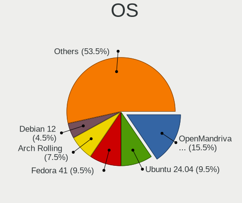

| Name                 | Computers | Percent |
|----------------------|-----------|---------|
| Ubuntu 22.04         | 27        | 16.67%  |
| Linux Mint 20.3      | 17        | 10.49%  |
| Zorin 16             | 11        | 6.79%   |
| Ubuntu 20.04         | 10        | 6.17%   |
| Fedora 36            | 9         | 5.56%   |
| Debian 11            | 8         | 4.94%   |
| Pop!_OS 22.04        | 7         | 4.32%   |
| OpenMandriva 4.3     | 7         | 4.32%   |
| KDE neon 20.04       | 7         | 4.32%   |
| Manjaro              | 4         | 2.47%   |
| Kubuntu 22.04        | 4         | 2.47%   |
| Arch Rolling         | 4         | 2.47%   |
| Ubuntu 18.04         | 3         | 1.85%   |
| Kali 2022.2          | 3         | 1.85%   |
| Arch                 | 3         | 1.85%   |
| Ubuntu 21.04         | 2         | 1.23%   |
| Parrot 5.0           | 2         | 1.23%   |
| Linux Mint 20.2      | 2         | 1.23%   |
| Linux Mint 19.3      | 2         | 1.23%   |
| Alpine 3.16.0        | 2         | 1.23%   |
| Xubuntu 22.10        | 1         | 0.62%   |
| Xubuntu 20.04        | 1         | 0.62%   |
| Xero                 | 1         | 0.62%   |
| Ubuntu MATE 22.04    | 1         | 0.62%   |
| Ubuntu Budgie 21.10  | 1         | 0.62%   |
| Ubuntu 21.10         | 1         | 0.62%   |
| SteamOS 3.2          | 1         | 0.62%   |
| RHEL 8               | 1         | 0.62%   |
| Q4OS 4               | 1         | 0.62%   |
| openSUSE Leap-15.3   | 1         | 0.62%   |
| NixOS 22.11          | 1         | 0.62%   |
| MX 21                | 1         | 0.62%   |
| Manjaro 21.3.1       | 1         | 0.62%   |
| Manjaro 21.2.6       | 1         | 0.62%   |
| Lubuntu 22.10        | 1         | 0.62%   |
| Lubuntu 20.04        | 1         | 0.62%   |
| LMDE 5               | 1         | 0.62%   |
| Lilidog 22           | 1         | 0.62%   |
| Kali 2022.1          | 1         | 0.62%   |
| Gentoo 2.8           | 1         | 0.62%   |
| Garuda Linux Soaring | 1         | 0.62%   |
| Elementary 5.1.7     | 1         | 0.62%   |
| Devuan 4             | 1         | 0.62%   |
| Deepin 20.6          | 1         | 0.62%   |
| Debian Unstable      | 1         | 0.62%   |
| Debian Testing       | 1         | 0.62%   |
| Archcraft Rolling    | 1         | 0.62%   |
| antergos Rolling     | 1         | 0.62%   |

OS Family
---------

OS without a version

| Name          | Computers | Percent |
|---------------|-----------|---------|
| Ubuntu        | 43        | 26.54%  |
| Linux Mint    | 21        | 12.96%  |
| Zorin         | 11        | 6.79%   |
| Debian        | 10        | 6.17%   |
| Fedora        | 9         | 5.56%   |
| Pop!_OS       | 7         | 4.32%   |
| OpenMandriva  | 7         | 4.32%   |
| KDE neon      | 7         | 4.32%   |
| Arch          | 7         | 4.32%   |
| Manjaro       | 6         | 3.7%    |
| Kubuntu       | 4         | 2.47%   |
| Kali          | 4         | 2.47%   |
| Xubuntu       | 2         | 1.23%   |
| Parrot        | 2         | 1.23%   |
| Lubuntu       | 2         | 1.23%   |
| Alpine        | 2         | 1.23%   |
| Xero          | 1         | 0.62%   |
| Ubuntu MATE   | 1         | 0.62%   |
| Ubuntu Budgie | 1         | 0.62%   |
| SteamOS       | 1         | 0.62%   |
| RHEL          | 1         | 0.62%   |
| Q4OS          | 1         | 0.62%   |
| openSUSE      | 1         | 0.62%   |
| NixOS         | 1         | 0.62%   |
| MX            | 1         | 0.62%   |
| LMDE          | 1         | 0.62%   |
| Lilidog       | 1         | 0.62%   |
| Gentoo        | 1         | 0.62%   |
| Garuda Linux  | 1         | 0.62%   |
| Elementary    | 1         | 0.62%   |
| Devuan        | 1         | 0.62%   |
| Deepin        | 1         | 0.62%   |
| Archcraft     | 1         | 0.62%   |
| antergos      | 1         | 0.62%   |

Kernel
------

Version of the Linux kernel

| Version                     | Computers | Percent |
|-----------------------------|-----------|---------|
| 5.13.0-51-generic           | 10        | 6.17%   |
| 5.15.0-37-generic           | 8         | 4.94%   |
| 5.17.5-76051705-generic     | 7         | 4.32%   |
| 5.4.0-121-generic           | 6         | 3.7%    |
| 5.4.0-120-generic           | 6         | 3.7%    |
| 5.16.7-desktop-1omv4003     | 6         | 3.7%    |
| 5.15.0-40-generic           | 6         | 3.7%    |
| 5.15.0-39-generic           | 6         | 3.7%    |
| 5.15.0-33-generic           | 6         | 3.7%    |
| 5.13.0-48-generic           | 5         | 3.09%   |
| 5.13.0-44-generic           | 5         | 3.09%   |
| 5.10.0-14-amd64             | 5         | 3.09%   |
| 5.4.0-113-generic           | 4         | 2.47%   |
| 5.17.11-300.fc36.x86_64     | 3         | 1.85%   |
| 5.17.0-kali3-amd64          | 3         | 1.85%   |
| 5.15.0-35-generic           | 3         | 1.85%   |
| 5.13.0-30-generic           | 3         | 1.85%   |
| 5.4.0-91-generic            | 2         | 1.23%   |
| 5.4.0-117-generic           | 2         | 1.23%   |
| 5.4.0-109-generic           | 2         | 1.23%   |
| 5.18.5-arch1-1              | 2         | 1.23%   |
| 5.18.5-200.fc36.x86_64      | 2         | 1.23%   |
| 5.18.3-arch1-1              | 2         | 1.23%   |
| 5.17.15-1-MANJARO           | 2         | 1.23%   |
| 5.17.13-300.fc36.x86_64     | 2         | 1.23%   |
| 5.15.41-0-lts               | 2         | 1.23%   |
| 5.10.0-15-amd64             | 2         | 1.23%   |
| 5.10.0-13-amd64             | 2         | 1.23%   |
| 5.7.1-050701-generic        | 1         | 0.62%   |
| 5.4.0-89-generic            | 1         | 0.62%   |
| 5.4.0-110-generic           | 1         | 0.62%   |
| 5.3.18-150300.59.71-default | 1         | 0.62%   |
| 5.19.0-1-MANJARO            | 1         | 0.62%   |
| 5.18.7-zen1-1-zen           | 1         | 0.62%   |
| 5.18.7-200.fc36.x86_64      | 1         | 0.62%   |
| 5.18.6-arch1-1              | 1         | 0.62%   |
| 5.18.6-200.fc36.x86_64      | 1         | 0.62%   |
| 5.18.5-zen1-1-zen           | 1         | 0.62%   |
| 5.18.3-zen1-1-zen           | 1         | 0.62%   |
| 5.18.2-arch1-1              | 1         | 0.62%   |
| 5.18.0-trunk-amd64          | 1         | 0.62%   |
| 5.18.0-arch1-1              | 1         | 0.62%   |
| 5.18.0-2-amd64              | 1         | 0.62%   |
| 5.18.0-1parrot1-amd64       | 1         | 0.62%   |
| 5.18.0-1-MANJARO            | 1         | 0.62%   |
| 5.18.0-1-amd64              | 1         | 0.62%   |
| 5.17.11-051711-generic      | 1         | 0.62%   |
| 5.17.0-14.1-liquorix-amd64  | 1         | 0.62%   |
| 5.17.0-1011-oem             | 1         | 0.62%   |
| 5.16.13-desktop-1omv4003    | 1         | 0.62%   |
| 5.16.0-12parrot1-amd64      | 1         | 0.62%   |
| 5.15.49-1-MANJARO           | 1         | 0.62%   |
| 5.15.46-1-MANJARO           | 1         | 0.62%   |
| 5.15.43                     | 1         | 0.62%   |
| 5.15.41-gentoo-dist         | 1         | 0.62%   |
| 5.15.41-1-lts               | 1         | 0.62%   |
| 5.15.24-amd64-desktop       | 1         | 0.62%   |
| 5.15.0-kali3-amd64          | 1         | 0.62%   |
| 5.15.0-37-lowlatency        | 1         | 0.62%   |
| 5.15.0-30-generic           | 1         | 0.62%   |

Kernel Family
-------------

Linux kernel without a distro release

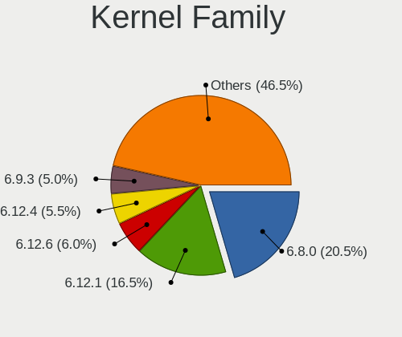

| Version | Computers | Percent |
|---------|-----------|---------|
| 5.15.0  | 35        | 21.6%   |
| 5.13.0  | 26        | 16.05%  |
| 5.4.0   | 24        | 14.81%  |
| 5.10.0  | 11        | 6.79%   |
| 5.17.5  | 7         | 4.32%   |
| 5.18.0  | 6         | 3.7%    |
| 5.16.7  | 6         | 3.7%    |
| 5.18.5  | 5         | 3.09%   |
| 5.17.0  | 5         | 3.09%   |
| 5.17.11 | 4         | 2.47%   |
| 5.15.41 | 4         | 2.47%   |
| 5.11.0  | 4         | 2.47%   |
| 5.18.3  | 3         | 1.85%   |
| 5.18.7  | 2         | 1.23%   |
| 5.18.6  | 2         | 1.23%   |
| 5.17.15 | 2         | 1.23%   |
| 5.17.13 | 2         | 1.23%   |
| 5.7.1   | 1         | 0.62%   |
| 5.3.18  | 1         | 0.62%   |
| 5.19.0  | 1         | 0.62%   |
| 5.18.2  | 1         | 0.62%   |
| 5.16.13 | 1         | 0.62%   |
| 5.16.0  | 1         | 0.62%   |
| 5.15.49 | 1         | 0.62%   |
| 5.15.46 | 1         | 0.62%   |
| 5.15.43 | 1         | 0.62%   |
| 5.15.24 | 1         | 0.62%   |
| 5.14.0  | 1         | 0.62%   |
| 4.9.253 | 1         | 0.62%   |
| 4.18.0  | 1         | 0.62%   |
| 4.15.0  | 1         | 0.62%   |

Kernel Major Ver.
-----------------

Linux kernel major version

| Version | Computers | Percent |
|---------|-----------|---------|
| 5.15    | 43        | 26.54%  |
| 5.13    | 26        | 16.05%  |
| 5.4     | 24        | 14.81%  |
| 5.17    | 20        | 12.35%  |
| 5.18    | 19        | 11.73%  |
| 5.10    | 11        | 6.79%   |
| 5.16    | 8         | 4.94%   |
| 5.11    | 4         | 2.47%   |
| 5.7     | 1         | 0.62%   |
| 5.3     | 1         | 0.62%   |
| 5.19    | 1         | 0.62%   |
| 5.14    | 1         | 0.62%   |
| 4.9     | 1         | 0.62%   |
| 4.18    | 1         | 0.62%   |
| 4.15    | 1         | 0.62%   |

Arch
----

OS architecture (x86_64, i586, etc.)

| Name    | Computers | Percent |
|---------|-----------|---------|
| x86_64  | 155       | 95.68%  |
| i686    | 5         | 3.09%   |
| aarch64 | 2         | 1.23%   |

DE
--

Desktop Environment

| Name             | Computers | Percent |
|------------------|-----------|---------|
| GNOME            | 62        | 38.27%  |
| KDE5             | 38        | 23.46%  |
| X-Cinnamon       | 16        | 9.88%   |
| XFCE             | 13        | 8.02%   |
| Unknown          | 13        | 8.02%   |
| MATE             | 8         | 4.94%   |
| LXQt             | 2         | 1.23%   |
| Cinnamon         | 2         | 1.23%   |
| xmonad           | 1         | 0.62%   |
| Unity            | 1         | 0.62%   |
| trinity          | 1         | 0.62%   |
| Pantheon         | 1         | 0.62%   |
| openbox          | 1         | 0.62%   |
| lightdm-xsession | 1         | 0.62%   |
| Deepin           | 1         | 0.62%   |
| Budgie           | 1         | 0.62%   |

Display Server
--------------

X11 or Wayland

| Name    | Computers | Percent |
|---------|-----------|---------|
| X11     | 124       | 76.54%  |
| Wayland | 32        | 19.75%  |
| Tty     | 4         | 2.47%   |
| Unknown | 2         | 1.23%   |

Display Manager
---------------

SDDM, LightDM, etc.

| Name    | Computers | Percent |
|---------|-----------|---------|
| Unknown | 65        | 40.12%  |
| GDM3    | 33        | 20.37%  |
| LightDM | 32        | 19.75%  |
| SDDM    | 19        | 11.73%  |
| GDM     | 11        | 6.79%   |
| TDM     | 1         | 0.62%   |
| Ly      | 1         | 0.62%   |

OS Lang
-------

Language

| Lang    | Computers | Percent |
|---------|-----------|---------|
| en_GB   | 131       | 80.86%  |
| en_US   | 15        | 9.26%   |
| Unknown | 5         | 3.09%   |
| en_AU   | 2         | 1.23%   |
| C       | 2         | 1.23%   |
| ro_RO   | 1         | 0.62%   |
| pl_PL   | 1         | 0.62%   |
| it_IT   | 1         | 0.62%   |
| en_IN   | 1         | 0.62%   |
| en_IE   | 1         | 0.62%   |
| en_CA   | 1         | 0.62%   |
| cs_CZ   | 1         | 0.62%   |

Boot Mode
---------

EFI or BIOS

| Mode | Computers | Percent |
|------|-----------|---------|
| EFI  | 90        | 55.56%  |
| BIOS | 72        | 44.44%  |

Filesystem
----------

Type of filesystem

| Type    | Computers | Percent |
|---------|-----------|---------|
| Ext4    | 135       | 83.33%  |
| Btrfs   | 15        | 9.26%   |
| Overlay | 8         | 4.94%   |
| Xfs     | 3         | 1.85%   |
| Zfs     | 1         | 0.62%   |

Part. scheme
------------

Scheme of partitioning

| Type    | Computers | Percent |
|---------|-----------|---------|
| Unknown | 85        | 52.47%  |
| GPT     | 69        | 42.59%  |
| MBR     | 8         | 4.94%   |

Dual Boot with Linux/BSD
------------------------

Hosting more than one Linux/BSD

| Dual boot | Computers | Percent |
|-----------|-----------|---------|
| No        | 145       | 89.51%  |
| Yes       | 17        | 10.49%  |

Dual Boot (Win)
---------------

Hosting Linux and Windows

| Dual boot | Computers | Percent |
|-----------|-----------|---------|
| No        | 124       | 76.54%  |
| Yes       | 38        | 23.46%  |

Board
-----

Vendor
------

Motherboard manufacturer

| Name                    | Computers | Percent |
|-------------------------|-----------|---------|
| Hewlett-Packard         | 26        | 16.05%  |
| Dell                    | 23        | 14.2%   |
| Lenovo                  | 21        | 12.96%  |
| ASUSTek Computer        | 20        | 12.35%  |
| MSI                     | 9         | 5.56%   |
| Acer                    | 8         | 4.94%   |
| Apple                   | 7         | 4.32%   |
| Gigabyte Technology     | 6         | 3.7%    |
| Toshiba                 | 5         | 3.09%   |
| ASRock                  | 5         | 3.09%   |
| Intel                   | 4         | 2.47%   |
| Sony                    | 3         | 1.85%   |
| Samsung Electronics     | 3         | 1.85%   |
| Razer                   | 2         | 1.23%   |
| HUAWEI                  | 2         | 1.23%   |
| AZW                     | 2         | 1.23%   |
| Unknown                 | 2         | 1.23%   |
| Valve                   | 1         | 0.62%   |
| Raspberry Pi Foundation | 1         | 0.62%   |
| Nvidia                  | 1         | 0.62%   |
| Notebook                | 1         | 0.62%   |
| Medion                  | 1         | 0.62%   |
| IBM                     | 1         | 0.62%   |
| HYPA                    | 1         | 0.62%   |
| Fujitsu                 | 1         | 0.62%   |
| Chuwi                   | 1         | 0.62%   |
| Biostar                 | 1         | 0.62%   |
| AWOW                    | 1         | 0.62%   |
| AVITA                   | 1         | 0.62%   |
| Alienware               | 1         | 0.62%   |
| ABIT                    | 1         | 0.62%   |

Model
-----

Motherboard model

| Name                                          | Computers | Percent |
|-----------------------------------------------|-----------|---------|
| MSI MS-7C91                                   | 3         | 1.85%   |
| Dell OptiPlex 9020                            | 2         | 1.23%   |
| Dell OptiPlex 7010                            | 2         | 1.23%   |
| ASUS ROG CROSSHAIR VIII DARK HERO             | 2         | 1.23%   |
| Unknown                                       | 2         | 1.23%   |
| Valve Jupiter                                 | 1         | 0.62%   |
| Toshiba Satellite L750                        | 1         | 0.62%   |
| Toshiba Satellite L50-B                       | 1         | 0.62%   |
| Toshiba Satellite C870-1H2                    | 1         | 0.62%   |
| Toshiba Satellite C850-1NU                    | 1         | 0.62%   |
| Toshiba Satellite C55-C                       | 1         | 0.62%   |
| Sony VGN-UX27GN                               | 1         | 0.62%   |
| Sony VGN-P11Z_Q                               | 1         | 0.62%   |
| Sony VGN-FS415B                               | 1         | 0.62%   |
| Samsung Galaxy Book 12                        | 1         | 0.62%   |
| Samsung 935QDB                                | 1         | 0.62%   |
| Samsung 930QDB                                | 1         | 0.62%   |
| Razer Blade 17 (2022) - RZ09-0423             | 1         | 0.62%   |
| Razer Blade                                   | 1         | 0.62%   |
| RPi Raspberry Pi 4 Model B Rev 1.4            | 1         | 0.62%   |
| Nvidia Tegra                                  | 1         | 0.62%   |
| Notebook NL40_50CU                            | 1         | 0.62%   |
| MSI P65 Creator 9SE                           | 1         | 0.62%   |
| MSI MS-7C51                                   | 1         | 0.62%   |
| MSI MS-7C02                                   | 1         | 0.62%   |
| MSI MS-7A20                                   | 1         | 0.62%   |
| MSI GP60 2OD                                  | 1         | 0.62%   |
| MSI CCL Ryzen 5 5600G B550 Motherboard Bundle | 1         | 0.62%   |
| Medion Erazer P6661 MD60303                   | 1         | 0.62%   |
| Lenovo V520S-08IKL 10NM0064UK                 | 1         | 0.62%   |
| Lenovo V15-ADA 82C7                           | 1         | 0.62%   |
| Lenovo ThinkPad X230 23252EG                  | 1         | 0.62%   |
| Lenovo ThinkPad X230 23243E9                  | 1         | 0.62%   |
| Lenovo ThinkPad T480 20L5000AUK               | 1         | 0.62%   |
| Lenovo ThinkPad T470 W10DG 20JNS00502         | 1         | 0.62%   |
| Lenovo ThinkPad T470 20HD000EUK               | 1         | 0.62%   |
| Lenovo ThinkPad T430 2349I46                  | 1         | 0.62%   |
| Lenovo ThinkPad T430 2349AZ6                  | 1         | 0.62%   |
| Lenovo ThinkPad T14 Gen 3 21AH0019US          | 1         | 0.62%   |
| Lenovo ThinkPad P17 Gen 1 20SQS0K700          | 1         | 0.62%   |
| Lenovo ThinkPad L480 20LTS1NK27               | 1         | 0.62%   |
| Lenovo ThinkPad E590 20NB001AUK               | 1         | 0.62%   |
| Lenovo ThinkCentre M710q 10MR0021UK           | 1         | 0.62%   |
| Lenovo S20-30 Touch 20434                     | 1         | 0.62%   |
| Lenovo S130-11IGM 81J1                        | 1         | 0.62%   |
| Lenovo MIIX 300-10IBY 80NR                    | 1         | 0.62%   |
| Lenovo IdeaPad Flex-14API 81SS                | 1         | 0.62%   |
| Lenovo IdeaPad 510-15ISK 80SR                 | 1         | 0.62%   |
| Lenovo G780 2182                              | 1         | 0.62%   |
| Lenovo Flex 2-15 20405                        | 1         | 0.62%   |
| Intel NUC7i3DNHE                              | 1         | 0.62%   |
| Intel NUC5i3RYB H41000-502                    | 1         | 0.62%   |
| Intel DQ57TM                                  | 1         | 0.62%   |
| Intel DH67BL AAG10189-211                     | 1         | 0.62%   |
| IBM ThinkPad X40 2371LBG                      | 1         | 0.62%   |
| HYPA FLUX                                     | 1         | 0.62%   |
| HUAWEI NBD-WXX9                               | 1         | 0.62%   |
| HUAWEI BOD-WXX9                               | 1         | 0.62%   |
| HP Z600 Workstation                           | 1         | 0.62%   |
| HP Spectre x360 Convertible 13-aw2xxx         | 1         | 0.62%   |

Model Family
------------

Motherboard model prefix

| Name               | Computers | Percent |
|--------------------|-----------|---------|
| Lenovo ThinkPad    | 11        | 6.79%   |
| Dell OptiPlex      | 8         | 4.94%   |
| Acer Aspire        | 7         | 4.32%   |
| Dell Inspiron      | 6         | 3.7%    |
| ASUS ROG           | 6         | 3.7%    |
| Toshiba Satellite  | 5         | 3.09%   |
| HP Pavilion        | 4         | 2.47%   |
| HP Compaq          | 4         | 2.47%   |
| Dell Latitude      | 4         | 2.47%   |
| ASUS PRIME         | 4         | 2.47%   |
| MSI MS-7C91        | 3         | 1.85%   |
| HP EliteDesk       | 3         | 1.85%   |
| Dell XPS           | 3         | 1.85%   |
| Razer Blade        | 2         | 1.23%   |
| Lenovo IdeaPad     | 2         | 1.23%   |
| HP ENVY            | 2         | 1.23%   |
| HP EliteBook       | 2         | 1.23%   |
| Gigabyte X570      | 2         | 1.23%   |
| AZW Gemini         | 2         | 1.23%   |
| ASUS TUF           | 2         | 1.23%   |
| Apple MacBookPro11 | 2         | 1.23%   |
| Unknown            | 2         | 1.23%   |
| Valve Jupiter      | 1         | 0.62%   |
| Sony VGN-UX27GN    | 1         | 0.62%   |
| Sony VGN-P11Z      | 1         | 0.62%   |
| Sony VGN-FS415B    | 1         | 0.62%   |
| Samsung Galaxy     | 1         | 0.62%   |
| Samsung 935QDB     | 1         | 0.62%   |
| Samsung 930QDB     | 1         | 0.62%   |
| RPi Raspberry      | 1         | 0.62%   |
| Nvidia Tegra       | 1         | 0.62%   |
| Notebook NL40      | 1         | 0.62%   |
| MSI P65            | 1         | 0.62%   |
| MSI MS-7C51        | 1         | 0.62%   |
| MSI MS-7C02        | 1         | 0.62%   |
| MSI MS-7A20        | 1         | 0.62%   |
| MSI GP60           | 1         | 0.62%   |
| MSI CCL            | 1         | 0.62%   |
| Medion Erazer      | 1         | 0.62%   |
| Lenovo V520S-08IKL | 1         | 0.62%   |
| Lenovo V15-ADA     | 1         | 0.62%   |
| Lenovo ThinkCentre | 1         | 0.62%   |
| Lenovo S20-30      | 1         | 0.62%   |
| Lenovo S130-11IGM  | 1         | 0.62%   |
| Lenovo MIIX        | 1         | 0.62%   |
| Lenovo G780        | 1         | 0.62%   |
| Lenovo Flex        | 1         | 0.62%   |
| Intel NUC7i3DNHE   | 1         | 0.62%   |
| Intel NUC5i3RYB    | 1         | 0.62%   |
| Intel DQ57TM       | 1         | 0.62%   |
| Intel DH67BL       | 1         | 0.62%   |
| IBM ThinkPad       | 1         | 0.62%   |
| HYPA FLUX          | 1         | 0.62%   |
| HUAWEI NBD-WXX9    | 1         | 0.62%   |
| HUAWEI BOD-WXX9    | 1         | 0.62%   |
| HP Z600            | 1         | 0.62%   |
| HP Spectre         | 1         | 0.62%   |
| HP ProLiant        | 1         | 0.62%   |
| HP ProBook         | 1         | 0.62%   |
| HP Presario        | 1         | 0.62%   |

MFG Year
--------

Motherboard manufacture year

| Year    | Computers | Percent |
|---------|-----------|---------|
| 2021    | 23        | 14.2%   |
| 2019    | 15        | 9.26%   |
| 2020    | 13        | 8.02%   |
| 2013    | 13        | 8.02%   |
| 2018    | 12        | 7.41%   |
| 2017    | 12        | 7.41%   |
| 2012    | 11        | 6.79%   |
| 2011    | 11        | 6.79%   |
| 2016    | 9         | 5.56%   |
| 2014    | 9         | 5.56%   |
| 2015    | 7         | 4.32%   |
| 2010    | 7         | 4.32%   |
| 2008    | 7         | 4.32%   |
| 2022    | 5         | 3.09%   |
| 2006    | 3         | 1.85%   |
| 2007    | 2         | 1.23%   |
| Unknown | 2         | 1.23%   |
| 2009    | 1         | 0.62%   |

Form Factor
-----------

Physical design of the computer

| Name           | Computers | Percent |
|----------------|-----------|---------|
| Notebook       | 75        | 46.3%   |
| Desktop        | 63        | 38.89%  |
| All in one     | 8         | 4.94%   |
| Convertible    | 6         | 3.7%    |
| Mini pc        | 4         | 2.47%   |
| System on chip | 2         | 1.23%   |
| Tablet         | 2         | 1.23%   |
| Server         | 2         | 1.23%   |

Secure Boot
-----------

Enabled or disabled

| State    | Computers | Percent |
|----------|-----------|---------|
| Disabled | 139       | 85.8%   |
| Enabled  | 23        | 14.2%   |

Coreboot
--------

Have coreboot on board

| Used | Computers | Percent |
|------|-----------|---------|
| No   | 160       | 98.77%  |
| Yes  | 2         | 1.23%   |

RAM Size
--------

Total RAM memory

| Size in GB  | Computers | Percent |
|-------------|-----------|---------|
| 4.01-8.0    | 43        | 26.54%  |
| 16.01-24.0  | 33        | 20.37%  |
| 3.01-4.0    | 27        | 16.67%  |
| 8.01-16.0   | 27        | 16.67%  |
| 32.01-64.0  | 21        | 12.96%  |
| 64.01-256.0 | 4         | 2.47%   |
| 1.01-2.0    | 4         | 2.47%   |
| 24.01-32.0  | 1         | 0.62%   |
| 2.01-3.0    | 1         | 0.62%   |
| 0.51-1.0    | 1         | 0.62%   |

RAM Used
--------

Used RAM memory

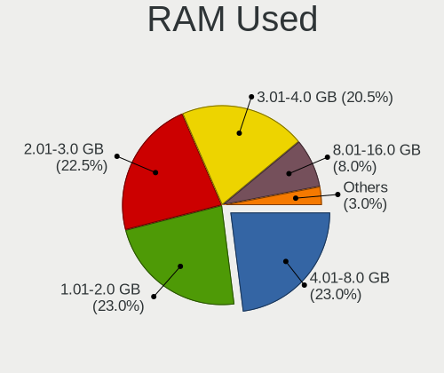

| Used GB   | Computers | Percent |
|-----------|-----------|---------|
| 1.01-2.0  | 54        | 33.33%  |
| 2.01-3.0  | 40        | 24.69%  |
| 4.01-8.0  | 30        | 18.52%  |
| 3.01-4.0  | 22        | 13.58%  |
| 0.51-1.0  | 7         | 4.32%   |
| 0.01-0.5  | 6         | 3.7%    |
| 8.01-16.0 | 3         | 1.85%   |

Total Drives
------------

Number of drives on board

| Drives | Computers | Percent |
|--------|-----------|---------|
| 1      | 88        | 54.32%  |
| 2      | 46        | 28.4%   |
| 3      | 12        | 7.41%   |
| 4      | 6         | 3.7%    |
| 5      | 5         | 3.09%   |
| 0      | 3         | 1.85%   |
| 7      | 1         | 0.62%   |
| 6      | 1         | 0.62%   |

Has CD-ROM
----------

Has CD-ROM on board

| Presented | Computers | Percent |
|-----------|-----------|---------|
| No        | 105       | 64.81%  |
| Yes       | 57        | 35.19%  |

Has Ethernet
------------

Has Ethernet on board

| Presented | Computers | Percent |
|-----------|-----------|---------|
| Yes       | 141       | 87.04%  |
| No        | 21        | 12.96%  |

Has WiFi
--------

Has WiFi module

| Presented | Computers | Percent |
|-----------|-----------|---------|
| Yes       | 131       | 80.86%  |
| No        | 31        | 19.14%  |

Has Bluetooth
-------------

Has Bluetooth module

| Presented | Computers | Percent |
|-----------|-----------|---------|
| Yes       | 105       | 64.81%  |
| No        | 57        | 35.19%  |

Location
--------

Country
-------

Geographic location (country)

| Country | Computers | Percent |
|---------|-----------|---------|
| UK      | 162       | 100%    |

City
----

Geographic location (city)

| City               | Computers | Percent |
|--------------------|-----------|---------|
| London             | 10        | 6.17%   |
| Edinburgh          | 7         | 4.32%   |
| Manchester         | 5         | 3.09%   |
| Fulham             | 4         | 2.47%   |
| Bradford           | 4         | 2.47%   |
| Milton Keynes      | 3         | 1.85%   |
| Derby              | 3         | 1.85%   |
| Coventry           | 3         | 1.85%   |
| Bristol            | 3         | 1.85%   |
| Walsall            | 2         | 1.23%   |
| Wakefield          | 2         | 1.23%   |
| Rotherham          | 2         | 1.23%   |
| North Shields      | 2         | 1.23%   |
| Liverpool          | 2         | 1.23%   |
| Lincoln            | 2         | 1.23%   |
| Lancaster          | 2         | 1.23%   |
| Dudley             | 2         | 1.23%   |
| Cardiff            | 2         | 1.23%   |
| Cambridge          | 2         | 1.23%   |
| Brighton           | 2         | 1.23%   |
| Bermondsey         | 2         | 1.23%   |
| Aberdeen           | 2         | 1.23%   |
| Worthing           | 1         | 0.62%   |
| Wolverhampton      | 1         | 0.62%   |
| Wigan              | 1         | 0.62%   |
| Wetherby           | 1         | 0.62%   |
| Weston-super-Mare  | 1         | 0.62%   |
| West Bromwich      | 1         | 0.62%   |
| Wembley            | 1         | 0.62%   |
| Welwyn Garden City | 1         | 0.62%   |
| Wellingborough     | 1         | 0.62%   |
| Washington         | 1         | 0.62%   |
| Uckfield           | 1         | 0.62%   |
| Twickenham         | 1         | 0.62%   |
| Treharris          | 1         | 0.62%   |
| Sunbury-on-Thames  | 1         | 0.62%   |
| Stourbridge        | 1         | 0.62%   |
| Stirling           | 1         | 0.62%   |
| Stevenage          | 1         | 0.62%   |
| St Helens          | 1         | 0.62%   |
| Slough             | 1         | 0.62%   |
| Shildon            | 1         | 0.62%   |
| Sheffield          | 1         | 0.62%   |
| Seaford            | 1         | 0.62%   |
| Scunthorpe         | 1         | 0.62%   |
| Salisbury          | 1         | 0.62%   |
| Salford            | 1         | 0.62%   |
| Saint Neots        | 1         | 0.62%   |
| Redditch           | 1         | 0.62%   |
| Reading            | 1         | 0.62%   |
| Prestatyn          | 1         | 0.62%   |
| Prescot            | 1         | 0.62%   |
| Portsmouth         | 1         | 0.62%   |
| Portishead         | 1         | 0.62%   |
| Plymouth           | 1         | 0.62%   |
| Perivale           | 1         | 0.62%   |
| Oxford             | 1         | 0.62%   |
| Olney              | 1         | 0.62%   |
| Oakham             | 1         | 0.62%   |
| Nottingham         | 1         | 0.62%   |

Drives
------

Drive Vendor
------------

Hard drive vendors

| Vendor                         | Computers | Drives | Percent |
|--------------------------------|-----------|--------|---------|
| Samsung Electronics            | 38        | 44     | 15.9%   |
| Seagate                        | 33        | 48     | 13.81%  |
| WDC                            | 22        | 27     | 9.21%   |
| Toshiba                        | 20        | 23     | 8.37%   |
| SanDisk                        | 17        | 18     | 7.11%   |
| Crucial                        | 12        | 12     | 5.02%   |
| Unknown                        | 11        | 13     | 4.6%    |
| Kingston                       | 11        | 12     | 4.6%    |
| SK hynix                       | 9         | 9      | 3.77%   |
| Hitachi                        | 8         | 8      | 3.35%   |
| China                          | 7         | 7      | 2.93%   |
| Phison                         | 6         | 6      | 2.51%   |
| HGST                           | 5         | 5      | 2.09%   |
| KIOXIA                         | 4         | 5      | 1.67%   |
| Intel                          | 4         | 4      | 1.67%   |
| LITEON                         | 3         | 3      | 1.26%   |
| KingDian                       | 3         | 3      | 1.26%   |
| Apple                          | 3         | 4      | 1.26%   |
| Silicon Motion                 | 2         | 2      | 0.84%   |
| SABRENT                        | 2         | 2      | 0.84%   |
| Micron Technology              | 2         | 2      | 0.84%   |
| Corsair                        | 2         | 2      | 0.84%   |
| A-DATA Technology              | 2         | 2      | 0.84%   |
| Unknown                        | 2         | 2      | 0.84%   |
| Solid State Storage Technology | 1         | 1      | 0.42%   |
| PNY                            | 1         | 1      | 0.42%   |
| OWC                            | 1         | 1      | 0.42%   |
| OCZ                            | 1         | 1      | 0.42%   |
| Micron/Crucial Technology      | 1         | 1      | 0.42%   |
| Lexar                          | 1         | 1      | 0.42%   |
| KingSpec                       | 1         | 1      | 0.42%   |
| Hoodisk                        | 1         | 1      | 0.42%   |
| Fujitsu                        | 1         | 1      | 0.42%   |
| FORESEE                        | 1         | 1      | 0.42%   |
| Drevo                          | 1         | 1      | 0.42%   |

Drive Model
-----------

Hard drive models

| Model                                  | Computers | Percent |
|----------------------------------------|-----------|---------|
| Samsung SSD 850 EVO 250GB              | 6         | 2.27%   |
| Toshiba MQ01ABD100 1TB                 | 5         | 1.89%   |
| HGST HTS541010A9E680 1TB               | 5         | 1.89%   |
| Unknown SD/MMC/MS PRO 128GB            | 3         | 1.14%   |
| Toshiba MQ04ABF100 1TB                 | 3         | 1.14%   |
| Seagate ST4000DM004-2CV104 4TB         | 3         | 1.14%   |
| Kingston SA400S37240G 240GB SSD        | 3         | 1.14%   |
| Hitachi HTS723232A7A364 320GB          | 3         | 1.14%   |
| Crucial CT240BX500SSD1 240GB           | 3         | 1.14%   |
| WDC WDS100T2B0C-00PXH0 1TB             | 2         | 0.76%   |
| WDC WD5000AAKX-75U6AA0 500GB           | 2         | 0.76%   |
| WDC WD10SPZX-21Z10T0 1TB               | 2         | 0.76%   |
| WDC WD10EADS-00M2B0 1TB                | 2         | 0.76%   |
| Unknown USD00  64GB                    | 2         | 0.76%   |
| Toshiba HDWD110 1TB                    | 2         | 0.76%   |
| SK hynix HFM001TD3JX013N 1TB           | 2         | 0.76%   |
| Seagate ST3500418AS 500GB              | 2         | 0.76%   |
| Seagate ST3500312CS 500GB              | 2         | 0.76%   |
| Seagate ST2000LM010-1RA174 2TB         | 2         | 0.76%   |
| Seagate ST2000DM006-2DM164 2TB         | 2         | 0.76%   |
| Seagate ST1000LM024 HN-M101MBB 1TB     | 2         | 0.76%   |
| Seagate ST1000DM010-2EP102 1TB         | 2         | 0.76%   |
| Seagate Expansion+ Desk 4TB            | 2         | 0.76%   |
| Seagate Expansion 1TB                  | 2         | 0.76%   |
| SanDisk SSD PLUS 120 GB                | 2         | 0.76%   |
| SanDisk NVMe SSD Drive 500GB           | 2         | 0.76%   |
| SanDisk NVMe SSD Drive 256GB           | 2         | 0.76%   |
| SanDisk NVMe SSD Drive 1TB             | 2         | 0.76%   |
| Samsung SSD 970 EVO Plus 1TB           | 2         | 0.76%   |
| Samsung SSD 860 EVO 250GB              | 2         | 0.76%   |
| Samsung SSD 840 EVO 250GB              | 2         | 0.76%   |
| Samsung SM963 2.5" NVMe PCIe SSD 500GB | 2         | 0.76%   |
| Samsung NVMe SSD Drive 512GB           | 2         | 0.76%   |
| Samsung NVMe SSD Drive 2TB             | 2         | 0.76%   |
| Samsung NVMe SSD Drive 1TB             | 2         | 0.76%   |
| SABRENT Disk 1TB                       | 2         | 0.76%   |
| KIOXIA NVMe SSD Drive 512GB            | 2         | 0.76%   |
| Kingston SV300S37A120G 120GB SSD       | 2         | 0.76%   |
| KingDian S200 60GB SSD                 | 2         | 0.76%   |
| Hitachi HTS547575A9E384 752GB          | 2         | 0.76%   |
| Crucial CT1000MX500SSD1 1TB            | 2         | 0.76%   |
| China SATA SSD 120GB                   | 2         | 0.76%   |
| Apple HDD ST1000DM003 1TB              | 2         | 0.76%   |
| Unknown                                | 2         | 0.76%   |
| WDC WDS500G2B0C-00PXH0 500GB           | 1         | 0.38%   |
| WDC WDS500G2B0C 500GB                  | 1         | 0.38%   |
| WDC WDS500G2B0A-00SM50 500GB SSD       | 1         | 0.38%   |
| WDC WDS500G1X0E-00AFY0 500GB           | 1         | 0.38%   |
| WDC WDS100T2B0C 1TB                    | 1         | 0.38%   |
| WDC WD7500BPVX-22JC3T0 752GB           | 1         | 0.38%   |
| WDC WD6400AAVS-00G9B1 640GB            | 1         | 0.38%   |
| WDC WD5003AZEX-00K1GA0 500GB           | 1         | 0.38%   |
| WDC WD5000AAKX-07U6AA0 500GB           | 1         | 0.38%   |
| WDC WD50 00LPCX-24VHAT0 500GB          | 1         | 0.38%   |
| WDC WD30EFRX-68EUZN0 3TB               | 1         | 0.38%   |
| WDC WD20EZRZ-60Z5HB0 2TB               | 1         | 0.38%   |
| WDC WD15EARS-00MVWB0 1TB               | 1         | 0.38%   |
| WDC WD10EZEX-00WN4A0 1TB               | 1         | 0.38%   |
| WDC WD10EZEX-00RKKA0 1TB               | 1         | 0.38%   |
| WDC WD10EZEX-00KUWA0 1TB               | 1         | 0.38%   |

HDD Vendor
----------

Hard disk drive vendors

| Vendor              | Computers | Drives | Percent |
|---------------------|-----------|--------|---------|
| Seagate             | 33        | 46     | 37.93%  |
| WDC                 | 17        | 19     | 19.54%  |
| Toshiba             | 17        | 20     | 19.54%  |
| Hitachi             | 8         | 8      | 9.2%    |
| HGST                | 5         | 5      | 5.75%   |
| Unknown             | 3         | 3      | 3.45%   |
| Apple               | 2         | 2      | 2.3%    |
| Samsung Electronics | 1         | 1      | 1.15%   |
| Fujitsu             | 1         | 1      | 1.15%   |

SSD Vendor
----------

Solid state drive vendors

| Vendor              | Computers | Drives | Percent |
|---------------------|-----------|--------|---------|
| Samsung Electronics | 18        | 19     | 22.22%  |
| SanDisk             | 11        | 11     | 13.58%  |
| Crucial             | 10        | 10     | 12.35%  |
| Kingston            | 8         | 9      | 9.88%   |
| China               | 7         | 7      | 8.64%   |
| LITEON              | 3         | 3      | 3.7%    |
| KingDian            | 3         | 3      | 3.7%    |
| SK hynix            | 2         | 2      | 2.47%   |
| Apple               | 2         | 2      | 2.47%   |
| Unknown             | 2         | 2      | 2.47%   |
| WDC                 | 1         | 1      | 1.23%   |
| Unknown             | 1         | 1      | 1.23%   |
| Toshiba             | 1         | 1      | 1.23%   |
| PNY                 | 1         | 1      | 1.23%   |
| Phison              | 1         | 1      | 1.23%   |
| OCZ                 | 1         | 1      | 1.23%   |
| Micron Technology   | 1         | 1      | 1.23%   |
| Lexar               | 1         | 1      | 1.23%   |
| KingSpec            | 1         | 1      | 1.23%   |
| Intel               | 1         | 1      | 1.23%   |
| Hoodisk             | 1         | 1      | 1.23%   |
| FORESEE             | 1         | 1      | 1.23%   |
| Drevo               | 1         | 1      | 1.23%   |
| Corsair             | 1         | 1      | 1.23%   |
| A-DATA Technology   | 1         | 1      | 1.23%   |

Drive Kind
----------

HDD or SSD

| Kind | Computers | Drives | Percent |
|------|-----------|--------|---------|
| HDD  | 72        | 105    | 34.12%  |
| SSD  | 70        | 83     | 33.18%  |
| NVMe | 62        | 77     | 29.38%  |
| MMC  | 7         | 9      | 3.32%   |

Drive Connector
---------------

SATA, SAS, NVMe, etc.

| Type | Computers | Drives | Percent |
|------|-----------|--------|---------|
| SATA | 120       | 175    | 60%     |
| NVMe | 60        | 75     | 30%     |
| SAS  | 13        | 15     | 6.5%    |
| MMC  | 7         | 9      | 3.5%    |

Drive Size
----------

Size of hard drive

| Size in TB | Computers | Drives | Percent |
|------------|-----------|--------|---------|
| 0.01-0.5   | 88        | 109    | 56.41%  |
| 0.51-1.0   | 48        | 54     | 30.77%  |
| 1.01-2.0   | 10        | 10     | 6.41%   |
| 3.01-4.0   | 5         | 9      | 3.21%   |
| 4.01-10.0  | 3         | 4      | 1.92%   |
| 2.01-3.0   | 2         | 2      | 1.28%   |

Space Total
-----------

Amount of disk space available on the file system

| Size in GB     | Computers | Percent |
|----------------|-----------|---------|
| 101-250        | 42        | 25.93%  |
| 501-1000       | 31        | 19.14%  |
| 251-500        | 25        | 15.43%  |
| 1001-2000      | 15        | 9.26%   |
| 51-100         | 15        | 9.26%   |
| 1-20           | 9         | 5.56%   |
| More than 3000 | 8         | 4.94%   |
| Unknown        | 7         | 4.32%   |
| 2001-3000      | 6         | 3.7%    |
| 21-50          | 4         | 2.47%   |

Space Used
----------

Amount of used disk space

| Used GB        | Computers | Percent |
|----------------|-----------|---------|
| 1-20           | 55        | 33.95%  |
| 21-50          | 33        | 20.37%  |
| 101-250        | 23        | 14.2%   |
| 51-100         | 18        | 11.11%  |
| 251-500        | 11        | 6.79%   |
| Unknown        | 7         | 4.32%   |
| 501-1000       | 6         | 3.7%    |
| 1001-2000      | 5         | 3.09%   |
| 2001-3000      | 3         | 1.85%   |
| More than 3000 | 1         | 0.62%   |

Malfunc. Drives
---------------

Drive models with a malfunction

| Model                               | Computers | Drives | Percent |
|-------------------------------------|-----------|--------|---------|
| WDC WD5000AAKX-75U6AA0 500GB        | 1         | 1      | 8.33%   |
| WDC WD10EADS-00M2B0 1TB             | 1         | 1      | 8.33%   |
| Toshiba MK4009GAL 40GB              | 1         | 1      | 8.33%   |
| SanDisk SSD PLUS 480GB              | 1         | 1      | 8.33%   |
| Samsung Electronics SSD 980 PRO 2TB | 1         | 1      | 8.33%   |
| Samsung Electronics HD103UJ 1TB     | 1         | 1      | 8.33%   |
| Intel SSDPEKKW512G7 512GB           | 1         | 1      | 8.33%   |
| Hitachi HTS723232A7A364 320GB       | 1         | 1      | 8.33%   |
| Hitachi HTS547575A9E384 752GB       | 1         | 1      | 8.33%   |
| Hitachi HTC426040G9AT00 40GB        | 1         | 1      | 8.33%   |
| HGST HTS541010A9E680 1TB            | 1         | 1      | 8.33%   |
| Drevo X1 Pro SSD 128GB              | 1         | 1      | 8.33%   |

Malfunc. Drive Vendor
---------------------

Vendors of faulty drives

| Vendor              | Computers | Drives | Percent |
|---------------------|-----------|--------|---------|
| Hitachi             | 3         | 3      | 25%     |
| WDC                 | 2         | 2      | 16.67%  |
| Samsung Electronics | 2         | 2      | 16.67%  |
| Toshiba             | 1         | 1      | 8.33%   |
| SanDisk             | 1         | 1      | 8.33%   |
| Intel               | 1         | 1      | 8.33%   |
| HGST                | 1         | 1      | 8.33%   |
| Drevo               | 1         | 1      | 8.33%   |

Malfunc. HDD Vendor
-------------------

Vendors of faulty HDD drives

| Vendor              | Computers | Drives | Percent |
|---------------------|-----------|--------|---------|
| Hitachi             | 3         | 3      | 37.5%   |
| WDC                 | 2         | 2      | 25%     |
| Toshiba             | 1         | 1      | 12.5%   |
| Samsung Electronics | 1         | 1      | 12.5%   |
| HGST                | 1         | 1      | 12.5%   |

Malfunc. Drive Kind
-------------------

Kinds of faulty drives

| Kind | Computers | Drives | Percent |
|------|-----------|--------|---------|
| HDD  | 8         | 8      | 66.67%  |
| NVMe | 2         | 2      | 16.67%  |
| SSD  | 2         | 2      | 16.67%  |

Failed Drives
-------------

Failed drive models

Zero info for selected period =(

Failed Drive Vendor
-------------------

Failed drive vendors

Zero info for selected period =(

Drive Status
------------

Number of failed and malfunc. drives

| Status   | Computers | Drives | Percent |
|----------|-----------|--------|---------|
| Detected | 93        | 161    | 54.07%  |
| Works    | 68        | 101    | 39.53%  |
| Malfunc  | 11        | 12     | 6.4%    |

Storage controller
------------------

Storage Vendor
--------------

Storage controller vendors

| Vendor                         | Computers | Percent |
|--------------------------------|-----------|---------|
| Intel                          | 105       | 49.3%   |
| AMD                            | 30        | 14.08%  |
| Samsung Electronics            | 22        | 10.33%  |
| SanDisk                        | 12        | 5.63%   |
| SK hynix                       | 7         | 3.29%   |
| Phison Electronics             | 7         | 3.29%   |
| ASMedia Technology             | 4         | 1.88%   |
| Toshiba America Info Systems   | 3         | 1.41%   |
| Micron/Crucial Technology      | 3         | 1.41%   |
| KIOXIA                         | 3         | 1.41%   |
| Kingston Technology Company    | 3         | 1.41%   |
| Silicon Motion                 | 2         | 0.94%   |
| Seagate Technology             | 2         | 0.94%   |
| Nvidia                         | 2         | 0.94%   |
| Broadcom / LSI                 | 2         | 0.94%   |
| VIA Technologies               | 1         | 0.47%   |
| Solid State Storage Technology | 1         | 0.47%   |
| Micron Technology              | 1         | 0.47%   |
| Marvell Technology Group       | 1         | 0.47%   |
| JMicron Technology             | 1         | 0.47%   |
| ADATA Technology               | 1         | 0.47%   |

Storage Model
-------------

Storage controller models

| Model                                                                          | Computers | Percent |
|--------------------------------------------------------------------------------|-----------|---------|
| AMD FCH SATA Controller [AHCI mode]                                            | 19        | 8.09%   |
| Samsung NVMe SSD Controller SM981/PM981/PM983                                  | 10        | 4.26%   |
| Intel Sunrise Point-LP SATA Controller [AHCI mode]                             | 8         | 3.4%    |
| Intel 7 Series Chipset Family 6-port SATA Controller [AHCI mode]               | 8         | 3.4%    |
| AMD 500 Series Chipset SATA Controller                                         | 7         | 2.98%   |
| Intel 8 Series/C220 Series Chipset Family 6-port SATA Controller 1 [AHCI mode] | 6         | 2.55%   |
| Samsung NVMe SSD Controller PM9A1/PM9A3/980PRO                                 | 5         | 2.13%   |
| Intel SATA Controller [RAID mode]                                              | 5         | 2.13%   |
| Intel Q170/Q150/B150/H170/H110/Z170/CM236 Chipset SATA Controller [AHCI Mode]  | 5         | 2.13%   |
| Intel 7 Series/C210 Series Chipset Family 6-port SATA Controller [AHCI mode]   | 5         | 2.13%   |
| SanDisk WD Blue SN550 NVMe SSD                                                 | 4         | 1.7%    |
| Samsung NVMe SSD Controller SM961/PM961/SM963                                  | 4         | 1.7%    |
| Samsung NVMe SSD Controller 980                                                | 4         | 1.7%    |
| Intel Volume Management Device NVMe RAID Controller                            | 4         | 1.7%    |
| Intel Celeron/Pentium Silver Processor SATA Controller                         | 4         | 1.7%    |
| Intel 82801 Mobile SATA Controller [RAID mode]                                 | 4         | 1.7%    |
| Intel 8 Series SATA Controller 1 [AHCI mode]                                   | 4         | 1.7%    |
| Intel 6 Series/C200 Series Chipset Family 6 port Desktop SATA AHCI Controller  | 4         | 1.7%    |
| ASMedia ASM1062 Serial ATA Controller                                          | 4         | 1.7%    |
| SK hynix Gold P31 SSD                                                          | 3         | 1.28%   |
| Phison E16 PCIe4 NVMe Controller                                               | 3         | 1.28%   |
| KIOXIA Non-Volatile memory controller                                          | 3         | 1.28%   |
| Intel Wildcat Point-LP SATA Controller [AHCI Mode]                             | 3         | 1.28%   |
| Intel Celeron N3350/Pentium N4200/Atom E3900 Series SATA AHCI Controller       | 3         | 1.28%   |
| Intel Atom Processor E3800 Series SATA AHCI Controller                         | 3         | 1.28%   |
| Intel 82801IBM/IEM (ICH9M/ICH9M-E) 4 port SATA Controller [AHCI mode]          | 3         | 1.28%   |
| Intel 6 Series/C200 Series Chipset Family 6 port Mobile SATA AHCI Controller   | 3         | 1.28%   |
| Intel 200 Series PCH SATA controller [AHCI mode]                               | 3         | 1.28%   |
| AMD 300 Series Chipset SATA Controller                                         | 3         | 1.28%   |
| SK hynix Non-Volatile memory controller                                        | 2         | 0.85%   |
| SK hynix BC501 NVMe Solid State Drive                                          | 2         | 0.85%   |
| Silicon Motion SM2263EN/SM2263XT SSD Controller                                | 2         | 0.85%   |
| SanDisk WD PC SN810 / Black SN850 NVMe SSD                                     | 2         | 0.85%   |
| SanDisk WD Blue SN570 NVMe SSD                                                 | 2         | 0.85%   |
| SanDisk WD Blue SN500 / PC SN520 NVMe SSD                                      | 2         | 0.85%   |
| SanDisk Non-Volatile memory controller                                         | 2         | 0.85%   |
| Phison PS5013 E13 NVMe Controller                                              | 2         | 0.85%   |
| Micron/Crucial P2 NVMe PCIe SSD                                                | 2         | 0.85%   |
| Intel Comet Lake SATA AHCI Controller                                          | 2         | 0.85%   |
| Intel Cannon Lake PCH SATA AHCI Controller                                     | 2         | 0.85%   |
| Intel 82801HM/HEM (ICH8M/ICH8M-E) IDE Controller                               | 2         | 0.85%   |
| Intel 5 Series/3400 Series Chipset 6 port SATA AHCI Controller                 | 2         | 0.85%   |
| AMD SB7x0/SB8x0/SB9x0 SATA Controller [AHCI mode]                              | 2         | 0.85%   |
| AMD FCH SATA Controller D                                                      | 2         | 0.85%   |
| AMD 400 Series Chipset SATA Controller                                         | 2         | 0.85%   |
| VIA VT6415 PATA IDE Host Controller                                            | 1         | 0.43%   |
| Toshiba America Info Systems XG6 NVMe SSD Controller                           | 1         | 0.43%   |
| Toshiba America Info Systems XG4 NVMe SSD Controller                           | 1         | 0.43%   |
| Toshiba America Info Systems BG3 NVMe SSD Controller                           | 1         | 0.43%   |
| Solid State Storage Non-Volatile memory controller                             | 1         | 0.43%   |
| Seagate Non-Volatile memory controller                                         | 1         | 0.43%   |
| Seagate FireCuda 510 SSD                                                       | 1         | 0.43%   |
| SanDisk WD Black SN750 / PC SN730 NVMe SSD                                     | 1         | 0.43%   |
| Samsung Apple PCIe SSD                                                         | 1         | 0.43%   |
| Phison NVMe Storage Controller                                                 | 1         | 0.43%   |
| Phison Electronics Non-Volatile memory controller                              | 1         | 0.43%   |
| Nvidia MCP79 SATA Controller                                                   | 1         | 0.43%   |
| Nvidia MCP61 SATA Controller                                                   | 1         | 0.43%   |
| Nvidia MCP61 IDE                                                               | 1         | 0.43%   |
| Micron/Crucial Non-Volatile memory controller                                  | 1         | 0.43%   |

Storage Kind
------------

Kind of storage controller (IDE, SATA, NVMe, SAS, ...)

| Kind | Computers | Percent |
|------|-----------|---------|
| SATA | 109       | 53.96%  |
| NVMe | 60        | 29.7%   |
| IDE  | 17        | 8.42%   |
| RAID | 15        | 7.43%   |
| SCSI | 1         | 0.5%    |

Processor
---------

CPU Vendor
----------

Processor vendors

| Vendor | Computers | Percent |
|--------|-----------|---------|
| Intel  | 122       | 75.31%  |
| AMD    | 38        | 23.46%  |
| ARM    | 2         | 1.23%   |

CPU Model
---------

Processor models

| Model                                       | Computers | Percent |
|---------------------------------------------|-----------|---------|
| AMD Ryzen 5 3600 6-Core Processor           | 4         | 2.47%   |
| Intel Core i5-8250U CPU @ 1.60GHz           | 3         | 1.85%   |
| Intel Core i5-3470 CPU @ 3.20GHz            | 3         | 1.85%   |
| Intel Core i5-3320M CPU @ 2.60GHz           | 3         | 1.85%   |
| Intel 11th Gen Core i5-1135G7 @ 2.40GHz     | 3         | 1.85%   |
| Intel Core i5-6600K CPU @ 3.50GHz           | 2         | 1.23%   |
| Intel Core i5-6500 CPU @ 3.20GHz            | 2         | 1.23%   |
| Intel Core i5-6300U CPU @ 2.40GHz           | 2         | 1.23%   |
| Intel Core i5-4210U CPU @ 1.70GHz           | 2         | 1.23%   |
| Intel Core i3-7100 CPU @ 3.90GHz            | 2         | 1.23%   |
| Intel Celeron J4125 CPU @ 2.00GHz           | 2         | 1.23%   |
| Intel 11th Gen Core i7-1165G7 @ 2.80GHz     | 2         | 1.23%   |
| ARM Processor                               | 2         | 1.23%   |
| AMD Ryzen 9 5900X 12-Core Processor         | 2         | 1.23%   |
| AMD Ryzen 7 5800H with Radeon Graphics      | 2         | 1.23%   |
| AMD Ryzen 5 5600X 6-Core Processor          | 2         | 1.23%   |
| AMD Ryzen 5 5600G with Radeon Graphics      | 2         | 1.23%   |
| Intel Xeon CPU X5690 @ 3.47GHz              | 1         | 0.62%   |
| Intel Xeon CPU X5650 @ 2.67GHz              | 1         | 0.62%   |
| Intel Xeon CPU X5570 @ 2.93GHz              | 1         | 0.62%   |
| Intel Xeon CPU E5-1620 v2 @ 3.70GHz         | 1         | 0.62%   |
| Intel Xeon CPU E3-1220 v3 @ 3.10GHz         | 1         | 0.62%   |
| Intel Pentium Silver J5040 CPU @ 2.00GHz    | 1         | 0.62%   |
| Intel Pentium M processor 1.73GHz           | 1         | 0.62%   |
| Intel Pentium M processor 1.50GHz           | 1         | 0.62%   |
| Intel Pentium Dual-Core CPU T4500 @ 2.30GHz | 1         | 0.62%   |
| Intel Pentium Dual-Core CPU T4200 @ 2.00GHz | 1         | 0.62%   |
| Intel Pentium Dual-Core CPU E5300 @ 2.60GHz | 1         | 0.62%   |
| Intel Pentium Dual CPU T2390 @ 1.86GHz      | 1         | 0.62%   |
| Intel Pentium CPU J4205 @ 1.50GHz           | 1         | 0.62%   |
| Intel Pentium CPU G840 @ 2.80GHz            | 1         | 0.62%   |
| Intel Pentium CPU G645 @ 2.90GHz            | 1         | 0.62%   |
| Intel Pentium CPU G620 @ 2.60GHz            | 1         | 0.62%   |
| Intel Pentium CPU B960 @ 2.20GHz            | 1         | 0.62%   |
| Intel Core Solo CPU U1500 @ 1.33GHz         | 1         | 0.62%   |
| Intel Core i9-10900K CPU @ 3.70GHz          | 1         | 0.62%   |
| Intel Core i7-9750H CPU @ 2.60GHz           | 1         | 0.62%   |
| Intel Core i7-9700T CPU @ 2.00GHz           | 1         | 0.62%   |
| Intel Core i7-8550U CPU @ 1.80GHz           | 1         | 0.62%   |
| Intel Core i7-7700K CPU @ 4.20GHz           | 1         | 0.62%   |
| Intel Core i7-7700HQ CPU @ 2.80GHz          | 1         | 0.62%   |
| Intel Core i7-7600U CPU @ 2.80GHz           | 1         | 0.62%   |
| Intel Core i7-7500U CPU @ 2.70GHz           | 1         | 0.62%   |
| Intel Core i7-6850K CPU @ 3.60GHz           | 1         | 0.62%   |
| Intel Core i7-6500U CPU @ 2.50GHz           | 1         | 0.62%   |
| Intel Core i7-4930K CPU @ 3.40GHz           | 1         | 0.62%   |
| Intel Core i7-4770S CPU @ 3.10GHz           | 1         | 0.62%   |
| Intel Core i7-4770HQ CPU @ 2.20GHz          | 1         | 0.62%   |
| Intel Core i7-4770 CPU @ 3.40GHz            | 1         | 0.62%   |
| Intel Core i7-4700MQ CPU @ 2.40GHz          | 1         | 0.62%   |
| Intel Core i7-4558U CPU @ 2.80GHz           | 1         | 0.62%   |
| Intel Core i7-3770 CPU @ 3.40GHz            | 1         | 0.62%   |
| Intel Core i7-3520M CPU @ 2.90GHz           | 1         | 0.62%   |
| Intel Core i7-2600K CPU @ 3.40GHz           | 1         | 0.62%   |
| Intel Core i7-2600 CPU @ 3.40GHz            | 1         | 0.62%   |
| Intel Core i7-1065G7 CPU @ 1.30GHz          | 1         | 0.62%   |
| Intel Core i7-10510U CPU @ 1.80GHz          | 1         | 0.62%   |
| Intel Core i5-8400 CPU @ 2.80GHz            | 1         | 0.62%   |
| Intel Core i5-8350U CPU @ 1.70GHz           | 1         | 0.62%   |
| Intel Core i5-8300H CPU @ 2.30GHz           | 1         | 0.62%   |

CPU Model Family
----------------

Processor model prefix

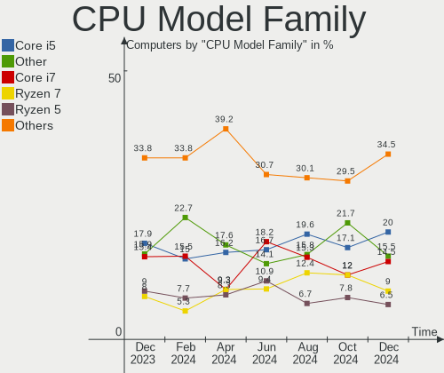

| Model                   | Computers | Percent |
|-------------------------|-----------|---------|
| Intel Core i5           | 37        | 22.84%  |
| Intel Core i7           | 21        | 12.96%  |
| Other                   | 17        | 10.49%  |
| Intel Core i3           | 14        | 8.64%   |
| AMD Ryzen 5             | 11        | 6.79%   |
| Intel Celeron           | 10        | 6.17%   |
| AMD Ryzen 7             | 7         | 4.32%   |
| AMD Ryzen 9             | 6         | 3.7%    |
| Intel Xeon              | 5         | 3.09%   |
| Intel Pentium           | 5         | 3.09%   |
| Intel Core 2 Duo        | 5         | 3.09%   |
| Intel Pentium Dual-Core | 3         | 1.85%   |
| Intel Pentium M         | 2         | 1.23%   |
| Intel Atom              | 2         | 1.23%   |
| AMD Ryzen 3             | 2         | 1.23%   |
| AMD Athlon II X4        | 2         | 1.23%   |
| AMD A10                 | 2         | 1.23%   |
| Intel Pentium Silver    | 1         | 0.62%   |
| Intel Pentium Dual      | 1         | 0.62%   |
| Intel Core Solo         | 1         | 0.62%   |
| Intel Core i9           | 1         | 0.62%   |
| Intel Core 2 Quad       | 1         | 0.62%   |
| AMD PRO A8              | 1         | 0.62%   |
| AMD Phenom II           | 1         | 0.62%   |
| AMD FX                  | 1         | 0.62%   |
| AMD Athlon X4           | 1         | 0.62%   |
| AMD Athlon              | 1         | 0.62%   |
| AMD A8                  | 1         | 0.62%   |

CPU Cores
---------

Number of processor cores

| Number | Computers | Percent |
|--------|-----------|---------|
| 4      | 60        | 37.04%  |
| 2      | 60        | 37.04%  |
| 6      | 14        | 8.64%   |
| 8      | 11        | 6.79%   |
| 12     | 7         | 4.32%   |
| 1      | 4         | 2.47%   |
| 16     | 2         | 1.23%   |
| 3      | 2         | 1.23%   |
| 14     | 1         | 0.62%   |
| 10     | 1         | 0.62%   |

CPU Sockets
-----------

Number of sockets

| Number | Computers | Percent |
|--------|-----------|---------|
| 1      | 159       | 98.15%  |
| 2      | 3         | 1.85%   |

CPU Threads
-----------

Threads per core (Hyper-Threading)

| Number | Computers | Percent |
|--------|-----------|---------|
| 2      | 104       | 64.2%   |
| 1      | 58        | 35.8%   |

CPU Op-Modes
------------

CPU Operation Modes (32-bit, 64-bit)

| Op mode        | Computers | Percent |
|----------------|-----------|---------|
| 32-bit, 64-bit | 156       | 96.3%   |
| Unknown        | 4         | 2.47%   |
| 32-bit         | 2         | 1.23%   |

CPU Microcode
-------------

Microcode number

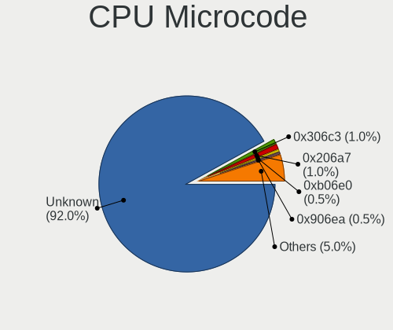

| Number     | Computers | Percent |
|------------|-----------|---------|
| Unknown    | 42        | 25.93%  |
| 0x206a7    | 10        | 6.17%   |
| 0x306a9    | 8         | 4.94%   |
| 0x806c1    | 6         | 3.7%    |
| 0x306c3    | 6         | 3.7%    |
| 0x1067a    | 6         | 3.7%    |
| 0x906e9    | 5         | 3.09%   |
| 0x08701021 | 5         | 3.09%   |
| 0x806e9    | 4         | 2.47%   |
| 0x40651    | 4         | 2.47%   |
| 0x30678    | 4         | 2.47%   |
| 0x906ea    | 3         | 1.85%   |
| 0x806ea    | 3         | 1.85%   |
| 0x706a8    | 3         | 1.85%   |
| 0x506e3    | 3         | 1.85%   |
| 0x406e3    | 3         | 1.85%   |
| 0x0a50000c | 3         | 1.85%   |
| 0x906a3    | 2         | 1.23%   |
| 0x506c9    | 2         | 1.23%   |
| 0x306e4    | 2         | 1.23%   |
| 0x0a201016 | 2         | 1.23%   |
| 0x0a201009 | 2         | 1.23%   |
| 0x08600106 | 2         | 1.23%   |
| 0x0600611a | 2         | 1.23%   |
| 0x010000c8 | 2         | 1.23%   |
| 0xa0655    | 1         | 0.62%   |
| 0xa0652    | 1         | 0.62%   |
| 0x906ed    | 1         | 0.62%   |
| 0x906eb    | 1         | 0.62%   |
| 0x906c0    | 1         | 0.62%   |
| 0x90672    | 1         | 0.62%   |
| 0x806ec    | 1         | 0.62%   |
| 0x806eb    | 1         | 0.62%   |
| 0x806d1    | 1         | 0.62%   |
| 0x706e5    | 1         | 0.62%   |
| 0x706a1    | 1         | 0.62%   |
| 0x6d8      | 1         | 0.62%   |
| 0x406f1    | 1         | 0.62%   |
| 0x306d4    | 1         | 0.62%   |
| 0x206c2    | 1         | 0.62%   |
| 0x20655    | 1         | 0.62%   |
| 0x106c2    | 1         | 0.62%   |
| 0x10677    | 1         | 0.62%   |
| 0x10676    | 1         | 0.62%   |
| 0x0a50000d | 1         | 0.62%   |
| 0x08701013 | 1         | 0.62%   |
| 0x08108109 | 1         | 0.62%   |
| 0x08108102 | 1         | 0.62%   |
| 0x0810100b | 1         | 0.62%   |
| 0x08001138 | 1         | 0.62%   |
| 0x06006704 | 1         | 0.62%   |
| 0x06003106 | 1         | 0.62%   |
| 0x06000852 | 1         | 0.62%   |

CPU Microarch
-------------

Microarchitecture

| Name             | Computers | Percent |
|------------------|-----------|---------|
| KabyLake         | 22        | 13.58%  |
| Haswell          | 14        | 8.64%   |
| IvyBridge        | 13        | 8.02%   |
| SandyBridge      | 12        | 7.41%   |
| Zen 3            | 10        | 6.17%   |
| Zen 2            | 10        | 6.17%   |
| Skylake          | 9         | 5.56%   |
| Penryn           | 9         | 5.56%   |
| TigerLake        | 8         | 4.94%   |
| Westmere         | 5         | 3.09%   |
| Unknown          | 5         | 3.09%   |
| Zen+             | 4         | 2.47%   |
| Silvermont       | 4         | 2.47%   |
| Goldmont plus    | 4         | 2.47%   |
| Excavator        | 4         | 2.47%   |
| Broadwell        | 4         | 2.47%   |
| Zen              | 3         | 1.85%   |
| P6               | 3         | 1.85%   |
| K10              | 3         | 1.85%   |
| Goldmont         | 3         | 1.85%   |
| Piledriver       | 2         | 1.23%   |
| IceLake          | 2         | 1.23%   |
| CometLake        | 2         | 1.23%   |
| Alderlake Hybrid | 2         | 1.23%   |
| Tremont          | 1         | 0.62%   |
| Steamroller      | 1         | 0.62%   |
| Nehalem          | 1         | 0.62%   |
| Core             | 1         | 0.62%   |
| Bonnell          | 1         | 0.62%   |

Graphics
--------

GPU Vendor
----------

Vendors of graphics cards

| Vendor                     | Computers | Percent |
|----------------------------|-----------|---------|
| Intel                      | 98        | 54.14%  |
| AMD                        | 42        | 23.2%   |
| Nvidia                     | 38        | 20.99%  |
| Matrox Electronics Systems | 3         | 1.66%   |

GPU Model
---------

Graphics card models

| Model                                                                       | Computers | Percent |
|-----------------------------------------------------------------------------|-----------|---------|
| Intel 2nd Generation Core Processor Family Integrated Graphics Controller   | 9         | 4.89%   |
| Intel TigerLake-LP GT2 [Iris Xe Graphics]                                   | 7         | 3.8%    |
| Intel 3rd Gen Core processor Graphics Controller                            | 6         | 3.26%   |
| Intel UHD Graphics 620                                                      | 5         | 2.72%   |
| Intel HD Graphics 630                                                       | 5         | 2.72%   |
| Intel Haswell-ULT Integrated Graphics Controller                            | 5         | 2.72%   |
| AMD Cezanne                                                                 | 5         | 2.72%   |
| Nvidia GP106 [GeForce GTX 1060 6GB]                                         | 4         | 2.17%   |
| Intel Xeon E3-1200 v2/3rd Gen Core processor Graphics Controller            | 4         | 2.17%   |
| Intel Skylake GT2 [HD Graphics 520]                                         | 4         | 2.17%   |
| Intel HD Graphics 620                                                       | 4         | 2.17%   |
| Intel Atom Processor Z36xxx/Z37xxx Series Graphics & Display                | 4         | 2.17%   |
| Nvidia GK208B [GeForce GT 710]                                              | 3         | 1.63%   |
| Nvidia GA106M [GeForce RTX 3060 Mobile / Max-Q]                             | 3         | 1.63%   |
| Intel Xeon E3-1200 v3/4th Gen Core Processor Integrated Graphics Controller | 3         | 1.63%   |
| Intel HD Graphics 5500                                                      | 3         | 1.63%   |
| Intel HD Graphics 530                                                       | 3         | 1.63%   |
| Intel GeminiLake [UHD Graphics 600]                                         | 3         | 1.63%   |
| Intel Core Processor Integrated Graphics Controller                         | 3         | 1.63%   |
| AMD Picasso/Raven 2 [Radeon Vega Series / Radeon Vega Mobile Series]        | 3         | 1.63%   |
| AMD Cedar [Radeon HD 5000/6000/7350/8350 Series]                            | 3         | 1.63%   |
| Nvidia TU117 [GeForce GTX 1650]                                             | 2         | 1.09%   |
| Nvidia GP107M [GeForce GTX 1050 Mobile]                                     | 2         | 1.09%   |
| Nvidia GP104 [GeForce GTX 1070]                                             | 2         | 1.09%   |
| Nvidia GA107M [GeForce RTX 3050 Mobile]                                     | 2         | 1.09%   |
| Intel TigerLake-H GT1 [UHD Graphics]                                        | 2         | 1.09%   |
| Intel Mobile 4 Series Chipset Integrated Graphics Controller                | 2         | 1.09%   |
| Intel HD Graphics 500                                                       | 2         | 1.09%   |
| Intel CoffeeLake-S GT2 [UHD Graphics 630]                                   | 2         | 1.09%   |
| Intel CoffeeLake-H GT2 [UHD Graphics 630]                                   | 2         | 1.09%   |
| Intel Alder Lake-P Integrated Graphics Controller                           | 2         | 1.09%   |
| AMD Wani [Radeon R5/R6/R7 Graphics]                                         | 2         | 1.09%   |
| AMD RV730/M96-XT [Mobility Radeon HD 4670]                                  | 2         | 1.09%   |
| AMD Renoir                                                                  | 2         | 1.09%   |
| AMD Raven Ridge [Radeon Vega Series / Radeon Vega Mobile Series]            | 2         | 1.09%   |
| AMD Navi 23 [Radeon RX 6600/6600 XT/6600M]                                  | 2         | 1.09%   |
| AMD Ellesmere [Radeon RX 470/480/570/570X/580/580X/590]                     | 2         | 1.09%   |
| AMD Curacao XT / Trinidad XT [Radeon R7 370 / R9 270X/370X]                 | 2         | 1.09%   |
| AMD Bonaire [FirePro W5100]                                                 | 2         | 1.09%   |
| Nvidia TU117GLM [Quadro T1000 Mobile]                                       | 1         | 0.54%   |
| Nvidia TU116 [GeForce GTX 1650]                                             | 1         | 0.54%   |
| Nvidia TU106M [GeForce RTX 2060 Mobile]                                     | 1         | 0.54%   |
| Nvidia GT215M [GeForce GT 335M]                                             | 1         | 0.54%   |
| Nvidia GP108 [GeForce GT 1030]                                              | 1         | 0.54%   |
| Nvidia GP107M [GeForce MX350]                                               | 1         | 0.54%   |
| Nvidia GP106M [GeForce GTX 1060 Mobile]                                     | 1         | 0.54%   |
| Nvidia GP104 [GeForce GTX 1080]                                             | 1         | 0.54%   |
| Nvidia GM107M [GeForce GTX 950M]                                            | 1         | 0.54%   |
| Nvidia GK208M [GeForce GT 740M]                                             | 1         | 0.54%   |
| Nvidia GK208B [GeForce GT 730]                                              | 1         | 0.54%   |
| Nvidia GF108M [NVS 5400M]                                                   | 1         | 0.54%   |
| Nvidia GF100GL [Quadro 4000]                                                | 1         | 0.54%   |
| Nvidia GA106 [Geforce RTX 3050]                                             | 1         | 0.54%   |
| Nvidia GA104 [GeForce RTX 3070 Ti]                                          | 1         | 0.54%   |
| Nvidia GA104 [GeForce RTX 3060 Ti Lite Hash Rate]                           | 1         | 0.54%   |
| Nvidia GA103M [GeForce RTX 3080 Ti Laptop GPU]                              | 1         | 0.54%   |
| Nvidia G98M [Quadro NVS 160M]                                               | 1         | 0.54%   |
| Nvidia G92 [GeForce 8800 GT]                                                | 1         | 0.54%   |
| Nvidia G84M [GeForce 8600M GT]                                              | 1         | 0.54%   |
| Matrox Electronics Systems MGA G200eW WPCM450                               | 1         | 0.54%   |

GPU Combo
---------

Combinations of graphics cards

| Name           | Computers | Percent |
|----------------|-----------|---------|
| 1 x Intel      | 78        | 48.15%  |
| 1 x AMD        | 36        | 22.22%  |
| 1 x Nvidia     | 21        | 12.96%  |
| Intel + Nvidia | 15        | 9.26%   |
| 1 x Matrox     | 3         | 1.85%   |
| Other          | 2         | 1.23%   |
| 2 x AMD        | 2         | 1.23%   |
| Intel + AMD    | 2         | 1.23%   |
| AMD + Nvidia   | 2         | 1.23%   |
| 2 x Intel      | 1         | 0.62%   |

GPU Driver
----------

Free vs proprietary

| Driver      | Computers | Percent |
|-------------|-----------|---------|
| Free        | 136       | 83.95%  |
| Proprietary | 19        | 11.73%  |
| Unknown     | 7         | 4.32%   |

GPU Memory
----------

Total video memory

| Size in GB | Computers | Percent |
|------------|-----------|---------|
| Unknown    | 110       | 67.9%   |
| 0.01-0.5   | 15        | 9.26%   |
| 1.01-2.0   | 10        | 6.17%   |
| 7.01-8.0   | 8         | 4.94%   |
| 5.01-6.0   | 8         | 4.94%   |
| 0.51-1.0   | 6         | 3.7%    |
| 3.01-4.0   | 4         | 2.47%   |
| 8.01-16.0  | 1         | 0.62%   |

Monitor
-------

Monitor Vendor
--------------

Monitor vendors

| Vendor                  | Computers | Percent |
|-------------------------|-----------|---------|
| Samsung Electronics     | 20        | 11.9%   |
| AU Optronics            | 19        | 11.31%  |
| LG Display              | 13        | 7.74%   |
| Chimei Innolux          | 13        | 7.74%   |
| Dell                    | 9         | 5.36%   |
| BOE                     | 9         | 5.36%   |
| Goldstar                | 7         | 4.17%   |
| BenQ                    | 7         | 4.17%   |
| AOC                     | 7         | 4.17%   |
| Philips                 | 6         | 3.57%   |
| Hewlett-Packard         | 6         | 3.57%   |
| Acer                    | 6         | 3.57%   |
| Apple                   | 5         | 2.98%   |
| Unknown                 | 4         | 2.38%   |
| Sharp                   | 3         | 1.79%   |
| ___                     | 2         | 1.19%   |
| ViewSonic               | 2         | 1.19%   |
| OEM                     | 2         | 1.19%   |
| MSI                     | 2         | 1.19%   |
| InfoVision              | 2         | 1.19%   |
| Iiyama                  | 2         | 1.19%   |
| HannStar                | 2         | 1.19%   |
| Chi Mei Optoelectronics | 2         | 1.19%   |
| ASUSTek Computer        | 2         | 1.19%   |
| Ancor Communications    | 2         | 1.19%   |
| Videoseven              | 1         | 0.6%    |
| STD                     | 1         | 0.6%    |
| Sony                    | 1         | 0.6%    |
| Packard Bell            | 1         | 0.6%    |
| NEC Computers           | 1         | 0.6%    |
| MiTAC                   | 1         | 0.6%    |
| LG Philips              | 1         | 0.6%    |
| LG Electronics          | 1         | 0.6%    |
| Lenovo                  | 1         | 0.6%    |
| HRG                     | 1         | 0.6%    |
| Hitachi                 | 1         | 0.6%    |
| Gigabyte Technology     | 1         | 0.6%    |
| ENMAR                   | 1         | 0.6%    |
| ANX                     | 1         | 0.6%    |

Monitor Model
-------------

Monitor models

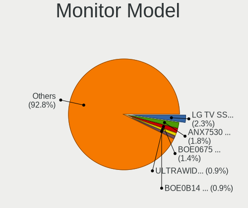

| Model                                                                   | Computers | Percent |
|-------------------------------------------------------------------------|-----------|---------|
| Samsung Electronics LCD Monitor SDC4156 1920x1080 294x165mm 13.3-inch   | 2         | 1.14%   |
| OEM 32W_LCD_TV OEM3700 1920x540                                         | 2         | 1.14%   |
| Dell P2415Q DELA0BE 3840x2160 530x300mm 24.0-inch                       | 2         | 1.14%   |
| BenQ GL2760 BNQ78D5 1920x1080 598x336mm 27.0-inch                       | 2         | 1.14%   |
| AU Optronics LCD Monitor AUO45EC 1366x768 344x193mm 15.5-inch           | 2         | 1.14%   |
| AOC 27V2G5 AOC2702 1920x1080 598x336mm 27.0-inch                        | 2         | 1.14%   |
| ___ LCDTV16 ___9000 1360x768                                            | 1         | 0.57%   |
| ___ LCD TV ___0101 1360x768                                             | 1         | 0.57%   |
| ViewSonic VX2263 Series VSC692F 1920x1080 476x268mm 21.5-inch           | 1         | 0.57%   |
| ViewSonic VG2719-2K VSC1935 2560x1440 597x336mm 27.0-inch               | 1         | 0.57%   |
| Videoseven L19FM IGM0812 1280x1024 376x301mm 19.0-inch                  | 1         | 0.57%   |
| Unknown LCD TV 9000 1360x768 1600x900mm 72.3-inch                       | 1         | 0.57%   |
| Unknown LCD TV 0101 1920x1080 1600x900mm 72.3-inch                      | 1         | 0.57%   |
| Unknown LCD Monitor RTK UHD HDR                                         | 1         | 0.57%   |
| Unknown LCD Monitor FFFF 2288x1287 2550x2550mm 142.0-inch               | 1         | 0.57%   |
| STD LED STD0001 2560x1440 330x220mm 15.6-inch                           | 1         | 0.57%   |
| Sony TV *02 SNYC403 1920x1080 1085x610mm 49.0-inch                      | 1         | 0.57%   |
| Sharp LQ156M1JW26 SHP1532 1920x1080 344x194mm 15.5-inch                 | 1         | 0.57%   |
| Sharp LCD Monitor SHP1517 3840x2400 366x229mm 17.0-inch                 | 1         | 0.57%   |
| Sharp LCD Monitor SHP14F9 1920x1200 288x180mm 13.4-inch                 | 1         | 0.57%   |
| Samsung Electronics U28E590 SAM0C4D 3840x2160 607x345mm 27.5-inch       | 1         | 0.57%   |
| Samsung Electronics U24E590 SAM0CD2 3840x2160 520x290mm 23.4-inch       | 1         | 0.57%   |
| Samsung Electronics SyncMaster SAM044C 1680x1050 474x296mm 22.0-inch    | 1         | 0.57%   |
| Samsung Electronics S24R35x SAM100E 1920x1080 527x296mm 23.8-inch       | 1         | 0.57%   |
| Samsung Electronics S24E450 SAM0C81 1920x1080 531x299mm 24.0-inch       | 1         | 0.57%   |
| Samsung Electronics S24D300 SAM0B43 1920x1080 530x300mm 24.0-inch       | 1         | 0.57%   |
| Samsung Electronics S24C450 SAM09CF 1920x1200 518x324mm 24.1-inch       | 1         | 0.57%   |
| Samsung Electronics S24C300 SAM0A28 1920x1080 531x299mm 24.0-inch       | 1         | 0.57%   |
| Samsung Electronics S22F350 SAM0D1A 1920x1080 477x268mm 21.5-inch       | 1         | 0.57%   |
| Samsung Electronics LCD Monitor SEC4256 1600x900 382x215mm 17.3-inch    | 1         | 0.57%   |
| Samsung Electronics LCD Monitor SEC3258 1440x900 367x230mm 17.1-inch    | 1         | 0.57%   |
| Samsung Electronics LCD Monitor SDC8648 1920x1080 276x155mm 12.5-inch   | 1         | 0.57%   |
| Samsung Electronics LCD Monitor SDC4161 1920x1080 344x194mm 15.5-inch   | 1         | 0.57%   |
| Samsung Electronics LCD Monitor SDC4146 1366x768 344x194mm 15.5-inch    | 1         | 0.57%   |
| Samsung Electronics LCD Monitor SDC4141 1366x768 344x194mm 15.5-inch    | 1         | 0.57%   |
| Samsung Electronics LCD Monitor SAM0BB4 3840x2160 1872x1053mm 84.6-inch | 1         | 0.57%   |
| Samsung Electronics LCD Monitor SAM07C0 1920x1080 890x500mm 40.2-inch   | 1         | 0.57%   |
| Samsung Electronics LC49G95T SAM7053 3840x1080 1193x336mm 48.8-inch     | 1         | 0.57%   |
| Samsung Electronics Color LCD SDCA029 2160x1440 252x168mm 11.9-inch     | 1         | 0.57%   |
| Samsung Electronics C32R50x SAM7001 1920x1080 698x393mm 31.5-inch       | 1         | 0.57%   |
| Samsung Electronics C24F390 SAM0D2C 1920x1080 521x293mm 23.5-inch       | 1         | 0.57%   |
| Philips PHL 323E7 PHLC121 1920x1080 698x393mm 31.5-inch                 | 1         | 0.57%   |
| Philips PHL 288E2 PHLC231 3840x2160 621x341mm 27.9-inch                 | 1         | 0.57%   |
| Philips PHL 273V7 PHLC156 1920x1080 598x336mm 27.0-inch                 | 1         | 0.57%   |
| Philips PHL 243S5L PHL091F 1920x1080 521x293mm 23.5-inch                | 1         | 0.57%   |
| Philips PHL 233V5 PHLC0D0 1920x1080 509x286mm 23.0-inch                 | 1         | 0.57%   |
| Philips 236V4 PHLC0B3 1920x1080 510x287mm 23.0-inch                     | 1         | 0.57%   |
| Philips 227E4LH PHLC0AC 1920x1080 480x270mm 21.7-inch                   | 1         | 0.57%   |
| Packard Bell Viseo223DX PKB0385 1920x1080 477x268mm 21.5-inch           | 1         | 0.57%   |
| NEC Computers V423 NEC68AD 1920x1080 930x523mm 42.0-inch                | 1         | 0.57%   |
| MSI G24C6 MSI3BA0 1920x1080 521x293mm 23.5-inch                         | 1         | 0.57%   |
| MSI G241V E2 MSI3BA7 1920x1080 527x296mm 23.8-inch                      | 1         | 0.57%   |
| MiTAC DSGi TV SZM0308 1920x540 708x398mm 32.0-inch                      | 1         | 0.57%   |
| LG Philips LCD Monitor LPL0140 1440x900 304x190mm 14.1-inch             | 1         | 0.57%   |
| LG Electronics LCD Monitor LG Ultra HD                                  | 1         | 0.57%   |
| LG Display LCD Monitor LGD0627 1920x1080 294x165mm 13.3-inch            | 1         | 0.57%   |
| LG Display LCD Monitor LGD05BE 1920x1080 382x215mm 17.3-inch            | 1         | 0.57%   |
| LG Display LCD Monitor LGD0590 1920x1080 344x194mm 15.5-inch            | 1         | 0.57%   |
| LG Display LCD Monitor LGD0589 1920x1080 294x165mm 13.3-inch            | 1         | 0.57%   |
| LG Display LCD Monitor LGD0521 1920x1080 309x174mm 14.0-inch            | 1         | 0.57%   |

Monitor Resolution
------------------

Monitor screen resolution

| Resolution         | Computers | Percent |
|--------------------|-----------|---------|
| 1920x1080 (FHD)    | 71        | 43.29%  |
| 1366x768 (WXGA)    | 27        | 16.46%  |
| 3840x2160 (4K)     | 18        | 10.98%  |
| 2560x1440 (QHD)    | 8         | 4.88%   |
| 1920x1200 (WUXGA)  | 5         | 3.05%   |
| 1680x1050 (WSXGA+) | 5         | 3.05%   |
| 1440x900 (WXGA+)   | 5         | 3.05%   |
| 1920x540           | 3         | 1.83%   |
| 1600x900 (HD+)     | 3         | 1.83%   |
| 1360x768           | 3         | 1.83%   |
| Unknown            | 3         | 1.83%   |
| 800x1280           | 1         | 0.61%   |
| 3840x2400          | 1         | 0.61%   |
| 3840x1080          | 1         | 0.61%   |
| 3440x1440          | 1         | 0.61%   |
| 3072x1920          | 1         | 0.61%   |
| 2960x1050          | 1         | 0.61%   |
| 2880x1800          | 1         | 0.61%   |
| 2560x1600          | 1         | 0.61%   |
| 2560x1080          | 1         | 0.61%   |
| 2288x1287          | 1         | 0.61%   |
| 2160x1440          | 1         | 0.61%   |
| 1280x800 (WXGA)    | 1         | 0.61%   |
| 1280x1024 (SXGA)   | 1         | 0.61%   |

Monitor Diagonal
----------------

Diagonal size in inches

| Inches  | Computers | Percent |
|---------|-----------|---------|
| 15      | 33        | 19.53%  |
| 27      | 17        | 10.06%  |
| 23      | 17        | 10.06%  |
| 13      | 17        | 10.06%  |
| 24      | 13        | 7.69%   |
| 21      | 13        | 7.69%   |
| 14      | 7         | 4.14%   |
| Unknown | 7         | 4.14%   |
| 17      | 6         | 3.55%   |
| 12      | 5         | 2.96%   |
| 31      | 4         | 2.37%   |
| 22      | 4         | 2.37%   |
| 19      | 3         | 1.78%   |
| 11      | 3         | 1.78%   |
| 72      | 2         | 1.18%   |
| 32      | 2         | 1.18%   |
| 20      | 2         | 1.18%   |
| 16      | 2         | 1.18%   |
| 142     | 1         | 0.59%   |
| 84      | 1         | 0.59%   |
| 55      | 1         | 0.59%   |
| 48      | 1         | 0.59%   |
| 46      | 1         | 0.59%   |
| 42      | 1         | 0.59%   |
| 39      | 1         | 0.59%   |
| 37      | 1         | 0.59%   |
| 35      | 1         | 0.59%   |
| 34      | 1         | 0.59%   |
| 33      | 1         | 0.59%   |
| 26      | 1         | 0.59%   |

Monitor Width
-------------

Physical width

| Width in mm    | Computers | Percent |
|----------------|-----------|---------|
| 301-350        | 47        | 28.48%  |
| 501-600        | 42        | 25.45%  |
| 401-500        | 21        | 12.73%  |
| 201-300        | 19        | 11.52%  |
| 351-400        | 8         | 4.85%   |
| Unknown        | 7         | 4.24%   |
| 601-700        | 6         | 3.64%   |
| 701-800        | 4         | 2.42%   |
| 801-900        | 3         | 1.82%   |
| 1501-2000      | 3         | 1.82%   |
| 1001-1500      | 3         | 1.82%   |
| More than 2000 | 1         | 0.61%   |
| 901-1000       | 1         | 0.61%   |

Aspect Ratio
------------

Proportional relationship between the width and the height

| Ratio   | Computers | Percent |
|---------|-----------|---------|
| 16/9    | 118       | 78.67%  |
| 16/10   | 20        | 13.33%  |
| Unknown | 5         | 3.33%   |
| 21/9    | 2         | 1.33%   |
| 5/4     | 1         | 0.67%   |
| 32/9    | 1         | 0.67%   |
| 3/2     | 1         | 0.67%   |
| 1.00    | 1         | 0.67%   |
| 0.62    | 1         | 0.67%   |

Monitor Area
------------

Area in inch

| Area in inch | Computers | Percent |
|----------------|-----------|---------|
| 201-250        | 40        | 23.81%  |
| 101-110        | 33        | 19.64%  |
| 301-350        | 18        | 10.71%  |
| 81-90          | 14        | 8.33%   |
| 71-80          | 10        | 5.95%   |
| 351-500        | 9         | 5.36%   |
| 151-200        | 9         | 5.36%   |
| Unknown        | 7         | 4.17%   |
| More than 1000 | 5         | 2.98%   |
| 61-70          | 5         | 2.98%   |
| 501-1000       | 5         | 2.98%   |
| 121-130        | 4         | 2.38%   |
| 51-60          | 3         | 1.79%   |
| 251-300        | 3         | 1.79%   |
| 131-140        | 2         | 1.19%   |
| 111-120        | 1         | 0.6%    |

Pixel Density
-------------

Pixels per inch

| Density       | Computers | Percent |
|---------------|-----------|---------|
| 51-100        | 54        | 32.53%  |
| 101-120       | 36        | 21.69%  |
| 121-160       | 34        | 20.48%  |
| 161-240       | 24        | 14.46%  |
| 1-50          | 7         | 4.22%   |
| Unknown       | 7         | 4.22%   |
| More than 240 | 4         | 2.41%   |

Multiple Monitors
-----------------

Total monitors connected

| Total | Computers | Percent |
|-------|-----------|---------|
| 1     | 126       | 77.78%  |
| 2     | 25        | 15.43%  |
| 0     | 8         | 4.94%   |
| 3     | 3         | 1.85%   |

Network
-------

Net Controller Vendor
---------------------

Controller vendors

| Vendor                   | Computers | Percent |
|--------------------------|-----------|---------|
| Intel                    | 88        | 36.07%  |
| Realtek Semiconductor    | 84        | 34.43%  |
| Qualcomm Atheros         | 21        | 8.61%   |
| Broadcom                 | 19        | 7.79%   |
| Ralink Technology        | 5         | 2.05%   |
| TP-Link                  | 4         | 1.64%   |
| Broadcom Limited         | 4         | 1.64%   |
| MediaTek                 | 3         | 1.23%   |
| Marvell Technology Group | 3         | 1.23%   |
| Nvidia                   | 2         | 0.82%   |
| Aquantia                 | 2         | 0.82%   |
| Xiaomi                   | 1         | 0.41%   |
| Qualcomm                 | 1         | 0.41%   |
| Prolific Technology      | 1         | 0.41%   |
| OPPO Electronics         | 1         | 0.41%   |
| Microsoft                | 1         | 0.41%   |
| Lenovo                   | 1         | 0.41%   |
| Google                   | 1         | 0.41%   |
| Dell                     | 1         | 0.41%   |
| Belkin Components        | 1         | 0.41%   |

Net Controller Model
--------------------

Controller models

| Model                                                             | Computers | Percent |
|-------------------------------------------------------------------|-----------|---------|
| Realtek RTL8111/8168/8411 PCI Express Gigabit Ethernet Controller | 49        | 16.67%  |
| Realtek RTL810xE PCI Express Fast Ethernet controller             | 11        | 3.74%   |
| Intel 82579LM Gigabit Network Connection (Lewisville)             | 10        | 3.4%    |
| Realtek RTL8125 2.5GbE Controller                                 | 7         | 2.38%   |
| Realtek RTL8153 Gigabit Ethernet Adapter                          | 6         | 2.04%   |
| Intel Wireless 8265 / 8275                                        | 6         | 2.04%   |
| Intel Wi-Fi 6 AX200                                               | 6         | 2.04%   |
| Intel Wireless 7265                                               | 5         | 1.7%    |
| Intel Wireless 3165                                               | 5         | 1.7%    |
| Intel Wi-Fi 6 AX210/AX211/AX411 160MHz                            | 5         | 1.7%    |
| Intel Wi-Fi 6 AX201                                               | 5         | 1.7%    |
| Intel I211 Gigabit Network Connection                             | 5         | 1.7%    |
| Intel Centrino Advanced-N 6205 [Taylor Peak]                      | 5         | 1.7%    |
| Intel Ethernet Connection I217-LM                                 | 4         | 1.36%   |
| Realtek RTL8822CE 802.11ac PCIe Wireless Network Adapter          | 3         | 1.02%   |
| Realtek 802.11ac NIC                                              | 3         | 1.02%   |
| Ralink MT7601U Wireless Adapter                                   | 3         | 1.02%   |
| Qualcomm Atheros QCA9565 / AR9565 Wireless Network Adapter        | 3         | 1.02%   |
| Qualcomm Atheros QCA9377 802.11ac Wireless Network Adapter        | 3         | 1.02%   |
| Qualcomm Atheros AR928X Wireless Network Adapter (PCI-Express)    | 3         | 1.02%   |
| MediaTek MT7921 802.11ax PCI Express Wireless Network Adapter     | 3         | 1.02%   |
| Intel Wireless 8260                                               | 3         | 1.02%   |
| Intel Ethernet Controller I225-V                                  | 3         | 1.02%   |
| Intel Ethernet Connection I219-LM                                 | 3         | 1.02%   |
| Intel Ethernet Connection (2) I219-V                              | 3         | 1.02%   |
| Intel Dual Band Wireless-AC 3168NGW [Stone Peak]                  | 3         | 1.02%   |
| Intel Cannon Lake PCH CNVi WiFi                                   | 3         | 1.02%   |
| Broadcom BCM43602 802.11ac Wireless LAN SoC                       | 3         | 1.02%   |
| Realtek RTL88x2bu [AC1200 Techkey]                                | 2         | 0.68%   |
| Realtek RTL8822BE 802.11a/b/g/n/ac WiFi adapter                   | 2         | 0.68%   |
| Realtek RTL8821CE 802.11ac PCIe Wireless Network Adapter          | 2         | 0.68%   |
| Realtek RTL8723BU 802.11b/g/n WLAN Adapter                        | 2         | 0.68%   |
| Realtek RTL8723AE PCIe Wireless Network Adapter                   | 2         | 0.68%   |
| Realtek RTL8188EE Wireless Network Adapter                        | 2         | 0.68%   |
| Qualcomm Atheros QCA6174 802.11ac Wireless Network Adapter        | 2         | 0.68%   |
| Qualcomm Atheros AR9485 Wireless Network Adapter                  | 2         | 0.68%   |
| Intel Tiger Lake PCH CNVi WiFi                                    | 2         | 0.68%   |
| Intel Ethernet Connection (4) I219-V                              | 2         | 0.68%   |
| Intel Ethernet Connection (2) I219-LM                             | 2         | 0.68%   |
| Intel Comet Lake PCH CNVi WiFi                                    | 2         | 0.68%   |
| Intel Centrino Ultimate-N 6300                                    | 2         | 0.68%   |
| Intel Alder Lake-P PCH CNVi WiFi                                  | 2         | 0.68%   |
| Intel 82579V Gigabit Network Connection                           | 2         | 0.68%   |
| Intel 82574L Gigabit Network Connection                           | 2         | 0.68%   |
| Broadcom NetXtreme BCM57766 Gigabit Ethernet PCIe                 | 2         | 0.68%   |
| Broadcom BCM4360 802.11ac Wireless Network Adapter                | 2         | 0.68%   |
| Broadcom BCM43224 802.11a/b/g/n                                   | 2         | 0.68%   |
| Broadcom BCM43142 802.11b/g/n                                     | 2         | 0.68%   |
| Broadcom BCM4313 802.11bgn Wireless Network Adapter               | 2         | 0.68%   |
| Xiaomi Mi/Redmi series (RNDIS + ADB)                              | 1         | 0.34%   |
| TP-Link Archer T9UH v1 [Realtek RTL8814AU]                        | 1         | 0.34%   |
| TP-Link Archer T3U [Realtek RTL8812BU]                            | 1         | 0.34%   |
| TP-Link Archer T2U PLUS [RTL8821AU]                               | 1         | 0.34%   |
| TP-Link 802.11ac WLAN Adapter                                     | 1         | 0.34%   |
| Realtek RTL8852AE 802.11ax PCIe Wireless Network Adapter          | 1         | 0.34%   |
| Realtek RTL8821AE 802.11ac PCIe Wireless Network Adapter          | 1         | 0.34%   |
| Realtek RTL8723BE PCIe Wireless Network Adapter                   | 1         | 0.34%   |
| Realtek RTL8192EE PCIe Wireless Network Adapter                   | 1         | 0.34%   |
| Realtek RTL8188FTV 802.11b/g/n 1T1R 2.4G WLAN Adapter             | 1         | 0.34%   |
| Realtek RTL8188EUS 802.11n Wireless Network Adapter               | 1         | 0.34%   |

Wireless Vendor
---------------

Wireless vendors

| Vendor                | Computers | Percent |
|-----------------------|-----------|---------|
| Intel                 | 65        | 47.1%   |
| Realtek Semiconductor | 25        | 18.12%  |
| Qualcomm Atheros      | 17        | 12.32%  |
| Broadcom              | 14        | 10.14%  |
| Ralink Technology     | 5         | 3.62%   |
| TP-Link               | 4         | 2.9%    |
| MediaTek              | 3         | 2.17%   |
| Broadcom Limited      | 2         | 1.45%   |
| Qualcomm              | 1         | 0.72%   |
| Microsoft             | 1         | 0.72%   |
| Belkin Components     | 1         | 0.72%   |

Wireless Model
--------------

Wireless models

| Model                                                                   | Computers | Percent |
|-------------------------------------------------------------------------|-----------|---------|
| Intel Wireless 8265 / 8275                                              | 6         | 4.32%   |
| Intel Wi-Fi 6 AX200                                                     | 6         | 4.32%   |
| Intel Wireless 7265                                                     | 5         | 3.6%    |
| Intel Wireless 3165                                                     | 5         | 3.6%    |
| Intel Wi-Fi 6 AX210/AX211/AX411 160MHz                                  | 5         | 3.6%    |
| Intel Wi-Fi 6 AX201                                                     | 5         | 3.6%    |
| Intel Centrino Advanced-N 6205 [Taylor Peak]                            | 5         | 3.6%    |
| Realtek RTL8822CE 802.11ac PCIe Wireless Network Adapter                | 3         | 2.16%   |
| Realtek 802.11ac NIC                                                    | 3         | 2.16%   |
| Ralink MT7601U Wireless Adapter                                         | 3         | 2.16%   |
| Qualcomm Atheros QCA9565 / AR9565 Wireless Network Adapter              | 3         | 2.16%   |
| Qualcomm Atheros QCA9377 802.11ac Wireless Network Adapter              | 3         | 2.16%   |
| Qualcomm Atheros AR928X Wireless Network Adapter (PCI-Express)          | 3         | 2.16%   |
| MediaTek MT7921 802.11ax PCI Express Wireless Network Adapter           | 3         | 2.16%   |
| Intel Wireless 8260                                                     | 3         | 2.16%   |
| Intel Dual Band Wireless-AC 3168NGW [Stone Peak]                        | 3         | 2.16%   |
| Intel Cannon Lake PCH CNVi WiFi                                         | 3         | 2.16%   |
| Broadcom BCM43602 802.11ac Wireless LAN SoC                             | 3         | 2.16%   |
| Realtek RTL88x2bu [AC1200 Techkey]                                      | 2         | 1.44%   |
| Realtek RTL8822BE 802.11a/b/g/n/ac WiFi adapter                         | 2         | 1.44%   |
| Realtek RTL8821CE 802.11ac PCIe Wireless Network Adapter                | 2         | 1.44%   |
| Realtek RTL8723BU 802.11b/g/n WLAN Adapter                              | 2         | 1.44%   |
| Realtek RTL8723AE PCIe Wireless Network Adapter                         | 2         | 1.44%   |
| Realtek RTL8188EE Wireless Network Adapter                              | 2         | 1.44%   |
| Qualcomm Atheros QCA6174 802.11ac Wireless Network Adapter              | 2         | 1.44%   |
| Qualcomm Atheros AR9485 Wireless Network Adapter                        | 2         | 1.44%   |
| Intel Tiger Lake PCH CNVi WiFi                                          | 2         | 1.44%   |
| Intel Comet Lake PCH CNVi WiFi                                          | 2         | 1.44%   |
| Intel Centrino Ultimate-N 6300                                          | 2         | 1.44%   |
| Intel Alder Lake-P PCH CNVi WiFi                                        | 2         | 1.44%   |
| Broadcom BCM4360 802.11ac Wireless Network Adapter                      | 2         | 1.44%   |
| Broadcom BCM43224 802.11a/b/g/n                                         | 2         | 1.44%   |
| Broadcom BCM43142 802.11b/g/n                                           | 2         | 1.44%   |
| Broadcom BCM4313 802.11bgn Wireless Network Adapter                     | 2         | 1.44%   |
| TP-Link Archer T9UH v1 [Realtek RTL8814AU]                              | 1         | 0.72%   |
| TP-Link Archer T3U [Realtek RTL8812BU]                                  | 1         | 0.72%   |
| TP-Link Archer T2U PLUS [RTL8821AU]                                     | 1         | 0.72%   |
| TP-Link 802.11ac WLAN Adapter                                           | 1         | 0.72%   |
| Realtek RTL8852AE 802.11ax PCIe Wireless Network Adapter                | 1         | 0.72%   |
| Realtek RTL8821AE 802.11ac PCIe Wireless Network Adapter                | 1         | 0.72%   |
| Realtek RTL8723BE PCIe Wireless Network Adapter                         | 1         | 0.72%   |
| Realtek RTL8192EE PCIe Wireless Network Adapter                         | 1         | 0.72%   |
| Realtek RTL8188FTV 802.11b/g/n 1T1R 2.4G WLAN Adapter                   | 1         | 0.72%   |
| Realtek RTL8188EUS 802.11n Wireless Network Adapter                     | 1         | 0.72%   |
| Realtek 802.11n WLAN Adapter                                            | 1         | 0.72%   |
| Ralink RT5370 Wireless Adapter                                          | 1         | 0.72%   |
| Ralink RT2870/RT3070 Wireless Adapter                                   | 1         | 0.72%   |
| Qualcomm QCA6390 Wireless Network Adapter                               | 1         | 0.72%   |
| Qualcomm Atheros AR9287 Wireless Network Adapter (PCI-Express)          | 1         | 0.72%   |
| Qualcomm Atheros AR9285 Wireless Network Adapter (PCI-Express)          | 1         | 0.72%   |
| Qualcomm Atheros AR5212 802.11abg NIC                                   | 1         | 0.72%   |
| Qualcomm Atheros AR242x / AR542x Wireless Network Adapter (PCI-Express) | 1         | 0.72%   |
| Microsoft Xbox 360 Wireless Adapter                                     | 1         | 0.72%   |
| Microsoft Wireless XBox Controller Dongle                               | 1         | 0.72%   |
| Intel Wireless-AC 9260                                                  | 1         | 0.72%   |
| Intel Wireless 3160                                                     | 1         | 0.72%   |
| Intel WiFi Link 5100                                                    | 1         | 0.72%   |
| Intel Ultimate N WiFi Link 5300                                         | 1         | 0.72%   |
| Intel PRO/Wireless 3945ABG [Golan] Network Connection                   | 1         | 0.72%   |
| Intel PRO/Wireless 2200BG [Calexico2] Network Connection                | 1         | 0.72%   |

Ethernet Vendor
---------------

Ethernet vendors

| Vendor                   | Computers | Percent |
|--------------------------|-----------|---------|
| Realtek Semiconductor    | 72        | 48.65%  |
| Intel                    | 50        | 33.78%  |
| Broadcom                 | 8         | 5.41%   |
| Qualcomm Atheros         | 5         | 3.38%   |
| Marvell Technology Group | 3         | 2.03%   |
| Nvidia                   | 2         | 1.35%   |
| Broadcom Limited         | 2         | 1.35%   |
| Aquantia                 | 2         | 1.35%   |
| Xiaomi                   | 1         | 0.68%   |
| OPPO Electronics         | 1         | 0.68%   |
| Lenovo                   | 1         | 0.68%   |
| Google                   | 1         | 0.68%   |

Ethernet Model
--------------

Ethernet models

| Model                                                                | Computers | Percent |
|----------------------------------------------------------------------|-----------|---------|
| Realtek RTL8111/8168/8411 PCI Express Gigabit Ethernet Controller    | 49        | 32.24%  |
| Realtek RTL810xE PCI Express Fast Ethernet controller                | 11        | 7.24%   |
| Intel 82579LM Gigabit Network Connection (Lewisville)                | 10        | 6.58%   |
| Realtek RTL8125 2.5GbE Controller                                    | 7         | 4.61%   |
| Realtek RTL8153 Gigabit Ethernet Adapter                             | 6         | 3.95%   |
| Intel I211 Gigabit Network Connection                                | 5         | 3.29%   |
| Intel Ethernet Connection I217-LM                                    | 4         | 2.63%   |
| Intel Ethernet Controller I225-V                                     | 3         | 1.97%   |
| Intel Ethernet Connection I219-LM                                    | 3         | 1.97%   |
| Intel Ethernet Connection (2) I219-V                                 | 3         | 1.97%   |
| Intel Ethernet Connection (4) I219-V                                 | 2         | 1.32%   |
| Intel Ethernet Connection (2) I219-LM                                | 2         | 1.32%   |
| Intel 82579V Gigabit Network Connection                              | 2         | 1.32%   |
| Intel 82574L Gigabit Network Connection                              | 2         | 1.32%   |
| Broadcom NetXtreme BCM57766 Gigabit Ethernet PCIe                    | 2         | 1.32%   |
| Xiaomi Mi/Redmi series (RNDIS + ADB)                                 | 1         | 0.66%   |
| Realtek RTL8152 Fast Ethernet Adapter                                | 1         | 0.66%   |
| Realtek RTL-8110SC/8169SC Gigabit Ethernet                           | 1         | 0.66%   |
| Realtek Killer E3000 2.5GbE Controller                               | 1         | 0.66%   |
| Qualcomm Atheros QCA8171 Gigabit Ethernet                            | 1         | 0.66%   |
| Qualcomm Atheros AR8162 Fast Ethernet                                | 1         | 0.66%   |
| Qualcomm Atheros AR8161 Gigabit Ethernet                             | 1         | 0.66%   |
| Qualcomm Atheros AR8152 v2.0 Fast Ethernet                           | 1         | 0.66%   |
| Qualcomm Atheros AR8132 Fast Ethernet                                | 1         | 0.66%   |
| OPPO Find X2 Lite                                                    | 1         | 0.66%   |
| Nvidia MCP79 Ethernet                                                | 1         | 0.66%   |
| Nvidia MCP61 Ethernet                                                | 1         | 0.66%   |
| Marvell Group 88E8071 PCI-E Gigabit Ethernet Controller              | 1         | 0.66%   |
| Marvell Group 88E8057 PCI-E Gigabit Ethernet Controller              | 1         | 0.66%   |
| Marvell Group 88E8036 PCI-E Fast Ethernet Controller                 | 1         | 0.66%   |
| Lenovo Thinkpad LAN                                                  | 1         | 0.66%   |
| Intel Ethernet Connection (7) I219-V                                 | 1         | 0.66%   |
| Intel Ethernet Connection (4) I219-LM                                | 1         | 0.66%   |
| Intel Ethernet Connection (3) I218-V                                 | 1         | 0.66%   |
| Intel Ethernet Connection (3) I218-LM                                | 1         | 0.66%   |
| Intel Ethernet Connection (2) I218-V                                 | 1         | 0.66%   |
| Intel Ethernet Connection (16) I219-V                                | 1         | 0.66%   |
| Intel Ethernet Connection (11) I219-V                                | 1         | 0.66%   |
| Intel Ethernet Connection (11) I219-LM                               | 1         | 0.66%   |
| Intel 82578DM Gigabit Network Connection                             | 1         | 0.66%   |
| Intel 82577LM Gigabit Network Connection                             | 1         | 0.66%   |
| Intel 82567LM-3 Gigabit Network Connection                           | 1         | 0.66%   |
| Intel 82567LM Gigabit Network Connection                             | 1         | 0.66%   |
| Intel 82562ET/EZ/GT/GZ - PRO/100 VE (LOM) Ethernet Controller Mobile | 1         | 0.66%   |
| Intel 82541GI Gigabit Ethernet Controller                            | 1         | 0.66%   |
| Google Nexus/Pixel Device (tether)                                   | 1         | 0.66%   |
| Broadcom NetXtreme II BCM5709 Gigabit Ethernet                       | 1         | 0.66%   |
| Broadcom NetXtreme BCM57762 Gigabit Ethernet PCIe                    | 1         | 0.66%   |
| Broadcom NetXtreme BCM5764M Gigabit Ethernet PCIe                    | 1         | 0.66%   |
| Broadcom NetXtreme BCM5762 Gigabit Ethernet PCIe                     | 1         | 0.66%   |
| Broadcom NetLink BCM5906M Fast Ethernet PCI Express                  | 1         | 0.66%   |
| Broadcom NetLink BCM5784M Gigabit Ethernet PCIe                      | 1         | 0.66%   |
| Broadcom Limited NetXtreme BCM5720 Gigabit Ethernet PCIe             | 1         | 0.66%   |
| Broadcom Limited BCM4401-B0 100Base-TX                               | 1         | 0.66%   |
| Aquantia AQC111 NBase-T/IEEE 802.3bz Ethernet Controller [AQtion]    | 1         | 0.66%   |
| Aquantia AQC107 NBase-T/IEEE 802.3bz Ethernet Controller [AQtion]    | 1         | 0.66%   |

Net Controller Kind
-------------------

Ethernet, WiFi or modem

| Kind     | Computers | Percent |
|----------|-----------|---------|
| Ethernet | 141       | 51.27%  |
| WiFi     | 131       | 47.64%  |
| Modem    | 3         | 1.09%   |

Used Controller
---------------

Currently used network controller

| Kind     | Computers | Percent |
|----------|-----------|---------|
| WiFi     | 98        | 58.68%  |
| Ethernet | 69        | 41.32%  |

NICs
----

Total network controllers on board

| Total | Computers | Percent |
|-------|-----------|---------|
| 2     | 93        | 57.41%  |
| 1     | 59        | 36.42%  |
| 3     | 6         | 3.7%    |
| 0     | 3         | 1.85%   |
| 4     | 1         | 0.62%   |

IPv6
----

IPv6 vs IPv4

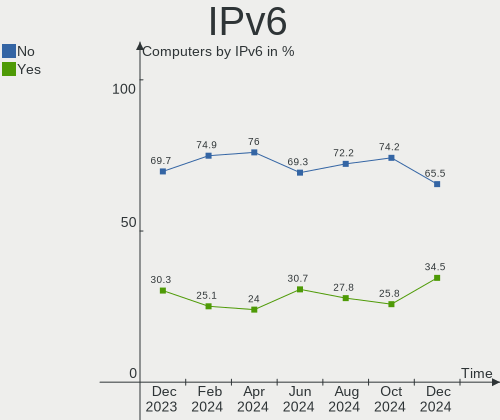

| Used | Computers | Percent |
|------|-----------|---------|
| No   | 130       | 80.25%  |
| Yes  | 32        | 19.75%  |

Bluetooth
---------

Bluetooth Vendor
----------------

Controller vendors

| Vendor                          | Computers | Percent |
|---------------------------------|-----------|---------|
| Intel                           | 51        | 48.11%  |
| Realtek Semiconductor           | 9         | 8.49%   |
| Apple                           | 8         | 7.55%   |
| IMC Networks                    | 7         | 6.6%    |
| Cambridge Silicon Radio         | 7         | 6.6%    |
| Qualcomm Atheros Communications | 6         | 5.66%   |
| Broadcom                        | 6         | 5.66%   |
| Lite-On Technology              | 3         | 2.83%   |
| Dell                            | 3         | 2.83%   |
| Toshiba                         | 2         | 1.89%   |
| Alps Electric                   | 2         | 1.89%   |
| Realtek                         | 1         | 0.94%   |
| Belkin Components               | 1         | 0.94%   |

Bluetooth Model
---------------

Controller models

| Model                                               | Computers | Percent |
|-----------------------------------------------------|-----------|---------|
| Intel Bluetooth wireless interface                  | 19        | 17.92%  |
| Intel Bluetooth Device                              | 12        | 11.32%  |
| Realtek Bluetooth Radio                             | 7         | 6.6%    |
| Cambridge Silicon Radio Bluetooth Dongle (HCI mode) | 7         | 6.6%    |
| Intel AX200 Bluetooth                               | 6         | 5.66%   |
| Intel Bluetooth 9460/9560 Jefferson Peak (JfP)      | 4         | 3.77%   |
| Intel AX210 Bluetooth                               | 4         | 3.77%   |
| Intel Wireless-AC 3168 Bluetooth                    | 3         | 2.83%   |
| IMC Networks Wireless_Device                        | 3         | 2.83%   |
| Apple Bluetooth USB Host Controller                 | 3         | 2.83%   |
| Apple Bluetooth Host Controller                     | 3         | 2.83%   |
| Qualcomm Atheros QCA61x4 Bluetooth 4.0              | 2         | 1.89%   |
| Qualcomm Atheros AR3012 Bluetooth 4.0               | 2         | 1.89%   |
| IMC Networks Bluetooth Radio                        | 2         | 1.89%   |
| Broadcom BCM20702 Bluetooth 4.0 [ThinkPad]          | 2         | 1.89%   |
| Apple Built-in Bluetooth 2.0+EDR HCI                | 2         | 1.89%   |
| Toshiba RT Bluetooth Radio                          | 1         | 0.94%   |
| Toshiba BCM43142A0                                  | 1         | 0.94%   |
| Realtek RTL8822BE Bluetooth 4.2 Adapter             | 1         | 0.94%   |
| Realtek  Bluetooth 4.2 Adapter                      | 1         | 0.94%   |
| Realtek Bluetooth Radio                             | 1         | 0.94%   |
| Qualcomm Atheros  Bluetooth Device                  | 1         | 0.94%   |
| Qualcomm Atheros AR3011 Bluetooth                   | 1         | 0.94%   |
| Lite-On Qualcomm Atheros QCA9377 Bluetooth          | 1         | 0.94%   |
| Lite-On Bluetooth USB Host Controller               | 1         | 0.94%   |
| Lite-On Atheros AR3012 Bluetooth                    | 1         | 0.94%   |
| Intel Wireless-AC 9260 Bluetooth Adapter            | 1         | 0.94%   |
| Intel Centrino Bluetooth Wireless Transceiver       | 1         | 0.94%   |
| Intel Centrino Advanced-N 6230 Bluetooth adapter    | 1         | 0.94%   |
| IMC Networks Bluetooth Device                       | 1         | 0.94%   |
| IMC Networks Bluetooth                              | 1         | 0.94%   |
| Dell Wireless 370 Bluetooth Mini-card               | 1         | 0.94%   |
| Dell Wireless 365 Bluetooth                         | 1         | 0.94%   |
| Dell DW375 Bluetooth Module                         | 1         | 0.94%   |
| Broadcom BCM43142A0 Bluetooth 4.0                   | 1         | 0.94%   |
| Broadcom BCM20702A0 Bluetooth 4.0                   | 1         | 0.94%   |
| Broadcom BCM20702A0                                 | 1         | 0.94%   |
| Broadcom BCM2070 Bluetooth 2.1 + EDR                | 1         | 0.94%   |
| Belkin Components Bluetooth Mini Dongle             | 1         | 0.94%   |
| Alps Electric Bluetooth Controller (ALPS/UGPZ6)     | 1         | 0.94%   |
| Alps Electric BCM2046 Bluetooth Device              | 1         | 0.94%   |

Sound
-----

Sound Vendor
------------

Sound card vendors

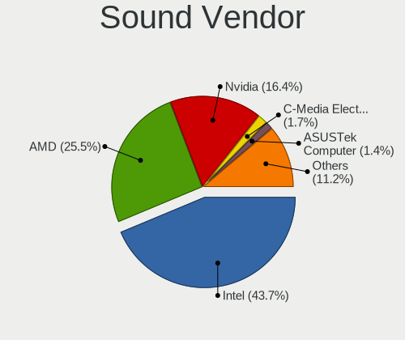

| Vendor                    | Computers | Percent |
|---------------------------|-----------|---------|
| Intel                     | 115       | 51.8%   |
| AMD                       | 50        | 22.52%  |
| Nvidia                    | 31        | 13.96%  |
| Texas Instruments         | 3         | 1.35%   |
| Logitech                  | 3         | 1.35%   |
| SteelSeries ApS           | 2         | 0.9%    |
| Samson Technologies       | 2         | 0.9%    |
| JMTek                     | 2         | 0.9%    |
| Sony                      | 1         | 0.45%   |
| Sennheiser Communications | 1         | 0.45%   |
| Realtek Semiconductor     | 1         | 0.45%   |
| Razer USA                 | 1         | 0.45%   |
| KORG                      | 1         | 0.45%   |
| Kingston Technology       | 1         | 0.45%   |
| Guillemot                 | 1         | 0.45%   |
| GN Netcom                 | 1         | 0.45%   |
| Generalplus Technology    | 1         | 0.45%   |
| Creative Labs             | 1         | 0.45%   |
| Conexant Systems          | 1         | 0.45%   |
| C-Media Electronics       | 1         | 0.45%   |
| Antlion Audio             | 1         | 0.45%   |
| AKAI Professional M.I.    | 1         | 0.45%   |

Sound Model
-----------

Sound card models

| Model                                                                      | Computers | Percent |
|----------------------------------------------------------------------------|-----------|---------|
| Intel Sunrise Point-LP HD Audio                                            | 13        | 4.91%   |
| Intel 7 Series/C216 Chipset Family High Definition Audio Controller        | 13        | 4.91%   |
| AMD Starship/Matisse HD Audio Controller                                   | 13        | 4.91%   |
| AMD Family 17h/19h HD Audio Controller                                     | 12        | 4.53%   |
| Intel 6 Series/C200 Series Chipset Family High Definition Audio Controller | 9         | 3.4%    |
| Intel Tiger Lake-LP Smart Sound Technology Audio Controller                | 8         | 3.02%   |
| Intel 8 Series/C220 Series Chipset High Definition Audio Controller        | 8         | 3.02%   |
| AMD Renoir Radeon High Definition Audio Controller                         | 7         | 2.64%   |
| Nvidia Audio device                                                        | 6         | 2.26%   |
| Intel 100 Series/C230 Series Chipset Family HD Audio Controller            | 6         | 2.26%   |
| Nvidia GP106 High Definition Audio Controller                              | 5         | 1.89%   |
| Intel Xeon E3-1200 v3/4th Gen Core Processor HD Audio Controller           | 5         | 1.89%   |
| Intel Haswell-ULT HD Audio Controller                                      | 5         | 1.89%   |
| Intel 82801I (ICH9 Family) HD Audio Controller                             | 5         | 1.89%   |
| Intel 8 Series HD Audio Controller                                         | 5         | 1.89%   |
| AMD Raven/Raven2/Fenghuang HDMI/DP Audio Controller                        | 5         | 1.89%   |
| Nvidia GK208 HDMI/DP Audio Controller                                      | 4         | 1.51%   |
| Intel Celeron/Pentium Silver Processor High Definition Audio               | 4         | 1.51%   |
| Intel 200 Series PCH HD Audio                                              | 4         | 1.51%   |
| AMD Family 15h (Models 60h-6fh) Audio Controller                           | 4         | 1.51%   |
| Nvidia TU107 GeForce GTX 1650 High Definition Audio Controller             | 3         | 1.13%   |
| Nvidia GP104 High Definition Audio Controller                              | 3         | 1.13%   |
| Intel Wildcat Point-LP High Definition Audio Controller                    | 3         | 1.13%   |
| Intel Celeron N3350/Pentium N4200/Atom E3900 Series Audio Cluster          | 3         | 1.13%   |
| Intel Cannon Lake PCH cAVS                                                 | 3         | 1.13%   |
| Intel Broadwell-U Audio Controller                                         | 3         | 1.13%   |
| Intel Atom Processor Z36xxx/Z37xxx Series High Definition Audio Controller | 3         | 1.13%   |
| Intel 82801JI (ICH10 Family) HD Audio Controller                           | 3         | 1.13%   |
| Intel 5 Series/3400 Series Chipset High Definition Audio                   | 3         | 1.13%   |
| AMD Tobago HDMI Audio [Radeon R7 360 / R9 360 OEM]                         | 3         | 1.13%   |
| AMD SBx00 Azalia (Intel HDA)                                               | 3         | 1.13%   |
| AMD RV710/730 HDMI Audio [Radeon HD 4000 series]                           | 3         | 1.13%   |
| AMD Oland/Hainan/Cape Verde/Pitcairn HDMI Audio [Radeon HD 7000 Series]    | 3         | 1.13%   |
| AMD Navi 21/23 HDMI/DP Audio Controller                                    | 3         | 1.13%   |
| AMD Cedar HDMI Audio [Radeon HD 5400/6300/7300 Series]                     | 3         | 1.13%   |
| Nvidia GA104 High Definition Audio Controller                              | 2         | 0.75%   |
| JMTek USB PnP Audio Device                                                 | 2         | 0.75%   |
| Intel Tiger Lake-H HD Audio Controller                                     | 2         | 0.75%   |
| Intel Comet Lake PCH cAVS                                                  | 2         | 0.75%   |
| Intel CM238 HD Audio Controller                                            | 2         | 0.75%   |
| Intel Alder Lake PCH-P High Definition Audio Controller                    | 2         | 0.75%   |
| Intel 82801H (ICH8 Family) HD Audio Controller                             | 2         | 0.75%   |
| AMD Kabini HDMI/DP Audio                                                   | 2         | 0.75%   |
| AMD FCH Azalia Controller                                                  | 2         | 0.75%   |
| AMD Family 17h (Models 00h-0fh) HD Audio Controller                        | 2         | 0.75%   |
| AMD Ellesmere HDMI Audio [Radeon RX 470/480 / 570/580/590]                 | 2         | 0.75%   |
| Texas Instruments SMSL M-3 Desktop DAC                                     | 1         | 0.38%   |
| Texas Instruments PCM2902 Audio Codec                                      | 1         | 0.38%   |
| Texas Instruments PCM2901 Audio Codec                                      | 1         | 0.38%   |
| SteelSeries ApS SteelSeries Arctis 7                                       | 1         | 0.38%   |
| SteelSeries ApS SteelSeries Arctis 1 Wireless                              | 1         | 0.38%   |
| Sony DualShock 4 [CUH-ZCT2x]                                               | 1         | 0.38%   |
| Sennheiser Communications EPOS BTD 800                                     | 1         | 0.38%   |
| Samson Technologies GoMic compact condenser mic                            | 1         | 0.38%   |
| Samson Technologies G-Track Pro microphone                                 | 1         | 0.38%   |
| Realtek Semiconductor USB Audio                                            | 1         | 0.38%   |
| Razer USA Razer BlackShark V2 Pro                                          | 1         | 0.38%   |
| Nvidia TU116 High Definition Audio Controller                              | 1         | 0.38%   |
| Nvidia TU106 High Definition Audio Controller                              | 1         | 0.38%   |
| Nvidia MCP79 High Definition Audio                                         | 1         | 0.38%   |

Memory
------

Memory Vendor
-------------

Memory module vendors

| Vendor              | Computers | Percent |
|---------------------|-----------|---------|
| Samsung Electronics | 22        | 22.92%  |
| SK hynix            | 15        | 15.63%  |
| Micron Technology   | 14        | 14.58%  |
| Corsair             | 13        | 13.54%  |
| Crucial             | 10        | 10.42%  |
| Kingston            | 8         | 8.33%   |
| Unknown             | 4         | 4.17%   |
| Unknown (ABCD)      | 2         | 2.08%   |
| Nanya Technology    | 2         | 2.08%   |
| G.Skill             | 2         | 2.08%   |
| Elpida              | 2         | 2.08%   |
| Ramaxel Technology  | 1         | 1.04%   |
| Patriot             | 1         | 1.04%   |

Memory Model
------------

Memory module models

| Model                                                               | Computers | Percent |
|---------------------------------------------------------------------|-----------|---------|
| Unknown RAM Module 512MB SODIMM DDR                                 | 2         | 1.9%    |
| SK hynix RAM HMA41GS6AFR8N-TF 8GB SODIMM DDR4 2667MT/s              | 2         | 1.9%    |
| Samsung RAM M471B5173QH0-YK0 4GB SODIMM DDR3 1600MT/s               | 2         | 1.9%    |
| Samsung RAM M471A1G44AB0-CWE 8192MB SODIMM DDR4 3200MT/s            | 2         | 1.9%    |
| Micron RAM 4ATF51264HZ-2G6E1 4GB SODIMM DDR4 2667MT/s               | 2         | 1.9%    |
| Crucial RAM BL8G36C16U4B.M8FE1 8GB DIMM DDR4 3733MT/s               | 2         | 1.9%    |
| Corsair RAM CMK16GX4M2B3000C15 8192MB DIMM DDR4 3000MT/s            | 2         | 1.9%    |
| Unknown RAM Module 2GB SODIMM DDR2                                  | 1         | 0.95%   |
| Unknown RAM Module 2048MB SODIMM DDR3 1333MT/s                      | 1         | 0.95%   |
| Unknown RAM Module 1GB SODIMM DDR                                   | 1         | 0.95%   |
| Unknown (ABCD) RAM 123456789012345678 2GB DIMM LPDDR4 2400MT/s      | 1         | 0.95%   |
| Unknown (ABCD) RAM 123456789012345678 2048MB SODIMM LPDDR4 2400MT/s | 1         | 0.95%   |
| SK hynix RAM Module 4GB SODIMM DDR3 1600MT/s                        | 1         | 0.95%   |
| SK hynix RAM HYMP125S64CR8-S6 2048MB SODIMM DDR2 800MT/s            | 1         | 0.95%   |
| SK hynix RAM HMT451S6BFR8A-PB 4GB SODIMM DDR3 1600MT/s              | 1         | 0.95%   |
| SK hynix RAM HMT451S6BFR8A-PB 4096MB SODIMM DDR3 1600MT/s           | 1         | 0.95%   |
| SK hynix RAM HMT41GU7BFR8A-PB 8GB DIMM DDR3 1600MT/s                | 1         | 0.95%   |
| SK hynix RAM HMT41GU6MFR8C-PB 8192MB DIMM DDR3 1600MT/s             | 1         | 0.95%   |
| SK hynix RAM HMT351S6CFR8C-PB 4GB SODIMM DDR3 1600MT/s              | 1         | 0.95%   |
| SK hynix RAM HMT325U6EFR8C-PB 2GB DIMM DDR3 1600MT/s                | 1         | 0.95%   |
| SK hynix RAM HMT325U6CFR8C-PB 2GB DIMM DDR3 1600MT/s                | 1         | 0.95%   |
| SK hynix RAM HMT325S6BFR8C-H9 2GB SODIMM DDR3 1600MT/s              | 1         | 0.95%   |
| SK hynix RAM HMT125S6TFR8C-H9 2048MB SODIMM DDR3 1334MT/s           | 1         | 0.95%   |
| SK hynix RAM HMAA1GS6CJR6N-XN 8192MB SODIMM DDR4 3200MT/s           | 1         | 0.95%   |
| SK hynix RAM HMA851S6CJR6N-VK 4GB SODIMM DDR4 2667MT/s              | 1         | 0.95%   |
| SK hynix RAM HMA851S6AFR6N-UH 4GB Row Of Chips DDR4 2400MT/s        | 1         | 0.95%   |
| SK hynix RAM HMA82GS6DJR8N-VK 16384MB SODIMM DDR4 2667MT/s          | 1         | 0.95%   |
| SK hynix RAM HMA81GS6AFR8N-UH 8GB SODIMM DDR4 2667MT/s              | 1         | 0.95%   |
| Samsung RAM UBE3D4AA-MGCR 2GB Row Of Chips LPDDR4 4267MT/s          | 1         | 0.95%   |
| Samsung RAM U5H504AM-JGCR 1GB Row Of Chips LPDDR4 4267MT/s          | 1         | 0.95%   |
| Samsung RAM Module 4GB DIMM DDR4 2666MT/s                           | 1         | 0.95%   |
| Samsung RAM M471B5273DH0-CK0 4GB SODIMM DDR3 1600MT/s               | 1         | 0.95%   |
| Samsung RAM M471B5173BH0-CK0 4GB DDR3 1600MT/s                      | 1         | 0.95%   |
| Samsung RAM M471A5244CB0-CTD 4GB Row Of Chips DDR4 2667MT/s         | 1         | 0.95%   |
| Samsung RAM M471A5244BB0-CRC 8GB SODIMM DDR4 2667MT/s               | 1         | 0.95%   |
| Samsung RAM M471A2K43CB1-CRC 16GB SODIMM DDR4 2667MT/s              | 1         | 0.95%   |
| Samsung RAM M471A1K43DB1-CTD 8GB SODIMM DDR4 2667MT/s               | 1         | 0.95%   |
| Samsung RAM M471A1K43CB1-CTD 8GB SODIMM DDR4 2667MT/s               | 1         | 0.95%   |
| Samsung RAM M471A1G44BB0-CWE 8GB SODIMM DDR4 3200MT/s               | 1         | 0.95%   |
| Samsung RAM M425R2GA3BB0-CQKOL 16384MB SODIMM 4800MT/s              | 1         | 0.95%   |
| Samsung RAM M4 70T5663QZ3-CE6 2GB SODIMM DDR2 667MT/s               | 1         | 0.95%   |
| Samsung RAM M378B5773CH0-CH9 2GB DIMM DDR3 1867MT/s                 | 1         | 0.95%   |
| Samsung RAM M378B5173QH0-CK0 4096MB DIMM DDR3 1866MT/s              | 1         | 0.95%   |
| Samsung RAM K4F8E304HB-MGCJ 1GB SODIMM LPDDR4 2400MT/s              | 1         | 0.95%   |
| Samsung RAM K4AAG165WA-BCWE 8GB Row Of Chips DDR4 3200MT/s          | 1         | 0.95%   |
| Samsung RAM K3QF3F30BM-AGCF 2GB Row Of Chips LPDDR3 1867MT/s        | 1         | 0.95%   |
| Ramaxel RAM RMSA3260ME78HAF-2666 8GB SODIMM DDR4 2667MT/s           | 1         | 0.95%   |
| Patriot RAM PSD416G320081S 16GB SODIMM DDR4 3200MT/s                | 1         | 0.95%   |
| Nanya RAM NT4GC64B88B1NF-DI 4GB DIMM DDR3 1600MT/s                  | 1         | 0.95%   |
| Nanya RAM NT2GT64U8HD0BN-AD 2048MB SODIMM DDR2 2048MT/s             | 1         | 0.95%   |
| Micron RAM MT53E1G32D4NQ-046 8GB Row Of Chips LPDDR4 4267MT/s       | 1         | 0.95%   |
| Micron RAM Module 8GB SODIMM DDR3 1600MT/s                          | 1         | 0.95%   |
| Micron RAM Module 4GB DIMM DDR3 1866MT/s                            | 1         | 0.95%   |
| Micron RAM Module 2GB SODIMM DDR3 1333MT/s                          | 1         | 0.95%   |
| Micron RAM 8ATF1G64HZ-3G2J1 8GB SODIMM DDR4 3200MT/s                | 1         | 0.95%   |
| Micron RAM 53E1G32D4NQ-046WTE 4GB Row Of Chips LPDDR4 3200MT/s      | 1         | 0.95%   |
| Micron RAM 4ATF51264HZ-2G3E1 4096MB SODIMM DDR4 2667MT/s            | 1         | 0.95%   |
| Micron RAM 4ATF51264HZ-2G3AZ 4GB SODIMM DDR4 2133MT/s               | 1         | 0.95%   |
| Micron RAM 4ATF1G64HZ-3G2E2 8GB SODIMM DDR4 3200MT/s                | 1         | 0.95%   |
| Micron RAM 4ATF1G64HZ-3G2E1 8GB SODIMM DDR4 3200MT/s                | 1         | 0.95%   |

Memory Kind
-----------

Memory module kinds

| Kind    | Computers | Percent |
|---------|-----------|---------|
| DDR4    | 42        | 50%     |
| DDR3    | 24        | 28.57%  |
| LPDDR4  | 7         | 8.33%   |
| DDR2    | 4         | 4.76%   |
| SDRAM   | 2         | 2.38%   |
| DDR     | 2         | 2.38%   |
| Unknown | 2         | 2.38%   |
| LPDDR3  | 1         | 1.19%   |

Memory Form Factor
------------------

Physical design of the memory module

| Name         | Computers | Percent |
|--------------|-----------|---------|
| SODIMM       | 46        | 55.42%  |
| DIMM         | 28        | 33.73%  |
| Row Of Chips | 8         | 9.64%   |
| Unknown      | 1         | 1.2%    |

Memory Size
-----------

Memory module size

| Size  | Computers | Percent |
|-------|-----------|---------|
| 8192  | 33        | 37.5%   |
| 4096  | 27        | 30.68%  |
| 2048  | 11        | 12.5%   |
| 16384 | 10        | 11.36%  |
| 1024  | 3         | 3.41%   |
| 32768 | 2         | 2.27%   |
| 512   | 2         | 2.27%   |

Memory Speed
------------

Memory module speed

| Speed   | Computers | Percent |
|---------|-----------|---------|
| 1600    | 18        | 20.22%  |
| 2667    | 13        | 14.61%  |
| 3200    | 12        | 13.48%  |
| 2400    | 8         | 8.99%   |
| 3600    | 4         | 4.49%   |
| 4267    | 3         | 3.37%   |
| 1333    | 3         | 3.37%   |
| Unknown | 3         | 3.37%   |
| 3733    | 2         | 2.25%   |
| 3466    | 2         | 2.25%   |
| 2800    | 2         | 2.25%   |
| 1867    | 2         | 2.25%   |
| 1866    | 2         | 2.25%   |
| 1334    | 2         | 2.25%   |
| 1067    | 2         | 2.25%   |
| 667     | 2         | 2.25%   |
| 4800    | 1         | 1.12%   |
| 3400    | 1         | 1.12%   |
| 3266    | 1         | 1.12%   |
| 3000    | 1         | 1.12%   |
| 2666    | 1         | 1.12%   |
| 2133    | 1         | 1.12%   |
| 2048    | 1         | 1.12%   |
| 1066    | 1         | 1.12%   |
| 800     | 1         | 1.12%   |

Printers & scanners
-------------------

Printer Vendor
--------------

Printer device vendors

| Vendor          | Computers | Percent |
|-----------------|-----------|---------|
| Hewlett-Packard | 2         | 100%    |

Printer Model
-------------

Printer device models

| Model                     | Computers | Percent |
|---------------------------|-----------|---------|
| HP ENVY Photo 6200 series | 1         | 50%     |
| HP Deskjet F2280 series   | 1         | 50%     |

Scanner Vendor
--------------

Scanner device vendors

| Vendor             | Computers | Percent |
|--------------------|-----------|---------|
| Ultima Electronics | 1         | 100%    |

Scanner Model
-------------

Scanner device models

| Model                                                                                 | Computers | Percent |
|---------------------------------------------------------------------------------------|-----------|---------|
| Ultima Artec Ultima 2000 (GT6801 based)/Lifetec LT9385/ScanMagic 1200 UB Plus Scanner | 1         | 100%    |

Camera
------

Camera Vendor
-------------

Camera device vendors

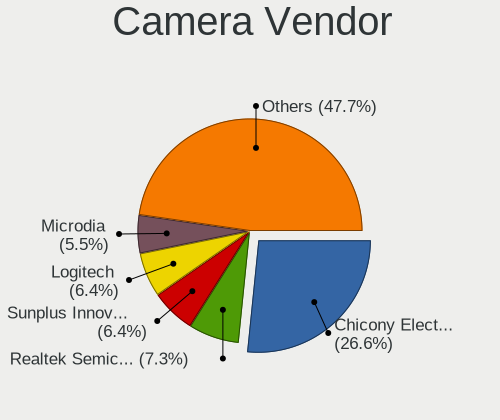

| Vendor                                 | Computers | Percent |
|----------------------------------------|-----------|---------|
| Chicony Electronics                    | 17        | 18.89%  |
| Realtek Semiconductor                  | 9         | 10%     |
| Logitech                               | 9         | 10%     |
| Acer                                   | 9         | 10%     |
| Microdia                               | 8         | 8.89%   |
| IMC Networks                           | 6         | 6.67%   |
| Sunplus Innovation Technology          | 5         | 5.56%   |
| Cheng Uei Precision Industry (Foxlink) | 5         | 5.56%   |
| Quanta                                 | 3         | 3.33%   |
| Apple                                  | 3         | 3.33%   |
| Suyin                                  | 2         | 2.22%   |
| Ricoh                                  | 2         | 2.22%   |
| Microsoft                              | 2         | 2.22%   |
| Unknown                                | 1         | 1.11%   |
| SunplusIT                              | 1         | 1.11%   |
| Silicon Motion                         | 1         | 1.11%   |
| Samsung Electronics                    | 1         | 1.11%   |
| Primax Electronics                     | 1         | 1.11%   |
| OmniVision Technologies                | 1         | 1.11%   |
| MacroSilicon                           | 1         | 1.11%   |
| Generalplus Technology                 | 1         | 1.11%   |
| ARC International                      | 1         | 1.11%   |
| Alcor Micro                            | 1         | 1.11%   |

Camera Model
------------

Camera device models

| Model                                                                      | Computers | Percent |
|----------------------------------------------------------------------------|-----------|---------|
| Microdia Integrated_Webcam_HD                                              | 5         | 5.49%   |
| Acer Integrated Camera                                                     | 5         | 5.49%   |
| Realtek USB Camera                                                         | 4         | 4.4%    |
| Logitech HD Pro Webcam C920                                                | 3         | 3.3%    |
| Chicony TOSHIBA Web Camera - HD                                            | 3         | 3.3%    |
| Suyin HP Truevision HD                                                     | 2         | 2.2%    |
| IMC Networks USB2.0 HD UVC WebCam                                          | 2         | 2.2%    |
| IMC Networks Lenovo EasyCamera                                             | 2         | 2.2%    |
| Chicony Integrated Camera (1280x720@30)                                    | 2         | 2.2%    |
| Chicony Integrated Camera                                                  | 2         | 2.2%    |
| Apple FaceTime HD Camera (Built-in)                                        | 2         | 2.2%    |
| Unknown 720p HD Camera                                                     | 1         | 1.1%    |
| SunplusIT USB 2.0 Camera                                                   | 1         | 1.1%    |
| Sunplus USB Camera                                                         | 1         | 1.1%    |
| Sunplus USB 2.0 Camera                                                     | 1         | 1.1%    |
| Sunplus Integrated_Webcam_FHD                                              | 1         | 1.1%    |
| Sunplus FHD Camera Microphone                                              | 1         | 1.1%    |
| Sunplus Dell HD Webcam                                                     | 1         | 1.1%    |
| Silicon Motion 300k Pixel Camera                                           | 1         | 1.1%    |
| Samsung Galaxy series, misc. (MTP mode)                                    | 1         | 1.1%    |
| Ricoh Visual Communication Camera VGP-VCC3 [R5U870]                        | 1         | 1.1%    |
| Ricoh Sony Visual Communication Camera                                     | 1         | 1.1%    |
| Realtek WEB CAMERA M9 Pro                                                  | 1         | 1.1%    |
| Realtek Integrated_Webcam_HD                                               | 1         | 1.1%    |
| Realtek EasyCamera                                                         | 1         | 1.1%    |
| Realtek Dell_Monitor_IR_Webcam                                             | 1         | 1.1%    |
| Realtek Built-In Video Camera                                              | 1         | 1.1%    |
| Quanta ov9734_techfront_camera                                             | 1         | 1.1%    |
| Quanta HD Webcam                                                           | 1         | 1.1%    |
| Quanta HD Camera                                                           | 1         | 1.1%    |
| Primax HP HD Webcam [Fixed]                                                | 1         | 1.1%    |
| OmniVision OV2640 Webcam                                                   | 1         | 1.1%    |
| Microsoft LifeCam HD-3000                                                  | 1         | 1.1%    |
| Microsoft LifeCam Cinema                                                   | 1         | 1.1%    |
| Microdia Webcam Vitade AF                                                  | 1         | 1.1%    |
| Microdia Laptop_Integrated_Webcam_2M                                       | 1         | 1.1%    |
| Microdia Laptop_Integrated_Webcam_1.3M                                     | 1         | 1.1%    |
| MacroSilicon MiraBox Capture                                               | 1         | 1.1%    |
| Logitech Webcam Pro 9000                                                   | 1         | 1.1%    |
| Logitech Webcam C930e                                                      | 1         | 1.1%    |
| Logitech Webcam C310                                                       | 1         | 1.1%    |
| Logitech C922 Pro Stream Webcam                                            | 1         | 1.1%    |
| Logitech C920 PRO HD Webcam                                                | 1         | 1.1%    |
| Logitech B525 HD Webcam                                                    | 1         | 1.1%    |
| IMC Networks Integrated RGB Camera                                         | 1         | 1.1%    |
| IMC Networks Integrated Camera                                             | 1         | 1.1%    |
| Generalplus 808 Camera                                                     | 1         | 1.1%    |
| Chicony USB2.0 VGA UVC WebCam                                              | 1         | 1.1%    |
| Chicony USB2.0 HD Camera                                                   | 1         | 1.1%    |
| Chicony Thinkpad T430 camera                                               | 1         | 1.1%    |
| Chicony Lenovo EasyCamera                                                  | 1         | 1.1%    |
| Chicony HP Wide Vision HD Camera                                           | 1         | 1.1%    |
| Chicony HP Truevision HD camera                                            | 1         | 1.1%    |
| Chicony HP True Vision HD Camera                                           | 1         | 1.1%    |
| Chicony HP IR Camera                                                       | 1         | 1.1%    |
| Chicony HP HD Webcam                                                       | 1         | 1.1%    |
| Chicony HD User Facing                                                     | 1         | 1.1%    |
| Chicony EasyCamera                                                         | 1         | 1.1%    |
| Cheng Uei Precision Industry (Foxlink) HP Wide Vision HD integrated webcam | 1         | 1.1%    |
| Cheng Uei Precision Industry (Foxlink) HP Wide Vision HD Camera            | 1         | 1.1%    |

Security
--------

Fingerprint Vendor
------------------

Fingerprint sensor vendors

| Vendor                     | Computers | Percent |
|----------------------------|-----------|---------|
| Synaptics                  | 8         | 42.11%  |
| Validity Sensors           | 4         | 21.05%  |
| Shenzhen Goodix Technology | 4         | 21.05%  |
| Elan Microelectronics      | 2         | 10.53%  |
| STMicroelectronics         | 1         | 5.26%   |

Fingerprint Model
-----------------

Fingerprint sensor models

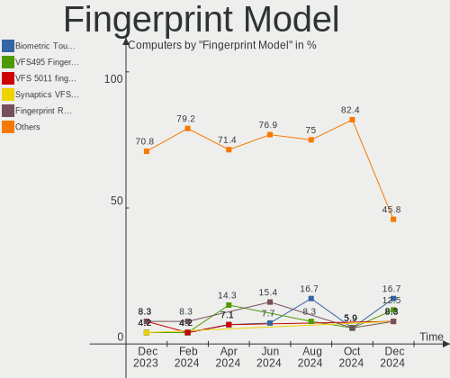

| Model                                             | Computers | Percent |
|---------------------------------------------------|-----------|---------|
| Unknown                                           | 3         | 15.79%  |
| Validity Sensors Synaptics WBDI                   | 2         | 10.53%  |
| Synaptics Metallica MIS Touch Fingerprint Reader  | 2         | 10.53%  |
| Shenzhen Goodix  Fingerprint Device               | 2         | 10.53%  |
| Elan ELAN:Fingerprint                             | 2         | 10.53%  |
| Validity Sensors VFS495 Fingerprint Reader        | 1         | 5.26%   |
| Validity Sensors VFS471 Fingerprint Reader        | 1         | 5.26%   |
| Synaptics  WBDI Fingerprint Reader - USB 052      | 1         | 5.26%   |
| Synaptics Prometheus MIS Touch Fingerprint Reader | 1         | 5.26%   |
| Synaptics Metallica MOH Touch Fingerprint Reader  | 1         | 5.26%   |
| STMicroelectronics Fingerprint Reader             | 1         | 5.26%   |
| Shenzhen Goodix Fingerprint Reader                | 1         | 5.26%   |
| Shenzhen Goodix FingerPrint                       | 1         | 5.26%   |

Chipcard Vendor
---------------

Chipcard module vendors

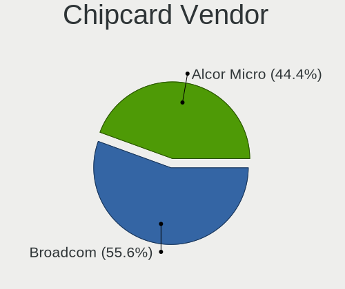

| Vendor      | Computers | Percent |
|-------------|-----------|---------|
| Broadcom    | 3         | 42.86%  |
| Alcor Micro | 2         | 28.57%  |
| Upek        | 1         | 14.29%  |
| Lenovo      | 1         | 14.29%  |

Chipcard Model
--------------

Chipcard module models

| Model                                                                        | Computers | Percent |
|------------------------------------------------------------------------------|-----------|---------|
| Alcor Micro AU9540 Smartcard Reader                                          | 2         | 28.57%  |
| Upek TouchChip Fingerprint Coprocessor (WBF advanced mode)                   | 1         | 14.29%  |
| Lenovo Integrated Smart Card Reader                                          | 1         | 14.29%  |
| Broadcom BCM5880 Secure Applications Processor with fingerprint swipe sensor | 1         | 14.29%  |
| Broadcom BCM5880 Secure Applications Processor                               | 1         | 14.29%  |
| Broadcom 5880                                                                | 1         | 14.29%  |

Unsupported
-----------

Unsupported Devices
-------------------

Total unsupported devices on board

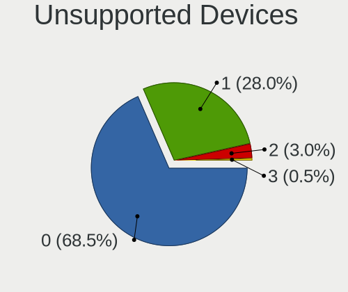

| Total | Computers | Percent |
|-------|-----------|---------|
| 0     | 115       | 70.99%  |
| 1     | 36        | 22.22%  |
| 2     | 9         | 5.56%   |
| 4     | 2         | 1.23%   |

Unsupported Device Types
------------------------

Types of unsupported devices

| Type                     | Computers | Percent |
|--------------------------|-----------|---------|
| Fingerprint reader       | 18        | 29.51%  |
| Graphics card            | 13        | 21.31%  |
| Net/wireless             | 10        | 16.39%  |
| Chipcard                 | 7         | 11.48%  |
| Communication controller | 3         | 4.92%   |
| Multimedia controller    | 2         | 3.28%   |
| Camera                   | 2         | 3.28%   |
| Unassigned class         | 1         | 1.64%   |
| Storage                  | 1         | 1.64%   |
| Sound                    | 1         | 1.64%   |
| Modem                    | 1         | 1.64%   |
| Card reader              | 1         | 1.64%   |
| Bluetooth                | 1         | 1.64%   |

