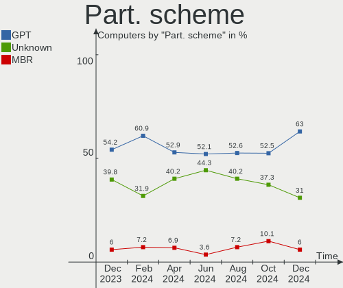
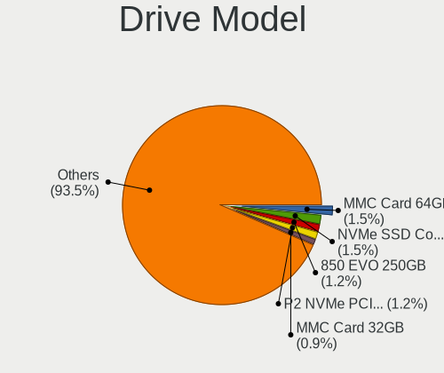
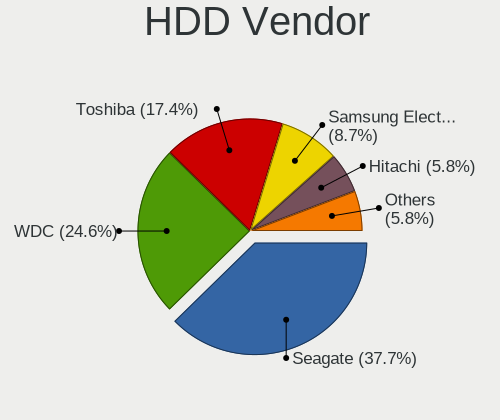
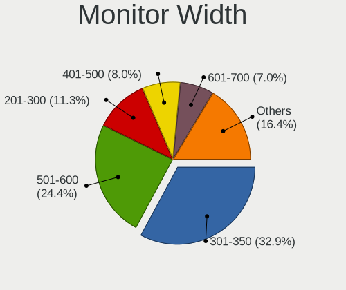
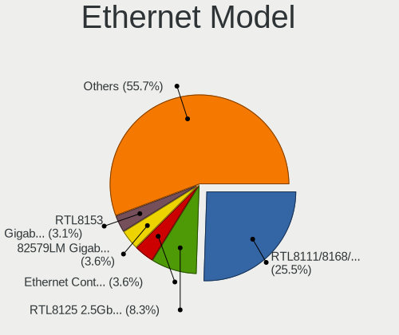
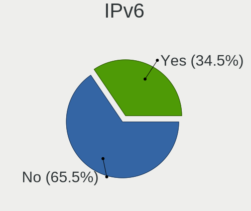

Linux in UK - Hardware Trends
-----------------------------

A project to identify most popular hardware characteristics and track their change
over time based on data collected by Linux users at https://Linux-Hardware.org.

Anyone can contribute to this report by the [hw-probe](https://github.com/linuxhw/hw-probe) tool:

    sudo -E hw-probe -all -upload

This is a report for all computer types. See also reports for [desktops](/Location/UK/Desktop/README.md) and [notebooks](/Location/UK/Notebook/README.md).

Contents
--------

* [ System ](#system)
  - [ OS                       ](#os)
  - [ OS Family                ](#os-family)
  - [ Kernel                   ](#kernel)
  - [ Kernel Family            ](#kernel-family)
  - [ Kernel Major Ver.        ](#kernel-major-ver)
  - [ Arch                     ](#arch)
  - [ DE                       ](#de)
  - [ Display Server           ](#display-server)
  - [ Display Manager          ](#display-manager)
  - [ OS Lang                  ](#os-lang)
  - [ Boot Mode                ](#boot-mode)
  - [ Filesystem               ](#filesystem)
  - [ Part. scheme             ](#part-scheme)
  - [ Dual Boot with Linux/BSD ](#dual-boot-with-linuxbsd)
  - [ Dual Boot (Win)          ](#dual-boot-win)

* [ Board ](#board)
  - [ Vendor                   ](#vendor)
  - [ Model                    ](#model)
  - [ Model Family             ](#model-family)
  - [ MFG Year                 ](#mfg-year)
  - [ Form Factor              ](#form-factor)
  - [ Secure Boot              ](#secure-boot)
  - [ Coreboot                 ](#coreboot)
  - [ RAM Size                 ](#ram-size)
  - [ RAM Used                 ](#ram-used)
  - [ Total Drives             ](#total-drives)
  - [ Has CD-ROM               ](#has-cd-rom)
  - [ Has Ethernet             ](#has-ethernet)
  - [ Has WiFi                 ](#has-wifi)
  - [ Has Bluetooth            ](#has-bluetooth)

* [ Location ](#location)
  - [ Country                  ](#country)
  - [ City                     ](#city)

* [ Drives ](#drives)
  - [ Drive Vendor             ](#drive-vendor)
  - [ Drive Model              ](#drive-model)
  - [ HDD Vendor               ](#hdd-vendor)
  - [ SSD Vendor               ](#ssd-vendor)
  - [ Drive Kind               ](#drive-kind)
  - [ Drive Connector          ](#drive-connector)
  - [ Drive Size               ](#drive-size)
  - [ Space Total              ](#space-total)
  - [ Space Used               ](#space-used)
  - [ Malfunc. Drives          ](#malfunc-drives)
  - [ Malfunc. Drive Vendor    ](#malfunc-drive-vendor)
  - [ Malfunc. HDD Vendor      ](#malfunc-hdd-vendor)
  - [ Malfunc. Drive Kind      ](#malfunc-drive-kind)
  - [ Failed Drives            ](#failed-drives)
  - [ Failed Drive Vendor      ](#failed-drive-vendor)
  - [ Drive Status             ](#drive-status)

* [ Storage controller ](#storage-controller)
  - [ Storage Vendor           ](#storage-vendor)
  - [ Storage Model            ](#storage-model)
  - [ Storage Kind             ](#storage-kind)

* [ Processor ](#processor)
  - [ CPU Vendor               ](#cpu-vendor)
  - [ CPU Model                ](#cpu-model)
  - [ CPU Model Family         ](#cpu-model-family)
  - [ CPU Cores                ](#cpu-cores)
  - [ CPU Sockets              ](#cpu-sockets)
  - [ CPU Threads              ](#cpu-threads)
  - [ CPU Op-Modes             ](#cpu-op-modes)
  - [ CPU Microcode            ](#cpu-microcode)
  - [ CPU Microarch            ](#cpu-microarch)

* [ Graphics ](#graphics)
  - [ GPU Vendor               ](#gpu-vendor)
  - [ GPU Model                ](#gpu-model)
  - [ GPU Combo                ](#gpu-combo)
  - [ GPU Driver               ](#gpu-driver)
  - [ GPU Memory               ](#gpu-memory)

* [ Monitor ](#monitor)
  - [ Monitor Vendor           ](#monitor-vendor)
  - [ Monitor Model            ](#monitor-model)
  - [ Monitor Resolution       ](#monitor-resolution)
  - [ Monitor Diagonal         ](#monitor-diagonal)
  - [ Monitor Width            ](#monitor-width)
  - [ Aspect Ratio             ](#aspect-ratio)
  - [ Monitor Area             ](#monitor-area)
  - [ Pixel Density            ](#pixel-density)
  - [ Multiple Monitors        ](#multiple-monitors)

* [ Network ](#network)
  - [ Net Controller Vendor    ](#net-controller-vendor)
  - [ Net Controller Model     ](#net-controller-model)
  - [ Wireless Vendor          ](#wireless-vendor)
  - [ Wireless Model           ](#wireless-model)
  - [ Ethernet Vendor          ](#ethernet-vendor)
  - [ Ethernet Model           ](#ethernet-model)
  - [ Net Controller Kind      ](#net-controller-kind)
  - [ Used Controller          ](#used-controller)
  - [ NICs                     ](#nics)
  - [ IPv6                     ](#ipv6)

* [ Bluetooth ](#bluetooth)
  - [ Bluetooth Vendor         ](#bluetooth-vendor)
  - [ Bluetooth Model          ](#bluetooth-model)

* [ Sound ](#sound)
  - [ Sound Vendor             ](#sound-vendor)
  - [ Sound Model              ](#sound-model)

* [ Memory ](#memory)
  - [ Memory Vendor            ](#memory-vendor)
  - [ Memory Model             ](#memory-model)
  - [ Memory Kind              ](#memory-kind)
  - [ Memory Form Factor       ](#memory-form-factor)
  - [ Memory Size              ](#memory-size)
  - [ Memory Speed             ](#memory-speed)

* [ Printers & scanners ](#printers--scanners)
  - [ Printer Vendor           ](#printer-vendor)
  - [ Printer Model            ](#printer-model)
  - [ Scanner Vendor           ](#scanner-vendor)
  - [ Scanner Model            ](#scanner-model)

* [ Camera ](#camera)
  - [ Camera Vendor            ](#camera-vendor)
  - [ Camera Model             ](#camera-model)

* [ Security ](#security)
  - [ Fingerprint Vendor       ](#fingerprint-vendor)
  - [ Fingerprint Model        ](#fingerprint-model)
  - [ Chipcard Vendor          ](#chipcard-vendor)
  - [ Chipcard Model           ](#chipcard-model)

* [ Unsupported ](#unsupported)
  - [ Unsupported Devices      ](#unsupported-devices)
  - [ Unsupported Device Types ](#unsupported-device-types)

System
------

OS
--

Installed operating systems

| Name                         | Computers | Percent |
|------------------------------|-----------|---------|
| Linux Mint 20.3              | 19        | 9.36%   |
| Ubuntu 20.04                 | 17        | 8.37%   |
| Debian 11                    | 16        | 7.88%   |
| Ubuntu 21.10                 | 15        | 7.39%   |
| Ubuntu 22.04                 | 14        | 6.9%    |
| Zorin 16                     | 12        | 5.91%   |
| Fedora 35                    | 10        | 4.93%   |
| Pop!_OS 21.10                | 9         | 4.43%   |
| KDE neon 20.04               | 8         | 3.94%   |
| OpenMandriva 4.3             | 6         | 2.96%   |
| Manjaro 21.2.5               | 5         | 2.46%   |
| Arch Rolling                 | 5         | 2.46%   |
| Manjaro                      | 4         | 1.97%   |
| Elementary 6.1               | 4         | 1.97%   |
| ArcoLinux Rolling            | 4         | 1.97%   |
| Kubuntu 20.04                | 3         | 1.48%   |
| Gentoo 2.8                   | 3         | 1.48%   |
| Fedora 36                    | 3         | 1.48%   |
| Arch                         | 3         | 1.48%   |
| Ubuntu 18.04                 | 2         | 0.99%   |
| SteamOS Snapshot             | 2         | 0.99%   |
| PureOS 10.0                  | 2         | 0.99%   |
| Pop!_OS 22.04                | 2         | 0.99%   |
| OpenMandriva 4.2             | 2         | 0.99%   |
| LMDE 5                       | 2         | 0.99%   |
| Kali 2022.1                  | 2         | 0.99%   |
| Gentoo 2.6                   | 2         | 0.99%   |
| Garuda Linux Soaring         | 2         | 0.99%   |
| Debian Testing               | 2         | 0.99%   |
| Zorin 15                     | 1         | 0.49%   |
| Ubuntu MATE 20.04            | 1         | 0.49%   |
| Ubuntu Budgie 21.10          | 1         | 0.49%   |
| SteamOS 3.2                  | 1         | 0.49%   |
| Slackware 15.0               | 1         | 0.49%   |
| Regata OS 21                 | 1         | 0.49%   |
| openSUSE Tumbleweed-20220324 | 1         | 0.49%   |
| openSUSE 20220411            | 1         | 0.49%   |
| openSUSE 20220410            | 1         | 0.49%   |
| NixOS 21.11                  | 1         | 0.49%   |
| Manjaro 21.2.6               | 1         | 0.49%   |
| Mageia 8                     | 1         | 0.49%   |
| Lubuntu 21.10                | 1         | 0.49%   |
| LMDE 4                       | 1         | 0.49%   |
| Linux Mint 19.3              | 1         | 0.49%   |
| Kubuntu 22.04                | 1         | 0.49%   |
| Kubuntu 21.10                | 1         | 0.49%   |
| Gentoo 2.7                   | 1         | 0.49%   |
| Clear Linux 36250            | 1         | 0.49%   |
| Clear Linux 36220            | 1         | 0.49%   |
| Clear Linux 36120            | 1         | 0.49%   |
| Clear Linux 36010            | 1         | 0.49%   |
| ArcoLinux                    | 1         | 0.49%   |

OS Family
---------

OS without a version

| Name          | Computers | Percent |
|---------------|-----------|---------|
| Ubuntu        | 48        | 23.65%  |
| Linux Mint    | 20        | 9.85%   |
| Debian        | 18        | 8.87%   |
| Zorin         | 13        | 6.4%    |
| Fedora        | 13        | 6.4%    |
| Pop!_OS       | 11        | 5.42%   |
| Manjaro       | 10        | 4.93%   |
| OpenMandriva  | 8         | 3.94%   |
| KDE neon      | 8         | 3.94%   |
| Arch          | 8         | 3.94%   |
| Gentoo        | 6         | 2.96%   |
| Kubuntu       | 5         | 2.46%   |
| ArcoLinux     | 5         | 2.46%   |
| Elementary    | 4         | 1.97%   |
| Clear Linux   | 4         | 1.97%   |
| SteamOS       | 3         | 1.48%   |
| openSUSE      | 3         | 1.48%   |
| LMDE          | 3         | 1.48%   |
| PureOS        | 2         | 0.99%   |
| Kali          | 2         | 0.99%   |
| Garuda Linux  | 2         | 0.99%   |
| Ubuntu MATE   | 1         | 0.49%   |
| Ubuntu Budgie | 1         | 0.49%   |
| Slackware     | 1         | 0.49%   |
| Regata OS     | 1         | 0.49%   |
| NixOS         | 1         | 0.49%   |
| Mageia        | 1         | 0.49%   |
| Lubuntu       | 1         | 0.49%   |

Kernel
------

Version of the Linux kernel

| Version                       | Computers | Percent |
|-------------------------------|-----------|---------|
| 5.13.0-39-generic             | 33        | 16.26%  |
| 5.4.0-107-generic             | 13        | 6.4%    |
| 5.13.0-40-generic             | 13        | 6.4%    |
| 5.10.0-13-amd64               | 12        | 5.91%   |
| 5.15.0-27-generic             | 8         | 3.94%   |
| 5.16.18-200.fc35.x86_64       | 7         | 3.45%   |
| 5.16.7-desktop-1omv4003       | 6         | 2.96%   |
| 5.13.0-37-generic             | 6         | 2.96%   |
| 5.16.15-76051615-generic      | 5         | 2.46%   |
| 5.15.0-25-generic             | 5         | 2.46%   |
| 5.4.0-109-generic             | 4         | 1.97%   |
| 5.17.1-arch1-1                | 4         | 1.97%   |
| 5.14.0-1032-oem               | 4         | 1.97%   |
| 5.17.1-zen1-1-zen             | 3         | 1.48%   |
| 5.16.19-76051619-generic      | 3         | 1.48%   |
| 5.16.13-1132.native           | 3         | 1.48%   |
| 5.15.32-gentoo-r1             | 3         | 1.48%   |
| 5.15.28-1-MANJARO             | 3         | 1.48%   |
| 5.17.4-200.fc35.x86_64        | 2         | 0.99%   |
| 5.17.3-zen1-1-zen             | 2         | 0.99%   |
| 5.17.1-300.fc36.x86_64        | 2         | 0.99%   |
| 5.17.1-1-default              | 2         | 0.99%   |
| 5.16.11-76051611-generic      | 2         | 0.99%   |
| 5.16.0-kali6-amd64            | 2         | 0.99%   |
| 5.16.0-6-amd64                | 2         | 0.99%   |
| 5.15.32-1-MANJARO             | 2         | 0.99%   |
| 5.13.0-1024-raspi             | 2         | 0.99%   |
| 5.10.14-desktop-1omv4002      | 2         | 0.99%   |
| 5.8.0-44-generic              | 1         | 0.49%   |
| 5.4.0-91-generic              | 1         | 0.49%   |
| 5.4.0-72-generic              | 1         | 0.49%   |
| 5.4.0-45-generic              | 1         | 0.49%   |
| 5.4.0-108-generic             | 1         | 0.49%   |
| 5.17.5-xanmod1                | 1         | 0.49%   |
| 5.17.5-arch1-1                | 1         | 0.49%   |
| 5.17.4-lp153.7-default        | 1         | 0.49%   |
| 5.17.3-gentoo                 | 1         | 0.49%   |
| 5.17.3-302.fc36.x86_64        | 1         | 0.49%   |
| 5.17.2-arch3-1                | 1         | 0.49%   |
| 5.17.2                        | 1         | 0.49%   |
| 5.17.1-arch1-g14-1            | 1         | 0.49%   |
| 5.17.1-1-rt16-MANJARO         | 1         | 0.49%   |
| 5.17.0-ext73-97.0-sandybridge | 1         | 0.49%   |
| 5.17.0-051700-generic         | 1         | 0.49%   |
| 5.16.19-200.fc35.x86_64       | 1         | 0.49%   |
| 5.16.18-1137.native           | 1         | 0.49%   |
| 5.16.16-arch1-1               | 1         | 0.49%   |
| 5.16.15-lqx2-1-lqx            | 1         | 0.49%   |
| 5.16.15-1-default             | 1         | 0.49%   |
| 5.16.14-arch1-1               | 1         | 0.49%   |
| 5.16.14-1-MANJARO             | 1         | 0.49%   |
| 5.16.0-pf5                    | 1         | 0.49%   |
| 5.16.0-1-amd64                | 1         | 0.49%   |
| 5.16.0-0.bpo.4-amd64          | 1         | 0.49%   |
| 5.15.35-adry                  | 1         | 0.49%   |
| 5.15.33-1-lts                 | 1         | 0.49%   |
| 5.15.32-desktop-1.mga8        | 1         | 0.49%   |
| 5.15.31-xanmod1-tt            | 1         | 0.49%   |
| 5.15.0-23-generic             | 1         | 0.49%   |
| 5.14.0-4mx-amd64              | 1         | 0.49%   |

Kernel Family
-------------

Linux kernel without a distro release

| Version  | Computers | Percent |
|----------|-----------|---------|
| 5.13.0   | 61        | 30.05%  |
| 5.4.0    | 21        | 10.34%  |
| 5.10.0   | 15        | 7.39%   |
| 5.15.0   | 14        | 6.9%    |
| 5.17.1   | 13        | 6.4%    |
| 5.16.18  | 8         | 3.94%   |
| 5.16.15  | 7         | 3.45%   |
| 5.16.0   | 7         | 3.45%   |
| 5.16.7   | 6         | 2.96%   |
| 5.15.32  | 6         | 2.96%   |
| 5.14.0   | 5         | 2.46%   |
| 5.17.3   | 4         | 1.97%   |
| 5.16.19  | 4         | 1.97%   |
| 5.17.4   | 3         | 1.48%   |
| 5.16.13  | 3         | 1.48%   |
| 5.15.28  | 3         | 1.48%   |
| 5.17.5   | 2         | 0.99%   |
| 5.17.2   | 2         | 0.99%   |
| 5.17.0   | 2         | 0.99%   |
| 5.16.14  | 2         | 0.99%   |
| 5.16.11  | 2         | 0.99%   |
| 5.10.14  | 2         | 0.99%   |
| 5.10.109 | 2         | 0.99%   |
| 5.8.0    | 1         | 0.49%   |
| 5.16.16  | 1         | 0.49%   |
| 5.15.35  | 1         | 0.49%   |
| 5.15.33  | 1         | 0.49%   |
| 5.15.31  | 1         | 0.49%   |
| 5.13.19  | 1         | 0.49%   |
| 5.11.0   | 1         | 0.49%   |
| 5.10.111 | 1         | 0.49%   |
| 4.19.0   | 1         | 0.49%   |

Kernel Major Ver.
-----------------

Linux kernel major version

| Version | Computers | Percent |
|---------|-----------|---------|
| 5.13    | 62        | 30.54%  |
| 5.16    | 40        | 19.7%   |
| 5.17    | 26        | 12.81%  |
| 5.15    | 26        | 12.81%  |
| 5.4     | 21        | 10.34%  |
| 5.10    | 20        | 9.85%   |
| 5.14    | 5         | 2.46%   |
| 5.8     | 1         | 0.49%   |
| 5.11    | 1         | 0.49%   |
| 4.19    | 1         | 0.49%   |

Arch
----

OS architecture (x86_64, i586, etc.)

| Name    | Computers | Percent |
|---------|-----------|---------|
| x86_64  | 198       | 97.54%  |
| aarch64 | 3         | 1.48%   |
| i686    | 2         | 0.99%   |

DE
--

Desktop Environment

| Name       | Computers | Percent |
|------------|-----------|---------|
| GNOME      | 94        | 46.31%  |
| KDE5       | 41        | 20.2%   |
| X-Cinnamon | 23        | 11.33%  |
| XFCE       | 13        | 6.4%    |
| Unknown    | 13        | 6.4%    |
| Pantheon   | 4         | 1.97%   |
| MATE       | 4         | 1.97%   |
| i3         | 4         | 1.97%   |
| Cinnamon   | 3         | 1.48%   |
| Openbox    | 1         | 0.49%   |
| LXQt       | 1         | 0.49%   |
| Budgie     | 1         | 0.49%   |
| awesome    | 1         | 0.49%   |

Display Server
--------------

X11 or Wayland

| Name    | Computers | Percent |
|---------|-----------|---------|
| X11     | 144       | 70.94%  |
| Wayland | 39        | 19.21%  |
| Tty     | 16        | 7.88%   |
| Unknown | 4         | 1.97%   |

Display Manager
---------------

SDDM, LightDM, etc.

| Name    | Computers | Percent |
|---------|-----------|---------|
| Unknown | 89        | 43.84%  |
| SDDM    | 31        | 15.27%  |
| GDM3    | 30        | 14.78%  |
| GDM     | 27        | 13.3%   |
| LightDM | 24        | 11.82%  |
| XDM     | 1         | 0.49%   |
| LXDM    | 1         | 0.49%   |

OS Lang
-------

Language

| Lang    | Computers | Percent |
|---------|-----------|---------|
| en_GB   | 163       | 80.3%   |
| en_US   | 25        | 12.32%  |
| pl_PL   | 3         | 1.48%   |
| Unknown | 3         | 1.48%   |
| POSIX   | 2         | 0.99%   |
| de_DE   | 2         | 0.99%   |
| zh_CN   | 1         | 0.49%   |
| it_IT   | 1         | 0.49%   |
| en_ZA   | 1         | 0.49%   |
| en_IN   | 1         | 0.49%   |
| C       | 1         | 0.49%   |

Boot Mode
---------

EFI or BIOS

| Mode | Computers | Percent |
|------|-----------|---------|
| BIOS | 104       | 51.23%  |
| EFI  | 99        | 48.77%  |

Filesystem
----------

Type of filesystem

| Type    | Computers | Percent |
|---------|-----------|---------|
| Ext4    | 161       | 79.31%  |
| Btrfs   | 32        | 15.76%  |
| Overlay | 8         | 3.94%   |
| Zfs     | 2         | 0.99%   |

Part. scheme
------------

Scheme of partitioning

| Type    | Computers | Percent |
|---------|-----------|---------|
| Unknown | 112       | 55.17%  |
| GPT     | 79        | 38.92%  |
| MBR     | 12        | 5.91%   |

Dual Boot with Linux/BSD
------------------------

Hosting more than one Linux/BSD

| Dual boot | Computers | Percent |
|-----------|-----------|---------|
| No        | 174       | 85.71%  |
| Yes       | 29        | 14.29%  |

Dual Boot (Win)
---------------

Hosting Linux and Windows

| Dual boot | Computers | Percent |
|-----------|-----------|---------|
| No        | 153       | 75.37%  |
| Yes       | 50        | 24.63%  |

Board
-----

Vendor
------

Motherboard manufacturer

| Name                    | Computers | Percent |
|-------------------------|-----------|---------|
| ASUSTek Computer        | 45        | 22.17%  |
| Dell                    | 30        | 14.78%  |
| Lenovo                  | 26        | 12.81%  |
| Hewlett-Packard         | 16        | 7.88%   |
| MSI                     | 13        | 6.4%    |
| Gigabyte Technology     | 12        | 5.91%   |
| Acer                    | 9         | 4.43%   |
| Apple                   | 5         | 2.46%   |
| Toshiba                 | 4         | 1.97%   |
| Intel                   | 4         | 1.97%   |
| ASRock                  | 4         | 1.97%   |
| Valve                   | 3         | 1.48%   |
| Raspberry Pi Foundation | 3         | 1.48%   |
| Pegatron                | 3         | 1.48%   |
| PC Specialist           | 2         | 0.99%   |
| Framework               | 2         | 0.99%   |
| AZW                     | 2         | 0.99%   |
| Unknown                 | 2         | 0.99%   |
| ZOTAC                   | 1         | 0.49%   |
| TUXEDO                  | 1         | 0.49%   |
| Sony                    | 1         | 0.49%   |
| Samsung Electronics     | 1         | 0.49%   |
| Purism                  | 1         | 0.49%   |
| Panasonic               | 1         | 0.49%   |
| Notebook                | 1         | 0.49%   |
| Microsoft               | 1         | 0.49%   |
| LG Electronics          | 1         | 0.49%   |
| HUAWEI                  | 1         | 0.49%   |
| Getac                   | 1         | 0.49%   |
| Fujitsu                 | 1         | 0.49%   |
| Dynabook                | 1         | 0.49%   |
| Dixonsxp                | 1         | 0.49%   |
| CyberPowerPC            | 1         | 0.49%   |
| Biostar                 | 1         | 0.49%   |
| ARKA                    | 1         | 0.49%   |
| Advent                  | 1         | 0.49%   |

Model
-----

Motherboard model

| Name                                        | Computers | Percent |
|---------------------------------------------|-----------|---------|
| Valve Jupiter                               | 3         | 1.48%   |
| MSI MS-7C02                                 | 3         | 1.48%   |
| Dell OptiPlex 7010                          | 3         | 1.48%   |
| Dell Inspiron 5415                          | 3         | 1.48%   |
| ASUS All Series                             | 3         | 1.48%   |
| Unknown                                     | 3         | 1.48%   |
| RPi Raspberry Pi                            | 2         | 0.99%   |
| MSI MS-7C37                                 | 2         | 0.99%   |
| HP Pavilion g6                              | 2         | 0.99%   |
| HP Notebook                                 | 2         | 0.99%   |
| Gigabyte X570 GAMING X                      | 2         | 0.99%   |
| Framework Laptop                            | 2         | 0.99%   |
| Dell OptiPlex 780                           | 2         | 0.99%   |
| AZW U59                                     | 2         | 0.99%   |
| ASUS VivoBook_ASUSLaptop X515EA_X515EA      | 2         | 0.99%   |
| ASUS TUF Gaming X570-PLUS                   | 2         | 0.99%   |
| ASUS ROG Flow X13 GV301QH_GV301QH           | 2         | 0.99%   |
| ASUS P9X79                                  | 2         | 0.99%   |
| ZOTAC ZBOXSD-ID12/ID13                      | 1         | 0.49%   |
| TUXEDO Pulse 15 Gen1                        | 1         | 0.49%   |
| Toshiba TECRA X40-D                         | 1         | 0.49%   |
| Toshiba Satellite Pro R50-B                 | 1         | 0.49%   |
| Toshiba Satellite P50t-A                    | 1         | 0.49%   |
| Toshiba dynabook R73/A                      | 1         | 0.49%   |
| Sony VPCEB4L1E                              | 1         | 0.49%   |
| Samsung 950XDB/951XDB/950XDY                | 1         | 0.49%   |
| RPi Raspberry Pi 4 Model B Rev 1.4          | 1         | 0.49%   |
| Purism Librem 14                            | 1         | 0.49%   |
| Pegatron G5200uk-m                          | 1         | 0.49%   |
| Pegatron Elite 7500 Series MT               | 1         | 0.49%   |
| Pegatron Compaq 505B Microtower PC          | 1         | 0.49%   |
| PC Specialist PC5x_7xHP_HR_HS               | 1         | 0.49%   |
| PC Specialist NJ50_70CU                     | 1         | 0.49%   |
| Panasonic CF-H2BJJHZDE                      | 1         | 0.49%   |
| Notebook W130SV                             | 1         | 0.49%   |
| MSI MS-7D07                                 | 1         | 0.49%   |
| MSI MS-7C91                                 | 1         | 0.49%   |
| MSI MS-7B79                                 | 1         | 0.49%   |
| MSI MS-7B48                                 | 1         | 0.49%   |
| MSI MS-7693                                 | 1         | 0.49%   |
| MSI GP66 Leopard 11UH                       | 1         | 0.49%   |
| MSI GL63 9SD                                | 1         | 0.49%   |
| MSI GF63 Thin 10SC                          | 1         | 0.49%   |
| Microsoft Surface Pro                       | 1         | 0.49%   |
| LG 16Z90P-K.AA78A1                          | 1         | 0.49%   |
| Lenovo Z50-75 80EC                          | 1         | 0.49%   |
| Lenovo ThinkPad X230 23202DG                | 1         | 0.49%   |
| Lenovo ThinkPad X220 4291QT1                | 1         | 0.49%   |
| Lenovo ThinkPad X220 429136G                | 1         | 0.49%   |
| Lenovo ThinkPad X1 Extreme Gen 3 20TKCTO1WW | 1         | 0.49%   |
| Lenovo ThinkPad T490 20N2000LUK             | 1         | 0.49%   |
| Lenovo ThinkPad T480 20L50004UK             | 1         | 0.49%   |
| Lenovo ThinkPad T470 W10DG 20JNS29X02       | 1         | 0.49%   |
| Lenovo ThinkPad T450 20BV001YMS             | 1         | 0.49%   |
| Lenovo ThinkPad T440 20B7A1P700             | 1         | 0.49%   |
| Lenovo ThinkPad T410 2522AC1                | 1         | 0.49%   |
| Lenovo ThinkPad T15 Gen 2i 20W4003FUK       | 1         | 0.49%   |
| Lenovo ThinkPad P14s Gen 1 20Y1CTO1WW       | 1         | 0.49%   |
| Lenovo ThinkPad P14s Gen 1 20Y1000SUK       | 1         | 0.49%   |
| Lenovo ThinkPad L440 20ASA02800             | 1         | 0.49%   |

Model Family
------------

Motherboard model prefix

| Name                   | Computers | Percent |
|------------------------|-----------|---------|
| Lenovo ThinkPad        | 14        | 6.9%    |
| Dell OptiPlex          | 10        | 4.93%   |
| Dell Inspiron          | 9         | 4.43%   |
| ASUS ROG               | 9         | 4.43%   |
| ASUS PRIME             | 7         | 3.45%   |
| Acer Aspire            | 7         | 3.45%   |
| HP Pavilion            | 5         | 2.46%   |
| ASUS TUF               | 5         | 2.46%   |
| Lenovo Legion          | 4         | 1.97%   |
| Valve Jupiter          | 3         | 1.48%   |
| RPi Raspberry          | 3         | 1.48%   |
| MSI MS-7C02            | 3         | 1.48%   |
| HP ENVY                | 3         | 1.48%   |
| Gigabyte X570          | 3         | 1.48%   |
| Dell XPS               | 3         | 1.48%   |
| Dell Precision         | 3         | 1.48%   |
| Dell Latitude          | 3         | 1.48%   |
| ASUS VivoBook          | 3         | 1.48%   |
| ASUS All               | 3         | 1.48%   |
| Unknown                | 3         | 1.48%   |
| Toshiba Satellite      | 2         | 0.99%   |
| MSI MS-7C37            | 2         | 0.99%   |
| Lenovo ThinkCentre     | 2         | 0.99%   |
| Lenovo IdeaPad         | 2         | 0.99%   |
| HP Notebook            | 2         | 0.99%   |
| Gigabyte B550          | 2         | 0.99%   |
| Framework Laptop       | 2         | 0.99%   |
| AZW U59                | 2         | 0.99%   |
| ASUS P9X79             | 2         | 0.99%   |
| ZOTAC ZBOXSD-ID12      | 1         | 0.49%   |
| TUXEDO Pulse           | 1         | 0.49%   |
| Toshiba TECRA          | 1         | 0.49%   |
| Toshiba dynabook       | 1         | 0.49%   |
| Sony VPCEB4L1E         | 1         | 0.49%   |
| Samsung 950XDB         | 1         | 0.49%   |
| Purism Librem          | 1         | 0.49%   |
| Pegatron G5200uk-m     | 1         | 0.49%   |
| Pegatron Elite         | 1         | 0.49%   |
| Pegatron Compaq        | 1         | 0.49%   |
| PC Specialist PC5x     | 1         | 0.49%   |
| PC Specialist NJ50     | 1         | 0.49%   |
| Panasonic CF-H2BJJHZDE | 1         | 0.49%   |
| Notebook W130SV        | 1         | 0.49%   |
| MSI MS-7D07            | 1         | 0.49%   |
| MSI MS-7C91            | 1         | 0.49%   |
| MSI MS-7B79            | 1         | 0.49%   |
| MSI MS-7B48            | 1         | 0.49%   |
| MSI MS-7693            | 1         | 0.49%   |
| MSI GP66               | 1         | 0.49%   |
| MSI GL63               | 1         | 0.49%   |
| MSI GF63               | 1         | 0.49%   |
| Microsoft Surface      | 1         | 0.49%   |
| LG 16Z90P-K.AA78A1     | 1         | 0.49%   |
| Lenovo Z50-75          | 1         | 0.49%   |
| Lenovo ThinkBook       | 1         | 0.49%   |
| Lenovo IdeaPadFlex     | 1         | 0.49%   |
| Lenovo Flex            | 1         | 0.49%   |
| Intel X99              | 1         | 0.49%   |
| Intel NUC5CPYB         | 1         | 0.49%   |
| Intel DH67BL           | 1         | 0.49%   |

MFG Year
--------

Motherboard manufacture year

| Year    | Computers | Percent |
|---------|-----------|---------|
| 2021    | 32        | 15.76%  |
| 2020    | 31        | 15.27%  |
| 2019    | 22        | 10.84%  |
| 2018    | 13        | 6.4%    |
| 2017    | 13        | 6.4%    |
| 2012    | 13        | 6.4%    |
| 2011    | 13        | 6.4%    |
| 2014    | 12        | 5.91%   |
| 2013    | 11        | 5.42%   |
| 2010    | 8         | 3.94%   |
| 2015    | 7         | 3.45%   |
| 2016    | 6         | 2.96%   |
| 2022    | 5         | 2.46%   |
| 2009    | 5         | 2.46%   |
| Unknown | 5         | 2.46%   |
| 2008    | 4         | 1.97%   |
| 2007    | 3         | 1.48%   |

Form Factor
-----------

Physical design of the computer

| Name           | Computers | Percent |
|----------------|-----------|---------|
| Notebook       | 95        | 46.8%   |
| Desktop        | 94        | 46.31%  |
| Mini pc        | 5         | 2.46%   |
| System on chip | 3         | 1.48%   |
| Tablet         | 2         | 0.99%   |
| Convertible    | 2         | 0.99%   |
| All in one     | 2         | 0.99%   |

Secure Boot
-----------

Enabled or disabled

| State    | Computers | Percent |
|----------|-----------|---------|
| Disabled | 191       | 94.09%  |
| Enabled  | 12        | 5.91%   |

Coreboot
--------

Have coreboot on board

| Used | Computers | Percent |
|------|-----------|---------|
| No   | 202       | 99.51%  |
| Yes  | 1         | 0.49%   |

RAM Size
--------

Total RAM memory

| Size in GB      | Computers | Percent |
|-----------------|-----------|---------|
| 16.01-24.0      | 54        | 26.6%   |
| 32.01-64.0      | 36        | 17.73%  |
| 8.01-16.0       | 34        | 16.75%  |
| 4.01-8.0        | 31        | 15.27%  |
| 3.01-4.0        | 24        | 11.82%  |
| 64.01-256.0     | 10        | 4.93%   |
| 24.01-32.0      | 7         | 3.45%   |
| 1.01-2.0        | 3         | 1.48%   |
| 0.51-1.0        | 2         | 0.99%   |
| More than 256.0 | 1         | 0.49%   |
| 2.01-3.0        | 1         | 0.49%   |

RAM Used
--------

Used RAM memory

| Used GB    | Computers | Percent |
|------------|-----------|---------|
| 1.01-2.0   | 56        | 27.59%  |
| 2.01-3.0   | 47        | 23.15%  |
| 4.01-8.0   | 40        | 19.7%   |
| 3.01-4.0   | 28        | 13.79%  |
| 8.01-16.0  | 14        | 6.9%    |
| 0.51-1.0   | 6         | 2.96%   |
| 24.01-32.0 | 5         | 2.46%   |
| 0.01-0.5   | 3         | 1.48%   |
| 32.01-64.0 | 2         | 0.99%   |
| 16.01-24.0 | 2         | 0.99%   |

Total Drives
------------

Number of drives on board

| Drives | Computers | Percent |
|--------|-----------|---------|
| 1      | 104       | 51.23%  |
| 2      | 52        | 25.62%  |
| 3      | 19        | 9.36%   |
| 4      | 13        | 6.4%    |
| 5      | 8         | 3.94%   |
| 6      | 3         | 1.48%   |
| 0      | 2         | 0.99%   |
| 12     | 1         | 0.49%   |
| 8      | 1         | 0.49%   |

Has CD-ROM
----------

Has CD-ROM on board

| Presented | Computers | Percent |
|-----------|-----------|---------|
| No        | 142       | 69.95%  |
| Yes       | 61        | 30.05%  |

Has Ethernet
------------

Has Ethernet on board

| Presented | Computers | Percent |
|-----------|-----------|---------|
| Yes       | 179       | 88.18%  |
| No        | 24        | 11.82%  |

Has WiFi
--------

Has WiFi module

| Presented | Computers | Percent |
|-----------|-----------|---------|
| Yes       | 165       | 81.28%  |
| No        | 38        | 18.72%  |

Has Bluetooth
-------------

Has Bluetooth module

| Presented | Computers | Percent |
|-----------|-----------|---------|
| Yes       | 139       | 68.47%  |
| No        | 64        | 31.53%  |

Location
--------

Country
-------

Geographic location (country)

| Country | Computers | Percent |
|---------|-----------|---------|
| UK      | 203       | 100%    |

City
----

Geographic location (city)

| City                | Computers | Percent |
|---------------------|-----------|---------|
| London              | 17        | 8.37%   |
| Birmingham          | 7         | 3.45%   |
| Edinburgh           | 6         | 2.96%   |
| Norwich             | 5         | 2.46%   |
| Harrow              | 5         | 2.46%   |
| Bristol             | 5         | 2.46%   |
| Sheffield           | 4         | 1.97%   |
| Woking              | 3         | 1.48%   |
| Nottingham          | 3         | 1.48%   |
| Manchester          | 3         | 1.48%   |
| Liverpool           | 3         | 1.48%   |
| Croydon             | 3         | 1.48%   |
| Cambridge           | 3         | 1.48%   |
| Worcester Park      | 2         | 0.99%   |
| Wolverhampton       | 2         | 0.99%   |
| Weston-super-Mare   | 2         | 0.99%   |
| Totteridge          | 2         | 0.99%   |
| Todmorden           | 2         | 0.99%   |
| Telford             | 2         | 0.99%   |
| Portsmouth          | 2         | 0.99%   |
| Poplar              | 2         | 0.99%   |
| North Shields       | 2         | 0.99%   |
| Newcastle upon Tyne | 2         | 0.99%   |
| Milton Keynes       | 2         | 0.99%   |
| Loughborough        | 2         | 0.99%   |
| Leicester           | 2         | 0.99%   |
| Ilkley              | 2         | 0.99%   |
| Gloucester          | 2         | 0.99%   |
| Glasgow             | 2         | 0.99%   |
| Gerrards Cross      | 2         | 0.99%   |
| Barrow in Furness   | 2         | 0.99%   |
| York                | 1         | 0.49%   |
| Yate                | 1         | 0.49%   |
| Worthing            | 1         | 0.49%   |
| Woodford            | 1         | 0.49%   |
| Witney              | 1         | 0.49%   |
| Wembley             | 1         | 0.49%   |
| Warboys             | 1         | 0.49%   |
| Walsden             | 1         | 0.49%   |
| Tullibody           | 1         | 0.49%   |
| Torquay             | 1         | 0.49%   |
| Tonypandy           | 1         | 0.49%   |
| Tain                | 1         | 0.49%   |
| Swansea             | 1         | 0.49%   |
| Sutton Coldfield    | 1         | 0.49%   |
| Surbiton            | 1         | 0.49%   |
| Sunderland          | 1         | 0.49%   |
| Stratford           | 1         | 0.49%   |
| Stirling            | 1         | 0.49%   |
| St Andrews          | 1         | 0.49%   |
| St Albans           | 1         | 0.49%   |
| Somerset            | 1         | 0.49%   |
| Sittingbourne       | 1         | 0.49%   |
| Sherborne           | 1         | 0.49%   |
| Shefford            | 1         | 0.49%   |
| Sheerness           | 1         | 0.49%   |
| Seaford             | 1         | 0.49%   |
| Rhyl                | 1         | 0.49%   |
| Redditch            | 1         | 0.49%   |
| Purley              | 1         | 0.49%   |

Drives
------

Drive Vendor
------------

Hard drive vendors

| Vendor                    | Computers | Drives | Percent |
|---------------------------|-----------|--------|---------|
| Samsung Electronics       | 58        | 75     | 17.31%  |
| Seagate                   | 50        | 66     | 14.93%  |
| WDC                       | 45        | 50     | 13.43%  |
| Toshiba                   | 29        | 38     | 8.66%   |
| SanDisk                   | 18        | 23     | 5.37%   |
| Crucial                   | 18        | 23     | 5.37%   |
| Kingston                  | 13        | 13     | 3.88%   |
| Intel                     | 13        | 13     | 3.88%   |
| SK Hynix                  | 12        | 13     | 3.58%   |
| Unknown                   | 11        | 11     | 3.28%   |
| Hitachi                   | 10        | 10     | 2.99%   |
| Phison                    | 9         | 9      | 2.69%   |
| A-DATA Technology         | 5         | 5      | 1.49%   |
| KIOXIA                    | 3         | 3      | 0.9%    |
| China                     | 3         | 3      | 0.9%    |
| Apple                     | 3         | 3      | 0.9%    |
| Transcend                 | 2         | 2      | 0.6%    |
| SABRENT                   | 2         | 2      | 0.6%    |
| PNY                       | 2         | 2      | 0.6%    |
| NGFF                      | 2         | 2      | 0.6%    |
| Micron/Crucial Technology | 2         | 6      | 0.6%    |
| Micron Technology         | 2         | 2      | 0.6%    |
| MAXTOR                    | 2         | 2      | 0.6%    |
| Unknown                   | 2         | 2      | 0.6%    |
| Team                      | 1         | 1      | 0.3%    |
| SPCC                      | 1         | 1      | 0.3%    |
| Silicon Motion            | 1         | 1      | 0.3%    |
| Realtek                   | 1         | 1      | 0.3%    |
| Patriot                   | 1         | 1      | 0.3%    |
| OCZ                       | 1         | 1      | 0.3%    |
| MATSHITA                  | 1         | 1      | 0.3%    |
| Inateck                   | 1         | 1      | 0.3%    |
| Hoodisk                   | 1         | 1      | 0.3%    |
| HGST                      | 1         | 1      | 0.3%    |
| Fujitsu                   | 1         | 1      | 0.3%    |
| FC-1307                   | 1         | 1      | 0.3%    |
| ExcelStor                 | 1         | 1      | 0.3%    |
| EMTEC                     | 1         | 1      | 0.3%    |
| Corsair                   | 1         | 1      | 0.3%    |
| BHT                       | 1         | 1      | 0.3%    |
| ASMT                      | 1         | 2      | 0.3%    |
| ASMedia                   | 1         | 1      | 0.3%    |
| ADATA Technology          | 1         | 1      | 0.3%    |

Drive Model
-----------

Hard drive models

| Model                             | Computers | Percent |
|-----------------------------------|-----------|---------|
| Samsung NVMe SSD Drive 1TB        | 7         | 1.85%   |
| Samsung SSD 970 EVO Plus 1TB      | 6         | 1.59%   |
| Samsung SSD 850 EVO 250GB         | 6         | 1.59%   |
| Crucial CT500MX500SSD1 500GB      | 5         | 1.32%   |
| SK Hynix NVMe SSD Drive 512GB     | 4         | 1.06%   |
| Seagate Backup+ Hub BK 6TB        | 4         | 1.06%   |
| Sandisk NVMe SSD Drive 1TB        | 4         | 1.06%   |
| Samsung NVMe SSD Drive 512GB      | 4         | 1.06%   |
| Phison Sabrent 256GB              | 4         | 1.06%   |
| Unknown SD/MMC/MS PRO 128GB       | 3         | 0.79%   |
| Toshiba NVMe SSD Drive 256GB      | 3         | 0.79%   |
| Toshiba MQ01ABF050 500GB          | 3         | 0.79%   |
| Seagate ST3500312CS 500GB         | 3         | 0.79%   |
| Seagate ST1000DM003-1CH162 1TB    | 3         | 0.79%   |
| Samsung SSD 980 1TB               | 3         | 0.79%   |
| Samsung SSD 850 EVO 500GB         | 3         | 0.79%   |
| Samsung NVMe SSD Drive 500GB      | 3         | 0.79%   |
| WDC WDS100T2B0C-00PXH0 1TB        | 2         | 0.53%   |
| WDC WDS100T2B0C 1TB               | 2         | 0.53%   |
| WDC WD10JPCX-24UE4T0 1TB          | 2         | 0.53%   |
| WDC WD10EZEX-00WN4A0 1TB          | 2         | 0.53%   |
| WDC WD1001FALS-00E8B0 1TB         | 2         | 0.53%   |
| Unknown MMC Card  128GB           | 2         | 0.53%   |
| Transcend TS512GMTS430S 512GB SSD | 2         | 0.53%   |
| Toshiba MQ04ABF100 1TB            | 2         | 0.53%   |
| Seagate ST500DM002-1BD142 500GB   | 2         | 0.53%   |
| Seagate ST4000DM004-2CV104 4TB    | 2         | 0.53%   |
| Seagate ST2000LM007-1R8174 2TB    | 2         | 0.53%   |
| Seagate ST2000DM008-2FR102 2TB    | 2         | 0.53%   |
| Seagate ST2000DM001-1ER164 2TB    | 2         | 0.53%   |
| Seagate ST2000DM001-1CH164 2TB    | 2         | 0.53%   |
| Seagate ST1000LM048-2E7172 1TB    | 2         | 0.53%   |
| Seagate ST1000DM010-2EP102 1TB    | 2         | 0.53%   |
| Seagate BUP Portable 5TB          | 2         | 0.53%   |
| SanDisk SDSSDHP256G 256GB         | 2         | 0.53%   |
| SanDisk SDSSDH3 1T00 1TB          | 2         | 0.53%   |
| Sandisk NVMe SSD Drive 500GB      | 2         | 0.53%   |
| Samsung SSD 980 PRO 1TB           | 2         | 0.53%   |
| Samsung SSD 970 EVO 1TB           | 2         | 0.53%   |
| Samsung SSD 960 EVO 250GB         | 2         | 0.53%   |
| Samsung SSD 870 EVO 1TB           | 2         | 0.53%   |
| Samsung SSD 860 EVO 500GB         | 2         | 0.53%   |
| Samsung SSD 860 EVO 1TB           | 2         | 0.53%   |
| Samsung MZVLB256HBHQ-000L2 256GB  | 2         | 0.53%   |
| SABRENT Disk 250GB                | 2         | 0.53%   |
| Phison NVMe SSD Drive 512GB       | 2         | 0.53%   |
| NGFF 2280 256GB SSD               | 2         | 0.53%   |
| Kingston SA400S37240G 240GB SSD   | 2         | 0.53%   |
| Kingston NVMe SSD Drive 250GB     | 2         | 0.53%   |
| Intel SSDPEKNU512GZ 512GB         | 2         | 0.53%   |
| Crucial CT525MX300SSD1 528GB      | 2         | 0.53%   |
| Crucial CT250MX500SSD1 250GB      | 2         | 0.53%   |
| Crucial CT250BX100SSD1 250GB      | 2         | 0.53%   |
| A-DATA SU630 240GB SSD            | 2         | 0.53%   |
| Unknown                           | 2         | 0.53%   |
| WDC WDS500G3X0C-00SJG0 500GB      | 1         | 0.26%   |
| WDC WDS240G2G0A-00JH30 240GB SSD  | 1         | 0.26%   |
| WDC WDS240G1G0A-00SS50 240GB SSD  | 1         | 0.26%   |
| WDC WDS120G2G0B-00EPW0 120GB SSD  | 1         | 0.26%   |
| WDC WDS120G2G0A-00JH30 120GB SSD  | 1         | 0.26%   |

HDD Vendor
----------

Hard disk drive vendors

| Vendor              | Computers | Drives | Percent |
|---------------------|-----------|--------|---------|
| Seagate             | 49        | 64     | 39.84%  |
| WDC                 | 31        | 34     | 25.2%   |
| Toshiba             | 18        | 26     | 14.63%  |
| Hitachi             | 10        | 10     | 8.13%   |
| Unknown             | 3         | 3      | 2.44%   |
| Samsung Electronics | 3         | 3      | 2.44%   |
| SABRENT             | 2         | 2      | 1.63%   |
| MAXTOR              | 2         | 2      | 1.63%   |
| HGST                | 1         | 1      | 0.81%   |
| Fujitsu             | 1         | 1      | 0.81%   |
| ExcelStor           | 1         | 1      | 0.81%   |
| ASMT                | 1         | 2      | 0.81%   |
| Apple               | 1         | 1      | 0.81%   |

SSD Vendor
----------

Solid state drive vendors

| Vendor              | Computers | Drives | Percent |
|---------------------|-----------|--------|---------|
| Samsung Electronics | 25        | 30     | 24.75%  |
| Crucial             | 15        | 20     | 14.85%  |
| SanDisk             | 12        | 14     | 11.88%  |
| Kingston            | 8         | 8      | 7.92%   |
| WDC                 | 6         | 7      | 5.94%   |
| Toshiba             | 4         | 4      | 3.96%   |
| A-DATA Technology   | 4         | 4      | 3.96%   |
| Intel               | 3         | 3      | 2.97%   |
| China               | 3         | 3      | 2.97%   |
| Transcend           | 2         | 2      | 1.98%   |
| PNY                 | 2         | 2      | 1.98%   |
| NGFF                | 2         | 2      | 1.98%   |
| Micron Technology   | 2         | 2      | 1.98%   |
| Apple               | 2         | 2      | 1.98%   |
| Unknown             | 1         | 1      | 0.99%   |
| Team                | 1         | 1      | 0.99%   |
| SPCC                | 1         | 1      | 0.99%   |
| SK Hynix            | 1         | 1      | 0.99%   |
| Patriot             | 1         | 1      | 0.99%   |
| OCZ                 | 1         | 1      | 0.99%   |
| Inateck             | 1         | 1      | 0.99%   |
| Hoodisk             | 1         | 1      | 0.99%   |
| EMTEC               | 1         | 1      | 0.99%   |
| BHT                 | 1         | 1      | 0.99%   |
| ASMedia             | 1         | 1      | 0.99%   |

Drive Kind
----------

HDD or SSD

| Kind    | Computers | Drives | Percent |
|---------|-----------|--------|---------|
| HDD     | 98        | 150    | 33.79%  |
| NVMe    | 97        | 122    | 33.45%  |
| SSD     | 83        | 114    | 28.62%  |
| MMC     | 9         | 9      | 3.1%    |
| Unknown | 3         | 3      | 1.03%   |

Drive Connector
---------------

SATA, SAS, NVMe, etc.

| Type | Computers | Drives | Percent |
|------|-----------|--------|---------|
| SATA | 139       | 240    | 52.65%  |
| NVMe | 96        | 121    | 36.36%  |
| SAS  | 20        | 28     | 7.58%   |
| MMC  | 9         | 9      | 3.41%   |

Drive Size
----------

Size of hard drive

| Size in TB | Computers | Drives | Percent |
|------------|-----------|--------|---------|
| 0.01-0.5   | 94        | 136    | 46.53%  |
| 0.51-1.0   | 57        | 61     | 28.22%  |
| 1.01-2.0   | 20        | 20     | 9.9%    |
| 4.01-10.0  | 13        | 16     | 6.44%   |
| 3.01-4.0   | 11        | 19     | 5.45%   |
| 2.01-3.0   | 6         | 10     | 2.97%   |
| 10.01-20.0 | 1         | 2      | 0.5%    |

Space Total
-----------

Amount of disk space available on the file system

| Size in GB     | Computers | Percent |
|----------------|-----------|---------|
| 101-250        | 49        | 24.14%  |
| 251-500        | 38        | 18.72%  |
| 501-1000       | 32        | 15.76%  |
| More than 3000 | 22        | 10.84%  |
| 1001-2000      | 16        | 7.88%   |
| 2001-3000      | 12        | 5.91%   |
| 21-50          | 11        | 5.42%   |
| Unknown        | 9         | 4.43%   |
| 1-20           | 7         | 3.45%   |
| 51-100         | 7         | 3.45%   |

Space Used
----------

Amount of used disk space

| Used GB        | Computers | Percent |
|----------------|-----------|---------|
| 1-20           | 53        | 26.11%  |
| 21-50          | 37        | 18.23%  |
| 101-250        | 30        | 14.78%  |
| 51-100         | 20        | 9.85%   |
| 501-1000       | 15        | 7.39%   |
| More than 3000 | 13        | 6.4%    |
| 1001-2000      | 12        | 5.91%   |
| 251-500        | 11        | 5.42%   |
| Unknown        | 9         | 4.43%   |
| 2001-3000      | 3         | 1.48%   |

Malfunc. Drives
---------------

Drive models with a malfunction

| Model                                 | Computers | Drives | Percent |
|---------------------------------------|-----------|--------|---------|
| WDC WD60EZRZ-00GZ5B1 6TB              | 1         | 1      | 7.69%   |
| WDC WD40EZRX-00SPEB0 4TB              | 1         | 1      | 7.69%   |
| WDC WD10EARS-00Y5B1 1TB               | 1         | 1      | 7.69%   |
| Toshiba HDWQ140 4TB                   | 1         | 4      | 7.69%   |
| Toshiba DT01ACA050 500GB              | 1         | 1      | 7.69%   |
| Seagate ST8000AS0002-1NA17Z 8TB       | 1         | 2      | 7.69%   |
| Seagate ST3500418AS 500GB             | 1         | 1      | 7.69%   |
| SanDisk SDSSDHP256G 256GB             | 1         | 1      | 7.69%   |
| Samsung Electronics SSD 960 EVO 250GB | 1         | 1      | 7.69%   |
| Kingston SEDC500R7680G 8TB SSD        | 1         | 1      | 7.69%   |
| Hitachi HTS547575A9E384 752GB         | 1         | 1      | 7.69%   |
| Fujitsu MHZ2120BH G1 120GB            | 1         | 1      | 7.69%   |
| A-DATA Technology SP550 240GB SSD     | 1         | 1      | 7.69%   |

Malfunc. Drive Vendor
---------------------

Vendors of faulty drives

| Vendor              | Computers | Drives | Percent |
|---------------------|-----------|--------|---------|
| WDC                 | 3         | 3      | 23.08%  |
| Toshiba             | 2         | 5      | 15.38%  |
| Seagate             | 2         | 3      | 15.38%  |
| SanDisk             | 1         | 1      | 7.69%   |
| Samsung Electronics | 1         | 1      | 7.69%   |
| Kingston            | 1         | 1      | 7.69%   |
| Hitachi             | 1         | 1      | 7.69%   |
| Fujitsu             | 1         | 1      | 7.69%   |
| A-DATA Technology   | 1         | 1      | 7.69%   |

Malfunc. HDD Vendor
-------------------

Vendors of faulty HDD drives

| Vendor  | Computers | Drives | Percent |
|---------|-----------|--------|---------|
| WDC     | 3         | 3      | 33.33%  |
| Toshiba | 2         | 5      | 22.22%  |
| Seagate | 2         | 3      | 22.22%  |
| Hitachi | 1         | 1      | 11.11%  |
| Fujitsu | 1         | 1      | 11.11%  |

Malfunc. Drive Kind
-------------------

Kinds of faulty drives

| Kind | Computers | Drives | Percent |
|------|-----------|--------|---------|
| HDD  | 8         | 13     | 66.67%  |
| SSD  | 3         | 3      | 25%     |
| NVMe | 1         | 1      | 8.33%   |

Failed Drives
-------------

Failed drive models

Zero info for selected period =(

Failed Drive Vendor
-------------------

Failed drive vendors

Zero info for selected period =(

Drive Status
------------

Number of failed and malfunc. drives

| Status   | Computers | Drives | Percent |
|----------|-----------|--------|---------|
| Detected | 123       | 224    | 55.41%  |
| Works    | 88        | 157    | 39.64%  |
| Malfunc  | 11        | 17     | 4.95%   |

Storage controller
------------------

Storage Vendor
--------------

Storage controller vendors

| Vendor                       | Computers | Percent |
|------------------------------|-----------|---------|
| Intel                        | 122       | 42.96%  |
| AMD                          | 50        | 17.61%  |
| Samsung Electronics          | 39        | 13.73%  |
| Sandisk                      | 16        | 5.63%   |
| SK Hynix                     | 11        | 3.87%   |
| Phison Electronics           | 10        | 3.52%   |
| Toshiba America Info Systems | 6         | 2.11%   |
| ASMedia Technology           | 6         | 2.11%   |
| Micron/Crucial Technology    | 5         | 1.76%   |
| KIOXIA                       | 5         | 1.76%   |
| Kingston Technology Company  | 5         | 1.76%   |
| Nvidia                       | 3         | 1.06%   |
| JMicron Technology           | 2         | 0.7%    |
| ADATA Technology             | 2         | 0.7%    |
| Silicon Motion               | 1         | 0.35%   |
| Seagate Technology           | 1         | 0.35%   |

Storage Model
-------------

Storage controller models

| Model                                                                                   | Computers | Percent |
|-----------------------------------------------------------------------------------------|-----------|---------|
| AMD FCH SATA Controller [AHCI mode]                                                     | 34        | 10.43%  |
| Samsung NVMe SSD Controller SM981/PM981/PM983                                           | 21        | 6.44%   |
| Samsung NVMe SSD Controller 980                                                         | 10        | 3.07%   |
| Intel Volume Management Device NVMe RAID Controller                                     | 7         | 2.15%   |
| Intel 82801 Mobile SATA Controller [RAID mode]                                          | 7         | 2.15%   |
| AMD 500 Series Chipset SATA Controller                                                  | 7         | 2.15%   |
| AMD 400 Series Chipset SATA Controller                                                  | 7         | 2.15%   |
| SK Hynix Gold P31 SSD                                                                   | 6         | 1.84%   |
| Sandisk WD Blue SN550 NVMe SSD                                                          | 6         | 1.84%   |
| Phison E12 NVMe Controller                                                              | 6         | 1.84%   |
| Intel Sunrise Point-LP SATA Controller [AHCI mode]                                      | 6         | 1.84%   |
| Intel 8 Series/C220 Series Chipset Family 6-port SATA Controller 1 [AHCI mode]          | 6         | 1.84%   |
| Intel 7 Series/C210 Series Chipset Family 6-port SATA Controller [AHCI mode]            | 6         | 1.84%   |
| Intel Wildcat Point-LP SATA Controller [AHCI Mode]                                      | 5         | 1.53%   |
| Intel SATA Controller [RAID mode]                                                       | 5         | 1.53%   |
| Intel Cannon Lake PCH SATA AHCI Controller                                              | 5         | 1.53%   |
| Intel 400 Series Chipset Family SATA AHCI Controller                                    | 5         | 1.53%   |
| ASMedia ASM1062 Serial ATA Controller                                                   | 5         | 1.53%   |
| SK Hynix Non-Volatile memory controller                                                 | 4         | 1.23%   |
| Samsung NVMe SSD Controller PM9A1/PM9A3/980PRO                                          | 4         | 1.23%   |
| KIOXIA Non-Volatile memory controller                                                   | 4         | 1.23%   |
| Intel Q170/Q150/B150/H170/H110/Z170/CM236 Chipset SATA Controller [AHCI Mode]           | 4         | 1.23%   |
| Intel Non-Volatile memory controller                                                    | 4         | 1.23%   |
| Intel 8 Series SATA Controller 1 [AHCI mode]                                            | 4         | 1.23%   |
| Intel 7 Series Chipset Family 6-port SATA Controller [AHCI mode]                        | 4         | 1.23%   |
| Intel 6 Series/C200 Series Chipset Family Desktop SATA Controller (IDE mode, ports 4-5) | 4         | 1.23%   |
| Intel 6 Series/C200 Series Chipset Family Desktop SATA Controller (IDE mode, ports 0-3) | 4         | 1.23%   |
| Intel 6 Series/C200 Series Chipset Family 6 port Mobile SATA AHCI Controller            | 4         | 1.23%   |
| Intel 500 Series Chipset Family SATA AHCI Controller                                    | 4         | 1.23%   |
| Intel 200 Series PCH SATA controller [AHCI mode]                                        | 4         | 1.23%   |
| AMD SB7x0/SB8x0/SB9x0 IDE Controller                                                    | 4         | 1.23%   |
| Toshiba America Info Systems XG6 NVMe SSD Controller                                    | 3         | 0.92%   |
| Sandisk WD PC SN810 / Black SN850 NVMe SSD                                              | 3         | 0.92%   |
| Samsung NVMe SSD Controller SM961/PM961/SM963                                           | 3         | 0.92%   |
| Micron/Crucial P2 NVMe PCIe SSD                                                         | 3         | 0.92%   |
| Intel Tiger Lake-LP SATA Controller [AHCI mode]                                         | 3         | 0.92%   |
| Intel SSD Pro 7600p/760p/E 6100p Series                                                 | 3         | 0.92%   |
| Intel C600/X79 series chipset 6-Port SATA AHCI Controller                               | 3         | 0.92%   |
| Intel 82801G (ICH7 Family) IDE Controller                                               | 3         | 0.92%   |
| Intel 6 Series/C200 Series Chipset Family 6 port Desktop SATA AHCI Controller           | 3         | 0.92%   |
| AMD SB7x0/SB8x0/SB9x0 SATA Controller [IDE mode]                                        | 3         | 0.92%   |
| Toshiba America Info Systems BG3 NVMe SSD Controller                                    | 2         | 0.61%   |
| Sandisk WD Black SN750 / PC SN730 NVMe SSD                                              | 2         | 0.61%   |
| Sandisk WD Black 2018/SN750 / PC SN720 NVMe SSD                                         | 2         | 0.61%   |
| Sandisk Non-Volatile memory controller                                                  | 2         | 0.61%   |
| Samsung Apple PCIe SSD                                                                  | 2         | 0.61%   |
| Phison PS5013 E13 NVMe Controller                                                       | 2         | 0.61%   |
| Phison E16 PCIe4 NVMe Controller                                                        | 2         | 0.61%   |
| Nvidia MCP61 SATA Controller                                                            | 2         | 0.61%   |
| Micron/Crucial Non-Volatile memory controller                                           | 2         | 0.61%   |
| Kingston Company OM3PDP3 NVMe SSD                                                       | 2         | 0.61%   |
| Kingston Company A2000 NVMe SSD                                                         | 2         | 0.61%   |
| Intel SSD 660P Series                                                                   | 2         | 0.61%   |
| Intel Jasper Lake SATA AHCI Controller                                                  | 2         | 0.61%   |
| Intel HM170/QM170 Chipset SATA Controller [AHCI Mode]                                   | 2         | 0.61%   |
| Intel Celeron N3350/Pentium N4200/Atom E3900 Series SATA AHCI Controller                | 2         | 0.61%   |
| Intel Cannon Lake Mobile PCH SATA AHCI Controller                                       | 2         | 0.61%   |
| Intel Atom/Celeron/Pentium Processor x5-E8000/J3xxx/N3xxx Series SATA Controller        | 2         | 0.61%   |
| Intel Alder Lake-S PCH SATA Controller [AHCI Mode]                                      | 2         | 0.61%   |
| Intel 9 Series Chipset Family SATA Controller [AHCI Mode]                               | 2         | 0.61%   |

Storage Kind
------------

Kind of storage controller (IDE, SATA, NVMe, SAS, ...)

| Kind | Computers | Percent |
|------|-----------|---------|
| SATA | 142       | 50.18%  |
| NVMe | 96        | 33.92%  |
| RAID | 22        | 7.77%   |
| IDE  | 21        | 7.42%   |
| SAS  | 1         | 0.35%   |
| SCSI | 1         | 0.35%   |

Processor
---------

CPU Vendor
----------

Processor vendors

| Vendor | Computers | Percent |
|--------|-----------|---------|
| Intel  | 138       | 67.98%  |
| AMD    | 62        | 30.54%  |
| ARM    | 3         | 1.48%   |

CPU Model
---------

Processor models

| Model                                       | Computers | Percent |
|---------------------------------------------|-----------|---------|
| Intel 11th Gen Core i7-1165G7 @ 2.80GHz     | 6         | 2.96%   |
| AMD Ryzen 5 3600 6-Core Processor           | 6         | 2.96%   |
| Intel 11th Gen Core i7-11800H @ 2.30GHz     | 4         | 1.97%   |
| Intel 11th Gen Core i5-1135G7 @ 2.40GHz     | 3         | 1.48%   |
| ARM Processor                               | 3         | 1.48%   |
| AMD Ryzen 7 5700U with Radeon Graphics      | 3         | 1.48%   |
| AMD Ryzen 7 4800H with Radeon Graphics      | 3         | 1.48%   |
| AMD Ryzen 5 3600X 6-Core Processor          | 3         | 1.48%   |
| AMD Custom APU 0405                         | 3         | 1.48%   |
| Intel Core i9-9900K CPU @ 3.60GHz           | 2         | 0.99%   |
| Intel Core i7-8700 CPU @ 3.20GHz            | 2         | 0.99%   |
| Intel Core i7-8565U CPU @ 1.80GHz           | 2         | 0.99%   |
| Intel Core i7-10750H CPU @ 2.60GHz          | 2         | 0.99%   |
| Intel Core i5-8250U CPU @ 1.60GHz           | 2         | 0.99%   |
| Intel Core i5-6300U CPU @ 2.40GHz           | 2         | 0.99%   |
| Intel Core i5-5300U CPU @ 2.30GHz           | 2         | 0.99%   |
| Intel Core i5-4210M CPU @ 2.60GHz           | 2         | 0.99%   |
| Intel Core i5-3570 CPU @ 3.40GHz            | 2         | 0.99%   |
| Intel Core i5-3470 CPU @ 3.20GHz            | 2         | 0.99%   |
| Intel Core i5-3210M CPU @ 2.50GHz           | 2         | 0.99%   |
| Intel Core i5-2500K CPU @ 3.30GHz           | 2         | 0.99%   |
| Intel Core i5-2400 CPU @ 3.10GHz            | 2         | 0.99%   |
| Intel Core i5-10300H CPU @ 2.50GHz          | 2         | 0.99%   |
| Intel Core i5-10210U CPU @ 1.60GHz          | 2         | 0.99%   |
| Intel Celeron N5095 @ 2.00GHz               | 2         | 0.99%   |
| Intel Celeron CPU N3050 @ 1.60GHz           | 2         | 0.99%   |
| Intel 11th Gen Core i7-11700K @ 3.60GHz     | 2         | 0.99%   |
| AMD Ryzen 9 5900X 12-Core Processor         | 2         | 0.99%   |
| AMD Ryzen 7 PRO 4750U with Radeon Graphics  | 2         | 0.99%   |
| AMD Ryzen 7 5800X 8-Core Processor          | 2         | 0.99%   |
| AMD Ryzen 7 3800X 8-Core Processor          | 2         | 0.99%   |
| AMD Ryzen 7 3700X 8-Core Processor          | 2         | 0.99%   |
| AMD Ryzen 7 2700X Eight-Core Processor      | 2         | 0.99%   |
| AMD Ryzen 7 1700 Eight-Core Processor       | 2         | 0.99%   |
| AMD Ryzen 5 5500U with Radeon Graphics      | 2         | 0.99%   |
| AMD FX-6100 Six-Core Processor              | 2         | 0.99%   |
| Intel Xeon CPU W3503 @ 2.40GHz              | 1         | 0.49%   |
| Intel Xeon CPU E5450 @ 3.00GHz              | 1         | 0.49%   |
| Intel Xeon CPU E5-2699 v3 @ 2.30GHz         | 1         | 0.49%   |
| Intel Xeon CPU E5-2697 v2 @ 2.70GHz         | 1         | 0.49%   |
| Intel Xeon CPU E5-1607 0 @ 3.00GHz          | 1         | 0.49%   |
| Intel Xeon CPU E3-1226 v3 @ 3.30GHz         | 1         | 0.49%   |
| Intel Pentium Silver J5040 CPU @ 2.00GHz    | 1         | 0.49%   |
| Intel Pentium Dual-Core CPU E6600 @ 3.06GHz | 1         | 0.49%   |
| Intel Pentium CPU N4200 @ 1.10GHz           | 1         | 0.49%   |
| Intel Pentium CPU G645 @ 2.90GHz            | 1         | 0.49%   |
| Intel Pentium CPU B940 @ 2.00GHz            | 1         | 0.49%   |
| Intel Pentium 3556U @ 1.70GHz               | 1         | 0.49%   |
| Intel Core i7-9750H CPU @ 2.60GHz           | 1         | 0.49%   |
| Intel Core i7-9700T CPU @ 2.00GHz           | 1         | 0.49%   |
| Intel Core i7-9700F CPU @ 3.00GHz           | 1         | 0.49%   |
| Intel Core i7-8850H CPU @ 2.60GHz           | 1         | 0.49%   |
| Intel Core i7-8750H CPU @ 2.20GHz           | 1         | 0.49%   |
| Intel Core i7-8700K CPU @ 3.70GHz           | 1         | 0.49%   |
| Intel Core i7-8559U CPU @ 2.70GHz           | 1         | 0.49%   |
| Intel Core i7-8550U CPU @ 1.80GHz           | 1         | 0.49%   |
| Intel Core i7-7700K CPU @ 4.20GHz           | 1         | 0.49%   |
| Intel Core i7-7700HQ CPU @ 2.80GHz          | 1         | 0.49%   |
| Intel Core i7-7700 CPU @ 3.60GHz            | 1         | 0.49%   |
| Intel Core i7-7500U CPU @ 2.70GHz           | 1         | 0.49%   |

CPU Model Family
----------------

Processor model prefix

| Model                   | Computers | Percent |
|-------------------------|-----------|---------|
| Intel Core i5           | 44        | 21.67%  |
| Intel Core i7           | 36        | 17.73%  |
| Other                   | 26        | 12.81%  |
| AMD Ryzen 7             | 20        | 9.85%   |
| AMD Ryzen 5             | 14        | 6.9%    |
| Intel Core i3           | 10        | 4.93%   |
| Intel Xeon              | 6         | 2.96%   |
| Intel Celeron           | 6         | 2.96%   |
| AMD Ryzen 9             | 6         | 2.96%   |
| AMD FX                  | 5         | 2.46%   |
| Intel Pentium           | 4         | 1.97%   |
| Intel Core 2 Duo        | 3         | 1.48%   |
| AMD Athlon II X2        | 3         | 1.48%   |
| AMD A8                  | 3         | 1.48%   |
| Intel Core i9           | 2         | 0.99%   |
| Intel Core 2 Quad       | 2         | 0.99%   |
| AMD Ryzen Threadripper  | 2         | 0.99%   |
| AMD Ryzen 7 PRO         | 2         | 0.99%   |
| AMD Ryzen 3             | 2         | 0.99%   |
| Intel Pentium Silver    | 1         | 0.49%   |
| Intel Pentium Dual-Core | 1         | 0.49%   |
| Intel Core 2            | 1         | 0.49%   |
| Intel Celeron M         | 1         | 0.49%   |
| Intel Atom              | 1         | 0.49%   |
| AMD E2                  | 1         | 0.49%   |
| AMD A6                  | 1         | 0.49%   |

CPU Cores
---------

Number of processor cores

| Number | Computers | Percent |
|--------|-----------|---------|
| 4      | 68        | 33.5%   |
| 2      | 57        | 28.08%  |
| 8      | 36        | 17.73%  |
| 6      | 28        | 13.79%  |
| 12     | 6         | 2.96%   |
| 3      | 3         | 1.48%   |
| 64     | 1         | 0.49%   |
| 24     | 1         | 0.49%   |
| 18     | 1         | 0.49%   |
| 16     | 1         | 0.49%   |
| 1      | 1         | 0.49%   |

CPU Sockets
-----------

Number of sockets

| Number | Computers | Percent |
|--------|-----------|---------|
| 1      | 202       | 99.51%  |
| 2      | 1         | 0.49%   |

CPU Threads
-----------

Threads per core (Hyper-Threading)

| Number | Computers | Percent |
|--------|-----------|---------|
| 2      | 151       | 74.38%  |
| 1      | 52        | 25.62%  |

CPU Op-Modes
------------

CPU Operation Modes (32-bit, 64-bit)

| Op mode        | Computers | Percent |
|----------------|-----------|---------|
| 32-bit, 64-bit | 200       | 98.52%  |
| Unknown        | 2         | 0.99%   |
| 32-bit         | 1         | 0.49%   |

CPU Microcode
-------------

Microcode number

| Number     | Computers | Percent |
|------------|-----------|---------|
| Unknown    | 69        | 33.99%  |
| 0x806c1    | 8         | 3.94%   |
| 0x306a9    | 8         | 3.94%   |
| 0x206a7    | 8         | 3.94%   |
| 0x08701021 | 8         | 3.94%   |
| 0x906ea    | 5         | 2.46%   |
| 0x906e9    | 4         | 1.97%   |
| 0x40651    | 4         | 1.97%   |
| 0x306d4    | 4         | 1.97%   |
| 0x306c3    | 4         | 1.97%   |
| 0x1067a    | 4         | 1.97%   |
| 0x0a201016 | 4         | 1.97%   |
| 0xa0671    | 3         | 1.48%   |
| 0xa0652    | 3         | 1.48%   |
| 0x906ed    | 3         | 1.48%   |
| 0x806ec    | 3         | 1.48%   |
| 0x806d1    | 3         | 1.48%   |
| 0x506e3    | 3         | 1.48%   |
| 0x306e4    | 3         | 1.48%   |
| 0x20655    | 3         | 1.48%   |
| 0x08701013 | 3         | 1.48%   |
| 0x08600106 | 3         | 1.48%   |
| 0x806ea    | 2         | 0.99%   |
| 0x506c9    | 2         | 0.99%   |
| 0x406e3    | 2         | 0.99%   |
| 0x0a201009 | 2         | 0.99%   |
| 0x08608103 | 2         | 0.99%   |
| 0x08108109 | 2         | 0.99%   |
| 0x010000c8 | 2         | 0.99%   |
| 0xa0655    | 1         | 0.49%   |
| 0x906ec    | 1         | 0.49%   |
| 0x906c0    | 1         | 0.49%   |
| 0x90672    | 1         | 0.49%   |
| 0x706a8    | 1         | 0.49%   |
| 0x6fb      | 1         | 0.49%   |
| 0x6f6      | 1         | 0.49%   |
| 0x6ec      | 1         | 0.49%   |
| 0x406c3    | 1         | 0.49%   |
| 0x306f2    | 1         | 0.49%   |
| 0x206d7    | 1         | 0.49%   |
| 0x20652    | 1         | 0.49%   |
| 0x106a5    | 1         | 0.49%   |
| 0x10676    | 1         | 0.49%   |
| 0x0a50000c | 1         | 0.49%   |
| 0x08608102 | 1         | 0.49%   |
| 0x08600104 | 1         | 0.49%   |
| 0x0830104d | 1         | 0.49%   |
| 0x08301039 | 1         | 0.49%   |
| 0x08101016 | 1         | 0.49%   |
| 0x08001138 | 1         | 0.49%   |
| 0x08001137 | 1         | 0.49%   |
| 0x07030105 | 1         | 0.49%   |
| 0x06006705 | 1         | 0.49%   |
| 0x06003106 | 1         | 0.49%   |
| 0x06001119 | 1         | 0.49%   |
| 0x06000822 | 1         | 0.49%   |
| 0x0600063e | 1         | 0.49%   |
| 0x03000027 | 1         | 0.49%   |

CPU Microarch
-------------

Microarchitecture

| Name             | Computers | Percent |
|------------------|-----------|---------|
| KabyLake         | 29        | 14.29%  |
| Zen 2            | 23        | 11.33%  |
| Unknown          | 16        | 7.88%   |
| IvyBridge        | 14        | 6.9%    |
| Haswell          | 14        | 6.9%    |
| SandyBridge      | 13        | 6.4%    |
| TigerLake        | 10        | 4.93%   |
| CometLake        | 10        | 4.93%   |
| Zen 3            | 9         | 4.43%   |
| Skylake          | 8         | 3.94%   |
| Westmere         | 6         | 2.96%   |
| Zen+             | 5         | 2.46%   |
| Penryn           | 5         | 2.46%   |
| Icelake          | 5         | 2.46%   |
| Broadwell        | 5         | 2.46%   |
| Zen              | 4         | 1.97%   |
| Piledriver       | 3         | 1.48%   |
| K10              | 3         | 1.48%   |
| Core             | 3         | 1.48%   |
| Steamroller      | 2         | 0.99%   |
| Silvermont       | 2         | 0.99%   |
| Nehalem          | 2         | 0.99%   |
| Goldmont         | 2         | 0.99%   |
| Bulldozer        | 2         | 0.99%   |
| Tremont          | 1         | 0.49%   |
| Puma             | 1         | 0.49%   |
| P6               | 1         | 0.49%   |
| K10 Llano        | 1         | 0.49%   |
| Goldmont plus    | 1         | 0.49%   |
| Excavator        | 1         | 0.49%   |
| Bonnell          | 1         | 0.49%   |
| Alderlake Hybrid | 1         | 0.49%   |

Graphics
--------

GPU Vendor
----------

Vendors of graphics cards

| Vendor            | Computers | Percent |
|-------------------|-----------|---------|
| Intel             | 97        | 42.73%  |
| Nvidia            | 75        | 33.04%  |
| AMD               | 54        | 23.79%  |
| ASPEED Technology | 1         | 0.44%   |

GPU Model
---------

Graphics card models

| Model                                                                                    | Computers | Percent |
|------------------------------------------------------------------------------------------|-----------|---------|
| Intel TigerLake-LP GT2 [Iris Xe Graphics]                                                | 10        | 4.29%   |
| AMD Ellesmere [Radeon RX 470/480/570/570X/580/580X/590]                                  | 9         | 3.86%   |
| Intel 2nd Generation Core Processor Family Integrated Graphics Controller                | 8         | 3.43%   |
| Nvidia GP104 [GeForce GTX 1080]                                                          | 5         | 2.15%   |
| Intel TigerLake-H GT1 [UHD Graphics]                                                     | 5         | 2.15%   |
| Intel HD Graphics 5500                                                                   | 5         | 2.15%   |
| Intel Haswell-ULT Integrated Graphics Controller                                         | 5         | 2.15%   |
| Intel Core Processor Integrated Graphics Controller                                      | 5         | 2.15%   |
| Intel CometLake-H GT2 [UHD Graphics]                                                     | 5         | 2.15%   |
| AMD Renoir                                                                               | 5         | 2.15%   |
| AMD Lucienne                                                                             | 5         | 2.15%   |
| Nvidia GP106 [GeForce GTX 1060 6GB]                                                      | 4         | 1.72%   |
| Intel Skylake GT2 [HD Graphics 520]                                                      | 4         | 1.72%   |
| Intel HD Graphics 620                                                                    | 4         | 1.72%   |
| Intel CoffeeLake-S GT2 [UHD Graphics 630]                                                | 4         | 1.72%   |
| Nvidia GP107 [GeForce GTX 1050 Ti]                                                       | 3         | 1.29%   |
| Nvidia GP106M [GeForce GTX 1060 Mobile]                                                  | 3         | 1.29%   |
| Nvidia GP106 [GeForce GTX 1060 3GB]                                                      | 3         | 1.29%   |
| Nvidia GP104 [GeForce GTX 1070]                                                          | 3         | 1.29%   |
| Intel WhiskeyLake-U GT2 [UHD Graphics 620]                                               | 3         | 1.29%   |
| Intel UHD Graphics 620                                                                   | 3         | 1.29%   |
| Intel HD Graphics 530                                                                    | 3         | 1.29%   |
| Intel CoffeeLake-H GT2 [UHD Graphics 630]                                                | 3         | 1.29%   |
| Intel 4th Gen Core Processor Integrated Graphics Controller                              | 3         | 1.29%   |
| AMD VanGogh [AMD Custom GPU 0405]                                                        | 3         | 1.29%   |
| AMD Picasso/Raven 2 [Radeon Vega Series / Radeon Vega Mobile Series]                     | 3         | 1.29%   |
| Nvidia TU117M [GeForce GTX 1650 Ti Mobile]                                               | 2         | 0.86%   |
| Nvidia TU117M [GeForce GTX 1650 Mobile / Max-Q]                                          | 2         | 0.86%   |
| Nvidia TU117M                                                                            | 2         | 0.86%   |
| Nvidia TU116M [GeForce GTX 1660 Ti Mobile]                                               | 2         | 0.86%   |
| Nvidia TU116 [GeForce GTX 1660 SUPER]                                                    | 2         | 0.86%   |
| Nvidia TU106M [GeForce RTX 2060 Mobile]                                                  | 2         | 0.86%   |
| Nvidia TU106 [GeForce RTX 2060 Rev. A]                                                   | 2         | 0.86%   |
| Nvidia TU104 [GeForce RTX 2070 SUPER]                                                    | 2         | 0.86%   |
| Nvidia GT216 [GeForce 315]                                                               | 2         | 0.86%   |
| Nvidia GK107 [GeForce GTX 650]                                                           | 2         | 0.86%   |
| Nvidia GK107 [GeForce GT 640]                                                            | 2         | 0.86%   |
| Nvidia GF108 [GeForce GT 630]                                                            | 2         | 0.86%   |
| Nvidia GA107M [GeForce RTX 3050 Ti Mobile]                                               | 2         | 0.86%   |
| Nvidia GA104M [GeForce RTX 3080 Mobile / Max-Q 8GB/16GB]                                 | 2         | 0.86%   |
| Nvidia GA104 [GeForce RTX 3070]                                                          | 2         | 0.86%   |
| Nvidia C61 [GeForce 6150SE nForce 430]                                                   | 2         | 0.86%   |
| Intel Xeon E3-1200 v2/3rd Gen Core processor Graphics Controller                         | 2         | 0.86%   |
| Intel Mobile 945GM/GMS/GME, 943/940GML Express Integrated Graphics Controller            | 2         | 0.86%   |
| Intel Mobile 945GM/GMS, 943/940GML Express Integrated Graphics Controller                | 2         | 0.86%   |
| Intel JasperLake [UHD Graphics]                                                          | 2         | 0.86%   |
| Intel HD Graphics 630                                                                    | 2         | 0.86%   |
| Intel CometLake-U GT2 [UHD Graphics]                                                     | 2         | 0.86%   |
| Intel Atom/Celeron/Pentium Processor x5-E8000/J3xxx/N3xxx Integrated Graphics Controller | 2         | 0.86%   |
| Intel AlderLake-S GT1                                                                    | 2         | 0.86%   |
| Intel 3rd Gen Core processor Graphics Controller                                         | 2         | 0.86%   |
| AMD Navi 10 [Radeon RX 5600 OEM/5600 XT / 5700/5700 XT]                                  | 2         | 0.86%   |
| AMD Cezanne                                                                              | 2         | 0.86%   |
| AMD Cedar [Radeon HD 5000/6000/7350/8350 Series]                                         | 2         | 0.86%   |
| Nvidia TU117M [GeForce MX450]                                                            | 1         | 0.43%   |
| Nvidia TU106 [GeForce RTX 2070]                                                          | 1         | 0.43%   |
| Nvidia NV41 [GeForce 6800 GS]                                                            | 1         | 0.43%   |
| Nvidia GT218 [GeForce 8400 GS Rev. 3]                                                    | 1         | 0.43%   |
| Nvidia GT218 [GeForce 210]                                                               | 1         | 0.43%   |
| Nvidia GP108M [GeForce MX250]                                                            | 1         | 0.43%   |

GPU Combo
---------

Combinations of graphics cards

| Name            | Computers | Percent |
|-----------------|-----------|---------|
| 1 x Intel       | 73        | 35.96%  |
| 1 x Nvidia      | 51        | 25.12%  |
| 1 x AMD         | 45        | 22.17%  |
| Intel + Nvidia  | 17        | 8.37%   |
| Other           | 5         | 2.46%   |
| Intel + AMD     | 4         | 1.97%   |
| AMD + Nvidia    | 4         | 1.97%   |
| 2 x Nvidia      | 2         | 0.99%   |
| 3 x AMD         | 1         | 0.49%   |
| Nvidia + ASPEED | 1         | 0.49%   |

GPU Driver
----------

Free vs proprietary

| Driver      | Computers | Percent |
|-------------|-----------|---------|
| Free        | 144       | 70.94%  |
| Proprietary | 49        | 24.14%  |
| Unknown     | 10        | 4.93%   |

GPU Memory
----------

Total video memory

| Size in GB | Computers | Percent |
|------------|-----------|---------|
| Unknown    | 116       | 57.14%  |
| 7.01-8.0   | 17        | 8.37%   |
| 0.01-0.5   | 16        | 7.88%   |
| 3.01-4.0   | 13        | 6.4%    |
| 5.01-6.0   | 12        | 5.91%   |
| 0.51-1.0   | 12        | 5.91%   |
| 1.01-2.0   | 11        | 5.42%   |
| 2.01-3.0   | 3         | 1.48%   |
| 8.01-16.0  | 3         | 1.48%   |

Monitor
-------

Monitor Vendor
--------------

Monitor vendors

| Vendor               | Computers | Percent |
|----------------------|-----------|---------|
| Samsung Electronics  | 25        | 10.78%  |
| AU Optronics         | 19        | 8.19%   |
| LG Display           | 17        | 7.33%   |
| Goldstar             | 15        | 6.47%   |
| Dell                 | 15        | 6.47%   |
| BOE                  | 15        | 6.47%   |
| Chimei Innolux       | 13        | 5.6%    |
| Sharp                | 12        | 5.17%   |
| Hewlett-Packard      | 10        | 4.31%   |
| Acer                 | 9         | 3.88%   |
| Iiyama               | 8         | 3.45%   |
| BenQ                 | 8         | 3.45%   |
| AOC                  | 8         | 3.45%   |
| Ancor Communications | 7         | 3.02%   |
| Philips              | 5         | 2.16%   |
| Lenovo               | 5         | 2.16%   |
| LG Electronics       | 4         | 1.72%   |
| Toshiba              | 3         | 1.29%   |
| HannStar             | 3         | 1.29%   |
| Eizo                 | 3         | 1.29%   |
| ASUSTek Computer     | 3         | 1.29%   |
| Apple                | 3         | 1.29%   |
| ANX                  | 3         | 1.29%   |
| ViewSonic            | 2         | 0.86%   |
| Unknown              | 2         | 0.86%   |
| Sony                 | 2         | 0.86%   |
| PANDA                | 2         | 0.86%   |
| Gigabyte Technology  | 2         | 0.86%   |
| Razer                | 1         | 0.43%   |
| Quanta Display       | 1         | 0.43%   |
| NEC Computers        | 1         | 0.43%   |
| InnoLux Display      | 1         | 0.43%   |
| HUAWEI               | 1         | 0.43%   |
| HRG                  | 1         | 0.43%   |
| Grundig              | 1         | 0.43%   |
| EVE                  | 1         | 0.43%   |
| CSO                  | 1         | 0.43%   |

Monitor Model
-------------

Monitor models

| Model                                                                  | Computers | Percent |
|------------------------------------------------------------------------|-----------|---------|
| BenQ GL2250H BNQ78A1 1920x1080 477x268mm 21.5-inch                     | 3         | 1.22%   |
| AU Optronics LCD Monitor AUO38ED 1920x1080 344x193mm 15.5-inch         | 3         | 1.22%   |
| ANX ANX7530 U ANX7539 800x1280                                         | 3         | 1.22%   |
| Ancor Communications VS248 ACI2498 1920x1080 531x299mm 24.0-inch       | 3         | 1.22%   |
| Sharp LQ156M1JW03 SHP155D 1920x1080 344x194mm 15.5-inch                | 2         | 0.81%   |
| Sharp LQ134N1JW52 SHP151E 1920x1200 288x180mm 13.4-inch                | 2         | 0.81%   |
| Sharp LCD Monitor SHP1542 1920x1080 309x174mm 14.0-inch                | 2         | 0.81%   |
| Samsung Electronics S19C200 SAM09B3 1440x900 408x255mm 18.9-inch       | 2         | 0.81%   |
| LG Display LCD Monitor LGD05E5 1920x1080 344x194mm 15.5-inch           | 2         | 0.81%   |
| Iiyama PLE2607WS IVM5608 1920x1200 550x344mm 25.5-inch                 | 2         | 0.81%   |
| Goldstar FULL HD GSM5B55 1920x1080 480x270mm 21.7-inch                 | 2         | 0.81%   |
| Gigabyte Technology M27Q GBT270D 2560x1440 596x335mm 26.9-inch         | 2         | 0.81%   |
| Chimei Innolux LCD Monitor CMN15E7 1920x1080 344x193mm 15.5-inch       | 2         | 0.81%   |
| BOE LCD Monitor BOE095F 2256x1504 285x190mm 13.5-inch                  | 2         | 0.81%   |
| AOC Q32G1WG4 AOC3201 2560x1440 697x393mm 31.5-inch                     | 2         | 0.81%   |
| Ancor Communications ASUS VP228 ACI22C3 1920x1080 476x268mm 21.5-inch  | 2         | 0.81%   |
| ViewSonic XG270 VSCF638 1920x1080 598x336mm 27.0-inch                  | 1         | 0.41%   |
| ViewSonic VP2458 VSC5337 1920x1080 527x296mm 23.8-inch                 | 1         | 0.41%   |
| Unknown LCD Monitor SAMSUNG 1920x1080                                  | 1         | 0.41%   |
| Unknown LCD Monitor RTK UHD HDR                                        | 1         | 0.41%   |
| Toshiba TV TSB0108 1920x540                                            | 1         | 0.41%   |
| Toshiba LCD Monitor LCD3706 1280x800 261x163mm 12.1-inch               | 1         | 0.41%   |
| Toshiba LCD Monitor LCD081A 1366x768 291x164mm 13.2-inch               | 1         | 0.41%   |
| Sony TV SNYE903 1920x1080                                              | 1         | 0.41%   |
| Sony TV *00 SNYF303 1920x1080 952x535mm 43.0-inch                      | 1         | 0.41%   |
| Sharp LQ156M1JW01 SHP14C3 1920x1080 344x194mm 15.5-inch                | 1         | 0.41%   |
| Sharp LCD SHP1098 1920x540 700x390mm 31.5-inch                         | 1         | 0.41%   |
| Sharp LCD Monitor SHP1515 1920x1200 336x210mm 15.6-inch                | 1         | 0.41%   |
| Sharp LCD Monitor SHP14F9 1920x1200 288x180mm 13.4-inch                | 1         | 0.41%   |
| Sharp LCD Monitor SHP14D1 1920x1200 336x210mm 15.6-inch                | 1         | 0.41%   |
| Sharp LCD Monitor SHP149A 1920x1080 344x194mm 15.5-inch                | 1         | 0.41%   |
| Samsung Electronics SyncMaster SAM03E5 1680x1050 474x296mm 22.0-inch   | 1         | 0.41%   |
| Samsung Electronics S27R35x SAM1053 1920x1080 598x336mm 27.0-inch      | 1         | 0.41%   |
| Samsung Electronics S27D590 SAM0BE9 1920x1080 598x336mm 27.0-inch      | 1         | 0.41%   |
| Samsung Electronics S24D330 SAM0D92 1920x1080 531x299mm 24.0-inch      | 1         | 0.41%   |
| Samsung Electronics LU28R55 SAM1018 3840x2160 632x360mm 28.6-inch      | 1         | 0.41%   |
| Samsung Electronics LU28R55 SAM1015 3840x2160 630x360mm 28.6-inch      | 1         | 0.41%   |
| Samsung Electronics LS27AG30x SAM717B 1920x1080 597x336mm 27.0-inch    | 1         | 0.41%   |
| Samsung Electronics LCD Monitor SEC4251 1366x768 344x194mm 15.5-inch   | 1         | 0.41%   |
| Samsung Electronics LCD Monitor SEC315A 1366x768 344x194mm 15.5-inch   | 1         | 0.41%   |
| Samsung Electronics LCD Monitor SEC3047 1366x768 277x156mm 12.5-inch   | 1         | 0.41%   |
| Samsung Electronics LCD Monitor SDC5451 1366x768 344x194mm 15.5-inch   | 1         | 0.41%   |
| Samsung Electronics LCD Monitor SDC4E42 1366x768 309x174mm 14.0-inch   | 1         | 0.41%   |
| Samsung Electronics LCD Monitor SDC4159 1920x1080 344x194mm 15.5-inch  | 1         | 0.41%   |
| Samsung Electronics LCD Monitor SDC374A 3200x1800 293x165mm 13.2-inch  | 1         | 0.41%   |
| Samsung Electronics LCD Monitor SAM7016 3840x2160 950x540mm 43.0-inch  | 1         | 0.41%   |
| Samsung Electronics LCD Monitor SAM0C3F 3840x2160 1050x590mm 47.4-inch | 1         | 0.41%   |
| Samsung Electronics LCD Monitor SAM029F 1920x1080                      | 1         | 0.41%   |
| Samsung Electronics LC49G95T SAM7053 3840x1080 1193x336mm 48.8-inch    | 1         | 0.41%   |
| Samsung Electronics LC49G95T SAM7052 3840x1080 1190x340mm 48.7-inch    | 1         | 0.41%   |
| Samsung Electronics C49RG9x SAM0F9C 3840x1080 1190x340mm 48.7-inch     | 1         | 0.41%   |
| Samsung Electronics C27F591 SAM0D36 1920x1080 600x340mm 27.2-inch      | 1         | 0.41%   |
| Samsung Electronics C27F390 SAM0D32 1920x1080 600x340mm 27.2-inch      | 1         | 0.41%   |
| Samsung Electronics C24F390 SAM0D2D 1920x1080 520x290mm 23.4-inch      | 1         | 0.41%   |
| Razer RZ39-0276 RZR1400 2560x1440 597x336mm 27.0-inch                  | 1         | 0.41%   |
| Quanta Display LCD Monitor QDS004B 1280x800 331x207mm 15.4-inch        | 1         | 0.41%   |
| Philips PHL 323E7 PHLC121 1920x1080 698x393mm 31.5-inch                | 1         | 0.41%   |
| Philips PHL 273V7 PHLC156 1920x1080 598x336mm 27.0-inch                | 1         | 0.41%   |
| Philips PHL 245E1 PHLC20B 2560x1440 527x296mm 23.8-inch                | 1         | 0.41%   |
| Philips FTV PHL04C3 1920x1080 1440x810mm 65.0-inch                     | 1         | 0.41%   |

Monitor Resolution
------------------

Monitor screen resolution

| Resolution         | Computers | Percent |
|--------------------|-----------|---------|
| 1920x1080 (FHD)    | 106       | 47.32%  |
| 1366x768 (WXGA)    | 25        | 11.16%  |
| 3840x2160 (4K)     | 20        | 8.93%   |
| 2560x1440 (QHD)    | 14        | 6.25%   |
| 1920x1200 (WUXGA)  | 7         | 3.13%   |
| 1600x900 (HD+)     | 7         | 3.13%   |
| 1280x1024 (SXGA)   | 7         | 3.13%   |
| Unknown            | 5         | 2.23%   |
| 1680x1050 (WSXGA+) | 4         | 1.79%   |
| 800x1280           | 3         | 1.34%   |
| 3840x1080          | 3         | 1.34%   |
| 1440x900 (WXGA+)   | 3         | 1.34%   |
| 1280x800 (WXGA)    | 3         | 1.34%   |
| 2560x1600          | 2         | 0.89%   |
| 2256x1504          | 2         | 0.89%   |
| 1920x540           | 2         | 0.89%   |
| 1360x768           | 2         | 0.89%   |
| 7280x1440          | 1         | 0.45%   |
| 5120x1440          | 1         | 0.45%   |
| 3200x1800 (QHD+)   | 1         | 0.45%   |
| 3200x1080          | 1         | 0.45%   |
| 3120x1050          | 1         | 0.45%   |
| 3072x1920          | 1         | 0.45%   |
| 2736x1824          | 1         | 0.45%   |
| 2560x1080          | 1         | 0.45%   |
| 2160x1440          | 1         | 0.45%   |

Monitor Diagonal
----------------

Diagonal size in inches

| Inches  | Computers | Percent |
|---------|-----------|---------|
| 15      | 47        | 20%     |
| 27      | 27        | 11.49%  |
| 24      | 23        | 9.79%   |
| 21      | 17        | 7.23%   |
| 14      | 17        | 7.23%   |
| 13      | 17        | 7.23%   |
| 23      | 16        | 6.81%   |
| Unknown | 14        | 5.96%   |
| 31      | 8         | 3.4%    |
| 19      | 6         | 2.55%   |
| 17      | 6         | 2.55%   |
| 12      | 5         | 2.13%   |
| 22      | 4         | 1.7%    |
| 72      | 3         | 1.28%   |
| 48      | 3         | 1.28%   |
| 25      | 3         | 1.28%   |
| 20      | 3         | 1.28%   |
| 18      | 3         | 1.28%   |
| 84      | 2         | 0.85%   |
| 65      | 2         | 0.85%   |
| 28      | 2         | 0.85%   |
| 16      | 2         | 0.85%   |
| 75      | 1         | 0.43%   |
| 54      | 1         | 0.43%   |
| 34      | 1         | 0.43%   |
| 26      | 1         | 0.43%   |
| 11      | 1         | 0.43%   |

Monitor Width
-------------

Physical width

| Width in mm | Computers | Percent |
|-------------|-----------|---------|
| 301-350     | 72        | 31.58%  |
| 501-600     | 63        | 27.63%  |
| 401-500     | 27        | 11.84%  |
| 201-300     | 20        | 8.77%   |
| Unknown     | 14        | 6.14%   |
| 601-700     | 12        | 5.26%   |
| 351-400     | 7         | 3.07%   |
| 1501-2000   | 6         | 2.63%   |
| 1001-1500   | 6         | 2.63%   |
| 701-800     | 1         | 0.44%   |

Aspect Ratio
------------

Proportional relationship between the width and the height

| Ratio   | Computers | Percent |
|---------|-----------|---------|
| 16/9    | 155       | 75.24%  |
| 16/10   | 23        | 11.17%  |
| Unknown | 10        | 4.85%   |
| 5/4     | 6         | 2.91%   |
| 3/2     | 4         | 1.94%   |
| 32/9    | 3         | 1.46%   |
| 0.62    | 3         | 1.46%   |
| 6/5     | 1         | 0.49%   |
| 21/9    | 1         | 0.49%   |

Monitor Area
------------

Area in inch

| Area in inch | Computers | Percent |
|----------------|-----------|---------|
| 201-250        | 48        | 21.15%  |
| 101-110        | 47        | 20.7%   |
| 301-350        | 28        | 12.33%  |
| 81-90          | 23        | 10.13%  |
| Unknown        | 14        | 6.17%   |
| 71-80          | 12        | 5.29%   |
| 151-200        | 12        | 5.29%   |
| 351-500        | 11        | 4.85%   |
| More than 1000 | 9         | 3.96%   |
| 251-300        | 6         | 2.64%   |
| 61-70          | 4         | 1.76%   |
| 141-150        | 4         | 1.76%   |
| 121-130        | 3         | 1.32%   |
| 501-1000       | 3         | 1.32%   |
| 111-120        | 2         | 0.88%   |
| 51-60          | 1         | 0.44%   |

Pixel Density
-------------

Pixels per inch

| Density       | Computers | Percent |
|---------------|-----------|---------|
| 51-100        | 76        | 34.86%  |
| 121-160       | 58        | 26.61%  |
| 101-120       | 45        | 20.64%  |
| 161-240       | 16        | 7.34%   |
| Unknown       | 14        | 6.42%   |
| 1-50          | 6         | 2.75%   |
| More than 240 | 3         | 1.38%   |

Multiple Monitors
-----------------

Total monitors connected

| Total | Computers | Percent |
|-------|-----------|---------|
| 1     | 146       | 71.92%  |
| 2     | 43        | 21.18%  |
| 0     | 7         | 3.45%   |
| 3     | 6         | 2.96%   |
| 4     | 1         | 0.49%   |

Network
-------

Net Controller Vendor
---------------------

Controller vendors

| Vendor                            | Computers | Percent |
|-----------------------------------|-----------|---------|
| Realtek Semiconductor             | 119       | 38.64%  |
| Intel                             | 116       | 37.66%  |
| Qualcomm Atheros                  | 27        | 8.77%   |
| Broadcom                          | 10        | 3.25%   |
| TP-Link                           | 5         | 1.62%   |
| Ralink                            | 5         | 1.62%   |
| Qualcomm Atheros Communications   | 4         | 1.3%    |
| Nvidia                            | 3         | 0.97%   |
| Marvell Technology Group          | 3         | 0.97%   |
| Broadcom Limited                  | 3         | 0.97%   |
| Ralink Technology                 | 2         | 0.65%   |
| Ericsson Business Mobile Networks | 2         | 0.65%   |
| Samsung Electronics               | 1         | 0.32%   |
| Qualcomm                          | 1         | 0.32%   |
| Motorola PCS                      | 1         | 0.32%   |
| Microchip Technology              | 1         | 0.32%   |
| MEDIATEK                          | 1         | 0.32%   |
| Linksys                           | 1         | 0.32%   |
| Huawei Technologies               | 1         | 0.32%   |
| Hewlett-Packard                   | 1         | 0.32%   |
| ASIX Electronics                  | 1         | 0.32%   |

Net Controller Model
--------------------

Controller models

| Model                                                             | Computers | Percent |
|-------------------------------------------------------------------|-----------|---------|
| Realtek RTL8111/8168/8411 PCI Express Gigabit Ethernet Controller | 69        | 18.55%  |
| Intel Wi-Fi 6 AX200                                               | 21        | 5.65%   |
| Realtek RTL8153 Gigabit Ethernet Adapter                          | 13        | 3.49%   |
| Intel 82579LM Gigabit Network Connection (Lewisville)             | 11        | 2.96%   |
| Realtek RTL8125 2.5GbE Controller                                 | 10        | 2.69%   |
| Realtek RTL810xE PCI Express Fast Ethernet controller             | 9         | 2.42%   |
| Intel Wi-Fi 6 AX210/AX211/AX411 160MHz                            | 8         | 2.15%   |
| Intel I211 Gigabit Network Connection                             | 8         | 2.15%   |
| Intel Wireless 3165                                               | 7         | 1.88%   |
| Realtek RTL8822CE 802.11ac PCIe Wireless Network Adapter          | 6         | 1.61%   |
| Qualcomm Atheros QCA9377 802.11ac Wireless Network Adapter        | 6         | 1.61%   |
| Intel Wireless 7265                                               | 6         | 1.61%   |
| Intel Comet Lake PCH CNVi WiFi                                    | 6         | 1.61%   |
| Realtek RTL8821CE 802.11ac PCIe Wireless Network Adapter          | 5         | 1.34%   |
| Intel Wireless 8260                                               | 5         | 1.34%   |
| Intel Ethernet Connection (7) I219-V                              | 5         | 1.34%   |
| Realtek RTL88x2bu [AC1200 Techkey]                                | 4         | 1.08%   |
| Qualcomm Atheros QCA6174 802.11ac Wireless Network Adapter        | 4         | 1.08%   |
| Qualcomm Atheros AR9485 Wireless Network Adapter                  | 4         | 1.08%   |
| Intel Wireless-AC 9260                                            | 4         | 1.08%   |
| Intel Wireless 8265 / 8275                                        | 4         | 1.08%   |
| Intel Wi-Fi 6 AX201                                               | 4         | 1.08%   |
| Intel Ethernet Controller I225-V                                  | 4         | 1.08%   |
| Intel Cannon Lake PCH CNVi WiFi                                   | 4         | 1.08%   |
| Intel 82579V Gigabit Network Connection                           | 4         | 1.08%   |
| TP-Link 802.11ac WLAN Adapter                                     | 3         | 0.81%   |
| Realtek RTL8192EE PCIe Wireless Network Adapter                   | 3         | 0.81%   |
| Realtek RTL8169 PCI Gigabit Ethernet Controller                   | 3         | 0.81%   |
| Qualcomm Atheros QCA9565 / AR9565 Wireless Network Adapter        | 3         | 0.81%   |
| Qualcomm Atheros AR9271 802.11n                                   | 3         | 0.81%   |
| Intel Wireless 7260                                               | 3         | 0.81%   |
| Intel Tiger Lake PCH CNVi WiFi                                    | 3         | 0.81%   |
| Intel Ethernet Connection (3) I218-LM                             | 3         | 0.81%   |
| Intel Centrino Advanced-N 6205 [Taylor Peak]                      | 3         | 0.81%   |
| Realtek RTL8723BU 802.11b/g/n WLAN Adapter                        | 2         | 0.54%   |
| Realtek RTL8188EUS 802.11n Wireless Network Adapter               | 2         | 0.54%   |
| Realtek RTL8188CE 802.11b/g/n WiFi Adapter                        | 2         | 0.54%   |
| Realtek 802.11ac NIC                                              | 2         | 0.54%   |
| Qualcomm Atheros Killer E220x Gigabit Ethernet Controller         | 2         | 0.54%   |
| Qualcomm Atheros AR9462 Wireless Network Adapter                  | 2         | 0.54%   |
| Qualcomm Atheros AR93xx Wireless Network Adapter                  | 2         | 0.54%   |
| Qualcomm Atheros AR9285 Wireless Network Adapter (PCI-Express)    | 2         | 0.54%   |
| Qualcomm Atheros AR8161 Gigabit Ethernet                          | 2         | 0.54%   |
| Nvidia MCP61 Ethernet                                             | 2         | 0.54%   |
| Intel I210 Gigabit Network Connection                             | 2         | 0.54%   |
| Intel Ethernet Connection I217-V                                  | 2         | 0.54%   |
| Intel Ethernet Connection I217-LM                                 | 2         | 0.54%   |
| Intel Ethernet Connection (6) I219-V                              | 2         | 0.54%   |
| Intel Ethernet Connection (2) I219-V                              | 2         | 0.54%   |
| Intel Ethernet Connection (2) I219-LM                             | 2         | 0.54%   |
| Intel Ethernet Connection (13) I219-V                             | 2         | 0.54%   |
| Intel Centrino Ultimate-N 6300                                    | 2         | 0.54%   |
| Intel Cannon Point-LP CNVi [Wireless-AC]                          | 2         | 0.54%   |
| Intel Alder Lake-S PCH CNVi WiFi                                  | 2         | 0.54%   |
| Intel 82577LM Gigabit Network Connection                          | 2         | 0.54%   |
| Intel 82567LM-3 Gigabit Network Connection                        | 2         | 0.54%   |
| Ericsson Business Mobile Networks F5521gw                         | 2         | 0.54%   |
| Broadcom Limited BCM4321 802.11a/b/g/n                            | 2         | 0.54%   |
| Broadcom BCM4360 802.11ac Wireless Network Adapter                | 2         | 0.54%   |
| Broadcom BCM43142 802.11b/g/n                                     | 2         | 0.54%   |

Wireless Vendor
---------------

Wireless vendors

| Vendor                          | Computers | Percent |
|---------------------------------|-----------|---------|
| Intel                           | 92        | 54.44%  |
| Realtek Semiconductor           | 28        | 16.57%  |
| Qualcomm Atheros                | 24        | 14.2%   |
| TP-Link                         | 5         | 2.96%   |
| Broadcom                        | 5         | 2.96%   |
| Ralink                          | 4         | 2.37%   |
| Qualcomm Atheros Communications | 4         | 2.37%   |
| Broadcom Limited                | 3         | 1.78%   |
| Ralink Technology               | 2         | 1.18%   |
| MEDIATEK                        | 1         | 0.59%   |
| Marvell Technology Group        | 1         | 0.59%   |

Wireless Model
--------------

Wireless models

| Model                                                                         | Computers | Percent |
|-------------------------------------------------------------------------------|-----------|---------|
| Intel Wi-Fi 6 AX200                                                           | 21        | 12.35%  |
| Intel Wi-Fi 6 AX210/AX211/AX411 160MHz                                        | 8         | 4.71%   |
| Intel Wireless 3165                                                           | 7         | 4.12%   |
| Realtek RTL8822CE 802.11ac PCIe Wireless Network Adapter                      | 6         | 3.53%   |
| Qualcomm Atheros QCA9377 802.11ac Wireless Network Adapter                    | 6         | 3.53%   |
| Intel Wireless 7265                                                           | 6         | 3.53%   |
| Intel Comet Lake PCH CNVi WiFi                                                | 6         | 3.53%   |
| Realtek RTL8821CE 802.11ac PCIe Wireless Network Adapter                      | 5         | 2.94%   |
| Intel Wireless 8260                                                           | 5         | 2.94%   |
| Realtek RTL88x2bu [AC1200 Techkey]                                            | 4         | 2.35%   |
| Qualcomm Atheros QCA6174 802.11ac Wireless Network Adapter                    | 4         | 2.35%   |
| Qualcomm Atheros AR9485 Wireless Network Adapter                              | 4         | 2.35%   |
| Intel Wireless-AC 9260                                                        | 4         | 2.35%   |
| Intel Wireless 8265 / 8275                                                    | 4         | 2.35%   |
| Intel Wi-Fi 6 AX201                                                           | 4         | 2.35%   |
| Intel Cannon Lake PCH CNVi WiFi                                               | 4         | 2.35%   |
| TP-Link 802.11ac WLAN Adapter                                                 | 3         | 1.76%   |
| Realtek RTL8192EE PCIe Wireless Network Adapter                               | 3         | 1.76%   |
| Qualcomm Atheros QCA9565 / AR9565 Wireless Network Adapter                    | 3         | 1.76%   |
| Qualcomm Atheros AR9271 802.11n                                               | 3         | 1.76%   |
| Intel Wireless 7260                                                           | 3         | 1.76%   |
| Intel Tiger Lake PCH CNVi WiFi                                                | 3         | 1.76%   |
| Intel Centrino Advanced-N 6205 [Taylor Peak]                                  | 3         | 1.76%   |
| Realtek RTL8723BU 802.11b/g/n WLAN Adapter                                    | 2         | 1.18%   |
| Realtek RTL8188EUS 802.11n Wireless Network Adapter                           | 2         | 1.18%   |
| Realtek RTL8188CE 802.11b/g/n WiFi Adapter                                    | 2         | 1.18%   |
| Realtek 802.11ac NIC                                                          | 2         | 1.18%   |
| Qualcomm Atheros AR9462 Wireless Network Adapter                              | 2         | 1.18%   |
| Qualcomm Atheros AR93xx Wireless Network Adapter                              | 2         | 1.18%   |
| Qualcomm Atheros AR9285 Wireless Network Adapter (PCI-Express)                | 2         | 1.18%   |
| Intel Centrino Ultimate-N 6300                                                | 2         | 1.18%   |
| Intel Cannon Point-LP CNVi [Wireless-AC]                                      | 2         | 1.18%   |
| Intel Alder Lake-S PCH CNVi WiFi                                              | 2         | 1.18%   |
| Broadcom Limited BCM4321 802.11a/b/g/n                                        | 2         | 1.18%   |
| Broadcom BCM4360 802.11ac Wireless Network Adapter                            | 2         | 1.18%   |
| Broadcom BCM43142 802.11b/g/n                                                 | 2         | 1.18%   |
| TP-Link Archer T9UH v1 [Realtek RTL8814AU]                                    | 1         | 0.59%   |
| TP-Link Archer T3U [Realtek RTL8812BU]                                        | 1         | 0.59%   |
| Realtek RTL8822BE 802.11a/b/g/n/ac WiFi adapter                               | 1         | 0.59%   |
| Realtek RTL8811AU 802.11a/b/g/n/ac WLAN Adapter                               | 1         | 0.59%   |
| Ralink MT7610U ("Archer T2U" 2.4G+5G WLAN Adapter                             | 1         | 0.59%   |
| Ralink MT7601U Wireless Adapter                                               | 1         | 0.59%   |
| Ralink RT5390R 802.11bgn PCIe Wireless Network Adapter                        | 1         | 0.59%   |
| Ralink RT3090 Wireless 802.11n 1T/1R PCIe                                     | 1         | 0.59%   |
| Ralink RT2561/RT61 rev B 802.11g                                              | 1         | 0.59%   |
| Ralink RT2561/RT61 802.11g PCI                                                | 1         | 0.59%   |
| Qualcomm Atheros TP-Link TL-WN821N v2 / TL-WN822N v1 802.11n [Atheros AR9170] | 1         | 0.59%   |
| Qualcomm Atheros AR9287 Wireless Network Adapter (PCI-Express)                | 1         | 0.59%   |
| Qualcomm Atheros AR242x / AR542x Wireless Network Adapter (PCI-Express)       | 1         | 0.59%   |
| MEDIATEK MT7921 802.11ax PCI Express Wireless Network Adapter                 | 1         | 0.59%   |
| Marvell Group 88W8897 [AVASTAR] 802.11ac Wireless                             | 1         | 0.59%   |
| Intel WiFi Link 5100                                                          | 1         | 0.59%   |
| Intel Ultimate N WiFi Link 5300                                               | 1         | 0.59%   |
| Intel PRO/Wireless 5100 AGN [Shiloh] Network Connection                       | 1         | 0.59%   |
| Intel Dual Band Wireless-AC 3168NGW [Stone Peak]                              | 1         | 0.59%   |
| Intel Dual Band Wireless-AC 3165 Plus Bluetooth                               | 1         | 0.59%   |
| Intel Comet Lake PCH-LP CNVi WiFi                                             | 1         | 0.59%   |
| Intel Centrino Wireless-N 1000 [Condor Peak]                                  | 1         | 0.59%   |
| Intel Centrino Advanced-N 6200                                                | 1         | 0.59%   |
| Broadcom Limited BCM4360 802.11ac Wireless Network Adapter                    | 1         | 0.59%   |

Ethernet Vendor
---------------

Ethernet vendors

| Vendor                   | Computers | Percent |
|--------------------------|-----------|---------|
| Realtek Semiconductor    | 105       | 54.97%  |
| Intel                    | 61        | 31.94%  |
| Broadcom                 | 7         | 3.66%   |
| Qualcomm Atheros         | 6         | 3.14%   |
| Nvidia                   | 3         | 1.57%   |
| Marvell Technology Group | 2         | 1.05%   |
| Samsung Electronics      | 1         | 0.52%   |
| Qualcomm                 | 1         | 0.52%   |
| Motorola PCS             | 1         | 0.52%   |
| Microchip Technology     | 1         | 0.52%   |
| Linksys                  | 1         | 0.52%   |
| Hewlett-Packard          | 1         | 0.52%   |
| ASIX Electronics         | 1         | 0.52%   |

Ethernet Model
--------------

Ethernet models

| Model                                                                          | Computers | Percent |
|--------------------------------------------------------------------------------|-----------|---------|
| Realtek RTL8111/8168/8411 PCI Express Gigabit Ethernet Controller              | 69        | 34.85%  |
| Realtek RTL8153 Gigabit Ethernet Adapter                                       | 13        | 6.57%   |
| Intel 82579LM Gigabit Network Connection (Lewisville)                          | 11        | 5.56%   |
| Realtek RTL8125 2.5GbE Controller                                              | 10        | 5.05%   |
| Realtek RTL810xE PCI Express Fast Ethernet controller                          | 9         | 4.55%   |
| Intel I211 Gigabit Network Connection                                          | 8         | 4.04%   |
| Intel Ethernet Connection (7) I219-V                                           | 5         | 2.53%   |
| Intel Ethernet Controller I225-V                                               | 4         | 2.02%   |
| Intel 82579V Gigabit Network Connection                                        | 4         | 2.02%   |
| Realtek RTL8169 PCI Gigabit Ethernet Controller                                | 3         | 1.52%   |
| Intel Ethernet Connection (3) I218-LM                                          | 3         | 1.52%   |
| Qualcomm Atheros Killer E220x Gigabit Ethernet Controller                      | 2         | 1.01%   |
| Qualcomm Atheros AR8161 Gigabit Ethernet                                       | 2         | 1.01%   |
| Nvidia MCP61 Ethernet                                                          | 2         | 1.01%   |
| Intel I210 Gigabit Network Connection                                          | 2         | 1.01%   |
| Intel Ethernet Connection I217-V                                               | 2         | 1.01%   |
| Intel Ethernet Connection I217-LM                                              | 2         | 1.01%   |
| Intel Ethernet Connection (6) I219-V                                           | 2         | 1.01%   |
| Intel Ethernet Connection (2) I219-V                                           | 2         | 1.01%   |
| Intel Ethernet Connection (2) I219-LM                                          | 2         | 1.01%   |
| Intel Ethernet Connection (13) I219-V                                          | 2         | 1.01%   |
| Intel 82577LM Gigabit Network Connection                                       | 2         | 1.01%   |
| Intel 82567LM-3 Gigabit Network Connection                                     | 2         | 1.01%   |
| Samsung GT-I9070 (network tethering, USB debugging enabled)                    | 1         | 0.51%   |
| Realtek RTL-8100/8101L/8139 PCI Fast Ethernet Adapter                          | 1         | 0.51%   |
| Realtek Realtek Ethernet controller                                            | 1         | 0.51%   |
| Realtek Killer E2600 Gigabit Ethernet Controller                               | 1         | 0.51%   |
| Realtek Killer E2500 Gigabit Ethernet Controller                               | 1         | 0.51%   |
| Qualcomm Redmi 9T                                                              | 1         | 0.51%   |
| Qualcomm Atheros QCA8171 Gigabit Ethernet                                      | 1         | 0.51%   |
| Qualcomm Atheros Killer E2400 Gigabit Ethernet Controller                      | 1         | 0.51%   |
| Nvidia MCP79 Ethernet                                                          | 1         | 0.51%   |
| Motorola PCS moto g(30)                                                        | 1         | 0.51%   |
| Microchip LAN9500/LAN9500i                                                     | 1         | 0.51%   |
| Marvell Group Yukon Optima 88E8059 [PCIe Gigabit Ethernet Controller with AVB] | 1         | 0.51%   |
| Marvell Group 88E8053 PCI-E Gigabit Ethernet Controller                        | 1         | 0.51%   |
| Linksys Gigabit Ethernet Adapter                                               | 1         | 0.51%   |
| Intel I350 Gigabit Network Connection                                          | 1         | 0.51%   |
| Intel Ethernet Controller X550                                                 | 1         | 0.51%   |
| Intel Ethernet Connection I219-V                                               | 1         | 0.51%   |
| Intel Ethernet Connection I219-LM                                              | 1         | 0.51%   |
| Intel Ethernet Connection I218-V                                               | 1         | 0.51%   |
| Intel Ethernet Connection I218-LM                                              | 1         | 0.51%   |
| Intel Ethernet Connection (4) I219-V                                           | 1         | 0.51%   |
| Intel Ethernet Connection (2) I218-V                                           | 1         | 0.51%   |
| Intel Ethernet Connection (17) I219-LM                                         | 1         | 0.51%   |
| Intel Ethernet Connection (14) I219-V                                          | 1         | 0.51%   |
| Intel Ethernet Connection (10) I219-V                                          | 1         | 0.51%   |
| Intel 82583V Gigabit Network Connection                                        | 1         | 0.51%   |
| HP lt4211 Gobi 4G Module                                                       | 1         | 0.51%   |
| Broadcom NetXtreme BCM57766 Gigabit Ethernet PCIe                              | 1         | 0.51%   |
| Broadcom NetXtreme BCM57762 Gigabit Ethernet PCIe                              | 1         | 0.51%   |
| Broadcom NetXtreme BCM5762 Gigabit Ethernet PCIe                               | 1         | 0.51%   |
| Broadcom NetXtreme BCM5761 Gigabit Ethernet PCIe                               | 1         | 0.51%   |
| Broadcom NetXtreme BCM5755 Gigabit Ethernet PCI Express                        | 1         | 0.51%   |
| Broadcom NetXtreme BCM5752 Gigabit Ethernet PCI Express                        | 1         | 0.51%   |
| Broadcom NetLink BCM57785 Gigabit Ethernet PCIe                                | 1         | 0.51%   |
| ASIX AX88179 Gigabit Ethernet                                                  | 1         | 0.51%   |

Net Controller Kind
-------------------

Ethernet, WiFi or modem

| Kind     | Computers | Percent |
|----------|-----------|---------|
| Ethernet | 179       | 51.44%  |
| WiFi     | 165       | 47.41%  |
| Modem    | 3         | 0.86%   |
| Unknown  | 1         | 0.29%   |

Used Controller
---------------

Currently used network controller

| Kind     | Computers | Percent |
|----------|-----------|---------|
| WiFi     | 114       | 54.81%  |
| Ethernet | 94        | 45.19%  |

NICs
----

Total network controllers on board

| Total | Computers | Percent |
|-------|-----------|---------|
| 2     | 112       | 55.17%  |
| 1     | 77        | 37.93%  |
| 3     | 9         | 4.43%   |
| 0     | 4         | 1.97%   |
| 6     | 1         | 0.49%   |

IPv6
----

IPv6 vs IPv4

| Used | Computers | Percent |
|------|-----------|---------|
| No   | 155       | 76.35%  |
| Yes  | 48        | 23.65%  |

Bluetooth
---------

Bluetooth Vendor
----------------

Controller vendors

| Vendor                          | Computers | Percent |
|---------------------------------|-----------|---------|
| Intel                           | 80        | 56.74%  |
| Qualcomm Atheros Communications | 10        | 7.09%   |
| Cambridge Silicon Radio         | 9         | 6.38%   |
| Broadcom                        | 9         | 6.38%   |
| Realtek Semiconductor           | 8         | 5.67%   |
| IMC Networks                    | 8         | 5.67%   |
| Lite-On Technology              | 5         | 3.55%   |
| Apple                           | 5         | 3.55%   |
| TP-Link                         | 1         | 0.71%   |
| Realtek                         | 1         | 0.71%   |
| Ralink Technology               | 1         | 0.71%   |
| Marvell Semiconductor           | 1         | 0.71%   |
| Logitech                        | 1         | 0.71%   |
| Dell                            | 1         | 0.71%   |
| ASUSTek Computer                | 1         | 0.71%   |

Bluetooth Model
---------------

Controller models

| Model                                               | Computers | Percent |
|-----------------------------------------------------|-----------|---------|
| Intel Bluetooth wireless interface                  | 26        | 18.44%  |
| Intel AX200 Bluetooth                               | 19        | 13.48%  |
| Intel AX201 Bluetooth                               | 14        | 9.93%   |
| Cambridge Silicon Radio Bluetooth Dongle (HCI mode) | 9         | 6.38%   |
| Intel AX210 Bluetooth                               | 8         | 5.67%   |
| Intel Bluetooth 9460/9560 Jefferson Peak (JfP)      | 7         | 4.96%   |
| IMC Networks Bluetooth Radio                        | 6         | 4.26%   |
| Realtek Bluetooth Radio                             | 5         | 3.55%   |
| Qualcomm Atheros  Bluetooth Device                  | 5         | 3.55%   |
| Lite-On Qualcomm Atheros QCA9377 Bluetooth          | 5         | 3.55%   |
| Qualcomm Atheros AR3012 Bluetooth 4.0               | 4         | 2.84%   |
| Intel Wireless-AC 9260 Bluetooth Adapter            | 4         | 2.84%   |
| Realtek  Bluetooth 4.2 Adapter                      | 3         | 2.13%   |
| Broadcom BCM20702A0 Bluetooth 4.0                   | 3         | 2.13%   |
| Apple Bluetooth USB Host Controller                 | 3         | 2.13%   |
| TP-Link TP-TR- UB500 Adapter                       | 1         | 0.71%   |
| Realtek Bluetooth Radio                             | 1         | 0.71%   |
| Ralink Motorola BC4 Bluetooth 3.0+HS Adapter        | 1         | 0.71%   |
| Qualcomm Atheros AR3011 Bluetooth                   | 1         | 0.71%   |
| Marvell Bluetooth and Wireless LAN Composite        | 1         | 0.71%   |
| Logitech BT Mini-Receiver (HCI mode)                | 1         | 0.71%   |
| Intel Wireless-AC 3168 Bluetooth                    | 1         | 0.71%   |
| Intel Bluetooth Device                              | 1         | 0.71%   |
| IMC Networks Wireless_Device                        | 1         | 0.71%   |
| IMC Networks Atheros AR3012 Bluetooth 4.0 Adapter   | 1         | 0.71%   |
| Dell BCM20702A0 Bluetooth Module                    | 1         | 0.71%   |
| Broadcom HP Portable Valentine                      | 1         | 0.71%   |
| Broadcom HP Portable SoftSailing                    | 1         | 0.71%   |
| Broadcom BCM43142A0 Bluetooth 4.0                   | 1         | 0.71%   |
| Broadcom BCM20702 Bluetooth 4.0 [ThinkPad]          | 1         | 0.71%   |
| Broadcom BCM2045B (BDC-2.1)                         | 1         | 0.71%   |
| Broadcom BCM2035 Bluetooth dongle                   | 1         | 0.71%   |
| ASUS Broadcom BCM20702A0 Bluetooth                  | 1         | 0.71%   |
| Apple Bluetooth Host Controller                     | 1         | 0.71%   |
| Apple Bluetooth HCI                                 | 1         | 0.71%   |

Sound
-----

Sound Vendor
------------

Sound card vendors

| Vendor                                       | Computers | Percent |
|----------------------------------------------|-----------|---------|
| Intel                                        | 129       | 41.61%  |
| AMD                                          | 73        | 23.55%  |
| Nvidia                                       | 64        | 20.65%  |
| C-Media Electronics                          | 7         | 2.26%   |
| Texas Instruments                            | 3         | 0.97%   |
| Logitech                                     | 3         | 0.97%   |
| Creative Labs                                | 3         | 0.97%   |
| ASUSTek Computer                             | 3         | 0.97%   |
| Realtek Semiconductor                        | 2         | 0.65%   |
| Plantronics                                  | 2         | 0.65%   |
| GN Netcom                                    | 2         | 0.65%   |
| Focusrite-Novation                           | 2         | 0.65%   |
| Creative Technology                          | 2         | 0.65%   |
| Zoran Co. Personal Media Division (Nogatech) | 1         | 0.32%   |
| Yamaha                                       | 1         | 0.32%   |
| XMOS                                         | 1         | 0.32%   |
| Unknown                                      | 1         | 0.32%   |
| Toshiba                                      | 1         | 0.32%   |
| Razer USA                                    | 1         | 0.32%   |
| Micro Star International                     | 1         | 0.32%   |
| KTMicro                                      | 1         | 0.32%   |
| FiiO Electronics Technology                  | 1         | 0.32%   |
| Corsair                                      | 1         | 0.32%   |
| Cooler Master                                | 1         | 0.32%   |
| Blue Microphones                             | 1         | 0.32%   |
| B & W Group                                  | 1         | 0.32%   |
| Asahi Kasei Microsystems                     | 1         | 0.32%   |
| Alesis                                       | 1         | 0.32%   |

Sound Model
-----------

Sound card models

| Model                                                                      | Computers | Percent |
|----------------------------------------------------------------------------|-----------|---------|
| AMD Starship/Matisse HD Audio Controller                                   | 19        | 5.26%   |
| AMD Family 17h/19h HD Audio Controller                                     | 19        | 5.26%   |
| AMD Renoir Radeon High Definition Audio Controller                         | 13        | 3.6%    |
| Intel 6 Series/C200 Series Chipset Family High Definition Audio Controller | 12        | 3.32%   |
| Intel Sunrise Point-LP HD Audio                                            | 11        | 3.05%   |
| Intel 7 Series/C216 Chipset Family High Definition Audio Controller        | 11        | 3.05%   |
| Nvidia GP106 High Definition Audio Controller                              | 10        | 2.77%   |
| Intel Tiger Lake-LP Smart Sound Technology Audio Controller                | 10        | 2.77%   |
| AMD Ellesmere HDMI Audio [Radeon RX 470/480 / 570/580/590]                 | 9         | 2.49%   |
| Nvidia GP104 High Definition Audio Controller                              | 8         | 2.22%   |
| Intel Tiger Lake-H HD Audio Controller                                     | 7         | 1.94%   |
| Intel Cannon Lake PCH cAVS                                                 | 7         | 1.94%   |
| Intel Comet Lake PCH cAVS                                                  | 6         | 1.66%   |
| Intel 5 Series/3400 Series Chipset High Definition Audio                   | 6         | 1.66%   |
| Intel 100 Series/C230 Series Chipset Family HD Audio Controller            | 6         | 1.66%   |
| Nvidia TU106 High Definition Audio Controller                              | 5         | 1.39%   |
| Nvidia GP107GL High Definition Audio Controller                            | 5         | 1.39%   |
| Nvidia GK107 HDMI Audio Controller                                         | 5         | 1.39%   |
| Nvidia GF108 High Definition Audio Controller                              | 5         | 1.39%   |
| Nvidia GA104 High Definition Audio Controller                              | 5         | 1.39%   |
| Intel Wildcat Point-LP High Definition Audio Controller                    | 5         | 1.39%   |
| Intel Broadwell-U Audio Controller                                         | 5         | 1.39%   |
| Intel 8 Series HD Audio Controller                                         | 5         | 1.39%   |
| AMD SBx00 Azalia (Intel HDA)                                               | 5         | 1.39%   |
| AMD FCH Azalia Controller                                                  | 5         | 1.39%   |
| AMD Family 17h (Models 00h-0fh) HD Audio Controller                        | 5         | 1.39%   |
| Nvidia TU116 High Definition Audio Controller                              | 4         | 1.11%   |
| Intel Xeon E3-1200 v3/4th Gen Core Processor HD Audio Controller           | 4         | 1.11%   |
| Intel NM10/ICH7 Family High Definition Audio Controller                    | 4         | 1.11%   |
| Intel Haswell-ULT HD Audio Controller                                      | 4         | 1.11%   |
| Intel Cannon Point-LP High Definition Audio Controller                     | 4         | 1.11%   |
| Intel 8 Series/C220 Series Chipset High Definition Audio Controller        | 4         | 1.11%   |
| Intel 200 Series PCH HD Audio                                              | 4         | 1.11%   |
| Texas Instruments PCM2902 Audio Codec                                      | 3         | 0.83%   |
| Nvidia TU107 GeForce GTX 1650 High Definition Audio Controller             | 3         | 0.83%   |
| Intel Comet Lake PCH-LP cAVS                                               | 3         | 0.83%   |
| Intel C600/X79 series chipset High Definition Audio Controller             | 3         | 0.83%   |
| C-Media Electronics Audio Adapter (Unitek Y-247A)                          | 3         | 0.83%   |
| AMD Rembrandt Radeon High Definition Audio Controller                      | 3         | 0.83%   |
| AMD Raven/Raven2/Fenghuang HDMI/DP Audio Controller                        | 3         | 0.83%   |
| AMD Cedar HDMI Audio [Radeon HD 5400/6300/7300 Series]                     | 3         | 0.83%   |
| Nvidia TU104 HD Audio Controller                                           | 2         | 0.55%   |
| Nvidia MCP61 High Definition Audio                                         | 2         | 0.55%   |
| Nvidia High Definition Audio Controller                                    | 2         | 0.55%   |
| Nvidia GT216 HDMI Audio Controller                                         | 2         | 0.55%   |
| Nvidia Audio device                                                        | 2         | 0.55%   |
| Intel Jasper Lake HD Audio                                                 | 2         | 0.55%   |
| Intel Comet Lake PCH-V cAVS                                                | 2         | 0.55%   |
| Intel CM238 HD Audio Controller                                            | 2         | 0.55%   |
| Intel Celeron N3350/Pentium N4200/Atom E3900 Series Audio Cluster          | 2         | 0.55%   |
| Intel Alder Lake-S HD Audio Controller                                     | 2         | 0.55%   |
| Intel 9 Series Chipset Family HD Audio Controller                          | 2         | 0.55%   |
| Intel 82801JI (ICH10 Family) HD Audio Controller                           | 2         | 0.55%   |
| Intel 82801JD/DO (ICH10 Family) HD Audio Controller                        | 2         | 0.55%   |
| Creative Labs Sound Core3D [Sound Blaster Recon3D / Z-Series]              | 2         | 0.55%   |
| C-Media Electronics USB Advanced Audio Device                              | 2         | 0.55%   |
| AMD Tobago HDMI Audio [Radeon R7 360 / R9 360 OEM]                         | 2         | 0.55%   |
| AMD Tahiti HDMI Audio [Radeon HD 7870 XT / 7950/7970]                      | 2         | 0.55%   |
| AMD Navi 10 HDMI Audio                                                     | 2         | 0.55%   |
| AMD Kaveri HDMI/DP Audio Controller                                        | 2         | 0.55%   |

Memory
------

Memory Vendor
-------------

Memory module vendors

| Vendor              | Computers | Percent |
|---------------------|-----------|---------|
| Samsung Electronics | 20        | 18.02%  |
| SK Hynix            | 19        | 17.12%  |
| Corsair             | 18        | 16.22%  |
| Crucial             | 16        | 14.41%  |
| Micron Technology   | 14        | 12.61%  |
| Kingston            | 9         | 8.11%   |
| G.Skill             | 3         | 2.7%    |
| Unknown             | 2         | 1.8%    |
| Ramaxel Technology  | 2         | 1.8%    |
| A-DATA Technology   | 2         | 1.8%    |
| Unknown (ABCD)      | 1         | 0.9%    |
| TIMETEC             | 1         | 0.9%    |
| Team                | 1         | 0.9%    |
| Nanya Technology    | 1         | 0.9%    |
| Miron               | 1         | 0.9%    |
| Lexar Co Limited    | 1         | 0.9%    |

Memory Model
------------

Memory module models

| Model                                                               | Computers | Percent |
|---------------------------------------------------------------------|-----------|---------|
| SK Hynix RAM HMA81GS6DJR8N-XN 8GB SODIMM DDR4 3200MT/s              | 3         | 2.48%   |
| Micron RAM 4ATF1G64HZ-3G2E1 8GB SODIMM DDR4 3200MT/s                | 3         | 2.48%   |
| Crucial RAM CT16G4SFRA32A.C8FE 16GB SODIMM DDR4 3200MT/s            | 3         | 2.48%   |
| Corsair RAM CMK16GX4M2B3200C16 8GB DIMM DDR4 3600MT/s               | 3         | 2.48%   |
| SK Hynix RAM HMT351S6CFR8C-PB 4GB SODIMM DDR3 1600MT/s              | 2         | 1.65%   |
| SK Hynix RAM HMAA1GS6CJR6N-XN 8GB SODIMM DDR4 3200MT/s              | 2         | 1.65%   |
| SK Hynix RAM HMA81GS6AFR8N-UH 8GB SODIMM DDR4 2667MT/s              | 2         | 1.65%   |
| Samsung RAM M471A1K43DB1-CWE 8GB SODIMM DDR4 3200MT/s               | 2         | 1.65%   |
| Unknown RAM Module 8GB DIMM 1600MT/s                                | 1         | 0.83%   |
| Unknown RAM DDR4 NB 8G 2666 8GB SODIMM DDR4 2667MT/s                | 1         | 0.83%   |
| Unknown (ABCD) RAM 123456789012345678 2048MB SODIMM LPDDR4 2400MT/s | 1         | 0.83%   |
| TIMETEC RAM UD3-1600 8GB DIMM DDR3 1600MT/s                         | 1         | 0.83%   |
| Team RAM TEAMGROUP-UD4-4000 8GB DIMM DDR4 2400MT/s                  | 1         | 0.83%   |
| SK Hynix RAM HMT451S6AFR8A-PB 4GB SODIMM DDR3 1600MT/s              | 1         | 0.83%   |
| SK Hynix RAM HMT41GU7BFR8A-PB 8GB DIMM DDR3 1600MT/s                | 1         | 0.83%   |
| SK Hynix RAM HMT41GS6BFR8A-PB 8GB SODIMM DDR3 1600MT/s              | 1         | 0.83%   |
| SK Hynix RAM HMT351U6CFR8C-PB 4GB DIMM DDR3 1800MT/s                | 1         | 0.83%   |
| SK Hynix RAM HMT325U6EFR8C-PB 2048MB DIMM DDR3 1067MT/s             | 1         | 0.83%   |
| SK Hynix RAM HMT125U6BFR8C-H9 2048MB DIMM DDR3 1333MT/s             | 1         | 0.83%   |
| SK Hynix RAM HMAB2GS6AMR6N-XN 16384MB SODIMM DDR4 3200MT/s          | 1         | 0.83%   |
| SK Hynix RAM HMA82GS6DJR8N-XN 16384MB SODIMM DDR4 3200MT/s          | 1         | 0.83%   |
| SK Hynix RAM HMA82GS6DJR8N-VK 16GB SODIMM DDR4 2667MT/s             | 1         | 0.83%   |
| SK Hynix RAM HMA82GS6CJR8N-VK 16GB SODIMM DDR4 2667MT/s             | 1         | 0.83%   |
| SK Hynix RAM HMA81GS6JJR8N-VK 8GB SODIMM DDR4 2667MT/s              | 1         | 0.83%   |
| Samsung RAM UBE3D4AA-MGCR 2GB Row Of Chips LPDDR4 4267MT/s          | 1         | 0.83%   |
| Samsung RAM Module 8GB SODIMM DDR3 1333MT/s                         | 1         | 0.83%   |
| Samsung RAM Module 16GB Row Of Chips DDR4 3200MT/s                  | 1         | 0.83%   |
| Samsung RAM M471B5773DH0-CK0 2GB SODIMM DDR3 1600MT/s               | 1         | 0.83%   |
| Samsung RAM M471B5773CHS-CH9 2GB SODIMM DDR3 4199MT/s               | 1         | 0.83%   |
| Samsung RAM M471B5273CH0-CH9 4096MB SODIMM DDR3 1334MT/s            | 1         | 0.83%   |
| Samsung RAM M471B5173QH0-YK0 4GB SODIMM DDR3 1600MT/s               | 1         | 0.83%   |
| Samsung RAM M471B1G73QH0-YK0 8GB SODIMM DDR3 1600MT/s               | 1         | 0.83%   |
| Samsung RAM M471B1G73DB0-YK0 8GB SODIMM DDR3 1600MT/s               | 1         | 0.83%   |
| Samsung RAM M471A5244CB0-CTD 4GB SODIMM DDR4 3266MT/s               | 1         | 0.83%   |
| Samsung RAM M471A4G43AB1-CWE 32GB SODIMM DDR4 3200MT/s              | 1         | 0.83%   |
| Samsung RAM M471A2K43EB1-CWE 16384MB SODIMM DDR4 3200MT/s           | 1         | 0.83%   |
| Samsung RAM M471A2K43CB1-CTD 16GB SODIMM DDR4 2667MT/s              | 1         | 0.83%   |
| Samsung RAM M471A2K43CB1-CRC 16GB SODIMM DDR4 2667MT/s              | 1         | 0.83%   |
| Samsung RAM M471A2G43AB2-CWE 16GB SODIMM DDR4 3200MT/s              | 1         | 0.83%   |
| Samsung RAM M471A1K43DB1-CTD 8GB SODIMM DDR4 2667MT/s               | 1         | 0.83%   |
| Samsung RAM M471A1K43CB1-CRC 8GB SODIMM DDR4 2667MT/s               | 1         | 0.83%   |
| Samsung RAM M471A1G43DB0-CPB 8GB SODIMM DDR4 2400MT/s               | 1         | 0.83%   |
| Samsung RAM M393AAG40M32-CAE 128GB DIMM DDR4 3200MT/s               | 1         | 0.83%   |
| Samsung RAM M378B5773SB0-CK0 2048MB DIMM DDR3 1600MT/s              | 1         | 0.83%   |
| Samsung RAM M378B5773DH0-CK0 2GB DIMM DDR3 1600MT/s                 | 1         | 0.83%   |
| Samsung RAM K4E6E304EC-EGCG 4GB Row Of Chips LPDDR3 2133MT/s        | 1         | 0.83%   |
| Ramaxel RAM RMSA3330MJ78HBF-3200 16384MB SODIMM DDR4 3200MT/s       | 1         | 0.83%   |
| Ramaxel RAM RMSA3270ME86H9F-2666 4GB SODIMM DDR4 2667MT/s           | 1         | 0.83%   |
| Nanya RAM NT2GC64B88G0NF-DI 2048MB DIMM DDR3 1600MT/s               | 1         | 0.83%   |
| Nanya RAM M2F2G64CB88G7N-CG 2048MB DIMM DDR3 1333MT/s               | 1         | 0.83%   |
| Nanya RAM M2F2G64CB88B7N-CG 2048MB DIMM DDR3 1333MT/s               | 1         | 0.83%   |
| Miron RAM Module 2GB SODIMM DDR3 1333MT/s                           | 1         | 0.83%   |
| Micron RAM MT53E2G32D4NQ-046 16GB SODIMM LPDDR4 4266MT/s            | 1         | 0.83%   |
| Micron RAM MT53E1G32D2NP-046 8GB SODIMM LPDDR4 4266MT/s             | 1         | 0.83%   |
| Micron RAM Module 4GB SODIMM DDR3 1600MT/s                          | 1         | 0.83%   |
| Micron RAM Module 1GB SODIMM DDR3 1067MT/s                          | 1         | 0.83%   |
| Micron RAM Module 16GB DIMM DDR4 2400MT/s                           | 1         | 0.83%   |
| Micron RAM 8ATF2G64HZ-3G2F1 16GB SODIMM DDR4 3200MT/s               | 1         | 0.83%   |
| Micron RAM 8ATF1G64AZ-2G6E1 8GB DIMM DDR4 2667MT/s                  | 1         | 0.83%   |
| Micron RAM 4ATS1G64HZ-2G6E1 8GB SODIMM DDR4 2667MT/s                | 1         | 0.83%   |

Memory Kind
-----------

Memory module kinds

| Kind    | Computers | Percent |
|---------|-----------|---------|
| DDR4    | 62        | 64.58%  |
| DDR3    | 26        | 27.08%  |
| LPDDR4  | 4         | 4.17%   |
| SDRAM   | 2         | 2.08%   |
| LPDDR3  | 1         | 1.04%   |
| Unknown | 1         | 1.04%   |

Memory Form Factor
------------------

Physical design of the memory module

| Name         | Computers | Percent |
|--------------|-----------|---------|
| SODIMM       | 54        | 57.45%  |
| DIMM         | 37        | 39.36%  |
| Row Of Chips | 3         | 3.19%   |

Memory Size
-----------

Memory module size

| Size   | Computers | Percent |
|--------|-----------|---------|
| 8192   | 43        | 43.43%  |
| 16384  | 31        | 31.31%  |
| 4096   | 14        | 14.14%  |
| 2048   | 6         | 6.06%   |
| 32768  | 3         | 3.03%   |
| 131072 | 1         | 1.01%   |
| 1024   | 1         | 1.01%   |

Memory Speed
------------

Memory module speed

| Speed | Computers | Percent |
|-------|-----------|---------|
| 3200  | 28        | 26.92%  |
| 1600  | 21        | 20.19%  |
| 2667  | 17        | 16.35%  |
| 3600  | 9         | 8.65%   |
| 2400  | 8         | 7.69%   |
| 1333  | 5         | 4.81%   |
| 4266  | 2         | 1.92%   |
| 3466  | 2         | 1.92%   |
| 2133  | 2         | 1.92%   |
| 1067  | 2         | 1.92%   |
| 4267  | 1         | 0.96%   |
| 4199  | 1         | 0.96%   |
| 3733  | 1         | 0.96%   |
| 3266  | 1         | 0.96%   |
| 3000  | 1         | 0.96%   |
| 1800  | 1         | 0.96%   |
| 1334  | 1         | 0.96%   |
| 1066  | 1         | 0.96%   |

Printers & scanners
-------------------

Printer Vendor
--------------

Printer device vendors

| Vendor             | Computers | Percent |
|--------------------|-----------|---------|
| Hewlett-Packard    | 2         | 50%     |
| Canon              | 1         | 25%     |
| Brother Industries | 1         | 25%     |

Printer Model
-------------

Printer device models

| Model                            | Computers | Percent |
|----------------------------------|-----------|---------|
| HP ENVY Photo 6200 series        | 1         | 25%     |
| HP DeskJet 2600 series           | 1         | 25%     |
| Canon PIXMA MX920 Series         | 1         | 25%     |
| Brother DCP-7055 scanner/printer | 1         | 25%     |

Scanner Vendor
--------------

Scanner device vendors

| Vendor          | Computers | Percent |
|-----------------|-----------|---------|
| Canon           | 2         | 66.67%  |
| AGFA-Gevaert NV | 1         | 33.33%  |

Scanner Model
-------------

Scanner device models

| Model                              | Computers | Percent |
|------------------------------------|-----------|---------|
| Canon CanoScan N1240U/LiDE 30      | 1         | 33.33%  |
| Canon CanoScan LiDE 90             | 1         | 33.33%  |
| AGFA-Gevaert NV SnapScan 1212U (?) | 1         | 33.33%  |

Camera
------

Camera Vendor
-------------

Camera device vendors

| Vendor                                 | Computers | Percent |
|----------------------------------------|-----------|---------|
| Chicony Electronics                    | 20        | 17.09%  |
| IMC Networks                           | 15        | 12.82%  |
| Sunplus Innovation Technology          | 13        | 11.11%  |
| Microdia                               | 11        | 9.4%    |
| Logitech                               | 11        | 9.4%    |
| Realtek Semiconductor                  | 7         | 5.98%   |
| Acer                                   | 6         | 5.13%   |
| Cheng Uei Precision Industry (Foxlink) | 3         | 2.56%   |
| Apple                                  | 3         | 2.56%   |
| Syntek                                 | 2         | 1.71%   |
| Suyin                                  | 2         | 1.71%   |
| Sonix Technology                       | 2         | 1.71%   |
| Razer USA                              | 2         | 1.71%   |
| Quanta                                 | 2         | 1.71%   |
| Microsoft                              | 2         | 1.71%   |
| Generalplus Technology                 | 2         | 1.71%   |
| ARC International                      | 2         | 1.71%   |
| Alcor Micro                            | 2         | 1.71%   |
| YGTek                                  | 1         | 0.85%   |
| Unknown                                | 1         | 0.85%   |
| Samsung Electronics                    | 1         | 0.85%   |
| MacroSilicon                           | 1         | 0.85%   |
| Luxvisions Innotech Limited            | 1         | 0.85%   |
| Lite-On Technology                     | 1         | 0.85%   |
| Lenovo                                 | 1         | 0.85%   |
| IPEVO                                  | 1         | 0.85%   |
| Google                                 | 1         | 0.85%   |
| CQG-5693-201019                        | 1         | 0.85%   |

Camera Model
------------

Camera device models

| Model                                               | Computers | Percent |
|-----------------------------------------------------|-----------|---------|
| IMC Networks Integrated Camera                      | 6         | 5.13%   |
| Chicony Integrated Camera                           | 6         | 5.13%   |
| Microdia Integrated_Webcam_HD                       | 5         | 4.27%   |
| IMC Networks USB2.0 HD UVC WebCam                   | 5         | 4.27%   |
| Sunplus Integrated_Webcam_HD                        | 4         | 3.42%   |
| Chicony HD WebCam                                   | 3         | 2.56%   |
| Sunplus SPCA2281 Web Camera                         | 2         | 1.71%   |
| Sonix USB2.0 HD UVC WebCam                          | 2         | 1.71%   |
| Realtek Integrated_Webcam_HD                        | 2         | 1.71%   |
| Razer USA Razer Kiyo Pro                            | 2         | 1.71%   |
| Quanta VGA WebCam                                   | 2         | 1.71%   |
| Microsoft LifeCam HD-3000                           | 2         | 1.71%   |
| Microdia USB 2.0 Camera                             | 2         | 1.71%   |
| Logitech Webcam C270                                | 2         | 1.71%   |
| Logitech HD Pro Webcam C920                         | 2         | 1.71%   |
| Chicony TOSHIBA Web Camera - HD                     | 2         | 1.71%   |
| ARC International Camera                            | 2         | 1.71%   |
| Apple iPhone 5/5C/5S/6/SE                           | 2         | 1.71%   |
| Acer HD Webcam                                      | 2         | 1.71%   |
| YGTek Webcam                                        | 1         | 0.85%   |
| Unknown 720p HD Camera                              | 1         | 0.85%   |
| Syntek Lenovo EasyCamera                            | 1         | 0.85%   |
| Syntek Integrated Camera                            | 1         | 0.85%   |
| Suyin USB 2.0 Camera                                | 1         | 0.85%   |
| Suyin HP Webcam                                     | 1         | 0.85%   |
| Sunplus USB 2.0 Camera                              | 1         | 0.85%   |
| Sunplus Laptop Integrated Webcam HD                 | 1         | 0.85%   |
| Sunplus Integrated_Webcam_FHD                       | 1         | 0.85%   |
| Sunplus HD Webcam                                   | 1         | 0.85%   |
| Sunplus HD User Facing                              | 1         | 0.85%   |
| Sunplus Full HD webcam                              | 1         | 0.85%   |
| Sunplus Dell HD Webcam                              | 1         | 0.85%   |
| Samsung Galaxy A5 (MTP)                             | 1         | 0.85%   |
| Realtek USB2.0 HD UVC WebCam                        | 1         | 0.85%   |
| Realtek Laptop Camera                               | 1         | 0.85%   |
| Realtek Integrated Webcam                           | 1         | 0.85%   |
| Realtek Integrated Camera                           | 1         | 0.85%   |
| Realtek FULL HD 1080P Webcam                        | 1         | 0.85%   |
| Microdia Webcam Vitade AF                           | 1         | 0.85%   |
| Microdia Sonix USB 2.0 Camera                       | 1         | 0.85%   |
| Microdia Integrated Webcam                          | 1         | 0.85%   |
| Microdia HP Integrated Webcam                       | 1         | 0.85%   |
| MacroSilicon USB Video                              | 1         | 0.85%   |
| Luxvisions Innotech Limited HP TrueVision HD Camera | 1         | 0.85%   |
| Logitech Webcam C250                                | 1         | 0.85%   |
| Logitech Webcam C170                                | 1         | 0.85%   |
| Logitech Webcam B500                                | 1         | 0.85%   |
| Logitech HD Webcam C525                             | 1         | 0.85%   |
| Logitech C922 Pro Stream Webcam                     | 1         | 0.85%   |
| Logitech C920 PRO HD Webcam                         | 1         | 0.85%   |
| Logitech B525 HD Webcam                             | 1         | 0.85%   |
| Lite-On HP Wide Vision HD Camera                    | 1         | 0.85%   |
| Lenovo Integrated Webcam [R5U877]                   | 1         | 0.85%   |
| IPEVO Point 2 View                                  | 1         | 0.85%   |
| IMC Networks USB2.0 VGA UVC WebCam                  | 1         | 0.85%   |
| IMC Networks USB2.0 HD IR UVC WebCam                | 1         | 0.85%   |
| IMC Networks TOSHIBA Web Camera - HD                | 1         | 0.85%   |
| IMC Networks Lenovo EasyCamera                      | 1         | 0.85%   |
| Generalplus USB WEBCAM                              | 1         | 0.85%   |
| Generalplus GENERAL WEBCAM                          | 1         | 0.85%   |

Security
--------

Fingerprint Vendor
------------------

Fingerprint sensor vendors

| Vendor                     | Computers | Percent |
|----------------------------|-----------|---------|
| Synaptics                  | 9         | 47.37%  |
| Shenzhen Goodix Technology | 3         | 15.79%  |
| LighTuning Technology      | 2         | 10.53%  |
| Elan Microelectronics      | 2         | 10.53%  |
| Validity Sensors           | 1         | 5.26%   |
| Upek                       | 1         | 5.26%   |
| AuthenTec                  | 1         | 5.26%   |

Fingerprint Model
-----------------

Fingerprint sensor models

| Model                                                  | Computers | Percent |
|--------------------------------------------------------|-----------|---------|
| Synaptics Prometheus MIS Touch Fingerprint Reader      | 4         | 21.05%  |
| Unknown                                                | 4         | 21.05%  |
| Shenzhen Goodix FingerPrint                            | 2         | 10.53%  |
| Elan fingerprint sensor [FeinTech FPS00200]            | 2         | 10.53%  |
| Validity Sensors VFS 5011 fingerprint sensor           | 1         | 5.26%   |
| Upek Biometric Touchchip/Touchstrip Fingerprint Sensor | 1         | 5.26%   |
| Synaptics Metallica MIS Touch Fingerprint Reader       | 1         | 5.26%   |
| Shenzhen Goodix  Fingerprint Device                    | 1         | 5.26%   |
| LighTuning ES603 Swipe Fingerprint Sensor              | 1         | 5.26%   |
| LighTuning EgisTec Touch Fingerprint Sensor            | 1         | 5.26%   |
| AuthenTec AES2550 Fingerprint Sensor                   | 1         | 5.26%   |

Chipcard Vendor
---------------

Chipcard module vendors

| Vendor      | Computers | Percent |
|-------------|-----------|---------|
| Alcor Micro | 7         | 70%     |
| Upek        | 1         | 10%     |
| O2 Micro    | 1         | 10%     |
| Broadcom    | 1         | 10%     |

Chipcard Model
--------------

Chipcard module models

| Model                                                                        | Computers | Percent |
|------------------------------------------------------------------------------|-----------|---------|
| Alcor Micro AU9540 Smartcard Reader                                          | 5         | 50%     |
| Alcor Micro Watchdata W 1981                                                 | 2         | 20%     |
| Upek TouchChip Fingerprint Coprocessor (WBF advanced mode)                   | 1         | 10%     |
| O2 Micro Oz776 SmartCard Reader                                              | 1         | 10%     |
| Broadcom BCM5880 Secure Applications Processor with fingerprint swipe sensor | 1         | 10%     |

Unsupported
-----------

Unsupported Devices
-------------------

Total unsupported devices on board

| Total | Computers | Percent |
|-------|-----------|---------|
| 0     | 142       | 69.95%  |
| 1     | 50        | 24.63%  |
| 2     | 9         | 4.43%   |
| 3     | 2         | 0.99%   |

Unsupported Device Types
------------------------

Types of unsupported devices

| Type                     | Computers | Percent |
|--------------------------|-----------|---------|
| Fingerprint reader       | 19        | 25.68%  |
| Net/wireless             | 12        | 16.22%  |
| Graphics card            | 10        | 13.51%  |
| Chipcard                 | 8         | 10.81%  |
| Multimedia controller    | 5         | 6.76%   |
| Communication controller | 5         | 6.76%   |
| Bluetooth                | 4         | 5.41%   |
| Network                  | 2         | 2.7%    |
| Firewire controller      | 2         | 2.7%    |
| Camera                   | 2         | 2.7%    |
| Unassigned class         | 1         | 1.35%   |
| Storage/raid             | 1         | 1.35%   |
| Storage/ide              | 1         | 1.35%   |
| Modem                    | 1         | 1.35%   |
| Card reader              | 1         | 1.35%   |

