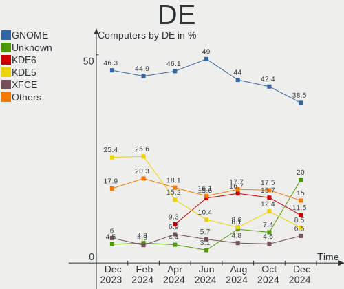
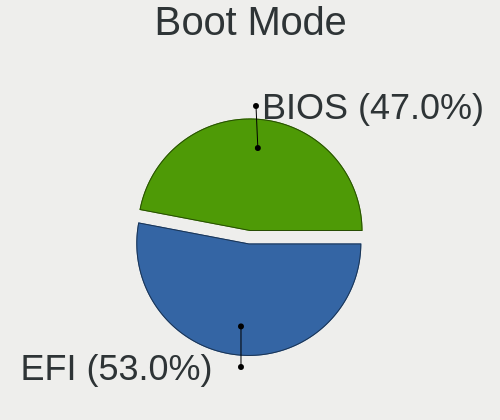
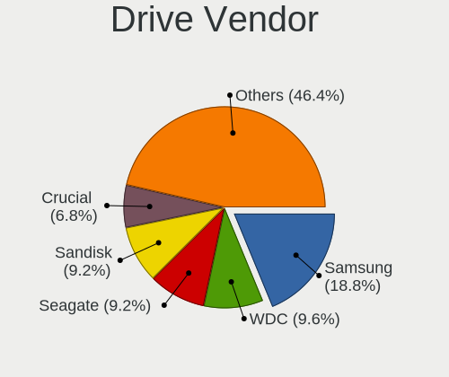
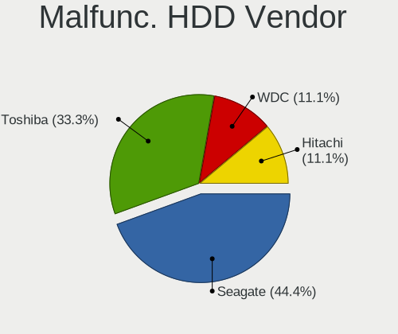
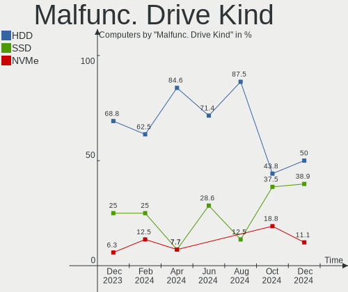
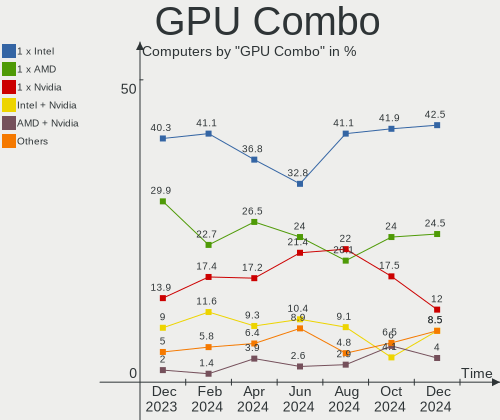
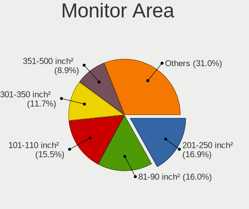

Linux in UK - Hardware Trends
-----------------------------

A project to identify most popular hardware characteristics and track their change
over time based on data collected by Linux users at https://Linux-Hardware.org.

Anyone can contribute to this report by the [hw-probe](https://github.com/linuxhw/hw-probe) tool:

    sudo -E hw-probe -all -upload

This is a report for all computer types. See also reports for [desktops](/Location/UK/Desktop/README.md) and [notebooks](/Location/UK/Notebook/README.md).

Period: Mar, 2023.

Contents
--------

* [ System ](#system)
  - [ OS                       ](#os)
  - [ OS Family                ](#os-family)
  - [ Kernel                   ](#kernel)
  - [ Kernel Family            ](#kernel-family)
  - [ Kernel Major Ver.        ](#kernel-major-ver)
  - [ Arch                     ](#arch)
  - [ DE                       ](#de)
  - [ Display Server           ](#display-server)
  - [ Display Manager          ](#display-manager)
  - [ OS Lang                  ](#os-lang)
  - [ Boot Mode                ](#boot-mode)
  - [ Filesystem               ](#filesystem)
  - [ Part. scheme             ](#part-scheme)
  - [ Dual Boot with Linux/BSD ](#dual-boot-with-linuxbsd)
  - [ Dual Boot (Win)          ](#dual-boot-win)

* [ Board ](#board)
  - [ Vendor                   ](#vendor)
  - [ Model                    ](#model)
  - [ Model Family             ](#model-family)
  - [ MFG Year                 ](#mfg-year)
  - [ Form Factor              ](#form-factor)
  - [ Secure Boot              ](#secure-boot)
  - [ Coreboot                 ](#coreboot)
  - [ RAM Size                 ](#ram-size)
  - [ RAM Used                 ](#ram-used)
  - [ Total Drives             ](#total-drives)
  - [ Has CD-ROM               ](#has-cd-rom)
  - [ Has Ethernet             ](#has-ethernet)
  - [ Has WiFi                 ](#has-wifi)
  - [ Has Bluetooth            ](#has-bluetooth)

* [ Location ](#location)
  - [ Country                  ](#country)
  - [ City                     ](#city)

* [ Drives ](#drives)
  - [ Drive Vendor             ](#drive-vendor)
  - [ Drive Model              ](#drive-model)
  - [ HDD Vendor               ](#hdd-vendor)
  - [ SSD Vendor               ](#ssd-vendor)
  - [ Drive Kind               ](#drive-kind)
  - [ Drive Connector          ](#drive-connector)
  - [ Drive Size               ](#drive-size)
  - [ Space Total              ](#space-total)
  - [ Space Used               ](#space-used)
  - [ Malfunc. Drives          ](#malfunc-drives)
  - [ Malfunc. Drive Vendor    ](#malfunc-drive-vendor)
  - [ Malfunc. HDD Vendor      ](#malfunc-hdd-vendor)
  - [ Malfunc. Drive Kind      ](#malfunc-drive-kind)
  - [ Failed Drives            ](#failed-drives)
  - [ Failed Drive Vendor      ](#failed-drive-vendor)
  - [ Drive Status             ](#drive-status)

* [ Storage controller ](#storage-controller)
  - [ Storage Vendor           ](#storage-vendor)
  - [ Storage Model            ](#storage-model)
  - [ Storage Kind             ](#storage-kind)

* [ Processor ](#processor)
  - [ CPU Vendor               ](#cpu-vendor)
  - [ CPU Model                ](#cpu-model)
  - [ CPU Model Family         ](#cpu-model-family)
  - [ CPU Cores                ](#cpu-cores)
  - [ CPU Sockets              ](#cpu-sockets)
  - [ CPU Threads              ](#cpu-threads)
  - [ CPU Op-Modes             ](#cpu-op-modes)
  - [ CPU Microcode            ](#cpu-microcode)
  - [ CPU Microarch            ](#cpu-microarch)

* [ Graphics ](#graphics)
  - [ GPU Vendor               ](#gpu-vendor)
  - [ GPU Model                ](#gpu-model)
  - [ GPU Combo                ](#gpu-combo)
  - [ GPU Driver               ](#gpu-driver)
  - [ GPU Memory               ](#gpu-memory)

* [ Monitor ](#monitor)
  - [ Monitor Vendor           ](#monitor-vendor)
  - [ Monitor Model            ](#monitor-model)
  - [ Monitor Resolution       ](#monitor-resolution)
  - [ Monitor Diagonal         ](#monitor-diagonal)
  - [ Monitor Width            ](#monitor-width)
  - [ Aspect Ratio             ](#aspect-ratio)
  - [ Monitor Area             ](#monitor-area)
  - [ Pixel Density            ](#pixel-density)
  - [ Multiple Monitors        ](#multiple-monitors)

* [ Network ](#network)
  - [ Net Controller Vendor    ](#net-controller-vendor)
  - [ Net Controller Model     ](#net-controller-model)
  - [ Wireless Vendor          ](#wireless-vendor)
  - [ Wireless Model           ](#wireless-model)
  - [ Ethernet Vendor          ](#ethernet-vendor)
  - [ Ethernet Model           ](#ethernet-model)
  - [ Net Controller Kind      ](#net-controller-kind)
  - [ Used Controller          ](#used-controller)
  - [ NICs                     ](#nics)
  - [ IPv6                     ](#ipv6)

* [ Bluetooth ](#bluetooth)
  - [ Bluetooth Vendor         ](#bluetooth-vendor)
  - [ Bluetooth Model          ](#bluetooth-model)

* [ Sound ](#sound)
  - [ Sound Vendor             ](#sound-vendor)
  - [ Sound Model              ](#sound-model)

* [ Memory ](#memory)
  - [ Memory Vendor            ](#memory-vendor)
  - [ Memory Model             ](#memory-model)
  - [ Memory Kind              ](#memory-kind)
  - [ Memory Form Factor       ](#memory-form-factor)
  - [ Memory Size              ](#memory-size)
  - [ Memory Speed             ](#memory-speed)

* [ Printers & scanners ](#printers--scanners)
  - [ Printer Vendor           ](#printer-vendor)
  - [ Printer Model            ](#printer-model)
  - [ Scanner Vendor           ](#scanner-vendor)
  - [ Scanner Model            ](#scanner-model)

* [ Camera ](#camera)
  - [ Camera Vendor            ](#camera-vendor)
  - [ Camera Model             ](#camera-model)

* [ Security ](#security)
  - [ Fingerprint Vendor       ](#fingerprint-vendor)
  - [ Fingerprint Model        ](#fingerprint-model)
  - [ Chipcard Vendor          ](#chipcard-vendor)
  - [ Chipcard Model           ](#chipcard-model)

* [ Unsupported ](#unsupported)
  - [ Unsupported Devices      ](#unsupported-devices)
  - [ Unsupported Device Types ](#unsupported-device-types)

System
------

OS
--

Installed operating systems

| Name                         | Computers | Percent |
|------------------------------|-----------|---------|
| Ubuntu 22.04                 | 43        | 18.22%  |
| Linux Mint 21.1              | 16        | 6.78%   |
| Fedora 37                    | 15        | 6.36%   |
| Zorin 16                     | 14        | 5.93%   |
| OpenMandriva 23.01           | 13        | 5.51%   |
| OpenMandriva 23.03           | 11        | 4.66%   |
| Pop!_OS 22.04                | 10        | 4.24%   |
| ArcoLinux Rolling            | 9         | 3.81%   |
| Ubuntu 22.10                 | 8         | 3.39%   |
| Arch Rolling                 | 8         | 3.39%   |
| Ubuntu 20.04                 | 7         | 2.97%   |
| Debian 11                    | 7         | 2.97%   |
| SteamOS 3.4.6                | 5         | 2.12%   |
| SteamOS 3.4.4                | 4         | 1.69%   |
| Linux Mint 21                | 4         | 1.69%   |
| Kubuntu 22.10                | 4         | 1.69%   |
| openSUSE Tumbleweed-XXXXXXXX | 3         | 1.27%   |
| KDE neon 22.04               | 3         | 1.27%   |
| Gentoo 2.13                  | 3         | 1.27%   |
| ROSA 12.1                    | 2         | 0.85%   |
| Rocky Linux 9.1              | 2         | 0.85%   |
| Nobara 37                    | 2         | 0.85%   |
| Manjaro 22.0.5               | 2         | 0.85%   |
| Manjaro 22.0.4               | 2         | 0.85%   |
| Manjaro                      | 2         | 0.85%   |
| Gentoo 2.9                   | 2         | 0.85%   |
| Debian                       | 2         | 0.85%   |
| Xubuntu 22.04                | 1         | 0.42%   |
| Ubuntu Core 18               | 1         | 0.42%   |
| Ubuntu Budgie 22.04          | 1         | 0.42%   |
| Ubuntu 23.04                 | 1         | 0.42%   |
| SteamOS 3.4                  | 1         | 0.42%   |
| Slackware 15.0               | 1         | 0.42%   |
| ROSA 12.3                    | 1         | 0.42%   |
| RHEL 8                       | 1         | 0.42%   |
| Reborn OS Rolling            | 1         | 0.42%   |
| Raspbian 11                  | 1         | 0.42%   |
| OpenMandriva 4.3             | 1         | 0.42%   |
| OpenMandriva 4.2             | 1         | 0.42%   |
| OpenMandriva 23.90           | 1         | 0.42%   |

OS Family
---------

OS without a version

| Name          | Computers | Percent |
|---------------|-----------|---------|
| Ubuntu        | 60        | 25.42%  |
| OpenMandriva  | 27        | 11.44%  |
| Linux Mint    | 22        | 9.32%   |
| Fedora        | 18        | 7.63%   |
| Zorin         | 14        | 5.93%   |
| SteamOS       | 10        | 4.24%   |
| Pop!_OS       | 10        | 4.24%   |
| Debian        | 9         | 3.81%   |
| ArcoLinux     | 9         | 3.81%   |
| Arch          | 8         | 3.39%   |
| Kubuntu       | 7         | 2.97%   |
| Manjaro       | 6         | 2.54%   |
| Gentoo        | 5         | 2.12%   |
| ROSA          | 3         | 1.27%   |
| openSUSE      | 3         | 1.27%   |
| Nobara        | 3         | 1.27%   |
| KDE neon      | 3         | 1.27%   |
| Rocky Linux   | 2         | 0.85%   |
| Elementary    | 2         | 0.85%   |
| Xubuntu       | 1         | 0.42%   |
| Ubuntu Budgie | 1         | 0.42%   |
| Slackware     | 1         | 0.42%   |
| RHEL          | 1         | 0.42%   |
| Reborn OS     | 1         | 0.42%   |
| Raspbian      | 1         | 0.42%   |
| NixOS         | 1         | 0.42%   |
| Kali          | 1         | 0.42%   |
| Endless       | 1         | 0.42%   |
| EndeavourOS   | 1         | 0.42%   |
| Devuan        | 1         | 0.42%   |
| CentOS        | 1         | 0.42%   |
| BlackPanther  | 1         | 0.42%   |
| Athena        | 1         | 0.42%   |
| antergos      | 1         | 0.42%   |

Kernel
------

Version of the Linux kernel

| Version                            | Computers | Percent |
|------------------------------------|-----------|---------|
| 5.19.0-35-generic                  | 40        | 16.95%  |
| 5.15.0-67-generic                  | 31        | 13.14%  |
| 6.1.1-desktop-1omv2290             | 12        | 5.08%   |
| 6.2.6-desktop-1omv2390             | 11        | 4.66%   |
| 5.19.0-32-generic                  | 9         | 3.81%   |
| 5.13.0-valve36-1-neptune           | 9         | 3.81%   |
| 6.2.0-76060200-generic             | 8         | 3.39%   |
| 5.19.0-38-generic                  | 6         | 2.54%   |
| 6.1.14-200.fc37.x86_64             | 5         | 2.12%   |
| 6.2.8-arch1-1                      | 4         | 1.69%   |
| 6.2.7-200.fc37.x86_64              | 3         | 1.27%   |
| 6.2.2-arch1-1                      | 3         | 1.27%   |
| 6.2.1-arch1-1                      | 3         | 1.27%   |
| 5.15.0-60-generic                  | 3         | 1.27%   |
| 5.10.0-21-amd64                    | 3         | 1.27%   |
| 6.2.8-200.fc37.x86_64              | 2         | 0.85%   |
| 6.2.6-zen1-1-zen                   | 2         | 0.85%   |
| 6.2.6-arch1-1                      | 2         | 0.85%   |
| 6.2.2-arch2-1                      | 2         | 0.85%   |
| 6.2.1-1-default                    | 2         | 0.85%   |
| 6.1.15-200.fc37.x86_64             | 2         | 0.85%   |
| 6.1.12-gentoo-x86_64               | 2         | 0.85%   |
| 6.1.12-1-MANJARO                   | 2         | 0.85%   |
| 5.15.102-1-MANJARO                 | 2         | 0.85%   |
| 5.15.0-56-generic                  | 2         | 0.85%   |
| 5.15.0-47-generic                  | 2         | 0.85%   |
| 5.14.0-162.18.1.el9_1.x86_64       | 2         | 0.85%   |
| 5.10.74-generic-2rosa2021.1-x86_64 | 2         | 0.85%   |
| 5.10.0-20-amd64                    | 2         | 0.85%   |
| 6.3.0-rc1-recompv5                 | 1         | 0.42%   |
| 6.2.7-arch1-1                      | 1         | 0.42%   |
| 6.2.6-76060206-generic             | 1         | 0.42%   |
| 6.2.6-300.fc38.x86_64              | 1         | 0.42%   |
| 6.2.6-201.fsync.fc37.x86_64        | 1         | 0.42%   |
| 6.2.5-zen1-1-zen                   | 1         | 0.42%   |
| 6.2.5-arch1-1                      | 1         | 0.42%   |
| 6.2.5-060205-generic               | 1         | 0.42%   |
| 6.2.1-gentoo-x86_64                | 1         | 0.42%   |
| 6.2.1                              | 1         | 0.42%   |
| 6.2.0-1-MANJARO                    | 1         | 0.42%   |

Kernel Family
-------------

Linux kernel without a distro release

| Version  | Computers | Percent |
|----------|-----------|---------|
| 5.19.0   | 57        | 24.15%  |
| 5.15.0   | 44        | 18.64%  |
| 6.2.6    | 18        | 7.63%   |
| 6.1.1    | 12        | 5.08%   |
| 6.2.0    | 11        | 4.66%   |
| 5.13.0   | 10        | 4.24%   |
| 6.2.1    | 7         | 2.97%   |
| 6.1.14   | 7         | 2.97%   |
| 6.2.8    | 6         | 2.54%   |
| 6.1.12   | 6         | 2.54%   |
| 6.2.2    | 5         | 2.12%   |
| 5.10.0   | 5         | 2.12%   |
| 6.2.7    | 4         | 1.69%   |
| 6.2.5    | 3         | 1.27%   |
| 6.1.15   | 3         | 1.27%   |
| 6.1.0    | 3         | 1.27%   |
| 6.1.19   | 2         | 0.85%   |
| 6.1.11   | 2         | 0.85%   |
| 5.15.102 | 2         | 0.85%   |
| 5.14.0   | 2         | 0.85%   |
| 5.10.74  | 2         | 0.85%   |
| 6.3.0    | 1         | 0.42%   |
| 6.1.9    | 1         | 0.42%   |
| 6.1.8    | 1         | 0.42%   |
| 6.1.4    | 1         | 0.42%   |
| 6.1.18   | 1         | 0.42%   |
| 6.1.13   | 1         | 0.42%   |
| 6.0.7    | 1         | 0.42%   |
| 6.0.14   | 1         | 0.42%   |
| 6.0.12   | 1         | 0.42%   |
| 6.0.0    | 1         | 0.42%   |
| 5.8.0    | 1         | 0.42%   |
| 5.6.14   | 1         | 0.42%   |
| 5.4.0    | 1         | 0.42%   |
| 5.19.17  | 1         | 0.42%   |
| 5.17.5   | 1         | 0.42%   |
| 5.16.13  | 1         | 0.42%   |
| 5.15.84  | 1         | 0.42%   |
| 5.15.79  | 1         | 0.42%   |
| 5.15.74  | 1         | 0.42%   |

Kernel Major Ver.
-----------------

Linux kernel major version

| Version | Computers | Percent |
|---------|-----------|---------|
| 5.19    | 58        | 24.58%  |
| 6.2     | 54        | 22.88%  |
| 5.15    | 50        | 21.19%  |
| 6.1     | 40        | 16.95%  |
| 5.13    | 10        | 4.24%   |
| 5.10    | 8         | 3.39%   |
| 6.0     | 4         | 1.69%   |
| 5.14    | 2         | 0.85%   |
| 6.3     | 1         | 0.42%   |
| 5.8     | 1         | 0.42%   |
| 5.6     | 1         | 0.42%   |
| 5.4     | 1         | 0.42%   |
| 5.17    | 1         | 0.42%   |
| 5.16    | 1         | 0.42%   |
| 5.11    | 1         | 0.42%   |
| 4.18    | 1         | 0.42%   |
| 4.15    | 1         | 0.42%   |
| 3.10    | 1         | 0.42%   |

Arch
----

OS architecture (x86_64, i586, etc.)

| Name    | Computers | Percent |
|---------|-----------|---------|
| x86_64  | 234       | 99.15%  |
| armv6l  | 1         | 0.42%   |
| aarch64 | 1         | 0.42%   |

DE
--

Desktop Environment

| Name       | Computers | Percent |
|------------|-----------|---------|
| GNOME      | 108       | 45.76%  |
| KDE5       | 67        | 28.39%  |
| X-Cinnamon | 18        | 7.63%   |
| Unknown    | 13        | 5.51%   |
| XFCE       | 12        | 5.08%   |
| MATE       | 6         | 2.54%   |
| sway       | 2         | 0.85%   |
| Pantheon   | 2         | 0.85%   |
| i3         | 2         | 0.85%   |
| Budgie     | 2         | 0.85%   |
| bspwm      | 2         | 0.85%   |
| qtile      | 1         | 0.42%   |
| KDE4       | 1         | 0.42%   |

Display Server
--------------

X11 or Wayland

| Name    | Computers | Percent |
|---------|-----------|---------|
| X11     | 155       | 65.68%  |
| Wayland | 65        | 27.54%  |
| Tty     | 11        | 4.66%   |
| Unknown | 5         | 2.12%   |

Display Manager
---------------

SDDM, LightDM, etc.

| Name    | Computers | Percent |
|---------|-----------|---------|
| Unknown | 98        | 41.53%  |
| GDM3    | 52        | 22.03%  |
| SDDM    | 49        | 20.76%  |
| LightDM | 19        | 8.05%   |
| GDM     | 17        | 7.2%    |
| XDM     | 1         | 0.42%   |

OS Lang
-------

Language

| Lang    | Computers | Percent |
|---------|-----------|---------|
| en_GB   | 178       | 75.42%  |
| en_US   | 41        | 17.37%  |
| Unknown | 7         | 2.97%   |
| C       | 3         | 1.27%   |
| ru_RU   | 2         | 0.85%   |
| de_DE   | 2         | 0.85%   |
| lt_LT   | 1         | 0.42%   |
| it_IT   | 1         | 0.42%   |
| C.UTF8  | 1         | 0.42%   |

Boot Mode
---------

EFI or BIOS

| Mode | Computers | Percent |
|------|-----------|---------|
| EFI  | 132       | 55.93%  |
| BIOS | 104       | 44.07%  |

Filesystem
----------

Type of filesystem

| Type    | Computers | Percent |
|---------|-----------|---------|
| Ext4    | 160       | 67.8%   |
| Btrfs   | 49        | 20.76%  |
| Overlay | 17        | 7.2%    |
| Xfs     | 6         | 2.54%   |
| Zfs     | 4         | 1.69%   |

Part. scheme
------------

Scheme of partitioning

| Type    | Computers | Percent |
|---------|-----------|---------|
| GPT     | 132       | 55.93%  |
| Unknown | 84        | 35.59%  |
| MBR     | 20        | 8.47%   |

Dual Boot with Linux/BSD
------------------------

Hosting more than one Linux/BSD

| Dual boot | Computers | Percent |
|-----------|-----------|---------|
| No        | 201       | 85.17%  |
| Yes       | 35        | 14.83%  |

Dual Boot (Win)
---------------

Hosting Linux and Windows

| Dual boot | Computers | Percent |
|-----------|-----------|---------|
| No        | 179       | 75.85%  |
| Yes       | 57        | 24.15%  |

Board
-----

Vendor
------

Motherboard manufacturer

| Name                    | Computers | Percent |
|-------------------------|-----------|---------|
| Dell                    | 35        | 14.83%  |
| ASUSTek Computer        | 35        | 14.83%  |
| Lenovo                  | 26        | 11.02%  |
| Hewlett-Packard         | 26        | 11.02%  |
| Gigabyte Technology     | 19        | 8.05%   |
| MSI                     | 14        | 5.93%   |
| Acer                    | 11        | 4.66%   |
| Valve                   | 9         | 3.81%   |
| ASRock                  | 5         | 2.12%   |
| Apple                   | 5         | 2.12%   |
| Unknown                 | 5         | 2.12%   |
| Toshiba                 | 4         | 1.69%   |
| Google                  | 4         | 1.69%   |
| TUXEDO                  | 3         | 1.27%   |
| Samsung Electronics     | 3         | 1.27%   |
| Notebook                | 3         | 1.27%   |
| Sony                    | 2         | 0.85%   |
| Raspberry Pi Foundation | 2         | 0.85%   |
| OEGStone                | 2         | 0.85%   |
| LG Electronics          | 2         | 0.85%   |
| Intel                   | 2         | 0.85%   |
| HUAWEI                  | 2         | 0.85%   |
| AZW                     | 2         | 0.85%   |
| ZOTAC                   | 1         | 0.42%   |
| Timi                    | 1         | 0.42%   |
| Supermicro              | 1         | 0.42%   |
| Razer                   | 1         | 0.42%   |
| Pegatron                | 1         | 0.42%   |
| PC Specialist           | 1         | 0.42%   |
| Packard Bell            | 1         | 0.42%   |
| Novatech                | 1         | 0.42%   |
| IP3 Tech                | 1         | 0.42%   |
| HONOR                   | 1         | 0.42%   |
| GEO                     | 1         | 0.42%   |
| Fujitsu Siemens         | 1         | 0.42%   |
| Foxconn                 | 1         | 0.42%   |
| Entroware               | 1         | 0.42%   |
| Alienware               | 1         | 0.42%   |

Model
-----

Motherboard model

| Name                                                  | Computers | Percent |
|-------------------------------------------------------|-----------|---------|
| Valve Jupiter                                         | 9         | 3.81%   |
| Unknown                                               | 5         | 2.12%   |
| ASUS All Series                                       | 4         | 1.69%   |
| Dell OptiPlex 3050                                    | 3         | 1.27%   |
| MSI MS-7D32                                           | 2         | 0.85%   |
| HP Pavilion 15                                        | 2         | 0.85%   |
| HP EliteDesk 800 G1 SFF                               | 2         | 0.85%   |
| Dell OptiPlex 3020                                    | 2         | 0.85%   |
| Dell Inspiron N5110                                   | 2         | 0.85%   |
| ASUS TUF Gaming X570-PLUS                             | 2         | 0.85%   |
| ASUS ROG STRIX X670E-E GAMING WIFI                    | 2         | 0.85%   |
| ASUS P5W DH Deluxe                                    | 2         | 0.85%   |
| ZOTAC ZBOXNANO-AQ01                                   | 1         | 0.42%   |
| TUXEDO InfinityBook S 15 Gen6                         | 1         | 0.42%   |
| TUXEDO InfinityBook Pro 14 Gen6                       | 1         | 0.42%   |
| TUXEDO Aura 15 Gen1                                   | 1         | 0.42%   |
| Toshiba Satellite Pro C50-A-1E2                       | 1         | 0.42%   |
| Toshiba Satellite L50-C                               | 1         | 0.42%   |
| Toshiba Satellite C660                                | 1         | 0.42%   |
| Toshiba QOSMIO X70-A                                  | 1         | 0.42%   |
| Timi RedmiBook 14                                     | 1         | 0.42%   |
| Supermicro SSG-6028R-ER12-HDP-AI050                   | 1         | 0.42%   |
| Sony VPCEH3N6E                                        | 1         | 0.42%   |
| Sony SVF1521Q1EW                                      | 1         | 0.42%   |
| Samsung R530/R730/R540                                | 1         | 0.42%   |
| Samsung 530U3BI/530U4BI/530U4BH                       | 1         | 0.42%   |
| Samsung 3570R/370R/470R/450R/510R/4450RV              | 1         | 0.42%   |
| Razer Blade 15 Advanced Model (Early 2021) - RZ09-036 | 1         | 0.42%   |
| RPi Raspberry Pi Zero W Rev 1.1                       | 1         | 0.42%   |
| RPi Raspberry Pi                                      | 1         | 0.42%   |
| Pegatron Elite 7300 Series MT                         | 1         | 0.42%   |
| PC Specialist P65_67RSRP                              | 1         | 0.42%   |
| Packard Bell EasyNote TM82                            | 1         | 0.42%   |
| OEGStone W54_55SU1,SUW                                | 1         | 0.42%   |
| OEGStone W240EU/W250EUQ/W270EUQ                       | 1         | 0.42%   |
| Novatech 15.6 nSpire Laptop                           | 1         | 0.42%   |
| Notebook W510LU                                       | 1         | 0.42%   |
| Notebook PCx0Dx                                       | 1         | 0.42%   |
| Notebook N150ZU                                       | 1         | 0.42%   |
| MSI Summit E14Evo A12M                                | 1         | 0.42%   |

Model Family
------------

Motherboard model prefix

| Name                                | Computers | Percent |
|-------------------------------------|-----------|---------|
| Lenovo ThinkPad                     | 12        | 5.08%   |
| Dell Inspiron                       | 10        | 4.24%   |
| Valve Jupiter                       | 9         | 3.81%   |
| Dell Latitude                       | 9         | 3.81%   |
| ASUS ROG                            | 9         | 3.81%   |
| Dell OptiPlex                       | 8         | 3.39%   |
| HP Pavilion                         | 6         | 2.54%   |
| Acer Aspire                         | 6         | 2.54%   |
| HP Laptop                           | 5         | 2.12%   |
| Dell XPS                            | 5         | 2.12%   |
| Unknown                             | 5         | 2.12%   |
| Lenovo IdeaPad                      | 4         | 1.69%   |
| ASUS TUF                            | 4         | 1.69%   |
| ASUS All                            | 4         | 1.69%   |
| Toshiba Satellite                   | 3         | 1.27%   |
| HP Spectre                          | 3         | 1.27%   |
| ASUS PRIME                          | 3         | 1.27%   |
| TUXEDO InfinityBook                 | 2         | 0.85%   |
| RPi Raspberry                       | 2         | 0.85%   |
| MSI MS-7D32                         | 2         | 0.85%   |
| Lenovo ThinkCentre                  | 2         | 0.85%   |
| Lenovo ThinkBook                    | 2         | 0.85%   |
| Lenovo Legion                       | 2         | 0.85%   |
| HP ProBook                          | 2         | 0.85%   |
| HP ENVY                             | 2         | 0.85%   |
| HP EliteDesk                        | 2         | 0.85%   |
| Gigabyte X570                       | 2         | 0.85%   |
| Gigabyte A520M                      | 2         | 0.85%   |
| Dell Precision                      | 2         | 0.85%   |
| ASUS P5W                            | 2         | 0.85%   |
| ASUS ASUS                           | 2         | 0.85%   |
| Acer Predator                       | 2         | 0.85%   |
| ZOTAC ZBOXNANO-AQ01                 | 1         | 0.42%   |
| TUXEDO Aura                         | 1         | 0.42%   |
| Toshiba QOSMIO                      | 1         | 0.42%   |
| Timi RedmiBook                      | 1         | 0.42%   |
| Supermicro SSG-6028R-ER12-HDP-AI050 | 1         | 0.42%   |
| Sony VPCEH3N6E                      | 1         | 0.42%   |
| Sony SVF1521Q1EW                    | 1         | 0.42%   |
| Samsung R530                        | 1         | 0.42%   |

MFG Year
--------

Motherboard manufacture year

| Year    | Computers | Percent |
|---------|-----------|---------|
| 2022    | 39        | 16.53%  |
| 2021    | 28        | 11.86%  |
| 2020    | 26        | 11.02%  |
| 2018    | 19        | 8.05%   |
| 2013    | 17        | 7.2%    |
| 2019    | 14        | 5.93%   |
| 2017    | 12        | 5.08%   |
| 2014    | 12        | 5.08%   |
| 2012    | 12        | 5.08%   |
| 2011    | 11        | 4.66%   |
| 2016    | 10        | 4.24%   |
| 2015    | 9         | 3.81%   |
| 2010    | 6         | 2.54%   |
| 2009    | 6         | 2.54%   |
| 2008    | 5         | 2.12%   |
| 2023    | 4         | 1.69%   |
| 2006    | 3         | 1.27%   |
| Unknown | 2         | 0.85%   |
| 2007    | 1         | 0.42%   |

Form Factor
-----------

Physical design of the computer

| Name           | Computers | Percent |
|----------------|-----------|---------|
| Notebook       | 125       | 52.97%  |
| Desktop        | 92        | 38.98%  |
| Mini pc        | 7         | 2.97%   |
| Convertible    | 5         | 2.12%   |
| System on chip | 2         | 0.85%   |
| Tablet         | 2         | 0.85%   |
| Server         | 2         | 0.85%   |
| All in one     | 1         | 0.42%   |

Secure Boot
-----------

Enabled or disabled

| State    | Computers | Percent |
|----------|-----------|---------|
| Disabled | 220       | 93.22%  |
| Enabled  | 16        | 6.78%   |

Coreboot
--------

Have coreboot on board

| Used | Computers | Percent |
|------|-----------|---------|
| No   | 232       | 98.31%  |
| Yes  | 4         | 1.69%   |

RAM Size
--------

Total RAM memory

| Size in GB      | Computers | Percent |
|-----------------|-----------|---------|
| 16.01-24.0      | 57        | 24.15%  |
| 4.01-8.0        | 55        | 23.31%  |
| 32.01-64.0      | 42        | 17.8%   |
| 8.01-16.0       | 34        | 14.41%  |
| 3.01-4.0        | 28        | 11.86%  |
| 64.01-256.0     | 8         | 3.39%   |
| 24.01-32.0      | 6         | 2.54%   |
| 1.01-2.0        | 3         | 1.27%   |
| More than 256.0 | 2         | 0.85%   |
| 0.01-0.5        | 1         | 0.42%   |

RAM Used
--------

Used RAM memory

| Used GB    | Computers | Percent |
|------------|-----------|---------|
| 1.01-2.0   | 70        | 29.66%  |
| 2.01-3.0   | 53        | 22.46%  |
| 4.01-8.0   | 51        | 21.61%  |
| 3.01-4.0   | 37        | 15.68%  |
| 8.01-16.0  | 14        | 5.93%   |
| 0.51-1.0   | 4         | 1.69%   |
| 32.01-64.0 | 2         | 0.85%   |
| 16.01-24.0 | 2         | 0.85%   |
| 0.01-0.5   | 2         | 0.85%   |
| 24.01-32.0 | 1         | 0.42%   |

Total Drives
------------

Number of drives on board

| Drives | Computers | Percent |
|--------|-----------|---------|
| 1      | 119       | 50.42%  |
| 2      | 67        | 28.39%  |
| 3      | 26        | 11.02%  |
| 4      | 9         | 3.81%   |
| 5      | 5         | 2.12%   |
| 6      | 4         | 1.69%   |
| 0      | 3         | 1.27%   |
| 11     | 1         | 0.42%   |
| 8      | 1         | 0.42%   |
| 7      | 1         | 0.42%   |

Has CD-ROM
----------

Has CD-ROM on board

| Presented | Computers | Percent |
|-----------|-----------|---------|
| No        | 166       | 70.34%  |
| Yes       | 70        | 29.66%  |

Has Ethernet
------------

Has Ethernet on board

| Presented | Computers | Percent |
|-----------|-----------|---------|
| Yes       | 192       | 81.36%  |
| No        | 44        | 18.64%  |

Has WiFi
--------

Has WiFi module

| Presented | Computers | Percent |
|-----------|-----------|---------|
| Yes       | 181       | 76.69%  |
| No        | 55        | 23.31%  |

Has Bluetooth
-------------

Has Bluetooth module

| Presented | Computers | Percent |
|-----------|-----------|---------|
| Yes       | 157       | 66.53%  |
| No        | 79        | 33.47%  |

Location
--------

Country
-------

Geographic location (country)

| Country | Computers | Percent |
|---------|-----------|---------|
| UK      | 236       | 100%    |

City
----

Geographic location (city)

| City                  | Computers | Percent |
|-----------------------|-----------|---------|
| London                | 30        | 12.71%  |
| Manchester            | 7         | 2.97%   |
| Newcastle upon Tyne   | 6         | 2.54%   |
| Mirfield              | 6         | 2.54%   |
| Bristol               | 6         | 2.54%   |
| Birmingham            | 6         | 2.54%   |
| Leeds                 | 5         | 2.12%   |
| Glasgow               | 5         | 2.12%   |
| Rotherham             | 3         | 1.27%   |
| Rochdale              | 3         | 1.27%   |
| Nottingham            | 3         | 1.27%   |
| Milton Keynes         | 3         | 1.27%   |
| Liverpool             | 3         | 1.27%   |
| Kettering             | 3         | 1.27%   |
| Farnborough           | 3         | 1.27%   |
| Edinburgh             | 3         | 1.27%   |
| City of London        | 3         | 1.27%   |
| Bedford               | 3         | 1.27%   |
| Uxbridge              | 2         | 0.85%   |
| Stockton-on-Tees      | 2         | 0.85%   |
| St Albans             | 2         | 0.85%   |
| Sheffield             | 2         | 0.85%   |
| Sandy                 | 2         | 0.85%   |
| Royal Tunbridge Wells | 2         | 0.85%   |
| Ripon                 | 2         | 0.85%   |
| Portsmouth            | 2         | 0.85%   |
| Norwich               | 2         | 0.85%   |
| Newport               | 2         | 0.85%   |
| Lancaster             | 2         | 0.85%   |
| Isle of Arran         | 2         | 0.85%   |
| Ipswich               | 2         | 0.85%   |
| Harrow                | 2         | 0.85%   |
| Elderslie             | 2         | 0.85%   |
| Dunfermline           | 2         | 0.85%   |
| Derby                 | 2         | 0.85%   |
| Dagenham              | 2         | 0.85%   |
| Carlisle              | 2         | 0.85%   |
| Cambridge             | 2         | 0.85%   |
| Brighton              | 2         | 0.85%   |
| Barnsley              | 2         | 0.85%   |

Drives
------

Drive Vendor
------------

Hard drive vendors

| Vendor                         | Computers | Drives | Percent |
|--------------------------------|-----------|--------|---------|
| Samsung Electronics            | 68        | 84     | 18.63%  |
| WDC                            | 39        | 45     | 10.68%  |
| Seagate                        | 38        | 59     | 10.41%  |
| SanDisk                        | 31        | 39     | 8.49%   |
| Crucial                        | 30        | 34     | 8.22%   |
| Unknown                        | 21        | 23     | 5.75%   |
| Toshiba                        | 20        | 23     | 5.48%   |
| Phison Electronics             | 12        | 16     | 3.29%   |
| Kingston                       | 11        | 11     | 3.01%   |
| SK hynix                       | 10        | 10     | 2.74%   |
| Micron/Crucial Technology      | 8         | 8      | 2.19%   |
| Intel                          | 8         | 9      | 2.19%   |
| Hitachi                        | 7         | 12     | 1.92%   |
| Unknown                        | 5         | 5      | 1.37%   |
| Micron Technology              | 4         | 4      | 1.1%    |
| KIOXIA                         | 4         | 4      | 1.1%    |
| HGST                           | 4         | 4      | 1.1%    |
| ORTIAL                         | 3         | 3      | 0.82%   |
| Netac                          | 3         | 3      | 0.82%   |
| China                          | 3         | 3      | 0.82%   |
| Transcend                      | 2         | 2      | 0.55%   |
| SPCC                           | 2         | 2      | 0.55%   |
| Silicon Motion                 | 2         | 2      | 0.55%   |
| PNY                            | 2         | 2      | 0.55%   |
| Phison                         | 2         | 2      | 0.55%   |
| OCZ                            | 2         | 2      | 0.55%   |
| Kingston Technology Company    | 2         | 2      | 0.55%   |
| KingFast                       | 2         | 2      | 0.55%   |
| Integral                       | 2         | 2      | 0.55%   |
| Corsair                        | 2         | 2      | 0.55%   |
| Apple                          | 2         | 2      | 0.55%   |
| Solid State Storage Technology | 1         | 1      | 0.27%   |
| Realtek Semiconductor          | 1         | 1      | 0.27%   |
| Realtek                        | 1         | 1      | 0.27%   |
| O2 Micro                       | 1         | 1      | 0.27%   |
| MSI                            | 1         | 1      | 0.27%   |
| LITEON                         | 1         | 1      | 0.27%   |
| Lexar                          | 1         | 1      | 0.27%   |
| Lenovo                         | 1         | 1      | 0.27%   |
| KIOXIA-EXCERIA                 | 1         | 1      | 0.27%   |

Drive Model
-----------

Hard drive models

| Model                                                  | Computers | Percent |
|--------------------------------------------------------|-----------|---------|
| Samsung SSD 850 EVO 250GB                              | 7         | 1.75%   |
| Samsung NVMe SSD Controller SM981/PM981/PM983 250GB    | 7         | 1.75%   |
| Samsung NVMe SSD Controller PM9A1/PM9A3/980PRO 1TB     | 7         | 1.75%   |
| Micron/Crucial P2 NVMe PCIe SSD 1TB                    | 6         | 1.5%    |
| Seagate ST9500325AS 500GB                              | 5         | 1.25%   |
| Phison PS5013 E13 NVMe Controller 256GB                | 5         | 1.25%   |
| Phison E12 NVMe Controller 256GB                       | 5         | 1.25%   |
| Kingston SA400S37240G 240GB SSD                        | 5         | 1.25%   |
| Unknown                                                | 5         | 1.25%   |
| Unknown MMC Card  64GB                                 | 4         | 1%      |
| Seagate ST1000DM010-2EP102 1TB                         | 4         | 1%      |
| Samsung SSD 850 EVO 500GB                              | 4         | 1%      |
| Crucial CT240BX500SSD1 240GB                           | 4         | 1%      |
| Crucial CT1000MX500SSD1 1TB                            | 4         | 1%      |
| WDC WDS240G2G0A-00JH30 240GB SSD                       | 3         | 0.75%   |
| Unknown SD/MMC/MS PRO 64GB                             | 3         | 0.75%   |
| Unknown MMC Card  128GB                                | 3         | 0.75%   |
| Toshiba XG6 NVMe SSD Controller 512GB                  | 3         | 0.75%   |
| Seagate ST1000LM024 HN-M101MBB 1TB                     | 3         | 0.75%   |
| Sandisk WD Blue SN550 NVMe SSD 256GB                   | 3         | 0.75%   |
| SanDisk SDSSDA240G 240GB                               | 3         | 0.75%   |
| SanDisk NVMe SSD Drive 1TB                             | 3         | 0.75%   |
| Samsung SSD 980 1TB                                    | 3         | 0.75%   |
| Samsung MZ9LQ512HBLU-00BVL 512GB                       | 3         | 0.75%   |
| Kingston SNVS500G 500GB                                | 3         | 0.75%   |
| Crucial CT500MX500SSD1 500GB                           | 3         | 0.75%   |
| WDC WD10EURX-63FH1Y0 1TB                               | 2         | 0.5%    |
| Unknown MMC Card  512GB                                | 2         | 0.5%    |
| Unknown MMC Card  256GB                                | 2         | 0.5%    |
| Unknown MMC Card  16GB                                 | 2         | 0.5%    |
| Unknown DA4064  64GB                                   | 2         | 0.5%    |
| Toshiba MQ01ABD100 1TB                                 | 2         | 0.5%    |
| Toshiba HDWD130 3TB                                    | 2         | 0.5%    |
| Toshiba HDWD120 2TB                                    | 2         | 0.5%    |
| SK hynix SKHynix_HFS512GDE9X081N 512GB                 | 2         | 0.5%    |
| SK hynix SC311 SATA 128GB SSD                          | 2         | 0.5%    |
| Silicon Motion SM2263EN/SM2263XT SSD Controller 1024GB | 2         | 0.5%    |
| Seagate ST3500312CS 500GB                              | 2         | 0.5%    |
| Seagate ST2000DM008-2FR102 2TB                         | 2         | 0.5%    |
| Seagate ST1000LM048-2E7172 1TB                         | 2         | 0.5%    |

HDD Vendor
----------

Hard disk drive vendors

| Vendor              | Computers | Drives | Percent |
|---------------------|-----------|--------|---------|
| Seagate             | 36        | 56     | 37.89%  |
| WDC                 | 27        | 31     | 28.42%  |
| Toshiba             | 13        | 15     | 13.68%  |
| Hitachi             | 7         | 12     | 7.37%   |
| Samsung Electronics | 4         | 4      | 4.21%   |
| Unknown             | 3         | 3      | 3.16%   |
| HGST                | 3         | 3      | 3.16%   |
| External            | 1         | 1      | 1.05%   |
| Apple               | 1         | 1      | 1.05%   |

SSD Vendor
----------

Solid state drive vendors

| Vendor              | Computers | Drives | Percent |
|---------------------|-----------|--------|---------|
| Samsung Electronics | 29        | 37     | 24.37%  |
| Crucial             | 26        | 30     | 21.85%  |
| SanDisk             | 15        | 17     | 12.61%  |
| WDC                 | 6         | 6      | 5.04%   |
| Kingston            | 6         | 6      | 5.04%   |
| Toshiba             | 3         | 4      | 2.52%   |
| SK hynix            | 3         | 3      | 2.52%   |
| ORTIAL              | 3         | 3      | 2.52%   |
| Netac               | 3         | 3      | 2.52%   |
| Intel               | 3         | 4      | 2.52%   |
| Transcend           | 2         | 2      | 1.68%   |
| PNY                 | 2         | 2      | 1.68%   |
| OCZ                 | 2         | 2      | 1.68%   |
| Integral            | 2         | 2      | 1.68%   |
| Corsair             | 2         | 2      | 1.68%   |
| China               | 2         | 2      | 1.68%   |
| Unknown             | 2         | 2      | 1.68%   |
| SPCC                | 1         | 1      | 0.84%   |
| Seagate             | 1         | 1      | 0.84%   |
| Micron Technology   | 1         | 1      | 0.84%   |
| LITEON              | 1         | 1      | 0.84%   |
| KingFast            | 1         | 1      | 0.84%   |
| Gigabyte Technology | 1         | 1      | 0.84%   |
| Fanxiang            | 1         | 1      | 0.84%   |
| Drevo               | 1         | 1      | 0.84%   |

Drive Kind
----------

HDD or SSD

| Kind    | Computers | Drives | Percent |
|---------|-----------|--------|---------|
| NVMe    | 114       | 145    | 35.85%  |
| SSD     | 96        | 135    | 30.19%  |
| HDD     | 81        | 126    | 25.47%  |
| MMC     | 21        | 23     | 6.6%    |
| Unknown | 6         | 6      | 1.89%   |

Drive Connector
---------------

SATA, SAS, NVMe, etc.

| Type | Computers | Drives | Percent |
|------|-----------|--------|---------|
| SATA | 145       | 247    | 49.83%  |
| NVMe | 113       | 144    | 38.83%  |
| MMC  | 21        | 23     | 7.22%   |
| SAS  | 12        | 21     | 4.12%   |

Drive Size
----------

Size of hard drive

| Size in TB | Computers | Drives | Percent |
|------------|-----------|--------|---------|
| 0.01-0.5   | 101       | 135    | 52.88%  |
| 0.51-1.0   | 51        | 67     | 26.7%   |
| 1.01-2.0   | 23        | 30     | 12.04%  |
| 3.01-4.0   | 7         | 16     | 3.66%   |
| 2.01-3.0   | 5         | 8      | 2.62%   |
| 4.01-10.0  | 4         | 5      | 2.09%   |

Space Total
-----------

Amount of disk space available on the file system

| Size in GB     | Computers | Percent |
|----------------|-----------|---------|
| 101-250        | 58        | 24.58%  |
| 251-500        | 45        | 19.07%  |
| 501-1000       | 36        | 15.25%  |
| More than 3000 | 23        | 9.75%   |
| 1001-2000      | 19        | 8.05%   |
| 1-20           | 19        | 8.05%   |
| Unknown        | 14        | 5.93%   |
| 51-100         | 11        | 4.66%   |
| 2001-3000      | 7         | 2.97%   |
| 21-50          | 4         | 1.69%   |

Space Used
----------

Amount of used disk space

| Used GB        | Computers | Percent |
|----------------|-----------|---------|
| 1-20           | 70        | 29.66%  |
| 21-50          | 42        | 17.8%   |
| 101-250        | 34        | 14.41%  |
| 51-100         | 27        | 11.44%  |
| 251-500        | 19        | 8.05%   |
| 501-1000       | 15        | 6.36%   |
| Unknown        | 14        | 5.93%   |
| 1001-2000      | 9         | 3.81%   |
| More than 3000 | 5         | 2.12%   |
| 2001-3000      | 1         | 0.42%   |

Malfunc. Drives
---------------

Drive models with a malfunction

| Model                              | Computers | Drives | Percent |
|------------------------------------|-----------|--------|---------|
| Seagate ST9500325AS 500GB          | 3         | 4      | 16.67%  |
| WDC WD30EZRX-00MMMB0 3TB           | 1         | 1      | 5.56%   |
| WDC WD2500BEKT-60PVMT0 250GB       | 1         | 1      | 5.56%   |
| WDC WD20EARX-00PASB0 2TB           | 1         | 1      | 5.56%   |
| Seagate ST9250315AS 250GB          | 1         | 1      | 5.56%   |
| Seagate ST500DM002-1BC142 500GB    | 1         | 1      | 5.56%   |
| Seagate ST250LT003-9YG14C 250GB    | 1         | 1      | 5.56%   |
| Seagate ST1000LM024 HN-M101MBB 1TB | 1         | 1      | 5.56%   |
| OCZ VERTEX4 256GB SSD              | 1         | 1      | 5.56%   |
| Intel SSDSC2BB160G4T 160GB         | 1         | 2      | 5.56%   |
| Intel SSDPEKKW512G7 512GB          | 1         | 1      | 5.56%   |
| Intel SSD 600P Series 512GB        | 1         | 1      | 5.56%   |
| Hitachi HTS542525K9SA00 250GB      | 1         | 1      | 5.56%   |
| Drevo X1 Pro SSD 128GB             | 1         | 1      | 5.56%   |
| Crucial CT480M500SSD1 480GB        | 1         | 1      | 5.56%   |
| Crucial CT250BX100SSD1 250GB       | 1         | 1      | 5.56%   |

Malfunc. Drive Vendor
---------------------

Vendors of faulty drives

| Vendor  | Computers | Drives | Percent |
|---------|-----------|--------|---------|
| Seagate | 7         | 8      | 41.18%  |
| Intel   | 3         | 4      | 17.65%  |
| WDC     | 2         | 3      | 11.76%  |
| Crucial | 2         | 2      | 11.76%  |
| OCZ     | 1         | 1      | 5.88%   |
| Hitachi | 1         | 1      | 5.88%   |
| Drevo   | 1         | 1      | 5.88%   |

Malfunc. HDD Vendor
-------------------

Vendors of faulty HDD drives

| Vendor  | Computers | Drives | Percent |
|---------|-----------|--------|---------|
| Seagate | 7         | 8      | 70%     |
| WDC     | 2         | 3      | 20%     |
| Hitachi | 1         | 1      | 10%     |

Malfunc. Drive Kind
-------------------

Kinds of faulty drives

| Kind | Computers | Drives | Percent |
|------|-----------|--------|---------|
| HDD  | 9         | 12     | 56.25%  |
| SSD  | 5         | 6      | 31.25%  |
| NVMe | 2         | 2      | 12.5%   |

Failed Drives
-------------

Failed drive models

Zero info for selected period =(

Failed Drive Vendor
-------------------

Failed drive vendors

Zero info for selected period =(

Drive Status
------------

Number of failed and malfunc. drives

| Status   | Computers | Drives | Percent |
|----------|-----------|--------|---------|
| Detected | 139       | 243    | 54.72%  |
| Works    | 100       | 172    | 39.37%  |
| Malfunc  | 15        | 20     | 5.91%   |

Storage controller
------------------

Storage Vendor
--------------

Storage controller vendors

| Vendor                         | Computers | Percent |
|--------------------------------|-----------|---------|
| Intel                          | 137       | 42.68%  |
| AMD                            | 47        | 14.64%  |
| Samsung Electronics            | 39        | 12.15%  |
| Sandisk                        | 23        | 7.17%   |
| Phison Electronics             | 14        | 4.36%   |
| Micron/Crucial Technology      | 12        | 3.74%   |
| SK hynix                       | 7         | 2.18%   |
| Kingston Technology Company    | 6         | 1.87%   |
| ASMedia Technology             | 6         | 1.87%   |
| KIOXIA                         | 5         | 1.56%   |
| Toshiba America Info Systems   | 4         | 1.25%   |
| Micron Technology              | 3         | 0.93%   |
| Marvell Technology Group       | 3         | 0.93%   |
| Silicon Motion                 | 2         | 0.62%   |
| LSI Logic / Symbios Logic      | 2         | 0.62%   |
| Solid State Storage Technology | 1         | 0.31%   |
| Shenzhen Longsys Electronics   | 1         | 0.31%   |
| Realtek Semiconductor          | 1         | 0.31%   |
| O2 Micro                       | 1         | 0.31%   |
| Nvidia                         | 1         | 0.31%   |
| Lenovo                         | 1         | 0.31%   |
| JMicron Technology             | 1         | 0.31%   |
| Hewlett-Packard                | 1         | 0.31%   |
| Broadcom / LSI                 | 1         | 0.31%   |
| Apple                          | 1         | 0.31%   |
| ADATA Technology               | 1         | 0.31%   |

Storage Model
-------------

Storage controller models

| Model                                                                          | Computers | Percent |
|--------------------------------------------------------------------------------|-----------|---------|
| AMD FCH SATA Controller [AHCI mode]                                            | 31        | 8.42%   |
| Samsung NVMe SSD Controller 980                                                | 16        | 4.35%   |
| Intel Volume Management Device NVMe RAID Controller                            | 13        | 3.53%   |
| Samsung NVMe SSD Controller SM981/PM981/PM983                                  | 12        | 3.26%   |
| Intel 82801 Mobile SATA Controller [RAID mode]                                 | 12        | 3.26%   |
| Intel 8 Series/C220 Series Chipset Family 6-port SATA Controller 1 [AHCI mode] | 11        | 2.99%   |
| Micron/Crucial P2 NVMe PCIe SSD                                                | 10        | 2.72%   |
| Intel 7 Series Chipset Family 6-port SATA Controller [AHCI mode]               | 10        | 2.72%   |
| AMD 400 Series Chipset SATA Controller                                         | 10        | 2.72%   |
| Samsung NVMe SSD Controller PM9A1/PM9A3/980PRO                                 | 8         | 2.17%   |
| Intel 200 Series PCH SATA controller [AHCI mode]                               | 8         | 2.17%   |
| Intel Comet Lake SATA AHCI Controller                                          | 7         | 1.9%    |
| SanDisk WD Blue SN550 NVMe SSD                                                 | 6         | 1.63%   |
| Phison E12 NVMe Controller                                                     | 6         | 1.63%   |
| Intel Alder Lake-S PCH SATA Controller [AHCI Mode]                             | 6         | 1.63%   |
| ASMedia ASM1062 Serial ATA Controller                                          | 6         | 1.63%   |
| AMD 500 Series Chipset SATA Controller                                         | 6         | 1.63%   |
| SK hynix Gold P31/PC711 NVMe Solid State Drive                                 | 5         | 1.36%   |
| SanDisk WD Blue SN570 NVMe SSD 1TB                                             | 5         | 1.36%   |
| Phison PS5013 E13 NVMe Controller                                              | 5         | 1.36%   |
| Intel 6 Series/C200 Series Chipset Family 6 port Mobile SATA AHCI Controller   | 5         | 1.36%   |
| SanDisk Non-Volatile memory controller                                         | 4         | 1.09%   |
| Intel Sunrise Point-LP SATA Controller [AHCI mode]                             | 4         | 1.09%   |
| Intel SATA Controller [RAID mode]                                              | 4         | 1.09%   |
| Intel 82801G (ICH7 Family) IDE Controller                                      | 4         | 1.09%   |
| Intel 7 Series/C210 Series Chipset Family 6-port SATA Controller [AHCI mode]   | 4         | 1.09%   |
| AMD SB7x0/SB8x0/SB9x0 SATA Controller [IDE mode]                               | 4         | 1.09%   |
| AMD SB7x0/SB8x0/SB9x0 IDE Controller                                           | 4         | 1.09%   |
| Toshiba America Info Systems XG6 NVMe SSD Controller                           | 3         | 0.82%   |
| SanDisk WD PC SN810 / Black SN850 NVMe SSD                                     | 3         | 0.82%   |
| SanDisk NVMe Controller                                                        | 3         | 0.82%   |
| Samsung NVMe SSD Controller SM961/PM961/SM963                                  | 3         | 0.82%   |
| Micron NVMe Storage Controller                                                 | 3         | 0.82%   |
| Intel Q170/Q150/B150/H170/H110/Z170/CM236 Chipset SATA Controller [AHCI Mode]  | 3         | 0.82%   |
| Intel Ice Lake-LP SATA Controller [AHCI mode]                                  | 3         | 0.82%   |
| Intel HM170/QM170 Chipset SATA Controller [AHCI Mode]                          | 3         | 0.82%   |
| Intel Cannon Lake PCH SATA AHCI Controller                                     | 3         | 0.82%   |
| Intel Cannon Lake Mobile PCH SATA AHCI Controller                              | 3         | 0.82%   |
| Intel 9 Series Chipset Family SATA Controller [AHCI Mode]                      | 3         | 0.82%   |
| Intel 82801IBM/IEM (ICH9M/ICH9M-E) 4 port SATA Controller [AHCI mode]          | 3         | 0.82%   |

Storage Kind
------------

Kind of storage controller (IDE, SATA, NVMe, SAS, ...)

| Kind | Computers | Percent |
|------|-----------|---------|
| SATA | 150       | 47.47%  |
| NVMe | 113       | 35.76%  |
| RAID | 32        | 10.13%  |
| IDE  | 19        | 6.01%   |
| SAS  | 2         | 0.63%   |

Processor
---------

CPU Vendor
----------

Processor vendors

| Vendor | Computers | Percent |
|--------|-----------|---------|
| Intel  | 169       | 71.61%  |
| AMD    | 65        | 27.54%  |
| ARM    | 2         | 0.85%   |

CPU Model
---------

Processor models

| Model                                   | Computers | Percent |
|-----------------------------------------|-----------|---------|
| AMD Custom APU 0405                     | 9         | 3.81%   |
| AMD Ryzen 5 5600G with Radeon Graphics  | 5         | 2.12%   |
| Intel Core i5-7200U CPU @ 2.50GHz       | 4         | 1.69%   |
| Intel 11th Gen Core i7-1165G7 @ 2.80GHz | 4         | 1.69%   |
| Intel Core i7-8550U CPU @ 1.80GHz       | 3         | 1.27%   |
| Intel Core i7-4790K CPU @ 4.00GHz       | 3         | 1.27%   |
| Intel Core i7-1065G7 CPU @ 1.30GHz      | 3         | 1.27%   |
| Intel Core i7-10510U CPU @ 1.80GHz      | 3         | 1.27%   |
| Intel Core i5-4570 CPU @ 3.20GHz        | 3         | 1.27%   |
| Intel 11th Gen Core i5-1135G7 @ 2.40GHz | 3         | 1.27%   |
| AMD Ryzen 9 3900X 12-Core Processor     | 3         | 1.27%   |
| Intel Pentium D CPU 3.00GHz             | 2         | 0.85%   |
| Intel Core i7-9750H CPU @ 2.60GHz       | 2         | 0.85%   |
| Intel Core i7-8700 CPU @ 3.20GHz        | 2         | 0.85%   |
| Intel Core i7-4770K CPU @ 3.50GHz       | 2         | 0.85%   |
| Intel Core i7-10875H CPU @ 2.30GHz      | 2         | 0.85%   |
| Intel Core i5-6500 CPU @ 3.20GHz        | 2         | 0.85%   |
| Intel Core i5-4590 CPU @ 3.30GHz        | 2         | 0.85%   |
| Intel Core i5-3470 CPU @ 3.20GHz        | 2         | 0.85%   |
| Intel Core i5-3210M CPU @ 2.50GHz       | 2         | 0.85%   |
| Intel Core i5-2450M CPU @ 2.50GHz       | 2         | 0.85%   |
| Intel Core i5 CPU M 520 @ 2.40GHz       | 2         | 0.85%   |
| Intel Core i3-3110M CPU @ 2.40GHz       | 2         | 0.85%   |
| Intel Core i3-2330M CPU @ 2.20GHz       | 2         | 0.85%   |
| Intel Core 2 Duo CPU T9400 @ 2.53GHz    | 2         | 0.85%   |
| Intel Celeron N4020 CPU @ 1.10GHz       | 2         | 0.85%   |
| Intel 13th Gen Core i7-13700K           | 2         | 0.85%   |
| Intel 12th Gen Core i7-12700K           | 2         | 0.85%   |
| Intel 12th Gen Core i7-12700H           | 2         | 0.85%   |
| Intel 12th Gen Core i7-1260P            | 2         | 0.85%   |
| Intel 12th Gen Core i7-1255U            | 2         | 0.85%   |
| Intel 12th Gen Core i5-12400F           | 2         | 0.85%   |
| Intel 11th Gen Core i7-11370H @ 3.30GHz | 2         | 0.85%   |
| AMD Ryzen 9 6900HX with Radeon Graphics | 2         | 0.85%   |
| AMD Ryzen 7 5800X 8-Core Processor      | 2         | 0.85%   |
| AMD Ryzen 7 3700X 8-Core Processor      | 2         | 0.85%   |
| AMD Ryzen 7 2700X Eight-Core Processor  | 2         | 0.85%   |
| AMD Ryzen 5 3600 6-Core Processor       | 2         | 0.85%   |
| AMD A4-5000 APU with Radeon HD Graphics | 2         | 0.85%   |
| Intel Xeon CPU X5450 @ 3.00GHz          | 1         | 0.42%   |

CPU Model Family
----------------

Processor model prefix

| Model                   | Computers | Percent |
|-------------------------|-----------|---------|
| Intel Core i5           | 48        | 20.34%  |
| Other                   | 44        | 18.64%  |
| Intel Core i7           | 41        | 17.37%  |
| AMD Ryzen 5             | 16        | 6.78%   |
| Intel Core i3           | 14        | 5.93%   |
| AMD Ryzen 7             | 13        | 5.51%   |
| AMD Ryzen 9             | 10        | 4.24%   |
| Intel Celeron           | 9         | 3.81%   |
| Intel Pentium Dual-Core | 4         | 1.69%   |
| Intel Core 2 Duo        | 4         | 1.69%   |
| AMD Ryzen 3             | 4         | 1.69%   |
| Intel Xeon              | 3         | 1.27%   |
| Intel Core i9           | 3         | 1.27%   |
| Intel Pentium D         | 2         | 0.85%   |
| Intel Pentium           | 2         | 0.85%   |
| Intel Core 2 Quad       | 2         | 0.85%   |
| AMD FX                  | 2         | 0.85%   |
| AMD A8                  | 2         | 0.85%   |
| AMD A4                  | 2         | 0.85%   |
| Intel Pentium Gold      | 1         | 0.42%   |
| Intel Core m7           | 1         | 0.42%   |
| Intel Atom              | 1         | 0.42%   |
| ARM BCM                 | 1         | 0.42%   |
| AMD V120                | 1         | 0.42%   |
| AMD Ryzen Threadripper  | 1         | 0.42%   |
| AMD Phenom II X4        | 1         | 0.42%   |
| AMD Opteron             | 1         | 0.42%   |
| AMD Athlon II X4        | 1         | 0.42%   |
| AMD Athlon 64 X2        | 1         | 0.42%   |
| AMD Athlon              | 1         | 0.42%   |

CPU Cores
---------

Number of processor cores

| Number | Computers | Percent |
|--------|-----------|---------|
| 4      | 90        | 38.14%  |
| 2      | 65        | 27.54%  |
| 6      | 29        | 12.29%  |
| 8      | 22        | 9.32%   |
| 12     | 11        | 4.66%   |
| 16     | 6         | 2.54%   |
| 10     | 5         | 2.12%   |
| 14     | 3         | 1.27%   |
| 1      | 2         | 0.85%   |
| 44     | 1         | 0.42%   |
| 32     | 1         | 0.42%   |
| 24     | 1         | 0.42%   |

CPU Sockets
-----------

Number of sockets

| Number | Computers | Percent |
|--------|-----------|---------|
| 1      | 233       | 98.73%  |
| 2      | 2         | 0.85%   |
| 4      | 1         | 0.42%   |

CPU Threads
-----------

Threads per core (Hyper-Threading)

| Number | Computers | Percent |
|--------|-----------|---------|
| 2      | 173       | 73.31%  |
| 1      | 63        | 26.69%  |

CPU Op-Modes
------------

CPU Operation Modes (32-bit, 64-bit)

| Op mode        | Computers | Percent |
|----------------|-----------|---------|
| 32-bit, 64-bit | 235       | 99.58%  |
| Unknown        | 1         | 0.42%   |

CPU Microcode
-------------

Microcode number

| Number     | Computers | Percent |
|------------|-----------|---------|
| Unknown    | 101       | 42.8%   |
| 0x306c3    | 8         | 3.39%   |
| 0x306a9    | 8         | 3.39%   |
| 0x806c1    | 6         | 2.54%   |
| 0x206a7    | 6         | 2.54%   |
| 0x506e3    | 5         | 2.12%   |
| 0x1067a    | 5         | 2.12%   |
| 0x0a50000c | 5         | 2.12%   |
| 0x08701021 | 5         | 2.12%   |
| 0x90672    | 4         | 1.69%   |
| 0x806ea    | 4         | 1.69%   |
| 0x906ea    | 3         | 1.27%   |
| 0x906e9    | 3         | 1.27%   |
| 0x906a4    | 3         | 1.27%   |
| 0x706e5    | 3         | 1.27%   |
| 0x0a50000d | 3         | 1.27%   |
| 0x0a20120a | 3         | 1.27%   |
| 0x08600106 | 3         | 1.27%   |
| 0x010000c8 | 3         | 1.27%   |
| 0xf44      | 2         | 0.85%   |
| 0xb0671    | 2         | 0.85%   |
| 0x906a3    | 2         | 0.85%   |
| 0x806e9    | 2         | 0.85%   |
| 0x706a8    | 2         | 0.85%   |
| 0x20655    | 2         | 0.85%   |
| 0x0a601203 | 2         | 0.85%   |
| 0x0a404102 | 2         | 0.85%   |
| 0x08701013 | 2         | 0.85%   |
| 0x08608103 | 2         | 0.85%   |
| 0x0800820d | 2         | 0.85%   |
| 0x08008206 | 2         | 0.85%   |
| 0x0700010f | 2         | 0.85%   |
| 0xb06e0    | 1         | 0.42%   |
| 0xa0660    | 1         | 0.42%   |
| 0xa0653    | 1         | 0.42%   |
| 0xa0652    | 1         | 0.42%   |
| 0x906ed    | 1         | 0.42%   |
| 0x906c0    | 1         | 0.42%   |
| 0x806ec    | 1         | 0.42%   |
| 0x706a1    | 1         | 0.42%   |

CPU Microarch
-------------

Microarchitecture

| Name             | Computers | Percent |
|------------------|-----------|---------|
| KabyLake         | 32        | 13.56%  |
| Unknown          | 25        | 10.59%  |
| Haswell          | 20        | 8.47%   |
| Zen 3            | 16        | 6.78%   |
| Zen 2            | 14        | 5.93%   |
| Alderlake Hybrid | 14        | 5.93%   |
| TigerLake        | 13        | 5.51%   |
| SandyBridge      | 13        | 5.51%   |
| IvyBridge        | 13        | 5.51%   |
| Skylake          | 11        | 4.66%   |
| Penryn           | 10        | 4.24%   |
| CometLake        | 9         | 3.81%   |
| Zen+             | 5         | 2.12%   |
| IceLake          | 5         | 2.12%   |
| Zen              | 4         | 1.69%   |
| Westmere         | 4         | 1.69%   |
| Silvermont       | 4         | 1.69%   |
| Broadwell        | 4         | 1.69%   |
| K10              | 3         | 1.27%   |
| Goldmont plus    | 3         | 1.27%   |
| Piledriver       | 2         | 0.85%   |
| NetBurst         | 2         | 0.85%   |
| Jaguar           | 2         | 0.85%   |
| Core             | 2         | 0.85%   |
| Tremont          | 1         | 0.42%   |
| Puma             | 1         | 0.42%   |
| K8 Hammer        | 1         | 0.42%   |
| Goldmont         | 1         | 0.42%   |
| Excavator        | 1         | 0.42%   |
| Bulldozer        | 1         | 0.42%   |

Graphics
--------

GPU Vendor
----------

Vendors of graphics cards

| Vendor                     | Computers | Percent |
|----------------------------|-----------|---------|
| Intel                      | 140       | 50.72%  |
| Nvidia                     | 73        | 26.45%  |
| AMD                        | 61        | 22.1%   |
| Matrox Electronics Systems | 1         | 0.36%   |
| ASPEED Technology          | 1         | 0.36%   |

GPU Model
---------

Graphics card models

| Model                                                                                    | Computers | Percent |
|------------------------------------------------------------------------------------------|-----------|---------|
| Intel TigerLake-LP GT2 [Iris Xe Graphics]                                                | 12        | 4.24%   |
| Intel 2nd Generation Core Processor Family Integrated Graphics Controller                | 12        | 4.24%   |
| Intel 3rd Gen Core processor Graphics Controller                                         | 9         | 3.18%   |
| AMD VanGogh [AMD Custom GPU 0405]                                                        | 9         | 3.18%   |
| AMD Cezanne [Radeon Vega Series / Radeon Vega Mobile Series]                             | 7         | 2.47%   |
| Intel Xeon E3-1200 v3/4th Gen Core Processor Integrated Graphics Controller              | 6         | 2.12%   |
| Intel Alder Lake-P Integrated Graphics Controller                                        | 6         | 2.12%   |
| Intel UHD Graphics 620                                                                   | 5         | 1.77%   |
| Intel HD Graphics 620                                                                    | 5         | 1.77%   |
| Intel CoffeeLake-S GT2 [UHD Graphics 630]                                                | 5         | 1.77%   |
| Intel 4th Gen Core Processor Integrated Graphics Controller                              | 5         | 1.77%   |
| Nvidia GA106M [GeForce RTX 3060 Mobile / Max-Q]                                          | 4         | 1.41%   |
| Intel Mobile 4 Series Chipset Integrated Graphics Controller                             | 4         | 1.41%   |
| Intel HD Graphics 530                                                                    | 4         | 1.41%   |
| Intel CometLake-U GT2 [UHD Graphics]                                                     | 4         | 1.41%   |
| Intel CometLake-H GT2 [UHD Graphics]                                                     | 4         | 1.41%   |
| Intel CoffeeLake-H GT2 [UHD Graphics 630]                                                | 4         | 1.41%   |
| Intel Atom/Celeron/Pentium Processor x5-E8000/J3xxx/N3xxx Integrated Graphics Controller | 4         | 1.41%   |
| AMD Renoir                                                                               | 4         | 1.41%   |
| Nvidia GP107 [GeForce GTX 1050 Ti]                                                       | 3         | 1.06%   |
| Nvidia GK208B [GeForce GT 730]                                                           | 3         | 1.06%   |
| Nvidia GA106 [GeForce RTX 3060 Lite Hash Rate]                                           | 3         | 1.06%   |
| Nvidia GA102 [GeForce RTX 3080 Ti]                                                       | 3         | 1.06%   |
| Nvidia GA102 [GeForce RTX 3080 Lite Hash Rate]                                           | 3         | 1.06%   |
| Intel Iris Plus Graphics G7                                                              | 3         | 1.06%   |
| Intel HD Graphics 630                                                                    | 3         | 1.06%   |
| Intel Haswell-ULT Integrated Graphics Controller                                         | 3         | 1.06%   |
| Intel GeminiLake [UHD Graphics 600]                                                      | 3         | 1.06%   |
| Intel Core Processor Integrated Graphics Controller                                      | 3         | 1.06%   |
| AMD Navi 22 [Radeon RX 6700/6700 XT/6750 XT / 6800M/6850M XT]                            | 3         | 1.06%   |
| AMD Lexa PRO [Radeon 540/540X/550/550X / RX 540X/550/550X]                               | 3         | 1.06%   |
| AMD Ellesmere [Radeon RX 470/480/570/570X/580/580X/590]                                  | 3         | 1.06%   |
| Nvidia TU117M [GeForce GTX 1650 Mobile / Max-Q]                                          | 2         | 0.71%   |
| Nvidia GP106 [GeForce GTX 1060 3GB]                                                      | 2         | 0.71%   |
| Nvidia GP104 [GeForce GTX 1070]                                                          | 2         | 0.71%   |
| Nvidia GM206 [GeForce GTX 950]                                                           | 2         | 0.71%   |
| Nvidia GK107M [GeForce GT 750M]                                                          | 2         | 0.71%   |
| Nvidia GA107M [GeForce RTX 3050 Mobile]                                                  | 2         | 0.71%   |
| Nvidia G98 [GeForce 8400 GS Rev. 2]                                                      | 2         | 0.71%   |
| Nvidia G96C [GeForce 9400 GT]                                                            | 2         | 0.71%   |

GPU Combo
---------

Combinations of graphics cards

| Name                     | Computers | Percent |
|--------------------------|-----------|---------|
| 1 x Intel                | 101       | 42.8%   |
| 1 x AMD                  | 47        | 19.92%  |
| 1 x Nvidia               | 39        | 16.53%  |
| Intel + Nvidia           | 26        | 11.02%  |
| AMD + Nvidia             | 5         | 2.12%   |
| 2 x AMD                  | 4         | 1.69%   |
| Intel + AMD              | 4         | 1.69%   |
| Other                    | 3         | 1.27%   |
| 2 x Intel                | 3         | 1.27%   |
| 2 x Nvidia               | 1         | 0.42%   |
| Nvidia + Matrox          | 1         | 0.42%   |
| Intel + AMD + 1 x Nvidia | 1         | 0.42%   |
| 1 x ASPEED               | 1         | 0.42%   |

GPU Driver
----------

Free vs proprietary

| Driver      | Computers | Percent |
|-------------|-----------|---------|
| Free        | 188       | 79.66%  |
| Proprietary | 41        | 17.37%  |
| Unknown     | 7         | 2.97%   |

GPU Memory
----------

Total video memory

| Size in GB | Computers | Percent |
|------------|-----------|---------|
| Unknown    | 158       | 66.95%  |
| 0.01-0.5   | 19        | 8.05%   |
| 1.01-2.0   | 15        | 6.36%   |
| 7.01-8.0   | 14        | 5.93%   |
| 8.01-16.0  | 11        | 4.66%   |
| 0.51-1.0   | 7         | 2.97%   |
| 3.01-4.0   | 6         | 2.54%   |
| 5.01-6.0   | 3         | 1.27%   |
| 2.01-3.0   | 3         | 1.27%   |

Monitor
-------

Monitor Vendor
--------------

Monitor vendors

| Vendor                  | Computers | Percent |
|-------------------------|-----------|---------|
| Samsung Electronics     | 27        | 11.2%   |
| LG Display              | 24        | 9.96%   |
| AU Optronics            | 23        | 9.54%   |
| BOE                     | 20        | 8.3%    |
| Dell                    | 19        | 7.88%   |
| Chimei Innolux          | 18        | 7.47%   |
| Sharp                   | 10        | 4.15%   |
| Valve                   | 9         | 3.73%   |
| BenQ                    | 8         | 3.32%   |
| Iiyama                  | 6         | 2.49%   |
| ASUSTek Computer        | 6         | 2.49%   |
| AOC                     | 6         | 2.49%   |
| Acer                    | 6         | 2.49%   |
| Lenovo                  | 5         | 2.07%   |
| Hewlett-Packard         | 5         | 2.07%   |
| Goldstar                | 5         | 2.07%   |
| Philips                 | 4         | 1.66%   |
| Chi Mei Optoelectronics | 4         | 1.66%   |
| Apple                   | 4         | 1.66%   |
| Ancor Communications    | 4         | 1.66%   |
| ViewSonic               | 3         | 1.24%   |
| Vestel Elektronik       | 2         | 0.83%   |
| Sony                    | 2         | 0.83%   |
| PANDA                   | 2         | 0.83%   |
| HannStar                | 2         | 0.83%   |
| Unknown                 | 2         | 0.83%   |
| Unknown                 | 1         | 0.41%   |
| Toshiba                 | 1         | 0.41%   |
| Panasonic               | 1         | 0.41%   |
| OEM                     | 1         | 0.41%   |
| NEC Computers           | 1         | 0.41%   |
| MiTAC                   | 1         | 0.41%   |
| Microstep               | 1         | 0.41%   |
| LGD                     | 1         | 0.41%   |
| JRY                     | 1         | 0.41%   |
| Idek Iiyama             | 1         | 0.41%   |
| HUAWEI                  | 1         | 0.41%   |
| HKC                     | 1         | 0.41%   |
| Gigabyte Technology     | 1         | 0.41%   |
| DSGR                    | 1         | 0.41%   |

Monitor Model
-------------

Monitor models

| Model                                                                  | Computers | Percent |
|------------------------------------------------------------------------|-----------|---------|
| Valve ANX7530 U VLV3001 800x1280 100x150mm 7.1-inch                    | 9         | 3.66%   |
| LG Display LCD Monitor LGD02DC 1366x768 344x194mm 15.5-inch            | 3         | 1.22%   |
| Iiyama PL2730H IVM663A 1920x1080 598x336mm 27.0-inch                   | 3         | 1.22%   |
| Vestel Elektronik 55UHD_LCD_TV VES3700 3840x2160 1872x1053mm 84.6-inch | 2         | 0.81%   |
| Sharp PN-E471 SHP21B2 1920x1080 1040x585mm 47.0-inch                   | 2         | 0.81%   |
| Samsung Electronics LCD Monitor SEC5441 1366x768 344x194mm 15.5-inch   | 2         | 0.81%   |
| Samsung Electronics LCD Monitor Odyssey G8 3440x1440                   | 2         | 0.81%   |
| LG Display LCD Monitor LGD064C 1920x1080 344x194mm 15.5-inch           | 2         | 0.81%   |
| HannStar Hanns.G HH191 HSD213F 1280x1024 376x301mm 19.0-inch           | 2         | 0.81%   |
| Dell U2412M DELA07A 1920x1200 518x324mm 24.1-inch                      | 2         | 0.81%   |
| Dell E193FP DEL700E 1280x1024 338x270mm 17.0-inch                      | 2         | 0.81%   |
| Chimei Innolux LCD Monitor CMN1735 1920x1080 382x215mm 17.3-inch       | 2         | 0.81%   |
| AU Optronics LCD Monitor AUO499F 1920x1080 344x194mm 15.5-inch         | 2         | 0.81%   |
| Ancor Communications ASUS PB277 ACI27B5 1920x1080 597x336mm 27.0-inch  | 2         | 0.81%   |
| Acer K242HL ACR03E3 1920x1080 531x299mm 24.0-inch                      | 2         | 0.81%   |
| Unknown                                                                | 2         | 0.81%   |
| ViewSonic XG2405 VSC0D39 1920x1080 527x296mm 23.8-inch                 | 1         | 0.41%   |
| ViewSonic VP2768-4k VSC9636 3840x2160 597x336mm 27.0-inch              | 1         | 0.41%   |
| ViewSonic VA2261 Series VSC0F30 1920x1080 477x268mm 21.5-inch          | 1         | 0.41%   |
| Unknown LCD Monitor XXX AAA 1920x1080                                  | 1         | 0.41%   |
| Toshiba TV TSB0108 1920x540                                            | 1         | 0.41%   |
| Sony TV SNY4B03 1920x1080 1063x598mm 48.0-inch                         | 1         | 0.41%   |
| Sony TV SNY0801 1360x768                                               | 1         | 0.41%   |
| Sharp LQ156T1JW03 SHP1529 2560x1440 344x194mm 15.5-inch                | 1         | 0.41%   |
| Sharp LCD Monitor SHP14D6 3840x2400 366x229mm 17.0-inch                | 1         | 0.41%   |
| Sharp LCD Monitor SHP14BA 1920x1080 344x194mm 15.5-inch                | 1         | 0.41%   |
| Sharp LCD Monitor SHP14AD 3840x2160 294x165mm 13.3-inch                | 1         | 0.41%   |
| Sharp LCD Monitor SHP1482 2880x1920 259x173mm 12.3-inch                | 1         | 0.41%   |
| Sharp LCD Monitor SHP1479 1920x1280 259x173mm 12.3-inch                | 1         | 0.41%   |
| Sharp LCD Monitor SHP1476 3840x2160 346x194mm 15.6-inch                | 1         | 0.41%   |
| Sharp LCD Monitor SHP13F8 3200x1800 346x194mm 15.6-inch                | 1         | 0.41%   |
| Samsung Electronics SyncMaster SAM03E4 1680x1050 474x296mm 22.0-inch   | 1         | 0.41%   |
| Samsung Electronics SyncMaster SAM0304 1680x1050 494x320mm 23.2-inch   | 1         | 0.41%   |
| Samsung Electronics SMT24A350 SAM07AD 1920x1080 531x299mm 24.0-inch    | 1         | 0.41%   |
| Samsung Electronics SMS19A200 SAM0830 1440x900 408x255mm 18.9-inch     | 1         | 0.41%   |
| Samsung Electronics S27D390 SAM0B67 1920x1080 598x336mm 27.0-inch      | 1         | 0.41%   |
| Samsung Electronics S24E391 SAM0C12 1920x1080 521x293mm 23.5-inch      | 1         | 0.41%   |
| Samsung Electronics S24C770 SAM0AF7 1920x1080 531x299mm 24.0-inch      | 1         | 0.41%   |
| Samsung Electronics S24C450 SAM09CF 1920x1200 518x324mm 24.1-inch      | 1         | 0.41%   |
| Samsung Electronics S22E450 SAM0C7B 1680x1050 473x291mm 21.9-inch      | 1         | 0.41%   |

Monitor Resolution
------------------

Monitor screen resolution

| Resolution         | Computers | Percent |
|--------------------|-----------|---------|
| 1920x1080 (FHD)    | 92        | 38.98%  |
| 1366x768 (WXGA)    | 40        | 16.95%  |
| 3840x2160 (4K)     | 20        | 8.47%   |
| 2560x1440 (QHD)    | 16        | 6.78%   |
| 800x1280           | 9         | 3.81%   |
| 1280x1024 (SXGA)   | 7         | 2.97%   |
| 1680x1050 (WSXGA+) | 6         | 2.54%   |
| 3440x1440          | 5         | 2.12%   |
| 1920x1200 (WUXGA)  | 5         | 2.12%   |
| 1280x800 (WXGA)    | 5         | 2.12%   |
| 2560x1600          | 3         | 1.27%   |
| 2560x1080          | 3         | 1.27%   |
| 1920x540           | 3         | 1.27%   |
| 1440x900 (WXGA+)   | 3         | 1.27%   |
| 3840x2400          | 2         | 0.85%   |
| 1600x900 (HD+)     | 2         | 0.85%   |
| Unknown            | 2         | 0.85%   |
| 5120x1440          | 1         | 0.42%   |
| 3840x1600          | 1         | 0.42%   |
| 3840x1080          | 1         | 0.42%   |
| 3200x1800 (QHD+)   | 1         | 0.42%   |
| 3200x1080          | 1         | 0.42%   |
| 3000x2000          | 1         | 0.42%   |
| 2880x1920          | 1         | 0.42%   |
| 2880x1800          | 1         | 0.42%   |
| 2240x1400          | 1         | 0.42%   |
| 2160x1440          | 1         | 0.42%   |
| 2048x1152          | 1         | 0.42%   |
| 1920x1280          | 1         | 0.42%   |
| 1360x768           | 1         | 0.42%   |

Monitor Diagonal
----------------

Diagonal size in inches

| Inches  | Computers | Percent |
|---------|-----------|---------|
| 15      | 57        | 23.85%  |
| 27      | 21        | 8.79%   |
| 24      | 16        | 6.69%   |
| 13      | 16        | 6.69%   |
| 14      | 15        | 6.28%   |
| 17      | 14        | 5.86%   |
| Unknown | 12        | 5.02%   |
| 23      | 11        | 4.6%    |
| 21      | 10        | 4.18%   |
| 7       | 9         | 3.77%   |
| 19      | 7         | 2.93%   |
| 12      | 6         | 2.51%   |
| 31      | 5         | 2.09%   |
| 16      | 5         | 2.09%   |
| 84      | 4         | 1.67%   |
| 34      | 4         | 1.67%   |
| 11      | 4         | 1.67%   |
| 72      | 2         | 0.84%   |
| 47      | 2         | 0.84%   |
| 39      | 2         | 0.84%   |
| 32      | 2         | 0.84%   |
| 25      | 2         | 0.84%   |
| 22      | 2         | 0.84%   |
| 18      | 2         | 0.84%   |
| 60      | 1         | 0.42%   |
| 57      | 1         | 0.42%   |
| 50      | 1         | 0.42%   |
| 48      | 1         | 0.42%   |
| 40      | 1         | 0.42%   |
| 37      | 1         | 0.42%   |
| 28      | 1         | 0.42%   |
| 26      | 1         | 0.42%   |
| 20      | 1         | 0.42%   |

Monitor Width
-------------

Physical width

| Width in mm | Computers | Percent |
|-------------|-----------|---------|
| 301-350     | 82        | 34.31%  |
| 501-600     | 46        | 19.25%  |
| 351-400     | 25        | 10.46%  |
| 201-300     | 17        | 7.11%   |
| 401-500     | 16        | 6.69%   |
| Unknown     | 12        | 5.02%   |
| 601-700     | 10        | 4.18%   |
| 1-100       | 9         | 3.77%   |
| 701-800     | 6         | 2.51%   |
| 1501-2000   | 6         | 2.51%   |
| 1001-1500   | 6         | 2.51%   |
| 801-900     | 3         | 1.26%   |
| 901-1000    | 1         | 0.42%   |

Aspect Ratio
------------

Proportional relationship between the width and the height

| Ratio   | Computers | Percent |
|---------|-----------|---------|
| 16/9    | 155       | 69.2%   |
| 16/10   | 27        | 12.05%  |
| Unknown | 12        | 5.36%   |
| 0.67    | 9         | 4.02%   |
| 5/4     | 7         | 3.13%   |
| 21/9    | 7         | 3.13%   |
| 3/2     | 5         | 2.23%   |
| 4/3     | 1         | 0.45%   |
| 32/9    | 1         | 0.45%   |

Monitor Area
------------

Area in inch

| Area in inch | Computers | Percent |
|----------------|-----------|---------|
| 101-110        | 58        | 24.37%  |
| 201-250        | 32        | 13.45%  |
| 81-90          | 28        | 11.76%  |
| 301-350        | 22        | 9.24%   |
| 151-200        | 13        | 5.46%   |
| 121-130        | 13        | 5.46%   |
| Unknown        | 12        | 5.04%   |
| 351-500        | 11        | 4.62%   |
| More than 1000 | 9         | 3.78%   |
| 1-40           | 9         | 3.78%   |
| 501-1000       | 7         | 2.94%   |
| 61-70          | 6         | 2.52%   |
| 251-300        | 6         | 2.52%   |
| 51-60          | 4         | 1.68%   |
| 111-120        | 4         | 1.68%   |
| 71-80          | 3         | 1.26%   |
| 131-140        | 1         | 0.42%   |

Pixel Density
-------------

Pixels per inch

| Density       | Computers | Percent |
|---------------|-----------|---------|
| 51-100        | 65        | 27.78%  |
| 121-160       | 62        | 26.5%   |
| 101-120       | 51        | 21.79%  |
| 161-240       | 25        | 10.68%  |
| Unknown       | 12        | 5.13%   |
| More than 240 | 10        | 4.27%   |
| 1-50          | 9         | 3.85%   |

Multiple Monitors
-----------------

Total monitors connected

| Total | Computers | Percent |
|-------|-----------|---------|
| 1     | 189       | 80.08%  |
| 2     | 31        | 13.14%  |
| 0     | 14        | 5.93%   |
| 3     | 2         | 0.85%   |

Network
-------

Net Controller Vendor
---------------------

Controller vendors

| Vendor                            | Computers | Percent |
|-----------------------------------|-----------|---------|
| Realtek Semiconductor             | 131       | 37.86%  |
| Intel                             | 126       | 36.42%  |
| Qualcomm Atheros                  | 28        | 8.09%   |
| Broadcom                          | 17        | 4.91%   |
| MediaTek                          | 6         | 1.73%   |
| Marvell Technology Group          | 6         | 1.73%   |
| Broadcom Limited                  | 5         | 1.45%   |
| Lenovo                            | 3         | 0.87%   |
| ASIX Electronics                  | 3         | 0.87%   |
| TP-Link                           | 2         | 0.58%   |
| Samsung Electronics               | 2         | 0.58%   |
| Ralink Technology                 | 2         | 0.58%   |
| Wacom                             | 1         | 0.29%   |
| THEC64 Joystick                   | 1         | 0.29%   |
| Texas Instruments                 | 1         | 0.29%   |
| Sierra Wireless                   | 1         | 0.29%   |
| Ralink                            | 1         | 0.29%   |
| Qualcomm Atheros Communications   | 1         | 0.29%   |
| Qualcomm                          | 1         | 0.29%   |
| NetGear                           | 1         | 0.29%   |
| Microsoft                         | 1         | 0.29%   |
| Ericsson Business Mobile Networks | 1         | 0.29%   |
| Dell                              | 1         | 0.29%   |
| D-Link                            | 1         | 0.29%   |
| Bose                              | 1         | 0.29%   |
| ASUSTek Computer                  | 1         | 0.29%   |
| Aquantia                          | 1         | 0.29%   |

Net Controller Model
--------------------

Controller models

| Model                                                             | Computers | Percent |
|-------------------------------------------------------------------|-----------|---------|
| Realtek RTL8111/8168/8411 PCI Express Gigabit Ethernet Controller | 80        | 19.51%  |
| Realtek RTL810xE PCI Express Fast Ethernet controller             | 13        | 3.17%   |
| Realtek RTL8822CE 802.11ac PCIe Wireless Network Adapter          | 12        | 2.93%   |
| Realtek RTL8153 Gigabit Ethernet Adapter                          | 12        | 2.93%   |
| Intel Wi-Fi 6 AX201                                               | 9         | 2.2%    |
| Intel Wi-Fi 6 AX200                                               | 9         | 2.2%    |
| Intel I211 Gigabit Network Connection                             | 9         | 2.2%    |
| Realtek RTL8125 2.5GbE Controller                                 | 8         | 1.95%   |
| Intel Alder Lake-P PCH CNVi WiFi                                  | 8         | 1.95%   |
| Intel Wireless 7265                                               | 7         | 1.71%   |
| Intel Ethernet Controller I225-V                                  | 7         | 1.71%   |
| Intel 82579LM Gigabit Network Connection (Lewisville)             | 7         | 1.71%   |
| Realtek RTL8821CE 802.11ac PCIe Wireless Network Adapter          | 6         | 1.46%   |
| Qualcomm Atheros AR9485 Wireless Network Adapter                  | 6         | 1.46%   |
| Intel Wireless 8265 / 8275                                        | 6         | 1.46%   |
| Intel Wi-Fi 6 AX210/AX211/AX411 160MHz                            | 6         | 1.46%   |
| Intel Wireless 7260                                               | 5         | 1.22%   |
| Qualcomm Atheros AR9462 Wireless Network Adapter                  | 4         | 0.98%   |
| Intel Ice Lake-LP PCH CNVi WiFi                                   | 4         | 0.98%   |
| Intel Ethernet Connection (2) I218-V                              | 4         | 0.98%   |
| Intel Comet Lake PCH-LP CNVi WiFi                                 | 4         | 0.98%   |
| Intel Comet Lake PCH CNVi WiFi                                    | 4         | 0.98%   |
| Realtek RTL8192EE PCIe Wireless Network Adapter                   | 3         | 0.73%   |
| Qualcomm Atheros QCA6174 802.11ac Wireless Network Adapter        | 3         | 0.73%   |
| Qualcomm Atheros AR93xx Wireless Network Adapter                  | 3         | 0.73%   |
| MediaTek MT7922 802.11ax PCI Express Wireless Network Adapter     | 3         | 0.73%   |
| Intel Wireless 8260                                               | 3         | 0.73%   |
| Intel Wireless 3165                                               | 3         | 0.73%   |
| Intel Ethernet Connection I217-V                                  | 3         | 0.73%   |
| Intel Centrino Wireless-N 1030 [Rainbow Peak]                     | 3         | 0.73%   |
| Broadcom NetXtreme BCM57765 Gigabit Ethernet PCIe                 | 3         | 0.73%   |
| Broadcom BCM4352 802.11ac Wireless Network Adapter                | 3         | 0.73%   |
| Broadcom BCM4313 802.11bgn Wireless Network Adapter               | 3         | 0.73%   |
| ASIX AX88179 Gigabit Ethernet                                     | 3         | 0.73%   |
| Samsung Galaxy series, misc. (tethering mode)                     | 2         | 0.49%   |
| Realtek RTL88x2bu [AC1200 Techkey]                                | 2         | 0.49%   |
| Realtek RTL8852BE PCIe 802.11ax Wireless Network Controller       | 2         | 0.49%   |
| Realtek RTL8852AE 802.11ax PCIe Wireless Network Adapter          | 2         | 0.49%   |
| Realtek RTL8821AE 802.11ac PCIe Wireless Network Adapter          | 2         | 0.49%   |
| Realtek RTL8723DE Wireless Network Adapter                        | 2         | 0.49%   |

Wireless Vendor
---------------

Wireless vendors

| Vendor                          | Computers | Percent |
|---------------------------------|-----------|---------|
| Intel                           | 95        | 50.26%  |
| Realtek Semiconductor           | 37        | 19.58%  |
| Qualcomm Atheros                | 23        | 12.17%  |
| Broadcom                        | 12        | 6.35%   |
| MediaTek                        | 6         | 3.17%   |
| TP-Link                         | 2         | 1.06%   |
| Ralink Technology               | 2         | 1.06%   |
| Broadcom Limited                | 2         | 1.06%   |
| Wacom                           | 1         | 0.53%   |
| Sierra Wireless                 | 1         | 0.53%   |
| Ralink                          | 1         | 0.53%   |
| Qualcomm Atheros Communications | 1         | 0.53%   |
| Qualcomm                        | 1         | 0.53%   |
| NetGear                         | 1         | 0.53%   |
| Microsoft                       | 1         | 0.53%   |
| Dell                            | 1         | 0.53%   |
| D-Link                          | 1         | 0.53%   |
| ASUSTek Computer                | 1         | 0.53%   |

Wireless Model
--------------

Wireless models

| Model                                                          | Computers | Percent |
|----------------------------------------------------------------|-----------|---------|
| Realtek RTL8822CE 802.11ac PCIe Wireless Network Adapter       | 12        | 6.28%   |
| Intel Wi-Fi 6 AX201                                            | 9         | 4.71%   |
| Intel Wi-Fi 6 AX200                                            | 9         | 4.71%   |
| Intel Alder Lake-P PCH CNVi WiFi                               | 8         | 4.19%   |
| Intel Wireless 7265                                            | 7         | 3.66%   |
| Realtek RTL8821CE 802.11ac PCIe Wireless Network Adapter       | 6         | 3.14%   |
| Qualcomm Atheros AR9485 Wireless Network Adapter               | 6         | 3.14%   |
| Intel Wireless 8265 / 8275                                     | 6         | 3.14%   |
| Intel Wi-Fi 6 AX210/AX211/AX411 160MHz                         | 6         | 3.14%   |
| Intel Wireless 7260                                            | 5         | 2.62%   |
| Qualcomm Atheros AR9462 Wireless Network Adapter               | 4         | 2.09%   |
| Intel Ice Lake-LP PCH CNVi WiFi                                | 4         | 2.09%   |
| Intel Comet Lake PCH-LP CNVi WiFi                              | 4         | 2.09%   |
| Intel Comet Lake PCH CNVi WiFi                                 | 4         | 2.09%   |
| Realtek RTL8192EE PCIe Wireless Network Adapter                | 3         | 1.57%   |
| Qualcomm Atheros QCA6174 802.11ac Wireless Network Adapter     | 3         | 1.57%   |
| Qualcomm Atheros AR93xx Wireless Network Adapter               | 3         | 1.57%   |
| MediaTek MT7922 802.11ax PCI Express Wireless Network Adapter  | 3         | 1.57%   |
| Intel Wireless 8260                                            | 3         | 1.57%   |
| Intel Wireless 3165                                            | 3         | 1.57%   |
| Intel Centrino Wireless-N 1030 [Rainbow Peak]                  | 3         | 1.57%   |
| Broadcom BCM4352 802.11ac Wireless Network Adapter             | 3         | 1.57%   |
| Broadcom BCM4313 802.11bgn Wireless Network Adapter            | 3         | 1.57%   |
| Realtek RTL88x2bu [AC1200 Techkey]                             | 2         | 1.05%   |
| Realtek RTL8852BE PCIe 802.11ax Wireless Network Controller    | 2         | 1.05%   |
| Realtek RTL8852AE 802.11ax PCIe Wireless Network Adapter       | 2         | 1.05%   |
| Realtek RTL8821AE 802.11ac PCIe Wireless Network Adapter       | 2         | 1.05%   |
| Realtek RTL8723DE Wireless Network Adapter                     | 2         | 1.05%   |
| Realtek RTL8188EUS 802.11n Wireless Network Adapter            | 2         | 1.05%   |
| Qualcomm Atheros QCA9377 802.11ac Wireless Network Adapter     | 2         | 1.05%   |
| Qualcomm Atheros AR9285 Wireless Network Adapter (PCI-Express) | 2         | 1.05%   |
| MediaTek MT7921K (RZ608) Wi-Fi 6E 80MHz                        | 2         | 1.05%   |
| Intel Wireless-AC 9260                                         | 2         | 1.05%   |
| Intel Wireless 3160                                            | 2         | 1.05%   |
| Intel PRO/Wireless 5100 AGN [Shiloh] Network Connection        | 2         | 1.05%   |
| Intel Gemini Lake PCH CNVi WiFi                                | 2         | 1.05%   |
| Intel Dual Band Wireless-AC 3165 Plus Bluetooth                | 2         | 1.05%   |
| Intel Centrino Ultimate-N 6300                                 | 2         | 1.05%   |
| Intel Cannon Lake PCH CNVi WiFi                                | 2         | 1.05%   |
| Intel Alder Lake-S PCH CNVi WiFi                               | 2         | 1.05%   |

Ethernet Vendor
---------------

Ethernet vendors

| Vendor                   | Computers | Percent |
|--------------------------|-----------|---------|
| Realtek Semiconductor    | 109       | 53.96%  |
| Intel                    | 61        | 30.2%   |
| Broadcom                 | 8         | 3.96%   |
| Qualcomm Atheros         | 7         | 3.47%   |
| Marvell Technology Group | 6         | 2.97%   |
| Broadcom Limited         | 3         | 1.49%   |
| ASIX Electronics         | 3         | 1.49%   |
| Samsung Electronics      | 2         | 0.99%   |
| Lenovo                   | 2         | 0.99%   |
| Aquantia                 | 1         | 0.5%    |

Ethernet Model
--------------

Ethernet models

| Model                                                             | Computers | Percent |
|-------------------------------------------------------------------|-----------|---------|
| Realtek RTL8111/8168/8411 PCI Express Gigabit Ethernet Controller | 80        | 37.38%  |
| Realtek RTL810xE PCI Express Fast Ethernet controller             | 13        | 6.07%   |
| Realtek RTL8153 Gigabit Ethernet Adapter                          | 12        | 5.61%   |
| Intel I211 Gigabit Network Connection                             | 9         | 4.21%   |
| Realtek RTL8125 2.5GbE Controller                                 | 8         | 3.74%   |
| Intel Ethernet Controller I225-V                                  | 7         | 3.27%   |
| Intel 82579LM Gigabit Network Connection (Lewisville)             | 7         | 3.27%   |
| Intel Ethernet Connection (2) I218-V                              | 4         | 1.87%   |
| Intel Ethernet Connection I217-V                                  | 3         | 1.4%    |
| Broadcom NetXtreme BCM57765 Gigabit Ethernet PCIe                 | 3         | 1.4%    |
| ASIX AX88179 Gigabit Ethernet                                     | 3         | 1.4%    |
| Samsung Galaxy series, misc. (tethering mode)                     | 2         | 0.93%   |
| Realtek Killer E2600 Gigabit Ethernet Controller                  | 2         | 0.93%   |
| Qualcomm Atheros Killer E220x Gigabit Ethernet Controller         | 2         | 0.93%   |
| Marvell Group 88E8053 PCI-E Gigabit Ethernet Controller           | 2         | 0.93%   |
| Marvell Group 88E8040 PCI-E Fast Ethernet Controller              | 2         | 0.93%   |
| Intel I350 Gigabit Network Connection                             | 2         | 0.93%   |
| Intel Ethernet Connection I217-LM                                 | 2         | 0.93%   |
| Intel Ethernet Connection (7) I219-V                              | 2         | 0.93%   |
| Intel Ethernet Connection (2) I219-V                              | 2         | 0.93%   |
| Intel Ethernet Connection (2) I219-LM                             | 2         | 0.93%   |
| Intel 82577LM Gigabit Network Connection                          | 2         | 0.93%   |
| Intel 82574L Gigabit Network Connection                           | 2         | 0.93%   |
| Broadcom Limited NetLink BCM57780 Gigabit Ethernet PCIe           | 2         | 0.93%   |
| Realtek USB 10/100/1G/2.5G LAN                                    | 1         | 0.47%   |
| Realtek PCIe GbE Family Controller                                | 1         | 0.47%   |
| Realtek Killer E3000 2.5GbE Controller                            | 1         | 0.47%   |
| Qualcomm Atheros QCA8171 Gigabit Ethernet                         | 1         | 0.47%   |
| Qualcomm Atheros Killer E2500 Gigabit Ethernet Controller         | 1         | 0.47%   |
| Qualcomm Atheros Attansic L1 Gigabit Ethernet                     | 1         | 0.47%   |
| Qualcomm Atheros AR8161 Gigabit Ethernet                          | 1         | 0.47%   |
| Qualcomm Atheros AR8121/AR8113/AR8114 Gigabit or Fast Ethernet    | 1         | 0.47%   |
| Marvell Group 88E8058 PCI-E Gigabit Ethernet Controller           | 1         | 0.47%   |
| Marvell Group 88E8056 PCI-E Gigabit Ethernet Controller           | 1         | 0.47%   |
| Lenovo USB-C Dock Ethernet                                        | 1         | 0.47%   |
| Lenovo ThinkPad Dock Ethernet [Realtek RTL8153B]                  | 1         | 0.47%   |
| Intel Ethernet Controller I226-V                                  | 1         | 0.47%   |
| Intel Ethernet Connection I219-V                                  | 1         | 0.47%   |
| Intel Ethernet Connection I218-LM                                 | 1         | 0.47%   |
| Intel Ethernet Connection (7) I219-LM                             | 1         | 0.47%   |

Net Controller Kind
-------------------

Ethernet, WiFi or modem

| Kind     | Computers | Percent |
|----------|-----------|---------|
| Ethernet | 192       | 50.79%  |
| WiFi     | 181       | 47.88%  |
| Modem    | 4         | 1.06%   |
| Unknown  | 1         | 0.26%   |

Used Controller
---------------

Currently used network controller

| Kind     | Computers | Percent |
|----------|-----------|---------|
| WiFi     | 138       | 57.26%  |
| Ethernet | 103       | 42.74%  |

NICs
----

Total network controllers on board

| Total | Computers | Percent |
|-------|-----------|---------|
| 2     | 127       | 53.81%  |
| 1     | 98        | 41.53%  |
| 3     | 6         | 2.54%   |
| 4     | 2         | 0.85%   |
| 0     | 2         | 0.85%   |
| 6     | 1         | 0.42%   |

IPv6
----

IPv6 vs IPv4

| Used | Computers | Percent |
|------|-----------|---------|
| No   | 183       | 77.54%  |
| Yes  | 53        | 22.46%  |

Bluetooth
---------

Bluetooth Vendor
----------------

Controller vendors

| Vendor                          | Computers | Percent |
|---------------------------------|-----------|---------|
| Intel                           | 84        | 52.17%  |
| Realtek Semiconductor           | 20        | 12.42%  |
| Cambridge Silicon Radio         | 12        | 7.45%   |
| IMC Networks                    | 10        | 6.21%   |
| Qualcomm Atheros Communications | 8         | 4.97%   |
| Foxconn / Hon Hai               | 5         | 3.11%   |
| Broadcom                        | 5         | 3.11%   |
| ASUSTek Computer                | 4         | 2.48%   |
| Apple                           | 4         | 2.48%   |
| Lite-On Technology              | 3         | 1.86%   |
| Toshiba                         | 2         | 1.24%   |
| MediaTek                        | 2         | 1.24%   |
| Realtek                         | 1         | 0.62%   |
| Integrated System Solution      | 1         | 0.62%   |

Bluetooth Model
---------------

Controller models

| Model                                                 | Computers | Percent |
|-------------------------------------------------------|-----------|---------|
| Intel Bluetooth wireless interface                    | 27        | 16.77%  |
| Intel AX201 Bluetooth                                 | 23        | 14.29%  |
| Realtek Bluetooth Radio                               | 14        | 8.7%    |
| Cambridge Silicon Radio Bluetooth Dongle (HCI mode)   | 12        | 7.45%   |
| Intel Bluetooth Device                                | 9         | 5.59%   |
| IMC Networks Bluetooth Radio                          | 9         | 5.59%   |
| Intel AX200 Bluetooth                                 | 8         | 4.97%   |
| Intel Bluetooth 9460/9560 Jefferson Peak (JfP)        | 6         | 3.73%   |
| Realtek  Bluetooth 4.2 Adapter                        | 5         | 3.11%   |
| Intel AX210 Bluetooth                                 | 5         | 3.11%   |
| Intel Centrino Advanced-N 6230 Bluetooth adapter      | 3         | 1.86%   |
| Foxconn / Hon Hai Wireless_Device                     | 3         | 1.86%   |
| ASUS BCM20702A0                                       | 3         | 1.86%   |
| Qualcomm Atheros  Bluetooth Device                    | 2         | 1.24%   |
| Qualcomm Atheros AR3012 Bluetooth 4.0                 | 2         | 1.24%   |
| MediaTek Wireless_Device                              | 2         | 1.24%   |
| Lite-On Bluetooth Device                              | 2         | 1.24%   |
| Intel Wireless-AC 9260 Bluetooth Adapter              | 2         | 1.24%   |
| Broadcom BCM2045B (BDC-2.1) [Bluetooth Controller]    | 2         | 1.24%   |
| Toshiba Atheros AR3012 Bluetooth                      | 1         | 0.62%   |
| Toshiba Askey Bluetooth Module                        | 1         | 0.62%   |
| Realtek Bluetooth 5.1 Radio                           | 1         | 0.62%   |
| Realtek Bluetooth Radio                               | 1         | 0.62%   |
| Qualcomm Atheros QCA61x4 Bluetooth 4.0                | 1         | 0.62%   |
| Qualcomm Atheros Bluetooth (AR3011)                   | 1         | 0.62%   |
| Qualcomm Atheros Bluetooth                            | 1         | 0.62%   |
| Qualcomm Atheros AR3011 Bluetooth                     | 1         | 0.62%   |
| Lite-On Qualcomm Atheros QCA9377 Bluetooth            | 1         | 0.62%   |
| Intel Wireless-AC 3168 Bluetooth                      | 1         | 0.62%   |
| Integrated System Solution KY-BT100 Bluetooth Adapter | 1         | 0.62%   |
| IMC Networks Wireless_Device                          | 1         | 0.62%   |
| Foxconn / Hon Hai Bluetooth Device                    | 1         | 0.62%   |
| Foxconn / Hon Hai BCM43142A0                          | 1         | 0.62%   |
| Broadcom BCM43142A0 Bluetooth 4.0                     | 1         | 0.62%   |
| Broadcom BCM20702A0 Bluetooth 4.0                     | 1         | 0.62%   |
| Broadcom BCM2045B (BDC-2.1)                           | 1         | 0.62%   |
| ASUS ASUS USB-BT500                                   | 1         | 0.62%   |
| Apple Built-in Bluetooth 2.0+EDR HCI                  | 1         | 0.62%   |
| Apple Bluetooth USB Host Controller                   | 1         | 0.62%   |
| Apple Bluetooth Host Controller                       | 1         | 0.62%   |

Sound
-----

Sound Vendor
------------

Sound card vendors

| Vendor                                       | Computers | Percent |
|----------------------------------------------|-----------|---------|
| Intel                                        | 163       | 47.11%  |
| AMD                                          | 73        | 21.1%   |
| Nvidia                                       | 56        | 16.18%  |
| C-Media Electronics                          | 8         | 2.31%   |
| Creative Labs                                | 6         | 1.73%   |
| Logitech                                     | 5         | 1.45%   |
| Micro Star International                     | 3         | 0.87%   |
| Sennheiser Communications                    | 2         | 0.58%   |
| Realtek Semiconductor                        | 2         | 0.58%   |
| Lenovo                                       | 2         | 0.58%   |
| JMTek                                        | 2         | 0.58%   |
| GN Netcom                                    | 2         | 0.58%   |
| ASUSTek Computer                             | 2         | 0.58%   |
| Apple                                        | 2         | 0.58%   |
| Zoran Co. Personal Media Division (Nogatech) | 1         | 0.29%   |
| VALETON AUDIO                                | 1         | 0.29%   |
| Trust                                        | 1         | 0.29%   |
| Thesycon Systemsoftware & Consulting         | 1         | 0.29%   |
| Texas Instruments                            | 1         | 0.29%   |
| SteelSeries ApS                              | 1         | 0.29%   |
| Sony                                         | 1         | 0.29%   |
| Razer USA                                    | 1         | 0.29%   |
| Micronas                                     | 1         | 0.29%   |
| MAG Technology                               | 1         | 0.29%   |
| KTMicro                                      | 1         | 0.29%   |
| Hewlett-Packard                              | 1         | 0.29%   |
| Generalplus Technology                       | 1         | 0.29%   |
| Focusrite-Novation                           | 1         | 0.29%   |
| Bose                                         | 1         | 0.29%   |
| Bang Olufsen                                 | 1         | 0.29%   |
| Audio-Technica                               | 1         | 0.29%   |
| ASRock                                       | 1         | 0.29%   |

Sound Model
-----------

Sound card models

| Model                                                                                             | Computers | Percent |
|---------------------------------------------------------------------------------------------------|-----------|---------|
| AMD Family 17h/19h HD Audio Controller                                                            | 23        | 5.71%   |
| AMD Renoir Radeon High Definition Audio Controller                                                | 18        | 4.47%   |
| Intel 7 Series/C216 Chipset Family High Definition Audio Controller                               | 15        | 3.72%   |
| Intel Sunrise Point-LP HD Audio                                                                   | 14        | 3.47%   |
| Intel Tiger Lake-LP Smart Sound Technology Audio Controller                                       | 13        | 3.23%   |
| Intel 8 Series/C220 Series Chipset High Definition Audio Controller                               | 13        | 3.23%   |
| AMD Rembrandt Radeon High Definition Audio Controller                                             | 13        | 3.23%   |
| AMD Starship/Matisse HD Audio Controller                                                          | 12        | 2.98%   |
| Intel Xeon E3-1200 v3/4th Gen Core Processor HD Audio Controller                                  | 11        | 2.73%   |
| Intel Alder Lake PCH-P High Definition Audio Controller                                           | 11        | 2.73%   |
| Intel 6 Series/C200 Series Chipset Family High Definition Audio Controller                        | 11        | 2.73%   |
| Nvidia GA106 High Definition Audio Controller                                                     | 9         | 2.23%   |
| Intel 200 Series PCH HD Audio                                                                     | 9         | 2.23%   |
| Nvidia GA102 High Definition Audio Controller                                                     | 7         | 1.74%   |
| Intel Comet Lake PCH cAVS                                                                         | 7         | 1.74%   |
| AMD Navi 21/23 HDMI/DP Audio Controller                                                           | 7         | 1.74%   |
| Intel Cannon Lake PCH cAVS                                                                        | 6         | 1.49%   |
| Intel 100 Series/C230 Series Chipset Family HD Audio Controller                                   | 6         | 1.49%   |
| AMD Family 17h (Models 00h-0fh) HD Audio Controller                                               | 6         | 1.49%   |
| Intel Ice Lake-LP Smart Sound Technology Audio Controller                                         | 5         | 1.24%   |
| Intel Comet Lake PCH-LP cAVS                                                                      | 5         | 1.24%   |
| Intel Alder Lake-S HD Audio Controller                                                            | 5         | 1.24%   |
| Intel 82801I (ICH9 Family) HD Audio Controller                                                    | 5         | 1.24%   |
| AMD SBx00 Azalia (Intel HDA)                                                                      | 5         | 1.24%   |
| Nvidia GP107GL High Definition Audio Controller                                                   | 4         | 0.99%   |
| Nvidia GK208 HDMI/DP Audio Controller                                                             | 4         | 0.99%   |
| Nvidia GA104 High Definition Audio Controller                                                     | 4         | 0.99%   |
| Intel NM10/ICH7 Family High Definition Audio Controller                                           | 4         | 0.99%   |
| Intel 9 Series Chipset Family HD Audio Controller                                                 | 4         | 0.99%   |
| Intel 5 Series/3400 Series Chipset High Definition Audio                                          | 4         | 0.99%   |
| Creative Labs CA0132 Sound Core3D [Sound Blaster Recon3D / Z-Series / Sound BlasterX AE-5 Plus]   | 4         | 0.99%   |
| AMD Kabini HDMI/DP Audio                                                                          | 4         | 0.99%   |
| Nvidia TU106 High Definition Audio Controller                                                     | 3         | 0.74%   |
| Nvidia GP106 High Definition Audio Controller                                                     | 3         | 0.74%   |
| Nvidia GP104 High Definition Audio Controller                                                     | 3         | 0.74%   |
| Micro Star International USB Audio                                                                | 3         | 0.74%   |
| Intel Haswell-ULT HD Audio Controller                                                             | 3         | 0.74%   |
| Intel Celeron/Pentium Silver Processor High Definition Audio                                      | 3         | 0.74%   |
| Intel Atom/Celeron/Pentium Processor x5-E8000/J3xxx/N3xxx Series High Definition Audio Controller | 3         | 0.74%   |
| Intel 8 Series HD Audio Controller                                                                | 3         | 0.74%   |

Memory
------

Memory Vendor
-------------

Memory module vendors

| Vendor              | Computers | Percent |
|---------------------|-----------|---------|
| SK hynix            | 26        | 18.98%  |
| Corsair             | 25        | 18.25%  |
| Samsung Electronics | 23        | 16.79%  |
| Kingston            | 15        | 10.95%  |
| Crucial             | 13        | 9.49%   |
| Micron Technology   | 11        | 8.03%   |
| Unknown             | 9         | 6.57%   |
| G.Skill             | 3         | 2.19%   |
| A-DATA Technology   | 3         | 2.19%   |
| Ramaxel Technology  | 2         | 1.46%   |
| Nanya Technology    | 2         | 1.46%   |
| Unknown (83CB)      | 1         | 0.73%   |
| Unknown (0B38)      | 1         | 0.73%   |
| Team                | 1         | 0.73%   |
| Patriot             | 1         | 0.73%   |
| fef5                | 1         | 0.73%   |

Memory Model
------------

Memory module models

| Model                                                          | Computers | Percent |
|----------------------------------------------------------------|-----------|---------|
| Unknown RAM Module 2GB DIMM SDRAM                              | 2         | 1.38%   |
| SK hynix RAM HMT351S6BFR8C-H9 4GB SODIMM DDR3 1334MT/s         | 2         | 1.38%   |
| SK hynix RAM HMCG66MEBSA092N 8GB SODIMM DDR5 4800MT/s          | 2         | 1.38%   |
| SK hynix RAM HMAA1GS6CJR6N-XN 8GB Row Of Chips DDR4 3200MT/s   | 2         | 1.38%   |
| SK hynix RAM HMA81GS6AFR8N-UH 8GB SODIMM DDR4 2400MT/s         | 2         | 1.38%   |
| Samsung RAM M471B5673FH0-CH9 2GB SODIMM DDR3 1334MT/s          | 2         | 1.38%   |
| Samsung RAM M471A5244CB0-CWE 4GB SODIMM DDR4 3200MT/s          | 2         | 1.38%   |
| Samsung RAM M471A1K43DB1-CWE 8GB SODIMM DDR4 3200MT/s          | 2         | 1.38%   |
| Samsung RAM M471A1G44BB0-CWE 8GB SODIMM DDR4 3200MT/s          | 2         | 1.38%   |
| Crucial RAM CT102464BF160B.C16 8GB SODIMM DDR3 1600MT/s        | 2         | 1.38%   |
| Corsair RAM CMW16GX4M2C3200C16 8GB DIMM DDR4 3733MT/s          | 2         | 1.38%   |
| Corsair RAM CMK16GX4M2Z3200C16 8GB DIMM DDR4 3200MT/s          | 2         | 1.38%   |
| Corsair RAM CMK16GX4M2D3600C18 8GB DIMM DDR4                   | 2         | 1.38%   |
| Corsair RAM CMK16GX4M2B3200C16 8GB DIMM DDR4 3600MT/s          | 2         | 1.38%   |
| Unknown RAM Module 8GB SODIMM DDR3 1600MT/s                    | 1         | 0.69%   |
| Unknown RAM Module 8GB DIMM 1333MT/s                           | 1         | 0.69%   |
| Unknown RAM Module 2GB SODIMM DDR2 667MT/s                     | 1         | 0.69%   |
| Unknown RAM Module 2GB DIMM DDR 800MT/s                        | 1         | 0.69%   |
| Unknown RAM Module 1GB DIMM DDR 800MT/s                        | 1         | 0.69%   |
| Unknown RAM Module 16GB SODIMM DDR4 2667MT/s                   | 1         | 0.69%   |
| Unknown RAM DDR4 NB 8G 2666 8GB SODIMM DDR4 2667MT/s           | 1         | 0.69%   |
| Unknown RAM 3733 C17 Series 8192MB DIMM DDR4 2133MT/s          | 1         | 0.69%   |
| Unknown (83CB) RAM Module 4GB DIMM DDR4 2133MT/s               | 1         | 0.69%   |
| Unknown (0B38) RAM GMA16G4SCL196P-26 16GB SODIMM DDR4 2667MT/s | 1         | 0.69%   |
| Team RAM TEAMGROUP-UD4-3200 8GB DIMM DDR4 3733MT/s             | 1         | 0.69%   |
| SK hynix RAM HYMP125S64CP8-S6 2GB SODIMM DDR 800MT/s           | 1         | 0.69%   |
| SK hynix RAM HMT451S6BFR8A-RD 4GB SODIMM DDR3 1777MT/s         | 1         | 0.69%   |
| SK hynix RAM HMT451S6AFR8C-PB 4GB SODIMM DDR3 1600MT/s         | 1         | 0.69%   |
| SK hynix RAM HMT41GU6AFR8A-PB 8GB DIMM DDR3 1600MT/s           | 1         | 0.69%   |
| SK hynix RAM HMT351U6CFR8C-PB 4GB DIMM DDR3 1600MT/s           | 1         | 0.69%   |
| SK hynix RAM HMT325S6BFR8C-G7 2GB SODIMM DDR3 1067MT/s         | 1         | 0.69%   |
| SK hynix RAM HMAA4GS6AJR8N-VK 32GB SODIMM DDR4 2667MT/s        | 1         | 0.69%   |
| SK hynix RAM HMAA1GS6CJR6N-XN 8GB SODIMM DDR4 3200MT/s         | 1         | 0.69%   |
| SK hynix RAM HMA851U6AFR6N-UH 4GB DIMM DDR4 2400MT/s           | 1         | 0.69%   |
| SK hynix RAM HMA851S6DJR6N-XN 4GB SODIMM DDR4 3200MT/s         | 1         | 0.69%   |
| SK hynix RAM HMA82GS6JJR8N-VK 16GB SODIMM DDR4 2667MT/s        | 1         | 0.69%   |
| SK hynix RAM HMA82GS6DJR8N-VK 16GB SODIMM DDR4 2667MT/s        | 1         | 0.69%   |
| SK hynix RAM HMA81GU6DJR8N-XN 8192MB DIMM DDR4 3200MT/s        | 1         | 0.69%   |
| SK hynix RAM HMA81GS6DJR8N-XN 8GB SODIMM DDR4 3200MT/s         | 1         | 0.69%   |
| SK hynix RAM HMA81GS6CJR8N-XN 8GB SODIMM DDR4 3200MT/s         | 1         | 0.69%   |

Memory Kind
-----------

Memory module kinds

| Kind    | Computers | Percent |
|---------|-----------|---------|
| DDR4    | 72        | 58.54%  |
| DDR3    | 27        | 21.95%  |
| LPDDR4  | 5         | 4.07%   |
| SDRAM   | 4         | 3.25%   |
| DDR5    | 4         | 3.25%   |
| Unknown | 4         | 3.25%   |
| LPDDR5  | 2         | 1.63%   |
| LPDDR3  | 2         | 1.63%   |
| DDR2    | 2         | 1.63%   |
| DDR     | 1         | 0.81%   |

Memory Form Factor
------------------

Physical design of the memory module

| Name         | Computers | Percent |
|--------------|-----------|---------|
| SODIMM       | 61        | 49.59%  |
| DIMM         | 49        | 39.84%  |
| Row Of Chips | 9         | 7.32%   |
| Unknown      | 3         | 2.44%   |
| Chip         | 1         | 0.81%   |

Memory Size
-----------

Memory module size

| Size  | Computers | Percent |
|-------|-----------|---------|
| 8192  | 62        | 46.97%  |
| 4096  | 23        | 17.42%  |
| 16384 | 22        | 16.67%  |
| 2048  | 12        | 9.09%   |
| 32768 | 10        | 7.58%   |
| 1024  | 3         | 2.27%   |

Memory Speed
------------

Memory module speed

| Speed   | Computers | Percent |
|---------|-----------|---------|
| 3200    | 29        | 22.14%  |
| 1600    | 16        | 12.21%  |
| 2667    | 13        | 9.92%   |
| 2400    | 11        | 8.4%    |
| 2133    | 6         | 4.58%   |
| 4800    | 5         | 3.82%   |
| 3733    | 5         | 3.82%   |
| 3600    | 5         | 3.82%   |
| 1334    | 4         | 3.05%   |
| 3000    | 3         | 2.29%   |
| 2666    | 3         | 2.29%   |
| 1333    | 3         | 2.29%   |
| 6400    | 2         | 1.53%   |
| 4267    | 2         | 1.53%   |
| 3666    | 2         | 1.53%   |
| 2800    | 2         | 1.53%   |
| 1867    | 2         | 1.53%   |
| 1067    | 2         | 1.53%   |
| Unknown | 2         | 1.53%   |
| 6000    | 1         | 0.76%   |
| 4199    | 1         | 0.76%   |
| 3866    | 1         | 0.76%   |
| 3800    | 1         | 0.76%   |
| 3534    | 1         | 0.76%   |
| 3466    | 1         | 0.76%   |
| 3266    | 1         | 0.76%   |
| 2733    | 1         | 0.76%   |
| 2048    | 1         | 0.76%   |
| 1777    | 1         | 0.76%   |
| 975     | 1         | 0.76%   |
| 800     | 1         | 0.76%   |
| 667     | 1         | 0.76%   |
| 533     | 1         | 0.76%   |

Printers & scanners
-------------------

Printer Vendor
--------------

Printer device vendors

| Vendor              | Computers | Percent |
|---------------------|-----------|---------|
| Samsung Electronics | 1         | 33.33%  |
| Hewlett-Packard     | 1         | 33.33%  |
| Canon               | 1         | 33.33%  |

Printer Model
-------------

Printer device models

| Model                   | Computers | Percent |
|-------------------------|-----------|---------|
| Samsung SCX-4200 series | 1         | 33.33%  |
| HP LaserJet M207-M212   | 1         | 33.33%  |
| Canon MF750C Series     | 1         | 33.33%  |

Scanner Vendor
--------------

Scanner device vendors

Zero info for selected period =(

Scanner Model
-------------

Scanner device models

Zero info for selected period =(

Camera
------

Camera Vendor
-------------

Camera device vendors

| Vendor                                 | Computers | Percent |
|----------------------------------------|-----------|---------|
| Chicony Electronics                    | 37        | 27.21%  |
| Realtek Semiconductor                  | 13        | 9.56%   |
| Logitech                               | 13        | 9.56%   |
| Microdia                               | 11        | 8.09%   |
| IMC Networks                           | 9         | 6.62%   |
| Sunplus Innovation Technology          | 6         | 4.41%   |
| Quanta                                 | 6         | 4.41%   |
| Apple                                  | 5         | 3.68%   |
| Luxvisions Innotech Limited            | 4         | 2.94%   |
| Syntek                                 | 3         | 2.21%   |
| Lenovo                                 | 3         | 2.21%   |
| Cheng Uei Precision Industry (Foxlink) | 3         | 2.21%   |
| Acer                                   | 3         | 2.21%   |
| Suyin                                  | 2         | 1.47%   |
| SunplusIT                              | 2         | 1.47%   |
| Microsoft                              | 2         | 1.47%   |
| Lite-On Technology                     | 2         | 1.47%   |
| Tobii Technology AB                    | 1         | 0.74%   |
| Sonix Technology                       | 1         | 0.74%   |
| Silicon Motion                         | 1         | 0.74%   |
| Samsung Electronics                    | 1         | 0.74%   |
| MacroSilicon                           | 1         | 0.74%   |
| kingcome                               | 1         | 0.74%   |
| Jieli Technology                       | 1         | 0.74%   |
| DigiTech                               | 1         | 0.74%   |
| ARC International                      | 1         | 0.74%   |
| Anker PowerConf C200                   | 1         | 0.74%   |
| Anker                                  | 1         | 0.74%   |
| ALi                                    | 1         | 0.74%   |

Camera Model
------------

Camera device models

| Model                                                       | Computers | Percent |
|-------------------------------------------------------------|-----------|---------|
| Chicony Integrated Camera                                   | 7         | 5.11%   |
| Logitech HD Pro Webcam C920                                 | 6         | 4.38%   |
| IMC Networks Integrated Camera                              | 5         | 3.65%   |
| Realtek Integrated_Webcam_HD                                | 4         | 2.92%   |
| Microdia Integrated_Webcam_HD                               | 4         | 2.92%   |
| Syntek Integrated Camera                                    | 3         | 2.19%   |
| Sunplus Integrated_Webcam_HD                                | 3         | 2.19%   |
| Logitech Webcam C270                                        | 3         | 2.19%   |
| IMC Networks USB2.0 HD UVC WebCam                           | 3         | 2.19%   |
| Chicony USB2.0 Camera                                       | 3         | 2.19%   |
| Chicony USB 2.0 Camera                                      | 3         | 2.19%   |
| Chicony HP Wide Vision HD Camera                            | 3         | 2.19%   |
| Chicony HP TrueVision HD Camera                             | 3         | 2.19%   |
| Chicony HP HD Camera                                        | 3         | 2.19%   |
| Sunplus Dell HD Webcam                                      | 2         | 1.46%   |
| Microsoft LifeCam HD-3000                                   | 2         | 1.46%   |
| Microdia Integrated_Webcam_FHD                              | 2         | 1.46%   |
| Chicony HP Truevision HD                                    | 2         | 1.46%   |
| Apple iPhone 5/5C/5S/6/SE/7/8/X                             | 2         | 1.46%   |
| Acer BisonCam,NB Pro                                        | 2         | 1.46%   |
| Tobii AB EyeChip                                            | 1         | 0.73%   |
| Suyin Acer CrystalEye Webcam                                | 1         | 0.73%   |
| Suyin 1.3M WebCam (notebook emachines E730, Acer sub-brand) | 1         | 0.73%   |
| SunplusIT USB 2.0 Camera                                    | 1         | 0.73%   |
| SunplusIT HD Camera                                         | 1         | 0.73%   |
| Sunplus Laptop Integrated Webcam HD                         | 1         | 0.73%   |
| Sonix USB2.0 HD UVC WebCam                                  | 1         | 0.73%   |
| Silicon Motion WebCam SC-13HDL11431N                        | 1         | 0.73%   |
| Samsung Galaxy A5 (MTP)                                     | 1         | 0.73%   |
| Realtek USB Video device                                    | 1         | 0.73%   |
| Realtek USB Camera                                          | 1         | 0.73%   |
| Realtek LG Camera                                           | 1         | 0.73%   |
| Realtek Integrated Webcam_HD                                | 1         | 0.73%   |
| Realtek Integrated Webcam                                   | 1         | 0.73%   |
| Realtek HP Webcam                                           | 1         | 0.73%   |
| Realtek HP Truevision HD                                    | 1         | 0.73%   |
| Realtek HD WebCam                                           | 1         | 0.73%   |
| Realtek EasyCamera                                          | 1         | 0.73%   |
| Quanta VGA WebCam                                           | 1         | 0.73%   |
| Quanta USB2.0 HD UVC WebCam                                 | 1         | 0.73%   |

Security
--------

Fingerprint Vendor
------------------

Fingerprint sensor vendors

| Vendor                             | Computers | Percent |
|------------------------------------|-----------|---------|
| Synaptics                          | 6         | 26.09%  |
| Shenzhen Goodix Technology         | 5         | 21.74%  |
| Validity Sensors                   | 4         | 17.39%  |
| Upek                               | 3         | 13.04%  |
| LighTuning Technology              | 2         | 8.7%    |
| Elan Microelectronics              | 2         | 8.7%    |
| Realtek USB2.0 Finger Print Bridge | 1         | 4.35%   |

Fingerprint Model
-----------------

Fingerprint sensor models

| Model                                                           | Computers | Percent |
|-----------------------------------------------------------------|-----------|---------|
| Shenzhen Goodix  FingerPrint Device                             | 4         | 17.39%  |
| Upek Biometric Touchchip/Touchstrip Fingerprint Sensor          | 3         | 13.04%  |
| Synaptics Prometheus MIS Touch Fingerprint Reader               | 2         | 8.7%    |
| Elan ELAN:ARM-M4                                                | 2         | 8.7%    |
| Unknown                                                         | 2         | 8.7%    |
| Validity Sensors VFS7500 Touch Fingerprint Sensor               | 1         | 4.35%   |
| Validity Sensors VFS5011 Fingerprint Reader                     | 1         | 4.35%   |
| Validity Sensors VFS495 Fingerprint Reader                      | 1         | 4.35%   |
| Validity Sensors Synaptics WBDI                                 | 1         | 4.35%   |
| Synaptics UWP WBDI                                              | 1         | 4.35%   |
| Synaptics  WBDI                                                 | 1         | 4.35%   |
| Shenzhen Goodix FingerPrint                                     | 1         | 4.35%   |
| Realtek USB2.0 Finger Print Bridge FocalTech Fingerprint Device | 1         | 4.35%   |
| LighTuning Fingerprint Sensor                                   | 1         | 4.35%   |
| LighTuning ES603 Swipe Fingerprint Sensor                       | 1         | 4.35%   |

Chipcard Vendor
---------------

Chipcard module vendors

| Vendor                    | Computers | Percent |
|---------------------------|-----------|---------|
| Broadcom                  | 6         | 54.55%  |
| Alcor Micro               | 2         | 18.18%  |
| Yubico.com                | 1         | 9.09%   |
| Lenovo                    | 1         | 9.09%   |
| Aladdin Knowledge Systems | 1         | 9.09%   |

Chipcard Model
--------------

Chipcard module models

| Model                                          | Computers | Percent |
|------------------------------------------------|-----------|---------|
| Broadcom 5880                                  | 3         | 27.27%  |
| Broadcom BCM5880 Secure Applications Processor | 2         | 18.18%  |
| Alcor Micro AU9540 Smartcard Reader            | 2         | 18.18%  |
| Yubico.com Yubikey 4/5 CCID                    | 1         | 9.09%   |
| Lenovo Integrated Smart Card Reader            | 1         | 9.09%   |
| Broadcom 58200                                 | 1         | 9.09%   |
| Aladdin Knowledge Systems Token JC             | 1         | 9.09%   |

Unsupported
-----------

Unsupported Devices
-------------------

Total unsupported devices on board

| Total | Computers | Percent |
|-------|-----------|---------|
| 0     | 176       | 74.58%  |
| 1     | 47        | 19.92%  |
| 2     | 10        | 4.24%   |
| 3     | 2         | 0.85%   |
| 7     | 1         | 0.42%   |

Unsupported Device Types
------------------------

Types of unsupported devices

| Type                     | Computers | Percent |
|--------------------------|-----------|---------|
| Fingerprint reader       | 23        | 31.94%  |
| Graphics card            | 19        | 26.39%  |
| Chipcard                 | 8         | 11.11%  |
| Net/wireless             | 7         | 9.72%   |
| Multimedia controller    | 4         | 5.56%   |
| Unassigned class         | 2         | 2.78%   |
| Communication controller | 2         | 2.78%   |
| Bluetooth                | 2         | 2.78%   |
| Storage/raid             | 1         | 1.39%   |
| Storage                  | 1         | 1.39%   |
| Sound                    | 1         | 1.39%   |
| Net/ethernet             | 1         | 1.39%   |
| Modem                    | 1         | 1.39%   |

