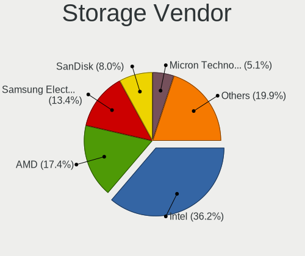
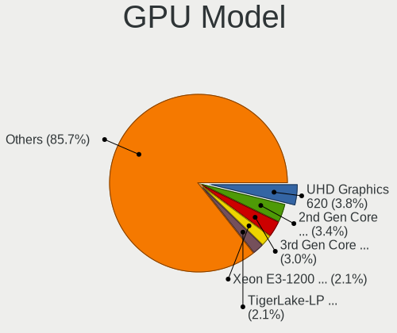
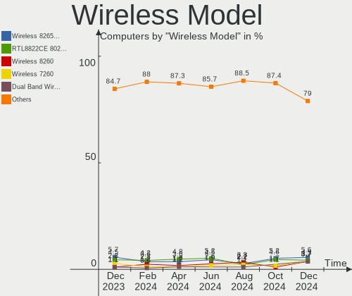
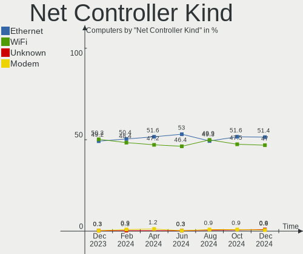
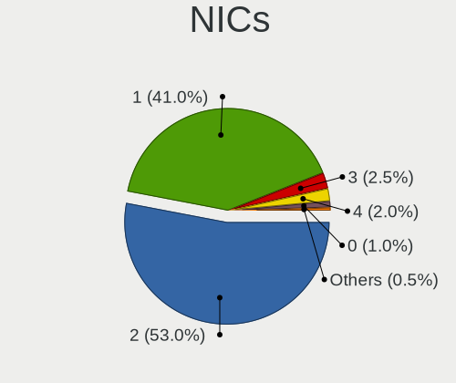
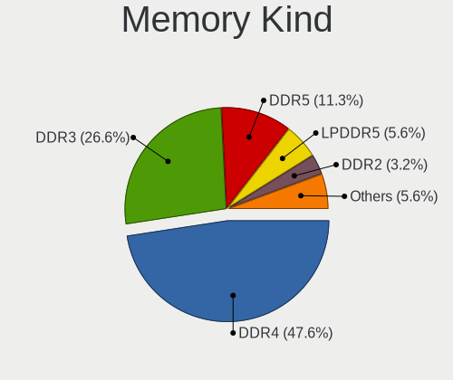
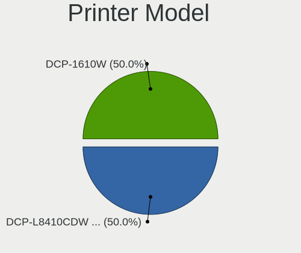

Linux in UK - Hardware Trends
-----------------------------

A project to identify most popular hardware characteristics and track their change
over time based on data collected by Linux users at https://Linux-Hardware.org.

Anyone can contribute to this report by the [hw-probe](https://github.com/linuxhw/hw-probe) tool:

    sudo -E hw-probe -all -upload

This is a report for all computer types. See also reports for [desktops](/Location/UK/Desktop/README.md) and [notebooks](/Location/UK/Notebook/README.md).

Period: Sep, 2022.

Contents
--------

* [ System ](#system)
  - [ OS                       ](#os)
  - [ OS Family                ](#os-family)
  - [ Kernel                   ](#kernel)
  - [ Kernel Family            ](#kernel-family)
  - [ Kernel Major Ver.        ](#kernel-major-ver)
  - [ Arch                     ](#arch)
  - [ DE                       ](#de)
  - [ Display Server           ](#display-server)
  - [ Display Manager          ](#display-manager)
  - [ OS Lang                  ](#os-lang)
  - [ Boot Mode                ](#boot-mode)
  - [ Filesystem               ](#filesystem)
  - [ Part. scheme             ](#part-scheme)
  - [ Dual Boot with Linux/BSD ](#dual-boot-with-linuxbsd)
  - [ Dual Boot (Win)          ](#dual-boot-win)

* [ Board ](#board)
  - [ Vendor                   ](#vendor)
  - [ Model                    ](#model)
  - [ Model Family             ](#model-family)
  - [ MFG Year                 ](#mfg-year)
  - [ Form Factor              ](#form-factor)
  - [ Secure Boot              ](#secure-boot)
  - [ Coreboot                 ](#coreboot)
  - [ RAM Size                 ](#ram-size)
  - [ RAM Used                 ](#ram-used)
  - [ Total Drives             ](#total-drives)
  - [ Has CD-ROM               ](#has-cd-rom)
  - [ Has Ethernet             ](#has-ethernet)
  - [ Has WiFi                 ](#has-wifi)
  - [ Has Bluetooth            ](#has-bluetooth)

* [ Location ](#location)
  - [ Country                  ](#country)
  - [ City                     ](#city)

* [ Drives ](#drives)
  - [ Drive Vendor             ](#drive-vendor)
  - [ Drive Model              ](#drive-model)
  - [ HDD Vendor               ](#hdd-vendor)
  - [ SSD Vendor               ](#ssd-vendor)
  - [ Drive Kind               ](#drive-kind)
  - [ Drive Connector          ](#drive-connector)
  - [ Drive Size               ](#drive-size)
  - [ Space Total              ](#space-total)
  - [ Space Used               ](#space-used)
  - [ Malfunc. Drives          ](#malfunc-drives)
  - [ Malfunc. Drive Vendor    ](#malfunc-drive-vendor)
  - [ Malfunc. HDD Vendor      ](#malfunc-hdd-vendor)
  - [ Malfunc. Drive Kind      ](#malfunc-drive-kind)
  - [ Failed Drives            ](#failed-drives)
  - [ Failed Drive Vendor      ](#failed-drive-vendor)
  - [ Drive Status             ](#drive-status)

* [ Storage controller ](#storage-controller)
  - [ Storage Vendor           ](#storage-vendor)
  - [ Storage Model            ](#storage-model)
  - [ Storage Kind             ](#storage-kind)

* [ Processor ](#processor)
  - [ CPU Vendor               ](#cpu-vendor)
  - [ CPU Model                ](#cpu-model)
  - [ CPU Model Family         ](#cpu-model-family)
  - [ CPU Cores                ](#cpu-cores)
  - [ CPU Sockets              ](#cpu-sockets)
  - [ CPU Threads              ](#cpu-threads)
  - [ CPU Op-Modes             ](#cpu-op-modes)
  - [ CPU Microcode            ](#cpu-microcode)
  - [ CPU Microarch            ](#cpu-microarch)

* [ Graphics ](#graphics)
  - [ GPU Vendor               ](#gpu-vendor)
  - [ GPU Model                ](#gpu-model)
  - [ GPU Combo                ](#gpu-combo)
  - [ GPU Driver               ](#gpu-driver)
  - [ GPU Memory               ](#gpu-memory)

* [ Monitor ](#monitor)
  - [ Monitor Vendor           ](#monitor-vendor)
  - [ Monitor Model            ](#monitor-model)
  - [ Monitor Resolution       ](#monitor-resolution)
  - [ Monitor Diagonal         ](#monitor-diagonal)
  - [ Monitor Width            ](#monitor-width)
  - [ Aspect Ratio             ](#aspect-ratio)
  - [ Monitor Area             ](#monitor-area)
  - [ Pixel Density            ](#pixel-density)
  - [ Multiple Monitors        ](#multiple-monitors)

* [ Network ](#network)
  - [ Net Controller Vendor    ](#net-controller-vendor)
  - [ Net Controller Model     ](#net-controller-model)
  - [ Wireless Vendor          ](#wireless-vendor)
  - [ Wireless Model           ](#wireless-model)
  - [ Ethernet Vendor          ](#ethernet-vendor)
  - [ Ethernet Model           ](#ethernet-model)
  - [ Net Controller Kind      ](#net-controller-kind)
  - [ Used Controller          ](#used-controller)
  - [ NICs                     ](#nics)
  - [ IPv6                     ](#ipv6)

* [ Bluetooth ](#bluetooth)
  - [ Bluetooth Vendor         ](#bluetooth-vendor)
  - [ Bluetooth Model          ](#bluetooth-model)

* [ Sound ](#sound)
  - [ Sound Vendor             ](#sound-vendor)
  - [ Sound Model              ](#sound-model)

* [ Memory ](#memory)
  - [ Memory Vendor            ](#memory-vendor)
  - [ Memory Model             ](#memory-model)
  - [ Memory Kind              ](#memory-kind)
  - [ Memory Form Factor       ](#memory-form-factor)
  - [ Memory Size              ](#memory-size)
  - [ Memory Speed             ](#memory-speed)

* [ Printers & scanners ](#printers--scanners)
  - [ Printer Vendor           ](#printer-vendor)
  - [ Printer Model            ](#printer-model)
  - [ Scanner Vendor           ](#scanner-vendor)
  - [ Scanner Model            ](#scanner-model)

* [ Camera ](#camera)
  - [ Camera Vendor            ](#camera-vendor)
  - [ Camera Model             ](#camera-model)

* [ Security ](#security)
  - [ Fingerprint Vendor       ](#fingerprint-vendor)
  - [ Fingerprint Model        ](#fingerprint-model)
  - [ Chipcard Vendor          ](#chipcard-vendor)
  - [ Chipcard Model           ](#chipcard-model)

* [ Unsupported ](#unsupported)
  - [ Unsupported Devices      ](#unsupported-devices)
  - [ Unsupported Device Types ](#unsupported-device-types)

System
------

OS
--

Installed operating systems

| Name                         | Computers | Percent |
|------------------------------|-----------|---------|
| Ubuntu 22.04                 | 39        | 21.31%  |
| Pop!_OS 22.04                | 14        | 7.65%   |
| Fedora 36                    | 14        | 7.65%   |
| OpenMandriva 4.3             | 9         | 4.92%   |
| Debian 11                    | 8         | 4.37%   |
| Arch Rolling                 | 8         | 4.37%   |
| SteamOS 3.3.1                | 7         | 3.83%   |
| Arch                         | 7         | 3.83%   |
| Zorin 16                     | 6         | 3.28%   |
| Ubuntu 20.04                 | 5         | 2.73%   |
| OpenMandriva 4.50            | 5         | 2.73%   |
| Linux Mint 21                | 5         | 2.73%   |
| Linux Mint 20.3              | 4         | 2.19%   |
| KDE neon 20.04               | 4         | 2.19%   |
| Xubuntu 22.04                | 2         | 1.09%   |
| Ubuntu Budgie 22.04          | 2         | 1.09%   |
| Ubuntu 18.04                 | 2         | 1.09%   |
| SteamOS 3.3                  | 2         | 1.09%   |
| Manjaro 22.0.0               | 2         | 1.09%   |
| Manjaro                      | 2         | 1.09%   |
| Lubuntu 22.04                | 2         | 1.09%   |
| Kubuntu 22.04                | 2         | 1.09%   |
| Kali 2022.3                  | 2         | 1.09%   |
| Fedora 38                    | 2         | 1.09%   |
| Fedora 37                    | 2         | 1.09%   |
| Elementary 6.1               | 2         | 1.09%   |
| ArcoLinux Rolling            | 2         | 1.09%   |
| Zorin 15                     | 1         | 0.55%   |
| Xubuntu 20.04                | 1         | 0.55%   |
| Xubuntu 18.04                | 1         | 0.55%   |
| Ubuntu 21.10                 | 1         | 0.55%   |
| Slackware 15.0               | 1         | 0.55%   |
| ROSA 12.2                    | 1         | 0.55%   |
| Puppy 8                      | 1         | 0.55%   |
| openSUSE Tumbleweed-XXXXXXXX | 1         | 0.55%   |
| OpenMandriva 4.90            | 1         | 0.55%   |
| OpenMandriva 4.2             | 1         | 0.55%   |
| Nobara 36                    | 1         | 0.55%   |
| Manjaro 21.3.7               | 1         | 0.55%   |
| Lubuntu 20.04                | 1         | 0.55%   |

OS Family
---------

OS without a version

| Name          | Computers | Percent |
|---------------|-----------|---------|
| Ubuntu        | 47        | 25.68%  |
| Fedora        | 18        | 9.84%   |
| OpenMandriva  | 16        | 8.74%   |
| Arch          | 15        | 8.2%    |
| Pop!_OS       | 14        | 7.65%   |
| Linux Mint    | 11        | 6.01%   |
| Debian        | 10        | 5.46%   |
| SteamOS       | 9         | 4.92%   |
| Zorin         | 7         | 3.83%   |
| Manjaro       | 5         | 2.73%   |
| Xubuntu       | 4         | 2.19%   |
| KDE neon      | 4         | 2.19%   |
| Lubuntu       | 3         | 1.64%   |
| Ubuntu Budgie | 2         | 1.09%   |
| Kubuntu       | 2         | 1.09%   |
| Kali          | 2         | 1.09%   |
| Elementary    | 2         | 1.09%   |
| ArcoLinux     | 2         | 1.09%   |
| Slackware     | 1         | 0.55%   |
| ROSA          | 1         | 0.55%   |
| Puppy         | 1         | 0.55%   |
| openSUSE      | 1         | 0.55%   |
| Nobara        | 1         | 0.55%   |
| Gentoo        | 1         | 0.55%   |
| EndeavourOS   | 1         | 0.55%   |
| CentOS        | 1         | 0.55%   |
| CachyOS       | 1         | 0.55%   |
| Baldylocks OS | 1         | 0.55%   |

Kernel
------

Version of the Linux kernel

| Version                                            | Computers | Percent |
|----------------------------------------------------|-----------|---------|
| 5.15.0-47-generic                                  | 26        | 14.21%  |
| 5.15.0-46-generic                                  | 18        | 9.84%   |
| 5.15.0-48-generic                                  | 17        | 9.29%   |
| 5.19.0-76051900-generic                            | 13        | 7.1%    |
| 5.16.7-desktop-1omv4003                            | 9         | 4.92%   |
| 5.13.0-valve21.1-1-neptune-02211-gc54cda5a36f3     | 7         | 3.83%   |
| 5.19.5-desktop-1omv4090                            | 5         | 2.73%   |
| 5.19.9-200.fc36.x86_64                             | 4         | 2.19%   |
| 5.10.0-17-amd64                                    | 4         | 2.19%   |
| 5.4.0-126-generic                                  | 3         | 1.64%   |
| 5.19.8-200.fc36.x86_64                             | 3         | 1.64%   |
| 5.19.6-arch1-1                                     | 3         | 1.64%   |
| 5.19.6-200.fc36.x86_64                             | 3         | 1.64%   |
| 5.10.0-18-amd64                                    | 3         | 1.64%   |
| 5.4.0-125-generic                                  | 2         | 1.09%   |
| 5.19.9-arch1-1                                     | 2         | 1.09%   |
| 5.19.11-200.fc36.x86_64                            | 2         | 1.09%   |
| 5.19.10-arch1-1                                    | 2         | 1.09%   |
| 5.15.60-1-MANJARO                                  | 2         | 1.09%   |
| 5.15.0-48-lowlatency                               | 2         | 1.09%   |
| 5.13.0-valve24-1-neptune-02226-g5b8545e4c5a1       | 2         | 1.09%   |
| 6.0.0-1-MANJARO                                    | 1         | 0.55%   |
| 6.0.0-0.rc6.41.fc38.x86_64                         | 1         | 0.55%   |
| 6.0.0-0.rc5.20220914git3245cb65fd91.39.fc38.x86_64 | 1         | 0.55%   |
| 5.4.0-128-generic                                  | 1         | 0.55%   |
| 5.4.0-124-generic                                  | 1         | 0.55%   |
| 5.4.0-122-generic                                  | 1         | 0.55%   |
| 5.4.0-110-generic                                  | 1         | 0.55%   |
| 5.4.0-105-generic                                  | 1         | 0.55%   |
| 5.19.9-201.fsync.fc36.x86_64                       | 1         | 0.55%   |
| 5.19.9-051909-generic                              | 1         | 0.55%   |
| 5.19.7-zen2-1-zen                                  | 1         | 0.55%   |
| 5.19.7-arch1-1                                     | 1         | 0.55%   |
| 5.19.7-1.surface.fc36.x86_64                       | 1         | 0.55%   |
| 5.19.5-arch1-1                                     | 1         | 0.55%   |
| 5.19.5-051905-generic                              | 1         | 0.55%   |
| 5.19.4-arch1-g14-1                                 | 1         | 0.55%   |
| 5.19.4-arch1-1                                     | 1         | 0.55%   |
| 5.19.2-1-default                                   | 1         | 0.55%   |
| 5.19.12-arch1-1                                    | 1         | 0.55%   |

Kernel Family
-------------

Linux kernel without a distro release

| Version | Computers | Percent |
|---------|-----------|---------|
| 5.15.0  | 66        | 36.07%  |
| 5.19.0  | 13        | 7.1%    |
| 5.13.0  | 11        | 6.01%   |
| 5.4.0   | 10        | 5.46%   |
| 5.16.7  | 9         | 4.92%   |
| 5.19.9  | 8         | 4.37%   |
| 5.10.0  | 8         | 4.37%   |
| 5.19.5  | 7         | 3.83%   |
| 5.19.6  | 6         | 3.28%   |
| 5.19.10 | 6         | 3.28%   |
| 5.19.11 | 4         | 2.19%   |
| 5.18.0  | 4         | 2.19%   |
| 6.0.0   | 3         | 1.64%   |
| 5.19.8  | 3         | 1.64%   |
| 5.19.7  | 3         | 1.64%   |
| 5.19.4  | 2         | 1.09%   |
| 5.15.60 | 2         | 1.09%   |
| 5.19.2  | 1         | 0.55%   |
| 5.19.12 | 1         | 0.55%   |
| 5.18.12 | 1         | 0.55%   |
| 5.18.10 | 1         | 0.55%   |
| 5.17.5  | 1         | 0.55%   |
| 5.15.71 | 1         | 0.55%   |
| 5.15.68 | 1         | 0.55%   |
| 5.15.65 | 1         | 0.55%   |
| 5.15.63 | 1         | 0.55%   |
| 5.15.59 | 1         | 0.55%   |
| 5.15.43 | 1         | 0.55%   |
| 5.14.12 | 1         | 0.55%   |
| 5.13.11 | 1         | 0.55%   |
| 5.11.0  | 1         | 0.55%   |
| 5.10.14 | 1         | 0.55%   |
| 4.19.23 | 1         | 0.55%   |
| 4.15.0  | 1         | 0.55%   |
| 3.10.0  | 1         | 0.55%   |

Kernel Major Ver.
-----------------

Linux kernel major version

| Version | Computers | Percent |
|---------|-----------|---------|
| 5.15    | 74        | 40.44%  |
| 5.19    | 54        | 29.51%  |
| 5.13    | 12        | 6.56%   |
| 5.4     | 10        | 5.46%   |
| 5.16    | 9         | 4.92%   |
| 5.10    | 9         | 4.92%   |
| 5.18    | 6         | 3.28%   |
| 6.0     | 3         | 1.64%   |
| 5.17    | 1         | 0.55%   |
| 5.14    | 1         | 0.55%   |
| 5.11    | 1         | 0.55%   |
| 4.19    | 1         | 0.55%   |
| 4.15    | 1         | 0.55%   |
| 3.10    | 1         | 0.55%   |

Arch
----

OS architecture (x86_64, i586, etc.)

| Name   | Computers | Percent |
|--------|-----------|---------|
| x86_64 | 183       | 100%    |

DE
--

Desktop Environment

| Name       | Computers | Percent |
|------------|-----------|---------|
| GNOME      | 96        | 52.46%  |
| KDE5       | 44        | 24.04%  |
| XFCE       | 13        | 7.1%    |
| X-Cinnamon | 10        | 5.46%   |
| Unknown    | 5         | 2.73%   |
| Cinnamon   | 4         | 2.19%   |
| LXQt       | 3         | 1.64%   |
| Pantheon   | 2         | 1.09%   |
| MATE       | 2         | 1.09%   |
| Budgie     | 2         | 1.09%   |
| sway       | 1         | 0.55%   |
| KDE4       | 1         | 0.55%   |

Display Server
--------------

X11 or Wayland

| Name    | Computers | Percent |
|---------|-----------|---------|
| X11     | 121       | 66.12%  |
| Wayland | 57        | 31.15%  |
| Tty     | 4         | 2.19%   |
| Unknown | 1         | 0.55%   |

Display Manager
---------------

SDDM, LightDM, etc.

| Name    | Computers | Percent |
|---------|-----------|---------|
| Unknown | 60        | 32.79%  |
| GDM3    | 47        | 25.68%  |
| SDDM    | 37        | 20.22%  |
| LightDM | 23        | 12.57%  |
| GDM     | 13        | 7.1%    |
| XINIT   | 1         | 0.55%   |
| KDM     | 1         | 0.55%   |
| CDM     | 1         | 0.55%   |

OS Lang
-------

Language

| Lang    | Computers | Percent |
|---------|-----------|---------|
| en_GB   | 140       | 76.5%   |
| en_US   | 36        | 19.67%  |
| Unknown | 2         | 1.09%   |
| hu_HU   | 1         | 0.55%   |
| en_IN   | 1         | 0.55%   |
| en_IE   | 1         | 0.55%   |
| en_AU   | 1         | 0.55%   |
| en_AG   | 1         | 0.55%   |

Boot Mode
---------

EFI or BIOS

| Mode | Computers | Percent |
|------|-----------|---------|
| EFI  | 92        | 50.27%  |
| BIOS | 91        | 49.73%  |

Filesystem
----------

Type of filesystem

| Type    | Computers | Percent |
|---------|-----------|---------|
| Ext4    | 134       | 73.22%  |
| Btrfs   | 33        | 18.03%  |
| Overlay | 12        | 6.56%   |
| Xfs     | 2         | 1.09%   |
| Zfs     | 1         | 0.55%   |
| F2fs    | 1         | 0.55%   |

Part. scheme
------------

Scheme of partitioning

| Type    | Computers | Percent |
|---------|-----------|---------|
| Unknown | 97        | 53.01%  |
| GPT     | 73        | 39.89%  |
| MBR     | 13        | 7.1%    |

Dual Boot with Linux/BSD
------------------------

Hosting more than one Linux/BSD

| Dual boot | Computers | Percent |
|-----------|-----------|---------|
| No        | 157       | 85.79%  |
| Yes       | 26        | 14.21%  |

Dual Boot (Win)
---------------

Hosting Linux and Windows

| Dual boot | Computers | Percent |
|-----------|-----------|---------|
| No        | 133       | 72.68%  |
| Yes       | 50        | 27.32%  |

Board
-----

Vendor
------

Motherboard manufacturer

| Name                | Computers | Percent |
|---------------------|-----------|---------|
| Dell                | 33        | 18.03%  |
| Lenovo              | 31        | 16.94%  |
| ASUSTek Computer    | 23        | 12.57%  |
| Hewlett-Packard     | 22        | 12.02%  |
| Gigabyte Technology | 13        | 7.1%    |
| MSI                 | 10        | 5.46%   |
| Acer                | 9         | 4.92%   |
| Valve               | 7         | 3.83%   |
| Apple               | 5         | 2.73%   |
| ASRock              | 3         | 1.64%   |
| Toshiba             | 2         | 1.09%   |
| Intel               | 2         | 1.09%   |
| HUAWEI              | 2         | 1.09%   |
| TUXEDO              | 1         | 0.55%   |
| Timi                | 1         | 0.55%   |
| Teclast             | 1         | 0.55%   |
| Tactus              | 1         | 0.55%   |
| Supermicro          | 1         | 0.55%   |
| Star Labs           | 1         | 0.55%   |
| Samsung Electronics | 1         | 0.55%   |
| Razer               | 1         | 0.55%   |
| Panasonic           | 1         | 0.55%   |
| Packard Bell        | 1         | 0.55%   |
| Microsoft           | 1         | 0.55%   |
| Medion              | 1         | 0.55%   |
| Jumper              | 1         | 0.55%   |
| iOTA                | 1         | 0.55%   |
| HONOR               | 1         | 0.55%   |
| Framework           | 1         | 0.55%   |
| Fanless Mini PC     | 1         | 0.55%   |
| Entroware           | 1         | 0.55%   |
| Clevo               | 1         | 0.55%   |
| Acidanthera         | 1         | 0.55%   |
| Unknown             | 1         | 0.55%   |

Model
-----

Motherboard model

| Name                                               | Computers | Percent |
|----------------------------------------------------|-----------|---------|
| Valve Jupiter                                      | 7         | 3.83%   |
| ASUS PRIME A320M-K                                 | 3         | 1.64%   |
| Lenovo E50-80 80J2                                 | 2         | 1.09%   |
| HP ProLiant MicroServer                            | 2         | 1.09%   |
| Gigabyte B450 I AORUS PRO WIFI                     | 2         | 1.09%   |
| Dell XPS 15 9510                                   | 2         | 1.09%   |
| Dell OptiPlex 780                                  | 2         | 1.09%   |
| Dell OptiPlex 7010                                 | 2         | 1.09%   |
| ASUS ROG CROSSHAIR VIII HERO                       | 2         | 1.09%   |
| Apple Macmini3,1                                   | 2         | 1.09%   |
| TUXEDO InfinityBook Pro 14 v4                      | 1         | 0.55%   |
| Toshiba Satellite NB10t-A-101                      | 1         | 0.55%   |
| Toshiba Satellite A660                             | 1         | 0.55%   |
| Timi RedmiBook Pro 15S                             | 1         | 0.55%   |
| Teclast X4                                         | 1         | 0.55%   |
| Tactus GeoBook 110                                 | 1         | 0.55%   |
| Supermicro X10SRA-F                                | 1         | 0.55%   |
| Star Labs Lite                                     | 1         | 0.55%   |
| Samsung 950XCJ/951XCJ/950XCR                       | 1         | 0.55%   |
| Razer Blade 15 Base Model (Early 2021) - RZ09-0369 | 1         | 0.55%   |
| Panasonic CF-53JAWZYDE                             | 1         | 0.55%   |
| Packard Bell EasyNote TS44HR                       | 1         | 0.55%   |
| MSI MS-7C96                                        | 1         | 0.55%   |
| MSI MS-7C02                                        | 1         | 0.55%   |
| MSI MS-7B48                                        | 1         | 0.55%   |
| MSI MS-7B09                                        | 1         | 0.55%   |
| MSI MS-7996                                        | 1         | 0.55%   |
| MSI MS-7885                                        | 1         | 0.55%   |
| MSI MS-7817                                        | 1         | 0.55%   |
| MSI MS-7721                                        | 1         | 0.55%   |
| MSI GT72S 6QE                                      | 1         | 0.55%   |
| MSI GL73 8RD                                       | 1         | 0.55%   |
| Microsoft Surface Pro 4                            | 1         | 0.55%   |
| Medion MS-7713                                     | 1         | 0.55%   |
| Lenovo Z70-80 80FG                                 | 1         | 0.55%   |
| Lenovo Yoga 3 14 80JH                              | 1         | 0.55%   |
| Lenovo ThinkPad T530 2429F33                       | 1         | 0.55%   |
| Lenovo ThinkPad T470s 20HGA039UK                   | 1         | 0.55%   |
| Lenovo ThinkPad T440s 20ARA0YL00                   | 1         | 0.55%   |
| Lenovo ThinkPad T440p 20AWS12002                   | 1         | 0.55%   |

Model Family
------------

Motherboard model prefix

| Name                   | Computers | Percent |
|------------------------|-----------|---------|
| Lenovo ThinkPad        | 9         | 4.92%   |
| Dell Inspiron          | 9         | 4.92%   |
| Valve Jupiter          | 7         | 3.83%   |
| Dell OptiPlex          | 7         | 3.83%   |
| Acer Aspire            | 7         | 3.83%   |
| Dell Latitude          | 6         | 3.28%   |
| ASUS ROG               | 6         | 3.28%   |
| ASUS PRIME             | 6         | 3.28%   |
| Lenovo IdeaPad         | 5         | 2.73%   |
| Dell XPS               | 5         | 2.73%   |
| Lenovo ThinkCentre     | 4         | 2.19%   |
| Lenovo ThinkBook       | 4         | 2.19%   |
| HP EliteBook           | 3         | 1.64%   |
| HP Compaq              | 3         | 1.64%   |
| ASUS TUF               | 3         | 1.64%   |
| Toshiba Satellite      | 2         | 1.09%   |
| Lenovo Legion          | 2         | 1.09%   |
| Lenovo E50-80          | 2         | 1.09%   |
| HP ProLiant            | 2         | 1.09%   |
| HP ProBook             | 2         | 1.09%   |
| HP Pavilion            | 2         | 1.09%   |
| HP Laptop              | 2         | 1.09%   |
| HP ENVY                | 2         | 1.09%   |
| HP EliteDesk           | 2         | 1.09%   |
| Gigabyte GA-78LMT-USB3 | 2         | 1.09%   |
| Gigabyte B450          | 2         | 1.09%   |
| Dell Vostro            | 2         | 1.09%   |
| Dell Precision         | 2         | 1.09%   |
| Apple Macmini3         | 2         | 1.09%   |
| Acer Swift             | 2         | 1.09%   |
| TUXEDO InfinityBook    | 1         | 0.55%   |
| Timi RedmiBook         | 1         | 0.55%   |
| Teclast X4             | 1         | 0.55%   |
| Tactus GeoBook         | 1         | 0.55%   |
| Supermicro X10SRA-F    | 1         | 0.55%   |
| Star Labs Lite         | 1         | 0.55%   |
| Samsung 950XCJ         | 1         | 0.55%   |
| Razer Blade            | 1         | 0.55%   |
| Panasonic CF-53JAWZYDE | 1         | 0.55%   |
| Packard Bell EasyNote  | 1         | 0.55%   |

MFG Year
--------

Motherboard manufacture year

| Year | Computers | Percent |
|------|-----------|---------|
| 2022 | 22        | 12.02%  |
| 2021 | 18        | 9.84%   |
| 2020 | 17        | 9.29%   |
| 2018 | 17        | 9.29%   |
| 2017 | 16        | 8.74%   |
| 2014 | 14        | 7.65%   |
| 2019 | 13        | 7.1%    |
| 2015 | 12        | 6.56%   |
| 2013 | 11        | 6.01%   |
| 2012 | 9         | 4.92%   |
| 2011 | 7         | 3.83%   |
| 2008 | 7         | 3.83%   |
| 2016 | 6         | 3.28%   |
| 2010 | 6         | 3.28%   |
| 2009 | 5         | 2.73%   |
| 2007 | 3         | 1.64%   |

Form Factor
-----------

Physical design of the computer

| Name        | Computers | Percent |
|-------------|-----------|---------|
| Notebook    | 101       | 55.19%  |
| Desktop     | 65        | 35.52%  |
| Convertible | 6         | 3.28%   |
| Mini pc     | 5         | 2.73%   |
| Tablet      | 3         | 1.64%   |
| All in one  | 2         | 1.09%   |
| Server      | 1         | 0.55%   |

Secure Boot
-----------

Enabled or disabled

| State    | Computers | Percent |
|----------|-----------|---------|
| Disabled | 167       | 91.26%  |
| Enabled  | 16        | 8.74%   |

Coreboot
--------

Have coreboot on board

| Used | Computers | Percent |
|------|-----------|---------|
| No   | 183       | 100%    |

RAM Size
--------

Total RAM memory

| Size in GB  | Computers | Percent |
|-------------|-----------|---------|
| 4.01-8.0    | 47        | 25.68%  |
| 16.01-24.0  | 42        | 22.95%  |
| 8.01-16.0   | 40        | 21.86%  |
| 32.01-64.0  | 26        | 14.21%  |
| 3.01-4.0    | 17        | 9.29%   |
| 64.01-256.0 | 4         | 2.19%   |
| 24.01-32.0  | 3         | 1.64%   |
| 1.01-2.0    | 3         | 1.64%   |
| 2.01-3.0    | 1         | 0.55%   |

RAM Used
--------

Used RAM memory

| Used GB    | Computers | Percent |
|------------|-----------|---------|
| 2.01-3.0   | 60        | 32.79%  |
| 1.01-2.0   | 54        | 29.51%  |
| 4.01-8.0   | 27        | 14.75%  |
| 3.01-4.0   | 25        | 13.66%  |
| 8.01-16.0  | 10        | 5.46%   |
| 0.51-1.0   | 4         | 2.19%   |
| 16.01-24.0 | 2         | 1.09%   |
| 0.01-0.5   | 1         | 0.55%   |

Total Drives
------------

Number of drives on board

| Drives | Computers | Percent |
|--------|-----------|---------|
| 1      | 106       | 57.92%  |
| 2      | 47        | 25.68%  |
| 3      | 14        | 7.65%   |
| 4      | 6         | 3.28%   |
| 6      | 5         | 2.73%   |
| 5      | 3         | 1.64%   |
| 8      | 1         | 0.55%   |
| 7      | 1         | 0.55%   |

Has CD-ROM
----------

Has CD-ROM on board

| Presented | Computers | Percent |
|-----------|-----------|---------|
| No        | 122       | 66.67%  |
| Yes       | 61        | 33.33%  |

Has Ethernet
------------

Has Ethernet on board

| Presented | Computers | Percent |
|-----------|-----------|---------|
| Yes       | 142       | 77.6%   |
| No        | 41        | 22.4%   |

Has WiFi
--------

Has WiFi module

| Presented | Computers | Percent |
|-----------|-----------|---------|
| Yes       | 153       | 83.61%  |
| No        | 30        | 16.39%  |

Has Bluetooth
-------------

Has Bluetooth module

| Presented | Computers | Percent |
|-----------|-----------|---------|
| Yes       | 128       | 69.95%  |
| No        | 55        | 30.05%  |

Location
--------

Country
-------

Geographic location (country)

| Country | Computers | Percent |
|---------|-----------|---------|
| UK      | 183       | 100%    |

City
----

Geographic location (city)

| City                | Computers | Percent |
|---------------------|-----------|---------|
| London              | 12        | 6.56%   |
| Bristol             | 5         | 2.73%   |
| Islington           | 4         | 2.19%   |
| Falkirk             | 4         | 2.19%   |
| Bradford            | 4         | 2.19%   |
| York                | 3         | 1.64%   |
| Wembley             | 3         | 1.64%   |
| Rotherham           | 3         | 1.64%   |
| Manchester          | 3         | 1.64%   |
| Liverpool           | 3         | 1.64%   |
| Flint               | 3         | 1.64%   |
| Croydon             | 3         | 1.64%   |
| Cambridge           | 3         | 1.64%   |
| Twickenham          | 2         | 1.09%   |
| Tamworth            | 2         | 1.09%   |
| Shaftesbury         | 2         | 1.09%   |
| Ruislip             | 2         | 1.09%   |
| Newcastle upon Tyne | 2         | 1.09%   |
| Leeds               | 2         | 1.09%   |
| Kirkcaldy           | 2         | 1.09%   |
| Halstead            | 2         | 1.09%   |
| Glasgow             | 2         | 1.09%   |
| Farnborough         | 2         | 1.09%   |
| Darlington          | 2         | 1.09%   |
| Chelsea             | 2         | 1.09%   |
| Camden              | 2         | 1.09%   |
| Burton-on-Trent     | 2         | 1.09%   |
| Boston              | 2         | 1.09%   |
| Birmingham          | 2         | 1.09%   |
| Birkenhead          | 2         | 1.09%   |
| Ashford             | 2         | 1.09%   |
| Yeovil              | 1         | 0.55%   |
| Worcester Park      | 1         | 0.55%   |
| Wirral              | 1         | 0.55%   |
| Wimbledon           | 1         | 0.55%   |
| West Cowes          | 1         | 0.55%   |
| Weaverham           | 1         | 0.55%   |
| Warwick             | 1         | 0.55%   |
| Warrington          | 1         | 0.55%   |
| Walthamstow         | 1         | 0.55%   |

Drives
------

Drive Vendor
------------

Hard drive vendors

| Vendor                       | Computers | Drives | Percent |
|------------------------------|-----------|--------|---------|
| Samsung Electronics          | 41        | 51     | 14.8%   |
| Seagate                      | 38        | 55     | 13.72%  |
| WDC                          | 37        | 46     | 13.36%  |
| Sandisk                      | 20        | 27     | 7.22%   |
| Toshiba                      | 18        | 20     | 6.5%    |
| Crucial                      | 13        | 17     | 4.69%   |
| Unknown                      | 9         | 9      | 3.25%   |
| Kingston                     | 9         | 9      | 3.25%   |
| Micron Technology            | 7         | 7      | 2.53%   |
| Intel                        | 7         | 7      | 2.53%   |
| Phison                       | 6         | 6      | 2.17%   |
| SK hynix                     | 5         | 5      | 1.81%   |
| A-DATA Technology            | 5         | 6      | 1.81%   |
| Silicon Motion               | 4         | 4      | 1.44%   |
| PNY                          | 4         | 4      | 1.44%   |
| KIOXIA                       | 4         | 4      | 1.44%   |
| Hitachi                      | 4         | 4      | 1.44%   |
| HGST                         | 4         | 5      | 1.44%   |
| Teclast                      | 3         | 3      | 1.08%   |
| Integral                     | 3         | 3      | 1.08%   |
| Phison Electronics           | 2         | 2      | 0.72%   |
| O2 Micro                     | 2         | 2      | 0.72%   |
| Kingston Technology Company  | 2         | 2      | 0.72%   |
| ASMT                         | 2         | 2      | 0.72%   |
| ASENNO                       | 2         | 2      | 0.72%   |
| Unknown                      | 2         | 2      | 0.72%   |
| Transcend                    | 1         | 1      | 0.36%   |
| Team                         | 1         | 1      | 0.36%   |
| TCSUNBOW                     | 1         | 1      | 0.36%   |
| Star                         | 1         | 1      | 0.36%   |
| SSSTC                        | 1         | 1      | 0.36%   |
| SPCC                         | 1         | 1      | 0.36%   |
| Shenzhen Longsys Electronics | 1         | 1      | 0.36%   |
| SABRENT                      | 1         | 1      | 0.36%   |
| Realtek                      | 1         | 1      | 0.36%   |
| Pioneer                      | 1         | 1      | 0.36%   |
| NGFF                         | 1         | 1      | 0.36%   |
| Netac                        | 1         | 1      | 0.36%   |
| Micron/Crucial Technology    | 1         | 1      | 0.36%   |
| Maxtor                       | 1         | 1      | 0.36%   |

Drive Model
-----------

Hard drive models

| Model                                               | Computers | Percent |
|-----------------------------------------------------|-----------|---------|
| WDC WDS500G2B0A-00SM50 500GB SSD                    | 3         | 0.97%   |
| Unknown MMC Card  512GB                             | 3         | 0.97%   |
| Toshiba HDWD130 3TB                                 | 3         | 0.97%   |
| Seagate ST2000LM003 HN-M201RAD 2TB                  | 3         | 0.97%   |
| Seagate ST1000LM048-2E7172 1TB                      | 3         | 0.97%   |
| Seagate ST1000LM024 HN-M101MBB 1TB                  | 3         | 0.97%   |
| SanDisk NVMe SSD Drive 500GB                        | 3         | 0.97%   |
| Samsung NVMe SSD Controller SM981/PM981/PM983 256GB | 3         | 0.97%   |
| Phison NVMe SSD Drive 512GB                         | 3         | 0.97%   |
| Kingston SA400S37240G 240GB SSD                     | 3         | 0.97%   |
| Crucial CT1000MX500SSD1 1TB                         | 3         | 0.97%   |
| WDC WDS100T2B0A-00SM50 1TB SSD                      | 2         | 0.65%   |
| WDC WD10JPCX-24UE4T0 1TB                            | 2         | 0.65%   |
| WDC WD10EZEX-08WN4A0 1TB                            | 2         | 0.65%   |
| WDC WD10EARS-00Y5B1 1TB                             | 2         | 0.65%   |
| Unknown MMC Card  64GB                              | 2         | 0.65%   |
| Toshiba MK3263GSX 320GB                             | 2         | 0.65%   |
| Toshiba DT01ACA200 2TB                              | 2         | 0.65%   |
| Toshiba DT01ACA100 1TB                              | 2         | 0.65%   |
| Teclast 60GB S500 SSD                               | 2         | 0.65%   |
| Seagate ST4000DM004-2CV104 4TB                      | 2         | 0.65%   |
| Seagate ST2000DM008-2FR102 2TB                      | 2         | 0.65%   |
| Seagate ST1000DM010-2EP102 1TB                      | 2         | 0.65%   |
| Sandisk WD Blue SN570 1TB                           | 2         | 0.65%   |
| Sandisk WD Blue SN500 / PC SN520 NVMe SSD 256GB     | 2         | 0.65%   |
| Samsung SSD 980 PRO 1TB                             | 2         | 0.65%   |
| Samsung SSD 860 EVO 1TB                             | 2         | 0.65%   |
| Samsung SSD 840 PRO Series 256GB                    | 2         | 0.65%   |
| Samsung SSD 840 PRO Series 128GB                    | 2         | 0.65%   |
| Samsung NVMe SSD Drive 256GB                        | 2         | 0.65%   |
| Samsung MZALQ256HAJD-000L2 256GB                    | 2         | 0.65%   |
| PNY CS900 240GB SSD                                 | 2         | 0.65%   |
| O2 Micro E2M2 64GB                                  | 2         | 0.65%   |
| Kingston Company OM3PDP3 NVMe SSD 512GB             | 2         | 0.65%   |
| Crucial CT512MX100SSD1 512GB                        | 2         | 0.65%   |
| Crucial CT1000BX500SSD1 1TB                         | 2         | 0.65%   |
| A-DATA SU630 240GB SSD                              | 2         | 0.65%   |
| Unknown                                             | 2         | 0.65%   |
| WDC WDS500G2B0B-00YS70 500GB SSD                    | 1         | 0.32%   |
| WDC WDS500G2B0A 500GB SSD                           | 1         | 0.32%   |

HDD Vendor
----------

Hard disk drive vendors

| Vendor              | Computers | Drives | Percent |
|---------------------|-----------|--------|---------|
| Seagate             | 36        | 50     | 37.89%  |
| WDC                 | 27        | 33     | 28.42%  |
| Toshiba             | 13        | 15     | 13.68%  |
| Samsung Electronics | 4         | 6      | 4.21%   |
| Hitachi             | 4         | 4      | 4.21%   |
| HGST                | 4         | 5      | 4.21%   |
| ASMT                | 2         | 2      | 2.11%   |
| Maxtor              | 1         | 1      | 1.05%   |
| HPE                 | 1         | 1      | 1.05%   |
| Hewlett-Packard     | 1         | 2      | 1.05%   |
| Fujitsu             | 1         | 1      | 1.05%   |
| ASMedia             | 1         | 1      | 1.05%   |

SSD Vendor
----------

Solid state drive vendors

| Vendor              | Computers | Drives | Percent |
|---------------------|-----------|--------|---------|
| Samsung Electronics | 13        | 17     | 15.66%  |
| Crucial             | 12        | 16     | 14.46%  |
| WDC                 | 9         | 10     | 10.84%  |
| Kingston            | 9         | 9      | 10.84%  |
| SanDisk             | 8         | 10     | 9.64%   |
| PNY                 | 4         | 4      | 4.82%   |
| Teclast             | 3         | 3      | 3.61%   |
| Integral            | 3         | 3      | 3.61%   |
| A-DATA Technology   | 3         | 3      | 3.61%   |
| Toshiba             | 2         | 2      | 2.41%   |
| ASENNO              | 2         | 2      | 2.41%   |
| Unknown             | 1         | 1      | 1.2%    |
| Transcend           | 1         | 1      | 1.2%    |
| TCSUNBOW            | 1         | 1      | 1.2%    |
| Star                | 1         | 1      | 1.2%    |
| SPCC                | 1         | 1      | 1.2%    |
| SK hynix            | 1         | 1      | 1.2%    |
| Pioneer             | 1         | 1      | 1.2%    |
| NGFF                | 1         | 1      | 1.2%    |
| Micron Technology   | 1         | 1      | 1.2%    |
| LITEON              | 1         | 1      | 1.2%    |
| Intel               | 1         | 1      | 1.2%    |
| HPE                 | 1         | 1      | 1.2%    |
| GOODRAM             | 1         | 1      | 1.2%    |
| Corsair             | 1         | 1      | 1.2%    |
| China               | 1         | 1      | 1.2%    |

Drive Kind
----------

HDD or SSD

| Kind    | Computers | Drives | Percent |
|---------|-----------|--------|---------|
| NVMe    | 82        | 99     | 32.8%   |
| HDD     | 78        | 121    | 31.2%   |
| SSD     | 74        | 94     | 29.6%   |
| MMC     | 12        | 12     | 4.8%    |
| Unknown | 4         | 4      | 1.6%    |

Drive Connector
---------------

SATA, SAS, NVMe, etc.

| Type | Computers | Drives | Percent |
|------|-----------|--------|---------|
| SATA | 124       | 211    | 54.63%  |
| NVMe | 81        | 97     | 35.68%  |
| MMC  | 12        | 12     | 5.29%   |
| SAS  | 10        | 10     | 4.41%   |

Drive Size
----------

Size of hard drive

| Size in TB | Computers | Drives | Percent |
|------------|-----------|--------|---------|
| 0.01-0.5   | 85        | 104    | 51.83%  |
| 0.51-1.0   | 49        | 64     | 29.88%  |
| 1.01-2.0   | 14        | 18     | 8.54%   |
| 2.01-3.0   | 6         | 6      | 3.66%   |
| 3.01-4.0   | 4         | 10     | 2.44%   |
| 4.01-10.0  | 4         | 8      | 2.44%   |
| 10.01-20.0 | 2         | 5      | 1.22%   |

Space Total
-----------

Amount of disk space available on the file system

| Size in GB     | Computers | Percent |
|----------------|-----------|---------|
| 101-250        | 43        | 23.5%   |
| 251-500        | 37        | 20.22%  |
| 501-1000       | 34        | 18.58%  |
| 1001-2000      | 18        | 9.84%   |
| More than 3000 | 10        | 5.46%   |
| 21-50          | 10        | 5.46%   |
| 2001-3000      | 8         | 4.37%   |
| 1-20           | 8         | 4.37%   |
| Unknown        | 8         | 4.37%   |
| 51-100         | 7         | 3.83%   |

Space Used
----------

Amount of used disk space

| Used GB        | Computers | Percent |
|----------------|-----------|---------|
| 1-20           | 60        | 32.79%  |
| 21-50          | 35        | 19.13%  |
| 101-250        | 32        | 17.49%  |
| 51-100         | 16        | 8.74%   |
| 251-500        | 11        | 6.01%   |
| 1001-2000      | 8         | 4.37%   |
| Unknown        | 8         | 4.37%   |
| 501-1000       | 7         | 3.83%   |
| More than 3000 | 3         | 1.64%   |
| 2001-3000      | 3         | 1.64%   |

Malfunc. Drives
---------------

Drive models with a malfunction

| Model                                          | Computers | Drives | Percent |
|------------------------------------------------|-----------|--------|---------|
| WDC WDS480G2G0A-00JH30 480GB SSD               | 1         | 1      | 7.69%   |
| WDC WD3200AAJS-08L7A0 320GB                    | 1         | 1      | 7.69%   |
| WDC WD1002FAEX-00Y9A0 1TB                      | 1         | 1      | 7.69%   |
| SK hynix HFS256G39TND-N210A 256GB SSD          | 1         | 1      | 7.69%   |
| Seagate ST9500325AS 500GB                      | 1         | 1      | 7.69%   |
| Seagate ST2000LM003 HN-M201RAD 2TB             | 1         | 1      | 7.69%   |
| Seagate ST1000LM035-1RK172 1TB                 | 1         | 1      | 7.69%   |
| Seagate ST1000LM024 HN-M101MBB 1TB             | 1         | 1      | 7.69%   |
| Samsung Electronics HD103UJ 1TB                | 1         | 1      | 7.69%   |
| Micron Technology 1100_MTFDDAV256TBN 256GB SSD | 1         | 1      | 7.69%   |
| Hitachi HUA723030ALA640 3TB                    | 1         | 1      | 7.69%   |
| Hitachi HTS54505 500GB                         | 1         | 1      | 7.69%   |
| HGST HTS725050A7E630 500GB                     | 1         | 2      | 7.69%   |

Malfunc. Drive Vendor
---------------------

Vendors of faulty drives

| Vendor              | Computers | Drives | Percent |
|---------------------|-----------|--------|---------|
| Seagate             | 4         | 4      | 30.77%  |
| WDC                 | 3         | 3      | 23.08%  |
| Hitachi             | 2         | 2      | 15.38%  |
| SK hynix            | 1         | 1      | 7.69%   |
| Samsung Electronics | 1         | 1      | 7.69%   |
| Micron Technology   | 1         | 1      | 7.69%   |
| HGST                | 1         | 2      | 7.69%   |

Malfunc. HDD Vendor
-------------------

Vendors of faulty HDD drives

| Vendor              | Computers | Drives | Percent |
|---------------------|-----------|--------|---------|
| Seagate             | 4         | 4      | 40%     |
| WDC                 | 2         | 2      | 20%     |
| Hitachi             | 2         | 2      | 20%     |
| Samsung Electronics | 1         | 1      | 10%     |
| HGST                | 1         | 2      | 10%     |

Malfunc. Drive Kind
-------------------

Kinds of faulty drives

| Kind | Computers | Drives | Percent |
|------|-----------|--------|---------|
| HDD  | 8         | 11     | 72.73%  |
| SSD  | 3         | 3      | 27.27%  |

Failed Drives
-------------

Failed drive models

Zero info for selected period =(

Failed Drive Vendor
-------------------

Failed drive vendors

Zero info for selected period =(

Drive Status
------------

Number of failed and malfunc. drives

| Status   | Computers | Drives | Percent |
|----------|-----------|--------|---------|
| Detected | 105       | 168    | 54.12%  |
| Works    | 78        | 148    | 40.21%  |
| Malfunc  | 11        | 14     | 5.67%   |

Storage controller
------------------

Storage Vendor
--------------

Storage controller vendors

| Vendor                         | Computers | Percent |
|--------------------------------|-----------|---------|
| Intel                          | 107       | 43.32%  |
| AMD                            | 43        | 17.41%  |
| Samsung Electronics            | 25        | 10.12%  |
| SanDisk                        | 15        | 6.07%   |
| Phison Electronics             | 8         | 3.24%   |
| Nvidia                         | 6         | 2.43%   |
| Micron Technology              | 6         | 2.43%   |
| Silicon Motion                 | 5         | 2.02%   |
| Toshiba America Info Systems   | 4         | 1.62%   |
| SK hynix                       | 4         | 1.62%   |
| Seagate Technology             | 3         | 1.21%   |
| KIOXIA                         | 3         | 1.21%   |
| ASMedia Technology             | 3         | 1.21%   |
| Solid State Storage Technology | 2         | 0.81%   |
| O2 Micro                       | 2         | 0.81%   |
| Micron/Crucial Technology      | 2         | 0.81%   |
| Kingston Technology Company    | 2         | 0.81%   |
| ADATA Technology               | 2         | 0.81%   |
| Shenzhen Longsys Electronics   | 1         | 0.4%    |
| Marvell Technology Group       | 1         | 0.4%    |
| LSI Logic / Symbios Logic      | 1         | 0.4%    |
| JMicron Technology             | 1         | 0.4%    |
| Adaptec                        | 1         | 0.4%    |

Storage Model
-------------

Storage controller models

| Model                                                                          | Computers | Percent |
|--------------------------------------------------------------------------------|-----------|---------|
| AMD FCH SATA Controller [AHCI mode]                                            | 30        | 10.68%  |
| Samsung NVMe SSD Controller SM981/PM981/PM983                                  | 10        | 3.56%   |
| Intel Volume Management Device NVMe RAID Controller                            | 9         | 3.2%    |
| Intel Sunrise Point-LP SATA Controller [AHCI mode]                             | 9         | 3.2%    |
| AMD SB7x0/SB8x0/SB9x0 SATA Controller [AHCI mode]                              | 7         | 2.49%   |
| Micron Non-Volatile memory controller                                          | 6         | 2.14%   |
| Intel Wildcat Point-LP SATA Controller [AHCI Mode]                             | 6         | 2.14%   |
| Intel Celeron/Pentium Silver Processor SATA Controller                         | 6         | 2.14%   |
| Intel 8 Series/C220 Series Chipset Family 6-port SATA Controller 1 [AHCI mode] | 6         | 2.14%   |
| Intel 7 Series Chipset Family 6-port SATA Controller [AHCI mode]               | 6         | 2.14%   |
| AMD SB7x0/SB8x0/SB9x0 IDE Controller                                           | 6         | 2.14%   |
| Samsung NVMe SSD Controller 980                                                | 5         | 1.78%   |
| Nvidia MCP79 AHCI Controller                                                   | 5         | 1.78%   |
| Intel 8 Series SATA Controller 1 [AHCI mode]                                   | 5         | 1.78%   |
| AMD 400 Series Chipset SATA Controller                                         | 5         | 1.78%   |
| SanDisk WD Blue SN570 NVMe SSD                                                 | 4         | 1.42%   |
| Samsung NVMe SSD Controller SM961/PM961/SM963                                  | 4         | 1.42%   |
| Phison PS5013 E13 NVMe Controller                                              | 4         | 1.42%   |
| Intel 82801 Mobile SATA Controller [RAID mode]                                 | 4         | 1.42%   |
| Intel 7 Series/C210 Series Chipset Family 6-port SATA Controller [AHCI mode]   | 4         | 1.42%   |
| Intel 200 Series PCH SATA controller [AHCI mode]                               | 4         | 1.42%   |
| AMD FCH SATA Controller D                                                      | 4         | 1.42%   |
| AMD 500 Series Chipset SATA Controller                                         | 4         | 1.42%   |
| Toshiba America Info Systems XG6 NVMe SSD Controller                           | 3         | 1.07%   |
| SK hynix Gold P31 SSD                                                          | 3         | 1.07%   |
| Silicon Motion SM2263EN/SM2263XT SSD Controller                                | 3         | 1.07%   |
| SanDisk WD PC SN810 / Black SN850 NVMe SSD                                     | 3         | 1.07%   |
| SanDisk WD Black SN750 / PC SN730 NVMe SSD                                     | 3         | 1.07%   |
| SanDisk Non-Volatile memory controller                                         | 3         | 1.07%   |
| Samsung NVMe SSD Controller PM9A1/PM9A3/980PRO                                 | 3         | 1.07%   |
| Intel Tiger Lake-LP SATA Controller                                            | 3         | 1.07%   |
| Intel SATA Controller [RAID mode]                                              | 3         | 1.07%   |
| Intel Q170/Q150/B150/H170/H110/Z170/CM236 Chipset SATA Controller [AHCI Mode]  | 3         | 1.07%   |
| Intel Cannon Lake Mobile PCH SATA AHCI Controller                              | 3         | 1.07%   |
| Intel 82801IBM/IEM (ICH9M/ICH9M-E) 4 port SATA Controller [AHCI mode]          | 3         | 1.07%   |
| ASMedia ASM1062 Serial ATA Controller                                          | 3         | 1.07%   |
| Solid State Storage Non-Volatile memory controller                             | 2         | 0.71%   |
| SanDisk WD Blue SN500 / PC SN520 NVMe SSD                                      | 2         | 0.71%   |
| Samsung NVMe SSD Controller SM951/PM951                                        | 2         | 0.71%   |
| Phison E12 NVMe Controller                                                     | 2         | 0.71%   |

Storage Kind
------------

Kind of storage controller (IDE, SATA, NVMe, SAS, ...)

| Kind | Computers | Percent |
|------|-----------|---------|
| SATA | 135       | 53.36%  |
| NVMe | 81        | 32.02%  |
| RAID | 18        | 7.11%   |
| IDE  | 18        | 7.11%   |
| SAS  | 1         | 0.4%    |

Processor
---------

CPU Vendor
----------

Processor vendors

| Vendor | Computers | Percent |
|--------|-----------|---------|
| Intel  | 128       | 69.95%  |
| AMD    | 55        | 30.05%  |

CPU Model
---------

Processor models

| Model                                       | Computers | Percent |
|---------------------------------------------|-----------|---------|
| AMD Custom APU 0405                         | 7         | 3.83%   |
| Intel Core i5-8250U CPU @ 1.60GHz           | 6         | 3.28%   |
| AMD Ryzen 9 5900X 12-Core Processor         | 4         | 2.19%   |
| Intel Core i7-8550U CPU @ 1.80GHz           | 3         | 1.64%   |
| Intel Core i3-5005U CPU @ 2.00GHz           | 3         | 1.64%   |
| Intel 11th Gen Core i7-1165G7 @ 2.80GHz     | 3         | 1.64%   |
| AMD Ryzen 5 5600G with Radeon Graphics      | 3         | 1.64%   |
| AMD Ryzen 5 5500U with Radeon Graphics      | 3         | 1.64%   |
| Intel Core i7-3770 CPU @ 3.40GHz            | 2         | 1.09%   |
| Intel Core i7-10750H CPU @ 2.60GHz          | 2         | 1.09%   |
| Intel Core i5-8265U CPU @ 1.60GHz           | 2         | 1.09%   |
| Intel Core i5-7200U CPU @ 2.50GHz           | 2         | 1.09%   |
| Intel Core i5-6200U CPU @ 2.30GHz           | 2         | 1.09%   |
| Intel Core i5-5200U CPU @ 2.20GHz           | 2         | 1.09%   |
| Intel Core i5-4210U CPU @ 1.70GHz           | 2         | 1.09%   |
| Intel Core i5-10210U CPU @ 1.60GHz          | 2         | 1.09%   |
| Intel Core 2 Duo CPU P7550 @ 2.26GHz        | 2         | 1.09%   |
| Intel Celeron N4020 CPU @ 1.10GHz           | 2         | 1.09%   |
| Intel 12th Gen Core i7-12700H               | 2         | 1.09%   |
| AMD Ryzen 7 PRO 4750G with Radeon Graphics  | 2         | 1.09%   |
| AMD Ryzen 7 5800H with Radeon Graphics      | 2         | 1.09%   |
| AMD Ryzen 7 4700U with Radeon Graphics      | 2         | 1.09%   |
| AMD Ryzen 7 3700X 8-Core Processor          | 2         | 1.09%   |
| AMD Ryzen 5 5600X 6-Core Processor          | 2         | 1.09%   |
| AMD FX-8320 Eight-Core Processor            | 2         | 1.09%   |
| Intel Xeon CPU X5690 @ 3.47GHz              | 1         | 0.55%   |
| Intel Xeon CPU E5-2620 v4 @ 2.10GHz         | 1         | 0.55%   |
| Intel Pentium Silver N5000 CPU @ 1.10GHz    | 1         | 0.55%   |
| Intel Pentium Silver J5040 CPU @ 2.00GHz    | 1         | 0.55%   |
| Intel Pentium Dual-Core CPU E5800 @ 3.20GHz | 1         | 0.55%   |
| Intel Pentium Dual CPU T3200 @ 2.00GHz      | 1         | 0.55%   |
| Intel Pentium Dual CPU T2390 @ 1.86GHz      | 1         | 0.55%   |
| Intel Pentium D CPU 2.80GHz                 | 1         | 0.55%   |
| Intel Pentium CPU G2030 @ 3.00GHz           | 1         | 0.55%   |
| Intel Pentium 3558U @ 1.70GHz               | 1         | 0.55%   |
| Intel Genuine CPU 0000 @ 3.20GHz            | 1         | 0.55%   |
| Intel Core i7-9700T CPU @ 2.00GHz           | 1         | 0.55%   |
| Intel Core i7-9700K CPU @ 3.60GHz           | 1         | 0.55%   |
| Intel Core i7-8850H CPU @ 2.60GHz           | 1         | 0.55%   |
| Intel Core i7-8750H CPU @ 2.20GHz           | 1         | 0.55%   |

CPU Model Family
----------------

Processor model prefix

| Model                   | Computers | Percent |
|-------------------------|-----------|---------|
| Intel Core i7           | 33        | 18.03%  |
| Intel Core i5           | 32        | 17.49%  |
| Other                   | 25        | 13.66%  |
| Intel Core i3           | 14        | 7.65%   |
| AMD Ryzen 5             | 11        | 6.01%   |
| Intel Core 2 Duo        | 10        | 5.46%   |
| Intel Celeron           | 10        | 5.46%   |
| AMD Ryzen 7             | 10        | 5.46%   |
| AMD FX                  | 5         | 2.73%   |
| AMD Ryzen 9             | 4         | 2.19%   |
| AMD Ryzen 7 PRO         | 3         | 1.64%   |
| AMD A8                  | 3         | 1.64%   |
| Intel Xeon              | 2         | 1.09%   |
| Intel Pentium Silver    | 2         | 1.09%   |
| Intel Pentium Dual      | 2         | 1.09%   |
| Intel Pentium           | 2         | 1.09%   |
| AMD A6                  | 2         | 1.09%   |
| AMD A10                 | 2         | 1.09%   |
| Intel Pentium Dual-Core | 1         | 0.55%   |
| Intel Pentium D         | 1         | 0.55%   |
| Intel Genuine           | 1         | 0.55%   |
| Intel Core 2 Quad       | 1         | 0.55%   |
| Intel Celeron M         | 1         | 0.55%   |
| AMD Turion II Neo       | 1         | 0.55%   |
| AMD Ryzen Threadripper  | 1         | 0.55%   |
| AMD Ryzen 3             | 1         | 0.55%   |
| AMD Athlon II X4        | 1         | 0.55%   |
| AMD Athlon II Neo       | 1         | 0.55%   |
| AMD Athlon              | 1         | 0.55%   |

CPU Cores
---------

Number of processor cores

| Number | Computers | Percent |
|--------|-----------|---------|
| 4      | 65        | 35.52%  |
| 2      | 62        | 33.88%  |
| 8      | 21        | 11.48%  |
| 6      | 20        | 10.93%  |
| 12     | 6         | 3.28%   |
| 14     | 3         | 1.64%   |
| 1      | 3         | 1.64%   |
| 3      | 2         | 1.09%   |
| 10     | 1         | 0.55%   |

CPU Sockets
-----------

Number of sockets

| Number | Computers | Percent |
|--------|-----------|---------|
| 1      | 182       | 99.45%  |
| 2      | 1         | 0.55%   |

CPU Threads
-----------

Threads per core (Hyper-Threading)

| Number | Computers | Percent |
|--------|-----------|---------|
| 2      | 136       | 74.32%  |
| 1      | 47        | 25.68%  |

CPU Op-Modes
------------

CPU Operation Modes (32-bit, 64-bit)

| Op mode        | Computers | Percent |
|----------------|-----------|---------|
| 32-bit, 64-bit | 183       | 100%    |

CPU Microcode
-------------

Microcode number

| Number     | Computers | Percent |
|------------|-----------|---------|
| Unknown    | 64        | 34.97%  |
| 0x806ea    | 9         | 4.92%   |
| 0x306a9    | 9         | 4.92%   |
| 0x1067a    | 9         | 4.92%   |
| 0x906a3    | 5         | 2.73%   |
| 0x806c1    | 4         | 2.19%   |
| 0x40651    | 4         | 2.19%   |
| 0x206a7    | 4         | 2.19%   |
| 0x08600106 | 4         | 2.19%   |
| 0xa0652    | 3         | 1.64%   |
| 0x906ed    | 3         | 1.64%   |
| 0x806ec    | 3         | 1.64%   |
| 0x706a1    | 3         | 1.64%   |
| 0x506e3    | 3         | 1.64%   |
| 0x306c3    | 3         | 1.64%   |
| 0x806d1    | 2         | 1.09%   |
| 0x706a8    | 2         | 1.09%   |
| 0x506c9    | 2         | 1.09%   |
| 0x406e3    | 2         | 1.09%   |
| 0x306d4    | 2         | 1.09%   |
| 0x20652    | 2         | 1.09%   |
| 0x0a50000c | 2         | 1.09%   |
| 0x0a201016 | 2         | 1.09%   |
| 0x08701021 | 2         | 1.09%   |
| 0x0800820d | 2         | 1.09%   |
| 0x07030105 | 2         | 1.09%   |
| 0x06001119 | 2         | 1.09%   |
| 0x010000c8 | 2         | 1.09%   |
| 0xf47      | 1         | 0.55%   |
| 0xa0671    | 1         | 0.55%   |
| 0xa0655    | 1         | 0.55%   |
| 0xa0653    | 1         | 0.55%   |
| 0x906ec    | 1         | 0.55%   |
| 0x906eb    | 1         | 0.55%   |
| 0x906ea    | 1         | 0.55%   |
| 0x906c0    | 1         | 0.55%   |
| 0x906a4    | 1         | 0.55%   |
| 0x90672    | 1         | 0.55%   |
| 0x806eb    | 1         | 0.55%   |
| 0x806e9    | 1         | 0.55%   |

CPU Microarch
-------------

Microarchitecture

| Name             | Computers | Percent |
|------------------|-----------|---------|
| KabyLake         | 29        | 15.85%  |
| Haswell          | 15        | 8.2%    |
| Zen 3            | 12        | 6.56%   |
| Penryn           | 11        | 6.01%   |
| Unknown          | 11        | 6.01%   |
| IvyBridge        | 10        | 5.46%   |
| Zen 2            | 9         | 4.92%   |
| Broadwell        | 8         | 4.37%   |
| Skylake          | 7         | 3.83%   |
| SandyBridge      | 7         | 3.83%   |
| Piledriver       | 7         | 3.83%   |
| Alderlake Hybrid | 7         | 3.83%   |
| TigerLake        | 6         | 3.28%   |
| Goldmont plus    | 6         | 3.28%   |
| CometLake        | 5         | 2.73%   |
| Zen+             | 4         | 2.19%   |
| Icelake          | 4         | 2.19%   |
| Core             | 4         | 2.19%   |
| Westmere         | 3         | 1.64%   |
| K10              | 3         | 1.64%   |
| Zen              | 2         | 1.09%   |
| Steamroller      | 2         | 1.09%   |
| Puma             | 2         | 1.09%   |
| Goldmont         | 2         | 1.09%   |
| Excavator        | 2         | 1.09%   |
| Tremont          | 1         | 0.55%   |
| Silvermont       | 1         | 0.55%   |
| NetBurst         | 1         | 0.55%   |
| Nehalem          | 1         | 0.55%   |
| Bulldozer        | 1         | 0.55%   |

Graphics
--------

GPU Vendor
----------

Vendors of graphics cards

| Vendor            | Computers | Percent |
|-------------------|-----------|---------|
| Intel             | 103       | 50.74%  |
| Nvidia            | 50        | 24.63%  |
| AMD               | 49        | 24.14%  |
| ASPEED Technology | 1         | 0.49%   |

GPU Model
---------

Graphics card models

| Model                                                                       | Computers | Percent |
|-----------------------------------------------------------------------------|-----------|---------|
| Intel UHD Graphics 620                                                      | 11        | 5.31%   |
| Intel HD Graphics 5500                                                      | 7         | 3.38%   |
| Intel 2nd Generation Core Processor Family Integrated Graphics Controller   | 7         | 3.38%   |
| AMD VanGogh [AMD Custom GPU 0405]                                           | 7         | 3.38%   |
| Intel TigerLake-LP GT2 [Iris Xe Graphics]                                   | 6         | 2.9%    |
| Intel 3rd Gen Core processor Graphics Controller                            | 6         | 2.9%    |
| AMD Renoir                                                                  | 6         | 2.9%    |
| AMD Ellesmere [Radeon RX 470/480/570/570X/580/580X/590]                     | 6         | 2.9%    |
| Intel Haswell-ULT Integrated Graphics Controller                            | 5         | 2.42%   |
| AMD Cezanne                                                                 | 5         | 2.42%   |
| Nvidia GA107M [GeForce RTX 3050 Ti Mobile]                                  | 4         | 1.93%   |
| Intel Xeon E3-1200 v3/4th Gen Core Processor Integrated Graphics Controller | 4         | 1.93%   |
| Intel GeminiLake [UHD Graphics 600]                                         | 4         | 1.93%   |
| Intel 4th Gen Core Processor Integrated Graphics Controller                 | 4         | 1.93%   |
| Intel 4 Series Chipset Integrated Graphics Controller                       | 4         | 1.93%   |
| AMD Lucienne                                                                | 4         | 1.93%   |
| Intel Skylake GT2 [HD Graphics 520]                                         | 3         | 1.45%   |
| Intel Mobile 4 Series Chipset Integrated Graphics Controller                | 3         | 1.45%   |
| Intel HD Graphics 620                                                       | 3         | 1.45%   |
| Intel CometLake-U GT2 [UHD Graphics]                                        | 3         | 1.45%   |
| Intel Alder Lake-P Integrated Graphics Controller                           | 3         | 1.45%   |
| AMD Navi 21 [Radeon RX 6800/6800 XT / 6900 XT]                              | 3         | 1.45%   |
| Nvidia TU117 [GeForce GTX 1650]                                             | 2         | 0.97%   |
| Nvidia GP107 [GeForce GTX 1050 Ti]                                          | 2         | 0.97%   |
| Nvidia GP102 [GeForce GTX 1080 Ti]                                          | 2         | 0.97%   |
| Nvidia GA106M [GeForce RTX 3060 Mobile / Max-Q]                             | 2         | 0.97%   |
| Nvidia GA106 [Geforce RTX 3050]                                             | 2         | 0.97%   |
| Nvidia C79 [GeForce 9400]                                                   | 2         | 0.97%   |
| Intel WhiskeyLake-U GT2 [UHD Graphics 620]                                  | 2         | 0.97%   |
| Intel TigerLake-H GT1 [UHD Graphics]                                        | 2         | 0.97%   |
| Intel HD Graphics 530                                                       | 2         | 0.97%   |
| Intel HD Graphics 500                                                       | 2         | 0.97%   |
| Intel GeminiLake [UHD Graphics 605]                                         | 2         | 0.97%   |
| Intel Core Processor Integrated Graphics Controller                         | 2         | 0.97%   |
| Intel CoffeeLake-S GT2 [UHD Graphics 630]                                   | 2         | 0.97%   |
| Intel CoffeeLake-H GT2 [UHD Graphics 630]                                   | 2         | 0.97%   |
| AMD Picasso/Raven 2 [Radeon Vega Series / Radeon Vega Mobile Series]        | 2         | 0.97%   |
| AMD Mullins [Radeon R4/R5 Graphics]                                         | 2         | 0.97%   |
| Nvidia TU117M [GeForce GTX 1650 Mobile / Max-Q]                             | 1         | 0.48%   |
| Nvidia TU117GLM [Quadro T500 Mobile]                                        | 1         | 0.48%   |

GPU Combo
---------

Combinations of graphics cards

| Name            | Computers | Percent |
|-----------------|-----------|---------|
| 1 x Intel       | 86        | 46.99%  |
| 1 x AMD         | 42        | 22.95%  |
| 1 x Nvidia      | 32        | 17.49%  |
| Intel + Nvidia  | 15        | 8.2%    |
| 2 x AMD         | 4         | 2.19%   |
| AMD + Nvidia    | 2         | 1.09%   |
| Nvidia + ASPEED | 1         | 0.55%   |
| Intel + AMD     | 1         | 0.55%   |

GPU Driver
----------

Free vs proprietary

| Driver      | Computers | Percent |
|-------------|-----------|---------|
| Free        | 148       | 80.87%  |
| Proprietary | 31        | 16.94%  |
| Unknown     | 4         | 2.19%   |

GPU Memory
----------

Total video memory

| Size in GB | Computers | Percent |
|------------|-----------|---------|
| Unknown    | 124       | 67.76%  |
| 0.01-0.5   | 16        | 8.74%   |
| 7.01-8.0   | 10        | 5.46%   |
| 1.01-2.0   | 10        | 5.46%   |
| 8.01-16.0  | 8         | 4.37%   |
| 3.01-4.0   | 7         | 3.83%   |
| 0.51-1.0   | 6         | 3.28%   |
| 5.01-6.0   | 2         | 1.09%   |

Monitor
-------

Monitor Vendor
--------------

Monitor vendors

| Vendor               | Computers | Percent |
|----------------------|-----------|---------|
| BOE                  | 21        | 10.71%  |
| LG Display           | 20        | 10.2%   |
| AU Optronics         | 18        | 9.18%   |
| Dell                 | 12        | 6.12%   |
| Samsung Electronics  | 11        | 5.61%   |
| Chimei Innolux       | 10        | 5.1%    |
| Hewlett-Packard      | 9         | 4.59%   |
| Goldstar             | 8         | 4.08%   |
| AOC                  | 7         | 3.57%   |
| Vestel Elektronik    | 6         | 3.06%   |
| Sharp                | 6         | 3.06%   |
| Philips              | 6         | 3.06%   |
| Lenovo               | 5         | 2.55%   |
| ANX                  | 5         | 2.55%   |
| Acer                 | 5         | 2.55%   |
| BenQ                 | 4         | 2.04%   |
| Ancor Communications | 4         | 2.04%   |
| PANDA                | 3         | 1.53%   |
| Gigabyte Technology  | 3         | 1.53%   |
| TMX                  | 2         | 1.02%   |
| Sony                 | 2         | 1.02%   |
| NEC Computers        | 2         | 1.02%   |
| CSO                  | 2         | 1.02%   |
| AUS                  | 2         | 1.02%   |
| ASUSTek Computer     | 2         | 1.02%   |
| Apple                | 2         | 1.02%   |
| Analogix             | 2         | 1.02%   |
| ZTR                  | 1         | 0.51%   |
| ViewSonic            | 1         | 0.51%   |
| Unknown              | 1         | 0.51%   |
| Pixio                | 1         | 0.51%   |
| Panasonic            | 1         | 0.51%   |
| OEM                  | 1         | 0.51%   |
| LG Electronics       | 1         | 0.51%   |
| JVC                  | 1         | 0.51%   |
| InnoLux Display      | 1         | 0.51%   |
| InfoVision           | 1         | 0.51%   |
| Iiyama               | 1         | 0.51%   |
| Idek Iiyama          | 1         | 0.51%   |
| Hitachi              | 1         | 0.51%   |

Monitor Model
-------------

Monitor models

| Model                                                                  | Computers | Percent |
|------------------------------------------------------------------------|-----------|---------|
| Vestel Elektronik 24W_LCD_TV VES3700 1920x1080 706x398mm 31.9-inch     | 6         | 3.03%   |
| ANX ANX7530 U ANX7539 800x1280                                         | 5         | 2.53%   |
| Sharp LCD Monitor SHP1449 1920x1080 294x165mm 13.3-inch                | 2         | 1.01%   |
| Philips PHL 273V7 PHLC156 1920x1080 598x336mm 27.0-inch                | 2         | 1.01%   |
| NEC Computers LCD2170NX NEC6695 1600x1200 432x324mm 21.3-inch          | 2         | 1.01%   |
| LG Display LCD Monitor LGD0465 1366x768 344x194mm 15.5-inch            | 2         | 1.01%   |
| Chimei Innolux LCD Monitor CMN14D4 1920x1080 309x173mm 13.9-inch       | 2         | 1.01%   |
| BOE LCD Monitor BOE06A5 1366x768 344x194mm 15.5-inch                   | 2         | 1.01%   |
| AU Optronics LCD Monitor AUO38ED 1920x1080 344x193mm 15.5-inch         | 2         | 1.01%   |
| AU Optronics LCD Monitor AUO312C 1366x768 293x164mm 13.2-inch          | 2         | 1.01%   |
| AU Optronics LCD Monitor AUO21ED 1920x1080 344x193mm 15.5-inch         | 2         | 1.01%   |
| AOC Q3279WG5B AOC3279 2560x1440 725x428mm 33.1-inch                    | 2         | 1.01%   |
| Analogix ANX7530 U ANX7539 800x1280                                    | 2         | 1.01%   |
| Acer VG240Y ACR06BF 1920x1080 527x296mm 23.8-inch                      | 2         | 1.01%   |
| ZTR LCD Monitor ZTR0001 1366x768 256x144mm 11.6-inch                   | 1         | 0.51%   |
| ViewSonic VX3276-QHD VSCE635 2560x1440 698x393mm 31.5-inch             | 1         | 0.51%   |
| Unknown LCD Monitor XXX AAA 1920x1080                                  | 1         | 0.51%   |
| TMX TL156MDMP01-0 TMX1560 3200x2000 336x210mm 15.6-inch                | 1         | 0.51%   |
| TMX TL142GDXP10-0 TMX1420 2520x1680 300x200mm 14.2-inch                | 1         | 0.51%   |
| Sony TV *00 SNYAA04 3840x2160 1439x809mm 65.0-inch                     | 1         | 0.51%   |
| Sony AVAMP SNYFA01 1280x720 708x398mm 32.0-inch                        | 1         | 0.51%   |
| Sharp LCD Monitor SHP1517 3840x2400 366x229mm 17.0-inch                | 1         | 0.51%   |
| Sharp LCD Monitor SHP1516 3840x2400 336x210mm 15.6-inch                | 1         | 0.51%   |
| Sharp LCD Monitor SHP14D0 3840x2400 336x210mm 15.6-inch                | 1         | 0.51%   |
| Sharp LCD Monitor SHP149A 1920x1080 344x194mm 15.5-inch                | 1         | 0.51%   |
| Samsung Electronics U28E850 SAM0CCB 3840x2160 607x345mm 27.5-inch      | 1         | 0.51%   |
| Samsung Electronics S34J55x SAM0F71 3440x1440 797x333mm 34.0-inch      | 1         | 0.51%   |
| Samsung Electronics S22F350 SAM0D1B 1920x1080 477x268mm 21.5-inch      | 1         | 0.51%   |
| Samsung Electronics LCD Monitor SEC4545 1280x800 331x207mm 15.4-inch   | 1         | 0.51%   |
| Samsung Electronics LCD Monitor SEC3641 1366x768 353x198mm 15.9-inch   | 1         | 0.51%   |
| Samsung Electronics LCD Monitor SEC3258 1440x900 367x230mm 17.1-inch   | 1         | 0.51%   |
| Samsung Electronics LCD Monitor SEC3157 1280x800 303x190mm 14.1-inch   | 1         | 0.51%   |
| Samsung Electronics LCD Monitor SDC3853 2736x1824 260x173mm 12.3-inch  | 1         | 0.51%   |
| Samsung Electronics LCD Monitor SAM0C26 1920x1080 1209x680mm 54.6-inch | 1         | 0.51%   |
| Samsung Electronics C32HG7x SAM0E13 2560x1440 697x392mm 31.5-inch      | 1         | 0.51%   |
| Samsung Electronics C32F391 SAM0D34 1920x1080 698x393mm 31.5-inch      | 1         | 0.51%   |
| Pixio XRGB27WQ WAM2700 2560x1440 530x280mm 23.6-inch                   | 1         | 0.51%   |
| Philips PHL 278E1 PHLC217 3840x2160 597x336mm 27.0-inch                | 1         | 0.51%   |
| Philips PHL 243V7 PHLC155 1920x1080 527x296mm 23.8-inch                | 1         | 0.51%   |
| Philips LCD Monitor FTV                                                | 1         | 0.51%   |

Monitor Resolution
------------------

Monitor screen resolution

| Resolution         | Computers | Percent |
|--------------------|-----------|---------|
| 1920x1080 (FHD)    | 84        | 45.41%  |
| 1366x768 (WXGA)    | 28        | 15.14%  |
| 3840x2160 (4K)     | 16        | 8.65%   |
| 2560x1440 (QHD)    | 15        | 8.11%   |
| 800x1280           | 7         | 3.78%   |
| Unknown            | 4         | 2.16%   |
| 3840x2400          | 3         | 1.62%   |
| 3440x1440          | 3         | 1.62%   |
| 1280x800 (WXGA)    | 3         | 1.62%   |
| 1280x1024 (SXGA)   | 3         | 1.62%   |
| 1920x540           | 2         | 1.08%   |
| 1680x1050 (WSXGA+) | 2         | 1.08%   |
| 1600x900 (HD+)     | 2         | 1.08%   |
| 1600x1200          | 2         | 1.08%   |
| 1440x900 (WXGA+)   | 2         | 1.08%   |
| 4000x2560          | 1         | 0.54%   |
| 3840x1080          | 1         | 0.54%   |
| 3200x2000          | 1         | 0.54%   |
| 2960x1050          | 1         | 0.54%   |
| 2736x1824          | 1         | 0.54%   |
| 2560x1080          | 1         | 0.54%   |
| 2520x1680          | 1         | 0.54%   |
| 2256x1504          | 1         | 0.54%   |
| 1920x1200 (WUXGA)  | 1         | 0.54%   |

Monitor Diagonal
----------------

Diagonal size in inches

| Inches  | Computers | Percent |
|---------|-----------|---------|
| 15      | 46        | 23.96%  |
| 13      | 18        | 9.38%   |
| Unknown | 17        | 8.85%   |
| 27      | 16        | 8.33%   |
| 14      | 12        | 6.25%   |
| 24      | 11        | 5.73%   |
| 23      | 11        | 5.73%   |
| 21      | 10        | 5.21%   |
| 17      | 10        | 5.21%   |
| 84      | 6         | 3.13%   |
| 31      | 6         | 3.13%   |
| 12      | 5         | 2.6%    |
| 11      | 5         | 2.6%    |
| 34      | 4         | 2.08%   |
| 33      | 2         | 1.04%   |
| 25      | 2         | 1.04%   |
| 65      | 1         | 0.52%   |
| 60      | 1         | 0.52%   |
| 57      | 1         | 0.52%   |
| 50      | 1         | 0.52%   |
| 49      | 1         | 0.52%   |
| 26      | 1         | 0.52%   |
| 22      | 1         | 0.52%   |
| 20      | 1         | 0.52%   |
| 19      | 1         | 0.52%   |
| 18      | 1         | 0.52%   |
| 16      | 1         | 0.52%   |

Monitor Width
-------------

Physical width

| Width in mm | Computers | Percent |
|-------------|-----------|---------|
| 301-350     | 66        | 34.92%  |
| 501-600     | 36        | 19.05%  |
| 201-300     | 22        | 11.64%  |
| Unknown     | 17        | 8.99%   |
| 401-500     | 14        | 7.41%   |
| 351-400     | 10        | 5.29%   |
| 601-700     | 7         | 3.7%    |
| 701-800     | 6         | 3.17%   |
| 1501-2000   | 6         | 3.17%   |
| 1001-1500   | 5         | 2.65%   |

Aspect Ratio
------------

Proportional relationship between the width and the height

| Ratio   | Computers | Percent |
|---------|-----------|---------|
| 16/9    | 130       | 76.02%  |
| 16/10   | 12        | 7.02%   |
| Unknown | 8         | 4.68%   |
| 0.62    | 7         | 4.09%   |
| 3/2     | 4         | 2.34%   |
| 21/9    | 4         | 2.34%   |
| 5/4     | 2         | 1.17%   |
| 4/3     | 2         | 1.17%   |
| 6/5     | 1         | 0.58%   |
| 32/9    | 1         | 0.58%   |

Monitor Area
------------

Area in inch

| Area in inch | Computers | Percent |
|----------------|-----------|---------|
| 101-110        | 44        | 23.04%  |
| 201-250        | 29        | 15.18%  |
| 81-90          | 19        | 9.95%   |
| Unknown        | 17        | 8.9%    |
| 301-350        | 16        | 8.38%   |
| 351-500        | 12        | 6.28%   |
| More than 1000 | 11        | 5.76%   |
| 71-80          | 10        | 5.24%   |
| 121-130        | 7         | 3.66%   |
| 61-70          | 5         | 2.62%   |
| 51-60          | 5         | 2.62%   |
| 251-300        | 4         | 2.09%   |
| 151-200        | 4         | 2.09%   |
| 141-150        | 3         | 1.57%   |
| 111-120        | 2         | 1.05%   |
| 91-100         | 2         | 1.05%   |
| 131-140        | 1         | 0.52%   |

Pixel Density
-------------

Pixels per inch

| Density       | Computers | Percent |
|---------------|-----------|---------|
| 51-100        | 55        | 29.1%   |
| 121-160       | 51        | 26.98%  |
| 101-120       | 38        | 20.11%  |
| Unknown       | 17        | 8.99%   |
| 161-240       | 16        | 8.47%   |
| More than 240 | 8         | 4.23%   |
| 1-50          | 4         | 2.12%   |

Multiple Monitors
-----------------

Total monitors connected

| Total | Computers | Percent |
|-------|-----------|---------|
| 1     | 145       | 79.23%  |
| 2     | 31        | 16.94%  |
| 0     | 4         | 2.19%   |
| 3     | 3         | 1.64%   |

Network
-------

Net Controller Vendor
---------------------

Controller vendors

| Vendor                                 | Computers | Percent |
|----------------------------------------|-----------|---------|
| Intel                                  | 102       | 36.69%  |
| Realtek Semiconductor                  | 96        | 34.53%  |
| Qualcomm Atheros                       | 25        | 8.99%   |
| Broadcom                               | 13        | 4.68%   |
| Broadcom Limited                       | 6         | 2.16%   |
| Nvidia                                 | 5         | 1.8%    |
| TP-Link                                | 4         | 1.44%   |
| Ralink Technology                      | 3         | 1.08%   |
| Ralink                                 | 2         | 0.72%   |
| Qualcomm                               | 2         | 0.72%   |
| MediaTek                               | 2         | 0.72%   |
| Marvell Technology Group               | 2         | 0.72%   |
| ASUSTek Computer                       | 2         | 0.72%   |
| ASIX Electronics                       | 2         | 0.72%   |
| Sony Ericsson Mobile Communications AB | 1         | 0.36%   |
| Sierra Wireless                        | 1         | 0.36%   |
| Samsung Electronics                    | 1         | 0.36%   |
| Microsoft                              | 1         | 0.36%   |
| Mellanox Technologies                  | 1         | 0.36%   |
| IMC Networks                           | 1         | 0.36%   |
| Google                                 | 1         | 0.36%   |
| Fibocom                                | 1         | 0.36%   |
| Ericsson Business Mobile Networks      | 1         | 0.36%   |
| Emulex                                 | 1         | 0.36%   |
| Edimax Technology                      | 1         | 0.36%   |
| D-Link System                          | 1         | 0.36%   |

Net Controller Model
--------------------

Controller models

| Model                                                             | Computers | Percent |
|-------------------------------------------------------------------|-----------|---------|
| Realtek RTL8111/8168/8411 PCI Express Gigabit Ethernet Controller | 62        | 19.75%  |
| Intel Wi-Fi 6 AX200                                               | 12        | 3.82%   |
| Realtek RTL8822CE 802.11ac PCIe Wireless Network Adapter          | 10        | 3.18%   |
| Intel Wireless 8265 / 8275                                        | 9         | 2.87%   |
| Intel 82579LM Gigabit Network Connection (Lewisville)             | 9         | 2.87%   |
| Realtek RTL810xE PCI Express Fast Ethernet controller             | 8         | 2.55%   |
| Intel I211 Gigabit Network Connection                             | 8         | 2.55%   |
| Realtek 802.11ac NIC                                              | 5         | 1.59%   |
| Qualcomm Atheros QCA9377 802.11ac Wireless Network Adapter        | 5         | 1.59%   |
| Nvidia MCP79 Ethernet                                             | 5         | 1.59%   |
| Intel Wireless-AC 9260                                            | 5         | 1.59%   |
| Intel Wireless 7265                                               | 5         | 1.59%   |
| Intel Wireless 3160                                               | 5         | 1.59%   |
| Intel Wi-Fi 6 AX201                                               | 5         | 1.59%   |
| Intel Alder Lake-P PCH CNVi WiFi                                  | 5         | 1.59%   |
| Realtek RTL8821CE 802.11ac PCIe Wireless Network Adapter          | 4         | 1.27%   |
| Realtek RTL8188EUS 802.11n Wireless Network Adapter               | 3         | 0.96%   |
| Realtek RTL8125 2.5GbE Controller                                 | 3         | 0.96%   |
| Qualcomm Atheros QCA9565 / AR9565 Wireless Network Adapter        | 3         | 0.96%   |
| Qualcomm Atheros QCA6174 802.11ac Wireless Network Adapter        | 3         | 0.96%   |
| Qualcomm Atheros AR9462 Wireless Network Adapter                  | 3         | 0.96%   |
| Intel Wireless 7260                                               | 3         | 0.96%   |
| Intel Ethernet Controller I225-V                                  | 3         | 0.96%   |
| Intel Ethernet Connection I217-LM                                 | 3         | 0.96%   |
| Intel Comet Lake PCH CNVi WiFi                                    | 3         | 0.96%   |
| Intel Centrino Advanced-N 6205 [Taylor Peak]                      | 3         | 0.96%   |
| Intel 82567LM-3 Gigabit Network Connection                        | 3         | 0.96%   |
| TP-Link TL-WN823N v2/v3 [Realtek RTL8192EU]                       | 2         | 0.64%   |
| Realtek RTL8153 Gigabit Ethernet Adapter                          | 2         | 0.64%   |
| Realtek RTL8152 Fast Ethernet Adapter                             | 2         | 0.64%   |
| Qualcomm Atheros QCA8171 Gigabit Ethernet                         | 2         | 0.64%   |
| Qualcomm Atheros AR9485 Wireless Network Adapter                  | 2         | 0.64%   |
| Qualcomm Atheros AR9287 Wireless Network Adapter (PCI-Express)    | 2         | 0.64%   |
| Intel Wireless 3165                                               | 2         | 0.64%   |
| Intel Wi-Fi 6 AX210/AX211/AX411 160MHz                            | 2         | 0.64%   |
| Intel Tiger Lake PCH CNVi WiFi                                    | 2         | 0.64%   |
| Intel PRO/Wireless 5100 AGN [Shiloh] Network Connection           | 2         | 0.64%   |
| Intel Gemini Lake PCH CNVi WiFi                                   | 2         | 0.64%   |
| Intel Ethernet Connection I217-V                                  | 2         | 0.64%   |
| Intel Ethernet Connection (6) I219-V                              | 2         | 0.64%   |

Wireless Vendor
---------------

Wireless vendors

| Vendor                   | Computers | Percent |
|--------------------------|-----------|---------|
| Intel                    | 78        | 49.37%  |
| Realtek Semiconductor    | 27        | 17.09%  |
| Qualcomm Atheros         | 21        | 13.29%  |
| Broadcom                 | 7         | 4.43%   |
| Broadcom Limited         | 5         | 3.16%   |
| TP-Link                  | 4         | 2.53%   |
| Ralink Technology        | 3         | 1.9%    |
| Ralink                   | 2         | 1.27%   |
| ASUSTek Computer         | 2         | 1.27%   |
| Sierra Wireless          | 1         | 0.63%   |
| Qualcomm                 | 1         | 0.63%   |
| Microsoft                | 1         | 0.63%   |
| MediaTek                 | 1         | 0.63%   |
| Marvell Technology Group | 1         | 0.63%   |
| IMC Networks             | 1         | 0.63%   |
| Fibocom                  | 1         | 0.63%   |
| Edimax Technology        | 1         | 0.63%   |
| D-Link System            | 1         | 0.63%   |

Wireless Model
--------------

Wireless models

| Model                                                          | Computers | Percent |
|----------------------------------------------------------------|-----------|---------|
| Intel Wi-Fi 6 AX200                                            | 12        | 7.55%   |
| Realtek RTL8822CE 802.11ac PCIe Wireless Network Adapter       | 10        | 6.29%   |
| Intel Wireless 8265 / 8275                                     | 9         | 5.66%   |
| Realtek 802.11ac NIC                                           | 5         | 3.14%   |
| Qualcomm Atheros QCA9377 802.11ac Wireless Network Adapter     | 5         | 3.14%   |
| Intel Wireless-AC 9260                                         | 5         | 3.14%   |
| Intel Wireless 7265                                            | 5         | 3.14%   |
| Intel Wireless 3160                                            | 5         | 3.14%   |
| Intel Wi-Fi 6 AX201                                            | 5         | 3.14%   |
| Intel Alder Lake-P PCH CNVi WiFi                               | 5         | 3.14%   |
| Realtek RTL8821CE 802.11ac PCIe Wireless Network Adapter       | 4         | 2.52%   |
| Realtek RTL8188EUS 802.11n Wireless Network Adapter            | 3         | 1.89%   |
| Qualcomm Atheros QCA9565 / AR9565 Wireless Network Adapter     | 3         | 1.89%   |
| Qualcomm Atheros QCA6174 802.11ac Wireless Network Adapter     | 3         | 1.89%   |
| Qualcomm Atheros AR9462 Wireless Network Adapter               | 3         | 1.89%   |
| Intel Wireless 7260                                            | 3         | 1.89%   |
| Intel Comet Lake PCH CNVi WiFi                                 | 3         | 1.89%   |
| Intel Centrino Advanced-N 6205 [Taylor Peak]                   | 3         | 1.89%   |
| TP-Link TL-WN823N v2/v3 [Realtek RTL8192EU]                    | 2         | 1.26%   |
| Qualcomm Atheros AR9485 Wireless Network Adapter               | 2         | 1.26%   |
| Qualcomm Atheros AR9287 Wireless Network Adapter (PCI-Express) | 2         | 1.26%   |
| Intel Wireless 3165                                            | 2         | 1.26%   |
| Intel Wi-Fi 6 AX210/AX211/AX411 160MHz                         | 2         | 1.26%   |
| Intel Tiger Lake PCH CNVi WiFi                                 | 2         | 1.26%   |
| Intel PRO/Wireless 5100 AGN [Shiloh] Network Connection        | 2         | 1.26%   |
| Intel Gemini Lake PCH CNVi WiFi                                | 2         | 1.26%   |
| Intel Dual Band Wireless-AC 3168NGW [Stone Peak]               | 2         | 1.26%   |
| Intel Comet Lake PCH-LP CNVi WiFi                              | 2         | 1.26%   |
| Intel Cannon Lake PCH CNVi WiFi                                | 2         | 1.26%   |
| Broadcom Limited BCM4321 802.11a/b/g/n                         | 2         | 1.26%   |
| Broadcom Limited BCM4312 802.11b/g LP-PHY                      | 2         | 1.26%   |
| Broadcom BCM4313 802.11bgn Wireless Network Adapter            | 2         | 1.26%   |
| TP-Link RTL8812AU Archer T4U 802.11ac                          | 1         | 0.63%   |
| TP-Link Archer T3U [Realtek RTL8812BU]                         | 1         | 0.63%   |
| Sierra Wireless EM7345 4G LTE                                  | 1         | 0.63%   |
| Realtek RTL8852AE 802.11ax PCIe Wireless Network Adapter       | 1         | 0.63%   |
| Realtek RTL8821AE 802.11ac PCIe Wireless Network Adapter       | 1         | 0.63%   |
| Realtek RTL8723DE Wireless Network Adapter                     | 1         | 0.63%   |
| Realtek RTL8723BE PCIe Wireless Network Adapter                | 1         | 0.63%   |
| Realtek RTL8188EE Wireless Network Adapter                     | 1         | 0.63%   |

Ethernet Vendor
---------------

Ethernet vendors

| Vendor                                 | Computers | Percent |
|----------------------------------------|-----------|---------|
| Realtek Semiconductor                  | 77        | 50.33%  |
| Intel                                  | 49        | 32.03%  |
| Qualcomm Atheros                       | 6         | 3.92%   |
| Broadcom                               | 6         | 3.92%   |
| Nvidia                                 | 5         | 3.27%   |
| ASIX Electronics                       | 2         | 1.31%   |
| Sony Ericsson Mobile Communications AB | 1         | 0.65%   |
| Samsung Electronics                    | 1         | 0.65%   |
| Qualcomm                               | 1         | 0.65%   |
| Mellanox Technologies                  | 1         | 0.65%   |
| Marvell Technology Group               | 1         | 0.65%   |
| Google                                 | 1         | 0.65%   |
| Emulex                                 | 1         | 0.65%   |
| Broadcom Limited                       | 1         | 0.65%   |

Ethernet Model
--------------

Ethernet models

| Model                                                             | Computers | Percent |
|-------------------------------------------------------------------|-----------|---------|
| Realtek RTL8111/8168/8411 PCI Express Gigabit Ethernet Controller | 62        | 40.52%  |
| Intel 82579LM Gigabit Network Connection (Lewisville)             | 9         | 5.88%   |
| Realtek RTL810xE PCI Express Fast Ethernet controller             | 8         | 5.23%   |
| Intel I211 Gigabit Network Connection                             | 8         | 5.23%   |
| Nvidia MCP79 Ethernet                                             | 5         | 3.27%   |
| Realtek RTL8125 2.5GbE Controller                                 | 3         | 1.96%   |
| Intel Ethernet Controller I225-V                                  | 3         | 1.96%   |
| Intel Ethernet Connection I217-LM                                 | 3         | 1.96%   |
| Intel 82567LM-3 Gigabit Network Connection                        | 3         | 1.96%   |
| Realtek RTL8153 Gigabit Ethernet Adapter                          | 2         | 1.31%   |
| Realtek RTL8152 Fast Ethernet Adapter                             | 2         | 1.31%   |
| Qualcomm Atheros QCA8171 Gigabit Ethernet                         | 2         | 1.31%   |
| Intel Ethernet Connection I217-V                                  | 2         | 1.31%   |
| Intel Ethernet Connection (6) I219-V                              | 2         | 1.31%   |
| Intel Ethernet Connection (4) I219-LM                             | 2         | 1.31%   |
| Broadcom NetXtreme BCM5723 Gigabit Ethernet PCIe                  | 2         | 1.31%   |
| Broadcom NetLink BCM57785 Gigabit Ethernet PCIe                   | 2         | 1.31%   |
| ASIX AX88179 Gigabit Ethernet                                     | 2         | 1.31%   |
| Sony Ericsson Mobile AB XQ-AD51                                   | 1         | 0.65%   |
| Samsung Galaxy series, misc. (tethering mode)                     | 1         | 0.65%   |
| Qualcomm Mobile Router                                            | 1         | 0.65%   |
| Qualcomm Atheros Killer E2400 Gigabit Ethernet Controller         | 1         | 0.65%   |
| Qualcomm Atheros Killer E220x Gigabit Ethernet Controller         | 1         | 0.65%   |
| Qualcomm Atheros AR8161 Gigabit Ethernet                          | 1         | 0.65%   |
| Qualcomm Atheros AR8152 v2.0 Fast Ethernet                        | 1         | 0.65%   |
| Mellanox MT26448 [ConnectX EN 10GigE, PCIe 2.0 5GT/s]             | 1         | 0.65%   |
| Marvell Group 88E8057 PCI-E Gigabit Ethernet Controller           | 1         | 0.65%   |
| Intel I210 Gigabit Network Connection                             | 1         | 0.65%   |
| Intel Ethernet Connection I218-LM                                 | 1         | 0.65%   |
| Intel Ethernet Connection (7) I219-V                              | 1         | 0.65%   |
| Intel Ethernet Connection (5) I219-LM                             | 1         | 0.65%   |
| Intel Ethernet Connection (4) I219-V                              | 1         | 0.65%   |
| Intel Ethernet Connection (3) I218-LM                             | 1         | 0.65%   |
| Intel Ethernet Connection (2) I219-V                              | 1         | 0.65%   |
| Intel Ethernet Connection (2) I218-V                              | 1         | 0.65%   |
| Intel Ethernet Connection (17) I219-V                             | 1         | 0.65%   |
| Intel Ethernet Connection (14) I219-V                             | 1         | 0.65%   |
| Intel Ethernet Connection (13) I219-V                             | 1         | 0.65%   |
| Intel Ethernet Connection (11) I219-V                             | 1         | 0.65%   |
| Intel Ethernet Connection (11) I219-LM                            | 1         | 0.65%   |

Net Controller Kind
-------------------

Ethernet, WiFi or modem

| Kind     | Computers | Percent |
|----------|-----------|---------|
| WiFi     | 153       | 51.52%  |
| Ethernet | 142       | 47.81%  |
| Modem    | 2         | 0.67%   |

Used Controller
---------------

Currently used network controller

| Kind     | Computers | Percent |
|----------|-----------|---------|
| WiFi     | 118       | 61.78%  |
| Ethernet | 73        | 38.22%  |

NICs
----

Total network controllers on board

| Total | Computers | Percent |
|-------|-----------|---------|
| 2     | 89        | 48.63%  |
| 1     | 86        | 46.99%  |
| 3     | 4         | 2.19%   |
| 4     | 2         | 1.09%   |
| 0     | 2         | 1.09%   |

IPv6
----

IPv6 vs IPv4

| Used | Computers | Percent |
|------|-----------|---------|
| No   | 155       | 84.7%   |
| Yes  | 28        | 15.3%   |

Bluetooth
---------

Bluetooth Vendor
----------------

Controller vendors

| Vendor                          | Computers | Percent |
|---------------------------------|-----------|---------|
| Intel                           | 68        | 53.13%  |
| Realtek Semiconductor           | 10        | 7.81%   |
| Broadcom                        | 10        | 7.81%   |
| IMC Networks                    | 9         | 7.03%   |
| Qualcomm Atheros Communications | 7         | 5.47%   |
| Lite-On Technology              | 6         | 4.69%   |
| Apple                           | 6         | 4.69%   |
| Toshiba                         | 2         | 1.56%   |
| Foxconn / Hon Hai               | 2         | 1.56%   |
| Dell                            | 2         | 1.56%   |
| Cambridge Silicon Radio         | 2         | 1.56%   |
| Realtek                         | 1         | 0.78%   |
| Marvell Semiconductor           | 1         | 0.78%   |
| Cypress Semiconductor           | 1         | 0.78%   |
| Alps Electric                   | 1         | 0.78%   |

Bluetooth Model
---------------

Controller models

| Model                                               | Computers | Percent |
|-----------------------------------------------------|-----------|---------|
| Intel Bluetooth wireless interface                  | 25        | 19.53%  |
| Intel AX201 Bluetooth                               | 15        | 11.72%  |
| Intel AX200 Bluetooth                               | 10        | 7.81%   |
| Realtek Bluetooth Radio                             | 8         | 6.25%   |
| IMC Networks 802.11ac WLAN Adapter                  | 7         | 5.47%   |
| Intel Bluetooth 9460/9560 Jefferson Peak (JfP)      | 6         | 4.69%   |
| Broadcom BCM20702A0 Bluetooth 4.0                   | 6         | 4.69%   |
| Intel Wireless-AC 9260 Bluetooth Adapter            | 4         | 3.13%   |
| Qualcomm Atheros  Bluetooth Device                  | 3         | 2.34%   |
| Lite-On Bluetooth Device                            | 3         | 2.34%   |
| Intel Bluetooth Device                              | 3         | 2.34%   |
| Apple Bluetooth USB Host Controller                 | 3         | 2.34%   |
| Qualcomm Atheros QCA61x4 Bluetooth 4.0              | 2         | 1.56%   |
| Lite-On Qualcomm Atheros QCA9377 Bluetooth          | 2         | 1.56%   |
| Intel Wireless-AC 3168 Bluetooth                    | 2         | 1.56%   |
| Intel AX210 Bluetooth                               | 2         | 1.56%   |
| Foxconn / Hon Hai Bluetooth Device                  | 2         | 1.56%   |
| Cambridge Silicon Radio Bluetooth Dongle (HCI mode) | 2         | 1.56%   |
| Apple Built-in Bluetooth 2.0+EDR HCI                | 2         | 1.56%   |
| Toshiba Bluetooth Device                            | 1         | 0.78%   |
| Toshiba Askey Bluetooth Module                      | 1         | 0.78%   |
| Realtek  Bluetooth 4.2 Adapter                      | 1         | 0.78%   |
| Realtek 802.11n WLAN Adapter                        | 1         | 0.78%   |
| Realtek Bluetooth Radio                             | 1         | 0.78%   |
| Qualcomm Atheros Bluetooth USB Host Controller      | 1         | 0.78%   |
| Qualcomm Atheros AR9462 Bluetooth                   | 1         | 0.78%   |
| Marvell Bluetooth and Wireless LAN Composite        | 1         | 0.78%   |
| Lite-On Wireless_Device                             | 1         | 0.78%   |
| Intel Centrino Bluetooth Wireless Transceiver       | 1         | 0.78%   |
| IMC Networks Bluetooth USB Host Controller          | 1         | 0.78%   |
| IMC Networks Bluetooth Radio                        | 1         | 0.78%   |
| Dell BT Mini-Receiver                               | 1         | 0.78%   |
| Dell BCM20702A0 Bluetooth Module                    | 1         | 0.78%   |
| Cypress CYW20704A2                                  | 1         | 0.78%   |
| Broadcom HP Portable Valentine                      | 1         | 0.78%   |
| Broadcom BCM20702 Bluetooth 4.0 [ThinkPad]          | 1         | 0.78%   |
| Broadcom BCM2045B (BDC-2.1) [Bluetooth Controller]  | 1         | 0.78%   |
| Broadcom BCM2045A0                                  | 1         | 0.78%   |
| Apple Bluetooth Host Controller                     | 1         | 0.78%   |
| Alps Electric UGNZG                                 | 1         | 0.78%   |

Sound
-----

Sound Vendor
------------

Sound card vendors

| Vendor                | Computers | Percent |
|-----------------------|-----------|---------|
| Intel                 | 120       | 49.59%  |
| AMD                   | 59        | 24.38%  |
| Nvidia                | 37        | 15.29%  |
| C-Media Electronics   | 5         | 2.07%   |
| Logitech              | 4         | 1.65%   |
| Texas Instruments     | 2         | 0.83%   |
| JMTek                 | 2         | 0.83%   |
| Focusrite-Novation    | 2         | 0.83%   |
| Creative Technology   | 2         | 0.83%   |
| Yamaha                | 1         | 0.41%   |
| XMOS                  | 1         | 0.41%   |
| Realtek Semiconductor | 1         | 0.41%   |
| DSEA A/S              | 1         | 0.41%   |
| Creative Labs         | 1         | 0.41%   |
| Bose                  | 1         | 0.41%   |
| ASUSTek Computer      | 1         | 0.41%   |
| Anlya.cn              | 1         | 0.41%   |
| Unknown               | 1         | 0.41%   |

Sound Model
-----------

Sound card models

| Model                                                                      | Computers | Percent |
|----------------------------------------------------------------------------|-----------|---------|
| AMD Family 17h/19h HD Audio Controller                                     | 18        | 6.08%   |
| Intel Sunrise Point-LP HD Audio                                            | 17        | 5.74%   |
| AMD Renoir Radeon High Definition Audio Controller                         | 15        | 5.07%   |
| Intel 7 Series/C216 Chipset Family High Definition Audio Controller        | 12        | 4.05%   |
| Intel Xeon E3-1200 v3/4th Gen Core Processor HD Audio Controller           | 8         | 2.7%    |
| AMD Starship/Matisse HD Audio Controller                                   | 8         | 2.7%    |
| Intel Broadwell-U Audio Controller                                         | 7         | 2.36%   |
| Intel 8 Series/C220 Series Chipset High Definition Audio Controller        | 7         | 2.36%   |
| AMD Rembrandt Radeon High Definition Audio Controller                      | 7         | 2.36%   |
| AMD FCH Azalia Controller                                                  | 7         | 2.36%   |
| Intel Wildcat Point-LP High Definition Audio Controller                    | 6         | 2.03%   |
| Intel Tiger Lake-LP Smart Sound Technology Audio Controller                | 6         | 2.03%   |
| Intel Celeron/Pentium Silver Processor High Definition Audio               | 6         | 2.03%   |
| Intel Alder Lake PCH-P High Definition Audio Controller                    | 6         | 2.03%   |
| AMD SBx00 Azalia (Intel HDA)                                               | 6         | 2.03%   |
| AMD Ellesmere HDMI Audio [Radeon RX 470/480 / 570/580/590]                 | 6         | 2.03%   |
| Nvidia MCP79 High Definition Audio                                         | 5         | 1.69%   |
| Intel Haswell-ULT HD Audio Controller                                      | 5         | 1.69%   |
| Intel Comet Lake PCH cAVS                                                  | 5         | 1.69%   |
| Intel 8 Series HD Audio Controller                                         | 5         | 1.69%   |
| Intel 6 Series/C200 Series Chipset Family High Definition Audio Controller | 5         | 1.69%   |
| Nvidia GA106 High Definition Audio Controller                              | 4         | 1.35%   |
| Nvidia GA104 High Definition Audio Controller                              | 4         | 1.35%   |
| Intel Cannon Lake PCH cAVS                                                 | 4         | 1.35%   |
| Intel 200 Series PCH HD Audio                                              | 4         | 1.35%   |
| Intel 100 Series/C230 Series Chipset Family HD Audio Controller            | 4         | 1.35%   |
| AMD Navi 21/23 HDMI/DP Audio Controller                                    | 4         | 1.35%   |
| Nvidia TU107 GeForce GTX 1650 High Definition Audio Controller             | 3         | 1.01%   |
| Intel Tiger Lake-H HD Audio Controller                                     | 3         | 1.01%   |
| Intel Comet Lake PCH-LP cAVS                                               | 3         | 1.01%   |
| Intel Cannon Point-LP High Definition Audio Controller                     | 3         | 1.01%   |
| Intel 82801I (ICH9 Family) HD Audio Controller                             | 3         | 1.01%   |
| Intel 5 Series/3400 Series Chipset High Definition Audio                   | 3         | 1.01%   |
| AMD Raven/Raven2/Fenghuang HDMI/DP Audio Controller                        | 3         | 1.01%   |
| AMD Family 17h (Models 00h-0fh) HD Audio Controller                        | 3         | 1.01%   |
| Texas Instruments PCM2902 Audio Codec                                      | 2         | 0.68%   |
| Nvidia TU104 HD Audio Controller                                           | 2         | 0.68%   |
| Nvidia GP107GL High Definition Audio Controller                            | 2         | 0.68%   |
| Nvidia GP102 HDMI Audio Controller                                         | 2         | 0.68%   |
| Nvidia GM204 High Definition Audio Controller                              | 2         | 0.68%   |

Memory
------

Memory Vendor
-------------

Memory module vendors

| Vendor              | Computers | Percent |
|---------------------|-----------|---------|
| SK hynix            | 23        | 20.18%  |
| Samsung Electronics | 21        | 18.42%  |
| Crucial             | 15        | 13.16%  |
| Corsair             | 12        | 10.53%  |
| Unknown             | 9         | 7.89%   |
| Kingston            | 9         | 7.89%   |
| Micron Technology   | 8         | 7.02%   |
| Unknown (ABCD)      | 4         | 3.51%   |
| Team                | 2         | 1.75%   |
| Ramaxel Technology  | 2         | 1.75%   |
| A-DATA Technology   | 2         | 1.75%   |
| V-Color             | 1         | 0.88%   |
| Transcend           | 1         | 0.88%   |
| Timetec             | 1         | 0.88%   |
| Patriot             | 1         | 0.88%   |
| Essencore           | 1         | 0.88%   |
| Elpida              | 1         | 0.88%   |
| Unknown             | 1         | 0.88%   |

Memory Model
------------

Memory module models

| Model                                                            | Computers | Percent |
|------------------------------------------------------------------|-----------|---------|
| Unknown (ABCD) RAM 123456789012345678 1GB SODIMM LPDDR4 2400MT/s | 4         | 3.36%   |
| Samsung RAM M471A1G44AB0-CWE 8GB Row Of Chips DDR4 3200MT/s      | 3         | 2.52%   |
| SK hynix RAM HMA81GS6DJR8N-XN 8GB SODIMM DDR4 3200MT/s           | 2         | 1.68%   |
| Samsung RAM M471A1K43CB1-CRC 8GB SODIMM DDR4 2667MT/s            | 2         | 1.68%   |
| Crucial RAM Module 4GB SODIMM DDR3 1067MT/s                      | 2         | 1.68%   |
| Corsair RAM CMK32GX4M2D3200C16 16GB DIMM DDR4 3266MT/s           | 2         | 1.68%   |
| Corsair RAM CMK16GX4M2B3200C16 8GB DIMM DDR4 3600MT/s            | 2         | 1.68%   |
| V-Color RAM TN4G8C11-H11 4GB SODIMM DDR3 1600MT/s                | 1         | 0.84%   |
| Unknown RAM Module 8GB DIMM DDR3 1333MT/s                        | 1         | 0.84%   |
| Unknown RAM Module 4GB SODIMM DDR4 2400MT/s                      | 1         | 0.84%   |
| Unknown RAM Module 4GB SODIMM DDR4 2133MT/s                      | 1         | 0.84%   |
| Unknown RAM Module 4GB SODIMM DDR3 1333MT/s                      | 1         | 0.84%   |
| Unknown RAM Module 4GB DIMM 1333MT/s                             | 1         | 0.84%   |
| Unknown RAM Module 4096MB DIMM 1333MT/s                          | 1         | 0.84%   |
| Unknown RAM Module 2GB SODIMM DDR2 667MT/s                       | 1         | 0.84%   |
| Unknown RAM Module 2GB DIMM SDRAM 800MT/s                        | 1         | 0.84%   |
| Unknown RAM Module 2GB DIMM SDRAM 1066MT/s                       | 1         | 0.84%   |
| Unknown RAM Module 1GB SODIMM DDR2 667MT/s                       | 1         | 0.84%   |
| Transcend RAM JM3200HSE-16G 16384MB SODIMM DDR4 3200MT/s         | 1         | 0.84%   |
| Timetec RAM SD3-1600 8GB SODIMM DDR3 1600MT/s                    | 1         | 0.84%   |
| Team RAM TEAMGROUP-UD4-3200 8GB DIMM DDR4 3733MT/s               | 1         | 0.84%   |
| Team RAM TEAMGROUP-UD4-2400 8GB DIMM DDR4 3007MT/s               | 1         | 0.84%   |
| SK hynix RAM Module 2GB SODIMM DDR3 1067MT/s                     | 1         | 0.84%   |
| SK hynix RAM Module 2GB DIMM DDR3 1333MT/s                       | 1         | 0.84%   |
| SK hynix RAM HYMP512U64CP8-Y5 1GB DIMM DDR2 667MT/s              | 1         | 0.84%   |
| SK hynix RAM HYMP512S64CP8-Y5 1GB SODIMM DDR2 1639MT/s           | 1         | 0.84%   |
| SK hynix RAM HMT451U6BFR8C-PB 4GB DIMM DDR3 1600MT/s             | 1         | 0.84%   |
| SK hynix RAM HMT451U6AFR8C-PB 4GB DIMM DDR3 1600MT/s             | 1         | 0.84%   |
| SK hynix RAM HMT41GS6BFR8A-PB 8GB SODIMM DDR3 1600MT/s           | 1         | 0.84%   |
| SK hynix RAM HMT41GS6AFR8A-PB 8GB SODIMM DDR3 1600MT/s           | 1         | 0.84%   |
| SK hynix RAM HMT351S6CFR8A-PB 4GB SODIMM DDR3 1600MT/s           | 1         | 0.84%   |
| SK hynix RAM HMT351S6CFR8A-H9 4GB SODIMM DDR3 1333MT/s           | 1         | 0.84%   |
| SK hynix RAM HMCG78MEBSA092N 16GB SODIMM DDR5 4800MT/s           | 1         | 0.84%   |
| SK hynix RAM HMCG66MEBSA092N 8GB SODIMM DDR5 4800MT/s            | 1         | 0.84%   |
| SK hynix RAM HMAA2GS6CJR8N-XN 16GB SODIMM DDR4 3200MT/s          | 1         | 0.84%   |
| SK hynix RAM HMAA2GS6AJR8N-XN 16GB SODIMM DDR4 3200MT/s          | 1         | 0.84%   |
| SK hynix RAM HMAA1GS6CMR6N-VK 8192MB SODIMM DDR4 2667MT/s        | 1         | 0.84%   |
| SK hynix RAM HMAA1GS6CJR6N-XN 8GB Row Of Chips DDR4 3200MT/s     | 1         | 0.84%   |
| SK hynix RAM HMA851S6DJR6N-XN 4GB SODIMM DDR4 3200MT/s           | 1         | 0.84%   |
| SK hynix RAM HMA82GS6DJR8N-VK 16GB SODIMM DDR4 2667MT/s          | 1         | 0.84%   |

Memory Kind
-----------

Memory module kinds

| Kind    | Computers | Percent |
|---------|-----------|---------|
| DDR4    | 51        | 53.68%  |
| DDR3    | 22        | 23.16%  |
| SDRAM   | 5         | 5.26%   |
| LPDDR4  | 5         | 5.26%   |
| LPDDR3  | 4         | 4.21%   |
| DDR5    | 3         | 3.16%   |
| Unknown | 3         | 3.16%   |
| DDR2    | 2         | 2.11%   |

Memory Form Factor
------------------

Physical design of the memory module

| Name         | Computers | Percent |
|--------------|-----------|---------|
| SODIMM       | 56        | 58.33%  |
| DIMM         | 30        | 31.25%  |
| Row Of Chips | 8         | 8.33%   |
| Chip         | 1         | 1.04%   |
| Unknown      | 1         | 1.04%   |

Memory Size
-----------

Memory module size

| Size  | Computers | Percent |
|-------|-----------|---------|
| 8192  | 32        | 32%     |
| 4096  | 28        | 28%     |
| 16384 | 23        | 23%     |
| 2048  | 8         | 8%      |
| 32768 | 5         | 5%      |
| 1024  | 4         | 4%      |

Memory Speed
------------

Memory module speed

| Speed | Computers | Percent |
|-------|-----------|---------|
| 3200  | 18        | 17.31%  |
| 1600  | 17        | 16.35%  |
| 2667  | 16        | 15.38%  |
| 2400  | 10        | 9.62%   |
| 1333  | 8         | 7.69%   |
| 4800  | 4         | 3.85%   |
| 3600  | 4         | 3.85%   |
| 2133  | 4         | 3.85%   |
| 3266  | 3         | 2.88%   |
| 1867  | 3         | 2.88%   |
| 1067  | 3         | 2.88%   |
| 800   | 2         | 1.92%   |
| 667   | 2         | 1.92%   |
| 4266  | 1         | 0.96%   |
| 3733  | 1         | 0.96%   |
| 3400  | 1         | 0.96%   |
| 3007  | 1         | 0.96%   |
| 2933  | 1         | 0.96%   |
| 2802  | 1         | 0.96%   |
| 2187  | 1         | 0.96%   |
| 1639  | 1         | 0.96%   |
| 1334  | 1         | 0.96%   |
| 1066  | 1         | 0.96%   |

Printers & scanners
-------------------

Printer Vendor
--------------

Printer device vendors

| Vendor              | Computers | Percent |
|---------------------|-----------|---------|
| Samsung Electronics | 1         | 33.33%  |
| QinHeng Electronics | 1         | 33.33%  |
| Canon               | 1         | 33.33%  |

Printer Model
-------------

Printer device models

| Model                         | Computers | Percent |
|-------------------------------|-----------|---------|
| Samsung ML-1510 Laser Printer | 1         | 33.33%  |
| QinHeng CH340S                | 1         | 33.33%  |
| Canon PIXMA MG3600 Series     | 1         | 33.33%  |

Scanner Vendor
--------------

Scanner device vendors

Zero info for selected period =(

Scanner Model
-------------

Scanner device models

Zero info for selected period =(

Camera
------

Camera Vendor
-------------

Camera device vendors

| Vendor                                 | Computers | Percent |
|----------------------------------------|-----------|---------|
| Chicony Electronics                    | 18        | 18.37%  |
| Microdia                               | 17        | 17.35%  |
| Acer                                   | 9         | 9.18%   |
| IMC Networks                           | 8         | 8.16%   |
| Quanta                                 | 7         | 7.14%   |
| Sunplus Innovation Technology          | 6         | 6.12%   |
| Logitech                               | 6         | 6.12%   |
| Syntek                                 | 3         | 3.06%   |
| Realtek Semiconductor                  | 3         | 3.06%   |
| Luxvisions Innotech Limited            | 2         | 2.04%   |
| Lite-On Technology                     | 2         | 2.04%   |
| Apple                                  | 2         | 2.04%   |
| Z-Star Microelectronics                | 1         | 1.02%   |
| Y Media                                | 1         | 1.02%   |
| Unknown                                | 1         | 1.02%   |
| Suyin                                  | 1         | 1.02%   |
| SunplusIT                              | 1         | 1.02%   |
| Sonix Technology                       | 1         | 1.02%   |
| Samsung Electronics                    | 1         | 1.02%   |
| OmniVision Technologies                | 1         | 1.02%   |
| Lenovo                                 | 1         | 1.02%   |
| icSpring                               | 1         | 1.02%   |
| Huawei Technologies                    | 1         | 1.02%   |
| Google                                 | 1         | 1.02%   |
| Genesys Logic                          | 1         | 1.02%   |
| Cheng Uei Precision Industry (Foxlink) | 1         | 1.02%   |
| Alcor Micro                            | 1         | 1.02%   |

Camera Model
------------

Camera device models

| Model                                          | Computers | Percent |
|------------------------------------------------|-----------|---------|
| Microdia Integrated_Webcam_HD                  | 8         | 8.08%   |
| Chicony Integrated Camera                      | 4         | 4.04%   |
| Logitech HD Pro Webcam C920                    | 3         | 3.03%   |
| Syntek Lenovo EasyCamera                       | 2         | 2.02%   |
| Sunplus Integrated_Webcam_HD                   | 2         | 2.02%   |
| Realtek Integrated_Webcam_HD                   | 2         | 2.02%   |
| Quanta HD User Facing                          | 2         | 2.02%   |
| Microdia Lenovo EasyCamera                     | 2         | 2.02%   |
| Microdia Integrated_Webcam_FHD                 | 2         | 2.02%   |
| IMC Networks USB2.0 HD UVC WebCam              | 2         | 2.02%   |
| IMC Networks Integrated Camera                 | 2         | 2.02%   |
| Chicony HP HD Webcam [Fixed]                   | 2         | 2.02%   |
| Chicony HD WebCam                              | 2         | 2.02%   |
| Apple Built-in iSight                          | 2         | 2.02%   |
| Acer Integrated Camera                         | 2         | 2.02%   |
| Z-Star A4 TECH HD PC Camera                    | 1         | 1.01%   |
| Y Media USB Camera                             | 1         | 1.01%   |
| Unknown 720p HD Camera                         | 1         | 1.01%   |
| Syntek Integrated Camera                       | 1         | 1.01%   |
| Suyin 1.3M HD WebCam                           | 1         | 1.01%   |
| SunplusIT USB camera                           | 1         | 1.01%   |
| Sunplus XiaoMi USB 2.0 Webcam                  | 1         | 1.01%   |
| Sunplus Lenovo EasyCamera                      | 1         | 1.01%   |
| Sunplus HP TrueVision HD Camera                | 1         | 1.01%   |
| Sunplus HD WebCam                              | 1         | 1.01%   |
| Sonix USB2.0 HD UVC WebCam                     | 1         | 1.01%   |
| Samsung Galaxy A5 (MTP)                        | 1         | 1.01%   |
| Realtek Front Camera                           | 1         | 1.01%   |
| Realtek Back Camera                            | 1         | 1.01%   |
| Quanta VGA WebCam                              | 1         | 1.01%   |
| Quanta ov9734_techfront_camera                 | 1         | 1.01%   |
| Quanta HP Wide Vision HD Camera                | 1         | 1.01%   |
| Quanta HP Wide Vision FHD Camera               | 1         | 1.01%   |
| Quanta HD Camera                               | 1         | 1.01%   |
| OmniVision OV2640 Webcam                       | 1         | 1.01%   |
| Microdia Sonix 1.3 MP Laptop Integrated Webcam | 1         | 1.01%   |
| Microdia Laptop_Integrated_Webcam_2M           | 1         | 1.01%   |
| Microdia Integrated Webcam HD                  | 1         | 1.01%   |
| Microdia Integrated Webcam                     | 1         | 1.01%   |
| Microdia Dell Laptop Integrated Webcam HD      | 1         | 1.01%   |

Security
--------

Fingerprint Vendor
------------------

Fingerprint sensor vendors

| Vendor                     | Computers | Percent |
|----------------------------|-----------|---------|
| Validity Sensors           | 6         | 28.57%  |
| Shenzhen Goodix Technology | 6         | 28.57%  |
| Synaptics                  | 3         | 14.29%  |
| LighTuning Technology      | 3         | 14.29%  |
| STMicroelectronics         | 1         | 4.76%   |
| Samsung Electronics        | 1         | 4.76%   |
| Elan Microelectronics      | 1         | 4.76%   |

Fingerprint Model
-----------------

Fingerprint sensor models

| Model                                                                      | Computers | Percent |
|----------------------------------------------------------------------------|-----------|---------|
| Shenzhen Goodix  FingerPrint Device                                        | 6         | 28.57%  |
| Validity Sensors VFS5011 Fingerprint Reader                                | 2         | 9.52%   |
| LighTuning ES603 Swipe Fingerprint Sensor                                  | 2         | 9.52%   |
| Unknown                                                                    | 2         | 9.52%   |
| Validity Sensors VFS491                                                    | 1         | 4.76%   |
| Validity Sensors VFS 5011 fingerprint sensor                               | 1         | 4.76%   |
| Validity Sensors Synaptics WBDI                                            | 1         | 4.76%   |
| Validity Sensors Synaptics VFS7552 Touch Fingerprint Sensor with PurePrint | 1         | 4.76%   |
| Synaptics  VFS7552 Touch Fingerprint Sensor with PurePrint                 | 1         | 4.76%   |
| STMicroelectronics Fingerprint Reader                                      | 1         | 4.76%   |
| Samsung Fingerprint Sensor Device - 730B                                   | 1         | 4.76%   |
| LighTuning EgisTec Touch Fingerprint Sensor                                | 1         | 4.76%   |
| Elan ELAN:Fingerprint                                                      | 1         | 4.76%   |

Chipcard Vendor
---------------

Chipcard module vendors

| Vendor      | Computers | Percent |
|-------------|-----------|---------|
| Broadcom    | 4         | 50%     |
| Lenovo      | 2         | 25%     |
| Upek        | 1         | 12.5%   |
| Alcor Micro | 1         | 12.5%   |

Chipcard Model
--------------

Chipcard module models

| Model                                                                        | Computers | Percent |
|------------------------------------------------------------------------------|-----------|---------|
| Lenovo Integrated Smart Card Reader                                          | 2         | 25%     |
| Broadcom 58200                                                               | 2         | 25%     |
| Upek TouchChip Fingerprint Coprocessor (WBF advanced mode)                   | 1         | 12.5%   |
| Broadcom BCM5880 Secure Applications Processor with fingerprint swipe sensor | 1         | 12.5%   |
| Broadcom 5880                                                                | 1         | 12.5%   |
| Alcor Micro AU9540 Smartcard Reader                                          | 1         | 12.5%   |

Unsupported
-----------

Unsupported Devices
-------------------

Total unsupported devices on board

| Total | Computers | Percent |
|-------|-----------|---------|
| 0     | 136       | 74.32%  |
| 1     | 37        | 20.22%  |
| 2     | 10        | 5.46%   |

Unsupported Device Types
------------------------

Types of unsupported devices

| Type                     | Computers | Percent |
|--------------------------|-----------|---------|
| Fingerprint reader       | 21        | 38.18%  |
| Graphics card            | 10        | 18.18%  |
| Chipcard                 | 7         | 12.73%  |
| Net/wireless             | 5         | 9.09%   |
| Multimedia controller    | 5         | 9.09%   |
| Unassigned class         | 2         | 3.64%   |
| Camera                   | 2         | 3.64%   |
| Net/ethernet             | 1         | 1.82%   |
| Communication controller | 1         | 1.82%   |
| Bluetooth                | 1         | 1.82%   |

