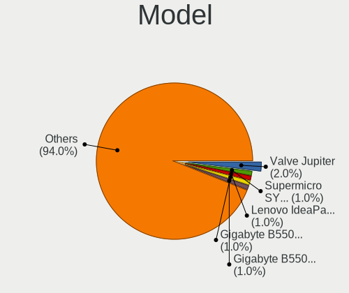
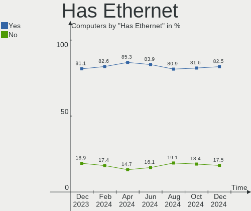
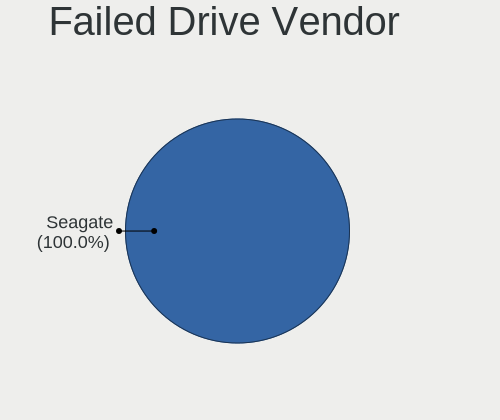
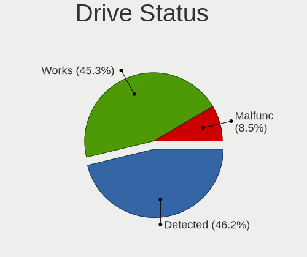
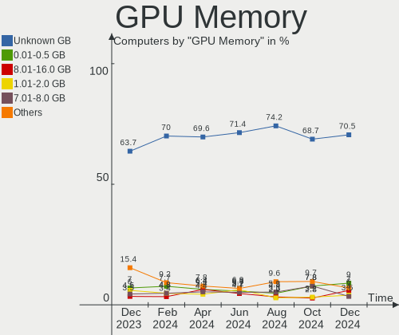
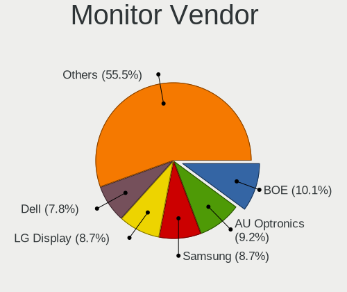
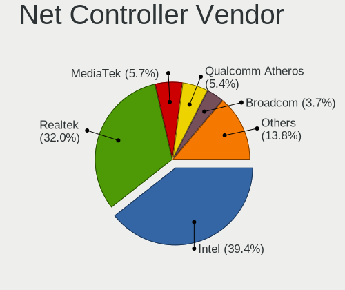
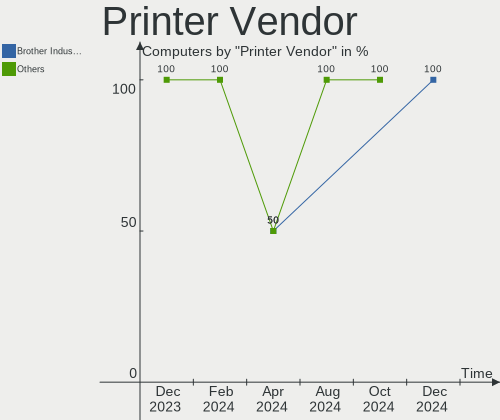
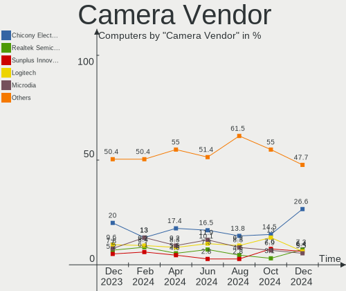

Linux in UK - Hardware Trends
-----------------------------

A project to identify most popular hardware characteristics and track their change
over time based on data collected by Linux users at https://Linux-Hardware.org.

Anyone can contribute to this report by the [hw-probe](https://github.com/linuxhw/hw-probe) tool:

    sudo -E hw-probe -all -upload

This is a report for all computer types. See also reports for [desktops](/Location/UK/Desktop/README.md) and [notebooks](/Location/UK/Notebook/README.md).

Period: Jun, 2023.

Contents
--------

* [ System ](#system)
  - [ OS                       ](#os)
  - [ OS Family                ](#os-family)
  - [ Kernel                   ](#kernel)
  - [ Kernel Family            ](#kernel-family)
  - [ Kernel Major Ver.        ](#kernel-major-ver)
  - [ Arch                     ](#arch)
  - [ DE                       ](#de)
  - [ Display Server           ](#display-server)
  - [ Display Manager          ](#display-manager)
  - [ OS Lang                  ](#os-lang)
  - [ Boot Mode                ](#boot-mode)
  - [ Filesystem               ](#filesystem)
  - [ Part. scheme             ](#part-scheme)
  - [ Dual Boot with Linux/BSD ](#dual-boot-with-linuxbsd)
  - [ Dual Boot (Win)          ](#dual-boot-win)

* [ Board ](#board)
  - [ Vendor                   ](#vendor)
  - [ Model                    ](#model)
  - [ Model Family             ](#model-family)
  - [ MFG Year                 ](#mfg-year)
  - [ Form Factor              ](#form-factor)
  - [ Secure Boot              ](#secure-boot)
  - [ Coreboot                 ](#coreboot)
  - [ RAM Size                 ](#ram-size)
  - [ RAM Used                 ](#ram-used)
  - [ Total Drives             ](#total-drives)
  - [ Has CD-ROM               ](#has-cd-rom)
  - [ Has Ethernet             ](#has-ethernet)
  - [ Has WiFi                 ](#has-wifi)
  - [ Has Bluetooth            ](#has-bluetooth)

* [ Location ](#location)
  - [ Country                  ](#country)
  - [ City                     ](#city)

* [ Drives ](#drives)
  - [ Drive Vendor             ](#drive-vendor)
  - [ Drive Model              ](#drive-model)
  - [ HDD Vendor               ](#hdd-vendor)
  - [ SSD Vendor               ](#ssd-vendor)
  - [ Drive Kind               ](#drive-kind)
  - [ Drive Connector          ](#drive-connector)
  - [ Drive Size               ](#drive-size)
  - [ Space Total              ](#space-total)
  - [ Space Used               ](#space-used)
  - [ Malfunc. Drives          ](#malfunc-drives)
  - [ Malfunc. Drive Vendor    ](#malfunc-drive-vendor)
  - [ Malfunc. HDD Vendor      ](#malfunc-hdd-vendor)
  - [ Malfunc. Drive Kind      ](#malfunc-drive-kind)
  - [ Failed Drives            ](#failed-drives)
  - [ Failed Drive Vendor      ](#failed-drive-vendor)
  - [ Drive Status             ](#drive-status)

* [ Storage controller ](#storage-controller)
  - [ Storage Vendor           ](#storage-vendor)
  - [ Storage Model            ](#storage-model)
  - [ Storage Kind             ](#storage-kind)

* [ Processor ](#processor)
  - [ CPU Vendor               ](#cpu-vendor)
  - [ CPU Model                ](#cpu-model)
  - [ CPU Model Family         ](#cpu-model-family)
  - [ CPU Cores                ](#cpu-cores)
  - [ CPU Sockets              ](#cpu-sockets)
  - [ CPU Threads              ](#cpu-threads)
  - [ CPU Op-Modes             ](#cpu-op-modes)
  - [ CPU Microcode            ](#cpu-microcode)
  - [ CPU Microarch            ](#cpu-microarch)

* [ Graphics ](#graphics)
  - [ GPU Vendor               ](#gpu-vendor)
  - [ GPU Model                ](#gpu-model)
  - [ GPU Combo                ](#gpu-combo)
  - [ GPU Driver               ](#gpu-driver)
  - [ GPU Memory               ](#gpu-memory)

* [ Monitor ](#monitor)
  - [ Monitor Vendor           ](#monitor-vendor)
  - [ Monitor Model            ](#monitor-model)
  - [ Monitor Resolution       ](#monitor-resolution)
  - [ Monitor Diagonal         ](#monitor-diagonal)
  - [ Monitor Width            ](#monitor-width)
  - [ Aspect Ratio             ](#aspect-ratio)
  - [ Monitor Area             ](#monitor-area)
  - [ Pixel Density            ](#pixel-density)
  - [ Multiple Monitors        ](#multiple-monitors)

* [ Network ](#network)
  - [ Net Controller Vendor    ](#net-controller-vendor)
  - [ Net Controller Model     ](#net-controller-model)
  - [ Wireless Vendor          ](#wireless-vendor)
  - [ Wireless Model           ](#wireless-model)
  - [ Ethernet Vendor          ](#ethernet-vendor)
  - [ Ethernet Model           ](#ethernet-model)
  - [ Net Controller Kind      ](#net-controller-kind)
  - [ Used Controller          ](#used-controller)
  - [ NICs                     ](#nics)
  - [ IPv6                     ](#ipv6)

* [ Bluetooth ](#bluetooth)
  - [ Bluetooth Vendor         ](#bluetooth-vendor)
  - [ Bluetooth Model          ](#bluetooth-model)

* [ Sound ](#sound)
  - [ Sound Vendor             ](#sound-vendor)
  - [ Sound Model              ](#sound-model)

* [ Memory ](#memory)
  - [ Memory Vendor            ](#memory-vendor)
  - [ Memory Model             ](#memory-model)
  - [ Memory Kind              ](#memory-kind)
  - [ Memory Form Factor       ](#memory-form-factor)
  - [ Memory Size              ](#memory-size)
  - [ Memory Speed             ](#memory-speed)

* [ Printers & scanners ](#printers--scanners)
  - [ Printer Vendor           ](#printer-vendor)
  - [ Printer Model            ](#printer-model)
  - [ Scanner Vendor           ](#scanner-vendor)
  - [ Scanner Model            ](#scanner-model)

* [ Camera ](#camera)
  - [ Camera Vendor            ](#camera-vendor)
  - [ Camera Model             ](#camera-model)

* [ Security ](#security)
  - [ Fingerprint Vendor       ](#fingerprint-vendor)
  - [ Fingerprint Model        ](#fingerprint-model)
  - [ Chipcard Vendor          ](#chipcard-vendor)
  - [ Chipcard Model           ](#chipcard-model)

* [ Unsupported ](#unsupported)
  - [ Unsupported Devices      ](#unsupported-devices)
  - [ Unsupported Device Types ](#unsupported-device-types)

System
------

OS
--

Installed operating systems

| Name                         | Computers | Percent |
|------------------------------|-----------|---------|
| Ubuntu 22.04                 | 32        | 16.67%  |
| Linux Mint 21.1              | 14        | 7.29%   |
| Debian 12                    | 11        | 5.73%   |
| ArcoLinux Rolling            | 11        | 5.73%   |
| Fedora 38                    | 10        | 5.21%   |
| Ubuntu 23.04                 | 9         | 4.69%   |
| Pop!_OS 22.04                | 9         | 4.69%   |
| Zorin 16                     | 6         | 3.13%   |
| SteamOS 3.4.8                | 6         | 3.13%   |
| Manjaro                      | 6         | 3.13%   |
| Kubuntu 23.04                | 6         | 3.13%   |
| OpenMandriva 23.03           | 4         | 2.08%   |
| Lubuntu 22.04                | 4         | 2.08%   |
| Kubuntu 22.04                | 4         | 2.08%   |
| Arch Rolling                 | 4         | 2.08%   |
| openSUSE Tumbleweed-XXXXXXXX | 3         | 1.56%   |
| Manjaro 23.0.0               | 3         | 1.56%   |
| LMDE 5                       | 3         | 1.56%   |
| KDE neon 22.04               | 3         | 1.56%   |
| Debian 11                    | 3         | 1.56%   |
| BlackPanther 18.1            | 3         | 1.56%   |
| Xubuntu 22.04                | 2         | 1.04%   |
| OpenMandriva 4.3             | 2         | 1.04%   |
| OpenMandriva 23.06           | 2         | 1.04%   |
| Linux Mint 21                | 2         | 1.04%   |
| Linux Mint 20.3              | 2         | 1.04%   |
| Kubuntu 20.04                | 2         | 1.04%   |
| Gentoo 2.13                  | 2         | 1.04%   |
| Fedora 36                    | 2         | 1.04%   |
| Xubuntu 23.04                | 1         | 0.52%   |
| Ultramarine 38               | 1         | 0.52%   |
| Ubuntu MATE 23.04            | 1         | 0.52%   |
| Ubuntu 20.04                 | 1         | 0.52%   |
| ROSA 12.4                    | 1         | 0.52%   |
| Pikaos 23.04                 | 1         | 0.52%   |
| Peppermint                   | 1         | 0.52%   |
| Parrot 5.3                   | 1         | 0.52%   |
| OpenMandriva 4.50            | 1         | 0.52%   |
| Nobara 37                    | 1         | 0.52%   |
| NixOS 23.05                  | 1         | 0.52%   |

OS Family
---------

OS without a version

| Name         | Computers | Percent |
|--------------|-----------|---------|
| Ubuntu       | 42        | 21.88%  |
| Linux Mint   | 20        | 10.42%  |
| Debian       | 17        | 8.85%   |
| Fedora       | 13        | 6.77%   |
| Kubuntu      | 12        | 6.25%   |
| ArcoLinux    | 11        | 5.73%   |
| Manjaro      | 10        | 5.21%   |
| Pop!_OS      | 9         | 4.69%   |
| OpenMandriva | 9         | 4.69%   |
| Zorin        | 6         | 3.13%   |
| SteamOS      | 6         | 3.13%   |
| Lubuntu      | 4         | 2.08%   |
| Arch         | 4         | 2.08%   |
| Xubuntu      | 3         | 1.56%   |
| openSUSE     | 3         | 1.56%   |
| LMDE         | 3         | 1.56%   |
| KDE neon     | 3         | 1.56%   |
| BlackPanther | 3         | 1.56%   |
| Gentoo       | 2         | 1.04%   |
| Ultramarine  | 1         | 0.52%   |
| Ubuntu MATE  | 1         | 0.52%   |
| ROSA         | 1         | 0.52%   |
| Pikaos       | 1         | 0.52%   |
| Peppermint   | 1         | 0.52%   |
| Parrot       | 1         | 0.52%   |
| Nobara       | 1         | 0.52%   |
| NixOS        | 1         | 0.52%   |
| Makulu-beta1 | 1         | 0.52%   |
| Kali         | 1         | 0.52%   |
| BunsenLabs   | 1         | 0.52%   |
| blendOS      | 1         | 0.52%   |

Kernel
------

Version of the Linux kernel

| Version                  | Computers | Percent |
|--------------------------|-----------|---------|
| 5.19.0-43-generic        | 22        | 11.46%  |
| 5.15.0-73-generic        | 18        | 9.38%   |
| 6.2.0-20-generic         | 11        | 5.73%   |
| 6.1.0-9-amd64            | 10        | 5.21%   |
| 6.2.6-76060206-generic   | 9         | 4.69%   |
| 5.19.0-45-generic        | 9         | 4.69%   |
| 5.15.0-75-generic        | 7         | 3.65%   |
| 5.13.0-valve36-1-neptune | 6         | 3.13%   |
| 6.3.9-arch1-1            | 5         | 2.6%    |
| 6.1.31-2-MANJARO         | 5         | 2.6%    |
| 5.10.0-23-amd64          | 5         | 2.6%    |
| 6.3.8-200.fc38.x86_64    | 4         | 2.08%   |
| 6.2.6-desktop-1omv2390   | 4         | 2.08%   |
| 6.3.5-2-MANJARO          | 3         | 1.56%   |
| 5.19.0-46-generic        | 3         | 1.56%   |
| 6.3.7-arch1-1            | 2         | 1.04%   |
| 6.3.6-200.fc38.x86_64    | 2         | 1.04%   |
| 6.3.6-1-default          | 2         | 1.04%   |
| 6.3.5-desktop-3omv2390   | 2         | 1.04%   |
| 6.3.5-arch1-1            | 2         | 1.04%   |
| 6.3.5-200.fc38.x86_64    | 2         | 1.04%   |
| 6.3.4-201.fc38.x86_64    | 2         | 1.04%   |
| 6.2.0-23-generic         | 2         | 1.04%   |
| 5.4.0-150-generic        | 2         | 1.04%   |
| 5.19.0-42-generic        | 2         | 1.04%   |
| 5.16.7-desktop-1omv4003  | 2         | 1.04%   |
| 5.15.85-desktop-1bP      | 2         | 1.04%   |
| 6.4.0-rc6+               | 1         | 0.52%   |
| 6.4.0-rc5-vanilla        | 1         | 0.52%   |
| 6.4.0-pikaos             | 1         | 0.52%   |
| 6.3.9-zen1-1-zen         | 1         | 0.52%   |
| 6.3.9                    | 1         | 0.52%   |
| 6.3.8-x64v3-xanmod1      | 1         | 0.52%   |
| 6.3.8-arch1-1            | 1         | 0.52%   |
| 6.3.8                    | 1         | 0.52%   |
| 6.3.7-1-cachyos-bore     | 1         | 0.52%   |
| 6.3.7-060307-generic     | 1         | 0.52%   |
| 6.3.6-arch1-1            | 1         | 0.52%   |
| 6.3.5-zen1-1-zen         | 1         | 0.52%   |
| 6.3.5-ivybridge-xanmod1  | 1         | 0.52%   |

Kernel Family
-------------

Linux kernel without a distro release

| Version  | Computers | Percent |
|----------|-----------|---------|
| 5.19.0   | 37        | 19.27%  |
| 5.15.0   | 30        | 15.63%  |
| 6.2.6    | 13        | 6.77%   |
| 6.2.0    | 13        | 6.77%   |
| 6.1.0    | 13        | 6.77%   |
| 6.3.5    | 11        | 5.73%   |
| 6.3.9    | 7         | 3.65%   |
| 6.3.8    | 7         | 3.65%   |
| 6.1.31   | 7         | 3.65%   |
| 5.13.0   | 7         | 3.65%   |
| 5.10.0   | 7         | 3.65%   |
| 6.3.6    | 5         | 2.6%    |
| 6.3.7    | 4         | 2.08%   |
| 6.4.0    | 3         | 1.56%   |
| 6.3.4    | 3         | 1.56%   |
| 5.4.0    | 3         | 1.56%   |
| 5.16.7   | 2         | 1.04%   |
| 5.15.85  | 2         | 1.04%   |
| 6.3.3    | 1         | 0.52%   |
| 6.3.0    | 1         | 0.52%   |
| 6.2.9    | 1         | 0.52%   |
| 6.2.15   | 1         | 0.52%   |
| 6.1.33   | 1         | 0.52%   |
| 6.1.30   | 1         | 0.52%   |
| 6.1.20   | 1         | 0.52%   |
| 6.1.12   | 1         | 0.52%   |
| 6.0.18   | 1         | 0.52%   |
| 6.0.11   | 1         | 0.52%   |
| 6.0.0    | 1         | 0.52%   |
| 5.6.14   | 1         | 0.52%   |
| 5.17.9   | 1         | 0.52%   |
| 5.16.0   | 1         | 0.52%   |
| 5.15.108 | 1         | 0.52%   |
| 5.10.60  | 1         | 0.52%   |
| 4.9.0    | 1         | 0.52%   |
| 4.19.0   | 1         | 0.52%   |

Kernel Major Ver.
-----------------

Linux kernel major version

| Version | Computers | Percent |
|---------|-----------|---------|
| 6.3     | 39        | 20.31%  |
| 5.19    | 37        | 19.27%  |
| 5.15    | 33        | 17.19%  |
| 6.2     | 28        | 14.58%  |
| 6.1     | 24        | 12.5%   |
| 5.10    | 8         | 4.17%   |
| 5.13    | 7         | 3.65%   |
| 6.4     | 3         | 1.56%   |
| 6.0     | 3         | 1.56%   |
| 5.4     | 3         | 1.56%   |
| 5.16    | 3         | 1.56%   |
| 5.6     | 1         | 0.52%   |
| 5.17    | 1         | 0.52%   |
| 4.9     | 1         | 0.52%   |
| 4.19    | 1         | 0.52%   |

Arch
----

OS architecture (x86_64, i586, etc.)

| Name   | Computers | Percent |
|--------|-----------|---------|
| x86_64 | 191       | 99.48%  |
| armv7l | 1         | 0.52%   |

DE
--

Desktop Environment

| Name       | Computers | Percent |
|------------|-----------|---------|
| GNOME      | 81        | 42.19%  |
| KDE5       | 51        | 26.56%  |
| X-Cinnamon | 17        | 8.85%   |
| XFCE       | 15        | 7.81%   |
| MATE       | 7         | 3.65%   |
| Unknown    | 5         | 2.6%    |
| LXQt       | 3         | 1.56%   |
| KDE        | 3         | 1.56%   |
| i3         | 2         | 1.04%   |
| Hyprland   | 2         | 1.04%   |
| Trinity    | 1         | 0.52%   |
| sway       | 1         | 0.52%   |
| LXDE       | 1         | 0.52%   |
| Hypr       | 1         | 0.52%   |
| Cinnamon   | 1         | 0.52%   |
| Budgie     | 1         | 0.52%   |

Display Server
--------------

X11 or Wayland

| Name    | Computers | Percent |
|---------|-----------|---------|
| X11     | 117       | 60.94%  |
| Wayland | 69        | 35.94%  |
| Tty     | 4         | 2.08%   |
| Unknown | 2         | 1.04%   |

Display Manager
---------------

SDDM, LightDM, etc.

| Name    | Computers | Percent |
|---------|-----------|---------|
| Unknown | 68        | 35.42%  |
| GDM3    | 46        | 23.96%  |
| SDDM    | 39        | 20.31%  |
| LightDM | 28        | 14.58%  |
| GDM     | 10        | 5.21%   |
| TDM     | 1         | 0.52%   |

OS Lang
-------

Language

| Lang    | Computers | Percent |
|---------|-----------|---------|
| en_GB   | 155       | 80.73%  |
| en_US   | 23        | 11.98%  |
| Unknown | 6         | 3.13%   |
| C       | 2         | 1.04%   |
| POSIX   | 1         | 0.52%   |
| pl_PL   | 1         | 0.52%   |
| lt_LT   | 1         | 0.52%   |
| en_ZA   | 1         | 0.52%   |
| en_SG   | 1         | 0.52%   |
| C.UTF8  | 1         | 0.52%   |

Boot Mode
---------

EFI or BIOS

| Mode | Computers | Percent |
|------|-----------|---------|
| BIOS | 97        | 50.52%  |
| EFI  | 95        | 49.48%  |

Filesystem
----------

Type of filesystem

| Type    | Computers | Percent |
|---------|-----------|---------|
| Ext4    | 113       | 58.85%  |
| Tmpfs   | 37        | 19.27%  |
| Btrfs   | 31        | 16.15%  |
| Overlay | 9         | 4.69%   |
| Xfs     | 1         | 0.52%   |
| F2fs    | 1         | 0.52%   |

Part. scheme
------------

Scheme of partitioning

| Type    | Computers | Percent |
|---------|-----------|---------|
| GPT     | 112       | 58.33%  |
| Unknown | 63        | 32.81%  |
| MBR     | 17        | 8.85%   |

Dual Boot with Linux/BSD
------------------------

Hosting more than one Linux/BSD

| Dual boot | Computers | Percent |
|-----------|-----------|---------|
| No        | 163       | 84.9%   |
| Yes       | 29        | 15.1%   |

Dual Boot (Win)
---------------

Hosting Linux and Windows

| Dual boot | Computers | Percent |
|-----------|-----------|---------|
| No        | 143       | 74.48%  |
| Yes       | 49        | 25.52%  |

Board
-----

Vendor
------

Motherboard manufacturer

| Name                | Computers | Percent |
|---------------------|-----------|---------|
| Lenovo              | 28        | 14.58%  |
| Hewlett-Packard     | 27        | 14.06%  |
| ASUSTek Computer    | 27        | 14.06%  |
| Dell                | 20        | 10.42%  |
| Gigabyte Technology | 13        | 6.77%   |
| MSI                 | 12        | 6.25%   |
| ASRock              | 7         | 3.65%   |
| Valve               | 6         | 3.13%   |
| Acer                | 6         | 3.13%   |
| Apple               | 5         | 2.6%    |
| Toshiba             | 4         | 2.08%   |
| Intel               | 4         | 2.08%   |
| AZW                 | 4         | 2.08%   |
| Fujitsu             | 3         | 1.56%   |
| Unknown             | 3         | 1.56%   |
| Sony                | 2         | 1.04%   |
| PC Specialist       | 2         | 1.04%   |
| Medion              | 2         | 1.04%   |
| Google              | 2         | 1.04%   |
| Foxconn             | 2         | 1.04%   |
| Timi                | 1         | 0.52%   |
| Teclast             | 1         | 0.52%   |
| Samsung Electronics | 1         | 0.52%   |
| HUAWEI              | 1         | 0.52%   |
| HONOR               | 1         | 0.52%   |
| GEO                 | 1         | 0.52%   |
| Fujitsu Siemens     | 1         | 0.52%   |
| Framework           | 1         | 0.52%   |
| Entroware           | 1         | 0.52%   |
| ECS                 | 1         | 0.52%   |
| Biostar             | 1         | 0.52%   |
| AMI                 | 1         | 0.52%   |
| Alienware           | 1         | 0.52%   |

Model
-----

Motherboard model

| Name                                  | Computers | Percent |
|---------------------------------------|-----------|---------|
| Valve Jupiter                         | 6         | 3.13%   |
| Unknown                               | 4         | 2.08%   |
| MSI MS-7C37                           | 2         | 1.04%   |
| HP Pavilion Laptop 15-eh0xxx          | 2         | 1.04%   |
| Gigabyte B550M DS3H                   | 2         | 1.04%   |
| Gigabyte B450 AORUS ELITE             | 2         | 1.04%   |
| Gigabyte 970A-DS3P                    | 2         | 1.04%   |
| AZW SER                               | 2         | 1.04%   |
| Toshiba TECRA Z40t-C                  | 1         | 0.52%   |
| Toshiba Satellite Pro C50-A-1E6       | 1         | 0.52%   |
| Toshiba Satellite C650                | 1         | 0.52%   |
| Toshiba Satellite C50-B               | 1         | 0.52%   |
| Timi RedmiBook Pro 14                 | 1         | 0.52%   |
| Teclast F15Plus 2                     | 1         | 0.52%   |
| Sony VPCEH3N6E                        | 1         | 0.52%   |
| Sony SVF1521A1EW                      | 1         | 0.52%   |
| Samsung 935QDB                        | 1         | 0.52%   |
| PC Specialist P65_P67RGRERA           | 1         | 0.52%   |
| PC Specialist Initia Ii 15            | 1         | 0.52%   |
| MSI MS-7D32                           | 1         | 0.52%   |
| MSI MS-7C95                           | 1         | 0.52%   |
| MSI MS-7C91                           | 1         | 0.52%   |
| MSI MS-7C02                           | 1         | 0.52%   |
| MSI MS-7B79                           | 1         | 0.52%   |
| MSI MS-7B78                           | 1         | 0.52%   |
| MSI MS-7817                           | 1         | 0.52%   |
| MSI Katana GF66 11UG                  | 1         | 0.52%   |
| MSI GE70 2PL                          | 1         | 0.52%   |
| MSI 7200-5086C                        | 1         | 0.52%   |
| Medion Erazer P6661 MD60303           | 1         | 0.52%   |
| Medion E2228T MD61050                 | 1         | 0.52%   |
| Lenovo Z70-80 80FG                    | 1         | 0.52%   |
| Lenovo Z50-70 20354                   | 1         | 0.52%   |
| Lenovo Yoga 6 13ALC7 82UD             | 1         | 0.52%   |
| Lenovo Yoga 300-11IBY 80M0            | 1         | 0.52%   |
| Lenovo Y520-15IKBN 80WK               | 1         | 0.52%   |
| Lenovo V15 G3 ABA 82TV                | 1         | 0.52%   |
| Lenovo ThinkStation P300 30AH001GUK   | 1         | 0.52%   |
| Lenovo ThinkPad X61 7674GS3           | 1         | 0.52%   |
| Lenovo ThinkPad X270 W10DG 20K5S5QD00 | 1         | 0.52%   |

Model Family
------------

Motherboard model prefix

| Name                 | Computers | Percent |
|----------------------|-----------|---------|
| Lenovo ThinkPad      | 12        | 6.25%   |
| Valve Jupiter        | 6         | 3.13%   |
| HP Pavilion          | 6         | 3.13%   |
| Dell Latitude        | 6         | 3.13%   |
| ASUS ROG             | 6         | 3.13%   |
| Dell XPS             | 5         | 2.6%    |
| HP EliteBook         | 4         | 2.08%   |
| Dell Inspiron        | 4         | 2.08%   |
| ASUS PRIME           | 4         | 2.08%   |
| Acer Aspire          | 4         | 2.08%   |
| Unknown              | 4         | 2.08%   |
| Toshiba Satellite    | 3         | 1.56%   |
| Lenovo ThinkCentre   | 3         | 1.56%   |
| Lenovo IdeaPad       | 3         | 1.56%   |
| HP Laptop            | 3         | 1.56%   |
| ASUS VivoBook        | 3         | 1.56%   |
| ASUS TUF             | 3         | 1.56%   |
| MSI MS-7C37          | 2         | 1.04%   |
| Lenovo Yoga          | 2         | 1.04%   |
| HP ProBook           | 2         | 1.04%   |
| Gigabyte B550M       | 2         | 1.04%   |
| Gigabyte B450        | 2         | 1.04%   |
| Gigabyte 970A-DS3P   | 2         | 1.04%   |
| Dell Precision       | 2         | 1.04%   |
| Dell OptiPlex        | 2         | 1.04%   |
| AZW SER              | 2         | 1.04%   |
| Acer Swift           | 2         | 1.04%   |
| Toshiba TECRA        | 1         | 0.52%   |
| Timi RedmiBook       | 1         | 0.52%   |
| Teclast F15Plus      | 1         | 0.52%   |
| Sony VPCEH3N6E       | 1         | 0.52%   |
| Sony SVF1521A1EW     | 1         | 0.52%   |
| Samsung 935QDB       | 1         | 0.52%   |
| PC Specialist P65    | 1         | 0.52%   |
| PC Specialist Initia | 1         | 0.52%   |
| MSI MS-7D32          | 1         | 0.52%   |
| MSI MS-7C95          | 1         | 0.52%   |
| MSI MS-7C91          | 1         | 0.52%   |
| MSI MS-7C02          | 1         | 0.52%   |
| MSI MS-7B79          | 1         | 0.52%   |

MFG Year
--------

Motherboard manufacture year

| Year    | Computers | Percent |
|---------|-----------|---------|
| 2022    | 28        | 14.58%  |
| 2021    | 21        | 10.94%  |
| 2018    | 21        | 10.94%  |
| 2020    | 16        | 8.33%   |
| 2014    | 16        | 8.33%   |
| 2019    | 13        | 6.77%   |
| 2013    | 12        | 6.25%   |
| 2016    | 10        | 5.21%   |
| 2023    | 9         | 4.69%   |
| 2015    | 9         | 4.69%   |
| 2011    | 8         | 4.17%   |
| 2017    | 6         | 3.13%   |
| 2012    | 6         | 3.13%   |
| 2010    | 5         | 2.6%    |
| 2009    | 4         | 2.08%   |
| 2008    | 4         | 2.08%   |
| Unknown | 2         | 1.04%   |
| 2007    | 1         | 0.52%   |
| 2006    | 1         | 0.52%   |

Form Factor
-----------

Physical design of the computer

| Name        | Computers | Percent |
|-------------|-----------|---------|
| Notebook    | 102       | 53.13%  |
| Desktop     | 76        | 39.58%  |
| Convertible | 5         | 2.6%    |
| Mini pc     | 5         | 2.6%    |
| All in one  | 3         | 1.56%   |
| Server      | 1         | 0.52%   |

Secure Boot
-----------

Enabled or disabled

| State    | Computers | Percent |
|----------|-----------|---------|
| Disabled | 179       | 93.23%  |
| Enabled  | 13        | 6.77%   |

Coreboot
--------

Have coreboot on board

| Used | Computers | Percent |
|------|-----------|---------|
| No   | 190       | 98.96%  |
| Yes  | 2         | 1.04%   |

RAM Size
--------

Total RAM memory

| Size in GB      | Computers | Percent |
|-----------------|-----------|---------|
| 4.01-8.0        | 41        | 21.35%  |
| 16.01-24.0      | 39        | 20.31%  |
| 8.01-16.0       | 32        | 16.67%  |
| 3.01-4.0        | 28        | 14.58%  |
| 32.01-64.0      | 27        | 14.06%  |
| 64.01-256.0     | 12        | 6.25%   |
| 24.01-32.0      | 6         | 3.13%   |
| 2.01-3.0        | 4         | 2.08%   |
| More than 256.0 | 1         | 0.52%   |
| 1.01-2.0        | 1         | 0.52%   |
| 0.01-0.5        | 1         | 0.52%   |

RAM Used
--------

Used RAM memory

| Used GB     | Computers | Percent |
|-------------|-----------|---------|
| 1.01-2.0    | 56        | 29.17%  |
| 2.01-3.0    | 51        | 26.56%  |
| 4.01-8.0    | 38        | 19.79%  |
| 3.01-4.0    | 31        | 16.15%  |
| 8.01-16.0   | 9         | 4.69%   |
| 16.01-24.0  | 2         | 1.04%   |
| 0.51-1.0    | 2         | 1.04%   |
| 0.01-0.5    | 2         | 1.04%   |
| 64.01-256.0 | 1         | 0.52%   |

Total Drives
------------

Number of drives on board

| Drives | Computers | Percent |
|--------|-----------|---------|
| 1      | 106       | 55.21%  |
| 2      | 45        | 23.44%  |
| 3      | 16        | 8.33%   |
| 4      | 13        | 6.77%   |
| 5      | 7         | 3.65%   |
| 7      | 2         | 1.04%   |
| 29     | 1         | 0.52%   |
| 8      | 1         | 0.52%   |
| 6      | 1         | 0.52%   |

Has CD-ROM
----------

Has CD-ROM on board

| Presented | Computers | Percent |
|-----------|-----------|---------|
| No        | 124       | 64.58%  |
| Yes       | 68        | 35.42%  |

Has Ethernet
------------

Has Ethernet on board

| Presented | Computers | Percent |
|-----------|-----------|---------|
| Yes       | 155       | 80.73%  |
| No        | 37        | 19.27%  |

Has WiFi
--------

Has WiFi module

| Presented | Computers | Percent |
|-----------|-----------|---------|
| Yes       | 147       | 76.56%  |
| No        | 45        | 23.44%  |

Has Bluetooth
-------------

Has Bluetooth module

| Presented | Computers | Percent |
|-----------|-----------|---------|
| Yes       | 127       | 66.15%  |
| No        | 65        | 33.85%  |

Location
--------

Country
-------

Geographic location (country)

| Country | Computers | Percent |
|---------|-----------|---------|
| UK      | 192       | 100%    |

City
----

Geographic location (city)

| City                 | Computers | Percent |
|----------------------|-----------|---------|
| London               | 11        | 5.73%   |
| Manchester           | 9         | 4.69%   |
| Birmingham           | 8         | 4.17%   |
| Plymouth             | 4         | 2.08%   |
| Liverpool            | 4         | 2.08%   |
| Brighton             | 4         | 2.08%   |
| York                 | 3         | 1.56%   |
| Leicester            | 3         | 1.56%   |
| Islington            | 3         | 1.56%   |
| Greenwich            | 3         | 1.56%   |
| Cardiff              | 3         | 1.56%   |
| Bristol              | 3         | 1.56%   |
| Swadlincote          | 2         | 1.04%   |
| Stoke-on-Trent       | 2         | 1.04%   |
| Shipley              | 2         | 1.04%   |
| Rochdale             | 2         | 1.04%   |
| Preston              | 2         | 1.04%   |
| Nottingham           | 2         | 1.04%   |
| Newham               | 2         | 1.04%   |
| Lisburn              | 2         | 1.04%   |
| Lewisham             | 2         | 1.04%   |
| Leeds                | 2         | 1.04%   |
| Kingston upon Thames | 2         | 1.04%   |
| Harlow               | 2         | 1.04%   |
| Hackney              | 2         | 1.04%   |
| Epsom                | 2         | 1.04%   |
| Croydon              | 2         | 1.04%   |
| Burton-on-Trent      | 2         | 1.04%   |
| Banbury              | 2         | 1.04%   |
| Worthing             | 1         | 0.52%   |
| West Bromwich        | 1         | 0.52%   |
| Warwick              | 1         | 0.52%   |
| Wandsworth           | 1         | 0.52%   |
| Wallington           | 1         | 0.52%   |
| Uckfield             | 1         | 0.52%   |
| Twickenham           | 1         | 0.52%   |
| Towcester            | 1         | 0.52%   |
| Torquay              | 1         | 0.52%   |
| Teddington           | 1         | 0.52%   |
| Talybont             | 1         | 0.52%   |

Drives
------

Drive Vendor
------------

Hard drive vendors

| Vendor                      | Computers | Drives | Percent |
|-----------------------------|-----------|--------|---------|
| Samsung Electronics         | 49        | 63     | 15.71%  |
| Seagate                     | 43        | 76     | 13.78%  |
| WDC                         | 32        | 44     | 10.26%  |
| Crucial                     | 23        | 25     | 7.37%   |
| Sandisk                     | 18        | 22     | 5.77%   |
| Toshiba                     | 17        | 19     | 5.45%   |
| Unknown                     | 16        | 17     | 5.13%   |
| Kingston Technology Company | 10        | 10     | 3.21%   |
| Kingston                    | 10        | 11     | 3.21%   |
| Micron/Crucial Technology   | 9         | 10     | 2.88%   |
| Phison Electronics          | 6         | 6      | 1.92%   |
| KIOXIA                      | 5         | 6      | 1.6%    |
| Hitachi                     | 5         | 5      | 1.6%    |
| SK hynix                    | 4         | 4      | 1.28%   |
| Micron Technology           | 4         | 4      | 1.28%   |
| SABRENT                     | 3         | 3      | 0.96%   |
| Intel                       | 3         | 3      | 0.96%   |
| HGST                        | 3         | 3      | 0.96%   |
| Gigabyte Technology         | 3         | 3      | 0.96%   |
| China                       | 3         | 3      | 0.96%   |
| Unknown                     | 3         | 3      | 0.96%   |
| Transcend                   | 2         | 2      | 0.64%   |
| Phison                      | 2         | 3      | 0.64%   |
| Patriot                     | 2         | 2      | 0.64%   |
| MAXIO Technology (Hangzhou) | 2         | 2      | 0.64%   |
| KIOXIA-EXCERIA              | 2         | 2      | 0.64%   |
| JMicron Technology          | 2         | 2      | 0.64%   |
| A-DATA Technology           | 2         | 2      | 0.64%   |
| X12                         | 1         | 1      | 0.32%   |
| WD MediaMax                 | 1         | 1      | 0.32%   |
| Veno                        | 1         | 1      | 0.32%   |
| TurXun                      | 1         | 1      | 0.32%   |
| Teclast                     | 1         | 1      | 0.32%   |
| Team                        | 1         | 1      | 0.32%   |
| SSSTC                       | 1         | 1      | 0.32%   |
| Solid State Storage         | 1         | 1      | 0.32%   |
| Silicon Motion              | 1         | 1      | 0.32%   |
| PNY                         | 1         | 1      | 0.32%   |
| Origin                      | 1         | 1      | 0.32%   |
| NFHK                        | 1         | 1      | 0.32%   |

Drive Model
-----------

Hard drive models

| Model                                               | Computers | Percent |
|-----------------------------------------------------|-----------|---------|
| Samsung NVMe SSD Controller SM981/PM981/PM983 250GB | 7         | 2.06%   |
| Unknown MMC Card  32GB                              | 5         | 1.47%   |
| Seagate ST4000DM004-2CV104 4TB                      | 5         | 1.47%   |
| Seagate ST2000DM008-2FR102 2TB                      | 5         | 1.47%   |
| Samsung NVMe SSD Controller PM9A1/PM9A3/980PRO 2TB  | 5         | 1.47%   |
| Micron/Crucial P2 NVMe PCIe SSD 4TB                 | 5         | 1.47%   |
| Kingston Company OM3PDP3 NVMe SSD 256GB             | 5         | 1.47%   |
| SanDisk NVMe SSD Drive 1TB                          | 4         | 1.18%   |
| Crucial CT480BX500SSD1 480GB                        | 4         | 1.18%   |
| Unknown MMC Card  512GB                             | 3         | 0.88%   |
| Toshiba MQ01ABD100 1TB                              | 3         | 0.88%   |
| Samsung SSD 850 EVO 250GB                           | 3         | 0.88%   |
| Phison PS5013 E13 NVMe Controller 512GB             | 3         | 0.88%   |
| Micron/Crucial CT1000P5PSSD8 1TB                    | 3         | 0.88%   |
| Kingston SV300S37A120G 120GB SSD                    | 3         | 0.88%   |
| Crucial CT1000BX500SSD1 1TB                         | 3         | 0.88%   |
| Unknown                                             | 3         | 0.88%   |
| WDC WDS500G2B0A 500GB SSD                           | 2         | 0.59%   |
| Unknown MMC Card  64GB                              | 2         | 0.59%   |
| Transcend TS120GMTS820S 120GB SSD                   | 2         | 0.59%   |
| Toshiba DT01ACA300 3TB                              | 2         | 0.59%   |
| Seagate ST6000DM003-2CY186 6TB                      | 2         | 0.59%   |
| Seagate ST500LT012-1DG142 500GB                     | 2         | 0.59%   |
| Seagate ST500DM002-1BD142 500GB                     | 2         | 0.59%   |
| Seagate ST4000VN008-2DR166 4TB                      | 2         | 0.59%   |
| Seagate ST3500312CS 500GB                           | 2         | 0.59%   |
| Seagate ST2000DM001-1CH164 2TB                      | 2         | 0.59%   |
| Seagate ST1000LM035-1RK172 1TB                      | 2         | 0.59%   |
| Seagate ST1000LM024 HN-M101MBB 1TB                  | 2         | 0.59%   |
| Seagate ST1000LM014-SSHD-8GB                        | 2         | 0.59%   |
| Seagate ST1000DM003-1ER162 1TB                      | 2         | 0.59%   |
| Seagate Expansion Desk 5TB                          | 2         | 0.59%   |
| Sandisk WD Black SN750 / PC SN730 NVMe SSD 500GB    | 2         | 0.59%   |
| SanDisk SSD PLUS 480GB                              | 2         | 0.59%   |
| SanDisk NVMe SSD Drive 2TB                          | 2         | 0.59%   |
| Samsung SSD 870 QVO 1TB                             | 2         | 0.59%   |
| Samsung SSD 860 EVO 250GB                           | 2         | 0.59%   |
| Samsung SSD 850 EVO 500GB                           | 2         | 0.59%   |
| Samsung SSD 840 EVO 250GB                           | 2         | 0.59%   |
| SABRENT Disk 1TB                                    | 2         | 0.59%   |

HDD Vendor
----------

Hard disk drive vendors

| Vendor              | Computers | Drives | Percent |
|---------------------|-----------|--------|---------|
| Seagate             | 43        | 75     | 45.74%  |
| WDC                 | 20        | 26     | 21.28%  |
| Toshiba             | 14        | 16     | 14.89%  |
| Hitachi             | 5         | 5      | 5.32%   |
| Samsung Electronics | 3         | 3      | 3.19%   |
| HGST                | 3         | 3      | 3.19%   |
| WD MediaMax         | 1         | 1      | 1.06%   |
| Maxtor              | 1         | 1      | 1.06%   |
| LaCie               | 1         | 1      | 1.06%   |
| HPE                 | 1         | 1      | 1.06%   |
| ASMT                | 1         | 2      | 1.06%   |
| Apple               | 1         | 1      | 1.06%   |

SSD Vendor
----------

Solid state drive vendors

| Vendor              | Computers | Drives | Percent |
|---------------------|-----------|--------|---------|
| Samsung Electronics | 22        | 28     | 21.57%  |
| Crucial             | 20        | 21     | 19.61%  |
| WDC                 | 11        | 17     | 10.78%  |
| Kingston            | 10        | 11     | 9.8%    |
| SanDisk             | 7         | 8      | 6.86%   |
| Transcend           | 2         | 2      | 1.96%   |
| Toshiba             | 2         | 2      | 1.96%   |
| SK hynix            | 2         | 2      | 1.96%   |
| Patriot             | 2         | 2      | 1.96%   |
| KIOXIA-EXCERIA      | 2         | 2      | 1.96%   |
| Gigabyte Technology | 2         | 2      | 1.96%   |
| China               | 2         | 2      | 1.96%   |
| A-DATA Technology   | 2         | 2      | 1.96%   |
| X12                 | 1         | 1      | 0.98%   |
| Veno                | 1         | 1      | 0.98%   |
| Teclast             | 1         | 1      | 0.98%   |
| Team                | 1         | 1      | 0.98%   |
| PNY                 | 1         | 1      | 0.98%   |
| Phison              | 1         | 1      | 0.98%   |
| Origin              | 1         | 1      | 0.98%   |
| Netac               | 1         | 1      | 0.98%   |
| Micron Technology   | 1         | 1      | 0.98%   |
| LITEONIT            | 1         | 1      | 0.98%   |
| LITEON              | 1         | 1      | 0.98%   |
| INTEL SS            | 1         | 1      | 0.98%   |
| HPE                 | 1         | 1      | 0.98%   |
| Hewlett-Packard     | 1         | 1      | 0.98%   |
| BAITITON            | 1         | 1      | 0.98%   |
| ASENNO              | 1         | 1      | 0.98%   |

Drive Kind
----------

HDD or SSD

| Kind    | Computers | Drives | Percent |
|---------|-----------|--------|---------|
| NVMe    | 89        | 110    | 32.6%   |
| SSD     | 84        | 117    | 30.77%  |
| HDD     | 77        | 135    | 28.21%  |
| MMC     | 17        | 18     | 6.23%   |
| Unknown | 6         | 6      | 2.2%    |

Drive Connector
---------------

SATA, SAS, NVMe, etc.

| Type | Computers | Drives | Percent |
|------|-----------|--------|---------|
| SATA | 128       | 224    | 51.82%  |
| NVMe | 87        | 107    | 35.22%  |
| MMC  | 17        | 18     | 6.88%   |
| SAS  | 15        | 37     | 6.07%   |

Drive Size
----------

Size of hard drive

| Size in TB | Computers | Drives | Percent |
|------------|-----------|--------|---------|
| 0.01-0.5   | 82        | 109    | 47.95%  |
| 0.51-1.0   | 51        | 66     | 29.82%  |
| 1.01-2.0   | 20        | 31     | 11.7%   |
| 3.01-4.0   | 9         | 30     | 5.26%   |
| 4.01-10.0  | 6         | 9      | 3.51%   |
| 2.01-3.0   | 2         | 2      | 1.17%   |
| 10.01-20.0 | 1         | 5      | 0.58%   |

Space Total
-----------

Amount of disk space available on the file system

| Size in GB     | Computers | Percent |
|----------------|-----------|---------|
| 101-250        | 40        | 20.83%  |
| 501-1000       | 40        | 20.83%  |
| 251-500        | 39        | 20.31%  |
| More than 3000 | 20        | 10.42%  |
| 1001-2000      | 17        | 8.85%   |
| 1-20           | 10        | 5.21%   |
| 51-100         | 9         | 4.69%   |
| 21-50          | 8         | 4.17%   |
| 2001-3000      | 7         | 3.65%   |
| Unknown        | 2         | 1.04%   |

Space Used
----------

Amount of used disk space

| Used GB        | Computers | Percent |
|----------------|-----------|---------|
| 1-20           | 57        | 29.69%  |
| 21-50          | 40        | 20.83%  |
| 101-250        | 27        | 14.06%  |
| 251-500        | 16        | 8.33%   |
| 51-100         | 16        | 8.33%   |
| 501-1000       | 14        | 7.29%   |
| 1001-2000      | 13        | 6.77%   |
| 2001-3000      | 4         | 2.08%   |
| More than 3000 | 3         | 1.56%   |
| Unknown        | 2         | 1.04%   |

Malfunc. Drives
---------------

Drive models with a malfunction

| Model                                        | Computers | Drives | Percent |
|----------------------------------------------|-----------|--------|---------|
| WDC WD7500BPVT-60HXZT3 752GB                 | 1         | 1      | 8.33%   |
| WDC WD3200BEKT-60PVMT0 320GB                 | 1         | 1      | 8.33%   |
| WDC WD1001FALS-403AA0 1TB                    | 1         | 1      | 8.33%   |
| WDC WD Blue SA510 2.5 1000GB SSD             | 1         | 1      | 8.33%   |
| WD MediaMax WL5000GSA12872B 5TB              | 1         | 1      | 8.33%   |
| Toshiba MQ01ABF050 500GB                     | 1         | 1      | 8.33%   |
| Seagate ST2000DM001-1CH164 2TB               | 1         | 1      | 8.33%   |
| Samsung Electronics SSD 840 PRO Series 256GB | 1         | 2      | 8.33%   |
| Mushkin MKNSSDHL500GB-D8                     | 1         | 1      | 8.33%   |
| Maxtor STM3320820AS 320GB                    | 1         | 1      | 8.33%   |
| Hitachi HTS547575A9E384 752GB                | 1         | 1      | 8.33%   |
| BAITITON BT58SSD10S 256GB                    | 1         | 1      | 8.33%   |

Malfunc. Drive Vendor
---------------------

Vendors of faulty drives

| Vendor              | Computers | Drives | Percent |
|---------------------|-----------|--------|---------|
| WDC                 | 4         | 4      | 33.33%  |
| WD MediaMax         | 1         | 1      | 8.33%   |
| Toshiba             | 1         | 1      | 8.33%   |
| Seagate             | 1         | 1      | 8.33%   |
| Samsung Electronics | 1         | 2      | 8.33%   |
| Mushkin             | 1         | 1      | 8.33%   |
| Maxtor              | 1         | 1      | 8.33%   |
| Hitachi             | 1         | 1      | 8.33%   |
| BAITITON            | 1         | 1      | 8.33%   |

Malfunc. HDD Vendor
-------------------

Vendors of faulty HDD drives

| Vendor      | Computers | Drives | Percent |
|-------------|-----------|--------|---------|
| WDC         | 3         | 3      | 37.5%   |
| WD MediaMax | 1         | 1      | 12.5%   |
| Toshiba     | 1         | 1      | 12.5%   |
| Seagate     | 1         | 1      | 12.5%   |
| Maxtor      | 1         | 1      | 12.5%   |
| Hitachi     | 1         | 1      | 12.5%   |

Malfunc. Drive Kind
-------------------

Kinds of faulty drives

| Kind | Computers | Drives | Percent |
|------|-----------|--------|---------|
| HDD  | 6         | 8      | 60%     |
| SSD  | 3         | 4      | 30%     |
| NVMe | 1         | 1      | 10%     |

Failed Drives
-------------

Failed drive models

| Model                                 | Computers | Drives | Percent |
|---------------------------------------|-----------|--------|---------|
| Samsung Electronics SSD 960 EVO 250GB | 1         | 2      | 100%    |

Failed Drive Vendor
-------------------

Failed drive vendors

| Vendor              | Computers | Drives | Percent |
|---------------------|-----------|--------|---------|
| Samsung Electronics | 1         | 2      | 100%    |

Drive Status
------------

Number of failed and malfunc. drives

| Status   | Computers | Drives | Percent |
|----------|-----------|--------|---------|
| Detected | 120       | 209    | 56.07%  |
| Works    | 83        | 162    | 38.79%  |
| Malfunc  | 10        | 13     | 4.67%   |
| Failed   | 1         | 2      | 0.47%   |

Storage controller
------------------

Storage Vendor
--------------

Storage controller vendors

| Vendor                         | Computers | Percent |
|--------------------------------|-----------|---------|
| Intel                          | 113       | 42.16%  |
| AMD                            | 44        | 16.42%  |
| Samsung Electronics            | 28        | 10.45%  |
| SanDisk                        | 13        | 4.85%   |
| Micron/Crucial Technology      | 12        | 4.48%   |
| Phison Electronics             | 10        | 3.73%   |
| Kingston Technology Company    | 10        | 3.73%   |
| ASMedia Technology             | 8         | 2.99%   |
| KIOXIA                         | 4         | 1.49%   |
| Micron Technology              | 3         | 1.12%   |
| Toshiba America Info Systems   | 2         | 0.75%   |
| Solid State Storage Technology | 2         | 0.75%   |
| SK hynix                       | 2         | 0.75%   |
| Silicon Motion                 | 2         | 0.75%   |
| Nvidia                         | 2         | 0.75%   |
| MAXIO Technology (Hangzhou)    | 2         | 0.75%   |
| Marvell Technology Group       | 2         | 0.75%   |
| JMicron Technology             | 2         | 0.75%   |
| Broadcom / LSI                 | 2         | 0.75%   |
| Solidigm                       | 1         | 0.37%   |
| Seagate Technology             | 1         | 0.37%   |
| LSI Logic / Symbios Logic      | 1         | 0.37%   |
| Lenovo                         | 1         | 0.37%   |
| ADATA Technology               | 1         | 0.37%   |

Storage Model
-------------

Storage controller models

| Model                                                                          | Computers | Percent |
|--------------------------------------------------------------------------------|-----------|---------|
| AMD FCH SATA Controller [AHCI mode]                                            | 29        | 9.93%   |
| Samsung NVMe SSD Controller SM981/PM981/PM983                                  | 10        | 3.42%   |
| Intel 8 Series/C220 Series Chipset Family 6-port SATA Controller 1 [AHCI mode] | 10        | 3.42%   |
| Intel Volume Management Device NVMe RAID Controller                            | 9         | 3.08%   |
| AMD 400 Series Chipset SATA Controller                                         | 9         | 3.08%   |
| Samsung NVMe SSD Controller PM9A1/PM9A3/980PRO                                 | 8         | 2.74%   |
| Micron/Crucial P2 NVMe PCIe SSD                                                | 8         | 2.74%   |
| Intel 82801 Mobile SATA Controller [RAID mode]                                 | 8         | 2.74%   |
| ASMedia ASM1062 Serial ATA Controller                                          | 8         | 2.74%   |
| Samsung NVMe SSD Controller 980                                                | 7         | 2.4%    |
| Intel 8 Series SATA Controller 1 [AHCI mode]                                   | 7         | 2.4%    |
| AMD 500 Series Chipset SATA Controller                                         | 7         | 2.4%    |
| Intel Wildcat Point-LP SATA Controller [AHCI Mode]                             | 6         | 2.05%   |
| Intel 6 Series/C200 Series Chipset Family 6 port Mobile SATA AHCI Controller   | 6         | 2.05%   |
| AMD SB7x0/SB8x0/SB9x0 IDE Controller                                           | 6         | 2.05%   |
| Kingston Company OM3PDP3 NVMe SSD                                              | 5         | 1.71%   |
| Intel Sunrise Point-LP SATA Controller [AHCI mode]                             | 5         | 1.71%   |
| Intel Cannon Lake PCH SATA AHCI Controller                                     | 5         | 1.71%   |
| AMD SB7x0/SB8x0/SB9x0 SATA Controller [IDE mode]                               | 5         | 1.71%   |
| Phison PS5013 E13 NVMe Controller                                              | 4         | 1.37%   |
| Kingston Company Company Non-Volatile memory controller                        | 4         | 1.37%   |
| Intel Atom Processor E3800 Series SATA AHCI Controller                         | 4         | 1.37%   |
| Intel 7 Series Chipset Family 6-port SATA Controller [AHCI mode]               | 4         | 1.37%   |
| SanDisk Non-Volatile memory controller                                         | 3         | 1.03%   |
| Samsung NVMe SSD Controller SM961/PM961/SM963                                  | 3         | 1.03%   |
| Micron/Crucial P5 Plus NVMe PCIe SSD                                           | 3         | 1.03%   |
| KIOXIA Non-Volatile memory controller                                          | 3         | 1.03%   |
| Intel Tiger Lake-LP SATA Controller                                            | 3         | 1.03%   |
| Intel Q170/Q150/B150/H170/H110/Z170/CM236 Chipset SATA Controller [AHCI Mode]  | 3         | 1.03%   |
| Intel HM170/QM170 Chipset SATA Controller [AHCI Mode]                          | 3         | 1.03%   |
| Intel Comet Lake SATA AHCI Controller                                          | 3         | 1.03%   |
| Intel 6 Series/C200 Series Chipset Family 6 port Desktop SATA AHCI Controller  | 3         | 1.03%   |
| Toshiba America Info Systems XG6 NVMe SSD Controller                           | 2         | 0.68%   |
| Solid State Storage CL1-3D256-Q11 NVMe SSD M.2                                 | 2         | 0.68%   |
| Silicon Motion SM2263EN/SM2263XT SSD Controller                                | 2         | 0.68%   |
| SanDisk WD Blue SN570 NVMe SSD 1TB                                             | 2         | 0.68%   |
| SanDisk WD Black SN750 / PC SN730 NVMe SSD                                     | 2         | 0.68%   |
| Phison PS5021-E21 PCIe4 NVMe Controller (DRAM-less)                            | 2         | 0.68%   |
| Phison E12 NVMe Controller                                                     | 2         | 0.68%   |
| MAXIO (Hangzhou) NVMe SSD Controller MAP1202                                   | 2         | 0.68%   |

Storage Kind
------------

Kind of storage controller (IDE, SATA, NVMe, SAS, ...)

| Kind | Computers | Percent |
|------|-----------|---------|
| SATA | 139       | 53.26%  |
| NVMe | 87        | 33.33%  |
| RAID | 21        | 8.05%   |
| IDE  | 12        | 4.6%    |
| SAS  | 2         | 0.77%   |

Processor
---------

CPU Vendor
----------

Processor vendors

| Vendor                | Computers | Percent |
|-----------------------|-----------|---------|
| Intel                 | 131       | 68.23%  |
| AMD                   | 60        | 31.25%  |
| Marvell Semiconductor | 1         | 0.52%   |

CPU Model
---------

Processor models

| Model                                                               | Computers | Percent |
|---------------------------------------------------------------------|-----------|---------|
| AMD Custom APU 0405                                                 | 6         | 3.13%   |
| Intel 12th Gen Core i7-1260P                                        | 4         | 2.08%   |
| Intel 11th Gen Core i5-1135G7 @ 2.40GHz                             | 4         | 2.08%   |
| Intel Core i7-6700HQ CPU @ 2.60GHz                                  | 3         | 1.56%   |
| AMD Ryzen 9 5900X 12-Core Processor                                 | 3         | 1.56%   |
| AMD Ryzen 7 5800X3D 8-Core Processor                                | 3         | 1.56%   |
| AMD Ryzen 5 5600X 6-Core Processor                                  | 3         | 1.56%   |
| Intel Core i7-8565U CPU @ 1.80GHz                                   | 2         | 1.04%   |
| Intel Core i7-6600U CPU @ 2.60GHz                                   | 2         | 1.04%   |
| Intel Core i7-4790 CPU @ 3.60GHz                                    | 2         | 1.04%   |
| Intel Core i7-4510U CPU @ 2.00GHz                                   | 2         | 1.04%   |
| Intel Core i5-6200U CPU @ 2.30GHz                                   | 2         | 1.04%   |
| Intel Core i5-4460 CPU @ 3.20GHz                                    | 2         | 1.04%   |
| Intel Core i5-2540M CPU @ 2.60GHz                                   | 2         | 1.04%   |
| Intel Core i3-4030U CPU @ 1.90GHz                                   | 2         | 1.04%   |
| Intel Core i3 CPU M 330 @ 2.13GHz                                   | 2         | 1.04%   |
| Intel Celeron CPU N3350 @ 1.10GHz                                   | 2         | 1.04%   |
| Intel Celeron CPU J1900 @ 1.99GHz                                   | 2         | 1.04%   |
| Intel 12th Gen Core i7-1255U                                        | 2         | 1.04%   |
| Intel 11th Gen Core i7-11800H @ 2.30GHz                             | 2         | 1.04%   |
| AMD Ryzen 9 7950X3D 16-Core Processor                               | 2         | 1.04%   |
| AMD Ryzen 7 5800X 8-Core Processor                                  | 2         | 1.04%   |
| AMD Ryzen 7 2700X Eight-Core Processor                              | 2         | 1.04%   |
| AMD Ryzen 5 5625U with Radeon Graphics                              | 2         | 1.04%   |
| AMD Ryzen 5 5600G with Radeon Graphics                              | 2         | 1.04%   |
| AMD Ryzen 5 5500U with Radeon Graphics                              | 2         | 1.04%   |
| AMD Phenom II X6 1090T Processor                                    | 2         | 1.04%   |
| Marvell Semiconductor Marvell Armada 370/XP (Device Tree) Processor | 1         | 0.52%   |
| Intel Xeon E-2186G CPU @ 3.80GHz                                    | 1         | 0.52%   |
| Intel Xeon CPU E5-2696 v4 @ 2.20GHz                                 | 1         | 0.52%   |
| Intel Xeon CPU E5-2670 v3 @ 2.30GHz                                 | 1         | 0.52%   |
| Intel Xeon CPU E3-1225 V2 @ 3.20GHz                                 | 1         | 0.52%   |
| Intel Pentium Gold G5400 CPU @ 3.70GHz                              | 1         | 0.52%   |
| Intel Pentium CPU N3540 @ 2.16GHz                                   | 1         | 0.52%   |
| Intel Pentium CPU 987 @ 1.50GHz                                     | 1         | 0.52%   |
| Intel Pentium CPU 5405U @ 2.30GHz                                   | 1         | 0.52%   |
| Intel Pentium 3558U @ 1.70GHz                                       | 1         | 0.52%   |
| Intel N100                                                          | 1         | 0.52%   |
| Intel Genuine CPU T1600 @ 1.66GHz                                   | 1         | 0.52%   |
| Intel Core i9-10900K CPU @ 3.70GHz                                  | 1         | 0.52%   |

CPU Model Family
----------------

Processor model prefix

| Model                  | Computers | Percent |
|------------------------|-----------|---------|
| Other                  | 33        | 17.19%  |
| Intel Core i5          | 31        | 16.15%  |
| Intel Core i7          | 27        | 14.06%  |
| Intel Core i3          | 16        | 8.33%   |
| AMD Ryzen 7            | 14        | 7.29%   |
| Intel Celeron          | 12        | 6.25%   |
| AMD Ryzen 5            | 12        | 6.25%   |
| AMD Ryzen 9            | 9         | 4.69%   |
| Intel Core 2 Duo       | 5         | 2.6%    |
| Intel Xeon             | 4         | 2.08%   |
| Intel Pentium          | 4         | 2.08%   |
| AMD FX                 | 3         | 1.56%   |
| AMD Ryzen 3            | 2         | 1.04%   |
| AMD Phenom II X6       | 2         | 1.04%   |
| AMD Athlon II X2       | 2         | 1.04%   |
| AMD A6                 | 2         | 1.04%   |
| Intel Pentium Gold     | 1         | 0.52%   |
| Intel Genuine          | 1         | 0.52%   |
| Intel Core i9          | 1         | 0.52%   |
| Intel Core 2 Quad      | 1         | 0.52%   |
| Intel Core 2           | 1         | 0.52%   |
| Intel Atom             | 1         | 0.52%   |
| AMD Ryzen Threadripper | 1         | 0.52%   |
| AMD Ryzen 7 PRO        | 1         | 0.52%   |
| AMD Phenom             | 1         | 0.52%   |
| AMD E2                 | 1         | 0.52%   |
| AMD E1                 | 1         | 0.52%   |
| AMD Athlon X4          | 1         | 0.52%   |
| AMD Athlon             | 1         | 0.52%   |
| AMD A10                | 1         | 0.52%   |

CPU Cores
---------

Number of processor cores

| Number | Computers | Percent |
|--------|-----------|---------|
| 2      | 69        | 35.94%  |
| 4      | 56        | 29.17%  |
| 6      | 22        | 11.46%  |
| 8      | 21        | 10.94%  |
| 12     | 9         | 4.69%   |
| 16     | 4         | 2.08%   |
| 10     | 4         | 2.08%   |
| 14     | 2         | 1.04%   |
| 1      | 2         | 1.04%   |
| 24     | 1         | 0.52%   |
| 22     | 1         | 0.52%   |
| 3      | 1         | 0.52%   |

CPU Sockets
-----------

Number of sockets

| Number | Computers | Percent |
|--------|-----------|---------|
| 1      | 192       | 100%    |

CPU Threads
-----------

Threads per core (Hyper-Threading)

| Number | Computers | Percent |
|--------|-----------|---------|
| 2      | 143       | 74.48%  |
| 1      | 49        | 25.52%  |

CPU Op-Modes
------------

CPU Operation Modes (32-bit, 64-bit)

| Op mode        | Computers | Percent |
|----------------|-----------|---------|
| 32-bit, 64-bit | 191       | 99.48%  |
| Unknown        | 1         | 0.52%   |

CPU Microcode
-------------

Microcode number

| Number     | Computers | Percent |
|------------|-----------|---------|
| Unknown    | 100       | 52.08%  |
| 0x0a20120a | 7         | 3.65%   |
| 0x40651    | 6         | 3.13%   |
| 0x0a50000d | 5         | 2.6%    |
| 0x506e3    | 4         | 2.08%   |
| 0x406e3    | 4         | 2.08%   |
| 0x306c3    | 4         | 2.08%   |
| 0x0a601203 | 3         | 1.56%   |
| 0x0a201016 | 3         | 1.56%   |
| 0x08600106 | 3         | 1.56%   |
| 0x0800820d | 3         | 1.56%   |
| 0x906a3    | 2         | 1.04%   |
| 0x806ec    | 2         | 1.04%   |
| 0x806e9    | 2         | 1.04%   |
| 0x806d1    | 2         | 1.04%   |
| 0x506c9    | 2         | 1.04%   |
| 0x306d4    | 2         | 1.04%   |
| 0x306a9    | 2         | 1.04%   |
| 0x206a7    | 2         | 1.04%   |
| 0x20652    | 2         | 1.04%   |
| 0x0a404102 | 2         | 1.04%   |
| 0x08608103 | 2         | 1.04%   |
| 0xa0652    | 1         | 0.52%   |
| 0x906ea    | 1         | 0.52%   |
| 0x906e9    | 1         | 0.52%   |
| 0x906a4    | 1         | 0.52%   |
| 0x90672    | 1         | 0.52%   |
| 0x806ea    | 1         | 0.52%   |
| 0x806c2    | 1         | 0.52%   |
| 0x806c1    | 1         | 0.52%   |
| 0x706a8    | 1         | 0.52%   |
| 0x6fd      | 1         | 0.52%   |
| 0x6fb      | 1         | 0.52%   |
| 0x6f6      | 1         | 0.52%   |
| 0x406f1    | 1         | 0.52%   |
| 0x406c4    | 1         | 0.52%   |
| 0x406c3    | 1         | 0.52%   |
| 0x30678    | 1         | 0.52%   |
| 0x20655    | 1         | 0.52%   |
| 0x10676    | 1         | 0.52%   |

CPU Microarch
-------------

Microarchitecture

| Name             | Computers | Percent |
|------------------|-----------|---------|
| Unknown          | 23        | 11.98%  |
| Zen 3            | 20        | 10.42%  |
| KabyLake         | 20        | 10.42%  |
| Haswell          | 20        | 10.42%  |
| Skylake          | 12        | 6.25%   |
| SandyBridge      | 10        | 5.21%   |
| TigerLake        | 9         | 4.69%   |
| Silvermont       | 8         | 4.17%   |
| Broadwell        | 8         | 4.17%   |
| Alderlake Hybrid | 7         | 3.65%   |
| IvyBridge        | 6         | 3.13%   |
| Zen 2            | 5         | 2.6%    |
| K10              | 5         | 2.6%    |
| Core             | 5         | 2.6%    |
| Zen+             | 4         | 2.08%   |
| Westmere         | 4         | 2.08%   |
| IceLake          | 4         | 2.08%   |
| Piledriver       | 3         | 1.56%   |
| Penryn           | 3         | 1.56%   |
| Goldmont         | 3         | 1.56%   |
| CometLake        | 3         | 1.56%   |
| Steamroller      | 2         | 1.04%   |
| Puma             | 2         | 1.04%   |
| Goldmont plus    | 2         | 1.04%   |
| Zen              | 1         | 0.52%   |
| Gracemont        | 1         | 0.52%   |
| Excavator        | 1         | 0.52%   |
| Bobcat           | 1         | 0.52%   |

Graphics
--------

GPU Vendor
----------

Vendors of graphics cards

| Vendor                     | Computers | Percent |
|----------------------------|-----------|---------|
| Intel                      | 110       | 49.77%  |
| AMD                        | 57        | 25.79%  |
| Nvidia                     | 52        | 23.53%  |
| Matrox Electronics Systems | 1         | 0.45%   |
| ASPEED Technology          | 1         | 0.45%   |

GPU Model
---------

Graphics card models

| Model                                                                                    | Computers | Percent |
|------------------------------------------------------------------------------------------|-----------|---------|
| Intel 2nd Generation Core Processor Family Integrated Graphics Controller                | 8         | 3.52%   |
| Intel TigerLake-LP GT2 [Iris Xe Graphics]                                                | 7         | 3.08%   |
| Intel Skylake GT2 [HD Graphics 520]                                                      | 7         | 3.08%   |
| Intel Haswell-ULT Integrated Graphics Controller                                         | 7         | 3.08%   |
| Intel Alder Lake-P Integrated Graphics Controller                                        | 6         | 2.64%   |
| AMD VanGogh [AMD Custom GPU 0405]                                                        | 6         | 2.64%   |
| Intel Xeon E3-1200 v3/4th Gen Core Processor Integrated Graphics Controller              | 5         | 2.2%    |
| Intel HD Graphics 5500                                                                   | 5         | 2.2%    |
| Intel Atom Processor Z36xxx/Z37xxx Series Graphics & Display                             | 5         | 2.2%    |
| Intel HD Graphics 530                                                                    | 4         | 1.76%   |
| Intel Core Processor Integrated Graphics Controller                                      | 4         | 1.76%   |
| Intel 3rd Gen Core processor Graphics Controller                                         | 4         | 1.76%   |
| AMD Cezanne [Radeon Vega Series / Radeon Vega Mobile Series]                             | 4         | 1.76%   |
| Nvidia GK208B [GeForce GT 710]                                                           | 3         | 1.32%   |
| Intel Mobile 4 Series Chipset Integrated Graphics Controller                             | 3         | 1.32%   |
| Intel HD Graphics 500                                                                    | 3         | 1.32%   |
| Intel CoffeeLake-S GT2 [UHD Graphics 630]                                                | 3         | 1.32%   |
| Intel Atom/Celeron/Pentium Processor x5-E8000/J3xxx/N3xxx Integrated Graphics Controller | 3         | 1.32%   |
| Intel Alder Lake-UP3 GT2 [Iris Xe Graphics]                                              | 3         | 1.32%   |
| Intel 4th Gen Core Processor Integrated Graphics Controller                              | 3         | 1.32%   |
| AMD Rembrandt [Radeon 680M]                                                              | 3         | 1.32%   |
| AMD Raphael                                                                              | 3         | 1.32%   |
| AMD Navi 21 [Radeon RX 6800/6800 XT / 6900 XT]                                           | 3         | 1.32%   |
| AMD Lucienne                                                                             | 3         | 1.32%   |
| AMD Barcelo                                                                              | 3         | 1.32%   |
| Nvidia TU117 [GeForce GTX 1650]                                                          | 2         | 0.88%   |
| Nvidia GP107M [GeForce GTX 1050 Ti Mobile]                                               | 2         | 0.88%   |
| Nvidia GP107 [GeForce GTX 1050 Ti]                                                       | 2         | 0.88%   |
| Nvidia GP106 [GeForce GTX 1060 6GB]                                                      | 2         | 0.88%   |
| Nvidia GK106 [GeForce GTX 660]                                                           | 2         | 0.88%   |
| Nvidia GA104M [GeForce RTX 3070 Mobile / Max-Q]                                          | 2         | 0.88%   |
| Intel WhiskeyLake-U GT2 [UHD Graphics 620]                                               | 2         | 0.88%   |
| Intel UHD Graphics 620                                                                   | 2         | 0.88%   |
| Intel TigerLake-H GT1 [UHD Graphics]                                                     | 2         | 0.88%   |
| Intel Mobile GM965/GL960 Integrated Graphics Controller (secondary)                      | 2         | 0.88%   |
| Intel Mobile GM965/GL960 Integrated Graphics Controller (primary)                        | 2         | 0.88%   |
| Intel Iris Graphics 6100                                                                 | 2         | 0.88%   |
| Intel HD Graphics 620                                                                    | 2         | 0.88%   |
| Intel GeminiLake [UHD Graphics 600]                                                      | 2         | 0.88%   |
| Intel CometLake-U GT2 [UHD Graphics]                                                     | 2         | 0.88%   |

GPU Combo
---------

Combinations of graphics cards

| Name                     | Computers | Percent |
|--------------------------|-----------|---------|
| 1 x Intel                | 84        | 43.75%  |
| 1 x AMD                  | 45        | 23.44%  |
| 1 x Nvidia               | 29        | 15.1%   |
| Intel + Nvidia           | 18        | 9.38%   |
| Intel + AMD              | 4         | 2.08%   |
| AMD + Nvidia             | 3         | 1.56%   |
| Other                    | 2         | 1.04%   |
| 2 x AMD                  | 2         | 1.04%   |
| 2 x AMD + 1 x Nvidia     | 1         | 0.52%   |
| 1 x Matrox               | 1         | 0.52%   |
| Intel + 2 x AMD          | 1         | 0.52%   |
| Intel + AMD + 1 x Nvidia | 1         | 0.52%   |
| 1 x ASPEED               | 1         | 0.52%   |

GPU Driver
----------

Free vs proprietary

| Driver      | Computers | Percent |
|-------------|-----------|---------|
| Free        | 149       | 77.6%   |
| Proprietary | 34        | 17.71%  |
| Unknown     | 9         | 4.69%   |

GPU Memory
----------

Total video memory

| Size in GB | Computers | Percent |
|------------|-----------|---------|
| Unknown    | 128       | 66.67%  |
| 3.01-4.0   | 17        | 8.85%   |
| 1.01-2.0   | 14        | 7.29%   |
| 0.01-0.5   | 10        | 5.21%   |
| 7.01-8.0   | 7         | 3.65%   |
| 8.01-16.0  | 6         | 3.13%   |
| 5.01-6.0   | 4         | 2.08%   |
| 2.01-3.0   | 2         | 1.04%   |
| 16.01-24.0 | 2         | 1.04%   |
| 0.51-1.0   | 2         | 1.04%   |

Monitor
-------

Monitor Vendor
--------------

Monitor vendors

| Vendor                  | Computers | Percent |
|-------------------------|-----------|---------|
| AU Optronics            | 25        | 11.9%   |
| Samsung Electronics     | 24        | 11.43%  |
| LG Display              | 21        | 10%     |
| Chimei Innolux          | 15        | 7.14%   |
| BOE                     | 15        | 7.14%   |
| Dell                    | 13        | 6.19%   |
| Goldstar                | 10        | 4.76%   |
| BenQ                    | 9         | 4.29%   |
| Hewlett-Packard         | 8         | 3.81%   |
| AOC                     | 8         | 3.81%   |
| Valve                   | 6         | 2.86%   |
| Ancor Communications    | 6         | 2.86%   |
| Acer                    | 6         | 2.86%   |
| Iiyama                  | 5         | 2.38%   |
| Apple                   | 5         | 2.38%   |
| Lenovo                  | 4         | 1.9%    |
| ASUSTek Computer        | 4         | 1.9%    |
| Chi Mei Optoelectronics | 3         | 1.43%   |
| Vestel Elektronik       | 2         | 0.95%   |
| Unknown                 | 2         | 0.95%   |
| Sharp                   | 2         | 0.95%   |
| PANDA                   | 2         | 0.95%   |
| HannStar                | 2         | 0.95%   |
| Gigabyte Technology     | 2         | 0.95%   |
| Toshiba                 | 1         | 0.48%   |
| Sony                    | 1         | 0.48%   |
| Pixio                   | 1         | 0.48%   |
| Philips                 | 1         | 0.48%   |
| OOO                     | 1         | 0.48%   |
| LG Electronics          | 1         | 0.48%   |
| JRY                     | 1         | 0.48%   |
| InfoVision              | 1         | 0.48%   |
| DSGR                    | 1         | 0.48%   |
| DENON                   | 1         | 0.48%   |
| CSO                     | 1         | 0.48%   |

Monitor Model
-------------

Monitor models

| Model                                                                 | Computers | Percent |
|-----------------------------------------------------------------------|-----------|---------|
| Valve ANX7530 U VLV3001 800x1280 100x150mm 7.1-inch                   | 6         | 2.79%   |
| Samsung Electronics S24D300 SAM0B43 1920x1080 531x299mm 24.0-inch     | 2         | 0.93%   |
| LG Display LCD Monitor LGD046D 1920x1080 309x174mm 14.0-inch          | 2         | 0.93%   |
| LG Display LCD Monitor LGD0456 1366x768 344x194mm 15.5-inch           | 2         | 0.93%   |
| LG Display LCD Monitor LGD033A 1366x768 344x194mm 15.5-inch           | 2         | 0.93%   |
| Iiyama PL2730H IVM663A 1920x1080 598x336mm 27.0-inch                  | 2         | 0.93%   |
| Goldstar ULTRAWIDE GSM59F1 2560x1080 673x284mm 28.8-inch              | 2         | 0.93%   |
| Goldstar 27EA33 GSM59BD 1920x1080 598x337mm 27.0-inch                 | 2         | 0.93%   |
| Chimei Innolux LCD Monitor CMN15E7 1920x1080 344x193mm 15.5-inch      | 2         | 0.93%   |
| BOE LCD Monitor BOE0947 1920x1080 344x194mm 15.5-inch                 | 2         | 0.93%   |
| AU Optronics LCD Monitor AUO313C 1366x768 309x173mm 13.9-inch         | 2         | 0.93%   |
| AU Optronics LCD Monitor AUO106C 1366x768 277x156mm 12.5-inch         | 2         | 0.93%   |
| Ancor Communications ASUS VS229 ACI22C2 1920x1080 477x268mm 21.5-inch | 2         | 0.93%   |
| Vestel Elektronik 32FHD_LCD_TV VES3700 1920x1080 700x400mm 31.7-inch  | 1         | 0.47%   |
| Vestel Elektronik '' VES2608 1280x768 620x390mm 28.8-inch             | 1         | 0.47%   |
| Unknown LCD Monitor SZM DSGi TV 1280x720                              | 1         | 0.47%   |
| Unknown LCD Monitor SAMSUNG 1366x768                                  | 1         | 0.47%   |
| Toshiba 32W_LCD_TV TSB3700 1280x720                                   | 1         | 0.47%   |
| Sony TV  *00 SNY4B04 3840x2160                                        | 1         | 0.47%   |
| Sharp LCD Monitor SHP1548 1920x1200 288x180mm 13.4-inch               | 1         | 0.47%   |
| Sharp LCD Monitor SHP14AE 1920x1080 294x165mm 13.3-inch               | 1         | 0.47%   |
| Samsung Electronics U32H85x SAM0E3C 3840x2160 697x392mm 31.5-inch     | 1         | 0.47%   |
| Samsung Electronics U32E850 SAM0CE3 3840x2160 697x392mm 31.5-inch     | 1         | 0.47%   |
| Samsung Electronics U28E590 SAM0C4E 3840x2160 608x345mm 27.5-inch     | 1         | 0.47%   |
| Samsung Electronics SyncMaster SAM009D 1024x768 304x228mm 15.0-inch   | 1         | 0.47%   |
| Samsung Electronics SMBX2331 SAM076F 1920x1080 509x286mm 23.0-inch    | 1         | 0.47%   |
| Samsung Electronics SMB2440MH SAM06DD 1920x1080                       | 1         | 0.47%   |
| Samsung Electronics S24B150 SAM0983 1920x1080 521x293mm 23.5-inch     | 1         | 0.47%   |
| Samsung Electronics S22E650 SAM0CA9 1920x1080 480x270mm 21.7-inch     | 1         | 0.47%   |
| Samsung Electronics QBQ90S SAM7202 3840x2160 1872x1053mm 84.6-inch    | 1         | 0.47%   |
| Samsung Electronics LCD Monitor SEC5541 1366x768 344x193mm 15.5-inch  | 1         | 0.47%   |
| Samsung Electronics LCD Monitor SEC5441 1366x768 293x165mm 13.2-inch  | 1         | 0.47%   |
| Samsung Electronics LCD Monitor SEC315A 1366x768 344x194mm 15.5-inch  | 1         | 0.47%   |
| Samsung Electronics LCD Monitor SDC4C48 1920x1080 409x230mm 18.5-inch | 1         | 0.47%   |
| Samsung Electronics LCD Monitor SDC4852 1920x1080 344x194mm 15.5-inch | 1         | 0.47%   |
| Samsung Electronics LCD Monitor SDC417A 2880x1800 302x189mm 14.0-inch | 1         | 0.47%   |
| Samsung Electronics LCD Monitor SDC415F 3840x2160 344x194mm 15.5-inch | 1         | 0.47%   |
| Samsung Electronics LCD Monitor SDC415D 3840x2400 344x215mm 16.0-inch | 1         | 0.47%   |
| Samsung Electronics LCD Monitor SDC4156 1920x1080 294x165mm 13.3-inch | 1         | 0.47%   |
| Samsung Electronics LCD Monitor SDC4152 2880x1800 302x189mm 14.0-inch | 1         | 0.47%   |

Monitor Resolution
------------------

Monitor screen resolution

| Resolution         | Computers | Percent |
|--------------------|-----------|---------|
| 1920x1080 (FHD)    | 78        | 39%     |
| 1366x768 (WXGA)    | 38        | 19%     |
| 3840x2160 (4K)     | 24        | 12%     |
| 2560x1440 (QHD)    | 15        | 7.5%    |
| 1920x1200 (WUXGA)  | 8         | 4%      |
| 800x1280           | 6         | 3%      |
| 3440x1440          | 4         | 2%      |
| 1680x1050 (WSXGA+) | 3         | 1.5%    |
| 1280x1024 (SXGA)   | 3         | 1.5%    |
| 1024x768 (XGA)     | 3         | 1.5%    |
| 2880x1800          | 2         | 1%      |
| 2560x1080          | 2         | 1%      |
| 1440x900 (WXGA+)   | 2         | 1%      |
| 1280x800 (WXGA)    | 2         | 1%      |
| 3840x2400          | 1         | 0.5%    |
| 3840x1100          | 1         | 0.5%    |
| 3840x1080          | 1         | 0.5%    |
| 2560x1600          | 1         | 0.5%    |
| 2256x1504          | 1         | 0.5%    |
| 2240x1400          | 1         | 0.5%    |
| 1600x900 (HD+)     | 1         | 0.5%    |
| 1360x768           | 1         | 0.5%    |
| 1280x768           | 1         | 0.5%    |
| 1280x720 (HD)      | 1         | 0.5%    |

Monitor Diagonal
----------------

Diagonal size in inches

| Inches  | Computers | Percent |
|---------|-----------|---------|
| 15      | 47        | 22.17%  |
| 27      | 29        | 13.68%  |
| 13      | 21        | 9.91%   |
| 14      | 17        | 8.02%   |
| 23      | 13        | 6.13%   |
| 21      | 13        | 6.13%   |
| 24      | 11        | 5.19%   |
| Unknown | 7         | 3.3%    |
| 7       | 6         | 2.83%   |
| 34      | 5         | 2.36%   |
| 19      | 5         | 2.36%   |
| 17      | 5         | 2.36%   |
| 12      | 5         | 2.36%   |
| 11      | 5         | 2.36%   |
| 31      | 4         | 1.89%   |
| 16      | 4         | 1.89%   |
| 84      | 3         | 1.42%   |
| 20      | 2         | 0.94%   |
| 18      | 2         | 0.94%   |
| 72      | 1         | 0.47%   |
| 57      | 1         | 0.47%   |
| 48      | 1         | 0.47%   |
| 35      | 1         | 0.47%   |
| 32      | 1         | 0.47%   |
| 28      | 1         | 0.47%   |
| 25      | 1         | 0.47%   |
| 22      | 1         | 0.47%   |

Monitor Width
-------------

Physical width

| Width in mm | Computers | Percent |
|-------------|-----------|---------|
| 301-350     | 73        | 34.93%  |
| 501-600     | 47        | 22.49%  |
| 201-300     | 22        | 10.53%  |
| 401-500     | 20        | 9.57%   |
| 351-400     | 11        | 5.26%   |
| 601-700     | 10        | 4.78%   |
| Unknown     | 7         | 3.35%   |
| 701-800     | 6         | 2.87%   |
| 1-100       | 6         | 2.87%   |
| 1501-2000   | 4         | 1.91%   |
| 1001-1500   | 2         | 0.96%   |
| 801-900     | 1         | 0.48%   |

Aspect Ratio
------------

Proportional relationship between the width and the height

| Ratio   | Computers | Percent |
|---------|-----------|---------|
| 16/9    | 143       | 75.26%  |
| 16/10   | 21        | 11.05%  |
| 21/9    | 6         | 3.16%   |
| 0.67    | 6         | 3.16%   |
| Unknown | 5         | 2.63%   |
| 5/4     | 3         | 1.58%   |
| 4/3     | 3         | 1.58%   |
| 32/9    | 1         | 0.53%   |
| 3/2     | 1         | 0.53%   |
| 3.40    | 1         | 0.53%   |

Monitor Area
------------

Area in inch

| Area in inch | Computers | Percent |
|----------------|-----------|---------|
| 101-110        | 47        | 22.38%  |
| 81-90          | 30        | 14.29%  |
| 301-350        | 29        | 13.81%  |
| 201-250        | 29        | 13.81%  |
| 351-500        | 12        | 5.71%   |
| 151-200        | 11        | 5.24%   |
| 71-80          | 7         | 3.33%   |
| Unknown        | 7         | 3.33%   |
| 51-60          | 6         | 2.86%   |
| 1-40           | 6         | 2.86%   |
| More than 1000 | 5         | 2.38%   |
| 61-70          | 5         | 2.38%   |
| 121-130        | 5         | 2.38%   |
| 251-300        | 4         | 1.9%    |
| 111-120        | 4         | 1.9%    |
| 141-150        | 2         | 0.95%   |
| 501-1000       | 1         | 0.48%   |

Pixel Density
-------------

Pixels per inch

| Density       | Computers | Percent |
|---------------|-----------|---------|
| 101-120       | 56        | 27.32%  |
| 121-160       | 53        | 25.85%  |
| 51-100        | 50        | 24.39%  |
| 161-240       | 33        | 16.1%   |
| Unknown       | 7         | 3.41%   |
| More than 240 | 5         | 2.44%   |
| 1-50          | 1         | 0.49%   |

Multiple Monitors
-----------------

Total monitors connected

| Total | Computers | Percent |
|-------|-----------|---------|
| 1     | 149       | 77.6%   |
| 2     | 32        | 16.67%  |
| 0     | 8         | 4.17%   |
| 3     | 2         | 1.04%   |
| 4     | 1         | 0.52%   |

Network
-------

Net Controller Vendor
---------------------

Controller vendors

| Vendor                            | Computers | Percent |
|-----------------------------------|-----------|---------|
| Realtek Semiconductor             | 103       | 37.87%  |
| Intel                             | 95        | 34.93%  |
| Qualcomm Atheros                  | 19        | 6.99%   |
| Broadcom                          | 13        | 4.78%   |
| MediaTek                          | 8         | 2.94%   |
| Ralink Technology                 | 5         | 1.84%   |
| Samsung Electronics               | 4         | 1.47%   |
| Marvell Technology Group          | 3         | 1.1%    |
| Ralink                            | 2         | 0.74%   |
| Ericsson Business Mobile Networks | 2         | 0.74%   |
| Aquantia                          | 2         | 0.74%   |
| U-Blox                            | 1         | 0.37%   |
| TP-Link                           | 1         | 0.37%   |
| Texas Instruments                 | 1         | 0.37%   |
| Solarflare Communications         | 1         | 0.37%   |
| Qualcomm                          | 1         | 0.37%   |
| Nvidia                            | 1         | 0.37%   |
| NetGear                           | 1         | 0.37%   |
| Huawei Technologies               | 1         | 0.37%   |
| Hewlett-Packard                   | 1         | 0.37%   |
| Gemtek                            | 1         | 0.37%   |
| Emulex                            | 1         | 0.37%   |
| Edimax Technology                 | 1         | 0.37%   |
| DisplayLink                       | 1         | 0.37%   |
| Broadcom Limited                  | 1         | 0.37%   |
| Belkin Components                 | 1         | 0.37%   |
| ASIX Electronics                  | 1         | 0.37%   |

Net Controller Model
--------------------

Controller models

| Model                                                             | Computers | Percent |
|-------------------------------------------------------------------|-----------|---------|
| Realtek RTL8111/8168/8411 PCI Express Gigabit Ethernet Controller | 70        | 21.15%  |
| Realtek RTL8125 2.5GbE Controller                                 | 10        | 3.02%   |
| Realtek RTL8822CE 802.11ac PCIe Wireless Network Adapter          | 8         | 2.42%   |
| Intel Alder Lake-P PCH CNVi WiFi                                  | 8         | 2.42%   |
| Realtek RTL810xE PCI Express Fast Ethernet controller             | 7         | 2.11%   |
| Intel Wi-Fi 6 AX200                                               | 7         | 2.11%   |
| Intel I211 Gigabit Network Connection                             | 7         | 2.11%   |
| Realtek RTL8821CE 802.11ac PCIe Wireless Network Adapter          | 6         | 1.81%   |
| Intel Wireless 8260                                               | 6         | 1.81%   |
| Intel Ethernet Connection I217-LM                                 | 6         | 1.81%   |
| MediaTek MT7921 802.11ax PCI Express Wireless Network Adapter     | 5         | 1.51%   |
| Intel Wireless 7265                                               | 5         | 1.51%   |
| Intel Wireless 7260                                               | 5         | 1.51%   |
| Intel Wi-Fi 6 AX201                                               | 5         | 1.51%   |
| Intel Ethernet Controller I225-V                                  | 5         | 1.51%   |
| Intel 82579LM Gigabit Network Connection (Lewisville)             | 5         | 1.51%   |
| Samsung Galaxy series, misc. (tethering mode)                     | 4         | 1.21%   |
| Intel Wireless 3160                                               | 4         | 1.21%   |
| Intel Wi-Fi 6 AX210/AX211/AX411 160MHz                            | 4         | 1.21%   |
| Intel Tiger Lake PCH CNVi WiFi                                    | 4         | 1.21%   |
| Intel Centrino Advanced-N 6205 [Taylor Peak]                      | 4         | 1.21%   |
| Realtek RTL8852BE PCIe 802.11ax Wireless Network Controller       | 3         | 0.91%   |
| Realtek RTL8723BE PCIe Wireless Network Adapter                   | 3         | 0.91%   |
| Realtek RTL8153 Gigabit Ethernet Adapter                          | 3         | 0.91%   |
| Qualcomm Atheros QCA9565 / AR9565 Wireless Network Adapter        | 3         | 0.91%   |
| Qualcomm Atheros QCA9377 802.11ac Wireless Network Adapter        | 3         | 0.91%   |
| Qualcomm Atheros AR9285 Wireless Network Adapter (PCI-Express)    | 3         | 0.91%   |
| Intel Wireless 8265 / 8275                                        | 3         | 0.91%   |
| Intel Wireless 3165                                               | 3         | 0.91%   |
| Intel Ethernet Connection I219-LM                                 | 3         | 0.91%   |
| Intel Ethernet Connection (2) I219-V                              | 3         | 0.91%   |
| Intel Comet Lake PCH CNVi WiFi                                    | 3         | 0.91%   |
| Broadcom BCM43142 802.11b/g/n                                     | 3         | 0.91%   |
| Realtek RTL88x2bu [AC1200 Techkey]                                | 2         | 0.6%    |
| Realtek RTL8188ETV Wireless LAN 802.11n Network Adapter           | 2         | 0.6%    |
| Realtek RTL8169 PCI Gigabit Ethernet Controller                   | 2         | 0.6%    |
| Ralink RT5370 Wireless Adapter                                    | 2         | 0.6%    |
| Qualcomm Atheros QCA6174 802.11ac Wireless Network Adapter        | 2         | 0.6%    |
| Qualcomm Atheros AR9485 Wireless Network Adapter                  | 2         | 0.6%    |
| MediaTek MT7922 802.11ax PCI Express Wireless Network Adapter     | 2         | 0.6%    |

Wireless Vendor
---------------

Wireless vendors

| Vendor                | Computers | Percent |
|-----------------------|-----------|---------|
| Intel                 | 76        | 48.72%  |
| Realtek Semiconductor | 32        | 20.51%  |
| Qualcomm Atheros      | 17        | 10.9%   |
| Broadcom              | 10        | 6.41%   |
| MediaTek              | 8         | 5.13%   |
| Ralink Technology     | 5         | 3.21%   |
| Ralink                | 2         | 1.28%   |
| TP-Link               | 1         | 0.64%   |
| Qualcomm              | 1         | 0.64%   |
| NetGear               | 1         | 0.64%   |
| Gemtek                | 1         | 0.64%   |
| Edimax Technology     | 1         | 0.64%   |
| Broadcom Limited      | 1         | 0.64%   |

Wireless Model
--------------

Wireless models

| Model                                                          | Computers | Percent |
|----------------------------------------------------------------|-----------|---------|
| Realtek RTL8822CE 802.11ac PCIe Wireless Network Adapter       | 8         | 5.13%   |
| Intel Alder Lake-P PCH CNVi WiFi                               | 8         | 5.13%   |
| Intel Wi-Fi 6 AX200                                            | 7         | 4.49%   |
| Realtek RTL8821CE 802.11ac PCIe Wireless Network Adapter       | 6         | 3.85%   |
| Intel Wireless 8260                                            | 6         | 3.85%   |
| MediaTek MT7921 802.11ax PCI Express Wireless Network Adapter  | 5         | 3.21%   |
| Intel Wireless 7265                                            | 5         | 3.21%   |
| Intel Wireless 7260                                            | 5         | 3.21%   |
| Intel Wi-Fi 6 AX201                                            | 5         | 3.21%   |
| Intel Wireless 3160                                            | 4         | 2.56%   |
| Intel Wi-Fi 6 AX210/AX211/AX411 160MHz                         | 4         | 2.56%   |
| Intel Tiger Lake PCH CNVi WiFi                                 | 4         | 2.56%   |
| Intel Centrino Advanced-N 6205 [Taylor Peak]                   | 4         | 2.56%   |
| Realtek RTL8852BE PCIe 802.11ax Wireless Network Controller    | 3         | 1.92%   |
| Realtek RTL8723BE PCIe Wireless Network Adapter                | 3         | 1.92%   |
| Qualcomm Atheros QCA9565 / AR9565 Wireless Network Adapter     | 3         | 1.92%   |
| Qualcomm Atheros QCA9377 802.11ac Wireless Network Adapter     | 3         | 1.92%   |
| Qualcomm Atheros AR9285 Wireless Network Adapter (PCI-Express) | 3         | 1.92%   |
| Intel Wireless 8265 / 8275                                     | 3         | 1.92%   |
| Intel Wireless 3165                                            | 3         | 1.92%   |
| Intel Comet Lake PCH CNVi WiFi                                 | 3         | 1.92%   |
| Broadcom BCM43142 802.11b/g/n                                  | 3         | 1.92%   |
| Realtek RTL88x2bu [AC1200 Techkey]                             | 2         | 1.28%   |
| Realtek RTL8188ETV Wireless LAN 802.11n Network Adapter        | 2         | 1.28%   |
| Ralink RT5370 Wireless Adapter                                 | 2         | 1.28%   |
| Qualcomm Atheros QCA6174 802.11ac Wireless Network Adapter     | 2         | 1.28%   |
| Qualcomm Atheros AR9485 Wireless Network Adapter               | 2         | 1.28%   |
| MediaTek MT7922 802.11ax PCI Express Wireless Network Adapter  | 2         | 1.28%   |
| Intel Dual Band Wireless-AC 3165 Plus Bluetooth                | 2         | 1.28%   |
| TP-Link TL-WN823N v2/v3 [Realtek RTL8192EU]                    | 1         | 0.64%   |
| Realtek RTL8821AE 802.11ac PCIe Wireless Network Adapter       | 1         | 0.64%   |
| Realtek RTL8723DE Wireless Network Adapter                     | 1         | 0.64%   |
| Realtek RTL8723BU 802.11b/g/n WLAN Adapter                     | 1         | 0.64%   |
| Realtek RTL8192EU 802.11b/g/n WLAN Adapter                     | 1         | 0.64%   |
| Realtek RTL8192EE PCIe Wireless Network Adapter                | 1         | 0.64%   |
| Realtek RTL8188FTV 802.11b/g/n 1T1R 2.4G WLAN Adapter          | 1         | 0.64%   |
| Realtek 802.11n WLAN Adapter                                   | 1         | 0.64%   |
| Realtek 802.11ac NIC                                           | 1         | 0.64%   |
| Ralink RT5572 Wireless Adapter                                 | 1         | 0.64%   |
| Ralink RT3572 Wireless Adapter                                 | 1         | 0.64%   |

Ethernet Vendor
---------------

Ethernet vendors

| Vendor                    | Computers | Percent |
|---------------------------|-----------|---------|
| Realtek Semiconductor     | 91        | 54.49%  |
| Intel                     | 50        | 29.94%  |
| Qualcomm Atheros          | 5         | 2.99%   |
| Broadcom                  | 5         | 2.99%   |
| Samsung Electronics       | 4         | 2.4%    |
| Marvell Technology Group  | 3         | 1.8%    |
| Aquantia                  | 2         | 1.2%    |
| Solarflare Communications | 1         | 0.6%    |
| Nvidia                    | 1         | 0.6%    |
| Huawei Technologies       | 1         | 0.6%    |
| Emulex                    | 1         | 0.6%    |
| DisplayLink               | 1         | 0.6%    |
| Belkin Components         | 1         | 0.6%    |
| ASIX Electronics          | 1         | 0.6%    |

Ethernet Model
--------------

Ethernet models

| Model                                                             | Computers | Percent |
|-------------------------------------------------------------------|-----------|---------|
| Realtek RTL8111/8168/8411 PCI Express Gigabit Ethernet Controller | 70        | 41.18%  |
| Realtek RTL8125 2.5GbE Controller                                 | 10        | 5.88%   |
| Realtek RTL810xE PCI Express Fast Ethernet controller             | 7         | 4.12%   |
| Intel I211 Gigabit Network Connection                             | 7         | 4.12%   |
| Intel Ethernet Connection I217-LM                                 | 6         | 3.53%   |
| Intel Ethernet Controller I225-V                                  | 5         | 2.94%   |
| Intel 82579LM Gigabit Network Connection (Lewisville)             | 5         | 2.94%   |
| Samsung Galaxy series, misc. (tethering mode)                     | 4         | 2.35%   |
| Realtek RTL8153 Gigabit Ethernet Adapter                          | 3         | 1.76%   |
| Intel Ethernet Connection I219-LM                                 | 3         | 1.76%   |
| Intel Ethernet Connection (2) I219-V                              | 3         | 1.76%   |
| Realtek RTL8169 PCI Gigabit Ethernet Controller                   | 2         | 1.18%   |
| Intel I210 Gigabit Network Connection                             | 2         | 1.18%   |
| Intel Ethernet Connection I219-V                                  | 2         | 1.18%   |
| Intel Ethernet Connection (4) I219-LM                             | 2         | 1.18%   |
| Intel Ethernet Connection (3) I218-LM                             | 2         | 1.18%   |
| Aquantia AQC107 NBase-T/IEEE 802.3bz Ethernet Controller [AQtion] | 2         | 1.18%   |
| Solarflare SFC9120 10G Ethernet Controller                        | 1         | 0.59%   |
| Realtek RTL8152 Fast Ethernet Adapter                             | 1         | 0.59%   |
| Realtek Killer E2600 Gigabit Ethernet Controller                  | 1         | 0.59%   |
| Qualcomm Atheros QCA8171 Gigabit Ethernet                         | 1         | 0.59%   |
| Qualcomm Atheros Killer E2400 Gigabit Ethernet Controller         | 1         | 0.59%   |
| Qualcomm Atheros Killer E220x Gigabit Ethernet Controller         | 1         | 0.59%   |
| Qualcomm Atheros AR8161 Gigabit Ethernet                          | 1         | 0.59%   |
| Qualcomm Atheros AR8152 v1.1 Fast Ethernet                        | 1         | 0.59%   |
| Nvidia MCP79 Ethernet                                             | 1         | 0.59%   |
| Marvell Group 88E8072 PCI-E Gigabit Ethernet Controller           | 1         | 0.59%   |
| Marvell Group 88E8058 PCI-E Gigabit Ethernet Controller           | 1         | 0.59%   |
| Marvell Group 88E8055 PCI-E Gigabit Ethernet Controller           | 1         | 0.59%   |
| Intel Ethernet Connection I218-LM                                 | 1         | 0.59%   |
| Intel Ethernet Connection I217-V                                  | 1         | 0.59%   |
| Intel Ethernet Connection (7) I219-V                              | 1         | 0.59%   |
| Intel Ethernet Connection (7) I219-LM                             | 1         | 0.59%   |
| Intel Ethernet Connection (4) I219-V                              | 1         | 0.59%   |
| Intel Ethernet Connection (2) I218-V                              | 1         | 0.59%   |
| Intel Ethernet Connection (14) I219-LM                            | 1         | 0.59%   |
| Intel Ethernet Connection (13) I219-V                             | 1         | 0.59%   |
| Intel Ethernet Connection (13) I219-LM                            | 1         | 0.59%   |
| Intel Ethernet Connection (11) I219-LM                            | 1         | 0.59%   |
| Intel 82579V Gigabit Network Connection                           | 1         | 0.59%   |

Net Controller Kind
-------------------

Ethernet, WiFi or modem

| Kind     | Computers | Percent |
|----------|-----------|---------|
| Ethernet | 155       | 50.49%  |
| WiFi     | 147       | 47.88%  |
| Modem    | 5         | 1.63%   |

Used Controller
---------------

Currently used network controller

| Kind     | Computers | Percent |
|----------|-----------|---------|
| WiFi     | 116       | 58%     |
| Ethernet | 84        | 42%     |

NICs
----

Total network controllers on board

| Total | Computers | Percent |
|-------|-----------|---------|
| 2     | 98        | 51.04%  |
| 1     | 86        | 44.79%  |
| 3     | 4         | 2.08%   |
| 4     | 2         | 1.04%   |
| 0     | 2         | 1.04%   |

IPv6
----

IPv6 vs IPv4

| Used | Computers | Percent |
|------|-----------|---------|
| No   | 143       | 74.48%  |
| Yes  | 49        | 25.52%  |

Bluetooth
---------

Bluetooth Vendor
----------------

Controller vendors

| Vendor                          | Computers | Percent |
|---------------------------------|-----------|---------|
| Intel                           | 62        | 48.44%  |
| Realtek Semiconductor           | 14        | 10.94%  |
| IMC Networks                    | 12        | 9.38%   |
| Qualcomm Atheros Communications | 6         | 4.69%   |
| Foxconn / Hon Hai               | 6         | 4.69%   |
| Cambridge Silicon Radio         | 6         | 4.69%   |
| Lite-On Technology              | 4         | 3.13%   |
| Broadcom                        | 4         | 3.13%   |
| Apple                           | 4         | 3.13%   |
| Toshiba                         | 2         | 1.56%   |
| Hewlett-Packard                 | 2         | 1.56%   |
| USI                             | 1         | 0.78%   |
| TP-Link                         | 1         | 0.78%   |
| Taiyo Yuden                     | 1         | 0.78%   |
| MediaTek                        | 1         | 0.78%   |
| Dell                            | 1         | 0.78%   |
| ASUSTek Computer                | 1         | 0.78%   |

Bluetooth Model
---------------

Controller models

| Model                                               | Computers | Percent |
|-----------------------------------------------------|-----------|---------|
| Intel Bluetooth wireless interface                  | 23        | 17.83%  |
| Intel AX201 Bluetooth                               | 17        | 13.18%  |
| Realtek Bluetooth Radio                             | 10        | 7.75%   |
| IMC Networks Bluetooth Radio                        | 8         | 6.2%    |
| Intel AX200 Bluetooth                               | 7         | 5.43%   |
| Intel Bluetooth Device                              | 6         | 4.65%   |
| Cambridge Silicon Radio Bluetooth Dongle (HCI mode) | 6         | 4.65%   |
| Intel AX210 Bluetooth                               | 4         | 3.1%    |
| Realtek  Bluetooth 4.2 Adapter                      | 3         | 2.33%   |
| Intel Bluetooth 9460/9560 Jefferson Peak (JfP)      | 3         | 2.33%   |
| IMC Networks Wireless_Device                        | 3         | 2.33%   |
| Foxconn / Hon Hai Wireless_Device                   | 3         | 2.33%   |
| Qualcomm Atheros  Bluetooth Device                  | 2         | 1.55%   |
| Qualcomm Atheros QCA61x4 Bluetooth 4.0              | 2         | 1.55%   |
| Qualcomm Atheros AR3011 Bluetooth                   | 2         | 1.55%   |
| Apple Bluetooth Host Controller                     | 2         | 1.55%   |
| USI Bluetooth Device                                | 1         | 0.78%   |
| TP-Link UB500 Adapter                               | 1         | 0.78%   |
| Toshiba Bluetooth Device                            | 1         | 0.78%   |
| Toshiba Atheros AR3012 Bluetooth                    | 1         | 0.78%   |
| Taiyo Yuden Bluetooth Device (V2.0+EDR)             | 1         | 0.78%   |
| Realtek RTL8723B Bluetooth                          | 1         | 0.78%   |
| MediaTek Wireless_Device                            | 1         | 0.78%   |
| Lite-On Wireless_Device                             | 1         | 0.78%   |
| Lite-On Qualcomm Atheros QCA9377 Bluetooth          | 1         | 0.78%   |
| Lite-On BCM20702A0                                  | 1         | 0.78%   |
| Lite-On Atheros AR3012 Bluetooth                    | 1         | 0.78%   |
| Intel Wireless-AC 9260 Bluetooth Adapter            | 1         | 0.78%   |
| Intel Centrino Bluetooth Wireless Transceiver       | 1         | 0.78%   |
| IMC Networks Bluetooth USB Host Controller          | 1         | 0.78%   |
| HP Broadcom 2070 Bluetooth Combo                    | 1         | 0.78%   |
| HP Bluetooth 2.0 Interface [Broadcom BCM2045]       | 1         | 0.78%   |
| Foxconn / Hon Hai MediaTek MT7921 Bluetooth         | 1         | 0.78%   |
| Foxconn / Hon Hai Bluetooth Device                  | 1         | 0.78%   |
| Foxconn / Hon Hai BCM43142A0                        | 1         | 0.78%   |
| Dell Broadcom BCM20702A0 Bluetooth                  | 1         | 0.78%   |
| Broadcom HP Portable SoftSailing                    | 1         | 0.78%   |
| Broadcom BCM43142A0 Bluetooth Device                | 1         | 0.78%   |
| Broadcom BCM43142A0 Bluetooth 4.0                   | 1         | 0.78%   |
| Broadcom BCM20702A0 Bluetooth 4.0                   | 1         | 0.78%   |

Sound
-----

Sound Vendor
------------

Sound card vendors

| Vendor                               | Computers | Percent |
|--------------------------------------|-----------|---------|
| Intel                                | 128       | 45.39%  |
| AMD                                  | 69        | 24.47%  |
| Nvidia                               | 44        | 15.6%   |
| C-Media Electronics                  | 11        | 3.9%    |
| Thesycon Systemsoftware & Consulting | 3         | 1.06%   |
| GN Netcom                            | 3         | 1.06%   |
| Creative Technology                  | 3         | 1.06%   |
| Razer USA                            | 2         | 0.71%   |
| PreSonus Audio Electronics           | 2         | 0.71%   |
| Logitech                             | 2         | 0.71%   |
| ASUSTek Computer                     | 2         | 0.71%   |
| XMOS                                 | 1         | 0.35%   |
| Texas Instruments                    | 1         | 0.35%   |
| SteelSeries ApS                      | 1         | 0.35%   |
| Scarlett                             | 1         | 0.35%   |
| Realtek Semiconductor                | 1         | 0.35%   |
| Plantronics                          | 1         | 0.35%   |
| Micro Star International             | 1         | 0.35%   |
| JMTek                                | 1         | 0.35%   |
| Hewlett-Packard                      | 1         | 0.35%   |
| Generalplus Technology               | 1         | 0.35%   |
| DCMT Technology                      | 1         | 0.35%   |
| Creative Labs                        | 1         | 0.35%   |
| Asahi Kasei Microsystems             | 1         | 0.35%   |

Sound Model
-----------

Sound card models

| Model                                                                      | Computers | Percent |
|----------------------------------------------------------------------------|-----------|---------|
| AMD Family 17h/19h HD Audio Controller                                     | 21        | 6.16%   |
| AMD Starship/Matisse HD Audio Controller                                   | 13        | 3.81%   |
| AMD Renoir Radeon High Definition Audio Controller                         | 13        | 3.81%   |
| Intel 8 Series/C220 Series Chipset High Definition Audio Controller        | 12        | 3.52%   |
| AMD Rembrandt Radeon High Definition Audio Controller                      | 12        | 3.52%   |
| Intel Sunrise Point-LP HD Audio                                            | 11        | 3.23%   |
| Intel Xeon E3-1200 v3/4th Gen Core Processor HD Audio Controller           | 9         | 2.64%   |
| Intel Tiger Lake-LP Smart Sound Technology Audio Controller                | 9         | 2.64%   |
| Intel Alder Lake PCH-P High Definition Audio Controller                    | 9         | 2.64%   |
| Intel 6 Series/C200 Series Chipset Family High Definition Audio Controller | 8         | 2.35%   |
| AMD Navi 21/23 HDMI/DP Audio Controller                                    | 8         | 2.35%   |
| Intel Wildcat Point-LP High Definition Audio Controller                    | 7         | 2.05%   |
| Intel Haswell-ULT HD Audio Controller                                      | 7         | 2.05%   |
| Intel Broadwell-U Audio Controller                                         | 7         | 2.05%   |
| Intel 8 Series HD Audio Controller                                         | 7         | 2.05%   |
| Intel 7 Series/C216 Chipset Family High Definition Audio Controller        | 7         | 2.05%   |
| Intel Cannon Lake PCH cAVS                                                 | 6         | 1.76%   |
| Intel 100 Series/C230 Series Chipset Family HD Audio Controller            | 6         | 1.76%   |
| AMD SBx00 Azalia (Intel HDA)                                               | 6         | 1.76%   |
| AMD FCH Azalia Controller                                                  | 6         | 1.76%   |
| Intel Atom Processor Z36xxx/Z37xxx Series High Definition Audio Controller | 5         | 1.47%   |
| Nvidia GP107GL High Definition Audio Controller                            | 4         | 1.17%   |
| Nvidia GA104 High Definition Audio Controller                              | 4         | 1.17%   |
| Intel Tiger Lake-H HD Audio Controller                                     | 4         | 1.17%   |
| Intel 82801I (ICH9 Family) HD Audio Controller                             | 4         | 1.17%   |
| Intel 5 Series/3400 Series Chipset High Definition Audio                   | 4         | 1.17%   |
| Nvidia TU106 High Definition Audio Controller                              | 3         | 0.88%   |
| Nvidia GP106 High Definition Audio Controller                              | 3         | 0.88%   |
| Nvidia GM204 High Definition Audio Controller                              | 3         | 0.88%   |
| Nvidia GM107 High Definition Audio Controller [GeForce 940MX]              | 3         | 0.88%   |
| Nvidia GK208 HDMI/DP Audio Controller                                      | 3         | 0.88%   |
| Nvidia Audio device                                                        | 3         | 0.88%   |
| Intel Celeron N3350/Pentium N4200/Atom E3900 Series Audio Cluster          | 3         | 0.88%   |
| Intel Cannon Point-LP High Definition Audio Controller                     | 3         | 0.88%   |
| C-Media Electronics USB Advanced Audio Device                              | 3         | 0.88%   |
| AMD Oland/Hainan/Cape Verde/Pitcairn HDMI Audio [Radeon HD 7000 Series]    | 3         | 0.88%   |
| AMD Kabini HDMI/DP Audio                                                   | 3         | 0.88%   |
| AMD Family 17h (Models 00h-0fh) HD Audio Controller                        | 3         | 0.88%   |
| AMD Ellesmere HDMI Audio [Radeon RX 470/480 / 570/580/590]                 | 3         | 0.88%   |
| Thesycon Systemsoftware & Consulting D50s                                  | 2         | 0.59%   |

Memory
------

Memory Vendor
-------------

Memory module vendors

| Vendor              | Computers | Percent |
|---------------------|-----------|---------|
| SK hynix            | 26        | 22.22%  |
| Samsung Electronics | 20        | 17.09%  |
| Corsair             | 14        | 11.97%  |
| Crucial             | 13        | 11.11%  |
| Micron Technology   | 11        | 9.4%    |
| Kingston            | 8         | 6.84%   |
| Unknown             | 5         | 4.27%   |
| Unknown             | 4         | 3.42%   |
| A-DATA Technology   | 3         | 2.56%   |
| Unknown (ABCD)      | 2         | 1.71%   |
| Nanya Technology    | 2         | 1.71%   |
| Ramaxel Technology  | 1         | 0.85%   |
| Qimonda             | 1         | 0.85%   |
| KLEVV               | 1         | 0.85%   |
| ff                  | 1         | 0.85%   |
| fef5                | 1         | 0.85%   |
| Elpida              | 1         | 0.85%   |
| ASint Technology    | 1         | 0.85%   |
| Apacer              | 1         | 0.85%   |
| 4ea5                | 1         | 0.85%   |

Memory Model
------------

Memory module models

| Model                                                            | Computers | Percent |
|------------------------------------------------------------------|-----------|---------|
| Unknown                                                          | 4         | 3.25%   |
| SK hynix RAM HMAA1GS6CJR6N-XN 8GB SODIMM DDR4 3200MT/s           | 3         | 2.44%   |
| Unknown RAM Module 2GB SODIMM DDR2 667MT/s                       | 2         | 1.63%   |
| SK hynix RAM HMA81GS6DJR8N-XN 8GB SODIMM DDR4 3200MT/s           | 2         | 1.63%   |
| Samsung RAM M471B5173QH0-YK0 4GB SODIMM DDR3 1600MT/s            | 2         | 1.63%   |
| Samsung RAM M471B5173DB0-YK0 4GB SODIMM DDR3 1600MT/s            | 2         | 1.63%   |
| Samsung RAM K4F8E304HB-MGCJ 1GB 2400MT/s                         | 2         | 1.63%   |
| Micron RAM 8ATF1G64HZ-3G2R1 8GB SODIMM DDR4 3200MT/s             | 2         | 1.63%   |
| Crucial RAM CT8G4DFRA266.C8FE 8GB DIMM DDR4 2933MT/s             | 2         | 1.63%   |
| Unknown RAM Module 8GB DIMM DDR3 1333MT/s                        | 1         | 0.81%   |
| Unknown RAM Module 2GB SODIMM DDR2 333MT/s                       | 1         | 0.81%   |
| Unknown RAM Module 2GB DIMM SDRAM                                | 1         | 0.81%   |
| Unknown RAM Module 1GB SODIMM DDR2 667MT/s                       | 1         | 0.81%   |
| Unknown RAM Module 1GB SODIMM DDR2 333MT/s                       | 1         | 0.81%   |
| Unknown (ABCD) RAM 123456789012345678 3GB SODIMM LPDDR4 2400MT/s | 1         | 0.81%   |
| Unknown (ABCD) RAM 123456789012345678 2GB DIMM LPDDR4 2400MT/s   | 1         | 0.81%   |
| SK hynix RAM Module 8GB DIMM DDR4 2667MT/s                       | 1         | 0.81%   |
| SK hynix RAM Module 4096MB SODIMM DDR3 1066MT/s                  | 1         | 0.81%   |
| SK hynix RAM Module 32GB SODIMM DDR4 3200MT/s                    | 1         | 0.81%   |
| SK hynix RAM Module 16GB SODIMM DDR4 2133MT/s                    | 1         | 0.81%   |
| SK hynix RAM HMT451U6BFR8A-PB 4096MB DIMM DDR3 1648MT/s          | 1         | 0.81%   |
| SK hynix RAM HMT451S6BFR8A-PB 4GB SODIMM DDR3 1600MT/s           | 1         | 0.81%   |
| SK hynix RAM HMT451S6AFR8A-PB 4GB SODIMM DDR3 1600MT/s           | 1         | 0.81%   |
| SK hynix RAM HMT41GS6DFR8A-PB 8GB SODIMM DDR3 1600MT/s           | 1         | 0.81%   |
| SK hynix RAM HMT41GS6BFR8A-PB 8GB SODIMM DDR3 1600MT/s           | 1         | 0.81%   |
| SK hynix RAM HMT41GS6AFR8A-PB 8GB SODIMM DDR3 1600MT/s           | 1         | 0.81%   |
| SK hynix RAM HMT351U7CFR8A-PB 4GB DIMM DDR3 1600MT/s             | 1         | 0.81%   |
| SK hynix RAM HMT351S6CFR8C-PB 4GB SODIMM DDR3 1600MT/s           | 1         | 0.81%   |
| SK hynix RAM HMT351S6CFR8C-H9 4GB SODIMM DDR3 1333MT/s           | 1         | 0.81%   |
| SK hynix RAM HMT325S6EFR8A-PB 2GB SODIMM DDR3 1600MT/s           | 1         | 0.81%   |
| SK hynix RAM HMT125S6BFR8C-H9 2GB SODIMM DDR3 1333MT/s           | 1         | 0.81%   |
| SK hynix RAM HMAA2GS6CJR8N-XN 16GB SODIMM DDR4 3200MT/s          | 1         | 0.81%   |
| SK hynix RAM HMA81GS6CJR8N-XN 8GB SODIMM DDR4 3200MT/s           | 1         | 0.81%   |
| SK hynix RAM H9JCNNNFA5MLYR-N6E 8GB SODIMM LPDDR5 6400MT/s       | 1         | 0.81%   |
| SK hynix RAM H9JCNNNFA5MLYR-N6E 4GB Row Of Chips LPDDR5 6400MT/s | 1         | 0.81%   |
| SK hynix RAM H9CCNNNCLGALAR-NVD 8GB Row Of Chips LPDDR3 2133MT/s | 1         | 0.81%   |
| SK hynix RAM H5TC8G63AMR-PBR 4096MB SODIMM DDR3 1600MT/s         | 1         | 0.81%   |
| SK hynix RAM H5AN8G6NCJR-VKC 4GB SODIMM DDR4 2667MT/s            | 1         | 0.81%   |
| Samsung RAM U5H504AM-JGCR 1GB Row Of Chips LPDDR4 4267MT/s       | 1         | 0.81%   |
| Samsung RAM M471B5773CHS-CH9 2GB DIMM DDR3 1333MT/s              | 1         | 0.81%   |

Memory Kind
-----------

Memory module kinds

| Kind    | Computers | Percent |
|---------|-----------|---------|
| DDR4    | 46        | 45.54%  |
| DDR3    | 29        | 28.71%  |
| LPDDR4  | 6         | 5.94%   |
| DDR2    | 5         | 4.95%   |
| SDRAM   | 4         | 3.96%   |
| DDR5    | 4         | 3.96%   |
| LPDDR5  | 3         | 2.97%   |
| LPDDR3  | 2         | 1.98%   |
| Unknown | 2         | 1.98%   |

Memory Form Factor
------------------

Physical design of the memory module

| Name         | Computers | Percent |
|--------------|-----------|---------|
| SODIMM       | 50        | 51.02%  |
| DIMM         | 37        | 37.76%  |
| Row Of Chips | 7         | 7.14%   |
| Unknown      | 2         | 2.04%   |
| RIMM         | 1         | 1.02%   |
| Chip         | 1         | 1.02%   |

Memory Size
-----------

Memory module size

| Size  | Computers | Percent |
|-------|-----------|---------|
| 8192  | 41        | 38.68%  |
| 16384 | 20        | 18.87%  |
| 4096  | 19        | 17.92%  |
| 2048  | 13        | 12.26%  |
| 1024  | 7         | 6.6%    |
| 32768 | 6         | 5.66%   |

Memory Speed
------------

Memory module speed

| Speed   | Computers | Percent |
|---------|-----------|---------|
| 3200    | 23        | 21.5%   |
| 1600    | 20        | 18.69%  |
| 2400    | 8         | 7.48%   |
| 2133    | 7         | 6.54%   |
| 2667    | 5         | 4.67%   |
| 1333    | 5         | 4.67%   |
| 6400    | 4         | 3.74%   |
| 3600    | 3         | 2.8%    |
| 667     | 3         | 2.8%    |
| 4800    | 2         | 1.87%   |
| 4267    | 2         | 1.87%   |
| 3400    | 2         | 1.87%   |
| 2933    | 2         | 1.87%   |
| 1867    | 2         | 1.87%   |
| 6000    | 1         | 0.93%   |
| 5600    | 1         | 0.93%   |
| 4199    | 1         | 0.93%   |
| 3933    | 1         | 0.93%   |
| 3800    | 1         | 0.93%   |
| 3533    | 1         | 0.93%   |
| 3466    | 1         | 0.93%   |
| 2800    | 1         | 0.93%   |
| 2666    | 1         | 0.93%   |
| 2473    | 1         | 0.93%   |
| 2048    | 1         | 0.93%   |
| 1648    | 1         | 0.93%   |
| 1400    | 1         | 0.93%   |
| 1334    | 1         | 0.93%   |
| 1067    | 1         | 0.93%   |
| 1066    | 1         | 0.93%   |
| 800     | 1         | 0.93%   |
| 333     | 1         | 0.93%   |
| Unknown | 1         | 0.93%   |

Printers & scanners
-------------------

Printer Vendor
--------------

Printer device vendors

| Vendor              | Computers | Percent |
|---------------------|-----------|---------|
| Hewlett-Packard     | 3         | 50%     |
| Brother Industries  | 2         | 33.33%  |
| Samsung Electronics | 1         | 16.67%  |

Printer Model
-------------

Printer device models

| Model                    | Computers | Percent |
|--------------------------|-----------|---------|
| Samsung M2020 Series     | 1         | 16.67%  |
| HP LaserJet P2055 series | 1         | 16.67%  |
| HP LaserJet M101-M106    | 1         | 16.67%  |
| HP DeskJet 1220C         | 1         | 16.67%  |
| Brother HL-L2340D series | 1         | 16.67%  |
| Brother DCP-7025 Printer | 1         | 16.67%  |

Scanner Vendor
--------------

Scanner device vendors

| Vendor | Computers | Percent |
|--------|-----------|---------|
| Canon  | 1         | 100%    |

Scanner Model
-------------

Scanner device models

| Model                              | Computers | Percent |
|------------------------------------|-----------|---------|
| Canon CanoScan N670U/N676U/LiDE 20 | 1         | 100%    |

Camera
------

Camera Vendor
-------------

Camera device vendors

| Vendor                                 | Computers | Percent |
|----------------------------------------|-----------|---------|
| Chicony Electronics                    | 21        | 18.26%  |
| Microdia                               | 10        | 8.7%    |
| Logitech                               | 10        | 8.7%    |
| IMC Networks                           | 7         | 6.09%   |
| Realtek Semiconductor                  | 6         | 5.22%   |
| Sunplus Innovation Technology          | 5         | 4.35%   |
| Quanta                                 | 5         | 4.35%   |
| Bison Electronics                      | 5         | 4.35%   |
| Syntek                                 | 4         | 3.48%   |
| Luxvisions Innotech Limited            | 4         | 3.48%   |
| Lite-On Technology                     | 4         | 3.48%   |
| Acer                                   | 4         | 3.48%   |
| Cheng Uei Precision Industry (Foxlink) | 3         | 2.61%   |
| Apple                                  | 3         | 2.61%   |
| Suyin                                  | 2         | 1.74%   |
| GEMBIRD                                | 2         | 1.74%   |
| ARC International                      | 2         | 1.74%   |
| Z-Star Microelectronics                | 1         | 0.87%   |
| WaveRider Communications               | 1         | 0.87%   |
| ValueHD                                | 1         | 0.87%   |
| Tobii Technology AB                    | 1         | 0.87%   |
| SunplusIT                              | 1         | 0.87%   |
| Sunplus Technology                     | 1         | 0.87%   |
| Silicon Motion                         | 1         | 0.87%   |
| Shine-optics                           | 1         | 0.87%   |
| Shenzhen Kingcome Optoelectronic       | 1         | 0.87%   |
| Ricoh                                  | 1         | 0.87%   |
| Razer USA                              | 1         | 0.87%   |
| OmniVision Technologies                | 1         | 0.87%   |
| Oculus VR                              | 1         | 0.87%   |
| Lenovo                                 | 1         | 0.87%   |
| KYE Systems (Mouse Systems)            | 1         | 0.87%   |
| Intel                                  | 1         | 0.87%   |
| Importek                               | 1         | 0.87%   |
| Hewlett-Packard                        | 1         | 0.87%   |

Camera Model
------------

Camera device models

| Model                                             | Computers | Percent |
|---------------------------------------------------|-----------|---------|
| Chicony Integrated Camera                         | 5         | 4.27%   |
| Microdia Integrated_Webcam_HD                     | 4         | 3.42%   |
| Logitech HD Pro Webcam C920                       | 4         | 3.42%   |
| IMC Networks USB2.0 HD UVC WebCam                 | 4         | 3.42%   |
| Sunplus Integrated_Webcam_HD                      | 3         | 2.56%   |
| Realtek Integrated_Webcam_HD                      | 3         | 2.56%   |
| Syntek Lenovo EasyCamera                          | 2         | 1.71%   |
| Syntek Integrated Camera                          | 2         | 1.71%   |
| Suyin HP Truevision HD                            | 2         | 1.71%   |
| Logitech Webcam C270                              | 2         | 1.71%   |
| IMC Networks USB2.0 5M AF UVC WebCam              | 2         | 1.71%   |
| GEMBIRD Generic UVC 1.00 camera [AppoTech AX2311] | 2         | 1.71%   |
| Chicony Integrated HP HD Webcam                   | 2         | 1.71%   |
| Bison Integrated Camera                           | 2         | 1.71%   |
| ARC International Camera                          | 2         | 1.71%   |
| Acer Lenovo EasyCamera                            | 2         | 1.71%   |
| Z-Star Integrated Camera                          | 1         | 0.85%   |
| WaveRider USB 2.0 Camera                          | 1         | 0.85%   |
| ValueHD ViewSonic HD webcam                       | 1         | 0.85%   |
| Tobii AB EyeChip                                  | 1         | 0.85%   |
| SunplusIT MTD camera                              | 1         | 0.85%   |
| Sunplus 1.3M HD WebCam                            | 1         | 0.85%   |
| Sunplus XiaoMi USB 2.0 Webcam                     | 1         | 0.85%   |
| Sunplus HP Truevision HD                          | 1         | 0.85%   |
| Silicon Motion 300k Pixel Camera                  | 1         | 0.85%   |
| Shine-optics USB2.0 HD UVC WebCam                 | 1         | 0.85%   |
| Shenzhen Kingcome Optoelectronic 720p HD Camera   | 1         | 0.85%   |
| Ricoh Laptop_Integrated_Webcam_FHD                | 1         | 0.85%   |
| Realtek Laptop Camera                             | 1         | 0.85%   |
| Realtek EasyCamera                                | 1         | 0.85%   |
| Realtek Built-In Video Camera                     | 1         | 0.85%   |
| Razer USA Razer Kiyo Pro                          | 1         | 0.85%   |
| Quanta USB2.0 HD UVC WebCam                       | 1         | 0.85%   |
| Quanta ov9734_techfront_camera                    | 1         | 0.85%   |
| Quanta HP True Vision HD Camera                   | 1         | 0.85%   |
| Quanta HP HD Camera                               | 1         | 0.85%   |
| Quanta HD User Facing                             | 1         | 0.85%   |
| OmniVision Monitor Webcam                         | 1         | 0.85%   |
| Oculus VR Quest 2                                 | 1         | 0.85%   |
| Microdia Webcam Vitade AF                         | 1         | 0.85%   |

Security
--------

Fingerprint Vendor
------------------

Fingerprint sensor vendors

| Vendor                             | Computers | Percent |
|------------------------------------|-----------|---------|
| Validity Sensors                   | 14        | 56%     |
| Synaptics                          | 4         | 16%     |
| Shenzhen Goodix Technology         | 2         | 8%      |
| Elan Microelectronics              | 2         | 8%      |
| STMicroelectronics                 | 1         | 4%      |
| Realtek USB2.0 Finger Print Bridge | 1         | 4%      |
| LighTuning Technology              | 1         | 4%      |

Fingerprint Model
-----------------

Fingerprint sensor models

| Model                                                                      | Computers | Percent |
|----------------------------------------------------------------------------|-----------|---------|
| Validity Sensors VFS 5011 fingerprint sensor                               | 3         | 12%     |
| Validity Sensors VFS5011 Fingerprint Reader                                | 2         | 8%      |
| Validity Sensors VFS471 Fingerprint Reader                                 | 2         | 8%      |
| Shenzhen Goodix  Fingerprint Device                                        | 2         | 8%      |
| Elan ELAN:ARM-M4                                                           | 2         | 8%      |
| Validity Sensors VFS7500 Touch Fingerprint Sensor                          | 1         | 4%      |
| Validity Sensors VFS495 Fingerprint Reader                                 | 1         | 4%      |
| Validity Sensors VFS451 Fingerprint Reader                                 | 1         | 4%      |
| Validity Sensors VFS Fingerprint sensor                                    | 1         | 4%      |
| Validity Sensors Synaptics WBDI                                            | 1         | 4%      |
| Validity Sensors Synaptics VFS7552 Touch Fingerprint Sensor with PurePrint | 1         | 4%      |
| Validity Sensors Fingerprint scanner                                       | 1         | 4%      |
| Synaptics UWP WBDI Device                                                  | 1         | 4%      |
| Synaptics UWP WBDI                                                         | 1         | 4%      |
| Synaptics Metallica MIS Touch Fingerprint Reader                           | 1         | 4%      |
| Synaptics FS7604 Touch Fingerprint Sensor with PurePrint                   | 1         | 4%      |
| STMicroelectronics Fingerprint Reader                                      | 1         | 4%      |
| Realtek USB2.0 Finger Print Bridge FocalTech Fingerprint Device            | 1         | 4%      |
| LighTuning ES603 Swipe Fingerprint Sensor                                  | 1         | 4%      |

Chipcard Vendor
---------------

Chipcard module vendors

| Vendor      | Computers | Percent |
|-------------|-----------|---------|
| Broadcom    | 5         | 71.43%  |
| Alcor Micro | 2         | 28.57%  |

Chipcard Model
--------------

Chipcard module models

| Model                                                                        | Computers | Percent |
|------------------------------------------------------------------------------|-----------|---------|
| Broadcom BCM5880 Secure Applications Processor                               | 2         | 28.57%  |
| Broadcom 58200                                                               | 2         | 28.57%  |
| Alcor Micro AU9540 Smartcard Reader                                          | 2         | 28.57%  |
| Broadcom BCM5880 Secure Applications Processor with fingerprint swipe sensor | 1         | 14.29%  |

Unsupported
-----------

Unsupported Devices
-------------------

Total unsupported devices on board

| Total | Computers | Percent |
|-------|-----------|---------|
| 0     | 135       | 70.31%  |
| 1     | 49        | 25.52%  |
| 2     | 6         | 3.13%   |
| 5     | 1         | 0.52%   |
| 3     | 1         | 0.52%   |

Unsupported Device Types
------------------------

Types of unsupported devices

| Type                  | Computers | Percent |
|-----------------------|-----------|---------|
| Fingerprint reader    | 24        | 39.34%  |
| Graphics card         | 12        | 19.67%  |
| Net/wireless          | 6         | 9.84%   |
| Chipcard              | 6         | 9.84%   |
| Multimedia controller | 4         | 6.56%   |
| Sound                 | 2         | 3.28%   |
| Camera                | 2         | 3.28%   |
| Unassigned class      | 1         | 1.64%   |
| Storage               | 1         | 1.64%   |
| Net/ethernet          | 1         | 1.64%   |
| Card reader           | 1         | 1.64%   |
| Bluetooth             | 1         | 1.64%   |

