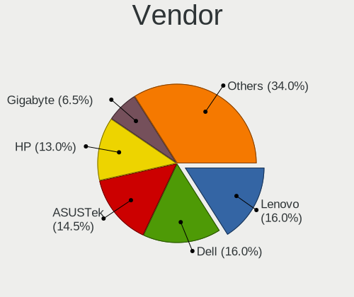
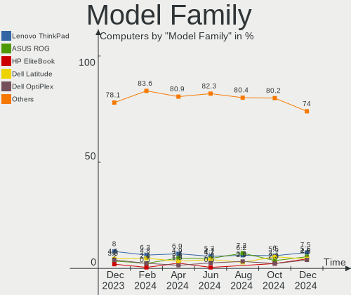
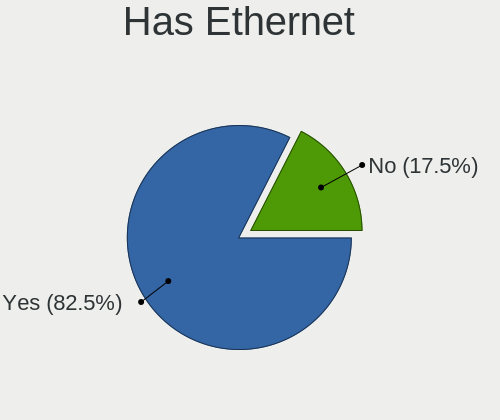
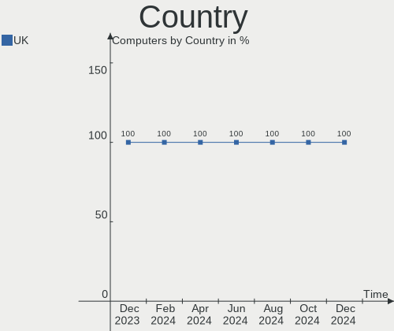
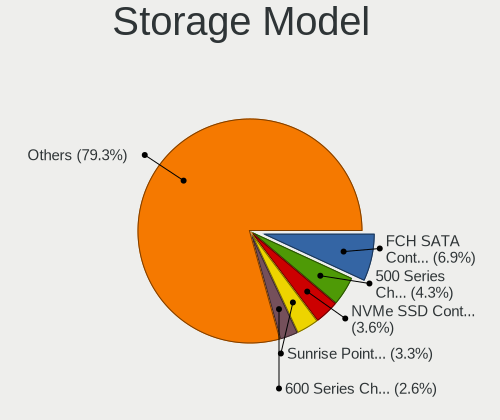
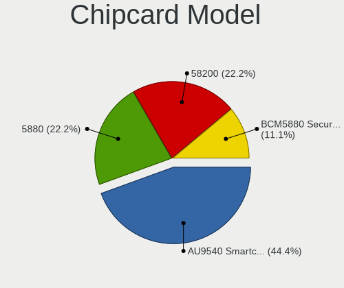

Linux in UK - Hardware Trends
-----------------------------

A project to identify most popular hardware characteristics and track their change
over time based on data collected by Linux users at https://Linux-Hardware.org.

Anyone can contribute to this report by the [hw-probe](https://github.com/linuxhw/hw-probe) tool:

    sudo -E hw-probe -all -upload

This is a report for all computer types. See also reports for [desktops](/Location/UK/Desktop/README.md) and [notebooks](/Location/UK/Notebook/README.md).

Period: Nov, 2023.

Contents
--------

* [ System ](#system)
  - [ OS                       ](#os)
  - [ OS Family                ](#os-family)
  - [ Kernel                   ](#kernel)
  - [ Kernel Family            ](#kernel-family)
  - [ Kernel Major Ver.        ](#kernel-major-ver)
  - [ Arch                     ](#arch)
  - [ DE                       ](#de)
  - [ Display Server           ](#display-server)
  - [ Display Manager          ](#display-manager)
  - [ OS Lang                  ](#os-lang)
  - [ Boot Mode                ](#boot-mode)
  - [ Filesystem               ](#filesystem)
  - [ Part. scheme             ](#part-scheme)
  - [ Dual Boot with Linux/BSD ](#dual-boot-with-linuxbsd)
  - [ Dual Boot (Win)          ](#dual-boot-win)

* [ Board ](#board)
  - [ Vendor                   ](#vendor)
  - [ Model                    ](#model)
  - [ Model Family             ](#model-family)
  - [ MFG Year                 ](#mfg-year)
  - [ Form Factor              ](#form-factor)
  - [ Secure Boot              ](#secure-boot)
  - [ Coreboot                 ](#coreboot)
  - [ RAM Size                 ](#ram-size)
  - [ RAM Used                 ](#ram-used)
  - [ Total Drives             ](#total-drives)
  - [ Has CD-ROM               ](#has-cd-rom)
  - [ Has Ethernet             ](#has-ethernet)
  - [ Has WiFi                 ](#has-wifi)
  - [ Has Bluetooth            ](#has-bluetooth)

* [ Location ](#location)
  - [ Country                  ](#country)
  - [ City                     ](#city)

* [ Drives ](#drives)
  - [ Drive Vendor             ](#drive-vendor)
  - [ Drive Model              ](#drive-model)
  - [ HDD Vendor               ](#hdd-vendor)
  - [ SSD Vendor               ](#ssd-vendor)
  - [ Drive Kind               ](#drive-kind)
  - [ Drive Connector          ](#drive-connector)
  - [ Drive Size               ](#drive-size)
  - [ Space Total              ](#space-total)
  - [ Space Used               ](#space-used)
  - [ Malfunc. Drives          ](#malfunc-drives)
  - [ Malfunc. Drive Vendor    ](#malfunc-drive-vendor)
  - [ Malfunc. HDD Vendor      ](#malfunc-hdd-vendor)
  - [ Malfunc. Drive Kind      ](#malfunc-drive-kind)
  - [ Failed Drives            ](#failed-drives)
  - [ Failed Drive Vendor      ](#failed-drive-vendor)
  - [ Drive Status             ](#drive-status)

* [ Storage controller ](#storage-controller)
  - [ Storage Vendor           ](#storage-vendor)
  - [ Storage Model            ](#storage-model)
  - [ Storage Kind             ](#storage-kind)

* [ Processor ](#processor)
  - [ CPU Vendor               ](#cpu-vendor)
  - [ CPU Model                ](#cpu-model)
  - [ CPU Model Family         ](#cpu-model-family)
  - [ CPU Cores                ](#cpu-cores)
  - [ CPU Sockets              ](#cpu-sockets)
  - [ CPU Threads              ](#cpu-threads)
  - [ CPU Op-Modes             ](#cpu-op-modes)
  - [ CPU Microcode            ](#cpu-microcode)
  - [ CPU Microarch            ](#cpu-microarch)

* [ Graphics ](#graphics)
  - [ GPU Vendor               ](#gpu-vendor)
  - [ GPU Model                ](#gpu-model)
  - [ GPU Combo                ](#gpu-combo)
  - [ GPU Driver               ](#gpu-driver)
  - [ GPU Memory               ](#gpu-memory)

* [ Monitor ](#monitor)
  - [ Monitor Vendor           ](#monitor-vendor)
  - [ Monitor Model            ](#monitor-model)
  - [ Monitor Resolution       ](#monitor-resolution)
  - [ Monitor Diagonal         ](#monitor-diagonal)
  - [ Monitor Width            ](#monitor-width)
  - [ Aspect Ratio             ](#aspect-ratio)
  - [ Monitor Area             ](#monitor-area)
  - [ Pixel Density            ](#pixel-density)
  - [ Multiple Monitors        ](#multiple-monitors)

* [ Network ](#network)
  - [ Net Controller Vendor    ](#net-controller-vendor)
  - [ Net Controller Model     ](#net-controller-model)
  - [ Wireless Vendor          ](#wireless-vendor)
  - [ Wireless Model           ](#wireless-model)
  - [ Ethernet Vendor          ](#ethernet-vendor)
  - [ Ethernet Model           ](#ethernet-model)
  - [ Net Controller Kind      ](#net-controller-kind)
  - [ Used Controller          ](#used-controller)
  - [ NICs                     ](#nics)
  - [ IPv6                     ](#ipv6)

* [ Bluetooth ](#bluetooth)
  - [ Bluetooth Vendor         ](#bluetooth-vendor)
  - [ Bluetooth Model          ](#bluetooth-model)

* [ Sound ](#sound)
  - [ Sound Vendor             ](#sound-vendor)
  - [ Sound Model              ](#sound-model)

* [ Memory ](#memory)
  - [ Memory Vendor            ](#memory-vendor)
  - [ Memory Model             ](#memory-model)
  - [ Memory Kind              ](#memory-kind)
  - [ Memory Form Factor       ](#memory-form-factor)
  - [ Memory Size              ](#memory-size)
  - [ Memory Speed             ](#memory-speed)

* [ Printers & scanners ](#printers--scanners)
  - [ Printer Vendor           ](#printer-vendor)
  - [ Printer Model            ](#printer-model)
  - [ Scanner Vendor           ](#scanner-vendor)
  - [ Scanner Model            ](#scanner-model)

* [ Camera ](#camera)
  - [ Camera Vendor            ](#camera-vendor)
  - [ Camera Model             ](#camera-model)

* [ Security ](#security)
  - [ Fingerprint Vendor       ](#fingerprint-vendor)
  - [ Fingerprint Model        ](#fingerprint-model)
  - [ Chipcard Vendor          ](#chipcard-vendor)
  - [ Chipcard Model           ](#chipcard-model)

* [ Unsupported ](#unsupported)
  - [ Unsupported Devices      ](#unsupported-devices)
  - [ Unsupported Device Types ](#unsupported-device-types)

System
------

OS
--

Installed operating systems

| Name                | Computers | Percent |
|---------------------|-----------|---------|
| Ubuntu 22.04        | 43        | 16.8%   |
| Fedora 39           | 22        | 8.59%   |
| Debian 12           | 17        | 6.64%   |
| Linux Mint 21.2     | 16        | 6.25%   |
| Ubuntu 23.10        | 13        | 5.08%   |
| OpenMandriva 23.08  | 11        | 4.3%    |
| Zorin 16            | 10        | 3.91%   |
| OpenMandriva 5.0    | 10        | 3.91%   |
| Arch Rolling        | 8         | 3.13%   |
| Pop!_OS 22.04       | 7         | 2.73%   |
| Kubuntu 23.10       | 7         | 2.73%   |
| Ubuntu 23.04        | 6         | 2.34%   |
| Xubuntu 23.10       | 5         | 1.95%   |
| Fedora 38           | 5         | 1.95%   |
| ArcoLinux Rolling   | 5         | 1.95%   |
| SteamOS 3.4.11      | 4         | 1.56%   |
| OpenMandriva 23.10  | 4         | 1.56%   |
| Nobara 38           | 3         | 1.17%   |
| LMDE 6              | 3         | 1.17%   |
| Linux Mint 21       | 3         | 1.17%   |
| EndeavourOS Rolling | 3         | 1.17%   |
| BlackPanther 18.1   | 3         | 1.17%   |
| Ubuntu 20.04        | 2         | 0.78%   |
| Ubuntu 18.04        | 2         | 0.78%   |
| Raspbian 11         | 2         | 0.78%   |
| Manjaro             | 2         | 0.78%   |
| Linux Mint 21.1     | 2         | 0.78%   |
| Kubuntu 22.04       | 2         | 0.78%   |
| Kali 2023.3         | 2         | 0.78%   |
| ChimeraOS 44-1      | 2         | 0.78%   |
| Xubuntu 18.04       | 1         | 0.39%   |
| Ubuntu Unity 16.04  | 1         | 0.39%   |
| Ubuntu Studio 23.10 | 1         | 0.39%   |
| Ubuntu MATE 22.04   | 1         | 0.39%   |
| SteamOS 3.5.7       | 1         | 0.39%   |
| SteamOS 3.5.5       | 1         | 0.39%   |
| SteamOS 3.4.8       | 1         | 0.39%   |
| SteamOS 3.1         | 1         | 0.39%   |
| Slackware 15.0      | 1         | 0.39%   |
| RHEL 9              | 1         | 0.39%   |

OS Family
---------

OS without a version

| Name             | Computers | Percent |
|------------------|-----------|---------|
| Ubuntu           | 66        | 25.78%  |
| Fedora           | 28        | 10.94%  |
| OpenMandriva     | 26        | 10.16%  |
| Linux Mint       | 22        | 8.59%   |
| Debian           | 19        | 7.42%   |
| Zorin            | 10        | 3.91%   |
| Kubuntu          | 10        | 3.91%   |
| SteamOS          | 8         | 3.13%   |
| Arch             | 8         | 3.13%   |
| Pop!_OS          | 7         | 2.73%   |
| Xubuntu          | 6         | 2.34%   |
| ArcoLinux        | 5         | 1.95%   |
| Nobara           | 3         | 1.17%   |
| Manjaro          | 3         | 1.17%   |
| LMDE             | 3         | 1.17%   |
| EndeavourOS      | 3         | 1.17%   |
| ChimeraOS        | 3         | 1.17%   |
| BlackPanther     | 3         | 1.17%   |
| Raspbian         | 2         | 0.78%   |
| Oracle Linux     | 2         | 0.78%   |
| Kali             | 2         | 0.78%   |
| Elementary       | 2         | 0.78%   |
| Ubuntu Unity     | 1         | 0.39%   |
| Ubuntu Studio    | 1         | 0.39%   |
| Ubuntu MATE      | 1         | 0.39%   |
| Slackware        | 1         | 0.39%   |
| RHEL             | 1         | 0.39%   |
| Parrot           | 1         | 0.39%   |
| org.kde.Platform | 1         | 0.39%   |
| openSUSE         | 1         | 0.39%   |
| MX               | 1         | 0.39%   |
| Lubuntu          | 1         | 0.39%   |
| KDE neon         | 1         | 0.39%   |
| Gentoo           | 1         | 0.39%   |
| CentOS           | 1         | 0.39%   |
| blendOS          | 1         | 0.39%   |
| antergos         | 1         | 0.39%   |

Kernel
------

Version of the Linux kernel

| Version                         | Computers | Percent |
|---------------------------------|-----------|---------|
| 6.2.0-36-generic                | 33        | 12.89%  |
| 6.5.0-10-generic                | 15        | 5.86%   |
| 6.1.0-13-amd64                  | 15        | 5.86%   |
| 5.15.0-88-generic               | 15        | 5.86%   |
| 6.5.11-300.fc39.x86_64          | 10        | 3.91%   |
| 6.4.11-desktop-1omv2390         | 10        | 3.91%   |
| 6.2.0-37-generic                | 10        | 3.91%   |
| 5.15.0-89-generic               | 10        | 3.91%   |
| 6.6.2-desktop-1omv2390          | 9         | 3.52%   |
| 6.5.6-76060506-generic          | 7         | 2.73%   |
| 6.6.1-arch1-1                   | 6         | 2.34%   |
| 6.5.6-300.fc39.x86_64           | 6         | 2.34%   |
| 6.6.2-arch1-1                   | 5         | 1.95%   |
| 6.2.0-26-generic                | 5         | 1.95%   |
| 6.5.0-9-generic                 | 4         | 1.56%   |
| 5.13.0-valve37-1-neptune        | 4         | 1.56%   |
| 6.5.9-arch2-1                   | 3         | 1.17%   |
| 6.5.5-desktop-1omv2390          | 3         | 1.17%   |
| 6.5.10-300.fc39.x86_64          | 3         | 1.17%   |
| 6.5.0-13-generic                | 3         | 1.17%   |
| 6.4.10-202.fsync.fc38.x86_64    | 3         | 1.17%   |
| 6.2.16-19-pve                   | 3         | 1.17%   |
| 5.15.85-desktop-1bP             | 3         | 1.17%   |
| 6.6.0-1-MANJARO                 | 2         | 0.78%   |
| 6.5.8-200.fc38.x86_64           | 2         | 0.78%   |
| 6.5.6-chos1-chimeraos-1         | 2         | 0.78%   |
| 6.5.12-300.fc39.x86_64          | 2         | 0.78%   |
| 6.5.10-200.fc38.x86_64          | 2         | 0.78%   |
| 6.5.0-kali3-amd64               | 2         | 0.78%   |
| 6.5.0-10-lowlatency             | 2         | 0.78%   |
| 6.2.0-35-generic                | 2         | 0.78%   |
| 5.4.0-150-generic               | 2         | 0.78%   |
| 5.15.0-76-generic               | 2         | 0.78%   |
| 5.15.0-200.131.27.el8uek.x86_64 | 2         | 0.78%   |
| 6.6.2-gentoo-x86_64             | 1         | 0.39%   |
| 6.6.1-x64v4-xanmod1             | 1         | 0.39%   |
| 6.6.1-desktop-1omv2390          | 1         | 0.39%   |
| 6.6.1-chos3-chimeraos-1         | 1         | 0.39%   |
| 6.6.0.15.realtime1-1-rt         | 1         | 0.39%   |
| 6.6.0-desktop-0.rc3.1omv2390    | 1         | 0.39%   |

Kernel Family
-------------

Linux kernel without a distro release

| Version  | Computers | Percent |
|----------|-----------|---------|
| 6.2.0    | 51        | 19.92%  |
| 5.15.0   | 36        | 14.06%  |
| 6.5.0    | 28        | 10.94%  |
| 6.1.0    | 19        | 7.42%   |
| 6.6.2    | 15        | 5.86%   |
| 6.5.6    | 15        | 5.86%   |
| 6.5.11   | 11        | 4.3%    |
| 6.4.11   | 10        | 3.91%   |
| 6.6.1    | 9         | 3.52%   |
| 5.13.0   | 7         | 2.73%   |
| 6.5.10   | 6         | 2.34%   |
| 6.5.9    | 5         | 1.95%   |
| 5.4.0    | 4         | 1.56%   |
| 6.6.0    | 3         | 1.17%   |
| 6.5.5    | 3         | 1.17%   |
| 6.4.10   | 3         | 1.17%   |
| 6.2.16   | 3         | 1.17%   |
| 5.15.85  | 3         | 1.17%   |
| 6.5.8    | 2         | 0.78%   |
| 6.5.12   | 2         | 0.78%   |
| 6.1.52   | 2         | 0.78%   |
| 6.1.21   | 2         | 0.78%   |
| 6.6.0.15 | 1         | 0.39%   |
| 6.5.3    | 1         | 0.39%   |
| 6.4.8    | 1         | 0.39%   |
| 6.4.3    | 1         | 0.39%   |
| 6.4.14   | 1         | 0.39%   |
| 6.3.9    | 1         | 0.39%   |
| 6.3.8    | 1         | 0.39%   |
| 6.2.9    | 1         | 0.39%   |
| 6.2.15   | 1         | 0.39%   |
| 6.1.63   | 1         | 0.39%   |
| 5.8.0    | 1         | 0.39%   |
| 5.4.234  | 1         | 0.39%   |
| 5.19.17  | 1         | 0.39%   |
| 5.14.0   | 1         | 0.39%   |
| 5.10.0   | 1         | 0.39%   |
| 4.8.0    | 1         | 0.39%   |
| 4.15.0   | 1         | 0.39%   |

Kernel Major Ver.
-----------------

Linux kernel major version

| Version | Computers | Percent |
|---------|-----------|---------|
| 6.5     | 73        | 28.52%  |
| 6.2     | 56        | 21.88%  |
| 5.15    | 39        | 15.23%  |
| 6.6     | 27        | 10.55%  |
| 6.1     | 24        | 9.38%   |
| 6.4     | 16        | 6.25%   |
| 5.13    | 7         | 2.73%   |
| 5.4     | 5         | 1.95%   |
| 6.3     | 2         | 0.78%   |
| 6.6.0   | 1         | 0.39%   |
| 5.8     | 1         | 0.39%   |
| 5.19    | 1         | 0.39%   |
| 5.14    | 1         | 0.39%   |
| 5.10    | 1         | 0.39%   |
| 4.8     | 1         | 0.39%   |
| 4.15    | 1         | 0.39%   |

Arch
----

OS architecture (x86_64, i586, etc.)

| Name    | Computers | Percent |
|---------|-----------|---------|
| x86_64  | 252       | 98.44%  |
| armv7l  | 2         | 0.78%   |
| i686    | 1         | 0.39%   |
| aarch64 | 1         | 0.39%   |

DE
--

Desktop Environment

| Name       | Computers | Percent |
|------------|-----------|---------|
| GNOME      | 127       | 49.61%  |
| KDE5       | 60        | 23.44%  |
| X-Cinnamon | 15        | 5.86%   |
| XFCE       | 14        | 5.47%   |
| Unknown    | 14        | 5.47%   |
| MATE       | 13        | 5.08%   |
| LXQt       | 4         | 1.56%   |
| Pantheon   | 2         | 0.78%   |
| Unity      | 1         | 0.39%   |
| LXDE       | 1         | 0.39%   |
| KDE4       | 1         | 0.39%   |
| i3         | 1         | 0.39%   |
| Cinnamon   | 1         | 0.39%   |
| chadwm     | 1         | 0.39%   |
| Budgie     | 1         | 0.39%   |

Display Server
--------------

X11 or Wayland

| Name    | Computers | Percent |
|---------|-----------|---------|
| X11     | 128       | 50%     |
| Wayland | 110       | 42.97%  |
| Tty     | 13        | 5.08%   |
| Unknown | 5         | 1.95%   |

Display Manager
---------------

SDDM, LightDM, etc.

| Name    | Computers | Percent |
|---------|-----------|---------|
| Unknown | 86        | 33.59%  |
| GDM3    | 72        | 28.13%  |
| SDDM    | 49        | 19.14%  |
| LightDM | 33        | 12.89%  |
| GDM     | 15        | 5.86%   |
| XDM     | 1         | 0.39%   |

OS Lang
-------

Language

| Lang    | Computers | Percent |
|---------|-----------|---------|
| en_GB   | 192       | 75%     |
| en_US   | 47        | 18.36%  |
| C       | 7         | 2.73%   |
| Unknown | 6         | 2.34%   |
| pl_PL   | 2         | 0.78%   |
| lt_LT   | 1         | 0.39%   |
| en_NZ   | 1         | 0.39%   |

Boot Mode
---------

EFI or BIOS

| Mode | Computers | Percent |
|------|-----------|---------|
| EFI  | 154       | 60.16%  |
| BIOS | 102       | 39.84%  |

Filesystem
----------

Type of filesystem

| Type    | Computers | Percent |
|---------|-----------|---------|
| Ext4    | 129       | 50.39%  |
| Btrfs   | 49        | 19.14%  |
| Tmpfs   | 46        | 17.97%  |
| Overlay | 23        | 8.98%   |
| Xfs     | 5         | 1.95%   |
| Zfs     | 2         | 0.78%   |
| Rootfs  | 1         | 0.39%   |
| Aufs    | 1         | 0.39%   |

Part. scheme
------------

Scheme of partitioning

| Type    | Computers | Percent |
|---------|-----------|---------|
| GPT     | 163       | 63.67%  |
| Unknown | 76        | 29.69%  |
| MBR     | 17        | 6.64%   |

Dual Boot with Linux/BSD
------------------------

Hosting more than one Linux/BSD

| Dual boot | Computers | Percent |
|-----------|-----------|---------|
| No        | 208       | 81.25%  |
| Yes       | 48        | 18.75%  |

Dual Boot (Win)
---------------

Hosting Linux and Windows

| Dual boot | Computers | Percent |
|-----------|-----------|---------|
| No        | 183       | 71.48%  |
| Yes       | 73        | 28.52%  |

Board
-----

Vendor
------

Motherboard manufacturer

| Name                                 | Computers | Percent |
|--------------------------------------|-----------|---------|
| Lenovo                               | 41        | 16.02%  |
| ASUSTek Computer                     | 34        | 13.28%  |
| Hewlett-Packard                      | 33        | 12.89%  |
| Dell                                 | 32        | 12.5%   |
| Gigabyte Technology                  | 20        | 7.81%   |
| MSI                                  | 14        | 5.47%   |
| Acer                                 | 14        | 5.47%   |
| Valve                                | 9         | 3.52%   |
| Apple                                | 9         | 3.52%   |
| Toshiba                              | 5         | 1.95%   |
| Intel                                | 4         | 1.56%   |
| ASRock                               | 4         | 1.56%   |
| HUAWEI                               | 3         | 1.17%   |
| Samsung Electronics                  | 2         | 0.78%   |
| Raspberry Pi Foundation              | 2         | 0.78%   |
| Linx                                 | 2         | 0.78%   |
| GEO                                  | 2         | 0.78%   |
| AZW                                  | 2         | 0.78%   |
| Alienware                            | 2         | 0.78%   |
| Unknown                              | 2         | 0.78%   |
| Trigkey                              | 1         | 0.39%   |
| Tactus                               | 1         | 0.39%   |
| Supermicro                           | 1         | 0.39%   |
| Shenzhen Meigao Electronic Equipment | 1         | 0.39%   |
| Razer                                | 1         | 0.39%   |
| ONE-NETBOOK                          | 1         | 0.39%   |
| NZXT                                 | 1         | 0.39%   |
| Notebook                             | 1         | 0.39%   |
| Mini PC                              | 1         | 0.39%   |
| Microsoft                            | 1         | 0.39%   |
| Jumper                               | 1         | 0.39%   |
| iOTA                                 | 1         | 0.39%   |
| GreatWall                            | 1         | 0.39%   |
| Google                               | 1         | 0.39%   |
| GMKtec                               | 1         | 0.39%   |
| Fujitsu                              | 1         | 0.39%   |
| Fanless Mini PC                      | 1         | 0.39%   |
| Clevo                                | 1         | 0.39%   |
| AWOW                                 | 1         | 0.39%   |
| AMI                                  | 1         | 0.39%   |

Model
-----

Motherboard model

| Name                                               | Computers | Percent |
|----------------------------------------------------|-----------|---------|
| Valve Jupiter                                      | 9         | 3.52%   |
| Dell XPS 15 9570                                   | 3         | 1.17%   |
| Toshiba Satellite C660D                            | 2         | 0.78%   |
| MSI MS-7C91                                        | 2         | 0.78%   |
| MSI MS-7B79                                        | 2         | 0.78%   |
| Lenovo V15 G2 ALC 82KD                             | 2         | 0.78%   |
| HP Pavilion Notebook                               | 2         | 0.78%   |
| HP Laptop 15-bw0xx                                 | 2         | 0.78%   |
| HP ENVY x360 2-in-1 Laptop 15-fh0xxx               | 2         | 0.78%   |
| Gigabyte B550 AORUS ELITE AX V2                    | 2         | 0.78%   |
| ASUS ROG STRIX X570-F GAMING                       | 2         | 0.78%   |
| ASUS P5G41T-M LX2/GB                               | 2         | 0.78%   |
| ASUS All Series                                    | 2         | 0.78%   |
| Apple MacBookPro11,4                               | 2         | 0.78%   |
| Unknown                                            | 2         | 0.78%   |
| Trigkey Green G4                                   | 1         | 0.39%   |
| Toshiba TECRA R940                                 | 1         | 0.39%   |
| Toshiba Satellite L300                             | 1         | 0.39%   |
| Toshiba Satellite C50-A-1CK                        | 1         | 0.39%   |
| Tactus GeoBook 110                                 | 1         | 0.39%   |
| Supermicro Super Server                            | 1         | 0.39%   |
| Shenzhen Meigao Electronic Equipment HX99G         | 1         | 0.39%   |
| Samsung 930QED                                     | 1         | 0.39%   |
| Samsung 550P5C/550P7C                              | 1         | 0.39%   |
| Razer Blade 15 Base Model (Early 2020) - RZ09-0328 | 1         | 0.39%   |
| RPi Raspberry Pi 4 Model B Rev 1.4                 | 1         | 0.39%   |
| RPi Raspberry Pi 3 Model B Rev 1.2                 | 1         | 0.39%   |
| ONE-NETBOOK ONEXPLAYER 2 PRO ARP23P                | 1         | 0.39%   |
| NZXT N7 B650E                                      | 1         | 0.39%   |
| Notebook NS5x_NS7xPU                               | 1         | 0.39%   |
| MSI MS-7E12                                        | 1         | 0.39%   |
| MSI MS-7E07                                        | 1         | 0.39%   |
| MSI MS-7E01                                        | 1         | 0.39%   |
| MSI MS-7D75                                        | 1         | 0.39%   |
| MSI MS-7C51                                        | 1         | 0.39%   |
| MSI MS-7C02                                        | 1         | 0.39%   |
| MSI MS-7B78                                        | 1         | 0.39%   |
| MSI MS-7996                                        | 1         | 0.39%   |
| MSI MS-6657                                        | 1         | 0.39%   |
| MSI Katana GF66 11UE                               | 1         | 0.39%   |

Model Family
------------

Motherboard model prefix

| Name                 | Computers | Percent |
|----------------------|-----------|---------|
| Lenovo ThinkPad      | 16        | 6.25%   |
| Acer Aspire          | 13        | 5.08%   |
| Valve Jupiter        | 9         | 3.52%   |
| ASUS ROG             | 9         | 3.52%   |
| Dell Latitude        | 7         | 2.73%   |
| Lenovo IdeaPad       | 6         | 2.34%   |
| Dell XPS             | 6         | 2.34%   |
| Dell OptiPlex        | 6         | 2.34%   |
| Dell Inspiron        | 6         | 2.34%   |
| Lenovo ThinkCentre   | 5         | 1.95%   |
| HP Pavilion          | 5         | 1.95%   |
| ASUS PRIME           | 5         | 1.95%   |
| Toshiba Satellite    | 4         | 1.56%   |
| HP Laptop            | 4         | 1.56%   |
| Dell Precision       | 4         | 1.56%   |
| HP ENVY              | 3         | 1.17%   |
| HP EliteBook         | 3         | 1.17%   |
| HP Compaq            | 3         | 1.17%   |
| Gigabyte B550        | 3         | 1.17%   |
| ASUS VivoBook        | 3         | 1.17%   |
| ASUS P5G41T-M        | 3         | 1.17%   |
| Apple MacBookPro11   | 3         | 1.17%   |
| RPi Raspberry        | 2         | 0.78%   |
| MSI MS-7C91          | 2         | 0.78%   |
| MSI MS-7B79          | 2         | 0.78%   |
| Lenovo Yoga          | 2         | 0.78%   |
| Lenovo V15           | 2         | 0.78%   |
| Lenovo Legion        | 2         | 0.78%   |
| HP ZBook             | 2         | 0.78%   |
| HP ProBook           | 2         | 0.78%   |
| HP OMEN              | 2         | 0.78%   |
| Gigabyte Z97X-Gaming | 2         | 0.78%   |
| GEO GeoFlex          | 2         | 0.78%   |
| Dell Vostro          | 2         | 0.78%   |
| ASUS All             | 2         | 0.78%   |
| Unknown              | 2         | 0.78%   |
| Trigkey Green        | 1         | 0.39%   |
| Toshiba TECRA        | 1         | 0.39%   |
| Tactus GeoBook       | 1         | 0.39%   |
| Supermicro Super     | 1         | 0.39%   |

MFG Year
--------

Motherboard manufacture year

| Year    | Computers | Percent |
|---------|-----------|---------|
| 2023    | 29        | 11.33%  |
| 2021    | 28        | 10.94%  |
| 2020    | 28        | 10.94%  |
| 2022    | 25        | 9.77%   |
| 2017    | 21        | 8.2%    |
| 2019    | 20        | 7.81%   |
| 2018    | 19        | 7.42%   |
| 2012    | 14        | 5.47%   |
| 2013    | 12        | 4.69%   |
| 2014    | 11        | 4.3%    |
| 2015    | 10        | 3.91%   |
| 2016    | 7         | 2.73%   |
| 2011    | 7         | 2.73%   |
| 2010    | 6         | 2.34%   |
| 2009    | 6         | 2.34%   |
| 2008    | 4         | 1.56%   |
| 2007    | 4         | 1.56%   |
| Unknown | 3         | 1.17%   |
| 2006    | 2         | 0.78%   |

Form Factor
-----------

Physical design of the computer

| Name           | Computers | Percent |
|----------------|-----------|---------|
| Notebook       | 124       | 48.44%  |
| Desktop        | 97        | 37.89%  |
| Convertible    | 14        | 5.47%   |
| Mini pc        | 9         | 3.52%   |
| Tablet         | 5         | 1.95%   |
| All in one     | 4         | 1.56%   |
| System on chip | 2         | 0.78%   |
| Server         | 1         | 0.39%   |

Secure Boot
-----------

Enabled or disabled

| State    | Computers | Percent |
|----------|-----------|---------|
| Disabled | 230       | 89.84%  |
| Enabled  | 26        | 10.16%  |

Coreboot
--------

Have coreboot on board

| Used | Computers | Percent |
|------|-----------|---------|
| No   | 255       | 99.61%  |
| Yes  | 1         | 0.39%   |

RAM Size
--------

Total RAM memory

| Size in GB  | Computers | Percent |
|-------------|-----------|---------|
| 4.01-8.0    | 57        | 22.27%  |
| 16.01-24.0  | 50        | 19.53%  |
| 32.01-64.0  | 41        | 16.02%  |
| 8.01-16.0   | 40        | 15.63%  |
| 3.01-4.0    | 33        | 12.89%  |
| 64.01-256.0 | 19        | 7.42%   |
| 24.01-32.0  | 6         | 2.34%   |
| 1.01-2.0    | 6         | 2.34%   |
| 0.51-1.0    | 3         | 1.17%   |
| 2.01-3.0    | 1         | 0.39%   |

RAM Used
--------

Used RAM memory

| Used GB     | Computers | Percent |
|-------------|-----------|---------|
| 1.01-2.0    | 72        | 28.13%  |
| 2.01-3.0    | 55        | 21.48%  |
| 4.01-8.0    | 54        | 21.09%  |
| 3.01-4.0    | 46        | 17.97%  |
| 8.01-16.0   | 13        | 5.08%   |
| 0.51-1.0    | 7         | 2.73%   |
| 0.01-0.5    | 4         | 1.56%   |
| 16.01-24.0  | 3         | 1.17%   |
| 64.01-256.0 | 2         | 0.78%   |

Total Drives
------------

Number of drives on board

| Drives | Computers | Percent |
|--------|-----------|---------|
| 1      | 138       | 53.91%  |
| 2      | 65        | 25.39%  |
| 3      | 27        | 10.55%  |
| 4      | 9         | 3.52%   |
| 5      | 8         | 3.13%   |
| 6      | 3         | 1.17%   |
| 10     | 2         | 0.78%   |
| 11     | 1         | 0.39%   |
| 8      | 1         | 0.39%   |
| 7      | 1         | 0.39%   |
| 0      | 1         | 0.39%   |

Has CD-ROM
----------

Has CD-ROM on board

| Presented | Computers | Percent |
|-----------|-----------|---------|
| No        | 186       | 72.66%  |
| Yes       | 70        | 27.34%  |

Has Ethernet
------------

Has Ethernet on board

| Presented | Computers | Percent |
|-----------|-----------|---------|
| Yes       | 200       | 78.13%  |
| No        | 56        | 21.88%  |

Has WiFi
--------

Has WiFi module

| Presented | Computers | Percent |
|-----------|-----------|---------|
| Yes       | 203       | 79.3%   |
| No        | 53        | 20.7%   |

Has Bluetooth
-------------

Has Bluetooth module

| Presented | Computers | Percent |
|-----------|-----------|---------|
| Yes       | 185       | 72.27%  |
| No        | 71        | 27.73%  |

Location
--------

Country
-------

Geographic location (country)

| Country | Computers | Percent |
|---------|-----------|---------|
| UK      | 256       | 100%    |

City
----

Geographic location (city)

| City           | Computers | Percent |
|----------------|-----------|---------|
| London         | 11        | 4.3%    |
| Manchester     | 8         | 3.13%   |
| Cardiff        | 5         | 1.95%   |
| Birmingham     | 5         | 1.95%   |
| Southampton    | 4         | 1.56%   |
| Reading        | 4         | 1.56%   |
| Liverpool      | 4         | 1.56%   |
| Lewisham       | 4         | 1.56%   |
| Harringay      | 4         | 1.56%   |
| Tower Hamlets  | 3         | 1.17%   |
| Stowmarket     | 3         | 1.17%   |
| Slough         | 3         | 1.17%   |
| Sheffield      | 3         | 1.17%   |
| Rochdale       | 3         | 1.17%   |
| Nottingham     | 3         | 1.17%   |
| Newham         | 3         | 1.17%   |
| Leeds          | 3         | 1.17%   |
| Lambeth        | 3         | 1.17%   |
| Islington      | 3         | 1.17%   |
| Glasgow        | 3         | 1.17%   |
| Edgware        | 3         | 1.17%   |
| Croydon        | 3         | 1.17%   |
| Bristol        | 3         | 1.17%   |
| Brent          | 3         | 1.17%   |
| Swindon        | 2         | 0.78%   |
| Stoke-on-Trent | 2         | 0.78%   |
| Stockport      | 2         | 0.78%   |
| Southwark      | 2         | 0.78%   |
| Peterborough   | 2         | 0.78%   |
| Newtownabbey   | 2         | 0.78%   |
| Leicester      | 2         | 0.78%   |
| Kettering      | 2         | 0.78%   |
| Inverness      | 2         | 0.78%   |
| Ilford         | 2         | 0.78%   |
| Hounslow       | 2         | 0.78%   |
| Harlow         | 2         | 0.78%   |
| Hackney        | 2         | 0.78%   |
| Gloucester     | 2         | 0.78%   |
| Edinburgh      | 2         | 0.78%   |
| Doncaster      | 2         | 0.78%   |

Drives
------

Drive Vendor
------------

Hard drive vendors

| Vendor                      | Computers | Drives | Percent |
|-----------------------------|-----------|--------|---------|
| Samsung Electronics         | 55        | 66     | 13.61%  |
| Seagate                     | 46        | 67     | 11.39%  |
| WDC                         | 34        | 46     | 8.42%   |
| Unknown                     | 34        | 42     | 8.42%   |
| Sandisk                     | 33        | 37     | 8.17%   |
| Toshiba                     | 23        | 25     | 5.69%   |
| Crucial                     | 23        | 34     | 5.69%   |
| Kingston                    | 17        | 17     | 4.21%   |
| Intel                       | 13        | 14     | 3.22%   |
| SK hynix                    | 11        | 11     | 2.72%   |
| Micron/Crucial Technology   | 9         | 12     | 2.23%   |
| Phison Electronics          | 7         | 7      | 1.73%   |
| China                       | 7         | 7      | 1.73%   |
| Apple                       | 7         | 9      | 1.73%   |
| Micron Technology           | 6         | 6      | 1.49%   |
| KIOXIA                      | 6         | 6      | 1.49%   |
| Kingston Technology Company | 6         | 6      | 1.49%   |
| LITEON                      | 5         | 5      | 1.24%   |
| Unknown                     | 5         | 6      | 1.24%   |
| Netac                       | 4         | 5      | 0.99%   |
| SPCC                        | 3         | 3      | 0.74%   |
| Silicon Motion              | 3         | 5      | 0.74%   |
| PNY                         | 3         | 3      | 0.74%   |
| O2 Micro                    | 3         | 3      | 0.74%   |
| Integral                    | 3         | 3      | 0.74%   |
| HGST                        | 3         | 3      | 0.74%   |
| SABRENT                     | 2         | 3      | 0.5%    |
| Realtek                     | 2         | 2      | 0.5%    |
| Phison                      | 2         | 2      | 0.5%    |
| Lexar                       | 2         | 2      | 0.5%    |
| Drevo                       | 2         | 2      | 0.5%    |
| TO Exter                    | 1         | 1      | 0.25%   |
| Team                        | 1         | 1      | 0.25%   |
| TCSUNBOW                    | 1         | 1      | 0.25%   |
| SSK SD30                    | 1         | 1      | 0.25%   |
| SSK                         | 1         | 1      | 0.25%   |
| ShiJi                       | 1         | 1      | 0.25%   |
| Realtek Semiconductor       | 1         | 1      | 0.25%   |
| Patriot                     | 1         | 1      | 0.25%   |
| OCZ-VERTEX2                 | 1         | 1      | 0.25%   |

Drive Model
-----------

Hard drive models

| Model                                                 | Computers | Percent |
|-------------------------------------------------------|-----------|---------|
| Samsung NVMe SSD Controller SM981/PM981/PM983 250GB   | 12        | 2.58%   |
| Unknown MMC Card  64GB                                | 10        | 2.15%   |
| Sandisk WD Black SN850 1024GB                         | 6         | 1.29%   |
| Unknown MMC Card  32GB                                | 5         | 1.07%   |
| Seagate ST4000DM004-2CV104 4TB                        | 5         | 1.07%   |
| Seagate ST2000DM008-2FR102 2TB                        | 5         | 1.07%   |
| Micron/Crucial P2 NVMe PCIe SSD 1TB                   | 5         | 1.07%   |
| Kingston SA400S37240G 240GB SSD                       | 5         | 1.07%   |
| Unknown                                               | 5         | 1.07%   |
| Unknown MMC Card  512GB                               | 4         | 0.86%   |
| Unknown MMC Card  128GB                               | 4         | 0.86%   |
| Seagate ST1000DM010-2EP102 1TB                        | 4         | 0.86%   |
| Crucial CT1000MX500SSD1 1TB                           | 4         | 0.86%   |
| WDC WD10JPVX-22JC3T0 1TB                              | 3         | 0.64%   |
| Toshiba MQ01ABD100 1TB                                | 3         | 0.64%   |
| SPCC Solid State Disk 256GB                           | 3         | 0.64%   |
| Seagate ST3500312CS 500GB                             | 3         | 0.64%   |
| Seagate ST1000LM035-1RK172 1TB                        | 3         | 0.64%   |
| Samsung SSD 870 QVO 1TB                               | 3         | 0.64%   |
| Samsung SSD 850 EVO 500GB                             | 3         | 0.64%   |
| Samsung Portable SSD T5 2TB                           | 3         | 0.64%   |
| Samsung NVMe SSD Controller PM9A1/PM9A3/980PRO 2TB    | 3         | 0.64%   |
| Phison PS5013 E13 NVMe Controller 512GB               | 3         | 0.64%   |
| O2 Micro E2M2 64GB                                    | 3         | 0.64%   |
| Intel SSD 660P Series 512GB                           | 3         | 0.64%   |
| Crucial CT500P5PSSD8 500GB                            | 3         | 0.64%   |
| WDC WDS500G2B0A-00SM50 500GB SSD                      | 2         | 0.43%   |
| WDC WD10JPVX-60JC3T1 1TB                              | 2         | 0.43%   |
| WDC WD10EZEX-22MFCA0 1TB                              | 2         | 0.43%   |
| WDC WD10EZEX-08WN4A0 1TB                              | 2         | 0.43%   |
| Unknown SD32G  32GB                                   | 2         | 0.43%   |
| Unknown SD/MMC/MS PRO 128GB                           | 2         | 0.43%   |
| Unknown SD/MMC 2GB                                    | 2         | 0.43%   |
| Unknown MMC Card  16GB                                | 2         | 0.43%   |
| Unknown M.S./M.S.Pro/HG 16GB                          | 2         | 0.43%   |
| Toshiba HDWE160 6TB                                   | 2         | 0.43%   |
| Toshiba DT01ACA100 1TB                                | 2         | 0.43%   |
| SK hynix BC901 HFS512GEJ9X108N 512GB                  | 2         | 0.43%   |
| Silicon Motion SM2263EN/SM2263XT SSD Controller 256GB | 2         | 0.43%   |
| Seagate ST3500418AS 500GB                             | 2         | 0.43%   |

HDD Vendor
----------

Hard disk drive vendors

| Vendor              | Computers | Drives | Percent |
|---------------------|-----------|--------|---------|
| Seagate             | 45        | 66     | 42.45%  |
| WDC                 | 32        | 39     | 30.19%  |
| Toshiba             | 14        | 16     | 13.21%  |
| Samsung Electronics | 4         | 5      | 3.77%   |
| HGST                | 3         | 3      | 2.83%   |
| Unknown             | 2         | 2      | 1.89%   |
| TO Exter            | 1         | 1      | 0.94%   |
| LaCie               | 1         | 1      | 0.94%   |
| Inateck             | 1         | 1      | 0.94%   |
| Hitachi             | 1         | 1      | 0.94%   |
| Fujitsu             | 1         | 1      | 0.94%   |
| External            | 1         | 3      | 0.94%   |

SSD Vendor
----------

Solid state drive vendors

| Vendor              | Computers | Drives | Percent |
|---------------------|-----------|--------|---------|
| Samsung Electronics | 22        | 23     | 18.03%  |
| Crucial             | 15        | 17     | 12.3%   |
| SanDisk             | 14        | 15     | 11.48%  |
| Kingston            | 14        | 14     | 11.48%  |
| China               | 7         | 7      | 5.74%   |
| Toshiba             | 6         | 6      | 4.92%   |
| LITEON              | 5         | 5      | 4.1%    |
| Apple               | 5         | 5      | 4.1%    |
| WDC                 | 4         | 5      | 3.28%   |
| SPCC                | 3         | 3      | 2.46%   |
| PNY                 | 3         | 3      | 2.46%   |
| Netac               | 3         | 4      | 2.46%   |
| Integral            | 3         | 3      | 2.46%   |
| SK hynix            | 2         | 2      | 1.64%   |
| SABRENT             | 2         | 2      | 1.64%   |
| Drevo               | 2         | 2      | 1.64%   |
| Team                | 1         | 1      | 0.82%   |
| TCSUNBOW            | 1         | 1      | 0.82%   |
| Patriot             | 1         | 1      | 0.82%   |
| OCZ-VERTEX2         | 1         | 1      | 0.82%   |
| OCZ                 | 1         | 1      | 0.82%   |
| NGFF                | 1         | 1      | 0.82%   |
| M4-CT128            | 1         | 1      | 0.82%   |
| Lexar               | 1         | 1      | 0.82%   |
| Gigabyte Technology | 1         | 1      | 0.82%   |
| FORESEE             | 1         | 1      | 0.82%   |
| ASMT                | 1         | 1      | 0.82%   |
| Unknown             | 1         | 1      | 0.82%   |

Drive Kind
----------

HDD or SSD

| Kind    | Computers | Drives | Percent |
|---------|-----------|--------|---------|
| NVMe    | 133       | 172    | 36.94%  |
| SSD     | 100       | 128    | 27.78%  |
| HDD     | 89        | 139    | 24.72%  |
| MMC     | 31        | 38     | 8.61%   |
| Unknown | 7         | 10     | 1.94%   |

Drive Connector
---------------

SATA, SAS, NVMe, etc.

| Type | Computers | Drives | Percent |
|------|-----------|--------|---------|
| SATA | 148       | 238    | 43.66%  |
| NVMe | 133       | 168    | 39.23%  |
| MMC  | 31        | 38     | 9.14%   |
| SAS  | 27        | 43     | 7.96%   |

Drive Size
----------

Size of hard drive

| Size in TB | Computers | Drives | Percent |
|------------|-----------|--------|---------|
| 0.01-0.5   | 101       | 126    | 46.98%  |
| 0.51-1.0   | 60        | 74     | 27.91%  |
| 1.01-2.0   | 27        | 28     | 12.56%  |
| 3.01-4.0   | 12        | 21     | 5.58%   |
| 2.01-3.0   | 7         | 8      | 3.26%   |
| 4.01-10.0  | 7         | 8      | 3.26%   |
| 10.01-20.0 | 1         | 2      | 0.47%   |

Space Total
-----------

Amount of disk space available on the file system

| Size in GB     | Computers | Percent |
|----------------|-----------|---------|
| 101-250        | 59        | 23.05%  |
| 251-500        | 55        | 21.48%  |
| 501-1000       | 31        | 12.11%  |
| 1001-2000      | 25        | 9.77%   |
| 1-20           | 25        | 9.77%   |
| More than 3000 | 21        | 8.2%    |
| 51-100         | 13        | 5.08%   |
| Unknown        | 13        | 5.08%   |
| 2001-3000      | 8         | 3.13%   |
| 21-50          | 6         | 2.34%   |

Space Used
----------

Amount of used disk space

| Used GB        | Computers | Percent |
|----------------|-----------|---------|
| 1-20           | 84        | 32.81%  |
| 21-50          | 51        | 19.92%  |
| 101-250        | 40        | 15.63%  |
| 51-100         | 20        | 7.81%   |
| 251-500        | 15        | 5.86%   |
| Unknown        | 13        | 5.08%   |
| 1001-2000      | 11        | 4.3%    |
| 501-1000       | 11        | 4.3%    |
| More than 3000 | 10        | 3.91%   |
| 2001-3000      | 1         | 0.39%   |

Malfunc. Drives
---------------

Drive models with a malfunction

| Model                                 | Computers | Drives | Percent |
|---------------------------------------|-----------|--------|---------|
| WDC WD40PURZ-85TTDY0 4TB              | 1         | 1      | 3.7%    |
| WDC WD32 00BPVT-22ZEST0 320GB         | 1         | 1      | 3.7%    |
| WDC WD30EZRX-00D8PB0 3TB              | 1         | 1      | 3.7%    |
| WDC WD10JPVX-22JC3T0 1TB              | 1         | 1      | 3.7%    |
| WDC WD10EZEX-22MFCA0 1TB              | 1         | 1      | 3.7%    |
| WDC WD10EZEX-08WN4A0 1TB              | 1         | 1      | 3.7%    |
| WDC WD10EARS-00Y5B1 1TB               | 1         | 1      | 3.7%    |
| WDC WD Blue SA510 M.2 2280 500GB      | 1         | 1      | 3.7%    |
| Toshiba MQ01ABD100 1TB                | 1         | 1      | 3.7%    |
| SK hynix HFS256G39TND-N210A 256GB SSD | 1         | 1      | 3.7%    |
| Seagate ST9500325AS 500GB             | 1         | 1      | 3.7%    |
| Seagate ST500LT012-1DG142 500GB       | 1         | 1      | 3.7%    |
| Seagate ST500LM021-1KJ152 500GB       | 1         | 1      | 3.7%    |
| Seagate ST500DM002-1BC142 500GB       | 1         | 1      | 3.7%    |
| Seagate ST4000VX007-2DT166 4TB        | 1         | 1      | 3.7%    |
| Seagate ST3500418AS 500GB             | 1         | 1      | 3.7%    |
| Seagate ST2000DX001-1NS164 2TB        | 1         | 1      | 3.7%    |
| SanDisk SSD PLUS 240GB                | 1         | 1      | 3.7%    |
| SanDisk SDSSDP128G 128GB              | 1         | 1      | 3.7%    |
| Intel SSDPEKKF512G8L 512GB            | 1         | 1      | 3.7%    |
| Intel SSD 600P Series 256GB           | 1         | 1      | 3.7%    |
| Intel MEMPEK1J016GAL 16GB             | 1         | 1      | 3.7%    |
| Hitachi HDS721010CLA332 1TB           | 1         | 1      | 3.7%    |
| HGST HTS721010A9E630 1TB              | 1         | 1      | 3.7%    |
| Drevo X1 Pro SSD 128GB                | 1         | 1      | 3.7%    |
| Crucial CT750MX300SSD1 752GB          | 1         | 1      | 3.7%    |
| China SH00M256GB SSD                  | 1         | 1      | 3.7%    |

Malfunc. Drive Vendor
---------------------

Vendors of faulty drives

| Vendor   | Computers | Drives | Percent |
|----------|-----------|--------|---------|
| WDC      | 7         | 8      | 26.92%  |
| Seagate  | 7         | 7      | 26.92%  |
| Intel    | 3         | 3      | 11.54%  |
| SanDisk  | 2         | 2      | 7.69%   |
| Toshiba  | 1         | 1      | 3.85%   |
| SK hynix | 1         | 1      | 3.85%   |
| Hitachi  | 1         | 1      | 3.85%   |
| HGST     | 1         | 1      | 3.85%   |
| Drevo    | 1         | 1      | 3.85%   |
| Crucial  | 1         | 1      | 3.85%   |
| China    | 1         | 1      | 3.85%   |

Malfunc. HDD Vendor
-------------------

Vendors of faulty HDD drives

| Vendor  | Computers | Drives | Percent |
|---------|-----------|--------|---------|
| Seagate | 7         | 7      | 43.75%  |
| WDC     | 6         | 7      | 37.5%   |
| Toshiba | 1         | 1      | 6.25%   |
| Hitachi | 1         | 1      | 6.25%   |
| HGST    | 1         | 1      | 6.25%   |

Malfunc. Drive Kind
-------------------

Kinds of faulty drives

| Kind | Computers | Drives | Percent |
|------|-----------|--------|---------|
| HDD  | 15        | 17     | 60%     |
| SSD  | 7         | 7      | 28%     |
| NVMe | 3         | 3      | 12%     |

Failed Drives
-------------

Failed drive models

Zero info for selected period =(

Failed Drive Vendor
-------------------

Failed drive vendors

Zero info for selected period =(

Drive Status
------------

Number of failed and malfunc. drives

| Status   | Computers | Drives | Percent |
|----------|-----------|--------|---------|
| Detected | 141       | 255    | 49.13%  |
| Works    | 123       | 205    | 42.86%  |
| Malfunc  | 23        | 27     | 8.01%   |

Storage controller
------------------

Storage Vendor
--------------

Storage controller vendors

| Vendor                       | Computers | Percent |
|------------------------------|-----------|---------|
| Intel                        | 139       | 39.83%  |
| AMD                          | 59        | 16.91%  |
| Samsung Electronics          | 39        | 11.17%  |
| SanDisk                      | 22        | 6.3%    |
| Micron/Crucial Technology    | 19        | 5.44%   |
| Phison Electronics           | 11        | 3.15%   |
| SK hynix                     | 9         | 2.58%   |
| Kingston Technology Company  | 9         | 2.58%   |
| Micron Technology            | 6         | 1.72%   |
| KIOXIA                       | 6         | 1.72%   |
| Nvidia                       | 4         | 1.15%   |
| Toshiba America Info Systems | 3         | 0.86%   |
| Silicon Motion               | 3         | 0.86%   |
| O2 Micro                     | 3         | 0.86%   |
| ASMedia Technology           | 3         | 0.86%   |
| Silicon Image                | 2         | 0.57%   |
| MAXIO Technology (Hangzhou)  | 2         | 0.57%   |
| Marvell Technology Group     | 2         | 0.57%   |
| Apple                        | 2         | 0.57%   |
| Solidigm                     | 1         | 0.29%   |
| Shenzhen Longsys Electronics | 1         | 0.29%   |
| Realtek Semiconductor        | 1         | 0.29%   |
| LSI Logic / Symbios Logic    | 1         | 0.29%   |
| INNOGRIT                     | 1         | 0.29%   |
| ADATA Technology             | 1         | 0.29%   |

Storage Model
-------------

Storage controller models

| Model                                                                          | Computers | Percent |
|--------------------------------------------------------------------------------|-----------|---------|
| AMD FCH SATA Controller [AHCI mode]                                            | 39        | 10.03%  |
| Samsung NVMe SSD Controller SM981/PM981/PM983                                  | 18        | 4.63%   |
| Samsung NVMe SSD Controller 980 (DRAM-less)                                    | 12        | 3.08%   |
| Intel Sunrise Point-LP SATA Controller [AHCI mode]                             | 12        | 3.08%   |
| Micron/Crucial P2 [Nick P2] / P3 / P3 Plus NVMe PCIe SSD (DRAM-less)           | 10        | 2.57%   |
| Intel Volume Management Device NVMe RAID Controller                            | 10        | 2.57%   |
| AMD 500 Series Chipset SATA Controller                                         | 9         | 2.31%   |
| Intel Comet Lake SATA AHCI Controller                                          | 8         | 2.06%   |
| Phison PS5013-E13 PCIe3 NVMe Controller (DRAM-less)                            | 7         | 1.8%    |
| Micron/Crucial P5 Plus NVMe PCIe SSD                                           | 7         | 1.8%    |
| Intel Q170/Q150/B150/H170/H110/Z170/CM236 Chipset SATA Controller [AHCI Mode]  | 7         | 1.8%    |
| Intel 7 Series Chipset Family 6-port SATA Controller [AHCI mode]               | 7         | 1.8%    |
| AMD 400 Series Chipset SATA Controller                                         | 7         | 1.8%    |
| SanDisk WD PC SN810 / Black SN850 NVMe SSD                                     | 6         | 1.54%   |
| SanDisk WD Black SN770 / PC SN740 256GB / PC SN560 (DRAM-less) NVMe SSD        | 6         | 1.54%   |
| Intel Celeron/Pentium Silver Processor SATA Controller                         | 6         | 1.54%   |
| Intel 8 Series/C220 Series Chipset Family 6-port SATA Controller 1 [AHCI mode] | 6         | 1.54%   |
| Intel 7 Series/C210 Series Chipset Family 6-port SATA Controller [AHCI mode]   | 6         | 1.54%   |
| Samsung NVMe SSD Controller PM9A1/PM9A3/980PRO                                 | 5         | 1.29%   |
| Intel 200 Series PCH SATA controller [AHCI mode]                               | 5         | 1.29%   |
| AMD SB7x0/SB8x0/SB9x0 SATA Controller [AHCI mode]                              | 5         | 1.29%   |
| Intel Wildcat Point-LP SATA Controller [AHCI Mode]                             | 4         | 1.03%   |
| Intel NM10/ICH7 Family SATA Controller [IDE mode]                              | 4         | 1.03%   |
| Intel HM170/QM170 Chipset SATA Controller [AHCI Mode]                          | 4         | 1.03%   |
| Intel Cannon Lake Mobile PCH SATA AHCI Controller                              | 4         | 1.03%   |
| Intel 82801G (ICH7 Family) IDE Controller                                      | 4         | 1.03%   |
| Intel 82801 Mobile SATA Controller [RAID mode]                                 | 4         | 1.03%   |
| Intel 700 Series Chipset Family SATA AHCI Controller                           | 4         | 1.03%   |
| Silicon Motion SM2263EN/SM2263XT (DRAM-less) NVMe SSD Controllers              | 3         | 0.77%   |
| SanDisk IX SN530 NVMe SSD (DRAM-less)                                          | 3         | 0.77%   |
| Samsung S4LN058A01[SSUBX] AHCI SSD Controller (Apple slot)                     | 3         | 0.77%   |
| O2 Micro FORESEE E2M2 NVMe SSD                                                 | 3         | 0.77%   |
| KIOXIA NVMe SSD Controller BG4 (DRAM-less)                                     | 3         | 0.77%   |
| Intel SSD 670p Series [Keystone Harbor]                                        | 3         | 0.77%   |
| Intel SSD 660P Series                                                          | 3         | 0.77%   |
| Intel Jasper Lake SATA AHCI Controller                                         | 3         | 0.77%   |
| Intel Celeron N3350/Pentium N4200/Atom E3900 Series SATA AHCI Controller       | 3         | 0.77%   |
| Intel 9 Series Chipset Family SATA Controller [AHCI Mode]                      | 3         | 0.77%   |
| Toshiba America Info Systems XG4 NVMe SSD Controller                           | 2         | 0.51%   |
| SK hynix PC401 NVMe Solid State Drive 256GB                                    | 2         | 0.51%   |

Storage Kind
------------

Kind of storage controller (IDE, SATA, NVMe, SAS, ...)

| Kind | Computers | Percent |
|------|-----------|---------|
| SATA | 174       | 50.29%  |
| NVMe | 133       | 38.44%  |
| RAID | 20        | 5.78%   |
| IDE  | 18        | 5.2%    |
| SAS  | 1         | 0.29%   |

Processor
---------

CPU Vendor
----------

Processor vendors

| Vendor | Computers | Percent |
|--------|-----------|---------|
| Intel  | 174       | 67.97%  |
| AMD    | 79        | 30.86%  |
| ARM    | 3         | 1.17%   |

CPU Model
---------

Processor models

| Model                                        | Computers | Percent |
|----------------------------------------------|-----------|---------|
| AMD Custom APU 0405                          | 9         | 3.52%   |
| Intel Celeron N4020 CPU @ 1.10GHz            | 4         | 1.56%   |
| Intel 12th Gen Core i7-1260P                 | 4         | 1.56%   |
| AMD Ryzen 7 5800X 8-Core Processor           | 4         | 1.56%   |
| Intel Pentium Dual-Core CPU E5400 @ 2.70GHz  | 3         | 1.17%   |
| Intel Core i7-8750H CPU @ 2.20GHz            | 3         | 1.17%   |
| Intel Core i7-1065G7 CPU @ 1.30GHz           | 3         | 1.17%   |
| Intel Core i5-7300U CPU @ 2.60GHz            | 3         | 1.17%   |
| Intel Core i5-7200U CPU @ 2.50GHz            | 3         | 1.17%   |
| Intel 11th Gen Core i5-1135G7 @ 2.40GHz      | 3         | 1.17%   |
| AMD Ryzen 7 5700U with Radeon Graphics       | 3         | 1.17%   |
| AMD Ryzen 5 5600X 6-Core Processor           | 3         | 1.17%   |
| AMD Ryzen 5 3400G with Radeon Vega Graphics  | 3         | 1.17%   |
| Intel Core i7-8700 CPU @ 3.20GHz             | 2         | 0.78%   |
| Intel Core i7-8650U CPU @ 1.90GHz            | 2         | 0.78%   |
| Intel Core i7-4790K CPU @ 4.00GHz            | 2         | 0.78%   |
| Intel Core i7-4770HQ CPU @ 2.20GHz           | 2         | 0.78%   |
| Intel Core i7-3770K CPU @ 3.50GHz            | 2         | 0.78%   |
| Intel Core i7-3770 CPU @ 3.40GHz             | 2         | 0.78%   |
| Intel Core i7-2600 CPU @ 3.40GHz             | 2         | 0.78%   |
| Intel Core i5-8250U CPU @ 1.60GHz            | 2         | 0.78%   |
| Intel Core i5-7300HQ CPU @ 2.50GHz           | 2         | 0.78%   |
| Intel Core i5-3340M CPU @ 2.70GHz            | 2         | 0.78%   |
| Intel Core i5-10210U CPU @ 1.60GHz           | 2         | 0.78%   |
| Intel Core i3-6100U CPU @ 2.30GHz            | 2         | 0.78%   |
| Intel Celeron CPU N3350 @ 1.10GHz            | 2         | 0.78%   |
| Intel Atom x5-Z8350 CPU @ 1.44GHz            | 2         | 0.78%   |
| Intel Atom CPU Z3735F @ 1.33GHz              | 2         | 0.78%   |
| Intel 13th Gen Core i7-1355U                 | 2         | 0.78%   |
| Intel 11th Gen Core i7-1165G7 @ 2.80GHz      | 2         | 0.78%   |
| ARM BCM2835 Processor                        | 2         | 0.78%   |
| AMD Ryzen 9 7950X 16-Core Processor          | 2         | 0.78%   |
| AMD Ryzen 9 5900X 12-Core Processor          | 2         | 0.78%   |
| AMD Ryzen 9 5900HX with Radeon Graphics      | 2         | 0.78%   |
| AMD Ryzen 7 7700X 8-Core Processor           | 2         | 0.78%   |
| AMD Ryzen 7 4700U with Radeon Graphics       | 2         | 0.78%   |
| AMD Ryzen 5 7530U with Radeon Graphics       | 2         | 0.78%   |
| AMD Ryzen 5 3600 6-Core Processor            | 2         | 0.78%   |
| AMD A9-9420 RADEON R5, 5 COMPUTE CORES 2C+3G | 2         | 0.78%   |
| AMD A6-9220 RADEON R4, 5 COMPUTE CORES 2C+3G | 2         | 0.78%   |

CPU Model Family
----------------

Processor model prefix

| Model                   | Computers | Percent |
|-------------------------|-----------|---------|
| Other                   | 45        | 17.58%  |
| Intel Core i7           | 45        | 17.58%  |
| Intel Core i5           | 37        | 14.45%  |
| AMD Ryzen 7             | 19        | 7.42%   |
| AMD Ryzen 5             | 15        | 5.86%   |
| Intel Core i3           | 14        | 5.47%   |
| Intel Celeron           | 14        | 5.47%   |
| AMD Ryzen 9             | 13        | 5.08%   |
| Intel Core 2 Duo        | 6         | 2.34%   |
| Intel Atom              | 6         | 2.34%   |
| Intel Pentium           | 4         | 1.56%   |
| Intel Pentium Dual-Core | 3         | 1.17%   |
| AMD A6                  | 3         | 1.17%   |
| AMD A10                 | 3         | 1.17%   |
| Intel Core i9           | 2         | 0.78%   |
| Intel Core 2 Quad       | 2         | 0.78%   |
| Intel Core 2            | 2         | 0.78%   |
| ARM BCM                 | 2         | 0.78%   |
| AMD Ryzen 7 PRO         | 2         | 0.78%   |
| AMD Ryzen 3             | 2         | 0.78%   |
| AMD FX                  | 2         | 0.78%   |
| AMD E                   | 2         | 0.78%   |
| Intel Xeon Platinum     | 1         | 0.39%   |
| Intel Xeon              | 1         | 0.39%   |
| Intel Core m7           | 1         | 0.39%   |
| Intel Core m5           | 1         | 0.39%   |
| Intel Core 2 Extreme    | 1         | 0.39%   |
| Intel Celeron M         | 1         | 0.39%   |
| AMD Ryzen Threadripper  | 1         | 0.39%   |
| AMD Phenom II X4        | 1         | 0.39%   |
| AMD Phenom              | 1         | 0.39%   |
| AMD E2                  | 1         | 0.39%   |
| AMD Athlon II           | 1         | 0.39%   |
| AMD Athlon 64 X2        | 1         | 0.39%   |
| AMD A8                  | 1         | 0.39%   |

CPU Cores
---------

Number of processor cores

| Number | Computers | Percent |
|--------|-----------|---------|
| 4      | 90        | 35.16%  |
| 2      | 76        | 29.69%  |
| 8      | 30        | 11.72%  |
| 6      | 25        | 9.77%   |
| 16     | 10        | 3.91%   |
| 12     | 10        | 3.91%   |
| 10     | 8         | 3.13%   |
| 1      | 3         | 1.17%   |
| 14     | 2         | 0.78%   |
| 24     | 1         | 0.39%   |
| 3      | 1         | 0.39%   |

CPU Sockets
-----------

Number of sockets

| Number | Computers | Percent |
|--------|-----------|---------|
| 1      | 256       | 100%    |

CPU Threads
-----------

Threads per core (Hyper-Threading)

| Number | Computers | Percent |
|--------|-----------|---------|
| 2      | 181       | 70.7%   |
| 1      | 75        | 29.3%   |

CPU Op-Modes
------------

CPU Operation Modes (32-bit, 64-bit)

| Op mode        | Computers | Percent |
|----------------|-----------|---------|
| 32-bit, 64-bit | 252       | 98.44%  |
| Unknown        | 3         | 1.17%   |
| 32-bit         | 1         | 0.39%   |

CPU Microcode
-------------

Microcode number

| Number     | Computers | Percent |
|------------|-----------|---------|
| Unknown    | 166       | 64.84%  |
| 0x306a9    | 4         | 1.56%   |
| 0x0a601203 | 4         | 1.56%   |
| 0x08600106 | 4         | 1.56%   |
| 0x906ea    | 3         | 1.17%   |
| 0x906e9    | 3         | 1.17%   |
| 0x506e3    | 3         | 1.17%   |
| 0x0a404102 | 3         | 1.17%   |
| 0x08108109 | 3         | 1.17%   |
| 0x06006705 | 3         | 1.17%   |
| 0xa0652    | 2         | 0.78%   |
| 0x806e9    | 2         | 0.78%   |
| 0x506c9    | 2         | 0.78%   |
| 0x206a7    | 2         | 0.78%   |
| 0x1067a    | 2         | 0.78%   |
| 0x0a50000d | 2         | 0.78%   |
| 0x0a50000c | 2         | 0.78%   |
| 0x0a20120a | 2         | 0.78%   |
| 0x08701021 | 2         | 0.78%   |
| 0x0800820d | 2         | 0.78%   |
| 0x06003106 | 2         | 0.78%   |
| 0x010000c8 | 2         | 0.78%   |
| 0xb06f2    | 1         | 0.39%   |
| 0xb06a3    | 1         | 0.39%   |
| 0xb0671    | 1         | 0.39%   |
| 0xa0653    | 1         | 0.39%   |
| 0x906ed    | 1         | 0.39%   |
| 0x90672    | 1         | 0.39%   |
| 0x806ec    | 1         | 0.39%   |
| 0x806ea    | 1         | 0.39%   |
| 0x806c2    | 1         | 0.39%   |
| 0x706e5    | 1         | 0.39%   |
| 0x706a8    | 1         | 0.39%   |
| 0x706a1    | 1         | 0.39%   |
| 0x6fa      | 1         | 0.39%   |
| 0x6ec      | 1         | 0.39%   |
| 0x406e3    | 1         | 0.39%   |
| 0x40651    | 1         | 0.39%   |
| 0x30678    | 1         | 0.39%   |
| 0x0a20120e | 1         | 0.39%   |

CPU Microarch
-------------

Microarchitecture

| Name             | Computers | Percent |
|------------------|-----------|---------|
| KabyLake         | 35        | 13.67%  |
| Unknown          | 32        | 12.5%   |
| Zen 3            | 18        | 7.03%   |
| Haswell          | 17        | 6.64%   |
| Skylake          | 16        | 6.25%   |
| Alderlake Hybrid | 15        | 5.86%   |
| IvyBridge        | 12        | 4.69%   |
| Zen 2            | 10        | 3.91%   |
| TigerLake        | 10        | 3.91%   |
| Penryn           | 10        | 3.91%   |
| CometLake        | 10        | 3.91%   |
| Zen+             | 9         | 3.52%   |
| Silvermont       | 7         | 2.73%   |
| SandyBridge      | 7         | 2.73%   |
| Goldmont plus    | 6         | 2.34%   |
| Excavator        | 5         | 1.95%   |
| Core             | 5         | 1.95%   |
| Steamroller      | 4         | 1.56%   |
| IceLake          | 4         | 1.56%   |
| Broadwell        | 4         | 1.56%   |
| Tremont          | 3         | 1.17%   |
| K10              | 3         | 1.17%   |
| Goldmont         | 3         | 1.17%   |
| Piledriver       | 2         | 0.78%   |
| Bobcat           | 2         | 0.78%   |
| Zen              | 1         | 0.39%   |
| Westmere         | 1         | 0.39%   |
| P6               | 1         | 0.39%   |
| K8 Hammer        | 1         | 0.39%   |
| K10 Llano        | 1         | 0.39%   |
| Gracemont        | 1         | 0.39%   |
| Bonnell          | 1         | 0.39%   |

Graphics
--------

GPU Vendor
----------

Vendors of graphics cards

| Vendor            | Computers | Percent |
|-------------------|-----------|---------|
| Intel             | 142       | 48.14%  |
| Nvidia            | 79        | 26.78%  |
| AMD               | 73        | 24.75%  |
| ASPEED Technology | 1         | 0.34%   |

GPU Model
---------

Graphics card models

| Model                                                                                    | Computers | Percent |
|------------------------------------------------------------------------------------------|-----------|---------|
| Intel TigerLake-LP GT2 [Iris Xe Graphics]                                                | 9         | 2.99%   |
| AMD VanGogh [AMD Custom GPU 0405]                                                        | 9         | 2.99%   |
| Intel HD Graphics 620                                                                    | 8         | 2.66%   |
| Intel 3rd Gen Core processor Graphics Controller                                         | 7         | 2.33%   |
| Intel UHD Graphics 620                                                                   | 6         | 1.99%   |
| Intel Raptor Lake-P [Iris Xe Graphics]                                                   | 6         | 1.99%   |
| Intel GeminiLake [UHD Graphics 600]                                                      | 6         | 1.99%   |
| Intel CoffeeLake-S GT2 [UHD Graphics 630]                                                | 6         | 1.99%   |
| AMD Renoir [Radeon RX Vega 6 (Ryzen 4000/5000 Mobile Series)]                            | 6         | 1.99%   |
| Intel Alder Lake-P GT2 [Iris Xe Graphics]                                                | 5         | 1.66%   |
| Intel 2nd Generation Core Processor Family Integrated Graphics Controller                | 5         | 1.66%   |
| AMD Stoney [Radeon R2/R3/R4/R5 Graphics]                                                 | 5         | 1.66%   |
| AMD Picasso/Raven 2 [Radeon Vega Series / Radeon Vega Mobile Series]                     | 5         | 1.66%   |
| Nvidia GP107 [GeForce GTX 1050 Ti]                                                       | 4         | 1.33%   |
| Intel Xeon E3-1200 v3/4th Gen Core Processor Integrated Graphics Controller              | 4         | 1.33%   |
| Intel Skylake GT2 [HD Graphics 520]                                                      | 4         | 1.33%   |
| Intel HD Graphics 630                                                                    | 4         | 1.33%   |
| Intel HD Graphics 530                                                                    | 4         | 1.33%   |
| Intel CometLake-U GT2 [UHD Graphics]                                                     | 4         | 1.33%   |
| Intel CometLake-H GT2 [UHD Graphics]                                                     | 4         | 1.33%   |
| Intel CoffeeLake-H GT2 [UHD Graphics 630]                                                | 4         | 1.33%   |
| Intel Atom/Celeron/Pentium Processor x5-E8000/J3xxx/N3xxx Integrated Graphics Controller | 4         | 1.33%   |
| AMD Rembrandt [Radeon 680M]                                                              | 4         | 1.33%   |
| AMD Raphael                                                                              | 4         | 1.33%   |
| AMD Navi 21 [Radeon RX 6800/6800 XT / 6900 XT]                                           | 4         | 1.33%   |
| Nvidia GP108 [GeForce GT 1030]                                                           | 3         | 1%      |
| Nvidia GP107M [GeForce GTX 1050 Ti Mobile]                                               | 3         | 1%      |
| Nvidia GP107M [GeForce GTX 1050 Mobile]                                                  | 3         | 1%      |
| Nvidia GP106 [GeForce GTX 1060 3GB]                                                      | 3         | 1%      |
| Nvidia GM206 [GeForce GTX 960]                                                           | 3         | 1%      |
| Nvidia GK208B [GeForce GT 710]                                                           | 3         | 1%      |
| Nvidia GA104 [GeForce RTX 3060 Ti]                                                       | 3         | 1%      |
| Nvidia GA102 [GeForce RTX 3080 Ti]                                                       | 3         | 1%      |
| Intel JasperLake [UHD Graphics]                                                          | 3         | 1%      |
| Intel Iris Plus Graphics G7                                                              | 3         | 1%      |
| Intel HD Graphics 5500                                                                   | 3         | 1%      |
| Intel Haswell-ULT Integrated Graphics Controller                                         | 3         | 1%      |
| Intel Atom Processor Z36xxx/Z37xxx Series Graphics & Display                             | 3         | 1%      |
| Intel 4th Gen Core Processor Integrated Graphics Controller                              | 3         | 1%      |
| AMD Lucienne                                                                             | 3         | 1%      |

GPU Combo
---------

Combinations of graphics cards

| Name                    | Computers | Percent |
|-------------------------|-----------|---------|
| 1 x Intel               | 105       | 41.02%  |
| 1 x AMD                 | 58        | 22.66%  |
| 1 x Nvidia              | 46        | 17.97%  |
| Intel + Nvidia          | 26        | 10.16%  |
| Intel + AMD             | 6         | 2.34%   |
| AMD + Nvidia            | 6         | 2.34%   |
| Other                   | 3         | 1.17%   |
| 2 x AMD                 | 3         | 1.17%   |
| 2 x Intel               | 2         | 0.78%   |
| 2 x Nvidia + 1 x ASPEED | 1         | 0.39%   |

GPU Driver
----------

Free vs proprietary

| Driver      | Computers | Percent |
|-------------|-----------|---------|
| Free        | 202       | 78.91%  |
| Proprietary | 40        | 15.63%  |
| Unknown     | 14        | 5.47%   |

GPU Memory
----------

Total video memory

| Size in GB | Computers | Percent |
|------------|-----------|---------|
| Unknown    | 175       | 68.36%  |
| 0.01-0.5   | 23        | 8.98%   |
| 3.01-4.0   | 13        | 5.08%   |
| 1.01-2.0   | 13        | 5.08%   |
| 7.01-8.0   | 10        | 3.91%   |
| 8.01-16.0  | 7         | 2.73%   |
| 0.51-1.0   | 6         | 2.34%   |
| 5.01-6.0   | 4         | 1.56%   |
| 2.01-3.0   | 3         | 1.17%   |
| 16.01-24.0 | 2         | 0.78%   |

Monitor
-------

Monitor Vendor
--------------

Monitor vendors

| Vendor               | Computers | Percent |
|----------------------|-----------|---------|
| Dell                 | 27        | 10.31%  |
| AU Optronics         | 25        | 9.54%   |
| Samsung Electronics  | 24        | 9.16%   |
| BOE                  | 24        | 9.16%   |
| LG Display           | 20        | 7.63%   |
| Chimei Innolux       | 17        | 6.49%   |
| Apple                | 10        | 3.82%   |
| AOC                  | 10        | 3.82%   |
| Valve                | 9         | 3.44%   |
| Sharp                | 8         | 3.05%   |
| Goldstar             | 8         | 3.05%   |
| Philips              | 7         | 2.67%   |
| Hewlett-Packard      | 7         | 2.67%   |
| BenQ                 | 7         | 2.67%   |
| Iiyama               | 6         | 2.29%   |
| Acer                 | 5         | 1.91%   |
| Lenovo               | 4         | 1.53%   |
| CSO                  | 4         | 1.53%   |
| Ancor Communications | 4         | 1.53%   |
| PANDA                | 3         | 1.15%   |
| LG Philips           | 3         | 1.15%   |
| InfoVision           | 3         | 1.15%   |
| Hitachi              | 3         | 1.15%   |
| ASUSTek Computer     | 3         | 1.15%   |
| Unknown              | 2         | 0.76%   |
| MSI                  | 2         | 0.76%   |
| ZTR                  | 1         | 0.38%   |
| Toshiba              | 1         | 0.38%   |
| Sony                 | 1         | 0.38%   |
| Panasonic            | 1         | 0.38%   |
| MStar                | 1         | 0.38%   |
| LG Electronics       | 1         | 0.38%   |
| IBM                  | 1         | 0.38%   |
| Huion                | 1         | 0.38%   |
| HKC                  | 1         | 0.38%   |
| HannStar             | 1         | 0.38%   |
| GreenWood            | 1         | 0.38%   |
| Gigabyte Technology  | 1         | 0.38%   |
| CVT                  | 1         | 0.38%   |
| CMT                  | 1         | 0.38%   |

Monitor Model
-------------

Monitor models

| Model                                                                 | Computers | Percent |
|-----------------------------------------------------------------------|-----------|---------|
| Valve ANX7530 U VLV3001 800x1280 100x150mm 7.1-inch                   | 9         | 3.33%   |
| AU Optronics LCD Monitor AUO38ED 1920x1080 344x193mm 15.5-inch        | 5         | 1.85%   |
| Chimei Innolux LCD Monitor CMN15E7 1920x1080 344x193mm 15.5-inch      | 4         | 1.48%   |
| Sharp LCD Monitor SHP148D 3840x2160 344x194mm 15.5-inch               | 3         | 1.11%   |
| Hitachi HDMI HEC0030 1920x1080 580x330mm 26.3-inch                    | 3         | 1.11%   |
| Philips 221B PHL08A1 1920x1080 477x268mm 21.5-inch                    | 2         | 0.74%   |
| Goldstar LG TV SSCR2 GSMC0C8 3840x2160                                | 2         | 0.74%   |
| Dell SE2216H DELF070 1920x1080 476x268mm 21.5-inch                    | 2         | 0.74%   |
| Dell P2422H DELA1C4 1920x1080 527x296mm 23.8-inch                     | 2         | 0.74%   |
| Dell P2314H DEL4099 1920x1080 509x286mm 23.0-inch                     | 2         | 0.74%   |
| Chimei Innolux LCD Monitor CMN15F5 1920x1080 344x193mm 15.5-inch      | 2         | 0.74%   |
| Chimei Innolux LCD Monitor CMN1512 1920x1080 344x193mm 15.5-inch      | 2         | 0.74%   |
| Apple Color LCD APPA02E 2880x1800 331x207mm 15.4-inch                 | 2         | 0.74%   |
| AOC 27V2G5 AOC2702 1920x1080 598x336mm 27.0-inch                      | 2         | 0.74%   |
| AOC 2270W AOC2270 1920x1080 477x268mm 21.5-inch                       | 2         | 0.74%   |
| ZTR LCD Monitor ZTR0001 1366x768 309x173mm 13.9-inch                  | 1         | 0.37%   |
| Unknown LCD Monitor XXX AAA 1920x1080                                 | 1         | 0.37%   |
| Unknown LCD Monitor FFFF 2288x1287 2550x2550mm 142.0-inch             | 1         | 0.37%   |
| Toshiba ScreenXpert TSB8888 1080x2160                                 | 1         | 0.37%   |
| Sony TV SNYE903 1920x1080                                             | 1         | 0.37%   |
| Sharp LQ134N1JW52 SHP151E 1920x1200 288x180mm 13.4-inch               | 1         | 0.37%   |
| Sharp LCD Monitor SHP1517 3840x2400 366x229mm 17.0-inch               | 1         | 0.37%   |
| Sharp LCD Monitor SHP14D0 3840x2400 336x210mm 15.6-inch               | 1         | 0.37%   |
| Sharp LCD Monitor SHP14A8 3840x2400 288x180mm 13.4-inch               | 1         | 0.37%   |
| Sharp LCD Monitor SHP1476 3840x2160 346x194mm 15.6-inch               | 1         | 0.37%   |
| Samsung Electronics U32J59x SAM0F52 3840x2160 697x392mm 31.5-inch     | 1         | 0.37%   |
| Samsung Electronics U32J59x SAM0F35 3840x2160 697x392mm 31.5-inch     | 1         | 0.37%   |
| Samsung Electronics U28E590 SAM0C4D 3840x2160 610x350mm 27.7-inch     | 1         | 0.37%   |
| Samsung Electronics T19C300 SAM0A98 1366x768 410x230mm 18.5-inch      | 1         | 0.37%   |
| Samsung Electronics SyncMaster SAM030C 1680x1050 474x296mm 22.0-inch  | 1         | 0.37%   |
| Samsung Electronics S27F350 SAM0D22 1920x1080 598x336mm 27.0-inch     | 1         | 0.37%   |
| Samsung Electronics S24D332 SAM0F5E 1920x1080 531x299mm 24.0-inch     | 1         | 0.37%   |
| Samsung Electronics S22F350 SAM0D1A 1920x1080 477x268mm 21.5-inch     | 1         | 0.37%   |
| Samsung Electronics QBQ90 SAM71FF 3840x2160 1872x1053mm 84.6-inch     | 1         | 0.37%   |
| Samsung Electronics LS32A70 SAM7166 3840x2160 698x393mm 31.5-inch     | 1         | 0.37%   |
| Samsung Electronics LF22T35 SAM707B 1920x1080 477x268mm 21.5-inch     | 1         | 0.37%   |
| Samsung Electronics LCD Monitor SEC5441 1366x768 309x174mm 14.0-inch  | 1         | 0.37%   |
| Samsung Electronics LCD Monitor SDC4347 1366x768 344x193mm 15.5-inch  | 1         | 0.37%   |
| Samsung Electronics LCD Monitor SDC4160 3000x2000 285x190mm 13.5-inch | 1         | 0.37%   |
| Samsung Electronics LCD Monitor SDC415F 3840x2160 344x194mm 15.5-inch | 1         | 0.37%   |

Monitor Resolution
------------------

Monitor screen resolution

| Resolution         | Computers | Percent |
|--------------------|-----------|---------|
| 1920x1080 (FHD)    | 115       | 45.45%  |
| 3840x2160 (4K)     | 33        | 13.04%  |
| 1366x768 (WXGA)    | 26        | 10.28%  |
| 2560x1440 (QHD)    | 14        | 5.53%   |
| 800x1280           | 9         | 3.56%   |
| 1920x1200 (WUXGA)  | 9         | 3.56%   |
| 1680x1050 (WSXGA+) | 6         | 2.37%   |
| 1440x900 (WXGA+)   | 6         | 2.37%   |
| 2560x1600          | 5         | 1.98%   |
| 3440x1440          | 4         | 1.58%   |
| 1280x800 (WXGA)    | 4         | 1.58%   |
| 3840x2400          | 3         | 1.19%   |
| 2880x1800          | 3         | 1.19%   |
| 1600x900 (HD+)     | 3         | 1.19%   |
| 3000x2000          | 2         | 0.79%   |
| 3840x1100          | 1         | 0.4%    |
| 3840x1080          | 1         | 0.4%    |
| 3120x2080          | 1         | 0.4%    |
| 2560x1080          | 1         | 0.4%    |
| 2304x1440          | 1         | 0.4%    |
| 2288x1287          | 1         | 0.4%    |
| 2160x1350          | 1         | 0.4%    |
| 1600x2560          | 1         | 0.4%    |
| 1600x1200          | 1         | 0.4%    |
| 1280x1024 (SXGA)   | 1         | 0.4%    |
| 1024x600           | 1         | 0.4%    |

Monitor Diagonal
----------------

Diagonal size in inches

| Inches  | Computers | Percent |
|---------|-----------|---------|
| 15      | 63        | 23.95%  |
| 13      | 25        | 9.51%   |
| 24      | 23        | 8.75%   |
| 27      | 22        | 8.37%   |
| 14      | 22        | 8.37%   |
| 21      | 20        | 7.6%    |
| 84      | 9         | 3.42%   |
| 23      | 9         | 3.42%   |
| 7       | 9         | 3.42%   |
| 31      | 7         | 2.66%   |
| 17      | 7         | 2.66%   |
| 22      | 5         | 1.9%    |
| 19      | 5         | 1.9%    |
| Unknown | 5         | 1.9%    |
| 34      | 4         | 1.52%   |
| 72      | 3         | 1.14%   |
| 16      | 3         | 1.14%   |
| 20      | 2         | 0.76%   |
| 18      | 2         | 0.76%   |
| 12      | 2         | 0.76%   |
| 11      | 2         | 0.76%   |
| 10      | 2         | 0.76%   |
| 142     | 1         | 0.38%   |
| 86      | 1         | 0.38%   |
| 65      | 1         | 0.38%   |
| 60      | 1         | 0.38%   |
| 52      | 1         | 0.38%   |
| 48      | 1         | 0.38%   |
| 42      | 1         | 0.38%   |
| 36      | 1         | 0.38%   |
| 33      | 1         | 0.38%   |
| 26      | 1         | 0.38%   |
| 25      | 1         | 0.38%   |
| 8       | 1         | 0.38%   |

Monitor Width
-------------

Physical width

| Width in mm    | Computers | Percent |
|----------------|-----------|---------|
| 301-350        | 94        | 36.02%  |
| 501-600        | 52        | 19.92%  |
| 401-500        | 33        | 12.64%  |
| 201-300        | 24        | 9.2%    |
| 1501-2000      | 12        | 4.6%    |
| 601-700        | 10        | 3.83%   |
| 1-100          | 9         | 3.45%   |
| 351-400        | 8         | 3.07%   |
| 701-800        | 6         | 2.3%    |
| 1001-1500      | 5         | 1.92%   |
| Unknown        | 5         | 1.92%   |
| More than 2000 | 1         | 0.38%   |
| 101-200        | 1         | 0.38%   |
| 901-1000       | 1         | 0.38%   |

Aspect Ratio
------------

Proportional relationship between the width and the height

| Ratio   | Computers | Percent |
|---------|-----------|---------|
| 16/9    | 175       | 72.31%  |
| 16/10   | 40        | 16.53%  |
| 0.67    | 9         | 3.72%   |
| 21/9    | 4         | 1.65%   |
| Unknown | 4         | 1.65%   |
| 3/2     | 3         | 1.24%   |
| 5/4     | 1         | 0.41%   |
| 4/3     | 1         | 0.41%   |
| 32/9    | 1         | 0.41%   |
| 3.40    | 1         | 0.41%   |
| 1.00    | 1         | 0.41%   |
| 0.62    | 1         | 0.41%   |
| 0.56    | 1         | 0.41%   |

Monitor Area
------------

Area in inch

| Area in inch | Computers | Percent |
|----------------|-----------|---------|
| 101-110        | 62        | 23.85%  |
| 201-250        | 44        | 16.92%  |
| 81-90          | 31        | 11.92%  |
| 301-350        | 22        | 8.46%   |
| More than 1000 | 17        | 6.54%   |
| 71-80          | 15        | 5.77%   |
| 351-500        | 12        | 4.62%   |
| 151-200        | 11        | 4.23%   |
| 1-40           | 10        | 3.85%   |
| 251-300        | 7         | 2.69%   |
| 121-130        | 6         | 2.31%   |
| Unknown        | 5         | 1.92%   |
| 51-60          | 3         | 1.15%   |
| 141-150        | 3         | 1.15%   |
| 111-120        | 3         | 1.15%   |
| 501-1000       | 3         | 1.15%   |
| 61-70          | 2         | 0.77%   |
| 41-50          | 2         | 0.77%   |
| 91-100         | 2         | 0.77%   |

Pixel Density
-------------

Pixels per inch

| Density       | Computers | Percent |
|---------------|-----------|---------|
| 51-100        | 72        | 28.13%  |
| 121-160       | 70        | 27.34%  |
| 101-120       | 57        | 22.27%  |
| 161-240       | 31        | 12.11%  |
| More than 240 | 15        | 5.86%   |
| 1-50          | 6         | 2.34%   |
| Unknown       | 5         | 1.95%   |

Multiple Monitors
-----------------

Total monitors connected

| Total | Computers | Percent |
|-------|-----------|---------|
| 1     | 207       | 80.86%  |
| 2     | 28        | 10.94%  |
| 0     | 16        | 6.25%   |
| 3     | 5         | 1.95%   |

Network
-------

Net Controller Vendor
---------------------

Controller vendors

| Vendor                   | Computers | Percent |
|--------------------------|-----------|---------|
| Realtek Semiconductor    | 138       | 37.6%   |
| Intel                    | 134       | 36.51%  |
| Qualcomm Atheros         | 26        | 7.08%   |
| MediaTek                 | 18        | 4.9%    |
| Broadcom                 | 15        | 4.09%   |
| Broadcom Limited         | 7         | 1.91%   |
| ASIX Electronics         | 6         | 1.63%   |
| TP-Link                  | 5         | 1.36%   |
| DisplayLink              | 4         | 1.09%   |
| Xiaomi                   | 2         | 0.54%   |
| Sierra Wireless          | 2         | 0.54%   |
| Ralink Technology        | 2         | 0.54%   |
| Qualcomm                 | 2         | 0.54%   |
| Marvell Technology Group | 2         | 0.54%   |
| OPPO Electronics         | 1         | 0.27%   |
| Nvidia                   | 1         | 0.27%   |
| Microchip Technology     | 1         | 0.27%   |
| Comneon                  | 1         | 0.27%   |

Net Controller Model
--------------------

Controller models

| Model                                                             | Computers | Percent |
|-------------------------------------------------------------------|-----------|---------|
| Realtek RTL8111/8168/8411 PCI Express Gigabit Ethernet Controller | 81        | 18.75%  |
| Realtek RTL8125 2.5GbE Controller                                 | 15        | 3.47%   |
| Realtek RTL8822CE 802.11ac PCIe Wireless Network Adapter          | 12        | 2.78%   |
| Realtek RTL8153 Gigabit Ethernet Adapter                          | 11        | 2.55%   |
| Intel Wireless 3165                                               | 10        | 2.31%   |
| Intel Wi-Fi 6 AX200                                               | 10        | 2.31%   |
| Realtek RTL810xE PCI Express Fast Ethernet controller             | 9         | 2.08%   |
| MediaTek MT7921K (RZ608) Wi-Fi 6E 80MHz                           | 9         | 2.08%   |
| Intel I211 Gigabit Network Connection                             | 9         | 2.08%   |
| Intel Wireless 8265 / 8275                                        | 8         | 1.85%   |
| Intel Wi-Fi 6 AX201                                               | 8         | 1.85%   |
| Intel 82579LM Gigabit Network Connection (Lewisville)             | 7         | 1.62%   |
| Qualcomm Atheros QCA6174 802.11ac Wireless Network Adapter        | 6         | 1.39%   |
| Intel Wireless 7265                                               | 6         | 1.39%   |
| Intel Wi-Fi 6 AX210/AX211/AX411 160MHz                            | 6         | 1.39%   |
| Intel Ethernet Controller I225-V                                  | 6         | 1.39%   |
| Intel Comet Lake PCH CNVi WiFi                                    | 6         | 1.39%   |
| Intel Alder Lake-P PCH CNVi WiFi                                  | 6         | 1.39%   |
| Realtek 802.11ac NIC                                              | 5         | 1.16%   |
| Qualcomm Atheros QCA9377 802.11ac Wireless Network Adapter        | 5         | 1.16%   |
| MediaTek MT7922 802.11ax PCI Express Wireless Network Adapter     | 5         | 1.16%   |
| Intel Ethernet Connection I217-LM                                 | 5         | 1.16%   |
| ASIX AX88179 Gigabit Ethernet                                     | 5         | 1.16%   |
| Realtek RTL8852BE PCIe 802.11ax Wireless Network Controller       | 4         | 0.93%   |
| Realtek RTL8821CE 802.11ac PCIe Wireless Network Adapter          | 4         | 0.93%   |
| Realtek RTL8188CE 802.11b/g/n WiFi Adapter                        | 4         | 0.93%   |
| Intel Raptor Lake PCH CNVi WiFi                                   | 4         | 0.93%   |
| Intel Gemini Lake PCH CNVi WiFi                                   | 4         | 0.93%   |
| Intel Comet Lake PCH-LP CNVi WiFi                                 | 4         | 0.93%   |
| Intel 700 Series Chipset Family Wi-Fi                             | 4         | 0.93%   |
| Broadcom BCM43602 802.11ac Wireless LAN SoC                       | 4         | 0.93%   |
| Realtek RTL8723DE Wireless Network Adapter                        | 3         | 0.69%   |
| Qualcomm Atheros QCA9565 / AR9565 Wireless Network Adapter        | 3         | 0.69%   |
| Qualcomm Atheros Killer E220x Gigabit Ethernet Controller         | 3         | 0.69%   |
| Intel Ethernet Connection (4) I219-LM                             | 3         | 0.69%   |
| Intel Ethernet Connection (3) I218-LM                             | 3         | 0.69%   |
| Intel Ethernet Connection (2) I219-V                              | 3         | 0.69%   |
| Intel Dual Band Wireless-AC 3165 Plus Bluetooth                   | 3         | 0.69%   |
| Intel Centrino Advanced-N 6235                                    | 3         | 0.69%   |
| Intel Cannon Lake PCH CNVi WiFi                                   | 3         | 0.69%   |

Wireless Vendor
---------------

Wireless vendors

| Vendor                   | Computers | Percent |
|--------------------------|-----------|---------|
| Intel                    | 104       | 49.06%  |
| Realtek Semiconductor    | 41        | 19.34%  |
| Qualcomm Atheros         | 21        | 9.91%   |
| MediaTek                 | 18        | 8.49%   |
| Broadcom                 | 12        | 5.66%   |
| TP-Link                  | 5         | 2.36%   |
| Broadcom Limited         | 5         | 2.36%   |
| Sierra Wireless          | 2         | 0.94%   |
| Ralink Technology        | 2         | 0.94%   |
| Qualcomm                 | 1         | 0.47%   |
| Marvell Technology Group | 1         | 0.47%   |

Wireless Model
--------------

Wireless models

| Model                                                         | Computers | Percent |
|---------------------------------------------------------------|-----------|---------|
| Realtek RTL8822CE 802.11ac PCIe Wireless Network Adapter      | 12        | 5.61%   |
| Intel Wireless 3165                                           | 10        | 4.67%   |
| Intel Wi-Fi 6 AX200                                           | 10        | 4.67%   |
| MediaTek MT7921K (RZ608) Wi-Fi 6E 80MHz                       | 9         | 4.21%   |
| Intel Wireless 8265 / 8275                                    | 8         | 3.74%   |
| Intel Wi-Fi 6 AX201                                           | 8         | 3.74%   |
| Qualcomm Atheros QCA6174 802.11ac Wireless Network Adapter    | 6         | 2.8%    |
| Intel Wireless 7265                                           | 6         | 2.8%    |
| Intel Wi-Fi 6 AX210/AX211/AX411 160MHz                        | 6         | 2.8%    |
| Intel Comet Lake PCH CNVi WiFi                                | 6         | 2.8%    |
| Intel Alder Lake-P PCH CNVi WiFi                              | 6         | 2.8%    |
| Realtek 802.11ac NIC                                          | 5         | 2.34%   |
| Qualcomm Atheros QCA9377 802.11ac Wireless Network Adapter    | 5         | 2.34%   |
| MediaTek MT7922 802.11ax PCI Express Wireless Network Adapter | 5         | 2.34%   |
| Realtek RTL8852BE PCIe 802.11ax Wireless Network Controller   | 4         | 1.87%   |
| Realtek RTL8821CE 802.11ac PCIe Wireless Network Adapter      | 4         | 1.87%   |
| Realtek RTL8188CE 802.11b/g/n WiFi Adapter                    | 4         | 1.87%   |
| Intel Raptor Lake PCH CNVi WiFi                               | 4         | 1.87%   |
| Intel Gemini Lake PCH CNVi WiFi                               | 4         | 1.87%   |
| Intel Comet Lake PCH-LP CNVi WiFi                             | 4         | 1.87%   |
| Intel 700 Series Chipset Family Wi-Fi                         | 4         | 1.87%   |
| Broadcom BCM43602 802.11ac Wireless LAN SoC                   | 4         | 1.87%   |
| Realtek RTL8723DE Wireless Network Adapter                    | 3         | 1.4%    |
| Qualcomm Atheros QCA9565 / AR9565 Wireless Network Adapter    | 3         | 1.4%    |
| Intel Dual Band Wireless-AC 3165 Plus Bluetooth               | 3         | 1.4%    |
| Intel Centrino Advanced-N 6235                                | 3         | 1.4%    |
| Intel Cannon Lake PCH CNVi WiFi                               | 3         | 1.4%    |
| TP-Link Archer T2U PLUS [RTL8821AU]                           | 2         | 0.93%   |
| Sierra Wireless EM7345 4G LTE                                 | 2         | 0.93%   |
| Realtek RTL8821AE 802.11ac PCIe Wireless Network Adapter      | 2         | 0.93%   |
| Realtek RTL8188EUS 802.11n Wireless Network Adapter           | 2         | 0.93%   |
| Qualcomm Atheros AR9485 Wireless Network Adapter              | 2         | 0.93%   |
| Qualcomm Atheros AR9462 Wireless Network Adapter              | 2         | 0.93%   |
| MediaTek MT7921 802.11ax PCI Express Wireless Network Adapter | 2         | 0.93%   |
| Intel Wireless-AC 9260                                        | 2         | 0.93%   |
| Intel Wireless 8260                                           | 2         | 0.93%   |
| Intel Ice Lake-LP PCH CNVi WiFi                               | 2         | 0.93%   |
| Intel Dual Band Wireless-AC 3168NGW [Stone Peak]              | 2         | 0.93%   |
| Intel Centrino Advanced-N 6205 [Taylor Peak]                  | 2         | 0.93%   |
| Intel Cannon Point-LP CNVi [Wireless-AC]                      | 2         | 0.93%   |

Ethernet Vendor
---------------

Ethernet vendors

| Vendor                   | Computers | Percent |
|--------------------------|-----------|---------|
| Realtek Semiconductor    | 117       | 55.45%  |
| Intel                    | 63        | 29.86%  |
| Qualcomm Atheros         | 7         | 3.32%   |
| ASIX Electronics         | 6         | 2.84%   |
| Broadcom                 | 5         | 2.37%   |
| DisplayLink              | 4         | 1.9%    |
| Xiaomi                   | 2         | 0.95%   |
| Broadcom Limited         | 2         | 0.95%   |
| Qualcomm                 | 1         | 0.47%   |
| OPPO Electronics         | 1         | 0.47%   |
| Nvidia                   | 1         | 0.47%   |
| Microchip Technology     | 1         | 0.47%   |
| Marvell Technology Group | 1         | 0.47%   |

Ethernet Model
--------------

Ethernet models

| Model                                                             | Computers | Percent |
|-------------------------------------------------------------------|-----------|---------|
| Realtek RTL8111/8168/8411 PCI Express Gigabit Ethernet Controller | 81        | 37.33%  |
| Realtek RTL8125 2.5GbE Controller                                 | 15        | 6.91%   |
| Realtek RTL8153 Gigabit Ethernet Adapter                          | 11        | 5.07%   |
| Realtek RTL810xE PCI Express Fast Ethernet controller             | 9         | 4.15%   |
| Intel I211 Gigabit Network Connection                             | 9         | 4.15%   |
| Intel 82579LM Gigabit Network Connection (Lewisville)             | 7         | 3.23%   |
| Intel Ethernet Controller I225-V                                  | 6         | 2.76%   |
| Intel Ethernet Connection I217-LM                                 | 5         | 2.3%    |
| ASIX AX88179 Gigabit Ethernet                                     | 5         | 2.3%    |
| Qualcomm Atheros Killer E220x Gigabit Ethernet Controller         | 3         | 1.38%   |
| Intel Ethernet Connection (4) I219-LM                             | 3         | 1.38%   |
| Intel Ethernet Connection (3) I218-LM                             | 3         | 1.38%   |
| Intel Ethernet Connection (2) I219-V                              | 3         | 1.38%   |
| Xiaomi Mi/Redmi series (RNDIS)                                    | 2         | 0.92%   |
| Realtek USB 10/100/1G/2.5G LAN                                    | 2         | 0.92%   |
| Qualcomm Atheros AR8151 v2.0 Gigabit Ethernet                     | 2         | 0.92%   |
| Intel Ethernet Connection (4) I219-V                              | 2         | 0.92%   |
| Intel Ethernet Connection (2) I219-LM                             | 2         | 0.92%   |
| Intel Ethernet Connection (16) I219-V                             | 2         | 0.92%   |
| Intel Ethernet Connection (13) I219-V                             | 2         | 0.92%   |
| Intel 82579V Gigabit Network Connection                           | 2         | 0.92%   |
| DisplayLink Dell Universal Dock D6000                             | 2         | 0.92%   |
| Realtek RTL8152 Fast Ethernet Adapter                             | 1         | 0.46%   |
| Realtek RTL-8100/8101L/8139 PCI Fast Ethernet Adapter             | 1         | 0.46%   |
| Realtek Killer E3000 2.5GbE Controller                            | 1         | 0.46%   |
| Qualcomm Fairphone 4 5G                                           | 1         | 0.46%   |
| Qualcomm Atheros QCA8172 Fast Ethernet                            | 1         | 0.46%   |
| Qualcomm Atheros AR8131 Gigabit Ethernet                          | 1         | 0.46%   |
| OPPO RMX3623                                                      | 1         | 0.46%   |
| Nvidia MCP51 Ethernet Controller                                  | 1         | 0.46%   |
| Microchip SMSC9512/9514 Fast Ethernet Adapter                     | 1         | 0.46%   |
| Marvell Group 88E8058 PCI-E Gigabit Ethernet Controller           | 1         | 0.46%   |
| Intel Ethernet Controller I226-V                                  | 1         | 0.46%   |
| Intel Ethernet Controller I225-LM                                 | 1         | 0.46%   |
| Intel Ethernet Connection X722 for 1GbE                           | 1         | 0.46%   |
| Intel Ethernet Connection X722                                    | 1         | 0.46%   |
| Intel Ethernet Connection I219-LM                                 | 1         | 0.46%   |
| Intel Ethernet Connection (7) I219-V                              | 1         | 0.46%   |
| Intel Ethernet Connection (6) I219-V                              | 1         | 0.46%   |
| Intel Ethernet Connection (6) I219-LM                             | 1         | 0.46%   |

Net Controller Kind
-------------------

Ethernet, WiFi or modem

| Kind     | Computers | Percent |
|----------|-----------|---------|
| WiFi     | 203       | 50.37%  |
| Ethernet | 199       | 49.38%  |
| Modem    | 1         | 0.25%   |

Used Controller
---------------

Currently used network controller

| Kind     | Computers | Percent |
|----------|-----------|---------|
| WiFi     | 145       | 56.42%  |
| Ethernet | 112       | 43.58%  |

NICs
----

Total network controllers on board

| Total | Computers | Percent |
|-------|-----------|---------|
| 2     | 122       | 47.66%  |
| 1     | 121       | 47.27%  |
| 3     | 6         | 2.34%   |
| 0     | 6         | 2.34%   |
| 4     | 1         | 0.39%   |

IPv6
----

IPv6 vs IPv4

| Used | Computers | Percent |
|------|-----------|---------|
| No   | 194       | 75.78%  |
| Yes  | 62        | 24.22%  |

Bluetooth
---------

Bluetooth Vendor
----------------

Controller vendors

| Vendor                          | Computers | Percent |
|---------------------------------|-----------|---------|
| Intel                           | 96        | 51.34%  |
| Realtek Semiconductor           | 15        | 8.02%   |
| IMC Networks                    | 14        | 7.49%   |
| Qualcomm Atheros Communications | 11        | 5.88%   |
| MediaTek                        | 11        | 5.88%   |
| Cambridge Silicon Radio         | 9         | 4.81%   |
| Apple                           | 8         | 4.28%   |
| Lite-On Technology              | 5         | 2.67%   |
| Dell                            | 4         | 2.14%   |
| TP-Link                         | 3         | 1.6%    |
| Broadcom                        | 3         | 1.6%    |
| Foxconn / Hon Hai               | 2         | 1.07%   |
| USI                             | 1         | 0.53%   |
| Toshiba                         | 1         | 0.53%   |
| Marvell Semiconductor           | 1         | 0.53%   |
| Integrated System Solution      | 1         | 0.53%   |
| GN Netcom                       | 1         | 0.53%   |
| ASUSTek Computer                | 1         | 0.53%   |

Bluetooth Model
---------------

Controller models

| Model                                               | Computers | Percent |
|-----------------------------------------------------|-----------|---------|
| Intel Bluetooth wireless interface                  | 29        | 15.51%  |
| Intel AX201 Bluetooth                               | 18        | 9.63%   |
| Intel Bluetooth Device                              | 15        | 8.02%   |
| Intel Bluetooth 9460/9560 Jefferson Peak (JfP)      | 13        | 6.95%   |
| MediaTek Wireless_Device                            | 11        | 5.88%   |
| IMC Networks Bluetooth Radio                        | 11        | 5.88%   |
| Realtek Bluetooth Radio                             | 9         | 4.81%   |
| Intel AX200 Bluetooth                               | 9         | 4.81%   |
| Cambridge Silicon Radio Bluetooth Dongle (HCI mode) | 9         | 4.81%   |
| Realtek  Bluetooth 4.2 Adapter                      | 5         | 2.67%   |
| Qualcomm Atheros QCA61x4 Bluetooth 4.0              | 5         | 2.67%   |
| Intel AX210 Bluetooth                               | 5         | 2.67%   |
| Apple Bluetooth Host Controller                     | 5         | 2.67%   |
| Qualcomm Atheros  Bluetooth Device                  | 4         | 2.14%   |
| TP-Link TP-Cdj+ UB5A Adapter                        | 3         | 1.6%    |
| Intel Centrino Bluetooth Wireless Transceiver       | 3         | 1.6%    |
| IMC Networks Wireless_Device                        | 3         | 1.6%    |
| Lite-On Bluetooth Device                            | 2         | 1.07%   |
| Lite-On Atheros AR3012 Bluetooth                    | 2         | 1.07%   |
| Intel Wireless-AC 9260 Bluetooth Adapter            | 2         | 1.07%   |
| Intel Wireless-AC 3168 Bluetooth                    | 2         | 1.07%   |
| Broadcom BCM2045B (BDC-2.1)                         | 2         | 1.07%   |
| Apple Bluetooth USB Host Controller                 | 2         | 1.07%   |
| USI Bluetooth Device                                | 1         | 0.53%   |
| Toshiba Bluetooth Device                            | 1         | 0.53%   |
| Realtek 802.11ac WLAN Adapter                       | 1         | 0.53%   |
| Qualcomm Atheros Bluetooth USB Host Controller      | 1         | 0.53%   |
| Qualcomm Atheros AR3012 Bluetooth 4.0               | 1         | 0.53%   |
| Marvell Bluetooth and Wireless LAN Composite        | 1         | 0.53%   |
| Lite-On Qualcomm Atheros QCA9377 Bluetooth          | 1         | 0.53%   |
| Integrated System Solution Bluetooth Device         | 1         | 0.53%   |
| GN Netcom Jabra SPEAK 410 USB                       | 1         | 0.53%   |
| Foxconn / Hon Hai Wireless_Device                   | 1         | 0.53%   |
| Foxconn / Hon Hai MediaTek Bluetooth Adapter        | 1         | 0.53%   |
| Dell Wireless 350 Bluetooth                         | 1         | 0.53%   |
| Dell BT Mini-Receiver                               | 1         | 0.53%   |
| Dell Broadcom BCM20702A0 Bluetooth                  | 1         | 0.53%   |
| Dell BCM20702A0 Bluetooth Module                    | 1         | 0.53%   |
| Broadcom BCM20702A0 Bluetooth 4.0                   | 1         | 0.53%   |
| ASUS Broadcom BCM20702A0 Bluetooth                  | 1         | 0.53%   |

Sound
-----

Sound Vendor
------------

Sound card vendors

| Vendor                                          | Computers | Percent |
|-------------------------------------------------|-----------|---------|
| Intel                                           | 164       | 45.43%  |
| AMD                                             | 82        | 22.71%  |
| Nvidia                                          | 59        | 16.34%  |
| C-Media Electronics                             | 10        | 2.77%   |
| Razer USA                                       | 3         | 0.83%   |
| ASUSTek Computer                                | 3         | 0.83%   |
| Texas Instruments                               | 2         | 0.55%   |
| SteelSeries ApS                                 | 2         | 0.55%   |
| Realtek Semiconductor                           | 2         | 0.55%   |
| Plantronics                                     | 2         | 0.55%   |
| Micro Star International                        | 2         | 0.55%   |
| Logitech                                        | 2         | 0.55%   |
| GN Netcom                                       | 2         | 0.55%   |
| Focusrite-Novation                              | 2         | 0.55%   |
| Corsair                                         | 2         | 0.55%   |
| BR25                                            | 2         | 0.55%   |
| Astro Gaming                                    | 2         | 0.55%   |
| Zoran Co. Personal Media Division (Nogatech)    | 1         | 0.28%   |
| VIA Technologies                                | 1         | 0.28%   |
| Valve Software                                  | 1         | 0.28%   |
| Sony                                            | 1         | 0.28%   |
| RODE Microphones                                | 1         | 0.28%   |
| RME                                             | 1         | 0.28%   |
| Native Instruments                              | 1         | 0.28%   |
| Micronas                                        | 1         | 0.28%   |
| Licensed by Sony Computer Entertainment America | 1         | 0.28%   |
| Kingston Technology                             | 1         | 0.28%   |
| JMTek                                           | 1         | 0.28%   |
| Jieli Technology                                | 1         | 0.28%   |
| iCreate Technologies                            | 1         | 0.28%   |
| DSEA A/S                                        | 1         | 0.28%   |
| Dell                                            | 1         | 0.28%   |
| ARCAM                                           | 1         | 0.28%   |
| Anlya.cn                                        | 1         | 0.28%   |
| AKAI Professional M.I.                          | 1         | 0.28%   |

Sound Model
-----------

Sound card models

| Model                                                                      | Computers | Percent |
|----------------------------------------------------------------------------|-----------|---------|
| AMD Family 17h/19h HD Audio Controller                                     | 30        | 6.98%   |
| Intel Sunrise Point-LP HD Audio                                            | 21        | 4.88%   |
| AMD Rembrandt Radeon High Definition Audio Controller                      | 18        | 4.19%   |
| Intel 7 Series/C216 Chipset Family High Definition Audio Controller        | 14        | 3.26%   |
| AMD Starship/Matisse HD Audio Controller                                   | 14        | 3.26%   |
| AMD Renoir Radeon High Definition Audio Controller                         | 14        | 3.26%   |
| Intel Tiger Lake-LP Smart Sound Technology Audio Controller                | 10        | 2.33%   |
| Intel 8 Series/C220 Series Chipset High Definition Audio Controller        | 10        | 2.33%   |
| Intel 100 Series/C230 Series Chipset Family HD Audio Controller            | 8         | 1.86%   |
| AMD Navi 21/23 HDMI/DP Audio Controller                                    | 8         | 1.86%   |
| Intel Xeon E3-1200 v3/4th Gen Core Processor HD Audio Controller           | 7         | 1.63%   |
| Intel Comet Lake PCH cAVS                                                  | 7         | 1.63%   |
| Intel Alder Lake PCH-P High Definition Audio Controller                    | 7         | 1.63%   |
| Nvidia GA104 High Definition Audio Controller                              | 6         | 1.4%    |
| Intel Raptor Lake-P/U/H cAVS                                               | 6         | 1.4%    |
| Intel NM10/ICH7 Family High Definition Audio Controller                    | 6         | 1.4%    |
| Intel Celeron/Pentium Silver Processor High Definition Audio               | 6         | 1.4%    |
| Intel Cannon Lake PCH cAVS                                                 | 6         | 1.4%    |
| AMD SBx00 Azalia (Intel HDA)                                               | 6         | 1.4%    |
| Nvidia GA102 High Definition Audio Controller                              | 5         | 1.16%   |
| Nvidia Audio device                                                        | 5         | 1.16%   |
| Intel Comet Lake PCH-LP cAVS                                               | 5         | 1.16%   |
| Intel 700 Series Chipset Family Precise Touch and Stylus Port #1           | 5         | 1.16%   |
| Intel 6 Series/C200 Series Chipset Family High Definition Audio Controller | 5         | 1.16%   |
| Intel 200 Series PCH HD Audio                                              | 5         | 1.16%   |
| AMD Raven/Raven2/Fenghuang HDMI/DP Audio Controller                        | 5         | 1.16%   |
| AMD High Definition Audio Controller                                       | 5         | 1.16%   |
| AMD FCH Azalia Controller                                                  | 5         | 1.16%   |
| AMD Family 17h (Models 00h-0fh) HD Audio Controller                        | 5         | 1.16%   |
| Nvidia GP107GL High Definition Audio Controller                            | 4         | 0.93%   |
| Nvidia GP106 High Definition Audio Controller                              | 4         | 0.93%   |
| Nvidia GM206 High Definition Audio Controller                              | 4         | 0.93%   |
| Nvidia GK208 HDMI/DP Audio Controller                                      | 4         | 0.93%   |
| Intel Wildcat Point-LP High Definition Audio Controller                    | 4         | 0.93%   |
| Intel Broadwell-U Audio Controller                                         | 4         | 0.93%   |
| Intel 82801H (ICH8 Family) HD Audio Controller                             | 4         | 0.93%   |
| AMD Family 15h (Models 60h-6fh) Audio Controller                           | 4         | 0.93%   |
| Nvidia TU116 High Definition Audio Controller                              | 3         | 0.7%    |
| Nvidia TU106 High Definition Audio Controller                              | 3         | 0.7%    |
| Nvidia GP108 High Definition Audio Controller                              | 3         | 0.7%    |

Memory
------

Memory Vendor
-------------

Memory module vendors

| Vendor              | Computers | Percent |
|---------------------|-----------|---------|
| SK hynix            | 31        | 18.45%  |
| Samsung Electronics | 31        | 18.45%  |
| Corsair             | 23        | 13.69%  |
| Kingston            | 17        | 10.12%  |
| Micron Technology   | 16        | 9.52%   |
| Crucial             | 16        | 9.52%   |
| Unknown             | 9         | 5.36%   |
| Unknown (ABCD)      | 4         | 2.38%   |
| Ramaxel Technology  | 3         | 1.79%   |
| Nanya Technology    | 3         | 1.79%   |
| G.Skill             | 3         | 1.79%   |
| A-DATA Technology   | 3         | 1.79%   |
| Unknown             | 3         | 1.79%   |
| Unknown (89F7)      | 1         | 0.6%    |
| Timetec             | 1         | 0.6%    |
| Shenzhen Longsys    | 1         | 0.6%    |
| Lexar               | 1         | 0.6%    |
| KLEVV               | 1         | 0.6%    |
| Elpida              | 1         | 0.6%    |

Memory Model
------------

Memory module models

| Model                                                            | Computers | Percent |
|------------------------------------------------------------------|-----------|---------|
| Unknown (ABCD) RAM 123456789012345678 2GB SODIMM LPDDR4 2400MT/s | 4         | 2.23%   |
| Samsung RAM M471A5244CB0-CRC 4096MB SODIMM DDR4 2667MT/s         | 4         | 2.23%   |
| Unknown                                                          | 3         | 1.68%   |
| Unknown RAM Module 2GB DIMM DDR2 800MT/s                         | 2         | 1.12%   |
| SK hynix RAM HMA851S6CJR6N-VK 4GB SODIMM DDR4 2667MT/s           | 2         | 1.12%   |
| SK hynix RAM HMA851S6AFR6N-UH 4GB SODIMM DDR4 2667MT/s           | 2         | 1.12%   |
| SK hynix RAM HMA81GS6MFR8N-UH 8GB SODIMM DDR4 2400MT/s           | 2         | 1.12%   |
| Samsung RAM M471A5244CB0-CWE 4GB SODIMM DDR4 3200MT/s            | 2         | 1.12%   |
| Micron RAM Module 8GB SODIMM DDR3 1600MT/s                       | 2         | 1.12%   |
| Crucial RAM CP16G4DFRA32A.M8FF 16GB DIMM DDR4 3200MT/s           | 2         | 1.12%   |
| Corsair RAM CMK32GX4M2E3200C16 16GB DIMM DDR4 3534MT/s           | 2         | 1.12%   |
| Corsair RAM CMK16GX4M2B3200C16 8GB DIMM DDR4 3600MT/s            | 2         | 1.12%   |
| Unknown RAM Module 8GB SODIMM DDR3 1600MT/s                      | 1         | 0.56%   |
| Unknown RAM Module 8GB DIMM DDR3 1600MT/s                        | 1         | 0.56%   |
| Unknown RAM Module 8GB DIMM 1333MT/s                             | 1         | 0.56%   |
| Unknown RAM Module 4GB SODIMM DDR4 2133MT/s                      | 1         | 0.56%   |
| Unknown RAM Module 4GB DIMM 1333MT/s                             | 1         | 0.56%   |
| Unknown RAM Module 2GB DIMM 800MT/s                              | 1         | 0.56%   |
| Unknown RAM Module 2GB DIMM                                      | 1         | 0.56%   |
| Unknown (89F7) RAM Module 8GB DIMM DDR4 2400MT/s                 | 1         | 0.56%   |
| Timetec RAM SD3-1600 8GB SODIMM DDR3 1600MT/s                    | 1         | 0.56%   |
| SK hynix RAM Module 8GB Row Of Chips LPDDR4 3200MT/s             | 1         | 0.56%   |
| SK hynix RAM Module 4GB SODIMM DDR3 1600MT/s                     | 1         | 0.56%   |
| SK hynix RAM HMT451U6AFR8A-PB 4GB DIMM DDR3 1600MT/s             | 1         | 0.56%   |
| SK hynix RAM HMT451S6AFR8A-PB 4GB SODIMM DDR3 1600MT/s           | 1         | 0.56%   |
| SK hynix RAM HMT41GS6BFR8A-PB 8GB SODIMM DDR3 1600MT/s           | 1         | 0.56%   |
| SK hynix RAM HMT351S6CFR8C-PB 4GB SODIMM DDR3 1600MT/s           | 1         | 0.56%   |
| SK hynix RAM HMCG78MEBSA095N 16GB SODIMM DDR5 4800MT/s           | 1         | 0.56%   |
| SK hynix RAM HMAA4GS6AJR8N-XN 32GB SODIMM DDR4 3200MT/s          | 1         | 0.56%   |
| SK hynix RAM HMAA2GS6CJR8N-XN 16GB SODIMM DDR4 3200MT/s          | 1         | 0.56%   |
| SK hynix RAM HMA851S6DJR6N-XN 4GB SODIMM DDR4 3200MT/s           | 1         | 0.56%   |
| SK hynix RAM HMA84GR7MFR4N-UH 32GB DIMM DDR4 2400MT/s            | 1         | 0.56%   |
| SK hynix RAM HMA82GS6DJR8N-XN 16GB SODIMM DDR4 3200MT/s          | 1         | 0.56%   |
| SK hynix RAM HMA82GS6DJR8N-VK 16GB SODIMM DDR4 2667MT/s          | 1         | 0.56%   |
| SK hynix RAM HMA81GU6DJR8N-XN 8192MB DIMM DDR4 3200MT/s          | 1         | 0.56%   |
| SK hynix RAM HMA81GS6DJR8N-XN 8GB SODIMM DDR4 3200MT/s           | 1         | 0.56%   |
| SK hynix RAM HMA81GS6AFR8N-UH 8GB SODIMM DDR4 2667MT/s           | 1         | 0.56%   |
| SK hynix RAM HMA451U6AFR8N-TF 4GB DIMM DDR4 2133MT/s             | 1         | 0.56%   |
| SK hynix RAM HMA41GU6AFR8N-TF 8GB DIMM DDR4 2465MT/s             | 1         | 0.56%   |
| SK hynix RAM H9JCNNNFA5MLYR-N6E 4GB Row Of Chips LPDDR5 6400MT/s | 1         | 0.56%   |

Memory Kind
-----------

Memory module kinds

| Kind    | Computers | Percent |
|---------|-----------|---------|
| DDR4    | 80        | 54.79%  |
| DDR3    | 27        | 18.49%  |
| LPDDR4  | 11        | 7.53%   |
| DDR5    | 9         | 6.16%   |
| LPDDR5  | 6         | 4.11%   |
| LPDDR3  | 4         | 2.74%   |
| Unknown | 4         | 2.74%   |
| DDR2    | 3         | 2.05%   |
| SDRAM   | 2         | 1.37%   |

Memory Form Factor
------------------

Physical design of the memory module

| Name         | Computers | Percent |
|--------------|-----------|---------|
| SODIMM       | 81        | 56.25%  |
| DIMM         | 50        | 34.72%  |
| Row Of Chips | 11        | 7.64%   |
| Chip         | 1         | 0.69%   |
| Unknown      | 1         | 0.69%   |

Memory Size
-----------

Memory module size

| Size  | Computers | Percent |
|-------|-----------|---------|
| 8192  | 62        | 39.74%  |
| 16384 | 38        | 24.36%  |
| 4096  | 28        | 17.95%  |
| 32768 | 14        | 8.97%   |
| 2048  | 13        | 8.33%   |
| 1024  | 1         | 0.64%   |

Memory Speed
------------

Memory module speed

| Speed   | Computers | Percent |
|---------|-----------|---------|
| 3200    | 37        | 23.27%  |
| 1600    | 22        | 13.84%  |
| 2667    | 18        | 11.32%  |
| 2400    | 12        | 7.55%   |
| 2133    | 11        | 6.92%   |
| 6400    | 7         | 4.4%    |
| 4800    | 6         | 3.77%   |
| 3600    | 6         | 3.77%   |
| 3000    | 4         | 2.52%   |
| 1333    | 4         | 2.52%   |
| 800     | 4         | 2.52%   |
| 4267    | 2         | 1.26%   |
| 3733    | 2         | 1.26%   |
| 3534    | 2         | 1.26%   |
| 2666    | 2         | 1.26%   |
| 1867    | 2         | 1.26%   |
| 1334    | 2         | 1.26%   |
| 6000    | 1         | 0.63%   |
| 5600    | 1         | 0.63%   |
| 4266    | 1         | 0.63%   |
| 4199    | 1         | 0.63%   |
| 3266    | 1         | 0.63%   |
| 2933    | 1         | 0.63%   |
| 2800    | 1         | 0.63%   |
| 2500    | 1         | 0.63%   |
| 2465    | 1         | 0.63%   |
| 2187    | 1         | 0.63%   |
| 2048    | 1         | 0.63%   |
| 1866    | 1         | 0.63%   |
| 1800    | 1         | 0.63%   |
| 1632    | 1         | 0.63%   |
| 1067    | 1         | 0.63%   |
| Unknown | 1         | 0.63%   |

Printers & scanners
-------------------

Printer Vendor
--------------

Printer device vendors

| Vendor              | Computers | Percent |
|---------------------|-----------|---------|
| Hewlett-Packard     | 4         | 40%     |
| Brother Industries  | 2         | 20%     |
| Samsung Electronics | 1         | 10%     |
| Pantum              | 1         | 10%     |
| KODAK               | 1         | 10%     |
| Canon               | 1         | 10%     |

Printer Model
-------------

Printer device models

| Model                     | Computers | Percent |
|---------------------------|-----------|---------|
| HP OfficeJet 3830 series  | 2         | 20%     |
| Samsung M2070 Series      | 1         | 10%     |
| Pantum P2200W series      | 1         | 10%     |
| KODAK ESP 5 AiO           | 1         | 10%     |
| HP LaserJet P1005         | 1         | 10%     |
| HP Deskjet 1510           | 1         | 10%     |
| Canon PIXMA MG2500 Series | 1         | 10%     |
| Brother HL-L5100DN series | 1         | 10%     |
| Brother HL-52x0 series    | 1         | 10%     |

Scanner Vendor
--------------

Scanner device vendors

| Vendor | Computers | Percent |
|--------|-----------|---------|
| UMAX   | 1         | 50%     |
| Canon  | 1         | 50%     |

Scanner Model
-------------

Scanner device models

| Model                  | Computers | Percent |
|------------------------|-----------|---------|
| UMAX Astra 2200/2200SU | 1         | 50%     |
| Canon CanoScan LIDE 25 | 1         | 50%     |

Camera
------

Camera Vendor
-------------

Camera device vendors

| Vendor                                 | Computers | Percent |
|----------------------------------------|-----------|---------|
| Chicony Electronics                    | 30        | 19.87%  |
| Sunplus Innovation Technology          | 11        | 7.28%   |
| Quanta                                 | 10        | 6.62%   |
| Microdia                               | 10        | 6.62%   |
| Logitech                               | 10        | 6.62%   |
| IMC Networks                           | 10        | 6.62%   |
| Apple                                  | 10        | 6.62%   |
| Realtek Semiconductor                  | 8         | 5.3%    |
| Bison Electronics                      | 7         | 4.64%   |
| Lite-On Technology                     | 6         | 3.97%   |
| Syntek                                 | 5         | 3.31%   |
| Luxvisions Innotech Limited            | 4         | 2.65%   |
| Cheng Uei Precision Industry (Foxlink) | 4         | 2.65%   |
| Suyin                                  | 3         | 1.99%   |
| ARC International                      | 3         | 1.99%   |
| Z-Star Microelectronics                | 2         | 1.32%   |
| SunplusIT                              | 2         | 1.32%   |
| Sonix Technology                       | 2         | 1.32%   |
| Microsoft                              | 2         | 1.32%   |
| Intel                                  | 2         | 1.32%   |
| Creative Technology                    | 2         | 1.32%   |
| Alcor Micro                            | 2         | 1.32%   |
| Valve Software                         | 1         | 0.66%   |
| Unknown (3730304233333731323245)       | 1         | 0.66%   |
| Silicon Motion                         | 1         | 0.66%   |
| Netchip Technology                     | 1         | 0.66%   |
| Lenovo                                 | 1         | 0.66%   |
| Hewlett-Packard                        | 1         | 0.66%   |

Camera Model
------------

Camera device models

| Model                                       | Computers | Percent |
|---------------------------------------------|-----------|---------|
| Chicony Integrated Camera                   | 8         | 5.3%    |
| Apple iPhone 5/5C/5S/6/SE/7/8/X/XR          | 6         | 3.97%   |
| Realtek Integrated_Webcam_HD                | 5         | 3.31%   |
| Syntek Integrated Camera                    | 4         | 2.65%   |
| Sunplus Integrated_Webcam_HD                | 4         | 2.65%   |
| Lite-On Integrated Camera                   | 4         | 2.65%   |
| IMC Networks Integrated Camera              | 4         | 2.65%   |
| Microdia Integrated_Webcam_HD               | 3         | 1.99%   |
| Logitech HD Pro Webcam C920                 | 3         | 1.99%   |
| IMC Networks USB2.0 HD UVC WebCam           | 3         | 1.99%   |
| Chicony HD WebCam                           | 3         | 1.99%   |
| Bison Integrated Camera                     | 3         | 1.99%   |
| ARC International Camera                    | 3         | 1.99%   |
| SunplusIT MTD camera                        | 2         | 1.32%   |
| Sonix USB2.0 HD UVC WebCam                  | 2         | 1.32%   |
| Quanta ov9734_techfront_camera              | 2         | 1.32%   |
| Quanta HP TrueVision HD Camera              | 2         | 1.32%   |
| Quanta HD User Facing                       | 2         | 1.32%   |
| Microdia Integrated Webcam                  | 2         | 1.32%   |
| Microdia Dell Integrated HD Webcam          | 2         | 1.32%   |
| Logitech HD Webcam C615                     | 2         | 1.32%   |
| Lite-On HP HD Camera                        | 2         | 1.32%   |
| Intel RealSense 3D Camera (Front F200)      | 2         | 1.32%   |
| IMC Networks USB2.0 VGA UVC WebCam          | 2         | 1.32%   |
| Chicony TOSHIBA Web Camera - HD             | 2         | 1.32%   |
| Chicony HP TrueVision HD Camera             | 2         | 1.32%   |
| Chicony CNF9055 Toshiba Webcam              | 2         | 1.32%   |
| Bison EasyCamera                            | 2         | 1.32%   |
| Apple Built-in iSight                       | 2         | 1.32%   |
| Alcor Micro USB 2.0 Camera                  | 2         | 1.32%   |
| Z-Star Venus USB2.0 Camera                  | 1         | 0.66%   |
| Z-Star Traveler TV 6500 SF Dia-scanner      | 1         | 0.66%   |
| Valve Software 3D Camera                    | 1         | 0.66%   |
| Unknown (3730304233333731323245) USB Camera | 1         | 0.66%   |
| Syntek Lenovo EasyCamera                    | 1         | 0.66%   |
| Suyin Integrated Camera                     | 1         | 0.66%   |
| Suyin HD WebCam                             | 1         | 0.66%   |
| Suyin 1.3M HD WebCam                        | 1         | 0.66%   |
| Sunplus Webcam                              | 1         | 0.66%   |
| Sunplus SPCA2281 Web Camera                 | 1         | 0.66%   |

Security
--------

Fingerprint Vendor
------------------

Fingerprint sensor vendors

| Vendor                     | Computers | Percent |
|----------------------------|-----------|---------|
| Synaptics                  | 5         | 23.81%  |
| Shenzhen Goodix Technology | 5         | 23.81%  |
| Validity Sensors           | 4         | 19.05%  |
| Elan Microelectronics      | 2         | 9.52%   |
| AuthenTec                  | 2         | 9.52%   |
| Upek                       | 1         | 4.76%   |
| STMicroelectronics         | 1         | 4.76%   |
| LighTuning Technology      | 1         | 4.76%   |

Fingerprint Model
-----------------

Fingerprint sensor models

| Model                                                    | Computers | Percent |
|----------------------------------------------------------|-----------|---------|
| Shenzhen Goodix  Fingerprint Device                      | 4         | 19.05%  |
| Validity Sensors VFS7552 Touch Fingerprint Sensor        | 1         | 4.76%   |
| Validity Sensors VFS495 Fingerprint Reader               | 1         | 4.76%   |
| Validity Sensors VFS491                                  | 1         | 4.76%   |
| Validity Sensors VFS 5011 fingerprint sensor             | 1         | 4.76%   |
| Upek Biometric Touchchip/Touchstrip Fingerprint Sensor   | 1         | 4.76%   |
| Synaptics WBDI                                           | 1         | 4.76%   |
| Synaptics Prometheus MIS Touch Fingerprint Reader        | 1         | 4.76%   |
| Synaptics Metallica MIS Touch Fingerprint Reader         | 1         | 4.76%   |
| Synaptics FS7604 Touch Fingerprint Sensor with PurePrint | 1         | 4.76%   |
| Synaptics Fingerprint reader [HP G6]                     | 1         | 4.76%   |
| STMicroelectronics Fingerprint Reader                    | 1         | 4.76%   |
| Shenzhen Goodix FingerPrint                              | 1         | 4.76%   |
| LighTuning Fingerprint Sensor                            | 1         | 4.76%   |
| Elan ELAN:Fingerprint                                    | 1         | 4.76%   |
| Elan ELAN:ARM-M4                                         | 1         | 4.76%   |
| AuthenTec Fingerprint Sensor                             | 1         | 4.76%   |
| AuthenTec AES2501 Fingerprint Sensor                     | 1         | 4.76%   |

Chipcard Vendor
---------------

Chipcard module vendors

| Vendor                | Computers | Percent |
|-----------------------|-----------|---------|
| Alcor Micro           | 5         | 45.45%  |
| Broadcom              | 3         | 27.27%  |
| O2 Micro              | 2         | 18.18%  |
| Advanced Card Systems | 1         | 9.09%   |

Chipcard Model
--------------

Chipcard module models

| Model                                          | Computers | Percent |
|------------------------------------------------|-----------|---------|
| Alcor Micro AU9540 Smartcard Reader            | 5         | 45.45%  |
| O2 Micro OZ776 CCID Smartcard Reader           | 2         | 18.18%  |
| Broadcom BCM5880 Secure Applications Processor | 2         | 18.18%  |
| Broadcom 58200                                 | 1         | 9.09%   |
| Advanced Card Systems ACR1252 CL Reader PICC   | 1         | 9.09%   |

Unsupported
-----------

Unsupported Devices
-------------------

Total unsupported devices on board

| Total | Computers | Percent |
|-------|-----------|---------|
| 0     | 176       | 68.75%  |
| 1     | 64        | 25%     |
| 2     | 11        | 4.3%    |
| 3     | 3         | 1.17%   |
| 7     | 1         | 0.39%   |
| 4     | 1         | 0.39%   |

Unsupported Device Types
------------------------

Types of unsupported devices

| Type                     | Computers | Percent |
|--------------------------|-----------|---------|
| Graphics card            | 23        | 23.23%  |
| Fingerprint reader       | 20        | 20.2%   |
| Net/wireless             | 14        | 14.14%  |
| Multimedia controller    | 12        | 12.12%  |
| Chipcard                 | 10        | 10.1%   |
| Camera                   | 6         | 6.06%   |
| Sound                    | 4         | 4.04%   |
| Unassigned class         | 2         | 2.02%   |
| Communication controller | 2         | 2.02%   |
| Card reader              | 2         | 2.02%   |
| Net/ethernet             | 1         | 1.01%   |
| Modem                    | 1         | 1.01%   |
| Dvb card                 | 1         | 1.01%   |
| Bluetooth                | 1         | 1.01%   |

