Linux in UK - Hardware Trends
-----------------------------

A project to identify most popular hardware characteristics and track their change
over time based on data collected by Linux users at https://Linux-Hardware.org.

Anyone can contribute to this report by the [hw-probe](https://github.com/linuxhw/hw-probe) tool:

    sudo -E hw-probe -all -upload

This is a report for all computer types. See also reports for [desktops](/Location/UK/Desktop/README.md) and [notebooks](/Location/UK/Notebook/README.md).

Period: Dec, 2023.

Contents
--------

* [ System ](#system)
  - [ OS                       ](#os)
  - [ OS Family                ](#os-family)
  - [ Kernel                   ](#kernel)
  - [ Kernel Family            ](#kernel-family)
  - [ Kernel Major Ver.        ](#kernel-major-ver)
  - [ Arch                     ](#arch)
  - [ DE                       ](#de)
  - [ Display Server           ](#display-server)
  - [ Display Manager          ](#display-manager)
  - [ OS Lang                  ](#os-lang)
  - [ Boot Mode                ](#boot-mode)
  - [ Filesystem               ](#filesystem)
  - [ Part. scheme             ](#part-scheme)
  - [ Dual Boot with Linux/BSD ](#dual-boot-with-linuxbsd)
  - [ Dual Boot (Win)          ](#dual-boot-win)

* [ Board ](#board)
  - [ Vendor                   ](#vendor)
  - [ Model                    ](#model)
  - [ Model Family             ](#model-family)
  - [ MFG Year                 ](#mfg-year)
  - [ Form Factor              ](#form-factor)
  - [ Secure Boot              ](#secure-boot)
  - [ Coreboot                 ](#coreboot)
  - [ RAM Size                 ](#ram-size)
  - [ RAM Used                 ](#ram-used)
  - [ Total Drives             ](#total-drives)
  - [ Has CD-ROM               ](#has-cd-rom)
  - [ Has Ethernet             ](#has-ethernet)
  - [ Has WiFi                 ](#has-wifi)
  - [ Has Bluetooth            ](#has-bluetooth)

* [ Location ](#location)
  - [ Country                  ](#country)
  - [ City                     ](#city)

* [ Drives ](#drives)
  - [ Drive Vendor             ](#drive-vendor)
  - [ Drive Model              ](#drive-model)
  - [ HDD Vendor               ](#hdd-vendor)
  - [ SSD Vendor               ](#ssd-vendor)
  - [ Drive Kind               ](#drive-kind)
  - [ Drive Connector          ](#drive-connector)
  - [ Drive Size               ](#drive-size)
  - [ Space Total              ](#space-total)
  - [ Space Used               ](#space-used)
  - [ Malfunc. Drives          ](#malfunc-drives)
  - [ Malfunc. Drive Vendor    ](#malfunc-drive-vendor)
  - [ Malfunc. HDD Vendor      ](#malfunc-hdd-vendor)
  - [ Malfunc. Drive Kind      ](#malfunc-drive-kind)
  - [ Failed Drives            ](#failed-drives)
  - [ Failed Drive Vendor      ](#failed-drive-vendor)
  - [ Drive Status             ](#drive-status)

* [ Storage controller ](#storage-controller)
  - [ Storage Vendor           ](#storage-vendor)
  - [ Storage Model            ](#storage-model)
  - [ Storage Kind             ](#storage-kind)

* [ Processor ](#processor)
  - [ CPU Vendor               ](#cpu-vendor)
  - [ CPU Model                ](#cpu-model)
  - [ CPU Model Family         ](#cpu-model-family)
  - [ CPU Cores                ](#cpu-cores)
  - [ CPU Sockets              ](#cpu-sockets)
  - [ CPU Threads              ](#cpu-threads)
  - [ CPU Op-Modes             ](#cpu-op-modes)
  - [ CPU Microcode            ](#cpu-microcode)
  - [ CPU Microarch            ](#cpu-microarch)

* [ Graphics ](#graphics)
  - [ GPU Vendor               ](#gpu-vendor)
  - [ GPU Model                ](#gpu-model)
  - [ GPU Combo                ](#gpu-combo)
  - [ GPU Driver               ](#gpu-driver)
  - [ GPU Memory               ](#gpu-memory)

* [ Monitor ](#monitor)
  - [ Monitor Vendor           ](#monitor-vendor)
  - [ Monitor Model            ](#monitor-model)
  - [ Monitor Resolution       ](#monitor-resolution)
  - [ Monitor Diagonal         ](#monitor-diagonal)
  - [ Monitor Width            ](#monitor-width)
  - [ Aspect Ratio             ](#aspect-ratio)
  - [ Monitor Area             ](#monitor-area)
  - [ Pixel Density            ](#pixel-density)
  - [ Multiple Monitors        ](#multiple-monitors)

* [ Network ](#network)
  - [ Net Controller Vendor    ](#net-controller-vendor)
  - [ Net Controller Model     ](#net-controller-model)
  - [ Wireless Vendor          ](#wireless-vendor)
  - [ Wireless Model           ](#wireless-model)
  - [ Ethernet Vendor          ](#ethernet-vendor)
  - [ Ethernet Model           ](#ethernet-model)
  - [ Net Controller Kind      ](#net-controller-kind)
  - [ Used Controller          ](#used-controller)
  - [ NICs                     ](#nics)
  - [ IPv6                     ](#ipv6)

* [ Bluetooth ](#bluetooth)
  - [ Bluetooth Vendor         ](#bluetooth-vendor)
  - [ Bluetooth Model          ](#bluetooth-model)

* [ Sound ](#sound)
  - [ Sound Vendor             ](#sound-vendor)
  - [ Sound Model              ](#sound-model)

* [ Memory ](#memory)
  - [ Memory Vendor            ](#memory-vendor)
  - [ Memory Model             ](#memory-model)
  - [ Memory Kind              ](#memory-kind)
  - [ Memory Form Factor       ](#memory-form-factor)
  - [ Memory Size              ](#memory-size)
  - [ Memory Speed             ](#memory-speed)

* [ Printers & scanners ](#printers--scanners)
  - [ Printer Vendor           ](#printer-vendor)
  - [ Printer Model            ](#printer-model)
  - [ Scanner Vendor           ](#scanner-vendor)
  - [ Scanner Model            ](#scanner-model)

* [ Camera ](#camera)
  - [ Camera Vendor            ](#camera-vendor)
  - [ Camera Model             ](#camera-model)

* [ Security ](#security)
  - [ Fingerprint Vendor       ](#fingerprint-vendor)
  - [ Fingerprint Model        ](#fingerprint-model)
  - [ Chipcard Vendor          ](#chipcard-vendor)
  - [ Chipcard Model           ](#chipcard-model)

* [ Unsupported ](#unsupported)
  - [ Unsupported Devices      ](#unsupported-devices)
  - [ Unsupported Device Types ](#unsupported-device-types)

System
------

OS
--

Installed operating systems

| Name                         | Computers | Percent |
|------------------------------|-----------|---------|
| Fedora 39                    | 22        | 10.95%  |
| Ubuntu 22.04                 | 20        | 9.95%   |
| Linux Mint 21.2              | 18        | 8.96%   |
| Ubuntu 23.10                 | 11        | 5.47%   |
| Debian 12                    | 11        | 5.47%   |
| Arch Rolling                 | 11        | 5.47%   |
| ArcoLinux Rolling            | 10        | 4.98%   |
| Zorin 16                     | 7         | 3.48%   |
| Pop!_OS 22.04                | 7         | 3.48%   |
| SteamOS 3.5.7                | 5         | 2.49%   |
| Fedora 38                    | 5         | 2.49%   |
| Zorin 17                     | 4         | 1.99%   |
| Ubuntu 20.04                 | 4         | 1.99%   |
| OpenMandriva 5.0             | 4         | 1.99%   |
| Kubuntu 23.10                | 4         | 1.99%   |
| Kubuntu 22.04                | 4         | 1.99%   |
| KDE neon 22.04               | 4         | 1.99%   |
| BlackPanther 18.1            | 4         | 1.99%   |
| ChimeraOS 44-1               | 3         | 1.49%   |
| Xero Rolling                 | 2         | 1%      |
| openSUSE Tumbleweed-XXXXXXXX | 2         | 1%      |
| OpenMandriva 23.08           | 2         | 1%      |
| Nobara 38                    | 2         | 1%      |
| NixOS 24.05                  | 2         | 1%      |
| LMDE 6                       | 2         | 1%      |
| Linux Mint 20.3              | 2         | 1%      |
| Xubuntu 22.04                | 1         | 0.5%    |
| Xubuntu 2023.4~rc            | 1         | 0.5%    |
| Void Linux Rolling           | 1         | 0.5%    |
| Ubuntu Unity 20.04           | 1         | 0.5%    |
| Ubuntu 23.04                 | 1         | 0.5%    |
| Ubuntu 22.10                 | 1         | 0.5%    |
| Ubuntu 20.10                 | 1         | 0.5%    |
| Ubuntu 18.04                 | 1         | 0.5%    |
| SteamOS 3.6                  | 1         | 0.5%    |
| SteamOS 3.5.12               | 1         | 0.5%    |
| RHEL 9                       | 1         | 0.5%    |
| RHEL 8                       | 1         | 0.5%    |
| Oracle Linux 8.9             | 1         | 0.5%    |
| openSUSE Leap-15.6           | 1         | 0.5%    |

OS Family
---------

OS without a version

| Name               | Computers | Percent |
|--------------------|-----------|---------|
| Ubuntu             | 39        | 19.4%   |
| Fedora             | 28        | 13.93%  |
| Linux Mint         | 21        | 10.45%  |
| Debian             | 12        | 5.97%   |
| Zorin              | 11        | 5.47%   |
| ArcoLinux          | 11        | 5.47%   |
| Arch               | 11        | 5.47%   |
| Kubuntu            | 9         | 4.48%   |
| SteamOS            | 7         | 3.48%   |
| Pop!_OS            | 7         | 3.48%   |
| OpenMandriva       | 7         | 3.48%   |
| KDE neon           | 4         | 1.99%   |
| BlackPanther       | 4         | 1.99%   |
| openSUSE           | 3         | 1.49%   |
| ChimeraOS          | 3         | 1.49%   |
| Xubuntu            | 2         | 1%      |
| Xero               | 2         | 1%      |
| RHEL               | 2         | 1%      |
| Nobara             | 2         | 1%      |
| NixOS              | 2         | 1%      |
| Manjaro            | 2         | 1%      |
| LMDE               | 2         | 1%      |
| Void Linux         | 1         | 0.5%    |
| Ubuntu Unity       | 1         | 0.5%    |
| Oracle Linux       | 1         | 0.5%    |
| Neptune OS         | 1         | 0.5%    |
| Lubuntu            | 1         | 0.5%    |
| Gentoo             | 1         | 0.5%    |
| Fedora-asahi-remix | 1         | 0.5%    |
| EndeavourOS        | 1         | 0.5%    |
| Elementary         | 1         | 0.5%    |
| antergos           | 1         | 0.5%    |

Kernel
------

Version of the Linux kernel

| Version                     | Computers | Percent |
|-----------------------------|-----------|---------|
| 5.15.0-91-generic           | 18        | 8.96%   |
| 6.2.0-39-generic            | 17        | 8.46%   |
| 6.5.0-14-generic            | 16        | 7.96%   |
| 6.6.7-arch1-1               | 9         | 4.48%   |
| 5.15.0-89-generic           | 9         | 4.48%   |
| 6.2.0-37-generic            | 8         | 3.98%   |
| 6.6.7-200.fc39.x86_64       | 6         | 2.99%   |
| 6.6.8-200.fc39.x86_64       | 5         | 2.49%   |
| 6.1.52-valve9-1-neptune-61  | 5         | 2.49%   |
| 6.1.0-16-amd64              | 5         | 2.49%   |
| 6.1.0-13-amd64              | 5         | 2.49%   |
| 6.6.3-arch1-1               | 4         | 1.99%   |
| 6.6.2-desktop-1omv2390      | 4         | 1.99%   |
| 6.6.1-arch1-1               | 4         | 1.99%   |
| 6.5.6-76060506-generic      | 4         | 1.99%   |
| 5.15.85-desktop-1bP         | 4         | 1.99%   |
| 6.6.8-arch1-1               | 3         | 1.49%   |
| 6.6.6-76060606-generic      | 3         | 1.49%   |
| 6.6.4-arch1-1               | 3         | 1.49%   |
| 6.5.6-300.fc39.x86_64       | 3         | 1.49%   |
| 6.6.4-200.fc39.x86_64       | 2         | 1%      |
| 6.6.3-200.fc39.x86_64       | 2         | 1%      |
| 6.5.6-chos1-chimeraos-1     | 2         | 1%      |
| 6.5.0-13-generic            | 2         | 1%      |
| 6.4.11-desktop-1omv2390     | 2         | 1%      |
| 6.2.9-300.fc38.x86_64       | 2         | 1%      |
| 6.1.0-15-amd64              | 2         | 1%      |
| 5.4.0-169-generic           | 2         | 1%      |
| 5.17.7-051707-generic       | 2         | 1%      |
| 5.15.0-91-lowlatency        | 2         | 1%      |
| 5.15.0-73-generic           | 2         | 1%      |
| 6.6.8-100.fc38.x86_64       | 1         | 0.5%    |
| 6.6.7_tkg_bore_llvm         | 1         | 0.5%    |
| 6.6.7-zen1-1-zen            | 1         | 0.5%    |
| 6.6.7-060607-generic        | 1         | 0.5%    |
| 6.6.6-surface-1             | 1         | 0.5%    |
| 6.6.6-arch1-1               | 1         | 0.5%    |
| 6.6.6-200.fsync.fc38.x86_64 | 1         | 0.5%    |
| 6.6.6-200.fc39.x86_64       | 1         | 0.5%    |
| 6.6.6-100.fc38.x86_64       | 1         | 0.5%    |

Kernel Family
-------------

Linux kernel without a distro release

| Version | Computers | Percent |
|---------|-----------|---------|
| 5.15.0  | 33        | 16.42%  |
| 6.2.0   | 27        | 13.43%  |
| 6.5.0   | 19        | 9.45%   |
| 6.6.7   | 18        | 8.96%   |
| 6.1.0   | 14        | 6.97%   |
| 6.6.8   | 9         | 4.48%   |
| 6.6.6   | 9         | 4.48%   |
| 6.6.3   | 9         | 4.48%   |
| 6.5.6   | 9         | 4.48%   |
| 6.1.52  | 7         | 3.48%   |
| 6.6.4   | 6         | 2.99%   |
| 6.6.2   | 5         | 2.49%   |
| 6.6.1   | 4         | 1.99%   |
| 5.4.0   | 4         | 1.99%   |
| 5.15.85 | 4         | 1.99%   |
| 6.5.13  | 2         | 1%      |
| 6.4.11  | 2         | 1%      |
| 6.2.9   | 2         | 1%      |
| 5.17.7  | 2         | 1%      |
| 6.6.5   | 1         | 0.5%    |
| 6.5.12  | 1         | 0.5%    |
| 6.5.11  | 1         | 0.5%    |
| 6.5.10  | 1         | 0.5%    |
| 6.4.0   | 1         | 0.5%    |
| 6.2.15  | 1         | 0.5%    |
| 6.1.68  | 1         | 0.5%    |
| 6.1.66  | 1         | 0.5%    |
| 6.1.65  | 1         | 0.5%    |
| 5.8.0   | 1         | 0.5%    |
| 5.19.0  | 1         | 0.5%    |
| 5.16.13 | 1         | 0.5%    |
| 5.14.0  | 1         | 0.5%    |
| 5.10.0  | 1         | 0.5%    |
| 4.18.0  | 1         | 0.5%    |
| 4.15.0  | 1         | 0.5%    |

Kernel Major Ver.
-----------------

Linux kernel major version

| Version | Computers | Percent |
|---------|-----------|---------|
| 6.6     | 61        | 30.35%  |
| 5.15    | 37        | 18.41%  |
| 6.5     | 33        | 16.42%  |
| 6.2     | 30        | 14.93%  |
| 6.1     | 24        | 11.94%  |
| 5.4     | 4         | 1.99%   |
| 6.4     | 3         | 1.49%   |
| 5.17    | 2         | 1%      |
| 5.8     | 1         | 0.5%    |
| 5.19    | 1         | 0.5%    |
| 5.16    | 1         | 0.5%    |
| 5.14    | 1         | 0.5%    |
| 5.10    | 1         | 0.5%    |
| 4.18    | 1         | 0.5%    |
| 4.15    | 1         | 0.5%    |

Arch
----

OS architecture (x86_64, i586, etc.)

| Name    | Computers | Percent |
|---------|-----------|---------|
| x86_64  | 198       | 98.51%  |
| aarch64 | 2         | 1%      |
| i686    | 1         | 0.5%    |

DE
--

Desktop Environment

| Name         | Computers | Percent |
|--------------|-----------|---------|
| GNOME        | 93        | 46.27%  |
| KDE5         | 51        | 25.37%  |
| X-Cinnamon   | 24        | 11.94%  |
| XFCE         | 12        | 5.97%   |
| Unknown      | 9         | 4.48%   |
| LXQt         | 2         | 1%      |
| Hyprland     | 2         | 1%      |
| awesome      | 2         | 1%      |
| Unity        | 1         | 0.5%    |
| Unicorn:XFCE | 1         | 0.5%    |
| sway         | 1         | 0.5%    |
| Pantheon     | 1         | 0.5%    |
| i3           | 1         | 0.5%    |
| Cinnamon     | 1         | 0.5%    |

Display Server
--------------

X11 or Wayland

| Name    | Computers | Percent |
|---------|-----------|---------|
| X11     | 107       | 53.23%  |
| Wayland | 80        | 39.8%   |
| Unknown | 8         | 3.98%   |
| Tty     | 6         | 2.99%   |

Display Manager
---------------

SDDM, LightDM, etc.

| Name    | Computers | Percent |
|---------|-----------|---------|
| Unknown | 88        | 43.78%  |
| GDM3    | 42        | 20.9%   |
| SDDM    | 40        | 19.9%   |
| LightDM | 18        | 8.96%   |
| GDM     | 12        | 5.97%   |
| GREETD  | 1         | 0.5%    |

OS Lang
-------

Language

| Lang    | Computers | Percent |
|---------|-----------|---------|
| en_GB   | 164       | 81.59%  |
| en_US   | 24        | 11.94%  |
| C       | 6         | 2.99%   |
| Unknown | 4         | 1.99%   |
| pl_PL   | 1         | 0.5%    |
| lt_LT   | 1         | 0.5%    |
| en_AU   | 1         | 0.5%    |

Boot Mode
---------

EFI or BIOS

| Mode | Computers | Percent |
|------|-----------|---------|
| EFI  | 113       | 56.22%  |
| BIOS | 88        | 43.78%  |

Filesystem
----------

Type of filesystem

| Type    | Computers | Percent |
|---------|-----------|---------|
| Ext4    | 117       | 58.21%  |
| Btrfs   | 43        | 21.39%  |
| Tmpfs   | 29        | 14.43%  |
| Xfs     | 6         | 2.99%   |
| Overlay | 4         | 1.99%   |
| Zfs     | 1         | 0.5%    |
| Unknown | 1         | 0.5%    |

Part. scheme
------------

Scheme of partitioning

| Type    | Computers | Percent |
|---------|-----------|---------|
| GPT     | 108       | 53.73%  |
| Unknown | 82        | 40.8%   |
| MBR     | 11        | 5.47%   |

Dual Boot with Linux/BSD
------------------------

Hosting more than one Linux/BSD

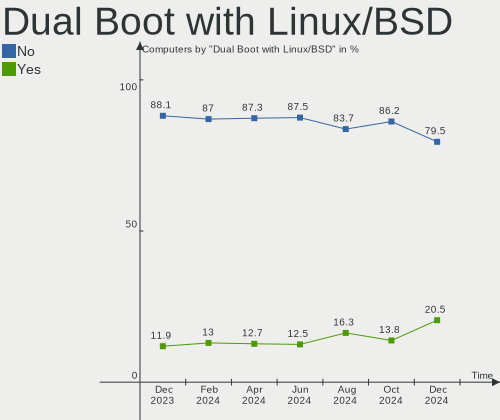

| Dual boot | Computers | Percent |
|-----------|-----------|---------|
| No        | 178       | 88.56%  |
| Yes       | 23        | 11.44%  |

Dual Boot (Win)
---------------

Hosting Linux and Windows

| Dual boot | Computers | Percent |
|-----------|-----------|---------|
| No        | 154       | 76.62%  |
| Yes       | 47        | 23.38%  |

Board
-----

Vendor
------

Motherboard manufacturer

| Name                                 | Computers | Percent |
|--------------------------------------|-----------|---------|
| ASUSTek Computer                     | 36        | 17.91%  |
| Dell                                 | 34        | 16.92%  |
| Lenovo                               | 21        | 10.45%  |
| Hewlett-Packard                      | 20        | 9.95%   |
| Gigabyte Technology                  | 18        | 8.96%   |
| MSI                                  | 14        | 6.97%   |
| Acer                                 | 10        | 4.98%   |
| Valve                                | 8         | 3.98%   |
| ASRock                               | 5         | 2.49%   |
| Apple                                | 4         | 1.99%   |
| AZW                                  | 3         | 1.49%   |
| Toshiba                              | 2         | 1%      |
| Samsung Electronics                  | 2         | 1%      |
| Unknown                              | 2         | 1%      |
| ZOTAC                                | 1         | 0.5%    |
| Trigkey                              | 1         | 0.5%    |
| Tactus                               | 1         | 0.5%    |
| Sony                                 | 1         | 0.5%    |
| Simply NUC                           | 1         | 0.5%    |
| Shenzhen Meigao Electronic Equipment | 1         | 0.5%    |
| Schenker                             | 1         | 0.5%    |
| Razer                                | 1         | 0.5%    |
| Raspberry Pi Foundation              | 1         | 0.5%    |
| PC Specialist                        | 1         | 0.5%    |
| Notebook                             | 1         | 0.5%    |
| Microsoft                            | 1         | 0.5%    |
| Medion                               | 1         | 0.5%    |
| Inventec                             | 1         | 0.5%    |
| Intel                                | 1         | 0.5%    |
| Google                               | 1         | 0.5%    |
| GEO                                  | 1         | 0.5%    |
| Entroware                            | 1         | 0.5%    |
| Dynabook                             | 1         | 0.5%    |
| DTV                                  | 1         | 0.5%    |
| BESSTAR Tech                         | 1         | 0.5%    |
| AWOW                                 | 1         | 0.5%    |

Model
-----

Motherboard model

| Name                                              | Computers | Percent |
|---------------------------------------------------|-----------|---------|
| Valve Jupiter                                     | 7         | 3.48%   |
| Dell XPS 15 9570                                  | 3         | 1.49%   |
| Gigabyte Z77-D3H                                  | 2         | 1%      |
| Gigabyte GA-990X-Gaming SLI-CF                    | 2         | 1%      |
| Gigabyte B550M DS3H                               | 2         | 1%      |
| Dell XPS 8700                                     | 2         | 1%      |
| Dell Inspiron 13-5378                             | 2         | 1%      |
| ASUS TUF Gaming X570-PLUS                         | 2         | 1%      |
| ASUS PRIME A320M-K                                | 2         | 1%      |
| ASUS All Series                                   | 2         | 1%      |
| Apple iMac12,1                                    | 2         | 1%      |
| Unknown                                           | 2         | 1%      |
| ZOTAC ZBOX-ECM73070C/53060C                       | 1         | 0.5%    |
| Valve Galileo                                     | 1         | 0.5%    |
| Trigkey Green G4                                  | 1         | 0.5%    |
| Toshiba Satellite Pro C50-A-1E2                   | 1         | 0.5%    |
| Toshiba Satellite L300                            | 1         | 0.5%    |
| Tactus IOTA Flo                                   | 1         | 0.5%    |
| Sony SVE1511K1EW                                  | 1         | 0.5%    |
| Simply NUC NUC12ZRN                               | 1         | 0.5%    |
| Shenzhen Meigao Electronic Equipment Venus series | 1         | 0.5%    |
| Schenker XMG NEO (E23)                            | 1         | 0.5%    |
| Samsung R720                                      | 1         | 0.5%    |
| Samsung 930QED                                    | 1         | 0.5%    |
| Razer Blade 15 (2022) - RZ09-0421                 | 1         | 0.5%    |
| RPi Raspberry Pi 4 Model B Rev 1.5                | 1         | 0.5%    |
| PC Specialist 14 Fusion Pro                       | 1         | 0.5%    |
| Notebook NL5xNU                                   | 1         | 0.5%    |
| MSI Pulse GL66 12UEK                              | 1         | 0.5%    |
| MSI MS-7D75                                       | 1         | 0.5%    |
| MSI MS-7D14                                       | 1         | 0.5%    |
| MSI MS-7C95                                       | 1         | 0.5%    |
| MSI MS-7C91                                       | 1         | 0.5%    |
| MSI MS-7C56                                       | 1         | 0.5%    |
| MSI MS-7C02                                       | 1         | 0.5%    |
| MSI MS-7B89                                       | 1         | 0.5%    |
| MSI MS-7B84                                       | 1         | 0.5%    |
| MSI MS-7B78                                       | 1         | 0.5%    |
| MSI MS-7693                                       | 1         | 0.5%    |
| MSI MS-16Y1                                       | 1         | 0.5%    |

Model Family
------------

Motherboard model prefix

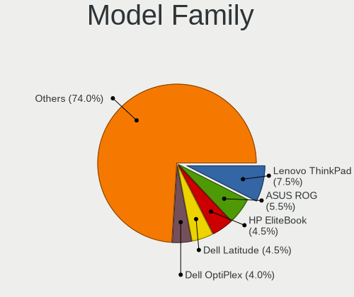

| Name                                       | Computers | Percent |
|--------------------------------------------|-----------|---------|
| Lenovo ThinkPad                            | 16        | 7.96%   |
| Dell Latitude                              | 9         | 4.48%   |
| Dell OptiPlex                              | 8         | 3.98%   |
| Dell Inspiron                              | 8         | 3.98%   |
| Valve Jupiter                              | 7         | 3.48%   |
| Dell XPS                                   | 7         | 3.48%   |
| ASUS ROG                                   | 7         | 3.48%   |
| Acer Aspire                                | 7         | 3.48%   |
| ASUS VivoBook                              | 6         | 2.99%   |
| ASUS PRIME                                 | 5         | 2.49%   |
| HP EliteBook                               | 4         | 1.99%   |
| ASUS TUF                                   | 4         | 1.99%   |
| HP ProBook                                 | 3         | 1.49%   |
| Toshiba Satellite                          | 2         | 1%      |
| Lenovo Yoga                                | 2         | 1%      |
| HP ZBook                                   | 2         | 1%      |
| HP Pavilion                                | 2         | 1%      |
| HP ENVY                                    | 2         | 1%      |
| HP EliteDesk                               | 2         | 1%      |
| Gigabyte Z77-D3H                           | 2         | 1%      |
| Gigabyte GA-990X-Gaming                    | 2         | 1%      |
| Gigabyte B550M                             | 2         | 1%      |
| ASUS All                                   | 2         | 1%      |
| ASRock X670E                               | 2         | 1%      |
| Apple iMac12                               | 2         | 1%      |
| Unknown                                    | 2         | 1%      |
| ZOTAC ZBOX-ECM73070C                       | 1         | 0.5%    |
| Valve Galileo                              | 1         | 0.5%    |
| Trigkey Green                              | 1         | 0.5%    |
| Tactus IOTA                                | 1         | 0.5%    |
| Sony SVE1511K1EW                           | 1         | 0.5%    |
| Simply NUC NUC12ZRN                        | 1         | 0.5%    |
| Shenzhen Meigao Electronic Equipment Venus | 1         | 0.5%    |
| Schenker XMG                               | 1         | 0.5%    |
| Samsung R720                               | 1         | 0.5%    |
| Samsung 930QED                             | 1         | 0.5%    |
| Razer Blade                                | 1         | 0.5%    |
| RPi Raspberry                              | 1         | 0.5%    |
| PC Specialist 14                           | 1         | 0.5%    |
| Notebook NL5xNU                            | 1         | 0.5%    |

MFG Year
--------

Motherboard manufacture year

| Year    | Computers | Percent |
|---------|-----------|---------|
| 2020    | 28        | 13.93%  |
| 2022    | 23        | 11.44%  |
| 2023    | 21        | 10.45%  |
| 2018    | 20        | 9.95%   |
| 2014    | 14        | 6.97%   |
| 2021    | 13        | 6.47%   |
| 2019    | 12        | 5.97%   |
| 2017    | 11        | 5.47%   |
| 2013    | 11        | 5.47%   |
| 2011    | 11        | 5.47%   |
| 2012    | 10        | 4.98%   |
| 2016    | 7         | 3.48%   |
| 2015    | 6         | 2.99%   |
| 2010    | 4         | 1.99%   |
| 2009    | 4         | 1.99%   |
| 2008    | 3         | 1.49%   |
| Unknown | 2         | 1%      |
| 2007    | 1         | 0.5%    |

Form Factor
-----------

Physical design of the computer

| Name           | Computers | Percent |
|----------------|-----------|---------|
| Notebook       | 102       | 50.75%  |
| Desktop        | 79        | 39.3%   |
| Mini pc        | 7         | 3.48%   |
| All in one     | 5         | 2.49%   |
| Convertible    | 4         | 1.99%   |
| Tablet         | 2         | 1%      |
| Other          | 1         | 0.5%    |
| System on chip | 1         | 0.5%    |

Secure Boot
-----------

Enabled or disabled

| State    | Computers | Percent |
|----------|-----------|---------|
| Disabled | 188       | 93.53%  |
| Enabled  | 13        | 6.47%   |

Coreboot
--------

Have coreboot on board

| Used | Computers | Percent |
|------|-----------|---------|
| No   | 200       | 99.5%   |
| Yes  | 1         | 0.5%    |

RAM Size
--------

Total RAM memory

| Size in GB  | Computers | Percent |
|-------------|-----------|---------|
| 16.01-24.0  | 48        | 23.88%  |
| 4.01-8.0    | 43        | 21.39%  |
| 8.01-16.0   | 41        | 20.4%   |
| 32.01-64.0  | 28        | 13.93%  |
| 3.01-4.0    | 22        | 10.95%  |
| 64.01-256.0 | 11        | 5.47%   |
| 24.01-32.0  | 6         | 2.99%   |
| 1.01-2.0    | 2         | 1%      |

RAM Used
--------

Used RAM memory

| Used GB    | Computers | Percent |
|------------|-----------|---------|
| 2.01-3.0   | 51        | 25.37%  |
| 4.01-8.0   | 50        | 24.88%  |
| 1.01-2.0   | 41        | 20.4%   |
| 3.01-4.0   | 38        | 18.91%  |
| 8.01-16.0  | 10        | 4.98%   |
| 0.51-1.0   | 5         | 2.49%   |
| 16.01-24.0 | 3         | 1.49%   |
| 0.01-0.5   | 2         | 1%      |
| 24.01-32.0 | 1         | 0.5%    |

Total Drives
------------

Number of drives on board

| Drives | Computers | Percent |
|--------|-----------|---------|
| 1      | 107       | 53.23%  |
| 2      | 48        | 23.88%  |
| 3      | 19        | 9.45%   |
| 4      | 12        | 5.97%   |
| 5      | 7         | 3.48%   |
| 6      | 4         | 1.99%   |
| 7      | 2         | 1%      |
| 8      | 1         | 0.5%    |
| 0      | 1         | 0.5%    |

Has CD-ROM
----------

Has CD-ROM on board

| Presented | Computers | Percent |
|-----------|-----------|---------|
| No        | 146       | 72.64%  |
| Yes       | 55        | 27.36%  |

Has Ethernet
------------

Has Ethernet on board

| Presented | Computers | Percent |
|-----------|-----------|---------|
| Yes       | 162       | 80.6%   |
| No        | 39        | 19.4%   |

Has WiFi
--------

Has WiFi module

| Presented | Computers | Percent |
|-----------|-----------|---------|
| Yes       | 169       | 84.08%  |
| No        | 32        | 15.92%  |

Has Bluetooth
-------------

Has Bluetooth module

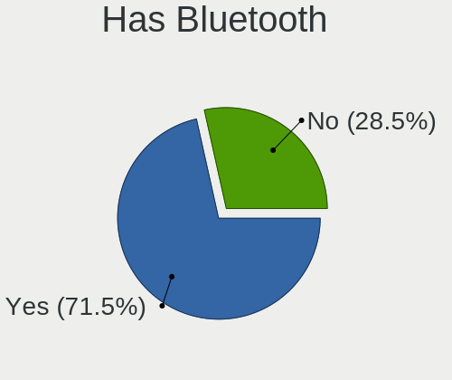

| Presented | Computers | Percent |
|-----------|-----------|---------|
| Yes       | 154       | 76.62%  |
| No        | 47        | 23.38%  |

Location
--------

Country
-------

Geographic location (country)

| Country | Computers | Percent |
|---------|-----------|---------|
| UK      | 201       | 100%    |

City
----

Geographic location (city)

| City                | Computers | Percent |
|---------------------|-----------|---------|
| Southwark           | 7         | 3.48%   |
| Manchester          | 7         | 3.48%   |
| London              | 6         | 2.99%   |
| Reading             | 5         | 2.49%   |
| Glasgow             | 5         | 2.49%   |
| Brent               | 5         | 2.49%   |
| Birmingham          | 5         | 2.49%   |
| Liverpool           | 4         | 1.99%   |
| Leeds               | 4         | 1.99%   |
| Bristol             | 4         | 1.99%   |
| Lambeth             | 3         | 1.49%   |
| Islington           | 3         | 1.49%   |
| Cardiff             | 3         | 1.49%   |
| Bradford            | 3         | 1.49%   |
| York                | 2         | 1%      |
| Wellingborough      | 2         | 1%      |
| Sale                | 2         | 1%      |
| Richmond            | 2         | 1%      |
| Milton Keynes       | 2         | 1%      |
| Leicester           | 2         | 1%      |
| Hull                | 2         | 1%      |
| Huddersfield        | 2         | 1%      |
| Harringay           | 2         | 1%      |
| Harlow              | 2         | 1%      |
| Greenwich           | 2         | 1%      |
| Enfield             | 2         | 1%      |
| Doncaster           | 2         | 1%      |
| Cwmbran             | 2         | 1%      |
| City of Westminster | 2         | 1%      |
| Chippenham          | 2         | 1%      |
| Basingstoke         | 2         | 1%      |
| Barking             | 2         | 1%      |
| Wirral              | 1         | 0.5%    |
| Whitechapel         | 1         | 0.5%    |
| Whitby              | 1         | 0.5%    |
| Weymouth            | 1         | 0.5%    |
| Welwyn              | 1         | 0.5%    |
| Wandsworth          | 1         | 0.5%    |
| Thatcham            | 1         | 0.5%    |
| Thame               | 1         | 0.5%    |

Drives
------

Drive Vendor
------------

Hard drive vendors

| Vendor                       | Computers | Drives | Percent |
|------------------------------|-----------|--------|---------|
| Samsung Electronics          | 56        | 73     | 17.02%  |
| Seagate                      | 36        | 48     | 10.94%  |
| WDC                          | 32        | 45     | 9.73%   |
| Sandisk                      | 27        | 28     | 8.21%   |
| Toshiba                      | 20        | 21     | 6.08%   |
| Kingston                     | 19        | 19     | 5.78%   |
| Crucial                      | 19        | 22     | 5.78%   |
| Unknown                      | 13        | 15     | 3.95%   |
| Micron/Crucial Technology    | 11        | 12     | 3.34%   |
| Phison Electronics           | 10        | 11     | 3.04%   |
| Micron Technology            | 7         | 7      | 2.13%   |
| SK hynix                     | 6         | 6      | 1.82%   |
| Intel                        | 6         | 7      | 1.82%   |
| KIOXIA                       | 4         | 4      | 1.22%   |
| Hitachi                      | 4         | 4      | 1.22%   |
| A-DATA Technology            | 4         | 5      | 1.22%   |
| PNY                          | 3         | 6      | 0.91%   |
| Netac                        | 3         | 3      | 0.91%   |
| KIOXIA-EXCERIA               | 3         | 3      | 0.91%   |
| Kingston Technology Company  | 3         | 3      | 0.91%   |
| Fanxiang                     | 3         | 3      | 0.91%   |
| Unknown                      | 3         | 3      | 0.91%   |
| MAXIO Technology (Hangzhou)  | 2         | 2      | 0.61%   |
| LITEON                       | 2         | 2      | 0.61%   |
| China                        | 2         | 2      | 0.61%   |
| ASMT                         | 2         | 2      | 0.61%   |
| Apple                        | 2         | 4      | 0.61%   |
| ADATA Technology             | 2         | 3      | 0.61%   |
| Vaseky                       | 1         | 1      | 0.3%    |
| TSA                          | 1         | 1      | 0.3%    |
| Transcend                    | 1         | 1      | 0.3%    |
| Teclast                      | 1         | 1      | 0.3%    |
| Team                         | 1         | 1      | 0.3%    |
| SSK                          | 1         | 1      | 0.3%    |
| SSI                          | 1         | 1      | 0.3%    |
| SPCC                         | 1         | 1      | 0.3%    |
| Shenzhen Longsys Electronics | 1         | 2      | 0.3%    |
| SCY                          | 1         | 1      | 0.3%    |
| SABRENT                      | 1         | 2      | 0.3%    |
| Realtek                      | 1         | 1      | 0.3%    |

Drive Model
-----------

Hard drive models

| Model                                               | Computers | Percent |
|-----------------------------------------------------|-----------|---------|
| Samsung NVMe SSD Controller SM981/PM981/PM983 512GB | 9         | 2.41%   |
| Micron/Crucial P2 NVMe PCIe SSD 4TB                 | 8         | 2.14%   |
| Samsung SSD 850 EVO 500GB                           | 6         | 1.6%    |
| Phison PS5013 E13 NVMe Controller 512GB             | 6         | 1.6%    |
| Crucial CT500MX500SSD1 500GB                        | 4         | 1.07%   |
| Unknown MMC Card  64GB                              | 3         | 0.8%    |
| Seagate ST2000DM008-2FR102 2TB                      | 3         | 0.8%    |
| Seagate ST2000DM001-1ER164 2TB                      | 3         | 0.8%    |
| Sandisk WD Blue SN550 NVMe SSD 1TB                  | 3         | 0.8%    |
| Sandisk WD Black 2018/SN750 / PC SN720 NVMe SSD 1TB | 3         | 0.8%    |
| Samsung SSD 860 EVO 500GB                           | 3         | 0.8%    |
| Samsung SSD 860 EVO 1TB                             | 3         | 0.8%    |
| Samsung SSD 850 PRO 256GB                           | 3         | 0.8%    |
| Samsung NVMe SSD Controller PM9A1/PM9A3/980PRO 2TB  | 3         | 0.8%    |
| KIOXIA-EXCERIA SATA SSD 480GB                       | 3         | 0.8%    |
| Kingston SA400S37120G 120GB SSD                     | 3         | 0.8%    |
| Crucial CT1000MX500SSD1 1TB                         | 3         | 0.8%    |
| Crucial CT1000BX500SSD1 1TB                         | 3         | 0.8%    |
| Unknown                                             | 3         | 0.8%    |
| WDC WD20EARX-00PASB0 2TB                            | 2         | 0.53%   |
| Unknown SD/MMC/MS PRO 512GB                         | 2         | 0.53%   |
| Unknown MMC Card  32GB                              | 2         | 0.53%   |
| Unknown MMC Card  256GB                             | 2         | 0.53%   |
| Unknown MMC Card  128GB                             | 2         | 0.53%   |
| Toshiba MQ01ABF050 500GB                            | 2         | 0.53%   |
| Toshiba MQ01ABD100 1TB                              | 2         | 0.53%   |
| Toshiba DT01ACA100 1TB                              | 2         | 0.53%   |
| Toshiba BG3 NVMe SSD Controller 256GB               | 2         | 0.53%   |
| Seagate ST8000DM004-2CX188 8TB                      | 2         | 0.53%   |
| Seagate ST500LT012-1DG142 500GB                     | 2         | 0.53%   |
| Seagate ST500DM002-1BD142 500GB                     | 2         | 0.53%   |
| Seagate ST3500312CS 500GB                           | 2         | 0.53%   |
| Seagate ST2000LM003 HN-M201RAD 2TB                  | 2         | 0.53%   |
| Seagate ST2000DM008-2UB102 2TB                      | 2         | 0.53%   |
| Seagate ST2000DM001-1CH164 2TB                      | 2         | 0.53%   |
| Sandisk WD_BLACK SN850X 2000GB                      | 2         | 0.53%   |
| Sandisk WD Black SN850 1024GB                       | 2         | 0.53%   |
| Sandisk WD Black NVMe SSD 256GB                     | 2         | 0.53%   |
| SanDisk SSD PLUS 480GB                              | 2         | 0.53%   |
| Sandisk PC SN530 NVMe WDC 512GB                     | 2         | 0.53%   |

HDD Vendor
----------

Hard disk drive vendors

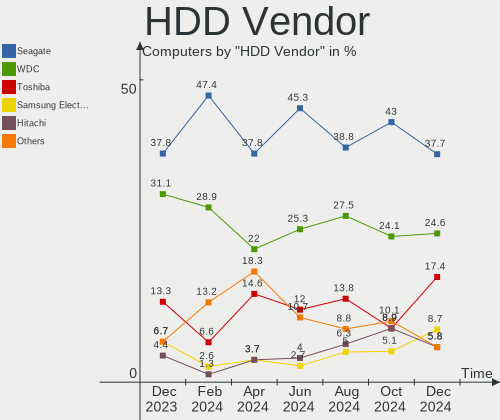

| Vendor              | Computers | Drives | Percent |
|---------------------|-----------|--------|---------|
| Seagate             | 34        | 44     | 36.96%  |
| WDC                 | 28        | 41     | 30.43%  |
| Toshiba             | 12        | 12     | 13.04%  |
| Samsung Electronics | 6         | 6      | 6.52%   |
| Hitachi             | 4         | 4      | 4.35%   |
| Unknown             | 2         | 2      | 2.17%   |
| ASMT                | 2         | 2      | 2.17%   |
| SSK                 | 1         | 1      | 1.09%   |
| SSI                 | 1         | 1      | 1.09%   |
| SABRENT             | 1         | 2      | 1.09%   |
| HGST                | 1         | 1      | 1.09%   |

SSD Vendor
----------

Solid state drive vendors

| Vendor              | Computers | Drives | Percent |
|---------------------|-----------|--------|---------|
| Samsung Electronics | 27        | 37     | 25.71%  |
| Crucial             | 16        | 19     | 15.24%  |
| Kingston            | 15        | 15     | 14.29%  |
| SanDisk             | 8         | 8      | 7.62%   |
| PNY                 | 3         | 6      | 2.86%   |
| Netac               | 3         | 3      | 2.86%   |
| KIOXIA-EXCERIA      | 3         | 3      | 2.86%   |
| A-DATA Technology   | 3         | 4      | 2.86%   |
| WDC                 | 2         | 2      | 1.9%    |
| Toshiba             | 2         | 2      | 1.9%    |
| Micron Technology   | 2         | 2      | 1.9%    |
| LITEON              | 2         | 2      | 1.9%    |
| China               | 2         | 2      | 1.9%    |
| Vaseky              | 1         | 1      | 0.95%   |
| TSA                 | 1         | 1      | 0.95%   |
| Transcend           | 1         | 1      | 0.95%   |
| Teclast             | 1         | 1      | 0.95%   |
| Team                | 1         | 1      | 0.95%   |
| SPCC                | 1         | 1      | 0.95%   |
| SK hynix            | 1         | 1      | 0.95%   |
| SCY                 | 1         | 1      | 0.95%   |
| OCZ                 | 1         | 1      | 0.95%   |
| LITEONIT            | 1         | 1      | 0.95%   |
| Lexar               | 1         | 1      | 0.95%   |
| Integral            | 1         | 1      | 0.95%   |
| Gigabyte Technology | 1         | 1      | 0.95%   |
| Fanxiang            | 1         | 1      | 0.95%   |
| Drevo               | 1         | 1      | 0.95%   |
| ASENNO              | 1         | 1      | 0.95%   |
| Apple               | 1         | 1      | 0.95%   |

Drive Kind
----------

HDD or SSD

| Kind    | Computers | Drives | Percent |
|---------|-----------|--------|---------|
| NVMe    | 111       | 128    | 38.14%  |
| SSD     | 83        | 122    | 28.52%  |
| HDD     | 76        | 116    | 26.12%  |
| MMC     | 13        | 14     | 4.47%   |
| Unknown | 8         | 10     | 2.75%   |

Drive Connector
---------------

SATA, SAS, NVMe, etc.

| Type | Computers | Drives | Percent |
|------|-----------|--------|---------|
| SATA | 125       | 229    | 47.53%  |
| NVMe | 111       | 127    | 42.21%  |
| SAS  | 14        | 20     | 5.32%   |
| MMC  | 13        | 14     | 4.94%   |

Drive Size
----------

Size of hard drive

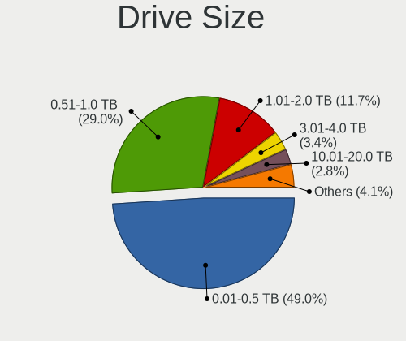

| Size in TB | Computers | Drives | Percent |
|------------|-----------|--------|---------|
| 0.01-0.5   | 87        | 122    | 48.33%  |
| 0.51-1.0   | 53        | 57     | 29.44%  |
| 1.01-2.0   | 25        | 38     | 13.89%  |
| 4.01-10.0  | 6         | 7      | 3.33%   |
| 3.01-4.0   | 4         | 4      | 2.22%   |
| 2.01-3.0   | 4         | 5      | 2.22%   |
| 10.01-20.0 | 1         | 5      | 0.56%   |

Space Total
-----------

Amount of disk space available on the file system

| Size in GB     | Computers | Percent |
|----------------|-----------|---------|
| 251-500        | 46        | 22.89%  |
| 101-250        | 46        | 22.89%  |
| 501-1000       | 38        | 18.91%  |
| 1001-2000      | 23        | 11.44%  |
| More than 3000 | 22        | 10.95%  |
| 51-100         | 11        | 5.47%   |
| 2001-3000      | 7         | 3.48%   |
| 1-20           | 5         | 2.49%   |
| 21-50          | 2         | 1%      |
| Unknown        | 1         | 0.5%    |

Space Used
----------

Amount of used disk space

| Used GB        | Computers | Percent |
|----------------|-----------|---------|
| 1-20           | 56        | 27.86%  |
| 21-50          | 31        | 15.42%  |
| 51-100         | 31        | 15.42%  |
| 101-250        | 24        | 11.94%  |
| 251-500        | 21        | 10.45%  |
| 501-1000       | 16        | 7.96%   |
| 1001-2000      | 9         | 4.48%   |
| More than 3000 | 8         | 3.98%   |
| 2001-3000      | 4         | 1.99%   |
| Unknown        | 1         | 0.5%    |

Malfunc. Drives
---------------

Drive models with a malfunction

| Model                             | Computers | Drives | Percent |
|-----------------------------------|-----------|--------|---------|
| WDC WD60EFRX-68MYMN1 6TB          | 1         | 1      | 5%      |
| WDC WD5000AAKS-75V0A0 500GB       | 1         | 1      | 5%      |
| WDC WD40PURX-64GVNY0 4TB          | 1         | 1      | 5%      |
| WDC WD30EZRX-00MMMB0 3TB          | 1         | 1      | 5%      |
| WDC WD20EARX-00PASB0 2TB          | 1         | 1      | 5%      |
| WDC WD20EARS-00MVWB0 2TB          | 1         | 1      | 5%      |
| WDC WD10EZEX-60ZF5A0 1TB          | 1         | 1      | 5%      |
| WDC WD10EZEX-60WN4A0 1TB          | 1         | 1      | 5%      |
| WDC WD10EARS-22Y5B1 1TB           | 1         | 1      | 5%      |
| Toshiba MQ01ABD100 1TB            | 1         | 1      | 5%      |
| Seagate ST500LT012-1DG142 500GB   | 1         | 1      | 5%      |
| Seagate ST500DM002-1BC142 500GB   | 1         | 1      | 5%      |
| Seagate ST2000DM001-1CH164 2TB    | 1         | 1      | 5%      |
| SanDisk SSD PLUS 240GB            | 1         | 1      | 5%      |
| Samsung Electronics HD502IJ 500GB | 1         | 1      | 5%      |
| Netac SSD 240GB                   | 1         | 1      | 5%      |
| Intel SSD 600P Series 128GB       | 1         | 1      | 5%      |
| Hitachi HDS721050CLA660 500GB     | 1         | 1      | 5%      |
| Drevo X1 Pro SSD 128GB            | 1         | 1      | 5%      |
| A-DATA Technology SU650 960GB SSD | 1         | 2      | 5%      |

Malfunc. Drive Vendor
---------------------

Vendors of faulty drives

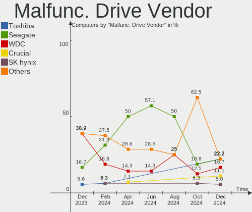

| Vendor              | Computers | Drives | Percent |
|---------------------|-----------|--------|---------|
| WDC                 | 7         | 9      | 38.89%  |
| Seagate             | 3         | 3      | 16.67%  |
| Toshiba             | 1         | 1      | 5.56%   |
| SanDisk             | 1         | 1      | 5.56%   |
| Samsung Electronics | 1         | 1      | 5.56%   |
| Netac               | 1         | 1      | 5.56%   |
| Intel               | 1         | 1      | 5.56%   |
| Hitachi             | 1         | 1      | 5.56%   |
| Drevo               | 1         | 1      | 5.56%   |
| A-DATA Technology   | 1         | 2      | 5.56%   |

Malfunc. HDD Vendor
-------------------

Vendors of faulty HDD drives

| Vendor              | Computers | Drives | Percent |
|---------------------|-----------|--------|---------|
| WDC                 | 7         | 9      | 53.85%  |
| Seagate             | 3         | 3      | 23.08%  |
| Toshiba             | 1         | 1      | 7.69%   |
| Samsung Electronics | 1         | 1      | 7.69%   |
| Hitachi             | 1         | 1      | 7.69%   |

Malfunc. Drive Kind
-------------------

Kinds of faulty drives

| Kind | Computers | Drives | Percent |
|------|-----------|--------|---------|
| HDD  | 11        | 15     | 68.75%  |
| SSD  | 4         | 5      | 25%     |
| NVMe | 1         | 1      | 6.25%   |

Failed Drives
-------------

Failed drive models

Zero info for selected period =(

Failed Drive Vendor
-------------------

Failed drive vendors

Zero info for selected period =(

Drive Status
------------

Number of failed and malfunc. drives

| Status   | Computers | Drives | Percent |
|----------|-----------|--------|---------|
| Detected | 121       | 230    | 56.02%  |
| Works    | 82        | 139    | 37.96%  |
| Malfunc  | 13        | 21     | 6.02%   |

Storage controller
------------------

Storage Vendor
--------------

Storage controller vendors

| Vendor                       | Computers | Percent |
|------------------------------|-----------|---------|
| Intel                        | 108       | 37.11%  |
| AMD                          | 55        | 18.9%   |
| Samsung Electronics          | 31        | 10.65%  |
| SanDisk                      | 21        | 7.22%   |
| Micron/Crucial Technology    | 14        | 4.81%   |
| Phison Electronics           | 11        | 3.78%   |
| Kingston Technology Company  | 7         | 2.41%   |
| ASMedia Technology           | 7         | 2.41%   |
| Toshiba America Info Systems | 6         | 2.06%   |
| SK hynix                     | 5         | 1.72%   |
| Micron Technology            | 5         | 1.72%   |
| Marvell Technology Group     | 5         | 1.72%   |
| KIOXIA                       | 4         | 1.37%   |
| JMicron Technology           | 3         | 1.03%   |
| MAXIO Technology (Hangzhou)  | 2         | 0.69%   |
| ADATA Technology             | 2         | 0.69%   |
| Solidigm                     | 1         | 0.34%   |
| Shenzhen Longsys Electronics | 1         | 0.34%   |
| Seagate Technology           | 1         | 0.34%   |
| Realtek Semiconductor        | 1         | 0.34%   |
| Lenovo                       | 1         | 0.34%   |

Storage Model
-------------

Storage controller models

| Model                                                                          | Computers | Percent |
|--------------------------------------------------------------------------------|-----------|---------|
| AMD FCH SATA Controller [AHCI mode]                                            | 34        | 10.63%  |
| Samsung NVMe SSD Controller SM981/PM981/PM983                                  | 13        | 4.06%   |
| Micron/Crucial P2 [Nick P2] / P3 / P3 Plus NVMe PCIe SSD (DRAM-less)           | 11        | 3.44%   |
| AMD 500 Series Chipset SATA Controller                                         | 11        | 3.44%   |
| Intel 8 Series/C220 Series Chipset Family 6-port SATA Controller 1 [AHCI mode] | 8         | 2.5%    |
| Samsung NVMe SSD Controller PM9A1/PM9A3/980PRO                                 | 6         | 1.88%   |
| Phison PS5013-E13 PCIe3 NVMe Controller (DRAM-less)                            | 6         | 1.88%   |
| Intel Celeron/Pentium Silver Processor SATA Controller                         | 6         | 1.88%   |
| Intel Cannon Lake PCH SATA AHCI Controller                                     | 6         | 1.88%   |
| Intel Cannon Lake Mobile PCH SATA AHCI Controller                              | 6         | 1.88%   |
| Intel 7 Series Chipset Family 6-port SATA Controller [AHCI mode]               | 6         | 1.88%   |
| Intel 6 Series/C200 Series Chipset Family 6 port Desktop SATA AHCI Controller  | 6         | 1.88%   |
| ASMedia ASM1062 Serial ATA Controller                                          | 6         | 1.88%   |
| AMD SB7x0/SB8x0/SB9x0 SATA Controller [AHCI mode]                              | 6         | 1.88%   |
| Samsung NVMe SSD Controller 980 (DRAM-less)                                    | 5         | 1.56%   |
| Intel 6 Series/C200 Series Chipset Family 6 port Mobile SATA AHCI Controller   | 5         | 1.56%   |
| AMD 400 Series Chipset SATA Controller                                         | 5         | 1.56%   |
| SanDisk Extreme Pro / WD Black 2018/SN750/PC SN720 NVMe SSD                    | 4         | 1.25%   |
| Intel Wildcat Point-LP SATA Controller [AHCI Mode]                             | 4         | 1.25%   |
| Intel Volume Management Device NVMe RAID Controller                            | 4         | 1.25%   |
| Intel 82801 Mobile SATA Controller [RAID mode]                                 | 4         | 1.25%   |
| Intel 8 Series SATA Controller 1 [AHCI mode]                                   | 4         | 1.25%   |
| SK hynix Gold P31/BC711/PC711 NVMe Solid State Drive                           | 3         | 0.94%   |
| SanDisk Ultra 3D / WD Blue SN550 NVMe SSD                                      | 3         | 0.94%   |
| SanDisk IX SN530 NVMe SSD (DRAM-less)                                          | 3         | 0.94%   |
| Micron 2400 NVMe SSD (DRAM-less)                                               | 3         | 0.94%   |
| Intel Volume Management Device NVMe RAID Controller Intel Corporation          | 3         | 0.94%   |
| Intel Sunrise Point-LP SATA Controller [AHCI mode]                             | 3         | 0.94%   |
| Intel HM170/QM170 Chipset SATA Controller [AHCI Mode]                          | 3         | 0.94%   |
| Intel 82801IBM/IEM (ICH9M/ICH9M-E) 4 port SATA Controller [AHCI mode]          | 3         | 0.94%   |
| Intel 7 Series/C210 Series Chipset Family 4-port SATA Controller [IDE mode]    | 3         | 0.94%   |
| Intel 7 Series/C210 Series Chipset Family 2-port SATA Controller [IDE mode]    | 3         | 0.94%   |
| Intel 500 Series Chipset Family SATA AHCI Controller                           | 3         | 0.94%   |
| Intel 200 Series PCH SATA controller [AHCI mode]                               | 3         | 0.94%   |
| AMD FCH SATA Controller D                                                      | 3         | 0.94%   |
| Toshiba America Info Systems XG3 NVMe SSD Controller                           | 2         | 0.63%   |
| Toshiba America Info Systems BG3 x2 NVMe SSD Controller (DRAM-less)            | 2         | 0.63%   |
| SanDisk WD PC SN810 / Black SN850 NVMe SSD                                     | 2         | 0.63%   |
| SanDisk WD Blue SN500 / PC SN520 x2 M.2 2280 NVMe SSD                          | 2         | 0.63%   |
| Sandisk WD Black SN850X NVMe SSD                                               | 2         | 0.63%   |

Storage Kind
------------

Kind of storage controller (IDE, SATA, NVMe, SAS, ...)

| Kind | Computers | Percent |
|------|-----------|---------|
| SATA | 144       | 51.61%  |
| NVMe | 110       | 39.43%  |
| RAID | 13        | 4.66%   |
| IDE  | 12        | 4.3%    |

Processor
---------

CPU Vendor
----------

Processor vendors

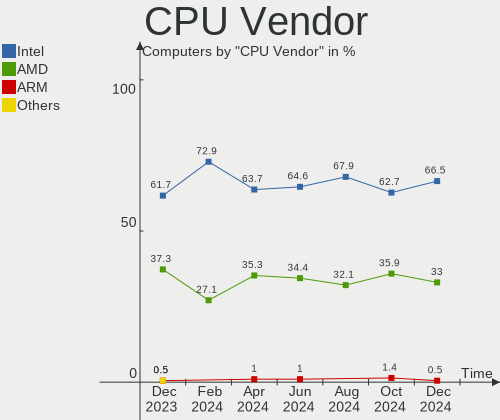

| Vendor  | Computers | Percent |
|---------|-----------|---------|
| Intel   | 124       | 61.69%  |
| AMD     | 75        | 37.31%  |
| ARM     | 1         | 0.5%    |
| Unknown | 1         | 0.5%    |

CPU Model
---------

Processor models

| Model                                         | Computers | Percent |
|-----------------------------------------------|-----------|---------|
| AMD Custom APU 0405                           | 8         | 3.98%   |
| AMD FX-8350 Eight-Core Processor              | 5         | 2.49%   |
| Intel Celeron N4020 CPU @ 1.10GHz             | 4         | 1.99%   |
| AMD Ryzen 5 3600 6-Core Processor             | 4         | 1.99%   |
| Intel Core i7-8750H CPU @ 2.20GHz             | 3         | 1.49%   |
| Intel Core i5-7200U CPU @ 2.50GHz             | 3         | 1.49%   |
| Intel 13th Gen Core i7-1355U                  | 3         | 1.49%   |
| Intel 11th Gen Core i7-1165G7 @ 2.80GHz       | 3         | 1.49%   |
| AMD Ryzen 7 PRO 4750U with Radeon Graphics    | 3         | 1.49%   |
| AMD Ryzen 5 5600X 6-Core Processor            | 3         | 1.49%   |
| Intel N95                                     | 2         | 1%      |
| Intel Core i7-9700K CPU @ 3.60GHz             | 2         | 1%      |
| Intel Core i7-8700 CPU @ 3.20GHz              | 2         | 1%      |
| Intel Core i7-8550U CPU @ 1.80GHz             | 2         | 1%      |
| Intel Core i7-4770 CPU @ 3.40GHz              | 2         | 1%      |
| Intel Core i7-3770S CPU @ 3.10GHz             | 2         | 1%      |
| Intel Core i7-3770K CPU @ 3.50GHz             | 2         | 1%      |
| Intel Core i5-8365U CPU @ 1.60GHz             | 2         | 1%      |
| Intel Core i5-2520M CPU @ 2.50GHz             | 2         | 1%      |
| Intel Core i5-2400S CPU @ 2.50GHz             | 2         | 1%      |
| Intel Core i3-3217U CPU @ 1.80GHz             | 2         | 1%      |
| AMD Ryzen 9 7950X3D 16-Core Processor         | 2         | 1%      |
| AMD Ryzen 9 7950X 16-Core Processor           | 2         | 1%      |
| AMD Ryzen 9 7900 12-Core Processor            | 2         | 1%      |
| AMD Ryzen 7 PRO 7840U w/ Radeon 780M Graphics | 2         | 1%      |
| AMD Ryzen 7 PRO 6850U with Radeon Graphics    | 2         | 1%      |
| AMD Ryzen 7 5825U with Radeon Graphics        | 2         | 1%      |
| AMD Ryzen 7 3700X 8-Core Processor            | 2         | 1%      |
| AMD Ryzen 7 2700X Eight-Core Processor        | 2         | 1%      |
| AMD Ryzen 5 5600G with Radeon Graphics        | 2         | 1%      |
| AMD Ryzen 5 3500U with Radeon Vega Mobile Gfx | 2         | 1%      |
| Intel Pentium CPU G2030T @ 2.60GHz            | 1         | 0.5%    |
| Intel Pentium CPU 4417U @ 2.30GHz             | 1         | 0.5%    |
| Intel Pentium 3558U @ 1.70GHz                 | 1         | 0.5%    |
| Intel Core M-5Y71 CPU @ 1.20GHz               | 1         | 0.5%    |
| Intel Core i9-8950HK CPU @ 2.90GHz            | 1         | 0.5%    |
| Intel Core i7-9700 CPU @ 3.00GHz              | 1         | 0.5%    |
| Intel Core i7-8850H CPU @ 2.60GHz             | 1         | 0.5%    |
| Intel Core i7-8565U CPU @ 1.80GHz             | 1         | 0.5%    |
| Intel Core i7-7700K CPU @ 4.20GHz             | 1         | 0.5%    |

CPU Model Family
----------------

Processor model prefix

| Model            | Computers | Percent |
|------------------|-----------|---------|
| Intel Core i5    | 36        | 17.91%  |
| Other            | 32        | 15.92%  |
| Intel Core i7    | 31        | 15.42%  |
| AMD Ryzen 5      | 18        | 8.96%   |
| AMD Ryzen 7      | 16        | 7.96%   |
| Intel Core i3    | 13        | 6.47%   |
| Intel Celeron    | 12        | 5.97%   |
| AMD Ryzen 9      | 12        | 5.97%   |
| AMD Ryzen 7 PRO  | 7         | 3.48%   |
| AMD FX           | 7         | 3.48%   |
| Intel Core 2 Duo | 6         | 2.99%   |
| Intel Pentium    | 3         | 1.49%   |
| AMD Ryzen 3      | 2         | 1%      |
| Intel Core M     | 1         | 0.5%    |
| Intel Core i9    | 1         | 0.5%    |
| AMD Athlon X4    | 1         | 0.5%    |
| AMD A8           | 1         | 0.5%    |
| AMD A6           | 1         | 0.5%    |
| AMD A10          | 1         | 0.5%    |

CPU Cores
---------

Number of processor cores

| Number  | Computers | Percent |
|---------|-----------|---------|
| 4       | 68        | 33.83%  |
| 2       | 51        | 25.37%  |
| 8       | 29        | 14.43%  |
| 6       | 29        | 14.43%  |
| 16      | 6         | 2.99%   |
| 12      | 6         | 2.99%   |
| 10      | 5         | 2.49%   |
| 14      | 4         | 1.99%   |
| 24      | 1         | 0.5%    |
| 1       | 1         | 0.5%    |
| Unknown | 1         | 0.5%    |

CPU Sockets
-----------

Number of sockets

| Number  | Computers | Percent |
|---------|-----------|---------|
| 1       | 200       | 99.5%   |
| Unknown | 1         | 0.5%    |

CPU Threads
-----------

Threads per core (Hyper-Threading)

| Number  | Computers | Percent |
|---------|-----------|---------|
| 2       | 156       | 77.61%  |
| 1       | 44        | 21.89%  |
| Unknown | 1         | 0.5%    |

CPU Op-Modes
------------

CPU Operation Modes (32-bit, 64-bit)

| Op mode        | Computers | Percent |
|----------------|-----------|---------|
| 32-bit, 64-bit | 200       | 99.5%   |
| 64-bit         | 1         | 0.5%    |

CPU Microcode
-------------

Microcode number

| Number     | Computers | Percent |
|------------|-----------|---------|
| Unknown    | 117       | 58.21%  |
| 0x906ea    | 6         | 2.99%   |
| 0x0a601203 | 5         | 2.49%   |
| 0x306c3    | 4         | 1.99%   |
| 0x306a9    | 4         | 1.99%   |
| 0x206a7    | 4         | 1.99%   |
| 0x0a50000c | 4         | 1.99%   |
| 0x08108109 | 4         | 1.99%   |
| 0x806e9    | 3         | 1.49%   |
| 0x0a704103 | 3         | 1.49%   |
| 0x0a601206 | 3         | 1.49%   |
| 0x08701021 | 3         | 1.49%   |
| 0x0800820d | 3         | 1.49%   |
| 0x06000852 | 3         | 1.49%   |
| 0x706a8    | 2         | 1%      |
| 0x0a50000d | 2         | 1%      |
| 0x0a404102 | 2         | 1%      |
| 0x0a20120a | 2         | 1%      |
| 0x08600109 | 2         | 1%      |
| 0xb06e0    | 1         | 0.5%    |
| 0xb0671    | 1         | 0.5%    |
| 0x906ed    | 1         | 0.5%    |
| 0x906e9    | 1         | 0.5%    |
| 0x806ec    | 1         | 0.5%    |
| 0x806c1    | 1         | 0.5%    |
| 0x706a1    | 1         | 0.5%    |
| 0x506e3    | 1         | 0.5%    |
| 0x506c9    | 1         | 0.5%    |
| 0x30678    | 1         | 0.5%    |
| 0x20652    | 1         | 0.5%    |
| 0x106e5    | 1         | 0.5%    |
| 0x10676    | 1         | 0.5%    |
| 0x0a201009 | 1         | 0.5%    |
| 0x08900201 | 1         | 0.5%    |
| 0x08701030 | 1         | 0.5%    |
| 0x08701013 | 1         | 0.5%    |
| 0x08701012 | 1         | 0.5%    |
| 0x08608103 | 1         | 0.5%    |
| 0x08600106 | 1         | 0.5%    |
| 0x08101016 | 1         | 0.5%    |

CPU Microarch
-------------

Microarchitecture

| Name             | Computers | Percent |
|------------------|-----------|---------|
| KabyLake         | 34        | 16.92%  |
| Unknown          | 34        | 16.92%  |
| Zen 3            | 15        | 7.46%   |
| Haswell          | 14        | 6.97%   |
| Zen 2            | 12        | 5.97%   |
| SandyBridge      | 11        | 5.47%   |
| IvyBridge        | 11        | 5.47%   |
| Zen+             | 8         | 3.98%   |
| Alderlake Hybrid | 8         | 3.98%   |
| Piledriver       | 7         | 3.48%   |
| Goldmont plus    | 6         | 2.99%   |
| Penryn           | 5         | 2.49%   |
| TigerLake        | 4         | 1.99%   |
| Skylake          | 4         | 1.99%   |
| Broadwell        | 4         | 1.99%   |
| Zen              | 3         | 1.49%   |
| Westmere         | 3         | 1.49%   |
| Steamroller      | 2         | 1%      |
| Silvermont       | 2         | 1%      |
| Nehalem          | 2         | 1%      |
| Icelake          | 2         | 1%      |
| Goldmont         | 2         | 1%      |
| Core             | 2         | 1%      |
| CometLake        | 2         | 1%      |
| Puma             | 1         | 0.5%    |
| Gracemont        | 1         | 0.5%    |
| Excavator        | 1         | 0.5%    |
| Bulldozer        | 1         | 0.5%    |

Graphics
--------

GPU Vendor
----------

Vendors of graphics cards

| Vendor | Computers | Percent |
|--------|-----------|---------|
| Intel  | 106       | 46.7%   |
| AMD    | 70        | 30.84%  |
| Nvidia | 51        | 22.47%  |

GPU Model
---------

Graphics card models

| Model                                                                     | Computers | Percent |
|---------------------------------------------------------------------------|-----------|---------|
| Intel 2nd Generation Core Processor Family Integrated Graphics Controller | 10        | 4.33%   |
| AMD VanGogh [AMD Custom GPU 0405]                                         | 7         | 3.03%   |
| Intel GeminiLake [UHD Graphics 600]                                       | 6         | 2.6%    |
| Intel CoffeeLake-H GT2 [UHD Graphics 630]                                 | 6         | 2.6%    |
| AMD Raphael                                                               | 6         | 2.6%    |
| AMD Navi 21 [Radeon RX 6800/6800 XT / 6900 XT]                            | 6         | 2.6%    |
| Intel Raptor Lake-P [Iris Xe Graphics]                                    | 5         | 2.16%   |
| Intel HD Graphics 620                                                     | 5         | 2.16%   |
| Intel CoffeeLake-S GT2 [UHD Graphics 630]                                 | 5         | 2.16%   |
| AMD Picasso/Raven 2 [Radeon Vega Series / Radeon Vega Mobile Series]      | 5         | 2.16%   |
| Intel WhiskeyLake-U GT2 [UHD Graphics 620]                                | 4         | 1.73%   |
| Intel UHD Graphics 620                                                    | 4         | 1.73%   |
| Intel TigerLake-LP GT2 [Iris Xe Graphics]                                 | 4         | 1.73%   |
| Intel Haswell-ULT Integrated Graphics Controller                          | 4         | 1.73%   |
| Intel 3rd Gen Core processor Graphics Controller                          | 4         | 1.73%   |
| AMD Renoir [Radeon RX Vega 6 (Ryzen 4000/5000 Mobile Series)]             | 4         | 1.73%   |
| AMD Phoenix1                                                              | 4         | 1.73%   |
| AMD Ellesmere [Radeon RX 470/480/570/570X/580/580X/590]                   | 4         | 1.73%   |
| AMD Cezanne [Radeon Vega Series / Radeon Vega Mobile Series]              | 4         | 1.73%   |
| Nvidia GP107M [GeForce GTX 1050 Ti Mobile]                                | 3         | 1.3%    |
| Nvidia GM204 [GeForce GTX 970]                                            | 3         | 1.3%    |
| Nvidia GK208B [GeForce GT 710]                                            | 3         | 1.3%    |
| Nvidia AD107M [GeForce RTX 4060 Max-Q / Mobile]                           | 3         | 1.3%    |
| Intel HD Graphics 630                                                     | 3         | 1.3%    |
| Intel Core Processor Integrated Graphics Controller                       | 3         | 1.3%    |
| Intel Alder Lake-P GT2 [Iris Xe Graphics]                                 | 3         | 1.3%    |
| Intel 4th Gen Core Processor Integrated Graphics Controller               | 3         | 1.3%    |
| AMD Navi 23 [Radeon RX 6600/6600 XT/6600M]                                | 3         | 1.3%    |
| AMD Navi 10 [Radeon RX 5600 OEM/5600 XT / 5700/5700 XT]                   | 3         | 1.3%    |
| AMD Barcelo                                                               | 3         | 1.3%    |
| Nvidia TU116 [GeForce GTX 1660 SUPER]                                     | 2         | 0.87%   |
| Nvidia GP107 [GeForce GTX 1050 Ti]                                        | 2         | 0.87%   |
| Nvidia GA106M [GeForce RTX 3060 Mobile / Max-Q]                           | 2         | 0.87%   |
| Nvidia GA106 [GeForce RTX 3060]                                           | 2         | 0.87%   |
| Nvidia AD104M [GeForce RTX 4080 Max-Q / Mobile]                           | 2         | 0.87%   |
| Nvidia AD102 [GeForce RTX 4090]                                           | 2         | 0.87%   |
| Intel Xeon E3-1200 v2/3rd Gen Core processor Graphics Controller          | 2         | 0.87%   |
| Intel Raptor Lake-S UHD Graphics                                          | 2         | 0.87%   |
| Intel Mobile 4 Series Chipset Integrated Graphics Controller              | 2         | 0.87%   |
| Intel IvyBridge GT2 [HD Graphics 4000]                                    | 2         | 0.87%   |

GPU Combo
---------

Combinations of graphics cards

| Name           | Computers | Percent |
|----------------|-----------|---------|
| 1 x Intel      | 81        | 40.3%   |
| 1 x AMD        | 60        | 29.85%  |
| 1 x Nvidia     | 28        | 13.93%  |
| Intel + Nvidia | 18        | 8.96%   |
| AMD + Nvidia   | 4         | 1.99%   |
| 2 x AMD        | 3         | 1.49%   |
| Other          | 2         | 1%      |
| 2 x Intel      | 2         | 1%      |
| Intel + AMD    | 2         | 1%      |
| 2 x Nvidia     | 1         | 0.5%    |

GPU Driver
----------

Free vs proprietary

| Driver      | Computers | Percent |
|-------------|-----------|---------|
| Free        | 162       | 80.6%   |
| Proprietary | 31        | 15.42%  |
| Unknown     | 8         | 3.98%   |

GPU Memory
----------

Total video memory

| Size in GB | Computers | Percent |
|------------|-----------|---------|
| Unknown    | 129       | 64.18%  |
| 3.01-4.0   | 16        | 7.96%   |
| 0.01-0.5   | 14        | 6.97%   |
| 1.01-2.0   | 12        | 5.97%   |
| 7.01-8.0   | 9         | 4.48%   |
| 8.01-16.0  | 7         | 3.48%   |
| 0.51-1.0   | 6         | 2.99%   |
| 5.01-6.0   | 4         | 1.99%   |
| 2.01-3.0   | 2         | 1%      |
| 16.01-24.0 | 2         | 1%      |

Monitor
-------

Monitor Vendor
--------------

Monitor vendors

| Vendor                  | Computers | Percent |
|-------------------------|-----------|---------|
| Samsung Electronics     | 23        | 10.6%   |
| AU Optronics            | 19        | 8.76%   |
| LG Display              | 18        | 8.29%   |
| BOE                     | 16        | 7.37%   |
| Chimei Innolux          | 14        | 6.45%   |
| AOC                     | 12        | 5.53%   |
| Goldstar                | 11        | 5.07%   |
| Dell                    | 11        | 5.07%   |
| Hewlett-Packard         | 9         | 4.15%   |
| Valve                   | 8         | 3.69%   |
| Sharp                   | 8         | 3.69%   |
| Iiyama                  | 8         | 3.69%   |
| Lenovo                  | 7         | 3.23%   |
| Acer                    | 5         | 2.3%    |
| Philips                 | 4         | 1.84%   |
| BenQ                    | 4         | 1.84%   |
| ASUSTek Computer        | 4         | 1.84%   |
| Apple                   | 4         | 1.84%   |
| ViewSonic               | 3         | 1.38%   |
| MSI                     | 3         | 1.38%   |
| InfoVision              | 3         | 1.38%   |
| PANDA                   | 2         | 0.92%   |
| Gigabyte Technology     | 2         | 0.92%   |
| Chi Mei Optoelectronics | 2         | 0.92%   |
| Ancor Communications    | 2         | 0.92%   |
| Vestel Elektronik       | 1         | 0.46%   |
| SGT                     | 1         | 0.46%   |
| RTK                     | 1         | 0.46%   |
| PTN                     | 1         | 0.46%   |
| LG Philips              | 1         | 0.46%   |
| LG Electronics          | 1         | 0.46%   |
| InnoLux Display         | 1         | 0.46%   |
| HUAWEI                  | 1         | 0.46%   |
| HKC                     | 1         | 0.46%   |
| HannStar                | 1         | 0.46%   |
| GreenWood               | 1         | 0.46%   |
| Eizo                    | 1         | 0.46%   |
| CSO                     | 1         | 0.46%   |
| CDS                     | 1         | 0.46%   |
| AWD                     | 1         | 0.46%   |

Monitor Model
-------------

Monitor models

| Model                                                                  | Computers | Percent |
|------------------------------------------------------------------------|-----------|---------|
| Valve ANX7530 U VLV3001 800x1280 100x150mm 7.1-inch                    | 7         | 3.13%   |
| AU Optronics LCD Monitor AUO403D 1920x1080 309x173mm 13.9-inch         | 3         | 1.34%   |
| Sharp LCD Monitor SHP148D 3840x2160 344x194mm 15.5-inch                | 2         | 0.89%   |
| Lenovo LEN L28u-30 LEN65FA 3840x2160 621x341mm 27.9-inch               | 2         | 0.89%   |
| Goldstar ULTRAWIDE GSM59F1 2560x1080 673x284mm 28.8-inch               | 2         | 0.89%   |
| Goldstar TV SSCR2 GSMC0C8 3840x2160                                    | 2         | 0.89%   |
| Chimei Innolux LCD Monitor CMN15E8 1920x1080 344x193mm 15.5-inch       | 2         | 0.89%   |
| BOE LCD Monitor BOE07F6 1920x1080 309x174mm 14.0-inch                  | 2         | 0.89%   |
| AU Optronics LCD Monitor AUO313C 1366x768 309x173mm 13.9-inch          | 2         | 0.89%   |
| Apple iMac APPA00C 1920x1080 475x267mm 21.5-inch                       | 2         | 0.89%   |
| AOC G2460 AOC2460 1920x1080 531x299mm 24.0-inch                        | 2         | 0.89%   |
| ViewSonic VX2457 VSCB931 1920x1080 521x293mm 23.5-inch                 | 1         | 0.45%   |
| ViewSonic VG2719-2K VSC1935 2560x1440 600x340mm 27.2-inch              | 1         | 0.45%   |
| ViewSonic LCD Monitor XG320Q 2560x1440                                 | 1         | 0.45%   |
| Vestel Elektronik 55UHD_LCD_TV VES3700 3840x2160 1872x1053mm 84.6-inch | 1         | 0.45%   |
| Valve ANX7530 U VLV3003 800x1280 100x160mm 7.4-inch                    | 1         | 0.45%   |
| Sharp LQ156T1JW03 SHP1529 2560x1440 344x194mm 15.5-inch                | 1         | 0.45%   |
| Sharp LCD Monitor SHP14AB 1920x1080 294x165mm 13.3-inch                | 1         | 0.45%   |
| Sharp LCD Monitor SHP149A 1920x1080 344x194mm 15.5-inch                | 1         | 0.45%   |
| Sharp LCD Monitor SHP1479 1920x1280 259x173mm 12.3-inch                | 1         | 0.45%   |
| Sharp LCD Monitor SHP144A 3200x1800 294x165mm 13.3-inch                | 1         | 0.45%   |
| Sharp LCD Monitor SHP1417 1366x768 256x144mm 11.6-inch                 | 1         | 0.45%   |
| SGT 156EE SGT0157 1920x1080 345x194mm 15.6-inch                        | 1         | 0.45%   |
| Samsung Electronics U32J59x SAM0F33 3840x2160 697x392mm 31.5-inch      | 1         | 0.45%   |
| Samsung Electronics U28E590 SAM0C4C 3840x2160 608x345mm 27.5-inch      | 1         | 0.45%   |
| Samsung Electronics SyncMaster SAM0587 1920x1200 518x324mm 24.1-inch   | 1         | 0.45%   |
| Samsung Electronics SMT22A350 SAM07A5 1920x1080 477x268mm 21.5-inch    | 1         | 0.45%   |
| Samsung Electronics SMS27A550H SAM07CC 1920x1080 598x336mm 27.0-inch   | 1         | 0.45%   |
| Samsung Electronics S24E650 SAM0C86 1920x1200 518x324mm 24.1-inch      | 1         | 0.45%   |
| Samsung Electronics S24B300 SAM08CC 1920x1080 521x293mm 23.5-inch      | 1         | 0.45%   |
| Samsung Electronics LS32R75 SAM0F92 3840x2160 697x392mm 31.5-inch      | 1         | 0.45%   |
| Samsung Electronics LS32A70 SAM7166 3840x2160 698x393mm 31.5-inch      | 1         | 0.45%   |
| Samsung Electronics LCD Monitor SM320MX3 1366x768                      | 1         | 0.45%   |
| Samsung Electronics LCD Monitor SEC544B 1600x900 382x215mm 17.3-inch   | 1         | 0.45%   |
| Samsung Electronics LCD Monitor SEC5441 1366x768 344x194mm 15.5-inch   | 1         | 0.45%   |
| Samsung Electronics LCD Monitor SEC304C 1366x768 353x198mm 15.9-inch   | 1         | 0.45%   |
| Samsung Electronics LCD Monitor SDC4447 1366x768 344x193mm 15.5-inch   | 1         | 0.45%   |
| Samsung Electronics LCD Monitor SDC4193 2880x1800 302x189mm 14.0-inch  | 1         | 0.45%   |
| Samsung Electronics LCD Monitor SDC4160 3000x2000 285x190mm 13.5-inch  | 1         | 0.45%   |
| Samsung Electronics LCD Monitor SDC415D 3840x2400 344x215mm 16.0-inch  | 1         | 0.45%   |

Monitor Resolution
------------------

Monitor screen resolution

| Resolution         | Computers | Percent |
|--------------------|-----------|---------|
| 1920x1080 (FHD)    | 94        | 44.76%  |
| 1366x768 (WXGA)    | 25        | 11.9%   |
| 3840x2160 (4K)     | 23        | 10.95%  |
| 2560x1440 (QHD)    | 18        | 8.57%   |
| 1920x1200 (WUXGA)  | 9         | 4.29%   |
| 800x1280           | 8         | 3.81%   |
| 2560x1600          | 5         | 2.38%   |
| 2560x1080          | 3         | 1.43%   |
| 1680x1050 (WSXGA+) | 3         | 1.43%   |
| 1280x800 (WXGA)    | 3         | 1.43%   |
| 1280x1024 (SXGA)   | 3         | 1.43%   |
| 3440x1440          | 2         | 0.95%   |
| 3000x2000          | 2         | 0.95%   |
| 2880x1800          | 2         | 0.95%   |
| 1600x900 (HD+)     | 2         | 0.95%   |
| 1440x900 (WXGA+)   | 2         | 0.95%   |
| 3840x2400          | 1         | 0.48%   |
| 3200x1800 (QHD+)   | 1         | 0.48%   |
| 2880x1440          | 1         | 0.48%   |
| 2736x1824          | 1         | 0.48%   |
| 1920x1280          | 1         | 0.48%   |
| 1024x768 (XGA)     | 1         | 0.48%   |

Monitor Diagonal
----------------

Diagonal size in inches

| Inches  | Computers | Percent |
|---------|-----------|---------|
| 15      | 45        | 20.64%  |
| 27      | 32        | 14.68%  |
| 13      | 20        | 9.17%   |
| 24      | 15        | 6.88%   |
| 14      | 14        | 6.42%   |
| 23      | 13        | 5.96%   |
| 31      | 11        | 5.05%   |
| 21      | 10        | 4.59%   |
| 7       | 8         | 3.67%   |
| 16      | 7         | 3.21%   |
| 17      | 5         | 2.29%   |
| 12      | 5         | 2.29%   |
| Unknown | 5         | 2.29%   |
| 19      | 4         | 1.83%   |
| 34      | 3         | 1.38%   |
| 11      | 3         | 1.38%   |
| 84      | 2         | 0.92%   |
| 72      | 2         | 0.92%   |
| 32      | 2         | 0.92%   |
| 26      | 2         | 0.92%   |
| 65      | 1         | 0.46%   |
| 64      | 1         | 0.46%   |
| 42      | 1         | 0.46%   |
| 35      | 1         | 0.46%   |
| 29      | 1         | 0.46%   |
| 28      | 1         | 0.46%   |
| 25      | 1         | 0.46%   |
| 22      | 1         | 0.46%   |
| 20      | 1         | 0.46%   |
| 18      | 1         | 0.46%   |

Monitor Width
-------------

Physical width

| Width in mm | Computers | Percent |
|-------------|-----------|---------|
| 301-350     | 72        | 33.96%  |
| 501-600     | 55        | 25.94%  |
| 201-300     | 20        | 9.43%   |
| 601-700     | 16        | 7.55%   |
| 401-500     | 15        | 7.08%   |
| 351-400     | 8         | 3.77%   |
| 1-100       | 8         | 3.77%   |
| 701-800     | 5         | 2.36%   |
| Unknown     | 5         | 2.36%   |
| 1501-2000   | 4         | 1.89%   |
| 1001-1500   | 2         | 0.94%   |
| 801-900     | 1         | 0.47%   |
| 901-1000    | 1         | 0.47%   |

Aspect Ratio
------------

Proportional relationship between the width and the height

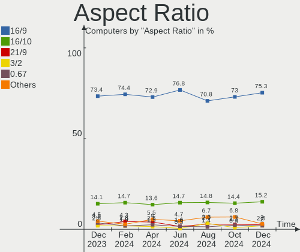

| Ratio   | Computers | Percent |
|---------|-----------|---------|
| 16/9    | 146       | 73.37%  |
| 16/10   | 28        | 14.07%  |
| 0.67    | 7         | 3.52%   |
| 21/9    | 5         | 2.51%   |
| 3/2     | 4         | 2.01%   |
| Unknown | 4         | 2.01%   |
| 5/4     | 3         | 1.51%   |
| 2.00    | 1         | 0.5%    |
| 0.62    | 1         | 0.5%    |

Monitor Area
------------

Area in inch

| Area in inch | Computers | Percent |
|----------------|-----------|---------|
| 101-110        | 45        | 20.74%  |
| 301-350        | 34        | 15.67%  |
| 201-250        | 29        | 13.36%  |
| 81-90          | 23        | 10.6%   |
| 351-500        | 18        | 8.29%   |
| 71-80          | 10        | 4.61%   |
| 251-300        | 9         | 4.15%   |
| 1-40           | 8         | 3.69%   |
| 151-200        | 7         | 3.23%   |
| 111-120        | 7         | 3.23%   |
| More than 1000 | 6         | 2.76%   |
| 61-70          | 5         | 2.3%    |
| Unknown        | 5         | 2.3%    |
| 121-130        | 4         | 1.84%   |
| 51-60          | 3         | 1.38%   |
| 141-150        | 2         | 0.92%   |
| 501-1000       | 1         | 0.46%   |
| 91-100         | 1         | 0.46%   |

Pixel Density
-------------

Pixels per inch

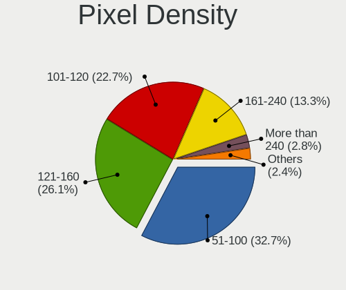

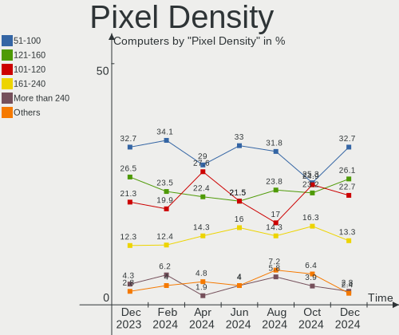

| Density       | Computers | Percent |
|---------------|-----------|---------|
| 51-100        | 69        | 32.7%   |
| 121-160       | 57        | 27.01%  |
| 101-120       | 44        | 20.85%  |
| 161-240       | 26        | 12.32%  |
| More than 240 | 9         | 4.27%   |
| Unknown       | 5         | 2.37%   |
| 1-50          | 1         | 0.47%   |

Multiple Monitors
-----------------

Total monitors connected

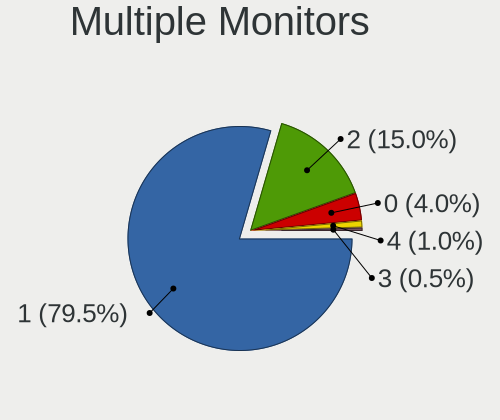

| Total | Computers | Percent |
|-------|-----------|---------|
| 1     | 160       | 79.6%   |
| 2     | 30        | 14.93%  |
| 0     | 7         | 3.48%   |
| 3     | 3         | 1.49%   |
| 4     | 1         | 0.5%    |

Network
-------

Net Controller Vendor
---------------------

Controller vendors

| Vendor                            | Computers | Percent |
|-----------------------------------|-----------|---------|
| Realtek Semiconductor             | 119       | 38.39%  |
| Intel                             | 108       | 34.84%  |
| Qualcomm Atheros                  | 27        | 8.71%   |
| Broadcom                          | 12        | 3.87%   |
| MediaTek                          | 11        | 3.55%   |
| TP-Link                           | 5         | 1.61%   |
| Qualcomm                          | 5         | 1.61%   |
| Ralink Technology                 | 3         | 0.97%   |
| Marvell Technology Group          | 3         | 0.97%   |
| Microsoft                         | 2         | 0.65%   |
| Lenovo                            | 2         | 0.65%   |
| Broadcom Limited                  | 2         | 0.65%   |
| ZyDAS                             | 1         | 0.32%   |
| Samsung Electronics               | 1         | 0.32%   |
| Ralink                            | 1         | 0.32%   |
| NetGear                           | 1         | 0.32%   |
| Lab126                            | 1         | 0.32%   |
| Ericsson Business Mobile Networks | 1         | 0.32%   |
| Edimax Technology                 | 1         | 0.32%   |
| Dell                              | 1         | 0.32%   |
| D-Link                            | 1         | 0.32%   |
| ASIX Electronics                  | 1         | 0.32%   |
| Apple                             | 1         | 0.32%   |

Net Controller Model
--------------------

Controller models

| Model                                                                   | Computers | Percent |
|-------------------------------------------------------------------------|-----------|---------|
| Realtek RTL8111/8168/8411 PCI Express Gigabit Ethernet Controller       | 76        | 21.59%  |
| Intel Wi-Fi 6 AX200                                                     | 15        | 4.26%   |
| Realtek RTL8125 2.5GbE Controller                                       | 12        | 3.41%   |
| Intel Wireless 8265 / 8275                                              | 10        | 2.84%   |
| Realtek RTL8153 Gigabit Ethernet Adapter                                | 9         | 2.56%   |
| Realtek RTL8822CE 802.11ac PCIe Wireless Network Adapter                | 8         | 2.27%   |
| MediaTek MT7922 802.11ax PCI Express Wireless Network Adapter           | 8         | 2.27%   |
| Intel Ethernet Controller I225-V                                        | 8         | 2.27%   |
| Intel 82579LM Gigabit Network Connection (Lewisville)                   | 7         | 1.99%   |
| Realtek RTL810xE PCI Express Fast Ethernet controller                   | 6         | 1.7%    |
| Intel Wireless 7265                                                     | 6         | 1.7%    |
| Qualcomm QCNFA765 Wireless Network Adapter                              | 5         | 1.42%   |
| Qualcomm Atheros QCA6174 802.11ac Wireless Network Adapter              | 5         | 1.42%   |
| Qualcomm Atheros AR9485 Wireless Network Adapter                        | 5         | 1.42%   |
| Intel Wireless 7260                                                     | 5         | 1.42%   |
| Intel Wireless 3165                                                     | 5         | 1.42%   |
| Intel Wi-Fi 6 AX210/AX211/AX411 160MHz                                  | 5         | 1.42%   |
| Intel Raptor Lake PCH CNVi WiFi                                         | 5         | 1.42%   |
| Intel Cannon Lake PCH CNVi WiFi                                         | 5         | 1.42%   |
| Intel Wi-Fi 6 AX201                                                     | 4         | 1.14%   |
| Intel I211 Gigabit Network Connection                                   | 4         | 1.14%   |
| Intel Gemini Lake PCH CNVi WiFi                                         | 4         | 1.14%   |
| Intel Centrino Advanced-N 6205 [Taylor Peak]                            | 4         | 1.14%   |
| TP-Link 802.11ac WLAN Adapter                                           | 3         | 0.85%   |
| Realtek RTL8821CE 802.11ac PCIe Wireless Network Adapter                | 3         | 0.85%   |
| Qualcomm Atheros QCA9565 / AR9565 Wireless Network Adapter              | 3         | 0.85%   |
| Qualcomm Atheros AR93xx Wireless Network Adapter                        | 3         | 0.85%   |
| Qualcomm Atheros AR8151 v2.0 Gigabit Ethernet                           | 3         | 0.85%   |
| Intel Wireless-AC 9260                                                  | 3         | 0.85%   |
| Intel Ethernet Connection I217-LM                                       | 3         | 0.85%   |
| Intel Ethernet Connection (7) I219-LM                                   | 3         | 0.85%   |
| Intel Alder Lake-P PCH CNVi WiFi                                        | 3         | 0.85%   |
| Realtek RTL8192CE PCIe Wireless Network Adapter                         | 2         | 0.57%   |
| Realtek RTL8188EUS 802.11n Wireless Network Adapter                     | 2         | 0.57%   |
| Realtek Killer E3000 2.5GbE Controller                                  | 2         | 0.57%   |
| Ralink MT7601U Wireless Adapter                                         | 2         | 0.57%   |
| Qualcomm Atheros AR9287 Wireless Network Adapter (PCI-Express)          | 2         | 0.57%   |
| Qualcomm Atheros AR242x / AR542x Wireless Network Adapter (PCI-Express) | 2         | 0.57%   |
| MediaTek MT7921K (RZ608) Wi-Fi 6E 80MHz                                 | 2         | 0.57%   |
| Intel Wireless 8260                                                     | 2         | 0.57%   |

Wireless Vendor
---------------

Wireless vendors

| Vendor                            | Computers | Percent |
|-----------------------------------|-----------|---------|
| Intel                             | 89        | 49.44%  |
| Realtek Semiconductor             | 24        | 13.33%  |
| Qualcomm Atheros                  | 23        | 12.78%  |
| MediaTek                          | 11        | 6.11%   |
| Broadcom                          | 9         | 5%      |
| TP-Link                           | 5         | 2.78%   |
| Qualcomm                          | 5         | 2.78%   |
| Ralink Technology                 | 3         | 1.67%   |
| Microsoft                         | 2         | 1.11%   |
| ZyDAS                             | 1         | 0.56%   |
| Ralink                            | 1         | 0.56%   |
| NetGear                           | 1         | 0.56%   |
| Marvell Technology Group          | 1         | 0.56%   |
| Ericsson Business Mobile Networks | 1         | 0.56%   |
| Edimax Technology                 | 1         | 0.56%   |
| Dell                              | 1         | 0.56%   |
| D-Link                            | 1         | 0.56%   |
| Broadcom Limited                  | 1         | 0.56%   |

Wireless Model
--------------

Wireless models

| Model                                                                   | Computers | Percent |
|-------------------------------------------------------------------------|-----------|---------|
| Intel Wi-Fi 6 AX200                                                     | 15        | 8.33%   |
| Intel Wireless 8265 / 8275                                              | 10        | 5.56%   |
| Realtek RTL8822CE 802.11ac PCIe Wireless Network Adapter                | 8         | 4.44%   |
| MediaTek MT7922 802.11ax PCI Express Wireless Network Adapter           | 8         | 4.44%   |
| Intel Wireless 7265                                                     | 6         | 3.33%   |
| Qualcomm QCNFA765 Wireless Network Adapter                              | 5         | 2.78%   |
| Qualcomm Atheros QCA6174 802.11ac Wireless Network Adapter              | 5         | 2.78%   |
| Qualcomm Atheros AR9485 Wireless Network Adapter                        | 5         | 2.78%   |
| Intel Wireless 7260                                                     | 5         | 2.78%   |
| Intel Wireless 3165                                                     | 5         | 2.78%   |
| Intel Wi-Fi 6 AX210/AX211/AX411 160MHz                                  | 5         | 2.78%   |
| Intel Raptor Lake PCH CNVi WiFi                                         | 5         | 2.78%   |
| Intel Cannon Lake PCH CNVi WiFi                                         | 5         | 2.78%   |
| Intel Wi-Fi 6 AX201                                                     | 4         | 2.22%   |
| Intel Gemini Lake PCH CNVi WiFi                                         | 4         | 2.22%   |
| Intel Centrino Advanced-N 6205 [Taylor Peak]                            | 4         | 2.22%   |
| TP-Link 802.11ac WLAN Adapter                                           | 3         | 1.67%   |
| Realtek RTL8821CE 802.11ac PCIe Wireless Network Adapter                | 3         | 1.67%   |
| Qualcomm Atheros QCA9565 / AR9565 Wireless Network Adapter              | 3         | 1.67%   |
| Qualcomm Atheros AR93xx Wireless Network Adapter                        | 3         | 1.67%   |
| Intel Wireless-AC 9260                                                  | 3         | 1.67%   |
| Intel Alder Lake-P PCH CNVi WiFi                                        | 3         | 1.67%   |
| Realtek RTL8192CE PCIe Wireless Network Adapter                         | 2         | 1.11%   |
| Realtek RTL8188EUS 802.11n Wireless Network Adapter                     | 2         | 1.11%   |
| Ralink MT7601U Wireless Adapter                                         | 2         | 1.11%   |
| Qualcomm Atheros AR9287 Wireless Network Adapter (PCI-Express)          | 2         | 1.11%   |
| Qualcomm Atheros AR242x / AR542x Wireless Network Adapter (PCI-Express) | 2         | 1.11%   |
| MediaTek MT7921K (RZ608) Wi-Fi 6E 80MHz                                 | 2         | 1.11%   |
| Intel Wireless 8260                                                     | 2         | 1.11%   |
| Intel WiFi Link 5100                                                    | 2         | 1.11%   |
| Intel Dual Band Wireless-AC 3168NGW [Stone Peak]                        | 2         | 1.11%   |
| Intel Cannon Point-LP CNVi [Wireless-AC]                                | 2         | 1.11%   |
| Intel 700 Series Chipset Family Wi-Fi                                   | 2         | 1.11%   |
| Broadcom BCM4360 802.11ac Dual Band Wireless Network Adapter            | 2         | 1.11%   |
| ZyDAS ZD1211B 802.11g                                                   | 1         | 0.56%   |
| TP-Link RTL8812AU Archer T4U 802.11ac                                   | 1         | 0.56%   |
| TP-Link AC600 wireless Realtek RTL8811AU [Archer T2U Nano]              | 1         | 0.56%   |
| Realtek RTL8852BE PCIe 802.11ax Wireless Network Controller             | 1         | 0.56%   |
| Realtek RTL8821AE 802.11ac PCIe Wireless Network Adapter                | 1         | 0.56%   |
| Realtek RTL8814AU 802.11a/b/g/n/ac Wireless Adapter                     | 1         | 0.56%   |

Ethernet Vendor
---------------

Ethernet vendors

| Vendor                   | Computers | Percent |
|--------------------------|-----------|---------|
| Realtek Semiconductor    | 105       | 62.5%   |
| Intel                    | 43        | 25.6%   |
| Qualcomm Atheros         | 8         | 4.76%   |
| Broadcom                 | 3         | 1.79%   |
| Marvell Technology Group | 2         | 1.19%   |
| Lenovo                   | 2         | 1.19%   |
| Samsung Electronics      | 1         | 0.6%    |
| Lab126                   | 1         | 0.6%    |
| Broadcom Limited         | 1         | 0.6%    |
| ASIX Electronics         | 1         | 0.6%    |
| Apple                    | 1         | 0.6%    |

Ethernet Model
--------------

Ethernet models

| Model                                                             | Computers | Percent |
|-------------------------------------------------------------------|-----------|---------|
| Realtek RTL8111/8168/8411 PCI Express Gigabit Ethernet Controller | 76        | 44.44%  |
| Realtek RTL8125 2.5GbE Controller                                 | 12        | 7.02%   |
| Realtek RTL8153 Gigabit Ethernet Adapter                          | 9         | 5.26%   |
| Intel Ethernet Controller I225-V                                  | 8         | 4.68%   |
| Intel 82579LM Gigabit Network Connection (Lewisville)             | 7         | 4.09%   |
| Realtek RTL810xE PCI Express Fast Ethernet controller             | 6         | 3.51%   |
| Intel I211 Gigabit Network Connection                             | 4         | 2.34%   |
| Qualcomm Atheros AR8151 v2.0 Gigabit Ethernet                     | 3         | 1.75%   |
| Intel Ethernet Connection I217-LM                                 | 3         | 1.75%   |
| Intel Ethernet Connection (7) I219-LM                             | 3         | 1.75%   |
| Realtek Killer E3000 2.5GbE Controller                            | 2         | 1.17%   |
| Intel Ethernet Connection (6) I219-V                              | 2         | 1.17%   |
| Intel Ethernet Connection (4) I219-V                              | 2         | 1.17%   |
| Intel 82567LM-3 Gigabit Network Connection                        | 2         | 1.17%   |
| Broadcom NetXtreme BCM57765 Gigabit Ethernet PCIe                 | 2         | 1.17%   |
| Samsung Galaxy series, misc. (tethering mode)                     | 1         | 0.58%   |
| Realtek RTL8152 Fast Ethernet Adapter                             | 1         | 0.58%   |
| Realtek RTL-8100/8101L/8139 PCI Fast Ethernet Adapter             | 1         | 0.58%   |
| Qualcomm Atheros QCA8171 Gigabit Ethernet                         | 1         | 0.58%   |
| Qualcomm Atheros Killer E2500 Gigabit Ethernet Controller         | 1         | 0.58%   |
| Qualcomm Atheros Killer E220x Gigabit Ethernet Controller         | 1         | 0.58%   |
| Qualcomm Atheros AR8151 v1.0 Gigabit Ethernet                     | 1         | 0.58%   |
| Qualcomm Atheros AR8121/AR8113/AR8114 Gigabit or Fast Ethernet    | 1         | 0.58%   |
| Marvell Group 88E8058 PCI-E Gigabit Ethernet Controller           | 1         | 0.58%   |
| Marvell Group 88E8057 PCI-E Gigabit Ethernet Controller           | 1         | 0.58%   |
| Lenovo USB-C Hub                                                  | 1         | 0.58%   |
| Lenovo USB-C Dock Ethernet                                        | 1         | 0.58%   |
| Lab126 KFRAPWI                                                    | 1         | 0.58%   |
| Intel Ethernet Connection I218-LM                                 | 1         | 0.58%   |
| Intel Ethernet Connection (7) I219-V                              | 1         | 0.58%   |
| Intel Ethernet Connection (6) I219-LM                             | 1         | 0.58%   |
| Intel Ethernet Connection (5) I219-LM                             | 1         | 0.58%   |
| Intel Ethernet Connection (4) I219-LM                             | 1         | 0.58%   |
| Intel Ethernet Connection (2) I219-V                              | 1         | 0.58%   |
| Intel Ethernet Connection (2) I219-LM                             | 1         | 0.58%   |
| Intel Ethernet Connection (2) I218-V                              | 1         | 0.58%   |
| Intel Ethernet Connection (17) I219-V                             | 1         | 0.58%   |
| Intel 82579V Gigabit Network Connection                           | 1         | 0.58%   |
| Intel 82578DC Gigabit Network Connection                          | 1         | 0.58%   |
| Intel 82577LM Gigabit Network Connection                          | 1         | 0.58%   |

Net Controller Kind
-------------------

Ethernet, WiFi or modem

| Kind     | Computers | Percent |
|----------|-----------|---------|
| WiFi     | 169       | 50.9%   |
| Ethernet | 162       | 48.8%   |
| Unknown  | 1         | 0.3%    |

Used Controller
---------------

Currently used network controller

| Kind     | Computers | Percent |
|----------|-----------|---------|
| WiFi     | 131       | 62.09%  |
| Ethernet | 80        | 37.91%  |

NICs
----

Total network controllers on board

| Total | Computers | Percent |
|-------|-----------|---------|
| 2     | 106       | 52.74%  |
| 1     | 87        | 43.28%  |
| 3     | 5         | 2.49%   |
| 0     | 2         | 1%      |
| 4     | 1         | 0.5%    |

IPv6
----

IPv6 vs IPv4

| Used | Computers | Percent |
|------|-----------|---------|
| No   | 140       | 69.65%  |
| Yes  | 61        | 30.35%  |

Bluetooth
---------

Bluetooth Vendor
----------------

Controller vendors

| Vendor                          | Computers | Percent |
|---------------------------------|-----------|---------|
| Intel                           | 81        | 51.92%  |
| Realtek Semiconductor           | 10        | 6.41%   |
| Qualcomm Atheros Communications | 9         | 5.77%   |
| IMC Networks                    | 9         | 5.77%   |
| Foxconn / Hon Hai               | 7         | 4.49%   |
| Cambridge Silicon Radio         | 7         | 4.49%   |
| Broadcom                        | 6         | 3.85%   |
| MediaTek                        | 5         | 3.21%   |
| USI                             | 3         | 1.92%   |
| TP-Link                         | 3         | 1.92%   |
| ASUSTek Computer                | 3         | 1.92%   |
| Apple                           | 3         | 1.92%   |
| Lite-On Technology              | 2         | 1.28%   |
| Integrated System Solution      | 2         | 1.28%   |
| Toshiba                         | 1         | 0.64%   |
| Realtek                         | 1         | 0.64%   |
| Ralink                          | 1         | 0.64%   |
| Marvell Semiconductor           | 1         | 0.64%   |
| Hewlett-Packard                 | 1         | 0.64%   |
| Belkin Components               | 1         | 0.64%   |

Bluetooth Model
---------------

Controller models

| Model                                                 | Computers | Percent |
|-------------------------------------------------------|-----------|---------|
| Intel Bluetooth wireless interface                    | 28        | 17.95%  |
| Intel Bluetooth Device                                | 16        | 10.26%  |
| Intel AX200 Bluetooth                                 | 14        | 8.97%   |
| Intel Bluetooth 9460/9560 Jefferson Peak (JfP)        | 11        | 7.05%   |
| Realtek Bluetooth Radio                               | 10        | 6.41%   |
| IMC Networks 802.11ac WLAN Adapter                    | 7         | 4.49%   |
| Cambridge Silicon Radio Bluetooth Dongle (HCI mode)   | 7         | 4.49%   |
| Intel AX210 Bluetooth                                 | 6         | 3.85%   |
| MediaTek Wireless_Device                              | 5         | 3.21%   |
| Qualcomm Atheros QCA61x4 Bluetooth 4.0                | 4         | 2.56%   |
| Foxconn / Hon Hai Wireless_Device                     | 4         | 2.56%   |
| USI Bluetooth Device                                  | 3         | 1.92%   |
| TP-Link UB500 Adapter                                 | 3         | 1.92%   |
| Broadcom BCM20702A0 Bluetooth 4.0                     | 3         | 1.92%   |
| Qualcomm Atheros  Bluetooth Device                    | 2         | 1.28%   |
| Qualcomm Atheros Bluetooth                            | 2         | 1.28%   |
| Lite-On Atheros AR3012 Bluetooth                      | 2         | 1.28%   |
| Intel Wireless-AC 9260 Bluetooth Adapter              | 2         | 1.28%   |
| Intel Wireless-AC 3168 Bluetooth                      | 2         | 1.28%   |
| Apple Built-in Bluetooth 2.0+EDR HCI                  | 2         | 1.28%   |
| Toshiba Atheros AR3012 Bluetooth                      | 1         | 0.64%   |
| Realtek Bluetooth Radio                               | 1         | 0.64%   |
| Ralink RT3290 Bluetooth                               | 1         | 0.64%   |
| Qualcomm Atheros AR3012 Bluetooth 4.0                 | 1         | 0.64%   |
| Marvell Bluetooth and Wireless LAN Composite          | 1         | 0.64%   |
| Intel Centrino Bluetooth Wireless Transceiver         | 1         | 0.64%   |
| Intel Centrino Advanced-N 6230 Bluetooth adapter      | 1         | 0.64%   |
| Integrated System Solution KY-BT100 Bluetooth Adapter | 1         | 0.64%   |
| Integrated System Solution Bluetooth Device           | 1         | 0.64%   |
| IMC Networks Wireless_Device                          | 1         | 0.64%   |
| IMC Networks Bluetooth Radio                          | 1         | 0.64%   |
| HP Broadcom 2070 Bluetooth Combo                      | 1         | 0.64%   |
| Foxconn / Hon Hai Bluetooth Device                    | 1         | 0.64%   |
| Foxconn / Hon Hai Bluetooth Adapter                   | 1         | 0.64%   |
| Foxconn / Hon Hai BCM2045A0                           | 1         | 0.64%   |
| Broadcom HP Portable Valentine                        | 1         | 0.64%   |
| Broadcom Bluetooth 2.0+eDR dongle                     | 1         | 0.64%   |
| Broadcom BCM43142 Bluetooth 4.0                       | 1         | 0.64%   |
| Belkin Components F8T065BF Mini Bluetooth 4.0 Adapter | 1         | 0.64%   |
| ASUS Broadcom BCM20702 Single-Chip Bluetooth 4.0 + LE | 1         | 0.64%   |

Sound
-----

Sound Vendor
------------

Sound card vendors

| Vendor                                          | Computers | Percent |
|-------------------------------------------------|-----------|---------|
| Intel                                           | 125       | 43.55%  |
| AMD                                             | 81        | 28.22%  |
| Nvidia                                          | 41        | 14.29%  |
| C-Media Electronics                             | 5         | 1.74%   |
| ASUSTek Computer                                | 4         | 1.39%   |
| JMTek                                           | 3         | 1.05%   |
| Realtek Semiconductor                           | 2         | 0.7%    |
| Logitech                                        | 2         | 0.7%    |
| GN Netcom                                       | 2         | 0.7%    |
| Creative Technology                             | 2         | 0.7%    |
| Thesycon Systemsoftware & Consulting            | 1         | 0.35%   |
| SteelSeries ApS                                 | 1         | 0.35%   |
| RME                                             | 1         | 0.35%   |
| Razer USA                                       | 1         | 0.35%   |
| Plantronics                                     | 1         | 0.35%   |
| Micro Star International                        | 1         | 0.35%   |
| Licensed by Sony Computer Entertainment America | 1         | 0.35%   |
| Lenovo                                          | 1         | 0.35%   |
| Google                                          | 1         | 0.35%   |
| Giga-Byte Technology                            | 1         | 0.35%   |
| Generalplus Technology                          | 1         | 0.35%   |
| Focusrite-Novation                              | 1         | 0.35%   |
| Dell                                            | 1         | 0.35%   |
| Creative Labs                                   | 1         | 0.35%   |
| Cooler Master                                   | 1         | 0.35%   |
| AudioQuest                                      | 1         | 0.35%   |
| Audient                                         | 1         | 0.35%   |
| ATI Technologies                                | 1         | 0.35%   |
| ASRock                                          | 1         | 0.35%   |
| AKG C44-USB Microphone                          | 1         | 0.35%   |

Sound Model
-----------

Sound card models

| Model                                                                      | Computers | Percent |
|----------------------------------------------------------------------------|-----------|---------|
| AMD Family 17h/19h HD Audio Controller                                     | 32        | 9.07%   |
| AMD Rembrandt Radeon High Definition Audio Controller                      | 19        | 5.38%   |
| AMD Renoir Radeon High Definition Audio Controller                         | 14        | 3.97%   |
| AMD Starship/Matisse HD Audio Controller                                   | 13        | 3.68%   |
| Intel Sunrise Point-LP HD Audio                                            | 12        | 3.4%    |
| Intel Cannon Lake PCH cAVS                                                 | 12        | 3.4%    |
| Intel 6 Series/C200 Series Chipset Family High Definition Audio Controller | 12        | 3.4%    |
| Intel 7 Series/C216 Chipset Family High Definition Audio Controller        | 10        | 2.83%   |
| AMD Navi 21/23 HDMI/DP Audio Controller                                    | 10        | 2.83%   |
| Intel 8 Series/C220 Series Chipset High Definition Audio Controller        | 8         | 2.27%   |
| Intel Xeon E3-1200 v3/4th Gen Core Processor HD Audio Controller           | 6         | 1.7%    |
| Intel Raptor Lake-P/U/H cAVS                                               | 6         | 1.7%    |
| Intel Celeron/Pentium Silver Processor High Definition Audio               | 6         | 1.7%    |
| AMD SBx00 Azalia (Intel HDA)                                               | 6         | 1.7%    |
| Nvidia GA106 High Definition Audio Controller                              | 5         | 1.42%   |
| Nvidia Audio device                                                        | 5         | 1.42%   |
| Intel 5 Series/3400 Series Chipset High Definition Audio                   | 5         | 1.42%   |
| AMD Raven/Raven2/Fenghuang HDMI/DP Audio Controller                        | 5         | 1.42%   |
| AMD Family 17h (Models 00h-0fh) HD Audio Controller                        | 5         | 1.42%   |
| Intel Wildcat Point-LP High Definition Audio Controller                    | 4         | 1.13%   |
| Intel Tiger Lake-LP Smart Sound Technology Audio Controller                | 4         | 1.13%   |
| Intel Haswell-ULT HD Audio Controller                                      | 4         | 1.13%   |
| Intel Cannon Point-LP High Definition Audio Controller                     | 4         | 1.13%   |
| Intel Broadwell-U Audio Controller                                         | 4         | 1.13%   |
| Intel 82801I (ICH9 Family) HD Audio Controller                             | 4         | 1.13%   |
| Intel 8 Series HD Audio Controller                                         | 4         | 1.13%   |
| Intel 200 Series PCH HD Audio                                              | 4         | 1.13%   |
| AMD Navi 10 HDMI Audio                                                     | 4         | 1.13%   |
| AMD FCH Azalia Controller                                                  | 4         | 1.13%   |
| AMD Ellesmere HDMI Audio [Radeon RX 470/480 / 570/580/590]                 | 4         | 1.13%   |
| Nvidia TU116 High Definition Audio Controller                              | 3         | 0.85%   |
| Nvidia GP107GL High Definition Audio Controller                            | 3         | 0.85%   |
| Nvidia GP106 High Definition Audio Controller                              | 3         | 0.85%   |
| Nvidia GM204 High Definition Audio Controller                              | 3         | 0.85%   |
| Nvidia GK208 HDMI/DP Audio Controller                                      | 3         | 0.85%   |
| Intel Alder Lake PCH-P High Definition Audio Controller                    | 3         | 0.85%   |
| Intel 100 Series/C230 Series Chipset Family HD Audio Controller            | 3         | 0.85%   |
| Nvidia TU107 GeForce GTX 1650 High Definition Audio Controller             | 2         | 0.57%   |
| Nvidia High Definition Audio Controller                                    | 2         | 0.57%   |
| Nvidia GM206 High Definition Audio Controller                              | 2         | 0.57%   |

Memory
------

Memory Vendor
-------------

Memory module vendors

| Vendor              | Computers | Percent |
|---------------------|-----------|---------|
| Samsung Electronics | 20        | 17.7%   |
| Corsair             | 20        | 17.7%   |
| Micron Technology   | 19        | 16.81%  |
| SK hynix            | 18        | 15.93%  |
| Kingston            | 11        | 9.73%   |
| Crucial             | 6         | 5.31%   |
| Unknown             | 4         | 3.54%   |
| Unknown (ABCD)      | 3         | 2.65%   |
| A-DATA Technology   | 3         | 2.65%   |
| Unknown             | 3         | 2.65%   |
| G.Skill             | 2         | 1.77%   |
| Unknown (CB83)      | 1         | 0.88%   |
| Ramaxel Technology  | 1         | 0.88%   |
| Patriot             | 1         | 0.88%   |
| Nanya Technology    | 1         | 0.88%   |

Memory Model
------------

Memory module models

| Model                                                                     | Computers | Percent |
|---------------------------------------------------------------------------|-----------|---------|
| Unknown                                                                   | 3         | 2.61%   |
| Unknown (ABCD) RAM 123456789012345678 2GB SODIMM LPDDR4 2400MT/s          | 2         | 1.74%   |
| SK hynix RAM HMCG78AEBSA095N 16384MB SODIMM 4800MT/s                      | 2         | 1.74%   |
| Micron RAM MT62F1G32D4DR-031 WT 4GB SODIMM LPDDR5 6400MT/s                | 2         | 1.74%   |
| Micron RAM 8ATF1G64HZ-3G2R1 8GB SODIMM DDR4 3200MT/s                      | 2         | 1.74%   |
| Micron RAM 4ATF1G64HZ-3G2F1 8GB SODIMM DDR4 3200MT/s                      | 2         | 1.74%   |
| Corsair RAM CMK16GX4M2B3200C16 8GB DIMM DDR4 3600MT/s                     | 2         | 1.74%   |
| A-DATA RAM Module 16GB DIMM DDR4 2666MT/s                                 | 2         | 1.74%   |
| Unknown RAM Module 8GB Row Of Chips LPDDR3 2133MT/s                       | 1         | 0.87%   |
| Unknown RAM Module 4GB SODIMM DDR4 2400MT/s                               | 1         | 0.87%   |
| Unknown RAM Module 2GB SODIMM DDR2 800MT/s                                | 1         | 0.87%   |
| Unknown RAM DDR4 16GB 2666MHz 16GB SODIMM DDR4 2667MT/s                   | 1         | 0.87%   |
| Unknown (CB83) RAM Module 8GB SODIMM DDR4 2667MT/s                        | 1         | 0.87%   |
| Unknown (ABCD) RAM 123456789012345678 2GB DIMM LPDDR4 2400MT/s            | 1         | 0.87%   |
| SK hynix RAM Module 4GB SODIMM DDR3 1333MT/s                              | 1         | 0.87%   |
| SK hynix RAM Module 4GB DIMM DDR3 1600MT/s                                | 1         | 0.87%   |
| SK hynix RAM Module 4GB DIMM DDR3 1333MT/s                                | 1         | 0.87%   |
| SK hynix RAM Module 16GB SODIMM DDR4 2133MT/s                             | 1         | 0.87%   |
| SK hynix RAM HMT451U6BFR8C-PB 4GB DIMM DDR3 1600MT/s                      | 1         | 0.87%   |
| SK hynix RAM HMT451S6AFR8C-PB 4096MB SODIMM DDR3 1600MT/s                 | 1         | 0.87%   |
| SK hynix RAM HMT451S6AFR6A-PB 4GB SODIMM DDR3 1600MT/s                    | 1         | 0.87%   |
| SK hynix RAM HMT351U6CFR8C-PB 4GB DIMM DDR3 1800MT/s                      | 1         | 0.87%   |
| SK hynix RAM HMT351S6CFR8C-PB 4GB SODIMM DDR3 1600MT/s                    | 1         | 0.87%   |
| SK hynix RAM HMCG78AGBSA095N 16GB SODIMM DDR5 5600MT/s                    | 1         | 0.87%   |
| SK hynix RAM HMCG78AGBSA092N 16GB SODIMM DDR5 5600MT/s                    | 1         | 0.87%   |
| SK hynix RAM HMA851S6CJR6N-VK 4GB SODIMM DDR4 2667MT/s                    | 1         | 0.87%   |
| SK hynix RAM HMA81GU6DJR8N-VK 8GB DIMM DDR4 2667MT/s                      | 1         | 0.87%   |
| SK hynix RAM HMA81GS6JJR8N-VK 8GB SODIMM DDR4 2667MT/s                    | 1         | 0.87%   |
| SK hynix RAM HMA81GS6AFR8N-UH 8GB SODIMM DDR4 2667MT/s                    | 1         | 0.87%   |
| SK hynix RAM HMA41GS6AFR8N-TF 8GB SODIMM DDR4 2667MT/s                    | 1         | 0.87%   |
| SK hynix RAM 414141414141414141414141414141414141 2GB SODIMM DDR2 800MT/s | 1         | 0.87%   |
| Samsung RAM U6E3S4AA-MGCR 1GB Row Of Chips LPDDR4 4267MT/s                | 1         | 0.87%   |
| Samsung RAM Module 8GB SODIMM DDR4 2667MT/s                               | 1         | 0.87%   |
| Samsung RAM Module 4GB SODIMM LPDDR3 2133MT/s                             | 1         | 0.87%   |
| Samsung RAM Module 2GB DIMM DDR3 1333MT/s                                 | 1         | 0.87%   |
| Samsung RAM M471B5773CHS-CH9 2GB SODIMM DDR3 4199MT/s                     | 1         | 0.87%   |
| Samsung RAM M471B5173QH0-YK0 4GB SODIMM DDR3 1600MT/s                     | 1         | 0.87%   |
| Samsung RAM M471A5244BB0-CRC 4GB SODIMM DDR4 2667MT/s                     | 1         | 0.87%   |
| Samsung RAM M471A5143DB0-CPB 4GB SODIMM DDR4 2133MT/s                     | 1         | 0.87%   |
| Samsung RAM M471A2K43DB1-CTD 16GB SODIMM DDR4 2667MT/s                    | 1         | 0.87%   |

Memory Kind
-----------

Memory module kinds

| Kind   | Computers | Percent |
|--------|-----------|---------|
| DDR4   | 50        | 49.02%  |
| DDR3   | 19        | 18.63%  |
| DDR5   | 12        | 11.76%  |
| LPDDR5 | 6         | 5.88%   |
| LPDDR4 | 6         | 5.88%   |
| LPDDR3 | 4         | 3.92%   |
| SDRAM  | 3         | 2.94%   |
| DDR2   | 2         | 1.96%   |

Memory Form Factor
------------------

Physical design of the memory module

| Name         | Computers | Percent |
|--------------|-----------|---------|
| SODIMM       | 55        | 54.46%  |
| DIMM         | 37        | 36.63%  |
| Row Of Chips | 8         | 7.92%   |
| Unknown      | 1         | 0.99%   |

Memory Size
-----------

Memory module size

| Size  | Computers | Percent |
|-------|-----------|---------|
| 8192  | 37        | 34.58%  |
| 16384 | 28        | 26.17%  |
| 4096  | 25        | 23.36%  |
| 2048  | 8         | 7.48%   |
| 32768 | 7         | 6.54%   |
| 49152 | 1         | 0.93%   |
| 1024  | 1         | 0.93%   |

Memory Speed
------------

Memory module speed

| Speed | Computers | Percent |
|-------|-----------|---------|
| 3200  | 17        | 16.04%  |
| 2667  | 16        | 15.09%  |
| 1600  | 11        | 10.38%  |
| 2400  | 9         | 8.49%   |
| 4800  | 8         | 7.55%   |
| 6400  | 6         | 5.66%   |
| 2133  | 6         | 5.66%   |
| 3600  | 5         | 4.72%   |
| 1333  | 4         | 3.77%   |
| 5600  | 3         | 2.83%   |
| 4267  | 3         | 2.83%   |
| 2666  | 2         | 1.89%   |
| 1867  | 2         | 1.89%   |
| 800   | 2         | 1.89%   |
| 6000  | 1         | 0.94%   |
| 4199  | 1         | 0.94%   |
| 3800  | 1         | 0.94%   |
| 3100  | 1         | 0.94%   |
| 3000  | 1         | 0.94%   |
| 2933  | 1         | 0.94%   |
| 2800  | 1         | 0.94%   |
| 2733  | 1         | 0.94%   |
| 2048  | 1         | 0.94%   |
| 1800  | 1         | 0.94%   |
| 1334  | 1         | 0.94%   |
| 667   | 1         | 0.94%   |

Printers & scanners
-------------------

Printer Vendor
--------------

Printer device vendors

| Vendor                | Computers | Percent |
|-----------------------|-----------|---------|
| Hewlett-Packard       | 2         | 40%     |
| Samsung Electronics   | 1         | 20%     |
| Lexmark International | 1         | 20%     |
| Canon                 | 1         | 20%     |

Printer Model
-------------

Printer device models

| Model                         | Computers | Percent |
|-------------------------------|-----------|---------|
| Samsung M2020 Series          | 1         | 20%     |
| Lexmark International CX310dn | 1         | 20%     |
| HP LaserJet P2055 series      | 1         | 20%     |
| HP LaserJet 2200              | 1         | 20%     |
| Canon TS3100 series           | 1         | 20%     |

Scanner Vendor
--------------

Scanner device vendors

| Vendor             | Computers | Percent |
|--------------------|-----------|---------|
| Ultima Electronics | 1         | 50%     |
| Canon              | 1         | 50%     |

Scanner Model
-------------

Scanner device models

| Model                              | Computers | Percent |
|------------------------------------|-----------|---------|
| Ultima Artec E+ Pro                | 1         | 50%     |
| Canon CanoScan N670U/N676U/LiDE 20 | 1         | 50%     |

Camera
------

Camera Vendor
-------------

Camera device vendors

| Vendor                                 | Computers | Percent |
|----------------------------------------|-----------|---------|
| Chicony Electronics                    | 23        | 20%     |
| Logitech                               | 11        | 9.57%   |
| IMC Networks                           | 10        | 8.7%    |
| Microdia                               | 9         | 7.83%   |
| Realtek Semiconductor                  | 8         | 6.96%   |
| Apple                                  | 8         | 6.96%   |
| Sunplus Innovation Technology          | 6         | 5.22%   |
| Lite-On Technology                     | 6         | 5.22%   |
| Bison Electronics                      | 6         | 5.22%   |
| Luxvisions Innotech Limited            | 4         | 3.48%   |
| Suyin                                  | 3         | 2.61%   |
| SunplusIT                              | 2         | 1.74%   |
| Sonix Technology                       | 2         | 1.74%   |
| Cheng Uei Precision Industry (Foxlink) | 2         | 1.74%   |
| Acer                                   | 2         | 1.74%   |
| Tobii Technology AB                    | 1         | 0.87%   |
| Samsung Electronics                    | 1         | 0.87%   |
| Ricoh                                  | 1         | 0.87%   |
| Quanta                                 | 1         | 0.87%   |
| Primax Electronics                     | 1         | 0.87%   |
| Microsoft                              | 1         | 0.87%   |
| Lenovo                                 | 1         | 0.87%   |
| Hewlett-Packard                        | 1         | 0.87%   |
| Generalplus Technology                 | 1         | 0.87%   |
| GEMBIRD                                | 1         | 0.87%   |
| Creality 3D Technology                 | 1         | 0.87%   |
| ARC International                      | 1         | 0.87%   |
| Alcor Micro                            | 1         | 0.87%   |

Camera Model
------------

Camera device models

| Model                                                       | Computers | Percent |
|-------------------------------------------------------------|-----------|---------|
| Realtek Integrated_Webcam_HD                                | 6         | 5.17%   |
| IMC Networks USB2.0 HD UVC WebCam                           | 6         | 5.17%   |
| Apple iPhone 5/5C/5S/6/SE                                   | 5         | 4.31%   |
| Microdia Integrated_Webcam_HD                               | 4         | 3.45%   |
| Chicony HD WebCam                                           | 4         | 3.45%   |
| Lite-On HP HD Camera                                        | 3         | 2.59%   |
| Chicony Integrated Camera                                   | 3         | 2.59%   |
| SunplusIT MTD camera                                        | 2         | 1.72%   |
| Sunplus Integrated_Webcam_HD                                | 2         | 1.72%   |
| Sunplus HD WebCam                                           | 2         | 1.72%   |
| Sonix USB2.0 HD UVC WebCam                                  | 2         | 1.72%   |
| Microdia Integrated_Webcam_FHD                              | 2         | 1.72%   |
| Luxvisions Innotech Limited Integrated Camera               | 2         | 1.72%   |
| Logitech Webcam C270                                        | 2         | 1.72%   |
| Lite-On Integrated Camera                                   | 2         | 1.72%   |
| IMC Networks USB2.0 VGA UVC WebCam                          | 2         | 1.72%   |
| Bison Lenovo EasyCamera                                     | 2         | 1.72%   |
| Apple FaceTime HD Camera (Built-in)                         | 2         | 1.72%   |
| Tobii AB EyeChip                                            | 1         | 0.86%   |
| Suyin Laptop_Integrated_Webcam_HD                           | 1         | 0.86%   |
| Suyin Acer/HP Integrated Webcam [CN0314]                    | 1         | 0.86%   |
| Suyin 1.3M WebCam (notebook emachines E730, Acer sub-brand) | 1         | 0.86%   |
| Sunplus Laptop_Integrated_Webcam_FHD                        | 1         | 0.86%   |
| Sunplus 1080p FHD Camera                                    | 1         | 0.86%   |
| Samsung Galaxy series, misc. (MTP mode)                     | 1         | 0.86%   |
| Ricoh USB2.0 Camera                                         | 1         | 0.86%   |
| Realtek Integrated_Webcam_FHD                               | 1         | 0.86%   |
| Realtek Integrated_Webcam_8M                                | 1         | 0.86%   |
| Realtek Integrated Webcam HD                                | 1         | 0.86%   |
| Quanta HD User Facing                                       | 1         | 0.86%   |
| Primax HP HD Webcam [Fixed]                                 | 1         | 0.86%   |
| Microsoft LifeCam Studio                                    | 1         | 0.86%   |
| Microdia Webcam Vitade AF                                   | 1         | 0.86%   |
| Microdia USB Camera                                         | 1         | 0.86%   |
| Microdia Integrated Webcam HD                               | 1         | 0.86%   |
| Luxvisions Innotech Limited HP TrueVision HD Camera         | 1         | 0.86%   |
| Luxvisions Innotech Limited HP HD Camera                    | 1         | 0.86%   |
| Logitech Webcam C930e                                       | 1         | 0.86%   |
| Logitech Webcam C925e                                       | 1         | 0.86%   |
| Logitech Webcam C310                                        | 1         | 0.86%   |

Security
--------

Fingerprint Vendor
------------------

Fingerprint sensor vendors

| Vendor                     | Computers | Percent |
|----------------------------|-----------|---------|
| Validity Sensors           | 8         | 34.78%  |
| Synaptics                  | 8         | 34.78%  |
| Shenzhen Goodix Technology | 2         | 8.7%    |
| LighTuning Technology      | 2         | 8.7%    |
| Upek                       | 1         | 4.35%   |
| Elan Microelectronics      | 1         | 4.35%   |
| AuthenTec                  | 1         | 4.35%   |

Fingerprint Model
-----------------

Fingerprint sensor models

| Model                                                                      | Computers | Percent |
|----------------------------------------------------------------------------|-----------|---------|
| Validity Sensors VFS 5011 fingerprint sensor                               | 2         | 8.7%    |
| Synaptics Metallica MIS Touch Fingerprint Reader                           | 2         | 8.7%    |
| Synaptics Fingerprint reader [HP G6]                                       | 2         | 8.7%    |
| Shenzhen Goodix Fingerprint Reader                                         | 2         | 8.7%    |
| Validity Sensors VFS7552 Touch Fingerprint Sensor                          | 1         | 4.35%   |
| Validity Sensors VFS7500 Touch Fingerprint Sensor                          | 1         | 4.35%   |
| Validity Sensors VFS495 Fingerprint Reader                                 | 1         | 4.35%   |
| Validity Sensors VFS491                                                    | 1         | 4.35%   |
| Validity Sensors VFS471 Fingerprint Reader                                 | 1         | 4.35%   |
| Validity Sensors Synaptics VFS7552 Touch Fingerprint Sensor with PurePrint | 1         | 4.35%   |
| Upek Biometric Touchchip/Touchstrip Fingerprint Sensor                     | 1         | 4.35%   |
| Synaptics WBDI                                                             | 1         | 4.35%   |
| Synaptics UWP WBDI Device                                                  | 1         | 4.35%   |
| Synaptics Prometheus MIS Touch Fingerprint Reader                          | 1         | 4.35%   |
| Synaptics FS7604 Touch Fingerprint Sensor with PurePrint                   | 1         | 4.35%   |
| LighTuning Fingerprint Reader                                              | 1         | 4.35%   |
| LighTuning ES603 Swipe Fingerprint Sensor                                  | 1         | 4.35%   |
| Elan ELAN:Fingerprint                                                      | 1         | 4.35%   |
| AuthenTec AES2810                                                          | 1         | 4.35%   |

Chipcard Vendor
---------------

Chipcard module vendors

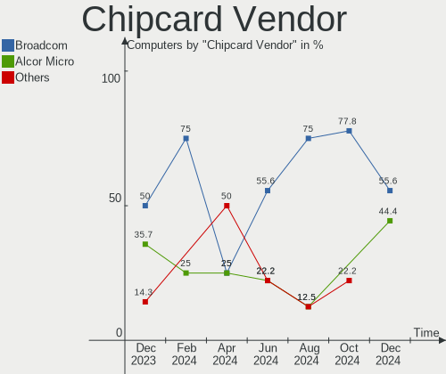

| Vendor      | Computers | Percent |
|-------------|-----------|---------|
| Broadcom    | 7         | 50%     |
| Alcor Micro | 5         | 35.71%  |
| OmniKey     | 1         | 7.14%   |
| O2 Micro    | 1         | 7.14%   |

Chipcard Model
--------------

Chipcard module models

| Model                                                                        | Computers | Percent |
|------------------------------------------------------------------------------|-----------|---------|
| Alcor Micro AU9540 Smartcard Reader                                          | 5         | 35.71%  |
| Broadcom 5880                                                                | 3         | 21.43%  |
| Broadcom 58200                                                               | 2         | 14.29%  |
| OmniKey CardMan 3021 / 3121                                                  | 1         | 7.14%   |
| O2 Micro OZ776 CCID Smartcard Reader                                         | 1         | 7.14%   |
| Broadcom BCM5880 Secure Applications Processor with fingerprint swipe sensor | 1         | 7.14%   |
| Broadcom BCM5880 Secure Applications Processor                               | 1         | 7.14%   |

Unsupported
-----------

Unsupported Devices
-------------------

Total unsupported devices on board

| Total | Computers | Percent |
|-------|-----------|---------|
| 0     | 138       | 68.66%  |
| 1     | 50        | 24.88%  |
| 2     | 12        | 5.97%   |
| 3     | 1         | 0.5%    |

Unsupported Device Types
------------------------

Types of unsupported devices

| Type                     | Computers | Percent |
|--------------------------|-----------|---------|
| Fingerprint reader       | 23        | 30.67%  |
| Graphics card            | 18        | 24%     |
| Chipcard                 | 10        | 13.33%  |
| Net/wireless             | 5         | 6.67%   |
| Multimedia controller    | 5         | 6.67%   |
| Sound                    | 3         | 4%      |
| Net/ethernet             | 3         | 4%      |
| Storage                  | 2         | 2.67%   |
| Bluetooth                | 2         | 2.67%   |
| Unassigned class         | 1         | 1.33%   |
| Communication controller | 1         | 1.33%   |
| Card reader              | 1         | 1.33%   |
| Camera                   | 1         | 1.33%   |

