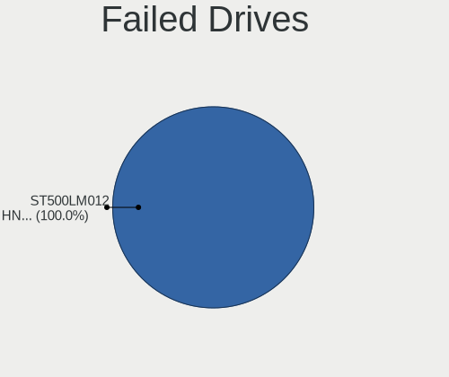
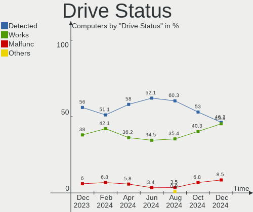

Linux in UK - Hardware Trends
-----------------------------

A project to identify most popular hardware characteristics and track their change
over time based on data collected by Linux users at https://Linux-Hardware.org.

Anyone can contribute to this report by the [hw-probe](https://github.com/linuxhw/hw-probe) tool:

    sudo -E hw-probe -all -upload

This is a report for all computer types. See also reports for [desktops](/Location/UK/Desktop/README.md) and [notebooks](/Location/UK/Notebook/README.md).

Period: Jul, 2022.

Contents
--------

* [ System ](#system)
  - [ OS                       ](#os)
  - [ OS Family                ](#os-family)
  - [ Kernel                   ](#kernel)
  - [ Kernel Family            ](#kernel-family)
  - [ Kernel Major Ver.        ](#kernel-major-ver)
  - [ Arch                     ](#arch)
  - [ DE                       ](#de)
  - [ Display Server           ](#display-server)
  - [ Display Manager          ](#display-manager)
  - [ OS Lang                  ](#os-lang)
  - [ Boot Mode                ](#boot-mode)
  - [ Filesystem               ](#filesystem)
  - [ Part. scheme             ](#part-scheme)
  - [ Dual Boot with Linux/BSD ](#dual-boot-with-linuxbsd)
  - [ Dual Boot (Win)          ](#dual-boot-win)

* [ Board ](#board)
  - [ Vendor                   ](#vendor)
  - [ Model                    ](#model)
  - [ Model Family             ](#model-family)
  - [ MFG Year                 ](#mfg-year)
  - [ Form Factor              ](#form-factor)
  - [ Secure Boot              ](#secure-boot)
  - [ Coreboot                 ](#coreboot)
  - [ RAM Size                 ](#ram-size)
  - [ RAM Used                 ](#ram-used)
  - [ Total Drives             ](#total-drives)
  - [ Has CD-ROM               ](#has-cd-rom)
  - [ Has Ethernet             ](#has-ethernet)
  - [ Has WiFi                 ](#has-wifi)
  - [ Has Bluetooth            ](#has-bluetooth)

* [ Location ](#location)
  - [ Country                  ](#country)
  - [ City                     ](#city)

* [ Drives ](#drives)
  - [ Drive Vendor             ](#drive-vendor)
  - [ Drive Model              ](#drive-model)
  - [ HDD Vendor               ](#hdd-vendor)
  - [ SSD Vendor               ](#ssd-vendor)
  - [ Drive Kind               ](#drive-kind)
  - [ Drive Connector          ](#drive-connector)
  - [ Drive Size               ](#drive-size)
  - [ Space Total              ](#space-total)
  - [ Space Used               ](#space-used)
  - [ Malfunc. Drives          ](#malfunc-drives)
  - [ Malfunc. Drive Vendor    ](#malfunc-drive-vendor)
  - [ Malfunc. HDD Vendor      ](#malfunc-hdd-vendor)
  - [ Malfunc. Drive Kind      ](#malfunc-drive-kind)
  - [ Failed Drives            ](#failed-drives)
  - [ Failed Drive Vendor      ](#failed-drive-vendor)
  - [ Drive Status             ](#drive-status)

* [ Storage controller ](#storage-controller)
  - [ Storage Vendor           ](#storage-vendor)
  - [ Storage Model            ](#storage-model)
  - [ Storage Kind             ](#storage-kind)

* [ Processor ](#processor)
  - [ CPU Vendor               ](#cpu-vendor)
  - [ CPU Model                ](#cpu-model)
  - [ CPU Model Family         ](#cpu-model-family)
  - [ CPU Cores                ](#cpu-cores)
  - [ CPU Sockets              ](#cpu-sockets)
  - [ CPU Threads              ](#cpu-threads)
  - [ CPU Op-Modes             ](#cpu-op-modes)
  - [ CPU Microcode            ](#cpu-microcode)
  - [ CPU Microarch            ](#cpu-microarch)

* [ Graphics ](#graphics)
  - [ GPU Vendor               ](#gpu-vendor)
  - [ GPU Model                ](#gpu-model)
  - [ GPU Combo                ](#gpu-combo)
  - [ GPU Driver               ](#gpu-driver)
  - [ GPU Memory               ](#gpu-memory)

* [ Monitor ](#monitor)
  - [ Monitor Vendor           ](#monitor-vendor)
  - [ Monitor Model            ](#monitor-model)
  - [ Monitor Resolution       ](#monitor-resolution)
  - [ Monitor Diagonal         ](#monitor-diagonal)
  - [ Monitor Width            ](#monitor-width)
  - [ Aspect Ratio             ](#aspect-ratio)
  - [ Monitor Area             ](#monitor-area)
  - [ Pixel Density            ](#pixel-density)
  - [ Multiple Monitors        ](#multiple-monitors)

* [ Network ](#network)
  - [ Net Controller Vendor    ](#net-controller-vendor)
  - [ Net Controller Model     ](#net-controller-model)
  - [ Wireless Vendor          ](#wireless-vendor)
  - [ Wireless Model           ](#wireless-model)
  - [ Ethernet Vendor          ](#ethernet-vendor)
  - [ Ethernet Model           ](#ethernet-model)
  - [ Net Controller Kind      ](#net-controller-kind)
  - [ Used Controller          ](#used-controller)
  - [ NICs                     ](#nics)
  - [ IPv6                     ](#ipv6)

* [ Bluetooth ](#bluetooth)
  - [ Bluetooth Vendor         ](#bluetooth-vendor)
  - [ Bluetooth Model          ](#bluetooth-model)

* [ Sound ](#sound)
  - [ Sound Vendor             ](#sound-vendor)
  - [ Sound Model              ](#sound-model)

* [ Memory ](#memory)
  - [ Memory Vendor            ](#memory-vendor)
  - [ Memory Model             ](#memory-model)
  - [ Memory Kind              ](#memory-kind)
  - [ Memory Form Factor       ](#memory-form-factor)
  - [ Memory Size              ](#memory-size)
  - [ Memory Speed             ](#memory-speed)

* [ Printers & scanners ](#printers--scanners)
  - [ Printer Vendor           ](#printer-vendor)
  - [ Printer Model            ](#printer-model)
  - [ Scanner Vendor           ](#scanner-vendor)
  - [ Scanner Model            ](#scanner-model)

* [ Camera ](#camera)
  - [ Camera Vendor            ](#camera-vendor)
  - [ Camera Model             ](#camera-model)

* [ Security ](#security)
  - [ Fingerprint Vendor       ](#fingerprint-vendor)
  - [ Fingerprint Model        ](#fingerprint-model)
  - [ Chipcard Vendor          ](#chipcard-vendor)
  - [ Chipcard Model           ](#chipcard-model)

* [ Unsupported ](#unsupported)
  - [ Unsupported Devices      ](#unsupported-devices)
  - [ Unsupported Device Types ](#unsupported-device-types)

System
------

OS
--

Installed operating systems

| Name                         | Computers | Percent |
|------------------------------|-----------|---------|
| Ubuntu 22.04                 | 24        | 13.64%  |
| OpenMandriva 4.3             | 19        | 10.8%   |
| Zorin 16                     | 13        | 7.39%   |
| Linux Mint 20.3              | 13        | 7.39%   |
| Ubuntu 20.04                 | 10        | 5.68%   |
| Pop!_OS 22.04                | 7         | 3.98%   |
| OpenMandriva 4.90            | 6         | 3.41%   |
| Manjaro                      | 6         | 3.41%   |
| Fedora 36                    | 6         | 3.41%   |
| Kubuntu 22.04                | 5         | 2.84%   |
| Debian 11                    | 5         | 2.84%   |
| Ubuntu 18.04                 | 4         | 2.27%   |
| Elementary 6.1               | 3         | 1.7%    |
| Arch Rolling                 | 3         | 1.7%    |
| Xubuntu 22.04                | 2         | 1.14%   |
| Ubuntu 21.10                 | 2         | 1.14%   |
| SteamOS 3.2                  | 2         | 1.14%   |
| Raspbian 11                  | 2         | 1.14%   |
| Peppermint 10                | 2         | 1.14%   |
| Lubuntu 20.04                | 2         | 1.14%   |
| Linux Mint 20                | 2         | 1.14%   |
| KDE neon 20.04               | 2         | 1.14%   |
| Kali 2022.3                  | 2         | 1.14%   |
| Gentoo 2.8                   | 2         | 1.14%   |
| Arch                         | 2         | 1.14%   |
| Zorin 15                     | 1         | 0.57%   |
| Ubuntu 21.04                 | 1         | 0.57%   |
| Ubuntu 16.04                 | 1         | 0.57%   |
| SteamOS 3.3                  | 1         | 0.57%   |
| SteamOS 3.2 (steamdeck-main) | 1         | 0.57%   |
| Solus 4.3                    | 1         | 0.57%   |
| RHEL 9                       | 1         | 0.57%   |
| Pop!_OS 21.10                | 1         | 0.57%   |
| Peppermint 11.3              | 1         | 0.57%   |
| Parrot 5.0                   | 1         | 0.57%   |
| openSUSE Tumbleweed-XXXXXXXX | 1         | 0.57%   |
| Nobara 36                    | 1         | 0.57%   |
| Manjaro 21.3.6               | 1         | 0.57%   |
| Manjaro 21.3.2               | 1         | 0.57%   |
| Manjaro 21.3.1               | 1         | 0.57%   |
| Lubuntu 22.10                | 1         | 0.57%   |
| LMDE 5                       | 1         | 0.57%   |
| Linux Mint 20.1              | 1         | 0.57%   |
| Linux Mint 19.3              | 1         | 0.57%   |
| Lilidog 22                   | 1         | 0.57%   |
| Kubuntu 20.04                | 1         | 0.57%   |
| Kubuntu 11.1                 | 1         | 0.57%   |
| Kali 2022.2                  | 1         | 0.57%   |
| Feren OS 20.04               | 1         | 0.57%   |
| Fedora 34                    | 1         | 0.57%   |
| Devuan 5                     | 1         | 0.57%   |
| Clear Linux 36580            | 1         | 0.57%   |
| ArcoLinux Rolling            | 1         | 0.57%   |
| antergos Rolling             | 1         | 0.57%   |
| Alpine 3.15.4                | 1         | 0.57%   |

OS Family
---------

OS without a version

| Name         | Computers | Percent |
|--------------|-----------|---------|
| Ubuntu       | 42        | 23.86%  |
| OpenMandriva | 25        | 14.2%   |
| Linux Mint   | 17        | 9.66%   |
| Zorin        | 14        | 7.95%   |
| Manjaro      | 9         | 5.11%   |
| Pop!_OS      | 8         | 4.55%   |
| Kubuntu      | 7         | 3.98%   |
| Fedora       | 7         | 3.98%   |
| Debian       | 5         | 2.84%   |
| Arch         | 5         | 2.84%   |
| SteamOS      | 4         | 2.27%   |
| Peppermint   | 3         | 1.7%    |
| Lubuntu      | 3         | 1.7%    |
| Kali         | 3         | 1.7%    |
| Elementary   | 3         | 1.7%    |
| Xubuntu      | 2         | 1.14%   |
| Raspbian     | 2         | 1.14%   |
| KDE neon     | 2         | 1.14%   |
| Gentoo       | 2         | 1.14%   |
| Solus        | 1         | 0.57%   |
| RHEL         | 1         | 0.57%   |
| Parrot       | 1         | 0.57%   |
| openSUSE     | 1         | 0.57%   |
| Nobara       | 1         | 0.57%   |
| LMDE         | 1         | 0.57%   |
| Lilidog      | 1         | 0.57%   |
| Feren OS     | 1         | 0.57%   |
| Devuan       | 1         | 0.57%   |
| Clear Linux  | 1         | 0.57%   |
| ArcoLinux    | 1         | 0.57%   |
| antergos     | 1         | 0.57%   |
| Alpine       | 1         | 0.57%   |

Kernel
------

Version of the Linux kernel

| Version                                            | Computers | Percent |
|----------------------------------------------------|-----------|---------|
| 5.15.0-41-generic                                  | 27        | 15.34%  |
| 5.16.7-desktop-1omv4003                            | 19        | 10.8%   |
| 5.13.0-52-generic                                  | 14        | 7.95%   |
| 5.4.0-122-generic                                  | 9         | 5.11%   |
| 5.15.0-40-generic                                  | 9         | 5.11%   |
| 5.4.0-121-generic                                  | 6         | 3.41%   |
| 5.18.12-desktop-3omv4090                           | 6         | 3.41%   |
| 5.10.0-16-amd64                                    | 5         | 2.84%   |
| 5.18.11-200.fc36.x86_64                            | 4         | 2.27%   |
| 5.17.15-76051715-generic                           | 4         | 2.27%   |
| 5.18.10-76051810-generic                           | 3         | 1.7%    |
| 5.18.0-kali5-amd64                                 | 3         | 1.7%    |
| 5.13.0-51-generic                                  | 3         | 1.7%    |
| 5.19.0-1-MANJARO                                   | 2         | 1.14%   |
| 5.18.12-3-MANJARO                                  | 2         | 1.14%   |
| 5.18.10-051810-generic                             | 2         | 1.14%   |
| 5.15.41-gentoo                                     | 2         | 1.14%   |
| 5.15.0-43-generic                                  | 2         | 1.14%   |
| 5.13.0-valve15-1-neptune-02197-gf6ec7ad3762a       | 2         | 1.14%   |
| 5.4.0-91-generic                                   | 1         | 0.57%   |
| 5.4.0-90-generic                                   | 1         | 0.57%   |
| 5.4.0-72-generic                                   | 1         | 0.57%   |
| 5.4.0-26-generic                                   | 1         | 0.57%   |
| 5.4.0-110-generic                                  | 1         | 0.57%   |
| 5.18.9-zen1-1-zen                                  | 1         | 0.57%   |
| 5.18.7-200.fc36.x86_64                             | 1         | 0.57%   |
| 5.18.6-1159.native                                 | 1         | 0.57%   |
| 5.18.2-zen1-1-zen                                  | 1         | 0.57%   |
| 5.18.14-arch1-1                                    | 1         | 0.57%   |
| 5.18.13-arch1-1                                    | 1         | 0.57%   |
| 5.18.13-200.fc36.x86_64                            | 1         | 0.57%   |
| 5.18.12-arch1-1                                    | 1         | 0.57%   |
| 5.18.12-051812-generic                             | 1         | 0.57%   |
| 5.18.11-arch1-1                                    | 1         | 0.57%   |
| 5.18.11-201.fsync.fc36.x86_64                      | 1         | 0.57%   |
| 5.18.11-1-default                                  | 1         | 0.57%   |
| 5.18.10-arch1-1                                    | 1         | 0.57%   |
| 5.17.12-100.fc34.x86_64                            | 1         | 0.57%   |
| 5.17.0-051700-generic                              | 1         | 0.57%   |
| 5.16.9-051609-generic                              | 1         | 0.57%   |
| 5.16.11-76051611-generic                           | 1         | 0.57%   |
| 5.16.0-12parrot1-amd64                             | 1         | 0.57%   |
| 5.15.57-2-MANJARO                                  | 1         | 0.57%   |
| 5.15.55-1-MANJARO                                  | 1         | 0.57%   |
| 5.15.53-1-MANJARO                                  | 1         | 0.57%   |
| 5.15.50-216.current                                | 1         | 0.57%   |
| 5.15.50-1-MANJARO                                  | 1         | 0.57%   |
| 5.15.49-1-MANJARO                                  | 1         | 0.57%   |
| 5.15.40-0-lts                                      | 1         | 0.57%   |
| 5.15.39-1-pve                                      | 1         | 0.57%   |
| 5.15.32-v7l+                                       | 1         | 0.57%   |
| 5.15.32-v7+                                        | 1         | 0.57%   |
| 5.15.0-41-lowlatency                               | 1         | 0.57%   |
| 5.15.0-35-generic                                  | 1         | 0.57%   |
| 5.15.0-33-generic                                  | 1         | 0.57%   |
| 5.15.0-30-generic                                  | 1         | 0.57%   |
| 5.15.0-25-generic                                  | 1         | 0.57%   |
| 5.14.0-70.17.1.el9_0.x86_64                        | 1         | 0.57%   |
| 5.13.0-valve22-1-neptune-02213-gb68995364335       | 1         | 0.57%   |
| 5.13.0-valve10.1-2-neptune-dri-02144-g7fffaf925dfb | 1         | 0.57%   |

Kernel Family
-------------

Linux kernel without a distro release

| Version | Computers | Percent |
|---------|-----------|---------|
| 5.15.0  | 43        | 24.43%  |
| 5.13.0  | 25        | 14.2%   |
| 5.4.0   | 20        | 11.36%  |
| 5.16.7  | 19        | 10.8%   |
| 5.18.12 | 10        | 5.68%   |
| 5.18.11 | 7         | 3.98%   |
| 5.10.0  | 7         | 3.98%   |
| 5.18.10 | 6         | 3.41%   |
| 5.17.15 | 4         | 2.27%   |
| 5.18.0  | 3         | 1.7%    |
| 5.19.0  | 2         | 1.14%   |
| 5.18.13 | 2         | 1.14%   |
| 5.15.50 | 2         | 1.14%   |
| 5.15.41 | 2         | 1.14%   |
| 5.15.32 | 2         | 1.14%   |
| 4.15.0  | 2         | 1.14%   |
| 5.18.9  | 1         | 0.57%   |
| 5.18.7  | 1         | 0.57%   |
| 5.18.6  | 1         | 0.57%   |
| 5.18.2  | 1         | 0.57%   |
| 5.18.14 | 1         | 0.57%   |
| 5.17.12 | 1         | 0.57%   |
| 5.17.0  | 1         | 0.57%   |
| 5.16.9  | 1         | 0.57%   |
| 5.16.11 | 1         | 0.57%   |
| 5.16.0  | 1         | 0.57%   |
| 5.15.57 | 1         | 0.57%   |
| 5.15.55 | 1         | 0.57%   |
| 5.15.53 | 1         | 0.57%   |
| 5.15.49 | 1         | 0.57%   |
| 5.15.40 | 1         | 0.57%   |
| 5.15.39 | 1         | 0.57%   |
| 5.14.0  | 1         | 0.57%   |
| 5.11.0  | 1         | 0.57%   |
| 4.4.0   | 1         | 0.57%   |
| 4.19.0  | 1         | 0.57%   |

Kernel Major Ver.
-----------------

Linux kernel major version

| Version | Computers | Percent |
|---------|-----------|---------|
| 5.15    | 55        | 31.25%  |
| 5.18    | 33        | 18.75%  |
| 5.13    | 25        | 14.2%   |
| 5.16    | 22        | 12.5%   |
| 5.4     | 20        | 11.36%  |
| 5.10    | 7         | 3.98%   |
| 5.17    | 6         | 3.41%   |
| 5.19    | 2         | 1.14%   |
| 4.15    | 2         | 1.14%   |
| 5.14    | 1         | 0.57%   |
| 5.11    | 1         | 0.57%   |
| 4.4     | 1         | 0.57%   |
| 4.19    | 1         | 0.57%   |

Arch
----

OS architecture (x86_64, i586, etc.)

| Name    | Computers | Percent |
|---------|-----------|---------|
| x86_64  | 168       | 95.45%  |
| i686    | 5         | 2.84%   |
| armv7l  | 2         | 1.14%   |
| aarch64 | 1         | 0.57%   |

DE
--

Desktop Environment

| Name             | Computers | Percent |
|------------------|-----------|---------|
| GNOME            | 69        | 39.2%   |
| KDE5             | 55        | 31.25%  |
| XFCE             | 14        | 7.95%   |
| X-Cinnamon       | 11        | 6.25%   |
| Unknown          | 9         | 5.11%   |
| MATE             | 4         | 2.27%   |
| Pantheon         | 3         | 1.7%    |
| LXQt             | 3         | 1.7%    |
| LXDE             | 2         | 1.14%   |
| Cinnamon         | 2         | 1.14%   |
| Unity            | 1         | 0.57%   |
| lightdm-xsession | 1         | 0.57%   |
| Enlightenment    | 1         | 0.57%   |
| Budgie           | 1         | 0.57%   |

Display Server
--------------

X11 or Wayland

| Name    | Computers | Percent |
|---------|-----------|---------|
| X11     | 138       | 78.41%  |
| Wayland | 26        | 14.77%  |
| Tty     | 8         | 4.55%   |
| Unknown | 3         | 1.7%    |
| Web     | 1         | 0.57%   |

Display Manager
---------------

SDDM, LightDM, etc.

| Name    | Computers | Percent |
|---------|-----------|---------|
| Unknown | 62        | 35.23%  |
| SDDM    | 45        | 25.57%  |
| GDM3    | 32        | 18.18%  |
| LightDM | 25        | 14.2%   |
| GDM     | 11        | 6.25%   |
| SLiM    | 1         | 0.57%   |

OS Lang
-------

Language

| Lang    | Computers | Percent |
|---------|-----------|---------|
| en_GB   | 140       | 79.55%  |
| en_US   | 25        | 14.2%   |
| C       | 5         | 2.84%   |
| pl_PL   | 3         | 1.7%    |
| Unknown | 2         | 1.14%   |
| ro_RO   | 1         | 0.57%   |

Boot Mode
---------

EFI or BIOS

| Mode | Computers | Percent |
|------|-----------|---------|
| BIOS | 93        | 52.84%  |
| EFI  | 83        | 47.16%  |

Filesystem
----------

Type of filesystem

| Type    | Computers | Percent |
|---------|-----------|---------|
| Ext4    | 131       | 74.43%  |
| Overlay | 21        | 11.93%  |
| Btrfs   | 19        | 10.8%   |
| Zfs     | 2         | 1.14%   |
| Xfs     | 2         | 1.14%   |
| Tmpfs   | 1         | 0.57%   |

Part. scheme
------------

Scheme of partitioning

| Type    | Computers | Percent |
|---------|-----------|---------|
| Unknown | 90        | 51.14%  |
| GPT     | 67        | 38.07%  |
| MBR     | 19        | 10.8%   |

Dual Boot with Linux/BSD
------------------------

Hosting more than one Linux/BSD

| Dual boot | Computers | Percent |
|-----------|-----------|---------|
| No        | 147       | 83.52%  |
| Yes       | 29        | 16.48%  |

Dual Boot (Win)
---------------

Hosting Linux and Windows

| Dual boot | Computers | Percent |
|-----------|-----------|---------|
| No        | 133       | 75.57%  |
| Yes       | 43        | 24.43%  |

Board
-----

Vendor
------

Motherboard manufacturer

| Name                    | Computers | Percent |
|-------------------------|-----------|---------|
| Dell                    | 27        | 15.34%  |
| ASUSTek Computer        | 25        | 14.2%   |
| Gigabyte Technology     | 22        | 12.5%   |
| Hewlett-Packard         | 18        | 10.23%  |
| MSI                     | 11        | 6.25%   |
| Lenovo                  | 11        | 6.25%   |
| Acer                    | 11        | 6.25%   |
| Apple                   | 8         | 4.55%   |
| ASRock                  | 6         | 3.41%   |
| Raspberry Pi Foundation | 3         | 1.7%    |
| Inventec                | 3         | 1.7%    |
| Intel                   | 3         | 1.7%    |
| Fujitsu                 | 3         | 1.7%    |
| Valve                   | 2         | 1.14%   |
| Sony                    | 2         | 1.14%   |
| Medion                  | 2         | 1.14%   |
| AZW                     | 2         | 1.14%   |
| Toshiba                 | 1         | 0.57%   |
| Tactus                  | 1         | 0.57%   |
| Samsung Electronics     | 1         | 0.57%   |
| Razer                   | 1         | 0.57%   |
| PC Specialist           | 1         | 0.57%   |
| Panasonic               | 1         | 0.57%   |
| Packard Bell            | 1         | 0.57%   |
| Linx                    | 1         | 0.57%   |
| LG Electronics          | 1         | 0.57%   |
| IP3 Tech                | 1         | 0.57%   |
| HUAWEI                  | 1         | 0.57%   |
| Google                  | 1         | 0.57%   |
| Fusion5                 | 1         | 0.57%   |
| Foxconn                 | 1         | 0.57%   |
| BESSTAR Tech            | 1         | 0.57%   |
| AWOW                    | 1         | 0.57%   |
| Unknown                 | 1         | 0.57%   |

Model
-----

Motherboard model

| Name                                                  | Computers | Percent |
|-------------------------------------------------------|-----------|---------|
| Valve Jupiter                                         | 2         | 1.14%   |
| MSI MS-7C02                                           | 2         | 1.14%   |
| Inventec D CLASS                                      | 2         | 1.14%   |
| Gigabyte X570 I AORUS PRO WIFI                        | 2         | 1.14%   |
| Gigabyte A320M-S2H                                    | 2         | 1.14%   |
| Dell XPS 15 9520                                      | 2         | 1.14%   |
| ASUS ROG STRIX B550-F GAMING                          | 2         | 1.14%   |
| Apple MacBookAir7,2                                   | 2         | 1.14%   |
| Toshiba EQUIUM A110                                   | 1         | 0.57%   |
| Tactus GeoPad 220                                     | 1         | 0.57%   |
| Sony VPCSB1C5E                                        | 1         | 0.57%   |
| Sony VGN-FS415B                                       | 1         | 0.57%   |
| Samsung Q210/P210                                     | 1         | 0.57%   |
| Razer Blade 15 Advanced Model (Early 2021) - RZ09-036 | 1         | 0.57%   |
| RPi Raspberry Pi Zero 2 W Rev 1.0                     | 1         | 0.57%   |
| RPi Raspberry Pi 400 Rev 1.0                          | 1         | 0.57%   |
| RPi Raspberry Pi                                      | 1         | 0.57%   |
| PC Specialist NS50MU                                  | 1         | 0.57%   |
| Panasonic CF-53JAWZYDE                                | 1         | 0.57%   |
| Packard Bell EasyNote TE69KB                          | 1         | 0.57%   |
| MSI Raider GE66 12UH                                  | 1         | 0.57%   |
| MSI MS-7C91                                           | 1         | 0.57%   |
| MSI MS-7C39                                           | 1         | 0.57%   |
| MSI MS-7B86                                           | 1         | 0.57%   |
| MSI MS-7B79                                           | 1         | 0.57%   |
| MSI MS-7B17                                           | 1         | 0.57%   |
| MSI MS-7982                                           | 1         | 0.57%   |
| MSI MS-7865                                           | 1         | 0.57%   |
| MSI GF63 Thin 9RCX                                    | 1         | 0.57%   |
| Medion MS-7800                                        | 1         | 0.57%   |
| Medion Erazer P6661 MD60303                           | 1         | 0.57%   |
| Linx LINX1010B                                        | 1         | 0.57%   |
| LG 17Z90N-V.AA55A1                                    | 1         | 0.57%   |
| Lenovo ThinkPad X280 20KES2SN00                       | 1         | 0.57%   |
| Lenovo ThinkPad X240 20AMS1JQ11                       | 1         | 0.57%   |
| Lenovo ThinkPad X1 Nano Gen 1 20UN002VUK              | 1         | 0.57%   |
| Lenovo ThinkPad W550s 20E2000PUK                      | 1         | 0.57%   |
| Lenovo ThinkPad T480 20L6A0XKUK                       | 1         | 0.57%   |
| Lenovo ThinkPad T460 20FMS02R0G                       | 1         | 0.57%   |
| Lenovo S21e-20 80M4                                   | 1         | 0.57%   |
| Lenovo MIIX 310-10ICR 80SG                            | 1         | 0.57%   |
| Lenovo IdeaPad 510-15ISK 80SR                         | 1         | 0.57%   |
| Lenovo C540 10110                                     | 1         | 0.57%   |
| Lenovo C40-05 F0B5004EUK                              | 1         | 0.57%   |
| IP3 Tech HeroBox                                      | 1         | 0.57%   |
| Inventec Dell Thin Client Desktop 5060                | 1         | 0.57%   |
| Intel NUCS-CL5I-N                                     | 1         | 0.57%   |
| Intel DQ67SW                                          | 1         | 0.57%   |
| Intel DQ57TM                                          | 1         | 0.57%   |
| HUAWEI BOM-WXX9                                       | 1         | 0.57%   |
| HP Z2 G8 SFF Workstation Desktop PC                   | 1         | 0.57%   |
| HP Spectre Folio Convertible 13-ak0xxx                | 1         | 0.57%   |
| HP ProBook 4545s                                      | 1         | 0.57%   |
| HP ProBook 4515s                                      | 1         | 0.57%   |
| HP Presario CQ56                                      | 1         | 0.57%   |
| HP Pavilion Laptop 15-eh0xxx                          | 1         | 0.57%   |
| HP Pavilion Laptop 15-eg0xxx                          | 1         | 0.57%   |
| HP Pavilion Laptop 15-cd0xx                           | 1         | 0.57%   |
| HP Pavilion Gaming Laptop 15-ec0xxx                   | 1         | 0.57%   |
| HP Pavilion g6                                        | 1         | 0.57%   |

Model Family
------------

Motherboard model prefix

| Name                   | Computers | Percent |
|------------------------|-----------|---------|
| Dell OptiPlex          | 7         | 3.98%   |
| ASUS ROG               | 7         | 3.98%   |
| Acer Aspire            | 7         | 3.98%   |
| Lenovo ThinkPad        | 6         | 3.41%   |
| Dell Inspiron          | 6         | 3.41%   |
| ASUS VivoBook          | 6         | 3.41%   |
| HP Pavilion            | 5         | 2.84%   |
| Gigabyte X570          | 5         | 2.84%   |
| Dell Latitude          | 5         | 2.84%   |
| Dell XPS               | 4         | 2.27%   |
| RPi Raspberry          | 3         | 1.7%    |
| Dell Vostro            | 3         | 1.7%    |
| ASUS PRIME             | 3         | 1.7%    |
| Valve Jupiter          | 2         | 1.14%   |
| MSI MS-7C02            | 2         | 1.14%   |
| Inventec D             | 2         | 1.14%   |
| HP ProBook             | 2         | 1.14%   |
| Gigabyte A320M-S2H     | 2         | 1.14%   |
| Fujitsu ESPRIMO        | 2         | 1.14%   |
| Apple MacBookAir7      | 2         | 1.14%   |
| Acer Predator          | 2         | 1.14%   |
| Toshiba EQUIUM         | 1         | 0.57%   |
| Tactus GeoPad          | 1         | 0.57%   |
| Sony VPCSB1C5E         | 1         | 0.57%   |
| Sony VGN-FS415B        | 1         | 0.57%   |
| Samsung Q210           | 1         | 0.57%   |
| Razer Blade            | 1         | 0.57%   |
| PC Specialist NS50MU   | 1         | 0.57%   |
| Panasonic CF-53JAWZYDE | 1         | 0.57%   |
| Packard Bell EasyNote  | 1         | 0.57%   |
| MSI Raider             | 1         | 0.57%   |
| MSI MS-7C91            | 1         | 0.57%   |
| MSI MS-7C39            | 1         | 0.57%   |
| MSI MS-7B86            | 1         | 0.57%   |
| MSI MS-7B79            | 1         | 0.57%   |
| MSI MS-7B17            | 1         | 0.57%   |
| MSI MS-7982            | 1         | 0.57%   |
| MSI MS-7865            | 1         | 0.57%   |
| MSI GF63               | 1         | 0.57%   |
| Medion MS-7800         | 1         | 0.57%   |
| Medion Erazer          | 1         | 0.57%   |
| Linx LINX1010B         | 1         | 0.57%   |
| LG 17Z90N-V.AA55A1     | 1         | 0.57%   |
| Lenovo S21e-20         | 1         | 0.57%   |
| Lenovo MIIX            | 1         | 0.57%   |
| Lenovo IdeaPad         | 1         | 0.57%   |
| Lenovo C540            | 1         | 0.57%   |
| Lenovo C40-05          | 1         | 0.57%   |
| IP3 Tech HeroBox       | 1         | 0.57%   |
| Inventec Dell          | 1         | 0.57%   |
| Intel NUCS-CL5I-N      | 1         | 0.57%   |
| Intel DQ67SW           | 1         | 0.57%   |
| Intel DQ57TM           | 1         | 0.57%   |
| HUAWEI BOM-WXX9        | 1         | 0.57%   |
| HP Z2                  | 1         | 0.57%   |
| HP Spectre             | 1         | 0.57%   |
| HP Presario            | 1         | 0.57%   |
| HP G62                 | 1         | 0.57%   |
| HP G61                 | 1         | 0.57%   |
| HP G56                 | 1         | 0.57%   |

MFG Year
--------

Motherboard manufacture year

| Year    | Computers | Percent |
|---------|-----------|---------|
| 2021    | 21        | 11.93%  |
| 2020    | 21        | 11.93%  |
| 2019    | 19        | 10.8%   |
| 2018    | 19        | 10.8%   |
| 2013    | 13        | 7.39%   |
| 2017    | 11        | 6.25%   |
| 2016    | 10        | 5.68%   |
| 2015    | 10        | 5.68%   |
| 2012    | 10        | 5.68%   |
| 2022    | 8         | 4.55%   |
| 2011    | 6         | 3.41%   |
| 2010    | 6         | 3.41%   |
| 2008    | 6         | 3.41%   |
| 2007    | 5         | 2.84%   |
| 2014    | 3         | 1.7%    |
| Unknown | 3         | 1.7%    |
| 2009    | 2         | 1.14%   |
| 2006    | 2         | 1.14%   |
| 2005    | 1         | 0.57%   |

Form Factor
-----------

Physical design of the computer

| Name           | Computers | Percent |
|----------------|-----------|---------|
| Desktop        | 79        | 44.89%  |
| Notebook       | 78        | 44.32%  |
| Mini pc        | 6         | 3.41%   |
| All in one     | 4         | 2.27%   |
| System on chip | 3         | 1.7%    |
| Convertible    | 3         | 1.7%    |
| Tablet         | 2         | 1.14%   |
| Server         | 1         | 0.57%   |

Secure Boot
-----------

Enabled or disabled

| State    | Computers | Percent |
|----------|-----------|---------|
| Disabled | 165       | 93.75%  |
| Enabled  | 11        | 6.25%   |

Coreboot
--------

Have coreboot on board

| Used | Computers | Percent |
|------|-----------|---------|
| No   | 175       | 99.43%  |
| Yes  | 1         | 0.57%   |

RAM Size
--------

Total RAM memory

| Size in GB      | Computers | Percent |
|-----------------|-----------|---------|
| 16.01-24.0      | 40        | 22.73%  |
| 4.01-8.0        | 34        | 19.32%  |
| 3.01-4.0        | 26        | 14.77%  |
| 8.01-16.0       | 26        | 14.77%  |
| 32.01-64.0      | 23        | 13.07%  |
| 1.01-2.0        | 8         | 4.55%   |
| 64.01-256.0     | 6         | 3.41%   |
| 24.01-32.0      | 5         | 2.84%   |
| 2.01-3.0        | 5         | 2.84%   |
| More than 256.0 | 1         | 0.57%   |
| 0.51-1.0        | 1         | 0.57%   |
| 0.01-0.5        | 1         | 0.57%   |

RAM Used
--------

Used RAM memory

| Used GB    | Computers | Percent |
|------------|-----------|---------|
| 1.01-2.0   | 66        | 37.5%   |
| 2.01-3.0   | 33        | 18.75%  |
| 3.01-4.0   | 27        | 15.34%  |
| 4.01-8.0   | 24        | 13.64%  |
| 0.51-1.0   | 16        | 9.09%   |
| 8.01-16.0  | 5         | 2.84%   |
| 0.01-0.5   | 3         | 1.7%    |
| 32.01-64.0 | 1         | 0.57%   |
| 24.01-32.0 | 1         | 0.57%   |

Total Drives
------------

Number of drives on board

| Drives | Computers | Percent |
|--------|-----------|---------|
| 1      | 98        | 55.68%  |
| 2      | 50        | 28.41%  |
| 3      | 12        | 6.82%   |
| 4      | 7         | 3.98%   |
| 5      | 5         | 2.84%   |
| 6      | 2         | 1.14%   |
| 7      | 1         | 0.57%   |
| 0      | 1         | 0.57%   |

Has CD-ROM
----------

Has CD-ROM on board

| Presented | Computers | Percent |
|-----------|-----------|---------|
| No        | 118       | 67.05%  |
| Yes       | 58        | 32.95%  |

Has Ethernet
------------

Has Ethernet on board

| Presented | Computers | Percent |
|-----------|-----------|---------|
| Yes       | 146       | 82.95%  |
| No        | 30        | 17.05%  |

Has WiFi
--------

Has WiFi module

| Presented | Computers | Percent |
|-----------|-----------|---------|
| Yes       | 134       | 76.14%  |
| No        | 42        | 23.86%  |

Has Bluetooth
-------------

Has Bluetooth module

| Presented | Computers | Percent |
|-----------|-----------|---------|
| Yes       | 113       | 64.2%   |
| No        | 63        | 35.8%   |

Location
--------

Country
-------

Geographic location (country)

| Country | Computers | Percent |
|---------|-----------|---------|
| UK      | 176       | 100%    |

City
----

Geographic location (city)

| City                 | Computers | Percent |
|----------------------|-----------|---------|
| London               | 12        | 6.82%   |
| Nottingham           | 5         | 2.84%   |
| Milton Keynes        | 4         | 2.27%   |
| Liverpool            | 4         | 2.27%   |
| Glasgow              | 4         | 2.27%   |
| Rotherham            | 3         | 1.7%    |
| Croydon              | 3         | 1.7%    |
| Cambridge            | 3         | 1.7%    |
| Bathgate             | 3         | 1.7%    |
| Wrexham              | 2         | 1.14%   |
| Sunderland           | 2         | 1.14%   |
| Stockton-on-Tees     | 2         | 1.14%   |
| Southport            | 2         | 1.14%   |
| Royal Leamington Spa | 2         | 1.14%   |
| Norwich              | 2         | 1.14%   |
| Manchester           | 2         | 1.14%   |
| Leeds                | 2         | 1.14%   |
| Lancaster            | 2         | 1.14%   |
| Kensington           | 2         | 1.14%   |
| Islington            | 2         | 1.14%   |
| Gillingham           | 2         | 1.14%   |
| Edinburgh            | 2         | 1.14%   |
| Dundee               | 2         | 1.14%   |
| Cossington           | 2         | 1.14%   |
| Conwy                | 2         | 1.14%   |
| Chorley              | 2         | 1.14%   |
| Chelmsford           | 2         | 1.14%   |
| Bristol              | 2         | 1.14%   |
| Brighton             | 2         | 1.14%   |
| Blackburn            | 2         | 1.14%   |
| Aylesbury            | 2         | 1.14%   |
| Aberdeen             | 2         | 1.14%   |
| York                 | 1         | 0.57%   |
| Yeovil               | 1         | 0.57%   |
| Worthing             | 1         | 0.57%   |
| Wolverhampton        | 1         | 0.57%   |
| Wolsingham           | 1         | 0.57%   |
| Wilmslow             | 1         | 0.57%   |
| Willesden            | 1         | 0.57%   |
| Whaley Bridge        | 1         | 0.57%   |
| West Bromwich        | 1         | 0.57%   |
| Watford              | 1         | 0.57%   |
| Warrington           | 1         | 0.57%   |
| Walsall              | 1         | 0.57%   |
| Ulverston            | 1         | 0.57%   |
| Uddingston           | 1         | 0.57%   |
| Twickenham           | 1         | 0.57%   |
| Trowbridge           | 1         | 0.57%   |
| Tonbridge            | 1         | 0.57%   |
| Thornton-Cleveleys   | 1         | 0.57%   |
| Thornton Heath       | 1         | 0.57%   |
| Telford              | 1         | 0.57%   |
| Taunton              | 1         | 0.57%   |
| Tamworth             | 1         | 0.57%   |
| Sutton               | 1         | 0.57%   |
| Stratford            | 1         | 0.57%   |
| Stockport            | 1         | 0.57%   |
| Stewartby            | 1         | 0.57%   |
| Stafford             | 1         | 0.57%   |
| St Helens            | 1         | 0.57%   |

Drives
------

Drive Vendor
------------

Hard drive vendors

| Vendor                       | Computers | Drives | Percent |
|------------------------------|-----------|--------|---------|
| WDC                          | 41        | 48     | 15.13%  |
| Samsung Electronics          | 29        | 34     | 10.7%   |
| Seagate                      | 28        | 38     | 10.33%  |
| SanDisk                      | 18        | 21     | 6.64%   |
| Crucial                      | 17        | 17     | 6.27%   |
| Unknown                      | 15        | 15     | 5.54%   |
| Toshiba                      | 15        | 17     | 5.54%   |
| Kingston                     | 12        | 14     | 4.43%   |
| Phison                       | 11        | 11     | 4.06%   |
| Hitachi                      | 10        | 10     | 3.69%   |
| SK hynix                     | 6         | 6      | 2.21%   |
| China                        | 6         | 6      | 2.21%   |
| Intel                        | 5         | 6      | 1.85%   |
| Apple                        | 5         | 6      | 1.85%   |
| Micron Technology            | 4         | 4      | 1.48%   |
| KIOXIA                       | 4         | 4      | 1.48%   |
| A-DATA Technology            | 4         | 4      | 1.48%   |
| Unknown                      | 4         | 4      | 1.48%   |
| PNY                          | 3         | 3      | 1.11%   |
| OCZ                          | 3         | 3      | 1.11%   |
| Silicon Motion               | 2         | 2      | 0.74%   |
| SABRENT                      | 2         | 2      | 0.74%   |
| Netac                        | 2         | 2      | 0.74%   |
| Gigabyte Technology          | 2         | 2      | 0.74%   |
| Corsair                      | 2         | 2      | 0.74%   |
| Zheino                       | 1         | 2      | 0.37%   |
| XPG                          | 1         | 1      | 0.37%   |
| Transcend                    | 1         | 1      | 0.37%   |
| Team                         | 1         | 1      | 0.37%   |
| Shenzhen Longsys Electronics | 1         | 1      | 0.37%   |
| Patriot                      | 1         | 1      | 0.37%   |
| ORTIAL                       | 1         | 1      | 0.37%   |
| ORIGIN                       | 1         | 1      | 0.37%   |
| Micron/Crucial Technology    | 1         | 1      | 0.37%   |
| MicroDream                   | 1         | 1      | 0.37%   |
| LITEON                       | 1         | 1      | 0.37%   |
| KESU                         | 1         | 1      | 0.37%   |
| JMicron Technology           | 1         | 1      | 0.37%   |
| Indilinx                     | 1         | 1      | 0.37%   |
| HGST                         | 1         | 1      | 0.37%   |
| Fujitsu                      | 1         | 1      | 0.37%   |
| Drevo                        | 1         | 1      | 0.37%   |
| BAITITON                     | 1         | 1      | 0.37%   |
| Argon                        | 1         | 1      | 0.37%   |
| Apacer                       | 1         | 1      | 0.37%   |
| AirDisk                      | 1         | 1      | 0.37%   |

Drive Model
-----------

Hard drive models

| Model                              | Computers | Percent |
|------------------------------------|-----------|---------|
| SanDisk NVMe SSD Drive 1TB         | 4         | 1.36%   |
| Crucial CT1000MX500SSD1 1TB        | 4         | 1.36%   |
| Unknown                            | 4         | 1.36%   |
| WDC WD10SPZX-21Z10T0 1TB           | 3         | 1.02%   |
| SK hynix HFM001TD3JX013N 1TB       | 3         | 1.02%   |
| Seagate ST2000DM008-2FR102 2TB     | 3         | 1.02%   |
| Seagate ST1000DM010-2EP102 1TB     | 3         | 1.02%   |
| SanDisk SSD PLUS 480GB             | 3         | 1.02%   |
| SanDisk NVMe SSD Drive 500GB       | 3         | 1.02%   |
| Samsung SSD 850 EVO 500GB          | 3         | 1.02%   |
| Kingston SA400S37240G 240GB SSD    | 3         | 1.02%   |
| WDC WDS500G3X0C-00SJG0 500GB       | 2         | 0.68%   |
| WDC WDS240G2G0A-00JH30 240GB SSD   | 2         | 0.68%   |
| WDC WDS100T2B0B-00YS70 1TB SSD     | 2         | 0.68%   |
| WDC WD5000AAKX-07U6AA0 500GB       | 2         | 0.68%   |
| WDC WD4003FZEX-00Z4SA0 4TB         | 2         | 0.68%   |
| WDC WD10EZEX-08M2NA0 1TB           | 2         | 0.68%   |
| Unknown MMC Card  32GB             | 2         | 0.68%   |
| Unknown MMC Card  128GB            | 2         | 0.68%   |
| Toshiba NVMe SSD Drive 256GB       | 2         | 0.68%   |
| Seagate ST500DM002-1BD142 500GB    | 2         | 0.68%   |
| Seagate Expansion 1TB              | 2         | 0.68%   |
| Samsung NVMe SSD Drive 512GB       | 2         | 0.68%   |
| Samsung NVMe SSD Drive 256GB       | 2         | 0.68%   |
| Samsung NVMe SSD Drive 1TB         | 2         | 0.68%   |
| Samsung HD161GJ 160GB              | 2         | 0.68%   |
| SABRENT Disk 1TB                   | 2         | 0.68%   |
| Phison Sabrent 1TB                 | 2         | 0.68%   |
| Phison NVMe SSD Drive 256GB        | 2         | 0.68%   |
| KIOXIA NVMe SSD Drive 512GB        | 2         | 0.68%   |
| Kingston SV300S37A120G 120GB SSD   | 2         | 0.68%   |
| Hitachi HTS541680J9SA00 80GB       | 2         | 0.68%   |
| Crucial CT500MX500SSD1 500GB       | 2         | 0.68%   |
| Crucial CT250MX500SSD1 250GB       | 2         | 0.68%   |
| Crucial CT240BX500SSD1 240GB       | 2         | 0.68%   |
| Crucial CT1000BX500SSD1 1TB        | 2         | 0.68%   |
| China SATA SSD 120GB               | 2         | 0.68%   |
| A-DATA SU630 240GB SSD             | 2         | 0.68%   |
| Zheino CHN 25SATA01M 120 120GB SSD | 1         | 0.34%   |
| Zheino CHN 25SATA01M 060 64GB SSD  | 1         | 0.34%   |
| XPG NVMe SSD Drive 2TB             | 1         | 0.34%   |
| WDC WDS120G1G0B-00RC30 120GB SSD   | 1         | 0.34%   |
| WDC WDBNCE5000PNC 500GB SSD        | 1         | 0.34%   |
| WDC WD6400AAKS-00A7B2 640GB        | 1         | 0.34%   |
| WDC WD6003FRYZ-01F0DB0 6TB         | 1         | 0.34%   |
| WDC WD5000LUCT-63C26Y0 500GB       | 1         | 0.34%   |
| WDC WD5000AAKX-00ERMA0 500GB       | 1         | 0.34%   |
| WDC WD5000AAKX-001CA0 500GB        | 1         | 0.34%   |
| WDC WD5000AAKS-00A7B0 500GB        | 1         | 0.34%   |
| WDC WD40PURZ-85TTDY0 4TB           | 1         | 0.34%   |
| WDC WD40EZRZ-00GXCB0 4TB           | 1         | 0.34%   |
| WDC WD40EFRX-68N32N0 4TB           | 1         | 0.34%   |
| WDC WD3200AAKX-0 320GB             | 1         | 0.34%   |
| WDC WD30EZRZ-00Z5HB0 3TB           | 1         | 0.34%   |
| WDC WD30EZRZ-00WN9B0 3TB           | 1         | 0.34%   |
| WDC WD2500BEVT-60A23T0 250GB       | 1         | 0.34%   |
| WDC WD20EZAZ-00GGJB0 2TB           | 1         | 0.34%   |
| WDC WD20EARX-22PASB0 2TB           | 1         | 0.34%   |
| WDC WD1600YS-18SHB2 160GB          | 1         | 0.34%   |
| WDC WD1600HLFS-75G6U1 160GB        | 1         | 0.34%   |

HDD Vendor
----------

Hard disk drive vendors

| Vendor              | Computers | Drives | Percent |
|---------------------|-----------|--------|---------|
| WDC                 | 31        | 36     | 32.63%  |
| Seagate             | 28        | 37     | 29.47%  |
| Toshiba             | 12        | 14     | 12.63%  |
| Hitachi             | 10        | 10     | 10.53%  |
| Samsung Electronics | 6         | 6      | 6.32%   |
| Unknown             | 2         | 2      | 2.11%   |
| SABRENT             | 2         | 2      | 2.11%   |
| KESU                | 1         | 1      | 1.05%   |
| HGST                | 1         | 1      | 1.05%   |
| Fujitsu             | 1         | 1      | 1.05%   |
| Apple               | 1         | 1      | 1.05%   |

SSD Vendor
----------

Solid state drive vendors

| Vendor              | Computers | Drives | Percent |
|---------------------|-----------|--------|---------|
| Crucial             | 16        | 16     | 17.58%  |
| Samsung Electronics | 11        | 13     | 12.09%  |
| Kingston            | 11        | 12     | 12.09%  |
| SanDisk             | 10        | 11     | 10.99%  |
| WDC                 | 6         | 6      | 6.59%   |
| China               | 6         | 6      | 6.59%   |
| Apple               | 4         | 4      | 4.4%    |
| PNY                 | 3         | 3      | 3.3%    |
| OCZ                 | 3         | 3      | 3.3%    |
| Netac               | 2         | 2      | 2.2%    |
| A-DATA Technology   | 2         | 2      | 2.2%    |
| Zheino              | 1         | 2      | 1.1%    |
| Team                | 1         | 1      | 1.1%    |
| SK hynix            | 1         | 1      | 1.1%    |
| Phison              | 1         | 1      | 1.1%    |
| Patriot             | 1         | 1      | 1.1%    |
| ORTIAL              | 1         | 1      | 1.1%    |
| ORIGIN              | 1         | 1      | 1.1%    |
| Micron Technology   | 1         | 1      | 1.1%    |
| MicroDream          | 1         | 1      | 1.1%    |
| LITEON              | 1         | 1      | 1.1%    |
| Gigabyte Technology | 1         | 1      | 1.1%    |
| Drevo               | 1         | 1      | 1.1%    |
| BAITITON            | 1         | 1      | 1.1%    |
| Argon               | 1         | 1      | 1.1%    |
| Apacer              | 1         | 1      | 1.1%    |
| AirDisk             | 1         | 1      | 1.1%    |
| Unknown             | 1         | 1      | 1.1%    |

Drive Kind
----------

HDD or SSD

| Kind    | Computers | Drives | Percent |
|---------|-----------|--------|---------|
| HDD     | 77        | 111    | 32.49%  |
| SSD     | 73        | 96     | 30.8%   |
| NVMe    | 68        | 76     | 28.69%  |
| MMC     | 17        | 18     | 7.17%   |
| Unknown | 2         | 2      | 0.84%   |

Drive Connector
---------------

SATA, SAS, NVMe, etc.

| Type | Computers | Drives | Percent |
|------|-----------|--------|---------|
| SATA | 124       | 199    | 56.88%  |
| NVMe | 68        | 76     | 31.19%  |
| MMC  | 17        | 18     | 7.8%    |
| SAS  | 9         | 10     | 4.13%   |

Drive Size
----------

Size of hard drive

| Size in TB | Computers | Drives | Percent |
|------------|-----------|--------|---------|
| 0.01-0.5   | 93        | 117    | 55.69%  |
| 0.51-1.0   | 44        | 51     | 26.35%  |
| 1.01-2.0   | 12        | 16     | 7.19%   |
| 3.01-4.0   | 11        | 15     | 6.59%   |
| 4.01-10.0  | 4         | 4      | 2.4%    |
| 2.01-3.0   | 3         | 4      | 1.8%    |

Space Total
-----------

Amount of disk space available on the file system

| Size in GB     | Computers | Percent |
|----------------|-----------|---------|
| 101-250        | 51        | 28.98%  |
| 251-500        | 27        | 15.34%  |
| 501-1000       | 24        | 13.64%  |
| 1-20           | 23        | 13.07%  |
| More than 3000 | 15        | 8.52%   |
| 1001-2000      | 12        | 6.82%   |
| 21-50          | 7         | 3.98%   |
| 2001-3000      | 6         | 3.41%   |
| 51-100         | 6         | 3.41%   |
| Unknown        | 5         | 2.84%   |

Space Used
----------

Amount of used disk space

| Used GB        | Computers | Percent |
|----------------|-----------|---------|
| 1-20           | 80        | 45.45%  |
| 21-50          | 27        | 15.34%  |
| 101-250        | 20        | 11.36%  |
| 251-500        | 14        | 7.95%   |
| 51-100         | 10        | 5.68%   |
| More than 3000 | 7         | 3.98%   |
| 1001-2000      | 7         | 3.98%   |
| 501-1000       | 5         | 2.84%   |
| Unknown        | 5         | 2.84%   |
| 2001-3000      | 1         | 0.57%   |

Malfunc. Drives
---------------

Drive models with a malfunction

| Model                              | Computers | Drives | Percent |
|------------------------------------|-----------|--------|---------|
| WDC WD5000AAKS-00A7B0 500GB        | 1         | 1      | 3.57%   |
| WDC WD40PURZ-85TTDY0 4TB           | 1         | 1      | 3.57%   |
| WDC WD3200AAKX-0 320GB             | 1         | 1      | 3.57%   |
| WDC WD2500BEVT-60A23T0 250GB       | 1         | 1      | 3.57%   |
| WDC WD20EARX-22PASB0 2TB           | 1         | 1      | 3.57%   |
| WDC WD10EZEX-60ZF5A0 1TB           | 1         | 1      | 3.57%   |
| WDC WD10EAVS-00D7B0 1TB            | 1         | 1      | 3.57%   |
| WDC WD10EADS-11M2B2 1TB            | 1         | 1      | 3.57%   |
| Toshiba MK3256GSY 320GB            | 1         | 1      | 3.57%   |
| Seagate ST9200827AS 200GB          | 1         | 1      | 3.57%   |
| Seagate ST500DM002-1BD142 500GB    | 1         | 1      | 3.57%   |
| Seagate ST500DM002-1BC142 500GB    | 1         | 1      | 3.57%   |
| Seagate ST4000VX007-2DT166 4TB     | 1         | 1      | 3.57%   |
| Seagate ST3500418AS 500GB          | 1         | 1      | 3.57%   |
| Seagate ST3160827AS 160GB          | 1         | 1      | 3.57%   |
| Seagate ST1000LX015-1U7172 1TB     | 1         | 1      | 3.57%   |
| Seagate ST1000LM024 HN-M101MBB 1TB | 1         | 1      | 3.57%   |
| Seagate ST1000DM003-1CH162 1TB     | 1         | 1      | 3.57%   |
| OCZ AGILITY3 120GB SSD             | 1         | 1      | 3.57%   |
| Intel SSDPEKKW512G7 512GB          | 1         | 1      | 3.57%   |
| Hitachi HTS725032A9A364 320GB      | 1         | 1      | 3.57%   |
| Hitachi HTS545032B9A300 320GB      | 1         | 1      | 3.57%   |
| Hitachi HTS545016B9SA00 160GB      | 1         | 1      | 3.57%   |
| Hitachi HTS543232L9A300 320GB      | 1         | 1      | 3.57%   |
| Hitachi HTS541680J9SA00 80GB       | 1         | 1      | 3.57%   |
| Drevo X1 Pro SSD 128GB             | 1         | 1      | 3.57%   |
| BAITITON BT58SSD09S 240GB          | 1         | 1      | 3.57%   |
| A-DATA Technology SX8200PNP 1TB    | 1         | 1      | 3.57%   |

Malfunc. Drive Vendor
---------------------

Vendors of faulty drives

| Vendor            | Computers | Drives | Percent |
|-------------------|-----------|--------|---------|
| Seagate           | 9         | 9      | 33.33%  |
| WDC               | 7         | 8      | 25.93%  |
| Hitachi           | 5         | 5      | 18.52%  |
| Toshiba           | 1         | 1      | 3.7%    |
| OCZ               | 1         | 1      | 3.7%    |
| Intel             | 1         | 1      | 3.7%    |
| Drevo             | 1         | 1      | 3.7%    |
| BAITITON          | 1         | 1      | 3.7%    |
| A-DATA Technology | 1         | 1      | 3.7%    |

Malfunc. HDD Vendor
-------------------

Vendors of faulty HDD drives

| Vendor  | Computers | Drives | Percent |
|---------|-----------|--------|---------|
| Seagate | 9         | 9      | 40.91%  |
| WDC     | 7         | 8      | 31.82%  |
| Hitachi | 5         | 5      | 22.73%  |
| Toshiba | 1         | 1      | 4.55%   |

Malfunc. Drive Kind
-------------------

Kinds of faulty drives

| Kind | Computers | Drives | Percent |
|------|-----------|--------|---------|
| HDD  | 20        | 23     | 80%     |
| SSD  | 3         | 3      | 12%     |
| NVMe | 2         | 2      | 8%      |

Failed Drives
-------------

Failed drive models

| Model                             | Computers | Drives | Percent |
|-----------------------------------|-----------|--------|---------|
| Samsung Electronics HD502IJ 500GB | 1         | 1      | 50%     |
| Hitachi HTS547550A9E384 500GB     | 1         | 1      | 50%     |

Failed Drive Vendor
-------------------

Failed drive vendors

| Vendor              | Computers | Drives | Percent |
|---------------------|-----------|--------|---------|
| Samsung Electronics | 1         | 1      | 50%     |
| Hitachi             | 1         | 1      | 50%     |

Drive Status
------------

Number of failed and malfunc. drives

| Status   | Computers | Drives | Percent |
|----------|-----------|--------|---------|
| Detected | 100       | 155    | 51.81%  |
| Works    | 69        | 118    | 35.75%  |
| Malfunc  | 23        | 28     | 11.92%  |
| Failed   | 1         | 2      | 0.52%   |

Storage controller
------------------

Storage Vendor
--------------

Storage controller vendors

| Vendor                       | Computers | Percent |
|------------------------------|-----------|---------|
| Intel                        | 94        | 42.34%  |
| AMD                          | 50        | 22.52%  |
| Samsung Electronics          | 16        | 7.21%   |
| SanDisk                      | 14        | 6.31%   |
| Phison Electronics           | 13        | 5.86%   |
| SK hynix                     | 4         | 1.8%    |
| KIOXIA                       | 4         | 1.8%    |
| Toshiba America Info Systems | 3         | 1.35%   |
| Silicon Motion               | 3         | 1.35%   |
| Micron Technology            | 3         | 1.35%   |
| ASMedia Technology           | 3         | 1.35%   |
| ADATA Technology             | 3         | 1.35%   |
| Micron/Crucial Technology    | 2         | 0.9%    |
| Kingston Technology Company  | 2         | 0.9%    |
| VIA Technologies             | 1         | 0.45%   |
| Shenzhen Longsys Electronics | 1         | 0.45%   |
| Seagate Technology           | 1         | 0.45%   |
| Nvidia                       | 1         | 0.45%   |
| Marvell Technology Group     | 1         | 0.45%   |
| LSI Logic / Symbios Logic    | 1         | 0.45%   |
| JMicron Technology           | 1         | 0.45%   |
| Apple                        | 1         | 0.45%   |

Storage Model
-------------

Storage controller models

| Model                                                                                   | Computers | Percent |
|-----------------------------------------------------------------------------------------|-----------|---------|
| AMD FCH SATA Controller [AHCI mode]                                                     | 33        | 13.15%  |
| Samsung NVMe SSD Controller SM981/PM981/PM983                                           | 8         | 3.19%   |
| Intel Sunrise Point-LP SATA Controller [AHCI mode]                                      | 7         | 2.79%   |
| AMD 400 Series Chipset SATA Controller                                                  | 7         | 2.79%   |
| Intel Volume Management Device NVMe RAID Controller                                     | 6         | 2.39%   |
| Intel Q170/Q150/B150/H170/H110/Z170/CM236 Chipset SATA Controller [AHCI Mode]           | 6         | 2.39%   |
| Intel 8 Series/C220 Series Chipset Family 6-port SATA Controller 1 [AHCI mode]          | 6         | 2.39%   |
| AMD 500 Series Chipset SATA Controller                                                  | 6         | 2.39%   |
| Intel Celeron/Pentium Silver Processor SATA Controller                                  | 5         | 1.99%   |
| Intel 82801IBM/IEM (ICH9M/ICH9M-E) 4 port SATA Controller [AHCI mode]                   | 5         | 1.99%   |
| Intel 82801 Mobile SATA Controller [RAID mode]                                          | 5         | 1.99%   |
| Intel 7 Series/C210 Series Chipset Family 6-port SATA Controller [AHCI mode]            | 5         | 1.99%   |
| SanDisk WD Blue SN550 NVMe SSD                                                          | 4         | 1.59%   |
| Samsung NVMe SSD Controller PM9A1/PM9A3/980PRO                                          | 4         | 1.59%   |
| Phison PS5013 E13 NVMe Controller                                                       | 4         | 1.59%   |
| Phison E12 NVMe Controller                                                              | 4         | 1.59%   |
| Intel 200 Series PCH SATA controller [AHCI mode]                                        | 4         | 1.59%   |
| AMD SB7x0/SB8x0/SB9x0 SATA Controller [IDE mode]                                        | 4         | 1.59%   |
| AMD FCH SATA Controller D                                                               | 4         | 1.59%   |
| SK hynix Gold P31 SSD                                                                   | 3         | 1.2%    |
| Silicon Motion SM2263EN/SM2263XT SSD Controller                                         | 3         | 1.2%    |
| SanDisk WD Black SN750 / PC SN730 NVMe SSD                                              | 3         | 1.2%    |
| Phison E16 PCIe4 NVMe Controller                                                        | 3         | 1.2%    |
| Micron Non-Volatile memory controller                                                   | 3         | 1.2%    |
| KIOXIA NVMe SSD Controller BG4                                                          | 3         | 1.2%    |
| Intel SSD Pro 7600p/760p/E 6100p Series                                                 | 3         | 1.2%    |
| Intel SATA Controller [RAID mode]                                                       | 3         | 1.2%    |
| Intel Celeron N3350/Pentium N4200/Atom E3900 Series SATA AHCI Controller                | 3         | 1.2%    |
| Intel 82801HM/HEM (ICH8M/ICH8M-E) IDE Controller                                        | 3         | 1.2%    |
| Intel 82801G (ICH7 Family) IDE Controller                                               | 3         | 1.2%    |
| ASMedia ASM1062 Serial ATA Controller                                                   | 3         | 1.2%    |
| AMD SB7x0/SB8x0/SB9x0 SATA Controller [AHCI mode]                                       | 3         | 1.2%    |
| AMD SB7x0/SB8x0/SB9x0 IDE Controller                                                    | 3         | 1.2%    |
| ADATA XPG SX8200 Pro PCIe Gen3x4 M.2 2280 Solid State Drive                             | 3         | 1.2%    |
| Toshiba America Info Systems XG6 NVMe SSD Controller                                    | 2         | 0.8%    |
| SanDisk WD PC SN810 / Black SN850 NVMe SSD                                              | 2         | 0.8%    |
| SanDisk Non-Volatile memory controller                                                  | 2         | 0.8%    |
| Samsung NVMe SSD Controller 980                                                         | 2         | 0.8%    |
| Samsung Electronics SATA controller                                                     | 2         | 0.8%    |
| Intel NM10/ICH7 Family SATA Controller [IDE mode]                                       | 2         | 0.8%    |
| Intel Comet Lake SATA AHCI Controller                                                   | 2         | 0.8%    |
| Intel Cannon Point-LP SATA Controller [AHCI Mode]                                       | 2         | 0.8%    |
| Intel Cannon Lake PCH SATA AHCI Controller                                              | 2         | 0.8%    |
| Intel 9 Series Chipset Family SATA Controller [AHCI Mode]                               | 2         | 0.8%    |
| Intel 82801HM/HEM (ICH8M/ICH8M-E) SATA Controller [AHCI mode]                           | 2         | 0.8%    |
| Intel 7 Series Chipset Family 6-port SATA Controller [AHCI mode]                        | 2         | 0.8%    |
| Intel 6 Series/C200 Series Chipset Family Desktop SATA Controller (IDE mode, ports 4-5) | 2         | 0.8%    |
| Intel 6 Series/C200 Series Chipset Family Desktop SATA Controller (IDE mode, ports 0-3) | 2         | 0.8%    |
| Intel 6 Series/C200 Series Chipset Family 6 port Desktop SATA AHCI Controller           | 2         | 0.8%    |
| AMD FCH IDE Controller                                                                  | 2         | 0.8%    |
| VIA VT6415 PATA IDE Host Controller                                                     | 1         | 0.4%    |
| Toshiba America Info Systems Toshiba America Info Non-Volatile memory controller        | 1         | 0.4%    |
| SK hynix BC511                                                                          | 1         | 0.4%    |
| Shenzhen Longsys Non-Volatile memory controller                                         | 1         | 0.4%    |
| Seagate Non-Volatile memory controller                                                  | 1         | 0.4%    |
| SanDisk WD Blue SN570 NVMe SSD                                                          | 1         | 0.4%    |
| SanDisk WD Blue SN500 / PC SN520 NVMe SSD                                               | 1         | 0.4%    |
| SanDisk PC SN520 NVMe SSD                                                               | 1         | 0.4%    |
| Phison Electronics Non-Volatile memory controller                                       | 1         | 0.4%    |
| Phison E18 PCIe4 NVMe Controller                                                        | 1         | 0.4%    |

Storage Kind
------------

Kind of storage controller (IDE, SATA, NVMe, SAS, ...)

| Kind | Computers | Percent |
|------|-----------|---------|
| SATA | 121       | 54.02%  |
| NVMe | 68        | 30.36%  |
| IDE  | 20        | 8.93%   |
| RAID | 14        | 6.25%   |
| SAS  | 1         | 0.45%   |

Processor
---------

CPU Vendor
----------

Processor vendors

| Vendor | Computers | Percent |
|--------|-----------|---------|
| Intel  | 117       | 66.48%  |
| AMD    | 56        | 31.82%  |
| ARM    | 3         | 1.7%    |

CPU Model
---------

Processor models

| Model                                       | Computers | Percent |
|---------------------------------------------|-----------|---------|
| AMD Ryzen 9 5900X 12-Core Processor         | 4         | 2.27%   |
| AMD Ryzen 5 3600 6-Core Processor           | 4         | 2.27%   |
| Intel 12th Gen Core i7-12700H               | 3         | 1.7%    |
| Intel 11th Gen Core i7-11800H @ 2.30GHz     | 3         | 1.7%    |
| Intel Core i7-8550U CPU @ 1.80GHz           | 2         | 1.14%   |
| Intel Core i7-6700K CPU @ 4.00GHz           | 2         | 1.14%   |
| Intel Core i5-8350U CPU @ 1.70GHz           | 2         | 1.14%   |
| Intel Core i5-8259U CPU @ 2.30GHz           | 2         | 1.14%   |
| Intel Core i5-6500 CPU @ 3.20GHz            | 2         | 1.14%   |
| Intel Core i5-4570 CPU @ 3.20GHz            | 2         | 1.14%   |
| Intel Core i5-2400 CPU @ 3.10GHz            | 2         | 1.14%   |
| Intel Core 2 Duo CPU P8700 @ 2.53GHz        | 2         | 1.14%   |
| Intel Celeron N4000 CPU @ 1.10GHz           | 2         | 1.14%   |
| Intel Celeron CPU N3350 @ 1.10GHz           | 2         | 1.14%   |
| Intel 11th Gen Core i7-11700 @ 2.50GHz      | 2         | 1.14%   |
| Intel 11th Gen Core i5-1135G7 @ 2.40GHz     | 2         | 1.14%   |
| AMD Ryzen 9 5950X 16-Core Processor         | 2         | 1.14%   |
| AMD Ryzen 7 3700X 8-Core Processor          | 2         | 1.14%   |
| AMD Ryzen 5 5600G with Radeon Graphics      | 2         | 1.14%   |
| AMD Ryzen 5 3600X 6-Core Processor          | 2         | 1.14%   |
| AMD Ryzen 5 3400G with Radeon Vega Graphics | 2         | 1.14%   |
| AMD Ryzen 5 2600 Six-Core Processor         | 2         | 1.14%   |
| AMD G-T48E Processor                        | 2         | 1.14%   |
| AMD Custom APU 0405                         | 2         | 1.14%   |
| Intel Xeon Silver 4214 CPU @ 2.20GHz        | 1         | 0.57%   |
| Intel Xeon CPU X5690 @ 3.47GHz              | 1         | 0.57%   |
| Intel Xeon CPU E5-1680 v2 @ 3.00GHz         | 1         | 0.57%   |
| Intel Pentium Silver N5030 CPU @ 1.10GHz    | 1         | 0.57%   |
| Intel Pentium Silver J5040 CPU @ 2.00GHz    | 1         | 0.57%   |
| Intel Pentium M processor 1.73GHz           | 1         | 0.57%   |
| Intel Pentium Gold 7505 @ 2.00GHz           | 1         | 0.57%   |
| Intel Pentium Dual-Core CPU T4500 @ 2.30GHz | 1         | 0.57%   |
| Intel Pentium Dual-Core CPU T4300 @ 2.10GHz | 1         | 0.57%   |
| Intel Pentium Dual-Core CPU T4200 @ 2.00GHz | 1         | 0.57%   |
| Intel Pentium CPU G2030 @ 3.00GHz           | 1         | 0.57%   |
| Intel Pentium CPU 6805 @ 1.10GHz            | 1         | 0.57%   |
| Intel Pentium 4 CPU 2.80GHz                 | 1         | 0.57%   |
| Intel Genuine CPU T1350 @ 1.86GHz           | 1         | 0.57%   |
| Intel Core i9-9900K CPU @ 3.60GHz           | 1         | 0.57%   |
| Intel Core i9-10900K CPU @ 3.70GHz          | 1         | 0.57%   |
| Intel Core i7-9750H CPU @ 2.60GHz           | 1         | 0.57%   |
| Intel Core i7-9700T CPU @ 2.00GHz           | 1         | 0.57%   |
| Intel Core i7-8700K CPU @ 3.70GHz           | 1         | 0.57%   |
| Intel Core i7-8700 CPU @ 3.20GHz            | 1         | 0.57%   |
| Intel Core i7-8500Y CPU @ 1.50GHz           | 1         | 0.57%   |
| Intel Core i7-7700 CPU @ 3.60GHz            | 1         | 0.57%   |
| Intel Core i7-6500U CPU @ 2.50GHz           | 1         | 0.57%   |
| Intel Core i7-5500U CPU @ 2.40GHz           | 1         | 0.57%   |
| Intel Core i7-4810MQ CPU @ 2.80GHz          | 1         | 0.57%   |
| Intel Core i7-4790 CPU @ 3.60GHz            | 1         | 0.57%   |
| Intel Core i7-3770K CPU @ 3.50GHz           | 1         | 0.57%   |
| Intel Core i7-3770 CPU @ 3.40GHz            | 1         | 0.57%   |
| Intel Core i7-10875H CPU @ 2.30GHz          | 1         | 0.57%   |
| Intel Core i7-10710U CPU @ 1.10GHz          | 1         | 0.57%   |
| Intel Core i7 CPU 860 @ 2.80GHz             | 1         | 0.57%   |
| Intel Core i5-9600KF CPU @ 3.70GHz          | 1         | 0.57%   |
| Intel Core i5-8500B CPU @ 3.00GHz           | 1         | 0.57%   |
| Intel Core i5-8300H CPU @ 2.30GHz           | 1         | 0.57%   |
| Intel Core i5-7400 CPU @ 3.00GHz            | 1         | 0.57%   |
| Intel Core i5-7300U CPU @ 2.60GHz           | 1         | 0.57%   |

CPU Model Family
----------------

Processor model prefix

| Model                   | Computers | Percent |
|-------------------------|-----------|---------|
| Intel Core i5           | 40        | 22.73%  |
| Other                   | 19        | 10.8%   |
| Intel Core i7           | 19        | 10.8%   |
| AMD Ryzen 5             | 18        | 10.23%  |
| Intel Celeron           | 13        | 7.39%   |
| AMD Ryzen 9             | 8         | 4.55%   |
| AMD Ryzen 7             | 8         | 4.55%   |
| Intel Core 2 Duo        | 6         | 3.41%   |
| Intel Core i3           | 4         | 2.27%   |
| Intel Pentium Dual-Core | 3         | 1.7%    |
| AMD A8                  | 3         | 1.7%    |
| AMD A6                  | 3         | 1.7%    |
| Intel Xeon              | 2         | 1.14%   |
| Intel Pentium Silver    | 2         | 1.14%   |
| Intel Pentium           | 2         | 1.14%   |
| Intel Core i9           | 2         | 1.14%   |
| Intel Atom              | 2         | 1.14%   |
| ARM BCM                 | 2         | 1.14%   |
| AMD Ryzen 3             | 2         | 1.14%   |
| AMD G                   | 2         | 1.14%   |
| AMD FX                  | 2         | 1.14%   |
| AMD Athlon              | 2         | 1.14%   |
| Intel Xeon Silver       | 1         | 0.57%   |
| Intel Pentium M         | 1         | 0.57%   |
| Intel Pentium Gold      | 1         | 0.57%   |
| Intel Pentium 4         | 1         | 0.57%   |
| Intel Genuine           | 1         | 0.57%   |
| Intel Core 2 Quad       | 1         | 0.57%   |
| Intel Celeron Dual-Core | 1         | 0.57%   |
| AMD Phenom II X4        | 1         | 0.57%   |
| AMD GX                  | 1         | 0.57%   |
| AMD Athlon II X2        | 1         | 0.57%   |
| AMD Athlon II Dual-Core | 1         | 0.57%   |
| AMD A4                  | 1         | 0.57%   |

CPU Cores
---------

Number of processor cores

| Number | Computers | Percent |
|--------|-----------|---------|
| 4      | 65        | 36.93%  |
| 2      | 53        | 30.11%  |
| 6      | 21        | 11.93%  |
| 8      | 17        | 9.66%   |
| 12     | 6         | 3.41%   |
| 1      | 5         | 2.84%   |
| 14     | 4         | 2.27%   |
| 16     | 2         | 1.14%   |
| 24     | 1         | 0.57%   |
| 10     | 1         | 0.57%   |
| 3      | 1         | 0.57%   |

CPU Sockets
-----------

Number of sockets

| Number | Computers | Percent |
|--------|-----------|---------|
| 1      | 174       | 98.86%  |
| 2      | 2         | 1.14%   |

CPU Threads
-----------

Threads per core (Hyper-Threading)

| Number | Computers | Percent |
|--------|-----------|---------|
| 2      | 106       | 60.23%  |
| 1      | 70        | 39.77%  |

CPU Op-Modes
------------

CPU Operation Modes (32-bit, 64-bit)

| Op mode        | Computers | Percent |
|----------------|-----------|---------|
| 32-bit, 64-bit | 170       | 96.59%  |
| Unknown        | 4         | 2.27%   |
| 32-bit         | 2         | 1.14%   |

CPU Microcode
-------------

Microcode number

| Number     | Computers | Percent |
|------------|-----------|---------|
| Unknown    | 52        | 29.55%  |
| 0x806ea    | 6         | 3.41%   |
| 0x506e3    | 6         | 3.41%   |
| 0x306c3    | 6         | 3.41%   |
| 0x1067a    | 6         | 3.41%   |
| 0x08701021 | 6         | 3.41%   |
| 0x906ea    | 5         | 2.84%   |
| 0x08108109 | 5         | 2.84%   |
| 0x306a9    | 4         | 2.27%   |
| 0x906e9    | 3         | 1.7%    |
| 0x906a3    | 3         | 1.7%    |
| 0x806e9    | 3         | 1.7%    |
| 0x806c1    | 3         | 1.7%    |
| 0x706a8    | 3         | 1.7%    |
| 0x406e3    | 3         | 1.7%    |
| 0x0a201016 | 3         | 1.7%    |
| 0x08600106 | 3         | 1.7%    |
| 0x906ed    | 2         | 1.14%   |
| 0x706a1    | 2         | 1.14%   |
| 0x6fd      | 2         | 1.14%   |
| 0x506c9    | 2         | 1.14%   |
| 0x406c4    | 2         | 1.14%   |
| 0x206a7    | 2         | 1.14%   |
| 0x0a50000c | 2         | 1.14%   |
| 0x0800820d | 2         | 1.14%   |
| 0x08001138 | 2         | 1.14%   |
| 0x07030105 | 2         | 1.14%   |
| 0x06000852 | 2         | 1.14%   |
| 0x00000000 | 2         | 1.14%   |
| 0xf41      | 1         | 0.57%   |
| 0xa0671    | 1         | 0.57%   |
| 0xa0660    | 1         | 0.57%   |
| 0xa0655    | 1         | 0.57%   |
| 0xa0653    | 1         | 0.57%   |
| 0x906c0    | 1         | 0.57%   |
| 0x806ec    | 1         | 0.57%   |
| 0x706e5    | 1         | 0.57%   |
| 0x6fb      | 1         | 0.57%   |
| 0x6e8      | 1         | 0.57%   |
| 0x6d8      | 1         | 0.57%   |
| 0x506ca    | 1         | 0.57%   |
| 0x50657    | 1         | 0.57%   |
| 0x306e4    | 1         | 0.57%   |
| 0x306d4    | 1         | 0.57%   |
| 0x30678    | 1         | 0.57%   |
| 0x206c2    | 1         | 0.57%   |
| 0x106e5    | 1         | 0.57%   |
| 0x10677    | 1         | 0.57%   |
| 0x10676    | 1         | 0.57%   |
| 0x10661    | 1         | 0.57%   |
| 0x0a50000d | 1         | 0.57%   |
| 0x08701013 | 1         | 0.57%   |
| 0x08608103 | 1         | 0.57%   |
| 0x0700010f | 1         | 0.57%   |
| 0x0700010b | 1         | 0.57%   |
| 0x06006705 | 1         | 0.57%   |
| 0x0600111f | 1         | 0.57%   |
| 0x06001119 | 1         | 0.57%   |
| 0x05000101 | 1         | 0.57%   |
| 0x03000027 | 1         | 0.57%   |

CPU Microarch
-------------

Microarchitecture

| Name             | Computers | Percent |
|------------------|-----------|---------|
| KabyLake         | 21        | 11.93%  |
| Zen 2            | 13        | 7.39%   |
| Zen 3            | 11        | 6.25%   |
| Skylake          | 11        | 6.25%   |
| Haswell          | 11        | 6.25%   |
| Unknown          | 11        | 6.25%   |
| Zen+             | 10        | 5.68%   |
| Penryn           | 9         | 5.11%   |
| IvyBridge        | 9         | 5.11%   |
| TigerLake        | 7         | 3.98%   |
| Silvermont       | 5         | 2.84%   |
| SandyBridge      | 5         | 2.84%   |
| Piledriver       | 5         | 2.84%   |
| Goldmont plus    | 5         | 2.84%   |
| Core             | 5         | 2.84%   |
| CometLake        | 4         | 2.27%   |
| Westmere         | 3         | 1.7%    |
| K10              | 3         | 1.7%    |
| IceLake          | 3         | 1.7%    |
| Goldmont         | 3         | 1.7%    |
| Broadwell        | 3         | 1.7%    |
| Alderlake Hybrid | 3         | 1.7%    |
| Zen              | 2         | 1.14%   |
| Puma             | 2         | 1.14%   |
| P6               | 2         | 1.14%   |
| Jaguar           | 2         | 1.14%   |
| Excavator        | 2         | 1.14%   |
| Bobcat           | 2         | 1.14%   |
| Tremont          | 1         | 0.57%   |
| NetBurst         | 1         | 0.57%   |
| Nehalem          | 1         | 0.57%   |
| K10 Llano        | 1         | 0.57%   |

Graphics
--------

GPU Vendor
----------

Vendors of graphics cards

| Vendor            | Computers | Percent |
|-------------------|-----------|---------|
| Intel             | 92        | 46.7%   |
| Nvidia            | 54        | 27.41%  |
| AMD               | 50        | 25.38%  |
| ASPEED Technology | 1         | 0.51%   |

GPU Model
---------

Graphics card models

| Model                                                                                    | Computers | Percent |
|------------------------------------------------------------------------------------------|-----------|---------|
| Intel Xeon E3-1200 v3/4th Gen Core Processor Integrated Graphics Controller              | 6         | 2.96%   |
| AMD Picasso/Raven 2 [Radeon Vega Series / Radeon Vega Mobile Series]                     | 6         | 2.96%   |
| AMD Ellesmere [Radeon RX 470/480/570/570X/580/580X/590]                                  | 6         | 2.96%   |
| Nvidia GK208B [GeForce GT 710]                                                           | 5         | 2.46%   |
| Intel Mobile 4 Series Chipset Integrated Graphics Controller                             | 5         | 2.46%   |
| Intel UHD Graphics 620                                                                   | 4         | 1.97%   |
| Intel TigerLake-LP GT2 [Iris Xe Graphics]                                                | 4         | 1.97%   |
| Intel Skylake GT2 [HD Graphics 520]                                                      | 4         | 1.97%   |
| Intel Alder Lake-P Integrated Graphics Controller                                        | 4         | 1.97%   |
| AMD Navi 23 [Radeon RX 6600/6600 XT/6600M]                                               | 4         | 1.97%   |
| Nvidia GA107M [GeForce RTX 3050 Ti Mobile]                                               | 3         | 1.48%   |
| Intel TigerLake-H GT1 [UHD Graphics]                                                     | 3         | 1.48%   |
| Intel Mobile GM965/GL960 Integrated Graphics Controller (secondary)                      | 3         | 1.48%   |
| Intel Mobile GM965/GL960 Integrated Graphics Controller (primary)                        | 3         | 1.48%   |
| Intel HD Graphics 530                                                                    | 3         | 1.48%   |
| Intel HD Graphics 500                                                                    | 3         | 1.48%   |
| Intel GeminiLake [UHD Graphics 600]                                                      | 3         | 1.48%   |
| Intel CoffeeLake-S GT2 [UHD Graphics 630]                                                | 3         | 1.48%   |
| Intel CoffeeLake-H GT2 [UHD Graphics 630]                                                | 3         | 1.48%   |
| Intel Atom/Celeron/Pentium Processor x5-E8000/J3xxx/N3xxx Integrated Graphics Controller | 3         | 1.48%   |
| Intel 2nd Generation Core Processor Family Integrated Graphics Controller                | 3         | 1.48%   |
| AMD Renoir                                                                               | 3         | 1.48%   |
| Nvidia GP107M [GeForce GTX 1050 Ti Mobile]                                               | 2         | 0.99%   |
| Nvidia GP104 [GeForce GTX 1070]                                                          | 2         | 0.99%   |
| Nvidia GM206 [GeForce GTX 960]                                                           | 2         | 0.99%   |
| Nvidia GM107 [GeForce GTX 750 Ti]                                                        | 2         | 0.99%   |
| Nvidia GA107M [GeForce RTX 3050 Mobile]                                                  | 2         | 0.99%   |
| Nvidia GA106M [GeForce RTX 3060 Mobile / Max-Q]                                          | 2         | 0.99%   |
| Intel Xeon E3-1200 v2/3rd Gen Core processor Graphics Controller                         | 2         | 0.99%   |
| Intel Tiger Lake UHD Graphics                                                            | 2         | 0.99%   |
| Intel RocketLake-S GT1 [UHD Graphics 750]                                                | 2         | 0.99%   |
| Intel Mobile 945GM/GMS/GME, 943/940GML Express Integrated Graphics Controller            | 2         | 0.99%   |
| Intel Mobile 945GM/GMS, 943/940GML Express Integrated Graphics Controller                | 2         | 0.99%   |
| Intel HD Graphics 620                                                                    | 2         | 0.99%   |
| Intel HD Graphics 6000                                                                   | 2         | 0.99%   |
| Intel Haswell-ULT Integrated Graphics Controller                                         | 2         | 0.99%   |
| Intel GeminiLake [UHD Graphics 605]                                                      | 2         | 0.99%   |
| Intel Core Processor Integrated Graphics Controller                                      | 2         | 0.99%   |
| Intel CoffeeLake-U GT3e [Iris Plus Graphics 655]                                         | 2         | 0.99%   |
| Intel Atom Processor Z36xxx/Z37xxx Series Graphics & Display                             | 2         | 0.99%   |
| Intel 3rd Gen Core processor Graphics Controller                                         | 2         | 0.99%   |
| AMD Wrestler [Radeon HD 6250]                                                            | 2         | 0.99%   |
| AMD VanGogh [AMD Custom GPU 0405]                                                        | 2         | 0.99%   |
| AMD Stoney [Radeon R2/R3/R4/R5 Graphics]                                                 | 2         | 0.99%   |
| AMD Navi 21 [Radeon RX 6800/6800 XT / 6900 XT]                                           | 2         | 0.99%   |
| AMD Mullins [Radeon R4/R5 Graphics]                                                      | 2         | 0.99%   |
| AMD Cezanne                                                                              | 2         | 0.99%   |
| Nvidia TU117GLM [Quadro T1000 Mobile]                                                    | 1         | 0.49%   |
| Nvidia TU117 [GeForce GTX 1650]                                                          | 1         | 0.49%   |
| Nvidia TU116 [GeForce GTX 1660 Ti]                                                       | 1         | 0.49%   |
| Nvidia TU116 [GeForce GTX 1660 SUPER]                                                    | 1         | 0.49%   |
| Nvidia TU104 [GeForce RTX 2080 SUPER]                                                    | 1         | 0.49%   |
| Nvidia TU104 [GeForce RTX 2080 Rev. A]                                                   | 1         | 0.49%   |
| Nvidia TU104 [GeForce RTX 2070 SUPER]                                                    | 1         | 0.49%   |
| Nvidia TU102 [GeForce RTX 2080 Ti]                                                       | 1         | 0.49%   |
| Nvidia GT218 [GeForce 8400 GS Rev. 3]                                                    | 1         | 0.49%   |
| Nvidia GT218 [GeForce 310]                                                               | 1         | 0.49%   |
| Nvidia GP108 [GeForce GT 1030]                                                           | 1         | 0.49%   |
| Nvidia GP107M [GeForce GTX 1050 3 GB Max-Q]                                              | 1         | 0.49%   |
| Nvidia GP107 [GeForce GTX 1050]                                                          | 1         | 0.49%   |

GPU Combo
---------

Combinations of graphics cards

| Name            | Computers | Percent |
|-----------------|-----------|---------|
| 1 x Intel       | 72        | 40.91%  |
| 1 x AMD         | 43        | 24.43%  |
| 1 x Nvidia      | 36        | 20.45%  |
| Intel + Nvidia  | 14        | 7.95%   |
| Other           | 3         | 1.7%    |
| Intel + AMD     | 3         | 1.7%    |
| AMD + Nvidia    | 3         | 1.7%    |
| 2 x AMD         | 1         | 0.57%   |
| Nvidia + ASPEED | 1         | 0.57%   |

GPU Driver
----------

Free vs proprietary

| Driver      | Computers | Percent |
|-------------|-----------|---------|
| Free        | 138       | 78.41%  |
| Proprietary | 28        | 15.91%  |
| Unknown     | 10        | 5.68%   |

GPU Memory
----------

Total video memory

| Size in GB | Computers | Percent |
|------------|-----------|---------|
| Unknown    | 110       | 62.5%   |
| 0.01-0.5   | 18        | 10.23%  |
| 1.01-2.0   | 17        | 9.66%   |
| 7.01-8.0   | 13        | 7.39%   |
| 3.01-4.0   | 9         | 5.11%   |
| 5.01-6.0   | 3         | 1.7%    |
| 8.01-16.0  | 3         | 1.7%    |
| 0.51-1.0   | 3         | 1.7%    |

Monitor
-------

Monitor Vendor
--------------

Monitor vendors

| Vendor                  | Computers | Percent |
|-------------------------|-----------|---------|
| AU Optronics            | 22        | 12.29%  |
| Samsung Electronics     | 21        | 11.73%  |
| Dell                    | 15        | 8.38%   |
| LG Display              | 9         | 5.03%   |
| Iiyama                  | 8         | 4.47%   |
| BOE                     | 8         | 4.47%   |
| Goldstar                | 6         | 3.35%   |
| BenQ                    | 6         | 3.35%   |
| Acer                    | 6         | 3.35%   |
| Sharp                   | 5         | 2.79%   |
| Lenovo                  | 5         | 2.79%   |
| Chimei Innolux          | 5         | 2.79%   |
| Sony                    | 4         | 2.23%   |
| Philips                 | 4         | 2.23%   |
| Hewlett-Packard         | 4         | 2.23%   |
| Apple                   | 4         | 2.23%   |
| Toshiba                 | 3         | 1.68%   |
| HannStar                | 3         | 1.68%   |
| ASUSTek Computer        | 3         | 1.68%   |
| ___                     | 2         | 1.12%   |
| ViewSonic               | 2         | 1.12%   |
| Unknown                 | 2         | 1.12%   |
| Panasonic               | 2         | 1.12%   |
| OEM                     | 2         | 1.12%   |
| NEC Computers           | 2         | 1.12%   |
| MiTAC                   | 2         | 1.12%   |
| InfoVision              | 2         | 1.12%   |
| Chi Mei Optoelectronics | 2         | 1.12%   |
| AOC                     | 2         | 1.12%   |
| ANX                     | 2         | 1.12%   |
| Wacom                   | 1         | 0.56%   |
| Videoseven              | 1         | 0.56%   |
| Vestel Elektronik       | 1         | 0.56%   |
| TMX                     | 1         | 0.56%   |
| Pixio                   | 1         | 0.56%   |
| PANDA                   | 1         | 0.56%   |
| MSI                     | 1         | 0.56%   |
| LG Electronics          | 1         | 0.56%   |
| ITE                     | 1         | 0.56%   |
| Huion                   | 1         | 0.56%   |
| Hitachi                 | 1         | 0.56%   |
| Gigabyte Technology     | 1         | 0.56%   |
| Fujitsu Siemens         | 1         | 0.56%   |
| CSO                     | 1         | 0.56%   |
| Ancor Communications    | 1         | 0.56%   |
| AGO                     | 1         | 0.56%   |

Monitor Model
-------------

Monitor models

| Model                                                                  | Computers | Percent |
|------------------------------------------------------------------------|-----------|---------|
| AU Optronics LCD Monitor AUO38ED 1920x1080 344x193mm 15.5-inch         | 3         | 1.64%   |
| ___ LCD TV ___9000 1360x768                                            | 2         | 1.09%   |
| Unknown LCD TV 9000 1360x768 1600x900mm 72.3-inch                      | 2         | 1.09%   |
| Toshiba TV TSB0108 1920x1080 1594x900mm 72.1-inch                      | 2         | 1.09%   |
| Samsung Electronics LCD Monitor SDC415D 3840x2400 344x215mm 16.0-inch  | 2         | 1.09%   |
| Samsung Electronics LCD Monitor SAM07C0 1920x1080 890x500mm 40.2-inch  | 2         | 1.09%   |
| NEC Computers LCD1715 NEC6618 1280x1024 338x270mm 17.0-inch            | 2         | 1.09%   |
| BOE LCD Monitor BOE0947 1920x1080 344x194mm 15.5-inch                  | 2         | 1.09%   |
| AU Optronics LCD Monitor AUO106C 1366x768 277x156mm 12.5-inch          | 2         | 1.09%   |
| Apple Color LCD APP9CF0 1440x900 290x180mm 13.4-inch                   | 2         | 1.09%   |
| ANX ANX7530 U ANX7539 800x1280                                         | 2         | 1.09%   |
| Wacom Cintiq 12WX WAC1019 1280x800 261x163mm 12.1-inch                 | 1         | 0.55%   |
| ViewSonic VX3211-2K VSCF634 2560x1440 698x392mm 31.5-inch              | 1         | 0.55%   |
| ViewSonic LCD Monitor XG2431 1920x1080                                 | 1         | 0.55%   |
| Videoseven L19FM IGM0812 1280x1024 376x301mm 19.0-inch                 | 1         | 0.55%   |
| Vestel Elektronik 39FHD_LCD_TV VES3700 1920x1080 1280x720mm 57.8-inch  | 1         | 0.55%   |
| Toshiba LCD Monitor LCD3706 1280x800 261x163mm 12.1-inch               | 1         | 0.55%   |
| TMX LCD Monitor TMX1560 1920x1080 340x190mm 15.3-inch                  | 1         | 0.55%   |
| Sony TV SNYEE01 1920x1080                                              | 1         | 0.55%   |
| Sony TV SNY2C02 1920x1080 708x398mm 32.0-inch                          | 1         | 0.55%   |
| Sony TV *00 SNY8204 3840x2160 1218x685mm 55.0-inch                     | 1         | 0.55%   |
| Sony LCD Monitor TV 1920x1080                                          | 1         | 0.55%   |
| Sharp LQ173M1JW12 SHP1563 1920x1080 382x215mm 17.3-inch                | 1         | 0.55%   |
| Sharp LQ156M1JW26 SHP1532 1920x1080 344x194mm 15.5-inch                | 1         | 0.55%   |
| Sharp LCD Monitor SHP14AD 3840x2160 294x165mm 13.3-inch                | 1         | 0.55%   |
| Sharp LCD Monitor SHP1491 3840x2160 346x194mm 15.6-inch                | 1         | 0.55%   |
| Sharp LCD Monitor SHP1484 1920x1080 294x165mm 13.3-inch                | 1         | 0.55%   |
| Samsung Electronics T19C300 SAM0A98 1366x768 410x230mm 18.5-inch       | 1         | 0.55%   |
| Samsung Electronics SyncMaster SAM0485 1920x1080 520x320mm 24.0-inch   | 1         | 0.55%   |
| Samsung Electronics SA300/SA350 SAM078D 1600x900 443x249mm 20.0-inch   | 1         | 0.55%   |
| Samsung Electronics S27F350 SAM0D22 1920x1080 598x336mm 27.0-inch      | 1         | 0.55%   |
| Samsung Electronics S24D300 SAM0B42 1920x1080 531x299mm 24.0-inch      | 1         | 0.55%   |
| Samsung Electronics S22E390 SAM0C18 1920x1080 477x268mm 21.5-inch      | 1         | 0.55%   |
| Samsung Electronics LU28R55 SAM1015 3840x2160 632x360mm 28.6-inch      | 1         | 0.55%   |
| Samsung Electronics LCD Monitor SEC5541 1366x768 344x193mm 15.5-inch   | 1         | 0.55%   |
| Samsung Electronics LCD Monitor SEC3641 1280x800 331x207mm 15.4-inch   | 1         | 0.55%   |
| Samsung Electronics LCD Monitor SEC3551 1366x768 344x194mm 15.5-inch   | 1         | 0.55%   |
| Samsung Electronics LCD Monitor SEC3358 1280x800 331x207mm 15.4-inch   | 1         | 0.55%   |
| Samsung Electronics LCD Monitor SEC325A 1366x768 344x194mm 15.5-inch   | 1         | 0.55%   |
| Samsung Electronics LCD Monitor SEC3245 1280x800 331x207mm 15.4-inch   | 1         | 0.55%   |
| Samsung Electronics LCD Monitor SEC3051 1366x768 344x194mm 15.5-inch   | 1         | 0.55%   |
| Samsung Electronics LCD Monitor SDC414D 3456x2160 336x210mm 15.6-inch  | 1         | 0.55%   |
| Samsung Electronics LCD Monitor SAM0FEF 3840x2160 950x540mm 43.0-inch  | 1         | 0.55%   |
| Samsung Electronics LCD Monitor SAM0DF6 3840x2160 1020x570mm 46.0-inch | 1         | 0.55%   |
| Samsung Electronics LCD Monitor SAM0A7A 1920x1080 890x500mm 40.2-inch  | 1         | 0.55%   |
| Samsung Electronics LCD Monitor SAM039B 1280x720                       | 1         | 0.55%   |
| Pixio HDMI1 ICB3500 3440x1440 609x348mm 27.6-inch                      | 1         | 0.55%   |
| Philips PHL 499P9 PHL092A 3840x1080 1193x336mm 48.8-inch               | 1         | 0.55%   |
| Philips PHL 243V7 PHLC155 1920x1080 527x296mm 23.8-inch                | 1         | 0.55%   |
| Philips PHL 242V8 PHLC219 1920x1080 527x296mm 23.8-inch                | 1         | 0.55%   |
| Philips PHL 226E9Q PHLC17D 1920x1080 477x268mm 21.5-inch               | 1         | 0.55%   |
| PANDA LCD Monitor NCP0046 1920x1080 344x194mm 15.5-inch                | 1         | 0.55%   |
| Panasonic TV MEIA296 1280x1024 698x392mm 31.5-inch                     | 1         | 0.55%   |
| Panasonic TDM13O56 MEI96A2 3000x2000 285x190mm 13.5-inch               | 1         | 0.55%   |
| OEM 32W_LCD_TV OEM3700 1920x540                                        | 1         | 0.55%   |
| OEM 26W_LCD_TV OEM3700 1920x540                                        | 1         | 0.55%   |
| MSI G271 MSI3CB5 1920x1080 600x340mm 27.2-inch                         | 1         | 0.55%   |
| MiTAC Smart TV SZM0030 1920x1080 708x398mm 32.0-inch                   | 1         | 0.55%   |
| MiTAC DSGi TV SZM0308 1920x540 708x398mm 32.0-inch                     | 1         | 0.55%   |
| LG Electronics LCD Monitor LG HDR 4K 7680x2160                         | 1         | 0.55%   |

Monitor Resolution
------------------

Monitor screen resolution

| Resolution        | Computers | Percent |
|-------------------|-----------|---------|
| 1920x1080 (FHD)   | 66        | 38.15%  |
| 1366x768 (WXGA)   | 23        | 13.29%  |
| 3840x2160 (4K)    | 18        | 10.4%   |
| 2560x1440 (QHD)   | 11        | 6.36%   |
| 1440x900 (WXGA+)  | 9         | 5.2%    |
| 1280x1024 (SXGA)  | 8         | 4.62%   |
| 1280x800 (WXGA)   | 6         | 3.47%   |
| 1920x540          | 4         | 2.31%   |
| 1920x1200 (WUXGA) | 4         | 2.31%   |
| 1600x900 (HD+)    | 3         | 1.73%   |
| 800x1280          | 2         | 1.16%   |
| 3840x2400         | 2         | 1.16%   |
| 3840x1080         | 2         | 1.16%   |
| 3440x1440         | 2         | 1.16%   |
| 1360x768          | 2         | 1.16%   |
| 7680x2160         | 1         | 0.58%   |
| 3456x2160         | 1         | 0.58%   |
| 3072x1920         | 1         | 0.58%   |
| 2560x1600         | 1         | 0.58%   |
| 2560x1080         | 1         | 0.58%   |
| 2160x1440         | 1         | 0.58%   |
| 2160x1350         | 1         | 0.58%   |
| 1920x1280         | 1         | 0.58%   |
| 1600x1200         | 1         | 0.58%   |
| 1280x720 (HD)     | 1         | 0.58%   |
| Unknown           | 1         | 0.58%   |

Monitor Diagonal
----------------

Diagonal size in inches

| Inches  | Computers | Percent |
|---------|-----------|---------|
| 15      | 38        | 21.11%  |
| 24      | 18        | 10%     |
| 23      | 15        | 8.33%   |
| 27      | 14        | 7.78%   |
| 13      | 12        | 6.67%   |
| 17      | 9         | 5%      |
| Unknown | 9         | 5%      |
| 21      | 7         | 3.89%   |
| 72      | 6         | 3.33%   |
| 19      | 6         | 3.33%   |
| 12      | 6         | 3.33%   |
| 84      | 5         | 2.78%   |
| 32      | 4         | 2.22%   |
| 18      | 4         | 2.22%   |
| 14      | 4         | 2.22%   |
| 11      | 4         | 2.22%   |
| 31      | 3         | 1.67%   |
| 16      | 3         | 1.67%   |
| 48      | 2         | 1.11%   |
| 46      | 2         | 1.11%   |
| 20      | 2         | 1.11%   |
| 65      | 1         | 0.56%   |
| 55      | 1         | 0.56%   |
| 49      | 1         | 0.56%   |
| 39      | 1         | 0.56%   |
| 34      | 1         | 0.56%   |
| 28      | 1         | 0.56%   |
| 26      | 1         | 0.56%   |

Monitor Width
-------------

Physical width

| Width in mm | Computers | Percent |
|-------------|-----------|---------|
| 301-350     | 51        | 28.98%  |
| 501-600     | 43        | 24.43%  |
| 201-300     | 19        | 10.8%   |
| 401-500     | 14        | 7.95%   |
| 351-400     | 11        | 6.25%   |
| 1501-2000   | 11        | 6.25%   |
| Unknown     | 9         | 5.11%   |
| 1001-1500   | 7         | 3.98%   |
| 701-800     | 5         | 2.84%   |
| 601-700     | 5         | 2.84%   |
| 801-900     | 1         | 0.57%   |

Aspect Ratio
------------

Proportional relationship between the width and the height

| Ratio   | Computers | Percent |
|---------|-----------|---------|
| 16/9    | 120       | 73.17%  |
| 16/10   | 24        | 14.63%  |
| 5/4     | 7         | 4.27%   |
| Unknown | 3         | 1.83%   |
| 4/3     | 2         | 1.22%   |
| 32/9    | 2         | 1.22%   |
| 3/2     | 2         | 1.22%   |
| 0.62    | 2         | 1.22%   |
| 6/5     | 1         | 0.61%   |
| 21/9    | 1         | 0.61%   |

Monitor Area
------------

Area in inch

| Area in inch | Computers | Percent |
|----------------|-----------|---------|
| 101-110        | 38        | 21.23%  |
| 201-250        | 32        | 17.88%  |
| 301-350        | 15        | 8.38%   |
| More than 1000 | 14        | 7.82%   |
| 151-200        | 13        | 7.26%   |
| 81-90          | 9         | 5.03%   |
| 351-500        | 9         | 5.03%   |
| Unknown        | 9         | 5.03%   |
| 71-80          | 7         | 3.91%   |
| 141-150        | 6         | 3.35%   |
| 61-70          | 5         | 2.79%   |
| 121-130        | 5         | 2.79%   |
| 501-1000       | 5         | 2.79%   |
| 51-60          | 4         | 2.23%   |
| 251-300        | 4         | 2.23%   |
| 111-120        | 3         | 1.68%   |
| 91-100         | 1         | 0.56%   |

Pixel Density
-------------

Pixels per inch

| Density       | Computers | Percent |
|---------------|-----------|---------|
| 51-100        | 65        | 36.93%  |
| 121-160       | 39        | 22.16%  |
| 101-120       | 35        | 19.89%  |
| 161-240       | 12        | 6.82%   |
| 1-50          | 9         | 5.11%   |
| Unknown       | 9         | 5.11%   |
| More than 240 | 7         | 3.98%   |

Multiple Monitors
-----------------

Total monitors connected

| Total | Computers | Percent |
|-------|-----------|---------|
| 1     | 142       | 80.68%  |
| 2     | 20        | 11.36%  |
| 0     | 11        | 6.25%   |
| 3     | 2         | 1.14%   |
| 4     | 1         | 0.57%   |

Network
-------

Net Controller Vendor
---------------------

Controller vendors

| Vendor                          | Computers | Percent |
|---------------------------------|-----------|---------|
| Intel                           | 93        | 36.05%  |
| Realtek Semiconductor           | 89        | 34.5%   |
| Qualcomm Atheros                | 23        | 8.91%   |
| Broadcom                        | 12        | 4.65%   |
| Broadcom Limited                | 10        | 3.88%   |
| Marvell Technology Group        | 4         | 1.55%   |
| Aquantia                        | 4         | 1.55%   |
| Qualcomm Atheros Communications | 3         | 1.16%   |
| Qualcomm                        | 3         | 1.16%   |
| TP-Link                         | 2         | 0.78%   |
| Ralink                          | 2         | 0.78%   |
| MediaTek                        | 2         | 0.78%   |
| Dell                            | 2         | 0.78%   |
| ASIX Electronics                | 2         | 0.78%   |
| Ralink Technology               | 1         | 0.39%   |
| Oculus VR                       | 1         | 0.39%   |
| Nvidia                          | 1         | 0.39%   |
| NetGear                         | 1         | 0.39%   |
| Microsoft                       | 1         | 0.39%   |
| Huawei Technologies             | 1         | 0.39%   |
| Apple                           | 1         | 0.39%   |

Net Controller Model
--------------------

Controller models

| Model                                                                   | Computers | Percent |
|-------------------------------------------------------------------------|-----------|---------|
| Realtek RTL8111/8168/8411 PCI Express Gigabit Ethernet Controller       | 58        | 19.4%   |
| Intel Wi-Fi 6 AX200                                                     | 14        | 4.68%   |
| Intel I211 Gigabit Network Connection                                   | 9         | 3.01%   |
| Realtek RTL810xE PCI Express Fast Ethernet controller                   | 8         | 2.68%   |
| Intel Ethernet Controller I225-V                                        | 8         | 2.68%   |
| Realtek RTL8822CE 802.11ac PCIe Wireless Network Adapter                | 7         | 2.34%   |
| Qualcomm Atheros QCA9377 802.11ac Wireless Network Adapter              | 7         | 2.34%   |
| Realtek RTL8125 2.5GbE Controller                                       | 5         | 1.67%   |
| Intel Wi-Fi 6 AX210/AX211/AX411 160MHz                                  | 5         | 1.67%   |
| Intel 82579LM Gigabit Network Connection (Lewisville)                   | 5         | 1.67%   |
| Broadcom Limited BCM4360 802.11ac Wireless Network Adapter              | 5         | 1.67%   |
| Realtek RTL8153 Gigabit Ethernet Adapter                                | 4         | 1.34%   |
| Qualcomm Atheros QCA9565 / AR9565 Wireless Network Adapter              | 4         | 1.34%   |
| Intel Wireless 8265 / 8275                                              | 4         | 1.34%   |
| Intel Wireless 7265                                                     | 4         | 1.34%   |
| Intel Wi-Fi 6 AX201                                                     | 4         | 1.34%   |
| Intel Cannon Lake PCH CNVi WiFi                                         | 4         | 1.34%   |
| Intel Alder Lake-P PCH CNVi WiFi                                        | 4         | 1.34%   |
| Realtek RTL8821CE 802.11ac PCIe Wireless Network Adapter                | 3         | 1%      |
| Realtek 802.11ac NIC                                                    | 3         | 1%      |
| Qualcomm BENGAL-QRD _SN:C5464635                                        | 3         | 1%      |
| Qualcomm Atheros AR9271 802.11n                                         | 3         | 1%      |
| Intel Tiger Lake PCH CNVi WiFi                                          | 3         | 1%      |
| Intel Ethernet Connection I217-LM                                       | 3         | 1%      |
| Intel Ethernet Connection (2) I219-V                                    | 3         | 1%      |
| Realtek RTL8191SEvA Wireless LAN Controller                             | 2         | 0.67%   |
| Realtek RTL8188CUS 802.11n WLAN Adapter                                 | 2         | 0.67%   |
| Realtek Killer E2600 Gigabit Ethernet Controller                        | 2         | 0.67%   |
| Qualcomm Atheros AR9285 Wireless Network Adapter (PCI-Express)          | 2         | 0.67%   |
| Qualcomm Atheros AR8161 Gigabit Ethernet                                | 2         | 0.67%   |
| Qualcomm Atheros AR242x / AR542x Wireless Network Adapter (PCI-Express) | 2         | 0.67%   |
| Marvell Group 88E8040 PCI-E Fast Ethernet Controller                    | 2         | 0.67%   |
| Intel Wireless 8260                                                     | 2         | 0.67%   |
| Intel Wireless 7260                                                     | 2         | 0.67%   |
| Intel Wireless 3165                                                     | 2         | 0.67%   |
| Intel Ethernet Connection I217-V                                        | 2         | 0.67%   |
| Intel Ethernet Connection (7) I219-V                                    | 2         | 0.67%   |
| Intel Ethernet Connection (4) I219-LM                                   | 2         | 0.67%   |
| Intel Ethernet Connection (2) I219-LM                                   | 2         | 0.67%   |
| Intel Dual Band Wireless-AC 3168NGW [Stone Peak]                        | 2         | 0.67%   |
| Intel 82574L Gigabit Network Connection                                 | 2         | 0.67%   |
| Broadcom NetXtreme BCM57766 Gigabit Ethernet PCIe                       | 2         | 0.67%   |
| Broadcom NetXtreme BCM57762 Gigabit Ethernet PCIe                       | 2         | 0.67%   |
| Broadcom Limited BCM4321 802.11a/b/g/n                                  | 2         | 0.67%   |
| ASIX AX88179 Gigabit Ethernet                                           | 2         | 0.67%   |
| Aquantia AQC113CS NBase-T/IEEE 802.3bz Ethernet Controller [AQtion]     | 2         | 0.67%   |
| TP-Link TL-WN823N v2/v3 [Realtek RTL8192EU]                             | 1         | 0.33%   |
| TP-Link AC600 wireless Realtek RTL8811AU [Archer T2U Nano]              | 1         | 0.33%   |
| Realtek RTL88x2bu [AC1200 Techkey]                                      | 1         | 0.33%   |
| Realtek RTL8821AE 802.11ac PCIe Wireless Network Adapter                | 1         | 0.33%   |
| Realtek RTL8812AE 802.11ac PCIe Wireless Network Adapter                | 1         | 0.33%   |
| Realtek RTL8192CE PCIe Wireless Network Adapter                         | 1         | 0.33%   |
| Realtek RTL8188FTV 802.11b/g/n 1T1R 2.4G WLAN Adapter                   | 1         | 0.33%   |
| Realtek RTL8188CE 802.11b/g/n WiFi Adapter                              | 1         | 0.33%   |
| Realtek Killer E3000 2.5GbE Controller                                  | 1         | 0.33%   |
| Ralink RT5370 Wireless Adapter                                          | 1         | 0.33%   |
| Ralink RT3290 Wireless 802.11n 1T/1R PCIe                               | 1         | 0.33%   |
| Ralink RT3060 Wireless 802.11n 1T/1R                                    | 1         | 0.33%   |
| Qualcomm Atheros QCA8171 Gigabit Ethernet                               | 1         | 0.33%   |
| Qualcomm Atheros QCA6174 802.11ac Wireless Network Adapter              | 1         | 0.33%   |

Wireless Vendor
---------------

Wireless vendors

| Vendor                          | Computers | Percent |
|---------------------------------|-----------|---------|
| Intel                           | 66        | 47.83%  |
| Realtek Semiconductor           | 23        | 16.67%  |
| Qualcomm Atheros                | 20        | 14.49%  |
| Broadcom Limited                | 10        | 7.25%   |
| Broadcom                        | 6         | 4.35%   |
| Qualcomm Atheros Communications | 3         | 2.17%   |
| TP-Link                         | 2         | 1.45%   |
| Ralink                          | 2         | 1.45%   |
| MediaTek                        | 2         | 1.45%   |
| Ralink Technology               | 1         | 0.72%   |
| NetGear                         | 1         | 0.72%   |
| Microsoft                       | 1         | 0.72%   |
| Dell                            | 1         | 0.72%   |

Wireless Model
--------------

Wireless models

| Model                                                                   | Computers | Percent |
|-------------------------------------------------------------------------|-----------|---------|
| Intel Wi-Fi 6 AX200                                                     | 14        | 10.14%  |
| Realtek RTL8822CE 802.11ac PCIe Wireless Network Adapter                | 7         | 5.07%   |
| Qualcomm Atheros QCA9377 802.11ac Wireless Network Adapter              | 7         | 5.07%   |
| Intel Wi-Fi 6 AX210/AX211/AX411 160MHz                                  | 5         | 3.62%   |
| Broadcom Limited BCM4360 802.11ac Wireless Network Adapter              | 5         | 3.62%   |
| Qualcomm Atheros QCA9565 / AR9565 Wireless Network Adapter              | 4         | 2.9%    |
| Intel Wireless 8265 / 8275                                              | 4         | 2.9%    |
| Intel Wireless 7265                                                     | 4         | 2.9%    |
| Intel Wi-Fi 6 AX201                                                     | 4         | 2.9%    |
| Intel Cannon Lake PCH CNVi WiFi                                         | 4         | 2.9%    |
| Intel Alder Lake-P PCH CNVi WiFi                                        | 4         | 2.9%    |
| Realtek RTL8821CE 802.11ac PCIe Wireless Network Adapter                | 3         | 2.17%   |
| Realtek 802.11ac NIC                                                    | 3         | 2.17%   |
| Qualcomm Atheros AR9271 802.11n                                         | 3         | 2.17%   |
| Intel Tiger Lake PCH CNVi WiFi                                          | 3         | 2.17%   |
| Realtek RTL8191SEvA Wireless LAN Controller                             | 2         | 1.45%   |
| Realtek RTL8188CUS 802.11n WLAN Adapter                                 | 2         | 1.45%   |
| Qualcomm Atheros AR9285 Wireless Network Adapter (PCI-Express)          | 2         | 1.45%   |
| Qualcomm Atheros AR242x / AR542x Wireless Network Adapter (PCI-Express) | 2         | 1.45%   |
| Intel Wireless 8260                                                     | 2         | 1.45%   |
| Intel Wireless 7260                                                     | 2         | 1.45%   |
| Intel Wireless 3165                                                     | 2         | 1.45%   |
| Intel Dual Band Wireless-AC 3168NGW [Stone Peak]                        | 2         | 1.45%   |
| Broadcom Limited BCM4321 802.11a/b/g/n                                  | 2         | 1.45%   |
| TP-Link TL-WN823N v2/v3 [Realtek RTL8192EU]                             | 1         | 0.72%   |
| TP-Link AC600 wireless Realtek RTL8811AU [Archer T2U Nano]              | 1         | 0.72%   |
| Realtek RTL88x2bu [AC1200 Techkey]                                      | 1         | 0.72%   |
| Realtek RTL8821AE 802.11ac PCIe Wireless Network Adapter                | 1         | 0.72%   |
| Realtek RTL8812AE 802.11ac PCIe Wireless Network Adapter                | 1         | 0.72%   |
| Realtek RTL8192CE PCIe Wireless Network Adapter                         | 1         | 0.72%   |
| Realtek RTL8188FTV 802.11b/g/n 1T1R 2.4G WLAN Adapter                   | 1         | 0.72%   |
| Realtek RTL8188CE 802.11b/g/n WiFi Adapter                              | 1         | 0.72%   |
| Ralink RT5370 Wireless Adapter                                          | 1         | 0.72%   |
| Ralink RT3290 Wireless 802.11n 1T/1R PCIe                               | 1         | 0.72%   |
| Ralink RT3060 Wireless 802.11n 1T/1R                                    | 1         | 0.72%   |
| Qualcomm Atheros QCA6174 802.11ac Wireless Network Adapter              | 1         | 0.72%   |
| Qualcomm Atheros AR9485 Wireless Network Adapter                        | 1         | 0.72%   |
| Qualcomm Atheros AR9462 Wireless Network Adapter                        | 1         | 0.72%   |
| Qualcomm Atheros AR93xx Wireless Network Adapter                        | 1         | 0.72%   |
| Qualcomm Atheros AR9287 Wireless Network Adapter (PCI-Express)          | 1         | 0.72%   |
| NetGear WNDA3100v3 802.11abgn 2x2:2 [MediaTek MT7632U]                  | 1         | 0.72%   |
| Microsoft XBOX ACC                                                      | 1         | 0.72%   |
| MediaTek WiFi                                                           | 1         | 0.72%   |
| MediaTek MT7921 802.11ax PCI Express Wireless Network Adapter           | 1         | 0.72%   |
| Intel Wireless-AC 9260                                                  | 1         | 0.72%   |
| Intel Wireless 3160                                                     | 1         | 0.72%   |
| Intel WiFi Link 5100                                                    | 1         | 0.72%   |
| Intel Wi-Fi 6 AX201 160MHz                                              | 1         | 0.72%   |
| Intel PRO/Wireless 3945ABG [Golan] Network Connection                   | 1         | 0.72%   |
| Intel PRO/Wireless 2200BG [Calexico2] Network Connection                | 1         | 0.72%   |
| Intel Ice Lake-LP PCH CNVi WiFi                                         | 1         | 0.72%   |
| Intel Gemini Lake PCH CNVi WiFi                                         | 1         | 0.72%   |
| Intel Dual Band Wireless-AC 3165 Plus Bluetooth                         | 1         | 0.72%   |
| Intel Comet Lake PCH-LP CNVi WiFi                                       | 1         | 0.72%   |
| Intel Comet Lake PCH CNVi WiFi                                          | 1         | 0.72%   |
| Intel Centrino Wireless-N 1030 [Rainbow Peak]                           | 1         | 0.72%   |
| Intel Centrino Ultimate-N 6300                                          | 1         | 0.72%   |
| Intel Centrino Advanced-N 6230 [Rainbow Peak]                           | 1         | 0.72%   |
| Intel Centrino Advanced-N 6205 [Taylor Peak]                            | 1         | 0.72%   |
| Intel Cannon Point-LP CNVi [Wireless-AC]                                | 1         | 0.72%   |

Ethernet Vendor
---------------

Ethernet vendors

| Vendor                   | Computers | Percent |
|--------------------------|-----------|---------|
| Realtek Semiconductor    | 78        | 49.37%  |
| Intel                    | 50        | 31.65%  |
| Broadcom                 | 9         | 5.7%    |
| Qualcomm Atheros         | 5         | 3.16%   |
| Marvell Technology Group | 4         | 2.53%   |
| Aquantia                 | 4         | 2.53%   |
| Qualcomm                 | 3         | 1.9%    |
| ASIX Electronics         | 2         | 1.27%   |
| Nvidia                   | 1         | 0.63%   |
| Huawei Technologies      | 1         | 0.63%   |
| Apple                    | 1         | 0.63%   |

Ethernet Model
--------------

Ethernet models

| Model                                                                | Computers | Percent |
|----------------------------------------------------------------------|-----------|---------|
| Realtek RTL8111/8168/8411 PCI Express Gigabit Ethernet Controller    | 58        | 36.48%  |
| Intel I211 Gigabit Network Connection                                | 9         | 5.66%   |
| Realtek RTL810xE PCI Express Fast Ethernet controller                | 8         | 5.03%   |
| Intel Ethernet Controller I225-V                                     | 8         | 5.03%   |
| Realtek RTL8125 2.5GbE Controller                                    | 5         | 3.14%   |
| Intel 82579LM Gigabit Network Connection (Lewisville)                | 5         | 3.14%   |
| Realtek RTL8153 Gigabit Ethernet Adapter                             | 4         | 2.52%   |
| Qualcomm BENGAL-QRD _SN:C5464635                                     | 3         | 1.89%   |
| Intel Ethernet Connection I217-LM                                    | 3         | 1.89%   |
| Intel Ethernet Connection (2) I219-V                                 | 3         | 1.89%   |
| Realtek Killer E2600 Gigabit Ethernet Controller                     | 2         | 1.26%   |
| Qualcomm Atheros AR8161 Gigabit Ethernet                             | 2         | 1.26%   |
| Marvell Group 88E8040 PCI-E Fast Ethernet Controller                 | 2         | 1.26%   |
| Intel Ethernet Connection I217-V                                     | 2         | 1.26%   |
| Intel Ethernet Connection (7) I219-V                                 | 2         | 1.26%   |
| Intel Ethernet Connection (4) I219-LM                                | 2         | 1.26%   |
| Intel Ethernet Connection (2) I219-LM                                | 2         | 1.26%   |
| Intel 82574L Gigabit Network Connection                              | 2         | 1.26%   |
| Broadcom NetXtreme BCM57766 Gigabit Ethernet PCIe                    | 2         | 1.26%   |
| Broadcom NetXtreme BCM57762 Gigabit Ethernet PCIe                    | 2         | 1.26%   |
| ASIX AX88179 Gigabit Ethernet                                        | 2         | 1.26%   |
| Aquantia AQC113CS NBase-T/IEEE 802.3bz Ethernet Controller [AQtion]  | 2         | 1.26%   |
| Realtek Killer E3000 2.5GbE Controller                               | 1         | 0.63%   |
| Qualcomm Atheros QCA8171 Gigabit Ethernet                            | 1         | 0.63%   |
| Qualcomm Atheros Killer E2400 Gigabit Ethernet Controller            | 1         | 0.63%   |
| Qualcomm Atheros Killer E220x Gigabit Ethernet Controller            | 1         | 0.63%   |
| Nvidia MCP79 Ethernet                                                | 1         | 0.63%   |
| Marvell Group 88E8072 PCI-E Gigabit Ethernet Controller              | 1         | 0.63%   |
| Marvell Group 88E8055 PCI-E Gigabit Ethernet Controller              | 1         | 0.63%   |
| Intel I350 Gigabit Network Connection                                | 1         | 0.63%   |
| Intel Ethernet Controller 10-Gigabit X540-AT2                        | 1         | 0.63%   |
| Intel Ethernet Connection I219-LM                                    | 1         | 0.63%   |
| Intel Ethernet Connection I218-LM                                    | 1         | 0.63%   |
| Intel Ethernet Connection (6) I219-V                                 | 1         | 0.63%   |
| Intel Ethernet Connection (5) I219-V                                 | 1         | 0.63%   |
| Intel Ethernet Connection (3) I218-V                                 | 1         | 0.63%   |
| Intel Ethernet Connection (14) I219-LM                               | 1         | 0.63%   |
| Intel 82578DM Gigabit Network Connection                             | 1         | 0.63%   |
| Intel 82572EI Gigabit Ethernet Controller (Copper)                   | 1         | 0.63%   |
| Intel 82567LM Gigabit Network Connection                             | 1         | 0.63%   |
| Intel 82566DM-2 Gigabit Network Connection                           | 1         | 0.63%   |
| Intel 82562ET/EZ/GT/GZ - PRO/100 VE (LOM) Ethernet Controller Mobile | 1         | 0.63%   |
| Huawei LYA-L09                                                       | 1         | 0.63%   |
| Broadcom NetXtreme BCM5752 Gigabit Ethernet PCI Express              | 1         | 0.63%   |
| Broadcom NetXtreme BCM5751 Gigabit Ethernet PCI Express              | 1         | 0.63%   |
| Broadcom NetLink BCM5906M Fast Ethernet PCI Express                  | 1         | 0.63%   |
| Broadcom NetLink BCM5787M Gigabit Ethernet PCI Express               | 1         | 0.63%   |
| Broadcom NetLink BCM57780 Gigabit Ethernet PCIe                      | 1         | 0.63%   |
| Aquantia AQC107 NBase-T/IEEE 802.3bz Ethernet Controller [AQtion]    | 1         | 0.63%   |
| Aquantia 5G USB Ethernet Adapter                                     | 1         | 0.63%   |
| Apple iPad 4/Mini1                                                   | 1         | 0.63%   |

Net Controller Kind
-------------------

Ethernet, WiFi or modem

| Kind     | Computers | Percent |
|----------|-----------|---------|
| Ethernet | 146       | 51.77%  |
| WiFi     | 134       | 47.52%  |
| Modem    | 2         | 0.71%   |

Used Controller
---------------

Currently used network controller

| Kind     | Computers | Percent |
|----------|-----------|---------|
| WiFi     | 89        | 51.45%  |
| Ethernet | 84        | 48.55%  |

NICs
----

Total network controllers on board

| Total | Computers | Percent |
|-------|-----------|---------|
| 2     | 83        | 47.16%  |
| 1     | 80        | 45.45%  |
| 3     | 6         | 3.41%   |
| 0     | 5         | 2.84%   |
| 5     | 1         | 0.57%   |
| 4     | 1         | 0.57%   |

IPv6
----

IPv6 vs IPv4

| Used | Computers | Percent |
|------|-----------|---------|
| No   | 144       | 81.82%  |
| Yes  | 32        | 18.18%  |

Bluetooth
---------

Bluetooth Vendor
----------------

Controller vendors

| Vendor                          | Computers | Percent |
|---------------------------------|-----------|---------|
| Intel                           | 57        | 50%     |
| Cambridge Silicon Radio         | 10        | 8.77%   |
| Realtek Semiconductor           | 8         | 7.02%   |
| IMC Networks                    | 8         | 7.02%   |
| Apple                           | 8         | 7.02%   |
| Lite-On Technology              | 7         | 6.14%   |
| Broadcom                        | 4         | 3.51%   |
| Foxconn / Hon Hai               | 3         | 2.63%   |
| TP-Link                         | 2         | 1.75%   |
| Realtek                         | 1         | 0.88%   |
| Ralink                          | 1         | 0.88%   |
| Qualcomm Atheros Communications | 1         | 0.88%   |
| Hewlett-Packard                 | 1         | 0.88%   |
| Foxconn International           | 1         | 0.88%   |
| ASUSTek Computer                | 1         | 0.88%   |
| Alps Electric                   | 1         | 0.88%   |

Bluetooth Model
---------------

Controller models

| Model                                                                               | Computers | Percent |
|-------------------------------------------------------------------------------------|-----------|---------|
| Intel Bluetooth wireless interface                                                  | 14        | 12.28%  |
| Intel AX200 Bluetooth                                                               | 13        | 11.4%   |
| Intel AX201 Bluetooth                                                               | 11        | 9.65%   |
| Cambridge Silicon Radio Bluetooth Dongle (HCI mode)                                 | 10        | 8.77%   |
| Intel Bluetooth Device                                                              | 7         | 6.14%   |
| Apple Bluetooth USB Host Controller                                                 | 7         | 6.14%   |
| Realtek Bluetooth Radio                                                             | 6         | 5.26%   |
| Intel Bluetooth 9460/9560 Jefferson Peak (JfP)                                      | 6         | 5.26%   |
| Lite-On Qualcomm Atheros QCA9377 Bluetooth                                          | 4         | 3.51%   |
| Intel AX210 Bluetooth                                                               | 4         | 3.51%   |
| IMC Networks Bluetooth Radio                                                        | 4         | 3.51%   |
| IMC Networks Bluetooth Device                                                       | 3         | 2.63%   |
| TP-Link TP-hink UB500 Adapter                                                       | 2         | 1.75%   |
| Lite-On Atheros AR3012 Bluetooth                                                    | 2         | 1.75%   |
| Intel Wireless-AC 3168 Bluetooth                                                    | 2         | 1.75%   |
| Foxconn / Hon Hai Bluetooth Device                                                  | 2         | 1.75%   |
| Broadcom BCM20702A0 Bluetooth 4.0                                                   | 2         | 1.75%   |
| Realtek RTL8821A Bluetooth                                                          | 1         | 0.88%   |
| Realtek  Bluetooth 4.2 Adapter                                                      | 1         | 0.88%   |
| Realtek Bluetooth Radio                                                             | 1         | 0.88%   |
| Ralink RT3290 Bluetooth                                                             | 1         | 0.88%   |
| Qualcomm Atheros AR9462 Bluetooth                                                   | 1         | 0.88%   |
| Lite-On Bluetooth Device                                                            | 1         | 0.88%   |
| IMC Networks Wireless_Device                                                        | 1         | 0.88%   |
| HP Broadcom 2070 Bluetooth Combo                                                    | 1         | 0.88%   |
| Foxconn International BCM43142A0 Bluetooth module                                   | 1         | 0.88%   |
| Foxconn / Hon Hai Foxconn T77H114 BCM2070 [Single-Chip Bluetooth 2.1 + EDR Adapter] | 1         | 0.88%   |
| Broadcom Bluetooth 2.0+eDR dongle                                                   | 1         | 0.88%   |
| Broadcom BCM2045 Bluetooth                                                          | 1         | 0.88%   |
| ASUS Broadcom BCM20702A0 Bluetooth                                                  | 1         | 0.88%   |
| Apple Built-in Bluetooth 2.0+EDR HCI                                                | 1         | 0.88%   |
| Alps Electric UGNZG                                                                 | 1         | 0.88%   |

Sound
-----

Sound Vendor
------------

Sound card vendors

| Vendor                                       | Computers | Percent |
|----------------------------------------------|-----------|---------|
| Intel                                        | 111       | 45.49%  |
| AMD                                          | 65        | 26.64%  |
| Nvidia                                       | 41        | 16.8%   |
| C-Media Electronics                          | 7         | 2.87%   |
| Creative Labs                                | 4         | 1.64%   |
| Logitech                                     | 3         | 1.23%   |
| Zoran Co. Personal Media Division (Nogatech) | 1         | 0.41%   |
| Unknown                                      | 1         | 0.41%   |
| Texas Instruments                            | 1         | 0.41%   |
| Realtek Semiconductor                        | 1         | 0.41%   |
| OLKB                                         | 1         | 0.41%   |
| MAG Technology                               | 1         | 0.41%   |
| KORG                                         | 1         | 0.41%   |
| Kingston Technology                          | 1         | 0.41%   |
| JMTek                                        | 1         | 0.41%   |
| Focusrite-Novation                           | 1         | 0.41%   |
| Conexant Systems                             | 1         | 0.41%   |
| Cambridge Silicon Radio                      | 1         | 0.41%   |
| Apple                                        | 1         | 0.41%   |

Sound Model
-----------

Sound card models

| Model                                                                                             | Computers | Percent |
|---------------------------------------------------------------------------------------------------|-----------|---------|
| AMD Starship/Matisse HD Audio Controller                                                          | 18        | 6.16%   |
| AMD Family 17h/19h HD Audio Controller                                                            | 13        | 4.45%   |
| Intel Sunrise Point-LP HD Audio                                                                   | 11        | 3.77%   |
| Intel 100 Series/C230 Series Chipset Family HD Audio Controller                                   | 8         | 2.74%   |
| Intel Tiger Lake-LP Smart Sound Technology Audio Controller                                       | 7         | 2.4%    |
| Intel 82801I (ICH9 Family) HD Audio Controller                                                    | 7         | 2.4%    |
| Intel 8 Series/C220 Series Chipset High Definition Audio Controller                               | 7         | 2.4%    |
| AMD SBx00 Azalia (Intel HDA)                                                                      | 7         | 2.4%    |
| AMD Renoir Radeon High Definition Audio Controller                                                | 7         | 2.4%    |
| AMD Navi 21/23 HDMI/DP Audio Controller                                                           | 7         | 2.4%    |
| AMD FCH Azalia Controller                                                                         | 7         | 2.4%    |
| Nvidia GK208 HDMI/DP Audio Controller                                                             | 6         | 2.05%   |
| Intel Xeon E3-1200 v3/4th Gen Core Processor HD Audio Controller                                  | 6         | 2.05%   |
| Intel 7 Series/C216 Chipset Family High Definition Audio Controller                               | 6         | 2.05%   |
| Intel 6 Series/C200 Series Chipset Family High Definition Audio Controller                        | 6         | 2.05%   |
| AMD Ellesmere HDMI Audio [Radeon RX 470/480 / 570/580/590]                                        | 6         | 2.05%   |
| Intel Tiger Lake-H HD Audio Controller                                                            | 5         | 1.71%   |
| Intel Celeron/Pentium Silver Processor High Definition Audio                                      | 5         | 1.71%   |
| AMD Raven/Raven2/Fenghuang HDMI/DP Audio Controller                                               | 5         | 1.71%   |
| AMD Family 17h (Models 00h-0fh) HD Audio Controller                                               | 5         | 1.71%   |
| Nvidia GP107GL High Definition Audio Controller                                                   | 4         | 1.37%   |
| Nvidia GA106 High Definition Audio Controller                                                     | 4         | 1.37%   |
| Nvidia GA104 High Definition Audio Controller                                                     | 4         | 1.37%   |
| Intel Cannon Lake PCH cAVS                                                                        | 4         | 1.37%   |
| Intel Alder Lake PCH-P High Definition Audio Controller                                           | 4         | 1.37%   |
| Intel 200 Series PCH HD Audio                                                                     | 4         | 1.37%   |
| C-Media Electronics Blue Snowball                                                                 | 4         | 1.37%   |
| Nvidia TU104 HD Audio Controller                                                                  | 3         | 1.03%   |
| Nvidia GM107 High Definition Audio Controller [GeForce 940MX]                                     | 3         | 1.03%   |
| Intel Wildcat Point-LP High Definition Audio Controller                                           | 3         | 1.03%   |
| Intel NM10/ICH7 Family High Definition Audio Controller                                           | 3         | 1.03%   |
| Intel Comet Lake PCH cAVS                                                                         | 3         | 1.03%   |
| Intel Celeron N3350/Pentium N4200/Atom E3900 Series Audio Cluster                                 | 3         | 1.03%   |
| Intel Broadwell-U Audio Controller                                                                | 3         | 1.03%   |
| Intel 82801H (ICH8 Family) HD Audio Controller                                                    | 3         | 1.03%   |
| Intel 5 Series/3400 Series Chipset High Definition Audio                                          | 3         | 1.03%   |
| AMD Oland/Hainan/Cape Verde/Pitcairn HDMI Audio [Radeon HD 7000 Series]                           | 3         | 1.03%   |
| AMD Kabini HDMI/DP Audio                                                                          | 3         | 1.03%   |
| Nvidia TU116 High Definition Audio Controller                                                     | 2         | 0.68%   |
| Nvidia TU107 GeForce GTX 1650 High Definition Audio Controller                                    | 2         | 0.68%   |
| Nvidia High Definition Audio Controller                                                           | 2         | 0.68%   |
| Nvidia GP104 High Definition Audio Controller                                                     | 2         | 0.68%   |
| Nvidia GM206 High Definition Audio Controller                                                     | 2         | 0.68%   |
| Logitech USB Headset                                                                              | 2         | 0.68%   |
| Intel Ice Lake-LP Smart Sound Technology Audio Controller                                         | 2         | 0.68%   |
| Intel Haswell-ULT HD Audio Controller                                                             | 2         | 0.68%   |
| Intel Comet Lake PCH-LP cAVS                                                                      | 2         | 0.68%   |
| Intel Cannon Point-LP High Definition Audio Controller                                            | 2         | 0.68%   |
| Intel Atom/Celeron/Pentium Processor x5-E8000/J3xxx/N3xxx Series High Definition Audio Controller | 2         | 0.68%   |
| Intel 9 Series Chipset Family HD Audio Controller                                                 | 2         | 0.68%   |
| Intel 82801JI (ICH10 Family) HD Audio Controller                                                  | 2         | 0.68%   |
| Intel 8 Series HD Audio Controller                                                                | 2         | 0.68%   |
| AMD Wrestler HDMI Audio                                                                           | 2         | 0.68%   |
| AMD Trinity HDMI Audio Controller                                                                 | 2         | 0.68%   |
| AMD Rembrandt Radeon High Definition Audio Controller                                             | 2         | 0.68%   |
| AMD High Definition Audio Controller                                                              | 2         | 0.68%   |
| AMD Family 15h (Models 60h-6fh) Audio Controller                                                  | 2         | 0.68%   |
| AMD Baffin HDMI/DP Audio [Radeon RX 550 640SP / RX 560/560X]                                      | 2         | 0.68%   |
| Zoran Co. Personal Media Division (Nogatech) USB Audio and HID                                    | 1         | 0.34%   |
| Unknown USB MIDI Interface                                                                        | 1         | 0.34%   |

Memory
------

Memory Vendor
-------------

Memory module vendors

| Vendor              | Computers | Percent |
|---------------------|-----------|---------|
| SK hynix            | 22        | 20.18%  |
| Samsung Electronics | 19        | 17.43%  |
| Corsair             | 17        | 15.6%   |
| Crucial             | 12        | 11.01%  |
| Unknown             | 10        | 9.17%   |
| Micron Technology   | 10        | 9.17%   |
| Kingston            | 8         | 7.34%   |
| Unknown (ABCD)      | 3         | 2.75%   |
| Nanya Technology    | 2         | 1.83%   |
| A-DATA Technology   | 2         | 1.83%   |
| Patriot             | 1         | 0.92%   |
| Neo Forza           | 1         | 0.92%   |
| Foxline             | 1         | 0.92%   |
| Unknown             | 1         | 0.92%   |

Memory Model
------------

Memory module models

| Model                                                            | Computers | Percent |
|------------------------------------------------------------------|-----------|---------|
| Corsair RAM CMK16GX4M2B3200C16 8GB DIMM DDR4 3600MT/s            | 4         | 3.42%   |
| Unknown (ABCD) RAM 123456789012345678 4GB SODIMM LPDDR4 2400MT/s | 2         | 1.71%   |
| SK hynix RAM HYMP125S64CR8-S6 2GB SODIMM DDR2 800MT/s            | 2         | 1.71%   |
| SK hynix RAM HYMP112S64CR6-S6 1024MB SODIMM DDR2 800MT/s         | 2         | 1.71%   |
| Samsung RAM M471A1K43CB1-CRC 8GB SODIMM DDR4 2667MT/s            | 2         | 1.71%   |
| Samsung RAM M471A1G44AB0-CWE 8192MB SODIMM DDR4 3200MT/s         | 2         | 1.71%   |
| Micron RAM 4ATF51264HZ-2G6E1 4GB SODIMM DDR4 2667MT/s            | 2         | 1.71%   |
| Unknown RAM Module 512MB SODIMM DDR2 533MT/s                     | 1         | 0.85%   |
| Unknown RAM Module 4GB SODIMM DDR4 2400MT/s                      | 1         | 0.85%   |
| Unknown RAM Module 4GB Row Of Chips LPDDR3 1867MT/s              | 1         | 0.85%   |
| Unknown RAM Module 4GB DIMM DDR3 667MT/s                         | 1         | 0.85%   |
| Unknown RAM Module 2GB SODIMM DDR2 667MT/s                       | 1         | 0.85%   |
| Unknown RAM Module 2048MB SODIMM LPDDR4 2133MT/s                 | 1         | 0.85%   |
| Unknown RAM Module 2048MB SODIMM DDR3 1600MT/s                   | 1         | 0.85%   |
| Unknown RAM Module 2048MB DIMM SDRAM                             | 1         | 0.85%   |
| Unknown RAM Module 1GB SODIMM DDR2 667MT/s                       | 1         | 0.85%   |
| Unknown RAM Module 1GB DIMM SDRAM                                | 1         | 0.85%   |
| Unknown RAM Module 1024MB DIMM SDRAM                             | 1         | 0.85%   |
| Unknown RAM 3000 C16 Series 8192MB DIMM DDR4 2133MT/s            | 1         | 0.85%   |
| Unknown (ABCD) RAM 123456789012345678 4GB DIMM LPDDR4 2400MT/s   | 1         | 0.85%   |
| SK hynix RAM Module 16GB Row Of Chips LPDDR4 2933MT/s            | 1         | 0.85%   |
| SK hynix RAM Module 16GB DIMM DDR3 1866MT/s                      | 1         | 0.85%   |
| SK hynix RAM HYMP125S64CP8-S6 2GB SODIMM DDR 800MT/s             | 1         | 0.85%   |
| SK hynix RAM HYMP112U64CP8-S6 1024MB DIMM DDR 800MT/s            | 1         | 0.85%   |
| SK hynix RAM HMT451U7BFR8A-PB 4GB DIMM 1600MT/s                  | 1         | 0.85%   |
| SK hynix RAM HMT451U6AFR8C-PB 4GB DIMM DDR3 1600MT/s             | 1         | 0.85%   |
| SK hynix RAM HMT425S6CFR6A-PB 2GB SODIMM DDR3 1600MT/s           | 1         | 0.85%   |
| SK hynix RAM HMT41GS6DFR8A-PB 8GB SODIMM DDR3 1600MT/s           | 1         | 0.85%   |
| SK hynix RAM HMT41GS6AFR8A-PB 8GB SODIMM DDR3 1600MT/s           | 1         | 0.85%   |
| SK hynix RAM HMT351U6CFR8C-PB 4GB DIMM 1600MT/s                  | 1         | 0.85%   |
| SK hynix RAM HMT351U6CFR8C-H9 4GB DIMM DDR3 1333MT/s             | 1         | 0.85%   |
| SK hynix RAM HMCG78MEBSA095N 16GB SODIMM 4800MT/s                | 1         | 0.85%   |
| SK hynix RAM HMA82GU6AFR8N-UH 16GB DIMM DDR4 2400MT/s            | 1         | 0.85%   |
| SK hynix RAM HMA82GS6DJR8N-VK 16384MB SODIMM DDR4 2667MT/s       | 1         | 0.85%   |
| SK hynix RAM HMA81GU6DJR8N-XN 8GB DIMM DDR4 3200MT/s             | 1         | 0.85%   |
| SK hynix RAM HMA81GS6MFR8N-UH 8192MB SODIMM DDR4 2400MT/s        | 1         | 0.85%   |
| SK hynix RAM HMA81GS6CJR8N-XN 8GB SODIMM DDR4 3200MT/s           | 1         | 0.85%   |
| SK hynix RAM HMA81GS6AFR8N-UH 8192MB SODIMM DDR4 2400MT/s        | 1         | 0.85%   |
| SK hynix RAM HMA451U6AFR8N-TF 4096MB DIMM DDR4 2133MT/s          | 1         | 0.85%   |
| SK hynix RAM 484D543435315336 4GB SODIMM DDR3 1600MT/s           | 1         | 0.85%   |
| Samsung RAM Module 32GB DIMM DDR4 3200MT/s                       | 1         | 0.85%   |
| Samsung RAM M471B5773CHS-CH9 2GB SODIMM DDR3 4199MT/s            | 1         | 0.85%   |
| Samsung RAM M471B5173EB0-YK0 4GB SODIMM DDR3 1600MT/s            | 1         | 0.85%   |
| Samsung RAM M471A5244CB0-CRC 4GB SODIMM DDR4 2667MT/s            | 1         | 0.85%   |
| Samsung RAM M471A5244BB0-CPB 4GB SODIMM DDR4 2400MT/s            | 1         | 0.85%   |
| Samsung RAM M471A2K43DB1-CTD 16GB SODIMM DDR4 2667MT/s           | 1         | 0.85%   |
| Samsung RAM M471A2G44AM0-CWE 16GB SODIMM DDR4 3200MT/s           | 1         | 0.85%   |
| Samsung RAM M471A1K43EB1-CWE 8192MB SODIMM DDR4 3200MT/s         | 1         | 0.85%   |
| Samsung RAM M425R4GA3BB0-CQKOD 32GB SODIMM 4800MT/s              | 1         | 0.85%   |
| Samsung RAM M425R2GA3BB0-CQKOL 16384MB SODIMM 4800MT/s           | 1         | 0.85%   |
| Samsung RAM M393A4K40CB2-CTD 32GB DIMM DDR4 2667MT/s             | 1         | 0.85%   |
| Samsung RAM M378B1G73DB0-CK0 8GB DIMM DDR3 2133MT/s              | 1         | 0.85%   |
| Samsung RAM K4EBE304EC-EGCG 8GB Row Of Chips LPDDR3 2133MT/s     | 1         | 0.85%   |
| Samsung RAM K4AAG165WA-BCWE 8GB Row Of Chips DDR4 3200MT/s       | 1         | 0.85%   |
| Samsung RAM K4A8G165WC-BCTD 4GB Row Of Chips DDR4 2667MT/s       | 1         | 0.85%   |
| Patriot RAM 3200 C16 Series 8GB DIMM DDR4 3200MT/s               | 1         | 0.85%   |
| Neo Forza RAM NMSO480E82-3200E 8GB SODIMM DDR4 3200MT/s          | 1         | 0.85%   |
| Nanya RAM NT1GT64UH8D0FN-AD 1GB SODIMM DDR 800MT/s               | 1         | 0.85%   |
| Nanya RAM NT1GT64U88D0BY-AD 1024MB DIMM DDR 49926MT/s            | 1         | 0.85%   |
| Micron RAM Module 8GB DIMM DDR3 1333MT/s                         | 1         | 0.85%   |

Memory Kind
-----------

Memory module kinds

| Kind    | Computers | Percent |
|---------|-----------|---------|
| DDR4    | 51        | 53.13%  |
| DDR3    | 22        | 22.92%  |
| DDR2    | 7         | 7.29%   |
| LPDDR4  | 5         | 5.21%   |
| Unknown | 5         | 5.21%   |
| SDRAM   | 4         | 4.17%   |
| LPDDR3  | 2         | 2.08%   |

Memory Form Factor
------------------

Physical design of the memory module

| Name         | Computers | Percent |
|--------------|-----------|---------|
| SODIMM       | 47        | 49.47%  |
| DIMM         | 43        | 45.26%  |
| Row Of Chips | 5         | 5.26%   |

Memory Size
-----------

Memory module size

| Size  | Computers | Percent |
|-------|-----------|---------|
| 8192  | 34        | 31.78%  |
| 4096  | 24        | 22.43%  |
| 16384 | 20        | 18.69%  |
| 2048  | 13        | 12.15%  |
| 32768 | 8         | 7.48%   |
| 1024  | 7         | 6.54%   |
| 512   | 1         | 0.93%   |

Memory Speed
------------

Memory module speed

| Speed   | Computers | Percent |
|---------|-----------|---------|
| 3200    | 19        | 17.59%  |
| 1600    | 16        | 14.81%  |
| 2667    | 13        | 12.04%  |
| 2400    | 11        | 10.19%  |
| 3600    | 6         | 5.56%   |
| 2133    | 6         | 5.56%   |
| 800     | 5         | 4.63%   |
| 4800    | 3         | 2.78%   |
| 3000    | 3         | 2.78%   |
| 2933    | 3         | 2.78%   |
| 667     | 3         | 2.78%   |
| 1867    | 2         | 1.85%   |
| 1866    | 2         | 1.85%   |
| 1333    | 2         | 1.85%   |
| Unknown | 2         | 1.85%   |
| 49926   | 1         | 0.93%   |
| 4199    | 1         | 0.93%   |
| 3733    | 1         | 0.93%   |
| 3466    | 1         | 0.93%   |
| 3400    | 1         | 0.93%   |
| 3266    | 1         | 0.93%   |
| 2800    | 1         | 0.93%   |
| 2666    | 1         | 0.93%   |
| 2048    | 1         | 0.93%   |
| 1067    | 1         | 0.93%   |
| 975     | 1         | 0.93%   |
| 533     | 1         | 0.93%   |

Printers & scanners
-------------------

Printer Vendor
--------------

Printer device vendors

| Vendor             | Computers | Percent |
|--------------------|-----------|---------|
| Hewlett-Packard    | 2         | 66.67%  |
| Brother Industries | 1         | 33.33%  |

Printer Model
-------------

Printer device models

| Model                    | Computers | Percent |
|--------------------------|-----------|---------|
| HP DeskJet 3700 series   | 1         | 33.33%  |
| HP Color LaserJet CP1215 | 1         | 33.33%  |
| Brother HL-52x0 series   | 1         | 33.33%  |

Scanner Vendor
--------------

Scanner device vendors

Zero info for selected period =(

Scanner Model
-------------

Scanner device models

Zero info for selected period =(

Camera
------

Camera Vendor
-------------

Camera device vendors

| Vendor                                 | Computers | Percent |
|----------------------------------------|-----------|---------|
| Realtek Semiconductor                  | 11        | 12.5%   |
| Microdia                               | 11        | 12.5%   |
| Chicony Electronics                    | 11        | 12.5%   |
| Logitech                               | 10        | 11.36%  |
| IMC Networks                           | 7         | 7.95%   |
| Acer                                   | 7         | 7.95%   |
| Quanta                                 | 5         | 5.68%   |
| Cheng Uei Precision Industry (Foxlink) | 3         | 3.41%   |
| Apple                                  | 3         | 3.41%   |
| Microsoft                              | 2         | 2.27%   |
| MacroSilicon                           | 2         | 2.27%   |
| Luxvisions Innotech Limited            | 2         | 2.27%   |
| Z-Star Microelectronics                | 1         | 1.14%   |
| Syntek                                 | 1         | 1.14%   |
| Suyin                                  | 1         | 1.14%   |
| Sonix Technology                       | 1         | 1.14%   |
| Silicon Motion                         | 1         | 1.14%   |
| Lenovo                                 | 1         | 1.14%   |
| Huawei Technologies                    | 1         | 1.14%   |
| Hewlett-Packard                        | 1         | 1.14%   |
| Goodong                                | 1         | 1.14%   |
| GEMBIRD                                | 1         | 1.14%   |
| Cubeternet                             | 1         | 1.14%   |
| Creative Technology                    | 1         | 1.14%   |
| ARC International                      | 1         | 1.14%   |
| Alcor Micro                            | 1         | 1.14%   |

Camera Model
------------

Camera device models

| Model                                                | Computers | Percent |
|------------------------------------------------------|-----------|---------|
| Microdia Integrated_Webcam_HD                        | 5         | 5.68%   |
| Realtek Integrated_Webcam_HD                         | 3         | 3.41%   |
| IMC Networks USB2.0 HD UVC WebCam                    | 3         | 3.41%   |
| Chicony Integrated Camera                            | 3         | 3.41%   |
| Cheng Uei Precision Industry (Foxlink) HP Webcam-101 | 3         | 3.41%   |
| Quanta VGA WebCam                                    | 2         | 2.27%   |
| Microdia Laptop_Integrated_Webcam_HD                 | 2         | 2.27%   |
| Microdia Integrated Webcam                           | 2         | 2.27%   |
| MacroSilicon USB3.0 HD VIDEO                         | 2         | 2.27%   |
| Logitech HD Pro Webcam C920                          | 2         | 2.27%   |
| IMC Networks Integrated Camera                       | 2         | 2.27%   |
| Chicony USB2.0 Camera                                | 2         | 2.27%   |
| Apple iPhone 5/5C/5S/6/SE                            | 2         | 2.27%   |
| Acer SunplusIT Integrated Camera                     | 2         | 2.27%   |
| Z-Star Lenovo USB2.0 UVC Camera                      | 1         | 1.14%   |
| Syntek USB2.0 UVC PC Camera                          | 1         | 1.14%   |
| Suyin HD WebCam                                      | 1         | 1.14%   |
| Sonix USB2.0 HD UVC WebCam                           | 1         | 1.14%   |
| Silicon Motion HP Webcam-101                         | 1         | 1.14%   |
| Realtek LG Camera                                    | 1         | 1.14%   |
| Realtek Integrated_Webcam_FHD                        | 1         | 1.14%   |
| Realtek HP Wide Vision FHD Camera                    | 1         | 1.14%   |
| Realtek HP Webcam-101                                | 1         | 1.14%   |
| Realtek HD Webcam - Realtek                          | 1         | 1.14%   |
| Realtek FULL HD 1080P Webcam                         | 1         | 1.14%   |
| Realtek Front Camera                                 | 1         | 1.14%   |
| Realtek Built-In Video Camera                        | 1         | 1.14%   |
| Quanta USB2.0 VGA UVC WebCam                         | 1         | 1.14%   |
| Quanta HP Wide Vision HD Camera                      | 1         | 1.14%   |
| Quanta HD Webcam                                     | 1         | 1.14%   |
| Microsoft LifeCam HD-3000                            | 1         | 1.14%   |
| Microsoft LifeCam Cinema                             | 1         | 1.14%   |
| Microdia USB 2.0 Camera                              | 1         | 1.14%   |
| Microdia Laptop_Integrated_Webcam_E4HD               | 1         | 1.14%   |
| Luxvisions Innotech Limited HP Wide Vision HD Camera | 1         | 1.14%   |
| Luxvisions Innotech Limited HP TrueVision HD Camera  | 1         | 1.14%   |
| Logitech Webcam C925e                                | 1         | 1.14%   |
| Logitech Webcam C270                                 | 1         | 1.14%   |
| Logitech Logi 4K Stream Edition                      | 1         | 1.14%   |
| Logitech HD Webcam C615                              | 1         | 1.14%   |
| Logitech HD Webcam C525                              | 1         | 1.14%   |
| Logitech Cisco VTCamera3                             | 1         | 1.14%   |
| Logitech C920 PRO HD Webcam                          | 1         | 1.14%   |
| Logitech BRIO Ultra HD Webcam                        | 1         | 1.14%   |
| Lenovo 500 RGB Camera                                | 1         | 1.14%   |
| IMC Networks USB2.0 VGA UVC WebCam                   | 1         | 1.14%   |
| IMC Networks HD Camera                               | 1         | 1.14%   |
| Huawei HiCamera                                      | 1         | 1.14%   |
| HP Webcam HD 2300                                    | 1         | 1.14%   |
| Goodong USB Camera                                   | 1         | 1.14%   |
| GEMBIRD Generic UVC 1.00 camera [AppoTech AX2311]    | 1         | 1.14%   |
| Cubeternet GL-UPC822 UVC WebCam                      | 1         | 1.14%   |
| Creative Live! Cam Sync HD [VF0770]                  | 1         | 1.14%   |
| Chicony HP Wide Vision FHD Camera                    | 1         | 1.14%   |
| Chicony HP HD Webcam [Fixed]                         | 1         | 1.14%   |
| Chicony HP HD Camera                                 | 1         | 1.14%   |
| Chicony HD User Facing                               | 1         | 1.14%   |
| Chicony Fujitsu Integrated Camera                    | 1         | 1.14%   |
| Chicony EasyCamera                                   | 1         | 1.14%   |
| ARC International Camera                             | 1         | 1.14%   |

Security
--------

Fingerprint Vendor
------------------

Fingerprint sensor vendors

| Vendor                     | Computers | Percent |
|----------------------------|-----------|---------|
| Validity Sensors           | 3         | 30%     |
| Synaptics                  | 2         | 20%     |
| Elan Microelectronics      | 2         | 20%     |
| Shenzhen Goodix Technology | 1         | 10%     |
| HOLTEK                     | 1         | 10%     |
| AuthenTec                  | 1         | 10%     |

Fingerprint Model
-----------------

Fingerprint sensor models

| Model                                             | Computers | Percent |
|---------------------------------------------------|-----------|---------|
| Validity Sensors VFS 5011 fingerprint sensor      | 2         | 20%     |
| Elan ELAN:ARM-M4                                  | 2         | 20%     |
| Validity Sensors VFS491                           | 1         | 10%     |
| Synaptics Prometheus MIS Touch Fingerprint Reader | 1         | 10%     |
| Shenzhen Goodix  Fingerprint Device               | 1         | 10%     |
| HOLTEK FocalTech Fingerprint Device               | 1         | 10%     |
| AuthenTec AES1660 Fingerprint Sensor              | 1         | 10%     |
| Unknown                                           | 1         | 10%     |

Chipcard Vendor
---------------

Chipcard module vendors

| Vendor      | Computers | Percent |
|-------------|-----------|---------|
| Broadcom    | 2         | 40%     |
| OmniKey     | 1         | 20%     |
| O2 Micro    | 1         | 20%     |
| Alcor Micro | 1         | 20%     |

Chipcard Model
--------------

Chipcard module models

| Model                                          | Computers | Percent |
|------------------------------------------------|-----------|---------|
| Broadcom BCM5880 Secure Applications Processor | 2         | 40%     |
| OmniKey 3x21 Smart Card Reader                 | 1         | 20%     |
| O2 Micro Oz776 SmartCard Reader                | 1         | 20%     |
| Alcor Micro AU9540 Smartcard Reader            | 1         | 20%     |

Unsupported
-----------

Unsupported Devices
-------------------

Total unsupported devices on board

| Total | Computers | Percent |
|-------|-----------|---------|
| 0     | 134       | 76.14%  |
| 1     | 31        | 17.61%  |
| 2     | 10        | 5.68%   |
| 3     | 1         | 0.57%   |

Unsupported Device Types
------------------------

Types of unsupported devices

| Type                     | Computers | Percent |
|--------------------------|-----------|---------|
| Graphics card            | 12        | 24%     |
| Net/wireless             | 11        | 22%     |
| Fingerprint reader       | 10        | 20%     |
| Chipcard                 | 5         | 10%     |
| Sound                    | 4         | 8%      |
| Multimedia controller    | 4         | 8%      |
| Unassigned class         | 1         | 2%      |
| Flash memory             | 1         | 2%      |
| Communication controller | 1         | 2%      |
| Bluetooth                | 1         | 2%      |

