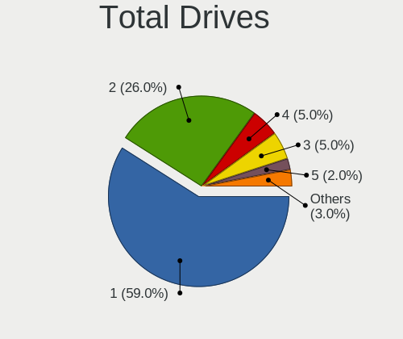
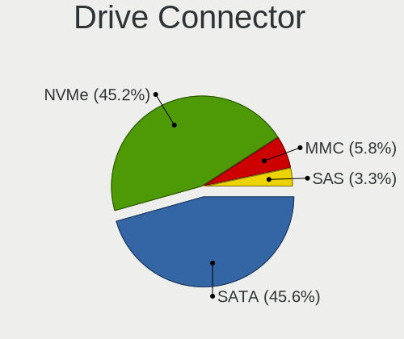
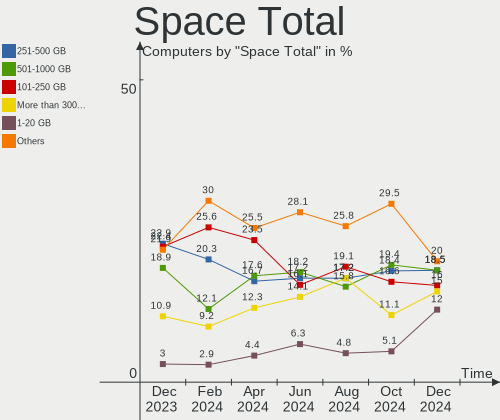
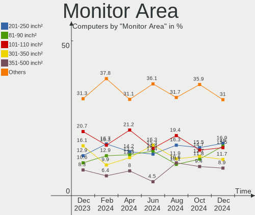
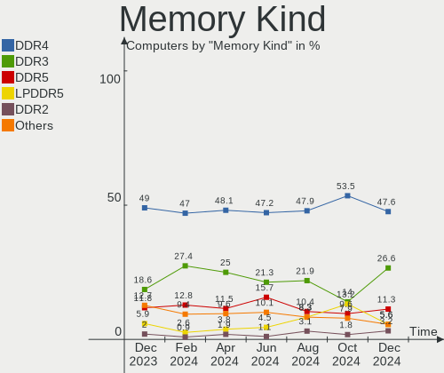
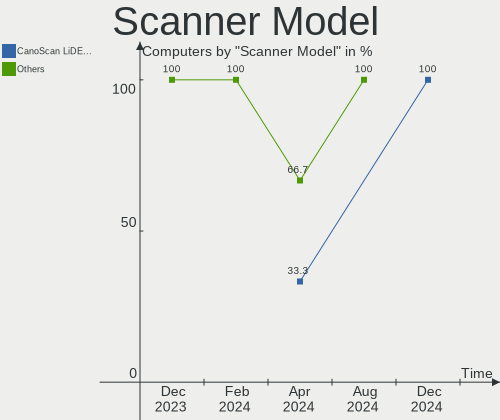
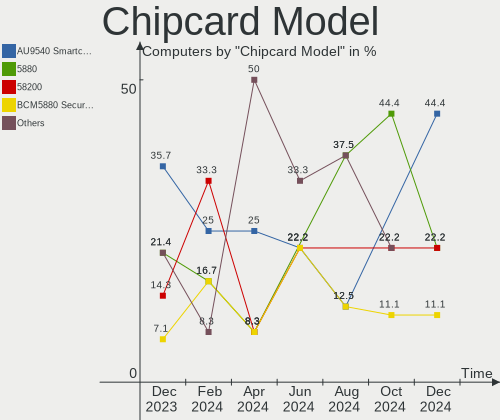

Linux in UK - Hardware Trends
-----------------------------

A project to identify most popular hardware characteristics and track their change
over time based on data collected by Linux users at https://Linux-Hardware.org.

Anyone can contribute to this report by the [hw-probe](https://github.com/linuxhw/hw-probe) tool:

    sudo -E hw-probe -all -upload

This is a report for all computer types. See also reports for [desktops](/Location/UK/Desktop/README.md) and [notebooks](/Location/UK/Notebook/README.md).

Period: Dec, 2024.

Contents
--------

* [ System ](#system)
  - [ OS                       ](#os)
  - [ OS Family                ](#os-family)
  - [ Kernel                   ](#kernel)
  - [ Kernel Family            ](#kernel-family)
  - [ Kernel Major Ver.        ](#kernel-major-ver)
  - [ Arch                     ](#arch)
  - [ DE                       ](#de)
  - [ Display Server           ](#display-server)
  - [ Display Manager          ](#display-manager)
  - [ OS Lang                  ](#os-lang)
  - [ Boot Mode                ](#boot-mode)
  - [ Filesystem               ](#filesystem)
  - [ Part. scheme             ](#part-scheme)
  - [ Dual Boot with Linux/BSD ](#dual-boot-with-linuxbsd)
  - [ Dual Boot (Win)          ](#dual-boot-win)

* [ Board ](#board)
  - [ Vendor                   ](#vendor)
  - [ Model                    ](#model)
  - [ Model Family             ](#model-family)
  - [ MFG Year                 ](#mfg-year)
  - [ Form Factor              ](#form-factor)
  - [ Secure Boot              ](#secure-boot)
  - [ Coreboot                 ](#coreboot)
  - [ RAM Size                 ](#ram-size)
  - [ RAM Used                 ](#ram-used)
  - [ Total Drives             ](#total-drives)
  - [ Has CD-ROM               ](#has-cd-rom)
  - [ Has Ethernet             ](#has-ethernet)
  - [ Has WiFi                 ](#has-wifi)
  - [ Has Bluetooth            ](#has-bluetooth)

* [ Location ](#location)
  - [ Country                  ](#country)
  - [ City                     ](#city)

* [ Drives ](#drives)
  - [ Drive Vendor             ](#drive-vendor)
  - [ Drive Model              ](#drive-model)
  - [ HDD Vendor               ](#hdd-vendor)
  - [ SSD Vendor               ](#ssd-vendor)
  - [ Drive Kind               ](#drive-kind)
  - [ Drive Connector          ](#drive-connector)
  - [ Drive Size               ](#drive-size)
  - [ Space Total              ](#space-total)
  - [ Space Used               ](#space-used)
  - [ Malfunc. Drives          ](#malfunc-drives)
  - [ Malfunc. Drive Vendor    ](#malfunc-drive-vendor)
  - [ Malfunc. HDD Vendor      ](#malfunc-hdd-vendor)
  - [ Malfunc. Drive Kind      ](#malfunc-drive-kind)
  - [ Failed Drives            ](#failed-drives)
  - [ Failed Drive Vendor      ](#failed-drive-vendor)
  - [ Drive Status             ](#drive-status)

* [ Storage controller ](#storage-controller)
  - [ Storage Vendor           ](#storage-vendor)
  - [ Storage Model            ](#storage-model)
  - [ Storage Kind             ](#storage-kind)

* [ Processor ](#processor)
  - [ CPU Vendor               ](#cpu-vendor)
  - [ CPU Model                ](#cpu-model)
  - [ CPU Model Family         ](#cpu-model-family)
  - [ CPU Cores                ](#cpu-cores)
  - [ CPU Sockets              ](#cpu-sockets)
  - [ CPU Threads              ](#cpu-threads)
  - [ CPU Op-Modes             ](#cpu-op-modes)
  - [ CPU Microcode            ](#cpu-microcode)
  - [ CPU Microarch            ](#cpu-microarch)

* [ Graphics ](#graphics)
  - [ GPU Vendor               ](#gpu-vendor)
  - [ GPU Model                ](#gpu-model)
  - [ GPU Combo                ](#gpu-combo)
  - [ GPU Driver               ](#gpu-driver)
  - [ GPU Memory               ](#gpu-memory)

* [ Monitor ](#monitor)
  - [ Monitor Vendor           ](#monitor-vendor)
  - [ Monitor Model            ](#monitor-model)
  - [ Monitor Resolution       ](#monitor-resolution)
  - [ Monitor Diagonal         ](#monitor-diagonal)
  - [ Monitor Width            ](#monitor-width)
  - [ Aspect Ratio             ](#aspect-ratio)
  - [ Monitor Area             ](#monitor-area)
  - [ Pixel Density            ](#pixel-density)
  - [ Multiple Monitors        ](#multiple-monitors)

* [ Network ](#network)
  - [ Net Controller Vendor    ](#net-controller-vendor)
  - [ Net Controller Model     ](#net-controller-model)
  - [ Wireless Vendor          ](#wireless-vendor)
  - [ Wireless Model           ](#wireless-model)
  - [ Ethernet Vendor          ](#ethernet-vendor)
  - [ Ethernet Model           ](#ethernet-model)
  - [ Net Controller Kind      ](#net-controller-kind)
  - [ Used Controller          ](#used-controller)
  - [ NICs                     ](#nics)
  - [ IPv6                     ](#ipv6)

* [ Bluetooth ](#bluetooth)
  - [ Bluetooth Vendor         ](#bluetooth-vendor)
  - [ Bluetooth Model          ](#bluetooth-model)

* [ Sound ](#sound)
  - [ Sound Vendor             ](#sound-vendor)
  - [ Sound Model              ](#sound-model)

* [ Memory ](#memory)
  - [ Memory Vendor            ](#memory-vendor)
  - [ Memory Model             ](#memory-model)
  - [ Memory Kind              ](#memory-kind)
  - [ Memory Form Factor       ](#memory-form-factor)
  - [ Memory Size              ](#memory-size)
  - [ Memory Speed             ](#memory-speed)

* [ Printers & scanners ](#printers--scanners)
  - [ Printer Vendor           ](#printer-vendor)
  - [ Printer Model            ](#printer-model)
  - [ Scanner Vendor           ](#scanner-vendor)
  - [ Scanner Model            ](#scanner-model)

* [ Camera ](#camera)
  - [ Camera Vendor            ](#camera-vendor)
  - [ Camera Model             ](#camera-model)

* [ Security ](#security)
  - [ Fingerprint Vendor       ](#fingerprint-vendor)
  - [ Fingerprint Model        ](#fingerprint-model)
  - [ Chipcard Vendor          ](#chipcard-vendor)
  - [ Chipcard Model           ](#chipcard-model)

* [ Unsupported ](#unsupported)
  - [ Unsupported Devices      ](#unsupported-devices)
  - [ Unsupported Device Types ](#unsupported-device-types)

System
------

OS
--

Installed operating systems

| Name                         | Computers | Percent |
|------------------------------|-----------|---------|
| OpenMandriva 24.12           | 31        | 15.5%   |
| Ubuntu 24.04                 | 19        | 9.5%    |
| Fedora 41                    | 19        | 9.5%    |
| Arch Rolling                 | 15        | 7.5%    |
| Debian 12                    | 9         | 4.5%    |
| Zorin 17                     | 8         | 4%      |
| Pop!_OS 22.04                | 7         | 3.5%    |
| Ubuntu 22.04                 | 5         | 2.5%    |
| SteamOS 3.6.20               | 5         | 2.5%    |
| OpenMandriva 5.0             | 5         | 2.5%    |
| ArcoLinux Rolling            | 5         | 2.5%    |
| Linux Mint 22                | 4         | 2%      |
| Linux Mint 21.3              | 4         | 2%      |
| Ubuntu 24.10                 | 3         | 1.5%    |
| Pop!_OS 24.04                | 3         | 1.5%    |
| openSUSE Tumbleweed-XXXXXXXX | 3         | 1.5%    |
| NixOS 24.11                  | 3         | 1.5%    |
| EndeavourOS Rolling          | 3         | 1.5%    |
| Bazzite 41                   | 3         | 1.5%    |
| Zorin 16                     | 2         | 1%      |
| Ubuntu 20.04                 | 2         | 1%      |
| OpenMandriva 23.08           | 2         | 1%      |
| Manjaro 24.2.0               | 2         | 1%      |
| Kubuntu 24.10                | 2         | 1%      |
| Kubuntu 24.04                | 2         | 1%      |
| Kali 2024.4                  | 2         | 1%      |
| Elementary 8                 | 2         | 1%      |
| Debian                       | 2         | 1%      |
| Xubuntu 24.10                | 1         | 0.5%    |
| Xubuntu 24.04                | 1         | 0.5%    |
| Ubuntu Unity 24.04           | 1         | 0.5%    |
| Ubuntu MATE 24.04            | 1         | 0.5%    |
| Ubuntu 18.04                 | 1         | 0.5%    |
| Rocky Linux 9.5              | 1         | 0.5%    |
| Oreon 9.3                    | 1         | 0.5%    |
| OpenMandriva 4.3             | 1         | 0.5%    |
| OpenMandriva 24.09           | 1         | 0.5%    |
| OpenMandriva 24.08           | 1         | 0.5%    |
| OpenMandriva 24.07           | 1         | 0.5%    |
| OpenMandriva 23.11           | 1         | 0.5%    |

OS Family
---------

OS without a version

| Name         | Computers | Percent |
|--------------|-----------|---------|
| OpenMandriva | 43        | 21.5%   |
| Ubuntu       | 30        | 15%     |
| Fedora       | 20        | 10%     |
| Arch         | 15        | 7.5%    |
| Debian       | 11        | 5.5%    |
| Zorin        | 10        | 5%      |
| Pop!_OS      | 10        | 5%      |
| Linux Mint   | 9         | 4.5%    |
| SteamOS      | 5         | 2.5%    |
| ArcoLinux    | 5         | 2.5%    |
| Manjaro      | 4         | 2%      |
| Kubuntu      | 4         | 2%      |
| openSUSE     | 3         | 1.5%    |
| NixOS        | 3         | 1.5%    |
| EndeavourOS  | 3         | 1.5%    |
| Bazzite      | 3         | 1.5%    |
| Xubuntu      | 2         | 1%      |
| Nobara       | 2         | 1%      |
| Kali         | 2         | 1%      |
| Elementary   | 2         | 1%      |
| CachyOS      | 2         | 1%      |
| Ubuntu Unity | 1         | 0.5%    |
| Ubuntu MATE  | 1         | 0.5%    |
| Rocky Linux  | 1         | 0.5%    |
| Oreon        | 1         | 0.5%    |
| Neptune OS   | 1         | 0.5%    |
| Lubuntu      | 1         | 0.5%    |
| LMDE         | 1         | 0.5%    |
| KDE neon     | 1         | 0.5%    |
| Gentoo       | 1         | 0.5%    |
| Drauger OS   | 1         | 0.5%    |
| Bluefin      | 1         | 0.5%    |
| AlmaLinux    | 1         | 0.5%    |

Kernel
------

Version of the Linux kernel

| Version                                  | Computers | Percent |
|------------------------------------------|-----------|---------|
| 6.12.1-desktop-1omv2490                  | 29        | 14.5%   |
| 6.8.0-49-generic                         | 16        | 8%      |
| 6.8.0-50-generic                         | 11        | 5.5%    |
| 6.9.3-76060903-generic                   | 10        | 5%      |
| 6.8.0-51-generic                         | 9         | 4.5%    |
| 6.6.2-desktop-1omv2390                   | 6         | 3%      |
| 6.12.4-arch1-1                           | 6         | 3%      |
| 6.5.0-valve22-1-neptune-65-g9a338ed8a75e | 5         | 2.5%    |
| 6.11.4-301.fc41.x86_64                   | 5         | 2.5%    |
| 6.11.10-300.fc41.x86_64                  | 5         | 2.5%    |
| 6.12.6-200.fc41.x86_64                   | 4         | 2%      |
| 6.8.4-2-pve                              | 3         | 1.5%    |
| 6.8.0-48-generic                         | 3         | 1.5%    |
| 6.12.4-200.fc41.x86_64                   | 3         | 1.5%    |
| 6.11.0-13-generic                        | 3         | 1.5%    |
| 6.1.0-27-amd64                           | 3         | 1.5%    |
| 5.15.0-126-generic                       | 3         | 1.5%    |
| 6.6.63                                   | 2         | 1%      |
| 6.12.6-desktop-1omv2490                  | 2         | 1%      |
| 6.12.6-arch1-1                           | 2         | 1%      |
| 6.12.5-200.fc41.x86_64                   | 2         | 1%      |
| 6.12.4-zen1-1-zen                        | 2         | 1%      |
| 6.12.1-arch1-1                           | 2         | 1%      |
| 6.11.9-303.bazzite.fc41.x86_64           | 2         | 1%      |
| 6.11.8-1-default                         | 2         | 1%      |
| 6.11.0-9-generic                         | 2         | 1%      |
| 6.1.0-28-amd64                           | 2         | 1%      |
| 6.9.10                                   | 1         | 0.5%    |
| 6.8.12-200.fsync.fc39.x86_64             | 1         | 0.5%    |
| 6.8.1-arch1-1                            | 1         | 0.5%    |
| 6.8.0-40-generic                         | 1         | 0.5%    |
| 6.8.0-38-generic                         | 1         | 0.5%    |
| 6.6.7-arch1-1                            | 1         | 0.5%    |
| 6.6.64-1-lts                             | 1         | 0.5%    |
| 6.6.63-1-MANJARO                         | 1         | 0.5%    |
| 6.6.62+rpt-rpi-v8                        | 1         | 0.5%    |
| 6.5.11-060511-generic                    | 1         | 0.5%    |
| 6.5.0-21-generic                         | 1         | 0.5%    |
| 6.4.8-desktop-2omv2390                   | 1         | 0.5%    |
| 6.4.11-desktop-1omv2390                  | 1         | 0.5%    |

Kernel Family
-------------

Linux kernel without a distro release

| Version | Computers | Percent |
|---------|-----------|---------|
| 6.8.0   | 41        | 20.5%   |
| 6.12.1  | 33        | 16.5%   |
| 6.12.6  | 12        | 6%      |
| 6.12.4  | 11        | 5.5%    |
| 6.9.3   | 10        | 5%      |
| 5.15.0  | 10        | 5%      |
| 6.11.10 | 9         | 4.5%    |
| 6.11.0  | 7         | 3.5%    |
| 6.6.2   | 6         | 3%      |
| 6.5.0   | 6         | 3%      |
| 6.11.4  | 5         | 2.5%    |
| 6.1.0   | 5         | 2.5%    |
| 6.12.5  | 4         | 2%      |
| 6.8.4   | 3         | 1.5%    |
| 6.6.63  | 3         | 1.5%    |
| 6.12.7  | 3         | 1.5%    |
| 6.11.7  | 3         | 1.5%    |
| 5.14.0  | 3         | 1.5%    |
| 6.11.9  | 2         | 1%      |
| 6.11.8  | 2         | 1%      |
| 6.11.2  | 2         | 1%      |
| 6.11.11 | 2         | 1%      |
| 6.9.10  | 1         | 0.5%    |
| 6.8.12  | 1         | 0.5%    |
| 6.8.1   | 1         | 0.5%    |
| 6.6.7   | 1         | 0.5%    |
| 6.6.64  | 1         | 0.5%    |
| 6.6.62  | 1         | 0.5%    |
| 6.5.11  | 1         | 0.5%    |
| 6.4.8   | 1         | 0.5%    |
| 6.4.11  | 1         | 0.5%    |
| 6.13.0  | 1         | 0.5%    |
| 6.12.3  | 1         | 0.5%    |
| 6.11.6  | 1         | 0.5%    |
| 6.11.5  | 1         | 0.5%    |
| 6.10.13 | 1         | 0.5%    |
| 6.10.1  | 1         | 0.5%    |
| 6.10.0  | 1         | 0.5%    |
| 5.16.7  | 1         | 0.5%    |
| 4.15.0  | 1         | 0.5%    |

Kernel Major Ver.
-----------------

Linux kernel major version

| Version | Computers | Percent |
|---------|-----------|---------|
| 6.12    | 64        | 32%     |
| 6.8     | 46        | 23%     |
| 6.11    | 34        | 17%     |
| 6.6     | 12        | 6%      |
| 6.9     | 11        | 5.5%    |
| 5.15    | 10        | 5%      |
| 6.5     | 7         | 3.5%    |
| 6.1     | 5         | 2.5%    |
| 6.10    | 3         | 1.5%    |
| 5.14    | 3         | 1.5%    |
| 6.4     | 2         | 1%      |
| 6.13    | 1         | 0.5%    |
| 5.16    | 1         | 0.5%    |
| 4.15    | 1         | 0.5%    |

Arch
----

OS architecture (x86_64, i586, etc.)

| Name    | Computers | Percent |
|---------|-----------|---------|
| x86_64  | 199       | 99.5%   |
| aarch64 | 1         | 0.5%    |

DE
--

Desktop Environment

| Name       | Computers | Percent |
|------------|-----------|---------|
| GNOME      | 77        | 38.5%   |
| Unknown    | 40        | 20%     |
| KDE6       | 23        | 11.5%   |
| KDE5       | 17        | 8.5%    |
| XFCE       | 13        | 6.5%    |
| X-Cinnamon | 11        | 5.5%    |
| LXQt       | 5         | 2.5%    |
| MATE       | 4         | 2%      |
| COSMIC     | 3         | 1.5%    |
| Pantheon   | 2         | 1%      |
| Hyprland   | 2         | 1%      |
| Unity      | 1         | 0.5%    |
| sway       | 1         | 0.5%    |
| LXDE       | 1         | 0.5%    |

Display Server
--------------

X11 or Wayland

| Name    | Computers | Percent |
|---------|-----------|---------|
| Wayland | 102       | 51%     |
| X11     | 89        | 44.5%   |
| Tty     | 7         | 3.5%    |
| Unknown | 2         | 1%      |

Display Manager
---------------

SDDM, LightDM, etc.

| Name           | Computers | Percent |
|----------------|-----------|---------|
| Unknown        | 73        | 36.5%   |
| SDDM           | 57        | 28.5%   |
| GDM3           | 24        | 12%     |
| LightDM        | 23        | 11.5%   |
| GDM            | 19        | 9.5%    |
| COSMIC-GREETER | 2         | 1%      |
| SLiM           | 1         | 0.5%    |
| GREETD         | 1         | 0.5%    |

OS Lang
-------

Language

| Lang    | Computers | Percent |
|---------|-----------|---------|
| en_GB   | 146       | 73%     |
| en_US   | 47        | 23.5%   |
| pl_PL   | 2         | 1%      |
| C       | 2         | 1%      |
| hu_HU   | 1         | 0.5%    |
| en_DK   | 1         | 0.5%    |
| Unknown | 1         | 0.5%    |

Boot Mode
---------

EFI or BIOS

| Mode | Computers | Percent |
|------|-----------|---------|
| EFI  | 106       | 53%     |
| BIOS | 94        | 47%     |

Filesystem
----------

Type of filesystem

| Type    | Computers | Percent |
|---------|-----------|---------|
| Ext4    | 97        | 48.5%   |
| Btrfs   | 49        | 24.5%   |
| Overlay | 25        | 12.5%   |
| Tmpfs   | 20        | 10%     |
| Xfs     | 5         | 2.5%    |
| Zfs     | 3         | 1.5%    |
| F2fs    | 1         | 0.5%    |

Part. scheme
------------

Scheme of partitioning

| Type    | Computers | Percent |
|---------|-----------|---------|
| GPT     | 126       | 63%     |
| Unknown | 62        | 31%     |
| MBR     | 12        | 6%      |

Dual Boot with Linux/BSD
------------------------

Hosting more than one Linux/BSD

| Dual boot | Computers | Percent |
|-----------|-----------|---------|
| No        | 159       | 79.5%   |
| Yes       | 41        | 20.5%   |

Dual Boot (Win)
---------------

Hosting Linux and Windows

| Dual boot | Computers | Percent |
|-----------|-----------|---------|
| No        | 161       | 80.5%   |
| Yes       | 39        | 19.5%   |

Board
-----

Vendor
------

Motherboard manufacturer

| Name                                 | Computers | Percent |
|--------------------------------------|-----------|---------|
| Lenovo                               | 32        | 16%     |
| Dell                                 | 32        | 16%     |
| ASUSTek Computer                     | 29        | 14.5%   |
| Hewlett-Packard                      | 26        | 13%     |
| Gigabyte Technology                  | 13        | 6.5%    |
| MSI                                  | 9         | 4.5%    |
| Apple                                | 8         | 4%      |
| Acer                                 | 6         | 3%      |
| Valve                                | 5         | 2.5%    |
| ASRock                               | 4         | 2%      |
| Toshiba                              | 3         | 1.5%    |
| Supermicro                           | 3         | 1.5%    |
| Google                               | 3         | 1.5%    |
| Samsung Electronics                  | 2         | 1%      |
| PC Specialist                        | 2         | 1%      |
| Microsoft                            | 2         | 1%      |
| Fujitsu                              | 2         | 1%      |
| ASRockRack                           | 2         | 1%      |
| Win Element                          | 1         | 0.5%    |
| Timi                                 | 1         | 0.5%    |
| Shenzhen Meigao Electronic Equipment | 1         | 0.5%    |
| Raspberry Pi Foundation              | 1         | 0.5%    |
| OEGStone                             | 1         | 0.5%    |
| LG Electronics                       | 1         | 0.5%    |
| JGINYUE                              | 1         | 0.5%    |
| Inventec                             | 1         | 0.5%    |
| GEO                                  | 1         | 0.5%    |
| eMachines                            | 1         | 0.5%    |
| Dynabook                             | 1         | 0.5%    |
| COMEXR                               | 1         | 0.5%    |
| BESSTAR Tech                         | 1         | 0.5%    |
| AZW                                  | 1         | 0.5%    |
| AWOW                                 | 1         | 0.5%    |
| AMD                                  | 1         | 0.5%    |
| Unknown                              | 1         | 0.5%    |

Model
-----

Motherboard model

| Name                                              | Computers | Percent |
|---------------------------------------------------|-----------|---------|
| Valve Jupiter                                     | 4         | 2%      |
| Supermicro SYS-111R-M                             | 2         | 1%      |
| Lenovo IdeaPad Slim 1-14AST-05 81VS               | 2         | 1%      |
| Gigabyte B550 AORUS ELITE V2                      | 2         | 1%      |
| Gigabyte B550 AORUS ELITE AX V2                   | 2         | 1%      |
| Dell OptiPlex 3050                                | 2         | 1%      |
| ASUS ROG STRIX B550-F GAMING                      | 2         | 1%      |
| ASUS All Series                                   | 2         | 1%      |
| Apple MacBookPro9,2                               | 2         | 1%      |
| Unknown                                           | 2         | 1%      |
| Win Element M6                                    | 1         | 0.5%    |
| Valve Galileo                                     | 1         | 0.5%    |
| Toshiba Satellite L855                            | 1         | 0.5%    |
| Toshiba Satellite L300                            | 1         | 0.5%    |
| Toshiba Satellite C50D-A-133                      | 1         | 0.5%    |
| Timi TM1701                                       | 1         | 0.5%    |
| Supermicro X9DRL-3F/iF                            | 1         | 0.5%    |
| Shenzhen Meigao Electronic Equipment Venus Series | 1         | 0.5%    |
| Samsung 700Z3C/700Z5C                             | 1         | 0.5%    |
| Samsung 700T1C                                    | 1         | 0.5%    |
| RPi Raspberry Pi 2 Model B Rev 1.2                | 1         | 0.5%    |
| PC Specialist Recoil VIII 17                      | 1         | 0.5%    |
| PC Specialist PA70Hx                              | 1         | 0.5%    |
| OEGStone T5110                                    | 1         | 0.5%    |
| MSI MS-7E12                                       | 1         | 0.5%    |
| MSI MS-7D98                                       | 1         | 0.5%    |
| MSI MS-7D77                                       | 1         | 0.5%    |
| MSI MS-7C90                                       | 1         | 0.5%    |
| MSI MS-7C02                                       | 1         | 0.5%    |
| MSI MS-7B78                                       | 1         | 0.5%    |
| MSI MS-7A94                                       | 1         | 0.5%    |
| MSI MS-7A34                                       | 1         | 0.5%    |
| MSI GE60 2PL                                      | 1         | 0.5%    |
| Microsoft Surface Pro 6                           | 1         | 0.5%    |
| Microsoft Surface Go                              | 1         | 0.5%    |
| LG 17Z90S-G.AD7BA1                                | 1         | 0.5%    |
| Lenovo Yoga C740-15IML 81TD                       | 1         | 0.5%    |
| Lenovo Yoga 730-13IWL 81JR                        | 1         | 0.5%    |
| Lenovo ThinkPad X250 20CLS11W0W                   | 1         | 0.5%    |
| Lenovo ThinkPad X220 4291QZ1                      | 1         | 0.5%    |

Model Family
------------

Motherboard model prefix

| Name                                       | Computers | Percent |
|--------------------------------------------|-----------|---------|
| Lenovo ThinkPad                            | 15        | 7.5%    |
| ASUS ROG                                   | 11        | 5.5%    |
| HP EliteBook                               | 9         | 4.5%    |
| Dell Latitude                              | 9         | 4.5%    |
| Dell OptiPlex                              | 8         | 4%      |
| Lenovo IdeaPad                             | 5         | 2.5%    |
| HP Laptop                                  | 5         | 2.5%    |
| Gigabyte B550                              | 5         | 2.5%    |
| Acer Aspire                                | 5         | 2.5%    |
| Valve Jupiter                              | 4         | 2%      |
| Dell Inspiron                              | 4         | 2%      |
| ASUS TUF                                   | 4         | 2%      |
| Toshiba Satellite                          | 3         | 1.5%    |
| Dell XPS                                   | 3         | 1.5%    |
| ASUS ZenBook                               | 3         | 1.5%    |
| Supermicro SYS-111R-M                      | 2         | 1%      |
| Microsoft Surface                          | 2         | 1%      |
| Lenovo Yoga                                | 2         | 1%      |
| Lenovo Legion                              | 2         | 1%      |
| Lenovo IdeaCentre                          | 2         | 1%      |
| HP ProBook                                 | 2         | 1%      |
| HP Pavilion                                | 2         | 1%      |
| HP Compaq                                  | 2         | 1%      |
| Dell Precision                             | 2         | 1%      |
| Dell PowerEdge                             | 2         | 1%      |
| ASUS ASUS                                  | 2         | 1%      |
| ASUS All                                   | 2         | 1%      |
| Apple MacBookPro9                          | 2         | 1%      |
| Unknown                                    | 2         | 1%      |
| Win Element M6                             | 1         | 0.5%    |
| Valve Galileo                              | 1         | 0.5%    |
| Timi TM1701                                | 1         | 0.5%    |
| Supermicro X9DRL-3F                        | 1         | 0.5%    |
| Shenzhen Meigao Electronic Equipment Venus | 1         | 0.5%    |
| Samsung 700Z3C                             | 1         | 0.5%    |
| Samsung 700T1C                             | 1         | 0.5%    |
| RPi Raspberry                              | 1         | 0.5%    |
| PC Specialist Recoil                       | 1         | 0.5%    |
| PC Specialist PA70Hx                       | 1         | 0.5%    |
| OEGStone T5110                             | 1         | 0.5%    |

MFG Year
--------

Motherboard manufacture year

| Year    | Computers | Percent |
|---------|-----------|---------|
| 2020    | 24        | 12%     |
| 2024    | 22        | 11%     |
| 2017    | 18        | 9%      |
| 2023    | 17        | 8.5%    |
| 2022    | 15        | 7.5%    |
| 2018    | 14        | 7%      |
| 2014    | 12        | 6%      |
| 2012    | 11        | 5.5%    |
| 2021    | 10        | 5%      |
| 2019    | 10        | 5%      |
| 2013    | 9         | 4.5%    |
| 2011    | 9         | 4.5%    |
| 2015    | 8         | 4%      |
| 2016    | 7         | 3.5%    |
| 2009    | 5         | 2.5%    |
| 2010    | 3         | 1.5%    |
| 2008    | 2         | 1%      |
| 2007    | 2         | 1%      |
| 2006    | 1         | 0.5%    |
| Unknown | 1         | 0.5%    |

Form Factor
-----------

Physical design of the computer

| Name           | Computers | Percent |
|----------------|-----------|---------|
| Notebook       | 102       | 51%     |
| Desktop        | 79        | 39.5%   |
| Convertible    | 6         | 3%      |
| Tablet         | 4         | 2%      |
| All in one     | 3         | 1.5%    |
| Server         | 3         | 1.5%    |
| Mini pc        | 2         | 1%      |
| System on chip | 1         | 0.5%    |

Secure Boot
-----------

Enabled or disabled

| State    | Computers | Percent |
|----------|-----------|---------|
| Disabled | 188       | 94%     |
| Enabled  | 12        | 6%      |

Coreboot
--------

Have coreboot on board

| Used | Computers | Percent |
|------|-----------|---------|
| No   | 196       | 98%     |
| Yes  | 4         | 2%      |

RAM Size
--------

Total RAM memory

| Size in GB      | Computers | Percent |
|-----------------|-----------|---------|
| 32.01-64.0      | 45        | 22.5%   |
| 16.01-24.0      | 42        | 21%     |
| 4.01-8.0        | 35        | 17.5%   |
| 8.01-16.0       | 29        | 14.5%   |
| 3.01-4.0        | 18        | 9%      |
| 64.01-256.0     | 14        | 7%      |
| 24.01-32.0      | 10        | 5%      |
| 1.01-2.0        | 5         | 2.5%    |
| More than 256.0 | 1         | 0.5%    |
| 0.51-1.0        | 1         | 0.5%    |

RAM Used
--------

Used RAM memory

| Used GB     | Computers | Percent |
|-------------|-----------|---------|
| 4.01-8.0    | 46        | 23%     |
| 1.01-2.0    | 46        | 23%     |
| 2.01-3.0    | 45        | 22.5%   |
| 3.01-4.0    | 41        | 20.5%   |
| 8.01-16.0   | 16        | 8%      |
| 16.01-24.0  | 2         | 1%      |
| 0.51-1.0    | 2         | 1%      |
| 64.01-256.0 | 1         | 0.5%    |
| 0.01-0.5    | 1         | 0.5%    |

Total Drives
------------

Number of drives on board

| Drives | Computers | Percent |
|--------|-----------|---------|
| 1      | 118       | 59%     |
| 2      | 52        | 26%     |
| 4      | 10        | 5%      |
| 3      | 10        | 5%      |
| 5      | 4         | 2%      |
| 6      | 3         | 1.5%    |
| 9      | 2         | 1%      |
| 0      | 1         | 0.5%    |

Has CD-ROM
----------

Has CD-ROM on board

| Presented | Computers | Percent |
|-----------|-----------|---------|
| No        | 152       | 76%     |
| Yes       | 48        | 24%     |

Has Ethernet
------------

Has Ethernet on board

| Presented | Computers | Percent |
|-----------|-----------|---------|
| Yes       | 165       | 82.5%   |
| No        | 35        | 17.5%   |

Has WiFi
--------

Has WiFi module

| Presented | Computers | Percent |
|-----------|-----------|---------|
| Yes       | 151       | 75.5%   |
| No        | 49        | 24.5%   |

Has Bluetooth
-------------

Has Bluetooth module

| Presented | Computers | Percent |
|-----------|-----------|---------|
| Yes       | 143       | 71.5%   |
| No        | 57        | 28.5%   |

Location
--------

Country
-------

Geographic location (country)

| Country | Computers | Percent |
|---------|-----------|---------|
| UK      | 200       | 100%    |

City
----

Geographic location (city)

| City           | Computers | Percent |
|----------------|-----------|---------|
| Manchester     | 6         | 3%      |
| London         | 6         | 3%      |
| Glasgow        | 6         | 3%      |
| Southampton    | 5         | 2.5%    |
| Reading        | 4         | 2%      |
| Harringay      | 4         | 2%      |
| Bristol        | 4         | 2%      |
| York           | 3         | 1.5%    |
| Wandsworth     | 3         | 1.5%    |
| Swindon        | 3         | 1.5%    |
| Rotherham      | 3         | 1.5%    |
| Croydon        | 3         | 1.5%    |
| City of London | 3         | 1.5%    |
| West Malling   | 2         | 1%      |
| Southwark      | 2         | 1%      |
| Sheffield      | 2         | 1%      |
| Peterhead      | 2         | 1%      |
| Norwich        | 2         | 1%      |
| Newham         | 2         | 1%      |
| Leicester      | 2         | 1%      |
| Lambeth        | 2         | 1%      |
| Hull           | 2         | 1%      |
| Hackney        | 2         | 1%      |
| Guildford      | 2         | 1%      |
| Enfield        | 2         | 1%      |
| Coventry       | 2         | 1%      |
| Cockermouth    | 2         | 1%      |
| Cardiff        | 2         | 1%      |
| Cambridge      | 2         | 1%      |
| Brent          | 2         | 1%      |
| Bradford       | 2         | 1%      |
| Boston         | 2         | 1%      |
| Barnet         | 2         | 1%      |
| Bangor         | 2         | 1%      |
| Yeovil         | 1         | 0.5%    |
| Wrexham        | 1         | 0.5%    |
| Wolverhampton  | 1         | 0.5%    |
| Woking         | 1         | 0.5%    |
| Witney         | 1         | 0.5%    |
| Watford        | 1         | 0.5%    |

Drives
------

Drive Vendor
------------

Hard drive vendors

| Vendor                       | Computers | Drives | Percent |
|------------------------------|-----------|--------|---------|
| Samsung Electronics          | 55        | 76     | 18.77%  |
| WDC                          | 28        | 33     | 9.56%   |
| Seagate                      | 27        | 31     | 9.22%   |
| Sandisk                      | 27        | 28     | 9.22%   |
| Crucial                      | 20        | 23     | 6.83%   |
| Unknown                      | 18        | 19     | 6.14%   |
| Toshiba                      | 18        | 27     | 6.14%   |
| Kingston                     | 13        | 14     | 4.44%   |
| Micron Technology            | 11        | 11     | 3.75%   |
| Phison Electronics           | 9         | 10     | 3.07%   |
| Micron/Crucial Technology    | 6         | 6      | 2.05%   |
| SK hynix                     | 5         | 5      | 1.71%   |
| KIOXIA                       | 5         | 5      | 1.71%   |
| Intel                        | 5         | 5      | 1.71%   |
| Kingston Technology Company  | 4         | 6      | 1.37%   |
| Hitachi                      | 4         | 4      | 1.37%   |
| Fanxiang                     | 3         | 4      | 1.02%   |
| A-DATA Technology            | 3         | 3      | 1.02%   |
| SPCC                         | 2         | 2      | 0.68%   |
| Silicon Motion               | 2         | 2      | 0.68%   |
| MAXIO Technology (Hangzhou)  | 2         | 2      | 0.68%   |
| KIOXIA-EXCERIA               | 2         | 2      | 0.68%   |
| HGST                         | 2         | 5      | 0.68%   |
| GOODRAM                      | 2         | 2      | 0.68%   |
| China                        | 2         | 2      | 0.68%   |
| Apple                        | 2         | 2      | 0.68%   |
| Unknown                      | 2         | 2      | 0.68%   |
| TCSUNBOW                     | 1         | 1      | 0.34%   |
| Sonnics                      | 1         | 1      | 0.34%   |
| ShiJi                        | 1         | 1      | 0.34%   |
| Shenzhen Longsys Electronics | 1         | 1      | 0.34%   |
| Phison                       | 1         | 1      | 0.34%   |
| OWC                          | 1         | 1      | 0.34%   |
| Origin                       | 1         | 1      | 0.34%   |
| Netac                        | 1         | 1      | 0.34%   |
| Maxtor                       | 1         | 1      | 0.34%   |
| LITEONIT                     | 1         | 1      | 0.34%   |
| Integral                     | 1         | 1      | 0.34%   |
| EDILOCA                      | 1         | 1      | 0.34%   |
| EAGET                        | 1         | 1      | 0.34%   |

Drive Model
-----------

Hard drive models

| Model                                                 | Computers | Percent |
|-------------------------------------------------------|-----------|---------|
| Unknown MMC Card  64GB                                | 5         | 1.54%   |
| Samsung NVMe SSD Controller SM981/PM981/PM983 512GB   | 5         | 1.54%   |
| Samsung SSD 850 EVO 250GB                             | 4         | 1.23%   |
| Micron/Crucial P2 NVMe PCIe SSD 500GB                 | 4         | 1.23%   |
| Unknown MMC Card  32GB                                | 3         | 0.93%   |
| Sandisk WD Blue SN550 NVMe SSD 256GB                  | 3         | 0.93%   |
| Samsung SSD 990 PRO 2TB                               | 3         | 0.93%   |
| Samsung SSD 860 EVO 1TB                               | 3         | 0.93%   |
| Samsung SSD 850 EVO 500GB                             | 3         | 0.93%   |
| Samsung NVMe SSD Controller SM961/PM961/SM963 256GB   | 3         | 0.93%   |
| Samsung NVMe SSD Controller PM9A1/PM9A3/980PRO 512GB  | 3         | 0.93%   |
| Phison PS5013 E13 NVMe Controller 512GB               | 3         | 0.93%   |
| Kingston Company SNV2S1000G 1TB                       | 3         | 0.93%   |
| Kingston SA400S37240G 240GB SSD                       | 3         | 0.93%   |
| Intel SSD 660P Series 1024GB                          | 3         | 0.93%   |
| WDC WD20EZRZ-00Z5HB0 2TB                              | 2         | 0.62%   |
| Unknown NVMe SSD Drive 1TB                            | 2         | 0.62%   |
| Unknown MMC Card  16GB                                | 2         | 0.62%   |
| Toshiba MQ01ACF050 500GB                              | 2         | 0.62%   |
| Toshiba KSG60ZMV256G M.2 2280 256GB SSD               | 2         | 0.62%   |
| Toshiba HDWD110 1TB                                   | 2         | 0.62%   |
| Toshiba BG3 NVMe SSD Controller 128GB                 | 2         | 0.62%   |
| SK hynix SC311 SATA 128GB SSD                         | 2         | 0.62%   |
| Silicon Motion SM2263EN/SM2263XT SSD Controller 256GB | 2         | 0.62%   |
| Seagate ST3500312CS 500GB                             | 2         | 0.62%   |
| Seagate ST1000LM035-1RK172 1TB                        | 2         | 0.62%   |
| Seagate Expansion HDD 14TB                            | 2         | 0.62%   |
| Seagate Expansion 1TB                                 | 2         | 0.62%   |
| Sandisk WD_BLACK SN850X 2000GB                        | 2         | 0.62%   |
| Sandisk WD PC SN740 SDDPMQD-512G-1101 512GB           | 2         | 0.62%   |
| Sandisk WD Blue SN570 1TB                             | 2         | 0.62%   |
| Sandisk WD Black SN850 2TB                            | 2         | 0.62%   |
| SanDisk NVMe SSD Drive 1TB                            | 2         | 0.62%   |
| Samsung SSD 980 500GB                                 | 2         | 0.62%   |
| Samsung SSD 870 QVO 2TB                               | 2         | 0.62%   |
| Samsung HD642JJ 640GB                                 | 2         | 0.62%   |
| Phison E16 PCIe4 NVMe Controller 1TB                  | 2         | 0.62%   |
| Phison E12 NVMe Controller 480GB                      | 2         | 0.62%   |
| Micron MTFDKBA1T0QFM-1BD1AABGB 1024GB                 | 2         | 0.62%   |
| Micron CT500P5SSD8 500GB                              | 2         | 0.62%   |

HDD Vendor
----------

Hard disk drive vendors

| Vendor              | Computers | Drives | Percent |
|---------------------|-----------|--------|---------|
| Seagate             | 26        | 28     | 37.68%  |
| WDC                 | 17        | 21     | 24.64%  |
| Toshiba             | 12        | 19     | 17.39%  |
| Samsung Electronics | 6         | 6      | 8.7%    |
| Hitachi             | 4         | 4      | 5.8%    |
| HGST                | 2         | 5      | 2.9%    |
| Maxtor              | 1         | 1      | 1.45%   |
| Apple               | 1         | 1      | 1.45%   |

SSD Vendor
----------

Solid state drive vendors

| Vendor              | Computers | Drives | Percent |
|---------------------|-----------|--------|---------|
| Samsung Electronics | 20        | 26     | 21.98%  |
| Crucial             | 12        | 13     | 13.19%  |
| Kingston            | 10        | 11     | 10.99%  |
| WDC                 | 8         | 9      | 8.79%   |
| SanDisk             | 8         | 8      | 8.79%   |
| Toshiba             | 3         | 4      | 3.3%    |
| SK hynix            | 3         | 3      | 3.3%    |
| A-DATA Technology   | 3         | 3      | 3.3%    |
| SPCC                | 2         | 2      | 2.2%    |
| Seagate             | 2         | 2      | 2.2%    |
| KIOXIA-EXCERIA      | 2         | 2      | 2.2%    |
| Intel               | 2         | 2      | 2.2%    |
| GOODRAM             | 2         | 2      | 2.2%    |
| Fanxiang            | 2         | 2      | 2.2%    |
| China               | 2         | 2      | 2.2%    |
| TCSUNBOW            | 1         | 1      | 1.1%    |
| OWC                 | 1         | 1      | 1.1%    |
| Origin              | 1         | 1      | 1.1%    |
| LITEONIT            | 1         | 1      | 1.1%    |
| Integral            | 1         | 1      | 1.1%    |
| EDILOCA             | 1         | 1      | 1.1%    |
| EAGET               | 1         | 1      | 1.1%    |
| Apple               | 1         | 1      | 1.1%    |
| Apacer              | 1         | 1      | 1.1%    |
| Unknown             | 1         | 1      | 1.1%    |

Drive Kind
----------

HDD or SSD

| Kind    | Computers | Drives | Percent |
|---------|-----------|--------|---------|
| NVMe    | 109       | 139    | 42.08%  |
| SSD     | 77        | 101    | 29.73%  |
| HDD     | 55        | 85     | 21.24%  |
| MMC     | 14        | 16     | 5.41%   |
| Unknown | 4         | 4      | 1.54%   |

Drive Connector
---------------

SATA, SAS, NVMe, etc.

| Type | Computers | Drives | Percent |
|------|-----------|--------|---------|
| SATA | 110       | 180    | 45.64%  |
| NVMe | 109       | 139    | 45.23%  |
| MMC  | 14        | 16     | 5.81%   |
| SAS  | 8         | 10     | 3.32%   |

Drive Size
----------

Size of hard drive

| Size in TB | Computers | Drives | Percent |
|------------|-----------|--------|---------|
| 0.01-0.5   | 71        | 92     | 48.97%  |
| 0.51-1.0   | 42        | 49     | 28.97%  |
| 1.01-2.0   | 17        | 17     | 11.72%  |
| 3.01-4.0   | 5         | 11     | 3.45%   |
| 10.01-20.0 | 4         | 5      | 2.76%   |
| 4.01-10.0  | 4         | 9      | 2.76%   |
| 2.01-3.0   | 2         | 3      | 1.38%   |

Space Total
-----------

Amount of disk space available on the file system

| Size in GB     | Computers | Percent |
|----------------|-----------|---------|
| 251-500        | 37        | 18.5%   |
| 501-1000       | 37        | 18.5%   |
| 101-250        | 32        | 16%     |
| More than 3000 | 30        | 15%     |
| 1-20           | 24        | 12%     |
| 1001-2000      | 14        | 7%      |
| 2001-3000      | 9         | 4.5%    |
| 51-100         | 9         | 4.5%    |
| Unknown        | 7         | 3.5%    |
| 21-50          | 1         | 0.5%    |

Space Used
----------

Amount of used disk space

| Used GB        | Computers | Percent |
|----------------|-----------|---------|
| 1-20           | 77        | 38.5%   |
| 21-50          | 25        | 12.5%   |
| 101-250        | 24        | 12%     |
| 251-500        | 16        | 8%      |
| 501-1000       | 15        | 7.5%    |
| 51-100         | 15        | 7.5%    |
| More than 3000 | 10        | 5%      |
| 1001-2000      | 9         | 4.5%    |
| Unknown        | 7         | 3.5%    |
| 2001-3000      | 2         | 1%      |

Malfunc. Drives
---------------

Drive models with a malfunction

| Model                                              | Computers | Drives | Percent |
|----------------------------------------------------|-----------|--------|---------|
| WDC WDS120G2G0A-00JH30 120GB SSD                   | 1         | 1      | 5.56%   |
| WDC WD30EZRX-00D8PB0 3TB                           | 1         | 1      | 5.56%   |
| WDC WD Green 2.5 240GB SSD                         | 1         | 1      | 5.56%   |
| Toshiba MQ01ACF050 500GB                           | 1         | 1      | 5.56%   |
| Toshiba MQ01ABD075 752GB                           | 1         | 1      | 5.56%   |
| Toshiba KSG60ZMV256G M.2 2280 256GB SSD            | 1         | 1      | 5.56%   |
| Toshiba DT01ACA200 2TB                             | 1         | 1      | 5.56%   |
| SK hynix HFS256G39TND-N210A 256GB SSD              | 1         | 1      | 5.56%   |
| Shenzhen Longsys Electronics Lexar SSD NM620 512GB | 1         | 1      | 5.56%   |
| Seagate ST9320325AS 320GB                          | 1         | 1      | 5.56%   |
| Seagate ST500LT012-1DG142 500GB                    | 1         | 1      | 5.56%   |
| Seagate ST500LM000-1EJ162 500GB                    | 1         | 1      | 5.56%   |
| Seagate ST500DM002-1BC142 500GB                    | 1         | 1      | 5.56%   |
| Samsung Electronics SSD 980 PRO 2TB                | 1         | 1      | 5.56%   |
| LITEONIT LMT-128M3M 128GB SSD                      | 1         | 1      | 5.56%   |
| Hitachi HTS545050B9A300 500GB                      | 1         | 1      | 5.56%   |
| Crucial CT525MX300SSD1 528GB                       | 1         | 1      | 5.56%   |
| Crucial CT2000MX500SSD1 2TB                        | 1         | 1      | 5.56%   |

Malfunc. Drive Vendor
---------------------

Vendors of faulty drives

| Vendor                       | Computers | Drives | Percent |
|------------------------------|-----------|--------|---------|
| Toshiba                      | 4         | 4      | 22.22%  |
| Seagate                      | 4         | 4      | 22.22%  |
| WDC                          | 3         | 3      | 16.67%  |
| Crucial                      | 2         | 2      | 11.11%  |
| SK hynix                     | 1         | 1      | 5.56%   |
| Shenzhen Longsys Electronics | 1         | 1      | 5.56%   |
| Samsung Electronics          | 1         | 1      | 5.56%   |
| LITEONIT                     | 1         | 1      | 5.56%   |
| Hitachi                      | 1         | 1      | 5.56%   |

Malfunc. HDD Vendor
-------------------

Vendors of faulty HDD drives

| Vendor  | Computers | Drives | Percent |
|---------|-----------|--------|---------|
| Seagate | 4         | 4      | 44.44%  |
| Toshiba | 3         | 3      | 33.33%  |
| WDC     | 1         | 1      | 11.11%  |
| Hitachi | 1         | 1      | 11.11%  |

Malfunc. Drive Kind
-------------------

Kinds of faulty drives

| Kind | Computers | Drives | Percent |
|------|-----------|--------|---------|
| HDD  | 9         | 9      | 50%     |
| SSD  | 7         | 7      | 38.89%  |
| NVMe | 2         | 2      | 11.11%  |

Failed Drives
-------------

Failed drive models

Zero info for selected period =(

Failed Drive Vendor
-------------------

Failed drive vendors

Zero info for selected period =(

Drive Status
------------

Number of failed and malfunc. drives

| Status   | Computers | Drives | Percent |
|----------|-----------|--------|---------|
| Detected | 98        | 144    | 46.23%  |
| Works    | 96        | 183    | 45.28%  |
| Malfunc  | 18        | 18     | 8.49%   |

Storage controller
------------------

Storage Vendor
--------------

Storage controller vendors

| Vendor                               | Computers | Percent |
|--------------------------------------|-----------|---------|
| Intel                                | 100       | 36.23%  |
| AMD                                  | 48        | 17.39%  |
| Samsung Electronics                  | 37        | 13.41%  |
| SanDisk                              | 22        | 7.97%   |
| Micron Technology                    | 14        | 5.07%   |
| Micron/Crucial Technology            | 11        | 3.99%   |
| Phison Electronics                   | 10        | 3.62%   |
| Kingston Technology Company          | 7         | 2.54%   |
| KIOXIA                               | 5         | 1.81%   |
| Toshiba America Info Systems         | 4         | 1.45%   |
| Solidigm                             | 3         | 1.09%   |
| SK hynix                             | 2         | 0.72%   |
| Silicon Motion                       | 2         | 0.72%   |
| Nvidia                               | 2         | 0.72%   |
| MAXIO Technology (Hangzhou)          | 2         | 0.72%   |
| ASMedia Technology                   | 2         | 0.72%   |
| Shenzhen Longsys Electronics         | 1         | 0.36%   |
| Ramaxel Technology(Shenzhen) Limited | 1         | 0.36%   |
| Netac Technology                     | 1         | 0.36%   |
| Marvell Technology Group             | 1         | 0.36%   |
| LSI Logic / Symbios Logic            | 1         | 0.36%   |

Storage Model
-------------

Storage controller models

| Model                                                                          | Computers | Percent |
|--------------------------------------------------------------------------------|-----------|---------|
| AMD FCH SATA Controller [AHCI mode]                                            | 21        | 6.89%   |
| AMD 500 Series Chipset SATA Controller                                         | 13        | 4.26%   |
| Samsung NVMe SSD Controller SM981/PM981/PM983                                  | 11        | 3.61%   |
| Intel Sunrise Point-LP SATA Controller [AHCI mode]                             | 10        | 3.28%   |
| AMD 600 Series Chipset SATA Controller                                         | 8         | 2.62%   |
| Intel 8 Series/C220 Series Chipset Family 6-port SATA Controller 1 [AHCI mode] | 7         | 2.3%    |
| Intel 7 Series Chipset Family 6-port SATA Controller [AHCI mode]               | 7         | 2.3%    |
| Samsung NVMe SSD Controller S4LV008[Pascal]                                    | 6         | 1.97%   |
| Samsung NVMe SSD Controller 980 (DRAM-less)                                    | 6         | 1.97%   |
| Micron 2400 NVMe SSD (DRAM-less)                                               | 6         | 1.97%   |
| Intel Volume Management Device NVMe RAID Controller                            | 6         | 1.97%   |
| SanDisk Ultra 3D / WD Blue SN570 NVMe SSD (DRAM-less)                          | 5         | 1.64%   |
| Intel Wildcat Point-LP SATA Controller [AHCI Mode]                             | 5         | 1.64%   |
| Intel SATA Controller [RAID Mode]                                              | 5         | 1.64%   |
| Intel 6 Series/C200 Series Chipset Family 6 port Mobile SATA AHCI Controller   | 5         | 1.64%   |
| Intel 200 Series PCH SATA controller [AHCI mode]                               | 5         | 1.64%   |
| AMD 400 Series Chipset SATA Controller                                         | 5         | 1.64%   |
| Samsung NVMe SSD Controller SM961/PM961/SM963                                  | 4         | 1.31%   |
| Samsung NVMe SSD Controller PM9B1 (DRAM-less)                                  | 4         | 1.31%   |
| Samsung NVMe SSD Controller PM9A1/PM9A3/980PRO                                 | 4         | 1.31%   |
| Phison PS5013-E13 PCIe3 NVMe Controller (DRAM-less)                            | 4         | 1.31%   |
| Micron/Crucial P2 [Nick P2] / P3 / P3 Plus NVMe PCIe SSD (DRAM-less)           | 4         | 1.31%   |
| Micron 2550 NVMe SSD (DRAM-less)                                               | 4         | 1.31%   |
| Kingston Company NV2 NVMe SSD [E21T] (DRAM-less)                               | 4         | 1.31%   |
| Intel Tiger Lake-LP SATA Controller                                            | 4         | 1.31%   |
| Intel Raptor Lake SATA AHCI Controller                                         | 4         | 1.31%   |
| Intel Q170/Q150/B150/H170/H110/Z170/CM236 Chipset SATA Controller [AHCI Mode]  | 4         | 1.31%   |
| SanDisk WD PC SN810 / Black SN850 NVMe SSD                                     | 3         | 0.98%   |
| Sandisk WD Black SN850X NVMe SSD                                               | 3         | 0.98%   |
| SanDisk Ultra 3D / WD PC SN530, IX SN530, Blue SN550 NVMe SSD (DRAM-less)      | 3         | 0.98%   |
| Micron/Crucial P3 Plus NVMe PCIe SSD (DRAM-less)                               | 3         | 0.98%   |
| Intel SSD 660P Series                                                          | 3         | 0.98%   |
| Intel Comet Lake SATA AHCI Controller                                          | 3         | 0.98%   |
| Intel 82801 Mobile SATA Controller [RAID mode]                                 | 3         | 0.98%   |
| Intel 8 Series SATA Controller 1 [AHCI mode]                                   | 3         | 0.98%   |
| Intel 6 Series/C200 Series Chipset Family 6 port Desktop SATA AHCI Controller  | 3         | 0.98%   |
| Toshiba America Info Systems BG3 x2 NVMe SSD Controller (DRAM-less)            | 2         | 0.66%   |
| Solidigm P41 Plus NVMe SSD (DRAM-less) [Echo Harbor]                           | 2         | 0.66%   |
| Silicon Motion SM2263EN/SM2263XT (DRAM-less) NVMe SSD Controllers              | 2         | 0.66%   |
| Sandisk WD PC SN740 NVMe SSD 512GB (DRAM-less)                                 | 2         | 0.66%   |

Storage Kind
------------

Kind of storage controller (IDE, SATA, NVMe, SAS, ...)

| Kind | Computers | Percent |
|------|-----------|---------|
| SATA | 131       | 48.7%   |
| NVMe | 109       | 40.52%  |
| RAID | 19        | 7.06%   |
| IDE  | 9         | 3.35%   |
| SAS  | 1         | 0.37%   |

Processor
---------

CPU Vendor
----------

Processor vendors

| Vendor | Computers | Percent |
|--------|-----------|---------|
| Intel  | 133       | 66.5%   |
| AMD    | 66        | 33%     |
| ARM    | 1         | 0.5%    |

CPU Model
---------

Processor models

| Model                                         | Computers | Percent |
|-----------------------------------------------|-----------|---------|
| Intel Core i7-8550U CPU @ 1.80GHz             | 4         | 2%      |
| Intel 11th Gen Core i5-1135G7 @ 2.40GHz       | 4         | 2%      |
| AMD Custom APU 0405                           | 4         | 2%      |
| Intel Core i9-14900HX                         | 3         | 1.5%    |
| Intel Core i5-8250U CPU @ 1.60GHz             | 3         | 1.5%    |
| AMD Ryzen 9 3900X 12-Core Processor           | 3         | 1.5%    |
| AMD Ryzen 7 5800X 8-Core Processor            | 3         | 1.5%    |
| Intel Xeon E E-2468                           | 2         | 1%      |
| Intel N100                                    | 2         | 1%      |
| Intel Core i7-8565U CPU @ 1.80GHz             | 2         | 1%      |
| Intel Core i7-3520M CPU @ 2.90GHz             | 2         | 1%      |
| Intel Core i5-8350U CPU @ 1.70GHz             | 2         | 1%      |
| Intel Core i5-6300U CPU @ 2.40GHz             | 2         | 1%      |
| Intel Core i5-5300U CPU @ 2.30GHz             | 2         | 1%      |
| Intel Core i5-5200U CPU @ 2.20GHz             | 2         | 1%      |
| Intel Core i5-4300U CPU @ 1.90GHz             | 2         | 1%      |
| Intel Core i3-6006U CPU @ 2.00GHz             | 2         | 1%      |
| Intel Celeron CPU N3060 @ 1.60GHz             | 2         | 1%      |
| Intel Celeron CPU N2840 @ 2.16GHz             | 2         | 1%      |
| Intel 13th Gen Core i9-13900H                 | 2         | 1%      |
| AMD Ryzen 7 7730U with Radeon Graphics        | 2         | 1%      |
| AMD Ryzen 7 5700X 8-Core Processor            | 2         | 1%      |
| AMD Ryzen 5 5600X 6-Core Processor            | 2         | 1%      |
| AMD Ryzen 5 5600G with Radeon Graphics        | 2         | 1%      |
| AMD Ryzen 5 3600 6-Core Processor             | 2         | 1%      |
| AMD A6-9220 RADEON R4, 5 COMPUTE CORES 2C+3G  | 2         | 1%      |
| AMD A4-9120e RADEON R3, 4 COMPUTE CORES 2C+2G | 2         | 1%      |
| Intel Xeon Gold 6154 CPU @ 3.00GHz            | 1         | 0.5%    |
| Intel Xeon CPU X5675 @ 3.07GHz                | 1         | 0.5%    |
| Intel Xeon CPU E5-2697A v4 @ 2.60GHz          | 1         | 0.5%    |
| Intel Xeon CPU E5-2650 v2 @ 2.60GHz           | 1         | 0.5%    |
| Intel Xeon CPU E5-1650 v4 @ 3.60GHz           | 1         | 0.5%    |
| Intel Xeon CPU E5-1650 v3 @ 3.50GHz           | 1         | 0.5%    |
| Intel Xeon CPU E3-1505M v5 @ 2.80GHz          | 1         | 0.5%    |
| Intel Xeon CPU E3-1225 v3 @ 3.20GHz           | 1         | 0.5%    |
| Intel Pentium Gold 7505 @ 2.00GHz             | 1         | 0.5%    |
| Intel Pentium Dual-Core CPU E5800 @ 3.20GHz   | 1         | 0.5%    |
| Intel Pentium Dual-Core CPU E5300 @ 2.60GHz   | 1         | 0.5%    |
| Intel Pentium CPU G640 @ 2.80GHz              | 1         | 0.5%    |
| Intel Pentium CPU 4417U @ 2.30GHz             | 1         | 0.5%    |

CPU Model Family
----------------

Processor model prefix

| Model                   | Computers | Percent |
|-------------------------|-----------|---------|
| Intel Core i5           | 40        | 20%     |
| Other                   | 31        | 15.5%   |
| Intel Core i7           | 29        | 14.5%   |
| AMD Ryzen 7             | 18        | 9%      |
| AMD Ryzen 5             | 13        | 6.5%    |
| AMD Ryzen 9             | 12        | 6%      |
| Intel Xeon              | 9         | 4.5%    |
| Intel Core i3           | 6         | 3%      |
| Intel Celeron           | 6         | 3%      |
| Intel Pentium           | 4         | 2%      |
| Intel Core i9           | 4         | 2%      |
| Intel Core 2 Duo        | 4         | 2%      |
| AMD A6                  | 3         | 1.5%    |
| Intel Pentium Dual-Core | 2         | 1%      |
| AMD Ryzen Threadripper  | 2         | 1%      |
| AMD A4                  | 2         | 1%      |
| Intel Xeon Gold         | 1         | 0.5%    |
| Intel Pentium Gold      | 1         | 0.5%    |
| Intel Genuine           | 1         | 0.5%    |
| Intel Core m7           | 1         | 0.5%    |
| Intel Core 2            | 1         | 0.5%    |
| Intel Core              | 1         | 0.5%    |
| Intel Atom              | 1         | 0.5%    |
| AMD Ryzen 7 PRO         | 1         | 0.5%    |
| AMD Ryzen 5 PRO         | 1         | 0.5%    |
| AMD Ryzen 3             | 1         | 0.5%    |
| AMD G                   | 1         | 0.5%    |
| AMD E1                  | 1         | 0.5%    |
| AMD Athlon II X3        | 1         | 0.5%    |
| AMD Athlon 64 X2        | 1         | 0.5%    |
| AMD A10                 | 1         | 0.5%    |

CPU Cores
---------

Number of processor cores

| Number  | Computers | Percent |
|---------|-----------|---------|
| 4       | 61        | 30.5%   |
| 2       | 59        | 29.5%   |
| 8       | 25        | 12.5%   |
| 6       | 20        | 10%     |
| 12      | 11        | 5.5%    |
| 10      | 8         | 4%      |
| 16      | 7         | 3.5%    |
| 24      | 3         | 1.5%    |
| 14      | 3         | 1.5%    |
| 36      | 1         | 0.5%    |
| 3       | 1         | 0.5%    |
| Unknown | 1         | 0.5%    |

CPU Sockets
-----------

Number of sockets

| Number  | Computers | Percent |
|---------|-----------|---------|
| 1       | 196       | 98%     |
| 2       | 3         | 1.5%    |
| Unknown | 1         | 0.5%    |

CPU Threads
-----------

Threads per core (Hyper-Threading)

| Number  | Computers | Percent |
|---------|-----------|---------|
| 2       | 153       | 76.5%   |
| 1       | 46        | 23%     |
| Unknown | 1         | 0.5%    |

CPU Op-Modes
------------

CPU Operation Modes (32-bit, 64-bit)

| Op mode        | Computers | Percent |
|----------------|-----------|---------|
| 32-bit, 64-bit | 200       | 100%    |

CPU Microcode
-------------

Microcode number

| Number     | Computers | Percent |
|------------|-----------|---------|
| Unknown    | 184       | 92%     |
| 0x306c3    | 2         | 1%      |
| 0x206a7    | 2         | 1%      |
| 0xb06e0    | 1         | 0.5%    |
| 0x906ea    | 1         | 0.5%    |
| 0x806e9    | 1         | 0.5%    |
| 0x306d4    | 1         | 0.5%    |
| 0x1067a    | 1         | 0.5%    |
| 0x10676    | 1         | 0.5%    |
| 0x0a50000d | 1         | 0.5%    |
| 0x0a201025 | 1         | 0.5%    |
| 0x08701021 | 1         | 0.5%    |
| 0x06006705 | 1         | 0.5%    |
| 0x06003106 | 1         | 0.5%    |
| 0x05000119 | 1         | 0.5%    |

CPU Microarch
-------------

Microarchitecture

| Name              | Computers | Percent |
|-------------------|-----------|---------|
| Unknown           | 30        | 15%     |
| KabyLake          | 27        | 13.5%   |
| Zen 3             | 15        | 7.5%    |
| Haswell           | 15        | 7.5%    |
| Skylake           | 13        | 6.5%    |
| Alderlake Hybrid  | 12        | 6%      |
| Zen 2             | 10        | 5%      |
| IvyBridge         | 10        | 5%      |
| SandyBridge       | 9         | 4.5%    |
| Broadwell         | 7         | 3.5%    |
| TigerLake         | 6         | 3%      |
| Zen+              | 5         | 2.5%    |
| Silvermont        | 5         | 2.5%    |
| Penryn            | 5         | 2.5%    |
| Excavator         | 5         | 2.5%    |
| Westmere          | 4         | 2%      |
| IceLake           | 3         | 1.5%    |
| Core              | 3         | 1.5%    |
| CometLake         | 3         | 1.5%    |
| Zen               | 2         | 1%      |
| Goldmont plus     | 2         | 1%      |
| Steamroller       | 1         | 0.5%    |
| Piledriver        | 1         | 0.5%    |
| Meteorlake Hybrid | 1         | 0.5%    |
| K8 Hammer         | 1         | 0.5%    |
| K10 Llano         | 1         | 0.5%    |
| K10               | 1         | 0.5%    |
| Jaguar            | 1         | 0.5%    |
| Gracemont         | 1         | 0.5%    |
| Bobcat            | 1         | 0.5%    |

Graphics
--------

GPU Vendor
----------

Vendors of graphics cards

| Vendor                     | Computers | Percent |
|----------------------------|-----------|---------|
| Intel                      | 108       | 46.75%  |
| AMD                        | 66        | 28.57%  |
| Nvidia                     | 51        | 22.08%  |
| ASPEED Technology          | 4         | 1.73%   |
| Matrox Electronics Systems | 2         | 0.87%   |

GPU Model
---------

Graphics card models

| Model                                                                       | Computers | Percent |
|-----------------------------------------------------------------------------|-----------|---------|
| Intel UHD Graphics 620                                                      | 9         | 3.8%    |
| Intel 2nd Generation Core Processor Family Integrated Graphics Controller   | 8         | 3.38%   |
| Intel 3rd Gen Core processor Graphics Controller                            | 7         | 2.95%   |
| Intel Xeon E3-1200 v3/4th Gen Core Processor Integrated Graphics Controller | 5         | 2.11%   |
| Intel TigerLake-LP GT2 [Iris Xe Graphics]                                   | 5         | 2.11%   |
| Intel Skylake GT2 [HD Graphics 520]                                         | 5         | 2.11%   |
| Intel HD Graphics 5500                                                      | 5         | 2.11%   |
| AMD Stoney [Radeon R2/R3/R4/R5 Graphics]                                    | 5         | 2.11%   |
| AMD Raphael                                                                 | 5         | 2.11%   |
| AMD Navi 22 [Radeon RX 6700/6700 XT/6750 XT / 6800M/6850M XT]               | 5         | 2.11%   |
| Nvidia AD106M [GeForce RTX 4070 Max-Q / Mobile]                             | 4         | 1.69%   |
| Intel Haswell-ULT Integrated Graphics Controller                            | 4         | 1.69%   |
| ASPEED Technology ASPEED Graphics Family                                    | 4         | 1.69%   |
| AMD VanGogh [AMD Custom GPU 0405]                                           | 4         | 1.69%   |
| AMD Ellesmere [Radeon RX 470/480/570/570X/580/580X/590]                     | 4         | 1.69%   |
| AMD Cezanne [Radeon Vega Series / Radeon Vega Mobile Series]                | 4         | 1.69%   |
| Nvidia GA102 [GeForce RTX 3080]                                             | 3         | 1.27%   |
| Intel WhiskeyLake-U GT2 [UHD Graphics 620]                                  | 3         | 1.27%   |
| Intel Raptor Lake-P [Iris Xe Graphics]                                      | 3         | 1.27%   |
| Intel HD Graphics 630                                                       | 3         | 1.27%   |
| Intel HD Graphics 530                                                       | 3         | 1.27%   |
| Intel Core Processor Integrated Graphics Controller                         | 3         | 1.27%   |
| Intel Atom Processor Z36xxx/Z37xxx Series Graphics & Display                | 3         | 1.27%   |
| Intel Alder Lake-UP3 GT2 [Iris Xe Graphics]                                 | 3         | 1.27%   |
| Intel 4 Series Chipset Integrated Graphics Controller                       | 3         | 1.27%   |
| AMD Phoenix1                                                                | 3         | 1.27%   |
| AMD Navi 32 [Radeon RX 7700 XT / 7800 XT]                                   | 3         | 1.27%   |
| AMD Navi 10 [Radeon RX 5600 OEM/5600 XT / 5700/5700 XT]                     | 3         | 1.27%   |
| AMD Granite Ridge [Radeon Graphics]                                         | 3         | 1.27%   |
| Nvidia TU106 [GeForce RTX 2060 Rev. A]                                      | 2         | 0.84%   |
| Nvidia GP108M [GeForce MX150]                                               | 2         | 0.84%   |
| Nvidia GK208B [GeForce GT 710]                                              | 2         | 0.84%   |
| Nvidia GA102 [GeForce RTX 3090]                                             | 2         | 0.84%   |
| Nvidia AD107M [GeForce RTX 4060 Max-Q / Mobile]                             | 2         | 0.84%   |
| Intel Raptor Lake-S UHD Graphics                                            | 2         | 0.84%   |
| Intel Mobile 4 Series Chipset Integrated Graphics Controller                | 2         | 0.84%   |
| Intel HD Graphics 620                                                       | 2         | 0.84%   |
| Intel HD Graphics 610                                                       | 2         | 0.84%   |
| Intel GeminiLake [UHD Graphics 600]                                         | 2         | 0.84%   |
| Intel CometLake-U GT2 [UHD Graphics]                                        | 2         | 0.84%   |

GPU Combo
---------

Combinations of graphics cards

| Name                     | Computers | Percent |
|--------------------------|-----------|---------|
| 1 x Intel                | 85        | 42.5%   |
| 1 x AMD                  | 49        | 24.5%   |
| 1 x Nvidia               | 24        | 12%     |
| Intel + Nvidia           | 17        | 8.5%    |
| AMD + Nvidia             | 8         | 4%      |
| 2 x AMD                  | 5         | 2.5%    |
| 2 x Intel                | 3         | 1.5%    |
| 1 x ASPEED               | 3         | 1.5%    |
| Other                    | 1         | 0.5%    |
| Nvidia + Matrox          | 1         | 0.5%    |
| 1 x Matrox               | 1         | 0.5%    |
| Intel + AMD + 1 x Nvidia | 1         | 0.5%    |
| Intel + AMD              | 1         | 0.5%    |
| AMD + ASPEED             | 1         | 0.5%    |

GPU Driver
----------

Free vs proprietary

| Driver      | Computers | Percent |
|-------------|-----------|---------|
| Free        | 157       | 78.5%   |
| Proprietary | 30        | 15%     |
| Unknown     | 13        | 6.5%    |

GPU Memory
----------

Total video memory

| Size in GB | Computers | Percent |
|------------|-----------|---------|
| Unknown    | 141       | 70.5%   |
| 0.01-0.5   | 18        | 9%      |
| 8.01-16.0  | 12        | 6%      |
| 1.01-2.0   | 8         | 4%      |
| 7.01-8.0   | 7         | 3.5%    |
| 5.01-6.0   | 5         | 2.5%    |
| 0.51-1.0   | 4         | 2%      |
| 3.01-4.0   | 2         | 1%      |
| 16.01-24.0 | 2         | 1%      |
| 2.01-3.0   | 1         | 0.5%    |

Monitor
-------

Monitor Vendor
--------------

Monitor vendors

| Vendor                  | Computers | Percent |
|-------------------------|-----------|---------|
| BOE                     | 22        | 10.09%  |
| AU Optronics            | 20        | 9.17%   |
| Samsung Electronics     | 19        | 8.72%   |
| LG Display              | 19        | 8.72%   |
| Dell                    | 17        | 7.8%    |
| Goldstar                | 15        | 6.88%   |
| Lenovo                  | 14        | 6.42%   |
| Chimei Innolux          | 12        | 5.5%    |
| Apple                   | 7         | 3.21%   |
| Sharp                   | 6         | 2.75%   |
| BenQ                    | 6         | 2.75%   |
| AOC                     | 6         | 2.75%   |
| Ancor Communications    | 6         | 2.75%   |
| Acer                    | 6         | 2.75%   |
| Valve                   | 5         | 2.29%   |
| Philips                 | 4         | 1.83%   |
| Hewlett-Packard         | 4         | 1.83%   |
| ViewSonic               | 3         | 1.38%   |
| PANDA                   | 3         | 1.38%   |
| MSI                     | 3         | 1.38%   |
| Iiyama                  | 3         | 1.38%   |
| Panasonic               | 2         | 0.92%   |
| ASUSTek Computer        | 2         | 0.92%   |
| ZSC                     | 1         | 0.46%   |
| Vestel Elektronik       | 1         | 0.46%   |
| Unknown                 | 1         | 0.46%   |
| RTK                     | 1         | 0.46%   |
| NEC Computers           | 1         | 0.46%   |
| Medion                  | 1         | 0.46%   |
| LG Philips              | 1         | 0.46%   |
| HUAWEI                  | 1         | 0.46%   |
| HKC                     | 1         | 0.46%   |
| Hitachi                 | 1         | 0.46%   |
| Fujitsu Siemens         | 1         | 0.46%   |
| CSW                     | 1         | 0.46%   |
| CSO                     | 1         | 0.46%   |
| Chi Mei Optoelectronics | 1         | 0.46%   |

Monitor Model
-------------

Monitor models

| Model                                                                   | Computers | Percent |
|-------------------------------------------------------------------------|-----------|---------|
| Goldstar LG TV SSCR2 GSMC0C8 3840x2160                                  | 5         | 2.26%   |
| Valve ANX7530 U VLV3001 800x1280 100x150mm 7.1-inch                     | 4         | 1.81%   |
| BOE LCD Monitor BOE0675 1366x768 344x194mm 15.5-inch                    | 3         | 1.36%   |
| Goldstar ULTRAWIDE GSM59F1 2560x1080 677x290mm 29.0-inch                | 2         | 0.9%    |
| BOE LCD Monitor BOE0B14 1920x1080 344x194mm 15.5-inch                   | 2         | 0.9%    |
| Apple LCD Monitor APP9CC5 1280x800 286x179mm 13.3-inch                  | 2         | 0.9%    |
| ZSC Display ZSC2520 2520x1680 344x215mm 16.0-inch                       | 1         | 0.45%   |
| ViewSonic VX3276-QHD VSCE635 2560x1440 698x393mm 31.5-inch              | 1         | 0.45%   |
| ViewSonic VX2452 Series VSCDE2E 1920x1080 521x293mm 23.5-inch           | 1         | 0.45%   |
| ViewSonic VG2719-2K VSC1935 2560x1440 597x336mm 27.0-inch               | 1         | 0.45%   |
| Vestel Elektronik 49FHD_LCD_TV VES3700 1920x1080 1280x720mm 57.8-inch   | 1         | 0.45%   |
| Valve ANX7530 U VLV3003 800x1280 100x160mm 7.4-inch                     | 1         | 0.45%   |
| Unknown LCD Monitor FFFF 2288x1287 2550x2550mm 142.0-inch               | 1         | 0.45%   |
| Sharp SHARP SHP4191 1920x1080 708x398mm 32.0-inch                       | 1         | 0.45%   |
| Sharp LQ100P1JX51 SHP14A6 1800x1200 211x141mm 10.0-inch                 | 1         | 0.45%   |
| Sharp LCD Monitor SHP1542 1920x1080 309x174mm 14.0-inch                 | 1         | 0.45%   |
| Sharp LCD Monitor SHP1517 3840x2400 366x229mm 17.0-inch                 | 1         | 0.45%   |
| Sharp LCD Monitor SHP14D1 1920x1200 336x210mm 15.6-inch                 | 1         | 0.45%   |
| Sharp LCD Monitor SHP14A8 3840x2400 288x180mm 13.4-inch                 | 1         | 0.45%   |
| Samsung Electronics U32R59x SAM0F94 3840x2160 697x392mm 31.5-inch       | 1         | 0.45%   |
| Samsung Electronics S24C650 SAM09E8 1920x1080 521x293mm 23.5-inch       | 1         | 0.45%   |
| Samsung Electronics S23B550 SAM0918 1920x1080 510x287mm 23.0-inch       | 1         | 0.45%   |
| Samsung Electronics S22D300 SAM0B3F 1920x1080 477x268mm 21.5-inch       | 1         | 0.45%   |
| Samsung Electronics S22D300 SAM0B3E 1920x1080 477x268mm 21.5-inch       | 1         | 0.45%   |
| Samsung Electronics Q95A SAM7149 3840x2160 1872x1053mm 84.6-inch        | 1         | 0.45%   |
| Samsung Electronics LCD Monitor SEC3150 1366x768 344x193mm 15.5-inch    | 1         | 0.45%   |
| Samsung Electronics LCD Monitor SEC314B 1600x900 344x194mm 15.5-inch    | 1         | 0.45%   |
| Samsung Electronics LCD Monitor SDC4347 1366x768 344x193mm 15.5-inch    | 1         | 0.45%   |
| Samsung Electronics LCD Monitor SDC4244 2160x1440 254x169mm 12.0-inch   | 1         | 0.45%   |
| Samsung Electronics LCD Monitor SDC4193 2880x1800 302x189mm 14.0-inch   | 1         | 0.45%   |
| Samsung Electronics LCD Monitor SDC4180 2880x1620 344x194mm 15.5-inch   | 1         | 0.45%   |
| Samsung Electronics LCD Monitor SDC4171 2880x1800 302x189mm 14.0-inch   | 1         | 0.45%   |
| Samsung Electronics LCD Monitor SAM7269 3840x2160 700x390mm 31.5-inch   | 1         | 0.45%   |
| Samsung Electronics LCD Monitor SAM0D3B 3840x2160 1872x1053mm 84.6-inch | 1         | 0.45%   |
| Samsung Electronics LCD Monitor SAM0B60 1920x1080 887x500mm 40.1-inch   | 1         | 0.45%   |
| Samsung Electronics LCD Monitor SAM0A7D 1920x1080 1060x626mm 48.5-inch  | 1         | 0.45%   |
| Samsung Electronics LCD Monitor SAM07C5 1920x1080 890x500mm 40.2-inch   | 1         | 0.45%   |
| Samsung Electronics ATNA40CU05-0 SDC419C 2880x1800 302x189mm 14.0-inch  | 1         | 0.45%   |
| RTK '' RTK0101 2160x1440 470x280mm 21.5-inch                            | 1         | 0.45%   |
| Philips PHL 275E1 PHLC20C 2560x1440 597x336mm 27.0-inch                 | 1         | 0.45%   |

Monitor Resolution
------------------

Monitor screen resolution

| Resolution         | Computers | Percent |
|--------------------|-----------|---------|
| 1920x1080 (FHD)    | 92        | 43.81%  |
| 1366x768 (WXGA)    | 26        | 12.38%  |
| 3840x2160 (4K)     | 22        | 10.48%  |
| 2560x1440 (QHD)    | 17        | 8.1%    |
| 1920x1200 (WUXGA)  | 6         | 2.86%   |
| 1280x800 (WXGA)    | 6         | 2.86%   |
| 800x1280           | 5         | 2.38%   |
| 2880x1800          | 4         | 1.9%    |
| 2560x1600          | 4         | 1.9%    |
| 3440x1440          | 3         | 1.43%   |
| 1680x1050 (WSXGA+) | 3         | 1.43%   |
| 3840x2400          | 2         | 0.95%   |
| 2560x1080          | 2         | 0.95%   |
| 2160x1440          | 2         | 0.95%   |
| 1600x900 (HD+)     | 2         | 0.95%   |
| 1440x900 (WXGA+)   | 2         | 0.95%   |
| 1280x1024 (SXGA)   | 2         | 0.95%   |
| 3840x2560          | 1         | 0.48%   |
| 3840x1080          | 1         | 0.48%   |
| 3200x2000          | 1         | 0.48%   |
| 2880x1920          | 1         | 0.48%   |
| 2880x1620          | 1         | 0.48%   |
| 2520x1680          | 1         | 0.48%   |
| 2288x1287          | 1         | 0.48%   |
| 1800x1200          | 1         | 0.48%   |
| 1680x945           | 1         | 0.48%   |
| Unknown            | 1         | 0.48%   |

Monitor Diagonal
----------------

Diagonal size in inches

| Inches  | Computers | Percent |
|---------|-----------|---------|
| 15      | 34        | 15.6%   |
| 13      | 28        | 12.84%  |
| 27      | 23        | 10.55%  |
| 24      | 19        | 8.72%   |
| 14      | 17        | 7.8%    |
| 31      | 14        | 6.42%   |
| 23      | 12        | 5.5%    |
| 21      | 10        | 4.59%   |
| 17      | 10        | 4.59%   |
| 84      | 5         | 2.29%   |
| 72      | 5         | 2.29%   |
| 34      | 5         | 2.29%   |
| 12      | 5         | 2.29%   |
| 7       | 5         | 2.29%   |
| 22      | 4         | 1.83%   |
| 16      | 4         | 1.83%   |
| 11      | 3         | 1.38%   |
| 48      | 2         | 0.92%   |
| 26      | 2         | 0.92%   |
| 142     | 1         | 0.46%   |
| 54      | 1         | 0.46%   |
| 47      | 1         | 0.46%   |
| 32      | 1         | 0.46%   |
| 28      | 1         | 0.46%   |
| 25      | 1         | 0.46%   |
| 20      | 1         | 0.46%   |
| 19      | 1         | 0.46%   |
| 18      | 1         | 0.46%   |
| 10      | 1         | 0.46%   |
| Unknown | 1         | 0.46%   |

Monitor Width
-------------

Physical width

| Width in mm    | Computers | Percent |
|----------------|-----------|---------|
| 301-350        | 70        | 32.86%  |
| 501-600        | 52        | 24.41%  |
| 201-300        | 24        | 11.27%  |
| 401-500        | 17        | 7.98%   |
| 601-700        | 15        | 7.04%   |
| 1501-2000      | 10        | 4.69%   |
| 351-400        | 8         | 3.76%   |
| 701-800        | 6         | 2.82%   |
| 1-100          | 5         | 2.35%   |
| 1001-1500      | 4         | 1.88%   |
| More than 2000 | 1         | 0.47%   |
| Unknown        | 1         | 0.47%   |

Aspect Ratio
------------

Proportional relationship between the width and the height

| Ratio   | Computers | Percent |
|---------|-----------|---------|
| 16/9    | 149       | 75.25%  |
| 16/10   | 30        | 15.15%  |
| 21/9    | 5         | 2.53%   |
| 3/2     | 4         | 2.02%   |
| 0.67    | 4         | 2.02%   |
| 5/4     | 2         | 1.01%   |
| 32/9    | 1         | 0.51%   |
| 1.00    | 1         | 0.51%   |
| 0.62    | 1         | 0.51%   |
| Unknown | 1         | 0.51%   |

Monitor Area
------------

Area in inch

| Area in inch | Computers | Percent |
|----------------|-----------|---------|
| 201-250        | 36        | 16.9%   |
| 81-90          | 34        | 15.96%  |
| 101-110        | 33        | 15.49%  |
| 301-350        | 25        | 11.74%  |
| 351-500        | 19        | 8.92%   |
| More than 1000 | 13        | 6.1%    |
| 71-80          | 11        | 5.16%   |
| 121-130        | 8         | 3.76%   |
| 251-300        | 6         | 2.82%   |
| 61-70          | 5         | 2.35%   |
| 1-40           | 5         | 2.35%   |
| 111-120        | 5         | 2.35%   |
| 51-60          | 3         | 1.41%   |
| 151-200        | 3         | 1.41%   |
| 141-150        | 3         | 1.41%   |
| 501-1000       | 2         | 0.94%   |
| 41-50          | 1         | 0.47%   |
| Unknown        | 1         | 0.47%   |

Pixel Density
-------------

Pixels per inch

| Density       | Computers | Percent |
|---------------|-----------|---------|
| 51-100        | 69        | 32.7%   |
| 121-160       | 55        | 26.07%  |
| 101-120       | 48        | 22.75%  |
| 161-240       | 28        | 13.27%  |
| More than 240 | 6         | 2.84%   |
| 1-50          | 4         | 1.9%    |
| Unknown       | 1         | 0.47%   |

Multiple Monitors
-----------------

Total monitors connected

| Total | Computers | Percent |
|-------|-----------|---------|
| 1     | 159       | 79.5%   |
| 2     | 30        | 15%     |
| 0     | 8         | 4%      |
| 4     | 2         | 1%      |
| 3     | 1         | 0.5%    |

Network
-------

Net Controller Vendor
---------------------

Controller vendors

| Vendor                                 | Computers | Percent |
|----------------------------------------|-----------|---------|
| Intel                                  | 117       | 39.39%  |
| Realtek Semiconductor                  | 95        | 31.99%  |
| MediaTek                               | 17        | 5.72%   |
| Qualcomm Atheros                       | 16        | 5.39%   |
| Broadcom                               | 11        | 3.7%    |
| Ralink Technology                      | 5         | 1.68%   |
| ASIX Electronics                       | 5         | 1.68%   |
| TP-Link                                | 3         | 1.01%   |
| Qualcomm                               | 2         | 0.67%   |
| Microsoft                              | 2         | 0.67%   |
| Insyde Software                        | 2         | 0.67%   |
| Fibocom                                | 2         | 0.67%   |
| Aquantia                               | 2         | 0.67%   |
| American Megatrends                    | 2         | 0.67%   |
| Suzhou Motorcomm Electronic Technology | 1         | 0.34%   |
| Solarflare Communications              | 1         | 0.34%   |
| Sierra Wireless                        | 1         | 0.34%   |
| Samsung Electronics                    | 1         | 0.34%   |
| Ralink                                 | 1         | 0.34%   |
| Nvidia                                 | 1         | 0.34%   |
| Netchip Technology                     | 1         | 0.34%   |
| Microchip Technology                   | 1         | 0.34%   |
| Mellanox Technologies                  | 1         | 0.34%   |
| Marvell Technology Group               | 1         | 0.34%   |
| Lenovo                                 | 1         | 0.34%   |
| Huawei Technologies                    | 1         | 0.34%   |
| Dell                                   | 1         | 0.34%   |
| Chelsio Communications                 | 1         | 0.34%   |
| Broadcom Limited                       | 1         | 0.34%   |
| Apple                                  | 1         | 0.34%   |

Net Controller Model
--------------------

Controller models

| Model                                                                   | Computers | Percent |
|-------------------------------------------------------------------------|-----------|---------|
| Realtek RTL8111/8168/8211/8411 PCI Express Gigabit Ethernet Controller  | 49        | 13.65%  |
| Realtek RTL8125 2.5GbE Controller                                       | 17        | 4.74%   |
| Intel Wireless 8265 / 8275                                              | 9         | 2.51%   |
| MediaTek MT7922 802.11ax PCI Express Wireless Network Adapter           | 8         | 2.23%   |
| Realtek RTL8822CE 802.11ac PCIe Wireless Network Adapter                | 7         | 1.95%   |
| Intel Ethernet Controller I225-V                                        | 7         | 1.95%   |
| Intel 82579LM Gigabit Network Connection (Lewisville)                   | 7         | 1.95%   |
| Realtek RTL8153 Gigabit Ethernet Adapter                                | 6         | 1.67%   |
| Intel Wireless 8260                                                     | 6         | 1.67%   |
| Intel Wireless 7260                                                     | 6         | 1.67%   |
| Intel Dual Band Wireless-AC 3168NGW [Stone Peak]                        | 6         | 1.67%   |
| Realtek RTL810xE PCI Express Fast Ethernet controller                   | 5         | 1.39%   |
| Qualcomm Atheros QCA9377 802.11ac Wireless Network Adapter              | 5         | 1.39%   |
| Intel Wireless 7265                                                     | 5         | 1.39%   |
| Intel Wi-Fi 6 AX201                                                     | 5         | 1.39%   |
| Intel I211 Gigabit Network Connection                                   | 5         | 1.39%   |
| Intel Ethernet Connection I217-LM                                       | 5         | 1.39%   |
| Realtek 802.11ac NIC                                                    | 4         | 1.11%   |
| Intel Wi-Fi 6 AX200                                                     | 4         | 1.11%   |
| Intel I210 Gigabit Network Connection                                   | 4         | 1.11%   |
| Intel Ethernet Connection (4) I219-V                                    | 4         | 1.11%   |
| ASIX AX88179 Gigabit Ethernet                                           | 4         | 1.11%   |
| Realtek RTL8821CE 802.11ac PCIe Wireless Network Adapter                | 3         | 0.84%   |
| Realtek RTL8821AE 802.11ac PCIe Wireless Network Adapter                | 3         | 0.84%   |
| Realtek RTL8192EE PCIe Wireless Network Adapter                         | 3         | 0.84%   |
| Qualcomm Atheros QCA9565 / AR9565 Wireless Network Adapter              | 3         | 0.84%   |
| Qualcomm Atheros AR242x / AR542x Wireless Network Adapter (PCI-Express) | 3         | 0.84%   |
| MediaTek MT7921K (RZ608) Wi-Fi 6E 80MHz                                 | 3         | 0.84%   |
| Intel Wireless 3165                                                     | 3         | 0.84%   |
| Intel Wi-Fi 6E(802.11ax) AX210/AX1675* 2x2 [Typhoon Peak]               | 3         | 0.84%   |
| Intel Raptor Lake-S PCH CNVi WiFi                                       | 3         | 0.84%   |
| Intel Raptor Lake PCH CNVi WiFi                                         | 3         | 0.84%   |
| Intel Ethernet Connection I219-LM                                       | 3         | 0.84%   |
| Intel Ethernet Connection (3) I218-LM                                   | 3         | 0.84%   |
| Intel Ethernet Connection (2) I219-V                                    | 3         | 0.84%   |
| Intel Comet Lake PCH-LP CNVi WiFi                                       | 3         | 0.84%   |
| Intel Centrino Advanced-N 6205 [Taylor Peak]                            | 3         | 0.84%   |
| Broadcom NetXtreme BCM57765 Gigabit Ethernet PCIe                       | 3         | 0.84%   |
| Broadcom BCM4331 802.11a/b/g/n                                          | 3         | 0.84%   |
| TP-Link TL-WN823N v2/v3 [Realtek RTL8192EU]                             | 2         | 0.56%   |

Wireless Vendor
---------------

Wireless vendors

| Vendor                   | Computers | Percent |
|--------------------------|-----------|---------|
| Intel                    | 82        | 50.62%  |
| Realtek Semiconductor    | 28        | 17.28%  |
| Qualcomm Atheros         | 14        | 8.64%   |
| MediaTek                 | 11        | 6.79%   |
| Broadcom                 | 8         | 4.94%   |
| Ralink Technology        | 5         | 3.09%   |
| TP-Link                  | 3         | 1.85%   |
| Qualcomm                 | 2         | 1.23%   |
| Microsoft                | 2         | 1.23%   |
| Fibocom                  | 2         | 1.23%   |
| Sierra Wireless          | 1         | 0.62%   |
| Ralink                   | 1         | 0.62%   |
| Marvell Technology Group | 1         | 0.62%   |
| Dell                     | 1         | 0.62%   |
| Broadcom Limited         | 1         | 0.62%   |

Wireless Model
--------------

Wireless models

| Model                                                                   | Computers | Percent |
|-------------------------------------------------------------------------|-----------|---------|
| Intel Wireless 8265 / 8275                                              | 9         | 5.56%   |
| Realtek RTL8822CE 802.11ac PCIe Wireless Network Adapter                | 7         | 4.32%   |
| Intel Wireless 8260                                                     | 6         | 3.7%    |
| Intel Wireless 7260                                                     | 6         | 3.7%    |
| Intel Dual Band Wireless-AC 3168NGW [Stone Peak]                        | 6         | 3.7%    |
| Qualcomm Atheros QCA9377 802.11ac Wireless Network Adapter              | 5         | 3.09%   |
| Intel Wireless 7265                                                     | 5         | 3.09%   |
| Intel Wi-Fi 6 AX201                                                     | 5         | 3.09%   |
| Realtek 802.11ac NIC                                                    | 4         | 2.47%   |
| MediaTek MT7922 802.11ax PCI Express Wireless Network Adapter           | 4         | 2.47%   |
| Intel Wi-Fi 6 AX200                                                     | 4         | 2.47%   |
| Realtek RTL8821CE 802.11ac PCIe Wireless Network Adapter                | 3         | 1.85%   |
| Realtek RTL8821AE 802.11ac PCIe Wireless Network Adapter                | 3         | 1.85%   |
| Realtek RTL8192EE PCIe Wireless Network Adapter                         | 3         | 1.85%   |
| Qualcomm Atheros QCA9565 / AR9565 Wireless Network Adapter              | 3         | 1.85%   |
| Qualcomm Atheros AR242x / AR542x Wireless Network Adapter (PCI-Express) | 3         | 1.85%   |
| MediaTek MT7921K (RZ608) Wi-Fi 6E 80MHz                                 | 3         | 1.85%   |
| Intel Wireless 3165                                                     | 3         | 1.85%   |
| Intel Wi-Fi 6E(802.11ax) AX210/AX1675* 2x2 [Typhoon Peak]               | 3         | 1.85%   |
| Intel Raptor Lake PCH CNVi WiFi                                         | 3         | 1.85%   |
| Intel Comet Lake PCH-LP CNVi WiFi                                       | 3         | 1.85%   |
| Intel Centrino Advanced-N 6205 [Taylor Peak]                            | 3         | 1.85%   |
| Broadcom BCM4331 802.11a/b/g/n                                          | 3         | 1.85%   |
| TP-Link TL-WN823N v2/v3 [Realtek RTL8192EU]                             | 2         | 1.23%   |
| Realtek RTL8723DE Wireless Network Adapter                              | 2         | 1.23%   |
| Ralink MT7601U Wireless Adapter                                         | 2         | 1.23%   |
| Qualcomm QCNFA765 Wireless Network Adapter                              | 2         | 1.23%   |
| Qualcomm Atheros QCA6174 802.11ac Wireless Network Adapter              | 2         | 1.23%   |
| Microsoft Xbox Wireless Adapter for Windows                             | 2         | 1.23%   |
| MediaTek MT7921 802.11ax PCI Express Wireless Network Adapter           | 2         | 1.23%   |
| Intel Wi-Fi 5(802.11ac) Wireless-AC 9x6x [Thunder Peak]                 | 2         | 1.23%   |
| Intel Tiger Lake PCH CNVi WiFi                                          | 2         | 1.23%   |
| Intel Raptor Lake-S PCH CNVi WiFi                                       | 2         | 1.23%   |
| Intel Comet Lake PCH CNVi WiFi                                          | 2         | 1.23%   |
| Intel Centrino Advanced-N 6235                                          | 2         | 1.23%   |
| Intel Cannon Lake PCH CNVi WiFi                                         | 2         | 1.23%   |
| Intel Alder Lake-S PCH CNVi WiFi                                        | 2         | 1.23%   |
| Intel Alder Lake-P PCH CNVi WiFi                                        | 2         | 1.23%   |
| Fibocom L830-EB-00 LTE WWAN Modem                                       | 2         | 1.23%   |
| Broadcom BCM4322 802.11a/b/g/n Wireless LAN Controller                  | 2         | 1.23%   |

Ethernet Vendor
---------------

Ethernet vendors

| Vendor                                 | Computers | Percent |
|----------------------------------------|-----------|---------|
| Realtek Semiconductor                  | 80        | 42.78%  |
| Intel                                  | 73        | 39.04%  |
| Broadcom                               | 7         | 3.74%   |
| ASIX Electronics                       | 5         | 2.67%   |
| MediaTek                               | 4         | 2.14%   |
| Qualcomm Atheros                       | 3         | 1.6%    |
| Insyde Software                        | 2         | 1.07%   |
| Aquantia                               | 2         | 1.07%   |
| American Megatrends                    | 2         | 1.07%   |
| Suzhou Motorcomm Electronic Technology | 1         | 0.53%   |
| Solarflare Communications              | 1         | 0.53%   |
| Nvidia                                 | 1         | 0.53%   |
| Netchip Technology                     | 1         | 0.53%   |
| Microchip Technology                   | 1         | 0.53%   |
| Mellanox Technologies                  | 1         | 0.53%   |
| Lenovo                                 | 1         | 0.53%   |
| Chelsio Communications                 | 1         | 0.53%   |
| Apple                                  | 1         | 0.53%   |

Ethernet Model
--------------

Ethernet models

| Model                                                                  | Computers | Percent |
|------------------------------------------------------------------------|-----------|---------|
| Realtek RTL8111/8168/8211/8411 PCI Express Gigabit Ethernet Controller | 49        | 25.52%  |
| Realtek RTL8125 2.5GbE Controller                                      | 16        | 8.33%   |
| Intel Ethernet Controller I225-V                                       | 7         | 3.65%   |
| Intel 82579LM Gigabit Network Connection (Lewisville)                  | 7         | 3.65%   |
| Realtek RTL8153 Gigabit Ethernet Adapter                               | 6         | 3.13%   |
| Realtek RTL810xE PCI Express Fast Ethernet controller                  | 5         | 2.6%    |
| Intel I211 Gigabit Network Connection                                  | 5         | 2.6%    |
| Intel Ethernet Connection I217-LM                                      | 5         | 2.6%    |
| MediaTek MT7922 802.11ax PCI Express Wireless Network Adapter          | 4         | 2.08%   |
| Intel I210 Gigabit Network Connection                                  | 4         | 2.08%   |
| Intel Ethernet Connection (4) I219-V                                   | 4         | 2.08%   |
| ASIX AX88179 Gigabit Ethernet                                          | 4         | 2.08%   |
| Intel Ethernet Connection I219-LM                                      | 3         | 1.56%   |
| Intel Ethernet Connection (3) I218-LM                                  | 3         | 1.56%   |
| Intel Ethernet Connection (2) I219-V                                   | 3         | 1.56%   |
| Broadcom NetXtreme BCM57765 Gigabit Ethernet PCIe                      | 3         | 1.56%   |
| Realtek USB 10/100/1G/2.5G LAN                                         | 2         | 1.04%   |
| Intel Ethernet Controller I226-V                                       | 2         | 1.04%   |
| Intel Ethernet Connection I218-LM                                      | 2         | 1.04%   |
| Intel Ethernet Connection (4) I219-LM                                  | 2         | 1.04%   |
| Intel Ethernet Connection (2) I219-LM                                  | 2         | 1.04%   |
| Intel Ethernet Connection (2) I218-V                                   | 2         | 1.04%   |
| Intel 82574L Gigabit Network Connection                                | 2         | 1.04%   |
| Intel 82567LM-3 Gigabit Network Connection                             | 2         | 1.04%   |
| Insyde Software RNDIS/Ethernet Gadget                                  | 2         | 1.04%   |
| American Megatrends Virtual Ethernet.                                  | 2         | 1.04%   |
| Suzhou Motorcomm Electronic YT6801 Gigabit Ethernet Controller         | 1         | 0.52%   |
| Solarflare SFC9120 10G Ethernet Controller                             | 1         | 0.52%   |
| Realtek RTL8852BE PCIe 802.11ax Wireless Network Controller [1T1R]     | 1         | 0.52%   |
| Realtek RTL8852BE PCIe 802.11ax Wireless Network Controller            | 1         | 0.52%   |
| Realtek RT8126 PCIe Ethernet Controller                                | 1         | 0.52%   |
| Realtek Killer E3000 2.5GbE Controller                                 | 1         | 0.52%   |
| Qualcomm Atheros Killer E220x Gigabit Ethernet Controller              | 1         | 0.52%   |
| Qualcomm Atheros AR8162 Fast Ethernet                                  | 1         | 0.52%   |
| Qualcomm Atheros AR8132 Fast Ethernet                                  | 1         | 0.52%   |
| Nvidia MCP61 Ethernet                                                  | 1         | 0.52%   |
| Netchip Linux-USB Ethernet/RNDIS Gadget                                | 1         | 0.52%   |
| Microchip SMSC9512/9514 Fast Ethernet Adapter                          | 1         | 0.52%   |
| Mellanox MT27520 Family [ConnectX-3 Pro]                               | 1         | 0.52%   |
| Lenovo USB-C Dock Ethernet                                             | 1         | 0.52%   |

Net Controller Kind
-------------------

Ethernet, WiFi or modem

| Kind     | Computers | Percent |
|----------|-----------|---------|
| Ethernet | 165       | 51.4%   |
| WiFi     | 151       | 47.04%  |
| Unknown  | 3         | 0.93%   |
| Modem    | 2         | 0.62%   |

Used Controller
---------------

Currently used network controller

| Kind     | Computers | Percent |
|----------|-----------|---------|
| WiFi     | 116       | 55.5%   |
| Ethernet | 93        | 44.5%   |

NICs
----

Total network controllers on board

| Total | Computers | Percent |
|-------|-----------|---------|
| 2     | 106       | 53%     |
| 1     | 82        | 41%     |
| 3     | 5         | 2.5%    |
| 4     | 4         | 2%      |
| 0     | 2         | 1%      |
| 5     | 1         | 0.5%    |

IPv6
----

IPv6 vs IPv4

| Used | Computers | Percent |
|------|-----------|---------|
| No   | 131       | 65.5%   |
| Yes  | 69        | 34.5%   |

Bluetooth
---------

Bluetooth Vendor
----------------

Controller vendors

| Vendor                          | Computers | Percent |
|---------------------------------|-----------|---------|
| Intel                           | 78        | 53.79%  |
| Realtek Semiconductor           | 15        | 10.34%  |
| IMC Networks                    | 10        | 6.9%    |
| Qualcomm Atheros Communications | 8         | 5.52%   |
| Foxconn / Hon Hai               | 8         | 5.52%   |
| Apple                           | 8         | 5.52%   |
| MediaTek                        | 3         | 2.07%   |
| Broadcom                        | 3         | 2.07%   |
| ASUSTek Computer                | 2         | 1.38%   |
| USI                             | 1         | 0.69%   |
| Toshiba                         | 1         | 0.69%   |
| SINO WEALTH                     | 1         | 0.69%   |
| Realtek                         | 1         | 0.69%   |
| Marvell Semiconductor           | 1         | 0.69%   |
| Lite-On Technology              | 1         | 0.69%   |
| Hewlett-Packard                 | 1         | 0.69%   |
| Dell                            | 1         | 0.69%   |
| Cambridge Silicon Radio         | 1         | 0.69%   |
| Unknown                         | 1         | 0.69%   |

Bluetooth Model
---------------

Controller models

| Model                                               | Computers | Percent |
|-----------------------------------------------------|-----------|---------|
| Intel Bluetooth wireless interface                  | 29        | 20%     |
| Intel AX201 Bluetooth                               | 17        | 11.72%  |
| Intel AX211 Bluetooth                               | 9         | 6.21%   |
| Realtek Bluetooth Radio                             | 8         | 5.52%   |
| Foxconn / Hon Hai Wireless_Device                   | 7         | 4.83%   |
| Qualcomm Atheros  Bluetooth Device                  | 6         | 4.14%   |
| Intel Wireless-AC 3168 Bluetooth                    | 6         | 4.14%   |
| IMC Networks Bluetooth Radio                        | 6         | 4.14%   |
| Intel Bluetooth 9460/9560 Jefferson Peak (JfP)      | 4         | 2.76%   |
| Intel AX200 Bluetooth                               | 4         | 2.76%   |
| IMC Networks Wireless_Device                        | 4         | 2.76%   |
| Apple Bluetooth USB Host Controller                 | 4         | 2.76%   |
| Realtek RTL8821A Bluetooth                          | 3         | 2.07%   |
| MediaTek Wireless_Device                            | 3         | 2.07%   |
| Intel AX210 Bluetooth                               | 3         | 2.07%   |
| Realtek  Bluetooth 4.2 Adapter                      | 2         | 1.38%   |
| Realtek 802.11ac WLAN Adapter                       | 2         | 1.38%   |
| Qualcomm Atheros AR9462 Bluetooth                   | 2         | 1.38%   |
| Intel Wireless-AC 9260 Bluetooth Adapter            | 2         | 1.38%   |
| Intel Centrino Bluetooth Wireless Transceiver       | 2         | 1.38%   |
| Broadcom BCM20702A0 Bluetooth 4.0                   | 2         | 1.38%   |
| ASUS Broadcom BCM20702A0 Bluetooth                  | 2         | 1.38%   |
| Apple Built-in Bluetooth 2.0+EDR HCI                | 2         | 1.38%   |
| Apple Bluetooth Host Controller                     | 2         | 1.38%   |
| USI Bluetooth Device                                | 1         | 0.69%   |
| Toshiba Bluetooth Device                            | 1         | 0.69%   |
| SINO WEALTH RK Bluetooth Keyboard                   | 1         | 0.69%   |
| Realtek Bluetooth Radio                             | 1         | 0.69%   |
| Marvell Bluetooth and Wireless LAN Composite        | 1         | 0.69%   |
| Lite-On Qualcomm Atheros QCA9377 Bluetooth          | 1         | 0.69%   |
| Intel Centrino Advanced-N 6230 Bluetooth adapter    | 1         | 0.69%   |
| Intel Bluetooth Device                              | 1         | 0.69%   |
| HP Broadcom 2070 Bluetooth Combo                    | 1         | 0.69%   |
| Foxconn / Hon Hai MediaTek Bluetooth Adapter        | 1         | 0.69%   |
| Dell BCM20702A0 Bluetooth Module                    | 1         | 0.69%   |
| Cambridge Silicon Radio Bluetooth Dongle (HCI mode) | 1         | 0.69%   |
| Broadcom BCM2045B (BDC-2.1)                         | 1         | 0.69%   |
| Unknown                                             | 1         | 0.69%   |

Sound
-----

Sound Vendor
------------

Sound card vendors

| Vendor                                          | Computers | Percent |
|-------------------------------------------------|-----------|---------|
| Intel                                           | 125       | 43.71%  |
| AMD                                             | 73        | 25.52%  |
| Nvidia                                          | 47        | 16.43%  |
| C-Media Electronics                             | 5         | 1.75%   |
| ASUSTek Computer                                | 4         | 1.4%    |
| Focusrite-Novation                              | 3         | 1.05%   |
| Thesycon Systemsoftware & Consulting            | 2         | 0.7%    |
| Sony                                            | 2         | 0.7%    |
| Logitech                                        | 2         | 0.7%    |
| Zoran Co. Personal Media Division (Nogatech)    | 1         | 0.35%   |
| XMOS                                            | 1         | 0.35%   |
| Walmart                                         | 1         | 0.35%   |
| Turtle Beach                                    | 1         | 0.35%   |
| Texas Instruments                               | 1         | 0.35%   |
| SteelSeries ApS                                 | 1         | 0.35%   |
| SAVITECH                                        | 1         | 0.35%   |
| Samson Technologies                             | 1         | 0.35%   |
| RODE Microphones                                | 1         | 0.35%   |
| Razer USA                                       | 1         | 0.35%   |
| Micronas                                        | 1         | 0.35%   |
| Licensed by Sony Computer Entertainment America | 1         | 0.35%   |
| Lenovo                                          | 1         | 0.35%   |
| Kingston Technology                             | 1         | 0.35%   |
| JMTek                                           | 1         | 0.35%   |
| Huawei Technologies                             | 1         | 0.35%   |
| Hewlett-Packard                                 | 1         | 0.35%   |
| GN Netcom                                       | 1         | 0.35%   |
| EGO SYStems                                     | 1         | 0.35%   |
| DSEA A/S                                        | 1         | 0.35%   |
| Dell                                            | 1         | 0.35%   |
| Creative Technology                             | 1         | 0.35%   |
| Apple                                           | 1         | 0.35%   |

Sound Model
-----------

Sound card models

| Model                                                                      | Computers | Percent |
|----------------------------------------------------------------------------|-----------|---------|
| AMD Family 17h/19h/1ah HD Audio Controller                                 | 28        | 7.87%   |
| Intel Sunrise Point-LP HD Audio                                            | 20        | 5.62%   |
| AMD Rembrandt Radeon High Definition Audio Controller                      | 19        | 5.34%   |
| AMD Starship/Matisse HD Audio Controller                                   | 13        | 3.65%   |
| AMD Renoir Radeon High Definition Audio Controller                         | 12        | 3.37%   |
| Intel 7 Series/C216 Chipset Family High Definition Audio Controller        | 9         | 2.53%   |
| Intel 6 Series/C200 Series Chipset Family High Definition Audio Controller | 9         | 2.53%   |
| Intel 8 Series/C220 Series Chipset High Definition Audio Controller        | 8         | 2.25%   |
| AMD Navi 21/23 HDMI/DP Audio Controller                                    | 8         | 2.25%   |
| Nvidia GA102 High Definition Audio Controller                              | 7         | 1.97%   |
| Intel Xeon E3-1200 v3/4th Gen Core Processor HD Audio Controller           | 6         | 1.69%   |
| Intel Tiger Lake-LP Smart Sound Technology Audio Controller                | 6         | 1.69%   |
| Intel Alder Lake PCH-P High Definition Audio Controller                    | 6         | 1.69%   |
| Intel 200 Series PCH HD Audio                                              | 6         | 1.69%   |
| Intel Wildcat Point-LP High Definition Audio Controller                    | 5         | 1.4%    |
| Intel Raptor Lake High Definition Audio Controller                         | 5         | 1.4%    |
| Intel Broadwell-U Audio Controller                                         | 5         | 1.4%    |
| AMD Navi 31 HDMI/DP Audio                                                  | 5         | 1.4%    |
| AMD High Definition Audio Controller                                       | 5         | 1.4%    |
| AMD Family 17h (Models 00h-0fh) HD Audio Controller                        | 5         | 1.4%    |
| AMD Family 15h (Models 60h-6fh) Audio Controller                           | 5         | 1.4%    |
| Nvidia GP107GL High Definition Audio Controller                            | 4         | 1.12%   |
| Intel Haswell-ULT HD Audio Controller                                      | 4         | 1.12%   |
| Intel C610/X99 series chipset HD Audio Controller                          | 4         | 1.12%   |
| Intel 8 Series HD Audio Controller                                         | 4         | 1.12%   |
| AMD Navi 10 HDMI Audio                                                     | 4         | 1.12%   |
| AMD FCH Azalia Controller                                                  | 4         | 1.12%   |
| AMD Ellesmere HDMI Audio [Radeon RX 470/480 / 570/580/590]                 | 4         | 1.12%   |
| Nvidia GP104 High Definition Audio Controller                              | 3         | 0.84%   |
| Nvidia GK208 HDMI/DP Audio Controller                                      | 3         | 0.84%   |
| Nvidia AD106M High Definition Audio Controller                             | 3         | 0.84%   |
| Intel Raptor Lake-P/U/H cAVS                                               | 3         | 0.84%   |
| Intel Comet Lake PCH-LP cAVS                                               | 3         | 0.84%   |
| Intel Cannon Point-LP High Definition Audio Controller                     | 3         | 0.84%   |
| Intel 5 Series/3400 Series Chipset High Definition Audio                   | 3         | 0.84%   |
| Intel 100 Series/C230 Series Chipset Family HD Audio Controller            | 3         | 0.84%   |
| Focusrite-Novation Scarlett Solo (3rd Gen.)                                | 3         | 0.84%   |
| ASUSTek Computer USB Audio                                                 | 3         | 0.84%   |
| Sony DualSense wireless controller (PS5)                                   | 2         | 0.56%   |
| Nvidia TU116 High Definition Audio Controller                              | 2         | 0.56%   |

Memory
------

Memory Vendor
-------------

Memory module vendors

| Vendor              | Computers | Percent |
|---------------------|-----------|---------|
| SK hynix            | 37        | 26.43%  |
| Samsung Electronics | 31        | 22.14%  |
| Corsair             | 19        | 13.57%  |
| Kingston            | 14        | 10%     |
| Crucial             | 11        | 7.86%   |
| Micron Technology   | 10        | 7.14%   |
| Unknown             | 5         | 3.57%   |
| KLEVV               | 2         | 1.43%   |
| Unknown             | 2         | 1.43%   |
| Unknown (ABCD)      | 1         | 0.71%   |
| Unigen              | 1         | 0.71%   |
| Timetec             | 1         | 0.71%   |
| Ramaxel Technology  | 1         | 0.71%   |
| Nanya Technology    | 1         | 0.71%   |
| Lexar               | 1         | 0.71%   |
| Hynix Semicondu     | 1         | 0.71%   |
| Elpida              | 1         | 0.71%   |
| A-DATA Technology   | 1         | 0.71%   |

Memory Model
------------

Memory module models

| Model                                                            | Computers | Percent |
|------------------------------------------------------------------|-----------|---------|
| Corsair RAM CMW16GX4M2C3200C16 8GB DIMM DDR4 3733MT/s            | 3         | 1.99%   |
| Corsair RAM CMK16GX4M2B3200C16 8GB DIMM DDR4 3600MT/s            | 3         | 1.99%   |
| SK hynix RAM HMT451U6BFR8C-PB 4GB DIMM DDR3 1600MT/s             | 2         | 1.32%   |
| SK hynix RAM HMA851S6DJR6N-XN 4GB SODIMM DDR4 3200MT/s           | 2         | 1.32%   |
| Crucial RAM CT32G48C40U5.M16A1 32GB DIMM DDR5 4800MT/s           | 2         | 1.32%   |
| Unknown                                                          | 2         | 1.32%   |
| Unknown RAM Module 8GB SODIMM DDR3 1600MT/s                      | 1         | 0.66%   |
| Unknown RAM Module 4GB DIMM 800MT/s                              | 1         | 0.66%   |
| Unknown RAM Module 4GB DIMM 1333MT/s                             | 1         | 0.66%   |
| Unknown RAM Module 2GB SODIMM DDR3 1333MT/s                      | 1         | 0.66%   |
| Unknown RAM Module 2GB DIMM DDR2 1067MT/s                        | 1         | 0.66%   |
| Unknown RAM Module 2GB DIMM 800MT/s                              | 1         | 0.66%   |
| Unknown (ABCD) RAM 123456789012345678 2GB SODIMM LPDDR3 2400MT/s | 1         | 0.66%   |
| Unigen RAM UG25U6411N8SU-BDO 2GB DIMM DDR3 800MT/s               | 1         | 0.66%   |
| Timetec RAM S16G-2133 16GB SODIMM DDR4 2133MT/s                  | 1         | 0.66%   |
| SK hynix RAM Module 8GB SODIMM DDR4 2667MT/s                     | 1         | 0.66%   |
| SK hynix RAM Module 8GB SODIMM DDR4 2133MT/s                     | 1         | 0.66%   |
| SK hynix RAM Module 8GB SODIMM DDR3 1067MT/s                     | 1         | 0.66%   |
| SK hynix RAM Module 16GB SODIMM DDR4 3200MT/s                    | 1         | 0.66%   |
| SK hynix RAM Module 16GB SODIMM DDR4 2400MT/s                    | 1         | 0.66%   |
| SK hynix RAM Module 16GB SODIMM DDR4 2133MT/s                    | 1         | 0.66%   |
| SK hynix RAM HMT851S6AMR6R-PB 4GB SODIMM DDR3 1600MT/s           | 1         | 0.66%   |
| SK hynix RAM HMT451S6BFR8A-PB 4GB SODIMM DDR3 1600MT/s           | 1         | 0.66%   |
| SK hynix RAM HMT451S6BFR8A-PB 4096MB SODIMM DDR3 1600MT/s        | 1         | 0.66%   |
| SK hynix RAM HMT451B6AFR8A-PB 4GB SODIMM DDR3 1600MT/s           | 1         | 0.66%   |
| SK hynix RAM HMT42GR7AFR4C 16GB DIMM DDR3 1866MT/s               | 1         | 0.66%   |
| SK hynix RAM HMT425S6CFR6A-PB 2GB SODIMM DDR3 1600MT/s           | 1         | 0.66%   |
| SK hynix RAM HMT425S6AFR6A-PB 2GB SODIMM DDR3 3200MT/s           | 1         | 0.66%   |
| SK hynix RAM HMT41GU6MFR8C-PB 8GB DIMM DDR3 1600MT/s             | 1         | 0.66%   |
| SK hynix RAM HMT41GU6BFR8C-PB 8GB DIMM DDR3 1600MT/s             | 1         | 0.66%   |
| SK hynix RAM HMT41GS6MFR8C-PB 8GB SODIMM DDR3 1600MT/s           | 1         | 0.66%   |
| SK hynix RAM HMT41GS6BFR8A-PB 8GB SODIMM DDR3 1600MT/s           | 1         | 0.66%   |
| SK hynix RAM HMT41GS6AFR8A-PB 8GB SODIMM DDR3 2667MT/s           | 1         | 0.66%   |
| SK hynix RAM HMCG88AGBSA095N 32GB SODIMM DDR5 5600MT/s           | 1         | 0.66%   |
| SK hynix RAM HMCG78AGBSA092N 16GB SODIMM DDR5 5600MT/s           | 1         | 0.66%   |
| SK hynix RAM HMAG68EXNSA051N 8GB SODIMM DDR4 3200MT/s            | 1         | 0.66%   |
| SK hynix RAM HMAB2GS6CMR6N-XN 16GB SODIMM DDR4 3200MT/s          | 1         | 0.66%   |
| SK hynix RAM HMAA1GS6CJR6N-XN 8GB SODIMM DDR4 3200MT/s           | 1         | 0.66%   |
| SK hynix RAM HMAA1GS6CJR6N-XN 8GB Row Of Chips DDR4 3200MT/s     | 1         | 0.66%   |
| SK hynix RAM HMA851S6JJR6N-VK 4GB SODIMM DDR4 2667MT/s           | 1         | 0.66%   |

Memory Kind
-----------

Memory module kinds

| Kind    | Computers | Percent |
|---------|-----------|---------|
| DDR4    | 59        | 47.58%  |
| DDR3    | 33        | 26.61%  |
| DDR5    | 14        | 11.29%  |
| LPDDR5  | 7         | 5.65%   |
| DDR2    | 4         | 3.23%   |
| LPDDR4  | 2         | 1.61%   |
| LPDDR3  | 2         | 1.61%   |
| Unknown | 2         | 1.61%   |
| SDRAM   | 1         | 0.81%   |

Memory Form Factor
------------------

Physical design of the memory module

| Name         | Computers | Percent |
|--------------|-----------|---------|
| SODIMM       | 66        | 53.23%  |
| DIMM         | 45        | 36.29%  |
| Row Of Chips | 11        | 8.87%   |
| Unknown      | 2         | 1.61%   |

Memory Size
-----------

Memory module size

| Size  | Computers | Percent |
|-------|-----------|---------|
| 8192  | 46        | 34.59%  |
| 16384 | 34        | 25.56%  |
| 4096  | 30        | 22.56%  |
| 2048  | 11        | 8.27%   |
| 32768 | 10        | 7.52%   |
| 1024  | 2         | 1.5%    |

Memory Speed
------------

Memory module speed

| Speed | Computers | Percent |
|-------|-----------|---------|
| 3200  | 23        | 17.69%  |
| 1600  | 22        | 16.92%  |
| 2667  | 13        | 10%     |
| 3600  | 8         | 6.15%   |
| 2400  | 7         | 5.38%   |
| 2133  | 6         | 4.62%   |
| 5600  | 5         | 3.85%   |
| 800   | 5         | 3.85%   |
| 6000  | 4         | 3.08%   |
| 4800  | 4         | 3.08%   |
| 3733  | 4         | 3.08%   |
| 1333  | 4         | 3.08%   |
| 6400  | 3         | 2.31%   |
| 1866  | 3         | 2.31%   |
| 7500  | 2         | 1.54%   |
| 3800  | 2         | 1.54%   |
| 2933  | 2         | 1.54%   |
| 1067  | 2         | 1.54%   |
| 8533  | 1         | 0.77%   |
| 6800  | 1         | 0.77%   |
| 5500  | 1         | 0.77%   |
| 5200  | 1         | 0.77%   |
| 4267  | 1         | 0.77%   |
| 3400  | 1         | 0.77%   |
| 3266  | 1         | 0.77%   |
| 2666  | 1         | 0.77%   |
| 1867  | 1         | 0.77%   |
| 1200  | 1         | 0.77%   |
| 667   | 1         | 0.77%   |

Printers & scanners
-------------------

Printer Vendor
--------------

Printer device vendors

| Vendor             | Computers | Percent |
|--------------------|-----------|---------|
| Brother Industries | 2         | 100%    |

Printer Model
-------------

Printer device models

| Model                       | Computers | Percent |
|-----------------------------|-----------|---------|
| Brother DCP-L8410CDW series | 1         | 50%     |
| Brother DCP-1610W           | 1         | 50%     |

Scanner Vendor
--------------

Scanner device vendors

| Vendor | Computers | Percent |
|--------|-----------|---------|
| Canon  | 1         | 100%    |

Scanner Model
-------------

Scanner device models

| Model                   | Computers | Percent |
|-------------------------|-----------|---------|
| Canon CanoScan LiDE 210 | 1         | 100%    |

Camera
------

Camera Vendor
-------------

Camera device vendors

| Vendor                                 | Computers | Percent |
|----------------------------------------|-----------|---------|
| Chicony Electronics                    | 29        | 26.61%  |
| Realtek Semiconductor                  | 8         | 7.34%   |
| Sunplus Innovation Technology          | 7         | 6.42%   |
| Logitech                               | 7         | 6.42%   |
| Microdia                               | 6         | 5.5%    |
| Luxvisions Innotech Limited            | 6         | 5.5%    |
| IMC Networks                           | 6         | 5.5%    |
| Apple                                  | 5         | 4.59%   |
| Sonix Technology                       | 4         | 3.67%   |
| Quanta                                 | 4         | 3.67%   |
| Bison Electronics                      | 4         | 3.67%   |
| Cheng Uei Precision Industry (Foxlink) | 3         | 2.75%   |
| Silicon Motion                         | 2         | 1.83%   |
| Shinetech                              | 2         | 1.83%   |
| Razer USA                              | 2         | 1.83%   |
| Lite-On Technology                     | 2         | 1.83%   |
| ARC International                      | 2         | 1.83%   |
| Syntek                                 | 1         | 0.92%   |
| Suyin                                  | 1         | 0.92%   |
| Primax Electronics                     | 1         | 0.92%   |
| MacroSilicon                           | 1         | 0.92%   |
| Lenovo                                 | 1         | 0.92%   |
| kingcome                               | 1         | 0.92%   |
| Importek                               | 1         | 0.92%   |
| Image+                                 | 1         | 0.92%   |
| FlashPoint Technology                  | 1         | 0.92%   |
| BRS 2Mp Camera                         | 1         | 0.92%   |

Camera Model
------------

Camera device models

| Model                                         | Computers | Percent |
|-----------------------------------------------|-----------|---------|
| Chicony Integrated Camera                     | 8         | 7.27%   |
| Sunplus Integrated_Webcam_HD                  | 3         | 2.73%   |
| Sonix USB2.0 HD UVC WebCam                    | 3         | 2.73%   |
| Microdia Integrated_Webcam_HD                 | 3         | 2.73%   |
| Logitech HD Pro Webcam C920                   | 3         | 2.73%   |
| Sunplus DICOTA 4K                             | 2         | 1.82%   |
| Shinetech USB2.0 FHD UVC WebCam               | 2         | 1.82%   |
| Realtek Integrated_Webcam_HD                  | 2         | 1.82%   |
| Microdia Integrated Webcam                    | 2         | 1.82%   |
| Luxvisions Innotech Limited Integrated Camera | 2         | 1.82%   |
| Luxvisions Innotech Limited HP HD Camera      | 2         | 1.82%   |
| Logitech Webcam C270                          | 2         | 1.82%   |
| IMC Networks Integrated Camera                | 2         | 1.82%   |
| IMC Networks EasyCamera                       | 2         | 1.82%   |
| Chicony TOSHIBA Web Camera - HD               | 2         | 1.82%   |
| Chicony Lenovo Integrated Camera (0.3MP)      | 2         | 1.82%   |
| Chicony HP Wide Vision HD Camera              | 2         | 1.82%   |
| Chicony HP TrueVision HD Camera               | 2         | 1.82%   |
| Chicony HP HD Camera                          | 2         | 1.82%   |
| Chicony HD WebCam                             | 2         | 1.82%   |
| Bison Integrated Camera                       | 2         | 1.82%   |
| ARC International Camera                      | 2         | 1.82%   |
| Apple FaceTime HD Camera                      | 2         | 1.82%   |
| Syntek Integrated Camera                      | 1         | 0.91%   |
| Suyin Acer/HP Integrated Webcam [CN0314]      | 1         | 0.91%   |
| Sunplus Full HD webcam                        | 1         | 0.91%   |
| Sunplus Dell E5570 integrated webcam          | 1         | 0.91%   |
| Sonix USB2.0 FHD UVC WebCam                   | 1         | 0.91%   |
| Silicon Motion WebCam SC-50AFL11C54N          | 1         | 0.91%   |
| Silicon Motion WebCam SC-20HDM12347N          | 1         | 0.91%   |
| Silicon Motion WebCam SC-13HDL12131N          | 1         | 0.91%   |
| Realtek VGA WebCam                            | 1         | 0.91%   |
| Realtek Integrated Webcam HD                  | 1         | 0.91%   |
| Realtek Integrated Webcam                     | 1         | 0.91%   |
| Realtek HD WebCam                             | 1         | 0.91%   |
| Realtek FULL HD 1080P Webcam                  | 1         | 0.91%   |
| Realtek EasyCamera                            | 1         | 0.91%   |
| Razer USA Razer Kiyo X                        | 1         | 0.91%   |
| Razer USA Gaming Webcam [Kiyo]                | 1         | 0.91%   |
| Quanta Laptop_Integrated_Webcam_2HDM          | 1         | 0.91%   |

Security
--------

Fingerprint Vendor
------------------

Fingerprint sensor vendors

| Vendor                     | Computers | Percent |
|----------------------------|-----------|---------|
| Validity Sensors           | 9         | 37.5%   |
| Synaptics                  | 6         | 25%     |
| Upek                       | 4         | 16.67%  |
| Shenzhen Goodix Technology | 3         | 12.5%   |
| Elan Microelectronics      | 2         | 8.33%   |

Fingerprint Model
-----------------

Fingerprint sensor models

| Model                                                                      | Computers | Percent |
|----------------------------------------------------------------------------|-----------|---------|
| Upek Biometric Touchchip/Touchstrip Fingerprint Sensor                     | 4         | 16.67%  |
| Validity Sensors VFS495 Fingerprint Reader                                 | 3         | 12.5%   |
| Validity Sensors VFS 5011 fingerprint sensor                               | 2         | 8.33%   |
| Validity Sensors Synaptics VFS7552 Touch Fingerprint Sensor with PurePrint | 2         | 8.33%   |
| Shenzhen Goodix Fingerprint Reader                                         | 2         | 8.33%   |
| Validity Sensors VFS471 Fingerprint Reader                                 | 1         | 4.17%   |
| Validity Sensors Synaptics WBDI                                            | 1         | 4.17%   |
| Synaptics WBDI Device                                                      | 1         | 4.17%   |
| Synaptics  FS7604 Touch Fingerprint Sensor with PurePrint                  | 1         | 4.17%   |
| Synaptics Prometheus Fingerprint Reader                                    | 1         | 4.17%   |
| Synaptics Metallica MIS Touch Fingerprint Reader                           | 1         | 4.17%   |
| Synaptics FS7604 Touch Fingerprint Sensor with PurePrint                   | 1         | 4.17%   |
| Synaptics Fingerprint reader [HP G6]                                       | 1         | 4.17%   |
| Shenzhen Goodix FingerPrint                                                | 1         | 4.17%   |
| Elan ELAN:Fingerprint                                                      | 1         | 4.17%   |
| Elan ELAN:ARM-M4                                                           | 1         | 4.17%   |

Chipcard Vendor
---------------

Chipcard module vendors

| Vendor      | Computers | Percent |
|-------------|-----------|---------|
| Broadcom    | 5         | 55.56%  |
| Alcor Micro | 4         | 44.44%  |

Chipcard Model
--------------

Chipcard module models

| Model                                                                        | Computers | Percent |
|------------------------------------------------------------------------------|-----------|---------|
| Alcor Micro AU9540 Smartcard Reader                                          | 4         | 44.44%  |
| Broadcom 5880                                                                | 2         | 22.22%  |
| Broadcom 58200                                                               | 2         | 22.22%  |
| Broadcom BCM5880 Secure Applications Processor with fingerprint swipe sensor | 1         | 11.11%  |

Unsupported
-----------

Unsupported Devices
-------------------

Total unsupported devices on board

| Total | Computers | Percent |
|-------|-----------|---------|
| 0     | 137       | 68.5%   |
| 1     | 56        | 28%     |
| 2     | 6         | 3%      |
| 3     | 1         | 0.5%    |

Unsupported Device Types
------------------------

Types of unsupported devices

| Type                     | Computers | Percent |
|--------------------------|-----------|---------|
| Fingerprint reader       | 24        | 35.29%  |
| Graphics card            | 9         | 13.24%  |
| Chipcard                 | 9         | 13.24%  |
| Multimedia controller    | 6         | 8.82%   |
| Unassigned class         | 5         | 7.35%   |
| Net/wireless             | 4         | 5.88%   |
| Communication controller | 4         | 5.88%   |
| Network                  | 2         | 2.94%   |
| Storage/raid             | 1         | 1.47%   |
| Net/ethernet             | 1         | 1.47%   |
| Firewire controller      | 1         | 1.47%   |
| Dvb card                 | 1         | 1.47%   |
| Card reader              | 1         | 1.47%   |

