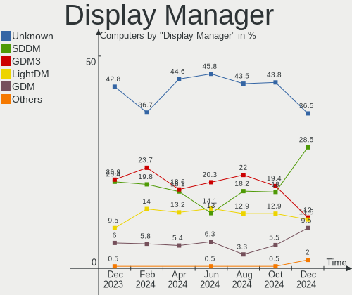
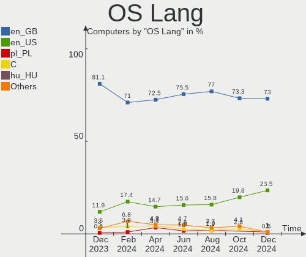
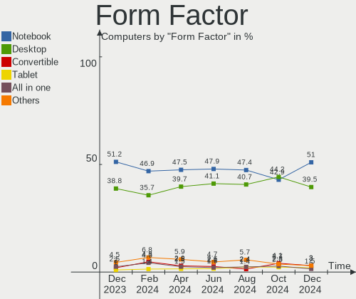
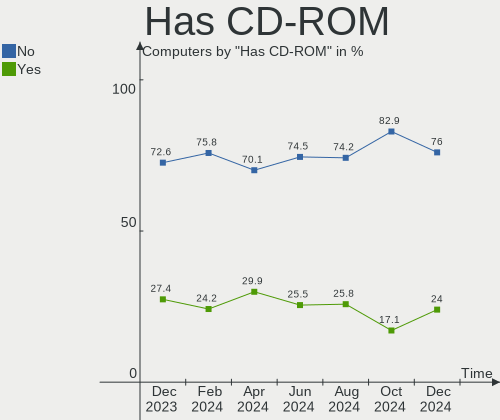
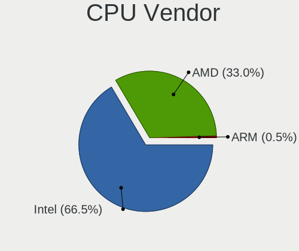
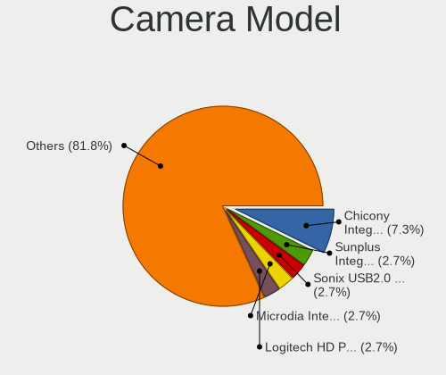

Linux in UK - Hardware Trends
-----------------------------

A project to identify most popular hardware characteristics and track their change
over time based on data collected by Linux users at https://Linux-Hardware.org.

Anyone can contribute to this report by the [hw-probe](https://github.com/linuxhw/hw-probe) tool:

    sudo -E hw-probe -all -upload

This is a report for all computer types. See also reports for [desktops](/Location/UK/Desktop/README.md) and [notebooks](/Location/UK/Notebook/README.md).

Period: Apr, 2024.

Contents
--------

* [ System ](#system)
  - [ OS                       ](#os)
  - [ OS Family                ](#os-family)
  - [ Kernel                   ](#kernel)
  - [ Kernel Family            ](#kernel-family)
  - [ Kernel Major Ver.        ](#kernel-major-ver)
  - [ Arch                     ](#arch)
  - [ DE                       ](#de)
  - [ Display Server           ](#display-server)
  - [ Display Manager          ](#display-manager)
  - [ OS Lang                  ](#os-lang)
  - [ Boot Mode                ](#boot-mode)
  - [ Filesystem               ](#filesystem)
  - [ Part. scheme             ](#part-scheme)
  - [ Dual Boot with Linux/BSD ](#dual-boot-with-linuxbsd)
  - [ Dual Boot (Win)          ](#dual-boot-win)

* [ Board ](#board)
  - [ Vendor                   ](#vendor)
  - [ Model                    ](#model)
  - [ Model Family             ](#model-family)
  - [ MFG Year                 ](#mfg-year)
  - [ Form Factor              ](#form-factor)
  - [ Secure Boot              ](#secure-boot)
  - [ Coreboot                 ](#coreboot)
  - [ RAM Size                 ](#ram-size)
  - [ RAM Used                 ](#ram-used)
  - [ Total Drives             ](#total-drives)
  - [ Has CD-ROM               ](#has-cd-rom)
  - [ Has Ethernet             ](#has-ethernet)
  - [ Has WiFi                 ](#has-wifi)
  - [ Has Bluetooth            ](#has-bluetooth)

* [ Location ](#location)
  - [ Country                  ](#country)
  - [ City                     ](#city)

* [ Drives ](#drives)
  - [ Drive Vendor             ](#drive-vendor)
  - [ Drive Model              ](#drive-model)
  - [ HDD Vendor               ](#hdd-vendor)
  - [ SSD Vendor               ](#ssd-vendor)
  - [ Drive Kind               ](#drive-kind)
  - [ Drive Connector          ](#drive-connector)
  - [ Drive Size               ](#drive-size)
  - [ Space Total              ](#space-total)
  - [ Space Used               ](#space-used)
  - [ Malfunc. Drives          ](#malfunc-drives)
  - [ Malfunc. Drive Vendor    ](#malfunc-drive-vendor)
  - [ Malfunc. HDD Vendor      ](#malfunc-hdd-vendor)
  - [ Malfunc. Drive Kind      ](#malfunc-drive-kind)
  - [ Failed Drives            ](#failed-drives)
  - [ Failed Drive Vendor      ](#failed-drive-vendor)
  - [ Drive Status             ](#drive-status)

* [ Storage controller ](#storage-controller)
  - [ Storage Vendor           ](#storage-vendor)
  - [ Storage Model            ](#storage-model)
  - [ Storage Kind             ](#storage-kind)

* [ Processor ](#processor)
  - [ CPU Vendor               ](#cpu-vendor)
  - [ CPU Model                ](#cpu-model)
  - [ CPU Model Family         ](#cpu-model-family)
  - [ CPU Cores                ](#cpu-cores)
  - [ CPU Sockets              ](#cpu-sockets)
  - [ CPU Threads              ](#cpu-threads)
  - [ CPU Op-Modes             ](#cpu-op-modes)
  - [ CPU Microcode            ](#cpu-microcode)
  - [ CPU Microarch            ](#cpu-microarch)

* [ Graphics ](#graphics)
  - [ GPU Vendor               ](#gpu-vendor)
  - [ GPU Model                ](#gpu-model)
  - [ GPU Combo                ](#gpu-combo)
  - [ GPU Driver               ](#gpu-driver)
  - [ GPU Memory               ](#gpu-memory)

* [ Monitor ](#monitor)
  - [ Monitor Vendor           ](#monitor-vendor)
  - [ Monitor Model            ](#monitor-model)
  - [ Monitor Resolution       ](#monitor-resolution)
  - [ Monitor Diagonal         ](#monitor-diagonal)
  - [ Monitor Width            ](#monitor-width)
  - [ Aspect Ratio             ](#aspect-ratio)
  - [ Monitor Area             ](#monitor-area)
  - [ Pixel Density            ](#pixel-density)
  - [ Multiple Monitors        ](#multiple-monitors)

* [ Network ](#network)
  - [ Net Controller Vendor    ](#net-controller-vendor)
  - [ Net Controller Model     ](#net-controller-model)
  - [ Wireless Vendor          ](#wireless-vendor)
  - [ Wireless Model           ](#wireless-model)
  - [ Ethernet Vendor          ](#ethernet-vendor)
  - [ Ethernet Model           ](#ethernet-model)
  - [ Net Controller Kind      ](#net-controller-kind)
  - [ Used Controller          ](#used-controller)
  - [ NICs                     ](#nics)
  - [ IPv6                     ](#ipv6)

* [ Bluetooth ](#bluetooth)
  - [ Bluetooth Vendor         ](#bluetooth-vendor)
  - [ Bluetooth Model          ](#bluetooth-model)

* [ Sound ](#sound)
  - [ Sound Vendor             ](#sound-vendor)
  - [ Sound Model              ](#sound-model)

* [ Memory ](#memory)
  - [ Memory Vendor            ](#memory-vendor)
  - [ Memory Model             ](#memory-model)
  - [ Memory Kind              ](#memory-kind)
  - [ Memory Form Factor       ](#memory-form-factor)
  - [ Memory Size              ](#memory-size)
  - [ Memory Speed             ](#memory-speed)

* [ Printers & scanners ](#printers--scanners)
  - [ Printer Vendor           ](#printer-vendor)
  - [ Printer Model            ](#printer-model)
  - [ Scanner Vendor           ](#scanner-vendor)
  - [ Scanner Model            ](#scanner-model)

* [ Camera ](#camera)
  - [ Camera Vendor            ](#camera-vendor)
  - [ Camera Model             ](#camera-model)

* [ Security ](#security)
  - [ Fingerprint Vendor       ](#fingerprint-vendor)
  - [ Fingerprint Model        ](#fingerprint-model)
  - [ Chipcard Vendor          ](#chipcard-vendor)
  - [ Chipcard Model           ](#chipcard-model)

* [ Unsupported ](#unsupported)
  - [ Unsupported Devices      ](#unsupported-devices)
  - [ Unsupported Device Types ](#unsupported-device-types)

System
------

OS
--

Installed operating systems

| Name                         | Computers | Percent |
|------------------------------|-----------|---------|
| Ubuntu 22.04                 | 24        | 11.76%  |
| Fedora 39                    | 18        | 8.82%   |
| Linux Mint 21.3              | 17        | 8.33%   |
| Ubuntu 23.10                 | 10        | 4.9%    |
| Arch Rolling                 | 10        | 4.9%    |
| Zorin 17                     | 9         | 4.41%   |
| Pop!_OS 22.04                | 9         | 4.41%   |
| Fedora 40                    | 8         | 3.92%   |
| Debian 12                    | 8         | 3.92%   |
| OpenMandriva 23.08           | 7         | 3.43%   |
| Ubuntu 24.04                 | 6         | 2.94%   |
| KDE neon 22.04               | 6         | 2.94%   |
| ArcoLinux Rolling            | 6         | 2.94%   |
| SteamOS 3.5.17               | 4         | 1.96%   |
| openSUSE Tumbleweed-XXXXXXXX | 4         | 1.96%   |
| Kubuntu 22.04                | 4         | 1.96%   |
| EndeavourOS Rolling          | 4         | 1.96%   |
| BlackPanther 18.1            | 3         | 1.47%   |
| OpenMandriva 5.0             | 2         | 0.98%   |
| Manjaro 23.1.4               | 2         | 0.98%   |
| Manjaro                      | 2         | 0.98%   |
| Linux Mint 21.2              | 2         | 0.98%   |
| Kali 2024.1                  | 2         | 0.98%   |
| Gentoo 2.15                  | 2         | 0.98%   |
| Debian 11                    | 2         | 0.98%   |
| Void Linux Rolling           | 1         | 0.49%   |
| Ubuntu MATE 22.04            | 1         | 0.49%   |
| Ubuntu MATE 20.04            | 1         | 0.49%   |
| Ubuntu 20.04                 | 1         | 0.49%   |
| TUXEDO OS 22.04              | 1         | 0.49%   |
| SteamOS 3.5.7                | 1         | 0.49%   |
| Reborn OS                    | 1         | 0.49%   |
| Pop!_OS 20.04                | 1         | 0.49%   |
| openSUSE Leap-15.5           | 1         | 0.49%   |
| OpenMandriva 24.03           | 1         | 0.49%   |
| OpenMandriva 23.01           | 1         | 0.49%   |
| Nobara 39                    | 1         | 0.49%   |
| NixOS 23.11                  | 1         | 0.49%   |
| MX 23                        | 1         | 0.49%   |
| Manjaro 23.1.3               | 1         | 0.49%   |

OS Family
---------

OS without a version

| Name         | Computers | Percent |
|--------------|-----------|---------|
| Ubuntu       | 41        | 20.1%   |
| Fedora       | 28        | 13.73%  |
| Linux Mint   | 21        | 10.29%  |
| OpenMandriva | 11        | 5.39%   |
| Debian       | 11        | 5.39%   |
| Pop!_OS      | 10        | 4.9%    |
| Arch         | 10        | 4.9%    |
| Zorin        | 9         | 4.41%   |
| Kubuntu      | 6         | 2.94%   |
| KDE neon     | 6         | 2.94%   |
| ArcoLinux    | 6         | 2.94%   |
| SteamOS      | 5         | 2.45%   |
| openSUSE     | 5         | 2.45%   |
| Manjaro      | 5         | 2.45%   |
| EndeavourOS  | 4         | 1.96%   |
| Kali         | 3         | 1.47%   |
| Gentoo       | 3         | 1.47%   |
| BlackPanther | 3         | 1.47%   |
| Ubuntu MATE  | 2         | 0.98%   |
| Garuda Linux | 2         | 0.98%   |
| Void Linux   | 1         | 0.49%   |
| TUXEDO OS    | 1         | 0.49%   |
| Reborn OS    | 1         | 0.49%   |
| Nobara       | 1         | 0.49%   |
| NixOS        | 1         | 0.49%   |
| MX           | 1         | 0.49%   |
| Mageia       | 1         | 0.49%   |
| Lubuntu      | 1         | 0.49%   |
| Linux Lite   | 1         | 0.49%   |
| Endless      | 1         | 0.49%   |
| Elementary   | 1         | 0.49%   |
| Dts-distro   | 1         | 0.49%   |
| BunsenLabs   | 1         | 0.49%   |

Kernel
------

Version of the Linux kernel

| Version                                            | Computers | Percent |
|----------------------------------------------------|-----------|---------|
| 6.5.0-28-generic                                   | 23        | 11.27%  |
| 6.5.0-27-generic                                   | 17        | 8.33%   |
| 6.5.0-26-generic                                   | 14        | 6.86%   |
| 6.4.11-desktop-1omv2390                            | 7         | 3.43%   |
| 6.8.7-300.fc40.x86_64                              | 6         | 2.94%   |
| 6.8.0-76060800daily20240311-generic                | 6         | 2.94%   |
| 6.8.7-arch1-1                                      | 5         | 2.45%   |
| 6.8.0-31-generic                                   | 5         | 2.45%   |
| 5.15.0-101-generic                                 | 5         | 2.45%   |
| 6.8.7-200.fc39.x86_64                              | 4         | 1.96%   |
| 6.8.5-201.fc39.x86_64                              | 4         | 1.96%   |
| 6.8.4-200.fc39.x86_64                              | 4         | 1.96%   |
| 6.1.52-valve16-1-neptune-61                        | 4         | 1.96%   |
| 6.1.0-18-amd64                                     | 4         | 1.96%   |
| 6.8.4-arch1-1                                      | 3         | 1.47%   |
| 6.5.6-300.fc39.x86_64                              | 3         | 1.47%   |
| 6.5.0-9-generic                                    | 3         | 1.47%   |
| 6.1.0-20-amd64                                     | 3         | 1.47%   |
| 5.15.0-105-generic                                 | 3         | 1.47%   |
| 5.15.0-102-generic                                 | 3         | 1.47%   |
| 5.15.0-100-generic                                 | 3         | 1.47%   |
| 6.8.6-arch1-1                                      | 2         | 0.98%   |
| 6.8.2-zen2-1-zen                                   | 2         | 0.98%   |
| 6.8.2-arch2-1                                      | 2         | 0.98%   |
| 6.6.2-desktop-1omv2390                             | 2         | 0.98%   |
| 5.15.85-desktop-1bP                                | 2         | 0.98%   |
| 5.15.0-91-generic                                  | 2         | 0.98%   |
| 6.9.0-rc3-sof+                                     | 1         | 0.49%   |
| 6.9.0-0.rc5.20240426gitc942a0cd3603.48.fc41.x86_64 | 1         | 0.49%   |
| 6.8.8-arch1-1                                      | 1         | 0.49%   |
| 6.8.7-lqx2                                         | 1         | 0.49%   |
| 6.8.5-arch1-1                                      | 1         | 0.49%   |
| 6.8.5-1-MANJARO                                    | 1         | 0.49%   |
| 6.8.4-zen1-1-zen                                   | 1         | 0.49%   |
| 6.8.4-rc1-1-default                                | 1         | 0.49%   |
| 6.8.4-gentoo                                       | 1         | 0.49%   |
| 6.8.4-cachyos-x86_64                               | 1         | 0.49%   |
| 6.8.4-350.vanilla.fc40.x86_64                      | 1         | 0.49%   |
| 6.8.2-x64v2-xanmod1-1-edge                         | 1         | 0.49%   |
| 6.8.2-300.fc40.x86_64                              | 1         | 0.49%   |

Kernel Family
-------------

Linux kernel without a distro release

| Version | Computers | Percent |
|---------|-----------|---------|
| 6.5.0   | 62        | 30.39%  |
| 5.15.0  | 18        | 8.82%   |
| 6.8.7   | 16        | 7.84%   |
| 6.8.0   | 13        | 6.37%   |
| 6.8.4   | 12        | 5.88%   |
| 6.8.2   | 7         | 3.43%   |
| 6.4.11  | 7         | 3.43%   |
| 6.1.0   | 7         | 3.43%   |
| 6.8.5   | 6         | 2.94%   |
| 6.1.52  | 5         | 2.45%   |
| 6.8.1   | 4         | 1.96%   |
| 6.5.6   | 4         | 1.96%   |
| 6.9.0   | 2         | 0.98%   |
| 6.8.6   | 2         | 0.98%   |
| 6.7.9   | 2         | 0.98%   |
| 6.7.6   | 2         | 0.98%   |
| 6.6.22  | 2         | 0.98%   |
| 6.6.2   | 2         | 0.98%   |
| 6.6.10  | 2         | 0.98%   |
| 5.4.0   | 2         | 0.98%   |
| 5.15.85 | 2         | 0.98%   |
| 6.8.8   | 1         | 0.49%   |
| 6.7.7   | 1         | 0.49%   |
| 6.7.5   | 1         | 0.49%   |
| 6.6.9   | 1         | 0.49%   |
| 6.6.29  | 1         | 0.49%   |
| 6.6.27  | 1         | 0.49%   |
| 6.6.26  | 1         | 0.49%   |
| 6.6.23  | 1         | 0.49%   |
| 6.6.21  | 1         | 0.49%   |
| 6.6.19  | 1         | 0.49%   |
| 6.6.15  | 1         | 0.49%   |
| 6.5.11  | 1         | 0.49%   |
| 6.3.8   | 1         | 0.49%   |
| 6.2.6   | 1         | 0.49%   |
| 6.2.15  | 1         | 0.49%   |
| 6.1.21  | 1         | 0.49%   |
| 6.1.1   | 1         | 0.49%   |
| 6.0.12  | 1         | 0.49%   |
| 6.0.0   | 1         | 0.49%   |

Kernel Major Ver.
-----------------

Linux kernel major version

| Version | Computers | Percent |
|---------|-----------|---------|
| 6.5     | 67        | 32.84%  |
| 6.8     | 61        | 29.9%   |
| 5.15    | 21        | 10.29%  |
| 6.6     | 14        | 6.86%   |
| 6.1     | 14        | 6.86%   |
| 6.4     | 7         | 3.43%   |
| 6.7     | 6         | 2.94%   |
| 6.9     | 2         | 0.98%   |
| 6.2     | 2         | 0.98%   |
| 6.0     | 2         | 0.98%   |
| 5.4     | 2         | 0.98%   |
| 6.3     | 1         | 0.49%   |
| 5.8     | 1         | 0.49%   |
| 5.14    | 1         | 0.49%   |
| 5.10    | 1         | 0.49%   |
| 4.19    | 1         | 0.49%   |
| 4.18    | 1         | 0.49%   |

Arch
----

OS architecture (x86_64, i586, etc.)

| Name    | Computers | Percent |
|---------|-----------|---------|
| x86_64  | 202       | 99.02%  |
| aarch64 | 2         | 0.98%   |

DE
--

Desktop Environment

| Name       | Computers | Percent |
|------------|-----------|---------|
| GNOME      | 94        | 46.08%  |
| KDE5       | 31        | 15.2%   |
| KDE6       | 19        | 9.31%   |
| X-Cinnamon | 17        | 8.33%   |
| XFCE       | 14        | 6.86%   |
| Unknown    | 9         | 4.41%   |
| MATE       | 8         | 3.92%   |
| LXQt       | 2         | 0.98%   |
| Hyprland   | 2         | 0.98%   |
| sway       | 1         | 0.49%   |
| qtile      | 1         | 0.49%   |
| Pantheon   | 1         | 0.49%   |
| KDE        | 1         | 0.49%   |
| chadwm     | 1         | 0.49%   |
| BunsenLabs | 1         | 0.49%   |
| bspwm      | 1         | 0.49%   |
| AsterDE    | 1         | 0.49%   |

Display Server
--------------

X11 or Wayland

| Name    | Computers | Percent |
|---------|-----------|---------|
| Wayland | 100       | 49.02%  |
| X11     | 95        | 46.57%  |
| Unknown | 7         | 3.43%   |
| Tty     | 2         | 0.98%   |

Display Manager
---------------

SDDM, LightDM, etc.

| Name    | Computers | Percent |
|---------|-----------|---------|
| Unknown | 91        | 44.61%  |
| GDM3    | 38        | 18.63%  |
| SDDM    | 37        | 18.14%  |
| LightDM | 27        | 13.24%  |
| GDM     | 11        | 5.39%   |

OS Lang
-------

Language

| Lang    | Computers | Percent |
|---------|-----------|---------|
| en_GB   | 148       | 72.55%  |
| en_US   | 30        | 14.71%  |
| C       | 9         | 4.41%   |
| pl_PL   | 7         | 3.43%   |
| Unknown | 7         | 3.43%   |
| lt_LT   | 1         | 0.49%   |
| fr_FR   | 1         | 0.49%   |
| C.UTF8  | 1         | 0.49%   |

Boot Mode
---------

EFI or BIOS

| Mode | Computers | Percent |
|------|-----------|---------|
| BIOS | 112       | 54.9%   |
| EFI  | 92        | 45.1%   |

Filesystem
----------

Type of filesystem

| Type    | Computers | Percent |
|---------|-----------|---------|
| Ext4    | 114       | 55.88%  |
| Btrfs   | 53        | 25.98%  |
| Tmpfs   | 27        | 13.24%  |
| Overlay | 9         | 4.41%   |
| XXXXXXX | 1         | 0.49%   |

Part. scheme
------------

Scheme of partitioning

| Type    | Computers | Percent |
|---------|-----------|---------|
| GPT     | 108       | 52.94%  |
| Unknown | 82        | 40.2%   |
| MBR     | 14        | 6.86%   |

Dual Boot with Linux/BSD
------------------------

Hosting more than one Linux/BSD

| Dual boot | Computers | Percent |
|-----------|-----------|---------|
| No        | 178       | 87.25%  |
| Yes       | 26        | 12.75%  |

Dual Boot (Win)
---------------

Hosting Linux and Windows

| Dual boot | Computers | Percent |
|-----------|-----------|---------|
| No        | 162       | 79.41%  |
| Yes       | 42        | 20.59%  |

Board
-----

Vendor
------

Motherboard manufacturer

| Name                                 | Computers | Percent |
|--------------------------------------|-----------|---------|
| Lenovo                               | 30        | 14.71%  |
| Hewlett-Packard                      | 27        | 13.24%  |
| Dell                                 | 24        | 11.76%  |
| ASUSTek Computer                     | 24        | 11.76%  |
| MSI                                  | 18        | 8.82%   |
| Gigabyte Technology                  | 17        | 8.33%   |
| Apple                                | 14        | 6.86%   |
| Acer                                 | 13        | 6.37%   |
| Valve                                | 5         | 2.45%   |
| Intel                                | 5         | 2.45%   |
| Unknown                              | 3         | 1.47%   |
| Shenzhen Meigao Electronic Equipment | 2         | 0.98%   |
| Raspberry Pi Foundation              | 2         | 0.98%   |
| Notebook                             | 2         | 0.98%   |
| XIAOMI                               | 1         | 0.49%   |
| Toshiba                              | 1         | 0.49%   |
| Tactus                               | 1         | 0.49%   |
| Supermicro                           | 1         | 0.49%   |
| Star Labs                            | 1         | 0.49%   |
| Samsung Electronics                  | 1         | 0.49%   |
| PC Specialist                        | 1         | 0.49%   |
| Packard Bell                         | 1         | 0.49%   |
| Mini PC                              | 1         | 0.49%   |
| iOTA                                 | 1         | 0.49%   |
| Huanan                               | 1         | 0.49%   |
| Fusion5                              | 1         | 0.49%   |
| Fujitsu                              | 1         | 0.49%   |
| Framework                            | 1         | 0.49%   |
| Foxconn                              | 1         | 0.49%   |
| Dynabook Europe                      | 1         | 0.49%   |
| ASRock                               | 1         | 0.49%   |
| AOpen                                | 1         | 0.49%   |

Model
-----

Motherboard model

| Name                                              | Computers | Percent |
|---------------------------------------------------|-----------|---------|
| Valve Jupiter                                     | 5         | 2.45%   |
| Unknown                                           | 3         | 1.47%   |
| RPi Raspberry Pi                                  | 2         | 0.98%   |
| HP Notebook                                       | 2         | 0.98%   |
| Apple MacBookPro8,2                               | 2         | 0.98%   |
| Acer Swift SF314-43                               | 2         | 0.98%   |
| Acer Aspire A315-31                               | 2         | 0.98%   |
| XIAOMI Redmi Book Pro 14 2024                     | 1         | 0.49%   |
| Toshiba Satellite C55-B                           | 1         | 0.49%   |
| Tactus GeoPad 220                                 | 1         | 0.49%   |
| Supermicro X10DAi                                 | 1         | 0.49%   |
| Star Labs StarBook                                | 1         | 0.49%   |
| Shenzhen Meigao Electronic Equipment Venus series | 1         | 0.49%   |
| Shenzhen Meigao Electronic Equipment HX77G        | 1         | 0.49%   |
| Samsung 750XED                                    | 1         | 0.49%   |
| PC Specialist Standard                            | 1         | 0.49%   |
| Packard Bell EasyNote TJ66                        | 1         | 0.49%   |
| Notebook NV4xPZ                                   | 1         | 0.49%   |
| Notebook NS5x_NS7xAU                              | 1         | 0.49%   |
| MSI MS-B09012                                     | 1         | 0.49%   |
| MSI MS-7E06                                       | 1         | 0.49%   |
| MSI MS-7D46                                       | 1         | 0.49%   |
| MSI MS-7D32                                       | 1         | 0.49%   |
| MSI MS-7D14                                       | 1         | 0.49%   |
| MSI MS-7C96                                       | 1         | 0.49%   |
| MSI MS-7C75                                       | 1         | 0.49%   |
| MSI MS-7C02                                       | 1         | 0.49%   |
| MSI MS-7B86                                       | 1         | 0.49%   |
| MSI MS-7B78                                       | 1         | 0.49%   |
| MSI MS-7977                                       | 1         | 0.49%   |
| MSI MS-7913                                       | 1         | 0.49%   |
| MSI MS-7851                                       | 1         | 0.49%   |
| MSI MS-7850                                       | 1         | 0.49%   |
| MSI MS-7786                                       | 1         | 0.49%   |
| MSI H310 Gaming Infinite (MS-B915)                | 1         | 0.49%   |
| MSI Customised HOMEA PC                           | 1         | 0.49%   |
| MSI Custom PC                                     | 1         | 0.49%   |
| Mini PC Overclock 3                               | 1         | 0.49%   |
| Lenovo Z70-80 80FG                                | 1         | 0.49%   |
| Lenovo Yoga 510-14AST 80S9                        | 1         | 0.49%   |

Model Family
------------

Motherboard model prefix

| Name                                       | Computers | Percent |
|--------------------------------------------|-----------|---------|
| Lenovo ThinkPad                            | 14        | 6.86%   |
| Acer Aspire                                | 11        | 5.39%   |
| ASUS ROG                                   | 10        | 4.9%    |
| Dell Latitude                              | 7         | 3.43%   |
| Dell Precision                             | 6         | 2.94%   |
| Valve Jupiter                              | 5         | 2.45%   |
| HP EliteBook                               | 5         | 2.45%   |
| Dell Inspiron                              | 5         | 2.45%   |
| ASUS PRIME                                 | 5         | 2.45%   |
| Lenovo Legion                              | 4         | 1.96%   |
| Lenovo IdeaPad                             | 4         | 1.96%   |
| HP Pavilion                                | 4         | 1.96%   |
| HP Laptop                                  | 3         | 1.47%   |
| Dell OptiPlex                              | 3         | 1.47%   |
| Unknown                                    | 3         | 1.47%   |
| RPi Raspberry                              | 2         | 0.98%   |
| HP Notebook                                | 2         | 0.98%   |
| HP Compaq                                  | 2         | 0.98%   |
| Gigabyte B550                              | 2         | 0.98%   |
| Gigabyte B450M                             | 2         | 0.98%   |
| ASUS VivoBook                              | 2         | 0.98%   |
| Apple MacBookPro8                          | 2         | 0.98%   |
| Acer Swift                                 | 2         | 0.98%   |
| XIAOMI Redmi                               | 1         | 0.49%   |
| Toshiba Satellite                          | 1         | 0.49%   |
| Tactus GeoPad                              | 1         | 0.49%   |
| Supermicro X10DAi                          | 1         | 0.49%   |
| Star Labs StarBook                         | 1         | 0.49%   |
| Shenzhen Meigao Electronic Equipment Venus | 1         | 0.49%   |
| Shenzhen Meigao Electronic Equipment HX77G | 1         | 0.49%   |
| Samsung 750XED                             | 1         | 0.49%   |
| PC Specialist Standard                     | 1         | 0.49%   |
| Packard Bell EasyNote                      | 1         | 0.49%   |
| Notebook NV4xPZ                            | 1         | 0.49%   |
| Notebook NS5x                              | 1         | 0.49%   |
| MSI MS-B09012                              | 1         | 0.49%   |
| MSI MS-7E06                                | 1         | 0.49%   |
| MSI MS-7D46                                | 1         | 0.49%   |
| MSI MS-7D32                                | 1         | 0.49%   |
| MSI MS-7D14                                | 1         | 0.49%   |

MFG Year
--------

Motherboard manufacture year

| Year    | Computers | Percent |
|---------|-----------|---------|
| 2023    | 28        | 13.73%  |
| 2020    | 23        | 11.27%  |
| 2018    | 21        | 10.29%  |
| 2021    | 17        | 8.33%   |
| 2014    | 16        | 7.84%   |
| 2022    | 15        | 7.35%   |
| 2019    | 12        | 5.88%   |
| 2013    | 10        | 4.9%    |
| 2012    | 10        | 4.9%    |
| 2016    | 9         | 4.41%   |
| 2017    | 8         | 3.92%   |
| 2015    | 7         | 3.43%   |
| 2011    | 7         | 3.43%   |
| 2010    | 6         | 2.94%   |
| 2009    | 5         | 2.45%   |
| 2007    | 3         | 1.47%   |
| Unknown | 3         | 1.47%   |
| 2024    | 2         | 0.98%   |
| 2008    | 2         | 0.98%   |

Form Factor
-----------

Physical design of the computer

| Name           | Computers | Percent |
|----------------|-----------|---------|
| Notebook       | 97        | 47.55%  |
| Desktop        | 81        | 39.71%  |
| Mini pc        | 8         | 3.92%   |
| Convertible    | 6         | 2.94%   |
| All in one     | 5         | 2.45%   |
| Tablet         | 3         | 1.47%   |
| System on chip | 2         | 0.98%   |
| Server         | 2         | 0.98%   |

Secure Boot
-----------

Enabled or disabled

| State    | Computers | Percent |
|----------|-----------|---------|
| Disabled | 190       | 93.14%  |
| Enabled  | 14        | 6.86%   |

Coreboot
--------

Have coreboot on board

| Used | Computers | Percent |
|------|-----------|---------|
| No   | 203       | 99.51%  |
| Yes  | 1         | 0.49%   |

RAM Size
--------

Total RAM memory

| Size in GB  | Computers | Percent |
|-------------|-----------|---------|
| 4.01-8.0    | 43        | 21.08%  |
| 16.01-24.0  | 42        | 20.59%  |
| 32.01-64.0  | 35        | 17.16%  |
| 8.01-16.0   | 32        | 15.69%  |
| 3.01-4.0    | 21        | 10.29%  |
| 64.01-256.0 | 20        | 9.8%    |
| 24.01-32.0  | 6         | 2.94%   |
| 2.01-3.0    | 3         | 1.47%   |
| 1.01-2.0    | 1         | 0.49%   |
| 0.51-1.0    | 1         | 0.49%   |

RAM Used
--------

Used RAM memory

| Used GB    | Computers | Percent |
|------------|-----------|---------|
| 4.01-8.0   | 50        | 24.51%  |
| 1.01-2.0   | 50        | 24.51%  |
| 2.01-3.0   | 42        | 20.59%  |
| 3.01-4.0   | 40        | 19.61%  |
| 8.01-16.0  | 15        | 7.35%   |
| 0.51-1.0   | 4         | 1.96%   |
| 0.01-0.5   | 2         | 0.98%   |
| 16.01-24.0 | 1         | 0.49%   |

Total Drives
------------

Number of drives on board

| Drives | Computers | Percent |
|--------|-----------|---------|
| 1      | 113       | 55.39%  |
| 2      | 51        | 25%     |
| 3      | 21        | 10.29%  |
| 4      | 10        | 4.9%    |
| 5      | 4         | 1.96%   |
| 7      | 2         | 0.98%   |
| 6      | 2         | 0.98%   |
| 9      | 1         | 0.49%   |

Has CD-ROM
----------

Has CD-ROM on board

| Presented | Computers | Percent |
|-----------|-----------|---------|
| No        | 143       | 70.1%   |
| Yes       | 61        | 29.9%   |

Has Ethernet
------------

Has Ethernet on board

| Presented | Computers | Percent |
|-----------|-----------|---------|
| Yes       | 174       | 85.29%  |
| No        | 30        | 14.71%  |

Has WiFi
--------

Has WiFi module

| Presented | Computers | Percent |
|-----------|-----------|---------|
| Yes       | 163       | 79.9%   |
| No        | 41        | 20.1%   |

Has Bluetooth
-------------

Has Bluetooth module

| Presented | Computers | Percent |
|-----------|-----------|---------|
| Yes       | 146       | 71.57%  |
| No        | 58        | 28.43%  |

Location
--------

Country
-------

Geographic location (country)

| Country | Computers | Percent |
|---------|-----------|---------|
| UK      | 204       | 100%    |

City
----

Geographic location (city)

| City               | Computers | Percent |
|--------------------|-----------|---------|
| Glasgow            | 7         | 3.43%   |
| Manchester         | 5         | 2.45%   |
| London             | 5         | 2.45%   |
| Leeds              | 5         | 2.45%   |
| Southwark          | 4         | 1.96%   |
| Southampton        | 4         | 1.96%   |
| Edinburgh          | 4         | 1.96%   |
| Bristol            | 4         | 1.96%   |
| Birmingham         | 4         | 1.96%   |
| Wandsworth         | 3         | 1.47%   |
| Nottingham         | 3         | 1.47%   |
| Milton Keynes      | 3         | 1.47%   |
| Liverpool          | 3         | 1.47%   |
| Lewisham           | 3         | 1.47%   |
| Islington          | 3         | 1.47%   |
| Hexham             | 3         | 1.47%   |
| Hackney            | 3         | 1.47%   |
| Brighton           | 3         | 1.47%   |
| Wolverhampton      | 2         | 0.98%   |
| Wembley            | 2         | 0.98%   |
| Warrington         | 2         | 0.98%   |
| Wakefield          | 2         | 0.98%   |
| Swindon            | 2         | 0.98%   |
| Stockton-on-Tees   | 2         | 0.98%   |
| Stevenage          | 2         | 0.98%   |
| Stafford           | 2         | 0.98%   |
| Rotherham          | 2         | 0.98%   |
| Leicester          | 2         | 0.98%   |
| Ilford             | 2         | 0.98%   |
| Hendon             | 2         | 0.98%   |
| Folkestone         | 2         | 0.98%   |
| Dudley             | 2         | 0.98%   |
| Croydon            | 2         | 0.98%   |
| Coventry           | 2         | 0.98%   |
| Chester            | 2         | 0.98%   |
| Carmarthen         | 2         | 0.98%   |
| Bradford           | 2         | 0.98%   |
| Bournemouth        | 2         | 0.98%   |
| Bishop's Stortford | 2         | 0.98%   |
| Basildon           | 2         | 0.98%   |

Drives
------

Drive Vendor
------------

Hard drive vendors

| Vendor                       | Computers | Drives | Percent |
|------------------------------|-----------|--------|---------|
| Samsung Electronics          | 57        | 67     | 17.7%   |
| Seagate                      | 31        | 38     | 9.63%   |
| SanDisk                      | 23        | 27     | 7.14%   |
| WDC                          | 22        | 31     | 6.83%   |
| Crucial                      | 19        | 24     | 5.9%    |
| Unknown                      | 17        | 18     | 5.28%   |
| Toshiba                      | 17        | 19     | 5.28%   |
| Kingston                     | 13        | 13     | 4.04%   |
| SK hynix                     | 10        | 10     | 3.11%   |
| Micron/Crucial Technology    | 10        | 12     | 3.11%   |
| Phison Electronics           | 8         | 10     | 2.48%   |
| Apple                        | 8         | 8      | 2.48%   |
| Intel                        | 6         | 6      | 1.86%   |
| HGST                         | 5         | 5      | 1.55%   |
| MAXIO Technology (Hangzhou)  | 4         | 4      | 1.24%   |
| Kingston Technology Company  | 4         | 4      | 1.24%   |
| China                        | 4         | 5      | 1.24%   |
| Unknown                      | 4         | 4      | 1.24%   |
| SSK                          | 3         | 3      | 0.93%   |
| OCZ                          | 3         | 3      | 0.93%   |
| Micron Technology            | 3         | 3      | 0.93%   |
| KIOXIA                       | 3         | 3      | 0.93%   |
| Integral                     | 3         | 3      | 0.93%   |
| Hitachi                      | 3         | 3      | 0.93%   |
| Fanxiang                     | 3         | 3      | 0.93%   |
| A-DATA Technology            | 3         | 3      | 0.93%   |
| Transcend                    | 2         | 2      | 0.62%   |
| Silicon Motion               | 2         | 2      | 0.62%   |
| Shenzhen Longsys Electronics | 2         | 2      | 0.62%   |
| SABRENT                      | 2         | 2      | 0.62%   |
| PNY                          | 2         | 2      | 0.62%   |
| O2 Micro                     | 2         | 2      | 0.62%   |
| Netac                        | 2         | 2      | 0.62%   |
| LITEON                       | 2         | 2      | 0.62%   |
| JMicron Technology           | 2         | 2      | 0.62%   |
| WD Blue                      | 1         | 1      | 0.31%   |
| USB                          | 1         | 1      | 0.31%   |
| Team                         | 1         | 1      | 0.31%   |
| TCSUNBOW                     | 1         | 1      | 0.31%   |
| SSSTC                        | 1         | 1      | 0.31%   |

Drive Model
-----------

Hard drive models

| Model                                              | Computers | Percent |
|----------------------------------------------------|-----------|---------|
| Samsung NVMe SSD Controller SM981/PM981/PM983 1TB  | 14        | 3.95%   |
| Seagate ST2000DM008-2FR102 2TB                     | 6         | 1.69%   |
| Phison E12 NVMe Controller 2TB                     | 6         | 1.69%   |
| Micron/Crucial P2 NVMe PCIe SSD 4TB                | 6         | 1.69%   |
| Crucial CT1000MX500SSD1 1TB                        | 6         | 1.69%   |
| Kingston SA400S37240G 240GB SSD                    | 5         | 1.41%   |
| Crucial CT500MX500SSD1 500GB                       | 4         | 1.13%   |
| Unknown                                            | 4         | 1.13%   |
| Unknown MMC Card  64GB                             | 3         | 0.85%   |
| Seagate Expansion 2TB                              | 3         | 0.85%   |
| Sandisk WD Blue SN550 NVMe SSD 2TB                 | 3         | 0.85%   |
| MAXIO (Hangzhou) NVMe SSD Controller MAP1202 256GB | 3         | 0.85%   |
| Kingston SV300S37A240G 240GB SSD                   | 3         | 0.85%   |
| WDC WD30EFRX-68EUZN0 3TB                           | 2         | 0.56%   |
| WDC WD10EZEX-22MFCA0 1TB                           | 2         | 0.56%   |
| Unknown SD/MMC/MS PRO 128GB                        | 2         | 0.56%   |
| Unknown MMC Card  512GB                            | 2         | 0.56%   |
| Unknown MMC Card  32GB                             | 2         | 0.56%   |
| Unknown MMC Card  16GB                             | 2         | 0.56%   |
| Toshiba XG6 NVMe SSD Controller 1024GB             | 2         | 0.56%   |
| Toshiba MQ04ABF100 1TB                             | 2         | 0.56%   |
| Toshiba DT01ACA100 1TB                             | 2         | 0.56%   |
| SSK Disk 256GB                                     | 2         | 0.56%   |
| SK hynix BC511 256GB                               | 2         | 0.56%   |
| Seagate ST8000DM004-2CX188 8TB                     | 2         | 0.56%   |
| Seagate ST1000LM024 HN-M101MBB 1TB                 | 2         | 0.56%   |
| Seagate ST1000DM003-1SB102 1TB                     | 2         | 0.56%   |
| Sandisk WD_BLACK SN850X 1000GB                     | 2         | 0.56%   |
| Sandisk WD_BLACK SN770 2TB                         | 2         | 0.56%   |
| Sandisk WD Blue SN570 2TB                          | 2         | 0.56%   |
| SanDisk NVMe SSD Drive 2TB                         | 2         | 0.56%   |
| Samsung SSD 980 PRO 2TB                            | 2         | 0.56%   |
| Samsung SSD 980 1TB                                | 2         | 0.56%   |
| Samsung SSD 870 EVO 4TB                            | 2         | 0.56%   |
| Samsung SSD 850 EVO 500GB                          | 2         | 0.56%   |
| Samsung SSD 840 EVO 250GB                          | 2         | 0.56%   |
| Samsung NVMe SSD Controller SM961/PM961/SM963 1TB  | 2         | 0.56%   |
| Samsung NVMe SSD Controller PM9A1/PM9A3/980PRO 1TB | 2         | 0.56%   |
| Samsung MZVL4512HBLU-00BTW 512GB                   | 2         | 0.56%   |
| OCZ VERTEX3 120GB SSD                              | 2         | 0.56%   |

HDD Vendor
----------

Hard disk drive vendors

| Vendor              | Computers | Drives | Percent |
|---------------------|-----------|--------|---------|
| Seagate             | 31        | 38     | 38.75%  |
| WDC                 | 18        | 27     | 22.5%   |
| Toshiba             | 12        | 14     | 15%     |
| HGST                | 5         | 5      | 6.25%   |
| Samsung Electronics | 3         | 3      | 3.75%   |
| Hitachi             | 3         | 3      | 3.75%   |
| Apple               | 3         | 3      | 3.75%   |
| Unknown             | 2         | 2      | 2.5%    |
| SABRENT             | 1         | 1      | 1.25%   |
| Maxtor              | 1         | 2      | 1.25%   |
| JMicron Technology  | 1         | 1      | 1.25%   |

SSD Vendor
----------

Solid state drive vendors

| Vendor              | Computers | Drives | Percent |
|---------------------|-----------|--------|---------|
| Samsung Electronics | 22        | 26     | 22%     |
| Crucial             | 17        | 21     | 17%     |
| Kingston            | 11        | 11     | 11%     |
| SanDisk             | 7         | 7      | 7%      |
| Apple               | 5         | 5      | 5%      |
| SK hynix            | 4         | 4      | 4%      |
| OCZ                 | 3         | 3      | 3%      |
| Integral            | 3         | 3      | 3%      |
| China               | 3         | 4      | 3%      |
| A-DATA Technology   | 3         | 3      | 3%      |
| WDC                 | 2         | 2      | 2%      |
| Transcend           | 2         | 2      | 2%      |
| SSK                 | 2         | 2      | 2%      |
| PNY                 | 2         | 2      | 2%      |
| Netac               | 2         | 2      | 2%      |
| LITEON              | 2         | 2      | 2%      |
| Team                | 1         | 1      | 1%      |
| TCSUNBOW            | 1         | 1      | 1%      |
| SPCC                | 1         | 1      | 1%      |
| SABRENT             | 1         | 1      | 1%      |
| Patriot             | 1         | 1      | 1%      |
| Intel               | 1         | 1      | 1%      |
| GOODRAM             | 1         | 1      | 1%      |
| Gigastone           | 1         | 1      | 1%      |
| Gigabyte Technology | 1         | 1      | 1%      |
| ASMT                | 1         | 1      | 1%      |

Drive Kind
----------

HDD or SSD

| Kind    | Computers | Drives | Percent |
|---------|-----------|--------|---------|
| NVMe    | 106       | 136    | 38.13%  |
| SSD     | 86        | 109    | 30.94%  |
| HDD     | 63        | 99     | 22.66%  |
| MMC     | 15        | 16     | 5.4%    |
| Unknown | 8         | 8      | 2.88%   |

Drive Connector
---------------

SATA, SAS, NVMe, etc.

| Type | Computers | Drives | Percent |
|------|-----------|--------|---------|
| SATA | 126       | 195    | 47.55%  |
| NVMe | 105       | 132    | 39.62%  |
| SAS  | 19        | 25     | 7.17%   |
| MMC  | 15        | 16     | 5.66%   |

Drive Size
----------

Size of hard drive

| Size in TB | Computers | Drives | Percent |
|------------|-----------|--------|---------|
| 0.01-0.5   | 86        | 110    | 52.76%  |
| 0.51-1.0   | 44        | 53     | 26.99%  |
| 1.01-2.0   | 16        | 22     | 9.82%   |
| 4.01-10.0  | 6         | 7      | 3.68%   |
| 3.01-4.0   | 5         | 7      | 3.07%   |
| 2.01-3.0   | 4         | 6      | 2.45%   |
| 10.01-20.0 | 2         | 3      | 1.23%   |

Space Total
-----------

Amount of disk space available on the file system

| Size in GB     | Computers | Percent |
|----------------|-----------|---------|
| 101-250        | 48        | 23.53%  |
| 501-1000       | 36        | 17.65%  |
| 251-500        | 34        | 16.67%  |
| More than 3000 | 25        | 12.25%  |
| 2001-3000      | 15        | 7.35%   |
| 1001-2000      | 15        | 7.35%   |
| Unknown        | 11        | 5.39%   |
| 1-20           | 9         | 4.41%   |
| 51-100         | 9         | 4.41%   |
| 21-50          | 2         | 0.98%   |

Space Used
----------

Amount of used disk space

| Used GB        | Computers | Percent |
|----------------|-----------|---------|
| 1-20           | 54        | 26.47%  |
| 21-50          | 34        | 16.67%  |
| 101-250        | 33        | 16.18%  |
| 51-100         | 20        | 9.8%    |
| 1001-2000      | 15        | 7.35%   |
| 251-500        | 12        | 5.88%   |
| 501-1000       | 12        | 5.88%   |
| More than 3000 | 11        | 5.39%   |
| Unknown        | 11        | 5.39%   |
| 2001-3000      | 2         | 0.98%   |

Malfunc. Drives
---------------

Drive models with a malfunction

| Model                                 | Computers | Drives | Percent |
|---------------------------------------|-----------|--------|---------|
| WDC WD5000BEVT-75A0RT0 500GB          | 1         | 1      | 7.14%   |
| WDC WD30EFRX-68EUZN0 3TB              | 1         | 1      | 7.14%   |
| Seagate ST9250315AS 250GB             | 1         | 1      | 7.14%   |
| Seagate ST500DM002-1BC142 500GB       | 1         | 1      | 7.14%   |
| Seagate ST380013AS 80GB               | 1         | 1      | 7.14%   |
| Seagate ST3750528AS 752GB             | 1         | 1      | 7.14%   |
| Seagate ST160LT000-9VL14D 160GB       | 1         | 1      | 7.14%   |
| Seagate ST1000LM024 HN-M101MBB 1TB    | 1         | 1      | 7.14%   |
| Seagate ST1000DM003-1SB102 1TB        | 1         | 1      | 7.14%   |
| Samsung Electronics SSD 970 EVO 500GB | 1         | 1      | 7.14%   |
| Maxtor STM3160215AS 160GB             | 1         | 1      | 7.14%   |
| Hitachi HTS541680J9SA00 80GB          | 1         | 1      | 7.14%   |
| HGST HTS541010A9E680 1TB              | 1         | 1      | 7.14%   |
| Crucial CT1050MX300SSD1 1050GB        | 1         | 1      | 7.14%   |

Malfunc. Drive Vendor
---------------------

Vendors of faulty drives

| Vendor              | Computers | Drives | Percent |
|---------------------|-----------|--------|---------|
| Seagate             | 7         | 7      | 50%     |
| WDC                 | 2         | 2      | 14.29%  |
| Samsung Electronics | 1         | 1      | 7.14%   |
| Maxtor              | 1         | 1      | 7.14%   |
| Hitachi             | 1         | 1      | 7.14%   |
| HGST                | 1         | 1      | 7.14%   |
| Crucial             | 1         | 1      | 7.14%   |

Malfunc. HDD Vendor
-------------------

Vendors of faulty HDD drives

| Vendor  | Computers | Drives | Percent |
|---------|-----------|--------|---------|
| Seagate | 7         | 7      | 58.33%  |
| WDC     | 2         | 2      | 16.67%  |
| Maxtor  | 1         | 1      | 8.33%   |
| Hitachi | 1         | 1      | 8.33%   |
| HGST    | 1         | 1      | 8.33%   |

Malfunc. Drive Kind
-------------------

Kinds of faulty drives

| Kind | Computers | Drives | Percent |
|------|-----------|--------|---------|
| HDD  | 11        | 12     | 84.62%  |
| NVMe | 1         | 1      | 7.69%   |
| SSD  | 1         | 1      | 7.69%   |

Failed Drives
-------------

Failed drive models

Zero info for selected period =(

Failed Drive Vendor
-------------------

Failed drive vendors

Zero info for selected period =(

Drive Status
------------

Number of failed and malfunc. drives

| Status   | Computers | Drives | Percent |
|----------|-----------|--------|---------|
| Detected | 130       | 230    | 58.04%  |
| Works    | 81        | 124    | 36.16%  |
| Malfunc  | 13        | 14     | 5.8%    |

Storage controller
------------------

Storage Vendor
--------------

Storage controller vendors

| Vendor                         | Computers | Percent |
|--------------------------------|-----------|---------|
| Intel                          | 104       | 37.01%  |
| AMD                            | 53        | 18.86%  |
| Samsung Electronics            | 36        | 12.81%  |
| Sandisk                        | 19        | 6.76%   |
| Micron/Crucial Technology      | 13        | 4.63%   |
| Phison Electronics             | 10        | 3.56%   |
| SK hynix                       | 6         | 2.14%   |
| Kingston Technology Company    | 6         | 2.14%   |
| Toshiba America Info Systems   | 5         | 1.78%   |
| MAXIO Technology (Hangzhou)    | 5         | 1.78%   |
| Micron Technology              | 3         | 1.07%   |
| KIOXIA                         | 3         | 1.07%   |
| Solidigm                       | 2         | 0.71%   |
| Silicon Motion                 | 2         | 0.71%   |
| Shenzhen Longsys Electronics   | 2         | 0.71%   |
| O2 Micro                       | 2         | 0.71%   |
| Nvidia                         | 2         | 0.71%   |
| Marvell Technology Group       | 2         | 0.71%   |
| Broadcom / LSI                 | 2         | 0.71%   |
| Solid State Storage Technology | 1         | 0.36%   |
| LSI Logic / Symbios Logic      | 1         | 0.36%   |
| ADATA Technology               | 1         | 0.36%   |
| Adaptec                        | 1         | 0.36%   |

Storage Model
-------------

Storage controller models

| Model                                                                          | Computers | Percent |
|--------------------------------------------------------------------------------|-----------|---------|
| AMD FCH SATA Controller [AHCI mode]                                            | 26        | 8.18%   |
| Samsung NVMe SSD Controller SM981/PM981/PM983                                  | 16        | 5.03%   |
| AMD 500 Series Chipset SATA Controller                                         | 11        | 3.46%   |
| Intel Q170/Q150/B150/H170/H110/Z170/CM236 Chipset SATA Controller [AHCI Mode]  | 9         | 2.83%   |
| AMD 400 Series Chipset SATA Controller                                         | 9         | 2.83%   |
| Micron/Crucial P2 [Nick P2] / P3 / P3 Plus NVMe PCIe SSD (DRAM-less)           | 7         | 2.2%    |
| Samsung NVMe SSD Controller PM9A1/PM9A3/980PRO                                 | 6         | 1.89%   |
| Samsung NVMe SSD Controller 980 (DRAM-less)                                    | 6         | 1.89%   |
| Phison E12 NVMe Controller                                                     | 6         | 1.89%   |
| AMD 600 Series Chipset SATA Controller                                         | 6         | 1.89%   |
| Intel Sunrise Point-LP SATA Controller [AHCI mode]                             | 5         | 1.57%   |
| Intel 82801IBM/IEM (ICH9M/ICH9M-E) 4 port SATA Controller [AHCI mode]          | 5         | 1.57%   |
| Intel 8 Series/C220 Series Chipset Family 6-port SATA Controller 1 [AHCI mode] | 5         | 1.57%   |
| Intel 7 Series Chipset Family 6-port SATA Controller [AHCI mode]               | 5         | 1.57%   |
| Sandisk WD Black SN850X NVMe SSD                                               | 4         | 1.26%   |
| SanDisk Ultra 3D / WD Blue SN550 NVMe SSD                                      | 4         | 1.26%   |
| Micron/Crucial P5 Plus NVMe PCIe SSD                                           | 4         | 1.26%   |
| Intel Alder Lake-S PCH SATA Controller [AHCI Mode]                             | 4         | 1.26%   |
| Intel 6 Series/C200 Series Chipset Family 6 port Mobile SATA AHCI Controller   | 4         | 1.26%   |
| Intel 200 Series PCH SATA controller [AHCI mode]                               | 4         | 1.26%   |
| SK hynix Platinum P41/PC801 NVMe Solid State Drive                             | 3         | 0.94%   |
| SanDisk WD Blue SN570 NVMe SSD 2TB                                             | 3         | 0.94%   |
| SanDisk WD Black SN770 / PC SN740 256GB / PC SN560 (DRAM-less) NVMe SSD        | 3         | 0.94%   |
| MAXIO (Hangzhou) NVMe SSD Controller MAP1202 (DRAM-less)                       | 3         | 0.94%   |
| Intel Wildcat Point-LP SATA Controller [AHCI Mode]                             | 3         | 0.94%   |
| Intel Volume Management Device NVMe RAID Controller                            | 3         | 0.94%   |
| Intel Tiger Lake-LP SATA Controller                                            | 3         | 0.94%   |
| Intel Raptor Lake SATA AHCI Controller                                         | 3         | 0.94%   |
| Intel Celeron/Pentium Silver Processor SATA Controller                         | 3         | 0.94%   |
| Intel Celeron N3350/Pentium N4200/Atom E3900 Series SATA AHCI Controller       | 3         | 0.94%   |
| Intel C610/X99 series chipset sSATA Controller [AHCI mode]                     | 3         | 0.94%   |
| Intel C600/X79 series chipset 6-Port SATA AHCI Controller                      | 3         | 0.94%   |
| Intel 9 Series Chipset Family SATA Controller [AHCI Mode]                      | 3         | 0.94%   |
| Intel 82801 Mobile SATA Controller [RAID mode]                                 | 3         | 0.94%   |
| Intel 6 Series/C200 Series Chipset Family 6 port Desktop SATA AHCI Controller  | 3         | 0.94%   |
| AMD SB7x0/SB8x0/SB9x0 IDE Controller                                           | 3         | 0.94%   |
| Toshiba America Info Systems XG6 NVMe SSD Controller                           | 2         | 0.63%   |
| Toshiba America Info Systems BG3 x2 NVMe SSD Controller (DRAM-less)            | 2         | 0.63%   |
| Solidigm P41 Plus NVMe SSD (DRAM-less) [Echo Harbor]                           | 2         | 0.63%   |
| SK hynix BC511 NVMe SSD                                                        | 2         | 0.63%   |

Storage Kind
------------

Kind of storage controller (IDE, SATA, NVMe, SAS, ...)

| Kind | Computers | Percent |
|------|-----------|---------|
| SATA | 143       | 51.07%  |
| NVMe | 105       | 37.5%   |
| IDE  | 15        | 5.36%   |
| RAID | 13        | 4.64%   |
| SAS  | 3         | 1.07%   |
| SCSI | 1         | 0.36%   |

Processor
---------

CPU Vendor
----------

Processor vendors

| Vendor | Computers | Percent |
|--------|-----------|---------|
| Intel  | 130       | 63.73%  |
| AMD    | 72        | 35.29%  |
| ARM    | 2         | 0.98%   |

CPU Model
---------

Processor models

| Model                                       | Computers | Percent |
|---------------------------------------------|-----------|---------|
| AMD Custom APU 0405                         | 5         | 2.45%   |
| Intel Core i5-8350U CPU @ 1.70GHz           | 3         | 1.47%   |
| Intel 13th Gen Core i5-1340P                | 3         | 1.47%   |
| Intel 11th Gen Core i7-1165G7 @ 2.80GHz     | 3         | 1.47%   |
| Intel 11th Gen Core i5-1135G7 @ 2.40GHz     | 3         | 1.47%   |
| AMD Ryzen 7 5700G with Radeon Graphics      | 3         | 1.47%   |
| AMD Ryzen 7 2700X Eight-Core Processor      | 3         | 1.47%   |
| AMD Ryzen 5 3600 6-Core Processor           | 3         | 1.47%   |
| Intel Core i7-6700 CPU @ 3.40GHz            | 2         | 0.98%   |
| Intel Core i7-2635QM CPU @ 2.00GHz          | 2         | 0.98%   |
| Intel Core i5-2520M CPU @ 2.50GHz           | 2         | 0.98%   |
| Intel Core i3-3217U CPU @ 1.80GHz           | 2         | 0.98%   |
| Intel Core i3-2310M CPU @ 2.10GHz           | 2         | 0.98%   |
| Intel Celeron N4020 CPU @ 1.10GHz           | 2         | 0.98%   |
| Intel 13th Gen Core i7-13700K               | 2         | 0.98%   |
| Intel 12th Gen Core i5-12400                | 2         | 0.98%   |
| ARM Processor                               | 2         | 0.98%   |
| AMD Ryzen 9 5900X 12-Core Processor         | 2         | 0.98%   |
| AMD Ryzen 9 5900HX with Radeon Graphics     | 2         | 0.98%   |
| AMD Ryzen 7 7700X 8-Core Processor          | 2         | 0.98%   |
| AMD Ryzen 5 7600 6-Core Processor           | 2         | 0.98%   |
| AMD Ryzen 5 5600X 6-Core Processor          | 2         | 0.98%   |
| AMD Ryzen 5 4500U with Radeon Graphics      | 2         | 0.98%   |
| Intel Xeon W-10885M CPU @ 2.40GHz           | 1         | 0.49%   |
| Intel Xeon CPU E5-2697 v2 @ 2.70GHz         | 1         | 0.49%   |
| Intel Xeon CPU E5-2680 v4 @ 2.40GHz         | 1         | 0.49%   |
| Intel Xeon CPU E5-2680 v2 @ 2.80GHz         | 1         | 0.49%   |
| Intel Xeon CPU E5-2620 v4 @ 2.10GHz         | 1         | 0.49%   |
| Intel Xeon CPU E5-2620 0 @ 2.00GHz          | 1         | 0.49%   |
| Intel Xeon CPU E5-1660 v3 @ 3.00GHz         | 1         | 0.49%   |
| Intel Xeon CPU E5-1620 0 @ 3.60GHz          | 1         | 0.49%   |
| Intel Xeon CPU E3-1230 V2 @ 3.30GHz         | 1         | 0.49%   |
| Intel Xeon CPU E3-1225 v5 @ 3.30GHz         | 1         | 0.49%   |
| Intel Pentium Silver N5030 CPU @ 1.10GHz    | 1         | 0.49%   |
| Intel Pentium Dual-Core CPU T4400 @ 2.20GHz | 1         | 0.49%   |
| Intel Pentium Dual-Core CPU E5300 @ 2.60GHz | 1         | 0.49%   |
| Intel Pentium CPU P6100 @ 2.00GHz           | 1         | 0.49%   |
| Intel Pentium CPU N4200 @ 1.10GHz           | 1         | 0.49%   |
| Intel Pentium CPU G3220 @ 3.00GHz           | 1         | 0.49%   |
| Intel N95                                   | 1         | 0.49%   |

CPU Model Family
----------------

Processor model prefix

| Model                   | Computers | Percent |
|-------------------------|-----------|---------|
| Other                   | 36        | 17.65%  |
| Intel Core i5           | 33        | 16.18%  |
| Intel Core i7           | 19        | 9.31%   |
| AMD Ryzen 7             | 19        | 9.31%   |
| AMD Ryzen 5             | 17        | 8.33%   |
| Intel Core i3           | 14        | 6.86%   |
| Intel Xeon              | 10        | 4.9%    |
| Intel Core 2 Duo        | 8         | 3.92%   |
| AMD Ryzen 9             | 7         | 3.43%   |
| Intel Celeron           | 6         | 2.94%   |
| AMD A8                  | 4         | 1.96%   |
| AMD A6                  | 4         | 1.96%   |
| Intel Pentium           | 3         | 1.47%   |
| Intel Pentium Dual-Core | 2         | 0.98%   |
| Intel Core i9           | 2         | 0.98%   |
| AMD Ryzen Threadripper  | 2         | 0.98%   |
| AMD Ryzen 3             | 2         | 0.98%   |
| AMD FX                  | 2         | 0.98%   |
| AMD A4                  | 2         | 0.98%   |
| Intel Pentium Silver    | 1         | 0.49%   |
| Intel Core 2 Quad       | 1         | 0.49%   |
| Intel Core              | 1         | 0.49%   |
| Intel Celeron Dual-Core | 1         | 0.49%   |
| Intel Atom              | 1         | 0.49%   |
| AMD Sempron X2          | 1         | 0.49%   |
| AMD Ryzen 7 PRO         | 1         | 0.49%   |
| AMD Ryzen 3 PRO         | 1         | 0.49%   |
| AMD Embedded            | 1         | 0.49%   |
| AMD Athlon II X2        | 1         | 0.49%   |
| AMD Athlon              | 1         | 0.49%   |
| AMD A10                 | 1         | 0.49%   |

CPU Cores
---------

Number of processor cores

| Number  | Computers | Percent |
|---------|-----------|---------|
| 4       | 64        | 31.37%  |
| 2       | 56        | 27.45%  |
| 8       | 28        | 13.73%  |
| 6       | 25        | 12.25%  |
| 12      | 10        | 4.9%    |
| 24      | 4         | 1.96%   |
| 16      | 4         | 1.96%   |
| 10      | 4         | 1.96%   |
| 14      | 3         | 1.47%   |
| 1       | 3         | 1.47%   |
| 20      | 2         | 0.98%   |
| Unknown | 1         | 0.49%   |

CPU Sockets
-----------

Number of sockets

| Number  | Computers | Percent |
|---------|-----------|---------|
| 1       | 201       | 98.53%  |
| 2       | 2         | 0.98%   |
| Unknown | 1         | 0.49%   |

CPU Threads
-----------

Threads per core (Hyper-Threading)

| Number  | Computers | Percent |
|---------|-----------|---------|
| 2       | 145       | 71.08%  |
| 1       | 58        | 28.43%  |
| Unknown | 1         | 0.49%   |

CPU Op-Modes
------------

CPU Operation Modes (32-bit, 64-bit)

| Op mode        | Computers | Percent |
|----------------|-----------|---------|
| 32-bit, 64-bit | 203       | 99.51%  |
| 64-bit         | 1         | 0.49%   |

CPU Microcode
-------------

Microcode number

| Number     | Computers | Percent |
|------------|-----------|---------|
| Unknown    | 160       | 78.43%  |
| 0x1067a    | 4         | 1.96%   |
| 0x0a50000c | 3         | 1.47%   |
| 0x906a3    | 2         | 0.98%   |
| 0x506e3    | 2         | 0.98%   |
| 0x306c3    | 2         | 0.98%   |
| 0x306a9    | 2         | 0.98%   |
| 0x0a601206 | 2         | 0.98%   |
| 0x0a201009 | 2         | 0.98%   |
| 0x08108109 | 2         | 0.98%   |
| 0x06001119 | 2         | 0.98%   |
| 0x906c0    | 1         | 0.49%   |
| 0x90675    | 1         | 0.49%   |
| 0x90672    | 1         | 0.49%   |
| 0x806ec    | 1         | 0.49%   |
| 0x806ea    | 1         | 0.49%   |
| 0x6fa      | 1         | 0.49%   |
| 0x506c9    | 1         | 0.49%   |
| 0x40651    | 1         | 0.49%   |
| 0x306d4    | 1         | 0.49%   |
| 0x206a7    | 1         | 0.49%   |
| 0x0a704103 | 1         | 0.49%   |
| 0x0a601203 | 1         | 0.49%   |
| 0x0a50000d | 1         | 0.49%   |
| 0x0a20120e | 1         | 0.49%   |
| 0x0a108105 | 1         | 0.49%   |
| 0x08600106 | 1         | 0.49%   |
| 0x0800820d | 1         | 0.49%   |
| 0x07030106 | 1         | 0.49%   |
| 0x07030105 | 1         | 0.49%   |
| 0x06006704 | 1         | 0.49%   |
| 0x03000027 | 1         | 0.49%   |

CPU Microarch
-------------

Microarchitecture

| Name              | Computers | Percent |
|-------------------|-----------|---------|
| Unknown           | 31        | 15.2%   |
| KabyLake          | 22        | 10.78%  |
| Zen 3             | 17        | 8.33%   |
| Alderlake Hybrid  | 14        | 6.86%   |
| Haswell           | 13        | 6.37%   |
| Penryn            | 11        | 5.39%   |
| IvyBridge         | 11        | 5.39%   |
| Zen 2             | 10        | 4.9%    |
| Skylake           | 10        | 4.9%    |
| SandyBridge       | 10        | 4.9%    |
| Broadwell         | 8         | 3.92%   |
| Zen+              | 7         | 3.43%   |
| TigerLake         | 7         | 3.43%   |
| Piledriver        | 5         | 2.45%   |
| Steamroller       | 3         | 1.47%   |
| Puma              | 3         | 1.47%   |
| Goldmont plus     | 3         | 1.47%   |
| Goldmont          | 3         | 1.47%   |
| Excavator         | 3         | 1.47%   |
| CometLake         | 3         | 1.47%   |
| Tremont           | 2         | 0.98%   |
| K10               | 2         | 0.98%   |
| Zen               | 1         | 0.49%   |
| Westmere          | 1         | 0.49%   |
| Silvermont        | 1         | 0.49%   |
| Meteorlake Hybrid | 1         | 0.49%   |
| K10 Llano         | 1         | 0.49%   |
| Core              | 1         | 0.49%   |

Graphics
--------

GPU Vendor
----------

Vendors of graphics cards

| Vendor                     | Computers | Percent |
|----------------------------|-----------|---------|
| Intel                      | 103       | 43.64%  |
| AMD                        | 69        | 29.24%  |
| Nvidia                     | 62        | 26.27%  |
| Matrox Electronics Systems | 2         | 0.85%   |

GPU Model
---------

Graphics card models

| Model                                                                       | Computers | Percent |
|-----------------------------------------------------------------------------|-----------|---------|
| Intel TigerLake-LP GT2 [Iris Xe Graphics]                                   | 7         | 2.9%    |
| Intel 2nd Generation Core Processor Family Integrated Graphics Controller   | 7         | 2.9%    |
| Intel Raptor Lake-P [Iris Xe Graphics]                                      | 6         | 2.49%   |
| Intel UHD Graphics 620                                                      | 5         | 2.07%   |
| Intel HD Graphics 630                                                       | 5         | 2.07%   |
| Intel 3rd Gen Core processor Graphics Controller                            | 5         | 2.07%   |
| AMD VanGogh [AMD Custom GPU 0405]                                           | 5         | 2.07%   |
| AMD Renoir [Radeon RX Vega 6 (Ryzen 4000/5000 Mobile Series)]               | 5         | 2.07%   |
| AMD Navi 23 [Radeon RX 6600/6600 XT/6600M]                                  | 5         | 2.07%   |
| Nvidia GP108 [GeForce GT 1030]                                              | 4         | 1.66%   |
| Intel Xeon E3-1200 v3/4th Gen Core Processor Integrated Graphics Controller | 4         | 1.66%   |
| Intel Haswell-ULT Integrated Graphics Controller                            | 4         | 1.66%   |
| AMD Cezanne [Radeon Vega Series / Radeon Vega Mobile Series]                | 4         | 1.66%   |
| Intel WhiskeyLake-U GT2 [UHD Graphics 620]                                  | 3         | 1.24%   |
| Intel Mobile 4 Series Chipset Integrated Graphics Controller                | 3         | 1.24%   |
| Intel HD Graphics 620                                                       | 3         | 1.24%   |
| Intel HD Graphics 5500                                                      | 3         | 1.24%   |
| Intel HD Graphics 530                                                       | 3         | 1.24%   |
| Intel 4 Series Chipset Integrated Graphics Controller                       | 3         | 1.24%   |
| AMD Rembrandt [Radeon 680M]                                                 | 3         | 1.24%   |
| AMD Raphael                                                                 | 3         | 1.24%   |
| AMD Picasso/Raven 2 [Radeon Vega Series / Radeon Vega Mobile Series]        | 3         | 1.24%   |
| AMD Phoenix1                                                                | 3         | 1.24%   |
| AMD Navi 22 [Radeon RX 6700/6700 XT/6750 XT / 6800M/6850M XT]               | 3         | 1.24%   |
| AMD Navi 10 [Radeon RX 5600 OEM/5600 XT / 5700/5700 XT]                     | 3         | 1.24%   |
| AMD Mullins [Radeon R4/R5 Graphics]                                         | 3         | 1.24%   |
| AMD Ellesmere [Radeon RX 470/480/570/570X/580/580X/590]                     | 3         | 1.24%   |
| Nvidia TU104 [GeForce RTX 2070 SUPER]                                       | 2         | 0.83%   |
| Nvidia GP107M [GeForce GTX 1050 Mobile]                                     | 2         | 0.83%   |
| Nvidia GP107 [GeForce GTX 1050 Ti]                                          | 2         | 0.83%   |
| Nvidia GM204 [GeForce GTX 970]                                              | 2         | 0.83%   |
| Nvidia GA106 [GeForce RTX 3060 Lite Hash Rate]                              | 2         | 0.83%   |
| Nvidia GA104 [GeForce RTX 3060 Ti Lite Hash Rate]                           | 2         | 0.83%   |
| Nvidia GA102 [GeForce RTX 3080 Ti]                                          | 2         | 0.83%   |
| Nvidia AD107M [GeForce RTX 4060 Max-Q / Mobile]                             | 2         | 0.83%   |
| Intel Skylake GT2 [HD Graphics 520]                                         | 2         | 0.83%   |
| Intel Raptor Lake-S GT1 [UHD Graphics 770]                                  | 2         | 0.83%   |
| Intel Mobile GM965/GL960 Integrated Graphics Controller (secondary)         | 2         | 0.83%   |
| Intel Mobile GM965/GL960 Integrated Graphics Controller (primary)           | 2         | 0.83%   |
| Intel JasperLake [UHD Graphics]                                             | 2         | 0.83%   |

GPU Combo
---------

Combinations of graphics cards

| Name           | Computers | Percent |
|----------------|-----------|---------|
| 1 x Intel      | 75        | 36.76%  |
| 1 x AMD        | 54        | 26.47%  |
| 1 x Nvidia     | 35        | 17.16%  |
| Intel + Nvidia | 19        | 9.31%   |
| AMD + Nvidia   | 8         | 3.92%   |
| 2 x AMD        | 4         | 1.96%   |
| Intel + AMD    | 3         | 1.47%   |
| Other          | 2         | 0.98%   |
| 2 x Intel      | 2         | 0.98%   |
| 1 x Matrox     | 2         | 0.98%   |

GPU Driver
----------

Free vs proprietary

| Driver      | Computers | Percent |
|-------------|-----------|---------|
| Free        | 162       | 79.41%  |
| Proprietary | 31        | 15.2%   |
| Unknown     | 11        | 5.39%   |

GPU Memory
----------

Total video memory

| Size in GB | Computers | Percent |
|------------|-----------|---------|
| Unknown    | 142       | 69.61%  |
| 8.01-16.0  | 13        | 6.37%   |
| 0.01-0.5   | 13        | 6.37%   |
| 7.01-8.0   | 11        | 5.39%   |
| 1.01-2.0   | 9         | 4.41%   |
| 3.01-4.0   | 6         | 2.94%   |
| 0.51-1.0   | 6         | 2.94%   |
| 5.01-6.0   | 3         | 1.47%   |
| 16.01-24.0 | 1         | 0.49%   |

Monitor
-------

Monitor Vendor
--------------

Monitor vendors

| Vendor               | Computers | Percent |
|----------------------|-----------|---------|
| Samsung Electronics  | 25        | 11.63%  |
| BOE                  | 23        | 10.7%   |
| Chimei Innolux       | 18        | 8.37%   |
| AU Optronics         | 16        | 7.44%   |
| Goldstar             | 15        | 6.98%   |
| Dell                 | 12        | 5.58%   |
| Apple                | 12        | 5.58%   |
| Acer                 | 10        | 4.65%   |
| LG Display           | 9         | 4.19%   |
| Philips              | 7         | 3.26%   |
| BenQ                 | 7         | 3.26%   |
| Valve                | 6         | 2.79%   |
| ViewSonic            | 5         | 2.33%   |
| Sharp                | 4         | 1.86%   |
| ASUSTek Computer     | 4         | 1.86%   |
| Ancor Communications | 4         | 1.86%   |
| Lenovo               | 3         | 1.4%    |
| Iiyama               | 3         | 1.4%    |
| PANDA                | 2         | 0.93%   |
| Panasonic            | 2         | 0.93%   |
| InfoVision           | 2         | 0.93%   |
| HKC                  | 2         | 0.93%   |
| Hewlett-Packard      | 2         | 0.93%   |
| CSO                  | 2         | 0.93%   |
| Vestel Elektronik    | 1         | 0.47%   |
| Vestel               | 1         | 0.47%   |
| Toshiba              | 1         | 0.47%   |
| Sony                 | 1         | 0.47%   |
| S2-Tek               | 1         | 0.47%   |
| RTK                  | 1         | 0.47%   |
| NEC Computers        | 1         | 0.47%   |
| MSI                  | 1         | 0.47%   |
| LGD                  | 1         | 0.47%   |
| LG Electronics       | 1         | 0.47%   |
| Hitachi              | 1         | 0.47%   |
| HannStar             | 1         | 0.47%   |
| GreenWood            | 1         | 0.47%   |
| GNR                  | 1         | 0.47%   |
| eMachines            | 1         | 0.47%   |
| CSW                  | 1         | 0.47%   |

Monitor Model
-------------

Monitor models

| Model                                                                   | Computers | Percent |
|-------------------------------------------------------------------------|-----------|---------|
| Valve ANX7530 U VLV3001 800x1280 100x150mm 7.1-inch                     | 5         | 2.28%   |
| Goldstar TV SSCR2 GSMC0C8 3840x2160                                     | 3         | 1.37%   |
| Samsung Electronics C27JG5x SAM0F57 2560x1440 597x336mm 27.0-inch       | 2         | 0.91%   |
| Panasonic TV MEIA296 1920x1080 698x392mm 31.5-inch                      | 2         | 0.91%   |
| Goldstar HDR 4K GSM7750 3840x2160 697x392mm 31.5-inch                   | 2         | 0.91%   |
| BenQ GL2450 BNQ78A4 1920x1080 531x298mm 24.0-inch                       | 2         | 0.91%   |
| AU Optronics LCD Monitor AUO403D 1920x1080 309x174mm 14.0-inch          | 2         | 0.91%   |
| AU Optronics LCD Monitor AUO38ED 1920x1080 344x193mm 15.5-inch          | 2         | 0.91%   |
| Ancor Communications ASUS PB277 ACI27B5 2560x1440 597x336mm 27.0-inch   | 2         | 0.91%   |
| ViewSonic VX2457 VSCB931 1920x1080 521x293mm 23.5-inch                  | 1         | 0.46%   |
| ViewSonic VG2719-2K VSC1935 2560x1440 597x336mm 27.0-inch               | 1         | 0.46%   |
| ViewSonic VA2718-FHD VSCD839 1920x1080 598x336mm 27.0-inch              | 1         | 0.46%   |
| ViewSonic VA2448 SERIES VSC3828 1920x1080 521x293mm 23.5-inch           | 1         | 0.46%   |
| ViewSonic VA2231 Series VSCBB25 1920x1080 477x268mm 21.5-inch           | 1         | 0.46%   |
| Vestel LCD Monitor 50UHD_LCD_TV 3840x2160                               | 1         | 0.46%   |
| Vestel Elektronik 22W_LCD_TV VES3700 1920x540                           | 1         | 0.46%   |
| Valve Index HMD VLV91A8 2880x1600                                       | 1         | 0.46%   |
| Toshiba TV TSB010E 1920x1080 882x498mm 39.9-inch                        | 1         | 0.46%   |
| Sony TV SNYAA01 1360x768                                                | 1         | 0.46%   |
| Sharp LCD Monitor SHP14D7 1920x1200 366x229mm 17.0-inch                 | 1         | 0.46%   |
| Sharp LCD Monitor SHP14A2 1920x1080 309x174mm 14.0-inch                 | 1         | 0.46%   |
| Sharp LCD Monitor SHP148D 3840x2160 344x194mm 15.5-inch                 | 1         | 0.46%   |
| Sharp LCD Monitor SHP1476 3840x2160 346x194mm 15.6-inch                 | 1         | 0.46%   |
| Samsung Electronics SyncMaster SAM02CD 1280x1024 376x301mm 19.0-inch    | 1         | 0.46%   |
| Samsung Electronics SMT22A350 SAM07A5 1920x1080 477x268mm 21.5-inch     | 1         | 0.46%   |
| Samsung Electronics S24E390 SAM0C19 1920x1080 521x293mm 23.5-inch       | 1         | 0.46%   |
| Samsung Electronics S22F350 SAM0D1A 1920x1080 477x268mm 21.5-inch       | 1         | 0.46%   |
| Samsung Electronics Odyssey G65B SAM7236 2560x1440 698x392mm 31.5-inch  | 1         | 0.46%   |
| Samsung Electronics LF22T35 SAM707B 1920x1080 477x268mm 21.5-inch       | 1         | 0.46%   |
| Samsung Electronics LCD Monitor T27D590 1920x1080                       | 1         | 0.46%   |
| Samsung Electronics LCD Monitor SEC4151 1366x768 344x194mm 15.5-inch    | 1         | 0.46%   |
| Samsung Electronics LCD Monitor SEC4141 1366x768 344x193mm 15.5-inch    | 1         | 0.46%   |
| Samsung Electronics LCD Monitor SDC4C48 1920x1080 344x194mm 15.5-inch   | 1         | 0.46%   |
| Samsung Electronics LCD Monitor SDC4951 1366x768 344x194mm 15.5-inch    | 1         | 0.46%   |
| Samsung Electronics LCD Monitor SDC4244 2160x1440 254x169mm 12.0-inch   | 1         | 0.46%   |
| Samsung Electronics LCD Monitor SDC4141 1366x768 344x194mm 15.5-inch    | 1         | 0.46%   |
| Samsung Electronics LCD Monitor SAM734C 3840x2160 1872x1053mm 84.6-inch | 1         | 0.46%   |
| Samsung Electronics LCD Monitor SAM712D 3840x2160 950x540mm 43.0-inch   | 1         | 0.46%   |
| Samsung Electronics LCD Monitor SAM0C3C 1366x768 609x347mm 27.6-inch    | 1         | 0.46%   |
| Samsung Electronics LCD Monitor SAM0902 1920x1080 890x500mm 40.2-inch   | 1         | 0.46%   |

Monitor Resolution
------------------

Monitor screen resolution

| Resolution         | Computers | Percent |
|--------------------|-----------|---------|
| 1920x1080 (FHD)    | 79        | 38.35%  |
| 1366x768 (WXGA)    | 26        | 12.62%  |
| 3840x2160 (4K)     | 25        | 12.14%  |
| 2560x1440 (QHD)    | 22        | 10.68%  |
| 2560x1600          | 10        | 4.85%   |
| 1440x900 (WXGA+)   | 7         | 3.4%    |
| 800x1280           | 5         | 2.43%   |
| 1600x900 (HD+)     | 5         | 2.43%   |
| 3440x1440          | 4         | 1.94%   |
| 1920x1200 (WUXGA)  | 4         | 1.94%   |
| 1280x800 (WXGA)    | 3         | 1.46%   |
| 1280x1024 (SXGA)   | 3         | 1.46%   |
| 2560x1080          | 2         | 0.97%   |
| 1680x1050 (WSXGA+) | 2         | 0.97%   |
| 7680x2160          | 1         | 0.49%   |
| 3840x1600          | 1         | 0.49%   |
| 3840x1200          | 1         | 0.49%   |
| 2880x1800          | 1         | 0.49%   |
| 2288x1287          | 1         | 0.49%   |
| 2256x1504          | 1         | 0.49%   |
| 2160x1440          | 1         | 0.49%   |
| 1920x1280          | 1         | 0.49%   |
| Unknown            | 1         | 0.49%   |

Monitor Diagonal
----------------

Diagonal size in inches

| Inches  | Computers | Percent |
|---------|-----------|---------|
| 15      | 45        | 21.23%  |
| 27      | 25        | 11.79%  |
| 13      | 21        | 9.91%   |
| 23      | 15        | 7.08%   |
| 14      | 15        | 7.08%   |
| 21      | 13        | 6.13%   |
| 24      | 9         | 4.25%   |
| 16      | 8         | 3.77%   |
| 34      | 7         | 3.3%    |
| 31      | 7         | 3.3%    |
| Unknown | 7         | 3.3%    |
| 84      | 5         | 2.36%   |
| 19      | 5         | 2.36%   |
| 17      | 5         | 2.36%   |
| 7       | 5         | 2.36%   |
| 72      | 3         | 1.42%   |
| 12      | 3         | 1.42%   |
| 32      | 2         | 0.94%   |
| 54      | 1         | 0.47%   |
| 46      | 1         | 0.47%   |
| 43      | 1         | 0.47%   |
| 42      | 1         | 0.47%   |
| 40      | 1         | 0.47%   |
| 39      | 1         | 0.47%   |
| 37      | 1         | 0.47%   |
| 26      | 1         | 0.47%   |
| 22      | 1         | 0.47%   |
| 20      | 1         | 0.47%   |
| 18      | 1         | 0.47%   |
| 11      | 1         | 0.47%   |

Monitor Width
-------------

Physical width

| Width in mm | Computers | Percent |
|-------------|-----------|---------|
| 301-350     | 74        | 35.07%  |
| 501-600     | 47        | 22.27%  |
| 401-500     | 19        | 9%      |
| 201-300     | 18        | 8.53%   |
| 701-800     | 9         | 4.27%   |
| 601-700     | 9         | 4.27%   |
| 1501-2000   | 8         | 3.79%   |
| 351-400     | 7         | 3.32%   |
| Unknown     | 7         | 3.32%   |
| 1-100       | 5         | 2.37%   |
| 801-900     | 4         | 1.9%    |
| 1001-1500   | 3         | 1.42%   |
| 901-1000    | 1         | 0.47%   |

Aspect Ratio
------------

Proportional relationship between the width and the height

| Ratio   | Computers | Percent |
|---------|-----------|---------|
| 16/9    | 145       | 72.86%  |
| 16/10   | 27        | 13.57%  |
| 21/9    | 8         | 4.02%   |
| Unknown | 6         | 3.02%   |
| 0.67    | 5         | 2.51%   |
| 5/4     | 4         | 2.01%   |
| 3/2     | 3         | 1.51%   |
| 3.20    | 1         | 0.5%    |

Monitor Area
------------

Area in inch

| Area in inch | Computers | Percent |
|----------------|-----------|---------|
| 101-110        | 45        | 21.23%  |
| 201-250        | 31        | 14.62%  |
| 81-90          | 28        | 13.21%  |
| 301-350        | 26        | 12.26%  |
| 351-500        | 16        | 7.55%   |
| 151-200        | 10        | 4.72%   |
| More than 1000 | 9         | 4.25%   |
| 71-80          | 8         | 3.77%   |
| 111-120        | 7         | 3.3%    |
| Unknown        | 7         | 3.3%    |
| 501-1000       | 6         | 2.83%   |
| 1-40           | 5         | 2.36%   |
| 61-70          | 3         | 1.42%   |
| 251-300        | 3         | 1.42%   |
| 141-150        | 3         | 1.42%   |
| 121-130        | 3         | 1.42%   |
| 51-60          | 1         | 0.47%   |
| 91-100         | 1         | 0.47%   |

Pixel Density
-------------

Pixels per inch

| Density       | Computers | Percent |
|---------------|-----------|---------|
| 51-100        | 60        | 28.57%  |
| 101-120       | 59        | 28.1%   |
| 121-160       | 47        | 22.38%  |
| 161-240       | 30        | 14.29%  |
| Unknown       | 7         | 3.33%   |
| More than 240 | 4         | 1.9%    |
| 1-50          | 3         | 1.43%   |

Multiple Monitors
-----------------

Total monitors connected

| Total | Computers | Percent |
|-------|-----------|---------|
| 1     | 175       | 85.78%  |
| 2     | 21        | 10.29%  |
| 0     | 6         | 2.94%   |
| 3     | 2         | 0.98%   |

Network
-------

Net Controller Vendor
---------------------

Controller vendors

| Vendor                    | Computers | Percent |
|---------------------------|-----------|---------|
| Realtek Semiconductor     | 108       | 37.11%  |
| Intel                     | 101       | 34.71%  |
| Qualcomm Atheros          | 21        | 7.22%   |
| Broadcom                  | 17        | 5.84%   |
| MediaTek                  | 13        | 4.47%   |
| TP-Link                   | 5         | 1.72%   |
| Broadcom Limited          | 5         | 1.72%   |
| Ralink Technology         | 2         | 0.69%   |
| NetGear                   | 2         | 0.69%   |
| Aquantia                  | 2         | 0.69%   |
| TMS                       | 1         | 0.34%   |
| Spreadtrum Communications | 1         | 0.34%   |
| Solarflare Communications | 1         | 0.34%   |
| Samsung Electronics       | 1         | 0.34%   |
| Raspberry Pi              | 1         | 0.34%   |
| OpenMoko                  | 1         | 0.34%   |
| Nvidia                    | 1         | 0.34%   |
| Microsoft                 | 1         | 0.34%   |
| Microchip Technology      | 1         | 0.34%   |
| Marvell Technology Group  | 1         | 0.34%   |
| Google                    | 1         | 0.34%   |
| Fitbit                    | 1         | 0.34%   |
| FIBOCOM                   | 1         | 0.34%   |
| DisplayLink               | 1         | 0.34%   |
| ASIX Electronics          | 1         | 0.34%   |

Net Controller Model
--------------------

Controller models

| Model                                                                  | Computers | Percent |
|------------------------------------------------------------------------|-----------|---------|
| Realtek RTL8111/8168/8211/8411 PCI Express Gigabit Ethernet Controller | 69        | 19.22%  |
| Realtek RTL8125 2.5GbE Controller                                      | 11        | 3.06%   |
| Intel Wi-Fi 6E(802.11ax) AX210/AX1675* 2x2 [Typhoon Peak]              | 9         | 2.51%   |
| Intel 82579LM Gigabit Network Connection (Lewisville)                  | 9         | 2.51%   |
| Realtek RTL8822CE 802.11ac PCIe Wireless Network Adapter               | 8         | 2.23%   |
| Realtek RTL810xE PCI Express Fast Ethernet controller                  | 8         | 2.23%   |
| Intel Ethernet Controller I225-V                                       | 8         | 2.23%   |
| Realtek RTL8821CE 802.11ac PCIe Wireless Network Adapter               | 7         | 1.95%   |
| Realtek RTL8153 Gigabit Ethernet Adapter                               | 7         | 1.95%   |
| Intel Wi-Fi 6 AX200                                                    | 7         | 1.95%   |
| Realtek RTL8852BE PCIe 802.11ax Wireless Network Controller            | 6         | 1.67%   |
| Intel Wireless 8265 / 8275                                             | 6         | 1.67%   |
| Intel Raptor Lake PCH CNVi WiFi                                        | 6         | 1.67%   |
| Intel Wi-Fi 6 AX201                                                    | 5         | 1.39%   |
| Intel I211 Gigabit Network Connection                                  | 5         | 1.39%   |
| Intel Ethernet Connection (4) I219-LM                                  | 5         | 1.39%   |
| Qualcomm Atheros QCA9377 802.11ac Wireless Network Adapter             | 4         | 1.11%   |
| MediaTek MT7921K (RZ608) Wi-Fi 6E 80MHz                                | 4         | 1.11%   |
| Intel Wireless 3165                                                    | 4         | 1.11%   |
| Intel Raptor Lake-S PCH CNVi WiFi                                      | 4         | 1.11%   |
| Intel Centrino Advanced-N 6205 [Taylor Peak]                           | 4         | 1.11%   |
| Intel Alder Lake-P PCH CNVi WiFi                                       | 4         | 1.11%   |
| Broadcom Limited BCM4360 802.11ac Dual Band Wireless Network Adapter   | 4         | 1.11%   |
| Qualcomm Atheros QCA9565 / AR9565 Wireless Network Adapter             | 3         | 0.84%   |
| Qualcomm Atheros AR9287 Wireless Network Adapter (PCI-Express)         | 3         | 0.84%   |
| MediaTek MT7922 802.11ax PCI Express Wireless Network Adapter          | 3         | 0.84%   |
| MediaTek MT7921 802.11ax PCI Express Wireless Network Adapter          | 3         | 0.84%   |
| Intel Wireless 8260                                                    | 3         | 0.84%   |
| Intel I210 Gigabit Network Connection                                  | 3         | 0.84%   |
| Intel Ethernet Controller I226-V                                       | 3         | 0.84%   |
| Intel Ethernet Connection (2) I219-LM                                  | 3         | 0.84%   |
| Intel Ethernet Connection (13) I219-V                                  | 3         | 0.84%   |
| Broadcom NetXtreme BCM57765 Gigabit Ethernet PCIe                      | 3         | 0.84%   |
| Broadcom BCM4331 802.11a/b/g/n                                         | 3         | 0.84%   |
| TP-Link TL-WN823N v2/v3 [Realtek RTL8192EU]                            | 2         | 0.56%   |
| TP-Link 802.11ac WLAN Adapter                                          | 2         | 0.56%   |
| Realtek RTL8822BE 802.11a/b/g/n/ac WiFi adapter                        | 2         | 0.56%   |
| Realtek RTL8723BE PCIe Wireless Network Adapter                        | 2         | 0.56%   |
| Realtek 802.11ac NIC                                                   | 2         | 0.56%   |
| Qualcomm Atheros QCA6174 802.11ac Wireless Network Adapter             | 2         | 0.56%   |

Wireless Vendor
---------------

Wireless vendors

| Vendor                | Computers | Percent |
|-----------------------|-----------|---------|
| Intel                 | 75        | 44.38%  |
| Realtek Semiconductor | 39        | 23.08%  |
| Qualcomm Atheros      | 18        | 10.65%  |
| MediaTek              | 13        | 7.69%   |
| Broadcom              | 10        | 5.92%   |
| Broadcom Limited      | 5         | 2.96%   |
| TP-Link               | 4         | 2.37%   |
| Ralink Technology     | 2         | 1.18%   |
| NetGear               | 1         | 0.59%   |
| Microsoft             | 1         | 0.59%   |
| FIBOCOM               | 1         | 0.59%   |

Wireless Model
--------------

Wireless models

| Model                                                                | Computers | Percent |
|----------------------------------------------------------------------|-----------|---------|
| Intel Wi-Fi 6E(802.11ax) AX210/AX1675* 2x2 [Typhoon Peak]            | 9         | 5.29%   |
| Realtek RTL8822CE 802.11ac PCIe Wireless Network Adapter             | 8         | 4.71%   |
| Realtek RTL8821CE 802.11ac PCIe Wireless Network Adapter             | 7         | 4.12%   |
| Intel Wi-Fi 6 AX200                                                  | 7         | 4.12%   |
| Realtek RTL8852BE PCIe 802.11ax Wireless Network Controller          | 6         | 3.53%   |
| Intel Wireless 8265 / 8275                                           | 6         | 3.53%   |
| Intel Raptor Lake PCH CNVi WiFi                                      | 6         | 3.53%   |
| Intel Wi-Fi 6 AX201                                                  | 5         | 2.94%   |
| Qualcomm Atheros QCA9377 802.11ac Wireless Network Adapter           | 4         | 2.35%   |
| MediaTek MT7921K (RZ608) Wi-Fi 6E 80MHz                              | 4         | 2.35%   |
| Intel Wireless 3165                                                  | 4         | 2.35%   |
| Intel Raptor Lake-S PCH CNVi WiFi                                    | 4         | 2.35%   |
| Intel Centrino Advanced-N 6205 [Taylor Peak]                         | 4         | 2.35%   |
| Intel Alder Lake-P PCH CNVi WiFi                                     | 4         | 2.35%   |
| Broadcom Limited BCM4360 802.11ac Dual Band Wireless Network Adapter | 4         | 2.35%   |
| Qualcomm Atheros QCA9565 / AR9565 Wireless Network Adapter           | 3         | 1.76%   |
| Qualcomm Atheros AR9287 Wireless Network Adapter (PCI-Express)       | 3         | 1.76%   |
| MediaTek MT7922 802.11ax PCI Express Wireless Network Adapter        | 3         | 1.76%   |
| MediaTek MT7921 802.11ax PCI Express Wireless Network Adapter        | 3         | 1.76%   |
| Intel Wireless 8260                                                  | 3         | 1.76%   |
| Broadcom BCM4331 802.11a/b/g/n                                       | 3         | 1.76%   |
| TP-Link TL-WN823N v2/v3 [Realtek RTL8192EU]                          | 2         | 1.18%   |
| TP-Link 802.11ac WLAN Adapter                                        | 2         | 1.18%   |
| Realtek RTL8822BE 802.11a/b/g/n/ac WiFi adapter                      | 2         | 1.18%   |
| Realtek RTL8723BE PCIe Wireless Network Adapter                      | 2         | 1.18%   |
| Realtek 802.11ac NIC                                                 | 2         | 1.18%   |
| Qualcomm Atheros QCA6174 802.11ac Wireless Network Adapter           | 2         | 1.18%   |
| Qualcomm Atheros AR9485 Wireless Network Adapter                     | 2         | 1.18%   |
| Qualcomm Atheros AR928X Wireless Network Adapter (PCI-Express)       | 2         | 1.18%   |
| MediaTek Wi-Fi 6E MT7902 Wireless Network Adapter                    | 2         | 1.18%   |
| Intel Wireless 7265                                                  | 2         | 1.18%   |
| Intel Wireless 7260                                                  | 2         | 1.18%   |
| Intel WiFi Link 5100                                                 | 2         | 1.18%   |
| Intel Wi-Fi 5(802.11ac) Wireless-AC 9x6x [Thunder Peak]              | 2         | 1.18%   |
| Intel Dual Band Wireless-AC 3168NGW [Stone Peak]                     | 2         | 1.18%   |
| Intel Dual Band Wireless-AC 3165 Plus Bluetooth                      | 2         | 1.18%   |
| Intel Comet Lake PCH-LP CNVi WiFi                                    | 2         | 1.18%   |
| Intel Alder Lake-S PCH CNVi WiFi                                     | 2         | 1.18%   |
| Broadcom BCM4360 802.11ac Dual Band Wireless Network Adapter         | 2         | 1.18%   |
| Realtek RTL88x2bu [AC1200 Techkey]                                   | 1         | 0.59%   |

Ethernet Vendor
---------------

Ethernet vendors

| Vendor                    | Computers | Percent |
|---------------------------|-----------|---------|
| Realtek Semiconductor     | 95        | 51.63%  |
| Intel                     | 58        | 31.52%  |
| Broadcom                  | 14        | 7.61%   |
| Qualcomm Atheros          | 3         | 1.63%   |
| Aquantia                  | 2         | 1.09%   |
| TP-Link                   | 1         | 0.54%   |
| Spreadtrum Communications | 1         | 0.54%   |
| Solarflare Communications | 1         | 0.54%   |
| Samsung Electronics       | 1         | 0.54%   |
| Raspberry Pi              | 1         | 0.54%   |
| Nvidia                    | 1         | 0.54%   |
| NetGear                   | 1         | 0.54%   |
| Microchip Technology      | 1         | 0.54%   |
| Marvell Technology Group  | 1         | 0.54%   |
| Google                    | 1         | 0.54%   |
| DisplayLink               | 1         | 0.54%   |
| ASIX Electronics          | 1         | 0.54%   |

Ethernet Model
--------------

Ethernet models

| Model                                                                  | Computers | Percent |
|------------------------------------------------------------------------|-----------|---------|
| Realtek RTL8111/8168/8211/8411 PCI Express Gigabit Ethernet Controller | 69        | 37.1%   |
| Realtek RTL8125 2.5GbE Controller                                      | 11        | 5.91%   |
| Intel 82579LM Gigabit Network Connection (Lewisville)                  | 9         | 4.84%   |
| Realtek RTL810xE PCI Express Fast Ethernet controller                  | 8         | 4.3%    |
| Intel Ethernet Controller I225-V                                       | 8         | 4.3%    |
| Realtek RTL8153 Gigabit Ethernet Adapter                               | 7         | 3.76%   |
| Intel I211 Gigabit Network Connection                                  | 5         | 2.69%   |
| Intel Ethernet Connection (4) I219-LM                                  | 5         | 2.69%   |
| Intel I210 Gigabit Network Connection                                  | 3         | 1.61%   |
| Intel Ethernet Controller I226-V                                       | 3         | 1.61%   |
| Intel Ethernet Connection (2) I219-LM                                  | 3         | 1.61%   |
| Intel Ethernet Connection (13) I219-V                                  | 3         | 1.61%   |
| Broadcom NetXtreme BCM57765 Gigabit Ethernet PCIe                      | 3         | 1.61%   |
| Intel Ethernet Connection I217-LM                                      | 2         | 1.08%   |
| Intel Ethernet Connection (2) I219-V                                   | 2         | 1.08%   |
| Intel 82579V Gigabit Network Connection                                | 2         | 1.08%   |
| Broadcom NetXtreme BCM57766 Gigabit Ethernet PCIe                      | 2         | 1.08%   |
| TP-Link UE300 10/100/1000 LAN (ethernet mode) [Realtek RTL8153]        | 1         | 0.54%   |
| Spreadtrum Unisoc Phone                                                | 1         | 0.54%   |
| Solarflare SFC9020 10G Ethernet Controller                             | 1         | 0.54%   |
| Samsung GT-I9070 (network tethering, USB debugging enabled)            | 1         | 0.54%   |
| Raspberry Pi RP1 PCIe 2.0 South Bridge                                 | 1         | 0.54%   |
| Qualcomm Atheros Killer E2400 Gigabit Ethernet Controller              | 1         | 0.54%   |
| Qualcomm Atheros Killer E220x Gigabit Ethernet Controller              | 1         | 0.54%   |
| Qualcomm Atheros AR8131 Gigabit Ethernet                               | 1         | 0.54%   |
| Nvidia MCP79 Ethernet                                                  | 1         | 0.54%   |
| NetGear LB1120-100NAS                                                  | 1         | 0.54%   |
| Microchip SMSC9512/9514 Fast Ethernet Adapter                          | 1         | 0.54%   |
| Marvell Group 88E8071 PCI-E Gigabit Ethernet Controller                | 1         | 0.54%   |
| Intel I350 Gigabit Network Connection                                  | 1         | 0.54%   |
| Intel Ethernet Controller I226-LM                                      | 1         | 0.54%   |
| Intel Ethernet Controller I219-LM                                      | 1         | 0.54%   |
| Intel Ethernet Connection I219-V                                       | 1         | 0.54%   |
| Intel Ethernet Connection I219-LM                                      | 1         | 0.54%   |
| Intel Ethernet Connection I218-LM                                      | 1         | 0.54%   |
| Intel Ethernet Connection (5) I219-LM                                  | 1         | 0.54%   |
| Intel Ethernet Connection (4) I219-V                                   | 1         | 0.54%   |
| Intel Ethernet Connection (3) I218-LM                                  | 1         | 0.54%   |
| Intel Ethernet Connection (17) I219-V                                  | 1         | 0.54%   |
| Intel Ethernet Connection (14) I219-LM                                 | 1         | 0.54%   |

Net Controller Kind
-------------------

Ethernet, WiFi or modem

| Kind     | Computers | Percent |
|----------|-----------|---------|
| Ethernet | 174       | 51.18%  |
| WiFi     | 163       | 47.94%  |
| Modem    | 3         | 0.88%   |

Used Controller
---------------

Currently used network controller

| Kind     | Computers | Percent |
|----------|-----------|---------|
| WiFi     | 128       | 61.24%  |
| Ethernet | 81        | 38.76%  |

NICs
----

Total network controllers on board

| Total | Computers | Percent |
|-------|-----------|---------|
| 2     | 115       | 56.37%  |
| 1     | 78        | 38.24%  |
| 3     | 5         | 2.45%   |
| 0     | 4         | 1.96%   |
| 4     | 2         | 0.98%   |

IPv6
----

IPv6 vs IPv4

| Used | Computers | Percent |
|------|-----------|---------|
| No   | 155       | 75.98%  |
| Yes  | 49        | 24.02%  |

Bluetooth
---------

Bluetooth Vendor
----------------

Controller vendors

| Vendor                          | Computers | Percent |
|---------------------------------|-----------|---------|
| Intel                           | 67        | 44.37%  |
| Realtek Semiconductor           | 23        | 15.23%  |
| Apple                           | 14        | 9.27%   |
| IMC Networks                    | 12        | 7.95%   |
| Cambridge Silicon Radio         | 7         | 4.64%   |
| Qualcomm Atheros Communications | 5         | 3.31%   |
| MediaTek                        | 5         | 3.31%   |
| Lite-On Technology              | 4         | 2.65%   |
| TP-Link                         | 3         | 1.99%   |
| Foxconn / Hon Hai               | 2         | 1.32%   |
| Broadcom                        | 2         | 1.32%   |
| ASUSTek Computer                | 2         | 1.32%   |
| Qcom                            | 1         | 0.66%   |
| Logitech                        | 1         | 0.66%   |
| Integrated System Solution      | 1         | 0.66%   |
| Dell                            | 1         | 0.66%   |
| Unknown                         | 1         | 0.66%   |

Bluetooth Model
---------------

Controller models

| Model                                               | Computers | Percent |
|-----------------------------------------------------|-----------|---------|
| Realtek Bluetooth Radio                             | 16        | 10.6%   |
| Intel AX201 Bluetooth                               | 13        | 8.61%   |
| Intel Bluetooth wireless interface                  | 12        | 7.95%   |
| Intel AX211 Bluetooth                               | 12        | 7.95%   |
| Intel Bluetooth Device                              | 9         | 5.96%   |
| Apple Bluetooth Host Controller                     | 9         | 5.96%   |
| Intel AX210 Bluetooth                               | 8         | 5.3%    |
| IMC Networks Bluetooth Radio                        | 8         | 5.3%    |
| Intel AX200 Bluetooth                               | 7         | 4.64%   |
| Cambridge Silicon Radio Bluetooth Dongle (HCI mode) | 7         | 4.64%   |
| MediaTek Wireless_Device                            | 5         | 3.31%   |
| Realtek  Bluetooth 4.2 Adapter                      | 4         | 2.65%   |
| IMC Networks Wireless_Device                        | 4         | 2.65%   |
| TP-Link UB500 Adapter                               | 3         | 1.99%   |
| Qualcomm Atheros  Bluetooth Device                  | 3         | 1.99%   |
| Apple Built-in Bluetooth 2.0+EDR HCI                | 3         | 1.99%   |
| Lite-On Wireless_Device                             | 2         | 1.32%   |
| Lite-On Qualcomm Atheros QCA9377 Bluetooth          | 2         | 1.32%   |
| Intel Wireless-AC 9260 Bluetooth Adapter            | 2         | 1.32%   |
| Intel Wireless-AC 3168 Bluetooth                    | 2         | 1.32%   |
| Intel Bluetooth 9460/9560 Jefferson Peak (JfP)      | 2         | 1.32%   |
| Foxconn / Hon Hai Wireless_Device                   | 2         | 1.32%   |
| Apple Bluetooth USB Host Controller                 | 2         | 1.32%   |
| Realtek RTL8822BE Bluetooth 4.2 Adapter             | 1         | 0.66%   |
| Realtek Bluetooth 5.3 Radio                         | 1         | 0.66%   |
| Realtek 802.11ac WLAN Adapter                       | 1         | 0.66%   |
| Qualcomm Atheros AR9462 Bluetooth                   | 1         | 0.66%   |
| Qualcomm Atheros AR3012 Bluetooth 4.0               | 1         | 0.66%   |
| Qcom Bluetooth USB                                  | 1         | 0.66%   |
| Logitech BT Mini-Receiver (HCI mode)                | 1         | 0.66%   |
| Integrated System Solution Bluetooth Device         | 1         | 0.66%   |
| Dell Wireless 360 Bluetooth                         | 1         | 0.66%   |
| Broadcom HP Portable SoftSailing                    | 1         | 0.66%   |
| Broadcom HP Portable Bumble Bee                     | 1         | 0.66%   |
| ASUS Bluetooth Radio                                | 1         | 0.66%   |
| ASUS ASUS USB-BT500                                 | 1         | 0.66%   |
| Unknown                                             | 1         | 0.66%   |

Sound
-----

Sound Vendor
------------

Sound card vendors

| Vendor                                       | Computers | Percent |
|----------------------------------------------|-----------|---------|
| Intel                                        | 126       | 41.72%  |
| AMD                                          | 81        | 26.82%  |
| Nvidia                                       | 54        | 17.88%  |
| C-Media Electronics                          | 6         | 1.99%   |
| Logitech                                     | 3         | 0.99%   |
| ASUSTek Computer                             | 3         | 0.99%   |
| Razer USA                                    | 2         | 0.66%   |
| JMTek                                        | 2         | 0.66%   |
| Focusrite-Novation                           | 2         | 0.66%   |
| AKAI Professional M.I.                       | 2         | 0.66%   |
| Zoran Co. Personal Media Division (Nogatech) | 1         | 0.33%   |
| VIA Technologies                             | 1         | 0.33%   |
| Valve Software                               | 1         | 0.33%   |
| Universal Audio                              | 1         | 0.33%   |
| Thesycon Systemsoftware & Consulting         | 1         | 0.33%   |
| Sonix Technology                             | 1         | 0.33%   |
| PreSonus Audio Electronics                   | 1         | 0.33%   |
| Micro Star International                     | 1         | 0.33%   |
| MAG Technology                               | 1         | 0.33%   |
| Jieli Technology                             | 1         | 0.33%   |
| GN Netcom                                    | 1         | 0.33%   |
| Giga-Byte Technology                         | 1         | 0.33%   |
| Generalplus Technology                       | 1         | 0.33%   |
| Corsair                                      | 1         | 0.33%   |
| BR25                                         | 1         | 0.33%   |
| Blue Microphones                             | 1         | 0.33%   |
| ATI Technologies                             | 1         | 0.33%   |
| Arturia                                      | 1         | 0.33%   |
| Antlion Audio                                | 1         | 0.33%   |
| Anlya.cn                                     | 1         | 0.33%   |
| AKG C44-USB Microphone                       | 1         | 0.33%   |

Sound Model
-----------

Sound card models

| Model                                                                      | Computers | Percent |
|----------------------------------------------------------------------------|-----------|---------|
| AMD Family 17h/19h HD Audio Controller                                     | 29        | 7.75%   |
| AMD Renoir Radeon High Definition Audio Controller                         | 15        | 4.01%   |
| AMD Rembrandt Radeon High Definition Audio Controller                      | 14        | 3.74%   |
| AMD Starship/Matisse HD Audio Controller                                   | 12        | 3.21%   |
| Intel Sunrise Point-LP HD Audio                                            | 10        | 2.67%   |
| AMD Navi 21/23 HDMI/DP Audio Controller                                    | 10        | 2.67%   |
| Intel 6 Series/C200 Series Chipset Family High Definition Audio Controller | 9         | 2.41%   |
| AMD FCH Azalia Controller                                                  | 9         | 2.41%   |
| Nvidia Audio device                                                        | 8         | 2.14%   |
| Intel 7 Series/C216 Chipset Family High Definition Audio Controller        | 8         | 2.14%   |
| Intel 100 Series/C230 Series Chipset Family HD Audio Controller            | 8         | 2.14%   |
| Intel Tiger Lake-LP Smart Sound Technology Audio Controller                | 7         | 1.87%   |
| Intel Xeon E3-1200 v3/4th Gen Core Processor HD Audio Controller           | 6         | 1.6%    |
| Intel Wildcat Point-LP High Definition Audio Controller                    | 6         | 1.6%    |
| Intel Raptor Lake-P/U/H cAVS                                               | 6         | 1.6%    |
| Intel Broadwell-U Audio Controller                                         | 6         | 1.6%    |
| Intel Raptor Lake High Definition Audio Controller                         | 5         | 1.34%   |
| Intel Alder Lake PCH-P High Definition Audio Controller                    | 5         | 1.34%   |
| Intel 82801I (ICH9 Family) HD Audio Controller                             | 5         | 1.34%   |
| Intel 8 Series/C220 Series Chipset High Definition Audio Controller        | 5         | 1.34%   |
| Intel 200 Series PCH HD Audio                                              | 5         | 1.34%   |
| AMD Family 17h (Models 00h-0fh) HD Audio Controller                        | 5         | 1.34%   |
| Nvidia TU104 HD Audio Controller                                           | 4         | 1.07%   |
| Nvidia GP108 High Definition Audio Controller                              | 4         | 1.07%   |
| Nvidia GA106 High Definition Audio Controller                              | 4         | 1.07%   |
| Nvidia GA104 High Definition Audio Controller                              | 4         | 1.07%   |
| Intel Haswell-ULT HD Audio Controller                                      | 4         | 1.07%   |
| Intel Alder Lake-S HD Audio Controller                                     | 4         | 1.07%   |
| Intel 8 Series HD Audio Controller                                         | 4         | 1.07%   |
| AMD SBx00 Azalia (Intel HDA)                                               | 4         | 1.07%   |
| AMD Kabini HDMI/DP Audio                                                   | 4         | 1.07%   |
| AMD Ellesmere HDMI Audio [Radeon RX 470/480 / 570/580/590]                 | 4         | 1.07%   |
| Nvidia GP107GL High Definition Audio Controller                            | 3         | 0.8%    |
| Nvidia GK107 HDMI Audio Controller                                         | 3         | 0.8%    |
| Nvidia GA102 High Definition Audio Controller                              | 3         | 0.8%    |
| Intel Celeron/Pentium Silver Processor High Definition Audio               | 3         | 0.8%    |
| Intel Celeron N3350/Pentium N4200/Atom E3900 Series Audio Cluster          | 3         | 0.8%    |
| Intel Cannon Point-LP High Definition Audio Controller                     | 3         | 0.8%    |
| Intel C610/X99 series chipset HD Audio Controller                          | 3         | 0.8%    |
| Intel C600/X79 series chipset High Definition Audio Controller             | 3         | 0.8%    |

Memory
------

Memory Vendor
-------------

Memory module vendors

| Vendor              | Computers | Percent |
|---------------------|-----------|---------|
| SK hynix            | 25        | 21.01%  |
| Samsung Electronics | 24        | 20.17%  |
| Corsair             | 16        | 13.45%  |
| Kingston            | 14        | 11.76%  |
| Crucial             | 11        | 9.24%   |
| Micron Technology   | 9         | 7.56%   |
| A-DATA Technology   | 4         | 3.36%   |
| Unknown             | 3         | 2.52%   |
| Unknown             | 2         | 1.68%   |
| Unknown (0x0B45)    | 1         | 0.84%   |
| Transcend           | 1         | 0.84%   |
| Shenzhen Longsys    | 1         | 0.84%   |
| Ramaxel Technology  | 1         | 0.84%   |
| Nanya Technology    | 1         | 0.84%   |
| Miron               | 1         | 0.84%   |
| Lexar               | 1         | 0.84%   |
| Lenovo              | 1         | 0.84%   |
| KLEVV               | 1         | 0.84%   |
| G.Skill             | 1         | 0.84%   |
| Elpida              | 1         | 0.84%   |

Memory Model
------------

Memory module models

| Model                                                            | Computers | Percent |
|------------------------------------------------------------------|-----------|---------|
| Corsair RAM CMK16GX4M2B3200C16 8GB DIMM DDR4 3600MT/s            | 3         | 2.44%   |
| Unknown                                                          | 3         | 2.44%   |
| SK hynix RAM HMT41GS6BFR8A-PB 8GB SODIMM DDR3 1600MT/s           | 2         | 1.63%   |
| Samsung RAM M471B5273CH0-CH9 4GB SODIMM DDR3 1334MT/s            | 2         | 1.63%   |
| Unknown RAM Module 4GB DIMM DDR3 1333MT/s                        | 1         | 0.81%   |
| Unknown RAM Module 2GB DIMM 1066MT/s                             | 1         | 0.81%   |
| Unknown (0x0B45) RAM WPBH32D408SWM-16G 16GB SODIMM DDR4 3200MT/s | 1         | 0.81%   |
| Transcend RAM JM3200HSE-16G 16GB SODIMM DDR4 3200MT/s            | 1         | 0.81%   |
| SK hynix RAM Module 8GB SODIMM DDR4 2133MT/s                     | 1         | 0.81%   |
| SK hynix RAM Module 4GB SODIMM DDR3 1600MT/s                     | 1         | 0.81%   |
| SK hynix RAM Module 4GB SODIMM DDR3 1066MT/s                     | 1         | 0.81%   |
| SK hynix RAM Module 4GB Row Of Chips LPDDR5 6400MT/s             | 1         | 0.81%   |
| SK hynix RAM HYMP125S64CP8-Y5 2GB SODIMM DDR2 667MT/s            | 1         | 0.81%   |
| SK hynix RAM HMT451S6AFR8C-PB 4GB SODIMM DDR3 1600MT/s           | 1         | 0.81%   |
| SK hynix RAM HMT351U6EFR8C-PB 4GB DIMM DDR3 1600MT/s             | 1         | 0.81%   |
| SK hynix RAM HMCG88AGBAA095N 32GB SODIMM DDR5 5600MT/s           | 1         | 0.81%   |
| SK hynix RAM HMCG78MEBSA095N 16GB SODIMM DDR5 4800MT/s           | 1         | 0.81%   |
| SK hynix RAM HMCG66AGBSA095N 8GB SODIMM DDR5 5600MT/s            | 1         | 0.81%   |
| SK hynix RAM HMCG66AGBSA092N 8GB SODIMM DDR5 5600MT/s            | 1         | 0.81%   |
| SK hynix RAM HMAG68EXNSA051N 8GB SODIMM DDR4 3200MT/s            | 1         | 0.81%   |
| SK hynix RAM HMAA1GS6CJR6N-XN 8GB Row Of Chips DDR4 3200MT/s     | 1         | 0.81%   |
| SK hynix RAM HMA851U6AFR6N-UH 4GB DIMM DDR4 2400MT/s             | 1         | 0.81%   |
| SK hynix RAM HMA82GU7MFR8N-TF 16GB DIMM DDR4 2133MT/s            | 1         | 0.81%   |
| SK hynix RAM HMA82GS6CJR8N-VK 16GB SODIMM DDR4 2667MT/s          | 1         | 0.81%   |
| SK hynix RAM HMA81GS6AFR8N-UH 8GB SODIMM DDR4 2667MT/s           | 1         | 0.81%   |
| SK hynix RAM HMA42GR7AFR4N-UH 16GB DIMM DDR4 2400MT/s            | 1         | 0.81%   |
| SK hynix RAM HMA41GS6AFR8N-TF 8GB SODIMM DDR4 2133MT/s           | 1         | 0.81%   |
| SK hynix RAM H9JCNNNCP3MLYR-N6E 2GB Row Of Chips LPDDR5 6400MT/s | 1         | 0.81%   |
| SK hynix RAM H9HCNNNCPMMLXR-NEE 8GB SODIMM LPDDR4 4266MT/s       | 1         | 0.81%   |
| SK hynix RAM H9CCNNNCLGALAR-NVD 8GB Row Of Chips LPDDR3 2133MT/s | 1         | 0.81%   |
| SK hynix RAM H58G76BK7HX095 4GB Row Of Chips LPDDR5 8533MT/s     | 1         | 0.81%   |
| Shenzhen Longsys RAM FD4AS3200CQGZZ 16GB SODIMM DDR4 3200MT/s    | 1         | 0.81%   |
| Samsung RAM Module 4GB SODIMM DDR3 1867MT/s                      | 1         | 0.81%   |
| Samsung RAM Module 2GB SODIMM DDR3 1067MT/s                      | 1         | 0.81%   |
| Samsung RAM Module 2048MB SODIMM DDR3 1600MT/s                   | 1         | 0.81%   |
| Samsung RAM Module 1GB DIMM 1333MT/s                             | 1         | 0.81%   |
| Samsung RAM M471B5773CHS-CH9 2048MB SODIMM DDR3 4199MT/s         | 1         | 0.81%   |
| Samsung RAM M471B5673EH1-CF8 2048MB SODIMM DDR3 4199MT/s         | 1         | 0.81%   |
| Samsung RAM M471B1G73QH0-YK0 8GB SODIMM DDR3 1600MT/s            | 1         | 0.81%   |
| Samsung RAM M471A5244CB0-CTD 4GB SODIMM DDR4 3266MT/s            | 1         | 0.81%   |

Memory Kind
-----------

Memory module kinds

| Kind    | Computers | Percent |
|---------|-----------|---------|
| DDR4    | 50        | 48.08%  |
| DDR3    | 26        | 25%     |
| DDR5    | 12        | 11.54%  |
| SDRAM   | 4         | 3.85%   |
| LPDDR5  | 4         | 3.85%   |
| LPDDR4  | 3         | 2.88%   |
| DDR2    | 2         | 1.92%   |
| Unknown | 2         | 1.92%   |
| LPDDR3  | 1         | 0.96%   |

Memory Form Factor
------------------

Physical design of the memory module

| Name         | Computers | Percent |
|--------------|-----------|---------|
| SODIMM       | 54        | 52.94%  |
| DIMM         | 40        | 39.22%  |
| Row Of Chips | 8         | 7.84%   |

Memory Size
-----------

Memory module size

| Size  | Computers | Percent |
|-------|-----------|---------|
| 8192  | 39        | 35.14%  |
| 16384 | 22        | 19.82%  |
| 4096  | 21        | 18.92%  |
| 2048  | 13        | 11.71%  |
| 32768 | 12        | 10.81%  |
| 1024  | 3         | 2.7%    |
| 24576 | 1         | 0.9%    |

Memory Speed
------------

Memory module speed

| Speed | Computers | Percent |
|-------|-----------|---------|
| 3200  | 20        | 18.18%  |
| 1600  | 17        | 15.45%  |
| 2667  | 13        | 11.82%  |
| 5600  | 7         | 6.36%   |
| 2400  | 6         | 5.45%   |
| 3600  | 5         | 4.55%   |
| 1333  | 5         | 4.55%   |
| 6400  | 4         | 3.64%   |
| 2133  | 4         | 3.64%   |
| 4800  | 3         | 2.73%   |
| 2666  | 3         | 2.73%   |
| 1066  | 3         | 2.73%   |
| 4267  | 2         | 1.82%   |
| 4199  | 2         | 1.82%   |
| 1334  | 2         | 1.82%   |
| 1067  | 2         | 1.82%   |
| 667   | 2         | 1.82%   |
| 8533  | 1         | 0.91%   |
| 6000  | 1         | 0.91%   |
| 4266  | 1         | 0.91%   |
| 3733  | 1         | 0.91%   |
| 3534  | 1         | 0.91%   |
| 3266  | 1         | 0.91%   |
| 3066  | 1         | 0.91%   |
| 1867  | 1         | 0.91%   |
| 1800  | 1         | 0.91%   |
| 800   | 1         | 0.91%   |

Printers & scanners
-------------------

Printer Vendor
--------------

Printer device vendors

| Vendor             | Computers | Percent |
|--------------------|-----------|---------|
| Brother Industries | 3         | 50%     |
| Seiko Epson        | 1         | 16.67%  |
| Pantum             | 1         | 16.67%  |
| Canon              | 1         | 16.67%  |

Printer Model
-------------

Printer device models

| Model                         | Computers | Percent |
|-------------------------------|-----------|---------|
| Seiko Epson XP-2100 Series    | 1         | 16.67%  |
| Pantum P2500W-series          | 1         | 16.67%  |
| Canon iP4900 series           | 1         | 16.67%  |
| Brother HL-2030 Laser Printer | 1         | 16.67%  |
| Brother HL-1210W series       | 1         | 16.67%  |
| Brother DCP-L2500D            | 1         | 16.67%  |

Scanner Vendor
--------------

Scanner device vendors

| Vendor      | Computers | Percent |
|-------------|-----------|---------|
| Canon       | 2         | 66.67%  |
| Seiko Epson | 1         | 33.33%  |

Scanner Model
-------------

Scanner device models

| Model                                                   | Computers | Percent |
|---------------------------------------------------------|-----------|---------|
| Seiko Epson GT-F730 [GT-S630/Perfection V33/V330 Photo] | 1         | 33.33%  |
| Canon CanoScan LiDE 210                                 | 1         | 33.33%  |
| Canon CanoScan LiDE 120                                 | 1         | 33.33%  |

Camera
------

Camera Vendor
-------------

Camera device vendors

| Vendor                                 | Computers | Percent |
|----------------------------------------|-----------|---------|
| Chicony Electronics                    | 19        | 17.43%  |
| Microdia                               | 10        | 9.17%   |
| Logitech                               | 9         | 8.26%   |
| Apple                                  | 8         | 7.34%   |
| Quanta                                 | 7         | 6.42%   |
| Bison Electronics                      | 7         | 6.42%   |
| Realtek Semiconductor                  | 6         | 5.5%    |
| Suyin                                  | 5         | 4.59%   |
| Sunplus Innovation Technology          | 5         | 4.59%   |
| Lite-On Technology                     | 5         | 4.59%   |
| Syntek                                 | 3         | 2.75%   |
| Cheng Uei Precision Industry (Foxlink) | 3         | 2.75%   |
| Acer                                   | 3         | 2.75%   |
| SunplusIT                              | 2         | 1.83%   |
| Sonix Technology                       | 2         | 1.83%   |
| IMC Networks                           | 2         | 1.83%   |
| Valve Software                         | 1         | 0.92%   |
| Sunplus Technology                     | 1         | 0.92%   |
| Silicon Motion                         | 1         | 0.92%   |
| ShineTech                              | 1         | 0.92%   |
| Razer USA                              | 1         | 0.92%   |
| Owon                                   | 1         | 0.92%   |
| Microsoft                              | 1         | 0.92%   |
| Luxvisions Innotech Limited            | 1         | 0.92%   |
| icSpring                               | 1         | 0.92%   |
| Huawei Technologies                    | 1         | 0.92%   |
| Genesys Logic                          | 1         | 0.92%   |
| ARC International                      | 1         | 0.92%   |
| Unknown                                | 1         | 0.92%   |

Camera Model
------------

Camera device models

| Model                                                       | Computers | Percent |
|-------------------------------------------------------------|-----------|---------|
| Chicony Integrated Camera                                   | 6         | 5.5%    |
| Microdia Webcam Vitade AF                                   | 4         | 3.67%   |
| Apple FaceTime HD Camera (Built-in)                         | 4         | 3.67%   |
| Sunplus Integrated_Webcam_HD                                | 3         | 2.75%   |
| Microdia Integrated_Webcam_HD                               | 3         | 2.75%   |
| Lite-On Integrated Camera                                   | 3         | 2.75%   |
| Bison Integrated Camera                                     | 3         | 2.75%   |
| Syntek Integrated Camera                                    | 2         | 1.83%   |
| Suyin HP Truevision HD                                      | 2         | 1.83%   |
| Sonix USB2.0 FHD UVC WebCam                                 | 2         | 1.83%   |
| Realtek Integrated_Webcam_HD                                | 2         | 1.83%   |
| Quanta HD User Facing                                       | 2         | 1.83%   |
| Logitech C920 PRO HD Webcam                                 | 2         | 1.83%   |
| IMC Networks Integrated Camera                              | 2         | 1.83%   |
| Chicony HP Wide Vision HD Camera                            | 2         | 1.83%   |
| Chicony HP Truevision HD                                    | 2         | 1.83%   |
| Chicony HP HD Camera                                        | 2         | 1.83%   |
| Apple FaceTime HD Camera                                    | 2         | 1.83%   |
| Apple Built-in iSight                                       | 2         | 1.83%   |
| Acer Integrated Camera                                      | 2         | 1.83%   |
| Valve Software 3D Camera                                    | 1         | 0.92%   |
| Syntek Lenovo EasyCamera                                    | 1         | 0.92%   |
| Suyin HD Video WebCam                                       | 1         | 0.92%   |
| Suyin Acer CrystalEye Webcam                                | 1         | 0.92%   |
| Suyin 1.3M WebCam (notebook emachines E730, Acer sub-brand) | 1         | 0.92%   |
| SunplusIT XiaoMi WebCam                                     | 1         | 0.92%   |
| SunplusIT 720p HD Camera                                    | 1         | 0.92%   |
| Sunplus 1.3M HD WebCam                                      | 1         | 0.92%   |
| Sunplus Laptop_Integrated_Webcam_FHD                        | 1         | 0.92%   |
| Sunplus HD 720P webcam                                      | 1         | 0.92%   |
| Silicon Motion HP Webcam-101 Integrated Camera              | 1         | 0.92%   |
| ShineTech USB2.0 HD UVC WebCam                              | 1         | 0.92%   |
| Realtek Integrated_Webcam_FHD                               | 1         | 0.92%   |
| Realtek Integrated Webcam_HD                                | 1         | 0.92%   |
| Realtek FULL HD 1080P Webcam                                | 1         | 0.92%   |
| Realtek Front Camera                                        | 1         | 0.92%   |
| Razer USA Gaming Webcam [Kiyo]                              | 1         | 0.92%   |
| Quanta VGA WebCam                                           | 1         | 0.92%   |
| Quanta HP Wide Vision HD Camera                             | 1         | 0.92%   |
| Quanta HP Webcam                                            | 1         | 0.92%   |

Security
--------

Fingerprint Vendor
------------------

Fingerprint sensor vendors

| Vendor                     | Computers | Percent |
|----------------------------|-----------|---------|
| Validity Sensors           | 5         | 35.71%  |
| Synaptics                  | 4         | 28.57%  |
| Upek                       | 1         | 7.14%   |
| Shenzhen Goodix Technology | 1         | 7.14%   |
| HOLTEK                     | 1         | 7.14%   |
| Elan Microelectronics      | 1         | 7.14%   |
| AuthenTec                  | 1         | 7.14%   |

Fingerprint Model
-----------------

Fingerprint sensor models

| Model                                                     | Computers | Percent |
|-----------------------------------------------------------|-----------|---------|
| Validity Sensors VFS495 Fingerprint Reader                | 2         | 14.29%  |
| Synaptics Metallica MIS Touch Fingerprint Reader          | 2         | 14.29%  |
| Validity Sensors VFS7552 Touch Fingerprint Sensor         | 1         | 7.14%   |
| Validity Sensors VFS 5011 fingerprint sensor              | 1         | 7.14%   |
| Validity Sensors Synaptics WBDI                           | 1         | 7.14%   |
| Upek Biometric Touchchip/Touchstrip Fingerprint Sensor    | 1         | 7.14%   |
| Synaptics  FS7604 Touch Fingerprint Sensor with PurePrint | 1         | 7.14%   |
| Synaptics Prometheus MIS Touch Fingerprint Reader         | 1         | 7.14%   |
| Shenzhen Goodix FingerPrint                               | 1         | 7.14%   |
| HOLTEK FocalTech Fingerprint Device                       | 1         | 7.14%   |
| Elan ELAN:ARM-M4                                          | 1         | 7.14%   |
| AuthenTec AES2810                                         | 1         | 7.14%   |

Chipcard Vendor
---------------

Chipcard module vendors

| Vendor                | Computers | Percent |
|-----------------------|-----------|---------|
| Broadcom              | 3         | 25%     |
| Alcor Micro           | 3         | 25%     |
| Lenovo                | 2         | 16.67%  |
| Yubico.com            | 1         | 8.33%   |
| Upek                  | 1         | 8.33%   |
| O2 Micro              | 1         | 8.33%   |
| Gemalto (was Gemplus) | 1         | 8.33%   |

Chipcard Model
--------------

Chipcard module models

| Model                                                                        | Computers | Percent |
|------------------------------------------------------------------------------|-----------|---------|
| Alcor Micro AU9540 Smartcard Reader                                          | 3         | 25%     |
| Yubico.com Yubikey 4/5 U2F+CCID                                              | 1         | 8.33%   |
| Upek TouchChip Fingerprint Coprocessor (WBF advanced mode)                   | 1         | 8.33%   |
| O2 Micro OZ776 CCID Smartcard Reader                                         | 1         | 8.33%   |
| Lenovo Smartcard Keyboard                                                    | 1         | 8.33%   |
| Lenovo Integrated Smart Card Reader                                          | 1         | 8.33%   |
| Gemalto (was Gemplus) eToken 5110+ FIPS                                      | 1         | 8.33%   |
| Broadcom BCM5880 Secure Applications Processor with fingerprint swipe sensor | 1         | 8.33%   |
| Broadcom 5880                                                                | 1         | 8.33%   |
| Broadcom 58200                                                               | 1         | 8.33%   |

Unsupported
-----------

Unsupported Devices
-------------------

Total unsupported devices on board

| Total | Computers | Percent |
|-------|-----------|---------|
| 0     | 150       | 73.53%  |
| 1     | 45        | 22.06%  |
| 2     | 7         | 3.43%   |
| 3     | 2         | 0.98%   |

Unsupported Device Types
------------------------

Types of unsupported devices

| Type                     | Computers | Percent |
|--------------------------|-----------|---------|
| Graphics card            | 16        | 24.62%  |
| Fingerprint reader       | 14        | 21.54%  |
| Chipcard                 | 9         | 13.85%  |
| Net/wireless             | 7         | 10.77%  |
| Multimedia controller    | 6         | 9.23%   |
| Unassigned class         | 3         | 4.62%   |
| Net/ethernet             | 2         | 3.08%   |
| Communication controller | 2         | 3.08%   |
| Camera                   | 2         | 3.08%   |
| Storage                  | 1         | 1.54%   |
| Sound                    | 1         | 1.54%   |
| Firewire controller      | 1         | 1.54%   |
| Bluetooth                | 1         | 1.54%   |

