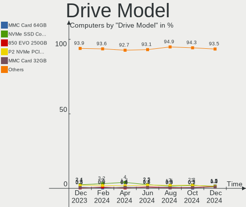
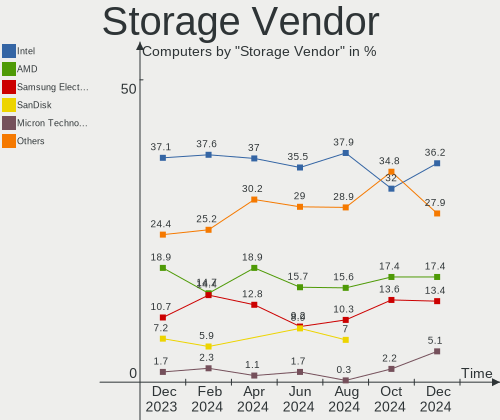
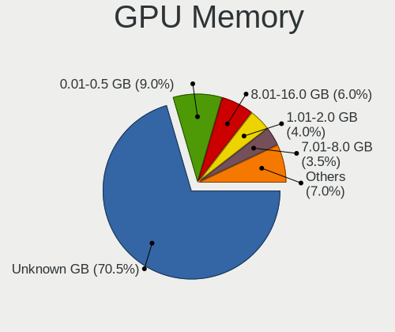
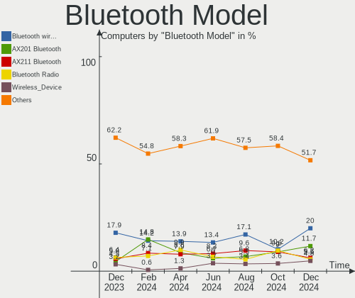

Linux in UK - Hardware Trends
-----------------------------

A project to identify most popular hardware characteristics and track their change
over time based on data collected by Linux users at https://Linux-Hardware.org.

Anyone can contribute to this report by the [hw-probe](https://github.com/linuxhw/hw-probe) tool:

    sudo -E hw-probe -all -upload

This is a report for all computer types. See also reports for [desktops](/Location/UK/Desktop/README.md) and [notebooks](/Location/UK/Notebook/README.md).

Period: Oct, 2022.

Contents
--------

* [ System ](#system)
  - [ OS                       ](#os)
  - [ OS Family                ](#os-family)
  - [ Kernel                   ](#kernel)
  - [ Kernel Family            ](#kernel-family)
  - [ Kernel Major Ver.        ](#kernel-major-ver)
  - [ Arch                     ](#arch)
  - [ DE                       ](#de)
  - [ Display Server           ](#display-server)
  - [ Display Manager          ](#display-manager)
  - [ OS Lang                  ](#os-lang)
  - [ Boot Mode                ](#boot-mode)
  - [ Filesystem               ](#filesystem)
  - [ Part. scheme             ](#part-scheme)
  - [ Dual Boot with Linux/BSD ](#dual-boot-with-linuxbsd)
  - [ Dual Boot (Win)          ](#dual-boot-win)

* [ Board ](#board)
  - [ Vendor                   ](#vendor)
  - [ Model                    ](#model)
  - [ Model Family             ](#model-family)
  - [ MFG Year                 ](#mfg-year)
  - [ Form Factor              ](#form-factor)
  - [ Secure Boot              ](#secure-boot)
  - [ Coreboot                 ](#coreboot)
  - [ RAM Size                 ](#ram-size)
  - [ RAM Used                 ](#ram-used)
  - [ Total Drives             ](#total-drives)
  - [ Has CD-ROM               ](#has-cd-rom)
  - [ Has Ethernet             ](#has-ethernet)
  - [ Has WiFi                 ](#has-wifi)
  - [ Has Bluetooth            ](#has-bluetooth)

* [ Location ](#location)
  - [ Country                  ](#country)
  - [ City                     ](#city)

* [ Drives ](#drives)
  - [ Drive Vendor             ](#drive-vendor)
  - [ Drive Model              ](#drive-model)
  - [ HDD Vendor               ](#hdd-vendor)
  - [ SSD Vendor               ](#ssd-vendor)
  - [ Drive Kind               ](#drive-kind)
  - [ Drive Connector          ](#drive-connector)
  - [ Drive Size               ](#drive-size)
  - [ Space Total              ](#space-total)
  - [ Space Used               ](#space-used)
  - [ Malfunc. Drives          ](#malfunc-drives)
  - [ Malfunc. Drive Vendor    ](#malfunc-drive-vendor)
  - [ Malfunc. HDD Vendor      ](#malfunc-hdd-vendor)
  - [ Malfunc. Drive Kind      ](#malfunc-drive-kind)
  - [ Failed Drives            ](#failed-drives)
  - [ Failed Drive Vendor      ](#failed-drive-vendor)
  - [ Drive Status             ](#drive-status)

* [ Storage controller ](#storage-controller)
  - [ Storage Vendor           ](#storage-vendor)
  - [ Storage Model            ](#storage-model)
  - [ Storage Kind             ](#storage-kind)

* [ Processor ](#processor)
  - [ CPU Vendor               ](#cpu-vendor)
  - [ CPU Model                ](#cpu-model)
  - [ CPU Model Family         ](#cpu-model-family)
  - [ CPU Cores                ](#cpu-cores)
  - [ CPU Sockets              ](#cpu-sockets)
  - [ CPU Threads              ](#cpu-threads)
  - [ CPU Op-Modes             ](#cpu-op-modes)
  - [ CPU Microcode            ](#cpu-microcode)
  - [ CPU Microarch            ](#cpu-microarch)

* [ Graphics ](#graphics)
  - [ GPU Vendor               ](#gpu-vendor)
  - [ GPU Model                ](#gpu-model)
  - [ GPU Combo                ](#gpu-combo)
  - [ GPU Driver               ](#gpu-driver)
  - [ GPU Memory               ](#gpu-memory)

* [ Monitor ](#monitor)
  - [ Monitor Vendor           ](#monitor-vendor)
  - [ Monitor Model            ](#monitor-model)
  - [ Monitor Resolution       ](#monitor-resolution)
  - [ Monitor Diagonal         ](#monitor-diagonal)
  - [ Monitor Width            ](#monitor-width)
  - [ Aspect Ratio             ](#aspect-ratio)
  - [ Monitor Area             ](#monitor-area)
  - [ Pixel Density            ](#pixel-density)
  - [ Multiple Monitors        ](#multiple-monitors)

* [ Network ](#network)
  - [ Net Controller Vendor    ](#net-controller-vendor)
  - [ Net Controller Model     ](#net-controller-model)
  - [ Wireless Vendor          ](#wireless-vendor)
  - [ Wireless Model           ](#wireless-model)
  - [ Ethernet Vendor          ](#ethernet-vendor)
  - [ Ethernet Model           ](#ethernet-model)
  - [ Net Controller Kind      ](#net-controller-kind)
  - [ Used Controller          ](#used-controller)
  - [ NICs                     ](#nics)
  - [ IPv6                     ](#ipv6)

* [ Bluetooth ](#bluetooth)
  - [ Bluetooth Vendor         ](#bluetooth-vendor)
  - [ Bluetooth Model          ](#bluetooth-model)

* [ Sound ](#sound)
  - [ Sound Vendor             ](#sound-vendor)
  - [ Sound Model              ](#sound-model)

* [ Memory ](#memory)
  - [ Memory Vendor            ](#memory-vendor)
  - [ Memory Model             ](#memory-model)
  - [ Memory Kind              ](#memory-kind)
  - [ Memory Form Factor       ](#memory-form-factor)
  - [ Memory Size              ](#memory-size)
  - [ Memory Speed             ](#memory-speed)

* [ Printers & scanners ](#printers--scanners)
  - [ Printer Vendor           ](#printer-vendor)
  - [ Printer Model            ](#printer-model)
  - [ Scanner Vendor           ](#scanner-vendor)
  - [ Scanner Model            ](#scanner-model)

* [ Camera ](#camera)
  - [ Camera Vendor            ](#camera-vendor)
  - [ Camera Model             ](#camera-model)

* [ Security ](#security)
  - [ Fingerprint Vendor       ](#fingerprint-vendor)
  - [ Fingerprint Model        ](#fingerprint-model)
  - [ Chipcard Vendor          ](#chipcard-vendor)
  - [ Chipcard Model           ](#chipcard-model)

* [ Unsupported ](#unsupported)
  - [ Unsupported Devices      ](#unsupported-devices)
  - [ Unsupported Device Types ](#unsupported-device-types)

System
------

OS
--

Installed operating systems

| Name               | Computers | Percent |
|--------------------|-----------|---------|
| Ubuntu 22.04       | 36        | 20.93%  |
| Pop!_OS 22.04      | 13        | 7.56%   |
| Zorin 16           | 11        | 6.4%    |
| SteamOS 3.3.2      | 10        | 5.81%   |
| Linux Mint 21      | 9         | 5.23%   |
| Fedora 36          | 7         | 4.07%   |
| Ubuntu 20.04       | 6         | 3.49%   |
| OpenMandriva 4.50  | 6         | 3.49%   |
| Linux Mint 20.3    | 6         | 3.49%   |
| Arch Rolling       | 6         | 3.49%   |
| OpenMandriva 4.3   | 5         | 2.91%   |
| Debian 11          | 5         | 2.91%   |
| Ubuntu 22.10       | 4         | 2.33%   |
| Xubuntu 22.04      | 3         | 1.74%   |
| Ubuntu 18.04       | 3         | 1.74%   |
| SteamOS 3.3.1      | 3         | 1.74%   |
| Zorin 15           | 2         | 1.16%   |
| Xubuntu 20.04      | 2         | 1.16%   |
| SteamOS 3.3        | 2         | 1.16%   |
| Manjaro 22.0.0     | 2         | 1.16%   |
| Manjaro            | 2         | 1.16%   |
| KDE neon 20.04     | 2         | 1.16%   |
| Kali 2022.3        | 2         | 1.16%   |
| Fedora 37          | 2         | 1.16%   |
| Elementary 6.1     | 2         | 1.16%   |
| Xero Rolling       | 1         | 0.58%   |
| UbuntuDDE 22.04    | 1         | 0.58%   |
| Ubuntu Unity 22.10 | 1         | 0.58%   |
| Ubuntu Unity 18.04 | 1         | 0.58%   |
| Ubuntu Unity 16.04 | 1         | 0.58%   |
| Ubuntu MATE 22.04  | 1         | 0.58%   |
| SteamOS 3.2        | 1         | 0.58%   |
| Raspbian 11        | 1         | 0.58%   |
| Puppy 9            | 1         | 0.58%   |
| MX 19              | 1         | 0.58%   |
| Lubuntu 22.04      | 1         | 0.58%   |
| Linux Mint 19.1    | 1         | 0.58%   |
| Kubuntu 22.04      | 1         | 0.58%   |
| KDE neon 22.04     | 1         | 0.58%   |
| Gentoo 2.9         | 1         | 0.58%   |

OS Family
---------

OS without a version

| Name         | Computers | Percent |
|--------------|-----------|---------|
| Ubuntu       | 49        | 28.49%  |
| SteamOS      | 16        | 9.3%    |
| Linux Mint   | 16        | 9.3%    |
| Zorin        | 13        | 7.56%   |
| Pop!_OS      | 13        | 7.56%   |
| OpenMandriva | 11        | 6.4%    |
| Fedora       | 10        | 5.81%   |
| Debian       | 6         | 3.49%   |
| Arch         | 6         | 3.49%   |
| Xubuntu      | 5         | 2.91%   |
| Manjaro      | 4         | 2.33%   |
| Ubuntu Unity | 3         | 1.74%   |
| KDE neon     | 3         | 1.74%   |
| Kali         | 2         | 1.16%   |
| Gentoo       | 2         | 1.16%   |
| Elementary   | 2         | 1.16%   |
| Xero         | 1         | 0.58%   |
| UbuntuDDE    | 1         | 0.58%   |
| Ubuntu MATE  | 1         | 0.58%   |
| Raspbian     | 1         | 0.58%   |
| Puppy        | 1         | 0.58%   |
| MX           | 1         | 0.58%   |
| Lubuntu      | 1         | 0.58%   |
| Kubuntu      | 1         | 0.58%   |
| EndeavourOS  | 1         | 0.58%   |
| ArcoLinux    | 1         | 0.58%   |
| antergos     | 1         | 0.58%   |

Kernel
------

Version of the Linux kernel

| Version                                           | Computers | Percent |
|---------------------------------------------------|-----------|---------|
| 5.15.0-52-generic                                 | 28        | 16.28%  |
| 5.15.0-48-generic                                 | 22        | 12.79%  |
| 5.15.0-50-generic                                 | 16        | 9.3%    |
| 5.13.0-valve21.3-1-neptune                        | 10        | 5.81%   |
| 5.19.0-76051900-generic                           | 7         | 4.07%   |
| 5.16.7-desktop-1omv4003                           | 5         | 2.91%   |
| 5.4.0-131-generic                                 | 4         | 2.33%   |
| 5.19.5-desktop-1omv4090                           | 3         | 1.74%   |
| 5.19.16-76051916-generic                          | 3         | 1.74%   |
| 5.19.16-200.fc36.x86_64                           | 3         | 1.74%   |
| 5.19.13-arch1-1                                   | 3         | 1.74%   |
| 5.13.0-valve21.1-1-neptune-02211-gc54cda5a36f3    | 3         | 1.74%   |
| 5.4.0-126-generic                                 | 2         | 1.16%   |
| 5.19.16-300.fc37.x86_64                           | 2         | 1.16%   |
| 5.19.12-desktop-2omv4090                          | 2         | 1.16%   |
| 5.19.0-23-generic                                 | 2         | 1.16%   |
| 5.15.74-1-lts                                     | 2         | 1.16%   |
| 5.15.61-v8+                                       | 2         | 1.16%   |
| 5.15.0-46-generic                                 | 2         | 1.16%   |
| 5.15.0-43-generic                                 | 2         | 1.16%   |
| 4.15.0-194-generic                                | 2         | 1.16%   |
| 4.15.0-193-generic                                | 2         | 1.16%   |
| 6.1.0-0.rc0.20221011git60bb8154d1d7.8.fc38.x86_64 | 1         | 0.58%   |
| 6.0.5-060005-generic                              | 1         | 0.58%   |
| 6.0.2-arch1-1                                     | 1         | 0.58%   |
| 6.0.2-76060002-generic                            | 1         | 0.58%   |
| 6.0.2                                             | 1         | 0.58%   |
| 6.0.1-tkg-bore-llvm                               | 1         | 0.58%   |
| 6.0.1-arch1-1                                     | 1         | 0.58%   |
| 6.0.0-1-MANJARO                                   | 1         | 0.58%   |
| 5.7.0-0.bpo.2-amd64                               | 1         | 0.58%   |
| 5.4.53                                            | 1         | 0.58%   |
| 5.4.0-47-generic                                  | 1         | 0.58%   |
| 5.4.0-128-generic                                 | 1         | 0.58%   |
| 5.4.0-125-generic                                 | 1         | 0.58%   |
| 5.19.9-zen1-1-zen                                 | 1         | 0.58%   |
| 5.19.9-x86_64                                     | 1         | 0.58%   |
| 5.19.15-201.fc36.x86_64                           | 1         | 0.58%   |
| 5.19.14-200.fc36.x86_64                           | 1         | 0.58%   |
| 5.19.13-zen1-1-zen                                | 1         | 0.58%   |

Kernel Family
-------------

Linux kernel without a distro release

| Version | Computers | Percent |
|---------|-----------|---------|
| 5.15.0  | 72        | 41.86%  |
| 5.13.0  | 16        | 9.3%    |
| 5.19.0  | 11        | 6.4%    |
| 5.4.0   | 9         | 5.23%   |
| 5.19.16 | 8         | 4.65%   |
| 5.19.13 | 5         | 2.91%   |
| 5.16.7  | 5         | 2.91%   |
| 4.15.0  | 5         | 2.91%   |
| 6.0.2   | 3         | 1.74%   |
| 5.19.5  | 3         | 1.74%   |
| 5.19.12 | 3         | 1.74%   |
| 5.15.74 | 3         | 1.74%   |
| 5.15.61 | 3         | 1.74%   |
| 6.0.1   | 2         | 1.16%   |
| 5.19.9  | 2         | 1.16%   |
| 5.18.0  | 2         | 1.16%   |
| 5.10.0  | 2         | 1.16%   |
| 6.1.0   | 1         | 0.58%   |
| 6.0.5   | 1         | 0.58%   |
| 6.0.0   | 1         | 0.58%   |
| 5.7.0   | 1         | 0.58%   |
| 5.4.53  | 1         | 0.58%   |
| 5.19.15 | 1         | 0.58%   |
| 5.19.14 | 1         | 0.58%   |
| 5.19.11 | 1         | 0.58%   |
| 5.18.1  | 1         | 0.58%   |
| 5.17.9  | 1         | 0.58%   |
| 5.17.5  | 1         | 0.58%   |
| 5.17.15 | 1         | 0.58%   |
| 5.17.1  | 1         | 0.58%   |
| 5.16.9  | 1         | 0.58%   |
| 5.16.19 | 1         | 0.58%   |
| 5.15.72 | 1         | 0.58%   |
| 5.15.65 | 1         | 0.58%   |
| 4.19.0  | 1         | 0.58%   |

Kernel Major Ver.
-----------------

Linux kernel major version

| Version | Computers | Percent |
|---------|-----------|---------|
| 5.15    | 80        | 46.51%  |
| 5.19    | 35        | 20.35%  |
| 5.13    | 16        | 9.3%    |
| 5.4     | 10        | 5.81%   |
| 6.0     | 7         | 4.07%   |
| 5.16    | 7         | 4.07%   |
| 4.15    | 5         | 2.91%   |
| 5.17    | 4         | 2.33%   |
| 5.18    | 3         | 1.74%   |
| 5.10    | 2         | 1.16%   |
| 6.1     | 1         | 0.58%   |
| 5.7     | 1         | 0.58%   |
| 4.19    | 1         | 0.58%   |

Arch
----

OS architecture (x86_64, i586, etc.)

| Name    | Computers | Percent |
|---------|-----------|---------|
| x86_64  | 166       | 96.51%  |
| i686    | 3         | 1.74%   |
| aarch64 | 2         | 1.16%   |
| armv7l  | 1         | 0.58%   |

DE
--

Desktop Environment

| Name             | Computers | Percent |
|------------------|-----------|---------|
| GNOME            | 78        | 45.35%  |
| KDE5             | 41        | 23.84%  |
| XFCE             | 13        | 7.56%   |
| X-Cinnamon       | 13        | 7.56%   |
| Unknown          | 6         | 3.49%   |
| MATE             | 5         | 2.91%   |
| Unity            | 3         | 1.74%   |
| Pantheon         | 2         | 1.16%   |
| Openbox          | 2         | 1.16%   |
| awesome          | 2         | 1.16%   |
| sway             | 1         | 0.58%   |
| qtile            | 1         | 0.58%   |
| LXQt             | 1         | 0.58%   |
| LXDE             | 1         | 0.58%   |
| lightdm-xsession | 1         | 0.58%   |
| Hyprland         | 1         | 0.58%   |
| Deepin           | 1         | 0.58%   |

Display Server
--------------

X11 or Wayland

| Name    | Computers | Percent |
|---------|-----------|---------|
| X11     | 131       | 76.16%  |
| Wayland | 35        | 20.35%  |
| Tty     | 3         | 1.74%   |
| Unknown | 3         | 1.74%   |

Display Manager
---------------

SDDM, LightDM, etc.

| Name    | Computers | Percent |
|---------|-----------|---------|
| Unknown | 66        | 38.37%  |
| GDM3    | 46        | 26.74%  |
| LightDM | 30        | 17.44%  |
| SDDM    | 21        | 12.21%  |
| GDM     | 6         | 3.49%   |
| Ly      | 2         | 1.16%   |
| GREETD  | 1         | 0.58%   |

OS Lang
-------

Language

| Lang    | Computers | Percent |
|---------|-----------|---------|
| en_GB   | 139       | 80.81%  |
| en_US   | 27        | 15.7%   |
| pl_PL   | 2         | 1.16%   |
| it_IT   | 1         | 0.58%   |
| en_IE   | 1         | 0.58%   |
| C       | 1         | 0.58%   |
| Unknown | 1         | 0.58%   |

Boot Mode
---------

EFI or BIOS

| Mode | Computers | Percent |
|------|-----------|---------|
| BIOS | 108       | 62.79%  |
| EFI  | 64        | 37.21%  |

Filesystem
----------

Type of filesystem

| Type    | Computers | Percent |
|---------|-----------|---------|
| Ext4    | 126       | 73.26%  |
| Btrfs   | 31        | 18.02%  |
| Overlay | 9         | 5.23%   |
| Zfs     | 2         | 1.16%   |
| Xfs     | 2         | 1.16%   |
| Aufs    | 1         | 0.58%   |
| Unknown | 1         | 0.58%   |

Part. scheme
------------

Scheme of partitioning

| Type    | Computers | Percent |
|---------|-----------|---------|
| GPT     | 81        | 47.09%  |
| Unknown | 65        | 37.79%  |
| MBR     | 26        | 15.12%  |

Dual Boot with Linux/BSD
------------------------

Hosting more than one Linux/BSD

| Dual boot | Computers | Percent |
|-----------|-----------|---------|
| No        | 155       | 90.12%  |
| Yes       | 17        | 9.88%   |

Dual Boot (Win)
---------------

Hosting Linux and Windows

| Dual boot | Computers | Percent |
|-----------|-----------|---------|
| No        | 139       | 80.81%  |
| Yes       | 33        | 19.19%  |

Board
-----

Vendor
------

Motherboard manufacturer

| Name                    | Computers | Percent |
|-------------------------|-----------|---------|
| ASUSTek Computer        | 23        | 13.37%  |
| Lenovo                  | 22        | 12.79%  |
| Dell                    | 22        | 12.79%  |
| Gigabyte Technology     | 17        | 9.88%   |
| Valve                   | 15        | 8.72%   |
| Hewlett-Packard         | 15        | 8.72%   |
| Acer                    | 12        | 6.98%   |
| MSI                     | 9         | 5.23%   |
| Apple                   | 6         | 3.49%   |
| ASRock                  | 4         | 2.33%   |
| Toshiba                 | 3         | 1.74%   |
| Raspberry Pi Foundation | 3         | 1.74%   |
| GEO                     | 3         | 1.74%   |
| Samsung Electronics     | 2         | 1.16%   |
| Packard Bell            | 2         | 1.16%   |
| Microsoft               | 2         | 1.16%   |
| Fanless Mini PC         | 2         | 1.16%   |
| TUXEDO                  | 1         | 0.58%   |
| Tactus                  | 1         | 0.58%   |
| Sony                    | 1         | 0.58%   |
| Razer x Lambda          | 1         | 0.58%   |
| Novatech                | 1         | 0.58%   |
| Inventec                | 1         | 0.58%   |
| Fujitsu                 | 1         | 0.58%   |
| eMachines               | 1         | 0.58%   |
| AMI                     | 1         | 0.58%   |
| Alienware               | 1         | 0.58%   |

Model
-----

Motherboard model

| Name                                  | Computers | Percent |
|---------------------------------------|-----------|---------|
| Valve Jupiter                         | 15        | 8.72%   |
| Toshiba Satellite C660                | 2         | 1.16%   |
| MSI MS-7B89                           | 2         | 1.16%   |
| Dell OptiPlex 7020                    | 2         | 1.16%   |
| Dell OptiPlex 380                     | 2         | 1.16%   |
| ASUS ZenBook UX325EA_UX325EA          | 2         | 1.16%   |
| ASUS All Series                       | 2         | 1.16%   |
| TUXEDO InfinityBook S 15 Gen6         | 1         | 0.58%   |
| Toshiba Satellite C50D-A-133          | 1         | 0.58%   |
| Tactus GeoBook 110                    | 1         | 0.58%   |
| Sony VPCYB3V1E                        | 1         | 0.58%   |
| Samsung R519/R719                     | 1         | 0.58%   |
| Samsung 700T1C                        | 1         | 0.58%   |
| Razer x Lambda TensorBook (late 2021) | 1         | 0.58%   |
| RPi Raspberry Pi 400 Rev 1.0          | 1         | 0.58%   |
| RPi Raspberry Pi 4 Model B Rev 1.4    | 1         | 0.58%   |
| RPi Raspberry Pi 3 Model B Rev 1.2    | 1         | 0.58%   |
| Packard Bell EasyNote TM82            | 1         | 0.58%   |
| Packard Bell EasyNote TK85            | 1         | 0.58%   |
| Novatech NLx0MU                       | 1         | 0.58%   |
| MSI MS-AE3111                         | 1         | 0.58%   |
| MSI MS-7D09                           | 1         | 0.58%   |
| MSI MS-7C56                           | 1         | 0.58%   |
| MSI MS-7C51                           | 1         | 0.58%   |
| MSI MS-7B86                           | 1         | 0.58%   |
| MSI MS-7721                           | 1         | 0.58%   |
| MSI Modern 14 B10MW                   | 1         | 0.58%   |
| Microsoft Surface Pro 3               | 1         | 0.58%   |
| Microsoft Surface Book                | 1         | 0.58%   |
| Lenovo Z50-75 80EC                    | 1         | 0.58%   |
| Lenovo Yoga Slim 7 ProX 14ARH7 82TL   | 1         | 0.58%   |
| Lenovo Yoga 530-14ARR 81H9            | 1         | 0.58%   |
| Lenovo Yoga 3 14 80JH                 | 1         | 0.58%   |
| Lenovo V155-15API 81V5                | 1         | 0.58%   |
| Lenovo V15-IIL 82C5                   | 1         | 0.58%   |
| Lenovo V110-15AST 80TD                | 1         | 0.58%   |
| Lenovo ThinkPad Twist 20C41A3         | 1         | 0.58%   |
| Lenovo ThinkPad T520 4243PN7          | 1         | 0.58%   |
| Lenovo ThinkPad T480 20L6S82F0C       | 1         | 0.58%   |
| Lenovo ThinkPad T420 4236TL7          | 1         | 0.58%   |

Model Family
------------

Motherboard model prefix

| Name                      | Computers | Percent |
|---------------------------|-----------|---------|
| Valve Jupiter             | 15        | 8.72%   |
| Acer Aspire               | 9         | 5.23%   |
| Dell OptiPlex             | 6         | 3.49%   |
| Dell Inspiron             | 6         | 3.49%   |
| ASUS ROG                  | 6         | 3.49%   |
| Lenovo ThinkPad           | 5         | 2.91%   |
| Dell Latitude             | 4         | 2.33%   |
| ASUS PRIME                | 4         | 2.33%   |
| Toshiba Satellite         | 3         | 1.74%   |
| RPi Raspberry             | 3         | 1.74%   |
| Lenovo Yoga               | 3         | 1.74%   |
| Lenovo IdeaPad            | 3         | 1.74%   |
| HP Pavilion               | 3         | 1.74%   |
| Dell XPS                  | 3         | 1.74%   |
| Packard Bell EasyNote     | 2         | 1.16%   |
| MSI MS-7B89               | 2         | 1.16%   |
| Microsoft Surface         | 2         | 1.16%   |
| HP ProDesk                | 2         | 1.16%   |
| Gigabyte X570S            | 2         | 1.16%   |
| Gigabyte X570             | 2         | 1.16%   |
| Gigabyte B550             | 2         | 1.16%   |
| GEO GeoBook               | 2         | 1.16%   |
| Fanless Mini PC Quieter   | 2         | 1.16%   |
| Dell Precision            | 2         | 1.16%   |
| ASUS ZenBook              | 2         | 1.16%   |
| ASUS TUF                  | 2         | 1.16%   |
| ASUS M5A78L-M             | 2         | 1.16%   |
| ASUS All                  | 2         | 1.16%   |
| Acer Swift                | 2         | 1.16%   |
| TUXEDO InfinityBook       | 1         | 0.58%   |
| Tactus GeoBook            | 1         | 0.58%   |
| Sony VPCYB3V1E            | 1         | 0.58%   |
| Samsung R519              | 1         | 0.58%   |
| Samsung 700T1C            | 1         | 0.58%   |
| Razer x Lambda TensorBook | 1         | 0.58%   |
| Novatech NLx0MU           | 1         | 0.58%   |
| MSI MS-AE3111             | 1         | 0.58%   |
| MSI MS-7D09               | 1         | 0.58%   |
| MSI MS-7C56               | 1         | 0.58%   |
| MSI MS-7C51               | 1         | 0.58%   |

MFG Year
--------

Motherboard manufacture year

| Year    | Computers | Percent |
|---------|-----------|---------|
| 2022    | 26        | 15.12%  |
| 2013    | 18        | 10.47%  |
| 2021    | 17        | 9.88%   |
| 2020    | 15        | 8.72%   |
| 2018    | 14        | 8.14%   |
| 2017    | 11        | 6.4%    |
| 2016    | 11        | 6.4%    |
| 2011    | 11        | 6.4%    |
| 2010    | 10        | 5.81%   |
| 2019    | 7         | 4.07%   |
| 2015    | 7         | 4.07%   |
| 2012    | 6         | 3.49%   |
| 2009    | 6         | 3.49%   |
| 2014    | 5         | 2.91%   |
| 2008    | 5         | 2.91%   |
| 2007    | 1         | 0.58%   |
| 2006    | 1         | 0.58%   |
| Unknown | 1         | 0.58%   |

Form Factor
-----------

Physical design of the computer

| Name           | Computers | Percent |
|----------------|-----------|---------|
| Notebook       | 86        | 50%     |
| Desktop        | 64        | 37.21%  |
| Mini pc        | 6         | 3.49%   |
| Tablet         | 4         | 2.33%   |
| All in one     | 4         | 2.33%   |
| System on chip | 3         | 1.74%   |
| Convertible    | 3         | 1.74%   |
| Other          | 1         | 0.58%   |
| Server         | 1         | 0.58%   |

Secure Boot
-----------

Enabled or disabled

| State    | Computers | Percent |
|----------|-----------|---------|
| Disabled | 164       | 95.35%  |
| Enabled  | 8         | 4.65%   |

Coreboot
--------

Have coreboot on board

| Used | Computers | Percent |
|------|-----------|---------|
| No   | 170       | 98.84%  |
| Yes  | 2         | 1.16%   |

RAM Size
--------

Total RAM memory

| Size in GB  | Computers | Percent |
|-------------|-----------|---------|
| 4.01-8.0    | 36        | 20.93%  |
| 8.01-16.0   | 36        | 20.93%  |
| 16.01-24.0  | 33        | 19.19%  |
| 3.01-4.0    | 32        | 18.6%   |
| 32.01-64.0  | 21        | 12.21%  |
| 64.01-256.0 | 6         | 3.49%   |
| 24.01-32.0  | 3         | 1.74%   |
| 2.01-3.0    | 2         | 1.16%   |
| 1.01-2.0    | 2         | 1.16%   |
| 0.51-1.0    | 1         | 0.58%   |

RAM Used
--------

Used RAM memory

| Used GB    | Computers | Percent |
|------------|-----------|---------|
| 1.01-2.0   | 54        | 31.4%   |
| 2.01-3.0   | 42        | 24.42%  |
| 4.01-8.0   | 31        | 18.02%  |
| 3.01-4.0   | 26        | 15.12%  |
| 8.01-16.0  | 8         | 4.65%   |
| 0.51-1.0   | 8         | 4.65%   |
| 0.01-0.5   | 2         | 1.16%   |
| 16.01-24.0 | 1         | 0.58%   |

Total Drives
------------

Number of drives on board

| Drives | Computers | Percent |
|--------|-----------|---------|
| 1      | 96        | 55.81%  |
| 2      | 45        | 26.16%  |
| 3      | 12        | 6.98%   |
| 4      | 8         | 4.65%   |
| 5      | 5         | 2.91%   |
| 6      | 4         | 2.33%   |
| 0      | 2         | 1.16%   |

Has CD-ROM
----------

Has CD-ROM on board

| Presented | Computers | Percent |
|-----------|-----------|---------|
| No        | 104       | 60.47%  |
| Yes       | 68        | 39.53%  |

Has Ethernet
------------

Has Ethernet on board

| Presented | Computers | Percent |
|-----------|-----------|---------|
| Yes       | 132       | 76.74%  |
| No        | 40        | 23.26%  |

Has WiFi
--------

Has WiFi module

| Presented | Computers | Percent |
|-----------|-----------|---------|
| Yes       | 138       | 80.23%  |
| No        | 34        | 19.77%  |

Has Bluetooth
-------------

Has Bluetooth module

| Presented | Computers | Percent |
|-----------|-----------|---------|
| Yes       | 110       | 63.95%  |
| No        | 62        | 36.05%  |

Location
--------

Country
-------

Geographic location (country)

| Country | Computers | Percent |
|---------|-----------|---------|
| UK      | 172       | 100%    |

City
----

Geographic location (city)

| City                 | Computers | Percent |
|----------------------|-----------|---------|
| London               | 9         | 5.23%   |
| Glasgow              | 6         | 3.49%   |
| Somerset             | 4         | 2.33%   |
| Norwich              | 4         | 2.33%   |
| Leeds                | 4         | 2.33%   |
| Sheffield            | 3         | 1.74%   |
| Reading              | 3         | 1.74%   |
| Manchester           | 3         | 1.74%   |
| Edinburgh            | 3         | 1.74%   |
| Derby                | 3         | 1.74%   |
| Birmingham           | 3         | 1.74%   |
| Barnsley             | 3         | 1.74%   |
| Rotherham            | 2         | 1.16%   |
| Redruth              | 2         | 1.16%   |
| Preston              | 2         | 1.16%   |
| Peterborough         | 2         | 1.16%   |
| Oxford               | 2         | 1.16%   |
| Northampton          | 2         | 1.16%   |
| Milton Keynes        | 2         | 1.16%   |
| Kirkcaldy            | 2         | 1.16%   |
| Kingston upon Thames | 2         | 1.16%   |
| Henfield             | 2         | 1.16%   |
| Grangemouth          | 2         | 1.16%   |
| Coventry             | 2         | 1.16%   |
| Cambridge            | 2         | 1.16%   |
| Burgess Hill         | 2         | 1.16%   |
| Bristol              | 2         | 1.16%   |
| Brighton             | 2         | 1.16%   |
| York                 | 1         | 0.58%   |
| Wymondham            | 1         | 0.58%   |
| Worksop              | 1         | 0.58%   |
| Wirral               | 1         | 0.58%   |
| Wigan                | 1         | 0.58%   |
| Weston-super-Mare    | 1         | 0.58%   |
| Watford              | 1         | 0.58%   |
| Wallsend             | 1         | 0.58%   |
| Totteridge           | 1         | 0.58%   |
| Tottenham            | 1         | 0.58%   |
| Tipton               | 1         | 0.58%   |
| Thornton Heath       | 1         | 0.58%   |

Drives
------

Drive Vendor
------------

Hard drive vendors

| Vendor                       | Computers | Drives | Percent |
|------------------------------|-----------|--------|---------|
| Samsung Electronics          | 42        | 56     | 16.09%  |
| Seagate                      | 38        | 43     | 14.56%  |
| WDC                          | 28        | 32     | 10.73%  |
| Unknown                      | 21        | 23     | 8.05%   |
| SanDisk                      | 17        | 18     | 6.51%   |
| Kingston                     | 11        | 13     | 4.21%   |
| Hitachi                      | 10        | 13     | 3.83%   |
| Crucial                      | 10        | 12     | 3.83%   |
| Toshiba                      | 9         | 9      | 3.45%   |
| Phison Electronics           | 9         | 9      | 3.45%   |
| Intel                        | 5         | 9      | 1.92%   |
| Apple                        | 5         | 5      | 1.92%   |
| Unknown                      | 5         | 6      | 1.92%   |
| SK hynix                     | 4         | 4      | 1.53%   |
| LITEON                       | 4         | 4      | 1.53%   |
| Phison                       | 3         | 5      | 1.15%   |
| Micron/Crucial Technology    | 3         | 3      | 1.15%   |
| KIOXIA                       | 3         | 3      | 1.15%   |
| Kingston Technology Company  | 3         | 3      | 1.15%   |
| Fujitsu                      | 3         | 3      | 1.15%   |
| Silicon Motion               | 2         | 2      | 0.77%   |
| PNY                          | 2         | 2      | 0.77%   |
| O2 Micro                     | 2         | 2      | 0.77%   |
| Micron Technology            | 2         | 2      | 0.77%   |
| Drevo                        | 2         | 2      | 0.77%   |
| China                        | 2         | 2      | 0.77%   |
| USB3.0                       | 1         | 1      | 0.38%   |
| TCSUNBOW                     | 1         | 1      | 0.38%   |
| SPCC                         | 1         | 1      | 0.38%   |
| Shenzhen Longsys Electronics | 1         | 1      | 0.38%   |
| Patriot                      | 1         | 1      | 0.38%   |
| Netac                        | 1         | 1      | 0.38%   |
| Lexar                        | 1         | 1      | 0.38%   |
| Lenovo                       | 1         | 1      | 0.38%   |
| KINGSTONG                    | 1         | 1      | 0.38%   |
| JMicron Technology           | 1         | 1      | 0.38%   |
| Integral                     | 1         | 1      | 0.38%   |
| HGST                         | 1         | 1      | 0.38%   |
| Hewlett-Packard              | 1         | 1      | 0.38%   |
| Gigabyte Technology          | 1         | 1      | 0.38%   |

Drive Model
-----------

Hard drive models

| Model                                                 | Computers | Percent |
|-------------------------------------------------------|-----------|---------|
| Samsung NVMe SSD Controller SM981/PM981/PM983 500GB   | 6         | 2.08%   |
| Phison PS5013 E13 NVMe Controller 256GB               | 6         | 2.08%   |
| Samsung SSD 850 EVO 500GB                             | 5         | 1.73%   |
| Samsung NVMe SSD Controller PM9A1/PM9A3/980PRO 250GB  | 5         | 1.73%   |
| Unknown                                               | 5         | 1.73%   |
| Unknown MMC Card  512GB                               | 4         | 1.38%   |
| Kingston SA400S37240G 240GB SSD                       | 4         | 1.38%   |
| Samsung SSD 860 EVO 500GB                             | 3         | 1.04%   |
| Kingston Company OM3PDP3 NVMe SSD 512GB               | 3         | 1.04%   |
| WDC WD5000AAKX-75U6AA0 500GB                          | 2         | 0.69%   |
| WDC WD40EZRZ-00WN9B0 4TB                              | 2         | 0.69%   |
| Unknown SN128  128GB                                  | 2         | 0.69%   |
| Unknown SD/MMC/MS PRO 1TB                             | 2         | 0.69%   |
| Unknown MMC Card  256GB                               | 2         | 0.69%   |
| Unknown MMC Card  16GB                                | 2         | 0.69%   |
| Unknown MMC Card  128GB                               | 2         | 0.69%   |
| Toshiba MQ01ABF050 500GB                              | 2         | 0.69%   |
| Silicon Motion SM2263EN/SM2263XT SSD Controller 256GB | 2         | 0.69%   |
| Seagate ST500LT012-1DG142 500GB                       | 2         | 0.69%   |
| Seagate ST500DM002-1BD142 500GB                       | 2         | 0.69%   |
| Seagate ST3500413AS 500GB                             | 2         | 0.69%   |
| Seagate ST3500312CS 500GB                             | 2         | 0.69%   |
| Seagate ST2000DM006-2DM164 2TB                        | 2         | 0.69%   |
| Seagate ST1000LM024 HN-M101MBB 1TB                    | 2         | 0.69%   |
| Seagate ST1000DM003-9YN162 1TB                        | 2         | 0.69%   |
| Sandisk PC SN520 NVMe SSD 128GB                       | 2         | 0.69%   |
| SanDisk NVMe SSD Drive 1TB                            | 2         | 0.69%   |
| Samsung SSD 970 EVO Plus 500GB                        | 2         | 0.69%   |
| Samsung SSD 870 EVO 250GB                             | 2         | 0.69%   |
| Samsung SSD 850 EVO 250GB                             | 2         | 0.69%   |
| Phison E16 PCIe4 NVMe Controller 1TB                  | 2         | 0.69%   |
| O2 Micro E2M2 64GB                                    | 2         | 0.69%   |
| Micron/Crucial P2 NVMe PCIe SSD 500GB                 | 2         | 0.69%   |
| Kingston SV300S37A240G 240GB SSD                      | 2         | 0.69%   |
| Kingston SA400S37960G 960GB SSD                       | 2         | 0.69%   |
| Kingston SA400S37480G 480GB SSD                       | 2         | 0.69%   |
| Intel HBRPEKNX0202AO 32GB                             | 2         | 0.69%   |
| Intel HBRPEKNX0202A 512GB                             | 2         | 0.69%   |
| Crucial CT480BX500SSD1 480GB                          | 2         | 0.69%   |
| WDC WDS250G2B0C-00PXH0 250GB                          | 1         | 0.35%   |

HDD Vendor
----------

Hard disk drive vendors

| Vendor              | Computers | Drives | Percent |
|---------------------|-----------|--------|---------|
| Seagate             | 37        | 41     | 39.36%  |
| WDC                 | 26        | 30     | 27.66%  |
| Hitachi             | 10        | 13     | 10.64%  |
| Toshiba             | 7         | 7      | 7.45%   |
| Samsung Electronics | 5         | 5      | 5.32%   |
| Fujitsu             | 3         | 3      | 3.19%   |
| Unknown             | 2         | 2      | 2.13%   |
| USB3.0              | 1         | 1      | 1.06%   |
| HGST                | 1         | 1      | 1.06%   |
| Hewlett-Packard     | 1         | 1      | 1.06%   |
| Apple               | 1         | 1      | 1.06%   |

SSD Vendor
----------

Solid state drive vendors

| Vendor              | Computers | Drives | Percent |
|---------------------|-----------|--------|---------|
| Samsung Electronics | 25        | 31     | 32.47%  |
| Kingston            | 11        | 13     | 14.29%  |
| Crucial             | 9         | 11     | 11.69%  |
| SanDisk             | 4         | 4      | 5.19%   |
| LITEON              | 4         | 4      | 5.19%   |
| PNY                 | 2         | 2      | 2.6%    |
| Drevo               | 2         | 2      | 2.6%    |
| China               | 2         | 2      | 2.6%    |
| Apple               | 2         | 2      | 2.6%    |
| WDC                 | 1         | 1      | 1.3%    |
| Unknown             | 1         | 1      | 1.3%    |
| TCSUNBOW            | 1         | 1      | 1.3%    |
| SPCC                | 1         | 1      | 1.3%    |
| SK hynix            | 1         | 1      | 1.3%    |
| Seagate             | 1         | 1      | 1.3%    |
| Patriot             | 1         | 1      | 1.3%    |
| Netac               | 1         | 1      | 1.3%    |
| Micron Technology   | 1         | 1      | 1.3%    |
| Lexar               | 1         | 1      | 1.3%    |
| KINGSTONG           | 1         | 1      | 1.3%    |
| Integral            | 1         | 1      | 1.3%    |
| Gigabyte Technology | 1         | 1      | 1.3%    |
| BAITITON            | 1         | 1      | 1.3%    |
| A-DATA Technology   | 1         | 1      | 1.3%    |
| Unknown             | 1         | 1      | 1.3%    |

Drive Kind
----------

HDD or SSD

| Kind    | Computers | Drives | Percent |
|---------|-----------|--------|---------|
| HDD     | 75        | 105    | 32.33%  |
| NVMe    | 71        | 87     | 30.6%   |
| SSD     | 66        | 87     | 28.45%  |
| MMC     | 19        | 21     | 8.19%   |
| Unknown | 1         | 1      | 0.43%   |

Drive Connector
---------------

SATA, SAS, NVMe, etc.

| Type | Computers | Drives | Percent |
|------|-----------|--------|---------|
| SATA | 113       | 182    | 53.81%  |
| NVMe | 70        | 86     | 33.33%  |
| MMC  | 19        | 21     | 9.05%   |
| SAS  | 8         | 12     | 3.81%   |

Drive Size
----------

Size of hard drive

| Size in TB | Computers | Drives | Percent |
|------------|-----------|--------|---------|
| 0.01-0.5   | 93        | 121    | 61.59%  |
| 0.51-1.0   | 36        | 45     | 23.84%  |
| 1.01-2.0   | 9         | 10     | 5.96%   |
| 3.01-4.0   | 7         | 7      | 4.64%   |
| 4.01-10.0  | 4         | 5      | 2.65%   |
| 2.01-3.0   | 1         | 2      | 0.66%   |
| 10.01-20.0 | 1         | 2      | 0.66%   |

Space Total
-----------

Amount of disk space available on the file system

| Size in GB     | Computers | Percent |
|----------------|-----------|---------|
| 101-250        | 42        | 24.42%  |
| 251-500        | 35        | 20.35%  |
| 501-1000       | 31        | 18.02%  |
| 1001-2000      | 16        | 9.3%    |
| 51-100         | 13        | 7.56%   |
| More than 3000 | 12        | 6.98%   |
| 1-20           | 11        | 6.4%    |
| 2001-3000      | 6         | 3.49%   |
| 21-50          | 4         | 2.33%   |
| Unknown        | 2         | 1.16%   |

Space Used
----------

Amount of used disk space

| Used GB        | Computers | Percent |
|----------------|-----------|---------|
| 1-20           | 55        | 31.98%  |
| 101-250        | 33        | 19.19%  |
| 21-50          | 28        | 16.28%  |
| 51-100         | 18        | 10.47%  |
| 251-500        | 10        | 5.81%   |
| 501-1000       | 10        | 5.81%   |
| 1001-2000      | 9         | 5.23%   |
| 2001-3000      | 5         | 2.91%   |
| More than 3000 | 2         | 1.16%   |
| Unknown        | 2         | 1.16%   |

Malfunc. Drives
---------------

Drive models with a malfunction

| Model                                            | Computers | Drives | Percent |
|--------------------------------------------------|-----------|--------|---------|
| WDC WD2500AAKS-00B3A0 250GB                      | 1         | 1      | 6.67%   |
| Seagate ST980811AS 80GB                          | 1         | 1      | 6.67%   |
| Seagate ST31000528AS 1TB                         | 1         | 1      | 6.67%   |
| Seagate ST2000DM006-2DM164 2TB                   | 1         | 1      | 6.67%   |
| Seagate ST12000NM0007-2A1101 12TB                | 1         | 1      | 6.67%   |
| Seagate ST1000LM024 HN-M101MBB 1TB               | 1         | 1      | 6.67%   |
| Samsung Electronics SSD 840 EVO 500GB            | 1         | 1      | 6.67%   |
| Samsung Electronics MZ7WD480HMHP-00003 480GB SSD | 1         | 1      | 6.67%   |
| LITEON LCH-256V2S-11 2.5 7mm 256GB SSD           | 1         | 1      | 6.67%   |
| LITEON IT LCS-256L9S-11 2.5 7mm 256GB SSD        | 1         | 1      | 6.67%   |
| Intel SSD 600P Series 256GB                      | 1         | 1      | 6.67%   |
| Hitachi HDS728080PLA380 82GB                     | 1         | 1      | 6.67%   |
| Hewlett-Packard MB1000GCWCV 1TB                  | 1         | 1      | 6.67%   |
| Drevo X1 Pro SSD 128GB                           | 1         | 1      | 6.67%   |
| BAITITON BT58SSD09S 240GB                        | 1         | 1      | 6.67%   |

Malfunc. Drive Vendor
---------------------

Vendors of faulty drives

| Vendor              | Computers | Drives | Percent |
|---------------------|-----------|--------|---------|
| Seagate             | 5         | 5      | 33.33%  |
| Samsung Electronics | 2         | 2      | 13.33%  |
| LITEON              | 2         | 2      | 13.33%  |
| WDC                 | 1         | 1      | 6.67%   |
| Intel               | 1         | 1      | 6.67%   |
| Hitachi             | 1         | 1      | 6.67%   |
| Hewlett-Packard     | 1         | 1      | 6.67%   |
| Drevo               | 1         | 1      | 6.67%   |
| BAITITON            | 1         | 1      | 6.67%   |

Malfunc. HDD Vendor
-------------------

Vendors of faulty HDD drives

| Vendor          | Computers | Drives | Percent |
|-----------------|-----------|--------|---------|
| Seagate         | 5         | 5      | 62.5%   |
| WDC             | 1         | 1      | 12.5%   |
| Hitachi         | 1         | 1      | 12.5%   |
| Hewlett-Packard | 1         | 1      | 12.5%   |

Malfunc. Drive Kind
-------------------

Kinds of faulty drives

| Kind | Computers | Drives | Percent |
|------|-----------|--------|---------|
| SSD  | 6         | 6      | 46.15%  |
| HDD  | 6         | 8      | 46.15%  |
| NVMe | 1         | 1      | 7.69%   |

Failed Drives
-------------

Failed drive models

Zero info for selected period =(

Failed Drive Vendor
-------------------

Failed drive vendors

Zero info for selected period =(

Drive Status
------------

Number of failed and malfunc. drives

| Status   | Computers | Drives | Percent |
|----------|-----------|--------|---------|
| Detected | 116       | 200    | 63.74%  |
| Works    | 55        | 86     | 30.22%  |
| Malfunc  | 11        | 15     | 6.04%   |

Storage controller
------------------

Storage Vendor
--------------

Storage controller vendors

| Vendor                         | Computers | Percent |
|--------------------------------|-----------|---------|
| Intel                          | 89        | 41.2%   |
| AMD                            | 46        | 21.3%   |
| Samsung Electronics            | 18        | 8.33%   |
| Sandisk                        | 14        | 6.48%   |
| Phison Electronics             | 12        | 5.56%   |
| Micron/Crucial Technology      | 4         | 1.85%   |
| Toshiba America Info Systems   | 3         | 1.39%   |
| SK hynix                       | 3         | 1.39%   |
| Nvidia                         | 3         | 1.39%   |
| Kingston Technology Company    | 3         | 1.39%   |
| JMicron Technology             | 3         | 1.39%   |
| Silicon Motion                 | 2         | 0.93%   |
| O2 Micro                       | 2         | 0.93%   |
| KIOXIA                         | 2         | 0.93%   |
| Apple                          | 2         | 0.93%   |
| VIA Technologies               | 1         | 0.46%   |
| Solid State Storage Technology | 1         | 0.46%   |
| Shenzhen Longsys Electronics   | 1         | 0.46%   |
| Seagate Technology             | 1         | 0.46%   |
| Micron Technology              | 1         | 0.46%   |
| Marvell Technology Group       | 1         | 0.46%   |
| LSI Logic / Symbios Logic      | 1         | 0.46%   |
| Lenovo                         | 1         | 0.46%   |
| ASMedia Technology             | 1         | 0.46%   |
| Adaptec                        | 1         | 0.46%   |

Storage Model
-------------

Storage controller models

| Model                                                                          | Computers | Percent |
|--------------------------------------------------------------------------------|-----------|---------|
| AMD FCH SATA Controller [AHCI mode]                                            | 30        | 11.76%  |
| Samsung NVMe SSD Controller SM981/PM981/PM983                                  | 8         | 3.14%   |
| Intel Volume Management Device NVMe RAID Controller                            | 8         | 3.14%   |
| Intel 8 Series/C220 Series Chipset Family 6-port SATA Controller 1 [AHCI mode] | 8         | 3.14%   |
| AMD 400 Series Chipset SATA Controller                                         | 7         | 2.75%   |
| Phison PS5013 E13 NVMe Controller                                              | 6         | 2.35%   |
| Intel 6 Series/C200 Series Chipset Family 6 port Desktop SATA AHCI Controller  | 6         | 2.35%   |
| SanDisk Non-Volatile memory controller                                         | 5         | 1.96%   |
| Samsung NVMe SSD Controller PM9A1/PM9A3/980PRO                                 | 5         | 1.96%   |
| Intel Celeron/Pentium Silver Processor SATA Controller                         | 5         | 1.96%   |
| Intel 8 Series SATA Controller 1 [AHCI mode]                                   | 5         | 1.96%   |
| Intel 7 Series Chipset Family 6-port SATA Controller [AHCI mode]               | 5         | 1.96%   |
| AMD SB7x0/SB8x0/SB9x0 SATA Controller [IDE mode]                               | 5         | 1.96%   |
| AMD 500 Series Chipset SATA Controller                                         | 5         | 1.96%   |
| Samsung NVMe SSD Controller 980                                                | 4         | 1.57%   |
| Intel 82801IBM/IEM (ICH9M/ICH9M-E) 4 port SATA Controller [AHCI mode]          | 4         | 1.57%   |
| Intel 82801 Mobile SATA Controller [RAID mode]                                 | 4         | 1.57%   |
| Intel 6 Series/C200 Series Chipset Family 6 port Mobile SATA AHCI Controller   | 4         | 1.57%   |
| AMD SB7x0/SB8x0/SB9x0 IDE Controller                                           | 4         | 1.57%   |
| SanDisk WD Blue SN570 NVMe SSD                                                 | 3         | 1.18%   |
| SanDisk WD Blue SN550 NVMe SSD                                                 | 3         | 1.18%   |
| Phison E16 PCIe4 NVMe Controller                                               | 3         | 1.18%   |
| Phison E12 NVMe Controller                                                     | 3         | 1.18%   |
| Kingston Company OM3PDP3 NVMe SSD                                              | 3         | 1.18%   |
| Intel Sunrise Point-LP SATA Controller [AHCI mode]                             | 3         | 1.18%   |
| Intel Non-Volatile memory controller                                           | 3         | 1.18%   |
| Intel 82801HM/HEM (ICH8M/ICH8M-E) IDE Controller                               | 3         | 1.18%   |
| Intel 82801G (ICH7 Family) IDE Controller                                      | 3         | 1.18%   |
| Intel 5 Series/3400 Series Chipset 4 port SATA AHCI Controller                 | 3         | 1.18%   |
| AMD FCH SATA Controller D                                                      | 3         | 1.18%   |
| AMD FCH IDE Controller                                                         | 3         | 1.18%   |
| Toshiba America Info Systems XG6 NVMe SSD Controller                           | 2         | 0.78%   |
| SK hynix Non-Volatile memory controller                                        | 2         | 0.78%   |
| Silicon Motion SM2263EN/SM2263XT SSD Controller                                | 2         | 0.78%   |
| SanDisk PC SN520 NVMe SSD                                                      | 2         | 0.78%   |
| Samsung Apple PCIe SSD                                                         | 2         | 0.78%   |
| O2 Micro Non-Volatile memory controller                                        | 2         | 0.78%   |
| Micron/Crucial P2 NVMe PCIe SSD                                                | 2         | 0.78%   |
| Micron/Crucial Non-Volatile memory controller                                  | 2         | 0.78%   |
| KIOXIA NVMe SSD Controller BG4                                                 | 2         | 0.78%   |

Storage Kind
------------

Kind of storage controller (IDE, SATA, NVMe, SAS, ...)

| Kind | Computers | Percent |
|------|-----------|---------|
| SATA | 118       | 52.21%  |
| NVMe | 70        | 30.97%  |
| IDE  | 20        | 8.85%   |
| RAID | 17        | 7.52%   |
| SAS  | 1         | 0.44%   |

Processor
---------

CPU Vendor
----------

Processor vendors

| Vendor | Computers | Percent |
|--------|-----------|---------|
| Intel  | 104       | 60.47%  |
| AMD    | 65        | 37.79%  |
| ARM    | 3         | 1.74%   |

CPU Model
---------

Processor models

| Model                                       | Computers | Percent |
|---------------------------------------------|-----------|---------|
| AMD Custom APU 0405                         | 15        | 8.72%   |
| Intel Celeron N4020 CPU @ 1.10GHz           | 4         | 2.33%   |
| Intel Core i7-2600 CPU @ 3.40GHz            | 3         | 1.74%   |
| Intel Celeron CPU N3060 @ 1.60GHz           | 3         | 1.74%   |
| Intel 11th Gen Core i7-11800H @ 2.30GHz     | 3         | 1.74%   |
| Intel 11th Gen Core i7-1165G7 @ 2.80GHz     | 3         | 1.74%   |
| AMD Ryzen 9 5900X 12-Core Processor         | 3         | 1.74%   |
| AMD FX-6100 Six-Core Processor              | 3         | 1.74%   |
| Intel Core i5-4590 CPU @ 3.30GHz            | 2         | 1.16%   |
| Intel Core i5-2520M CPU @ 2.50GHz           | 2         | 1.16%   |
| Intel Celeron N5105 @ 2.00GHz               | 2         | 1.16%   |
| Intel 12th Gen Core i7-1260P                | 2         | 1.16%   |
| Intel 11th Gen Core i5-1135G7 @ 2.40GHz     | 2         | 1.16%   |
| ARM Processor                               | 2         | 1.16%   |
| AMD Ryzen 9 3900X 12-Core Processor         | 2         | 1.16%   |
| AMD Ryzen 5 5600X 6-Core Processor          | 2         | 1.16%   |
| AMD Ryzen 5 3600 6-Core Processor           | 2         | 1.16%   |
| AMD Ryzen 5 2600X Six-Core Processor        | 2         | 1.16%   |
| Intel Xeon CPU X5690 @ 3.47GHz              | 1         | 0.58%   |
| Intel Xeon CPU X3430 @ 2.40GHz              | 1         | 0.58%   |
| Intel Xeon CPU E5-2603 v3 @ 1.60GHz         | 1         | 0.58%   |
| Intel Pentium Silver J5040 CPU @ 2.00GHz    | 1         | 0.58%   |
| Intel Pentium Dual-Core CPU T4300 @ 2.10GHz | 1         | 0.58%   |
| Intel Pentium Dual-Core CPU T4200 @ 2.00GHz | 1         | 0.58%   |
| Intel Pentium Dual CPU T3400 @ 2.16GHz      | 1         | 0.58%   |
| Intel Pentium CPU P6200 @ 2.13GHz           | 1         | 0.58%   |
| Intel Pentium CPU G2030 @ 3.00GHz           | 1         | 0.58%   |
| Intel Pentium 3558U @ 1.70GHz               | 1         | 0.58%   |
| Intel Core i7-9700F CPU @ 3.00GHz           | 1         | 0.58%   |
| Intel Core i7-8700B CPU @ 3.20GHz           | 1         | 0.58%   |
| Intel Core i7-8565U CPU @ 1.80GHz           | 1         | 0.58%   |
| Intel Core i7-7600U CPU @ 2.80GHz           | 1         | 0.58%   |
| Intel Core i7-6820HQ CPU @ 2.70GHz          | 1         | 0.58%   |
| Intel Core i7-5820K CPU @ 3.30GHz           | 1         | 0.58%   |
| Intel Core i7-5500U CPU @ 2.40GHz           | 1         | 0.58%   |
| Intel Core i7-4980HQ CPU @ 2.80GHz          | 1         | 0.58%   |
| Intel Core i7-4800MQ CPU @ 2.70GHz          | 1         | 0.58%   |
| Intel Core i7-4790K CPU @ 4.00GHz           | 1         | 0.58%   |
| Intel Core i7-4702MQ CPU @ 2.20GHz          | 1         | 0.58%   |
| Intel Core i7-4600U CPU @ 2.10GHz           | 1         | 0.58%   |

CPU Model Family
----------------

Processor model prefix

| Model                   | Computers | Percent |
|-------------------------|-----------|---------|
| Other                   | 32        | 18.6%   |
| Intel Core i5           | 29        | 16.86%  |
| Intel Core i7           | 24        | 13.95%  |
| Intel Celeron           | 13        | 7.56%   |
| AMD Ryzen 5             | 12        | 6.98%   |
| AMD Ryzen 9             | 7         | 4.07%   |
| AMD Ryzen 7             | 7         | 4.07%   |
| Intel Core i3           | 6         | 3.49%   |
| Intel Core 2 Duo        | 5         | 2.91%   |
| AMD A8                  | 4         | 2.33%   |
| Intel Xeon              | 3         | 1.74%   |
| Intel Pentium           | 3         | 1.74%   |
| AMD FX                  | 3         | 1.74%   |
| AMD A10                 | 3         | 1.74%   |
| Intel Pentium Dual-Core | 2         | 1.16%   |
| AMD Ryzen 3             | 2         | 1.16%   |
| AMD E1                  | 2         | 1.16%   |
| AMD E                   | 2         | 1.16%   |
| Intel Pentium Silver    | 1         | 0.58%   |
| Intel Pentium Dual      | 1         | 0.58%   |
| Intel Core 2 Quad       | 1         | 0.58%   |
| Intel Celeron M         | 1         | 0.58%   |
| Intel Atom              | 1         | 0.58%   |
| ARM BCM                 | 1         | 0.58%   |
| AMD V120                | 1         | 0.58%   |
| AMD Sempron             | 1         | 0.58%   |
| AMD Phenom              | 1         | 0.58%   |
| AMD GX                  | 1         | 0.58%   |
| AMD Athlon X4           | 1         | 0.58%   |
| AMD Athlon II X2        | 1         | 0.58%   |
| AMD A6                  | 1         | 0.58%   |

CPU Cores
---------

Number of processor cores

| Number | Computers | Percent |
|--------|-----------|---------|
| 2      | 63        | 36.63%  |
| 4      | 60        | 34.88%  |
| 6      | 15        | 8.72%   |
| 8      | 13        | 7.56%   |
| 12     | 10        | 5.81%   |
| 3      | 4         | 2.33%   |
| 1      | 4         | 2.33%   |
| 16     | 2         | 1.16%   |
| 14     | 1         | 0.58%   |

CPU Sockets
-----------

Number of sockets

| Number | Computers | Percent |
|--------|-----------|---------|
| 1      | 170       | 98.84%  |
| 2      | 2         | 1.16%   |

CPU Threads
-----------

Threads per core (Hyper-Threading)

| Number | Computers | Percent |
|--------|-----------|---------|
| 2      | 112       | 65.12%  |
| 1      | 60        | 34.88%  |

CPU Op-Modes
------------

CPU Operation Modes (32-bit, 64-bit)

| Op mode        | Computers | Percent |
|----------------|-----------|---------|
| 32-bit, 64-bit | 170       | 98.84%  |
| 32-bit         | 1         | 0.58%   |
| Unknown        | 1         | 0.58%   |

CPU Microcode
-------------

Microcode number

| Number     | Computers | Percent |
|------------|-----------|---------|
| Unknown    | 75        | 43.6%   |
| 0x306c3    | 8         | 4.65%   |
| 0x206a7    | 7         | 4.07%   |
| 0x40651    | 4         | 2.33%   |
| 0x306a9    | 4         | 2.33%   |
| 0x20655    | 4         | 2.33%   |
| 0x08701021 | 4         | 2.33%   |
| 0x806ec    | 3         | 1.74%   |
| 0x806c1    | 3         | 1.74%   |
| 0x706e5    | 3         | 1.74%   |
| 0x1067a    | 3         | 1.74%   |
| 0x0a201016 | 3         | 1.74%   |
| 0x0800820d | 3         | 1.74%   |
| 0x906c0    | 2         | 1.16%   |
| 0x806d1    | 2         | 1.16%   |
| 0x706a8    | 2         | 1.16%   |
| 0x6fd      | 2         | 1.16%   |
| 0x406c4    | 2         | 1.16%   |
| 0x0700010f | 2         | 1.16%   |
| 0x06001119 | 2         | 1.16%   |
| 0x0600063e | 2         | 1.16%   |
| 0xa0671    | 1         | 0.58%   |
| 0xa0652    | 1         | 0.58%   |
| 0x906ed    | 1         | 0.58%   |
| 0x906ea    | 1         | 0.58%   |
| 0x906e9    | 1         | 0.58%   |
| 0x906a3    | 1         | 0.58%   |
| 0x806e9    | 1         | 0.58%   |
| 0x6fa      | 1         | 0.58%   |
| 0x6e8      | 1         | 0.58%   |
| 0x406e3    | 1         | 0.58%   |
| 0x40661    | 1         | 0.58%   |
| 0x306d4    | 1         | 0.58%   |
| 0x206c2    | 1         | 0.58%   |
| 0x10676    | 1         | 0.58%   |
| 0x0a50000c | 1         | 0.58%   |
| 0x0a404101 | 1         | 0.58%   |
| 0x0a201009 | 1         | 0.58%   |
| 0x08701013 | 1         | 0.58%   |
| 0x08600106 | 1         | 0.58%   |

CPU Microarch
-------------

Microarchitecture

| Name             | Computers | Percent |
|------------------|-----------|---------|
| Unknown          | 25        | 14.53%  |
| Haswell          | 18        | 10.47%  |
| KabyLake         | 12        | 6.98%   |
| SandyBridge      | 11        | 6.4%    |
| Zen 2            | 10        | 5.81%   |
| Zen 3            | 8         | 4.65%   |
| IvyBridge        | 8         | 4.65%   |
| Westmere         | 7         | 4.07%   |
| Penryn           | 7         | 4.07%   |
| Zen+             | 6         | 3.49%   |
| Goldmont plus    | 6         | 3.49%   |
| TigerLake        | 5         | 2.91%   |
| Icelake          | 5         | 2.91%   |
| Steamroller      | 4         | 2.33%   |
| Skylake          | 4         | 2.33%   |
| Silvermont       | 4         | 2.33%   |
| K10              | 4         | 2.33%   |
| Zen              | 3         | 1.74%   |
| Excavator        | 3         | 1.74%   |
| Core             | 3         | 1.74%   |
| Bulldozer        | 3         | 1.74%   |
| Tremont          | 2         | 1.16%   |
| Puma             | 2         | 1.16%   |
| Piledriver       | 2         | 1.16%   |
| Nehalem          | 2         | 1.16%   |
| Jaguar           | 2         | 1.16%   |
| Bobcat           | 2         | 1.16%   |
| P6               | 1         | 0.58%   |
| CometLake        | 1         | 0.58%   |
| Broadwell        | 1         | 0.58%   |
| Alderlake Hybrid | 1         | 0.58%   |

Graphics
--------

GPU Vendor
----------

Vendors of graphics cards

| Vendor                     | Computers | Percent |
|----------------------------|-----------|---------|
| Intel                      | 83        | 44.39%  |
| AMD                        | 53        | 28.34%  |
| Nvidia                     | 50        | 26.74%  |
| Matrox Electronics Systems | 1         | 0.53%   |

GPU Model
---------

Graphics card models

| Model                                                                                    | Computers | Percent |
|------------------------------------------------------------------------------------------|-----------|---------|
| AMD VanGogh [AMD Custom GPU 0405]                                                        | 15        | 7.81%   |
| Intel 2nd Generation Core Processor Family Integrated Graphics Controller                | 8         | 4.17%   |
| Intel Haswell-ULT Integrated Graphics Controller                                         | 6         | 3.13%   |
| Nvidia GK208B [GeForce GT 710]                                                           | 5         | 2.6%    |
| Intel Xeon E3-1200 v3/4th Gen Core Processor Integrated Graphics Controller              | 5         | 2.6%    |
| Intel TigerLake-LP GT2 [Iris Xe Graphics]                                                | 5         | 2.6%    |
| Intel GeminiLake [UHD Graphics 600]                                                      | 5         | 2.6%    |
| Intel Core Processor Integrated Graphics Controller                                      | 4         | 2.08%   |
| Intel Atom/Celeron/Pentium Processor x5-E8000/J3xxx/N3xxx Integrated Graphics Controller | 4         | 2.08%   |
| Intel 3rd Gen Core processor Graphics Controller                                         | 4         | 2.08%   |
| Intel TigerLake-H GT1 [UHD Graphics]                                                     | 3         | 1.56%   |
| Intel Mobile 4 Series Chipset Integrated Graphics Controller                             | 3         | 1.56%   |
| Intel HD Graphics 620                                                                    | 3         | 1.56%   |
| Intel Alder Lake-P Integrated Graphics Controller                                        | 3         | 1.56%   |
| Intel 4th Gen Core Processor Integrated Graphics Controller                              | 3         | 1.56%   |
| AMD Navi 21 [Radeon RX 6800/6800 XT / 6900 XT]                                           | 3         | 1.56%   |
| AMD Ellesmere [Radeon RX 470/480/570/570X/580/580X/590]                                  | 3         | 1.56%   |
| Nvidia GP104 [GeForce GTX 1080]                                                          | 2         | 1.04%   |
| Nvidia GM206 [GeForce GTX 960]                                                           | 2         | 1.04%   |
| Nvidia GK107 [NVS 510]                                                                   | 2         | 1.04%   |
| Nvidia GA106M [GeForce RTX 3060 Mobile / Max-Q]                                          | 2         | 1.04%   |
| Nvidia GA102 [GeForce RTX 3080 Lite Hash Rate]                                           | 2         | 1.04%   |
| Intel Xeon E3-1200 v2/3rd Gen Core processor Graphics Controller                         | 2         | 1.04%   |
| Intel WhiskeyLake-U GT2 [UHD Graphics 620]                                               | 2         | 1.04%   |
| Intel Skylake GT2 [HD Graphics 520]                                                      | 2         | 1.04%   |
| Intel Mobile GM965/GL960 Integrated Graphics Controller (secondary)                      | 2         | 1.04%   |
| Intel Mobile GM965/GL960 Integrated Graphics Controller (primary)                        | 2         | 1.04%   |
| Intel JasperLake [UHD Graphics]                                                          | 2         | 1.04%   |
| Intel Iris Plus Graphics G7                                                              | 2         | 1.04%   |
| Intel CometLake-U GT2 [UHD Graphics]                                                     | 2         | 1.04%   |
| AMD RS780L [Radeon 3000]                                                                 | 2         | 1.04%   |
| AMD Navi 23 [Radeon RX 6600/6600 XT/6600M]                                               | 2         | 1.04%   |
| AMD Navi 10 [Radeon RX 5600 OEM/5600 XT / 5700/5700 XT]                                  | 2         | 1.04%   |
| AMD Kaveri [Radeon R7 Graphics]                                                          | 2         | 1.04%   |
| Nvidia TU116 [GeForce GTX 1660 Ti]                                                       | 1         | 0.52%   |
| Nvidia TU116 [GeForce GTX 1660 SUPER]                                                    | 1         | 0.52%   |
| Nvidia TU104 [GeForce RTX 2070 SUPER]                                                    | 1         | 0.52%   |
| Nvidia GT218 [GeForce 8400 GS Rev. 3]                                                    | 1         | 0.52%   |
| Nvidia GT218 [GeForce 210]                                                               | 1         | 0.52%   |
| Nvidia GP108M [GeForce MX250]                                                            | 1         | 0.52%   |

GPU Combo
---------

Combinations of graphics cards

| Name           | Computers | Percent |
|----------------|-----------|---------|
| 1 x Intel      | 68        | 39.53%  |
| 1 x AMD        | 48        | 27.91%  |
| 1 x Nvidia     | 36        | 20.93%  |
| Intel + Nvidia | 11        | 6.4%    |
| Other          | 3         | 1.74%   |
| AMD + Nvidia   | 3         | 1.74%   |
| Intel + AMD    | 2         | 1.16%   |
| 1 x Matrox     | 1         | 0.58%   |

GPU Driver
----------

Free vs proprietary

| Driver      | Computers | Percent |
|-------------|-----------|---------|
| Free        | 134       | 77.91%  |
| Proprietary | 32        | 18.6%   |
| Unknown     | 6         | 3.49%   |

GPU Memory
----------

Total video memory

| Size in GB | Computers | Percent |
|------------|-----------|---------|
| Unknown    | 117       | 68.02%  |
| 0.01-0.5   | 16        | 9.3%    |
| 1.01-2.0   | 15        | 8.72%   |
| 7.01-8.0   | 8         | 4.65%   |
| 0.51-1.0   | 7         | 4.07%   |
| 5.01-6.0   | 3         | 1.74%   |
| 3.01-4.0   | 3         | 1.74%   |
| 8.01-16.0  | 2         | 1.16%   |
| 2.01-3.0   | 1         | 0.58%   |

Monitor
-------

Monitor Vendor
--------------

Monitor vendors

| Vendor                  | Computers | Percent |
|-------------------------|-----------|---------|
| Samsung Electronics     | 24        | 12.31%  |
| AU Optronics            | 19        | 9.74%   |
| LG Display              | 16        | 8.21%   |
| Analogix                | 15        | 7.69%   |
| Dell                    | 13        | 6.67%   |
| Hewlett-Packard         | 11        | 5.64%   |
| BOE                     | 11        | 5.64%   |
| Acer                    | 11        | 5.64%   |
| BenQ                    | 9         | 4.62%   |
| Chimei Innolux          | 8         | 4.1%    |
| Goldstar                | 6         | 3.08%   |
| Iiyama                  | 5         | 2.56%   |
| AOC                     | 5         | 2.56%   |
| Sharp                   | 4         | 2.05%   |
| Ancor Communications    | 4         | 2.05%   |
| Panasonic               | 3         | 1.54%   |
| MSI                     | 3         | 1.54%   |
| ASUSTek Computer        | 3         | 1.54%   |
| Philips                 | 2         | 1.03%   |
| Gigabyte Technology     | 2         | 1.03%   |
| Apple                   | 2         | 1.03%   |
| ZTR                     | 1         | 0.51%   |
| ViewSonic               | 1         | 0.51%   |
| Vestel Elektronik       | 1         | 0.51%   |
| Vestel                  | 1         | 0.51%   |
| Unknown                 | 1         | 0.51%   |
| Toshiba                 | 1         | 0.51%   |
| Sony                    | 1         | 0.51%   |
| NEC Computers           | 1         | 0.51%   |
| MiTAC                   | 1         | 0.51%   |
| LG Electronics          | 1         | 0.51%   |
| Lenovo                  | 1         | 0.51%   |
| ITE                     | 1         | 0.51%   |
| HVR                     | 1         | 0.51%   |
| HUAWEI                  | 1         | 0.51%   |
| HKC                     | 1         | 0.51%   |
| HannStar                | 1         | 0.51%   |
| Fujitsu Siemens         | 1         | 0.51%   |
| CVT                     | 1         | 0.51%   |
| Chi Mei Optoelectronics | 1         | 0.51%   |

Monitor Model
-------------

Monitor models

| Model                                                                  | Computers | Percent |
|------------------------------------------------------------------------|-----------|---------|
| Analogix ANX7530 U ANX7539 800x1280                                    | 15        | 7.58%   |
| Samsung Electronics SyncMaster SAM0587 1920x1200 518x324mm 24.1-inch   | 2         | 1.01%   |
| Samsung Electronics SyncMaster SAM027F 1680x1050 474x296mm 22.0-inch   | 2         | 1.01%   |
| Samsung Electronics LCD Monitor SDC4158 1920x1080 294x165mm 13.3-inch  | 2         | 1.01%   |
| Samsung Electronics C24F390 SAM0D2C 1920x1080 520x290mm 23.4-inch      | 2         | 1.01%   |
| Hewlett-Packard 23xi HWP3033 1920x1080 509x286mm 23.0-inch             | 2         | 1.01%   |
| BOE LCD Monitor BOE0812 1920x1080 344x194mm 15.5-inch                  | 2         | 1.01%   |
| BenQ GL2460 BNQ78CE 1920x1080 531x299mm 24.0-inch                      | 2         | 1.01%   |
| ZTR LCD Monitor ZTR0001 1366x768 256x144mm 11.6-inch                   | 1         | 0.51%   |
| ViewSonic VE710s VSCF518 1280x1024 338x270mm 17.0-inch                 | 1         | 0.51%   |
| Vestel LCD Monitor 42W_LCD_TV 3840x1080                                | 1         | 0.51%   |
| Vestel Elektronik 50UHD_LCD_TV VES3700 3840x2160 1872x1053mm 84.6-inch | 1         | 0.51%   |
| Unknown LCD Monitor FFFF 2288x1287 2550x2550mm 142.0-inch              | 1         | 0.51%   |
| Toshiba TV TSB0108 1920x540 698x393mm 31.5-inch                        | 1         | 0.51%   |
| Sony TV *00 SNY8204 3840x2160 1218x685mm 55.0-inch                     | 1         | 0.51%   |
| Sharp LQ140Z1JW01 SHP1401 3200x1800 310x174mm 14.0-inch                | 1         | 0.51%   |
| Sharp LQ134N1JW54 SHP154F 1920x1200 288x180mm 13.4-inch                | 1         | 0.51%   |
| Sharp LCD Monitor SHP14CC 3840x2400 288x180mm 13.4-inch                | 1         | 0.51%   |
| Sharp LCD Monitor SHP14AD 3840x2160 294x165mm 13.3-inch                | 1         | 0.51%   |
| Samsung Electronics U32J59x SAM0F33 3840x2160 697x392mm 31.5-inch      | 1         | 0.51%   |
| Samsung Electronics S22C150 SAM0AE5 1920x1080 477x268mm 21.5-inch      | 1         | 0.51%   |
| Samsung Electronics LCD Monitor SEC5441 1366x768 344x194mm 15.5-inch   | 1         | 0.51%   |
| Samsung Electronics LCD Monitor SEC4252 1366x768 344x194mm 15.5-inch   | 1         | 0.51%   |
| Samsung Electronics LCD Monitor SEC3542 2160x1440 254x169mm 12.0-inch  | 1         | 0.51%   |
| Samsung Electronics LCD Monitor SEC3358 1280x800 331x207mm 15.4-inch   | 1         | 0.51%   |
| Samsung Electronics LCD Monitor SEC3245 1366x768 344x194mm 15.5-inch   | 1         | 0.51%   |
| Samsung Electronics LCD Monitor SEC3142 1366x768 256x144mm 11.6-inch   | 1         | 0.51%   |
| Samsung Electronics LCD Monitor SEC304C 1366x768 353x198mm 15.9-inch   | 1         | 0.51%   |
| Samsung Electronics LCD Monitor SDC5344 1920x1080 344x194mm 15.5-inch  | 1         | 0.51%   |
| Samsung Electronics LCD Monitor SDC4347 1366x768 344x193mm 15.5-inch   | 1         | 0.51%   |
| Samsung Electronics LCD Monitor SAM0FEE 3840x2160 950x540mm 43.0-inch  | 1         | 0.51%   |
| Samsung Electronics LCD Monitor SAM0344 1440x900 410x256mm 19.0-inch   | 1         | 0.51%   |
| Samsung Electronics LC24RG50 SAM0F91 1920x1080 532x304mm 24.1-inch     | 1         | 0.51%   |
| Samsung Electronics C27JG5x SAM0F58 2560x1440 597x336mm 27.0-inch      | 1         | 0.51%   |
| Samsung Electronics C24F390 SAM0D2D 1920x1080 521x293mm 23.5-inch      | 1         | 0.51%   |
| Philips PHL 279P1 PHL0948 3840x2160 597x336mm 27.0-inch                | 1         | 0.51%   |
| Philips PHL 223V7 PHLC154 1920x1080 480x270mm 21.7-inch                | 1         | 0.51%   |
| Panasonic VVX14P048M00 MEI96A2 3000x2000 285x190mm 13.5-inch           | 1         | 0.51%   |
| Panasonic TV MEIC111 1920x540 697x392mm 31.5-inch                      | 1         | 0.51%   |
| Panasonic TV MEIA04B 1280x720 1434x806mm 64.8-inch                     | 1         | 0.51%   |

Monitor Resolution
------------------

Monitor screen resolution

| Resolution         | Computers | Percent |
|--------------------|-----------|---------|
| 1920x1080 (FHD)    | 62        | 34.64%  |
| 1366x768 (WXGA)    | 31        | 17.32%  |
| 800x1280           | 15        | 8.38%   |
| 3840x2160 (4K)     | 15        | 8.38%   |
| 2560x1440 (QHD)    | 11        | 6.15%   |
| 1920x1200 (WUXGA)  | 8         | 4.47%   |
| 1680x1050 (WSXGA+) | 5         | 2.79%   |
| 1280x1024 (SXGA)   | 5         | 2.79%   |
| 3440x1440          | 3         | 1.68%   |
| 1280x800 (WXGA)    | 3         | 1.68%   |
| 3072x1920          | 2         | 1.12%   |
| 1920x540           | 2         | 1.12%   |
| 1600x900 (HD+)     | 2         | 1.12%   |
| Unknown            | 2         | 1.12%   |
| 3840x2400          | 1         | 0.56%   |
| 3840x1080          | 1         | 0.56%   |
| 3200x1800 (QHD+)   | 1         | 0.56%   |
| 2960x1050          | 1         | 0.56%   |
| 2880x1800          | 1         | 0.56%   |
| 2560x1600          | 1         | 0.56%   |
| 2560x1080          | 1         | 0.56%   |
| 2288x1287          | 1         | 0.56%   |
| 2240x1400          | 1         | 0.56%   |
| 2160x1440          | 1         | 0.56%   |
| 2160x1200          | 1         | 0.56%   |
| 1440x900 (WXGA+)   | 1         | 0.56%   |
| 1280x720 (HD)      | 1         | 0.56%   |

Monitor Diagonal
----------------

Diagonal size in inches

| Inches  | Computers | Percent |
|---------|-----------|---------|
| 15      | 36        | 18.85%  |
| 23      | 24        | 12.57%  |
| Unknown | 23        | 12.04%  |
| 24      | 17        | 8.9%    |
| 13      | 16        | 8.38%   |
| 27      | 13        | 6.81%   |
| 21      | 10        | 5.24%   |
| 14      | 10        | 5.24%   |
| 17      | 7         | 3.66%   |
| 31      | 5         | 2.62%   |
| 11      | 5         | 2.62%   |
| 26      | 3         | 1.57%   |
| 22      | 3         | 1.57%   |
| 84      | 2         | 1.05%   |
| 34      | 2         | 1.05%   |
| 32      | 2         | 1.05%   |
| 19      | 2         | 1.05%   |
| 12      | 2         | 1.05%   |
| 142     | 1         | 0.52%   |
| 72      | 1         | 0.52%   |
| 65      | 1         | 0.52%   |
| 64      | 1         | 0.52%   |
| 35      | 1         | 0.52%   |
| 33      | 1         | 0.52%   |
| 25      | 1         | 0.52%   |
| 20      | 1         | 0.52%   |
| 16      | 1         | 0.52%   |

Monitor Width
-------------

Physical width

| Width in mm    | Computers | Percent |
|----------------|-----------|---------|
| 301-350        | 54        | 29.35%  |
| 501-600        | 52        | 28.26%  |
| Unknown        | 23        | 12.5%   |
| 201-300        | 17        | 9.24%   |
| 401-500        | 15        | 8.15%   |
| 351-400        | 6         | 3.26%   |
| 701-800        | 5         | 2.72%   |
| 601-700        | 5         | 2.72%   |
| 1501-2000      | 3         | 1.63%   |
| 1001-1500      | 2         | 1.09%   |
| More than 2000 | 1         | 0.54%   |
| 801-900        | 1         | 0.54%   |

Aspect Ratio
------------

Proportional relationship between the width and the height

| Ratio   | Computers | Percent |
|---------|-----------|---------|
| 16/9    | 119       | 68.79%  |
| 16/10   | 23        | 13.29%  |
| 0.62    | 15        | 8.67%   |
| Unknown | 7         | 4.05%   |
| 5/4     | 5         | 2.89%   |
| 21/9    | 3         | 1.73%   |
| 1.00    | 1         | 0.58%   |

Monitor Area
------------

Area in inch

| Area in inch | Computers | Percent |
|----------------|-----------|---------|
| 201-250        | 37        | 19.89%  |
| 101-110        | 36        | 19.35%  |
| Unknown        | 23        | 12.37%  |
| 81-90          | 16        | 8.6%    |
| 301-350        | 15        | 8.06%   |
| 351-500        | 11        | 5.91%   |
| 251-300        | 11        | 5.91%   |
| 71-80          | 9         | 4.84%   |
| More than 1000 | 6         | 3.23%   |
| 151-200        | 6         | 3.23%   |
| 51-60          | 5         | 2.69%   |
| 141-150        | 4         | 2.15%   |
| 121-130        | 3         | 1.61%   |
| 61-70          | 2         | 1.08%   |
| 111-120        | 1         | 0.54%   |
| 91-100         | 1         | 0.54%   |

Pixel Density
-------------

Pixels per inch

| Density       | Computers | Percent |
|---------------|-----------|---------|
| 51-100        | 61        | 33.33%  |
| 101-120       | 45        | 24.59%  |
| 121-160       | 30        | 16.39%  |
| Unknown       | 23        | 12.57%  |
| 161-240       | 16        | 8.74%   |
| More than 240 | 5         | 2.73%   |
| 1-50          | 3         | 1.64%   |

Multiple Monitors
-----------------

Total monitors connected

| Total | Computers | Percent |
|-------|-----------|---------|
| 1     | 132       | 76.74%  |
| 2     | 29        | 16.86%  |
| 0     | 7         | 4.07%   |
| 3     | 4         | 2.33%   |

Network
-------

Net Controller Vendor
---------------------

Controller vendors

| Vendor                          | Computers | Percent |
|---------------------------------|-----------|---------|
| Realtek Semiconductor           | 99        | 40.24%  |
| Intel                           | 59        | 23.98%  |
| Qualcomm Atheros                | 27        | 10.98%  |
| Broadcom                        | 19        | 7.72%   |
| Broadcom Limited                | 8         | 3.25%   |
| Ralink Technology               | 4         | 1.63%   |
| Marvell Technology Group        | 4         | 1.63%   |
| Nvidia                          | 3         | 1.22%   |
| TP-Link                         | 2         | 0.81%   |
| Microsoft                       | 2         | 0.81%   |
| MediaTek                        | 2         | 0.81%   |
| Google                          | 2         | 0.81%   |
| DisplayLink                     | 2         | 0.81%   |
| ASIX Electronics                | 2         | 0.81%   |
| Sierra Wireless                 | 1         | 0.41%   |
| Samsung Electronics             | 1         | 0.41%   |
| Ralink                          | 1         | 0.41%   |
| Qualcomm Atheros Communications | 1         | 0.41%   |
| NetGear                         | 1         | 0.41%   |
| Microchip Technology            | 1         | 0.41%   |
| Huawei Technologies             | 1         | 0.41%   |
| Hewlett-Packard                 | 1         | 0.41%   |
| FIBOCOM                         | 1         | 0.41%   |
| Belkin Components               | 1         | 0.41%   |
| Aquantia                        | 1         | 0.41%   |

Net Controller Model
--------------------

Controller models

| Model                                                                   | Computers | Percent |
|-------------------------------------------------------------------------|-----------|---------|
| Realtek RTL8111/8168/8411 PCI Express Gigabit Ethernet Controller       | 53        | 18.28%  |
| Realtek RTL8822CE 802.11ac PCIe Wireless Network Adapter                | 16        | 5.52%   |
| Realtek RTL8153 Gigabit Ethernet Adapter                                | 9         | 3.1%    |
| Intel I211 Gigabit Network Connection                                   | 8         | 2.76%   |
| Realtek RTL810xE PCI Express Fast Ethernet controller                   | 7         | 2.41%   |
| Intel Wi-Fi 6 AX200                                                     | 7         | 2.41%   |
| Realtek RTL8125 2.5GbE Controller                                       | 6         | 2.07%   |
| Qualcomm Atheros QCA9565 / AR9565 Wireless Network Adapter              | 5         | 1.72%   |
| Realtek RTL8821CE 802.11ac PCIe Wireless Network Adapter                | 4         | 1.38%   |
| Qualcomm Atheros QCA9377 802.11ac Wireless Network Adapter              | 4         | 1.38%   |
| Intel Wi-Fi 6 AX201                                                     | 4         | 1.38%   |
| Intel Ethernet Controller I225-V                                        | 4         | 1.38%   |
| Intel Ethernet Connection I217-LM                                       | 4         | 1.38%   |
| Intel 82579LM Gigabit Network Connection (Lewisville)                   | 4         | 1.38%   |
| Realtek RTL8188CE 802.11b/g/n WiFi Adapter                              | 3         | 1.03%   |
| Realtek RTL8152 Fast Ethernet Adapter                                   | 3         | 1.03%   |
| Qualcomm Atheros AR9485 Wireless Network Adapter                        | 3         | 1.03%   |
| Qualcomm Atheros AR9287 Wireless Network Adapter (PCI-Express)          | 3         | 1.03%   |
| Qualcomm Atheros AR9285 Wireless Network Adapter (PCI-Express)          | 3         | 1.03%   |
| Intel Wi-Fi 6 AX210/AX211/AX411 160MHz                                  | 3         | 1.03%   |
| Intel Alder Lake-P PCH CNVi WiFi                                        | 3         | 1.03%   |
| Broadcom BCM4360 802.11ac Wireless Network Adapter                      | 3         | 1.03%   |
| Broadcom BCM4313 802.11bgn Wireless Network Adapter                     | 3         | 1.03%   |
| Realtek RTL8821AE 802.11ac PCIe Wireless Network Adapter                | 2         | 0.69%   |
| Realtek RTL8723BE PCIe Wireless Network Adapter                         | 2         | 0.69%   |
| Realtek 802.11ac NIC                                                    | 2         | 0.69%   |
| Ralink RT5370 Wireless Adapter                                          | 2         | 0.69%   |
| Qualcomm Atheros QCA8172 Fast Ethernet                                  | 2         | 0.69%   |
| Qualcomm Atheros QCA6174 802.11ac Wireless Network Adapter              | 2         | 0.69%   |
| Qualcomm Atheros AR8162 Fast Ethernet                                   | 2         | 0.69%   |
| Qualcomm Atheros AR242x / AR542x Wireless Network Adapter (PCI-Express) | 2         | 0.69%   |
| Microsoft Wireless XBox Controller Dongle                               | 2         | 0.69%   |
| Marvell Group 88W8897 [AVASTAR] 802.11ac Wireless                       | 2         | 0.69%   |
| Marvell Group 88E8040 PCI-E Fast Ethernet Controller                    | 2         | 0.69%   |
| Intel Wireless 8265 / 8275                                              | 2         | 0.69%   |
| Intel Wireless 8260                                                     | 2         | 0.69%   |
| Intel Wireless 7265                                                     | 2         | 0.69%   |
| Intel Wi-Fi 6 AX201 160MHz                                              | 2         | 0.69%   |
| Intel Tiger Lake PCH CNVi WiFi                                          | 2         | 0.69%   |
| Intel Gemini Lake PCH CNVi WiFi                                         | 2         | 0.69%   |

Wireless Vendor
---------------

Wireless vendors

| Vendor                          | Computers | Percent |
|---------------------------------|-----------|---------|
| Intel                           | 46        | 31.72%  |
| Realtek Semiconductor           | 37        | 25.52%  |
| Qualcomm Atheros                | 24        | 16.55%  |
| Broadcom                        | 14        | 9.66%   |
| Broadcom Limited                | 5         | 3.45%   |
| Ralink Technology               | 4         | 2.76%   |
| TP-Link                         | 2         | 1.38%   |
| Microsoft                       | 2         | 1.38%   |
| MediaTek                        | 2         | 1.38%   |
| Marvell Technology Group        | 2         | 1.38%   |
| Sierra Wireless                 | 1         | 0.69%   |
| Ralink                          | 1         | 0.69%   |
| Qualcomm Atheros Communications | 1         | 0.69%   |
| NetGear                         | 1         | 0.69%   |
| Hewlett-Packard                 | 1         | 0.69%   |
| FIBOCOM                         | 1         | 0.69%   |
| Belkin Components               | 1         | 0.69%   |

Wireless Model
--------------

Wireless models

| Model                                                                   | Computers | Percent |
|-------------------------------------------------------------------------|-----------|---------|
| Realtek RTL8822CE 802.11ac PCIe Wireless Network Adapter                | 16        | 11.03%  |
| Intel Wi-Fi 6 AX200                                                     | 7         | 4.83%   |
| Qualcomm Atheros QCA9565 / AR9565 Wireless Network Adapter              | 5         | 3.45%   |
| Realtek RTL8821CE 802.11ac PCIe Wireless Network Adapter                | 4         | 2.76%   |
| Qualcomm Atheros QCA9377 802.11ac Wireless Network Adapter              | 4         | 2.76%   |
| Intel Wi-Fi 6 AX201                                                     | 4         | 2.76%   |
| Realtek RTL8188CE 802.11b/g/n WiFi Adapter                              | 3         | 2.07%   |
| Qualcomm Atheros AR9485 Wireless Network Adapter                        | 3         | 2.07%   |
| Qualcomm Atheros AR9287 Wireless Network Adapter (PCI-Express)          | 3         | 2.07%   |
| Qualcomm Atheros AR9285 Wireless Network Adapter (PCI-Express)          | 3         | 2.07%   |
| Intel Wi-Fi 6 AX210/AX211/AX411 160MHz                                  | 3         | 2.07%   |
| Intel Alder Lake-P PCH CNVi WiFi                                        | 3         | 2.07%   |
| Broadcom BCM4360 802.11ac Wireless Network Adapter                      | 3         | 2.07%   |
| Broadcom BCM4313 802.11bgn Wireless Network Adapter                     | 3         | 2.07%   |
| Realtek RTL8821AE 802.11ac PCIe Wireless Network Adapter                | 2         | 1.38%   |
| Realtek RTL8723BE PCIe Wireless Network Adapter                         | 2         | 1.38%   |
| Realtek 802.11ac NIC                                                    | 2         | 1.38%   |
| Ralink RT5370 Wireless Adapter                                          | 2         | 1.38%   |
| Qualcomm Atheros QCA6174 802.11ac Wireless Network Adapter              | 2         | 1.38%   |
| Qualcomm Atheros AR242x / AR542x Wireless Network Adapter (PCI-Express) | 2         | 1.38%   |
| Microsoft Wireless XBox Controller Dongle                               | 2         | 1.38%   |
| Marvell Group 88W8897 [AVASTAR] 802.11ac Wireless                       | 2         | 1.38%   |
| Intel Wireless 8265 / 8275                                              | 2         | 1.38%   |
| Intel Wireless 8260                                                     | 2         | 1.38%   |
| Intel Wireless 7265                                                     | 2         | 1.38%   |
| Intel Wi-Fi 6 AX201 160MHz                                              | 2         | 1.38%   |
| Intel Tiger Lake PCH CNVi WiFi                                          | 2         | 1.38%   |
| Intel Gemini Lake PCH CNVi WiFi                                         | 2         | 1.38%   |
| Intel Comet Lake PCH-LP CNVi WiFi                                       | 2         | 1.38%   |
| Intel Centrino Advanced-N 6235                                          | 2         | 1.38%   |
| Intel Centrino Advanced-N 6205 [Taylor Peak]                            | 2         | 1.38%   |
| Broadcom Limited BCM4313 802.11bgn Wireless Network Adapter             | 2         | 1.38%   |
| Broadcom BCM4364 802.11ac Wireless Network Adapter                      | 2         | 1.38%   |
| TP-Link Archer T9UH v1 [Realtek RTL8814AU]                              | 1         | 0.69%   |
| TP-Link 802.11ac WLAN Adapter                                           | 1         | 0.69%   |
| Sierra Wireless EM7305 Modem                                            | 1         | 0.69%   |
| Realtek RTL88x2bu [AC1200 Techkey]                                      | 1         | 0.69%   |
| Realtek RTL8822BE 802.11a/b/g/n/ac WiFi adapter                         | 1         | 0.69%   |
| Realtek RTL8192EU 802.11b/g/n WLAN Adapter                              | 1         | 0.69%   |
| Realtek RTL8192EE PCIe Wireless Network Adapter                         | 1         | 0.69%   |

Ethernet Vendor
---------------

Ethernet vendors

| Vendor                   | Computers | Percent |
|--------------------------|-----------|---------|
| Realtek Semiconductor    | 78        | 54.55%  |
| Intel                    | 32        | 22.38%  |
| Qualcomm Atheros         | 9         | 6.29%   |
| Broadcom                 | 6         | 4.2%    |
| Nvidia                   | 3         | 2.1%    |
| Broadcom Limited         | 3         | 2.1%    |
| Marvell Technology Group | 2         | 1.4%    |
| Google                   | 2         | 1.4%    |
| DisplayLink              | 2         | 1.4%    |
| ASIX Electronics         | 2         | 1.4%    |
| Samsung Electronics      | 1         | 0.7%    |
| Microchip Technology     | 1         | 0.7%    |
| Huawei Technologies      | 1         | 0.7%    |
| Aquantia                 | 1         | 0.7%    |

Ethernet Model
--------------

Ethernet models

| Model                                                             | Computers | Percent |
|-------------------------------------------------------------------|-----------|---------|
| Realtek RTL8111/8168/8411 PCI Express Gigabit Ethernet Controller | 53        | 36.55%  |
| Realtek RTL8153 Gigabit Ethernet Adapter                          | 9         | 6.21%   |
| Intel I211 Gigabit Network Connection                             | 8         | 5.52%   |
| Realtek RTL810xE PCI Express Fast Ethernet controller             | 7         | 4.83%   |
| Realtek RTL8125 2.5GbE Controller                                 | 6         | 4.14%   |
| Intel Ethernet Controller I225-V                                  | 4         | 2.76%   |
| Intel Ethernet Connection I217-LM                                 | 4         | 2.76%   |
| Intel 82579LM Gigabit Network Connection (Lewisville)             | 4         | 2.76%   |
| Realtek RTL8152 Fast Ethernet Adapter                             | 3         | 2.07%   |
| Qualcomm Atheros QCA8172 Fast Ethernet                            | 2         | 1.38%   |
| Qualcomm Atheros AR8162 Fast Ethernet                             | 2         | 1.38%   |
| Marvell Group 88E8040 PCI-E Fast Ethernet Controller              | 2         | 1.38%   |
| Intel Ethernet Connection (7) I219-V                              | 2         | 1.38%   |
| Intel Ethernet Connection (4) I219-LM                             | 2         | 1.38%   |
| Broadcom NetXtreme BCM57766 Gigabit Ethernet PCIe                 | 2         | 1.38%   |
| Broadcom NetLink BCM57780 Gigabit Ethernet PCIe                   | 2         | 1.38%   |
| Broadcom Limited NetLink BCM57780 Gigabit Ethernet PCIe           | 2         | 1.38%   |
| ASIX AX88179 Gigabit Ethernet                                     | 2         | 1.38%   |
| Samsung Galaxy series, misc. (tethering mode)                     | 1         | 0.69%   |
| Realtek RTL-8100/8101L/8139 PCI Fast Ethernet Adapter             | 1         | 0.69%   |
| Realtek Killer E2600 Gigabit Ethernet Controller                  | 1         | 0.69%   |
| Qualcomm Atheros Killer E2400 Gigabit Ethernet Controller         | 1         | 0.69%   |
| Qualcomm Atheros AR8151 v2.0 Gigabit Ethernet                     | 1         | 0.69%   |
| Qualcomm Atheros AR8132 Fast Ethernet                             | 1         | 0.69%   |
| Qualcomm Atheros AR8131 Gigabit Ethernet                          | 1         | 0.69%   |
| Qualcomm Atheros AR8121/AR8113/AR8114 Gigabit or Fast Ethernet    | 1         | 0.69%   |
| Nvidia MCP79 Ethernet                                             | 1         | 0.69%   |
| Nvidia MCP77 Ethernet                                             | 1         | 0.69%   |
| Nvidia MCP61 Ethernet                                             | 1         | 0.69%   |
| Microchip SMSC9512/9514 Fast Ethernet Adapter                     | 1         | 0.69%   |
| Intel Ethernet Connection I219-V                                  | 1         | 0.69%   |
| Intel Ethernet Connection I218-LM                                 | 1         | 0.69%   |
| Intel Ethernet Connection (2) I219-LM                             | 1         | 0.69%   |
| Intel Ethernet Connection (2) I218-V                              | 1         | 0.69%   |
| Intel Ethernet Connection (13) I219-V                             | 1         | 0.69%   |
| Intel Ethernet Connection (11) I219-LM                            | 1         | 0.69%   |
| Intel 82579V Gigabit Network Connection                           | 1         | 0.69%   |
| Intel 82574L Gigabit Network Connection                           | 1         | 0.69%   |
| Huawei LYA-L09                                                    | 1         | 0.69%   |
| Google Pixel 6 Pro                                                | 1         | 0.69%   |

Net Controller Kind
-------------------

Ethernet, WiFi or modem

| Kind     | Computers | Percent |
|----------|-----------|---------|
| WiFi     | 138       | 51.11%  |
| Ethernet | 132       | 48.89%  |

Used Controller
---------------

Currently used network controller

| Kind     | Computers | Percent |
|----------|-----------|---------|
| WiFi     | 104       | 59.43%  |
| Ethernet | 71        | 40.57%  |

NICs
----

Total network controllers on board

| Total | Computers | Percent |
|-------|-----------|---------|
| 1     | 86        | 50%     |
| 2     | 77        | 44.77%  |
| 0     | 6         | 3.49%   |
| 3     | 3         | 1.74%   |

IPv6
----

IPv6 vs IPv4

| Used | Computers | Percent |
|------|-----------|---------|
| No   | 125       | 72.67%  |
| Yes  | 47        | 27.33%  |

Bluetooth
---------

Bluetooth Vendor
----------------

Controller vendors

| Vendor                          | Computers | Percent |
|---------------------------------|-----------|---------|
| Intel                           | 41        | 36.61%  |
| IMC Networks                    | 16        | 14.29%  |
| Cambridge Silicon Radio         | 11        | 9.82%   |
| Realtek Semiconductor           | 10        | 8.93%   |
| Qualcomm Atheros Communications | 6         | 5.36%   |
| Foxconn / Hon Hai               | 5         | 4.46%   |
| Lite-On Technology              | 4         | 3.57%   |
| Broadcom                        | 4         | 3.57%   |
| Apple                           | 4         | 3.57%   |
| TP-Link                         | 2         | 1.79%   |
| Micro Star International        | 2         | 1.79%   |
| Marvell Semiconductor           | 2         | 1.79%   |
| Toshiba                         | 1         | 0.89%   |
| Logitech                        | 1         | 0.89%   |
| HTC (High Tech Computer)        | 1         | 0.89%   |
| Dell                            | 1         | 0.89%   |
| ASUSTek Computer                | 1         | 0.89%   |

Bluetooth Model
---------------

Controller models

| Model                                                                               | Computers | Percent |
|-------------------------------------------------------------------------------------|-----------|---------|
| IMC Networks Bluetooth Radio                                                        | 16        | 14.29%  |
| Intel AX201 Bluetooth                                                               | 11        | 9.82%   |
| Cambridge Silicon Radio Bluetooth Dongle (HCI mode)                                 | 11        | 9.82%   |
| Intel Bluetooth wireless interface                                                  | 10        | 8.93%   |
| Realtek Bluetooth Radio                                                             | 7         | 6.25%   |
| Intel AX200 Bluetooth                                                               | 7         | 6.25%   |
| Intel Bluetooth 9460/9560 Jefferson Peak (JfP)                                      | 4         | 3.57%   |
| Qualcomm Atheros  Bluetooth Device                                                  | 3         | 2.68%   |
| Intel Bluetooth Device                                                              | 3         | 2.68%   |
| Intel AX210 Bluetooth                                                               | 3         | 2.68%   |
| Apple Bluetooth Host Controller                                                     | 3         | 2.68%   |
| TP-Link TPuLink UB500 Adapter                                                       | 2         | 1.79%   |
| Micro Star International Bluetooth Device                                           | 2         | 1.79%   |
| Lite-On Qualcomm Atheros QCA9377 Bluetooth                                          | 2         | 1.79%   |
| Intel Centrino Bluetooth Wireless Transceiver                                       | 2         | 1.79%   |
| Toshiba Bluetooth Device                                                            | 1         | 0.89%   |
| Realtek RTL8822BE Bluetooth 4.2 Adapter                                             | 1         | 0.89%   |
| Realtek RTL8821A Bluetooth                                                          | 1         | 0.89%   |
| Realtek  Bluetooth 4.2 Adapter                                                      | 1         | 0.89%   |
| Qualcomm Atheros QCA61x4 Bluetooth 4.0                                              | 1         | 0.89%   |
| Qualcomm Atheros Bluetooth                                                          | 1         | 0.89%   |
| Qualcomm Atheros AR3012 Bluetooth 4.0                                               | 1         | 0.89%   |
| Marvell Bluetooth and Wireless LAN Composite Device                                 | 1         | 0.89%   |
| Marvell Bluetooth and Wireless LAN Composite                                        | 1         | 0.89%   |
| Logitech BT Mini-Receiver (HCI mode)                                                | 1         | 0.89%   |
| Lite-On Qualcomm Atheros Bluetooth                                                  | 1         | 0.89%   |
| Lite-On Bluetooth USB Host Controller                                               | 1         | 0.89%   |
| Intel Wireless-AC 3168 Bluetooth                                                    | 1         | 0.89%   |
| HTC (High Tech Computer) Vive Hub Bluetooth 4.1 (Broadcom BCM920703)                | 1         | 0.89%   |
| Foxconn / Hon Hai Wireless_Device                                                   | 1         | 0.89%   |
| Foxconn / Hon Hai Foxconn T77H114 BCM2070 [Single-Chip Bluetooth 2.1 + EDR Adapter] | 1         | 0.89%   |
| Foxconn / Hon Hai Broadcom BCM20702 Bluetooth                                       | 1         | 0.89%   |
| Foxconn / Hon Hai Bluetooth Device                                                  | 1         | 0.89%   |
| Foxconn / Hon Hai BCM43142A0 broadcom bluetooth                                     | 1         | 0.89%   |
| Dell Broadcom BCM20702A0 Bluetooth                                                  | 1         | 0.89%   |
| Broadcom BCM20702A0                                                                 | 1         | 0.89%   |
| Broadcom BCM2070 Bluetooth 2.1 + EDR                                                | 1         | 0.89%   |
| Broadcom BCM2045B (BDC-2.1)                                                         | 1         | 0.89%   |
| Broadcom BCM2045 Bluetooth                                                          | 1         | 0.89%   |
| ASUS Broadcom BCM20702 Single-Chip Bluetooth 4.0 + LE                               | 1         | 0.89%   |

Sound
-----

Sound Vendor
------------

Sound card vendors

| Vendor                | Computers | Percent |
|-----------------------|-----------|---------|
| Intel                 | 100       | 42.55%  |
| AMD                   | 65        | 27.66%  |
| Nvidia                | 42        | 17.87%  |
| C-Media Electronics   | 6         | 2.55%   |
| Texas Instruments     | 2         | 0.85%   |
| Realtek Semiconductor | 2         | 0.85%   |
| Razer USA             | 2         | 0.85%   |
| Logitech              | 2         | 0.85%   |
| Focusrite-Novation    | 2         | 0.85%   |
| Corsair               | 2         | 0.85%   |
| Apple                 | 2         | 0.85%   |
| Plantronics           | 1         | 0.43%   |
| M-Audio               | 1         | 0.43%   |
| Lenovo                | 1         | 0.43%   |
| GYROCOM C&C           | 1         | 0.43%   |
| DSEA A/S              | 1         | 0.43%   |
| Creative Labs         | 1         | 0.43%   |
| Bose                  | 1         | 0.43%   |
| ASUSTek Computer      | 1         | 0.43%   |

Sound Model
-----------

Sound card models

| Model                                                                                             | Computers | Percent |
|---------------------------------------------------------------------------------------------------|-----------|---------|
| AMD Starship/Matisse HD Audio Controller                                                          | 16        | 5.63%   |
| AMD Rembrandt Radeon High Definition Audio Controller                                             | 16        | 5.63%   |
| Intel 6 Series/C200 Series Chipset Family High Definition Audio Controller                        | 13        | 4.58%   |
| Intel 8 Series/C220 Series Chipset High Definition Audio Controller                               | 10        | 3.52%   |
| AMD FCH Azalia Controller                                                                         | 10        | 3.52%   |
| Intel Xeon E3-1200 v3/4th Gen Core Processor HD Audio Controller                                  | 8         | 2.82%   |
| Nvidia GK208 HDMI/DP Audio Controller                                                             | 7         | 2.46%   |
| AMD SBx00 Azalia (Intel HDA)                                                                      | 7         | 2.46%   |
| Intel Sunrise Point-LP HD Audio                                                                   | 6         | 2.11%   |
| Intel Haswell-ULT HD Audio Controller                                                             | 6         | 2.11%   |
| Intel Celeron/Pentium Silver Processor High Definition Audio                                      | 6         | 2.11%   |
| Intel 8 Series HD Audio Controller                                                                | 6         | 2.11%   |
| Intel 7 Series/C216 Chipset Family High Definition Audio Controller                               | 6         | 2.11%   |
| Intel 5 Series/3400 Series Chipset High Definition Audio                                          | 6         | 2.11%   |
| AMD Navi 21/23 HDMI/DP Audio Controller                                                           | 6         | 2.11%   |
| AMD Family 17h/19h HD Audio Controller                                                            | 6         | 2.11%   |
| AMD Family 17h (Models 00h-0fh) HD Audio Controller                                               | 6         | 2.11%   |
| Nvidia GA106 High Definition Audio Controller                                                     | 5         | 1.76%   |
| Intel Tiger Lake-LP Smart Sound Technology Audio Controller                                       | 5         | 1.76%   |
| AMD Kabini HDMI/DP Audio                                                                          | 5         | 1.76%   |
| Nvidia GA104 High Definition Audio Controller                                                     | 4         | 1.41%   |
| Intel Tiger Lake-H HD Audio Controller                                                            | 4         | 1.41%   |
| Intel 82801I (ICH9 Family) HD Audio Controller                                                    | 4         | 1.41%   |
| Nvidia GK107 HDMI Audio Controller                                                                | 3         | 1.06%   |
| Intel NM10/ICH7 Family High Definition Audio Controller                                           | 3         | 1.06%   |
| Intel Cannon Lake PCH cAVS                                                                        | 3         | 1.06%   |
| Intel Atom/Celeron/Pentium Processor x5-E8000/J3xxx/N3xxx Series High Definition Audio Controller | 3         | 1.06%   |
| Intel Alder Lake PCH-P High Definition Audio Controller                                           | 3         | 1.06%   |
| Intel 82801H (ICH8 Family) HD Audio Controller                                                    | 3         | 1.06%   |
| AMD Kaveri HDMI/DP Audio Controller                                                               | 3         | 1.06%   |
| AMD Family 15h (Models 60h-6fh) Audio Controller                                                  | 3         | 1.06%   |
| AMD Ellesmere HDMI Audio [Radeon RX 470/480 / 570/580/590]                                        | 3         | 1.06%   |
| Realtek Semiconductor USB Audio                                                                   | 2         | 0.7%    |
| Nvidia TU116 High Definition Audio Controller                                                     | 2         | 0.7%    |
| Nvidia High Definition Audio Controller                                                           | 2         | 0.7%    |
| Nvidia GP104 High Definition Audio Controller                                                     | 2         | 0.7%    |
| Nvidia GM206 High Definition Audio Controller                                                     | 2         | 0.7%    |
| Nvidia GM107 High Definition Audio Controller [GeForce 940MX]                                     | 2         | 0.7%    |
| Nvidia GF110 High Definition Audio Controller                                                     | 2         | 0.7%    |
| Nvidia GA102 High Definition Audio Controller                                                     | 2         | 0.7%    |

Memory
------

Memory Vendor
-------------

Memory module vendors

| Vendor              | Computers | Percent |
|---------------------|-----------|---------|
| SK hynix            | 20        | 24.69%  |
| Samsung Electronics | 16        | 19.75%  |
| Corsair             | 12        | 14.81%  |
| Unknown             | 9         | 11.11%  |
| Crucial             | 5         | 6.17%   |
| Kingston            | 4         | 4.94%   |
| Micron Technology   | 3         | 3.7%    |
| Unknown (ABCD)      | 2         | 2.47%   |
| Ramaxel Technology  | 2         | 2.47%   |
| Unknown             | 2         | 2.47%   |
| Timetec             | 1         | 1.23%   |
| Team                | 1         | 1.23%   |
| Patriot             | 1         | 1.23%   |
| Gold Key            | 1         | 1.23%   |
| Elpida              | 1         | 1.23%   |
| A-DATA Technology   | 1         | 1.23%   |

Memory Model
------------

Memory module models

| Model                                                               | Computers | Percent |
|---------------------------------------------------------------------|-----------|---------|
| Unknown RAM Module 2GB SODIMM DDR2 667MT/s                          | 2         | 2.25%   |
| Unknown (ABCD) RAM 123456789012345678 2GB SODIMM LPDDR4 2400MT/s    | 2         | 2.25%   |
| SK hynix RAM Module 8GB Row Of Chips LPDDR4 3200MT/s                | 2         | 2.25%   |
| SK hynix RAM HMT41GS6AFR8A-PB 8GB SODIMM DDR3 1600MT/s              | 2         | 2.25%   |
| SK hynix RAM HMA81GS6CJR8N-VK 8GB SODIMM DDR4 2667MT/s              | 2         | 2.25%   |
| Samsung RAM M471B5273DH0-CH9 4GB SODIMM DDR3 1334MT/s               | 2         | 2.25%   |
| Samsung RAM M471A2K43DB1-CWE 16GB SODIMM DDR4 3200MT/s              | 2         | 2.25%   |
| Samsung RAM M471A1K43DB1-CTD 8GB SODIMM DDR4 2667MT/s               | 2         | 2.25%   |
| Kingston RAM K531R8-MIN 4GB DIMM DDR3 1600MT/s                      | 2         | 2.25%   |
| Corsair RAM CMK16GX4M2B3200C16 8192MB DIMM DDR4 3600MT/s            | 2         | 2.25%   |
| Unknown                                                             | 2         | 2.25%   |
| Unknown RAM Module 8GB SODIMM DDR3 1333MT/s                         | 1         | 1.12%   |
| Unknown RAM Module 8GB Row Of Chips LPDDR4 4267MT/s                 | 1         | 1.12%   |
| Unknown RAM Module 8GB DIMM 1066MT/s                                | 1         | 1.12%   |
| Unknown RAM Module 4GB DIMM 1333MT/s                                | 1         | 1.12%   |
| Unknown RAM Module 2GB DIMM DDR2 533MT/s                            | 1         | 1.12%   |
| Unknown RAM Module 2GB DIMM 1333MT/s                                | 1         | 1.12%   |
| Unknown RAM Module 2GB DIMM 1066MT/s                                | 1         | 1.12%   |
| Unknown RAM Module 1GB SODIMM DDR2 667MT/s                          | 1         | 1.12%   |
| Unknown RAM Module 1GB Row Of Chips LPDDR4 4267MT/s                 | 1         | 1.12%   |
| Timetec RAM UD3-1600 8GB DIMM DDR3 1600MT/s                         | 1         | 1.12%   |
| Team RAM TEAMGROUP-UD4-3200 8GB DIMM DDR4 3800MT/s                  | 1         | 1.12%   |
| SK hynix RAM Module 4GB SODIMM DDR3 1067MT/s                        | 1         | 1.12%   |
| SK hynix RAM Module 4GB Row Of Chips DDR4 2400MT/s                  | 1         | 1.12%   |
| SK hynix RAM HMT451U6AFR8C-PB 4GB DIMM DDR3 1600MT/s                | 1         | 1.12%   |
| SK hynix RAM HMT451S6BFR8C-PB 4GB SODIMM DDR3 1600MT/s              | 1         | 1.12%   |
| SK hynix RAM HMT451S6BFR8A-PB 4GB SODIMM DDR3 1600MT/s              | 1         | 1.12%   |
| SK hynix RAM HMT41GU6BFR8A-PB 8GB DIMM DDR3 2000MT/s                | 1         | 1.12%   |
| SK hynix RAM HMT351U6EFR8C-PB 4GB DIMM DDR3 1800MT/s                | 1         | 1.12%   |
| SK hynix RAM HMT351S6EFR8A-PB 4GB SODIMM DDR3 1600MT/s              | 1         | 1.12%   |
| SK hynix RAM HMT351S6CFR8C-PB 4GB SODIMM DDR3 1600MT/s              | 1         | 1.12%   |
| SK hynix RAM HMT351S6CFR8C-H9 4GB DDR3 666MT/s                      | 1         | 1.12%   |
| SK hynix RAM HMAA1GS6CJR6N-XN 8GB SODIMM DDR4 3200MT/s              | 1         | 1.12%   |
| SK hynix RAM HMA82GU6AFR8N-UH 16GB DIMM DDR4 2400MT/s               | 1         | 1.12%   |
| SK hynix RAM HMA82GS6MFR8N-TF 16GB SODIMM DDR4 2133MT/s             | 1         | 1.12%   |
| SK hynix RAM HMA81GS6DJR8N-XN 8GB SODIMM DDR4 3200MT/s              | 1         | 1.12%   |
| SK hynix RAM H9CCNNNCLGALAR-NVD 8192MB Row Of Chips LPDDR3 2133MT/s | 1         | 1.12%   |
| SK hynix RAM H9CCNNN8GTMLAR-NUD 2GB SODIMM LPDDR3 1776MT/s          | 1         | 1.12%   |
| Samsung RAM UBE3D4AA-MGCR 8GB Row Of Chips LPDDR4 4267MT/s          | 1         | 1.12%   |
| Samsung RAM U6E3S4AA-MGCR 4GB Row Of Chips LPDDR4 4267MT/s          | 1         | 1.12%   |

Memory Kind
-----------

Memory module kinds

| Kind    | Computers | Percent |
|---------|-----------|---------|
| DDR4    | 27        | 37.5%   |
| DDR3    | 24        | 33.33%  |
| LPDDR4  | 10        | 13.89%  |
| DDR2    | 5         | 6.94%   |
| Unknown | 3         | 4.17%   |
| LPDDR3  | 2         | 2.78%   |
| LPDDR5  | 1         | 1.39%   |

Memory Form Factor
------------------

Physical design of the memory module

| Name         | Computers | Percent |
|--------------|-----------|---------|
| SODIMM       | 31        | 43.66%  |
| DIMM         | 28        | 39.44%  |
| Row Of Chips | 11        | 15.49%  |
| Unknown      | 1         | 1.41%   |

Memory Size
-----------

Memory module size

| Size  | Computers | Percent |
|-------|-----------|---------|
| 8192  | 29        | 36.71%  |
| 4096  | 24        | 30.38%  |
| 16384 | 10        | 12.66%  |
| 2048  | 10        | 12.66%  |
| 32768 | 4         | 5.06%   |
| 1024  | 2         | 2.53%   |

Memory Speed
------------

Memory module speed

| Speed | Computers | Percent |
|-------|-----------|---------|
| 1600  | 15        | 19.23%  |
| 3200  | 9         | 11.54%  |
| 2400  | 8         | 10.26%  |
| 4267  | 6         | 7.69%   |
| 2667  | 5         | 6.41%   |
| 3600  | 4         | 5.13%   |
| 2133  | 4         | 5.13%   |
| 1333  | 4         | 5.13%   |
| 1334  | 2         | 2.56%   |
| 1066  | 2         | 2.56%   |
| 667   | 2         | 2.56%   |
| 6400  | 1         | 1.28%   |
| 3800  | 1         | 1.28%   |
| 3466  | 1         | 1.28%   |
| 3400  | 1         | 1.28%   |
| 3100  | 1         | 1.28%   |
| 3000  | 1         | 1.28%   |
| 2933  | 1         | 1.28%   |
| 2666  | 1         | 1.28%   |
| 2000  | 1         | 1.28%   |
| 1866  | 1         | 1.28%   |
| 1800  | 1         | 1.28%   |
| 1776  | 1         | 1.28%   |
| 1200  | 1         | 1.28%   |
| 1067  | 1         | 1.28%   |
| 800   | 1         | 1.28%   |
| 666   | 1         | 1.28%   |
| 533   | 1         | 1.28%   |

Printers & scanners
-------------------

Printer Vendor
--------------

Printer device vendors

| Vendor                | Computers | Percent |
|-----------------------|-----------|---------|
| Lexmark International | 1         | 50%     |
| Hewlett-Packard       | 1         | 50%     |

Printer Model
-------------

Printer device models

| Model                         | Computers | Percent |
|-------------------------------|-----------|---------|
| Lexmark International CS417dn | 1         | 50%     |
| HP ENVY Photo 6200 series     | 1         | 50%     |

Scanner Vendor
--------------

Scanner device vendors

| Vendor | Computers | Percent |
|--------|-----------|---------|
| Canon  | 2         | 100%    |

Scanner Model
-------------

Scanner device models

| Model                         | Computers | Percent |
|-------------------------------|-----------|---------|
| Canon CanoScan N1240U/LiDE 30 | 1         | 50%     |
| Canon CanoScan LiDE 200       | 1         | 50%     |

Camera
------

Camera Vendor
-------------

Camera device vendors

| Vendor                        | Computers | Percent |
|-------------------------------|-----------|---------|
| Chicony Electronics           | 19        | 22.35%  |
| Microdia                      | 9         | 10.59%  |
| Logitech                      | 8         | 9.41%   |
| Acer                          | 6         | 7.06%   |
| IMC Networks                  | 5         | 5.88%   |
| Realtek Semiconductor         | 4         | 4.71%   |
| Syntek                        | 3         | 3.53%   |
| Suyin                         | 3         | 3.53%   |
| SunplusIT                     | 3         | 3.53%   |
| Sunplus Innovation Technology | 3         | 3.53%   |
| Lite-On Technology            | 3         | 3.53%   |
| Z-Star Microelectronics       | 2         | 2.35%   |
| Microsoft                     | 2         | 2.35%   |
| Luxvisions Innotech Limited   | 2         | 2.35%   |
| Sunplus Technology            | 1         | 1.18%   |
| Silicon Motion                | 1         | 1.18%   |
| Quanta                        | 1         | 1.18%   |
| MacroSilicon                  | 1         | 1.18%   |
| Linux Foundation              | 1         | 1.18%   |
| lihappe8                      | 1         | 1.18%   |
| LG Electronics                | 1         | 1.18%   |
| Lenovo                        | 1         | 1.18%   |
| Huawei Technologies           | 1         | 1.18%   |
| Generalplus Technology        | 1         | 1.18%   |
| ARC International             | 1         | 1.18%   |
| Apple                         | 1         | 1.18%   |
| Alcor Micro                   | 1         | 1.18%   |

Camera Model
------------

Camera device models

| Model                                                       | Computers | Percent |
|-------------------------------------------------------------|-----------|---------|
| Logitech HD Pro Webcam C920                                 | 4         | 4.55%   |
| SunplusIT USB camera                                        | 3         | 3.41%   |
| Microdia Integrated_Webcam_HD                               | 3         | 3.41%   |
| IMC Networks USB2.0 HD UVC WebCam                           | 3         | 3.41%   |
| Syntek Lenovo EasyCamera                                    | 2         | 2.27%   |
| Microdia USB 2.0 Camera                                     | 2         | 2.27%   |
| Chicony VGA Webcam                                          | 2         | 2.27%   |
| Chicony Integrated Camera (1280x720@30)                     | 2         | 2.27%   |
| Chicony integrated camera                                   | 2         | 2.27%   |
| Chicony HP Truevision HD                                    | 2         | 2.27%   |
| Chicony CNF9055 Toshiba Webcam                              | 2         | 2.27%   |
| Z-Star WebCam SCB-0320N                                     | 1         | 1.14%   |
| Z-Star Lenovo USB2.0 UVC Camera                             | 1         | 1.14%   |
| Syntek EasyCamera                                           | 1         | 1.14%   |
| Suyin Laptop_Integrated_Webcam_2M                           | 1         | 1.14%   |
| Suyin Acer/HP Integrated Webcam [CN0314]                    | 1         | 1.14%   |
| Suyin 1.3M WebCam (notebook emachines E730, Acer sub-brand) | 1         | 1.14%   |
| Sunplus 1.3M HD WebCam                                      | 1         | 1.14%   |
| Sunplus Lenovo EasyCamera                                   | 1         | 1.14%   |
| Sunplus HD WebCam                                           | 1         | 1.14%   |
| Sunplus ASUS Webcam                                         | 1         | 1.14%   |
| Silicon Motion WebCam SC-50AFL11C54N                        | 1         | 1.14%   |
| Silicon Motion WebCam SC-20HDM12347N                        | 1         | 1.14%   |
| Realtek Intergrated Camera 5M                               | 1         | 1.14%   |
| Realtek Intergrated Camera 2M                               | 1         | 1.14%   |
| Realtek Integrated_Webcam_HD                                | 1         | 1.14%   |
| Realtek Integrated Webcam HD                                | 1         | 1.14%   |
| Realtek 2SF022                                              | 1         | 1.14%   |
| Quanta HP Wide Vision HD Camera                             | 1         | 1.14%   |
| Microsoft LifeCam Rear                                      | 1         | 1.14%   |
| Microsoft LifeCam HD-3000                                   | 1         | 1.14%   |
| Microsoft LifeCam Front                                     | 1         | 1.14%   |
| Microdia Webcam Vitade AF                                   | 1         | 1.14%   |
| Microdia Laptop_Integrated_Webcam_HD                        | 1         | 1.14%   |
| Microdia Laptop_Integrated_Webcam_E4HD                      | 1         | 1.14%   |
| Microdia Laptop_Integrated_Webcam_0.3M                      | 1         | 1.14%   |
| MacroSilicon USB Video                                      | 1         | 1.14%   |
| Luxvisions Innotech Limited Integrated RGB Camera           | 1         | 1.14%   |
| Luxvisions Innotech Limited HP 5M Camera                    | 1         | 1.14%   |
| Logitech Webcam C270                                        | 1         | 1.14%   |

Security
--------

Fingerprint Vendor
------------------

Fingerprint sensor vendors

| Vendor                     | Computers | Percent |
|----------------------------|-----------|---------|
| Validity Sensors           | 2         | 20%     |
| Upek                       | 2         | 20%     |
| Synaptics                  | 2         | 20%     |
| Shenzhen Goodix Technology | 2         | 20%     |
| Elan Microelectronics      | 1         | 10%     |
| AuthenTec                  | 1         | 10%     |

Fingerprint Model
-----------------

Fingerprint sensor models

| Model                                                  | Computers | Percent |
|--------------------------------------------------------|-----------|---------|
| Upek Biometric Touchchip/Touchstrip Fingerprint Sensor | 2         | 20%     |
| Validity Sensors VFS495 Fingerprint Reader             | 1         | 10%     |
| Validity Sensors Swipe Fingerprint Sensor              | 1         | 10%     |
| Synaptics  WBDI                                        | 1         | 10%     |
| Shenzhen Goodix  Fingerprint Device                    | 1         | 10%     |
| Shenzhen Goodix FingerPrint                            | 1         | 10%     |
| Elan fingerprint sensor [FeinTech FPS00200]            | 1         | 10%     |
| AuthenTec AES2501 Fingerprint Sensor                   | 1         | 10%     |
| Unknown                                                | 1         | 10%     |

Chipcard Vendor
---------------

Chipcard module vendors

| Vendor   | Computers | Percent |
|----------|-----------|---------|
| Broadcom | 4         | 80%     |
| Lenovo   | 1         | 20%     |

Chipcard Model
--------------

Chipcard module models

| Model                                          | Computers | Percent |
|------------------------------------------------|-----------|---------|
| Broadcom 5880                                  | 2         | 40%     |
| Lenovo Smartcard Keyboard                      | 1         | 20%     |
| Broadcom BCM5880 Secure Applications Processor | 1         | 20%     |
| Broadcom 58200                                 | 1         | 20%     |

Unsupported
-----------

Unsupported Devices
-------------------

Total unsupported devices on board

| Total | Computers | Percent |
|-------|-----------|---------|
| 0     | 141       | 81.98%  |
| 1     | 27        | 15.7%   |
| 2     | 3         | 1.74%   |
| 3     | 1         | 0.58%   |

Unsupported Device Types
------------------------

Types of unsupported devices

| Type                     | Computers | Percent |
|--------------------------|-----------|---------|
| Fingerprint reader       | 9         | 25.71%  |
| Graphics card            | 8         | 22.86%  |
| Net/wireless             | 5         | 14.29%  |
| Chipcard                 | 4         | 11.43%  |
| Sound                    | 3         | 8.57%   |
| Unassigned class         | 2         | 5.71%   |
| Dvb card                 | 1         | 2.86%   |
| Communication controller | 1         | 2.86%   |
| Card reader              | 1         | 2.86%   |
| Bluetooth                | 1         | 2.86%   |

