Linux in UK - Hardware Trends
-----------------------------

A project to identify most popular hardware characteristics and track their change
over time based on data collected by Linux users at https://Linux-Hardware.org.

Anyone can contribute to this report by the [hw-probe](https://github.com/linuxhw/hw-probe) tool:

    sudo -E hw-probe -all -upload

This is a report for all computer types. See also reports for [desktops](/Location/UK/Desktop/README.md) and [notebooks](/Location/UK/Notebook/README.md).

Period: Sep, 2023.

Contents
--------

* [ System ](#system)
  - [ OS                       ](#os)
  - [ OS Family                ](#os-family)
  - [ Kernel                   ](#kernel)
  - [ Kernel Family            ](#kernel-family)
  - [ Kernel Major Ver.        ](#kernel-major-ver)
  - [ Arch                     ](#arch)
  - [ DE                       ](#de)
  - [ Display Server           ](#display-server)
  - [ Display Manager          ](#display-manager)
  - [ OS Lang                  ](#os-lang)
  - [ Boot Mode                ](#boot-mode)
  - [ Filesystem               ](#filesystem)
  - [ Part. scheme             ](#part-scheme)
  - [ Dual Boot with Linux/BSD ](#dual-boot-with-linuxbsd)
  - [ Dual Boot (Win)          ](#dual-boot-win)

* [ Board ](#board)
  - [ Vendor                   ](#vendor)
  - [ Model                    ](#model)
  - [ Model Family             ](#model-family)
  - [ MFG Year                 ](#mfg-year)
  - [ Form Factor              ](#form-factor)
  - [ Secure Boot              ](#secure-boot)
  - [ Coreboot                 ](#coreboot)
  - [ RAM Size                 ](#ram-size)
  - [ RAM Used                 ](#ram-used)
  - [ Total Drives             ](#total-drives)
  - [ Has CD-ROM               ](#has-cd-rom)
  - [ Has Ethernet             ](#has-ethernet)
  - [ Has WiFi                 ](#has-wifi)
  - [ Has Bluetooth            ](#has-bluetooth)

* [ Location ](#location)
  - [ Country                  ](#country)
  - [ City                     ](#city)

* [ Drives ](#drives)
  - [ Drive Vendor             ](#drive-vendor)
  - [ Drive Model              ](#drive-model)
  - [ HDD Vendor               ](#hdd-vendor)
  - [ SSD Vendor               ](#ssd-vendor)
  - [ Drive Kind               ](#drive-kind)
  - [ Drive Connector          ](#drive-connector)
  - [ Drive Size               ](#drive-size)
  - [ Space Total              ](#space-total)
  - [ Space Used               ](#space-used)
  - [ Malfunc. Drives          ](#malfunc-drives)
  - [ Malfunc. Drive Vendor    ](#malfunc-drive-vendor)
  - [ Malfunc. HDD Vendor      ](#malfunc-hdd-vendor)
  - [ Malfunc. Drive Kind      ](#malfunc-drive-kind)
  - [ Failed Drives            ](#failed-drives)
  - [ Failed Drive Vendor      ](#failed-drive-vendor)
  - [ Drive Status             ](#drive-status)

* [ Storage controller ](#storage-controller)
  - [ Storage Vendor           ](#storage-vendor)
  - [ Storage Model            ](#storage-model)
  - [ Storage Kind             ](#storage-kind)

* [ Processor ](#processor)
  - [ CPU Vendor               ](#cpu-vendor)
  - [ CPU Model                ](#cpu-model)
  - [ CPU Model Family         ](#cpu-model-family)
  - [ CPU Cores                ](#cpu-cores)
  - [ CPU Sockets              ](#cpu-sockets)
  - [ CPU Threads              ](#cpu-threads)
  - [ CPU Op-Modes             ](#cpu-op-modes)
  - [ CPU Microcode            ](#cpu-microcode)
  - [ CPU Microarch            ](#cpu-microarch)

* [ Graphics ](#graphics)
  - [ GPU Vendor               ](#gpu-vendor)
  - [ GPU Model                ](#gpu-model)
  - [ GPU Combo                ](#gpu-combo)
  - [ GPU Driver               ](#gpu-driver)
  - [ GPU Memory               ](#gpu-memory)

* [ Monitor ](#monitor)
  - [ Monitor Vendor           ](#monitor-vendor)
  - [ Monitor Model            ](#monitor-model)
  - [ Monitor Resolution       ](#monitor-resolution)
  - [ Monitor Diagonal         ](#monitor-diagonal)
  - [ Monitor Width            ](#monitor-width)
  - [ Aspect Ratio             ](#aspect-ratio)
  - [ Monitor Area             ](#monitor-area)
  - [ Pixel Density            ](#pixel-density)
  - [ Multiple Monitors        ](#multiple-monitors)

* [ Network ](#network)
  - [ Net Controller Vendor    ](#net-controller-vendor)
  - [ Net Controller Model     ](#net-controller-model)
  - [ Wireless Vendor          ](#wireless-vendor)
  - [ Wireless Model           ](#wireless-model)
  - [ Ethernet Vendor          ](#ethernet-vendor)
  - [ Ethernet Model           ](#ethernet-model)
  - [ Net Controller Kind      ](#net-controller-kind)
  - [ Used Controller          ](#used-controller)
  - [ NICs                     ](#nics)
  - [ IPv6                     ](#ipv6)

* [ Bluetooth ](#bluetooth)
  - [ Bluetooth Vendor         ](#bluetooth-vendor)
  - [ Bluetooth Model          ](#bluetooth-model)

* [ Sound ](#sound)
  - [ Sound Vendor             ](#sound-vendor)
  - [ Sound Model              ](#sound-model)

* [ Memory ](#memory)
  - [ Memory Vendor            ](#memory-vendor)
  - [ Memory Model             ](#memory-model)
  - [ Memory Kind              ](#memory-kind)
  - [ Memory Form Factor       ](#memory-form-factor)
  - [ Memory Size              ](#memory-size)
  - [ Memory Speed             ](#memory-speed)

* [ Printers & scanners ](#printers--scanners)
  - [ Printer Vendor           ](#printer-vendor)
  - [ Printer Model            ](#printer-model)
  - [ Scanner Vendor           ](#scanner-vendor)
  - [ Scanner Model            ](#scanner-model)

* [ Camera ](#camera)
  - [ Camera Vendor            ](#camera-vendor)
  - [ Camera Model             ](#camera-model)

* [ Security ](#security)
  - [ Fingerprint Vendor       ](#fingerprint-vendor)
  - [ Fingerprint Model        ](#fingerprint-model)
  - [ Chipcard Vendor          ](#chipcard-vendor)
  - [ Chipcard Model           ](#chipcard-model)

* [ Unsupported ](#unsupported)
  - [ Unsupported Devices      ](#unsupported-devices)
  - [ Unsupported Device Types ](#unsupported-device-types)

System
------

OS
--

Installed operating systems

| Name                         | Computers | Percent |
|------------------------------|-----------|---------|
| Ubuntu 22.04                 | 21        | 10%     |
| Fedora 38                    | 18        | 8.57%   |
| Linux Mint 21.2              | 15        | 7.14%   |
| Arch Rolling                 | 13        | 6.19%   |
| OpenMandriva 23.08           | 12        | 5.71%   |
| ArcoLinux Rolling            | 10        | 4.76%   |
| Ubuntu 23.04                 | 8         | 3.81%   |
| Debian 12                    | 8         | 3.81%   |
| Zorin 16                     | 7         | 3.33%   |
| Pop!_OS 22.04                | 7         | 3.33%   |
| Kubuntu 22.04                | 7         | 3.33%   |
| SteamOS 3.4.10               | 5         | 2.38%   |
| OpenMandriva 23.09           | 5         | 2.38%   |
| Manjaro                      | 5         | 2.38%   |
| Xubuntu 22.04                | 4         | 1.9%    |
| Linux Mint 21.1              | 4         | 1.9%    |
| Gentoo 2.14                  | 4         | 1.9%    |
| OpenMandriva 4.3             | 3         | 1.43%   |
| Lubuntu 22.04                | 3         | 1.43%   |
| Linux Mint 20.3              | 3         | 1.43%   |
| Kubuntu 23.04                | 3         | 1.43%   |
| EndeavourOS Rolling          | 3         | 1.43%   |
| BlackPanther 18.1            | 3         | 1.43%   |
| openSUSE Tumbleweed-XXXXXXXX | 2         | 0.95%   |
| openSUSE Leap-15.5           | 2         | 0.95%   |
| NixOS 23.11                  | 2         | 0.95%   |
| KDE neon 22.04               | 2         | 0.95%   |
| Kali 2023.3                  | 2         | 0.95%   |
| Fedora 39                    | 2         | 0.95%   |
| Xubuntu 23.04                | 1         | 0.48%   |
| Xubuntu 2023.2               | 1         | 0.48%   |
| Ubuntu 22.10                 | 1         | 0.48%   |
| Ubuntu 18.04                 | 1         | 0.48%   |
| SteamOS 3.4.8                | 1         | 0.48%   |
| Rocky Linux 9.2              | 1         | 0.48%   |
| RHEL 9                       | 1         | 0.48%   |
| Raspbian 11                  | 1         | 0.48%   |
| Parrot 5.3                   | 1         | 0.48%   |
| OpenMandriva 23.90           | 1         | 0.48%   |
| OpenMandriva 23.03           | 1         | 0.48%   |

OS Family
---------

OS without a version

| Name         | Computers | Percent |
|--------------|-----------|---------|
| Ubuntu       | 31        | 14.76%  |
| Linux Mint   | 24        | 11.43%  |
| OpenMandriva | 22        | 10.48%  |
| Fedora       | 22        | 10.48%  |
| Arch         | 13        | 6.19%   |
| Kubuntu      | 10        | 4.76%   |
| ArcoLinux    | 10        | 4.76%   |
| Debian       | 9         | 4.29%   |
| Zorin        | 7         | 3.33%   |
| Pop!_OS      | 7         | 3.33%   |
| Manjaro      | 7         | 3.33%   |
| Xubuntu      | 6         | 2.86%   |
| SteamOS      | 6         | 2.86%   |
| openSUSE     | 4         | 1.9%    |
| Gentoo       | 4         | 1.9%    |
| NixOS        | 3         | 1.43%   |
| Lubuntu      | 3         | 1.43%   |
| EndeavourOS  | 3         | 1.43%   |
| BlackPanther | 3         | 1.43%   |
| KDE neon     | 2         | 0.95%   |
| Kali         | 2         | 0.95%   |
| Endless      | 2         | 0.95%   |
| Rocky Linux  | 1         | 0.48%   |
| RHEL         | 1         | 0.48%   |
| Raspbian     | 1         | 0.48%   |
| Parrot       | 1         | 0.48%   |
| Neptune OS   | 1         | 0.48%   |
| MX           | 1         | 0.48%   |
| LMDE         | 1         | 0.48%   |
| Linux Lite   | 1         | 0.48%   |
| Elementary   | 1         | 0.48%   |
| blendOS      | 1         | 0.48%   |

Kernel
------

Version of the Linux kernel

| Version                      | Computers | Percent |
|------------------------------|-----------|---------|
| 6.2.0-33-generic             | 14        | 6.67%   |
| 6.2.0-32-generic             | 13        | 6.19%   |
| 6.4.11-desktop-1omv2390      | 10        | 4.76%   |
| 5.15.0-84-generic            | 10        | 4.76%   |
| 5.15.0-83-generic            | 10        | 4.76%   |
| 6.4.15-200.fc38.x86_64       | 8         | 3.81%   |
| 6.2.0-31-generic             | 8         | 3.81%   |
| 6.4.12-arch1-1               | 7         | 3.33%   |
| 6.4.6-76060406-generic       | 6         | 2.86%   |
| 5.13.0-valve37-1-neptune     | 5         | 2.38%   |
| 6.5.4-arch2-1                | 4         | 1.9%    |
| 6.5.3-arch1-1                | 4         | 1.9%    |
| 6.4.14-200.fc38.x86_64       | 4         | 1.9%    |
| 6.4.13-200.fc38.x86_64       | 4         | 1.9%    |
| 5.15.0-76-generic            | 4         | 1.9%    |
| 6.5.5-arch1-1                | 3         | 1.43%   |
| 6.5.1-1-MANJARO              | 3         | 1.43%   |
| 6.4.12-zen1-1-zen            | 3         | 1.43%   |
| 6.1.0-11-amd64               | 3         | 1.43%   |
| 5.4.0-162-generic            | 3         | 1.43%   |
| 5.16.7-desktop-1omv4003      | 3         | 1.43%   |
| 5.15.0-82-generic            | 3         | 1.43%   |
| 5.15.0-79-generic            | 3         | 1.43%   |
| 6.5.5-desktop-1omv2390       | 2         | 0.95%   |
| 6.5.2-desktop-1omv2390       | 2         | 0.95%   |
| 6.5.2-arch1-1                | 2         | 0.95%   |
| 6.5.0-desktop-1omv2390       | 2         | 0.95%   |
| 6.4.8-desktop-2omv2390       | 2         | 0.95%   |
| 6.2.16-12-pve                | 2         | 0.95%   |
| 6.2.0-20-generic             | 2         | 0.95%   |
| 6.1.42                       | 2         | 0.95%   |
| 6.1.0-12-amd64               | 2         | 0.95%   |
| 5.15.85-desktop-1bP          | 2         | 0.95%   |
| 5.15.0-78-generic            | 2         | 0.95%   |
| 5.15.0-56-generic            | 2         | 0.95%   |
| 5.14.21-150500.55.19-default | 2         | 0.95%   |
| 5.10.0-25-amd64              | 2         | 0.95%   |
| 6.5.5-300.fc39.x86_64        | 1         | 0.48%   |
| 6.5.4-1-default              | 1         | 0.48%   |
| 6.5.3-zen1-1-zen             | 1         | 0.48%   |

Kernel Family
-------------

Linux kernel without a distro release

| Version | Computers | Percent |
|---------|-----------|---------|
| 6.2.0   | 40        | 19.05%  |
| 5.15.0  | 37        | 17.62%  |
| 6.4.12  | 12        | 5.71%   |
| 6.4.11  | 10        | 4.76%   |
| 6.4.15  | 8         | 3.81%   |
| 6.1.0   | 8         | 3.81%   |
| 6.5.3   | 7         | 3.33%   |
| 5.13.0  | 7         | 3.33%   |
| 6.5.5   | 6         | 2.86%   |
| 6.5.2   | 6         | 2.86%   |
| 6.5.0   | 6         | 2.86%   |
| 6.4.6   | 6         | 2.86%   |
| 6.5.4   | 5         | 2.38%   |
| 6.4.14  | 5         | 2.38%   |
| 6.4.13  | 5         | 2.38%   |
| 5.4.0   | 4         | 1.9%    |
| 6.5.1   | 3         | 1.43%   |
| 5.16.7  | 3         | 1.43%   |
| 6.4.8   | 2         | 0.95%   |
| 6.4.0   | 2         | 0.95%   |
| 6.2.16  | 2         | 0.95%   |
| 6.1.53  | 2         | 0.95%   |
| 6.1.42  | 2         | 0.95%   |
| 5.15.85 | 2         | 0.95%   |
| 5.14.21 | 2         | 0.95%   |
| 5.14.0  | 2         | 0.95%   |
| 5.10.0  | 2         | 0.95%   |
| 6.3.9   | 1         | 0.48%   |
| 6.2.9   | 1         | 0.48%   |
| 6.2.6   | 1         | 0.48%   |
| 6.2.15  | 1         | 0.48%   |
| 6.1.55  | 1         | 0.48%   |
| 6.1.54  | 1         | 0.48%   |
| 6.1.49  | 1         | 0.48%   |
| 6.1.46  | 1         | 0.48%   |
| 6.1.21  | 1         | 0.48%   |
| 6.0.2   | 1         | 0.48%   |
| 5.8.0   | 1         | 0.48%   |
| 5.6.14  | 1         | 0.48%   |
| 5.19.0  | 1         | 0.48%   |

Kernel Major Ver.
-----------------

Linux kernel major version

| Version | Computers | Percent |
|---------|-----------|---------|
| 6.4     | 50        | 23.81%  |
| 6.2     | 45        | 21.43%  |
| 5.15    | 39        | 18.57%  |
| 6.5     | 33        | 15.71%  |
| 6.1     | 17        | 8.1%    |
| 5.13    | 7         | 3.33%   |
| 5.4     | 4         | 1.9%    |
| 5.14    | 4         | 1.9%    |
| 5.16    | 3         | 1.43%   |
| 5.10    | 2         | 0.95%   |
| 6.3     | 1         | 0.48%   |
| 6.0     | 1         | 0.48%   |
| 5.8     | 1         | 0.48%   |
| 5.6     | 1         | 0.48%   |
| 5.19    | 1         | 0.48%   |
| 4.15    | 1         | 0.48%   |

Arch
----

OS architecture (x86_64, i586, etc.)

| Name    | Computers | Percent |
|---------|-----------|---------|
| x86_64  | 208       | 99.05%  |
| i686    | 1         | 0.48%   |
| aarch64 | 1         | 0.48%   |

DE
--

Desktop Environment

| Name            | Computers | Percent |
|-----------------|-----------|---------|
| GNOME           | 74        | 35.24%  |
| KDE5            | 63        | 30%     |
| X-Cinnamon      | 20        | 9.52%   |
| XFCE            | 17        | 8.1%    |
| Unknown         | 7         | 3.33%   |
| MATE            | 5         | 2.38%   |
| LXQt            | 4         | 1.9%    |
| Hyprland        | 4         | 1.9%    |
| LXDE            | 2         | 0.95%   |
| i3              | 2         | 0.95%   |
| GNOME Flashback | 2         | 0.95%   |
| chadwm          | 2         | 0.95%   |
| xmonad          | 1         | 0.48%   |
| Unity           | 1         | 0.48%   |
| Unicorn:XFCE    | 1         | 0.48%   |
| Pantheon        | 1         | 0.48%   |
| KDE             | 1         | 0.48%   |
| Endless:GNOME   | 1         | 0.48%   |
| Cinnamon        | 1         | 0.48%   |
| awesome         | 1         | 0.48%   |

Display Server
--------------

X11 or Wayland

| Name    | Computers | Percent |
|---------|-----------|---------|
| X11     | 124       | 59.05%  |
| Wayland | 75        | 35.71%  |
| Tty     | 6         | 2.86%   |
| Unknown | 5         | 2.38%   |

Display Manager
---------------

SDDM, LightDM, etc.

| Name    | Computers | Percent |
|---------|-----------|---------|
| Unknown | 84        | 40%     |
| SDDM    | 53        | 25.24%  |
| GDM3    | 32        | 15.24%  |
| LightDM | 28        | 13.33%  |
| GDM     | 12        | 5.71%   |
| LY-DM   | 1         | 0.48%   |

OS Lang
-------

Language

| Lang    | Computers | Percent |
|---------|-----------|---------|
| en_GB   | 160       | 76.19%  |
| en_US   | 30        | 14.29%  |
| C       | 6         | 2.86%   |
| Unknown | 5         | 2.38%   |
| de_DE   | 2         | 0.95%   |
| uk_UA   | 1         | 0.48%   |
| POSIX   | 1         | 0.48%   |
| pl_PL   | 1         | 0.48%   |
| lt_LT   | 1         | 0.48%   |
| es_ES   | 1         | 0.48%   |
| en_IE   | 1         | 0.48%   |
| en_CA   | 1         | 0.48%   |

Boot Mode
---------

EFI or BIOS

| Mode | Computers | Percent |
|------|-----------|---------|
| EFI  | 127       | 60.48%  |
| BIOS | 83        | 39.52%  |

Filesystem
----------

Type of filesystem

| Type    | Computers | Percent |
|---------|-----------|---------|
| Ext4    | 129       | 61.43%  |
| Btrfs   | 42        | 20%     |
| Tmpfs   | 21        | 10%     |
| Overlay | 11        | 5.24%   |
| Xfs     | 4         | 1.9%    |
| Zfs     | 1         | 0.48%   |
| F2fs    | 1         | 0.48%   |
| Ext3    | 1         | 0.48%   |

Part. scheme
------------

Scheme of partitioning

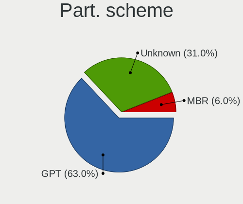

| Type    | Computers | Percent |
|---------|-----------|---------|
| GPT     | 120       | 57.14%  |
| Unknown | 77        | 36.67%  |
| MBR     | 13        | 6.19%   |

Dual Boot with Linux/BSD
------------------------

Hosting more than one Linux/BSD

| Dual boot | Computers | Percent |
|-----------|-----------|---------|
| No        | 187       | 89.05%  |
| Yes       | 23        | 10.95%  |

Dual Boot (Win)
---------------

Hosting Linux and Windows

| Dual boot | Computers | Percent |
|-----------|-----------|---------|
| No        | 169       | 80.48%  |
| Yes       | 41        | 19.52%  |

Board
-----

Vendor
------

Motherboard manufacturer

| Name                                 | Computers | Percent |
|--------------------------------------|-----------|---------|
| ASUSTek Computer                     | 37        | 17.62%  |
| Lenovo                               | 36        | 17.14%  |
| Dell                                 | 30        | 14.29%  |
| Hewlett-Packard                      | 28        | 13.33%  |
| MSI                                  | 12        | 5.71%   |
| Valve                                | 6         | 2.86%   |
| Apple                                | 6         | 2.86%   |
| Acer                                 | 6         | 2.86%   |
| Intel                                | 5         | 2.38%   |
| Gigabyte Technology                  | 5         | 2.38%   |
| Toshiba                              | 4         | 1.9%    |
| ASRock                               | 4         | 1.9%    |
| Unknown                              | 4         | 1.9%    |
| Sony                                 | 2         | 0.95%   |
| Medion                               | 2         | 0.95%   |
| Google                               | 2         | 0.95%   |
| Alienware                            | 2         | 0.95%   |
| Timi                                 | 1         | 0.48%   |
| Shenzhen Meigao Electronic Equipment | 1         | 0.48%   |
| Schenker                             | 1         | 0.48%   |
| Samsung Electronics                  | 1         | 0.48%   |
| Raspberry Pi Foundation              | 1         | 0.48%   |
| PC Specialist                        | 1         | 0.48%   |
| OEGStone                             | 1         | 0.48%   |
| Notebook                             | 1         | 0.48%   |
| Mini PC                              | 1         | 0.48%   |
| HUAWEI                               | 1         | 0.48%   |
| GreatWall                            | 1         | 0.48%   |
| Framework                            | 1         | 0.48%   |
| Entroware                            | 1         | 0.48%   |
| eMachines                            | 1         | 0.48%   |
| Dynabook                             | 1         | 0.48%   |
| Clevo                                | 1         | 0.48%   |
| BESSTAR Tech                         | 1         | 0.48%   |
| AZW                                  | 1         | 0.48%   |
| AMI                                  | 1         | 0.48%   |

Model
-----

Motherboard model

| Name                                                | Computers | Percent |
|-----------------------------------------------------|-----------|---------|
| Valve Jupiter                                       | 6         | 2.86%   |
| Unknown                                             | 4         | 1.9%    |
| Dell XPS 9320                                       | 2         | 0.95%   |
| Dell XPS 15 9560                                    | 2         | 0.95%   |
| Dell OptiPlex 9020                                  | 2         | 0.95%   |
| Dell OptiPlex 7010                                  | 2         | 0.95%   |
| ASUS X550CL                                         | 2         | 0.95%   |
| ASUS ROG STRIX B550-F GAMING                        | 2         | 0.95%   |
| ASUS M5A78L-M/USB3                                  | 2         | 0.95%   |
| ASUS All Series                                     | 2         | 0.95%   |
| Toshiba TECRA X40-E                                 | 1         | 0.48%   |
| Toshiba Satellite L855                              | 1         | 0.48%   |
| Toshiba Satellite L50D-B                            | 1         | 0.48%   |
| Toshiba Satellite A200                              | 1         | 0.48%   |
| Timi TM1613                                         | 1         | 0.48%   |
| Sony SVL2412M1EB                                    | 1         | 0.48%   |
| Sony SVF1521A7EB                                    | 1         | 0.48%   |
| Shenzhen Meigao Electronic Equipment Neptune series | 1         | 0.48%   |
| Schenker XMG CORE (M19, GTX 1650)                   | 1         | 0.48%   |
| Samsung P500A2D                                     | 1         | 0.48%   |
| RPi Raspberry Pi 4 Model B Rev 1.5                  | 1         | 0.48%   |
| PC Specialist Ionico 16                             | 1         | 0.48%   |
| OEGStone C4100/C5100                                | 1         | 0.48%   |
| Notebook NL5xNU                                     | 1         | 0.48%   |
| MSI MS-7D89                                         | 1         | 0.48%   |
| MSI MS-7D75                                         | 1         | 0.48%   |
| MSI MS-7D36                                         | 1         | 0.48%   |
| MSI MS-7D22                                         | 1         | 0.48%   |
| MSI MS-7C95                                         | 1         | 0.48%   |
| MSI MS-7C91                                         | 1         | 0.48%   |
| MSI MS-7C52                                         | 1         | 0.48%   |
| MSI MS-7B78                                         | 1         | 0.48%   |
| MSI MS-7B51                                         | 1         | 0.48%   |
| MSI MS-7A78                                         | 1         | 0.48%   |
| MSI MS-7977                                         | 1         | 0.48%   |
| MSI GS43VR 7RE                                      | 1         | 0.48%   |
| Mini PC Cherry Trail CR                             | 1         | 0.48%   |
| Medion P62024                                       | 1         | 0.48%   |
| Medion MD34805                                      | 1         | 0.48%   |
| Lenovo Yoga 6-13ALC6 Laptop 82ND                    | 1         | 0.48%   |

Model Family
------------

Motherboard model prefix

| Name                                         | Computers | Percent |
|----------------------------------------------|-----------|---------|
| Lenovo ThinkPad                              | 21        | 10%     |
| Dell XPS                                     | 9         | 4.29%   |
| ASUS ROG                                     | 8         | 3.81%   |
| Valve Jupiter                                | 6         | 2.86%   |
| HP Compaq                                    | 5         | 2.38%   |
| Dell Precision                               | 5         | 2.38%   |
| Dell OptiPlex                                | 5         | 2.38%   |
| ASUS VivoBook                                | 5         | 2.38%   |
| Lenovo IdeaPad                               | 4         | 1.9%    |
| HP Pavilion                                  | 4         | 1.9%    |
| HP EliteBook                                 | 4         | 1.9%    |
| Dell Latitude                                | 4         | 1.9%    |
| Dell Inspiron                                | 4         | 1.9%    |
| Acer Aspire                                  | 4         | 1.9%    |
| Unknown                                      | 4         | 1.9%    |
| Toshiba Satellite                            | 3         | 1.43%   |
| HP Laptop                                    | 3         | 1.43%   |
| Lenovo Yoga                                  | 2         | 0.95%   |
| Lenovo ThinkStation                          | 2         | 0.95%   |
| Lenovo ThinkCentre                           | 2         | 0.95%   |
| Lenovo Legion                                | 2         | 0.95%   |
| HP ENVY                                      | 2         | 0.95%   |
| ASUS X550CL                                  | 2         | 0.95%   |
| ASUS M5A78L-M                                | 2         | 0.95%   |
| ASUS Amd                                     | 2         | 0.95%   |
| ASUS All                                     | 2         | 0.95%   |
| Toshiba TECRA                                | 1         | 0.48%   |
| Timi TM1613                                  | 1         | 0.48%   |
| Sony SVL2412M1EB                             | 1         | 0.48%   |
| Sony SVF1521A7EB                             | 1         | 0.48%   |
| Shenzhen Meigao Electronic Equipment Neptune | 1         | 0.48%   |
| Schenker XMG                                 | 1         | 0.48%   |
| Samsung P500A2D                              | 1         | 0.48%   |
| RPi Raspberry                                | 1         | 0.48%   |
| PC Specialist Ionico                         | 1         | 0.48%   |
| OEGStone C4100                               | 1         | 0.48%   |
| Notebook NL5xNU                              | 1         | 0.48%   |
| MSI MS-7D89                                  | 1         | 0.48%   |
| MSI MS-7D75                                  | 1         | 0.48%   |
| MSI MS-7D36                                  | 1         | 0.48%   |

MFG Year
--------

Motherboard manufacture year

| Year    | Computers | Percent |
|---------|-----------|---------|
| 2022    | 29        | 13.81%  |
| 2021    | 20        | 9.52%   |
| 2018    | 20        | 9.52%   |
| 2020    | 18        | 8.57%   |
| 2023    | 16        | 7.62%   |
| 2019    | 15        | 7.14%   |
| 2013    | 15        | 7.14%   |
| 2012    | 15        | 7.14%   |
| 2016    | 10        | 4.76%   |
| 2017    | 8         | 3.81%   |
| 2011    | 8         | 3.81%   |
| 2015    | 7         | 3.33%   |
| 2014    | 7         | 3.33%   |
| 2008    | 7         | 3.33%   |
| 2010    | 5         | 2.38%   |
| 2009    | 5         | 2.38%   |
| 2007    | 4         | 1.9%    |
| Unknown | 1         | 0.48%   |

Form Factor
-----------

Physical design of the computer

| Name           | Computers | Percent |
|----------------|-----------|---------|
| Notebook       | 116       | 55.24%  |
| Desktop        | 67        | 31.9%   |
| Convertible    | 8         | 3.81%   |
| Mini pc        | 7         | 3.33%   |
| All in one     | 5         | 2.38%   |
| Server         | 4         | 1.9%    |
| Tablet         | 2         | 0.95%   |
| System on chip | 1         | 0.48%   |

Secure Boot
-----------

Enabled or disabled

| State    | Computers | Percent |
|----------|-----------|---------|
| Disabled | 190       | 90.48%  |
| Enabled  | 20        | 9.52%   |

Coreboot
--------

Have coreboot on board

| Used | Computers | Percent |
|------|-----------|---------|
| No   | 207       | 98.57%  |
| Yes  | 3         | 1.43%   |

RAM Size
--------

Total RAM memory

| Size in GB  | Computers | Percent |
|-------------|-----------|---------|
| 4.01-8.0    | 49        | 23.33%  |
| 16.01-24.0  | 45        | 21.43%  |
| 32.01-64.0  | 38        | 18.1%   |
| 8.01-16.0   | 33        | 15.71%  |
| 64.01-256.0 | 16        | 7.62%   |
| 3.01-4.0    | 15        | 7.14%   |
| 1.01-2.0    | 6         | 2.86%   |
| 24.01-32.0  | 5         | 2.38%   |
| 2.01-3.0    | 3         | 1.43%   |

RAM Used
--------

Used RAM memory

| Used GB    | Computers | Percent |
|------------|-----------|---------|
| 2.01-3.0   | 54        | 25.71%  |
| 1.01-2.0   | 50        | 23.81%  |
| 4.01-8.0   | 44        | 20.95%  |
| 3.01-4.0   | 37        | 17.62%  |
| 8.01-16.0  | 14        | 6.67%   |
| 0.51-1.0   | 7         | 3.33%   |
| 32.01-64.0 | 1         | 0.48%   |
| 24.01-32.0 | 1         | 0.48%   |
| 16.01-24.0 | 1         | 0.48%   |
| 0.01-0.5   | 1         | 0.48%   |

Total Drives
------------

Number of drives on board

| Drives | Computers | Percent |
|--------|-----------|---------|
| 1      | 125       | 59.52%  |
| 2      | 55        | 26.19%  |
| 3      | 18        | 8.57%   |
| 4      | 9         | 4.29%   |
| 5      | 2         | 0.95%   |
| 23     | 1         | 0.48%   |

Has CD-ROM
----------

Has CD-ROM on board

| Presented | Computers | Percent |
|-----------|-----------|---------|
| No        | 162       | 77.14%  |
| Yes       | 48        | 22.86%  |

Has Ethernet
------------

Has Ethernet on board

| Presented | Computers | Percent |
|-----------|-----------|---------|
| Yes       | 166       | 79.05%  |
| No        | 44        | 20.95%  |

Has WiFi
--------

Has WiFi module

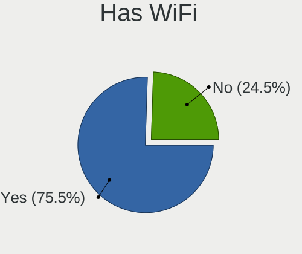

| Presented | Computers | Percent |
|-----------|-----------|---------|
| Yes       | 169       | 80.48%  |
| No        | 41        | 19.52%  |

Has Bluetooth
-------------

Has Bluetooth module

| Presented | Computers | Percent |
|-----------|-----------|---------|
| Yes       | 148       | 70.48%  |
| No        | 62        | 29.52%  |

Location
--------

Country
-------

Geographic location (country)

| Country | Computers | Percent |
|---------|-----------|---------|
| UK      | 210       | 100%    |

City
----

Geographic location (city)

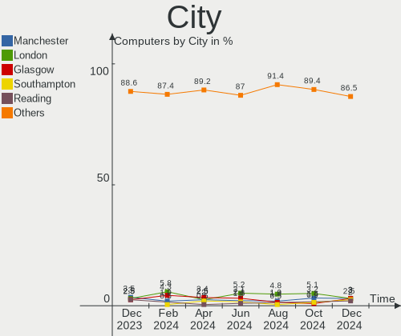

| City           | Computers | Percent |
|----------------|-----------|---------|
| London         | 13        | 6.19%   |
| Leeds          | 8         | 3.81%   |
| Manchester     | 7         | 3.33%   |
| Glasgow        | 5         | 2.38%   |
| Reading        | 4         | 1.9%    |
| Leicester      | 4         | 1.9%    |
| Feltham        | 4         | 1.9%    |
| Southampton    | 3         | 1.43%   |
| Oxford         | 3         | 1.43%   |
| Liverpool      | 3         | 1.43%   |
| Islington      | 3         | 1.43%   |
| Edgware        | 3         | 1.43%   |
| City of London | 3         | 1.43%   |
| Chippenham     | 3         | 1.43%   |
| Cambridge      | 3         | 1.43%   |
| Brent          | 3         | 1.43%   |
| Worthing       | 2         | 0.95%   |
| Woking         | 2         | 0.95%   |
| Swindon        | 2         | 0.95%   |
| Preston        | 2         | 0.95%   |
| Peterborough   | 2         | 0.95%   |
| Northampton    | 2         | 0.95%   |
| Mansfield      | 2         | 0.95%   |
| Ipswich        | 2         | 0.95%   |
| Harringay      | 2         | 0.95%   |
| Hackney        | 2         | 0.95%   |
| Greenwich      | 2         | 0.95%   |
| Edinburgh      | 2         | 0.95%   |
| Carnforth      | 2         | 0.95%   |
| Cardiff        | 2         | 0.95%   |
| Bristol        | 2         | 0.95%   |
| Bridgend       | 2         | 0.95%   |
| Bolton         | 2         | 0.95%   |
| Basingstoke    | 2         | 0.95%   |
| Barnet         | 2         | 0.95%   |
| Worcester      | 1         | 0.48%   |
| Wolverhampton  | 1         | 0.48%   |
| Wokingham      | 1         | 0.48%   |
| Withernsea     | 1         | 0.48%   |
| West Malling   | 1         | 0.48%   |

Drives
------

Drive Vendor
------------

Hard drive vendors

| Vendor                      | Computers | Drives | Percent |
|-----------------------------|-----------|--------|---------|
| Samsung Electronics         | 58        | 72     | 19.4%   |
| WDC                         | 28        | 33     | 9.36%   |
| Seagate                     | 25        | 30     | 8.36%   |
| Crucial                     | 22        | 37     | 7.36%   |
| Sandisk                     | 21        | 25     | 7.02%   |
| Unknown                     | 17        | 19     | 5.69%   |
| Toshiba                     | 16        | 16     | 5.35%   |
| Intel                       | 16        | 19     | 5.35%   |
| Kingston                    | 11        | 11     | 3.68%   |
| SK hynix                    | 8         | 8      | 2.68%   |
| Micron/Crucial Technology   | 7         | 8      | 2.34%   |
| Micron Technology           | 7         | 8      | 2.34%   |
| Phison Electronics          | 6         | 6      | 2.01%   |
| Hitachi                     | 6         | 6      | 2.01%   |
| SPCC                        | 3         | 3      | 1%      |
| Silicon Motion              | 3         | 3      | 1%      |
| KIOXIA                      | 3         | 3      | 1%      |
| Integral                    | 3         | 3      | 1%      |
| HGST                        | 3         | 3      | 1%      |
| Apple                       | 3         | 3      | 1%      |
| O2 Micro                    | 2         | 2      | 0.67%   |
| Netac                       | 2         | 2      | 0.67%   |
| Kingston Technology Company | 2         | 2      | 0.67%   |
| Gigabyte Technology         | 2         | 2      | 0.67%   |
| Fujitsu                     | 2         | 2      | 0.67%   |
| Corsair                     | 2         | 3      | 0.67%   |
| XUM                         | 1         | 1      | 0.33%   |
| Transcend                   | 1         | 1      | 0.33%   |
| ShiJi                       | 1         | 1      | 0.33%   |
| PNY                         | 1         | 1      | 0.33%   |
| Plextor                     | 1         | 1      | 0.33%   |
| Phison                      | 1         | 1      | 0.33%   |
| Patriot                     | 1         | 1      | 0.33%   |
| OCZ                         | 1         | 1      | 0.33%   |
| MAXIO Technology (Hangzhou) | 1         | 1      | 0.33%   |
| LITEONIT                    | 1         | 1      | 0.33%   |
| LITEON                      | 1         | 1      | 0.33%   |
| KingDian                    | 1         | 1      | 0.33%   |
| JMicron Technology          | 1         | 1      | 0.33%   |
| Hjwdz                       | 1         | 1      | 0.33%   |

Drive Model
-----------

Hard drive models

| Model                                                 | Computers | Percent |
|-------------------------------------------------------|-----------|---------|
| Samsung NVMe SSD Controller SM981/PM981/PM983 256GB   | 10        | 3.06%   |
| Seagate ST2000DM008-2FR102 2TB                        | 6         | 1.83%   |
| Samsung SSD 850 EVO 250GB                             | 6         | 1.83%   |
| Crucial CT1000MX500SSD1 1TB                           | 6         | 1.83%   |
| Micron/Crucial P2 NVMe PCIe SSD 1TB                   | 5         | 1.53%   |
| Sandisk WD Black SN850 1TB                            | 4         | 1.22%   |
| Sandisk WD Black SN750 / PC SN730 NVMe SSD 512GB      | 4         | 1.22%   |
| Crucial CT500MX500SSD1 500GB                          | 4         | 1.22%   |
| Unknown MMC Card  64GB                                | 3         | 0.92%   |
| Unknown MMC Card  512GB                               | 3         | 0.92%   |
| Unknown MMC Card  256GB                               | 3         | 0.92%   |
| Toshiba XG4 NVMe SSD Controller 512GB                 | 3         | 0.92%   |
| Silicon Motion SM2263EN/SM2263XT SSD Controller 512GB | 3         | 0.92%   |
| Sandisk WD Blue SN550 NVMe SSD 512GB                  | 3         | 0.92%   |
| Samsung SSD 870 QVO 2TB                               | 3         | 0.92%   |
| Samsung NVMe SSD Controller PM9A1/PM9A3/980PRO 1TB    | 3         | 0.92%   |
| Phison PS5013 E13 NVMe Controller 512GB               | 3         | 0.92%   |
| Micron/Crucial P1 NVMe PCIe SSD 1TB                   | 3         | 0.92%   |
| Kingston SA400S37240G 240GB SSD                       | 3         | 0.92%   |
| Intel SSD 660P Series 1024GB                          | 3         | 0.92%   |
| Crucial CT240BX500SSD1 240GB                          | 3         | 0.92%   |
| WDC WD5000AAKX-75U6AA0 500GB                          | 2         | 0.61%   |
| SK hynix PC801 NVMe 1TB                               | 2         | 0.61%   |
| Seagate ST4000DM004-2CV104 4TB                        | 2         | 0.61%   |
| Seagate FireCuda 530 ZP1000GM30013 1TB                | 2         | 0.61%   |
| Seagate Expansion 1TB                                 | 2         | 0.61%   |
| Sandisk WD Blue SN570 2TB                             | 2         | 0.61%   |
| Samsung SSD 870 QVO 1TB                               | 2         | 0.61%   |
| Samsung SSD 860 EVO M.2 500GB                         | 2         | 0.61%   |
| Samsung SSD 860 EVO 1TB                               | 2         | 0.61%   |
| Samsung PM9A1 NVMe 1024GB                             | 2         | 0.61%   |
| Samsung NVMe SSD Controller SM951/PM951 128GB         | 2         | 0.61%   |
| O2 Micro E2M2 64GB                                    | 2         | 0.61%   |
| Micron 2300 NVMe 1024GB                               | 2         | 0.61%   |
| Kingston SA400S37480G 480GB SSD                       | 2         | 0.61%   |
| Intel SSD Pro 7600p/760p/E 6100p Series 1TB           | 2         | 0.61%   |
| Crucial CT240M500SSD1 240GB                           | 2         | 0.61%   |
| Crucial CT1000BX500SSD1 1TB                           | 2         | 0.61%   |
| XUM HX256GSSDM2 256GB                                 | 1         | 0.31%   |
| WDC WUH721816ALE6L4 16TB                              | 1         | 0.31%   |

HDD Vendor
----------

Hard disk drive vendors

| Vendor              | Computers | Drives | Percent |
|---------------------|-----------|--------|---------|
| WDC                 | 25        | 29     | 35.21%  |
| Seagate             | 22        | 24     | 30.99%  |
| Toshiba             | 8         | 8      | 11.27%  |
| Hitachi             | 6         | 6      | 8.45%   |
| Samsung Electronics | 5         | 5      | 7.04%   |
| HGST                | 3         | 3      | 4.23%   |
| Fujitsu             | 2         | 2      | 2.82%   |

SSD Vendor
----------

Solid state drive vendors

| Vendor              | Computers | Drives | Percent |
|---------------------|-----------|--------|---------|
| Samsung Electronics | 27        | 30     | 28.13%  |
| Crucial             | 20        | 35     | 20.83%  |
| Kingston            | 10        | 10     | 10.42%  |
| SanDisk             | 5         | 5      | 5.21%   |
| Intel               | 4         | 4      | 4.17%   |
| SPCC                | 3         | 3      | 3.13%   |
| Integral            | 3         | 3      | 3.13%   |
| Apple               | 3         | 3      | 3.13%   |
| SK hynix            | 2         | 2      | 2.08%   |
| Netac               | 2         | 2      | 2.08%   |
| XUM                 | 1         | 1      | 1.04%   |
| WDC                 | 1         | 1      | 1.04%   |
| Transcend           | 1         | 1      | 1.04%   |
| PNY                 | 1         | 1      | 1.04%   |
| Plextor             | 1         | 1      | 1.04%   |
| Patriot             | 1         | 1      | 1.04%   |
| OCZ                 | 1         | 1      | 1.04%   |
| Micron Technology   | 1         | 1      | 1.04%   |
| LITEONIT            | 1         | 1      | 1.04%   |
| LITEON              | 1         | 1      | 1.04%   |
| JMicron Technology  | 1         | 1      | 1.04%   |
| HJDK                | 1         | 1      | 1.04%   |
| Gigabyte Technology | 1         | 1      | 1.04%   |
| Corsair             | 1         | 1      | 1.04%   |
| China               | 1         | 1      | 1.04%   |
| ASENNO              | 1         | 1      | 1.04%   |
| A-DATA Technology   | 1         | 1      | 1.04%   |

Drive Kind
----------

HDD or SSD

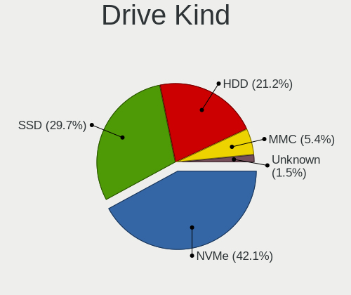

| Kind    | Computers | Drives | Percent |
|---------|-----------|--------|---------|
| NVMe    | 110       | 137    | 39.57%  |
| SSD     | 85        | 114    | 30.58%  |
| HDD     | 63        | 77     | 22.66%  |
| MMC     | 15        | 16     | 5.4%    |
| Unknown | 5         | 6      | 1.8%    |

Drive Connector
---------------

SATA, SAS, NVMe, etc.

| Type | Computers | Drives | Percent |
|------|-----------|--------|---------|
| SATA | 122       | 187    | 47.84%  |
| NVMe | 110       | 137    | 43.14%  |
| MMC  | 15        | 16     | 5.88%   |
| SAS  | 8         | 10     | 3.14%   |

Drive Size
----------

Size of hard drive

| Size in TB | Computers | Drives | Percent |
|------------|-----------|--------|---------|
| 0.01-0.5   | 87        | 102    | 56.49%  |
| 0.51-1.0   | 39        | 58     | 25.32%  |
| 1.01-2.0   | 15        | 18     | 9.74%   |
| 3.01-4.0   | 5         | 5      | 3.25%   |
| 4.01-10.0  | 5         | 5      | 3.25%   |
| 2.01-3.0   | 2         | 2      | 1.3%    |
| 10.01-20.0 | 1         | 1      | 0.65%   |

Space Total
-----------

Amount of disk space available on the file system

| Size in GB     | Computers | Percent |
|----------------|-----------|---------|
| 101-250        | 49        | 23.33%  |
| 251-500        | 43        | 20.48%  |
| 1001-2000      | 30        | 14.29%  |
| 501-1000       | 29        | 13.81%  |
| More than 3000 | 20        | 9.52%   |
| 1-20           | 18        | 8.57%   |
| 51-100         | 11        | 5.24%   |
| Unknown        | 5         | 2.38%   |
| 2001-3000      | 3         | 1.43%   |
| 21-50          | 2         | 0.95%   |

Space Used
----------

Amount of used disk space

| Used GB        | Computers | Percent |
|----------------|-----------|---------|
| 1-20           | 72        | 34.29%  |
| 21-50          | 36        | 17.14%  |
| 101-250        | 29        | 13.81%  |
| 51-100         | 20        | 9.52%   |
| 251-500        | 16        | 7.62%   |
| 501-1000       | 14        | 6.67%   |
| 1001-2000      | 9         | 4.29%   |
| More than 3000 | 7         | 3.33%   |
| Unknown        | 5         | 2.38%   |
| 2001-3000      | 2         | 0.95%   |

Malfunc. Drives
---------------

Drive models with a malfunction

| Model                                   | Computers | Drives | Percent |
|-----------------------------------------|-----------|--------|---------|
| WDC WD60EFRX-68L0BN1 6TB                | 1         | 1      | 7.14%   |
| WDC WD30EZRX-00SPEB0 3TB                | 1         | 1      | 7.14%   |
| WDC WD10EZEX-08WN4A0 1TB                | 1         | 1      | 7.14%   |
| Toshiba MK5065GSXN 500GB                | 1         | 1      | 7.14%   |
| Seagate ST500LM021-1KJ152 500GB         | 1         | 1      | 7.14%   |
| Seagate ST2000VN004-2E4164 2TB          | 1         | 1      | 7.14%   |
| SanDisk SSD PLUS 240GB                  | 1         | 1      | 7.14%   |
| LITEONIT LCT-128M3S 128GB SSD           | 1         | 1      | 7.14%   |
| Kingston RBU-SNS8350DES3128GP 128GB SSD | 1         | 1      | 7.14%   |
| Intel SSDSC2CW120A3 120GB               | 1         | 1      | 7.14%   |
| Hitachi HTS543216L9A300 160GB           | 1         | 1      | 7.14%   |
| Hitachi HTS542512K9SA00 120GB           | 1         | 1      | 7.14%   |
| Crucial CT512M550SSD1 512GB             | 1         | 1      | 7.14%   |
| Corsair Neutron XT SSD 240GB            | 1         | 1      | 7.14%   |

Malfunc. Drive Vendor
---------------------

Vendors of faulty drives

| Vendor   | Computers | Drives | Percent |
|----------|-----------|--------|---------|
| WDC      | 3         | 3      | 21.43%  |
| Seagate  | 2         | 2      | 14.29%  |
| Hitachi  | 2         | 2      | 14.29%  |
| Toshiba  | 1         | 1      | 7.14%   |
| SanDisk  | 1         | 1      | 7.14%   |
| LITEONIT | 1         | 1      | 7.14%   |
| Kingston | 1         | 1      | 7.14%   |
| Intel    | 1         | 1      | 7.14%   |
| Crucial  | 1         | 1      | 7.14%   |
| Corsair  | 1         | 1      | 7.14%   |

Malfunc. HDD Vendor
-------------------

Vendors of faulty HDD drives

| Vendor  | Computers | Drives | Percent |
|---------|-----------|--------|---------|
| WDC     | 3         | 3      | 37.5%   |
| Seagate | 2         | 2      | 25%     |
| Hitachi | 2         | 2      | 25%     |
| Toshiba | 1         | 1      | 12.5%   |

Malfunc. Drive Kind
-------------------

Kinds of faulty drives

| Kind | Computers | Drives | Percent |
|------|-----------|--------|---------|
| HDD  | 8         | 8      | 57.14%  |
| SSD  | 6         | 6      | 42.86%  |

Failed Drives
-------------

Failed drive models

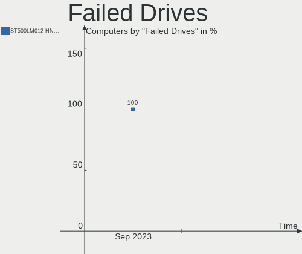

| Model                               | Computers | Drives | Percent |
|-------------------------------------|-----------|--------|---------|
| Seagate ST500LM012 HN-M500MBB 500GB | 1         | 1      | 100%    |

Failed Drive Vendor
-------------------

Failed drive vendors

| Vendor  | Computers | Drives | Percent |
|---------|-----------|--------|---------|
| Seagate | 1         | 1      | 100%    |

Drive Status
------------

Number of failed and malfunc. drives

| Status   | Computers | Drives | Percent |
|----------|-----------|--------|---------|
| Detected | 109       | 171    | 49.32%  |
| Works    | 98        | 164    | 44.34%  |
| Malfunc  | 13        | 14     | 5.88%   |
| Failed   | 1         | 1      | 0.45%   |

Storage controller
------------------

Storage Vendor
--------------

Storage controller vendors

| Vendor                       | Computers | Percent |
|------------------------------|-----------|---------|
| Intel                        | 124       | 43.66%  |
| AMD                          | 40        | 14.08%  |
| Samsung Electronics          | 33        | 11.62%  |
| SanDisk                      | 19        | 6.69%   |
| Phison Electronics           | 9         | 3.17%   |
| Micron/Crucial Technology    | 9         | 3.17%   |
| Toshiba America Info Systems | 8         | 2.82%   |
| SK hynix                     | 6         | 2.11%   |
| Micron Technology            | 6         | 2.11%   |
| Seagate Technology           | 4         | 1.41%   |
| ASMedia Technology           | 4         | 1.41%   |
| Silicon Motion               | 3         | 1.06%   |
| Nvidia                       | 3         | 1.06%   |
| KIOXIA                       | 3         | 1.06%   |
| Kingston Technology Company  | 3         | 1.06%   |
| O2 Micro                     | 2         | 0.7%    |
| JMicron Technology           | 2         | 0.7%    |
| MAXIO Technology (Hangzhou)  | 1         | 0.35%   |
| Marvell Technology Group     | 1         | 0.35%   |
| Hewlett-Packard              | 1         | 0.35%   |
| Broadcom / LSI               | 1         | 0.35%   |
| ADATA Technology             | 1         | 0.35%   |
| Unknown                      | 1         | 0.35%   |

Storage Model
-------------

Storage controller models

| Model                                                                          | Computers | Percent |
|--------------------------------------------------------------------------------|-----------|---------|
| AMD FCH SATA Controller [AHCI mode]                                            | 23        | 7.26%   |
| Samsung NVMe SSD Controller SM981/PM981/PM983                                  | 14        | 4.42%   |
| Intel 7 Series Chipset Family 6-port SATA Controller [AHCI mode]               | 12        | 3.79%   |
| Intel 8 Series/C220 Series Chipset Family 6-port SATA Controller 1 [AHCI mode] | 11        | 3.47%   |
| Intel Volume Management Device NVMe RAID Controller                            | 10        | 3.15%   |
| AMD 500 Series Chipset SATA Controller                                         | 10        | 3.15%   |
| Intel Sunrise Point-LP SATA Controller [AHCI mode]                             | 9         | 2.84%   |
| Samsung NVMe SSD Controller 980                                                | 8         | 2.52%   |
| Micron/Crucial P2 [Nick P2] / P3 / P3 Plus NVMe PCIe SSD (DRAM-less)           | 6         | 1.89%   |
| SanDisk WD Black SN750 / PC SN730 NVMe SSD                                     | 5         | 1.58%   |
| Samsung NVMe SSD Controller PM9A1/PM9A3/980PRO                                 | 5         | 1.58%   |
| Intel 82801HM/HEM (ICH8M/ICH8M-E) SATA Controller [AHCI mode]                  | 5         | 1.58%   |
| Intel 82801 Mobile SATA Controller [RAID mode]                                 | 5         | 1.58%   |
| Intel 7 Series/C210 Series Chipset Family 6-port SATA Controller [AHCI mode]   | 5         | 1.58%   |
| Toshiba America Info Systems XG4 NVMe SSD Controller                           | 4         | 1.26%   |
| Seagate FireCuda 530 SSD                                                       | 4         | 1.26%   |
| SanDisk WD PC SN810 / Black SN850 NVMe SSD                                     | 4         | 1.26%   |
| SanDisk WD Blue SN550 NVMe SSD                                                 | 4         | 1.26%   |
| Phison PS5013 E13 NVMe Controller                                              | 4         | 1.26%   |
| Micron/Crucial P1 NVMe PCIe SSD[Frampton]                                      | 4         | 1.26%   |
| Intel SSD DC P4101/Pro 7600p/760p/E 6100p Series                               | 4         | 1.26%   |
| Intel SSD 670p Series [Keystone Harbor]                                        | 4         | 1.26%   |
| Intel HM170/QM170 Chipset SATA Controller [AHCI Mode]                          | 4         | 1.26%   |
| Intel 82801HM/HEM (ICH8M/ICH8M-E) IDE Controller                               | 4         | 1.26%   |
| Intel 6 Series/C200 Series Chipset Family 6 port Desktop SATA AHCI Controller  | 4         | 1.26%   |
| ASMedia ASM1062 Serial ATA Controller                                          | 4         | 1.26%   |
| AMD SB7x0/SB8x0/SB9x0 IDE Controller                                           | 4         | 1.26%   |
| SK hynix Platinum P41/PC801 NVMe Solid State Drive                             | 3         | 0.95%   |
| SK hynix Gold P31/BC711/PC711 NVMe Solid State Drive                           | 3         | 0.95%   |
| Silicon Motion SM2263EN/SM2263XT (DRAM-less) NVMe SSD Controllers              | 3         | 0.95%   |
| Samsung NVMe SSD Controller SM951/PM951                                        | 3         | 0.95%   |
| Intel SSD 660P Series                                                          | 3         | 0.95%   |
| Intel Cannon Lake Mobile PCH SATA AHCI Controller                              | 3         | 0.95%   |
| Intel 82801IBM/IEM (ICH9M/ICH9M-E) 4 port SATA Controller [AHCI mode]          | 3         | 0.95%   |
| Intel 5 Series/3400 Series Chipset 4 port SATA AHCI Controller                 | 3         | 0.95%   |
| AMD SB7x0/SB8x0/SB9x0 SATA Controller [IDE mode]                               | 3         | 0.95%   |
| AMD SB7x0/SB8x0/SB9x0 SATA Controller [AHCI mode]                              | 3         | 0.95%   |
| Toshiba America Info Systems XG6 NVMe SSD Controller                           | 2         | 0.63%   |
| Toshiba America Info Systems XG5 NVMe SSD Controller                           | 2         | 0.63%   |
| SanDisk WD Blue SN570 NVMe SSD 2TB                                             | 2         | 0.63%   |

Storage Kind
------------

Kind of storage controller (IDE, SATA, NVMe, SAS, ...)

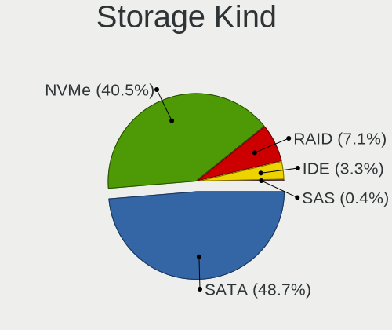

| Kind | Computers | Percent |
|------|-----------|---------|
| SATA | 138       | 48.25%  |
| NVMe | 110       | 38.46%  |
| RAID | 19        | 6.64%   |
| IDE  | 18        | 6.29%   |
| SAS  | 1         | 0.35%   |

Processor
---------

CPU Vendor
----------

Processor vendors

| Vendor | Computers | Percent |
|--------|-----------|---------|
| Intel  | 154       | 73.33%  |
| AMD    | 55        | 26.19%  |
| ARM    | 1         | 0.48%   |

CPU Model
---------

Processor models

| Model                                       | Computers | Percent |
|---------------------------------------------|-----------|---------|
| AMD Custom APU 0405                         | 6         | 2.86%   |
| Intel 11th Gen Core i7-1165G7 @ 2.80GHz     | 5         | 2.38%   |
| Intel 11th Gen Core i5-1135G7 @ 2.40GHz     | 5         | 2.38%   |
| Intel Core i7-4790 CPU @ 3.60GHz            | 4         | 1.9%    |
| Intel Core i7-3770K CPU @ 3.50GHz           | 4         | 1.9%    |
| Intel Core i5-8250U CPU @ 1.60GHz           | 4         | 1.9%    |
| Intel Core i7-8550U CPU @ 1.80GHz           | 3         | 1.43%   |
| Intel Core i7-7700HQ CPU @ 2.80GHz          | 3         | 1.43%   |
| Intel Core i7-10510U CPU @ 1.80GHz          | 3         | 1.43%   |
| Intel 12th Gen Core i7-1260P                | 3         | 1.43%   |
| AMD Ryzen 5 5600X 6-Core Processor          | 3         | 1.43%   |
| Intel Core i7-8665U CPU @ 1.90GHz           | 2         | 0.95%   |
| Intel Core i7-8650U CPU @ 1.90GHz           | 2         | 0.95%   |
| Intel Core i7-7500U CPU @ 2.70GHz           | 2         | 0.95%   |
| Intel Core i5-7200U CPU @ 2.50GHz           | 2         | 0.95%   |
| Intel Core i5-4300U CPU @ 1.90GHz           | 2         | 0.95%   |
| Intel Core i5-3470 CPU @ 3.20GHz            | 2         | 0.95%   |
| Intel Core i5-3337U CPU @ 1.80GHz           | 2         | 0.95%   |
| Intel Core i5-3210M CPU @ 2.50GHz           | 2         | 0.95%   |
| Intel Core i5-10210U CPU @ 1.60GHz          | 2         | 0.95%   |
| Intel Core i3-3217U CPU @ 1.80GHz           | 2         | 0.95%   |
| Intel Core i3 CPU M 380 @ 2.53GHz           | 2         | 0.95%   |
| Intel Core 2 Duo CPU P8700 @ 2.53GHz        | 2         | 0.95%   |
| Intel Celeron N4020 CPU @ 1.10GHz           | 2         | 0.95%   |
| Intel Atom x5-Z8350 CPU @ 1.44GHz           | 2         | 0.95%   |
| Intel 12th Gen Core i9-12900H               | 2         | 0.95%   |
| Intel 11th Gen Core i9-11900H @ 2.50GHz     | 2         | 0.95%   |
| AMD Ryzen 9 7950X3D 16-Core Processor       | 2         | 0.95%   |
| AMD Ryzen 7 5800X 8-Core Processor          | 2         | 0.95%   |
| AMD Ryzen 7 5700G with Radeon Graphics      | 2         | 0.95%   |
| AMD Ryzen 7 2700X Eight-Core Processor      | 2         | 0.95%   |
| AMD Ryzen 5 3600 6-Core Processor           | 2         | 0.95%   |
| Intel Xeon Gold 6154 CPU @ 3.00GHz          | 1         | 0.48%   |
| Intel Xeon CPU X5675 @ 3.07GHz              | 1         | 0.48%   |
| Intel Xeon CPU E5430 @ 2.66GHz              | 1         | 0.48%   |
| Intel Xeon CPU E5-2697 v2 @ 2.70GHz         | 1         | 0.48%   |
| Intel Xeon CPU E5-2650 0 @ 2.00GHz          | 1         | 0.48%   |
| Intel Xeon CPU E5-1660 v3 @ 3.00GHz         | 1         | 0.48%   |
| Intel Xeon CPU E3-1226 v3 @ 3.30GHz         | 1         | 0.48%   |
| Intel Pentium Dual-Core CPU T4500 @ 2.30GHz | 1         | 0.48%   |

CPU Model Family
----------------

Processor model prefix

| Model                          | Computers | Percent |
|--------------------------------|-----------|---------|
| Intel Core i7                  | 44        | 20.95%  |
| Other                          | 37        | 17.62%  |
| Intel Core i5                  | 37        | 17.62%  |
| AMD Ryzen 7                    | 12        | 5.71%   |
| AMD Ryzen 5                    | 11        | 5.24%   |
| Intel Core 2 Duo               | 8         | 3.81%   |
| Intel Celeron                  | 8         | 3.81%   |
| Intel Core i3                  | 7         | 3.33%   |
| Intel Xeon                     | 6         | 2.86%   |
| Intel Atom                     | 6         | 2.86%   |
| AMD Ryzen 9                    | 6         | 2.86%   |
| AMD Ryzen 7 PRO                | 4         | 1.9%    |
| AMD FX                         | 3         | 1.43%   |
| Intel Core i9                  | 2         | 0.95%   |
| AMD Ryzen 3                    | 2         | 0.95%   |
| Intel Xeon Gold                | 1         | 0.48%   |
| Intel Pentium Dual-Core        | 1         | 0.48%   |
| Intel Pentium                  | 1         | 0.48%   |
| Intel Core m3                  | 1         | 0.48%   |
| Intel Core 2 Quad              | 1         | 0.48%   |
| ARM BCM                        | 1         | 0.48%   |
| AMD Turion X2 Dual-Core Mobile | 1         | 0.48%   |
| AMD Turion II Dual-Core        | 1         | 0.48%   |
| AMD Ryzen Threadripper         | 1         | 0.48%   |
| AMD Ryzen 5 PRO                | 1         | 0.48%   |
| AMD Ryzen 3 PRO                | 1         | 0.48%   |
| AMD Phenom II X6               | 1         | 0.48%   |
| AMD E1                         | 1         | 0.48%   |
| AMD Athlon X4                  | 1         | 0.48%   |
| AMD Athlon 64 X2               | 1         | 0.48%   |
| AMD A8                         | 1         | 0.48%   |
| AMD A6                         | 1         | 0.48%   |

CPU Cores
---------

Number of processor cores

| Number | Computers | Percent |
|--------|-----------|---------|
| 4      | 85        | 40.48%  |
| 2      | 52        | 24.76%  |
| 8      | 22        | 10.48%  |
| 6      | 19        | 9.05%   |
| 12     | 9         | 4.29%   |
| 10     | 6         | 2.86%   |
| 14     | 5         | 2.38%   |
| 16     | 4         | 1.9%    |
| 1      | 4         | 1.9%    |
| 24     | 2         | 0.95%   |
| 36     | 1         | 0.48%   |
| 3      | 1         | 0.48%   |

CPU Sockets
-----------

Number of sockets

| Number | Computers | Percent |
|--------|-----------|---------|
| 1      | 206       | 98.1%   |
| 2      | 4         | 1.9%    |

CPU Threads
-----------

Threads per core (Hyper-Threading)

| Number | Computers | Percent |
|--------|-----------|---------|
| 2      | 163       | 77.62%  |
| 1      | 47        | 22.38%  |

CPU Op-Modes
------------

CPU Operation Modes (32-bit, 64-bit)

| Op mode        | Computers | Percent |
|----------------|-----------|---------|
| 32-bit, 64-bit | 208       | 99.05%  |
| 32-bit         | 1         | 0.48%   |
| Unknown        | 1         | 0.48%   |

CPU Microcode
-------------

Microcode number

| Number     | Computers | Percent |
|------------|-----------|---------|
| Unknown    | 132       | 62.86%  |
| 0x306c3    | 6         | 2.86%   |
| 0x306a9    | 5         | 2.38%   |
| 0x0a50000d | 5         | 2.38%   |
| 0x906e9    | 3         | 1.43%   |
| 0x806ea    | 3         | 1.43%   |
| 0x406c4    | 3         | 1.43%   |
| 0x0a601203 | 3         | 1.43%   |
| 0x0a201025 | 3         | 1.43%   |
| 0x806c1    | 2         | 0.95%   |
| 0x506e3    | 2         | 0.95%   |
| 0x406e3    | 2         | 0.95%   |
| 0x20655    | 2         | 0.95%   |
| 0x1067a    | 2         | 0.95%   |
| 0x0a50000c | 2         | 0.95%   |
| 0x0a20120a | 2         | 0.95%   |
| 0x08608103 | 2         | 0.95%   |
| 0x08108109 | 2         | 0.95%   |
| 0xa0655    | 1         | 0.48%   |
| 0xa0653    | 1         | 0.48%   |
| 0x806ec    | 1         | 0.48%   |
| 0x806e9    | 1         | 0.48%   |
| 0x806d1    | 1         | 0.48%   |
| 0x806c2    | 1         | 0.48%   |
| 0x706a1    | 1         | 0.48%   |
| 0x6fd      | 1         | 0.48%   |
| 0x6fa      | 1         | 0.48%   |
| 0x50654    | 1         | 0.48%   |
| 0x406c3    | 1         | 0.48%   |
| 0x40651    | 1         | 0.48%   |
| 0x306d4    | 1         | 0.48%   |
| 0x206d7    | 1         | 0.48%   |
| 0x206a7    | 1         | 0.48%   |
| 0x20652    | 1         | 0.48%   |
| 0x106ca    | 1         | 0.48%   |
| 0x106c2    | 1         | 0.48%   |
| 0x10661    | 1         | 0.48%   |
| 0x0a704103 | 1         | 0.48%   |
| 0x0a404102 | 1         | 0.48%   |
| 0x0a201016 | 1         | 0.48%   |

CPU Microarch
-------------

Microarchitecture

| Name             | Computers | Percent |
|------------------|-----------|---------|
| KabyLake         | 32        | 15.24%  |
| IvyBridge        | 20        | 9.52%   |
| Unknown          | 20        | 9.52%   |
| Haswell          | 18        | 8.57%   |
| Zen 3            | 15        | 7.14%   |
| Alderlake Hybrid | 14        | 6.67%   |
| TigerLake        | 11        | 5.24%   |
| Skylake          | 8         | 3.81%   |
| Penryn           | 8         | 3.81%   |
| Silvermont       | 7         | 3.33%   |
| Zen+             | 6         | 2.86%   |
| CometLake        | 6         | 2.86%   |
| Westmere         | 5         | 2.38%   |
| SandyBridge      | 5         | 2.38%   |
| Zen 2            | 4         | 1.9%    |
| Icelake          | 4         | 1.9%    |
| Core             | 4         | 1.9%    |
| Piledriver       | 3         | 1.43%   |
| Goldmont plus    | 3         | 1.43%   |
| Broadwell        | 3         | 1.43%   |
| Zen              | 2         | 0.95%   |
| Puma             | 2         | 0.95%   |
| K10              | 2         | 0.95%   |
| Bonnell          | 2         | 0.95%   |
| Tremont          | 1         | 0.48%   |
| Steamroller      | 1         | 0.48%   |
| K8 Hammer        | 1         | 0.48%   |
| K8 & K10 hybrid  | 1         | 0.48%   |
| Gracemont        | 1         | 0.48%   |
| Excavator        | 1         | 0.48%   |

Graphics
--------

GPU Vendor
----------

Vendors of graphics cards

| Vendor                     | Computers | Percent |
|----------------------------|-----------|---------|
| Intel                      | 122       | 49.59%  |
| Nvidia                     | 66        | 26.83%  |
| AMD                        | 56        | 22.76%  |
| Matrox Electronics Systems | 1         | 0.41%   |
| ASPEED Technology          | 1         | 0.41%   |

GPU Model
---------

Graphics card models

| Model                                                                                    | Computers | Percent |
|------------------------------------------------------------------------------------------|-----------|---------|
| Intel TigerLake-LP GT2 [Iris Xe Graphics]                                                | 11        | 4.33%   |
| Intel UHD Graphics 620                                                                   | 10        | 3.94%   |
| Intel 3rd Gen Core processor Graphics Controller                                         | 10        | 3.94%   |
| Intel Alder Lake-P Integrated Graphics Controller                                        | 7         | 2.76%   |
| Intel Xeon E3-1200 v3/4th Gen Core Processor Integrated Graphics Controller              | 6         | 2.36%   |
| Intel Atom/Celeron/Pentium Processor x5-E8000/J3xxx/N3xxx Integrated Graphics Controller | 6         | 2.36%   |
| AMD VanGogh [AMD Custom GPU 0405]                                                        | 6         | 2.36%   |
| Intel CometLake-U GT2 [UHD Graphics]                                                     | 5         | 1.97%   |
| Intel Raptor Lake-P [Iris Xe Graphics]                                                   | 4         | 1.57%   |
| Intel HD Graphics 630                                                                    | 4         | 1.57%   |
| Intel HD Graphics 620                                                                    | 4         | 1.57%   |
| Intel CoffeeLake-H GT2 [UHD Graphics 630]                                                | 4         | 1.57%   |
| AMD Raphael                                                                              | 4         | 1.57%   |
| AMD Picasso/Raven 2 [Radeon Vega Series / Radeon Vega Mobile Series]                     | 4         | 1.57%   |
| AMD Cezanne [Radeon Vega Series / Radeon Vega Mobile Series]                             | 4         | 1.57%   |
| Nvidia GP104 [GeForce GTX 1080]                                                          | 3         | 1.18%   |
| Nvidia GA104 [GeForce RTX 3060 Ti Lite Hash Rate]                                        | 3         | 1.18%   |
| Intel Xeon E3-1200 v2/3rd Gen Core processor Graphics Controller                         | 3         | 1.18%   |
| Intel WhiskeyLake-U GT2 [UHD Graphics 620]                                               | 3         | 1.18%   |
| Intel TigerLake-H GT1 [UHD Graphics]                                                     | 3         | 1.18%   |
| Intel Skylake GT2 [HD Graphics 520]                                                      | 3         | 1.18%   |
| Intel Mobile GM965/GL960 Integrated Graphics Controller (secondary)                      | 3         | 1.18%   |
| Intel Mobile GM965/GL960 Integrated Graphics Controller (primary)                        | 3         | 1.18%   |
| Intel Mobile 4 Series Chipset Integrated Graphics Controller                             | 3         | 1.18%   |
| Intel Haswell-ULT Integrated Graphics Controller                                         | 3         | 1.18%   |
| Intel GeminiLake [UHD Graphics 600]                                                      | 3         | 1.18%   |
| Intel Core Processor Integrated Graphics Controller                                      | 3         | 1.18%   |
| Intel 4th Gen Core Processor Integrated Graphics Controller                              | 3         | 1.18%   |
| Intel 2nd Generation Core Processor Family Integrated Graphics Controller                | 3         | 1.18%   |
| AMD Navi 22 [Radeon RX 6700/6700 XT/6750 XT / 6800M/6850M XT]                            | 3         | 1.18%   |
| AMD Lucienne                                                                             | 3         | 1.18%   |
| AMD Barcelo                                                                              | 3         | 1.18%   |
| Nvidia GP107M [GeForce GTX 1050 Mobile]                                                  | 2         | 0.79%   |
| Nvidia GP106 [GeForce GTX 1060 3GB]                                                      | 2         | 0.79%   |
| Nvidia GM204 [GeForce GTX 970]                                                           | 2         | 0.79%   |
| Nvidia GK208B [GeForce GT 710]                                                           | 2         | 0.79%   |
| Nvidia GF117M [GeForce 610M/710M/810M/820M / GT 620M/625M/630M/720M]                     | 2         | 0.79%   |
| Nvidia GA107M [GeForce RTX 3050 Ti Mobile]                                               | 2         | 0.79%   |
| Nvidia GA106 [GeForce RTX 3060 Lite Hash Rate]                                           | 2         | 0.79%   |
| Nvidia GA104M [GeForce RTX 3070 Mobile / Max-Q]                                          | 2         | 0.79%   |

GPU Combo
---------

Combinations of graphics cards

| Name           | Computers | Percent |
|----------------|-----------|---------|
| 1 x Intel      | 84        | 40%     |
| 1 x AMD        | 46        | 21.9%   |
| 1 x Nvidia     | 34        | 16.19%  |
| Intel + Nvidia | 29        | 13.81%  |
| Intel + AMD    | 5         | 2.38%   |
| 2 x Intel      | 3         | 1.43%   |
| 2 x AMD        | 3         | 1.43%   |
| AMD + Nvidia   | 2         | 0.95%   |
| Other          | 1         | 0.48%   |
| 2 x Nvidia     | 1         | 0.48%   |
| 1 x Matrox     | 1         | 0.48%   |
| 1 x ASPEED     | 1         | 0.48%   |

GPU Driver
----------

Free vs proprietary

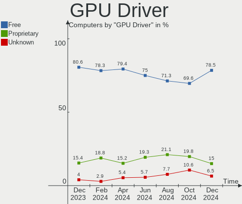

| Driver      | Computers | Percent |
|-------------|-----------|---------|
| Free        | 169       | 80.48%  |
| Proprietary | 33        | 15.71%  |
| Unknown     | 8         | 3.81%   |

GPU Memory
----------

Total video memory

| Size in GB | Computers | Percent |
|------------|-----------|---------|
| Unknown    | 132       | 62.86%  |
| 1.01-2.0   | 18        | 8.57%   |
| 7.01-8.0   | 16        | 7.62%   |
| 3.01-4.0   | 13        | 6.19%   |
| 0.01-0.5   | 12        | 5.71%   |
| 0.51-1.0   | 9         | 4.29%   |
| 8.01-16.0  | 5         | 2.38%   |
| 5.01-6.0   | 2         | 0.95%   |
| 16.01-24.0 | 2         | 0.95%   |
| 2.01-3.0   | 1         | 0.48%   |

Monitor
-------

Monitor Vendor
--------------

Monitor vendors

| Vendor                  | Computers | Percent |
|-------------------------|-----------|---------|
| AU Optronics            | 31        | 13.42%  |
| Samsung Electronics     | 25        | 10.82%  |
| BOE                     | 16        | 6.93%   |
| Hewlett-Packard         | 14        | 6.06%   |
| Dell                    | 14        | 6.06%   |
| LG Display              | 12        | 5.19%   |
| BenQ                    | 12        | 5.19%   |
| Goldstar                | 11        | 4.76%   |
| Chimei Innolux          | 11        | 4.76%   |
| Sharp                   | 9         | 3.9%    |
| Valve                   | 6         | 2.6%    |
| Lenovo                  | 6         | 2.6%    |
| Iiyama                  | 6         | 2.6%    |
| Acer                    | 6         | 2.6%    |
| Apple                   | 5         | 2.16%   |
| Sony                    | 4         | 1.73%   |
| InfoVision              | 4         | 1.73%   |
| AOC                     | 4         | 1.73%   |
| Chi Mei Optoelectronics | 3         | 1.3%    |
| Ancor Communications    | 3         | 1.3%    |
| ViewSonic               | 2         | 0.87%   |
| RTK                     | 2         | 0.87%   |
| MStar                   | 2         | 0.87%   |
| MSI                     | 2         | 0.87%   |
| HannStar                | 2         | 0.87%   |
| ASUSTek Computer        | 2         | 0.87%   |
| Unknown                 | 2         | 0.87%   |
| VMO                     | 1         | 0.43%   |
| Unknown                 | 1         | 0.43%   |
| Toshiba                 | 1         | 0.43%   |
| Sceptre Tech            | 1         | 0.43%   |
| Philips                 | 1         | 0.43%   |
| PANDA                   | 1         | 0.43%   |
| OEM                     | 1         | 0.43%   |
| LG Philips              | 1         | 0.43%   |
| Lanix                   | 1         | 0.43%   |
| HKC                     | 1         | 0.43%   |
| Elgato                  | 1         | 0.43%   |
| Eizo                    | 1         | 0.43%   |
| DVL                     | 1         | 0.43%   |

Monitor Model
-------------

Monitor models

| Model                                                                 | Computers | Percent |
|-----------------------------------------------------------------------|-----------|---------|
| Valve ANX7530 U VLV3001 800x1280 100x150mm 7.1-inch                   | 6         | 2.51%   |
| BenQ GW2270 BNQ78DB 1920x1080 476x268mm 21.5-inch                     | 3         | 1.26%   |
| AU Optronics LCD Monitor AUO2336 2560x1440 309x174mm 14.0-inch        | 3         | 1.26%   |
| Samsung Electronics LCD Monitor SDC4193 2880x1800 302x189mm 14.0-inch | 2         | 0.84%   |
| MStar Demo MST0030 1360x765 1150x650mm 52.0-inch                      | 2         | 0.84%   |
| Lenovo LCD Monitor LEN40BA 1920x1080 344x194mm 15.5-inch              | 2         | 0.84%   |
| InfoVision LCD Monitor IVO8544 1920x1080 294x165mm 13.3-inch          | 2         | 0.84%   |
| Iiyama PLX2481H IVM611D 1920x1080 521x293mm 23.5-inch                 | 2         | 0.84%   |
| Hewlett-Packard M27f FHD HPN370A 1920x1080 597x336mm 27.0-inch        | 2         | 0.84%   |
| Goldstar ULTRAWIDE GSM59F1 2560x1080 673x284mm 28.8-inch              | 2         | 0.84%   |
| Goldstar HDR 4K GSM7706 3840x2160 600x340mm 27.2-inch                 | 2         | 0.84%   |
| Dell S2721DS DELA19E 2560x1440 590x330mm 26.6-inch                    | 2         | 0.84%   |
| Dell P2715Q DEL40BD 3840x2160 597x336mm 27.0-inch                     | 2         | 0.84%   |
| Dell P2417H DELA0DC 1920x1080 527x296mm 23.8-inch                     | 2         | 0.84%   |
| Chimei Innolux LCD Monitor CMN14E5 1920x1080 309x173mm 13.9-inch      | 2         | 0.84%   |
| AU Optronics LCD Monitor AUO106C 1366x768 277x156mm 12.5-inch         | 2         | 0.84%   |
| Unknown                                                               | 2         | 0.84%   |
| VMO LCD QHD 1 VMO1091 2560x1440 600x340mm 27.2-inch                   | 1         | 0.42%   |
| ViewSonic VX2753 SERIES VSC7228 1920x1080 597x336mm 27.0-inch         | 1         | 0.42%   |
| ViewSonic VX2703 SERIES VSCF62B 1920x1080 597x336mm 27.0-inch         | 1         | 0.42%   |
| Unknown LCD Monitor SAMSUNG 1366x768                                  | 1         | 0.42%   |
| Toshiba LCD-MONITOR LCDE780 1280x1024 340x270mm 17.1-inch             | 1         | 0.42%   |
| Sony TV SNYE903 1920x1080                                             | 1         | 0.42%   |
| Sony TV SNYA102 1920x1080 708x398mm 32.0-inch                         | 1         | 0.42%   |
| Sony LCD Monitor TV 1360x768                                          | 1         | 0.42%   |
| Sony LCD Monitor SNY0025 1920x1080 531x299mm 24.0-inch                | 1         | 0.42%   |
| Sharp LCD Monitor SHP1548 1920x1200 288x180mm 13.4-inch               | 1         | 0.42%   |
| Sharp LCD Monitor SHP1547 1920x1200 288x180mm 13.4-inch               | 1         | 0.42%   |
| Sharp LCD Monitor SHP1516 3840x2400 336x210mm 15.6-inch               | 1         | 0.42%   |
| Sharp LCD Monitor SHP14D6 3840x2400 366x229mm 17.0-inch               | 1         | 0.42%   |
| Sharp LCD Monitor SHP14D1 1920x1200 336x210mm 15.6-inch               | 1         | 0.42%   |
| Sharp LCD Monitor SHP1476 3840x2160 346x194mm 15.6-inch               | 1         | 0.42%   |
| Sharp LCD Monitor SHP1453 1920x1080 346x194mm 15.6-inch               | 1         | 0.42%   |
| Sharp LCD Monitor SHP144A 3200x1800 294x165mm 13.3-inch               | 1         | 0.42%   |
| Sharp HDMI SHP1048 1920x1080 820x460mm 37.0-inch                      | 1         | 0.42%   |
| Sceptre Tech E22 SPT08D5 1920x1080 470x300mm 22.0-inch                | 1         | 0.42%   |
| Samsung Electronics U32R59x SAM0F96 3840x2160 697x392mm 31.5-inch     | 1         | 0.42%   |
| Samsung Electronics SE790C SAM0C63 2560x1080 700x310mm 30.1-inch      | 1         | 0.42%   |
| Samsung Electronics Odyssey G7 SAM72C1 3840x2160 697x392mm 31.5-inch  | 1         | 0.42%   |
| Samsung Electronics LCD Monitor SEC5441 1366x768 344x194mm 15.5-inch  | 1         | 0.42%   |

Monitor Resolution
------------------

Monitor screen resolution

| Resolution         | Computers | Percent |
|--------------------|-----------|---------|
| 1920x1080 (FHD)    | 97        | 43.3%   |
| 3840x2160 (4K)     | 21        | 9.38%   |
| 1366x768 (WXGA)    | 21        | 9.38%   |
| 2560x1440 (QHD)    | 12        | 5.36%   |
| 1920x1200 (WUXGA)  | 11        | 4.91%   |
| 1280x1024 (SXGA)   | 7         | 3.13%   |
| 800x1280           | 6         | 2.68%   |
| 2560x1600          | 6         | 2.68%   |
| 1280x800 (WXGA)    | 6         | 2.68%   |
| 3840x1080          | 3         | 1.34%   |
| 3440x1440          | 3         | 1.34%   |
| 2880x1800          | 3         | 1.34%   |
| 2560x1080          | 3         | 1.34%   |
| 1680x1050 (WSXGA+) | 3         | 1.34%   |
| 1440x900 (WXGA+)   | 3         | 1.34%   |
| 3840x2400          | 2         | 0.89%   |
| 3200x1800 (QHD+)   | 2         | 0.89%   |
| 1920x1280          | 2         | 0.89%   |
| 1600x900 (HD+)     | 2         | 0.89%   |
| 1024x600           | 2         | 0.89%   |
| Unknown            | 2         | 0.89%   |
| 6880x1440          | 1         | 0.45%   |
| 3840x1600          | 1         | 0.45%   |
| 2880x1620          | 1         | 0.45%   |
| 2256x1504          | 1         | 0.45%   |
| 1920x540           | 1         | 0.45%   |
| 1360x768           | 1         | 0.45%   |
| 1280x720 (HD)      | 1         | 0.45%   |

Monitor Diagonal
----------------

Diagonal size in inches

| Inches  | Computers | Percent |
|---------|-----------|---------|
| 15      | 52        | 22.71%  |
| 27      | 30        | 13.1%   |
| 13      | 25        | 10.92%  |
| 24      | 16        | 6.99%   |
| 14      | 15        | 6.55%   |
| 21      | 11        | 4.8%    |
| 23      | 10        | 4.37%   |
| 17      | 10        | 4.37%   |
| Unknown | 7         | 3.06%   |
| 34      | 6         | 2.62%   |
| 7       | 6         | 2.62%   |
| 16      | 5         | 2.18%   |
| 12      | 5         | 2.18%   |
| 32      | 4         | 1.75%   |
| 31      | 4         | 1.75%   |
| 19      | 4         | 1.75%   |
| 20      | 3         | 1.31%   |
| 54      | 2         | 0.87%   |
| 52      | 2         | 0.87%   |
| 84      | 1         | 0.44%   |
| 72      | 1         | 0.44%   |
| 60      | 1         | 0.44%   |
| 48      | 1         | 0.44%   |
| 40      | 1         | 0.44%   |
| 37      | 1         | 0.44%   |
| 30      | 1         | 0.44%   |
| 26      | 1         | 0.44%   |
| 22      | 1         | 0.44%   |
| 18      | 1         | 0.44%   |
| 10      | 1         | 0.44%   |
| 8       | 1         | 0.44%   |

Monitor Width
-------------

Physical width

| Width in mm | Computers | Percent |
|-------------|-----------|---------|
| 301-350     | 80        | 35.71%  |
| 501-600     | 50        | 22.32%  |
| 201-300     | 24        | 10.71%  |
| 401-500     | 17        | 7.59%   |
| 351-400     | 13        | 5.8%    |
| 701-800     | 10        | 4.46%   |
| Unknown     | 7         | 3.13%   |
| 601-700     | 6         | 2.68%   |
| 1001-1500   | 6         | 2.68%   |
| 1-100       | 6         | 2.68%   |
| 801-900     | 2         | 0.89%   |
| 1501-2000   | 2         | 0.89%   |
| 101-200     | 1         | 0.45%   |

Aspect Ratio
------------

Proportional relationship between the width and the height

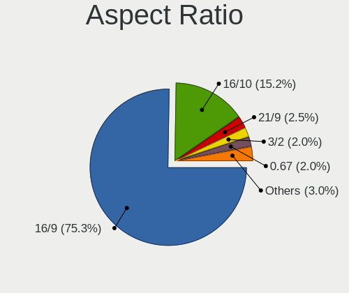

| Ratio   | Computers | Percent |
|---------|-----------|---------|
| 16/9    | 146       | 69.19%  |
| 16/10   | 34        | 16.11%  |
| 21/9    | 8         | 3.79%   |
| Unknown | 7         | 3.32%   |
| 0.67    | 6         | 2.84%   |
| 5/4     | 5         | 2.37%   |
| 3/2     | 3         | 1.42%   |
| 6/5     | 1         | 0.47%   |
| 32/9    | 1         | 0.47%   |

Monitor Area
------------

Area in inch

| Area in inch | Computers | Percent |
|----------------|-----------|---------|
| 101-110        | 50        | 21.74%  |
| 301-350        | 31        | 13.48%  |
| 201-250        | 30        | 13.04%  |
| 81-90          | 27        | 11.74%  |
| 351-500        | 15        | 6.52%   |
| 71-80          | 13        | 5.65%   |
| 151-200        | 11        | 4.78%   |
| More than 1000 | 7         | 3.04%   |
| 1-40           | 7         | 3.04%   |
| 251-300        | 7         | 3.04%   |
| 111-120        | 7         | 3.04%   |
| Unknown        | 7         | 3.04%   |
| 121-130        | 6         | 2.61%   |
| 61-70          | 5         | 2.17%   |
| 141-150        | 2         | 0.87%   |
| 131-140        | 2         | 0.87%   |
| 501-1000       | 2         | 0.87%   |
| 41-50          | 1         | 0.43%   |

Pixel Density
-------------

Pixels per inch

| Density       | Computers | Percent |
|---------------|-----------|---------|
| 51-100        | 65        | 29.55%  |
| 121-160       | 57        | 25.91%  |
| 101-120       | 38        | 17.27%  |
| 161-240       | 37        | 16.82%  |
| More than 240 | 9         | 4.09%   |
| 1-50          | 7         | 3.18%   |
| Unknown       | 7         | 3.18%   |

Multiple Monitors
-----------------

Total monitors connected

| Total | Computers | Percent |
|-------|-----------|---------|
| 1     | 157       | 74.76%  |
| 2     | 39        | 18.57%  |
| 0     | 9         | 4.29%   |
| 3     | 5         | 2.38%   |

Network
-------

Net Controller Vendor
---------------------

Controller vendors

| Vendor                          | Computers | Percent |
|---------------------------------|-----------|---------|
| Intel                           | 124       | 40.39%  |
| Realtek Semiconductor           | 92        | 29.97%  |
| Qualcomm Atheros                | 22        | 7.17%   |
| Broadcom                        | 19        | 6.19%   |
| MediaTek                        | 7         | 2.28%   |
| Broadcom Limited                | 7         | 2.28%   |
| ASIX Electronics                | 5         | 1.63%   |
| Qualcomm                        | 3         | 0.98%   |
| Nvidia                          | 3         | 0.98%   |
| TP-Link                         | 2         | 0.65%   |
| Samsung Electronics             | 2         | 0.65%   |
| Ralink Technology               | 2         | 0.65%   |
| Ralink                          | 2         | 0.65%   |
| Marvell Technology Group        | 2         | 0.65%   |
| JMicron Technology              | 2         | 0.65%   |
| DisplayLink                     | 2         | 0.65%   |
| Qualcomm Technologies           | 1         | 0.33%   |
| Qualcomm Atheros Communications | 1         | 0.33%   |
| Prolific Technology             | 1         | 0.33%   |
| Microsoft                       | 1         | 0.33%   |
| Microchip Technology            | 1         | 0.33%   |
| Lenovo                          | 1         | 0.33%   |
| ICS Advent                      | 1         | 0.33%   |
| Emulex                          | 1         | 0.33%   |
| Edimax Technology               | 1         | 0.33%   |
| Comneon                         | 1         | 0.33%   |
| Apple                           | 1         | 0.33%   |

Net Controller Model
--------------------

Controller models

| Model                                                                   | Computers | Percent |
|-------------------------------------------------------------------------|-----------|---------|
| Realtek RTL8111/8168/8411 PCI Express Gigabit Ethernet Controller       | 54        | 15.13%  |
| Realtek RTL8125 2.5GbE Controller                                       | 10        | 2.8%    |
| Intel Wireless 8265 / 8275                                              | 10        | 2.8%    |
| Intel Ethernet Controller I225-V                                        | 10        | 2.8%    |
| Realtek RTL8822CE 802.11ac PCIe Wireless Network Adapter                | 9         | 2.52%   |
| Realtek RTL8821CE 802.11ac PCIe Wireless Network Adapter                | 9         | 2.52%   |
| Realtek RTL810xE PCI Express Fast Ethernet controller                   | 8         | 2.24%   |
| Intel Wi-Fi 6 AX200                                                     | 8         | 2.24%   |
| Intel Wireless 7260                                                     | 7         | 1.96%   |
| Intel Ethernet Connection I217-LM                                       | 7         | 1.96%   |
| Intel Alder Lake-P PCH CNVi WiFi                                        | 7         | 1.96%   |
| Qualcomm Atheros AR9485 Wireless Network Adapter                        | 6         | 1.68%   |
| Intel Wireless-AC 9260                                                  | 6         | 1.68%   |
| Intel Wi-Fi 6 AX201                                                     | 6         | 1.68%   |
| Intel 82579LM Gigabit Network Connection (Lewisville)                   | 6         | 1.68%   |
| Realtek RTL8153 Gigabit Ethernet Adapter                                | 5         | 1.4%    |
| Intel Raptor Lake PCH CNVi WiFi                                         | 5         | 1.4%    |
| Intel I211 Gigabit Network Connection                                   | 5         | 1.4%    |
| Intel Dual Band Wireless-AC 3168NGW [Stone Peak]                        | 5         | 1.4%    |
| Realtek RTL8852AE 802.11ax PCIe Wireless Network Adapter                | 4         | 1.12%   |
| Qualcomm Atheros QCA6174 802.11ac Wireless Network Adapter              | 4         | 1.12%   |
| MediaTek MT7922 802.11ax PCI Express Wireless Network Adapter           | 4         | 1.12%   |
| Intel Wireless 8260                                                     | 4         | 1.12%   |
| Intel Wi-Fi 6 AX210/AX211/AX411 160MHz                                  | 4         | 1.12%   |
| Intel Ethernet Connection (4) I219-V                                    | 4         | 1.12%   |
| ASIX AX88179 Gigabit Ethernet                                           | 4         | 1.12%   |
| Qualcomm Atheros QCA9377 802.11ac Wireless Network Adapter              | 3         | 0.84%   |
| Intel Wireless 7265                                                     | 3         | 0.84%   |
| Intel PRO/Wireless 5100 AGN [Shiloh] Network Connection                 | 3         | 0.84%   |
| Intel Ethernet Connection (4) I219-LM                                   | 3         | 0.84%   |
| Samsung Galaxy series, misc. (tethering mode)                           | 2         | 0.56%   |
| Realtek RTL8192EE PCIe Wireless Network Adapter                         | 2         | 0.56%   |
| Qualcomm QCNFA765 Wireless Network Adapter                              | 2         | 0.56%   |
| Qualcomm Atheros Killer E2500 Gigabit Ethernet Controller               | 2         | 0.56%   |
| Qualcomm Atheros AR93xx Wireless Network Adapter                        | 2         | 0.56%   |
| Qualcomm Atheros AR8161 Gigabit Ethernet                                | 2         | 0.56%   |
| Qualcomm Atheros AR242x / AR542x Wireless Network Adapter (PCI-Express) | 2         | 0.56%   |
| MediaTek MT7921K (RZ608) Wi-Fi 6E 80MHz                                 | 2         | 0.56%   |
| Intel Tiger Lake PCH CNVi WiFi                                          | 2         | 0.56%   |
| Intel PRO/Wireless 3945ABG [Golan] Network Connection                   | 2         | 0.56%   |

Wireless Vendor
---------------

Wireless vendors

| Vendor                          | Computers | Percent |
|---------------------------------|-----------|---------|
| Intel                           | 90        | 52.02%  |
| Realtek Semiconductor           | 27        | 15.61%  |
| Qualcomm Atheros                | 18        | 10.4%   |
| Broadcom                        | 12        | 6.94%   |
| MediaTek                        | 7         | 4.05%   |
| Broadcom Limited                | 6         | 3.47%   |
| Qualcomm                        | 3         | 1.73%   |
| TP-Link                         | 2         | 1.16%   |
| Ralink Technology               | 2         | 1.16%   |
| Ralink                          | 2         | 1.16%   |
| Qualcomm Technologies           | 1         | 0.58%   |
| Qualcomm Atheros Communications | 1         | 0.58%   |
| Microsoft                       | 1         | 0.58%   |
| Edimax Technology               | 1         | 0.58%   |

Wireless Model
--------------

Wireless models

| Model                                                                   | Computers | Percent |
|-------------------------------------------------------------------------|-----------|---------|
| Intel Wireless 8265 / 8275                                              | 10        | 5.78%   |
| Realtek RTL8822CE 802.11ac PCIe Wireless Network Adapter                | 9         | 5.2%    |
| Realtek RTL8821CE 802.11ac PCIe Wireless Network Adapter                | 9         | 5.2%    |
| Intel Wi-Fi 6 AX200                                                     | 8         | 4.62%   |
| Intel Wireless 7260                                                     | 7         | 4.05%   |
| Intel Alder Lake-P PCH CNVi WiFi                                        | 7         | 4.05%   |
| Qualcomm Atheros AR9485 Wireless Network Adapter                        | 6         | 3.47%   |
| Intel Wireless-AC 9260                                                  | 6         | 3.47%   |
| Intel Wi-Fi 6 AX201                                                     | 6         | 3.47%   |
| Intel Raptor Lake PCH CNVi WiFi                                         | 5         | 2.89%   |
| Intel Dual Band Wireless-AC 3168NGW [Stone Peak]                        | 5         | 2.89%   |
| Realtek RTL8852AE 802.11ax PCIe Wireless Network Adapter                | 4         | 2.31%   |
| Qualcomm Atheros QCA6174 802.11ac Wireless Network Adapter              | 4         | 2.31%   |
| MediaTek MT7922 802.11ax PCI Express Wireless Network Adapter           | 4         | 2.31%   |
| Intel Wireless 8260                                                     | 4         | 2.31%   |
| Intel Wi-Fi 6 AX210/AX211/AX411 160MHz                                  | 4         | 2.31%   |
| Qualcomm Atheros QCA9377 802.11ac Wireless Network Adapter              | 3         | 1.73%   |
| Intel Wireless 7265                                                     | 3         | 1.73%   |
| Intel PRO/Wireless 5100 AGN [Shiloh] Network Connection                 | 3         | 1.73%   |
| Realtek RTL8192EE PCIe Wireless Network Adapter                         | 2         | 1.16%   |
| Qualcomm QCNFA765 Wireless Network Adapter                              | 2         | 1.16%   |
| Qualcomm Atheros AR93xx Wireless Network Adapter                        | 2         | 1.16%   |
| Qualcomm Atheros AR242x / AR542x Wireless Network Adapter (PCI-Express) | 2         | 1.16%   |
| MediaTek MT7921K (RZ608) Wi-Fi 6E 80MHz                                 | 2         | 1.16%   |
| Intel Tiger Lake PCH CNVi WiFi                                          | 2         | 1.16%   |
| Intel PRO/Wireless 3945ABG [Golan] Network Connection                   | 2         | 1.16%   |
| Intel Gemini Lake PCH CNVi WiFi                                         | 2         | 1.16%   |
| Intel Comet Lake PCH-LP CNVi WiFi                                       | 2         | 1.16%   |
| Intel Cannon Point-LP CNVi [Wireless-AC]                                | 2         | 1.16%   |
| Intel Cannon Lake PCH CNVi WiFi                                         | 2         | 1.16%   |
| Broadcom Limited BCM4360 802.11ac Wireless Network Adapter              | 2         | 1.16%   |
| Broadcom Limited BCM4312 802.11b/g LP-PHY                               | 2         | 1.16%   |
| Broadcom BCM4322 802.11a/b/g/n Wireless LAN Controller                  | 2         | 1.16%   |
| Broadcom BCM43142 802.11b/g/n                                           | 2         | 1.16%   |
| TP-Link TL-WN822N Version 4 RTL8192EU                                   | 1         | 0.58%   |
| TP-Link Archer T2U PLUS [RTL8821AU]                                     | 1         | 0.58%   |
| Realtek RTL8852BE PCIe 802.11ax Wireless Network Controller             | 1         | 0.58%   |
| Realtek RTL8812AE 802.11ac PCIe Wireless Network Adapter                | 1         | 0.58%   |
| Realtek 802.11ac NIC                                                    | 1         | 0.58%   |
| Ralink RT5572 Wireless Adapter                                          | 1         | 0.58%   |

Ethernet Vendor
---------------

Ethernet vendors

| Vendor                   | Computers | Percent |
|--------------------------|-----------|---------|
| Realtek Semiconductor    | 75        | 43.1%   |
| Intel                    | 64        | 36.78%  |
| Broadcom                 | 8         | 4.6%    |
| Qualcomm Atheros         | 6         | 3.45%   |
| ASIX Electronics         | 5         | 2.87%   |
| Nvidia                   | 3         | 1.72%   |
| Samsung Electronics      | 2         | 1.15%   |
| Marvell Technology Group | 2         | 1.15%   |
| JMicron Technology       | 2         | 1.15%   |
| DisplayLink              | 2         | 1.15%   |
| Microchip Technology     | 1         | 0.57%   |
| ICS Advent               | 1         | 0.57%   |
| Emulex                   | 1         | 0.57%   |
| Broadcom Limited         | 1         | 0.57%   |
| Apple                    | 1         | 0.57%   |

Ethernet Model
--------------

Ethernet models

| Model                                                             | Computers | Percent |
|-------------------------------------------------------------------|-----------|---------|
| Realtek RTL8111/8168/8411 PCI Express Gigabit Ethernet Controller | 54        | 29.83%  |
| Realtek RTL8125 2.5GbE Controller                                 | 10        | 5.52%   |
| Intel Ethernet Controller I225-V                                  | 10        | 5.52%   |
| Realtek RTL810xE PCI Express Fast Ethernet controller             | 8         | 4.42%   |
| Intel Ethernet Connection I217-LM                                 | 7         | 3.87%   |
| Intel 82579LM Gigabit Network Connection (Lewisville)             | 6         | 3.31%   |
| Realtek RTL8153 Gigabit Ethernet Adapter                          | 5         | 2.76%   |
| Intel I211 Gigabit Network Connection                             | 5         | 2.76%   |
| Intel Ethernet Connection (4) I219-V                              | 4         | 2.21%   |
| ASIX AX88179 Gigabit Ethernet                                     | 4         | 2.21%   |
| Intel Ethernet Connection (4) I219-LM                             | 3         | 1.66%   |
| Samsung Galaxy series, misc. (tethering mode)                     | 2         | 1.1%    |
| Qualcomm Atheros Killer E2500 Gigabit Ethernet Controller         | 2         | 1.1%    |
| Qualcomm Atheros AR8161 Gigabit Ethernet                          | 2         | 1.1%    |
| Intel Ethernet Connection I219-LM                                 | 2         | 1.1%    |
| Intel Ethernet Connection I218-LM                                 | 2         | 1.1%    |
| Intel Ethernet Connection I217-V                                  | 2         | 1.1%    |
| Intel Ethernet Connection (7) I219-V                              | 2         | 1.1%    |
| Intel Ethernet Connection (13) I219-V                             | 2         | 1.1%    |
| Intel 82579V Gigabit Network Connection                           | 2         | 1.1%    |
| Intel 82574L Gigabit Network Connection                           | 2         | 1.1%    |
| Realtek RTL8152 Fast Ethernet Adapter                             | 1         | 0.55%   |
| Qualcomm Atheros Killer E2400 Gigabit Ethernet Controller         | 1         | 0.55%   |
| Qualcomm Atheros AR8132 Fast Ethernet                             | 1         | 0.55%   |
| Nvidia MCP79 Ethernet                                             | 1         | 0.55%   |
| Nvidia MCP61 Ethernet                                             | 1         | 0.55%   |
| Nvidia MCP55 Ethernet                                             | 1         | 0.55%   |
| Microchip LAN7500 Ethernet 10/100/1000 Adapter                    | 1         | 0.55%   |
| Marvell Group 88E8072 PCI-E Gigabit Ethernet Controller           | 1         | 0.55%   |
| Marvell Group 88E8058 PCI-E Gigabit Ethernet Controller           | 1         | 0.55%   |
| JMicron JMC260 PCI Express Fast Ethernet Controller               | 1         | 0.55%   |
| JMicron JMC250 PCI Express Gigabit Ethernet Controller            | 1         | 0.55%   |
| Intel I210 Gigabit Network Connection                             | 1         | 0.55%   |
| Intel Ethernet Controller I226-V                                  | 1         | 0.55%   |
| Intel Ethernet Controller I219-LM                                 | 1         | 0.55%   |
| Intel Ethernet Connection I219-V                                  | 1         | 0.55%   |
| Intel Ethernet Connection (7) I219-LM                             | 1         | 0.55%   |
| Intel Ethernet Connection (6) I219-V                              | 1         | 0.55%   |
| Intel Ethernet Connection (6) I219-LM                             | 1         | 0.55%   |
| Intel Ethernet Connection (3) I219-LM                             | 1         | 0.55%   |

Net Controller Kind
-------------------

Ethernet, WiFi or modem

| Kind     | Computers | Percent |
|----------|-----------|---------|
| WiFi     | 169       | 50%     |
| Ethernet | 166       | 49.11%  |
| Modem    | 3         | 0.89%   |

Used Controller
---------------

Currently used network controller

| Kind     | Computers | Percent |
|----------|-----------|---------|
| WiFi     | 127       | 59.07%  |
| Ethernet | 88        | 40.93%  |

NICs
----

Total network controllers on board

| Total | Computers | Percent |
|-------|-----------|---------|
| 2     | 111       | 52.86%  |
| 1     | 86        | 40.95%  |
| 3     | 7         | 3.33%   |
| 0     | 4         | 1.9%    |
| 4     | 2         | 0.95%   |

IPv6
----

IPv6 vs IPv4

| Used | Computers | Percent |
|------|-----------|---------|
| No   | 173       | 82.38%  |
| Yes  | 37        | 17.62%  |

Bluetooth
---------

Bluetooth Vendor
----------------

Controller vendors

| Vendor                          | Computers | Percent |
|---------------------------------|-----------|---------|
| Intel                           | 79        | 52.67%  |
| Realtek Semiconductor           | 16        | 10.67%  |
| IMC Networks                    | 10        | 6.67%   |
| Foxconn / Hon Hai               | 9         | 6%      |
| Cambridge Silicon Radio         | 7         | 4.67%   |
| Qualcomm Atheros Communications | 6         | 4%      |
| Apple                           | 6         | 4%      |
| Broadcom                        | 4         | 2.67%   |
| TP-Link                         | 3         | 2%      |
| MediaTek                        | 3         | 2%      |
| Toshiba                         | 2         | 1.33%   |
| ASUSTek Computer                | 2         | 1.33%   |
| USI                             | 1         | 0.67%   |
| Hewlett-Packard                 | 1         | 0.67%   |
| Dell                            | 1         | 0.67%   |

Bluetooth Model
---------------

Controller models

| Model                                               | Computers | Percent |
|-----------------------------------------------------|-----------|---------|
| Intel Bluetooth wireless interface                  | 26        | 17.33%  |
| Realtek Bluetooth Radio                             | 14        | 9.33%   |
| Intel Bluetooth Device                              | 12        | 8%      |
| Intel AX201 Bluetooth                               | 12        | 8%      |
| IMC Networks Bluetooth Radio                        | 9         | 6%      |
| Intel AX200 Bluetooth                               | 8         | 5.33%   |
| Intel Bluetooth 9460/9560 Jefferson Peak (JfP)      | 7         | 4.67%   |
| Cambridge Silicon Radio Bluetooth Dongle (HCI mode) | 7         | 4.67%   |
| Intel Wireless-AC 3168 Bluetooth                    | 5         | 3.33%   |
| Intel Wireless-AC 9260 Bluetooth Adapter            | 4         | 2.67%   |
| Intel AX210 Bluetooth                               | 4         | 2.67%   |
| Foxconn / Hon Hai Wireless_Device                   | 4         | 2.67%   |
| TP-Link UB5A Adapter                                | 3         | 2%      |
| Qualcomm Atheros QCA61x4 Bluetooth 4.0              | 3         | 2%      |
| MediaTek Wireless_Device                            | 3         | 2%      |
| Foxconn / Hon Hai Bluetooth Device                  | 3         | 2%      |
| Apple Bluetooth Host Controller                     | 3         | 2%      |
| Realtek  Bluetooth 4.2 Adapter                      | 2         | 1.33%   |
| Qualcomm Atheros  Bluetooth Device                  | 2         | 1.33%   |
| Broadcom BCM20702A0 Bluetooth 4.0                   | 2         | 1.33%   |
| USI Bluetooth Device                                | 1         | 0.67%   |
| Toshiba Bluetooth USB Host Controller               | 1         | 0.67%   |
| Toshiba BCM43142A0                                  | 1         | 0.67%   |
| Qualcomm Atheros AR3012 Bluetooth 4.0               | 1         | 0.67%   |
| Intel Centrino Bluetooth Wireless Transceiver       | 1         | 0.67%   |
| IMC Networks Bluetooth Device                       | 1         | 0.67%   |
| HP Broadcom 2070 Bluetooth Combo                    | 1         | 0.67%   |
| Foxconn / Hon Hai Bluetooth USB Host Controller     | 1         | 0.67%   |
| Foxconn / Hon Hai BCM43142A0                        | 1         | 0.67%   |
| Dell Wireless 365 Bluetooth                         | 1         | 0.67%   |
| Broadcom BCM20702 Bluetooth 4.0 [ThinkPad]          | 1         | 0.67%   |
| Broadcom BCM2045B (BDC-2.1) [Bluetooth Controller]  | 1         | 0.67%   |
| ASUS Broadcom BCM20702A0 Bluetooth                  | 1         | 0.67%   |
| ASUS BCM20702A0                                     | 1         | 0.67%   |
| Apple Built-in Bluetooth 2.0+EDR HCI                | 1         | 0.67%   |
| Apple Bluetooth USB Host Controller                 | 1         | 0.67%   |
| Apple Bluetooth HCI                                 | 1         | 0.67%   |

Sound
-----

Sound Vendor
------------

Sound card vendors

| Vendor                                       | Computers | Percent |
|----------------------------------------------|-----------|---------|
| Intel                                        | 142       | 47.02%  |
| AMD                                          | 61        | 20.2%   |
| Nvidia                                       | 50        | 16.56%  |
| C-Media Electronics                          | 8         | 2.65%   |
| VIA Technologies                             | 3         | 0.99%   |
| ASUSTek Computer                             | 3         | 0.99%   |
| Zoran Co. Personal Media Division (Nogatech) | 2         | 0.66%   |
| Texas Instruments                            | 2         | 0.66%   |
| Micro Star International                     | 2         | 0.66%   |
| Creative Labs                                | 2         | 0.66%   |
| Astro Gaming                                 | 2         | 0.66%   |
| WinChipHead                                  | 1         | 0.33%   |
| Thesycon Systemsoftware & Consulting         | 1         | 0.33%   |
| Sennheiser Communications                    | 1         | 0.33%   |
| RODE Microphones                             | 1         | 0.33%   |
| Realtek Semiconductor                        | 1         | 0.33%   |
| Razer USA                                    | 1         | 0.33%   |
| PreSonus Audio Electronics                   | 1         | 0.33%   |
| Microsoft                                    | 1         | 0.33%   |
| Lenovo                                       | 1         | 0.33%   |
| Kingston Technology                          | 1         | 0.33%   |
| KESUMO                                       | 1         | 0.33%   |
| JMTek                                        | 1         | 0.33%   |
| Hangzhou Worlde                              | 1         | 0.33%   |
| GN Netcom                                    | 1         | 0.33%   |
| Focusrite-Novation                           | 1         | 0.33%   |
| FiiO Electronics Technology                  | 1         | 0.33%   |
| DCMT Technology                              | 1         | 0.33%   |
| Creative Technology                          | 1         | 0.33%   |
| Corsair                                      | 1         | 0.33%   |
| Cooler Master                                | 1         | 0.33%   |
| CME                                          | 1         | 0.33%   |
| Bose                                         | 1         | 0.33%   |
| BEHRINGER International                      | 1         | 0.33%   |
| AKG C44-USB Microphone                       | 1         | 0.33%   |
| AKAI Professional M.I.                       | 1         | 0.33%   |

Sound Model
-----------

Sound card models

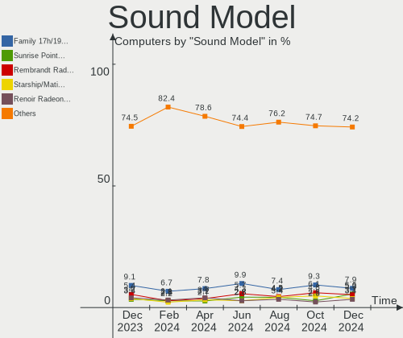

| Model                                                                      | Computers | Percent |
|----------------------------------------------------------------------------|-----------|---------|
| AMD Family 17h/19h HD Audio Controller                                     | 22        | 6.18%   |
| Intel Sunrise Point-LP HD Audio                                            | 18        | 5.06%   |
| Intel 7 Series/C216 Chipset Family High Definition Audio Controller        | 17        | 4.78%   |
| Intel 8 Series/C220 Series Chipset High Definition Audio Controller        | 12        | 3.37%   |
| AMD Renoir Radeon High Definition Audio Controller                         | 12        | 3.37%   |
| AMD Rembrandt Radeon High Definition Audio Controller                      | 12        | 3.37%   |
| Intel Xeon E3-1200 v3/4th Gen Core Processor HD Audio Controller           | 11        | 3.09%   |
| Intel Tiger Lake-LP Smart Sound Technology Audio Controller                | 11        | 3.09%   |
| AMD Starship/Matisse HD Audio Controller                                   | 10        | 2.81%   |
| Intel Alder Lake PCH-P High Definition Audio Controller                    | 8         | 2.25%   |
| Nvidia GA104 High Definition Audio Controller                              | 6         | 1.69%   |
| Intel Raptor Lake-P/U/H cAVS                                               | 5         | 1.4%    |
| Intel Comet Lake PCH-LP cAVS                                               | 5         | 1.4%    |
| Intel Cannon Lake PCH cAVS                                                 | 5         | 1.4%    |
| Intel 82801H (ICH8 Family) HD Audio Controller                             | 5         | 1.4%    |
| Intel 6 Series/C200 Series Chipset Family High Definition Audio Controller | 5         | 1.4%    |
| AMD SBx00 Azalia (Intel HDA)                                               | 5         | 1.4%    |
| AMD Raven/Raven2/Fenghuang HDMI/DP Audio Controller                        | 5         | 1.4%    |
| AMD Navi 21/23 HDMI/DP Audio Controller                                    | 5         | 1.4%    |
| Nvidia GP107GL High Definition Audio Controller                            | 4         | 1.12%   |
| Nvidia GP106 High Definition Audio Controller                              | 4         | 1.12%   |
| Nvidia GP104 High Definition Audio Controller                              | 4         | 1.12%   |
| Nvidia Audio device                                                        | 4         | 1.12%   |
| Intel Cannon Point-LP High Definition Audio Controller                     | 4         | 1.12%   |
| Intel 82801I (ICH9 Family) HD Audio Controller                             | 4         | 1.12%   |
| Intel 5 Series/3400 Series Chipset High Definition Audio                   | 4         | 1.12%   |
| C-Media Electronics Audio Adapter (Unitek Y-247A)                          | 4         | 1.12%   |
| Nvidia GM107 High Definition Audio Controller [GeForce 940MX]              | 3         | 0.84%   |
| Nvidia GA102 High Definition Audio Controller                              | 3         | 0.84%   |
| Intel Tiger Lake-H HD Audio Controller                                     | 3         | 0.84%   |
| Intel Haswell-ULT HD Audio Controller                                      | 3         | 0.84%   |
| Intel CM238 HD Audio Controller                                            | 3         | 0.84%   |
| Intel Celeron/Pentium Silver Processor High Definition Audio               | 3         | 0.84%   |
| Intel 8 Series HD Audio Controller                                         | 3         | 0.84%   |
| ASUSTek Computer USB Audio                                                 | 3         | 0.84%   |
| AMD Navi 10 HDMI Audio                                                     | 3         | 0.84%   |
| AMD FCH Azalia Controller                                                  | 3         | 0.84%   |
| AMD Family 17h (Models 00h-0fh) HD Audio Controller                        | 3         | 0.84%   |
| AMD Ellesmere HDMI Audio [Radeon RX 470/480 / 570/580/590]                 | 3         | 0.84%   |
| Zoran Co. Personal Media Division (Nogatech) USB Audio and HID             | 2         | 0.56%   |

Memory
------

Memory Vendor
-------------

Memory module vendors

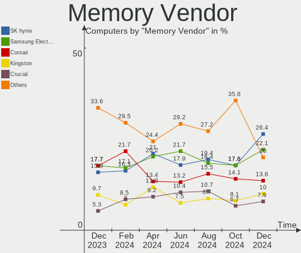

| Vendor              | Computers | Percent |
|---------------------|-----------|---------|
| SK hynix            | 32        | 22.7%   |
| Samsung Electronics | 30        | 21.28%  |
| Corsair             | 16        | 11.35%  |
| Crucial             | 14        | 9.93%   |
| Kingston            | 13        | 9.22%   |
| Micron Technology   | 12        | 8.51%   |
| Elpida              | 4         | 2.84%   |
| Unknown             | 3         | 2.13%   |
| Ramaxel Technology  | 3         | 2.13%   |
| A-DATA Technology   | 3         | 2.13%   |
| G.Skill             | 2         | 1.42%   |
| Unknown             | 2         | 1.42%   |
| Unknown (0x0E9D)    | 1         | 0.71%   |
| Unknown (0x0B15)    | 1         | 0.71%   |
| SHARETRONIC         | 1         | 0.71%   |
| Nanya Technology    | 1         | 0.71%   |
| Lexar               | 1         | 0.71%   |
| Hewlett-Packard     | 1         | 0.71%   |
| CSX                 | 1         | 0.71%   |

Memory Model
------------

Memory module models

| Model                                                              | Computers | Percent |
|--------------------------------------------------------------------|-----------|---------|
| SK hynix RAM Module 4GB SODIMM DDR3 1600MT/s                       | 2         | 1.36%   |
| SK hynix RAM HMCG78MEBSA095N 16GB SODIMM DDR5 4800MT/s             | 2         | 1.36%   |
| SK hynix RAM HMAA1GS6CJR6N-XN 8GB SODIMM DDR4 3200MT/s             | 2         | 1.36%   |
| SK hynix RAM HMA81GS6AFR8N-UH 8GB SODIMM DDR4 2667MT/s             | 2         | 1.36%   |
| Samsung RAM M471A1G44BB0-CWE 8GB SODIMM DDR4 3200MT/s              | 2         | 1.36%   |
| Samsung RAM M471A1G43DB0-CPB 8GB SODIMM DDR4 2667MT/s              | 2         | 1.36%   |
| Micron RAM 8JTF51264AZ-1G6E1 4GB DIMM DDR3 1600MT/s                | 2         | 1.36%   |
| Crucial RAM CT32G4SFD832A.C16FF 32GB SODIMM DDR4 3200MT/s          | 2         | 1.36%   |
| Crucial RAM CT16G4SFRA32A.M16FR 16GB SODIMM DDR4 3200MT/s          | 2         | 1.36%   |
| Unknown                                                            | 2         | 1.36%   |
| Unknown RAM Module 8GB SODIMM DDR3 1333MT/s                        | 1         | 0.68%   |
| Unknown RAM Module 2GB SODIMM DDR2 667MT/s                         | 1         | 0.68%   |
| Unknown RAM DDR3 1600 8G 8GB SODIMM DDR3 1333MT/s                  | 1         | 0.68%   |
| Unknown (0x0E9D) RAM KINSOTIN16GB2666MHZ 16GB SODIMM DDR4 2667MT/s | 1         | 0.68%   |
| Unknown (0x0B15) RAM JAD3200U1816 16GB DIMM DDR4 2667MT/s          | 1         | 0.68%   |
| SK hynix RAM Module 512MB SODIMM DDR2 533MT/s                      | 1         | 0.68%   |
| SK hynix RAM Module 4GB Row Of Chips LPDDR5 6400MT/s               | 1         | 0.68%   |
| SK hynix RAM Module 2GB SODIMM DDR3 1066MT/s                       | 1         | 0.68%   |
| SK hynix RAM Module 2GB DIMM DDR3 1600MT/s                         | 1         | 0.68%   |
| SK hynix RAM Module 1GB Row Of Chips LPDDR4 4267MT/s               | 1         | 0.68%   |
| SK hynix RAM HYMP125U64CP8-S6 2GB DIMM DDR2 49926MT/s              | 1         | 0.68%   |
| SK hynix RAM HMT451S6AFR8C-PB 4096MB SODIMM DDR3 1600MT/s          | 1         | 0.68%   |
| SK hynix RAM HMT425S6AFR6A-PB 2GB SODIMM DDR3 3200MT/s             | 1         | 0.68%   |
| SK hynix RAM HMT425S6AFR6A-PB 2GB SODIMM DDR3 1600MT/s             | 1         | 0.68%   |
| SK hynix RAM HMT41GS6AFR8A-PB 8GB SODIMM DDR3 1600MT/s             | 1         | 0.68%   |
| SK hynix RAM HMT351U6CFR8C-PB 4GB DIMM DDR3 1800MT/s               | 1         | 0.68%   |
| SK hynix RAM HMT351S6CFR8C-PB 4GB SODIMM DDR3 1600MT/s             | 1         | 0.68%   |
| SK hynix RAM HMT351S6AFR8C-G7 4GB SODIMM DDR3 1067MT/s             | 1         | 0.68%   |
| SK hynix RAM HMP351S6AFR8C-S6 4GB SODIMM DDR2 800MT/s              | 1         | 0.68%   |
| SK hynix RAM HMAB2GS6CMR6N-XN 16GB SODIMM DDR4 3200MT/s            | 1         | 0.68%   |
| SK hynix RAM HMAB2GS6AMR6N-XN 16GB Row Of Chips DDR4 3200MT/s      | 1         | 0.68%   |
| SK hynix RAM HMA851S6DJR6N-XN 4GB Row Of Chips DDR4 3200MT/s       | 1         | 0.68%   |
| SK hynix RAM HMA84GR7MFR4N-UH 32GB DIMM DDR4 2400MT/s              | 1         | 0.68%   |
| SK hynix RAM HMA81GU6DJR8N-XN 8GB DIMM DDR4 3200MT/s               | 1         | 0.68%   |
| SK hynix RAM HMA81GU6CJR8N-XN 8GB DIMM DDR4 3200MT/s               | 1         | 0.68%   |
| SK hynix RAM HMA81GS6CJR8N-VK 8GB SODIMM DDR4 2667MT/s             | 1         | 0.68%   |
| SK hynix RAM HCNNNCPMBLHR-NEE 8GB Row Of Chips LPDDR4 4267MT/s     | 1         | 0.68%   |
| SK hynix RAM H9CCNNNCLGALAR-NVD 8GB Row Of Chips LPDDR3 2133MT/s   | 1         | 0.68%   |
| SK hynix RAM H54G46CYRBX267N 4GB LPDDR4 4266MT/s                   | 1         | 0.68%   |
| SHARETRONIC RAM Module 8GB SODIMM DDR3 1600MT/s                    | 1         | 0.68%   |

Memory Kind
-----------

Memory module kinds

| Kind   | Computers | Percent |
|--------|-----------|---------|
| DDR4   | 57        | 48.72%  |
| DDR3   | 31        | 26.5%   |
| DDR5   | 8         | 6.84%   |
| DDR2   | 8         | 6.84%   |
| LPDDR5 | 4         | 3.42%   |
| LPDDR3 | 4         | 3.42%   |
| LPDDR4 | 3         | 2.56%   |
| SDRAM  | 1         | 0.85%   |
| DDR    | 1         | 0.85%   |

Memory Form Factor
------------------

Physical design of the memory module

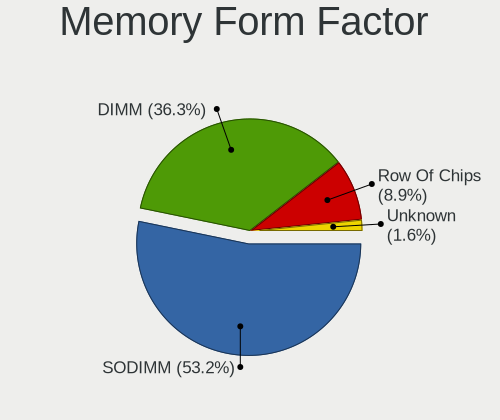

| Name         | Computers | Percent |
|--------------|-----------|---------|
| SODIMM       | 69        | 58.47%  |
| DIMM         | 35        | 29.66%  |
| Row Of Chips | 13        | 11.02%  |
| Unknown      | 1         | 0.85%   |

Memory Size
-----------

Memory module size

| Size  | Computers | Percent |
|-------|-----------|---------|
| 8192  | 42        | 32.81%  |
| 4096  | 31        | 24.22%  |
| 16384 | 27        | 21.09%  |
| 2048  | 15        | 11.72%  |
| 32768 | 7         | 5.47%   |
| 1024  | 5         | 3.91%   |
| 512   | 1         | 0.78%   |

Memory Speed
------------

Memory module speed

| Speed | Computers | Percent |
|-------|-----------|---------|
| 3200  | 25        | 19.53%  |
| 1600  | 21        | 16.41%  |
| 2667  | 17        | 13.28%  |
| 4800  | 7         | 5.47%   |
| 2133  | 7         | 5.47%   |
| 2400  | 6         | 4.69%   |
| 6400  | 5         | 3.91%   |
| 1067  | 4         | 3.13%   |
| 667   | 4         | 3.13%   |
| 3600  | 3         | 2.34%   |
| 4267  | 2         | 1.56%   |
| 3733  | 2         | 1.56%   |
| 3266  | 2         | 1.56%   |
| 3000  | 2         | 1.56%   |
| 1333  | 2         | 1.56%   |
| 800   | 2         | 1.56%   |
| 49926 | 1         | 0.78%   |
| 4266  | 1         | 0.78%   |
| 3800  | 1         | 0.78%   |
| 3666  | 1         | 0.78%   |
| 3533  | 1         | 0.78%   |
| 3333  | 1         | 0.78%   |
| 2933  | 1         | 0.78%   |
| 2800  | 1         | 0.78%   |
| 2666  | 1         | 0.78%   |
| 2048  | 1         | 0.78%   |
| 1867  | 1         | 0.78%   |
| 1866  | 1         | 0.78%   |
| 1800  | 1         | 0.78%   |
| 1334  | 1         | 0.78%   |
| 1066  | 1         | 0.78%   |
| 975   | 1         | 0.78%   |
| 533   | 1         | 0.78%   |

Printers & scanners
-------------------

Printer Vendor
--------------

Printer device vendors

| Vendor             | Computers | Percent |
|--------------------|-----------|---------|
| Seiko Epson        | 1         | 25%     |
| Pantum             | 1         | 25%     |
| Hewlett-Packard    | 1         | 25%     |
| Brother Industries | 1         | 25%     |

Printer Model
-------------

Printer device models

| Model                      | Computers | Percent |
|----------------------------|-----------|---------|
| Seiko Epson ET-2710 Series | 1         | 25%     |
| Pantum P2200W series       | 1         | 25%     |
| HP OfficeJet 3830 series   | 1         | 25%     |
| Brother MFC-J4540DW        | 1         | 25%     |

Scanner Vendor
--------------

Scanner device vendors

| Vendor | Computers | Percent |
|--------|-----------|---------|
| Canon  | 4         | 100%    |

Scanner Model
-------------

Scanner device models

| Model                              | Computers | Percent |
|------------------------------------|-----------|---------|
| Canon CanoScan N670U/N676U/LiDE 20 | 1         | 25%     |
| Canon CanoScan LiDE 600F           | 1         | 25%     |
| Canon CanoScan LIDE 25             | 1         | 25%     |
| Canon CanoScan LiDE 220            | 1         | 25%     |

Camera
------

Camera Vendor
-------------

Camera device vendors

| Vendor                                 | Computers | Percent |
|----------------------------------------|-----------|---------|
| Chicony Electronics                    | 24        | 18.75%  |
| Microdia                               | 13        | 10.16%  |
| Logitech                               | 13        | 10.16%  |
| IMC Networks                           | 12        | 9.38%   |
| Bison Electronics                      | 10        | 7.81%   |
| Sunplus Innovation Technology          | 9         | 7.03%   |
| Realtek Semiconductor                  | 5         | 3.91%   |
| Quanta                                 | 5         | 3.91%   |
| Syntek                                 | 3         | 2.34%   |
| Suyin                                  | 3         | 2.34%   |
| Sonix Technology                       | 3         | 2.34%   |
| Luxvisions Innotech Limited            | 3         | 2.34%   |
| Cheng Uei Precision Industry (Foxlink) | 3         | 2.34%   |
| Apple                                  | 3         | 2.34%   |
| Acer                                   | 3         | 2.34%   |
| Silicon Motion                         | 2         | 1.56%   |
| Microsoft                              | 2         | 1.56%   |
| Lite-On Technology                     | 2         | 1.56%   |
| ALi                                    | 2         | 1.56%   |
| WaveRider Communications               | 1         | 0.78%   |
| Samsung Electronics                    | 1         | 0.78%   |
| Ricoh                                  | 1         | 0.78%   |
| Lenovo                                 | 1         | 0.78%   |
| KYE Systems (Mouse Systems)            | 1         | 0.78%   |
| Intel                                  | 1         | 0.78%   |
| Importek                               | 1         | 0.78%   |
| Anker                                  | 1         | 0.78%   |

Camera Model
------------

Camera device models

| Model                                   | Computers | Percent |
|-----------------------------------------|-----------|---------|
| Microdia Integrated_Webcam_HD           | 7         | 5.38%   |
| IMC Networks Integrated Camera          | 7         | 5.38%   |
| Bison Integrated Camera                 | 6         | 4.62%   |
| Sunplus Integrated_Webcam_HD            | 5         | 3.85%   |
| Chicony Integrated Camera               | 5         | 3.85%   |
| Realtek Integrated_Webcam_HD            | 3         | 2.31%   |
| Logitech Webcam C270                    | 3         | 2.31%   |
| Logitech HD Pro Webcam C920             | 3         | 2.31%   |
| Chicony USB2.0 HD UVC WebCam            | 3         | 2.31%   |
| Syntek Integrated Camera                | 2         | 1.54%   |
| Suyin Acer CrystalEye Webcam            | 2         | 1.54%   |
| Sonix USB2.0 HD UVC WebCam              | 2         | 1.54%   |
| Microdia Webcam Vitade AF               | 2         | 1.54%   |
| Logitech C922 Pro Stream Webcam         | 2         | 1.54%   |
| Lite-On Integrated Camera               | 2         | 1.54%   |
| IMC Networks USB2.0 VGA UVC WebCam      | 2         | 1.54%   |
| Chicony TOSHIBA Web Camera - HD         | 2         | 1.54%   |
| Bison BisonCam, NB Pro                  | 2         | 1.54%   |
| Apple FaceTime HD Camera (Built-in)     | 2         | 1.54%   |
| WaveRider USB Live camera               | 1         | 0.77%   |
| Syntek HD WebCam                        | 1         | 0.77%   |
| Suyin USB Camera                        | 1         | 0.77%   |
| Sunplus Laptop Integrated Webcam HD     | 1         | 0.77%   |
| Sunplus Integrated_Webcam_FHD           | 1         | 0.77%   |
| Sunplus HD 720P webcam                  | 1         | 0.77%   |
| Sunplus Dell Integrated HD Webcam       | 1         | 0.77%   |
| Sonix USB2.0 FHD UVC WebCam             | 1         | 0.77%   |
| Silicon Motion WebCam SC-10IRQ12340N    | 1         | 0.77%   |
| Silicon Motion HP Webcam                | 1         | 0.77%   |
| Samsung Galaxy series, misc. (MTP mode) | 1         | 0.77%   |
| Ricoh Integrated Webcam                 | 1         | 0.77%   |
| Realtek Intergrated Camera 5M           | 1         | 0.77%   |
| Realtek Intergrated Camera 2M           | 1         | 0.77%   |
| Realtek Integrated_Webcam_FHD           | 1         | 0.77%   |
| Quanta ov9734_techfront_camera          | 1         | 0.77%   |
| Quanta HP Wide Vision 5MP Camera        | 1         | 0.77%   |
| Quanta HP Webcam                        | 1         | 0.77%   |
| Quanta HP TrueVision HD Camera          | 1         | 0.77%   |
| Quanta HP True Vision HD Camera         | 1         | 0.77%   |
| Microsoft Microsoft LifeCam Cinema    | 1         | 0.77%   |

Security
--------

Fingerprint Vendor
------------------

Fingerprint sensor vendors

| Vendor                             | Computers | Percent |
|------------------------------------|-----------|---------|
| Synaptics                          | 13        | 52%     |
| Shenzhen Goodix Technology         | 5         | 20%     |
| Validity Sensors                   | 3         | 12%     |
| AuthenTec                          | 2         | 8%      |
| Upek                               | 1         | 4%      |
| Realtek USB2.0 Finger Print Bridge | 1         | 4%      |

Fingerprint Model
-----------------

Fingerprint sensor models

| Model                                                           | Computers | Percent |
|-----------------------------------------------------------------|-----------|---------|
| Synaptics Prometheus MIS Touch Fingerprint Reader               | 3         | 12%     |
| Synaptics Metallica MIS Touch Fingerprint Reader                | 3         | 12%     |
| Validity Sensors VFS7552 Touch Fingerprint Sensor               | 2         | 8%      |
| Synaptics UWP WBDI                                              | 2         | 8%      |
| Shenzhen Goodix Fingerprint Reader                              | 2         | 8%      |
| Shenzhen Goodix FingerPrint                                     | 2         | 8%      |
| AuthenTec AES2810                                               | 2         | 8%      |
| Validity Sensors VFS 5011 fingerprint sensor                    | 1         | 4%      |
| Upek Biometric Touchchip/Touchstrip Fingerprint Sensor          | 1         | 4%      |
| Synaptics WBDI                                                  | 1         | 4%      |
| Synaptics  FS7604 Touch Fingerprint Sensor with PurePrint       | 1         | 4%      |
| Synaptics Metallica MOH Touch Fingerprint Reader                | 1         | 4%      |
| Synaptics FS7604 Touch Fingerprint Sensor with PurePrint        | 1         | 4%      |
| Synaptics Fingerprint reader [HP G6]                            | 1         | 4%      |
| Shenzhen Goodix  Fingerprint Device                             | 1         | 4%      |
| Realtek USB2.0 Finger Print Bridge FocalTech Fingerprint Device | 1         | 4%      |

Chipcard Vendor
---------------

Chipcard module vendors

| Vendor      | Computers | Percent |
|-------------|-----------|---------|
| Broadcom    | 6         | 54.55%  |
| Alcor Micro | 4         | 36.36%  |
| O2 Micro    | 1         | 9.09%   |

Chipcard Model
--------------

Chipcard module models

| Model                                                                        | Computers | Percent |
|------------------------------------------------------------------------------|-----------|---------|
| Alcor Micro AU9540 Smartcard Reader                                          | 4         | 36.36%  |
| Broadcom 5880                                                                | 3         | 27.27%  |
| Broadcom 58200                                                               | 2         | 18.18%  |
| O2 Micro OZ776 CCID Smartcard Reader                                         | 1         | 9.09%   |
| Broadcom BCM5880 Secure Applications Processor with fingerprint swipe sensor | 1         | 9.09%   |

Unsupported
-----------

Unsupported Devices
-------------------

Total unsupported devices on board

| Total | Computers | Percent |
|-------|-----------|---------|
| 0     | 143       | 68.1%   |
| 1     | 55        | 26.19%  |
| 2     | 10        | 4.76%   |
| 3     | 2         | 0.95%   |

Unsupported Device Types
------------------------

Types of unsupported devices

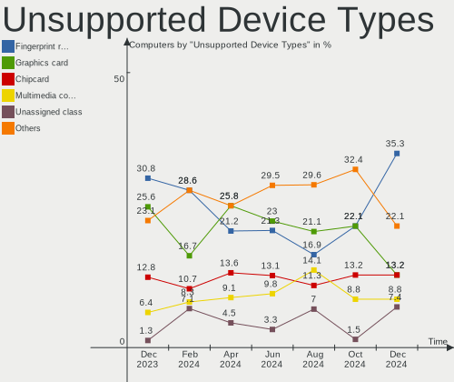

| Type                  | Computers | Percent |
|-----------------------|-----------|---------|
| Fingerprint reader    | 25        | 31.65%  |
| Graphics card         | 18        | 22.78%  |
| Multimedia controller | 9         | 11.39%  |
| Chipcard              | 9         | 11.39%  |
| Net/wireless          | 5         | 6.33%   |
| Unassigned class      | 4         | 5.06%   |
| Sound                 | 2         | 2.53%   |
| Net/ethernet          | 2         | 2.53%   |
| Storage/ide           | 1         | 1.27%   |
| Firewire controller   | 1         | 1.27%   |
| Card reader           | 1         | 1.27%   |
| Camera                | 1         | 1.27%   |
| Bluetooth             | 1         | 1.27%   |

