Linux in UK - Hardware Trends (Desktops)
----------------------------------------

A project to identify most popular hardware characteristics and track their change
over time based on data collected by Linux users at https://Linux-Hardware.org.

Anyone can contribute to this report by the [hw-probe](https://github.com/linuxhw/hw-probe) tool:

    sudo -E hw-probe -all -upload

Period: Dec, 2025.

Contents
--------

* [ System ](#system)
  - [ OS                       ](#os)
  - [ OS Family                ](#os-family)
  - [ Kernel                   ](#kernel)
  - [ Kernel Family            ](#kernel-family)
  - [ Kernel Major Ver.        ](#kernel-major-ver)
  - [ Arch                     ](#arch)
  - [ DE                       ](#de)
  - [ Display Server           ](#display-server)
  - [ Display Manager          ](#display-manager)
  - [ OS Lang                  ](#os-lang)
  - [ Boot Mode                ](#boot-mode)
  - [ Filesystem               ](#filesystem)
  - [ Part. scheme             ](#part-scheme)
  - [ Dual Boot with Linux/BSD ](#dual-boot-with-linuxbsd)
  - [ Dual Boot (Win)          ](#dual-boot-win)

* [ Board ](#board)
  - [ Vendor                   ](#vendor)
  - [ Model                    ](#model)
  - [ Model Family             ](#model-family)
  - [ MFG Year                 ](#mfg-year)
  - [ Form Factor              ](#form-factor)
  - [ Secure Boot              ](#secure-boot)
  - [ Coreboot                 ](#coreboot)
  - [ RAM Size                 ](#ram-size)
  - [ RAM Used                 ](#ram-used)
  - [ Total Drives             ](#total-drives)
  - [ Has CD-ROM               ](#has-cd-rom)
  - [ Has Ethernet             ](#has-ethernet)
  - [ Has WiFi                 ](#has-wifi)
  - [ Has Bluetooth            ](#has-bluetooth)

* [ Location ](#location)
  - [ Country                  ](#country)
  - [ City                     ](#city)

* [ Drives ](#drives)
  - [ Drive Vendor             ](#drive-vendor)
  - [ Drive Model              ](#drive-model)
  - [ HDD Vendor               ](#hdd-vendor)
  - [ SSD Vendor               ](#ssd-vendor)
  - [ Drive Kind               ](#drive-kind)
  - [ Drive Connector          ](#drive-connector)
  - [ Drive Size               ](#drive-size)
  - [ Space Total              ](#space-total)
  - [ Space Used               ](#space-used)
  - [ Malfunc. Drives          ](#malfunc-drives)
  - [ Malfunc. Drive Vendor    ](#malfunc-drive-vendor)
  - [ Malfunc. HDD Vendor      ](#malfunc-hdd-vendor)
  - [ Malfunc. Drive Kind      ](#malfunc-drive-kind)
  - [ Failed Drives            ](#failed-drives)
  - [ Failed Drive Vendor      ](#failed-drive-vendor)
  - [ Drive Status             ](#drive-status)

* [ Storage controller ](#storage-controller)
  - [ Storage Vendor           ](#storage-vendor)
  - [ Storage Model            ](#storage-model)
  - [ Storage Kind             ](#storage-kind)

* [ Processor ](#processor)
  - [ CPU Vendor               ](#cpu-vendor)
  - [ CPU Model                ](#cpu-model)
  - [ CPU Model Family         ](#cpu-model-family)
  - [ CPU Cores                ](#cpu-cores)
  - [ CPU Sockets              ](#cpu-sockets)
  - [ CPU Threads              ](#cpu-threads)
  - [ CPU Op-Modes             ](#cpu-op-modes)
  - [ CPU Microcode            ](#cpu-microcode)
  - [ CPU Microarch            ](#cpu-microarch)

* [ Graphics ](#graphics)
  - [ GPU Vendor               ](#gpu-vendor)
  - [ GPU Model                ](#gpu-model)
  - [ GPU Combo                ](#gpu-combo)
  - [ GPU Driver               ](#gpu-driver)
  - [ GPU Memory               ](#gpu-memory)

* [ Monitor ](#monitor)
  - [ Monitor Vendor           ](#monitor-vendor)
  - [ Monitor Model            ](#monitor-model)
  - [ Monitor Resolution       ](#monitor-resolution)
  - [ Monitor Diagonal         ](#monitor-diagonal)
  - [ Monitor Width            ](#monitor-width)
  - [ Aspect Ratio             ](#aspect-ratio)
  - [ Monitor Area             ](#monitor-area)
  - [ Pixel Density            ](#pixel-density)
  - [ Multiple Monitors        ](#multiple-monitors)

* [ Network ](#network)
  - [ Net Controller Vendor    ](#net-controller-vendor)
  - [ Net Controller Model     ](#net-controller-model)
  - [ Wireless Vendor          ](#wireless-vendor)
  - [ Wireless Model           ](#wireless-model)
  - [ Ethernet Vendor          ](#ethernet-vendor)
  - [ Ethernet Model           ](#ethernet-model)
  - [ Net Controller Kind      ](#net-controller-kind)
  - [ Used Controller          ](#used-controller)
  - [ NICs                     ](#nics)
  - [ IPv6                     ](#ipv6)

* [ Bluetooth ](#bluetooth)
  - [ Bluetooth Vendor         ](#bluetooth-vendor)
  - [ Bluetooth Model          ](#bluetooth-model)

* [ Sound ](#sound)
  - [ Sound Vendor             ](#sound-vendor)
  - [ Sound Model              ](#sound-model)

* [ Memory ](#memory)
  - [ Memory Vendor            ](#memory-vendor)
  - [ Memory Model             ](#memory-model)
  - [ Memory Kind              ](#memory-kind)
  - [ Memory Form Factor       ](#memory-form-factor)
  - [ Memory Size              ](#memory-size)
  - [ Memory Speed             ](#memory-speed)

* [ Printers & scanners ](#printers--scanners)
  - [ Printer Vendor           ](#printer-vendor)
  - [ Printer Model            ](#printer-model)
  - [ Scanner Vendor           ](#scanner-vendor)
  - [ Scanner Model            ](#scanner-model)

* [ Camera ](#camera)
  - [ Camera Vendor            ](#camera-vendor)
  - [ Camera Model             ](#camera-model)

* [ Security ](#security)
  - [ Fingerprint Vendor       ](#fingerprint-vendor)
  - [ Fingerprint Model        ](#fingerprint-model)
  - [ Chipcard Vendor          ](#chipcard-vendor)
  - [ Chipcard Model           ](#chipcard-model)

* [ Unsupported ](#unsupported)
  - [ Unsupported Devices      ](#unsupported-devices)
  - [ Unsupported Device Types ](#unsupported-device-types)

System
------

OS
--

Installed operating systems

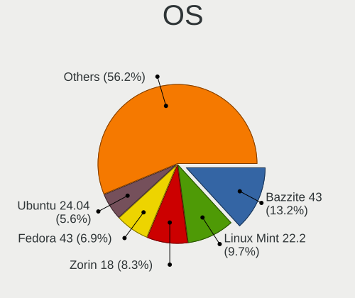

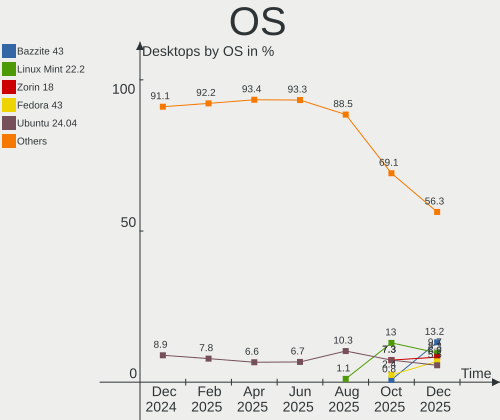

| Name                         | Desktops | Percent |
|------------------------------|----------|---------|
| Bazzite 43                   | 19       | 13.19%  |
| Linux Mint 22.2              | 14       | 9.72%   |
| Zorin 18                     | 12       | 8.33%   |
| Fedora 43                    | 10       | 6.94%   |
| Ubuntu 24.04                 | 8        | 5.56%   |
| Arch Rolling                 | 7        | 4.86%   |
| Pop!_OS 24.04                | 6        | 4.17%   |
| OpenMandriva 25.90           | 5        | 3.47%   |
| OpenMandriva 25.06           | 4        | 2.78%   |
| Debian 13                    | 4        | 2.78%   |
| Bazzite 42                   | 4        | 2.78%   |
| Ubuntu 25.10                 | 3        | 2.08%   |
| OpenMandriva 6.0             | 3        | 2.08%   |
| KDE neon 24.04               | 3        | 2.08%   |
| CachyOS Rolling              | 3        | 2.08%   |
| Zorin 17                     | 2        | 1.39%   |
| Ubuntu 25.04                 | 2        | 1.39%   |
| Ubuntu 22.04                 | 2        | 1.39%   |
| openSUSE Tumbleweed-XXXXXXXX | 2        | 1.39%   |
| OpenMandriva 25.11           | 2        | 1.39%   |
| Debian                       | 2        | 1.39%   |
| Xubuntu 24.04                | 1        | 0.69%   |
| Ubuntu 20.04                 | 1        | 0.69%   |
| TUXEDO OS 24.04              | 1        | 0.69%   |
| SteamOS 3.9                  | 1        | 0.69%   |
| SteamOS 3.7.17               | 1        | 0.69%   |
| Rocky Linux 9.7              | 1        | 0.69%   |
| Reborn OS                    | 1        | 0.69%   |
| Pop!_OS 22.04                | 1        | 0.69%   |
| Pika OS 4                    | 1        | 0.69%   |
| OpenMandriva 25.04           | 1        | 0.69%   |
| OpenMandriva 25.02           | 1        | 0.69%   |
| OpenMandriva 24.12           | 1        | 0.69%   |
| OpenMandriva 23.08           | 1        | 0.69%   |
| NixOS 26.05                  | 1        | 0.69%   |
| NixOS 25.11                  | 1        | 0.69%   |
| Lubuntu 24.04                | 1        | 0.69%   |
| LMDE 6                       | 1        | 0.69%   |
| Linux Mint 22.1              | 1        | 0.69%   |
| Kubuntu 24.04                | 1        | 0.69%   |

OS Family
---------

OS without a version

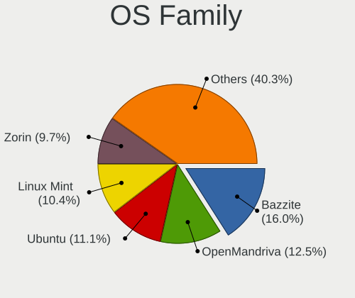

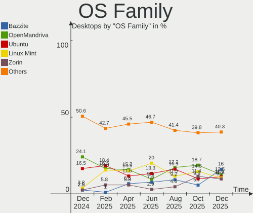

| Name         | Desktops | Percent |
|--------------|----------|---------|
| Bazzite      | 23       | 15.97%  |
| OpenMandriva | 18       | 12.5%   |
| Ubuntu       | 16       | 11.11%  |
| Linux Mint   | 15       | 10.42%  |
| Zorin        | 14       | 9.72%   |
| Fedora       | 11       | 7.64%   |
| Pop!_OS      | 7        | 4.86%   |
| Debian       | 7        | 4.86%   |
| Arch         | 7        | 4.86%   |
| KDE neon     | 3        | 2.08%   |
| CachyOS      | 3        | 2.08%   |
| SteamOS      | 2        | 1.39%   |
| openSUSE     | 2        | 1.39%   |
| NixOS        | 2        | 1.39%   |
| Kubuntu      | 2        | 1.39%   |
| Xubuntu      | 1        | 0.69%   |
| TUXEDO OS    | 1        | 0.69%   |
| Rocky Linux  | 1        | 0.69%   |
| Reborn OS    | 1        | 0.69%   |
| Pikaos       | 1        | 0.69%   |
| Lubuntu      | 1        | 0.69%   |
| LMDE         | 1        | 0.69%   |
| Gentoo       | 1        | 0.69%   |
| Endless      | 1        | 0.69%   |
| EndeavourOS  | 1        | 0.69%   |
| Devuan       | 1        | 0.69%   |
| BlackPanther | 1        | 0.69%   |

Kernel
------

Version of the Linux kernel

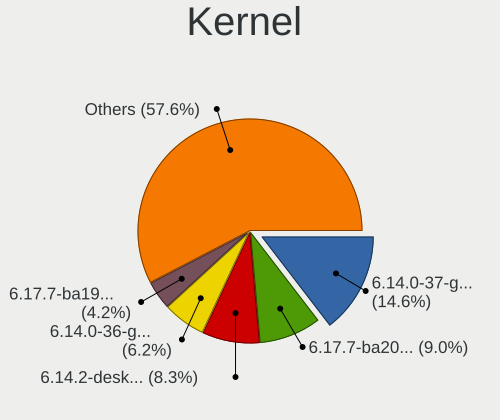

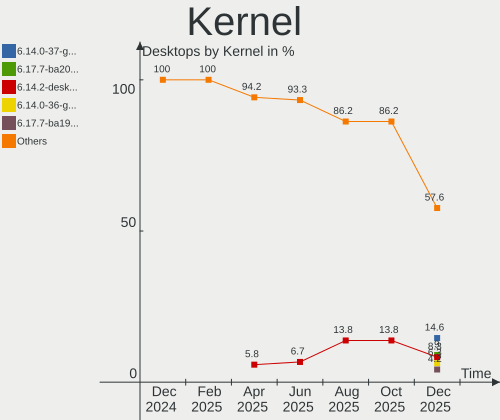

| Version                        | Desktops | Percent |
|--------------------------------|----------|---------|
| 6.14.0-37-generic              | 21       | 14.58%  |
| 6.17.7-ba20.fc43.x86_64        | 13       | 9.03%   |
| 6.14.2-desktop-3omv2590        | 12       | 8.33%   |
| 6.14.0-36-generic              | 9        | 6.25%   |
| 6.17.7-ba19.fc43.x86_64        | 6        | 4.17%   |
| 6.17.9-arch1-1                 | 5        | 3.47%   |
| 6.8.0-90-generic               | 4        | 2.78%   |
| 6.8.0-88-generic               | 4        | 2.78%   |
| 6.17.9-76061709-generic        | 4        | 2.78%   |
| 6.17.12-300.fc43.x86_64        | 3        | 2.08%   |
| 6.17.11-300.fc43.x86_64        | 3        | 2.08%   |
| 6.16.4-116.bazzite.fc42.x86_64 | 3        | 2.08%   |
| 6.12.57+deb13-amd64            | 3        | 2.08%   |
| 6.18.0-desktop-1omv2590        | 2        | 1.39%   |
| 6.17.9-zen1-1-zen              | 2        | 1.39%   |
| 6.17.9-300.fc43.x86_64         | 2        | 1.39%   |
| 6.17.4-76061704-generic        | 2        | 1.39%   |
| 6.14.0-29-generic              | 2        | 1.39%   |
| 6.1.0-41-amd64                 | 2        | 1.39%   |
| 6.8.12-16-pve                  | 1        | 0.69%   |
| 6.8.0-87-generic               | 1        | 0.69%   |
| 6.8.0-85-generic               | 1        | 0.69%   |
| 6.4.8-desktop-2omv2390         | 1        | 0.69%   |
| 6.2.15-200.fc37.x86_64         | 1        | 0.69%   |
| 6.18.2-zen2-1-zen              | 1        | 0.69%   |
| 6.18.2-arch2-1                 | 1        | 0.69%   |
| 6.18.2-3-cachyos               | 1        | 0.69%   |
| 6.18.2-2-cachyos               | 1        | 0.69%   |
| 6.18.2-1-default               | 1        | 0.69%   |
| 6.18.1-zen1                    | 1        | 0.69%   |
| 6.18.0-3-cachyos               | 1        | 0.69%   |
| 6.18.0-061800-generic          | 1        | 0.69%   |
| 6.18.0                         | 1        | 0.69%   |
| 6.17.9-gentoo                  | 1        | 0.69%   |
| 6.17.8-300.fc43.x86_64         | 1        | 0.69%   |
| 6.17.8-061708-generic          | 1        | 0.69%   |
| 6.17.8+deb14-amd64             | 1        | 0.69%   |
| 6.17.8+deb13-amd64             | 1        | 0.69%   |
| 6.17.7-pikaos                  | 1        | 0.69%   |
| 6.17.7-1-default               | 1        | 0.69%   |

Kernel Family
-------------

Linux kernel without a distro release

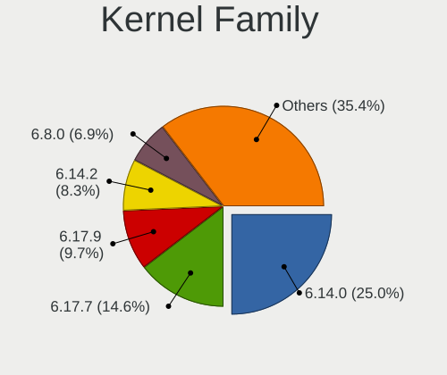

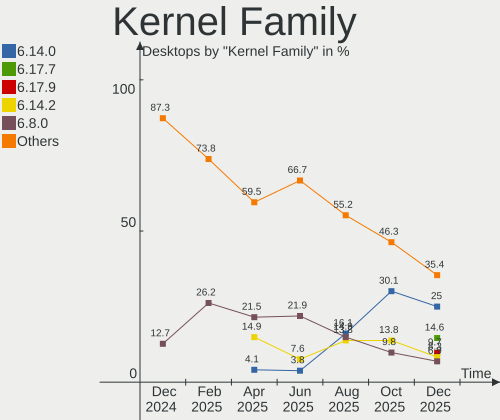

| Version | Desktops | Percent |
|---------|----------|---------|
| 6.14.0  | 36       | 25%     |
| 6.17.7  | 21       | 14.58%  |
| 6.17.9  | 14       | 9.72%   |
| 6.14.2  | 12       | 8.33%   |
| 6.8.0   | 10       | 6.94%   |
| 6.18.2  | 5        | 3.47%   |
| 6.18.0  | 5        | 3.47%   |
| 6.17.8  | 4        | 2.78%   |
| 6.16.4  | 4        | 2.78%   |
| 6.17.4  | 3        | 2.08%   |
| 6.17.12 | 3        | 2.08%   |
| 6.17.11 | 3        | 2.08%   |
| 6.17.0  | 3        | 2.08%   |
| 6.12.57 | 3        | 2.08%   |
| 6.1.0   | 2        | 1.39%   |
| 6.8.12  | 1        | 0.69%   |
| 6.4.8   | 1        | 0.69%   |
| 6.2.15  | 1        | 0.69%   |
| 6.18.1  | 1        | 0.69%   |
| 6.17.1  | 1        | 0.69%   |
| 6.16.3  | 1        | 0.69%   |
| 6.16.12 | 1        | 0.69%   |
| 6.16.0  | 1        | 0.69%   |
| 6.15.9  | 1        | 0.69%   |
| 6.13.5  | 1        | 0.69%   |
| 6.12.59 | 1        | 0.69%   |
| 6.12.1  | 1        | 0.69%   |
| 6.11.11 | 1        | 0.69%   |
| 5.4.0   | 1        | 0.69%   |
| 5.15.85 | 1        | 0.69%   |
| 5.14.0  | 1        | 0.69%   |

Kernel Major Ver.
-----------------

Linux kernel major version

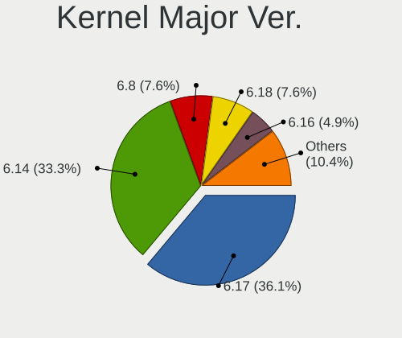

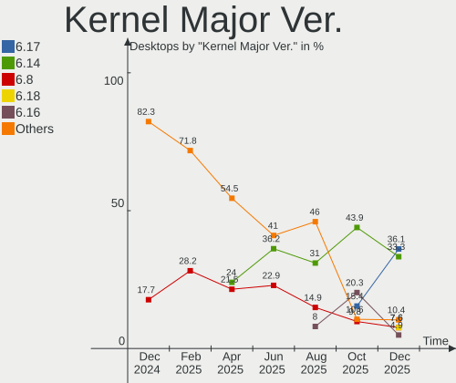

| Version | Desktops | Percent |
|---------|----------|---------|
| 6.17    | 52       | 36.11%  |
| 6.14    | 48       | 33.33%  |
| 6.8     | 11       | 7.64%   |
| 6.18    | 11       | 7.64%   |
| 6.16    | 7        | 4.86%   |
| 6.12    | 5        | 3.47%   |
| 6.1     | 2        | 1.39%   |
| 6.4     | 1        | 0.69%   |
| 6.2     | 1        | 0.69%   |
| 6.15    | 1        | 0.69%   |
| 6.13    | 1        | 0.69%   |
| 6.11    | 1        | 0.69%   |
| 5.4     | 1        | 0.69%   |
| 5.15    | 1        | 0.69%   |
| 5.14    | 1        | 0.69%   |

Arch
----

OS architecture (x86_64, i586, etc.)

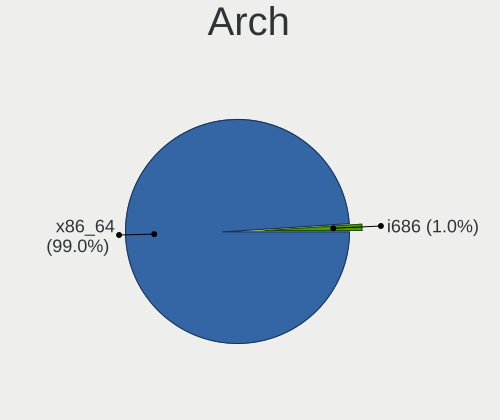

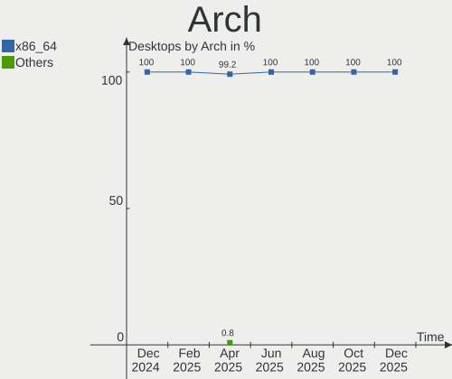

| Name   | Desktops | Percent |
|--------|----------|---------|
| x86_64 | 144      | 100%    |

DE
--

Desktop Environment

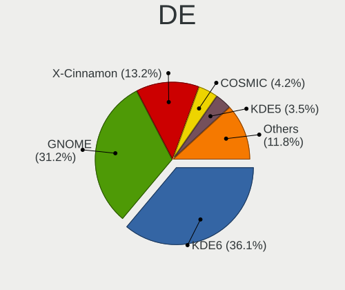

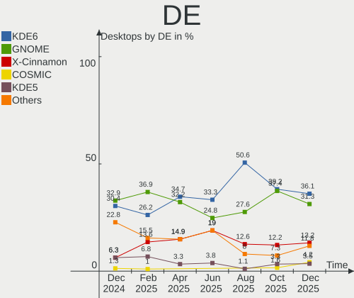

| Name          | Desktops | Percent |
|---------------|----------|---------|
| KDE6          | 52       | 36.11%  |
| GNOME         | 45       | 31.25%  |
| X-Cinnamon    | 19       | 13.19%  |
| COSMIC        | 6        | 4.17%   |
| KDE5          | 5        | 3.47%   |
| XFCE          | 4        | 2.78%   |
| KDE           | 4        | 2.78%   |
| LXQt          | 3        | 2.08%   |
| Hyprland      | 2        | 1.39%   |
| Unknown       | 2        | 1.39%   |
| Endless:GNOME | 1        | 0.69%   |
| Cinnamon      | 1        | 0.69%   |

Display Server
--------------

X11 or Wayland

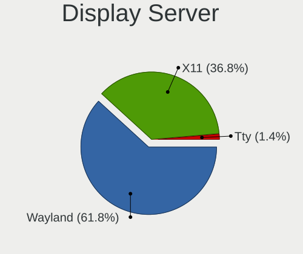

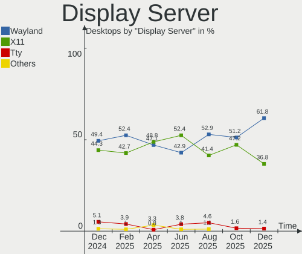

| Name    | Desktops | Percent |
|---------|----------|---------|
| Wayland | 89       | 61.81%  |
| X11     | 53       | 36.81%  |
| Tty     | 2        | 1.39%   |

Display Manager
---------------

SDDM, LightDM, etc.

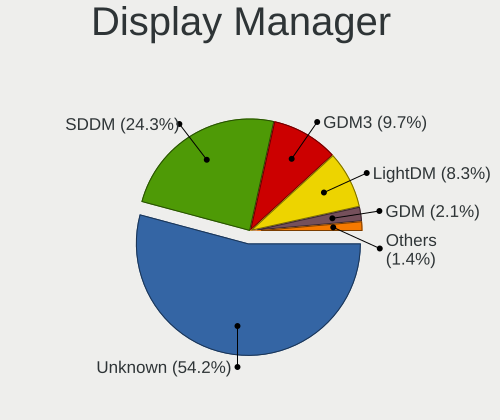

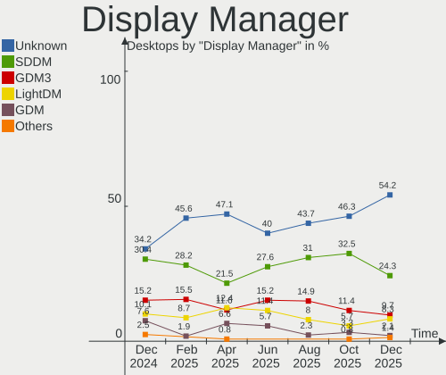

| Name           | Desktops | Percent |
|----------------|----------|---------|
| Unknown        | 78       | 54.17%  |
| SDDM           | 35       | 24.31%  |
| GDM3           | 14       | 9.72%   |
| LightDM        | 12       | 8.33%   |
| GDM            | 3        | 2.08%   |
| SLiM           | 1        | 0.69%   |
| COSMIC-GREETER | 1        | 0.69%   |

OS Lang
-------

Language

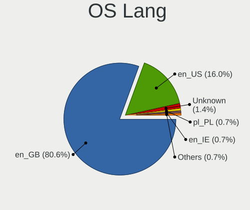

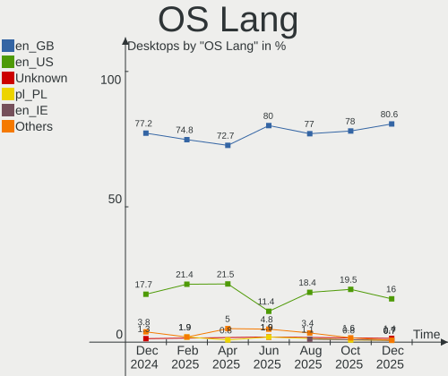

| Lang    | Desktops | Percent |
|---------|----------|---------|
| en_GB   | 116      | 80.56%  |
| en_US   | 23       | 15.97%  |
| Unknown | 2        | 1.39%   |
| pl_PL   | 1        | 0.69%   |
| en_IE   | 1        | 0.69%   |
| C       | 1        | 0.69%   |

Boot Mode
---------

EFI or BIOS

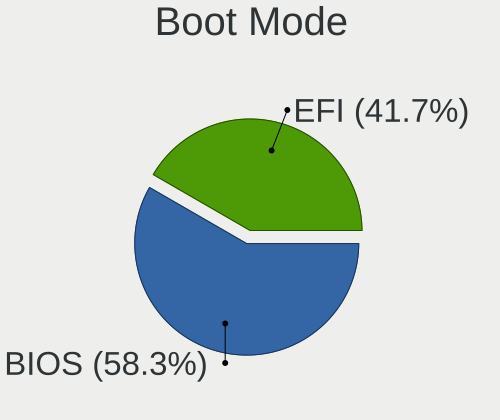

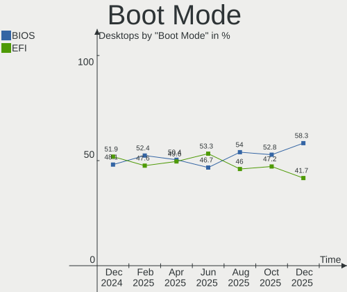

| Mode | Desktops | Percent |
|------|----------|---------|
| BIOS | 84       | 58.33%  |
| EFI  | 60       | 41.67%  |

Filesystem
----------

Type of filesystem

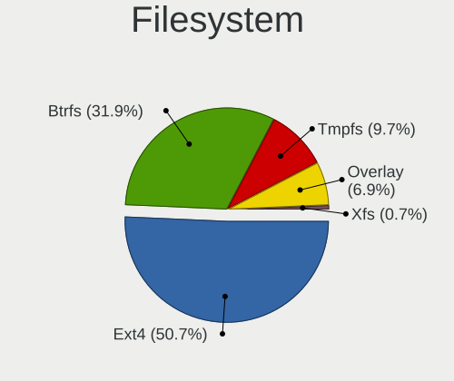

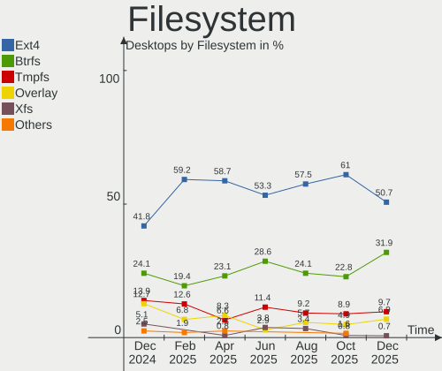

| Type    | Desktops | Percent |
|---------|----------|---------|
| Ext4    | 73       | 50.69%  |
| Btrfs   | 46       | 31.94%  |
| Tmpfs   | 14       | 9.72%   |
| Overlay | 10       | 6.94%   |
| Xfs     | 1        | 0.69%   |

Part. scheme
------------

Scheme of partitioning

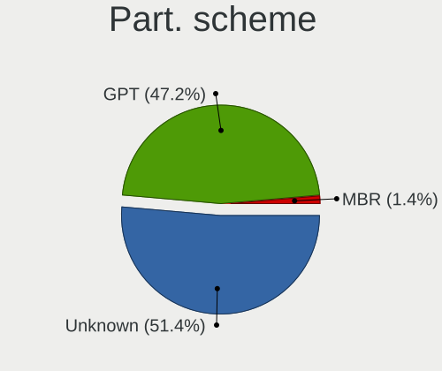

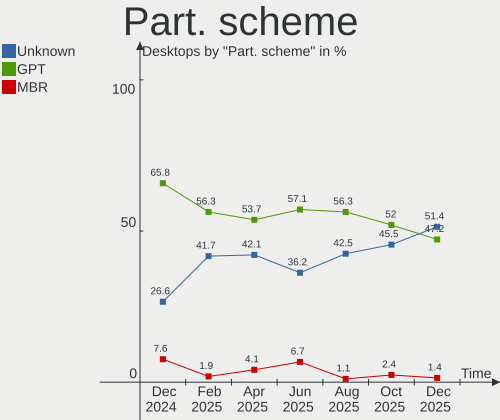

| Type    | Desktops | Percent |
|---------|----------|---------|
| Unknown | 74       | 51.39%  |
| GPT     | 68       | 47.22%  |
| MBR     | 2        | 1.39%   |

Dual Boot with Linux/BSD
------------------------

Hosting more than one Linux/BSD

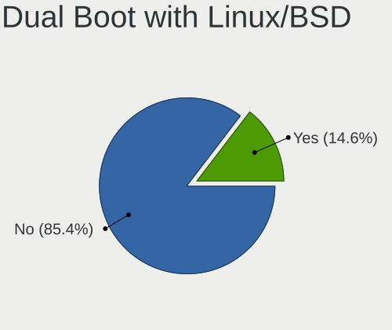

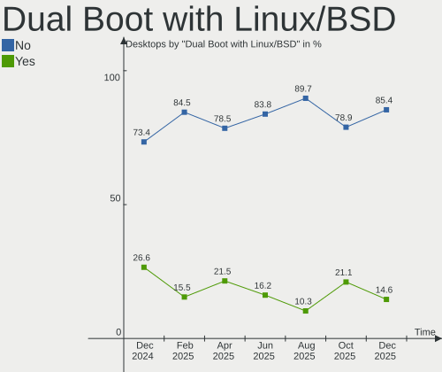

| Dual boot | Desktops | Percent |
|-----------|----------|---------|
| No        | 123      | 85.42%  |
| Yes       | 21       | 14.58%  |

Dual Boot (Win)
---------------

Hosting Linux and Windows

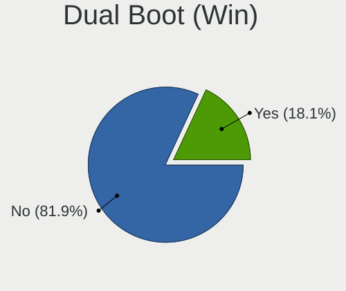

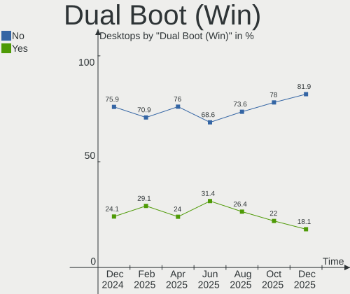

| Dual boot | Desktops | Percent |
|-----------|----------|---------|
| No        | 118      | 81.94%  |
| Yes       | 26       | 18.06%  |

Board
-----

Vendor
------

Motherboard manufacturer

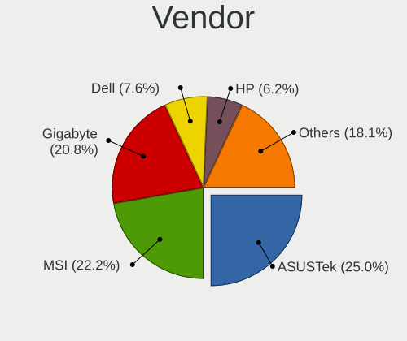

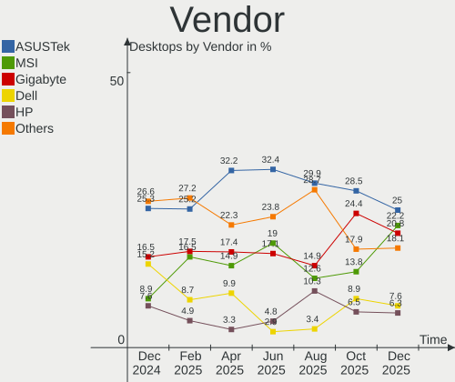

| Name                | Desktops | Percent |
|---------------------|----------|---------|
| ASUSTek Computer    | 36       | 25%     |
| MSI                 | 32       | 22.22%  |
| Gigabyte Technology | 30       | 20.83%  |
| Dell                | 11       | 7.64%   |
| Hewlett-Packard     | 9        | 6.25%   |
| AZW                 | 4        | 2.78%   |
| ASRock              | 4        | 2.78%   |
| Unknown             | 4        | 2.78%   |
| Acer                | 3        | 2.08%   |
| GMKtec              | 2        | 1.39%   |
| Fujitsu             | 2        | 1.39%   |
| Star Labs           | 1        | 0.69%   |
| Packard Bell        | 1        | 0.69%   |
| MAXSUN              | 1        | 0.69%   |
| Foxconn             | 1        | 0.69%   |
| Biostar             | 1        | 0.69%   |
| BESSTAR Tech        | 1        | 0.69%   |
| Apple               | 1        | 0.69%   |

Model
-----

Motherboard model

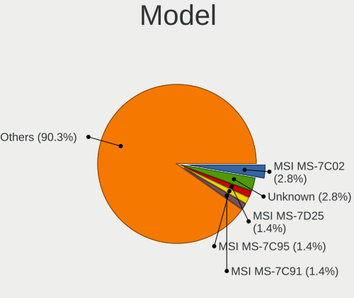

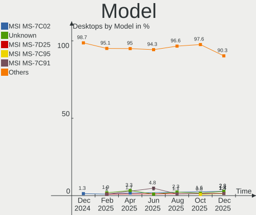

| Name                                 | Desktops | Percent |
|--------------------------------------|----------|---------|
| MSI MS-7C02                          | 4        | 2.78%   |
| Unknown                              | 4        | 2.78%   |
| MSI MS-7D25                          | 2        | 1.39%   |
| MSI MS-7C95                          | 2        | 1.39%   |
| MSI MS-7C91                          | 2        | 1.39%   |
| MSI MS-7C56                          | 2        | 1.39%   |
| MSI MS-7B86                          | 2        | 1.39%   |
| GMKtec NucBox M7 Pro                 | 2        | 1.39%   |
| Gigabyte B650 AORUS ELITE AX V2      | 2        | 1.39%   |
| Dell OptiPlex 780                    | 2        | 1.39%   |
| Dell OptiPlex 7010                   | 2        | 1.39%   |
| AZW EQ                               | 2        | 1.39%   |
| ASUS ROG STRIX B550-I GAMING         | 2        | 1.39%   |
| ASUS ROG STRIX B550-F GAMING WIFI II | 2        | 1.39%   |
| ASUS PRIME B450M-K II                | 2        | 1.39%   |
| Star Labs Byte                       | 1        | 0.69%   |
| Packard Bell IMEDIA S2185            | 1        | 0.69%   |
| MSI MS-7E49                          | 1        | 0.69%   |
| MSI MS-7E28                          | 1        | 0.69%   |
| MSI MS-7E27                          | 1        | 0.69%   |
| MSI MS-7E26                          | 1        | 0.69%   |
| MSI MS-7E09                          | 1        | 0.69%   |
| MSI MS-7E02                          | 1        | 0.69%   |
| MSI MS-7D70                          | 1        | 0.69%   |
| MSI MS-7C84                          | 1        | 0.69%   |
| MSI MS-7C75                          | 1        | 0.69%   |
| MSI MS-7C52                          | 1        | 0.69%   |
| MSI MS-7C37                          | 1        | 0.69%   |
| MSI MS-7B89                          | 1        | 0.69%   |
| MSI MS-7B78                          | 1        | 0.69%   |
| MSI MS-7B18                          | 1        | 0.69%   |
| MSI MS-7916                          | 1        | 0.69%   |
| MSI MS-7898                          | 1        | 0.69%   |
| MSI GamingPC                         | 1        | 0.69%   |
| MSI Customised HZN-M-INTA PC         | 1        | 0.69%   |
| MAXSUN MS-Challenger B450M           | 1        | 0.69%   |
| HP Z440 Workstation                  | 1        | 0.69%   |
| HP Z230 SFF Workstation              | 1        | 0.69%   |
| HP Z210 CMT Workstation              | 1        | 0.69%   |
| HP Slim Desktop S01-pF2xxx           | 1        | 0.69%   |

Model Family
------------

Motherboard model prefix

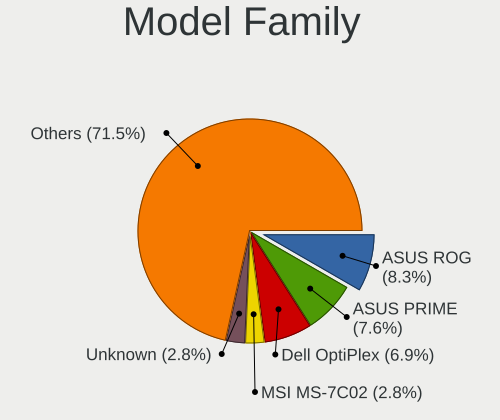

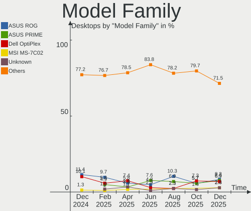

| Name                 | Desktops | Percent |
|----------------------|----------|---------|
| ASUS ROG             | 12       | 8.33%   |
| ASUS PRIME           | 11       | 7.64%   |
| Dell OptiPlex        | 10       | 6.94%   |
| MSI MS-7C02          | 4        | 2.78%   |
| Unknown              | 4        | 2.78%   |
| ASUS TUF             | 3        | 2.08%   |
| MSI MS-7D25          | 2        | 1.39%   |
| MSI MS-7C95          | 2        | 1.39%   |
| MSI MS-7C91          | 2        | 1.39%   |
| MSI MS-7C56          | 2        | 1.39%   |
| MSI MS-7B86          | 2        | 1.39%   |
| HP ProDesk           | 2        | 1.39%   |
| HP Compaq            | 2        | 1.39%   |
| GMKtec NucBox        | 2        | 1.39%   |
| Gigabyte X570S       | 2        | 1.39%   |
| Gigabyte X570        | 2        | 1.39%   |
| Gigabyte B650        | 2        | 1.39%   |
| Fujitsu ESPRIMO      | 2        | 1.39%   |
| AZW EQ               | 2        | 1.39%   |
| Star Labs Byte       | 1        | 0.69%   |
| Packard Bell IMEDIA  | 1        | 0.69%   |
| MSI MS-7E49          | 1        | 0.69%   |
| MSI MS-7E28          | 1        | 0.69%   |
| MSI MS-7E27          | 1        | 0.69%   |
| MSI MS-7E26          | 1        | 0.69%   |
| MSI MS-7E09          | 1        | 0.69%   |
| MSI MS-7E02          | 1        | 0.69%   |
| MSI MS-7D70          | 1        | 0.69%   |
| MSI MS-7C84          | 1        | 0.69%   |
| MSI MS-7C75          | 1        | 0.69%   |
| MSI MS-7C52          | 1        | 0.69%   |
| MSI MS-7C37          | 1        | 0.69%   |
| MSI MS-7B89          | 1        | 0.69%   |
| MSI MS-7B78          | 1        | 0.69%   |
| MSI MS-7B18          | 1        | 0.69%   |
| MSI MS-7916          | 1        | 0.69%   |
| MSI MS-7898          | 1        | 0.69%   |
| MSI GamingPC         | 1        | 0.69%   |
| MSI Customised       | 1        | 0.69%   |
| MAXSUN MS-Challenger | 1        | 0.69%   |

MFG Year
--------

Motherboard manufacture year

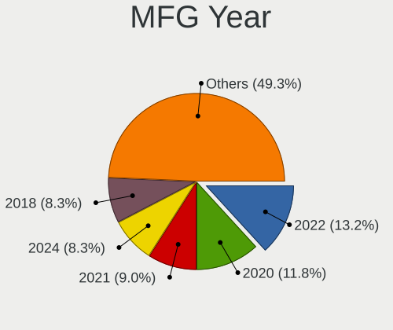

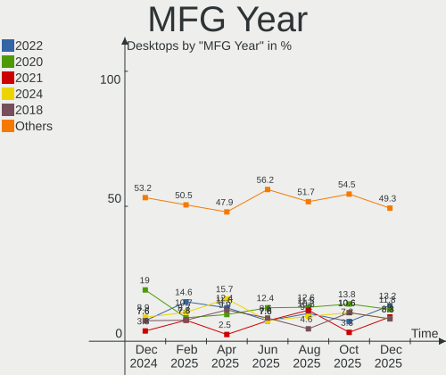

| Year | Desktops | Percent |
|------|----------|---------|
| 2022 | 19       | 13.19%  |
| 2020 | 17       | 11.81%  |
| 2021 | 13       | 9.03%   |
| 2024 | 12       | 8.33%   |
| 2018 | 12       | 8.33%   |
| 2023 | 11       | 7.64%   |
| 2019 | 10       | 6.94%   |
| 2013 | 8        | 5.56%   |
| 2016 | 7        | 4.86%   |
| 2014 | 6        | 4.17%   |
| 2012 | 6        | 4.17%   |
| 2025 | 5        | 3.47%   |
| 2017 | 5        | 3.47%   |
| 2011 | 5        | 3.47%   |
| 2015 | 4        | 2.78%   |
| 2009 | 4        | 2.78%   |

Form Factor
-----------

Physical design of the computer

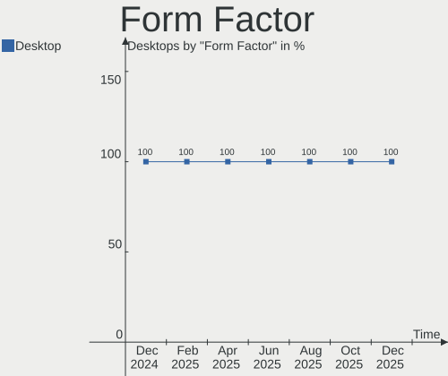

| Name    | Desktops | Percent |
|---------|----------|---------|
| Desktop | 144      | 100%    |

Secure Boot
-----------

Enabled or disabled

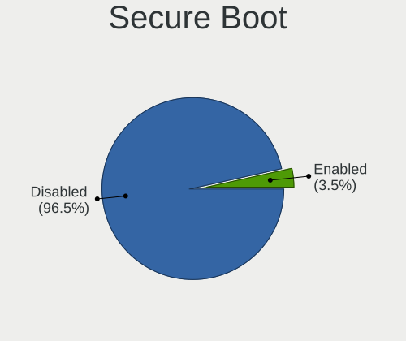

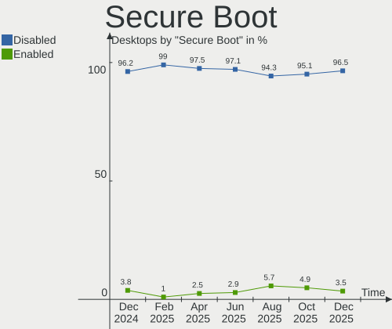

| State    | Desktops | Percent |
|----------|----------|---------|
| Disabled | 139      | 96.53%  |
| Enabled  | 5        | 3.47%   |

Coreboot
--------

Have coreboot on board

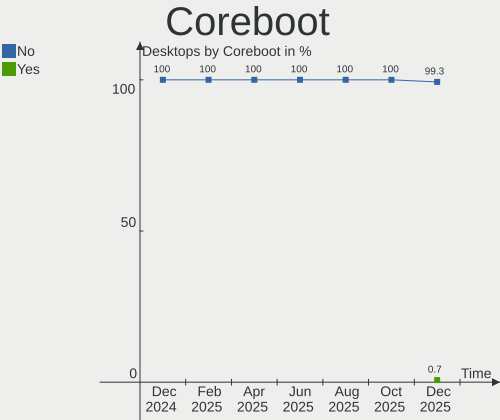

| Used | Desktops | Percent |
|------|----------|---------|
| No   | 143      | 99.31%  |
| Yes  | 1        | 0.69%   |

RAM Size
--------

Total RAM memory

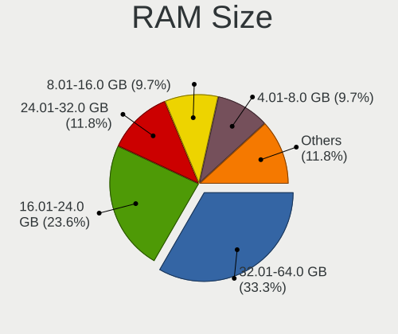

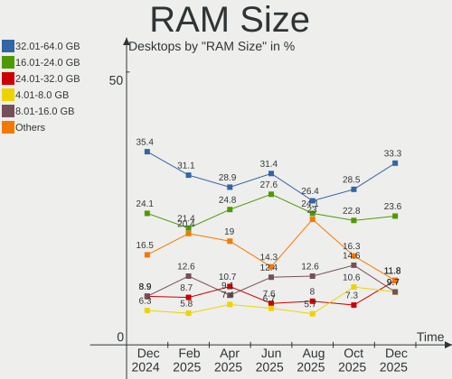

| Size in GB  | Desktops | Percent |
|-------------|----------|---------|
| 32.01-64.0  | 48       | 33.33%  |
| 16.01-24.0  | 34       | 23.61%  |
| 24.01-32.0  | 17       | 11.81%  |
| 4.01-8.0    | 14       | 9.72%   |
| 8.01-16.0   | 14       | 9.72%   |
| 64.01-256.0 | 11       | 7.64%   |
| 3.01-4.0    | 4        | 2.78%   |
| 2.01-3.0    | 1        | 0.69%   |
| 1.01-2.0    | 1        | 0.69%   |

RAM Used
--------

Used RAM memory

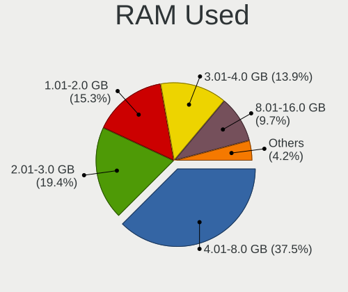

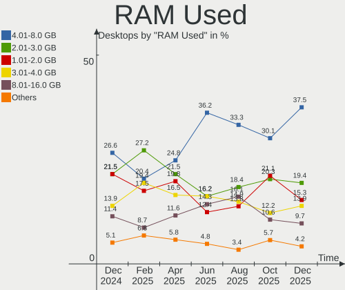

| Used GB    | Desktops | Percent |
|------------|----------|---------|
| 4.01-8.0   | 54       | 37.5%   |
| 2.01-3.0   | 28       | 19.44%  |
| 1.01-2.0   | 22       | 15.28%  |
| 3.01-4.0   | 20       | 13.89%  |
| 8.01-16.0  | 14       | 9.72%   |
| 16.01-24.0 | 4        | 2.78%   |
| 24.01-32.0 | 1        | 0.69%   |
| 0.51-1.0   | 1        | 0.69%   |

Total Drives
------------

Number of drives on board

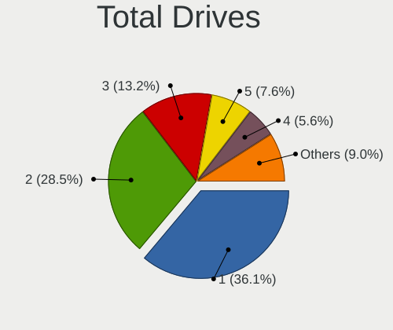

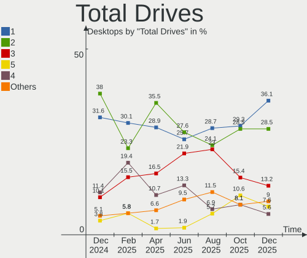

| Drives | Desktops | Percent |
|--------|----------|---------|
| 1      | 52       | 36.11%  |
| 2      | 41       | 28.47%  |
| 3      | 19       | 13.19%  |
| 5      | 11       | 7.64%   |
| 4      | 8        | 5.56%   |
| 7      | 6        | 4.17%   |
| 6      | 6        | 4.17%   |
| 12     | 1        | 0.69%   |

Has CD-ROM
----------

Has CD-ROM on board

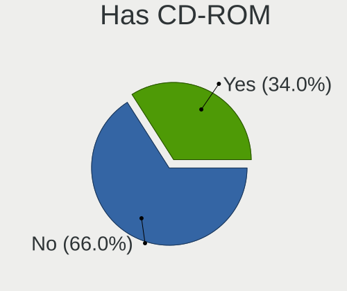

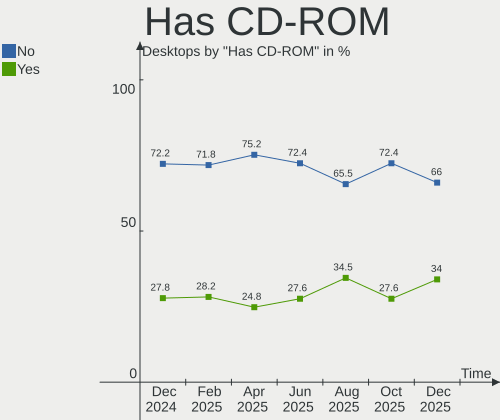

| Presented | Desktops | Percent |
|-----------|----------|---------|
| No        | 95       | 65.97%  |
| Yes       | 49       | 34.03%  |

Has Ethernet
------------

Has Ethernet on board

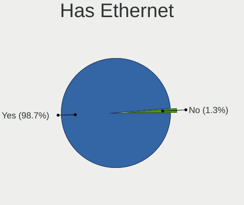

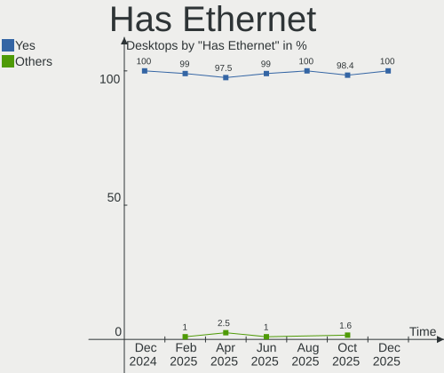

| Presented | Desktops | Percent |
|-----------|----------|---------|
| Yes       | 144      | 100%    |

Has WiFi
--------

Has WiFi module

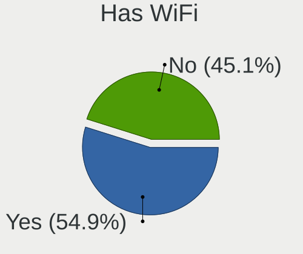

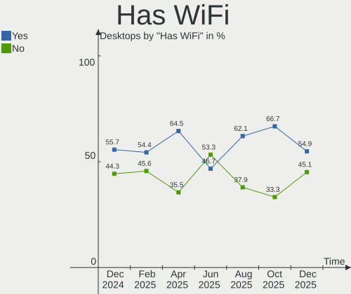

| Presented | Desktops | Percent |
|-----------|----------|---------|
| Yes       | 79       | 54.86%  |
| No        | 65       | 45.14%  |

Has Bluetooth
-------------

Has Bluetooth module

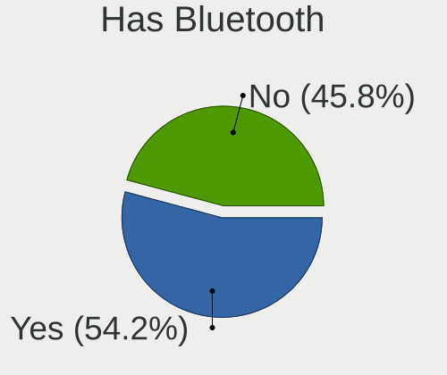

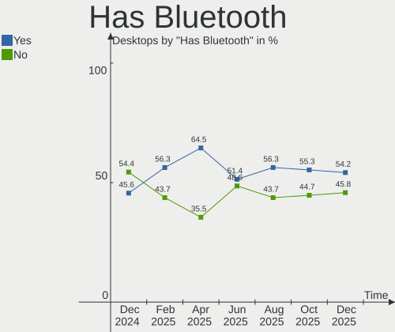

| Presented | Desktops | Percent |
|-----------|----------|---------|
| Yes       | 78       | 54.17%  |
| No        | 66       | 45.83%  |

Location
--------

Country
-------

Geographic location (country)

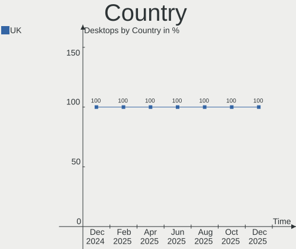

| Country | Desktops | Percent |
|---------|----------|---------|
| UK      | 144      | 100%    |

City
----

Geographic location (city)

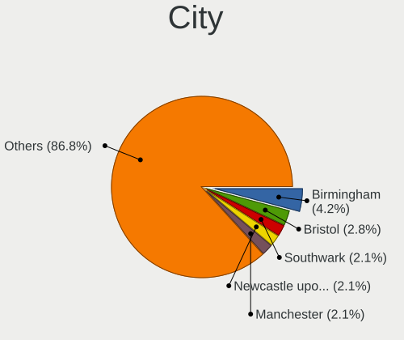

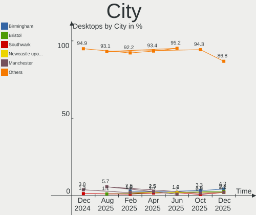

| City                | Desktops | Percent |
|---------------------|----------|---------|
| Birmingham          | 6        | 4.17%   |
| Bristol             | 4        | 2.78%   |
| Southwark           | 3        | 2.08%   |
| Newcastle upon Tyne | 3        | 2.08%   |
| Manchester          | 3        | 2.08%   |
| London              | 3        | 2.08%   |
| Sheffield           | 2        | 1.39%   |
| Oxford              | 2        | 1.39%   |
| Nottingham          | 2        | 1.39%   |
| Leeds               | 2        | 1.39%   |
| Islington           | 2        | 1.39%   |
| Ilford              | 2        | 1.39%   |
| Gravesend           | 2        | 1.39%   |
| Edgware             | 2        | 1.39%   |
| Coventry            | 2        | 1.39%   |
| Colchester          | 2        | 1.39%   |
| Cambridge           | 2        | 1.39%   |
| Bradford            | 2        | 1.39%   |
| Blackwood           | 2        | 1.39%   |
| Belfast             | 2        | 1.39%   |
| Barnet              | 2        | 1.39%   |
| West Cowes          | 1        | 0.69%   |
| West Bromwich       | 1        | 0.69%   |
| Welling             | 1        | 0.69%   |
| Wantage             | 1        | 0.69%   |
| Walton on Thames    | 1        | 0.69%   |
| Walthamstow         | 1        | 0.69%   |
| Wakefield           | 1        | 0.69%   |
| Totnes              | 1        | 0.69%   |
| Tipton              | 1        | 0.69%   |
| Telford             | 1        | 0.69%   |
| Taunton             | 1        | 0.69%   |
| Tamworth            | 1        | 0.69%   |
| Surrey              | 1        | 0.69%   |
| Surbiton            | 1        | 0.69%   |
| Stowmarket          | 1        | 0.69%   |
| Stoke-on-Trent      | 1        | 0.69%   |
| Stockton-on-Tees    | 1        | 0.69%   |
| Southampton         | 1        | 0.69%   |
| Shrewsbury          | 1        | 0.69%   |

Drives
------

Drive Vendor
------------

Hard drive vendors

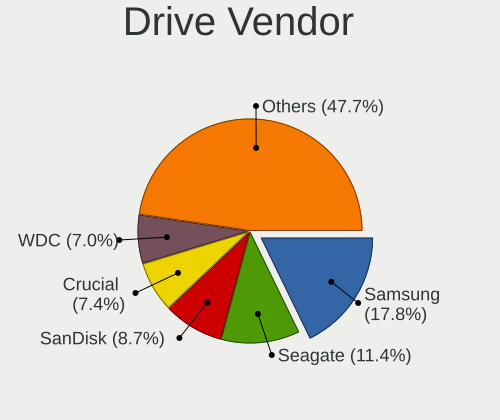

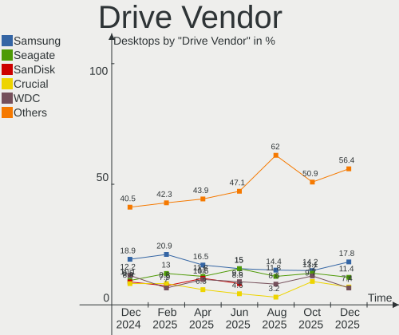

| Vendor                       | Desktops | Drives | Percent |
|------------------------------|----------|--------|---------|
| Samsung Electronics          | 53       | 75     | 17.79%  |
| Seagate                      | 34       | 50     | 11.41%  |
| SanDisk                      | 26       | 32     | 8.72%   |
| Crucial                      | 22       | 26     | 7.38%   |
| WDC                          | 21       | 27     | 7.05%   |
| Micron/Crucial Technology    | 18       | 20     | 6.04%   |
| Kingston                     | 14       | 17     | 4.7%    |
| Toshiba                      | 9        | 11     | 3.02%   |
| MAXIO Technology (Hangzhou)  | 7        | 8      | 2.35%   |
| Phison Electronics           | 5        | 5      | 1.68%   |
| Intel                        | 5        | 5      | 1.68%   |
| Hitachi                      | 5        | 5      | 1.68%   |
| SK hynix                     | 4        | 4      | 1.34%   |
| PNY                          | 4        | 4      | 1.34%   |
| Patriot                      | 4        | 6      | 1.34%   |
| Micron Technology            | 4        | 4      | 1.34%   |
| Integral                     | 4        | 4      | 1.34%   |
| Silicon Motion               | 3        | 4      | 1.01%   |
| Realtek Semiconductor        | 3        | 3      | 1.01%   |
| HGST                         | 3        | 3      | 1.01%   |
| Biwin Storage Technology     | 3        | 3      | 1.01%   |
| Unknown                      | 3        | 3      | 1.01%   |
| Unknown                      | 2        | 2      | 0.67%   |
| SPCC                         | 2        | 2      | 0.67%   |
| Shenzhen Longsys Electronics | 2        | 3      | 0.67%   |
| Netac                        | 2        | 2      | 0.67%   |
| KIOXIA-EXCERIA               | 2        | 2      | 0.67%   |
| KingSpec                     | 2        | 2      | 0.67%   |
| JMicron Technology           | 2        | 2      | 0.67%   |
| China                        | 2        | 2      | 0.67%   |
| ADATA Technology             | 2        | 2      | 0.67%   |
| XUM                          | 1        | 1      | 0.34%   |
| X12                          | 1        | 1      | 0.34%   |
| VENO                         | 1        | 1      | 0.34%   |
| USB3.0                       | 1        | 1      | 0.34%   |
| TO Exter                     | 1        | 1      | 0.34%   |
| T-FORCE                      | 1        | 1      | 0.34%   |
| smi                          | 1        | 1      | 0.34%   |
| RSH-339                      | 1        | 1      | 0.34%   |
| Phison                       | 1        | 1      | 0.34%   |

Drive Model
-----------

Hard drive models

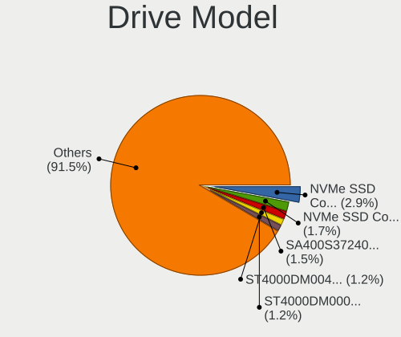

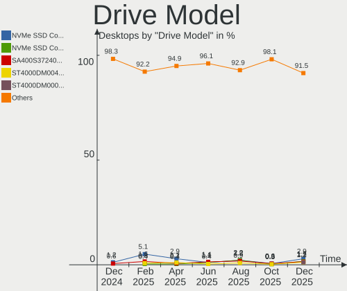

| Model                                                 | Desktops | Percent |
|-------------------------------------------------------|----------|---------|
| Samsung NVMe SSD Controller SM981/PM981/PM983 1TB     | 10       | 2.92%   |
| MAXIO (Hangzhou) NVMe SSD Controller MAP1202 2TB      | 6        | 1.75%   |
| Kingston SA400S37240G 240GB SSD                       | 5        | 1.46%   |
| Seagate ST4000DM004-2CV104 4TB                        | 4        | 1.17%   |
| Seagate ST4000DM000-1F2168 4TB                        | 4        | 1.17%   |
| Samsung SSD 870 EVO 1TB                               | 4        | 1.17%   |
| Samsung SSD 850 EVO 500GB                             | 4        | 1.17%   |
| Micron/Crucial P2 NVMe PCIe SSD 2TB                   | 4        | 1.17%   |
| Kingston SA400S37480G 480GB SSD                       | 4        | 1.17%   |
| Crucial CT1000MX500SSD1 1TB                           | 4        | 1.17%   |
| Seagate ST6000DM003-2CY186 6TB                        | 3        | 0.87%   |
| Seagate ST1000DM010-2EP102 1TB                        | 3        | 0.87%   |
| Sandisk WD Black SN850 1TB                            | 3        | 0.87%   |
| Sandisk WD Black SN750 / PC SN730 NVMe SSD 500GB      | 3        | 0.87%   |
| Samsung SSD 990 PRO 2TB                               | 3        | 0.87%   |
| Samsung SSD 860 QVO 1TB                               | 3        | 0.87%   |
| Samsung SSD 860 EVO 1TB                               | 3        | 0.87%   |
| Samsung SSD 850 EVO 250GB                             | 3        | 0.87%   |
| Samsung NVMe SSD Controller PM9A1/PM9A3/980PRO 1TB    | 3        | 0.87%   |
| Crucial CT480BX500SSD1 480GB                          | 3        | 0.87%   |
| Unknown                                               | 3        | 0.87%   |
| WDC WDS240G2G0A-00JH30 240GB SSD                      | 2        | 0.58%   |
| Silicon Motion SM2263EN/SM2263XT SSD Controller 512GB | 2        | 0.58%   |
| Seagate ST4000VN006-3CW104 4TB                        | 2        | 0.58%   |
| Seagate ST3500312CS 500GB                             | 2        | 0.58%   |
| Seagate ST2000DM008-2FR102 2TB                        | 2        | 0.58%   |
| Seagate ST1000DL002-9TT153 1TB                        | 2        | 0.58%   |
| Seagate Backup+ Hub BK 6TB                            | 2        | 0.58%   |
| Sandisk WD_BLACK SN850X 1000GB                        | 2        | 0.58%   |
| Sandisk WD_BLACK SN7100 2TB                           | 2        | 0.58%   |
| Sandisk WD Blue SN550 NVMe SSD 1024GB                 | 2        | 0.58%   |
| Samsung SSD 990 PRO 4TB                               | 2        | 0.58%   |
| Samsung SSD 990 PRO 1TB                               | 2        | 0.58%   |
| Samsung SSD 980 1TB                                   | 2        | 0.58%   |
| Samsung SSD 870 EVO 2TB                               | 2        | 0.58%   |
| Samsung NVMe SSD Controller SM961/PM961/SM963 1024GB  | 2        | 0.58%   |
| PNY CS900 240GB SSD                                   | 2        | 0.58%   |
| Micron/Crucial CT2000P5PSSD8 2TB                      | 2        | 0.58%   |
| Micron/Crucial CT2000P310SSD8 2TB                     | 2        | 0.58%   |
| Kingston SNV2S500G 500GB                              | 2        | 0.58%   |

HDD Vendor
----------

Hard disk drive vendors

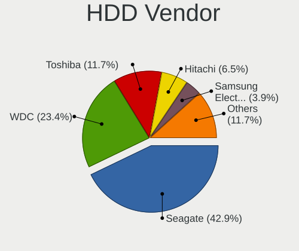

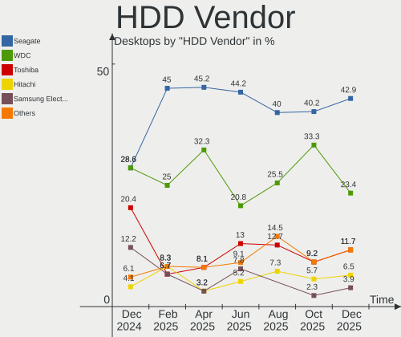

| Vendor              | Desktops | Drives | Percent |
|---------------------|----------|--------|---------|
| Seagate             | 33       | 46     | 42.86%  |
| WDC                 | 18       | 23     | 23.38%  |
| Toshiba             | 9        | 11     | 11.69%  |
| Hitachi             | 5        | 5      | 6.49%   |
| Samsung Electronics | 3        | 4      | 3.9%    |
| JMicron Technology  | 2        | 2      | 2.6%    |
| HGST                | 2        | 2      | 2.6%    |
| USB3.0              | 1        | 1      | 1.3%    |
| Unknown             | 1        | 1      | 1.3%    |
| TO Exter            | 1        | 1      | 1.3%    |
| RSH-339             | 1        | 1      | 1.3%    |
| ASMedia             | 1        | 1      | 1.3%    |

SSD Vendor
----------

Solid state drive vendors

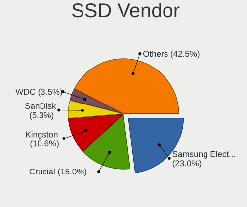

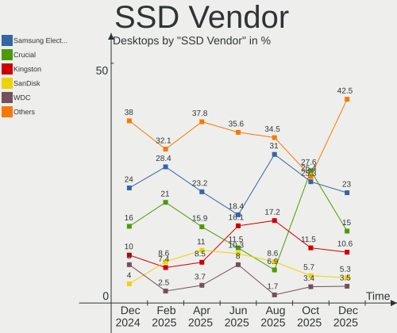

| Vendor              | Desktops | Drives | Percent |
|---------------------|----------|--------|---------|
| Samsung Electronics | 26       | 33     | 23.01%  |
| Crucial             | 17       | 21     | 15.04%  |
| Kingston            | 12       | 12     | 10.62%  |
| SanDisk             | 6        | 6      | 5.31%   |
| WDC                 | 4        | 4      | 3.54%   |
| PNY                 | 4        | 4      | 3.54%   |
| Patriot             | 4        | 6      | 3.54%   |
| Micron Technology   | 4        | 4      | 3.54%   |
| Integral            | 4        | 4      | 3.54%   |
| Intel               | 3        | 3      | 2.65%   |
| Unknown             | 3        | 3      | 2.65%   |
| SPCC                | 2        | 2      | 1.77%   |
| SK hynix            | 2        | 2      | 1.77%   |
| Seagate             | 2        | 2      | 1.77%   |
| KingSpec            | 2        | 2      | 1.77%   |
| China               | 2        | 2      | 1.77%   |
| XUM                 | 1        | 1      | 0.88%   |
| X12                 | 1        | 1      | 0.88%   |
| VENO                | 1        | 1      | 0.88%   |
| T-FORCE             | 1        | 1      | 0.88%   |
| OCZ                 | 1        | 1      | 0.88%   |
| Netac               | 1        | 1      | 0.88%   |
| MSI                 | 1        | 1      | 0.88%   |
| HPE                 | 1        | 1      | 0.88%   |
| HGST                | 1        | 1      | 0.88%   |
| FIKWOT              | 1        | 1      | 0.88%   |
| Fanxiang            | 1        | 1      | 0.88%   |
| Corsair             | 1        | 1      | 0.88%   |
| BAITITON            | 1        | 1      | 0.88%   |
| ANKEJE              | 1        | 1      | 0.88%   |
| AirDisk             | 1        | 1      | 0.88%   |
| A-DATA Technology   | 1        | 1      | 0.88%   |

Drive Kind
----------

HDD or SSD

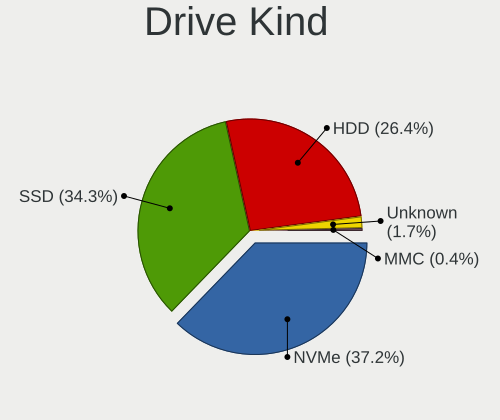

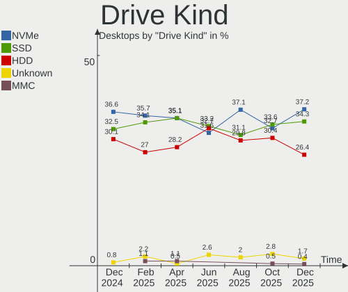

| Kind    | Desktops | Drives | Percent |
|---------|----------|--------|---------|
| NVMe    | 89       | 139    | 37.24%  |
| SSD     | 82       | 126    | 34.31%  |
| HDD     | 63       | 98     | 26.36%  |
| Unknown | 4        | 4      | 1.67%   |
| MMC     | 1        | 1      | 0.42%   |

Drive Connector
---------------

SATA, SAS, NVMe, etc.

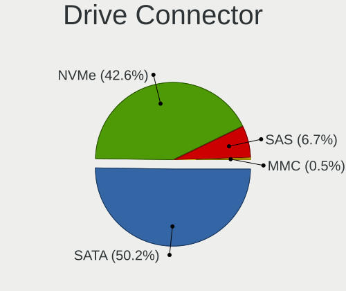

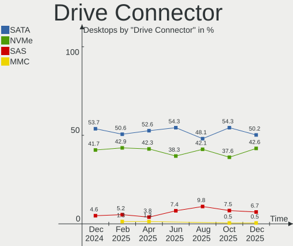

| Type | Desktops | Drives | Percent |
|------|----------|--------|---------|
| SATA | 105      | 209    | 50.24%  |
| NVMe | 89       | 139    | 42.58%  |
| SAS  | 14       | 19     | 6.7%    |
| MMC  | 1        | 1      | 0.48%   |

Drive Size
----------

Size of hard drive

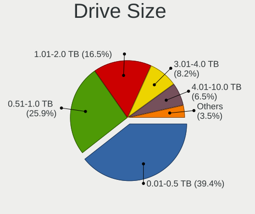

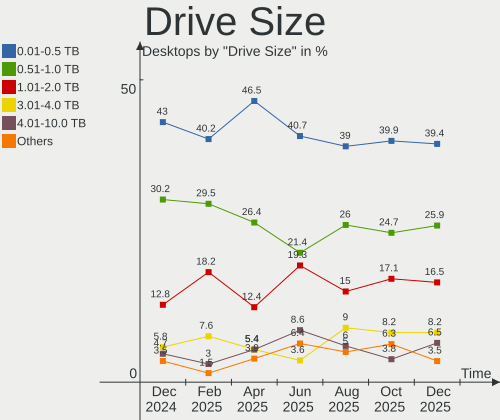

| Size in TB | Desktops | Drives | Percent |
|------------|----------|--------|---------|
| 0.01-0.5   | 67       | 87     | 39.41%  |
| 0.51-1.0   | 44       | 62     | 25.88%  |
| 1.01-2.0   | 28       | 35     | 16.47%  |
| 3.01-4.0   | 14       | 17     | 8.24%   |
| 4.01-10.0  | 11       | 14     | 6.47%   |
| 2.01-3.0   | 4        | 5      | 2.35%   |
| 10.01-20.0 | 2        | 4      | 1.18%   |

Space Total
-----------

Amount of disk space available on the file system

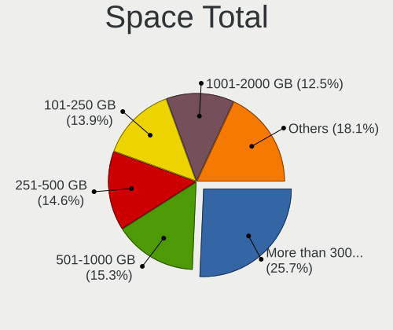

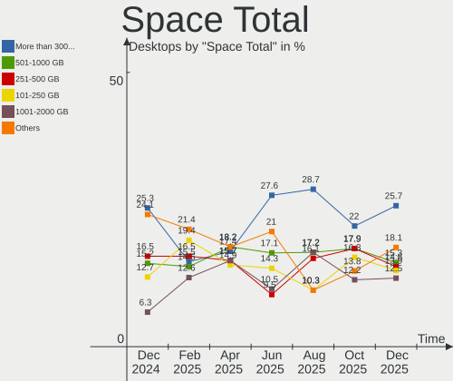

| Size in GB     | Desktops | Percent |
|----------------|----------|---------|
| More than 3000 | 37       | 25.69%  |
| 501-1000       | 22       | 15.28%  |
| 251-500        | 21       | 14.58%  |
| 101-250        | 20       | 13.89%  |
| 1001-2000      | 18       | 12.5%   |
| 2001-3000      | 11       | 7.64%   |
| Unknown        | 7        | 4.86%   |
| 1-20           | 3        | 2.08%   |
| 51-100         | 3        | 2.08%   |
| 21-50          | 2        | 1.39%   |

Space Used
----------

Amount of used disk space

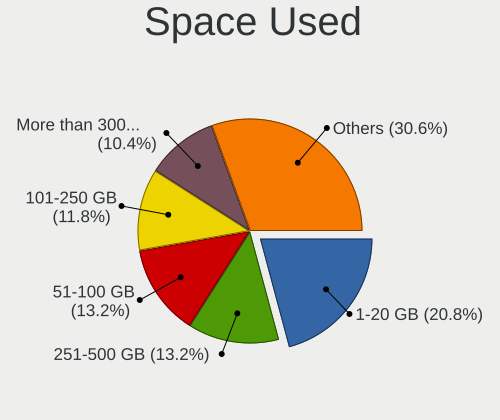

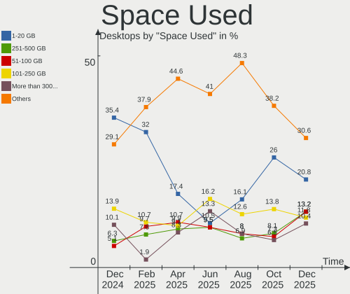

| Used GB        | Desktops | Percent |
|----------------|----------|---------|
| 1-20           | 30       | 20.83%  |
| 251-500        | 19       | 13.19%  |
| 51-100         | 19       | 13.19%  |
| 101-250        | 17       | 11.81%  |
| More than 3000 | 15       | 10.42%  |
| 501-1000       | 12       | 8.33%   |
| 1001-2000      | 11       | 7.64%   |
| 21-50          | 9        | 6.25%   |
| Unknown        | 7        | 4.86%   |
| 2001-3000      | 5        | 3.47%   |

Malfunc. Drives
---------------

Drive models with a malfunction

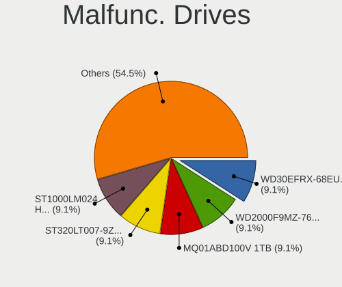

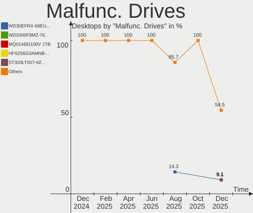

| Model                                               | Desktops | Drives | Percent |
|-----------------------------------------------------|----------|--------|---------|
| WDC WD30EFRX-68EUZN0 3TB                            | 1        | 1      | 9.09%   |
| WDC WD2000F9MZ-76NVPL0 2TB                          | 1        | 1      | 9.09%   |
| Toshiba MQ01ABD100V 1TB                             | 1        | 1      | 9.09%   |
| SK hynix HFS256G3AMNB-2200A 256GB SSD               | 1        | 1      | 9.09%   |
| Seagate ST320LT007-9ZV142 320GB                     | 1        | 1      | 9.09%   |
| Seagate ST1000LM024 HN-M101MBB 1TB                  | 1        | 1      | 9.09%   |
| Micron Technology MTFDDAK128MAY-1AH1ZABHA 128GB SSD | 1        | 1      | 9.09%   |
| Kingston SA400S37240G 240GB SSD                     | 1        | 1      | 9.09%   |
| Hitachi HUA722010CLA331 1TB                         | 1        | 1      | 9.09%   |
| BAITITON BT58SSD13S 1TB                             | 1        | 1      | 9.09%   |
| A-DATA Technology SU630 240GB SSD                   | 1        | 1      | 9.09%   |

Malfunc. Drive Vendor
---------------------

Vendors of faulty drives

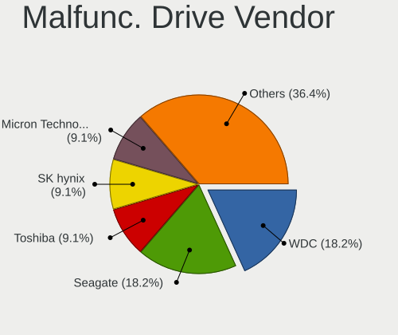

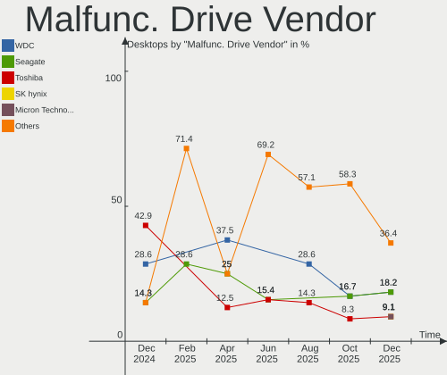

| Vendor            | Desktops | Drives | Percent |
|-------------------|----------|--------|---------|
| WDC               | 2        | 2      | 18.18%  |
| Seagate           | 2        | 2      | 18.18%  |
| Toshiba           | 1        | 1      | 9.09%   |
| SK hynix          | 1        | 1      | 9.09%   |
| Micron Technology | 1        | 1      | 9.09%   |
| Kingston          | 1        | 1      | 9.09%   |
| Hitachi           | 1        | 1      | 9.09%   |
| BAITITON          | 1        | 1      | 9.09%   |
| A-DATA Technology | 1        | 1      | 9.09%   |

Malfunc. HDD Vendor
-------------------

Vendors of faulty HDD drives

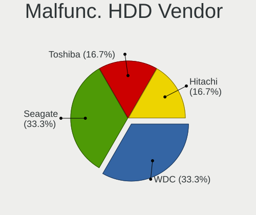

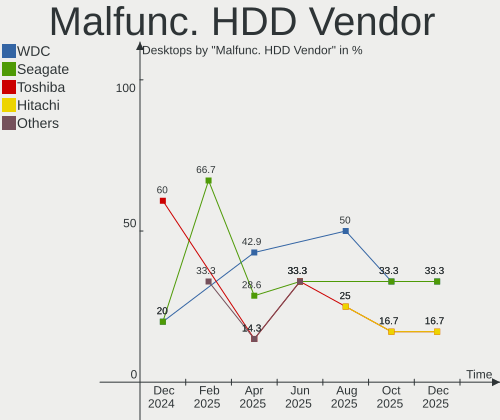

| Vendor  | Desktops | Drives | Percent |
|---------|----------|--------|---------|
| WDC     | 2        | 2      | 33.33%  |
| Seagate | 2        | 2      | 33.33%  |
| Toshiba | 1        | 1      | 16.67%  |
| Hitachi | 1        | 1      | 16.67%  |

Malfunc. Drive Kind
-------------------

Kinds of faulty drives

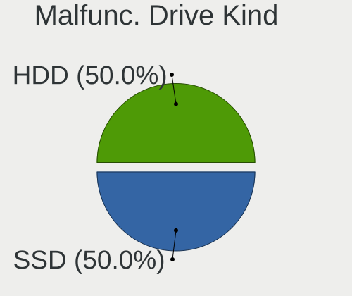

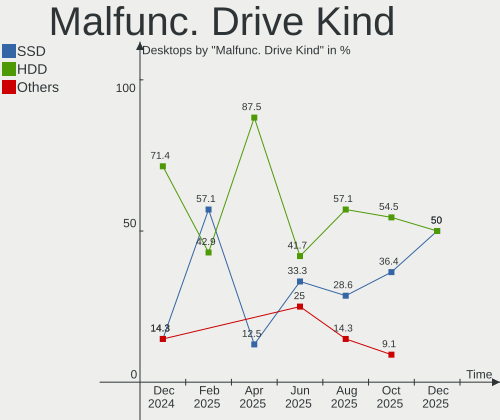

| Kind | Desktops | Drives | Percent |
|------|----------|--------|---------|
| SSD  | 5        | 5      | 50%     |
| HDD  | 5        | 6      | 50%     |

Failed Drives
-------------

Failed drive models

Zero info for selected period =(

Failed Drive Vendor
-------------------

Failed drive vendors

Zero info for selected period =(

Drive Status
------------

Number of failed and malfunc. drives

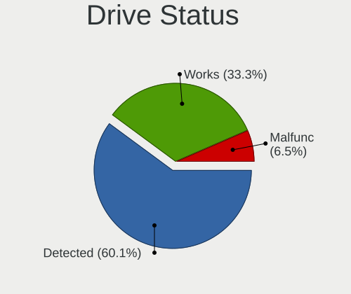

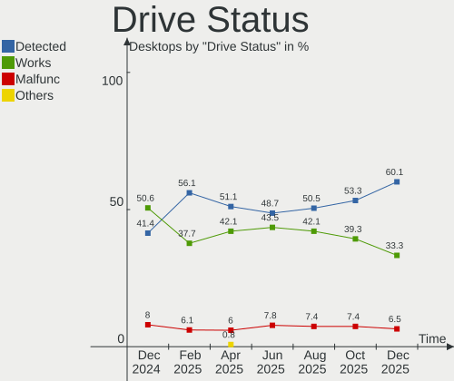

| Status   | Desktops | Drives | Percent |
|----------|----------|--------|---------|
| Detected | 92       | 245    | 60.13%  |
| Works    | 51       | 112    | 33.33%  |
| Malfunc  | 10       | 11     | 6.54%   |

Storage controller
------------------

Storage Vendor
--------------

Storage controller vendors

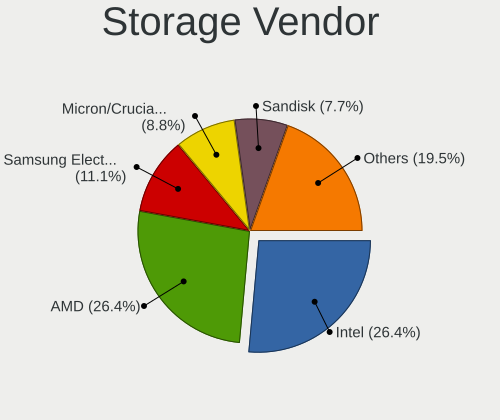

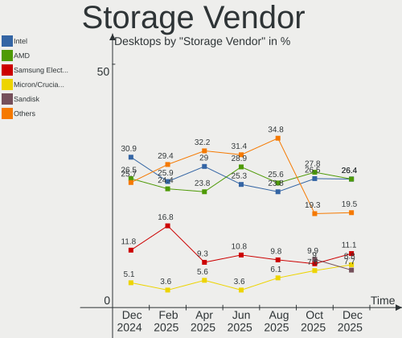

| Vendor                       | Desktops | Percent |
|------------------------------|----------|---------|
| Intel                        | 69       | 26.44%  |
| AMD                          | 69       | 26.44%  |
| Samsung Electronics          | 29       | 11.11%  |
| Micron/Crucial Technology    | 23       | 8.81%   |
| Sandisk                      | 20       | 7.66%   |
| Phison Electronics           | 7        | 2.68%   |
| MAXIO Technology (Hangzhou)  | 7        | 2.68%   |
| ASMedia Technology           | 7        | 2.68%   |
| Kingston Technology Company  | 4        | 1.53%   |
| Silicon Motion               | 3        | 1.15%   |
| Realtek Semiconductor        | 3        | 1.15%   |
| KIOXIA                       | 3        | 1.15%   |
| Biwin Storage Technology     | 3        | 1.15%   |
| SK hynix                     | 2        | 0.77%   |
| Shenzhen Longsys Electronics | 2        | 0.77%   |
| Marvell Technology Group     | 2        | 0.77%   |
| LSI Logic / Symbios Logic    | 2        | 0.77%   |
| ADATA Technology             | 2        | 0.77%   |
| Nvidia                       | 1        | 0.38%   |
| Netac Technology             | 1        | 0.38%   |
| INNOGRIT                     | 1        | 0.38%   |
| Apple                        | 1        | 0.38%   |

Storage Model
-------------

Storage controller models

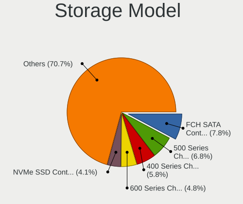

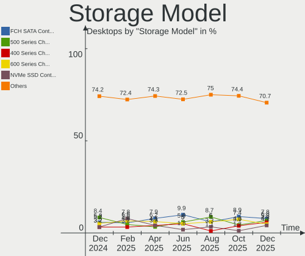

| Model                                                                          | Desktops | Percent |
|--------------------------------------------------------------------------------|----------|---------|
| AMD FCH SATA Controller [AHCI mode]                                            | 23       | 7.82%   |
| AMD 500 Series Chipset SATA Controller                                         | 20       | 6.8%    |
| AMD 400 Series Chipset SATA Controller                                         | 17       | 5.78%   |
| AMD 600 Series Chipset SATA Controller                                         | 14       | 4.76%   |
| Samsung NVMe SSD Controller SM981/PM981/PM983                                  | 12       | 4.08%   |
| Micron/Crucial P2 [Nick P2] / P3 / P3 Plus NVMe PCIe SSD (DRAM-less)           | 7        | 2.38%   |
| Intel 200 Series PCH SATA controller [AHCI mode]                               | 7        | 2.38%   |
| Samsung NVMe SSD Controller S4LV008[Pascal]                                    | 6        | 2.04%   |
| Micron/Crucial P310 NVMe PCIe SSD (DRAM-less)                                  | 6        | 2.04%   |
| MAXIO (Hangzhou) NVMe SSD Controller MAP1202 (DRAM-less)                       | 6        | 2.04%   |
| Intel Q170/Q150/B150/H170/H110/Z170/CM236 Chipset SATA Controller [AHCI Mode]  | 6        | 2.04%   |
| Intel 500 Series Chipset Family SATA AHCI Controller                           | 6        | 2.04%   |
| ASMedia ASM1061/ASM1062 Serial ATA Controller                                  | 6        | 2.04%   |
| Intel SATA Controller [RAID mode]                                              | 5        | 1.7%    |
| Intel 8 Series/C220 Series Chipset Family 6-port SATA Controller 1 [AHCI mode] | 5        | 1.7%    |
| Intel 6 Series/C200 Series Chipset Family 6 port Desktop SATA AHCI Controller  | 5        | 1.7%    |
| Sandisk WD Black SN850X NVMe SSD                                               | 4        | 1.36%   |
| Samsung NVMe SSD Controller PM9A1/PM9A3/980PRO                                 | 4        | 1.36%   |
| Samsung NVMe SSD Controller 980 (DRAM-less)                                    | 4        | 1.36%   |
| Intel Raptor Lake SATA AHCI Controller                                         | 4        | 1.36%   |
| Intel Cannon Lake PCH SATA AHCI Controller                                     | 4        | 1.36%   |
| Intel Alder Lake-S PCH SATA Controller [AHCI Mode]                             | 4        | 1.36%   |
| Intel 7 Series/C210 Series Chipset Family 6-port SATA Controller [AHCI mode]   | 4        | 1.36%   |
| Silicon Motion SM2263EN/SM2263XT (DRAM-less) NVMe SSD Controllers              | 3        | 1.02%   |
| SanDisk WD PC SN810 / Black SN850 NVMe SSD                                     | 3        | 1.02%   |
| SanDisk Extreme Pro / WD Black SN750 / PC SN730 / Red SN700 NVMe SSD           | 3        | 1.02%   |
| Samsung NVMe SSD Controller PM9C1a (DRAM-less)                                 | 3        | 1.02%   |
| Micron/Crucial T500 NVMe PCIe SSD                                              | 3        | 1.02%   |
| Micron/Crucial P5 Plus NVMe PCIe SSD                                           | 3        | 1.02%   |
| Intel Alder Lake-N SATA AHCI Controller                                        | 3        | 1.02%   |
| Intel 9 Series Chipset Family SATA Controller [AHCI Mode]                      | 3        | 1.02%   |
| AMD SB7x0/SB8x0/SB9x0 SATA Controller [AHCI mode]                              | 3        | 1.02%   |
| Sandisk WD_BLACK SN7100/WD PC SN7100S M.2 2280 NVMe SSD (DRAM-less)            | 2        | 0.68%   |
| SanDisk WD SN560/SN740/SN770/SN5000 NVMe SSD                                   | 2        | 0.68%   |
| SanDisk Ultra 3D / WD PC SN530, IX SN530, Blue SN550 NVMe SSD (DRAM-less)      | 2        | 0.68%   |
| Samsung NVMe SSD Controller SM961/PM961/SM963                                  | 2        | 0.68%   |
| Realtek RTS5765DL NVMe SSD Controller (DRAM-less)                              | 2        | 0.68%   |
| Phison PS5021-E21 PCIe4 NVMe Controller (DRAM-less)                            | 2        | 0.68%   |
| Phison PS5013-E13 PCIe3 NVMe Controller (DRAM-less)                            | 2        | 0.68%   |
| Marvell Group 88SE9172 SATA 6Gb/s Controller                                   | 2        | 0.68%   |

Storage Kind
------------

Kind of storage controller (IDE, SATA, NVMe, SAS, ...)

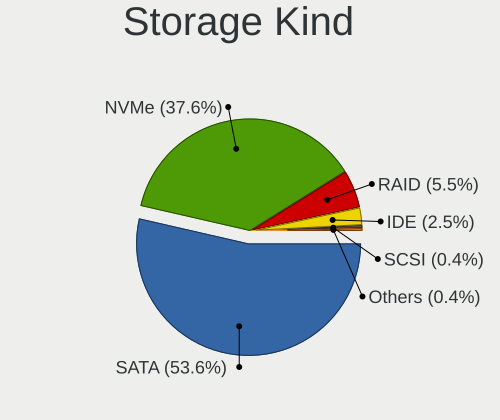

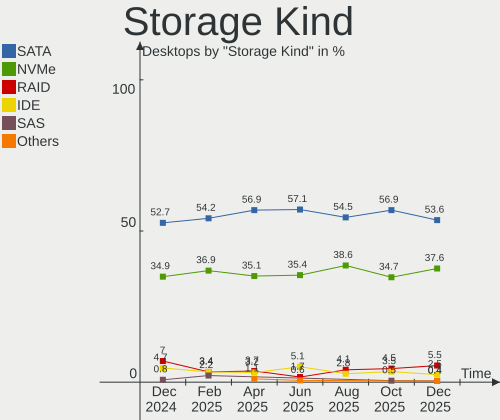

| Kind | Desktops | Percent |
|------|----------|---------|
| SATA | 127      | 53.59%  |
| NVMe | 89       | 37.55%  |
| RAID | 13       | 5.49%   |
| IDE  | 6        | 2.53%   |
| SAS  | 1        | 0.42%   |
| SCSI | 1        | 0.42%   |

Processor
---------

CPU Vendor
----------

Processor vendors

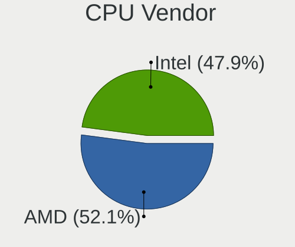

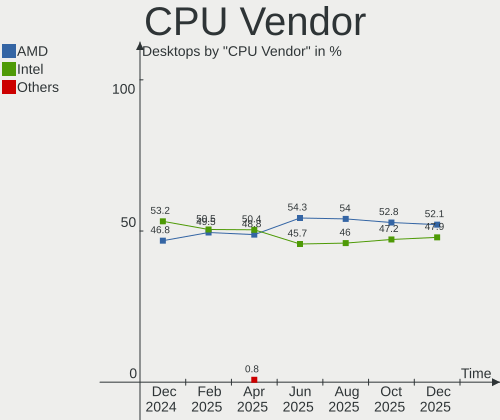

| Vendor | Desktops | Percent |
|--------|----------|---------|
| AMD    | 75       | 52.08%  |
| Intel  | 69       | 47.92%  |

CPU Model
---------

Processor models

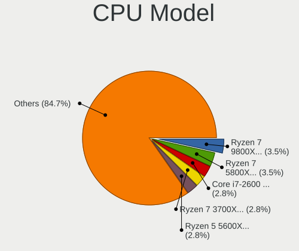

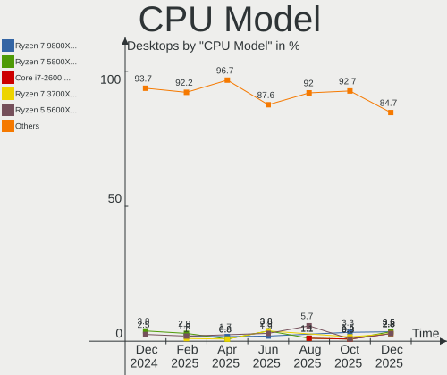

| Model                                      | Desktops | Percent |
|--------------------------------------------|----------|---------|
| AMD Ryzen 7 9800X3D 8-Core Processor       | 5        | 3.47%   |
| AMD Ryzen 7 5800X 8-Core Processor         | 5        | 3.47%   |
| Intel Core i7-2600 CPU @ 3.40GHz           | 4        | 2.78%   |
| AMD Ryzen 7 3700X 8-Core Processor         | 4        | 2.78%   |
| AMD Ryzen 5 5600X 6-Core Processor         | 4        | 2.78%   |
| Intel Core i7-9700K CPU @ 3.60GHz          | 3        | 2.08%   |
| Intel Core i7-8700K CPU @ 3.70GHz          | 3        | 2.08%   |
| Intel Core i7-4790 CPU @ 3.60GHz           | 3        | 2.08%   |
| Intel Core i3-3220 CPU @ 3.30GHz           | 3        | 2.08%   |
| AMD Ryzen 9 5900X 12-Core Processor        | 3        | 2.08%   |
| AMD Ryzen 7 5800X3D 8-Core Processor       | 3        | 2.08%   |
| AMD Ryzen 7 5700X 8-Core Processor         | 3        | 2.08%   |
| AMD Ryzen 5 5600G with Radeon Graphics     | 3        | 2.08%   |
| AMD Ryzen 5 3600 6-Core Processor          | 3        | 2.08%   |
| AMD Ryzen 5 2600 Six-Core Processor        | 3        | 2.08%   |
| Intel Core i5-6600K CPU @ 3.50GHz          | 2        | 1.39%   |
| Intel Core i5-4570 CPU @ 3.20GHz           | 2        | 1.39%   |
| Intel Core i5-3470 CPU @ 3.20GHz           | 2        | 1.39%   |
| Intel Core i5-2400 CPU @ 3.10GHz           | 2        | 1.39%   |
| Intel 13th Gen Core i7-13700K              | 2        | 1.39%   |
| Intel 11th Gen Core i7-11700K @ 3.60GHz    | 2        | 1.39%   |
| AMD Ryzen 9 PRO 6950H with Radeon Graphics | 2        | 1.39%   |
| AMD Ryzen 9 5950X 16-Core Processor        | 2        | 1.39%   |
| AMD Ryzen 9 3900X 12-Core Processor        | 2        | 1.39%   |
| AMD Ryzen 7 7800X3D 8-Core Processor       | 2        | 1.39%   |
| AMD Ryzen 7 7735U with Radeon Graphics     | 2        | 1.39%   |
| AMD Ryzen 7 5700X3D 8-Core Processor       | 2        | 1.39%   |
| AMD Ryzen 7 2700 Eight-Core Processor      | 2        | 1.39%   |
| AMD Ryzen 5 5500                           | 2        | 1.39%   |
| AMD Ryzen 5 4500 6-Core Processor          | 2        | 1.39%   |
| Intel Xeon W-3235 CPU @ 3.30GHz            | 1        | 0.69%   |
| Intel Xeon CPU E5-2697A v4 @ 2.60GHz       | 1        | 0.69%   |
| Intel Xeon CPU E3-1270 v3 @ 3.50GHz        | 1        | 0.69%   |
| Intel Xeon CPU E3-1231 v3 @ 3.40GHz        | 1        | 0.69%   |
| Intel N95                                  | 1        | 0.69%   |
| Intel N200                                 | 1        | 0.69%   |
| Intel N100                                 | 1        | 0.69%   |
| Intel Core Ultra 7 265                     | 1        | 0.69%   |
| Intel Core i9-9900K CPU @ 3.60GHz          | 1        | 0.69%   |
| Intel Core i9-10900K CPU @ 3.70GHz         | 1        | 0.69%   |

CPU Model Family
----------------

Processor model prefix

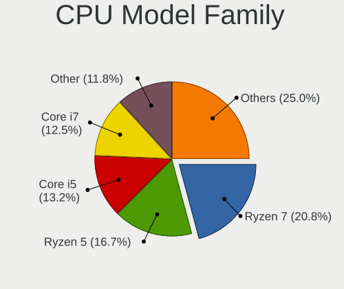

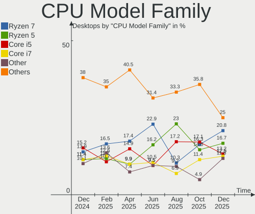

| Model             | Desktops | Percent |
|-------------------|----------|---------|
| AMD Ryzen 7       | 30       | 20.83%  |
| AMD Ryzen 5       | 24       | 16.67%  |
| Intel Core i5     | 19       | 13.19%  |
| Intel Core i7     | 18       | 12.5%   |
| Other             | 17       | 11.81%  |
| AMD Ryzen 9       | 12       | 8.33%   |
| Intel Core i3     | 5        | 3.47%   |
| Intel Xeon        | 4        | 2.78%   |
| Intel Core i9     | 2        | 1.39%   |
| AMD FX            | 2        | 1.39%   |
| AMD E             | 2        | 1.39%   |
| Intel Core 2 Quad | 1        | 0.69%   |
| Intel Core 2 Duo  | 1        | 0.69%   |
| Intel Core        | 1        | 0.69%   |
| Intel Celeron     | 1        | 0.69%   |
| AMD Athlon II X2  | 1        | 0.69%   |
| AMD Athlon        | 1        | 0.69%   |
| AMD A8            | 1        | 0.69%   |
| AMD A6            | 1        | 0.69%   |
| AMD A4            | 1        | 0.69%   |

CPU Cores
---------

Number of processor cores

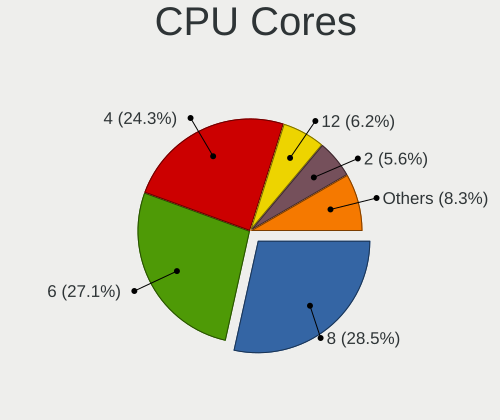

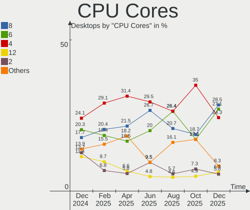

| Number | Desktops | Percent |
|--------|----------|---------|
| 8      | 41       | 28.47%  |
| 6      | 39       | 27.08%  |
| 4      | 35       | 24.31%  |
| 12     | 9        | 6.25%   |
| 2      | 8        | 5.56%   |
| 16     | 6        | 4.17%   |
| 14     | 2        | 1.39%   |
| 10     | 2        | 1.39%   |
| 20     | 1        | 0.69%   |
| 1      | 1        | 0.69%   |

CPU Sockets
-----------

Number of sockets

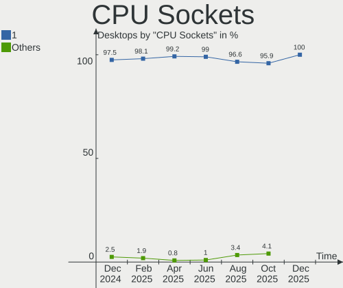

| Number | Desktops | Percent |
|--------|----------|---------|
| 1      | 144      | 100%    |

CPU Threads
-----------

Threads per core (Hyper-Threading)

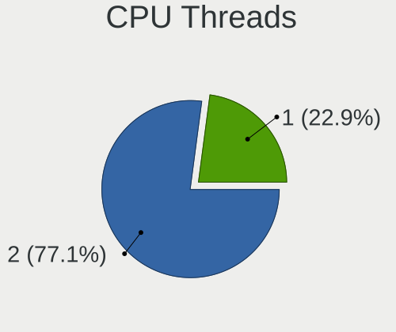

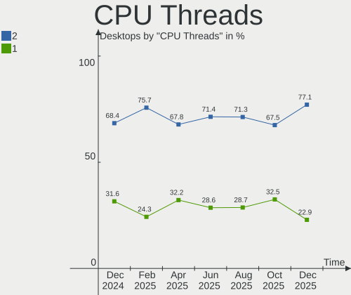

| Number | Desktops | Percent |
|--------|----------|---------|
| 2      | 111      | 77.08%  |
| 1      | 33       | 22.92%  |

CPU Op-Modes
------------

CPU Operation Modes (32-bit, 64-bit)

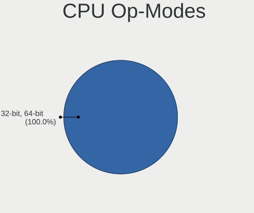

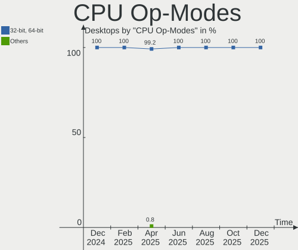

| Op mode        | Desktops | Percent |
|----------------|----------|---------|
| 32-bit, 64-bit | 144      | 100%    |

CPU Microcode
-------------

Microcode number

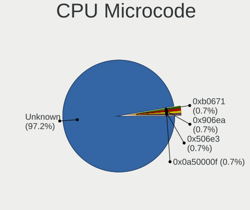

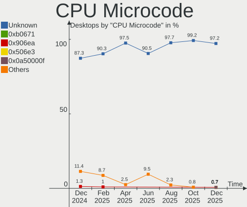

| Number     | Desktops | Percent |
|------------|----------|---------|
| Unknown    | 140      | 97.22%  |
| 0xb0671    | 1        | 0.69%   |
| 0x906ea    | 1        | 0.69%   |
| 0x506e3    | 1        | 0.69%   |
| 0x0a50000f | 1        | 0.69%   |

CPU Microarch
-------------

Microarchitecture

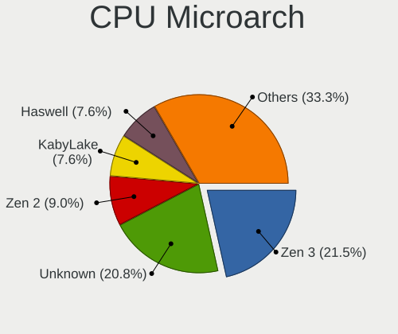

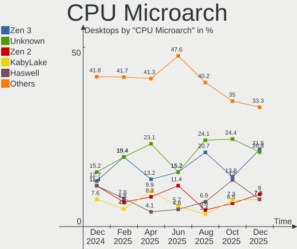

| Name             | Desktops | Percent |
|------------------|----------|---------|
| Zen 3            | 31       | 21.53%  |
| Unknown          | 30       | 20.83%  |
| Zen 2            | 13       | 9.03%   |
| KabyLake         | 11       | 7.64%   |
| Haswell          | 11       | 7.64%   |
| Skylake          | 7        | 4.86%   |
| Zen+             | 6        | 4.17%   |
| SandyBridge      | 6        | 4.17%   |
| IvyBridge        | 6        | 4.17%   |
| Alderlake Hybrid | 4        | 2.78%   |
| Icelake          | 3        | 2.08%   |
| CometLake        | 3        | 2.08%   |
| Piledriver       | 2        | 1.39%   |
| Penryn           | 2        | 1.39%   |
| K10 Llano        | 2        | 1.39%   |
| Broadwell        | 2        | 1.39%   |
| Silvermont       | 1        | 0.69%   |
| K8 Hammer        | 1        | 0.69%   |
| K10              | 1        | 0.69%   |
| Jaguar           | 1        | 0.69%   |
| Gracemont        | 1        | 0.69%   |

Graphics
--------

GPU Vendor
----------

Vendors of graphics cards

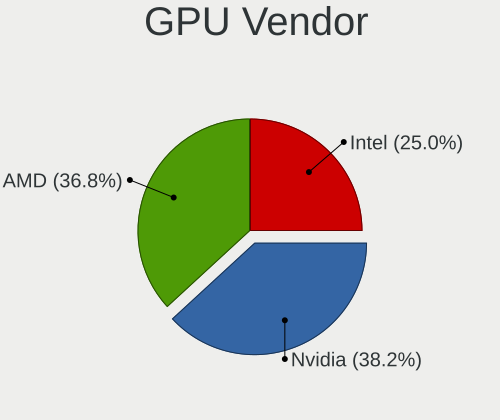

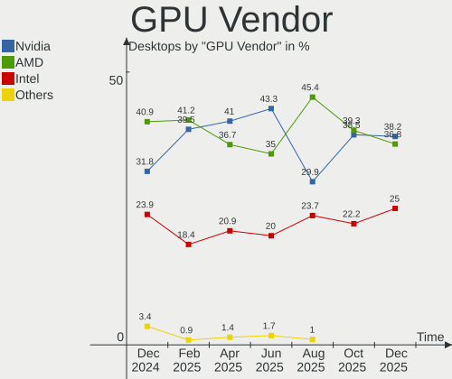

| Vendor | Desktops | Percent |
|--------|----------|---------|
| Nvidia | 58       | 38.16%  |
| AMD    | 56       | 36.84%  |
| Intel  | 38       | 25%     |

GPU Model
---------

Graphics card models

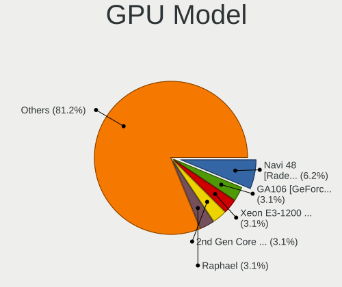

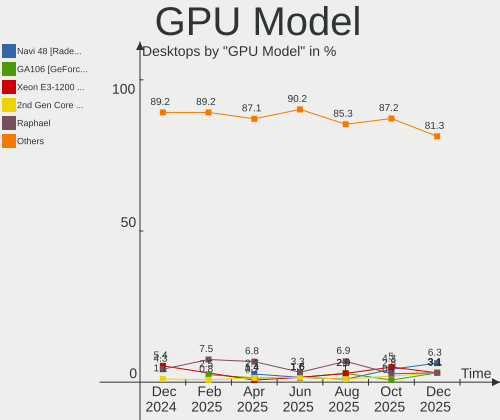

| Model                                                                       | Desktops | Percent |
|-----------------------------------------------------------------------------|----------|---------|
| AMD Navi 48 [Radeon RX 9070/9070 XT/9070 GRE]                               | 10       | 6.25%   |
| Nvidia GA106 [GeForce RTX 3060 Lite Hash Rate]                              | 5        | 3.13%   |
| Intel Xeon E3-1200 v3/4th Gen Core Processor Integrated Graphics Controller | 5        | 3.13%   |
| Intel 2nd Generation Core Processor Family Integrated Graphics Controller   | 5        | 3.13%   |
| AMD Raphael                                                                 | 5        | 3.13%   |
| AMD Granite Ridge [Radeon Graphics]                                         | 5        | 3.13%   |
| AMD Cezanne [Radeon Vega Series / Radeon Vega Mobile Series]                | 5        | 3.13%   |
| Intel Skylake-S GT2 [HD Graphics 530]                                       | 4        | 2.5%    |
| Intel CoffeeLake-S GT2 [UHD Graphics 630]                                   | 4        | 2.5%    |
| AMD Rembrandt [Radeon 680M]                                                 | 4        | 2.5%    |
| AMD Navi 10 [Radeon RX 5600 OEM/5600 XT / 5700/5700 XT]                     | 4        | 2.5%    |
| AMD Ellesmere [Radeon RX 470/480/570/570X/580/580X/590]                     | 4        | 2.5%    |
| Nvidia GP106 [GeForce GTX 1060 6GB]                                         | 3        | 1.88%   |
| Nvidia GP102 [GeForce GTX 1080 Ti]                                          | 3        | 1.88%   |
| Nvidia GA102 [GeForce RTX 3090]                                             | 3        | 1.88%   |
| Intel Xeon E3-1200 v2/3rd Gen Core processor Graphics Controller            | 3        | 1.88%   |
| Intel Battlemage G21 [Arc B580]                                             | 3        | 1.88%   |
| Intel Alder Lake-N [UHD Graphics]                                           | 3        | 1.88%   |
| AMD Navi 22 [Radeon RX 6700/6700 XT/6750 XT / 6800M/6850M XT]               | 3        | 1.88%   |
| Nvidia TU117 [GeForce GTX 1650]                                             | 2        | 1.25%   |
| Nvidia TU116 [GeForce GTX 1660 Ti]                                          | 2        | 1.25%   |
| Nvidia TU102 [GeForce RTX 2080 Ti Rev. A]                                   | 2        | 1.25%   |
| Nvidia GP106 [GeForce GTX 1060 3GB]                                         | 2        | 1.25%   |
| Nvidia GK208B [GeForce GT 710]                                              | 2        | 1.25%   |
| Nvidia GB206 [GeForce RTX 5060 Ti]                                          | 2        | 1.25%   |
| Nvidia GB202 [GeForce RTX 5090]                                             | 2        | 1.25%   |
| Nvidia GA104 [GeForce RTX 3070]                                             | 2        | 1.25%   |
| Nvidia GA104 [GeForce RTX 3070 Lite Hash Rate]                              | 2        | 1.25%   |
| AMD Navi 44 [Radeon RX 9060 XT]                                             | 2        | 1.25%   |
| AMD Navi 31 [Radeon RX 7900 XT/7900 XTX/7900 GRE/7900M]                     | 2        | 1.25%   |
| AMD Navi 23 [Radeon RX 6600/6600 XT/6600M]                                  | 2        | 1.25%   |
| AMD Navi 21 [Radeon RX 6800/6800 XT / 6900 XT]                              | 2        | 1.25%   |
| Nvidia TU116 [GeForce GTX 1660 SUPER]                                       | 1        | 0.63%   |
| Nvidia TU116 [GeForce GTX 1650]                                             | 1        | 0.63%   |
| Nvidia TU106 [GeForce RTX 2060 SUPER]                                       | 1        | 0.63%   |
| Nvidia TU104 [GeForce RTX 2080 SUPER]                                       | 1        | 0.63%   |
| Nvidia TU104 [GeForce RTX 2070 SUPER]                                       | 1        | 0.63%   |
| Nvidia TU104 [GeForce RTX 2060]                                             | 1        | 0.63%   |
| Nvidia GT218 [NVS 300]                                                      | 1        | 0.63%   |
| Nvidia GP108 [GeForce GT 1030]                                              | 1        | 0.63%   |

GPU Combo
---------

Combinations of graphics cards

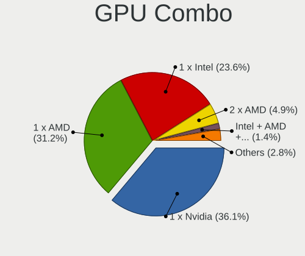

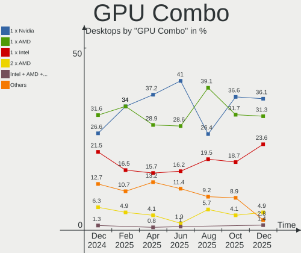

| Name                     | Desktops | Percent |
|--------------------------|----------|---------|
| 1 x Nvidia               | 52       | 36.11%  |
| 1 x AMD                  | 45       | 31.25%  |
| 1 x Intel                | 34       | 23.61%  |
| 2 x AMD                  | 7        | 4.86%   |
| Intel + AMD + 1 x Nvidia | 2        | 1.39%   |
| AMD + Nvidia             | 2        | 1.39%   |
| 2 x Nvidia               | 1        | 0.69%   |
| Intel + Nvidia           | 1        | 0.69%   |

GPU Driver
----------

Free vs proprietary

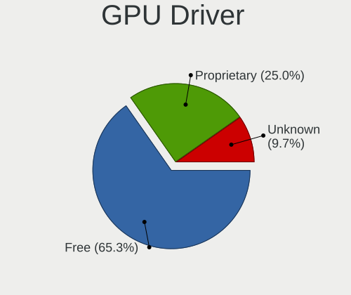

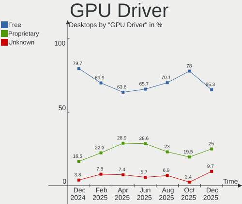

| Driver      | Desktops | Percent |
|-------------|----------|---------|
| Free        | 94       | 65.28%  |
| Proprietary | 36       | 25%     |
| Unknown     | 14       | 9.72%   |

GPU Memory
----------

Total video memory

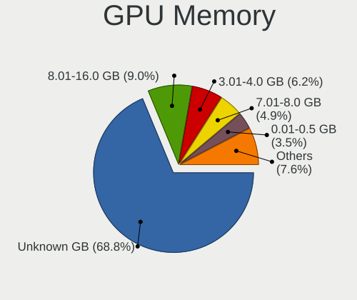

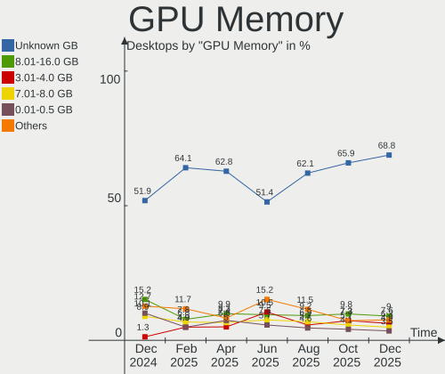

| Size in GB | Desktops | Percent |
|------------|----------|---------|
| Unknown    | 99       | 68.75%  |
| 8.01-16.0  | 13       | 9.03%   |
| 3.01-4.0   | 9        | 6.25%   |
| 7.01-8.0   | 7        | 4.86%   |
| 0.01-0.5   | 5        | 3.47%   |
| 5.01-6.0   | 4        | 2.78%   |
| 16.01-24.0 | 2        | 1.39%   |
| 1.01-2.0   | 2        | 1.39%   |
| 24.01-32.0 | 1        | 0.69%   |
| 2.01-3.0   | 1        | 0.69%   |
| 0.51-1.0   | 1        | 0.69%   |

Monitor
-------

Monitor Vendor
--------------

Monitor vendors

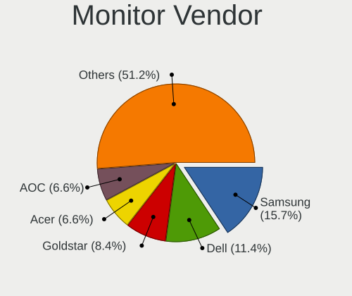

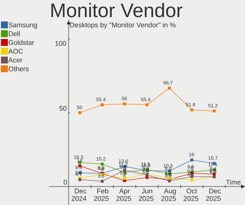

| Vendor               | Desktops | Percent |
|----------------------|----------|---------|
| Samsung Electronics  | 26       | 15.66%  |
| Dell                 | 19       | 11.45%  |
| Goldstar             | 14       | 8.43%   |
| AOC                  | 11       | 6.63%   |
| Acer                 | 11       | 6.63%   |
| Philips              | 10       | 6.02%   |
| BenQ                 | 10       | 6.02%   |
| Iiyama               | 7        | 4.22%   |
| ViewSonic            | 5        | 3.01%   |
| MSI                  | 5        | 3.01%   |
| HKC                  | 4        | 2.41%   |
| Hewlett-Packard      | 4        | 2.41%   |
| Ancor Communications | 4        | 2.41%   |
| Gigabyte Technology  | 3        | 1.81%   |
| Vestel Elektronik    | 2        | 1.2%    |
| Unknown (XXX)        | 2        | 1.2%    |
| Unknown              | 2        | 1.2%    |
| Sony                 | 2        | 1.2%    |
| Lenovo               | 2        | 1.2%    |
| Hitachi              | 2        | 1.2%    |
| ASUSTek Computer     | 2        | 1.2%    |
| UGD                  | 1        | 0.6%    |
| STD                  | 1        | 0.6%    |
| RTK                  | 1        | 0.6%    |
| Roku                 | 1        | 0.6%    |
| Qushimei             | 1        | 0.6%    |
| Pixio                | 1        | 0.6%    |
| NEC Computers        | 1        | 0.6%    |
| Mi                   | 1        | 0.6%    |
| IIC                  | 1        | 0.6%    |
| Huion                | 1        | 0.6%    |
| HRG                  | 1        | 0.6%    |
| HOP                  | 1        | 0.6%    |
| HannStar             | 1        | 0.6%    |
| FSI                  | 1        | 0.6%    |
| DENON                | 1        | 0.6%    |
| CVTE                 | 1        | 0.6%    |
| CMT                  | 1        | 0.6%    |
| AVX                  | 1        | 0.6%    |
| Apple                | 1        | 0.6%    |

Monitor Model
-------------

Monitor models

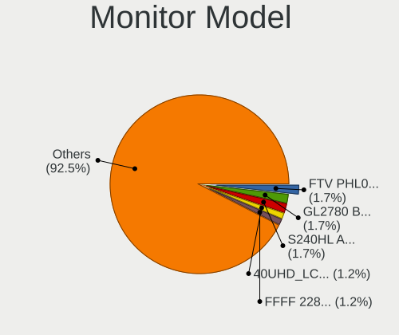

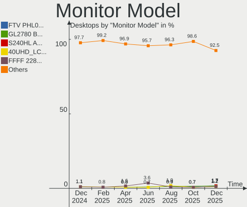

| Model                                                                   | Desktops | Percent |
|-------------------------------------------------------------------------|----------|---------|
| Philips FTV PHL01EA 1920x1080 1440x810mm 65.0-inch                      | 3        | 1.73%   |
| BenQ GL2780 BNQ78EC 1920x1080 600x340mm 27.2-inch                       | 3        | 1.73%   |
| Acer S240HL ACR0289 1920x1080 531x299mm 24.0-inch                       | 3        | 1.73%   |
| Vestel Elektronik 40UHD_LCD_TV VES3700 3840x2160 880x500mm 39.8-inch    | 2        | 1.16%   |
| Unknown LCD Monitor FFFF 2288x1287 2550x2550mm 142.0-inch               | 2        | 1.16%   |
| Samsung Electronics SyncMaster SAM0091 1600x1200 432x324mm 21.3-inch    | 2        | 1.16%   |
| Goldstar ULTRAGEAR GSM5B71 1920x1080 597x336mm 27.0-inch                | 2        | 1.16%   |
| Dell AW3423DWF DELA212 3440x1440 800x337mm 34.2-inch                    | 2        | 1.16%   |
| AOC K27U3D AOC2703 3840x2160 597x336mm 27.0-inch                        | 2        | 1.16%   |
| AOC 27G2G4 AOC2702 1920x1080 598x336mm 27.0-inch                        | 2        | 1.16%   |
| Ancor Communications ASUS VE278 ACI27F6 1920x1080 598x336mm 27.0-inch   | 2        | 1.16%   |
| ViewSonic VX2718-2KPC VSCB73A 2560x1440 598x336mm 27.0-inch             | 1        | 0.58%   |
| ViewSonic VX2718 series VSCE439 1920x1080 609x348mm 27.6-inch           | 1        | 0.58%   |
| ViewSonic VX2718 Series VSC4D3B 1920x1080 598x336mm 27.0-inch           | 1        | 0.58%   |
| ViewSonic VX2363 Series VSC6B2F 1920x1080 509x286mm 23.0-inch           | 1        | 0.58%   |
| ViewSonic VA2213w VSC3422 1920x1080 477x268mm 21.5-inch                 | 1        | 0.58%   |
| Unknown (XXX) Union TV XXX2841 1920x1080 1209x680mm 54.6-inch           | 1        | 0.58%   |
| Unknown (XXX) Beyond TV XXX9221 1920x1080 1209x680mm 54.6-inch          | 1        | 0.58%   |
| UGD Artist 15.6 UGD1501 1920x1080 344x193mm 15.5-inch                   | 1        | 0.58%   |
| STD LCD TV STD0101 1920x1080                                            | 1        | 0.58%   |
| Sony TV SNYFF00 1360x768                                                | 1        | 0.58%   |
| Sony TV SNY9600 720x480 735x420mm 33.3-inch                             | 1        | 0.58%   |
| Samsung Electronics U28E850 SAM0CCB 3840x2160 607x345mm 27.5-inch       | 1        | 0.58%   |
| Samsung Electronics SyncMaster SAM05CD 1920x1080                        | 1        | 0.58%   |
| Samsung Electronics SyncMaster SAM0585 2048x1152 510x290mm 23.1-inch    | 1        | 0.58%   |
| Samsung Electronics SA300/SA350 SAM07D2 1920x1080 477x268mm 21.5-inch   | 1        | 0.58%   |
| Samsung Electronics S27D590 SAM0BE9 1920x1080 598x336mm 27.0-inch       | 1        | 0.58%   |
| Samsung Electronics S24D332 SAM0F5E 1920x1080 531x299mm 24.0-inch       | 1        | 0.58%   |
| Samsung Electronics S24B150 SAM0983 1920x1080 521x293mm 23.5-inch       | 1        | 0.58%   |
| Samsung Electronics S23B300 SAM08AF 1920x1080 510x287mm 23.0-inch       | 1        | 0.58%   |
| Samsung Electronics S23B300 SAM08AE 1920x1080 510x287mm 23.0-inch       | 1        | 0.58%   |
| Samsung Electronics S22D300 SAM0B3F 1920x1080 477x268mm 21.5-inch       | 1        | 0.58%   |
| Samsung Electronics Odyssey G90XF SAM7859 3840x2160 600x340mm 27.2-inch | 1        | 0.58%   |
| Samsung Electronics Odyssey G7 SAM72C1 3840x2160 697x392mm 31.5-inch    | 1        | 0.58%   |
| Samsung Electronics Odyssey G60SD SAM75CB 2560x1440 598x336mm 27.0-inch | 1        | 0.58%   |
| Samsung Electronics LS32D80xE SAM7637 3840x2160 698x392mm 31.5-inch     | 1        | 0.58%   |
| Samsung Electronics LCD Monitor SAM735A 3840x2160 1872x1053mm 84.6-inch | 1        | 0.58%   |
| Samsung Electronics LCD Monitor SAM7269 3840x2160 700x390mm 31.5-inch   | 1        | 0.58%   |
| Samsung Electronics LCD Monitor SAM0F3D 1366x768 522x293mm 23.6-inch    | 1        | 0.58%   |
| Samsung Electronics LCD Monitor SAM0D43 3840x2160 1020x570mm 46.0-inch  | 1        | 0.58%   |

Monitor Resolution
------------------

Monitor screen resolution

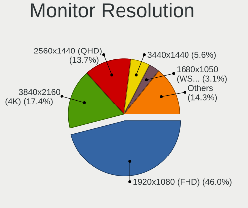

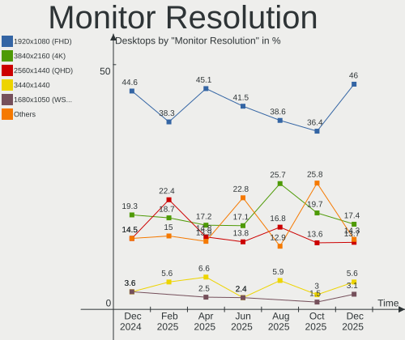

| Resolution         | Desktops | Percent |
|--------------------|----------|---------|
| 1920x1080 (FHD)    | 74       | 45.96%  |
| 3840x2160 (4K)     | 28       | 17.39%  |
| 2560x1440 (QHD)    | 22       | 13.66%  |
| 3440x1440          | 9        | 5.59%   |
| 1680x1050 (WSXGA+) | 5        | 3.11%   |
| 1366x768 (WXGA)    | 3        | 1.86%   |
| 1360x768           | 3        | 1.86%   |
| 2560x1600          | 2        | 1.24%   |
| 2560x1080          | 2        | 1.24%   |
| 2288x1287          | 2        | 1.24%   |
| 1920x1200 (WUXGA)  | 2        | 1.24%   |
| 1600x1200          | 2        | 1.24%   |
| 3840x1600          | 1        | 0.62%   |
| 3360x1440          | 1        | 0.62%   |
| 2160x1440          | 1        | 0.62%   |
| 2048x1152          | 1        | 0.62%   |
| 1920x540           | 1        | 0.62%   |
| 1600x900 (HD+)     | 1        | 0.62%   |
| 1440x900 (WXGA+)   | 1        | 0.62%   |

Monitor Diagonal
----------------

Diagonal size in inches

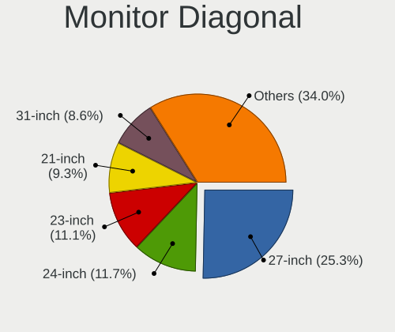

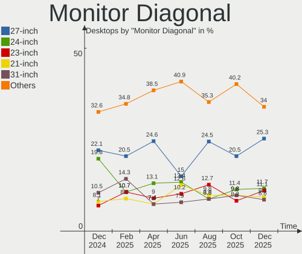

| Inches  | Desktops | Percent |
|---------|----------|---------|
| 27      | 41       | 25.31%  |
| 24      | 19       | 11.73%  |
| 23      | 18       | 11.11%  |
| 21      | 15       | 9.26%   |
| 31      | 14       | 8.64%   |
| 34      | 9        | 5.56%   |
| 84      | 5        | 3.09%   |
| Unknown | 5        | 3.09%   |
| 65      | 4        | 2.47%   |
| 72      | 3        | 1.85%   |
| 22      | 3        | 1.85%   |
| 20      | 3        | 1.85%   |
| 18      | 3        | 1.85%   |
| 142     | 2        | 1.23%   |
| 54      | 2        | 1.23%   |
| 36      | 2        | 1.23%   |
| 15      | 2        | 1.23%   |
| 74      | 1        | 0.62%   |
| 64      | 1        | 0.62%   |
| 63      | 1        | 0.62%   |
| 46      | 1        | 0.62%   |
| 44      | 1        | 0.62%   |
| 39      | 1        | 0.62%   |
| 37      | 1        | 0.62%   |
| 33      | 1        | 0.62%   |
| 32      | 1        | 0.62%   |
| 30      | 1        | 0.62%   |
| 29      | 1        | 0.62%   |
| 26      | 1        | 0.62%   |

Monitor Width
-------------

Physical width

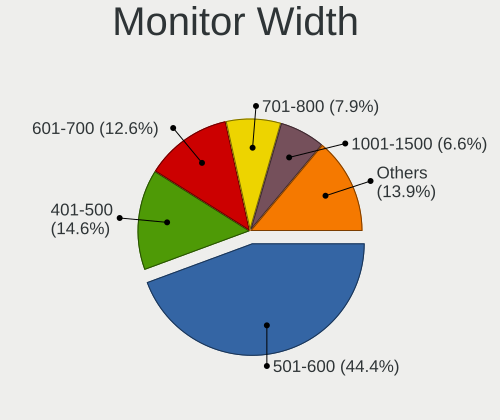

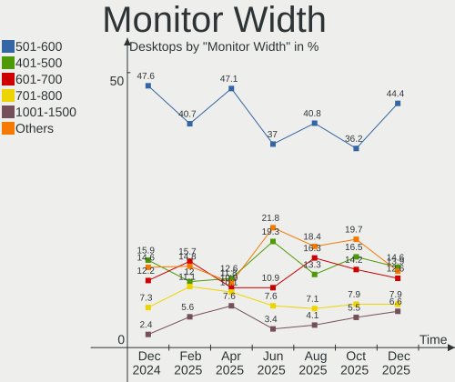

| Width in mm    | Desktops | Percent |
|----------------|----------|---------|
| 501-600        | 67       | 44.37%  |
| 401-500        | 22       | 14.57%  |
| 601-700        | 19       | 12.58%  |
| 701-800        | 12       | 7.95%   |
| 1001-1500      | 10       | 6.62%   |
| 1501-2000      | 9        | 5.96%   |
| Unknown        | 5        | 3.31%   |
| More than 2000 | 2        | 1.32%   |
| 801-900        | 2        | 1.32%   |
| 301-350        | 2        | 1.32%   |
| 901-1000       | 1        | 0.66%   |

Aspect Ratio
------------

Proportional relationship between the width and the height

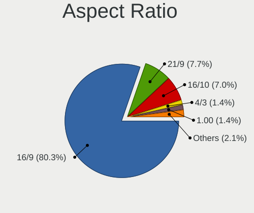

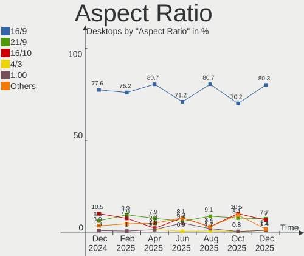

| Ratio   | Desktops | Percent |
|---------|----------|---------|
| 16/9    | 114      | 80.28%  |
| 21/9    | 11       | 7.75%   |
| 16/10   | 10       | 7.04%   |
| 4/3     | 2        | 1.41%   |
| 1.00    | 2        | 1.41%   |
| Unknown | 2        | 1.41%   |
| 32/9    | 1        | 0.7%    |

Monitor Area
------------

Area in inch²

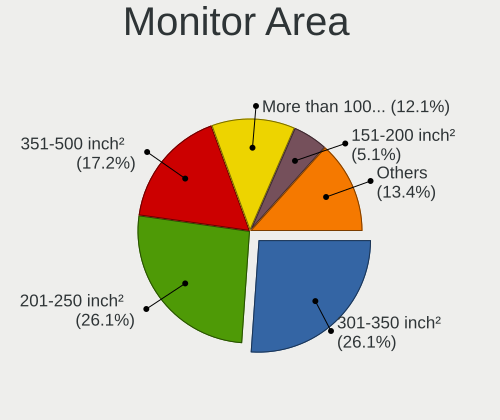

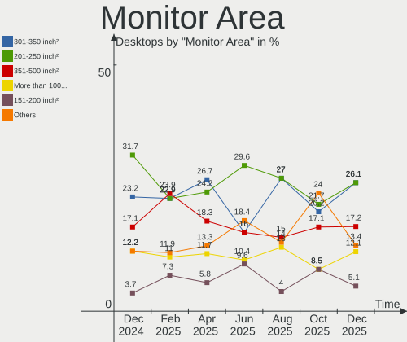

| Area in inch² | Desktops | Percent |
|----------------|----------|---------|
| 301-350        | 41       | 26.11%  |
| 201-250        | 41       | 26.11%  |
| 351-500        | 27       | 17.2%   |
| More than 1000 | 19       | 12.1%   |
| 151-200        | 8        | 5.1%    |
| 501-1000       | 6        | 3.82%   |
| 251-300        | 5        | 3.18%   |
| Unknown        | 5        | 3.18%   |
| 141-150        | 3        | 1.91%   |
| 101-110        | 2        | 1.27%   |

Pixel Density
-------------

Pixels per inch

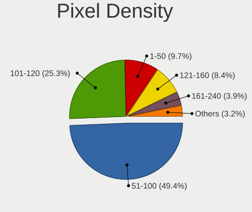

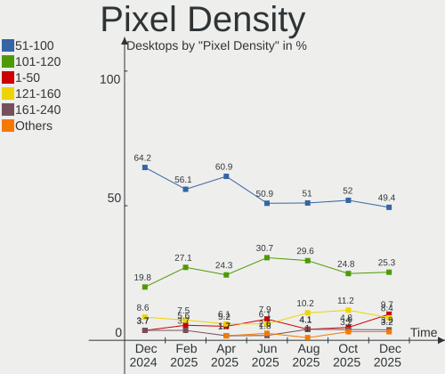

| Density | Desktops | Percent |
|---------|----------|---------|
| 51-100  | 76       | 49.35%  |
| 101-120 | 39       | 25.32%  |
| 1-50    | 15       | 9.74%   |
| 121-160 | 13       | 8.44%   |
| 161-240 | 6        | 3.9%    |
| Unknown | 5        | 3.25%   |

Multiple Monitors
-----------------

Total monitors connected

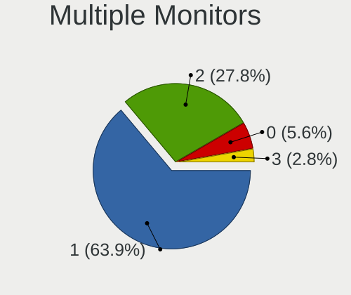

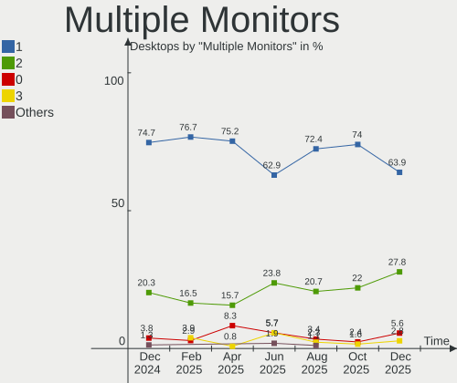

| Total | Desktops | Percent |
|-------|----------|---------|
| 1     | 92       | 63.89%  |
| 2     | 40       | 27.78%  |
| 0     | 8        | 5.56%   |
| 3     | 4        | 2.78%   |

Network
-------

Net Controller Vendor
---------------------

Controller vendors

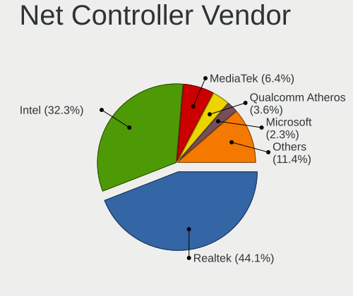

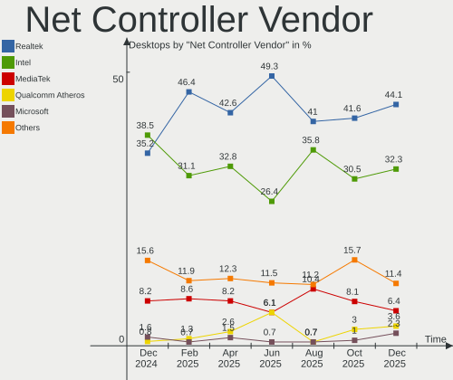

| Vendor                | Desktops | Percent |
|-----------------------|----------|---------|
| Realtek Semiconductor | 97       | 44.09%  |
| Intel                 | 71       | 32.27%  |
| MediaTek              | 14       | 6.36%   |
| Qualcomm Atheros      | 8        | 3.64%   |
| Microsoft             | 5        | 2.27%   |
| Broadcom              | 5        | 2.27%   |
| TP-Link               | 4        | 1.82%   |
| Realtek               | 2        | 0.91%   |
| Ralink Technology     | 2        | 0.91%   |
| Motorola PCS          | 2        | 0.91%   |
| TMS                   | 1        | 0.45%   |
| Ralink                | 1        | 0.45%   |
| Qualcomm Technologies | 1        | 0.45%   |
| QLogic                | 1        | 0.45%   |
| Nvidia                | 1        | 0.45%   |
| NetGear               | 1        | 0.45%   |
| Dimenco               | 1        | 0.45%   |
| ASUSTek Computer      | 1        | 0.45%   |
| Aquantia              | 1        | 0.45%   |
| Apple                 | 1        | 0.45%   |

Net Controller Model
--------------------

Controller models

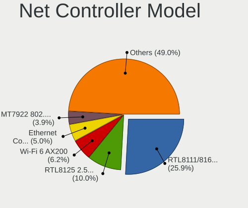

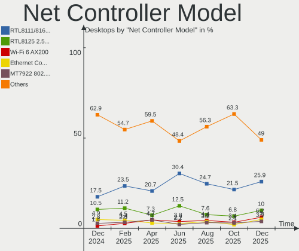

| Model                                                                  | Desktops | Percent |
|------------------------------------------------------------------------|----------|---------|
| Realtek RTL8111/8168/8211/8411 PCI Express Gigabit Ethernet Controller | 67       | 25.87%  |
| Realtek RTL8125 2.5GbE Controller                                      | 26       | 10.04%  |
| Intel Wi-Fi 6 AX200                                                    | 16       | 6.18%   |
| Intel Ethernet Controller I225-V                                       | 13       | 5.02%   |
| MediaTek MT7922 802.11ax PCI Express Wireless Network Adapter          | 10       | 3.86%   |
| Intel I211 Gigabit Network Connection                                  | 6        | 2.32%   |
| Intel 82579LM Gigabit Network Connection (Lewisville)                  | 6        | 2.32%   |
| Realtek 802.11ac NIC                                                   | 5        | 1.93%   |
| Intel Wi-Fi 6E(802.11ax) AX210/AX1675* 2x2 [Typhoon Peak]              | 5        | 1.93%   |
| Intel Ethernet Controller I226-V                                       | 5        | 1.93%   |
| Microsoft Xbox Wireless Adapter for Windows                            | 4        | 1.54%   |
| Intel Ethernet Connection (2) I219-V                                   | 4        | 1.54%   |
| Realtek RTL8153 Gigabit Ethernet Adapter                               | 3        | 1.16%   |
| Qualcomm Atheros Killer E220x Gigabit Ethernet Controller              | 3        | 1.16%   |
| Intel Ethernet Connection I217-LM                                      | 3        | 1.16%   |
| Intel Ethernet Connection (7) I219-V                                   | 3        | 1.16%   |
| TP-Link TL-WN823N v2/v3 [Realtek RTL8192EU]                            | 2        | 0.77%   |
| TP-Link 802.11ac WLAN Adapter                                          | 2        | 0.77%   |
| Realtek RTL8922AE 802.11be PCIe Wireless Network Adapter               | 2        | 0.77%   |
| Realtek RTL8852BE PCIe 802.11ax Wireless Network Controller            | 2        | 0.77%   |
| Realtek RTL8821CE 802.11ac PCIe Wireless Network Adapter               | 2        | 0.77%   |
| Realtek RTL8812AE 802.11ac PCIe Wireless Network Adapter               | 2        | 0.77%   |
| Realtek RTL8192EU 802.11b/g/n WLAN Adapter                             | 2        | 0.77%   |
| Ralink MT7601U Wireless Adapter                                        | 2        | 0.77%   |
| Qualcomm Atheros Killer E2400 Gigabit Ethernet Controller              | 2        | 0.77%   |
| Motorola PCS motorola one 5G ace                                       | 2        | 0.77%   |
| MediaTek MT7902 802.11ax PCIe Wireless Network Adapter [Filogic 310]   | 2        | 0.77%   |
| Intel Ethernet Connection I217-V                                       | 2        | 0.77%   |
| Intel Dual Band Wireless-AC 3168NGW [Stone Peak]                       | 2        | 0.77%   |
| Intel Alder Lake-N PCH CNVi WiFi                                       | 2        | 0.77%   |
| Intel 82567LM-3 Gigabit Network Connection                             | 2        | 0.77%   |
| Intel 700 Series Chipset CNVi WiFi                                     | 2        | 0.77%   |
| Broadcom Network controller                                            | 2        | 0.77%   |
| TMS Virtual ComPort in FS Mode                                         | 1        | 0.39%   |
| Realtek USB 10/100/1G/2.5 LAN                                          | 1        | 0.39%   |
| Realtek RTL8852CE PCIe 802.11ax Wireless Network Controller            | 1        | 0.39%   |
| Realtek RTL8822CE 802.11ac PCIe Wireless Network Adapter               | 1        | 0.39%   |
| Realtek RTL8822BE 802.11a/b/g/n/ac WiFi adapter                        | 1        | 0.39%   |
| Realtek RTL8192EE PCIe Wireless Network Adapter                        | 1        | 0.39%   |
| Realtek RTL8188FTV 802.11b/g/n 1T1R 2.4G WLAN Adapter                  | 1        | 0.39%   |

Wireless Vendor
---------------

Wireless vendors

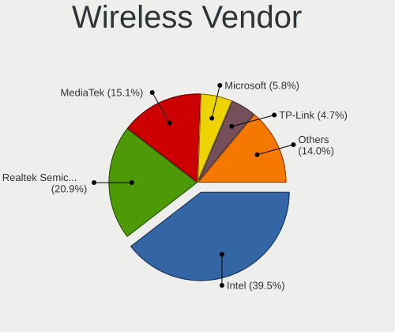

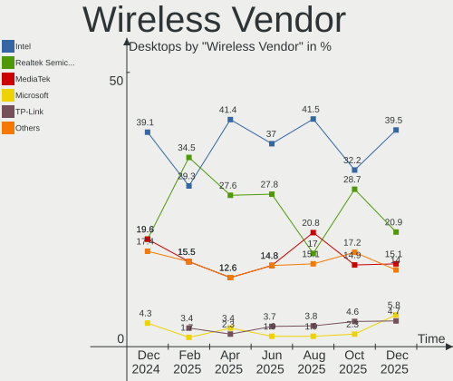

| Vendor                | Desktops | Percent |
|-----------------------|----------|---------|
| Intel                 | 34       | 39.53%  |
| Realtek Semiconductor | 18       | 20.93%  |
| MediaTek              | 13       | 15.12%  |
| Microsoft             | 5        | 5.81%   |
| TP-Link               | 4        | 4.65%   |
| Broadcom              | 4        | 4.65%   |
| Realtek               | 2        | 2.33%   |
| Ralink Technology     | 2        | 2.33%   |
| Ralink                | 1        | 1.16%   |
| Qualcomm Atheros      | 1        | 1.16%   |
| NetGear               | 1        | 1.16%   |
| ASUSTek Computer      | 1        | 1.16%   |

Wireless Model
--------------

Wireless models

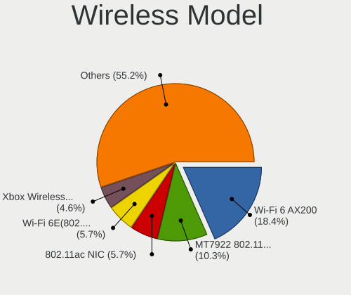

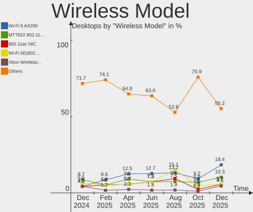

| Model                                                                | Desktops | Percent |
|----------------------------------------------------------------------|----------|---------|
| Intel Wi-Fi 6 AX200                                                  | 16       | 18.39%  |
| MediaTek MT7922 802.11ax PCI Express Wireless Network Adapter        | 9        | 10.34%  |
| Realtek 802.11ac NIC                                                 | 5        | 5.75%   |
| Intel Wi-Fi 6E(802.11ax) AX210/AX1675* 2x2 [Typhoon Peak]            | 5        | 5.75%   |
| Microsoft Xbox Wireless Adapter for Windows                          | 4        | 4.6%    |
| TP-Link TL-WN823N v2/v3 [Realtek RTL8192EU]                          | 2        | 2.3%    |
| TP-Link 802.11ac WLAN Adapter                                        | 2        | 2.3%    |
| Realtek RTL8821CE 802.11ac PCIe Wireless Network Adapter             | 2        | 2.3%    |
| Realtek RTL8812AE 802.11ac PCIe Wireless Network Adapter             | 2        | 2.3%    |
| Realtek RTL8192EU 802.11b/g/n WLAN Adapter                           | 2        | 2.3%    |
| Ralink MT7601U Wireless Adapter                                      | 2        | 2.3%    |
| MediaTek MT7902 802.11ax PCIe Wireless Network Adapter [Filogic 310] | 2        | 2.3%    |
| Intel Dual Band Wireless-AC 3168NGW [Stone Peak]                     | 2        | 2.3%    |
| Intel 700 Series Chipset CNVi WiFi                                   | 2        | 2.3%    |
| Broadcom Network controller                                          | 2        | 2.3%    |
| Realtek RTL8922AE 802.11be PCIe Wireless Network Adapter             | 1        | 1.15%   |
| Realtek RTL8852CE PCIe 802.11ax Wireless Network Controller          | 1        | 1.15%   |
| Realtek RTL8822CE 802.11ac PCIe Wireless Network Adapter             | 1        | 1.15%   |
| Realtek RTL8822BE 802.11a/b/g/n/ac WiFi adapter                      | 1        | 1.15%   |
| Realtek RTL8192EE PCIe Wireless Network Adapter                      | 1        | 1.15%   |
| Realtek RTL8188FTV 802.11b/g/n 1T1R 2.4G WLAN Adapter                | 1        | 1.15%   |
| Realtek RTL8188EUS 802.11n Wireless Network Adapter                  | 1        | 1.15%   |
| Realtek RTL8188EE Wireless Network Adapter                           | 1        | 1.15%   |
| Realtek 802.11ax WLAN Adapter                                        | 1        | 1.15%   |
| Realtek 802.11ac WLAN Adapter                                        | 1        | 1.15%   |
| Ralink RT5392 PCIe Wireless Network Adapter                          | 1        | 1.15%   |
| Qualcomm Atheros AR9462 Wireless Network Adapter                     | 1        | 1.15%   |
| NetGear A6210                                                        | 1        | 1.15%   |
| Microsoft Xbox 360 Wireless Adapter                                  | 1        | 1.15%   |
| MediaTek MT7921K (RZ608) Wi-Fi 6E 80MHz                              | 1        | 1.15%   |
| MediaTek MT7921 802.11ax PCIe Wireless Network Adapter [Filogic 330] | 1        | 1.15%   |
| Intel Wireless 8265 / 8275                                           | 1        | 1.15%   |
| Intel Wireless 7265                                                  | 1        | 1.15%   |
| Intel Wireless 7260                                                  | 1        | 1.15%   |
| Intel Wireless 3165                                                  | 1        | 1.15%   |
| Intel Wi-Fi 5(802.11ac) Wireless-AC 9x6x [Thunder Peak]              | 1        | 1.15%   |
| Intel Tiger Lake PCH CNVi WiFi                                       | 1        | 1.15%   |
| Intel Ice Lake-LP PCH CNVi WiFi                                      | 1        | 1.15%   |
| Intel Comet Lake PCH CNVi WiFi                                       | 1        | 1.15%   |
| Intel Alder Lake-N PCH CNVi WiFi                                     | 1        | 1.15%   |

Ethernet Vendor
---------------

Ethernet vendors

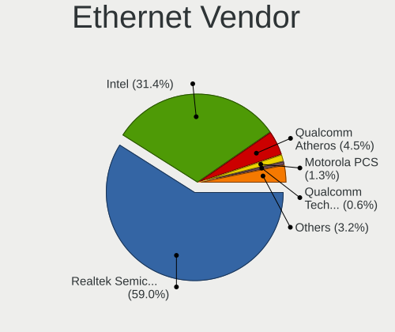

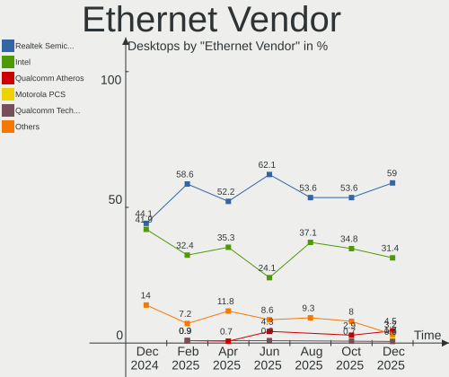

| Vendor                | Desktops | Percent |
|-----------------------|----------|---------|
| Realtek Semiconductor | 92       | 58.97%  |
| Intel                 | 49       | 31.41%  |
| Qualcomm Atheros      | 7        | 4.49%   |
| Motorola PCS          | 2        | 1.28%   |
| Qualcomm Technologies | 1        | 0.64%   |
| QLogic                | 1        | 0.64%   |
| Nvidia                | 1        | 0.64%   |
| MediaTek              | 1        | 0.64%   |
| Broadcom              | 1        | 0.64%   |
| Aquantia              | 1        | 0.64%   |

Ethernet Model
--------------

Ethernet models

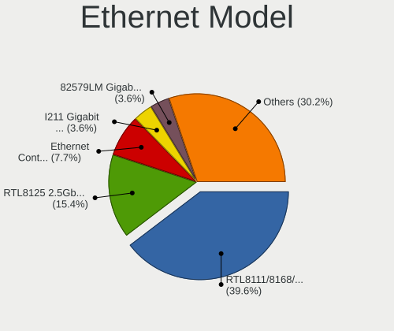

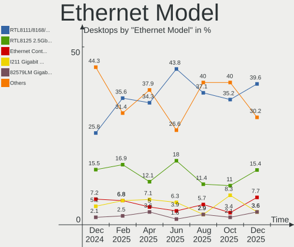

| Model                                                                          | Desktops | Percent |
|--------------------------------------------------------------------------------|----------|---------|
| Realtek RTL8111/8168/8211/8411 PCI Express Gigabit Ethernet Controller         | 67       | 39.64%  |
| Realtek RTL8125 2.5GbE Controller                                              | 26       | 15.38%  |
| Intel Ethernet Controller I225-V                                               | 13       | 7.69%   |
| Intel I211 Gigabit Network Connection                                          | 6        | 3.55%   |
| Intel 82579LM Gigabit Network Connection (Lewisville)                          | 6        | 3.55%   |
| Intel Ethernet Controller I226-V                                               | 5        | 2.96%   |
| Intel Ethernet Connection (2) I219-V                                           | 4        | 2.37%   |
| Realtek RTL8153 Gigabit Ethernet Adapter                                       | 3        | 1.78%   |
| Qualcomm Atheros Killer E220x Gigabit Ethernet Controller                      | 3        | 1.78%   |
| Intel Ethernet Connection I217-LM                                              | 3        | 1.78%   |
| Intel Ethernet Connection (7) I219-V                                           | 3        | 1.78%   |
| Realtek RTL8852BE PCIe 802.11ax Wireless Network Controller                    | 2        | 1.18%   |
| Qualcomm Atheros Killer E2400 Gigabit Ethernet Controller                      | 2        | 1.18%   |
| Motorola PCS motorola one 5G ace                                               | 2        | 1.18%   |
| Intel Ethernet Connection I217-V                                               | 2        | 1.18%   |
| Intel 82567LM-3 Gigabit Network Connection                                     | 2        | 1.18%   |
| Realtek USB 10/100/1G/2.5 LAN                                                  | 1        | 0.59%   |
| Realtek RTL8922AE 802.11be PCIe Wireless Network Adapter                       | 1        | 0.59%   |
| Realtek RTL8126 5GbE Controller                                                | 1        | 0.59%   |
| Qualcomm WCN785x Wi-Fi 7(802.11be) 320MHz 2x2 [FastConnect 7800]               | 1        | 0.59%   |
| Qualcomm Atheros Killer E2500 Gigabit Ethernet Controller                      | 1        | 0.59%   |
| Qualcomm Atheros AR8151 v2.0 Gigabit Ethernet                                  | 1        | 0.59%   |
| QLogic cLOM8214 1/10GbE Controller                                             | 1        | 0.59%   |
| Nvidia MCP61 Ethernet                                                          | 1        | 0.59%   |
| MediaTek MT7922 802.11ax PCI Express Wireless Network Adapter                  | 1        | 0.59%   |
| Intel I210 Gigabit Network Connection                                          | 1        | 0.59%   |
| Intel Ethernet Controller X540                                                 | 1        | 0.59%   |
| Intel Ethernet Connection (7) I219-LM                                          | 1        | 0.59%   |
| Intel Ethernet Connection (2) I218-V                                           | 1        | 0.59%   |
| Intel Ethernet Connection (2) I218-LM                                          | 1        | 0.59%   |
| Intel Ethernet Connection (14) I219-V                                          | 1        | 0.59%   |
| Intel Alder Lake-S PCH CNVi WiFi                                               | 1        | 0.59%   |
| Intel Alder Lake-N PCH CNVi WiFi                                               | 1        | 0.59%   |
| Intel 82599 10 Gigabit Network Connection                                      | 1        | 0.59%   |
| Broadcom NetLink BCM57780 Gigabit Ethernet PCIe                                | 1        | 0.59%   |
| Aquantia AQtion AQC107 NBase-T/IEEE 802.3an Ethernet Controller [Atlantic 10G] | 1        | 0.59%   |

Net Controller Kind
-------------------

Ethernet, WiFi or modem

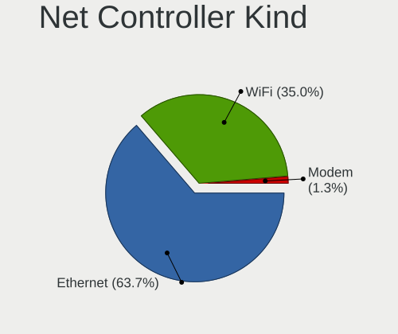

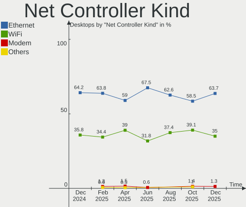

| Kind     | Desktops | Percent |
|----------|----------|---------|
| Ethernet | 144      | 63.72%  |
| WiFi     | 79       | 34.96%  |
| Modem    | 3        | 1.33%   |

Used Controller
---------------

Currently used network controller

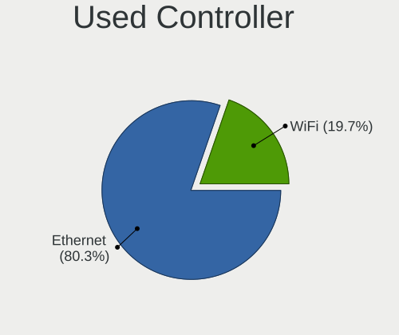

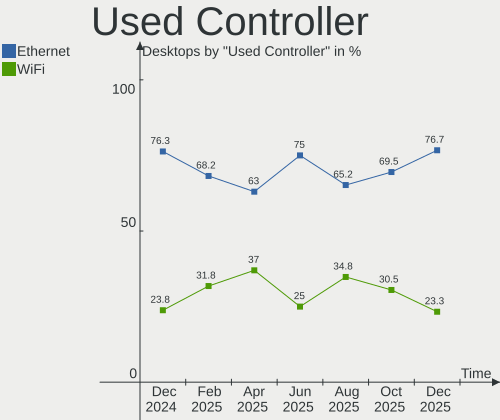

| Kind     | Desktops | Percent |
|----------|----------|---------|
| Ethernet | 112      | 76.71%  |
| WiFi     | 34       | 23.29%  |

NICs
----

Total network controllers on board

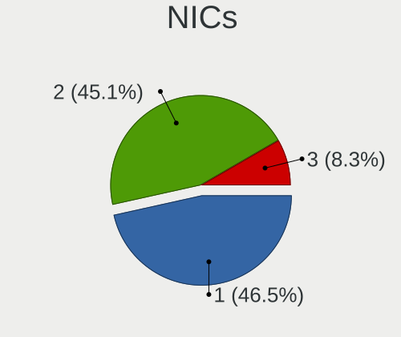

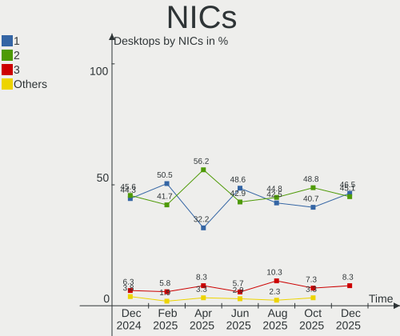

| Total | Desktops | Percent |
|-------|----------|---------|
| 1     | 67       | 46.53%  |
| 2     | 65       | 45.14%  |
| 3     | 12       | 8.33%   |

IPv6
----

IPv6 vs IPv4

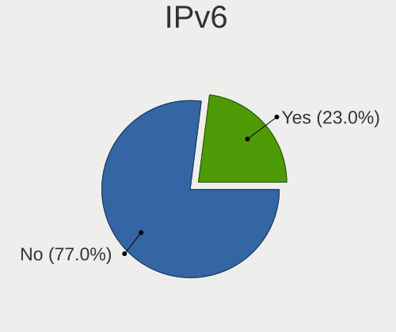

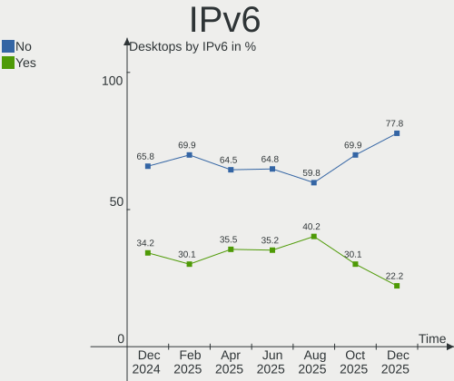

| Used | Desktops | Percent |
|------|----------|---------|
| No   | 112      | 77.78%  |
| Yes  | 32       | 22.22%  |

Bluetooth
---------

Bluetooth Vendor
----------------

Controller vendors

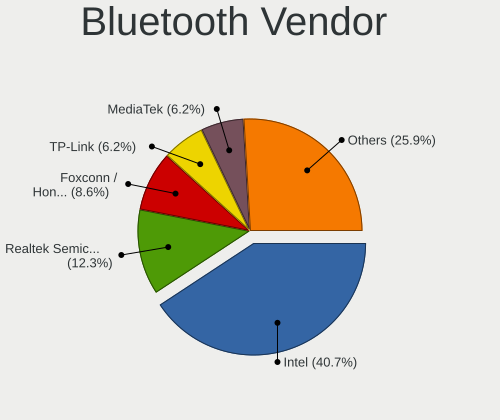

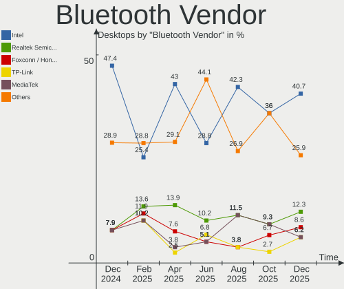

| Vendor                  | Desktops | Percent |
|-------------------------|----------|---------|
| Intel                   | 33       | 40.74%  |
| Realtek Semiconductor   | 10       | 12.35%  |
| Foxconn / Hon Hai       | 7        | 8.64%   |
| TP-Link                 | 5        | 6.17%   |
| MediaTek                | 5        | 6.17%   |
| Cambridge Silicon Radio | 5        | 6.17%   |
| IMC Networks            | 4        | 4.94%   |
| ASUSTek Computer        | 4        | 4.94%   |
| Realtek                 | 2        | 2.47%   |
| Lite-On Technology      | 2        | 2.47%   |
| Broadcom                | 1        | 1.23%   |
| Belkin Components       | 1        | 1.23%   |
| Actions                 | 1        | 1.23%   |
| Unknown                 | 1        | 1.23%   |

Bluetooth Model
---------------

Controller models

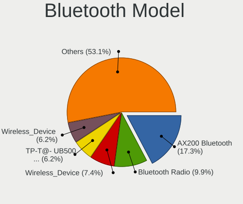

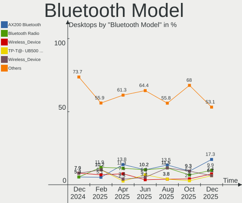

| Model                                                 | Desktops | Percent |
|-------------------------------------------------------|----------|---------|
| Intel AX200 Bluetooth                                 | 14       | 17.28%  |
| Realtek Bluetooth Radio                               | 8        | 9.88%   |
| Foxconn / Hon Hai Wireless_Device                     | 6        | 7.41%   |
| TP-Link TP-T@- UB500 Adapter                          | 5        | 6.17%   |
| MediaTek Wireless_Device                              | 5        | 6.17%   |
| Intel AX210 Bluetooth                                 | 5        | 6.17%   |
| Intel AX201 Bluetooth                                 | 5        | 6.17%   |
| Cambridge Silicon Radio Bluetooth Dongle (HCI mode)   | 5        | 6.17%   |
| Intel Bluetooth wireless interface                    | 3        | 3.7%    |
| Realtek Bluetooth 5.4 Radio                           | 2        | 2.47%   |
| Realtek Bluetooth Radio                               | 2        | 2.47%   |
| Intel Wireless-AC 3168 Bluetooth                      | 2        | 2.47%   |
| Intel Bluetooth Device                                | 2        | 2.47%   |
| IMC Networks Wireless_Device                          | 2        | 2.47%   |
| IMC Networks Bluetooth Radio                          | 2        | 2.47%   |
| ASUS Broadcom BCM20702A0 Bluetooth                    | 2        | 2.47%   |
| Lite-On Wireless_Device                               | 1        | 1.23%   |
| Lite-On Bluetooth Device                              | 1        | 1.23%   |
| Intel Wireless-AC 9260 Bluetooth Adapter              | 1        | 1.23%   |
| Intel Bluetooth 9460/9560 Jefferson Peak (JfP)        | 1        | 1.23%   |
| Foxconn / Hon Hai Bluetooth Device                    | 1        | 1.23%   |
| Broadcom BCM20702A0 Bluetooth 4.0                     | 1        | 1.23%   |
| Belkin Components F8T065BF Mini Bluetooth 4.0 Adapter | 1        | 1.23%   |
| ASUS Bluetooth Radio                                  | 1        | 1.23%   |
| ASUS ASUS USB-BT500                                   | 1        | 1.23%   |
| Actions general adapter                               | 1        | 1.23%   |
| Unknown                                               | 1        | 1.23%   |

Sound
-----

Sound Vendor
------------

Sound card vendors

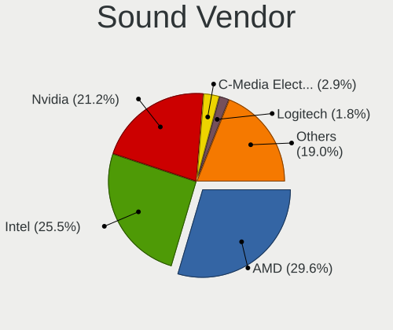

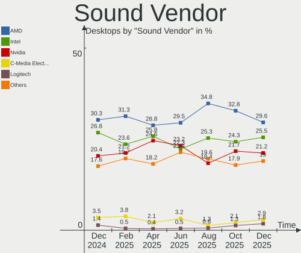

| Vendor                                       | Desktops | Percent |
|----------------------------------------------|----------|---------|
| AMD                                          | 81       | 29.56%  |
| Intel                                        | 70       | 25.55%  |
| Nvidia                                       | 58       | 21.17%  |
| C-Media Electronics                          | 8        | 2.92%   |
| Logitech                                     | 5        | 1.82%   |
| SteelSeries ApS                              | 4        | 1.46%   |
| Zoran Co. Personal Media Division (Nogatech) | 3        | 1.09%   |
| Texas Instruments                            | 3        | 1.09%   |
| JMTek                                        | 3        | 1.09%   |
| Creative Labs                                | 3        | 1.09%   |
| BEHRINGER International                      | 3        | 1.09%   |
| ASUSTek Computer                             | 3        | 1.09%   |
| Realtek Semiconductor                        | 2        | 0.73%   |
| Micro Star International                     | 2        | 0.73%   |
| Hewlett-Packard                              | 2        | 0.73%   |
| Focusrite-Novation                           | 2        | 0.73%   |
| Creative Technology                          | 2        | 0.73%   |
| Corsair                                      | 2        | 0.73%   |
| XMOS                                         | 1        | 0.36%   |
| Xilinx                                       | 1        | 0.36%   |
| Thesycon Systemsoftware & Consulting         | 1        | 0.36%   |
| Synaptics                                    | 1        | 0.36%   |
| Sony                                         | 1        | 0.36%   |
| Sennheiser electronic                        | 1        | 0.36%   |
| Roland                                       | 1        | 0.36%   |
| Razer USA                                    | 1        | 0.36%   |
| Plantronics                                  | 1        | 0.36%   |
| Native Instruments                           | 1        | 0.36%   |
| KTMicro                                      | 1        | 0.36%   |
| Kingston Technology                          | 1        | 0.36%   |
| Jieli Technology                             | 1        | 0.36%   |
| Huawei Technologies                          | 1        | 0.36%   |
| Giga-Byte Technology                         | 1        | 0.36%   |
| Comtrue                                      | 1        | 0.36%   |
| Blue Microphones                             | 1        | 0.36%   |
| Apple                                        | 1        | 0.36%   |

Sound Model
-----------

Sound card models

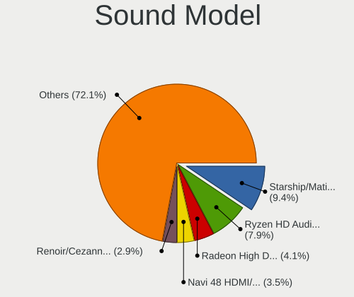

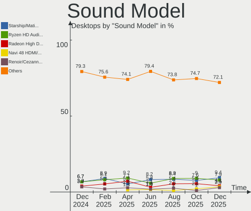

| Model                                                                      | Desktops | Percent |
|----------------------------------------------------------------------------|----------|---------|
| AMD Starship/Matisse HD Audio Controller                                   | 32       | 9.41%   |
| AMD Ryzen HD Audio Controller                                              | 27       | 7.94%   |
| AMD Radeon High Definition Audio Controller                                | 14       | 4.12%   |
| AMD Navi 48 HDMI/DP Audio Controller                                       | 12       | 3.53%   |
| AMD Renoir/Cezanne HDMI/DP Audio Controller                                | 10       | 2.94%   |
| Intel 6 Series/C200 Series Chipset Family High Definition Audio Controller | 8        | 2.35%   |
| AMD Navi 21/23 HDMI/DP Audio Controller                                    | 8        | 2.35%   |
| Intel 8 Series/C220 Series Chipset High Definition Audio Controller        | 7        | 2.06%   |
| Intel 200 Series PCH HD Audio                                              | 6        | 1.76%   |
| Intel 100 Series/C230 Series Chipset Family HD Audio Controller            | 6        | 1.76%   |
| Nvidia GP106 High Definition Audio Controller                              | 5        | 1.47%   |
| Nvidia GA106 High Definition Audio Controller                              | 5        | 1.47%   |
| Nvidia GA104 High Definition Audio Controller                              | 5        | 1.47%   |
| Intel Xeon E3-1200 v3/4th Gen Core Processor HD Audio Controller           | 5        | 1.47%   |
| Intel Tiger Lake-H HD Audio Controller                                     | 5        | 1.47%   |
| AMD Navi 10 HDMI Audio                                                     | 5        | 1.47%   |
| AMD Family 17h (Models 00h-0fh) HD Audio Controller                        | 5        | 1.47%   |
| AMD Ellesmere HDMI Audio [Radeon RX 470/480 / 570/580/590]                 | 5        | 1.47%   |
| Nvidia TU116 High Definition Audio Controller                              | 4        | 1.18%   |
| Nvidia GA102 High Definition Audio Controller                              | 4        | 1.18%   |
| Intel Raptor Lake High Definition Audio Controller                         | 4        | 1.18%   |
| Intel Cannon Lake PCH cAVS                                                 | 4        | 1.18%   |
| Intel Alder Lake-S HD Audio Controller                                     | 4        | 1.18%   |
| Intel 7 Series/C216 Chipset Family High Definition Audio Controller        | 4        | 1.18%   |
| AMD Navi 31 HDMI/DP Audio                                                  | 4        | 1.18%   |
| Zoran Co. Personal Media Division (Nogatech) USB Audio and HID             | 3        | 0.88%   |
| Nvidia TU104 HD Audio Controller                                           | 3        | 0.88%   |
| Nvidia GP102 HDMI Audio Controller                                         | 3        | 0.88%   |
| Nvidia GK208 HDMI/DP Audio Controller                                      | 3        | 0.88%   |
| Nvidia GB206 High Definition Audio Controller                              | 3        | 0.88%   |
| Intel Audio device                                                         | 3        | 0.88%   |
| Intel Alder Lake-N PCH High Definition Audio Controller                    | 3        | 0.88%   |
| Intel 9 Series Chipset Family HD Audio Controller                          | 3        | 0.88%   |
| ASUSTek Computer USB Audio                                                 | 3        | 0.88%   |
| AMD SBx00 Azalia (Intel HDA)                                               | 3        | 0.88%   |
| AMD FCH Azalia Controller                                                  | 3        | 0.88%   |
| SteelSeries ApS Arctis Pro Wireless                                        | 2        | 0.59%   |
| Nvidia TU107 GeForce GTX 1650 High Definition Audio Controller             | 2        | 0.59%   |
| Nvidia TU102 High Definition Audio Controller                              | 2        | 0.59%   |
| Nvidia GM204 High Definition Audio Controller                              | 2        | 0.59%   |

Memory
------

Memory Vendor
-------------

Memory module vendors

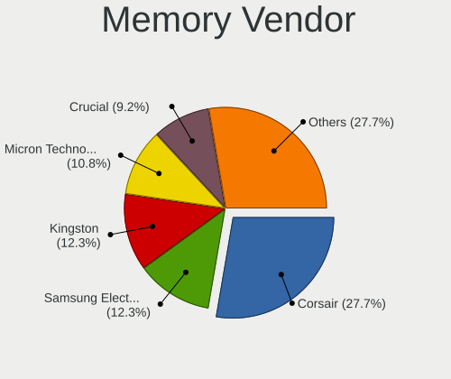

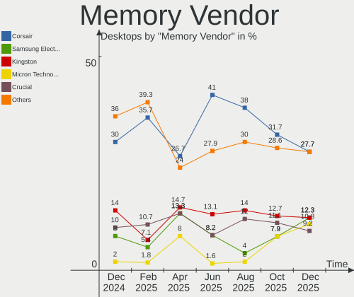

| Vendor              | Desktops | Percent |
|---------------------|----------|---------|
| Corsair             | 18       | 27.69%  |
| Samsung Electronics | 8        | 12.31%  |
| Kingston            | 8        | 12.31%  |
| Micron Technology   | 7        | 10.77%  |
| Crucial             | 6        | 9.23%   |
| SK hynix            | 3        | 4.62%   |
| A-DATA Technology   | 3        | 4.62%   |
| Unknown             | 2        | 3.08%   |
| Team                | 2        | 3.08%   |
| Shenzhen Longsys    | 1        | 1.54%   |
| Patriot Memory      | 1        | 1.54%   |
| Netac               | 1        | 1.54%   |
| Lexar               | 1        | 1.54%   |
| GSkill              | 1        | 1.54%   |
| G.Skill             | 1        | 1.54%   |
| Elpida              | 1        | 1.54%   |
| Unknown             | 1        | 1.54%   |

Memory Model
------------

Memory module models

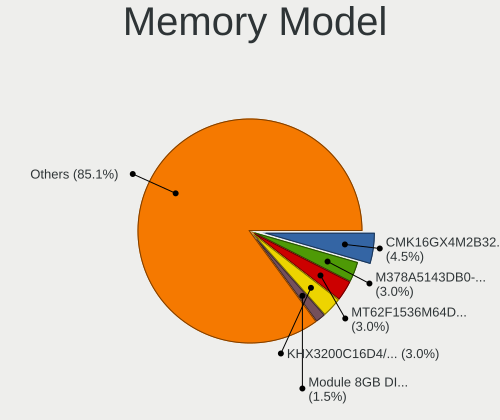

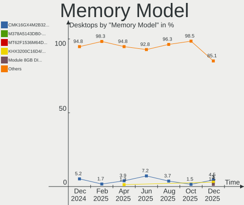

| Model                                                         | Desktops | Percent |
|---------------------------------------------------------------|----------|---------|
| Corsair RAM CMK16GX4M2B3200C16 8GB DIMM DDR4 3600MT/s         | 3        | 4.48%   |
| Samsung RAM M378A5143DB0-CPB 4GB DIMM DDR4 2400MT/s           | 2        | 2.99%   |
| Micron RAM MT62F1536M64D8CL-026 6GB DIMM LPDDR5 6000MT/s      | 2        | 2.99%   |
| Kingston RAM KHX3200C16D4/8GX 8GB DIMM DDR4 3733MT/s          | 2        | 2.99%   |
| Unknown RAM Module 8GB DIMM DDR4 2667MT/s                     | 1        | 1.49%   |
| Unknown RAM Module 4GB DIMM DDR3 1333MT/s                     | 1        | 1.49%   |
| Team RAM TEAMGROUP-UD4-3200 8GB DIMM DDR4 3800MT/s            | 1        | 1.49%   |
| Team RAM TEAMGROUP-UD4-3000 8GB DIMM DDR4 3200MT/s            | 1        | 1.49%   |
| SK hynix RAM HMT425S6CFR6A-PB 2GB SODIMM DDR3 1600MT/s        | 1        | 1.49%   |
| SK hynix RAM HMT41GU7AFR8C-PB 8GB DIMM DDR3 1600MT/s          | 1        | 1.49%   |
| SK hynix RAM HMT325U6CFR8C-PB 2GB DIMM DDR3 1600MT/s          | 1        | 1.49%   |
| Shenzhen Longsys RAM FD4AS3200CQGZZ 16GB SODIMM DDR4 3200MT/s | 1        | 1.49%   |
| Samsung RAM Module 8GB DIMM DDR4 3200MT/s                     | 1        | 1.49%   |
| Samsung RAM Module 4GB DIMM DDR3 1333MT/s                     | 1        | 1.49%   |
| Samsung RAM Module 32GB DIMM DDR4 2933MT/s                    | 1        | 1.49%   |
| Samsung RAM M471A1K43CB1-CWE 16GB SODIMM DDR4 3200MT/s        | 1        | 1.49%   |
| Samsung RAM M471A1G44CB0-CWE 8GB SODIMM DDR4 3200MT/s         | 1        | 1.49%   |
| Samsung RAM M378B5773DH0-CH9 2GB DIMM DDR3 1333MT/s           | 1        | 1.49%   |
| Patriot Memory RAM 6000 Series 16GB DIMM DDR5 4800MT/s        | 1        | 1.49%   |
| Netac RAM Module 16GB DIMM DDR4 2666MT/s                      | 1        | 1.49%   |
| Micron RAM Module 8GB DIMM DDR3 1333MT/s                      | 1        | 1.49%   |
| Micron RAM 9ASF51272AZ-2G1B1 4GB DIMM DDR4 2133MT/s           | 1        | 1.49%   |
| Micron RAM 8JTF51264AZ-1G6E1 4GB DIMM DDR3 1600MT/s           | 1        | 1.49%   |
| Micron RAM 16JTF51264AZ-1G4M1 4GB DIMM DDR3 1333MT/s          | 1        | 1.49%   |
| Micron RAM 16JTF25664AZ-1G4F1 2GB DIMM 1333MT/s               | 1        | 1.49%   |
| Lexar RAM LD4S16G32C22ST 16GB SODIMM DDR4 3200MT/s            | 1        | 1.49%   |
| Kingston RAM KHX2400C12D4/8GX 8GiB DIMM DDR4 2400MT/s         | 1        | 1.49%   |
| Kingston RAM KF556C40-16 16GB DIMM DDR5 6800MT/s              | 1        | 1.49%   |
| Kingston RAM KF556C36-16 16GB DIMM DDR5 12800MT/s             | 1        | 1.49%   |
| Kingston RAM 99U5471-002.A01LF 2GB DIMM DDR3 1334MT/s         | 1        | 1.49%   |
| Kingston RAM 99U5469-045.A00LF 4GB SODIMM DDR3 1600MT/s       | 1        | 1.49%   |
| Kingston RAM 9965745-028.A00G 16GB DIMM DDR4 3200MT/s         | 1        | 1.49%   |
| GSkill RAM F4-3200C22-16GRS 16GB SODIMM DDR4 3200MT/s         | 1        | 1.49%   |
| G.Skill RAM F5-6000J3040G32G 32GB DIMM DDR5 6200MT/s          | 1        | 1.49%   |
| Elpida RAM EBJ21UE8BDF0-AE-F 2GB DIMM DDR3 1067MT/s           | 1        | 1.49%   |
| Crucial RAM CT8G4SFS832A.M8FE 8GB SODIMM DDR4 3200MT/s        | 1        | 1.49%   |
| Crucial RAM CT8G4DFRA32A.M4FB 8GB DIMM DDR4 3200MT/s          | 1        | 1.49%   |
| Crucial RAM CT102464BF160B.C16 8GB SODIMM DDR3 1600MT/s       | 1        | 1.49%   |
| Crucial RAM CT102464BD160B.M16 8GB DIMM DDR3 1600MT/s         | 1        | 1.49%   |
| Crucial RAM CP16G4DFRA32A.C8FF 16GB DIMM DDR4 3200MT/s        | 1        | 1.49%   |

Memory Kind
-----------

Memory module kinds

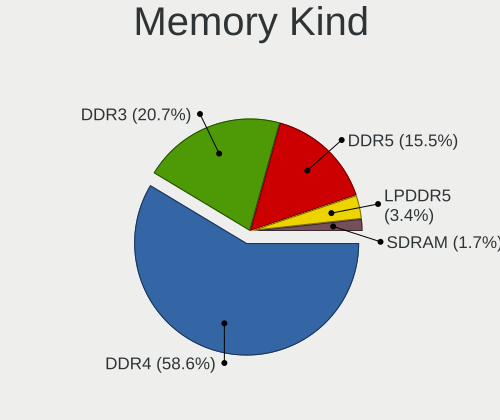

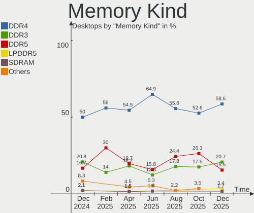

| Kind   | Desktops | Percent |
|--------|----------|---------|
| DDR4   | 34       | 58.62%  |
| DDR3   | 12       | 20.69%  |
| DDR5   | 9        | 15.52%  |
| LPDDR5 | 2        | 3.45%   |
| SDRAM  | 1        | 1.72%   |

Memory Form Factor
------------------

Physical design of the memory module

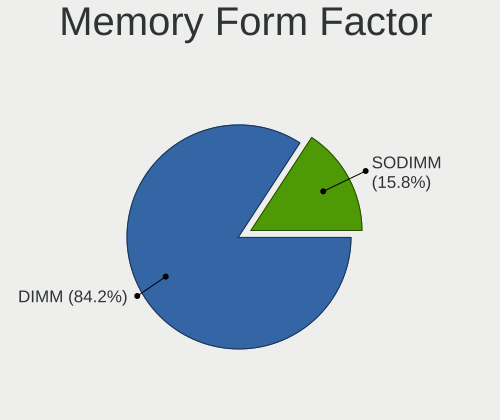

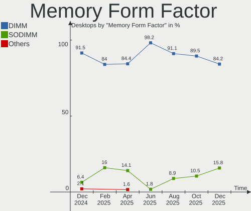

| Name   | Desktops | Percent |
|--------|----------|---------|
| DIMM   | 48       | 84.21%  |
| SODIMM | 9        | 15.79%  |

Memory Size
-----------

Memory module size

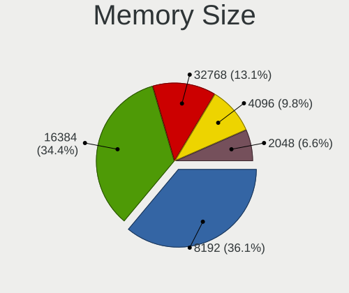

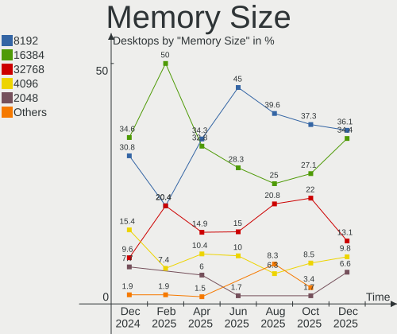

| Size  | Desktops | Percent |
|-------|----------|---------|
| 8192  | 22       | 36.07%  |
| 16384 | 21       | 34.43%  |
| 32768 | 8        | 13.11%  |
| 4096  | 6        | 9.84%   |
| 2048  | 4        | 6.56%   |

Memory Speed
------------

Memory module speed

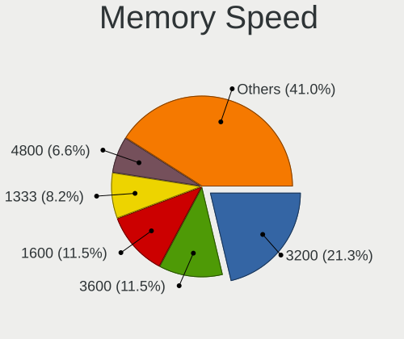

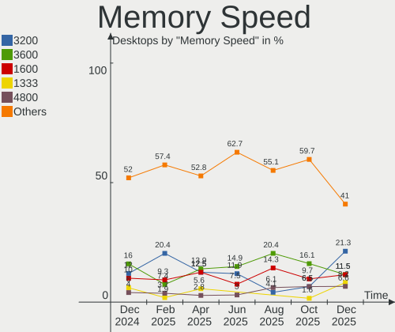

| Speed | Desktops | Percent |
|-------|----------|---------|
| 3200  | 13       | 21.31%  |
| 3600  | 7        | 11.48%  |
| 1600  | 7        | 11.48%  |
| 1333  | 5        | 8.2%    |
| 4800  | 4        | 6.56%   |
| 6000  | 3        | 4.92%   |
| 3733  | 3        | 4.92%   |
| 2667  | 3        | 4.92%   |
| 2400  | 3        | 4.92%   |
| 3800  | 2        | 3.28%   |
| 2933  | 2        | 3.28%   |
| 12800 | 1        | 1.64%   |
| 6800  | 1        | 1.64%   |
| 6200  | 1        | 1.64%   |
| 5200  | 1        | 1.64%   |
| 3100  | 1        | 1.64%   |
| 2666  | 1        | 1.64%   |
| 2133  | 1        | 1.64%   |
| 1334  | 1        | 1.64%   |
| 1067  | 1        | 1.64%   |

Printers & scanners
-------------------

Printer Vendor
--------------

Printer device vendors

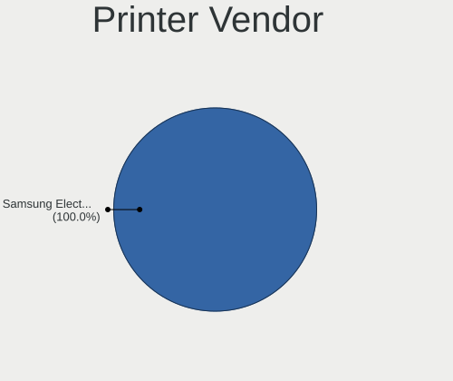

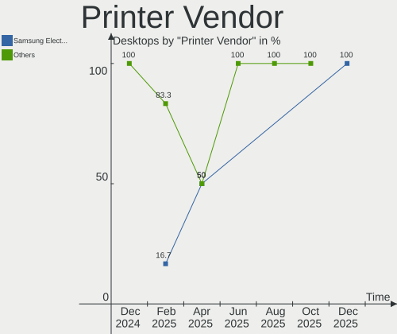

| Vendor              | Desktops | Percent |
|---------------------|----------|---------|
| Samsung Electronics | 1        | 100%    |

Printer Model
-------------

Printer device models

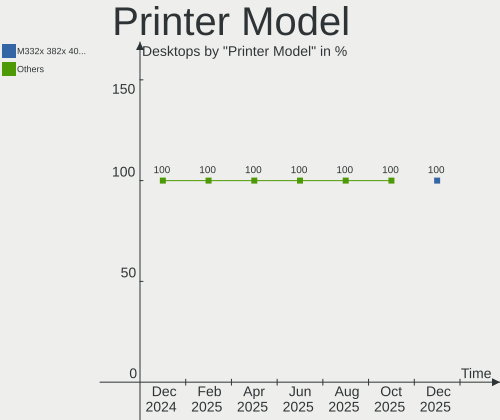

| Model                          | Desktops | Percent |
|--------------------------------|----------|---------|
| Samsung M332x 382x 402x Series | 1        | 100%    |

Scanner Vendor
--------------

Scanner device vendors

Zero info for selected period =(

Scanner Model
-------------

Scanner device models

Zero info for selected period =(

Camera
------

Camera Vendor
-------------

Camera device vendors

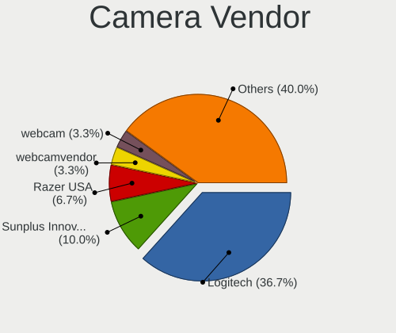

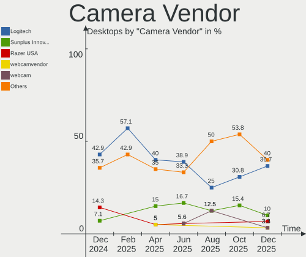

| Vendor                        | Desktops | Percent |
|-------------------------------|----------|---------|
| Logitech                      | 11       | 36.67%  |
| Sunplus Innovation Technology | 3        | 10%     |
| Razer USA                     | 2        | 6.67%   |
| webcamvendor                  | 1        | 3.33%   |
| webcam                        | 1        | 3.33%   |
| Sunplus IT                    | 1        | 3.33%   |
| Sonix Technology              | 1        | 3.33%   |
| Samsung Electronics           | 1        | 3.33%   |
| Realtek Semiconductor         | 1        | 3.33%   |
| Microsoft                     | 1        | 3.33%   |
| Microdia                      | 1        | 3.33%   |
| Jieli Technology              | 1        | 3.33%   |
| Image+                        | 1        | 3.33%   |
| Hewlett-Packard               | 1        | 3.33%   |
| Generalplus Technology        | 1        | 3.33%   |
| Creative Technology           | 1        | 3.33%   |
| Anker PowerConf C200          | 1        | 3.33%   |

Camera Model
------------

Camera device models

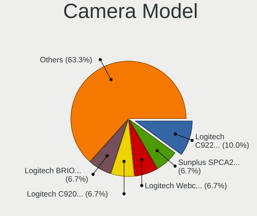

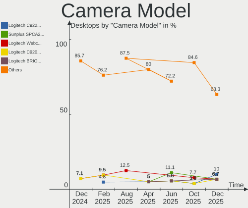

| Model                                     | Desktops | Percent |
|-------------------------------------------|----------|---------|
| Logitech C922 Pro Stream Webcam           | 3        | 10%     |
| Sunplus SPCA2281 Web Camera               | 2        | 6.67%   |
| Logitech Webcam C270                      | 2        | 6.67%   |
| Logitech C920 PRO HD Webcam               | 2        | 6.67%   |
| Logitech BRIO 4K Stream Edition           | 2        | 6.67%   |
| webcamvendor NexiGo N60 FHD Webcam        | 1        | 3.33%   |
| webcam webcam                             | 1        | 3.33%   |
| Sunplus IT PC Camera                      | 1        | 3.33%   |
| Sunplus Full HD webcam                    | 1        | 3.33%   |
| Sonix USB 2.0 Camera                      | 1        | 3.33%   |
| Samsung 3D Stereo WebCam                  | 1        | 3.33%   |
| Realtek FULL HD 1080P Webcam              | 1        | 3.33%   |
| Razer USA Razer Kiyo Pro                  | 1        | 3.33%   |
| Razer USA Gaming Webcam [Kiyo]            | 1        | 3.33%   |
| Microsoft LifeCam Studio                  | 1        | 3.33%   |
| Microdia USB 2.0 Camera                   | 1        | 3.33%   |
| Logitech Webcam C930e                     | 1        | 3.33%   |
| Logitech HD Pro Webcam C920               | 1        | 3.33%   |
| Jieli USB Composite Device                | 1        | 3.33%   |
| Image+ UGREEN Camera 4K                   | 1        | 3.33%   |
| HP 320 FHD Webcam                         | 1        | 3.33%   |
| Generalplus GENERAL WEBCAM                | 1        | 3.33%   |
| Creative Live! Cam Sync HD [VF0770]       | 1        | 3.33%   |
| Anker PowerConf C200 Anker PowerConf C200 | 1        | 3.33%   |

Security
--------

Fingerprint Vendor
------------------

Fingerprint sensor vendors

Zero info for selected period =(

Fingerprint Model
-----------------

Fingerprint sensor models

Zero info for selected period =(

Chipcard Vendor
---------------

Chipcard module vendors

Zero info for selected period =(

Chipcard Model
--------------

Chipcard module models

Zero info for selected period =(

Unsupported
-----------

Unsupported Devices
-------------------

Total unsupported devices on board

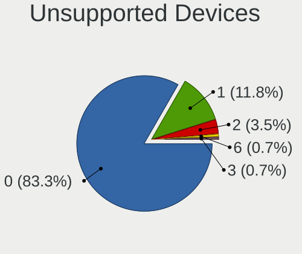

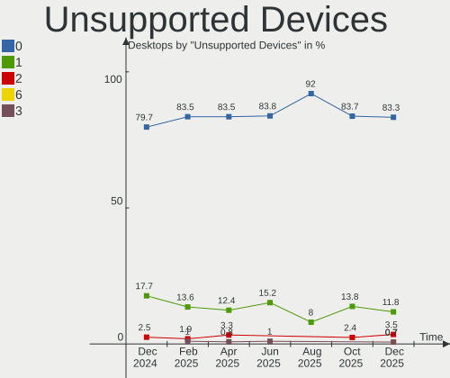

| Total | Desktops | Percent |
|-------|----------|---------|
| 0     | 120      | 83.33%  |
| 1     | 17       | 11.81%  |
| 2     | 5        | 3.47%   |
| 6     | 1        | 0.69%   |
| 3     | 1        | 0.69%   |

Unsupported Device Types
------------------------

Types of unsupported devices

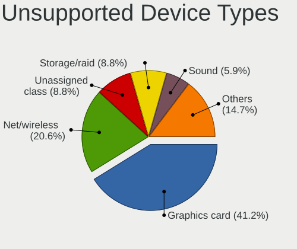

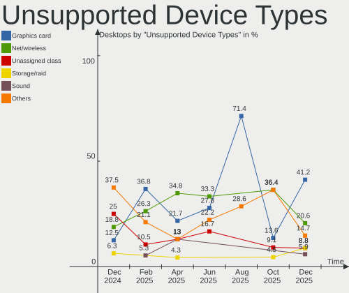

| Type                     | Desktops | Percent |
|--------------------------|----------|---------|
| Graphics card            | 14       | 41.18%  |
| Net/wireless             | 7        | 20.59%  |
| Unassigned class         | 3        | 8.82%   |
| Storage/raid             | 3        | 8.82%   |
| Sound                    | 2        | 5.88%   |
| Network                  | 1        | 2.94%   |
| Multimedia controller    | 1        | 2.94%   |
| Communication controller | 1        | 2.94%   |
| Camera                   | 1        | 2.94%   |
| Bluetooth                | 1        | 2.94%   |

