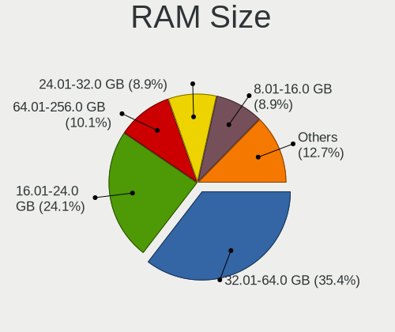
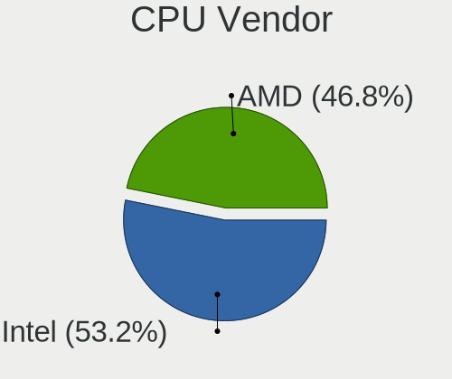
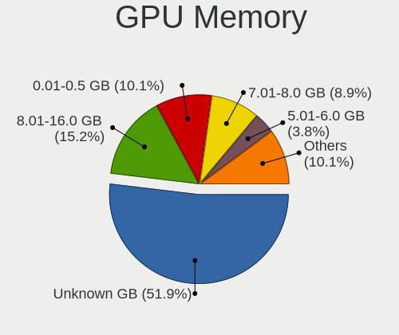
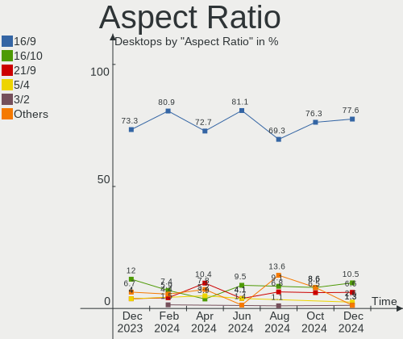
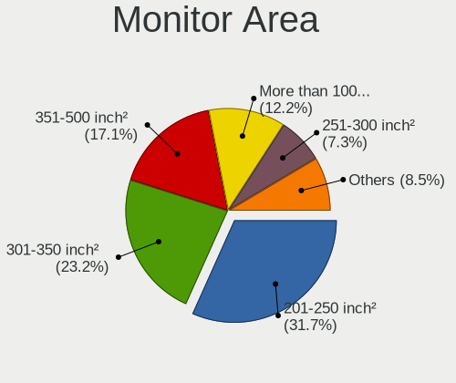
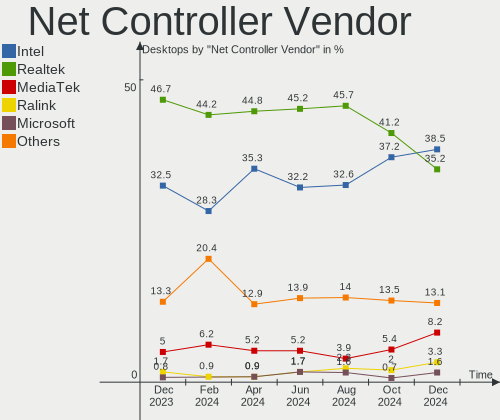
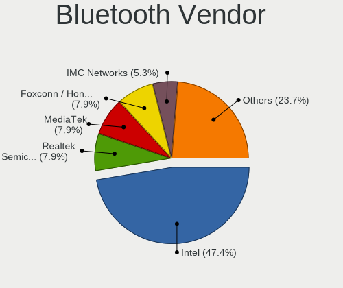
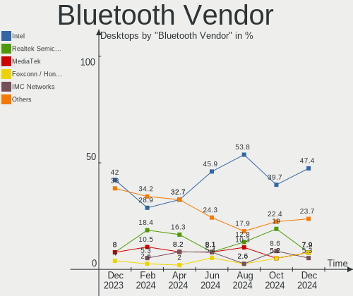

Linux in UK - Hardware Trends (Desktops)
----------------------------------------

A project to identify most popular hardware characteristics and track their change
over time based on data collected by Linux users at https://Linux-Hardware.org.

Anyone can contribute to this report by the [hw-probe](https://github.com/linuxhw/hw-probe) tool:

    sudo -E hw-probe -all -upload

Period: Nov, 2022.

Contents
--------

* [ System ](#system)
  - [ OS                       ](#os)
  - [ OS Family                ](#os-family)
  - [ Kernel                   ](#kernel)
  - [ Kernel Family            ](#kernel-family)
  - [ Kernel Major Ver.        ](#kernel-major-ver)
  - [ Arch                     ](#arch)
  - [ DE                       ](#de)
  - [ Display Server           ](#display-server)
  - [ Display Manager          ](#display-manager)
  - [ OS Lang                  ](#os-lang)
  - [ Boot Mode                ](#boot-mode)
  - [ Filesystem               ](#filesystem)
  - [ Part. scheme             ](#part-scheme)
  - [ Dual Boot with Linux/BSD ](#dual-boot-with-linuxbsd)
  - [ Dual Boot (Win)          ](#dual-boot-win)

* [ Board ](#board)
  - [ Vendor                   ](#vendor)
  - [ Model                    ](#model)
  - [ Model Family             ](#model-family)
  - [ MFG Year                 ](#mfg-year)
  - [ Form Factor              ](#form-factor)
  - [ Secure Boot              ](#secure-boot)
  - [ Coreboot                 ](#coreboot)
  - [ RAM Size                 ](#ram-size)
  - [ RAM Used                 ](#ram-used)
  - [ Total Drives             ](#total-drives)
  - [ Has CD-ROM               ](#has-cd-rom)
  - [ Has Ethernet             ](#has-ethernet)
  - [ Has WiFi                 ](#has-wifi)
  - [ Has Bluetooth            ](#has-bluetooth)

* [ Location ](#location)
  - [ Country                  ](#country)
  - [ City                     ](#city)

* [ Drives ](#drives)
  - [ Drive Vendor             ](#drive-vendor)
  - [ Drive Model              ](#drive-model)
  - [ HDD Vendor               ](#hdd-vendor)
  - [ SSD Vendor               ](#ssd-vendor)
  - [ Drive Kind               ](#drive-kind)
  - [ Drive Connector          ](#drive-connector)
  - [ Drive Size               ](#drive-size)
  - [ Space Total              ](#space-total)
  - [ Space Used               ](#space-used)
  - [ Malfunc. Drives          ](#malfunc-drives)
  - [ Malfunc. Drive Vendor    ](#malfunc-drive-vendor)
  - [ Malfunc. HDD Vendor      ](#malfunc-hdd-vendor)
  - [ Malfunc. Drive Kind      ](#malfunc-drive-kind)
  - [ Failed Drives            ](#failed-drives)
  - [ Failed Drive Vendor      ](#failed-drive-vendor)
  - [ Drive Status             ](#drive-status)

* [ Storage controller ](#storage-controller)
  - [ Storage Vendor           ](#storage-vendor)
  - [ Storage Model            ](#storage-model)
  - [ Storage Kind             ](#storage-kind)

* [ Processor ](#processor)
  - [ CPU Vendor               ](#cpu-vendor)
  - [ CPU Model                ](#cpu-model)
  - [ CPU Model Family         ](#cpu-model-family)
  - [ CPU Cores                ](#cpu-cores)
  - [ CPU Sockets              ](#cpu-sockets)
  - [ CPU Threads              ](#cpu-threads)
  - [ CPU Op-Modes             ](#cpu-op-modes)
  - [ CPU Microcode            ](#cpu-microcode)
  - [ CPU Microarch            ](#cpu-microarch)

* [ Graphics ](#graphics)
  - [ GPU Vendor               ](#gpu-vendor)
  - [ GPU Model                ](#gpu-model)
  - [ GPU Combo                ](#gpu-combo)
  - [ GPU Driver               ](#gpu-driver)
  - [ GPU Memory               ](#gpu-memory)

* [ Monitor ](#monitor)
  - [ Monitor Vendor           ](#monitor-vendor)
  - [ Monitor Model            ](#monitor-model)
  - [ Monitor Resolution       ](#monitor-resolution)
  - [ Monitor Diagonal         ](#monitor-diagonal)
  - [ Monitor Width            ](#monitor-width)
  - [ Aspect Ratio             ](#aspect-ratio)
  - [ Monitor Area             ](#monitor-area)
  - [ Pixel Density            ](#pixel-density)
  - [ Multiple Monitors        ](#multiple-monitors)

* [ Network ](#network)
  - [ Net Controller Vendor    ](#net-controller-vendor)
  - [ Net Controller Model     ](#net-controller-model)
  - [ Wireless Vendor          ](#wireless-vendor)
  - [ Wireless Model           ](#wireless-model)
  - [ Ethernet Vendor          ](#ethernet-vendor)
  - [ Ethernet Model           ](#ethernet-model)
  - [ Net Controller Kind      ](#net-controller-kind)
  - [ Used Controller          ](#used-controller)
  - [ NICs                     ](#nics)
  - [ IPv6                     ](#ipv6)

* [ Bluetooth ](#bluetooth)
  - [ Bluetooth Vendor         ](#bluetooth-vendor)
  - [ Bluetooth Model          ](#bluetooth-model)

* [ Sound ](#sound)
  - [ Sound Vendor             ](#sound-vendor)
  - [ Sound Model              ](#sound-model)

* [ Memory ](#memory)
  - [ Memory Vendor            ](#memory-vendor)
  - [ Memory Model             ](#memory-model)
  - [ Memory Kind              ](#memory-kind)
  - [ Memory Form Factor       ](#memory-form-factor)
  - [ Memory Size              ](#memory-size)
  - [ Memory Speed             ](#memory-speed)

* [ Printers & scanners ](#printers--scanners)
  - [ Printer Vendor           ](#printer-vendor)
  - [ Printer Model            ](#printer-model)
  - [ Scanner Vendor           ](#scanner-vendor)
  - [ Scanner Model            ](#scanner-model)

* [ Camera ](#camera)
  - [ Camera Vendor            ](#camera-vendor)
  - [ Camera Model             ](#camera-model)

* [ Security ](#security)
  - [ Fingerprint Vendor       ](#fingerprint-vendor)
  - [ Fingerprint Model        ](#fingerprint-model)
  - [ Chipcard Vendor          ](#chipcard-vendor)
  - [ Chipcard Model           ](#chipcard-model)

* [ Unsupported ](#unsupported)
  - [ Unsupported Devices      ](#unsupported-devices)
  - [ Unsupported Device Types ](#unsupported-device-types)

System
------

OS
--

Installed operating systems

| Name                         | Desktops | Percent |
|------------------------------|----------|---------|
| Ubuntu 22.04                 | 13       | 18.31%  |
| Zorin 16                     | 4        | 5.63%   |
| Ubuntu 20.04                 | 3        | 4.23%   |
| Pop!_OS 22.04                | 3        | 4.23%   |
| OpenMandriva 4.50            | 3        | 4.23%   |
| Linux Mint 21                | 3        | 4.23%   |
| Linux Mint 20.3              | 3        | 4.23%   |
| KDE neon 22.04               | 3        | 4.23%   |
| Fedora 36                    | 3        | 4.23%   |
| Debian 11                    | 3        | 4.23%   |
| ArcoLinux Rolling            | 3        | 4.23%   |
| Ubuntu 18.04                 | 2        | 2.82%   |
| SteamOS 3.4                  | 2        | 2.82%   |
| openSUSE Tumbleweed-XXXXXXXX | 2        | 2.82%   |
| OpenMandriva 4.3             | 2        | 2.82%   |
| Lubuntu 22.04                | 2        | 2.82%   |
| Kubuntu 22.10                | 2        | 2.82%   |
| Fedora 37                    | 2        | 2.82%   |
| Xubuntu 22.04                | 1        | 1.41%   |
| Xubuntu 20.04                | 1        | 1.41%   |
| Xero Rolling                 | 1        | 1.41%   |
| Ubuntu 22.10                 | 1        | 1.41%   |
| OpenMandriva 4.2             | 1        | 1.41%   |
| Nobara 36                    | 1        | 1.41%   |
| Manjaro 22.0.0               | 1        | 1.41%   |
| Lubuntu 16.04                | 1        | 1.41%   |
| Linux Lite 5.4               | 1        | 1.41%   |
| Kubuntu 22.04                | 1        | 1.41%   |
| KDE neon 20.04               | 1        | 1.41%   |
| Endless 4.0.4                | 1        | 1.41%   |
| Arch Rolling                 | 1        | 1.41%   |

OS Family
---------

OS without a version

| Name         | Desktops | Percent |
|--------------|----------|---------|
| Ubuntu       | 19       | 26.76%  |
| OpenMandriva | 6        | 8.45%   |
| Linux Mint   | 6        | 8.45%   |
| Fedora       | 5        | 7.04%   |
| Zorin        | 4        | 5.63%   |
| KDE neon     | 4        | 5.63%   |
| Pop!_OS      | 3        | 4.23%   |
| Lubuntu      | 3        | 4.23%   |
| Kubuntu      | 3        | 4.23%   |
| Debian       | 3        | 4.23%   |
| ArcoLinux    | 3        | 4.23%   |
| Xubuntu      | 2        | 2.82%   |
| SteamOS      | 2        | 2.82%   |
| openSUSE     | 2        | 2.82%   |
| Xero         | 1        | 1.41%   |
| Nobara       | 1        | 1.41%   |
| Manjaro      | 1        | 1.41%   |
| Linux Lite   | 1        | 1.41%   |
| Endless      | 1        | 1.41%   |
| Arch         | 1        | 1.41%   |

Kernel
------

Version of the Linux kernel

| Version                     | Desktops | Percent |
|-----------------------------|----------|---------|
| 5.15.0-53-generic           | 13       | 18.31%  |
| 5.15.0-52-generic           | 13       | 18.31%  |
| 5.4.0-132-generic           | 4        | 5.63%   |
| 5.19.5-desktop-1omv4090     | 3        | 4.23%   |
| 5.19.0-23-generic           | 3        | 4.23%   |
| 6.0.8-arch1-1               | 2        | 2.82%   |
| 6.0.6-76060006-generic      | 2        | 2.82%   |
| 5.4.0-131-generic           | 2        | 2.82%   |
| 5.19.16-200.fc36.x86_64     | 2        | 2.82%   |
| 5.16.7-desktop-1omv4003     | 2        | 2.82%   |
| 5.13.0-valve21.3-1-neptune  | 2        | 2.82%   |
| 5.10.0-19-amd64             | 2        | 2.82%   |
| 6.1.0-rc3-vanilla           | 1        | 1.41%   |
| 6.0.9-arch1-1               | 1        | 1.41%   |
| 6.0.9-300.fc37.x86_64       | 1        | 1.41%   |
| 6.0.8-300.fc37.x86_64       | 1        | 1.41%   |
| 6.0.8-200.fc36.x86_64       | 1        | 1.41%   |
| 6.0.8-1-MANJARO             | 1        | 1.41%   |
| 6.0.8-060008-generic        | 1        | 1.41%   |
| 6.0.7-201.fsync.fc36.x86_64 | 1        | 1.41%   |
| 6.0.6-zen1-1-zen            | 1        | 1.41%   |
| 6.0.6-1-default             | 1        | 1.41%   |
| 6.0.2-76060002-generic      | 1        | 1.41%   |
| 6.0.10-arch2-1              | 1        | 1.41%   |
| 5.4.0-73-generic            | 1        | 1.41%   |
| 5.15.0-50-generic           | 1        | 1.41%   |
| 5.15.0-47-generic           | 1        | 1.41%   |
| 5.13.0-39-generic           | 1        | 1.41%   |
| 5.11.0-35-generic           | 1        | 1.41%   |
| 5.10.14-desktop-1omv4002    | 1        | 1.41%   |
| 5.10.0-19-686-pae           | 1        | 1.41%   |
| 4.15.0-197-generic          | 1        | 1.41%   |
| 4.15.0-142-generic          | 1        | 1.41%   |

Kernel Family
-------------

Linux kernel without a distro release

| Version | Desktops | Percent |
|---------|----------|---------|
| 5.15.0  | 28       | 39.44%  |
| 5.4.0   | 7        | 9.86%   |
| 6.0.8   | 6        | 8.45%   |
| 6.0.6   | 4        | 5.63%   |
| 5.19.5  | 3        | 4.23%   |
| 5.19.0  | 3        | 4.23%   |
| 5.13.0  | 3        | 4.23%   |
| 5.10.0  | 3        | 4.23%   |
| 6.0.9   | 2        | 2.82%   |
| 5.19.16 | 2        | 2.82%   |
| 5.16.7  | 2        | 2.82%   |
| 4.15.0  | 2        | 2.82%   |
| 6.1.0   | 1        | 1.41%   |
| 6.0.7   | 1        | 1.41%   |
| 6.0.2   | 1        | 1.41%   |
| 6.0.10  | 1        | 1.41%   |
| 5.11.0  | 1        | 1.41%   |
| 5.10.14 | 1        | 1.41%   |

Kernel Major Ver.
-----------------

Linux kernel major version

| Version | Desktops | Percent |
|---------|----------|---------|
| 5.15    | 28       | 39.44%  |
| 6.0     | 15       | 21.13%  |
| 5.19    | 8        | 11.27%  |
| 5.4     | 7        | 9.86%   |
| 5.10    | 4        | 5.63%   |
| 5.13    | 3        | 4.23%   |
| 5.16    | 2        | 2.82%   |
| 4.15    | 2        | 2.82%   |
| 6.1     | 1        | 1.41%   |
| 5.11    | 1        | 1.41%   |

Arch
----

OS architecture (x86_64, i586, etc.)

| Name   | Desktops | Percent |
|--------|----------|---------|
| x86_64 | 70       | 98.59%  |
| i686   | 1        | 1.41%   |

DE
--

Desktop Environment

| Name          | Desktops | Percent |
|---------------|----------|---------|
| GNOME         | 27       | 38.03%  |
| KDE5          | 20       | 28.17%  |
| XFCE          | 8        | 11.27%  |
| X-Cinnamon    | 5        | 7.04%   |
| MATE          | 4        | 5.63%   |
| Unknown       | 3        | 4.23%   |
| LXQt          | 2        | 2.82%   |
| LXDE          | 1        | 1.41%   |
| GNOME Classic | 1        | 1.41%   |

Display Server
--------------

X11 or Wayland

| Name    | Desktops | Percent |
|---------|----------|---------|
| X11     | 58       | 81.69%  |
| Wayland | 8        | 11.27%  |
| Tty     | 3        | 4.23%   |
| Unknown | 2        | 2.82%   |

Display Manager
---------------

SDDM, LightDM, etc.

| Name    | Desktops | Percent |
|---------|----------|---------|
| Unknown | 26       | 36.62%  |
| GDM3    | 19       | 26.76%  |
| SDDM    | 16       | 22.54%  |
| LightDM | 8        | 11.27%  |
| GDM     | 2        | 2.82%   |

OS Lang
-------

Language

| Lang  | Desktops | Percent |
|-------|----------|---------|
| en_GB | 62       | 87.32%  |
| en_US | 7        | 9.86%   |
| POSIX | 2        | 2.82%   |

Boot Mode
---------

EFI or BIOS

| Mode | Desktops | Percent |
|------|----------|---------|
| BIOS | 43       | 60.56%  |
| EFI  | 28       | 39.44%  |

Filesystem
----------

Type of filesystem

| Type    | Desktops | Percent |
|---------|----------|---------|
| Ext4    | 56       | 78.87%  |
| Btrfs   | 10       | 14.08%  |
| Overlay | 2        | 2.82%   |
| Zfs     | 1        | 1.41%   |
| Xfs     | 1        | 1.41%   |
| Tmpfs   | 1        | 1.41%   |

Part. scheme
------------

Scheme of partitioning

| Type    | Desktops | Percent |
|---------|----------|---------|
| GPT     | 39       | 54.93%  |
| Unknown | 23       | 32.39%  |
| MBR     | 9        | 12.68%  |

Dual Boot with Linux/BSD
------------------------

Hosting more than one Linux/BSD

| Dual boot | Desktops | Percent |
|-----------|----------|---------|
| No        | 59       | 83.1%   |
| Yes       | 12       | 16.9%   |

Dual Boot (Win)
---------------

Hosting Linux and Windows

| Dual boot | Desktops | Percent |
|-----------|----------|---------|
| No        | 50       | 70.42%  |
| Yes       | 21       | 29.58%  |

Board
-----

Vendor
------

Motherboard manufacturer

| Name                | Desktops | Percent |
|---------------------|----------|---------|
| ASUSTek Computer    | 19       | 26.76%  |
| Gigabyte Technology | 14       | 19.72%  |
| MSI                 | 12       | 16.9%   |
| Dell                | 8        | 11.27%  |
| Hewlett-Packard     | 5        | 7.04%   |
| ASRock              | 3        | 4.23%   |
| Lenovo              | 2        | 2.82%   |
| Acer                | 2        | 2.82%   |
| Silicom             | 1        | 1.41%   |
| Phoenix             | 1        | 1.41%   |
| Packard Bell        | 1        | 1.41%   |
| JGINYUE             | 1        | 1.41%   |
| Colorful Technology | 1        | 1.41%   |
| Unknown             | 1        | 1.41%   |

Model
-----

Motherboard model

| Name                                      | Desktops | Percent |
|-------------------------------------------|----------|---------|
| Gigabyte A320M-S2H                        | 2        | 2.82%   |
| ASUS TUF Gaming X570-PLUS                 | 2        | 2.82%   |
| ASUS PRIME A320M-K                        | 2        | 2.82%   |
| Silicom Minnowboard Turbot D0/D1 PLATFORM | 1        | 1.41%   |
| Phoenix POULSBO                           | 1        | 1.41%   |
| Packard Bell ISTART D2314                 | 1        | 1.41%   |
| MSI MS-7D25                               | 1        | 1.41%   |
| MSI MS-7D07                               | 1        | 1.41%   |
| MSI MS-7C96                               | 1        | 1.41%   |
| MSI MS-7C95                               | 1        | 1.41%   |
| MSI MS-7C84                               | 1        | 1.41%   |
| MSI MS-7C77                               | 1        | 1.41%   |
| MSI MS-7C56                               | 1        | 1.41%   |
| MSI MS-7C37                               | 1        | 1.41%   |
| MSI MS-7C02                               | 1        | 1.41%   |
| MSI MS-7B09                               | 1        | 1.41%   |
| MSI MS-7A34                               | 1        | 1.41%   |
| MSI MS-7817                               | 1        | 1.41%   |
| Lenovo ThinkCentre M910s 10MK0006UK       | 1        | 1.41%   |
| Lenovo IdeaCentre 310S-08ASR 90G9002VUK   | 1        | 1.41%   |
| JGINYUE X79M-PLUS V2.3                    | 1        | 1.41%   |
| HP ProDesk 405 G4 Desktop Mini            | 1        | 1.41%   |
| HP EngageFlex Pro                         | 1        | 1.41%   |
| HP Compaq dc7800p Ultra-slim Desktop      | 1        | 1.41%   |
| HP Compaq dc7800p Small Form Factor       | 1        | 1.41%   |
| HP 510-p189na                             | 1        | 1.41%   |
| Gigabyte Z690 AORUS ELITE AX              | 1        | 1.41%   |
| Gigabyte X570 I AORUS PRO WIFI            | 1        | 1.41%   |
| Gigabyte X570 AORUS MASTER                | 1        | 1.41%   |
| Gigabyte X399 DESIGNARE EX                | 1        | 1.41%   |
| Gigabyte H61M-USB3V                       | 1        | 1.41%   |
| Gigabyte GA-MA770T-UD3P                   | 1        | 1.41%   |
| Gigabyte GA-MA770-UD3                     | 1        | 1.41%   |
| Gigabyte GA-78LMT-S2P                     | 1        | 1.41%   |
| Gigabyte B550 AORUS ELITE V2              | 1        | 1.41%   |
| Gigabyte B450M DS3H V2                    | 1        | 1.41%   |
| Gigabyte A520M S2H                        | 1        | 1.41%   |
| Gigabyte 7200-2003A                       | 1        | 1.41%   |
| Dell XPS 8950                             | 1        | 1.41%   |
| Dell OptiPlex 9020                        | 1        | 1.41%   |

Model Family
------------

Motherboard model prefix

| Name                    | Desktops | Percent |
|-------------------------|----------|---------|
| Dell OptiPlex           | 7        | 9.86%   |
| ASUS PRIME              | 7        | 9.86%   |
| HP Compaq               | 2        | 2.82%   |
| Gigabyte X570           | 2        | 2.82%   |
| Gigabyte A320M-S2H      | 2        | 2.82%   |
| ASUS TUF                | 2        | 2.82%   |
| Silicom Minnowboard     | 1        | 1.41%   |
| Phoenix POULSBO         | 1        | 1.41%   |
| Packard Bell ISTART     | 1        | 1.41%   |
| MSI MS-7D25             | 1        | 1.41%   |
| MSI MS-7D07             | 1        | 1.41%   |
| MSI MS-7C96             | 1        | 1.41%   |
| MSI MS-7C95             | 1        | 1.41%   |
| MSI MS-7C84             | 1        | 1.41%   |
| MSI MS-7C77             | 1        | 1.41%   |
| MSI MS-7C56             | 1        | 1.41%   |
| MSI MS-7C37             | 1        | 1.41%   |
| MSI MS-7C02             | 1        | 1.41%   |
| MSI MS-7B09             | 1        | 1.41%   |
| MSI MS-7A34             | 1        | 1.41%   |
| MSI MS-7817             | 1        | 1.41%   |
| Lenovo ThinkCentre      | 1        | 1.41%   |
| Lenovo IdeaCentre       | 1        | 1.41%   |
| JGINYUE X79M-PLUS       | 1        | 1.41%   |
| HP ProDesk              | 1        | 1.41%   |
| HP EngageFlex           | 1        | 1.41%   |
| HP 510-p189na           | 1        | 1.41%   |
| Gigabyte Z690           | 1        | 1.41%   |
| Gigabyte X399           | 1        | 1.41%   |
| Gigabyte H61M-USB3V     | 1        | 1.41%   |
| Gigabyte GA-MA770T-UD3P | 1        | 1.41%   |
| Gigabyte GA-MA770-UD3   | 1        | 1.41%   |
| Gigabyte GA-78LMT-S2P   | 1        | 1.41%   |
| Gigabyte B550           | 1        | 1.41%   |
| Gigabyte B450M          | 1        | 1.41%   |
| Gigabyte A520M          | 1        | 1.41%   |
| Gigabyte 7200-2003A     | 1        | 1.41%   |
| Dell XPS                | 1        | 1.41%   |
| Colorful AOC2420        | 1        | 1.41%   |
| ASUS SABERTOOTH         | 1        | 1.41%   |

MFG Year
--------

Motherboard manufacture year

| Year | Desktops | Percent |
|------|----------|---------|
| 2020 | 12       | 16.9%   |
| 2017 | 11       | 15.49%  |
| 2019 | 10       | 14.08%  |
| 2021 | 8        | 11.27%  |
| 2018 | 7        | 9.86%   |
| 2013 | 4        | 5.63%   |
| 2011 | 4        | 5.63%   |
| 2012 | 3        | 4.23%   |
| 2014 | 2        | 2.82%   |
| 2010 | 2        | 2.82%   |
| 2009 | 2        | 2.82%   |
| 2008 | 2        | 2.82%   |
| 2007 | 2        | 2.82%   |
| 2022 | 1        | 1.41%   |
| 2016 | 1        | 1.41%   |

Form Factor
-----------

Physical design of the computer

| Name    | Desktops | Percent |
|---------|----------|---------|
| Desktop | 71       | 100%    |

Secure Boot
-----------

Enabled or disabled

| State    | Desktops | Percent |
|----------|----------|---------|
| Disabled | 66       | 92.96%  |
| Enabled  | 5        | 7.04%   |

Coreboot
--------

Have coreboot on board

| Used | Desktops | Percent |
|------|----------|---------|
| No   | 71       | 100%    |

RAM Size
--------

Total RAM memory

| Size in GB  | Desktops | Percent |
|-------------|----------|---------|
| 16.01-24.0  | 18       | 25.35%  |
| 8.01-16.0   | 18       | 25.35%  |
| 32.01-64.0  | 17       | 23.94%  |
| 3.01-4.0    | 7        | 9.86%   |
| 4.01-8.0    | 4        | 5.63%   |
| 1.01-2.0    | 3        | 4.23%   |
| 64.01-256.0 | 2        | 2.82%   |
| 24.01-32.0  | 1        | 1.41%   |
| 0.51-1.0    | 1        | 1.41%   |

RAM Used
--------

Used RAM memory

| Used GB    | Desktops | Percent |
|------------|----------|---------|
| 2.01-3.0   | 22       | 30.99%  |
| 1.01-2.0   | 21       | 29.58%  |
| 4.01-8.0   | 9        | 12.68%  |
| 3.01-4.0   | 8        | 11.27%  |
| 8.01-16.0  | 5        | 7.04%   |
| 0.51-1.0   | 3        | 4.23%   |
| 0.01-0.5   | 2        | 2.82%   |
| 24.01-32.0 | 1        | 1.41%   |

Total Drives
------------

Number of drives on board

| Drives | Desktops | Percent |
|--------|----------|---------|
| 1      | 26       | 36.62%  |
| 2      | 17       | 23.94%  |
| 3      | 11       | 15.49%  |
| 5      | 7        | 9.86%   |
| 4      | 7        | 9.86%   |
| 12     | 1        | 1.41%   |
| 10     | 1        | 1.41%   |
| 7      | 1        | 1.41%   |

Has CD-ROM
----------

Has CD-ROM on board

| Presented | Desktops | Percent |
|-----------|----------|---------|
| Yes       | 38       | 53.52%  |
| No        | 33       | 46.48%  |

Has Ethernet
------------

Has Ethernet on board

| Presented | Desktops | Percent |
|-----------|----------|---------|
| Yes       | 71       | 100%    |

Has WiFi
--------

Has WiFi module

| Presented | Desktops | Percent |
|-----------|----------|---------|
| No        | 39       | 54.93%  |
| Yes       | 32       | 45.07%  |

Has Bluetooth
-------------

Has Bluetooth module

| Presented | Desktops | Percent |
|-----------|----------|---------|
| No        | 45       | 63.38%  |
| Yes       | 26       | 36.62%  |

Location
--------

Country
-------

Geographic location (country)

| Country | Desktops | Percent |
|---------|----------|---------|
| UK      | 71       | 100%    |

City
----

Geographic location (city)

| City                  | Desktops | Percent |
|-----------------------|----------|---------|
| London                | 4        | 5.63%   |
| Wirral                | 2        | 2.82%   |
| Wigan                 | 2        | 2.82%   |
| Sheffield             | 2        | 2.82%   |
| Royal Tunbridge Wells | 2        | 2.82%   |
| Poole                 | 2        | 2.82%   |
| Milton Keynes         | 2        | 2.82%   |
| Chelsea               | 2        | 2.82%   |
| Bristol               | 2        | 2.82%   |
| Wymondham             | 1        | 1.41%   |
| Worthing              | 1        | 1.41%   |
| Wolverhampton         | 1        | 1.41%   |
| Weston-super-Mare     | 1        | 1.41%   |
| Thornton Heath        | 1        | 1.41%   |
| Teignmouth            | 1        | 1.41%   |
| Swindon               | 1        | 1.41%   |
| Surbiton              | 1        | 1.41%   |
| Stafford              | 1        | 1.41%   |
| Southampton           | 1        | 1.41%   |
| Salford               | 1        | 1.41%   |
| Rochester             | 1        | 1.41%   |
| Reading               | 1        | 1.41%   |
| Plymouth              | 1        | 1.41%   |
| Peterborough          | 1        | 1.41%   |
| Oxford                | 1        | 1.41%   |
| Newton Abbot          | 1        | 1.41%   |
| Newcastle upon Tyne   | 1        | 1.41%   |
| Manchester            | 1        | 1.41%   |
| Maidenhead            | 1        | 1.41%   |
| Lincoln               | 1        | 1.41%   |
| Lewisham              | 1        | 1.41%   |
| Leeds                 | 1        | 1.41%   |
| Johnstone             | 1        | 1.41%   |
| Horsham               | 1        | 1.41%   |
| Hemel Hempstead       | 1        | 1.41%   |
| Hayes                 | 1        | 1.41%   |
| Halifax               | 1        | 1.41%   |
| Hackney               | 1        | 1.41%   |
| Glasgow               | 1        | 1.41%   |
| Folkestone            | 1        | 1.41%   |

Drives
------

Drive Vendor
------------

Hard drive vendors

| Vendor                       | Desktops | Drives | Percent |
|------------------------------|----------|--------|---------|
| Seagate                      | 25       | 34     | 17.86%  |
| WDC                          | 23       | 34     | 16.43%  |
| Samsung Electronics          | 19       | 28     | 13.57%  |
| Crucial                      | 15       | 16     | 10.71%  |
| SanDisk                      | 12       | 14     | 8.57%   |
| Toshiba                      | 6        | 9      | 4.29%   |
| Kingston                     | 6        | 6      | 4.29%   |
| Phison Electronics           | 5        | 11     | 3.57%   |
| Unknown                      | 2        | 2      | 1.43%   |
| Silicon Motion               | 2        | 2      | 1.43%   |
| Micron Technology            | 2        | 2      | 1.43%   |
| Lexar                        | 2        | 2      | 1.43%   |
| China                        | 2        | 3      | 1.43%   |
| WD MediaMax                  | 1        | 1      | 0.71%   |
| SK hynix                     | 1        | 1      | 0.71%   |
| Shenzhen Longsys Electronics | 1        | 1      | 0.71%   |
| PNY                          | 1        | 1      | 0.71%   |
| Phison                       | 1        | 1      | 0.71%   |
| Patriot                      | 1        | 1      | 0.71%   |
| LITEON                       | 1        | 1      | 0.71%   |
| JMicron Technology           | 1        | 1      | 0.71%   |
| Intel                        | 1        | 1      | 0.71%   |
| Integral                     | 1        | 1      | 0.71%   |
| Hitachi                      | 1        | 1      | 0.71%   |
| HGST                         | 1        | 1      | 0.71%   |
| Drevo                        | 1        | 1      | 0.71%   |
| ASMT                         | 1        | 1      | 0.71%   |
| ASMedia                      | 1        | 1      | 0.71%   |
| AGI                          | 1        | 1      | 0.71%   |
| AEGO                         | 1        | 1      | 0.71%   |
| Advantech                    | 1        | 1      | 0.71%   |
| A-DATA Technology            | 1        | 1      | 0.71%   |

Drive Model
-----------

Hard drive models

| Model                                                | Desktops | Percent |
|------------------------------------------------------|----------|---------|
| Crucial CT1000BX500SSD1 1TB                          | 6        | 3.51%   |
| Seagate ST2000DM008-2FR102 2TB                       | 5        | 2.92%   |
| Seagate ST8000DM004-2CX188 8TB                       | 4        | 2.34%   |
| Crucial CT1000MX500SSD1 1TB                          | 4        | 2.34%   |
| Seagate ST1000DM010-2EP102 1TB                       | 3        | 1.75%   |
| Samsung HD103SJ 1TB                                  | 3        | 1.75%   |
| Phison E16 PCIe4 NVMe Controller 1TB                 | 3        | 1.75%   |
| Seagate ST1000DM003-1CH162 1TB                       | 2        | 1.17%   |
| Sandisk WD Blue SN550 NVMe SSD 1TB                   | 2        | 1.17%   |
| Samsung SSD 980 1TB                                  | 2        | 1.17%   |
| Samsung SSD 970 EVO Plus 1TB                         | 2        | 1.17%   |
| Samsung SSD 860 EVO 1TB                              | 2        | 1.17%   |
| Samsung NVMe SSD Controller SM981/PM981/PM983 1TB    | 2        | 1.17%   |
| Samsung NVMe SSD Controller PM9A1/PM9A3/980PRO 250GB | 2        | 1.17%   |
| Phison E12 NVMe Controller 2TB                       | 2        | 1.17%   |
| Kingston SA400S37240G 240GB SSD                      | 2        | 1.17%   |
| WDC WDS240G2G0B-00EPW0 240GB SSD                     | 1        | 0.58%   |
| WDC WD60EZAZ-00ZGHB0 6TB                             | 1        | 0.58%   |
| WDC WD60EFRX-68MYMN1 6TB                             | 1        | 0.58%   |
| WDC WD6003FZBX-00K5WB0 6TB                           | 1        | 0.58%   |
| WDC WD5003AZEX-00K1GA0 500GB                         | 1        | 0.58%   |
| WDC WD5000AAKX-60U6AA0 500GB                         | 1        | 0.58%   |
| WDC WD5000AAKX-22ERMA0 500GB                         | 1        | 0.58%   |
| WDC WD40EZRX-00SPEB0 4TB                             | 1        | 0.58%   |
| WDC WD40EMAZ-51TKPB0 4TB                             | 1        | 0.58%   |
| WDC WD40EFRX-68N32N0 4TB                             | 1        | 0.58%   |
| WDC WD30EZRZ-00Z5HB0 3TB                             | 1        | 0.58%   |
| WDC WD30EZRX-00D8PB0 3TB                             | 1        | 0.58%   |
| WDC WD2500BPVT-22ZEST0 250GB                         | 1        | 0.58%   |
| WDC WD2500AAKX-60U6AA0 250GB                         | 1        | 0.58%   |
| WDC WD20EZRX-00D8PB0 2TB                             | 1        | 0.58%   |
| WDC WD20EURS-63S48Y0 2TB                             | 1        | 0.58%   |
| WDC WD20EFRX-68EUZN0 2TB                             | 1        | 0.58%   |
| WDC WD20EFRX-68AX9N0 2TB                             | 1        | 0.58%   |
| WDC WD20EARS-00S8B1 2TB                              | 1        | 0.58%   |
| WDC WD2002FYPS-02W3B0 2TB                            | 1        | 0.58%   |
| WDC WD15EADS-11R6B1 1TB                              | 1        | 0.58%   |
| WDC WD120EMFZ-11A6JA0 12TB                           | 1        | 0.58%   |
| WDC WD120EDBZ-11B1HA0 12TB                           | 1        | 0.58%   |
| WDC WD10SPZX-08Z10 1TB                               | 1        | 0.58%   |

HDD Vendor
----------

Hard disk drive vendors

| Vendor              | Desktops | Drives | Percent |
|---------------------|----------|--------|---------|
| Seagate             | 25       | 34     | 39.68%  |
| WDC                 | 22       | 32     | 34.92%  |
| Samsung Electronics | 5        | 7      | 7.94%   |
| Toshiba             | 4        | 6      | 6.35%   |
| WD MediaMax         | 1        | 1      | 1.59%   |
| Unknown             | 1        | 1      | 1.59%   |
| Hitachi             | 1        | 1      | 1.59%   |
| HGST                | 1        | 1      | 1.59%   |
| ASMT                | 1        | 1      | 1.59%   |
| ASMedia             | 1        | 1      | 1.59%   |
| Advantech           | 1        | 1      | 1.59%   |

SSD Vendor
----------

Solid state drive vendors

| Vendor              | Desktops | Drives | Percent |
|---------------------|----------|--------|---------|
| Crucial             | 14       | 15     | 26.92%  |
| Samsung Electronics | 9        | 9      | 17.31%  |
| SanDisk             | 7        | 8      | 13.46%  |
| Kingston            | 5        | 5      | 9.62%   |
| Micron Technology   | 2        | 2      | 3.85%   |
| Lexar               | 2        | 2      | 3.85%   |
| China               | 2        | 3      | 3.85%   |
| WDC                 | 1        | 1      | 1.92%   |
| Unknown             | 1        | 1      | 1.92%   |
| PNY                 | 1        | 1      | 1.92%   |
| Patriot             | 1        | 1      | 1.92%   |
| LITEON              | 1        | 1      | 1.92%   |
| JMicron Technology  | 1        | 1      | 1.92%   |
| Integral            | 1        | 1      | 1.92%   |
| Drevo               | 1        | 1      | 1.92%   |
| AGI                 | 1        | 1      | 1.92%   |
| AEGO                | 1        | 1      | 1.92%   |
| A-DATA Technology   | 1        | 1      | 1.92%   |

Drive Kind
----------

HDD or SSD

| Kind | Desktops | Drives | Percent |
|------|----------|--------|---------|
| HDD  | 48       | 86     | 40.34%  |
| SSD  | 40       | 55     | 33.61%  |
| NVMe | 31       | 41     | 26.05%  |

Drive Connector
---------------

SATA, SAS, NVMe, etc.

| Type | Desktops | Drives | Percent |
|------|----------|--------|---------|
| SATA | 64       | 133    | 62.75%  |
| NVMe | 31       | 41     | 30.39%  |
| SAS  | 7        | 8      | 6.86%   |

Drive Size
----------

Size of hard drive

| Size in TB | Desktops | Drives | Percent |
|------------|----------|--------|---------|
| 0.51-1.0   | 37       | 49     | 34.58%  |
| 0.01-0.5   | 37       | 45     | 34.58%  |
| 1.01-2.0   | 14       | 19     | 13.08%  |
| 4.01-10.0  | 12       | 17     | 11.21%  |
| 3.01-4.0   | 4        | 7      | 3.74%   |
| 2.01-3.0   | 2        | 2      | 1.87%   |
| 10.01-20.0 | 1        | 2      | 0.93%   |

Space Total
-----------

Amount of disk space available on the file system

| Size in GB     | Desktops | Percent |
|----------------|----------|---------|
| 101-250        | 18       | 25.35%  |
| 501-1000       | 14       | 19.72%  |
| More than 3000 | 12       | 16.9%   |
| 251-500        | 7        | 9.86%   |
| 1001-2000      | 6        | 8.45%   |
| 2001-3000      | 5        | 7.04%   |
| Unknown        | 3        | 4.23%   |
| 21-50          | 2        | 2.82%   |
| 1-20           | 2        | 2.82%   |
| 51-100         | 2        | 2.82%   |

Space Used
----------

Amount of used disk space

| Used GB        | Desktops | Percent |
|----------------|----------|---------|
| 1-20           | 19       | 26.76%  |
| 101-250        | 11       | 15.49%  |
| More than 3000 | 9        | 12.68%  |
| 51-100         | 9        | 12.68%  |
| 251-500        | 7        | 9.86%   |
| 21-50          | 6        | 8.45%   |
| 1001-2000      | 5        | 7.04%   |
| Unknown        | 3        | 4.23%   |
| 501-1000       | 2        | 2.82%   |

Malfunc. Drives
---------------

Drive models with a malfunction

| Model                                          | Desktops | Drives | Percent |
|------------------------------------------------|----------|--------|---------|
| WDC WD5000AAKX-60U6AA0 500GB                   | 1        | 1      | 7.69%   |
| WDC WD20EURS-63S48Y0 2TB                       | 1        | 1      | 7.69%   |
| WDC WD20EFRX-68AX9N0 2TB                       | 1        | 1      | 7.69%   |
| WDC WD2002FYPS-02W3B0 2TB                      | 1        | 1      | 7.69%   |
| WD MediaMax WL5000GSA12872B 5TB                | 1        | 1      | 7.69%   |
| Seagate ST3500312CS 500GB                      | 1        | 1      | 7.69%   |
| Seagate ST2000DM001-1CH164 2TB                 | 1        | 1      | 7.69%   |
| Samsung Electronics SSD 970 EVO Plus 1TB       | 1        | 1      | 7.69%   |
| Samsung Electronics HD753LJ 752GB              | 1        | 1      | 7.69%   |
| Samsung Electronics HD103SJ 1TB                | 1        | 1      | 7.69%   |
| Micron Technology MTFDDAK256MAM-1K12 256GB SSD | 1        | 1      | 7.69%   |
| Micron Technology 5100_MTFDDAV960TCB 960GB SSD | 1        | 1      | 7.69%   |
| AGI AGI1T0G17AI178 1TB SSD                     | 1        | 1      | 7.69%   |

Malfunc. Drive Vendor
---------------------

Vendors of faulty drives

| Vendor              | Desktops | Drives | Percent |
|---------------------|----------|--------|---------|
| WDC                 | 4        | 4      | 33.33%  |
| Seagate             | 2        | 2      | 16.67%  |
| Samsung Electronics | 2        | 3      | 16.67%  |
| Micron Technology   | 2        | 2      | 16.67%  |
| WD MediaMax         | 1        | 1      | 8.33%   |
| AGI                 | 1        | 1      | 8.33%   |

Malfunc. HDD Vendor
-------------------

Vendors of faulty HDD drives

| Vendor              | Desktops | Drives | Percent |
|---------------------|----------|--------|---------|
| WDC                 | 4        | 4      | 50%     |
| Seagate             | 2        | 2      | 25%     |
| WD MediaMax         | 1        | 1      | 12.5%   |
| Samsung Electronics | 1        | 2      | 12.5%   |

Malfunc. Drive Kind
-------------------

Kinds of faulty drives

| Kind | Desktops | Drives | Percent |
|------|----------|--------|---------|
| HDD  | 6        | 9      | 60%     |
| SSD  | 3        | 3      | 30%     |
| NVMe | 1        | 1      | 10%     |

Failed Drives
-------------

Failed drive models

Zero info for selected period =(

Failed Drive Vendor
-------------------

Failed drive vendors

Zero info for selected period =(

Drive Status
------------

Number of failed and malfunc. drives

| Status   | Desktops | Drives | Percent |
|----------|----------|--------|---------|
| Detected | 43       | 112    | 52.44%  |
| Works    | 30       | 57     | 36.59%  |
| Malfunc  | 9        | 13     | 10.98%  |

Storage controller
------------------

Storage Vendor
--------------

Storage controller vendors

| Vendor                       | Desktops | Percent |
|------------------------------|----------|---------|
| AMD                          | 36       | 32.73%  |
| Intel                        | 34       | 30.91%  |
| Samsung Electronics          | 12       | 10.91%  |
| SanDisk                      | 6        | 5.45%   |
| Phison Electronics           | 6        | 5.45%   |
| Toshiba America Info Systems | 3        | 2.73%   |
| ASMedia Technology           | 3        | 2.73%   |
| Silicon Motion               | 2        | 1.82%   |
| JMicron Technology           | 2        | 1.82%   |
| SK hynix                     | 1        | 0.91%   |
| Shenzhen Longsys Electronics | 1        | 0.91%   |
| Nvidia                       | 1        | 0.91%   |
| Micron/Crucial Technology    | 1        | 0.91%   |
| Kingston Technology Company  | 1        | 0.91%   |
| Broadcom / LSI               | 1        | 0.91%   |

Storage Model
-------------

Storage controller models

| Model                                                                          | Desktops | Percent |
|--------------------------------------------------------------------------------|----------|---------|
| AMD FCH SATA Controller [AHCI mode]                                            | 23       | 16.55%  |
| AMD 500 Series Chipset SATA Controller                                         | 6        | 4.32%   |
| AMD SB7x0/SB8x0/SB9x0 IDE Controller                                           | 5        | 3.6%    |
| Samsung NVMe SSD Controller SM981/PM981/PM983                                  | 4        | 2.88%   |
| Intel 200 Series PCH SATA controller [AHCI mode]                               | 4        | 2.88%   |
| AMD SB7x0/SB8x0/SB9x0 SATA Controller [IDE mode]                               | 4        | 2.88%   |
| AMD FCH SATA Controller D                                                      | 4        | 2.88%   |
| AMD 300 Series Chipset SATA Controller                                         | 4        | 2.88%   |
| Samsung NVMe SSD Controller SM961/PM961/SM963                                  | 3        | 2.16%   |
| Samsung NVMe SSD Controller PM9A1/PM9A3/980PRO                                 | 3        | 2.16%   |
| Phison E16 PCIe4 NVMe Controller                                               | 3        | 2.16%   |
| Phison E12 NVMe Controller                                                     | 3        | 2.16%   |
| Intel Comet Lake SATA AHCI Controller                                          | 3        | 2.16%   |
| Intel Cannon Lake PCH SATA AHCI Controller                                     | 3        | 2.16%   |
| Intel Alder Lake-S PCH SATA Controller [AHCI Mode]                             | 3        | 2.16%   |
| Intel 8 Series/C220 Series Chipset Family 6-port SATA Controller 1 [AHCI mode] | 3        | 2.16%   |
| ASMedia ASM1062 Serial ATA Controller                                          | 3        | 2.16%   |
| AMD SB7x0/SB8x0/SB9x0 SATA Controller [AHCI mode]                              | 3        | 2.16%   |
| AMD 400 Series Chipset SATA Controller                                         | 3        | 2.16%   |
| Silicon Motion SM2263EN/SM2263XT SSD Controller                                | 2        | 1.44%   |
| SanDisk WD Blue SN550 NVMe SSD                                                 | 2        | 1.44%   |
| SanDisk Non-Volatile memory controller                                         | 2        | 1.44%   |
| Samsung NVMe SSD Controller 980                                                | 2        | 1.44%   |
| Intel SATA Controller [RAID mode]                                              | 2        | 1.44%   |
| Intel Q170/Q150/B150/H170/H110/Z170/CM236 Chipset SATA Controller [AHCI Mode]  | 2        | 1.44%   |
| Intel 82Q35 Express PT IDER Controller                                         | 2        | 1.44%   |
| Intel 82801IR/IO/IH (ICH9R/DO/DH) 4 port SATA Controller [IDE mode]            | 2        | 1.44%   |
| Intel 82801I (ICH9 Family) 2 port SATA Controller [IDE mode]                   | 2        | 1.44%   |
| Intel 7 Series/C210 Series Chipset Family 6-port SATA Controller [AHCI mode]   | 2        | 1.44%   |
| Intel 6 Series/C200 Series Chipset Family 6 port Desktop SATA AHCI Controller  | 2        | 1.44%   |
| Intel 500 Series Chipset Family SATA AHCI Controller                           | 2        | 1.44%   |
| AMD X399 Series Chipset SATA Controller                                        | 2        | 1.44%   |
| Toshiba America Info Systems XG6 NVMe SSD Controller                           | 1        | 0.72%   |
| Toshiba America Info Systems XG4 NVMe SSD Controller                           | 1        | 0.72%   |
| Toshiba America Info Systems BG3 NVMe SSD Controller                           | 1        | 0.72%   |
| SK hynix BC511                                                                 | 1        | 0.72%   |
| Shenzhen Longsys Electronics Non-Volatile memory controller                    | 1        | 0.72%   |
| SanDisk WD PC SN810 / Black SN850 NVMe SSD                                     | 1        | 0.72%   |
| SanDisk WD Blue SN570 NVMe SSD                                                 | 1        | 0.72%   |
| SanDisk WD Black SN750 / PC SN730 NVMe SSD                                     | 1        | 0.72%   |

Storage Kind
------------

Kind of storage controller (IDE, SATA, NVMe, SAS, ...)

| Kind | Desktops | Percent |
|------|----------|---------|
| SATA | 63       | 56.76%  |
| NVMe | 31       | 27.93%  |
| IDE  | 11       | 9.91%   |
| RAID | 6        | 5.41%   |

Processor
---------

CPU Vendor
----------

Processor vendors

| Vendor | Desktops | Percent |
|--------|----------|---------|
| AMD    | 36       | 50.7%   |
| Intel  | 35       | 49.3%   |

CPU Model
---------

Processor models

| Model                                           | Desktops | Percent |
|-------------------------------------------------|----------|---------|
| AMD Ryzen 9 3900X 12-Core Processor             | 3        | 4.23%   |
| AMD Ryzen 5 5600G with Radeon Graphics          | 3        | 4.23%   |
| Intel Core i5-10400F CPU @ 2.90GHz              | 2        | 2.82%   |
| Intel Core 2 Duo CPU E6550 @ 2.33GHz            | 2        | 2.82%   |
| AMD Ryzen 7 3700X 8-Core Processor              | 2        | 2.82%   |
| Intel Xeon CPU E5-2670 0 @ 2.60GHz              | 1        | 1.41%   |
| Intel Pentium Gold G5400 CPU @ 3.70GHz          | 1        | 1.41%   |
| Intel Pentium Dual-Core CPU E6500 @ 2.93GHz     | 1        | 1.41%   |
| Intel Pentium Dual CPU E2160 @ 1.80GHz          | 1        | 1.41%   |
| Intel Pentium CPU G630 @ 2.70GHz                | 1        | 1.41%   |
| Intel Pentium CPU G4560 @ 3.50GHz               | 1        | 1.41%   |
| Intel Pentium CPU G3220 @ 3.00GHz               | 1        | 1.41%   |
| Intel Core i9-9900K CPU @ 3.60GHz               | 1        | 1.41%   |
| Intel Core i7-9700T CPU @ 2.00GHz               | 1        | 1.41%   |
| Intel Core i7-8700T CPU @ 2.40GHz               | 1        | 1.41%   |
| Intel Core i7-8559U CPU @ 2.70GHz               | 1        | 1.41%   |
| Intel Core i7-7700 CPU @ 3.60GHz                | 1        | 1.41%   |
| Intel Core i7-4770 CPU @ 3.40GHz                | 1        | 1.41%   |
| Intel Core i7-10700KF CPU @ 3.80GHz             | 1        | 1.41%   |
| Intel Core i7-10700F CPU @ 2.90GHz              | 1        | 1.41%   |
| Intel Core i5-7600K CPU @ 3.80GHz               | 1        | 1.41%   |
| Intel Core i5-6500 CPU @ 3.20GHz                | 1        | 1.41%   |
| Intel Core i5-4570 CPU @ 3.20GHz                | 1        | 1.41%   |
| Intel Core i5-4460 CPU @ 3.20GHz                | 1        | 1.41%   |
| Intel Core i5-3570K CPU @ 3.40GHz               | 1        | 1.41%   |
| Intel Core i5 CPU 650 @ 3.20GHz                 | 1        | 1.41%   |
| Intel Core i3-7100 CPU @ 3.90GHz                | 1        | 1.41%   |
| Intel Core i3-3240 CPU @ 3.40GHz                | 1        | 1.41%   |
| Intel Core i3-2120 CPU @ 3.30GHz                | 1        | 1.41%   |
| Intel Atom CPU Z510 @ 1.10GHz                   | 1        | 1.41%   |
| Intel Atom CPU E3826 @ 1.46GHz                  | 1        | 1.41%   |
| Intel 13th Gen Core i5-13600K                   | 1        | 1.41%   |
| Intel 12th Gen Core i9-12900K                   | 1        | 1.41%   |
| Intel 12th Gen Core i7-12700K                   | 1        | 1.41%   |
| Intel 11th Gen Core i9-11900K @ 3.50GHz         | 1        | 1.41%   |
| Intel 11th Gen Core i7-11700K @ 3.60GHz         | 1        | 1.41%   |
| AMD Ryzen Threadripper 2970WX 24-Core Processor | 1        | 1.41%   |
| AMD Ryzen Threadripper 1920X 12-Core Processor  | 1        | 1.41%   |
| AMD Ryzen 9 5950X 16-Core Processor             | 1        | 1.41%   |
| AMD Ryzen 9 3950X 16-Core Processor             | 1        | 1.41%   |

CPU Model Family
----------------

Processor model prefix

| Model                   | Desktops | Percent |
|-------------------------|----------|---------|
| AMD Ryzen 5             | 11       | 15.49%  |
| Intel Core i5           | 8        | 11.27%  |
| Intel Core i7           | 7        | 9.86%   |
| Other                   | 5        | 7.04%   |
| AMD Ryzen 9             | 5        | 7.04%   |
| AMD Ryzen 7             | 4        | 5.63%   |
| Intel Pentium           | 3        | 4.23%   |
| Intel Core i3           | 3        | 4.23%   |
| AMD FX                  | 3        | 4.23%   |
| Intel Core 2 Duo        | 2        | 2.82%   |
| Intel Atom              | 2        | 2.82%   |
| AMD Ryzen Threadripper  | 2        | 2.82%   |
| AMD Athlon              | 2        | 2.82%   |
| Intel Xeon              | 1        | 1.41%   |
| Intel Pentium Gold      | 1        | 1.41%   |
| Intel Pentium Dual-Core | 1        | 1.41%   |
| Intel Pentium Dual      | 1        | 1.41%   |
| Intel Core i9           | 1        | 1.41%   |
| AMD Ryzen 5 PRO         | 1        | 1.41%   |
| AMD Ryzen 3 PRO         | 1        | 1.41%   |
| AMD Ryzen 3             | 1        | 1.41%   |
| AMD Phenom II X6        | 1        | 1.41%   |
| AMD Phenom II X2        | 1        | 1.41%   |
| AMD Athlon II X4        | 1        | 1.41%   |
| AMD A8                  | 1        | 1.41%   |
| AMD A6                  | 1        | 1.41%   |
| AMD A10                 | 1        | 1.41%   |

CPU Cores
---------

Number of processor cores

| Number | Desktops | Percent |
|--------|----------|---------|
| 2      | 21       | 29.58%  |
| 4      | 15       | 21.13%  |
| 6      | 12       | 16.9%   |
| 8      | 11       | 15.49%  |
| 12     | 5        | 7.04%   |
| 16     | 3        | 4.23%   |
| 24     | 1        | 1.41%   |
| 14     | 1        | 1.41%   |
| 3      | 1        | 1.41%   |
| 1      | 1        | 1.41%   |

CPU Sockets
-----------

Number of sockets

| Number | Desktops | Percent |
|--------|----------|---------|
| 1      | 71       | 100%    |

CPU Threads
-----------

Threads per core (Hyper-Threading)

| Number | Desktops | Percent |
|--------|----------|---------|
| 2      | 51       | 71.83%  |
| 1      | 20       | 28.17%  |

CPU Op-Modes
------------

CPU Operation Modes (32-bit, 64-bit)

| Op mode        | Desktops | Percent |
|----------------|----------|---------|
| 32-bit, 64-bit | 70       | 98.59%  |
| 32-bit         | 1        | 1.41%   |

CPU Microcode
-------------

Microcode number

| Number     | Desktops | Percent |
|------------|----------|---------|
| Unknown    | 22       | 30.99%  |
| 0x08701021 | 5        | 7.04%   |
| 0x906e9    | 3        | 4.23%   |
| 0xa0655    | 2        | 2.82%   |
| 0x906ed    | 2        | 2.82%   |
| 0x90672    | 2        | 2.82%   |
| 0x6fb      | 2        | 2.82%   |
| 0x306c3    | 2        | 2.82%   |
| 0x206a7    | 2        | 2.82%   |
| 0x0a50000c | 2        | 2.82%   |
| 0x0a20120a | 2        | 2.82%   |
| 0x08108109 | 2        | 2.82%   |
| 0x0800820d | 2        | 2.82%   |
| 0x06000852 | 2        | 2.82%   |
| 0xb0671    | 1        | 1.41%   |
| 0xa0671    | 1        | 1.41%   |
| 0xa0653    | 1        | 1.41%   |
| 0x806ea    | 1        | 1.41%   |
| 0x506e3    | 1        | 1.41%   |
| 0x306a9    | 1        | 1.41%   |
| 0x30679    | 1        | 1.41%   |
| 0x206d7    | 1        | 1.41%   |
| 0x20652    | 1        | 1.41%   |
| 0x106c2    | 1        | 1.41%   |
| 0x1067a    | 1        | 1.41%   |
| 0x0a50000b | 1        | 1.41%   |
| 0x0810100b | 1        | 1.41%   |
| 0x08001138 | 1        | 1.41%   |
| 0x08001137 | 1        | 1.41%   |
| 0x06006705 | 1        | 1.41%   |
| 0x06006118 | 1        | 1.41%   |
| 0x010000c8 | 1        | 1.41%   |
| 0x01000083 | 1        | 1.41%   |

CPU Microarch
-------------

Microarchitecture

| Name             | Desktops | Percent |
|------------------|----------|---------|
| Zen 2            | 9        | 12.68%  |
| KabyLake         | 9        | 12.68%  |
| Zen 3            | 6        | 8.45%   |
| Zen              | 6        | 8.45%   |
| Zen+             | 5        | 7.04%   |
| K10              | 4        | 5.63%   |
| Haswell          | 4        | 5.63%   |
| CometLake        | 4        | 5.63%   |
| SandyBridge      | 3        | 4.23%   |
| Piledriver       | 3        | 4.23%   |
| Excavator        | 3        | 4.23%   |
| Core             | 3        | 4.23%   |
| IvyBridge        | 2        | 2.82%   |
| Alderlake Hybrid | 2        | 2.82%   |
| Unknown          | 2        | 2.82%   |
| Westmere         | 1        | 1.41%   |
| Skylake          | 1        | 1.41%   |
| Silvermont       | 1        | 1.41%   |
| Penryn           | 1        | 1.41%   |
| Icelake          | 1        | 1.41%   |
| Bonnell          | 1        | 1.41%   |

Graphics
--------

GPU Vendor
----------

Vendors of graphics cards

| Vendor | Desktops | Percent |
|--------|----------|---------|
| Nvidia | 35       | 47.3%   |
| Intel  | 21       | 28.38%  |
| AMD    | 18       | 24.32%  |

GPU Model
---------

Graphics card models

| Model                                                                       | Desktops | Percent |
|-----------------------------------------------------------------------------|----------|---------|
| Nvidia GK208B [GeForce GT 730]                                              | 3        | 4%      |
| Intel Xeon E3-1200 v3/4th Gen Core Processor Integrated Graphics Controller | 3        | 4%      |
| Intel CoffeeLake-S GT2 [UHD Graphics 630]                                   | 3        | 4%      |
| AMD Raven Ridge [Radeon Vega Series / Radeon Vega Mobile Series]            | 3        | 4%      |
| AMD Cezanne [Radeon Vega Series / Radeon Vega Mobile Series]                | 3        | 4%      |
| Nvidia TU117 [GeForce GTX 1650]                                             | 2        | 2.67%   |
| Nvidia TU106 [GeForce RTX 2060 SUPER]                                       | 2        | 2.67%   |
| Nvidia GP107 [GeForce GTX 1050 Ti]                                          | 2        | 2.67%   |
| Nvidia GP104 [GeForce GTX 1070]                                             | 2        | 2.67%   |
| Nvidia GK208B [GeForce GT 710]                                              | 2        | 2.67%   |
| Nvidia GF119 [GeForce GT 610]                                               | 2        | 2.67%   |
| Intel HD Graphics 630                                                       | 2        | 2.67%   |
| Intel 82Q35 Express Integrated Graphics Controller                          | 2        | 2.67%   |
| Intel 2nd Generation Core Processor Family Integrated Graphics Controller   | 2        | 2.67%   |
| AMD Navi 21 [Radeon RX 6800/6800 XT / 6900 XT]                              | 2        | 2.67%   |
| Nvidia TU116 [GeForce GTX 1660 SUPER]                                       | 1        | 1.33%   |
| Nvidia TU116 [GeForce GTX 1650 SUPER]                                       | 1        | 1.33%   |
| Nvidia TU106 [GeForce RTX 2060 12GB]                                        | 1        | 1.33%   |
| Nvidia TU104 [GeForce RTX 2070 SUPER]                                       | 1        | 1.33%   |
| Nvidia TU102 [GeForce RTX 2080 Ti]                                          | 1        | 1.33%   |
| Nvidia GT218 [GeForce 210]                                                  | 1        | 1.33%   |
| Nvidia GT200 [GeForce GTX 260]                                              | 1        | 1.33%   |
| Nvidia GP108 [GeForce GT 1030]                                              | 1        | 1.33%   |
| Nvidia GM206GL [Quadro M2000]                                               | 1        | 1.33%   |
| Nvidia GM206 [GeForce GTX 960]                                              | 1        | 1.33%   |
| Nvidia GK106 [GeForce GTX 660]                                              | 1        | 1.33%   |
| Nvidia GA106 [GeForce RTX 3060]                                             | 1        | 1.33%   |
| Nvidia GA106 [GeForce RTX 3060 Lite Hash Rate]                              | 1        | 1.33%   |
| Nvidia GA104 [GeForce RTX 3070]                                             | 1        | 1.33%   |
| Nvidia GA104 [GeForce RTX 3060 Ti]                                          | 1        | 1.33%   |
| Nvidia GA104 [GeForce RTX 3060 Ti Lite Hash Rate]                           | 1        | 1.33%   |
| Nvidia GA102 [GeForce RTX 3080 12GB]                                        | 1        | 1.33%   |
| Nvidia G98 [GeForce 8400 GS Rev. 2]                                         | 1        | 1.33%   |
| Nvidia G96C [GeForce 9400 GT]                                               | 1        | 1.33%   |
| Nvidia G92 [GeForce 9800 GTX / 9800 GTX+]                                   | 1        | 1.33%   |
| Nvidia C73 [GeForce 7050 / nForce 610i]                                     | 1        | 1.33%   |
| Intel US15W/US15X SCH [Poulsbo] Graphics Controller                         | 1        | 1.33%   |
| Intel RocketLake-S GT1 [UHD Graphics 750]                                   | 1        | 1.33%   |
| Intel Raptor Lake-S UHD Graphics                                            | 1        | 1.33%   |
| Intel IvyBridge GT2 [HD Graphics 4000]                                      | 1        | 1.33%   |

GPU Combo
---------

Combinations of graphics cards

| Name           | Desktops | Percent |
|----------------|----------|---------|
| 1 x Nvidia     | 31       | 43.66%  |
| 1 x Intel      | 18       | 25.35%  |
| 1 x AMD        | 18       | 25.35%  |
| Intel + Nvidia | 3        | 4.23%   |
| 2 x Nvidia     | 1        | 1.41%   |

GPU Driver
----------

Free vs proprietary

| Driver      | Desktops | Percent |
|-------------|----------|---------|
| Free        | 47       | 66.2%   |
| Proprietary | 20       | 28.17%  |
| Unknown     | 4        | 5.63%   |

GPU Memory
----------

Total video memory

| Size in GB | Desktops | Percent |
|------------|----------|---------|
| Unknown    | 34       | 47.89%  |
| 7.01-8.0   | 8        | 11.27%  |
| 1.01-2.0   | 8        | 11.27%  |
| 0.51-1.0   | 7        | 9.86%   |
| 3.01-4.0   | 5        | 7.04%   |
| 0.01-0.5   | 5        | 7.04%   |
| 8.01-16.0  | 4        | 5.63%   |

Monitor
-------

Monitor Vendor
--------------

Monitor vendors

| Vendor               | Desktops | Percent |
|----------------------|----------|---------|
| Samsung Electronics  | 10       | 14.08%  |
| Acer                 | 8        | 11.27%  |
| Dell                 | 7        | 9.86%   |
| Goldstar             | 6        | 8.45%   |
| AOC                  | 4        | 5.63%   |
| Toshiba              | 3        | 4.23%   |
| Sony                 | 3        | 4.23%   |
| BenQ                 | 3        | 4.23%   |
| ViewSonic            | 2        | 2.82%   |
| Lenovo               | 2        | 2.82%   |
| Iiyama               | 2        | 2.82%   |
| HKC                  | 2        | 2.82%   |
| Hitachi              | 2        | 2.82%   |
| Hewlett-Packard      | 2        | 2.82%   |
| ASUSTek Computer     | 2        | 2.82%   |
| Xiaomi               | 1        | 1.41%   |
| Pixio                | 1        | 1.41%   |
| Philips              | 1        | 1.41%   |
| Panasonic            | 1        | 1.41%   |
| MSI                  | 1        | 1.41%   |
| MiTAC                | 1        | 1.41%   |
| Lenovo Group Limited | 1        | 1.41%   |
| HVR                  | 1        | 1.41%   |
| HannStar             | 1        | 1.41%   |
| Eizo                 | 1        | 1.41%   |
| DSGR                 | 1        | 1.41%   |
| AUS                  | 1        | 1.41%   |
| Ancor Communications | 1        | 1.41%   |

Monitor Model
-------------

Monitor models

| Model                                                                 | Desktops | Percent |
|-----------------------------------------------------------------------|----------|---------|
| HKC 27N1 HKC2713 1920x1080 527x296mm 23.8-inch                        | 2        | 2.7%    |
| Xiaomi Mi TV XMD009A 2880x1800 480x270mm 21.7-inch                    | 1        | 1.35%   |
| ViewSonic VX2718-2KPC VSCB73A 2560x1440 598x336mm 27.0-inch           | 1        | 1.35%   |
| ViewSonic VA2248 SERIES VSC0E28 1920x1080 477x268mm 21.5-inch         | 1        | 1.35%   |
| Toshiba TV TSB0108 1360x768 580x320mm 26.1-inch                       | 1        | 1.35%   |
| Toshiba LCD-MONITOR LCDE980 1440x900 408x255mm 18.9-inch              | 1        | 1.35%   |
| Toshiba L705A LCD705A 1280x1024 340x270mm 17.1-inch                   | 1        | 1.35%   |
| Sony TV SNYA401 1920x1080                                             | 1        | 1.35%   |
| Sony TV SNY4B03 1920x1080 708x398mm 32.0-inch                         | 1        | 1.35%   |
| Sony TV SNY0801 1360x768                                              | 1        | 1.35%   |
| Samsung Electronics SyncMaster SAM0304 1680x1050 490x320mm 23.0-inch  | 1        | 1.35%   |
| Samsung Electronics LCD Monitor SyncMaster 1440x900                   | 1        | 1.35%   |
| Samsung Electronics LCD Monitor SAM0FEE 3840x2160 950x540mm 43.0-inch | 1        | 1.35%   |
| Samsung Electronics LCD Monitor SAM090B 1920x1080 890x500mm 40.2-inch | 1        | 1.35%   |
| Samsung Electronics LCD Monitor SAM04FC 1360x768 410x256mm 19.0-inch  | 1        | 1.35%   |
| Samsung Electronics LCD Monitor SAM01FF 1360x768 885x498mm 40.0-inch  | 1        | 1.35%   |
| Samsung Electronics LCD Monitor C27F390 1920x1080                     | 1        | 1.35%   |
| Samsung Electronics C49HG9x SAM0E5D 3840x1080 1196x336mm 48.9-inch    | 1        | 1.35%   |
| Samsung Electronics C32R50x SAM7000 1920x1080 698x393mm 31.5-inch     | 1        | 1.35%   |
| Samsung Electronics C32F391 SAM0D34 1920x1080 698x393mm 31.5-inch     | 1        | 1.35%   |
| Pixio PDM240UHD WAM2700 3840x2160 520x310mm 23.8-inch                 | 1        | 1.35%   |
| Philips PHL 226E9Q PHLC17D 1920x1080 477x268mm 21.5-inch              | 1        | 1.35%   |
| Panasonic TV MEIA296 3840x2160 698x392mm 31.5-inch                    | 1        | 1.35%   |
| MSI G24C4 MSI3BA0 1920x1080 521x293mm 23.5-inch                       | 1        | 1.35%   |
| MiTAC DSGi TV SZM0308 1920x1080 880x490mm 39.7-inch                   | 1        | 1.35%   |
| Lenovo LEN LI2032wA LEN65A8 1600x900 443x249mm 20.0-inch              | 1        | 1.35%   |
| Lenovo LEN G27c-10 LEN66A3 1920x1080 597x336mm 27.0-inch              | 1        | 1.35%   |
| Lenovo Group Limited LCD Monitor LEN T2254pC 1680x1050                | 1        | 1.35%   |
| Iiyama PLX2483H IVM6114 1920x1080 531x299mm 24.0-inch                 | 1        | 1.35%   |
| Iiyama PL3466WQ IVM761A 3440x1440 797x334mm 34.0-inch                 | 1        | 1.35%   |
| HVR VIVE Pro HVRAA02 2880x1600                                        | 1        | 1.35%   |
| Hitachi HISENSE HEC0030 3840x2160 1872x1053mm 84.6-inch               | 1        | 1.35%   |
| Hitachi HISENSE HEC002F 3840x2160 1872x1053mm 84.6-inch               | 1        | 1.35%   |
| Hewlett-Packard P221 HWP3058 1920x1080 476x268mm 21.5-inch            | 1        | 1.35%   |
| Hewlett-Packard 2311 HWP2939 1920x1080 509x286mm 23.0-inch            | 1        | 1.35%   |
| HannStar HP222 HSD3FB8 1680x1050 474x296mm 22.0-inch                  | 1        | 1.35%   |
| Goldstar W2343 GSM5701 1920x1080 510x290mm 23.1-inch                  | 1        | 1.35%   |
| Goldstar W2261 GSM56CE 1920x1080 477x268mm 21.5-inch                  | 1        | 1.35%   |
| Goldstar Ultra HD GSM5B08 3840x2160 600x340mm 27.2-inch               | 1        | 1.35%   |
| Goldstar IPS235 GSM587E 1920x1080 510x290mm 23.1-inch                 | 1        | 1.35%   |

Monitor Resolution
------------------

Monitor screen resolution

| Resolution         | Desktops | Percent |
|--------------------|----------|---------|
| 1920x1080 (FHD)    | 29       | 42.03%  |
| 3840x2160 (4K)     | 12       | 17.39%  |
| 2560x1440 (QHD)    | 8        | 11.59%  |
| 1680x1050 (WSXGA+) | 3        | 4.35%   |
| 1360x768           | 3        | 4.35%   |
| 3440x1440          | 2        | 2.9%    |
| 1920x540           | 2        | 2.9%    |
| 1920x1200 (WUXGA)  | 2        | 2.9%    |
| 1600x900 (HD+)     | 2        | 2.9%    |
| 1440x900 (WXGA+)   | 2        | 2.9%    |
| 1280x1024 (SXGA)   | 2        | 2.9%    |
| 3840x1080          | 1        | 1.45%   |
| 2880x1600          | 1        | 1.45%   |

Monitor Diagonal
----------------

Diagonal size in inches

| Inches  | Desktops | Percent |
|---------|----------|---------|
| 27      | 15       | 20.83%  |
| 23      | 11       | 15.28%  |
| 21      | 9        | 12.5%   |
| Unknown | 6        | 8.33%   |
| 84      | 4        | 5.56%   |
| 24      | 4        | 5.56%   |
| 72      | 3        | 4.17%   |
| 31      | 3        | 4.17%   |
| 19      | 2        | 2.78%   |
| 17      | 2        | 2.78%   |
| 57      | 1        | 1.39%   |
| 54      | 1        | 1.39%   |
| 50      | 1        | 1.39%   |
| 49      | 1        | 1.39%   |
| 40      | 1        | 1.39%   |
| 39      | 1        | 1.39%   |
| 34      | 1        | 1.39%   |
| 33      | 1        | 1.39%   |
| 32      | 1        | 1.39%   |
| 26      | 1        | 1.39%   |
| 22      | 1        | 1.39%   |
| 20      | 1        | 1.39%   |
| 18      | 1        | 1.39%   |

Monitor Width
-------------

Physical width

| Width in mm | Desktops | Percent |
|-------------|----------|---------|
| 501-600     | 25       | 36.23%  |
| 401-500     | 16       | 23.19%  |
| 1501-2000   | 7        | 10.14%  |
| Unknown     | 6        | 8.7%    |
| 601-700     | 5        | 7.25%   |
| 1001-1500   | 4        | 5.8%    |
| 801-900     | 2        | 2.9%    |
| 701-800     | 2        | 2.9%    |
| 301-350     | 2        | 2.9%    |

Aspect Ratio
------------

Proportional relationship between the width and the height

| Ratio   | Desktops | Percent |
|---------|----------|---------|
| 16/9    | 49       | 76.56%  |
| Unknown | 5        | 7.81%   |
| 16/10   | 4        | 6.25%   |
| 5/4     | 2        | 3.13%   |
| 32/9    | 1        | 1.56%   |
| 3/2     | 1        | 1.56%   |
| 21/9    | 1        | 1.56%   |
| 1.00    | 1        | 1.56%   |

Monitor Area
------------

Area in inch

| Area in inch | Desktops | Percent |
|----------------|----------|---------|
| 201-250        | 23       | 32.39%  |
| 301-350        | 15       | 21.13%  |
| More than 1000 | 10       | 14.08%  |
| 351-500        | 6        | 8.45%   |
| Unknown        | 6        | 8.45%   |
| 151-200        | 5        | 7.04%   |
| 501-1000       | 3        | 4.23%   |
| 141-150        | 2        | 2.82%   |
| 251-300        | 1        | 1.41%   |

Pixel Density
-------------

Pixels per inch

| Density | Desktops | Percent |
|---------|----------|---------|
| 51-100  | 32       | 47.06%  |
| 101-120 | 16       | 23.53%  |
| 1-50    | 7        | 10.29%  |
| Unknown | 6        | 8.82%   |
| 121-160 | 5        | 7.35%   |
| 161-240 | 2        | 2.94%   |

Multiple Monitors
-----------------

Total monitors connected

| Total | Desktops | Percent |
|-------|----------|---------|
| 1     | 58       | 81.69%  |
| 2     | 9        | 12.68%  |
| 3     | 2        | 2.82%   |
| 0     | 2        | 2.82%   |

Network
-------

Net Controller Vendor
---------------------

Controller vendors

| Vendor                | Desktops | Percent |
|-----------------------|----------|---------|
| Realtek Semiconductor | 47       | 47%     |
| Intel                 | 35       | 35%     |
| Ralink Technology     | 3        | 3%      |
| TP-Link               | 2        | 2%      |
| Qualcomm Atheros      | 2        | 2%      |
| Broadcom              | 2        | 2%      |
| U-Blox                | 1        | 1%      |
| Ralink                | 1        | 1%      |
| OPPO Electronics      | 1        | 1%      |
| Microsoft             | 1        | 1%      |
| Microchip Technology  | 1        | 1%      |
| MediaTek              | 1        | 1%      |
| Broadcom Limited      | 1        | 1%      |
| ASIX Electronics      | 1        | 1%      |
| Adafruit              | 1        | 1%      |

Net Controller Model
--------------------

Controller models

| Model                                                             | Desktops | Percent |
|-------------------------------------------------------------------|----------|---------|
| Realtek RTL8111/8168/8411 PCI Express Gigabit Ethernet Controller | 38       | 33.33%  |
| Intel I211 Gigabit Network Connection                             | 9        | 7.89%   |
| Realtek RTL8125 2.5GbE Controller                                 | 6        | 5.26%   |
| Intel Wi-Fi 6 AX200                                               | 3        | 2.63%   |
| Realtek RTL88x2bu [AC1200 Techkey]                                | 2        | 1.75%   |
| Realtek RTL8821AE 802.11ac PCIe Wireless Network Adapter          | 2        | 1.75%   |
| Ralink MT7601U Wireless Adapter                                   | 2        | 1.75%   |
| Intel Wireless-AC 9260                                            | 2        | 1.75%   |
| Intel Wireless 8265 / 8275                                        | 2        | 1.75%   |
| Intel Ethernet Controller I225-V                                  | 2        | 1.75%   |
| Intel Ethernet Connection (2) I219-V                              | 2        | 1.75%   |
| Intel Ethernet Connection (11) I219-V                             | 2        | 1.75%   |
| Intel Dual Band Wireless-AC 3168NGW [Stone Peak]                  | 2        | 1.75%   |
| Intel Comet Lake PCH CNVi WiFi                                    | 2        | 1.75%   |
| Intel 82579LM Gigabit Network Connection (Lewisville)             | 2        | 1.75%   |
| Intel 82566DM-2 Gigabit Network Connection                        | 2        | 1.75%   |
| U-Blox GNSS receiver                                              | 1        | 0.88%   |
| TP-Link Archer T9UH v1 [Realtek RTL8814AU]                        | 1        | 0.88%   |
| TP-Link 802.11ac WLAN Adapter                                     | 1        | 0.88%   |
| Realtek RTL8192EU 802.11b/g/n WLAN Adapter                        | 1        | 0.88%   |
| Realtek RTL8192EE PCIe Wireless Network Adapter                   | 1        | 0.88%   |
| Realtek RTL8153 Gigabit Ethernet Adapter                          | 1        | 0.88%   |
| Realtek RTL810xE PCI Express Fast Ethernet controller             | 1        | 0.88%   |
| Realtek Killer E3000 2.5GbE Controller                            | 1        | 0.88%   |
| Realtek 802.11ac NIC                                              | 1        | 0.88%   |
| Ralink RT5370 Wireless Adapter                                    | 1        | 0.88%   |
| Ralink RT3062 Wireless 802.11n 2T/2R                              | 1        | 0.88%   |
| Qualcomm Atheros AR9485 Wireless Network Adapter                  | 1        | 0.88%   |
| Qualcomm Atheros AR8161 Gigabit Ethernet                          | 1        | 0.88%   |
| OPPO SDM665-IDP _SN:18689828                                      | 1        | 0.88%   |
| Microsoft XBOX ACC                                                | 1        | 0.88%   |
| Microchip Devantech USB-ISS                                       | 1        | 0.88%   |
| MediaTek WiFi                                                     | 1        | 0.88%   |
| Intel Wireless Gigabit 17265                                      | 1        | 0.88%   |
| Intel Wireless 7265                                               | 1        | 0.88%   |
| Intel WiFi Link 5100                                              | 1        | 0.88%   |
| Intel Wi-Fi 6 AX210/AX211/AX411 160MHz                            | 1        | 0.88%   |
| Intel Ethernet Connection I217-LM                                 | 1        | 0.88%   |
| Intel Ethernet Connection (7) I219-V                              | 1        | 0.88%   |
| Intel Ethernet Connection (7) I219-LM                             | 1        | 0.88%   |

Wireless Vendor
---------------

Wireless vendors

| Vendor                | Desktops | Percent |
|-----------------------|----------|---------|
| Intel                 | 17       | 50%     |
| Realtek Semiconductor | 6        | 17.65%  |
| Ralink Technology     | 3        | 8.82%   |
| TP-Link               | 2        | 5.88%   |
| Ralink                | 1        | 2.94%   |
| Qualcomm Atheros      | 1        | 2.94%   |
| Microsoft             | 1        | 2.94%   |
| MediaTek              | 1        | 2.94%   |
| Broadcom Limited      | 1        | 2.94%   |
| Broadcom              | 1        | 2.94%   |

Wireless Model
--------------

Wireless models

| Model                                                    | Desktops | Percent |
|----------------------------------------------------------|----------|---------|
| Intel Wi-Fi 6 AX200                                      | 3        | 8.57%   |
| Realtek RTL88x2bu [AC1200 Techkey]                       | 2        | 5.71%   |
| Realtek RTL8821AE 802.11ac PCIe Wireless Network Adapter | 2        | 5.71%   |
| Ralink MT7601U Wireless Adapter                          | 2        | 5.71%   |
| Intel Wireless-AC 9260                                   | 2        | 5.71%   |
| Intel Wireless 8265 / 8275                               | 2        | 5.71%   |
| Intel Dual Band Wireless-AC 3168NGW [Stone Peak]         | 2        | 5.71%   |
| Intel Comet Lake PCH CNVi WiFi                           | 2        | 5.71%   |
| TP-Link Archer T9UH v1 [Realtek RTL8814AU]               | 1        | 2.86%   |
| TP-Link 802.11ac WLAN Adapter                            | 1        | 2.86%   |
| Realtek RTL8192EU 802.11b/g/n WLAN Adapter               | 1        | 2.86%   |
| Realtek RTL8192EE PCIe Wireless Network Adapter          | 1        | 2.86%   |
| Realtek 802.11ac NIC                                     | 1        | 2.86%   |
| Ralink RT5370 Wireless Adapter                           | 1        | 2.86%   |
| Ralink RT3062 Wireless 802.11n 2T/2R                     | 1        | 2.86%   |
| Qualcomm Atheros AR9485 Wireless Network Adapter         | 1        | 2.86%   |
| Microsoft XBOX ACC                                       | 1        | 2.86%   |
| MediaTek WiFi                                            | 1        | 2.86%   |
| Intel Wireless Gigabit 17265                             | 1        | 2.86%   |
| Intel Wireless 7265                                      | 1        | 2.86%   |
| Intel WiFi Link 5100                                     | 1        | 2.86%   |
| Intel Wi-Fi 6 AX210/AX211/AX411 160MHz                   | 1        | 2.86%   |
| Intel Cannon Lake PCH CNVi WiFi                          | 1        | 2.86%   |
| Intel Alder Lake-S PCH CNVi WiFi                         | 1        | 2.86%   |
| Broadcom Network controller                              | 1        | 2.86%   |
| Broadcom Limited BCM43224 802.11a/b/g/n                  | 1        | 2.86%   |

Ethernet Vendor
---------------

Ethernet vendors

| Vendor                | Desktops | Percent |
|-----------------------|----------|---------|
| Realtek Semiconductor | 45       | 61.64%  |
| Intel                 | 24       | 32.88%  |
| Qualcomm Atheros      | 1        | 1.37%   |
| OPPO Electronics      | 1        | 1.37%   |
| Broadcom              | 1        | 1.37%   |
| ASIX Electronics      | 1        | 1.37%   |

Ethernet Model
--------------

Ethernet models

| Model                                                                         | Desktops | Percent |
|-------------------------------------------------------------------------------|----------|---------|
| Realtek RTL8111/8168/8411 PCI Express Gigabit Ethernet Controller             | 38       | 50%     |
| Intel I211 Gigabit Network Connection                                         | 9        | 11.84%  |
| Realtek RTL8125 2.5GbE Controller                                             | 6        | 7.89%   |
| Intel Ethernet Controller I225-V                                              | 2        | 2.63%   |
| Intel Ethernet Connection (2) I219-V                                          | 2        | 2.63%   |
| Intel Ethernet Connection (11) I219-V                                         | 2        | 2.63%   |
| Intel 82579LM Gigabit Network Connection (Lewisville)                         | 2        | 2.63%   |
| Intel 82566DM-2 Gigabit Network Connection                                    | 2        | 2.63%   |
| Realtek RTL8153 Gigabit Ethernet Adapter                                      | 1        | 1.32%   |
| Realtek RTL810xE PCI Express Fast Ethernet controller                         | 1        | 1.32%   |
| Realtek Killer E3000 2.5GbE Controller                                        | 1        | 1.32%   |
| Qualcomm Atheros AR8161 Gigabit Ethernet                                      | 1        | 1.32%   |
| OPPO SDM665-IDP _SN:18689828                                                  | 1        | 1.32%   |
| Intel Ethernet Connection I217-LM                                             | 1        | 1.32%   |
| Intel Ethernet Connection (7) I219-V                                          | 1        | 1.32%   |
| Intel Ethernet Connection (7) I219-LM                                         | 1        | 1.32%   |
| Intel Ethernet Connection (2) I219-LM                                         | 1        | 1.32%   |
| Intel 82578DC Gigabit Network Connection                                      | 1        | 1.32%   |
| Intel 82571EB/82571GB Gigabit Ethernet Controller D0/D1 (copper applications) | 1        | 1.32%   |
| Broadcom NetLink BCM57780 Gigabit Ethernet PCIe                               | 1        | 1.32%   |
| ASIX AX88179 Gigabit Ethernet                                                 | 1        | 1.32%   |

Net Controller Kind
-------------------

Ethernet, WiFi or modem

| Kind     | Desktops | Percent |
|----------|----------|---------|
| Ethernet | 71       | 67.62%  |
| WiFi     | 32       | 30.48%  |
| Modem    | 2        | 1.9%    |

Used Controller
---------------

Currently used network controller

| Kind     | Desktops | Percent |
|----------|----------|---------|
| Ethernet | 55       | 72.37%  |
| WiFi     | 21       | 27.63%  |

NICs
----

Total network controllers on board

| Total | Desktops | Percent |
|-------|----------|---------|
| 1     | 45       | 63.38%  |
| 2     | 21       | 29.58%  |
| 3     | 4        | 5.63%   |
| 0     | 1        | 1.41%   |

IPv6
----

IPv6 vs IPv4

| Used | Desktops | Percent |
|------|----------|---------|
| No   | 55       | 77.46%  |
| Yes  | 16       | 22.54%  |

Bluetooth
---------

Bluetooth Vendor
----------------

Controller vendors

| Vendor                   | Desktops | Percent |
|--------------------------|----------|---------|
| Intel                    | 14       | 53.85%  |
| Realtek Semiconductor    | 4        | 15.38%  |
| Cambridge Silicon Radio  | 4        | 15.38%  |
| Broadcom                 | 2        | 7.69%   |
| IMC Networks             | 1        | 3.85%   |
| HTC (High Tech Computer) | 1        | 3.85%   |

Bluetooth Model
---------------

Controller models

| Model                                                                | Desktops | Percent |
|----------------------------------------------------------------------|----------|---------|
| Cambridge Silicon Radio Bluetooth Dongle (HCI mode)                  | 4        | 15.38%  |
| Realtek Bluetooth Radio                                              | 3        | 11.54%  |
| Intel AX201 Bluetooth                                                | 3        | 11.54%  |
| Intel AX200 Bluetooth                                                | 3        | 11.54%  |
| Intel Wireless-AC 9260 Bluetooth Adapter                             | 2        | 7.69%   |
| Intel Wireless-AC 3168 Bluetooth                                     | 2        | 7.69%   |
| Intel Bluetooth wireless interface                                   | 2        | 7.69%   |
| Broadcom BCM20702A0 Bluetooth 4.0                                    | 2        | 7.69%   |
| Realtek RTL8821A Bluetooth                                           | 1        | 3.85%   |
| Intel Bluetooth 9460/9560 Jefferson Peak (JfP)                       | 1        | 3.85%   |
| Intel AX210 Bluetooth                                                | 1        | 3.85%   |
| IMC Networks Bluetooth Radio                                         | 1        | 3.85%   |
| HTC (High Tech Computer) Vive Hub Bluetooth 4.1 (Broadcom BCM920703) | 1        | 3.85%   |

Sound
-----

Sound Vendor
------------

Sound card vendors

| Vendor                    | Desktops | Percent |
|---------------------------|----------|---------|
| AMD                       | 38       | 32.48%  |
| Intel                     | 32       | 27.35%  |
| Nvidia                    | 31       | 26.5%   |
| Sennheiser Communications | 2        | 1.71%   |
| Logitech                  | 2        | 1.71%   |
| Tenx Technology           | 1        | 0.85%   |
| Samson Technologies       | 1        | 0.85%   |
| Realtek Semiconductor     | 1        | 0.85%   |
| Micro Star International  | 1        | 0.85%   |
| Kingston Technology       | 1        | 0.85%   |
| JMTek                     | 1        | 0.85%   |
| HTC (High Tech Computer)  | 1        | 0.85%   |
| Creative Labs             | 1        | 0.85%   |
| Corsair                   | 1        | 0.85%   |
| Conexant Systems          | 1        | 0.85%   |
| BEHRINGER International   | 1        | 0.85%   |
| ASUSTek Computer          | 1        | 0.85%   |

Sound Model
-----------

Sound card models

| Model                                                                      | Desktops | Percent |
|----------------------------------------------------------------------------|----------|---------|
| AMD Starship/Matisse HD Audio Controller                                   | 11       | 8.03%   |
| AMD Family 17h/19h HD Audio Controller                                     | 9        | 6.57%   |
| AMD SBx00 Azalia (Intel HDA)                                               | 7        | 5.11%   |
| AMD Family 17h (Models 00h-0fh) HD Audio Controller                        | 6        | 4.38%   |
| Nvidia GK208 HDMI/DP Audio Controller                                      | 5        | 3.65%   |
| Intel Comet Lake PCH cAVS                                                  | 4        | 2.92%   |
| Intel 8 Series/C220 Series Chipset High Definition Audio Controller        | 4        | 2.92%   |
| Intel 200 Series PCH HD Audio                                              | 4        | 2.92%   |
| AMD Renoir Radeon High Definition Audio Controller                         | 4        | 2.92%   |
| AMD Raven/Raven2/Fenghuang HDMI/DP Audio Controller                        | 4        | 2.92%   |
| Nvidia TU106 High Definition Audio Controller                              | 3        | 2.19%   |
| Nvidia GA104 High Definition Audio Controller                              | 3        | 2.19%   |
| Intel Xeon E3-1200 v3/4th Gen Core Processor HD Audio Controller           | 3        | 2.19%   |
| Intel Alder Lake-S HD Audio Controller                                     | 3        | 2.19%   |
| AMD Navi 21/23 HDMI/DP Audio Controller                                    | 3        | 2.19%   |
| AMD Family 15h (Models 60h-6fh) Audio Controller                           | 3        | 2.19%   |
| Nvidia TU116 High Definition Audio Controller                              | 2        | 1.46%   |
| Nvidia TU107 GeForce GTX 1650 High Definition Audio Controller             | 2        | 1.46%   |
| Nvidia GP107GL High Definition Audio Controller                            | 2        | 1.46%   |
| Nvidia GP104 High Definition Audio Controller                              | 2        | 1.46%   |
| Nvidia GM206 High Definition Audio Controller                              | 2        | 1.46%   |
| Nvidia GF119 HDMI Audio Controller                                         | 2        | 1.46%   |
| Nvidia GA106 High Definition Audio Controller                              | 2        | 1.46%   |
| Intel Tiger Lake-H HD Audio Controller                                     | 2        | 1.46%   |
| Intel Cannon Lake PCH cAVS                                                 | 2        | 1.46%   |
| Intel 82801I (ICH9 Family) HD Audio Controller                             | 2        | 1.46%   |
| Intel 7 Series/C216 Chipset Family High Definition Audio Controller        | 2        | 1.46%   |
| Intel 6 Series/C200 Series Chipset Family High Definition Audio Controller | 2        | 1.46%   |
| AMD Cedar HDMI Audio [Radeon HD 5400/6300/7300 Series]                     | 2        | 1.46%   |
| Tenx Technology USB AUDIO                                                  | 1        | 0.73%   |
| Sennheiser Communications SCx5 MS                                          | 1        | 0.73%   |
| Sennheiser Communications EPOS BTD 800                                     | 1        | 0.73%   |
| Samson Technologies GoMic compact condenser mic                            | 1        | 0.73%   |
| Realtek Semiconductor USB Audio                                            | 1        | 0.73%   |
| Nvidia TU104 HD Audio Controller                                           | 1        | 0.73%   |
| Nvidia TU102 High Definition Audio Controller                              | 1        | 0.73%   |
| Nvidia MCP73 High Definition Audio                                         | 1        | 0.73%   |
| Nvidia High Definition Audio Controller                                    | 1        | 0.73%   |
| Nvidia GP108 High Definition Audio Controller                              | 1        | 0.73%   |
| Nvidia GK106 HDMI Audio Controller                                         | 1        | 0.73%   |

Memory
------

Memory Vendor
-------------

Memory module vendors

| Vendor              | Desktops | Percent |
|---------------------|----------|---------|
| Corsair             | 11       | 31.43%  |
| SK hynix            | 5        | 14.29%  |
| Unknown             | 4        | 11.43%  |
| Micron Technology   | 4        | 11.43%  |
| Crucial             | 4        | 11.43%  |
| Kingston            | 3        | 8.57%   |
| Samsung Electronics | 2        | 5.71%   |
| A-DATA Technology   | 2        | 5.71%   |

Memory Model
------------

Memory module models

| Model                                                      | Desktops | Percent |
|------------------------------------------------------------|----------|---------|
| Corsair RAM CMK16GX4M2B3200C16 8GB DIMM DDR4 3600MT/s      | 2        | 5.26%   |
| Unknown RAM Module 4096MB DIMM 1333MT/s                    | 1        | 2.63%   |
| Unknown RAM Module 2GB DIMM 800MT/s                        | 1        | 2.63%   |
| Unknown RAM Module 256MB DIMM DDR2                         | 1        | 2.63%   |
| Unknown RAM Module 1024MB DIMM SDRAM                       | 1        | 2.63%   |
| SK hynix RAM HMT41GU6MFR8C-PB 8192MB DIMM DDR3 1600MT/s    | 1        | 2.63%   |
| SK hynix RAM HMA851U6AFR6N-UH 4GB DIMM DDR4 2400MT/s       | 1        | 2.63%   |
| SK hynix RAM HMA82GS6DJR8N-VK 16GB SODIMM DDR4 2667MT/s    | 1        | 2.63%   |
| SK hynix RAM HMA81GU6CJR8N-XNC 16GB DIMM DDR4 2933MT/s     | 1        | 2.63%   |
| SK hynix RAM HMA81GU6AFR8N-UH 8GB DIMM DDR4 2400MT/s       | 1        | 2.63%   |
| Samsung RAM M378B5773CH0-CH9 2GB DIMM DDR3 1867MT/s        | 1        | 2.63%   |
| Samsung RAM M378B5173QH0-CK0 4096MB DIMM DDR3 1600MT/s     | 1        | 2.63%   |
| Micron RAM Module 2GB DIMM DDR3 1066MT/s                   | 1        | 2.63%   |
| Micron RAM 8ATF1G64HZ-2G3B1 8192MB SODIMM DDR4 2400MT/s    | 1        | 2.63%   |
| Micron RAM 8ATF1G64AZ-2G3H1 8GB DIMM DDR4 2448MT/s         | 1        | 2.63%   |
| Micron RAM 8ATF1G64AZ-2G3B1 8GB DIMM DDR4 2448MT/s         | 1        | 2.63%   |
| Micron RAM 4ATF51264AZ-2G3B1 4GB DIMM DDR4 2800MT/s        | 1        | 2.63%   |
| Kingston RAM KF3200C16D4/32GX 32GB DIMM DDR4 3200MT/s      | 1        | 2.63%   |
| Kingston RAM KF3200C16D4/16GX 16GB DIMM DDR4 3200MT/s      | 1        | 2.63%   |
| Kingston RAM 9965525-140.A00LF 8GB DIMM DDR3 1333MT/s      | 1        | 2.63%   |
| Crucial RAM CT8G4DFS824A.M8FH3 8GB DIMM DDR4 2400MT/s      | 1        | 2.63%   |
| Crucial RAM CT8G4DFS824A.C8FHD1 8GB DIMM DDR4 3200MT/s     | 1        | 2.63%   |
| Crucial RAM CT8G4DFS824A.C8FE 8GB DIMM DDR4 3000MT/s       | 1        | 2.63%   |
| Crucial RAM CT8G4DFRA266.C4FE 8GB DIMM DDR4 2667MT/s       | 1        | 2.63%   |
| Crucial RAM CT8G4DFD824A.C16FHP 8GB DIMM DDR4 2400MT/s     | 1        | 2.63%   |
| Crucial RAM CT16G4SFD824A.C16FDD 16GB SODIMM DDR4 2400MT/s | 1        | 2.63%   |
| Corsair RAM CMW32GX4M2Z2933C16 16GB DIMM DDR4 2933MT/s     | 1        | 2.63%   |
| Corsair RAM CMW32GX4M2E3200C16 16GB DIMM DDR4 3200MT/s     | 1        | 2.63%   |
| Corsair RAM CML16GX3M4A1600C9 4GB DIMM DDR3 1600MT/s       | 1        | 2.63%   |
| Corsair RAM CMK32GX5M2B5600C36 16GB DIMM DDR5 5800MT/s     | 1        | 2.63%   |
| Corsair RAM CMK32GX4M2E3200C16 16GB DIMM DDR4 3200MT/s     | 1        | 2.63%   |
| Corsair RAM CM4X8GF2400Z16K4 8GB DIMM DDR4 2400MT/s        | 1        | 2.63%   |
| Corsair RAM CM4X8GF2400C16K4 8GB DIMM DDR4 2400MT/s        | 1        | 2.63%   |
| Corsair RAM CM4X4GD3000C15K4 4GB DIMM DDR4 2133MT/s        | 1        | 2.63%   |
| Corsair RAM CM4X32GC3200C16K2E 32GB DIMM DDR4 2133MT/s     | 1        | 2.63%   |
| A-DATA RAM Module 16GB DIMM DDR4 2667MT/s                  | 1        | 2.63%   |
| A-DATA RAM DDR4 3600 2OZ 8GB DIMM DDR4 2667MT/s            | 1        | 2.63%   |

Memory Kind
-----------

Memory module kinds

| Kind    | Desktops | Percent |
|---------|----------|---------|
| DDR4    | 23       | 69.7%   |
| DDR3    | 4        | 12.12%  |
| SDRAM   | 2        | 6.06%   |
| Unknown | 2        | 6.06%   |
| DDR5    | 1        | 3.03%   |
| DDR2    | 1        | 3.03%   |

Memory Form Factor
------------------

Physical design of the memory module

| Name   | Desktops | Percent |
|--------|----------|---------|
| DIMM   | 30       | 90.91%  |
| SODIMM | 3        | 9.09%   |

Memory Size
-----------

Memory module size

| Size  | Desktops | Percent |
|-------|----------|---------|
| 8192  | 13       | 38.24%  |
| 16384 | 9        | 26.47%  |
| 4096  | 5        | 14.71%  |
| 2048  | 3        | 8.82%   |
| 32768 | 2        | 5.88%   |
| 1024  | 1        | 2.94%   |
| 256   | 1        | 2.94%   |

Memory Speed
------------

Memory module speed

| Speed   | Desktops | Percent |
|---------|----------|---------|
| 2400    | 7        | 19.44%  |
| 3200    | 5        | 13.89%  |
| 2667    | 4        | 11.11%  |
| 3600    | 2        | 5.56%   |
| 2933    | 2        | 5.56%   |
| 2133    | 2        | 5.56%   |
| 1600    | 2        | 5.56%   |
| 1333    | 2        | 5.56%   |
| Unknown | 2        | 5.56%   |
| 5800    | 1        | 2.78%   |
| 3000    | 1        | 2.78%   |
| 2800    | 1        | 2.78%   |
| 2448    | 1        | 2.78%   |
| 1867    | 1        | 2.78%   |
| 1866    | 1        | 2.78%   |
| 1066    | 1        | 2.78%   |
| 800     | 1        | 2.78%   |

Printers & scanners
-------------------

Printer Vendor
--------------

Printer device vendors

| Vendor             | Desktops | Percent |
|--------------------|----------|---------|
| Brother Industries | 1        | 100%    |

Printer Model
-------------

Printer device models

| Model             | Desktops | Percent |
|-------------------|----------|---------|
| Brother DCP-7055W | 1        | 100%    |

Scanner Vendor
--------------

Scanner device vendors

| Vendor | Desktops | Percent |
|--------|----------|---------|
| Canon  | 1        | 100%    |

Scanner Model
-------------

Scanner device models

| Model                  | Desktops | Percent |
|------------------------|----------|---------|
| Canon CanoScan LiDE 70 | 1        | 100%    |

Camera
------

Camera Vendor
-------------

Camera device vendors

| Vendor                   | Desktops | Percent |
|--------------------------|----------|---------|
| Logitech                 | 6        | 35.29%  |
| Realtek Semiconductor    | 2        | 11.76%  |
| Microsoft                | 2        | 11.76%  |
| WaveRider Communications | 1        | 5.88%   |
| MacroSilicon             | 1        | 5.88%   |
| Linux Foundation         | 1        | 5.88%   |
| HTC (High Tech Computer) | 1        | 5.88%   |
| Generalplus Technology   | 1        | 5.88%   |
| EC2U200                  | 1        | 5.88%   |
| AlcorMicroCorp           | 1        | 5.88%   |

Camera Model
------------

Camera device models

| Model                                               | Desktops | Percent |
|-----------------------------------------------------|----------|---------|
| Logitech HD Pro Webcam C920                         | 3        | 17.65%  |
| WaveRider USB 2.0 Camera                            | 1        | 5.88%   |
| Realtek USB Camera                                  | 1        | 5.88%   |
| Realtek Dell_Monitor_IR_Webcam                      | 1        | 5.88%   |
| Microsoft LifeCam Studio                            | 1        | 5.88%   |
| Microsoft LifeCam HD-3000                           | 1        | 5.88%   |
| MacroSilicon USB Video                              | 1        | 5.88%   |
| Logitech Webcam C930e                               | 1        | 5.88%   |
| Logitech HD Webcam C525                             | 1        | 5.88%   |
| Logitech C920 PRO HD Webcam                         | 1        | 5.88%   |
| Linux Foundation EEM Gadget                         | 1        | 5.88%   |
| HTC (High Tech Computer) VIVE Pro Multimedia Camera | 1        | 5.88%   |
| Generalplus campark PC04                            | 1        | 5.88%   |
| EC2U200 EC2U200                                     | 1        | 5.88%   |
| AlcorMicroCorp SHUNCCM                              | 1        | 5.88%   |

Security
--------

Fingerprint Vendor
------------------

Fingerprint sensor vendors

| Vendor                | Desktops | Percent |
|-----------------------|----------|---------|
| Elan Microelectronics | 1        | 100%    |

Fingerprint Model
-----------------

Fingerprint sensor models

| Model                                       | Desktops | Percent |
|---------------------------------------------|----------|---------|
| Elan fingerprint sensor [FeinTech FPS00200] | 1        | 100%    |

Chipcard Vendor
---------------

Chipcard module vendors

| Vendor      | Desktops | Percent |
|-------------|----------|---------|
| Alcor Micro | 1        | 100%    |

Chipcard Model
--------------

Chipcard module models

| Model                               | Desktops | Percent |
|-------------------------------------|----------|---------|
| Alcor Micro AU9540 Smartcard Reader | 1        | 100%    |

Unsupported
-----------

Unsupported Devices
-------------------

Total unsupported devices on board

| Total | Desktops | Percent |
|-------|----------|---------|
| 0     | 60       | 84.51%  |
| 1     | 8        | 11.27%  |
| 2     | 2        | 2.82%   |
| 3     | 1        | 1.41%   |

Unsupported Device Types
------------------------

Types of unsupported devices

| Type                     | Desktops | Percent |
|--------------------------|----------|---------|
| Graphics card            | 5        | 35.71%  |
| Net/wireless             | 3        | 21.43%  |
| Communication controller | 2        | 14.29%  |
| Sound                    | 1        | 7.14%   |
| Fingerprint reader       | 1        | 7.14%   |
| Dvb card                 | 1        | 7.14%   |
| Chipcard                 | 1        | 7.14%   |

