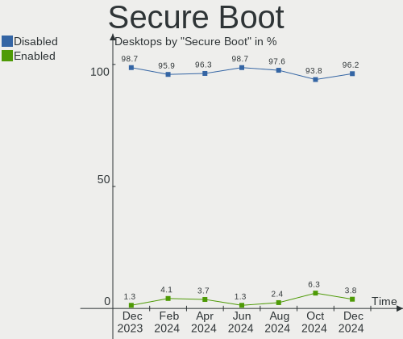
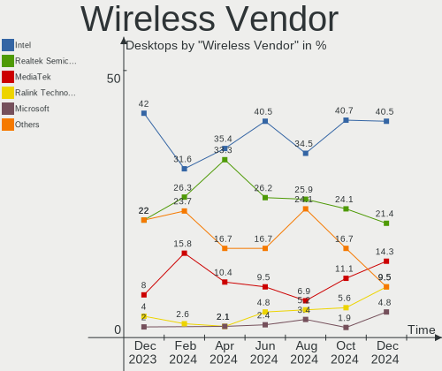
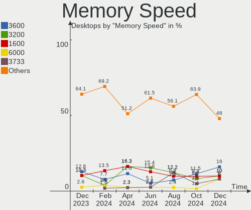
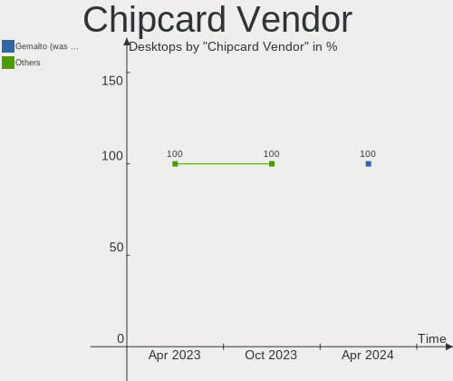

Linux in UK - Hardware Trends (Desktops)
----------------------------------------

A project to identify most popular hardware characteristics and track their change
over time based on data collected by Linux users at https://Linux-Hardware.org.

Anyone can contribute to this report by the [hw-probe](https://github.com/linuxhw/hw-probe) tool:

    sudo -E hw-probe -all -upload

Period: Apr, 2024.

Contents
--------

* [ System ](#system)
  - [ OS                       ](#os)
  - [ OS Family                ](#os-family)
  - [ Kernel                   ](#kernel)
  - [ Kernel Family            ](#kernel-family)
  - [ Kernel Major Ver.        ](#kernel-major-ver)
  - [ Arch                     ](#arch)
  - [ DE                       ](#de)
  - [ Display Server           ](#display-server)
  - [ Display Manager          ](#display-manager)
  - [ OS Lang                  ](#os-lang)
  - [ Boot Mode                ](#boot-mode)
  - [ Filesystem               ](#filesystem)
  - [ Part. scheme             ](#part-scheme)
  - [ Dual Boot with Linux/BSD ](#dual-boot-with-linuxbsd)
  - [ Dual Boot (Win)          ](#dual-boot-win)

* [ Board ](#board)
  - [ Vendor                   ](#vendor)
  - [ Model                    ](#model)
  - [ Model Family             ](#model-family)
  - [ MFG Year                 ](#mfg-year)
  - [ Form Factor              ](#form-factor)
  - [ Secure Boot              ](#secure-boot)
  - [ Coreboot                 ](#coreboot)
  - [ RAM Size                 ](#ram-size)
  - [ RAM Used                 ](#ram-used)
  - [ Total Drives             ](#total-drives)
  - [ Has CD-ROM               ](#has-cd-rom)
  - [ Has Ethernet             ](#has-ethernet)
  - [ Has WiFi                 ](#has-wifi)
  - [ Has Bluetooth            ](#has-bluetooth)

* [ Location ](#location)
  - [ Country                  ](#country)
  - [ City                     ](#city)

* [ Drives ](#drives)
  - [ Drive Vendor             ](#drive-vendor)
  - [ Drive Model              ](#drive-model)
  - [ HDD Vendor               ](#hdd-vendor)
  - [ SSD Vendor               ](#ssd-vendor)
  - [ Drive Kind               ](#drive-kind)
  - [ Drive Connector          ](#drive-connector)
  - [ Drive Size               ](#drive-size)
  - [ Space Total              ](#space-total)
  - [ Space Used               ](#space-used)
  - [ Malfunc. Drives          ](#malfunc-drives)
  - [ Malfunc. Drive Vendor    ](#malfunc-drive-vendor)
  - [ Malfunc. HDD Vendor      ](#malfunc-hdd-vendor)
  - [ Malfunc. Drive Kind      ](#malfunc-drive-kind)
  - [ Failed Drives            ](#failed-drives)
  - [ Failed Drive Vendor      ](#failed-drive-vendor)
  - [ Drive Status             ](#drive-status)

* [ Storage controller ](#storage-controller)
  - [ Storage Vendor           ](#storage-vendor)
  - [ Storage Model            ](#storage-model)
  - [ Storage Kind             ](#storage-kind)

* [ Processor ](#processor)
  - [ CPU Vendor               ](#cpu-vendor)
  - [ CPU Model                ](#cpu-model)
  - [ CPU Model Family         ](#cpu-model-family)
  - [ CPU Cores                ](#cpu-cores)
  - [ CPU Sockets              ](#cpu-sockets)
  - [ CPU Threads              ](#cpu-threads)
  - [ CPU Op-Modes             ](#cpu-op-modes)
  - [ CPU Microcode            ](#cpu-microcode)
  - [ CPU Microarch            ](#cpu-microarch)

* [ Graphics ](#graphics)
  - [ GPU Vendor               ](#gpu-vendor)
  - [ GPU Model                ](#gpu-model)
  - [ GPU Combo                ](#gpu-combo)
  - [ GPU Driver               ](#gpu-driver)
  - [ GPU Memory               ](#gpu-memory)

* [ Monitor ](#monitor)
  - [ Monitor Vendor           ](#monitor-vendor)
  - [ Monitor Model            ](#monitor-model)
  - [ Monitor Resolution       ](#monitor-resolution)
  - [ Monitor Diagonal         ](#monitor-diagonal)
  - [ Monitor Width            ](#monitor-width)
  - [ Aspect Ratio             ](#aspect-ratio)
  - [ Monitor Area             ](#monitor-area)
  - [ Pixel Density            ](#pixel-density)
  - [ Multiple Monitors        ](#multiple-monitors)

* [ Network ](#network)
  - [ Net Controller Vendor    ](#net-controller-vendor)
  - [ Net Controller Model     ](#net-controller-model)
  - [ Wireless Vendor          ](#wireless-vendor)
  - [ Wireless Model           ](#wireless-model)
  - [ Ethernet Vendor          ](#ethernet-vendor)
  - [ Ethernet Model           ](#ethernet-model)
  - [ Net Controller Kind      ](#net-controller-kind)
  - [ Used Controller          ](#used-controller)
  - [ NICs                     ](#nics)
  - [ IPv6                     ](#ipv6)

* [ Bluetooth ](#bluetooth)
  - [ Bluetooth Vendor         ](#bluetooth-vendor)
  - [ Bluetooth Model          ](#bluetooth-model)

* [ Sound ](#sound)
  - [ Sound Vendor             ](#sound-vendor)
  - [ Sound Model              ](#sound-model)

* [ Memory ](#memory)
  - [ Memory Vendor            ](#memory-vendor)
  - [ Memory Model             ](#memory-model)
  - [ Memory Kind              ](#memory-kind)
  - [ Memory Form Factor       ](#memory-form-factor)
  - [ Memory Size              ](#memory-size)
  - [ Memory Speed             ](#memory-speed)

* [ Printers & scanners ](#printers--scanners)
  - [ Printer Vendor           ](#printer-vendor)
  - [ Printer Model            ](#printer-model)
  - [ Scanner Vendor           ](#scanner-vendor)
  - [ Scanner Model            ](#scanner-model)

* [ Camera ](#camera)
  - [ Camera Vendor            ](#camera-vendor)
  - [ Camera Model             ](#camera-model)

* [ Security ](#security)
  - [ Fingerprint Vendor       ](#fingerprint-vendor)
  - [ Fingerprint Model        ](#fingerprint-model)
  - [ Chipcard Vendor          ](#chipcard-vendor)
  - [ Chipcard Model           ](#chipcard-model)

* [ Unsupported ](#unsupported)
  - [ Unsupported Devices      ](#unsupported-devices)
  - [ Unsupported Device Types ](#unsupported-device-types)

System
------

OS
--

Installed operating systems

| Name                 | Desktops | Percent |
|----------------------|----------|---------|
| Ubuntu 22.04         | 10       | 12.35%  |
| Linux Mint 21.3      | 10       | 12.35%  |
| Fedora 39            | 6        | 7.41%   |
| Zorin 17             | 5        | 6.17%   |
| Ubuntu 23.10         | 5        | 6.17%   |
| Pop!_OS 22.04        | 5        | 6.17%   |
| OpenMandriva 23.08   | 5        | 6.17%   |
| Debian 12            | 5        | 6.17%   |
| KDE neon 22.04       | 3        | 3.7%    |
| ArcoLinux Rolling    | 3        | 3.7%    |
| Ubuntu 24.04         | 2        | 2.47%   |
| Kubuntu 22.04        | 2        | 2.47%   |
| Fedora 40            | 2        | 2.47%   |
| BlackPanther 18.1    | 2        | 2.47%   |
| Arch Rolling         | 2        | 2.47%   |
| Ubuntu MATE 22.04    | 1        | 1.23%   |
| Ubuntu 20.04         | 1        | 1.23%   |
| OpenMandriva 5.0     | 1        | 1.23%   |
| NixOS 23.11          | 1        | 1.23%   |
| Manjaro 23.1.4       | 1        | 1.23%   |
| Manjaro 23.1.3       | 1        | 1.23%   |
| Lubuntu 23.10        | 1        | 1.23%   |
| Kubuntu 23.10        | 1        | 1.23%   |
| Kali 2024.1          | 1        | 1.23%   |
| Gentoo 2.14          | 1        | 1.23%   |
| Garuda Linux Soaring | 1        | 1.23%   |
| Fedora 36            | 1        | 1.23%   |
| EndeavourOS Rolling  | 1        | 1.23%   |
| BunsenLabs 11        | 1        | 1.23%   |

OS Family
---------

OS without a version

| Name         | Desktops | Percent |
|--------------|----------|---------|
| Ubuntu       | 18       | 22.22%  |
| Linux Mint   | 10       | 12.35%  |
| Fedora       | 9        | 11.11%  |
| OpenMandriva | 6        | 7.41%   |
| Zorin        | 5        | 6.17%   |
| Pop!_OS      | 5        | 6.17%   |
| Debian       | 5        | 6.17%   |
| Kubuntu      | 3        | 3.7%    |
| KDE neon     | 3        | 3.7%    |
| ArcoLinux    | 3        | 3.7%    |
| Manjaro      | 2        | 2.47%   |
| BlackPanther | 2        | 2.47%   |
| Arch         | 2        | 2.47%   |
| Ubuntu MATE  | 1        | 1.23%   |
| NixOS        | 1        | 1.23%   |
| Lubuntu      | 1        | 1.23%   |
| Kali         | 1        | 1.23%   |
| Gentoo       | 1        | 1.23%   |
| Garuda Linux | 1        | 1.23%   |
| EndeavourOS  | 1        | 1.23%   |
| BunsenLabs   | 1        | 1.23%   |

Kernel
------

Version of the Linux kernel

| Version                             | Desktops | Percent |
|-------------------------------------|----------|---------|
| 6.5.0-28-generic                    | 15       | 18.52%  |
| 6.5.0-27-generic                    | 8        | 9.88%   |
| 6.4.11-desktop-1omv2390             | 5        | 6.17%   |
| 6.5.0-26-generic                    | 4        | 4.94%   |
| 6.8.0-76060800daily20240311-generic | 3        | 3.7%    |
| 6.1.0-20-amd64                      | 3        | 3.7%    |
| 5.15.0-101-generic                  | 3        | 3.7%    |
| 5.15.0-100-generic                  | 3        | 3.7%    |
| 6.8.7-300.fc40.x86_64               | 2        | 2.47%   |
| 6.8.7-200.fc39.x86_64               | 2        | 2.47%   |
| 6.8.4-200.fc39.x86_64               | 2        | 2.47%   |
| 6.8.2-zen2-1-zen                    | 2        | 2.47%   |
| 6.8.2-arch2-1                       | 2        | 2.47%   |
| 6.5.0-9-generic                     | 2        | 2.47%   |
| 6.1.0-18-amd64                      | 2        | 2.47%   |
| 6.8.4-zen1-1-zen                    | 1        | 1.23%   |
| 6.8.4-arch1-1                       | 1        | 1.23%   |
| 6.8.1                               | 1        | 1.23%   |
| 6.8.0-31-lowlatency                 | 1        | 1.23%   |
| 6.8.0-31-generic                    | 1        | 1.23%   |
| 6.7.9-207.fsync.fc39.x86_64         | 1        | 1.23%   |
| 6.6.9-amd64                         | 1        | 1.23%   |
| 6.6.21-gentoo-x86_64                | 1        | 1.23%   |
| 6.6.2-desktop-1omv2390              | 1        | 1.23%   |
| 6.6.19-1-MANJARO                    | 1        | 1.23%   |
| 6.6.10-76060610-generic             | 1        | 1.23%   |
| 6.6.10-1-MANJARO                    | 1        | 1.23%   |
| 6.5.6-300.fc39.x86_64               | 1        | 1.23%   |
| 6.5.0-26-lowlatency                 | 1        | 1.23%   |
| 6.3.8-arch1-1                       | 1        | 1.23%   |
| 6.2.6-76060206-generic              | 1        | 1.23%   |
| 6.2.15-100.fc36.x86_64              | 1        | 1.23%   |
| 5.15.85-desktop-1bP                 | 1        | 1.23%   |
| 5.15.0-94-generic                   | 1        | 1.23%   |
| 5.15.0-91-generic                   | 1        | 1.23%   |
| 5.15.0-105-lowlatency               | 1        | 1.23%   |
| 4.19.0-26-amd64                     | 1        | 1.23%   |
| 4.18.16-desktop-1bP                 | 1        | 1.23%   |

Kernel Family
-------------

Linux kernel without a distro release

| Version | Desktops | Percent |
|---------|----------|---------|
| 6.5.0   | 30       | 37.04%  |
| 5.15.0  | 9        | 11.11%  |
| 6.8.0   | 5        | 6.17%   |
| 6.4.11  | 5        | 6.17%   |
| 6.1.0   | 5        | 6.17%   |
| 6.8.7   | 4        | 4.94%   |
| 6.8.4   | 4        | 4.94%   |
| 6.8.2   | 4        | 4.94%   |
| 6.6.10  | 2        | 2.47%   |
| 6.8.1   | 1        | 1.23%   |
| 6.7.9   | 1        | 1.23%   |
| 6.6.9   | 1        | 1.23%   |
| 6.6.21  | 1        | 1.23%   |
| 6.6.2   | 1        | 1.23%   |
| 6.6.19  | 1        | 1.23%   |
| 6.5.6   | 1        | 1.23%   |
| 6.3.8   | 1        | 1.23%   |
| 6.2.6   | 1        | 1.23%   |
| 6.2.15  | 1        | 1.23%   |
| 5.15.85 | 1        | 1.23%   |
| 4.19.0  | 1        | 1.23%   |
| 4.18.16 | 1        | 1.23%   |

Kernel Major Ver.
-----------------

Linux kernel major version

| Version | Desktops | Percent |
|---------|----------|---------|
| 6.5     | 31       | 38.27%  |
| 6.8     | 18       | 22.22%  |
| 5.15    | 10       | 12.35%  |
| 6.6     | 6        | 7.41%   |
| 6.4     | 5        | 6.17%   |
| 6.1     | 5        | 6.17%   |
| 6.2     | 2        | 2.47%   |
| 6.7     | 1        | 1.23%   |
| 6.3     | 1        | 1.23%   |
| 4.19    | 1        | 1.23%   |
| 4.18    | 1        | 1.23%   |

Arch
----

OS architecture (x86_64, i586, etc.)

| Name   | Desktops | Percent |
|--------|----------|---------|
| x86_64 | 81       | 100%    |

DE
--

Desktop Environment

| Name       | Desktops | Percent |
|------------|----------|---------|
| GNOME      | 42       | 51.85%  |
| KDE5       | 14       | 17.28%  |
| X-Cinnamon | 10       | 12.35%  |
| XFCE       | 4        | 4.94%   |
| KDE6       | 4        | 4.94%   |
| Unknown    | 2        | 2.47%   |
| MATE       | 1        | 1.23%   |
| LXQt       | 1        | 1.23%   |
| KDE        | 1        | 1.23%   |
| BunsenLabs | 1        | 1.23%   |
| bspwm      | 1        | 1.23%   |

Display Server
--------------

X11 or Wayland

| Name    | Desktops | Percent |
|---------|----------|---------|
| X11     | 41       | 50.62%  |
| Wayland | 39       | 48.15%  |
| Unknown | 1        | 1.23%   |

Display Manager
---------------

SDDM, LightDM, etc.

| Name    | Desktops | Percent |
|---------|----------|---------|
| Unknown | 34       | 41.98%  |
| SDDM    | 17       | 20.99%  |
| GDM3    | 14       | 17.28%  |
| LightDM | 11       | 13.58%  |
| GDM     | 5        | 6.17%   |

OS Lang
-------

Language

| Lang    | Desktops | Percent |
|---------|----------|---------|
| en_GB   | 61       | 75.31%  |
| en_US   | 9        | 11.11%  |
| pl_PL   | 3        | 3.7%    |
| C       | 3        | 3.7%    |
| Unknown | 3        | 3.7%    |
| lt_LT   | 1        | 1.23%   |
| C.UTF8  | 1        | 1.23%   |

Boot Mode
---------

EFI or BIOS

| Mode | Desktops | Percent |
|------|----------|---------|
| BIOS | 49       | 60.49%  |
| EFI  | 32       | 39.51%  |

Filesystem
----------

Type of filesystem

| Type    | Desktops | Percent |
|---------|----------|---------|
| Ext4    | 47       | 58.02%  |
| Btrfs   | 14       | 17.28%  |
| Tmpfs   | 12       | 14.81%  |
| Overlay | 7        | 8.64%   |
| XXXXXXX | 1        | 1.23%   |

Part. scheme
------------

Scheme of partitioning

| Type    | Desktops | Percent |
|---------|----------|---------|
| GPT     | 40       | 49.38%  |
| Unknown | 33       | 40.74%  |
| MBR     | 8        | 9.88%   |

Dual Boot with Linux/BSD
------------------------

Hosting more than one Linux/BSD

| Dual boot | Desktops | Percent |
|-----------|----------|---------|
| No        | 64       | 79.01%  |
| Yes       | 17       | 20.99%  |

Dual Boot (Win)
---------------

Hosting Linux and Windows

| Dual boot | Desktops | Percent |
|-----------|----------|---------|
| No        | 59       | 72.84%  |
| Yes       | 22       | 27.16%  |

Board
-----

Vendor
------

Motherboard manufacturer

| Name                                 | Desktops | Percent |
|--------------------------------------|----------|---------|
| ASUSTek Computer                     | 18       | 22.22%  |
| Gigabyte Technology                  | 17       | 20.99%  |
| MSI                                  | 16       | 19.75%  |
| Dell                                 | 8        | 9.88%   |
| Hewlett-Packard                      | 6        | 7.41%   |
| Intel                                | 3        | 3.7%    |
| Acer                                 | 2        | 2.47%   |
| Unknown                              | 2        | 2.47%   |
| Supermicro                           | 1        | 1.23%   |
| Shenzhen Meigao Electronic Equipment | 1        | 1.23%   |
| Lenovo                               | 1        | 1.23%   |
| Huanan                               | 1        | 1.23%   |
| Fujitsu                              | 1        | 1.23%   |
| Foxconn                              | 1        | 1.23%   |
| ASRock                               | 1        | 1.23%   |
| Apple                                | 1        | 1.23%   |
| AOpen                                | 1        | 1.23%   |

Model
-----

Motherboard model

| Name                                       | Desktops | Percent |
|--------------------------------------------|----------|---------|
| Unknown                                    | 2        | 2.47%   |
| Supermicro X10DAi                          | 1        | 1.23%   |
| Shenzhen Meigao Electronic Equipment HX77G | 1        | 1.23%   |
| MSI MS-7E06                                | 1        | 1.23%   |
| MSI MS-7D32                                | 1        | 1.23%   |
| MSI MS-7D14                                | 1        | 1.23%   |
| MSI MS-7C96                                | 1        | 1.23%   |
| MSI MS-7C75                                | 1        | 1.23%   |
| MSI MS-7C02                                | 1        | 1.23%   |
| MSI MS-7B86                                | 1        | 1.23%   |
| MSI MS-7B78                                | 1        | 1.23%   |
| MSI MS-7977                                | 1        | 1.23%   |
| MSI MS-7913                                | 1        | 1.23%   |
| MSI MS-7851                                | 1        | 1.23%   |
| MSI MS-7850                                | 1        | 1.23%   |
| MSI MS-7786                                | 1        | 1.23%   |
| MSI H310 Gaming Infinite (MS-B915)         | 1        | 1.23%   |
| MSI Customised HOMEA PC                    | 1        | 1.23%   |
| MSI Custom PC                              | 1        | 1.23%   |
| Lenovo Legion T730-28ICO 90JFZ54RUS        | 1        | 1.23%   |
| Intel Jasper Lake Client Platform          | 1        | 1.23%   |
| Intel DH67CF AAG10215-203                  | 1        | 1.23%   |
| Intel DH61CR                               | 1        | 1.23%   |
| Huanan X99-F8 GAMING V5.0                  | 1        | 1.23%   |
| HP Z220 CMT Workstation                    | 1        | 1.23%   |
| HP ProDesk 400 G3 SFF                      | 1        | 1.23%   |
| HP Pavilion Gaming Desktop TG01-1xxx       | 1        | 1.23%   |
| HP EliteDesk 800 G3 SFF                    | 1        | 1.23%   |
| HP Compaq Elite 8300 USDT                  | 1        | 1.23%   |
| HP Compaq 8000 Elite SFF PC                | 1        | 1.23%   |
| Gigabyte Z97X-Gaming 5                     | 1        | 1.23%   |
| Gigabyte Z790 AORUS ELITE AX               | 1        | 1.23%   |
| Gigabyte X570 AORUS ELITE                  | 1        | 1.23%   |
| Gigabyte TRX40 AORUS PRO WIFI              | 1        | 1.23%   |
| Gigabyte PDT-702-1020                      | 1        | 1.23%   |
| Gigabyte MBB-53004C                        | 1        | 1.23%   |
| Gigabyte H97M-D3H                          | 1        | 1.23%   |
| Gigabyte GA-880GM-UD2H                     | 1        | 1.23%   |
| Gigabyte F2A68HM-HD2                       | 1        | 1.23%   |
| Gigabyte B550I AORUS PRO AX                | 1        | 1.23%   |

Model Family
------------

Motherboard model prefix

| Name                                       | Desktops | Percent |
|--------------------------------------------|----------|---------|
| ASUS ROG                                   | 8        | 9.88%   |
| ASUS PRIME                                 | 5        | 6.17%   |
| Dell Precision                             | 3        | 3.7%    |
| Dell OptiPlex                              | 3        | 3.7%    |
| HP Compaq                                  | 2        | 2.47%   |
| Gigabyte B550                              | 2        | 2.47%   |
| Gigabyte B450M                             | 2        | 2.47%   |
| Dell Inspiron                              | 2        | 2.47%   |
| Acer Aspire                                | 2        | 2.47%   |
| Unknown                                    | 2        | 2.47%   |
| Supermicro X10DAi                          | 1        | 1.23%   |
| Shenzhen Meigao Electronic Equipment HX77G | 1        | 1.23%   |
| MSI MS-7E06                                | 1        | 1.23%   |
| MSI MS-7D32                                | 1        | 1.23%   |
| MSI MS-7D14                                | 1        | 1.23%   |
| MSI MS-7C96                                | 1        | 1.23%   |
| MSI MS-7C75                                | 1        | 1.23%   |
| MSI MS-7C02                                | 1        | 1.23%   |
| MSI MS-7B86                                | 1        | 1.23%   |
| MSI MS-7B78                                | 1        | 1.23%   |
| MSI MS-7977                                | 1        | 1.23%   |
| MSI MS-7913                                | 1        | 1.23%   |
| MSI MS-7851                                | 1        | 1.23%   |
| MSI MS-7850                                | 1        | 1.23%   |
| MSI MS-7786                                | 1        | 1.23%   |
| MSI H310                                   | 1        | 1.23%   |
| MSI Customised                             | 1        | 1.23%   |
| MSI Custom                                 | 1        | 1.23%   |
| Lenovo Legion                              | 1        | 1.23%   |
| Intel Jasper                               | 1        | 1.23%   |
| Intel DH67CF                               | 1        | 1.23%   |
| Intel DH61CR                               | 1        | 1.23%   |
| Huanan X99-F8                              | 1        | 1.23%   |
| HP Z220                                    | 1        | 1.23%   |
| HP ProDesk                                 | 1        | 1.23%   |
| HP Pavilion                                | 1        | 1.23%   |
| HP EliteDesk                               | 1        | 1.23%   |
| Gigabyte Z97X-Gaming                       | 1        | 1.23%   |
| Gigabyte Z790                              | 1        | 1.23%   |
| Gigabyte X570                              | 1        | 1.23%   |

MFG Year
--------

Motherboard manufacture year

| Year | Desktops | Percent |
|------|----------|---------|
| 2018 | 11       | 13.58%  |
| 2020 | 10       | 12.35%  |
| 2014 | 9        | 11.11%  |
| 2023 | 7        | 8.64%   |
| 2022 | 6        | 7.41%   |
| 2021 | 6        | 7.41%   |
| 2019 | 6        | 7.41%   |
| 2012 | 5        | 6.17%   |
| 2016 | 4        | 4.94%   |
| 2013 | 4        | 4.94%   |
| 2011 | 3        | 3.7%    |
| 2010 | 3        | 3.7%    |
| 2017 | 2        | 2.47%   |
| 2015 | 2        | 2.47%   |
| 2009 | 2        | 2.47%   |
| 2024 | 1        | 1.23%   |

Form Factor
-----------

Physical design of the computer

| Name    | Desktops | Percent |
|---------|----------|---------|
| Desktop | 81       | 100%    |

Secure Boot
-----------

Enabled or disabled

| State    | Desktops | Percent |
|----------|----------|---------|
| Disabled | 78       | 96.3%   |
| Enabled  | 3        | 3.7%    |

Coreboot
--------

Have coreboot on board

| Used | Desktops | Percent |
|------|----------|---------|
| No   | 81       | 100%    |

RAM Size
--------

Total RAM memory

| Size in GB  | Desktops | Percent |
|-------------|----------|---------|
| 32.01-64.0  | 24       | 29.63%  |
| 16.01-24.0  | 19       | 23.46%  |
| 64.01-256.0 | 13       | 16.05%  |
| 4.01-8.0    | 12       | 14.81%  |
| 3.01-4.0    | 5        | 6.17%   |
| 24.01-32.0  | 5        | 6.17%   |
| 8.01-16.0   | 2        | 2.47%   |
| 2.01-3.0    | 1        | 1.23%   |

RAM Used
--------

Used RAM memory

| Used GB    | Desktops | Percent |
|------------|----------|---------|
| 4.01-8.0   | 21       | 25.93%  |
| 1.01-2.0   | 19       | 23.46%  |
| 3.01-4.0   | 18       | 22.22%  |
| 2.01-3.0   | 15       | 18.52%  |
| 8.01-16.0  | 6        | 7.41%   |
| 16.01-24.0 | 1        | 1.23%   |
| 0.51-1.0   | 1        | 1.23%   |

Total Drives
------------

Number of drives on board

| Drives | Desktops | Percent |
|--------|----------|---------|
| 1      | 29       | 35.8%   |
| 2      | 18       | 22.22%  |
| 3      | 16       | 19.75%  |
| 4      | 9        | 11.11%  |
| 5      | 4        | 4.94%   |
| 7      | 2        | 2.47%   |
| 6      | 2        | 2.47%   |
| 9      | 1        | 1.23%   |

Has CD-ROM
----------

Has CD-ROM on board

| Presented | Desktops | Percent |
|-----------|----------|---------|
| No        | 50       | 61.73%  |
| Yes       | 31       | 38.27%  |

Has Ethernet
------------

Has Ethernet on board

| Presented | Desktops | Percent |
|-----------|----------|---------|
| Yes       | 81       | 100%    |

Has WiFi
--------

Has WiFi module

| Presented | Desktops | Percent |
|-----------|----------|---------|
| Yes       | 48       | 59.26%  |
| No        | 33       | 40.74%  |

Has Bluetooth
-------------

Has Bluetooth module

| Presented | Desktops | Percent |
|-----------|----------|---------|
| Yes       | 45       | 55.56%  |
| No        | 36       | 44.44%  |

Location
--------

Country
-------

Geographic location (country)

| Country | Desktops | Percent |
|---------|----------|---------|
| UK      | 81       | 100%    |

City
----

Geographic location (city)

| City             | Desktops | Percent |
|------------------|----------|---------|
| Southwark        | 4        | 4.94%   |
| Glasgow          | 3        | 3.7%    |
| Warrington       | 2        | 2.47%   |
| Stockton-on-Tees | 2        | 2.47%   |
| London           | 2        | 2.47%   |
| Liverpool        | 2        | 2.47%   |
| Lewisham         | 2        | 2.47%   |
| Hendon           | 2        | 2.47%   |
| Croydon          | 2        | 2.47%   |
| Bristol          | 2        | 2.47%   |
| Brighton         | 2        | 2.47%   |
| Birmingham       | 2        | 2.47%   |
| Basildon         | 2        | 2.47%   |
| Wolverhampton    | 1        | 1.23%   |
| Winsford         | 1        | 1.23%   |
| Wembley          | 1        | 1.23%   |
| Welling          | 1        | 1.23%   |
| Wallington       | 1        | 1.23%   |
| Wakefield        | 1        | 1.23%   |
| Tonypandy        | 1        | 1.23%   |
| Sutton Coldfield | 1        | 1.23%   |
| Stevenage        | 1        | 1.23%   |
| Stafford         | 1        | 1.23%   |
| St Austell       | 1        | 1.23%   |
| Rotherham        | 1        | 1.23%   |
| Reading          | 1        | 1.23%   |
| Ramsgate         | 1        | 1.23%   |
| Penarth          | 1        | 1.23%   |
| Ormskirk         | 1        | 1.23%   |
| Nottingham       | 1        | 1.23%   |
| Northampton      | 1        | 1.23%   |
| Newhaven         | 1        | 1.23%   |
| Middlesbrough    | 1        | 1.23%   |
| Luton            | 1        | 1.23%   |
| Leicester        | 1        | 1.23%   |
| Leeds            | 1        | 1.23%   |
| Islington        | 1        | 1.23%   |
| Ilford           | 1        | 1.23%   |
| Hounslow         | 1        | 1.23%   |
| Hackney          | 1        | 1.23%   |

Drives
------

Drive Vendor
------------

Hard drive vendors

| Vendor                       | Desktops | Drives | Percent |
|------------------------------|----------|--------|---------|
| Samsung Electronics          | 31       | 37     | 19.14%  |
| Seagate                      | 25       | 31     | 15.43%  |
| WDC                          | 17       | 26     | 10.49%  |
| Crucial                      | 13       | 17     | 8.02%   |
| Sandisk                      | 10       | 14     | 6.17%   |
| Toshiba                      | 9        | 11     | 5.56%   |
| Micron/Crucial Technology    | 8        | 10     | 4.94%   |
| Kingston                     | 6        | 6      | 3.7%    |
| SK hynix                     | 4        | 4      | 2.47%   |
| Phison Electronics           | 4        | 6      | 2.47%   |
| Unknown                      | 3        | 3      | 1.85%   |
| OCZ                          | 3        | 3      | 1.85%   |
| China                        | 3        | 4      | 1.85%   |
| SSK                          | 2        | 2      | 1.23%   |
| Integral                     | 2        | 2      | 1.23%   |
| HGST                         | 2        | 2      | 1.23%   |
| Fanxiang                     | 2        | 2      | 1.23%   |
| WD Blue                      | 1        | 1      | 0.62%   |
| SSSTC                        | 1        | 1      | 0.62%   |
| Silicon Motion               | 1        | 1      | 0.62%   |
| Shenzhen Longsys Electronics | 1        | 1      | 0.62%   |
| PNY                          | 1        | 1      | 0.62%   |
| MSI                          | 1        | 1      | 0.62%   |
| Micron Technology            | 1        | 1      | 0.62%   |
| Maxtor                       | 1        | 2      | 0.62%   |
| Kingston Technology Company  | 1        | 1      | 0.62%   |
| JMicron Technology           | 1        | 1      | 0.62%   |
| Intel                        | 1        | 1      | 0.62%   |
| Hitachi                      | 1        | 1      | 0.62%   |
| Gigastone                    | 1        | 1      | 0.62%   |
| Gigabyte Technology          | 1        | 1      | 0.62%   |
| Apple                        | 1        | 1      | 0.62%   |
| AMD                          | 1        | 2      | 0.62%   |
| ADATA Technology             | 1        | 2      | 0.62%   |
| Unknown                      | 1        | 1      | 0.62%   |

Drive Model
-----------

Hard drive models

| Model                                             | Desktops | Percent |
|---------------------------------------------------|----------|---------|
| Samsung NVMe SSD Controller SM981/PM981/PM983 1TB | 7        | 3.7%    |
| Seagate ST2000DM008-2FR102 2TB                    | 6        | 3.17%   |
| Micron/Crucial P2 NVMe PCIe SSD 4TB               | 5        | 2.65%   |
| Crucial CT1000MX500SSD1 1TB                       | 5        | 2.65%   |
| Phison E12 NVMe Controller 2TB                    | 3        | 1.59%   |
| Kingston SV300S37A240G 240GB SSD                  | 3        | 1.59%   |
| Crucial CT500MX500SSD1 500GB                      | 3        | 1.59%   |
| WDC WD30EFRX-68EUZN0 3TB                          | 2        | 1.06%   |
| Unknown SD/MMC/MS PRO 128GB                       | 2        | 1.06%   |
| Toshiba DT01ACA100 1TB                            | 2        | 1.06%   |
| Seagate ST8000DM004-2CX188 8TB                    | 2        | 1.06%   |
| Seagate ST1000DM003-1SB102 1TB                    | 2        | 1.06%   |
| Sandisk WD Blue SN550 NVMe SSD 2TB                | 2        | 1.06%   |
| Samsung SSD 840 EVO 250GB                         | 2        | 1.06%   |
| OCZ VERTEX3 120GB SSD                             | 2        | 1.06%   |
| Micron/Crucial P1 NVMe PCIe SSD 1TB               | 2        | 1.06%   |
| Kingston SA400S37240G 240GB SSD                   | 2        | 1.06%   |
| Integral V Series SATA SSD 120GB                  | 2        | 1.06%   |
| Crucial CT1050MX300SSD1 1050GB                    | 2        | 1.06%   |
| WDC WDS500G2B0C-00PXH0 500GB                      | 1        | 0.53%   |
| WDC WDS500G2B0A-00SM50 500GB SSD                  | 1        | 0.53%   |
| WDC WD800JD-55MUA1 80GB                           | 1        | 0.53%   |
| WDC WD60EZRZ-00GZ5B1 6TB                          | 1        | 0.53%   |
| WDC WD6003FZBX-00K5WB0 6TB                        | 1        | 0.53%   |
| WDC WD50EZRZ-00RWYB1 5TB                          | 1        | 0.53%   |
| WDC WD5002AALX-00J37A0 500GB                      | 1        | 0.53%   |
| WDC WD5000LUCT-63C26Y0 500GB                      | 1        | 0.53%   |
| WDC WD5000BPVT-35HXZT1 500GB                      | 1        | 0.53%   |
| WDC WD5000BPVT-00HXZT1 500GB                      | 1        | 0.53%   |
| WDC WD5000BEVT-75A0RT0 500GB                      | 1        | 0.53%   |
| WDC WD5000BEVT-11ZAT0 500GB                       | 1        | 0.53%   |
| WDC WD40EFRX-68N32N0 4TB                          | 1        | 0.53%   |
| WDC WD4003FZEX-00Z4SA0 4TB                        | 1        | 0.53%   |
| WDC WD3200AAJS-22L7A0 320GB                       | 1        | 0.53%   |
| WDC WD30PURX-64P6ZY0 3TB                          | 1        | 0.53%   |
| WDC WD2003FYPS-27W9B0 2TB                         | 1        | 0.53%   |
| WDC WD120EMAZ-11BLFA0 12TB                        | 1        | 0.53%   |
| WDC WD10JPVX-60JC3T0 1TB                          | 1        | 0.53%   |
| WDC WD10EZEX-22MFCA0 1TB                          | 1        | 0.53%   |
| WDC WD10EZEX-08WN4A0 1TB                          | 1        | 0.53%   |

HDD Vendor
----------

Hard disk drive vendors

| Vendor              | Desktops | Drives | Percent |
|---------------------|----------|--------|---------|
| Seagate             | 25       | 31     | 43.86%  |
| WDC                 | 15       | 24     | 26.32%  |
| Toshiba             | 7        | 9      | 12.28%  |
| Samsung Electronics | 3        | 3      | 5.26%   |
| Unknown             | 2        | 2      | 3.51%   |
| HGST                | 2        | 2      | 3.51%   |
| Maxtor              | 1        | 2      | 1.75%   |
| Hitachi             | 1        | 1      | 1.75%   |
| Apple               | 1        | 1      | 1.75%   |

SSD Vendor
----------

Solid state drive vendors

| Vendor              | Desktops | Drives | Percent |
|---------------------|----------|--------|---------|
| Samsung Electronics | 15       | 17     | 29.41%  |
| Crucial             | 12       | 15     | 23.53%  |
| Kingston            | 6        | 6      | 11.76%  |
| SanDisk             | 4        | 4      | 7.84%   |
| OCZ                 | 3        | 3      | 5.88%   |
| SK hynix            | 2        | 2      | 3.92%   |
| Integral            | 2        | 2      | 3.92%   |
| China               | 2        | 3      | 3.92%   |
| WDC                 | 1        | 1      | 1.96%   |
| SSK                 | 1        | 1      | 1.96%   |
| PNY                 | 1        | 1      | 1.96%   |
| Gigastone           | 1        | 1      | 1.96%   |
| Gigabyte Technology | 1        | 1      | 1.96%   |

Drive Kind
----------

HDD or SSD

| Kind    | Desktops | Drives | Percent |
|---------|----------|--------|---------|
| NVMe    | 44       | 64     | 33.08%  |
| SSD     | 42       | 57     | 31.58%  |
| HDD     | 42       | 75     | 31.58%  |
| Unknown | 5        | 5      | 3.76%   |

Drive Connector
---------------

SATA, SAS, NVMe, etc.

| Type | Desktops | Drives | Percent |
|------|----------|--------|---------|
| SATA | 65       | 128    | 56.52%  |
| NVMe | 43       | 62     | 37.39%  |
| SAS  | 7        | 11     | 6.09%   |

Drive Size
----------

Size of hard drive

| Size in TB | Desktops | Drives | Percent |
|------------|----------|--------|---------|
| 0.01-0.5   | 38       | 57     | 40.86%  |
| 0.51-1.0   | 26       | 34     | 27.96%  |
| 1.01-2.0   | 14       | 20     | 15.05%  |
| 4.01-10.0  | 6        | 7      | 6.45%   |
| 2.01-3.0   | 4        | 6      | 4.3%    |
| 3.01-4.0   | 3        | 5      | 3.23%   |
| 10.01-20.0 | 2        | 3      | 2.15%   |

Space Total
-----------

Amount of disk space available on the file system

| Size in GB     | Desktops | Percent |
|----------------|----------|---------|
| More than 3000 | 16       | 19.75%  |
| 101-250        | 13       | 16.05%  |
| 251-500        | 12       | 14.81%  |
| 501-1000       | 11       | 13.58%  |
| 2001-3000      | 10       | 12.35%  |
| 1001-2000      | 10       | 12.35%  |
| Unknown        | 5        | 6.17%   |
| 1-20           | 3        | 3.7%    |
| 21-50          | 1        | 1.23%   |

Space Used
----------

Amount of used disk space

| Used GB        | Desktops | Percent |
|----------------|----------|---------|
| 1-20           | 18       | 22.22%  |
| 101-250        | 12       | 14.81%  |
| 21-50          | 11       | 13.58%  |
| 1001-2000      | 9        | 11.11%  |
| More than 3000 | 8        | 9.88%   |
| 501-1000       | 6        | 7.41%   |
| 51-100         | 6        | 7.41%   |
| 251-500        | 5        | 6.17%   |
| Unknown        | 5        | 6.17%   |
| 2001-3000      | 1        | 1.23%   |

Malfunc. Drives
---------------

Drive models with a malfunction

| Model                                 | Desktops | Drives | Percent |
|---------------------------------------|----------|--------|---------|
| WDC WD5000BEVT-75A0RT0 500GB          | 1        | 1      | 10%     |
| WDC WD30EFRX-68EUZN0 3TB              | 1        | 1      | 10%     |
| Seagate ST500DM002-1BC142 500GB       | 1        | 1      | 10%     |
| Seagate ST380013AS 80GB               | 1        | 1      | 10%     |
| Seagate ST3750528AS 752GB             | 1        | 1      | 10%     |
| Seagate ST1000DM003-1SB102 1TB        | 1        | 1      | 10%     |
| Samsung Electronics SSD 970 EVO 500GB | 1        | 1      | 10%     |
| Maxtor STM3160215AS 160GB             | 1        | 1      | 10%     |
| HGST HTS541010A9E680 1TB              | 1        | 1      | 10%     |
| Crucial CT1050MX300SSD1 1050GB        | 1        | 1      | 10%     |

Malfunc. Drive Vendor
---------------------

Vendors of faulty drives

| Vendor              | Desktops | Drives | Percent |
|---------------------|----------|--------|---------|
| Seagate             | 4        | 4      | 40%     |
| WDC                 | 2        | 2      | 20%     |
| Samsung Electronics | 1        | 1      | 10%     |
| Maxtor              | 1        | 1      | 10%     |
| HGST                | 1        | 1      | 10%     |
| Crucial             | 1        | 1      | 10%     |

Malfunc. HDD Vendor
-------------------

Vendors of faulty HDD drives

| Vendor  | Desktops | Drives | Percent |
|---------|----------|--------|---------|
| Seagate | 4        | 4      | 50%     |
| WDC     | 2        | 2      | 25%     |
| Maxtor  | 1        | 1      | 12.5%   |
| HGST    | 1        | 1      | 12.5%   |

Malfunc. Drive Kind
-------------------

Kinds of faulty drives

| Kind | Desktops | Drives | Percent |
|------|----------|--------|---------|
| HDD  | 7        | 8      | 77.78%  |
| NVMe | 1        | 1      | 11.11%  |
| SSD  | 1        | 1      | 11.11%  |

Failed Drives
-------------

Failed drive models

Zero info for selected period =(

Failed Drive Vendor
-------------------

Failed drive vendors

Zero info for selected period =(

Drive Status
------------

Number of failed and malfunc. drives

| Status   | Desktops | Drives | Percent |
|----------|----------|--------|---------|
| Detected | 54       | 128    | 57.45%  |
| Works    | 31       | 63     | 32.98%  |
| Malfunc  | 9        | 10     | 9.57%   |

Storage controller
------------------

Storage Vendor
--------------

Storage controller vendors

| Vendor                         | Desktops | Percent |
|--------------------------------|----------|---------|
| Intel                          | 41       | 30.6%   |
| AMD                            | 39       | 29.1%   |
| Samsung Electronics            | 15       | 11.19%  |
| Micron/Crucial Technology      | 10       | 7.46%   |
| SanDisk                        | 8        | 5.97%   |
| Phison Electronics             | 5        | 3.73%   |
| Toshiba America Info Systems   | 2        | 1.49%   |
| SK hynix                       | 2        | 1.49%   |
| Solidigm                       | 1        | 0.75%   |
| Solid State Storage Technology | 1        | 0.75%   |
| Silicon Motion                 | 1        | 0.75%   |
| Shenzhen Longsys Electronics   | 1        | 0.75%   |
| Micron Technology              | 1        | 0.75%   |
| MAXIO Technology (Hangzhou)    | 1        | 0.75%   |
| Marvell Technology Group       | 1        | 0.75%   |
| LSI Logic / Symbios Logic      | 1        | 0.75%   |
| Kingston Technology Company    | 1        | 0.75%   |
| Broadcom / LSI                 | 1        | 0.75%   |
| ADATA Technology               | 1        | 0.75%   |
| Adaptec                        | 1        | 0.75%   |

Storage Model
-------------

Storage controller models

| Model                                                                          | Desktops | Percent |
|--------------------------------------------------------------------------------|----------|---------|
| AMD FCH SATA Controller [AHCI mode]                                            | 13       | 7.93%   |
| AMD 500 Series Chipset SATA Controller                                         | 11       | 6.71%   |
| Samsung NVMe SSD Controller SM981/PM981/PM983                                  | 9        | 5.49%   |
| AMD 400 Series Chipset SATA Controller                                         | 9        | 5.49%   |
| Intel Q170/Q150/B150/H170/H110/Z170/CM236 Chipset SATA Controller [AHCI Mode]  | 6        | 3.66%   |
| AMD 600 Series Chipset SATA Controller                                         | 6        | 3.66%   |
| Micron/Crucial P2 [Nick P2] / P3 / P3 Plus NVMe PCIe SSD (DRAM-less)           | 5        | 3.05%   |
| Intel 200 Series PCH SATA controller [AHCI mode]                               | 4        | 2.44%   |
| SanDisk Ultra 3D / WD Blue SN550 NVMe SSD                                      | 3        | 1.83%   |
| Phison E12 NVMe Controller                                                     | 3        | 1.83%   |
| Micron/Crucial P5 Plus NVMe PCIe SSD                                           | 3        | 1.83%   |
| Intel Raptor Lake SATA AHCI Controller                                         | 3        | 1.83%   |
| Intel C610/X99 series chipset sSATA Controller [AHCI mode]                     | 3        | 1.83%   |
| Intel Alder Lake-S PCH SATA Controller [AHCI Mode]                             | 3        | 1.83%   |
| Intel 9 Series Chipset Family SATA Controller [AHCI Mode]                      | 3        | 1.83%   |
| Intel 8 Series/C220 Series Chipset Family 6-port SATA Controller 1 [AHCI mode] | 3        | 1.83%   |
| AMD SB7x0/SB8x0/SB9x0 IDE Controller                                           | 3        | 1.83%   |
| SanDisk WD Blue SN570 NVMe SSD 2TB                                             | 2        | 1.22%   |
| Sandisk WD Black SN850X NVMe SSD                                               | 2        | 1.22%   |
| Samsung NVMe SSD Controller 980 (DRAM-less)                                    | 2        | 1.22%   |
| Micron/Crucial P1 NVMe PCIe SSD[Frampton]                                      | 2        | 1.22%   |
| Intel C610/X99 series chipset 6-Port SATA Controller [AHCI mode]               | 2        | 1.22%   |
| Intel C600/X79 series chipset 6-Port SATA AHCI Controller                      | 2        | 1.22%   |
| Intel 6 Series/C200 Series Chipset Family 6 port Desktop SATA AHCI Controller  | 2        | 1.22%   |
| AMD SB7x0/SB8x0/SB9x0 SATA Controller [IDE mode]                               | 2        | 1.22%   |
| AMD SB7x0/SB8x0/SB9x0 SATA Controller [AHCI mode]                              | 2        | 1.22%   |
| AMD FCH IDE Controller                                                         | 2        | 1.22%   |
| Toshiba America Info Systems XG6 NVMe SSD Controller                           | 1        | 0.61%   |
| Toshiba America Info Systems BG3 x2 NVMe SSD Controller (DRAM-less)            | 1        | 0.61%   |
| Solidigm P41 Plus NVMe SSD (DRAM-less) [Echo Harbor]                           | 1        | 0.61%   |
| Solid State Storage CL4-8D512 NVMe SSD M.2 (DRAM-less)                         | 1        | 0.61%   |
| SK hynix Platinum P41/PC801 NVMe Solid State Drive                             | 1        | 0.61%   |
| SK hynix Gold P31/BC711/PC711 NVMe Solid State Drive                           | 1        | 0.61%   |
| Silicon Motion SM2260 NVMe SSD Controller                                      | 1        | 0.61%   |
| Shenzhen Longsys Lexar NM610 PRO NVME SSD (DRAM-less)                          | 1        | 0.61%   |
| SanDisk WD Black SN770 / PC SN740 256GB / PC SN560 (DRAM-less) NVMe SSD        | 1        | 0.61%   |
| SanDisk Ultra 3D / WD Blue SN570 NVMe SSD (DRAM-less)                          | 1        | 0.61%   |
| SanDisk Extreme Pro / WD Black SN750 / PC SN730 / Red SN700 NVMe SSD           | 1        | 0.61%   |
| Samsung NVMe SSD Controller SM961/PM961/SM963                                  | 1        | 0.61%   |
| Samsung NVMe SSD Controller SM951/PM951                                        | 1        | 0.61%   |

Storage Kind
------------

Kind of storage controller (IDE, SATA, NVMe, SAS, ...)

| Kind | Desktops | Percent |
|------|----------|---------|
| SATA | 73       | 54.07%  |
| NVMe | 43       | 31.85%  |
| IDE  | 11       | 8.15%   |
| RAID | 5        | 3.7%    |
| SAS  | 2        | 1.48%   |
| SCSI | 1        | 0.74%   |

Processor
---------

CPU Vendor
----------

Processor vendors

| Vendor | Desktops | Percent |
|--------|----------|---------|
| Intel  | 41       | 50.62%  |
| AMD    | 40       | 49.38%  |

CPU Model
---------

Processor models

| Model                                       | Desktops | Percent |
|---------------------------------------------|----------|---------|
| AMD Ryzen 7 5700G with Radeon Graphics      | 3        | 3.7%    |
| AMD Ryzen 7 2700X Eight-Core Processor      | 3        | 3.7%    |
| AMD Ryzen 5 3600 6-Core Processor           | 3        | 3.7%    |
| Intel Core i7-6700 CPU @ 3.40GHz            | 2        | 2.47%   |
| Intel 13th Gen Core i7-13700K               | 2        | 2.47%   |
| Intel 12th Gen Core i5-12400                | 2        | 2.47%   |
| AMD Ryzen 9 5900X 12-Core Processor         | 2        | 2.47%   |
| AMD Ryzen 7 7700X 8-Core Processor          | 2        | 2.47%   |
| AMD Ryzen 5 7600 6-Core Processor           | 2        | 2.47%   |
| AMD Ryzen 5 5600X 6-Core Processor          | 2        | 2.47%   |
| Intel Xeon CPU E5-2697 v2 @ 2.70GHz         | 1        | 1.23%   |
| Intel Xeon CPU E5-2680 v4 @ 2.40GHz         | 1        | 1.23%   |
| Intel Xeon CPU E5-2680 v2 @ 2.80GHz         | 1        | 1.23%   |
| Intel Xeon CPU E5-2620 v4 @ 2.10GHz         | 1        | 1.23%   |
| Intel Xeon CPU E5-1660 v3 @ 3.00GHz         | 1        | 1.23%   |
| Intel Xeon CPU E5-1620 0 @ 3.60GHz          | 1        | 1.23%   |
| Intel Xeon CPU E3-1230 V2 @ 3.30GHz         | 1        | 1.23%   |
| Intel Pentium Dual-Core CPU E5300 @ 2.60GHz | 1        | 1.23%   |
| Intel Pentium CPU G3220 @ 3.00GHz           | 1        | 1.23%   |
| Intel N95                                   | 1        | 1.23%   |
| Intel Core i9-10850K CPU @ 3.60GHz          | 1        | 1.23%   |
| Intel Core i7-9700K CPU @ 3.60GHz           | 1        | 1.23%   |
| Intel Core i7-8700 CPU @ 3.20GHz            | 1        | 1.23%   |
| Intel Core i7-6700K CPU @ 4.00GHz           | 1        | 1.23%   |
| Intel Core i7-4790 CPU @ 3.60GHz            | 1        | 1.23%   |
| Intel Core i7-14700K                        | 1        | 1.23%   |
| Intel Core i5-9400 CPU @ 2.90GHz            | 1        | 1.23%   |
| Intel Core i5-7600 CPU @ 3.50GHz            | 1        | 1.23%   |
| Intel Core i5-7500T CPU @ 2.70GHz           | 1        | 1.23%   |
| Intel Core i5-7500 CPU @ 3.40GHz            | 1        | 1.23%   |
| Intel Core i5-6500 CPU @ 3.20GHz            | 1        | 1.23%   |
| Intel Core i5-4670K CPU @ 3.40GHz           | 1        | 1.23%   |
| Intel Core i5-4570T CPU @ 2.90GHz           | 1        | 1.23%   |
| Intel Core i5-3570K CPU @ 3.40GHz           | 1        | 1.23%   |
| Intel Core i5-3470S CPU @ 2.90GHz           | 1        | 1.23%   |
| Intel Core i5-2500K CPU @ 3.30GHz           | 1        | 1.23%   |
| Intel Core i3-6100 CPU @ 3.70GHz            | 1        | 1.23%   |
| Intel Core i3-4350T CPU @ 3.10GHz           | 1        | 1.23%   |
| Intel Core i3-4150 CPU @ 3.50GHz            | 1        | 1.23%   |
| Intel Core i3-2310M CPU @ 2.10GHz           | 1        | 1.23%   |

CPU Model Family
----------------

Processor model prefix

| Model                   | Desktops | Percent |
|-------------------------|----------|---------|
| AMD Ryzen 7             | 12       | 14.81%  |
| AMD Ryzen 5             | 11       | 13.58%  |
| Intel Core i5           | 10       | 12.35%  |
| Other                   | 7        | 8.64%   |
| Intel Xeon              | 7        | 8.64%   |
| Intel Core i7           | 7        | 8.64%   |
| Intel Core i3           | 4        | 4.94%   |
| AMD Ryzen 9             | 4        | 4.94%   |
| AMD Ryzen Threadripper  | 2        | 2.47%   |
| AMD FX                  | 2        | 2.47%   |
| AMD A6                  | 2        | 2.47%   |
| AMD A4                  | 2        | 2.47%   |
| Intel Pentium Dual-Core | 1        | 1.23%   |
| Intel Pentium           | 1        | 1.23%   |
| Intel Core i9           | 1        | 1.23%   |
| Intel Core 2 Quad       | 1        | 1.23%   |
| Intel Core 2 Duo        | 1        | 1.23%   |
| Intel Celeron           | 1        | 1.23%   |
| AMD Sempron X2          | 1        | 1.23%   |
| AMD Ryzen 3 PRO         | 1        | 1.23%   |
| AMD Ryzen 3             | 1        | 1.23%   |
| AMD Athlon II X2        | 1        | 1.23%   |
| AMD A8                  | 1        | 1.23%   |

CPU Cores
---------

Number of processor cores

| Number | Desktops | Percent |
|--------|----------|---------|
| 4      | 22       | 27.16%  |
| 6      | 16       | 19.75%  |
| 8      | 15       | 18.52%  |
| 2      | 12       | 14.81%  |
| 12     | 4        | 4.94%   |
| 16     | 3        | 3.7%    |
| 1      | 3        | 3.7%    |
| 24     | 2        | 2.47%   |
| 20     | 2        | 2.47%   |
| 14     | 1        | 1.23%   |
| 10     | 1        | 1.23%   |

CPU Sockets
-----------

Number of sockets

| Number | Desktops | Percent |
|--------|----------|---------|
| 1      | 80       | 98.77%  |
| 2      | 1        | 1.23%   |

CPU Threads
-----------

Threads per core (Hyper-Threading)

| Number | Desktops | Percent |
|--------|----------|---------|
| 2      | 60       | 74.07%  |
| 1      | 21       | 25.93%  |

CPU Op-Modes
------------

CPU Operation Modes (32-bit, 64-bit)

| Op mode        | Desktops | Percent |
|----------------|----------|---------|
| 32-bit, 64-bit | 81       | 100%    |

CPU Microcode
-------------

Microcode number

| Number     | Desktops | Percent |
|------------|----------|---------|
| Unknown    | 59       | 72.84%  |
| 0x506e3    | 2        | 2.47%   |
| 0x306c3    | 2        | 2.47%   |
| 0x0a601206 | 2        | 2.47%   |
| 0x0a201009 | 2        | 2.47%   |
| 0x06001119 | 2        | 2.47%   |
| 0x906c0    | 1        | 1.23%   |
| 0x90675    | 1        | 1.23%   |
| 0x90672    | 1        | 1.23%   |
| 0x0a601203 | 1        | 1.23%   |
| 0x0a50000d | 1        | 1.23%   |
| 0x0a50000c | 1        | 1.23%   |
| 0x0a20120e | 1        | 1.23%   |
| 0x0a108105 | 1        | 1.23%   |
| 0x08600106 | 1        | 1.23%   |
| 0x08108109 | 1        | 1.23%   |
| 0x0800820d | 1        | 1.23%   |
| 0x03000027 | 1        | 1.23%   |

CPU Microarch
-------------

Microarchitecture

| Name             | Desktops | Percent |
|------------------|----------|---------|
| Zen 3            | 12       | 14.81%  |
| Unknown          | 12       | 14.81%  |
| Haswell          | 7        | 8.64%   |
| Zen 2            | 6        | 7.41%   |
| KabyLake         | 6        | 7.41%   |
| Zen+             | 5        | 6.17%   |
| Skylake          | 5        | 6.17%   |
| Piledriver       | 5        | 6.17%   |
| IvyBridge        | 5        | 6.17%   |
| SandyBridge      | 3        | 3.7%    |
| Penryn           | 3        | 3.7%    |
| K10              | 2        | 2.47%   |
| Broadwell        | 2        | 2.47%   |
| Alderlake Hybrid | 2        | 2.47%   |
| Zen              | 1        | 1.23%   |
| Tremont          | 1        | 1.23%   |
| TigerLake        | 1        | 1.23%   |
| Steamroller      | 1        | 1.23%   |
| K10 Llano        | 1        | 1.23%   |
| CometLake        | 1        | 1.23%   |

Graphics
--------

GPU Vendor
----------

Vendors of graphics cards

| Vendor | Desktops | Percent |
|--------|----------|---------|
| AMD    | 33       | 36.67%  |
| Nvidia | 32       | 35.56%  |
| Intel  | 25       | 27.78%  |

GPU Model
---------

Graphics card models

| Model                                                                       | Desktops | Percent |
|-----------------------------------------------------------------------------|----------|---------|
| Nvidia GP108 [GeForce GT 1030]                                              | 4        | 4.4%    |
| Intel Xeon E3-1200 v3/4th Gen Core Processor Integrated Graphics Controller | 4        | 4.4%    |
| AMD Navi 23 [Radeon RX 6600/6600 XT/6600M]                                  | 4        | 4.4%    |
| Intel HD Graphics 630                                                       | 3        | 3.3%    |
| Intel 4 Series Chipset Integrated Graphics Controller                       | 3        | 3.3%    |
| AMD Raphael                                                                 | 3        | 3.3%    |
| AMD Navi 10 [Radeon RX 5600 OEM/5600 XT / 5700/5700 XT]                     | 3        | 3.3%    |
| AMD Ellesmere [Radeon RX 470/480/570/570X/580/580X/590]                     | 3        | 3.3%    |
| Nvidia TU104 [GeForce RTX 2070 SUPER]                                       | 2        | 2.2%    |
| Nvidia GP107 [GeForce GTX 1050 Ti]                                          | 2        | 2.2%    |
| Nvidia GM204 [GeForce GTX 970]                                              | 2        | 2.2%    |
| Nvidia GA106 [GeForce RTX 3060 Lite Hash Rate]                              | 2        | 2.2%    |
| Nvidia GA102 [GeForce RTX 3080 Ti]                                          | 2        | 2.2%    |
| Intel Raptor Lake-S GT1 [UHD Graphics 770]                                  | 2        | 2.2%    |
| Intel HD Graphics 530                                                       | 2        | 2.2%    |
| Intel Alder Lake-S GT1 [UHD Graphics 730]                                   | 2        | 2.2%    |
| AMD Navi 32 [Radeon RX 7700 XT / 7800 XT]                                   | 2        | 2.2%    |
| AMD Navi 22 [Radeon RX 6700/6700 XT/6750 XT / 6800M/6850M XT]               | 2        | 2.2%    |
| Nvidia TU117 [GeForce GTX 1650]                                             | 1        | 1.1%    |
| Nvidia TU116 [GeForce GTX 1650 SUPER]                                       | 1        | 1.1%    |
| Nvidia TU106 [GeForce RTX 2060 SUPER]                                       | 1        | 1.1%    |
| Nvidia TU104 [GeForce RTX 2080]                                             | 1        | 1.1%    |
| Nvidia TU104 [GeForce RTX 2060]                                             | 1        | 1.1%    |
| Nvidia GP106 [GeForce GTX 1060 6GB]                                         | 1        | 1.1%    |
| Nvidia GP104 [GeForce GTX 1070]                                             | 1        | 1.1%    |
| Nvidia GK107GL [Quadro K2000]                                               | 1        | 1.1%    |
| Nvidia GF119 [NVS 310]                                                      | 1        | 1.1%    |
| Nvidia GF119 [GeForce GT 620 OEM]                                           | 1        | 1.1%    |
| Nvidia GA106 [Geforce RTX 3050]                                             | 1        | 1.1%    |
| Nvidia GA104 [GeForce RTX 3070]                                             | 1        | 1.1%    |
| Nvidia GA104 [GeForce RTX 3060 Ti Lite Hash Rate]                           | 1        | 1.1%    |
| Nvidia GA102 [GeForce RTX 3080]                                             | 1        | 1.1%    |
| Nvidia G96CGL [Quadro FX 580]                                               | 1        | 1.1%    |
| Nvidia AD103 [GeForce RTX 4080]                                             | 1        | 1.1%    |
| Nvidia AD103 [GeForce RTX 4080 SUPER]                                       | 1        | 1.1%    |
| Nvidia AD102 [GeForce RTX 4090]                                             | 1        | 1.1%    |
| Intel Xeon E3-1200 v2/3rd Gen Core processor Graphics Controller            | 1        | 1.1%    |
| Intel TigerLake-LP GT2 [Iris Xe Graphics]                                   | 1        | 1.1%    |
| Intel JasperLake [UHD Graphics]                                             | 1        | 1.1%    |
| Intel IvyBridge GT2 [HD Graphics 4000]                                      | 1        | 1.1%    |

GPU Combo
---------

Combinations of graphics cards

| Name           | Desktops | Percent |
|----------------|----------|---------|
| 1 x AMD        | 27       | 33.33%  |
| 1 x Nvidia     | 26       | 32.1%   |
| 1 x Intel      | 19       | 23.46%  |
| AMD + Nvidia   | 4        | 4.94%   |
| 2 x AMD        | 2        | 2.47%   |
| Intel + Nvidia | 2        | 2.47%   |
| 2 x Intel      | 1        | 1.23%   |

GPU Driver
----------

Free vs proprietary

| Driver      | Desktops | Percent |
|-------------|----------|---------|
| Free        | 58       | 71.6%   |
| Proprietary | 21       | 25.93%  |
| Unknown     | 2        | 2.47%   |

GPU Memory
----------

Total video memory

| Size in GB | Desktops | Percent |
|------------|----------|---------|
| Unknown    | 44       | 54.32%  |
| 8.01-16.0  | 11       | 13.58%  |
| 7.01-8.0   | 9        | 11.11%  |
| 3.01-4.0   | 5        | 6.17%   |
| 0.01-0.5   | 4        | 4.94%   |
| 1.01-2.0   | 3        | 3.7%    |
| 0.51-1.0   | 3        | 3.7%    |
| 5.01-6.0   | 1        | 1.23%   |
| 16.01-24.0 | 1        | 1.23%   |

Monitor
-------

Monitor Vendor
--------------

Monitor vendors

| Vendor               | Desktops | Percent |
|----------------------|----------|---------|
| Goldstar             | 14       | 16.67%  |
| Samsung Electronics  | 11       | 13.1%   |
| Dell                 | 9        | 10.71%  |
| Acer                 | 9        | 10.71%  |
| Philips              | 7        | 8.33%   |
| ViewSonic            | 4        | 4.76%   |
| BenQ                 | 4        | 4.76%   |
| Ancor Communications | 4        | 4.76%   |
| ASUSTek Computer     | 3        | 3.57%   |
| Iiyama               | 2        | 2.38%   |
| Vestel Elektronik    | 1        | 1.19%   |
| Vestel               | 1        | 1.19%   |
| Valve                | 1        | 1.19%   |
| Toshiba              | 1        | 1.19%   |
| Sony                 | 1        | 1.19%   |
| Panasonic            | 1        | 1.19%   |
| MSI                  | 1        | 1.19%   |
| LG Electronics       | 1        | 1.19%   |
| Lenovo               | 1        | 1.19%   |
| HKC                  | 1        | 1.19%   |
| Hitachi              | 1        | 1.19%   |
| Hewlett-Packard      | 1        | 1.19%   |
| HannStar             | 1        | 1.19%   |
| GNR                  | 1        | 1.19%   |
| eMachines            | 1        | 1.19%   |
| AOC                  | 1        | 1.19%   |
| Unknown              | 1        | 1.19%   |

Monitor Model
-------------

Monitor models

| Model                                                                  | Desktops | Percent |
|------------------------------------------------------------------------|----------|---------|
| Samsung Electronics C27JG5x SAM0F57 2560x1440 597x336mm 27.0-inch      | 2        | 2.27%   |
| Goldstar TV SSCR2 GSMC0C8 3840x2160                                    | 2        | 2.27%   |
| Goldstar HDR 4K GSM7750 3840x2160 697x392mm 31.5-inch                  | 2        | 2.27%   |
| Ancor Communications ASUS PB277 ACI27B5 2560x1440 597x336mm 27.0-inch  | 2        | 2.27%   |
| ViewSonic VX2457 VSCB931 1920x1080 521x293mm 23.5-inch                 | 1        | 1.14%   |
| ViewSonic VA2718-FHD VSCD839 1920x1080 598x336mm 27.0-inch             | 1        | 1.14%   |
| ViewSonic VA2448 SERIES VSC3828 1920x1080 521x293mm 23.5-inch          | 1        | 1.14%   |
| ViewSonic VA2231 Series VSCBB25 1920x1080 477x268mm 21.5-inch          | 1        | 1.14%   |
| Vestel LCD Monitor 50UHD_LCD_TV 3840x2160                              | 1        | 1.14%   |
| Vestel Elektronik 22W_LCD_TV VES3700 1920x540                          | 1        | 1.14%   |
| Valve Index HMD VLV91A8 2880x1600                                      | 1        | 1.14%   |
| Toshiba TV TSB010E 1920x1080 882x498mm 39.9-inch                       | 1        | 1.14%   |
| Sony TV SNYAA01 1360x768                                               | 1        | 1.14%   |
| Samsung Electronics SyncMaster SAM02CD 1280x1024 376x301mm 19.0-inch   | 1        | 1.14%   |
| Samsung Electronics SMT22A350 SAM07A5 1920x1080 477x268mm 21.5-inch    | 1        | 1.14%   |
| Samsung Electronics Odyssey G65B SAM7236 2560x1440 698x392mm 31.5-inch | 1        | 1.14%   |
| Samsung Electronics LF22T35 SAM707B 1920x1080 477x268mm 21.5-inch      | 1        | 1.14%   |
| Samsung Electronics LCD Monitor T27D590 1920x1080                      | 1        | 1.14%   |
| Samsung Electronics LCD Monitor SAM0902 1920x1080 890x500mm 40.2-inch  | 1        | 1.14%   |
| Samsung Electronics LCD Monitor Q700A 3840x2160                        | 1        | 1.14%   |
| Samsung Electronics C43J89x SAM0F5B 3840x1200 1052x329mm 43.4-inch     | 1        | 1.14%   |
| Samsung Electronics C27F390 SAM0D32 1920x1080 598x336mm 27.0-inch      | 1        | 1.14%   |
| Philips PHL 346B1C PHL093E 3440x1440 797x334mm 34.0-inch               | 1        | 1.14%   |
| Philips PHL 273V7 PHLC156 1920x1080 598x336mm 27.0-inch                | 1        | 1.14%   |
| Philips PHL 272V8 PHLC21A 1920x1080 598x336mm 27.0-inch                | 1        | 1.14%   |
| Philips PHL 248E9Q PHLC17E 1920x1080 521x293mm 23.5-inch               | 1        | 1.14%   |
| Philips PHL 227E6 PHLC0E5 1920x1080 477x268mm 21.5-inch                | 1        | 1.14%   |
| Philips PHL 221B8L PHL091D 1920x1080 477x268mm 21.5-inch               | 1        | 1.14%   |
| Philips 234EL PHLC069 1920x1080 509x286mm 23.0-inch                    | 1        | 1.14%   |
| Panasonic TV MEIA296 1920x1080 698x392mm 31.5-inch                     | 1        | 1.14%   |
| MSI MP273QP MSI30B6 2560x1440 600x330mm 27.0-inch                      | 1        | 1.14%   |
| LG Electronics LCD Monitor LG HDR 4K 7680x2160                         | 1        | 1.14%   |
| LG Electronics LCD Monitor LG HDR 4K                                   | 1        | 1.14%   |
| Lenovo LEN T2254pC LEN60CC 1680x1050 474x296mm 22.0-inch               | 1        | 1.14%   |
| Iiyama PLX2283HSU IVM564C 1920x1080 479x260mm 21.5-inch                | 1        | 1.14%   |
| Iiyama PL3270Q IVM7608 2560x1440 698x393mm 31.5-inch                   | 1        | 1.14%   |
| HKC 24E3 HKC2431 1920x1080 527x296mm 23.8-inch                         | 1        | 1.14%   |
| Hitachi HISENSE HEC0030 3840x2160 1872x1053mm 84.6-inch                | 1        | 1.14%   |
| Hewlett-Packard 27xq HPN3583 2560x1440 597x336mm 27.0-inch             | 1        | 1.14%   |
| Hewlett-Packard 25x HPN357E 1920x1080 544x303mm 24.5-inch              | 1        | 1.14%   |

Monitor Resolution
------------------

Monitor screen resolution

| Resolution         | Desktops | Percent |
|--------------------|----------|---------|
| 1920x1080 (FHD)    | 32       | 39.51%  |
| 3840x2160 (4K)     | 17       | 20.99%  |
| 2560x1440 (QHD)    | 13       | 16.05%  |
| 3440x1440          | 4        | 4.94%   |
| 1280x1024 (SXGA)   | 3        | 3.7%    |
| 2560x1080          | 2        | 2.47%   |
| 1600x900 (HD+)     | 2        | 2.47%   |
| 7680x2160          | 1        | 1.23%   |
| 3840x1600          | 1        | 1.23%   |
| 3840x1200          | 1        | 1.23%   |
| 2288x1287          | 1        | 1.23%   |
| 1920x1200 (WUXGA)  | 1        | 1.23%   |
| 1680x1050 (WSXGA+) | 1        | 1.23%   |
| 1440x900 (WXGA+)   | 1        | 1.23%   |
| Unknown            | 1        | 1.23%   |

Monitor Diagonal
----------------

Diagonal size in inches

| Inches  | Desktops | Percent |
|---------|----------|---------|
| 27      | 17       | 20.73%  |
| 21      | 11       | 13.41%  |
| 23      | 10       | 12.2%   |
| 34      | 7        | 8.54%   |
| 31      | 6        | 7.32%   |
| 24      | 5        | 6.1%    |
| 19      | 5        | 6.1%    |
| Unknown | 5        | 6.1%    |
| 84      | 3        | 3.66%   |
| 72      | 2        | 2.44%   |
| 17      | 2        | 2.44%   |
| 54      | 1        | 1.22%   |
| 46      | 1        | 1.22%   |
| 43      | 1        | 1.22%   |
| 40      | 1        | 1.22%   |
| 39      | 1        | 1.22%   |
| 37      | 1        | 1.22%   |
| 32      | 1        | 1.22%   |
| 26      | 1        | 1.22%   |
| 22      | 1        | 1.22%   |

Monitor Width
-------------

Physical width

| Width in mm | Desktops | Percent |
|-------------|----------|---------|
| 501-600     | 30       | 36.59%  |
| 401-500     | 15       | 18.29%  |
| 701-800     | 8        | 9.76%   |
| 601-700     | 8        | 9.76%   |
| 1501-2000   | 5        | 6.1%    |
| Unknown     | 5        | 6.1%    |
| 801-900     | 4        | 4.88%   |
| 1001-1500   | 3        | 3.66%   |
| 351-400     | 2        | 2.44%   |
| 301-350     | 2        | 2.44%   |

Aspect Ratio
------------

Proportional relationship between the width and the height

| Ratio   | Desktops | Percent |
|---------|----------|---------|
| 16/9    | 56       | 72.73%  |
| 21/9    | 8        | 10.39%  |
| Unknown | 5        | 6.49%   |
| 5/4     | 4        | 5.19%   |
| 16/10   | 3        | 3.9%    |
| 3.20    | 1        | 1.3%    |

Monitor Area
------------

Area in inch

| Area in inch | Desktops | Percent |
|----------------|----------|---------|
| 201-250        | 21       | 25.61%  |
| 301-350        | 18       | 21.95%  |
| 351-500        | 14       | 17.07%  |
| 151-200        | 9        | 10.98%  |
| More than 1000 | 6        | 7.32%   |
| 501-1000       | 5        | 6.1%    |
| Unknown        | 5        | 6.1%    |
| 251-300        | 2        | 2.44%   |
| 141-150        | 2        | 2.44%   |

Pixel Density
-------------

Pixels per inch

| Density | Desktops | Percent |
|---------|----------|---------|
| 51-100  | 41       | 50.62%  |
| 101-120 | 26       | 32.1%   |
| 121-160 | 6        | 7.41%   |
| Unknown | 5        | 6.17%   |
| 1-50    | 2        | 2.47%   |
| 161-240 | 1        | 1.23%   |

Multiple Monitors
-----------------

Total monitors connected

| Total | Desktops | Percent |
|-------|----------|---------|
| 1     | 69       | 85.19%  |
| 2     | 10       | 12.35%  |
| 3     | 1        | 1.23%   |
| 0     | 1        | 1.23%   |

Network
-------

Net Controller Vendor
---------------------

Controller vendors

| Vendor                | Desktops | Percent |
|-----------------------|----------|---------|
| Realtek Semiconductor | 52       | 44.83%  |
| Intel                 | 41       | 35.34%  |
| Qualcomm Atheros      | 7        | 6.03%   |
| MediaTek              | 6        | 5.17%   |
| TP-Link               | 2        | 1.72%   |
| Aquantia              | 2        | 1.72%   |
| TMS                   | 1        | 0.86%   |
| Samsung Electronics   | 1        | 0.86%   |
| Ralink Technology     | 1        | 0.86%   |
| Microsoft             | 1        | 0.86%   |
| Fitbit                | 1        | 0.86%   |
| Broadcom              | 1        | 0.86%   |

Net Controller Model
--------------------

Controller models

| Model                                                                  | Desktops | Percent |
|------------------------------------------------------------------------|----------|---------|
| Realtek RTL8111/8168/8211/8411 PCI Express Gigabit Ethernet Controller | 37       | 25.87%  |
| Realtek RTL8125 2.5GbE Controller                                      | 8        | 5.59%   |
| Intel Ethernet Controller I225-V                                       | 8        | 5.59%   |
| Intel Wi-Fi 6 AX200                                                    | 6        | 4.2%    |
| Intel I211 Gigabit Network Connection                                  | 5        | 3.5%    |
| Intel 82579LM Gigabit Network Connection (Lewisville)                  | 5        | 3.5%    |
| MediaTek MT7921K (RZ608) Wi-Fi 6E 80MHz                                | 4        | 2.8%    |
| Intel Wi-Fi 6E(802.11ax) AX210/AX1675* 2x2 [Typhoon Peak]              | 4        | 2.8%    |
| Realtek RTL8852BE PCIe 802.11ax Wireless Network Controller            | 3        | 2.1%    |
| Realtek RTL8821CE 802.11ac PCIe Wireless Network Adapter               | 3        | 2.1%    |
| Intel I210 Gigabit Network Connection                                  | 3        | 2.1%    |
| Realtek RTL8822BE 802.11a/b/g/n/ac WiFi adapter                        | 2        | 1.4%    |
| Realtek RTL8153 Gigabit Ethernet Adapter                               | 2        | 1.4%    |
| Qualcomm Atheros AR9287 Wireless Network Adapter (PCI-Express)         | 2        | 1.4%    |
| Intel Raptor Lake-S PCH CNVi WiFi                                      | 2        | 1.4%    |
| Intel Ethernet Controller I226-V                                       | 2        | 1.4%    |
| Intel Ethernet Connection (2) I219-V                                   | 2        | 1.4%    |
| Intel Ethernet Connection (2) I219-LM                                  | 2        | 1.4%    |
| Intel Dual Band Wireless-AC 3168NGW [Stone Peak]                       | 2        | 1.4%    |
| Intel Alder Lake-S PCH CNVi WiFi                                       | 2        | 1.4%    |
| Intel 82579V Gigabit Network Connection                                | 2        | 1.4%    |
| TP-Link TL-WN823N v2/v3 [Realtek RTL8192EU]                            | 1        | 0.7%    |
| TP-Link 802.11ac WLAN Adapter                                          | 1        | 0.7%    |
| TMS Virtual ComPort in FS Mode                                         | 1        | 0.7%    |
| Samsung GT-I9070 (network tethering, USB debugging enabled)            | 1        | 0.7%    |
| Realtek RTL88x2bu [AC1200 Techkey]                                     | 1        | 0.7%    |
| Realtek RTL8852CE PCIe 802.11ax Wireless Network Controller            | 1        | 0.7%    |
| Realtek RTL8821AE 802.11ac PCIe Wireless Network Adapter               | 1        | 0.7%    |
| Realtek RTL8812AE 802.11ac PCIe Wireless Network Adapter               | 1        | 0.7%    |
| Realtek RTL8192CU 802.11n WLAN Adapter                                 | 1        | 0.7%    |
| Realtek RTL8191SU 802.11n WLAN Adapter                                 | 1        | 0.7%    |
| Realtek RTL8188EUS 802.11n Wireless Network Adapter                    | 1        | 0.7%    |
| Realtek RTL8188ETV Wireless LAN 802.11n Network Adapter                | 1        | 0.7%    |
| Realtek RTL8188CUS 802.11n WLAN Adapter                                | 1        | 0.7%    |
| Realtek RTL810xE PCI Express Fast Ethernet controller                  | 1        | 0.7%    |
| Realtek 802.11ac NIC                                                   | 1        | 0.7%    |
| Ralink RT5370 Wireless Adapter                                         | 1        | 0.7%    |
| Qualcomm Atheros QCA9565 / AR9565 Wireless Network Adapter             | 1        | 0.7%    |
| Qualcomm Atheros QCA6174 802.11ac Wireless Network Adapter             | 1        | 0.7%    |
| Qualcomm Atheros Killer E2400 Gigabit Ethernet Controller              | 1        | 0.7%    |

Wireless Vendor
---------------

Wireless vendors

| Vendor                | Desktops | Percent |
|-----------------------|----------|---------|
| Realtek Semiconductor | 17       | 34%     |
| Intel                 | 17       | 34%     |
| MediaTek              | 6        | 12%     |
| Qualcomm Atheros      | 5        | 10%     |
| TP-Link               | 2        | 4%      |
| Ralink Technology     | 1        | 2%      |
| Microsoft             | 1        | 2%      |
| Broadcom              | 1        | 2%      |

Wireless Model
--------------

Wireless models

| Model                                                          | Desktops | Percent |
|----------------------------------------------------------------|----------|---------|
| Intel Wi-Fi 6 AX200                                            | 6        | 11.76%  |
| MediaTek MT7921K (RZ608) Wi-Fi 6E 80MHz                        | 4        | 7.84%   |
| Intel Wi-Fi 6E(802.11ax) AX210/AX1675* 2x2 [Typhoon Peak]      | 4        | 7.84%   |
| Realtek RTL8852BE PCIe 802.11ax Wireless Network Controller    | 3        | 5.88%   |
| Realtek RTL8821CE 802.11ac PCIe Wireless Network Adapter       | 3        | 5.88%   |
| Realtek RTL8822BE 802.11a/b/g/n/ac WiFi adapter                | 2        | 3.92%   |
| Qualcomm Atheros AR9287 Wireless Network Adapter (PCI-Express) | 2        | 3.92%   |
| Intel Raptor Lake-S PCH CNVi WiFi                              | 2        | 3.92%   |
| Intel Dual Band Wireless-AC 3168NGW [Stone Peak]               | 2        | 3.92%   |
| Intel Alder Lake-S PCH CNVi WiFi                               | 2        | 3.92%   |
| TP-Link TL-WN823N v2/v3 [Realtek RTL8192EU]                    | 1        | 1.96%   |
| TP-Link 802.11ac WLAN Adapter                                  | 1        | 1.96%   |
| Realtek RTL88x2bu [AC1200 Techkey]                             | 1        | 1.96%   |
| Realtek RTL8852CE PCIe 802.11ax Wireless Network Controller    | 1        | 1.96%   |
| Realtek RTL8821AE 802.11ac PCIe Wireless Network Adapter       | 1        | 1.96%   |
| Realtek RTL8812AE 802.11ac PCIe Wireless Network Adapter       | 1        | 1.96%   |
| Realtek RTL8192CU 802.11n WLAN Adapter                         | 1        | 1.96%   |
| Realtek RTL8191SU 802.11n WLAN Adapter                         | 1        | 1.96%   |
| Realtek RTL8188EUS 802.11n Wireless Network Adapter            | 1        | 1.96%   |
| Realtek RTL8188ETV Wireless LAN 802.11n Network Adapter        | 1        | 1.96%   |
| Realtek RTL8188CUS 802.11n WLAN Adapter                        | 1        | 1.96%   |
| Realtek 802.11ac NIC                                           | 1        | 1.96%   |
| Ralink RT5370 Wireless Adapter                                 | 1        | 1.96%   |
| Qualcomm Atheros QCA9565 / AR9565 Wireless Network Adapter     | 1        | 1.96%   |
| Qualcomm Atheros QCA6174 802.11ac Wireless Network Adapter     | 1        | 1.96%   |
| Qualcomm Atheros AR9285 Wireless Network Adapter (PCI-Express) | 1        | 1.96%   |
| Microsoft XBOX ACC                                             | 1        | 1.96%   |
| MediaTek WLAN controller                                       | 1        | 1.96%   |
| MediaTek MT7922 802.11ax PCI Express Wireless Network Adapter  | 1        | 1.96%   |
| Intel Wireless 3165                                            | 1        | 1.96%   |
| Broadcom BCM4360 802.11ac Dual Band Wireless Network Adapter   | 1        | 1.96%   |

Ethernet Vendor
---------------

Ethernet vendors

| Vendor                | Desktops | Percent |
|-----------------------|----------|---------|
| Realtek Semiconductor | 48       | 54.55%  |
| Intel                 | 34       | 38.64%  |
| Qualcomm Atheros      | 2        | 2.27%   |
| Aquantia              | 2        | 2.27%   |
| Samsung Electronics   | 1        | 1.14%   |
| Broadcom              | 1        | 1.14%   |

Ethernet Model
--------------

Ethernet models

| Model                                                                          | Desktops | Percent |
|--------------------------------------------------------------------------------|----------|---------|
| Realtek RTL8111/8168/8211/8411 PCI Express Gigabit Ethernet Controller         | 37       | 41.11%  |
| Realtek RTL8125 2.5GbE Controller                                              | 8        | 8.89%   |
| Intel Ethernet Controller I225-V                                               | 8        | 8.89%   |
| Intel I211 Gigabit Network Connection                                          | 5        | 5.56%   |
| Intel 82579LM Gigabit Network Connection (Lewisville)                          | 5        | 5.56%   |
| Intel I210 Gigabit Network Connection                                          | 3        | 3.33%   |
| Realtek RTL8153 Gigabit Ethernet Adapter                                       | 2        | 2.22%   |
| Intel Ethernet Controller I226-V                                               | 2        | 2.22%   |
| Intel Ethernet Connection (2) I219-V                                           | 2        | 2.22%   |
| Intel Ethernet Connection (2) I219-LM                                          | 2        | 2.22%   |
| Intel 82579V Gigabit Network Connection                                        | 2        | 2.22%   |
| Samsung GT-I9070 (network tethering, USB debugging enabled)                    | 1        | 1.11%   |
| Realtek RTL810xE PCI Express Fast Ethernet controller                          | 1        | 1.11%   |
| Qualcomm Atheros Killer E2400 Gigabit Ethernet Controller                      | 1        | 1.11%   |
| Qualcomm Atheros Killer E220x Gigabit Ethernet Controller                      | 1        | 1.11%   |
| Intel Ethernet Controller I226-LM                                              | 1        | 1.11%   |
| Intel Ethernet Connection I217-LM                                              | 1        | 1.11%   |
| Intel Ethernet Connection (5) I219-LM                                          | 1        | 1.11%   |
| Intel Ethernet Connection (13) I219-V                                          | 1        | 1.11%   |
| Intel 82574L Gigabit Network Connection                                        | 1        | 1.11%   |
| Intel 82567V-2 Gigabit Network Connection                                      | 1        | 1.11%   |
| Intel 82567LM-3 Gigabit Network Connection                                     | 1        | 1.11%   |
| Broadcom NetXtreme BCM57762 Gigabit Ethernet PCIe                              | 1        | 1.11%   |
| Aquantia AQtion AQC113 NBase-T/IEEE 802.3an Ethernet Controller [Antigua 10G]  | 1        | 1.11%   |
| Aquantia AQtion AQC107 NBase-T/IEEE 802.3an Ethernet Controller [Atlantic 10G] | 1        | 1.11%   |

Net Controller Kind
-------------------

Ethernet, WiFi or modem

| Kind     | Desktops | Percent |
|----------|----------|---------|
| Ethernet | 81       | 61.83%  |
| WiFi     | 48       | 36.64%  |
| Modem    | 2        | 1.53%   |

Used Controller
---------------

Currently used network controller

| Kind     | Desktops | Percent |
|----------|----------|---------|
| Ethernet | 56       | 65.12%  |
| WiFi     | 30       | 34.88%  |

NICs
----

Total network controllers on board

| Total | Desktops | Percent |
|-------|----------|---------|
| 2     | 39       | 48.15%  |
| 1     | 37       | 45.68%  |
| 3     | 5        | 6.17%   |

IPv6
----

IPv6 vs IPv4

| Used | Desktops | Percent |
|------|----------|---------|
| No   | 65       | 80.25%  |
| Yes  | 16       | 19.75%  |

Bluetooth
---------

Bluetooth Vendor
----------------

Controller vendors

| Vendor                          | Desktops | Percent |
|---------------------------------|----------|---------|
| Intel                           | 16       | 32.65%  |
| Realtek Semiconductor           | 8        | 16.33%  |
| Cambridge Silicon Radio         | 5        | 10.2%   |
| MediaTek                        | 4        | 8.16%   |
| IMC Networks                    | 4        | 8.16%   |
| TP-Link                         | 2        | 4.08%   |
| Qualcomm Atheros Communications | 2        | 4.08%   |
| ASUSTek Computer                | 2        | 4.08%   |
| Qcom                            | 1        | 2.04%   |
| Logitech                        | 1        | 2.04%   |
| Integrated System Solution      | 1        | 2.04%   |
| Foxconn / Hon Hai               | 1        | 2.04%   |
| Apple                           | 1        | 2.04%   |
| Unknown                         | 1        | 2.04%   |

Bluetooth Model
---------------

Controller models

| Model                                               | Desktops | Percent |
|-----------------------------------------------------|----------|---------|
| Realtek Bluetooth Radio                             | 6        | 12.24%  |
| Intel AX200 Bluetooth                               | 6        | 12.24%  |
| Cambridge Silicon Radio Bluetooth Dongle (HCI mode) | 5        | 10.2%   |
| MediaTek Wireless_Device                            | 4        | 8.16%   |
| Intel AX210 Bluetooth                               | 3        | 6.12%   |
| IMC Networks Bluetooth Radio                        | 3        | 6.12%   |
| TP-Link UB500 Adapter                               | 2        | 4.08%   |
| Intel Wireless-AC 3168 Bluetooth                    | 2        | 4.08%   |
| Intel AX211 Bluetooth                               | 2        | 4.08%   |
| Intel AX201 Bluetooth                               | 2        | 4.08%   |
| Realtek RTL8822BE Bluetooth 4.2 Adapter             | 1        | 2.04%   |
| Realtek Bluetooth 5.3 Radio                         | 1        | 2.04%   |
| Qualcomm Atheros  Bluetooth Device                  | 1        | 2.04%   |
| Qualcomm Atheros AR9462 Bluetooth                   | 1        | 2.04%   |
| Qcom Bluetooth USB                                  | 1        | 2.04%   |
| Logitech BT Mini-Receiver (HCI mode)                | 1        | 2.04%   |
| Intel Bluetooth wireless interface                  | 1        | 2.04%   |
| Integrated System Solution Bluetooth Device         | 1        | 2.04%   |
| IMC Networks Wireless_Device                        | 1        | 2.04%   |
| Foxconn / Hon Hai Wireless_Device                   | 1        | 2.04%   |
| ASUS Bluetooth Radio                                | 1        | 2.04%   |
| ASUS ASUS USB-BT500                                 | 1        | 2.04%   |
| Apple Bluetooth Host Controller                     | 1        | 2.04%   |
| Unknown                                             | 1        | 2.04%   |

Sound
-----

Sound Vendor
------------

Sound card vendors

| Vendor                                       | Desktops | Percent |
|----------------------------------------------|----------|---------|
| AMD                                          | 45       | 30.61%  |
| Intel                                        | 42       | 28.57%  |
| Nvidia                                       | 31       | 21.09%  |
| C-Media Electronics                          | 5        | 3.4%    |
| Logitech                                     | 3        | 2.04%   |
| ASUSTek Computer                             | 3        | 2.04%   |
| Razer USA                                    | 2        | 1.36%   |
| JMTek                                        | 2        | 1.36%   |
| Zoran Co. Personal Media Division (Nogatech) | 1        | 0.68%   |
| VIA Technologies                             | 1        | 0.68%   |
| Valve Software                               | 1        | 0.68%   |
| Universal Audio                              | 1        | 0.68%   |
| Micro Star International                     | 1        | 0.68%   |
| MAG Technology                               | 1        | 0.68%   |
| Jieli Technology                             | 1        | 0.68%   |
| GN Netcom                                    | 1        | 0.68%   |
| Giga-Byte Technology                         | 1        | 0.68%   |
| Focusrite-Novation                           | 1        | 0.68%   |
| Corsair                                      | 1        | 0.68%   |
| Blue Microphones                             | 1        | 0.68%   |
| Antlion Audio                                | 1        | 0.68%   |
| AKAI Professional M.I.                       | 1        | 0.68%   |

Sound Model
-----------

Sound card models

| Model                                                                      | Desktops | Percent |
|----------------------------------------------------------------------------|----------|---------|
| AMD Starship/Matisse HD Audio Controller                                   | 12       | 6.56%   |
| AMD Family 17h/19h HD Audio Controller                                     | 11       | 6.01%   |
| AMD Navi 21/23 HDMI/DP Audio Controller                                    | 8        | 4.37%   |
| Intel 100 Series/C230 Series Chipset Family HD Audio Controller            | 6        | 3.28%   |
| AMD Renoir Radeon High Definition Audio Controller                         | 6        | 3.28%   |
| Intel Xeon E3-1200 v3/4th Gen Core Processor HD Audio Controller           | 5        | 2.73%   |
| Intel 200 Series PCH HD Audio                                              | 5        | 2.73%   |
| AMD Family 17h (Models 00h-0fh) HD Audio Controller                        | 5        | 2.73%   |
| Nvidia TU104 HD Audio Controller                                           | 4        | 2.19%   |
| Nvidia GP108 High Definition Audio Controller                              | 4        | 2.19%   |
| AMD SBx00 Azalia (Intel HDA)                                               | 4        | 2.19%   |
| AMD Rembrandt Radeon High Definition Audio Controller                      | 4        | 2.19%   |
| AMD FCH Azalia Controller                                                  | 4        | 2.19%   |
| AMD Ellesmere HDMI Audio [Radeon RX 470/480 / 570/580/590]                 | 4        | 2.19%   |
| Nvidia GA106 High Definition Audio Controller                              | 3        | 1.64%   |
| Nvidia GA102 High Definition Audio Controller                              | 3        | 1.64%   |
| Intel Raptor Lake High Definition Audio Controller                         | 3        | 1.64%   |
| Intel C610/X99 series chipset HD Audio Controller                          | 3        | 1.64%   |
| Intel C600/X79 series chipset High Definition Audio Controller             | 3        | 1.64%   |
| Intel Alder Lake-S HD Audio Controller                                     | 3        | 1.64%   |
| Intel 9 Series Chipset Family HD Audio Controller                          | 3        | 1.64%   |
| Intel 8 Series/C220 Series Chipset High Definition Audio Controller        | 3        | 1.64%   |
| Intel 6 Series/C200 Series Chipset Family High Definition Audio Controller | 3        | 1.64%   |
| ASUSTek Computer USB Audio                                                 | 3        | 1.64%   |
| AMD Navi 10 HDMI Audio                                                     | 3        | 1.64%   |
| Nvidia GP107GL High Definition Audio Controller                            | 2        | 1.09%   |
| Nvidia GM204 High Definition Audio Controller                              | 2        | 1.09%   |
| Nvidia GF119 HDMI Audio Controller                                         | 2        | 1.09%   |
| Nvidia GA104 High Definition Audio Controller                              | 2        | 1.09%   |
| Nvidia Audio device                                                        | 2        | 1.09%   |
| Intel 7 Series/C216 Chipset Family High Definition Audio Controller        | 2        | 1.09%   |
| C-Media Electronics USB Audio Device                                       | 2        | 1.09%   |
| C-Media Electronics Audio Adapter (Unitek Y-247A)                          | 2        | 1.09%   |
| AMD Trinity HDMI Audio Controller                                          | 2        | 1.09%   |
| AMD Navi 31 HDMI/DP Audio                                                  | 2        | 1.09%   |
| AMD Baffin HDMI/DP Audio [Radeon RX 550 640SP / RX 560/560X]               | 2        | 1.09%   |
| Zoran Co. Personal Media Division (Nogatech) USB Audio and HID             | 1        | 0.55%   |
| VIA Technologies USB Audio Device                                          | 1        | 0.55%   |
| Valve Software Valve VR Radio & HMD Mic                                    | 1        | 0.55%   |
| Universal Audio Volt 2                                                     | 1        | 0.55%   |

Memory
------

Memory Vendor
-------------

Memory module vendors

| Vendor              | Desktops | Percent |
|---------------------|----------|---------|
| Corsair             | 12       | 26.09%  |
| Samsung Electronics | 8        | 17.39%  |
| Crucial             | 6        | 13.04%  |
| Kingston            | 5        | 10.87%  |
| SK hynix            | 3        | 6.52%   |
| A-DATA Technology   | 3        | 6.52%   |
| Unknown             | 3        | 6.52%   |
| Unknown             | 2        | 4.35%   |
| Unknown (0x0B45)    | 1        | 2.17%   |
| Micron Technology   | 1        | 2.17%   |
| KLEVV               | 1        | 2.17%   |
| G.Skill             | 1        | 2.17%   |

Memory Model
------------

Memory module models

| Model                                                            | Desktops | Percent |
|------------------------------------------------------------------|----------|---------|
| Corsair RAM CMK16GX4M2B3200C16 8GB DIMM DDR4 3600MT/s            | 3        | 6.38%   |
| Unknown                                                          | 3        | 6.38%   |
| Unknown RAM Module 4GB DIMM DDR3 1333MT/s                        | 1        | 2.13%   |
| Unknown RAM Module 2GB DIMM 1066MT/s                             | 1        | 2.13%   |
| Unknown (0x0B45) RAM WPBH32D408SWM-16G 16GB SODIMM DDR4 3200MT/s | 1        | 2.13%   |
| SK hynix RAM HMT351U6EFR8C-PB 4GB DIMM DDR3 1600MT/s             | 1        | 2.13%   |
| SK hynix RAM HMA851U6AFR6N-UH 4GB DIMM DDR4 2400MT/s             | 1        | 2.13%   |
| SK hynix RAM HMA42GR7AFR4N-UH 16GB DIMM DDR4 2400MT/s            | 1        | 2.13%   |
| Samsung RAM Module 1GB DIMM 1333MT/s                             | 1        | 2.13%   |
| Samsung RAM M393B1K70BH1-CF8 8GB DIMM DDR3 1067MT/s              | 1        | 2.13%   |
| Samsung RAM M378B5773DH0-CH9 2GB DIMM DDR3 1333MT/s              | 1        | 2.13%   |
| Samsung RAM M378B5673FH0-CH9 2GB DIMM DDR3 1600MT/s              | 1        | 2.13%   |
| Samsung RAM M378B5173DB0 4GB DIMM DDR3 1600MT/s                  | 1        | 2.13%   |
| Samsung RAM M378A5143DB0-CPB 4096MB DIMM DDR4 2400MT/s           | 1        | 2.13%   |
| Samsung RAM M378A1G43DB0-CPB 8GB DIMM 2400MT/s                   | 1        | 2.13%   |
| Samsung RAM M321R4GA0BB0-CQKET 32GB DIMM DDR5 4800MT/s           | 1        | 2.13%   |
| Micron RAM 4ATF1G64AZ-3G2F1 8GB DIMM DDR4 3200MT/s               | 1        | 2.13%   |
| KLEVV RAM KD48GU880-32A160X 8GB DIMM DDR4 2666MT/s               | 1        | 2.13%   |
| Kingston RAM Module 2GB DIMM 1333MT/s                            | 1        | 2.13%   |
| Kingston RAM KHX2400C11D3/ 8GB DIMM DDR3 1600MT/s                | 1        | 2.13%   |
| Kingston RAM 99U5403-428.A00LF 8GB DIMM DDR3 1333MT/s            | 1        | 2.13%   |
| Kingston RAM 9965745-028.A00G 16GB DIMM DDR4 2667MT/s            | 1        | 2.13%   |
| Kingston RAM 9905595-005.A00LF 2GB DIMM DDR3 1600MT/s            | 1        | 2.13%   |
| G.Skill RAM F5-6000J3040G32G 32GB DIMM DDR5 6000MT/s             | 1        | 2.13%   |
| Crucial RAM ST51264BA1339.16FM 4GB DIMM DDR3 1333MT/s            | 1        | 2.13%   |
| Crucial RAM CT4G4DFS824A.M8FB 4096MB DIMM DDR4 2400MT/s          | 1        | 2.13%   |
| Crucial RAM CT102464BD160B.M16 8GB DIMM DDR3 1600MT/s            | 1        | 2.13%   |
| Crucial RAM CT102464BA160B.C16 8GB DIMM DDR3 1600MT/s            | 1        | 2.13%   |
| Crucial RAM CP24G56C46U5.M8B1 24GB DIMM DDR5 5600MT/s            | 1        | 2.13%   |
| Crucial RAM BLT4G3D1608ET3LX0. 4GB DIMM DDR3 1600MT/s            | 1        | 2.13%   |
| Corsair RAM CMW32GX4M4C3600C18 8GB DIMM DDR4 3600MT/s            | 1        | 2.13%   |
| Corsair RAM CMW16GX4M2C3200C16 8GB DIMM DDR4 3733MT/s            | 1        | 2.13%   |
| Corsair RAM CMSX16GX4M2A2400C16 8GB SODIMM DDR4 2400MT/s         | 1        | 2.13%   |
| Corsair RAM CMK8GX4M1A2400C16 8GB DIMM DDR4 3066MT/s             | 1        | 2.13%   |
| Corsair RAM CMK64GX5M2B5600Z40 32GB DIMM DDR5 5600MT/s           | 1        | 2.13%   |
| Corsair RAM CMK32GX4M4A2400C14 8GB DIMM DDR4 2666MT/s            | 1        | 2.13%   |
| Corsair RAM CMK32GX4M2E3200C16 16GB DIMM DDR4 3534MT/s           | 1        | 2.13%   |
| Corsair RAM CMK16GX4M2D3000C16 8GB DIMM DDR4 3200MT/s            | 1        | 2.13%   |
| Corsair RAM CMH32GX4M2Z3200C16 16GB DIMM DDR4 3200MT/s           | 1        | 2.13%   |
| Corsair RAM CM4X16GC3200C16K4 16GB DIMM DDR4 3200MT/s            | 1        | 2.13%   |

Memory Kind
-----------

Memory module kinds

| Kind    | Desktops | Percent |
|---------|----------|---------|
| DDR4    | 23       | 56.1%   |
| DDR3    | 9        | 21.95%  |
| DDR5    | 5        | 12.2%   |
| SDRAM   | 2        | 4.88%   |
| Unknown | 2        | 4.88%   |

Memory Form Factor
------------------

Physical design of the memory module

| Name   | Desktops | Percent |
|--------|----------|---------|
| DIMM   | 38       | 95%     |
| SODIMM | 2        | 5%      |

Memory Size
-----------

Memory module size

| Size  | Desktops | Percent |
|-------|----------|---------|
| 8192  | 15       | 34.88%  |
| 16384 | 9        | 20.93%  |
| 32768 | 6        | 13.95%  |
| 4096  | 6        | 13.95%  |
| 2048  | 5        | 11.63%  |
| 24576 | 1        | 2.33%   |
| 1024  | 1        | 2.33%   |

Memory Speed
------------

Memory module speed

| Speed | Desktops | Percent |
|-------|----------|---------|
| 3200  | 7        | 16.28%  |
| 1600  | 7        | 16.28%  |
| 3600  | 5        | 11.63%  |
| 2400  | 5        | 11.63%  |
| 2666  | 3        | 6.98%   |
| 1333  | 3        | 6.98%   |
| 5600  | 2        | 4.65%   |
| 2667  | 2        | 4.65%   |
| 6400  | 1        | 2.33%   |
| 6000  | 1        | 2.33%   |
| 4800  | 1        | 2.33%   |
| 3733  | 1        | 2.33%   |
| 3534  | 1        | 2.33%   |
| 3066  | 1        | 2.33%   |
| 1800  | 1        | 2.33%   |
| 1067  | 1        | 2.33%   |
| 1066  | 1        | 2.33%   |

Printers & scanners
-------------------

Printer Vendor
--------------

Printer device vendors

| Vendor             | Desktops | Percent |
|--------------------|----------|---------|
| Brother Industries | 2        | 40%     |
| Seiko Epson        | 1        | 20%     |
| Pantum             | 1        | 20%     |
| Canon              | 1        | 20%     |

Printer Model
-------------

Printer device models

| Model                         | Desktops | Percent |
|-------------------------------|----------|---------|
| Seiko Epson XP-2100 Series    | 1        | 20%     |
| Pantum P2500W-series          | 1        | 20%     |
| Canon iP4900 series           | 1        | 20%     |
| Brother HL-2030 Laser Printer | 1        | 20%     |
| Brother HL-1210W series       | 1        | 20%     |

Scanner Vendor
--------------

Scanner device vendors

| Vendor      | Desktops | Percent |
|-------------|----------|---------|
| Canon       | 2        | 66.67%  |
| Seiko Epson | 1        | 33.33%  |

Scanner Model
-------------

Scanner device models

| Model                                                   | Desktops | Percent |
|---------------------------------------------------------|----------|---------|
| Seiko Epson GT-F730 [GT-S630/Perfection V33/V330 Photo] | 1        | 33.33%  |
| Canon CanoScan LiDE 210                                 | 1        | 33.33%  |
| Canon CanoScan LiDE 120                                 | 1        | 33.33%  |

Camera
------

Camera Vendor
-------------

Camera device vendors

| Vendor                        | Desktops | Percent |
|-------------------------------|----------|---------|
| Logitech                      | 9        | 45%     |
| Microdia                      | 3        | 15%     |
| Valve Software                | 1        | 5%      |
| Sunplus Innovation Technology | 1        | 5%      |
| Razer USA                     | 1        | 5%      |
| Microsoft                     | 1        | 5%      |
| Huawei Technologies           | 1        | 5%      |
| Genesys Logic                 | 1        | 5%      |
| ARC International             | 1        | 5%      |
| Unknown                       | 1        | 5%      |

Camera Model
------------

Camera device models

| Model                            | Desktops | Percent |
|----------------------------------|----------|---------|
| Microdia Webcam Vitade AF        | 3        | 15%     |
| Logitech C920 PRO HD Webcam      | 2        | 10%     |
| Valve Software 3D Camera         | 1        | 5%      |
| Sunplus HD 720P webcam           | 1        | 5%      |
| Razer USA Gaming Webcam [Kiyo]   | 1        | 5%      |
| Microsoft LifeCam HD-3000        | 1        | 5%      |
| Logitech Webcam C310             | 1        | 5%      |
| Logitech Webcam C270             | 1        | 5%      |
| Logitech StreamCam               | 1        | 5%      |
| Logitech QuickCam Pro 9000       | 1        | 5%      |
| Logitech HD Pro Webcam C920      | 1        | 5%      |
| Logitech C922 Pro Stream Webcam  | 1        | 5%      |
| Logitech BRIO 4K Stream Edition  | 1        | 5%      |
| Huawei HiCamera                  | 1        | 5%      |
| Genesys Logic Digital Microscope | 1        | 5%      |
| ARC International Camera         | 1        | 5%      |
| Unknown                          | 1        | 5%      |

Security
--------

Fingerprint Vendor
------------------

Fingerprint sensor vendors

Zero info for selected period =(

Fingerprint Model
-----------------

Fingerprint sensor models

Zero info for selected period =(

Chipcard Vendor
---------------

Chipcard module vendors

| Vendor                | Desktops | Percent |
|-----------------------|----------|---------|
| Gemalto (was Gemplus) | 1        | 100%    |

Chipcard Model
--------------

Chipcard module models

| Model                                   | Desktops | Percent |
|-----------------------------------------|----------|---------|
| Gemalto (was Gemplus) eToken 5110+ FIPS | 1        | 100%    |

Unsupported
-----------

Unsupported Devices
-------------------

Total unsupported devices on board

| Total | Desktops | Percent |
|-------|----------|---------|
| 0     | 68       | 83.95%  |
| 1     | 13       | 16.05%  |

Unsupported Device Types
------------------------

Types of unsupported devices

| Type                | Desktops | Percent |
|---------------------|----------|---------|
| Graphics card       | 4        | 30.77%  |
| Unassigned class    | 3        | 23.08%  |
| Net/wireless        | 3        | 23.08%  |
| Net/ethernet        | 1        | 7.69%   |
| Firewire controller | 1        | 7.69%   |
| Chipcard            | 1        | 7.69%   |

