Linux in UK - Hardware Trends (Desktops)
----------------------------------------

A project to identify most popular hardware characteristics and track their change
over time based on data collected by Linux users at https://Linux-Hardware.org.

Anyone can contribute to this report by the [hw-probe](https://github.com/linuxhw/hw-probe) tool:

    sudo -E hw-probe -all -upload

Period: Feb, 2023.

Contents
--------

* [ System ](#system)
  - [ OS                       ](#os)
  - [ OS Family                ](#os-family)
  - [ Kernel                   ](#kernel)
  - [ Kernel Family            ](#kernel-family)
  - [ Kernel Major Ver.        ](#kernel-major-ver)
  - [ Arch                     ](#arch)
  - [ DE                       ](#de)
  - [ Display Server           ](#display-server)
  - [ Display Manager          ](#display-manager)
  - [ OS Lang                  ](#os-lang)
  - [ Boot Mode                ](#boot-mode)
  - [ Filesystem               ](#filesystem)
  - [ Part. scheme             ](#part-scheme)
  - [ Dual Boot with Linux/BSD ](#dual-boot-with-linuxbsd)
  - [ Dual Boot (Win)          ](#dual-boot-win)

* [ Board ](#board)
  - [ Vendor                   ](#vendor)
  - [ Model                    ](#model)
  - [ Model Family             ](#model-family)
  - [ MFG Year                 ](#mfg-year)
  - [ Form Factor              ](#form-factor)
  - [ Secure Boot              ](#secure-boot)
  - [ Coreboot                 ](#coreboot)
  - [ RAM Size                 ](#ram-size)
  - [ RAM Used                 ](#ram-used)
  - [ Total Drives             ](#total-drives)
  - [ Has CD-ROM               ](#has-cd-rom)
  - [ Has Ethernet             ](#has-ethernet)
  - [ Has WiFi                 ](#has-wifi)
  - [ Has Bluetooth            ](#has-bluetooth)

* [ Location ](#location)
  - [ Country                  ](#country)
  - [ City                     ](#city)

* [ Drives ](#drives)
  - [ Drive Vendor             ](#drive-vendor)
  - [ Drive Model              ](#drive-model)
  - [ HDD Vendor               ](#hdd-vendor)
  - [ SSD Vendor               ](#ssd-vendor)
  - [ Drive Kind               ](#drive-kind)
  - [ Drive Connector          ](#drive-connector)
  - [ Drive Size               ](#drive-size)
  - [ Space Total              ](#space-total)
  - [ Space Used               ](#space-used)
  - [ Malfunc. Drives          ](#malfunc-drives)
  - [ Malfunc. Drive Vendor    ](#malfunc-drive-vendor)
  - [ Malfunc. HDD Vendor      ](#malfunc-hdd-vendor)
  - [ Malfunc. Drive Kind      ](#malfunc-drive-kind)
  - [ Failed Drives            ](#failed-drives)
  - [ Failed Drive Vendor      ](#failed-drive-vendor)
  - [ Drive Status             ](#drive-status)

* [ Storage controller ](#storage-controller)
  - [ Storage Vendor           ](#storage-vendor)
  - [ Storage Model            ](#storage-model)
  - [ Storage Kind             ](#storage-kind)

* [ Processor ](#processor)
  - [ CPU Vendor               ](#cpu-vendor)
  - [ CPU Model                ](#cpu-model)
  - [ CPU Model Family         ](#cpu-model-family)
  - [ CPU Cores                ](#cpu-cores)
  - [ CPU Sockets              ](#cpu-sockets)
  - [ CPU Threads              ](#cpu-threads)
  - [ CPU Op-Modes             ](#cpu-op-modes)
  - [ CPU Microcode            ](#cpu-microcode)
  - [ CPU Microarch            ](#cpu-microarch)

* [ Graphics ](#graphics)
  - [ GPU Vendor               ](#gpu-vendor)
  - [ GPU Model                ](#gpu-model)
  - [ GPU Combo                ](#gpu-combo)
  - [ GPU Driver               ](#gpu-driver)
  - [ GPU Memory               ](#gpu-memory)

* [ Monitor ](#monitor)
  - [ Monitor Vendor           ](#monitor-vendor)
  - [ Monitor Model            ](#monitor-model)
  - [ Monitor Resolution       ](#monitor-resolution)
  - [ Monitor Diagonal         ](#monitor-diagonal)
  - [ Monitor Width            ](#monitor-width)
  - [ Aspect Ratio             ](#aspect-ratio)
  - [ Monitor Area             ](#monitor-area)
  - [ Pixel Density            ](#pixel-density)
  - [ Multiple Monitors        ](#multiple-monitors)

* [ Network ](#network)
  - [ Net Controller Vendor    ](#net-controller-vendor)
  - [ Net Controller Model     ](#net-controller-model)
  - [ Wireless Vendor          ](#wireless-vendor)
  - [ Wireless Model           ](#wireless-model)
  - [ Ethernet Vendor          ](#ethernet-vendor)
  - [ Ethernet Model           ](#ethernet-model)
  - [ Net Controller Kind      ](#net-controller-kind)
  - [ Used Controller          ](#used-controller)
  - [ NICs                     ](#nics)
  - [ IPv6                     ](#ipv6)

* [ Bluetooth ](#bluetooth)
  - [ Bluetooth Vendor         ](#bluetooth-vendor)
  - [ Bluetooth Model          ](#bluetooth-model)

* [ Sound ](#sound)
  - [ Sound Vendor             ](#sound-vendor)
  - [ Sound Model              ](#sound-model)

* [ Memory ](#memory)
  - [ Memory Vendor            ](#memory-vendor)
  - [ Memory Model             ](#memory-model)
  - [ Memory Kind              ](#memory-kind)
  - [ Memory Form Factor       ](#memory-form-factor)
  - [ Memory Size              ](#memory-size)
  - [ Memory Speed             ](#memory-speed)

* [ Printers & scanners ](#printers--scanners)
  - [ Printer Vendor           ](#printer-vendor)
  - [ Printer Model            ](#printer-model)
  - [ Scanner Vendor           ](#scanner-vendor)
  - [ Scanner Model            ](#scanner-model)

* [ Camera ](#camera)
  - [ Camera Vendor            ](#camera-vendor)
  - [ Camera Model             ](#camera-model)

* [ Security ](#security)
  - [ Fingerprint Vendor       ](#fingerprint-vendor)
  - [ Fingerprint Model        ](#fingerprint-model)
  - [ Chipcard Vendor          ](#chipcard-vendor)
  - [ Chipcard Model           ](#chipcard-model)

* [ Unsupported ](#unsupported)
  - [ Unsupported Devices      ](#unsupported-devices)
  - [ Unsupported Device Types ](#unsupported-device-types)

System
------

OS
--

Installed operating systems

| Name                         | Desktops | Percent |
|------------------------------|----------|---------|
| OpenMandriva 23.01           | 9        | 13.04%  |
| Ubuntu 22.04                 | 8        | 11.59%  |
| Linux Mint 21.1              | 7        | 10.14%  |
| Pop!_OS 22.04                | 4        | 5.8%    |
| Debian 11                    | 4        | 5.8%    |
| Zorin 16                     | 3        | 4.35%   |
| KDE neon 22.04               | 3        | 4.35%   |
| Ubuntu 20.04                 | 2        | 2.9%    |
| OpenMandriva 4.3             | 2        | 2.9%    |
| Nobara 37                    | 2        | 2.9%    |
| Manjaro                      | 2        | 2.9%    |
| Linux Mint 20.3              | 2        | 2.9%    |
| Fedora 37                    | 2        | 2.9%    |
| Arch Rolling                 | 2        | 2.9%    |
| Xubuntu 22.10                | 1        | 1.45%   |
| Ubuntu 22.10                 | 1        | 1.45%   |
| openSUSE Tumbleweed-XXXXXXXX | 1        | 1.45%   |
| openSUSE Microos-XXXXXXXX    | 1        | 1.45%   |
| NixOS 22.11                  | 1        | 1.45%   |
| Lubuntu 18.04                | 1        | 1.45%   |
| Linux Mint 20.1              | 1        | 1.45%   |
| Kubuntu 22.10                | 1        | 1.45%   |
| Kubuntu 22.04                | 1        | 1.45%   |
| Kali 2022.4                  | 1        | 1.45%   |
| Debian                       | 1        | 1.45%   |
| Clear Linux 38250            | 1        | 1.45%   |
| BunsenLabs 11                | 1        | 1.45%   |
| BigLinux 22.0.2              | 1        | 1.45%   |
| ArcoLinux Rolling            | 1        | 1.45%   |
| Archcraft Rolling            | 1        | 1.45%   |
| antergos Rolling             | 1        | 1.45%   |

OS Family
---------

OS without a version

| Name         | Desktops | Percent |
|--------------|----------|---------|
| Ubuntu       | 11       | 15.94%  |
| OpenMandriva | 11       | 15.94%  |
| Linux Mint   | 10       | 14.49%  |
| Debian       | 5        | 7.25%   |
| Pop!_OS      | 4        | 5.8%    |
| Zorin        | 3        | 4.35%   |
| KDE neon     | 3        | 4.35%   |
| openSUSE     | 2        | 2.9%    |
| Nobara       | 2        | 2.9%    |
| Manjaro      | 2        | 2.9%    |
| Kubuntu      | 2        | 2.9%    |
| Fedora       | 2        | 2.9%    |
| Arch         | 2        | 2.9%    |
| Xubuntu      | 1        | 1.45%   |
| NixOS        | 1        | 1.45%   |
| Lubuntu      | 1        | 1.45%   |
| Kali         | 1        | 1.45%   |
| Clear Linux  | 1        | 1.45%   |
| BunsenLabs   | 1        | 1.45%   |
| BigLinux     | 1        | 1.45%   |
| ArcoLinux    | 1        | 1.45%   |
| Archcraft    | 1        | 1.45%   |
| antergos     | 1        | 1.45%   |

Kernel
------

Version of the Linux kernel

| Version                      | Desktops | Percent |
|------------------------------|----------|---------|
| 5.15.0-60-generic            | 10       | 14.49%  |
| 6.1.1-desktop-1omv2290       | 7        | 10.14%  |
| 5.15.0-58-generic            | 5        | 7.25%   |
| 5.19.0-32-generic            | 4        | 5.8%    |
| 5.10.0-21-amd64              | 4        | 5.8%    |
| 5.4.0-139-generic            | 3        | 4.35%   |
| 6.1.9-arch1-1                | 2        | 2.9%    |
| 6.1.9-1-MANJARO              | 2        | 2.9%    |
| 6.1.11-76060111-generic      | 2        | 2.9%    |
| 6.1.11-200.fc37.x86_64       | 2        | 2.9%    |
| 6.1.10-1-default             | 2        | 2.9%    |
| 6.0.12-76060006-generic      | 2        | 2.9%    |
| 5.19.0-31-generic            | 2        | 2.9%    |
| 5.16.13-desktop-1omv4003     | 2        | 2.9%    |
| 6.2.0-desktop-0.rc2.1omv2301 | 1        | 1.45%   |
| 6.2.0-060200-generic         | 1        | 1.45%   |
| 6.1.9-x64v1-xanmod1-1        | 1        | 1.45%   |
| 6.1.6-203.fsync.fc37.x86_64  | 1        | 1.45%   |
| 6.1.5-060105-generic         | 1        | 1.45%   |
| 6.1.4-desktop-1omv2301       | 1        | 1.45%   |
| 6.1.12-arch1-1               | 1        | 1.45%   |
| 6.1.11-arch1-1               | 1        | 1.45%   |
| 6.1.11-201.fsync.fc37.x86_64 | 1        | 1.45%   |
| 6.1.10-1258.native           | 1        | 1.45%   |
| 6.1.0-3-amd64                | 1        | 1.45%   |
| 6.1.0-1006-oem               | 1        | 1.45%   |
| 6.0.0-kali6-amd64            | 1        | 1.45%   |
| 5.19.0-35-generic            | 1        | 1.45%   |
| 5.19.0-21-generic            | 1        | 1.45%   |
| 5.17.9-051709-generic        | 1        | 1.45%   |
| 5.15.95-xanmod1-1-lts        | 1        | 1.45%   |
| 5.15.90                      | 1        | 1.45%   |
| 5.15.0-46-generic            | 1        | 1.45%   |
| 5.10.0-21-686-pae            | 1        | 1.45%   |

Kernel Family
-------------

Linux kernel without a distro release

| Version | Desktops | Percent |
|---------|----------|---------|
| 5.15.0  | 16       | 23.19%  |
| 5.19.0  | 8        | 11.59%  |
| 6.1.1   | 7        | 10.14%  |
| 6.1.11  | 6        | 8.7%    |
| 6.1.9   | 5        | 7.25%   |
| 5.10.0  | 5        | 7.25%   |
| 6.1.10  | 3        | 4.35%   |
| 5.4.0   | 3        | 4.35%   |
| 6.2.0   | 2        | 2.9%    |
| 6.1.0   | 2        | 2.9%    |
| 6.0.12  | 2        | 2.9%    |
| 5.16.13 | 2        | 2.9%    |
| 6.1.6   | 1        | 1.45%   |
| 6.1.5   | 1        | 1.45%   |
| 6.1.4   | 1        | 1.45%   |
| 6.1.12  | 1        | 1.45%   |
| 6.0.0   | 1        | 1.45%   |
| 5.17.9  | 1        | 1.45%   |
| 5.15.95 | 1        | 1.45%   |
| 5.15.90 | 1        | 1.45%   |

Kernel Major Ver.
-----------------

Linux kernel major version

| Version | Desktops | Percent |
|---------|----------|---------|
| 6.1     | 27       | 39.13%  |
| 5.15    | 18       | 26.09%  |
| 5.19    | 8        | 11.59%  |
| 5.10    | 5        | 7.25%   |
| 6.0     | 3        | 4.35%   |
| 5.4     | 3        | 4.35%   |
| 6.2     | 2        | 2.9%    |
| 5.16    | 2        | 2.9%    |
| 5.17    | 1        | 1.45%   |

Arch
----

OS architecture (x86_64, i586, etc.)

| Name   | Desktops | Percent |
|--------|----------|---------|
| x86_64 | 68       | 98.55%  |
| i686   | 1        | 1.45%   |

DE
--

Desktop Environment

| Name       | Desktops | Percent |
|------------|----------|---------|
| GNOME      | 26       | 37.68%  |
| KDE5       | 21       | 30.43%  |
| X-Cinnamon | 8        | 11.59%  |
| XFCE       | 6        | 8.7%    |
| Unknown    | 6        | 8.7%    |
| MATE       | 1        | 1.45%   |
| LXDE       | 1        | 1.45%   |

Display Server
--------------

X11 or Wayland

| Name    | Desktops | Percent |
|---------|----------|---------|
| X11     | 52       | 75.36%  |
| Wayland | 13       | 18.84%  |
| Unknown | 4        | 5.8%    |

Display Manager
---------------

SDDM, LightDM, etc.

| Name    | Desktops | Percent |
|---------|----------|---------|
| Unknown | 31       | 44.93%  |
| SDDM    | 12       | 17.39%  |
| GDM3    | 12       | 17.39%  |
| LightDM | 10       | 14.49%  |
| GDM     | 4        | 5.8%    |

OS Lang
-------

Language

| Lang    | Desktops | Percent |
|---------|----------|---------|
| en_GB   | 55       | 79.71%  |
| en_US   | 9        | 13.04%  |
| pl_PL   | 2        | 2.9%    |
| Unknown | 2        | 2.9%    |
| et_EE   | 1        | 1.45%   |

Boot Mode
---------

EFI or BIOS

| Mode | Desktops | Percent |
|------|----------|---------|
| BIOS | 37       | 53.62%  |
| EFI  | 32       | 46.38%  |

Filesystem
----------

Type of filesystem

| Type    | Desktops | Percent |
|---------|----------|---------|
| Ext4    | 51       | 73.91%  |
| Btrfs   | 10       | 14.49%  |
| Overlay | 6        | 8.7%    |
| Zfs     | 1        | 1.45%   |
| Xfs     | 1        | 1.45%   |

Part. scheme
------------

Scheme of partitioning

| Type    | Desktops | Percent |
|---------|----------|---------|
| GPT     | 37       | 53.62%  |
| Unknown | 26       | 37.68%  |
| MBR     | 6        | 8.7%    |

Dual Boot with Linux/BSD
------------------------

Hosting more than one Linux/BSD

| Dual boot | Desktops | Percent |
|-----------|----------|---------|
| No        | 57       | 82.61%  |
| Yes       | 12       | 17.39%  |

Dual Boot (Win)
---------------

Hosting Linux and Windows

| Dual boot | Desktops | Percent |
|-----------|----------|---------|
| No        | 50       | 72.46%  |
| Yes       | 19       | 27.54%  |

Board
-----

Vendor
------

Motherboard manufacturer

| Name                | Desktops | Percent |
|---------------------|----------|---------|
| ASUSTek Computer    | 16       | 23.19%  |
| Gigabyte Technology | 14       | 20.29%  |
| MSI                 | 10       | 14.49%  |
| Dell                | 7        | 10.14%  |
| Hewlett-Packard     | 5        | 7.25%   |
| Lenovo              | 4        | 5.8%    |
| ASRock              | 4        | 5.8%    |
| Intel               | 2        | 2.9%    |
| Acer                | 2        | 2.9%    |
| Biostar             | 1        | 1.45%   |
| AZW                 | 1        | 1.45%   |
| AMI                 | 1        | 1.45%   |
| AAEON               | 1        | 1.45%   |
| Unknown             | 1        | 1.45%   |

Model
-----

Motherboard model

| Name                                    | Desktops | Percent |
|-----------------------------------------|----------|---------|
| MSI MS-7758                             | 2        | 2.9%    |
| ASUS ROG STRIX B550-F GAMING            | 2        | 2.9%    |
| MSI MS-7D89                             | 1        | 1.45%   |
| MSI MS-7D36                             | 1        | 1.45%   |
| MSI MS-7D32                             | 1        | 1.45%   |
| MSI MS-7C56                             | 1        | 1.45%   |
| MSI MS-7B98                             | 1        | 1.45%   |
| MSI MS-7B85                             | 1        | 1.45%   |
| MSI MS-7B09                             | 1        | 1.45%   |
| MSI MS-7919                             | 1        | 1.45%   |
| Lenovo ThinkCentre M72e 32731C5         | 1        | 1.45%   |
| Lenovo ThinkCentre E73 10AW008NUK       | 1        | 1.45%   |
| Lenovo IdeaCentre 510-15ABR 90G7000QUK  | 1        | 1.45%   |
| Lenovo IdeaCentre 310S-08ASR 90G9005NUK | 1        | 1.45%   |
| Intel Jasper Lake Client Platform       | 1        | 1.45%   |
| Intel D525MW AAE93082-401               | 1        | 1.45%   |
| HP ProDesk 400 G4 SFF                   | 1        | 1.45%   |
| HP EliteDesk 800 G4 DM 35W              | 1        | 1.45%   |
| HP EliteDesk 800 G1 SFF                 | 1        | 1.45%   |
| HP Compaq Pro 4300 SFF PC               | 1        | 1.45%   |
| HP Compaq 6200 Pro MT PC                | 1        | 1.45%   |
| Gigabyte Z790 AORUS ELITE AX            | 1        | 1.45%   |
| Gigabyte Z270N-WIFI                     | 1        | 1.45%   |
| Gigabyte X670 AORUS ELITE AX            | 1        | 1.45%   |
| Gigabyte X570 AORUS XTREME              | 1        | 1.45%   |
| Gigabyte X570 AORUS ELITE               | 1        | 1.45%   |
| Gigabyte X399 DESIGNARE EX              | 1        | 1.45%   |
| Gigabyte PDT-702-1020                   | 1        | 1.45%   |
| Gigabyte MBB-96004D                     | 1        | 1.45%   |
| Gigabyte M68M-S2P                       | 1        | 1.45%   |
| Gigabyte H81M-S2H                       | 1        | 1.45%   |
| Gigabyte B650 GAMING X AX               | 1        | 1.45%   |
| Gigabyte A320M-S2H                      | 1        | 1.45%   |
| Gigabyte 990FXA-UD3                     | 1        | 1.45%   |
| Gigabyte 970A-DS3P                      | 1        | 1.45%   |
| Dell Precision WorkStation T5500        | 1        | 1.45%   |
| Dell Precision WorkStation T3500        | 1        | 1.45%   |
| Dell OptiPlex 790                       | 1        | 1.45%   |
| Dell OptiPlex 7050                      | 1        | 1.45%   |
| Dell OptiPlex 7010                      | 1        | 1.45%   |

Model Family
------------

Motherboard model prefix

| Name                  | Desktops | Percent |
|-----------------------|----------|---------|
| Dell OptiPlex         | 5        | 7.25%   |
| ASUS ROG              | 4        | 5.8%    |
| ASUS PRIME            | 4        | 5.8%    |
| MSI MS-7758           | 2        | 2.9%    |
| Lenovo ThinkCentre    | 2        | 2.9%    |
| Lenovo IdeaCentre     | 2        | 2.9%    |
| HP EliteDesk          | 2        | 2.9%    |
| HP Compaq             | 2        | 2.9%    |
| Gigabyte X570         | 2        | 2.9%    |
| Dell Precision        | 2        | 2.9%    |
| ASUS TUF              | 2        | 2.9%    |
| ASUS M5A97            | 2        | 2.9%    |
| MSI MS-7D89           | 1        | 1.45%   |
| MSI MS-7D36           | 1        | 1.45%   |
| MSI MS-7D32           | 1        | 1.45%   |
| MSI MS-7C56           | 1        | 1.45%   |
| MSI MS-7B98           | 1        | 1.45%   |
| MSI MS-7B85           | 1        | 1.45%   |
| MSI MS-7B09           | 1        | 1.45%   |
| MSI MS-7919           | 1        | 1.45%   |
| Intel Jasper          | 1        | 1.45%   |
| Intel D525MW          | 1        | 1.45%   |
| HP ProDesk            | 1        | 1.45%   |
| Gigabyte Z790         | 1        | 1.45%   |
| Gigabyte Z270N-WIFI   | 1        | 1.45%   |
| Gigabyte X670         | 1        | 1.45%   |
| Gigabyte X399         | 1        | 1.45%   |
| Gigabyte PDT-702-1020 | 1        | 1.45%   |
| Gigabyte MBB-96004D   | 1        | 1.45%   |
| Gigabyte M68M-S2P     | 1        | 1.45%   |
| Gigabyte H81M-S2H     | 1        | 1.45%   |
| Gigabyte B650         | 1        | 1.45%   |
| Gigabyte A320M-S2H    | 1        | 1.45%   |
| Gigabyte 990FXA-UD3   | 1        | 1.45%   |
| Gigabyte 970A-DS3P    | 1        | 1.45%   |
| Biostar B450MH        | 1        | 1.45%   |
| AZW Speed             | 1        | 1.45%   |
| ASUS SABERTOOTH       | 1        | 1.45%   |
| ASUS ProArt           | 1        | 1.45%   |
| ASUS P8Z68-V          | 1        | 1.45%   |

MFG Year
--------

Motherboard manufacture year

| Year | Desktops | Percent |
|------|----------|---------|
| 2017 | 9        | 13.04%  |
| 2022 | 8        | 11.59%  |
| 2012 | 8        | 11.59%  |
| 2020 | 7        | 10.14%  |
| 2018 | 7        | 10.14%  |
| 2019 | 6        | 8.7%    |
| 2021 | 5        | 7.25%   |
| 2013 | 5        | 7.25%   |
| 2011 | 5        | 7.25%   |
| 2009 | 3        | 4.35%   |
| 2015 | 2        | 2.9%    |
| 2014 | 2        | 2.9%    |
| 2016 | 1        | 1.45%   |
| 2010 | 1        | 1.45%   |

Form Factor
-----------

Physical design of the computer

| Name    | Desktops | Percent |
|---------|----------|---------|
| Desktop | 69       | 100%    |

Secure Boot
-----------

Enabled or disabled

| State    | Desktops | Percent |
|----------|----------|---------|
| Disabled | 67       | 97.1%   |
| Enabled  | 2        | 2.9%    |

Coreboot
--------

Have coreboot on board

| Used | Desktops | Percent |
|------|----------|---------|
| No   | 69       | 100%    |

RAM Size
--------

Total RAM memory

| Size in GB  | Desktops | Percent |
|-------------|----------|---------|
| 32.01-64.0  | 17       | 24.64%  |
| 16.01-24.0  | 16       | 23.19%  |
| 4.01-8.0    | 11       | 15.94%  |
| 8.01-16.0   | 10       | 14.49%  |
| 24.01-32.0  | 4        | 5.8%    |
| 64.01-256.0 | 4        | 5.8%    |
| 1.01-2.0    | 4        | 5.8%    |
| 3.01-4.0    | 3        | 4.35%   |

RAM Used
--------

Used RAM memory

| Used GB   | Desktops | Percent |
|-----------|----------|---------|
| 2.01-3.0  | 20       | 28.99%  |
| 1.01-2.0  | 17       | 24.64%  |
| 4.01-8.0  | 12       | 17.39%  |
| 8.01-16.0 | 8        | 11.59%  |
| 3.01-4.0  | 7        | 10.14%  |
| 0.51-1.0  | 4        | 5.8%    |
| 0.01-0.5  | 1        | 1.45%   |

Total Drives
------------

Number of drives on board

| Drives | Desktops | Percent |
|--------|----------|---------|
| 1      | 21       | 30.43%  |
| 3      | 15       | 21.74%  |
| 2      | 15       | 21.74%  |
| 5      | 7        | 10.14%  |
| 4      | 6        | 8.7%    |
| 6      | 3        | 4.35%   |
| 7      | 2        | 2.9%    |

Has CD-ROM
----------

Has CD-ROM on board

| Presented | Desktops | Percent |
|-----------|----------|---------|
| No        | 42       | 60.87%  |
| Yes       | 27       | 39.13%  |

Has Ethernet
------------

Has Ethernet on board

| Presented | Desktops | Percent |
|-----------|----------|---------|
| Yes       | 69       | 100%    |

Has WiFi
--------

Has WiFi module

| Presented | Desktops | Percent |
|-----------|----------|---------|
| Yes       | 37       | 53.62%  |
| No        | 32       | 46.38%  |

Has Bluetooth
-------------

Has Bluetooth module

| Presented | Desktops | Percent |
|-----------|----------|---------|
| No        | 39       | 56.52%  |
| Yes       | 30       | 43.48%  |

Location
--------

Country
-------

Geographic location (country)

| Country | Desktops | Percent |
|---------|----------|---------|
| UK      | 69       | 100%    |

City
----

Geographic location (city)

| City               | Desktops | Percent |
|--------------------|----------|---------|
| London             | 9        | 13.04%  |
| Birmingham         | 4        | 5.8%    |
| Manchester         | 3        | 4.35%   |
| Stoke-on-Trent     | 2        | 2.9%    |
| Leeds              | 2        | 2.9%    |
| Worksop            | 1        | 1.45%   |
| Woodford Green     | 1        | 1.45%   |
| Wokingham          | 1        | 1.45%   |
| Wigton             | 1        | 1.45%   |
| Welwyn Garden City | 1        | 1.45%   |
| Watford            | 1        | 1.45%   |
| Walsall            | 1        | 1.45%   |
| Wallsend           | 1        | 1.45%   |
| Tilehurst          | 1        | 1.45%   |
| Telford            | 1        | 1.45%   |
| St Helens          | 1        | 1.45%   |
| St Austell         | 1        | 1.45%   |
| Southampton        | 1        | 1.45%   |
| South Shields      | 1        | 1.45%   |
| Smethwick          | 1        | 1.45%   |
| Rotherham          | 1        | 1.45%   |
| Pickering          | 1        | 1.45%   |
| Ormskirk           | 1        | 1.45%   |
| Nottingham         | 1        | 1.45%   |
| Norwich            | 1        | 1.45%   |
| Newport            | 1        | 1.45%   |
| Milton Keynes      | 1        | 1.45%   |
| Merthyr Tydfil     | 1        | 1.45%   |
| Market Weston      | 1        | 1.45%   |
| Maidenhead         | 1        | 1.45%   |
| Macclesfield       | 1        | 1.45%   |
| Loughborough       | 1        | 1.45%   |
| Leyland            | 1        | 1.45%   |
| Kings Lynn         | 1        | 1.45%   |
| Hythe              | 1        | 1.45%   |
| Huddersfield       | 1        | 1.45%   |
| Heanor             | 1        | 1.45%   |
| Havant             | 1        | 1.45%   |
| Glasgow            | 1        | 1.45%   |
| Feltham            | 1        | 1.45%   |

Drives
------

Drive Vendor
------------

Hard drive vendors

| Vendor                    | Desktops | Drives | Percent |
|---------------------------|----------|--------|---------|
| Seagate                   | 32       | 39     | 21.33%  |
| WDC                       | 25       | 38     | 16.67%  |
| Samsung Electronics       | 25       | 34     | 16.67%  |
| Sandisk                   | 17       | 21     | 11.33%  |
| Toshiba                   | 7        | 7      | 4.67%   |
| Crucial                   | 7        | 8      | 4.67%   |
| Kingston                  | 4        | 4      | 2.67%   |
| Unknown                   | 3        | 3      | 2%      |
| Phison Electronics        | 3        | 4      | 2%      |
| Intel                     | 3        | 3      | 2%      |
| ADATA Technology          | 3        | 4      | 2%      |
| Hitachi                   | 2        | 3      | 1.33%   |
| Drevo                     | 2        | 2      | 1.33%   |
| Vaseky                    | 1        | 1      | 0.67%   |
| SSK                       | 1        | 1      | 0.67%   |
| SK hynix                  | 1        | 1      | 0.67%   |
| Realtek                   | 1        | 1      | 0.67%   |
| MSI                       | 1        | 1      | 0.67%   |
| Micron/Crucial Technology | 1        | 1      | 0.67%   |
| Micron Technology         | 1        | 1      | 0.67%   |
| LT                        | 1        | 1      | 0.67%   |
| LITEON                    | 1        | 1      | 0.67%   |
| Kimtigo                   | 1        | 1      | 0.67%   |
| Hoodisk                   | 1        | 1      | 0.67%   |
| HGST                      | 1        | 1      | 0.67%   |
| Gigabyte Technology       | 1        | 1      | 0.67%   |
| Corsair                   | 1        | 1      | 0.67%   |
| China                     | 1        | 1      | 0.67%   |
| ASMT                      | 1        | 1      | 0.67%   |
| Unknown                   | 1        | 1      | 0.67%   |

Drive Model
-----------

Hard drive models

| Model                                                           | Desktops | Percent |
|-----------------------------------------------------------------|----------|---------|
| WDC WD10EURX-83UY4Y0 1TB                                        | 3        | 1.72%   |
| Seagate ST500DM002-1BD142 500GB                                 | 3        | 1.72%   |
| Seagate ST3500312CS 500GB                                       | 3        | 1.72%   |
| Seagate ST1000DM003-1SB102 1TB                                  | 3        | 1.72%   |
| Sandisk WD_BLACK SN770 2TB                                      | 3        | 1.72%   |
| Samsung SSD 850 EVO 250GB                                       | 3        | 1.72%   |
| Phison E16 PCIe4 NVMe Controller 512GB                          | 3        | 1.72%   |
| WDC WDS500G2B0A-00SM50 500GB SSD                                | 2        | 1.15%   |
| WDC WD10EZEX-08M2NA0 1TB                                        | 2        | 1.15%   |
| Toshiba XG6 NVMe SSD Controller 512GB                           | 2        | 1.15%   |
| Seagate ST4000DM004-2CV104 4TB                                  | 2        | 1.15%   |
| Seagate ST3500418AS 500GB                                       | 2        | 1.15%   |
| SanDisk SDSSDP128G 128GB                                        | 2        | 1.15%   |
| SanDisk SDSSDHII960G 960GB                                      | 2        | 1.15%   |
| Samsung SSD 870 QVO 1TB                                         | 2        | 1.15%   |
| Samsung SSD 870 EVO 1TB                                         | 2        | 1.15%   |
| Samsung SSD 860 EVO 500GB                                       | 2        | 1.15%   |
| Samsung SSD 850 EVO 500GB                                       | 2        | 1.15%   |
| Samsung NVMe SSD Controller SM981/PM981/PM983 250GB             | 2        | 1.15%   |
| Samsung NVMe SSD Controller SM961/PM961/SM963 512GB             | 2        | 1.15%   |
| Samsung NVMe SSD Controller PM9A1/PM9A3/980PRO 960GB            | 2        | 1.15%   |
| Samsung HD204UI 2TB                                             | 2        | 1.15%   |
| Kingston SA400S37240G 240GB SSD                                 | 2        | 1.15%   |
| Crucial M4-CT128M4SSD2 128GB                                    | 2        | 1.15%   |
| Crucial CT2000MX500SSD1 2TB                                     | 2        | 1.15%   |
| ADATA XPG SX8200 Pro PCIe Gen3x4 M.2 2280 Solid State Drive 2TB | 2        | 1.15%   |
| WDC WDS240G1G0A-00SS50 240GB SSD                                | 1        | 0.57%   |
| WDC WD5000AZLX-08K2TA0 500GB                                    | 1        | 0.57%   |
| WDC WD5000AAKX-00ERMA0 500GB                                    | 1        | 0.57%   |
| WDC WD5000AAKS-75A7B0 500GB                                     | 1        | 0.57%   |
| WDC WD40EZRZ-00GXCB0 4TB                                        | 1        | 0.57%   |
| WDC WD40EZRX-00SPEB0 4TB                                        | 1        | 0.57%   |
| WDC WD40EFRX-68WT0N0 4TB                                        | 1        | 0.57%   |
| WDC WD40EFAX-68JH4N1 4TB                                        | 1        | 0.57%   |
| WDC WD3200AAKX-001CA0 320GB                                     | 1        | 0.57%   |
| WDC WD30EFRX-68EUZN0 3TB                                        | 1        | 0.57%   |
| WDC WD3003FZEX-00Z4SA0 3TB                                      | 1        | 0.57%   |
| WDC WD20EZRZ-00Z5HB0 2TB                                        | 1        | 0.57%   |
| WDC WD20EZBX-00AYRA0 2TB                                        | 1        | 0.57%   |
| WDC WD20EFRX-68EUZN0 2TB                                        | 1        | 0.57%   |

HDD Vendor
----------

Hard disk drive vendors

| Vendor              | Desktops | Drives | Percent |
|---------------------|----------|--------|---------|
| Seagate             | 31       | 36     | 47.69%  |
| WDC                 | 23       | 35     | 35.38%  |
| Toshiba             | 4        | 4      | 6.15%   |
| Samsung Electronics | 4        | 4      | 6.15%   |
| Hitachi             | 2        | 3      | 3.08%   |
| HGST                | 1        | 1      | 1.54%   |

SSD Vendor
----------

Solid state drive vendors

| Vendor              | Desktops | Drives | Percent |
|---------------------|----------|--------|---------|
| Samsung Electronics | 13       | 16     | 28.26%  |
| SanDisk             | 7        | 8      | 15.22%  |
| Crucial             | 6        | 7      | 13.04%  |
| WDC                 | 3        | 3      | 6.52%   |
| Kingston            | 3        | 3      | 6.52%   |
| Drevo               | 2        | 2      | 4.35%   |
| Vaseky              | 1        | 1      | 2.17%   |
| Toshiba             | 1        | 1      | 2.17%   |
| Seagate             | 1        | 1      | 2.17%   |
| Micron Technology   | 1        | 1      | 2.17%   |
| LT                  | 1        | 1      | 2.17%   |
| LITEON              | 1        | 1      | 2.17%   |
| Kimtigo             | 1        | 1      | 2.17%   |
| Hoodisk             | 1        | 1      | 2.17%   |
| Gigabyte Technology | 1        | 1      | 2.17%   |
| Corsair             | 1        | 1      | 2.17%   |
| China               | 1        | 1      | 2.17%   |
| Unknown             | 1        | 1      | 2.17%   |

Drive Kind
----------

HDD or SSD

| Kind    | Desktops | Drives | Percent |
|---------|----------|--------|---------|
| HDD     | 47       | 83     | 38.84%  |
| SSD     | 39       | 51     | 32.23%  |
| NVMe    | 29       | 45     | 23.97%  |
| MMC     | 3        | 5      | 2.48%   |
| Unknown | 3        | 3      | 2.48%   |

Drive Connector
---------------

SATA, SAS, NVMe, etc.

| Type | Desktops | Drives | Percent |
|------|----------|--------|---------|
| SATA | 60       | 130    | 60%     |
| NVMe | 29       | 44     | 29%     |
| SAS  | 8        | 8      | 8%      |
| MMC  | 3        | 5      | 3%      |

Drive Size
----------

Size of hard drive

| Size in TB | Desktops | Drives | Percent |
|------------|----------|--------|---------|
| 0.01-0.5   | 40       | 53     | 38.83%  |
| 0.51-1.0   | 30       | 37     | 29.13%  |
| 1.01-2.0   | 16       | 19     | 15.53%  |
| 3.01-4.0   | 7        | 9      | 6.8%    |
| 4.01-10.0  | 5        | 7      | 4.85%   |
| 2.01-3.0   | 4        | 4      | 3.88%   |
| 10.01-20.0 | 1        | 5      | 0.97%   |

Space Total
-----------

Amount of disk space available on the file system

| Size in GB     | Desktops | Percent |
|----------------|----------|---------|
| More than 3000 | 14       | 20.29%  |
| 101-250        | 11       | 15.94%  |
| 251-500        | 10       | 14.49%  |
| 1001-2000      | 10       | 14.49%  |
| 501-1000       | 8        | 11.59%  |
| 2001-3000      | 4        | 5.8%    |
| 1-20           | 4        | 5.8%    |
| 21-50          | 3        | 4.35%   |
| Unknown        | 3        | 4.35%   |
| 51-100         | 2        | 2.9%    |

Space Used
----------

Amount of used disk space

| Used GB        | Desktops | Percent |
|----------------|----------|---------|
| 1-20           | 21       | 30.43%  |
| More than 3000 | 9        | 13.04%  |
| 251-500        | 8        | 11.59%  |
| 21-50          | 7        | 10.14%  |
| 501-1000       | 7        | 10.14%  |
| 101-250        | 5        | 7.25%   |
| 51-100         | 5        | 7.25%   |
| 1001-2000      | 3        | 4.35%   |
| Unknown        | 3        | 4.35%   |
| 2001-3000      | 1        | 1.45%   |

Malfunc. Drives
---------------

Drive models with a malfunction

| Model                              | Desktops | Drives | Percent |
|------------------------------------|----------|--------|---------|
| WDC WD5000AAKS-75A7B0 500GB        | 1        | 1      | 6.67%   |
| WDC WD3200AAKX-001CA0 320GB        | 1        | 1      | 6.67%   |
| WDC WD20EARX-008FB0 2TB            | 1        | 1      | 6.67%   |
| WDC WD10EURX-83UY4Y0 1TB           | 1        | 1      | 6.67%   |
| Toshiba MK2552GSX 250GB            | 1        | 1      | 6.67%   |
| Seagate ST500DM002-1BC142 500GB    | 1        | 1      | 6.67%   |
| Seagate ST3500418AS 500GB          | 1        | 1      | 6.67%   |
| Seagate ST3500413AS 500GB          | 1        | 1      | 6.67%   |
| Seagate ST3250823AS 250GB          | 1        | 1      | 6.67%   |
| Seagate ST2000DM001-1CH164 2TB     | 1        | 1      | 6.67%   |
| Seagate ST1000LM024 HN-M101MBB 1TB | 1        | 1      | 6.67%   |
| Intel SSD 600P Series 512GB        | 1        | 1      | 6.67%   |
| Hitachi HCS5C2020ALA632 2TB        | 1        | 1      | 6.67%   |
| Drevo X1 Pro SSD 128GB             | 1        | 1      | 6.67%   |
| Crucial CT525MX300SSD1 528GB       | 1        | 1      | 6.67%   |

Malfunc. Drive Vendor
---------------------

Vendors of faulty drives

| Vendor  | Desktops | Drives | Percent |
|---------|----------|--------|---------|
| Seagate | 5        | 6      | 35.71%  |
| WDC     | 4        | 4      | 28.57%  |
| Toshiba | 1        | 1      | 7.14%   |
| Intel   | 1        | 1      | 7.14%   |
| Hitachi | 1        | 1      | 7.14%   |
| Drevo   | 1        | 1      | 7.14%   |
| Crucial | 1        | 1      | 7.14%   |

Malfunc. HDD Vendor
-------------------

Vendors of faulty HDD drives

| Vendor  | Desktops | Drives | Percent |
|---------|----------|--------|---------|
| Seagate | 5        | 6      | 45.45%  |
| WDC     | 4        | 4      | 36.36%  |
| Toshiba | 1        | 1      | 9.09%   |
| Hitachi | 1        | 1      | 9.09%   |

Malfunc. Drive Kind
-------------------

Kinds of faulty drives

| Kind | Desktops | Drives | Percent |
|------|----------|--------|---------|
| HDD  | 8        | 12     | 72.73%  |
| SSD  | 2        | 2      | 18.18%  |
| NVMe | 1        | 1      | 9.09%   |

Failed Drives
-------------

Failed drive models

Zero info for selected period =(

Failed Drive Vendor
-------------------

Failed drive vendors

Zero info for selected period =(

Drive Status
------------

Number of failed and malfunc. drives

| Status   | Desktops | Drives | Percent |
|----------|----------|--------|---------|
| Detected | 39       | 104    | 48.75%  |
| Works    | 31       | 68     | 38.75%  |
| Malfunc  | 10       | 15     | 12.5%   |

Storage controller
------------------

Storage Vendor
--------------

Storage controller vendors

| Vendor                       | Desktops | Percent |
|------------------------------|----------|---------|
| Intel                        | 39       | 35.45%  |
| AMD                          | 29       | 26.36%  |
| Samsung Electronics          | 11       | 10%     |
| SanDisk                      | 9        | 8.18%   |
| ASMedia Technology           | 5        | 4.55%   |
| Phison Electronics           | 4        | 3.64%   |
| ADATA Technology             | 3        | 2.73%   |
| Toshiba America Info Systems | 2        | 1.82%   |
| Micron/Crucial Technology    | 2        | 1.82%   |
| JMicron Technology           | 2        | 1.82%   |
| Seagate Technology           | 1        | 0.91%   |
| Nvidia                       | 1        | 0.91%   |
| Marvell Technology Group     | 1        | 0.91%   |
| Kingston Technology Company  | 1        | 0.91%   |

Storage Model
-------------

Storage controller models

| Model                                                                          | Desktops | Percent |
|--------------------------------------------------------------------------------|----------|---------|
| AMD FCH SATA Controller [AHCI mode]                                            | 13       | 10.08%  |
| SanDisk Non-Volatile memory controller                                         | 5        | 3.88%   |
| Intel 6 Series/C200 Series Chipset Family 6 port Desktop SATA AHCI Controller  | 5        | 3.88%   |
| Intel 200 Series PCH SATA controller [AHCI mode]                               | 5        | 3.88%   |
| ASMedia ASM1062 Serial ATA Controller                                          | 5        | 3.88%   |
| AMD SB7x0/SB8x0/SB9x0 SATA Controller [AHCI mode]                              | 5        | 3.88%   |
| Samsung NVMe SSD Controller SM981/PM981/PM983                                  | 4        | 3.1%    |
| Samsung NVMe SSD Controller PM9A1/PM9A3/980PRO                                 | 4        | 3.1%    |
| Intel 8 Series/C220 Series Chipset Family 6-port SATA Controller 1 [AHCI mode] | 4        | 3.1%    |
| AMD SB7x0/SB8x0/SB9x0 IDE Controller                                           | 4        | 3.1%    |
| AMD SATA controller                                                            | 4        | 3.1%    |
| AMD 500 Series Chipset SATA Controller                                         | 4        | 3.1%    |
| Phison E16 PCIe4 NVMe Controller                                               | 3        | 2.33%   |
| Intel Cannon Lake PCH SATA AHCI Controller                                     | 3        | 2.33%   |
| Intel Alder Lake-S PCH SATA Controller [AHCI Mode]                             | 3        | 2.33%   |
| Intel 7 Series/C210 Series Chipset Family 6-port SATA Controller [AHCI mode]   | 3        | 2.33%   |
| AMD X399 Series Chipset SATA Controller                                        | 3        | 2.33%   |
| AMD 400 Series Chipset SATA Controller                                         | 3        | 2.33%   |
| Toshiba America Info Systems XG6 NVMe SSD Controller                           | 2        | 1.55%   |
| SanDisk WD Blue SN570 NVMe SSD                                                 | 2        | 1.55%   |
| Samsung NVMe SSD Controller SM961/PM961/SM963                                  | 2        | 1.55%   |
| JMicron JMB363 SATA/IDE Controller                                             | 2        | 1.55%   |
| Intel SSD 660P Series                                                          | 2        | 1.55%   |
| Intel SATA controller                                                          | 2        | 1.55%   |
| Intel 9 Series Chipset Family SATA Controller [AHCI Mode]                      | 2        | 1.55%   |
| AMD SB7x0/SB8x0/SB9x0 SATA Controller [IDE mode]                               | 2        | 1.55%   |
| AMD FCH SATA Controller D                                                      | 2        | 1.55%   |
| ADATA XPG SX8200 Pro PCIe Gen3x4 M.2 2280 Solid State Drive                    | 2        | 1.55%   |
| Seagate FireCuda 530 SSD                                                       | 1        | 0.78%   |
| SanDisk WD PC SN810 / Black SN850 NVMe SSD                                     | 1        | 0.78%   |
| SanDisk WD Blue SN550 NVMe SSD                                                 | 1        | 0.78%   |
| SanDisk WD Black 2018/SN750 / PC SN720 NVMe SSD                                | 1        | 0.78%   |
| Samsung NVMe SSD Controller 980                                                | 1        | 0.78%   |
| Phison E12 NVMe Controller                                                     | 1        | 0.78%   |
| Nvidia MCP61 SATA Controller                                                   | 1        | 0.78%   |
| Nvidia MCP61 IDE                                                               | 1        | 0.78%   |
| Micron/Crucial NVMe Controller                                                 | 1        | 0.78%   |
| Micron/Crucial Non-Volatile memory controller                                  | 1        | 0.78%   |
| Marvell Group 88SE9172 SATA 6Gb/s Controller                                   | 1        | 0.78%   |
| Kingston Company Company Non-Volatile memory controller                        | 1        | 0.78%   |

Storage Kind
------------

Kind of storage controller (IDE, SATA, NVMe, SAS, ...)

| Kind | Desktops | Percent |
|------|----------|---------|
| SATA | 62       | 60.78%  |
| NVMe | 29       | 28.43%  |
| IDE  | 10       | 9.8%    |
| RAID | 1        | 0.98%   |

Processor
---------

CPU Vendor
----------

Processor vendors

| Vendor | Desktops | Percent |
|--------|----------|---------|
| Intel  | 39       | 56.52%  |
| AMD    | 30       | 43.48%  |

CPU Model
---------

Processor models

| Model                                           | Desktops | Percent |
|-------------------------------------------------|----------|---------|
| AMD FX-8350 Eight-Core Processor                | 3        | 4.35%   |
| Intel Core i5-7500 CPU @ 3.40GHz                | 2        | 2.9%    |
| Intel Core i5-4460 CPU @ 3.20GHz                | 2        | 2.9%    |
| Intel Core i5-2500K CPU @ 3.30GHz               | 2        | 2.9%    |
| Intel Core i3-2100 CPU @ 3.10GHz                | 2        | 2.9%    |
| AMD Ryzen 9 7950X 16-Core Processor             | 2        | 2.9%    |
| AMD Ryzen 7 3700X 8-Core Processor              | 2        | 2.9%    |
| AMD Ryzen 5 5600G with Radeon Graphics          | 2        | 2.9%    |
| Intel Xeon CPU X5650 @ 2.67GHz                  | 1        | 1.45%   |
| Intel Xeon CPU W3580 @ 3.33GHz                  | 1        | 1.45%   |
| Intel Pentium CPU G4620 @ 3.70GHz               | 1        | 1.45%   |
| Intel Core i7-8700 CPU @ 3.20GHz                | 1        | 1.45%   |
| Intel Core i7-6700 CPU @ 3.40GHz                | 1        | 1.45%   |
| Intel Core i7-10810U CPU @ 1.10GHz              | 1        | 1.45%   |
| Intel Core i7 CPU 860 @ 2.80GHz                 | 1        | 1.45%   |
| Intel Core i5-9400 CPU @ 2.90GHz                | 1        | 1.45%   |
| Intel Core i5-8500T CPU @ 2.10GHz               | 1        | 1.45%   |
| Intel Core i5-4690 CPU @ 3.50GHz                | 1        | 1.45%   |
| Intel Core i5-4570 CPU @ 3.20GHz                | 1        | 1.45%   |
| Intel Core i5-3550 CPU @ 3.30GHz                | 1        | 1.45%   |
| Intel Core i5-3470 CPU @ 3.20GHz                | 1        | 1.45%   |
| Intel Core i5-3330 CPU @ 3.00GHz                | 1        | 1.45%   |
| Intel Core i5-1035G1 CPU @ 1.00GHz              | 1        | 1.45%   |
| Intel Core i3-8100 CPU @ 3.60GHz                | 1        | 1.45%   |
| Intel Core i3-4170 CPU @ 3.70GHz                | 1        | 1.45%   |
| Intel Core i3-4150 CPU @ 3.50GHz                | 1        | 1.45%   |
| Intel Core i3-3220 CPU @ 3.30GHz                | 1        | 1.45%   |
| Intel Core i3-2120T CPU @ 2.60GHz               | 1        | 1.45%   |
| Intel Celeron N5105 @ 2.00GHz                   | 1        | 1.45%   |
| Intel Celeron CPU N3350 @ 1.10GHz               | 1        | 1.45%   |
| Intel Celeron CPU N3050 @ 1.60GHz               | 1        | 1.45%   |
| Intel Atom x5-Z8350 CPU @ 1.44GHz               | 1        | 1.45%   |
| Intel Atom CPU D525 @ 1.80GHz                   | 1        | 1.45%   |
| Intel 13th Gen Core i7-13700KF                  | 1        | 1.45%   |
| Intel 13th Gen Core i7-13700K                   | 1        | 1.45%   |
| Intel 12th Gen Core i9-12900K                   | 1        | 1.45%   |
| Intel 12th Gen Core i5-12600KF                  | 1        | 1.45%   |
| Intel 12th Gen Core i5-12600K                   | 1        | 1.45%   |
| Intel 11th Gen Core i7-11700F @ 2.50GHz         | 1        | 1.45%   |
| AMD Ryzen Threadripper 2970WX 24-Core Processor | 1        | 1.45%   |

CPU Model Family
----------------

Processor model prefix

| Model                  | Desktops | Percent |
|------------------------|----------|---------|
| Intel Core i5          | 14       | 20.29%  |
| Other                  | 7        | 10.14%  |
| Intel Core i3          | 7        | 10.14%  |
| AMD Ryzen 5            | 6        | 8.7%    |
| AMD FX                 | 6        | 8.7%    |
| AMD Ryzen 9            | 5        | 7.25%   |
| AMD Ryzen 7            | 5        | 7.25%   |
| Intel Core i7          | 4        | 5.8%    |
| Intel Celeron          | 3        | 4.35%   |
| AMD Ryzen Threadripper | 3        | 4.35%   |
| Intel Xeon             | 2        | 2.9%    |
| Intel Atom             | 2        | 2.9%    |
| Intel Pentium          | 1        | 1.45%   |
| AMD Phenom II X4       | 1        | 1.45%   |
| AMD Athlon 64 X2       | 1        | 1.45%   |
| AMD A8                 | 1        | 1.45%   |
| AMD A10                | 1        | 1.45%   |

CPU Cores
---------

Number of processor cores

| Number | Desktops | Percent |
|--------|----------|---------|
| 4      | 23       | 33.33%  |
| 2      | 14       | 20.29%  |
| 6      | 11       | 15.94%  |
| 16     | 6        | 8.7%    |
| 8      | 6        | 8.7%    |
| 12     | 4        | 5.8%    |
| 10     | 2        | 2.9%    |
| 3      | 2        | 2.9%    |
| 24     | 1        | 1.45%   |

CPU Sockets
-----------

Number of sockets

| Number | Desktops | Percent |
|--------|----------|---------|
| 1      | 69       | 100%    |

CPU Threads
-----------

Threads per core (Hyper-Threading)

| Number | Desktops | Percent |
|--------|----------|---------|
| 2      | 48       | 69.57%  |
| 1      | 21       | 30.43%  |

CPU Op-Modes
------------

CPU Operation Modes (32-bit, 64-bit)

| Op mode        | Desktops | Percent |
|----------------|----------|---------|
| 32-bit, 64-bit | 69       | 100%    |

CPU Microcode
-------------

Microcode number

| Number     | Desktops | Percent |
|------------|----------|---------|
| Unknown    | 24       | 34.78%  |
| 0x306c3    | 6        | 8.7%    |
| 0x08701021 | 5        | 7.25%   |
| 0x0a601203 | 4        | 5.8%    |
| 0x206a7    | 3        | 4.35%   |
| 0x906e9    | 2        | 2.9%    |
| 0x90672    | 2        | 2.9%    |
| 0x306a9    | 2        | 2.9%    |
| 0x0600611a | 2        | 2.9%    |
| 0xb0671    | 1        | 1.45%   |
| 0x906ea    | 1        | 1.45%   |
| 0x906c0    | 1        | 1.45%   |
| 0x706e5    | 1        | 1.45%   |
| 0x506ca    | 1        | 1.45%   |
| 0x406c4    | 1        | 1.45%   |
| 0x406c3    | 1        | 1.45%   |
| 0x206c2    | 1        | 1.45%   |
| 0x106ca    | 1        | 1.45%   |
| 0x0a50000d | 1        | 1.45%   |
| 0x0a201016 | 1        | 1.45%   |
| 0x0800820d | 1        | 1.45%   |
| 0x08001137 | 1        | 1.45%   |
| 0x0800111c | 1        | 1.45%   |
| 0x06006704 | 1        | 1.45%   |
| 0x06000852 | 1        | 1.45%   |
| 0x06000822 | 1        | 1.45%   |
| 0x0600081c | 1        | 1.45%   |
| 0x010000c8 | 1        | 1.45%   |

CPU Microarch
-------------

Microarchitecture

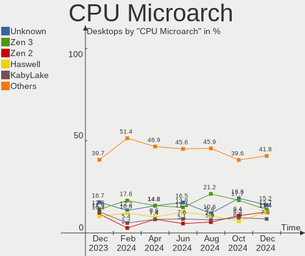

| Name             | Desktops | Percent |
|------------------|----------|---------|
| KabyLake         | 7        | 10.14%  |
| Unknown          | 7        | 10.14%  |
| Zen 2            | 6        | 8.7%    |
| Piledriver       | 6        | 8.7%    |
| Haswell          | 6        | 8.7%    |
| SandyBridge      | 5        | 7.25%   |
| Zen+             | 4        | 5.8%    |
| IvyBridge        | 4        | 5.8%    |
| Zen 3            | 3        | 4.35%   |
| Excavator        | 3        | 4.35%   |
| Alderlake Hybrid | 3        | 4.35%   |
| Zen              | 2        | 2.9%    |
| Silvermont       | 2        | 2.9%    |
| Nehalem          | 2        | 2.9%    |
| Westmere         | 1        | 1.45%   |
| Tremont          | 1        | 1.45%   |
| Skylake          | 1        | 1.45%   |
| K8 Hammer        | 1        | 1.45%   |
| K10              | 1        | 1.45%   |
| IceLake          | 1        | 1.45%   |
| Goldmont         | 1        | 1.45%   |
| CometLake        | 1        | 1.45%   |
| Bonnell          | 1        | 1.45%   |

Graphics
--------

GPU Vendor
----------

Vendors of graphics cards

| Vendor | Desktops | Percent |
|--------|----------|---------|
| Intel  | 29       | 38.67%  |
| Nvidia | 28       | 37.33%  |
| AMD    | 18       | 24%     |

GPU Model
---------

Graphics card models

| Model                                                                                    | Desktops | Percent |
|------------------------------------------------------------------------------------------|----------|---------|
| Intel Xeon E3-1200 v3/4th Gen Core Processor Integrated Graphics Controller              | 4        | 5.26%   |
| Intel 2nd Generation Core Processor Family Integrated Graphics Controller                | 4        | 5.26%   |
| Intel Xeon E3-1200 v2/3rd Gen Core processor Graphics Controller                         | 3        | 3.95%   |
| Intel HD Graphics 630                                                                    | 3        | 3.95%   |
| Intel CoffeeLake-S GT2 [UHD Graphics 630]                                                | 3        | 3.95%   |
| AMD Raphael                                                                              | 3        | 3.95%   |
| Nvidia GM204 [GeForce GTX 970]                                                           | 2        | 2.63%   |
| Nvidia GM107 [GeForce GTX 750 Ti]                                                        | 2        | 2.63%   |
| Nvidia AD103 [GeForce RTX 4080]                                                          | 2        | 2.63%   |
| Intel DG2 [Arc A770]                                                                     | 2        | 2.63%   |
| Intel Atom/Celeron/Pentium Processor x5-E8000/J3xxx/N3xxx Integrated Graphics Controller | 2        | 2.63%   |
| AMD Wani [Radeon R5/R6/R7 Graphics]                                                      | 2        | 2.63%   |
| AMD Navi 31 [Radeon RX 7900 XT/7900 XTX]                                                 | 2        | 2.63%   |
| AMD Ellesmere [Radeon RX 470/480/570/570X/580/580X/590]                                  | 2        | 2.63%   |
| Nvidia TU116 [GeForce GTX 1660 SUPER]                                                    | 1        | 1.32%   |
| Nvidia TU106 [GeForce RTX 2060 SUPER]                                                    | 1        | 1.32%   |
| Nvidia TU104GL [Quadro RTX 4000]                                                         | 1        | 1.32%   |
| Nvidia TU104 [GeForce RTX 2070 SUPER]                                                    | 1        | 1.32%   |
| Nvidia TU102 [GeForce RTX 2080 Ti]                                                       | 1        | 1.32%   |
| Nvidia TU102 [GeForce RTX 2080 Ti Rev. A]                                                | 1        | 1.32%   |
| Nvidia GT218 [GeForce 210]                                                               | 1        | 1.32%   |
| Nvidia GP108 [GeForce GT 1030]                                                           | 1        | 1.32%   |
| Nvidia GP107 [GeForce GTX 1050 Ti]                                                       | 1        | 1.32%   |
| Nvidia GP106 [GeForce GTX 1060 3GB]                                                      | 1        | 1.32%   |
| Nvidia GP104 [GeForce GTX 1070]                                                          | 1        | 1.32%   |
| Nvidia GP102 [GeForce GTX 1080 Ti]                                                       | 1        | 1.32%   |
| Nvidia GM206 [GeForce GTX 960]                                                           | 1        | 1.32%   |
| Nvidia GM206 [GeForce GTX 950]                                                           | 1        | 1.32%   |
| Nvidia GK106 [GeForce GTX 660]                                                           | 1        | 1.32%   |
| Nvidia GK104 [GeForce GTX 760]                                                           | 1        | 1.32%   |
| Nvidia GF114 [GeForce GTX 560 Ti]                                                        | 1        | 1.32%   |
| Nvidia GA106 [GeForce RTX 3060]                                                          | 1        | 1.32%   |
| Nvidia GA106 [Geforce RTX 3050]                                                          | 1        | 1.32%   |
| Nvidia GA104 [GeForce RTX 3060 Ti Lite Hash Rate]                                        | 1        | 1.32%   |
| Nvidia GA102 [GeForce RTX 3080 Lite Hash Rate]                                           | 1        | 1.32%   |
| Nvidia AD102 [GeForce RTX 4090]                                                          | 1        | 1.32%   |
| Intel Raptor Lake-S GT1 [UHD Graphics 770]                                               | 1        | 1.32%   |
| Intel JasperLake [UHD Graphics]                                                          | 1        | 1.32%   |
| Intel Iris Plus Graphics G1 (Ice Lake)                                                   | 1        | 1.32%   |
| Intel HD Graphics 530                                                                    | 1        | 1.32%   |

GPU Combo
---------

Combinations of graphics cards

| Name           | Desktops | Percent |
|----------------|----------|---------|
| 1 x Nvidia     | 24       | 34.78%  |
| 1 x Intel      | 24       | 34.78%  |
| 1 x AMD        | 15       | 21.74%  |
| Intel + Nvidia | 3        | 4.35%   |
| 2 x AMD        | 1        | 1.45%   |
| Intel + AMD    | 1        | 1.45%   |
| AMD + Nvidia   | 1        | 1.45%   |

GPU Driver
----------

Free vs proprietary

| Driver      | Desktops | Percent |
|-------------|----------|---------|
| Free        | 44       | 63.77%  |
| Proprietary | 19       | 27.54%  |
| Unknown     | 6        | 8.7%    |

GPU Memory
----------

Total video memory

| Size in GB | Desktops | Percent |
|------------|----------|---------|
| Unknown    | 39       | 56.52%  |
| 7.01-8.0   | 7        | 10.14%  |
| 1.01-2.0   | 7        | 10.14%  |
| 8.01-16.0  | 6        | 8.7%    |
| 0.01-0.5   | 4        | 5.8%    |
| 3.01-4.0   | 3        | 4.35%   |
| 0.51-1.0   | 2        | 2.9%    |
| 16.01-24.0 | 1        | 1.45%   |

Monitor
-------

Monitor Vendor
--------------

Monitor vendors

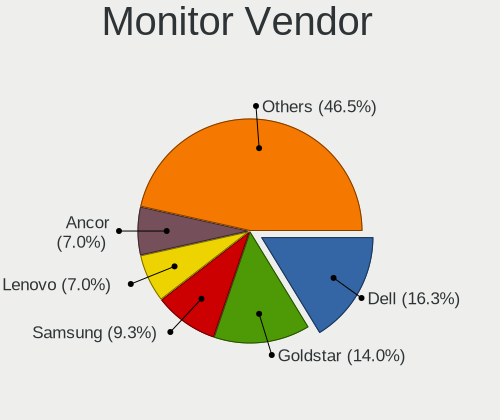

| Vendor               | Desktops | Percent |
|----------------------|----------|---------|
| Dell                 | 7        | 10.77%  |
| BenQ                 | 7        | 10.77%  |
| AOC                  | 7        | 10.77%  |
| Ancor Communications | 6        | 9.23%   |
| Samsung Electronics  | 5        | 7.69%   |
| Acer                 | 5        | 7.69%   |
| Iiyama               | 3        | 4.62%   |
| Hewlett-Packard      | 3        | 4.62%   |
| ASUSTek Computer     | 3        | 4.62%   |
| Unknown              | 2        | 3.08%   |
| Medion               | 2        | 3.08%   |
| ViewSonic            | 1        | 1.54%   |
| Valve                | 1        | 1.54%   |
| Toshiba              | 1        | 1.54%   |
| Philips              | 1        | 1.54%   |
| Panasonic            | 1        | 1.54%   |
| NEC Computers        | 1        | 1.54%   |
| Lenovo               | 1        | 1.54%   |
| IBM                  | 1        | 1.54%   |
| HannStar Display     | 1        | 1.54%   |
| HannStar             | 1        | 1.54%   |
| Goldstar             | 1        | 1.54%   |
| Gigabyte Technology  | 1        | 1.54%   |
| Eizo                 | 1        | 1.54%   |
| Daewoo               | 1        | 1.54%   |
| Unknown              | 1        | 1.54%   |

Monitor Model
-------------

Monitor models

| Model                                                                  | Desktops | Percent |
|------------------------------------------------------------------------|----------|---------|
| Ancor Communications ASUS VS229 ACI22C2 1920x1080 477x268mm 21.5-inch  | 2        | 3.08%   |
| Ancor Communications ASUS PB287Q ACI28A3 3840x2160 621x341mm 27.9-inch | 2        | 3.08%   |
| ViewSonic VX3276-FHD VSCE735 1920x1080 698x393mm 31.5-inch             | 1        | 1.54%   |
| Valve LCD Monitor VLV91A8                                              | 1        | 1.54%   |
| Unknown LCD Monitor XXX AAA 1920x1080                                  | 1        | 1.54%   |
| Unknown LCD Monitor OOO LED MONITOR 2560x1440                          | 1        | 1.54%   |
| Toshiba LCD-MONITOR LCDE780 1280x1024 340x270mm 17.1-inch              | 1        | 1.54%   |
| Samsung Electronics T24D390 SAM0B6E 1920x1080 521x293mm 23.5-inch      | 1        | 1.54%   |
| Samsung Electronics SMB2430H SAM064D 1920x1080 531x299mm 24.0-inch     | 1        | 1.54%   |
| Samsung Electronics LCD Monitor SM320MX3 1366x768                      | 1        | 1.54%   |
| Samsung Electronics LC27G7xT SAM105C 2560x1440 597x336mm 27.0-inch     | 1        | 1.54%   |
| Samsung Electronics C49RG9x SAM0F9C 3840x1080 1193x336mm 48.8-inch     | 1        | 1.54%   |
| Philips FTV PHL04C3 1920x1080 1440x810mm 65.0-inch                     | 1        | 1.54%   |
| Panasonic TV MEIA296 3840x2160 1872x1053mm 84.6-inch                   | 1        | 1.54%   |
| NEC Computers 90GX2 NEC6692 1280x1024 376x301mm 19.0-inch              | 1        | 1.54%   |
| Medion MD30919PO C12 MED89AC 1280x1024 376x301mm 19.0-inch             | 1        | 1.54%   |
| Medion MD30919PO C12 MED8917 1280x1024 376x301mm 19.0-inch             | 1        | 1.54%   |
| Lenovo L1940p Wide LEN1148 1440x900 410x257mm 19.1-inch                | 1        | 1.54%   |
| Iiyama PL2530H IVM6133 1920x1080 544x303mm 24.5-inch                   | 1        | 1.54%   |
| Iiyama PL2530H IVM6132 1920x1080 544x303mm 24.5-inch                   | 1        | 1.54%   |
| Iiyama PL2483H IVM6138 1920x1080 531x299mm 24.0-inch                   | 1        | 1.54%   |
| IBM E74 IBM18BC 1280x1024 306x230mm 15.1-inch                          | 1        | 1.54%   |
| Hewlett-Packard w2408 HWP26CF 1920x1200 518x324mm 24.1-inch            | 1        | 1.54%   |
| Hewlett-Packard LA1951 HWP285B 1280x1024 380x300mm 19.1-inch           | 1        | 1.54%   |
| Hewlett-Packard E232 HWP327A 1920x1080 509x286mm 23.0-inch             | 1        | 1.54%   |
| HannStar HH281 HSD20E5 1920x1200 593x371mm 27.5-inch                   | 1        | 1.54%   |
| HannStar Display LCD Monitor HH281 3840x1200                           | 1        | 1.54%   |
| Goldstar M2280D GSM57B9 1920x1080 598x336mm 27.0-inch                  | 1        | 1.54%   |
| Gigabyte Technology M28U GBT2800 3840x2160 697x392mm 31.5-inch         | 1        | 1.54%   |
| Eizo EV2336W ENC2392 1920x1080 510x287mm 23.0-inch                     | 1        | 1.54%   |
| Dell U2713HM DEL407E 2560x1440 597x336mm 27.0-inch                     | 1        | 1.54%   |
| Dell S3221QS DELD107 3840x2160 697x392mm 31.5-inch                     | 1        | 1.54%   |
| Dell P2212H DELA07F 1920x1080 531x299mm 24.0-inch                      | 1        | 1.54%   |
| Dell OptiPlex 9030 DEL93E8 1920x1080 510x287mm 23.0-inch               | 1        | 1.54%   |
| Dell E2311H DELF034 1920x1080 510x287mm 23.0-inch                      | 1        | 1.54%   |
| Dell E193FP DEL700E 1280x1024 338x270mm 17.0-inch                      | 1        | 1.54%   |
| Dell AW3821DW DELA17F 3840x1600 880x367mm 37.5-inch                    | 1        | 1.54%   |
| Daewoo 21.5 monitor DWE0215 1920x1080 476x268mm 21.5-inch              | 1        | 1.54%   |
| BenQ LCD Monitor PD3200U 5760x2160                                     | 1        | 1.54%   |
| BenQ LCD Monitor EL2870U 3840x2160                                     | 1        | 1.54%   |

Monitor Resolution
------------------

Monitor screen resolution

| Resolution        | Desktops | Percent |
|-------------------|----------|---------|
| 1920x1080 (FHD)   | 24       | 37.5%   |
| 3840x2160 (4K)    | 11       | 17.19%  |
| 2560x1440 (QHD)   | 8        | 12.5%   |
| 1280x1024 (SXGA)  | 6        | 9.38%   |
| Unknown           | 4        | 6.25%   |
| 1920x1200 (WUXGA) | 2        | 3.13%   |
| 1366x768 (WXGA)   | 2        | 3.13%   |
| 5760x2160         | 1        | 1.56%   |
| 3840x1600         | 1        | 1.56%   |
| 3840x1200         | 1        | 1.56%   |
| 3840x1080         | 1        | 1.56%   |
| 3200x1080         | 1        | 1.56%   |
| 1440x900 (WXGA+)  | 1        | 1.56%   |
| 1280x960          | 1        | 1.56%   |

Monitor Diagonal
----------------

Diagonal size in inches

| Inches  | Desktops | Percent |
|---------|----------|---------|
| 27      | 13       | 20.63%  |
| Unknown | 10       | 15.87%  |
| 24      | 9        | 14.29%  |
| 19      | 7        | 11.11%  |
| 21      | 6        | 9.52%   |
| 31      | 5        | 7.94%   |
| 23      | 5        | 7.94%   |
| 84      | 1        | 1.59%   |
| 65      | 1        | 1.59%   |
| 48      | 1        | 1.59%   |
| 37      | 1        | 1.59%   |
| 33      | 1        | 1.59%   |
| 18      | 1        | 1.59%   |
| 17      | 1        | 1.59%   |
| 15      | 1        | 1.59%   |

Monitor Width
-------------

Physical width

| Width in mm | Desktops | Percent |
|-------------|----------|---------|
| 501-600     | 20       | 32.26%  |
| 601-700     | 11       | 17.74%  |
| Unknown     | 10       | 16.13%  |
| 401-500     | 7        | 11.29%  |
| 351-400     | 7        | 11.29%  |
| 301-350     | 2        | 3.23%   |
| 1001-1500   | 2        | 3.23%   |
| 801-900     | 1        | 1.61%   |
| 701-800     | 1        | 1.61%   |
| 1501-2000   | 1        | 1.61%   |

Aspect Ratio
------------

Proportional relationship between the width and the height

| Ratio   | Desktops | Percent |
|---------|----------|---------|
| 16/9    | 36       | 60%     |
| Unknown | 10       | 16.67%  |
| 5/4     | 6        | 10%     |
| 16/10   | 5        | 8.33%   |
| 4/3     | 1        | 1.67%   |
| 32/9    | 1        | 1.67%   |
| 21/9    | 1        | 1.67%   |

Monitor Area
------------

Area in inch

| Area in inch | Desktops | Percent |
|----------------|----------|---------|
| 201-250        | 14       | 22.22%  |
| 301-350        | 13       | 20.63%  |
| 151-200        | 10       | 15.87%  |
| Unknown        | 10       | 15.87%  |
| 351-500        | 6        | 9.52%   |
| 251-300        | 4        | 6.35%   |
| More than 1000 | 2        | 3.17%   |
| 501-1000       | 2        | 3.17%   |
| 141-150        | 1        | 1.59%   |
| 101-110        | 1        | 1.59%   |

Pixel Density
-------------

Pixels per inch

| Density | Desktops | Percent |
|---------|----------|---------|
| 51-100  | 30       | 50%     |
| 101-120 | 11       | 18.33%  |
| Unknown | 10       | 16.67%  |
| 121-160 | 8        | 13.33%  |
| 1-50    | 1        | 1.67%   |

Multiple Monitors
-----------------

Total monitors connected

| Total | Desktops | Percent |
|-------|----------|---------|
| 1     | 55       | 79.71%  |
| 2     | 7        | 10.14%  |
| 0     | 6        | 8.7%    |
| 3     | 1        | 1.45%   |

Network
-------

Net Controller Vendor
---------------------

Controller vendors

| Vendor                | Desktops | Percent |
|-----------------------|----------|---------|
| Realtek Semiconductor | 43       | 44.79%  |
| Intel                 | 31       | 32.29%  |
| Ralink Technology     | 3        | 3.13%   |
| Qualcomm Atheros      | 3        | 3.13%   |
| Aquantia              | 3        | 3.13%   |
| TP-Link               | 2        | 2.08%   |
| Ralink                | 2        | 2.08%   |
| MediaTek              | 2        | 2.08%   |
| Broadcom              | 2        | 2.08%   |
| Nvidia                | 1        | 1.04%   |
| D-Link                | 1        | 1.04%   |
| Broadcom Limited      | 1        | 1.04%   |
| Belkin Components     | 1        | 1.04%   |
| Atmel                 | 1        | 1.04%   |

Net Controller Model
--------------------

Controller models

| Model                                                             | Desktops | Percent |
|-------------------------------------------------------------------|----------|---------|
| Realtek RTL8111/8168/8411 PCI Express Gigabit Ethernet Controller | 35       | 29.91%  |
| Intel I211 Gigabit Network Connection                             | 8        | 6.84%   |
| Intel Ethernet Controller I225-V                                  | 6        | 5.13%   |
| Realtek RTL8125 2.5GbE Controller                                 | 5        | 4.27%   |
| Intel Wi-Fi 6 AX210/AX211/AX411 160MHz                            | 3        | 2.56%   |
| Intel 82579LM Gigabit Network Connection (Lewisville)             | 3        | 2.56%   |
| Realtek RTL88x2bu [AC1200 Techkey]                                | 2        | 1.71%   |
| Realtek RTL8821CE 802.11ac PCIe Wireless Network Adapter          | 2        | 1.71%   |
| Realtek RTL8821AE 802.11ac PCIe Wireless Network Adapter          | 2        | 1.71%   |
| MediaTek MT7922 802.11ax PCI Express Wireless Network Adapter     | 2        | 1.71%   |
| Intel WLAN controller                                             | 2        | 1.71%   |
| Intel Wireless 8265 / 8275                                        | 2        | 1.71%   |
| Intel Wireless 3165                                               | 2        | 1.71%   |
| Intel Wi-Fi 6 AX200                                               | 2        | 1.71%   |
| Intel Ethernet Connection (7) I219-V                              | 2        | 1.71%   |
| Intel Cannon Lake PCH CNVi WiFi                                   | 2        | 1.71%   |
| Broadcom NetXtreme BCM5761 Gigabit Ethernet PCIe                  | 2        | 1.71%   |
| TP-Link TL-WN822N Version 4 RTL8192EU                             | 1        | 0.85%   |
| TP-Link 802.11ac NIC                                              | 1        | 0.85%   |
| Realtek RTL8192EU 802.11b/g/n WLAN Adapter                        | 1        | 0.85%   |
| Realtek RTL8188EUS 802.11n Wireless Network Adapter               | 1        | 0.85%   |
| Realtek RTL8169 PCI Gigabit Ethernet Controller                   | 1        | 0.85%   |
| Realtek 802.11ac NIC                                              | 1        | 0.85%   |
| Ralink RT5572 Wireless Adapter                                    | 1        | 0.85%   |
| Ralink RT5370 Wireless Adapter                                    | 1        | 0.85%   |
| Ralink RT2870/RT3070 Wireless Adapter                             | 1        | 0.85%   |
| Ralink RT3062 Wireless 802.11n 2T/2R                              | 1        | 0.85%   |
| Ralink RT2800 802.11n PCI                                         | 1        | 0.85%   |
| Qualcomm Atheros Killer E220x Gigabit Ethernet Controller         | 1        | 0.85%   |
| Qualcomm Atheros AR9485 Wireless Network Adapter                  | 1        | 0.85%   |
| Qualcomm Atheros AR9227 Wireless Network Adapter                  | 1        | 0.85%   |
| Nvidia MCP61 Ethernet                                             | 1        | 0.85%   |
| Intel Wireless-AC 9260                                            | 1        | 0.85%   |
| Intel Wireless Gigabit 17265                                      | 1        | 0.85%   |
| Intel Tiger Lake PCH CNVi WiFi                                    | 1        | 0.85%   |
| Intel Ice Lake-LP PCH CNVi WiFi                                   | 1        | 0.85%   |
| Intel Ethernet Controller I226-V                                  | 1        | 0.85%   |
| Intel Ethernet Connection I217-LM                                 | 1        | 0.85%   |
| Intel Ethernet Connection (7) I219-LM                             | 1        | 0.85%   |
| Intel Ethernet Connection (5) I219-LM                             | 1        | 0.85%   |

Wireless Vendor
---------------

Wireless vendors

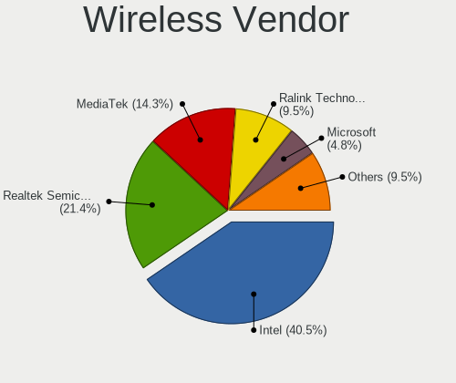

| Vendor                | Desktops | Percent |
|-----------------------|----------|---------|
| Intel                 | 18       | 46.15%  |
| Realtek Semiconductor | 8        | 20.51%  |
| Ralink Technology     | 3        | 7.69%   |
| TP-Link               | 2        | 5.13%   |
| Ralink                | 2        | 5.13%   |
| Qualcomm Atheros      | 2        | 5.13%   |
| MediaTek              | 2        | 5.13%   |
| D-Link                | 1        | 2.56%   |
| Belkin Components     | 1        | 2.56%   |

Wireless Model
--------------

Wireless models

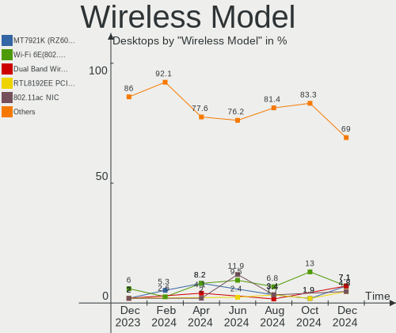

| Model                                                               | Desktops | Percent |
|---------------------------------------------------------------------|----------|---------|
| Intel Wi-Fi 6 AX210/AX211/AX411 160MHz                              | 3        | 7.5%    |
| Realtek RTL88x2bu [AC1200 Techkey]                                  | 2        | 5%      |
| Realtek RTL8821CE 802.11ac PCIe Wireless Network Adapter            | 2        | 5%      |
| Realtek RTL8821AE 802.11ac PCIe Wireless Network Adapter            | 2        | 5%      |
| MediaTek MT7922 802.11ax PCI Express Wireless Network Adapter       | 2        | 5%      |
| Intel WLAN controller                                               | 2        | 5%      |
| Intel Wireless 8265 / 8275                                          | 2        | 5%      |
| Intel Wireless 3165                                                 | 2        | 5%      |
| Intel Wi-Fi 6 AX200                                                 | 2        | 5%      |
| Intel Cannon Lake PCH CNVi WiFi                                     | 2        | 5%      |
| TP-Link TL-WN822N Version 4 RTL8192EU                               | 1        | 2.5%    |
| TP-Link 802.11ac NIC                                                | 1        | 2.5%    |
| Realtek RTL8192EU 802.11b/g/n WLAN Adapter                          | 1        | 2.5%    |
| Realtek RTL8188EUS 802.11n Wireless Network Adapter                 | 1        | 2.5%    |
| Realtek 802.11ac NIC                                                | 1        | 2.5%    |
| Ralink RT5572 Wireless Adapter                                      | 1        | 2.5%    |
| Ralink RT5370 Wireless Adapter                                      | 1        | 2.5%    |
| Ralink RT2870/RT3070 Wireless Adapter                               | 1        | 2.5%    |
| Ralink RT3062 Wireless 802.11n 2T/2R                                | 1        | 2.5%    |
| Ralink RT2800 802.11n PCI                                           | 1        | 2.5%    |
| Qualcomm Atheros AR9485 Wireless Network Adapter                    | 1        | 2.5%    |
| Qualcomm Atheros AR9227 Wireless Network Adapter                    | 1        | 2.5%    |
| Intel Wireless-AC 9260                                              | 1        | 2.5%    |
| Intel Wireless Gigabit 17265                                        | 1        | 2.5%    |
| Intel Tiger Lake PCH CNVi WiFi                                      | 1        | 2.5%    |
| Intel Ice Lake-LP PCH CNVi WiFi                                     | 1        | 2.5%    |
| Intel Alder Lake-S PCH CNVi WiFi                                    | 1        | 2.5%    |
| D-Link 802.11ac WLAN Adapter                                        | 1        | 2.5%    |
| Belkin Components F5D7050 Wireless G Adapter v3000 [Ralink RT2571W] | 1        | 2.5%    |

Ethernet Vendor
---------------

Ethernet vendors

| Vendor                | Desktops | Percent |
|-----------------------|----------|---------|
| Realtek Semiconductor | 41       | 55.41%  |
| Intel                 | 25       | 33.78%  |
| Aquantia              | 3        | 4.05%   |
| Broadcom              | 2        | 2.7%    |
| Qualcomm Atheros      | 1        | 1.35%   |
| Nvidia                | 1        | 1.35%   |
| Broadcom Limited      | 1        | 1.35%   |

Ethernet Model
--------------

Ethernet models

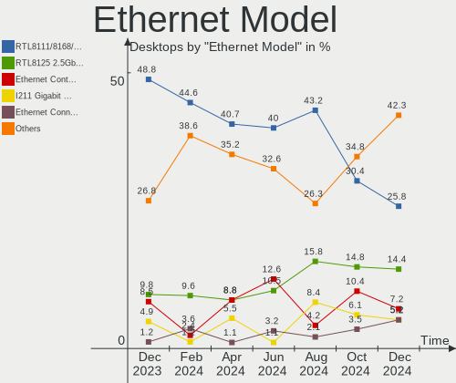

| Model                                                               | Desktops | Percent |
|---------------------------------------------------------------------|----------|---------|
| Realtek RTL8111/8168/8411 PCI Express Gigabit Ethernet Controller   | 35       | 46.05%  |
| Intel I211 Gigabit Network Connection                               | 8        | 10.53%  |
| Intel Ethernet Controller I225-V                                    | 6        | 7.89%   |
| Realtek RTL8125 2.5GbE Controller                                   | 5        | 6.58%   |
| Intel 82579LM Gigabit Network Connection (Lewisville)               | 3        | 3.95%   |
| Intel Ethernet Connection (7) I219-V                                | 2        | 2.63%   |
| Broadcom NetXtreme BCM5761 Gigabit Ethernet PCIe                    | 2        | 2.63%   |
| Realtek RTL8169 PCI Gigabit Ethernet Controller                     | 1        | 1.32%   |
| Qualcomm Atheros Killer E220x Gigabit Ethernet Controller           | 1        | 1.32%   |
| Nvidia MCP61 Ethernet                                               | 1        | 1.32%   |
| Intel Ethernet Controller I226-V                                    | 1        | 1.32%   |
| Intel Ethernet Connection I217-LM                                   | 1        | 1.32%   |
| Intel Ethernet Connection (7) I219-LM                               | 1        | 1.32%   |
| Intel Ethernet Connection (5) I219-LM                               | 1        | 1.32%   |
| Intel Ethernet Connection (2) I219-V                                | 1        | 1.32%   |
| Intel Ethernet Connection (2) I218-V                                | 1        | 1.32%   |
| Intel 82578DC Gigabit Network Connection                            | 1        | 1.32%   |
| Broadcom NetXtreme BCM5721 Gigabit Ethernet PCI Express             | 1        | 1.32%   |
| Broadcom Limited NetLink BCM57788 Gigabit Ethernet PCIe             | 1        | 1.32%   |
| Aquantia AQC113CS NBase-T/IEEE 802.3bz Ethernet Controller [AQtion] | 1        | 1.32%   |
| Aquantia AQC107 NBase-T/IEEE 802.3bz Ethernet Controller [AQtion]   | 1        | 1.32%   |
| Aquantia AQC100 10G Ethernet MAC controller [AQtion]                | 1        | 1.32%   |

Net Controller Kind
-------------------

Ethernet, WiFi or modem

| Kind     | Desktops | Percent |
|----------|----------|---------|
| Ethernet | 69       | 64.49%  |
| WiFi     | 37       | 34.58%  |
| Modem    | 1        | 0.93%   |

Used Controller
---------------

Currently used network controller

| Kind     | Desktops | Percent |
|----------|----------|---------|
| Ethernet | 57       | 80.28%  |
| WiFi     | 14       | 19.72%  |

NICs
----

Total network controllers on board

| Total | Desktops | Percent |
|-------|----------|---------|
| 1     | 38       | 55.07%  |
| 2     | 24       | 34.78%  |
| 3     | 7        | 10.14%  |

IPv6
----

IPv6 vs IPv4

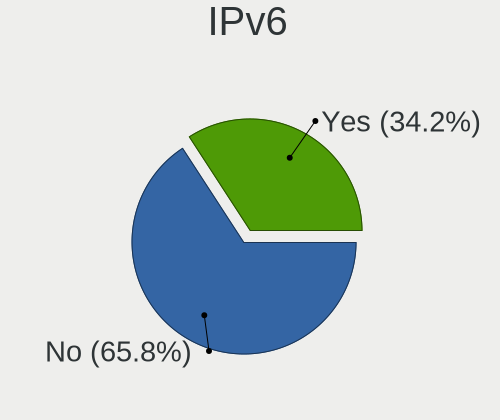

| Used | Desktops | Percent |
|------|----------|---------|
| No   | 55       | 79.71%  |
| Yes  | 14       | 20.29%  |

Bluetooth
---------

Bluetooth Vendor
----------------

Controller vendors

| Vendor                  | Desktops | Percent |
|-------------------------|----------|---------|
| Intel                   | 16       | 51.61%  |
| Cambridge Silicon Radio | 7        | 22.58%  |
| Realtek Semiconductor   | 4        | 12.9%   |
| MediaTek                | 1        | 3.23%   |
| Logitech                | 1        | 3.23%   |
| Foxconn / Hon Hai       | 1        | 3.23%   |
| Broadcom                | 1        | 3.23%   |

Bluetooth Model
---------------

Controller models

| Model                                               | Desktops | Percent |
|-----------------------------------------------------|----------|---------|
| Cambridge Silicon Radio Bluetooth Dongle (HCI mode) | 7        | 22.58%  |
| Intel Bluetooth wireless interface                  | 4        | 12.9%   |
| Realtek Bluetooth Radio                             | 3        | 9.68%   |
| Intel AX210 Bluetooth                               | 3        | 9.68%   |
| Intel AX201 Bluetooth                               | 3        | 9.68%   |
| Intel Bluetooth Device                              | 2        | 6.45%   |
| Intel AX200 Bluetooth                               | 2        | 6.45%   |
| Realtek RTL8821A Bluetooth                          | 1        | 3.23%   |
| MediaTek Wireless_Device                            | 1        | 3.23%   |
| Logitech BT Mini-Receiver (HCI mode)                | 1        | 3.23%   |
| Intel Wireless-AC 9260 Bluetooth Adapter            | 1        | 3.23%   |
| Intel Bluetooth 9460/9560 Jefferson Peak (JfP)      | 1        | 3.23%   |
| Foxconn / Hon Hai Wireless_Device                   | 1        | 3.23%   |
| Broadcom BCM20702A0 Bluetooth 4.0                   | 1        | 3.23%   |

Sound
-----

Sound Vendor
------------

Sound card vendors

| Vendor                   | Desktops | Percent |
|--------------------------|----------|---------|
| Intel                    | 38       | 31.93%  |
| AMD                      | 35       | 29.41%  |
| Nvidia                   | 29       | 24.37%  |
| ASUSTek Computer         | 3        | 2.52%   |
| Micro Star International | 2        | 1.68%   |
| Logitech                 | 2        | 1.68%   |
| Creative Labs            | 2        | 1.68%   |
| C-Media Electronics      | 2        | 1.68%   |
| Valve Software           | 1        | 0.84%   |
| ROCCAT                   | 1        | 0.84%   |
| Hewlett-Packard          | 1        | 0.84%   |
| Corsair                  | 1        | 0.84%   |
| Blue Microphones         | 1        | 0.84%   |
| BEHRINGER International  | 1        | 0.84%   |

Sound Model
-----------

Sound card models

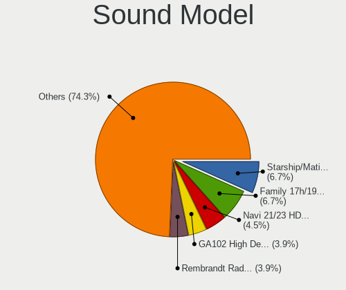

| Model                                                                      | Desktops | Percent |
|----------------------------------------------------------------------------|----------|---------|
| AMD Starship/Matisse HD Audio Controller                                   | 7        | 5.07%   |
| AMD SBx00 Azalia (Intel HDA)                                               | 7        | 5.07%   |
| Intel 6 Series/C200 Series Chipset Family High Definition Audio Controller | 6        | 4.35%   |
| AMD Family 17h (Models 00h-0fh) HD Audio Controller                        | 6        | 4.35%   |
| Intel Xeon E3-1200 v3/4th Gen Core Processor HD Audio Controller           | 5        | 3.62%   |
| Intel 200 Series PCH HD Audio                                              | 5        | 3.62%   |
| Intel 8 Series/C220 Series Chipset High Definition Audio Controller        | 4        | 2.9%    |
| AMD Family 17h/19h HD Audio Controller                                     | 4        | 2.9%    |
| Intel Cannon Lake PCH cAVS                                                 | 3        | 2.17%   |
| Intel Alder Lake-S HD Audio Controller                                     | 3        | 2.17%   |
| Intel 7 Series/C216 Chipset Family High Definition Audio Controller        | 3        | 2.17%   |
| AMD Rembrandt Radeon High Definition Audio Controller                      | 3        | 2.17%   |
| AMD Family 15h (Models 60h-6fh) Audio Controller                           | 3        | 2.17%   |
| Nvidia TU104 HD Audio Controller                                           | 2        | 1.45%   |
| Nvidia TU102 High Definition Audio Controller                              | 2        | 1.45%   |
| Nvidia GM206 High Definition Audio Controller                              | 2        | 1.45%   |
| Nvidia GM204 High Definition Audio Controller                              | 2        | 1.45%   |
| Nvidia GM107 High Definition Audio Controller [GeForce 940MX]              | 2        | 1.45%   |
| Nvidia GA106 High Definition Audio Controller                              | 2        | 1.45%   |
| Nvidia Audio device                                                        | 2        | 1.45%   |
| Micro Star International USB Audio                                         | 2        | 1.45%   |
| Intel Audio device                                                         | 2        | 1.45%   |
| Intel 9 Series Chipset Family HD Audio Controller                          | 2        | 1.45%   |
| Intel 82801JI (ICH10 Family) HD Audio Controller                           | 2        | 1.45%   |
| C-Media Electronics Audio Adapter (Unitek Y-247A)                          | 2        | 1.45%   |
| ASUSTek Computer USB Audio                                                 | 2        | 1.45%   |
| AMD Renoir Radeon High Definition Audio Controller                         | 2        | 1.45%   |
| AMD Kabini HDMI/DP Audio                                                   | 2        | 1.45%   |
| AMD Ellesmere HDMI Audio [Radeon RX 470/480 / 570/580/590]                 | 2        | 1.45%   |
| AMD Barts HDMI Audio [Radeon HD 6790/6850/6870 / 7720 OEM]                 | 2        | 1.45%   |
| AMD Audio device                                                           | 2        | 1.45%   |
| Valve Software Valve VR Radio & HMD Mic                                    | 1        | 0.72%   |
| ROCCAT Elo 7.1 Air                                                         | 1        | 0.72%   |
| Nvidia TU116 High Definition Audio Controller                              | 1        | 0.72%   |
| Nvidia TU106 High Definition Audio Controller                              | 1        | 0.72%   |
| Nvidia MCP61 High Definition Audio                                         | 1        | 0.72%   |
| Nvidia High Definition Audio Controller                                    | 1        | 0.72%   |
| Nvidia GP108 High Definition Audio Controller                              | 1        | 0.72%   |
| Nvidia GP107GL High Definition Audio Controller                            | 1        | 0.72%   |
| Nvidia GP106 High Definition Audio Controller                              | 1        | 0.72%   |

Memory
------

Memory Vendor
-------------

Memory module vendors

| Vendor              | Desktops | Percent |
|---------------------|----------|---------|
| Corsair             | 11       | 27.5%   |
| Kingston            | 8        | 20%     |
| SK hynix            | 7        | 17.5%   |
| Crucial             | 5        | 12.5%   |
| Unknown             | 3        | 7.5%    |
| A-DATA Technology   | 3        | 7.5%    |
| Samsung Electronics | 1        | 2.5%    |
| Micron Technology   | 1        | 2.5%    |
| G.Skill             | 1        | 2.5%    |

Memory Model
------------

Memory module models

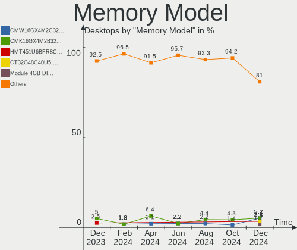

| Model                                                     | Desktops | Percent |
|-----------------------------------------------------------|----------|---------|
| Kingston RAM KHX1600C9D3/4GX 4GB DIMM DDR3 1600MT/s       | 2        | 4.55%   |
| Corsair RAM CMK16GX4M2B3200C16 8GB DIMM DDR4 3600MT/s     | 2        | 4.55%   |
| Unknown RAM Module 2GB DIMM DDR3 800MT/s                  | 1        | 2.27%   |
| Unknown RAM Module 2GB DIMM 800MT/s                       | 1        | 2.27%   |
| Unknown RAM DDR4 NB 16G 2666 16384MB SODIMM DDR4 2667MT/s | 1        | 2.27%   |
| SK hynix RAM Module 2GB DIMM DDR3 1066MT/s                | 1        | 2.27%   |
| SK hynix RAM HMT451U6AFR8C-PB 4096MB DIMM DDR3 1600MT/s   | 1        | 2.27%   |
| SK hynix RAM HMT425S6CFR6A-PB 2048MB SODIMM DDR3 1600MT/s | 1        | 2.27%   |
| SK hynix RAM HMT41GU7AFR8A-PB 8GB DIMM DDR3 1600MT/s      | 1        | 2.27%   |
| SK hynix RAM HMA82GS6JJR8N-VK 16GB SODIMM DDR4 2667MT/s   | 1        | 2.27%   |
| SK hynix RAM HMA81GU6CJR8N-VK 8GB DIMM DDR4 2400MT/s      | 1        | 2.27%   |
| SK hynix RAM HMA81GU6AFR8N-UH 8GB DIMM DDR4 2400MT/s      | 1        | 2.27%   |
| Samsung RAM M378B5273EBO-YKO 4GB DIMM DDR3 1333MT/s       | 1        | 2.27%   |
| Micron RAM 8JTF51264AZ-1G6E1 4GB DIMM DDR3 1600MT/s       | 1        | 2.27%   |
| Kingston RAM KHX3200C16D4/16GX 16GB DIMM DDR4 3600MT/s    | 1        | 2.27%   |
| Kingston RAM KF560C36-16 16GB DIMM DDR5 6000MT/s          | 1        | 2.27%   |
| Kingston RAM KF552C40-16 16GB DIMM DDR5 5200MT/s          | 1        | 2.27%   |
| Kingston RAM HP26D4U9S8ME-8X 8GB DIMM DDR4 2667MT/s       | 1        | 2.27%   |
| Kingston RAM 99U5471-034.A00LF 4GB DIMM DDR3 1600MT/s     | 1        | 2.27%   |
| Kingston RAM 99U5403-036.A00LF 4GB DIMM DDR3 1600MT/s     | 1        | 2.27%   |
| Kingston RAM 9905713-008.A00G 4GB DIMM DDR4 2400MT/s      | 1        | 2.27%   |
| G.Skill RAM F4-3000C16-8GTZR 8GB DIMM DDR4 3200MT/s       | 1        | 2.27%   |
| Crucial RAM CT8G4SFS832A.M8FE 8GB SODIMM DDR4 3200MT/s    | 1        | 2.27%   |
| Crucial RAM CT8G4SFRA266.C8FE 8GB SODIMM DDR4 2667MT/s    | 1        | 2.27%   |
| Crucial RAM CT8G4DFS824A.C8FJ 8GB DIMM DDR4 2667MT/s      | 1        | 2.27%   |
| Crucial RAM CT51264BA160B.C16F 4GB DIMM DDR3 1600MT/s     | 1        | 2.27%   |
| Crucial RAM BLS8G3D1609ES2LX0. 8GB DIMM DDR3 1600MT/s     | 1        | 2.27%   |
| Corsair RAM CMY16GX3M2A1866C9 8GB DIMM DDR3 2400MT/s      | 1        | 2.27%   |
| Corsair RAM CMW16GX4M2C3200C16 8GB DIMM DDR4 3733MT/s     | 1        | 2.27%   |
| Corsair RAM CMT32GX5M2B5200Z40 16GB DIMM DDR5 5200MT/s    | 1        | 2.27%   |
| Corsair RAM CMK8GX4M1A2666C16 8GB DIMM DDR4 3000MT/s      | 1        | 2.27%   |
| Corsair RAM CMK8GX4M1A2400C16 8GB DIMM DDR4 2800MT/s      | 1        | 2.27%   |
| Corsair RAM CMK64GX5M2B5600C40 32GB DIMM DDR5 4800MT/s    | 1        | 2.27%   |
| Corsair RAM CMK32GX5M2D6000Z36 16GB DIMM DDR5 6000MT/s    | 1        | 2.27%   |
| Corsair RAM CMK32GX4M2C3000C16 16GB DIMM DDR4 2133MT/s    | 1        | 2.27%   |
| Corsair RAM CMK16GX4M2C3000C16 8GB DIMM DDR4 3000MT/s     | 1        | 2.27%   |
| Corsair RAM CMK16GX4M2B3000C15 8GB DIMM DDR4 3200MT/s     | 1        | 2.27%   |
| Corsair RAM CMK16GX4M2A2666C16 8GB DIMM DDR4 3400MT/s     | 1        | 2.27%   |
| Corsair RAM CMHX16GD3600C18H4D 16GB DIMM DDR4 3600MT/s    | 1        | 2.27%   |
| A-DATA RAM Module 8GB DIMM DDR4 2667MT/s                  | 1        | 2.27%   |

Memory Kind
-----------

Memory module kinds

| Kind    | Desktops | Percent |
|---------|----------|---------|
| DDR4    | 18       | 51.43%  |
| DDR3    | 11       | 31.43%  |
| DDR5    | 5        | 14.29%  |
| Unknown | 1        | 2.86%   |

Memory Form Factor
------------------

Physical design of the memory module

| Name   | Desktops | Percent |
|--------|----------|---------|
| DIMM   | 30       | 85.71%  |
| SODIMM | 5        | 14.29%  |

Memory Size
-----------

Memory module size

| Size  | Desktops | Percent |
|-------|----------|---------|
| 8192  | 14       | 40%     |
| 16384 | 10       | 28.57%  |
| 4096  | 6        | 17.14%  |
| 2048  | 4        | 11.43%  |
| 32768 | 1        | 2.86%   |

Memory Speed
------------

Memory module speed

| Speed | Desktops | Percent |
|-------|----------|---------|
| 2667  | 7        | 16.67%  |
| 2400  | 6        | 14.29%  |
| 1600  | 6        | 14.29%  |
| 3600  | 4        | 9.52%   |
| 6000  | 2        | 4.76%   |
| 5200  | 2        | 4.76%   |
| 3200  | 2        | 4.76%   |
| 3000  | 2        | 4.76%   |
| 800   | 2        | 4.76%   |
| 4800  | 1        | 2.38%   |
| 3733  | 1        | 2.38%   |
| 3466  | 1        | 2.38%   |
| 3400  | 1        | 2.38%   |
| 2800  | 1        | 2.38%   |
| 2666  | 1        | 2.38%   |
| 2133  | 1        | 2.38%   |
| 1333  | 1        | 2.38%   |
| 1066  | 1        | 2.38%   |

Printers & scanners
-------------------

Printer Vendor
--------------

Printer device vendors

| Vendor          | Desktops | Percent |
|-----------------|----------|---------|
| Hewlett-Packard | 2        | 100%    |

Printer Model
-------------

Printer device models

| Model                    | Desktops | Percent |
|--------------------------|----------|---------|
| HP LaserJet P2015 series | 1        | 50%     |
| HP ENVY 4520 series      | 1        | 50%     |

Scanner Vendor
--------------

Scanner device vendors

| Vendor | Desktops | Percent |
|--------|----------|---------|
| Canon  | 1        | 100%    |

Scanner Model
-------------

Scanner device models

| Model                   | Desktops | Percent |
|-------------------------|----------|---------|
| Canon CanoScan LiDE 200 | 1        | 100%    |

Camera
------

Camera Vendor
-------------

Camera device vendors

| Vendor                | Desktops | Percent |
|-----------------------|----------|---------|
| Logitech              | 7        | 46.67%  |
| Microsoft             | 2        | 13.33%  |
| Apple                 | 2        | 13.33%  |
| Realtek Semiconductor | 1        | 6.67%   |
| Microdia              | 1        | 6.67%   |
| Creative Technology   | 1        | 6.67%   |
| ARC International     | 1        | 6.67%   |

Camera Model
------------

Camera device models

| Model                           | Desktops | Percent |
|---------------------------------|----------|---------|
| Logitech HD Pro Webcam C920     | 3        | 20%     |
| Microsoft LifeCam HD-3000       | 2        | 13.33%  |
| Apple iPhone 5/5C/5S/6/SE       | 2        | 13.33%  |
| Realtek HK 5M WebCam K50        | 1        | 6.67%   |
| Microdia USB 2.0 Camera         | 1        | 6.67%   |
| Logitech Webcam C930e           | 1        | 6.67%   |
| Logitech Webcam C270            | 1        | 6.67%   |
| Logitech HD Webcam C525         | 1        | 6.67%   |
| Logitech C922 Pro Stream Webcam | 1        | 6.67%   |
| Creative Live! Cam Sync 1080p   | 1        | 6.67%   |
| ARC International Camera        | 1        | 6.67%   |

Security
--------

Fingerprint Vendor
------------------

Fingerprint sensor vendors

Zero info for selected period =(

Fingerprint Model
-----------------

Fingerprint sensor models

Zero info for selected period =(

Chipcard Vendor
---------------

Chipcard module vendors

| Vendor      | Desktops | Percent |
|-------------|----------|---------|
| Alcor Micro | 1        | 100%    |

Chipcard Model
--------------

Chipcard module models

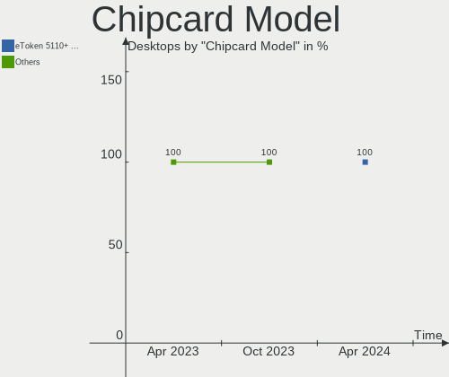

| Model                               | Desktops | Percent |
|-------------------------------------|----------|---------|
| Alcor Micro AU9540 Smartcard Reader | 1        | 100%    |

Unsupported
-----------

Unsupported Devices
-------------------

Total unsupported devices on board

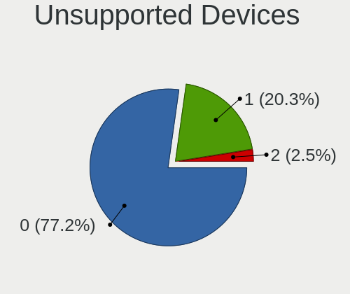

| Total | Desktops | Percent |
|-------|----------|---------|
| 0     | 56       | 81.16%  |
| 1     | 12       | 17.39%  |
| 5     | 1        | 1.45%   |

Unsupported Device Types
------------------------

Types of unsupported devices

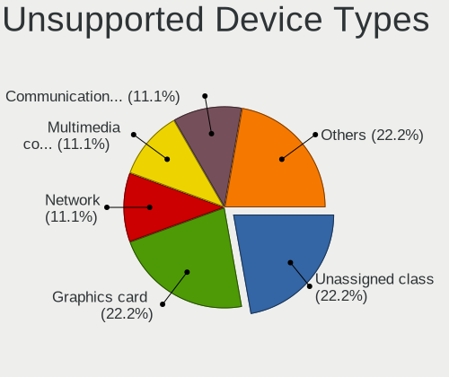

| Type                     | Desktops | Percent |
|--------------------------|----------|---------|
| Graphics card            | 8        | 50%     |
| Net/wireless             | 3        | 18.75%  |
| Unclassified device      | 1        | 6.25%   |
| Sound                    | 1        | 6.25%   |
| Communication controller | 1        | 6.25%   |
| Chipcard                 | 1        | 6.25%   |
| Camera                   | 1        | 6.25%   |

