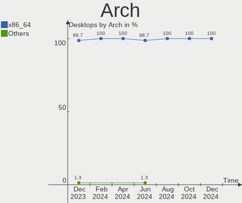
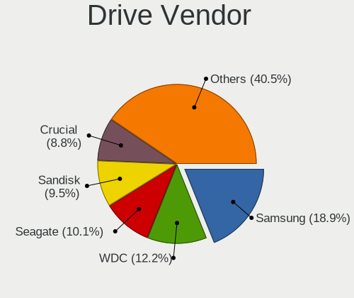
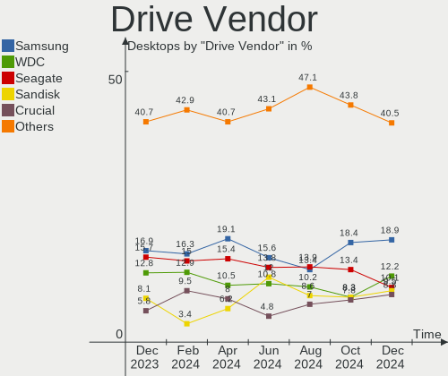
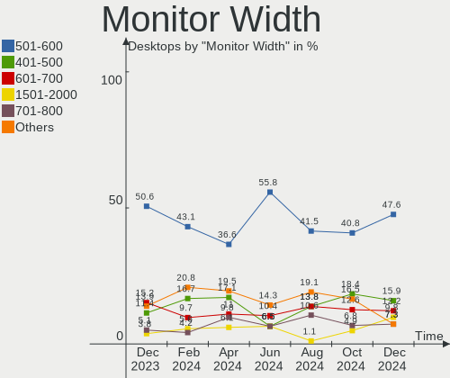
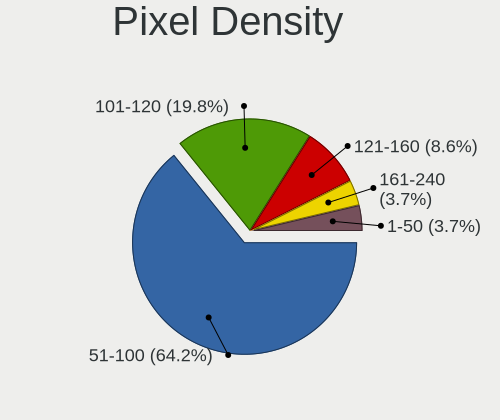

Linux in UK - Hardware Trends (Desktops)
----------------------------------------

A project to identify most popular hardware characteristics and track their change
over time based on data collected by Linux users at https://Linux-Hardware.org.

Anyone can contribute to this report by the [hw-probe](https://github.com/linuxhw/hw-probe) tool:

    sudo -E hw-probe -all -upload

Period: Dec, 2023.

Contents
--------

* [ System ](#system)
  - [ OS                       ](#os)
  - [ OS Family                ](#os-family)
  - [ Kernel                   ](#kernel)
  - [ Kernel Family            ](#kernel-family)
  - [ Kernel Major Ver.        ](#kernel-major-ver)
  - [ Arch                     ](#arch)
  - [ DE                       ](#de)
  - [ Display Server           ](#display-server)
  - [ Display Manager          ](#display-manager)
  - [ OS Lang                  ](#os-lang)
  - [ Boot Mode                ](#boot-mode)
  - [ Filesystem               ](#filesystem)
  - [ Part. scheme             ](#part-scheme)
  - [ Dual Boot with Linux/BSD ](#dual-boot-with-linuxbsd)
  - [ Dual Boot (Win)          ](#dual-boot-win)

* [ Board ](#board)
  - [ Vendor                   ](#vendor)
  - [ Model                    ](#model)
  - [ Model Family             ](#model-family)
  - [ MFG Year                 ](#mfg-year)
  - [ Form Factor              ](#form-factor)
  - [ Secure Boot              ](#secure-boot)
  - [ Coreboot                 ](#coreboot)
  - [ RAM Size                 ](#ram-size)
  - [ RAM Used                 ](#ram-used)
  - [ Total Drives             ](#total-drives)
  - [ Has CD-ROM               ](#has-cd-rom)
  - [ Has Ethernet             ](#has-ethernet)
  - [ Has WiFi                 ](#has-wifi)
  - [ Has Bluetooth            ](#has-bluetooth)

* [ Location ](#location)
  - [ Country                  ](#country)
  - [ City                     ](#city)

* [ Drives ](#drives)
  - [ Drive Vendor             ](#drive-vendor)
  - [ Drive Model              ](#drive-model)
  - [ HDD Vendor               ](#hdd-vendor)
  - [ SSD Vendor               ](#ssd-vendor)
  - [ Drive Kind               ](#drive-kind)
  - [ Drive Connector          ](#drive-connector)
  - [ Drive Size               ](#drive-size)
  - [ Space Total              ](#space-total)
  - [ Space Used               ](#space-used)
  - [ Malfunc. Drives          ](#malfunc-drives)
  - [ Malfunc. Drive Vendor    ](#malfunc-drive-vendor)
  - [ Malfunc. HDD Vendor      ](#malfunc-hdd-vendor)
  - [ Malfunc. Drive Kind      ](#malfunc-drive-kind)
  - [ Failed Drives            ](#failed-drives)
  - [ Failed Drive Vendor      ](#failed-drive-vendor)
  - [ Drive Status             ](#drive-status)

* [ Storage controller ](#storage-controller)
  - [ Storage Vendor           ](#storage-vendor)
  - [ Storage Model            ](#storage-model)
  - [ Storage Kind             ](#storage-kind)

* [ Processor ](#processor)
  - [ CPU Vendor               ](#cpu-vendor)
  - [ CPU Model                ](#cpu-model)
  - [ CPU Model Family         ](#cpu-model-family)
  - [ CPU Cores                ](#cpu-cores)
  - [ CPU Sockets              ](#cpu-sockets)
  - [ CPU Threads              ](#cpu-threads)
  - [ CPU Op-Modes             ](#cpu-op-modes)
  - [ CPU Microcode            ](#cpu-microcode)
  - [ CPU Microarch            ](#cpu-microarch)

* [ Graphics ](#graphics)
  - [ GPU Vendor               ](#gpu-vendor)
  - [ GPU Model                ](#gpu-model)
  - [ GPU Combo                ](#gpu-combo)
  - [ GPU Driver               ](#gpu-driver)
  - [ GPU Memory               ](#gpu-memory)

* [ Monitor ](#monitor)
  - [ Monitor Vendor           ](#monitor-vendor)
  - [ Monitor Model            ](#monitor-model)
  - [ Monitor Resolution       ](#monitor-resolution)
  - [ Monitor Diagonal         ](#monitor-diagonal)
  - [ Monitor Width            ](#monitor-width)
  - [ Aspect Ratio             ](#aspect-ratio)
  - [ Monitor Area             ](#monitor-area)
  - [ Pixel Density            ](#pixel-density)
  - [ Multiple Monitors        ](#multiple-monitors)

* [ Network ](#network)
  - [ Net Controller Vendor    ](#net-controller-vendor)
  - [ Net Controller Model     ](#net-controller-model)
  - [ Wireless Vendor          ](#wireless-vendor)
  - [ Wireless Model           ](#wireless-model)
  - [ Ethernet Vendor          ](#ethernet-vendor)
  - [ Ethernet Model           ](#ethernet-model)
  - [ Net Controller Kind      ](#net-controller-kind)
  - [ Used Controller          ](#used-controller)
  - [ NICs                     ](#nics)
  - [ IPv6                     ](#ipv6)

* [ Bluetooth ](#bluetooth)
  - [ Bluetooth Vendor         ](#bluetooth-vendor)
  - [ Bluetooth Model          ](#bluetooth-model)

* [ Sound ](#sound)
  - [ Sound Vendor             ](#sound-vendor)
  - [ Sound Model              ](#sound-model)

* [ Memory ](#memory)
  - [ Memory Vendor            ](#memory-vendor)
  - [ Memory Model             ](#memory-model)
  - [ Memory Kind              ](#memory-kind)
  - [ Memory Form Factor       ](#memory-form-factor)
  - [ Memory Size              ](#memory-size)
  - [ Memory Speed             ](#memory-speed)

* [ Printers & scanners ](#printers--scanners)
  - [ Printer Vendor           ](#printer-vendor)
  - [ Printer Model            ](#printer-model)
  - [ Scanner Vendor           ](#scanner-vendor)
  - [ Scanner Model            ](#scanner-model)

* [ Camera ](#camera)
  - [ Camera Vendor            ](#camera-vendor)
  - [ Camera Model             ](#camera-model)

* [ Security ](#security)
  - [ Fingerprint Vendor       ](#fingerprint-vendor)
  - [ Fingerprint Model        ](#fingerprint-model)
  - [ Chipcard Vendor          ](#chipcard-vendor)
  - [ Chipcard Model           ](#chipcard-model)

* [ Unsupported ](#unsupported)
  - [ Unsupported Devices      ](#unsupported-devices)
  - [ Unsupported Device Types ](#unsupported-device-types)

System
------

OS
--

Installed operating systems

| Name                         | Desktops | Percent |
|------------------------------|----------|---------|
| Ubuntu 22.04                 | 11       | 13.92%  |
| Linux Mint 21.2              | 8        | 10.13%  |
| Fedora 39                    | 7        | 8.86%   |
| ArcoLinux Rolling            | 6        | 7.59%   |
| Arch Rolling                 | 5        | 6.33%   |
| Pop!_OS 22.04                | 4        | 5.06%   |
| Ubuntu 23.10                 | 3        | 3.8%    |
| Debian 12                    | 3        | 3.8%    |
| Zorin 17                     | 2        | 2.53%   |
| Ubuntu 20.04                 | 2        | 2.53%   |
| openSUSE Tumbleweed-XXXXXXXX | 2        | 2.53%   |
| OpenMandriva 5.0             | 2        | 2.53%   |
| Kubuntu 23.10                | 2        | 2.53%   |
| Kubuntu 22.04                | 2        | 2.53%   |
| KDE neon 22.04               | 2        | 2.53%   |
| Fedora 38                    | 2        | 2.53%   |
| Zorin 16                     | 1        | 1.27%   |
| Ubuntu Unity 20.04           | 1        | 1.27%   |
| Ubuntu 22.10                 | 1        | 1.27%   |
| Ubuntu 20.10                 | 1        | 1.27%   |
| Ubuntu 18.04                 | 1        | 1.27%   |
| openSUSE Leap-15.6           | 1        | 1.27%   |
| OpenMandriva 23.08           | 1        | 1.27%   |
| Nobara 38                    | 1        | 1.27%   |
| Neptune OS 8.0               | 1        | 1.27%   |
| Kubuntu 23.04                | 1        | 1.27%   |
| Gentoo 2.14                  | 1        | 1.27%   |
| Fedora 36                    | 1        | 1.27%   |
| Elementary 7.1               | 1        | 1.27%   |
| ChimeraOS 44-1               | 1        | 1.27%   |
| ArcoLinux                    | 1        | 1.27%   |
| antergos Rolling             | 1        | 1.27%   |

OS Family
---------

OS without a version

| Name         | Desktops | Percent |
|--------------|----------|---------|
| Ubuntu       | 19       | 24.05%  |
| Fedora       | 10       | 12.66%  |
| Linux Mint   | 8        | 10.13%  |
| ArcoLinux    | 7        | 8.86%   |
| Kubuntu      | 5        | 6.33%   |
| Arch         | 5        | 6.33%   |
| Pop!_OS      | 4        | 5.06%   |
| Zorin        | 3        | 3.8%    |
| openSUSE     | 3        | 3.8%    |
| OpenMandriva | 3        | 3.8%    |
| Debian       | 3        | 3.8%    |
| KDE neon     | 2        | 2.53%   |
| Ubuntu Unity | 1        | 1.27%   |
| Nobara       | 1        | 1.27%   |
| Neptune OS   | 1        | 1.27%   |
| Gentoo       | 1        | 1.27%   |
| Elementary   | 1        | 1.27%   |
| ChimeraOS    | 1        | 1.27%   |
| antergos     | 1        | 1.27%   |

Kernel
------

Version of the Linux kernel

| Version                     | Desktops | Percent |
|-----------------------------|----------|---------|
| 6.2.0-39-generic            | 10       | 12.66%  |
| 5.15.0-91-generic           | 9        | 11.39%  |
| 6.5.0-14-generic            | 6        | 7.59%   |
| 6.6.7-arch1-1               | 5        | 6.33%   |
| 6.2.0-37-generic            | 4        | 5.06%   |
| 6.6.8-arch1-1               | 2        | 2.53%   |
| 6.6.8-200.fc39.x86_64       | 2        | 2.53%   |
| 6.6.6-76060606-generic      | 2        | 2.53%   |
| 6.6.3-arch1-1               | 2        | 2.53%   |
| 6.6.2-desktop-1omv2390      | 2        | 2.53%   |
| 6.6.1-arch1-1               | 2        | 2.53%   |
| 6.5.6-76060506-generic      | 2        | 2.53%   |
| 6.1.0-16-amd64              | 2        | 2.53%   |
| 5.17.7-051707-generic       | 2        | 2.53%   |
| 5.15.0-89-generic           | 2        | 2.53%   |
| 6.6.7_tkg_bore_llvm         | 1        | 1.27%   |
| 6.6.7-zen1-1-zen            | 1        | 1.27%   |
| 6.6.7-200.fc39.x86_64       | 1        | 1.27%   |
| 6.6.6-arch1-1               | 1        | 1.27%   |
| 6.6.6-200.fsync.fc38.x86_64 | 1        | 1.27%   |
| 6.6.6-200.fc39.x86_64       | 1        | 1.27%   |
| 6.6.6-1-default             | 1        | 1.27%   |
| 6.6.4-200.fc39.x86_64       | 1        | 1.27%   |
| 6.6.3-200.fc39.x86_64       | 1        | 1.27%   |
| 6.6.3-100.fc38.x86_64       | 1        | 1.27%   |
| 6.6.3-1-default             | 1        | 1.27%   |
| 6.4.11-desktop-1omv2390     | 1        | 1.27%   |
| 6.4.0-150600.4-default      | 1        | 1.27%   |
| 6.2.9-300.fc38.x86_64       | 1        | 1.27%   |
| 6.2.15-100.fc36.x86_64      | 1        | 1.27%   |
| 6.2.0-1017-lowlatency       | 1        | 1.27%   |
| 6.1.68-1-lts                | 1        | 1.27%   |
| 6.1.66-gentoo-x86_64        | 1        | 1.27%   |
| 6.1.0-9-amd64               | 1        | 1.27%   |
| 6.1.0-13-amd64              | 1        | 1.27%   |
| 5.8.0-63-generic            | 1        | 1.27%   |
| 5.4.0-167-generic           | 1        | 1.27%   |
| 5.19.0-21-generic           | 1        | 1.27%   |
| 5.15.0-86-generic           | 1        | 1.27%   |
| 4.15.0-208-generic          | 1        | 1.27%   |

Kernel Family
-------------

Linux kernel without a distro release

| Version | Desktops | Percent |
|---------|----------|---------|
| 6.2.0   | 15       | 18.99%  |
| 5.15.0  | 12       | 15.19%  |
| 6.6.7   | 8        | 10.13%  |
| 6.6.6   | 6        | 7.59%   |
| 6.5.0   | 6        | 7.59%   |
| 6.6.3   | 5        | 6.33%   |
| 6.6.8   | 4        | 5.06%   |
| 6.1.0   | 4        | 5.06%   |
| 6.6.2   | 2        | 2.53%   |
| 6.6.1   | 2        | 2.53%   |
| 6.5.6   | 2        | 2.53%   |
| 5.17.7  | 2        | 2.53%   |
| 6.6.4   | 1        | 1.27%   |
| 6.4.11  | 1        | 1.27%   |
| 6.4.0   | 1        | 1.27%   |
| 6.2.9   | 1        | 1.27%   |
| 6.2.15  | 1        | 1.27%   |
| 6.1.68  | 1        | 1.27%   |
| 6.1.66  | 1        | 1.27%   |
| 5.8.0   | 1        | 1.27%   |
| 5.4.0   | 1        | 1.27%   |
| 5.19.0  | 1        | 1.27%   |
| 4.15.0  | 1        | 1.27%   |

Kernel Major Ver.
-----------------

Linux kernel major version

| Version | Desktops | Percent |
|---------|----------|---------|
| 6.6     | 28       | 35.44%  |
| 6.2     | 17       | 21.52%  |
| 5.15    | 12       | 15.19%  |
| 6.5     | 8        | 10.13%  |
| 6.1     | 6        | 7.59%   |
| 6.4     | 2        | 2.53%   |
| 5.17    | 2        | 2.53%   |
| 5.8     | 1        | 1.27%   |
| 5.4     | 1        | 1.27%   |
| 5.19    | 1        | 1.27%   |
| 4.15    | 1        | 1.27%   |

Arch
----

OS architecture (x86_64, i586, etc.)

| Name   | Desktops | Percent |
|--------|----------|---------|
| x86_64 | 78       | 98.73%  |
| i686   | 1        | 1.27%   |

DE
--

Desktop Environment

| Name       | Desktops | Percent |
|------------|----------|---------|
| GNOME      | 37       | 46.84%  |
| KDE5       | 22       | 27.85%  |
| X-Cinnamon | 10       | 12.66%  |
| XFCE       | 3        | 3.8%    |
| Unknown    | 2        | 2.53%   |
| Unity      | 1        | 1.27%   |
| sway       | 1        | 1.27%   |
| Pantheon   | 1        | 1.27%   |
| Cinnamon   | 1        | 1.27%   |
| awesome    | 1        | 1.27%   |

Display Server
--------------

X11 or Wayland

| Name    | Desktops | Percent |
|---------|----------|---------|
| X11     | 49       | 62.03%  |
| Wayland | 25       | 31.65%  |
| Unknown | 4        | 5.06%   |
| Tty     | 1        | 1.27%   |

Display Manager
---------------

SDDM, LightDM, etc.

| Name    | Desktops | Percent |
|---------|----------|---------|
| Unknown | 30       | 37.97%  |
| GDM3    | 22       | 27.85%  |
| SDDM    | 17       | 21.52%  |
| LightDM | 8        | 10.13%  |
| GDM     | 2        | 2.53%   |

OS Lang
-------

Language

| Lang  | Desktops | Percent |
|-------|----------|---------|
| en_GB | 70       | 88.61%  |
| en_US | 5        | 6.33%   |
| C     | 2        | 2.53%   |
| pl_PL | 1        | 1.27%   |
| lt_LT | 1        | 1.27%   |

Boot Mode
---------

EFI or BIOS

| Mode | Desktops | Percent |
|------|----------|---------|
| EFI  | 40       | 50.63%  |
| BIOS | 39       | 49.37%  |

Filesystem
----------

Type of filesystem

| Type    | Desktops | Percent |
|---------|----------|---------|
| Ext4    | 46       | 58.23%  |
| Tmpfs   | 17       | 21.52%  |
| Btrfs   | 10       | 12.66%  |
| Xfs     | 3        | 3.8%    |
| Overlay | 2        | 2.53%   |
| Unknown | 1        | 1.27%   |

Part. scheme
------------

Scheme of partitioning

| Type    | Desktops | Percent |
|---------|----------|---------|
| GPT     | 45       | 56.96%  |
| Unknown | 30       | 37.97%  |
| MBR     | 4        | 5.06%   |

Dual Boot with Linux/BSD
------------------------

Hosting more than one Linux/BSD

| Dual boot | Desktops | Percent |
|-----------|----------|---------|
| No        | 64       | 81.01%  |
| Yes       | 15       | 18.99%  |

Dual Boot (Win)
---------------

Hosting Linux and Windows

| Dual boot | Desktops | Percent |
|-----------|----------|---------|
| No        | 54       | 68.35%  |
| Yes       | 25       | 31.65%  |

Board
-----

Vendor
------

Motherboard manufacturer

| Name                | Desktops | Percent |
|---------------------|----------|---------|
| ASUSTek Computer    | 25       | 31.65%  |
| Gigabyte Technology | 18       | 22.78%  |
| MSI                 | 11       | 13.92%  |
| Dell                | 10       | 12.66%  |
| ASRock              | 5        | 6.33%   |
| Hewlett-Packard     | 3        | 3.8%    |
| Trigkey             | 1        | 1.27%   |
| Medion              | 1        | 1.27%   |
| Intel               | 1        | 1.27%   |
| Entroware           | 1        | 1.27%   |
| BESSTAR Tech        | 1        | 1.27%   |
| Acer                | 1        | 1.27%   |
| Unknown             | 1        | 1.27%   |

Model
-----

Motherboard model

| Name                           | Desktops | Percent |
|--------------------------------|----------|---------|
| Gigabyte Z77-D3H               | 2        | 2.53%   |
| Gigabyte GA-990X-Gaming SLI-CF | 2        | 2.53%   |
| Gigabyte B550M DS3H            | 2        | 2.53%   |
| Dell XPS 8700                  | 2        | 2.53%   |
| ASUS TUF Gaming X570-PLUS      | 2        | 2.53%   |
| ASUS PRIME A320M-K             | 2        | 2.53%   |
| ASUS All Series                | 2        | 2.53%   |
| Trigkey Green G4               | 1        | 1.27%   |
| MSI MS-7D75                    | 1        | 1.27%   |
| MSI MS-7D14                    | 1        | 1.27%   |
| MSI MS-7C95                    | 1        | 1.27%   |
| MSI MS-7C91                    | 1        | 1.27%   |
| MSI MS-7C56                    | 1        | 1.27%   |
| MSI MS-7C02                    | 1        | 1.27%   |
| MSI MS-7B89                    | 1        | 1.27%   |
| MSI MS-7B84                    | 1        | 1.27%   |
| MSI MS-7B78                    | 1        | 1.27%   |
| MSI MS-7693                    | 1        | 1.27%   |
| MSI 1286274                    | 1        | 1.27%   |
| Medion E63003                  | 1        | 1.27%   |
| Intel DH55TC                   | 1        | 1.27%   |
| HP EliteDesk 800 G5 SFF        | 1        | 1.27%   |
| HP Compaq Elite 8300 SFF       | 1        | 1.27%   |
| HP 110-303na                   | 1        | 1.27%   |
| Gigabyte Z590I VISION D        | 1        | 1.27%   |
| Gigabyte Z390 UD               | 1        | 1.27%   |
| Gigabyte X670 AORUS ELITE AX   | 1        | 1.27%   |
| Gigabyte X570 GAMING X         | 1        | 1.27%   |
| Gigabyte PDT-702-1020          | 1        | 1.27%   |
| Gigabyte F2A68HM-HD2           | 1        | 1.27%   |
| Gigabyte B550I AORUS PRO AX    | 1        | 1.27%   |
| Gigabyte B550 AORUS ELITE V2   | 1        | 1.27%   |
| Gigabyte AX370-Gaming K5       | 1        | 1.27%   |
| Gigabyte AB350-Gaming 3        | 1        | 1.27%   |
| Gigabyte 990FXA-UD3            | 1        | 1.27%   |
| Gigabyte 970A-DS3              | 1        | 1.27%   |
| Entroware Poseidon             | 1        | 1.27%   |
| Dell OptiPlex 790              | 1        | 1.27%   |
| Dell OptiPlex 780              | 1        | 1.27%   |
| Dell OptiPlex 760              | 1        | 1.27%   |

Model Family
------------

Motherboard model prefix

| Name                    | Desktops | Percent |
|-------------------------|----------|---------|
| Dell OptiPlex           | 8        | 10.13%  |
| ASUS ROG                | 5        | 6.33%   |
| ASUS PRIME              | 5        | 6.33%   |
| ASUS TUF                | 4        | 5.06%   |
| Gigabyte Z77-D3H        | 2        | 2.53%   |
| Gigabyte GA-990X-Gaming | 2        | 2.53%   |
| Gigabyte B550M          | 2        | 2.53%   |
| Dell XPS                | 2        | 2.53%   |
| ASUS All                | 2        | 2.53%   |
| ASRock X670E            | 2        | 2.53%   |
| Trigkey Green           | 1        | 1.27%   |
| MSI MS-7D75             | 1        | 1.27%   |
| MSI MS-7D14             | 1        | 1.27%   |
| MSI MS-7C95             | 1        | 1.27%   |
| MSI MS-7C91             | 1        | 1.27%   |
| MSI MS-7C56             | 1        | 1.27%   |
| MSI MS-7C02             | 1        | 1.27%   |
| MSI MS-7B89             | 1        | 1.27%   |
| MSI MS-7B84             | 1        | 1.27%   |
| MSI MS-7B78             | 1        | 1.27%   |
| MSI MS-7693             | 1        | 1.27%   |
| MSI 1286274             | 1        | 1.27%   |
| Medion E63003           | 1        | 1.27%   |
| Intel DH55TC            | 1        | 1.27%   |
| HP EliteDesk            | 1        | 1.27%   |
| HP Compaq               | 1        | 1.27%   |
| HP 110-303na            | 1        | 1.27%   |
| Gigabyte Z590I          | 1        | 1.27%   |
| Gigabyte Z390           | 1        | 1.27%   |
| Gigabyte X670           | 1        | 1.27%   |
| Gigabyte X570           | 1        | 1.27%   |
| Gigabyte PDT-702-1020   | 1        | 1.27%   |
| Gigabyte F2A68HM-HD2    | 1        | 1.27%   |
| Gigabyte B550I          | 1        | 1.27%   |
| Gigabyte B550           | 1        | 1.27%   |
| Gigabyte AX370-Gaming   | 1        | 1.27%   |
| Gigabyte AB350-Gaming   | 1        | 1.27%   |
| Gigabyte 990FXA-UD3     | 1        | 1.27%   |
| Gigabyte 970A-DS3       | 1        | 1.27%   |
| Entroware Poseidon      | 1        | 1.27%   |

MFG Year
--------

Motherboard manufacture year

| Year | Desktops | Percent |
|------|----------|---------|
| 2020 | 11       | 13.92%  |
| 2022 | 10       | 12.66%  |
| 2021 | 8        | 10.13%  |
| 2018 | 8        | 10.13%  |
| 2014 | 7        | 8.86%   |
| 2012 | 7        | 8.86%   |
| 2019 | 5        | 6.33%   |
| 2017 | 5        | 6.33%   |
| 2013 | 5        | 6.33%   |
| 2011 | 3        | 3.8%    |
| 2023 | 2        | 2.53%   |
| 2016 | 2        | 2.53%   |
| 2015 | 2        | 2.53%   |
| 2010 | 2        | 2.53%   |
| 2009 | 2        | 2.53%   |

Form Factor
-----------

Physical design of the computer

| Name    | Desktops | Percent |
|---------|----------|---------|
| Desktop | 79       | 100%    |

Secure Boot
-----------

Enabled or disabled

| State    | Desktops | Percent |
|----------|----------|---------|
| Disabled | 78       | 98.73%  |
| Enabled  | 1        | 1.27%   |

Coreboot
--------

Have coreboot on board

| Used | Desktops | Percent |
|------|----------|---------|
| No   | 79       | 100%    |

RAM Size
--------

Total RAM memory

| Size in GB  | Desktops | Percent |
|-------------|----------|---------|
| 16.01-24.0  | 27       | 34.18%  |
| 32.01-64.0  | 14       | 17.72%  |
| 64.01-256.0 | 11       | 13.92%  |
| 8.01-16.0   | 11       | 13.92%  |
| 4.01-8.0    | 9        | 11.39%  |
| 3.01-4.0    | 5        | 6.33%   |
| 24.01-32.0  | 2        | 2.53%   |

RAM Used
--------

Used RAM memory

| Used GB    | Desktops | Percent |
|------------|----------|---------|
| 4.01-8.0   | 21       | 26.58%  |
| 3.01-4.0   | 21       | 26.58%  |
| 2.01-3.0   | 17       | 21.52%  |
| 1.01-2.0   | 11       | 13.92%  |
| 8.01-16.0  | 5        | 6.33%   |
| 16.01-24.0 | 2        | 2.53%   |
| 24.01-32.0 | 1        | 1.27%   |
| 0.01-0.5   | 1        | 1.27%   |

Total Drives
------------

Number of drives on board

| Drives | Desktops | Percent |
|--------|----------|---------|
| 2      | 23       | 29.11%  |
| 1      | 19       | 24.05%  |
| 3      | 14       | 17.72%  |
| 4      | 9        | 11.39%  |
| 5      | 7        | 8.86%   |
| 6      | 4        | 5.06%   |
| 7      | 2        | 2.53%   |
| 8      | 1        | 1.27%   |

Has CD-ROM
----------

Has CD-ROM on board

| Presented | Desktops | Percent |
|-----------|----------|---------|
| No        | 51       | 64.56%  |
| Yes       | 28       | 35.44%  |

Has Ethernet
------------

Has Ethernet on board

| Presented | Desktops | Percent |
|-----------|----------|---------|
| Yes       | 77       | 97.47%  |
| No        | 2        | 2.53%   |

Has WiFi
--------

Has WiFi module

| Presented | Desktops | Percent |
|-----------|----------|---------|
| Yes       | 48       | 60.76%  |
| No        | 31       | 39.24%  |

Has Bluetooth
-------------

Has Bluetooth module

| Presented | Desktops | Percent |
|-----------|----------|---------|
| Yes       | 50       | 63.29%  |
| No        | 29       | 36.71%  |

Location
--------

Country
-------

Geographic location (country)

| Country | Desktops | Percent |
|---------|----------|---------|
| UK      | 79       | 100%    |

City
----

Geographic location (city)

| City               | Desktops | Percent |
|--------------------|----------|---------|
| Southwark          | 3        | 3.8%    |
| London             | 3        | 3.8%    |
| Bradford           | 3        | 3.8%    |
| Reading            | 2        | 2.53%   |
| Milton Keynes      | 2        | 2.53%   |
| Manchester         | 2        | 2.53%   |
| Hull               | 2        | 2.53%   |
| Huddersfield       | 2        | 2.53%   |
| Doncaster          | 2        | 2.53%   |
| Wirral             | 1        | 1.27%   |
| Whitechapel        | 1        | 1.27%   |
| Whitby             | 1        | 1.27%   |
| Weymouth           | 1        | 1.27%   |
| Welwyn             | 1        | 1.27%   |
| Wandsworth         | 1        | 1.27%   |
| Thame              | 1        | 1.27%   |
| Tewkesbury         | 1        | 1.27%   |
| Telford            | 1        | 1.27%   |
| Swadlincote        | 1        | 1.27%   |
| Sunderland         | 1        | 1.27%   |
| Stoke-on-Trent     | 1        | 1.27%   |
| Stockton-on-Tees   | 1        | 1.27%   |
| St Austell         | 1        | 1.27%   |
| Shepperton         | 1        | 1.27%   |
| Seaford            | 1        | 1.27%   |
| Rotherham          | 1        | 1.27%   |
| Richmond           | 1        | 1.27%   |
| Portsmouth         | 1        | 1.27%   |
| Pevensey           | 1        | 1.27%   |
| Norwich            | 1        | 1.27%   |
| Neath              | 1        | 1.27%   |
| Malpas             | 1        | 1.27%   |
| Liverpool          | 1        | 1.27%   |
| Leigh              | 1        | 1.27%   |
| Leicester          | 1        | 1.27%   |
| Ipswich            | 1        | 1.27%   |
| Houghton-Le-Spring | 1        | 1.27%   |
| Hawick             | 1        | 1.27%   |
| Harlow             | 1        | 1.27%   |
| Hackney            | 1        | 1.27%   |

Drives
------

Drive Vendor
------------

Hard drive vendors

| Vendor                       | Desktops | Drives | Percent |
|------------------------------|----------|--------|---------|
| Samsung Electronics          | 30       | 44     | 17.24%  |
| Seagate                      | 27       | 39     | 15.52%  |
| WDC                          | 22       | 35     | 12.64%  |
| SanDisk                      | 15       | 15     | 8.62%   |
| Crucial                      | 10       | 13     | 5.75%   |
| Kingston                     | 9        | 9      | 5.17%   |
| Toshiba                      | 8        | 9      | 4.6%    |
| Micron/Crucial Technology    | 6        | 6      | 3.45%   |
| Phison Electronics           | 4        | 5      | 2.3%    |
| Netac                        | 3        | 3      | 1.72%   |
| KIOXIA-EXCERIA               | 3        | 3      | 1.72%   |
| Intel                        | 3        | 3      | 1.72%   |
| SK hynix                     | 2        | 2      | 1.15%   |
| PNY                          | 2        | 5      | 1.15%   |
| Micron Technology            | 2        | 2      | 1.15%   |
| Hitachi                      | 2        | 2      | 1.15%   |
| Fanxiang                     | 2        | 2      | 1.15%   |
| ADATA Technology             | 2        | 3      | 1.15%   |
| A-DATA Technology            | 2        | 3      | 1.15%   |
| Vaseky                       | 1        | 1      | 0.57%   |
| Unknown                      | 1        | 2      | 0.57%   |
| TSA                          | 1        | 1      | 0.57%   |
| Teclast                      | 1        | 1      | 0.57%   |
| SSI                          | 1        | 1      | 0.57%   |
| SPCC                         | 1        | 1      | 0.57%   |
| Shenzhen Longsys Electronics | 1        | 2      | 0.57%   |
| Realtek                      | 1        | 1      | 0.57%   |
| Phison                       | 1        | 1      | 0.57%   |
| OCZ                          | 1        | 1      | 0.57%   |
| MAXIO Technology (Hangzhou)  | 1        | 1      | 0.57%   |
| LITEONIT                     | 1        | 1      | 0.57%   |
| LITEON                       | 1        | 1      | 0.57%   |
| Kingston Technology Company  | 1        | 1      | 0.57%   |
| Integral                     | 1        | 1      | 0.57%   |
| Gigabyte Technology          | 1        | 1      | 0.57%   |
| Drevo                        | 1        | 1      | 0.57%   |
| China                        | 1        | 1      | 0.57%   |
| Apple                        | 1        | 1      | 0.57%   |
| acmeor                       | 1        | 1      | 0.57%   |

Drive Model
-----------

Hard drive models

| Model                                                             | Desktops | Percent |
|-------------------------------------------------------------------|----------|---------|
| Samsung SSD 850 EVO 500GB                                         | 5        | 2.37%   |
| Micron/Crucial P2 NVMe PCIe SSD 4TB                               | 5        | 2.37%   |
| Crucial CT500MX500SSD1 500GB                                      | 4        | 1.9%    |
| Seagate ST2000DM008-2FR102 2TB                                    | 3        | 1.42%   |
| Seagate ST2000DM001-1ER164 2TB                                    | 3        | 1.42%   |
| Samsung SSD 860 EVO 1TB                                           | 3        | 1.42%   |
| Samsung SSD 850 PRO 256GB                                         | 3        | 1.42%   |
| KIOXIA-EXCERIA SATA SSD 480GB                                     | 3        | 1.42%   |
| WDC WD20EARX-00PASB0 2TB                                          | 2        | 0.95%   |
| Toshiba DT01ACA100 1TB                                            | 2        | 0.95%   |
| Seagate ST8000DM004-2CX188 8TB                                    | 2        | 0.95%   |
| Seagate ST500DM002-1BD142 500GB                                   | 2        | 0.95%   |
| Seagate ST3500312CS 500GB                                         | 2        | 0.95%   |
| Seagate ST2000DM008-2UB102 2TB                                    | 2        | 0.95%   |
| Seagate ST2000DM001-1CH164 2TB                                    | 2        | 0.95%   |
| Sandisk WD Blue SN550 NVMe SSD 1TB                                | 2        | 0.95%   |
| Sandisk WD Black NVMe SSD 256GB                                   | 2        | 0.95%   |
| Samsung SSD 980 1TB                                               | 2        | 0.95%   |
| Samsung SSD 870 QVO 2TB                                           | 2        | 0.95%   |
| Samsung SSD 870 EVO 500GB                                         | 2        | 0.95%   |
| Samsung SSD 870 EVO 1TB                                           | 2        | 0.95%   |
| Samsung SSD 860 EVO 500GB                                         | 2        | 0.95%   |
| Samsung NVMe SSD Controller SM981/PM981/PM983 512GB               | 2        | 0.95%   |
| Samsung HD502IJ 500GB                                             | 2        | 0.95%   |
| Samsung HD103SI 1TB                                               | 2        | 0.95%   |
| Phison E16 PCIe4 NVMe Controller 2TB                              | 2        | 0.95%   |
| Kingston SKC3000S1024G 1024GB                                     | 2        | 0.95%   |
| Crucial CT250MX500SSD1 250GB                                      | 2        | 0.95%   |
| Crucial CT240BX200SSD1 240GB                                      | 2        | 0.95%   |
| ADATA XPG SX8200 Pro PCIe Gen3x4 M.2 2280 Solid State Drive 512GB | 2        | 0.95%   |
| WDC WD82PURZ-85TEUY0 8TB                                          | 1        | 0.47%   |
| WDC WD60EFRX-68MYMN1 6TB                                          | 1        | 0.47%   |
| WDC WD5000YS-01MPB1 500GB                                         | 1        | 0.47%   |
| WDC WD5000LUCT-63C26Y0 500GB                                      | 1        | 0.47%   |
| WDC WD5000LPCX-60VHAT0 500GB                                      | 1        | 0.47%   |
| WDC WD5000AAKS-75V0A0 500GB                                       | 1        | 0.47%   |
| WDC WD5000AACS-00G8B0 500GB                                       | 1        | 0.47%   |
| WDC WD40PURX-64GVNY0 4TB                                          | 1        | 0.47%   |
| WDC WD30EZRX-00MMMB0 3TB                                          | 1        | 0.47%   |
| WDC WD30EZRX-00D8PB0 3TB                                          | 1        | 0.47%   |

HDD Vendor
----------

Hard disk drive vendors

| Vendor              | Desktops | Drives | Percent |
|---------------------|----------|--------|---------|
| Seagate             | 25       | 35     | 41.67%  |
| WDC                 | 22       | 35     | 36.67%  |
| Toshiba             | 5        | 5      | 8.33%   |
| Samsung Electronics | 5        | 5      | 8.33%   |
| Hitachi             | 2        | 2      | 3.33%   |
| SSI                 | 1        | 1      | 1.67%   |

SSD Vendor
----------

Solid state drive vendors

| Vendor              | Desktops | Drives | Percent |
|---------------------|----------|--------|---------|
| Samsung Electronics | 21       | 30     | 32.31%  |
| Crucial             | 9        | 12     | 13.85%  |
| Kingston            | 7        | 7      | 10.77%  |
| SanDisk             | 5        | 5      | 7.69%   |
| Netac               | 3        | 3      | 4.62%   |
| KIOXIA-EXCERIA      | 3        | 3      | 4.62%   |
| PNY                 | 2        | 5      | 3.08%   |
| Vaseky              | 1        | 1      | 1.54%   |
| TSA                 | 1        | 1      | 1.54%   |
| Teclast             | 1        | 1      | 1.54%   |
| SPCC                | 1        | 1      | 1.54%   |
| SK hynix            | 1        | 1      | 1.54%   |
| OCZ                 | 1        | 1      | 1.54%   |
| Micron Technology   | 1        | 1      | 1.54%   |
| LITEONIT            | 1        | 1      | 1.54%   |
| LITEON              | 1        | 1      | 1.54%   |
| Integral            | 1        | 1      | 1.54%   |
| Gigabyte Technology | 1        | 1      | 1.54%   |
| Drevo               | 1        | 1      | 1.54%   |
| China               | 1        | 1      | 1.54%   |
| Apple               | 1        | 1      | 1.54%   |
| A-DATA Technology   | 1        | 2      | 1.54%   |

Drive Kind
----------

HDD or SSD

| Kind    | Desktops | Drives | Percent |
|---------|----------|--------|---------|
| SSD     | 49       | 81     | 34.27%  |
| HDD     | 46       | 83     | 32.17%  |
| NVMe    | 41       | 52     | 28.67%  |
| Unknown | 6        | 8      | 4.2%    |
| MMC     | 1        | 1      | 0.7%    |

Drive Connector
---------------

SATA, SAS, NVMe, etc.

| Type | Desktops | Drives | Percent |
|------|----------|--------|---------|
| SATA | 70       | 166    | 59.83%  |
| NVMe | 41       | 51     | 35.04%  |
| SAS  | 5        | 7      | 4.27%   |
| MMC  | 1        | 1      | 0.85%   |

Drive Size
----------

Size of hard drive

| Size in TB | Desktops | Drives | Percent |
|------------|----------|--------|---------|
| 0.01-0.5   | 49       | 82     | 44.55%  |
| 0.51-1.0   | 28       | 32     | 25.45%  |
| 1.01-2.0   | 18       | 29     | 16.36%  |
| 4.01-10.0  | 6        | 7      | 5.45%   |
| 3.01-4.0   | 4        | 4      | 3.64%   |
| 2.01-3.0   | 4        | 5      | 3.64%   |
| 10.01-20.0 | 1        | 5      | 0.91%   |

Space Total
-----------

Amount of disk space available on the file system

| Size in GB     | Desktops | Percent |
|----------------|----------|---------|
| 251-500        | 19       | 24.05%  |
| More than 3000 | 18       | 22.78%  |
| 101-250        | 16       | 20.25%  |
| 1001-2000      | 9        | 11.39%  |
| 501-1000       | 9        | 11.39%  |
| 2001-3000      | 5        | 6.33%   |
| 51-100         | 3        | 3.8%    |

Space Used
----------

Amount of used disk space

| Used GB        | Desktops | Percent |
|----------------|----------|---------|
| 1-20           | 17       | 21.52%  |
| 21-50          | 12       | 15.19%  |
| 251-500        | 9        | 11.39%  |
| 101-250        | 9        | 11.39%  |
| 501-1000       | 8        | 10.13%  |
| More than 3000 | 7        | 8.86%   |
| 1001-2000      | 7        | 8.86%   |
| 51-100         | 7        | 8.86%   |
| 2001-3000      | 3        | 3.8%    |

Malfunc. Drives
---------------

Drive models with a malfunction

| Model                             | Desktops | Drives | Percent |
|-----------------------------------|----------|--------|---------|
| WDC WD60EFRX-68MYMN1 6TB          | 1        | 1      | 5.26%   |
| WDC WD5000AAKS-75V0A0 500GB       | 1        | 1      | 5.26%   |
| WDC WD40PURX-64GVNY0 4TB          | 1        | 1      | 5.26%   |
| WDC WD30EZRX-00MMMB0 3TB          | 1        | 1      | 5.26%   |
| WDC WD20EARX-00PASB0 2TB          | 1        | 1      | 5.26%   |
| WDC WD20EARS-00MVWB0 2TB          | 1        | 1      | 5.26%   |
| WDC WD10EZEX-60ZF5A0 1TB          | 1        | 1      | 5.26%   |
| WDC WD10EZEX-60WN4A0 1TB          | 1        | 1      | 5.26%   |
| WDC WD10EARS-22Y5B1 1TB           | 1        | 1      | 5.26%   |
| Seagate ST500LT012-1DG142 500GB   | 1        | 1      | 5.26%   |
| Seagate ST500DM002-1BC142 500GB   | 1        | 1      | 5.26%   |
| Seagate ST2000DM001-1CH164 2TB    | 1        | 1      | 5.26%   |
| SanDisk SSD PLUS 240GB            | 1        | 1      | 5.26%   |
| Samsung Electronics HD502IJ 500GB | 1        | 1      | 5.26%   |
| Netac SSD 240GB                   | 1        | 1      | 5.26%   |
| Intel SSD 600P Series 128GB       | 1        | 1      | 5.26%   |
| Hitachi HDS721050CLA660 500GB     | 1        | 1      | 5.26%   |
| Drevo X1 Pro SSD 128GB            | 1        | 1      | 5.26%   |
| A-DATA Technology SU650 960GB SSD | 1        | 2      | 5.26%   |

Malfunc. Drive Vendor
---------------------

Vendors of faulty drives

| Vendor              | Desktops | Drives | Percent |
|---------------------|----------|--------|---------|
| WDC                 | 7        | 9      | 41.18%  |
| Seagate             | 3        | 3      | 17.65%  |
| SanDisk             | 1        | 1      | 5.88%   |
| Samsung Electronics | 1        | 1      | 5.88%   |
| Netac               | 1        | 1      | 5.88%   |
| Intel               | 1        | 1      | 5.88%   |
| Hitachi             | 1        | 1      | 5.88%   |
| Drevo               | 1        | 1      | 5.88%   |
| A-DATA Technology   | 1        | 2      | 5.88%   |

Malfunc. HDD Vendor
-------------------

Vendors of faulty HDD drives

| Vendor              | Desktops | Drives | Percent |
|---------------------|----------|--------|---------|
| WDC                 | 7        | 9      | 58.33%  |
| Seagate             | 3        | 3      | 25%     |
| Samsung Electronics | 1        | 1      | 8.33%   |
| Hitachi             | 1        | 1      | 8.33%   |

Malfunc. Drive Kind
-------------------

Kinds of faulty drives

| Kind | Desktops | Drives | Percent |
|------|----------|--------|---------|
| HDD  | 10       | 14     | 66.67%  |
| SSD  | 4        | 5      | 26.67%  |
| NVMe | 1        | 1      | 6.67%   |

Failed Drives
-------------

Failed drive models

Zero info for selected period =(

Failed Drive Vendor
-------------------

Failed drive vendors

Zero info for selected period =(

Drive Status
------------

Number of failed and malfunc. drives

| Status   | Desktops | Drives | Percent |
|----------|----------|--------|---------|
| Detected | 47       | 127    | 51.09%  |
| Works    | 33       | 78     | 35.87%  |
| Malfunc  | 12       | 20     | 13.04%  |

Storage controller
------------------

Storage Vendor
--------------

Storage controller vendors

| Vendor                       | Desktops | Percent |
|------------------------------|----------|---------|
| AMD                          | 43       | 30.71%  |
| Intel                        | 38       | 27.14%  |
| Samsung Electronics          | 10       | 7.14%   |
| SanDisk                      | 9        | 6.43%   |
| Micron/Crucial Technology    | 7        | 5%      |
| ASMedia Technology           | 6        | 4.29%   |
| Phison Electronics           | 5        | 3.57%   |
| Marvell Technology Group     | 5        | 3.57%   |
| Toshiba America Info Systems | 3        | 2.14%   |
| Kingston Technology Company  | 3        | 2.14%   |
| JMicron Technology           | 3        | 2.14%   |
| ADATA Technology             | 2        | 1.43%   |
| SK hynix                     | 1        | 0.71%   |
| Shenzhen Longsys Electronics | 1        | 0.71%   |
| Seagate Technology           | 1        | 0.71%   |
| Realtek Semiconductor        | 1        | 0.71%   |
| Micron Technology            | 1        | 0.71%   |
| MAXIO Technology (Hangzhou)  | 1        | 0.71%   |

Storage Model
-------------

Storage controller models

| Model                                                                          | Desktops | Percent |
|--------------------------------------------------------------------------------|----------|---------|
| AMD FCH SATA Controller [AHCI mode]                                            | 22       | 13.33%  |
| AMD 500 Series Chipset SATA Controller                                         | 11       | 6.67%   |
| Micron/Crucial P2 [Nick P2] / P3 / P3 Plus NVMe PCIe SSD (DRAM-less)           | 6        | 3.64%   |
| Intel Cannon Lake PCH SATA AHCI Controller                                     | 6        | 3.64%   |
| AMD SB7x0/SB8x0/SB9x0 SATA Controller [AHCI mode]                              | 6        | 3.64%   |
| ASMedia ASM1062 Serial ATA Controller                                          | 5        | 3.03%   |
| AMD 400 Series Chipset SATA Controller                                         | 5        | 3.03%   |
| Intel 8 Series/C220 Series Chipset Family 6-port SATA Controller 1 [AHCI mode] | 4        | 2.42%   |
| Intel 7 Series/C210 Series Chipset Family 4-port SATA Controller [IDE mode]    | 3        | 1.82%   |
| Intel 7 Series/C210 Series Chipset Family 2-port SATA Controller [IDE mode]    | 3        | 1.82%   |
| Intel 6 Series/C200 Series Chipset Family 6 port Desktop SATA AHCI Controller  | 3        | 1.82%   |
| Intel 500 Series Chipset Family SATA AHCI Controller                           | 3        | 1.82%   |
| AMD FCH SATA Controller D                                                      | 3        | 1.82%   |
| SanDisk WD Black NVMe SSD                                                      | 2        | 1.21%   |
| SanDisk Ultra 3D / WD Blue SN550 NVMe SSD                                      | 2        | 1.21%   |
| Samsung NVMe SSD Controller SM981/PM981/PM983                                  | 2        | 1.21%   |
| Samsung NVMe SSD Controller SM951/PM951                                        | 2        | 1.21%   |
| Samsung NVMe SSD Controller PM9A1/PM9A3/980PRO                                 | 2        | 1.21%   |
| Samsung NVMe SSD Controller 980 (DRAM-less)                                    | 2        | 1.21%   |
| Phison E16 PCIe4 NVMe Controller                                               | 2        | 1.21%   |
| Phison E12 NVMe Controller                                                     | 2        | 1.21%   |
| Marvell Group 88SE9123 PCIe SATA 6.0 Gb/s controller                           | 2        | 1.21%   |
| Kingston Company KC3000/FURY Renegade NVMe SSD E18                             | 2        | 1.21%   |
| JMicron JMB362 SATA Controller                                                 | 2        | 1.21%   |
| Intel SSD 660P Series                                                          | 2        | 1.21%   |
| Intel SATA Controller [RAID mode]                                              | 2        | 1.21%   |
| Intel Alder Lake-S PCH SATA Controller [AHCI Mode]                             | 2        | 1.21%   |
| Intel 82801JD/DO (ICH10 Family) 4-port SATA IDE Controller                     | 2        | 1.21%   |
| Intel 82801JD/DO (ICH10 Family) 2-port SATA IDE Controller                     | 2        | 1.21%   |
| Intel 200 Series PCH SATA controller [AHCI mode]                               | 2        | 1.21%   |
| ADATA XPG SX8200 Pro PCIe Gen3x4 M.2 2280 Solid State Drive                    | 2        | 1.21%   |
| Toshiba America Info Systems XG5 NVMe SSD Controller                           | 1        | 0.61%   |
| Toshiba America Info Systems XG4 NVMe SSD Controller                           | 1        | 0.61%   |
| Toshiba America Info Systems XG3 NVMe SSD Controller                           | 1        | 0.61%   |
| Toshiba America Info Systems BG3 x2 NVMe SSD Controller (DRAM-less)            | 1        | 0.61%   |
| SK hynix BC501 NVMe Solid State Drive                                          | 1        | 0.61%   |
| Shenzhen Longsys Non-Volatile memory controller                                | 1        | 0.61%   |
| Seagate BarraCuda Q5 NVMe SSD (DRAM-less)                                      | 1        | 0.61%   |
| SanDisk WD PC SN810 / Black SN850 NVMe SSD                                     | 1        | 0.61%   |
| SanDisk WD Blue SN570 NVMe SSD 2TB                                             | 1        | 0.61%   |

Storage Kind
------------

Kind of storage controller (IDE, SATA, NVMe, SAS, ...)

| Kind | Desktops | Percent |
|------|----------|---------|
| SATA | 72       | 56.69%  |
| NVMe | 41       | 32.28%  |
| IDE  | 11       | 8.66%   |
| RAID | 3        | 2.36%   |

Processor
---------

CPU Vendor
----------

Processor vendors

| Vendor | Desktops | Percent |
|--------|----------|---------|
| AMD    | 43       | 54.43%  |
| Intel  | 36       | 45.57%  |

CPU Model
---------

Processor models

| Model                                   | Desktops | Percent |
|-----------------------------------------|----------|---------|
| AMD FX-8350 Eight-Core Processor        | 5        | 6.33%   |
| AMD Ryzen 5 3600 6-Core Processor       | 4        | 5.06%   |
| AMD Ryzen 5 5600X 6-Core Processor      | 3        | 3.8%    |
| Intel Core i7-9700K CPU @ 3.60GHz       | 2        | 2.53%   |
| Intel Core i7-8700 CPU @ 3.20GHz        | 2        | 2.53%   |
| Intel Core i7-4770 CPU @ 3.40GHz        | 2        | 2.53%   |
| Intel Core i7-3770S CPU @ 3.10GHz       | 2        | 2.53%   |
| Intel Core i7-3770K CPU @ 3.50GHz       | 2        | 2.53%   |
| AMD Ryzen 9 7950X3D 16-Core Processor   | 2        | 2.53%   |
| AMD Ryzen 9 7950X 16-Core Processor     | 2        | 2.53%   |
| AMD Ryzen 9 7900 12-Core Processor      | 2        | 2.53%   |
| AMD Ryzen 7 3700X 8-Core Processor      | 2        | 2.53%   |
| AMD Ryzen 7 2700X Eight-Core Processor  | 2        | 2.53%   |
| AMD Ryzen 5 5600G with Radeon Graphics  | 2        | 2.53%   |
| Intel Pentium CPU G2030T @ 2.60GHz      | 1        | 1.27%   |
| Intel N95                               | 1        | 1.27%   |
| Intel Core i7-9700 CPU @ 3.00GHz        | 1        | 1.27%   |
| Intel Core i7-7700K CPU @ 4.20GHz       | 1        | 1.27%   |
| Intel Core i7-5820K CPU @ 3.30GHz       | 1        | 1.27%   |
| Intel Core i7-4790K CPU @ 4.00GHz       | 1        | 1.27%   |
| Intel Core i7-4790 CPU @ 3.60GHz        | 1        | 1.27%   |
| Intel Core i5-9500 CPU @ 3.00GHz        | 1        | 1.27%   |
| Intel Core i5-9400F CPU @ 2.90GHz       | 1        | 1.27%   |
| Intel Core i5-9400 CPU @ 2.90GHz        | 1        | 1.27%   |
| Intel Core i5-6500T CPU @ 2.50GHz       | 1        | 1.27%   |
| Intel Core i5-3570K CPU @ 3.40GHz       | 1        | 1.27%   |
| Intel Core i5-3470S CPU @ 2.90GHz       | 1        | 1.27%   |
| Intel Core i5-2500 CPU @ 3.30GHz        | 1        | 1.27%   |
| Intel Core i5-10400 CPU @ 2.90GHz       | 1        | 1.27%   |
| Intel Core i5 CPU 760 @ 2.80GHz         | 1        | 1.27%   |
| Intel Core i3-4130 CPU @ 3.40GHz        | 1        | 1.27%   |
| Intel Core i3 CPU 530 @ 2.93GHz         | 1        | 1.27%   |
| Intel Core 2 Duo CPU E8400 @ 3.00GHz    | 1        | 1.27%   |
| Intel Core 2 Duo CPU E7500 @ 2.93GHz    | 1        | 1.27%   |
| Intel Celeron J4125 CPU @ 2.00GHz       | 1        | 1.27%   |
| Intel Celeron 2957U @ 1.40GHz           | 1        | 1.27%   |
| Intel 13th Gen Core i7-13700            | 1        | 1.27%   |
| Intel 12th Gen Core i3-12100            | 1        | 1.27%   |
| Intel 11th Gen Core i7-11700F @ 2.50GHz | 1        | 1.27%   |
| Intel 11th Gen Core i5-11400 @ 2.60GHz  | 1        | 1.27%   |

CPU Model Family
----------------

Processor model prefix

| Model            | Desktops | Percent |
|------------------|----------|---------|
| Intel Core i7    | 15       | 18.99%  |
| AMD Ryzen 7      | 12       | 15.19%  |
| AMD Ryzen 5      | 12       | 15.19%  |
| Intel Core i5    | 9        | 11.39%  |
| AMD Ryzen 9      | 9        | 11.39%  |
| AMD FX           | 7        | 8.86%   |
| Other            | 5        | 6.33%   |
| Intel Core i3    | 2        | 2.53%   |
| Intel Core 2 Duo | 2        | 2.53%   |
| Intel Celeron    | 2        | 2.53%   |
| Intel Pentium    | 1        | 1.27%   |
| AMD Ryzen 3      | 1        | 1.27%   |
| AMD Athlon X4    | 1        | 1.27%   |
| AMD A10          | 1        | 1.27%   |

CPU Cores
---------

Number of processor cores

| Number | Desktops | Percent |
|--------|----------|---------|
| 4      | 25       | 31.65%  |
| 6      | 20       | 25.32%  |
| 8      | 15       | 18.99%  |
| 2      | 9        | 11.39%  |
| 16     | 6        | 7.59%   |
| 12     | 4        | 5.06%   |

CPU Sockets
-----------

Number of sockets

| Number | Desktops | Percent |
|--------|----------|---------|
| 1      | 79       | 100%    |

CPU Threads
-----------

Threads per core (Hyper-Threading)

| Number | Desktops | Percent |
|--------|----------|---------|
| 2      | 60       | 75.95%  |
| 1      | 19       | 24.05%  |

CPU Op-Modes
------------

CPU Operation Modes (32-bit, 64-bit)

| Op mode        | Desktops | Percent |
|----------------|----------|---------|
| 32-bit, 64-bit | 79       | 100%    |

CPU Microcode
-------------

Microcode number

| Number     | Desktops | Percent |
|------------|----------|---------|
| Unknown    | 42       | 53.16%  |
| 0x0a601203 | 4        | 5.06%   |
| 0x0a601206 | 3        | 3.8%    |
| 0x08701021 | 3        | 3.8%    |
| 0x0800820d | 3        | 3.8%    |
| 0x06000852 | 3        | 3.8%    |
| 0x906ea    | 2        | 2.53%   |
| 0x306c3    | 2        | 2.53%   |
| 0x0a50000c | 2        | 2.53%   |
| 0x0a20120a | 2        | 2.53%   |
| 0xb06e0    | 1        | 1.27%   |
| 0x906ed    | 1        | 1.27%   |
| 0x306a9    | 1        | 1.27%   |
| 0x20652    | 1        | 1.27%   |
| 0x0a201009 | 1        | 1.27%   |
| 0x08701030 | 1        | 1.27%   |
| 0x08701013 | 1        | 1.27%   |
| 0x08701012 | 1        | 1.27%   |
| 0x08108109 | 1        | 1.27%   |
| 0x08101016 | 1        | 1.27%   |
| 0x08001138 | 1        | 1.27%   |
| 0x06000822 | 1        | 1.27%   |
| 0x0600063e | 1        | 1.27%   |

CPU Microarch
-------------

Microarchitecture

| Name          | Desktops | Percent |
|---------------|----------|---------|
| Unknown       | 13       | 16.46%  |
| Zen 3         | 10       | 12.66%  |
| KabyLake      | 9        | 11.39%  |
| Zen 2         | 8        | 10.13%  |
| IvyBridge     | 7        | 8.86%   |
| Haswell       | 7        | 8.86%   |
| Piledriver    | 6        | 7.59%   |
| Zen+          | 4        | 5.06%   |
| Zen           | 3        | 3.8%    |
| Steamroller   | 2        | 2.53%   |
| Penryn        | 2        | 2.53%   |
| Westmere      | 1        | 1.27%   |
| Skylake       | 1        | 1.27%   |
| SandyBridge   | 1        | 1.27%   |
| Nehalem       | 1        | 1.27%   |
| Icelake       | 1        | 1.27%   |
| Goldmont plus | 1        | 1.27%   |
| CometLake     | 1        | 1.27%   |
| Bulldozer     | 1        | 1.27%   |

Graphics
--------

GPU Vendor
----------

Vendors of graphics cards

| Vendor | Desktops | Percent |
|--------|----------|---------|
| AMD    | 31       | 37.35%  |
| Nvidia | 29       | 34.94%  |
| Intel  | 23       | 27.71%  |

GPU Model
---------

Graphics card models

| Model                                                                       | Desktops | Percent |
|-----------------------------------------------------------------------------|----------|---------|
| AMD Navi 21 [Radeon RX 6800/6800 XT / 6900 XT]                              | 6        | 6.9%    |
| Intel CoffeeLake-S GT2 [UHD Graphics 630]                                   | 5        | 5.75%   |
| AMD Raphael                                                                 | 5        | 5.75%   |
| AMD Ellesmere [Radeon RX 470/480/570/570X/580/580X/590]                     | 4        | 4.6%    |
| Nvidia GM204 [GeForce GTX 970]                                              | 3        | 3.45%   |
| Nvidia GK208B [GeForce GT 710]                                              | 3        | 3.45%   |
| AMD Navi 10 [Radeon RX 5600 OEM/5600 XT / 5700/5700 XT]                     | 3        | 3.45%   |
| Nvidia TU116 [GeForce GTX 1660 SUPER]                                       | 2        | 2.3%    |
| Nvidia GP107 [GeForce GTX 1050 Ti]                                          | 2        | 2.3%    |
| Nvidia GA106 [GeForce RTX 3060]                                             | 2        | 2.3%    |
| Nvidia AD102 [GeForce RTX 4090]                                             | 2        | 2.3%    |
| Intel Xeon E3-1200 v2/3rd Gen Core processor Graphics Controller            | 2        | 2.3%    |
| Intel IvyBridge GT2 [HD Graphics 4000]                                      | 2        | 2.3%    |
| Intel 4 Series Chipset Integrated Graphics Controller                       | 2        | 2.3%    |
| AMD RV630 XT [Radeon HD 2600 XT]                                            | 2        | 2.3%    |
| AMD Navi 23 [Radeon RX 6600/6600 XT/6600M]                                  | 2        | 2.3%    |
| AMD Cezanne [Radeon Vega Series / Radeon Vega Mobile Series]                | 2        | 2.3%    |
| Nvidia TU117 [GeForce GTX 1650]                                             | 1        | 1.15%   |
| Nvidia TU116 [GeForce GTX 1660 Ti]                                          | 1        | 1.15%   |
| Nvidia TU106 [GeForce RTX 2070]                                             | 1        | 1.15%   |
| Nvidia TU104 [GeForce RTX 2080 Rev. A]                                      | 1        | 1.15%   |
| Nvidia GT218 [GeForce 8400 GS Rev. 3]                                       | 1        | 1.15%   |
| Nvidia GT218 [GeForce 210]                                                  | 1        | 1.15%   |
| Nvidia GP106 [GeForce GTX 1060 6GB]                                         | 1        | 1.15%   |
| Nvidia GP106 [GeForce GTX 1060 3GB]                                         | 1        | 1.15%   |
| Nvidia GP104 [GeForce GTX 1080]                                             | 1        | 1.15%   |
| Nvidia GM206 [GeForce GTX 960]                                              | 1        | 1.15%   |
| Nvidia GM206 [GeForce GTX 950]                                              | 1        | 1.15%   |
| Nvidia GM107 [GeForce GTX 745]                                              | 1        | 1.15%   |
| Nvidia GK107 [GeForce GT 740]                                               | 1        | 1.15%   |
| Nvidia GK107 [GeForce GT 640]                                               | 1        | 1.15%   |
| Nvidia GK104 [GeForce GTX 660 OEM]                                          | 1        | 1.15%   |
| Nvidia GA106 [GeForce RTX 3060 Lite Hash Rate]                              | 1        | 1.15%   |
| Intel Xeon E3-1200 v3/4th Gen Core Processor Integrated Graphics Controller | 1        | 1.15%   |
| Intel RocketLake-S GT1 [UHD Graphics 730]                                   | 1        | 1.15%   |
| Intel Raptor Lake-S GT1 [UHD Graphics 770]                                  | 1        | 1.15%   |
| Intel HD Graphics 530                                                       | 1        | 1.15%   |
| Intel Haswell-ULT Integrated Graphics Controller                            | 1        | 1.15%   |
| Intel GeminiLake [UHD Graphics 600]                                         | 1        | 1.15%   |
| Intel DG2 [Arc A380]                                                        | 1        | 1.15%   |

GPU Combo
---------

Combinations of graphics cards

| Name           | Desktops | Percent |
|----------------|----------|---------|
| 1 x Nvidia     | 26       | 32.91%  |
| 1 x AMD        | 26       | 32.91%  |
| 1 x Intel      | 20       | 25.32%  |
| 2 x AMD        | 3        | 3.8%    |
| 2 x Nvidia     | 1        | 1.27%   |
| 2 x Intel      | 1        | 1.27%   |
| Intel + Nvidia | 1        | 1.27%   |
| AMD + Nvidia   | 1        | 1.27%   |

GPU Driver
----------

Free vs proprietary

| Driver      | Desktops | Percent |
|-------------|----------|---------|
| Free        | 56       | 70.89%  |
| Proprietary | 19       | 24.05%  |
| Unknown     | 4        | 5.06%   |

GPU Memory
----------

Total video memory

| Size in GB | Desktops | Percent |
|------------|----------|---------|
| Unknown    | 36       | 45.57%  |
| 3.01-4.0   | 9        | 11.39%  |
| 7.01-8.0   | 8        | 10.13%  |
| 1.01-2.0   | 7        | 8.86%   |
| 8.01-16.0  | 7        | 8.86%   |
| 0.01-0.5   | 5        | 6.33%   |
| 5.01-6.0   | 3        | 3.8%    |
| 16.01-24.0 | 2        | 2.53%   |
| 2.01-3.0   | 1        | 1.27%   |
| 0.51-1.0   | 1        | 1.27%   |

Monitor
-------

Monitor Vendor
--------------

Monitor vendors

| Vendor               | Desktops | Percent |
|----------------------|----------|---------|
| Samsung Electronics  | 11       | 13.25%  |
| AOC                  | 10       | 12.05%  |
| Goldstar             | 9        | 10.84%  |
| Dell                 | 8        | 9.64%   |
| Hewlett-Packard      | 7        | 8.43%   |
| Iiyama               | 5        | 6.02%   |
| Lenovo               | 4        | 4.82%   |
| Acer                 | 4        | 4.82%   |
| MSI                  | 3        | 3.61%   |
| ASUSTek Computer     | 3        | 3.61%   |
| ViewSonic            | 2        | 2.41%   |
| Philips              | 2        | 2.41%   |
| Gigabyte Technology  | 2        | 2.41%   |
| BenQ                 | 2        | 2.41%   |
| Ancor Communications | 2        | 2.41%   |
| Vestel Elektronik    | 1        | 1.2%    |
| RTK                  | 1        | 1.2%    |
| LG Electronics       | 1        | 1.2%    |
| HUAWEI               | 1        | 1.2%    |
| HKC                  | 1        | 1.2%    |
| HannStar             | 1        | 1.2%    |
| Eizo                 | 1        | 1.2%    |
| Chimei Innolux       | 1        | 1.2%    |
| AWD                  | 1        | 1.2%    |

Monitor Model
-------------

Monitor models

| Model                                                                  | Desktops | Percent |
|------------------------------------------------------------------------|----------|---------|
| AOC G2460 AOC2460 1920x1080 531x299mm 24.0-inch                        | 2        | 2.22%   |
| ViewSonic VX2457 VSCB931 1920x1080 521x293mm 23.5-inch                 | 1        | 1.11%   |
| ViewSonic LCD Monitor XG320Q 2560x1440                                 | 1        | 1.11%   |
| Vestel Elektronik 55UHD_LCD_TV VES3700 3840x2160 1872x1053mm 84.6-inch | 1        | 1.11%   |
| Samsung Electronics U32J59x SAM0F33 3840x2160 697x392mm 31.5-inch      | 1        | 1.11%   |
| Samsung Electronics U28E590 SAM0C4C 3840x2160 608x345mm 27.5-inch      | 1        | 1.11%   |
| Samsung Electronics SyncMaster SAM0587 1920x1200 518x324mm 24.1-inch   | 1        | 1.11%   |
| Samsung Electronics SMT22A350 SAM07A5 1920x1080 477x268mm 21.5-inch    | 1        | 1.11%   |
| Samsung Electronics SMS27A550H SAM07CC 1920x1080 598x336mm 27.0-inch   | 1        | 1.11%   |
| Samsung Electronics S24E650 SAM0C86 1920x1200 518x324mm 24.1-inch      | 1        | 1.11%   |
| Samsung Electronics S24B300 SAM08CC 1920x1080 521x293mm 23.5-inch      | 1        | 1.11%   |
| Samsung Electronics LS32A70 SAM7166 3840x2160 698x393mm 31.5-inch      | 1        | 1.11%   |
| Samsung Electronics LCD Monitor SM320MX3 1366x768                      | 1        | 1.11%   |
| Samsung Electronics LCD Monitor SAM0C44 3840x2160 890x500mm 40.2-inch  | 1        | 1.11%   |
| Samsung Electronics C32F391 SAM0D34 1920x1080 698x393mm 31.5-inch      | 1        | 1.11%   |
| Samsung Electronics C27R50x SAM0F9D 1920x1080 598x336mm 27.0-inch      | 1        | 1.11%   |
| RTK FHD HDR RTKBC32 1920x1080 597x336mm 27.0-inch                      | 1        | 1.11%   |
| Philips PHL BDM3270 PHL08E7 2560x1440 708x398mm 32.0-inch              | 1        | 1.11%   |
| Philips 227E4LH PHLC0AC 1920x1080 477x268mm 21.5-inch                  | 1        | 1.11%   |
| MSI MAG272CQR MSI3CA6 2560x1440 598x336mm 27.0-inch                    | 1        | 1.11%   |
| MSI MAG272C MSI3CA5 1920x1080 598x336mm 27.0-inch                      | 1        | 1.11%   |
| MSI G27C4 MSI3CA9 1920x1080 598x336mm 27.0-inch                        | 1        | 1.11%   |
| MSI G241V MSI3BA7 1920x1080 527x296mm 23.8-inch                        | 1        | 1.11%   |
| LG Electronics LCD Monitor LG FULL HD 1920x1080                        | 1        | 1.11%   |
| Lenovo P27h-20 LEN61E9 2560x1440 609x349mm 27.6-inch                   | 1        | 1.11%   |
| Lenovo MR LENB800 2880x1440                                            | 1        | 1.11%   |
| Lenovo LEN T32p-20 LEN61F2 3840x2160 697x392mm 31.5-inch               | 1        | 1.11%   |
| Lenovo LEN L28u-30 LEN65FA 3840x2160 621x341mm 27.9-inch               | 1        | 1.11%   |
| Lenovo G27-20 LEN66C2 1920x1080 600x340mm 27.2-inch                    | 1        | 1.11%   |
| Iiyama PL2740QS IVM6664 2560x1440 597x336mm 27.0-inch                  | 1        | 1.11%   |
| Iiyama PL2481H IVM610E 1920x1080 521x293mm 23.5-inch                   | 1        | 1.11%   |
| Iiyama PL2480H IVM610B 1920x1080 521x293mm 23.5-inch                   | 1        | 1.11%   |
| Iiyama PL2450H IVM618A 1920x1080 527x296mm 23.8-inch                   | 1        | 1.11%   |
| Iiyama PL2288H IVM5633 1920x1080 477x268mm 21.5-inch                   | 1        | 1.11%   |
| Iiyama AS4821 IVM4804 1280x1024 376x301mm 19.0-inch                    | 1        | 1.11%   |
| HUAWEI AD80HW HWV2402 1920x1080 527x296mm 23.8-inch                    | 1        | 1.11%   |
| HKC 24N1 HKC2413 1920x1080 527x296mm 23.8-inch                         | 1        | 1.11%   |
| Hewlett-Packard ZR22w HWP2866 1920x1080 475x267mm 21.5-inch            | 1        | 1.11%   |
| Hewlett-Packard Z23i HWP3090 1920x1080 509x286mm 23.0-inch             | 1        | 1.11%   |
| Hewlett-Packard w2207 HWP26A8 1680x1050 473x296mm 22.0-inch            | 1        | 1.11%   |

Monitor Resolution
------------------

Monitor screen resolution

| Resolution         | Desktops | Percent |
|--------------------|----------|---------|
| 1920x1080 (FHD)    | 36       | 45%     |
| 3840x2160 (4K)     | 15       | 18.75%  |
| 2560x1440 (QHD)    | 14       | 17.5%   |
| 1280x1024 (SXGA)   | 3        | 3.75%   |
| 3440x1440          | 2        | 2.5%    |
| 1920x1200 (WUXGA)  | 2        | 2.5%    |
| 1680x1050 (WSXGA+) | 2        | 2.5%    |
| 1440x900 (WXGA+)   | 2        | 2.5%    |
| 2880x1440          | 1        | 1.25%   |
| 2560x1600          | 1        | 1.25%   |
| 2560x1080          | 1        | 1.25%   |
| 1366x768 (WXGA)    | 1        | 1.25%   |

Monitor Diagonal
----------------

Diagonal size in inches

| Inches  | Desktops | Percent |
|---------|----------|---------|
| 27      | 27       | 31.76%  |
| 24      | 12       | 14.12%  |
| 31      | 10       | 11.76%  |
| 23      | 8        | 9.41%   |
| 21      | 6        | 7.06%   |
| Unknown | 5        | 5.88%   |
| 19      | 4        | 4.71%   |
| 84      | 2        | 2.35%   |
| 34      | 2        | 2.35%   |
| 32      | 2        | 2.35%   |
| 72      | 1        | 1.18%   |
| 42      | 1        | 1.18%   |
| 35      | 1        | 1.18%   |
| 25      | 1        | 1.18%   |
| 22      | 1        | 1.18%   |
| 17      | 1        | 1.18%   |
| 15      | 1        | 1.18%   |

Monitor Width
-------------

Physical width

| Width in mm | Desktops | Percent |
|-------------|----------|---------|
| 501-600     | 41       | 51.25%  |
| 601-700     | 12       | 15%     |
| 401-500     | 9        | 11.25%  |
| Unknown     | 5        | 6.25%   |
| 701-800     | 4        | 5%      |
| 1501-2000   | 3        | 3.75%   |
| 351-400     | 2        | 2.5%    |
| 301-350     | 2        | 2.5%    |
| 801-900     | 1        | 1.25%   |
| 901-1000    | 1        | 1.25%   |

Aspect Ratio
------------

Proportional relationship between the width and the height

| Ratio   | Desktops | Percent |
|---------|----------|---------|
| 16/9    | 56       | 73.68%  |
| 16/10   | 9        | 11.84%  |
| Unknown | 4        | 5.26%   |
| 5/4     | 3        | 3.95%   |
| 21/9    | 3        | 3.95%   |
| 2.00    | 1        | 1.32%   |

Monitor Area
------------

Area in inch

| Area in inch | Desktops | Percent |
|----------------|----------|---------|
| 301-350        | 27       | 32.53%  |
| 201-250        | 19       | 22.89%  |
| 351-500        | 15       | 18.07%  |
| 251-300        | 6        | 7.23%   |
| 151-200        | 5        | 6.02%   |
| Unknown        | 5        | 6.02%   |
| More than 1000 | 3        | 3.61%   |
| 141-150        | 1        | 1.2%    |
| 101-110        | 1        | 1.2%    |
| 501-1000       | 1        | 1.2%    |

Pixel Density
-------------

Pixels per inch

| Density | Desktops | Percent |
|---------|----------|---------|
| 51-100  | 49       | 61.25%  |
| 101-120 | 16       | 20%     |
| 121-160 | 9        | 11.25%  |
| Unknown | 5        | 6.25%   |
| 161-240 | 1        | 1.25%   |

Multiple Monitors
-----------------

Total monitors connected

| Total | Desktops | Percent |
|-------|----------|---------|
| 1     | 61       | 77.22%  |
| 2     | 12       | 15.19%  |
| 0     | 3        | 3.8%    |
| 3     | 2        | 2.53%   |
| 4     | 1        | 1.27%   |

Network
-------

Net Controller Vendor
---------------------

Controller vendors

| Vendor                | Desktops | Percent |
|-----------------------|----------|---------|
| Realtek Semiconductor | 57       | 46.72%  |
| Intel                 | 40       | 32.79%  |
| Qualcomm Atheros      | 7        | 5.74%   |
| MediaTek              | 6        | 4.92%   |
| Broadcom              | 3        | 2.46%   |
| Ralink Technology     | 2        | 1.64%   |
| ZyDAS                 | 1        | 0.82%   |
| TP-Link               | 1        | 0.82%   |
| Samsung Electronics   | 1        | 0.82%   |
| NetGear               | 1        | 0.82%   |
| Microsoft             | 1        | 0.82%   |
| Broadcom Limited      | 1        | 0.82%   |
| Apple                 | 1        | 0.82%   |

Net Controller Model
--------------------

Controller models

| Model                                                             | Desktops | Percent |
|-------------------------------------------------------------------|----------|---------|
| Realtek RTL8111/8168/8411 PCI Express Gigabit Ethernet Controller | 40       | 29.85%  |
| Realtek RTL8125 2.5GbE Controller                                 | 9        | 6.72%   |
| Intel Ethernet Controller I225-V                                  | 7        | 5.22%   |
| MediaTek MT7922 802.11ax PCI Express Wireless Network Adapter     | 5        | 3.73%   |
| Intel Wi-Fi 6 AX200                                               | 5        | 3.73%   |
| Intel I211 Gigabit Network Connection                             | 4        | 2.99%   |
| Intel Wireless 7265                                               | 3        | 2.24%   |
| Intel Wi-Fi 6 AX210/AX211/AX411 160MHz                            | 3        | 2.24%   |
| Intel Cannon Lake PCH CNVi WiFi                                   | 3        | 2.24%   |
| Intel 82579LM Gigabit Network Connection (Lewisville)             | 3        | 2.24%   |
| Realtek RTL8192CE PCIe Wireless Network Adapter                   | 2        | 1.49%   |
| Realtek RTL8188EUS 802.11n Wireless Network Adapter               | 2        | 1.49%   |
| Qualcomm Atheros AR9287 Wireless Network Adapter (PCI-Express)    | 2        | 1.49%   |
| Qualcomm Atheros AR8151 v2.0 Gigabit Ethernet                     | 2        | 1.49%   |
| Intel Wireless-AC 9260                                            | 2        | 1.49%   |
| Intel 82567LM-3 Gigabit Network Connection                        | 2        | 1.49%   |
| Broadcom BCM4360 802.11ac Dual Band Wireless Network Adapter      | 2        | 1.49%   |
| ZyDAS ZD1211B 802.11g                                             | 1        | 0.75%   |
| TP-Link RTL8812AU Archer T4U 802.11ac                             | 1        | 0.75%   |
| Samsung Galaxy series, misc. (tethering mode)                     | 1        | 0.75%   |
| Realtek RTL8821AE 802.11ac PCIe Wireless Network Adapter          | 1        | 0.75%   |
| Realtek RTL8814AU 802.11a/b/g/n/ac Wireless Adapter               | 1        | 0.75%   |
| Realtek RTL8723BU 802.11b/g/n WLAN Adapter                        | 1        | 0.75%   |
| Realtek RTL8192EE PCIe Wireless Network Adapter                   | 1        | 0.75%   |
| Realtek RTL8187 Wireless Adapter                                  | 1        | 0.75%   |
| Realtek RTL810xE PCI Express Fast Ethernet controller             | 1        | 0.75%   |
| Realtek RTL-8100/8101L/8139 PCI Fast Ethernet Adapter             | 1        | 0.75%   |
| Realtek Realtek WLAN controller                                   | 1        | 0.75%   |
| Realtek Killer E3000 2.5GbE Controller                            | 1        | 0.75%   |
| Realtek 802.11ac NIC                                              | 1        | 0.75%   |
| Ralink RT5370 Wireless Adapter                                    | 1        | 0.75%   |
| Ralink MT7601U Wireless Adapter                                   | 1        | 0.75%   |
| Qualcomm Atheros Killer E220x Gigabit Ethernet Controller         | 1        | 0.75%   |
| Qualcomm Atheros AR9485 Wireless Network Adapter                  | 1        | 0.75%   |
| Qualcomm Atheros AR93xx Wireless Network Adapter                  | 1        | 0.75%   |
| NetGear A6150                                                     | 1        | 0.75%   |
| Microsoft Xbox 360 Wireless Adapter                               | 1        | 0.75%   |
| MediaTek MT7921K (RZ608) Wi-Fi 6E 80MHz                           | 1        | 0.75%   |
| Intel Wireless 8265 / 8275                                        | 1        | 0.75%   |
| Intel Wireless 8260                                               | 1        | 0.75%   |

Wireless Vendor
---------------

Wireless vendors

| Vendor                | Desktops | Percent |
|-----------------------|----------|---------|
| Intel                 | 22       | 41.51%  |
| Realtek Semiconductor | 11       | 20.75%  |
| MediaTek              | 6        | 11.32%  |
| Qualcomm Atheros      | 4        | 7.55%   |
| Broadcom              | 3        | 5.66%   |
| Ralink Technology     | 2        | 3.77%   |
| ZyDAS                 | 1        | 1.89%   |
| TP-Link               | 1        | 1.89%   |
| NetGear               | 1        | 1.89%   |
| Microsoft             | 1        | 1.89%   |
| Broadcom Limited      | 1        | 1.89%   |

Wireless Model
--------------

Wireless models

| Model                                                          | Desktops | Percent |
|----------------------------------------------------------------|----------|---------|
| MediaTek MT7922 802.11ax PCI Express Wireless Network Adapter  | 5        | 9.43%   |
| Intel Wi-Fi 6 AX200                                            | 5        | 9.43%   |
| Intel Wireless 7265                                            | 3        | 5.66%   |
| Intel Wi-Fi 6 AX210/AX211/AX411 160MHz                         | 3        | 5.66%   |
| Intel Cannon Lake PCH CNVi WiFi                                | 3        | 5.66%   |
| Realtek RTL8192CE PCIe Wireless Network Adapter                | 2        | 3.77%   |
| Realtek RTL8188EUS 802.11n Wireless Network Adapter            | 2        | 3.77%   |
| Qualcomm Atheros AR9287 Wireless Network Adapter (PCI-Express) | 2        | 3.77%   |
| Intel Wireless-AC 9260                                         | 2        | 3.77%   |
| Broadcom BCM4360 802.11ac Dual Band Wireless Network Adapter   | 2        | 3.77%   |
| ZyDAS ZD1211B 802.11g                                          | 1        | 1.89%   |
| TP-Link RTL8812AU Archer T4U 802.11ac                          | 1        | 1.89%   |
| Realtek RTL8821AE 802.11ac PCIe Wireless Network Adapter       | 1        | 1.89%   |
| Realtek RTL8814AU 802.11a/b/g/n/ac Wireless Adapter            | 1        | 1.89%   |
| Realtek RTL8723BU 802.11b/g/n WLAN Adapter                     | 1        | 1.89%   |
| Realtek RTL8192EE PCIe Wireless Network Adapter                | 1        | 1.89%   |
| Realtek RTL8187 Wireless Adapter                               | 1        | 1.89%   |
| Realtek Realtek WLAN controller                                | 1        | 1.89%   |
| Realtek 802.11ac NIC                                           | 1        | 1.89%   |
| Ralink RT5370 Wireless Adapter                                 | 1        | 1.89%   |
| Ralink MT7601U Wireless Adapter                                | 1        | 1.89%   |
| Qualcomm Atheros AR9485 Wireless Network Adapter               | 1        | 1.89%   |
| Qualcomm Atheros AR93xx Wireless Network Adapter               | 1        | 1.89%   |
| NetGear A6150                                                  | 1        | 1.89%   |
| Microsoft Xbox 360 Wireless Adapter                            | 1        | 1.89%   |
| MediaTek MT7921K (RZ608) Wi-Fi 6E 80MHz                        | 1        | 1.89%   |
| Intel Wireless 8265 / 8275                                     | 1        | 1.89%   |
| Intel Wireless 8260                                            | 1        | 1.89%   |
| Intel Wireless 3165                                            | 1        | 1.89%   |
| Intel Tiger Lake PCH CNVi WiFi                                 | 1        | 1.89%   |
| Intel Dual Band Wireless-AC 3168NGW [Stone Peak]               | 1        | 1.89%   |
| Intel Centrino Advanced-N 6235                                 | 1        | 1.89%   |
| Broadcom Limited BCM4306 802.11b/g Wireless LAN Controller     | 1        | 1.89%   |
| Broadcom BCM43142 802.11b/g/n                                  | 1        | 1.89%   |

Ethernet Vendor
---------------

Ethernet vendors

| Vendor                | Desktops | Percent |
|-----------------------|----------|---------|
| Realtek Semiconductor | 51       | 64.56%  |
| Intel                 | 23       | 29.11%  |
| Qualcomm Atheros      | 3        | 3.8%    |
| Samsung Electronics   | 1        | 1.27%   |
| Apple                 | 1        | 1.27%   |

Ethernet Model
--------------

Ethernet models

| Model                                                             | Desktops | Percent |
|-------------------------------------------------------------------|----------|---------|
| Realtek RTL8111/8168/8411 PCI Express Gigabit Ethernet Controller | 40       | 49.38%  |
| Realtek RTL8125 2.5GbE Controller                                 | 9        | 11.11%  |
| Intel Ethernet Controller I225-V                                  | 7        | 8.64%   |
| Intel I211 Gigabit Network Connection                             | 4        | 4.94%   |
| Intel 82579LM Gigabit Network Connection (Lewisville)             | 3        | 3.7%    |
| Qualcomm Atheros AR8151 v2.0 Gigabit Ethernet                     | 2        | 2.47%   |
| Intel 82567LM-3 Gigabit Network Connection                        | 2        | 2.47%   |
| Samsung Galaxy series, misc. (tethering mode)                     | 1        | 1.23%   |
| Realtek RTL810xE PCI Express Fast Ethernet controller             | 1        | 1.23%   |
| Realtek RTL-8100/8101L/8139 PCI Fast Ethernet Adapter             | 1        | 1.23%   |
| Realtek Killer E3000 2.5GbE Controller                            | 1        | 1.23%   |
| Qualcomm Atheros Killer E220x Gigabit Ethernet Controller         | 1        | 1.23%   |
| Intel Ethernet Connection I217-LM                                 | 1        | 1.23%   |
| Intel Ethernet Connection (7) I219-V                              | 1        | 1.23%   |
| Intel Ethernet Connection (7) I219-LM                             | 1        | 1.23%   |
| Intel Ethernet Connection (2) I219-V                              | 1        | 1.23%   |
| Intel Ethernet Connection (2) I218-V                              | 1        | 1.23%   |
| Intel Ethernet Connection (17) I219-V                             | 1        | 1.23%   |
| Intel 82579V Gigabit Network Connection                           | 1        | 1.23%   |
| Intel 82578DC Gigabit Network Connection                          | 1        | 1.23%   |
| Apple iPad 4/Mini1                                                | 1        | 1.23%   |

Net Controller Kind
-------------------

Ethernet, WiFi or modem

| Kind     | Desktops | Percent |
|----------|----------|---------|
| Ethernet | 77       | 61.6%   |
| WiFi     | 48       | 38.4%   |

Used Controller
---------------

Currently used network controller

| Kind     | Desktops | Percent |
|----------|----------|---------|
| Ethernet | 62       | 71.26%  |
| WiFi     | 25       | 28.74%  |

NICs
----

Total network controllers on board

| Total | Desktops | Percent |
|-------|----------|---------|
| 1     | 40       | 50.63%  |
| 2     | 36       | 45.57%  |
| 3     | 2        | 2.53%   |
| 4     | 1        | 1.27%   |

IPv6
----

IPv6 vs IPv4

| Used | Desktops | Percent |
|------|----------|---------|
| No   | 60       | 75.95%  |
| Yes  | 19       | 24.05%  |

Bluetooth
---------

Bluetooth Vendor
----------------

Controller vendors

| Vendor                     | Desktops | Percent |
|----------------------------|----------|---------|
| Intel                      | 22       | 43.14%  |
| Cambridge Silicon Radio    | 6        | 11.76%  |
| Realtek Semiconductor      | 4        | 7.84%   |
| MediaTek                   | 4        | 7.84%   |
| Broadcom                   | 4        | 7.84%   |
| TP-Link                    | 3        | 5.88%   |
| ASUSTek Computer           | 3        | 5.88%   |
| Integrated System Solution | 2        | 3.92%   |
| Foxconn / Hon Hai          | 2        | 3.92%   |
| Realtek                    | 1        | 1.96%   |

Bluetooth Model
---------------

Controller models

| Model                                                 | Desktops | Percent |
|-------------------------------------------------------|----------|---------|
| Intel Bluetooth wireless interface                    | 6        | 11.76%  |
| Cambridge Silicon Radio Bluetooth Dongle (HCI mode)   | 6        | 11.76%  |
| Realtek Bluetooth Radio                               | 4        | 7.84%   |
| MediaTek Wireless_Device                              | 4        | 7.84%   |
| Intel AX210 Bluetooth                                 | 4        | 7.84%   |
| Intel AX200 Bluetooth                                 | 4        | 7.84%   |
| TP-Link UB500 Adapter                                 | 3        | 5.88%   |
| Intel Bluetooth 9460/9560 Jefferson Peak (JfP)        | 3        | 5.88%   |
| Intel Wireless-AC 9260 Bluetooth Adapter              | 2        | 3.92%   |
| Foxconn / Hon Hai Wireless_Device                     | 2        | 3.92%   |
| Broadcom BCM20702A0 Bluetooth 4.0                     | 2        | 3.92%   |
| Realtek Bluetooth Radio                               | 1        | 1.96%   |
| Intel Wireless-AC 3168 Bluetooth                      | 1        | 1.96%   |
| Intel Centrino Bluetooth Wireless Transceiver         | 1        | 1.96%   |
| Intel Bluetooth Device                                | 1        | 1.96%   |
| Integrated System Solution KY-BT100 Bluetooth Adapter | 1        | 1.96%   |
| Integrated System Solution Bluetooth Device           | 1        | 1.96%   |
| Broadcom Bluetooth 2.0+eDR dongle                     | 1        | 1.96%   |
| Broadcom BCM43142 Bluetooth 4.0                       | 1        | 1.96%   |
| ASUS Broadcom BCM20702 Single-Chip Bluetooth 4.0 + LE | 1        | 1.96%   |
| ASUS Bluetooth Radio                                  | 1        | 1.96%   |
| ASUS Bluetooth Adapter                                | 1        | 1.96%   |

Sound
-----

Sound Vendor
------------

Sound card vendors

| Vendor                                          | Desktops | Percent |
|-------------------------------------------------|----------|---------|
| AMD                                             | 44       | 30.77%  |
| Intel                                           | 37       | 25.87%  |
| Nvidia                                          | 29       | 20.28%  |
| C-Media Electronics                             | 5        | 3.5%    |
| JMTek                                           | 3        | 2.1%    |
| ASUSTek Computer                                | 3        | 2.1%    |
| Logitech                                        | 2        | 1.4%    |
| Creative Technology                             | 2        | 1.4%    |
| Thesycon Systemsoftware & Consulting            | 1        | 0.7%    |
| SteelSeries ApS                                 | 1        | 0.7%    |
| RME                                             | 1        | 0.7%    |
| Realtek Semiconductor                           | 1        | 0.7%    |
| Plantronics                                     | 1        | 0.7%    |
| Micro Star International                        | 1        | 0.7%    |
| Licensed by Sony Computer Entertainment America | 1        | 0.7%    |
| Google                                          | 1        | 0.7%    |
| GN Netcom                                       | 1        | 0.7%    |
| Giga-Byte Technology                            | 1        | 0.7%    |
| Focusrite-Novation                              | 1        | 0.7%    |
| Dell                                            | 1        | 0.7%    |
| Creative Labs                                   | 1        | 0.7%    |
| Cooler Master                                   | 1        | 0.7%    |
| AudioQuest                                      | 1        | 0.7%    |
| Audient                                         | 1        | 0.7%    |
| ASRock                                          | 1        | 0.7%    |
| AKG C44-USB Microphone                          | 1        | 0.7%    |

Sound Model
-----------

Sound card models

| Model                                                                      | Desktops | Percent |
|----------------------------------------------------------------------------|----------|---------|
| AMD Starship/Matisse HD Audio Controller                                   | 13       | 7.39%   |
| AMD Family 17h/19h HD Audio Controller                                     | 11       | 6.25%   |
| AMD Navi 21/23 HDMI/DP Audio Controller                                    | 9        | 5.11%   |
| Intel Cannon Lake PCH cAVS                                                 | 6        | 3.41%   |
| AMD SBx00 Azalia (Intel HDA)                                               | 6        | 3.41%   |
| AMD Rembrandt Radeon High Definition Audio Controller                      | 5        | 2.84%   |
| AMD Family 17h (Models 00h-0fh) HD Audio Controller                        | 5        | 2.84%   |
| Intel 8 Series/C220 Series Chipset High Definition Audio Controller        | 4        | 2.27%   |
| Intel 7 Series/C216 Chipset Family High Definition Audio Controller        | 4        | 2.27%   |
| Intel 6 Series/C200 Series Chipset Family High Definition Audio Controller | 4        | 2.27%   |
| AMD Renoir Radeon High Definition Audio Controller                         | 4        | 2.27%   |
| AMD Navi 10 HDMI Audio                                                     | 4        | 2.27%   |
| AMD Ellesmere HDMI Audio [Radeon RX 470/480 / 570/580/590]                 | 4        | 2.27%   |
| Nvidia TU116 High Definition Audio Controller                              | 3        | 1.7%    |
| Nvidia GM204 High Definition Audio Controller                              | 3        | 1.7%    |
| Nvidia GK208 HDMI/DP Audio Controller                                      | 3        | 1.7%    |
| Nvidia GA106 High Definition Audio Controller                              | 3        | 1.7%    |
| Intel 200 Series PCH HD Audio                                              | 3        | 1.7%    |
| Nvidia High Definition Audio Controller                                    | 2        | 1.14%   |
| Nvidia GP107GL High Definition Audio Controller                            | 2        | 1.14%   |
| Nvidia GP106 High Definition Audio Controller                              | 2        | 1.14%   |
| Nvidia GM206 High Definition Audio Controller                              | 2        | 1.14%   |
| Nvidia GK107 HDMI Audio Controller                                         | 2        | 1.14%   |
| Nvidia AD102 High Definition Audio Controller                              | 2        | 1.14%   |
| JMTek USB PnP Audio Device                                                 | 2        | 1.14%   |
| Intel Xeon E3-1200 v3/4th Gen Core Processor HD Audio Controller           | 2        | 1.14%   |
| Intel Alder Lake-S HD Audio Controller                                     | 2        | 1.14%   |
| Intel 82801JD/DO (ICH10 Family) HD Audio Controller                        | 2        | 1.14%   |
| Intel 5 Series/3400 Series Chipset High Definition Audio                   | 2        | 1.14%   |
| C-Media Electronics CMI8788 [Oxygen HD Audio]                              | 2        | 1.14%   |
| C-Media Electronics Audio Adapter (Unitek Y-247A)                          | 2        | 1.14%   |
| ASUSTek Computer USB Audio                                                 | 2        | 1.14%   |
| AMD RV630 HDMI Audio [Radeon HD 2600 PRO/XT / HD 3610]                     | 2        | 1.14%   |
| AMD Navi 31 HDMI/DP Audio                                                  | 2        | 1.14%   |
| AMD FCH Azalia Controller                                                  | 2        | 1.14%   |
| Thesycon Systemsoftware & Consulting SABAJ D4 v1.2                         | 1        | 0.57%   |
| SteelSeries ApS Arctis 7+                                                  | 1        | 0.57%   |
| RME ADI-2 DAC (51060020)                                                   | 1        | 0.57%   |
| Realtek Semiconductor USB Audio                                            | 1        | 0.57%   |
| Plantronics Blackwire 3220 Series                                          | 1        | 0.57%   |

Memory
------

Memory Vendor
-------------

Memory module vendors

| Vendor              | Desktops | Percent |
|---------------------|----------|---------|
| Corsair             | 17       | 43.59%  |
| Kingston            | 5        | 12.82%  |
| SK hynix            | 4        | 10.26%  |
| Samsung Electronics | 2        | 5.13%   |
| G.Skill             | 2        | 5.13%   |
| Crucial             | 2        | 5.13%   |
| A-DATA Technology   | 2        | 5.13%   |
| Unknown             | 2        | 5.13%   |
| Unknown (ABCD)      | 1        | 2.56%   |
| Patriot             | 1        | 2.56%   |
| Micron Technology   | 1        | 2.56%   |

Memory Model
------------

Memory module models

| Model                                                          | Desktops | Percent |
|----------------------------------------------------------------|----------|---------|
| Corsair RAM CMK16GX4M2B3200C16 8GB DIMM DDR4 3600MT/s          | 2        | 5%      |
| A-DATA RAM Module 16GB DIMM DDR4 2666MT/s                      | 2        | 5%      |
| Unknown                                                        | 2        | 5%      |
| Unknown (ABCD) RAM 123456789012345678 2GB DIMM LPDDR4 2400MT/s | 1        | 2.5%    |
| SK hynix RAM Module 4GB DIMM DDR3 1600MT/s                     | 1        | 2.5%    |
| SK hynix RAM HMT451U6BFR8C-PB 4GB DIMM DDR3 1600MT/s           | 1        | 2.5%    |
| SK hynix RAM HMT351U6CFR8C-PB 4GB DIMM DDR3 1800MT/s           | 1        | 2.5%    |
| SK hynix RAM HMA81GU6DJR8N-VK 8GB DIMM DDR4 2667MT/s           | 1        | 2.5%    |
| Samsung RAM M378B5773DH0-CH9 2GB DIMM DDR3 1333MT/s            | 1        | 2.5%    |
| Samsung RAM M378A2G43AB3-CWE 16GB DIMM DDR4 3200MT/s           | 1        | 2.5%    |
| Patriot RAM 3200 C16 Series 8GB DIMM DDR4 3600MT/s             | 1        | 2.5%    |
| Micron RAM Module 4GB DIMM DDR4 2667MT/s                       | 1        | 2.5%    |
| Kingston RAM Module 4GB DIMM DDR3 1600MT/s                     | 1        | 2.5%    |
| Kingston RAM KF548C38-32 32GB DIMM DDR5 4800MT/s               | 1        | 2.5%    |
| Kingston RAM KF3600C16D4/16GX 16GB DIMM DDR4 3800MT/s          | 1        | 2.5%    |
| Kingston RAM 99U5584-005.A00LF 4GB DIMM DDR3 1600MT/s          | 1        | 2.5%    |
| Kingston RAM 9965745-028.A00G 16GB DIMM DDR4 2667MT/s          | 1        | 2.5%    |
| G.Skill RAM F5-6000J3040G32G 32GB DIMM DDR5 6000MT/s           | 1        | 2.5%    |
| G.Skill RAM F3-2400C10-8GTX 8GB DIMM DDR3 2400MT/s             | 1        | 2.5%    |
| Crucial RAM CT4G4DFS824A.C8FBD2 4GB DIMM DDR4 2733MT/s         | 1        | 2.5%    |
| Crucial RAM CT102464BD160B.C16 8GB DIMM DDR3 1600MT/s          | 1        | 2.5%    |
| Corsair RAM CMZ8GX3M2A1866C9 4GB DIMM DDR3 1867MT/s            | 1        | 2.5%    |
| Corsair RAM CMY16GX3M2A18 8GB DIMM DDR3 1333MT/s               | 1        | 2.5%    |
| Corsair RAM CMW16GX4M2D3600C18 8GB DIMM DDR4 3600MT/s          | 1        | 2.5%    |
| Corsair RAM CMW16GX4M2A2666C16 8GB DIMM DDR4 2667MT/s          | 1        | 2.5%    |
| Corsair RAM CMT64GX5M2B5600Z40 32GB DIMM DDR5 4800MT/s         | 1        | 2.5%    |
| Corsair RAM CMR16GX4M2A2666C16 8GB DIMM DDR4 2133MT/s          | 1        | 2.5%    |
| Corsair RAM CML8GX3M2A160 4GB DIMM DDR3 667MT/s                | 1        | 2.5%    |
| Corsair RAM CMK64GX4M2D3600C18 32GB DIMM DDR4 3600MT/s         | 1        | 2.5%    |
| Corsair RAM CMK32GX4M2B3000C15 16GB DIMM DDR4 3000MT/s         | 1        | 2.5%    |
| Corsair RAM CMK32GX4M2A2666C16 16GB DIMM DDR4 3100MT/s         | 1        | 2.5%    |
| Corsair RAM CMK16GX4M2Z3200C16 8GB DIMM DDR4 3200MT/s          | 1        | 2.5%    |
| Corsair RAM CMK16GX4M2E3200C16 8GB DIMM DDR4 3200MT/s          | 1        | 2.5%    |
| Corsair RAM CMK16GX4M2A2400C14 8GB DIMM DDR4 2800MT/s          | 1        | 2.5%    |
| Corsair RAM CMH96GX5M2B5600C40 48GB DIMM DDR5 4800MT/s         | 1        | 2.5%    |
| Corsair RAM CM4X16GE2400Z16K4 16GB DIMM DDR4 2400MT/s          | 1        | 2.5%    |
| Corsair RAM CM4X16GC3200C16K2E 16GB DIMM DDR4 3200MT/s         | 1        | 2.5%    |

Memory Kind
-----------

Memory module kinds

| Kind   | Desktops | Percent |
|--------|----------|---------|
| DDR4   | 21       | 56.76%  |
| DDR3   | 9        | 24.32%  |
| DDR5   | 5        | 13.51%  |
| SDRAM  | 1        | 2.7%    |
| LPDDR4 | 1        | 2.7%    |

Memory Form Factor
------------------

Physical design of the memory module

| Name   | Desktops | Percent |
|--------|----------|---------|
| DIMM   | 36       | 97.3%   |
| SODIMM | 1        | 2.7%    |

Memory Size
-----------

Memory module size

| Size  | Desktops | Percent |
|-------|----------|---------|
| 16384 | 12       | 31.58%  |
| 8192  | 11       | 28.95%  |
| 4096  | 8        | 21.05%  |
| 32768 | 5        | 13.16%  |
| 49152 | 1        | 2.63%   |
| 2048  | 1        | 2.63%   |

Memory Speed
------------

Memory module speed

| Speed | Desktops | Percent |
|-------|----------|---------|
| 3600  | 5        | 12.82%  |
| 3200  | 5        | 12.82%  |
| 2667  | 4        | 10.26%  |
| 1600  | 4        | 10.26%  |
| 4800  | 3        | 7.69%   |
| 2400  | 3        | 7.69%   |
| 2666  | 2        | 5.13%   |
| 1333  | 2        | 5.13%   |
| 6000  | 1        | 2.56%   |
| 5600  | 1        | 2.56%   |
| 3800  | 1        | 2.56%   |
| 3100  | 1        | 2.56%   |
| 3000  | 1        | 2.56%   |
| 2800  | 1        | 2.56%   |
| 2733  | 1        | 2.56%   |
| 2133  | 1        | 2.56%   |
| 1867  | 1        | 2.56%   |
| 1800  | 1        | 2.56%   |
| 667   | 1        | 2.56%   |

Printers & scanners
-------------------

Printer Vendor
--------------

Printer device vendors

| Vendor                | Desktops | Percent |
|-----------------------|----------|---------|
| Hewlett-Packard       | 2        | 50%     |
| Lexmark International | 1        | 25%     |
| Canon                 | 1        | 25%     |

Printer Model
-------------

Printer device models

| Model                         | Desktops | Percent |
|-------------------------------|----------|---------|
| Lexmark International CX310dn | 1        | 25%     |
| HP LaserJet P2055 series      | 1        | 25%     |
| HP LaserJet 2200              | 1        | 25%     |
| Canon TS3100 series           | 1        | 25%     |

Scanner Vendor
--------------

Scanner device vendors

| Vendor             | Desktops | Percent |
|--------------------|----------|---------|
| Ultima Electronics | 1        | 50%     |
| Canon              | 1        | 50%     |

Scanner Model
-------------

Scanner device models

| Model                              | Desktops | Percent |
|------------------------------------|----------|---------|
| Ultima Artec E+ Pro                | 1        | 50%     |
| Canon CanoScan N670U/N676U/LiDE 20 | 1        | 50%     |

Camera
------

Camera Vendor
-------------

Camera device vendors

| Vendor                 | Desktops | Percent |
|------------------------|----------|---------|
| Logitech               | 10       | 52.63%  |
| Apple                  | 3        | 15.79%  |
| Tobii Technology AB    | 1        | 5.26%   |
| Hewlett-Packard        | 1        | 5.26%   |
| Generalplus Technology | 1        | 5.26%   |
| GEMBIRD                | 1        | 5.26%   |
| Creality 3D Technology | 1        | 5.26%   |
| ARC International      | 1        | 5.26%   |

Camera Model
------------

Camera device models

| Model                                             | Desktops | Percent |
|---------------------------------------------------|----------|---------|
| Apple iPhone 5/5C/5S/6/SE                         | 3        | 15.79%  |
| Tobii AB EyeChip                                  | 1        | 5.26%   |
| Logitech Webcam C930e                             | 1        | 5.26%   |
| Logitech Webcam C925e                             | 1        | 5.26%   |
| Logitech Webcam C310                              | 1        | 5.26%   |
| Logitech Webcam C270                              | 1        | 5.26%   |
| Logitech QuickCam Pro 9000                        | 1        | 5.26%   |
| Logitech Logi Webcam C920e                        | 1        | 5.26%   |
| Logitech HD Pro Webcam C920                       | 1        | 5.26%   |
| Logitech C922 Pro Stream Webcam                   | 1        | 5.26%   |
| Logitech C920 PRO HD Webcam                       | 1        | 5.26%   |
| Logitech BRIO Ultra HD Webcam                     | 1        | 5.26%   |
| HP Webcam HD 2300                                 | 1        | 5.26%   |
| Generalplus GENERAL WEBCAM                        | 1        | 5.26%   |
| GEMBIRD Generic UVC 1.00 camera [AppoTech AX2311] | 1        | 5.26%   |
| Creality 3D CREALITY CAM                          | 1        | 5.26%   |
| ARC International Camera                          | 1        | 5.26%   |

Security
--------

Fingerprint Vendor
------------------

Fingerprint sensor vendors

Zero info for selected period =(

Fingerprint Model
-----------------

Fingerprint sensor models

Zero info for selected period =(

Chipcard Vendor
---------------

Chipcard module vendors

Zero info for selected period =(

Chipcard Model
--------------

Chipcard module models

Zero info for selected period =(

Unsupported
-----------

Unsupported Devices
-------------------

Total unsupported devices on board

| Total | Desktops | Percent |
|-------|----------|---------|
| 0     | 66       | 83.54%  |
| 1     | 11       | 13.92%  |
| 3     | 1        | 1.27%   |
| 2     | 1        | 1.27%   |

Unsupported Device Types
------------------------

Types of unsupported devices

| Type                     | Desktops | Percent |
|--------------------------|----------|---------|
| Graphics card            | 8        | 53.33%  |
| Sound                    | 3        | 20%     |
| Unassigned class         | 1        | 6.67%   |
| Net/ethernet             | 1        | 6.67%   |
| Communication controller | 1        | 6.67%   |
| Camera                   | 1        | 6.67%   |

