Linux in UK - Hardware Trends (Desktops)
----------------------------------------

A project to identify most popular hardware characteristics and track their change
over time based on data collected by Linux users at https://Linux-Hardware.org.

Anyone can contribute to this report by the [hw-probe](https://github.com/linuxhw/hw-probe) tool:

    sudo -E hw-probe -all -upload

Period: Aug, 2023.

Contents
--------

* [ System ](#system)
  - [ OS                       ](#os)
  - [ OS Family                ](#os-family)
  - [ Kernel                   ](#kernel)
  - [ Kernel Family            ](#kernel-family)
  - [ Kernel Major Ver.        ](#kernel-major-ver)
  - [ Arch                     ](#arch)
  - [ DE                       ](#de)
  - [ Display Server           ](#display-server)
  - [ Display Manager          ](#display-manager)
  - [ OS Lang                  ](#os-lang)
  - [ Boot Mode                ](#boot-mode)
  - [ Filesystem               ](#filesystem)
  - [ Part. scheme             ](#part-scheme)
  - [ Dual Boot with Linux/BSD ](#dual-boot-with-linuxbsd)
  - [ Dual Boot (Win)          ](#dual-boot-win)

* [ Board ](#board)
  - [ Vendor                   ](#vendor)
  - [ Model                    ](#model)
  - [ Model Family             ](#model-family)
  - [ MFG Year                 ](#mfg-year)
  - [ Form Factor              ](#form-factor)
  - [ Secure Boot              ](#secure-boot)
  - [ Coreboot                 ](#coreboot)
  - [ RAM Size                 ](#ram-size)
  - [ RAM Used                 ](#ram-used)
  - [ Total Drives             ](#total-drives)
  - [ Has CD-ROM               ](#has-cd-rom)
  - [ Has Ethernet             ](#has-ethernet)
  - [ Has WiFi                 ](#has-wifi)
  - [ Has Bluetooth            ](#has-bluetooth)

* [ Location ](#location)
  - [ Country                  ](#country)
  - [ City                     ](#city)

* [ Drives ](#drives)
  - [ Drive Vendor             ](#drive-vendor)
  - [ Drive Model              ](#drive-model)
  - [ HDD Vendor               ](#hdd-vendor)
  - [ SSD Vendor               ](#ssd-vendor)
  - [ Drive Kind               ](#drive-kind)
  - [ Drive Connector          ](#drive-connector)
  - [ Drive Size               ](#drive-size)
  - [ Space Total              ](#space-total)
  - [ Space Used               ](#space-used)
  - [ Malfunc. Drives          ](#malfunc-drives)
  - [ Malfunc. Drive Vendor    ](#malfunc-drive-vendor)
  - [ Malfunc. HDD Vendor      ](#malfunc-hdd-vendor)
  - [ Malfunc. Drive Kind      ](#malfunc-drive-kind)
  - [ Failed Drives            ](#failed-drives)
  - [ Failed Drive Vendor      ](#failed-drive-vendor)
  - [ Drive Status             ](#drive-status)

* [ Storage controller ](#storage-controller)
  - [ Storage Vendor           ](#storage-vendor)
  - [ Storage Model            ](#storage-model)
  - [ Storage Kind             ](#storage-kind)

* [ Processor ](#processor)
  - [ CPU Vendor               ](#cpu-vendor)
  - [ CPU Model                ](#cpu-model)
  - [ CPU Model Family         ](#cpu-model-family)
  - [ CPU Cores                ](#cpu-cores)
  - [ CPU Sockets              ](#cpu-sockets)
  - [ CPU Threads              ](#cpu-threads)
  - [ CPU Op-Modes             ](#cpu-op-modes)
  - [ CPU Microcode            ](#cpu-microcode)
  - [ CPU Microarch            ](#cpu-microarch)

* [ Graphics ](#graphics)
  - [ GPU Vendor               ](#gpu-vendor)
  - [ GPU Model                ](#gpu-model)
  - [ GPU Combo                ](#gpu-combo)
  - [ GPU Driver               ](#gpu-driver)
  - [ GPU Memory               ](#gpu-memory)

* [ Monitor ](#monitor)
  - [ Monitor Vendor           ](#monitor-vendor)
  - [ Monitor Model            ](#monitor-model)
  - [ Monitor Resolution       ](#monitor-resolution)
  - [ Monitor Diagonal         ](#monitor-diagonal)
  - [ Monitor Width            ](#monitor-width)
  - [ Aspect Ratio             ](#aspect-ratio)
  - [ Monitor Area             ](#monitor-area)
  - [ Pixel Density            ](#pixel-density)
  - [ Multiple Monitors        ](#multiple-monitors)

* [ Network ](#network)
  - [ Net Controller Vendor    ](#net-controller-vendor)
  - [ Net Controller Model     ](#net-controller-model)
  - [ Wireless Vendor          ](#wireless-vendor)
  - [ Wireless Model           ](#wireless-model)
  - [ Ethernet Vendor          ](#ethernet-vendor)
  - [ Ethernet Model           ](#ethernet-model)
  - [ Net Controller Kind      ](#net-controller-kind)
  - [ Used Controller          ](#used-controller)
  - [ NICs                     ](#nics)
  - [ IPv6                     ](#ipv6)

* [ Bluetooth ](#bluetooth)
  - [ Bluetooth Vendor         ](#bluetooth-vendor)
  - [ Bluetooth Model          ](#bluetooth-model)

* [ Sound ](#sound)
  - [ Sound Vendor             ](#sound-vendor)
  - [ Sound Model              ](#sound-model)

* [ Memory ](#memory)
  - [ Memory Vendor            ](#memory-vendor)
  - [ Memory Model             ](#memory-model)
  - [ Memory Kind              ](#memory-kind)
  - [ Memory Form Factor       ](#memory-form-factor)
  - [ Memory Size              ](#memory-size)
  - [ Memory Speed             ](#memory-speed)

* [ Printers & scanners ](#printers--scanners)
  - [ Printer Vendor           ](#printer-vendor)
  - [ Printer Model            ](#printer-model)
  - [ Scanner Vendor           ](#scanner-vendor)
  - [ Scanner Model            ](#scanner-model)

* [ Camera ](#camera)
  - [ Camera Vendor            ](#camera-vendor)
  - [ Camera Model             ](#camera-model)

* [ Security ](#security)
  - [ Fingerprint Vendor       ](#fingerprint-vendor)
  - [ Fingerprint Model        ](#fingerprint-model)
  - [ Chipcard Vendor          ](#chipcard-vendor)
  - [ Chipcard Model           ](#chipcard-model)

* [ Unsupported ](#unsupported)
  - [ Unsupported Devices      ](#unsupported-devices)
  - [ Unsupported Device Types ](#unsupported-device-types)

System
------

OS
--

Installed operating systems

| Name                         | Desktops | Percent |
|------------------------------|----------|---------|
| Ubuntu 22.04                 | 9        | 11.25%  |
| Ubuntu 23.04                 | 8        | 10%     |
| OpenMandriva 23.08           | 8        | 10%     |
| Linux Mint 21.2              | 6        | 7.5%    |
| Debian 12                    | 5        | 6.25%   |
| Kubuntu 22.04                | 4        | 5%      |
| Fedora 38                    | 3        | 3.75%   |
| Zorin 16                     | 2        | 2.5%    |
| Pop!_OS 22.04                | 2        | 2.5%    |
| openSUSE Tumbleweed-XXXXXXXX | 2        | 2.5%    |
| Manjaro                      | 2        | 2.5%    |
| Linux Mint 21.1              | 2        | 2.5%    |
| KDE neon 22.04               | 2        | 2.5%    |
| Gentoo 2.14                  | 2        | 2.5%    |
| ArcoLinux Rolling            | 2        | 2.5%    |
| Xubuntu 23.04                | 1        | 1.25%   |
| Ubuntu 20.04                 | 1        | 1.25%   |
| RHEL 9                       | 1        | 1.25%   |
| Parrot 5.3                   | 1        | 1.25%   |
| OpenMandriva 23.03           | 1        | 1.25%   |
| OpenMandriva 23.01           | 1        | 1.25%   |
| Nobara 38                    | 1        | 1.25%   |
| Nobara 36                    | 1        | 1.25%   |
| MX 23                        | 1        | 1.25%   |
| MX 21                        | 1        | 1.25%   |
| Lubuntu 22.04                | 1        | 1.25%   |
| Linux Mint 21                | 1        | 1.25%   |
| Kubuntu 23.04                | 1        | 1.25%   |
| Kali 2023.3                  | 1        | 1.25%   |
| Garuda Linux Soaring         | 1        | 1.25%   |
| Fedora 37                    | 1        | 1.25%   |
| Fedora 36                    | 1        | 1.25%   |
| EndeavourOS Rolling          | 1        | 1.25%   |
| Elementary 6.1               | 1        | 1.25%   |
| Debian 11                    | 1        | 1.25%   |
| Debian                       | 1        | 1.25%   |

OS Family
---------

OS without a version

| Name         | Desktops | Percent |
|--------------|----------|---------|
| Ubuntu       | 18       | 22.5%   |
| OpenMandriva | 10       | 12.5%   |
| Linux Mint   | 9        | 11.25%  |
| Debian       | 7        | 8.75%   |
| Kubuntu      | 5        | 6.25%   |
| Fedora       | 5        | 6.25%   |
| Zorin        | 2        | 2.5%    |
| Pop!_OS      | 2        | 2.5%    |
| openSUSE     | 2        | 2.5%    |
| Nobara       | 2        | 2.5%    |
| MX           | 2        | 2.5%    |
| Manjaro      | 2        | 2.5%    |
| KDE neon     | 2        | 2.5%    |
| Gentoo       | 2        | 2.5%    |
| ArcoLinux    | 2        | 2.5%    |
| Xubuntu      | 1        | 1.25%   |
| RHEL         | 1        | 1.25%   |
| Parrot       | 1        | 1.25%   |
| Lubuntu      | 1        | 1.25%   |
| Kali         | 1        | 1.25%   |
| Garuda Linux | 1        | 1.25%   |
| EndeavourOS  | 1        | 1.25%   |
| Elementary   | 1        | 1.25%   |

Kernel
------

Version of the Linux kernel

| Version                      | Desktops | Percent |
|------------------------------|----------|---------|
| 6.2.0-26-generic             | 12       | 15%     |
| 5.15.0-78-generic            | 9        | 11.25%  |
| 6.4.11-desktop-1omv2390      | 7        | 8.75%   |
| 6.2.0-31-generic             | 4        | 5%      |
| 6.1.0-11-amd64               | 4        | 5%      |
| 6.2.0-27-generic             | 3        | 3.75%   |
| 5.15.0-79-generic            | 3        | 3.75%   |
| 6.4.9-1-default              | 2        | 2.5%    |
| 6.4.9-gentoo                 | 1        | 1.25%   |
| 6.4.8-desktop-2omv2390       | 1        | 1.25%   |
| 6.4.7-x64v4-xanmod1          | 1        | 1.25%   |
| 6.4.7-200.fc38.x86_64        | 1        | 1.25%   |
| 6.4.6-arch1-1                | 1        | 1.25%   |
| 6.4.6-76060406-generic       | 1        | 1.25%   |
| 6.4.6-1-MANJARO              | 1        | 1.25%   |
| 6.4.12-arch1-1               | 1        | 1.25%   |
| 6.4.12-100.fc37.x86_64       | 1        | 1.25%   |
| 6.4.11-x64v3-xanmod1         | 1        | 1.25%   |
| 6.4.11-200.fc38.x86_64       | 1        | 1.25%   |
| 6.4.10-zen2-1-zen            | 1        | 1.25%   |
| 6.4.10-arch1-1               | 1        | 1.25%   |
| 6.4.10-200.fc38.x86_64       | 1        | 1.25%   |
| 6.4.0-3mx-ahs-amd64          | 1        | 1.25%   |
| 6.4.0-2-amd64                | 1        | 1.25%   |
| 6.3.12-205.fsync.fc38.x86_64 | 1        | 1.25%   |
| 6.3.0-kali1-amd64            | 1        | 1.25%   |
| 6.2.6-desktop-1omv2390       | 1        | 1.25%   |
| 6.2.6-76060206-generic       | 1        | 1.25%   |
| 6.2.0-1010-lowlatency        | 1        | 1.25%   |
| 6.1.44-1-MANJARO             | 1        | 1.25%   |
| 6.1.41-gentoo                | 1        | 1.25%   |
| 6.1.1-desktop-1omv2290       | 1        | 1.25%   |
| 6.1.0-1parrot1-amd64         | 1        | 1.25%   |
| 6.1.0-10-amd64               | 1        | 1.25%   |
| 6.0.0-6mx-amd64              | 1        | 1.25%   |
| 5.19.7-204.fsync.fc36.x86_64 | 1        | 1.25%   |
| 5.19.0-50-generic            | 1        | 1.25%   |
| 5.19.0-32-generic            | 1        | 1.25%   |
| 5.17.5-300.fc36.x86_64       | 1        | 1.25%   |
| 5.15.0-75-generic            | 1        | 1.25%   |

Kernel Family
-------------

Linux kernel without a distro release

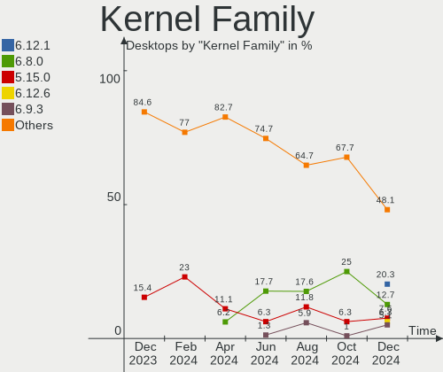

| Version | Desktops | Percent |
|---------|----------|---------|
| 6.2.0   | 20       | 25%     |
| 5.15.0  | 15       | 18.75%  |
| 6.4.11  | 9        | 11.25%  |
| 6.1.0   | 6        | 7.5%    |
| 6.4.9   | 3        | 3.75%   |
| 6.4.6   | 3        | 3.75%   |
| 6.4.10  | 3        | 3.75%   |
| 6.4.7   | 2        | 2.5%    |
| 6.4.12  | 2        | 2.5%    |
| 6.4.0   | 2        | 2.5%    |
| 6.2.6   | 2        | 2.5%    |
| 5.19.0  | 2        | 2.5%    |
| 6.4.8   | 1        | 1.25%   |
| 6.3.12  | 1        | 1.25%   |
| 6.3.0   | 1        | 1.25%   |
| 6.1.44  | 1        | 1.25%   |
| 6.1.41  | 1        | 1.25%   |
| 6.1.1   | 1        | 1.25%   |
| 6.0.0   | 1        | 1.25%   |
| 5.19.7  | 1        | 1.25%   |
| 5.17.5  | 1        | 1.25%   |
| 5.14.0  | 1        | 1.25%   |
| 5.10.0  | 1        | 1.25%   |

Kernel Major Ver.
-----------------

Linux kernel major version

| Version | Desktops | Percent |
|---------|----------|---------|
| 6.4     | 25       | 31.25%  |
| 6.2     | 22       | 27.5%   |
| 5.15    | 15       | 18.75%  |
| 6.1     | 9        | 11.25%  |
| 5.19    | 3        | 3.75%   |
| 6.3     | 2        | 2.5%    |
| 6.0     | 1        | 1.25%   |
| 5.17    | 1        | 1.25%   |
| 5.14    | 1        | 1.25%   |
| 5.10    | 1        | 1.25%   |

Arch
----

OS architecture (x86_64, i586, etc.)

| Name   | Desktops | Percent |
|--------|----------|---------|
| x86_64 | 80       | 100%    |

DE
--

Desktop Environment

| Name       | Desktops | Percent |
|------------|----------|---------|
| GNOME      | 31       | 38.75%  |
| KDE5       | 24       | 30%     |
| X-Cinnamon | 8        | 10%     |
| XFCE       | 6        | 7.5%    |
| Unknown    | 4        | 5%      |
| MATE       | 2        | 2.5%    |
| Pantheon   | 1        | 1.25%   |
| mwm        | 1        | 1.25%   |
| LXQt       | 1        | 1.25%   |
| KDE        | 1        | 1.25%   |
| Hyprland   | 1        | 1.25%   |

Display Server
--------------

X11 or Wayland

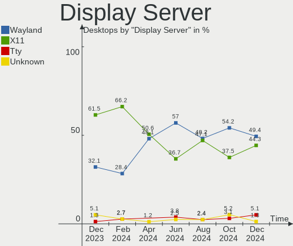

| Name    | Desktops | Percent |
|---------|----------|---------|
| X11     | 49       | 61.25%  |
| Wayland | 29       | 36.25%  |
| Tty     | 1        | 1.25%   |
| Unknown | 1        | 1.25%   |

Display Manager
---------------

SDDM, LightDM, etc.

| Name    | Desktops | Percent |
|---------|----------|---------|
| Unknown | 29       | 36.25%  |
| SDDM    | 18       | 22.5%   |
| GDM3    | 16       | 20%     |
| LightDM | 12       | 15%     |
| GDM     | 5        | 6.25%   |

OS Lang
-------

Language

| Lang    | Desktops | Percent |
|---------|----------|---------|
| en_GB   | 70       | 87.5%   |
| en_US   | 7        | 8.75%   |
| pl_PL   | 1        | 1.25%   |
| en_IE   | 1        | 1.25%   |
| Unknown | 1        | 1.25%   |

Boot Mode
---------

EFI or BIOS

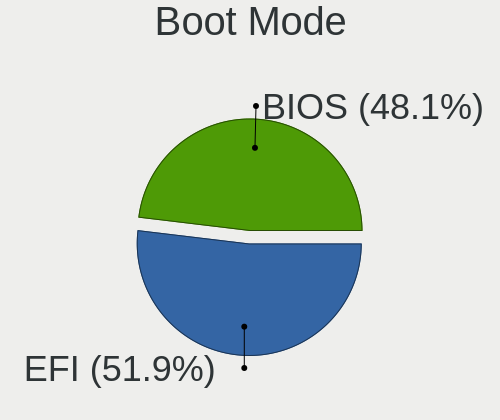

| Mode | Desktops | Percent |
|------|----------|---------|
| EFI  | 44       | 55%     |
| BIOS | 36       | 45%     |

Filesystem
----------

Type of filesystem

| Type    | Desktops | Percent |
|---------|----------|---------|
| Ext4    | 53       | 66.25%  |
| Tmpfs   | 11       | 13.75%  |
| Btrfs   | 9        | 11.25%  |
| Overlay | 4        | 5%      |
| Xfs     | 2        | 2.5%    |
| Ext3    | 1        | 1.25%   |

Part. scheme
------------

Scheme of partitioning

| Type    | Desktops | Percent |
|---------|----------|---------|
| GPT     | 48       | 60%     |
| Unknown | 24       | 30%     |
| MBR     | 8        | 10%     |

Dual Boot with Linux/BSD
------------------------

Hosting more than one Linux/BSD

| Dual boot | Desktops | Percent |
|-----------|----------|---------|
| No        | 64       | 80%     |
| Yes       | 16       | 20%     |

Dual Boot (Win)
---------------

Hosting Linux and Windows

| Dual boot | Desktops | Percent |
|-----------|----------|---------|
| No        | 60       | 75%     |
| Yes       | 20       | 25%     |

Board
-----

Vendor
------

Motherboard manufacturer

| Name                                 | Desktops | Percent |
|--------------------------------------|----------|---------|
| ASUSTek Computer                     | 21       | 26.25%  |
| Gigabyte Technology                  | 16       | 20%     |
| MSI                                  | 14       | 17.5%   |
| Dell                                 | 13       | 16.25%  |
| ASRock                               | 3        | 3.75%   |
| Lenovo                               | 2        | 2.5%    |
| Hewlett-Packard                      | 2        | 2.5%    |
| Supermicro                           | 1        | 1.25%   |
| Shenzhen Meigao Electronic Equipment | 1        | 1.25%   |
| Pegatron                             | 1        | 1.25%   |
| Packard Bell                         | 1        | 1.25%   |
| Inventec                             | 1        | 1.25%   |
| Intel                                | 1        | 1.25%   |
| HC Technology.                       | 1        | 1.25%   |
| Foxconn                              | 1        | 1.25%   |
| AZW                                  | 1        | 1.25%   |

Model
-----

Motherboard model

| Name                                       | Desktops | Percent |
|--------------------------------------------|----------|---------|
| MSI MS-7693                                | 3        | 3.75%   |
| MSI MS-7D70                                | 2        | 2.5%    |
| ASUS ROG STRIX X670E-F GAMING WIFI         | 2        | 2.5%    |
| ASUS ROG STRIX B550-F GAMING               | 2        | 2.5%    |
| ASUS PRIME B550-PLUS                       | 2        | 2.5%    |
| ASUS PRIME B450-PLUS                       | 2        | 2.5%    |
| Supermicro X9DAi                           | 1        | 1.25%   |
| Shenzhen Meigao Electronic Equipment HX99G | 1        | 1.25%   |
| Pegatron Pro 3010 Microtower PC            | 1        | 1.25%   |
| Packard Bell IMEDIA S3730                  | 1        | 1.25%   |
| MSI PPPPP-CCC#MMMMMMMM                     | 1        | 1.25%   |
| MSI MS-7D53                                | 1        | 1.25%   |
| MSI MS-7D25                                | 1        | 1.25%   |
| MSI MS-7C56                                | 1        | 1.25%   |
| MSI MS-7C51                                | 1        | 1.25%   |
| MSI MS-7C02                                | 1        | 1.25%   |
| MSI MS-7B78                                | 1        | 1.25%   |
| MSI MS-7A38                                | 1        | 1.25%   |
| MSI MS-7721                                | 1        | 1.25%   |
| Lenovo ThinkStation P620 30E1S36700        | 1        | 1.25%   |
| Lenovo ThinkCentre M91p 4518A4M            | 1        | 1.25%   |
| Inventec DQ Class                          | 1        | 1.25%   |
| Intel DH67CL AAG10212-205                  | 1        | 1.25%   |
| HP EliteDesk 800 G2 SFF                    | 1        | 1.25%   |
| HP 290 G2 MT Business PC                   | 1        | 1.25%   |
| HC Technology. HCAR5000-MI                 | 1        | 1.25%   |
| Gigabyte Z97X-Gaming 5                     | 1        | 1.25%   |
| Gigabyte Z690 AORUS MASTER                 | 1        | 1.25%   |
| Gigabyte Z590 VISION G                     | 1        | 1.25%   |
| Gigabyte Z270P-D3                          | 1        | 1.25%   |
| Gigabyte Z170X-Gaming 7                    | 1        | 1.25%   |
| Gigabyte X570S AORUS ELITE AX              | 1        | 1.25%   |
| Gigabyte X470 AORUS ULTRA GAMING           | 1        | 1.25%   |
| Gigabyte H81M-S2H                          | 1        | 1.25%   |
| Gigabyte GA-73PVM-S2H                      | 1        | 1.25%   |
| Gigabyte B560 AORUS PRO AX                 | 1        | 1.25%   |
| Gigabyte B550M AORUS PRO-P                 | 1        | 1.25%   |
| Gigabyte B450M DS3H                        | 1        | 1.25%   |
| Gigabyte B450 GAMING X                     | 1        | 1.25%   |
| Gigabyte B450 AORUS M                      | 1        | 1.25%   |

Model Family
------------

Motherboard model prefix

| Name                                       | Desktops | Percent |
|--------------------------------------------|----------|---------|
| Dell OptiPlex                              | 10       | 12.5%   |
| ASUS PRIME                                 | 10       | 12.5%   |
| ASUS ROG                                   | 7        | 8.75%   |
| MSI MS-7693                                | 3        | 3.75%   |
| MSI MS-7D70                                | 2        | 2.5%    |
| Gigabyte B450                              | 2        | 2.5%    |
| Dell Inspiron                              | 2        | 2.5%    |
| Supermicro X9DAi                           | 1        | 1.25%   |
| Shenzhen Meigao Electronic Equipment HX99G | 1        | 1.25%   |
| Pegatron Pro                               | 1        | 1.25%   |
| Packard Bell IMEDIA                        | 1        | 1.25%   |
| MSI PPPPP-CCC#MMMMMMMM                     | 1        | 1.25%   |
| MSI MS-7D53                                | 1        | 1.25%   |
| MSI MS-7D25                                | 1        | 1.25%   |
| MSI MS-7C56                                | 1        | 1.25%   |
| MSI MS-7C51                                | 1        | 1.25%   |
| MSI MS-7C02                                | 1        | 1.25%   |
| MSI MS-7B78                                | 1        | 1.25%   |
| MSI MS-7A38                                | 1        | 1.25%   |
| MSI MS-7721                                | 1        | 1.25%   |
| Lenovo ThinkStation                        | 1        | 1.25%   |
| Lenovo ThinkCentre                         | 1        | 1.25%   |
| Inventec DQ                                | 1        | 1.25%   |
| Intel DH67CL                               | 1        | 1.25%   |
| HP EliteDesk                               | 1        | 1.25%   |
| HP 290                                     | 1        | 1.25%   |
| HC Technology. HCAR5000-MI                 | 1        | 1.25%   |
| Gigabyte Z97X-Gaming                       | 1        | 1.25%   |
| Gigabyte Z690                              | 1        | 1.25%   |
| Gigabyte Z590                              | 1        | 1.25%   |
| Gigabyte Z270P-D3                          | 1        | 1.25%   |
| Gigabyte Z170X-Gaming                      | 1        | 1.25%   |
| Gigabyte X570S                             | 1        | 1.25%   |
| Gigabyte X470                              | 1        | 1.25%   |
| Gigabyte H81M-S2H                          | 1        | 1.25%   |
| Gigabyte GA-73PVM-S2H                      | 1        | 1.25%   |
| Gigabyte B560                              | 1        | 1.25%   |
| Gigabyte B550M                             | 1        | 1.25%   |
| Gigabyte B450M                             | 1        | 1.25%   |
| Gigabyte AB350-Gaming                      | 1        | 1.25%   |

MFG Year
--------

Motherboard manufacture year

| Year | Desktops | Percent |
|------|----------|---------|
| 2018 | 12       | 15%     |
| 2020 | 8        | 10%     |
| 2022 | 7        | 8.75%   |
| 2021 | 7        | 8.75%   |
| 2017 | 7        | 8.75%   |
| 2012 | 7        | 8.75%   |
| 2019 | 6        | 7.5%    |
| 2014 | 6        | 7.5%    |
| 2013 | 4        | 5%      |
| 2023 | 3        | 3.75%   |
| 2015 | 3        | 3.75%   |
| 2007 | 3        | 3.75%   |
| 2011 | 2        | 2.5%    |
| 2009 | 2        | 2.5%    |
| 2016 | 1        | 1.25%   |
| 2010 | 1        | 1.25%   |
| 2008 | 1        | 1.25%   |

Form Factor
-----------

Physical design of the computer

| Name    | Desktops | Percent |
|---------|----------|---------|
| Desktop | 80       | 100%    |

Secure Boot
-----------

Enabled or disabled

| State    | Desktops | Percent |
|----------|----------|---------|
| Disabled | 78       | 97.5%   |
| Enabled  | 2        | 2.5%    |

Coreboot
--------

Have coreboot on board

| Used | Desktops | Percent |
|------|----------|---------|
| No   | 80       | 100%    |

RAM Size
--------

Total RAM memory

| Size in GB  | Desktops | Percent |
|-------------|----------|---------|
| 16.01-24.0  | 24       | 30%     |
| 32.01-64.0  | 20       | 25%     |
| 4.01-8.0    | 11       | 13.75%  |
| 64.01-256.0 | 10       | 12.5%   |
| 8.01-16.0   | 5        | 6.25%   |
| 3.01-4.0    | 4        | 5%      |
| 24.01-32.0  | 4        | 5%      |
| 1.01-2.0    | 2        | 2.5%    |

RAM Used
--------

Used RAM memory

| Used GB    | Desktops | Percent |
|------------|----------|---------|
| 1.01-2.0   | 20       | 25%     |
| 2.01-3.0   | 19       | 23.75%  |
| 3.01-4.0   | 16       | 20%     |
| 4.01-8.0   | 12       | 15%     |
| 8.01-16.0  | 9        | 11.25%  |
| 24.01-32.0 | 2        | 2.5%    |
| 0.51-1.0   | 2        | 2.5%    |

Total Drives
------------

Number of drives on board

| Drives | Desktops | Percent |
|--------|----------|---------|
| 1      | 29       | 36.25%  |
| 2      | 22       | 27.5%   |
| 4      | 10       | 12.5%   |
| 3      | 10       | 12.5%   |
| 5      | 5        | 6.25%   |
| 7      | 2        | 2.5%    |
| 6      | 2        | 2.5%    |

Has CD-ROM
----------

Has CD-ROM on board

| Presented | Desktops | Percent |
|-----------|----------|---------|
| No        | 51       | 63.75%  |
| Yes       | 29       | 36.25%  |

Has Ethernet
------------

Has Ethernet on board

| Presented | Desktops | Percent |
|-----------|----------|---------|
| Yes       | 78       | 97.5%   |
| No        | 2        | 2.5%    |

Has WiFi
--------

Has WiFi module

| Presented | Desktops | Percent |
|-----------|----------|---------|
| Yes       | 42       | 52.5%   |
| No        | 38       | 47.5%   |

Has Bluetooth
-------------

Has Bluetooth module

| Presented | Desktops | Percent |
|-----------|----------|---------|
| No        | 46       | 57.5%   |
| Yes       | 34       | 42.5%   |

Location
--------

Country
-------

Geographic location (country)

| Country | Desktops | Percent |
|---------|----------|---------|
| UK      | 80       | 100%    |

City
----

Geographic location (city)

| City               | Desktops | Percent |
|--------------------|----------|---------|
| London             | 3        | 3.75%   |
| Cardiff            | 3        | 3.75%   |
| Birmingham         | 3        | 3.75%   |
| Leeds              | 2        | 2.5%    |
| Edinburgh          | 2        | 2.5%    |
| Bristol            | 2        | 2.5%    |
| Brighton           | 2        | 2.5%    |
| York               | 1        | 1.25%   |
| Wrexham            | 1        | 1.25%   |
| Workington         | 1        | 1.25%   |
| Worcester Park     | 1        | 1.25%   |
| Woking             | 1        | 1.25%   |
| Witham             | 1        | 1.25%   |
| Windsor            | 1        | 1.25%   |
| Willenhall         | 1        | 1.25%   |
| Wigan              | 1        | 1.25%   |
| Wembley            | 1        | 1.25%   |
| Wakefield          | 1        | 1.25%   |
| Sutton in Ashfield | 1        | 1.25%   |
| Sutton Coldfield   | 1        | 1.25%   |
| Stirling           | 1        | 1.25%   |
| St Austell         | 1        | 1.25%   |
| St Albans          | 1        | 1.25%   |
| Southport          | 1        | 1.25%   |
| Slough             | 1        | 1.25%   |
| Runcorn            | 1        | 1.25%   |
| Rochdale           | 1        | 1.25%   |
| Potters Bar        | 1        | 1.25%   |
| Portsmouth         | 1        | 1.25%   |
| Port Glasgow       | 1        | 1.25%   |
| Plymouth           | 1        | 1.25%   |
| Penicuik           | 1        | 1.25%   |
| Paisley            | 1        | 1.25%   |
| Orkney Islands     | 1        | 1.25%   |
| Nottingham         | 1        | 1.25%   |
| Motherwell         | 1        | 1.25%   |
| Mansfield          | 1        | 1.25%   |
| Manchester         | 1        | 1.25%   |
| Maidstone          | 1        | 1.25%   |
| Macduff            | 1        | 1.25%   |

Drives
------

Drive Vendor
------------

Hard drive vendors

| Vendor                      | Desktops | Drives | Percent |
|-----------------------------|----------|--------|---------|
| Seagate                     | 24       | 34     | 15.19%  |
| Samsung Electronics         | 20       | 29     | 12.66%  |
| WDC                         | 17       | 20     | 10.76%  |
| SanDisk                     | 15       | 21     | 9.49%   |
| Crucial                     | 14       | 16     | 8.86%   |
| Kingston                    | 12       | 13     | 7.59%   |
| Toshiba                     | 8        | 9      | 5.06%   |
| China                       | 6        | 6      | 3.8%    |
| Hitachi                     | 5        | 5      | 3.16%   |
| Phison Electronics          | 4        | 5      | 2.53%   |
| Silicon Motion              | 2        | 2      | 1.27%   |
| OCZ                         | 2        | 2      | 1.27%   |
| Maxtor                      | 2        | 2      | 1.27%   |
| Intel                       | 2        | 3      | 1.27%   |
| Integral                    | 2        | 2      | 1.27%   |
| HGST                        | 2        | 2      | 1.27%   |
| ADATA Technology            | 2        | 4      | 1.27%   |
| XUM                         | 1        | 1      | 0.63%   |
| Unknown                     | 1        | 1      | 0.63%   |
| Team                        | 1        | 1      | 0.63%   |
| TCSUNBOW                    | 1        | 1      | 0.63%   |
| SABRENT                     | 1        | 1      | 0.63%   |
| Realtek Semiconductor       | 1        | 1      | 0.63%   |
| Phison                      | 1        | 1      | 0.63%   |
| Patriot                     | 1        | 1      | 0.63%   |
| ORTIAL                      | 1        | 1      | 0.63%   |
| Netac                       | 1        | 1      | 0.63%   |
| MSI                         | 1        | 1      | 0.63%   |
| Micron/Crucial Technology   | 1        | 1      | 0.63%   |
| Lexar                       | 1        | 1      | 0.63%   |
| KIOXIA-EXCERIA              | 1        | 1      | 0.63%   |
| Kingston Technology Company | 1        | 1      | 0.63%   |
| Hjwdz                       | 1        | 1      | 0.63%   |
| Fanxiang                    | 1        | 1      | 0.63%   |
| Apacer                      | 1        | 1      | 0.63%   |
| 2-Power                     | 1        | 1      | 0.63%   |

Drive Model
-----------

Hard drive models

| Model                                                           | Desktops | Percent |
|-----------------------------------------------------------------|----------|---------|
| Seagate ST1000DM010-2EP102 1TB                                  | 4        | 2.21%   |
| Kingston SA400S37240G 240GB SSD                                 | 4        | 2.21%   |
| Seagate ST4000DM004-2CV104 4TB                                  | 3        | 1.66%   |
| Seagate ST2000DM008-2FR102 2TB                                  | 3        | 1.66%   |
| Seagate ST2000DM006-2DM164 2TB                                  | 3        | 1.66%   |
| Sandisk WD Black SN850 256GB                                    | 3        | 1.66%   |
| Samsung NVMe SSD Controller SM981/PM981/PM983 500GB             | 3        | 1.66%   |
| Phison E12 NVMe Controller 256GB                                | 3        | 1.66%   |
| Crucial CT1000BX500SSD1 1TB                                     | 3        | 1.66%   |
| Toshiba HDWD120 2TB                                             | 2        | 1.1%    |
| Silicon Motion SM2262/SM2262EN SSD Controller 1024GB            | 2        | 1.1%    |
| SanDisk SSD PLUS 240GB                                          | 2        | 1.1%    |
| SanDisk NVMe SSD Drive 2TB                                      | 2        | 1.1%    |
| SanDisk NVMe SSD Drive 1TB                                      | 2        | 1.1%    |
| Samsung SSD 980 1TB                                             | 2        | 1.1%    |
| Samsung SSD 970 EVO Plus 250GB                                  | 2        | 1.1%    |
| Samsung SSD 870 QVO 1TB                                         | 2        | 1.1%    |
| Samsung SSD 860 EVO 500GB                                       | 2        | 1.1%    |
| Samsung SSD 850 EVO 500GB                                       | 2        | 1.1%    |
| Samsung SSD 840 PRO Series 128GB                                | 2        | 1.1%    |
| Kingston SV300S37A120G 120GB SSD                                | 2        | 1.1%    |
| Kingston SA400S37960G 960GB SSD                                 | 2        | 1.1%    |
| Crucial CT500MX500SSD4 500GB                                    | 2        | 1.1%    |
| Crucial CT275MX300SSD1 275GB                                    | 2        | 1.1%    |
| Crucial CT1000MX500SSD1 1TB                                     | 2        | 1.1%    |
| China SSD 2000GB                                                | 2        | 1.1%    |
| ADATA XPG SX8200 Pro PCIe Gen3x4 M.2 2280 Solid State Drive 2TB | 2        | 1.1%    |
| XUM HX128GBSSDSATA3/                                            | 1        | 0.55%   |
| WDC WDS100T3X0C-00SJG0 1TB                                      | 1        | 0.55%   |
| WDC WDS100T2B0C 1TB                                             | 1        | 0.55%   |
| WDC WD800JD-75MSA3 80GB                                         | 1        | 0.55%   |
| WDC WD7500BPKX-22HPJT0 752GB                                    | 1        | 0.55%   |
| WDC WD60EFRX-68L0BN1 6TB                                        | 1        | 0.55%   |
| WDC WD5000LPVX-22V0TT0 500GB                                    | 1        | 0.55%   |
| WDC WD5000AAKX-75U6AA0 500GB                                    | 1        | 0.55%   |
| WDC WD5000AAKS-00V1A0 500GB                                     | 1        | 0.55%   |
| WDC WD5000AADS-00S9B0 500GB                                     | 1        | 0.55%   |
| WDC WD40EZRZ-00WN9B0 4TB                                        | 1        | 0.55%   |
| WDC WD4003FZEX-00Z4SA0 4TB                                      | 1        | 0.55%   |
| WDC WD3200AAJS-00L7A0 320GB                                     | 1        | 0.55%   |

HDD Vendor
----------

Hard disk drive vendors

| Vendor              | Desktops | Drives | Percent |
|---------------------|----------|--------|---------|
| Seagate             | 21       | 25     | 38.18%  |
| WDC                 | 16       | 18     | 29.09%  |
| Toshiba             | 7        | 8      | 12.73%  |
| Hitachi             | 5        | 5      | 9.09%   |
| Maxtor              | 2        | 2      | 3.64%   |
| HGST                | 2        | 2      | 3.64%   |
| Samsung Electronics | 1        | 1      | 1.82%   |
| SABRENT             | 1        | 1      | 1.82%   |

SSD Vendor
----------

Solid state drive vendors

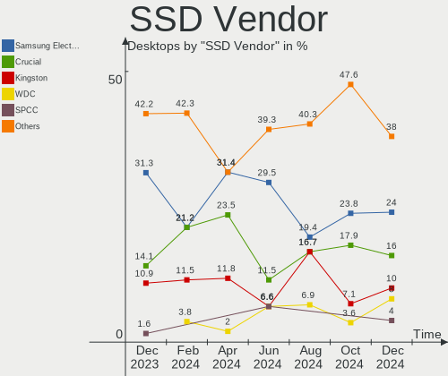

| Vendor              | Desktops | Drives | Percent |
|---------------------|----------|--------|---------|
| Kingston            | 11       | 12     | 18.97%  |
| Crucial             | 10       | 11     | 17.24%  |
| Samsung Electronics | 9        | 15     | 15.52%  |
| China               | 6        | 6      | 10.34%  |
| SanDisk             | 5        | 5      | 8.62%   |
| Seagate             | 2        | 5      | 3.45%   |
| OCZ                 | 2        | 2      | 3.45%   |
| Integral            | 2        | 2      | 3.45%   |
| XUM                 | 1        | 1      | 1.72%   |
| Unknown             | 1        | 1      | 1.72%   |
| Team                | 1        | 1      | 1.72%   |
| TCSUNBOW            | 1        | 1      | 1.72%   |
| Patriot             | 1        | 1      | 1.72%   |
| ORTIAL              | 1        | 1      | 1.72%   |
| Netac               | 1        | 1      | 1.72%   |
| KIOXIA-EXCERIA      | 1        | 1      | 1.72%   |
| Intel               | 1        | 1      | 1.72%   |
| Apacer              | 1        | 1      | 1.72%   |
| 2-Power             | 1        | 1      | 1.72%   |

Drive Kind
----------

HDD or SSD

| Kind    | Desktops | Drives | Percent |
|---------|----------|--------|---------|
| HDD     | 46       | 62     | 35.38%  |
| SSD     | 43       | 69     | 33.08%  |
| NVMe    | 40       | 62     | 30.77%  |
| Unknown | 1        | 1      | 0.77%   |

Drive Connector
---------------

SATA, SAS, NVMe, etc.

| Type | Desktops | Drives | Percent |
|------|----------|--------|---------|
| SATA | 67       | 128    | 60.36%  |
| NVMe | 40       | 62     | 36.04%  |
| SAS  | 4        | 4      | 3.6%    |

Drive Size
----------

Size of hard drive

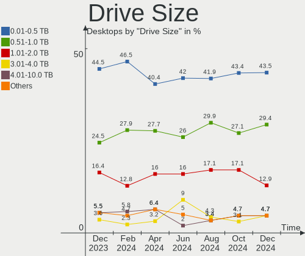

| Size in TB | Desktops | Drives | Percent |
|------------|----------|--------|---------|
| 0.01-0.5   | 44       | 60     | 43.56%  |
| 0.51-1.0   | 27       | 35     | 26.73%  |
| 1.01-2.0   | 15       | 18     | 14.85%  |
| 3.01-4.0   | 6        | 7      | 5.94%   |
| 4.01-10.0  | 6        | 7      | 5.94%   |
| 2.01-3.0   | 3        | 4      | 2.97%   |

Space Total
-----------

Amount of disk space available on the file system

| Size in GB     | Desktops | Percent |
|----------------|----------|---------|
| More than 3000 | 16       | 20%     |
| 101-250        | 14       | 17.5%   |
| 501-1000       | 11       | 13.75%  |
| 1001-2000      | 10       | 12.5%   |
| 2001-3000      | 9        | 11.25%  |
| 251-500        | 8        | 10%     |
| 1-20           | 4        | 5%      |
| 51-100         | 3        | 3.75%   |
| Unknown        | 3        | 3.75%   |
| 21-50          | 2        | 2.5%    |

Space Used
----------

Amount of used disk space

| Used GB        | Desktops | Percent |
|----------------|----------|---------|
| 1-20           | 23       | 28.75%  |
| 101-250        | 10       | 12.5%   |
| 251-500        | 9        | 11.25%  |
| 21-50          | 7        | 8.75%   |
| 1001-2000      | 7        | 8.75%   |
| 501-1000       | 7        | 8.75%   |
| 51-100         | 6        | 7.5%    |
| More than 3000 | 5        | 6.25%   |
| 2001-3000      | 3        | 3.75%   |
| Unknown        | 3        | 3.75%   |

Malfunc. Drives
---------------

Drive models with a malfunction

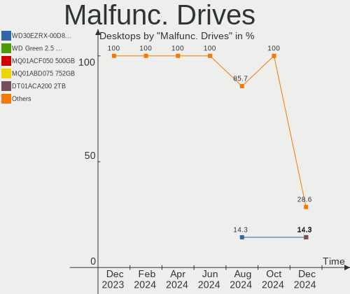

| Model                            | Desktops | Drives | Percent |
|----------------------------------|----------|--------|---------|
| WDC WD60EFRX-68L0BN1 6TB         | 1        | 1      | 16.67%  |
| Toshiba HDWD120 2TB              | 1        | 1      | 16.67%  |
| Seagate ST500NM0011 500GB        | 1        | 1      | 16.67%  |
| Samsung Electronics HD103UJ 1TB  | 1        | 1      | 16.67%  |
| Lexar 500GB SSD                  | 1        | 1      | 16.67%  |
| Kingston SV300S37A120G 120GB SSD | 1        | 1      | 16.67%  |

Malfunc. Drive Vendor
---------------------

Vendors of faulty drives

| Vendor              | Desktops | Drives | Percent |
|---------------------|----------|--------|---------|
| WDC                 | 1        | 1      | 16.67%  |
| Toshiba             | 1        | 1      | 16.67%  |
| Seagate             | 1        | 1      | 16.67%  |
| Samsung Electronics | 1        | 1      | 16.67%  |
| Lexar               | 1        | 1      | 16.67%  |
| Kingston            | 1        | 1      | 16.67%  |

Malfunc. HDD Vendor
-------------------

Vendors of faulty HDD drives

| Vendor              | Desktops | Drives | Percent |
|---------------------|----------|--------|---------|
| WDC                 | 1        | 1      | 25%     |
| Toshiba             | 1        | 1      | 25%     |
| Seagate             | 1        | 1      | 25%     |
| Samsung Electronics | 1        | 1      | 25%     |

Malfunc. Drive Kind
-------------------

Kinds of faulty drives

| Kind | Desktops | Drives | Percent |
|------|----------|--------|---------|
| HDD  | 4        | 4      | 66.67%  |
| NVMe | 1        | 1      | 16.67%  |
| SSD  | 1        | 1      | 16.67%  |

Failed Drives
-------------

Failed drive models

Zero info for selected period =(

Failed Drive Vendor
-------------------

Failed drive vendors

Zero info for selected period =(

Drive Status
------------

Number of failed and malfunc. drives

| Status   | Desktops | Drives | Percent |
|----------|----------|--------|---------|
| Detected | 43       | 88     | 47.25%  |
| Works    | 42       | 100    | 46.15%  |
| Malfunc  | 6        | 6      | 6.59%   |

Storage controller
------------------

Storage Vendor
--------------

Storage controller vendors

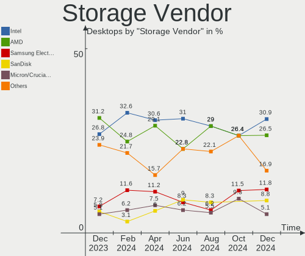

| Vendor                       | Desktops | Percent |
|------------------------------|----------|---------|
| AMD                          | 44       | 33.85%  |
| Intel                        | 34       | 26.15%  |
| Samsung Electronics          | 13       | 10%     |
| SanDisk                      | 12       | 9.23%   |
| Micron/Crucial Technology    | 6        | 4.62%   |
| Phison Electronics           | 4        | 3.08%   |
| Silicon Motion               | 3        | 2.31%   |
| Seagate Technology           | 3        | 2.31%   |
| Nvidia                       | 2        | 1.54%   |
| Kingston Technology Company  | 2        | 1.54%   |
| ADATA Technology             | 2        | 1.54%   |
| Toshiba America Info Systems | 1        | 0.77%   |
| Realtek Semiconductor        | 1        | 0.77%   |
| INNOGRIT                     | 1        | 0.77%   |
| Broadcom / LSI               | 1        | 0.77%   |
| ASMedia Technology           | 1        | 0.77%   |

Storage Model
-------------

Storage controller models

| Model                                                                          | Desktops | Percent |
|--------------------------------------------------------------------------------|----------|---------|
| AMD FCH SATA Controller [AHCI mode]                                            | 27       | 16.88%  |
| AMD 400 Series Chipset SATA Controller                                         | 12       | 7.5%    |
| Samsung NVMe SSD Controller SM981/PM981/PM983                                  | 6        | 3.75%   |
| AMD 500 Series Chipset SATA Controller                                         | 6        | 3.75%   |
| Intel 8 Series/C220 Series Chipset Family 6-port SATA Controller 1 [AHCI mode] | 5        | 3.13%   |
| AMD SB7x0/SB8x0/SB9x0 SATA Controller [IDE mode]                               | 5        | 3.13%   |
| AMD SB7x0/SB8x0/SB9x0 IDE Controller                                           | 5        | 3.13%   |
| Intel Q170/Q150/B150/H170/H110/Z170/CM236 Chipset SATA Controller [AHCI Mode]  | 4        | 2.5%    |
| SanDisk WD PC SN810 / Black SN850 NVMe SSD                                     | 3        | 1.88%   |
| SanDisk WD Black SN770 / PC SN740 256GB / PC SN560 (DRAM-less) NVMe SSD        | 3        | 1.88%   |
| Samsung NVMe SSD Controller PM9A1/PM9A3/980PRO                                 | 3        | 1.88%   |
| Samsung NVMe SSD Controller 980                                                | 3        | 1.88%   |
| Phison E12 NVMe Controller                                                     | 3        | 1.88%   |
| Micron/Crucial P2 [Nick P2] / P3 / P3 Plus NVMe PCIe SSD (DRAM-less)           | 3        | 1.88%   |
| Intel SATA Controller [RAID mode]                                              | 3        | 1.88%   |
| Intel 6 Series/C200 Series Chipset Family 6 port Desktop SATA AHCI Controller  | 3        | 1.88%   |
| Intel 200 Series PCH SATA controller [AHCI mode]                               | 3        | 1.88%   |
| AMD FCH SATA Controller D                                                      | 3        | 1.88%   |
| Silicon Motion SM2262/SM2262EN SSD Controller                                  | 2        | 1.25%   |
| Seagate FireCuda 520 SSD                                                       | 2        | 1.25%   |
| SanDisk WD Blue SN570 NVMe SSD 2TB                                             | 2        | 1.25%   |
| SanDisk WD Blue SN550 NVMe SSD                                                 | 2        | 1.25%   |
| SanDisk WD Black SN750 / PC SN730 NVMe SSD                                     | 2        | 1.25%   |
| Phison E18 PCIe4 NVMe Controller                                               | 2        | 1.25%   |
| Micron/Crucial P5 Plus NVMe PCIe SSD                                           | 2        | 1.25%   |
| Intel Volume Management Device NVMe RAID Controller                            | 2        | 1.25%   |
| Intel Cannon Lake PCH SATA AHCI Controller                                     | 2        | 1.25%   |
| Intel Alder Lake-S PCH SATA Controller [AHCI Mode]                             | 2        | 1.25%   |
| Intel 500 Series Chipset Family SATA AHCI Controller                           | 2        | 1.25%   |
| ADATA XPG SX8200 Pro PCIe Gen3x4 M.2 2280 Solid State Drive                    | 2        | 1.25%   |
| Toshiba America Info Systems BG3 NVMe SSD Controller                           | 1        | 0.63%   |
| Silicon Motion SM2263EN/SM2263XT (DRAM-less) NVMe SSD Controllers              | 1        | 0.63%   |
| Seagate FireCuda/IronWolf 510 SSD                                              | 1        | 0.63%   |
| Sandisk Western Digital WD Black SN850X NVMe SSD                               | 1        | 0.63%   |
| SanDisk PC SN735 NVMe SSD (DRAM-less)                                          | 1        | 0.63%   |
| Samsung NVMe SSD Controller SM951/PM951                                        | 1        | 0.63%   |
| Realtek RTS5765DL NVMe SSD Controller (DRAM-less)                              | 1        | 0.63%   |
| Nvidia MCP73 IDE Controller                                                    | 1        | 0.63%   |
| Nvidia MCP61 SATA Controller                                                   | 1        | 0.63%   |
| Nvidia MCP61 IDE                                                               | 1        | 0.63%   |

Storage Kind
------------

Kind of storage controller (IDE, SATA, NVMe, SAS, ...)

| Kind | Desktops | Percent |
|------|----------|---------|
| SATA | 74       | 57.36%  |
| NVMe | 40       | 31.01%  |
| IDE  | 9        | 6.98%   |
| RAID | 5        | 3.88%   |
| SAS  | 1        | 0.78%   |

Processor
---------

CPU Vendor
----------

Processor vendors

| Vendor | Desktops | Percent |
|--------|----------|---------|
| AMD    | 46       | 57.5%   |
| Intel  | 34       | 42.5%   |

CPU Model
---------

Processor models

| Model                                       | Desktops | Percent |
|---------------------------------------------|----------|---------|
| AMD Ryzen 5 5600X 6-Core Processor          | 4        | 5%      |
| AMD FX-6300 Six-Core Processor              | 4        | 5%      |
| Intel Core i5-6500T CPU @ 2.50GHz           | 3        | 3.75%   |
| AMD Ryzen 9 5950X 16-Core Processor         | 3        | 3.75%   |
| AMD Ryzen 7 2700X Eight-Core Processor      | 3        | 3.75%   |
| Intel Core i5-6500 CPU @ 3.20GHz            | 2        | 2.5%    |
| Intel Core i5-3470 CPU @ 3.20GHz            | 2        | 2.5%    |
| Intel Core i5-2400 CPU @ 3.10GHz            | 2        | 2.5%    |
| Intel 12th Gen Core i5-12400F               | 2        | 2.5%    |
| Intel 11th Gen Core i7-11700 @ 2.50GHz      | 2        | 2.5%    |
| AMD Ryzen 9 7950X 16-Core Processor         | 2        | 2.5%    |
| AMD Ryzen 9 7900X 12-Core Processor         | 2        | 2.5%    |
| AMD Ryzen 9 5900X 12-Core Processor         | 2        | 2.5%    |
| AMD Ryzen 7 3700X 8-Core Processor          | 2        | 2.5%    |
| AMD Ryzen 5 3600 6-Core Processor           | 2        | 2.5%    |
| AMD Ryzen 5 3500X 6-Core Processor          | 2        | 2.5%    |
| AMD Ryzen 5 1600 Six-Core Processor         | 2        | 2.5%    |
| Intel Xeon CPU W3580 @ 3.33GHz              | 1        | 1.25%   |
| Intel Xeon CPU E5-2643 0 @ 3.30GHz          | 1        | 1.25%   |
| Intel Pentium Dual-Core CPU E5300 @ 2.60GHz | 1        | 1.25%   |
| Intel Pentium Dual CPU E2160 @ 1.80GHz      | 1        | 1.25%   |
| Intel Core i7-9700T CPU @ 2.00GHz           | 1        | 1.25%   |
| Intel Core i7-7700K CPU @ 4.20GHz           | 1        | 1.25%   |
| Intel Core i7-7700 CPU @ 3.60GHz            | 1        | 1.25%   |
| Intel Core i7-6700K CPU @ 4.00GHz           | 1        | 1.25%   |
| Intel Core i7-4790K CPU @ 4.00GHz           | 1        | 1.25%   |
| Intel Core i7-4790 CPU @ 3.60GHz            | 1        | 1.25%   |
| Intel Core i7 CPU 860 @ 2.80GHz             | 1        | 1.25%   |
| Intel Core i5-8500 CPU @ 3.00GHz            | 1        | 1.25%   |
| Intel Core i5-4590T CPU @ 2.00GHz           | 1        | 1.25%   |
| Intel Core i5-4590 CPU @ 3.30GHz            | 1        | 1.25%   |
| Intel Core i5-4460 CPU @ 3.20GHz            | 1        | 1.25%   |
| Intel Core i5-2300 CPU @ 2.80GHz            | 1        | 1.25%   |
| Intel Core i3-4150 CPU @ 3.50GHz            | 1        | 1.25%   |
| Intel Core 2 Duo CPU E8400 @ 3.00GHz        | 1        | 1.25%   |
| Intel Celeron N5095A @ 2.00GHz              | 1        | 1.25%   |
| Intel Celeron CPU J3355 @ 2.00GHz           | 1        | 1.25%   |
| Intel 12th Gen Core i7-12700K               | 1        | 1.25%   |
| AMD Ryzen Threadripper PRO 5975WX 32-Cores  | 1        | 1.25%   |
| AMD Ryzen 9 6900HX with Radeon Graphics     | 1        | 1.25%   |

CPU Model Family
----------------

Processor model prefix

| Model                   | Desktops | Percent |
|-------------------------|----------|---------|
| AMD Ryzen 5             | 17       | 21.25%  |
| Intel Core i5           | 14       | 17.5%   |
| AMD Ryzen 9             | 10       | 12.5%   |
| Intel Core i7           | 7        | 8.75%   |
| AMD Ryzen 7             | 7        | 8.75%   |
| Other                   | 5        | 6.25%   |
| AMD FX                  | 5        | 6.25%   |
| Intel Xeon              | 2        | 2.5%    |
| Intel Celeron           | 2        | 2.5%    |
| AMD Ryzen 3             | 2        | 2.5%    |
| AMD Athlon 64 X2        | 2        | 2.5%    |
| Intel Pentium Dual-Core | 1        | 1.25%   |
| Intel Pentium Dual      | 1        | 1.25%   |
| Intel Core i3           | 1        | 1.25%   |
| Intel Core 2 Duo        | 1        | 1.25%   |
| AMD Ryzen Threadripper  | 1        | 1.25%   |
| AMD GX                  | 1        | 1.25%   |
| AMD A4                  | 1        | 1.25%   |

CPU Cores
---------

Number of processor cores

| Number | Desktops | Percent |
|--------|----------|---------|
| 4      | 26       | 32.5%   |
| 6      | 19       | 23.75%  |
| 8      | 12       | 15%     |
| 2      | 7        | 8.75%   |
| 16     | 5        | 6.25%   |
| 12     | 5        | 6.25%   |
| 3      | 4        | 5%      |
| 32     | 1        | 1.25%   |
| 1      | 1        | 1.25%   |

CPU Sockets
-----------

Number of sockets

| Number | Desktops | Percent |
|--------|----------|---------|
| 1      | 79       | 98.75%  |
| 2      | 1        | 1.25%   |

CPU Threads
-----------

Threads per core (Hyper-Threading)

| Number | Desktops | Percent |
|--------|----------|---------|
| 2      | 51       | 63.75%  |
| 1      | 29       | 36.25%  |

CPU Op-Modes
------------

CPU Operation Modes (32-bit, 64-bit)

| Op mode        | Desktops | Percent |
|----------------|----------|---------|
| 32-bit, 64-bit | 80       | 100%    |

CPU Microcode
-------------

Microcode number

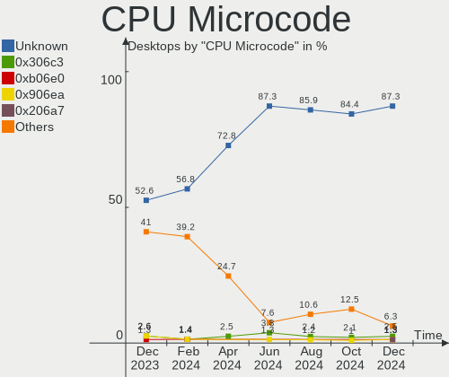

| Number     | Desktops | Percent |
|------------|----------|---------|
| Unknown    | 36       | 45%     |
| 0x0800820d | 8        | 10%     |
| 0x0a601203 | 3        | 3.75%   |
| 0x0a20120a | 3        | 3.75%   |
| 0x08701021 | 3        | 3.75%   |
| 0x306a9    | 2        | 2.5%    |
| 0x0a201016 | 2        | 2.5%    |
| 0x08701030 | 2        | 2.5%    |
| 0x06000852 | 2        | 2.5%    |
| 0xa0671    | 1        | 1.25%   |
| 0x906ed    | 1        | 1.25%   |
| 0x906e9    | 1        | 1.25%   |
| 0x90672    | 1        | 1.25%   |
| 0x6fd      | 1        | 1.25%   |
| 0x506e3    | 1        | 1.25%   |
| 0x306c3    | 1        | 1.25%   |
| 0x206d7    | 1        | 1.25%   |
| 0x206a7    | 1        | 1.25%   |
| 0x0a50000d | 1        | 1.25%   |
| 0x0a404102 | 1        | 1.25%   |
| 0x0a201025 | 1        | 1.25%   |
| 0x0a008204 | 1        | 1.25%   |
| 0x08701011 | 1        | 1.25%   |
| 0x08608103 | 1        | 1.25%   |
| 0x0810100b | 1        | 1.25%   |
| 0x0700010f | 1        | 1.25%   |
| 0x06001119 | 1        | 1.25%   |
| 0x06000822 | 1        | 1.25%   |

CPU Microarch
-------------

Microarchitecture

| Name             | Desktops | Percent |
|------------------|----------|---------|
| Zen 3            | 11       | 13.75%  |
| Zen 2            | 9        | 11.25%  |
| Unknown          | 9        | 11.25%  |
| Zen+             | 8        | 10%     |
| Skylake          | 6        | 7.5%    |
| Piledriver       | 6        | 7.5%    |
| Haswell          | 6        | 7.5%    |
| SandyBridge      | 4        | 5%      |
| KabyLake         | 4        | 5%      |
| Zen              | 2        | 2.5%    |
| Penryn           | 2        | 2.5%    |
| Nehalem          | 2        | 2.5%    |
| K8 Hammer        | 2        | 2.5%    |
| IvyBridge        | 2        | 2.5%    |
| Icelake          | 2        | 2.5%    |
| Alderlake Hybrid | 2        | 2.5%    |
| Jaguar           | 1        | 1.25%   |
| Goldmont         | 1        | 1.25%   |
| Core             | 1        | 1.25%   |

Graphics
--------

GPU Vendor
----------

Vendors of graphics cards

| Vendor | Desktops | Percent |
|--------|----------|---------|
| Nvidia | 38       | 44.71%  |
| AMD    | 26       | 30.59%  |
| Intel  | 21       | 24.71%  |

GPU Model
---------

Graphics card models

| Model                                                                       | Desktops | Percent |
|-----------------------------------------------------------------------------|----------|---------|
| AMD Ellesmere [Radeon RX 470/480/570/570X/580/580X/590]                     | 6        | 6.74%   |
| Intel Xeon E3-1200 v3/4th Gen Core Processor Integrated Graphics Controller | 5        | 5.62%   |
| Intel HD Graphics 530                                                       | 5        | 5.62%   |
| Nvidia GK107 [GeForce GT 640]                                               | 3        | 3.37%   |
| Intel 2nd Generation Core Processor Family Integrated Graphics Controller   | 3        | 3.37%   |
| AMD Raphael                                                                 | 3        | 3.37%   |
| AMD Navi 31 [Radeon RX 7900 XT/7900 XTX]                                    | 3        | 3.37%   |
| Nvidia GP107 [GeForce GTX 1050 Ti]                                          | 2        | 2.25%   |
| Nvidia GP104 [GeForce GTX 1070]                                             | 2        | 2.25%   |
| Nvidia GM206 [GeForce GTX 960]                                              | 2        | 2.25%   |
| Nvidia GM107 [GeForce GTX 750 Ti]                                           | 2        | 2.25%   |
| Nvidia GK208B [GeForce GT 710]                                              | 2        | 2.25%   |
| Nvidia GA106 [Geforce RTX 3050]                                             | 2        | 2.25%   |
| Nvidia GA104 [GeForce RTX 3060 Ti Lite Hash Rate]                           | 2        | 2.25%   |
| Intel CoffeeLake-S GT2 [UHD Graphics 630]                                   | 2        | 2.25%   |
| AMD Navi 22 [Radeon RX 6700/6700 XT/6750 XT / 6800M/6850M XT]               | 2        | 2.25%   |
| Nvidia TU116 [GeForce GTX 1650]                                             | 1        | 1.12%   |
| Nvidia TU104 [GeForce RTX 2080 Rev. A]                                      | 1        | 1.12%   |
| Nvidia TU104 [GeForce RTX 2070 SUPER]                                       | 1        | 1.12%   |
| Nvidia GP108 [GeForce GT 1030]                                              | 1        | 1.12%   |
| Nvidia GP107GL [Quadro P620]                                                | 1        | 1.12%   |
| Nvidia GP102 [GeForce GTX 1080 Ti]                                          | 1        | 1.12%   |
| Nvidia GM206 [GeForce GTX 950]                                              | 1        | 1.12%   |
| Nvidia GM204 [GeForce GTX 970]                                              | 1        | 1.12%   |
| Nvidia GK208B [GeForce GT 730]                                              | 1        | 1.12%   |
| Nvidia GK208B [GeForce GT 720]                                              | 1        | 1.12%   |
| Nvidia GF108 [GeForce GT 630]                                               | 1        | 1.12%   |
| Nvidia GA106 [GeForce RTX 3060]                                             | 1        | 1.12%   |
| Nvidia GA106 [GeForce RTX 3060 Lite Hash Rate]                              | 1        | 1.12%   |
| Nvidia GA102GL [RTX A6000]                                                  | 1        | 1.12%   |
| Nvidia GA102 [GeForce RTX 3090 Ti]                                          | 1        | 1.12%   |
| Nvidia GA102 [GeForce RTX 3080]                                             | 1        | 1.12%   |
| Nvidia GA102 [GeForce RTX 3080 Ti]                                          | 1        | 1.12%   |
| Nvidia GA102 [GeForce RTX 3080 12GB]                                        | 1        | 1.12%   |
| Nvidia G92 [GeForce 8800 GS]                                                | 1        | 1.12%   |
| Nvidia C73 [GeForce 7100 / nForce 630i]                                     | 1        | 1.12%   |
| Nvidia C61 [GeForce 6150SE nForce 430]                                      | 1        | 1.12%   |
| Nvidia AD104 [GeForce RTX 4070]                                             | 1        | 1.12%   |
| Intel Xeon E3-1200 v2/3rd Gen Core processor Graphics Controller            | 1        | 1.12%   |
| Intel JasperLake [UHD Graphics]                                             | 1        | 1.12%   |

GPU Combo
---------

Combinations of graphics cards

| Name           | Desktops | Percent |
|----------------|----------|---------|
| 1 x Nvidia     | 34       | 42.5%   |
| 1 x AMD        | 20       | 25%     |
| 1 x Intel      | 17       | 21.25%  |
| 2 x AMD        | 3        | 3.75%   |
| Intel + Nvidia | 2        | 2.5%    |
| Intel + AMD    | 2        | 2.5%    |
| 2 x Nvidia     | 1        | 1.25%   |
| AMD + Nvidia   | 1        | 1.25%   |

GPU Driver
----------

Free vs proprietary

| Driver      | Desktops | Percent |
|-------------|----------|---------|
| Free        | 54       | 67.5%   |
| Proprietary | 21       | 26.25%  |
| Unknown     | 5        | 6.25%   |

GPU Memory
----------

Total video memory

| Size in GB | Desktops | Percent |
|------------|----------|---------|
| Unknown    | 35       | 43.75%  |
| 1.01-2.0   | 10       | 12.5%   |
| 7.01-8.0   | 9        | 11.25%  |
| 8.01-16.0  | 8        | 10%     |
| 3.01-4.0   | 7        | 8.75%   |
| 0.01-0.5   | 7        | 8.75%   |
| 16.01-24.0 | 2        | 2.5%    |
| 0.51-1.0   | 2        | 2.5%    |

Monitor
-------

Monitor Vendor
--------------

Monitor vendors

| Vendor               | Desktops | Percent |
|----------------------|----------|---------|
| Dell                 | 15       | 17.24%  |
| Samsung Electronics  | 10       | 11.49%  |
| Acer                 | 7        | 8.05%   |
| Goldstar             | 6        | 6.9%    |
| AOC                  | 6        | 6.9%    |
| Iiyama               | 5        | 5.75%   |
| Hewlett-Packard      | 4        | 4.6%    |
| BenQ                 | 4        | 4.6%    |
| Ancor Communications | 4        | 4.6%    |
| ViewSonic            | 3        | 3.45%   |
| Philips              | 3        | 3.45%   |
| CVT                  | 3        | 3.45%   |
| Lenovo               | 2        | 2.3%    |
| ASUSTek Computer     | 2        | 2.3%    |
| Vestel               | 1        | 1.15%   |
| Valve                | 1        | 1.15%   |
| Sony                 | 1        | 1.15%   |
| Pixio                | 1        | 1.15%   |
| Panasonic            | 1        | 1.15%   |
| Optoma               | 1        | 1.15%   |
| OEM                  | 1        | 1.15%   |
| MSI                  | 1        | 1.15%   |
| LG Electronics       | 1        | 1.15%   |
| Hitachi              | 1        | 1.15%   |
| Gigabyte Technology  | 1        | 1.15%   |
| Aosiman              | 1        | 1.15%   |
| Unknown              | 1        | 1.15%   |

Monitor Model
-------------

Monitor models

| Model                                                                   | Desktops | Percent |
|-------------------------------------------------------------------------|----------|---------|
| CVT Monitor CVT4668 1440x900 360x290mm 18.2-inch                        | 2        | 2.22%   |
| BenQ GL2450H BNQ78A7 1920x1080 531x298mm 24.0-inch                      | 2        | 2.22%   |
| Ancor Communications ASUS VS229 ACI22C2 1920x1080 477x268mm 21.5-inch   | 2        | 2.22%   |
| ViewSonic VX3276-QHD VSCE635 2560x1440 698x393mm 31.5-inch              | 1        | 1.11%   |
| ViewSonic VA2405-FHD VSCA939 1920x1080 527x296mm 23.8-inch              | 1        | 1.11%   |
| ViewSonic VA2265 SERIES VSCB330 1920x1080 476x268mm 21.5-inch           | 1        | 1.11%   |
| Vestel LCD Monitor 50UHD_LCD_TV 3840x2160                               | 1        | 1.11%   |
| Valve Index HMD VLV91A8                                                 | 1        | 1.11%   |
| Sony TV SNYA102 1920x1080 708x398mm 32.0-inch                           | 1        | 1.11%   |
| Samsung Electronics U32J59x SAM0F34 3840x2160 697x392mm 31.5-inch       | 1        | 1.11%   |
| Samsung Electronics SyncMaster SAM056E 1920x1200 518x324mm 24.1-inch    | 1        | 1.11%   |
| Samsung Electronics LF24T40 SAM703C 1920x1080 521x293mm 23.5-inch       | 1        | 1.11%   |
| Samsung Electronics LCD Monitor SAM7129 3840x2160 950x540mm 43.0-inch   | 1        | 1.11%   |
| Samsung Electronics LCD Monitor SAM0DF7 3840x2160 1872x1053mm 84.6-inch | 1        | 1.11%   |
| Samsung Electronics LCD Monitor SAM0A7A 1920x1080 1060x626mm 48.5-inch  | 1        | 1.11%   |
| Samsung Electronics LCD Monitor SAM0902 1920x1080 480x270mm 21.7-inch   | 1        | 1.11%   |
| Samsung Electronics LCD Monitor SAM029D 1280x720                        | 1        | 1.11%   |
| Samsung Electronics LCD Monitor LC49G95T 3840x1080                      | 1        | 1.11%   |
| Samsung Electronics LC32G5xT SAM7089 2560x1440 698x393mm 31.5-inch      | 1        | 1.11%   |
| Pixio DP ICB3500 3440x1440 708x399mm 32.0-inch                          | 1        | 1.11%   |
| Philips PHL 276E8V PHLC18F 3840x2160 600x340mm 27.2-inch                | 1        | 1.11%   |
| Philips PHL 241P6Q PHL08DB 1920x1080 527x296mm 23.8-inch                | 1        | 1.11%   |
| Philips PHL 227E6 PHLC0E5 1920x1080 477x268mm 21.5-inch                 | 1        | 1.11%   |
| Panasonic TV MEIA296 3840x2160 1280x720mm 57.8-inch                     | 1        | 1.11%   |
| Optoma 1080P OTM079C 1920x1080                                          | 1        | 1.11%   |
| OEM 24W_LCD_TV OEM3700 1920x1080                                        | 1        | 1.11%   |
| MSI MP242 MSI30A1 1920x1080 527x296mm 23.8-inch                         | 1        | 1.11%   |
| LG Electronics LCD Monitor 27GL850 2560x1440                            | 1        | 1.11%   |
| Lenovo LEN P27u-10 LEN61B0 3840x2160 597x336mm 27.0-inch                | 1        | 1.11%   |
| Lenovo L1940p Wide LEN1148 1440x900 410x257mm 19.1-inch                 | 1        | 1.11%   |
| Iiyama PLX2780H IVM6608 1920x1080 598x336mm 27.0-inch                   | 1        | 1.11%   |
| Iiyama PLG2888UH IVM710B 3840x2160                                      | 1        | 1.11%   |
| Iiyama PL3266Q IVM7617 2560x1440 697x392mm 31.5-inch                    | 1        | 1.11%   |
| Iiyama PL2280 IVM562F 1920x1080 477x268mm 21.5-inch                     | 1        | 1.11%   |
| Iiyama PL2202W IVM5603 1680x1050 490x320mm 23.0-inch                    | 1        | 1.11%   |
| Hitachi HISENSE HEC002F 3840x2160 1872x1053mm 84.6-inch                 | 1        | 1.11%   |
| Hewlett-Packard E231 HWP3065 1920x1080 509x286mm 23.0-inch              | 1        | 1.11%   |
| Hewlett-Packard E190i HWP3119 1280x1024 374x299mm 18.9-inch             | 1        | 1.11%   |
| Hewlett-Packard 32 Display HPN351A 1920x1080 698x393mm 31.5-inch        | 1        | 1.11%   |
| Hewlett-Packard 22w HPN342E 1920x1080 476x268mm 21.5-inch               | 1        | 1.11%   |

Monitor Resolution
------------------

Monitor screen resolution

| Resolution         | Desktops | Percent |
|--------------------|----------|---------|
| 1920x1080 (FHD)    | 38       | 47.5%   |
| 3840x2160 (4K)     | 15       | 18.75%  |
| 2560x1440 (QHD)    | 8        | 10%     |
| 3440x1440          | 4        | 5%      |
| 1920x1200 (WUXGA)  | 2        | 2.5%    |
| 1600x900 (HD+)     | 2        | 2.5%    |
| 1280x1024 (SXGA)   | 2        | 2.5%    |
| 3840x1080          | 1        | 1.25%   |
| 2560x1600          | 1        | 1.25%   |
| 2560x1080          | 1        | 1.25%   |
| 1920x540           | 1        | 1.25%   |
| 1680x1050 (WSXGA+) | 1        | 1.25%   |
| 1440x900 (WXGA+)   | 1        | 1.25%   |
| 1360x768           | 1        | 1.25%   |
| 1024x768 (XGA)     | 1        | 1.25%   |
| Unknown            | 1        | 1.25%   |

Monitor Diagonal
----------------

Diagonal size in inches

| Inches  | Desktops | Percent |
|---------|----------|---------|
| 27      | 12       | 13.95%  |
| 23      | 12       | 13.95%  |
| 21      | 12       | 13.95%  |
| 24      | 11       | 12.79%  |
| Unknown | 8        | 9.3%    |
| 31      | 7        | 8.14%   |
| 84      | 4        | 4.65%   |
| 32      | 3        | 3.49%   |
| 18      | 3        | 3.49%   |
| 35      | 2        | 2.33%   |
| 34      | 2        | 2.33%   |
| 20      | 2        | 2.33%   |
| 54      | 1        | 1.16%   |
| 48      | 1        | 1.16%   |
| 29      | 1        | 1.16%   |
| 28      | 1        | 1.16%   |
| 26      | 1        | 1.16%   |
| 19      | 1        | 1.16%   |
| 17      | 1        | 1.16%   |
| 15      | 1        | 1.16%   |

Monitor Width
-------------

Physical width

| Width in mm | Desktops | Percent |
|-------------|----------|---------|
| 501-600     | 31       | 36.9%   |
| 401-500     | 16       | 19.05%  |
| 601-700     | 11       | 13.1%   |
| Unknown     | 8        | 9.52%   |
| 701-800     | 5        | 5.95%   |
| 1501-2000   | 4        | 4.76%   |
| 351-400     | 3        | 3.57%   |
| 801-900     | 2        | 2.38%   |
| 301-350     | 2        | 2.38%   |
| 1001-1500   | 2        | 2.38%   |

Aspect Ratio
------------

Proportional relationship between the width and the height

| Ratio   | Desktops | Percent |
|---------|----------|---------|
| 16/9    | 59       | 73.75%  |
| Unknown | 6        | 7.5%    |
| 16/10   | 5        | 6.25%   |
| 21/9    | 4        | 5%      |
| 6/5     | 2        | 2.5%    |
| 5/4     | 2        | 2.5%    |
| 4/3     | 1        | 1.25%   |
| 3/2     | 1        | 1.25%   |

Monitor Area
------------

Area in inch

| Area in inch | Desktops | Percent |
|----------------|----------|---------|
| 201-250        | 27       | 32.14%  |
| 351-500        | 15       | 17.86%  |
| 301-350        | 12       | 14.29%  |
| 151-200        | 9        | 10.71%  |
| Unknown        | 8        | 9.52%   |
| More than 1000 | 6        | 7.14%   |
| 251-300        | 5        | 5.95%   |
| 141-150        | 1        | 1.19%   |
| 101-110        | 1        | 1.19%   |

Pixel Density
-------------

Pixels per inch

| Density | Desktops | Percent |
|---------|----------|---------|
| 51-100  | 44       | 53.66%  |
| 101-120 | 19       | 23.17%  |
| Unknown | 8        | 9.76%   |
| 121-160 | 5        | 6.1%    |
| 161-240 | 4        | 4.88%   |
| 1-50    | 2        | 2.44%   |

Multiple Monitors
-----------------

Total monitors connected

| Total | Desktops | Percent |
|-------|----------|---------|
| 1     | 63       | 78.75%  |
| 2     | 11       | 13.75%  |
| 0     | 3        | 3.75%   |
| 3     | 2        | 2.5%    |
| 4     | 1        | 1.25%   |

Network
-------

Net Controller Vendor
---------------------

Controller vendors

| Vendor                          | Desktops | Percent |
|---------------------------------|----------|---------|
| Realtek Semiconductor           | 49       | 41.53%  |
| Intel                           | 37       | 31.36%  |
| Qualcomm Atheros                | 6        | 5.08%   |
| MediaTek                        | 5        | 4.24%   |
| Ralink Technology               | 3        | 2.54%   |
| Broadcom                        | 3        | 2.54%   |
| TP-Link                         | 2        | 1.69%   |
| Nvidia                          | 2        | 1.69%   |
| Aquantia                        | 2        | 1.69%   |
| SEGGER                          | 1        | 0.85%   |
| Samsung Electronics             | 1        | 0.85%   |
| Ralink                          | 1        | 0.85%   |
| Qualcomm Atheros Communications | 1        | 0.85%   |
| NetGear                         | 1        | 0.85%   |
| Mellanox Technologies           | 1        | 0.85%   |
| Marvell Technology Group        | 1        | 0.85%   |
| Broadcom Limited                | 1        | 0.85%   |
| Belkin Components               | 1        | 0.85%   |

Net Controller Model
--------------------

Controller models

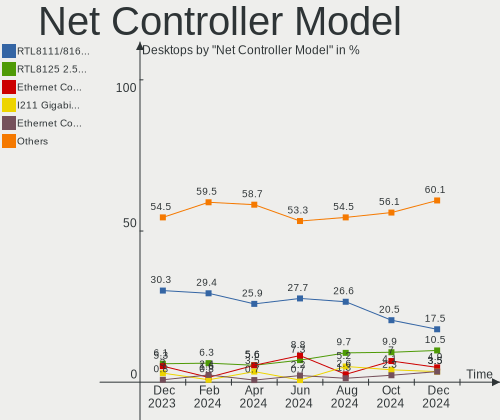

| Model                                                                                         | Desktops | Percent |
|-----------------------------------------------------------------------------------------------|----------|---------|
| Realtek RTL8111/8168/8411 PCI Express Gigabit Ethernet Controller                             | 38       | 29.01%  |
| Intel Ethernet Controller I225-V                                                              | 7        | 5.34%   |
| Realtek RTL8125 2.5GbE Controller                                                             | 6        | 4.58%   |
| Intel I211 Gigabit Network Connection                                                         | 6        | 4.58%   |
| Intel Wi-Fi 6 AX210/AX211/AX411 160MHz                                                        | 4        | 3.05%   |
| MediaTek MT7921K (RZ608) Wi-Fi 6E 80MHz                                                       | 3        | 2.29%   |
| Intel Wi-Fi 6 AX200                                                                           | 3        | 2.29%   |
| Intel Ethernet Controller I226-V                                                              | 3        | 2.29%   |
| Intel 82579LM Gigabit Network Connection (Lewisville)                                         | 3        | 2.29%   |
| Ralink MT7601U Wireless Adapter                                                               | 2        | 1.53%   |
| Qualcomm Atheros Killer E220x Gigabit Ethernet Controller                                     | 2        | 1.53%   |
| Qualcomm Atheros AR93xx Wireless Network Adapter                                              | 2        | 1.53%   |
| MediaTek MT7922 802.11ax PCI Express Wireless Network Adapter                                 | 2        | 1.53%   |
| Intel Wireless-AC 9260                                                                        | 2        | 1.53%   |
| Intel Ethernet Connection I217-LM                                                             | 2        | 1.53%   |
| Intel Ethernet Connection (2) I219-LM                                                         | 2        | 1.53%   |
| TP-Link TL-WN722N v2/v3 [Realtek RTL8188EUS]                                                  | 1        | 0.76%   |
| TP-Link Archer T4U v2 [Realtek RTL8812AU]                                                     | 1        | 0.76%   |
| SEGGER J-Link                                                                                 | 1        | 0.76%   |
| Samsung GT-I9070 (network tethering, USB debugging enabled)                                   | 1        | 0.76%   |
| Realtek RTL8822CE 802.11ac PCIe Wireless Network Adapter                                      | 1        | 0.76%   |
| Realtek RTL8821CE 802.11ac PCIe Wireless Network Adapter                                      | 1        | 0.76%   |
| Realtek RTL8813AE 802.11ac PCIe Wireless Network Adapter                                      | 1        | 0.76%   |
| Realtek RTL8812AU-VS 802.11a/b/g/n/ac 2T2R DB WLAN Adapter                                    | 1        | 0.76%   |
| Realtek RTL8192CU 802.11n WLAN Adapter                                                        | 1        | 0.76%   |
| Realtek RTL8188SU 802.11n WLAN Adapter                                                        | 1        | 0.76%   |
| Realtek RTL8188ETV Wireless LAN 802.11n Network Adapter                                       | 1        | 0.76%   |
| Realtek RTL8153 Gigabit Ethernet Adapter                                                      | 1        | 0.76%   |
| Realtek RTL-8110SC/8169SC Gigabit Ethernet                                                    | 1        | 0.76%   |
| Realtek Realtek 8812AU/8821AU 802.11ac WLAN Adapter [USB Wireless Dual-Band Adapter 2.4/5Ghz] | 1        | 0.76%   |
| Ralink RT2501/RT2573 Wireless Adapter                                                         | 1        | 0.76%   |
| Ralink RT2561/RT61 802.11g PCI                                                                | 1        | 0.76%   |
| Qualcomm Atheros QCA6174 802.11ac Wireless Network Adapter                                    | 1        | 0.76%   |
| Qualcomm Atheros Killer E2400 Gigabit Ethernet Controller                                     | 1        | 0.76%   |
| Qualcomm Atheros AR9271 802.11n                                                               | 1        | 0.76%   |
| Nvidia MCP73 Ethernet                                                                         | 1        | 0.76%   |
| Nvidia MCP61 Ethernet                                                                         | 1        | 0.76%   |
| NetGear WNDA4100                                                                              | 1        | 0.76%   |
| Mellanox MT26448 [ConnectX EN 10GigE, PCIe 2.0 5GT/s]                                         | 1        | 0.76%   |
| Marvell Group 88W8897 [AVASTAR] 802.11ac Wireless                                             | 1        | 0.76%   |

Wireless Vendor
---------------

Wireless vendors

| Vendor                          | Desktops | Percent |
|---------------------------------|----------|---------|
| Intel                           | 16       | 38.1%   |
| Realtek Semiconductor           | 7        | 16.67%  |
| MediaTek                        | 5        | 11.9%   |
| Ralink Technology               | 3        | 7.14%   |
| Qualcomm Atheros                | 3        | 7.14%   |
| TP-Link                         | 2        | 4.76%   |
| Ralink                          | 1        | 2.38%   |
| Qualcomm Atheros Communications | 1        | 2.38%   |
| NetGear                         | 1        | 2.38%   |
| Marvell Technology Group        | 1        | 2.38%   |
| Broadcom                        | 1        | 2.38%   |
| Belkin Components               | 1        | 2.38%   |

Wireless Model
--------------

Wireless models

| Model                                                                                         | Desktops | Percent |
|-----------------------------------------------------------------------------------------------|----------|---------|
| Intel Wi-Fi 6 AX210/AX211/AX411 160MHz                                                        | 4        | 9.3%    |
| MediaTek MT7921K (RZ608) Wi-Fi 6E 80MHz                                                       | 3        | 6.98%   |
| Intel Wi-Fi 6 AX200                                                                           | 3        | 6.98%   |
| Ralink MT7601U Wireless Adapter                                                               | 2        | 4.65%   |
| Qualcomm Atheros AR93xx Wireless Network Adapter                                              | 2        | 4.65%   |
| MediaTek MT7922 802.11ax PCI Express Wireless Network Adapter                                 | 2        | 4.65%   |
| Intel Wireless-AC 9260                                                                        | 2        | 4.65%   |
| TP-Link TL-WN722N v2/v3 [Realtek RTL8188EUS]                                                  | 1        | 2.33%   |
| TP-Link Archer T4U v2 [Realtek RTL8812AU]                                                     | 1        | 2.33%   |
| Realtek RTL8822CE 802.11ac PCIe Wireless Network Adapter                                      | 1        | 2.33%   |
| Realtek RTL8821CE 802.11ac PCIe Wireless Network Adapter                                      | 1        | 2.33%   |
| Realtek RTL8813AE 802.11ac PCIe Wireless Network Adapter                                      | 1        | 2.33%   |
| Realtek RTL8812AU-VS 802.11a/b/g/n/ac 2T2R DB WLAN Adapter                                    | 1        | 2.33%   |
| Realtek RTL8192CU 802.11n WLAN Adapter                                                        | 1        | 2.33%   |
| Realtek RTL8188SU 802.11n WLAN Adapter                                                        | 1        | 2.33%   |
| Realtek RTL8188ETV Wireless LAN 802.11n Network Adapter                                       | 1        | 2.33%   |
| Realtek Realtek 8812AU/8821AU 802.11ac WLAN Adapter [USB Wireless Dual-Band Adapter 2.4/5Ghz] | 1        | 2.33%   |
| Ralink RT2501/RT2573 Wireless Adapter                                                         | 1        | 2.33%   |
| Ralink RT2561/RT61 802.11g PCI                                                                | 1        | 2.33%   |
| Qualcomm Atheros QCA6174 802.11ac Wireless Network Adapter                                    | 1        | 2.33%   |
| Qualcomm Atheros AR9271 802.11n                                                               | 1        | 2.33%   |
| NetGear WNDA4100                                                                              | 1        | 2.33%   |
| Marvell Group 88W8897 [AVASTAR] 802.11ac Wireless                                             | 1        | 2.33%   |
| Intel Wireless 8260                                                                           | 1        | 2.33%   |
| Intel Wireless 7260                                                                           | 1        | 2.33%   |
| Intel Wireless 3165                                                                           | 1        | 2.33%   |
| Intel Dual Band Wireless-AC 3168NGW [Stone Peak]                                              | 1        | 2.33%   |
| Intel Cannon Lake PCH CNVi WiFi                                                               | 1        | 2.33%   |
| Intel Alder Lake-S PCH CNVi WiFi                                                              | 1        | 2.33%   |
| Intel 700 Series Chipset Family Wi-Fi                                                         | 1        | 2.33%   |
| Broadcom Network controller                                                                   | 1        | 2.33%   |
| Belkin Components F5D7050 Wireless G Adapter v3000 [Ralink RT2571W]                           | 1        | 2.33%   |

Ethernet Vendor
---------------

Ethernet vendors

| Vendor                | Desktops | Percent |
|-----------------------|----------|---------|
| Realtek Semiconductor | 46       | 52.87%  |
| Intel                 | 29       | 33.33%  |
| Qualcomm Atheros      | 3        | 3.45%   |
| Nvidia                | 2        | 2.3%    |
| Broadcom              | 2        | 2.3%    |
| Aquantia              | 2        | 2.3%    |
| Samsung Electronics   | 1        | 1.15%   |
| Mellanox Technologies | 1        | 1.15%   |
| Broadcom Limited      | 1        | 1.15%   |

Ethernet Model
--------------

Ethernet models

| Model                                                              | Desktops | Percent |
|--------------------------------------------------------------------|----------|---------|
| Realtek RTL8111/8168/8411 PCI Express Gigabit Ethernet Controller  | 38       | 43.68%  |
| Intel Ethernet Controller I225-V                                   | 7        | 8.05%   |
| Realtek RTL8125 2.5GbE Controller                                  | 6        | 6.9%    |
| Intel I211 Gigabit Network Connection                              | 6        | 6.9%    |
| Intel Ethernet Controller I226-V                                   | 3        | 3.45%   |
| Intel 82579LM Gigabit Network Connection (Lewisville)              | 3        | 3.45%   |
| Qualcomm Atheros Killer E220x Gigabit Ethernet Controller          | 2        | 2.3%    |
| Intel Ethernet Connection I217-LM                                  | 2        | 2.3%    |
| Intel Ethernet Connection (2) I219-LM                              | 2        | 2.3%    |
| Samsung GT-I9070 (network tethering, USB debugging enabled)        | 1        | 1.15%   |
| Realtek RTL8153 Gigabit Ethernet Adapter                           | 1        | 1.15%   |
| Realtek RTL-8110SC/8169SC Gigabit Ethernet                         | 1        | 1.15%   |
| Qualcomm Atheros Killer E2400 Gigabit Ethernet Controller          | 1        | 1.15%   |
| Nvidia MCP73 Ethernet                                              | 1        | 1.15%   |
| Nvidia MCP61 Ethernet                                              | 1        | 1.15%   |
| Mellanox MT26448 [ConnectX EN 10GigE, PCIe 2.0 5GT/s]              | 1        | 1.15%   |
| Intel I350 Gigabit Network Connection                              | 1        | 1.15%   |
| Intel Ethernet Connection I217-V                                   | 1        | 1.15%   |
| Intel Ethernet Connection (7) I219-V                               | 1        | 1.15%   |
| Intel Ethernet Connection (5) I219-LM                              | 1        | 1.15%   |
| Intel Ethernet Connection (2) I219-V                               | 1        | 1.15%   |
| Intel 82579V Gigabit Network Connection                            | 1        | 1.15%   |
| Broadcom NetXtreme BCM5761 Gigabit Ethernet PCIe                   | 1        | 1.15%   |
| Broadcom NetXtreme BCM5721 Gigabit Ethernet PCI Express            | 1        | 1.15%   |
| Broadcom Limited NetLink BCM5787 Gigabit Ethernet PCI Express      | 1        | 1.15%   |
| Aquantia AQC113C NBase-T/IEEE 802.3bz Ethernet Controller [AQtion] | 1        | 1.15%   |
| Aquantia AQC107 NBase-T/IEEE 802.3bz Ethernet Controller [AQtion]  | 1        | 1.15%   |

Net Controller Kind
-------------------

Ethernet, WiFi or modem

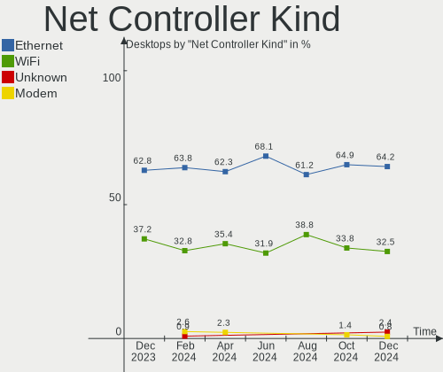

| Kind     | Desktops | Percent |
|----------|----------|---------|
| Ethernet | 78       | 64.46%  |
| WiFi     | 42       | 34.71%  |
| Modem    | 1        | 0.83%   |

Used Controller
---------------

Currently used network controller

| Kind     | Desktops | Percent |
|----------|----------|---------|
| Ethernet | 62       | 74.7%   |
| WiFi     | 21       | 25.3%   |

NICs
----

Total network controllers on board

| Total | Desktops | Percent |
|-------|----------|---------|
| 1     | 45       | 56.25%  |
| 2     | 30       | 37.5%   |
| 3     | 4        | 5%      |
| 0     | 1        | 1.25%   |

IPv6
----

IPv6 vs IPv4

| Used | Desktops | Percent |
|------|----------|---------|
| No   | 63       | 78.75%  |
| Yes  | 17       | 21.25%  |

Bluetooth
---------

Bluetooth Vendor
----------------

Controller vendors

| Vendor                          | Desktops | Percent |
|---------------------------------|----------|---------|
| Intel                           | 15       | 42.86%  |
| Cambridge Silicon Radio         | 10       | 28.57%  |
| MediaTek                        | 5        | 14.29%  |
| Realtek Semiconductor           | 2        | 5.71%   |
| Qualcomm Atheros Communications | 1        | 2.86%   |
| Logitech                        | 1        | 2.86%   |
| Foxconn / Hon Hai               | 1        | 2.86%   |

Bluetooth Model
---------------

Controller models

| Model                                               | Desktops | Percent |
|-----------------------------------------------------|----------|---------|
| Cambridge Silicon Radio Bluetooth Dongle (HCI mode) | 10       | 28.57%  |
| MediaTek Wireless_Device                            | 5        | 14.29%  |
| Intel Bluetooth wireless interface                  | 3        | 8.57%   |
| Intel AX210 Bluetooth                               | 3        | 8.57%   |
| Intel AX200 Bluetooth                               | 3        | 8.57%   |
| Realtek Bluetooth Radio                             | 2        | 5.71%   |
| Intel Wireless-AC 9260 Bluetooth Adapter            | 2        | 5.71%   |
| Intel Bluetooth Device                              | 2        | 5.71%   |
| Qualcomm Atheros  Bluetooth Device                  | 1        | 2.86%   |
| Logitech BT Mini-Receiver (HCI mode)                | 1        | 2.86%   |
| Intel Bluetooth 9460/9560 Jefferson Peak (JfP)      | 1        | 2.86%   |
| Intel AX201 Bluetooth                               | 1        | 2.86%   |
| Foxconn / Hon Hai Wireless_Device                   | 1        | 2.86%   |

Sound
-----

Sound Vendor
------------

Sound card vendors

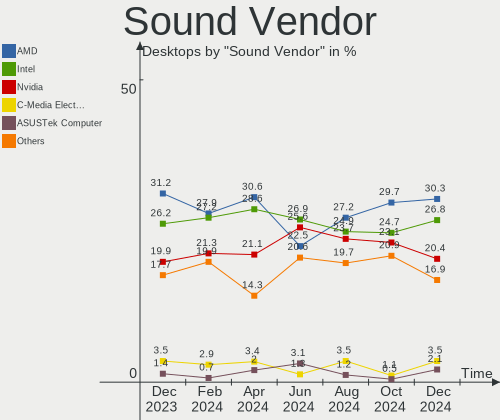

| Vendor                    | Desktops | Percent |
|---------------------------|----------|---------|
| AMD                       | 49       | 31.41%  |
| Nvidia                    | 37       | 23.72%  |
| Intel                     | 32       | 20.51%  |
| C-Media Electronics       | 5        | 3.21%   |
| Micro Star International  | 3        | 1.92%   |
| Razer USA                 | 2        | 1.28%   |
| Focusrite-Novation        | 2        | 1.28%   |
| Creative Technology       | 2        | 1.28%   |
| BEHRINGER International   | 2        | 1.28%   |
| ASUSTek Computer          | 2        | 1.28%   |
| WinChipHead               | 1        | 0.64%   |
| VIA Technologies          | 1        | 0.64%   |
| Valve Software            | 1        | 0.64%   |
| Texas Instruments         | 1        | 0.64%   |
| TEAC                      | 1        | 0.64%   |
| Setek Elektronik          | 1        | 0.64%   |
| Sennheiser Communications | 1        | 0.64%   |
| SAVITECH                  | 1        | 0.64%   |
| Realtek Semiconductor     | 1        | 0.64%   |
| Logitech                  | 1        | 0.64%   |
| KTMicro                   | 1        | 0.64%   |
| JMTek                     | 1        | 0.64%   |
| Jieli Technology          | 1        | 0.64%   |
| Hewlett-Packard           | 1        | 0.64%   |
| Giga-Byte Technology      | 1        | 0.64%   |
| DCMT Technology           | 1        | 0.64%   |
| Cambridge Silicon Radio   | 1        | 0.64%   |
| Astro Gaming              | 1        | 0.64%   |
| AKG C44-USB Microphone    | 1        | 0.64%   |
| AKAI Professional M.I.    | 1        | 0.64%   |

Sound Model
-----------

Sound card models

| Model                                                                      | Desktops | Percent |
|----------------------------------------------------------------------------|----------|---------|
| AMD Starship/Matisse HD Audio Controller                                   | 18       | 9.84%   |
| AMD Family 17h (Models 00h-0fh) HD Audio Controller                        | 9        | 4.92%   |
| AMD Family 17h/19h HD Audio Controller                                     | 7        | 3.83%   |
| AMD SBx00 Azalia (Intel HDA)                                               | 6        | 3.28%   |
| AMD Ellesmere HDMI Audio [Radeon RX 470/480 / 570/580/590]                 | 6        | 3.28%   |
| Nvidia GA102 High Definition Audio Controller                              | 5        | 2.73%   |
| Intel Xeon E3-1200 v3/4th Gen Core Processor HD Audio Controller           | 5        | 2.73%   |
| Intel 8 Series/C220 Series Chipset High Definition Audio Controller        | 5        | 2.73%   |
| Nvidia GK208 HDMI/DP Audio Controller                                      | 4        | 2.19%   |
| Nvidia GA106 High Definition Audio Controller                              | 4        | 2.19%   |
| Intel 6 Series/C200 Series Chipset Family High Definition Audio Controller | 4        | 2.19%   |
| Intel 200 Series PCH HD Audio                                              | 4        | 2.19%   |
| Intel 100 Series/C230 Series Chipset Family HD Audio Controller            | 4        | 2.19%   |
| AMD Navi 21/23 HDMI/DP Audio Controller                                    | 4        | 2.19%   |
| Nvidia GP107GL High Definition Audio Controller                            | 3        | 1.64%   |
| Nvidia GM206 High Definition Audio Controller                              | 3        | 1.64%   |
| Nvidia GK107 HDMI Audio Controller                                         | 3        | 1.64%   |
| Micro Star International USB Audio                                         | 3        | 1.64%   |
| AMD Renoir Radeon High Definition Audio Controller                         | 3        | 1.64%   |
| AMD Rembrandt Radeon High Definition Audio Controller                      | 3        | 1.64%   |
| AMD Navi 31 HDMI/DP Audio                                                  | 3        | 1.64%   |
| Nvidia TU104 HD Audio Controller                                           | 2        | 1.09%   |
| Nvidia GP104 High Definition Audio Controller                              | 2        | 1.09%   |
| Nvidia GM107 High Definition Audio Controller [GeForce 940MX]              | 2        | 1.09%   |
| Nvidia GA104 High Definition Audio Controller                              | 2        | 1.09%   |
| Intel Alder Lake-S HD Audio Controller                                     | 2        | 1.09%   |
| Intel 82801JI (ICH10 Family) HD Audio Controller                           | 2        | 1.09%   |
| C-Media Electronics KLIM Mantis Audio 7.1                                  | 2        | 1.09%   |
| C-Media Electronics Audio Adapter (Unitek Y-247A)                          | 2        | 1.09%   |
| ASUSTek Computer USB Audio                                                 | 2        | 1.09%   |
| AMD FCH Azalia Controller                                                  | 2        | 1.09%   |
| AMD Baffin HDMI/DP Audio [Radeon RX 550 640SP / RX 560/560X]               | 2        | 1.09%   |
| WinChipHead USB Midi                                                       | 1        | 0.55%   |
| VIA Technologies ICE1712 [Envy24] PCI Multi-Channel I/O Controller         | 1        | 0.55%   |
| Valve Software Valve VR Radio & HMD Mic                                    | 1        | 0.55%   |
| Texas Instruments PCM2902 Audio Codec                                      | 1        | 0.55%   |
| TEAC US-2x2HR                                                              | 1        | 0.55%   |
| Setek Elektronik Realtek USB Audio Rear                                    | 1        | 0.55%   |
| Setek Elektronik Realtek USB Audio Front                                   | 1        | 0.55%   |
| Sennheiser Communications EPOS BTD 800                                     | 1        | 0.55%   |

Memory
------

Memory Vendor
-------------

Memory module vendors

| Vendor                       | Desktops | Percent |
|------------------------------|----------|---------|
| Corsair                      | 21       | 38.18%  |
| Kingston                     | 9        | 16.36%  |
| SK hynix                     | 8        | 14.55%  |
| Samsung Electronics          | 4        | 7.27%   |
| Unknown                      | 3        | 5.45%   |
| Crucial                      | 3        | 5.45%   |
| Patriot Memory (PDP Systems) | 1        | 1.82%   |
| Patriot                      | 1        | 1.82%   |
| Micron Technology            | 1        | 1.82%   |
| Lexar Co Limited             | 1        | 1.82%   |
| ASint Technology             | 1        | 1.82%   |
| A-DATA Technology            | 1        | 1.82%   |
| 9801AD80                     | 1        | 1.82%   |

Memory Model
------------

Memory module models

| Model                                                                    | Desktops | Percent |
|--------------------------------------------------------------------------|----------|---------|
| SK hynix RAM HMT351U6CFR8C-PB 4GB DIMM DDR3 1800MT/s                     | 2        | 3.51%   |
| Corsair RAM CMK16GX4M2D3600C18 8GB DIMM DDR4 3600MT/s                    | 2        | 3.51%   |
| Unknown RAM Module 8GB DIMM DDR4 2400MT/s                                | 1        | 1.75%   |
| Unknown RAM Module 8GB DIMM DDR3 1333MT/s                                | 1        | 1.75%   |
| Unknown RAM Module 2GB DIMM 800MT/s                                      | 1        | 1.75%   |
| SK hynix RAM Module 8GB DIMM DDR4 2666MT/s                               | 1        | 1.75%   |
| SK hynix RAM Module 4GB DIMM DDR4 2133MT/s                               | 1        | 1.75%   |
| SK hynix RAM HYMP125U64CP8-S6 2GB DIMM DDR2 49926MT/s                    | 1        | 1.75%   |
| SK hynix RAM HMT451S6BFR8C-PB 4GB SODIMM DDR3 1600MT/s                   | 1        | 1.75%   |
| SK hynix RAM HMA82GS6DJR8N-VK 16GB SODIMM DDR4 2667MT/s                  | 1        | 1.75%   |
| SK hynix RAM HMA82GR7DJR8N-XN 16GB DIMM DDR4 3200MT/s                    | 1        | 1.75%   |
| Samsung RAM Module 8GB DIMM DDR4 2133MT/s                                | 1        | 1.75%   |
| Samsung RAM M393B2G70BH0 16GB DIMM DDR3 1866MT/s                         | 1        | 1.75%   |
| Samsung RAM M391B5773CH0-YH9 2GB DIMM DDR3 1333MT/s                      | 1        | 1.75%   |
| Samsung RAM M378B5173DB0-CK0 4GB DIMM DDR3 1600MT/s                      | 1        | 1.75%   |
| Patriot RAM PSD48G240081 8GB DIMM DDR4 2800MT/s                          | 1        | 1.75%   |
| Patriot Memory (PDP Systems) RAM 3600 C18 Series 32GB DIMM DDR4 3600MT/s | 1        | 1.75%   |
| Micron RAM 16ATF2G64HZ-2G1B1 16GB SODIMM DDR4 2133MT/s                   | 1        | 1.75%   |
| Lexar Co Limited RAM LD4AU016G-H3200GST 16GB DIMM DDR4 3200MT/s          | 1        | 1.75%   |
| Kingston RAM Module 8GB DIMM DDR4 2133MT/s                               | 1        | 1.75%   |
| Kingston RAM KPN424-ELG 1GB DIMM DDR2 667MT/s                            | 1        | 1.75%   |
| Kingston RAM KHX1600C9D3/4GX 4GB DIMM DDR3 1600MT/s                      | 1        | 1.75%   |
| Kingston RAM KF560C40-16 16GB DIMM DDR5 6000MT/s                         | 1        | 1.75%   |
| Kingston RAM KF556C40-32 32GB DIMM DDR5 5808MT/s                         | 1        | 1.75%   |
| Kingston RAM 9965745-028.A00G 16GB DIMM DDR4 2666MT/s                    | 1        | 1.75%   |
| Kingston RAM 9905702-198.A00G 8GB DIMM DDR4 2400MT/s                     | 1        | 1.75%   |
| Kingston RAM 9905625-030.A00G 8GB DIMM DDR4 2133MT/s                     | 1        | 1.75%   |
| Kingston RAM 9905402-665.A00LF 4GB DIMM DDR3 1333MT/s                    | 1        | 1.75%   |
| Crucial RAM CT51264BA160B.C16F 4GB DIMM DDR3 1600MT/s                    | 1        | 1.75%   |
| Crucial RAM BLS8G4D32AESBK.M8FE 8GB DIMM DDR4 3400MT/s                   | 1        | 1.75%   |
| Crucial RAM BL8G36C16U4R.M8FE1 8GB DIMM DDR4 3600MT/s                    | 1        | 1.75%   |
| Corsair RAM CMZ8GX3M2A1866C9 4GB DIMM DDR3 1867MT/s                      | 1        | 1.75%   |
| Corsair RAM CMY8GX3M2A1866C9 4GB DIMM DDR3 1867MT/s                      | 1        | 1.75%   |
| Corsair RAM CMY16GX3M2A2400C11 8GB DIMM DDR3 2400MT/s                    | 1        | 1.75%   |
| Corsair RAM CMW32GX4M2Z3200C16 16GB DIMM DDR4 3200MT/s                   | 1        | 1.75%   |
| Corsair RAM CMW16GX4M2C3200C16 8GB DIMM DDR4 3733MT/s                    | 1        | 1.75%   |
| Corsair RAM CMW16GX4M2C3000C15 8GB DIMM DDR4 3400MT/s                    | 1        | 1.75%   |
| Corsair RAM CMW16GX4M2A2666C16 8GB DIMM DDR4 2667MT/s                    | 1        | 1.75%   |
| Corsair RAM CMT64GX5M2B6800C40 32GB DIMM DDR5 4800MT/s                   | 1        | 1.75%   |
| Corsair RAM CMT64GX5M2B5600Z40 32GB DIMM DDR5 4800MT/s                   | 1        | 1.75%   |

Memory Kind
-----------

Memory module kinds

| Kind    | Desktops | Percent |
|---------|----------|---------|
| DDR4    | 29       | 63.04%  |
| DDR3    | 10       | 21.74%  |
| DDR5    | 5        | 10.87%  |
| DDR2    | 1        | 2.17%   |
| Unknown | 1        | 2.17%   |

Memory Form Factor
------------------

Physical design of the memory module

| Name   | Desktops | Percent |
|--------|----------|---------|
| DIMM   | 41       | 89.13%  |
| SODIMM | 5        | 10.87%  |

Memory Size
-----------

Memory module size

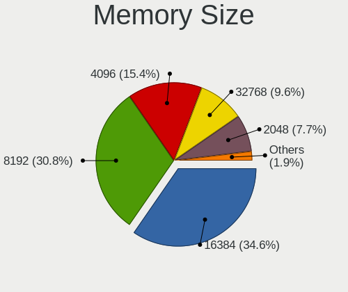

| Size  | Desktops | Percent |
|-------|----------|---------|
| 8192  | 20       | 40.82%  |
| 16384 | 12       | 24.49%  |
| 4096  | 9        | 18.37%  |
| 32768 | 4        | 8.16%   |
| 2048  | 3        | 6.12%   |
| 1024  | 1        | 2.04%   |

Memory Speed
------------

Memory module speed

| Speed | Desktops | Percent |
|-------|----------|---------|
| 3200  | 7        | 13.21%  |
| 2400  | 4        | 7.55%   |
| 2133  | 4        | 7.55%   |
| 4800  | 3        | 5.66%   |
| 3600  | 3        | 5.66%   |
| 3400  | 3        | 5.66%   |
| 2800  | 3        | 5.66%   |
| 1600  | 3        | 5.66%   |
| 1333  | 3        | 5.66%   |
| 3666  | 2        | 3.77%   |
| 2667  | 2        | 3.77%   |
| 2666  | 2        | 3.77%   |
| 1867  | 2        | 3.77%   |
| 1800  | 2        | 3.77%   |
| 49926 | 1        | 1.89%   |
| 6000  | 1        | 1.89%   |
| 5808  | 1        | 1.89%   |
| 3800  | 1        | 1.89%   |
| 3733  | 1        | 1.89%   |
| 3000  | 1        | 1.89%   |
| 2747  | 1        | 1.89%   |
| 1866  | 1        | 1.89%   |
| 800   | 1        | 1.89%   |
| 667   | 1        | 1.89%   |

Printers & scanners
-------------------

Printer Vendor
--------------

Printer device vendors

| Vendor             | Desktops | Percent |
|--------------------|----------|---------|
| Hewlett-Packard    | 1        | 50%     |
| Brother Industries | 1        | 50%     |

Printer Model
-------------

Printer device models

| Model                     | Desktops | Percent |
|---------------------------|----------|---------|
| HP DeskJet 2700 series    | 1        | 50%     |
| Brother HL-3150CDW series | 1        | 50%     |

Scanner Vendor
--------------

Scanner device vendors

Zero info for selected period =(

Scanner Model
-------------

Scanner device models

Zero info for selected period =(

Camera
------

Camera Vendor
-------------

Camera device vendors

| Vendor            | Desktops | Percent |
|-------------------|----------|---------|
| Logitech          | 8        | 42.11%  |
| ARC International | 3        | 15.79%  |
| Microdia          | 2        | 10.53%  |
| WCM_USB           | 1        | 5.26%   |
| Valve Software    | 1        | 5.26%   |
| Razer USA         | 1        | 5.26%   |
| Quanta            | 1        | 5.26%   |
| Microsoft         | 1        | 5.26%   |
| Hewlett-Packard   | 1        | 5.26%   |

Camera Model
------------

Camera device models

| Model                                | Desktops | Percent |
|--------------------------------------|----------|---------|
| Logitech C922 Pro Stream Webcam      | 4        | 21.05%  |
| Logitech HD Pro Webcam C920          | 3        | 15.79%  |
| ARC International Camera             | 3        | 15.79%  |
| WCM_USB WEB CAM                      | 1        | 5.26%   |
| Valve Software 3D Camera             | 1        | 5.26%   |
| Razer USA Gaming Webcam [Kiyo]       | 1        | 5.26%   |
| Quanta RGB-IR Camera                 | 1        | 5.26%   |
| Microsoft Microsoft LifeCam Cinema | 1        | 5.26%   |
| Microdia Webcam Vitade AF            | 1        | 5.26%   |
| Microdia Sonix USB 2.0 Camera        | 1        | 5.26%   |
| Logitech BRIO 4K Stream Edition      | 1        | 5.26%   |
| HP Webcam HD 2300                    | 1        | 5.26%   |

Security
--------

Fingerprint Vendor
------------------

Fingerprint sensor vendors

Zero info for selected period =(

Fingerprint Model
-----------------

Fingerprint sensor models

Zero info for selected period =(

Chipcard Vendor
---------------

Chipcard module vendors

Zero info for selected period =(

Chipcard Model
--------------

Chipcard module models

Zero info for selected period =(

Unsupported
-----------

Unsupported Devices
-------------------

Total unsupported devices on board

| Total | Desktops | Percent |
|-------|----------|---------|
| 0     | 66       | 82.5%   |
| 1     | 12       | 15%     |
| 2     | 2        | 2.5%    |

Unsupported Device Types
------------------------

Types of unsupported devices

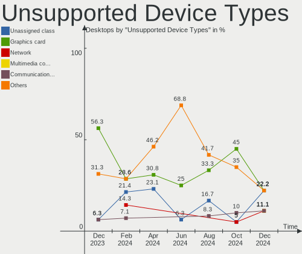

| Type                     | Desktops | Percent |
|--------------------------|----------|---------|
| Graphics card            | 8        | 50%     |
| Net/wireless             | 3        | 18.75%  |
| Sound                    | 2        | 12.5%   |
| Network                  | 1        | 6.25%   |
| Communication controller | 1        | 6.25%   |
| Bluetooth                | 1        | 6.25%   |

