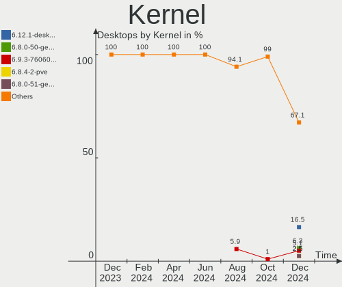
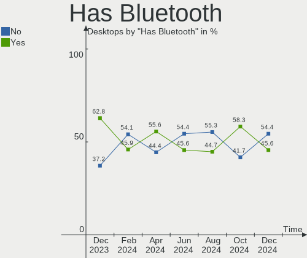
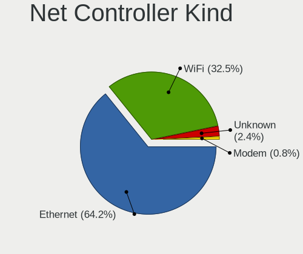
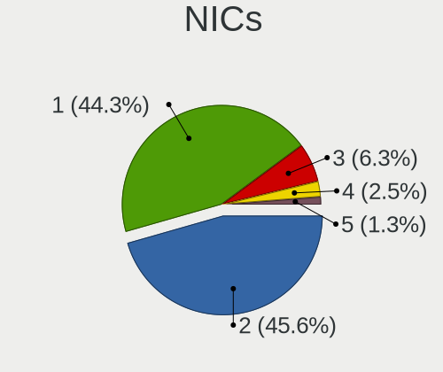
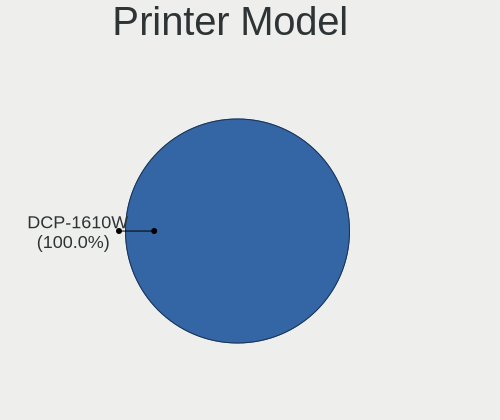
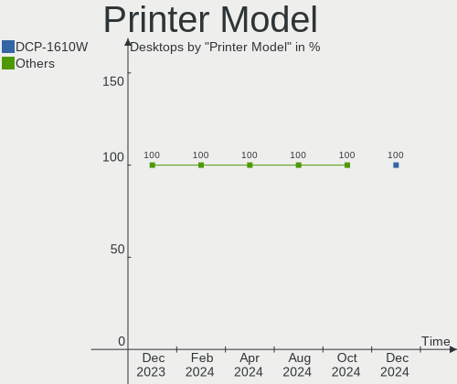

Linux in UK - Hardware Trends (Desktops)
----------------------------------------

A project to identify most popular hardware characteristics and track their change
over time based on data collected by Linux users at https://Linux-Hardware.org.

Anyone can contribute to this report by the [hw-probe](https://github.com/linuxhw/hw-probe) tool:

    sudo -E hw-probe -all -upload

Period: Apr, 2023.

Contents
--------

* [ System ](#system)
  - [ OS                       ](#os)
  - [ OS Family                ](#os-family)
  - [ Kernel                   ](#kernel)
  - [ Kernel Family            ](#kernel-family)
  - [ Kernel Major Ver.        ](#kernel-major-ver)
  - [ Arch                     ](#arch)
  - [ DE                       ](#de)
  - [ Display Server           ](#display-server)
  - [ Display Manager          ](#display-manager)
  - [ OS Lang                  ](#os-lang)
  - [ Boot Mode                ](#boot-mode)
  - [ Filesystem               ](#filesystem)
  - [ Part. scheme             ](#part-scheme)
  - [ Dual Boot with Linux/BSD ](#dual-boot-with-linuxbsd)
  - [ Dual Boot (Win)          ](#dual-boot-win)

* [ Board ](#board)
  - [ Vendor                   ](#vendor)
  - [ Model                    ](#model)
  - [ Model Family             ](#model-family)
  - [ MFG Year                 ](#mfg-year)
  - [ Form Factor              ](#form-factor)
  - [ Secure Boot              ](#secure-boot)
  - [ Coreboot                 ](#coreboot)
  - [ RAM Size                 ](#ram-size)
  - [ RAM Used                 ](#ram-used)
  - [ Total Drives             ](#total-drives)
  - [ Has CD-ROM               ](#has-cd-rom)
  - [ Has Ethernet             ](#has-ethernet)
  - [ Has WiFi                 ](#has-wifi)
  - [ Has Bluetooth            ](#has-bluetooth)

* [ Location ](#location)
  - [ Country                  ](#country)
  - [ City                     ](#city)

* [ Drives ](#drives)
  - [ Drive Vendor             ](#drive-vendor)
  - [ Drive Model              ](#drive-model)
  - [ HDD Vendor               ](#hdd-vendor)
  - [ SSD Vendor               ](#ssd-vendor)
  - [ Drive Kind               ](#drive-kind)
  - [ Drive Connector          ](#drive-connector)
  - [ Drive Size               ](#drive-size)
  - [ Space Total              ](#space-total)
  - [ Space Used               ](#space-used)
  - [ Malfunc. Drives          ](#malfunc-drives)
  - [ Malfunc. Drive Vendor    ](#malfunc-drive-vendor)
  - [ Malfunc. HDD Vendor      ](#malfunc-hdd-vendor)
  - [ Malfunc. Drive Kind      ](#malfunc-drive-kind)
  - [ Failed Drives            ](#failed-drives)
  - [ Failed Drive Vendor      ](#failed-drive-vendor)
  - [ Drive Status             ](#drive-status)

* [ Storage controller ](#storage-controller)
  - [ Storage Vendor           ](#storage-vendor)
  - [ Storage Model            ](#storage-model)
  - [ Storage Kind             ](#storage-kind)

* [ Processor ](#processor)
  - [ CPU Vendor               ](#cpu-vendor)
  - [ CPU Model                ](#cpu-model)
  - [ CPU Model Family         ](#cpu-model-family)
  - [ CPU Cores                ](#cpu-cores)
  - [ CPU Sockets              ](#cpu-sockets)
  - [ CPU Threads              ](#cpu-threads)
  - [ CPU Op-Modes             ](#cpu-op-modes)
  - [ CPU Microcode            ](#cpu-microcode)
  - [ CPU Microarch            ](#cpu-microarch)

* [ Graphics ](#graphics)
  - [ GPU Vendor               ](#gpu-vendor)
  - [ GPU Model                ](#gpu-model)
  - [ GPU Combo                ](#gpu-combo)
  - [ GPU Driver               ](#gpu-driver)
  - [ GPU Memory               ](#gpu-memory)

* [ Monitor ](#monitor)
  - [ Monitor Vendor           ](#monitor-vendor)
  - [ Monitor Model            ](#monitor-model)
  - [ Monitor Resolution       ](#monitor-resolution)
  - [ Monitor Diagonal         ](#monitor-diagonal)
  - [ Monitor Width            ](#monitor-width)
  - [ Aspect Ratio             ](#aspect-ratio)
  - [ Monitor Area             ](#monitor-area)
  - [ Pixel Density            ](#pixel-density)
  - [ Multiple Monitors        ](#multiple-monitors)

* [ Network ](#network)
  - [ Net Controller Vendor    ](#net-controller-vendor)
  - [ Net Controller Model     ](#net-controller-model)
  - [ Wireless Vendor          ](#wireless-vendor)
  - [ Wireless Model           ](#wireless-model)
  - [ Ethernet Vendor          ](#ethernet-vendor)
  - [ Ethernet Model           ](#ethernet-model)
  - [ Net Controller Kind      ](#net-controller-kind)
  - [ Used Controller          ](#used-controller)
  - [ NICs                     ](#nics)
  - [ IPv6                     ](#ipv6)

* [ Bluetooth ](#bluetooth)
  - [ Bluetooth Vendor         ](#bluetooth-vendor)
  - [ Bluetooth Model          ](#bluetooth-model)

* [ Sound ](#sound)
  - [ Sound Vendor             ](#sound-vendor)
  - [ Sound Model              ](#sound-model)

* [ Memory ](#memory)
  - [ Memory Vendor            ](#memory-vendor)
  - [ Memory Model             ](#memory-model)
  - [ Memory Kind              ](#memory-kind)
  - [ Memory Form Factor       ](#memory-form-factor)
  - [ Memory Size              ](#memory-size)
  - [ Memory Speed             ](#memory-speed)

* [ Printers & scanners ](#printers--scanners)
  - [ Printer Vendor           ](#printer-vendor)
  - [ Printer Model            ](#printer-model)
  - [ Scanner Vendor           ](#scanner-vendor)
  - [ Scanner Model            ](#scanner-model)

* [ Camera ](#camera)
  - [ Camera Vendor            ](#camera-vendor)
  - [ Camera Model             ](#camera-model)

* [ Security ](#security)
  - [ Fingerprint Vendor       ](#fingerprint-vendor)
  - [ Fingerprint Model        ](#fingerprint-model)
  - [ Chipcard Vendor          ](#chipcard-vendor)
  - [ Chipcard Model           ](#chipcard-model)

* [ Unsupported ](#unsupported)
  - [ Unsupported Devices      ](#unsupported-devices)
  - [ Unsupported Device Types ](#unsupported-device-types)

System
------

OS
--

Installed operating systems

| Name                         | Desktops | Percent |
|------------------------------|----------|---------|
| OpenMandriva 23.03           | 17       | 17.71%  |
| Ubuntu 22.04                 | 10       | 10.42%  |
| Linux Mint 21.1              | 10       | 10.42%  |
| Gentoo 2.13                  | 5        | 5.21%   |
| Zorin 16                     | 4        | 4.17%   |
| Pop!_OS 22.04                | 4        | 4.17%   |
| OpenMandriva 4.3             | 4        | 4.17%   |
| Linux Mint 21                | 4        | 4.17%   |
| Kubuntu 22.04                | 3        | 3.13%   |
| Fedora 38                    | 3        | 3.13%   |
| ArcoLinux Rolling            | 3        | 3.13%   |
| Manjaro                      | 2        | 2.08%   |
| KDE neon 22.04               | 2        | 2.08%   |
| Fedora 37                    | 2        | 2.08%   |
| Debian 11                    | 2        | 2.08%   |
| Arch Rolling                 | 2        | 2.08%   |
| Zorin 15                     | 1        | 1.04%   |
| Xubuntu 20.04                | 1        | 1.04%   |
| Ubuntu 23.04                 | 1        | 1.04%   |
| Ubuntu 22.10                 | 1        | 1.04%   |
| Ubuntu 18.04                 | 1        | 1.04%   |
| Sparky 6.6                   | 1        | 1.04%   |
| ROSA 12.4                    | 1        | 1.04%   |
| openSUSE Tumbleweed-XXXXXXXX | 1        | 1.04%   |
| OpenMandriva 23.01           | 1        | 1.04%   |
| Nobara 37                    | 1        | 1.04%   |
| Manjaro 22.1.0               | 1        | 1.04%   |
| LMDE 5                       | 1        | 1.04%   |
| Kali 2023.1                  | 1        | 1.04%   |
| Debian 12                    | 1        | 1.04%   |
| CentOS 7                     | 1        | 1.04%   |
| blendOS                      | 1        | 1.04%   |
| BigLinux 22.1.0              | 1        | 1.04%   |
| antiX 19.3                   | 1        | 1.04%   |
| antergos Rolling             | 1        | 1.04%   |

OS Family
---------

OS without a version

| Name         | Desktops | Percent |
|--------------|----------|---------|
| OpenMandriva | 22       | 22.92%  |
| Linux Mint   | 14       | 14.58%  |
| Ubuntu       | 13       | 13.54%  |
| Zorin        | 5        | 5.21%   |
| Gentoo       | 5        | 5.21%   |
| Fedora       | 5        | 5.21%   |
| Pop!_OS      | 4        | 4.17%   |
| Manjaro      | 3        | 3.13%   |
| Kubuntu      | 3        | 3.13%   |
| Debian       | 3        | 3.13%   |
| ArcoLinux    | 3        | 3.13%   |
| KDE neon     | 2        | 2.08%   |
| Arch         | 2        | 2.08%   |
| Xubuntu      | 1        | 1.04%   |
| Sparky       | 1        | 1.04%   |
| ROSA         | 1        | 1.04%   |
| openSUSE     | 1        | 1.04%   |
| Nobara       | 1        | 1.04%   |
| LMDE         | 1        | 1.04%   |
| Kali         | 1        | 1.04%   |
| CentOS       | 1        | 1.04%   |
| blendOS      | 1        | 1.04%   |
| BigLinux     | 1        | 1.04%   |
| antiX        | 1        | 1.04%   |
| antergos     | 1        | 1.04%   |

Kernel
------

Version of the Linux kernel

| Version                           | Desktops | Percent |
|-----------------------------------|----------|---------|
| 6.2.6-desktop-1omv2390            | 17       | 17.71%  |
| 5.15.0-69-generic                 | 15       | 15.63%  |
| 5.19.0-38-generic                 | 5        | 5.21%   |
| 6.2.6-76060206-generic            | 4        | 4.17%   |
| 5.19.0-40-generic                 | 4        | 4.17%   |
| 5.10.0-21-amd64                   | 4        | 4.17%   |
| 6.2.12-zen1-1-zen                 | 2        | 2.08%   |
| 6.2.10-200.fc37.x86_64            | 2        | 2.08%   |
| 5.4.0-147-generic                 | 2        | 2.08%   |
| 5.16.7-desktop-1omv4003           | 2        | 2.08%   |
| 5.16.13-desktop-1omv4003          | 2        | 2.08%   |
| 5.15.0-70-generic                 | 2        | 2.08%   |
| 5.15.0-67-generic                 | 2        | 2.08%   |
| 5.15.0-56-generic                 | 2        | 2.08%   |
| 6.2.9-gentoo-x86_64               | 1        | 1.04%   |
| 6.2.9-arch1-1                     | 1        | 1.04%   |
| 6.2.8-arch1-1                     | 1        | 1.04%   |
| 6.2.2-301.fc38.x86_64             | 1        | 1.04%   |
| 6.2.12-gentoo-x86_64              | 1        | 1.04%   |
| 6.2.12-arch1-1                    | 1        | 1.04%   |
| 6.2.12-300.fc38.x86_64            | 1        | 1.04%   |
| 6.2.12-1-MANJARO                  | 1        | 1.04%   |
| 6.2.12-1-default                  | 1        | 1.04%   |
| 6.2.11-arch1-1                    | 1        | 1.04%   |
| 6.2.11-300.fc38.x86_64            | 1        | 1.04%   |
| 6.2.10-cachyos                    | 1        | 1.04%   |
| 6.2.10-arch1-1                    | 1        | 1.04%   |
| 6.2.10-200.fsync.fc37.x86_64      | 1        | 1.04%   |
| 6.2.10-1-MANJARO                  | 1        | 1.04%   |
| 6.2.0-20-generic                  | 1        | 1.04%   |
| 6.1.22-gentoo-dist                | 1        | 1.04%   |
| 6.1.22-1-MANJARO                  | 1        | 1.04%   |
| 6.1.20-generic-2rosa2021.1-x86_64 | 1        | 1.04%   |
| 6.1.19-gentoo                     | 1        | 1.04%   |
| 6.1.1-desktop-1omv2290            | 1        | 1.04%   |
| 6.1.0-kali5-amd64                 | 1        | 1.04%   |
| 6.1.0-5-amd64                     | 1        | 1.04%   |
| 5.4.0-146-generic                 | 1        | 1.04%   |
| 5.19.0-35-generic                 | 1        | 1.04%   |
| 5.15.104-2-MANJARO                | 1        | 1.04%   |

Kernel Family
-------------

Linux kernel without a distro release

| Version  | Desktops | Percent |
|----------|----------|---------|
| 5.15.0   | 24       | 25%     |
| 6.2.6    | 21       | 21.88%  |
| 5.19.0   | 10       | 10.42%  |
| 6.2.12   | 7        | 7.29%   |
| 6.2.10   | 6        | 6.25%   |
| 5.10.0   | 4        | 4.17%   |
| 5.4.0    | 3        | 3.13%   |
| 6.2.9    | 2        | 2.08%   |
| 6.2.11   | 2        | 2.08%   |
| 6.1.22   | 2        | 2.08%   |
| 6.1.0    | 2        | 2.08%   |
| 5.16.7   | 2        | 2.08%   |
| 5.16.13  | 2        | 2.08%   |
| 6.2.8    | 1        | 1.04%   |
| 6.2.2    | 1        | 1.04%   |
| 6.2.0    | 1        | 1.04%   |
| 6.1.20   | 1        | 1.04%   |
| 6.1.19   | 1        | 1.04%   |
| 6.1.1    | 1        | 1.04%   |
| 5.15.104 | 1        | 1.04%   |
| 4.9.235  | 1        | 1.04%   |
| 3.10.0   | 1        | 1.04%   |

Kernel Major Ver.
-----------------

Linux kernel major version

| Version | Desktops | Percent |
|---------|----------|---------|
| 6.2     | 41       | 42.71%  |
| 5.15    | 25       | 26.04%  |
| 5.19    | 10       | 10.42%  |
| 6.1     | 7        | 7.29%   |
| 5.16    | 4        | 4.17%   |
| 5.10    | 4        | 4.17%   |
| 5.4     | 3        | 3.13%   |
| 4.9     | 1        | 1.04%   |
| 3.10    | 1        | 1.04%   |

Arch
----

OS architecture (x86_64, i586, etc.)

| Name   | Desktops | Percent |
|--------|----------|---------|
| x86_64 | 95       | 98.96%  |
| i686   | 1        | 1.04%   |

DE
--

Desktop Environment

| Name       | Desktops | Percent |
|------------|----------|---------|
| KDE5       | 39       | 40.63%  |
| GNOME      | 32       | 33.33%  |
| X-Cinnamon | 14       | 14.58%  |
| XFCE       | 5        | 5.21%   |
| Unknown    | 2        | 2.08%   |
| MATE       | 1        | 1.04%   |
| LXQt       | 1        | 1.04%   |
| LXDE       | 1        | 1.04%   |
| Cinnamon   | 1        | 1.04%   |

Display Server
--------------

X11 or Wayland

| Name    | Desktops | Percent |
|---------|----------|---------|
| X11     | 77       | 80.21%  |
| Wayland | 13       | 13.54%  |
| Tty     | 5        | 5.21%   |
| Unknown | 1        | 1.04%   |

Display Manager
---------------

SDDM, LightDM, etc.

| Name    | Desktops | Percent |
|---------|----------|---------|
| Unknown | 34       | 35.42%  |
| SDDM    | 31       | 32.29%  |
| LightDM | 13       | 13.54%  |
| GDM3    | 11       | 11.46%  |
| GDM     | 6        | 6.25%   |
| SLiM    | 1        | 1.04%   |

OS Lang
-------

Language

| Lang  | Desktops | Percent |
|-------|----------|---------|
| en_GB | 82       | 85.42%  |
| en_US | 13       | 13.54%  |
| C     | 1        | 1.04%   |

Boot Mode
---------

EFI or BIOS

| Mode | Desktops | Percent |
|------|----------|---------|
| EFI  | 53       | 55.21%  |
| BIOS | 43       | 44.79%  |

Filesystem
----------

Type of filesystem

| Type    | Desktops | Percent |
|---------|----------|---------|
| Ext4    | 65       | 67.71%  |
| Btrfs   | 14       | 14.58%  |
| Overlay | 11       | 11.46%  |
| Xfs     | 3        | 3.13%   |
| Tmpfs   | 2        | 2.08%   |
| Ext2    | 1        | 1.04%   |

Part. scheme
------------

Scheme of partitioning

| Type    | Desktops | Percent |
|---------|----------|---------|
| GPT     | 52       | 54.17%  |
| Unknown | 34       | 35.42%  |
| MBR     | 10       | 10.42%  |

Dual Boot with Linux/BSD
------------------------

Hosting more than one Linux/BSD

| Dual boot | Desktops | Percent |
|-----------|----------|---------|
| No        | 80       | 83.33%  |
| Yes       | 16       | 16.67%  |

Dual Boot (Win)
---------------

Hosting Linux and Windows

| Dual boot | Desktops | Percent |
|-----------|----------|---------|
| No        | 67       | 69.79%  |
| Yes       | 29       | 30.21%  |

Board
-----

Vendor
------

Motherboard manufacturer

| Name                | Desktops | Percent |
|---------------------|----------|---------|
| ASUSTek Computer    | 23       | 23.96%  |
| Gigabyte Technology | 17       | 17.71%  |
| MSI                 | 15       | 15.63%  |
| Hewlett-Packard     | 8        | 8.33%   |
| Dell                | 8        | 8.33%   |
| ASRock              | 6        | 6.25%   |
| Lenovo              | 5        | 5.21%   |
| Acer                | 4        | 4.17%   |
| Intel               | 3        | 3.13%   |
| AZW                 | 2        | 2.08%   |
| Shuttle             | 1        | 1.04%   |
| Pegatron            | 1        | 1.04%   |
| Foxconn             | 1        | 1.04%   |
| Apple               | 1        | 1.04%   |
| Unknown             | 1        | 1.04%   |

Model
-----

Motherboard model

| Name                               | Desktops | Percent |
|------------------------------------|----------|---------|
| ASUS All Series                    | 4        | 4.17%   |
| MSI MS-7C91                        | 3        | 3.13%   |
| MSI MS-7C02                        | 2        | 2.08%   |
| Gigabyte X570 AORUS XTREME         | 2        | 2.08%   |
| Dell OptiPlex 5070                 | 2        | 2.08%   |
| ASUS ROG STRIX Z590-F GAMING WIFI  | 2        | 2.08%   |
| Shuttle SH67H3                     | 1        | 1.04%   |
| Pegatron WC731AA-ABU 300-1115uk    | 1        | 1.04%   |
| MSI MS-7D54                        | 1        | 1.04%   |
| MSI MS-7D32                        | 1        | 1.04%   |
| MSI MS-7D07                        | 1        | 1.04%   |
| MSI MS-7C94                        | 1        | 1.04%   |
| MSI MS-7C56                        | 1        | 1.04%   |
| MSI MS-7C37                        | 1        | 1.04%   |
| MSI MS-7C09                        | 1        | 1.04%   |
| MSI MS-7B85                        | 1        | 1.04%   |
| MSI MS-7721                        | 1        | 1.04%   |
| MSI Customised HZN-M-INTA PC       | 1        | 1.04%   |
| Lenovo ThinkCentre M93p 10AAA126UK | 1        | 1.04%   |
| Lenovo ThinkCentre M93p 10AAA0J8UK | 1        | 1.04%   |
| Lenovo ThinkCentre M93p 10A8S0FEUK | 1        | 1.04%   |
| Lenovo ThinkCentre M700 10J0S2QU00 | 1        | 1.04%   |
| Lenovo H530s 10131                 | 1        | 1.04%   |
| Intel HM570                        | 1        | 1.04%   |
| Intel DG43GT                       | 1        | 1.04%   |
| Intel DESKTOP 310                  | 1        | 1.04%   |
| HP Z420 Workstation                | 1        | 1.04%   |
| HP xw6600 Workstation              | 1        | 1.04%   |
| HP ProLiant MicroServer            | 1        | 1.04%   |
| HP ProDesk 490 G3 MT Business PC   | 1        | 1.04%   |
| HP ProDesk 400 G4 SFF              | 1        | 1.04%   |
| HP ProDesk 400 G1 SFF              | 1        | 1.04%   |
| HP EliteDesk 800 G1 USDT           | 1        | 1.04%   |
| HP EliteDesk 800 G1 SFF            | 1        | 1.04%   |
| Gigabyte Z97X-Gaming 3             | 1        | 1.04%   |
| Gigabyte Z270X-Gaming 7            | 1        | 1.04%   |
| Gigabyte PDT-702-1020              | 1        | 1.04%   |
| Gigabyte H81M-S2H                  | 1        | 1.04%   |
| Gigabyte H61M-S2PV                 | 1        | 1.04%   |
| Gigabyte H61M-S2-B3                | 1        | 1.04%   |

Model Family
------------

Motherboard model prefix

| Name                     | Desktops | Percent |
|--------------------------|----------|---------|
| Dell OptiPlex            | 7        | 7.29%   |
| ASUS ROG                 | 5        | 5.21%   |
| ASUS PRIME               | 5        | 5.21%   |
| Lenovo ThinkCentre       | 4        | 4.17%   |
| ASUS All                 | 4        | 4.17%   |
| MSI MS-7C91              | 3        | 3.13%   |
| HP ProDesk               | 3        | 3.13%   |
| Acer Aspire              | 3        | 3.13%   |
| MSI MS-7C02              | 2        | 2.08%   |
| HP EliteDesk             | 2        | 2.08%   |
| Gigabyte X570            | 2        | 2.08%   |
| Shuttle SH67H3           | 1        | 1.04%   |
| Pegatron WC731AA-ABU     | 1        | 1.04%   |
| MSI MS-7D54              | 1        | 1.04%   |
| MSI MS-7D32              | 1        | 1.04%   |
| MSI MS-7D07              | 1        | 1.04%   |
| MSI MS-7C94              | 1        | 1.04%   |
| MSI MS-7C56              | 1        | 1.04%   |
| MSI MS-7C37              | 1        | 1.04%   |
| MSI MS-7C09              | 1        | 1.04%   |
| MSI MS-7B85              | 1        | 1.04%   |
| MSI MS-7721              | 1        | 1.04%   |
| MSI Customised           | 1        | 1.04%   |
| Lenovo H530s             | 1        | 1.04%   |
| Intel HM570              | 1        | 1.04%   |
| Intel DG43GT             | 1        | 1.04%   |
| Intel DESKTOP            | 1        | 1.04%   |
| HP Z420                  | 1        | 1.04%   |
| HP xw6600                | 1        | 1.04%   |
| HP ProLiant              | 1        | 1.04%   |
| Gigabyte Z97X-Gaming     | 1        | 1.04%   |
| Gigabyte Z270X-Gaming    | 1        | 1.04%   |
| Gigabyte PDT-702-1020    | 1        | 1.04%   |
| Gigabyte H81M-S2H        | 1        | 1.04%   |
| Gigabyte H61M-S2PV       | 1        | 1.04%   |
| Gigabyte H61M-S2-B3      | 1        | 1.04%   |
| Gigabyte H410M           | 1        | 1.04%   |
| Gigabyte GA-MA785GM-US2H | 1        | 1.04%   |
| Gigabyte GA-MA74GM-S2H   | 1        | 1.04%   |
| Gigabyte GA-78LMT-USB3   | 1        | 1.04%   |

MFG Year
--------

Motherboard manufacture year

| Year | Desktops | Percent |
|------|----------|---------|
| 2020 | 13       | 13.54%  |
| 2018 | 11       | 11.46%  |
| 2013 | 10       | 10.42%  |
| 2021 | 9        | 9.38%   |
| 2014 | 8        | 8.33%   |
| 2012 | 8        | 8.33%   |
| 2022 | 7        | 7.29%   |
| 2019 | 5        | 5.21%   |
| 2017 | 5        | 5.21%   |
| 2011 | 5        | 5.21%   |
| 2016 | 4        | 4.17%   |
| 2010 | 4        | 4.17%   |
| 2015 | 2        | 2.08%   |
| 2009 | 2        | 2.08%   |
| 2008 | 2        | 2.08%   |
| 2007 | 1        | 1.04%   |

Form Factor
-----------

Physical design of the computer

| Name    | Desktops | Percent |
|---------|----------|---------|
| Desktop | 96       | 100%    |

Secure Boot
-----------

Enabled or disabled

| State    | Desktops | Percent |
|----------|----------|---------|
| Disabled | 93       | 96.88%  |
| Enabled  | 3        | 3.13%   |

Coreboot
--------

Have coreboot on board

| Used | Desktops | Percent |
|------|----------|---------|
| No   | 96       | 100%    |

RAM Size
--------

Total RAM memory

| Size in GB  | Desktops | Percent |
|-------------|----------|---------|
| 32.01-64.0  | 31       | 32.29%  |
| 16.01-24.0  | 28       | 29.17%  |
| 8.01-16.0   | 13       | 13.54%  |
| 4.01-8.0    | 10       | 10.42%  |
| 3.01-4.0    | 5        | 5.21%   |
| 64.01-256.0 | 4        | 4.17%   |
| 24.01-32.0  | 3        | 3.13%   |
| 2.01-3.0    | 1        | 1.04%   |
| 1.01-2.0    | 1        | 1.04%   |

RAM Used
--------

Used RAM memory

| Used GB    | Desktops | Percent |
|------------|----------|---------|
| 2.01-3.0   | 27       | 28.13%  |
| 1.01-2.0   | 25       | 26.04%  |
| 4.01-8.0   | 21       | 21.88%  |
| 3.01-4.0   | 8        | 8.33%   |
| 8.01-16.0  | 6        | 6.25%   |
| 0.51-1.0   | 6        | 6.25%   |
| 16.01-24.0 | 2        | 2.08%   |
| 32.01-64.0 | 1        | 1.04%   |

Total Drives
------------

Number of drives on board

| Drives | Desktops | Percent |
|--------|----------|---------|
| 2      | 28       | 29.17%  |
| 1      | 28       | 29.17%  |
| 3      | 15       | 15.63%  |
| 5      | 10       | 10.42%  |
| 4      | 10       | 10.42%  |
| 6      | 2        | 2.08%   |
| 10     | 1        | 1.04%   |
| 8      | 1        | 1.04%   |
| 0      | 1        | 1.04%   |

Has CD-ROM
----------

Has CD-ROM on board

| Presented | Desktops | Percent |
|-----------|----------|---------|
| No        | 54       | 56.25%  |
| Yes       | 42       | 43.75%  |

Has Ethernet
------------

Has Ethernet on board

| Presented | Desktops | Percent |
|-----------|----------|---------|
| Yes       | 95       | 98.96%  |
| No        | 1        | 1.04%   |

Has WiFi
--------

Has WiFi module

| Presented | Desktops | Percent |
|-----------|----------|---------|
| No        | 52       | 54.17%  |
| Yes       | 44       | 45.83%  |

Has Bluetooth
-------------

Has Bluetooth module

| Presented | Desktops | Percent |
|-----------|----------|---------|
| No        | 54       | 56.25%  |
| Yes       | 42       | 43.75%  |

Location
--------

Country
-------

Geographic location (country)

| Country | Desktops | Percent |
|---------|----------|---------|
| UK      | 96       | 100%    |

City
----

Geographic location (city)

| City           | Desktops | Percent |
|----------------|----------|---------|
| London         | 12       | 12.5%   |
| Leeds          | 4        | 4.17%   |
| Glasgow        | 3        | 3.13%   |
| Sunderland     | 2        | 2.08%   |
| Sheffield      | 2        | 2.08%   |
| Rotherham      | 2        | 2.08%   |
| Rochester      | 2        | 2.08%   |
| Nottingham     | 2        | 2.08%   |
| Norwich        | 2        | 2.08%   |
| Durham         | 2        | 2.08%   |
| Craigavon      | 2        | 2.08%   |
| Bournemouth    | 2        | 2.08%   |
| Wolverhampton  | 1        | 1.04%   |
| Waterlooville  | 1        | 1.04%   |
| Twickenham     | 1        | 1.04%   |
| Troon          | 1        | 1.04%   |
| Tamworth       | 1        | 1.04%   |
| Swansea        | 1        | 1.04%   |
| Swaffham       | 1        | 1.04%   |
| St Helens      | 1        | 1.04%   |
| Slough         | 1        | 1.04%   |
| Scunthorpe     | 1        | 1.04%   |
| Rochdale       | 1        | 1.04%   |
| Redhill        | 1        | 1.04%   |
| Prescot        | 1        | 1.04%   |
| Pontypridd     | 1        | 1.04%   |
| Oxford         | 1        | 1.04%   |
| Northampton    | 1        | 1.04%   |
| Nesscliffe     | 1        | 1.04%   |
| Lowestoft      | 1        | 1.04%   |
| Liverpool      | 1        | 1.04%   |
| Lincoln        | 1        | 1.04%   |
| Lancing        | 1        | 1.04%   |
| Ilford         | 1        | 1.04%   |
| Huddersfield   | 1        | 1.04%   |
| Haywards Heath | 1        | 1.04%   |
| Harrow         | 1        | 1.04%   |
| Harlow         | 1        | 1.04%   |
| Halifax        | 1        | 1.04%   |
| Flint          | 1        | 1.04%   |

Drives
------

Drive Vendor
------------

Hard drive vendors

| Vendor                      | Desktops | Drives | Percent |
|-----------------------------|----------|--------|---------|
| Seagate                     | 39       | 57     | 20.63%  |
| Samsung Electronics         | 27       | 38     | 14.29%  |
| WDC                         | 25       | 43     | 13.23%  |
| Crucial                     | 15       | 19     | 7.94%   |
| Sandisk                     | 12       | 15     | 6.35%   |
| Toshiba                     | 11       | 15     | 5.82%   |
| Phison Electronics          | 6        | 6      | 3.17%   |
| Kingston                    | 6        | 7      | 3.17%   |
| Intel                       | 5        | 5      | 2.65%   |
| Hitachi                     | 4        | 4      | 2.12%   |
| China                       | 3        | 3      | 1.59%   |
| SPCC                        | 2        | 2      | 1.06%   |
| PNY                         | 2        | 2      | 1.06%   |
| OCZ                         | 2        | 2      | 1.06%   |
| Micron/Crucial Technology   | 2        | 3      | 1.06%   |
| MAXIO Technology (Hangzhou) | 2        | 2      | 1.06%   |
| ADATA Technology            | 2        | 2      | 1.06%   |
| A-DATA Technology           | 2        | 2      | 1.06%   |
| XUM                         | 1        | 1      | 0.53%   |
| XrayDisk                    | 1        | 1      | 0.53%   |
| XPG                         | 1        | 1      | 0.53%   |
| X12                         | 1        | 1      | 0.53%   |
| Transcend                   | 1        | 1      | 0.53%   |
| sobetter                    | 1        | 1      | 0.53%   |
| Silicon Motion              | 1        | 1      | 0.53%   |
| Plextor                     | 1        | 1      | 0.53%   |
| Phison                      | 1        | 1      | 0.53%   |
| LaCie                       | 1        | 1      | 0.53%   |
| Kingston Technology Company | 1        | 1      | 0.53%   |
| KingSpec                    | 1        | 1      | 0.53%   |
| Integral                    | 1        | 1      | 0.53%   |
| Hypertec                    | 1        | 1      | 0.53%   |
| HUAWEI                      | 1        | 1      | 0.53%   |
| HGST                        | 1        | 1      | 0.53%   |
| Gigabyte Technology         | 1        | 1      | 0.53%   |
| Drevo                       | 1        | 1      | 0.53%   |
| Corsair                     | 1        | 1      | 0.53%   |
| Apple                       | 1        | 1      | 0.53%   |
| AEGO                        | 1        | 1      | 0.53%   |
| addlink                     | 1        | 1      | 0.53%   |

Drive Model
-----------

Hard drive models

| Model                                                             | Desktops | Percent |
|-------------------------------------------------------------------|----------|---------|
| Seagate ST2000DM008-2FR102 2TB                                    | 5        | 2.23%   |
| Samsung NVMe SSD Controller SM981/PM981/PM983 1TB                 | 5        | 2.23%   |
| Seagate ST1000DM010-2EP102 1TB                                    | 4        | 1.79%   |
| Seagate ST1000DM003-1ER162 1TB                                    | 4        | 1.79%   |
| Crucial CT1000MX500SSD1 1TB                                       | 4        | 1.79%   |
| Samsung SSD 870 QVO 1TB                                           | 3        | 1.34%   |
| Samsung SSD 850 EVO 250GB                                         | 3        | 1.34%   |
| Samsung NVMe SSD Controller PM9A1/PM9A3/980PRO 2TB                | 3        | 1.34%   |
| Phison E16 PCIe4 NVMe Controller 500GB                            | 3        | 1.34%   |
| WDC WDS100T2B0A-00SM50 1TB SSD                                    | 2        | 0.89%   |
| WDC WD10EARX-00N0YB0 1TB                                          | 2        | 0.89%   |
| Toshiba DT01ACA100 1TB                                            | 2        | 0.89%   |
| Seagate ST500LM021-1KJ152 500GB                                   | 2        | 0.89%   |
| Seagate ST4000DM004-2CV104 4TB                                    | 2        | 0.89%   |
| Seagate ST3500312CS 500GB                                         | 2        | 0.89%   |
| Seagate ST31000524AS 1TB                                          | 2        | 0.89%   |
| Seagate ST1000LM024 HN-M101MBB 1TB                                | 2        | 0.89%   |
| Seagate Expansion 4TB                                             | 2        | 0.89%   |
| Sandisk WD Blue SN550 NVMe SSD 1024GB                             | 2        | 0.89%   |
| SanDisk SDSSDH3 500G                                              | 2        | 0.89%   |
| Samsung SSD 980 1TB                                               | 2        | 0.89%   |
| Samsung SSD 970 EVO Plus 1TB                                      | 2        | 0.89%   |
| Phison E12 NVMe Controller 512GB                                  | 2        | 0.89%   |
| Micron/Crucial P1 NVMe PCIe SSD 500GB                             | 2        | 0.89%   |
| Hitachi HDS721010CLA332 1TB                                       | 2        | 0.89%   |
| Crucial CT500MX500SSD1 500GB                                      | 2        | 0.89%   |
| Crucial CT480BX500SSD1 480GB                                      | 2        | 0.89%   |
| ADATA XPG SX8200 Pro PCIe Gen3x4 M.2 2280 Solid State Drive 512GB | 2        | 0.89%   |
| XUM HX128GSSDSATA3 128GB                                          | 1        | 0.45%   |
| XrayDisk 1TB SSD                                                  | 1        | 0.45%   |
| XPG GAMMIX S70 BLADE 512GB                                        | 1        | 0.45%   |
| X12 SSD 1TB                                                       | 1        | 0.45%   |
| WDC WDS500G2B0B-00YS70 500GB SSD                                  | 1        | 0.45%   |
| WDC WDS500G2B0A-00SM50 500GB SSD                                  | 1        | 0.45%   |
| WDC WDS100T2B0C 1TB                                               | 1        | 0.45%   |
| WDC WDS100T1X0E-00AFY0 1TB                                        | 1        | 0.45%   |
| WDC WD80EFZX-68UW8N0 8TB                                          | 1        | 0.45%   |
| WDC WD60PURX-64T0ZY0 6TB                                          | 1        | 0.45%   |
| WDC WD60EFRX-68L0BN1 6TB                                          | 1        | 0.45%   |
| WDC WD6003FRYZ-01F0DB0 6TB                                        | 1        | 0.45%   |

HDD Vendor
----------

Hard disk drive vendors

| Vendor              | Desktops | Drives | Percent |
|---------------------|----------|--------|---------|
| Seagate             | 38       | 55     | 48.72%  |
| WDC                 | 21       | 35     | 26.92%  |
| Toshiba             | 9        | 13     | 11.54%  |
| Hitachi             | 4        | 4      | 5.13%   |
| Samsung Electronics | 3        | 3      | 3.85%   |
| LaCie               | 1        | 1      | 1.28%   |
| HGST                | 1        | 1      | 1.28%   |
| Apple               | 1        | 1      | 1.28%   |

SSD Vendor
----------

Solid state drive vendors

| Vendor              | Desktops | Drives | Percent |
|---------------------|----------|--------|---------|
| Samsung Electronics | 14       | 16     | 19.72%  |
| Crucial             | 13       | 16     | 18.31%  |
| SanDisk             | 8        | 11     | 11.27%  |
| WDC                 | 5        | 6      | 7.04%   |
| Kingston            | 4        | 5      | 5.63%   |
| China               | 3        | 3      | 4.23%   |
| SPCC                | 2        | 2      | 2.82%   |
| PNY                 | 2        | 2      | 2.82%   |
| OCZ                 | 2        | 2      | 2.82%   |
| A-DATA Technology   | 2        | 2      | 2.82%   |
| XUM                 | 1        | 1      | 1.41%   |
| XrayDisk            | 1        | 1      | 1.41%   |
| X12                 | 1        | 1      | 1.41%   |
| Transcend           | 1        | 1      | 1.41%   |
| Toshiba             | 1        | 1      | 1.41%   |
| Seagate             | 1        | 1      | 1.41%   |
| Plextor             | 1        | 1      | 1.41%   |
| KingSpec            | 1        | 1      | 1.41%   |
| Intel               | 1        | 1      | 1.41%   |
| Integral            | 1        | 1      | 1.41%   |
| Hypertec            | 1        | 1      | 1.41%   |
| Gigabyte Technology | 1        | 1      | 1.41%   |
| Drevo               | 1        | 1      | 1.41%   |
| Corsair             | 1        | 1      | 1.41%   |
| AEGO                | 1        | 1      | 1.41%   |
| addlink             | 1        | 1      | 1.41%   |

Drive Kind
----------

HDD or SSD

| Kind    | Desktops | Drives | Percent |
|---------|----------|--------|---------|
| HDD     | 59       | 113    | 38.82%  |
| SSD     | 54       | 81     | 35.53%  |
| NVMe    | 37       | 53     | 24.34%  |
| Unknown | 2        | 2      | 1.32%   |

Drive Connector
---------------

SATA, SAS, NVMe, etc.

| Type | Desktops | Drives | Percent |
|------|----------|--------|---------|
| SATA | 83       | 186    | 64.34%  |
| NVMe | 37       | 53     | 28.68%  |
| SAS  | 9        | 10     | 6.98%   |

Drive Size
----------

Size of hard drive

| Size in TB | Desktops | Drives | Percent |
|------------|----------|--------|---------|
| 0.01-0.5   | 54       | 76     | 38.85%  |
| 0.51-1.0   | 41       | 49     | 29.5%   |
| 1.01-2.0   | 17       | 20     | 12.23%  |
| 4.01-10.0  | 10       | 20     | 7.19%   |
| 3.01-4.0   | 9        | 15     | 6.47%   |
| 2.01-3.0   | 5        | 8      | 3.6%    |
| 10.01-20.0 | 3        | 6      | 2.16%   |

Space Total
-----------

Amount of disk space available on the file system

| Size in GB     | Desktops | Percent |
|----------------|----------|---------|
| More than 3000 | 20       | 20.83%  |
| 251-500        | 17       | 17.71%  |
| 101-250        | 16       | 16.67%  |
| 1001-2000      | 12       | 12.5%   |
| 1-20           | 10       | 10.42%  |
| 501-1000       | 10       | 10.42%  |
| 2001-3000      | 5        | 5.21%   |
| 51-100         | 5        | 5.21%   |
| Unknown        | 1        | 1.04%   |

Space Used
----------

Amount of used disk space

| Used GB        | Desktops | Percent |
|----------------|----------|---------|
| 1-20           | 32       | 33.33%  |
| 251-500        | 13       | 13.54%  |
| 51-100         | 12       | 12.5%   |
| 101-250        | 10       | 10.42%  |
| 1001-2000      | 10       | 10.42%  |
| More than 3000 | 9        | 9.38%   |
| 21-50          | 5        | 5.21%   |
| 2001-3000      | 2        | 2.08%   |
| 501-1000       | 2        | 2.08%   |
| Unknown        | 1        | 1.04%   |

Malfunc. Drives
---------------

Drive models with a malfunction

| Model                                 | Desktops | Drives | Percent |
|---------------------------------------|----------|--------|---------|
| Seagate ST500LM021-1KJ152 500GB       | 2        | 2      | 10%     |
| WDC WD60PURX-64T0ZY0 6TB              | 1        | 1      | 5%      |
| WDC WD5000AAKS-65V0A0 500GB           | 1        | 1      | 5%      |
| WDC WD40EZRZ-00WN9B0 4TB              | 1        | 1      | 5%      |
| WDC WD40EFRX-68WT0N0 4TB              | 1        | 1      | 5%      |
| WDC WD3200AAKX-753CA1 320GB           | 1        | 1      | 5%      |
| WDC WD30PURX-64P6ZY0 3TB              | 1        | 2      | 5%      |
| WDC WD10EZEX-75ZF5A0 1TB              | 1        | 1      | 5%      |
| WDC WD Blue SA510 M.2 2280 500GB      | 1        | 1      | 5%      |
| Seagate ST500DM002-1BD142 500GB       | 1        | 1      | 5%      |
| Seagate ST500DM002-1BC142 500GB       | 1        | 1      | 5%      |
| Seagate ST2000DM006-2DM164 2TB        | 1        | 1      | 5%      |
| Samsung Electronics SSD 970 EVO 1TB   | 1        | 1      | 5%      |
| Samsung Electronics SSD 850 EVO 250GB | 1        | 1      | 5%      |
| KingSpec NT-256 256GB SSD             | 1        | 1      | 5%      |
| Intel SSD 600P Series 256GB           | 1        | 1      | 5%      |
| Hitachi HUA722020ALA331 2TB           | 1        | 1      | 5%      |
| Drevo X1 Pro SSD 128GB                | 1        | 1      | 5%      |
| Crucial CT750MX300SSD1 752GB          | 1        | 1      | 5%      |

Malfunc. Drive Vendor
---------------------

Vendors of faulty drives

| Vendor              | Desktops | Drives | Percent |
|---------------------|----------|--------|---------|
| WDC                 | 6        | 9      | 33.33%  |
| Seagate             | 5        | 5      | 27.78%  |
| Samsung Electronics | 2        | 2      | 11.11%  |
| KingSpec            | 1        | 1      | 5.56%   |
| Intel               | 1        | 1      | 5.56%   |
| Hitachi             | 1        | 1      | 5.56%   |
| Drevo               | 1        | 1      | 5.56%   |
| Crucial             | 1        | 1      | 5.56%   |

Malfunc. HDD Vendor
-------------------

Vendors of faulty HDD drives

| Vendor  | Desktops | Drives | Percent |
|---------|----------|--------|---------|
| WDC     | 5        | 8      | 45.45%  |
| Seagate | 5        | 5      | 45.45%  |
| Hitachi | 1        | 1      | 9.09%   |

Malfunc. Drive Kind
-------------------

Kinds of faulty drives

| Kind | Desktops | Drives | Percent |
|------|----------|--------|---------|
| HDD  | 11       | 14     | 64.71%  |
| SSD  | 4        | 5      | 23.53%  |
| NVMe | 2        | 2      | 11.76%  |

Failed Drives
-------------

Failed drive models

Zero info for selected period =(

Failed Drive Vendor
-------------------

Failed drive vendors

Zero info for selected period =(

Drive Status
------------

Number of failed and malfunc. drives

| Status   | Desktops | Drives | Percent |
|----------|----------|--------|---------|
| Works    | 52       | 118    | 47.27%  |
| Detected | 43       | 110    | 39.09%  |
| Malfunc  | 15       | 21     | 13.64%  |

Storage controller
------------------

Storage Vendor
--------------

Storage controller vendors

| Vendor                       | Desktops | Percent |
|------------------------------|----------|---------|
| Intel                        | 64       | 43.24%  |
| AMD                          | 34       | 22.97%  |
| Samsung Electronics          | 13       | 8.78%   |
| Phison Electronics           | 6        | 4.05%   |
| SanDisk                      | 5        | 3.38%   |
| ASMedia Technology           | 5        | 3.38%   |
| Micron/Crucial Technology    | 4        | 2.7%    |
| Marvell Technology Group     | 3        | 2.03%   |
| Kingston Technology Company  | 3        | 2.03%   |
| ADATA Technology             | 3        | 2.03%   |
| MAXIO Technology (Hangzhou)  | 2        | 1.35%   |
| JMicron Technology           | 2        | 1.35%   |
| Toshiba America Info Systems | 1        | 0.68%   |
| Silicon Motion               | 1        | 0.68%   |
| Seagate Technology           | 1        | 0.68%   |
| LSI Logic / Symbios Logic    | 1        | 0.68%   |

Storage Model
-------------

Storage controller models

| Model                                                                                   | Desktops | Percent |
|-----------------------------------------------------------------------------------------|----------|---------|
| AMD FCH SATA Controller [AHCI mode]                                                     | 21       | 11.23%  |
| Intel 8 Series/C220 Series Chipset Family 6-port SATA Controller 1 [AHCI mode]          | 14       | 7.49%   |
| AMD 400 Series Chipset SATA Controller                                                  | 10       | 5.35%   |
| Samsung NVMe SSD Controller SM981/PM981/PM983                                           | 9        | 4.81%   |
| Intel 200 Series PCH SATA controller [AHCI mode]                                        | 6        | 3.21%   |
| AMD SB7x0/SB8x0/SB9x0 IDE Controller                                                    | 6        | 3.21%   |
| AMD 500 Series Chipset SATA Controller                                                  | 6        | 3.21%   |
| Intel 500 Series Chipset Family SATA AHCI Controller                                    | 5        | 2.67%   |
| ASMedia ASM1062 Serial ATA Controller                                                   | 5        | 2.67%   |
| AMD SB7x0/SB8x0/SB9x0 SATA Controller [AHCI mode]                                       | 5        | 2.67%   |
| Intel SATA Controller [RAID mode]                                                       | 4        | 2.14%   |
| Intel 6 Series/C200 Series Chipset Family Desktop SATA Controller (IDE mode, ports 4-5) | 4        | 2.14%   |
| Intel 6 Series/C200 Series Chipset Family Desktop SATA Controller (IDE mode, ports 0-3) | 4        | 2.14%   |
| SanDisk WD Blue SN550 NVMe SSD                                                          | 3        | 1.6%    |
| Samsung NVMe SSD Controller PM9A1/PM9A3/980PRO                                          | 3        | 1.6%    |
| Samsung NVMe SSD Controller 980                                                         | 3        | 1.6%    |
| Phison E16 PCIe4 NVMe Controller                                                        | 3        | 1.6%    |
| Micron/Crucial P2 NVMe PCIe SSD                                                         | 3        | 1.6%    |
| Intel Q170/Q150/B150/H170/H110/Z170/CM236 Chipset SATA Controller [AHCI Mode]           | 3        | 1.6%    |
| Intel Comet Lake SATA AHCI Controller                                                   | 3        | 1.6%    |
| Intel Alder Lake-S PCH SATA Controller [AHCI Mode]                                      | 3        | 1.6%    |
| Intel 7 Series/C210 Series Chipset Family 6-port SATA Controller [AHCI mode]            | 3        | 1.6%    |
| AMD SB7x0/SB8x0/SB9x0 SATA Controller [IDE mode]                                        | 3        | 1.6%    |
| Phison E12 NVMe Controller                                                              | 2        | 1.07%   |
| Micron/Crucial P1 NVMe PCIe SSD                                                         | 2        | 1.07%   |
| MAXIO (Hangzhou) NVMe SSD Controller MAP1202                                            | 2        | 1.07%   |
| Marvell Group 88SE9215 PCIe 2.0 x1 4-port SATA 6 Gb/s Controller                        | 2        | 1.07%   |
| Kingston Company A2000 NVMe SSD                                                         | 2        | 1.07%   |
| JMicron JMB58x AHCI SATA controller                                                     | 2        | 1.07%   |
| Intel Volume Management Device NVMe RAID Controller                                     | 2        | 1.07%   |
| Intel Cannon Lake PCH SATA AHCI Controller                                              | 2        | 1.07%   |
| Intel 6 Series/C200 Series Chipset Family 6 port Desktop SATA AHCI Controller           | 2        | 1.07%   |
| ADATA XPG SX8200 Pro PCIe Gen3x4 M.2 2280 Solid State Drive                             | 2        | 1.07%   |
| Toshiba America Info Systems XG6 NVMe SSD Controller                                    | 1        | 0.53%   |
| Silicon Motion SM2263EN/SM2263XT SSD Controller                                         | 1        | 0.53%   |
| Seagate FireCuda 510 SSD                                                                | 1        | 0.53%   |
| SanDisk WD PC SN810 / Black SN850 NVMe SSD                                              | 1        | 0.53%   |
| SanDisk WD Blue SN570 NVMe SSD 1TB                                                      | 1        | 0.53%   |
| Samsung NVMe SSD Controller SM961/PM961/SM963                                           | 1        | 0.53%   |
| Phison PS5013 E13 NVMe Controller                                                       | 1        | 0.53%   |

Storage Kind
------------

Kind of storage controller (IDE, SATA, NVMe, SAS, ...)

| Kind | Desktops | Percent |
|------|----------|---------|
| SATA | 84       | 57.53%  |
| NVMe | 37       | 25.34%  |
| IDE  | 16       | 10.96%  |
| RAID | 7        | 4.79%   |
| SAS  | 1        | 0.68%   |
| SCSI | 1        | 0.68%   |

Processor
---------

CPU Vendor
----------

Processor vendors

| Vendor | Desktops | Percent |
|--------|----------|---------|
| Intel  | 62       | 64.58%  |
| AMD    | 34       | 35.42%  |

CPU Model
---------

Processor models

| Model                                  | Desktops | Percent |
|----------------------------------------|----------|---------|
| Intel Core i5-4570 CPU @ 3.20GHz       | 3        | 3.13%   |
| AMD Ryzen 7 2700X Eight-Core Processor | 3        | 3.13%   |
| Intel Core i9-10850K CPU @ 3.60GHz     | 2        | 2.08%   |
| Intel Core i7-9700 CPU @ 3.00GHz       | 2        | 2.08%   |
| Intel Core i7-8700 CPU @ 3.20GHz       | 2        | 2.08%   |
| Intel Core i7-4790K CPU @ 4.00GHz      | 2        | 2.08%   |
| Intel Core i5-4570T CPU @ 2.90GHz      | 2        | 2.08%   |
| Intel Core i5-2300 CPU @ 2.80GHz       | 2        | 2.08%   |
| Intel Core i5-10400F CPU @ 2.90GHz     | 2        | 2.08%   |
| Intel Core i3-4130 CPU @ 3.40GHz       | 2        | 2.08%   |
| Intel Core i3-2100 CPU @ 3.10GHz       | 2        | 2.08%   |
| Intel Core 2 Duo CPU E7500 @ 2.93GHz   | 2        | 2.08%   |
| AMD Ryzen 7 3700X 8-Core Processor     | 2        | 2.08%   |
| AMD Ryzen 5 3600 6-Core Processor      | 2        | 2.08%   |
| AMD Ryzen 5 2600 Six-Core Processor    | 2        | 2.08%   |
| Intel Xeon CPU X5660 @ 2.80GHz         | 1        | 1.04%   |
| Intel Xeon CPU E5430 @ 2.66GHz         | 1        | 1.04%   |
| Intel Xeon CPU E5-2687W 0 @ 3.10GHz    | 1        | 1.04%   |
| Intel Pentium CPU G3220 @ 3.00GHz      | 1        | 1.04%   |
| Intel Genuine CPU 0000 @ 2.60GHz       | 1        | 1.04%   |
| Intel Core i7-9700T CPU @ 2.00GHz      | 1        | 1.04%   |
| Intel Core i7-8700K CPU @ 3.70GHz      | 1        | 1.04%   |
| Intel Core i7-7700K CPU @ 4.20GHz      | 1        | 1.04%   |
| Intel Core i7-6900K CPU @ 3.20GHz      | 1        | 1.04%   |
| Intel Core i7-6700 CPU @ 3.40GHz       | 1        | 1.04%   |
| Intel Core i7-4790 CPU @ 3.60GHz       | 1        | 1.04%   |
| Intel Core i7-4770K CPU @ 3.50GHz      | 1        | 1.04%   |
| Intel Core i7-3770S CPU @ 3.10GHz      | 1        | 1.04%   |
| Intel Core i7-3770K CPU @ 3.50GHz      | 1        | 1.04%   |
| Intel Core i7-2600 CPU @ 3.40GHz       | 1        | 1.04%   |
| Intel Core i7-10700K CPU @ 3.80GHz     | 1        | 1.04%   |
| Intel Core i7-10700 CPU @ 2.90GHz      | 1        | 1.04%   |
| Intel Core i5-8350U CPU @ 1.70GHz      | 1        | 1.04%   |
| Intel Core i5-7500 CPU @ 3.40GHz       | 1        | 1.04%   |
| Intel Core i5-7400 CPU @ 3.00GHz       | 1        | 1.04%   |
| Intel Core i5-6500T CPU @ 2.50GHz      | 1        | 1.04%   |
| Intel Core i5-6500 CPU @ 3.20GHz       | 1        | 1.04%   |
| Intel Core i5-4460 CPU @ 3.20GHz       | 1        | 1.04%   |
| Intel Core i5-3570K CPU @ 3.40GHz      | 1        | 1.04%   |
| Intel Core i5-2500K CPU @ 3.30GHz      | 1        | 1.04%   |

CPU Model Family
----------------

Processor model prefix

| Model                  | Desktops | Percent |
|------------------------|----------|---------|
| Intel Core i5          | 20       | 20.83%  |
| Intel Core i7          | 18       | 18.75%  |
| Intel Core i3          | 8        | 8.33%   |
| AMD Ryzen 5            | 8        | 8.33%   |
| AMD Ryzen 7            | 7        | 7.29%   |
| AMD Ryzen 9            | 6        | 6.25%   |
| Other                  | 5        | 5.21%   |
| Intel Xeon             | 3        | 3.13%   |
| Intel Core 2 Duo       | 3        | 3.13%   |
| Intel Core i9          | 2        | 2.08%   |
| AMD FX                 | 2        | 2.08%   |
| AMD Athlon II X3       | 2        | 2.08%   |
| AMD Athlon II X2       | 2        | 2.08%   |
| AMD A6                 | 2        | 2.08%   |
| Intel Pentium          | 1        | 1.04%   |
| Intel Genuine          | 1        | 1.04%   |
| Intel Celeron          | 1        | 1.04%   |
| AMD Turion II Neo      | 1        | 1.04%   |
| AMD Ryzen Threadripper | 1        | 1.04%   |
| AMD Ryzen 3            | 1        | 1.04%   |
| AMD Athlon II X4       | 1        | 1.04%   |
| AMD A8                 | 1        | 1.04%   |

CPU Cores
---------

Number of processor cores

| Number | Desktops | Percent |
|--------|----------|---------|
| 4      | 28       | 29.17%  |
| 2      | 19       | 19.79%  |
| 8      | 17       | 17.71%  |
| 6      | 15       | 15.63%  |
| 12     | 5        | 5.21%   |
| 16     | 4        | 4.17%   |
| 10     | 3        | 3.13%   |
| 1      | 3        | 3.13%   |
| 3      | 2        | 2.08%   |

CPU Sockets
-----------

Number of sockets

| Number | Desktops | Percent |
|--------|----------|---------|
| 1      | 95       | 98.96%  |
| 2      | 1        | 1.04%   |

CPU Threads
-----------

Threads per core (Hyper-Threading)

| Number | Desktops | Percent |
|--------|----------|---------|
| 2      | 66       | 68.75%  |
| 1      | 30       | 31.25%  |

CPU Op-Modes
------------

CPU Operation Modes (32-bit, 64-bit)

| Op mode        | Desktops | Percent |
|----------------|----------|---------|
| 32-bit, 64-bit | 96       | 100%    |

CPU Microcode
-------------

Microcode number

| Number     | Desktops | Percent |
|------------|----------|---------|
| Unknown    | 45       | 46.88%  |
| 0x0800820d | 6        | 6.25%   |
| 0x306c3    | 5        | 5.21%   |
| 0x08701021 | 5        | 5.21%   |
| 0x206a7    | 4        | 4.17%   |
| 0xa0653    | 3        | 3.13%   |
| 0x906ea    | 3        | 3.13%   |
| 0x506e3    | 2        | 2.08%   |
| 0x306a9    | 2        | 2.08%   |
| 0x0a50000d | 2        | 2.08%   |
| 0x06001119 | 2        | 2.08%   |
| 0x010000c8 | 2        | 2.08%   |
| 0xa0671    | 1        | 1.04%   |
| 0xa0655    | 1        | 1.04%   |
| 0x906ed    | 1        | 1.04%   |
| 0x906c0    | 1        | 1.04%   |
| 0x706e5    | 1        | 1.04%   |
| 0x206d7    | 1        | 1.04%   |
| 0x0a20120a | 1        | 1.04%   |
| 0x0a201025 | 1        | 1.04%   |
| 0x0a201016 | 1        | 1.04%   |
| 0x08701030 | 1        | 1.04%   |
| 0x08001138 | 1        | 1.04%   |
| 0x08001137 | 1        | 1.04%   |
| 0x06000852 | 1        | 1.04%   |
| 0x0600063e | 1        | 1.04%   |
| 0x010000c6 | 1        | 1.04%   |

CPU Microarch
-------------

Microarchitecture

| Name             | Desktops | Percent |
|------------------|----------|---------|
| Haswell          | 15       | 15.63%  |
| KabyLake         | 11       | 11.46%  |
| Zen 2            | 8        | 8.33%   |
| Zen+             | 7        | 7.29%   |
| SandyBridge      | 7        | 7.29%   |
| CometLake        | 7        | 7.29%   |
| K10              | 6        | 6.25%   |
| Zen 3            | 5        | 5.21%   |
| Skylake          | 4        | 4.17%   |
| Piledriver       | 4        | 4.17%   |
| Unknown          | 4        | 4.17%   |
| Penryn           | 3        | 3.13%   |
| IvyBridge        | 3        | 3.13%   |
| Alderlake Hybrid | 3        | 3.13%   |
| Zen              | 2        | 2.08%   |
| Westmere         | 2        | 2.08%   |
| IceLake          | 2        | 2.08%   |
| Core             | 1        | 1.04%   |
| Bulldozer        | 1        | 1.04%   |
| Broadwell        | 1        | 1.04%   |

Graphics
--------

GPU Vendor
----------

Vendors of graphics cards

| Vendor | Desktops | Percent |
|--------|----------|---------|
| Nvidia | 47       | 45.19%  |
| Intel  | 34       | 32.69%  |
| AMD    | 23       | 22.12%  |

GPU Model
---------

Graphics card models

| Model                                                                       | Desktops | Percent |
|-----------------------------------------------------------------------------|----------|---------|
| Intel Xeon E3-1200 v3/4th Gen Core Processor Integrated Graphics Controller | 8        | 7.69%   |
| Nvidia GP107 [GeForce GTX 1050 Ti]                                          | 5        | 4.81%   |
| Intel CoffeeLake-S GT2 [UHD Graphics 630]                                   | 5        | 4.81%   |
| Nvidia GK208B [GeForce GT 710]                                              | 4        | 3.85%   |
| Intel 2nd Generation Core Processor Family Integrated Graphics Controller   | 4        | 3.85%   |
| Nvidia TU116 [GeForce GTX 1660 SUPER]                                       | 3        | 2.88%   |
| Nvidia GA102 [GeForce RTX 3080 Ti]                                          | 3        | 2.88%   |
| Intel HD Graphics 530                                                       | 3        | 2.88%   |
| Nvidia TU116 [GeForce GTX 1660 Ti]                                          | 2        | 1.92%   |
| Nvidia GP106 [GeForce GTX 1060 6GB]                                         | 2        | 1.92%   |
| Nvidia GP102 [GeForce GTX 1080 Ti]                                          | 2        | 1.92%   |
| Nvidia GM107 [GeForce GTX 750 Ti]                                           | 2        | 1.92%   |
| Nvidia GA106 [Geforce RTX 3050]                                             | 2        | 1.92%   |
| Intel IvyBridge GT2 [HD Graphics 4000]                                      | 2        | 1.92%   |
| Intel 4th Generation Core Processor Family Integrated Graphics Controller   | 2        | 1.92%   |
| Intel 4 Series Chipset Integrated Graphics Controller                       | 2        | 1.92%   |
| AMD Navi 23 [Radeon RX 6600/6600 XT/6600M]                                  | 2        | 1.92%   |
| AMD Lexa XT [Radeon PRO WX 3100]                                            | 2        | 1.92%   |
| AMD Lexa PRO [Radeon 540/540X/550/550X / RX 540X/550/550X]                  | 2        | 1.92%   |
| AMD Cedar [Radeon HD 5000/6000/7350/8350 Series]                            | 2        | 1.92%   |
| Nvidia TU117GL [T400 4GB]                                                   | 1        | 0.96%   |
| Nvidia TU117 [GeForce GTX 1650]                                             | 1        | 0.96%   |
| Nvidia TU106 [GeForce RTX 2070 Rev. A]                                      | 1        | 0.96%   |
| Nvidia TU106 [GeForce RTX 2060 SUPER]                                       | 1        | 0.96%   |
| Nvidia TU106 [GeForce RTX 2060 Rev. A]                                      | 1        | 0.96%   |
| Nvidia TU104GL [Quadro RTX 4000]                                            | 1        | 0.96%   |
| Nvidia GT215 [GeForce GT 330]                                               | 1        | 0.96%   |
| Nvidia GT200GL [Quadro FX 3800]                                             | 1        | 0.96%   |
| Nvidia GT200 [GeForce GTX 260]                                              | 1        | 0.96%   |
| Nvidia GP108 [GeForce GT 1030]                                              | 1        | 0.96%   |
| Nvidia GP107 [GeForce GTX 1050]                                             | 1        | 0.96%   |
| Nvidia GP106 [GeForce GTX 1060 6GB Rev. 2]                                  | 1        | 0.96%   |
| Nvidia GP104 [GeForce GTX 1070]                                             | 1        | 0.96%   |
| Nvidia GM206 [GeForce GTX 960]                                              | 1        | 0.96%   |
| Nvidia GK208 [GeForce GT 720]                                               | 1        | 0.96%   |
| Nvidia GF119 [GeForce GT 610]                                               | 1        | 0.96%   |
| Nvidia GA104 [GeForce RTX 3070]                                             | 1        | 0.96%   |
| Nvidia GA104 [GeForce RTX 3070 Lite Hash Rate]                              | 1        | 0.96%   |
| Nvidia GA104 [GeForce RTX 3060 Ti Lite Hash Rate]                           | 1        | 0.96%   |
| Nvidia GA102 [GeForce RTX 3080 Lite Hash Rate]                              | 1        | 0.96%   |

GPU Combo
---------

Combinations of graphics cards

| Name           | Desktops | Percent |
|----------------|----------|---------|
| 1 x Nvidia     | 42       | 43.75%  |
| 1 x Intel      | 24       | 25%     |
| 1 x AMD        | 21       | 21.88%  |
| Intel + Nvidia | 4        | 4.17%   |
| 2 x Intel      | 3        | 3.13%   |
| Intel + AMD    | 1        | 1.04%   |
| AMD + Nvidia   | 1        | 1.04%   |

GPU Driver
----------

Free vs proprietary

| Driver      | Desktops | Percent |
|-------------|----------|---------|
| Free        | 59       | 61.46%  |
| Proprietary | 32       | 33.33%  |
| Unknown     | 5        | 5.21%   |

GPU Memory
----------

Total video memory

| Size in GB | Desktops | Percent |
|------------|----------|---------|
| Unknown    | 46       | 47.92%  |
| 3.01-4.0   | 10       | 10.42%  |
| 7.01-8.0   | 9        | 9.38%   |
| 1.01-2.0   | 9        | 9.38%   |
| 5.01-6.0   | 6        | 6.25%   |
| 8.01-16.0  | 6        | 6.25%   |
| 0.51-1.0   | 5        | 5.21%   |
| 0.01-0.5   | 5        | 5.21%   |

Monitor
-------

Monitor Vendor
--------------

Monitor vendors

| Vendor               | Desktops | Percent |
|----------------------|----------|---------|
| Samsung Electronics  | 18       | 19.35%  |
| Dell                 | 13       | 13.98%  |
| Acer                 | 7        | 7.53%   |
| Hewlett-Packard      | 5        | 5.38%   |
| Goldstar             | 5        | 5.38%   |
| BenQ                 | 5        | 5.38%   |
| AOC                  | 5        | 5.38%   |
| Ancor Communications | 4        | 4.3%    |
| Iiyama               | 3        | 3.23%   |
| ViewSonic            | 2        | 2.15%   |
| Sony                 | 2        | 2.15%   |
| Philips              | 2        | 2.15%   |
| Idek Iiyama          | 2        | 2.15%   |
| Gigabyte Technology  | 2        | 2.15%   |
| Unknown              | 2        | 2.15%   |
| YTH                  | 1        | 1.08%   |
| VMO                  | 1        | 1.08%   |
| Unknown (XXX)        | 1        | 1.08%   |
| UMC                  | 1        | 1.08%   |
| UGD                  | 1        | 1.08%   |
| Toshiba              | 1        | 1.08%   |
| NEC Computers        | 1        | 1.08%   |
| MStar                | 1        | 1.08%   |
| LG Electronics       | 1        | 1.08%   |
| Lenovo               | 1        | 1.08%   |
| HPN                  | 1        | 1.08%   |
| HannStar             | 1        | 1.08%   |
| ENMAR                | 1        | 1.08%   |
| Denver               | 1        | 1.08%   |
| DENON                | 1        | 1.08%   |
| ASUSTek Computer     | 1        | 1.08%   |

Monitor Model
-------------

Monitor models

| Model                                                                   | Desktops | Percent |
|-------------------------------------------------------------------------|----------|---------|
| Dell P2210 DEL404D 1680x1050 474x296mm 22.0-inch                        | 3        | 3.06%   |
| Acer V223HQV ACR025D 1920x1080 510x287mm 23.0-inch                      | 2        | 2.04%   |
| Unknown                                                                 | 2        | 2.04%   |
| YTH HS-133MC YTH0133 1920x1080 600x340mm 27.2-inch                      | 1        | 1.02%   |
| VMO LCD QHD 1 VMO1091 2560x1440 597x336mm 27.0-inch                     | 1        | 1.02%   |
| ViewSonic VX3276-FHD VSCE735 1920x1080 698x393mm 31.5-inch              | 1        | 1.02%   |
| ViewSonic VA2405-FHD VSCA939 1920x1080 527x296mm 23.8-inch              | 1        | 1.02%   |
| Unknown (XXX) Beyond TV XXX2851 3840x2160 1209x680mm 54.6-inch          | 1        | 1.02%   |
| UMC TV UMCC032 1920x1080 702x396mm 31.7-inch                            | 1        | 1.02%   |
| UGD Artist22R Pro UGD2202 1920x1080 476x268mm 21.5-inch                 | 1        | 1.02%   |
| Toshiba TV TSB0108 1360x768 576x324mm 26.0-inch                         | 1        | 1.02%   |
| Sony TV *30 SNY9C06 3840x2160 1218x685mm 55.0-inch                      | 1        | 1.02%   |
| Sony LCD Monitor TV 3840x1080                                           | 1        | 1.02%   |
| Samsung Electronics U32R59x SAM0F96 3840x2160 697x392mm 31.5-inch       | 1        | 1.02%   |
| Samsung Electronics SyncMaster SAM0423 1920x1080                        | 1        | 1.02%   |
| Samsung Electronics SyncMaster SAM03F0 1680x1050 433x271mm 20.1-inch    | 1        | 1.02%   |
| Samsung Electronics SyncMaster SAM016C 1280x1024 376x301mm 19.0-inch    | 1        | 1.02%   |
| Samsung Electronics S34J55x SAM0F72 3440x1440 797x333mm 34.0-inch       | 1        | 1.02%   |
| Samsung Electronics S34J55x SAM0F70 3440x1440 797x333mm 34.0-inch       | 1        | 1.02%   |
| Samsung Electronics S27F350 SAM0D22 1920x1080 598x336mm 27.0-inch       | 1        | 1.02%   |
| Samsung Electronics S27E390 SAM0C1C 1920x1080 598x336mm 27.0-inch       | 1        | 1.02%   |
| Samsung Electronics S24D330 SAM0D92 1920x1080 531x299mm 24.0-inch       | 1        | 1.02%   |
| Samsung Electronics S24C450 SAM09CF 1920x1200 518x324mm 24.1-inch       | 1        | 1.02%   |
| Samsung Electronics S22F350 SAM0D1B 1920x1080 477x268mm 21.5-inch       | 1        | 1.02%   |
| Samsung Electronics LS28AG700N SAM7177 3840x2160 632x360mm 28.6-inch    | 1        | 1.02%   |
| Samsung Electronics LCD Monitor SAM720D 3840x2160 1872x1053mm 84.6-inch | 1        | 1.02%   |
| Samsung Electronics LCD Monitor SAM7004 3840x2160 1872x1053mm 84.6-inch | 1        | 1.02%   |
| Samsung Electronics LCD Monitor SAM7003 3840x2160 1872x1053mm 84.6-inch | 1        | 1.02%   |
| Samsung Electronics LCD Monitor SAM0B30 1920x1080 885x498mm 40.0-inch   | 1        | 1.02%   |
| Samsung Electronics LCD Monitor S34J55x 3440x1440                       | 1        | 1.02%   |
| Samsung Electronics LC27RG50 SAM100A 1920x1080 532x304mm 24.1-inch      | 1        | 1.02%   |
| Samsung Electronics LC27G7xT SAM105C 2560x1440 597x336mm 27.0-inch      | 1        | 1.02%   |
| Philips PHL 243V7 PHLC155 1920x1080 527x296mm 23.8-inch                 | 1        | 1.02%   |
| Philips 27M1N3200V PHLC279 1920x1080 598x336mm 27.0-inch                | 1        | 1.02%   |
| NEC Computers E231W NEC67EA 1920x1080 510x287mm 23.0-inch               | 1        | 1.02%   |
| MStar Demo NLK0030 1920x1080 708x398mm 32.0-inch                        | 1        | 1.02%   |
| LG Electronics LCD Monitor LG HDR 4K 3840x2160                          | 1        | 1.02%   |
| Lenovo LEN L28u-30 LEN65FA 3840x2160 621x341mm 27.9-inch                | 1        | 1.02%   |
| Iiyama PL2730H IVM663A 1920x1080 598x336mm 27.0-inch                    | 1        | 1.02%   |
| Iiyama PL2282H IVM5625 1920x1080 477x268mm 21.5-inch                    | 1        | 1.02%   |

Monitor Resolution
------------------

Monitor screen resolution

| Resolution         | Desktops | Percent |
|--------------------|----------|---------|
| 1920x1080 (FHD)    | 40       | 43.01%  |
| 3840x2160 (4K)     | 21       | 22.58%  |
| 2560x1440 (QHD)    | 7        | 7.53%   |
| 1680x1050 (WSXGA+) | 6        | 6.45%   |
| 1920x1200 (WUXGA)  | 3        | 3.23%   |
| Unknown            | 3        | 3.23%   |
| 3840x1080          | 2        | 2.15%   |
| 3440x1440          | 2        | 2.15%   |
| 1600x900 (HD+)     | 2        | 2.15%   |
| 1280x1024 (SXGA)   | 2        | 2.15%   |
| 6400x2160          | 1        | 1.08%   |
| 2560x1080          | 1        | 1.08%   |
| 1920x540           | 1        | 1.08%   |
| 1366x768 (WXGA)    | 1        | 1.08%   |
| 1360x768           | 1        | 1.08%   |

Monitor Diagonal
----------------

Diagonal size in inches

| Inches  | Desktops | Percent |
|---------|----------|---------|
| 27      | 16       | 17.78%  |
| 24      | 10       | 11.11%  |
| Unknown | 10       | 11.11%  |
| 23      | 9        | 10%     |
| 21      | 9        | 10%     |
| 31      | 6        | 6.67%   |
| 22      | 5        | 5.56%   |
| 84      | 3        | 3.33%   |
| 34      | 3        | 3.33%   |
| 32      | 3        | 3.33%   |
| 72      | 2        | 2.22%   |
| 54      | 2        | 2.22%   |
| 20      | 2        | 2.22%   |
| 19      | 2        | 2.22%   |
| 65      | 1        | 1.11%   |
| 55      | 1        | 1.11%   |
| 37      | 1        | 1.11%   |
| 36      | 1        | 1.11%   |
| 35      | 1        | 1.11%   |
| 28      | 1        | 1.11%   |
| 26      | 1        | 1.11%   |
| 18      | 1        | 1.11%   |

Monitor Width
-------------

Physical width

| Width in mm | Desktops | Percent |
|-------------|----------|---------|
| 501-600     | 32       | 36.78%  |
| 401-500     | 16       | 18.39%  |
| Unknown     | 10       | 11.49%  |
| 701-800     | 8        | 9.2%    |
| 601-700     | 7        | 8.05%   |
| 1501-2000   | 5        | 5.75%   |
| 1001-1500   | 4        | 4.6%    |
| 351-400     | 3        | 3.45%   |
| 801-900     | 2        | 2.3%    |

Aspect Ratio
------------

Proportional relationship between the width and the height

| Ratio   | Desktops | Percent |
|---------|----------|---------|
| 16/9    | 58       | 69.05%  |
| 16/10   | 10       | 11.9%   |
| Unknown | 9        | 10.71%  |
| 21/9    | 4        | 4.76%   |
| 5/4     | 2        | 2.38%   |
| 4/3     | 1        | 1.19%   |

Monitor Area
------------

Area in inch

| Area in inch | Desktops | Percent |
|----------------|----------|---------|
| 201-250        | 27       | 30.34%  |
| 301-350        | 17       | 19.1%   |
| 351-500        | 13       | 14.61%  |
| Unknown        | 10       | 11.24%  |
| More than 1000 | 9        | 10.11%  |
| 151-200        | 6        | 6.74%   |
| 251-300        | 5        | 5.62%   |
| 501-1000       | 2        | 2.25%   |

Pixel Density
-------------

Pixels per inch

| Density | Desktops | Percent |
|---------|----------|---------|
| 51-100  | 44       | 51.16%  |
| 101-120 | 18       | 20.93%  |
| Unknown | 10       | 11.63%  |
| 121-160 | 8        | 9.3%    |
| 1-50    | 4        | 4.65%   |
| 161-240 | 2        | 2.33%   |

Multiple Monitors
-----------------

Total monitors connected

| Total | Desktops | Percent |
|-------|----------|---------|
| 1     | 73       | 76.04%  |
| 2     | 14       | 14.58%  |
| 0     | 5        | 5.21%   |
| 3     | 4        | 4.17%   |

Network
-------

Net Controller Vendor
---------------------

Controller vendors

| Vendor                          | Desktops | Percent |
|---------------------------------|----------|---------|
| Realtek Semiconductor           | 57       | 41.3%   |
| Intel                           | 48       | 34.78%  |
| Broadcom                        | 8        | 5.8%    |
| Qualcomm Atheros                | 7        | 5.07%   |
| MediaTek                        | 2        | 1.45%   |
| Huawei Technologies             | 2        | 1.45%   |
| ASIX Electronics                | 2        | 1.45%   |
| Aquantia                        | 2        | 1.45%   |
| Ralink                          | 1        | 0.72%   |
| Qualcomm Atheros Communications | 1        | 0.72%   |
| NetGear                         | 1        | 0.72%   |
| Mellanox Technologies           | 1        | 0.72%   |
| Linksys                         | 1        | 0.72%   |
| Emulex                          | 1        | 0.72%   |
| D-Link System                   | 1        | 0.72%   |
| D-Link                          | 1        | 0.72%   |
| ASUSTek Computer                | 1        | 0.72%   |
| Arduino SA                      | 1        | 0.72%   |

Net Controller Model
--------------------

Controller models

| Model                                                             | Desktops | Percent |
|-------------------------------------------------------------------|----------|---------|
| Realtek RTL8111/8168/8411 PCI Express Gigabit Ethernet Controller | 49       | 31.01%  |
| Realtek RTL8125 2.5GbE Controller                                 | 7        | 4.43%   |
| Intel Wi-Fi 6 AX210/AX211/AX411 160MHz                            | 7        | 4.43%   |
| Intel Wi-Fi 6 AX200                                               | 7        | 4.43%   |
| Intel I211 Gigabit Network Connection                             | 6        | 3.8%    |
| Intel Ethernet Connection I217-LM                                 | 6        | 3.8%    |
| Intel Ethernet Controller I225-V                                  | 5        | 3.16%   |
| Intel Ethernet Connection (2) I219-V                              | 3        | 1.9%    |
| Intel 82579LM Gigabit Network Connection (Lewisville)             | 3        | 1.9%    |
| Realtek RTL88x2bu [AC1200 Techkey]                                | 2        | 1.27%   |
| Realtek RTL8153 Gigabit Ethernet Adapter                          | 2        | 1.27%   |
| Qualcomm Atheros AR8151 v2.0 Gigabit Ethernet                     | 2        | 1.27%   |
| Intel Wireless-AC 9260                                            | 2        | 1.27%   |
| Intel I350 Gigabit Network Connection                             | 2        | 1.27%   |
| Intel Ethernet Connection (7) I219-V                              | 2        | 1.27%   |
| Intel Ethernet Connection (11) I219-V                             | 2        | 1.27%   |
| Intel Comet Lake PCH CNVi WiFi                                    | 2        | 1.27%   |
| Intel Alder Lake-S PCH CNVi WiFi                                  | 2        | 1.27%   |
| Huawei E353/E3131                                                 | 2        | 1.27%   |
| Aquantia AQC107 NBase-T/IEEE 802.3bz Ethernet Controller [AQtion] | 2        | 1.27%   |
| Realtek RTL8812AE 802.11ac PCIe Wireless Network Adapter          | 1        | 0.63%   |
| Realtek RTL8188EE Wireless Network Adapter                        | 1        | 0.63%   |
| Realtek Killer E2600 Gigabit Ethernet Controller                  | 1        | 0.63%   |
| Ralink RT3092 Wireless 802.11n 2T/2R PCIe                         | 1        | 0.63%   |
| Qualcomm Atheros QCA9377 802.11ac Wireless Network Adapter        | 1        | 0.63%   |
| Qualcomm Atheros Killer E2500 Gigabit Ethernet Controller         | 1        | 0.63%   |
| Qualcomm Atheros Killer E220x Gigabit Ethernet Controller         | 1        | 0.63%   |
| Qualcomm Atheros AR9271 802.11n                                   | 1        | 0.63%   |
| Qualcomm Atheros AR93xx Wireless Network Adapter                  | 1        | 0.63%   |
| Qualcomm Atheros AR9287 Wireless Network Adapter (PCI-Express)    | 1        | 0.63%   |
| NetGear WNDA3100v2 802.11abgn [Broadcom BCM4323]                  | 1        | 0.63%   |
| Mellanox MT26448 [ConnectX EN 10GigE, PCIe 2.0 5GT/s]             | 1        | 0.63%   |
| MediaTek MT7922 802.11ax PCI Express Wireless Network Adapter     | 1        | 0.63%   |
| MediaTek MT7612U 802.11a/b/g/n/ac Wireless Adapter                | 1        | 0.63%   |
| Linksys WUSB54GC v1 802.11g Adapter [Ralink RT73]                 | 1        | 0.63%   |
| Intel Wireless 8260                                               | 1        | 0.63%   |
| Intel Wireless 7265                                               | 1        | 0.63%   |
| Intel Wireless 3165                                               | 1        | 0.63%   |
| Intel Wireless 3160                                               | 1        | 0.63%   |
| Intel Tiger Lake PCH CNVi WiFi                                    | 1        | 0.63%   |

Wireless Vendor
---------------

Wireless vendors

| Vendor                          | Desktops | Percent |
|---------------------------------|----------|---------|
| Intel                           | 27       | 60%     |
| Realtek Semiconductor           | 3        | 6.67%   |
| Qualcomm Atheros                | 3        | 6.67%   |
| Broadcom                        | 3        | 6.67%   |
| MediaTek                        | 2        | 4.44%   |
| Ralink                          | 1        | 2.22%   |
| Qualcomm Atheros Communications | 1        | 2.22%   |
| NetGear                         | 1        | 2.22%   |
| Linksys                         | 1        | 2.22%   |
| D-Link System                   | 1        | 2.22%   |
| D-Link                          | 1        | 2.22%   |
| ASUSTek Computer                | 1        | 2.22%   |

Wireless Model
--------------

Wireless models

| Model                                                                | Desktops | Percent |
|----------------------------------------------------------------------|----------|---------|
| Intel Wi-Fi 6 AX210/AX211/AX411 160MHz                               | 7        | 15.22%  |
| Intel Wi-Fi 6 AX200                                                  | 7        | 15.22%  |
| Realtek RTL88x2bu [AC1200 Techkey]                                   | 2        | 4.35%   |
| Intel Wireless-AC 9260                                               | 2        | 4.35%   |
| Intel Comet Lake PCH CNVi WiFi                                       | 2        | 4.35%   |
| Intel Alder Lake-S PCH CNVi WiFi                                     | 2        | 4.35%   |
| Realtek RTL8812AE 802.11ac PCIe Wireless Network Adapter             | 1        | 2.17%   |
| Realtek RTL8188EE Wireless Network Adapter                           | 1        | 2.17%   |
| Ralink RT3092 Wireless 802.11n 2T/2R PCIe                            | 1        | 2.17%   |
| Qualcomm Atheros QCA9377 802.11ac Wireless Network Adapter           | 1        | 2.17%   |
| Qualcomm Atheros AR9271 802.11n                                      | 1        | 2.17%   |
| Qualcomm Atheros AR93xx Wireless Network Adapter                     | 1        | 2.17%   |
| Qualcomm Atheros AR9287 Wireless Network Adapter (PCI-Express)       | 1        | 2.17%   |
| NetGear WNDA3100v2 802.11abgn [Broadcom BCM4323]                     | 1        | 2.17%   |
| MediaTek MT7922 802.11ax PCI Express Wireless Network Adapter        | 1        | 2.17%   |
| MediaTek MT7612U 802.11a/b/g/n/ac Wireless Adapter                   | 1        | 2.17%   |
| Linksys WUSB54GC v1 802.11g Adapter [Ralink RT73]                    | 1        | 2.17%   |
| Intel Wireless 8260                                                  | 1        | 2.17%   |
| Intel Wireless 7265                                                  | 1        | 2.17%   |
| Intel Wireless 3165                                                  | 1        | 2.17%   |
| Intel Wireless 3160                                                  | 1        | 2.17%   |
| Intel Tiger Lake PCH CNVi WiFi                                       | 1        | 2.17%   |
| Intel Ice Lake-LP PCH CNVi WiFi                                      | 1        | 2.17%   |
| Intel Cannon Lake PCH CNVi WiFi                                      | 1        | 2.17%   |
| D-Link System DWA-140 RangeBooster N Adapter(rev.B1) [Ralink RT2870] | 1        | 2.17%   |
| D-Link 802.11ac WLAN Adapter                                         | 1        | 2.17%   |
| Broadcom BCM4360 802.11ac Wireless Network Adapter                   | 1        | 2.17%   |
| Broadcom BCM4322 802.11a/b/g/n Wireless LAN Controller               | 1        | 2.17%   |
| Broadcom BCM43217 802.11b/g/n                                        | 1        | 2.17%   |
| ASUS ASUS USB-AC58 USB Wireless adapter                              | 1        | 2.17%   |

Ethernet Vendor
---------------

Ethernet vendors

| Vendor                | Desktops | Percent |
|-----------------------|----------|---------|
| Realtek Semiconductor | 56       | 52.34%  |
| Intel                 | 34       | 31.78%  |
| Broadcom              | 5        | 4.67%   |
| Qualcomm Atheros      | 4        | 3.74%   |
| Huawei Technologies   | 2        | 1.87%   |
| ASIX Electronics      | 2        | 1.87%   |
| Aquantia              | 2        | 1.87%   |
| Mellanox Technologies | 1        | 0.93%   |
| Emulex                | 1        | 0.93%   |

Ethernet Model
--------------

Ethernet models

| Model                                                             | Desktops | Percent |
|-------------------------------------------------------------------|----------|---------|
| Realtek RTL8111/8168/8411 PCI Express Gigabit Ethernet Controller | 49       | 44.14%  |
| Realtek RTL8125 2.5GbE Controller                                 | 7        | 6.31%   |
| Intel I211 Gigabit Network Connection                             | 6        | 5.41%   |
| Intel Ethernet Connection I217-LM                                 | 6        | 5.41%   |
| Intel Ethernet Controller I225-V                                  | 5        | 4.5%    |
| Intel Ethernet Connection (2) I219-V                              | 3        | 2.7%    |
| Intel 82579LM Gigabit Network Connection (Lewisville)             | 3        | 2.7%    |
| Realtek RTL8153 Gigabit Ethernet Adapter                          | 2        | 1.8%    |
| Qualcomm Atheros AR8151 v2.0 Gigabit Ethernet                     | 2        | 1.8%    |
| Intel I350 Gigabit Network Connection                             | 2        | 1.8%    |
| Intel Ethernet Connection (7) I219-V                              | 2        | 1.8%    |
| Intel Ethernet Connection (11) I219-V                             | 2        | 1.8%    |
| Huawei E353/E3131                                                 | 2        | 1.8%    |
| Aquantia AQC107 NBase-T/IEEE 802.3bz Ethernet Controller [AQtion] | 2        | 1.8%    |
| Realtek Killer E2600 Gigabit Ethernet Controller                  | 1        | 0.9%    |
| Qualcomm Atheros Killer E2500 Gigabit Ethernet Controller         | 1        | 0.9%    |
| Qualcomm Atheros Killer E220x Gigabit Ethernet Controller         | 1        | 0.9%    |
| Mellanox MT26448 [ConnectX EN 10GigE, PCIe 2.0 5GT/s]             | 1        | 0.9%    |
| Intel Ethernet Connection (2) I219-LM                             | 1        | 0.9%    |
| Intel 82583V Gigabit Network Connection                           | 1        | 0.9%    |
| Intel 82578DC Gigabit Network Connection                          | 1        | 0.9%    |
| Intel 82574L Gigabit Network Connection                           | 1        | 0.9%    |
| Intel 82567V-2 Gigabit Network Connection                         | 1        | 0.9%    |
| Intel 82566DM-2 Gigabit Network Connection                        | 1        | 0.9%    |
| Emulex OneConnect 10Gb NIC (be3)                                  | 1        | 0.9%    |
| Broadcom NetXtreme BCM5755 Gigabit Ethernet PCI Express           | 1        | 0.9%    |
| Broadcom NetXtreme BCM5723 Gigabit Ethernet PCIe                  | 1        | 0.9%    |
| Broadcom NetXtreme BCM5721 Gigabit Ethernet PCI Express           | 1        | 0.9%    |
| Broadcom NetLink BCM57781 Gigabit Ethernet PCIe                   | 1        | 0.9%    |
| Broadcom NetLink BCM57780 Gigabit Ethernet PCIe                   | 1        | 0.9%    |
| ASIX AX88772B                                                     | 1        | 0.9%    |
| ASIX AX88179 Gigabit Ethernet                                     | 1        | 0.9%    |

Net Controller Kind
-------------------

Ethernet, WiFi or modem

| Kind     | Desktops | Percent |
|----------|----------|---------|
| Ethernet | 95       | 67.86%  |
| WiFi     | 44       | 31.43%  |
| Modem    | 1        | 0.71%   |

Used Controller
---------------

Currently used network controller

| Kind     | Desktops | Percent |
|----------|----------|---------|
| Ethernet | 75       | 75%     |
| WiFi     | 25       | 25%     |

NICs
----

Total network controllers on board

| Total | Desktops | Percent |
|-------|----------|---------|
| 1     | 57       | 59.38%  |
| 2     | 29       | 30.21%  |
| 3     | 8        | 8.33%   |
| 6     | 1        | 1.04%   |
| 4     | 1        | 1.04%   |

IPv6
----

IPv6 vs IPv4

| Used | Desktops | Percent |
|------|----------|---------|
| No   | 73       | 76.04%  |
| Yes  | 23       | 23.96%  |

Bluetooth
---------

Bluetooth Vendor
----------------

Controller vendors

| Vendor                          | Desktops | Percent |
|---------------------------------|----------|---------|
| Intel                           | 24       | 54.55%  |
| Realtek Semiconductor           | 6        | 13.64%  |
| Cambridge Silicon Radio         | 4        | 9.09%   |
| Broadcom                        | 3        | 6.82%   |
| Qualcomm Atheros Communications | 2        | 4.55%   |
| TP-Link                         | 1        | 2.27%   |
| Realtek                         | 1        | 2.27%   |
| MediaTek                        | 1        | 2.27%   |
| Apple                           | 1        | 2.27%   |
| Unknown                         | 1        | 2.27%   |

Bluetooth Model
---------------

Controller models

| Model                                               | Desktops | Percent |
|-----------------------------------------------------|----------|---------|
| Realtek Bluetooth Radio                             | 6        | 13.64%  |
| Intel AX200 Bluetooth                               | 6        | 13.64%  |
| Intel AX210 Bluetooth                               | 5        | 11.36%  |
| Intel AX201 Bluetooth                               | 5        | 11.36%  |
| Intel Bluetooth wireless interface                  | 4        | 9.09%   |
| Cambridge Silicon Radio Bluetooth Dongle (HCI mode) | 4        | 9.09%   |
| Broadcom BCM20702A0 Bluetooth 4.0                   | 3        | 6.82%   |
| Intel Wireless-AC 9260 Bluetooth Adapter            | 2        | 4.55%   |
| TP-Link UB500 Adapter                               | 1        | 2.27%   |
| Realtek Bluetooth Radio                             | 1        | 2.27%   |
| Qualcomm Atheros  Bluetooth Device                  | 1        | 2.27%   |
| Qualcomm Atheros AR3011 Bluetooth                   | 1        | 2.27%   |
| MediaTek Wireless_Device                            | 1        | 2.27%   |
| Intel Bluetooth Device                              | 1        | 2.27%   |
| Intel Bluetooth 9460/9560 Jefferson Peak (JfP)      | 1        | 2.27%   |
| Apple Built-in Bluetooth 2.0+EDR HCI                | 1        | 2.27%   |
| Unknown                                             | 1        | 2.27%   |

Sound
-----

Sound Vendor
------------

Sound card vendors

| Vendor                               | Desktops | Percent |
|--------------------------------------|----------|---------|
| Intel                                | 59       | 34.3%   |
| Nvidia                               | 45       | 26.16%  |
| AMD                                  | 40       | 23.26%  |
| C-Media Electronics                  | 4        | 2.33%   |
| Texas Instruments                    | 2        | 1.16%   |
| Micro Star International             | 2        | 1.16%   |
| Focusrite-Novation                   | 2        | 1.16%   |
| ASUSTek Computer                     | 2        | 1.16%   |
| VIA Technologies                     | 1        | 0.58%   |
| Thesycon Systemsoftware & Consulting | 1        | 0.58%   |
| Shure                                | 1        | 0.58%   |
| Sennheiser Communications            | 1        | 0.58%   |
| RME                                  | 1        | 0.58%   |
| Razer USA                            | 1        | 0.58%   |
| PreSonus Audio Electronics           | 1        | 0.58%   |
| OPPO Electronics                     | 1        | 0.58%   |
| Logitech                             | 1        | 0.58%   |
| KTMicro                              | 1        | 0.58%   |
| GN Netcom                            | 1        | 0.58%   |
| FiiO Electronics Technology          | 1        | 0.58%   |
| DSEA A/S                             | 1        | 0.58%   |
| DCMT Technology                      | 1        | 0.58%   |
| Creative Labs                        | 1        | 0.58%   |
| AKG C44-USB Microphone               | 1        | 0.58%   |

Sound Model
-----------

Sound card models

| Model                                                                      | Desktops | Percent |
|----------------------------------------------------------------------------|----------|---------|
| Intel 8 Series/C220 Series Chipset High Definition Audio Controller        | 14       | 7.25%   |
| AMD Starship/Matisse HD Audio Controller                                   | 11       | 5.7%    |
| Intel Xeon E3-1200 v3/4th Gen Core Processor HD Audio Controller           | 9        | 4.66%   |
| AMD Family 17h (Models 00h-0fh) HD Audio Controller                        | 8        | 4.15%   |
| Intel 200 Series PCH HD Audio                                              | 7        | 3.63%   |
| AMD SBx00 Azalia (Intel HDA)                                               | 7        | 3.63%   |
| Nvidia GP107GL High Definition Audio Controller                            | 6        | 3.11%   |
| Intel 6 Series/C200 Series Chipset Family High Definition Audio Controller | 6        | 3.11%   |
| Nvidia TU116 High Definition Audio Controller                              | 5        | 2.59%   |
| Nvidia GK208 HDMI/DP Audio Controller                                      | 5        | 2.59%   |
| Nvidia GA102 High Definition Audio Controller                              | 4        | 2.07%   |
| Intel 100 Series/C230 Series Chipset Family HD Audio Controller            | 4        | 2.07%   |
| AMD Baffin HDMI/DP Audio [Radeon RX 550 640SP / RX 560/560X]               | 4        | 2.07%   |
| Nvidia TU106 High Definition Audio Controller                              | 3        | 1.55%   |
| Nvidia GP106 High Definition Audio Controller                              | 3        | 1.55%   |
| Nvidia GA104 High Definition Audio Controller                              | 3        | 1.55%   |
| Intel Alder Lake-S HD Audio Controller                                     | 3        | 1.55%   |
| Intel 7 Series/C216 Chipset Family High Definition Audio Controller        | 3        | 1.55%   |
| AMD Navi 21/23 HDMI/DP Audio Controller                                    | 3        | 1.55%   |
| AMD FCH Azalia Controller                                                  | 3        | 1.55%   |
| Texas Instruments PCM2902 Audio Codec                                      | 2        | 1.04%   |
| Nvidia TU107 GeForce GTX 1650 High Definition Audio Controller             | 2        | 1.04%   |
| Nvidia GP102 HDMI Audio Controller                                         | 2        | 1.04%   |
| Nvidia GM107 High Definition Audio Controller [GeForce 940MX]              | 2        | 1.04%   |
| Nvidia GA106 High Definition Audio Controller                              | 2        | 1.04%   |
| Micro Star International USB Audio                                         | 2        | 1.04%   |
| Intel Tiger Lake-H HD Audio Controller                                     | 2        | 1.04%   |
| Intel Smart Sound Technology (SST) Audio Controller                        | 2        | 1.04%   |
| Intel Comet Lake PCH-V cAVS                                                | 2        | 1.04%   |
| Intel Comet Lake PCH cAVS                                                  | 2        | 1.04%   |
| Intel Cannon Lake PCH cAVS                                                 | 2        | 1.04%   |
| Intel 82801JI (ICH10 Family) HD Audio Controller                           | 2        | 1.04%   |
| ASUSTek Computer USB Audio                                                 | 2        | 1.04%   |
| AMD Trinity HDMI Audio Controller                                          | 2        | 1.04%   |
| AMD Renoir Radeon High Definition Audio Controller                         | 2        | 1.04%   |
| AMD Family 17h/19h HD Audio Controller                                     | 2        | 1.04%   |
| VIA Technologies ICE1712 [Envy24] PCI Multi-Channel I/O Controller         | 1        | 0.52%   |
| Thesycon Systemsoftware & Consulting SABAJ USB AUDIO                       | 1        | 0.52%   |
| Shure MV7                                                                  | 1        | 0.52%   |
| Sennheiser Communications EPOS BTD 800                                     | 1        | 0.52%   |

Memory
------

Memory Vendor
-------------

Memory module vendors

| Vendor              | Desktops | Percent |
|---------------------|----------|---------|
| Corsair             | 15       | 21.74%  |
| Kingston            | 9        | 13.04%  |
| Samsung Electronics | 7        | 10.14%  |
| Crucial             | 7        | 10.14%  |
| Unknown             | 6        | 8.7%    |
| A-DATA Technology   | 6        | 8.7%    |
| SK hynix            | 5        | 7.25%   |
| Micron Technology   | 3        | 4.35%   |
| Ramaxel Technology  | 2        | 2.9%    |
| Nanya Technology    | 2        | 2.9%    |
| G.Skill             | 2        | 2.9%    |
| Transcend           | 1        | 1.45%   |
| Kingmax             | 1        | 1.45%   |
| Elpida              | 1        | 1.45%   |
| Apacer              | 1        | 1.45%   |
| Unknown             | 1        | 1.45%   |

Memory Model
------------

Memory module models

| Model                                                    | Desktops | Percent |
|----------------------------------------------------------|----------|---------|
| Corsair RAM CMK16GX4M2B3000C15 8192MB DIMM DDR4 3200MT/s | 3        | 3.85%   |
| Unknown RAM Module 4GB DIMM DDR3 1600MT/s                | 2        | 2.56%   |
| Micron RAM 8JTF51264AZ-1G6E1 4GB DIMM DDR3 1600MT/s      | 2        | 2.56%   |
| Corsair RAM CMK16GX4M2D3600C18 8GB DIMM DDR4 3600MT/s    | 2        | 2.56%   |
| A-DATA RAM DDR4 3200 8GB DIMM DDR4 3600MT/s              | 2        | 2.56%   |
| Unknown RAM Module 4GB DIMM 1333MT/s                     | 1        | 1.28%   |
| Unknown RAM Module 2GB DIMM DDR2 800MT/s                 | 1        | 1.28%   |
| Unknown RAM Module 2GB DIMM 800MT/s                      | 1        | 1.28%   |
| Unknown RAM Module 1GB DIMM DDR2 800MT/s                 | 1        | 1.28%   |
| Unknown RAM DDR4 NB 8G 2666 8GB SODIMM DDR4 2667MT/s     | 1        | 1.28%   |
| Transcend RAM TS1GLK64V6H 8GB DIMM DDR3 1600MT/s         | 1        | 1.28%   |
| SK hynix RAM Module 4GB DIMM DDR4 2133MT/s               | 1        | 1.28%   |
| SK hynix RAM HMT451U6AFR8A-PB 4GB DIMM DDR3 1600MT/s     | 1        | 1.28%   |
| SK hynix RAM HMT351U6CFR8C-PB 4096MB DIMM DDR3 1600MT/s  | 1        | 1.28%   |
| SK hynix RAM HMT351S6BFR8C-H9 4GB SODIMM DDR3 1333MT/s   | 1        | 1.28%   |
| SK hynix RAM HMA82GS6DJR8N-VK 16GB SODIMM DDR4 2667MT/s  | 1        | 1.28%   |
| Samsung RAM Module 4GB DIMM DDR4 2133MT/s                | 1        | 1.28%   |
| Samsung RAM M471B5173QH0-YK0 4GB SODIMM DDR3 1600MT/s    | 1        | 1.28%   |
| Samsung RAM M471B5173DB0-YK0 4GB SODIMM DDR3 1600MT/s    | 1        | 1.28%   |
| Samsung RAM M471B1G73DB0-YK0 8GB SODIMM DDR3 1600MT/s    | 1        | 1.28%   |
| Samsung RAM M471A2K43CB1-CRC 16GB SODIMM DDR4 2667MT/s   | 1        | 1.28%   |
| Samsung RAM M378B5773DH0-CH9 2GB DIMM DDR3 1333MT/s      | 1        | 1.28%   |
| Samsung RAM M378B5173DB0-CK0 4GB DIMM DDR3 1600MT/s      | 1        | 1.28%   |
| Samsung RAM M378A2K43CB1-CTD 16GB DIMM DDR4 3200MT/s     | 1        | 1.28%   |
| Ramaxel RAM RMUA5180MH78HBF-2666 16GB DIMM DDR4 2400MT/s | 1        | 1.28%   |
| Ramaxel RAM RMR5030EF68F9W1600 4GB DIMM DDR3 1600MT/s    | 1        | 1.28%   |
| Nanya RAM NT2GC64B88B0NF-CG 2GB DIMM DDR3 1333MT/s       | 1        | 1.28%   |
| Nanya RAM NT1GT64U8HB0BY-3C 1GB DIMM DDR2 667MT/s        | 1        | 1.28%   |
| Nanya RAM NT1GT64U8HA1BY-3C 1GB DIMM DDR2 667MT/s        | 1        | 1.28%   |
| Nanya RAM NT1GT64U88D0BY-3C 1GB DIMM DDR2 667MT/s        | 1        | 1.28%   |
| Micron RAM 16ATF1G64AZ-2G3A2 8GB DIMM DDR4 2400MT/s      | 1        | 1.28%   |
| Kingston RAM KHX3200C16D4/8GX 8GB DIMM DDR4 3600MT/s     | 1        | 1.28%   |
| Kingston RAM KHX2666C16D4/16GX 16GB DIMM DDR4 2667MT/s   | 1        | 1.28%   |
| Kingston RAM KHX1600C9D3/4GX 4GB DIMM DDR3 1600MT/s      | 1        | 1.28%   |
| Kingston RAM KF3600C16D4/16GX 16GB DIMM DDR4 3600MT/s    | 1        | 1.28%   |
| Kingston RAM KF3200C16D4/32GX 32GB DIMM DDR4 3933MT/s    | 1        | 1.28%   |
| Kingston RAM 99U5471-066.A00LF 8GB DIMM DDR3 1600MT/s    | 1        | 1.28%   |
| Kingston RAM 99U5471-039.A00LF 8GB DIMM DDR3 1600MT/s    | 1        | 1.28%   |
| Kingston RAM 99U5403-428.A00LF 8GB DIMM DDR3 1333MT/s    | 1        | 1.28%   |
| Kingston RAM 99U5402-034.A00LF 4096MB DIMM DDR3 1333MT/s | 1        | 1.28%   |

Memory Kind
-----------

Memory module kinds

| Kind    | Desktops | Percent |
|---------|----------|---------|
| DDR4    | 34       | 55.74%  |
| DDR3    | 20       | 32.79%  |
| SDRAM   | 2        | 3.28%   |
| DDR2    | 2        | 3.28%   |
| Unknown | 2        | 3.28%   |
| DDR5    | 1        | 1.64%   |

Memory Form Factor
------------------

Physical design of the memory module

| Name   | Desktops | Percent |
|--------|----------|---------|
| DIMM   | 52       | 88.14%  |
| SODIMM | 7        | 11.86%  |

Memory Size
-----------

Memory module size

| Size  | Desktops | Percent |
|-------|----------|---------|
| 8192  | 28       | 43.08%  |
| 4096  | 15       | 23.08%  |
| 16384 | 13       | 20%     |
| 2048  | 4        | 6.15%   |
| 32768 | 3        | 4.62%   |
| 1024  | 2        | 3.08%   |

Memory Speed
------------

Memory module speed

| Speed | Desktops | Percent |
|-------|----------|---------|
| 1600  | 13       | 19.7%   |
| 3200  | 8        | 12.12%  |
| 1333  | 8        | 12.12%  |
| 3600  | 6        | 9.09%   |
| 2667  | 5        | 7.58%   |
| 2400  | 5        | 7.58%   |
| 2133  | 4        | 6.06%   |
| 3466  | 3        | 4.55%   |
| 3666  | 2        | 3.03%   |
| 2666  | 2        | 3.03%   |
| 800   | 2        | 3.03%   |
| 6400  | 1        | 1.52%   |
| 3933  | 1        | 1.52%   |
| 3800  | 1        | 1.52%   |
| 3733  | 1        | 1.52%   |
| 3000  | 1        | 1.52%   |
| 1800  | 1        | 1.52%   |
| 1334  | 1        | 1.52%   |
| 667   | 1        | 1.52%   |

Printers & scanners
-------------------

Printer Vendor
--------------

Printer device vendors

| Vendor          | Desktops | Percent |
|-----------------|----------|---------|
| Hewlett-Packard | 3        | 50%     |
| Canon           | 2        | 33.33%  |
| Seiko Epson     | 1        | 16.67%  |

Printer Model
-------------

Printer device models

| Model                    | Desktops | Percent |
|--------------------------|----------|---------|
| Seiko Epson Printer      | 1        | 16.67%  |
| HP Deskjet F2280 series  | 1        | 16.67%  |
| HP DeskJet 990c          | 1        | 16.67%  |
| HP DeskJet 4100 series   | 1        | 16.67%  |
| Canon PIXMA MX530 Series | 1        | 16.67%  |
| Canon G2020 series       | 1        | 16.67%  |

Scanner Vendor
--------------

Scanner device vendors

| Vendor | Desktops | Percent |
|--------|----------|---------|
| Canon  | 1        | 100%    |

Scanner Model
-------------

Scanner device models

| Model                         | Desktops | Percent |
|-------------------------------|----------|---------|
| Canon CanoScan N1240U/LiDE 30 | 1        | 100%    |

Camera
------

Camera Vendor
-------------

Camera device vendors

| Vendor                | Desktops | Percent |
|-----------------------|----------|---------|
| Logitech              | 7        | 31.82%  |
| Sunplus IT            | 2        | 9.09%   |
| Creative Technology   | 2        | 9.09%   |
| ValueHD               | 1        | 4.55%   |
| Remo Tech             | 1        | 4.55%   |
| Realtek Semiconductor | 1        | 4.55%   |
| Razer USA             | 1        | 4.55%   |
| Microsoft             | 1        | 4.55%   |
| Microdia              | 1        | 4.55%   |
| Huawei Technologies   | 1        | 4.55%   |
| GEMBIRD               | 1        | 4.55%   |
| Chicony Electronics   | 1        | 4.55%   |
| ASUSTek Computer      | 1        | 4.55%   |
| ARC International     | 1        | 4.55%   |

Camera Model
------------

Camera device models

| Model                                      | Desktops | Percent |
|--------------------------------------------|----------|---------|
| ValueHD PTZOptics                          | 1        | 4.55%   |
| Sunplus IT AUKEY PC-LM1 USB Camera         | 1        | 4.55%   |
| Sunplus IT 1080P Webcam                    | 1        | 4.55%   |
| Remo Tech OBSBOT Tiny                      | 1        | 4.55%   |
| Realtek USB Camera                         | 1        | 4.55%   |
| Razer USA Gaming Webcam [Kiyo]             | 1        | 4.55%   |
| Microsoft LifeCam HD-3000                  | 1        | 4.55%   |
| Microdia Sonix USB 2.0 Camera              | 1        | 4.55%   |
| Logitech Webcam C270                       | 1        | 4.55%   |
| Logitech QuickCam Orbit/Sphere AF          | 1        | 4.55%   |
| Logitech HD Webcam C525                    | 1        | 4.55%   |
| Logitech HD Pro Webcam C920                | 1        | 4.55%   |
| Logitech C670i FHD Webcam                  | 1        | 4.55%   |
| Logitech BCC950 ConferenceCam              | 1        | 4.55%   |
| Logitech B525 HD Webcam                    | 1        | 4.55%   |
| Huawei HiCamera                            | 1        | 4.55%   |
| GEMBIRD USB2.0 PC CAMERA                   | 1        | 4.55%   |
| Creative Live! Cam Chat HD [VF0700]        | 1        | 4.55%   |
| Creative Live! Cam Chat HD [VF0700/VF0790] | 1        | 4.55%   |
| Chicony CNF8050 Webcam                     | 1        | 4.55%   |
| ASUS CU4K30 UVC UHD Video                  | 1        | 4.55%   |
| ARC International Camera                   | 1        | 4.55%   |

Security
--------

Fingerprint Vendor
------------------

Fingerprint sensor vendors

Zero info for selected period =(

Fingerprint Model
-----------------

Fingerprint sensor models

Zero info for selected period =(

Chipcard Vendor
---------------

Chipcard module vendors

| Vendor      | Desktops | Percent |
|-------------|----------|---------|
| Alcor Micro | 1        | 100%    |

Chipcard Model
--------------

Chipcard module models

| Model                        | Desktops | Percent |
|------------------------------|----------|---------|
| Alcor Micro Watchdata W 1981 | 1        | 100%    |

Unsupported
-----------

Unsupported Devices
-------------------

Total unsupported devices on board

| Total | Desktops | Percent |
|-------|----------|---------|
| 0     | 80       | 83.33%  |
| 1     | 12       | 12.5%   |
| 6     | 1        | 1.04%   |
| 5     | 1        | 1.04%   |
| 3     | 1        | 1.04%   |
| 2     | 1        | 1.04%   |

Unsupported Device Types
------------------------

Types of unsupported devices

| Type                     | Desktops | Percent |
|--------------------------|----------|---------|
| Graphics card            | 8        | 33.33%  |
| Net/wireless             | 4        | 16.67%  |
| Bluetooth                | 4        | 16.67%  |
| Communication controller | 3        | 12.5%   |
| Sound                    | 2        | 8.33%   |
| Unassigned class         | 1        | 4.17%   |
| Storage/raid             | 1        | 4.17%   |
| Chipcard                 | 1        | 4.17%   |

