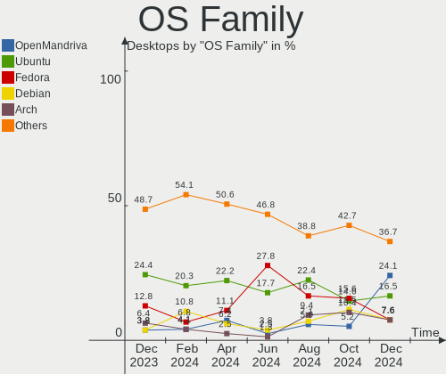
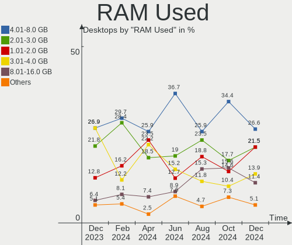
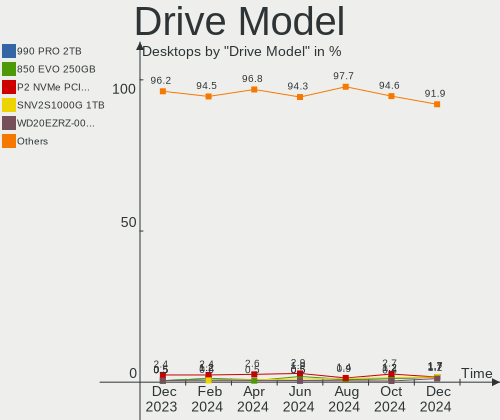
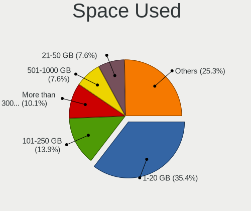
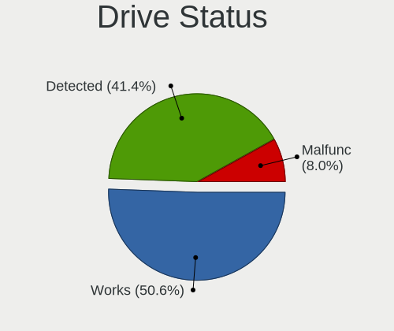
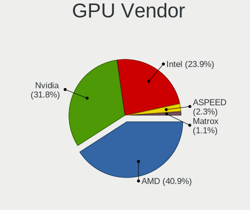
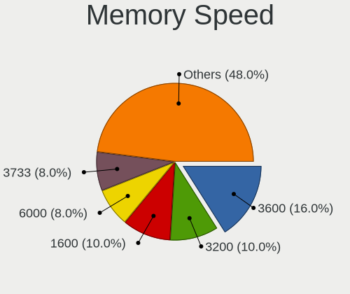
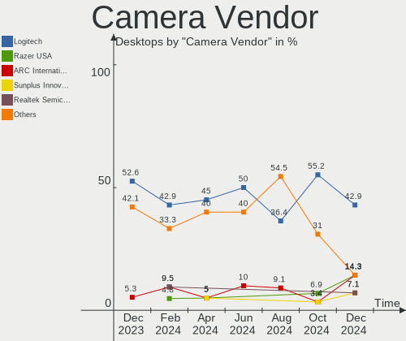

Linux in UK - Hardware Trends (Desktops)
----------------------------------------

A project to identify most popular hardware characteristics and track their change
over time based on data collected by Linux users at https://Linux-Hardware.org.

Anyone can contribute to this report by the [hw-probe](https://github.com/linuxhw/hw-probe) tool:

    sudo -E hw-probe -all -upload

Period: Oct, 2023.

Contents
--------

* [ System ](#system)
  - [ OS                       ](#os)
  - [ OS Family                ](#os-family)
  - [ Kernel                   ](#kernel)
  - [ Kernel Family            ](#kernel-family)
  - [ Kernel Major Ver.        ](#kernel-major-ver)
  - [ Arch                     ](#arch)
  - [ DE                       ](#de)
  - [ Display Server           ](#display-server)
  - [ Display Manager          ](#display-manager)
  - [ OS Lang                  ](#os-lang)
  - [ Boot Mode                ](#boot-mode)
  - [ Filesystem               ](#filesystem)
  - [ Part. scheme             ](#part-scheme)
  - [ Dual Boot with Linux/BSD ](#dual-boot-with-linuxbsd)
  - [ Dual Boot (Win)          ](#dual-boot-win)

* [ Board ](#board)
  - [ Vendor                   ](#vendor)
  - [ Model                    ](#model)
  - [ Model Family             ](#model-family)
  - [ MFG Year                 ](#mfg-year)
  - [ Form Factor              ](#form-factor)
  - [ Secure Boot              ](#secure-boot)
  - [ Coreboot                 ](#coreboot)
  - [ RAM Size                 ](#ram-size)
  - [ RAM Used                 ](#ram-used)
  - [ Total Drives             ](#total-drives)
  - [ Has CD-ROM               ](#has-cd-rom)
  - [ Has Ethernet             ](#has-ethernet)
  - [ Has WiFi                 ](#has-wifi)
  - [ Has Bluetooth            ](#has-bluetooth)

* [ Location ](#location)
  - [ Country                  ](#country)
  - [ City                     ](#city)

* [ Drives ](#drives)
  - [ Drive Vendor             ](#drive-vendor)
  - [ Drive Model              ](#drive-model)
  - [ HDD Vendor               ](#hdd-vendor)
  - [ SSD Vendor               ](#ssd-vendor)
  - [ Drive Kind               ](#drive-kind)
  - [ Drive Connector          ](#drive-connector)
  - [ Drive Size               ](#drive-size)
  - [ Space Total              ](#space-total)
  - [ Space Used               ](#space-used)
  - [ Malfunc. Drives          ](#malfunc-drives)
  - [ Malfunc. Drive Vendor    ](#malfunc-drive-vendor)
  - [ Malfunc. HDD Vendor      ](#malfunc-hdd-vendor)
  - [ Malfunc. Drive Kind      ](#malfunc-drive-kind)
  - [ Failed Drives            ](#failed-drives)
  - [ Failed Drive Vendor      ](#failed-drive-vendor)
  - [ Drive Status             ](#drive-status)

* [ Storage controller ](#storage-controller)
  - [ Storage Vendor           ](#storage-vendor)
  - [ Storage Model            ](#storage-model)
  - [ Storage Kind             ](#storage-kind)

* [ Processor ](#processor)
  - [ CPU Vendor               ](#cpu-vendor)
  - [ CPU Model                ](#cpu-model)
  - [ CPU Model Family         ](#cpu-model-family)
  - [ CPU Cores                ](#cpu-cores)
  - [ CPU Sockets              ](#cpu-sockets)
  - [ CPU Threads              ](#cpu-threads)
  - [ CPU Op-Modes             ](#cpu-op-modes)
  - [ CPU Microcode            ](#cpu-microcode)
  - [ CPU Microarch            ](#cpu-microarch)

* [ Graphics ](#graphics)
  - [ GPU Vendor               ](#gpu-vendor)
  - [ GPU Model                ](#gpu-model)
  - [ GPU Combo                ](#gpu-combo)
  - [ GPU Driver               ](#gpu-driver)
  - [ GPU Memory               ](#gpu-memory)

* [ Monitor ](#monitor)
  - [ Monitor Vendor           ](#monitor-vendor)
  - [ Monitor Model            ](#monitor-model)
  - [ Monitor Resolution       ](#monitor-resolution)
  - [ Monitor Diagonal         ](#monitor-diagonal)
  - [ Monitor Width            ](#monitor-width)
  - [ Aspect Ratio             ](#aspect-ratio)
  - [ Monitor Area             ](#monitor-area)
  - [ Pixel Density            ](#pixel-density)
  - [ Multiple Monitors        ](#multiple-monitors)

* [ Network ](#network)
  - [ Net Controller Vendor    ](#net-controller-vendor)
  - [ Net Controller Model     ](#net-controller-model)
  - [ Wireless Vendor          ](#wireless-vendor)
  - [ Wireless Model           ](#wireless-model)
  - [ Ethernet Vendor          ](#ethernet-vendor)
  - [ Ethernet Model           ](#ethernet-model)
  - [ Net Controller Kind      ](#net-controller-kind)
  - [ Used Controller          ](#used-controller)
  - [ NICs                     ](#nics)
  - [ IPv6                     ](#ipv6)

* [ Bluetooth ](#bluetooth)
  - [ Bluetooth Vendor         ](#bluetooth-vendor)
  - [ Bluetooth Model          ](#bluetooth-model)

* [ Sound ](#sound)
  - [ Sound Vendor             ](#sound-vendor)
  - [ Sound Model              ](#sound-model)

* [ Memory ](#memory)
  - [ Memory Vendor            ](#memory-vendor)
  - [ Memory Model             ](#memory-model)
  - [ Memory Kind              ](#memory-kind)
  - [ Memory Form Factor       ](#memory-form-factor)
  - [ Memory Size              ](#memory-size)
  - [ Memory Speed             ](#memory-speed)

* [ Printers & scanners ](#printers--scanners)
  - [ Printer Vendor           ](#printer-vendor)
  - [ Printer Model            ](#printer-model)
  - [ Scanner Vendor           ](#scanner-vendor)
  - [ Scanner Model            ](#scanner-model)

* [ Camera ](#camera)
  - [ Camera Vendor            ](#camera-vendor)
  - [ Camera Model             ](#camera-model)

* [ Security ](#security)
  - [ Fingerprint Vendor       ](#fingerprint-vendor)
  - [ Fingerprint Model        ](#fingerprint-model)
  - [ Chipcard Vendor          ](#chipcard-vendor)
  - [ Chipcard Model           ](#chipcard-model)

* [ Unsupported ](#unsupported)
  - [ Unsupported Devices      ](#unsupported-devices)
  - [ Unsupported Device Types ](#unsupported-device-types)

System
------

OS
--

Installed operating systems

| Name               | Desktops | Percent |
|--------------------|----------|---------|
| Ubuntu 22.04       | 21       | 25%     |
| Arch Rolling       | 7        | 8.33%   |
| Linux Mint 21.2    | 6        | 7.14%   |
| Pop!_OS 22.04      | 5        | 5.95%   |
| Fedora 38          | 5        | 5.95%   |
| Gentoo 2.14        | 4        | 4.76%   |
| KDE neon 22.04     | 3        | 3.57%   |
| ArcoLinux Rolling  | 3        | 3.57%   |
| Zorin 16           | 2        | 2.38%   |
| Ubuntu 23.04       | 2        | 2.38%   |
| OpenMandriva 23.08 | 2        | 2.38%   |
| MX 23              | 2        | 2.38%   |
| Debian 12          | 2        | 2.38%   |
| Debian 11          | 2        | 2.38%   |
| Xero Rolling       | 1        | 1.19%   |
| Ubuntu MATE 22.04  | 1        | 1.19%   |
| Ubuntu 22.10       | 1        | 1.19%   |
| openSUSE Leap-15.5 | 1        | 1.19%   |
| Nobara 38          | 1        | 1.19%   |
| Manjaro 23.0.3     | 1        | 1.19%   |
| Manjaro            | 1        | 1.19%   |
| LMDE 6             | 1        | 1.19%   |
| Linux Mint 21      | 1        | 1.19%   |
| Linux Mint 20.3    | 1        | 1.19%   |
| Linux Mint 20.2    | 1        | 1.19%   |
| Kubuntu 23.04      | 1        | 1.19%   |
| Kubuntu 22.04      | 1        | 1.19%   |
| Devuan 5           | 1        | 1.19%   |
| Artix Rolling      | 1        | 1.19%   |
| antiX 22           | 1        | 1.19%   |
| ALT Linux 0.8.1    | 1        | 1.19%   |
| AlmaLinux 9.2      | 1        | 1.19%   |

OS Family
---------

OS without a version

| Name         | Desktops | Percent |
|--------------|----------|---------|
| Ubuntu       | 24       | 28.57%  |
| Linux Mint   | 9        | 10.71%  |
| Arch         | 7        | 8.33%   |
| Pop!_OS      | 5        | 5.95%   |
| Fedora       | 5        | 5.95%   |
| Gentoo       | 4        | 4.76%   |
| Debian       | 4        | 4.76%   |
| KDE neon     | 3        | 3.57%   |
| ArcoLinux    | 3        | 3.57%   |
| Zorin        | 2        | 2.38%   |
| OpenMandriva | 2        | 2.38%   |
| MX           | 2        | 2.38%   |
| Manjaro      | 2        | 2.38%   |
| Kubuntu      | 2        | 2.38%   |
| Xero         | 1        | 1.19%   |
| Ubuntu MATE  | 1        | 1.19%   |
| openSUSE     | 1        | 1.19%   |
| Nobara       | 1        | 1.19%   |
| LMDE         | 1        | 1.19%   |
| Devuan       | 1        | 1.19%   |
| Artix        | 1        | 1.19%   |
| antiX        | 1        | 1.19%   |
| ALT Linux    | 1        | 1.19%   |
| AlmaLinux    | 1        | 1.19%   |

Kernel
------

Version of the Linux kernel

| Version                     | Desktops | Percent |
|-----------------------------|----------|---------|
| 6.2.0-34-generic            | 14       | 16.67%  |
| 6.2.0-35-generic            | 6        | 7.14%   |
| 5.15.0-86-generic           | 6        | 7.14%   |
| 6.5.8-arch1-1               | 4        | 4.76%   |
| 6.5.5-arch1-1               | 4        | 4.76%   |
| 6.5.6-200.fc38.x86_64       | 3        | 3.57%   |
| 6.2.0-33-generic            | 3        | 3.57%   |
| 5.15.0-88-generic           | 3        | 3.57%   |
| 6.5.6-76060506-generic      | 2        | 2.38%   |
| 6.5.5-200.fc38.x86_64       | 2        | 2.38%   |
| 6.4.11-desktop-1omv2390     | 2        | 2.38%   |
| 6.1.0-13-amd64              | 2        | 2.38%   |
| 5.15.0-84-generic           | 2        | 2.38%   |
| 5.10.0-26-amd64             | 2        | 2.38%   |
| 6.5.9-cachyos               | 1        | 1.19%   |
| 6.5.9-arch2-1               | 1        | 1.19%   |
| 6.5.8-zen1-1-zen            | 1        | 1.19%   |
| 6.5.7-x64v3-xanmod1         | 1        | 1.19%   |
| 6.5.6-arch2-1               | 1        | 1.19%   |
| 6.5.5-un-def-alt1           | 1        | 1.19%   |
| 6.5.5-gentoo-x86_64         | 1        | 1.19%   |
| 6.5.5-artix1-1              | 1        | 1.19%   |
| 6.5.5-201.fsync.fc38.x86_64 | 1        | 1.19%   |
| 6.5.4-76060504-generic      | 1        | 1.19%   |
| 6.5.3-1-MANJARO             | 1        | 1.19%   |
| 6.5.3                       | 1        | 1.19%   |
| 6.5.2-1-rt8-MANJARO         | 1        | 1.19%   |
| 6.5.0-gentoo                | 1        | 1.19%   |
| 6.5.0-1mx-ahs-amd64         | 1        | 1.19%   |
| 6.5.0-1004-oem              | 1        | 1.19%   |
| 6.4.6-76060406-generic      | 1        | 1.19%   |
| 6.4.0-0.deb12.2-amd64       | 1        | 1.19%   |
| 6.3.9-1-liquorix-amd64      | 1        | 1.19%   |
| 6.2.0-1014-lowlatency       | 1        | 1.19%   |
| 6.1.0-11-amd64              | 1        | 1.19%   |
| 5.4.0-104-generic           | 1        | 1.19%   |
| 5.19.0-46-generic           | 1        | 1.19%   |
| 5.15.0-87-generic           | 1        | 1.19%   |
| 5.15.0-79-generic           | 1        | 1.19%   |
| 5.15.0-71-generic           | 1        | 1.19%   |

Kernel Family
-------------

Linux kernel without a distro release

| Version  | Desktops | Percent |
|----------|----------|---------|
| 6.2.0    | 24       | 28.57%  |
| 5.15.0   | 14       | 16.67%  |
| 6.5.5    | 10       | 11.9%   |
| 6.5.6    | 6        | 7.14%   |
| 6.5.8    | 5        | 5.95%   |
| 6.5.0    | 3        | 3.57%   |
| 6.1.0    | 3        | 3.57%   |
| 6.5.9    | 2        | 2.38%   |
| 6.5.3    | 2        | 2.38%   |
| 6.4.11   | 2        | 2.38%   |
| 5.10.0   | 2        | 2.38%   |
| 6.5.7    | 1        | 1.19%   |
| 6.5.4    | 1        | 1.19%   |
| 6.5.2    | 1        | 1.19%   |
| 6.4.6    | 1        | 1.19%   |
| 6.4.0    | 1        | 1.19%   |
| 6.3.9    | 1        | 1.19%   |
| 5.4.0    | 1        | 1.19%   |
| 5.19.0   | 1        | 1.19%   |
| 5.14.21  | 1        | 1.19%   |
| 5.14.0   | 1        | 1.19%   |
| 5.10.142 | 1        | 1.19%   |

Kernel Major Ver.
-----------------

Linux kernel major version

| Version | Desktops | Percent |
|---------|----------|---------|
| 6.5     | 31       | 36.9%   |
| 6.2     | 24       | 28.57%  |
| 5.15    | 14       | 16.67%  |
| 6.4     | 4        | 4.76%   |
| 6.1     | 3        | 3.57%   |
| 5.10    | 3        | 3.57%   |
| 5.14    | 2        | 2.38%   |
| 6.3     | 1        | 1.19%   |
| 5.4     | 1        | 1.19%   |
| 5.19    | 1        | 1.19%   |

Arch
----

OS architecture (x86_64, i586, etc.)

| Name   | Desktops | Percent |
|--------|----------|---------|
| x86_64 | 84       | 100%    |

DE
--

Desktop Environment

| Name       | Desktops | Percent |
|------------|----------|---------|
| GNOME      | 37       | 44.05%  |
| KDE5       | 21       | 25%     |
| X-Cinnamon | 9        | 10.71%  |
| XFCE       | 6        | 7.14%   |
| LXQt       | 3        | 3.57%   |
| Unknown    | 3        | 3.57%   |
| Cinnamon   | 2        | 2.38%   |
| MATE       | 1        | 1.19%   |
| icewm      | 1        | 1.19%   |
| Hyprland   | 1        | 1.19%   |

Display Server
--------------

X11 or Wayland

| Name    | Desktops | Percent |
|---------|----------|---------|
| X11     | 50       | 59.52%  |
| Wayland | 29       | 34.52%  |
| Tty     | 5        | 5.95%   |

Display Manager
---------------

SDDM, LightDM, etc.

| Name    | Desktops | Percent |
|---------|----------|---------|
| Unknown | 34       | 40.48%  |
| GDM3    | 23       | 27.38%  |
| SDDM    | 14       | 16.67%  |
| LightDM | 9        | 10.71%  |
| GDM     | 4        | 4.76%   |

OS Lang
-------

Language

| Lang  | Desktops | Percent |
|-------|----------|---------|
| en_GB | 70       | 83.33%  |
| en_US | 9        | 10.71%  |
| zh_CN | 1        | 1.19%   |
| ru_RU | 1        | 1.19%   |
| lt_LT | 1        | 1.19%   |
| en_IE | 1        | 1.19%   |
| C     | 1        | 1.19%   |

Boot Mode
---------

EFI or BIOS

| Mode | Desktops | Percent |
|------|----------|---------|
| BIOS | 48       | 57.14%  |
| EFI  | 36       | 42.86%  |

Filesystem
----------

Type of filesystem

| Type    | Desktops | Percent |
|---------|----------|---------|
| Ext4    | 47       | 55.95%  |
| Tmpfs   | 16       | 19.05%  |
| Btrfs   | 15       | 17.86%  |
| Xfs     | 3        | 3.57%   |
| Overlay | 2        | 2.38%   |
| Ext3    | 1        | 1.19%   |

Part. scheme
------------

Scheme of partitioning

| Type    | Desktops | Percent |
|---------|----------|---------|
| GPT     | 51       | 60.71%  |
| Unknown | 28       | 33.33%  |
| MBR     | 5        | 5.95%   |

Dual Boot with Linux/BSD
------------------------

Hosting more than one Linux/BSD

| Dual boot | Desktops | Percent |
|-----------|----------|---------|
| No        | 75       | 89.29%  |
| Yes       | 9        | 10.71%  |

Dual Boot (Win)
---------------

Hosting Linux and Windows

| Dual boot | Desktops | Percent |
|-----------|----------|---------|
| No        | 64       | 76.19%  |
| Yes       | 20       | 23.81%  |

Board
-----

Vendor
------

Motherboard manufacturer

| Name                                 | Desktops | Percent |
|--------------------------------------|----------|---------|
| Gigabyte Technology                  | 24       | 28.57%  |
| ASUSTek Computer                     | 16       | 19.05%  |
| MSI                                  | 10       | 11.9%   |
| Dell                                 | 8        | 9.52%   |
| Hewlett-Packard                      | 6        | 7.14%   |
| Lenovo                               | 4        | 4.76%   |
| ASRock                               | 4        | 4.76%   |
| Intel                                | 2        | 2.38%   |
| Acer                                 | 2        | 2.38%   |
| Shenzhen Meigao Electronic Equipment | 1        | 1.19%   |
| Pegatron                             | 1        | 1.19%   |
| IP3 Tech                             | 1        | 1.19%   |
| Inventec                             | 1        | 1.19%   |
| Foxconn                              | 1        | 1.19%   |
| ECS                                  | 1        | 1.19%   |
| Biostar                              | 1        | 1.19%   |
| Apple                                | 1        | 1.19%   |

Model
-----

Motherboard model

| Name                                       | Desktops | Percent |
|--------------------------------------------|----------|---------|
| MSI MS-7B79                                | 2        | 2.38%   |
| Gigabyte X570S AORUS ELITE AX              | 2        | 2.38%   |
| Gigabyte B450M DS3H                        | 2        | 2.38%   |
| Dell OptiPlex 7010                         | 2        | 2.38%   |
| ASUS ROG STRIX X670E-F GAMING WIFI         | 2        | 2.38%   |
| Shenzhen Meigao Electronic Equipment F7BSC | 1        | 1.19%   |
| Pegatron NF518AA-ABU a6744uk               | 1        | 1.19%   |
| MSI MS-7E06                                | 1        | 1.19%   |
| MSI MS-7D75                                | 1        | 1.19%   |
| MSI MS-7C91                                | 1        | 1.19%   |
| MSI MS-7B89                                | 1        | 1.19%   |
| MSI MS-7B78                                | 1        | 1.19%   |
| MSI MS-7850                                | 1        | 1.19%   |
| MSI MS-7821                                | 1        | 1.19%   |
| MSI MJ-7592                                | 1        | 1.19%   |
| Lenovo ThinkCentre M92 3229A11             | 1        | 1.19%   |
| Lenovo ThinkCentre M910s 10MLS1D600        | 1        | 1.19%   |
| Lenovo ThinkCentre M73 10AXS0Y300          | 1        | 1.19%   |
| Lenovo 70A50022UK ThinkServer TS140        | 1        | 1.19%   |
| IP3 Tech IB8                               | 1        | 1.19%   |
| Inventec DQ Class                          | 1        | 1.19%   |
| Intel X99-P4 V1.0                          | 1        | 1.19%   |
| Intel H311 DS3                             | 1        | 1.19%   |
| HP ProLiant ML350 Gen9                     | 1        | 1.19%   |
| HP Compaq dc7700 Convertible Minitower     | 1        | 1.19%   |
| HP Compaq 8000 Elite SFF PC                | 1        | 1.19%   |
| HP 700-230ea                               | 1        | 1.19%   |
| HP 290 G1 MT                               | 1        | 1.19%   |
| HP 23-q110na                               | 1        | 1.19%   |
| Gigabyte Z690 UD DDR4                      | 1        | 1.19%   |
| Gigabyte Z590I VISION D                    | 1        | 1.19%   |
| Gigabyte Z390 AORUS MASTER                 | 1        | 1.19%   |
| Gigabyte Z170M-D3H-CF                      | 1        | 1.19%   |
| Gigabyte X570 I AORUS PRO WIFI             | 1        | 1.19%   |
| Gigabyte X570 AORUS ELITE                  | 1        | 1.19%   |
| Gigabyte X399 DESIGNARE EX                 | 1        | 1.19%   |
| Gigabyte PDT-702-1020                      | 1        | 1.19%   |
| Gigabyte GA-970A-DS3                       | 1        | 1.19%   |
| Gigabyte G1.Sniper A88X-CF                 | 1        | 1.19%   |
| Gigabyte B85N PHOENIX                      | 1        | 1.19%   |

Model Family
------------

Motherboard model prefix

| Name                                       | Desktops | Percent |
|--------------------------------------------|----------|---------|
| Dell OptiPlex                              | 5        | 5.95%   |
| ASUS ROG                                   | 5        | 5.95%   |
| Lenovo ThinkCentre                         | 3        | 3.57%   |
| MSI MS-7B79                                | 2        | 2.38%   |
| HP Compaq                                  | 2        | 2.38%   |
| Gigabyte X570S                             | 2        | 2.38%   |
| Gigabyte X570                              | 2        | 2.38%   |
| Gigabyte B550M                             | 2        | 2.38%   |
| Gigabyte B550                              | 2        | 2.38%   |
| Gigabyte B450M                             | 2        | 2.38%   |
| Dell Precision                             | 2        | 2.38%   |
| Acer Aspire                                | 2        | 2.38%   |
| Shenzhen Meigao Electronic Equipment F7BSC | 1        | 1.19%   |
| Pegatron NF518AA-ABU                       | 1        | 1.19%   |
| MSI MS-7E06                                | 1        | 1.19%   |
| MSI MS-7D75                                | 1        | 1.19%   |
| MSI MS-7C91                                | 1        | 1.19%   |
| MSI MS-7B89                                | 1        | 1.19%   |
| MSI MS-7B78                                | 1        | 1.19%   |
| MSI MS-7850                                | 1        | 1.19%   |
| MSI MS-7821                                | 1        | 1.19%   |
| MSI MJ-7592                                | 1        | 1.19%   |
| Lenovo 70A50022UK                          | 1        | 1.19%   |
| IP3 Tech IB8                               | 1        | 1.19%   |
| Inventec DQ                                | 1        | 1.19%   |
| Intel X99-P4                               | 1        | 1.19%   |
| Intel H311                                 | 1        | 1.19%   |
| HP ProLiant                                | 1        | 1.19%   |
| HP 700-230ea                               | 1        | 1.19%   |
| HP 290                                     | 1        | 1.19%   |
| HP 23-q110na                               | 1        | 1.19%   |
| Gigabyte Z690                              | 1        | 1.19%   |
| Gigabyte Z590I                             | 1        | 1.19%   |
| Gigabyte Z390                              | 1        | 1.19%   |
| Gigabyte Z170M-D3H-CF                      | 1        | 1.19%   |
| Gigabyte X399                              | 1        | 1.19%   |
| Gigabyte PDT-702-1020                      | 1        | 1.19%   |
| Gigabyte GA-970A-DS3                       | 1        | 1.19%   |
| Gigabyte G1.Sniper                         | 1        | 1.19%   |
| Gigabyte B85N                              | 1        | 1.19%   |

MFG Year
--------

Motherboard manufacture year

| Year | Desktops | Percent |
|------|----------|---------|
| 2018 | 13       | 15.48%  |
| 2022 | 11       | 13.1%   |
| 2014 | 8        | 9.52%   |
| 2020 | 7        | 8.33%   |
| 2013 | 7        | 8.33%   |
| 2021 | 6        | 7.14%   |
| 2019 | 6        | 7.14%   |
| 2023 | 4        | 4.76%   |
| 2015 | 4        | 4.76%   |
| 2010 | 4        | 4.76%   |
| 2008 | 4        | 4.76%   |
| 2012 | 3        | 3.57%   |
| 2017 | 2        | 2.38%   |
| 2009 | 2        | 2.38%   |
| 2016 | 1        | 1.19%   |
| 2011 | 1        | 1.19%   |
| 2006 | 1        | 1.19%   |

Form Factor
-----------

Physical design of the computer

| Name    | Desktops | Percent |
|---------|----------|---------|
| Desktop | 84       | 100%    |

Secure Boot
-----------

Enabled or disabled

| State    | Desktops | Percent |
|----------|----------|---------|
| Disabled | 83       | 98.81%  |
| Enabled  | 1        | 1.19%   |

Coreboot
--------

Have coreboot on board

| Used | Desktops | Percent |
|------|----------|---------|
| No   | 84       | 100%    |

RAM Size
--------

Total RAM memory

| Size in GB  | Desktops | Percent |
|-------------|----------|---------|
| 16.01-24.0  | 25       | 29.76%  |
| 32.01-64.0  | 23       | 27.38%  |
| 8.01-16.0   | 12       | 14.29%  |
| 64.01-256.0 | 10       | 11.9%   |
| 4.01-8.0    | 6        | 7.14%   |
| 3.01-4.0    | 4        | 4.76%   |
| 24.01-32.0  | 2        | 2.38%   |
| 2.01-3.0    | 2        | 2.38%   |

RAM Used
--------

Used RAM memory

| Used GB    | Desktops | Percent |
|------------|----------|---------|
| 4.01-8.0   | 22       | 26.19%  |
| 1.01-2.0   | 19       | 22.62%  |
| 3.01-4.0   | 17       | 20.24%  |
| 2.01-3.0   | 17       | 20.24%  |
| 8.01-16.0  | 5        | 5.95%   |
| 16.01-24.0 | 3        | 3.57%   |
| 0.51-1.0   | 1        | 1.19%   |

Total Drives
------------

Number of drives on board

| Drives | Desktops | Percent |
|--------|----------|---------|
| 1      | 36       | 42.86%  |
| 2      | 20       | 23.81%  |
| 4      | 10       | 11.9%   |
| 3      | 7        | 8.33%   |
| 6      | 4        | 4.76%   |
| 5      | 4        | 4.76%   |
| 11     | 1        | 1.19%   |
| 8      | 1        | 1.19%   |
| 7      | 1        | 1.19%   |

Has CD-ROM
----------

Has CD-ROM on board

| Presented | Desktops | Percent |
|-----------|----------|---------|
| No        | 55       | 65.48%  |
| Yes       | 29       | 34.52%  |

Has Ethernet
------------

Has Ethernet on board

| Presented | Desktops | Percent |
|-----------|----------|---------|
| Yes       | 84       | 100%    |

Has WiFi
--------

Has WiFi module

| Presented | Desktops | Percent |
|-----------|----------|---------|
| Yes       | 48       | 57.14%  |
| No        | 36       | 42.86%  |

Has Bluetooth
-------------

Has Bluetooth module

| Presented | Desktops | Percent |
|-----------|----------|---------|
| No        | 50       | 59.52%  |
| Yes       | 34       | 40.48%  |

Location
--------

Country
-------

Geographic location (country)

| Country | Desktops | Percent |
|---------|----------|---------|
| UK      | 84       | 100%    |

City
----

Geographic location (city)

| City                | Desktops | Percent |
|---------------------|----------|---------|
| London              | 4        | 4.76%   |
| Stockport           | 2        | 2.38%   |
| St Albans           | 2        | 2.38%   |
| Mansfield           | 2        | 2.38%   |
| Manchester          | 2        | 2.38%   |
| Hackney             | 2        | 2.38%   |
| Birmingham          | 2        | 2.38%   |
| Worcester           | 1        | 1.19%   |
| Weymouth            | 1        | 1.19%   |
| Wandsworth          | 1        | 1.19%   |
| Uxbridge            | 1        | 1.19%   |
| Uttoxeter           | 1        | 1.19%   |
| Trowbridge          | 1        | 1.19%   |
| Tiverton            | 1        | 1.19%   |
| Tipton              | 1        | 1.19%   |
| Sutton Coldfield    | 1        | 1.19%   |
| Staines-upon-Thames | 1        | 1.19%   |
| Sittingbourne       | 1        | 1.19%   |
| Sheffield           | 1        | 1.19%   |
| Selby               | 1        | 1.19%   |
| Runcorn             | 1        | 1.19%   |
| Rugby               | 1        | 1.19%   |
| Rotherham           | 1        | 1.19%   |
| Rochester           | 1        | 1.19%   |
| Renfrew             | 1        | 1.19%   |
| Redhill             | 1        | 1.19%   |
| Reading             | 1        | 1.19%   |
| Polegate            | 1        | 1.19%   |
| Plymouth            | 1        | 1.19%   |
| Peterborough        | 1        | 1.19%   |
| Paisley             | 1        | 1.19%   |
| Orgreave            | 1        | 1.19%   |
| Nottingham          | 1        | 1.19%   |
| Norwich             | 1        | 1.19%   |
| Newcastle upon Tyne | 1        | 1.19%   |
| Morden              | 1        | 1.19%   |
| Milton Keynes       | 1        | 1.19%   |
| Leicester           | 1        | 1.19%   |
| Leeds               | 1        | 1.19%   |
| Larne               | 1        | 1.19%   |

Drives
------

Drive Vendor
------------

Hard drive vendors

| Vendor                       | Desktops | Drives | Percent |
|------------------------------|----------|--------|---------|
| Samsung Electronics          | 25       | 41     | 16.23%  |
| Seagate                      | 24       | 36     | 15.58%  |
| WDC                          | 23       | 33     | 14.94%  |
| Toshiba                      | 13       | 14     | 8.44%   |
| Crucial                      | 13       | 18     | 8.44%   |
| Sandisk                      | 10       | 14     | 6.49%   |
| Kingston                     | 7        | 8      | 4.55%   |
| Kingston Technology Company  | 4        | 4      | 2.6%    |
| Silicon Motion               | 3        | 3      | 1.95%   |
| Phison Electronics           | 3        | 4      | 1.95%   |
| China                        | 3        | 3      | 1.95%   |
| A-DATA Technology            | 3        | 4      | 1.95%   |
| Unknown                      | 2        | 3      | 1.3%    |
| Netac                        | 2        | 2      | 1.3%    |
| Intel                        | 2        | 4      | 1.3%    |
| Hitachi                      | 2        | 2      | 1.3%    |
| XUM                          | 1        | 1      | 0.65%   |
| SK hynix                     | 1        | 1      | 0.65%   |
| Shenzhen Longsys Electronics | 1        | 2      | 0.65%   |
| SABRENT                      | 1        | 1      | 0.65%   |
| Realtek Semiconductor        | 1        | 1      | 0.65%   |
| PNY                          | 1        | 1      | 0.65%   |
| Phison                       | 1        | 1      | 0.65%   |
| OCZ                          | 1        | 1      | 0.65%   |
| Micron/Crucial Technology    | 1        | 1      | 0.65%   |
| MENGMI                       | 1        | 1      | 0.65%   |
| KIOXIA-EXCERIA               | 1        | 1      | 0.65%   |
| HGST                         | 1        | 1      | 0.65%   |
| Corsair                      | 1        | 1      | 0.65%   |
| Apple                        | 1        | 1      | 0.65%   |
| ADATA Technology             | 1        | 1      | 0.65%   |

Drive Model
-----------

Hard drive models

| Model                                                 | Desktops | Percent |
|-------------------------------------------------------|----------|---------|
| Samsung NVMe SSD Controller SM981/PM981/PM983 1TB     | 11       | 5.73%   |
| Seagate ST2000DM008-2FR102 2TB                        | 4        | 2.08%   |
| Samsung SSD 850 EVO 500GB                             | 4        | 2.08%   |
| Crucial CT1000MX500SSD1 1TB                           | 4        | 2.08%   |
| Sandisk WD Black SN850 1TB                            | 3        | 1.56%   |
| Kingston SA400S37240G 240GB SSD                       | 3        | 1.56%   |
| WDC WDS500G2B0A-00SM50 500GB SSD                      | 2        | 1.04%   |
| WDC WD40EZRZ-00GXCB0 4TB                              | 2        | 1.04%   |
| WDC WD10EZEX-00BN5A0 1TB                              | 2        | 1.04%   |
| Toshiba DT01ACA100 1TB                                | 2        | 1.04%   |
| Silicon Motion SM2263EN/SM2263XT SSD Controller 256GB | 2        | 1.04%   |
| Seagate ST4000DM004-2CV104 4TB                        | 2        | 1.04%   |
| Seagate ST1000DM010-2EP102 1TB                        | 2        | 1.04%   |
| Seagate ST1000DM003-1ER162 1TB                        | 2        | 1.04%   |
| Seagate ST1000DM003-1CH162 1TB                        | 2        | 1.04%   |
| Sandisk WD Black SN750 / PC SN730 NVMe SSD 1024GB     | 2        | 1.04%   |
| Samsung SSD 870 EVO 1TB                               | 2        | 1.04%   |
| Samsung SSD 860 EVO 1TB                               | 2        | 1.04%   |
| Samsung SSD 850 EVO 250GB                             | 2        | 1.04%   |
| Phison E12 NVMe Controller 1TB                        | 2        | 1.04%   |
| Kingston Company SNV2S2000G 2TB                       | 2        | 1.04%   |
| Intel SSD 660P Series 1024GB                          | 2        | 1.04%   |
| Crucial CT500MX500SSD1 500GB                          | 2        | 1.04%   |
| Crucial CT1000BX500SSD1 1TB                           | 2        | 1.04%   |
| XUM HX256GSSDSATA3 256GB                              | 1        | 0.52%   |
| WDC WDS250G1B0A-00H9H0 250GB SSD                      | 1        | 0.52%   |
| WDC WDS240G2G0A-00JH30 240GB SSD                      | 1        | 0.52%   |
| WDC WD6002FFWX-68TZ4N0 6TB                            | 1        | 0.52%   |
| WDC WD40EFRX-68WT0N0 4TB                              | 1        | 0.52%   |
| WDC WD30EFRX-68EUZN0 3TB                              | 1        | 0.52%   |
| WDC WD3000F9YZ-09N20L1 3TB                            | 1        | 0.52%   |
| WDC WD2500KS-00MJB0 250GB                             | 1        | 0.52%   |
| WDC WD20PURX-64P6ZY0 2TB                              | 1        | 0.52%   |
| WDC WD20EZRZ-00Z5HB0 2TB                              | 1        | 0.52%   |
| WDC WD20EFRX-68EUZN0 2TB                              | 1        | 0.52%   |
| WDC WD2003FZEX-00Z4SA0 2TB                            | 1        | 0.52%   |
| WDC WD10JUCX-63WPNY0 1TB                              | 1        | 0.52%   |
| WDC WD10JPVX-22JC3T0 1TB                              | 1        | 0.52%   |
| WDC WD10EZEX-22MFCA0 1TB                              | 1        | 0.52%   |
| WDC WD10EZEX-08WN4A0 1TB                              | 1        | 0.52%   |

HDD Vendor
----------

Hard disk drive vendors

| Vendor              | Desktops | Drives | Percent |
|---------------------|----------|--------|---------|
| Seagate             | 24       | 36     | 37.5%   |
| WDC                 | 21       | 29     | 32.81%  |
| Toshiba             | 11       | 12     | 17.19%  |
| Samsung Electronics | 3        | 4      | 4.69%   |
| Hitachi             | 2        | 2      | 3.13%   |
| Unknown             | 1        | 1      | 1.56%   |
| HGST                | 1        | 1      | 1.56%   |
| Apple               | 1        | 1      | 1.56%   |

SSD Vendor
----------

Solid state drive vendors

| Vendor              | Desktops | Drives | Percent |
|---------------------|----------|--------|---------|
| Samsung Electronics | 11       | 15     | 21.15%  |
| Crucial             | 11       | 13     | 21.15%  |
| Kingston            | 6        | 7      | 11.54%  |
| WDC                 | 4        | 4      | 7.69%   |
| SanDisk             | 3        | 3      | 5.77%   |
| China               | 3        | 3      | 5.77%   |
| A-DATA Technology   | 3        | 4      | 5.77%   |
| Toshiba             | 2        | 2      | 3.85%   |
| XUM                 | 1        | 1      | 1.92%   |
| SABRENT             | 1        | 1      | 1.92%   |
| PNY                 | 1        | 1      | 1.92%   |
| OCZ                 | 1        | 1      | 1.92%   |
| Netac               | 1        | 1      | 1.92%   |
| MENGMI              | 1        | 1      | 1.92%   |
| KIOXIA-EXCERIA      | 1        | 1      | 1.92%   |
| Intel               | 1        | 2      | 1.92%   |
| Corsair             | 1        | 1      | 1.92%   |

Drive Kind
----------

HDD or SSD

| Kind    | Desktops | Drives | Percent |
|---------|----------|--------|---------|
| HDD     | 51       | 86     | 39.53%  |
| SSD     | 39       | 61     | 30.23%  |
| NVMe    | 38       | 60     | 29.46%  |
| Unknown | 1        | 2      | 0.78%   |

Drive Connector
---------------

SATA, SAS, NVMe, etc.

| Type | Desktops | Drives | Percent |
|------|----------|--------|---------|
| SATA | 71       | 140    | 60.68%  |
| NVMe | 38       | 60     | 32.48%  |
| SAS  | 8        | 9      | 6.84%   |

Drive Size
----------

Size of hard drive

| Size in TB | Desktops | Drives | Percent |
|------------|----------|--------|---------|
| 0.01-0.5   | 39       | 61     | 37.86%  |
| 0.51-1.0   | 33       | 45     | 32.04%  |
| 1.01-2.0   | 14       | 15     | 13.59%  |
| 3.01-4.0   | 7        | 11     | 6.8%    |
| 2.01-3.0   | 6        | 8      | 5.83%   |
| 4.01-10.0  | 3        | 5      | 2.91%   |
| 10.01-20.0 | 1        | 2      | 0.97%   |

Space Total
-----------

Amount of disk space available on the file system

| Size in GB     | Desktops | Percent |
|----------------|----------|---------|
| 501-1000       | 19       | 22.62%  |
| 101-250        | 17       | 20.24%  |
| More than 3000 | 13       | 15.48%  |
| 1001-2000      | 12       | 14.29%  |
| 251-500        | 10       | 11.9%   |
| 2001-3000      | 8        | 9.52%   |
| 1-20           | 3        | 3.57%   |
| 21-50          | 1        | 1.19%   |
| 51-100         | 1        | 1.19%   |

Space Used
----------

Amount of used disk space

| Used GB        | Desktops | Percent |
|----------------|----------|---------|
| 1-20           | 19       | 22.62%  |
| 101-250        | 16       | 19.05%  |
| 21-50          | 12       | 14.29%  |
| 51-100         | 10       | 11.9%   |
| 251-500        | 7        | 8.33%   |
| 501-1000       | 7        | 8.33%   |
| More than 3000 | 6        | 7.14%   |
| 1001-2000      | 5        | 5.95%   |
| 2001-3000      | 2        | 2.38%   |

Malfunc. Drives
---------------

Drive models with a malfunction

| Model                                    | Desktops | Drives | Percent |
|------------------------------------------|----------|--------|---------|
| WDC WDS240G2G0A-00JH30 240GB SSD         | 1        | 1      | 5.88%   |
| WDC WD40EFRX-68WT0N0 4TB                 | 1        | 1      | 5.88%   |
| WDC WD20PURX-64P6ZY0 2TB                 | 1        | 1      | 5.88%   |
| WDC WD1003FBYZ-010FB0 1TB                | 1        | 1      | 5.88%   |
| WDC WD1003FBYX-01Y7B2 1TB                | 1        | 1      | 5.88%   |
| Toshiba A100 240GB SSD                   | 1        | 1      | 5.88%   |
| Seagate ST500DM002-1BC142 500GB          | 1        | 1      | 5.88%   |
| Seagate ST4000DX001-1CE168 4TB           | 1        | 1      | 5.88%   |
| Seagate ST1000DM010-2EP102 1TB           | 1        | 1      | 5.88%   |
| Seagate ST1000DM003-1CH162 1TB           | 1        | 1      | 5.88%   |
| Samsung Electronics SSD 970 EVO Plus 1TB | 1        | 1      | 5.88%   |
| Samsung Electronics SP2504C 250GB        | 1        | 1      | 5.88%   |
| Samsung Electronics HD502IJ 500GB        | 1        | 1      | 5.88%   |
| Samsung Electronics HD160JJ 160GB        | 1        | 1      | 5.88%   |
| Hitachi HDS5C1010CLA382 1TB              | 1        | 1      | 5.88%   |
| A-DATA Technology SU900 256GB SSD        | 1        | 1      | 5.88%   |
| A-DATA Technology SU650 960GB SSD        | 1        | 2      | 5.88%   |

Malfunc. Drive Vendor
---------------------

Vendors of faulty drives

| Vendor              | Desktops | Drives | Percent |
|---------------------|----------|--------|---------|
| WDC                 | 4        | 5      | 28.57%  |
| Seagate             | 3        | 4      | 21.43%  |
| Samsung Electronics | 3        | 4      | 21.43%  |
| A-DATA Technology   | 2        | 3      | 14.29%  |
| Toshiba             | 1        | 1      | 7.14%   |
| Hitachi             | 1        | 1      | 7.14%   |

Malfunc. HDD Vendor
-------------------

Vendors of faulty HDD drives

| Vendor              | Desktops | Drives | Percent |
|---------------------|----------|--------|---------|
| WDC                 | 3        | 4      | 33.33%  |
| Seagate             | 3        | 4      | 33.33%  |
| Samsung Electronics | 2        | 3      | 22.22%  |
| Hitachi             | 1        | 1      | 11.11%  |

Malfunc. Drive Kind
-------------------

Kinds of faulty drives

| Kind | Desktops | Drives | Percent |
|------|----------|--------|---------|
| HDD  | 8        | 12     | 61.54%  |
| SSD  | 4        | 5      | 30.77%  |
| NVMe | 1        | 1      | 7.69%   |

Failed Drives
-------------

Failed drive models

Zero info for selected period =(

Failed Drive Vendor
-------------------

Failed drive vendors

Zero info for selected period =(

Drive Status
------------

Number of failed and malfunc. drives

| Status   | Desktops | Drives | Percent |
|----------|----------|--------|---------|
| Detected | 49       | 112    | 50.52%  |
| Works    | 36       | 79     | 37.11%  |
| Malfunc  | 12       | 18     | 12.37%  |

Storage controller
------------------

Storage Vendor
--------------

Storage controller vendors

| Vendor                       | Desktops | Percent |
|------------------------------|----------|---------|
| Intel                        | 44       | 32.35%  |
| AMD                          | 37       | 27.21%  |
| Samsung Electronics          | 18       | 13.24%  |
| SanDisk                      | 7        | 5.15%   |
| Micron/Crucial Technology    | 5        | 3.68%   |
| Kingston Technology Company  | 5        | 3.68%   |
| ASMedia Technology           | 5        | 3.68%   |
| Phison Electronics           | 4        | 2.94%   |
| Silicon Motion               | 3        | 2.21%   |
| Marvell Technology Group     | 2        | 1.47%   |
| SK hynix                     | 1        | 0.74%   |
| Shenzhen Longsys Electronics | 1        | 0.74%   |
| Realtek Semiconductor        | 1        | 0.74%   |
| Nvidia                       | 1        | 0.74%   |
| JMicron Technology           | 1        | 0.74%   |
| ADATA Technology             | 1        | 0.74%   |

Storage Model
-------------

Storage controller models

| Model                                                                          | Desktops | Percent |
|--------------------------------------------------------------------------------|----------|---------|
| AMD FCH SATA Controller [AHCI mode]                                            | 22       | 13.75%  |
| Samsung NVMe SSD Controller SM981/PM981/PM983                                  | 12       | 7.5%    |
| AMD 400 Series Chipset SATA Controller                                         | 9        | 5.63%   |
| AMD 500 Series Chipset SATA Controller                                         | 7        | 4.38%   |
| Intel Q170/Q150/B150/H170/H110/Z170/CM236 Chipset SATA Controller [AHCI Mode]  | 6        | 3.75%   |
| Intel 8 Series/C220 Series Chipset Family 6-port SATA Controller 1 [AHCI mode] | 6        | 3.75%   |
| AMD SB7x0/SB8x0/SB9x0 SATA Controller [AHCI mode]                              | 6        | 3.75%   |
| Intel SATA Controller [RAID mode]                                              | 5        | 3.13%   |
| Intel 200 Series PCH SATA controller [AHCI mode]                               | 5        | 3.13%   |
| ASMedia ASM1062 Serial ATA Controller                                          | 5        | 3.13%   |
| Micron/Crucial P2 [Nick P2] / P3 / P3 Plus NVMe PCIe SSD (DRAM-less)           | 4        | 2.5%    |
| Intel Alder Lake-S PCH SATA Controller [AHCI Mode]                             | 4        | 2.5%    |
| SanDisk WD PC SN810 / Black SN850 NVMe SSD                                     | 3        | 1.88%   |
| Samsung NVMe SSD Controller 980 (DRAM-less)                                    | 3        | 1.88%   |
| Kingston Company NV2 NVMe SSD SM2267XT                                         | 3        | 1.88%   |
| Intel 7 Series/C210 Series Chipset Family 6-port SATA Controller [AHCI mode]   | 3        | 1.88%   |
| Silicon Motion SM2263EN/SM2263XT (DRAM-less) NVMe SSD Controllers              | 2        | 1.25%   |
| SanDisk Extreme Pro / WD Black SN750 / PC SN730 / Red SN700 NVMe SSD           | 2        | 1.25%   |
| Samsung NVMe SSD Controller SM961/PM961/SM963                                  | 2        | 1.25%   |
| Phison E18 PCIe4 NVMe Controller                                               | 2        | 1.25%   |
| Phison E12 NVMe Controller                                                     | 2        | 1.25%   |
| Intel Volume Management Device NVMe RAID Controller                            | 2        | 1.25%   |
| Intel SSD 660P Series                                                          | 2        | 1.25%   |
| Intel NM10/ICH7 Family SATA Controller [IDE mode]                              | 2        | 1.25%   |
| Intel 82801JD/DO (ICH10 Family) 4-port SATA IDE Controller                     | 2        | 1.25%   |
| Intel 82801JD/DO (ICH10 Family) 2-port SATA IDE Controller                     | 2        | 1.25%   |
| Intel 82801G (ICH7 Family) IDE Controller                                      | 2        | 1.25%   |
| Intel 500 Series Chipset Family SATA AHCI Controller                           | 2        | 1.25%   |
| AMD FCH SATA Controller D                                                      | 2        | 1.25%   |
| SK hynix PC401 NVMe Solid State Drive 256GB                                    | 1        | 0.63%   |
| Silicon Motion SM2262/SM2262EN SSD Controller                                  | 1        | 0.63%   |
| Shenzhen Longsys Non-Volatile memory controller                                | 1        | 0.63%   |
| SanDisk WD Blue SN570 NVMe SSD 2TB                                             | 1        | 0.63%   |
| SanDisk WD Blue SN550 NVMe SSD 2TB (DRAM-less)                                 | 1        | 0.63%   |
| Sandisk WD Black SN850X NVMe SSD                                               | 1        | 0.63%   |
| Samsung NVMe SSD Controller SM951/PM951                                        | 1        | 0.63%   |
| Samsung NVMe SSD Controller S4LV008[Pascal]                                    | 1        | 0.63%   |
| Samsung NVMe SSD Controller PM9A1/PM9A3/980PRO                                 | 1        | 0.63%   |
| Realtek RTS5763DL NVMe SSD Controller (DRAM-less)                              | 1        | 0.63%   |
| Nvidia MCP78S [GeForce 8200] SATA Controller (non-AHCI mode)                   | 1        | 0.63%   |

Storage Kind
------------

Kind of storage controller (IDE, SATA, NVMe, SAS, ...)

| Kind | Desktops | Percent |
|------|----------|---------|
| SATA | 69       | 55.65%  |
| NVMe | 38       | 30.65%  |
| IDE  | 10       | 8.06%   |
| RAID | 7        | 5.65%   |

Processor
---------

CPU Vendor
----------

Processor vendors

| Vendor | Desktops | Percent |
|--------|----------|---------|
| Intel  | 45       | 53.57%  |
| AMD    | 39       | 46.43%  |

CPU Model
---------

Processor models

| Model                                       | Desktops | Percent |
|---------------------------------------------|----------|---------|
| AMD Ryzen 7 2700X Eight-Core Processor      | 4        | 4.76%   |
| AMD Ryzen 9 7900X 12-Core Processor         | 3        | 3.57%   |
| AMD Ryzen 5 3600 6-Core Processor           | 3        | 3.57%   |
| Intel Core i7-7700K CPU @ 4.20GHz           | 2        | 2.38%   |
| Intel Core i5-9600K CPU @ 3.70GHz           | 2        | 2.38%   |
| Intel Core i5-6500 CPU @ 3.20GHz            | 2        | 2.38%   |
| Intel Core i5-4670K CPU @ 3.40GHz           | 2        | 2.38%   |
| Intel Core i5-3470 CPU @ 3.20GHz            | 2        | 2.38%   |
| Intel 12th Gen Core i5-12400                | 2        | 2.38%   |
| AMD Ryzen 9 5950X 16-Core Processor         | 2        | 2.38%   |
| AMD Ryzen 7 5800X3D 8-Core Processor        | 2        | 2.38%   |
| AMD Ryzen 5 5600X 6-Core Processor          | 2        | 2.38%   |
| AMD Ryzen 5 2600X Six-Core Processor        | 2        | 2.38%   |
| AMD FX-8350 Eight-Core Processor            | 2        | 2.38%   |
| AMD FX-6300 Six-Core Processor              | 2        | 2.38%   |
| Intel Xeon CPU X5472 @ 3.00GHz              | 1        | 1.19%   |
| Intel Xeon CPU E5-2690 v4 @ 2.60GHz         | 1        | 1.19%   |
| Intel Xeon CPU E5-2680 v3 @ 2.50GHz         | 1        | 1.19%   |
| Intel Xeon CPU E3-1226 v3 @ 3.30GHz         | 1        | 1.19%   |
| Intel Pentium Dual-Core CPU E6600 @ 3.06GHz | 1        | 1.19%   |
| Intel Pentium Dual-Core CPU E5400 @ 2.70GHz | 1        | 1.19%   |
| Intel Core i9-9900K CPU @ 3.60GHz           | 1        | 1.19%   |
| Intel Core i9-10850K CPU @ 3.60GHz          | 1        | 1.19%   |
| Intel Core i7-9700 CPU @ 3.00GHz            | 1        | 1.19%   |
| Intel Core i7-8700 CPU @ 3.20GHz            | 1        | 1.19%   |
| Intel Core i7-7800X CPU @ 3.50GHz           | 1        | 1.19%   |
| Intel Core i7-6700 CPU @ 3.40GHz            | 1        | 1.19%   |
| Intel Core i7-4770 CPU @ 3.40GHz            | 1        | 1.19%   |
| Intel Core i7-3770 CPU @ 3.40GHz            | 1        | 1.19%   |
| Intel Core i7-1065G7 CPU @ 1.30GHz          | 1        | 1.19%   |
| Intel Core i7 CPU 920 @ 2.67GHz             | 1        | 1.19%   |
| Intel Core i5-9400F CPU @ 2.90GHz           | 1        | 1.19%   |
| Intel Core i5-7600K CPU @ 3.80GHz           | 1        | 1.19%   |
| Intel Core i5-7500 CPU @ 3.40GHz            | 1        | 1.19%   |
| Intel Core i5-6600K CPU @ 3.50GHz           | 1        | 1.19%   |
| Intel Core i5-4570T CPU @ 2.90GHz           | 1        | 1.19%   |
| Intel Core i5-4460 CPU @ 3.20GHz            | 1        | 1.19%   |
| Intel Core i5-2400 CPU @ 3.10GHz            | 1        | 1.19%   |
| Intel Core i5-10400 CPU @ 2.90GHz           | 1        | 1.19%   |
| Intel Core i3-4170 CPU @ 3.70GHz            | 1        | 1.19%   |

CPU Model Family
----------------

Processor model prefix

| Model                   | Desktops | Percent |
|-------------------------|----------|---------|
| Intel Core i5           | 16       | 19.05%  |
| AMD Ryzen 7             | 11       | 13.1%   |
| Intel Core i7           | 10       | 11.9%   |
| AMD Ryzen 5             | 9        | 10.71%  |
| AMD Ryzen 9             | 7        | 8.33%   |
| Other                   | 5        | 5.95%   |
| Intel Xeon              | 4        | 4.76%   |
| AMD FX                  | 4        | 4.76%   |
| Intel Pentium Dual-Core | 2        | 2.38%   |
| Intel Core i9           | 2        | 2.38%   |
| Intel Core i3           | 2        | 2.38%   |
| Intel Core 2 Duo        | 2        | 2.38%   |
| AMD A10                 | 2        | 2.38%   |
| Intel Core 2 Quad       | 1        | 1.19%   |
| Intel Core 2            | 1        | 1.19%   |
| AMD Ryzen Threadripper  | 1        | 1.19%   |
| AMD Ryzen 3             | 1        | 1.19%   |
| AMD Phenom II X6        | 1        | 1.19%   |
| AMD Phenom              | 1        | 1.19%   |
| AMD GX                  | 1        | 1.19%   |
| AMD Athlon II X2        | 1        | 1.19%   |

CPU Cores
---------

Number of processor cores

| Number | Desktops | Percent |
|--------|----------|---------|
| 4      | 24       | 28.57%  |
| 6      | 18       | 21.43%  |
| 8      | 15       | 17.86%  |
| 2      | 11       | 13.1%   |
| 12     | 6        | 7.14%   |
| 16     | 3        | 3.57%   |
| 3      | 3        | 3.57%   |
| 28     | 1        | 1.19%   |
| 24     | 1        | 1.19%   |
| 14     | 1        | 1.19%   |
| 10     | 1        | 1.19%   |

CPU Sockets
-----------

Number of sockets

| Number | Desktops | Percent |
|--------|----------|---------|
| 1      | 82       | 97.62%  |
| 2      | 2        | 2.38%   |

CPU Threads
-----------

Threads per core (Hyper-Threading)

| Number | Desktops | Percent |
|--------|----------|---------|
| 2      | 56       | 66.67%  |
| 1      | 28       | 33.33%  |

CPU Op-Modes
------------

CPU Operation Modes (32-bit, 64-bit)

| Op mode        | Desktops | Percent |
|----------------|----------|---------|
| 32-bit, 64-bit | 84       | 100%    |

CPU Microcode
-------------

Microcode number

| Number     | Desktops | Percent |
|------------|----------|---------|
| Unknown    | 51       | 60.71%  |
| 0x0800820d | 5        | 5.95%   |
| 0x0a601203 | 4        | 4.76%   |
| 0x306a9    | 2        | 2.38%   |
| 0x08701021 | 2        | 2.38%   |
| 0x906ec    | 1        | 1.19%   |
| 0x906ea    | 1        | 1.19%   |
| 0x906e9    | 1        | 1.19%   |
| 0x506e3    | 1        | 1.19%   |
| 0x306c3    | 1        | 1.19%   |
| 0x206a7    | 1        | 1.19%   |
| 0x1067a    | 1        | 1.19%   |
| 0x10677    | 1        | 1.19%   |
| 0x0a704101 | 1        | 1.19%   |
| 0x0a601206 | 1        | 1.19%   |
| 0x0a50000d | 1        | 1.19%   |
| 0x0a201205 | 1        | 1.19%   |
| 0x0a201204 | 1        | 1.19%   |
| 0x0a201025 | 1        | 1.19%   |
| 0x08001138 | 1        | 1.19%   |
| 0x08001137 | 1        | 1.19%   |
| 0x06000852 | 1        | 1.19%   |
| 0x06000803 | 1        | 1.19%   |
| 0x010000dc | 1        | 1.19%   |
| 0x010000c8 | 1        | 1.19%   |

CPU Microarch
-------------

Microarchitecture

| Name             | Desktops | Percent |
|------------------|----------|---------|
| Zen 3            | 10       | 11.9%   |
| KabyLake         | 10       | 11.9%   |
| Haswell          | 9        | 10.71%  |
| Unknown          | 8        | 9.52%   |
| Zen+             | 7        | 8.33%   |
| Penryn           | 6        | 7.14%   |
| Skylake          | 5        | 5.95%   |
| Piledriver       | 5        | 5.95%   |
| Zen 2            | 4        | 4.76%   |
| K10              | 3        | 3.57%   |
| IvyBridge        | 3        | 3.57%   |
| Alderlake Hybrid | 3        | 3.57%   |
| Zen              | 2        | 2.38%   |
| CometLake        | 2        | 2.38%   |
| SandyBridge      | 1        | 1.19%   |
| Nehalem          | 1        | 1.19%   |
| Jaguar           | 1        | 1.19%   |
| IceLake          | 1        | 1.19%   |
| Excavator        | 1        | 1.19%   |
| Core             | 1        | 1.19%   |
| Broadwell        | 1        | 1.19%   |

Graphics
--------

GPU Vendor
----------

Vendors of graphics cards

| Vendor                     | Desktops | Percent |
|----------------------------|----------|---------|
| Nvidia                     | 39       | 43.33%  |
| AMD                        | 32       | 35.56%  |
| Intel                      | 18       | 20%     |
| Matrox Electronics Systems | 1        | 1.11%   |

GPU Model
---------

Graphics card models

| Model                                                                       | Desktops | Percent |
|-----------------------------------------------------------------------------|----------|---------|
| Nvidia GP108 [GeForce GT 1030]                                              | 3        | 3.26%   |
| Nvidia GP104 [GeForce GTX 1080]                                             | 3        | 3.26%   |
| Nvidia GP102 [GeForce GTX 1080 Ti]                                          | 3        | 3.26%   |
| AMD Raphael                                                                 | 3        | 3.26%   |
| AMD Navi 22 [Radeon RX 6700/6700 XT/6750 XT / 6800M/6850M XT]               | 3        | 3.26%   |
| Nvidia TU104 [GeForce RTX 2070 SUPER]                                       | 2        | 2.17%   |
| Nvidia GP106 [GeForce GTX 1060 6GB]                                         | 2        | 2.17%   |
| Nvidia GP104 [GeForce GTX 1070]                                             | 2        | 2.17%   |
| Nvidia GM206 [GeForce GTX 960]                                              | 2        | 2.17%   |
| Nvidia GK208B [GeForce GT 710]                                              | 2        | 2.17%   |
| Nvidia GA102 [GeForce RTX 3080 Ti]                                          | 2        | 2.17%   |
| Intel Xeon E3-1200 v3/4th Gen Core Processor Integrated Graphics Controller | 2        | 2.17%   |
| Intel Alder Lake-S GT1 [UHD Graphics 730]                                   | 2        | 2.17%   |
| Intel 4 Series Chipset Integrated Graphics Controller                       | 2        | 2.17%   |
| AMD Navi 31 [Radeon RX 7900 XT/7900 XTX]                                    | 2        | 2.17%   |
| AMD Navi 21 [Radeon RX 6800/6800 XT / 6900 XT]                              | 2        | 2.17%   |
| AMD Navi 10 [Radeon RX 5600 OEM/5600 XT / 5700/5700 XT]                     | 2        | 2.17%   |
| AMD Ellesmere [Radeon RX 470/480/570/570X/580/580X/590]                     | 2        | 2.17%   |
| AMD Cezanne [Radeon Vega Series / Radeon Vega Mobile Series]                | 2        | 2.17%   |
| AMD Cedar [Radeon HD 5000/6000/7350/8350 Series]                            | 2        | 2.17%   |
| Nvidia TU117 [GeForce GTX 1650]                                             | 1        | 1.09%   |
| Nvidia TU116 [GeForce GTX 1660 SUPER]                                       | 1        | 1.09%   |
| Nvidia TU106 [GeForce RTX 2060 SUPER]                                       | 1        | 1.09%   |
| Nvidia TU106 [GeForce RTX 2060 Rev. A]                                      | 1        | 1.09%   |
| Nvidia TU104 [GeForce RTX 2060]                                             | 1        | 1.09%   |
| Nvidia GT218 [GeForce 8400 GS Rev. 3]                                       | 1        | 1.09%   |
| Nvidia GT218 [GeForce 210]                                                  | 1        | 1.09%   |
| Nvidia GP107GL [Quadro P600]                                                | 1        | 1.09%   |
| Nvidia GM107 [GeForce GTX 750 Ti]                                           | 1        | 1.09%   |
| Nvidia GK208B [GeForce GT 730]                                              | 1        | 1.09%   |
| Nvidia GK208B [GeForce GT 720]                                              | 1        | 1.09%   |
| Nvidia GK107GL [Quadro K2000D]                                              | 1        | 1.09%   |
| Nvidia GF119 [GeForce GT 610]                                               | 1        | 1.09%   |
| Nvidia GA106 [GeForce RTX 3060]                                             | 1        | 1.09%   |
| Nvidia GA104 [GeForce RTX 3070]                                             | 1        | 1.09%   |
| Nvidia G98 [GeForce 8400 GS Rev. 2]                                         | 1        | 1.09%   |
| Nvidia AD104 [GeForce RTX 4070]                                             | 1        | 1.09%   |
| Nvidia AD102 [GeForce RTX 4090]                                             | 1        | 1.09%   |
| Matrox Electronics Systems MGA G200EH                                       | 1        | 1.09%   |
| Intel Xeon E3-1200 v3 Processor Integrated Graphics Controller              | 1        | 1.09%   |

GPU Combo
---------

Combinations of graphics cards

| Name           | Desktops | Percent |
|----------------|----------|---------|
| 1 x Nvidia     | 36       | 42.86%  |
| 1 x AMD        | 28       | 33.33%  |
| 1 x Intel      | 13       | 15.48%  |
| 2 x AMD        | 2        | 2.38%   |
| Intel + Nvidia | 2        | 2.38%   |
| 2 x Intel      | 1        | 1.19%   |
| AMD + Nvidia   | 1        | 1.19%   |
| AMD + Matrox   | 1        | 1.19%   |

GPU Driver
----------

Free vs proprietary

| Driver      | Desktops | Percent |
|-------------|----------|---------|
| Free        | 56       | 66.67%  |
| Proprietary | 26       | 30.95%  |
| Unknown     | 2        | 2.38%   |

GPU Memory
----------

Total video memory

| Size in GB | Desktops | Percent |
|------------|----------|---------|
| Unknown    | 42       | 50%     |
| 1.01-2.0   | 10       | 11.9%   |
| 8.01-16.0  | 10       | 11.9%   |
| 7.01-8.0   | 5        | 5.95%   |
| 0.51-1.0   | 5        | 5.95%   |
| 0.01-0.5   | 4        | 4.76%   |
| 5.01-6.0   | 3        | 3.57%   |
| 3.01-4.0   | 2        | 2.38%   |
| 16.01-24.0 | 2        | 2.38%   |
| 2.01-3.0   | 1        | 1.19%   |

Monitor
-------

Monitor Vendor
--------------

Monitor vendors

| Vendor               | Desktops | Percent |
|----------------------|----------|---------|
| Dell                 | 14       | 15.91%  |
| Samsung Electronics  | 12       | 13.64%  |
| BenQ                 | 10       | 11.36%  |
| Hewlett-Packard      | 6        | 6.82%   |
| Goldstar             | 6        | 6.82%   |
| Ancor Communications | 5        | 5.68%   |
| ViewSonic            | 4        | 4.55%   |
| AOC                  | 4        | 4.55%   |
| Philips              | 3        | 3.41%   |
| MSI                  | 3        | 3.41%   |
| Sony                 | 2        | 2.27%   |
| Panasonic            | 2        | 2.27%   |
| Iiyama               | 2        | 2.27%   |
| Gigabyte Technology  | 2        | 2.27%   |
| Acer                 | 2        | 2.27%   |
| Unknown              | 1        | 1.14%   |
| UGD                  | 1        | 1.14%   |
| Toshiba              | 1        | 1.14%   |
| OEM                  | 1        | 1.14%   |
| Lenovo               | 1        | 1.14%   |
| Idek Iiyama          | 1        | 1.14%   |
| Hitachi              | 1        | 1.14%   |
| HannStar             | 1        | 1.14%   |
| CVT                  | 1        | 1.14%   |
| ASUSTek Computer     | 1        | 1.14%   |
| Unknown              | 1        | 1.14%   |

Monitor Model
-------------

Monitor models

| Model                                                                   | Desktops | Percent |
|-------------------------------------------------------------------------|----------|---------|
| Hewlett-Packard L1710 HWP26EB 1280x1024 340x270mm 17.1-inch             | 2        | 2.17%   |
| Goldstar LG ULTRAWIDE GSM59F1 2560x1080 800x340mm 34.2-inch             | 2        | 2.17%   |
| Dell U2412M DELA07B 1920x1200 518x324mm 24.1-inch                       | 2        | 2.17%   |
| Dell U2412M DELA07A 1920x1200 518x324mm 24.1-inch                       | 2        | 2.17%   |
| BenQ EW3270U BNQ7950 3840x2160 698x393mm 31.5-inch                      | 2        | 2.17%   |
| ViewSonic VX2458 series VSC0437 1920x1080 521x293mm 23.5-inch           | 1        | 1.09%   |
| ViewSonic VX2263 Series VSC692F 1920x1080 476x268mm 21.5-inch           | 1        | 1.09%   |
| ViewSonic VX2209 SERIES VSC662E 1920x1080 477x268mm 21.5-inch           | 1        | 1.09%   |
| ViewSonic VP2468a VSCA93A 1920x1080 527x296mm 23.8-inch                 | 1        | 1.09%   |
| ViewSonic VA2719 Series VSCC132 1920x1080 598x336mm 27.0-inch           | 1        | 1.09%   |
| Unknown LCD Monitor FFFF 2288x1287 2550x2550mm 142.0-inch               | 1        | 1.09%   |
| UGD Artist 12 UGD1106 1920x1080 256x144mm 11.6-inch                     | 1        | 1.09%   |
| Toshiba LCD-MONITOR LCDE980 1440x900 408x255mm 18.9-inch                | 1        | 1.09%   |
| Sony TV SNYE903 1920x1080                                               | 1        | 1.09%   |
| Sony SAMSUNG SNY05D1 3840x2160 1872x1053mm 84.6-inch                    | 1        | 1.09%   |
| Samsung Electronics U32J59x SAM0F33 3840x2160 697x392mm 31.5-inch       | 1        | 1.09%   |
| Samsung Electronics SyncMaster SAM043F 1920x1200 520x320mm 24.0-inch    | 1        | 1.09%   |
| Samsung Electronics SyncMaster SAM0352 1680x1050 459x296mm 21.5-inch    | 1        | 1.09%   |
| Samsung Electronics S24B300 SAM08CC 1920x1080 521x293mm 23.5-inch       | 1        | 1.09%   |
| Samsung Electronics S22R35x SAM103B 1920x1080 476x268mm 21.5-inch       | 1        | 1.09%   |
| Samsung Electronics LS27R75 SAM102E 2560x1440 598x336mm 27.0-inch       | 1        | 1.09%   |
| Samsung Electronics LCD Monitor SAM7016 3840x2160 950x540mm 43.0-inch   | 1        | 1.09%   |
| Samsung Electronics LCD Monitor SAM7003 3840x2160 1872x1053mm 84.6-inch | 1        | 1.09%   |
| Samsung Electronics LCD Monitor SAM0B7C 1920x1080 480x270mm 21.7-inch   | 1        | 1.09%   |
| Samsung Electronics LCD Monitor SAM0B32 1366x768 607x345mm 27.5-inch    | 1        | 1.09%   |
| Samsung Electronics LCD Monitor SAM07C0 1920x1080 890x500mm 40.2-inch   | 1        | 1.09%   |
| Samsung Electronics C24F390 SAM0D2C 1920x1080 521x293mm 23.5-inch       | 1        | 1.09%   |
| Philips PHL 345B1C PHL093D 3440x1440 797x334mm 34.0-inch                | 1        | 1.09%   |
| Philips LCD Monitor PHL 241P6Q 3840x1080                                | 1        | 1.09%   |
| Philips LCD Monitor PHL 241P6Q                                          | 1        | 1.09%   |
| Philips LCD Monitor 244E 1920x1080                                      | 1        | 1.09%   |
| Panasonic TV MEIA296 1920x1080 698x392mm 31.5-inch                      | 1        | 1.09%   |
| Panasonic TV MEIA07D 1920x1080 698x392mm 31.5-inch                      | 1        | 1.09%   |
| OEM 22W_LCD_TV OEM3700 1920x1080                                        | 1        | 1.09%   |
| MSI MAG275CQRF-QD MSI3CD2 2560x1440 597x336mm 27.0-inch                 | 1        | 1.09%   |
| MSI MAG272CQR MSI3CA6 2560x1440 600x340mm 27.2-inch                     | 1        | 1.09%   |
| MSI MAG271C MSI3FA6 1920x1080 598x336mm 27.0-inch                       | 1        | 1.09%   |
| MSI G27C4 MSI3CA9 1920x1080 598x336mm 27.0-inch                         | 1        | 1.09%   |
| Lenovo LEN T23i-10 LEN61AB 1920x1080 509x286mm 23.0-inch                | 1        | 1.09%   |
| Iiyama PL2730H IVM663B 1920x1080 598x336mm 27.0-inch                    | 1        | 1.09%   |

Monitor Resolution
------------------

Monitor screen resolution

| Resolution         | Desktops | Percent |
|--------------------|----------|---------|
| 1920x1080 (FHD)    | 38       | 44.19%  |
| 3840x2160 (4K)     | 13       | 15.12%  |
| 2560x1440 (QHD)    | 10       | 11.63%  |
| 1440x900 (WXGA+)   | 5        | 5.81%   |
| 1920x1200 (WUXGA)  | 4        | 4.65%   |
| 2560x1080          | 3        | 3.49%   |
| 1680x1050 (WSXGA+) | 2        | 2.33%   |
| 1366x768 (WXGA)    | 2        | 2.33%   |
| 1280x1024 (SXGA)   | 2        | 2.33%   |
| 3840x1600          | 1        | 1.16%   |
| 3840x1080          | 1        | 1.16%   |
| 3440x1440          | 1        | 1.16%   |
| 2288x1287          | 1        | 1.16%   |
| 2048x1152          | 1        | 1.16%   |
| 1024x768 (XGA)     | 1        | 1.16%   |
| Unknown            | 1        | 1.16%   |

Monitor Diagonal
----------------

Diagonal size in inches

| Inches  | Desktops | Percent |
|---------|----------|---------|
| 27      | 12       | 13.79%  |
| 24      | 12       | 13.79%  |
| 23      | 11       | 12.64%  |
| 21      | 7        | 8.05%   |
| Unknown | 6        | 6.9%    |
| 84      | 5        | 5.75%   |
| 31      | 5        | 5.75%   |
| 19      | 4        | 4.6%    |
| 34      | 3        | 3.45%   |
| 32      | 3        | 3.45%   |
| 18      | 3        | 3.45%   |
| 72      | 2        | 2.3%    |
| 40      | 2        | 2.3%    |
| 17      | 2        | 2.3%    |
| 142     | 1        | 1.15%   |
| 58      | 1        | 1.15%   |
| 46      | 1        | 1.15%   |
| 42      | 1        | 1.15%   |
| 39      | 1        | 1.15%   |
| 37      | 1        | 1.15%   |
| 26      | 1        | 1.15%   |
| 20      | 1        | 1.15%   |
| 15      | 1        | 1.15%   |
| 11      | 1        | 1.15%   |

Monitor Width
-------------

Physical width

| Width in mm    | Desktops | Percent |
|----------------|----------|---------|
| 501-600        | 33       | 39.29%  |
| 401-500        | 15       | 17.86%  |
| 1501-2000      | 7        | 8.33%   |
| 701-800        | 6        | 7.14%   |
| Unknown        | 6        | 7.14%   |
| 601-700        | 5        | 5.95%   |
| 801-900        | 3        | 3.57%   |
| 301-350        | 3        | 3.57%   |
| 1001-1500      | 2        | 2.38%   |
| 901-1000       | 2        | 2.38%   |
| More than 2000 | 1        | 1.19%   |
| 201-300        | 1        | 1.19%   |

Aspect Ratio
------------

Proportional relationship between the width and the height

| Ratio   | Desktops | Percent |
|---------|----------|---------|
| 16/9    | 54       | 67.5%   |
| 16/10   | 12       | 15%     |
| 21/9    | 5        | 6.25%   |
| Unknown | 5        | 6.25%   |
| 5/4     | 2        | 2.5%    |
| 4/3     | 1        | 1.25%   |
| 1.00    | 1        | 1.25%   |

Monitor Area
------------

Area in inch

| Area in inch | Desktops | Percent |
|----------------|----------|---------|
| 201-250        | 22       | 25.58%  |
| 301-350        | 12       | 13.95%  |
| 351-500        | 11       | 12.79%  |
| More than 1000 | 9        | 10.47%  |
| 251-300        | 7        | 8.14%   |
| 151-200        | 7        | 8.14%   |
| 501-1000       | 6        | 6.98%   |
| Unknown        | 6        | 6.98%   |
| 141-150        | 4        | 4.65%   |
| 51-60          | 1        | 1.16%   |
| 101-110        | 1        | 1.16%   |

Pixel Density
-------------

Pixels per inch

| Density | Desktops | Percent |
|---------|----------|---------|
| 51-100  | 52       | 59.77%  |
| 101-120 | 18       | 20.69%  |
| Unknown | 6        | 6.9%    |
| 1-50    | 5        | 5.75%   |
| 121-160 | 5        | 5.75%   |
| 161-240 | 1        | 1.15%   |

Multiple Monitors
-----------------

Total monitors connected

| Total | Desktops | Percent |
|-------|----------|---------|
| 1     | 66       | 78.57%  |
| 2     | 14       | 16.67%  |
| 0     | 3        | 3.57%   |
| 3     | 1        | 1.19%   |

Network
-------

Net Controller Vendor
---------------------

Controller vendors

| Vendor                | Desktops | Percent |
|-----------------------|----------|---------|
| Realtek Semiconductor | 54       | 42.52%  |
| Intel                 | 44       | 34.65%  |
| Qualcomm Atheros      | 6        | 4.72%   |
| Ralink Technology     | 5        | 3.94%   |
| MediaTek              | 5        | 3.94%   |
| Broadcom              | 4        | 3.15%   |
| TP-Link               | 3        | 2.36%   |
| Samsung Electronics   | 1        | 0.79%   |
| Microchip Technology  | 1        | 0.79%   |
| Emulex                | 1        | 0.79%   |
| Broadcom Limited      | 1        | 0.79%   |
| ASIX Electronics      | 1        | 0.79%   |
| Aquantia              | 1        | 0.79%   |

Net Controller Model
--------------------

Controller models

| Model                                                             | Desktops | Percent |
|-------------------------------------------------------------------|----------|---------|
| Realtek RTL8111/8168/8411 PCI Express Gigabit Ethernet Controller | 37       | 25.17%  |
| Realtek RTL8125 2.5GbE Controller                                 | 8        | 5.44%   |
| Intel Wi-Fi 6 AX210/AX211/AX411 160MHz                            | 6        | 4.08%   |
| Intel I211 Gigabit Network Connection                             | 6        | 4.08%   |
| Intel Ethernet Controller I225-V                                  | 6        | 4.08%   |
| Intel Wi-Fi 6 AX200                                               | 5        | 3.4%    |
| Realtek RTL88x2bu [AC1200 Techkey]                                | 4        | 2.72%   |
| Intel Ethernet Connection (2) I219-V                              | 4        | 2.72%   |
| Realtek RTL8153 Gigabit Ethernet Adapter                          | 3        | 2.04%   |
| MediaTek MT7921K (RZ608) Wi-Fi 6E 80MHz                           | 3        | 2.04%   |
| Intel Ethernet Connection (2) I219-LM                             | 3        | 2.04%   |
| Intel 82579LM Gigabit Network Connection (Lewisville)             | 3        | 2.04%   |
| Realtek RTL810xE PCI Express Fast Ethernet controller             | 2        | 1.36%   |
| MediaTek MT7922 802.11ax PCI Express Wireless Network Adapter     | 2        | 1.36%   |
| Intel Ethernet Connection I217-V                                  | 2        | 1.36%   |
| Intel Alder Lake-S PCH CNVi WiFi                                  | 2        | 1.36%   |
| Intel 82567LM-3 Gigabit Network Connection                        | 2        | 1.36%   |
| Broadcom BCM4352 802.11ac Dual Band Wireless Network Adapter      | 2        | 1.36%   |
| TP-Link TL-WN722N v2/v3 [Realtek RTL8188EUS]                      | 1        | 0.68%   |
| TP-Link Archer T2U PLUS [RTL8821AU]                               | 1        | 0.68%   |
| TP-Link 802.11ac NIC                                              | 1        | 0.68%   |
| Samsung Galaxy series, misc. (tethering mode)                     | 1        | 0.68%   |
| Realtek RTL8812AU 802.11a/b/g/n/ac 2T2R DB WLAN Adapter           | 1        | 0.68%   |
| Realtek RTL8192EE PCIe Wireless Network Adapter                   | 1        | 0.68%   |
| Realtek RTL8188FTV 802.11b/g/n 1T1R 2.4G WLAN Adapter             | 1        | 0.68%   |
| Realtek RTL8188EUS 802.11n Wireless Network Adapter               | 1        | 0.68%   |
| Realtek RTL8188EE Wireless Network Adapter                        | 1        | 0.68%   |
| Realtek RTL8169 PCI Gigabit Ethernet Controller                   | 1        | 0.68%   |
| Realtek Killer E3000 2.5GbE Controller                            | 1        | 0.68%   |
| Realtek 802.11ac NIC                                              | 1        | 0.68%   |
| Ralink RT5572 Wireless Adapter                                    | 1        | 0.68%   |
| Ralink RT5372 Wireless Adapter                                    | 1        | 0.68%   |
| Ralink RT5370 Wireless Adapter                                    | 1        | 0.68%   |
| Ralink MT7610U ("Archer T2U" 2.4G+5G WLAN Adapter                 | 1        | 0.68%   |
| Ralink MT7601U Wireless Adapter                                   | 1        | 0.68%   |
| Qualcomm Atheros QCA9377 802.11ac Wireless Network Adapter        | 1        | 0.68%   |
| Qualcomm Atheros QCA8171 Gigabit Ethernet                         | 1        | 0.68%   |
| Qualcomm Atheros QCA6174 802.11ac Wireless Network Adapter        | 1        | 0.68%   |
| Qualcomm Atheros Killer E220x Gigabit Ethernet Controller         | 1        | 0.68%   |
| Qualcomm Atheros AR9485 Wireless Network Adapter                  | 1        | 0.68%   |

Wireless Vendor
---------------

Wireless vendors

| Vendor                | Desktops | Percent |
|-----------------------|----------|---------|
| Intel                 | 20       | 40%     |
| Realtek Semiconductor | 10       | 20%     |
| Ralink Technology     | 5        | 10%     |
| MediaTek              | 5        | 10%     |
| TP-Link               | 3        | 6%      |
| Qualcomm Atheros      | 3        | 6%      |
| Broadcom              | 3        | 6%      |
| Broadcom Limited      | 1        | 2%      |

Wireless Model
--------------

Wireless models

| Model                                                         | Desktops | Percent |
|---------------------------------------------------------------|----------|---------|
| Intel Wi-Fi 6 AX210/AX211/AX411 160MHz                        | 6        | 12%     |
| Intel Wi-Fi 6 AX200                                           | 5        | 10%     |
| Realtek RTL88x2bu [AC1200 Techkey]                            | 4        | 8%      |
| MediaTek MT7921K (RZ608) Wi-Fi 6E 80MHz                       | 3        | 6%      |
| MediaTek MT7922 802.11ax PCI Express Wireless Network Adapter | 2        | 4%      |
| Intel Alder Lake-S PCH CNVi WiFi                              | 2        | 4%      |
| Broadcom BCM4352 802.11ac Dual Band Wireless Network Adapter  | 2        | 4%      |
| TP-Link TL-WN722N v2/v3 [Realtek RTL8188EUS]                  | 1        | 2%      |
| TP-Link Archer T2U PLUS [RTL8821AU]                           | 1        | 2%      |
| TP-Link 802.11ac NIC                                          | 1        | 2%      |
| Realtek RTL8812AU 802.11a/b/g/n/ac 2T2R DB WLAN Adapter       | 1        | 2%      |
| Realtek RTL8192EE PCIe Wireless Network Adapter               | 1        | 2%      |
| Realtek RTL8188FTV 802.11b/g/n 1T1R 2.4G WLAN Adapter         | 1        | 2%      |
| Realtek RTL8188EUS 802.11n Wireless Network Adapter           | 1        | 2%      |
| Realtek RTL8188EE Wireless Network Adapter                    | 1        | 2%      |
| Realtek 802.11ac NIC                                          | 1        | 2%      |
| Ralink RT5572 Wireless Adapter                                | 1        | 2%      |
| Ralink RT5372 Wireless Adapter                                | 1        | 2%      |
| Ralink RT5370 Wireless Adapter                                | 1        | 2%      |
| Ralink MT7610U ("Archer T2U" 2.4G+5G WLAN Adapter             | 1        | 2%      |
| Ralink MT7601U Wireless Adapter                               | 1        | 2%      |
| Qualcomm Atheros QCA9377 802.11ac Wireless Network Adapter    | 1        | 2%      |
| Qualcomm Atheros QCA6174 802.11ac Wireless Network Adapter    | 1        | 2%      |
| Qualcomm Atheros AR9485 Wireless Network Adapter              | 1        | 2%      |
| Intel Wireless 8265 / 8275                                    | 1        | 2%      |
| Intel Wireless 7265                                           | 1        | 2%      |
| Intel Wireless 3160                                           | 1        | 2%      |
| Intel Ice Lake-LP PCH CNVi WiFi                               | 1        | 2%      |
| Intel Dual Band Wireless-AC 3168NGW [Stone Peak]              | 1        | 2%      |
| Intel Cannon Lake PCH CNVi WiFi                               | 1        | 2%      |
| Intel 700 Series Chipset Family Wi-Fi                         | 1        | 2%      |
| Broadcom Limited BCM4321 802.11a/b/g/n                        | 1        | 2%      |
| Broadcom BCM4306 802.11b/g Wireless LAN Controller            | 1        | 2%      |

Ethernet Vendor
---------------

Ethernet vendors

| Vendor                | Desktops | Percent |
|-----------------------|----------|---------|
| Realtek Semiconductor | 48       | 53.93%  |
| Intel                 | 33       | 37.08%  |
| Qualcomm Atheros      | 3        | 3.37%   |
| Samsung Electronics   | 1        | 1.12%   |
| Emulex                | 1        | 1.12%   |
| Broadcom              | 1        | 1.12%   |
| ASIX Electronics      | 1        | 1.12%   |
| Aquantia              | 1        | 1.12%   |

Ethernet Model
--------------

Ethernet models

| Model                                                             | Desktops | Percent |
|-------------------------------------------------------------------|----------|---------|
| Realtek RTL8111/8168/8411 PCI Express Gigabit Ethernet Controller | 37       | 38.54%  |
| Realtek RTL8125 2.5GbE Controller                                 | 8        | 8.33%   |
| Intel I211 Gigabit Network Connection                             | 6        | 6.25%   |
| Intel Ethernet Controller I225-V                                  | 6        | 6.25%   |
| Intel Ethernet Connection (2) I219-V                              | 4        | 4.17%   |
| Realtek RTL8153 Gigabit Ethernet Adapter                          | 3        | 3.13%   |
| Intel Ethernet Connection (2) I219-LM                             | 3        | 3.13%   |
| Intel 82579LM Gigabit Network Connection (Lewisville)             | 3        | 3.13%   |
| Realtek RTL810xE PCI Express Fast Ethernet controller             | 2        | 2.08%   |
| Intel Ethernet Connection I217-V                                  | 2        | 2.08%   |
| Intel 82567LM-3 Gigabit Network Connection                        | 2        | 2.08%   |
| Samsung Galaxy series, misc. (tethering mode)                     | 1        | 1.04%   |
| Realtek RTL8169 PCI Gigabit Ethernet Controller                   | 1        | 1.04%   |
| Realtek Killer E3000 2.5GbE Controller                            | 1        | 1.04%   |
| Qualcomm Atheros QCA8171 Gigabit Ethernet                         | 1        | 1.04%   |
| Qualcomm Atheros Killer E220x Gigabit Ethernet Controller         | 1        | 1.04%   |
| Qualcomm Atheros AR8132 Fast Ethernet                             | 1        | 1.04%   |
| Intel I210 Gigabit Network Connection                             | 1        | 1.04%   |
| Intel Ethernet Connection I217-LM                                 | 1        | 1.04%   |
| Intel Ethernet Connection (7) I219-V                              | 1        | 1.04%   |
| Intel Ethernet Connection (7) I219-LM                             | 1        | 1.04%   |
| Intel Ethernet Connection (2) I218-V                              | 1        | 1.04%   |
| Intel Ethernet Connection (17) I219-LM                            | 1        | 1.04%   |
| Intel 82574L Gigabit Network Connection                           | 1        | 1.04%   |
| Intel 82567LF-2 Gigabit Network Connection                        | 1        | 1.04%   |
| Intel 82566DM Gigabit Network Connection                          | 1        | 1.04%   |
| Intel 80003ES2LAN Gigabit Ethernet Controller (Copper)            | 1        | 1.04%   |
| Emulex OneConnect 10Gb NIC (be3)                                  | 1        | 1.04%   |
| Broadcom NetXtreme BCM5719 Gigabit Ethernet PCIe                  | 1        | 1.04%   |
| ASIX AX88179 Gigabit Ethernet                                     | 1        | 1.04%   |
| Aquantia AQC107 NBase-T/IEEE 802.3bz Ethernet Controller [AQtion] | 1        | 1.04%   |

Net Controller Kind
-------------------

Ethernet, WiFi or modem

| Kind     | Desktops | Percent |
|----------|----------|---------|
| Ethernet | 84       | 63.16%  |
| WiFi     | 48       | 36.09%  |
| Modem    | 1        | 0.75%   |

Used Controller
---------------

Currently used network controller

| Kind     | Desktops | Percent |
|----------|----------|---------|
| Ethernet | 68       | 74.73%  |
| WiFi     | 23       | 25.27%  |

NICs
----

Total network controllers on board

| Total | Desktops | Percent |
|-------|----------|---------|
| 1     | 46       | 54.76%  |
| 2     | 31       | 36.9%   |
| 3     | 5        | 5.95%   |
| 4     | 2        | 2.38%   |

IPv6
----

IPv6 vs IPv4

| Used | Desktops | Percent |
|------|----------|---------|
| No   | 62       | 73.81%  |
| Yes  | 22       | 26.19%  |

Bluetooth
---------

Bluetooth Vendor
----------------

Controller vendors

| Vendor                  | Desktops | Percent |
|-------------------------|----------|---------|
| Intel                   | 17       | 48.57%  |
| Cambridge Silicon Radio | 6        | 17.14%  |
| MediaTek                | 4        | 11.43%  |
| ASUSTek Computer        | 3        | 8.57%   |
| Logitech                | 1        | 2.86%   |
| Lite-On Technology      | 1        | 2.86%   |
| Foxconn / Hon Hai       | 1        | 2.86%   |
| Broadcom                | 1        | 2.86%   |
| Apple                   | 1        | 2.86%   |

Bluetooth Model
---------------

Controller models

| Model                                               | Desktops | Percent |
|-----------------------------------------------------|----------|---------|
| Cambridge Silicon Radio Bluetooth Dongle (HCI mode) | 6        | 17.14%  |
| Intel AX210 Bluetooth                               | 5        | 14.29%  |
| MediaTek Wireless_Device                            | 4        | 11.43%  |
| Intel Bluetooth wireless interface                  | 3        | 8.57%   |
| Intel AX200 Bluetooth                               | 3        | 8.57%   |
| Intel Bluetooth Device                              | 2        | 5.71%   |
| Intel Bluetooth 9460/9560 Jefferson Peak (JfP)      | 2        | 5.71%   |
| Logitech BT Mini-Receiver (HCI mode)                | 1        | 2.86%   |
| Lite-On Qualcomm Atheros QCA9377 Bluetooth          | 1        | 2.86%   |
| Intel Wireless-AC 3168 Bluetooth                    | 1        | 2.86%   |
| Intel AX201 Bluetooth                               | 1        | 2.86%   |
| Foxconn / Hon Hai Wireless_Device                   | 1        | 2.86%   |
| Broadcom BCM2045 Bluetooth                          | 1        | 2.86%   |
| ASUS Qualcomm Bluetooth 4.1                         | 1        | 2.86%   |
| ASUS Broadcom BCM20702A0 Bluetooth                  | 1        | 2.86%   |
| ASUS BCM20702A0                                     | 1        | 2.86%   |
| Apple Bluetooth HCI                                 | 1        | 2.86%   |

Sound
-----

Sound Vendor
------------

Sound card vendors

| Vendor                               | Desktops | Percent |
|--------------------------------------|----------|---------|
| Intel                                | 44       | 26.83%  |
| AMD                                  | 44       | 26.83%  |
| Nvidia                               | 39       | 23.78%  |
| Logitech                             | 5        | 3.05%   |
| C-Media Electronics                  | 5        | 3.05%   |
| Creative Labs                        | 3        | 1.83%   |
| ASUSTek Computer                     | 3        | 1.83%   |
| Texas Instruments                    | 2        | 1.22%   |
| SteelSeries ApS                      | 2        | 1.22%   |
| JMTek                                | 2        | 1.22%   |
| VIA Technologies                     | 1        | 0.61%   |
| Thesycon Systemsoftware & Consulting | 1        | 0.61%   |
| Razer USA                            | 1        | 0.61%   |
| MV-SILICON                           | 1        | 0.61%   |
| Micro Star International             | 1        | 0.61%   |
| Jieli Technology                     | 1        | 0.61%   |
| GN Netcom                            | 1        | 0.61%   |
| Giga-Byte Technology                 | 1        | 0.61%   |
| Focusrite-Novation                   | 1        | 0.61%   |
| FiiO Electronics Technology          | 1        | 0.61%   |
| Evolution Electronics                | 1        | 0.61%   |
| Blue Microphones                     | 1        | 0.61%   |
| Astro Gaming                         | 1        | 0.61%   |
| ASRock                               | 1        | 0.61%   |
| AKG C44-USB Microphone               | 1        | 0.61%   |

Sound Model
-----------

Sound card models

| Model                                                                                           | Desktops | Percent |
|-------------------------------------------------------------------------------------------------|----------|---------|
| AMD Starship/Matisse HD Audio Controller                                                        | 12       | 6.45%   |
| Intel 8 Series/C220 Series Chipset High Definition Audio Controller                             | 7        | 3.76%   |
| Intel 100 Series/C230 Series Chipset Family HD Audio Controller                                 | 7        | 3.76%   |
| AMD Family 17h (Models 00h-0fh) HD Audio Controller                                             | 7        | 3.76%   |
| Intel 200 Series PCH HD Audio                                                                   | 6        | 3.23%   |
| AMD Navi 21/23 HDMI/DP Audio Controller                                                         | 6        | 3.23%   |
| Nvidia GP104 High Definition Audio Controller                                                   | 5        | 2.69%   |
| AMD SBx00 Azalia (Intel HDA)                                                                    | 5        | 2.69%   |
| AMD Family 17h/19h HD Audio Controller                                                          | 5        | 2.69%   |
| Nvidia GK208 HDMI/DP Audio Controller                                                           | 4        | 2.15%   |
| Intel Alder Lake-S HD Audio Controller                                                          | 4        | 2.15%   |
| AMD Rembrandt Radeon High Definition Audio Controller                                           | 4        | 2.15%   |
| Nvidia TU104 HD Audio Controller                                                                | 3        | 1.61%   |
| Nvidia GP108 High Definition Audio Controller                                                   | 3        | 1.61%   |
| Nvidia GP102 HDMI Audio Controller                                                              | 3        | 1.61%   |
| Intel Xeon E3-1200 v3/4th Gen Core Processor HD Audio Controller                                | 3        | 1.61%   |
| Intel 7 Series/C216 Chipset Family High Definition Audio Controller                             | 3        | 1.61%   |
| ASUSTek Computer USB Audio                                                                      | 3        | 1.61%   |
| AMD Navi 31 HDMI/DP Audio                                                                       | 3        | 1.61%   |
| AMD Navi 10 HDMI Audio                                                                          | 3        | 1.61%   |
| Texas Instruments PCM2902 Audio Codec                                                           | 2        | 1.08%   |
| Nvidia TU106 High Definition Audio Controller                                                   | 2        | 1.08%   |
| Nvidia High Definition Audio Controller                                                         | 2        | 1.08%   |
| Nvidia GP106 High Definition Audio Controller                                                   | 2        | 1.08%   |
| Nvidia GM206 High Definition Audio Controller                                                   | 2        | 1.08%   |
| Nvidia GA102 High Definition Audio Controller                                                   | 2        | 1.08%   |
| JMTek USB PnP Audio Device                                                                      | 2        | 1.08%   |
| Intel Smart Sound Technology (SST) Audio Controller                                             | 2        | 1.08%   |
| Intel NM10/ICH7 Family High Definition Audio Controller                                         | 2        | 1.08%   |
| Intel Cannon Lake PCH cAVS                                                                      | 2        | 1.08%   |
| Intel 9 Series Chipset Family HD Audio Controller                                               | 2        | 1.08%   |
| Intel 82801JD/DO (ICH10 Family) HD Audio Controller                                             | 2        | 1.08%   |
| Creative Labs CA0132 Sound Core3D [Sound Blaster Recon3D / Z-Series / Sound BlasterX AE-5 Plus] | 2        | 1.08%   |
| C-Media Electronics USB Audio Device                                                            | 2        | 1.08%   |
| AMD Renoir Radeon High Definition Audio Controller                                              | 2        | 1.08%   |
| AMD Oland/Hainan/Cape Verde/Pitcairn HDMI Audio [Radeon HD 7000 Series]                         | 2        | 1.08%   |
| AMD Kabini HDMI/DP Audio                                                                        | 2        | 1.08%   |
| AMD FCH Azalia Controller                                                                       | 2        | 1.08%   |
| AMD Ellesmere HDMI Audio [Radeon RX 470/480 / 570/580/590]                                      | 2        | 1.08%   |
| AMD Cedar HDMI Audio [Radeon HD 5400/6300/7300 Series]                                          | 2        | 1.08%   |

Memory
------

Memory Vendor
-------------

Memory module vendors

| Vendor              | Desktops | Percent |
|---------------------|----------|---------|
| Corsair             | 17       | 32.08%  |
| Kingston            | 11       | 20.75%  |
| Crucial             | 7        | 13.21%  |
| Samsung Electronics | 4        | 7.55%   |
| Micron Technology   | 4        | 7.55%   |
| Unknown             | 2        | 3.77%   |
| SK hynix            | 2        | 3.77%   |
| G.Skill             | 2        | 3.77%   |
| Lexar               | 1        | 1.89%   |
| Hewlett-Packard     | 1        | 1.89%   |
| Elpida              | 1        | 1.89%   |
| A-DATA Technology   | 1        | 1.89%   |

Memory Model
------------

Memory module models

| Model                                                     | Desktops | Percent |
|-----------------------------------------------------------|----------|---------|
| Kingston RAM Module 8GB DIMM DDR4 3200MT/s                | 2        | 3.45%   |
| Corsair RAM CMK32GX4M2Z3600C18 16GB DIMM DDR4 3800MT/s    | 2        | 3.45%   |
| Corsair RAM CMK32GX4M2B3000C15 16GB DIMM DDR4 3000MT/s    | 2        | 3.45%   |
| Corsair RAM CMK16GX4M2B3200C16 8GB DIMM DDR4 3600MT/s     | 2        | 3.45%   |
| Unknown RAM Module 4GB DIMM 1600MT/s                      | 1        | 1.72%   |
| Unknown RAM Module 2GB DIMM SDRAM 667MT/s                 | 1        | 1.72%   |
| Unknown RAM Module 1GB DIMM SDRAM 667MT/s                 | 1        | 1.72%   |
| SK hynix RAM HMT41GU6MFR8C-PB 8GB DIMM DDR3 1600MT/s      | 1        | 1.72%   |
| SK hynix RAM HMT351U6CFR8C-PB 4GB DIMM DDR3 1800MT/s      | 1        | 1.72%   |
| Samsung RAM M378B5773DH0-CH9 2GB DIMM DDR3 1333MT/s       | 1        | 1.72%   |
| Samsung RAM M378B5673FH0-CH9 2GB DIMM 1600MT/s            | 1        | 1.72%   |
| Samsung RAM M378B5673EH1-CH9 2GB DIMM DDR3 1333MT/s       | 1        | 1.72%   |
| Samsung RAM M378B5273DH0-CH9 4096MB DIMM DDR3 2133MT/s    | 1        | 1.72%   |
| Micron RAM Module 2GB FB-DIMM DDR2 800MT/s                | 1        | 1.72%   |
| Micron RAM Module 1GB FB-DIMM DDR2 800MT/s                | 1        | 1.72%   |
| Micron RAM 8JTF25664AZ-1G6M1 2GB DIMM DDR3 1600MT/s       | 1        | 1.72%   |
| Micron RAM 8ATF1G64AZ-3G2R1 8GB DIMM DDR4 3200MT/s        | 1        | 1.72%   |
| Micron RAM 16JTF25664AZ-1G4G1 2GB DIMM 1400MT/s           | 1        | 1.72%   |
| Lexar RAM LD4AU016G-H3200GST 16GB DIMM DDR4 3200MT/s      | 1        | 1.72%   |
| Kingston RAM KHX2666C16D4/4G 4GB DIMM DDR4 2667MT/s       | 1        | 1.72%   |
| Kingston RAM KHX1866C10D3/4G 4GB DIMM DDR3 1923MT/s       | 1        | 1.72%   |
| Kingston RAM KHX1600C9D3/4 4GB DIMM DDR3 1600MT/s         | 1        | 1.72%   |
| Kingston RAM KF560C36-32 32GB DIMM DDR5 4800MT/s          | 1        | 1.72%   |
| Kingston RAM CBD56S46BD8HA-32 32GB SODIMM DDR5 5600MT/s   | 1        | 1.72%   |
| Kingston RAM ACR256X64D3U1333C9 2GB DIMM DDR3 1333MT/s    | 1        | 1.72%   |
| Kingston RAM 99W5525-001.A00LF 8GB DIMM DDR3 1600MT/s     | 1        | 1.72%   |
| Kingston RAM 99U5595-002.A00LF 2GB DIMM DDR3 1400MT/s     | 1        | 1.72%   |
| Kingston RAM 9965745-028.A00G 16GB DIMM DDR4 2667MT/s     | 1        | 1.72%   |
| Kingston RAM 9965525-139.A00LF 8GB DIMM DDR3 1600MT/s     | 1        | 1.72%   |
| HP RAM 809082-091 16GB DIMM DDR4 2400MT/s                 | 1        | 1.72%   |
| G.Skill RAM Module 8GB DIMM DDR4 3600MT/s                 | 1        | 1.72%   |
| G.Skill RAM F5-6000J3040G32G 32GB DIMM DDR5 6000MT/s      | 1        | 1.72%   |
| Elpida RAM EBJ10UE8BDF0-DJ-F 1GB DIMM DDR3 1333MT/s       | 1        | 1.72%   |
| Crucial RAM CT8G4DFRA32A.M4FF 8GB DIMM DDR4 3200MT/s      | 1        | 1.72%   |
| Crucial RAM CT25664BA1339.M8FD 2GB DIMM DDR3 1333MT/s     | 1        | 1.72%   |
| Crucial RAM CT16G4SFRA32A.C16FR 16GB SODIMM DDR4 3200MT/s | 1        | 1.72%   |
| Crucial RAM CT102464BD160B.M16 8GB DIMM DDR3 1600MT/s     | 1        | 1.72%   |
| Crucial RAM CT102464BD160B.C16 8GB DIMM DDR3 1600MT/s     | 1        | 1.72%   |
| Crucial RAM BLT4G3D1608ET3LX0. 4GB DIMM DDR3 1600MT/s     | 1        | 1.72%   |
| Crucial RAM BLS4G3D1339DS1S00. 4096MB DIMM DDR3 1333MT/s  | 1        | 1.72%   |

Memory Kind
-----------

Memory module kinds

| Kind    | Desktops | Percent |
|---------|----------|---------|
| DDR4    | 21       | 44.68%  |
| DDR3    | 13       | 27.66%  |
| DDR5    | 6        | 12.77%  |
| SDRAM   | 5        | 10.64%  |
| DDR2    | 1        | 2.13%   |
| Unknown | 1        | 2.13%   |

Memory Form Factor
------------------

Physical design of the memory module

| Name    | Desktops | Percent |
|---------|----------|---------|
| DIMM    | 40       | 90.91%  |
| SODIMM  | 3        | 6.82%   |
| FB-DIMM | 1        | 2.27%   |

Memory Size
-----------

Memory module size

| Size  | Desktops | Percent |
|-------|----------|---------|
| 8192  | 16       | 32%     |
| 16384 | 11       | 22%     |
| 4096  | 8        | 16%     |
| 2048  | 7        | 14%     |
| 32768 | 4        | 8%      |
| 1024  | 3        | 6%      |
| 49152 | 1        | 2%      |

Memory Speed
------------

Memory module speed

| Speed | Desktops | Percent |
|-------|----------|---------|
| 1600  | 9        | 17.65%  |
| 3200  | 6        | 11.76%  |
| 1333  | 5        | 9.8%    |
| 3600  | 4        | 7.84%   |
| 4800  | 3        | 5.88%   |
| 2667  | 3        | 5.88%   |
| 6000  | 2        | 3.92%   |
| 3800  | 2        | 3.92%   |
| 3000  | 2        | 3.92%   |
| 2133  | 2        | 3.92%   |
| 1800  | 2        | 3.92%   |
| 1400  | 2        | 3.92%   |
| 5600  | 1        | 1.96%   |
| 3533  | 1        | 1.96%   |
| 2933  | 1        | 1.96%   |
| 2800  | 1        | 1.96%   |
| 2666  | 1        | 1.96%   |
| 2400  | 1        | 1.96%   |
| 1867  | 1        | 1.96%   |
| 800   | 1        | 1.96%   |
| 667   | 1        | 1.96%   |

Printers & scanners
-------------------

Printer Vendor
--------------

Printer device vendors

| Vendor             | Desktops | Percent |
|--------------------|----------|---------|
| Pantum             | 1        | 25%     |
| Hewlett-Packard    | 1        | 25%     |
| Canon              | 1        | 25%     |
| Brother Industries | 1        | 25%     |

Printer Model
-------------

Printer device models

| Model                     | Desktops | Percent |
|---------------------------|----------|---------|
| Pantum P2200W series      | 1        | 25%     |
| HP Officejet 4630 series  | 1        | 25%     |
| Canon TS3100 series       | 1        | 25%     |
| Brother HL-5250DN Printer | 1        | 25%     |

Scanner Vendor
--------------

Scanner device vendors

| Vendor      | Desktops | Percent |
|-------------|----------|---------|
| Seiko Epson | 1        | 100%    |

Scanner Model
-------------

Scanner device models

| Model                                 | Desktops | Percent |
|---------------------------------------|----------|---------|
| Seiko Epson GT-X770 [Perfection V500] | 1        | 100%    |

Camera
------

Camera Vendor
-------------

Camera device vendors

| Vendor                      | Desktops | Percent |
|-----------------------------|----------|---------|
| Logitech                    | 6        | 30%     |
| Microsoft                   | 3        | 15%     |
| ARC International           | 2        | 10%     |
| Trust                       | 1        | 5%      |
| OmniVision Technologies     | 1        | 5%      |
| MacroSilicon                | 1        | 5%      |
| KYE Systems (Mouse Systems) | 1        | 5%      |
| Generalplus Technology      | 1        | 5%      |
| Creative Technology         | 1        | 5%      |
| Chicony Electronics         | 1        | 5%      |
| AVerMedia Technologies      | 1        | 5%      |
| Apple                       | 1        | 5%      |

Camera Model
------------

Camera device models

| Model                                      | Desktops | Percent |
|--------------------------------------------|----------|---------|
| Microsoft LifeCam HD-3000                  | 2        | 10%     |
| Logitech BRIO Ultra HD Webcam              | 2        | 10%     |
| ARC International Camera                   | 2        | 10%     |
| Trust Webcam                               | 1        | 5%      |
| OmniVision Monitor Webcam                  | 1        | 5%      |
| Microsoft LifeCam VX-700                   | 1        | 5%      |
| MacroSilicon USB Video                     | 1        | 5%      |
| Logitech Webcam C930e                      | 1        | 5%      |
| Logitech Webcam C270                       | 1        | 5%      |
| Logitech HD Pro Webcam C920                | 1        | 5%      |
| Logitech C922 Pro Stream Webcam            | 1        | 5%      |
| KYE Systems (Mouse Systems) PC-LM1E Camera | 1        | 5%      |
| Generalplus GENERAL WEBCAM                 | 1        | 5%      |
| Creative Live! Cam Sync 1080p              | 1        | 5%      |
| Chicony HP High Definition 1MP Webcam      | 1        | 5%      |
| AVerMedia Live Streamer CAM 315            | 1        | 5%      |
| Apple iPhone 5/5C/5S/6/SE/7/8/X            | 1        | 5%      |

Security
--------

Fingerprint Vendor
------------------

Fingerprint sensor vendors

Zero info for selected period =(

Fingerprint Model
-----------------

Fingerprint sensor models

Zero info for selected period =(

Chipcard Vendor
---------------

Chipcard module vendors

| Vendor  | Desktops | Percent |
|---------|----------|---------|
| OmniKey | 1        | 100%    |

Chipcard Model
--------------

Chipcard module models

| Model                       | Desktops | Percent |
|-----------------------------|----------|---------|
| OmniKey CardMan 3021 / 3121 | 1        | 100%    |

Unsupported
-----------

Unsupported Devices
-------------------

Total unsupported devices on board

| Total | Desktops | Percent |
|-------|----------|---------|
| 0     | 71       | 84.52%  |
| 1     | 11       | 13.1%   |
| 3     | 1        | 1.19%   |
| 2     | 1        | 1.19%   |

Unsupported Device Types
------------------------

Types of unsupported devices

| Type                     | Desktops | Percent |
|--------------------------|----------|---------|
| Net/wireless             | 4        | 28.57%  |
| Graphics card            | 4        | 28.57%  |
| Sound                    | 2        | 14.29%  |
| Unassigned class         | 1        | 7.14%   |
| Multimedia controller    | 1        | 7.14%   |
| Communication controller | 1        | 7.14%   |
| Chipcard                 | 1        | 7.14%   |

