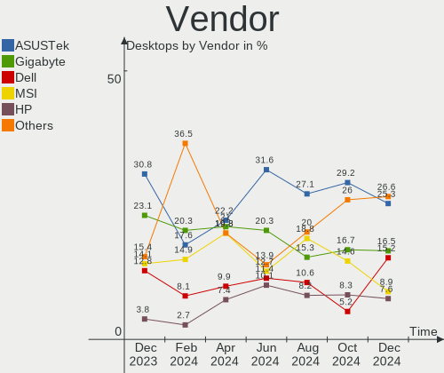
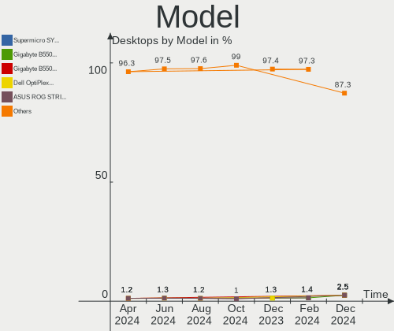
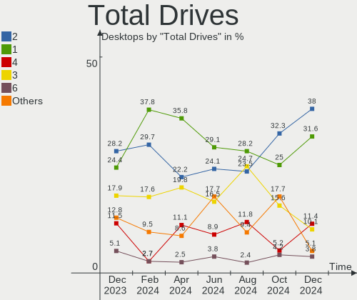
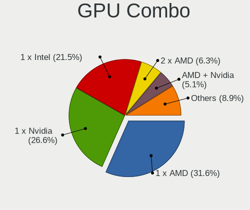
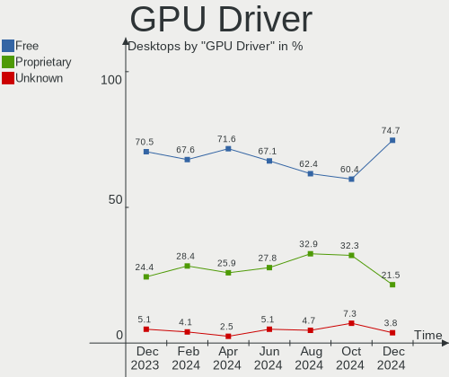
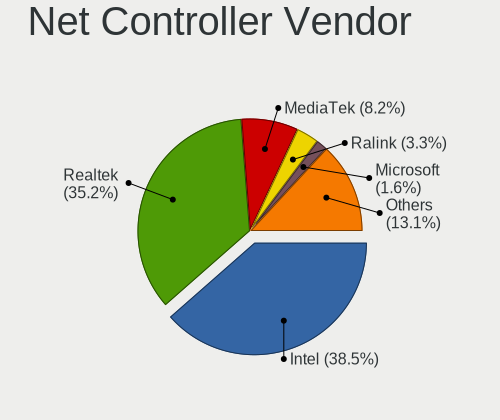

Linux in UK - Hardware Trends (Desktops)
----------------------------------------

A project to identify most popular hardware characteristics and track their change
over time based on data collected by Linux users at https://Linux-Hardware.org.

Anyone can contribute to this report by the [hw-probe](https://github.com/linuxhw/hw-probe) tool:

    sudo -E hw-probe -all -upload

Period: Sep, 2023.

Contents
--------

* [ System ](#system)
  - [ OS                       ](#os)
  - [ OS Family                ](#os-family)
  - [ Kernel                   ](#kernel)
  - [ Kernel Family            ](#kernel-family)
  - [ Kernel Major Ver.        ](#kernel-major-ver)
  - [ Arch                     ](#arch)
  - [ DE                       ](#de)
  - [ Display Server           ](#display-server)
  - [ Display Manager          ](#display-manager)
  - [ OS Lang                  ](#os-lang)
  - [ Boot Mode                ](#boot-mode)
  - [ Filesystem               ](#filesystem)
  - [ Part. scheme             ](#part-scheme)
  - [ Dual Boot with Linux/BSD ](#dual-boot-with-linuxbsd)
  - [ Dual Boot (Win)          ](#dual-boot-win)

* [ Board ](#board)
  - [ Vendor                   ](#vendor)
  - [ Model                    ](#model)
  - [ Model Family             ](#model-family)
  - [ MFG Year                 ](#mfg-year)
  - [ Form Factor              ](#form-factor)
  - [ Secure Boot              ](#secure-boot)
  - [ Coreboot                 ](#coreboot)
  - [ RAM Size                 ](#ram-size)
  - [ RAM Used                 ](#ram-used)
  - [ Total Drives             ](#total-drives)
  - [ Has CD-ROM               ](#has-cd-rom)
  - [ Has Ethernet             ](#has-ethernet)
  - [ Has WiFi                 ](#has-wifi)
  - [ Has Bluetooth            ](#has-bluetooth)

* [ Location ](#location)
  - [ Country                  ](#country)
  - [ City                     ](#city)

* [ Drives ](#drives)
  - [ Drive Vendor             ](#drive-vendor)
  - [ Drive Model              ](#drive-model)
  - [ HDD Vendor               ](#hdd-vendor)
  - [ SSD Vendor               ](#ssd-vendor)
  - [ Drive Kind               ](#drive-kind)
  - [ Drive Connector          ](#drive-connector)
  - [ Drive Size               ](#drive-size)
  - [ Space Total              ](#space-total)
  - [ Space Used               ](#space-used)
  - [ Malfunc. Drives          ](#malfunc-drives)
  - [ Malfunc. Drive Vendor    ](#malfunc-drive-vendor)
  - [ Malfunc. HDD Vendor      ](#malfunc-hdd-vendor)
  - [ Malfunc. Drive Kind      ](#malfunc-drive-kind)
  - [ Failed Drives            ](#failed-drives)
  - [ Failed Drive Vendor      ](#failed-drive-vendor)
  - [ Drive Status             ](#drive-status)

* [ Storage controller ](#storage-controller)
  - [ Storage Vendor           ](#storage-vendor)
  - [ Storage Model            ](#storage-model)
  - [ Storage Kind             ](#storage-kind)

* [ Processor ](#processor)
  - [ CPU Vendor               ](#cpu-vendor)
  - [ CPU Model                ](#cpu-model)
  - [ CPU Model Family         ](#cpu-model-family)
  - [ CPU Cores                ](#cpu-cores)
  - [ CPU Sockets              ](#cpu-sockets)
  - [ CPU Threads              ](#cpu-threads)
  - [ CPU Op-Modes             ](#cpu-op-modes)
  - [ CPU Microcode            ](#cpu-microcode)
  - [ CPU Microarch            ](#cpu-microarch)

* [ Graphics ](#graphics)
  - [ GPU Vendor               ](#gpu-vendor)
  - [ GPU Model                ](#gpu-model)
  - [ GPU Combo                ](#gpu-combo)
  - [ GPU Driver               ](#gpu-driver)
  - [ GPU Memory               ](#gpu-memory)

* [ Monitor ](#monitor)
  - [ Monitor Vendor           ](#monitor-vendor)
  - [ Monitor Model            ](#monitor-model)
  - [ Monitor Resolution       ](#monitor-resolution)
  - [ Monitor Diagonal         ](#monitor-diagonal)
  - [ Monitor Width            ](#monitor-width)
  - [ Aspect Ratio             ](#aspect-ratio)
  - [ Monitor Area             ](#monitor-area)
  - [ Pixel Density            ](#pixel-density)
  - [ Multiple Monitors        ](#multiple-monitors)

* [ Network ](#network)
  - [ Net Controller Vendor    ](#net-controller-vendor)
  - [ Net Controller Model     ](#net-controller-model)
  - [ Wireless Vendor          ](#wireless-vendor)
  - [ Wireless Model           ](#wireless-model)
  - [ Ethernet Vendor          ](#ethernet-vendor)
  - [ Ethernet Model           ](#ethernet-model)
  - [ Net Controller Kind      ](#net-controller-kind)
  - [ Used Controller          ](#used-controller)
  - [ NICs                     ](#nics)
  - [ IPv6                     ](#ipv6)

* [ Bluetooth ](#bluetooth)
  - [ Bluetooth Vendor         ](#bluetooth-vendor)
  - [ Bluetooth Model          ](#bluetooth-model)

* [ Sound ](#sound)
  - [ Sound Vendor             ](#sound-vendor)
  - [ Sound Model              ](#sound-model)

* [ Memory ](#memory)
  - [ Memory Vendor            ](#memory-vendor)
  - [ Memory Model             ](#memory-model)
  - [ Memory Kind              ](#memory-kind)
  - [ Memory Form Factor       ](#memory-form-factor)
  - [ Memory Size              ](#memory-size)
  - [ Memory Speed             ](#memory-speed)

* [ Printers & scanners ](#printers--scanners)
  - [ Printer Vendor           ](#printer-vendor)
  - [ Printer Model            ](#printer-model)
  - [ Scanner Vendor           ](#scanner-vendor)
  - [ Scanner Model            ](#scanner-model)

* [ Camera ](#camera)
  - [ Camera Vendor            ](#camera-vendor)
  - [ Camera Model             ](#camera-model)

* [ Security ](#security)
  - [ Fingerprint Vendor       ](#fingerprint-vendor)
  - [ Fingerprint Model        ](#fingerprint-model)
  - [ Chipcard Vendor          ](#chipcard-vendor)
  - [ Chipcard Model           ](#chipcard-model)

* [ Unsupported ](#unsupported)
  - [ Unsupported Devices      ](#unsupported-devices)
  - [ Unsupported Device Types ](#unsupported-device-types)

System
------

OS
--

Installed operating systems

| Name                         | Desktops | Percent |
|------------------------------|----------|---------|
| OpenMandriva 23.08           | 7        | 10.45%  |
| Linux Mint 21.2              | 6        | 8.96%   |
| Arch Rolling                 | 6        | 8.96%   |
| Zorin 16                     | 4        | 5.97%   |
| Ubuntu 23.04                 | 4        | 5.97%   |
| Ubuntu 22.04                 | 4        | 5.97%   |
| Pop!_OS 22.04                | 3        | 4.48%   |
| Manjaro                      | 3        | 4.48%   |
| Kubuntu 22.04                | 3        | 4.48%   |
| Gentoo 2.14                  | 3        | 4.48%   |
| Fedora 38                    | 3        | 4.48%   |
| ArcoLinux Rolling            | 3        | 4.48%   |
| OpenMandriva 23.09           | 2        | 2.99%   |
| Xubuntu 22.04                | 1        | 1.49%   |
| Ubuntu 22.10                 | 1        | 1.49%   |
| RHEL 9                       | 1        | 1.49%   |
| openSUSE Tumbleweed-XXXXXXXX | 1        | 1.49%   |
| openSUSE Leap-15.5           | 1        | 1.49%   |
| NixOS 23.11                  | 1        | 1.49%   |
| NixOS 23.05                  | 1        | 1.49%   |
| Neptune OS 8.0               | 1        | 1.49%   |
| Manjaro 23.0.2               | 1        | 1.49%   |
| Lubuntu 22.04                | 1        | 1.49%   |
| LMDE 5                       | 1        | 1.49%   |
| Linux Mint 20.1              | 1        | 1.49%   |
| Kubuntu 23.04                | 1        | 1.49%   |
| Fedora 37                    | 1        | 1.49%   |
| EndeavourOS Rolling          | 1        | 1.49%   |
| Debian 12                    | 1        | 1.49%   |

OS Family
---------

OS without a version

| Name         | Desktops | Percent |
|--------------|----------|---------|
| Ubuntu       | 9        | 13.43%  |
| OpenMandriva | 9        | 13.43%  |
| Linux Mint   | 7        | 10.45%  |
| Arch         | 6        | 8.96%   |
| Zorin        | 4        | 5.97%   |
| Manjaro      | 4        | 5.97%   |
| Kubuntu      | 4        | 5.97%   |
| Fedora       | 4        | 5.97%   |
| Pop!_OS      | 3        | 4.48%   |
| Gentoo       | 3        | 4.48%   |
| ArcoLinux    | 3        | 4.48%   |
| openSUSE     | 2        | 2.99%   |
| NixOS        | 2        | 2.99%   |
| Xubuntu      | 1        | 1.49%   |
| RHEL         | 1        | 1.49%   |
| Neptune OS   | 1        | 1.49%   |
| Lubuntu      | 1        | 1.49%   |
| LMDE         | 1        | 1.49%   |
| EndeavourOS  | 1        | 1.49%   |
| Debian       | 1        | 1.49%   |

Kernel
------

Version of the Linux kernel

| Version                      | Desktops | Percent |
|------------------------------|----------|---------|
| 5.15.0-84-generic            | 6        | 8.96%   |
| 5.15.0-83-generic            | 5        | 7.46%   |
| 6.4.11-desktop-1omv2390      | 4        | 5.97%   |
| 6.5.4-arch2-1                | 3        | 4.48%   |
| 6.5.3-arch1-1                | 3        | 4.48%   |
| 6.2.0-32-generic             | 3        | 4.48%   |
| 6.2.0-31-generic             | 3        | 4.48%   |
| 6.5.1-1-MANJARO              | 2        | 2.99%   |
| 6.5.0-desktop-1omv2390       | 2        | 2.99%   |
| 6.4.8-desktop-2omv2390       | 2        | 2.99%   |
| 6.4.6-76060406-generic       | 2        | 2.99%   |
| 6.4.13-200.fc38.x86_64       | 2        | 2.99%   |
| 5.15.0-79-generic            | 2        | 2.99%   |
| 6.5.5-desktop-1omv2390       | 1        | 1.49%   |
| 6.5.5-arch1-1                | 1        | 1.49%   |
| 6.5.3-intel_gna              | 1        | 1.49%   |
| 6.5.2-tkg-bore-llvm          | 1        | 1.49%   |
| 6.5.2-gentoo-x86_64          | 1        | 1.49%   |
| 6.5.0-cachyos                | 1        | 1.49%   |
| 6.5.0-1-MANJARO              | 1        | 1.49%   |
| 6.4.14-200.fc38.x86_64       | 1        | 1.49%   |
| 6.4.13-100.fc37.x86_64       | 1        | 1.49%   |
| 6.4.12-arch1-1               | 1        | 1.49%   |
| 6.4.12-1-default             | 1        | 1.49%   |
| 6.2.16-12-pve                | 1        | 1.49%   |
| 6.2.0-33-generic             | 1        | 1.49%   |
| 6.2.0-20-generic             | 1        | 1.49%   |
| 6.2.0-1013-lowlatency        | 1        | 1.49%   |
| 6.1.55                       | 1        | 1.49%   |
| 6.1.54-1-lts                 | 1        | 1.49%   |
| 6.1.53-gentoo-r1             | 1        | 1.49%   |
| 6.1.53-1-MANJARO             | 1        | 1.49%   |
| 6.1.42                       | 1        | 1.49%   |
| 6.1.0-9-amd64                | 1        | 1.49%   |
| 6.0.2-76060002-generic       | 1        | 1.49%   |
| 5.4.0-162-generic            | 1        | 1.49%   |
| 5.19.0-46-generic            | 1        | 1.49%   |
| 5.15.0-83-lowlatency         | 1        | 1.49%   |
| 5.14.21-150500.55.19-default | 1        | 1.49%   |
| 5.14.0-284.30.1.el9_2.x86_64 | 1        | 1.49%   |

Kernel Family
-------------

Linux kernel without a distro release

| Version | Desktops | Percent |
|---------|----------|---------|
| 5.15.0  | 14       | 20.9%   |
| 6.2.0   | 9        | 13.43%  |
| 6.5.3   | 4        | 5.97%   |
| 6.5.0   | 4        | 5.97%   |
| 6.4.11  | 4        | 5.97%   |
| 6.5.4   | 3        | 4.48%   |
| 6.4.13  | 3        | 4.48%   |
| 6.5.5   | 2        | 2.99%   |
| 6.5.2   | 2        | 2.99%   |
| 6.5.1   | 2        | 2.99%   |
| 6.4.8   | 2        | 2.99%   |
| 6.4.6   | 2        | 2.99%   |
| 6.4.12  | 2        | 2.99%   |
| 6.1.53  | 2        | 2.99%   |
| 6.4.14  | 1        | 1.49%   |
| 6.2.16  | 1        | 1.49%   |
| 6.1.55  | 1        | 1.49%   |
| 6.1.54  | 1        | 1.49%   |
| 6.1.42  | 1        | 1.49%   |
| 6.1.0   | 1        | 1.49%   |
| 6.0.2   | 1        | 1.49%   |
| 5.4.0   | 1        | 1.49%   |
| 5.19.0  | 1        | 1.49%   |
| 5.14.21 | 1        | 1.49%   |
| 5.14.0  | 1        | 1.49%   |
| 5.10.0  | 1        | 1.49%   |

Kernel Major Ver.
-----------------

Linux kernel major version

| Version | Desktops | Percent |
|---------|----------|---------|
| 6.5     | 17       | 25.37%  |
| 6.4     | 14       | 20.9%   |
| 5.15    | 14       | 20.9%   |
| 6.2     | 10       | 14.93%  |
| 6.1     | 6        | 8.96%   |
| 5.14    | 2        | 2.99%   |
| 6.0     | 1        | 1.49%   |
| 5.4     | 1        | 1.49%   |
| 5.19    | 1        | 1.49%   |
| 5.10    | 1        | 1.49%   |

Arch
----

OS architecture (x86_64, i586, etc.)

| Name   | Desktops | Percent |
|--------|----------|---------|
| x86_64 | 67       | 100%    |

DE
--

Desktop Environment

| Name       | Desktops | Percent |
|------------|----------|---------|
| GNOME      | 25       | 37.31%  |
| KDE5       | 21       | 31.34%  |
| XFCE       | 6        | 8.96%   |
| X-Cinnamon | 6        | 8.96%   |
| Unknown    | 4        | 5.97%   |
| MATE       | 2        | 2.99%   |
| LXQt       | 1        | 1.49%   |
| KDE        | 1        | 1.49%   |
| chadwm     | 1        | 1.49%   |

Display Server
--------------

X11 or Wayland

| Name    | Desktops | Percent |
|---------|----------|---------|
| X11     | 41       | 61.19%  |
| Wayland | 20       | 29.85%  |
| Tty     | 4        | 5.97%   |
| Unknown | 2        | 2.99%   |

Display Manager
---------------

SDDM, LightDM, etc.

| Name    | Desktops | Percent |
|---------|----------|---------|
| Unknown | 29       | 43.28%  |
| SDDM    | 20       | 29.85%  |
| GDM3    | 7        | 10.45%  |
| LightDM | 6        | 8.96%   |
| GDM     | 5        | 7.46%   |

OS Lang
-------

Language

| Lang  | Desktops | Percent |
|-------|----------|---------|
| en_GB | 54       | 80.6%   |
| en_US | 8        | 11.94%  |
| C     | 2        | 2.99%   |
| POSIX | 1        | 1.49%   |
| en_IE | 1        | 1.49%   |
| de_DE | 1        | 1.49%   |

Boot Mode
---------

EFI or BIOS

| Mode | Desktops | Percent |
|------|----------|---------|
| EFI  | 43       | 64.18%  |
| BIOS | 24       | 35.82%  |

Filesystem
----------

Type of filesystem

| Type    | Desktops | Percent |
|---------|----------|---------|
| Ext4    | 40       | 59.7%   |
| Btrfs   | 14       | 20.9%   |
| Tmpfs   | 7        | 10.45%  |
| Overlay | 3        | 4.48%   |
| Xfs     | 2        | 2.99%   |
| F2fs    | 1        | 1.49%   |

Part. scheme
------------

Scheme of partitioning

| Type    | Desktops | Percent |
|---------|----------|---------|
| GPT     | 39       | 58.21%  |
| Unknown | 25       | 37.31%  |
| MBR     | 3        | 4.48%   |

Dual Boot with Linux/BSD
------------------------

Hosting more than one Linux/BSD

| Dual boot | Desktops | Percent |
|-----------|----------|---------|
| No        | 57       | 85.07%  |
| Yes       | 10       | 14.93%  |

Dual Boot (Win)
---------------

Hosting Linux and Windows

| Dual boot | Desktops | Percent |
|-----------|----------|---------|
| No        | 51       | 76.12%  |
| Yes       | 16       | 23.88%  |

Board
-----

Vendor
------

Motherboard manufacturer

| Name                                 | Desktops | Percent |
|--------------------------------------|----------|---------|
| ASUSTek Computer                     | 23       | 34.33%  |
| MSI                                  | 11       | 16.42%  |
| Hewlett-Packard                      | 6        | 8.96%   |
| Dell                                 | 6        | 8.96%   |
| Gigabyte Technology                  | 5        | 7.46%   |
| ASRock                               | 4        | 5.97%   |
| Lenovo                               | 3        | 4.48%   |
| Medion                               | 2        | 2.99%   |
| Intel                                | 2        | 2.99%   |
| Unknown                              | 2        | 2.99%   |
| Shenzhen Meigao Electronic Equipment | 1        | 1.49%   |
| BESSTAR Tech                         | 1        | 1.49%   |
| Acer                                 | 1        | 1.49%   |

Model
-----

Motherboard model

| Name                                                | Desktops | Percent |
|-----------------------------------------------------|----------|---------|
| Dell OptiPlex 9020                                  | 2        | 2.99%   |
| Dell OptiPlex 7010                                  | 2        | 2.99%   |
| ASUS ROG STRIX B550-F GAMING                        | 2        | 2.99%   |
| ASUS M5A78L-M/USB3                                  | 2        | 2.99%   |
| ASUS All Series                                     | 2        | 2.99%   |
| Unknown                                             | 2        | 2.99%   |
| Shenzhen Meigao Electronic Equipment Neptune series | 1        | 1.49%   |
| MSI MS-7D89                                         | 1        | 1.49%   |
| MSI MS-7D75                                         | 1        | 1.49%   |
| MSI MS-7D36                                         | 1        | 1.49%   |
| MSI MS-7D22                                         | 1        | 1.49%   |
| MSI MS-7C95                                         | 1        | 1.49%   |
| MSI MS-7C91                                         | 1        | 1.49%   |
| MSI MS-7C52                                         | 1        | 1.49%   |
| MSI MS-7B78                                         | 1        | 1.49%   |
| MSI MS-7B51                                         | 1        | 1.49%   |
| MSI MS-7A78                                         | 1        | 1.49%   |
| MSI MS-7977                                         | 1        | 1.49%   |
| Medion P62024                                       | 1        | 1.49%   |
| Medion MD34805                                      | 1        | 1.49%   |
| Lenovo ThinkStation P500 30A6S2VM00                 | 1        | 1.49%   |
| Lenovo ThinkCentre M73 s38b00                       | 1        | 1.49%   |
| Lenovo 70A50022UK ThinkServer TS140                 | 1        | 1.49%   |
| Intel Jasper Lake Client Platform                   | 1        | 1.49%   |
| Intel D33217CK G76541-302                           | 1        | 1.49%   |
| HP xw6600 Workstation                               | 1        | 1.49%   |
| HP EliteDesk 800 G1 SFF                             | 1        | 1.49%   |
| HP Compaq Elite 8300 SFF                            | 1        | 1.49%   |
| HP Compaq 6200 Pro SFF PC                           | 1        | 1.49%   |
| HP Compaq 6200 Pro MT PC                            | 1        | 1.49%   |
| HP 700-570na                                        | 1        | 1.49%   |
| Gigabyte Z97P-D3                                    | 1        | 1.49%   |
| Gigabyte X570 AORUS ELITE                           | 1        | 1.49%   |
| Gigabyte X399 DESIGNARE EX                          | 1        | 1.49%   |
| Gigabyte GA-970A-DS3                                | 1        | 1.49%   |
| Gigabyte B550 AORUS ELITE AX V2                     | 1        | 1.49%   |
| Dell XPS 8700                                       | 1        | 1.49%   |
| Dell Inspiron 531                                   | 1        | 1.49%   |
| BESSTAR Tech UM700                                  | 1        | 1.49%   |
| ASUS Z170M-PLUS                                     | 1        | 1.49%   |

Model Family
------------

Motherboard model prefix

| Name                                         | Desktops | Percent |
|----------------------------------------------|----------|---------|
| ASUS ROG                                     | 8        | 11.94%  |
| Dell OptiPlex                                | 4        | 5.97%   |
| HP Compaq                                    | 3        | 4.48%   |
| ASUS M5A78L-M                                | 2        | 2.99%   |
| ASUS Amd                                     | 2        | 2.99%   |
| ASUS All                                     | 2        | 2.99%   |
| Unknown                                      | 2        | 2.99%   |
| Shenzhen Meigao Electronic Equipment Neptune | 1        | 1.49%   |
| MSI MS-7D89                                  | 1        | 1.49%   |
| MSI MS-7D75                                  | 1        | 1.49%   |
| MSI MS-7D36                                  | 1        | 1.49%   |
| MSI MS-7D22                                  | 1        | 1.49%   |
| MSI MS-7C95                                  | 1        | 1.49%   |
| MSI MS-7C91                                  | 1        | 1.49%   |
| MSI MS-7C52                                  | 1        | 1.49%   |
| MSI MS-7B78                                  | 1        | 1.49%   |
| MSI MS-7B51                                  | 1        | 1.49%   |
| MSI MS-7A78                                  | 1        | 1.49%   |
| MSI MS-7977                                  | 1        | 1.49%   |
| Medion P62024                                | 1        | 1.49%   |
| Medion MD34805                               | 1        | 1.49%   |
| Lenovo ThinkStation                          | 1        | 1.49%   |
| Lenovo ThinkCentre                           | 1        | 1.49%   |
| Lenovo 70A50022UK                            | 1        | 1.49%   |
| Intel Jasper                                 | 1        | 1.49%   |
| Intel D33217CK                               | 1        | 1.49%   |
| HP xw6600                                    | 1        | 1.49%   |
| HP EliteDesk                                 | 1        | 1.49%   |
| HP 700-570na                                 | 1        | 1.49%   |
| Gigabyte Z97P-D3                             | 1        | 1.49%   |
| Gigabyte X570                                | 1        | 1.49%   |
| Gigabyte X399                                | 1        | 1.49%   |
| Gigabyte GA-970A-DS3                         | 1        | 1.49%   |
| Gigabyte B550                                | 1        | 1.49%   |
| Dell XPS                                     | 1        | 1.49%   |
| Dell Inspiron                                | 1        | 1.49%   |
| BESSTAR Tech UM700                           | 1        | 1.49%   |
| ASUS Z170M-PLUS                              | 1        | 1.49%   |
| ASUS STRIKER                                 | 1        | 1.49%   |
| ASUS SABERTOOTH                              | 1        | 1.49%   |

MFG Year
--------

Motherboard manufacture year

| Year | Desktops | Percent |
|------|----------|---------|
| 2022 | 9        | 13.43%  |
| 2020 | 9        | 13.43%  |
| 2012 | 7        | 10.45%  |
| 2013 | 6        | 8.96%   |
| 2023 | 5        | 7.46%   |
| 2021 | 5        | 7.46%   |
| 2014 | 5        | 7.46%   |
| 2018 | 4        | 5.97%   |
| 2016 | 4        | 5.97%   |
| 2011 | 4        | 5.97%   |
| 2019 | 2        | 2.99%   |
| 2017 | 2        | 2.99%   |
| 2010 | 2        | 2.99%   |
| 2015 | 1        | 1.49%   |
| 2008 | 1        | 1.49%   |
| 2007 | 1        | 1.49%   |

Form Factor
-----------

Physical design of the computer

| Name    | Desktops | Percent |
|---------|----------|---------|
| Desktop | 67       | 100%    |

Secure Boot
-----------

Enabled or disabled

| State    | Desktops | Percent |
|----------|----------|---------|
| Disabled | 63       | 94.03%  |
| Enabled  | 4        | 5.97%   |

Coreboot
--------

Have coreboot on board

| Used | Desktops | Percent |
|------|----------|---------|
| No   | 67       | 100%    |

RAM Size
--------

Total RAM memory

| Size in GB  | Desktops | Percent |
|-------------|----------|---------|
| 16.01-24.0  | 22       | 32.84%  |
| 32.01-64.0  | 18       | 26.87%  |
| 64.01-256.0 | 9        | 13.43%  |
| 8.01-16.0   | 8        | 11.94%  |
| 4.01-8.0    | 7        | 10.45%  |
| 3.01-4.0    | 2        | 2.99%   |
| 24.01-32.0  | 1        | 1.49%   |

RAM Used
--------

Used RAM memory

| Used GB    | Desktops | Percent |
|------------|----------|---------|
| 2.01-3.0   | 19       | 28.36%  |
| 4.01-8.0   | 17       | 25.37%  |
| 3.01-4.0   | 10       | 14.93%  |
| 1.01-2.0   | 10       | 14.93%  |
| 8.01-16.0  | 6        | 8.96%   |
| 0.51-1.0   | 3        | 4.48%   |
| 32.01-64.0 | 1        | 1.49%   |
| 16.01-24.0 | 1        | 1.49%   |

Total Drives
------------

Number of drives on board

| Drives | Desktops | Percent |
|--------|----------|---------|
| 2      | 20       | 29.85%  |
| 1      | 20       | 29.85%  |
| 3      | 16       | 23.88%  |
| 4      | 9        | 13.43%  |
| 5      | 2        | 2.99%   |

Has CD-ROM
----------

Has CD-ROM on board

| Presented | Desktops | Percent |
|-----------|----------|---------|
| No        | 47       | 70.15%  |
| Yes       | 20       | 29.85%  |

Has Ethernet
------------

Has Ethernet on board

| Presented | Desktops | Percent |
|-----------|----------|---------|
| Yes       | 67       | 100%    |

Has WiFi
--------

Has WiFi module

| Presented | Desktops | Percent |
|-----------|----------|---------|
| Yes       | 36       | 53.73%  |
| No        | 31       | 46.27%  |

Has Bluetooth
-------------

Has Bluetooth module

| Presented | Desktops | Percent |
|-----------|----------|---------|
| Yes       | 36       | 53.73%  |
| No        | 31       | 46.27%  |

Location
--------

Country
-------

Geographic location (country)

| Country | Desktops | Percent |
|---------|----------|---------|
| UK      | 67       | 100%    |

City
----

Geographic location (city)

| City            | Desktops | Percent |
|-----------------|----------|---------|
| London          | 5        | 7.46%   |
| Leeds           | 3        | 4.48%   |
| Northampton     | 2        | 2.99%   |
| Islington       | 2        | 2.99%   |
| Cardiff         | 2        | 2.99%   |
| Barnet          | 2        | 2.99%   |
| Worthing        | 1        | 1.49%   |
| Woking          | 1        | 1.49%   |
| Wandsworth      | 1        | 1.49%   |
| Swindon         | 1        | 1.49%   |
| Swadlincote     | 1        | 1.49%   |
| Stockport       | 1        | 1.49%   |
| Southampton     | 1        | 1.49%   |
| Solihull        | 1        | 1.49%   |
| Sheffield       | 1        | 1.49%   |
| Salisbury       | 1        | 1.49%   |
| Rochester       | 1        | 1.49%   |
| Ramsgate        | 1        | 1.49%   |
| Preston         | 1        | 1.49%   |
| Portsmouth      | 1        | 1.49%   |
| Port Glasgow    | 1        | 1.49%   |
| Peterborough    | 1        | 1.49%   |
| Oxford          | 1        | 1.49%   |
| Nottinghamshire | 1        | 1.49%   |
| Norwich         | 1        | 1.49%   |
| Newham          | 1        | 1.49%   |
| Manchester      | 1        | 1.49%   |
| Mablethorpe     | 1        | 1.49%   |
| Liverpool       | 1        | 1.49%   |
| Littlehampton   | 1        | 1.49%   |
| Linlithgow      | 1        | 1.49%   |
| Leicester       | 1        | 1.49%   |
| Kirkcaldy       | 1        | 1.49%   |
| Kings Lynn      | 1        | 1.49%   |
| Isle of Lewis   | 1        | 1.49%   |
| Horsham         | 1        | 1.49%   |
| Hoddesdon       | 1        | 1.49%   |
| Harringay       | 1        | 1.49%   |
| Hamilton        | 1        | 1.49%   |
| Hackney         | 1        | 1.49%   |

Drives
------

Drive Vendor
------------

Hard drive vendors

| Vendor                      | Desktops | Drives | Percent |
|-----------------------------|----------|--------|---------|
| Samsung Electronics         | 25       | 37     | 20.16%  |
| WDC                         | 21       | 25     | 16.94%  |
| Seagate                     | 19       | 24     | 15.32%  |
| Crucial                     | 9        | 9      | 7.26%   |
| Sandisk                     | 8        | 12     | 6.45%   |
| Kingston                    | 6        | 6      | 4.84%   |
| Intel                       | 6        | 8      | 4.84%   |
| Micron/Crucial Technology   | 4        | 5      | 3.23%   |
| Toshiba                     | 3        | 3      | 2.42%   |
| Phison Electronics          | 3        | 3      | 2.42%   |
| Silicon Motion              | 2        | 2      | 1.61%   |
| Integral                    | 2        | 2      | 1.61%   |
| Hitachi                     | 2        | 2      | 1.61%   |
| Corsair                     | 2        | 3      | 1.61%   |
| Unknown                     | 1        | 2      | 0.81%   |
| SPCC                        | 1        | 1      | 0.81%   |
| PNY                         | 1        | 1      | 0.81%   |
| Phison                      | 1        | 1      | 0.81%   |
| OCZ                         | 1        | 1      | 0.81%   |
| Netac                       | 1        | 1      | 0.81%   |
| MAXIO Technology (Hangzhou) | 1        | 1      | 0.81%   |
| Kingston Technology Company | 1        | 1      | 0.81%   |
| HGST                        | 1        | 1      | 0.81%   |
| Gigabyte Technology         | 1        | 1      | 0.81%   |
| China                       | 1        | 1      | 0.81%   |
| AMD                         | 1        | 1      | 0.81%   |

Drive Model
-----------

Hard drive models

| Model                                                 | Desktops | Percent |
|-------------------------------------------------------|----------|---------|
| Seagate ST2000DM008-2FR102 2TB                        | 6        | 4.05%   |
| Samsung SSD 850 EVO 250GB                             | 6        | 4.05%   |
| Samsung NVMe SSD Controller SM981/PM981/PM983 256GB   | 5        | 3.38%   |
| Micron/Crucial P2 NVMe PCIe SSD 1TB                   | 3        | 2.03%   |
| Kingston SA400S37240G 240GB SSD                       | 3        | 2.03%   |
| Intel SSD 660P Series 1024GB                          | 3        | 2.03%   |
| WDC WD5000AAKX-75U6AA0 500GB                          | 2        | 1.35%   |
| Silicon Motion SM2263EN/SM2263XT SSD Controller 512GB | 2        | 1.35%   |
| Seagate ST4000DM004-2CV104 4TB                        | 2        | 1.35%   |
| Seagate FireCuda 530 ZP1000GM30013 1TB                | 2        | 1.35%   |
| Seagate Expansion 1TB                                 | 2        | 1.35%   |
| Sandisk WD Blue SN570 2TB                             | 2        | 1.35%   |
| Sandisk WD Black SN850 1TB                            | 2        | 1.35%   |
| Sandisk WD Black SN750 / PC SN730 NVMe SSD 512GB      | 2        | 1.35%   |
| Samsung SSD 870 QVO 2TB                               | 2        | 1.35%   |
| Samsung SSD 870 QVO 1TB                               | 2        | 1.35%   |
| Samsung NVMe SSD Controller SM951/PM951 128GB         | 2        | 1.35%   |
| Micron/Crucial P1 NVMe PCIe SSD 1TB                   | 2        | 1.35%   |
| Crucial CT500MX500SSD1 500GB                          | 2        | 1.35%   |
| Crucial CT1000MX500SSD1 1TB                           | 2        | 1.35%   |
| WDC WUH721816ALE6L4 16TB                              | 1        | 0.68%   |
| WDC WDS500G3X0C-00SJG0 500GB                          | 1        | 0.68%   |
| WDC WDS200T2B0A-00SM50 2TB SSD                        | 1        | 0.68%   |
| WDC WDS100T2B0C-00PXH0 1TB                            | 1        | 0.68%   |
| WDC WD80EAZZ-00BKLB0 8TB                              | 1        | 0.68%   |
| WDC WD6002FFWX-68TZ4N0 6TB                            | 1        | 0.68%   |
| WDC WD5000LPVX-22V0TT0 500GB                          | 1        | 0.68%   |
| WDC WD5000KS-00MNB0 500GB                             | 1        | 0.68%   |
| WDC WD40EZRZ-00GXCB0 4TB                              | 1        | 0.68%   |
| WDC WD3200AAJS-00L7A0 320GB                           | 1        | 0.68%   |
| WDC WD30EZRX-00SPEB0 3TB                              | 1        | 0.68%   |
| WDC WD2500AAKX-753CA1 250GB                           | 1        | 0.68%   |
| WDC WD2500AAKX-001CA0 250GB                           | 1        | 0.68%   |
| WDC WD20EFRX-68EUZN0 2TB                              | 1        | 0.68%   |
| WDC WD20EFAX-68FB5N0 2TB                              | 1        | 0.68%   |
| WDC WD20EARX-00PASB0 2TB                              | 1        | 0.68%   |
| WDC WD2003FZEX-00Z4SA0 2TB                            | 1        | 0.68%   |
| WDC WD10EZRX-00A8LB0 1TB                              | 1        | 0.68%   |
| WDC WD10EZEX-22MFCA0 1TB                              | 1        | 0.68%   |
| WDC WD10EZEX-08WN4A0 1TB                              | 1        | 0.68%   |

HDD Vendor
----------

Hard disk drive vendors

| Vendor              | Desktops | Drives | Percent |
|---------------------|----------|--------|---------|
| WDC                 | 19       | 22     | 43.18%  |
| Seagate             | 16       | 18     | 36.36%  |
| Samsung Electronics | 4        | 4      | 9.09%   |
| Toshiba             | 2        | 2      | 4.55%   |
| Hitachi             | 2        | 2      | 4.55%   |
| HGST                | 1        | 1      | 2.27%   |

SSD Vendor
----------

Solid state drive vendors

| Vendor              | Desktops | Drives | Percent |
|---------------------|----------|--------|---------|
| Samsung Electronics | 18       | 21     | 40%     |
| Crucial             | 7        | 7      | 15.56%  |
| Kingston            | 5        | 5      | 11.11%  |
| Intel               | 3        | 3      | 6.67%   |
| SanDisk             | 2        | 2      | 4.44%   |
| Integral            | 2        | 2      | 4.44%   |
| WDC                 | 1        | 1      | 2.22%   |
| SPCC                | 1        | 1      | 2.22%   |
| PNY                 | 1        | 1      | 2.22%   |
| OCZ                 | 1        | 1      | 2.22%   |
| Netac               | 1        | 1      | 2.22%   |
| Gigabyte Technology | 1        | 1      | 2.22%   |
| Corsair             | 1        | 1      | 2.22%   |
| China               | 1        | 1      | 2.22%   |

Drive Kind
----------

HDD or SSD

| Kind    | Desktops | Drives | Percent |
|---------|----------|--------|---------|
| SSD     | 38       | 48     | 34.55%  |
| HDD     | 36       | 49     | 32.73%  |
| NVMe    | 35       | 55     | 31.82%  |
| Unknown | 1        | 2      | 0.91%   |

Drive Connector
---------------

SATA, SAS, NVMe, etc.

| Type | Desktops | Drives | Percent |
|------|----------|--------|---------|
| SATA | 52       | 92     | 56.52%  |
| NVMe | 35       | 55     | 38.04%  |
| SAS  | 5        | 7      | 5.43%   |

Drive Size
----------

Size of hard drive

| Size in TB | Desktops | Drives | Percent |
|------------|----------|--------|---------|
| 0.01-0.5   | 38       | 49     | 48.1%   |
| 0.51-1.0   | 19       | 23     | 24.05%  |
| 1.01-2.0   | 12       | 15     | 15.19%  |
| 3.01-4.0   | 4        | 4      | 5.06%   |
| 4.01-10.0  | 3        | 3      | 3.8%    |
| 2.01-3.0   | 2        | 2      | 2.53%   |
| 10.01-20.0 | 1        | 1      | 1.27%   |

Space Total
-----------

Amount of disk space available on the file system

| Size in GB     | Desktops | Percent |
|----------------|----------|---------|
| 1001-2000      | 18       | 26.87%  |
| More than 3000 | 15       | 22.39%  |
| 101-250        | 15       | 22.39%  |
| 251-500        | 5        | 7.46%   |
| 501-1000       | 5        | 7.46%   |
| 1-20           | 4        | 5.97%   |
| 2001-3000      | 3        | 4.48%   |
| 51-100         | 2        | 2.99%   |

Space Used
----------

Amount of used disk space

| Used GB        | Desktops | Percent |
|----------------|----------|---------|
| 1-20           | 21       | 31.34%  |
| 501-1000       | 9        | 13.43%  |
| 1001-2000      | 7        | 10.45%  |
| 51-100         | 7        | 10.45%  |
| More than 3000 | 6        | 8.96%   |
| 101-250        | 6        | 8.96%   |
| 251-500        | 5        | 7.46%   |
| 21-50          | 4        | 5.97%   |
| 2001-3000      | 2        | 2.99%   |

Malfunc. Drives
---------------

Drive models with a malfunction

| Model                           | Desktops | Drives | Percent |
|---------------------------------|----------|--------|---------|
| WDC WD30EZRX-00SPEB0 3TB        | 1        | 1      | 16.67%  |
| WDC WD10EZEX-08WN4A0 1TB        | 1        | 1      | 16.67%  |
| Seagate ST500LM021-1KJ152 500GB | 1        | 1      | 16.67%  |
| Seagate ST2000VN004-2E4164 2TB  | 1        | 1      | 16.67%  |
| Crucial CT512M550SSD1 512GB     | 1        | 1      | 16.67%  |
| Corsair Neutron XT SSD 240GB    | 1        | 1      | 16.67%  |

Malfunc. Drive Vendor
---------------------

Vendors of faulty drives

| Vendor  | Desktops | Drives | Percent |
|---------|----------|--------|---------|
| WDC     | 2        | 2      | 33.33%  |
| Seagate | 2        | 2      | 33.33%  |
| Crucial | 1        | 1      | 16.67%  |
| Corsair | 1        | 1      | 16.67%  |

Malfunc. HDD Vendor
-------------------

Vendors of faulty HDD drives

| Vendor  | Desktops | Drives | Percent |
|---------|----------|--------|---------|
| WDC     | 2        | 2      | 50%     |
| Seagate | 2        | 2      | 50%     |

Malfunc. Drive Kind
-------------------

Kinds of faulty drives

| Kind | Desktops | Drives | Percent |
|------|----------|--------|---------|
| HDD  | 4        | 4      | 66.67%  |
| SSD  | 2        | 2      | 33.33%  |

Failed Drives
-------------

Failed drive models

Zero info for selected period =(

Failed Drive Vendor
-------------------

Failed drive vendors

Zero info for selected period =(

Drive Status
------------

Number of failed and malfunc. drives

| Status   | Desktops | Drives | Percent |
|----------|----------|--------|---------|
| Detected | 34       | 77     | 47.89%  |
| Works    | 32       | 71     | 45.07%  |
| Malfunc  | 5        | 6      | 7.04%   |

Storage controller
------------------

Storage Vendor
--------------

Storage controller vendors

| Vendor                       | Desktops | Percent |
|------------------------------|----------|---------|
| Intel                        | 41       | 36.28%  |
| AMD                          | 27       | 23.89%  |
| SanDisk                      | 8        | 7.08%   |
| Samsung Electronics          | 8        | 7.08%   |
| Micron/Crucial Technology    | 6        | 5.31%   |
| Phison Electronics           | 5        | 4.42%   |
| Seagate Technology           | 4        | 3.54%   |
| ASMedia Technology           | 4        | 3.54%   |
| Silicon Motion               | 2        | 1.77%   |
| Nvidia                       | 2        | 1.77%   |
| Kingston Technology Company  | 2        | 1.77%   |
| JMicron Technology           | 2        | 1.77%   |
| Toshiba America Info Systems | 1        | 0.88%   |
| MAXIO Technology (Hangzhou)  | 1        | 0.88%   |

Storage Model
-------------

Storage controller models

| Model                                                                          | Desktops | Percent |
|--------------------------------------------------------------------------------|----------|---------|
| AMD FCH SATA Controller [AHCI mode]                                            | 12       | 9.02%   |
| AMD 500 Series Chipset SATA Controller                                         | 10       | 7.52%   |
| Intel 8 Series/C220 Series Chipset Family 6-port SATA Controller 1 [AHCI mode] | 7        | 5.26%   |
| Samsung NVMe SSD Controller SM981/PM981/PM983                                  | 5        | 3.76%   |
| Intel 7 Series/C210 Series Chipset Family 6-port SATA Controller [AHCI mode]   | 5        | 3.76%   |
| Seagate FireCuda 530 SSD                                                       | 4        | 3.01%   |
| Micron/Crucial P2 [Nick P2] / P3 / P3 Plus NVMe PCIe SSD (DRAM-less)           | 4        | 3.01%   |
| ASMedia ASM1062 Serial ATA Controller                                          | 4        | 3.01%   |
| SanDisk WD Black SN750 / PC SN730 NVMe SSD                                     | 3        | 2.26%   |
| Micron/Crucial P1 NVMe PCIe SSD[Frampton]                                      | 3        | 2.26%   |
| Intel SSD 660P Series                                                          | 3        | 2.26%   |
| AMD SB7x0/SB8x0/SB9x0 SATA Controller [IDE mode]                               | 3        | 2.26%   |
| AMD SB7x0/SB8x0/SB9x0 IDE Controller                                           | 3        | 2.26%   |
| Silicon Motion SM2263EN/SM2263XT (DRAM-less) NVMe SSD Controllers              | 2        | 1.5%    |
| SanDisk WD PC SN810 / Black SN850 NVMe SSD                                     | 2        | 1.5%    |
| SanDisk WD Blue SN570 NVMe SSD 2TB                                             | 2        | 1.5%    |
| SanDisk WD Blue SN550 NVMe SSD                                                 | 2        | 1.5%    |
| Samsung NVMe SSD Controller SM951/PM951                                        | 2        | 1.5%    |
| Phison E12 NVMe Controller                                                     | 2        | 1.5%    |
| Intel Q170/Q150/B150/H170/H110/Z170/CM236 Chipset SATA Controller [AHCI Mode]  | 2        | 1.5%    |
| Intel C610/X99 series chipset 6-Port SATA Controller [AHCI mode]               | 2        | 1.5%    |
| Intel Alder Lake-S PCH SATA Controller [AHCI Mode]                             | 2        | 1.5%    |
| Intel 9 Series Chipset Family SATA Controller [AHCI Mode]                      | 2        | 1.5%    |
| Intel 6 Series/C200 Series Chipset Family 6 port Desktop SATA AHCI Controller  | 2        | 1.5%    |
| Intel 500 Series Chipset Family SATA AHCI Controller                           | 2        | 1.5%    |
| AMD 400 Series Chipset SATA Controller                                         | 2        | 1.5%    |
| Toshiba America Info Systems XG6 NVMe SSD Controller                           | 1        | 0.75%   |
| Samsung NVMe SSD Controller SM961/PM961/SM963                                  | 1        | 0.75%   |
| Samsung NVMe SSD Controller S4LV008[Pascal]                                    | 1        | 0.75%   |
| Samsung NVMe SSD Controller 980                                                | 1        | 0.75%   |
| Phison PS5021-E21 PCIe4 NVMe Controller (DRAM-less)                            | 1        | 0.75%   |
| Phison E18 PCIe4 NVMe Controller                                               | 1        | 0.75%   |
| Phison E16 PCIe4 NVMe Controller                                               | 1        | 0.75%   |
| Nvidia MCP61 SATA Controller                                                   | 1        | 0.75%   |
| Nvidia MCP61 IDE                                                               | 1        | 0.75%   |
| Nvidia MCP55 SATA Controller                                                   | 1        | 0.75%   |
| Nvidia MCP55 IDE                                                               | 1        | 0.75%   |
| MAXIO (Hangzhou) NVMe SSD Controller MAP1602                                   | 1        | 0.75%   |
| Kingston Company OM8PGP4 NVMe PCIe SSD (DRAM-less)                             | 1        | 0.75%   |
| Kingston Company OM3PDP3 NVMe SSD                                              | 1        | 0.75%   |

Storage Kind
------------

Kind of storage controller (IDE, SATA, NVMe, SAS, ...)

| Kind | Desktops | Percent |
|------|----------|---------|
| SATA | 61       | 56.48%  |
| NVMe | 35       | 32.41%  |
| IDE  | 9        | 8.33%   |
| RAID | 3        | 2.78%   |

Processor
---------

CPU Vendor
----------

Processor vendors

| Vendor | Desktops | Percent |
|--------|----------|---------|
| Intel  | 39       | 58.21%  |
| AMD    | 28       | 41.79%  |

CPU Model
---------

Processor models

| Model                                          | Desktops | Percent |
|------------------------------------------------|----------|---------|
| Intel Core i7-4790 CPU @ 3.60GHz               | 4        | 5.97%   |
| Intel Core i7-3770K CPU @ 3.50GHz              | 4        | 5.97%   |
| AMD Ryzen 5 5600X 6-Core Processor             | 3        | 4.48%   |
| Intel Core i5-3470 CPU @ 3.20GHz               | 2        | 2.99%   |
| AMD Ryzen 9 7950X3D 16-Core Processor          | 2        | 2.99%   |
| AMD Ryzen 7 5800X 8-Core Processor             | 2        | 2.99%   |
| AMD Ryzen 7 5700G with Radeon Graphics         | 2        | 2.99%   |
| AMD Ryzen 7 2700X Eight-Core Processor         | 2        | 2.99%   |
| AMD Ryzen 5 3600 6-Core Processor              | 2        | 2.99%   |
| Intel Xeon CPU E5430 @ 2.66GHz                 | 1        | 1.49%   |
| Intel Xeon CPU E5-1660 v3 @ 3.00GHz            | 1        | 1.49%   |
| Intel Xeon CPU E3-1226 v3 @ 3.30GHz            | 1        | 1.49%   |
| Intel N95                                      | 1        | 1.49%   |
| Intel Core i9-10850K CPU @ 3.60GHz             | 1        | 1.49%   |
| Intel Core i7-9700K CPU @ 3.60GHz              | 1        | 1.49%   |
| Intel Core i7-7700K CPU @ 4.20GHz              | 1        | 1.49%   |
| Intel Core i7-6950X CPU @ 3.00GHz              | 1        | 1.49%   |
| Intel Core i7-6700K CPU @ 4.00GHz              | 1        | 1.49%   |
| Intel Core i7-4790K CPU @ 4.00GHz              | 1        | 1.49%   |
| Intel Core i7-3770 CPU @ 3.40GHz               | 1        | 1.49%   |
| Intel Core i7-2600 CPU @ 3.40GHz               | 1        | 1.49%   |
| Intel Core i7-10700 CPU @ 2.90GHz              | 1        | 1.49%   |
| Intel Core i5-6600K CPU @ 3.50GHz              | 1        | 1.49%   |
| Intel Core i5-4590 CPU @ 3.30GHz               | 1        | 1.49%   |
| Intel Core i5-4570 CPU @ 3.20GHz               | 1        | 1.49%   |
| Intel Core i5-4460 CPU @ 3.20GHz               | 1        | 1.49%   |
| Intel Core i5-2400 CPU @ 3.10GHz               | 1        | 1.49%   |
| Intel Core i5-10400F CPU @ 2.90GHz             | 1        | 1.49%   |
| Intel Core i5-10400 CPU @ 2.90GHz              | 1        | 1.49%   |
| Intel Core i3-4150T CPU @ 3.00GHz              | 1        | 1.49%   |
| Intel Core i3-3217U CPU @ 1.80GHz              | 1        | 1.49%   |
| Intel Core 2 Quad CPU Q9650 @ 3.00GHz          | 1        | 1.49%   |
| Intel Celeron N5105 @ 2.00GHz                  | 1        | 1.49%   |
| Intel 13th Gen Core i9-13900K                  | 1        | 1.49%   |
| Intel 12th Gen Core i9-12900H                  | 1        | 1.49%   |
| Intel 12th Gen Core i5-12600KF                 | 1        | 1.49%   |
| Intel 12th Gen Core i5-12400                   | 1        | 1.49%   |
| Intel 11th Gen Core i7-11390H @ 3.40GHz        | 1        | 1.49%   |
| AMD Ryzen Threadripper 1920X 12-Core Processor | 1        | 1.49%   |
| AMD Ryzen 9 7900X 12-Core Processor            | 1        | 1.49%   |

CPU Model Family
----------------

Processor model prefix

| Model                  | Desktops | Percent |
|------------------------|----------|---------|
| Intel Core i7          | 16       | 23.88%  |
| Intel Core i5          | 9        | 13.43%  |
| AMD Ryzen 7            | 8        | 11.94%  |
| AMD Ryzen 5            | 7        | 10.45%  |
| Other                  | 6        | 8.96%   |
| AMD Ryzen 9            | 5        | 7.46%   |
| Intel Xeon             | 3        | 4.48%   |
| AMD FX                 | 3        | 4.48%   |
| Intel Core i3          | 2        | 2.99%   |
| Intel Core i9          | 1        | 1.49%   |
| Intel Core 2 Quad      | 1        | 1.49%   |
| Intel Celeron          | 1        | 1.49%   |
| AMD Ryzen Threadripper | 1        | 1.49%   |
| AMD Phenom II X6       | 1        | 1.49%   |
| AMD Athlon X4          | 1        | 1.49%   |
| AMD Athlon 64 X2       | 1        | 1.49%   |
| AMD A6                 | 1        | 1.49%   |

CPU Cores
---------

Number of processor cores

| Number | Desktops | Percent |
|--------|----------|---------|
| 4      | 26       | 38.81%  |
| 6      | 11       | 16.42%  |
| 8      | 10       | 14.93%  |
| 2      | 7        | 10.45%  |
| 16     | 3        | 4.48%   |
| 12     | 3        | 4.48%   |
| 10     | 3        | 4.48%   |
| 24     | 1        | 1.49%   |
| 14     | 1        | 1.49%   |
| 3      | 1        | 1.49%   |
| 1      | 1        | 1.49%   |

CPU Sockets
-----------

Number of sockets

| Number | Desktops | Percent |
|--------|----------|---------|
| 1      | 67       | 100%    |

CPU Threads
-----------

Threads per core (Hyper-Threading)

| Number | Desktops | Percent |
|--------|----------|---------|
| 2      | 51       | 76.12%  |
| 1      | 16       | 23.88%  |

CPU Op-Modes
------------

CPU Operation Modes (32-bit, 64-bit)

| Op mode        | Desktops | Percent |
|----------------|----------|---------|
| 32-bit, 64-bit | 67       | 100%    |

CPU Microcode
-------------

Microcode number

| Number     | Desktops | Percent |
|------------|----------|---------|
| Unknown    | 40       | 59.7%   |
| 0x306c3    | 4        | 5.97%   |
| 0x0a50000d | 3        | 4.48%   |
| 0x0a201025 | 3        | 4.48%   |
| 0x306a9    | 2        | 2.99%   |
| 0x0a601203 | 2        | 2.99%   |
| 0x0a20120a | 2        | 2.99%   |
| 0xa0655    | 1        | 1.49%   |
| 0xa0653    | 1        | 1.49%   |
| 0x906e9    | 1        | 1.49%   |
| 0x806c2    | 1        | 1.49%   |
| 0x506e3    | 1        | 1.49%   |
| 0x206a7    | 1        | 1.49%   |
| 0x0a201016 | 1        | 1.49%   |
| 0x08108109 | 1        | 1.49%   |
| 0x0800820d | 1        | 1.49%   |
| 0x08001137 | 1        | 1.49%   |
| 0x06000852 | 1        | 1.49%   |

CPU Microarch
-------------

Microarchitecture

| Name             | Desktops | Percent |
|------------------|----------|---------|
| Haswell          | 11       | 16.42%  |
| Zen 3            | 10       | 14.93%  |
| IvyBridge        | 8        | 11.94%  |
| CometLake        | 4        | 5.97%   |
| Alderlake Hybrid | 4        | 5.97%   |
| Unknown          | 4        | 5.97%   |
| Zen+             | 3        | 4.48%   |
| Zen 2            | 3        | 4.48%   |
| Piledriver       | 3        | 4.48%   |
| Skylake          | 2        | 2.99%   |
| SandyBridge      | 2        | 2.99%   |
| Penryn           | 2        | 2.99%   |
| KabyLake         | 2        | 2.99%   |
| Zen              | 1        | 1.49%   |
| Tremont          | 1        | 1.49%   |
| TigerLake        | 1        | 1.49%   |
| Steamroller      | 1        | 1.49%   |
| K8 Hammer        | 1        | 1.49%   |
| K10              | 1        | 1.49%   |
| Gracemont        | 1        | 1.49%   |
| Excavator        | 1        | 1.49%   |
| Broadwell        | 1        | 1.49%   |

Graphics
--------

GPU Vendor
----------

Vendors of graphics cards

| Vendor | Desktops | Percent |
|--------|----------|---------|
| Nvidia | 33       | 45.83%  |
| AMD    | 21       | 29.17%  |
| Intel  | 18       | 25%     |

GPU Model
---------

Graphics card models

| Model                                                                       | Desktops | Percent |
|-----------------------------------------------------------------------------|----------|---------|
| Intel Xeon E3-1200 v3/4th Gen Core Processor Integrated Graphics Controller | 5        | 6.76%   |
| Nvidia GP104 [GeForce GTX 1080]                                             | 3        | 4.05%   |
| Nvidia GA104 [GeForce RTX 3060 Ti Lite Hash Rate]                           | 3        | 4.05%   |
| AMD Raphael                                                                 | 3        | 4.05%   |
| Nvidia GP106 [GeForce GTX 1060 3GB]                                         | 2        | 2.7%    |
| Nvidia GK208B [GeForce GT 710]                                              | 2        | 2.7%    |
| Nvidia GA106 [GeForce RTX 3060 Lite Hash Rate]                              | 2        | 2.7%    |
| Nvidia GA102 [GeForce RTX 3080 Ti]                                          | 2        | 2.7%    |
| Intel Xeon E3-1200 v2/3rd Gen Core processor Graphics Controller            | 2        | 2.7%    |
| AMD Navi 31 [Radeon RX 7900 XT/7900 XTX]                                    | 2        | 2.7%    |
| AMD Navi 22 [Radeon RX 6700/6700 XT/6750 XT / 6800M/6850M XT]               | 2        | 2.7%    |
| AMD Navi 10 [Radeon RX 5600 OEM/5600 XT / 5700/5700 XT]                     | 2        | 2.7%    |
| AMD Ellesmere [Radeon RX 470/480/570/570X/580/580X/590]                     | 2        | 2.7%    |
| AMD Cezanne [Radeon Vega Series / Radeon Vega Mobile Series]                | 2        | 2.7%    |
| Nvidia TU117 [GeForce GTX 1650]                                             | 1        | 1.35%   |
| Nvidia TU116 [GeForce GTX 1660 SUPER]                                       | 1        | 1.35%   |
| Nvidia TU104 [GeForce RTX 2080 SUPER]                                       | 1        | 1.35%   |
| Nvidia TU102 [GeForce RTX 2080 Ti Rev. A]                                   | 1        | 1.35%   |
| Nvidia GT218 [GeForce 210]                                                  | 1        | 1.35%   |
| Nvidia GP108 [GeForce GT 1030]                                              | 1        | 1.35%   |
| Nvidia GP107 [GeForce GTX 1050 Ti]                                          | 1        | 1.35%   |
| Nvidia GP106 [GeForce GTX 1060 6GB]                                         | 1        | 1.35%   |
| Nvidia GP104 [GeForce GTX 1070]                                             | 1        | 1.35%   |
| Nvidia GM204 [GeForce GTX 970]                                              | 1        | 1.35%   |
| Nvidia GM107GL [Quadro K620]                                                | 1        | 1.35%   |
| Nvidia GM107 [GeForce GTX 750 Ti]                                           | 1        | 1.35%   |
| Nvidia GK106 [GeForce GTX 660]                                              | 1        | 1.35%   |
| Nvidia GK104GL [Quadro K4200]                                               | 1        | 1.35%   |
| Nvidia GF119 [GeForce GT 610]                                               | 1        | 1.35%   |
| Nvidia GA104 [GeForce RTX 3060 Ti]                                          | 1        | 1.35%   |
| Nvidia GA102 [GeForce RTX 3090 Ti]                                          | 1        | 1.35%   |
| Nvidia G92GL [Quadro FX 3700]                                               | 1        | 1.35%   |
| Nvidia C61 [GeForce 6150SE nForce 430]                                      | 1        | 1.35%   |
| Intel Xeon E3-1200 v3 Processor Integrated Graphics Controller              | 1        | 1.35%   |
| Intel TigerLake-LP GT2 [Iris Xe Graphics]                                   | 1        | 1.35%   |
| Intel Raptor Lake-S GT1 [UHD Graphics 770]                                  | 1        | 1.35%   |
| Intel JasperLake [UHD Graphics]                                             | 1        | 1.35%   |
| Intel IvyBridge GT2 [HD Graphics 4000]                                      | 1        | 1.35%   |
| Intel HD Graphics 630                                                       | 1        | 1.35%   |
| Intel Alder Lake-P Integrated Graphics Controller                           | 1        | 1.35%   |

GPU Combo
---------

Combinations of graphics cards

| Name           | Desktops | Percent |
|----------------|----------|---------|
| 1 x Nvidia     | 29       | 43.28%  |
| 1 x AMD        | 17       | 25.37%  |
| 1 x Intel      | 14       | 20.9%   |
| Intel + Nvidia | 3        | 4.48%   |
| 2 x AMD        | 2        | 2.99%   |
| Intel + AMD    | 1        | 1.49%   |
| AMD + Nvidia   | 1        | 1.49%   |

GPU Driver
----------

Free vs proprietary

| Driver      | Desktops | Percent |
|-------------|----------|---------|
| Free        | 45       | 67.16%  |
| Proprietary | 18       | 26.87%  |
| Unknown     | 4        | 5.97%   |

GPU Memory
----------

Total video memory

| Size in GB | Desktops | Percent |
|------------|----------|---------|
| Unknown    | 29       | 43.28%  |
| 7.01-8.0   | 13       | 19.4%   |
| 1.01-2.0   | 8        | 11.94%  |
| 3.01-4.0   | 5        | 7.46%   |
| 8.01-16.0  | 5        | 7.46%   |
| 0.01-0.5   | 3        | 4.48%   |
| 16.01-24.0 | 2        | 2.99%   |
| 5.01-6.0   | 1        | 1.49%   |
| 0.51-1.0   | 1        | 1.49%   |

Monitor
-------

Monitor Vendor
--------------

Monitor vendors

| Vendor               | Desktops | Percent |
|----------------------|----------|---------|
| Hewlett-Packard      | 11       | 14.86%  |
| Samsung Electronics  | 10       | 13.51%  |
| BenQ                 | 7        | 9.46%   |
| Dell                 | 6        | 8.11%   |
| Goldstar             | 5        | 6.76%   |
| Iiyama               | 4        | 5.41%   |
| Sony                 | 3        | 4.05%   |
| Ancor Communications | 3        | 4.05%   |
| ViewSonic            | 2        | 2.7%    |
| MStar                | 2        | 2.7%    |
| MSI                  | 2        | 2.7%    |
| AOC                  | 2        | 2.7%    |
| Unknown              | 2        | 2.7%    |
| VMO                  | 1        | 1.35%   |
| Unknown              | 1        | 1.35%   |
| Toshiba              | 1        | 1.35%   |
| Sceptre Tech         | 1        | 1.35%   |
| RTK                  | 1        | 1.35%   |
| Philips              | 1        | 1.35%   |
| Lenovo               | 1        | 1.35%   |
| Lanix                | 1        | 1.35%   |
| HannStar             | 1        | 1.35%   |
| Elgato               | 1        | 1.35%   |
| Eizo                 | 1        | 1.35%   |
| DVL                  | 1        | 1.35%   |
| CVT                  | 1        | 1.35%   |
| ASUSTek Computer     | 1        | 1.35%   |
| Acer                 | 1        | 1.35%   |

Monitor Model
-------------

Monitor models

| Model                                                                   | Desktops | Percent |
|-------------------------------------------------------------------------|----------|---------|
| MStar Demo MST0030 1360x765 1150x650mm 52.0-inch                        | 2        | 2.53%   |
| Hewlett-Packard M27f FHD HPN370A 1920x1080 597x336mm 27.0-inch          | 2        | 2.53%   |
| Unknown                                                                 | 2        | 2.53%   |
| VMO LCD QHD 1 VMO1091 2560x1440 600x340mm 27.2-inch                     | 1        | 1.27%   |
| ViewSonic VX2753 SERIES VSC7228 1920x1080 597x336mm 27.0-inch           | 1        | 1.27%   |
| ViewSonic VX2703 SERIES VSCF62B 1920x1080 597x336mm 27.0-inch           | 1        | 1.27%   |
| Unknown LCD Monitor SAMSUNG 1366x768                                    | 1        | 1.27%   |
| Toshiba LCD-MONITOR LCDE780 1280x1024 340x270mm 17.1-inch               | 1        | 1.27%   |
| Sony TV SNYE903 1920x1080                                               | 1        | 1.27%   |
| Sony TV SNYA102 1920x1080 708x398mm 32.0-inch                           | 1        | 1.27%   |
| Sony LCD Monitor TV 1360x768                                            | 1        | 1.27%   |
| Sceptre Tech E22 SPT08D5 1920x1080 470x300mm 22.0-inch                  | 1        | 1.27%   |
| Samsung Electronics U32R59x SAM0F96 3840x2160 697x392mm 31.5-inch       | 1        | 1.27%   |
| Samsung Electronics SE790C SAM0C63 2560x1080 700x310mm 30.1-inch        | 1        | 1.27%   |
| Samsung Electronics Odyssey G7 SAM72C1 3840x2160 697x392mm 31.5-inch    | 1        | 1.27%   |
| Samsung Electronics LCD Monitor SAM7003 3840x2160 1872x1053mm 84.6-inch | 1        | 1.27%   |
| Samsung Electronics LCD Monitor SAM090B 1920x1080 890x500mm 40.2-inch   | 1        | 1.27%   |
| Samsung Electronics LCD Monitor SAM0902 1920x1080 700x390mm 31.5-inch   | 1        | 1.27%   |
| Samsung Electronics LCD Monitor LC49G95T 3840x1080                      | 1        | 1.27%   |
| Samsung Electronics C49RG9x SAM0F9C 3840x1080 1193x336mm 48.8-inch      | 1        | 1.27%   |
| Samsung Electronics C27F390 SAM0D32 1920x1080 598x336mm 27.0-inch       | 1        | 1.27%   |
| Samsung Electronics C24F390 SAM0D2C 1920x1080 521x293mm 23.5-inch       | 1        | 1.27%   |
| RTK FHD HDR RTKBC32 1920x1080 597x336mm 27.0-inch                       | 1        | 1.27%   |
| Philips PHL 233V5 PHLC0D0 1920x1080 509x286mm 23.0-inch                 | 1        | 1.27%   |
| Philips 236V4 PHLC0B3 1920x1080 510x287mm 23.0-inch                     | 1        | 1.27%   |
| MSI MAG272C MSI3CA5 1920x1080 598x336mm 27.0-inch                       | 1        | 1.27%   |
| MSI G241 MSI3BA4 1920x1080 527x296mm 23.8-inch                          | 1        | 1.27%   |
| Lenovo LEN L171p LEN4BD9 1280x1024 338x270mm 17.0-inch                  | 1        | 1.27%   |
| Lanix PiKVM LNX8888 1280x720 531x398mm 26.1-inch                        | 1        | 1.27%   |
| Iiyama PLX2481H IVM611D 1920x1080 521x293mm 23.5-inch                   | 1        | 1.27%   |
| Iiyama PLE481 IVM480A 1280x1024 376x301mm 19.0-inch                     | 1        | 1.27%   |
| Iiyama PL3461WQ IVM7615 3440x1440 800x330mm 34.1-inch                   | 1        | 1.27%   |
| Iiyama PL2730H IVM663A 1920x1080 598x336mm 27.0-inch                    | 1        | 1.27%   |
| Hewlett-Packard Z27 HPN3538 3840x2160 597x336mm 27.0-inch               | 1        | 1.27%   |
| Hewlett-Packard w2408 HWP26CF 1920x1200 518x324mm 24.1-inch             | 1        | 1.27%   |
| Hewlett-Packard w2216 HWP280B 1680x1050 465x291mm 21.6-inch             | 1        | 1.27%   |
| Hewlett-Packard LCD Monitor Inc. HP E344c 6880x1440                     | 1        | 1.27%   |
| Hewlett-Packard LCD Monitor Inc. HP E344c                               | 1        | 1.27%   |
| Hewlett-Packard LCD Monitor E231 3840x1080                              | 1        | 1.27%   |
| Hewlett-Packard LCD Monitor E231                                        | 1        | 1.27%   |

Monitor Resolution
------------------

Monitor screen resolution

| Resolution         | Desktops | Percent |
|--------------------|----------|---------|
| 1920x1080 (FHD)    | 30       | 41.67%  |
| 3840x2160 (4K)     | 11       | 15.28%  |
| 1280x1024 (SXGA)   | 5        | 6.94%   |
| 1920x1200 (WUXGA)  | 4        | 5.56%   |
| 3840x1080          | 3        | 4.17%   |
| 3440x1440          | 3        | 4.17%   |
| 2560x1440 (QHD)    | 3        | 4.17%   |
| 2560x1080          | 2        | 2.78%   |
| 1680x1050 (WSXGA+) | 2        | 2.78%   |
| Unknown            | 2        | 2.78%   |
| 6880x1440          | 1        | 1.39%   |
| 3840x1600          | 1        | 1.39%   |
| 2560x1600          | 1        | 1.39%   |
| 1440x900 (WXGA+)   | 1        | 1.39%   |
| 1366x768 (WXGA)    | 1        | 1.39%   |
| 1360x768           | 1        | 1.39%   |
| 1280x720 (HD)      | 1        | 1.39%   |

Monitor Diagonal
----------------

Diagonal size in inches

| Inches  | Desktops | Percent |
|---------|----------|---------|
| 27      | 17       | 23.29%  |
| 24      | 10       | 13.7%   |
| 23      | 7        | 9.59%   |
| Unknown | 7        | 9.59%   |
| 34      | 4        | 5.48%   |
| 32      | 4        | 5.48%   |
| 31      | 3        | 4.11%   |
| 21      | 3        | 4.11%   |
| 54      | 2        | 2.74%   |
| 52      | 2        | 2.74%   |
| 19      | 2        | 2.74%   |
| 17      | 2        | 2.74%   |
| 84      | 1        | 1.37%   |
| 72      | 1        | 1.37%   |
| 48      | 1        | 1.37%   |
| 40      | 1        | 1.37%   |
| 37      | 1        | 1.37%   |
| 30      | 1        | 1.37%   |
| 26      | 1        | 1.37%   |
| 22      | 1        | 1.37%   |
| 20      | 1        | 1.37%   |
| 18      | 1        | 1.37%   |

Monitor Width
-------------

Physical width

| Width in mm | Desktops | Percent |
|-------------|----------|---------|
| 501-600     | 29       | 42.65%  |
| 701-800     | 8        | 11.76%  |
| 401-500     | 7        | 10.29%  |
| Unknown     | 7        | 10.29%  |
| 1001-1500   | 5        | 7.35%   |
| 601-700     | 4        | 5.88%   |
| 801-900     | 2        | 2.94%   |
| 351-400     | 2        | 2.94%   |
| 301-350     | 2        | 2.94%   |
| 1501-2000   | 2        | 2.94%   |

Aspect Ratio
------------

Proportional relationship between the width and the height

| Ratio   | Desktops | Percent |
|---------|----------|---------|
| 16/9    | 40       | 60.61%  |
| 16/10   | 8        | 12.12%  |
| Unknown | 7        | 10.61%  |
| 21/9    | 6        | 9.09%   |
| 5/4     | 3        | 4.55%   |
| 6/5     | 1        | 1.52%   |
| 32/9    | 1        | 1.52%   |

Monitor Area
------------

Area in inch

| Area in inch | Desktops | Percent |
|----------------|----------|---------|
| 301-350        | 18       | 24.66%  |
| 201-250        | 16       | 21.92%  |
| 351-500        | 12       | 16.44%  |
| Unknown        | 7        | 9.59%   |
| More than 1000 | 6        | 8.22%   |
| 251-300        | 6        | 8.22%   |
| 151-200        | 4        | 5.48%   |
| 141-150        | 2        | 2.74%   |
| 501-1000       | 2        | 2.74%   |

Pixel Density
-------------

Pixels per inch

| Density | Desktops | Percent |
|---------|----------|---------|
| 51-100  | 39       | 59.09%  |
| 101-120 | 8        | 12.12%  |
| Unknown | 7        | 10.61%  |
| 1-50    | 6        | 9.09%   |
| 161-240 | 3        | 4.55%   |
| 121-160 | 3        | 4.55%   |

Multiple Monitors
-----------------

Total monitors connected

| Total | Desktops | Percent |
|-------|----------|---------|
| 1     | 47       | 70.15%  |
| 2     | 13       | 19.4%   |
| 0     | 4        | 5.97%   |
| 3     | 3        | 4.48%   |

Network
-------

Net Controller Vendor
---------------------

Controller vendors

| Vendor                          | Desktops | Percent |
|---------------------------------|----------|---------|
| Intel                           | 44       | 43.14%  |
| Realtek Semiconductor           | 33       | 32.35%  |
| Broadcom                        | 6        | 5.88%   |
| Qualcomm Atheros                | 4        | 3.92%   |
| MediaTek                        | 4        | 3.92%   |
| Nvidia                          | 2        | 1.96%   |
| TP-Link                         | 1        | 0.98%   |
| Samsung Electronics             | 1        | 0.98%   |
| Ralink Technology               | 1        | 0.98%   |
| Qualcomm Atheros Communications | 1        | 0.98%   |
| Microsoft                       | 1        | 0.98%   |
| Microchip Technology            | 1        | 0.98%   |
| Emulex                          | 1        | 0.98%   |
| Edimax Technology               | 1        | 0.98%   |
| Apple                           | 1        | 0.98%   |

Net Controller Model
--------------------

Controller models

| Model                                                             | Desktops | Percent |
|-------------------------------------------------------------------|----------|---------|
| Realtek RTL8111/8168/8411 PCI Express Gigabit Ethernet Controller | 22       | 19.13%  |
| Intel Ethernet Controller I225-V                                  | 10       | 8.7%    |
| Realtek RTL8125 2.5GbE Controller                                 | 7        | 6.09%   |
| Intel I211 Gigabit Network Connection                             | 5        | 4.35%   |
| Intel 82579LM Gigabit Network Connection (Lewisville)             | 5        | 4.35%   |
| Intel Ethernet Connection I217-LM                                 | 4        | 3.48%   |
| Intel Dual Band Wireless-AC 3168NGW [Stone Peak]                  | 4        | 3.48%   |
| Intel Wi-Fi 6 AX200                                               | 3        | 2.61%   |
| Realtek RTL8821CE 802.11ac PCIe Wireless Network Adapter          | 2        | 1.74%   |
| Realtek RTL8192EE PCIe Wireless Network Adapter                   | 2        | 1.74%   |
| MediaTek MT7922 802.11ax PCI Express Wireless Network Adapter     | 2        | 1.74%   |
| MediaTek MT7921K (RZ608) Wi-Fi 6E 80MHz                           | 2        | 1.74%   |
| Intel Wireless-AC 9260                                            | 2        | 1.74%   |
| Intel Wireless 8265 / 8275                                        | 2        | 1.74%   |
| Intel Wi-Fi 6 AX210/AX211/AX411 160MHz                            | 2        | 1.74%   |
| Intel Ethernet Connection I217-V                                  | 2        | 1.74%   |
| Intel 82579V Gigabit Network Connection                           | 2        | 1.74%   |
| TP-Link Archer T2U PLUS [RTL8821AU]                               | 1        | 0.87%   |
| Samsung Galaxy series, misc. (tethering mode)                     | 1        | 0.87%   |
| Realtek RTL8852BE PCIe 802.11ax Wireless Network Controller       | 1        | 0.87%   |
| Realtek RTL8822CE 802.11ac PCIe Wireless Network Adapter          | 1        | 0.87%   |
| Realtek RTL8812AE 802.11ac PCIe Wireless Network Adapter          | 1        | 0.87%   |
| Realtek RTL8153 Gigabit Ethernet Adapter                          | 1        | 0.87%   |
| Realtek 802.11ac NIC                                              | 1        | 0.87%   |
| Ralink RT5572 Wireless Adapter                                    | 1        | 0.87%   |
| Qualcomm Atheros Killer E2500 Gigabit Ethernet Controller         | 1        | 0.87%   |
| Qualcomm Atheros Killer E2400 Gigabit Ethernet Controller         | 1        | 0.87%   |
| Qualcomm Atheros AR9271 802.11n                                   | 1        | 0.87%   |
| Qualcomm Atheros AR93xx Wireless Network Adapter                  | 1        | 0.87%   |
| Qualcomm Atheros AR8161 Gigabit Ethernet                          | 1        | 0.87%   |
| Nvidia MCP61 Ethernet                                             | 1        | 0.87%   |
| Nvidia MCP55 Ethernet                                             | 1        | 0.87%   |
| Microsoft Xbox 360 Wireless Adapter                               | 1        | 0.87%   |
| Microchip LAN7500 Ethernet 10/100/1000 Adapter                    | 1        | 0.87%   |
| Intel Wireless 7265                                               | 1        | 0.87%   |
| Intel Wireless 7260                                               | 1        | 0.87%   |
| Intel Ethernet Controller I226-V                                  | 1        | 0.87%   |
| Intel Ethernet Connection (7) I219-V                              | 1        | 0.87%   |
| Intel Ethernet Connection (2) I219-V                              | 1        | 0.87%   |
| Intel Ethernet Connection (2) I218-V                              | 1        | 0.87%   |

Wireless Vendor
---------------

Wireless vendors

| Vendor                          | Desktops | Percent |
|---------------------------------|----------|---------|
| Intel                           | 17       | 43.59%  |
| Realtek Semiconductor           | 8        | 20.51%  |
| MediaTek                        | 4        | 10.26%  |
| Broadcom                        | 4        | 10.26%  |
| TP-Link                         | 1        | 2.56%   |
| Ralink Technology               | 1        | 2.56%   |
| Qualcomm Atheros Communications | 1        | 2.56%   |
| Qualcomm Atheros                | 1        | 2.56%   |
| Microsoft                       | 1        | 2.56%   |
| Edimax Technology               | 1        | 2.56%   |

Wireless Model
--------------

Wireless models

| Model                                                         | Desktops | Percent |
|---------------------------------------------------------------|----------|---------|
| Intel Dual Band Wireless-AC 3168NGW [Stone Peak]              | 4        | 10.26%  |
| Intel Wi-Fi 6 AX200                                           | 3        | 7.69%   |
| Realtek RTL8821CE 802.11ac PCIe Wireless Network Adapter      | 2        | 5.13%   |
| Realtek RTL8192EE PCIe Wireless Network Adapter               | 2        | 5.13%   |
| MediaTek MT7922 802.11ax PCI Express Wireless Network Adapter | 2        | 5.13%   |
| MediaTek MT7921K (RZ608) Wi-Fi 6E 80MHz                       | 2        | 5.13%   |
| Intel Wireless-AC 9260                                        | 2        | 5.13%   |
| Intel Wireless 8265 / 8275                                    | 2        | 5.13%   |
| Intel Wi-Fi 6 AX210/AX211/AX411 160MHz                        | 2        | 5.13%   |
| TP-Link Archer T2U PLUS [RTL8821AU]                           | 1        | 2.56%   |
| Realtek RTL8852BE PCIe 802.11ax Wireless Network Controller   | 1        | 2.56%   |
| Realtek RTL8822CE 802.11ac PCIe Wireless Network Adapter      | 1        | 2.56%   |
| Realtek RTL8812AE 802.11ac PCIe Wireless Network Adapter      | 1        | 2.56%   |
| Realtek 802.11ac NIC                                          | 1        | 2.56%   |
| Ralink RT5572 Wireless Adapter                                | 1        | 2.56%   |
| Qualcomm Atheros AR9271 802.11n                               | 1        | 2.56%   |
| Qualcomm Atheros AR93xx Wireless Network Adapter              | 1        | 2.56%   |
| Microsoft Xbox 360 Wireless Adapter                           | 1        | 2.56%   |
| Intel Wireless 7265                                           | 1        | 2.56%   |
| Intel Wireless 7260                                           | 1        | 2.56%   |
| Intel Alder Lake-S PCH CNVi WiFi                              | 1        | 2.56%   |
| Intel 700 Series Chipset Family Wi-Fi                         | 1        | 2.56%   |
| Edimax 802.11n WLAN Adapter                                   | 1        | 2.56%   |
| Broadcom BCM4360 802.11ac Wireless Network Adapter            | 1        | 2.56%   |
| Broadcom BCM4352 802.11ac Wireless Network Adapter            | 1        | 2.56%   |
| Broadcom BCM43228 802.11a/b/g/n                               | 1        | 2.56%   |
| Broadcom BCM4322 802.11a/b/g/n Wireless LAN Controller        | 1        | 2.56%   |

Ethernet Vendor
---------------

Ethernet vendors

| Vendor                | Desktops | Percent |
|-----------------------|----------|---------|
| Intel                 | 34       | 45.95%  |
| Realtek Semiconductor | 29       | 39.19%  |
| Qualcomm Atheros      | 3        | 4.05%   |
| Nvidia                | 2        | 2.7%    |
| Broadcom              | 2        | 2.7%    |
| Samsung Electronics   | 1        | 1.35%   |
| Microchip Technology  | 1        | 1.35%   |
| Emulex                | 1        | 1.35%   |
| Apple                 | 1        | 1.35%   |

Ethernet Model
--------------

Ethernet models

| Model                                                             | Desktops | Percent |
|-------------------------------------------------------------------|----------|---------|
| Realtek RTL8111/8168/8411 PCI Express Gigabit Ethernet Controller | 22       | 28.95%  |
| Intel Ethernet Controller I225-V                                  | 10       | 13.16%  |
| Realtek RTL8125 2.5GbE Controller                                 | 7        | 9.21%   |
| Intel I211 Gigabit Network Connection                             | 5        | 6.58%   |
| Intel 82579LM Gigabit Network Connection (Lewisville)             | 5        | 6.58%   |
| Intel Ethernet Connection I217-LM                                 | 4        | 5.26%   |
| Intel Ethernet Connection I217-V                                  | 2        | 2.63%   |
| Intel 82579V Gigabit Network Connection                           | 2        | 2.63%   |
| Samsung Galaxy series, misc. (tethering mode)                     | 1        | 1.32%   |
| Realtek RTL8153 Gigabit Ethernet Adapter                          | 1        | 1.32%   |
| Qualcomm Atheros Killer E2500 Gigabit Ethernet Controller         | 1        | 1.32%   |
| Qualcomm Atheros Killer E2400 Gigabit Ethernet Controller         | 1        | 1.32%   |
| Qualcomm Atheros AR8161 Gigabit Ethernet                          | 1        | 1.32%   |
| Nvidia MCP61 Ethernet                                             | 1        | 1.32%   |
| Nvidia MCP55 Ethernet                                             | 1        | 1.32%   |
| Microchip LAN7500 Ethernet 10/100/1000 Adapter                    | 1        | 1.32%   |
| Intel Ethernet Controller I226-V                                  | 1        | 1.32%   |
| Intel Ethernet Connection (7) I219-V                              | 1        | 1.32%   |
| Intel Ethernet Connection (2) I219-V                              | 1        | 1.32%   |
| Intel Ethernet Connection (2) I218-V                              | 1        | 1.32%   |
| Intel Ethernet Connection (2) I218-LM                             | 1        | 1.32%   |
| Intel Ethernet Connection (13) I219-V                             | 1        | 1.32%   |
| Intel Ethernet Connection (10) I219-V                             | 1        | 1.32%   |
| Emulex OneConnect 10Gb NIC (be3)                                  | 1        | 1.32%   |
| Broadcom NetXtreme BCM5761 Gigabit Ethernet PCIe                  | 1        | 1.32%   |
| Broadcom NetXtreme BCM5755 Gigabit Ethernet PCI Express           | 1        | 1.32%   |
| Apple iPod Touch 4.Gen                                            | 1        | 1.32%   |

Net Controller Kind
-------------------

Ethernet, WiFi or modem

| Kind     | Desktops | Percent |
|----------|----------|---------|
| Ethernet | 67       | 65.05%  |
| WiFi     | 36       | 34.95%  |

Used Controller
---------------

Currently used network controller

| Kind     | Desktops | Percent |
|----------|----------|---------|
| Ethernet | 55       | 76.39%  |
| WiFi     | 17       | 23.61%  |

NICs
----

Total network controllers on board

| Total | Desktops | Percent |
|-------|----------|---------|
| 2     | 31       | 46.27%  |
| 1     | 31       | 46.27%  |
| 3     | 4        | 5.97%   |
| 4     | 1        | 1.49%   |

IPv6
----

IPv6 vs IPv4

| Used | Desktops | Percent |
|------|----------|---------|
| No   | 55       | 82.09%  |
| Yes  | 12       | 17.91%  |

Bluetooth
---------

Bluetooth Vendor
----------------

Controller vendors

| Vendor                  | Desktops | Percent |
|-------------------------|----------|---------|
| Intel                   | 15       | 39.47%  |
| Realtek Semiconductor   | 7        | 18.42%  |
| Cambridge Silicon Radio | 5        | 13.16%  |
| MediaTek                | 3        | 7.89%   |
| TP-Link                 | 2        | 5.26%   |
| Foxconn / Hon Hai       | 2        | 5.26%   |
| Broadcom                | 2        | 5.26%   |
| ASUSTek Computer        | 2        | 5.26%   |

Bluetooth Model
---------------

Controller models

| Model                                               | Desktops | Percent |
|-----------------------------------------------------|----------|---------|
| Realtek Bluetooth Radio                             | 7        | 18.42%  |
| Cambridge Silicon Radio Bluetooth Dongle (HCI mode) | 5        | 13.16%  |
| Intel Wireless-AC 3168 Bluetooth                    | 4        | 10.53%  |
| Intel Bluetooth wireless interface                  | 4        | 10.53%  |
| MediaTek Wireless_Device                            | 3        | 7.89%   |
| Intel AX200 Bluetooth                               | 3        | 7.89%   |
| TP-Link UB5A Adapter                                | 2        | 5.26%   |
| Intel AX210 Bluetooth                               | 2        | 5.26%   |
| Foxconn / Hon Hai Wireless_Device                   | 2        | 5.26%   |
| Broadcom BCM20702A0 Bluetooth 4.0                   | 2        | 5.26%   |
| Intel Bluetooth Device                              | 1        | 2.63%   |
| Intel AX201 Bluetooth                               | 1        | 2.63%   |
| ASUS Broadcom BCM20702A0 Bluetooth                  | 1        | 2.63%   |
| ASUS BCM20702A0                                     | 1        | 2.63%   |

Sound
-----

Sound Vendor
------------

Sound card vendors

| Vendor                                       | Desktops | Percent |
|----------------------------------------------|----------|---------|
| Intel                                        | 34       | 25.37%  |
| Nvidia                                       | 33       | 24.63%  |
| AMD                                          | 31       | 23.13%  |
| C-Media Electronics                          | 5        | 3.73%   |
| ASUSTek Computer                             | 3        | 2.24%   |
| VIA Technologies                             | 2        | 1.49%   |
| Micro Star International                     | 2        | 1.49%   |
| Creative Labs                                | 2        | 1.49%   |
| Astro Gaming                                 | 2        | 1.49%   |
| Zoran Co. Personal Media Division (Nogatech) | 1        | 0.75%   |
| WinChipHead                                  | 1        | 0.75%   |
| Thesycon Systemsoftware & Consulting         | 1        | 0.75%   |
| Texas Instruments                            | 1        | 0.75%   |
| Razer USA                                    | 1        | 0.75%   |
| PreSonus Audio Electronics                   | 1        | 0.75%   |
| Microsoft                                    | 1        | 0.75%   |
| Kingston Technology                          | 1        | 0.75%   |
| KESUMO                                       | 1        | 0.75%   |
| JMTek                                        | 1        | 0.75%   |
| Hangzhou Worlde                              | 1        | 0.75%   |
| GN Netcom                                    | 1        | 0.75%   |
| Focusrite-Novation                           | 1        | 0.75%   |
| DCMT Technology                              | 1        | 0.75%   |
| Corsair                                      | 1        | 0.75%   |
| CME                                          | 1        | 0.75%   |
| Bose                                         | 1        | 0.75%   |
| BEHRINGER International                      | 1        | 0.75%   |
| AKG C44-USB Microphone                       | 1        | 0.75%   |
| AKAI Professional M.I.                       | 1        | 0.75%   |

Sound Model
-----------

Sound card models

| Model                                                                                           | Desktops | Percent |
|-------------------------------------------------------------------------------------------------|----------|---------|
| AMD Starship/Matisse HD Audio Controller                                                        | 10       | 6.37%   |
| Intel 8 Series/C220 Series Chipset High Definition Audio Controller                             | 8        | 5.1%    |
| Intel Xeon E3-1200 v3/4th Gen Core Processor HD Audio Controller                                | 7        | 4.46%   |
| Intel 7 Series/C216 Chipset Family High Definition Audio Controller                             | 6        | 3.82%   |
| AMD Family 17h/19h HD Audio Controller                                                          | 5        | 3.18%   |
| Nvidia GP104 High Definition Audio Controller                                                   | 4        | 2.55%   |
| Nvidia GA104 High Definition Audio Controller                                                   | 4        | 2.55%   |
| AMD Navi 21/23 HDMI/DP Audio Controller                                                         | 4        | 2.55%   |
| Nvidia GP106 High Definition Audio Controller                                                   | 3        | 1.91%   |
| Nvidia GA102 High Definition Audio Controller                                                   | 3        | 1.91%   |
| Intel 6 Series/C200 Series Chipset Family High Definition Audio Controller                      | 3        | 1.91%   |
| C-Media Electronics Audio Adapter (Unitek Y-247A)                                               | 3        | 1.91%   |
| ASUSTek Computer USB Audio                                                                      | 3        | 1.91%   |
| AMD SBx00 Azalia (Intel HDA)                                                                    | 3        | 1.91%   |
| AMD Renoir Radeon High Definition Audio Controller                                              | 3        | 1.91%   |
| AMD Rembrandt Radeon High Definition Audio Controller                                           | 3        | 1.91%   |
| AMD Navi 10 HDMI Audio                                                                          | 3        | 1.91%   |
| AMD Family 17h (Models 00h-0fh) HD Audio Controller                                             | 3        | 1.91%   |
| AMD Ellesmere HDMI Audio [Radeon RX 470/480 / 570/580/590]                                      | 3        | 1.91%   |
| VIA Technologies ICE1712 [Envy24] PCI Multi-Channel I/O Controller                              | 2        | 1.27%   |
| Nvidia GM107 High Definition Audio Controller [GeForce 940MX]                                   | 2        | 1.27%   |
| Nvidia GK208 HDMI/DP Audio Controller                                                           | 2        | 1.27%   |
| Nvidia GA106 High Definition Audio Controller                                                   | 2        | 1.27%   |
| Micro Star International USB Audio                                                              | 2        | 1.27%   |
| Intel Smart Sound Technology (SST) Audio Controller                                             | 2        | 1.27%   |
| Intel Comet Lake PCH-V cAVS                                                                     | 2        | 1.27%   |
| Intel Alder Lake-S HD Audio Controller                                                          | 2        | 1.27%   |
| Intel 9 Series Chipset Family HD Audio Controller                                               | 2        | 1.27%   |
| Creative Labs CA0132 Sound Core3D [Sound Blaster Recon3D / Z-Series / Sound BlasterX AE-5 Plus] | 2        | 1.27%   |
| AMD Navi 31 HDMI/DP Audio                                                                       | 2        | 1.27%   |
| Zoran Co. Personal Media Division (Nogatech) USB Audio and HID                                  | 1        | 0.64%   |
| WinChipHead USB Midi                                                                            | 1        | 0.64%   |
| Thesycon Systemsoftware & Consulting SABAJ USB AUDIO                                            | 1        | 0.64%   |
| Texas Instruments PCM2902 Audio Codec                                                           | 1        | 0.64%   |
| Razer USA Razer Seiren Mini                                                                     | 1        | 0.64%   |
| PreSonus Audio Electronics Studio 24c                                                           | 1        | 0.64%   |
| Nvidia TU116 High Definition Audio Controller                                                   | 1        | 0.64%   |
| Nvidia TU107 GeForce GTX 1650 High Definition Audio Controller                                  | 1        | 0.64%   |
| Nvidia TU104 HD Audio Controller                                                                | 1        | 0.64%   |
| Nvidia TU102 High Definition Audio Controller                                                   | 1        | 0.64%   |

Memory
------

Memory Vendor
-------------

Memory module vendors

| Vendor              | Desktops | Percent |
|---------------------|----------|---------|
| Corsair             | 13       | 27.08%  |
| Kingston            | 8        | 16.67%  |
| SK hynix            | 5        | 10.42%  |
| Samsung Electronics | 4        | 8.33%   |
| Crucial             | 4        | 8.33%   |
| Ramaxel Technology  | 2        | 4.17%   |
| Micron Technology   | 2        | 4.17%   |
| G.Skill             | 2        | 4.17%   |
| A-DATA Technology   | 2        | 4.17%   |
| Unknown (0x0E9D)    | 1        | 2.08%   |
| Unknown (0x0B15)    | 1        | 2.08%   |
| Unknown             | 1        | 2.08%   |
| Lexar               | 1        | 2.08%   |
| CSX                 | 1        | 2.08%   |
| Unknown             | 1        | 2.08%   |

Memory Model
------------

Memory module models

| Model                                                              | Desktops | Percent |
|--------------------------------------------------------------------|----------|---------|
| Micron RAM 8JTF51264AZ-1G6E1 4GB DIMM DDR3 1600MT/s                | 2        | 3.92%   |
| Unknown RAM Module 8GB SODIMM DDR3 1333MT/s                        | 1        | 1.96%   |
| Unknown (0x0E9D) RAM KINSOTIN16GB2666MHZ 16GB SODIMM DDR4 2667MT/s | 1        | 1.96%   |
| Unknown (0x0B15) RAM JAD3200U1816 16GB DIMM DDR4 2667MT/s          | 1        | 1.96%   |
| SK hynix RAM HYMP125U64CP8-S6 2GB DIMM DDR2 49926MT/s              | 1        | 1.96%   |
| SK hynix RAM HMT351U6CFR8C-PB 4GB DIMM DDR3 1800MT/s               | 1        | 1.96%   |
| SK hynix RAM HMA84GR7MFR4N-UH 32GB DIMM DDR4 2400MT/s              | 1        | 1.96%   |
| SK hynix RAM HMA81GU6DJR8N-XN 8GB DIMM DDR4 3200MT/s               | 1        | 1.96%   |
| SK hynix RAM HMA81GU6CJR8N-XN 8GB DIMM DDR4 3200MT/s               | 1        | 1.96%   |
| Samsung RAM M378B5173QH0-CK0 4GB DIMM DDR3 1600MT/s                | 1        | 1.96%   |
| Samsung RAM M378B5173DB0-CK0 4GB DIMM DDR3 1600MT/s                | 1        | 1.96%   |
| Samsung RAM M378B1G73QH0-CK0 8GB DIMM DDR3 1600MT/s                | 1        | 1.96%   |
| Samsung RAM M378A1K43CB2-CTD 8GB DIMM DDR4 3266MT/s                | 1        | 1.96%   |
| Samsung RAM M378A1G44AB0-CWE 8GB DIMM DDR4 3200MT/s                | 1        | 1.96%   |
| Ramaxel RAM RMT3170ME68F9F1600 4GB SODIMM DDR3 1600MT/s            | 1        | 1.96%   |
| Ramaxel RAM RMR5040ED58E9W1600 4GB DIMM DDR3 1600MT/s              | 1        | 1.96%   |
| Lexar RAM LD4AU016G-H3200GST 16GB DIMM DDR4 3200MT/s               | 1        | 1.96%   |
| Kingston RAM KPN424-ELG 1GB DIMM DDR2 667MT/s                      | 1        | 1.96%   |
| Kingston RAM KHX1866C10D3/8G 8GB DIMM DDR3 2133MT/s                | 1        | 1.96%   |
| Kingston RAM KHX1866C10D3/4G 4GB DIMM DDR3 1923MT/s                | 1        | 1.96%   |
| Kingston RAM KHX1600C9D3/4GX 4GB DIMM DDR3 1600MT/s                | 1        | 1.96%   |
| Kingston RAM KF3200C16D4/16GX 16GB DIMM DDR4 3200MT/s              | 1        | 1.96%   |
| Kingston RAM 99W5525-001.A00LF 8GB DIMM DDR3 1600MT/s              | 1        | 1.96%   |
| Kingston RAM 9965745-028.A00G 16GB DIMM DDR4 2666MT/s              | 1        | 1.96%   |
| Kingston RAM 9965640-010.C00G 32GB DIMM DDR4 2400MT/s              | 1        | 1.96%   |
| Kingston RAM 9965525-139.A00LF 8GB DIMM DDR3 1600MT/s              | 1        | 1.96%   |
| G.Skill RAM F5-6400J3239G32G 32GB DIMM DDR5 6400MT/s               | 1        | 1.96%   |
| G.Skill RAM F4-3600C16-16GTZNC 16GB DIMM DDR4 3600MT/s             | 1        | 1.96%   |
| CSX RAM V01D3S84GB26826813 4GB SODIMM DDR3 1333MT/s                | 1        | 1.96%   |
| Crucial RAM CT51264BA160B.C16F 4GB DIMM DDR3 1600MT/s              | 1        | 1.96%   |
| Crucial RAM CT102464BD160B.C16 8GB DIMM DDR3 1600MT/s              | 1        | 1.96%   |
| Crucial RAM CT102464BA160B.C16 8GB DIMM DDR3 1600MT/s              | 1        | 1.96%   |
| Crucial RAM BLS4G3D1609DS1S00. 4GB DIMM DDR3 1600MT/s              | 1        | 1.96%   |
| Crucial RAM BL8G36C16U4B.M8FE1 8GB DIMM DDR4 3733MT/s              | 1        | 1.96%   |
| Corsair RAM CMW32GX4M2C3200C16 16GB DIMM DDR4 3200MT/s             | 1        | 1.96%   |
| Corsair RAM CMW16GX4M2C3200C16 8GB DIMM DDR4 3733MT/s              | 1        | 1.96%   |
| Corsair RAM CMT64GX5M2B5600Z40 32GB DIMM DDR5 4800MT/s             | 1        | 1.96%   |
| Corsair RAM CMP16GX3M2A1600C10 8GB DIMM DDR3 1333MT/s              | 1        | 1.96%   |
| Corsair RAM CMK5X16G1B52C40A2 16GB DIMM DDR5 4800MT/s              | 1        | 1.96%   |
| Corsair RAM CMK32GX4M2Z3600C18 16GB DIMM DDR4 3800MT/s             | 1        | 1.96%   |

Memory Kind
-----------

Memory module kinds

| Kind | Desktops | Percent |
|------|----------|---------|
| DDR4 | 21       | 56.76%  |
| DDR3 | 11       | 29.73%  |
| DDR5 | 3        | 8.11%   |
| DDR2 | 1        | 2.7%    |
| DDR  | 1        | 2.7%    |

Memory Form Factor
------------------

Physical design of the memory module

| Name   | Desktops | Percent |
|--------|----------|---------|
| DIMM   | 33       | 89.19%  |
| SODIMM | 4        | 10.81%  |

Memory Size
-----------

Memory module size

| Size  | Desktops | Percent |
|-------|----------|---------|
| 8192  | 17       | 40.48%  |
| 16384 | 11       | 26.19%  |
| 4096  | 7        | 16.67%  |
| 32768 | 4        | 9.52%   |
| 2048  | 2        | 4.76%   |
| 1024  | 1        | 2.38%   |

Memory Speed
------------

Memory module speed

| Speed | Desktops | Percent |
|-------|----------|---------|
| 3200  | 7        | 16.28%  |
| 1600  | 7        | 16.28%  |
| 3600  | 3        | 6.98%   |
| 4800  | 2        | 4.65%   |
| 3733  | 2        | 4.65%   |
| 2667  | 2        | 4.65%   |
| 2400  | 2        | 4.65%   |
| 2133  | 2        | 4.65%   |
| 1333  | 2        | 4.65%   |
| 49926 | 1        | 2.33%   |
| 6400  | 1        | 2.33%   |
| 3800  | 1        | 2.33%   |
| 3666  | 1        | 2.33%   |
| 3533  | 1        | 2.33%   |
| 3333  | 1        | 2.33%   |
| 3266  | 1        | 2.33%   |
| 3000  | 1        | 2.33%   |
| 2800  | 1        | 2.33%   |
| 2666  | 1        | 2.33%   |
| 1866  | 1        | 2.33%   |
| 1800  | 1        | 2.33%   |
| 1067  | 1        | 2.33%   |
| 667   | 1        | 2.33%   |

Printers & scanners
-------------------

Printer Vendor
--------------

Printer device vendors

| Vendor          | Desktops | Percent |
|-----------------|----------|---------|
| Pantum          | 1        | 50%     |
| Hewlett-Packard | 1        | 50%     |

Printer Model
-------------

Printer device models

| Model                    | Desktops | Percent |
|--------------------------|----------|---------|
| Pantum P2200W series     | 1        | 50%     |
| HP OfficeJet 3830 series | 1        | 50%     |

Scanner Vendor
--------------

Scanner device vendors

| Vendor | Desktops | Percent |
|--------|----------|---------|
| Canon  | 3        | 100%    |

Scanner Model
-------------

Scanner device models

| Model                              | Desktops | Percent |
|------------------------------------|----------|---------|
| Canon CanoScan N670U/N676U/LiDE 20 | 1        | 33.33%  |
| Canon CanoScan LIDE 25             | 1        | 33.33%  |
| Canon CanoScan LiDE 220            | 1        | 33.33%  |

Camera
------

Camera Vendor
-------------

Camera device vendors

| Vendor                   | Desktops | Percent |
|--------------------------|----------|---------|
| Logitech                 | 10       | 62.5%   |
| Microdia                 | 3        | 18.75%  |
| Microsoft                | 2        | 12.5%   |
| WaveRider Communications | 1        | 6.25%   |

Camera Model
------------

Camera device models

| Model                                  | Desktops | Percent |
|----------------------------------------|----------|---------|
| Logitech Webcam C270                   | 3        | 18.75%  |
| Microdia Webcam Vitade AF              | 2        | 12.5%   |
| Logitech C922 Pro Stream Webcam        | 2        | 12.5%   |
| WaveRider USB Live camera              | 1        | 6.25%   |
| Microsoft Microsoft LifeCam Cinema   | 1        | 6.25%   |
| Microsoft LifeCam VX-700               | 1        | 6.25%   |
| Microdia Sonix USB 2.0 Camera          | 1        | 6.25%   |
| Logitech StreamCam                     | 1        | 6.25%   |
| Logitech QuickCam Vision Pro           | 1        | 6.25%   |
| Logitech QuickCam Deluxe for Notebooks | 1        | 6.25%   |
| Logitech HD Webcam C615                | 1        | 6.25%   |
| Logitech HD Pro Webcam C920            | 1        | 6.25%   |

Security
--------

Fingerprint Vendor
------------------

Fingerprint sensor vendors

Zero info for selected period =(

Fingerprint Model
-----------------

Fingerprint sensor models

Zero info for selected period =(

Chipcard Vendor
---------------

Chipcard module vendors

Zero info for selected period =(

Chipcard Model
--------------

Chipcard module models

Zero info for selected period =(

Unsupported
-----------

Unsupported Devices
-------------------

Total unsupported devices on board

| Total | Desktops | Percent |
|-------|----------|---------|
| 0     | 57       | 85.07%  |
| 1     | 8        | 11.94%  |
| 2     | 2        | 2.99%   |

Unsupported Device Types
------------------------

Types of unsupported devices

| Type             | Desktops | Percent |
|------------------|----------|---------|
| Graphics card    | 4        | 33.33%  |
| Net/wireless     | 3        | 25%     |
| Unassigned class | 2        | 16.67%  |
| Sound            | 2        | 16.67%  |
| Bluetooth        | 1        | 8.33%   |

