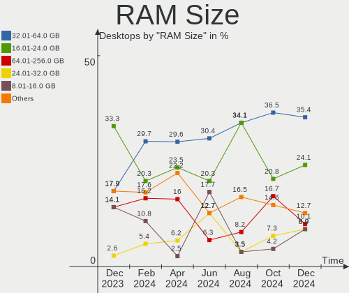
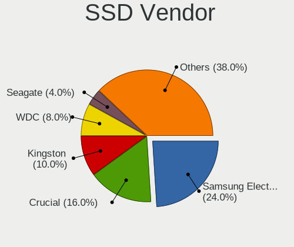
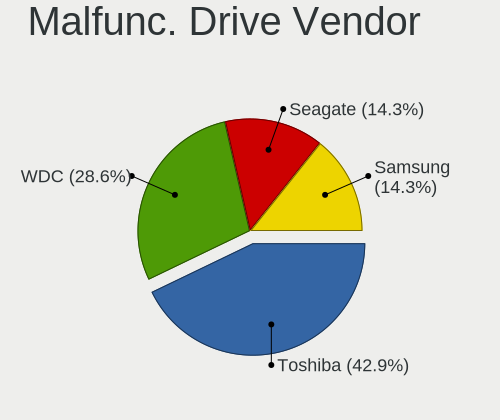
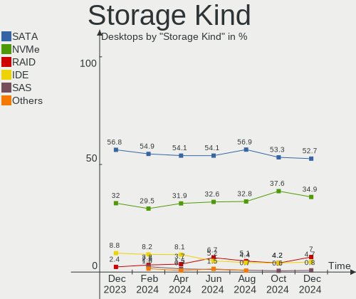
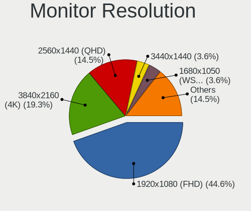

Linux in UK - Hardware Trends (Desktops)
----------------------------------------

A project to identify most popular hardware characteristics and track their change
over time based on data collected by Linux users at https://Linux-Hardware.org.

Anyone can contribute to this report by the [hw-probe](https://github.com/linuxhw/hw-probe) tool:

    sudo -E hw-probe -all -upload

Period: Oct, 2022.

Contents
--------

* [ System ](#system)
  - [ OS                       ](#os)
  - [ OS Family                ](#os-family)
  - [ Kernel                   ](#kernel)
  - [ Kernel Family            ](#kernel-family)
  - [ Kernel Major Ver.        ](#kernel-major-ver)
  - [ Arch                     ](#arch)
  - [ DE                       ](#de)
  - [ Display Server           ](#display-server)
  - [ Display Manager          ](#display-manager)
  - [ OS Lang                  ](#os-lang)
  - [ Boot Mode                ](#boot-mode)
  - [ Filesystem               ](#filesystem)
  - [ Part. scheme             ](#part-scheme)
  - [ Dual Boot with Linux/BSD ](#dual-boot-with-linuxbsd)
  - [ Dual Boot (Win)          ](#dual-boot-win)

* [ Board ](#board)
  - [ Vendor                   ](#vendor)
  - [ Model                    ](#model)
  - [ Model Family             ](#model-family)
  - [ MFG Year                 ](#mfg-year)
  - [ Form Factor              ](#form-factor)
  - [ Secure Boot              ](#secure-boot)
  - [ Coreboot                 ](#coreboot)
  - [ RAM Size                 ](#ram-size)
  - [ RAM Used                 ](#ram-used)
  - [ Total Drives             ](#total-drives)
  - [ Has CD-ROM               ](#has-cd-rom)
  - [ Has Ethernet             ](#has-ethernet)
  - [ Has WiFi                 ](#has-wifi)
  - [ Has Bluetooth            ](#has-bluetooth)

* [ Location ](#location)
  - [ Country                  ](#country)
  - [ City                     ](#city)

* [ Drives ](#drives)
  - [ Drive Vendor             ](#drive-vendor)
  - [ Drive Model              ](#drive-model)
  - [ HDD Vendor               ](#hdd-vendor)
  - [ SSD Vendor               ](#ssd-vendor)
  - [ Drive Kind               ](#drive-kind)
  - [ Drive Connector          ](#drive-connector)
  - [ Drive Size               ](#drive-size)
  - [ Space Total              ](#space-total)
  - [ Space Used               ](#space-used)
  - [ Malfunc. Drives          ](#malfunc-drives)
  - [ Malfunc. Drive Vendor    ](#malfunc-drive-vendor)
  - [ Malfunc. HDD Vendor      ](#malfunc-hdd-vendor)
  - [ Malfunc. Drive Kind      ](#malfunc-drive-kind)
  - [ Failed Drives            ](#failed-drives)
  - [ Failed Drive Vendor      ](#failed-drive-vendor)
  - [ Drive Status             ](#drive-status)

* [ Storage controller ](#storage-controller)
  - [ Storage Vendor           ](#storage-vendor)
  - [ Storage Model            ](#storage-model)
  - [ Storage Kind             ](#storage-kind)

* [ Processor ](#processor)
  - [ CPU Vendor               ](#cpu-vendor)
  - [ CPU Model                ](#cpu-model)
  - [ CPU Model Family         ](#cpu-model-family)
  - [ CPU Cores                ](#cpu-cores)
  - [ CPU Sockets              ](#cpu-sockets)
  - [ CPU Threads              ](#cpu-threads)
  - [ CPU Op-Modes             ](#cpu-op-modes)
  - [ CPU Microcode            ](#cpu-microcode)
  - [ CPU Microarch            ](#cpu-microarch)

* [ Graphics ](#graphics)
  - [ GPU Vendor               ](#gpu-vendor)
  - [ GPU Model                ](#gpu-model)
  - [ GPU Combo                ](#gpu-combo)
  - [ GPU Driver               ](#gpu-driver)
  - [ GPU Memory               ](#gpu-memory)

* [ Monitor ](#monitor)
  - [ Monitor Vendor           ](#monitor-vendor)
  - [ Monitor Model            ](#monitor-model)
  - [ Monitor Resolution       ](#monitor-resolution)
  - [ Monitor Diagonal         ](#monitor-diagonal)
  - [ Monitor Width            ](#monitor-width)
  - [ Aspect Ratio             ](#aspect-ratio)
  - [ Monitor Area             ](#monitor-area)
  - [ Pixel Density            ](#pixel-density)
  - [ Multiple Monitors        ](#multiple-monitors)

* [ Network ](#network)
  - [ Net Controller Vendor    ](#net-controller-vendor)
  - [ Net Controller Model     ](#net-controller-model)
  - [ Wireless Vendor          ](#wireless-vendor)
  - [ Wireless Model           ](#wireless-model)
  - [ Ethernet Vendor          ](#ethernet-vendor)
  - [ Ethernet Model           ](#ethernet-model)
  - [ Net Controller Kind      ](#net-controller-kind)
  - [ Used Controller          ](#used-controller)
  - [ NICs                     ](#nics)
  - [ IPv6                     ](#ipv6)

* [ Bluetooth ](#bluetooth)
  - [ Bluetooth Vendor         ](#bluetooth-vendor)
  - [ Bluetooth Model          ](#bluetooth-model)

* [ Sound ](#sound)
  - [ Sound Vendor             ](#sound-vendor)
  - [ Sound Model              ](#sound-model)

* [ Memory ](#memory)
  - [ Memory Vendor            ](#memory-vendor)
  - [ Memory Model             ](#memory-model)
  - [ Memory Kind              ](#memory-kind)
  - [ Memory Form Factor       ](#memory-form-factor)
  - [ Memory Size              ](#memory-size)
  - [ Memory Speed             ](#memory-speed)

* [ Printers & scanners ](#printers--scanners)
  - [ Printer Vendor           ](#printer-vendor)
  - [ Printer Model            ](#printer-model)
  - [ Scanner Vendor           ](#scanner-vendor)
  - [ Scanner Model            ](#scanner-model)

* [ Camera ](#camera)
  - [ Camera Vendor            ](#camera-vendor)
  - [ Camera Model             ](#camera-model)

* [ Security ](#security)
  - [ Fingerprint Vendor       ](#fingerprint-vendor)
  - [ Fingerprint Model        ](#fingerprint-model)
  - [ Chipcard Vendor          ](#chipcard-vendor)
  - [ Chipcard Model           ](#chipcard-model)

* [ Unsupported ](#unsupported)
  - [ Unsupported Devices      ](#unsupported-devices)
  - [ Unsupported Device Types ](#unsupported-device-types)

System
------

OS
--

Installed operating systems

| Name              | Desktops | Percent |
|-------------------|----------|---------|
| Ubuntu 22.04      | 14       | 21.88%  |
| Pop!_OS 22.04     | 5        | 7.81%   |
| Linux Mint 21     | 5        | 7.81%   |
| Zorin 16          | 4        | 6.25%   |
| OpenMandriva 4.50 | 4        | 6.25%   |
| Fedora 36         | 4        | 6.25%   |
| Linux Mint 20.3   | 3        | 4.69%   |
| Arch Rolling      | 3        | 4.69%   |
| Ubuntu 22.10      | 2        | 3.13%   |
| OpenMandriva 4.3  | 2        | 3.13%   |
| KDE neon 20.04    | 2        | 3.13%   |
| Fedora 37         | 2        | 3.13%   |
| Xero Rolling      | 1        | 1.56%   |
| UbuntuDDE 22.04   | 1        | 1.56%   |
| Ubuntu 20.04      | 1        | 1.56%   |
| SteamOS 3.3       | 1        | 1.56%   |
| Puppy 9           | 1        | 1.56%   |
| Manjaro           | 1        | 1.56%   |
| KDE neon 22.04    | 1        | 1.56%   |
| Kali 2022.3       | 1        | 1.56%   |
| Gentoo 2.9        | 1        | 1.56%   |
| Gentoo 2.8        | 1        | 1.56%   |
| Fedora 38         | 1        | 1.56%   |
| Debian 10         | 1        | 1.56%   |
| ArcoLinux Rolling | 1        | 1.56%   |
| antergos Rolling  | 1        | 1.56%   |

OS Family
---------

OS without a version

| Name         | Desktops | Percent |
|--------------|----------|---------|
| Ubuntu       | 17       | 26.56%  |
| Linux Mint   | 8        | 12.5%   |
| Fedora       | 7        | 10.94%  |
| OpenMandriva | 6        | 9.38%   |
| Pop!_OS      | 5        | 7.81%   |
| Zorin        | 4        | 6.25%   |
| KDE neon     | 3        | 4.69%   |
| Arch         | 3        | 4.69%   |
| Gentoo       | 2        | 3.13%   |
| Xero         | 1        | 1.56%   |
| UbuntuDDE    | 1        | 1.56%   |
| SteamOS      | 1        | 1.56%   |
| Puppy        | 1        | 1.56%   |
| Manjaro      | 1        | 1.56%   |
| Kali         | 1        | 1.56%   |
| Debian       | 1        | 1.56%   |
| ArcoLinux    | 1        | 1.56%   |
| antergos     | 1        | 1.56%   |

Kernel
------

Version of the Linux kernel

| Version                                           | Desktops | Percent |
|---------------------------------------------------|----------|---------|
| 5.15.0-52-generic                                 | 10       | 15.63%  |
| 5.15.0-48-generic                                 | 10       | 15.63%  |
| 5.15.0-50-generic                                 | 7        | 10.94%  |
| 5.19.5-desktop-1omv4090                           | 3        | 4.69%   |
| 5.19.0-76051900-generic                           | 3        | 4.69%   |
| 5.19.16-300.fc37.x86_64                           | 2        | 3.13%   |
| 5.19.13-arch1-1                                   | 2        | 3.13%   |
| 5.16.7-desktop-1omv4003                           | 2        | 3.13%   |
| 6.1.0-0.rc0.20221011git60bb8154d1d7.8.fc38.x86_64 | 1        | 1.56%   |
| 6.0.2-arch1-1                                     | 1        | 1.56%   |
| 6.0.2-76060002-generic                            | 1        | 1.56%   |
| 6.0.1-tkg-bore-llvm                               | 1        | 1.56%   |
| 5.7.0-0.bpo.2-amd64                               | 1        | 1.56%   |
| 5.4.53                                            | 1        | 1.56%   |
| 5.4.0-131-generic                                 | 1        | 1.56%   |
| 5.4.0-126-generic                                 | 1        | 1.56%   |
| 5.19.9-zen1-1-zen                                 | 1        | 1.56%   |
| 5.19.9-x86_64                                     | 1        | 1.56%   |
| 5.19.16-76051916-generic                          | 1        | 1.56%   |
| 5.19.16-200.fc36.x86_64                           | 1        | 1.56%   |
| 5.19.15-201.fc36.x86_64                           | 1        | 1.56%   |
| 5.19.14-200.fc36.x86_64                           | 1        | 1.56%   |
| 5.19.13-zen1-1-zen                                | 1        | 1.56%   |
| 5.19.11-desktop-2omv4090                          | 1        | 1.56%   |
| 5.19.0-23-generic                                 | 1        | 1.56%   |
| 5.19.0-1009-lowlatency                            | 1        | 1.56%   |
| 5.18.1-arch1_testHoloISO_20220606.1811            | 1        | 1.56%   |
| 5.18.0-kali5-amd64                                | 1        | 1.56%   |
| 5.17.9-051709-generic                             | 1        | 1.56%   |
| 5.17.5-300.fc36.x86_64                            | 1        | 1.56%   |
| 5.15.74-1-lts                                     | 1        | 1.56%   |
| 5.15.72-1-MANJARO                                 | 1        | 1.56%   |
| 5.15.0-43-generic                                 | 1        | 1.56%   |

Kernel Family
-------------

Linux kernel without a distro release

| Version | Desktops | Percent |
|---------|----------|---------|
| 5.15.0  | 28       | 43.75%  |
| 5.19.0  | 5        | 7.81%   |
| 5.19.16 | 4        | 6.25%   |
| 5.19.5  | 3        | 4.69%   |
| 5.19.13 | 3        | 4.69%   |
| 6.0.2   | 2        | 3.13%   |
| 5.4.0   | 2        | 3.13%   |
| 5.19.9  | 2        | 3.13%   |
| 5.16.7  | 2        | 3.13%   |
| 6.1.0   | 1        | 1.56%   |
| 6.0.1   | 1        | 1.56%   |
| 5.7.0   | 1        | 1.56%   |
| 5.4.53  | 1        | 1.56%   |
| 5.19.15 | 1        | 1.56%   |
| 5.19.14 | 1        | 1.56%   |
| 5.19.11 | 1        | 1.56%   |
| 5.18.1  | 1        | 1.56%   |
| 5.18.0  | 1        | 1.56%   |
| 5.17.9  | 1        | 1.56%   |
| 5.17.5  | 1        | 1.56%   |
| 5.15.74 | 1        | 1.56%   |
| 5.15.72 | 1        | 1.56%   |

Kernel Major Ver.
-----------------

Linux kernel major version

| Version | Desktops | Percent |
|---------|----------|---------|
| 5.15    | 30       | 46.88%  |
| 5.19    | 20       | 31.25%  |
| 6.0     | 3        | 4.69%   |
| 5.4     | 3        | 4.69%   |
| 5.18    | 2        | 3.13%   |
| 5.17    | 2        | 3.13%   |
| 5.16    | 2        | 3.13%   |
| 6.1     | 1        | 1.56%   |
| 5.7     | 1        | 1.56%   |

Arch
----

OS architecture (x86_64, i586, etc.)

| Name   | Desktops | Percent |
|--------|----------|---------|
| x86_64 | 64       | 100%    |

DE
--

Desktop Environment

| Name             | Desktops | Percent |
|------------------|----------|---------|
| GNOME            | 28       | 43.75%  |
| KDE5             | 15       | 23.44%  |
| X-Cinnamon       | 6        | 9.38%   |
| Unknown          | 4        | 6.25%   |
| XFCE             | 3        | 4.69%   |
| MATE             | 2        | 3.13%   |
| sway             | 1        | 1.56%   |
| qtile            | 1        | 1.56%   |
| LXDE             | 1        | 1.56%   |
| lightdm-xsession | 1        | 1.56%   |
| Hyprland         | 1        | 1.56%   |
| Deepin           | 1        | 1.56%   |

Display Server
--------------

X11 or Wayland

| Name    | Desktops | Percent |
|---------|----------|---------|
| X11     | 50       | 78.13%  |
| Wayland | 11       | 17.19%  |
| Tty     | 2        | 3.13%   |
| Unknown | 1        | 1.56%   |

Display Manager
---------------

SDDM, LightDM, etc.

| Name    | Desktops | Percent |
|---------|----------|---------|
| Unknown | 28       | 43.75%  |
| GDM3    | 14       | 21.88%  |
| SDDM    | 10       | 15.63%  |
| LightDM | 8        | 12.5%   |
| GDM     | 2        | 3.13%   |
| Ly      | 1        | 1.56%   |
| GREETD  | 1        | 1.56%   |

OS Lang
-------

Language

| Lang  | Desktops | Percent |
|-------|----------|---------|
| en_GB | 54       | 84.38%  |
| en_US | 10       | 15.63%  |

Boot Mode
---------

EFI or BIOS

| Mode | Desktops | Percent |
|------|----------|---------|
| BIOS | 38       | 59.38%  |
| EFI  | 26       | 40.63%  |

Filesystem
----------

Type of filesystem

| Type    | Desktops | Percent |
|---------|----------|---------|
| Ext4    | 45       | 70.31%  |
| Btrfs   | 11       | 17.19%  |
| Overlay | 4        | 6.25%   |
| Xfs     | 2        | 3.13%   |
| Zfs     | 1        | 1.56%   |
| Aufs    | 1        | 1.56%   |

Part. scheme
------------

Scheme of partitioning

| Type    | Desktops | Percent |
|---------|----------|---------|
| GPT     | 28       | 43.75%  |
| Unknown | 25       | 39.06%  |
| MBR     | 11       | 17.19%  |

Dual Boot with Linux/BSD
------------------------

Hosting more than one Linux/BSD

| Dual boot | Desktops | Percent |
|-----------|----------|---------|
| No        | 54       | 84.38%  |
| Yes       | 10       | 15.63%  |

Dual Boot (Win)
---------------

Hosting Linux and Windows

| Dual boot | Desktops | Percent |
|-----------|----------|---------|
| No        | 48       | 75%     |
| Yes       | 16       | 25%     |

Board
-----

Vendor
------

Motherboard manufacturer

| Name                | Desktops | Percent |
|---------------------|----------|---------|
| ASUSTek Computer    | 19       | 29.69%  |
| Gigabyte Technology | 17       | 26.56%  |
| Dell                | 8        | 12.5%   |
| MSI                 | 7        | 10.94%  |
| ASRock              | 4        | 6.25%   |
| Hewlett-Packard     | 3        | 4.69%   |
| Acer                | 3        | 4.69%   |
| Inventec            | 1        | 1.56%   |
| Apple               | 1        | 1.56%   |
| Alienware           | 1        | 1.56%   |

Model
-----

Motherboard model

| Name                              | Desktops | Percent |
|-----------------------------------|----------|---------|
| MSI MS-7B89                       | 2        | 3.13%   |
| Dell OptiPlex 7020                | 2        | 3.13%   |
| Dell OptiPlex 380                 | 2        | 3.13%   |
| ASUS All Series                   | 2        | 3.13%   |
| MSI MS-7D09                       | 1        | 1.56%   |
| MSI MS-7C56                       | 1        | 1.56%   |
| MSI MS-7C51                       | 1        | 1.56%   |
| MSI MS-7B86                       | 1        | 1.56%   |
| MSI MS-7721                       | 1        | 1.56%   |
| Inventec DQ Class                 | 1        | 1.56%   |
| HP ProDesk 400 G2.5 SFF           | 1        | 1.56%   |
| HP 510-p189na                     | 1        | 1.56%   |
| HP 285 G2 MT                      | 1        | 1.56%   |
| Gigabyte Z170-Gaming K3           | 1        | 1.56%   |
| Gigabyte X570S AORUS PRO AX       | 1        | 1.56%   |
| Gigabyte X570S AORUS MASTER       | 1        | 1.56%   |
| Gigabyte X570 AORUS XTREME        | 1        | 1.56%   |
| Gigabyte X570 AORUS ULTRA         | 1        | 1.56%   |
| Gigabyte P67A-UD3                 | 1        | 1.56%   |
| Gigabyte H81M-S2H                 | 1        | 1.56%   |
| Gigabyte H81M-H                   | 1        | 1.56%   |
| Gigabyte H61N-USB3                | 1        | 1.56%   |
| Gigabyte H61M-DS2 DVI             | 1        | 1.56%   |
| Gigabyte E350N WIN8               | 1        | 1.56%   |
| Gigabyte B550 GAMING X V2         | 1        | 1.56%   |
| Gigabyte B550 AORUS ELITE         | 1        | 1.56%   |
| Gigabyte B450 I AORUS PRO WIFI    | 1        | 1.56%   |
| Gigabyte AB350-Gaming             | 1        | 1.56%   |
| Gigabyte A320M-S2H                | 1        | 1.56%   |
| Gigabyte 970A-DS3P                | 1        | 1.56%   |
| Dell Precision Tower 7810         | 1        | 1.56%   |
| Dell OptiPlex 790                 | 1        | 1.56%   |
| Dell OptiPlex 3010                | 1        | 1.56%   |
| Dell Inspiron 5675                | 1        | 1.56%   |
| ASUS TUF Gaming Z690-PLUS WIFI D4 | 1        | 1.56%   |
| ASUS TUF Gaming B560-PLUS WIFI    | 1        | 1.56%   |
| ASUS ROG STRIX X570-F GAMING      | 1        | 1.56%   |
| ASUS ROG Maximus XI HERO          | 1        | 1.56%   |
| ASUS ROG CROSSHAIR VIII IMPACT    | 1        | 1.56%   |
| ASUS ROG CROSSHAIR VIII HERO      | 1        | 1.56%   |

Model Family
------------

Motherboard model prefix

| Name                  | Desktops | Percent |
|-----------------------|----------|---------|
| Dell OptiPlex         | 6        | 9.38%   |
| ASUS ROG              | 5        | 7.81%   |
| ASUS PRIME            | 4        | 6.25%   |
| Acer Aspire           | 3        | 4.69%   |
| MSI MS-7B89           | 2        | 3.13%   |
| Gigabyte X570S        | 2        | 3.13%   |
| Gigabyte X570         | 2        | 3.13%   |
| Gigabyte B550         | 2        | 3.13%   |
| ASUS TUF              | 2        | 3.13%   |
| ASUS M5A78L-M         | 2        | 3.13%   |
| ASUS All              | 2        | 3.13%   |
| MSI MS-7D09           | 1        | 1.56%   |
| MSI MS-7C56           | 1        | 1.56%   |
| MSI MS-7C51           | 1        | 1.56%   |
| MSI MS-7B86           | 1        | 1.56%   |
| MSI MS-7721           | 1        | 1.56%   |
| Inventec DQ           | 1        | 1.56%   |
| HP ProDesk            | 1        | 1.56%   |
| HP 510-p189na         | 1        | 1.56%   |
| HP 285                | 1        | 1.56%   |
| Gigabyte Z170-Gaming  | 1        | 1.56%   |
| Gigabyte P67A-UD3     | 1        | 1.56%   |
| Gigabyte H81M-S2H     | 1        | 1.56%   |
| Gigabyte H81M-H       | 1        | 1.56%   |
| Gigabyte H61N-USB3    | 1        | 1.56%   |
| Gigabyte H61M-DS2     | 1        | 1.56%   |
| Gigabyte E350N        | 1        | 1.56%   |
| Gigabyte B450         | 1        | 1.56%   |
| Gigabyte AB350-Gaming | 1        | 1.56%   |
| Gigabyte A320M-S2H    | 1        | 1.56%   |
| Gigabyte 970A-DS3P    | 1        | 1.56%   |
| Dell Precision        | 1        | 1.56%   |
| Dell Inspiron         | 1        | 1.56%   |
| ASUS PC-X018392       | 1        | 1.56%   |
| ASUS P8Z68-V          | 1        | 1.56%   |
| ASUS P8H61            | 1        | 1.56%   |
| ASUS P6T              | 1        | 1.56%   |
| ASRock N68-S          | 1        | 1.56%   |
| ASRock FM2A88M-HD+    | 1        | 1.56%   |
| ASRock B450M-HDV      | 1        | 1.56%   |

MFG Year
--------

Motherboard manufacture year

| Year | Desktops | Percent |
|------|----------|---------|
| 2021 | 9        | 14.06%  |
| 2013 | 8        | 12.5%   |
| 2018 | 7        | 10.94%  |
| 2019 | 6        | 9.38%   |
| 2015 | 5        | 7.81%   |
| 2011 | 5        | 7.81%   |
| 2020 | 4        | 6.25%   |
| 2017 | 4        | 6.25%   |
| 2016 | 4        | 6.25%   |
| 2010 | 3        | 4.69%   |
| 2009 | 3        | 4.69%   |
| 2014 | 2        | 3.13%   |
| 2012 | 2        | 3.13%   |
| 2022 | 1        | 1.56%   |
| 2008 | 1        | 1.56%   |

Form Factor
-----------

Physical design of the computer

| Name    | Desktops | Percent |
|---------|----------|---------|
| Desktop | 64       | 100%    |

Secure Boot
-----------

Enabled or disabled

| State    | Desktops | Percent |
|----------|----------|---------|
| Disabled | 63       | 98.44%  |
| Enabled  | 1        | 1.56%   |

Coreboot
--------

Have coreboot on board

| Used | Desktops | Percent |
|------|----------|---------|
| No   | 64       | 100%    |

RAM Size
--------

Total RAM memory

| Size in GB  | Desktops | Percent |
|-------------|----------|---------|
| 32.01-64.0  | 17       | 26.56%  |
| 16.01-24.0  | 16       | 25%     |
| 8.01-16.0   | 11       | 17.19%  |
| 4.01-8.0    | 7        | 10.94%  |
| 3.01-4.0    | 7        | 10.94%  |
| 64.01-256.0 | 5        | 7.81%   |
| 24.01-32.0  | 1        | 1.56%   |

RAM Used
--------

Used RAM memory

| Used GB    | Desktops | Percent |
|------------|----------|---------|
| 1.01-2.0   | 18       | 28.13%  |
| 4.01-8.0   | 14       | 21.88%  |
| 2.01-3.0   | 13       | 20.31%  |
| 3.01-4.0   | 11       | 17.19%  |
| 8.01-16.0  | 5        | 7.81%   |
| 0.51-1.0   | 2        | 3.13%   |
| 16.01-24.0 | 1        | 1.56%   |

Total Drives
------------

Number of drives on board

| Drives | Desktops | Percent |
|--------|----------|---------|
| 1      | 21       | 32.81%  |
| 2      | 15       | 23.44%  |
| 3      | 12       | 18.75%  |
| 4      | 7        | 10.94%  |
| 5      | 5        | 7.81%   |
| 6      | 4        | 6.25%   |

Has CD-ROM
----------

Has CD-ROM on board

| Presented | Desktops | Percent |
|-----------|----------|---------|
| Yes       | 32       | 50%     |
| No        | 32       | 50%     |

Has Ethernet
------------

Has Ethernet on board

| Presented | Desktops | Percent |
|-----------|----------|---------|
| Yes       | 63       | 98.44%  |
| No        | 1        | 1.56%   |

Has WiFi
--------

Has WiFi module

| Presented | Desktops | Percent |
|-----------|----------|---------|
| Yes       | 35       | 54.69%  |
| No        | 29       | 45.31%  |

Has Bluetooth
-------------

Has Bluetooth module

| Presented | Desktops | Percent |
|-----------|----------|---------|
| No        | 35       | 54.69%  |
| Yes       | 29       | 45.31%  |

Location
--------

Country
-------

Geographic location (country)

| Country | Desktops | Percent |
|---------|----------|---------|
| UK      | 64       | 100%    |

City
----

Geographic location (city)

| City                 | Desktops | Percent |
|----------------------|----------|---------|
| London               | 3        | 4.69%   |
| Edinburgh            | 3        | 4.69%   |
| Somerset             | 2        | 3.13%   |
| Sheffield            | 2        | 3.13%   |
| Rotherham            | 2        | 3.13%   |
| Norwich              | 2        | 3.13%   |
| Kingston upon Thames | 2        | 3.13%   |
| Glasgow              | 2        | 3.13%   |
| Wymondham            | 1        | 1.56%   |
| Wallsend             | 1        | 1.56%   |
| Tottenham            | 1        | 1.56%   |
| Thornton Heath       | 1        | 1.56%   |
| Swindon              | 1        | 1.56%   |
| Stourbridge          | 1        | 1.56%   |
| Stanmore             | 1        | 1.56%   |
| South Benfleet       | 1        | 1.56%   |
| Salisbury            | 1        | 1.56%   |
| Ringwood             | 1        | 1.56%   |
| Redruth              | 1        | 1.56%   |
| Preston              | 1        | 1.56%   |
| Pontypool            | 1        | 1.56%   |
| Plymouth             | 1        | 1.56%   |
| Peterlee             | 1        | 1.56%   |
| Peterborough         | 1        | 1.56%   |
| Orpington            | 1        | 1.56%   |
| Notting Hill Gate    | 1        | 1.56%   |
| Northampton          | 1        | 1.56%   |
| Milton Keynes        | 1        | 1.56%   |
| Manchester           | 1        | 1.56%   |
| Leigh                | 1        | 1.56%   |
| Kirkcaldy            | 1        | 1.56%   |
| Ilford               | 1        | 1.56%   |
| Hull                 | 1        | 1.56%   |
| Hertford             | 1        | 1.56%   |
| Hereford             | 1        | 1.56%   |
| Hazel Grove          | 1        | 1.56%   |
| Halstead             | 1        | 1.56%   |
| Finchley             | 1        | 1.56%   |
| Farnborough          | 1        | 1.56%   |
| Edgware              | 1        | 1.56%   |

Drives
------

Drive Vendor
------------

Hard drive vendors

| Vendor              | Desktops | Drives | Percent |
|---------------------|----------|--------|---------|
| Seagate             | 31       | 34     | 22.96%  |
| Samsung Electronics | 24       | 38     | 17.78%  |
| WDC                 | 20       | 24     | 14.81%  |
| Kingston            | 9        | 11     | 6.67%   |
| Hitachi             | 6        | 8      | 4.44%   |
| Sandisk             | 5        | 6      | 3.7%    |
| Crucial             | 5        | 7      | 3.7%    |
| Toshiba             | 4        | 4      | 2.96%   |
| Unknown             | 3        | 3      | 2.22%   |
| Phison Electronics  | 3        | 3      | 2.22%   |
| Phison              | 3        | 5      | 2.22%   |
| LITEON              | 3        | 3      | 2.22%   |
| Intel               | 2        | 3      | 1.48%   |
| Fujitsu             | 2        | 2      | 1.48%   |
| Drevo               | 2        | 2      | 1.48%   |
| TCSUNBOW            | 1        | 1      | 0.74%   |
| SPCC                | 1        | 1      | 0.74%   |
| Silicon Motion      | 1        | 1      | 0.74%   |
| PNY                 | 1        | 1      | 0.74%   |
| Patriot             | 1        | 1      | 0.74%   |
| Lexar               | 1        | 1      | 0.74%   |
| JMicron Technology  | 1        | 1      | 0.74%   |
| Integral            | 1        | 1      | 0.74%   |
| HGST                | 1        | 1      | 0.74%   |
| Hewlett-Packard     | 1        | 1      | 0.74%   |
| BAITITON            | 1        | 1      | 0.74%   |
| Apple               | 1        | 1      | 0.74%   |
| Unknown             | 1        | 1      | 0.74%   |

Drive Model
-----------

Hard drive models

| Model                                                | Desktops | Percent |
|------------------------------------------------------|----------|---------|
| Samsung NVMe SSD Controller SM981/PM981/PM983 500GB  | 6        | 3.82%   |
| Samsung SSD 850 EVO 500GB                            | 4        | 2.55%   |
| Samsung SSD 860 EVO 500GB                            | 3        | 1.91%   |
| Kingston SA400S37240G 240GB SSD                      | 3        | 1.91%   |
| WDC WD5000AAKX-75U6AA0 500GB                         | 2        | 1.27%   |
| WDC WD40EZRZ-00WN9B0 4TB                             | 2        | 1.27%   |
| Unknown SD/MMC/MS PRO 1TB                            | 2        | 1.27%   |
| Seagate ST500LT012-1DG142 500GB                      | 2        | 1.27%   |
| Seagate ST500DM002-1BD142 500GB                      | 2        | 1.27%   |
| Seagate ST3500312CS 500GB                            | 2        | 1.27%   |
| Seagate ST2000DM006-2DM164 2TB                       | 2        | 1.27%   |
| Seagate ST1000DM003-9YN162 1TB                       | 2        | 1.27%   |
| Samsung SSD 870 EVO 250GB                            | 2        | 1.27%   |
| Samsung SSD 850 EVO 250GB                            | 2        | 1.27%   |
| Samsung NVMe SSD Controller PM9A1/PM9A3/980PRO 250GB | 2        | 1.27%   |
| Phison E16 PCIe4 NVMe Controller 1TB                 | 2        | 1.27%   |
| Kingston SV300S37A240G 240GB SSD                     | 2        | 1.27%   |
| Kingston SA400S37960G 960GB SSD                      | 2        | 1.27%   |
| Kingston SA400S37480G 480GB SSD                      | 2        | 1.27%   |
| WDC WDS250G2B0C-00PXH0 250GB                         | 1        | 0.64%   |
| WDC WDS240G2G0B-00EPW0 240GB SSD                     | 1        | 0.64%   |
| WDC WD6400AAVS-00G9B1 640GB                          | 1        | 0.64%   |
| WDC WD60PURX-64T0ZY0 6TB                             | 1        | 0.64%   |
| WDC WD5000BEVT-35A0RT0 500GB                         | 1        | 0.64%   |
| WDC WD5000AVCS-632DY1 500GB                          | 1        | 0.64%   |
| WDC WD5000AAKX-08U6AA0 500GB                         | 1        | 0.64%   |
| WDC WD2500JS-22NCB1 250GB                            | 1        | 0.64%   |
| WDC WD2500AAKS-00B3A0 250GB                          | 1        | 0.64%   |
| WDC WD20EZRZ-00Z5HB0 2TB                             | 1        | 0.64%   |
| WDC WD15EADS-11R6B1 1TB                              | 1        | 0.64%   |
| WDC WD140EDFZ-11A0VA0 14TB                           | 1        | 0.64%   |
| WDC WD10EZEX-21WN4A0 1TB                             | 1        | 0.64%   |
| WDC WD10EZEX-08WN4A0 1TB                             | 1        | 0.64%   |
| WDC WD10EZEX-08M2NA0 1TB                             | 1        | 0.64%   |
| WDC WD10EZEX-00BN5A0 1TB                             | 1        | 0.64%   |
| WDC WD10EAVS-00D7B1 1TB                              | 1        | 0.64%   |
| WDC WD10EARS-00Y5B1 1TB                              | 1        | 0.64%   |
| WDC WD10EADS-00M2B0 1TB                              | 1        | 0.64%   |
| Unknown 256GB PCS 2.5" S SSD                         | 1        | 0.64%   |
| Toshiba XG6 NVMe SSD Controller 512GB                | 1        | 0.64%   |

HDD Vendor
----------

Hard disk drive vendors

| Vendor              | Desktops | Drives | Percent |
|---------------------|----------|--------|---------|
| Seagate             | 30       | 32     | 46.15%  |
| WDC                 | 18       | 22     | 27.69%  |
| Hitachi             | 6        | 8      | 9.23%   |
| Toshiba             | 3        | 3      | 4.62%   |
| Unknown             | 2        | 2      | 3.08%   |
| Fujitsu             | 2        | 2      | 3.08%   |
| Samsung Electronics | 1        | 1      | 1.54%   |
| HGST                | 1        | 1      | 1.54%   |
| Hewlett-Packard     | 1        | 1      | 1.54%   |
| Apple               | 1        | 1      | 1.54%   |

SSD Vendor
----------

Solid state drive vendors

| Vendor              | Desktops | Drives | Percent |
|---------------------|----------|--------|---------|
| Samsung Electronics | 18       | 24     | 37.5%   |
| Kingston            | 9        | 11     | 18.75%  |
| Crucial             | 4        | 6      | 8.33%   |
| LITEON              | 3        | 3      | 6.25%   |
| Drevo               | 2        | 2      | 4.17%   |
| WDC                 | 1        | 1      | 2.08%   |
| Unknown             | 1        | 1      | 2.08%   |
| TCSUNBOW            | 1        | 1      | 2.08%   |
| SPCC                | 1        | 1      | 2.08%   |
| Seagate             | 1        | 1      | 2.08%   |
| SanDisk             | 1        | 1      | 2.08%   |
| PNY                 | 1        | 1      | 2.08%   |
| Patriot             | 1        | 1      | 2.08%   |
| Lexar               | 1        | 1      | 2.08%   |
| Integral            | 1        | 1      | 2.08%   |
| BAITITON            | 1        | 1      | 2.08%   |
| Unknown             | 1        | 1      | 2.08%   |

Drive Kind
----------

HDD or SSD

| Kind | Desktops | Drives | Percent |
|------|----------|--------|---------|
| HDD  | 47       | 73     | 42.73%  |
| SSD  | 39       | 58     | 35.45%  |
| NVMe | 24       | 35     | 21.82%  |

Drive Connector
---------------

SATA, SAS, NVMe, etc.

| Type | Desktops | Drives | Percent |
|------|----------|--------|---------|
| SATA | 61       | 126    | 68.54%  |
| NVMe | 23       | 34     | 25.84%  |
| SAS  | 5        | 6      | 5.62%   |

Drive Size
----------

Size of hard drive

| Size in TB | Desktops | Drives | Percent |
|------------|----------|--------|---------|
| 0.01-0.5   | 48       | 74     | 51.06%  |
| 0.51-1.0   | 26       | 34     | 27.66%  |
| 1.01-2.0   | 8        | 9      | 8.51%   |
| 3.01-4.0   | 7        | 7      | 7.45%   |
| 4.01-10.0  | 4        | 5      | 4.26%   |
| 10.01-20.0 | 1        | 2      | 1.06%   |

Space Total
-----------

Amount of disk space available on the file system

| Size in GB     | Desktops | Percent |
|----------------|----------|---------|
| 501-1000       | 12       | 18.75%  |
| More than 3000 | 11       | 17.19%  |
| 1001-2000      | 11       | 17.19%  |
| 251-500        | 8        | 12.5%   |
| 101-250        | 8        | 12.5%   |
| 2001-3000      | 6        | 9.38%   |
| 1-20           | 5        | 7.81%   |
| 51-100         | 2        | 3.13%   |
| Unknown        | 1        | 1.56%   |

Space Used
----------

Amount of used disk space

| Used GB        | Desktops | Percent |
|----------------|----------|---------|
| 1-20           | 15       | 23.44%  |
| 21-50          | 10       | 15.63%  |
| 1001-2000      | 9        | 14.06%  |
| 501-1000       | 8        | 12.5%   |
| 51-100         | 6        | 9.38%   |
| 101-250        | 5        | 7.81%   |
| 251-500        | 4        | 6.25%   |
| 2001-3000      | 4        | 6.25%   |
| More than 3000 | 2        | 3.13%   |
| Unknown        | 1        | 1.56%   |

Malfunc. Drives
---------------

Drive models with a malfunction

| Model                                            | Desktops | Drives | Percent |
|--------------------------------------------------|----------|--------|---------|
| WDC WD2500AAKS-00B3A0 250GB                      | 1        | 1      | 7.69%   |
| Seagate ST980811AS 80GB                          | 1        | 1      | 7.69%   |
| Seagate ST31000528AS 1TB                         | 1        | 1      | 7.69%   |
| Seagate ST2000DM006-2DM164 2TB                   | 1        | 1      | 7.69%   |
| Seagate ST12000NM0007-2A1101 12TB                | 1        | 1      | 7.69%   |
| Seagate ST1000LM024 HN-M101MBB 1TB               | 1        | 1      | 7.69%   |
| Samsung Electronics MZ7WD480HMHP-00003 480GB SSD | 1        | 1      | 7.69%   |
| LITEON IT LCS-256L9S-11 2.5 7mm 256GB SSD        | 1        | 1      | 7.69%   |
| Intel SSD 600P Series 256GB                      | 1        | 1      | 7.69%   |
| Hitachi HDS728080PLA380 82GB                     | 1        | 1      | 7.69%   |
| Hewlett-Packard MB1000GCWCV 1TB                  | 1        | 1      | 7.69%   |
| Drevo X1 Pro SSD 128GB                           | 1        | 1      | 7.69%   |
| BAITITON BT58SSD09S 240GB                        | 1        | 1      | 7.69%   |

Malfunc. Drive Vendor
---------------------

Vendors of faulty drives

| Vendor              | Desktops | Drives | Percent |
|---------------------|----------|--------|---------|
| Seagate             | 5        | 5      | 38.46%  |
| WDC                 | 1        | 1      | 7.69%   |
| Samsung Electronics | 1        | 1      | 7.69%   |
| LITEON              | 1        | 1      | 7.69%   |
| Intel               | 1        | 1      | 7.69%   |
| Hitachi             | 1        | 1      | 7.69%   |
| Hewlett-Packard     | 1        | 1      | 7.69%   |
| Drevo               | 1        | 1      | 7.69%   |
| BAITITON            | 1        | 1      | 7.69%   |

Malfunc. HDD Vendor
-------------------

Vendors of faulty HDD drives

| Vendor          | Desktops | Drives | Percent |
|-----------------|----------|--------|---------|
| Seagate         | 5        | 5      | 62.5%   |
| WDC             | 1        | 1      | 12.5%   |
| Hitachi         | 1        | 1      | 12.5%   |
| Hewlett-Packard | 1        | 1      | 12.5%   |

Malfunc. Drive Kind
-------------------

Kinds of faulty drives

| Kind | Desktops | Drives | Percent |
|------|----------|--------|---------|
| HDD  | 6        | 8      | 54.55%  |
| SSD  | 4        | 4      | 36.36%  |
| NVMe | 1        | 1      | 9.09%   |

Failed Drives
-------------

Failed drive models

Zero info for selected period =(

Failed Drive Vendor
-------------------

Failed drive vendors

Zero info for selected period =(

Drive Status
------------

Number of failed and malfunc. drives

| Status   | Desktops | Drives | Percent |
|----------|----------|--------|---------|
| Detected | 41       | 104    | 56.94%  |
| Works    | 22       | 49     | 30.56%  |
| Malfunc  | 9        | 13     | 12.5%   |

Storage controller
------------------

Storage Vendor
--------------

Storage controller vendors

| Vendor                       | Desktops | Percent |
|------------------------------|----------|---------|
| AMD                          | 36       | 37.11%  |
| Intel                        | 28       | 28.87%  |
| Samsung Electronics          | 9        | 9.28%   |
| Phison Electronics           | 6        | 6.19%   |
| SanDisk                      | 5        | 5.15%   |
| JMicron Technology           | 3        | 3.09%   |
| Nvidia                       | 2        | 2.06%   |
| VIA Technologies             | 1        | 1.03%   |
| Toshiba America Info Systems | 1        | 1.03%   |
| Silicon Motion               | 1        | 1.03%   |
| Seagate Technology           | 1        | 1.03%   |
| Micron/Crucial Technology    | 1        | 1.03%   |
| Marvell Technology Group     | 1        | 1.03%   |
| ASMedia Technology           | 1        | 1.03%   |
| Adaptec                      | 1        | 1.03%   |

Storage Model
-------------

Storage controller models

| Model                                                                          | Desktops | Percent |
|--------------------------------------------------------------------------------|----------|---------|
| AMD FCH SATA Controller [AHCI mode]                                            | 22       | 17.46%  |
| Samsung NVMe SSD Controller SM981/PM981/PM983                                  | 7        | 5.56%   |
| AMD 400 Series Chipset SATA Controller                                         | 7        | 5.56%   |
| Intel 8 Series/C220 Series Chipset Family 6-port SATA Controller 1 [AHCI mode] | 6        | 4.76%   |
| Intel 6 Series/C200 Series Chipset Family 6 port Desktop SATA AHCI Controller  | 6        | 4.76%   |
| AMD 500 Series Chipset SATA Controller                                         | 5        | 3.97%   |
| AMD SB7x0/SB8x0/SB9x0 SATA Controller [IDE mode]                               | 4        | 3.17%   |
| AMD SB7x0/SB8x0/SB9x0 IDE Controller                                           | 4        | 3.17%   |
| SanDisk WD Blue SN550 NVMe SSD                                                 | 3        | 2.38%   |
| Phison E16 PCIe4 NVMe Controller                                               | 3        | 2.38%   |
| Phison E12 NVMe Controller                                                     | 3        | 2.38%   |
| AMD FCH SATA Controller D                                                      | 3        | 2.38%   |
| Samsung NVMe SSD Controller PM9A1/PM9A3/980PRO                                 | 2        | 1.59%   |
| Samsung NVMe SSD Controller 980                                                | 2        | 1.59%   |
| JMicron JMB362 SATA Controller                                                 | 2        | 1.59%   |
| Intel SATA Controller [RAID mode]                                              | 2        | 1.59%   |
| Intel NM10/ICH7 Family SATA Controller [IDE mode]                              | 2        | 1.59%   |
| Intel C610/X99 series chipset sSATA Controller [AHCI mode]                     | 2        | 1.59%   |
| Intel 82801JI (ICH10 Family) SATA AHCI Controller                              | 2        | 1.59%   |
| Intel 82801G (ICH7 Family) IDE Controller                                      | 2        | 1.59%   |
| Intel 500 Series Chipset Family SATA AHCI Controller                           | 2        | 1.59%   |
| AMD FCH IDE Controller                                                         | 2        | 1.59%   |
| AMD 300 Series Chipset SATA Controller                                         | 2        | 1.59%   |
| VIA VT6421 IDE/SATA Controller                                                 | 1        | 0.79%   |
| Toshiba America Info Systems XG6 NVMe SSD Controller                           | 1        | 0.79%   |
| Silicon Motion SM2263EN/SM2263XT SSD Controller                                | 1        | 0.79%   |
| Seagate Non-Volatile memory controller                                         | 1        | 0.79%   |
| SanDisk WD Blue SN570 NVMe SSD                                                 | 1        | 0.79%   |
| SanDisk Non-Volatile memory controller                                         | 1        | 0.79%   |
| Nvidia MCP78S [GeForce 8200] IDE                                               | 1        | 0.79%   |
| Nvidia MCP78S [GeForce 8200] AHCI Controller                                   | 1        | 0.79%   |
| Nvidia MCP61 SATA Controller                                                   | 1        | 0.79%   |
| Nvidia MCP61 IDE                                                               | 1        | 0.79%   |
| Micron/Crucial Non-Volatile memory controller                                  | 1        | 0.79%   |
| Marvell Group 88SE9172 SATA 6Gb/s Controller                                   | 1        | 0.79%   |
| JMicron JMB363 SATA/IDE Controller                                             | 1        | 0.79%   |
| Intel Volume Management Device NVMe RAID Controller                            | 1        | 0.79%   |
| Intel SSD 660P Series                                                          | 1        | 0.79%   |
| Intel SSD 600P Series                                                          | 1        | 0.79%   |
| Intel Q170/Q150/B150/H170/H110/Z170/CM236 Chipset SATA Controller [AHCI Mode]  | 1        | 0.79%   |

Storage Kind
------------

Kind of storage controller (IDE, SATA, NVMe, SAS, ...)

| Kind | Desktops | Percent |
|------|----------|---------|
| SATA | 59       | 59%     |
| NVMe | 23       | 23%     |
| IDE  | 12       | 12%     |
| RAID | 6        | 6%      |

Processor
---------

CPU Vendor
----------

Processor vendors

| Vendor | Desktops | Percent |
|--------|----------|---------|
| AMD    | 38       | 59.38%  |
| Intel  | 26       | 40.63%  |

CPU Model
---------

Processor models

| Model                                    | Desktops | Percent |
|------------------------------------------|----------|---------|
| Intel Core i7-2600 CPU @ 3.40GHz         | 3        | 4.69%   |
| AMD Ryzen 9 5900X 12-Core Processor      | 3        | 4.69%   |
| AMD FX-6100 Six-Core Processor           | 3        | 4.69%   |
| Intel Core i5-4590 CPU @ 3.30GHz         | 2        | 3.13%   |
| AMD Ryzen 9 3900X 12-Core Processor      | 2        | 3.13%   |
| AMD Ryzen 5 5600X 6-Core Processor       | 2        | 3.13%   |
| AMD Ryzen 5 3600 6-Core Processor        | 2        | 3.13%   |
| AMD Ryzen 5 2600X Six-Core Processor     | 2        | 3.13%   |
| Intel Xeon CPU X5690 @ 3.47GHz           | 1        | 1.56%   |
| Intel Xeon CPU E5-2603 v3 @ 1.60GHz      | 1        | 1.56%   |
| Intel Pentium Silver J5040 CPU @ 2.00GHz | 1        | 1.56%   |
| Intel Core i7-9700F CPU @ 3.00GHz        | 1        | 1.56%   |
| Intel Core i7-5820K CPU @ 3.30GHz        | 1        | 1.56%   |
| Intel Core i7-4790K CPU @ 4.00GHz        | 1        | 1.56%   |
| Intel Core i7-3770 CPU @ 3.40GHz         | 1        | 1.56%   |
| Intel Core i7 CPU 920 @ 2.67GHz          | 1        | 1.56%   |
| Intel Core i5-6600K CPU @ 3.50GHz        | 1        | 1.56%   |
| Intel Core i5-4690 CPU @ 3.50GHz         | 1        | 1.56%   |
| Intel Core i5-4460 CPU @ 3.20GHz         | 1        | 1.56%   |
| Intel Core i5-3470 CPU @ 3.20GHz         | 1        | 1.56%   |
| Intel Core i5-2400S CPU @ 2.50GHz        | 1        | 1.56%   |
| Intel Core i5-2400 CPU @ 3.10GHz         | 1        | 1.56%   |
| Intel Core i3-4170 CPU @ 3.70GHz         | 1        | 1.56%   |
| Intel Core i3-2100 CPU @ 3.10GHz         | 1        | 1.56%   |
| Intel Core 2 Quad CPU Q9505 @ 2.83GHz    | 1        | 1.56%   |
| Intel Core 2 Duo CPU E7500 @ 2.93GHz     | 1        | 1.56%   |
| Intel 12th Gen Core i9-12900F            | 1        | 1.56%   |
| Intel 11th Gen Core i7-11700K @ 3.60GHz  | 1        | 1.56%   |
| Intel 11th Gen Core i7-11700F @ 2.50GHz  | 1        | 1.56%   |
| AMD Sempron 145 Processor                | 1        | 1.56%   |
| AMD Ryzen 9 5950X 16-Core Processor      | 1        | 1.56%   |
| AMD Ryzen 9 3900XT 12-Core Processor     | 1        | 1.56%   |
| AMD Ryzen 7 5800X 8-Core Processor       | 1        | 1.56%   |
| AMD Ryzen 7 3800X 8-Core Processor       | 1        | 1.56%   |
| AMD Ryzen 7 3700X 8-Core Processor       | 1        | 1.56%   |
| AMD Ryzen 7 2700X Eight-Core Processor   | 1        | 1.56%   |
| AMD Ryzen 7 1800X Eight-Core Processor   | 1        | 1.56%   |
| AMD Ryzen 5 5600G with Radeon Graphics   | 1        | 1.56%   |
| AMD Ryzen 5 3600X 6-Core Processor       | 1        | 1.56%   |
| AMD Ryzen 5 3500X 6-Core Processor       | 1        | 1.56%   |

CPU Model Family
----------------

Processor model prefix

| Model                | Desktops | Percent |
|----------------------|----------|---------|
| AMD Ryzen 5          | 11       | 17.19%  |
| Intel Core i7        | 8        | 12.5%   |
| Intel Core i5        | 8        | 12.5%   |
| AMD Ryzen 9          | 7        | 10.94%  |
| AMD Ryzen 7          | 5        | 7.81%   |
| AMD A8               | 4        | 6.25%   |
| Other                | 3        | 4.69%   |
| AMD FX               | 3        | 4.69%   |
| Intel Xeon           | 2        | 3.13%   |
| Intel Core i3        | 2        | 3.13%   |
| Intel Pentium Silver | 1        | 1.56%   |
| Intel Core 2 Quad    | 1        | 1.56%   |
| Intel Core 2 Duo     | 1        | 1.56%   |
| AMD Sempron          | 1        | 1.56%   |
| AMD Ryzen 3          | 1        | 1.56%   |
| AMD Phenom           | 1        | 1.56%   |
| AMD GX               | 1        | 1.56%   |
| AMD E                | 1        | 1.56%   |
| AMD Athlon X4        | 1        | 1.56%   |
| AMD Athlon II X2     | 1        | 1.56%   |
| AMD A10              | 1        | 1.56%   |

CPU Cores
---------

Number of processor cores

| Number | Desktops | Percent |
|--------|----------|---------|
| 4      | 18       | 28.13%  |
| 6      | 12       | 18.75%  |
| 2      | 11       | 17.19%  |
| 12     | 8        | 12.5%   |
| 8      | 8        | 12.5%   |
| 3      | 4        | 6.25%   |
| 16     | 2        | 3.13%   |
| 1      | 1        | 1.56%   |

CPU Sockets
-----------

Number of sockets

| Number | Desktops | Percent |
|--------|----------|---------|
| 1      | 62       | 96.88%  |
| 2      | 2        | 3.13%   |

CPU Threads
-----------

Threads per core (Hyper-Threading)

| Number | Desktops | Percent |
|--------|----------|---------|
| 2      | 43       | 67.19%  |
| 1      | 21       | 32.81%  |

CPU Op-Modes
------------

CPU Operation Modes (32-bit, 64-bit)

| Op mode        | Desktops | Percent |
|----------------|----------|---------|
| 32-bit, 64-bit | 64       | 100%    |

CPU Microcode
-------------

Microcode number

| Number     | Desktops | Percent |
|------------|----------|---------|
| Unknown    | 23       | 35.94%  |
| 0x306c3    | 5        | 7.81%   |
| 0x206a7    | 4        | 6.25%   |
| 0x08701021 | 4        | 6.25%   |
| 0x0a201016 | 3        | 4.69%   |
| 0x0800820d | 3        | 4.69%   |
| 0x1067a    | 2        | 3.13%   |
| 0x0600063e | 2        | 3.13%   |
| 0xa0671    | 1        | 1.56%   |
| 0x906ed    | 1        | 1.56%   |
| 0x306a9    | 1        | 1.56%   |
| 0x206c2    | 1        | 1.56%   |
| 0x0a50000c | 1        | 1.56%   |
| 0x0a201009 | 1        | 1.56%   |
| 0x08701013 | 1        | 1.56%   |
| 0x08001138 | 1        | 1.56%   |
| 0x0700010f | 1        | 1.56%   |
| 0x0600611a | 1        | 1.56%   |
| 0x06006118 | 1        | 1.56%   |
| 0x06003106 | 1        | 1.56%   |
| 0x06003104 | 1        | 1.56%   |
| 0x06001119 | 1        | 1.56%   |
| 0x05000119 | 1        | 1.56%   |
| 0x010000c8 | 1        | 1.56%   |
| 0x01000065 | 1        | 1.56%   |
| 0x00000000 | 1        | 1.56%   |

CPU Microarch
-------------

Microarchitecture

| Name          | Desktops | Percent |
|---------------|----------|---------|
| Zen 2         | 9        | 14.06%  |
| Zen 3         | 8        | 12.5%   |
| Haswell       | 8        | 12.5%   |
| SandyBridge   | 6        | 9.38%   |
| Zen+          | 5        | 7.81%   |
| Steamroller   | 3        | 4.69%   |
| K10           | 3        | 4.69%   |
| Bulldozer     | 3        | 4.69%   |
| Unknown       | 3        | 4.69%   |
| Zen           | 2        | 3.13%   |
| Penryn        | 2        | 3.13%   |
| IvyBridge     | 2        | 3.13%   |
| Excavator     | 2        | 3.13%   |
| Westmere      | 1        | 1.56%   |
| Skylake       | 1        | 1.56%   |
| Piledriver    | 1        | 1.56%   |
| Nehalem       | 1        | 1.56%   |
| KabyLake      | 1        | 1.56%   |
| Jaguar        | 1        | 1.56%   |
| Goldmont plus | 1        | 1.56%   |
| Bobcat        | 1        | 1.56%   |

Graphics
--------

GPU Vendor
----------

Vendors of graphics cards

| Vendor | Desktops | Percent |
|--------|----------|---------|
| Nvidia | 34       | 48.57%  |
| AMD    | 23       | 32.86%  |
| Intel  | 13       | 18.57%  |

GPU Model
---------

Graphics card models

| Model                                                                       | Desktops | Percent |
|-----------------------------------------------------------------------------|----------|---------|
| Nvidia GK208B [GeForce GT 710]                                              | 5        | 6.94%   |
| Intel Xeon E3-1200 v3/4th Gen Core Processor Integrated Graphics Controller | 5        | 6.94%   |
| Intel 2nd Generation Core Processor Family Integrated Graphics Controller   | 3        | 4.17%   |
| AMD Navi 21 [Radeon RX 6800/6800 XT / 6900 XT]                              | 3        | 4.17%   |
| AMD Ellesmere [Radeon RX 470/480/570/570X/580/580X/590]                     | 3        | 4.17%   |
| Nvidia GP104 [GeForce GTX 1080]                                             | 2        | 2.78%   |
| Nvidia GM206 [GeForce GTX 960]                                              | 2        | 2.78%   |
| Nvidia GK107 [NVS 510]                                                      | 2        | 2.78%   |
| Nvidia GA102 [GeForce RTX 3080 Lite Hash Rate]                              | 2        | 2.78%   |
| AMD RS780L [Radeon 3000]                                                    | 2        | 2.78%   |
| AMD Navi 23 [Radeon RX 6600/6600 XT/6600M]                                  | 2        | 2.78%   |
| AMD Navi 10 [Radeon RX 5600 OEM/5600 XT / 5700/5700 XT]                     | 2        | 2.78%   |
| AMD Kaveri [Radeon R7 Graphics]                                             | 2        | 2.78%   |
| Nvidia TU116 [GeForce GTX 1660 Ti]                                          | 1        | 1.39%   |
| Nvidia TU116 [GeForce GTX 1660 SUPER]                                       | 1        | 1.39%   |
| Nvidia TU104 [GeForce RTX 2070 SUPER]                                       | 1        | 1.39%   |
| Nvidia GT218 [GeForce 8400 GS Rev. 3]                                       | 1        | 1.39%   |
| Nvidia GT218 [GeForce 210]                                                  | 1        | 1.39%   |
| Nvidia GP107 [GeForce GTX 1050]                                             | 1        | 1.39%   |
| Nvidia GP106 [GeForce GTX 1060 6GB]                                         | 1        | 1.39%   |
| Nvidia GM107 [GeForce GTX 750]                                              | 1        | 1.39%   |
| Nvidia GM107 [GeForce GTX 750 Ti]                                           | 1        | 1.39%   |
| Nvidia GK208B [GeForce GT 730]                                              | 1        | 1.39%   |
| Nvidia GF119 [GeForce GT 620 OEM]                                           | 1        | 1.39%   |
| Nvidia GF110 [GeForce GTX 580]                                              | 1        | 1.39%   |
| Nvidia GF110 [GeForce GTX 570 Rev. 2]                                       | 1        | 1.39%   |
| Nvidia GF106 [GeForce GTS 450]                                              | 1        | 1.39%   |
| Nvidia GA106 [GeForce RTX 3060]                                             | 1        | 1.39%   |
| Nvidia GA106 [GeForce RTX 3060 Lite Hash Rate]                              | 1        | 1.39%   |
| Nvidia GA106 [Geforce RTX 3050]                                             | 1        | 1.39%   |
| Nvidia GA104 [GeForce RTX 3070]                                             | 1        | 1.39%   |
| Nvidia GA104 [GeForce RTX 3070 Ti]                                          | 1        | 1.39%   |
| Nvidia GA104 [GeForce RTX 3060 Ti Lite Hash Rate]                           | 1        | 1.39%   |
| Nvidia G92 [GeForce 8800 GT]                                                | 1        | 1.39%   |
| Nvidia C77 [GeForce 8200]                                                   | 1        | 1.39%   |
| Nvidia C61 [GeForce 7025 / nForce 630a]                                     | 1        | 1.39%   |
| Intel Xeon E3-1200 v2/3rd Gen Core processor Graphics Controller            | 1        | 1.39%   |
| Intel IvyBridge GT2 [HD Graphics 4000]                                      | 1        | 1.39%   |
| Intel GeminiLake [UHD Graphics 605]                                         | 1        | 1.39%   |
| Intel 4th Generation Core Processor Family Integrated Graphics Controller   | 1        | 1.39%   |

GPU Combo
---------

Combinations of graphics cards

| Name           | Desktops | Percent |
|----------------|----------|---------|
| 1 x Nvidia     | 31       | 48.44%  |
| 1 x AMD        | 20       | 31.25%  |
| 1 x Intel      | 9        | 14.06%  |
| AMD + Nvidia   | 2        | 3.13%   |
| Intel + Nvidia | 1        | 1.56%   |
| Intel + AMD    | 1        | 1.56%   |

GPU Driver
----------

Free vs proprietary

| Driver      | Desktops | Percent |
|-------------|----------|---------|
| Free        | 38       | 59.38%  |
| Proprietary | 24       | 37.5%   |
| Unknown     | 2        | 3.13%   |

GPU Memory
----------

Total video memory

| Size in GB | Desktops | Percent |
|------------|----------|---------|
| Unknown    | 29       | 45.31%  |
| 1.01-2.0   | 10       | 15.63%  |
| 7.01-8.0   | 8        | 12.5%   |
| 0.01-0.5   | 6        | 9.38%   |
| 0.51-1.0   | 4        | 6.25%   |
| 5.01-6.0   | 3        | 4.69%   |
| 3.01-4.0   | 2        | 3.13%   |
| 8.01-16.0  | 2        | 3.13%   |

Monitor
-------

Monitor Vendor
--------------

Monitor vendors

| Vendor               | Desktops | Percent |
|----------------------|----------|---------|
| Samsung Electronics  | 11       | 14.1%   |
| BenQ                 | 9        | 11.54%  |
| Dell                 | 8        | 10.26%  |
| Acer                 | 7        | 8.97%   |
| Hewlett-Packard      | 6        | 7.69%   |
| AOC                  | 5        | 6.41%   |
| Iiyama               | 4        | 5.13%   |
| Ancor Communications | 4        | 5.13%   |
| Goldstar             | 3        | 3.85%   |
| ASUSTek Computer     | 3        | 3.85%   |
| MSI                  | 2        | 2.56%   |
| Gigabyte Technology  | 2        | 2.56%   |
| Vestel Elektronik    | 1        | 1.28%   |
| Vestel               | 1        | 1.28%   |
| Unknown              | 1        | 1.28%   |
| Sony                 | 1        | 1.28%   |
| Philips              | 1        | 1.28%   |
| Panasonic            | 1        | 1.28%   |
| MiTAC                | 1        | 1.28%   |
| LG Electronics       | 1        | 1.28%   |
| HVR                  | 1        | 1.28%   |
| HUAWEI               | 1        | 1.28%   |
| HKC                  | 1        | 1.28%   |
| HannStar             | 1        | 1.28%   |
| Fujitsu Siemens      | 1        | 1.28%   |
| CVT                  | 1        | 1.28%   |

Monitor Model
-------------

Monitor models

| Model                                                                  | Desktops | Percent |
|------------------------------------------------------------------------|----------|---------|
| Samsung Electronics SyncMaster SAM027F 1680x1050 474x296mm 22.0-inch   | 2        | 2.47%   |
| Hewlett-Packard 23xi HWP3033 1920x1080 509x286mm 23.0-inch             | 2        | 2.47%   |
| BenQ GL2460 BNQ78CE 1920x1080 531x299mm 24.0-inch                      | 2        | 2.47%   |
| Vestel LCD Monitor 42W_LCD_TV 3840x1080                                | 1        | 1.23%   |
| Vestel Elektronik 50UHD_LCD_TV VES3700 3840x2160 1872x1053mm 84.6-inch | 1        | 1.23%   |
| Unknown LCD Monitor FFFF 2288x1287 2550x2550mm 142.0-inch              | 1        | 1.23%   |
| Sony TV *00 SNY8204 3840x2160 1218x685mm 55.0-inch                     | 1        | 1.23%   |
| Samsung Electronics U32J59x SAM0F33 3840x2160 697x392mm 31.5-inch      | 1        | 1.23%   |
| Samsung Electronics SyncMaster SAM0587 1920x1200 518x324mm 24.1-inch   | 1        | 1.23%   |
| Samsung Electronics S22C150 SAM0AE5 1920x1080 477x268mm 21.5-inch      | 1        | 1.23%   |
| Samsung Electronics LCD Monitor SAM0FEE 3840x2160 950x540mm 43.0-inch  | 1        | 1.23%   |
| Samsung Electronics LCD Monitor SAM0344 1440x900 410x256mm 19.0-inch   | 1        | 1.23%   |
| Samsung Electronics LC24RG50 SAM0F91 1920x1080 532x304mm 24.1-inch     | 1        | 1.23%   |
| Samsung Electronics C27JG5x SAM0F58 2560x1440 597x336mm 27.0-inch      | 1        | 1.23%   |
| Samsung Electronics C24F390 SAM0D2D 1920x1080 521x293mm 23.5-inch      | 1        | 1.23%   |
| Samsung Electronics C24F390 SAM0D2C 1920x1080 520x290mm 23.4-inch      | 1        | 1.23%   |
| Philips PHL 223V7 PHLC154 1920x1080 480x270mm 21.7-inch                | 1        | 1.23%   |
| Panasonic TV MEIC111 1920x540 697x392mm 31.5-inch                      | 1        | 1.23%   |
| MSI G24C6 MSI3BA0 1920x1080 521x293mm 23.5-inch                        | 1        | 1.23%   |
| MSI G241 MSI3BA4 1920x1080 527x296mm 23.8-inch                         | 1        | 1.23%   |
| MiTAC Smart TV SZM0030 1920x1080 708x398mm 32.0-inch                   | 1        | 1.23%   |
| LG Electronics LCD Monitor LG TV 3840x2160                             | 1        | 1.23%   |
| Iiyama PL3466WQ IVM761A 3440x1440 797x334mm 34.0-inch                  | 1        | 1.23%   |
| Iiyama PL3461WQ IVM7615 3440x1440 800x335mm 34.1-inch                  | 1        | 1.23%   |
| Iiyama PL2481H IVM610E 1920x1080 521x293mm 23.5-inch                   | 1        | 1.23%   |
| Iiyama PL2288H IVM5634 1920x1080 477x268mm 21.5-inch                   | 1        | 1.23%   |
| HVR HTC-VIVE HVRAA01 2160x1200                                         | 1        | 1.23%   |
| HUAWEI XWU-CBA HWV62F5 2560x1440 597x336mm 27.0-inch                   | 1        | 1.23%   |
| HKC 27N1 HKC2713 1920x1080 527x296mm 23.8-inch                         | 1        | 1.23%   |
| Hewlett-Packard w2408 HWP26CF 1920x1200 518x324mm 24.1-inch            | 1        | 1.23%   |
| Hewlett-Packard S270n HPN3531 3840x2160 597x336mm 27.0-inch            | 1        | 1.23%   |
| Hewlett-Packard L1740 HWP2649 1280x1024 338x270mm 17.0-inch            | 1        | 1.23%   |
| Hewlett-Packard 23xi HWP3031 1920x1080 509x286mm 23.0-inch             | 1        | 1.23%   |
| HannStar HP222 HSD3FB8 1680x1050 474x296mm 22.0-inch                   | 1        | 1.23%   |
| Goldstar M2262DP GSM5804 1920x1080 480x270mm 21.7-inch                 | 1        | 1.23%   |
| Goldstar HDR 4K GSM7706 3840x2160 600x340mm 27.2-inch                  | 1        | 1.23%   |
| Goldstar 32inch FHD GSM76F5 1920x1080 698x392mm 31.5-inch              | 1        | 1.23%   |
| Goldstar 32inch FHD GSM76F3 1920x1080 698x392mm 31.5-inch              | 1        | 1.23%   |
| Gigabyte Technology M28U GBT2800 3840x2160 697x392mm 31.5-inch         | 1        | 1.23%   |
| Gigabyte Technology AORUS FO48U GBT4800 3840x2160 697x392mm 31.5-inch  | 1        | 1.23%   |

Monitor Resolution
------------------

Monitor screen resolution

| Resolution         | Desktops | Percent |
|--------------------|----------|---------|
| 1920x1080 (FHD)    | 29       | 43.28%  |
| 3840x2160 (4K)     | 12       | 17.91%  |
| 2560x1440 (QHD)    | 5        | 7.46%   |
| 1920x1200 (WUXGA)  | 4        | 5.97%   |
| 3440x1440          | 3        | 4.48%   |
| 1680x1050 (WSXGA+) | 3        | 4.48%   |
| 1280x1024 (SXGA)   | 3        | 4.48%   |
| Unknown            | 2        | 2.99%   |
| 3840x1080          | 1        | 1.49%   |
| 2960x1050          | 1        | 1.49%   |
| 2288x1287          | 1        | 1.49%   |
| 2160x1200          | 1        | 1.49%   |
| 1920x540           | 1        | 1.49%   |
| 1440x900 (WXGA+)   | 1        | 1.49%   |

Monitor Diagonal
----------------

Diagonal size in inches

| Inches  | Desktops | Percent |
|---------|----------|---------|
| 24      | 14       | 18.92%  |
| 23      | 14       | 18.92%  |
| 27      | 8        | 10.81%  |
| 21      | 8        | 10.81%  |
| Unknown | 7        | 9.46%   |
| 31      | 5        | 6.76%   |
| 22      | 3        | 4.05%   |
| 84      | 2        | 2.7%    |
| 34      | 2        | 2.7%    |
| 32      | 2        | 2.7%    |
| 19      | 2        | 2.7%    |
| 17      | 2        | 2.7%    |
| 142     | 1        | 1.35%   |
| 65      | 1        | 1.35%   |
| 35      | 1        | 1.35%   |
| 33      | 1        | 1.35%   |
| 26      | 1        | 1.35%   |

Monitor Width
-------------

Physical width

| Width in mm    | Desktops | Percent |
|----------------|----------|---------|
| 501-600        | 32       | 46.38%  |
| 401-500        | 12       | 17.39%  |
| Unknown        | 7        | 10.14%  |
| 701-800        | 5        | 7.25%   |
| 601-700        | 5        | 7.25%   |
| 301-350        | 2        | 2.9%    |
| 1501-2000      | 2        | 2.9%    |
| More than 2000 | 1        | 1.45%   |
| 801-900        | 1        | 1.45%   |
| 351-400        | 1        | 1.45%   |
| 1001-1500      | 1        | 1.45%   |

Aspect Ratio
------------

Proportional relationship between the width and the height

| Ratio   | Desktops | Percent |
|---------|----------|---------|
| 16/9    | 43       | 66.15%  |
| 16/10   | 9        | 13.85%  |
| Unknown | 6        | 9.23%   |
| 5/4     | 3        | 4.62%   |
| 21/9    | 3        | 4.62%   |
| 1.00    | 1        | 1.54%   |

Monitor Area
------------

Area in inch

| Area in inch | Desktops | Percent |
|----------------|----------|---------|
| 201-250        | 25       | 36.23%  |
| 351-500        | 11       | 15.94%  |
| 301-350        | 8        | 11.59%  |
| 251-300        | 7        | 10.14%  |
| Unknown        | 7        | 10.14%  |
| 151-200        | 5        | 7.25%   |
| More than 1000 | 4        | 5.8%    |
| 141-150        | 2        | 2.9%    |

Pixel Density
-------------

Pixels per inch

| Density | Desktops | Percent |
|---------|----------|---------|
| 51-100  | 38       | 56.72%  |
| 101-120 | 14       | 20.9%   |
| Unknown | 7        | 10.45%  |
| 121-160 | 5        | 7.46%   |
| 161-240 | 2        | 2.99%   |
| 1-50    | 1        | 1.49%   |

Multiple Monitors
-----------------

Total monitors connected

| Total | Desktops | Percent |
|-------|----------|---------|
| 1     | 43       | 67.19%  |
| 2     | 15       | 23.44%  |
| 3     | 3        | 4.69%   |
| 0     | 3        | 4.69%   |

Network
-------

Net Controller Vendor
---------------------

Controller vendors

| Vendor                          | Desktops | Percent |
|---------------------------------|----------|---------|
| Realtek Semiconductor           | 46       | 50%     |
| Intel                           | 22       | 23.91%  |
| Qualcomm Atheros                | 6        | 6.52%   |
| Broadcom                        | 5        | 5.43%   |
| Ralink Technology               | 3        | 3.26%   |
| Nvidia                          | 2        | 2.17%   |
| Microsoft                       | 2        | 2.17%   |
| TP-Link                         | 1        | 1.09%   |
| Samsung Electronics             | 1        | 1.09%   |
| Qualcomm Atheros Communications | 1        | 1.09%   |
| Google                          | 1        | 1.09%   |
| Belkin Components               | 1        | 1.09%   |
| Aquantia                        | 1        | 1.09%   |

Net Controller Model
--------------------

Controller models

| Model                                                             | Desktops | Percent |
|-------------------------------------------------------------------|----------|---------|
| Realtek RTL8111/8168/8411 PCI Express Gigabit Ethernet Controller | 36       | 33.64%  |
| Intel I211 Gigabit Network Connection                             | 8        | 7.48%   |
| Realtek RTL8125 2.5GbE Controller                                 | 6        | 5.61%   |
| Intel Wi-Fi 6 AX200                                               | 6        | 5.61%   |
| Intel Ethernet Controller I225-V                                  | 4        | 3.74%   |
| Realtek 802.11ac NIC                                              | 2        | 1.87%   |
| Qualcomm Atheros AR9287 Wireless Network Adapter (PCI-Express)    | 2        | 1.87%   |
| Microsoft Wireless XBox Controller Dongle                         | 2        | 1.87%   |
| Intel Ethernet Connection I217-LM                                 | 2        | 1.87%   |
| Broadcom NetLink BCM57780 Gigabit Ethernet PCIe                   | 2        | 1.87%   |
| Broadcom BCM4360 802.11ac Wireless Network Adapter                | 2        | 1.87%   |
| TP-Link 802.11ac WLAN Adapter                                     | 1        | 0.93%   |
| Samsung Galaxy series, misc. (tethering mode)                     | 1        | 0.93%   |
| Realtek RTL88x2bu [AC1200 Techkey]                                | 1        | 0.93%   |
| Realtek RTL8821AE 802.11ac PCIe Wireless Network Adapter          | 1        | 0.93%   |
| Realtek RTL8192EU 802.11b/g/n WLAN Adapter                        | 1        | 0.93%   |
| Realtek RTL8192EE PCIe Wireless Network Adapter                   | 1        | 0.93%   |
| Realtek RTL8192CU 802.11n WLAN Adapter                            | 1        | 0.93%   |
| Realtek RTL8192CE PCIe Wireless Network Adapter                   | 1        | 0.93%   |
| Realtek RTL8188EUS 802.11n Wireless Network Adapter               | 1        | 0.93%   |
| Realtek RTL8188CUS 802.11n WLAN Adapter                           | 1        | 0.93%   |
| Realtek Killer E2600 Gigabit Ethernet Controller                  | 1        | 0.93%   |
| Ralink RT5370 Wireless Adapter                                    | 1        | 0.93%   |
| Ralink RT2870/RT3070 Wireless Adapter                             | 1        | 0.93%   |
| Ralink MT7601U Wireless Adapter                                   | 1        | 0.93%   |
| Qualcomm Atheros QCA9377 802.11ac Wireless Network Adapter        | 1        | 0.93%   |
| Qualcomm Atheros QCA6174 802.11ac Wireless Network Adapter        | 1        | 0.93%   |
| Qualcomm Atheros Killer E2400 Gigabit Ethernet Controller         | 1        | 0.93%   |
| Qualcomm Atheros AR9271 802.11n                                   | 1        | 0.93%   |
| Qualcomm Atheros AR9227 Wireless Network Adapter                  | 1        | 0.93%   |
| Nvidia MCP77 Ethernet                                             | 1        | 0.93%   |
| Nvidia MCP61 Ethernet                                             | 1        | 0.93%   |
| Intel Wireless-AC 9260                                            | 1        | 0.93%   |
| Intel Wi-Fi 6 AX210/AX211/AX411 160MHz                            | 1        | 0.93%   |
| Intel Tiger Lake PCH CNVi WiFi                                    | 1        | 0.93%   |
| Intel Ethernet Connection (7) I219-V                              | 1        | 0.93%   |
| Intel Ethernet Connection (2) I218-V                              | 1        | 0.93%   |
| Intel Dual Band Wireless-AC 3168NGW [Stone Peak]                  | 1        | 0.93%   |
| Intel Alder Lake-S PCH CNVi WiFi                                  | 1        | 0.93%   |
| Intel 82579V Gigabit Network Connection                           | 1        | 0.93%   |

Wireless Vendor
---------------

Wireless vendors

| Vendor                          | Desktops | Percent |
|---------------------------------|----------|---------|
| Intel                           | 11       | 29.73%  |
| Realtek Semiconductor           | 10       | 27.03%  |
| Qualcomm Atheros                | 5        | 13.51%  |
| Ralink Technology               | 3        | 8.11%   |
| Broadcom                        | 3        | 8.11%   |
| Microsoft                       | 2        | 5.41%   |
| TP-Link                         | 1        | 2.7%    |
| Qualcomm Atheros Communications | 1        | 2.7%    |
| Belkin Components               | 1        | 2.7%    |

Wireless Model
--------------

Wireless models

| Model                                                                  | Desktops | Percent |
|------------------------------------------------------------------------|----------|---------|
| Intel Wi-Fi 6 AX200                                                    | 6        | 16.22%  |
| Realtek 802.11ac NIC                                                   | 2        | 5.41%   |
| Qualcomm Atheros AR9287 Wireless Network Adapter (PCI-Express)         | 2        | 5.41%   |
| Microsoft Wireless XBox Controller Dongle                              | 2        | 5.41%   |
| Broadcom BCM4360 802.11ac Wireless Network Adapter                     | 2        | 5.41%   |
| TP-Link 802.11ac WLAN Adapter                                          | 1        | 2.7%    |
| Realtek RTL88x2bu [AC1200 Techkey]                                     | 1        | 2.7%    |
| Realtek RTL8821AE 802.11ac PCIe Wireless Network Adapter               | 1        | 2.7%    |
| Realtek RTL8192EU 802.11b/g/n WLAN Adapter                             | 1        | 2.7%    |
| Realtek RTL8192EE PCIe Wireless Network Adapter                        | 1        | 2.7%    |
| Realtek RTL8192CU 802.11n WLAN Adapter                                 | 1        | 2.7%    |
| Realtek RTL8192CE PCIe Wireless Network Adapter                        | 1        | 2.7%    |
| Realtek RTL8188EUS 802.11n Wireless Network Adapter                    | 1        | 2.7%    |
| Realtek RTL8188CUS 802.11n WLAN Adapter                                | 1        | 2.7%    |
| Ralink RT5370 Wireless Adapter                                         | 1        | 2.7%    |
| Ralink RT2870/RT3070 Wireless Adapter                                  | 1        | 2.7%    |
| Ralink MT7601U Wireless Adapter                                        | 1        | 2.7%    |
| Qualcomm Atheros QCA9377 802.11ac Wireless Network Adapter             | 1        | 2.7%    |
| Qualcomm Atheros QCA6174 802.11ac Wireless Network Adapter             | 1        | 2.7%    |
| Qualcomm Atheros AR9271 802.11n                                        | 1        | 2.7%    |
| Qualcomm Atheros AR9227 Wireless Network Adapter                       | 1        | 2.7%    |
| Intel Wireless-AC 9260                                                 | 1        | 2.7%    |
| Intel Wi-Fi 6 AX210/AX211/AX411 160MHz                                 | 1        | 2.7%    |
| Intel Tiger Lake PCH CNVi WiFi                                         | 1        | 2.7%    |
| Intel Dual Band Wireless-AC 3168NGW [Stone Peak]                       | 1        | 2.7%    |
| Intel Alder Lake-S PCH CNVi WiFi                                       | 1        | 2.7%    |
| Broadcom Network controller                                            | 1        | 2.7%    |
| Belkin Components F5D8053 N Wireless USB Adapter v3000 [Ralink RT2870] | 1        | 2.7%    |

Ethernet Vendor
---------------

Ethernet vendors

| Vendor                | Desktops | Percent |
|-----------------------|----------|---------|
| Realtek Semiconductor | 41       | 60.29%  |
| Intel                 | 19       | 27.94%  |
| Nvidia                | 2        | 2.94%   |
| Broadcom              | 2        | 2.94%   |
| Samsung Electronics   | 1        | 1.47%   |
| Qualcomm Atheros      | 1        | 1.47%   |
| Google                | 1        | 1.47%   |
| Aquantia              | 1        | 1.47%   |

Ethernet Model
--------------

Ethernet models

| Model                                                             | Desktops | Percent |
|-------------------------------------------------------------------|----------|---------|
| Realtek RTL8111/8168/8411 PCI Express Gigabit Ethernet Controller | 36       | 51.43%  |
| Intel I211 Gigabit Network Connection                             | 8        | 11.43%  |
| Realtek RTL8125 2.5GbE Controller                                 | 6        | 8.57%   |
| Intel Ethernet Controller I225-V                                  | 4        | 5.71%   |
| Intel Ethernet Connection I217-LM                                 | 2        | 2.86%   |
| Broadcom NetLink BCM57780 Gigabit Ethernet PCIe                   | 2        | 2.86%   |
| Samsung Galaxy series, misc. (tethering mode)                     | 1        | 1.43%   |
| Realtek Killer E2600 Gigabit Ethernet Controller                  | 1        | 1.43%   |
| Qualcomm Atheros Killer E2400 Gigabit Ethernet Controller         | 1        | 1.43%   |
| Nvidia MCP77 Ethernet                                             | 1        | 1.43%   |
| Nvidia MCP61 Ethernet                                             | 1        | 1.43%   |
| Intel Ethernet Connection (7) I219-V                              | 1        | 1.43%   |
| Intel Ethernet Connection (2) I218-V                              | 1        | 1.43%   |
| Intel 82579V Gigabit Network Connection                           | 1        | 1.43%   |
| Intel 82579LM Gigabit Network Connection (Lewisville)             | 1        | 1.43%   |
| Intel 82574L Gigabit Network Connection                           | 1        | 1.43%   |
| Google Pixel 6 Pro                                                | 1        | 1.43%   |
| Aquantia AQC107 NBase-T/IEEE 802.3bz Ethernet Controller [AQtion] | 1        | 1.43%   |

Net Controller Kind
-------------------

Ethernet, WiFi or modem

| Kind     | Desktops | Percent |
|----------|----------|---------|
| Ethernet | 63       | 64.29%  |
| WiFi     | 35       | 35.71%  |

Used Controller
---------------

Currently used network controller

| Kind     | Desktops | Percent |
|----------|----------|---------|
| Ethernet | 49       | 72.06%  |
| WiFi     | 19       | 27.94%  |

NICs
----

Total network controllers on board

| Total | Desktops | Percent |
|-------|----------|---------|
| 1     | 38       | 59.38%  |
| 2     | 22       | 34.38%  |
| 3     | 3        | 4.69%   |
| 0     | 1        | 1.56%   |

IPv6
----

IPv6 vs IPv4

| Used | Desktops | Percent |
|------|----------|---------|
| No   | 50       | 78.13%  |
| Yes  | 14       | 21.88%  |

Bluetooth
---------

Bluetooth Vendor
----------------

Controller vendors

| Vendor                          | Desktops | Percent |
|---------------------------------|----------|---------|
| Intel                           | 10       | 32.26%  |
| Cambridge Silicon Radio         | 10       | 32.26%  |
| TP-Link                         | 2        | 6.45%   |
| Realtek Semiconductor           | 1        | 3.23%   |
| Qualcomm Atheros Communications | 1        | 3.23%   |
| Micro Star International        | 1        | 3.23%   |
| Logitech                        | 1        | 3.23%   |
| Lite-On Technology              | 1        | 3.23%   |
| IMC Networks                    | 1        | 3.23%   |
| HTC (High Tech Computer)        | 1        | 3.23%   |
| ASUSTek Computer                | 1        | 3.23%   |
| Apple                           | 1        | 3.23%   |

Bluetooth Model
---------------

Controller models

| Model                                                                | Desktops | Percent |
|----------------------------------------------------------------------|----------|---------|
| Cambridge Silicon Radio Bluetooth Dongle (HCI mode)                  | 10       | 32.26%  |
| Intel AX200 Bluetooth                                                | 6        | 19.35%  |
| TP-Link TPuLink UB500 Adapter                                        | 2        | 6.45%   |
| Intel AX201 Bluetooth                                                | 2        | 6.45%   |
| Realtek Bluetooth Radio                                              | 1        | 3.23%   |
| Qualcomm Atheros  Bluetooth Device                                   | 1        | 3.23%   |
| Micro Star International Bluetooth Device                            | 1        | 3.23%   |
| Logitech BT Mini-Receiver (HCI mode)                                 | 1        | 3.23%   |
| Lite-On Qualcomm Atheros QCA9377 Bluetooth                           | 1        | 3.23%   |
| Intel Wireless-AC 3168 Bluetooth                                     | 1        | 3.23%   |
| Intel AX210 Bluetooth                                                | 1        | 3.23%   |
| IMC Networks Bluetooth Radio                                         | 1        | 3.23%   |
| HTC (High Tech Computer) Vive Hub Bluetooth 4.1 (Broadcom BCM920703) | 1        | 3.23%   |
| ASUS Broadcom BCM20702 Single-Chip Bluetooth 4.0 + LE                | 1        | 3.23%   |
| Apple Built-in Bluetooth 2.0+EDR HCI                                 | 1        | 3.23%   |

Sound
-----

Sound Vendor
------------

Sound card vendors

| Vendor              | Desktops | Percent |
|---------------------|----------|---------|
| AMD                 | 38       | 32.76%  |
| Nvidia              | 33       | 28.45%  |
| Intel               | 25       | 21.55%  |
| C-Media Electronics | 5        | 4.31%   |
| Texas Instruments   | 2        | 1.72%   |
| Razer USA           | 2        | 1.72%   |
| Focusrite-Novation  | 2        | 1.72%   |
| Corsair             | 2        | 1.72%   |
| M-Audio             | 1        | 0.86%   |
| Logitech            | 1        | 0.86%   |
| GYROCOM C&C         | 1        | 0.86%   |
| DSEA A/S            | 1        | 0.86%   |
| Creative Labs       | 1        | 0.86%   |
| Bose                | 1        | 0.86%   |
| ASUSTek Computer    | 1        | 0.86%   |

Sound Model
-----------

Sound card models

| Model                                                                      | Desktops | Percent |
|----------------------------------------------------------------------------|----------|---------|
| AMD Starship/Matisse HD Audio Controller                                   | 16       | 11.19%  |
| Intel 6 Series/C200 Series Chipset Family High Definition Audio Controller | 8        | 5.59%   |
| Nvidia GK208 HDMI/DP Audio Controller                                      | 6        | 4.2%    |
| Intel Xeon E3-1200 v3/4th Gen Core Processor HD Audio Controller           | 6        | 4.2%    |
| Intel 8 Series/C220 Series Chipset High Definition Audio Controller        | 6        | 4.2%    |
| AMD Navi 21/23 HDMI/DP Audio Controller                                    | 6        | 4.2%    |
| AMD Family 17h (Models 00h-0fh) HD Audio Controller                        | 6        | 4.2%    |
| AMD SBx00 Azalia (Intel HDA)                                               | 5        | 3.5%    |
| AMD FCH Azalia Controller                                                  | 5        | 3.5%    |
| Nvidia GA106 High Definition Audio Controller                              | 3        | 2.1%    |
| Nvidia GA104 High Definition Audio Controller                              | 3        | 2.1%    |
| AMD Ellesmere HDMI Audio [Radeon RX 470/480 / 570/580/590]                 | 3        | 2.1%    |
| Nvidia TU116 High Definition Audio Controller                              | 2        | 1.4%    |
| Nvidia High Definition Audio Controller                                    | 2        | 1.4%    |
| Nvidia GP104 High Definition Audio Controller                              | 2        | 1.4%    |
| Nvidia GM206 High Definition Audio Controller                              | 2        | 1.4%    |
| Nvidia GM107 High Definition Audio Controller [GeForce 940MX]              | 2        | 1.4%    |
| Nvidia GK107 HDMI Audio Controller                                         | 2        | 1.4%    |
| Nvidia GF110 High Definition Audio Controller                              | 2        | 1.4%    |
| Nvidia GA102 High Definition Audio Controller                              | 2        | 1.4%    |
| Intel NM10/ICH7 Family High Definition Audio Controller                    | 2        | 1.4%    |
| Intel C610/X99 series chipset HD Audio Controller                          | 2        | 1.4%    |
| Intel 82801JI (ICH10 Family) HD Audio Controller                           | 2        | 1.4%    |
| Focusrite-Novation Scarlett Solo USB                                       | 2        | 1.4%    |
| C-Media Electronics Blue Snowball                                          | 2        | 1.4%    |
| AMD Navi 10 HDMI Audio                                                     | 2        | 1.4%    |
| AMD Kaveri HDMI/DP Audio Controller                                        | 2        | 1.4%    |
| AMD Kabini HDMI/DP Audio                                                   | 2        | 1.4%    |
| AMD Family 17h/19h HD Audio Controller                                     | 2        | 1.4%    |
| AMD Family 15h (Models 60h-6fh) Audio Controller                           | 2        | 1.4%    |
| AMD Baffin HDMI/DP Audio [Radeon RX 550 640SP / RX 560/560X]               | 2        | 1.4%    |
| Texas Instruments SMSL M-3 Desktop DAC                                     | 1        | 0.7%    |
| Texas Instruments PCM2902 Audio Codec                                      | 1        | 0.7%    |
| Razer USA RC30-026902, Gaming Headset [Nari Essential, Wireless, Receiver] | 1        | 0.7%    |
| Razer USA Kraken Tournament Edition                                        | 1        | 0.7%    |
| Nvidia TU104 HD Audio Controller                                           | 1        | 0.7%    |
| Nvidia MCP72XE/MCP72P/MCP78U/MCP78S High Definition Audio                  | 1        | 0.7%    |
| Nvidia GP107GL High Definition Audio Controller                            | 1        | 0.7%    |
| Nvidia GP106 High Definition Audio Controller                              | 1        | 0.7%    |
| Nvidia GF119 HDMI Audio Controller                                         | 1        | 0.7%    |

Memory
------

Memory Vendor
-------------

Memory module vendors

| Vendor              | Desktops | Percent |
|---------------------|----------|---------|
| Corsair             | 12       | 35.29%  |
| Unknown             | 4        | 11.76%  |
| SK hynix            | 4        | 11.76%  |
| Kingston            | 3        | 8.82%   |
| Crucial             | 3        | 8.82%   |
| Samsung Electronics | 2        | 5.88%   |
| Timetec             | 1        | 2.94%   |
| Team                | 1        | 2.94%   |
| Patriot             | 1        | 2.94%   |
| Micron Technology   | 1        | 2.94%   |
| A-DATA Technology   | 1        | 2.94%   |
| Unknown             | 1        | 2.94%   |

Memory Model
------------

Memory module models

| Model                                                    | Desktops | Percent |
|----------------------------------------------------------|----------|---------|
| Kingston RAM K531R8-MIN 4GB DIMM DDR3 1600MT/s           | 2        | 5.13%   |
| Corsair RAM CMK16GX4M2B3200C16 8192MB DIMM DDR4 3600MT/s | 2        | 5.13%   |
| Unknown RAM Module 8GB DIMM 1066MT/s                     | 1        | 2.56%   |
| Unknown RAM Module 4GB DIMM 1333MT/s                     | 1        | 2.56%   |
| Unknown RAM Module 2GB DIMM DDR2 533MT/s                 | 1        | 2.56%   |
| Unknown RAM Module 2GB DIMM 1333MT/s                     | 1        | 2.56%   |
| Unknown RAM Module 2GB DIMM 1066MT/s                     | 1        | 2.56%   |
| Timetec RAM UD3-1600 8GB DIMM DDR3 1600MT/s              | 1        | 2.56%   |
| Team RAM TEAMGROUP-UD4-3200 8GB DIMM DDR4 3800MT/s       | 1        | 2.56%   |
| SK hynix RAM HMT451U6AFR8C-PB 4GB DIMM DDR3 1600MT/s     | 1        | 2.56%   |
| SK hynix RAM HMT451S6BFR8C-PB 4GB SODIMM DDR3 1600MT/s   | 1        | 2.56%   |
| SK hynix RAM HMT41GU6BFR8A-PB 8GB DIMM DDR3 2000MT/s     | 1        | 2.56%   |
| SK hynix RAM HMT351U6EFR8C-PB 4GB DIMM DDR3 1800MT/s     | 1        | 2.56%   |
| SK hynix RAM HMA82GU6AFR8N-UH 16GB DIMM DDR4 2400MT/s    | 1        | 2.56%   |
| Samsung RAM M378B5173QH0-CK0 4GB DIMM DDR3 1600MT/s      | 1        | 2.56%   |
| Samsung RAM FRD4AA6B2Z1ABZZ03 16GB DIMM DDR4 2400MT/s    | 1        | 2.56%   |
| Patriot RAM PSD432G32002 32GB DIMM DDR4 3200MT/s         | 1        | 2.56%   |
| Micron RAM 8JTF25664AZ-1G4D1 2GB DIMM DDR3 1333MT/s      | 1        | 2.56%   |
| Kingston RAM 99U5584-005.A 4096MB DIMM DDR3 1600MT/s     | 1        | 2.56%   |
| Kingston RAM 9905584-027.A 4096MB DIMM DDR3 1600MT/s     | 1        | 2.56%   |
| Crucial RAM CT8G4DFD824A.M16FF 8GB DIMM DDR4 2400MT/s    | 1        | 2.56%   |
| Crucial RAM CT4G4DFS8213.C8FAR 4GB DIMM 2133MT/s         | 1        | 2.56%   |
| Crucial RAM CT25664BA1339 2048MB DIMM DDR3 1333MT/s      | 1        | 2.56%   |
| Crucial RAM CT16G4DFD824A.C16FDD 16GB DIMM DDR4 2400MT/s | 1        | 2.56%   |
| Corsair RAM CMY16GX3M2A1866C9 8GB DIMM DDR3 2400MT/s     | 1        | 2.56%   |
| Corsair RAM CMW64GX4M2D3600C18 32GB DIMM DDR4 3600MT/s   | 1        | 2.56%   |
| Corsair RAM CMT64GX4M4Z3600C16 16GB DIMM DDR4 3600MT/s   | 1        | 2.56%   |
| Corsair RAM CML16GX3M4A1600C9 4GB DIMM DDR3 1600MT/s     | 1        | 2.56%   |
| Corsair RAM CMK32GX4M2B3200C16 16GB DIMM DDR4 3400MT/s   | 1        | 2.56%   |
| Corsair RAM CMK32GX4M2A2666C16 16GB DIMM DDR4 3100MT/s   | 1        | 2.56%   |
| Corsair RAM CMK16GX4M2D3000C16 8GB DIMM DDR4 3200MT/s    | 1        | 2.56%   |
| Corsair RAM CMK16GX4M2C3000C16 8GB DIMM DDR4 3000MT/s    | 1        | 2.56%   |
| Corsair RAM CMK16GX4M2B3000C15 8GB DIMM DDR4 3200MT/s    | 1        | 2.56%   |
| Corsair RAM CMK16GX4M2A2400C16 8GB DIMM DDR4 2933MT/s    | 1        | 2.56%   |
| Corsair RAM CM4X8GF2400Z16K4 8GB DIMM DDR4 2400MT/s      | 1        | 2.56%   |
| A-DATA RAM Module 8GB DIMM DDR4 2666MT/s                 | 1        | 2.56%   |
| Unknown                                                  | 1        | 2.56%   |

Memory Kind
-----------

Memory module kinds

| Kind    | Desktops | Percent |
|---------|----------|---------|
| DDR4    | 15       | 50%     |
| DDR3    | 10       | 33.33%  |
| Unknown | 3        | 10%     |
| DDR2    | 2        | 6.67%   |

Memory Form Factor
------------------

Physical design of the memory module

| Name   | Desktops | Percent |
|--------|----------|---------|
| DIMM   | 28       | 96.55%  |
| SODIMM | 1        | 3.45%   |

Memory Size
-----------

Memory module size

| Size  | Desktops | Percent |
|-------|----------|---------|
| 8192  | 11       | 32.35%  |
| 4096  | 10       | 29.41%  |
| 16384 | 5        | 14.71%  |
| 2048  | 5        | 14.71%  |
| 32768 | 3        | 8.82%   |

Memory Speed
------------

Memory module speed

| Speed | Desktops | Percent |
|-------|----------|---------|
| 1600  | 6        | 18.18%  |
| 3600  | 4        | 12.12%  |
| 2400  | 4        | 12.12%  |
| 1333  | 3        | 9.09%   |
| 3200  | 2        | 6.06%   |
| 1066  | 2        | 6.06%   |
| 3800  | 1        | 3.03%   |
| 3466  | 1        | 3.03%   |
| 3400  | 1        | 3.03%   |
| 3100  | 1        | 3.03%   |
| 3000  | 1        | 3.03%   |
| 2933  | 1        | 3.03%   |
| 2666  | 1        | 3.03%   |
| 2133  | 1        | 3.03%   |
| 2000  | 1        | 3.03%   |
| 1866  | 1        | 3.03%   |
| 1800  | 1        | 3.03%   |
| 533   | 1        | 3.03%   |

Printers & scanners
-------------------

Printer Vendor
--------------

Printer device vendors

| Vendor                | Desktops | Percent |
|-----------------------|----------|---------|
| Lexmark International | 1        | 50%     |
| Hewlett-Packard       | 1        | 50%     |

Printer Model
-------------

Printer device models

| Model                         | Desktops | Percent |
|-------------------------------|----------|---------|
| Lexmark International CS417dn | 1        | 50%     |
| HP ENVY Photo 6200 series     | 1        | 50%     |

Scanner Vendor
--------------

Scanner device vendors

| Vendor | Desktops | Percent |
|--------|----------|---------|
| Canon  | 1        | 100%    |

Scanner Model
-------------

Scanner device models

| Model                         | Desktops | Percent |
|-------------------------------|----------|---------|
| Canon CanoScan N1240U/LiDE 30 | 1        | 100%    |

Camera
------

Camera Vendor
-------------

Camera device vendors

| Vendor                 | Desktops | Percent |
|------------------------|----------|---------|
| Logitech               | 6        | 37.5%   |
| Microdia               | 2        | 12.5%   |
| Microsoft              | 1        | 6.25%   |
| MacroSilicon           | 1        | 6.25%   |
| Linux Foundation       | 1        | 6.25%   |
| lihappe8               | 1        | 6.25%   |
| LG Electronics         | 1        | 6.25%   |
| Lenovo                 | 1        | 6.25%   |
| Generalplus Technology | 1        | 6.25%   |
| ARC International      | 1        | 6.25%   |

Camera Model
------------

Camera device models

| Model                                | Desktops | Percent |
|--------------------------------------|----------|---------|
| Logitech HD Pro Webcam C920          | 2        | 12.5%   |
| Microsoft LifeCam HD-3000            | 1        | 6.25%   |
| Microdia Webcam Vitade AF            | 1        | 6.25%   |
| Microdia USB 2.0 Camera              | 1        | 6.25%   |
| MacroSilicon USB Video               | 1        | 6.25%   |
| Logitech Webcam C270                 | 1        | 6.25%   |
| Logitech HD Webcam C615              | 1        | 6.25%   |
| Logitech HD Webcam C525              | 1        | 6.25%   |
| Logitech BRIO Ultra HD Webcam        | 1        | 6.25%   |
| Linux Foundation EEM Gadget          | 1        | 6.25%   |
| lihappe8 USB 2.0 Camera              | 1        | 6.25%   |
| LG Optimus (Various Models) MTP Mode | 1        | 6.25%   |
| Lenovo 500 RGB Camera                | 1        | 6.25%   |
| Generalplus campark PC04             | 1        | 6.25%   |
| ARC International Camera             | 1        | 6.25%   |

Security
--------

Fingerprint Vendor
------------------

Fingerprint sensor vendors

| Vendor                | Desktops | Percent |
|-----------------------|----------|---------|
| Elan Microelectronics | 1        | 100%    |

Fingerprint Model
-----------------

Fingerprint sensor models

| Model                                       | Desktops | Percent |
|---------------------------------------------|----------|---------|
| Elan fingerprint sensor [FeinTech FPS00200] | 1        | 100%    |

Chipcard Vendor
---------------

Chipcard module vendors

| Vendor | Desktops | Percent |
|--------|----------|---------|
| Lenovo | 1        | 100%    |

Chipcard Model
--------------

Chipcard module models

| Model                     | Desktops | Percent |
|---------------------------|----------|---------|
| Lenovo Smartcard Keyboard | 1        | 100%    |

Unsupported
-----------

Unsupported Devices
-------------------

Total unsupported devices on board

| Total | Desktops | Percent |
|-------|----------|---------|
| 0     | 53       | 82.81%  |
| 1     | 9        | 14.06%  |
| 2     | 2        | 3.13%   |

Unsupported Device Types
------------------------

Types of unsupported devices

| Type                     | Desktops | Percent |
|--------------------------|----------|---------|
| Graphics card            | 3        | 25%     |
| Unassigned class         | 2        | 16.67%  |
| Sound                    | 2        | 16.67%  |
| Net/wireless             | 2        | 16.67%  |
| Fingerprint reader       | 1        | 8.33%   |
| Communication controller | 1        | 8.33%   |
| Bluetooth                | 1        | 8.33%   |

