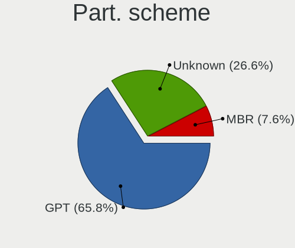
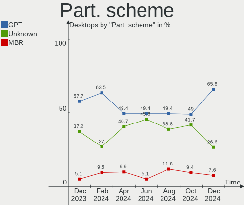
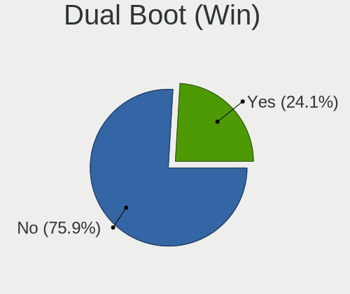
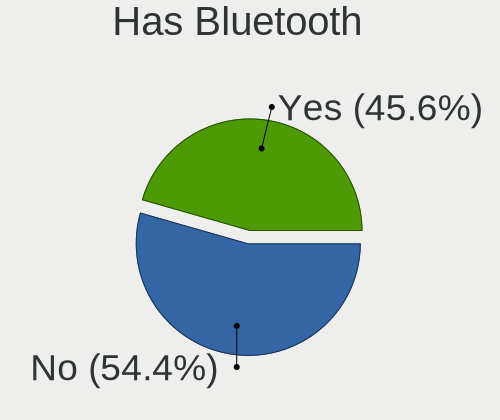
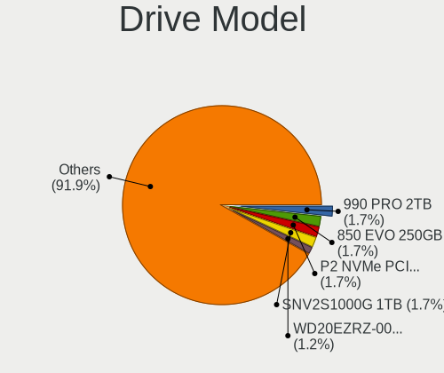
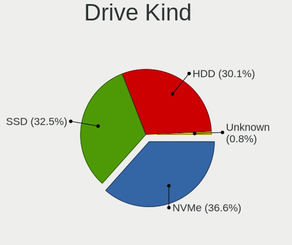
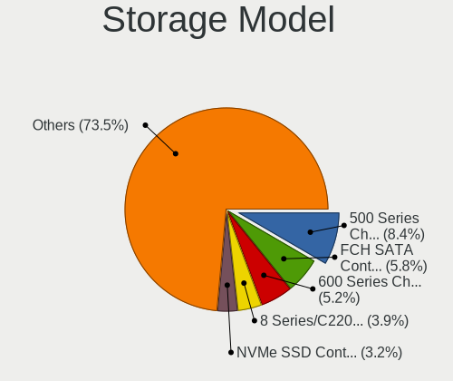
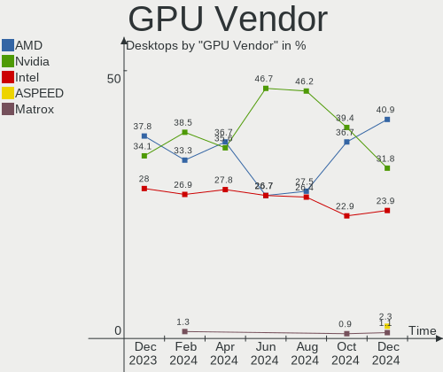
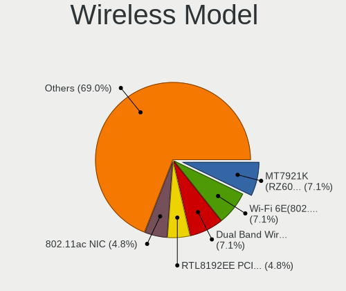
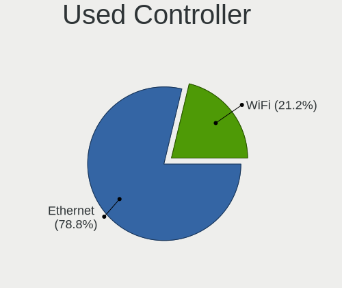

Linux in UK - Hardware Trends (Desktops)
----------------------------------------

A project to identify most popular hardware characteristics and track their change
over time based on data collected by Linux users at https://Linux-Hardware.org.

Anyone can contribute to this report by the [hw-probe](https://github.com/linuxhw/hw-probe) tool:

    sudo -E hw-probe -all -upload

Period: Jan, 2023.

Contents
--------

* [ System ](#system)
  - [ OS                       ](#os)
  - [ OS Family                ](#os-family)
  - [ Kernel                   ](#kernel)
  - [ Kernel Family            ](#kernel-family)
  - [ Kernel Major Ver.        ](#kernel-major-ver)
  - [ Arch                     ](#arch)
  - [ DE                       ](#de)
  - [ Display Server           ](#display-server)
  - [ Display Manager          ](#display-manager)
  - [ OS Lang                  ](#os-lang)
  - [ Boot Mode                ](#boot-mode)
  - [ Filesystem               ](#filesystem)
  - [ Part. scheme             ](#part-scheme)
  - [ Dual Boot with Linux/BSD ](#dual-boot-with-linuxbsd)
  - [ Dual Boot (Win)          ](#dual-boot-win)

* [ Board ](#board)
  - [ Vendor                   ](#vendor)
  - [ Model                    ](#model)
  - [ Model Family             ](#model-family)
  - [ MFG Year                 ](#mfg-year)
  - [ Form Factor              ](#form-factor)
  - [ Secure Boot              ](#secure-boot)
  - [ Coreboot                 ](#coreboot)
  - [ RAM Size                 ](#ram-size)
  - [ RAM Used                 ](#ram-used)
  - [ Total Drives             ](#total-drives)
  - [ Has CD-ROM               ](#has-cd-rom)
  - [ Has Ethernet             ](#has-ethernet)
  - [ Has WiFi                 ](#has-wifi)
  - [ Has Bluetooth            ](#has-bluetooth)

* [ Location ](#location)
  - [ Country                  ](#country)
  - [ City                     ](#city)

* [ Drives ](#drives)
  - [ Drive Vendor             ](#drive-vendor)
  - [ Drive Model              ](#drive-model)
  - [ HDD Vendor               ](#hdd-vendor)
  - [ SSD Vendor               ](#ssd-vendor)
  - [ Drive Kind               ](#drive-kind)
  - [ Drive Connector          ](#drive-connector)
  - [ Drive Size               ](#drive-size)
  - [ Space Total              ](#space-total)
  - [ Space Used               ](#space-used)
  - [ Malfunc. Drives          ](#malfunc-drives)
  - [ Malfunc. Drive Vendor    ](#malfunc-drive-vendor)
  - [ Malfunc. HDD Vendor      ](#malfunc-hdd-vendor)
  - [ Malfunc. Drive Kind      ](#malfunc-drive-kind)
  - [ Failed Drives            ](#failed-drives)
  - [ Failed Drive Vendor      ](#failed-drive-vendor)
  - [ Drive Status             ](#drive-status)

* [ Storage controller ](#storage-controller)
  - [ Storage Vendor           ](#storage-vendor)
  - [ Storage Model            ](#storage-model)
  - [ Storage Kind             ](#storage-kind)

* [ Processor ](#processor)
  - [ CPU Vendor               ](#cpu-vendor)
  - [ CPU Model                ](#cpu-model)
  - [ CPU Model Family         ](#cpu-model-family)
  - [ CPU Cores                ](#cpu-cores)
  - [ CPU Sockets              ](#cpu-sockets)
  - [ CPU Threads              ](#cpu-threads)
  - [ CPU Op-Modes             ](#cpu-op-modes)
  - [ CPU Microcode            ](#cpu-microcode)
  - [ CPU Microarch            ](#cpu-microarch)

* [ Graphics ](#graphics)
  - [ GPU Vendor               ](#gpu-vendor)
  - [ GPU Model                ](#gpu-model)
  - [ GPU Combo                ](#gpu-combo)
  - [ GPU Driver               ](#gpu-driver)
  - [ GPU Memory               ](#gpu-memory)

* [ Monitor ](#monitor)
  - [ Monitor Vendor           ](#monitor-vendor)
  - [ Monitor Model            ](#monitor-model)
  - [ Monitor Resolution       ](#monitor-resolution)
  - [ Monitor Diagonal         ](#monitor-diagonal)
  - [ Monitor Width            ](#monitor-width)
  - [ Aspect Ratio             ](#aspect-ratio)
  - [ Monitor Area             ](#monitor-area)
  - [ Pixel Density            ](#pixel-density)
  - [ Multiple Monitors        ](#multiple-monitors)

* [ Network ](#network)
  - [ Net Controller Vendor    ](#net-controller-vendor)
  - [ Net Controller Model     ](#net-controller-model)
  - [ Wireless Vendor          ](#wireless-vendor)
  - [ Wireless Model           ](#wireless-model)
  - [ Ethernet Vendor          ](#ethernet-vendor)
  - [ Ethernet Model           ](#ethernet-model)
  - [ Net Controller Kind      ](#net-controller-kind)
  - [ Used Controller          ](#used-controller)
  - [ NICs                     ](#nics)
  - [ IPv6                     ](#ipv6)

* [ Bluetooth ](#bluetooth)
  - [ Bluetooth Vendor         ](#bluetooth-vendor)
  - [ Bluetooth Model          ](#bluetooth-model)

* [ Sound ](#sound)
  - [ Sound Vendor             ](#sound-vendor)
  - [ Sound Model              ](#sound-model)

* [ Memory ](#memory)
  - [ Memory Vendor            ](#memory-vendor)
  - [ Memory Model             ](#memory-model)
  - [ Memory Kind              ](#memory-kind)
  - [ Memory Form Factor       ](#memory-form-factor)
  - [ Memory Size              ](#memory-size)
  - [ Memory Speed             ](#memory-speed)

* [ Printers & scanners ](#printers--scanners)
  - [ Printer Vendor           ](#printer-vendor)
  - [ Printer Model            ](#printer-model)
  - [ Scanner Vendor           ](#scanner-vendor)
  - [ Scanner Model            ](#scanner-model)

* [ Camera ](#camera)
  - [ Camera Vendor            ](#camera-vendor)
  - [ Camera Model             ](#camera-model)

* [ Security ](#security)
  - [ Fingerprint Vendor       ](#fingerprint-vendor)
  - [ Fingerprint Model        ](#fingerprint-model)
  - [ Chipcard Vendor          ](#chipcard-vendor)
  - [ Chipcard Model           ](#chipcard-model)

* [ Unsupported ](#unsupported)
  - [ Unsupported Devices      ](#unsupported-devices)
  - [ Unsupported Device Types ](#unsupported-device-types)

System
------

OS
--

Installed operating systems

| Name                         | Desktops | Percent |
|------------------------------|----------|---------|
| Ubuntu 22.04                 | 18       | 17.14%  |
| OpenMandriva 23.01           | 16       | 15.24%  |
| Fedora 37                    | 8        | 7.62%   |
| Linux Mint 21.1              | 7        | 6.67%   |
| Ubuntu 22.10                 | 5        | 4.76%   |
| Pop!_OS 22.04                | 4        | 3.81%   |
| Ubuntu 20.04                 | 3        | 2.86%   |
| Manjaro                      | 3        | 2.86%   |
| Linux Mint 20.3              | 3        | 2.86%   |
| KDE neon 22.04               | 3        | 2.86%   |
| Debian 11                    | 3        | 2.86%   |
| Debian                       | 3        | 2.86%   |
| Zorin 16                     | 2        | 1.9%    |
| Ubuntu MATE 20.04            | 2        | 1.9%    |
| Ubuntu 18.04                 | 2        | 1.9%    |
| Nobara 37                    | 2        | 1.9%    |
| Kubuntu 22.10                | 2        | 1.9%    |
| Ultramarine Linux 37         | 1        | 0.95%   |
| Ubuntu Budgie 22.04          | 1        | 0.95%   |
| openSUSE Tumbleweed-XXXXXXXX | 1        | 0.95%   |
| OpenMandriva 4.50            | 1        | 0.95%   |
| OpenMandriva 4.3             | 1        | 0.95%   |
| OpenMandriva 4.2             | 1        | 0.95%   |
| Nobara 36                    | 1        | 0.95%   |
| MX 21                        | 1        | 0.95%   |
| Manjaro 22.0.0               | 1        | 0.95%   |
| Lubuntu 16.04                | 1        | 0.95%   |
| Linux Mint 21                | 1        | 0.95%   |
| Linux Mint 20.2              | 1        | 0.95%   |
| Lilidog 22                   | 1        | 0.95%   |
| Kubuntu 11                   | 1        | 0.95%   |
| Kali 2022.4                  | 1        | 0.95%   |
| EndeavourOS Rolling          | 1        | 0.95%   |
| Clear Linux 38150            | 1        | 0.95%   |
| ChimeraOS 38                 | 1        | 0.95%   |
| ArcoLinux Rolling            | 1        | 0.95%   |

OS Family
---------

OS without a version

| Name              | Desktops | Percent |
|-------------------|----------|---------|
| Ubuntu            | 28       | 26.67%  |
| OpenMandriva      | 19       | 18.1%   |
| Linux Mint        | 12       | 11.43%  |
| Fedora            | 8        | 7.62%   |
| Debian            | 6        | 5.71%   |
| Pop!_OS           | 4        | 3.81%   |
| Manjaro           | 4        | 3.81%   |
| Nobara            | 3        | 2.86%   |
| Kubuntu           | 3        | 2.86%   |
| KDE neon          | 3        | 2.86%   |
| Zorin             | 2        | 1.9%    |
| Ubuntu MATE       | 2        | 1.9%    |
| Ultramarine Linux | 1        | 0.95%   |
| Ubuntu Budgie     | 1        | 0.95%   |
| openSUSE          | 1        | 0.95%   |
| MX                | 1        | 0.95%   |
| Lubuntu           | 1        | 0.95%   |
| Lilidog           | 1        | 0.95%   |
| Kali              | 1        | 0.95%   |
| EndeavourOS       | 1        | 0.95%   |
| Clear Linux       | 1        | 0.95%   |
| ChimeraOS         | 1        | 0.95%   |
| ArcoLinux         | 1        | 0.95%   |

Kernel
------

Version of the Linux kernel

| Version                           | Desktops | Percent |
|-----------------------------------|----------|---------|
| 5.15.0-58-generic                 | 17       | 16.19%  |
| 6.1.1-desktop-1omv2290            | 16       | 15.24%  |
| 5.15.0-56-generic                 | 7        | 6.67%   |
| 5.15.0-57-generic                 | 6        | 5.71%   |
| 6.0.12-76060006-generic           | 4        | 3.81%   |
| 5.19.0-29-generic                 | 4        | 3.81%   |
| 6.1.6-200.fc37.x86_64             | 3        | 2.86%   |
| 5.4.0-137-generic                 | 3        | 2.86%   |
| 5.4.0-136-generic                 | 3        | 2.86%   |
| 6.1.5-200.fc37.x86_64             | 2        | 1.9%    |
| 6.1.4-203.fsync.fc37.x86_64       | 2        | 1.9%    |
| 6.1.1-arch1-1                     | 2        | 1.9%    |
| 6.1.1-1-MANJARO                   | 2        | 1.9%    |
| 6.0.0-6-amd64                     | 2        | 1.9%    |
| 5.4.0-135-generic                 | 2        | 1.9%    |
| 5.19.17-2-MANJARO                 | 2        | 1.9%    |
| 5.19.0-26-generic                 | 2        | 1.9%    |
| 5.15.0-43-generic                 | 2        | 1.9%    |
| 5.10.0-20-amd64                   | 2        | 1.9%    |
| 6.1.8-1252.native                 | 1        | 0.95%   |
| 6.1.7-200.fc37.x86_64             | 1        | 0.95%   |
| 6.1.3-1-default                   | 1        | 0.95%   |
| 6.0.7-301.fc37.x86_64             | 1        | 0.95%   |
| 6.0.18-300.fc37.x86_64            | 1        | 0.95%   |
| 6.0.15-300.fc37.x86_64            | 1        | 0.95%   |
| 6.0.14-201.fsync.fc36.x86_64      | 1        | 0.95%   |
| 6.0.0-kali6-amd64                 | 1        | 0.95%   |
| 6.0.0-4-amd64                     | 1        | 0.95%   |
| 5.4.25-050425-generic             | 1        | 0.95%   |
| 5.19.12-desktop-2omv4090          | 1        | 0.95%   |
| 5.19.0-21-generic                 | 1        | 0.95%   |
| 5.18.14-ext73-98.14-intelstandard | 1        | 0.95%   |
| 5.16.7-desktop-1omv4003           | 1        | 0.95%   |
| 5.15.86-1-lts                     | 1        | 0.95%   |
| 5.15.0-47-generic                 | 1        | 0.95%   |
| 5.15.0-40-generic                 | 1        | 0.95%   |
| 5.14.0-4mx-amd64                  | 1        | 0.95%   |
| 5.10.14-desktop-1omv4002          | 1        | 0.95%   |
| 5.10.0-21-amd64                   | 1        | 0.95%   |
| 5.10.0-19-amd64                   | 1        | 0.95%   |

Kernel Family
-------------

Linux kernel without a distro release

| Version | Desktops | Percent |
|---------|----------|---------|
| 5.15.0  | 34       | 32.38%  |
| 6.1.1   | 20       | 19.05%  |
| 5.4.0   | 8        | 7.62%   |
| 5.19.0  | 7        | 6.67%   |
| 6.0.12  | 4        | 3.81%   |
| 6.0.0   | 4        | 3.81%   |
| 5.10.0  | 4        | 3.81%   |
| 6.1.6   | 3        | 2.86%   |
| 6.1.5   | 2        | 1.9%    |
| 6.1.4   | 2        | 1.9%    |
| 5.19.17 | 2        | 1.9%    |
| 6.1.8   | 1        | 0.95%   |
| 6.1.7   | 1        | 0.95%   |
| 6.1.3   | 1        | 0.95%   |
| 6.0.7   | 1        | 0.95%   |
| 6.0.18  | 1        | 0.95%   |
| 6.0.15  | 1        | 0.95%   |
| 6.0.14  | 1        | 0.95%   |
| 5.4.25  | 1        | 0.95%   |
| 5.19.12 | 1        | 0.95%   |
| 5.18.14 | 1        | 0.95%   |
| 5.16.7  | 1        | 0.95%   |
| 5.15.86 | 1        | 0.95%   |
| 5.14.0  | 1        | 0.95%   |
| 5.10.14 | 1        | 0.95%   |
| 4.15.0  | 1        | 0.95%   |

Kernel Major Ver.
-----------------

Linux kernel major version

| Version | Desktops | Percent |
|---------|----------|---------|
| 5.15    | 35       | 33.33%  |
| 6.1     | 30       | 28.57%  |
| 6.0     | 12       | 11.43%  |
| 5.19    | 10       | 9.52%   |
| 5.4     | 9        | 8.57%   |
| 5.10    | 5        | 4.76%   |
| 5.18    | 1        | 0.95%   |
| 5.16    | 1        | 0.95%   |
| 5.14    | 1        | 0.95%   |
| 4.15    | 1        | 0.95%   |

Arch
----

OS architecture (x86_64, i586, etc.)

| Name   | Desktops | Percent |
|--------|----------|---------|
| x86_64 | 104      | 99.05%  |
| i686   | 1        | 0.95%   |

DE
--

Desktop Environment

| Name             | Desktops | Percent |
|------------------|----------|---------|
| GNOME            | 49       | 46.67%  |
| KDE5             | 27       | 25.71%  |
| X-Cinnamon       | 9        | 8.57%   |
| XFCE             | 5        | 4.76%   |
| Unknown          | 4        | 3.81%   |
| MATE             | 3        | 2.86%   |
| LXDE             | 2        | 1.9%    |
| lightdm-xsession | 1        | 0.95%   |
| KDE              | 1        | 0.95%   |
| i3               | 1        | 0.95%   |
| GNOME Flashback  | 1        | 0.95%   |
| Cinnamon         | 1        | 0.95%   |
| Budgie           | 1        | 0.95%   |

Display Server
--------------

X11 or Wayland

| Name    | Desktops | Percent |
|---------|----------|---------|
| X11     | 71       | 67.62%  |
| Wayland | 31       | 29.52%  |
| Tty     | 3        | 2.86%   |

Display Manager
---------------

SDDM, LightDM, etc.

| Name    | Desktops | Percent |
|---------|----------|---------|
| Unknown | 36       | 34.29%  |
| GDM3    | 22       | 20.95%  |
| SDDM    | 20       | 19.05%  |
| LightDM | 17       | 16.19%  |
| GDM     | 10       | 9.52%   |

OS Lang
-------

Language

| Lang    | Desktops | Percent |
|---------|----------|---------|
| en_GB   | 75       | 71.43%  |
| en_US   | 21       | 20%     |
| pl_PL   | 4        | 3.81%   |
| ro_RO   | 1        | 0.95%   |
| POSIX   | 1        | 0.95%   |
| lt_LT   | 1        | 0.95%   |
| C       | 1        | 0.95%   |
| Unknown | 1        | 0.95%   |

Boot Mode
---------

EFI or BIOS

| Mode | Desktops | Percent |
|------|----------|---------|
| BIOS | 57       | 54.29%  |
| EFI  | 48       | 45.71%  |

Filesystem
----------

Type of filesystem

| Type    | Desktops | Percent |
|---------|----------|---------|
| Ext4    | 71       | 67.62%  |
| Overlay | 17       | 16.19%  |
| Btrfs   | 14       | 13.33%  |
| Zfs     | 1        | 0.95%   |
| Xfs     | 1        | 0.95%   |
| Ext2    | 1        | 0.95%   |

Part. scheme
------------

Scheme of partitioning

| Type    | Desktops | Percent |
|---------|----------|---------|
| GPT     | 60       | 57.14%  |
| Unknown | 32       | 30.48%  |
| MBR     | 13       | 12.38%  |

Dual Boot with Linux/BSD
------------------------

Hosting more than one Linux/BSD

| Dual boot | Desktops | Percent |
|-----------|----------|---------|
| No        | 78       | 74.29%  |
| Yes       | 27       | 25.71%  |

Dual Boot (Win)
---------------

Hosting Linux and Windows

| Dual boot | Desktops | Percent |
|-----------|----------|---------|
| No        | 72       | 68.57%  |
| Yes       | 33       | 31.43%  |

Board
-----

Vendor
------

Motherboard manufacturer

| Name                | Desktops | Percent |
|---------------------|----------|---------|
| ASUSTek Computer    | 30       | 28.57%  |
| Gigabyte Technology | 20       | 19.05%  |
| Dell                | 16       | 15.24%  |
| MSI                 | 13       | 12.38%  |
| Hewlett-Packard     | 10       | 9.52%   |
| ASRock              | 8        | 7.62%   |
| AZW                 | 2        | 1.9%    |
| Lenovo              | 1        | 0.95%   |
| Intel               | 1        | 0.95%   |
| Biostar             | 1        | 0.95%   |
| Apple               | 1        | 0.95%   |
| Acer                | 1        | 0.95%   |
| Unknown             | 1        | 0.95%   |

Model
-----

Motherboard model

| Name                                | Desktops | Percent |
|-------------------------------------|----------|---------|
| MSI MS-7C91                         | 3        | 2.86%   |
| Dell OptiPlex 5070                  | 3        | 2.86%   |
| Gigabyte B550M DS3H                 | 2        | 1.9%    |
| Gigabyte A320M-S2H                  | 2        | 1.9%    |
| Dell OptiPlex 780                   | 2        | 1.9%    |
| Dell OptiPlex 755                   | 2        | 1.9%    |
| ASUS PRIME X570-P                   | 2        | 1.9%    |
| ASUS PRIME A320M-K                  | 2        | 1.9%    |
| ASUS M5A78L-M/USB3                  | 2        | 1.9%    |
| MSI MS-7D67                         | 1        | 0.95%   |
| MSI MS-7C95                         | 1        | 0.95%   |
| MSI MS-7C84                         | 1        | 0.95%   |
| MSI MS-7C37                         | 1        | 0.95%   |
| MSI MS-7C02                         | 1        | 0.95%   |
| MSI MS-7B89                         | 1        | 0.95%   |
| MSI MS-7A34                         | 1        | 0.95%   |
| MSI MS-7758                         | 1        | 0.95%   |
| MSI HPE-340uk                       | 1        | 0.95%   |
| MSI H310 Gaming Infinite (MS-B915)  | 1        | 0.95%   |
| Lenovo ThinkStation C20 4263BA7     | 1        | 0.95%   |
| Intel DQ67SW                        | 1        | 0.95%   |
| HP Z640 Workstation                 | 1        | 0.95%   |
| HP Z230 Tower Workstation           | 1        | 0.95%   |
| HP ProDesk 400 G4 DM                | 1        | 0.95%   |
| HP EliteDesk 705 G2 SFF             | 1        | 0.95%   |
| HP Compaq Elite 8300 CMT            | 1        | 0.95%   |
| HP Compaq dc7800 Ultra-slim Desktop | 1        | 0.95%   |
| HP Compaq 6200 Pro SFF PC           | 1        | 0.95%   |
| HP 700-311na                        | 1        | 0.95%   |
| HP 500-326na                        | 1        | 0.95%   |
| HP 290 G1 MT                        | 1        | 0.95%   |
| Gigabyte Z87X-D3H                   | 1        | 0.95%   |
| Gigabyte Z77X-D3H                   | 1        | 0.95%   |
| Gigabyte X570 AORUS MASTER          | 1        | 0.95%   |
| Gigabyte PDT-702-1020               | 1        | 0.95%   |
| Gigabyte H81M-DS2V                  | 1        | 0.95%   |
| Gigabyte H61N-USB3                  | 1        | 0.95%   |
| Gigabyte H510M H                    | 1        | 0.95%   |
| Gigabyte GA-MA785GMT-UD2H           | 1        | 0.95%   |
| Gigabyte GA-78LMT-USB3 R2           | 1        | 0.95%   |

Model Family
------------

Motherboard model prefix

| Name                   | Desktops | Percent |
|------------------------|----------|---------|
| Dell OptiPlex          | 10       | 9.52%   |
| ASUS PRIME             | 8        | 7.62%   |
| ASUS ROG               | 6        | 5.71%   |
| MSI MS-7C91            | 3        | 2.86%   |
| HP Compaq              | 3        | 2.86%   |
| Dell Precision         | 3        | 2.86%   |
| Gigabyte GA-78LMT-USB3 | 2        | 1.9%    |
| Gigabyte B550M         | 2        | 1.9%    |
| Gigabyte A320M-S2H     | 2        | 1.9%    |
| ASUS Z170              | 2        | 1.9%    |
| ASUS TUF               | 2        | 1.9%    |
| ASUS ProArt            | 2        | 1.9%    |
| ASUS M5A78L-M          | 2        | 1.9%    |
| ASRock B450M           | 2        | 1.9%    |
| MSI MS-7D67            | 1        | 0.95%   |
| MSI MS-7C95            | 1        | 0.95%   |
| MSI MS-7C84            | 1        | 0.95%   |
| MSI MS-7C37            | 1        | 0.95%   |
| MSI MS-7C02            | 1        | 0.95%   |
| MSI MS-7B89            | 1        | 0.95%   |
| MSI MS-7A34            | 1        | 0.95%   |
| MSI MS-7758            | 1        | 0.95%   |
| MSI HPE-340uk          | 1        | 0.95%   |
| MSI H310               | 1        | 0.95%   |
| Lenovo ThinkStation    | 1        | 0.95%   |
| Intel DQ67SW           | 1        | 0.95%   |
| HP Z640                | 1        | 0.95%   |
| HP Z230                | 1        | 0.95%   |
| HP ProDesk             | 1        | 0.95%   |
| HP EliteDesk           | 1        | 0.95%   |
| HP 700-311na           | 1        | 0.95%   |
| HP 500-326na           | 1        | 0.95%   |
| HP 290                 | 1        | 0.95%   |
| Gigabyte Z87X-D3H      | 1        | 0.95%   |
| Gigabyte Z77X-D3H      | 1        | 0.95%   |
| Gigabyte X570          | 1        | 0.95%   |
| Gigabyte PDT-702-1020  | 1        | 0.95%   |
| Gigabyte H81M-DS2V     | 1        | 0.95%   |
| Gigabyte H61N-USB3     | 1        | 0.95%   |
| Gigabyte H510M         | 1        | 0.95%   |

MFG Year
--------

Motherboard manufacture year

| Year | Desktops | Percent |
|------|----------|---------|
| 2020 | 12       | 11.43%  |
| 2019 | 11       | 10.48%  |
| 2017 | 11       | 10.48%  |
| 2012 | 11       | 10.48%  |
| 2022 | 10       | 9.52%   |
| 2018 | 10       | 9.52%   |
| 2011 | 6        | 5.71%   |
| 2010 | 6        | 5.71%   |
| 2014 | 5        | 4.76%   |
| 2015 | 4        | 3.81%   |
| 2009 | 4        | 3.81%   |
| 2007 | 4        | 3.81%   |
| 2021 | 3        | 2.86%   |
| 2016 | 3        | 2.86%   |
| 2013 | 3        | 2.86%   |
| 2008 | 1        | 0.95%   |
| 2002 | 1        | 0.95%   |

Form Factor
-----------

Physical design of the computer

| Name    | Desktops | Percent |
|---------|----------|---------|
| Desktop | 105      | 100%    |

Secure Boot
-----------

Enabled or disabled

| State    | Desktops | Percent |
|----------|----------|---------|
| Disabled | 98       | 93.33%  |
| Enabled  | 7        | 6.67%   |

Coreboot
--------

Have coreboot on board

| Used | Desktops | Percent |
|------|----------|---------|
| No   | 105      | 100%    |

RAM Size
--------

Total RAM memory

| Size in GB  | Desktops | Percent |
|-------------|----------|---------|
| 16.01-24.0  | 30       | 28.57%  |
| 32.01-64.0  | 25       | 23.81%  |
| 4.01-8.0    | 18       | 17.14%  |
| 8.01-16.0   | 14       | 13.33%  |
| 3.01-4.0    | 7        | 6.67%   |
| 64.01-256.0 | 7        | 6.67%   |
| 24.01-32.0  | 3        | 2.86%   |
| 0.51-1.0    | 1        | 0.95%   |

RAM Used
--------

Used RAM memory

| Used GB    | Desktops | Percent |
|------------|----------|---------|
| 2.01-3.0   | 30       | 28.57%  |
| 1.01-2.0   | 26       | 24.76%  |
| 4.01-8.0   | 23       | 21.9%   |
| 3.01-4.0   | 14       | 13.33%  |
| 8.01-16.0  | 5        | 4.76%   |
| 0.51-1.0   | 3        | 2.86%   |
| 0.01-0.5   | 2        | 1.9%    |
| 32.01-64.0 | 1        | 0.95%   |
| 16.01-24.0 | 1        | 0.95%   |

Total Drives
------------

Number of drives on board

| Drives | Desktops | Percent |
|--------|----------|---------|
| 1      | 35       | 33.33%  |
| 2      | 29       | 27.62%  |
| 3      | 19       | 18.1%   |
| 4      | 13       | 12.38%  |
| 5      | 6        | 5.71%   |
| 6      | 3        | 2.86%   |

Has CD-ROM
----------

Has CD-ROM on board

| Presented | Desktops | Percent |
|-----------|----------|---------|
| No        | 56       | 53.33%  |
| Yes       | 49       | 46.67%  |

Has Ethernet
------------

Has Ethernet on board

| Presented | Desktops | Percent |
|-----------|----------|---------|
| Yes       | 104      | 99.05%  |
| No        | 1        | 0.95%   |

Has WiFi
--------

Has WiFi module

| Presented | Desktops | Percent |
|-----------|----------|---------|
| No        | 54       | 51.43%  |
| Yes       | 51       | 48.57%  |

Has Bluetooth
-------------

Has Bluetooth module

| Presented | Desktops | Percent |
|-----------|----------|---------|
| No        | 60       | 57.14%  |
| Yes       | 45       | 42.86%  |

Location
--------

Country
-------

Geographic location (country)

| Country | Desktops | Percent |
|---------|----------|---------|
| UK      | 105      | 100%    |

City
----

Geographic location (city)

| City                   | Desktops | Percent |
|------------------------|----------|---------|
| London                 | 18       | 17.14%  |
| Leeds                  | 3        | 2.86%   |
| Derby                  | 3        | 2.86%   |
| Bristol                | 3        | 2.86%   |
| Birmingham             | 3        | 2.86%   |
| Telford                | 2        | 1.9%    |
| Sale                   | 2        | 1.9%    |
| Norwich                | 2        | 1.9%    |
| Milton Keynes          | 2        | 1.9%    |
| Manchester             | 2        | 1.9%    |
| Letchworth Garden City | 2        | 1.9%    |
| Cambridge              | 2        | 1.9%    |
| Bradford               | 2        | 1.9%    |
| Wolverhampton          | 1        | 0.95%   |
| Wincanton              | 1        | 0.95%   |
| Warrington             | 1        | 0.95%   |
| Tonbridge              | 1        | 0.95%   |
| Thornton Heath         | 1        | 0.95%   |
| Swindon                | 1        | 0.95%   |
| Sunderland             | 1        | 0.95%   |
| Stoke-on-Trent         | 1        | 0.95%   |
| Stockton-on-Tees       | 1        | 0.95%   |
| Steyning               | 1        | 0.95%   |
| St Helens              | 1        | 0.95%   |
| Southampton            | 1        | 0.95%   |
| Solihull               | 1        | 0.95%   |
| Slough                 | 1        | 0.95%   |
| Skelmersdale           | 1        | 0.95%   |
| Rochester              | 1        | 0.95%   |
| Redditch               | 1        | 0.95%   |
| Preston                | 1        | 0.95%   |
| Presteigne             | 1        | 0.95%   |
| Plymouth               | 1        | 0.95%   |
| Pickering              | 1        | 0.95%   |
| Penarth                | 1        | 0.95%   |
| Oswestry               | 1        | 0.95%   |
| Nottingham             | 1        | 0.95%   |
| North Shields          | 1        | 0.95%   |
| Neston                 | 1        | 0.95%   |
| Mitcham                | 1        | 0.95%   |

Drives
------

Drive Vendor
------------

Hard drive vendors

| Vendor                      | Desktops | Drives | Percent |
|-----------------------------|----------|--------|---------|
| WDC                         | 35       | 44     | 17.16%  |
| Seagate                     | 34       | 43     | 16.67%  |
| Samsung Electronics         | 33       | 47     | 16.18%  |
| Crucial                     | 16       | 19     | 7.84%   |
| Toshiba                     | 11       | 12     | 5.39%   |
| SanDisk                     | 11       | 14     | 5.39%   |
| Phison Electronics          | 6        | 6      | 2.94%   |
| Kingston                    | 6        | 8      | 2.94%   |
| Hitachi                     | 5        | 6      | 2.45%   |
| Unknown                     | 3        | 4      | 1.47%   |
| Phison                      | 3        | 3      | 1.47%   |
| Maxtor                      | 3        | 3      | 1.47%   |
| Intel                       | 3        | 3      | 1.47%   |
| China                       | 3        | 3      | 1.47%   |
| A-DATA Technology           | 3        | 3      | 1.47%   |
| Micron/Crucial Technology   | 2        | 2      | 0.98%   |
| KIOXIA-EXCERIA              | 2        | 2      | 0.98%   |
| HGST                        | 2        | 2      | 0.98%   |
| Fanxiang                    | 2        | 2      | 0.98%   |
| Unknown                     | 2        | 2      | 0.98%   |
| Transcend                   | 1        | 1      | 0.49%   |
| Timetec                     | 1        | 1      | 0.49%   |
| SPCC                        | 1        | 2      | 0.49%   |
| SK hynix                    | 1        | 1      | 0.49%   |
| Silicon Motion              | 1        | 1      | 0.49%   |
| PNY                         | 1        | 1      | 0.49%   |
| Patriot                     | 1        | 1      | 0.49%   |
| ORTIAL                      | 1        | 1      | 0.49%   |
| OCZ                         | 1        | 1      | 0.49%   |
| Netac                       | 1        | 1      | 0.49%   |
| LT                          | 1        | 1      | 0.49%   |
| LITEON                      | 1        | 1      | 0.49%   |
| Kingston Technology Company | 1        | 1      | 0.49%   |
| Integral                    | 1        | 1      | 0.49%   |
| Indilinx                    | 1        | 1      | 0.49%   |
| FCS                         | 1        | 1      | 0.49%   |
| Biostar                     | 1        | 1      | 0.49%   |
| Apple                       | 1        | 1      | 0.49%   |
| 1TB                         | 1        | 1      | 0.49%   |

Drive Model
-----------

Hard drive models

| Model                                                | Desktops | Percent |
|------------------------------------------------------|----------|---------|
| Seagate ST1000DM010-2EP102 1TB                       | 6        | 2.55%   |
| Samsung NVMe SSD Controller SM981/PM981/PM983 500GB  | 5        | 2.13%   |
| Samsung NVMe SSD Controller PM9A1/PM9A3/980PRO 512GB | 5        | 2.13%   |
| Seagate ST2000DM008-2FR102 2TB                       | 4        | 1.7%    |
| Seagate ST3500418AS 500GB                            | 3        | 1.28%   |
| SanDisk SSD PLUS 480GB                               | 3        | 1.28%   |
| Samsung SSD 860 EVO 1TB                              | 3        | 1.28%   |
| Phison E12 NVMe Controller 1TB                       | 3        | 1.28%   |
| Crucial CT2000MX500SSD1 2TB                          | 3        | 1.28%   |
| WDC WD10EZEX-08WN4A0 1TB                             | 2        | 0.85%   |
| Toshiba DT01ACA100 1TB                               | 2        | 0.85%   |
| Seagate ST2000DM006-2DM164 2TB                       | 2        | 0.85%   |
| Seagate ST1000LX 015-1U7172 1TB                      | 2        | 0.85%   |
| Seagate ST1000DM003-1SB102 1TB                       | 2        | 0.85%   |
| Samsung SSD 970 EVO Plus 500GB                       | 2        | 0.85%   |
| Samsung SSD 870 QVO 1TB                              | 2        | 0.85%   |
| Samsung SSD 860 EVO 500GB                            | 2        | 0.85%   |
| Samsung SSD 850 EVO 500GB                            | 2        | 0.85%   |
| Phison E16 PCIe4 NVMe Controller 2TB                 | 2        | 0.85%   |
| Micron/Crucial P2 NVMe PCIe SSD 500GB                | 2        | 0.85%   |
| Kingston SA400S37240G 240GB SSD                      | 2        | 0.85%   |
| HGST HTS545050A7E680 500GB                           | 2        | 0.85%   |
| Crucial CT480BX500SSD1 480GB                         | 2        | 0.85%   |
| Crucial CT250MX500SSD1 250GB                         | 2        | 0.85%   |
| Unknown                                              | 2        | 0.85%   |
| WDC WDS500G2B0C-00PXH0 500GB                         | 1        | 0.43%   |
| WDC WDS500G2B0A-00SM50 500GB SSD                     | 1        | 0.43%   |
| WDC WDS480G2G0A-00JH30 480GB SSD                     | 1        | 0.43%   |
| WDC WDS400T2B0A-00SM50 4TB SSD                       | 1        | 0.43%   |
| WDC WDS240G2G0B-00EPW0 240GB SSD                     | 1        | 0.43%   |
| WDC WDS100T3XHC-00SJG0 1TB                           | 1        | 0.43%   |
| WDC WD80EMAZ-00WJTA0 8TB                             | 1        | 0.43%   |
| WDC WD6400AAKS-75A7B2 640GB                          | 1        | 0.43%   |
| WDC WD60EFRX-68MYMN1 6TB                             | 1        | 0.43%   |
| WDC WD5002AALX-00J37A0 500GB                         | 1        | 0.43%   |
| WDC WD5000AAKX-603CA0 500GB                          | 1        | 0.43%   |
| WDC WD5000AAKX-22ERMA0 500GB                         | 1        | 0.43%   |
| WDC WD5000AAKS-00V1A0 500GB                          | 1        | 0.43%   |
| WDC WD5000AADS-00S9B0 500GB                          | 1        | 0.43%   |
| WDC WD50 00AAKX-08U6AA0 500GB                        | 1        | 0.43%   |

HDD Vendor
----------

Hard disk drive vendors

| Vendor              | Desktops | Drives | Percent |
|---------------------|----------|--------|---------|
| Seagate             | 33       | 40     | 39.76%  |
| WDC                 | 28       | 36     | 33.73%  |
| Toshiba             | 8        | 9      | 9.64%   |
| Hitachi             | 5        | 6      | 6.02%   |
| Samsung Electronics | 3        | 3      | 3.61%   |
| Maxtor              | 2        | 2      | 2.41%   |
| HGST                | 2        | 2      | 2.41%   |
| Unknown             | 1        | 1      | 1.2%    |
| Apple               | 1        | 1      | 1.2%    |

SSD Vendor
----------

Solid state drive vendors

| Vendor              | Desktops | Drives | Percent |
|---------------------|----------|--------|---------|
| Samsung Electronics | 18       | 21     | 23.38%  |
| Crucial             | 14       | 17     | 18.18%  |
| SanDisk             | 8        | 10     | 10.39%  |
| WDC                 | 5        | 5      | 6.49%   |
| Kingston            | 5        | 7      | 6.49%   |
| China               | 3        | 3      | 3.9%    |
| A-DATA Technology   | 3        | 3      | 3.9%    |
| Toshiba             | 2        | 2      | 2.6%    |
| Unknown             | 2        | 2      | 2.6%    |
| Transcend           | 1        | 1      | 1.3%    |
| SPCC                | 1        | 2      | 1.3%    |
| Seagate             | 1        | 1      | 1.3%    |
| PNY                 | 1        | 1      | 1.3%    |
| Patriot             | 1        | 1      | 1.3%    |
| ORTIAL              | 1        | 1      | 1.3%    |
| OCZ                 | 1        | 1      | 1.3%    |
| Netac               | 1        | 1      | 1.3%    |
| Maxtor              | 1        | 1      | 1.3%    |
| LITEON              | 1        | 1      | 1.3%    |
| KIOXIA-EXCERIA      | 1        | 1      | 1.3%    |
| Intel               | 1        | 1      | 1.3%    |
| Integral            | 1        | 1      | 1.3%    |
| FCS                 | 1        | 1      | 1.3%    |
| Fanxiang            | 1        | 1      | 1.3%    |
| Biostar             | 1        | 1      | 1.3%    |
| 1TB                 | 1        | 1      | 1.3%    |

Drive Kind
----------

HDD or SSD

| Kind    | Desktops | Drives | Percent |
|---------|----------|--------|---------|
| HDD     | 66       | 100    | 37.71%  |
| SSD     | 63       | 88     | 36%     |
| NVMe    | 42       | 55     | 24%     |
| Unknown | 4        | 5      | 2.29%   |

Drive Connector
---------------

SATA, SAS, NVMe, etc.

| Type | Desktops | Drives | Percent |
|------|----------|--------|---------|
| SATA | 92       | 184    | 65.25%  |
| NVMe | 42       | 55     | 29.79%  |
| SAS  | 7        | 9      | 4.96%   |

Drive Size
----------

Size of hard drive

| Size in TB | Desktops | Drives | Percent |
|------------|----------|--------|---------|
| 0.01-0.5   | 63       | 96     | 45.99%  |
| 0.51-1.0   | 41       | 50     | 29.93%  |
| 1.01-2.0   | 16       | 19     | 11.68%  |
| 3.01-4.0   | 7        | 7      | 5.11%   |
| 2.01-3.0   | 5        | 6      | 3.65%   |
| 4.01-10.0  | 5        | 10     | 3.65%   |

Space Total
-----------

Amount of disk space available on the file system

| Size in GB     | Desktops | Percent |
|----------------|----------|---------|
| 501-1000       | 23       | 21.9%   |
| More than 3000 | 15       | 14.29%  |
| 101-250        | 15       | 14.29%  |
| 1001-2000      | 15       | 14.29%  |
| 251-500        | 14       | 13.33%  |
| 1-20           | 11       | 10.48%  |
| 2001-3000      | 4        | 3.81%   |
| Unknown        | 4        | 3.81%   |
| 51-100         | 3        | 2.86%   |
| 21-50          | 1        | 0.95%   |

Space Used
----------

Amount of used disk space

| Used GB        | Desktops | Percent |
|----------------|----------|---------|
| 1-20           | 28       | 26.67%  |
| 251-500        | 19       | 18.1%   |
| 101-250        | 15       | 14.29%  |
| 501-1000       | 9        | 8.57%   |
| 51-100         | 9        | 8.57%   |
| 1001-2000      | 8        | 7.62%   |
| 21-50          | 6        | 5.71%   |
| More than 3000 | 4        | 3.81%   |
| Unknown        | 4        | 3.81%   |
| 2001-3000      | 3        | 2.86%   |

Malfunc. Drives
---------------

Drive models with a malfunction

| Model                                 | Desktops | Drives | Percent |
|---------------------------------------|----------|--------|---------|
| WDC WD400BB-75CAA0 40GB               | 1        | 1      | 6.25%   |
| WDC WD30EZRZ-00Z5HB0 3TB              | 1        | 1      | 6.25%   |
| WDC WD10EZEX-00KUWA0 1TB              | 1        | 1      | 6.25%   |
| Seagate ST500DM002-1BC142 500GB       | 1        | 1      | 6.25%   |
| Seagate ST2000DM008-2FR102 2TB        | 1        | 1      | 6.25%   |
| Seagate ST1000DX001-1CM162 1TB        | 1        | 1      | 6.25%   |
| Seagate OOS1000G128M 1TB              | 1        | 1      | 6.25%   |
| SanDisk SSD PLUS 480GB                | 1        | 1      | 6.25%   |
| Samsung Electronics SSD 870 EVO 500GB | 1        | 1      | 6.25%   |
| Samsung Electronics SSD 870 EVO 1TB   | 1        | 1      | 6.25%   |
| Kingston SV300S37A120G 120GB SSD      | 1        | 1      | 6.25%   |
| Intel SSDSC2CT120A3 120GB             | 1        | 1      | 6.25%   |
| Hitachi HTS541060G9SA00 64GB          | 1        | 1      | 6.25%   |
| Hitachi HDT721032SLA380 320GB         | 1        | 1      | 6.25%   |
| Hitachi HDT721010SLA360 1TB           | 1        | 1      | 6.25%   |
| Unknown                               | 1        | 1      | 6.25%   |

Malfunc. Drive Vendor
---------------------

Vendors of faulty drives

| Vendor              | Desktops | Drives | Percent |
|---------------------|----------|--------|---------|
| Seagate             | 4        | 4      | 26.67%  |
| WDC                 | 3        | 3      | 20%     |
| Hitachi             | 3        | 3      | 20%     |
| SanDisk             | 1        | 1      | 6.67%   |
| Samsung Electronics | 1        | 2      | 6.67%   |
| Kingston            | 1        | 1      | 6.67%   |
| Intel               | 1        | 1      | 6.67%   |
| Unknown             | 1        | 1      | 6.67%   |

Malfunc. HDD Vendor
-------------------

Vendors of faulty HDD drives

| Vendor  | Desktops | Drives | Percent |
|---------|----------|--------|---------|
| Seagate | 4        | 4      | 40%     |
| WDC     | 3        | 3      | 30%     |
| Hitachi | 3        | 3      | 30%     |

Malfunc. Drive Kind
-------------------

Kinds of faulty drives

| Kind | Desktops | Drives | Percent |
|------|----------|--------|---------|
| HDD  | 10       | 10     | 66.67%  |
| SSD  | 5        | 6      | 33.33%  |

Failed Drives
-------------

Failed drive models

Zero info for selected period =(

Failed Drive Vendor
-------------------

Failed drive vendors

Zero info for selected period =(

Drive Status
------------

Number of failed and malfunc. drives

| Status   | Desktops | Drives | Percent |
|----------|----------|--------|---------|
| Works    | 54       | 117    | 45%     |
| Detected | 51       | 115    | 42.5%   |
| Malfunc  | 15       | 16     | 12.5%   |

Storage controller
------------------

Storage Vendor
--------------

Storage controller vendors

| Vendor                       | Desktops | Percent |
|------------------------------|----------|---------|
| Intel                        | 56       | 33.94%  |
| AMD                          | 49       | 29.7%   |
| Samsung Electronics          | 18       | 10.91%  |
| Phison Electronics           | 8        | 4.85%   |
| SanDisk                      | 7        | 4.24%   |
| ASMedia Technology           | 7        | 4.24%   |
| Micron/Crucial Technology    | 3        | 1.82%   |
| Marvell Technology Group     | 3        | 1.82%   |
| Silicon Motion               | 2        | 1.21%   |
| Seagate Technology           | 2        | 1.21%   |
| Kingston Technology Company  | 2        | 1.21%   |
| Toshiba America Info Systems | 1        | 0.61%   |
| Solidigm                     | 1        | 0.61%   |
| SK hynix                     | 1        | 0.61%   |
| Silicon Image                | 1        | 0.61%   |
| Nvidia                       | 1        | 0.61%   |
| Micron Technology            | 1        | 0.61%   |
| KIOXIA                       | 1        | 0.61%   |
| JMicron Technology           | 1        | 0.61%   |

Storage Model
-------------

Storage controller models

| Model                                                                          | Desktops | Percent |
|--------------------------------------------------------------------------------|----------|---------|
| AMD FCH SATA Controller [AHCI mode]                                            | 29       | 13.74%  |
| Samsung NVMe SSD Controller SM981/PM981/PM983                                  | 9        | 4.27%   |
| AMD 400 Series Chipset SATA Controller                                         | 8        | 3.79%   |
| Samsung NVMe SSD Controller PM9A1/PM9A3/980PRO                                 | 7        | 3.32%   |
| ASMedia ASM1062 Serial ATA Controller                                          | 7        | 3.32%   |
| AMD 500 Series Chipset SATA Controller                                         | 7        | 3.32%   |
| Intel 8 Series/C220 Series Chipset Family 6-port SATA Controller 1 [AHCI mode] | 5        | 2.37%   |
| Intel 200 Series PCH SATA controller [AHCI mode]                               | 5        | 2.37%   |
| AMD SB7x0/SB8x0/SB9x0 IDE Controller                                           | 5        | 2.37%   |
| AMD FCH SATA Controller D                                                      | 5        | 2.37%   |
| Phison E12 NVMe Controller                                                     | 4        | 1.9%    |
| Intel SATA Controller [RAID mode]                                              | 4        | 1.9%    |
| Intel Cannon Lake PCH SATA AHCI Controller                                     | 4        | 1.9%    |
| Intel 7 Series/C210 Series Chipset Family 6-port SATA Controller [AHCI mode]   | 4        | 1.9%    |
| Intel 6 Series/C200 Series Chipset Family 6 port Desktop SATA AHCI Controller  | 4        | 1.9%    |
| AMD SB7x0/SB8x0/SB9x0 SATA Controller [IDE mode]                               | 4        | 1.9%    |
| AMD SATA controller                                                            | 4        | 1.9%    |
| AMD 300 Series Chipset SATA Controller                                         | 4        | 1.9%    |
| SanDisk Non-Volatile memory controller                                         | 3        | 1.42%   |
| Phison E16 PCIe4 NVMe Controller                                               | 3        | 1.42%   |
| Micron/Crucial P2 NVMe PCIe SSD                                                | 3        | 1.42%   |
| Intel Q170/Q150/B150/H170/H110/Z170/CM236 Chipset SATA Controller [AHCI Mode]  | 3        | 1.42%   |
| Intel 82Q35 Express PT IDER Controller                                         | 3        | 1.42%   |
| Intel 82801JI (ICH10 Family) SATA AHCI Controller                              | 3        | 1.42%   |
| Intel 82801JI (ICH10 Family) 4 port SATA IDE Controller #1                     | 3        | 1.42%   |
| Intel 82801JI (ICH10 Family) 2 port SATA IDE Controller #2                     | 3        | 1.42%   |
| Intel 82801IR/IO/IH (ICH9R/DO/DH) 4 port SATA Controller [IDE mode]            | 3        | 1.42%   |
| Intel 82801I (ICH9 Family) 2 port SATA Controller [IDE mode]                   | 3        | 1.42%   |
| AMD SB7x0/SB8x0/SB9x0 SATA Controller [AHCI mode]                              | 3        | 1.42%   |
| Silicon Motion SM2263EN/SM2263XT SSD Controller                                | 2        | 0.95%   |
| SanDisk WD Blue SN500 / PC SN520 NVMe SSD                                      | 2        | 0.95%   |
| Samsung NVMe SSD Controller SM961/PM961/SM963                                  | 2        | 0.95%   |
| Intel Jasper Lake SATA AHCI Controller                                         | 2        | 0.95%   |
| Intel Alder Lake-S PCH SATA Controller [AHCI Mode]                             | 2        | 0.95%   |
| Intel 82801IR/IO/IH (ICH9R/DO/DH) 6 port SATA Controller [AHCI mode]           | 2        | 0.95%   |
| Intel 500 Series Chipset Family SATA AHCI Controller                           | 2        | 0.95%   |
| AMD X370 Series Chipset SATA Controller                                        | 2        | 0.95%   |
| Toshiba America Info Systems XG6 NVMe SSD Controller                           | 1        | 0.47%   |
| Solidigm Non-Volatile memory controller                                        | 1        | 0.47%   |
| SK hynix BC501 NVMe Solid State Drive                                          | 1        | 0.47%   |

Storage Kind
------------

Kind of storage controller (IDE, SATA, NVMe, SAS, ...)

| Kind | Desktops | Percent |
|------|----------|---------|
| SATA | 88       | 55.35%  |
| NVMe | 42       | 26.42%  |
| IDE  | 23       | 14.47%  |
| RAID | 6        | 3.77%   |

Processor
---------

CPU Vendor
----------

Processor vendors

| Vendor | Desktops | Percent |
|--------|----------|---------|
| Intel  | 55       | 52.38%  |
| AMD    | 50       | 47.62%  |

CPU Model
---------

Processor models

| Model                                       | Desktops | Percent |
|---------------------------------------------|----------|---------|
| Intel Core i7-3770 CPU @ 3.40GHz            | 4        | 3.81%   |
| AMD Ryzen 5 3600 6-Core Processor           | 4        | 3.81%   |
| AMD Ryzen 7 7700X 8-Core Processor          | 3        | 2.86%   |
| AMD Ryzen 7 3700X 8-Core Processor          | 3        | 2.86%   |
| AMD Ryzen 5 2600 Six-Core Processor         | 3        | 2.86%   |
| Intel Core i5-4440 CPU @ 3.10GHz            | 2        | 1.9%    |
| Intel Core i5-2500K CPU @ 3.30GHz           | 2        | 1.9%    |
| Intel Core 2 Duo CPU E8400 @ 3.00GHz        | 2        | 1.9%    |
| AMD Ryzen 9 5950X 16-Core Processor         | 2        | 1.9%    |
| AMD Ryzen 9 5900X 12-Core Processor         | 2        | 1.9%    |
| AMD Ryzen 7 5700G with Radeon Graphics      | 2        | 1.9%    |
| AMD Ryzen 7 1700 Eight-Core Processor       | 2        | 1.9%    |
| AMD Ryzen 5 5600X 6-Core Processor          | 2        | 1.9%    |
| AMD Ryzen 5 3600X 6-Core Processor          | 2        | 1.9%    |
| AMD FX-8350 Eight-Core Processor            | 2        | 1.9%    |
| AMD FX-4300 Quad-Core Processor             | 2        | 1.9%    |
| Intel Xeon CPU X5690 @ 3.47GHz              | 1        | 0.95%   |
| Intel Xeon CPU X5675 @ 3.07GHz              | 1        | 0.95%   |
| Intel Xeon CPU W3580 @ 3.33GHz              | 1        | 0.95%   |
| Intel Xeon CPU W3530 @ 2.80GHz              | 1        | 0.95%   |
| Intel Xeon CPU E5620 @ 2.40GHz              | 1        | 0.95%   |
| Intel Xeon CPU E5-2695 v4 @ 2.10GHz         | 1        | 0.95%   |
| Intel Xeon CPU E5-1650 v2 @ 3.50GHz         | 1        | 0.95%   |
| Intel Xeon CPU E3-1240 v3 @ 3.40GHz         | 1        | 0.95%   |
| Intel Xeon CPU E3-1225 v3 @ 3.20GHz         | 1        | 0.95%   |
| Intel Pentium Dual-Core CPU E5800 @ 3.20GHz | 1        | 0.95%   |
| Intel Pentium CPU G620 @ 2.60GHz            | 1        | 0.95%   |
| Intel Pentium 4 CPU 2.00GHz                 | 1        | 0.95%   |
| Intel Core i9-9820X CPU @ 3.30GHz           | 1        | 0.95%   |
| Intel Core i7-9700T CPU @ 2.00GHz           | 1        | 0.95%   |
| Intel Core i7-8700 CPU @ 3.20GHz            | 1        | 0.95%   |
| Intel Core i7-7700K CPU @ 4.20GHz           | 1        | 0.95%   |
| Intel Core i7-6700 CPU @ 3.40GHz            | 1        | 0.95%   |
| Intel Core i7-4790 CPU @ 3.60GHz            | 1        | 0.95%   |
| Intel Core i7-10700K CPU @ 3.80GHz          | 1        | 0.95%   |
| Intel Core i5-9500T CPU @ 2.20GHz           | 1        | 0.95%   |
| Intel Core i5-9500 CPU @ 3.00GHz            | 1        | 0.95%   |
| Intel Core i5-9400F CPU @ 2.90GHz           | 1        | 0.95%   |
| Intel Core i5-8500T CPU @ 2.10GHz           | 1        | 0.95%   |
| Intel Core i5-8400 CPU @ 2.80GHz            | 1        | 0.95%   |

CPU Model Family
----------------

Processor model prefix

| Model                   | Desktops | Percent |
|-------------------------|----------|---------|
| AMD Ryzen 5             | 15       | 14.29%  |
| Intel Core i5           | 13       | 12.38%  |
| AMD Ryzen 7             | 13       | 12.38%  |
| Intel Core i7           | 10       | 9.52%   |
| Intel Xeon              | 9        | 8.57%   |
| Intel Core 2 Duo        | 6        | 5.71%   |
| AMD Ryzen 9             | 6        | 5.71%   |
| Intel Core i3           | 5        | 4.76%   |
| AMD FX                  | 5        | 4.76%   |
| Other                   | 3        | 2.86%   |
| Intel Celeron           | 3        | 2.86%   |
| AMD Ryzen 3             | 2        | 1.9%    |
| AMD A8                  | 2        | 1.9%    |
| AMD A10                 | 2        | 1.9%    |
| Intel Pentium Dual-Core | 1        | 0.95%   |
| Intel Pentium 4         | 1        | 0.95%   |
| Intel Pentium           | 1        | 0.95%   |
| Intel Core i9           | 1        | 0.95%   |
| Intel Core 2 Quad       | 1        | 0.95%   |
| Intel Core 2 Extreme    | 1        | 0.95%   |
| AMD PRO A8              | 1        | 0.95%   |
| AMD Phenom II X4        | 1        | 0.95%   |
| AMD Phenom II X3        | 1        | 0.95%   |
| AMD Athlon II X2        | 1        | 0.95%   |
| AMD A6                  | 1        | 0.95%   |

CPU Cores
---------

Number of processor cores

| Number | Desktops | Percent |
|--------|----------|---------|
| 4      | 33       | 31.43%  |
| 6      | 22       | 20.95%  |
| 2      | 19       | 18.1%   |
| 8      | 17       | 16.19%  |
| 12     | 5        | 4.76%   |
| 16     | 4        | 3.81%   |
| 1      | 2        | 1.9%    |
| 36     | 1        | 0.95%   |
| 10     | 1        | 0.95%   |
| 3      | 1        | 0.95%   |

CPU Sockets
-----------

Number of sockets

| Number | Desktops | Percent |
|--------|----------|---------|
| 1      | 102      | 97.14%  |
| 2      | 3        | 2.86%   |

CPU Threads
-----------

Threads per core (Hyper-Threading)

| Number | Desktops | Percent |
|--------|----------|---------|
| 2      | 68       | 64.76%  |
| 1      | 37       | 35.24%  |

CPU Op-Modes
------------

CPU Operation Modes (32-bit, 64-bit)

| Op mode        | Desktops | Percent |
|----------------|----------|---------|
| 32-bit, 64-bit | 104      | 99.05%  |
| 32-bit         | 1        | 0.95%   |

CPU Microcode
-------------

Microcode number

| Number     | Desktops | Percent |
|------------|----------|---------|
| Unknown    | 28       | 26.67%  |
| 0x08701021 | 6        | 5.71%   |
| 0x306a9    | 5        | 4.76%   |
| 0x306c3    | 4        | 3.81%   |
| 0x1067a    | 4        | 3.81%   |
| 0x0a20120a | 4        | 3.81%   |
| 0x906ea    | 3        | 2.86%   |
| 0x0800820d | 3        | 2.86%   |
| 0x06003106 | 3        | 2.86%   |
| 0x06000852 | 3        | 2.86%   |
| 0x906eb    | 2        | 1.9%    |
| 0x906e9    | 2        | 1.9%    |
| 0x906c0    | 2        | 1.9%    |
| 0x90672    | 2        | 1.9%    |
| 0x206c2    | 2        | 1.9%    |
| 0x206a7    | 2        | 1.9%    |
| 0x0a601203 | 2        | 1.9%    |
| 0x0a601201 | 2        | 1.9%    |
| 0x0a50000d | 2        | 1.9%    |
| 0x08701013 | 2        | 1.9%    |
| 0x08001138 | 2        | 1.9%    |
| 0xf24      | 1        | 0.95%   |
| 0xa0655    | 1        | 0.95%   |
| 0xa0653    | 1        | 0.95%   |
| 0x906ed    | 1        | 0.95%   |
| 0x706a8    | 1        | 0.95%   |
| 0x506e3    | 1        | 0.95%   |
| 0x50654    | 1        | 0.95%   |
| 0x306e4    | 1        | 0.95%   |
| 0x106a5    | 1        | 0.95%   |
| 0x10677    | 1        | 0.95%   |
| 0x0a201009 | 1        | 0.95%   |
| 0x08101016 | 1        | 0.95%   |
| 0x0800820c | 1        | 0.95%   |
| 0x08001137 | 1        | 0.95%   |
| 0x06006118 | 1        | 0.95%   |
| 0x06000822 | 1        | 0.95%   |
| 0x06000626 | 1        | 0.95%   |
| 0x010000db | 1        | 0.95%   |
| 0x010000c8 | 1        | 0.95%   |

CPU Microarch
-------------

Microarchitecture

| Name             | Desktops | Percent |
|------------------|----------|---------|
| Zen 2            | 11       | 10.48%  |
| KabyLake         | 11       | 10.48%  |
| Zen 3            | 10       | 9.52%   |
| Zen+             | 7        | 6.67%   |
| Penryn           | 7        | 6.67%   |
| IvyBridge        | 7        | 6.67%   |
| Piledriver       | 6        | 5.71%   |
| Haswell          | 6        | 5.71%   |
| Unknown          | 5        | 4.76%   |
| Zen              | 4        | 3.81%   |
| Westmere         | 4        | 3.81%   |
| SandyBridge      | 4        | 3.81%   |
| Steamroller      | 3        | 2.86%   |
| K10              | 3        | 2.86%   |
| Tremont          | 2        | 1.9%    |
| Skylake          | 2        | 1.9%    |
| Nehalem          | 2        | 1.9%    |
| Core             | 2        | 1.9%    |
| CometLake        | 2        | 1.9%    |
| Alderlake Hybrid | 2        | 1.9%    |
| NetBurst         | 1        | 0.95%   |
| Goldmont plus    | 1        | 0.95%   |
| Excavator        | 1        | 0.95%   |
| Bulldozer        | 1        | 0.95%   |
| Broadwell        | 1        | 0.95%   |

Graphics
--------

GPU Vendor
----------

Vendors of graphics cards

| Vendor | Desktops | Percent |
|--------|----------|---------|
| Nvidia | 51       | 47.66%  |
| AMD    | 33       | 30.84%  |
| Intel  | 23       | 21.5%   |

GPU Model
---------

Graphics card models

| Model                                                                       | Desktops | Percent |
|-----------------------------------------------------------------------------|----------|---------|
| Intel CoffeeLake-S GT2 [UHD Graphics 630]                                   | 7        | 6.25%   |
| Nvidia GK208B [GeForce GT 710]                                              | 4        | 3.57%   |
| AMD Raphael                                                                 | 4        | 3.57%   |
| AMD Navi 21 [Radeon RX 6800/6800 XT / 6900 XT]                              | 4        | 3.57%   |
| AMD Ellesmere [Radeon RX 470/480/570/570X/580/580X/590]                     | 4        | 3.57%   |
| Nvidia TU106 [GeForce RTX 2060 SUPER]                                       | 3        | 2.68%   |
| Nvidia TU104 [GeForce RTX 2060]                                             | 3        | 2.68%   |
| Nvidia GP108 [GeForce GT 1030]                                              | 3        | 2.68%   |
| Nvidia GP107 [GeForce GTX 1050 Ti]                                          | 3        | 2.68%   |
| Intel Xeon E3-1200 v3/4th Gen Core Processor Integrated Graphics Controller | 3        | 2.68%   |
| AMD Kaveri [Radeon R7 Graphics]                                             | 3        | 2.68%   |
| Nvidia GP104 [GeForce GTX 1070]                                             | 2        | 1.79%   |
| Nvidia GF119 [NVS 310]                                                      | 2        | 1.79%   |
| Nvidia GA104 [GeForce RTX 3060 Ti Lite Hash Rate]                           | 2        | 1.79%   |
| Nvidia GA102 [GeForce RTX 3080]                                             | 2        | 1.79%   |
| Intel JasperLake [UHD Graphics]                                             | 2        | 1.79%   |
| Intel IvyBridge GT2 [HD Graphics 4000]                                      | 2        | 1.79%   |
| Intel 4 Series Chipset Integrated Graphics Controller                       | 2        | 1.79%   |
| AMD Turks PRO [Radeon HD 6570/7570/8550 / R5 230]                           | 2        | 1.79%   |
| AMD Navi 23 [Radeon RX 6600/6600 XT/6600M]                                  | 2        | 1.79%   |
| AMD Navi 22 [Radeon RX 6700/6700 XT/6750 XT / 6800M]                        | 2        | 1.79%   |
| Nvidia TU116 [GeForce GTX 1660 Ti]                                          | 1        | 0.89%   |
| Nvidia TU116 [GeForce GTX 1650]                                             | 1        | 0.89%   |
| Nvidia TU116 [GeForce GTX 1650 SUPER]                                       | 1        | 0.89%   |
| Nvidia TU106 [GeForce RTX 2070]                                             | 1        | 0.89%   |
| Nvidia TU106 [GeForce RTX 2060 12GB]                                        | 1        | 0.89%   |
| Nvidia GP107GL [Quadro P400]                                                | 1        | 0.89%   |
| Nvidia GP106 [GeForce GTX 1060 6GB]                                         | 1        | 0.89%   |
| Nvidia GP104 [GeForce GTX 1080]                                             | 1        | 0.89%   |
| Nvidia GP102 [GeForce GTX 1080 Ti]                                          | 1        | 0.89%   |
| Nvidia GM206 [GeForce GTX 960]                                              | 1        | 0.89%   |
| Nvidia GM206 [GeForce GTX 950]                                              | 1        | 0.89%   |
| Nvidia GM107 [GeForce GTX 750]                                              | 1        | 0.89%   |
| Nvidia GM107 [GeForce GTX 750 Ti]                                           | 1        | 0.89%   |
| Nvidia GK208B [GeForce GT 720]                                              | 1        | 0.89%   |
| Nvidia GK107 [NVS 510]                                                      | 1        | 0.89%   |
| Nvidia GK107 [GeForce GT 640]                                               | 1        | 0.89%   |
| Nvidia GK106GL [Quadro K4000]                                               | 1        | 0.89%   |
| Nvidia GK106 [GeForce GTX 650 Ti]                                           | 1        | 0.89%   |
| Nvidia GK104GL [Quadro K5000]                                               | 1        | 0.89%   |

GPU Combo
---------

Combinations of graphics cards

| Name         | Desktops | Percent |
|--------------|----------|---------|
| 1 x Nvidia   | 49       | 46.67%  |
| 1 x AMD      | 29       | 27.62%  |
| 1 x Intel    | 21       | 20%     |
| 2 x AMD      | 3        | 2.86%   |
| 2 x Nvidia   | 1        | 0.95%   |
| 2 x Intel    | 1        | 0.95%   |
| AMD + Nvidia | 1        | 0.95%   |

GPU Driver
----------

Free vs proprietary

| Driver      | Desktops | Percent |
|-------------|----------|---------|
| Free        | 69       | 65.71%  |
| Proprietary | 32       | 30.48%  |
| Unknown     | 4        | 3.81%   |

GPU Memory
----------

Total video memory

| Size in GB | Desktops | Percent |
|------------|----------|---------|
| Unknown    | 42       | 40%     |
| 1.01-2.0   | 14       | 13.33%  |
| 7.01-8.0   | 11       | 10.48%  |
| 0.51-1.0   | 9        | 8.57%   |
| 0.01-0.5   | 9        | 8.57%   |
| 8.01-16.0  | 8        | 7.62%   |
| 3.01-4.0   | 7        | 6.67%   |
| 5.01-6.0   | 4        | 3.81%   |
| 2.01-3.0   | 1        | 0.95%   |

Monitor
-------

Monitor Vendor
--------------

Monitor vendors

| Vendor               | Desktops | Percent |
|----------------------|----------|---------|
| Samsung Electronics  | 20       | 17.09%  |
| Dell                 | 15       | 12.82%  |
| Acer                 | 8        | 6.84%   |
| Philips              | 7        | 5.98%   |
| Hewlett-Packard      | 7        | 5.98%   |
| BenQ                 | 7        | 5.98%   |
| AOC                  | 7        | 5.98%   |
| ASUSTek Computer     | 6        | 5.13%   |
| Ancor Communications | 6        | 5.13%   |
| Goldstar             | 4        | 3.42%   |
| Iiyama               | 3        | 2.56%   |
| Vestel Elektronik    | 2        | 1.71%   |
| Toshiba              | 2        | 1.71%   |
| NEC Computers        | 2        | 1.71%   |
| LG Electronics       | 2        | 1.71%   |
| ViewSonic            | 1        | 0.85%   |
| Unknown              | 1        | 0.85%   |
| UMC                  | 1        | 0.85%   |
| Sony                 | 1        | 0.85%   |
| Sharp                | 1        | 0.85%   |
| Plain Tree Systems   | 1        | 0.85%   |
| MStar                | 1        | 0.85%   |
| MSI                  | 1        | 0.85%   |
| MiTAC                | 1        | 0.85%   |
| Lenovo               | 1        | 0.85%   |
| IBM                  | 1        | 0.85%   |
| HKC                  | 1        | 0.85%   |
| HannStar             | 1        | 0.85%   |
| GKE                  | 1        | 0.85%   |
| Gigabyte Technology  | 1        | 0.85%   |
| Fujitsu Siemens      | 1        | 0.85%   |
| eMachines            | 1        | 0.85%   |
| Apple                | 1        | 0.85%   |
| ADR                  | 1        | 0.85%   |

Monitor Model
-------------

Monitor models

| Model                                                                 | Desktops | Percent |
|-----------------------------------------------------------------------|----------|---------|
| ASUSTek Computer VP28U AUS28B1 3840x2160 621x341mm 27.9-inch          | 3        | 2.42%   |
| Vestel Elektronik 50FHD_LCD_TV VES3700 1920x1080 1280x720mm 57.8-inch | 2        | 1.61%   |
| Samsung Electronics S34J55x SAM0F70 3440x1440 797x333mm 34.0-inch     | 2        | 1.61%   |
| Samsung Electronics LC27G5xT SAM707A 2560x1440 597x336mm 27.0-inch    | 2        | 1.61%   |
| Philips PHL 288P6L PHL08F2 3840x2160 621x341mm 27.9-inch              | 2        | 1.61%   |
| LG Electronics LCD Monitor 22MP55 1920x1080                           | 2        | 1.61%   |
| BenQ PD3200U BNQ8025 3840x2160 708x399mm 32.0-inch                    | 2        | 1.61%   |
| Ancor Communications ASUS PB277 ACI27B5 1920x1080 597x336mm 27.0-inch | 2        | 1.61%   |
| Acer VG270U ACR06C9 2560x1440 597x336mm 27.0-inch                     | 2        | 1.61%   |
| ViewSonic VA2265 SERIES VSCB330 1920x1080 476x268mm 21.5-inch         | 1        | 0.81%   |
| Unknown LCD Monitor XXX AAA 1920x1080                                 | 1        | 0.81%   |
| UMC LCD Monitor SHARP 3840x2160                                       | 1        | 0.81%   |
| Toshiba TV TSB0110 1920x1080 705x398mm 31.9-inch                      | 1        | 0.81%   |
| Toshiba TV TSB0108 1440x900 700x390mm 31.5-inch                       | 1        | 0.81%   |
| Sony TV SNY0745 3840x2160 1440x810mm 65.0-inch                        | 1        | 0.81%   |
| Sharp HDMI SHP0FE8 1920x1080 1152x648mm 52.0-inch                     | 1        | 0.81%   |
| Samsung Electronics U32J59x SAM0F35 3840x2160 700x390mm 31.5-inch     | 1        | 0.81%   |
| Samsung Electronics U32D970 SAM0BDE 3840x2160 698x393mm 31.5-inch     | 1        | 0.81%   |
| Samsung Electronics U28E590 SAM0C4D 3840x2160 607x345mm 27.5-inch     | 1        | 0.81%   |
| Samsung Electronics SyncMaster SAM037A 1680x1050 433x271mm 20.1-inch  | 1        | 0.81%   |
| Samsung Electronics SyncMaster SAM026E 1280x1024 376x301mm 19.0-inch  | 1        | 0.81%   |
| Samsung Electronics SyncMaster SAM01D4 1440x900 408x225mm 18.3-inch   | 1        | 0.81%   |
| Samsung Electronics S32D850 SAM0BCC 2560x1440 708x398mm 32.0-inch     | 1        | 0.81%   |
| Samsung Electronics S24F350 SAM0D21 1920x1080 521x293mm 23.5-inch     | 1        | 0.81%   |
| Samsung Electronics S24D330 SAM0D92 1920x1080 531x299mm 24.0-inch     | 1        | 0.81%   |
| Samsung Electronics S22F350 SAM0D1A 1920x1080 477x268mm 21.5-inch     | 1        | 0.81%   |
| Samsung Electronics S22B300 SAM08C7 1920x1080 477x268mm 21.5-inch     | 1        | 0.81%   |
| Samsung Electronics LS28AG700N SAM7177 3840x2160 640x360mm 28.9-inch  | 1        | 0.81%   |
| Samsung Electronics LCD Monitor SAM0C3F 3840x2160 890x500mm 40.2-inch | 1        | 0.81%   |
| Samsung Electronics LC24RG50 SAM0F91 1920x1080 530x300mm 24.0-inch    | 1        | 0.81%   |
| Samsung Electronics LC24RG50 SAM0F90 1920x1080 532x304mm 24.1-inch    | 1        | 0.81%   |
| Samsung Electronics C24FG7x SAM0E43 1920x1080 532x304mm 24.1-inch     | 1        | 0.81%   |
| Samsung Electronics C24F390 SAM0D2C 1920x1080 521x293mm 23.5-inch     | 1        | 0.81%   |
| Plain Tree Systems CY-465 PTS0214 1024x768 285x214mm 14.0-inch        | 1        | 0.81%   |
| Philips PHL 276E8V PHLC18F 3840x2160 597x336mm 27.0-inch              | 1        | 0.81%   |
| Philips PHL 243V7 PHLC155 1920x1080 527x296mm 23.8-inch               | 1        | 0.81%   |
| Philips PHL 221B8L PHL091D 1920x1080 477x268mm 21.5-inch              | 1        | 0.81%   |
| Philips 234EL PHLC069 1920x1080 509x286mm 23.0-inch                   | 1        | 0.81%   |
| Philips 221P3LPY PHL08A3 1920x1080 477x268mm 21.5-inch                | 1        | 0.81%   |
| NEC Computers EA244WMi NEC68D6 1920x1200 519x324mm 24.1-inch          | 1        | 0.81%   |

Monitor Resolution
------------------

Monitor screen resolution

| Resolution         | Desktops | Percent |
|--------------------|----------|---------|
| 1920x1080 (FHD)    | 44       | 39.29%  |
| 3840x2160 (4K)     | 25       | 22.32%  |
| 2560x1440 (QHD)    | 14       | 12.5%   |
| 1280x1024 (SXGA)   | 6        | 5.36%   |
| 1680x1050 (WSXGA+) | 5        | 4.46%   |
| 1440x900 (WXGA+)   | 5        | 4.46%   |
| 3440x1440          | 3        | 2.68%   |
| 1920x1200 (WUXGA)  | 3        | 2.68%   |
| 1600x900 (HD+)     | 2        | 1.79%   |
| 2560x1080          | 1        | 0.89%   |
| 1920x540           | 1        | 0.89%   |
| 1600x1200          | 1        | 0.89%   |
| 1280x800 (WXGA)    | 1        | 0.89%   |
| 1024x768 (XGA)     | 1        | 0.89%   |

Monitor Diagonal
----------------

Diagonal size in inches

| Inches  | Desktops | Percent |
|---------|----------|---------|
| 27      | 20       | 17.7%   |
| 24      | 17       | 15.04%  |
| 23      | 13       | 11.5%   |
| 31      | 10       | 8.85%   |
| 19      | 9        | 7.96%   |
| 21      | 8        | 7.08%   |
| Unknown | 6        | 5.31%   |
| 34      | 4        | 3.54%   |
| 32      | 4        | 3.54%   |
| 20      | 4        | 3.54%   |
| 84      | 3        | 2.65%   |
| 22      | 3        | 2.65%   |
| 52      | 2        | 1.77%   |
| 25      | 2        | 1.77%   |
| 72      | 1        | 0.88%   |
| 65      | 1        | 0.88%   |
| 50      | 1        | 0.88%   |
| 42      | 1        | 0.88%   |
| 28      | 1        | 0.88%   |
| 17      | 1        | 0.88%   |
| 15      | 1        | 0.88%   |
| 14      | 1        | 0.88%   |

Monitor Width
-------------

Physical width

| Width in mm | Desktops | Percent |
|-------------|----------|---------|
| 501-600     | 42       | 38.18%  |
| 401-500     | 20       | 18.18%  |
| 601-700     | 17       | 15.45%  |
| 701-800     | 8        | 7.27%   |
| Unknown     | 6        | 5.45%   |
| 351-400     | 5        | 4.55%   |
| 1501-2000   | 4        | 3.64%   |
| 1001-1500   | 4        | 3.64%   |
| 301-350     | 2        | 1.82%   |
| 201-300     | 1        | 0.91%   |
| 901-1000    | 1        | 0.91%   |

Aspect Ratio
------------

Proportional relationship between the width and the height

| Ratio   | Desktops | Percent |
|---------|----------|---------|
| 16/9    | 75       | 70.75%  |
| 16/10   | 14       | 13.21%  |
| 5/4     | 6        | 5.66%   |
| Unknown | 5        | 4.72%   |
| 21/9    | 4        | 3.77%   |
| 4/3     | 2        | 1.89%   |

Monitor Area
------------

Area in inch

| Area in inch | Desktops | Percent |
|----------------|----------|---------|
| 201-250        | 30       | 26.55%  |
| 301-350        | 20       | 17.7%   |
| 351-500        | 19       | 16.81%  |
| 151-200        | 18       | 15.93%  |
| More than 1000 | 8        | 7.08%   |
| 251-300        | 8        | 7.08%   |
| Unknown        | 6        | 5.31%   |
| 141-150        | 1        | 0.88%   |
| 101-110        | 1        | 0.88%   |
| 501-1000       | 1        | 0.88%   |
| 91-100         | 1        | 0.88%   |

Pixel Density
-------------

Pixels per inch

| Density | Desktops | Percent |
|---------|----------|---------|
| 51-100  | 51       | 51%     |
| 101-120 | 21       | 21%     |
| 121-160 | 15       | 15%     |
| Unknown | 6        | 6%      |
| 1-50    | 4        | 4%      |
| 161-240 | 3        | 3%      |

Multiple Monitors
-----------------

Total monitors connected

| Total | Desktops | Percent |
|-------|----------|---------|
| 1     | 76       | 72.38%  |
| 2     | 20       | 19.05%  |
| 3     | 5        | 4.76%   |
| 0     | 4        | 3.81%   |

Network
-------

Net Controller Vendor
---------------------

Controller vendors

| Vendor                          | Desktops | Percent |
|---------------------------------|----------|---------|
| Realtek Semiconductor           | 65       | 44.52%  |
| Intel                           | 47       | 32.19%  |
| Broadcom                        | 6        | 4.11%   |
| TP-Link                         | 5        | 3.42%   |
| Ralink Technology               | 4        | 2.74%   |
| Qualcomm Atheros                | 4        | 2.74%   |
| MediaTek                        | 4        | 2.74%   |
| Ralink                          | 2        | 1.37%   |
| Aquantia                        | 2        | 1.37%   |
| ZTE WCDMA Technologies MSM      | 1        | 0.68%   |
| Qualcomm Atheros Communications | 1        | 0.68%   |
| Nvidia                          | 1        | 0.68%   |
| Motorola PCS                    | 1        | 0.68%   |
| Microsoft                       | 1        | 0.68%   |
| DisplayLink                     | 1        | 0.68%   |
| Broadcom Limited                | 1        | 0.68%   |

Net Controller Model
--------------------

Controller models

| Model                                                             | Desktops | Percent |
|-------------------------------------------------------------------|----------|---------|
| Realtek RTL8111/8168/8411 PCI Express Gigabit Ethernet Controller | 56       | 32.94%  |
| Realtek RTL8125 2.5GbE Controller                                 | 9        | 5.29%   |
| Intel Ethernet Controller I225-V                                  | 6        | 3.53%   |
| Intel Wi-Fi 6 AX200                                               | 5        | 2.94%   |
| Intel I211 Gigabit Network Connection                             | 5        | 2.94%   |
| Intel 82579LM Gigabit Network Connection (Lewisville)             | 5        | 2.94%   |
| Intel Ethernet Connection (2) I219-V                              | 4        | 2.35%   |
| Realtek RTL8192EE PCIe Wireless Network Adapter                   | 3        | 1.76%   |
| MediaTek MT7922 802.11ax PCI Express Wireless Network Adapter     | 3        | 1.76%   |
| Intel Wi-Fi 6 AX210/AX211/AX411 160MHz                            | 3        | 1.76%   |
| Intel Ethernet Connection (7) I219-V                              | 3        | 1.76%   |
| Intel Dual Band Wireless-AC 3168NGW [Stone Peak]                  | 3        | 1.76%   |
| Intel 82566DM-2 Gigabit Network Connection                        | 3        | 1.76%   |
| Realtek RTL8192EU 802.11b/g/n WLAN Adapter                        | 2        | 1.18%   |
| Realtek 802.11ac NIC                                              | 2        | 1.18%   |
| Ralink MT7601U Wireless Adapter                                   | 2        | 1.18%   |
| Intel Wireless 3165                                               | 2        | 1.18%   |
| Intel Ethernet Connection I217-LM                                 | 2        | 1.18%   |
| Intel Cannon Lake PCH CNVi WiFi                                   | 2        | 1.18%   |
| Intel 82567LM-3 Gigabit Network Connection                        | 2        | 1.18%   |
| Broadcom NetXtreme BCM5761 Gigabit Ethernet PCIe                  | 2        | 1.18%   |
| ZTE WCDMA MSM USB SCSI CD-ROM                                     | 1        | 0.59%   |
| TP-Link TL-WN823N v2/v3 [Realtek RTL8192EU]                       | 1        | 0.59%   |
| TP-Link TL-WN822N Version 4 RTL8192EU                             | 1        | 0.59%   |
| TP-Link Archer T3U [Realtek RTL8812BU]                            | 1        | 0.59%   |
| TP-Link AC600 wireless Realtek RTL8811AU [Archer T2U Nano]        | 1        | 0.59%   |
| TP-Link 802.11ac WLAN Adapter                                     | 1        | 0.59%   |
| Realtek RTL88x2bu [AC1200 Techkey]                                | 1        | 0.59%   |
| Realtek RTL8822CE 802.11ac PCIe Wireless Network Adapter          | 1        | 0.59%   |
| Realtek RTL8821CE 802.11ac PCIe Wireless Network Adapter          | 1        | 0.59%   |
| Realtek RTL8821AE 802.11ac PCIe Wireless Network Adapter          | 1        | 0.59%   |
| Realtek RTL8192CE PCIe Wireless Network Adapter                   | 1        | 0.59%   |
| Realtek RTL8188EUS 802.11n Wireless Network Adapter               | 1        | 0.59%   |
| Realtek RTL8188ETV Wireless LAN 802.11n Network Adapter           | 1        | 0.59%   |
| Realtek RTL8169 PCI Gigabit Ethernet Controller                   | 1        | 0.59%   |
| Realtek RTL8153 Gigabit Ethernet Adapter                          | 1        | 0.59%   |
| Ralink RT5370 Wireless Adapter                                    | 1        | 0.59%   |
| Ralink RT2070 Wireless Adapter                                    | 1        | 0.59%   |
| Ralink RT3090 Wireless 802.11n 1T/1R PCIe                         | 1        | 0.59%   |
| Ralink RT2561/RT61 802.11g PCI                                    | 1        | 0.59%   |

Wireless Vendor
---------------

Wireless vendors

| Vendor                          | Desktops | Percent |
|---------------------------------|----------|---------|
| Intel                           | 18       | 33.33%  |
| Realtek Semiconductor           | 14       | 25.93%  |
| TP-Link                         | 5        | 9.26%   |
| Ralink Technology               | 4        | 7.41%   |
| MediaTek                        | 4        | 7.41%   |
| Qualcomm Atheros                | 3        | 5.56%   |
| Ralink                          | 2        | 3.7%    |
| Broadcom                        | 2        | 3.7%    |
| Qualcomm Atheros Communications | 1        | 1.85%   |
| Microsoft                       | 1        | 1.85%   |

Wireless Model
--------------

Wireless models

| Model                                                          | Desktops | Percent |
|----------------------------------------------------------------|----------|---------|
| Intel Wi-Fi 6 AX200                                            | 5        | 9.26%   |
| Realtek RTL8192EE PCIe Wireless Network Adapter                | 3        | 5.56%   |
| MediaTek MT7922 802.11ax PCI Express Wireless Network Adapter  | 3        | 5.56%   |
| Intel Wi-Fi 6 AX210/AX211/AX411 160MHz                         | 3        | 5.56%   |
| Intel Dual Band Wireless-AC 3168NGW [Stone Peak]               | 3        | 5.56%   |
| Realtek RTL8192EU 802.11b/g/n WLAN Adapter                     | 2        | 3.7%    |
| Realtek 802.11ac NIC                                           | 2        | 3.7%    |
| Ralink MT7601U Wireless Adapter                                | 2        | 3.7%    |
| Intel Wireless 3165                                            | 2        | 3.7%    |
| Intel Cannon Lake PCH CNVi WiFi                                | 2        | 3.7%    |
| TP-Link TL-WN823N v2/v3 [Realtek RTL8192EU]                    | 1        | 1.85%   |
| TP-Link TL-WN822N Version 4 RTL8192EU                          | 1        | 1.85%   |
| TP-Link Archer T3U [Realtek RTL8812BU]                         | 1        | 1.85%   |
| TP-Link AC600 wireless Realtek RTL8811AU [Archer T2U Nano]     | 1        | 1.85%   |
| TP-Link 802.11ac WLAN Adapter                                  | 1        | 1.85%   |
| Realtek RTL88x2bu [AC1200 Techkey]                             | 1        | 1.85%   |
| Realtek RTL8822CE 802.11ac PCIe Wireless Network Adapter       | 1        | 1.85%   |
| Realtek RTL8821CE 802.11ac PCIe Wireless Network Adapter       | 1        | 1.85%   |
| Realtek RTL8821AE 802.11ac PCIe Wireless Network Adapter       | 1        | 1.85%   |
| Realtek RTL8192CE PCIe Wireless Network Adapter                | 1        | 1.85%   |
| Realtek RTL8188EUS 802.11n Wireless Network Adapter            | 1        | 1.85%   |
| Realtek RTL8188ETV Wireless LAN 802.11n Network Adapter        | 1        | 1.85%   |
| Ralink RT5370 Wireless Adapter                                 | 1        | 1.85%   |
| Ralink RT2070 Wireless Adapter                                 | 1        | 1.85%   |
| Ralink RT3090 Wireless 802.11n 1T/1R PCIe                      | 1        | 1.85%   |
| Ralink RT2561/RT61 802.11g PCI                                 | 1        | 1.85%   |
| Qualcomm Atheros QCA9377 802.11ac Wireless Network Adapter     | 1        | 1.85%   |
| Qualcomm Atheros AR9271 802.11n                                | 1        | 1.85%   |
| Qualcomm Atheros AR9485 Wireless Network Adapter               | 1        | 1.85%   |
| Qualcomm Atheros AR9287 Wireless Network Adapter (PCI-Express) | 1        | 1.85%   |
| Microsoft Wireless XBox Controller Dongle                      | 1        | 1.85%   |
| MediaTek MT7921K (RZ608) Wi-Fi 6E 80MHz                        | 1        | 1.85%   |
| Intel Wireless-AC 9260                                         | 1        | 1.85%   |
| Intel Wireless 8260                                            | 1        | 1.85%   |
| Intel Wireless 7260                                            | 1        | 1.85%   |
| Broadcom Network controller                                    | 1        | 1.85%   |
| Broadcom BCM4322 802.11a/b/g/n Wireless LAN Controller         | 1        | 1.85%   |

Ethernet Vendor
---------------

Ethernet vendors

| Vendor                     | Desktops | Percent |
|----------------------------|----------|---------|
| Realtek Semiconductor      | 62       | 56.36%  |
| Intel                      | 36       | 32.73%  |
| Broadcom                   | 4        | 3.64%   |
| Aquantia                   | 2        | 1.82%   |
| ZTE WCDMA Technologies MSM | 1        | 0.91%   |
| Qualcomm Atheros           | 1        | 0.91%   |
| Nvidia                     | 1        | 0.91%   |
| Motorola PCS               | 1        | 0.91%   |
| DisplayLink                | 1        | 0.91%   |
| Broadcom Limited           | 1        | 0.91%   |

Ethernet Model
--------------

Ethernet models

| Model                                                               | Desktops | Percent |
|---------------------------------------------------------------------|----------|---------|
| Realtek RTL8111/8168/8411 PCI Express Gigabit Ethernet Controller   | 56       | 48.28%  |
| Realtek RTL8125 2.5GbE Controller                                   | 9        | 7.76%   |
| Intel Ethernet Controller I225-V                                    | 6        | 5.17%   |
| Intel I211 Gigabit Network Connection                               | 5        | 4.31%   |
| Intel 82579LM Gigabit Network Connection (Lewisville)               | 5        | 4.31%   |
| Intel Ethernet Connection (2) I219-V                                | 4        | 3.45%   |
| Intel Ethernet Connection (7) I219-V                                | 3        | 2.59%   |
| Intel 82566DM-2 Gigabit Network Connection                          | 3        | 2.59%   |
| Intel Ethernet Connection I217-LM                                   | 2        | 1.72%   |
| Intel 82567LM-3 Gigabit Network Connection                          | 2        | 1.72%   |
| Broadcom NetXtreme BCM5761 Gigabit Ethernet PCIe                    | 2        | 1.72%   |
| ZTE WCDMA MSM USB SCSI CD-ROM                                       | 1        | 0.86%   |
| Realtek RTL8169 PCI Gigabit Ethernet Controller                     | 1        | 0.86%   |
| Realtek RTL8153 Gigabit Ethernet Adapter                            | 1        | 0.86%   |
| Qualcomm Atheros AR8161 Gigabit Ethernet                            | 1        | 0.86%   |
| Nvidia MCP77 Ethernet                                               | 1        | 0.86%   |
| Motorola PCS motorola one 5G ace                                    | 1        | 0.86%   |
| Intel I210 Gigabit Network Connection                               | 1        | 0.86%   |
| Intel Ethernet Connection I217-V                                    | 1        | 0.86%   |
| Intel Ethernet Connection (2) I218-LM                               | 1        | 0.86%   |
| Intel Ethernet Connection (14) I219-V                               | 1        | 0.86%   |
| Intel 82574L Gigabit Network Connection                             | 1        | 0.86%   |
| Intel 82562V-2 10/100 Network Connection                            | 1        | 0.86%   |
| DisplayLink ThinkPad USB 3.0 Dock                                   | 1        | 0.86%   |
| Broadcom NetXtreme BCM5762 Gigabit Ethernet PCIe                    | 1        | 0.86%   |
| Broadcom NetXtreme BCM5721 Gigabit Ethernet PCI Express             | 1        | 0.86%   |
| Broadcom NetLink BCM57780 Gigabit Ethernet PCIe                     | 1        | 0.86%   |
| Broadcom Limited NetXtreme BCM5755 Gigabit Ethernet PCI Express     | 1        | 0.86%   |
| Aquantia AQC113CS NBase-T/IEEE 802.3bz Ethernet Controller [AQtion] | 1        | 0.86%   |
| Aquantia AQC107 NBase-T/IEEE 802.3bz Ethernet Controller [AQtion]   | 1        | 0.86%   |

Net Controller Kind
-------------------

Ethernet, WiFi or modem

| Kind     | Desktops | Percent |
|----------|----------|---------|
| Ethernet | 104      | 67.1%   |
| WiFi     | 51       | 32.9%   |

Used Controller
---------------

Currently used network controller

| Kind     | Desktops | Percent |
|----------|----------|---------|
| Ethernet | 81       | 76.42%  |
| WiFi     | 25       | 23.58%  |

NICs
----

Total network controllers on board

| Total | Desktops | Percent |
|-------|----------|---------|
| 1     | 63       | 60%     |
| 2     | 36       | 34.29%  |
| 3     | 5        | 4.76%   |
| 0     | 1        | 0.95%   |

IPv6
----

IPv6 vs IPv4

| Used | Desktops | Percent |
|------|----------|---------|
| No   | 80       | 76.19%  |
| Yes  | 25       | 23.81%  |

Bluetooth
---------

Bluetooth Vendor
----------------

Controller vendors

| Vendor                          | Desktops | Percent |
|---------------------------------|----------|---------|
| Intel                           | 16       | 35.56%  |
| Cambridge Silicon Radio         | 9        | 20%     |
| TP-Link                         | 3        | 6.67%   |
| Realtek Semiconductor           | 3        | 6.67%   |
| MediaTek                        | 3        | 6.67%   |
| Broadcom                        | 3        | 6.67%   |
| IMC Networks                    | 2        | 4.44%   |
| Qualcomm Atheros Communications | 1        | 2.22%   |
| Micro Star International        | 1        | 2.22%   |
| Foxconn / Hon Hai               | 1        | 2.22%   |
| ASUSTek Computer                | 1        | 2.22%   |
| Apple                           | 1        | 2.22%   |
| Unknown                         | 1        | 2.22%   |

Bluetooth Model
---------------

Controller models

| Model                                                    | Desktops | Percent |
|----------------------------------------------------------|----------|---------|
| Cambridge Silicon Radio Bluetooth Dongle (HCI mode)      | 9        | 20%     |
| Intel Bluetooth wireless interface                       | 4        | 8.89%   |
| Intel AX200 Bluetooth                                    | 4        | 8.89%   |
| TP-Link TPuLink UB500 Adapter                            | 3        | 6.67%   |
| Realtek Bluetooth Radio                                  | 3        | 6.67%   |
| MediaTek Wireless_Device                                 | 3        | 6.67%   |
| Intel AX210 Bluetooth                                    | 3        | 6.67%   |
| Broadcom BCM20702A0 Bluetooth 4.0                        | 3        | 6.67%   |
| Intel Wireless-AC 3168 Bluetooth                         | 2        | 4.44%   |
| Intel Bluetooth 9460/9560 Jefferson Peak (JfP)           | 2        | 4.44%   |
| IMC Networks Bluetooth Radio                             | 2        | 4.44%   |
| Qualcomm Atheros  Bluetooth Device                       | 1        | 2.22%   |
| Micro Star International MS-6970 BToes Bluetooth adapter | 1        | 2.22%   |
| Intel Wireless-AC 9260 Bluetooth Adapter                 | 1        | 2.22%   |
| Foxconn / Hon Hai Wireless_Device                        | 1        | 2.22%   |
| ASUS Broadcom BCM20702A0 Bluetooth                       | 1        | 2.22%   |
| Apple Built-in Bluetooth 2.0+EDR HCI                     | 1        | 2.22%   |
| Unknown                                                  | 1        | 2.22%   |

Sound
-----

Sound Vendor
------------

Sound card vendors

| Vendor                                          | Desktops | Percent |
|-------------------------------------------------|----------|---------|
| AMD                                             | 56       | 29.47%  |
| Intel                                           | 52       | 27.37%  |
| Nvidia                                          | 50       | 26.32%  |
| C-Media Electronics                             | 4        | 2.11%   |
| ASUSTek Computer                                | 3        | 1.58%   |
| Texas Instruments                               | 2        | 1.05%   |
| Razer USA                                       | 2        | 1.05%   |
| KTMicro                                         | 2        | 1.05%   |
| Blue Microphones                                | 2        | 1.05%   |
| Tenx Technology                                 | 1        | 0.53%   |
| SteelSeries ApS                                 | 1        | 0.53%   |
| Sennheiser Communications                       | 1        | 0.53%   |
| SAVITECH                                        | 1        | 0.53%   |
| ROCCAT                                          | 1        | 0.53%   |
| RME                                             | 1        | 0.53%   |
| Plantronics                                     | 1        | 0.53%   |
| Microsoft                                       | 1        | 0.53%   |
| Micro Star International                        | 1        | 0.53%   |
| Logitech                                        | 1        | 0.53%   |
| Licensed by Sony Computer Entertainment America | 1        | 0.53%   |
| Formosa Industrial Computing                    | 1        | 0.53%   |
| Focusrite-Novation                              | 1        | 0.53%   |
| FiiO Electronics Technology                     | 1        | 0.53%   |
| Creative Labs                                   | 1        | 0.53%   |
| Asahi Kasei Microsystems                        | 1        | 0.53%   |
| Antlion Audio                                   | 1        | 0.53%   |

Sound Model
-----------

Sound card models

| Model                                                                      | Desktops | Percent |
|----------------------------------------------------------------------------|----------|---------|
| AMD Starship/Matisse HD Audio Controller                                   | 18       | 8%      |
| AMD Navi 21/23 HDMI/DP Audio Controller                                    | 9        | 4%      |
| AMD Family 17h (Models 00h-0fh) HD Audio Controller                        | 9        | 4%      |
| AMD Family 17h/19h HD Audio Controller                                     | 8        | 3.56%   |
| AMD SBx00 Azalia (Intel HDA)                                               | 7        | 3.11%   |
| Intel 82801JI (ICH10 Family) HD Audio Controller                           | 6        | 2.67%   |
| Intel 8 Series/C220 Series Chipset High Definition Audio Controller        | 6        | 2.67%   |
| Nvidia TU106 High Definition Audio Controller                              | 5        | 2.22%   |
| Nvidia GK208 HDMI/DP Audio Controller                                      | 5        | 2.22%   |
| Intel 6 Series/C200 Series Chipset Family High Definition Audio Controller | 5        | 2.22%   |
| Intel 200 Series PCH HD Audio                                              | 5        | 2.22%   |
| AMD FCH Azalia Controller                                                  | 5        | 2.22%   |
| Nvidia GP107GL High Definition Audio Controller                            | 4        | 1.78%   |
| Intel Cannon Lake PCH cAVS                                                 | 4        | 1.78%   |
| Intel 82801I (ICH9 Family) HD Audio Controller                             | 4        | 1.78%   |
| Intel 7 Series/C216 Chipset Family High Definition Audio Controller        | 4        | 1.78%   |
| AMD Rembrandt Radeon High Definition Audio Controller                      | 4        | 1.78%   |
| AMD Ellesmere HDMI Audio [Radeon RX 470/480 / 570/580/590]                 | 4        | 1.78%   |
| Nvidia TU116 High Definition Audio Controller                              | 3        | 1.33%   |
| Nvidia TU104 HD Audio Controller                                           | 3        | 1.33%   |
| Nvidia GP108 High Definition Audio Controller                              | 3        | 1.33%   |
| Nvidia GP104 High Definition Audio Controller                              | 3        | 1.33%   |
| Nvidia GK104 HDMI Audio Controller                                         | 3        | 1.33%   |
| Nvidia GF119 HDMI Audio Controller                                         | 3        | 1.33%   |
| Nvidia GA104 High Definition Audio Controller                              | 3        | 1.33%   |
| Nvidia GA102 High Definition Audio Controller                              | 3        | 1.33%   |
| Intel Xeon E3-1200 v3/4th Gen Core Processor HD Audio Controller           | 3        | 1.33%   |
| Intel 100 Series/C230 Series Chipset Family HD Audio Controller            | 3        | 1.33%   |
| C-Media Electronics CMI8788 [Oxygen HD Audio]                              | 3        | 1.33%   |
| AMD Renoir Radeon High Definition Audio Controller                         | 3        | 1.33%   |
| AMD Kaveri HDMI/DP Audio Controller                                        | 3        | 1.33%   |
| Texas Instruments PCM2902 Audio Codec                                      | 2        | 0.89%   |
| Razer USA Nari Ultimate                                                    | 2        | 0.89%   |
| Nvidia GM206 High Definition Audio Controller                              | 2        | 0.89%   |
| Nvidia GM107 High Definition Audio Controller [GeForce 940MX]              | 2        | 0.89%   |
| Nvidia GK107 HDMI Audio Controller                                         | 2        | 0.89%   |
| Nvidia GK106 HDMI Audio Controller                                         | 2        | 0.89%   |
| Nvidia GA106 High Definition Audio Controller                              | 2        | 0.89%   |
| KTMicro KT USB Audio                                                       | 2        | 0.89%   |
| Intel Jasper Lake HD Audio                                                 | 2        | 0.89%   |

Memory
------

Memory Vendor
-------------

Memory module vendors

| Vendor                       | Desktops | Percent |
|------------------------------|----------|---------|
| Corsair                      | 19       | 26.76%  |
| Unknown                      | 11       | 15.49%  |
| Kingston                     | 10       | 14.08%  |
| SK hynix                     | 6        | 8.45%   |
| Crucial                      | 6        | 8.45%   |
| Samsung Electronics          | 4        | 5.63%   |
| Micron Technology            | 4        | 5.63%   |
| A-DATA Technology            | 2        | 2.82%   |
| Unknown                      | 2        | 2.82%   |
| Unknown (ABCD)               | 1        | 1.41%   |
| Unknown (9B0D)               | 1        | 1.41%   |
| Unknown (0x5846)             | 1        | 1.41%   |
| Team                         | 1        | 1.41%   |
| Patriot Memory (PDP Systems) | 1        | 1.41%   |
| Nanya Technology             | 1        | 1.41%   |
| Elpida                       | 1        | 1.41%   |

Memory Model
------------

Memory module models

| Model                                                                | Desktops | Percent |
|----------------------------------------------------------------------|----------|---------|
| Corsair RAM CMK16GX4M2B3200C16 8GB DIMM DDR4 3600MT/s                | 4        | 5.06%   |
| Unknown RAM Module 4GB DIMM 1333MT/s                                 | 3        | 3.8%    |
| Corsair RAM CMW16GX4M2C3200C16 8GB DIMM DDR4 3733MT/s                | 2        | 2.53%   |
| Unknown                                                              | 2        | 2.53%   |
| Unknown RAM Module 8GB SODIMM DDR3 1600MT/s                          | 1        | 1.27%   |
| Unknown RAM Module 8GB DIMM 1600MT/s                                 | 1        | 1.27%   |
| Unknown RAM Module 8GB DIMM 1333MT/s                                 | 1        | 1.27%   |
| Unknown RAM Module 512MB DIMM SDRAM 266MT/s                          | 1        | 1.27%   |
| Unknown RAM Module 4096MB DIMM 1333MT/s                              | 1        | 1.27%   |
| Unknown RAM Module 2GB DIMM DDR2 800MT/s                             | 1        | 1.27%   |
| Unknown RAM Module 2GB DIMM 1066MT/s                                 | 1        | 1.27%   |
| Unknown RAM DDR4 NB 8G 2666 8GB SODIMM DDR4 2667MT/s                 | 1        | 1.27%   |
| Unknown (ABCD) RAM 123456789012345678 4GB DIMM DDR4 2400MT/s         | 1        | 1.27%   |
| Unknown (9B0D) RAM Module 4096MB DIMM DDR3 1600MT/s                  | 1        | 1.27%   |
| Unknown (0x5846) RAM DDR4 NB 8G 2666 8GB SODIMM DDR4 2667MT/s        | 1        | 1.27%   |
| Team RAM TEAMGROUP-UD4-2400 4GB DIMM DDR4 2400MT/s                   | 1        | 1.27%   |
| SK hynix RAM Module 1GB DIMM DDR3 1067MT/s                           | 1        | 1.27%   |
| SK hynix RAM HMT41GU6BFR8A-PB 8GB DIMM DDR3 2000MT/s                 | 1        | 1.27%   |
| SK hynix RAM HMT351U6BFR8C-H9 4GB DIMM DDR3 1333MT/s                 | 1        | 1.27%   |
| SK hynix RAM HMA851U6AFR6N-UH 4GB DIMM DDR4 2400MT/s                 | 1        | 1.27%   |
| SK hynix RAM HMA82GS6DJR8N-VK 16GB SODIMM DDR4 2667MT/s              | 1        | 1.27%   |
| SK hynix RAM HMA81GS6AFR8N-UH 8192MB SODIMM DDR4 2667MT/s            | 1        | 1.27%   |
| Samsung RAM Module 8GB DIMM DDR3 1066MT/s                            | 1        | 1.27%   |
| Samsung RAM M471A1K43CB1-CTD 8GB SODIMM DDR4 2667MT/s                | 1        | 1.27%   |
| Samsung RAM M391B5773CH0-YH9 2GB DIMM DDR3 1333MT/s                  | 1        | 1.27%   |
| Samsung RAM M3 78T5663QZ3-CF7 2GB DIMM DDR2 800MT/s                  | 1        | 1.27%   |
| Patriot Memory (PDP Systems) RAM PSD48G320081 8GB DIMM DDR4 3200MT/s | 1        | 1.27%   |
| Nanya RAM NT2GT64U8HD0BY-AD 2GB DIMM DDR2 2048MT/s                   | 1        | 1.27%   |
| Micron RAM MTC8C1084S1UC48BA1 16GB DIMM DDR5 5200MT/s                | 1        | 1.27%   |
| Micron RAM 8ATF1G64AZ-3G2J1 8GB DIMM DDR4 3200MT/s                   | 1        | 1.27%   |
| Micron RAM 16JTF1G64AZ-1G6E1 8192MB DIMM DDR3 1600MT/s               | 1        | 1.27%   |
| Micron RAM 16HTF25664HY-800J1 2GB DIMM DDR2 800MT/s                  | 1        | 1.27%   |
| Kingston RAM Module 8192MB SODIMM DDR4 2667MT/s                      | 1        | 1.27%   |
| Kingston RAM KHYXPX-HYJ 8GB SODIMM DDR4 2667MT/s                     | 1        | 1.27%   |
| Kingston RAM KHX3600C18D4/16GX 16GB DIMM DDR4 3600MT/s               | 1        | 1.27%   |
| Kingston RAM KHX2666C15D4/4G 4GB DIMM DDR4 3200MT/s                  | 1        | 1.27%   |
| Kingston RAM KHX1600C9D3/4GX 4GB DIMM DDR3 2400MT/s                  | 1        | 1.27%   |
| Kingston RAM KHX1600C10D3/4G 4GB DIMM DDR3 1866MT/s                  | 1        | 1.27%   |
| Kingston RAM 99U5471-054.A00LF 8GB DIMM DDR3 1600MT/s                | 1        | 1.27%   |
| Kingston RAM 99U5471-012.A00LF 4GB DIMM DDR3 1600MT/s                | 1        | 1.27%   |

Memory Kind
-----------

Memory module kinds

| Kind    | Desktops | Percent |
|---------|----------|---------|
| DDR4    | 30       | 46.88%  |
| DDR3    | 16       | 25%     |
| Unknown | 7        | 10.94%  |
| DDR5    | 4        | 6.25%   |
| SDRAM   | 3        | 4.69%   |
| DDR2    | 3        | 4.69%   |
| LPDDR4  | 1        | 1.56%   |

Memory Form Factor
------------------

Physical design of the memory module

| Name   | Desktops | Percent |
|--------|----------|---------|
| DIMM   | 56       | 88.89%  |
| SODIMM | 7        | 11.11%  |

Memory Size
-----------

Memory module size

| Size  | Desktops | Percent |
|-------|----------|---------|
| 8192  | 35       | 52.24%  |
| 4096  | 12       | 17.91%  |
| 16384 | 10       | 14.93%  |
| 2048  | 6        | 8.96%   |
| 32768 | 2        | 2.99%   |
| 1024  | 1        | 1.49%   |
| 512   | 1        | 1.49%   |

Memory Speed
------------

Memory module speed

| Speed | Desktops | Percent |
|-------|----------|---------|
| 1333  | 8        | 11.11%  |
| 1600  | 7        | 9.72%   |
| 3600  | 6        | 8.33%   |
| 2667  | 6        | 8.33%   |
| 2400  | 5        | 6.94%   |
| 3200  | 4        | 5.56%   |
| 2133  | 4        | 5.56%   |
| 1866  | 4        | 5.56%   |
| 3400  | 3        | 4.17%   |
| 2800  | 3        | 4.17%   |
| 800   | 3        | 4.17%   |
| 3733  | 2        | 2.78%   |
| 1066  | 2        | 2.78%   |
| 5800  | 1        | 1.39%   |
| 5200  | 1        | 1.39%   |
| 4800  | 1        | 1.39%   |
| 4000  | 1        | 1.39%   |
| 3466  | 1        | 1.39%   |
| 3007  | 1        | 1.39%   |
| 3000  | 1        | 1.39%   |
| 2933  | 1        | 1.39%   |
| 2666  | 1        | 1.39%   |
| 2048  | 1        | 1.39%   |
| 2000  | 1        | 1.39%   |
| 1800  | 1        | 1.39%   |
| 1639  | 1        | 1.39%   |
| 1067  | 1        | 1.39%   |
| 266   | 1        | 1.39%   |

Printers & scanners
-------------------

Printer Vendor
--------------

Printer device vendors

| Vendor              | Desktops | Percent |
|---------------------|----------|---------|
| Hewlett-Packard     | 2        | 50%     |
| Samsung Electronics | 1        | 25%     |
| Brother Industries  | 1        | 25%     |

Printer Model
-------------

Printer device models

| Model                   | Desktops | Percent |
|-------------------------|----------|---------|
| Samsung SCX-3400 Series | 1        | 25%     |
| HP LaserJet 1018        | 1        | 25%     |
| HP DeskJet 2130 series  | 1        | 25%     |
| Brother MFC-J4335DW     | 1        | 25%     |

Scanner Vendor
--------------

Scanner device vendors

Zero info for selected period =(

Scanner Model
-------------

Scanner device models

Zero info for selected period =(

Camera
------

Camera Vendor
-------------

Camera device vendors

| Vendor              | Desktops | Percent |
|---------------------|----------|---------|
| Logitech            | 10       | 37.04%  |
| Microdia            | 3        | 11.11%  |
| ARC International   | 3        | 11.11%  |
| Samsung Electronics | 2        | 7.41%   |
| Hewlett-Packard     | 2        | 7.41%   |
| Apple               | 2        | 7.41%   |
| Razer USA           | 1        | 3.7%    |
| Philips (or NXP)    | 1        | 3.7%    |
| Microsoft           | 1        | 3.7%    |
| GEMBIRD             | 1        | 3.7%    |
| Chicony Electronics | 1        | 3.7%    |

Camera Model
------------

Camera device models

| Model                                      | Desktops | Percent |
|--------------------------------------------|----------|---------|
| ARC International Camera                   | 3        | 10.71%  |
| Samsung Galaxy A5 (MTP)                    | 2        | 7.14%   |
| Logitech Webcam C270                       | 2        | 7.14%   |
| Logitech StreamCam                         | 2        | 7.14%   |
| Logitech HD Pro Webcam C920                | 2        | 7.14%   |
| HP Webcam HD 2300                          | 2        | 7.14%   |
| Apple iPhone 5/5C/5S/6/SE                  | 2        | 7.14%   |
| Razer USA Gaming Webcam [Kiyo]             | 1        | 3.57%   |
| Philips (or NXP) PCVC740K ToUcam Pro [pwc] | 1        | 3.57%   |
| Microsoft LifeCam HD-3000                  | 1        | 3.57%   |
| Microdia Webcam Vitade AF                  | 1        | 3.57%   |
| Microdia USB 2.0 Camera                    | 1        | 3.57%   |
| Microdia Sonix USB 2.0 Camera              | 1        | 3.57%   |
| Logitech Webcam C250                       | 1        | 3.57%   |
| Logitech Logi Webcam C920e                 | 1        | 3.57%   |
| Logitech HD Webcam C615                    | 1        | 3.57%   |
| Logitech HD Webcam C525                    | 1        | 3.57%   |
| Logitech C920 PRO HD Webcam                | 1        | 3.57%   |
| GEMBIRD USB2.0 PC CAMERA                   | 1        | 3.57%   |
| Chicony HP Webcam 2100                     | 1        | 3.57%   |

Security
--------

Fingerprint Vendor
------------------

Fingerprint sensor vendors

Zero info for selected period =(

Fingerprint Model
-----------------

Fingerprint sensor models

Zero info for selected period =(

Chipcard Vendor
---------------

Chipcard module vendors

Zero info for selected period =(

Chipcard Model
--------------

Chipcard module models

Zero info for selected period =(

Unsupported
-----------

Unsupported Devices
-------------------

Total unsupported devices on board

| Total | Desktops | Percent |
|-------|----------|---------|
| 0     | 91       | 86.67%  |
| 1     | 12       | 11.43%  |
| 2     | 2        | 1.9%    |

Unsupported Device Types
------------------------

Types of unsupported devices

| Type                     | Desktops | Percent |
|--------------------------|----------|---------|
| Net/wireless             | 5        | 35.71%  |
| Graphics card            | 5        | 35.71%  |
| Sound                    | 2        | 14.29%  |
| Unassigned class         | 1        | 7.14%   |
| Communication controller | 1        | 7.14%   |

