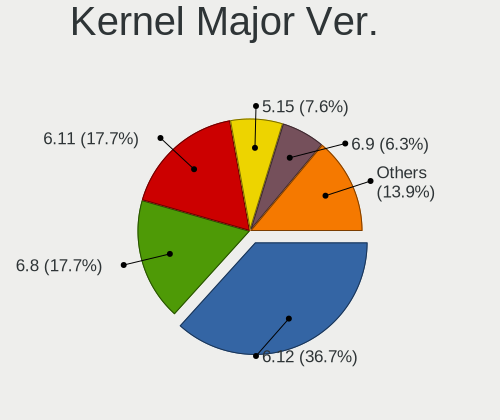
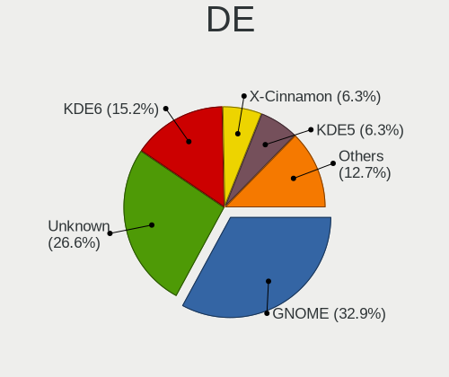
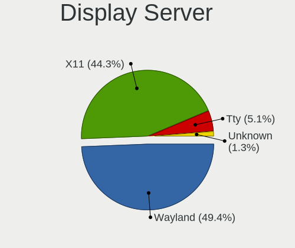
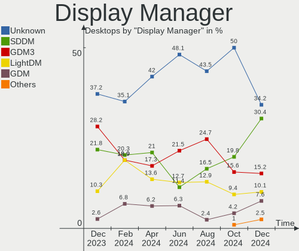
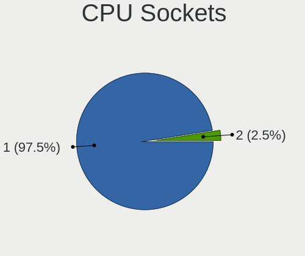
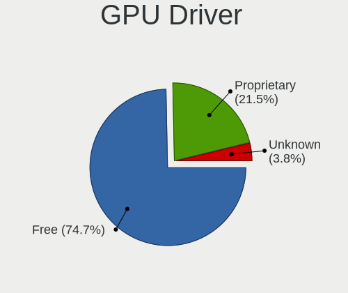
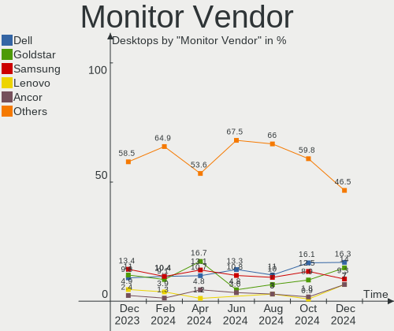
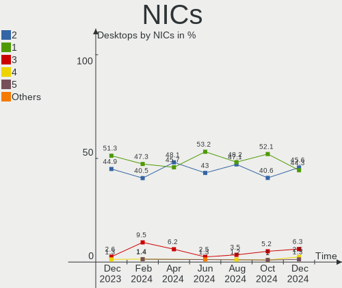
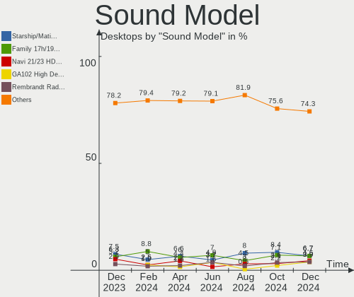

Linux in UK - Hardware Trends (Desktops)
----------------------------------------

A project to identify most popular hardware characteristics and track their change
over time based on data collected by Linux users at https://Linux-Hardware.org.

Anyone can contribute to this report by the [hw-probe](https://github.com/linuxhw/hw-probe) tool:

    sudo -E hw-probe -all -upload

Period: Dec, 2024.

Contents
--------

* [ System ](#system)
  - [ OS                       ](#os)
  - [ OS Family                ](#os-family)
  - [ Kernel                   ](#kernel)
  - [ Kernel Family            ](#kernel-family)
  - [ Kernel Major Ver.        ](#kernel-major-ver)
  - [ Arch                     ](#arch)
  - [ DE                       ](#de)
  - [ Display Server           ](#display-server)
  - [ Display Manager          ](#display-manager)
  - [ OS Lang                  ](#os-lang)
  - [ Boot Mode                ](#boot-mode)
  - [ Filesystem               ](#filesystem)
  - [ Part. scheme             ](#part-scheme)
  - [ Dual Boot with Linux/BSD ](#dual-boot-with-linuxbsd)
  - [ Dual Boot (Win)          ](#dual-boot-win)

* [ Board ](#board)
  - [ Vendor                   ](#vendor)
  - [ Model                    ](#model)
  - [ Model Family             ](#model-family)
  - [ MFG Year                 ](#mfg-year)
  - [ Form Factor              ](#form-factor)
  - [ Secure Boot              ](#secure-boot)
  - [ Coreboot                 ](#coreboot)
  - [ RAM Size                 ](#ram-size)
  - [ RAM Used                 ](#ram-used)
  - [ Total Drives             ](#total-drives)
  - [ Has CD-ROM               ](#has-cd-rom)
  - [ Has Ethernet             ](#has-ethernet)
  - [ Has WiFi                 ](#has-wifi)
  - [ Has Bluetooth            ](#has-bluetooth)

* [ Location ](#location)
  - [ Country                  ](#country)
  - [ City                     ](#city)

* [ Drives ](#drives)
  - [ Drive Vendor             ](#drive-vendor)
  - [ Drive Model              ](#drive-model)
  - [ HDD Vendor               ](#hdd-vendor)
  - [ SSD Vendor               ](#ssd-vendor)
  - [ Drive Kind               ](#drive-kind)
  - [ Drive Connector          ](#drive-connector)
  - [ Drive Size               ](#drive-size)
  - [ Space Total              ](#space-total)
  - [ Space Used               ](#space-used)
  - [ Malfunc. Drives          ](#malfunc-drives)
  - [ Malfunc. Drive Vendor    ](#malfunc-drive-vendor)
  - [ Malfunc. HDD Vendor      ](#malfunc-hdd-vendor)
  - [ Malfunc. Drive Kind      ](#malfunc-drive-kind)
  - [ Failed Drives            ](#failed-drives)
  - [ Failed Drive Vendor      ](#failed-drive-vendor)
  - [ Drive Status             ](#drive-status)

* [ Storage controller ](#storage-controller)
  - [ Storage Vendor           ](#storage-vendor)
  - [ Storage Model            ](#storage-model)
  - [ Storage Kind             ](#storage-kind)

* [ Processor ](#processor)
  - [ CPU Vendor               ](#cpu-vendor)
  - [ CPU Model                ](#cpu-model)
  - [ CPU Model Family         ](#cpu-model-family)
  - [ CPU Cores                ](#cpu-cores)
  - [ CPU Sockets              ](#cpu-sockets)
  - [ CPU Threads              ](#cpu-threads)
  - [ CPU Op-Modes             ](#cpu-op-modes)
  - [ CPU Microcode            ](#cpu-microcode)
  - [ CPU Microarch            ](#cpu-microarch)

* [ Graphics ](#graphics)
  - [ GPU Vendor               ](#gpu-vendor)
  - [ GPU Model                ](#gpu-model)
  - [ GPU Combo                ](#gpu-combo)
  - [ GPU Driver               ](#gpu-driver)
  - [ GPU Memory               ](#gpu-memory)

* [ Monitor ](#monitor)
  - [ Monitor Vendor           ](#monitor-vendor)
  - [ Monitor Model            ](#monitor-model)
  - [ Monitor Resolution       ](#monitor-resolution)
  - [ Monitor Diagonal         ](#monitor-diagonal)
  - [ Monitor Width            ](#monitor-width)
  - [ Aspect Ratio             ](#aspect-ratio)
  - [ Monitor Area             ](#monitor-area)
  - [ Pixel Density            ](#pixel-density)
  - [ Multiple Monitors        ](#multiple-monitors)

* [ Network ](#network)
  - [ Net Controller Vendor    ](#net-controller-vendor)
  - [ Net Controller Model     ](#net-controller-model)
  - [ Wireless Vendor          ](#wireless-vendor)
  - [ Wireless Model           ](#wireless-model)
  - [ Ethernet Vendor          ](#ethernet-vendor)
  - [ Ethernet Model           ](#ethernet-model)
  - [ Net Controller Kind      ](#net-controller-kind)
  - [ Used Controller          ](#used-controller)
  - [ NICs                     ](#nics)
  - [ IPv6                     ](#ipv6)

* [ Bluetooth ](#bluetooth)
  - [ Bluetooth Vendor         ](#bluetooth-vendor)
  - [ Bluetooth Model          ](#bluetooth-model)

* [ Sound ](#sound)
  - [ Sound Vendor             ](#sound-vendor)
  - [ Sound Model              ](#sound-model)

* [ Memory ](#memory)
  - [ Memory Vendor            ](#memory-vendor)
  - [ Memory Model             ](#memory-model)
  - [ Memory Kind              ](#memory-kind)
  - [ Memory Form Factor       ](#memory-form-factor)
  - [ Memory Size              ](#memory-size)
  - [ Memory Speed             ](#memory-speed)

* [ Printers & scanners ](#printers--scanners)
  - [ Printer Vendor           ](#printer-vendor)
  - [ Printer Model            ](#printer-model)
  - [ Scanner Vendor           ](#scanner-vendor)
  - [ Scanner Model            ](#scanner-model)

* [ Camera ](#camera)
  - [ Camera Vendor            ](#camera-vendor)
  - [ Camera Model             ](#camera-model)

* [ Security ](#security)
  - [ Fingerprint Vendor       ](#fingerprint-vendor)
  - [ Fingerprint Model        ](#fingerprint-model)
  - [ Chipcard Vendor          ](#chipcard-vendor)
  - [ Chipcard Model           ](#chipcard-model)

* [ Unsupported ](#unsupported)
  - [ Unsupported Devices      ](#unsupported-devices)
  - [ Unsupported Device Types ](#unsupported-device-types)

System
------

OS
--

Installed operating systems

| Name               | Desktops | Percent |
|--------------------|----------|---------|
| OpenMandriva 24.12 | 14       | 17.72%  |
| Ubuntu 24.04       | 7        | 8.86%   |
| Fedora 41          | 6        | 7.59%   |
| Arch Rolling       | 6        | 7.59%   |
| Debian 12          | 5        | 6.33%   |
| Ubuntu 22.04       | 3        | 3.8%    |
| Pop!_OS 22.04      | 3        | 3.8%    |
| Ubuntu 24.10       | 2        | 2.53%   |
| OpenMandriva 5.0   | 2        | 2.53%   |
| Linux Mint 21.3    | 2        | 2.53%   |
| Bazzite 41         | 2        | 2.53%   |
| ArcoLinux Rolling  | 2        | 2.53%   |
| Zorin 17           | 1        | 1.27%   |
| Zorin 16           | 1        | 1.27%   |
| Ubuntu 20.04       | 1        | 1.27%   |
| Pop!_OS 24.04      | 1        | 1.27%   |
| Oreon 9.3          | 1        | 1.27%   |
| OpenMandriva 4.3   | 1        | 1.27%   |
| OpenMandriva 24.09 | 1        | 1.27%   |
| OpenMandriva 24.07 | 1        | 1.27%   |
| Nobara 40          | 1        | 1.27%   |
| Nobara 39          | 1        | 1.27%   |
| NixOS 24.11        | 1        | 1.27%   |
| Manjaro 24.2.0     | 1        | 1.27%   |
| Manjaro            | 1        | 1.27%   |
| LMDE 6             | 1        | 1.27%   |
| Linux Mint 22      | 1        | 1.27%   |
| Kubuntu 24.10      | 1        | 1.27%   |
| Kubuntu 24.04      | 1        | 1.27%   |
| KDE neon 22.04     | 1        | 1.27%   |
| Kali 2024.4        | 1        | 1.27%   |
| Gentoo 2.17        | 1        | 1.27%   |
| Drauger OS 7.7     | 1        | 1.27%   |
| Debian             | 1        | 1.27%   |
| CachyOS            | 1        | 1.27%   |
| Bluefin 41         | 1        | 1.27%   |
| AlmaLinux 9.5      | 1        | 1.27%   |

OS Family
---------

OS without a version

| Name         | Desktops | Percent |
|--------------|----------|---------|
| OpenMandriva | 19       | 24.05%  |
| Ubuntu       | 13       | 16.46%  |
| Fedora       | 6        | 7.59%   |
| Debian       | 6        | 7.59%   |
| Arch         | 6        | 7.59%   |
| Pop!_OS      | 4        | 5.06%   |
| Linux Mint   | 3        | 3.8%    |
| Zorin        | 2        | 2.53%   |
| Nobara       | 2        | 2.53%   |
| Manjaro      | 2        | 2.53%   |
| Kubuntu      | 2        | 2.53%   |
| Bazzite      | 2        | 2.53%   |
| ArcoLinux    | 2        | 2.53%   |
| Oreon        | 1        | 1.27%   |
| NixOS        | 1        | 1.27%   |
| LMDE         | 1        | 1.27%   |
| KDE neon     | 1        | 1.27%   |
| Kali         | 1        | 1.27%   |
| Gentoo       | 1        | 1.27%   |
| Drauger OS   | 1        | 1.27%   |
| CachyOS      | 1        | 1.27%   |
| Bluefin      | 1        | 1.27%   |
| AlmaLinux    | 1        | 1.27%   |

Kernel
------

Version of the Linux kernel

| Version                        | Desktops | Percent |
|--------------------------------|----------|---------|
| 6.12.1-desktop-1omv2490        | 13       | 16.46%  |
| 6.8.0-50-generic               | 5        | 6.33%   |
| 6.9.3-76060903-generic         | 4        | 5.06%   |
| 6.8.4-2-pve                    | 2        | 2.53%   |
| 6.8.0-51-generic               | 2        | 2.53%   |
| 6.8.0-49-generic               | 2        | 2.53%   |
| 6.6.2-desktop-1omv2390         | 2        | 2.53%   |
| 6.12.6-200.fc41.x86_64         | 2        | 2.53%   |
| 6.12.4-arch1-1                 | 2        | 2.53%   |
| 6.12.1-arch1-1                 | 2        | 2.53%   |
| 6.11.9-303.bazzite.fc41.x86_64 | 2        | 2.53%   |
| 6.11.10-300.fc41.x86_64        | 2        | 2.53%   |
| 6.11.0-13-generic              | 2        | 2.53%   |
| 6.1.0-28-amd64                 | 2        | 2.53%   |
| 5.15.0-126-generic             | 2        | 2.53%   |
| 6.9.10                         | 1        | 1.27%   |
| 6.8.12-200.fsync.fc39.x86_64   | 1        | 1.27%   |
| 6.8.1-arch1-1                  | 1        | 1.27%   |
| 6.8.0-40-generic               | 1        | 1.27%   |
| 6.6.63-1-MANJARO               | 1        | 1.27%   |
| 6.5.11-060511-generic          | 1        | 1.27%   |
| 6.12.7-2-cachyos               | 1        | 1.27%   |
| 6.12.7                         | 1        | 1.27%   |
| 6.12.6-lqx1-1-lqx              | 1        | 1.27%   |
| 6.12.6-desktop-1omv2490        | 1        | 1.27%   |
| 6.12.6-1-cachyos               | 1        | 1.27%   |
| 6.12.5-tkg-bore-llvm           | 1        | 1.27%   |
| 6.12.5-200.fc41.x86_64         | 1        | 1.27%   |
| 6.12.4-200.fc41.x86_64         | 1        | 1.27%   |
| 6.12.3-amd64                   | 1        | 1.27%   |
| 6.12.1-zen1-1-zen              | 1        | 1.27%   |
| 6.11.5-200.fsync.fc40.x86_64   | 1        | 1.27%   |
| 6.11.2-rt-amd64                | 1        | 1.27%   |
| 6.11.11-300.fc41.x86_64        | 1        | 1.27%   |
| 6.11.11-1-MANJARO              | 1        | 1.27%   |
| 6.11.10-xanmod1                | 1        | 1.27%   |
| 6.11.10-amd64                  | 1        | 1.27%   |
| 6.11.0-desktop-2omv2490        | 1        | 1.27%   |
| 6.11.0-9-generic               | 1        | 1.27%   |
| 6.10.0-desktop-1omv2490        | 1        | 1.27%   |

Kernel Family
-------------

Linux kernel without a distro release

| Version | Desktops | Percent |
|---------|----------|---------|
| 6.12.1  | 16       | 20.25%  |
| 6.8.0   | 10       | 12.66%  |
| 5.15.0  | 6        | 7.59%   |
| 6.12.6  | 5        | 6.33%   |
| 6.9.3   | 4        | 5.06%   |
| 6.11.10 | 4        | 5.06%   |
| 6.11.0  | 4        | 5.06%   |
| 6.12.4  | 3        | 3.8%    |
| 6.1.0   | 3        | 3.8%    |
| 6.8.4   | 2        | 2.53%   |
| 6.6.2   | 2        | 2.53%   |
| 6.12.7  | 2        | 2.53%   |
| 6.12.5  | 2        | 2.53%   |
| 6.11.9  | 2        | 2.53%   |
| 6.11.11 | 2        | 2.53%   |
| 5.14.0  | 2        | 2.53%   |
| 6.9.10  | 1        | 1.27%   |
| 6.8.12  | 1        | 1.27%   |
| 6.8.1   | 1        | 1.27%   |
| 6.6.63  | 1        | 1.27%   |
| 6.5.11  | 1        | 1.27%   |
| 6.12.3  | 1        | 1.27%   |
| 6.11.5  | 1        | 1.27%   |
| 6.11.2  | 1        | 1.27%   |
| 6.10.0  | 1        | 1.27%   |
| 5.16.7  | 1        | 1.27%   |

Kernel Major Ver.
-----------------

Linux kernel major version

| Version | Desktops | Percent |
|---------|----------|---------|
| 6.12    | 29       | 36.71%  |
| 6.8     | 14       | 17.72%  |
| 6.11    | 14       | 17.72%  |
| 5.15    | 6        | 7.59%   |
| 6.9     | 5        | 6.33%   |
| 6.6     | 3        | 3.8%    |
| 6.1     | 3        | 3.8%    |
| 5.14    | 2        | 2.53%   |
| 6.5     | 1        | 1.27%   |
| 6.10    | 1        | 1.27%   |
| 5.16    | 1        | 1.27%   |

Arch
----

OS architecture (x86_64, i586, etc.)

| Name   | Desktops | Percent |
|--------|----------|---------|
| x86_64 | 79       | 100%    |

DE
--

Desktop Environment

| Name       | Desktops | Percent |
|------------|----------|---------|
| GNOME      | 26       | 32.91%  |
| Unknown    | 21       | 26.58%  |
| KDE6       | 12       | 15.19%  |
| X-Cinnamon | 5        | 6.33%   |
| KDE5       | 5        | 6.33%   |
| XFCE       | 4        | 5.06%   |
| LXQt       | 2        | 2.53%   |
| sway       | 1        | 1.27%   |
| MATE       | 1        | 1.27%   |
| LXDE       | 1        | 1.27%   |
| COSMIC     | 1        | 1.27%   |

Display Server
--------------

X11 or Wayland

| Name    | Desktops | Percent |
|---------|----------|---------|
| Wayland | 39       | 49.37%  |
| X11     | 35       | 44.3%   |
| Tty     | 4        | 5.06%   |
| Unknown | 1        | 1.27%   |

Display Manager
---------------

SDDM, LightDM, etc.

| Name           | Desktops | Percent |
|----------------|----------|---------|
| Unknown        | 27       | 34.18%  |
| SDDM           | 24       | 30.38%  |
| GDM3           | 12       | 15.19%  |
| LightDM        | 8        | 10.13%  |
| GDM            | 6        | 7.59%   |
| SLiM           | 1        | 1.27%   |
| COSMIC-GREETER | 1        | 1.27%   |

OS Lang
-------

Language

| Lang    | Desktops | Percent |
|---------|----------|---------|
| en_GB   | 61       | 77.22%  |
| en_US   | 14       | 17.72%  |
| C       | 2        | 2.53%   |
| en_DK   | 1        | 1.27%   |
| Unknown | 1        | 1.27%   |

Boot Mode
---------

EFI or BIOS

| Mode | Desktops | Percent |
|------|----------|---------|
| EFI  | 41       | 51.9%   |
| BIOS | 38       | 48.1%   |

Filesystem
----------

Type of filesystem

| Type    | Desktops | Percent |
|---------|----------|---------|
| Ext4    | 33       | 41.77%  |
| Btrfs   | 19       | 24.05%  |
| Tmpfs   | 11       | 13.92%  |
| Overlay | 10       | 12.66%  |
| Xfs     | 4        | 5.06%   |
| Zfs     | 2        | 2.53%   |

Part. scheme
------------

Scheme of partitioning

| Type    | Desktops | Percent |
|---------|----------|---------|
| GPT     | 52       | 65.82%  |
| Unknown | 21       | 26.58%  |
| MBR     | 6        | 7.59%   |

Dual Boot with Linux/BSD
------------------------

Hosting more than one Linux/BSD

| Dual boot | Desktops | Percent |
|-----------|----------|---------|
| No        | 58       | 73.42%  |
| Yes       | 21       | 26.58%  |

Dual Boot (Win)
---------------

Hosting Linux and Windows

| Dual boot | Desktops | Percent |
|-----------|----------|---------|
| No        | 60       | 75.95%  |
| Yes       | 19       | 24.05%  |

Board
-----

Vendor
------

Motherboard manufacturer

| Name                                 | Desktops | Percent |
|--------------------------------------|----------|---------|
| ASUSTek Computer                     | 20       | 25.32%  |
| Gigabyte Technology                  | 13       | 16.46%  |
| Dell                                 | 12       | 15.19%  |
| MSI                                  | 7        | 8.86%   |
| Hewlett-Packard                      | 6        | 7.59%   |
| ASRock                               | 4        | 5.06%   |
| Supermicro                           | 3        | 3.8%    |
| Lenovo                               | 3        | 3.8%    |
| Acer                                 | 2        | 2.53%   |
| Win Element                          | 1        | 1.27%   |
| Shenzhen Meigao Electronic Equipment | 1        | 1.27%   |
| JGINYUE                              | 1        | 1.27%   |
| Inventec                             | 1        | 1.27%   |
| Fujitsu                              | 1        | 1.27%   |
| BESSTAR Tech                         | 1        | 1.27%   |
| AZW                                  | 1        | 1.27%   |
| Apple                                | 1        | 1.27%   |
| AMD                                  | 1        | 1.27%   |

Model
-----

Motherboard model

| Name                                              | Desktops | Percent |
|---------------------------------------------------|----------|---------|
| Supermicro SYS-111R-M                             | 2        | 2.53%   |
| Gigabyte B550 AORUS ELITE V2                      | 2        | 2.53%   |
| Gigabyte B550 AORUS ELITE AX V2                   | 2        | 2.53%   |
| Dell OptiPlex 3050                                | 2        | 2.53%   |
| ASUS ROG STRIX B550-F GAMING                      | 2        | 2.53%   |
| ASUS All Series                                   | 2        | 2.53%   |
| Win Element M6                                    | 1        | 1.27%   |
| Supermicro X9DRL-3F/iF                            | 1        | 1.27%   |
| Shenzhen Meigao Electronic Equipment Venus Series | 1        | 1.27%   |
| MSI MS-7E12                                       | 1        | 1.27%   |
| MSI MS-7D98                                       | 1        | 1.27%   |
| MSI MS-7D77                                       | 1        | 1.27%   |
| MSI MS-7C90                                       | 1        | 1.27%   |
| MSI MS-7C02                                       | 1        | 1.27%   |
| MSI MS-7B78                                       | 1        | 1.27%   |
| MSI MS-7A94                                       | 1        | 1.27%   |
| Lenovo ThinkCentre M58p 7220AVG                   | 1        | 1.27%   |
| Lenovo LOQ 17IRB8 90VH003TUK                      | 1        | 1.27%   |
| Lenovo H50-55                                     | 1        | 1.27%   |
| JGINYUE B650I Night Devil                         | 1        | 1.27%   |
| Inventec Z CLASS                                  | 1        | 1.27%   |
| HP Z440 Workstation                               | 1        | 1.27%   |
| HP ProDesk 600 G1 SFF                             | 1        | 1.27%   |
| HP Pavilion Desktop TP01-2xxx                     | 1        | 1.27%   |
| HP EliteDesk 800 G2 DM 35W                        | 1        | 1.27%   |
| HP Compaq Elite 8300 SFF                          | 1        | 1.27%   |
| HP Compaq 8100 Elite CMT PC                       | 1        | 1.27%   |
| Gigabyte Z97X-UD3H                                | 1        | 1.27%   |
| Gigabyte Z68X-UD3-B3                              | 1        | 1.27%   |
| Gigabyte X470 AORUS ULTRA GAMING                  | 1        | 1.27%   |
| Gigabyte PDT-702-1020                             | 1        | 1.27%   |
| Gigabyte B550M DS3H                               | 1        | 1.27%   |
| Gigabyte B550 GAMING X V2                         | 1        | 1.27%   |
| Gigabyte B365M DS3H                               | 1        | 1.27%   |
| Gigabyte B250M-DS3H                               | 1        | 1.27%   |
| Gigabyte A520M S2H                                | 1        | 1.27%   |
| Fujitsu ESPRIMO E400                              | 1        | 1.27%   |
| Dell Precision Tower 5810                         | 1        | 1.27%   |
| Dell PowerEdge T20                                | 1        | 1.27%   |
| Dell OptiPlex Micro Plus 7010                     | 1        | 1.27%   |

Model Family
------------

Motherboard model prefix

| Name                                       | Desktops | Percent |
|--------------------------------------------|----------|---------|
| ASUS ROG                                   | 9        | 11.39%  |
| Dell OptiPlex                              | 8        | 10.13%  |
| Gigabyte B550                              | 5        | 6.33%   |
| ASUS TUF                                   | 3        | 3.8%    |
| Supermicro SYS-111R-M                      | 2        | 2.53%   |
| HP Compaq                                  | 2        | 2.53%   |
| ASUS All                                   | 2        | 2.53%   |
| Win Element M6                             | 1        | 1.27%   |
| Supermicro X9DRL-3F                        | 1        | 1.27%   |
| Shenzhen Meigao Electronic Equipment Venus | 1        | 1.27%   |
| MSI MS-7E12                                | 1        | 1.27%   |
| MSI MS-7D98                                | 1        | 1.27%   |
| MSI MS-7D77                                | 1        | 1.27%   |
| MSI MS-7C90                                | 1        | 1.27%   |
| MSI MS-7C02                                | 1        | 1.27%   |
| MSI MS-7B78                                | 1        | 1.27%   |
| MSI MS-7A94                                | 1        | 1.27%   |
| Lenovo ThinkCentre                         | 1        | 1.27%   |
| Lenovo LOQ                                 | 1        | 1.27%   |
| Lenovo H50-55                              | 1        | 1.27%   |
| JGINYUE B650I                              | 1        | 1.27%   |
| Inventec Z                                 | 1        | 1.27%   |
| HP Z440                                    | 1        | 1.27%   |
| HP ProDesk                                 | 1        | 1.27%   |
| HP Pavilion                                | 1        | 1.27%   |
| HP EliteDesk                               | 1        | 1.27%   |
| Gigabyte Z97X-UD3H                         | 1        | 1.27%   |
| Gigabyte Z68X-UD3-B3                       | 1        | 1.27%   |
| Gigabyte X470                              | 1        | 1.27%   |
| Gigabyte PDT-702-1020                      | 1        | 1.27%   |
| Gigabyte B550M                             | 1        | 1.27%   |
| Gigabyte B365M                             | 1        | 1.27%   |
| Gigabyte B250M-DS3H                        | 1        | 1.27%   |
| Gigabyte A520M                             | 1        | 1.27%   |
| Fujitsu ESPRIMO                            | 1        | 1.27%   |
| Dell Precision                             | 1        | 1.27%   |
| Dell PowerEdge                             | 1        | 1.27%   |
| Dell Inspiron                              | 1        | 1.27%   |
| Dell DXC061                                | 1        | 1.27%   |
| BESSTAR Tech HM80                          | 1        | 1.27%   |

MFG Year
--------

Motherboard manufacture year

| Year | Desktops | Percent |
|------|----------|---------|
| 2020 | 17       | 21.52%  |
| 2024 | 7        | 8.86%   |
| 2022 | 6        | 7.59%   |
| 2014 | 6        | 7.59%   |
| 2023 | 5        | 6.33%   |
| 2018 | 5        | 6.33%   |
| 2015 | 5        | 6.33%   |
| 2013 | 5        | 6.33%   |
| 2017 | 4        | 5.06%   |
| 2012 | 4        | 5.06%   |
| 2021 | 3        | 3.8%    |
| 2009 | 3        | 3.8%    |
| 2016 | 2        | 2.53%   |
| 2011 | 2        | 2.53%   |
| 2019 | 1        | 1.27%   |
| 2010 | 1        | 1.27%   |
| 2008 | 1        | 1.27%   |
| 2007 | 1        | 1.27%   |
| 2006 | 1        | 1.27%   |

Form Factor
-----------

Physical design of the computer

| Name    | Desktops | Percent |
|---------|----------|---------|
| Desktop | 79       | 100%    |

Secure Boot
-----------

Enabled or disabled

| State    | Desktops | Percent |
|----------|----------|---------|
| Disabled | 76       | 96.2%   |
| Enabled  | 3        | 3.8%    |

Coreboot
--------

Have coreboot on board

| Used | Desktops | Percent |
|------|----------|---------|
| No   | 79       | 100%    |

RAM Size
--------

Total RAM memory

| Size in GB  | Desktops | Percent |
|-------------|----------|---------|
| 32.01-64.0  | 28       | 35.44%  |
| 16.01-24.0  | 19       | 24.05%  |
| 64.01-256.0 | 8        | 10.13%  |
| 24.01-32.0  | 7        | 8.86%   |
| 8.01-16.0   | 7        | 8.86%   |
| 4.01-8.0    | 5        | 6.33%   |
| 3.01-4.0    | 5        | 6.33%   |

RAM Used
--------

Used RAM memory

| Used GB     | Desktops | Percent |
|-------------|----------|---------|
| 4.01-8.0    | 21       | 26.58%  |
| 2.01-3.0    | 17       | 21.52%  |
| 1.01-2.0    | 17       | 21.52%  |
| 3.01-4.0    | 11       | 13.92%  |
| 8.01-16.0   | 9        | 11.39%  |
| 16.01-24.0  | 2        | 2.53%   |
| 64.01-256.0 | 1        | 1.27%   |
| 0.51-1.0    | 1        | 1.27%   |

Total Drives
------------

Number of drives on board

| Drives | Desktops | Percent |
|--------|----------|---------|
| 2      | 30       | 37.97%  |
| 1      | 25       | 31.65%  |
| 4      | 9        | 11.39%  |
| 3      | 8        | 10.13%  |
| 6      | 3        | 3.8%    |
| 5      | 3        | 3.8%    |
| 9      | 1        | 1.27%   |

Has CD-ROM
----------

Has CD-ROM on board

| Presented | Desktops | Percent |
|-----------|----------|---------|
| No        | 57       | 72.15%  |
| Yes       | 22       | 27.85%  |

Has Ethernet
------------

Has Ethernet on board

| Presented | Desktops | Percent |
|-----------|----------|---------|
| Yes       | 79       | 100%    |

Has WiFi
--------

Has WiFi module

| Presented | Desktops | Percent |
|-----------|----------|---------|
| Yes       | 40       | 50.63%  |
| No        | 39       | 49.37%  |

Has Bluetooth
-------------

Has Bluetooth module

| Presented | Desktops | Percent |
|-----------|----------|---------|
| No        | 43       | 54.43%  |
| Yes       | 36       | 45.57%  |

Location
--------

Country
-------

Geographic location (country)

| Country | Desktops | Percent |
|---------|----------|---------|
| UK      | 79       | 100%    |

City
----

Geographic location (city)

| City                 | Desktops | Percent |
|----------------------|----------|---------|
| Manchester           | 3        | 3.8%    |
| York                 | 2        | 2.53%   |
| Swindon              | 2        | 2.53%   |
| Southampton          | 2        | 2.53%   |
| Rotherham            | 2        | 2.53%   |
| Leicester            | 2        | 2.53%   |
| Lambeth              | 2        | 2.53%   |
| Guildford            | 2        | 2.53%   |
| Glasgow              | 2        | 2.53%   |
| Cardiff              | 2        | 2.53%   |
| Barnet               | 2        | 2.53%   |
| Wrexham              | 1        | 1.27%   |
| Witney               | 1        | 1.27%   |
| West Malling         | 1        | 1.27%   |
| Wandsworth           | 1        | 1.27%   |
| Waltham Forest       | 1        | 1.27%   |
| Wallingford          | 1        | 1.27%   |
| Stowmarket           | 1        | 1.27%   |
| Stockton-on-Tees     | 1        | 1.27%   |
| Southwark            | 1        | 1.27%   |
| Sheffield            | 1        | 1.27%   |
| Saltcoats            | 1        | 1.27%   |
| Reading              | 1        | 1.27%   |
| Preston              | 1        | 1.27%   |
| Poole                | 1        | 1.27%   |
| Pontefract           | 1        | 1.27%   |
| Polegate             | 1        | 1.27%   |
| Peterhead            | 1        | 1.27%   |
| Peterborough         | 1        | 1.27%   |
| Orpington            | 1        | 1.27%   |
| Nottingham           | 1        | 1.27%   |
| Northwich            | 1        | 1.27%   |
| Newmarket            | 1        | 1.27%   |
| Newham               | 1        | 1.27%   |
| New Malden           | 1        | 1.27%   |
| Llanelli             | 1        | 1.27%   |
| Leighton Buzzard     | 1        | 1.27%   |
| Leigh                | 1        | 1.27%   |
| Kirkcaldy            | 1        | 1.27%   |
| Kingston upon Thames | 1        | 1.27%   |

Drives
------

Drive Vendor
------------

Hard drive vendors

| Vendor                      | Desktops | Drives | Percent |
|-----------------------------|----------|--------|---------|
| Samsung Electronics         | 28       | 44     | 18.92%  |
| WDC                         | 18       | 23     | 12.16%  |
| Seagate                     | 15       | 19     | 10.14%  |
| Sandisk                     | 14       | 14     | 9.46%   |
| Crucial                     | 13       | 16     | 8.78%   |
| Toshiba                     | 10       | 12     | 6.76%   |
| Kingston                    | 8        | 9      | 5.41%   |
| Phison Electronics          | 4        | 4      | 2.7%    |
| Micron/Crucial Technology   | 4        | 4      | 2.7%    |
| Micron Technology           | 3        | 3      | 2.03%   |
| Kingston Technology Company | 3        | 5      | 2.03%   |
| Intel                       | 3        | 3      | 2.03%   |
| Unknown                     | 2        | 2      | 1.35%   |
| SPCC                        | 2        | 2      | 1.35%   |
| KIOXIA-EXCERIA              | 2        | 2      | 1.35%   |
| Hitachi                     | 2        | 2      | 1.35%   |
| Fanxiang                    | 2        | 3      | 1.35%   |
| A-DATA Technology           | 2        | 2      | 1.35%   |
| TCSUNBOW                    | 1        | 1      | 0.68%   |
| SK hynix                    | 1        | 1      | 0.68%   |
| Silicon Motion              | 1        | 1      | 0.68%   |
| OWC                         | 1        | 1      | 0.68%   |
| Netac                       | 1        | 1      | 0.68%   |
| Maxtor                      | 1        | 1      | 0.68%   |
| Integral                    | 1        | 1      | 0.68%   |
| HGST                        | 1        | 4      | 0.68%   |
| GOODRAM                     | 1        | 1      | 0.68%   |
| China                       | 1        | 1      | 0.68%   |
| Apple                       | 1        | 1      | 0.68%   |
| Apacer                      | 1        | 1      | 0.68%   |
| Unknown                     | 1        | 1      | 0.68%   |

Drive Model
-----------

Hard drive models

| Model                                                | Desktops | Percent |
|------------------------------------------------------|----------|---------|
| Samsung SSD 990 PRO 2TB                              | 3        | 1.73%   |
| Samsung SSD 850 EVO 250GB                            | 3        | 1.73%   |
| Micron/Crucial P2 NVMe PCIe SSD 500GB                | 3        | 1.73%   |
| Kingston Company SNV2S1000G 1TB                      | 3        | 1.73%   |
| WDC WD20EZRZ-00Z5HB0 2TB                             | 2        | 1.16%   |
| Toshiba MQ01ACF050 500GB                             | 2        | 1.16%   |
| Toshiba HDWD110 1TB                                  | 2        | 1.16%   |
| Seagate ST3500312CS 500GB                            | 2        | 1.16%   |
| Sandisk WD Blue SN550 NVMe SSD 256GB                 | 2        | 1.16%   |
| Sandisk WD Black SN850 2TB                           | 2        | 1.16%   |
| Samsung SSD 850 EVO 500GB                            | 2        | 1.16%   |
| Samsung NVMe SSD Controller SM981/PM981/PM983 512GB  | 2        | 1.16%   |
| Samsung NVMe SSD Controller PM9A1/PM9A3/980PRO 512GB | 2        | 1.16%   |
| Samsung HD642JJ 640GB                                | 2        | 1.16%   |
| Phison E16 PCIe4 NVMe Controller 1TB                 | 2        | 1.16%   |
| Phison E12 NVMe Controller 480GB                     | 2        | 1.16%   |
| Kingston SNV2S500G 500GB                             | 2        | 1.16%   |
| Kingston SA400S37480G 480GB SSD                      | 2        | 1.16%   |
| Intel SSD 660P Series 1024GB                         | 2        | 1.16%   |
| Crucial CT4000MX500SSD1 4TB                          | 2        | 1.16%   |
| Crucial CT1000T500SSD8 1TB                           | 2        | 1.16%   |
| WDC WUH721816ALE6L4 16TB                             | 1        | 0.58%   |
| WDC WDS500G2B0B-00YS70 500GB SSD                     | 1        | 0.58%   |
| WDC WDS480G2G0A-00JH30 480GB SSD                     | 1        | 0.58%   |
| WDC WDS250G2B0A-00SM50 250GB SSD                     | 1        | 0.58%   |
| WDC WDS100T2B0A-00SM50 1TB SSD                       | 1        | 0.58%   |
| WDC WD80EAZZ-00BKLB0 8TB                             | 1        | 0.58%   |
| WDC WD5000AURX-63UY4Y0 500GB                         | 1        | 0.58%   |
| WDC WD5000AAKX-083CA0 500GB                          | 1        | 0.58%   |
| WDC WD3200AVVS-63L2B0 320GB                          | 1        | 0.58%   |
| WDC WD30EZRX-00D8PB0 3TB                             | 1        | 0.58%   |
| WDC WD3000JS-63PDB1 304GB                            | 1        | 0.58%   |
| WDC WD20EZRZ-22Z5HB0 2TB                             | 1        | 0.58%   |
| WDC WD200EB-00CSF0 20GB                              | 1        | 0.58%   |
| WDC WD1600AVVS-63L2B0 160GB                          | 1        | 0.58%   |
| WDC WD15EARS-00MVWB0 1TB                             | 1        | 0.58%   |
| WDC WD15EADS-11P8B1 1TB                              | 1        | 0.58%   |
| WDC WD10EZEX-08M2NA0 1TB                             | 1        | 0.58%   |
| WDC WD1004FBYZ 1TB                                   | 1        | 0.58%   |
| WDC WD1003FZEX-00MK2A0 1TB                           | 1        | 0.58%   |

HDD Vendor
----------

Hard disk drive vendors

| Vendor              | Desktops | Drives | Percent |
|---------------------|----------|--------|---------|
| WDC                 | 14       | 18     | 28.57%  |
| Seagate             | 14       | 16     | 28.57%  |
| Toshiba             | 10       | 12     | 20.41%  |
| Samsung Electronics | 6        | 6      | 12.24%  |
| Hitachi             | 2        | 2      | 4.08%   |
| Maxtor              | 1        | 1      | 2.04%   |
| HGST                | 1        | 4      | 2.04%   |
| Apple               | 1        | 1      | 2.04%   |

SSD Vendor
----------

Solid state drive vendors

| Vendor              | Desktops | Drives | Percent |
|---------------------|----------|--------|---------|
| Samsung Electronics | 12       | 16     | 24%     |
| Crucial             | 8        | 9      | 16%     |
| Kingston            | 5        | 6      | 10%     |
| WDC                 | 4        | 5      | 8%      |
| SPCC                | 2        | 2      | 4%      |
| Seagate             | 2        | 2      | 4%      |
| SanDisk             | 2        | 2      | 4%      |
| KIOXIA-EXCERIA      | 2        | 2      | 4%      |
| Fanxiang            | 2        | 2      | 4%      |
| A-DATA Technology   | 2        | 2      | 4%      |
| TCSUNBOW            | 1        | 1      | 2%      |
| SK hynix            | 1        | 1      | 2%      |
| OWC                 | 1        | 1      | 2%      |
| Intel               | 1        | 1      | 2%      |
| Integral            | 1        | 1      | 2%      |
| GOODRAM             | 1        | 1      | 2%      |
| China               | 1        | 1      | 2%      |
| Apacer              | 1        | 1      | 2%      |
| Unknown             | 1        | 1      | 2%      |

Drive Kind
----------

HDD or SSD

| Kind    | Desktops | Drives | Percent |
|---------|----------|--------|---------|
| NVMe    | 45       | 67     | 36.59%  |
| SSD     | 40       | 57     | 32.52%  |
| HDD     | 37       | 60     | 30.08%  |
| Unknown | 1        | 1      | 0.81%   |

Drive Connector
---------------

SATA, SAS, NVMe, etc.

| Type | Desktops | Drives | Percent |
|------|----------|--------|---------|
| SATA | 58       | 112    | 53.7%   |
| NVMe | 45       | 67     | 41.67%  |
| SAS  | 5        | 6      | 4.63%   |

Drive Size
----------

Size of hard drive

| Size in TB | Desktops | Drives | Percent |
|------------|----------|--------|---------|
| 0.01-0.5   | 37       | 55     | 43.53%  |
| 0.51-1.0   | 25       | 31     | 29.41%  |
| 1.01-2.0   | 11       | 11     | 12.94%  |
| 3.01-4.0   | 4        | 5      | 4.71%   |
| 4.01-10.0  | 4        | 9      | 4.71%   |
| 10.01-20.0 | 3        | 4      | 3.53%   |
| 2.01-3.0   | 1        | 2      | 1.18%   |

Space Total
-----------

Amount of disk space available on the file system

| Size in GB     | Desktops | Percent |
|----------------|----------|---------|
| More than 3000 | 20       | 25.32%  |
| 251-500        | 13       | 16.46%  |
| 501-1000       | 12       | 15.19%  |
| 101-250        | 10       | 12.66%  |
| 1-20           | 8        | 10.13%  |
| 2001-3000      | 6        | 7.59%   |
| 1001-2000      | 5        | 6.33%   |
| Unknown        | 4        | 5.06%   |
| 51-100         | 1        | 1.27%   |

Space Used
----------

Amount of used disk space

| Used GB        | Desktops | Percent |
|----------------|----------|---------|
| 1-20           | 28       | 35.44%  |
| 101-250        | 11       | 13.92%  |
| More than 3000 | 8        | 10.13%  |
| 21-50          | 6        | 7.59%   |
| 501-1000       | 6        | 7.59%   |
| 251-500        | 5        | 6.33%   |
| 1001-2000      | 5        | 6.33%   |
| 51-100         | 4        | 5.06%   |
| Unknown        | 4        | 5.06%   |
| 2001-3000      | 2        | 2.53%   |

Malfunc. Drives
---------------

Drive models with a malfunction

| Model                               | Desktops | Drives | Percent |
|-------------------------------------|----------|--------|---------|
| WDC WD30EZRX-00D8PB0 3TB            | 1        | 1      | 14.29%  |
| WDC WD Green 2.5 240GB SSD          | 1        | 1      | 14.29%  |
| Toshiba MQ01ACF050 500GB            | 1        | 1      | 14.29%  |
| Toshiba MQ01ABD075 752GB            | 1        | 1      | 14.29%  |
| Toshiba DT01ACA200 2TB              | 1        | 1      | 14.29%  |
| Seagate ST500DM002-1BC142 500GB     | 1        | 1      | 14.29%  |
| Samsung Electronics SSD 980 PRO 2TB | 1        | 1      | 14.29%  |

Malfunc. Drive Vendor
---------------------

Vendors of faulty drives

| Vendor              | Desktops | Drives | Percent |
|---------------------|----------|--------|---------|
| Toshiba             | 3        | 3      | 42.86%  |
| WDC                 | 2        | 2      | 28.57%  |
| Seagate             | 1        | 1      | 14.29%  |
| Samsung Electronics | 1        | 1      | 14.29%  |

Malfunc. HDD Vendor
-------------------

Vendors of faulty HDD drives

| Vendor  | Desktops | Drives | Percent |
|---------|----------|--------|---------|
| Toshiba | 3        | 3      | 60%     |
| WDC     | 1        | 1      | 20%     |
| Seagate | 1        | 1      | 20%     |

Malfunc. Drive Kind
-------------------

Kinds of faulty drives

| Kind | Desktops | Drives | Percent |
|------|----------|--------|---------|
| HDD  | 5        | 5      | 71.43%  |
| NVMe | 1        | 1      | 14.29%  |
| SSD  | 1        | 1      | 14.29%  |

Failed Drives
-------------

Failed drive models

Zero info for selected period =(

Failed Drive Vendor
-------------------

Failed drive vendors

Zero info for selected period =(

Drive Status
------------

Number of failed and malfunc. drives

| Status   | Desktops | Drives | Percent |
|----------|----------|--------|---------|
| Works    | 44       | 110    | 50.57%  |
| Detected | 36       | 68     | 41.38%  |
| Malfunc  | 7        | 7      | 8.05%   |

Storage controller
------------------

Storage Vendor
--------------

Storage controller vendors

| Vendor                      | Desktops | Percent |
|-----------------------------|----------|---------|
| Intel                       | 42       | 30.88%  |
| AMD                         | 36       | 26.47%  |
| Samsung Electronics         | 16       | 11.76%  |
| SanDisk                     | 12       | 8.82%   |
| Micron/Crucial Technology   | 7        | 5.15%   |
| Kingston Technology Company | 6        | 4.41%   |
| Micron Technology           | 5        | 3.68%   |
| Phison Electronics          | 4        | 2.94%   |
| Solidigm                    | 2        | 1.47%   |
| ASMedia Technology          | 2        | 1.47%   |
| Silicon Motion              | 1        | 0.74%   |
| Nvidia                      | 1        | 0.74%   |
| Netac Technology            | 1        | 0.74%   |
| Marvell Technology Group    | 1        | 0.74%   |

Storage Model
-------------

Storage controller models

| Model                                                                          | Desktops | Percent |
|--------------------------------------------------------------------------------|----------|---------|
| AMD 500 Series Chipset SATA Controller                                         | 13       | 8.39%   |
| AMD FCH SATA Controller [AHCI mode]                                            | 9        | 5.81%   |
| AMD 600 Series Chipset SATA Controller                                         | 8        | 5.16%   |
| Intel 8 Series/C220 Series Chipset Family 6-port SATA Controller 1 [AHCI mode] | 6        | 3.87%   |
| Samsung NVMe SSD Controller SM981/PM981/PM983                                  | 5        | 3.23%   |
| Intel SATA Controller [RAID Mode]                                              | 5        | 3.23%   |
| Intel 200 Series PCH SATA controller [AHCI mode]                               | 5        | 3.23%   |
| AMD 400 Series Chipset SATA Controller                                         | 5        | 3.23%   |
| Samsung NVMe SSD Controller S4LV008[Pascal]                                    | 4        | 2.58%   |
| Kingston Company NV2 NVMe SSD [E21T] (DRAM-less)                               | 4        | 2.58%   |
| Intel Raptor Lake SATA AHCI Controller                                         | 4        | 2.58%   |
| SanDisk Ultra 3D / WD Blue SN570 NVMe SSD (DRAM-less)                          | 3        | 1.94%   |
| Samsung NVMe SSD Controller PM9A1/PM9A3/980PRO                                 | 3        | 1.94%   |
| Micron/Crucial P2 [Nick P2] / P3 / P3 Plus NVMe PCIe SSD (DRAM-less)           | 3        | 1.94%   |
| SanDisk WD PC SN810 / Black SN850 NVMe SSD                                     | 2        | 1.29%   |
| SanDisk WD Green SN350 240GB (DRAM-less) / SN560E NVMe SSD                     | 2        | 1.29%   |
| Sandisk WD Black SN850X NVMe SSD                                               | 2        | 1.29%   |
| SanDisk Ultra 3D / WD PC SN530, IX SN530, Blue SN550 NVMe SSD (DRAM-less)      | 2        | 1.29%   |
| Samsung NVMe SSD Controller 980 (DRAM-less)                                    | 2        | 1.29%   |
| Phison E16 PCIe4 NVMe Controller                                               | 2        | 1.29%   |
| Phison E12 NVMe Controller                                                     | 2        | 1.29%   |
| Micron/Crucial T500 NVMe PCIe SSD                                              | 2        | 1.29%   |
| Micron 2550 NVMe SSD (DRAM-less)                                               | 2        | 1.29%   |
| Intel SSD 660P Series                                                          | 2        | 1.29%   |
| Intel Q170/Q150/B150/H170/H110/Z170/CM236 Chipset SATA Controller [AHCI Mode]  | 2        | 1.29%   |
| Intel C610/X99 series chipset 6-Port SATA Controller [AHCI mode]               | 2        | 1.29%   |
| Intel Alder Lake-S PCH SATA Controller [AHCI Mode]                             | 2        | 1.29%   |
| Intel 82801JD/DO (ICH10 Family) SATA AHCI Controller                           | 2        | 1.29%   |
| Intel 7 Series/C210 Series Chipset Family 6-port SATA Controller [AHCI mode]   | 2        | 1.29%   |
| Intel 6 Series/C200 Series Chipset Family 6 port Desktop SATA AHCI Controller  | 2        | 1.29%   |
| Intel 4 Series Chipset PT IDER Controller                                      | 2        | 1.29%   |
| ASMedia ASM1061/ASM1062 Serial ATA Controller                                  | 2        | 1.29%   |
| AMD SB7x0/SB8x0/SB9x0 SATA Controller [IDE mode]                               | 2        | 1.29%   |
| Solidigm P44 Pro NVMe SSD [Hollywood Beach]                                    | 1        | 0.65%   |
| Solidigm P41 Plus NVMe SSD (DRAM-less) [Echo Harbor]                           | 1        | 0.65%   |
| Silicon Motion SM2263EN/SM2263XT (DRAM-less) NVMe SSD Controllers              | 1        | 0.65%   |
| SanDisk WD PC SN540 / Green SN350 NVMe SSD 1 TB (DRAM-less)                    | 1        | 0.65%   |
| Samsung NVMe SSD Controller SM961/PM961/SM963                                  | 1        | 0.65%   |
| Samsung NVMe SSD Controller PM9C1a (DRAM-less)                                 | 1        | 0.65%   |
| Samsung NVMe SSD Controller PM9B1 (DRAM-less)                                  | 1        | 0.65%   |

Storage Kind
------------

Kind of storage controller (IDE, SATA, NVMe, SAS, ...)

| Kind | Desktops | Percent |
|------|----------|---------|
| SATA | 68       | 52.71%  |
| NVMe | 45       | 34.88%  |
| RAID | 9        | 6.98%   |
| IDE  | 6        | 4.65%   |
| SAS  | 1        | 0.78%   |

Processor
---------

CPU Vendor
----------

Processor vendors

| Vendor | Desktops | Percent |
|--------|----------|---------|
| Intel  | 42       | 53.16%  |
| AMD    | 37       | 46.84%  |

CPU Model
---------

Processor models

| Model                                       | Desktops | Percent |
|---------------------------------------------|----------|---------|
| AMD Ryzen 9 3900X 12-Core Processor         | 3        | 3.8%    |
| AMD Ryzen 7 5800X 8-Core Processor          | 3        | 3.8%    |
| Intel Xeon E E-2468                         | 2        | 2.53%   |
| Intel N100                                  | 2        | 2.53%   |
| AMD Ryzen 5 5600X 6-Core Processor          | 2        | 2.53%   |
| AMD Ryzen 5 3600 6-Core Processor           | 2        | 2.53%   |
| Intel Xeon CPU X5675 @ 3.07GHz              | 1        | 1.27%   |
| Intel Xeon CPU E5-2697A v4 @ 2.60GHz        | 1        | 1.27%   |
| Intel Xeon CPU E5-2650 v2 @ 2.60GHz         | 1        | 1.27%   |
| Intel Xeon CPU E5-1650 v4 @ 3.60GHz         | 1        | 1.27%   |
| Intel Xeon CPU E5-1650 v3 @ 3.50GHz         | 1        | 1.27%   |
| Intel Xeon CPU E3-1225 v3 @ 3.20GHz         | 1        | 1.27%   |
| Intel Pentium Dual-Core CPU E5800 @ 3.20GHz | 1        | 1.27%   |
| Intel Pentium Dual-Core CPU E5300 @ 2.60GHz | 1        | 1.27%   |
| Intel Pentium CPU G640 @ 2.80GHz            | 1        | 1.27%   |
| Intel Core i9-10900K CPU @ 3.70GHz          | 1        | 1.27%   |
| Intel Core i7-8700 CPU @ 3.20GHz            | 1        | 1.27%   |
| Intel Core i7-8086K CPU @ 4.00GHz           | 1        | 1.27%   |
| Intel Core i7-7820X CPU @ 3.60GHz           | 1        | 1.27%   |
| Intel Core i7-7700K CPU @ 4.20GHz           | 1        | 1.27%   |
| Intel Core i7-6700 CPU @ 3.40GHz            | 1        | 1.27%   |
| Intel Core i7-5930K CPU @ 3.50GHz           | 1        | 1.27%   |
| Intel Core i7-4790K CPU @ 4.00GHz           | 1        | 1.27%   |
| Intel Core i7-4770 CPU @ 3.40GHz            | 1        | 1.27%   |
| Intel Core i7-2600K CPU @ 3.40GHz           | 1        | 1.27%   |
| Intel Core i5-9500 CPU @ 3.00GHz            | 1        | 1.27%   |
| Intel Core i5-8400 CPU @ 2.80GHz            | 1        | 1.27%   |
| Intel Core i5-7500T CPU @ 2.70GHz           | 1        | 1.27%   |
| Intel Core i5-6600T CPU @ 2.70GHz           | 1        | 1.27%   |
| Intel Core i5-6500T CPU @ 2.50GHz           | 1        | 1.27%   |
| Intel Core i5-4590T CPU @ 2.00GHz           | 1        | 1.27%   |
| Intel Core i5-4590 CPU @ 3.30GHz            | 1        | 1.27%   |
| Intel Core i5-4570 CPU @ 3.20GHz            | 1        | 1.27%   |
| Intel Core i5-4460 CPU @ 3.20GHz            | 1        | 1.27%   |
| Intel Core i5-3470 CPU @ 3.20GHz            | 1        | 1.27%   |
| Intel Core i5-3350P CPU @ 3.10GHz           | 1        | 1.27%   |
| Intel Core i5 CPU 650 @ 3.20GHz             | 1        | 1.27%   |
| Intel Core 2 Duo CPU E8400 @ 3.00GHz        | 1        | 1.27%   |
| Intel Core 2 CPU 6420 @ 2.13GHz             | 1        | 1.27%   |
| Intel 13th Gen Core i7-13700T               | 1        | 1.27%   |

CPU Model Family
----------------

Processor model prefix

| Model                   | Desktops | Percent |
|-------------------------|----------|---------|
| Intel Core i5           | 12       | 15.19%  |
| AMD Ryzen 7             | 11       | 13.92%  |
| Intel Core i7           | 9        | 11.39%  |
| AMD Ryzen 9             | 9        | 11.39%  |
| AMD Ryzen 5             | 9        | 11.39%  |
| Other                   | 8        | 10.13%  |
| Intel Xeon              | 8        | 10.13%  |
| Intel Pentium Dual-Core | 2        | 2.53%   |
| AMD Ryzen Threadripper  | 2        | 2.53%   |
| Intel Pentium           | 1        | 1.27%   |
| Intel Core i9           | 1        | 1.27%   |
| Intel Core 2 Duo        | 1        | 1.27%   |
| Intel Core 2            | 1        | 1.27%   |
| AMD G                   | 1        | 1.27%   |
| AMD Athlon II X3        | 1        | 1.27%   |
| AMD Athlon 64 X2        | 1        | 1.27%   |
| AMD A6                  | 1        | 1.27%   |
| AMD A10                 | 1        | 1.27%   |

CPU Cores
---------

Number of processor cores

| Number | Desktops | Percent |
|--------|----------|---------|
| 4      | 19       | 24.05%  |
| 6      | 16       | 20.25%  |
| 8      | 14       | 17.72%  |
| 2      | 10       | 12.66%  |
| 12     | 9        | 11.39%  |
| 16     | 6        | 7.59%   |
| 10     | 3        | 3.8%    |
| 14     | 1        | 1.27%   |
| 3      | 1        | 1.27%   |

CPU Sockets
-----------

Number of sockets

| Number | Desktops | Percent |
|--------|----------|---------|
| 1      | 77       | 97.47%  |
| 2      | 2        | 2.53%   |

CPU Threads
-----------

Threads per core (Hyper-Threading)

| Number | Desktops | Percent |
|--------|----------|---------|
| 2      | 54       | 68.35%  |
| 1      | 25       | 31.65%  |

CPU Op-Modes
------------

CPU Operation Modes (32-bit, 64-bit)

| Op mode        | Desktops | Percent |
|----------------|----------|---------|
| 32-bit, 64-bit | 79       | 100%    |

CPU Microcode
-------------

Microcode number

| Number     | Desktops | Percent |
|------------|----------|---------|
| Unknown    | 69       | 87.34%  |
| 0x306c3    | 2        | 2.53%   |
| 0xb06e0    | 1        | 1.27%   |
| 0x906ea    | 1        | 1.27%   |
| 0x206a7    | 1        | 1.27%   |
| 0x1067a    | 1        | 1.27%   |
| 0x0a201025 | 1        | 1.27%   |
| 0x08701021 | 1        | 1.27%   |
| 0x06003106 | 1        | 1.27%   |
| 0x05000119 | 1        | 1.27%   |

CPU Microarch
-------------

Microarchitecture

| Name             | Desktops | Percent |
|------------------|----------|---------|
| Unknown          | 12       | 15.19%  |
| Zen 3            | 10       | 12.66%  |
| Zen 2            | 9        | 11.39%  |
| Haswell          | 9        | 11.39%  |
| KabyLake         | 6        | 7.59%   |
| Skylake          | 4        | 5.06%   |
| Alderlake Hybrid | 4        | 5.06%   |
| Zen+             | 3        | 3.8%    |
| Penryn           | 3        | 3.8%    |
| IvyBridge        | 3        | 3.8%    |
| Westmere         | 2        | 2.53%   |
| SandyBridge      | 2        | 2.53%   |
| Broadwell        | 2        | 2.53%   |
| Zen              | 1        | 1.27%   |
| Steamroller      | 1        | 1.27%   |
| Piledriver       | 1        | 1.27%   |
| K8 Hammer        | 1        | 1.27%   |
| K10 Llano        | 1        | 1.27%   |
| K10              | 1        | 1.27%   |
| Gracemont        | 1        | 1.27%   |
| Core             | 1        | 1.27%   |
| CometLake        | 1        | 1.27%   |
| Bobcat           | 1        | 1.27%   |

Graphics
--------

GPU Vendor
----------

Vendors of graphics cards

| Vendor                     | Desktops | Percent |
|----------------------------|----------|---------|
| AMD                        | 36       | 40.91%  |
| Nvidia                     | 28       | 31.82%  |
| Intel                      | 21       | 23.86%  |
| ASPEED Technology          | 2        | 2.27%   |
| Matrox Electronics Systems | 1        | 1.14%   |

GPU Model
---------

Graphics card models

| Model                                                                       | Desktops | Percent |
|-----------------------------------------------------------------------------|----------|---------|
| Intel Xeon E3-1200 v3/4th Gen Core Processor Integrated Graphics Controller | 5        | 5.38%   |
| AMD Navi 22 [Radeon RX 6700/6700 XT/6750 XT / 6800M/6850M XT]               | 5        | 5.38%   |
| AMD Raphael                                                                 | 4        | 4.3%    |
| AMD Ellesmere [Radeon RX 470/480/570/570X/580/580X/590]                     | 4        | 4.3%    |
| Nvidia GA102 [GeForce RTX 3080]                                             | 3        | 3.23%   |
| Intel 4 Series Chipset Integrated Graphics Controller                       | 3        | 3.23%   |
| AMD Navi 32 [Radeon RX 7700 XT / 7800 XT]                                   | 3        | 3.23%   |
| AMD Granite Ridge [Radeon Graphics]                                         | 3        | 3.23%   |
| Nvidia TU106 [GeForce RTX 2060 Rev. A]                                      | 2        | 2.15%   |
| Nvidia GK208B [GeForce GT 710]                                              | 2        | 2.15%   |
| Nvidia GA102 [GeForce RTX 3090]                                             | 2        | 2.15%   |
| Intel HD Graphics 630                                                       | 2        | 2.15%   |
| Intel HD Graphics 530                                                       | 2        | 2.15%   |
| Intel Alder Lake-N [UHD Graphics]                                           | 2        | 2.15%   |
| ASPEED Technology ASPEED Graphics Family                                    | 2        | 2.15%   |
| AMD Navi 31 [Radeon RX 7900 XT/7900 XTX/7900 GRE/7900M]                     | 2        | 2.15%   |
| AMD Navi 10 [Radeon RX 5600 OEM/5600 XT / 5700/5700 XT]                     | 2        | 2.15%   |
| AMD Cezanne [Radeon Vega Series / Radeon Vega Mobile Series]                | 2        | 2.15%   |
| Nvidia TU116 [GeForce GTX 1660]                                             | 1        | 1.08%   |
| Nvidia GP108 [GeForce GT 1030]                                              | 1        | 1.08%   |
| Nvidia GP107GL [Quadro P400]                                                | 1        | 1.08%   |
| Nvidia GP107 [GeForce GTX 1050]                                             | 1        | 1.08%   |
| Nvidia GP107 [GeForce GTX 1050 Ti]                                          | 1        | 1.08%   |
| Nvidia GP106GL [Quadro P2000]                                               | 1        | 1.08%   |
| Nvidia GP104 [GeForce GTX 1080]                                             | 1        | 1.08%   |
| Nvidia GP104 [GeForce GTX 1070]                                             | 1        | 1.08%   |
| Nvidia GP102 [GeForce GTX 1080 Ti]                                          | 1        | 1.08%   |
| Nvidia GM200 [GeForce GTX 980 Ti]                                           | 1        | 1.08%   |
| Nvidia GK104GL [Quadro K4200]                                               | 1        | 1.08%   |
| Nvidia GK104 [GeForce GTX 660 Ti]                                           | 1        | 1.08%   |
| Nvidia GA106 [GeForce RTX 3050 OEM]                                         | 1        | 1.08%   |
| Nvidia GA104 [GeForce RTX 3060]                                             | 1        | 1.08%   |
| Nvidia GA104 [GeForce RTX 3060 Ti Lite Hash Rate]                           | 1        | 1.08%   |
| Nvidia GA102 [GeForce RTX 3080 Ti]                                          | 1        | 1.08%   |
| Nvidia GA102 [GeForce RTX 3080 Lite Hash Rate]                              | 1        | 1.08%   |
| Nvidia AD104 [GeForce RTX 4070 Ti]                                          | 1        | 1.08%   |
| Nvidia AD103 [GeForce RTX 4080 SUPER]                                       | 1        | 1.08%   |
| Matrox Electronics Systems MGA G200eW WPCM450                               | 1        | 1.08%   |
| Intel Xeon E3-1200 v2/3rd Gen Core processor Graphics Controller            | 1        | 1.08%   |
| Intel Raptor Lake-S GT1 [UHD Graphics 770]                                  | 1        | 1.08%   |

GPU Combo
---------

Combinations of graphics cards

| Name                     | Desktops | Percent |
|--------------------------|----------|---------|
| 1 x AMD                  | 25       | 31.65%  |
| 1 x Nvidia               | 21       | 26.58%  |
| 1 x Intel                | 17       | 21.52%  |
| 2 x AMD                  | 5        | 6.33%   |
| AMD + Nvidia             | 4        | 5.06%   |
| 2 x Intel                | 2        | 2.53%   |
| 1 x ASPEED               | 2        | 2.53%   |
| Nvidia + Matrox          | 1        | 1.27%   |
| Intel + Nvidia           | 1        | 1.27%   |
| Intel + AMD + 1 x Nvidia | 1        | 1.27%   |

GPU Driver
----------

Free vs proprietary

| Driver      | Desktops | Percent |
|-------------|----------|---------|
| Free        | 59       | 74.68%  |
| Proprietary | 17       | 21.52%  |
| Unknown     | 3        | 3.8%    |

GPU Memory
----------

Total video memory

| Size in GB | Desktops | Percent |
|------------|----------|---------|
| Unknown    | 41       | 51.9%   |
| 8.01-16.0  | 12       | 15.19%  |
| 0.01-0.5   | 8        | 10.13%  |
| 7.01-8.0   | 7        | 8.86%   |
| 5.01-6.0   | 3        | 3.8%    |
| 1.01-2.0   | 3        | 3.8%    |
| 16.01-24.0 | 2        | 2.53%   |
| 3.01-4.0   | 1        | 1.27%   |
| 2.01-3.0   | 1        | 1.27%   |
| 0.51-1.0   | 1        | 1.27%   |

Monitor
-------

Monitor Vendor
--------------

Monitor vendors

| Vendor               | Desktops | Percent |
|----------------------|----------|---------|
| Dell                 | 14       | 16.28%  |
| Goldstar             | 12       | 13.95%  |
| Samsung Electronics  | 8        | 9.3%    |
| Lenovo               | 6        | 6.98%   |
| Ancor Communications | 6        | 6.98%   |
| AOC                  | 5        | 5.81%   |
| BenQ                 | 4        | 4.65%   |
| Acer                 | 4        | 4.65%   |
| Philips              | 3        | 3.49%   |
| MSI                  | 3        | 3.49%   |
| Iiyama               | 3        | 3.49%   |
| ViewSonic            | 2        | 2.33%   |
| Hewlett-Packard      | 2        | 2.33%   |
| ASUSTek Computer     | 2        | 2.33%   |
| ZSC                  | 1        | 1.16%   |
| Vestel Elektronik    | 1        | 1.16%   |
| Unknown              | 1        | 1.16%   |
| Sharp                | 1        | 1.16%   |
| RTK                  | 1        | 1.16%   |
| Panasonic            | 1        | 1.16%   |
| NEC Computers        | 1        | 1.16%   |
| Medion               | 1        | 1.16%   |
| HUAWEI               | 1        | 1.16%   |
| Hitachi              | 1        | 1.16%   |
| Fujitsu Siemens      | 1        | 1.16%   |
| Apple                | 1        | 1.16%   |

Monitor Model
-------------

Monitor models

| Model                                                                   | Desktops | Percent |
|-------------------------------------------------------------------------|----------|---------|
| Goldstar LG TV SSCR2 GSMC0C8 3840x2160                                  | 4        | 4.55%   |
| Goldstar ULTRAWIDE GSM59F1 2560x1080 677x290mm 29.0-inch                | 2        | 2.27%   |
| ZSC Display ZSC2520 2520x1680 344x215mm 16.0-inch                       | 1        | 1.14%   |
| ViewSonic VX3276-QHD VSCE635 2560x1440 698x393mm 31.5-inch              | 1        | 1.14%   |
| ViewSonic VX2452 Series VSCDE2E 1920x1080 521x293mm 23.5-inch           | 1        | 1.14%   |
| Vestel Elektronik 49FHD_LCD_TV VES3700 1920x1080 1280x720mm 57.8-inch   | 1        | 1.14%   |
| Unknown LCD Monitor FFFF 2288x1287 2550x2550mm 142.0-inch               | 1        | 1.14%   |
| Sharp SHARP SHP4191 1920x1080 708x398mm 32.0-inch                       | 1        | 1.14%   |
| Samsung Electronics U32R59x SAM0F94 3840x2160 697x392mm 31.5-inch       | 1        | 1.14%   |
| Samsung Electronics S24C650 SAM09E8 1920x1080 521x293mm 23.5-inch       | 1        | 1.14%   |
| Samsung Electronics S22D300 SAM0B3F 1920x1080 477x268mm 21.5-inch       | 1        | 1.14%   |
| Samsung Electronics S22D300 SAM0B3E 1920x1080 477x268mm 21.5-inch       | 1        | 1.14%   |
| Samsung Electronics LCD Monitor SAM7269 3840x2160 700x390mm 31.5-inch   | 1        | 1.14%   |
| Samsung Electronics LCD Monitor SAM0D3B 3840x2160 1872x1053mm 84.6-inch | 1        | 1.14%   |
| Samsung Electronics LCD Monitor SAM0B60 1920x1080 887x500mm 40.1-inch   | 1        | 1.14%   |
| Samsung Electronics LCD Monitor SAM07C5 1920x1080 890x500mm 40.2-inch   | 1        | 1.14%   |
| RTK '' RTK0101 2160x1440 470x280mm 21.5-inch                            | 1        | 1.14%   |
| Philips PHL 273B9 PHL094A 1920x1080 598x336mm 27.0-inch                 | 1        | 1.14%   |
| Philips PHL 247E6 PHLC0E7 1920x1080 521x293mm 23.5-inch                 | 1        | 1.14%   |
| Philips 170C5 PHLC00B 1280x1024 338x270mm 17.0-inch                     | 1        | 1.14%   |
| Panasonic TV MEIA296 1920x1080 698x392mm 31.5-inch                      | 1        | 1.14%   |
| NEC Computers EA273WMi NEC6959 1920x1080 598x336mm 27.0-inch            | 1        | 1.14%   |
| MSI MP223 MSI30B9 1920x1080 479x260mm 21.5-inch                         | 1        | 1.14%   |
| MSI G27C4 E2 MSI4CA9 1920x1080 597x336mm 27.0-inch                      | 1        | 1.14%   |
| MSI G243CV MSI3BB5 1920x1080 521x293mm 23.5-inch                        | 1        | 1.14%   |
| Medion MD 20086 MED3620 1680x1050 474x296mm 22.0-inch                   | 1        | 1.14%   |
| Lenovo Y25f LEN2450 1920x1080 544x303mm 24.5-inch                       | 1        | 1.14%   |
| Lenovo P24h-10 LEN61AE 2560x1440 527x296mm 23.8-inch                    | 1        | 1.14%   |
| Lenovo LEN T24i-20 LEN61F7 1920x1080 527x296mm 23.8-inch                | 1        | 1.14%   |
| Lenovo LEN T2424pA LEN60C8 1920x1080 527x296mm 23.8-inch                | 1        | 1.14%   |
| Lenovo L32p-30 LEN66C9 3840x2160 697x392mm 31.5-inch                    | 1        | 1.14%   |
| Lenovo G27q-30 LEN66E8 2560x1440 597x336mm 27.0-inch                    | 1        | 1.14%   |
| Iiyama PL3466WQ IVM761A 3440x1440 797x334mm 34.0-inch                   | 1        | 1.14%   |
| Iiyama PL3461WQ IVM7615 3440x1440 800x335mm 34.1-inch                   | 1        | 1.14%   |
| Iiyama PL2470H IVM615C 1920x1080 527x296mm 23.8-inch                    | 1        | 1.14%   |
| HUAWEI AD80HW HWV2402 1920x1080 527x296mm 23.8-inch                     | 1        | 1.14%   |
| Hitachi HISENSE HEC0030 3840x2160 1872x1053mm 84.6-inch                 | 1        | 1.14%   |
| Hewlett-Packard E272q HWP326A 2560x1440 597x336mm 27.0-inch             | 1        | 1.14%   |
| Hewlett-Packard E201 HWP305C 1600x900 443x249mm 20.0-inch               | 1        | 1.14%   |
| Goldstar ULTRAGEAR GSM5C1A 1920x1080 527x296mm 23.8-inch                | 1        | 1.14%   |

Monitor Resolution
------------------

Monitor screen resolution

| Resolution         | Desktops | Percent |
|--------------------|----------|---------|
| 1920x1080 (FHD)    | 37       | 44.58%  |
| 3840x2160 (4K)     | 16       | 19.28%  |
| 2560x1440 (QHD)    | 12       | 14.46%  |
| 3440x1440          | 3        | 3.61%   |
| 1680x1050 (WSXGA+) | 3        | 3.61%   |
| 2560x1080          | 2        | 2.41%   |
| 1920x1200 (WUXGA)  | 2        | 2.41%   |
| 1280x1024 (SXGA)   | 2        | 2.41%   |
| 3840x2560          | 1        | 1.2%    |
| 2520x1680          | 1        | 1.2%    |
| 2288x1287          | 1        | 1.2%    |
| 2160x1440          | 1        | 1.2%    |
| 1600x900 (HD+)     | 1        | 1.2%    |
| 1440x900 (WXGA+)   | 1        | 1.2%    |

Monitor Diagonal
----------------

Diagonal size in inches

| Inches | Desktops | Percent |
|--------|----------|---------|
| 27     | 19       | 22.09%  |
| 24     | 16       | 18.6%   |
| 31     | 9        | 10.47%  |
| 23     | 7        | 8.14%   |
| 21     | 7        | 8.14%   |
| 34     | 5        | 5.81%   |
| 84     | 4        | 4.65%   |
| 72     | 4        | 4.65%   |
| 22     | 4        | 4.65%   |
| 17     | 2        | 2.33%   |
| 142    | 1        | 1.16%   |
| 54     | 1        | 1.16%   |
| 47     | 1        | 1.16%   |
| 32     | 1        | 1.16%   |
| 28     | 1        | 1.16%   |
| 25     | 1        | 1.16%   |
| 20     | 1        | 1.16%   |
| 19     | 1        | 1.16%   |
| 16     | 1        | 1.16%   |

Monitor Width
-------------

Physical width

| Width in mm    | Desktops | Percent |
|----------------|----------|---------|
| 501-600        | 39       | 47.56%  |
| 401-500        | 13       | 15.85%  |
| 601-700        | 10       | 12.2%   |
| 1501-2000      | 8        | 9.76%   |
| 701-800        | 6        | 7.32%   |
| 301-350        | 3        | 3.66%   |
| 1001-1500      | 2        | 2.44%   |
| More than 2000 | 1        | 1.22%   |

Aspect Ratio
------------

Proportional relationship between the width and the height

| Ratio | Desktops | Percent |
|-------|----------|---------|
| 16/9  | 59       | 77.63%  |
| 16/10 | 8        | 10.53%  |
| 21/9  | 5        | 6.58%   |
| 5/4   | 2        | 2.63%   |
| 3/2   | 1        | 1.32%   |
| 1.00  | 1        | 1.32%   |

Monitor Area
------------

Area in inch

| Area in inch | Desktops | Percent |
|----------------|----------|---------|
| 201-250        | 26       | 31.71%  |
| 301-350        | 19       | 23.17%  |
| 351-500        | 14       | 17.07%  |
| More than 1000 | 10       | 12.2%   |
| 251-300        | 6        | 7.32%   |
| 151-200        | 3        | 3.66%   |
| 141-150        | 2        | 2.44%   |
| 111-120        | 1        | 1.22%   |
| 501-1000       | 1        | 1.22%   |

Pixel Density
-------------

Pixels per inch

| Density | Desktops | Percent |
|---------|----------|---------|
| 51-100  | 52       | 64.2%   |
| 101-120 | 16       | 19.75%  |
| 121-160 | 7        | 8.64%   |
| 1-50    | 3        | 3.7%    |
| 161-240 | 3        | 3.7%    |

Multiple Monitors
-----------------

Total monitors connected

| Total | Desktops | Percent |
|-------|----------|---------|
| 1     | 59       | 74.68%  |
| 2     | 16       | 20.25%  |
| 0     | 3        | 3.8%    |
| 4     | 1        | 1.27%   |

Network
-------

Net Controller Vendor
---------------------

Controller vendors

| Vendor                    | Desktops | Percent |
|---------------------------|----------|---------|
| Intel                     | 47       | 38.52%  |
| Realtek Semiconductor     | 43       | 35.25%  |
| MediaTek                  | 10       | 8.2%    |
| Ralink Technology         | 4        | 3.28%   |
| Microsoft                 | 2        | 1.64%   |
| Insyde Software           | 2        | 1.64%   |
| Broadcom                  | 2        | 1.64%   |
| ASIX Electronics          | 2        | 1.64%   |
| Aquantia                  | 2        | 1.64%   |
| Solarflare Communications | 1        | 0.82%   |
| Samsung Electronics       | 1        | 0.82%   |
| Ralink                    | 1        | 0.82%   |
| Qualcomm Atheros          | 1        | 0.82%   |
| Nvidia                    | 1        | 0.82%   |
| Netchip Technology        | 1        | 0.82%   |
| Mellanox Technologies     | 1        | 0.82%   |
| Chelsio Communications    | 1        | 0.82%   |

Net Controller Model
--------------------

Controller models

| Model                                                                  | Desktops | Percent |
|------------------------------------------------------------------------|----------|---------|
| Realtek RTL8111/8168/8211/8411 PCI Express Gigabit Ethernet Controller | 25       | 17.48%  |
| Realtek RTL8125 2.5GbE Controller                                      | 15       | 10.49%  |
| Intel Ethernet Controller I225-V                                       | 7        | 4.9%    |
| Intel I211 Gigabit Network Connection                                  | 5        | 3.5%    |
| Intel Ethernet Connection I217-LM                                      | 5        | 3.5%    |
| MediaTek MT7922 802.11ax PCI Express Wireless Network Adapter          | 4        | 2.8%    |
| MediaTek MT7921K (RZ608) Wi-Fi 6E 80MHz                                | 3        | 2.1%    |
| Intel Wi-Fi 6E(802.11ax) AX210/AX1675* 2x2 [Typhoon Peak]              | 3        | 2.1%    |
| Intel Ethernet Connection (2) I219-V                                   | 3        | 2.1%    |
| Intel Dual Band Wireless-AC 3168NGW [Stone Peak]                       | 3        | 2.1%    |
| Realtek RTL8192EE PCIe Wireless Network Adapter                        | 2        | 1.4%    |
| Realtek 802.11ac NIC                                                   | 2        | 1.4%    |
| Ralink MT7601U Wireless Adapter                                        | 2        | 1.4%    |
| Microsoft Xbox Wireless Adapter for Windows                            | 2        | 1.4%    |
| MediaTek Network controller                                            | 2        | 1.4%    |
| Intel Wi-Fi 6 AX200                                                    | 2        | 1.4%    |
| Intel I210 Gigabit Network Connection                                  | 2        | 1.4%    |
| Intel Ethernet Controller I226-V                                       | 2        | 1.4%    |
| Intel Ethernet Connection (2) I218-V                                   | 2        | 1.4%    |
| Intel CNVi: Wi-Fi                                                      | 2        | 1.4%    |
| Intel Alder Lake-S PCH CNVi WiFi                                       | 2        | 1.4%    |
| Intel 82579LM Gigabit Network Connection (Lewisville)                  | 2        | 1.4%    |
| Intel 82574L Gigabit Network Connection                                | 2        | 1.4%    |
| Intel 82567LM-3 Gigabit Network Connection                             | 2        | 1.4%    |
| Insyde Software RNDIS/Ethernet Gadget                                  | 2        | 1.4%    |
| ASIX AX88179 Gigabit Ethernet                                          | 2        | 1.4%    |
| Solarflare SFC9120 10G Ethernet Controller                             | 1        | 0.7%    |
| Samsung GT-I9070 (network tethering, USB debugging enabled)            | 1        | 0.7%    |
| Realtek RTL88x2bu [AC1200 Techkey]                                     | 1        | 0.7%    |
| Realtek RTL8822CE 802.11ac PCIe Wireless Network Adapter               | 1        | 0.7%    |
| Realtek RTL8821AE 802.11ac PCIe Wireless Network Adapter               | 1        | 0.7%    |
| Realtek RTL8188EUS 802.11n Wireless Network Adapter                    | 1        | 0.7%    |
| Realtek RTL8153 Gigabit Ethernet Adapter                               | 1        | 0.7%    |
| Realtek RT8126 PCIe Ethernet Controller                                | 1        | 0.7%    |
| Realtek 802.11ac WLAN Adapter                                          | 1        | 0.7%    |
| Ralink RT5372 Wireless Adapter                                         | 1        | 0.7%    |
| Ralink MT7610U ("Archer T2U" 2.4G+5G WLAN Adapter                      | 1        | 0.7%    |
| Ralink RT2561/RT61 rev B 802.11g                                       | 1        | 0.7%    |
| Qualcomm Atheros QCA9565 / AR9565 Wireless Network Adapter             | 1        | 0.7%    |
| Nvidia MCP61 Ethernet                                                  | 1        | 0.7%    |

Wireless Vendor
---------------

Wireless vendors

| Vendor                | Desktops | Percent |
|-----------------------|----------|---------|
| Intel                 | 17       | 40.48%  |
| Realtek Semiconductor | 9        | 21.43%  |
| MediaTek              | 6        | 14.29%  |
| Ralink Technology     | 4        | 9.52%   |
| Microsoft             | 2        | 4.76%   |
| Broadcom              | 2        | 4.76%   |
| Ralink                | 1        | 2.38%   |
| Qualcomm Atheros      | 1        | 2.38%   |

Wireless Model
--------------

Wireless models

| Model                                                         | Desktops | Percent |
|---------------------------------------------------------------|----------|---------|
| MediaTek MT7921K (RZ608) Wi-Fi 6E 80MHz                       | 3        | 7.14%   |
| Intel Wi-Fi 6E(802.11ax) AX210/AX1675* 2x2 [Typhoon Peak]     | 3        | 7.14%   |
| Intel Dual Band Wireless-AC 3168NGW [Stone Peak]              | 3        | 7.14%   |
| Realtek RTL8192EE PCIe Wireless Network Adapter               | 2        | 4.76%   |
| Realtek 802.11ac NIC                                          | 2        | 4.76%   |
| Ralink MT7601U Wireless Adapter                               | 2        | 4.76%   |
| Microsoft Xbox Wireless Adapter for Windows                   | 2        | 4.76%   |
| MediaTek MT7922 802.11ax PCI Express Wireless Network Adapter | 2        | 4.76%   |
| Intel Wi-Fi 6 AX200                                           | 2        | 4.76%   |
| Intel Alder Lake-S PCH CNVi WiFi                              | 2        | 4.76%   |
| Realtek RTL88x2bu [AC1200 Techkey]                            | 1        | 2.38%   |
| Realtek RTL8822CE 802.11ac PCIe Wireless Network Adapter      | 1        | 2.38%   |
| Realtek RTL8821AE 802.11ac PCIe Wireless Network Adapter      | 1        | 2.38%   |
| Realtek RTL8188EUS 802.11n Wireless Network Adapter           | 1        | 2.38%   |
| Realtek 802.11ac WLAN Adapter                                 | 1        | 2.38%   |
| Ralink RT5372 Wireless Adapter                                | 1        | 2.38%   |
| Ralink MT7610U ("Archer T2U" 2.4G+5G WLAN Adapter             | 1        | 2.38%   |
| Ralink RT2561/RT61 rev B 802.11g                              | 1        | 2.38%   |
| Qualcomm Atheros QCA9565 / AR9565 Wireless Network Adapter    | 1        | 2.38%   |
| MediaTek WLAN controller                                      | 1        | 2.38%   |
| Intel Wireless 8260                                           | 1        | 2.38%   |
| Intel Wireless 7265                                           | 1        | 2.38%   |
| Intel Wireless 7260                                           | 1        | 2.38%   |
| Intel Wireless 3165                                           | 1        | 2.38%   |
| Intel Comet Lake PCH CNVi WiFi                                | 1        | 2.38%   |
| Intel CNVi: Wi-Fi                                             | 1        | 2.38%   |
| Intel Cannon Lake PCH CNVi WiFi                               | 1        | 2.38%   |
| Broadcom BCM4352 802.11ac Dual Band Wireless Network Adapter  | 1        | 2.38%   |
| Broadcom BCM4322 802.11a/b/g/n Wireless LAN Controller        | 1        | 2.38%   |

Ethernet Vendor
---------------

Ethernet vendors

| Vendor                    | Desktops | Percent |
|---------------------------|----------|---------|
| Realtek Semiconductor     | 41       | 43.16%  |
| Intel                     | 41       | 43.16%  |
| MediaTek                  | 2        | 2.11%   |
| Insyde Software           | 2        | 2.11%   |
| ASIX Electronics          | 2        | 2.11%   |
| Aquantia                  | 2        | 2.11%   |
| Solarflare Communications | 1        | 1.05%   |
| Nvidia                    | 1        | 1.05%   |
| Netchip Technology        | 1        | 1.05%   |
| Mellanox Technologies     | 1        | 1.05%   |
| Chelsio Communications    | 1        | 1.05%   |

Ethernet Model
--------------

Ethernet models

| Model                                                                             | Desktops | Percent |
|-----------------------------------------------------------------------------------|----------|---------|
| Realtek RTL8111/8168/8211/8411 PCI Express Gigabit Ethernet Controller            | 25       | 25.77%  |
| Realtek RTL8125 2.5GbE Controller                                                 | 14       | 14.43%  |
| Intel Ethernet Controller I225-V                                                  | 7        | 7.22%   |
| Intel I211 Gigabit Network Connection                                             | 5        | 5.15%   |
| Intel Ethernet Connection I217-LM                                                 | 5        | 5.15%   |
| Intel Ethernet Connection (2) I219-V                                              | 3        | 3.09%   |
| MediaTek MT7922 802.11ax PCI Express Wireless Network Adapter                     | 2        | 2.06%   |
| Intel I210 Gigabit Network Connection                                             | 2        | 2.06%   |
| Intel Ethernet Controller I226-V                                                  | 2        | 2.06%   |
| Intel Ethernet Connection (2) I218-V                                              | 2        | 2.06%   |
| Intel 82579LM Gigabit Network Connection (Lewisville)                             | 2        | 2.06%   |
| Intel 82574L Gigabit Network Connection                                           | 2        | 2.06%   |
| Intel 82567LM-3 Gigabit Network Connection                                        | 2        | 2.06%   |
| Insyde Software RNDIS/Ethernet Gadget                                             | 2        | 2.06%   |
| ASIX AX88179 Gigabit Ethernet                                                     | 2        | 2.06%   |
| Solarflare SFC9120 10G Ethernet Controller                                        | 1        | 1.03%   |
| Realtek RTL8153 Gigabit Ethernet Adapter                                          | 1        | 1.03%   |
| Realtek RT8126 PCIe Ethernet Controller                                           | 1        | 1.03%   |
| Nvidia MCP61 Ethernet                                                             | 1        | 1.03%   |
| Netchip Linux-USB Ethernet/RNDIS Gadget                                           | 1        | 1.03%   |
| Mellanox MT27520 Family [ConnectX-3 Pro]                                          | 1        | 1.03%   |
| Intel Raptor Lake-S PCH CNVi WiFi                                                 | 1        | 1.03%   |
| Intel Ethernet Controller X710 for 10GbE SFP+                                     | 1        | 1.03%   |
| Intel Ethernet Controller X550                                                    | 1        | 1.03%   |
| Intel Ethernet Controller I226-LM                                                 | 1        | 1.03%   |
| Intel Ethernet Connection I217-V                                                  | 1        | 1.03%   |
| Intel Ethernet Connection (2) I219-LM                                             | 1        | 1.03%   |
| Intel Ethernet Connection (2) I218-LM                                             | 1        | 1.03%   |
| Intel Ethernet Connection (17) I219-LM                                            | 1        | 1.03%   |
| Intel CNVi: Wi-Fi                                                                 | 1        | 1.03%   |
| Intel 82578DM Gigabit Network Connection                                          | 1        | 1.03%   |
| Intel 82562V 10/100 Network Connection                                            | 1        | 1.03%   |
| Chelsio T320 10GbE Dual Port Adapter                                              | 1        | 1.03%   |
| Aquantia AQtion AQC113CS NBase-T/IEEE 802.3an Ethernet Controller [Antigua 10G]   | 1        | 1.03%   |
| Aquantia AQC113C NBase-T/IEEE 802.3an Ethernet Controller [Marvell Scalable mGig] | 1        | 1.03%   |

Net Controller Kind
-------------------

Ethernet, WiFi or modem

| Kind     | Desktops | Percent |
|----------|----------|---------|
| Ethernet | 79       | 64.23%  |
| WiFi     | 40       | 32.52%  |
| Unknown  | 3        | 2.44%   |
| Modem    | 1        | 0.81%   |

Used Controller
---------------

Currently used network controller

| Kind     | Desktops | Percent |
|----------|----------|---------|
| Ethernet | 63       | 78.75%  |
| WiFi     | 17       | 21.25%  |

NICs
----

Total network controllers on board

| Total | Desktops | Percent |
|-------|----------|---------|
| 2     | 36       | 45.57%  |
| 1     | 35       | 44.3%   |
| 3     | 5        | 6.33%   |
| 4     | 2        | 2.53%   |
| 5     | 1        | 1.27%   |

IPv6
----

IPv6 vs IPv4

| Used | Desktops | Percent |
|------|----------|---------|
| No   | 52       | 65.82%  |
| Yes  | 27       | 34.18%  |

Bluetooth
---------

Bluetooth Vendor
----------------

Controller vendors

| Vendor                          | Desktops | Percent |
|---------------------------------|----------|---------|
| Intel                           | 18       | 47.37%  |
| Realtek Semiconductor           | 3        | 7.89%   |
| MediaTek                        | 3        | 7.89%   |
| Foxconn / Hon Hai               | 3        | 7.89%   |
| IMC Networks                    | 2        | 5.26%   |
| Broadcom                        | 2        | 5.26%   |
| ASUSTek Computer                | 2        | 5.26%   |
| SINO WEALTH                     | 1        | 2.63%   |
| Realtek                         | 1        | 2.63%   |
| Qualcomm Atheros Communications | 1        | 2.63%   |
| Cambridge Silicon Radio         | 1        | 2.63%   |
| Apple                           | 1        | 2.63%   |

Bluetooth Model
---------------

Controller models

| Model                                               | Desktops | Percent |
|-----------------------------------------------------|----------|---------|
| Intel AX201 Bluetooth                               | 4        | 10.53%  |
| MediaTek Wireless_Device                            | 3        | 7.89%   |
| Intel Wireless-AC 3168 Bluetooth                    | 3        | 7.89%   |
| Intel Bluetooth wireless interface                  | 3        | 7.89%   |
| Intel AX210 Bluetooth                               | 3        | 7.89%   |
| Foxconn / Hon Hai Wireless_Device                   | 3        | 7.89%   |
| Realtek Bluetooth Radio                             | 2        | 5.26%   |
| Intel AX211 Bluetooth                               | 2        | 5.26%   |
| Intel AX200 Bluetooth                               | 2        | 5.26%   |
| IMC Networks Wireless_Device                        | 2        | 5.26%   |
| Broadcom BCM20702A0 Bluetooth 4.0                   | 2        | 5.26%   |
| ASUS Broadcom BCM20702A0 Bluetooth                  | 2        | 5.26%   |
| SINO WEALTH RK Bluetooth Keyboard                   | 1        | 2.63%   |
| Realtek RTL8821A Bluetooth                          | 1        | 2.63%   |
| Realtek Bluetooth Radio                             | 1        | 2.63%   |
| Qualcomm Atheros AR9462 Bluetooth                   | 1        | 2.63%   |
| Intel Bluetooth 9460/9560 Jefferson Peak (JfP)      | 1        | 2.63%   |
| Cambridge Silicon Radio Bluetooth Dongle (HCI mode) | 1        | 2.63%   |
| Apple Built-in Bluetooth 2.0+EDR HCI                | 1        | 2.63%   |

Sound
-----

Sound Vendor
------------

Sound card vendors

| Vendor                                          | Desktops | Percent |
|-------------------------------------------------|----------|---------|
| AMD                                             | 43       | 30.28%  |
| Intel                                           | 38       | 26.76%  |
| Nvidia                                          | 29       | 20.42%  |
| C-Media Electronics                             | 5        | 3.52%   |
| ASUSTek Computer                                | 3        | 2.11%   |
| Thesycon Systemsoftware & Consulting            | 2        | 1.41%   |
| Logitech                                        | 2        | 1.41%   |
| Focusrite-Novation                              | 2        | 1.41%   |
| Zoran Co. Personal Media Division (Nogatech)    | 1        | 0.7%    |
| XMOS                                            | 1        | 0.7%    |
| Turtle Beach                                    | 1        | 0.7%    |
| Texas Instruments                               | 1        | 0.7%    |
| SAVITECH                                        | 1        | 0.7%    |
| Samson Technologies                             | 1        | 0.7%    |
| RODE Microphones                                | 1        | 0.7%    |
| Razer USA                                       | 1        | 0.7%    |
| Micronas                                        | 1        | 0.7%    |
| Licensed by Sony Computer Entertainment America | 1        | 0.7%    |
| Kingston Technology                             | 1        | 0.7%    |
| JMTek                                           | 1        | 0.7%    |
| Huawei Technologies                             | 1        | 0.7%    |
| Hewlett-Packard                                 | 1        | 0.7%    |
| EGO SYStems                                     | 1        | 0.7%    |
| DSEA A/S                                        | 1        | 0.7%    |
| Creative Technology                             | 1        | 0.7%    |
| Apple                                           | 1        | 0.7%    |

Sound Model
-----------

Sound card models

| Model                                                                      | Desktops | Percent |
|----------------------------------------------------------------------------|----------|---------|
| AMD Starship/Matisse HD Audio Controller                                   | 12       | 6.7%    |
| AMD Family 17h/19h/1ah HD Audio Controller                                 | 12       | 6.7%    |
| AMD Navi 21/23 HDMI/DP Audio Controller                                    | 8        | 4.47%   |
| Nvidia GA102 High Definition Audio Controller                              | 7        | 3.91%   |
| AMD Rembrandt Radeon High Definition Audio Controller                      | 7        | 3.91%   |
| Intel 8 Series/C220 Series Chipset High Definition Audio Controller        | 6        | 3.35%   |
| Intel 200 Series PCH HD Audio                                              | 6        | 3.35%   |
| AMD Renoir Radeon High Definition Audio Controller                         | 6        | 3.35%   |
| Intel Xeon E3-1200 v3/4th Gen Core Processor HD Audio Controller           | 5        | 2.79%   |
| AMD Navi 31 HDMI/DP Audio                                                  | 5        | 2.79%   |
| Intel C610/X99 series chipset HD Audio Controller                          | 4        | 2.23%   |
| AMD Family 17h (Models 00h-0fh) HD Audio Controller                        | 4        | 2.23%   |
| AMD Ellesmere HDMI Audio [Radeon RX 470/480 / 570/580/590]                 | 4        | 2.23%   |
| Nvidia GP107GL High Definition Audio Controller                            | 3        | 1.68%   |
| ASUSTek Computer USB Audio                                                 | 3        | 1.68%   |
| AMD Navi 10 HDMI Audio                                                     | 3        | 1.68%   |
| AMD FCH Azalia Controller                                                  | 3        | 1.68%   |
| Nvidia TU106 High Definition Audio Controller                              | 2        | 1.12%   |
| Nvidia GP104 High Definition Audio Controller                              | 2        | 1.12%   |
| Nvidia GK208 HDMI/DP Audio Controller                                      | 2        | 1.12%   |
| Nvidia GK104 HDMI Audio Controller                                         | 2        | 1.12%   |
| Nvidia GA104 High Definition Audio Controller                              | 2        | 1.12%   |
| Intel Raptor Lake High Definition Audio Controller                         | 2        | 1.12%   |
| Intel Alder Lake-S HD Audio Controller                                     | 2        | 1.12%   |
| Intel Alder Lake-N PCH High Definition Audio Controller                    | 2        | 1.12%   |
| Intel 82801JD/DO (ICH10 Family) HD Audio Controller                        | 2        | 1.12%   |
| Intel 7 Series/C216 Chipset Family High Definition Audio Controller        | 2        | 1.12%   |
| Intel 6 Series/C200 Series Chipset Family High Definition Audio Controller | 2        | 1.12%   |
| Intel 100 Series/C230 Series Chipset Family HD Audio Controller            | 2        | 1.12%   |
| Focusrite-Novation Scarlett Solo (3rd Gen.)                                | 2        | 1.12%   |
| AMD SBx00 Azalia (Intel HDA)                                               | 2        | 1.12%   |
| AMD Oland/Hainan/Cape Verde/Pitcairn HDMI Audio [Radeon HD 7000 Series]    | 2        | 1.12%   |
| Zoran Co. Personal Media Division (Nogatech) USB Audio and HID             | 1        | 0.56%   |
| XMOS XMOS usb audio                                                        | 1        | 0.56%   |
| Turtle Beach Stealth 500PC                                                 | 1        | 0.56%   |
| Thesycon Systemsoftware & Consulting E70                                   | 1        | 0.56%   |
| Thesycon Systemsoftware & Consulting Donner Livejack Usb Audio             | 1        | 0.56%   |
| Texas Instruments PCM2902 Audio Codec                                      | 1        | 0.56%   |
| SAVITECH SA9027 Audio Streaming Controller                                 | 1        | 0.56%   |
| Samson Technologies C01U condenser microphone                              | 1        | 0.56%   |

Memory
------

Memory Vendor
-------------

Memory module vendors

| Vendor              | Desktops | Percent |
|---------------------|----------|---------|
| Corsair             | 15       | 30%     |
| SK hynix            | 7        | 14%     |
| Kingston            | 7        | 14%     |
| Crucial             | 5        | 10%     |
| Samsung Electronics | 4        | 8%      |
| Unknown             | 3        | 6%      |
| KLEVV               | 2        | 4%      |
| Unigen              | 1        | 2%      |
| Nanya Technology    | 1        | 2%      |
| Micron Technology   | 1        | 2%      |
| Lexar               | 1        | 2%      |
| Hynix Semicondu     | 1        | 2%      |
| A-DATA Technology   | 1        | 2%      |
| Unknown             | 1        | 2%      |

Memory Model
------------

Memory module models

| Model                                                     | Desktops | Percent |
|-----------------------------------------------------------|----------|---------|
| Corsair RAM CMW16GX4M2C3200C16 8GB DIMM DDR4 3733MT/s     | 3        | 5.17%   |
| Corsair RAM CMK16GX4M2B3200C16 8GB DIMM DDR4 3600MT/s     | 3        | 5.17%   |
| SK hynix RAM HMT451U6BFR8C-PB 4GB DIMM DDR3 1600MT/s      | 2        | 3.45%   |
| Crucial RAM CT32G48C40U5.M16A1 32GB DIMM DDR5 4800MT/s    | 2        | 3.45%   |
| Unknown RAM Module 4GB DIMM 800MT/s                       | 1        | 1.72%   |
| Unknown RAM Module 4GB DIMM 1333MT/s                      | 1        | 1.72%   |
| Unknown RAM Module 2GB DIMM DDR2 1067MT/s                 | 1        | 1.72%   |
| Unknown RAM Module 2GB DIMM 800MT/s                       | 1        | 1.72%   |
| Unigen RAM UG25U6411N8SU-BDO 2GB DIMM DDR3 800MT/s        | 1        | 1.72%   |
| SK hynix RAM Module 8GB SODIMM DDR4 2133MT/s              | 1        | 1.72%   |
| SK hynix RAM HMT451S6BFR8A-PB 4096MB SODIMM DDR3 1600MT/s | 1        | 1.72%   |
| SK hynix RAM HMT42GR7AFR4C 16GB DIMM DDR3 1866MT/s        | 1        | 1.72%   |
| SK hynix RAM HMT41GU6MFR8C-PB 8GB DIMM DDR3 1600MT/s      | 1        | 1.72%   |
| SK hynix RAM HMT41GU6BFR8C-PB 8GB DIMM DDR3 1600MT/s      | 1        | 1.72%   |
| SK hynix RAM HMA41GR7BJR4N-UH 8GB DIMM DDR4 2400MT/s      | 1        | 1.72%   |
| Samsung RAM Module 8GB DIMM DDR3 1333MT/s                 | 1        | 1.72%   |
| Samsung RAM Module 4GB Row Of Chips LPDDR5 6400MT/s       | 1        | 1.72%   |
| Samsung RAM Module 16GB DIMM DDR3 1333MT/s                | 1        | 1.72%   |
| Samsung RAM M3 78T2863QZS-CF7 1GB DIMM DDR2 800MT/s       | 1        | 1.72%   |
| Samsung RAM M3 78T2863EHS-CF7 1GB DIMM DDR2 800MT/s       | 1        | 1.72%   |
| Samsung RAM 4D33373842353237 4GB SODIMM DDR3 1600MT/s     | 1        | 1.72%   |
| Nanya RAM Module 2GB DIMM DDR3 1333MT/s                   | 1        | 1.72%   |
| Micron RAM 9ASF1G72PZ-2G6D1 8GB DIMM DDR4 2667MT/s        | 1        | 1.72%   |
| Lexar RAM LD4AU016G-H3200GST 16GB DIMM DDR4 3200MT/s      | 1        | 1.72%   |
| KLEVV RAM KD4AGU880-36A180U 16GB DIMM DDR4 3600MT/s       | 1        | 1.72%   |
| KLEVV RAM KD48GU880-32A160U 8GB DIMM DDR4 3800MT/s        | 1        | 1.72%   |
| Kingston RAM KNWMX1-ETB 4GB SODIMM DDR3 1600MT/s          | 1        | 1.72%   |
| Kingston RAM KHX3000C15D4/8GX 8GB DIMM DDR4 3400MT/s      | 1        | 1.72%   |
| Kingston RAM KHX2133C11D3/8GX 8GB DIMM DDR3 2133MT/s      | 1        | 1.72%   |
| Kingston RAM KF556C40-16 16GB DIMM DDR5 6800MT/s          | 1        | 1.72%   |
| Kingston RAM KF552C40-16 16GB DIMM DDR5 5200MT/s          | 1        | 1.72%   |
| Kingston RAM KF3200C16D4/8GX 8GB DIMM DDR4 3600MT/s       | 1        | 1.72%   |
| Kingston RAM 9965800-023.A00G 16GB DIMM DDR5 5600MT/s     | 1        | 1.72%   |
| Kingston RAM 9965745-028.A00G 16GB DIMM DDR4 2667MT/s     | 1        | 1.72%   |
| Hynix Semicondu RAM Module 4GB DIMM DDR3 1333MT/s         | 1        | 1.72%   |
| Crucial RAM CT16G4DFRA32A.M16FR 16GB DIMM DDR4 3200MT/s   | 1        | 1.72%   |
| Crucial RAM CT16G4DFD8266.C16FE 16GB DIMM DDR4 3200MT/s   | 1        | 1.72%   |
| Crucial RAM 4354353132363442 4GB SODIMM DDR3 1600MT/s     | 1        | 1.72%   |
| Corsair RAM CMW64GX4M2E3200C16 32GB DIMM DDR4 3200MT/s    | 1        | 1.72%   |
| Corsair RAM CMW32GX4M2Z3600C18 16GB DIMM DDR4 3733MT/s    | 1        | 1.72%   |

Memory Kind
-----------

Memory module kinds

| Kind    | Desktops | Percent |
|---------|----------|---------|
| DDR4    | 24       | 50%     |
| DDR3    | 10       | 20.83%  |
| DDR5    | 8        | 16.67%  |
| DDR2    | 2        | 4.17%   |
| Unknown | 2        | 4.17%   |
| SDRAM   | 1        | 2.08%   |
| LPDDR5  | 1        | 2.08%   |

Memory Form Factor
------------------

Physical design of the memory module

| Name         | Desktops | Percent |
|--------------|----------|---------|
| DIMM         | 43       | 91.49%  |
| SODIMM       | 3        | 6.38%   |
| Row Of Chips | 1        | 2.13%   |

Memory Size
-----------

Memory module size

| Size  | Desktops | Percent |
|-------|----------|---------|
| 16384 | 18       | 34.62%  |
| 8192  | 16       | 30.77%  |
| 4096  | 8        | 15.38%  |
| 32768 | 5        | 9.62%   |
| 2048  | 4        | 7.69%   |
| 1024  | 1        | 1.92%   |

Memory Speed
------------

Memory module speed

| Speed | Desktops | Percent |
|-------|----------|---------|
| 3600  | 8        | 16%     |
| 3200  | 5        | 10%     |
| 1600  | 5        | 10%     |
| 6000  | 4        | 8%      |
| 3733  | 4        | 8%      |
| 1333  | 3        | 6%      |
| 800   | 3        | 6%      |
| 4800  | 2        | 4%      |
| 3800  | 2        | 4%      |
| 2667  | 2        | 4%      |
| 2133  | 2        | 4%      |
| 6800  | 1        | 2%      |
| 6400  | 1        | 2%      |
| 5600  | 1        | 2%      |
| 5200  | 1        | 2%      |
| 3400  | 1        | 2%      |
| 2933  | 1        | 2%      |
| 2666  | 1        | 2%      |
| 2400  | 1        | 2%      |
| 1866  | 1        | 2%      |
| 1067  | 1        | 2%      |

Printers & scanners
-------------------

Printer Vendor
--------------

Printer device vendors

| Vendor             | Desktops | Percent |
|--------------------|----------|---------|
| Brother Industries | 1        | 100%    |

Printer Model
-------------

Printer device models

| Model             | Desktops | Percent |
|-------------------|----------|---------|
| Brother DCP-1610W | 1        | 100%    |

Scanner Vendor
--------------

Scanner device vendors

| Vendor | Desktops | Percent |
|--------|----------|---------|
| Canon  | 1        | 100%    |

Scanner Model
-------------

Scanner device models

| Model                   | Desktops | Percent |
|-------------------------|----------|---------|
| Canon CanoScan LiDE 210 | 1        | 100%    |

Camera
------

Camera Vendor
-------------

Camera device vendors

| Vendor                        | Desktops | Percent |
|-------------------------------|----------|---------|
| Logitech                      | 6        | 42.86%  |
| Razer USA                     | 2        | 14.29%  |
| ARC International             | 2        | 14.29%  |
| Sunplus Innovation Technology | 1        | 7.14%   |
| Realtek Semiconductor         | 1        | 7.14%   |
| Image+                        | 1        | 7.14%   |
| Apple                         | 1        | 7.14%   |

Camera Model
------------

Camera device models

| Model                              | Desktops | Percent |
|------------------------------------|----------|---------|
| Logitech HD Pro Webcam C920        | 3        | 21.43%  |
| ARC International Camera           | 2        | 14.29%  |
| Sunplus Full HD webcam             | 1        | 7.14%   |
| Realtek FULL HD 1080P Webcam       | 1        | 7.14%   |
| Razer USA Razer Kiyo X             | 1        | 7.14%   |
| Razer USA Gaming Webcam [Kiyo]     | 1        | 7.14%   |
| Logitech Webcam C270               | 1        | 7.14%   |
| Logitech Portable Webcam C905      | 1        | 7.14%   |
| Logitech BRIO Ultra HD Webcam      | 1        | 7.14%   |
| Image+ Fic760xUsbCamera            | 1        | 7.14%   |
| Apple iSight in LED Cinema Display | 1        | 7.14%   |

Security
--------

Fingerprint Vendor
------------------

Fingerprint sensor vendors

Zero info for selected period =(

Fingerprint Model
-----------------

Fingerprint sensor models

Zero info for selected period =(

Chipcard Vendor
---------------

Chipcard module vendors

Zero info for selected period =(

Chipcard Model
--------------

Chipcard module models

Zero info for selected period =(

Unsupported
-----------

Unsupported Devices
-------------------

Total unsupported devices on board

| Total | Desktops | Percent |
|-------|----------|---------|
| 0     | 61       | 77.22%  |
| 1     | 16       | 20.25%  |
| 2     | 2        | 2.53%   |

Unsupported Device Types
------------------------

Types of unsupported devices

| Type                     | Desktops | Percent |
|--------------------------|----------|---------|
| Unassigned class         | 4        | 22.22%  |
| Graphics card            | 4        | 22.22%  |
| Network                  | 2        | 11.11%  |
| Multimedia controller    | 2        | 11.11%  |
| Communication controller | 2        | 11.11%  |
| Storage/raid             | 1        | 5.56%   |
| Net/wireless             | 1        | 5.56%   |
| Net/ethernet             | 1        | 5.56%   |
| Firewire controller      | 1        | 5.56%   |

