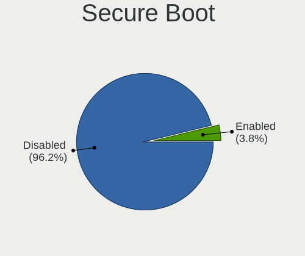
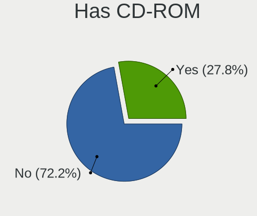
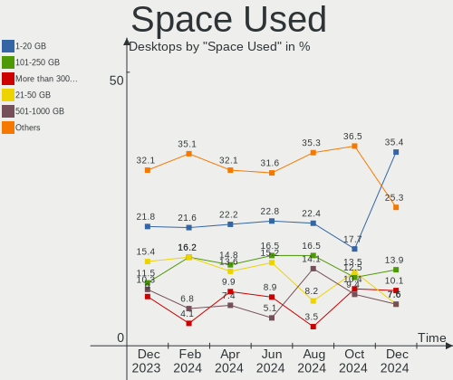
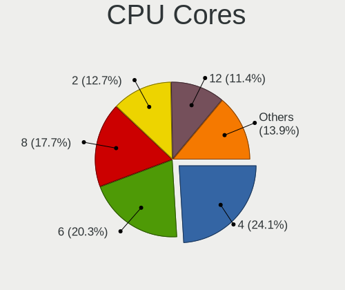
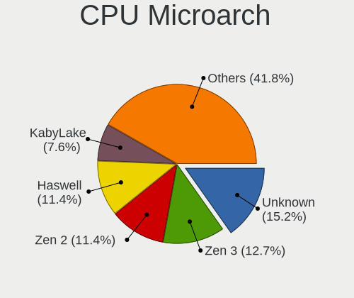
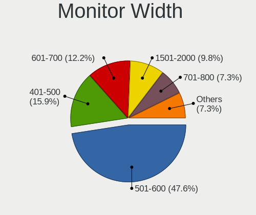

Linux in UK - Hardware Trends (Desktops)
----------------------------------------

A project to identify most popular hardware characteristics and track their change
over time based on data collected by Linux users at https://Linux-Hardware.org.

Anyone can contribute to this report by the [hw-probe](https://github.com/linuxhw/hw-probe) tool:

    sudo -E hw-probe -all -upload

Period: Aug, 2022.

Contents
--------

* [ System ](#system)
  - [ OS                       ](#os)
  - [ OS Family                ](#os-family)
  - [ Kernel                   ](#kernel)
  - [ Kernel Family            ](#kernel-family)
  - [ Kernel Major Ver.        ](#kernel-major-ver)
  - [ Arch                     ](#arch)
  - [ DE                       ](#de)
  - [ Display Server           ](#display-server)
  - [ Display Manager          ](#display-manager)
  - [ OS Lang                  ](#os-lang)
  - [ Boot Mode                ](#boot-mode)
  - [ Filesystem               ](#filesystem)
  - [ Part. scheme             ](#part-scheme)
  - [ Dual Boot with Linux/BSD ](#dual-boot-with-linuxbsd)
  - [ Dual Boot (Win)          ](#dual-boot-win)

* [ Board ](#board)
  - [ Vendor                   ](#vendor)
  - [ Model                    ](#model)
  - [ Model Family             ](#model-family)
  - [ MFG Year                 ](#mfg-year)
  - [ Form Factor              ](#form-factor)
  - [ Secure Boot              ](#secure-boot)
  - [ Coreboot                 ](#coreboot)
  - [ RAM Size                 ](#ram-size)
  - [ RAM Used                 ](#ram-used)
  - [ Total Drives             ](#total-drives)
  - [ Has CD-ROM               ](#has-cd-rom)
  - [ Has Ethernet             ](#has-ethernet)
  - [ Has WiFi                 ](#has-wifi)
  - [ Has Bluetooth            ](#has-bluetooth)

* [ Location ](#location)
  - [ Country                  ](#country)
  - [ City                     ](#city)

* [ Drives ](#drives)
  - [ Drive Vendor             ](#drive-vendor)
  - [ Drive Model              ](#drive-model)
  - [ HDD Vendor               ](#hdd-vendor)
  - [ SSD Vendor               ](#ssd-vendor)
  - [ Drive Kind               ](#drive-kind)
  - [ Drive Connector          ](#drive-connector)
  - [ Drive Size               ](#drive-size)
  - [ Space Total              ](#space-total)
  - [ Space Used               ](#space-used)
  - [ Malfunc. Drives          ](#malfunc-drives)
  - [ Malfunc. Drive Vendor    ](#malfunc-drive-vendor)
  - [ Malfunc. HDD Vendor      ](#malfunc-hdd-vendor)
  - [ Malfunc. Drive Kind      ](#malfunc-drive-kind)
  - [ Failed Drives            ](#failed-drives)
  - [ Failed Drive Vendor      ](#failed-drive-vendor)
  - [ Drive Status             ](#drive-status)

* [ Storage controller ](#storage-controller)
  - [ Storage Vendor           ](#storage-vendor)
  - [ Storage Model            ](#storage-model)
  - [ Storage Kind             ](#storage-kind)

* [ Processor ](#processor)
  - [ CPU Vendor               ](#cpu-vendor)
  - [ CPU Model                ](#cpu-model)
  - [ CPU Model Family         ](#cpu-model-family)
  - [ CPU Cores                ](#cpu-cores)
  - [ CPU Sockets              ](#cpu-sockets)
  - [ CPU Threads              ](#cpu-threads)
  - [ CPU Op-Modes             ](#cpu-op-modes)
  - [ CPU Microcode            ](#cpu-microcode)
  - [ CPU Microarch            ](#cpu-microarch)

* [ Graphics ](#graphics)
  - [ GPU Vendor               ](#gpu-vendor)
  - [ GPU Model                ](#gpu-model)
  - [ GPU Combo                ](#gpu-combo)
  - [ GPU Driver               ](#gpu-driver)
  - [ GPU Memory               ](#gpu-memory)

* [ Monitor ](#monitor)
  - [ Monitor Vendor           ](#monitor-vendor)
  - [ Monitor Model            ](#monitor-model)
  - [ Monitor Resolution       ](#monitor-resolution)
  - [ Monitor Diagonal         ](#monitor-diagonal)
  - [ Monitor Width            ](#monitor-width)
  - [ Aspect Ratio             ](#aspect-ratio)
  - [ Monitor Area             ](#monitor-area)
  - [ Pixel Density            ](#pixel-density)
  - [ Multiple Monitors        ](#multiple-monitors)

* [ Network ](#network)
  - [ Net Controller Vendor    ](#net-controller-vendor)
  - [ Net Controller Model     ](#net-controller-model)
  - [ Wireless Vendor          ](#wireless-vendor)
  - [ Wireless Model           ](#wireless-model)
  - [ Ethernet Vendor          ](#ethernet-vendor)
  - [ Ethernet Model           ](#ethernet-model)
  - [ Net Controller Kind      ](#net-controller-kind)
  - [ Used Controller          ](#used-controller)
  - [ NICs                     ](#nics)
  - [ IPv6                     ](#ipv6)

* [ Bluetooth ](#bluetooth)
  - [ Bluetooth Vendor         ](#bluetooth-vendor)
  - [ Bluetooth Model          ](#bluetooth-model)

* [ Sound ](#sound)
  - [ Sound Vendor             ](#sound-vendor)
  - [ Sound Model              ](#sound-model)

* [ Memory ](#memory)
  - [ Memory Vendor            ](#memory-vendor)
  - [ Memory Model             ](#memory-model)
  - [ Memory Kind              ](#memory-kind)
  - [ Memory Form Factor       ](#memory-form-factor)
  - [ Memory Size              ](#memory-size)
  - [ Memory Speed             ](#memory-speed)

* [ Printers & scanners ](#printers--scanners)
  - [ Printer Vendor           ](#printer-vendor)
  - [ Printer Model            ](#printer-model)
  - [ Scanner Vendor           ](#scanner-vendor)
  - [ Scanner Model            ](#scanner-model)

* [ Camera ](#camera)
  - [ Camera Vendor            ](#camera-vendor)
  - [ Camera Model             ](#camera-model)

* [ Security ](#security)
  - [ Fingerprint Vendor       ](#fingerprint-vendor)
  - [ Fingerprint Model        ](#fingerprint-model)
  - [ Chipcard Vendor          ](#chipcard-vendor)
  - [ Chipcard Model           ](#chipcard-model)

* [ Unsupported ](#unsupported)
  - [ Unsupported Devices      ](#unsupported-devices)
  - [ Unsupported Device Types ](#unsupported-device-types)

System
------

OS
--

Installed operating systems

| Name                         | Desktops | Percent |
|------------------------------|----------|---------|
| Ubuntu 22.04                 | 12       | 19.05%  |
| OpenMandriva 4.3             | 6        | 9.52%   |
| Fedora 36                    | 6        | 9.52%   |
| Linux Mint 21                | 4        | 6.35%   |
| Ubuntu 20.04                 | 3        | 4.76%   |
| Pop!_OS 22.04                | 3        | 4.76%   |
| Zorin 16                     | 2        | 3.17%   |
| OpenMandriva 4.90            | 2        | 3.17%   |
| Nobara 36                    | 2        | 3.17%   |
| Endless 4.0.4                | 2        | 3.17%   |
| Debian 11                    | 2        | 3.17%   |
| Arch Rolling                 | 2        | 3.17%   |
| Xubuntu 22.04                | 1        | 1.59%   |
| Xubuntu 20.04                | 1        | 1.59%   |
| Ubuntu Studio 22.04          | 1        | 1.59%   |
| Ubuntu MATE 20.04            | 1        | 1.59%   |
| Ubuntu 18.04                 | 1        | 1.59%   |
| Sparky 7                     | 1        | 1.59%   |
| RHEL 9                       | 1        | 1.59%   |
| openSUSE Tumbleweed-XXXXXXXX | 1        | 1.59%   |
| openSUSE Leap-15.4           | 1        | 1.59%   |
| KDE neon 22.04               | 1        | 1.59%   |
| KDE neon 20.04               | 1        | 1.59%   |
| Kali 2022.3                  | 1        | 1.59%   |
| Gentoo 2.8                   | 1        | 1.59%   |
| Garuda Linux Soaring         | 1        | 1.59%   |
| Debian Testing               | 1        | 1.59%   |
| Arch                         | 1        | 1.59%   |
| antiX 21                     | 1        | 1.59%   |

OS Family
---------

OS without a version

| Name          | Desktops | Percent |
|---------------|----------|---------|
| Ubuntu        | 16       | 25.4%   |
| OpenMandriva  | 8        | 12.7%   |
| Fedora        | 6        | 9.52%   |
| Linux Mint    | 4        | 6.35%   |
| Pop!_OS       | 3        | 4.76%   |
| Debian        | 3        | 4.76%   |
| Arch          | 3        | 4.76%   |
| Zorin         | 2        | 3.17%   |
| Xubuntu       | 2        | 3.17%   |
| openSUSE      | 2        | 3.17%   |
| Nobara        | 2        | 3.17%   |
| KDE neon      | 2        | 3.17%   |
| Endless       | 2        | 3.17%   |
| Ubuntu Studio | 1        | 1.59%   |
| Ubuntu MATE   | 1        | 1.59%   |
| Sparky        | 1        | 1.59%   |
| RHEL          | 1        | 1.59%   |
| Kali          | 1        | 1.59%   |
| Gentoo        | 1        | 1.59%   |
| Garuda Linux  | 1        | 1.59%   |
| antiX         | 1        | 1.59%   |

Kernel
------

Version of the Linux kernel

| Version                       | Desktops | Percent |
|-------------------------------|----------|---------|
| 5.15.0-46-generic             | 16       | 25.4%   |
| 5.16.7-desktop-1omv4003       | 6        | 9.52%   |
| 5.15.0-43-generic             | 5        | 7.94%   |
| 5.4.0-122-generic             | 2        | 3.17%   |
| 5.18.16-200.fc36.x86_64       | 2        | 3.17%   |
| 5.18.13-200.fc36.x86_64       | 2        | 3.17%   |
| 5.18.12-desktop-3omv4090      | 2        | 3.17%   |
| 5.18.0-4-amd64                | 2        | 3.17%   |
| 5.11.0-35-generic             | 2        | 3.17%   |
| 5.4.0-42-generic              | 1        | 1.59%   |
| 5.4.0-123-generic             | 1        | 1.59%   |
| 5.19.4-201.fsync.fc36.x86_64  | 1        | 1.59%   |
| 5.19.4-200.fc36.x86_64        | 1        | 1.59%   |
| 5.19.1-arch2-1                | 1        | 1.59%   |
| 5.19.1-1-default              | 1        | 1.59%   |
| 5.19.0-76051900-generic       | 1        | 1.59%   |
| 5.18.16-arch1-1               | 1        | 1.59%   |
| 5.18.13-201.fsync.fc36.x86_64 | 1        | 1.59%   |
| 5.18.12-zen1-1-zen            | 1        | 1.59%   |
| 5.18.10-76051810-generic      | 1        | 1.59%   |
| 5.18.0-kali5-amd64            | 1        | 1.59%   |
| 5.17.5-300.fc36.x86_64        | 1        | 1.59%   |
| 5.17.15-76051715-generic      | 1        | 1.59%   |
| 5.15.63-1-lts                 | 1        | 1.59%   |
| 5.15.59-gentoo                | 1        | 1.59%   |
| 5.15.0-47-generic             | 1        | 1.59%   |
| 5.15.0-46-lowlatency          | 1        | 1.59%   |
| 5.15.0-41-generic             | 1        | 1.59%   |
| 5.14.21-150400.24.18-default  | 1        | 1.59%   |
| 5.14.0-70.22.1.el9_0.x86_64   | 1        | 1.59%   |
| 5.10.0-17-amd64               | 1        | 1.59%   |
| 5.10.0-16-amd64               | 1        | 1.59%   |
| 4.9.0-279-antix.1-amd64-smp   | 1        | 1.59%   |

Kernel Family
-------------

Linux kernel without a distro release

| Version | Desktops | Percent |
|---------|----------|---------|
| 5.15.0  | 24       | 38.1%   |
| 5.16.7  | 6        | 9.52%   |
| 5.4.0   | 4        | 6.35%   |
| 5.18.16 | 3        | 4.76%   |
| 5.18.13 | 3        | 4.76%   |
| 5.18.12 | 3        | 4.76%   |
| 5.18.0  | 3        | 4.76%   |
| 5.19.4  | 2        | 3.17%   |
| 5.19.1  | 2        | 3.17%   |
| 5.11.0  | 2        | 3.17%   |
| 5.10.0  | 2        | 3.17%   |
| 5.19.0  | 1        | 1.59%   |
| 5.18.10 | 1        | 1.59%   |
| 5.17.5  | 1        | 1.59%   |
| 5.17.15 | 1        | 1.59%   |
| 5.15.63 | 1        | 1.59%   |
| 5.15.59 | 1        | 1.59%   |
| 5.14.21 | 1        | 1.59%   |
| 5.14.0  | 1        | 1.59%   |
| 4.9.0   | 1        | 1.59%   |

Kernel Major Ver.
-----------------

Linux kernel major version

| Version | Desktops | Percent |
|---------|----------|---------|
| 5.15    | 26       | 41.27%  |
| 5.18    | 13       | 20.63%  |
| 5.16    | 6        | 9.52%   |
| 5.19    | 5        | 7.94%   |
| 5.4     | 4        | 6.35%   |
| 5.17    | 2        | 3.17%   |
| 5.14    | 2        | 3.17%   |
| 5.11    | 2        | 3.17%   |
| 5.10    | 2        | 3.17%   |
| 4.9     | 1        | 1.59%   |

Arch
----

OS architecture (x86_64, i586, etc.)

| Name   | Desktops | Percent |
|--------|----------|---------|
| x86_64 | 63       | 100%    |

DE
--

Desktop Environment

| Name       | Desktops | Percent |
|------------|----------|---------|
| GNOME      | 33       | 52.38%  |
| KDE5       | 16       | 25.4%   |
| XFCE       | 4        | 6.35%   |
| X-Cinnamon | 3        | 4.76%   |
| Unknown    | 3        | 4.76%   |
| MATE       | 2        | 3.17%   |
| icewm      | 1        | 1.59%   |
| Cinnamon   | 1        | 1.59%   |

Display Server
--------------

X11 or Wayland

| Name    | Desktops | Percent |
|---------|----------|---------|
| X11     | 43       | 68.25%  |
| Wayland | 17       | 26.98%  |
| Unknown | 2        | 3.17%   |
| Tty     | 1        | 1.59%   |

Display Manager
---------------

SDDM, LightDM, etc.

| Name    | Desktops | Percent |
|---------|----------|---------|
| Unknown | 27       | 42.86%  |
| GDM3    | 12       | 19.05%  |
| SDDM    | 10       | 15.87%  |
| LightDM | 10       | 15.87%  |
| GDM     | 3        | 4.76%   |
| XDM     | 1        | 1.59%   |

OS Lang
-------

Language

| Lang    | Desktops | Percent |
|---------|----------|---------|
| en_GB   | 50       | 79.37%  |
| en_US   | 12       | 19.05%  |
| Unknown | 1        | 1.59%   |

Boot Mode
---------

EFI or BIOS

| Mode | Desktops | Percent |
|------|----------|---------|
| BIOS | 38       | 60.32%  |
| EFI  | 25       | 39.68%  |

Filesystem
----------

Type of filesystem

| Type    | Desktops | Percent |
|---------|----------|---------|
| Ext4    | 40       | 63.49%  |
| Overlay | 10       | 15.87%  |
| Btrfs   | 9        | 14.29%  |
| Tmpfs   | 2        | 3.17%   |
| Xfs     | 1        | 1.59%   |
| Ext2    | 1        | 1.59%   |

Part. scheme
------------

Scheme of partitioning

| Type    | Desktops | Percent |
|---------|----------|---------|
| Unknown | 34       | 53.97%  |
| GPT     | 22       | 34.92%  |
| MBR     | 7        | 11.11%  |

Dual Boot with Linux/BSD
------------------------

Hosting more than one Linux/BSD

| Dual boot | Desktops | Percent |
|-----------|----------|---------|
| No        | 48       | 76.19%  |
| Yes       | 15       | 23.81%  |

Dual Boot (Win)
---------------

Hosting Linux and Windows

| Dual boot | Desktops | Percent |
|-----------|----------|---------|
| No        | 41       | 65.08%  |
| Yes       | 22       | 34.92%  |

Board
-----

Vendor
------

Motherboard manufacturer

| Name                | Desktops | Percent |
|---------------------|----------|---------|
| ASUSTek Computer    | 14       | 22.22%  |
| MSI                 | 11       | 17.46%  |
| Gigabyte Technology | 11       | 17.46%  |
| Dell                | 8        | 12.7%   |
| Hewlett-Packard     | 5        | 7.94%   |
| ASRock              | 5        | 7.94%   |
| Intel               | 2        | 3.17%   |
| Pegatron            | 1        | 1.59%   |
| OEM_MB              | 1        | 1.59%   |
| Lenovo              | 1        | 1.59%   |
| ECS                 | 1        | 1.59%   |
| Alienware           | 1        | 1.59%   |
| Acer                | 1        | 1.59%   |
| Unknown             | 1        | 1.59%   |

Model
-----

Motherboard model

| Name                              | Desktops | Percent |
|-----------------------------------|----------|---------|
| MSI MS-7B51                       | 2        | 3.17%   |
| Dell OptiPlex 780                 | 2        | 3.17%   |
| Pegatron VG238AA-ABU s5229uk      | 1        | 1.59%   |
| OEM_MB KX733AA-ABU a6511.uk       | 1        | 1.59%   |
| MSI MS-7C94                       | 1        | 1.59%   |
| MSI MS-7C52                       | 1        | 1.59%   |
| MSI MS-7C37                       | 1        | 1.59%   |
| MSI MS-7C02                       | 1        | 1.59%   |
| MSI MS-7B89                       | 1        | 1.59%   |
| MSI MS-7B86                       | 1        | 1.59%   |
| MSI MS-7B84                       | 1        | 1.59%   |
| MSI MS-7924                       | 1        | 1.59%   |
| MSI MS-7721                       | 1        | 1.59%   |
| Lenovo ThinkCentre M83 10AHS03K00 | 1        | 1.59%   |
| Intel TOWER 300                   | 1        | 1.59%   |
| Intel D525MW AAE93082-401         | 1        | 1.59%   |
| HP Z600 Workstation               | 1        | 1.59%   |
| HP Z1 Entry Tower G5              | 1        | 1.59%   |
| HP EliteDesk 705 G2 MINI          | 1        | 1.59%   |
| HP Compaq 8100 Elite SFF PC       | 1        | 1.59%   |
| HP 110-020ea                      | 1        | 1.59%   |
| Gigabyte X570S AORUS PRO AX       | 1        | 1.59%   |
| Gigabyte X570S AORUS ELITE AX     | 1        | 1.59%   |
| Gigabyte X570 I AORUS PRO WIFI    | 1        | 1.59%   |
| Gigabyte M68MT-S2P                | 1        | 1.59%   |
| Gigabyte GA-990X-Gaming SLI-CF    | 1        | 1.59%   |
| Gigabyte GA-970A-UD3              | 1        | 1.59%   |
| Gigabyte GA-78LMT-USB3 R2         | 1        | 1.59%   |
| Gigabyte BB-83508                 | 1        | 1.59%   |
| Gigabyte B450 AORUS M             | 1        | 1.59%   |
| Gigabyte A320M-S2H                | 1        | 1.59%   |
| Gigabyte A320M-H                  | 1        | 1.59%   |
| ECS GF8100VM-M5                   | 1        | 1.59%   |
| Dell Precision WorkStation T5500  | 1        | 1.59%   |
| Dell Precision T3600              | 1        | 1.59%   |
| Dell OptiPlex 7020                | 1        | 1.59%   |
| Dell OptiPlex 5050                | 1        | 1.59%   |
| Dell OptiPlex 330                 | 1        | 1.59%   |
| Dell OptiPlex 3010                | 1        | 1.59%   |
| ASUS Z170 PRO GAMING              | 1        | 1.59%   |
| ASUS TUF B450M-PLUS GAMING        | 1        | 1.59%   |
| ASUS ROG STRIX X299-E GAMING      | 1        | 1.59%   |
| ASUS ROG STRIX B550-F GAMING      | 1        | 1.59%   |
| ASUS ROG Maximus XI HERO          | 1        | 1.59%   |
| ASUS PRIME X299-DELUXE            | 1        | 1.59%   |
| ASUS PRIME H510M-E                | 1        | 1.59%   |
| ASUS PRIME B450M-A II             | 1        | 1.59%   |
| ASUS PRIME B250M-A                | 1        | 1.59%   |
| ASUS PRIME A320M-K                | 1        | 1.59%   |
| ASUS P8Z68-V LE                   | 1        | 1.59%   |
| ASUS Maximus VIII HERO            | 1        | 1.59%   |
| ASUS M5A78L-M/USB3                | 1        | 1.59%   |
| ASUS All Series                   | 1        | 1.59%   |
| ASRock Z490 Phantom Gaming 4      | 1        | 1.59%   |
| ASRock X570M Pro4                 | 1        | 1.59%   |
| ASRock FM2A88M-HD+ R2.0           | 1        | 1.59%   |
| ASRock B550M-ITX/ac               | 1        | 1.59%   |
| ASRock B450M Pro4                 | 1        | 1.59%   |
| Alienware Aurora R5               | 1        | 1.59%   |
| Acer Aspire XC-330                | 1        | 1.59%   |

Model Family
------------

Motherboard model prefix

| Name                    | Desktops | Percent |
|-------------------------|----------|---------|
| Dell OptiPlex           | 6        | 9.52%   |
| ASUS PRIME              | 5        | 7.94%   |
| ASUS ROG                | 3        | 4.76%   |
| MSI MS-7B51             | 2        | 3.17%   |
| Gigabyte X570S          | 2        | 3.17%   |
| Dell Precision          | 2        | 3.17%   |
| Pegatron VG238AA-ABU    | 1        | 1.59%   |
| OEM_MB KX733AA-ABU      | 1        | 1.59%   |
| MSI MS-7C94             | 1        | 1.59%   |
| MSI MS-7C52             | 1        | 1.59%   |
| MSI MS-7C37             | 1        | 1.59%   |
| MSI MS-7C02             | 1        | 1.59%   |
| MSI MS-7B89             | 1        | 1.59%   |
| MSI MS-7B86             | 1        | 1.59%   |
| MSI MS-7B84             | 1        | 1.59%   |
| MSI MS-7924             | 1        | 1.59%   |
| MSI MS-7721             | 1        | 1.59%   |
| Lenovo ThinkCentre      | 1        | 1.59%   |
| Intel TOWER             | 1        | 1.59%   |
| Intel D525MW            | 1        | 1.59%   |
| HP Z600                 | 1        | 1.59%   |
| HP Z1                   | 1        | 1.59%   |
| HP EliteDesk            | 1        | 1.59%   |
| HP Compaq               | 1        | 1.59%   |
| HP 110-020ea            | 1        | 1.59%   |
| Gigabyte X570           | 1        | 1.59%   |
| Gigabyte M68MT-S2P      | 1        | 1.59%   |
| Gigabyte GA-990X-Gaming | 1        | 1.59%   |
| Gigabyte GA-970A-UD3    | 1        | 1.59%   |
| Gigabyte GA-78LMT-USB3  | 1        | 1.59%   |
| Gigabyte BB-83508       | 1        | 1.59%   |
| Gigabyte B450           | 1        | 1.59%   |
| Gigabyte A320M-S2H      | 1        | 1.59%   |
| Gigabyte A320M-H        | 1        | 1.59%   |
| ECS GF8100VM-M5         | 1        | 1.59%   |
| ASUS Z170               | 1        | 1.59%   |
| ASUS TUF                | 1        | 1.59%   |
| ASUS P8Z68-V            | 1        | 1.59%   |
| ASUS Maximus            | 1        | 1.59%   |
| ASUS M5A78L-M           | 1        | 1.59%   |
| ASUS All                | 1        | 1.59%   |
| ASRock Z490             | 1        | 1.59%   |
| ASRock X570M            | 1        | 1.59%   |
| ASRock FM2A88M-HD+      | 1        | 1.59%   |
| ASRock B550M-ITX        | 1        | 1.59%   |
| ASRock B450M            | 1        | 1.59%   |
| Alienware Aurora        | 1        | 1.59%   |
| Acer Aspire             | 1        | 1.59%   |
| Unknown                 | 1        | 1.59%   |

MFG Year
--------

Motherboard manufacture year

| Year | Desktops | Percent |
|------|----------|---------|
| 2019 | 9        | 14.29%  |
| 2018 | 8        | 12.7%   |
| 2017 | 6        | 9.52%   |
| 2011 | 6        | 9.52%   |
| 2020 | 5        | 7.94%   |
| 2014 | 5        | 7.94%   |
| 2021 | 4        | 6.35%   |
| 2015 | 4        | 6.35%   |
| 2010 | 4        | 6.35%   |
| 2016 | 3        | 4.76%   |
| 2012 | 2        | 3.17%   |
| 2009 | 2        | 3.17%   |
| 2008 | 2        | 3.17%   |
| 2022 | 1        | 1.59%   |
| 2013 | 1        | 1.59%   |
| 2007 | 1        | 1.59%   |

Form Factor
-----------

Physical design of the computer

| Name    | Desktops | Percent |
|---------|----------|---------|
| Desktop | 63       | 100%    |

Secure Boot
-----------

Enabled or disabled

| State    | Desktops | Percent |
|----------|----------|---------|
| Disabled | 62       | 98.41%  |
| Enabled  | 1        | 1.59%   |

Coreboot
--------

Have coreboot on board

| Used | Desktops | Percent |
|------|----------|---------|
| No   | 63       | 100%    |

RAM Size
--------

Total RAM memory

| Size in GB  | Desktops | Percent |
|-------------|----------|---------|
| 16.01-24.0  | 19       | 30.16%  |
| 8.01-16.0   | 15       | 23.81%  |
| 32.01-64.0  | 12       | 19.05%  |
| 4.01-8.0    | 7        | 11.11%  |
| 3.01-4.0    | 6        | 9.52%   |
| 1.01-2.0    | 2        | 3.17%   |
| 24.01-32.0  | 1        | 1.59%   |
| 64.01-256.0 | 1        | 1.59%   |

RAM Used
--------

Used RAM memory

| Used GB   | Desktops | Percent |
|-----------|----------|---------|
| 2.01-3.0  | 20       | 31.75%  |
| 1.01-2.0  | 18       | 28.57%  |
| 3.01-4.0  | 12       | 19.05%  |
| 4.01-8.0  | 11       | 17.46%  |
| 8.01-16.0 | 1        | 1.59%   |
| 0.51-1.0  | 1        | 1.59%   |

Total Drives
------------

Number of drives on board

| Drives | Desktops | Percent |
|--------|----------|---------|
| 2      | 24       | 38.1%   |
| 1      | 17       | 26.98%  |
| 3      | 14       | 22.22%  |
| 6      | 3        | 4.76%   |
| 5      | 2        | 3.17%   |
| 4      | 2        | 3.17%   |
| 7      | 1        | 1.59%   |

Has CD-ROM
----------

Has CD-ROM on board

| Presented | Desktops | Percent |
|-----------|----------|---------|
| No        | 43       | 68.25%  |
| Yes       | 20       | 31.75%  |

Has Ethernet
------------

Has Ethernet on board

| Presented | Desktops | Percent |
|-----------|----------|---------|
| Yes       | 63       | 100%    |

Has WiFi
--------

Has WiFi module

| Presented | Desktops | Percent |
|-----------|----------|---------|
| Yes       | 35       | 55.56%  |
| No        | 28       | 44.44%  |

Has Bluetooth
-------------

Has Bluetooth module

| Presented | Desktops | Percent |
|-----------|----------|---------|
| No        | 37       | 58.73%  |
| Yes       | 26       | 41.27%  |

Location
--------

Country
-------

Geographic location (country)

| Country | Desktops | Percent |
|---------|----------|---------|
| UK      | 63       | 100%    |

City
----

Geographic location (city)

| City              | Desktops | Percent |
|-------------------|----------|---------|
| Manchester        | 4        | 6.35%   |
| Bristol           | 4        | 6.35%   |
| Wolverhampton     | 2        | 3.17%   |
| Rochester         | 2        | 3.17%   |
| Rhyl              | 2        | 3.17%   |
| Northampton       | 2        | 3.17%   |
| London            | 2        | 3.17%   |
| Ystradgynlais     | 1        | 1.59%   |
| York              | 1        | 1.59%   |
| Workington        | 1        | 1.59%   |
| Winchester        | 1        | 1.59%   |
| Warrington        | 1        | 1.59%   |
| Walsall           | 1        | 1.59%   |
| Thornton Heath    | 1        | 1.59%   |
| Swansea           | 1        | 1.59%   |
| Sunderland        | 1        | 1.59%   |
| Strabane          | 1        | 1.59%   |
| Stoke-on-Trent    | 1        | 1.59%   |
| Sheffield         | 1        | 1.59%   |
| Sheerness         | 1        | 1.59%   |
| Salisbury         | 1        | 1.59%   |
| Rotherham         | 1        | 1.59%   |
| Redditch          | 1        | 1.59%   |
| Redcar            | 1        | 1.59%   |
| Reading           | 1        | 1.59%   |
| Portsmouth        | 1        | 1.59%   |
| Poole             | 1        | 1.59%   |
| Peterlee          | 1        | 1.59%   |
| Oldham            | 1        | 1.59%   |
| Nottingham        | 1        | 1.59%   |
| Newport           | 1        | 1.59%   |
| Newbridge on Wye  | 1        | 1.59%   |
| Mansfield         | 1        | 1.59%   |
| Maidstone         | 1        | 1.59%   |
| Leeds             | 1        | 1.59%   |
| Lancaster         | 1        | 1.59%   |
| Kirkcaldy         | 1        | 1.59%   |
| Kettering         | 1        | 1.59%   |
| Isleworth         | 1        | 1.59%   |
| Hastings          | 1        | 1.59%   |
| Harlesden         | 1        | 1.59%   |
| Edinburgh         | 1        | 1.59%   |
| Dunfermline       | 1        | 1.59%   |
| Chelsea           | 1        | 1.59%   |
| Camden            | 1        | 1.59%   |
| Calne             | 1        | 1.59%   |
| Burton-on-Trent   | 1        | 1.59%   |
| Bridgend          | 1        | 1.59%   |
| Birmingham        | 1        | 1.59%   |
| Bellshill         | 1        | 1.59%   |
| Ashton-under-Lyne | 1        | 1.59%   |
| Aberdeen          | 1        | 1.59%   |

Drives
------

Drive Vendor
------------

Hard drive vendors

| Vendor              | Desktops | Drives | Percent |
|---------------------|----------|--------|---------|
| Seagate             | 26       | 31     | 20.97%  |
| WDC                 | 19       | 23     | 15.32%  |
| Samsung Electronics | 13       | 19     | 10.48%  |
| Toshiba             | 10       | 10     | 8.06%   |
| SanDisk             | 8        | 10     | 6.45%   |
| Crucial             | 8        | 12     | 6.45%   |
| Phison              | 4        | 4      | 3.23%   |
| Hitachi             | 4        | 4      | 3.23%   |
| XUM                 | 2        | 2      | 1.61%   |
| Unknown             | 2        | 4      | 1.61%   |
| Micron Technology   | 2        | 2      | 1.61%   |
| LITEON              | 2        | 2      | 1.61%   |
| Kingston            | 2        | 2      | 1.61%   |
| Intel               | 2        | 2      | 1.61%   |
| China               | 2        | 3      | 1.61%   |
| ADATA Technology    | 2        | 2      | 1.61%   |
| A-DATA Technology   | 2        | 2      | 1.61%   |
| XPG                 | 1        | 1      | 0.81%   |
| USB3.0              | 1        | 1      | 0.81%   |
| Team                | 1        | 1      | 0.81%   |
| SPCC                | 1        | 1      | 0.81%   |
| SK hynix            | 1        | 1      | 0.81%   |
| Silicon Motion      | 1        | 1      | 0.81%   |
| PNY                 | 1        | 1      | 0.81%   |
| Leven               | 1        | 1      | 0.81%   |
| KIOXIA-EXCERIA      | 1        | 1      | 0.81%   |
| JMicron Technology  | 1        | 1      | 0.81%   |
| Hewlett-Packard     | 1        | 1      | 0.81%   |
| Fujitsu             | 1        | 1      | 0.81%   |
| ASMT                | 1        | 2      | 0.81%   |
| ASMedia             | 1        | 1      | 0.81%   |

Drive Model
-----------

Hard drive models

| Model                                   | Desktops | Percent |
|-----------------------------------------|----------|---------|
| Toshiba HDWD110 1TB                     | 3        | 2.13%   |
| Seagate ST1000DM003-1SB102 1TB          | 3        | 2.13%   |
| Samsung NVMe SSD Drive 500GB            | 3        | 2.13%   |
| XUM HX256GSSDSATA3 256GB                | 2        | 1.42%   |
| WDC WDS500G2B0A-00SM50 500GB SSD        | 2        | 1.42%   |
| WDC WDS100T2B0A-00SM50 1TB SSD          | 2        | 1.42%   |
| WDC WD10EZEX-08M2NA0 1TB                | 2        | 1.42%   |
| Seagate ST3500312CS 500GB               | 2        | 1.42%   |
| Seagate ST1000DM010-2EP102 1TB          | 2        | 1.42%   |
| Seagate ST1000DM003-1CH162 1TB          | 2        | 1.42%   |
| SanDisk NVMe SSD Drive 500GB            | 2        | 1.42%   |
| Samsung SSD 850 EVO 500GB               | 2        | 1.42%   |
| Phison NVMe SSD Drive 1024GB            | 2        | 1.42%   |
| Hitachi HDS721032CLA362 320GB           | 2        | 1.42%   |
| Crucial CT250MX500SSD1 250GB            | 2        | 1.42%   |
| XPG NVMe SSD Drive 1024GB               | 1        | 0.71%   |
| WDC WDS500G2B0C-00PXH0 500GB            | 1        | 0.71%   |
| WDC WDS100T2B0C 1TB                     | 1        | 0.71%   |
| WDC WD5000AVCS-632DY1 500GB             | 1        | 0.71%   |
| WDC WD5000AAKX-00ERMA0 500GB            | 1        | 0.71%   |
| WDC WD5000AAKS-00UU3A0 500GB            | 1        | 0.71%   |
| WDC WD4003FZEX-00Z4SA0 4TB              | 1        | 0.71%   |
| WDC WD3200BPVT-75JJ5T0 320GB            | 1        | 0.71%   |
| WDC WD2500AAKX-753CA1 250GB             | 1        | 0.71%   |
| WDC WD20EFRX-68EUZN0 2TB                | 1        | 0.71%   |
| WDC WD20EARS-00MVWB0 2TB                | 1        | 0.71%   |
| WDC WD2003FZEX-00SRLA0 2TB              | 1        | 0.71%   |
| WDC WD10EZRX-00L4HB0 1TB                | 1        | 0.71%   |
| WDC WD10EZEX-08WN4A0 1TB                | 1        | 0.71%   |
| WDC WD10EALX-009BA0 1TB                 | 1        | 0.71%   |
| WDC WD10EADS-00M2B0 1TB                 | 1        | 0.71%   |
| WDC WD10EACS-00D6B0 1TB                 | 1        | 0.71%   |
| USB3.0 Super Speed 128GB                | 1        | 0.71%   |
| Unknown SD/MMC/MS PRO 128GB             | 1        | 0.71%   |
| Unknown SD/MMC/M.S.PRO 32GB             | 1        | 0.71%   |
| Unknown SD/MMC 16GB                     | 1        | 0.71%   |
| Unknown M.S./M.S.Pro/HG 16GB            | 1        | 0.71%   |
| Toshiba THNSNJ128GVNU 128GB SSD         | 1        | 0.71%   |
| Toshiba THNSNH128GCST 128GB SSD         | 1        | 0.71%   |
| Toshiba Q300 120GB SSD                  | 1        | 0.71%   |
| Toshiba MQ01ABD032 320GB                | 1        | 0.71%   |
| Toshiba MK3265GSXF 320GB                | 1        | 0.71%   |
| Toshiba KBG30ZMS128G 128GB NVMe SSD     | 1        | 0.71%   |
| Toshiba DT01ACA050 500GB                | 1        | 0.71%   |
| Team T253X1480G 480GB SSD               | 1        | 0.71%   |
| SPCC Solid State Disk 256GB             | 1        | 0.71%   |
| SK hynix PC601 HFS512GD9TNG-L2A0A 512GB | 1        | 0.71%   |
| Silicon Motion NVMe SSD Drive 1024GB    | 1        | 0.71%   |
| Seagate ST9500620NS 500GB               | 1        | 0.71%   |
| Seagate ST9320423AS 320GB               | 1        | 0.71%   |
| Seagate ST8000DM004-2CX188 8TB          | 1        | 0.71%   |
| Seagate ST500LT012-1DG142 500GB         | 1        | 0.71%   |
| Seagate ST3500418AS 500GB               | 1        | 0.71%   |
| Seagate ST3500413AS 500GB               | 1        | 0.71%   |
| Seagate ST3320418AS 320GB               | 1        | 0.71%   |
| Seagate ST3160811AS 160GB               | 1        | 0.71%   |
| Seagate ST3000DM007-1WY10G 3TB          | 1        | 0.71%   |
| Seagate ST2000DX001-1CM164 2TB          | 1        | 0.71%   |
| Seagate ST2000DM006-2DM164 2TB          | 1        | 0.71%   |
| Seagate ST1000VM002-1CT162 1TB          | 1        | 0.71%   |

HDD Vendor
----------

Hard disk drive vendors

| Vendor              | Desktops | Drives | Percent |
|---------------------|----------|--------|---------|
| Seagate             | 25       | 28     | 44.64%  |
| WDC                 | 14       | 17     | 25%     |
| Toshiba             | 6        | 6      | 10.71%  |
| Hitachi             | 4        | 4      | 7.14%   |
| Samsung Electronics | 2        | 3      | 3.57%   |
| USB3.0              | 1        | 1      | 1.79%   |
| Unknown             | 1        | 1      | 1.79%   |
| Hewlett-Packard     | 1        | 1      | 1.79%   |
| Fujitsu             | 1        | 1      | 1.79%   |
| ASMT                | 1        | 2      | 1.79%   |

SSD Vendor
----------

Solid state drive vendors

| Vendor              | Desktops | Drives | Percent |
|---------------------|----------|--------|---------|
| Crucial             | 7        | 10     | 16.28%  |
| Samsung Electronics | 6        | 8      | 13.95%  |
| SanDisk             | 5        | 6      | 11.63%  |
| WDC                 | 4        | 4      | 9.3%    |
| Toshiba             | 3        | 3      | 6.98%   |
| XUM                 | 2        | 2      | 4.65%   |
| LITEON              | 2        | 2      | 4.65%   |
| China               | 2        | 3      | 4.65%   |
| A-DATA Technology   | 2        | 2      | 4.65%   |
| Team                | 1        | 1      | 2.33%   |
| SPCC                | 1        | 1      | 2.33%   |
| PNY                 | 1        | 1      | 2.33%   |
| Micron Technology   | 1        | 1      | 2.33%   |
| Leven               | 1        | 1      | 2.33%   |
| KIOXIA-EXCERIA      | 1        | 1      | 2.33%   |
| Kingston            | 1        | 1      | 2.33%   |
| JMicron Technology  | 1        | 1      | 2.33%   |
| Intel               | 1        | 1      | 2.33%   |
| ASMedia             | 1        | 1      | 2.33%   |

Drive Kind
----------

HDD or SSD

| Kind    | Desktops | Drives | Percent |
|---------|----------|--------|---------|
| HDD     | 43       | 64     | 42.16%  |
| SSD     | 34       | 50     | 33.33%  |
| NVMe    | 24       | 32     | 23.53%  |
| Unknown | 1        | 3      | 0.98%   |

Drive Connector
---------------

SATA, SAS, NVMe, etc.

| Type | Desktops | Drives | Percent |
|------|----------|--------|---------|
| SATA | 57       | 108    | 65.52%  |
| NVMe | 24       | 32     | 27.59%  |
| SAS  | 6        | 9      | 6.9%    |

Drive Size
----------

Size of hard drive

| Size in TB | Desktops | Drives | Percent |
|------------|----------|--------|---------|
| 0.01-0.5   | 42       | 66     | 51.22%  |
| 0.51-1.0   | 27       | 33     | 32.93%  |
| 1.01-2.0   | 9        | 10     | 10.98%  |
| 4.01-10.0  | 2        | 3      | 2.44%   |
| 3.01-4.0   | 1        | 1      | 1.22%   |
| 2.01-3.0   | 1        | 1      | 1.22%   |

Space Total
-----------

Amount of disk space available on the file system

| Size in GB     | Desktops | Percent |
|----------------|----------|---------|
| 251-500        | 14       | 22.22%  |
| 501-1000       | 12       | 19.05%  |
| 1001-2000      | 10       | 15.87%  |
| 1-20           | 8        | 12.7%   |
| More than 3000 | 5        | 7.94%   |
| 2001-3000      | 5        | 7.94%   |
| 101-250        | 5        | 7.94%   |
| 51-100         | 2        | 3.17%   |
| 21-50          | 1        | 1.59%   |
| Unknown        | 1        | 1.59%   |

Space Used
----------

Amount of used disk space

| Used GB        | Desktops | Percent |
|----------------|----------|---------|
| 1-20           | 21       | 33.33%  |
| 251-500        | 9        | 14.29%  |
| 101-250        | 9        | 14.29%  |
| 21-50          | 7        | 11.11%  |
| 501-1000       | 6        | 9.52%   |
| 1001-2000      | 5        | 7.94%   |
| 51-100         | 3        | 4.76%   |
| More than 3000 | 1        | 1.59%   |
| 2001-3000      | 1        | 1.59%   |
| Unknown        | 1        | 1.59%   |

Malfunc. Drives
---------------

Drive models with a malfunction

| Model                      | Desktops | Drives | Percent |
|----------------------------|----------|--------|---------|
| WDC WD4003FZEX-00Z4SA0 4TB | 1        | 1      | 12.5%   |
| WDC WD10EALX-009BA0 1TB    | 1        | 1      | 12.5%   |
| WDC WD10EADS-00M2B0 1TB    | 1        | 1      | 12.5%   |
| Toshiba MK3265GSXF 320GB   | 1        | 1      | 12.5%   |
| Seagate ST9500620NS 500GB  | 1        | 1      | 12.5%   |
| Seagate ST3500413AS 500GB  | 1        | 1      | 12.5%   |
| Seagate ST3160811AS 160GB  | 1        | 1      | 12.5%   |
| China SATA3 480GB SSD      | 1        | 1      | 12.5%   |

Malfunc. Drive Vendor
---------------------

Vendors of faulty drives

| Vendor  | Desktops | Drives | Percent |
|---------|----------|--------|---------|
| WDC     | 3        | 3      | 37.5%   |
| Seagate | 3        | 3      | 37.5%   |
| Toshiba | 1        | 1      | 12.5%   |
| China   | 1        | 1      | 12.5%   |

Malfunc. HDD Vendor
-------------------

Vendors of faulty HDD drives

| Vendor  | Desktops | Drives | Percent |
|---------|----------|--------|---------|
| WDC     | 3        | 3      | 42.86%  |
| Seagate | 3        | 3      | 42.86%  |
| Toshiba | 1        | 1      | 14.29%  |

Malfunc. Drive Kind
-------------------

Kinds of faulty drives

| Kind | Desktops | Drives | Percent |
|------|----------|--------|---------|
| HDD  | 6        | 7      | 85.71%  |
| SSD  | 1        | 1      | 14.29%  |

Failed Drives
-------------

Failed drive models

Zero info for selected period =(

Failed Drive Vendor
-------------------

Failed drive vendors

Zero info for selected period =(

Drive Status
------------

Number of failed and malfunc. drives

| Status   | Desktops | Drives | Percent |
|----------|----------|--------|---------|
| Detected | 36       | 86     | 50.7%   |
| Works    | 28       | 55     | 39.44%  |
| Malfunc  | 7        | 8      | 9.86%   |

Storage controller
------------------

Storage Vendor
--------------

Storage controller vendors

| Vendor                       | Desktops | Percent |
|------------------------------|----------|---------|
| Intel                        | 30       | 31.91%  |
| AMD                          | 29       | 30.85%  |
| Samsung Electronics          | 6        | 6.38%   |
| SanDisk                      | 5        | 5.32%   |
| Phison Electronics           | 4        | 4.26%   |
| Nvidia                       | 4        | 4.26%   |
| ASMedia Technology           | 4        | 4.26%   |
| ADATA Technology             | 3        | 3.19%   |
| Seagate Technology           | 2        | 2.13%   |
| Toshiba America Info Systems | 1        | 1.06%   |
| SK hynix                     | 1        | 1.06%   |
| Silicon Motion               | 1        | 1.06%   |
| Micron/Crucial Technology    | 1        | 1.06%   |
| Micron Technology            | 1        | 1.06%   |
| Marvell Technology Group     | 1        | 1.06%   |
| Kingston Technology Company  | 1        | 1.06%   |

Storage Model
-------------

Storage controller models

| Model                                                                                  | Desktops | Percent |
|----------------------------------------------------------------------------------------|----------|---------|
| AMD FCH SATA Controller [AHCI mode]                                                    | 19       | 15.83%  |
| AMD 400 Series Chipset SATA Controller                                                 | 8        | 6.67%   |
| Intel SATA Controller [RAID mode]                                                      | 6        | 5%      |
| Samsung NVMe SSD Controller SM981/PM981/PM983                                          | 4        | 3.33%   |
| Intel Cannon Lake PCH SATA AHCI Controller                                             | 4        | 3.33%   |
| ASMedia ASM1062 Serial ATA Controller                                                  | 4        | 3.33%   |
| AMD FCH SATA Controller D                                                              | 4        | 3.33%   |
| SanDisk WD Blue SN550 NVMe SSD                                                         | 3        | 2.5%    |
| Intel 6 Series/C200 Series Chipset Family 6 port Desktop SATA AHCI Controller          | 3        | 2.5%    |
| AMD SB7x0/SB8x0/SB9x0 SATA Controller [AHCI mode]                                      | 3        | 2.5%    |
| AMD 500 Series Chipset SATA Controller                                                 | 3        | 2.5%    |
| Samsung NVMe SSD Controller 980                                                        | 2        | 1.67%   |
| Phison E12 NVMe Controller                                                             | 2        | 1.67%   |
| Nvidia MCP78S [GeForce 8200] SATA Controller (non-AHCI mode)                           | 2        | 1.67%   |
| Nvidia MCP61 SATA Controller                                                           | 2        | 1.67%   |
| Intel Q170/Q150/B150/H170/H110/Z170/CM236 Chipset SATA Controller [AHCI Mode]          | 2        | 1.67%   |
| Intel NM10/ICH7 Family SATA Controller [AHCI mode]                                     | 2        | 1.67%   |
| Intel 8 Series/C220 Series Chipset Family 6-port SATA Controller 1 [AHCI mode]         | 2        | 1.67%   |
| Intel 4 Series Chipset PT IDER Controller                                              | 2        | 1.67%   |
| Intel 200 Series PCH SATA controller [AHCI mode]                                       | 2        | 1.67%   |
| AMD SB7x0/SB8x0/SB9x0 SATA Controller [IDE mode]                                       | 2        | 1.67%   |
| AMD SB7x0/SB8x0/SB9x0 IDE Controller                                                   | 2        | 1.67%   |
| ADATA XPG SX8200 Pro PCIe Gen3x4 M.2 2280 Solid State Drive                            | 2        | 1.67%   |
| Toshiba America Info Systems XG6 NVMe SSD Controller                                   | 1        | 0.83%   |
| SK hynix Non-Volatile memory controller                                                | 1        | 0.83%   |
| Silicon Motion SM2263EN/SM2263XT SSD Controller                                        | 1        | 0.83%   |
| Seagate Non-Volatile memory controller                                                 | 1        | 0.83%   |
| Seagate FireCuda 530 SSD                                                               | 1        | 0.83%   |
| SanDisk WD Blue SN570 NVMe SSD                                                         | 1        | 0.83%   |
| SanDisk WD Black NVMe SSD                                                              | 1        | 0.83%   |
| Samsung NVMe SSD Controller PM9A1/PM9A3/980PRO                                         | 1        | 0.83%   |
| Phison Electronics Non-Volatile memory controller                                      | 1        | 0.83%   |
| Phison E16 PCIe4 NVMe Controller                                                       | 1        | 0.83%   |
| Nvidia MCP78S [GeForce 8200] IDE                                                       | 1        | 0.83%   |
| Nvidia MCP61 IDE                                                                       | 1        | 0.83%   |
| Micron/Crucial P2 NVMe PCIe SSD                                                        | 1        | 0.83%   |
| Micron/Crucial P1 NVMe PCIe SSD                                                        | 1        | 0.83%   |
| Micron Non-Volatile memory controller                                                  | 1        | 0.83%   |
| Marvell Group 88SE9215 PCIe 2.0 x1 4-port SATA 6 Gb/s Controller                       | 1        | 0.83%   |
| Kingston Company A2000 NVMe SSD                                                        | 1        | 0.83%   |
| Intel NVMe Optane Memory Series                                                        | 1        | 0.83%   |
| Intel Comet Lake SATA AHCI Controller                                                  | 1        | 0.83%   |
| Intel C610/X99 series chipset sSATA Controller [AHCI mode]                             | 1        | 0.83%   |
| Intel C610/X99 series chipset 6-Port SATA Controller [AHCI mode]                       | 1        | 0.83%   |
| Intel C602 chipset 4-Port SATA Storage Control Unit                                    | 1        | 0.83%   |
| Intel C600/X79 series chipset 6-Port SATA AHCI Controller                              | 1        | 0.83%   |
| Intel 9 Series Chipset Family SATA Controller [AHCI Mode]                              | 1        | 0.83%   |
| Intel 82801JI (ICH10 Family) SATA AHCI Controller                                      | 1        | 0.83%   |
| Intel 82801JD/DO (ICH10 Family) 4-port SATA IDE Controller                             | 1        | 0.83%   |
| Intel 82801JD/DO (ICH10 Family) 2-port SATA IDE Controller                             | 1        | 0.83%   |
| Intel 82801G (ICH7 Family) IDE Controller                                              | 1        | 0.83%   |
| Intel 6 Series/C200 Series Chipset Family Mobile SATA Controller (IDE mode, ports 4-5) | 1        | 0.83%   |
| Intel 6 Series/C200 Series Chipset Family Mobile SATA Controller (IDE mode, ports 0-3) | 1        | 0.83%   |
| Intel 500 Series Chipset Family SATA AHCI Controller                                   | 1        | 0.83%   |
| Intel 5 Series/3400 Series Chipset PT IDER Controller                                  | 1        | 0.83%   |
| Intel 5 Series/3400 Series Chipset 6 port SATA AHCI Controller                         | 1        | 0.83%   |
| AMD FCH IDE Controller                                                                 | 1        | 0.83%   |
| ADATA A Non-Volatile memory controller                                                 | 1        | 0.83%   |

Storage Kind
------------

Kind of storage controller (IDE, SATA, NVMe, SAS, ...)

| Kind | Desktops | Percent |
|------|----------|---------|
| SATA | 51       | 54.26%  |
| NVMe | 24       | 25.53%  |
| IDE  | 12       | 12.77%  |
| RAID | 6        | 6.38%   |
| SAS  | 1        | 1.06%   |

Processor
---------

CPU Vendor
----------

Processor vendors

| Vendor | Desktops | Percent |
|--------|----------|---------|
| AMD    | 33       | 52.38%  |
| Intel  | 30       | 47.62%  |

CPU Model
---------

Processor models

| Model                                           | Desktops | Percent |
|-------------------------------------------------|----------|---------|
| AMD Ryzen 5 3400G with Radeon Vega Graphics     | 5        | 7.94%   |
| AMD FX-8350 Eight-Core Processor                | 3        | 4.76%   |
| Intel Core i7-7820X CPU @ 3.60GHz               | 2        | 3.17%   |
| Intel Core i7-6700K CPU @ 4.00GHz               | 2        | 3.17%   |
| Intel Core i5 CPU 650 @ 3.20GHz                 | 2        | 3.17%   |
| AMD Ryzen 9 5900X 12-Core Processor             | 2        | 3.17%   |
| AMD Ryzen 5 5600 6-Core Processor               | 2        | 3.17%   |
| AMD Ryzen 5 3600 6-Core Processor               | 2        | 3.17%   |
| AMD Ryzen 5 2600 Six-Core Processor             | 2        | 3.17%   |
| Intel Xeon CPU X5650 @ 2.67GHz                  | 1        | 1.59%   |
| Intel Xeon CPU X5570 @ 2.93GHz                  | 1        | 1.59%   |
| Intel Xeon CPU E5-2690 0 @ 2.90GHz              | 1        | 1.59%   |
| Intel Xeon CPU E5-2420 v2 @ 2.20GHz             | 1        | 1.59%   |
| Intel Pentium CPU G2030T @ 2.60GHz              | 1        | 1.59%   |
| Intel Core i9-9900K CPU @ 3.60GHz               | 1        | 1.59%   |
| Intel Core i7-9700 CPU @ 3.00GHz                | 1        | 1.59%   |
| Intel Core i7-8086K CPU @ 4.00GHz               | 1        | 1.59%   |
| Intel Core i7-5820K CPU @ 3.30GHz               | 1        | 1.59%   |
| Intel Core i7-4790K CPU @ 4.00GHz               | 1        | 1.59%   |
| Intel Core i7-2600K CPU @ 3.40GHz               | 1        | 1.59%   |
| Intel Core i5-9600KF CPU @ 3.70GHz              | 1        | 1.59%   |
| Intel Core i5-7500T CPU @ 2.70GHz               | 1        | 1.59%   |
| Intel Core i5-7400 CPU @ 3.00GHz                | 1        | 1.59%   |
| Intel Core i5-4590 CPU @ 3.30GHz                | 1        | 1.59%   |
| Intel Core i5-10500 CPU @ 3.10GHz               | 1        | 1.59%   |
| Intel Core i3-6100 CPU @ 3.70GHz                | 1        | 1.59%   |
| Intel Core i3-4130 CPU @ 3.40GHz                | 1        | 1.59%   |
| Intel Core i3-3245 CPU @ 3.40GHz                | 1        | 1.59%   |
| Intel Core i3-10300 CPU @ 3.70GHz               | 1        | 1.59%   |
| Intel Core 2 Quad CPU Q8400 @ 2.66GHz           | 1        | 1.59%   |
| Intel Core 2 Duo CPU E8600 @ 3.33GHz            | 1        | 1.59%   |
| Intel Core 2 Duo CPU E7200 @ 2.53GHz            | 1        | 1.59%   |
| Intel Atom CPU D525 @ 1.80GHz                   | 1        | 1.59%   |
| AMD Ryzen 9 3900X 12-Core Processor             | 1        | 1.59%   |
| AMD Ryzen 7 3700X 8-Core Processor              | 1        | 1.59%   |
| AMD Ryzen 5 PRO 3400G with Radeon Vega Graphics | 1        | 1.59%   |
| AMD Ryzen 5 5600G with Radeon Graphics          | 1        | 1.59%   |
| AMD Ryzen 5 3600X 6-Core Processor              | 1        | 1.59%   |
| AMD Ryzen 5 2600X Six-Core Processor            | 1        | 1.59%   |
| AMD Processor model unknown                     | 1        | 1.59%   |
| AMD PRO A8-8600B R6, 10 Compute Cores 4C+6G     | 1        | 1.59%   |
| AMD Phenom 8550 Triple-Core Processor           | 1        | 1.59%   |
| AMD FX-8320 Eight-Core Processor                | 1        | 1.59%   |
| AMD FX-6100 Six-Core Processor                  | 1        | 1.59%   |
| AMD Athlon X4 860K Quad Core Processor          | 1        | 1.59%   |
| AMD Athlon II X4 620 Processor                  | 1        | 1.59%   |
| AMD Athlon II X2 250 Processor                  | 1        | 1.59%   |
| AMD A8-7600 Radeon R7, 10 Compute Cores 4C+6G   | 1        | 1.59%   |
| AMD A4-9120 RADEON R3, 4 COMPUTE CORES 2C+2G    | 1        | 1.59%   |
| AMD A10-9700 RADEON R7, 10 COMPUTE CORES 4C+6G  | 1        | 1.59%   |

CPU Model Family
----------------

Processor model prefix

| Model             | Desktops | Percent |
|-------------------|----------|---------|
| AMD Ryzen 5       | 14       | 22.22%  |
| Intel Core i7     | 9        | 14.29%  |
| Intel Core i5     | 7        | 11.11%  |
| AMD FX            | 5        | 7.94%   |
| Intel Xeon        | 4        | 6.35%   |
| Intel Core i3     | 4        | 6.35%   |
| AMD Ryzen 9       | 3        | 4.76%   |
| Intel Core 2 Duo  | 2        | 3.17%   |
| Other             | 1        | 1.59%   |
| Intel Pentium     | 1        | 1.59%   |
| Intel Core i9     | 1        | 1.59%   |
| Intel Core 2 Quad | 1        | 1.59%   |
| Intel Atom        | 1        | 1.59%   |
| AMD Ryzen 7       | 1        | 1.59%   |
| AMD Ryzen 5 PRO   | 1        | 1.59%   |
| AMD PRO A8        | 1        | 1.59%   |
| AMD Phenom        | 1        | 1.59%   |
| AMD Athlon X4     | 1        | 1.59%   |
| AMD Athlon II X4  | 1        | 1.59%   |
| AMD Athlon II X2  | 1        | 1.59%   |
| AMD A8            | 1        | 1.59%   |
| AMD A4            | 1        | 1.59%   |
| AMD A10           | 1        | 1.59%   |

CPU Cores
---------

Number of processor cores

| Number | Desktops | Percent |
|--------|----------|---------|
| 4      | 20       | 31.75%  |
| 6      | 15       | 23.81%  |
| 2      | 15       | 23.81%  |
| 8      | 7        | 11.11%  |
| 12     | 3        | 4.76%   |
| 3      | 3        | 4.76%   |

CPU Sockets
-----------

Number of sockets

| Number | Desktops | Percent |
|--------|----------|---------|
| 1      | 62       | 98.41%  |
| 2      | 1        | 1.59%   |

CPU Threads
-----------

Threads per core (Hyper-Threading)

| Number | Desktops | Percent |
|--------|----------|---------|
| 2      | 49       | 77.78%  |
| 1      | 14       | 22.22%  |

CPU Op-Modes
------------

CPU Operation Modes (32-bit, 64-bit)

| Op mode        | Desktops | Percent |
|----------------|----------|---------|
| 32-bit, 64-bit | 63       | 100%    |

CPU Microcode
-------------

Microcode number

| Number     | Desktops | Percent |
|------------|----------|---------|
| Unknown    | 19       | 30.16%  |
| 0x08701021 | 4        | 6.35%   |
| 0x0a201205 | 3        | 4.76%   |
| 0x08108109 | 3        | 4.76%   |
| 0x0800820d | 3        | 4.76%   |
| 0x906ed    | 2        | 3.17%   |
| 0x906e9    | 2        | 3.17%   |
| 0x506e3    | 2        | 3.17%   |
| 0x306c3    | 2        | 3.17%   |
| 0x306a9    | 2        | 3.17%   |
| 0x010000c8 | 2        | 3.17%   |
| 0xa0653    | 1        | 1.59%   |
| 0x906ec    | 1        | 1.59%   |
| 0x906ea    | 1        | 1.59%   |
| 0x206d7    | 1        | 1.59%   |
| 0x206c2    | 1        | 1.59%   |
| 0x206a7    | 1        | 1.59%   |
| 0x20652    | 1        | 1.59%   |
| 0x106ca    | 1        | 1.59%   |
| 0x106a5    | 1        | 1.59%   |
| 0x1067a    | 1        | 1.59%   |
| 0x0a50000d | 1        | 1.59%   |
| 0x0a201016 | 1        | 1.59%   |
| 0x06006705 | 1        | 1.59%   |
| 0x0600611a | 1        | 1.59%   |
| 0x06003104 | 1        | 1.59%   |
| 0x06000852 | 1        | 1.59%   |
| 0x0600081c | 1        | 1.59%   |
| 0x01000095 | 1        | 1.59%   |
| 0x01000086 | 1        | 1.59%   |

CPU Microarch
-------------

Microarchitecture

| Name        | Desktops | Percent |
|-------------|----------|---------|
| Zen+        | 9        | 14.29%  |
| KabyLake    | 6        | 9.52%   |
| Zen 3       | 5        | 7.94%   |
| Zen 2       | 5        | 7.94%   |
| Skylake     | 5        | 7.94%   |
| Piledriver  | 4        | 6.35%   |
| K10         | 4        | 6.35%   |
| Haswell     | 4        | 6.35%   |
| Westmere    | 3        | 4.76%   |
| Penryn      | 3        | 4.76%   |
| IvyBridge   | 3        | 4.76%   |
| Excavator   | 3        | 4.76%   |
| Steamroller | 2        | 3.17%   |
| SandyBridge | 2        | 3.17%   |
| CometLake   | 2        | 3.17%   |
| Nehalem     | 1        | 1.59%   |
| Bulldozer   | 1        | 1.59%   |
| Bonnell     | 1        | 1.59%   |

Graphics
--------

GPU Vendor
----------

Vendors of graphics cards

| Vendor | Desktops | Percent |
|--------|----------|---------|
| Nvidia | 33       | 49.25%  |
| AMD    | 25       | 37.31%  |
| Intel  | 9        | 13.43%  |

GPU Model
---------

Graphics card models

| Model                                                                             | Desktops | Percent |
|-----------------------------------------------------------------------------------|----------|---------|
| AMD Picasso/Raven 2 [Radeon Vega Series / Radeon Vega Mobile Series]              | 6        | 8.82%   |
| Nvidia GP107 [GeForce GTX 1050 Ti]                                                | 3        | 4.41%   |
| Nvidia GP108 [GeForce GT 1030]                                                    | 2        | 2.94%   |
| Nvidia GP104 [GeForce GTX 1080]                                                   | 2        | 2.94%   |
| Nvidia GM206 [GeForce GTX 960]                                                    | 2        | 2.94%   |
| Nvidia GK208B [GeForce GT 710]                                                    | 2        | 2.94%   |
| Intel CoffeeLake-S GT2 [UHD Graphics 630]                                         | 2        | 2.94%   |
| AMD Cedar [Radeon HD 5000/6000/7350/8350 Series]                                  | 2        | 2.94%   |
| Nvidia TU117 [GeForce GTX 1650]                                                   | 1        | 1.47%   |
| Nvidia TU116 [GeForce GTX 1660 Ti]                                                | 1        | 1.47%   |
| Nvidia TU104 [GeForce RTX 2070 SUPER]                                             | 1        | 1.47%   |
| Nvidia TU104 [GeForce RTX 2060]                                                   | 1        | 1.47%   |
| Nvidia GT218 [GeForce G210]                                                       | 1        | 1.47%   |
| Nvidia GT218 [GeForce 210]                                                        | 1        | 1.47%   |
| Nvidia GT200b [GeForce GTX 275]                                                   | 1        | 1.47%   |
| Nvidia GP107GL [Quadro P620]                                                      | 1        | 1.47%   |
| Nvidia GP106 [GeForce GTX 1060 6GB]                                               | 1        | 1.47%   |
| Nvidia GM206 [GeForce GTX 950]                                                    | 1        | 1.47%   |
| Nvidia GM204 [GeForce GTX 980]                                                    | 1        | 1.47%   |
| Nvidia GM107 [GeForce GTX 750]                                                    | 1        | 1.47%   |
| Nvidia GM107 [GeForce GTX 750 Ti]                                                 | 1        | 1.47%   |
| Nvidia GK208B [GeForce GT 730]                                                    | 1        | 1.47%   |
| Nvidia GF119 [GeForce GT 610]                                                     | 1        | 1.47%   |
| Nvidia GF108 [GeForce GT 730]                                                     | 1        | 1.47%   |
| Nvidia GA106 [GeForce RTX 3060]                                                   | 1        | 1.47%   |
| Nvidia GA106 [Geforce RTX 3050]                                                   | 1        | 1.47%   |
| Nvidia GA104 [GeForce RTX 3070]                                                   | 1        | 1.47%   |
| Nvidia GA104 [GeForce RTX 3070 Ti]                                                | 1        | 1.47%   |
| Nvidia GA104 [GeForce RTX 3060]                                                   | 1        | 1.47%   |
| Nvidia GA102 [GeForce RTX 3080 12GB]                                              | 1        | 1.47%   |
| Intel Xeon E3-1200 v2/3rd Gen Core processor Graphics Controller                  | 1        | 1.47%   |
| Intel HD Graphics 630                                                             | 1        | 1.47%   |
| Intel HD Graphics 530                                                             | 1        | 1.47%   |
| Intel Core Processor Integrated Graphics Controller                               | 1        | 1.47%   |
| Intel CometLake-S GT2 [UHD Graphics 630]                                          | 1        | 1.47%   |
| Intel Atom Processor D4xx/D5xx/N4xx/N5xx Integrated Graphics Controller           | 1        | 1.47%   |
| Intel 2nd Generation Core Processor Family Integrated Graphics Controller         | 1        | 1.47%   |
| AMD Wani [Radeon R5/R6/R7 Graphics]                                               | 1        | 1.47%   |
| AMD Turks PRO [Radeon HD 6570/7570/8550 / R5 230]                                 | 1        | 1.47%   |
| AMD Stoney [Radeon R2/R3/R4/R5 Graphics]                                          | 1        | 1.47%   |
| AMD RV730 PRO [Radeon HD 4650]                                                    | 1        | 1.47%   |
| AMD RV710 [Radeon HD 4350/4550]                                                   | 1        | 1.47%   |
| AMD RV630 XT [Radeon HD 2600 XT]                                                  | 1        | 1.47%   |
| AMD RS780L [Radeon 3000]                                                          | 1        | 1.47%   |
| AMD Navi 21 [Radeon RX 6800/6800 XT / 6900 XT]                                    | 1        | 1.47%   |
| AMD Navi 10 [Radeon RX 5600 OEM/5600 XT / 5700/5700 XT]                           | 1        | 1.47%   |
| AMD Kaveri [Radeon R7 Graphics]                                                   | 1        | 1.47%   |
| AMD Hawaii XT / Grenada XT [Radeon R9 290X/390X]                                  | 1        | 1.47%   |
| AMD Ellesmere [Radeon RX 470/480/570/570X/580/580X/590]                           | 1        | 1.47%   |
| AMD Cezanne                                                                       | 1        | 1.47%   |
| AMD Cape Verde PRO / Venus LE / Tropo PRO-L [Radeon HD 8830M / R7 250 / R7 M465X] | 1        | 1.47%   |
| AMD Caicos XT [Radeon HD 7470/8470 / R5 235/310 OEM]                              | 1        | 1.47%   |
| AMD Bonaire XTX [Radeon R7 260X/360]                                              | 1        | 1.47%   |
| AMD Baffin [Radeon RX 550 640SP / RX 560/560X]                                    | 1        | 1.47%   |
| AMD Baffin [Radeon RX 460/560D / Pro 450/455/460/555/555X/560/560X]               | 1        | 1.47%   |

GPU Combo
---------

Combinations of graphics cards

| Name           | Desktops | Percent |
|----------------|----------|---------|
| 1 x Nvidia     | 31       | 49.21%  |
| 1 x AMD        | 23       | 36.51%  |
| 1 x Intel      | 6        | 9.52%   |
| 2 x AMD        | 1        | 1.59%   |
| Intel + Nvidia | 1        | 1.59%   |
| AMD + Nvidia   | 1        | 1.59%   |

GPU Driver
----------

Free vs proprietary

| Driver      | Desktops | Percent |
|-------------|----------|---------|
| Free        | 42       | 66.67%  |
| Proprietary | 18       | 28.57%  |
| Unknown     | 3        | 4.76%   |

GPU Memory
----------

Total video memory

| Size in GB | Desktops | Percent |
|------------|----------|---------|
| Unknown    | 25       | 39.68%  |
| 1.01-2.0   | 10       | 15.87%  |
| 0.01-0.5   | 7        | 11.11%  |
| 7.01-8.0   | 6        | 9.52%   |
| 0.51-1.0   | 6        | 9.52%   |
| 3.01-4.0   | 5        | 7.94%   |
| 5.01-6.0   | 2        | 3.17%   |
| 8.01-16.0  | 2        | 3.17%   |

Monitor
-------

Monitor Vendor
--------------

Monitor vendors

| Vendor               | Desktops | Percent |
|----------------------|----------|---------|
| Samsung Electronics  | 9        | 13.04%  |
| Dell                 | 9        | 13.04%  |
| AOC                  | 6        | 8.7%    |
| Hewlett-Packard      | 5        | 7.25%   |
| BenQ                 | 5        | 7.25%   |
| Toshiba              | 4        | 5.8%    |
| MSI                  | 4        | 5.8%    |
| Goldstar             | 4        | 5.8%    |
| Ancor Communications | 4        | 5.8%    |
| ViewSonic            | 2        | 2.9%    |
| Philips              | 2        | 2.9%    |
| LG Electronics       | 2        | 2.9%    |
| Lenovo               | 2        | 2.9%    |
| Acer                 | 2        | 2.9%    |
| Vestel Elektronik    | 1        | 1.45%   |
| TVW                  | 1        | 1.45%   |
| Panasonic            | 1        | 1.45%   |
| OEM                  | 1        | 1.45%   |
| Iiyama               | 1        | 1.45%   |
| Hitachi              | 1        | 1.45%   |
| HannStar             | 1        | 1.45%   |
| GKE                  | 1        | 1.45%   |
| ASUSTek Computer     | 1        | 1.45%   |

Monitor Model
-------------

Monitor models

| Model                                                                   | Desktops | Percent |
|-------------------------------------------------------------------------|----------|---------|
| Toshiba 32FHD_LCD_TV TSB3700 1920x1080 700x400mm 31.7-inch              | 3        | 4.05%   |
| Samsung Electronics C24F390 SAM0D2C 1920x1080 520x290mm 23.4-inch       | 3        | 4.05%   |
| ViewSonic VX2476 Series VSCD332 1920x1080 527x296mm 23.8-inch           | 1        | 1.35%   |
| ViewSonic VA2407 Series VSC8C31 1920x1080 521x293mm 23.5-inch           | 1        | 1.35%   |
| Vestel Elektronik 50UHD_LCD_TV VES3700 3840x2160 1872x1053mm 84.6-inch  | 1        | 1.35%   |
| TVW LCD MONITOR TVW0190 1440x1440 410x260mm 19.1-inch                   | 1        | 1.35%   |
| Toshiba TV TSB0106 1920x1080 708x398mm 32.0-inch                        | 1        | 1.35%   |
| Samsung Electronics SyncMaster SAM0304 1680x1050 494x320mm 23.2-inch    | 1        | 1.35%   |
| Samsung Electronics LS32A80 SAM7186 3840x2160 698x393mm 31.5-inch       | 1        | 1.35%   |
| Samsung Electronics LCD Monitor SAM0FA5 3840x2160 1872x1053mm 84.6-inch | 1        | 1.35%   |
| Samsung Electronics LCD Monitor SAM090B 1920x1080 1020x570mm 46.0-inch  | 1        | 1.35%   |
| Samsung Electronics C32JG5x SAM0F55 2560x1440 697x392mm 31.5-inch       | 1        | 1.35%   |
| Samsung Electronics C24F390 SAM0D2D 1920x1080 520x290mm 23.4-inch       | 1        | 1.35%   |
| Philips LCD Monitor PHL 288E2 3840x2160                                 | 1        | 1.35%   |
| Philips 227E4LH PHLC0AC 1920x1080 477x268mm 21.5-inch                   | 1        | 1.35%   |
| Panasonic TV MEIA296 3840x2160 698x392mm 31.5-inch                      | 1        | 1.35%   |
| OEM 32_LCD_TV OEM3700 1920x540                                          | 1        | 1.35%   |
| MSI Optix G241VC MSI1462 1920x1080 521x294mm 23.6-inch                  | 1        | 1.35%   |
| MSI MAG342CQRV MSI3DB6 3440x1440 797x333mm 34.0-inch                    | 1        | 1.35%   |
| MSI G32C4 MSI3DA6 1920x1080 698x393mm 31.5-inch                         | 1        | 1.35%   |
| MSI G27C4 MSI3CA9 1920x1080 600x340mm 27.2-inch                         | 1        | 1.35%   |
| LG Electronics LCD Monitor E2251 1920x1080                              | 1        | 1.35%   |
| LG Electronics LCD Monitor 2D FHD LG TV 1920x1080                       | 1        | 1.35%   |
| Lenovo LEN L28u-30 LEN65FA 3840x2160 621x341mm 27.9-inch                | 1        | 1.35%   |
| Lenovo L24q-35 LEN66D1 2560x1440 530x300mm 24.0-inch                    | 1        | 1.35%   |
| Iiyama PL2294H IVM563B 1920x1080 476x268mm 21.5-inch                    | 1        | 1.35%   |
| Hitachi 32FPDEUDA1 HTC222E 1920x1080                                    | 1        | 1.35%   |
| Hewlett-Packard Z24i HWP309F 1920x1200 518x324mm 24.1-inch              | 1        | 1.35%   |
| Hewlett-Packard V22v HPN376A 1920x1080 479x260mm 21.5-inch              | 1        | 1.35%   |
| Hewlett-Packard LE2002x HWP2963 1600x900 443x249mm 20.0-inch            | 1        | 1.35%   |
| Hewlett-Packard L2045w HWP2695 1680x1050 430x270mm 20.0-inch            | 1        | 1.35%   |
| Hewlett-Packard E232 HWP327A 1920x1080 509x286mm 23.0-inch              | 1        | 1.35%   |
| Hewlett-Packard 32 Display HPN351A 1920x1080 698x393mm 31.5-inch        | 1        | 1.35%   |
| Hewlett-Packard 27f HPN354A 1920x1080 598x336mm 27.0-inch               | 1        | 1.35%   |
| HannStar HP222 HSD3FB8 1680x1050 474x296mm 22.0-inch                    | 1        | 1.35%   |
| Goldstar QHD GSM771E 2560x1440 698x392mm 31.5-inch                      | 1        | 1.35%   |
| Goldstar IPS231 GSM5817 1920x1080 510x290mm 23.1-inch                   | 1        | 1.35%   |
| Goldstar HDR 4K GSM7706 3840x2160 600x340mm 27.2-inch                   | 1        | 1.35%   |
| Goldstar FULL HD GSM5B55 1920x1080 480x270mm 21.7-inch                  | 1        | 1.35%   |
| GKE M220 GKE2225 1680x1050 474x296mm 22.0-inch                          | 1        | 1.35%   |
| Dell U3415W DELA0A6 3440x1440 798x335mm 34.1-inch                       | 1        | 1.35%   |
| Dell U2412M DELA07B 1920x1200 518x324mm 24.1-inch                       | 1        | 1.35%   |
| Dell SE2417HG DELD08D 1920x1080 521x293mm 23.5-inch                     | 1        | 1.35%   |
| Dell S2721H DEL41F5 1920x1080 598x336mm 27.0-inch                       | 1        | 1.35%   |
| Dell P2418D DELD0C2 2560x1440 526x296mm 23.8-inch                       | 1        | 1.35%   |
| Dell P2217 DELD099 1680x1050 474x296mm 22.0-inch                        | 1        | 1.35%   |
| Dell P1917S DELD092 1280x1024 375x300mm 18.9-inch                       | 1        | 1.35%   |
| Dell P1914S DELF04A 1280x1024 376x301mm 19.0-inch                       | 1        | 1.35%   |
| Dell E2414H DEL4090 1920x1080 531x299mm 24.0-inch                       | 1        | 1.35%   |
| Dell E178FP DELA027 1280x1024 338x270mm 17.0-inch                       | 1        | 1.35%   |
| Dell 1908FP DEL4025 1280x1024 380x300mm 19.1-inch                       | 1        | 1.35%   |
| Dell 1703FP DEL3010 1280x1024 340x270mm 17.1-inch                       | 1        | 1.35%   |
| BenQ GW2765 BNQ78D6 2560x1440 597x336mm 27.0-inch                       | 1        | 1.35%   |
| BenQ GL2460 BNQ78CE 1920x1080 531x299mm 24.0-inch                       | 1        | 1.35%   |
| BenQ GL2250H BNQ78A1 1920x1080 477x268mm 21.5-inch                      | 1        | 1.35%   |
| BenQ FP51G BNQ769E 1024x768 304x228mm 15.0-inch                         | 1        | 1.35%   |
| BenQ EX3501R BNQ7F5E 3440x1440 819x346mm 35.0-inch                      | 1        | 1.35%   |
| ASUSTek Computer XG32V AUS32B1 2560x1440 697x393mm 31.5-inch            | 1        | 1.35%   |
| AOC Q2770 AOC2770 2560x1440 597x336mm 27.0-inch                         | 1        | 1.35%   |
| AOC LM720/LM720A AOCA781 1280x1024 340x270mm 17.1-inch                  | 1        | 1.35%   |

Monitor Resolution
------------------

Monitor screen resolution

| Resolution         | Desktops | Percent |
|--------------------|----------|---------|
| 1920x1080 (FHD)    | 29       | 42.03%  |
| 3840x2160 (4K)     | 11       | 15.94%  |
| 2560x1440 (QHD)    | 8        | 11.59%  |
| 1680x1050 (WSXGA+) | 5        | 7.25%   |
| 1280x1024 (SXGA)   | 5        | 7.25%   |
| 3440x1440          | 4        | 5.8%    |
| 1920x540           | 2        | 2.9%    |
| 1920x1200 (WUXGA)  | 2        | 2.9%    |
| 1600x900 (HD+)     | 1        | 1.45%   |
| 1440x1440          | 1        | 1.45%   |
| 1024x768 (XGA)     | 1        | 1.45%   |

Monitor Diagonal
----------------

Diagonal size in inches

| Inches  | Desktops | Percent |
|---------|----------|---------|
| 24      | 11       | 15.28%  |
| 23      | 11       | 15.28%  |
| 27      | 10       | 13.89%  |
| 84      | 6        | 8.33%   |
| 31      | 6        | 8.33%   |
| 21      | 6        | 8.33%   |
| 19      | 4        | 5.56%   |
| Unknown | 4        | 5.56%   |
| 34      | 3        | 4.17%   |
| 22      | 3        | 4.17%   |
| 20      | 2        | 2.78%   |
| 17      | 2        | 2.78%   |
| 54      | 1        | 1.39%   |
| 47      | 1        | 1.39%   |
| 35      | 1        | 1.39%   |
| 15      | 1        | 1.39%   |

Monitor Width
-------------

Physical width

| Width in mm | Desktops | Percent |
|-------------|----------|---------|
| 501-600     | 26       | 38.24%  |
| 401-500     | 12       | 17.65%  |
| 601-700     | 8        | 11.76%  |
| 1501-2000   | 6        | 8.82%   |
| Unknown     | 4        | 5.88%   |
| 701-800     | 3        | 4.41%   |
| 351-400     | 3        | 4.41%   |
| 301-350     | 3        | 4.41%   |
| 1001-1500   | 2        | 2.94%   |
| 801-900     | 1        | 1.47%   |

Aspect Ratio
------------

Proportional relationship between the width and the height

| Ratio   | Desktops | Percent |
|---------|----------|---------|
| 16/9    | 41       | 65.08%  |
| 16/10   | 8        | 12.7%   |
| 5/4     | 5        | 7.94%   |
| 21/9    | 4        | 6.35%   |
| Unknown | 3        | 4.76%   |
| 4/3     | 1        | 1.59%   |
| 3/2     | 1        | 1.59%   |

Monitor Area
------------

Area in inch

| Area in inch | Desktops | Percent |
|----------------|----------|---------|
| 201-250        | 23       | 33.33%  |
| 351-500        | 10       | 14.49%  |
| 301-350        | 10       | 14.49%  |
| More than 1000 | 7        | 10.14%  |
| 151-200        | 7        | 10.14%  |
| 251-300        | 4        | 5.8%    |
| Unknown        | 4        | 5.8%    |
| 141-150        | 2        | 2.9%    |
| 101-110        | 1        | 1.45%   |
| 501-1000       | 1        | 1.45%   |

Pixel Density
-------------

Pixels per inch

| Density | Desktops | Percent |
|---------|----------|---------|
| 51-100  | 37       | 60.66%  |
| 101-120 | 12       | 19.67%  |
| 121-160 | 5        | 8.2%    |
| Unknown | 4        | 6.56%   |
| 1-50    | 2        | 3.28%   |
| 161-240 | 1        | 1.64%   |

Multiple Monitors
-----------------

Total monitors connected

| Total | Desktops | Percent |
|-------|----------|---------|
| 1     | 41       | 65.08%  |
| 2     | 18       | 28.57%  |
| 0     | 3        | 4.76%   |
| 3     | 1        | 1.59%   |

Network
-------

Net Controller Vendor
---------------------

Controller vendors

| Vendor                | Desktops | Percent |
|-----------------------|----------|---------|
| Realtek Semiconductor | 38       | 39.58%  |
| Intel                 | 30       | 31.25%  |
| Broadcom              | 5        | 5.21%   |
| Ralink Technology     | 4        | 4.17%   |
| Nvidia                | 3        | 3.13%   |
| TP-Link               | 2        | 2.08%   |
| Qualcomm Atheros      | 2        | 2.08%   |
| Microsoft             | 2        | 2.08%   |
| Broadcom Limited      | 2        | 2.08%   |
| Wilocity              | 1        | 1.04%   |
| Samsung Electronics   | 1        | 1.04%   |
| Ralink                | 1        | 1.04%   |
| NetGear               | 1        | 1.04%   |
| MediaTek              | 1        | 1.04%   |
| Gemtek                | 1        | 1.04%   |
| Edimax Technology     | 1        | 1.04%   |
| Belkin Components     | 1        | 1.04%   |

Net Controller Model
--------------------

Controller models

| Model                                                                  | Desktops | Percent |
|------------------------------------------------------------------------|----------|---------|
| Realtek RTL8111/8168/8411 PCI Express Gigabit Ethernet Controller      | 27       | 24.77%  |
| Intel I211 Gigabit Network Connection                                  | 4        | 3.67%   |
| Intel Ethernet Connection (2) I219-V                                   | 4        | 3.67%   |
| Realtek RTL88x2bu [AC1200 Techkey]                                     | 3        | 2.75%   |
| Realtek 802.11ac NIC                                                   | 3        | 2.75%   |
| Intel Wi-Fi 6 AX200                                                    | 3        | 2.75%   |
| Intel Ethernet Connection (7) I219-V                                   | 3        | 2.75%   |
| TP-Link 802.11ac WLAN Adapter                                          | 2        | 1.83%   |
| Realtek RTL8192EE PCIe Wireless Network Adapter                        | 2        | 1.83%   |
| Realtek RTL8125 2.5GbE Controller                                      | 2        | 1.83%   |
| Nvidia MCP61 Ethernet                                                  | 2        | 1.83%   |
| Microsoft XBOX ACC                                                     | 2        | 1.83%   |
| Intel Ethernet Controller I225-V                                       | 2        | 1.83%   |
| Intel Ethernet Connection I217-LM                                      | 2        | 1.83%   |
| Intel Dual Band Wireless-AC 3168NGW [Stone Peak]                       | 2        | 1.83%   |
| Intel 82578DM Gigabit Network Connection                               | 2        | 1.83%   |
| Intel 82567LM-3 Gigabit Network Connection                             | 2        | 1.83%   |
| Broadcom BCM4360 802.11ac Wireless Network Adapter                     | 2        | 1.83%   |
| Wilocity Wil6200 802.11ad Wireless Network Adapter                     | 1        | 0.92%   |
| Samsung Galaxy series, misc. (tethering mode)                          | 1        | 0.92%   |
| Realtek RTL8822BE 802.11a/b/g/n/ac WiFi adapter                        | 1        | 0.92%   |
| Realtek RTL8814AU 802.11a/b/g/n/ac Wireless Adapter                    | 1        | 0.92%   |
| Realtek RTL8812AE 802.11ac PCIe Wireless Network Adapter               | 1        | 0.92%   |
| Realtek RTL8188EUS 802.11n Wireless Network Adapter                    | 1        | 0.92%   |
| Realtek RTL8188ETV Wireless LAN 802.11n Network Adapter                | 1        | 0.92%   |
| Realtek RTL8169 PCI Gigabit Ethernet Controller                        | 1        | 0.92%   |
| Realtek RTL8153 Gigabit Ethernet Adapter                               | 1        | 0.92%   |
| Realtek RTL810xE PCI Express Fast Ethernet controller                  | 1        | 0.92%   |
| Ralink RT5370 Wireless Adapter                                         | 1        | 0.92%   |
| Ralink RT2870/RT3070 Wireless Adapter                                  | 1        | 0.92%   |
| Ralink RT2870 Wireless Adapter                                         | 1        | 0.92%   |
| Ralink MT7601U Wireless Adapter                                        | 1        | 0.92%   |
| Ralink RT2561/RT61 802.11g PCI                                         | 1        | 0.92%   |
| Qualcomm Atheros QCA6174 802.11ac Wireless Network Adapter             | 1        | 0.92%   |
| Qualcomm Atheros Killer E2400 Gigabit Ethernet Controller              | 1        | 0.92%   |
| Nvidia MCP77 Ethernet                                                  | 1        | 0.92%   |
| NetGear WG111T                                                         | 1        | 0.92%   |
| MediaTek MT7921K (RZ608) Wi-Fi 6E 80MHz                                | 1        | 0.92%   |
| Intel Wireless-AC 9260                                                 | 1        | 0.92%   |
| Intel Wireless 8265 / 8275                                             | 1        | 0.92%   |
| Intel Wireless 8260                                                    | 1        | 0.92%   |
| Intel Wireless 3165                                                    | 1        | 0.92%   |
| Intel Wi-Fi 6 AX210/AX211/AX411 160MHz                                 | 1        | 0.92%   |
| Intel Ethernet Connection (7) I219-LM                                  | 1        | 0.92%   |
| Intel Ethernet Connection (5) I219-V                                   | 1        | 0.92%   |
| Intel Ethernet Connection (2) I218-V                                   | 1        | 0.92%   |
| Intel Ethernet Connection (14) I219-V                                  | 1        | 0.92%   |
| Intel Ethernet Connection (11) I219-V                                  | 1        | 0.92%   |
| Intel 82579LM Gigabit Network Connection (Lewisville)                  | 1        | 0.92%   |
| Intel 82574L Gigabit Network Connection                                | 1        | 0.92%   |
| Gemtek WUBR-177G [Ralink RT2571W]                                      | 1        | 0.92%   |
| Edimax EW-7711UTn nLite Wireless Adapter [Ralink RT3070]               | 1        | 0.92%   |
| Broadcom NetXtreme BCM5764M Gigabit Ethernet PCIe                      | 1        | 0.92%   |
| Broadcom NetXtreme BCM5762 Gigabit Ethernet PCIe                       | 1        | 0.92%   |
| Broadcom NetXtreme BCM5761 Gigabit Ethernet PCIe                       | 1        | 0.92%   |
| Broadcom Limited NetLink BCM5787 Gigabit Ethernet PCI Express          | 1        | 0.92%   |
| Broadcom Limited BCM4306 802.11b/g Wireless LAN Controller             | 1        | 0.92%   |
| Belkin Components F5D8053 N Wireless USB Adapter v3000 [Ralink RT2870] | 1        | 0.92%   |

Wireless Vendor
---------------

Wireless vendors

| Vendor                | Desktops | Percent |
|-----------------------|----------|---------|
| Realtek Semiconductor | 13       | 30.95%  |
| Intel                 | 10       | 23.81%  |
| Ralink Technology     | 4        | 9.52%   |
| TP-Link               | 2        | 4.76%   |
| Microsoft             | 2        | 4.76%   |
| Broadcom              | 2        | 4.76%   |
| Wilocity              | 1        | 2.38%   |
| Ralink                | 1        | 2.38%   |
| Qualcomm Atheros      | 1        | 2.38%   |
| NetGear               | 1        | 2.38%   |
| MediaTek              | 1        | 2.38%   |
| Gemtek                | 1        | 2.38%   |
| Edimax Technology     | 1        | 2.38%   |
| Broadcom Limited      | 1        | 2.38%   |
| Belkin Components     | 1        | 2.38%   |

Wireless Model
--------------

Wireless models

| Model                                                                  | Desktops | Percent |
|------------------------------------------------------------------------|----------|---------|
| Realtek RTL88x2bu [AC1200 Techkey]                                     | 3        | 7.14%   |
| Realtek 802.11ac NIC                                                   | 3        | 7.14%   |
| Intel Wi-Fi 6 AX200                                                    | 3        | 7.14%   |
| TP-Link 802.11ac WLAN Adapter                                          | 2        | 4.76%   |
| Realtek RTL8192EE PCIe Wireless Network Adapter                        | 2        | 4.76%   |
| Microsoft XBOX ACC                                                     | 2        | 4.76%   |
| Intel Dual Band Wireless-AC 3168NGW [Stone Peak]                       | 2        | 4.76%   |
| Broadcom BCM4360 802.11ac Wireless Network Adapter                     | 2        | 4.76%   |
| Wilocity Wil6200 802.11ad Wireless Network Adapter                     | 1        | 2.38%   |
| Realtek RTL8822BE 802.11a/b/g/n/ac WiFi adapter                        | 1        | 2.38%   |
| Realtek RTL8814AU 802.11a/b/g/n/ac Wireless Adapter                    | 1        | 2.38%   |
| Realtek RTL8812AE 802.11ac PCIe Wireless Network Adapter               | 1        | 2.38%   |
| Realtek RTL8188EUS 802.11n Wireless Network Adapter                    | 1        | 2.38%   |
| Realtek RTL8188ETV Wireless LAN 802.11n Network Adapter                | 1        | 2.38%   |
| Ralink RT5370 Wireless Adapter                                         | 1        | 2.38%   |
| Ralink RT2870/RT3070 Wireless Adapter                                  | 1        | 2.38%   |
| Ralink RT2870 Wireless Adapter                                         | 1        | 2.38%   |
| Ralink MT7601U Wireless Adapter                                        | 1        | 2.38%   |
| Ralink RT2561/RT61 802.11g PCI                                         | 1        | 2.38%   |
| Qualcomm Atheros QCA6174 802.11ac Wireless Network Adapter             | 1        | 2.38%   |
| NetGear WG111T                                                         | 1        | 2.38%   |
| MediaTek MT7921K (RZ608) Wi-Fi 6E 80MHz                                | 1        | 2.38%   |
| Intel Wireless-AC 9260                                                 | 1        | 2.38%   |
| Intel Wireless 8265 / 8275                                             | 1        | 2.38%   |
| Intel Wireless 8260                                                    | 1        | 2.38%   |
| Intel Wireless 3165                                                    | 1        | 2.38%   |
| Intel Wi-Fi 6 AX210/AX211/AX411 160MHz                                 | 1        | 2.38%   |
| Gemtek WUBR-177G [Ralink RT2571W]                                      | 1        | 2.38%   |
| Edimax EW-7711UTn nLite Wireless Adapter [Ralink RT3070]               | 1        | 2.38%   |
| Broadcom Limited BCM4306 802.11b/g Wireless LAN Controller             | 1        | 2.38%   |
| Belkin Components F5D8053 N Wireless USB Adapter v3000 [Ralink RT2870] | 1        | 2.38%   |

Ethernet Vendor
---------------

Ethernet vendors

| Vendor                | Desktops | Percent |
|-----------------------|----------|---------|
| Realtek Semiconductor | 31       | 47.69%  |
| Intel                 | 25       | 38.46%  |
| Nvidia                | 3        | 4.62%   |
| Broadcom              | 3        | 4.62%   |
| Samsung Electronics   | 1        | 1.54%   |
| Qualcomm Atheros      | 1        | 1.54%   |
| Broadcom Limited      | 1        | 1.54%   |

Ethernet Model
--------------

Ethernet models

| Model                                                             | Desktops | Percent |
|-------------------------------------------------------------------|----------|---------|
| Realtek RTL8111/8168/8411 PCI Express Gigabit Ethernet Controller | 27       | 40.3%   |
| Intel I211 Gigabit Network Connection                             | 4        | 5.97%   |
| Intel Ethernet Connection (2) I219-V                              | 4        | 5.97%   |
| Intel Ethernet Connection (7) I219-V                              | 3        | 4.48%   |
| Realtek RTL8125 2.5GbE Controller                                 | 2        | 2.99%   |
| Nvidia MCP61 Ethernet                                             | 2        | 2.99%   |
| Intel Ethernet Controller I225-V                                  | 2        | 2.99%   |
| Intel Ethernet Connection I217-LM                                 | 2        | 2.99%   |
| Intel 82578DM Gigabit Network Connection                          | 2        | 2.99%   |
| Intel 82567LM-3 Gigabit Network Connection                        | 2        | 2.99%   |
| Samsung Galaxy series, misc. (tethering mode)                     | 1        | 1.49%   |
| Realtek RTL8169 PCI Gigabit Ethernet Controller                   | 1        | 1.49%   |
| Realtek RTL8153 Gigabit Ethernet Adapter                          | 1        | 1.49%   |
| Realtek RTL810xE PCI Express Fast Ethernet controller             | 1        | 1.49%   |
| Qualcomm Atheros Killer E2400 Gigabit Ethernet Controller         | 1        | 1.49%   |
| Nvidia MCP77 Ethernet                                             | 1        | 1.49%   |
| Intel Ethernet Connection (7) I219-LM                             | 1        | 1.49%   |
| Intel Ethernet Connection (5) I219-V                              | 1        | 1.49%   |
| Intel Ethernet Connection (2) I218-V                              | 1        | 1.49%   |
| Intel Ethernet Connection (14) I219-V                             | 1        | 1.49%   |
| Intel Ethernet Connection (11) I219-V                             | 1        | 1.49%   |
| Intel 82579LM Gigabit Network Connection (Lewisville)             | 1        | 1.49%   |
| Intel 82574L Gigabit Network Connection                           | 1        | 1.49%   |
| Broadcom NetXtreme BCM5764M Gigabit Ethernet PCIe                 | 1        | 1.49%   |
| Broadcom NetXtreme BCM5762 Gigabit Ethernet PCIe                  | 1        | 1.49%   |
| Broadcom NetXtreme BCM5761 Gigabit Ethernet PCIe                  | 1        | 1.49%   |
| Broadcom Limited NetLink BCM5787 Gigabit Ethernet PCI Express     | 1        | 1.49%   |

Net Controller Kind
-------------------

Ethernet, WiFi or modem

| Kind     | Desktops | Percent |
|----------|----------|---------|
| Ethernet | 63       | 64.29%  |
| WiFi     | 35       | 35.71%  |

Used Controller
---------------

Currently used network controller

| Kind     | Desktops | Percent |
|----------|----------|---------|
| Ethernet | 46       | 69.7%   |
| WiFi     | 20       | 30.3%   |

NICs
----

Total network controllers on board

| Total | Desktops | Percent |
|-------|----------|---------|
| 1     | 43       | 68.25%  |
| 2     | 18       | 28.57%  |
| 4     | 1        | 1.59%   |
| 3     | 1        | 1.59%   |

IPv6
----

IPv6 vs IPv4

| Used | Desktops | Percent |
|------|----------|---------|
| No   | 47       | 74.6%   |
| Yes  | 16       | 25.4%   |

Bluetooth
---------

Bluetooth Vendor
----------------

Controller vendors

| Vendor                  | Desktops | Percent |
|-------------------------|----------|---------|
| Cambridge Silicon Radio | 8        | 29.63%  |
| Intel                   | 7        | 25.93%  |
| Broadcom                | 5        | 18.52%  |
| ASUSTek Computer        | 4        | 14.81%  |
| Realtek Semiconductor   | 1        | 3.7%    |
| MediaTek                | 1        | 3.7%    |
| Belkin Components       | 1        | 3.7%    |

Bluetooth Model
---------------

Controller models

| Model                                                 | Desktops | Percent |
|-------------------------------------------------------|----------|---------|
| Cambridge Silicon Radio Bluetooth Dongle (HCI mode)   | 8        | 29.63%  |
| Broadcom BCM20702A0 Bluetooth 4.0                     | 5        | 18.52%  |
| Intel AX200 Bluetooth                                 | 3        | 11.11%  |
| Intel Wireless-AC 3168 Bluetooth                      | 2        | 7.41%   |
| Intel Bluetooth wireless interface                    | 2        | 7.41%   |
| Realtek Bluetooth Radio                               | 1        | 3.7%    |
| MediaTek Wireless_Device                              | 1        | 3.7%    |
| Belkin Components F8T001v2 Bluetooth                  | 1        | 3.7%    |
| ASUS Broadcom BCM20702 Single-Chip Bluetooth 4.0 + LE | 1        | 3.7%    |
| ASUS Bluetooth Radio                                  | 1        | 3.7%    |
| ASUS Bluetooth Device                                 | 1        | 3.7%    |
| ASUS ASUS USB-BT500                                   | 1        | 3.7%    |

Sound
-----

Sound Vendor
------------

Sound card vendors

| Vendor                    | Desktops | Percent |
|---------------------------|----------|---------|
| AMD                       | 37       | 31.62%  |
| Nvidia                    | 33       | 28.21%  |
| Intel                     | 29       | 24.79%  |
| C-Media Electronics       | 3        | 2.56%   |
| Razer USA                 | 2        | 1.71%   |
| Turtle Beach              | 1        | 0.85%   |
| Texas Instruments         | 1        | 0.85%   |
| SteelSeries ApS           | 1        | 0.85%   |
| Sennheiser Communications | 1        | 0.85%   |
| Schiit Audio              | 1        | 0.85%   |
| Samson Technologies       | 1        | 0.85%   |
| Medeli Electronics        | 1        | 0.85%   |
| Kingston Technology       | 1        | 0.85%   |
| Creative Technology       | 1        | 0.85%   |
| Blue Microphones          | 1        | 0.85%   |
| AudioQuest                | 1        | 0.85%   |
| Asahi Kasei Microsystems  | 1        | 0.85%   |
| Alesis                    | 1        | 0.85%   |

Sound Model
-----------

Sound card models

| Model                                                                      | Desktops | Percent |
|----------------------------------------------------------------------------|----------|---------|
| AMD Starship/Matisse HD Audio Controller                                   | 9        | 6.52%   |
| AMD Raven/Raven2/Fenghuang HDMI/DP Audio Controller                        | 6        | 4.35%   |
| AMD Family 17h/19h HD Audio Controller                                     | 6        | 4.35%   |
| AMD SBx00 Azalia (Intel HDA)                                               | 5        | 3.62%   |
| Nvidia GP107GL High Definition Audio Controller                            | 4        | 2.9%    |
| Intel Cannon Lake PCH cAVS                                                 | 4        | 2.9%    |
| Intel 200 Series PCH HD Audio                                              | 4        | 2.9%    |
| Nvidia GM206 High Definition Audio Controller                              | 3        | 2.17%   |
| Nvidia GK208 HDMI/DP Audio Controller                                      | 3        | 2.17%   |
| Nvidia GA104 High Definition Audio Controller                              | 3        | 2.17%   |
| Intel 6 Series/C200 Series Chipset Family High Definition Audio Controller | 3        | 2.17%   |
| Intel 100 Series/C230 Series Chipset Family HD Audio Controller            | 3        | 2.17%   |
| AMD Family 17h (Models 00h-0fh) HD Audio Controller                        | 3        | 2.17%   |
| AMD Family 15h (Models 60h-6fh) Audio Controller                           | 3        | 2.17%   |
| Nvidia TU104 HD Audio Controller                                           | 2        | 1.45%   |
| Nvidia MCP72XE/MCP72P/MCP78U/MCP78S High Definition Audio                  | 2        | 1.45%   |
| Nvidia MCP61 High Definition Audio                                         | 2        | 1.45%   |
| Nvidia High Definition Audio Controller                                    | 2        | 1.45%   |
| Nvidia GP108 High Definition Audio Controller                              | 2        | 1.45%   |
| Nvidia GP104 High Definition Audio Controller                              | 2        | 1.45%   |
| Nvidia GM107 High Definition Audio Controller [GeForce 940MX]              | 2        | 1.45%   |
| Nvidia GA106 High Definition Audio Controller                              | 2        | 1.45%   |
| Intel NM10/ICH7 Family High Definition Audio Controller                    | 2        | 1.45%   |
| Intel 82801JI (ICH10 Family) HD Audio Controller                           | 2        | 1.45%   |
| Intel 82801JD/DO (ICH10 Family) HD Audio Controller                        | 2        | 1.45%   |
| Intel 8 Series/C220 Series Chipset High Definition Audio Controller        | 2        | 1.45%   |
| Intel 5 Series/3400 Series Chipset High Definition Audio                   | 2        | 1.45%   |
| C-Media Electronics Blue Snowball                                          | 2        | 1.45%   |
| AMD RV710/730 HDMI Audio [Radeon HD 4000 series]                           | 2        | 1.45%   |
| AMD FCH Azalia Controller                                                  | 2        | 1.45%   |
| AMD Cedar HDMI Audio [Radeon HD 5400/6300/7300 Series]                     | 2        | 1.45%   |
| AMD Baffin HDMI/DP Audio [Radeon RX 550 640SP / RX 560/560X]               | 2        | 1.45%   |
| Turtle Beach Ear Force Stealth 450                                         | 1        | 0.72%   |
| Texas Instruments SMSL AD18 AMP                                            | 1        | 0.72%   |
| Texas Instruments PCM2902 Audio Codec                                      | 1        | 0.72%   |
| SteelSeries ApS SteelSeries Arctis 7                                       | 1        | 0.72%   |
| Sennheiser Communications SCx5 MS                                          | 1        | 0.72%   |
| Schiit Audio Schiit Hel                                                    | 1        | 0.72%   |
| Samson Technologies G-Track Pro microphone                                 | 1        | 0.72%   |
| Razer USA Razer Seiren Mini                                                | 1        | 0.72%   |
| Razer USA Razer Barracuda X                                                | 1        | 0.72%   |
| Nvidia TU116 High Definition Audio Controller                              | 1        | 0.72%   |
| Nvidia TU107 GeForce GTX 1650 High Definition Audio Controller             | 1        | 0.72%   |
| Nvidia GP106 High Definition Audio Controller                              | 1        | 0.72%   |
| Nvidia GM204 High Definition Audio Controller                              | 1        | 0.72%   |
| Nvidia GF119 HDMI Audio Controller                                         | 1        | 0.72%   |
| Nvidia GF108 High Definition Audio Controller                              | 1        | 0.72%   |
| Nvidia GA102 High Definition Audio Controller                              | 1        | 0.72%   |
| Medeli Electronics USB Audio Device                                        | 1        | 0.72%   |
| Kingston Technology HyperX 7.1 Audio                                       | 1        | 0.72%   |
| Intel Comet Lake PCH cAVS                                                  | 1        | 0.72%   |
| Intel C610/X99 series chipset HD Audio Controller                          | 1        | 0.72%   |
| Intel C600/X79 series chipset High Definition Audio Controller             | 1        | 0.72%   |
| Intel Audio device                                                         | 1        | 0.72%   |
| Intel 9 Series Chipset Family HD Audio Controller                          | 1        | 0.72%   |
| Creative Technology Sound Blaster Play! 3                                  | 1        | 0.72%   |
| C-Media Electronics CMI8788 [Oxygen HD Audio]                              | 1        | 0.72%   |
| Blue Microphones Yeti Stereo Microphone                                    | 1        | 0.72%   |
| AudioQuest DragonFly Black v1.5                                            | 1        | 0.72%   |
| Asahi Kasei Microsystems AK5370 I/F A/D Converter                          | 1        | 0.72%   |

Memory
------

Memory Vendor
-------------

Memory module vendors

| Vendor              | Desktops | Percent |
|---------------------|----------|---------|
| Corsair             | 10       | 28.57%  |
| Unknown             | 5        | 14.29%  |
| Samsung Electronics | 5        | 14.29%  |
| SK hynix            | 4        | 11.43%  |
| Kingston            | 3        | 8.57%   |
| Crucial             | 3        | 8.57%   |
| Micron Technology   | 2        | 5.71%   |
| Team                | 1        | 2.86%   |
| G.Skill             | 1        | 2.86%   |
| A-DATA Technology   | 1        | 2.86%   |

Memory Model
------------

Memory module models

| Model                                                   | Desktops | Percent |
|---------------------------------------------------------|----------|---------|
| SK hynix RAM HMT351U6CFR8C-PB 4GB DIMM DDR3 1800MT/s    | 2        | 5.41%   |
| Corsair RAM CMW16GX4M2C3200C16 8GB DIMM DDR4 3266MT/s   | 2        | 5.41%   |
| Corsair RAM CMK8GX4M1A2666C16 8192MB DIMM DDR4 3000MT/s | 2        | 5.41%   |
| Corsair RAM CMK16GX4M2B3200C16 8GB DIMM DDR4 3600MT/s   | 2        | 5.41%   |
| Corsair RAM CMK16GX4M2B3000C15 8GB DIMM DDR4 3000MT/s   | 2        | 5.41%   |
| Unknown RAM Module 4GB DIMM DDR3 1333MT/s               | 1        | 2.7%    |
| Unknown RAM Module 4GB DIMM 667MT/s                     | 1        | 2.7%    |
| Unknown RAM Module 4GB DIMM 1333MT/s                    | 1        | 2.7%    |
| Unknown RAM Module 4096MB DIMM DDR3 1333MT/s            | 1        | 2.7%    |
| Unknown RAM Module 2GB DIMM DDR3 800MT/s                | 1        | 2.7%    |
| Team RAM TEAMGROUP-UD3-1600 8GB DIMM DDR3 1600MT/s      | 1        | 2.7%    |
| SK hynix RAM Module 16GB DIMM DDR4 2667MT/s             | 1        | 2.7%    |
| SK hynix RAM HMT325U7CFR8C-H9 2GB DIMM DDR3 1333MT/s    | 1        | 2.7%    |
| Samsung RAM M378B5673FH0-CH9 2048MB DIMM DDR3 1600MT/s  | 1        | 2.7%    |
| Samsung RAM M378B5673EH1-CH9 2GB DIMM DDR3 1333MT/s     | 1        | 2.7%    |
| Samsung RAM M378B1G73EB0-YK0 8GB DIMM DDR3 1600MT/s     | 1        | 2.7%    |
| Samsung RAM M378A1K43DB2-CTD 8GB DIMM DDR4 4333MT/s     | 1        | 2.7%    |
| Samsung RAM M3 78T2863QZS-CF7 1024MB DIMM DDR2 800MT/s  | 1        | 2.7%    |
| Micron RAM 8ATF1G64HZ-2G3E1 8GB SODIMM DDR4 2400MT/s    | 1        | 2.7%    |
| Micron RAM 18JSF1G72PZ-1G6E1 8GB DIMM DDR3 1600MT/s     | 1        | 2.7%    |
| Kingston RAM KHX3200C16D4/8GX 8GB DIMM DDR4 3600MT/s    | 1        | 2.7%    |
| Kingston RAM KHX2133C14D4/4G 4GB DIMM DDR4 2933MT/s     | 1        | 2.7%    |
| Kingston RAM KHX1600C10D3/8G 8GB DIMM DDR3 1600MT/s     | 1        | 2.7%    |
| G.Skill RAM F4-3200C16-8GTZKW 8GB DIMM DDR4 3200MT/s    | 1        | 2.7%    |
| Crucial RAM CT8G4DFD8213.C16FADP 8GB DIMM DDR4 2400MT/s | 1        | 2.7%    |
| Crucial RAM CT51264BA160B.C16F 4GB DIMM DDR3 1600MT/s   | 1        | 2.7%    |
| Crucial RAM CT25664AA800.M16FH 2048MB DIMM DDR2 800MT/s | 1        | 2.7%    |
| Corsair RAM CMK8GX4M1A2400C16 8GB DIMM DDR4 2800MT/s    | 1        | 2.7%    |
| Corsair RAM CMK16GX4M2Z3600C20 8GB DIMM DDR4 3600MT/s   | 1        | 2.7%    |
| Corsair RAM CMK16GX4M2L3000C15 8GB DIMM DDR4 3333MT/s   | 1        | 2.7%    |
| Corsair RAM CMK16GX4M2D3600C18 8GB DIMM DDR4 3600MT/s   | 1        | 2.7%    |
| A-DATA RAM Module 8GB DIMM DDR4 2400MT/s                | 1        | 2.7%    |

Memory Kind
-----------

Memory module kinds

| Kind    | Desktops | Percent |
|---------|----------|---------|
| DDR4    | 16       | 50%     |
| DDR3    | 10       | 31.25%  |
| SDRAM   | 3        | 9.38%   |
| Unknown | 2        | 6.25%   |
| DDR2    | 1        | 3.13%   |

Memory Form Factor
------------------

Physical design of the memory module

| Name   | Desktops | Percent |
|--------|----------|---------|
| DIMM   | 29       | 96.67%  |
| SODIMM | 1        | 3.33%   |

Memory Size
-----------

Memory module size

| Size  | Desktops | Percent |
|-------|----------|---------|
| 8192  | 18       | 54.55%  |
| 4096  | 8        | 24.24%  |
| 2048  | 5        | 15.15%  |
| 16384 | 1        | 3.03%   |
| 1024  | 1        | 3.03%   |

Memory Speed
------------

Memory module speed

| Speed | Desktops | Percent |
|-------|----------|---------|
| 3600  | 5        | 13.89%  |
| 1333  | 5        | 13.89%  |
| 1600  | 4        | 11.11%  |
| 2400  | 3        | 8.33%   |
| 1800  | 3        | 8.33%   |
| 3466  | 2        | 5.56%   |
| 3266  | 2        | 5.56%   |
| 3000  | 2        | 5.56%   |
| 800   | 2        | 5.56%   |
| 4333  | 1        | 2.78%   |
| 3333  | 1        | 2.78%   |
| 3200  | 1        | 2.78%   |
| 2933  | 1        | 2.78%   |
| 2800  | 1        | 2.78%   |
| 2667  | 1        | 2.78%   |
| 1867  | 1        | 2.78%   |
| 667   | 1        | 2.78%   |

Printers & scanners
-------------------

Printer Vendor
--------------

Printer device vendors

| Vendor          | Desktops | Percent |
|-----------------|----------|---------|
| Hewlett-Packard | 2        | 66.67%  |
| Dymo-CoStar     | 1        | 33.33%  |

Printer Model
-------------

Printer device models

| Model                       | Desktops | Percent |
|-----------------------------|----------|---------|
| HP LaserJet P1005           | 1        | 33.33%  |
| HP Color LaserJet CP1215    | 1        | 33.33%  |
| Dymo-CoStar LabelWriter 450 | 1        | 33.33%  |

Scanner Vendor
--------------

Scanner device vendors

Zero info for selected period =(

Scanner Model
-------------

Scanner device models

Zero info for selected period =(

Camera
------

Camera Vendor
-------------

Camera device vendors

| Vendor              | Desktops | Percent |
|---------------------|----------|---------|
| Logitech            | 11       | 57.89%  |
| Microsoft           | 2        | 10.53%  |
| Microdia            | 2        | 10.53%  |
| ARC International   | 2        | 10.53%  |
| Samsung Electronics | 1        | 5.26%   |
| Cubeternet          | 1        | 5.26%   |

Camera Model
------------

Camera device models

| Model                                   | Desktops | Percent |
|-----------------------------------------|----------|---------|
| Logitech HD Pro Webcam C920             | 3        | 15.79%  |
| Logitech Webcam C270                    | 2        | 10.53%  |
| ARC International Camera                | 2        | 10.53%  |
| Samsung Galaxy series, misc. (MTP mode) | 1        | 5.26%   |
| Microsoft LifeCam VX-700                | 1        | 5.26%   |
| Microsoft LifeCam Cinema                | 1        | 5.26%   |
| Microdia Webcam Vitade AF               | 1        | 5.26%   |
| Microdia Sonix USB 2.0 Camera           | 1        | 5.26%   |
| Logitech Webcam Pro 9000                | 1        | 5.26%   |
| Logitech StreamCam                      | 1        | 5.26%   |
| Logitech HD Webcam C615                 | 1        | 5.26%   |
| Logitech HD Webcam C525                 | 1        | 5.26%   |
| Logitech HD Webcam B910                 | 1        | 5.26%   |
| Logitech BRIO Ultra HD Webcam           | 1        | 5.26%   |
| Cubeternet eEver USB Device             | 1        | 5.26%   |

Security
--------

Fingerprint Vendor
------------------

Fingerprint sensor vendors

Zero info for selected period =(

Fingerprint Model
-----------------

Fingerprint sensor models

Zero info for selected period =(

Chipcard Vendor
---------------

Chipcard module vendors

Zero info for selected period =(

Chipcard Model
--------------

Chipcard module models

Zero info for selected period =(

Unsupported
-----------

Unsupported Devices
-------------------

Total unsupported devices on board

| Total | Desktops | Percent |
|-------|----------|---------|
| 0     | 50       | 79.37%  |
| 1     | 11       | 17.46%  |
| 2     | 2        | 3.17%   |

Unsupported Device Types
------------------------

Types of unsupported devices

| Type                  | Desktops | Percent |
|-----------------------|----------|---------|
| Net/wireless          | 6        | 46.15%  |
| Graphics card         | 3        | 23.08%  |
| Unassigned class      | 1        | 7.69%   |
| Sound                 | 1        | 7.69%   |
| Multimedia controller | 1        | 7.69%   |
| Camera                | 1        | 7.69%   |

