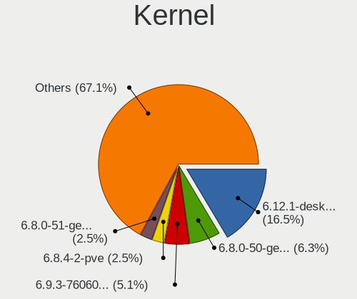
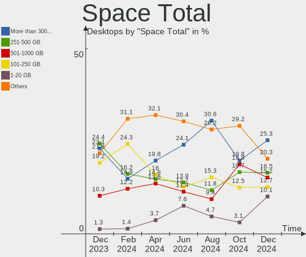
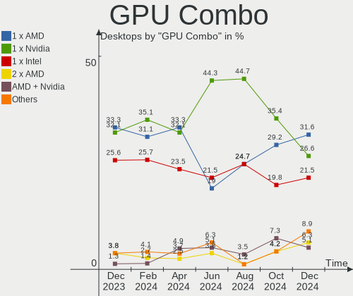
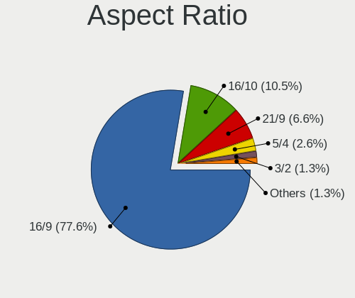
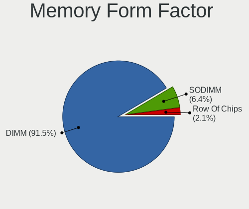

Linux in UK - Hardware Trends (Desktops)
----------------------------------------

A project to identify most popular hardware characteristics and track their change
over time based on data collected by Linux users at https://Linux-Hardware.org.

Anyone can contribute to this report by the [hw-probe](https://github.com/linuxhw/hw-probe) tool:

    sudo -E hw-probe -all -upload

Period: Sep, 2022.

Contents
--------

* [ System ](#system)
  - [ OS                       ](#os)
  - [ OS Family                ](#os-family)
  - [ Kernel                   ](#kernel)
  - [ Kernel Family            ](#kernel-family)
  - [ Kernel Major Ver.        ](#kernel-major-ver)
  - [ Arch                     ](#arch)
  - [ DE                       ](#de)
  - [ Display Server           ](#display-server)
  - [ Display Manager          ](#display-manager)
  - [ OS Lang                  ](#os-lang)
  - [ Boot Mode                ](#boot-mode)
  - [ Filesystem               ](#filesystem)
  - [ Part. scheme             ](#part-scheme)
  - [ Dual Boot with Linux/BSD ](#dual-boot-with-linuxbsd)
  - [ Dual Boot (Win)          ](#dual-boot-win)

* [ Board ](#board)
  - [ Vendor                   ](#vendor)
  - [ Model                    ](#model)
  - [ Model Family             ](#model-family)
  - [ MFG Year                 ](#mfg-year)
  - [ Form Factor              ](#form-factor)
  - [ Secure Boot              ](#secure-boot)
  - [ Coreboot                 ](#coreboot)
  - [ RAM Size                 ](#ram-size)
  - [ RAM Used                 ](#ram-used)
  - [ Total Drives             ](#total-drives)
  - [ Has CD-ROM               ](#has-cd-rom)
  - [ Has Ethernet             ](#has-ethernet)
  - [ Has WiFi                 ](#has-wifi)
  - [ Has Bluetooth            ](#has-bluetooth)

* [ Location ](#location)
  - [ Country                  ](#country)
  - [ City                     ](#city)

* [ Drives ](#drives)
  - [ Drive Vendor             ](#drive-vendor)
  - [ Drive Model              ](#drive-model)
  - [ HDD Vendor               ](#hdd-vendor)
  - [ SSD Vendor               ](#ssd-vendor)
  - [ Drive Kind               ](#drive-kind)
  - [ Drive Connector          ](#drive-connector)
  - [ Drive Size               ](#drive-size)
  - [ Space Total              ](#space-total)
  - [ Space Used               ](#space-used)
  - [ Malfunc. Drives          ](#malfunc-drives)
  - [ Malfunc. Drive Vendor    ](#malfunc-drive-vendor)
  - [ Malfunc. HDD Vendor      ](#malfunc-hdd-vendor)
  - [ Malfunc. Drive Kind      ](#malfunc-drive-kind)
  - [ Failed Drives            ](#failed-drives)
  - [ Failed Drive Vendor      ](#failed-drive-vendor)
  - [ Drive Status             ](#drive-status)

* [ Storage controller ](#storage-controller)
  - [ Storage Vendor           ](#storage-vendor)
  - [ Storage Model            ](#storage-model)
  - [ Storage Kind             ](#storage-kind)

* [ Processor ](#processor)
  - [ CPU Vendor               ](#cpu-vendor)
  - [ CPU Model                ](#cpu-model)
  - [ CPU Model Family         ](#cpu-model-family)
  - [ CPU Cores                ](#cpu-cores)
  - [ CPU Sockets              ](#cpu-sockets)
  - [ CPU Threads              ](#cpu-threads)
  - [ CPU Op-Modes             ](#cpu-op-modes)
  - [ CPU Microcode            ](#cpu-microcode)
  - [ CPU Microarch            ](#cpu-microarch)

* [ Graphics ](#graphics)
  - [ GPU Vendor               ](#gpu-vendor)
  - [ GPU Model                ](#gpu-model)
  - [ GPU Combo                ](#gpu-combo)
  - [ GPU Driver               ](#gpu-driver)
  - [ GPU Memory               ](#gpu-memory)

* [ Monitor ](#monitor)
  - [ Monitor Vendor           ](#monitor-vendor)
  - [ Monitor Model            ](#monitor-model)
  - [ Monitor Resolution       ](#monitor-resolution)
  - [ Monitor Diagonal         ](#monitor-diagonal)
  - [ Monitor Width            ](#monitor-width)
  - [ Aspect Ratio             ](#aspect-ratio)
  - [ Monitor Area             ](#monitor-area)
  - [ Pixel Density            ](#pixel-density)
  - [ Multiple Monitors        ](#multiple-monitors)

* [ Network ](#network)
  - [ Net Controller Vendor    ](#net-controller-vendor)
  - [ Net Controller Model     ](#net-controller-model)
  - [ Wireless Vendor          ](#wireless-vendor)
  - [ Wireless Model           ](#wireless-model)
  - [ Ethernet Vendor          ](#ethernet-vendor)
  - [ Ethernet Model           ](#ethernet-model)
  - [ Net Controller Kind      ](#net-controller-kind)
  - [ Used Controller          ](#used-controller)
  - [ NICs                     ](#nics)
  - [ IPv6                     ](#ipv6)

* [ Bluetooth ](#bluetooth)
  - [ Bluetooth Vendor         ](#bluetooth-vendor)
  - [ Bluetooth Model          ](#bluetooth-model)

* [ Sound ](#sound)
  - [ Sound Vendor             ](#sound-vendor)
  - [ Sound Model              ](#sound-model)

* [ Memory ](#memory)
  - [ Memory Vendor            ](#memory-vendor)
  - [ Memory Model             ](#memory-model)
  - [ Memory Kind              ](#memory-kind)
  - [ Memory Form Factor       ](#memory-form-factor)
  - [ Memory Size              ](#memory-size)
  - [ Memory Speed             ](#memory-speed)

* [ Printers & scanners ](#printers--scanners)
  - [ Printer Vendor           ](#printer-vendor)
  - [ Printer Model            ](#printer-model)
  - [ Scanner Vendor           ](#scanner-vendor)
  - [ Scanner Model            ](#scanner-model)

* [ Camera ](#camera)
  - [ Camera Vendor            ](#camera-vendor)
  - [ Camera Model             ](#camera-model)

* [ Security ](#security)
  - [ Fingerprint Vendor       ](#fingerprint-vendor)
  - [ Fingerprint Model        ](#fingerprint-model)
  - [ Chipcard Vendor          ](#chipcard-vendor)
  - [ Chipcard Model           ](#chipcard-model)

* [ Unsupported ](#unsupported)
  - [ Unsupported Devices      ](#unsupported-devices)
  - [ Unsupported Device Types ](#unsupported-device-types)

System
------

OS
--

Installed operating systems

| Name                | Desktops | Percent |
|---------------------|----------|---------|
| Ubuntu 22.04        | 17       | 26.15%  |
| Arch Rolling        | 5        | 7.69%   |
| Fedora 36           | 4        | 6.15%   |
| Debian 11           | 4        | 6.15%   |
| Ubuntu 20.04        | 3        | 4.62%   |
| Pop!_OS 22.04       | 3        | 4.62%   |
| Linux Mint 21       | 3        | 4.62%   |
| Linux Mint 20.3     | 3        | 4.62%   |
| Zorin 16            | 2        | 3.08%   |
| SteamOS 3.3         | 2        | 3.08%   |
| OpenMandriva 4.50   | 2        | 3.08%   |
| OpenMandriva 4.3    | 2        | 3.08%   |
| Ubuntu Budgie 22.04 | 1        | 1.54%   |
| Slackware 15.0      | 1        | 1.54%   |
| ROSA 12.2           | 1        | 1.54%   |
| OpenMandriva 4.2    | 1        | 1.54%   |
| Manjaro             | 1        | 1.54%   |
| Linux Mint 20.1     | 1        | 1.54%   |
| Kubuntu 22.04       | 1        | 1.54%   |
| Kali 2022.3         | 1        | 1.54%   |
| Gentoo 2.8          | 1        | 1.54%   |
| Fedora 38           | 1        | 1.54%   |
| Debian 11-updates   | 1        | 1.54%   |
| CentOS 7            | 1        | 1.54%   |
| Baldylocks OS 20.04 | 1        | 1.54%   |
| ArcoLinux Rolling   | 1        | 1.54%   |
| Arch                | 1        | 1.54%   |

OS Family
---------

OS without a version

| Name          | Desktops | Percent |
|---------------|----------|---------|
| Ubuntu        | 20       | 30.77%  |
| Linux Mint    | 7        | 10.77%  |
| Arch          | 6        | 9.23%   |
| OpenMandriva  | 5        | 7.69%   |
| Fedora        | 5        | 7.69%   |
| Debian        | 5        | 7.69%   |
| Pop!_OS       | 3        | 4.62%   |
| Zorin         | 2        | 3.08%   |
| SteamOS       | 2        | 3.08%   |
| Ubuntu Budgie | 1        | 1.54%   |
| Slackware     | 1        | 1.54%   |
| ROSA          | 1        | 1.54%   |
| Manjaro       | 1        | 1.54%   |
| Kubuntu       | 1        | 1.54%   |
| Kali          | 1        | 1.54%   |
| Gentoo        | 1        | 1.54%   |
| CentOS        | 1        | 1.54%   |
| Baldylocks OS | 1        | 1.54%   |
| ArcoLinux     | 1        | 1.54%   |

Kernel
------

Version of the Linux kernel

| Version                                      | Desktops | Percent |
|----------------------------------------------|----------|---------|
| 5.15.0-47-generic                            | 11       | 16.92%  |
| 5.15.0-48-generic                            | 7        | 10.77%  |
| 5.15.0-46-generic                            | 6        | 9.23%   |
| 5.4.0-126-generic                            | 3        | 4.62%   |
| 5.19.0-76051900-generic                      | 3        | 4.62%   |
| 5.10.0-17-amd64                              | 3        | 4.62%   |
| 5.19.8-200.fc36.x86_64                       | 2        | 3.08%   |
| 5.19.5-desktop-1omv4090                      | 2        | 3.08%   |
| 5.16.7-desktop-1omv4003                      | 2        | 3.08%   |
| 5.15.0-48-lowlatency                         | 2        | 3.08%   |
| 5.13.0-valve24-1-neptune-02226-g5b8545e4c5a1 | 2        | 3.08%   |
| 6.0.0-1-MANJARO                              | 1        | 1.54%   |
| 6.0.0-0.rc6.41.fc38.x86_64                   | 1        | 1.54%   |
| 5.4.0-128-generic                            | 1        | 1.54%   |
| 5.4.0-125-generic                            | 1        | 1.54%   |
| 5.19.9-200.fc36.x86_64                       | 1        | 1.54%   |
| 5.19.7-zen2-1-zen                            | 1        | 1.54%   |
| 5.19.6-arch1-1                               | 1        | 1.54%   |
| 5.19.5-arch1-1                               | 1        | 1.54%   |
| 5.19.4-arch1-1                               | 1        | 1.54%   |
| 5.19.12-arch1-1                              | 1        | 1.54%   |
| 5.19.11-200.fc36.x86_64                      | 1        | 1.54%   |
| 5.19.10-arch1-1                              | 1        | 1.54%   |
| 5.18.0-kali5-amd64                           | 1        | 1.54%   |
| 5.18.0-0.deb11.3-rt-amd64                    | 1        | 1.54%   |
| 5.15.68-1-lts                                | 1        | 1.54%   |
| 5.15.59-gentoo                               | 1        | 1.54%   |
| 5.15.43-generic-2rosa2021.1-x86_64           | 1        | 1.54%   |
| 5.14.12                                      | 1        | 1.54%   |
| 5.13.11-051311-generic                       | 1        | 1.54%   |
| 5.10.14-desktop-1omv4002                     | 1        | 1.54%   |
| 5.10.0-18-amd64                              | 1        | 1.54%   |
| 3.10.0-1160.49.1.el7.x86_64                  | 1        | 1.54%   |

Kernel Family
-------------

Linux kernel without a distro release

| Version | Desktops | Percent |
|---------|----------|---------|
| 5.15.0  | 26       | 40%     |
| 5.4.0   | 5        | 7.69%   |
| 5.10.0  | 4        | 6.15%   |
| 5.19.5  | 3        | 4.62%   |
| 5.19.0  | 3        | 4.62%   |
| 6.0.0   | 2        | 3.08%   |
| 5.19.8  | 2        | 3.08%   |
| 5.18.0  | 2        | 3.08%   |
| 5.16.7  | 2        | 3.08%   |
| 5.13.0  | 2        | 3.08%   |
| 5.19.9  | 1        | 1.54%   |
| 5.19.7  | 1        | 1.54%   |
| 5.19.6  | 1        | 1.54%   |
| 5.19.4  | 1        | 1.54%   |
| 5.19.12 | 1        | 1.54%   |
| 5.19.11 | 1        | 1.54%   |
| 5.19.10 | 1        | 1.54%   |
| 5.15.68 | 1        | 1.54%   |
| 5.15.59 | 1        | 1.54%   |
| 5.15.43 | 1        | 1.54%   |
| 5.14.12 | 1        | 1.54%   |
| 5.13.11 | 1        | 1.54%   |
| 5.10.14 | 1        | 1.54%   |
| 3.10.0  | 1        | 1.54%   |

Kernel Major Ver.
-----------------

Linux kernel major version

| Version | Desktops | Percent |
|---------|----------|---------|
| 5.15    | 29       | 44.62%  |
| 5.19    | 15       | 23.08%  |
| 5.4     | 5        | 7.69%   |
| 5.10    | 5        | 7.69%   |
| 5.13    | 3        | 4.62%   |
| 6.0     | 2        | 3.08%   |
| 5.18    | 2        | 3.08%   |
| 5.16    | 2        | 3.08%   |
| 5.14    | 1        | 1.54%   |
| 3.10    | 1        | 1.54%   |

Arch
----

OS architecture (x86_64, i586, etc.)

| Name   | Desktops | Percent |
|--------|----------|---------|
| x86_64 | 65       | 100%    |

DE
--

Desktop Environment

| Name       | Desktops | Percent |
|------------|----------|---------|
| GNOME      | 33       | 50.77%  |
| KDE5       | 14       | 21.54%  |
| XFCE       | 6        | 9.23%   |
| X-Cinnamon | 6        | 9.23%   |
| Unknown    | 2        | 3.08%   |
| MATE       | 1        | 1.54%   |
| KDE4       | 1        | 1.54%   |
| Cinnamon   | 1        | 1.54%   |
| Budgie     | 1        | 1.54%   |

Display Server
--------------

X11 or Wayland

| Name    | Desktops | Percent |
|---------|----------|---------|
| X11     | 46       | 70.77%  |
| Wayland | 16       | 24.62%  |
| Tty     | 3        | 4.62%   |

Display Manager
---------------

SDDM, LightDM, etc.

| Name    | Desktops | Percent |
|---------|----------|---------|
| Unknown | 20       | 30.77%  |
| GDM3    | 17       | 26.15%  |
| SDDM    | 12       | 18.46%  |
| LightDM | 11       | 16.92%  |
| GDM     | 4        | 6.15%   |
| XINIT   | 1        | 1.54%   |

OS Lang
-------

Language

| Lang    | Desktops | Percent |
|---------|----------|---------|
| en_GB   | 49       | 75.38%  |
| en_US   | 13       | 20%     |
| hu_HU   | 1        | 1.54%   |
| en_IN   | 1        | 1.54%   |
| Unknown | 1        | 1.54%   |

Boot Mode
---------

EFI or BIOS

| Mode | Desktops | Percent |
|------|----------|---------|
| BIOS | 40       | 61.54%  |
| EFI  | 25       | 38.46%  |

Filesystem
----------

Type of filesystem

| Type    | Desktops | Percent |
|---------|----------|---------|
| Ext4    | 54       | 83.08%  |
| Btrfs   | 7        | 10.77%  |
| Overlay | 3        | 4.62%   |
| Xfs     | 1        | 1.54%   |

Part. scheme
------------

Scheme of partitioning

| Type    | Desktops | Percent |
|---------|----------|---------|
| Unknown | 36       | 55.38%  |
| GPT     | 22       | 33.85%  |
| MBR     | 7        | 10.77%  |

Dual Boot with Linux/BSD
------------------------

Hosting more than one Linux/BSD

| Dual boot | Desktops | Percent |
|-----------|----------|---------|
| No        | 54       | 83.08%  |
| Yes       | 11       | 16.92%  |

Dual Boot (Win)
---------------

Hosting Linux and Windows

| Dual boot | Desktops | Percent |
|-----------|----------|---------|
| No        | 48       | 73.85%  |
| Yes       | 17       | 26.15%  |

Board
-----

Vendor
------

Motherboard manufacturer

| Name                | Desktops | Percent |
|---------------------|----------|---------|
| ASUSTek Computer    | 17       | 26.15%  |
| Gigabyte Technology | 13       | 20%     |
| Dell                | 10       | 15.38%  |
| MSI                 | 8        | 12.31%  |
| Hewlett-Packard     | 6        | 9.23%   |
| Lenovo              | 4        | 6.15%   |
| ASRock              | 3        | 4.62%   |
| Medion              | 1        | 1.54%   |
| Intel               | 1        | 1.54%   |
| Apple               | 1        | 1.54%   |
| Acer                | 1        | 1.54%   |

Model
-----

Motherboard model

| Name                                 | Desktops | Percent |
|--------------------------------------|----------|---------|
| ASUS PRIME A320M-K                   | 3        | 4.62%   |
| HP ProLiant MicroServer              | 2        | 3.08%   |
| Gigabyte B450 I AORUS PRO WIFI       | 2        | 3.08%   |
| Dell OptiPlex 780                    | 2        | 3.08%   |
| Dell OptiPlex 7010                   | 2        | 3.08%   |
| ASUS ROG CROSSHAIR VIII HERO         | 2        | 3.08%   |
| MSI MS-7C96                          | 1        | 1.54%   |
| MSI MS-7C02                          | 1        | 1.54%   |
| MSI MS-7B48                          | 1        | 1.54%   |
| MSI MS-7B09                          | 1        | 1.54%   |
| MSI MS-7996                          | 1        | 1.54%   |
| MSI MS-7885                          | 1        | 1.54%   |
| MSI MS-7817                          | 1        | 1.54%   |
| MSI MS-7721                          | 1        | 1.54%   |
| Medion MS-7713                       | 1        | 1.54%   |
| Lenovo ThinkCentre M93 10A50005UK    | 1        | 1.54%   |
| Lenovo ThinkCentre M700 10J0S1F700   | 1        | 1.54%   |
| Lenovo ThinkCentre M58e 7408BA5      | 1        | 1.54%   |
| Lenovo ThinkCentre A70 7099A5G       | 1        | 1.54%   |
| Intel DH55TC                         | 1        | 1.54%   |
| HP Pavilion Gaming Desktop TG01-1xxx | 1        | 1.54%   |
| HP EliteDesk 705 G2 SFF              | 1        | 1.54%   |
| HP Compaq dc7900 Small Form Factor   | 1        | 1.54%   |
| HP Compaq 8200 Elite CMT PC          | 1        | 1.54%   |
| Gigabyte X570S AORUS PRO AX          | 1        | 1.54%   |
| Gigabyte H97N-WIFI                   | 1        | 1.54%   |
| Gigabyte H310N 2.0                   | 1        | 1.54%   |
| Gigabyte GA-970A-UD3                 | 1        | 1.54%   |
| Gigabyte GA-78LMT-USB3 R2            | 1        | 1.54%   |
| Gigabyte GA-78LMT-USB3 6.0           | 1        | 1.54%   |
| Gigabyte F2A68HM-HD2                 | 1        | 1.54%   |
| Gigabyte BB-83508                    | 1        | 1.54%   |
| Gigabyte B365M DS3H                  | 1        | 1.54%   |
| Gigabyte A320M-S2H                   | 1        | 1.54%   |
| Gigabyte 990XA-UD3                   | 1        | 1.54%   |
| Dell XPS720                          | 1        | 1.54%   |
| Dell Vostro 470                      | 1        | 1.54%   |
| Dell OptiPlex 9020                   | 1        | 1.54%   |
| Dell OptiPlex 790                    | 1        | 1.54%   |
| Dell OptiPlex 5070                   | 1        | 1.54%   |

Model Family
------------

Motherboard model prefix

| Name                   | Desktops | Percent |
|------------------------|----------|---------|
| Dell OptiPlex          | 7        | 10.77%  |
| ASUS ROG               | 6        | 9.23%   |
| ASUS PRIME             | 6        | 9.23%   |
| Lenovo ThinkCentre     | 4        | 6.15%   |
| HP ProLiant            | 2        | 3.08%   |
| HP Compaq              | 2        | 3.08%   |
| Gigabyte GA-78LMT-USB3 | 2        | 3.08%   |
| Gigabyte B450          | 2        | 3.08%   |
| ASUS TUF               | 2        | 3.08%   |
| MSI MS-7C96            | 1        | 1.54%   |
| MSI MS-7C02            | 1        | 1.54%   |
| MSI MS-7B48            | 1        | 1.54%   |
| MSI MS-7B09            | 1        | 1.54%   |
| MSI MS-7996            | 1        | 1.54%   |
| MSI MS-7885            | 1        | 1.54%   |
| MSI MS-7817            | 1        | 1.54%   |
| MSI MS-7721            | 1        | 1.54%   |
| Medion MS-7713         | 1        | 1.54%   |
| Intel DH55TC           | 1        | 1.54%   |
| HP Pavilion            | 1        | 1.54%   |
| HP EliteDesk           | 1        | 1.54%   |
| Gigabyte X570S         | 1        | 1.54%   |
| Gigabyte H97N-WIFI     | 1        | 1.54%   |
| Gigabyte H310N         | 1        | 1.54%   |
| Gigabyte GA-970A-UD3   | 1        | 1.54%   |
| Gigabyte F2A68HM-HD2   | 1        | 1.54%   |
| Gigabyte BB-83508      | 1        | 1.54%   |
| Gigabyte B365M         | 1        | 1.54%   |
| Gigabyte A320M-S2H     | 1        | 1.54%   |
| Gigabyte 990XA-UD3     | 1        | 1.54%   |
| Dell XPS720            | 1        | 1.54%   |
| Dell Vostro            | 1        | 1.54%   |
| Dell Inspiron          | 1        | 1.54%   |
| ASUS P5N7A-VM          | 1        | 1.54%   |
| ASUS All               | 1        | 1.54%   |
| ASUS A88X-GAMER        | 1        | 1.54%   |
| ASRock Z77             | 1        | 1.54%   |
| ASRock X300M-STX       | 1        | 1.54%   |
| ASRock B550M-ITX       | 1        | 1.54%   |
| Apple MacPro5          | 1        | 1.54%   |

MFG Year
--------

Motherboard manufacture year

| Year | Desktops | Percent |
|------|----------|---------|
| 2020 | 8        | 12.31%  |
| 2017 | 7        | 10.77%  |
| 2014 | 7        | 10.77%  |
| 2018 | 6        | 9.23%   |
| 2013 | 5        | 7.69%   |
| 2011 | 5        | 7.69%   |
| 2010 | 5        | 7.69%   |
| 2022 | 4        | 6.15%   |
| 2015 | 4        | 6.15%   |
| 2021 | 3        | 4.62%   |
| 2019 | 3        | 4.62%   |
| 2012 | 2        | 3.08%   |
| 2009 | 2        | 3.08%   |
| 2008 | 2        | 3.08%   |
| 2016 | 1        | 1.54%   |
| 2007 | 1        | 1.54%   |

Form Factor
-----------

Physical design of the computer

| Name    | Desktops | Percent |
|---------|----------|---------|
| Desktop | 65       | 100%    |

Secure Boot
-----------

Enabled or disabled

| State    | Desktops | Percent |
|----------|----------|---------|
| Disabled | 63       | 96.92%  |
| Enabled  | 2        | 3.08%   |

Coreboot
--------

Have coreboot on board

| Used | Desktops | Percent |
|------|----------|---------|
| No   | 65       | 100%    |

RAM Size
--------

Total RAM memory

| Size in GB  | Desktops | Percent |
|-------------|----------|---------|
| 32.01-64.0  | 18       | 27.69%  |
| 16.01-24.0  | 17       | 26.15%  |
| 8.01-16.0   | 14       | 21.54%  |
| 4.01-8.0    | 7        | 10.77%  |
| 3.01-4.0    | 6        | 9.23%   |
| 24.01-32.0  | 2        | 3.08%   |
| 64.01-256.0 | 1        | 1.54%   |

RAM Used
--------

Used RAM memory

| Used GB    | Desktops | Percent |
|------------|----------|---------|
| 2.01-3.0   | 22       | 33.85%  |
| 1.01-2.0   | 18       | 27.69%  |
| 4.01-8.0   | 11       | 16.92%  |
| 3.01-4.0   | 7        | 10.77%  |
| 8.01-16.0  | 4        | 6.15%   |
| 0.51-1.0   | 2        | 3.08%   |
| 16.01-24.0 | 1        | 1.54%   |

Total Drives
------------

Number of drives on board

| Drives | Desktops | Percent |
|--------|----------|---------|
| 1      | 24       | 36.92%  |
| 2      | 16       | 24.62%  |
| 3      | 10       | 15.38%  |
| 4      | 6        | 9.23%   |
| 6      | 5        | 7.69%   |
| 5      | 3        | 4.62%   |
| 8      | 1        | 1.54%   |

Has CD-ROM
----------

Has CD-ROM on board

| Presented | Desktops | Percent |
|-----------|----------|---------|
| No        | 38       | 58.46%  |
| Yes       | 27       | 41.54%  |

Has Ethernet
------------

Has Ethernet on board

| Presented | Desktops | Percent |
|-----------|----------|---------|
| Yes       | 64       | 98.46%  |
| No        | 1        | 1.54%   |

Has WiFi
--------

Has WiFi module

| Presented | Desktops | Percent |
|-----------|----------|---------|
| Yes       | 37       | 56.92%  |
| No        | 28       | 43.08%  |

Has Bluetooth
-------------

Has Bluetooth module

| Presented | Desktops | Percent |
|-----------|----------|---------|
| No        | 39       | 60%     |
| Yes       | 26       | 40%     |

Location
--------

Country
-------

Geographic location (country)

| Country | Desktops | Percent |
|---------|----------|---------|
| UK      | 65       | 100%    |

City
----

Geographic location (city)

| City                 | Desktops | Percent |
|----------------------|----------|---------|
| London               | 3        | 4.62%   |
| Cambridge            | 3        | 4.62%   |
| Bradford             | 3        | 4.62%   |
| Wembley              | 2        | 3.08%   |
| Twickenham           | 2        | 3.08%   |
| Shaftesbury          | 2        | 3.08%   |
| Manchester           | 2        | 3.08%   |
| Liverpool            | 2        | 3.08%   |
| Darlington           | 2        | 3.08%   |
| Chelsea              | 2        | 3.08%   |
| Worcester Park       | 1        | 1.54%   |
| Wirral               | 1        | 1.54%   |
| Warrington           | 1        | 1.54%   |
| Waltham Cross        | 1        | 1.54%   |
| Urmston              | 1        | 1.54%   |
| Tonbridge            | 1        | 1.54%   |
| Thornton Heath       | 1        | 1.54%   |
| Stourbridge          | 1        | 1.54%   |
| Stockport            | 1        | 1.54%   |
| Shrewsbury           | 1        | 1.54%   |
| Ruislip              | 1        | 1.54%   |
| Rotherham            | 1        | 1.54%   |
| Romsey               | 1        | 1.54%   |
| Rock                 | 1        | 1.54%   |
| Redhill              | 1        | 1.54%   |
| Plymouth             | 1        | 1.54%   |
| Newcastle-under-Lyme | 1        | 1.54%   |
| Mitcham              | 1        | 1.54%   |
| Leigh                | 1        | 1.54%   |
| Kirkcaldy            | 1        | 1.54%   |
| Kingskerswell        | 1        | 1.54%   |
| Islington            | 1        | 1.54%   |
| Isle of Arran        | 1        | 1.54%   |
| Hemel Hempstead      | 1        | 1.54%   |
| Hatfield             | 1        | 1.54%   |
| Halstead             | 1        | 1.54%   |
| Hailsham             | 1        | 1.54%   |
| Great Malvern        | 1        | 1.54%   |
| Gloucester           | 1        | 1.54%   |
| Gillingham           | 1        | 1.54%   |

Drives
------

Drive Vendor
------------

Hard drive vendors

| Vendor              | Desktops | Drives | Percent |
|---------------------|----------|--------|---------|
| Seagate             | 26       | 43     | 20.8%   |
| WDC                 | 23       | 30     | 18.4%   |
| Samsung Electronics | 18       | 26     | 14.4%   |
| Toshiba             | 11       | 13     | 8.8%    |
| SanDisk             | 9        | 15     | 7.2%    |
| Kingston            | 4        | 4      | 3.2%    |
| Crucial             | 4        | 5      | 3.2%    |
| Phison              | 3        | 3      | 2.4%    |
| Integral            | 3        | 3      | 2.4%    |
| A-DATA Technology   | 3        | 3      | 2.4%    |
| Teclast             | 2        | 2      | 1.6%    |
| Silicon Motion      | 2        | 2      | 1.6%    |
| Intel               | 2        | 2      | 1.6%    |
| Hitachi             | 2        | 2      | 1.6%    |
| TCSUNBOW            | 1        | 1      | 0.8%    |
| SABRENT             | 1        | 1      | 0.8%    |
| Pioneer             | 1        | 1      | 0.8%    |
| Phison Electronics  | 1        | 1      | 0.8%    |
| Netac               | 1        | 1      | 0.8%    |
| Maxtor              | 1        | 1      | 0.8%    |
| HPE                 | 1        | 2      | 0.8%    |
| Hewlett-Packard     | 1        | 2      | 0.8%    |
| Fujitsu             | 1        | 1      | 0.8%    |
| Fanxiang            | 1        | 1      | 0.8%    |
| ASMT                | 1        | 1      | 0.8%    |
| ASMedia             | 1        | 1      | 0.8%    |
| ASENNO              | 1        | 1      | 0.8%    |

Drive Model
-----------

Hard drive models

| Model                                               | Desktops | Percent |
|-----------------------------------------------------|----------|---------|
| Toshiba HDWD130 3TB                                 | 3        | 2.01%   |
| SanDisk NVMe SSD Drive 500GB                        | 3        | 2.01%   |
| WDC WDS100T2B0A-00SM50 1TB SSD                      | 2        | 1.34%   |
| WDC WD10EZEX-08WN4A0 1TB                            | 2        | 1.34%   |
| WDC WD10EARS-00Y5B1 1TB                             | 2        | 1.34%   |
| Toshiba DT01ACA200 2TB                              | 2        | 1.34%   |
| Toshiba DT01ACA100 1TB                              | 2        | 1.34%   |
| Teclast 60GB S500 SSD                               | 2        | 1.34%   |
| Seagate ST4000DM004-2CV104 4TB                      | 2        | 1.34%   |
| Seagate ST2000DM008-2FR102 2TB                      | 2        | 1.34%   |
| Seagate ST1000LM048-2E7172 1TB                      | 2        | 1.34%   |
| Seagate ST1000DM010-2EP102 1TB                      | 2        | 1.34%   |
| Samsung SSD 840 PRO Series 256GB                    | 2        | 1.34%   |
| Samsung SSD 840 PRO Series 128GB                    | 2        | 1.34%   |
| Samsung NVMe SSD Controller SM981/PM981/PM983 256GB | 2        | 1.34%   |
| Kingston SA400S37240G 240GB SSD                     | 2        | 1.34%   |
| A-DATA SU630 240GB SSD                              | 2        | 1.34%   |
| WDC WDS500G2B0A-00SM50 500GB SSD                    | 1        | 0.67%   |
| WDC WDS500G1X0E-00AFY0 500GB                        | 1        | 0.67%   |
| WDC WDS480G2G0A-00JH30 480GB SSD                    | 1        | 0.67%   |
| WDC WDS240G2G0A-00JH30 240GB SSD                    | 1        | 0.67%   |
| WDC WDS100T3X0C-00SJG0 1TB                          | 1        | 0.67%   |
| WDC WD800JD-75MSA3 80GB                             | 1        | 0.67%   |
| WDC WD6400AAVS-00G9B1 640GB                         | 1        | 0.67%   |
| WDC WD5000AZLX-60K2TA0 500GB                        | 1        | 0.67%   |
| WDC WD5000AAKX-60U6AA0 500GB                        | 1        | 0.67%   |
| WDC WD40EZRZ-00GXCB0 4TB                            | 1        | 0.67%   |
| WDC WD3200AVJS-63B6A0 320GB                         | 1        | 0.67%   |
| WDC WD3200AAJS-08L7A0 320GB                         | 1        | 0.67%   |
| WDC WD30EZRS-00J99B0 3TB                            | 1        | 0.67%   |
| WDC WD2500AAJS-60M0A0 250GB                         | 1        | 0.67%   |
| WDC WD20EARS-00S8B1 2TB                             | 1        | 0.67%   |
| WDC WD20EARS-00MVWB0 2TB                            | 1        | 0.67%   |
| WDC WD2002FAEX-007BA0 2TB                           | 1        | 0.67%   |
| WDC WD10EZEX-75ZF5A0 1TB                            | 1        | 0.67%   |
| WDC WD10EZEX-08M2NA0 1TB                            | 1        | 0.67%   |
| WDC WD10EADS-00M2B0 1TB                             | 1        | 0.67%   |
| WDC WD1002FAEX-00Y9A0 1TB                           | 1        | 0.67%   |
| Toshiba XG6 NVMe SSD Controller 512GB               | 1        | 0.67%   |
| Toshiba THNSNC128GBSJ SSD                           | 1        | 0.67%   |

HDD Vendor
----------

Hard disk drive vendors

| Vendor              | Desktops | Drives | Percent |
|---------------------|----------|--------|---------|
| Seagate             | 24       | 38     | 38.71%  |
| WDC                 | 18       | 23     | 29.03%  |
| Toshiba             | 9        | 11     | 14.52%  |
| Samsung Electronics | 3        | 5      | 4.84%   |
| Hitachi             | 2        | 2      | 3.23%   |
| Maxtor              | 1        | 1      | 1.61%   |
| HPE                 | 1        | 1      | 1.61%   |
| Hewlett-Packard     | 1        | 2      | 1.61%   |
| Fujitsu             | 1        | 1      | 1.61%   |
| ASMT                | 1        | 1      | 1.61%   |
| ASMedia             | 1        | 1      | 1.61%   |

SSD Vendor
----------

Solid state drive vendors

| Vendor              | Desktops | Drives | Percent |
|---------------------|----------|--------|---------|
| Samsung Electronics | 10       | 13     | 25.64%  |
| SanDisk             | 5        | 7      | 12.82%  |
| WDC                 | 4        | 5      | 10.26%  |
| Kingston            | 4        | 4      | 10.26%  |
| Crucial             | 4        | 5      | 10.26%  |
| Integral            | 3        | 3      | 7.69%   |
| Teclast             | 2        | 2      | 5.13%   |
| A-DATA Technology   | 2        | 2      | 5.13%   |
| Toshiba             | 1        | 1      | 2.56%   |
| TCSUNBOW            | 1        | 1      | 2.56%   |
| Pioneer             | 1        | 1      | 2.56%   |
| HPE                 | 1        | 1      | 2.56%   |
| ASENNO              | 1        | 1      | 2.56%   |

Drive Kind
----------

HDD or SSD

| Kind    | Desktops | Drives | Percent |
|---------|----------|--------|---------|
| HDD     | 45       | 86     | 42.86%  |
| SSD     | 33       | 46     | 31.43%  |
| NVMe    | 23       | 32     | 21.9%   |
| Unknown | 4        | 4      | 3.81%   |

Drive Connector
---------------

SATA, SAS, NVMe, etc.

| Type | Desktops | Drives | Percent |
|------|----------|--------|---------|
| SATA | 59       | 130    | 67.05%  |
| NVMe | 22       | 31     | 25%     |
| SAS  | 7        | 7      | 7.95%   |

Drive Size
----------

Size of hard drive

| Size in TB | Desktops | Drives | Percent |
|------------|----------|--------|---------|
| 0.01-0.5   | 39       | 54     | 43.82%  |
| 0.51-1.0   | 27       | 39     | 30.34%  |
| 1.01-2.0   | 8        | 12     | 8.99%   |
| 2.01-3.0   | 6        | 6      | 6.74%   |
| 3.01-4.0   | 4        | 10     | 4.49%   |
| 4.01-10.0  | 4        | 8      | 4.49%   |
| 10.01-20.0 | 1        | 3      | 1.12%   |

Space Total
-----------

Amount of disk space available on the file system

| Size in GB     | Desktops | Percent |
|----------------|----------|---------|
| 501-1000       | 16       | 24.62%  |
| 101-250        | 12       | 18.46%  |
| 251-500        | 10       | 15.38%  |
| 1001-2000      | 10       | 15.38%  |
| 2001-3000      | 6        | 9.23%   |
| More than 3000 | 5        | 7.69%   |
| 21-50          | 3        | 4.62%   |
| Unknown        | 2        | 3.08%   |
| 51-100         | 1        | 1.54%   |

Space Used
----------

Amount of used disk space

| Used GB        | Desktops | Percent |
|----------------|----------|---------|
| 1-20           | 13       | 20%     |
| 21-50          | 12       | 18.46%  |
| 101-250        | 12       | 18.46%  |
| 51-100         | 8        | 12.31%  |
| 251-500        | 5        | 7.69%   |
| 1001-2000      | 5        | 7.69%   |
| 501-1000       | 4        | 6.15%   |
| More than 3000 | 2        | 3.08%   |
| 2001-3000      | 2        | 3.08%   |
| Unknown        | 2        | 3.08%   |

Malfunc. Drives
---------------

Drive models with a malfunction

| Model                              | Desktops | Drives | Percent |
|------------------------------------|----------|--------|---------|
| WDC WDS480G2G0A-00JH30 480GB SSD   | 1        | 1      | 16.67%  |
| WDC WD3200AAJS-08L7A0 320GB        | 1        | 1      | 16.67%  |
| WDC WD1002FAEX-00Y9A0 1TB          | 1        | 1      | 16.67%  |
| Seagate ST1000LM024 HN-M101MBB 1TB | 1        | 1      | 16.67%  |
| Samsung Electronics HD103UJ 1TB    | 1        | 1      | 16.67%  |
| Hitachi HUA723030ALA640 3TB        | 1        | 1      | 16.67%  |

Malfunc. Drive Vendor
---------------------

Vendors of faulty drives

| Vendor              | Desktops | Drives | Percent |
|---------------------|----------|--------|---------|
| WDC                 | 3        | 3      | 50%     |
| Seagate             | 1        | 1      | 16.67%  |
| Samsung Electronics | 1        | 1      | 16.67%  |
| Hitachi             | 1        | 1      | 16.67%  |

Malfunc. HDD Vendor
-------------------

Vendors of faulty HDD drives

| Vendor              | Desktops | Drives | Percent |
|---------------------|----------|--------|---------|
| WDC                 | 2        | 2      | 40%     |
| Seagate             | 1        | 1      | 20%     |
| Samsung Electronics | 1        | 1      | 20%     |
| Hitachi             | 1        | 1      | 20%     |

Malfunc. Drive Kind
-------------------

Kinds of faulty drives

| Kind | Desktops | Drives | Percent |
|------|----------|--------|---------|
| HDD  | 3        | 5      | 75%     |
| SSD  | 1        | 1      | 25%     |

Failed Drives
-------------

Failed drive models

Zero info for selected period =(

Failed Drive Vendor
-------------------

Failed drive vendors

Zero info for selected period =(

Drive Status
------------

Number of failed and malfunc. drives

| Status   | Desktops | Drives | Percent |
|----------|----------|--------|---------|
| Detected | 38       | 82     | 54.29%  |
| Works    | 28       | 80     | 40%     |
| Malfunc  | 4        | 6      | 5.71%   |

Storage controller
------------------

Storage Vendor
--------------

Storage controller vendors

| Vendor                       | Desktops | Percent |
|------------------------------|----------|---------|
| AMD                          | 32       | 34.04%  |
| Intel                        | 30       | 31.91%  |
| SanDisk                      | 7        | 7.45%   |
| Samsung Electronics          | 6        | 6.38%   |
| Phison Electronics           | 4        | 4.26%   |
| Seagate Technology           | 3        | 3.19%   |
| ASMedia Technology           | 3        | 3.19%   |
| Silicon Motion               | 2        | 2.13%   |
| Nvidia                       | 2        | 2.13%   |
| Toshiba America Info Systems | 1        | 1.06%   |
| Marvell Technology Group     | 1        | 1.06%   |
| LSI Logic / Symbios Logic    | 1        | 1.06%   |
| JMicron Technology           | 1        | 1.06%   |
| ADATA Technology             | 1        | 1.06%   |

Storage Model
-------------

Storage controller models

| Model                                                                          | Desktops | Percent |
|--------------------------------------------------------------------------------|----------|---------|
| AMD FCH SATA Controller [AHCI mode]                                            | 19       | 15.7%   |
| AMD SB7x0/SB8x0/SB9x0 SATA Controller [AHCI mode]                              | 7        | 5.79%   |
| AMD SB7x0/SB8x0/SB9x0 IDE Controller                                           | 6        | 4.96%   |
| AMD 400 Series Chipset SATA Controller                                         | 5        | 4.13%   |
| Intel 7 Series/C210 Series Chipset Family 6-port SATA Controller [AHCI mode]   | 4        | 3.31%   |
| AMD FCH SATA Controller D                                                      | 4        | 3.31%   |
| AMD 500 Series Chipset SATA Controller                                         | 4        | 3.31%   |
| SanDisk WD Blue SN570 NVMe SSD                                                 | 3        | 2.48%   |
| Samsung NVMe SSD Controller SM981/PM981/PM983                                  | 3        | 2.48%   |
| Intel SATA Controller [RAID mode]                                              | 3        | 2.48%   |
| Intel 200 Series PCH SATA controller [AHCI mode]                               | 3        | 2.48%   |
| ASMedia ASM1062 Serial ATA Controller                                          | 3        | 2.48%   |
| SanDisk WD PC SN810 / Black SN850 NVMe SSD                                     | 2        | 1.65%   |
| SanDisk WD Black SN750 / PC SN730 NVMe SSD                                     | 2        | 1.65%   |
| Phison E12 NVMe Controller                                                     | 2        | 1.65%   |
| Intel Q170/Q150/B150/H170/H110/Z170/CM236 Chipset SATA Controller [AHCI Mode]  | 2        | 1.65%   |
| Intel NM10/ICH7 Family SATA Controller [IDE mode]                              | 2        | 1.65%   |
| Intel Cannon Lake PCH SATA AHCI Controller                                     | 2        | 1.65%   |
| Intel 82801JD/DO (ICH10 Family) SATA AHCI Controller                           | 2        | 1.65%   |
| Intel 8 Series/C220 Series Chipset Family 6-port SATA Controller 1 [AHCI mode] | 2        | 1.65%   |
| Intel 6 Series/C200 Series Chipset Family 6 port Desktop SATA AHCI Controller  | 2        | 1.65%   |
| Intel 4 Series Chipset PT IDER Controller                                      | 2        | 1.65%   |
| Toshiba America Info Systems XG6 NVMe SSD Controller                           | 1        | 0.83%   |
| Silicon Motion SM2263EN/SM2263XT SSD Controller                                | 1        | 0.83%   |
| Silicon Motion SM2262/SM2262EN SSD Controller                                  | 1        | 0.83%   |
| Seagate Non-Volatile memory controller                                         | 1        | 0.83%   |
| Seagate FireCuda 520 SSD                                                       | 1        | 0.83%   |
| Seagate FireCuda 510 SSD                                                       | 1        | 0.83%   |
| SanDisk Non-Volatile memory controller                                         | 1        | 0.83%   |
| Samsung NVMe SSD Controller SM961/PM961/SM963                                  | 1        | 0.83%   |
| Samsung NVMe SSD Controller PM9A1/PM9A3/980PRO                                 | 1        | 0.83%   |
| Samsung NVMe SSD Controller 980                                                | 1        | 0.83%   |
| Phison Electronics Non-Volatile memory controller                              | 1        | 0.83%   |
| Phison E16 PCIe4 NVMe Controller                                               | 1        | 0.83%   |
| Nvidia MCP79 AHCI Controller                                                   | 1        | 0.83%   |
| Nvidia MCP55 SATA Controller                                                   | 1        | 0.83%   |
| Nvidia MCP55 IDE                                                               | 1        | 0.83%   |
| Marvell Group 88SE9128 PCIe SATA 6 Gb/s RAID controller                        | 1        | 0.83%   |
| LSI Logic / Symbios Logic SAS2008 PCI-Express Fusion-MPT SAS-2 [Falcon]        | 1        | 0.83%   |
| JMicron JMB368 IDE controller                                                  | 1        | 0.83%   |

Storage Kind
------------

Kind of storage controller (IDE, SATA, NVMe, SAS, ...)

| Kind | Desktops | Percent |
|------|----------|---------|
| SATA | 57       | 57.58%  |
| NVMe | 22       | 22.22%  |
| IDE  | 14       | 14.14%  |
| RAID | 5        | 5.05%   |
| SAS  | 1        | 1.01%   |

Processor
---------

CPU Vendor
----------

Processor vendors

| Vendor | Desktops | Percent |
|--------|----------|---------|
| Intel  | 33       | 50.77%  |
| AMD    | 32       | 49.23%  |

CPU Model
---------

Processor models

| Model                                          | Desktops | Percent |
|------------------------------------------------|----------|---------|
| AMD Ryzen 9 5900X 12-Core Processor            | 4        | 6.15%   |
| AMD Ryzen 5 5600G with Radeon Graphics         | 3        | 4.62%   |
| Intel Core i7-3770 CPU @ 3.40GHz               | 2        | 3.08%   |
| AMD Ryzen 7 PRO 4750G with Radeon Graphics     | 2        | 3.08%   |
| AMD Ryzen 7 3700X 8-Core Processor             | 2        | 3.08%   |
| AMD Ryzen 5 5600X 6-Core Processor             | 2        | 3.08%   |
| AMD FX-8320 Eight-Core Processor               | 2        | 3.08%   |
| Intel Xeon CPU X5690 @ 3.47GHz                 | 1        | 1.54%   |
| Intel Pentium Dual-Core CPU E5800 @ 3.20GHz    | 1        | 1.54%   |
| Intel Pentium D CPU 2.80GHz                    | 1        | 1.54%   |
| Intel Pentium CPU G2030 @ 3.00GHz              | 1        | 1.54%   |
| Intel Genuine CPU 0000 @ 3.20GHz               | 1        | 1.54%   |
| Intel Core i7-9700T CPU @ 2.00GHz              | 1        | 1.54%   |
| Intel Core i7-9700K CPU @ 3.60GHz              | 1        | 1.54%   |
| Intel Core i7-6700 CPU @ 3.40GHz               | 1        | 1.54%   |
| Intel Core i7-5820K CPU @ 3.30GHz              | 1        | 1.54%   |
| Intel Core i7-4790K CPU @ 4.00GHz              | 1        | 1.54%   |
| Intel Core i7-4790 CPU @ 3.60GHz               | 1        | 1.54%   |
| Intel Core i7-4770S CPU @ 3.10GHz              | 1        | 1.54%   |
| Intel Core i7-10700F CPU @ 2.90GHz             | 1        | 1.54%   |
| Intel Core i5-9600K CPU @ 3.70GHz              | 1        | 1.54%   |
| Intel Core i5-4570 CPU @ 3.20GHz               | 1        | 1.54%   |
| Intel Core i5-2500K CPU @ 3.30GHz              | 1        | 1.54%   |
| Intel Core i5-2400 CPU @ 3.10GHz               | 1        | 1.54%   |
| Intel Core i5-2300 CPU @ 2.80GHz               | 1        | 1.54%   |
| Intel Core i3-6100T CPU @ 3.20GHz              | 1        | 1.54%   |
| Intel Core i3-4150T CPU @ 3.00GHz              | 1        | 1.54%   |
| Intel Core i3-3240 CPU @ 3.40GHz               | 1        | 1.54%   |
| Intel Core i3-10100 CPU @ 3.60GHz              | 1        | 1.54%   |
| Intel Core i3 CPU 530 @ 2.93GHz                | 1        | 1.54%   |
| Intel Core 2 Quad CPU Q6600 @ 2.40GHz          | 1        | 1.54%   |
| Intel Core 2 Duo CPU E8500 @ 3.16GHz           | 1        | 1.54%   |
| Intel Core 2 Duo CPU E8400 @ 3.00GHz           | 1        | 1.54%   |
| Intel Core 2 Duo CPU E7500 @ 2.93GHz           | 1        | 1.54%   |
| Intel Core 2 Duo CPU E7400 @ 2.80GHz           | 1        | 1.54%   |
| Intel Celeron G4930 CPU @ 3.20GHz              | 1        | 1.54%   |
| Intel 12th Gen Core i5-12400F                  | 1        | 1.54%   |
| Intel 11th Gen Core i5-11600K @ 3.90GHz        | 1        | 1.54%   |
| AMD Turion II Neo N40L Dual-Core Processor     | 1        | 1.54%   |
| AMD Ryzen Threadripper 1950X 16-Core Processor | 1        | 1.54%   |

CPU Model Family
----------------

Processor model prefix

| Model                   | Desktops | Percent |
|-------------------------|----------|---------|
| Intel Core i7           | 10       | 15.38%  |
| AMD Ryzen 5             | 6        | 9.23%   |
| Intel Core i5           | 5        | 7.69%   |
| Intel Core i3           | 5        | 7.69%   |
| AMD FX                  | 5        | 7.69%   |
| Intel Core 2 Duo        | 4        | 6.15%   |
| AMD Ryzen 9             | 4        | 6.15%   |
| AMD Ryzen 7             | 4        | 6.15%   |
| Other                   | 3        | 4.62%   |
| AMD Ryzen 7 PRO         | 2        | 3.08%   |
| AMD A10                 | 2        | 3.08%   |
| Intel Xeon              | 1        | 1.54%   |
| Intel Pentium Dual-Core | 1        | 1.54%   |
| Intel Pentium D         | 1        | 1.54%   |
| Intel Pentium           | 1        | 1.54%   |
| Intel Genuine           | 1        | 1.54%   |
| Intel Core 2 Quad       | 1        | 1.54%   |
| Intel Celeron           | 1        | 1.54%   |
| AMD Turion II Neo       | 1        | 1.54%   |
| AMD Ryzen Threadripper  | 1        | 1.54%   |
| AMD Ryzen 3             | 1        | 1.54%   |
| AMD Athlon II X4        | 1        | 1.54%   |
| AMD Athlon II Neo       | 1        | 1.54%   |
| AMD Athlon              | 1        | 1.54%   |
| AMD A8                  | 1        | 1.54%   |
| AMD A6                  | 1        | 1.54%   |

CPU Cores
---------

Number of processor cores

| Number | Desktops | Percent |
|--------|----------|---------|
| 2      | 18       | 27.69%  |
| 4      | 17       | 26.15%  |
| 6      | 11       | 16.92%  |
| 8      | 10       | 15.38%  |
| 12     | 5        | 7.69%   |
| 3      | 2        | 3.08%   |
| 1      | 2        | 3.08%   |

CPU Sockets
-----------

Number of sockets

| Number | Desktops | Percent |
|--------|----------|---------|
| 1      | 64       | 98.46%  |
| 2      | 1        | 1.54%   |

CPU Threads
-----------

Threads per core (Hyper-Threading)

| Number | Desktops | Percent |
|--------|----------|---------|
| 2      | 45       | 69.23%  |
| 1      | 20       | 30.77%  |

CPU Op-Modes
------------

CPU Operation Modes (32-bit, 64-bit)

| Op mode        | Desktops | Percent |
|----------------|----------|---------|
| 32-bit, 64-bit | 65       | 100%    |

CPU Microcode
-------------

Microcode number

| Number     | Desktops | Percent |
|------------|----------|---------|
| Unknown    | 26       | 40%     |
| 0x306a9    | 4        | 6.15%   |
| 0x1067a    | 4        | 6.15%   |
| 0x906ed    | 2        | 3.08%   |
| 0x306c3    | 2        | 3.08%   |
| 0x0a201016 | 2        | 3.08%   |
| 0x08701021 | 2        | 3.08%   |
| 0x08600106 | 2        | 3.08%   |
| 0x0800820d | 2        | 3.08%   |
| 0x010000c8 | 2        | 3.08%   |
| 0xf47      | 1        | 1.54%   |
| 0xa0671    | 1        | 1.54%   |
| 0xa0655    | 1        | 1.54%   |
| 0xa0653    | 1        | 1.54%   |
| 0x906ec    | 1        | 1.54%   |
| 0x906eb    | 1        | 1.54%   |
| 0x90672    | 1        | 1.54%   |
| 0x506e3    | 1        | 1.54%   |
| 0x206c2    | 1        | 1.54%   |
| 0x206a7    | 1        | 1.54%   |
| 0x20652    | 1        | 1.54%   |
| 0x0a50000d | 1        | 1.54%   |
| 0x0a50000b | 1        | 1.54%   |
| 0x0a201009 | 1        | 1.54%   |
| 0x06003109 | 1        | 1.54%   |
| 0x06003106 | 1        | 1.54%   |
| 0x06001119 | 1        | 1.54%   |

CPU Microarch
-------------

Microarchitecture

| Name             | Desktops | Percent |
|------------------|----------|---------|
| Zen 3            | 9        | 13.85%  |
| Piledriver       | 6        | 9.23%   |
| Haswell          | 6        | 9.23%   |
| Zen 2            | 5        | 7.69%   |
| Penryn           | 5        | 7.69%   |
| KabyLake         | 5        | 7.69%   |
| IvyBridge        | 4        | 6.15%   |
| Zen+             | 3        | 4.62%   |
| SandyBridge      | 3        | 4.62%   |
| K10              | 3        | 4.62%   |
| Zen              | 2        | 3.08%   |
| Westmere         | 2        | 3.08%   |
| Steamroller      | 2        | 3.08%   |
| Skylake          | 2        | 3.08%   |
| CometLake        | 2        | 3.08%   |
| NetBurst         | 1        | 1.54%   |
| Icelake          | 1        | 1.54%   |
| Excavator        | 1        | 1.54%   |
| Core             | 1        | 1.54%   |
| Bulldozer        | 1        | 1.54%   |
| Alderlake Hybrid | 1        | 1.54%   |

Graphics
--------

GPU Vendor
----------

Vendors of graphics cards

| Vendor | Desktops | Percent |
|--------|----------|---------|
| AMD    | 25       | 36.23%  |
| Nvidia | 24       | 34.78%  |
| Intel  | 20       | 28.99%  |

GPU Model
---------

Graphics card models

| Model                                                                       | Desktops | Percent |
|-----------------------------------------------------------------------------|----------|---------|
| AMD Ellesmere [Radeon RX 470/480/570/570X/580/580X/590]                     | 5        | 7.14%   |
| Intel Xeon E3-1200 v3/4th Gen Core Processor Integrated Graphics Controller | 4        | 5.71%   |
| Intel 4 Series Chipset Integrated Graphics Controller                       | 4        | 5.71%   |
| Intel 2nd Generation Core Processor Family Integrated Graphics Controller   | 3        | 4.29%   |
| AMD Navi 21 [Radeon RX 6800/6800 XT / 6900 XT]                              | 3        | 4.29%   |
| AMD Cezanne                                                                 | 3        | 4.29%   |
| Nvidia TU117 [GeForce GTX 1650]                                             | 2        | 2.86%   |
| Nvidia GP107 [GeForce GTX 1050 Ti]                                          | 2        | 2.86%   |
| Nvidia GP102 [GeForce GTX 1080 Ti]                                          | 2        | 2.86%   |
| Nvidia GA106 [Geforce RTX 3050]                                             | 2        | 2.86%   |
| Intel CoffeeLake-S GT2 [UHD Graphics 630]                                   | 2        | 2.86%   |
| AMD Renoir                                                                  | 2        | 2.86%   |
| Nvidia TU104 [GeForce RTX 2080 SUPER]                                       | 1        | 1.43%   |
| Nvidia TU102 [GeForce RTX 2080 Ti Rev. A]                                   | 1        | 1.43%   |
| Nvidia GT218 [GeForce 210]                                                  | 1        | 1.43%   |
| Nvidia GP108 [GeForce GT 1030]                                              | 1        | 1.43%   |
| Nvidia GM206 [GeForce GTX 960]                                              | 1        | 1.43%   |
| Nvidia GM204 [GeForce GTX 970]                                              | 1        | 1.43%   |
| Nvidia GM107 [GeForce GTX 750 Ti]                                           | 1        | 1.43%   |
| Nvidia GK208B [GeForce GT 730]                                              | 1        | 1.43%   |
| Nvidia GK208B [GeForce GT 710]                                              | 1        | 1.43%   |
| Nvidia GF119 [GeForce GT 620 OEM]                                           | 1        | 1.43%   |
| Nvidia GA104 [GeForce RTX 3070]                                             | 1        | 1.43%   |
| Nvidia GA104 [GeForce RTX 3060]                                             | 1        | 1.43%   |
| Nvidia GA102 [GeForce RTX 3080 Ti]                                          | 1        | 1.43%   |
| Nvidia G92 [GeForce 8800 GT]                                                | 1        | 1.43%   |
| Nvidia G80 [GeForce 8800 GTX]                                               | 1        | 1.43%   |
| Nvidia C79 [GeForce 9300 / nForce 730i]                                     | 1        | 1.43%   |
| Intel Xeon E3-1200 v2/3rd Gen Core processor Graphics Controller            | 1        | 1.43%   |
| Intel IvyBridge GT2 [HD Graphics 4000]                                      | 1        | 1.43%   |
| Intel HD Graphics 530                                                       | 1        | 1.43%   |
| Intel Core Processor Integrated Graphics Controller                         | 1        | 1.43%   |
| Intel CometLake-S GT2 [UHD Graphics 630]                                    | 1        | 1.43%   |
| Intel CoffeeLake-S GT1 [UHD Graphics 610]                                   | 1        | 1.43%   |
| Intel 4th Generation Core Processor Family Integrated Graphics Controller   | 1        | 1.43%   |
| AMD Turks PRO [Radeon HD 6570/7570/8550 / R5 230]                           | 1        | 1.43%   |
| AMD Richland [Radeon HD 8470D]                                              | 1        | 1.43%   |
| AMD Raven Ridge [Radeon Vega Series / Radeon Vega Mobile Series]            | 1        | 1.43%   |
| AMD Pitcairn XT [Radeon HD 7870 GHz Edition]                                | 1        | 1.43%   |
| AMD Picasso/Raven 2 [Radeon Vega Series / Radeon Vega Mobile Series]        | 1        | 1.43%   |

GPU Combo
---------

Combinations of graphics cards

| Name           | Desktops | Percent |
|----------------|----------|---------|
| 1 x AMD        | 22       | 33.85%  |
| 1 x Nvidia     | 21       | 32.31%  |
| 1 x Intel      | 18       | 27.69%  |
| AMD + Nvidia   | 2        | 3.08%   |
| 2 x AMD        | 1        | 1.54%   |
| Intel + Nvidia | 1        | 1.54%   |

GPU Driver
----------

Free vs proprietary

| Driver      | Desktops | Percent |
|-------------|----------|---------|
| Free        | 45       | 69.23%  |
| Proprietary | 17       | 26.15%  |
| Unknown     | 3        | 4.62%   |

GPU Memory
----------

Total video memory

| Size in GB | Desktops | Percent |
|------------|----------|---------|
| Unknown    | 35       | 53.85%  |
| 7.01-8.0   | 7        | 10.77%  |
| 8.01-16.0  | 7        | 10.77%  |
| 0.01-0.5   | 5        | 7.69%   |
| 1.01-2.0   | 4        | 6.15%   |
| 0.51-1.0   | 4        | 6.15%   |
| 3.01-4.0   | 2        | 3.08%   |
| 5.01-6.0   | 1        | 1.54%   |

Monitor
-------

Monitor Vendor
--------------

Monitor vendors

| Vendor               | Desktops | Percent |
|----------------------|----------|---------|
| Dell                 | 11       | 16.92%  |
| Hewlett-Packard      | 6        | 9.23%   |
| AOC                  | 6        | 9.23%   |
| Samsung Electronics  | 5        | 7.69%   |
| Philips              | 5        | 7.69%   |
| Acer                 | 4        | 6.15%   |
| Ancor Communications | 3        | 4.62%   |
| Vestel Elektronik    | 2        | 3.08%   |
| NEC Computers        | 2        | 3.08%   |
| Lenovo               | 2        | 3.08%   |
| Goldstar             | 2        | 3.08%   |
| BenQ                 | 2        | 3.08%   |
| AUS                  | 2        | 3.08%   |
| ASUSTek Computer     | 2        | 3.08%   |
| ViewSonic            | 1        | 1.54%   |
| Unknown              | 1        | 1.54%   |
| Sony                 | 1        | 1.54%   |
| Pixio                | 1        | 1.54%   |
| OEM                  | 1        | 1.54%   |
| LG Electronics       | 1        | 1.54%   |
| JVC                  | 1        | 1.54%   |
| Idek Iiyama          | 1        | 1.54%   |
| Hitachi              | 1        | 1.54%   |
| Gigabyte Technology  | 1        | 1.54%   |
| DSGR                 | 1        | 1.54%   |

Monitor Model
-------------

Monitor models

| Model                                                                  | Desktops | Percent |
|------------------------------------------------------------------------|----------|---------|
| Vestel Elektronik 24W_LCD_TV VES3700 1920x1080 706x398mm 31.9-inch     | 2        | 2.99%   |
| NEC Computers LCD2170NX NEC6695 1600x1200 432x324mm 21.3-inch          | 2        | 2.99%   |
| Acer VG240Y ACR06BF 1920x1080 527x296mm 23.8-inch                      | 2        | 2.99%   |
| ViewSonic VX3276-QHD VSCE635 2560x1440 698x393mm 31.5-inch             | 1        | 1.49%   |
| Unknown LCD Monitor XXX AAA 1920x1080                                  | 1        | 1.49%   |
| Sony TV *00 SNYAA04 3840x2160 1439x809mm 65.0-inch                     | 1        | 1.49%   |
| Samsung Electronics U28E850 SAM0CCB 3840x2160 607x345mm 27.5-inch      | 1        | 1.49%   |
| Samsung Electronics S22F350 SAM0D1B 1920x1080 477x268mm 21.5-inch      | 1        | 1.49%   |
| Samsung Electronics LCD Monitor SAM0C26 1920x1080 1209x680mm 54.6-inch | 1        | 1.49%   |
| Samsung Electronics C32HG7x SAM0E13 2560x1440 697x392mm 31.5-inch      | 1        | 1.49%   |
| Samsung Electronics C32F391 SAM0D34 1920x1080 698x393mm 31.5-inch      | 1        | 1.49%   |
| Pixio XRGB27WQ WAM2700 2560x1440 530x280mm 23.6-inch                   | 1        | 1.49%   |
| Philips PHL 278E1 PHLC217 3840x2160 597x336mm 27.0-inch                | 1        | 1.49%   |
| Philips PHL 273V7 PHLC156 1920x1080 598x336mm 27.0-inch                | 1        | 1.49%   |
| Philips PHL 243V7 PHLC155 1920x1080 527x296mm 23.8-inch                | 1        | 1.49%   |
| Philips LCD Monitor FTV                                                | 1        | 1.49%   |
| Philips 196V4 PHLC0AF 1366x768 410x230mm 18.5-inch                     | 1        | 1.49%   |
| OEM 19W_LCD_TV OEM3700 1920x540                                        | 1        | 1.49%   |
| LG Electronics LCD Monitor E2251 1920x1080                             | 1        | 1.49%   |
| Lenovo LEN G24-10 LEN65FD 1920x1080 521x293mm 23.5-inch                | 1        | 1.49%   |
| Lenovo L2250p Wide LEN0A0C 1680x1050 474x296mm 22.0-inch               | 1        | 1.49%   |
| JVC FPDEU-HG22 JVC223A 1920x540                                        | 1        | 1.49%   |
| Idek Iiyama LCD Monitor PL2283H 3840x1080                              | 1        | 1.49%   |
| Hitachi 32FPDEUDA1 HTC222E 1920x1080                                   | 1        | 1.49%   |
| Hewlett-Packard Z23i HWP3090 1920x1080 509x286mm 23.0-inch             | 1        | 1.49%   |
| Hewlett-Packard x23LED HWP2912 1920x1080 510x290mm 23.1-inch           | 1        | 1.49%   |
| Hewlett-Packard w2338h HWP281C 1920x1080 509x286mm 23.0-inch           | 1        | 1.49%   |
| Hewlett-Packard S270n HPN352F 3840x2160 597x336mm 27.0-inch            | 1        | 1.49%   |
| Hewlett-Packard LA2006 HWP2945 1600x900 443x249mm 20.0-inch            | 1        | 1.49%   |
| Hewlett-Packard LA2006 HWP2944 1600x900 443x249mm 20.0-inch            | 1        | 1.49%   |
| Hewlett-Packard 2311 HWP2939 1920x1080 509x286mm 23.0-inch             | 1        | 1.49%   |
| Goldstar L227W GSM566F 1680x1050 474x296mm 22.0-inch                   | 1        | 1.49%   |
| Goldstar 22M45 GSM5A34 1920x1080 480x270mm 21.7-inch                   | 1        | 1.49%   |
| Gigabyte Technology AORUS AD27QD GBT2701 2560x1440 609x355mm 27.8-inch | 1        | 1.49%   |
| DSGR 40FHD_LCD_TV DSG3700 1920x1080 1280x720mm 57.8-inch               | 1        | 1.49%   |
| Dell UP2516D DEL40E1 2560x1440 553x311mm 25.0-inch                     | 1        | 1.49%   |
| Dell U3415W DELA0AA 3440x1440 798x335mm 34.1-inch                      | 1        | 1.49%   |
| Dell U2720Q DEL41B5 3840x2160 597x336mm 27.0-inch                      | 1        | 1.49%   |
| Dell U2520D DELA14E 2560x1440 553x311mm 25.0-inch                      | 1        | 1.49%   |
| Dell U2518D DEL413A 2560x1440 553x311mm 25.0-inch                      | 1        | 1.49%   |

Monitor Resolution
------------------

Monitor screen resolution

| Resolution         | Desktops | Percent |
|--------------------|----------|---------|
| 1920x1080 (FHD)    | 27       | 42.19%  |
| 2560x1440 (QHD)    | 10       | 15.63%  |
| 3840x2160 (4K)     | 8        | 12.5%   |
| Unknown            | 4        | 6.25%   |
| 1280x1024 (SXGA)   | 3        | 4.69%   |
| 1920x540           | 2        | 3.13%   |
| 1680x1050 (WSXGA+) | 2        | 3.13%   |
| 1600x1200          | 2        | 3.13%   |
| 4000x2560          | 1        | 1.56%   |
| 3840x1080          | 1        | 1.56%   |
| 3440x1440          | 1        | 1.56%   |
| 2960x1050          | 1        | 1.56%   |
| 1600x900 (HD+)     | 1        | 1.56%   |
| 1366x768 (WXGA)    | 1        | 1.56%   |

Monitor Diagonal
----------------

Diagonal size in inches

| Inches  | Desktops | Percent |
|---------|----------|---------|
| 27      | 11       | 18.03%  |
| Unknown | 10       | 16.39%  |
| 24      | 9        | 14.75%  |
| 23      | 7        | 11.48%  |
| 21      | 5        | 8.2%    |
| 31      | 4        | 6.56%   |
| 84      | 2        | 3.28%   |
| 25      | 2        | 3.28%   |
| 17      | 2        | 3.28%   |
| 65      | 1        | 1.64%   |
| 60      | 1        | 1.64%   |
| 57      | 1        | 1.64%   |
| 34      | 1        | 1.64%   |
| 33      | 1        | 1.64%   |
| 22      | 1        | 1.64%   |
| 20      | 1        | 1.64%   |
| 19      | 1        | 1.64%   |
| 18      | 1        | 1.64%   |

Monitor Width
-------------

Physical width

| Width in mm | Desktops | Percent |
|-------------|----------|---------|
| 501-600     | 24       | 41.38%  |
| Unknown     | 10       | 17.24%  |
| 401-500     | 9        | 15.52%  |
| 601-700     | 5        | 8.62%   |
| 1001-1500   | 3        | 5.17%   |
| 701-800     | 2        | 3.45%   |
| 301-350     | 2        | 3.45%   |
| 1501-2000   | 2        | 3.45%   |
| 351-400     | 1        | 1.72%   |

Aspect Ratio
------------

Proportional relationship between the width and the height

| Ratio   | Desktops | Percent |
|---------|----------|---------|
| 16/9    | 39       | 68.42%  |
| Unknown | 8        | 14.04%  |
| 5/4     | 2        | 3.51%   |
| 4/3     | 2        | 3.51%   |
| 16/10   | 2        | 3.51%   |
| 6/5     | 1        | 1.75%   |
| 32/9    | 1        | 1.75%   |
| 3/2     | 1        | 1.75%   |
| 21/9    | 1        | 1.75%   |

Monitor Area
------------

Area in inch

| Area in inch | Desktops | Percent |
|----------------|----------|---------|
| 201-250        | 20       | 32.79%  |
| 301-350        | 11       | 18.03%  |
| Unknown        | 10       | 16.39%  |
| 351-500        | 6        | 9.84%   |
| More than 1000 | 5        | 8.2%    |
| 251-300        | 3        | 4.92%   |
| 151-200        | 3        | 4.92%   |
| 141-150        | 3        | 4.92%   |

Pixel Density
-------------

Pixels per inch

| Density | Desktops | Percent |
|---------|----------|---------|
| 51-100  | 32       | 54.24%  |
| 101-120 | 11       | 18.64%  |
| Unknown | 10       | 16.95%  |
| 161-240 | 3        | 5.08%   |
| 1-50    | 2        | 3.39%   |
| 121-160 | 1        | 1.69%   |

Multiple Monitors
-----------------

Total monitors connected

| Total | Desktops | Percent |
|-------|----------|---------|
| 1     | 48       | 73.85%  |
| 2     | 13       | 20%     |
| 0     | 3        | 4.62%   |
| 3     | 1        | 1.54%   |

Network
-------

Net Controller Vendor
---------------------

Controller vendors

| Vendor                                 | Desktops | Percent |
|----------------------------------------|----------|---------|
| Realtek Semiconductor                  | 36       | 36.36%  |
| Intel                                  | 33       | 33.33%  |
| Qualcomm Atheros                       | 7        | 7.07%   |
| TP-Link                                | 4        | 4.04%   |
| Broadcom                               | 4        | 4.04%   |
| Ralink Technology                      | 2        | 2.02%   |
| ASUSTek Computer                       | 2        | 2.02%   |
| Sony Ericsson Mobile Communications AB | 1        | 1.01%   |
| Ralink                                 | 1        | 1.01%   |
| Qualcomm                               | 1        | 1.01%   |
| Nvidia                                 | 1        | 1.01%   |
| Microsoft                              | 1        | 1.01%   |
| Marvell Technology Group               | 1        | 1.01%   |
| IMC Networks                           | 1        | 1.01%   |
| Google                                 | 1        | 1.01%   |
| Emulex                                 | 1        | 1.01%   |
| Edimax Technology                      | 1        | 1.01%   |
| D-Link System                          | 1        | 1.01%   |

Net Controller Model
--------------------

Controller models

| Model                                                                  | Desktops | Percent |
|------------------------------------------------------------------------|----------|---------|
| Realtek RTL8111/8168/8411 PCI Express Gigabit Ethernet Controller      | 29       | 26.13%  |
| Intel I211 Gigabit Network Connection                                  | 8        | 7.21%   |
| Intel Wi-Fi 6 AX200                                                    | 5        | 4.5%    |
| Intel 82579LM Gigabit Network Connection (Lewisville)                  | 4        | 3.6%    |
| Realtek RTL8125 2.5GbE Controller                                      | 3        | 2.7%    |
| Realtek 802.11ac NIC                                                   | 3        | 2.7%    |
| Intel Wireless-AC 9260                                                 | 3        | 2.7%    |
| Intel Ethernet Controller I225-V                                       | 3        | 2.7%    |
| Intel 82567LM-3 Gigabit Network Connection                             | 3        | 2.7%    |
| TP-Link TL-WN823N v2/v3 [Realtek RTL8192EU]                            | 2        | 1.8%    |
| Realtek RTL8188EUS 802.11n Wireless Network Adapter                    | 2        | 1.8%    |
| Intel Wireless 7260                                                    | 2        | 1.8%    |
| Intel Ethernet Connection I217-LM                                      | 2        | 1.8%    |
| Broadcom NetXtreme BCM5723 Gigabit Ethernet PCIe                       | 2        | 1.8%    |
| TP-Link RTL8812AU Archer T4U 802.11ac                                  | 1        | 0.9%    |
| TP-Link Archer T3U [Realtek RTL8812BU]                                 | 1        | 0.9%    |
| Sony Ericsson Mobile AB XQ-AD51                                        | 1        | 0.9%    |
| Realtek RTL8152 Fast Ethernet Adapter                                  | 1        | 0.9%    |
| Ralink RT5370 Wireless Adapter                                         | 1        | 0.9%    |
| Ralink RT2870 Wireless Adapter                                         | 1        | 0.9%    |
| Ralink RT3062 Wireless 802.11n 2T/2R                                   | 1        | 0.9%    |
| Qualcomm Mobile Router                                                 | 1        | 0.9%    |
| Qualcomm Atheros QCA9377 802.11ac Wireless Network Adapter             | 1        | 0.9%    |
| Qualcomm Atheros Killer E220x Gigabit Ethernet Controller              | 1        | 0.9%    |
| Qualcomm Atheros AR9485 Wireless Network Adapter                       | 1        | 0.9%    |
| Qualcomm Atheros AR93xx Wireless Network Adapter                       | 1        | 0.9%    |
| Qualcomm Atheros AR9287 Wireless Network Adapter (PCI-Express)         | 1        | 0.9%    |
| Qualcomm Atheros AR8161 Gigabit Ethernet                               | 1        | 0.9%    |
| Qualcomm Atheros AR5416 Wireless Network Adapter [AR5008 802.11(a)bgn] | 1        | 0.9%    |
| Nvidia MCP79 Ethernet                                                  | 1        | 0.9%    |
| Microsoft XBOX ACC                                                     | 1        | 0.9%    |
| Marvell Group 88E8057 PCI-E Gigabit Ethernet Controller                | 1        | 0.9%    |
| Intel WiFi Link 5100                                                   | 1        | 0.9%    |
| Intel Wi-Fi 6 AX210/AX211/AX411 160MHz                                 | 1        | 0.9%    |
| Intel Ethernet Connection I217-V                                       | 1        | 0.9%    |
| Intel Ethernet Connection (7) I219-V                                   | 1        | 0.9%    |
| Intel Ethernet Connection (2) I219-V                                   | 1        | 0.9%    |
| Intel Ethernet Connection (2) I218-V                                   | 1        | 0.9%    |
| Intel Ethernet Connection (17) I219-V                                  | 1        | 0.9%    |
| Intel Ethernet Connection (14) I219-V                                  | 1        | 0.9%    |

Wireless Vendor
---------------

Wireless vendors

| Vendor                | Desktops | Percent |
|-----------------------|----------|---------|
| Intel                 | 14       | 36.84%  |
| Realtek Semiconductor | 5        | 13.16%  |
| Qualcomm Atheros      | 5        | 13.16%  |
| TP-Link               | 4        | 10.53%  |
| Ralink Technology     | 2        | 5.26%   |
| ASUSTek Computer      | 2        | 5.26%   |
| Ralink                | 1        | 2.63%   |
| Microsoft             | 1        | 2.63%   |
| IMC Networks          | 1        | 2.63%   |
| Edimax Technology     | 1        | 2.63%   |
| D-Link System         | 1        | 2.63%   |
| Broadcom              | 1        | 2.63%   |

Wireless Model
--------------

Wireless models

| Model                                                                  | Desktops | Percent |
|------------------------------------------------------------------------|----------|---------|
| Intel Wi-Fi 6 AX200                                                    | 5        | 13.16%  |
| Realtek 802.11ac NIC                                                   | 3        | 7.89%   |
| Intel Wireless-AC 9260                                                 | 3        | 7.89%   |
| TP-Link TL-WN823N v2/v3 [Realtek RTL8192EU]                            | 2        | 5.26%   |
| Realtek RTL8188EUS 802.11n Wireless Network Adapter                    | 2        | 5.26%   |
| Intel Wireless 7260                                                    | 2        | 5.26%   |
| TP-Link RTL8812AU Archer T4U 802.11ac                                  | 1        | 2.63%   |
| TP-Link Archer T3U [Realtek RTL8812BU]                                 | 1        | 2.63%   |
| Ralink RT5370 Wireless Adapter                                         | 1        | 2.63%   |
| Ralink RT2870 Wireless Adapter                                         | 1        | 2.63%   |
| Ralink RT3062 Wireless 802.11n 2T/2R                                   | 1        | 2.63%   |
| Qualcomm Atheros QCA9377 802.11ac Wireless Network Adapter             | 1        | 2.63%   |
| Qualcomm Atheros AR9485 Wireless Network Adapter                       | 1        | 2.63%   |
| Qualcomm Atheros AR93xx Wireless Network Adapter                       | 1        | 2.63%   |
| Qualcomm Atheros AR9287 Wireless Network Adapter (PCI-Express)         | 1        | 2.63%   |
| Qualcomm Atheros AR5416 Wireless Network Adapter [AR5008 802.11(a)bgn] | 1        | 2.63%   |
| Microsoft XBOX ACC                                                     | 1        | 2.63%   |
| Intel WiFi Link 5100                                                   | 1        | 2.63%   |
| Intel Wi-Fi 6 AX210/AX211/AX411 160MHz                                 | 1        | 2.63%   |
| Intel Dual Band Wireless-AC 3168NGW [Stone Peak]                       | 1        | 2.63%   |
| Intel Cannon Lake PCH CNVi WiFi                                        | 1        | 2.63%   |
| IMC Networks Mediao 802.11n WLAN [Realtek RTL8191SU]                   | 1        | 2.63%   |
| Edimax EW-7711UTn nLite Wireless Adapter [Ralink RT3070]               | 1        | 2.63%   |
| D-Link System DWA-110 Wireless G Adapter(rev.A1) [Ralink RT2571W]      | 1        | 2.63%   |
| Broadcom Network controller                                            | 1        | 2.63%   |
| ASUS USB-N53 802.11abgn Network Adapter [Ralink RT3572]                | 1        | 2.63%   |
| ASUS N10 Nano 802.11n Network Adapter [Realtek RTL8192CU]              | 1        | 2.63%   |

Ethernet Vendor
---------------

Ethernet vendors

| Vendor                                 | Desktops | Percent |
|----------------------------------------|----------|---------|
| Realtek Semiconductor                  | 33       | 45.21%  |
| Intel                                  | 29       | 39.73%  |
| Broadcom                               | 3        | 4.11%   |
| Qualcomm Atheros                       | 2        | 2.74%   |
| Sony Ericsson Mobile Communications AB | 1        | 1.37%   |
| Qualcomm                               | 1        | 1.37%   |
| Nvidia                                 | 1        | 1.37%   |
| Marvell Technology Group               | 1        | 1.37%   |
| Google                                 | 1        | 1.37%   |
| Emulex                                 | 1        | 1.37%   |

Ethernet Model
--------------

Ethernet models

| Model                                                             | Desktops | Percent |
|-------------------------------------------------------------------|----------|---------|
| Realtek RTL8111/8168/8411 PCI Express Gigabit Ethernet Controller | 29       | 39.73%  |
| Intel I211 Gigabit Network Connection                             | 8        | 10.96%  |
| Intel 82579LM Gigabit Network Connection (Lewisville)             | 4        | 5.48%   |
| Realtek RTL8125 2.5GbE Controller                                 | 3        | 4.11%   |
| Intel Ethernet Controller I225-V                                  | 3        | 4.11%   |
| Intel 82567LM-3 Gigabit Network Connection                        | 3        | 4.11%   |
| Intel Ethernet Connection I217-LM                                 | 2        | 2.74%   |
| Broadcom NetXtreme BCM5723 Gigabit Ethernet PCIe                  | 2        | 2.74%   |
| Sony Ericsson Mobile AB XQ-AD51                                   | 1        | 1.37%   |
| Realtek RTL8152 Fast Ethernet Adapter                             | 1        | 1.37%   |
| Qualcomm Mobile Router                                            | 1        | 1.37%   |
| Qualcomm Atheros Killer E220x Gigabit Ethernet Controller         | 1        | 1.37%   |
| Qualcomm Atheros AR8161 Gigabit Ethernet                          | 1        | 1.37%   |
| Nvidia MCP79 Ethernet                                             | 1        | 1.37%   |
| Marvell Group 88E8057 PCI-E Gigabit Ethernet Controller           | 1        | 1.37%   |
| Intel Ethernet Connection I217-V                                  | 1        | 1.37%   |
| Intel Ethernet Connection (7) I219-V                              | 1        | 1.37%   |
| Intel Ethernet Connection (2) I219-V                              | 1        | 1.37%   |
| Intel Ethernet Connection (2) I218-V                              | 1        | 1.37%   |
| Intel Ethernet Connection (17) I219-V                             | 1        | 1.37%   |
| Intel Ethernet Connection (14) I219-V                             | 1        | 1.37%   |
| Intel Ethernet Connection (11) I219-V                             | 1        | 1.37%   |
| Intel 82578DC Gigabit Network Connection                          | 1        | 1.37%   |
| Intel 82574L Gigabit Network Connection                           | 1        | 1.37%   |
| Google Pixel 6                                                    | 1        | 1.37%   |
| Emulex OneConnect OCe10100/OCe10102 Series 10 GbE                 | 1        | 1.37%   |
| Broadcom NetXtreme BCM5754 Gigabit Ethernet PCI Express           | 1        | 1.37%   |

Net Controller Kind
-------------------

Ethernet, WiFi or modem

| Kind     | Desktops | Percent |
|----------|----------|---------|
| Ethernet | 64       | 63.37%  |
| WiFi     | 37       | 36.63%  |

Used Controller
---------------

Currently used network controller

| Kind     | Desktops | Percent |
|----------|----------|---------|
| Ethernet | 46       | 68.66%  |
| WiFi     | 21       | 31.34%  |

NICs
----

Total network controllers on board

| Total | Desktops | Percent |
|-------|----------|---------|
| 1     | 40       | 61.54%  |
| 2     | 20       | 30.77%  |
| 3     | 3        | 4.62%   |
| 4     | 1        | 1.54%   |
| 0     | 1        | 1.54%   |

IPv6
----

IPv6 vs IPv4

| Used | Desktops | Percent |
|------|----------|---------|
| No   | 56       | 86.15%  |
| Yes  | 9        | 13.85%  |

Bluetooth
---------

Bluetooth Vendor
----------------

Controller vendors

| Vendor                          | Desktops | Percent |
|---------------------------------|----------|---------|
| Intel                           | 11       | 42.31%  |
| Broadcom                        | 6        | 23.08%  |
| Realtek Semiconductor           | 2        | 7.69%   |
| Qualcomm Atheros Communications | 2        | 7.69%   |
| Cambridge Silicon Radio         | 2        | 7.69%   |
| Dell                            | 1        | 3.85%   |
| Cypress Semiconductor           | 1        | 3.85%   |
| Apple                           | 1        | 3.85%   |

Bluetooth Model
---------------

Controller models

| Model                                               | Desktops | Percent |
|-----------------------------------------------------|----------|---------|
| Broadcom BCM20702A0 Bluetooth 4.0                   | 6        | 23.08%  |
| Intel Wireless-AC 9260 Bluetooth Adapter            | 3        | 11.54%  |
| Intel AX200 Bluetooth                               | 3        | 11.54%  |
| Realtek Bluetooth Radio                             | 2        | 7.69%   |
| Intel Bluetooth wireless interface                  | 2        | 7.69%   |
| Cambridge Silicon Radio Bluetooth Dongle (HCI mode) | 2        | 7.69%   |
| Qualcomm Atheros  Bluetooth Device                  | 1        | 3.85%   |
| Qualcomm Atheros Bluetooth USB Host Controller      | 1        | 3.85%   |
| Intel Wireless-AC 3168 Bluetooth                    | 1        | 3.85%   |
| Intel Bluetooth 9460/9560 Jefferson Peak (JfP)      | 1        | 3.85%   |
| Intel AX210 Bluetooth                               | 1        | 3.85%   |
| Dell BT Mini-Receiver                               | 1        | 3.85%   |
| Cypress CYW20704A2                                  | 1        | 3.85%   |
| Apple Built-in Bluetooth 2.0+EDR HCI                | 1        | 3.85%   |

Sound
-----

Sound Vendor
------------

Sound card vendors

| Vendor                | Desktops | Percent |
|-----------------------|----------|---------|
| AMD                   | 34       | 33.33%  |
| Intel                 | 29       | 28.43%  |
| Nvidia                | 23       | 22.55%  |
| Logitech              | 4        | 3.92%   |
| C-Media Electronics   | 2        | 1.96%   |
| XMOS                  | 1        | 0.98%   |
| Texas Instruments     | 1        | 0.98%   |
| Realtek Semiconductor | 1        | 0.98%   |
| JMTek                 | 1        | 0.98%   |
| Focusrite-Novation    | 1        | 0.98%   |
| DSEA A/S              | 1        | 0.98%   |
| Creative Technology   | 1        | 0.98%   |
| Creative Labs         | 1        | 0.98%   |
| Bose                  | 1        | 0.98%   |
| Unknown               | 1        | 0.98%   |

Sound Model
-----------

Sound card models

| Model                                                                      | Desktops | Percent |
|----------------------------------------------------------------------------|----------|---------|
| AMD Starship/Matisse HD Audio Controller                                   | 8        | 6.3%    |
| AMD Family 17h/19h HD Audio Controller                                     | 7        | 5.51%   |
| AMD SBx00 Azalia (Intel HDA)                                               | 6        | 4.72%   |
| AMD Renoir Radeon High Definition Audio Controller                         | 5        | 3.94%   |
| AMD Ellesmere HDMI Audio [Radeon RX 470/480 / 570/580/590]                 | 5        | 3.94%   |
| Intel Xeon E3-1200 v3/4th Gen Core Processor HD Audio Controller           | 4        | 3.15%   |
| Intel 7 Series/C216 Chipset Family High Definition Audio Controller        | 4        | 3.15%   |
| AMD Navi 21/23 HDMI/DP Audio Controller                                    | 4        | 3.15%   |
| AMD FCH Azalia Controller                                                  | 4        | 3.15%   |
| Intel 8 Series/C220 Series Chipset High Definition Audio Controller        | 3        | 2.36%   |
| Intel 6 Series/C200 Series Chipset Family High Definition Audio Controller | 3        | 2.36%   |
| Intel 200 Series PCH HD Audio                                              | 3        | 2.36%   |
| AMD Family 17h (Models 00h-0fh) HD Audio Controller                        | 3        | 2.36%   |
| Nvidia TU107 GeForce GTX 1650 High Definition Audio Controller             | 2        | 1.57%   |
| Nvidia GP107GL High Definition Audio Controller                            | 2        | 1.57%   |
| Nvidia GP102 HDMI Audio Controller                                         | 2        | 1.57%   |
| Nvidia GK208 HDMI/DP Audio Controller                                      | 2        | 1.57%   |
| Nvidia GA106 High Definition Audio Controller                              | 2        | 1.57%   |
| Nvidia GA104 High Definition Audio Controller                              | 2        | 1.57%   |
| Intel NM10/ICH7 Family High Definition Audio Controller                    | 2        | 1.57%   |
| Intel Comet Lake PCH cAVS                                                  | 2        | 1.57%   |
| Intel 9 Series Chipset Family HD Audio Controller                          | 2        | 1.57%   |
| Intel 82801JD/DO (ICH10 Family) HD Audio Controller                        | 2        | 1.57%   |
| Intel 100 Series/C230 Series Chipset Family HD Audio Controller            | 2        | 1.57%   |
| AMD Raven/Raven2/Fenghuang HDMI/DP Audio Controller                        | 2        | 1.57%   |
| AMD Kaveri HDMI/DP Audio Controller                                        | 2        | 1.57%   |
| AMD Cedar HDMI Audio [Radeon HD 5400/6300/7300 Series]                     | 2        | 1.57%   |
| XMOS iFi (by AMR) HD USB Audio                                             | 1        | 0.79%   |
| Texas Instruments PCM2902 Audio Codec                                      | 1        | 0.79%   |
| Realtek Semiconductor USB Audio                                            | 1        | 0.79%   |
| Nvidia TU104 HD Audio Controller                                           | 1        | 0.79%   |
| Nvidia TU102 High Definition Audio Controller                              | 1        | 0.79%   |
| Nvidia MCP79 High Definition Audio                                         | 1        | 0.79%   |
| Nvidia MCP55 High Definition Audio                                         | 1        | 0.79%   |
| Nvidia High Definition Audio Controller                                    | 1        | 0.79%   |
| Nvidia GP108 High Definition Audio Controller                              | 1        | 0.79%   |
| Nvidia GM206 High Definition Audio Controller                              | 1        | 0.79%   |
| Nvidia GM204 High Definition Audio Controller                              | 1        | 0.79%   |
| Nvidia GM107 High Definition Audio Controller [GeForce 940MX]              | 1        | 0.79%   |
| Nvidia GF119 HDMI Audio Controller                                         | 1        | 0.79%   |

Memory
------

Memory Vendor
-------------

Memory module vendors

| Vendor              | Desktops | Percent |
|---------------------|----------|---------|
| Corsair             | 11       | 30.56%  |
| SK hynix            | 6        | 16.67%  |
| Unknown             | 5        | 13.89%  |
| Crucial             | 5        | 13.89%  |
| Kingston            | 3        | 8.33%   |
| Team                | 2        | 5.56%   |
| Samsung Electronics | 2        | 5.56%   |
| Patriot             | 1        | 2.78%   |
| A-DATA Technology   | 1        | 2.78%   |

Memory Model
------------

Memory module models

| Model                                                   | Desktops | Percent |
|---------------------------------------------------------|----------|---------|
| Corsair RAM CMK32GX4M2D3200C16 16GB DIMM DDR4 3266MT/s  | 2        | 5.26%   |
| Corsair RAM CMK16GX4M2B3200C16 8GB DIMM DDR4 3600MT/s   | 2        | 5.26%   |
| Unknown RAM Module 8GB DIMM DDR3 1333MT/s               | 1        | 2.63%   |
| Unknown RAM Module 4GB DIMM 1333MT/s                    | 1        | 2.63%   |
| Unknown RAM Module 4096MB DIMM 1333MT/s                 | 1        | 2.63%   |
| Unknown RAM Module 2GB DIMM SDRAM 800MT/s               | 1        | 2.63%   |
| Unknown RAM Module 2GB DIMM SDRAM 1066MT/s              | 1        | 2.63%   |
| Team RAM TEAMGROUP-UD4-3200 8GB DIMM DDR4 3733MT/s      | 1        | 2.63%   |
| Team RAM TEAMGROUP-UD4-2400 8GB DIMM DDR4 3007MT/s      | 1        | 2.63%   |
| SK hynix RAM Module 2GB DIMM DDR3 1333MT/s              | 1        | 2.63%   |
| SK hynix RAM HYMP512U64CP8-Y5 1GB DIMM DDR2 667MT/s     | 1        | 2.63%   |
| SK hynix RAM HMT451U6BFR8C-PB 4GB DIMM DDR3 1600MT/s    | 1        | 2.63%   |
| SK hynix RAM HMT451U6AFR8C-PB 4GB DIMM DDR3 1600MT/s    | 1        | 2.63%   |
| SK hynix RAM HMA82GS6DJR8N-VK 16GB SODIMM DDR4 2667MT/s | 1        | 2.63%   |
| SK hynix RAM HMA81GU6DJR8N-XN 8192MB DIMM DDR4 3200MT/s | 1        | 2.63%   |
| Samsung RAM Module 2GB DIMM DDR3 1333MT/s               | 1        | 2.63%   |
| Samsung RAM M378B5673FH0-CH9 2GB DIMM DDR3 1600MT/s     | 1        | 2.63%   |
| Patriot RAM 186C0 V3 Series 8GB DIMM DDR3 1867MT/s      | 1        | 2.63%   |
| Kingston RAM KHX2666C16/16G 16384MB DIMM DDR4 3200MT/s  | 1        | 2.63%   |
| Kingston RAM 99U5403-159.A01LF 8GB DIMM DDR3            | 1        | 2.63%   |
| Kingston RAM 9905678-023.A00G 8GB DIMM DDR4 2187MT/s    | 1        | 2.63%   |
| Crucial RAM CT16G4DFD824A.C16FJ 16GB DIMM DDR4 2400MT/s | 1        | 2.63%   |
| Crucial RAM BLT8G3D1608DT1TX0. 8GB DIMM DDR3 1600MT/s   | 1        | 2.63%   |
| Crucial RAM BL8G32C16S4B.8FE 8GB SODIMM DDR4 3200MT/s   | 1        | 2.63%   |
| Crucial RAM BL16G36C16U4R.M8FB1 16GB DIMM DDR4 3600MT/s | 1        | 2.63%   |
| Crucial RAM BL16G32C16U4B.M8FB1 16GB DIMM DDR4 3200MT/s | 1        | 2.63%   |
| Corsair RAM CMX4GX3M2A1600C9 2048MB DIMM DDR3 1600MT/s  | 1        | 2.63%   |
| Corsair RAM CMW64GX4M2D3600C18 32GB DIMM DDR4 3600MT/s  | 1        | 2.63%   |
| Corsair RAM CMW16GX4M2C3200C16 8GB DIMM DDR4 3266MT/s   | 1        | 2.63%   |
| Corsair RAM CML16GX3M2A1600C10 8GB DIMM DDR3 1600MT/s   | 1        | 2.63%   |
| Corsair RAM CMK32GX4M2E3200C16 16GB DIMM DDR4 3200MT/s  | 1        | 2.63%   |
| Corsair RAM CMK16GX4M4A2666C16 4GB DIMM DDR4 2802MT/s   | 1        | 2.63%   |
| Corsair RAM CMK16GX4M2A2400C16 8GB DIMM DDR4 2933MT/s   | 1        | 2.63%   |
| Corsair RAM CM3X2G1600C9 2048MB DIMM DDR3 1333MT/s      | 1        | 2.63%   |
| Corsair RAM CM2X1024-6400 1GB DIMM DDR2 800MT/s         | 1        | 2.63%   |
| A-DATA RAM DDR4 3200 16GB DIMM DDR4 3400MT/s            | 1        | 2.63%   |

Memory Kind
-----------

Memory module kinds

| Kind    | Desktops | Percent |
|---------|----------|---------|
| DDR4    | 18       | 56.25%  |
| DDR3    | 7        | 21.88%  |
| SDRAM   | 4        | 12.5%   |
| Unknown | 2        | 6.25%   |
| DDR2    | 1        | 3.13%   |

Memory Form Factor
------------------

Physical design of the memory module

| Name   | Desktops | Percent |
|--------|----------|---------|
| DIMM   | 29       | 93.55%  |
| SODIMM | 2        | 6.45%   |

Memory Size
-----------

Memory module size

| Size  | Desktops | Percent |
|-------|----------|---------|
| 16384 | 9        | 28.13%  |
| 8192  | 9        | 28.13%  |
| 4096  | 5        | 15.63%  |
| 2048  | 5        | 15.63%  |
| 32768 | 3        | 9.38%   |
| 1024  | 1        | 3.13%   |

Memory Speed
------------

Memory module speed

| Speed | Desktops | Percent |
|-------|----------|---------|
| 1600  | 7        | 18.92%  |
| 3200  | 5        | 13.51%  |
| 1333  | 5        | 13.51%  |
| 3600  | 4        | 10.81%  |
| 3266  | 3        | 8.11%   |
| 800   | 2        | 5.41%   |
| 3733  | 1        | 2.7%    |
| 3400  | 1        | 2.7%    |
| 3007  | 1        | 2.7%    |
| 2933  | 1        | 2.7%    |
| 2802  | 1        | 2.7%    |
| 2667  | 1        | 2.7%    |
| 2400  | 1        | 2.7%    |
| 2187  | 1        | 2.7%    |
| 1867  | 1        | 2.7%    |
| 1066  | 1        | 2.7%    |
| 667   | 1        | 2.7%    |

Printers & scanners
-------------------

Printer Vendor
--------------

Printer device vendors

| Vendor              | Desktops | Percent |
|---------------------|----------|---------|
| QinHeng Electronics | 1        | 50%     |
| Canon               | 1        | 50%     |

Printer Model
-------------

Printer device models

| Model                     | Desktops | Percent |
|---------------------------|----------|---------|
| QinHeng CH340S            | 1        | 50%     |
| Canon PIXMA MG3600 Series | 1        | 50%     |

Scanner Vendor
--------------

Scanner device vendors

Zero info for selected period =(

Scanner Model
-------------

Scanner device models

Zero info for selected period =(

Camera
------

Camera Vendor
-------------

Camera device vendors

| Vendor                  | Desktops | Percent |
|-------------------------|----------|---------|
| Logitech                | 4        | 50%     |
| Z-Star Microelectronics | 1        | 12.5%   |
| Samsung Electronics     | 1        | 12.5%   |
| Huawei Technologies     | 1        | 12.5%   |
| Genesys Logic           | 1        | 12.5%   |

Camera Model
------------

Camera device models

| Model                             | Desktops | Percent |
|-----------------------------------|----------|---------|
| Logitech HD Pro Webcam C920       | 2        | 25%     |
| Z-Star A4 TECH HD PC Camera       | 1        | 12.5%   |
| Samsung Galaxy A5 (MTP)           | 1        | 12.5%   |
| Logitech QuickCam Orbit/Sphere AF | 1        | 12.5%   |
| Logitech HD Webcam C525           | 1        | 12.5%   |
| Huawei HiCamera                   | 1        | 12.5%   |
| Genesys Logic Webcam              | 1        | 12.5%   |

Security
--------

Fingerprint Vendor
------------------

Fingerprint sensor vendors

| Vendor                | Desktops | Percent |
|-----------------------|----------|---------|
| LighTuning Technology | 1        | 100%    |

Fingerprint Model
-----------------

Fingerprint sensor models

| Model                                     | Desktops | Percent |
|-------------------------------------------|----------|---------|
| LighTuning ES603 Swipe Fingerprint Sensor | 1        | 100%    |

Chipcard Vendor
---------------

Chipcard module vendors

Zero info for selected period =(

Chipcard Model
--------------

Chipcard module models

Zero info for selected period =(

Unsupported
-----------

Unsupported Devices
-------------------

Total unsupported devices on board

| Total | Desktops | Percent |
|-------|----------|---------|
| 0     | 54       | 83.08%  |
| 1     | 8        | 12.31%  |
| 2     | 3        | 4.62%   |

Unsupported Device Types
------------------------

Types of unsupported devices

| Type                     | Desktops | Percent |
|--------------------------|----------|---------|
| Graphics card            | 6        | 42.86%  |
| Net/wireless             | 4        | 28.57%  |
| Unassigned class         | 1        | 7.14%   |
| Fingerprint reader       | 1        | 7.14%   |
| Communication controller | 1        | 7.14%   |
| Camera                   | 1        | 7.14%   |

