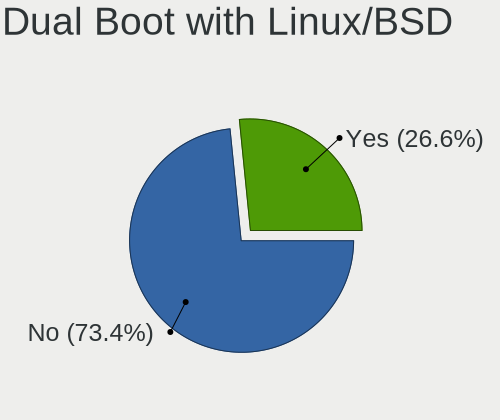
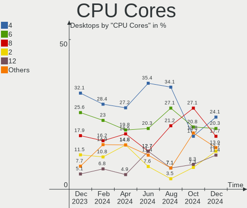
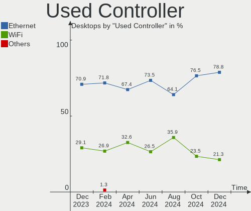

Linux in UK - Hardware Trends (Desktops)
----------------------------------------

A project to identify most popular hardware characteristics and track their change
over time based on data collected by Linux users at https://Linux-Hardware.org.

Anyone can contribute to this report by the [hw-probe](https://github.com/linuxhw/hw-probe) tool:

    sudo -E hw-probe -all -upload

Period: May, 2023.

Contents
--------

* [ System ](#system)
  - [ OS                       ](#os)
  - [ OS Family                ](#os-family)
  - [ Kernel                   ](#kernel)
  - [ Kernel Family            ](#kernel-family)
  - [ Kernel Major Ver.        ](#kernel-major-ver)
  - [ Arch                     ](#arch)
  - [ DE                       ](#de)
  - [ Display Server           ](#display-server)
  - [ Display Manager          ](#display-manager)
  - [ OS Lang                  ](#os-lang)
  - [ Boot Mode                ](#boot-mode)
  - [ Filesystem               ](#filesystem)
  - [ Part. scheme             ](#part-scheme)
  - [ Dual Boot with Linux/BSD ](#dual-boot-with-linuxbsd)
  - [ Dual Boot (Win)          ](#dual-boot-win)

* [ Board ](#board)
  - [ Vendor                   ](#vendor)
  - [ Model                    ](#model)
  - [ Model Family             ](#model-family)
  - [ MFG Year                 ](#mfg-year)
  - [ Form Factor              ](#form-factor)
  - [ Secure Boot              ](#secure-boot)
  - [ Coreboot                 ](#coreboot)
  - [ RAM Size                 ](#ram-size)
  - [ RAM Used                 ](#ram-used)
  - [ Total Drives             ](#total-drives)
  - [ Has CD-ROM               ](#has-cd-rom)
  - [ Has Ethernet             ](#has-ethernet)
  - [ Has WiFi                 ](#has-wifi)
  - [ Has Bluetooth            ](#has-bluetooth)

* [ Location ](#location)
  - [ Country                  ](#country)
  - [ City                     ](#city)

* [ Drives ](#drives)
  - [ Drive Vendor             ](#drive-vendor)
  - [ Drive Model              ](#drive-model)
  - [ HDD Vendor               ](#hdd-vendor)
  - [ SSD Vendor               ](#ssd-vendor)
  - [ Drive Kind               ](#drive-kind)
  - [ Drive Connector          ](#drive-connector)
  - [ Drive Size               ](#drive-size)
  - [ Space Total              ](#space-total)
  - [ Space Used               ](#space-used)
  - [ Malfunc. Drives          ](#malfunc-drives)
  - [ Malfunc. Drive Vendor    ](#malfunc-drive-vendor)
  - [ Malfunc. HDD Vendor      ](#malfunc-hdd-vendor)
  - [ Malfunc. Drive Kind      ](#malfunc-drive-kind)
  - [ Failed Drives            ](#failed-drives)
  - [ Failed Drive Vendor      ](#failed-drive-vendor)
  - [ Drive Status             ](#drive-status)

* [ Storage controller ](#storage-controller)
  - [ Storage Vendor           ](#storage-vendor)
  - [ Storage Model            ](#storage-model)
  - [ Storage Kind             ](#storage-kind)

* [ Processor ](#processor)
  - [ CPU Vendor               ](#cpu-vendor)
  - [ CPU Model                ](#cpu-model)
  - [ CPU Model Family         ](#cpu-model-family)
  - [ CPU Cores                ](#cpu-cores)
  - [ CPU Sockets              ](#cpu-sockets)
  - [ CPU Threads              ](#cpu-threads)
  - [ CPU Op-Modes             ](#cpu-op-modes)
  - [ CPU Microcode            ](#cpu-microcode)
  - [ CPU Microarch            ](#cpu-microarch)

* [ Graphics ](#graphics)
  - [ GPU Vendor               ](#gpu-vendor)
  - [ GPU Model                ](#gpu-model)
  - [ GPU Combo                ](#gpu-combo)
  - [ GPU Driver               ](#gpu-driver)
  - [ GPU Memory               ](#gpu-memory)

* [ Monitor ](#monitor)
  - [ Monitor Vendor           ](#monitor-vendor)
  - [ Monitor Model            ](#monitor-model)
  - [ Monitor Resolution       ](#monitor-resolution)
  - [ Monitor Diagonal         ](#monitor-diagonal)
  - [ Monitor Width            ](#monitor-width)
  - [ Aspect Ratio             ](#aspect-ratio)
  - [ Monitor Area             ](#monitor-area)
  - [ Pixel Density            ](#pixel-density)
  - [ Multiple Monitors        ](#multiple-monitors)

* [ Network ](#network)
  - [ Net Controller Vendor    ](#net-controller-vendor)
  - [ Net Controller Model     ](#net-controller-model)
  - [ Wireless Vendor          ](#wireless-vendor)
  - [ Wireless Model           ](#wireless-model)
  - [ Ethernet Vendor          ](#ethernet-vendor)
  - [ Ethernet Model           ](#ethernet-model)
  - [ Net Controller Kind      ](#net-controller-kind)
  - [ Used Controller          ](#used-controller)
  - [ NICs                     ](#nics)
  - [ IPv6                     ](#ipv6)

* [ Bluetooth ](#bluetooth)
  - [ Bluetooth Vendor         ](#bluetooth-vendor)
  - [ Bluetooth Model          ](#bluetooth-model)

* [ Sound ](#sound)
  - [ Sound Vendor             ](#sound-vendor)
  - [ Sound Model              ](#sound-model)

* [ Memory ](#memory)
  - [ Memory Vendor            ](#memory-vendor)
  - [ Memory Model             ](#memory-model)
  - [ Memory Kind              ](#memory-kind)
  - [ Memory Form Factor       ](#memory-form-factor)
  - [ Memory Size              ](#memory-size)
  - [ Memory Speed             ](#memory-speed)

* [ Printers & scanners ](#printers--scanners)
  - [ Printer Vendor           ](#printer-vendor)
  - [ Printer Model            ](#printer-model)
  - [ Scanner Vendor           ](#scanner-vendor)
  - [ Scanner Model            ](#scanner-model)

* [ Camera ](#camera)
  - [ Camera Vendor            ](#camera-vendor)
  - [ Camera Model             ](#camera-model)

* [ Security ](#security)
  - [ Fingerprint Vendor       ](#fingerprint-vendor)
  - [ Fingerprint Model        ](#fingerprint-model)
  - [ Chipcard Vendor          ](#chipcard-vendor)
  - [ Chipcard Model           ](#chipcard-model)

* [ Unsupported ](#unsupported)
  - [ Unsupported Devices      ](#unsupported-devices)
  - [ Unsupported Device Types ](#unsupported-device-types)

System
------

OS
--

Installed operating systems

| Name                         | Desktops | Percent |
|------------------------------|----------|---------|
| Ubuntu 22.04                 | 13       | 17.33%  |
| Pop!_OS 22.04                | 6        | 8%      |
| Linux Mint 21.1              | 6        | 8%      |
| ArcoLinux Rolling            | 6        | 8%      |
| Zorin 16                     | 5        | 6.67%   |
| Ubuntu 23.04                 | 3        | 4%      |
| openSUSE Tumbleweed-XXXXXXXX | 3        | 4%      |
| KDE neon 22.04               | 3        | 4%      |
| Fedora 38                    | 3        | 4%      |
| Debian 11                    | 3        | 4%      |
| Arch Rolling                 | 3        | 4%      |
| OpenMandriva 23.03           | 2        | 2.67%   |
| Gentoo 2.13                  | 2        | 2.67%   |
| Xubuntu 22.10                | 1        | 1.33%   |
| Ubuntu 20.04                 | 1        | 1.33%   |
| Sparky 6.6                   | 1        | 1.33%   |
| OpenMandriva 4.3             | 1        | 1.33%   |
| Nobara 36                    | 1        | 1.33%   |
| NixOS 22.11                  | 1        | 1.33%   |
| Lubuntu 22.04                | 1        | 1.33%   |
| LMDE 5                       | 1        | 1.33%   |
| Kubuntu 23.04                | 1        | 1.33%   |
| Kubuntu 22.04                | 1        | 1.33%   |
| Kubuntu 20.04                | 1        | 1.33%   |
| Garuda Linux Soaring         | 1        | 1.33%   |
| Fedora 37                    | 1        | 1.33%   |
| Fedora 36                    | 1        | 1.33%   |
| Debian 12                    | 1        | 1.33%   |
| blendOS                      | 1        | 1.33%   |
| antergos Rolling             | 1        | 1.33%   |

OS Family
---------

OS without a version

| Name         | Desktops | Percent |
|--------------|----------|---------|
| Ubuntu       | 17       | 22.67%  |
| Pop!_OS      | 6        | 8%      |
| Linux Mint   | 6        | 8%      |
| ArcoLinux    | 6        | 8%      |
| Zorin        | 5        | 6.67%   |
| Fedora       | 5        | 6.67%   |
| Debian       | 4        | 5.33%   |
| openSUSE     | 3        | 4%      |
| OpenMandriva | 3        | 4%      |
| Kubuntu      | 3        | 4%      |
| KDE neon     | 3        | 4%      |
| Arch         | 3        | 4%      |
| Gentoo       | 2        | 2.67%   |
| Xubuntu      | 1        | 1.33%   |
| Sparky       | 1        | 1.33%   |
| Nobara       | 1        | 1.33%   |
| NixOS        | 1        | 1.33%   |
| Lubuntu      | 1        | 1.33%   |
| LMDE         | 1        | 1.33%   |
| Garuda Linux | 1        | 1.33%   |
| blendOS      | 1        | 1.33%   |
| antergos     | 1        | 1.33%   |

Kernel
------

Version of the Linux kernel

| Version                       | Desktops | Percent |
|-------------------------------|----------|---------|
| 5.19.0-41-generic             | 9        | 12%     |
| 5.15.0-71-generic             | 9        | 12%     |
| 5.15.0-72-generic             | 5        | 6.67%   |
| 6.2.6-76060206-generic        | 4        | 5.33%   |
| 6.2.0-20-generic              | 4        | 5.33%   |
| 5.19.0-42-generic             | 3        | 4%      |
| 6.3.4-arch2-1                 | 2        | 2.67%   |
| 6.2.6-desktop-1omv2390        | 2        | 2.67%   |
| 6.2.13-zen-1-zen              | 2        | 2.67%   |
| 6.2.13-arch1-1                | 2        | 2.67%   |
| 5.19.0-32-generic             | 2        | 2.67%   |
| 6.3.4-arch1-1                 | 1        | 1.33%   |
| 6.3.4-1-default               | 1        | 1.33%   |
| 6.3.3-1-cachyos-bore          | 1        | 1.33%   |
| 6.3.2-gentoo-x86_64           | 1        | 1.33%   |
| 6.3.2-1-default               | 1        | 1.33%   |
| 6.3.1-zen1                    | 1        | 1.33%   |
| 6.3.1-x64v1-xanmod1           | 1        | 1.33%   |
| 6.3.1-arch2-1                 | 1        | 1.33%   |
| 6.3.1-1-default               | 1        | 1.33%   |
| 6.3.0-273-tkg-tt-llvm         | 1        | 1.33%   |
| 6.2.9-300.fc38.x86_64         | 1        | 1.33%   |
| 6.2.15-300.fc38.x86_64        | 1        | 1.33%   |
| 6.2.14-300.fc38.x86_64        | 1        | 1.33%   |
| 6.2.14-200.fc37.x86_64        | 1        | 1.33%   |
| 6.2.14-100.fc36.x86_64        | 1        | 1.33%   |
| 6.2.12-arch1-1                | 1        | 1.33%   |
| 6.1.27-1-lts                  | 1        | 1.33%   |
| 6.1.15-1-pve                  | 1        | 1.33%   |
| 5.4.0-21-generic              | 1        | 1.33%   |
| 5.4.0-147-generic             | 1        | 1.33%   |
| 5.19.14-201.fsync.fc36.x86_64 | 1        | 1.33%   |
| 5.17.5-76051705-generic       | 1        | 1.33%   |
| 5.16.7-desktop-1omv4003       | 1        | 1.33%   |
| 5.15.110                      | 1        | 1.33%   |
| 5.15.102-1-pve                | 1        | 1.33%   |
| 5.15.0-56-generic             | 1        | 1.33%   |
| 5.15.0-25-generic             | 1        | 1.33%   |
| 5.15.0-2-amd64                | 1        | 1.33%   |
| 5.10.0-23-amd64               | 1        | 1.33%   |

Kernel Family
-------------

Linux kernel without a distro release

| Version  | Desktops | Percent |
|----------|----------|---------|
| 5.15.0   | 17       | 22.67%  |
| 5.19.0   | 14       | 18.67%  |
| 6.2.6    | 6        | 8%      |
| 6.3.4    | 4        | 5.33%   |
| 6.3.1    | 4        | 5.33%   |
| 6.2.13   | 4        | 5.33%   |
| 6.2.0    | 4        | 5.33%   |
| 6.2.14   | 3        | 4%      |
| 5.10.0   | 3        | 4%      |
| 6.3.2    | 2        | 2.67%   |
| 5.4.0    | 2        | 2.67%   |
| 6.3.3    | 1        | 1.33%   |
| 6.3.0    | 1        | 1.33%   |
| 6.2.9    | 1        | 1.33%   |
| 6.2.15   | 1        | 1.33%   |
| 6.2.12   | 1        | 1.33%   |
| 6.1.27   | 1        | 1.33%   |
| 6.1.15   | 1        | 1.33%   |
| 5.19.14  | 1        | 1.33%   |
| 5.17.5   | 1        | 1.33%   |
| 5.16.7   | 1        | 1.33%   |
| 5.15.110 | 1        | 1.33%   |
| 5.15.102 | 1        | 1.33%   |

Kernel Major Ver.
-----------------

Linux kernel major version

| Version | Desktops | Percent |
|---------|----------|---------|
| 6.2     | 20       | 26.67%  |
| 5.15    | 19       | 25.33%  |
| 5.19    | 15       | 20%     |
| 6.3     | 12       | 16%     |
| 5.10    | 3        | 4%      |
| 6.1     | 2        | 2.67%   |
| 5.4     | 2        | 2.67%   |
| 5.17    | 1        | 1.33%   |
| 5.16    | 1        | 1.33%   |

Arch
----

OS architecture (x86_64, i586, etc.)

| Name   | Desktops | Percent |
|--------|----------|---------|
| x86_64 | 75       | 100%    |

DE
--

Desktop Environment

| Name       | Desktops | Percent |
|------------|----------|---------|
| GNOME      | 35       | 46.67%  |
| KDE5       | 21       | 28%     |
| X-Cinnamon | 7        | 9.33%   |
| XFCE       | 5        | 6.67%   |
| LXQt       | 2        | 2.67%   |
| chadwm     | 2        | 2.67%   |
| Unknown    | 2        | 2.67%   |
| i3         | 1        | 1.33%   |

Display Server
--------------

X11 or Wayland

| Name    | Desktops | Percent |
|---------|----------|---------|
| X11     | 53       | 70.67%  |
| Wayland | 16       | 21.33%  |
| Tty     | 6        | 8%      |

Display Manager
---------------

SDDM, LightDM, etc.

| Name    | Desktops | Percent |
|---------|----------|---------|
| Unknown | 31       | 41.33%  |
| SDDM    | 20       | 26.67%  |
| GDM3    | 17       | 22.67%  |
| LightDM | 4        | 5.33%   |
| GDM     | 3        | 4%      |

OS Lang
-------

Language

| Lang  | Desktops | Percent |
|-------|----------|---------|
| en_GB | 59       | 78.67%  |
| en_US | 11       | 14.67%  |
| C     | 4        | 5.33%   |
| fr_FR | 1        | 1.33%   |

Boot Mode
---------

EFI or BIOS

| Mode | Desktops | Percent |
|------|----------|---------|
| EFI  | 40       | 53.33%  |
| BIOS | 35       | 46.67%  |

Filesystem
----------

Type of filesystem

| Type    | Desktops | Percent |
|---------|----------|---------|
| Ext4    | 43       | 57.33%  |
| Btrfs   | 15       | 20%     |
| Tmpfs   | 12       | 16%     |
| Overlay | 4        | 5.33%   |
| Xfs     | 1        | 1.33%   |

Part. scheme
------------

Scheme of partitioning

| Type    | Desktops | Percent |
|---------|----------|---------|
| GPT     | 44       | 58.67%  |
| Unknown | 29       | 38.67%  |
| MBR     | 2        | 2.67%   |

Dual Boot with Linux/BSD
------------------------

Hosting more than one Linux/BSD

| Dual boot | Desktops | Percent |
|-----------|----------|---------|
| No        | 60       | 80%     |
| Yes       | 15       | 20%     |

Dual Boot (Win)
---------------

Hosting Linux and Windows

| Dual boot | Desktops | Percent |
|-----------|----------|---------|
| No        | 58       | 77.33%  |
| Yes       | 17       | 22.67%  |

Board
-----

Vendor
------

Motherboard manufacturer

| Name                | Desktops | Percent |
|---------------------|----------|---------|
| ASUSTek Computer    | 26       | 34.67%  |
| Gigabyte Technology | 14       | 18.67%  |
| MSI                 | 12       | 16%     |
| Hewlett-Packard     | 6        | 8%      |
| ASRock              | 5        | 6.67%   |
| Fujitsu             | 2        | 2.67%   |
| Dell                | 2        | 2.67%   |
| Acer                | 2        | 2.67%   |
| SYWZ                | 1        | 1.33%   |
| Samsung Electronics | 1        | 1.33%   |
| Biostar             | 1        | 1.33%   |
| AZW                 | 1        | 1.33%   |
| Apple               | 1        | 1.33%   |
| AMI                 | 1        | 1.33%   |

Model
-----

Motherboard model

| Name                           | Desktops | Percent |
|--------------------------------|----------|---------|
| MSI MS-7C91                    | 2        | 2.67%   |
| MSI MS-7C02                    | 2        | 2.67%   |
| Dell OptiPlex 390              | 2        | 2.67%   |
| ASUS All Series                | 2        | 2.67%   |
| SYWZ S200 Series               | 1        | 1.33%   |
| Samsung DeskTop System         | 1        | 1.33%   |
| MSI MS-7D04                    | 1        | 1.33%   |
| MSI MS-7C95                    | 1        | 1.33%   |
| MSI MS-7A34                    | 1        | 1.33%   |
| MSI MS-7A15                    | 1        | 1.33%   |
| MSI MS-7923                    | 1        | 1.33%   |
| MSI MS-7502                    | 1        | 1.33%   |
| MSI MBB-11716B                 | 1        | 1.33%   |
| MSI 7200-5086C                 | 1        | 1.33%   |
| HP Z420 Workstation            | 1        | 1.33%   |
| HP Z230 Tower Workstation      | 1        | 1.33%   |
| HP t520 Flexible Series TC     | 1        | 1.33%   |
| HP OMEN by Desktop PC 880-p1xx | 1        | 1.33%   |
| HP Compaq Elite 8300 USDT      | 1        | 1.33%   |
| HP Compaq 8100 Elite SFF PC    | 1        | 1.33%   |
| Gigabyte Z97X-Gaming 5         | 1        | 1.33%   |
| Gigabyte Z590 GAMING X         | 1        | 1.33%   |
| Gigabyte Z270X-Gaming 7        | 1        | 1.33%   |
| Gigabyte X670 AORUS ELITE AX   | 1        | 1.33%   |
| Gigabyte PDT-702-1020          | 1        | 1.33%   |
| Gigabyte F2A78M-HD2            | 1        | 1.33%   |
| Gigabyte B550M DS3H            | 1        | 1.33%   |
| Gigabyte B550M AORUS PRO-P     | 1        | 1.33%   |
| Gigabyte B550I AORUS PRO AX    | 1        | 1.33%   |
| Gigabyte Amd Am4               | 1        | 1.33%   |
| Gigabyte A320M-S2H             | 1        | 1.33%   |
| Gigabyte A320M-H               | 1        | 1.33%   |
| Gigabyte 970A-DS3P             | 1        | 1.33%   |
| Gigabyte 970A-DS3              | 1        | 1.33%   |
| Fujitsu PRIMERGY TX100 S3P     | 1        | 1.33%   |
| Fujitsu ESPRIMO E9900          | 1        | 1.33%   |
| Biostar H110MHV3               | 1        | 1.33%   |
| AZW U59                        | 1        | 1.33%   |
| ASUS Z170M-PLUS                | 1        | 1.33%   |
| ASUS Z170-K                    | 1        | 1.33%   |

Model Family
------------

Motherboard model prefix

| Name                  | Desktops | Percent |
|-----------------------|----------|---------|
| ASUS ROG              | 7        | 9.33%   |
| ASUS TUF              | 3        | 4%      |
| ASUS PRIME            | 3        | 4%      |
| MSI MS-7C91           | 2        | 2.67%   |
| MSI MS-7C02           | 2        | 2.67%   |
| HP Compaq             | 2        | 2.67%   |
| Gigabyte B550M        | 2        | 2.67%   |
| Dell OptiPlex         | 2        | 2.67%   |
| ASUS All              | 2        | 2.67%   |
| SYWZ S200             | 1        | 1.33%   |
| Samsung DeskTop       | 1        | 1.33%   |
| MSI MS-7D04           | 1        | 1.33%   |
| MSI MS-7C95           | 1        | 1.33%   |
| MSI MS-7A34           | 1        | 1.33%   |
| MSI MS-7A15           | 1        | 1.33%   |
| MSI MS-7923           | 1        | 1.33%   |
| MSI MS-7502           | 1        | 1.33%   |
| MSI MBB-11716B        | 1        | 1.33%   |
| MSI 7200-5086C        | 1        | 1.33%   |
| HP Z420               | 1        | 1.33%   |
| HP Z230               | 1        | 1.33%   |
| HP t520               | 1        | 1.33%   |
| HP OMEN               | 1        | 1.33%   |
| Gigabyte Z97X-Gaming  | 1        | 1.33%   |
| Gigabyte Z590         | 1        | 1.33%   |
| Gigabyte Z270X-Gaming | 1        | 1.33%   |
| Gigabyte X670         | 1        | 1.33%   |
| Gigabyte PDT-702-1020 | 1        | 1.33%   |
| Gigabyte F2A78M-HD2   | 1        | 1.33%   |
| Gigabyte B550I        | 1        | 1.33%   |
| Gigabyte Amd          | 1        | 1.33%   |
| Gigabyte A320M-S2H    | 1        | 1.33%   |
| Gigabyte A320M-H      | 1        | 1.33%   |
| Gigabyte 970A-DS3P    | 1        | 1.33%   |
| Gigabyte 970A-DS3     | 1        | 1.33%   |
| Fujitsu PRIMERGY      | 1        | 1.33%   |
| Fujitsu ESPRIMO       | 1        | 1.33%   |
| Biostar H110MHV3      | 1        | 1.33%   |
| AZW U59               | 1        | 1.33%   |
| ASUS Z170M-PLUS       | 1        | 1.33%   |

MFG Year
--------

Motherboard manufacture year

| Year | Desktops | Percent |
|------|----------|---------|
| 2020 | 10       | 13.33%  |
| 2021 | 9        | 12%     |
| 2018 | 8        | 10.67%  |
| 2019 | 6        | 8%      |
| 2012 | 6        | 8%      |
| 2011 | 6        | 8%      |
| 2022 | 5        | 6.67%   |
| 2014 | 5        | 6.67%   |
| 2017 | 4        | 5.33%   |
| 2015 | 4        | 5.33%   |
| 2013 | 4        | 5.33%   |
| 2010 | 4        | 5.33%   |
| 2016 | 2        | 2.67%   |
| 2009 | 1        | 1.33%   |
| 2007 | 1        | 1.33%   |

Form Factor
-----------

Physical design of the computer

| Name    | Desktops | Percent |
|---------|----------|---------|
| Desktop | 75       | 100%    |

Secure Boot
-----------

Enabled or disabled

| State    | Desktops | Percent |
|----------|----------|---------|
| Disabled | 74       | 98.67%  |
| Enabled  | 1        | 1.33%   |

Coreboot
--------

Have coreboot on board

| Used | Desktops | Percent |
|------|----------|---------|
| No   | 75       | 100%    |

RAM Size
--------

Total RAM memory

| Size in GB  | Desktops | Percent |
|-------------|----------|---------|
| 32.01-64.0  | 24       | 32%     |
| 16.01-24.0  | 21       | 28%     |
| 4.01-8.0    | 11       | 14.67%  |
| 64.01-256.0 | 6        | 8%      |
| 8.01-16.0   | 6        | 8%      |
| 24.01-32.0  | 4        | 5.33%   |
| 3.01-4.0    | 3        | 4%      |

RAM Used
--------

Used RAM memory

| Used GB   | Desktops | Percent |
|-----------|----------|---------|
| 3.01-4.0  | 19       | 25.33%  |
| 4.01-8.0  | 18       | 24%     |
| 1.01-2.0  | 16       | 21.33%  |
| 2.01-3.0  | 13       | 17.33%  |
| 8.01-16.0 | 8        | 10.67%  |
| 0.01-0.5  | 1        | 1.33%   |

Total Drives
------------

Number of drives on board

| Drives | Desktops | Percent |
|--------|----------|---------|
| 1      | 23       | 30.67%  |
| 2      | 20       | 26.67%  |
| 4      | 14       | 18.67%  |
| 3      | 9        | 12%     |
| 6      | 4        | 5.33%   |
| 5      | 2        | 2.67%   |
| 25     | 1        | 1.33%   |
| 7      | 1        | 1.33%   |
| 0      | 1        | 1.33%   |

Has CD-ROM
----------

Has CD-ROM on board

| Presented | Desktops | Percent |
|-----------|----------|---------|
| No        | 43       | 57.33%  |
| Yes       | 32       | 42.67%  |

Has Ethernet
------------

Has Ethernet on board

| Presented | Desktops | Percent |
|-----------|----------|---------|
| Yes       | 74       | 98.67%  |
| No        | 1        | 1.33%   |

Has WiFi
--------

Has WiFi module

| Presented | Desktops | Percent |
|-----------|----------|---------|
| No        | 43       | 57.33%  |
| Yes       | 32       | 42.67%  |

Has Bluetooth
-------------

Has Bluetooth module

| Presented | Desktops | Percent |
|-----------|----------|---------|
| No        | 45       | 60%     |
| Yes       | 30       | 40%     |

Location
--------

Country
-------

Geographic location (country)

| Country | Desktops | Percent |
|---------|----------|---------|
| UK      | 75       | 100%    |

City
----

Geographic location (city)

| City                 | Desktops | Percent |
|----------------------|----------|---------|
| London               | 4        | 5.33%   |
| Barnet               | 4        | 5.33%   |
| Warrington           | 2        | 2.67%   |
| Stevenage            | 2        | 2.67%   |
| Manchester           | 2        | 2.67%   |
| Leeds                | 2        | 2.67%   |
| Kingston upon Thames | 2        | 2.67%   |
| Enfield              | 2        | 2.67%   |
| Edinburgh            | 2        | 2.67%   |
| City of London       | 2        | 2.67%   |
| Bristol              | 2        | 2.67%   |
| Brent                | 2        | 2.67%   |
| Birmingham           | 2        | 2.67%   |
| Woodford Green       | 1        | 1.33%   |
| Whitley Bay          | 1        | 1.33%   |
| Wallsend             | 1        | 1.33%   |
| Wallington           | 1        | 1.33%   |
| Telford              | 1        | 1.33%   |
| Sutton               | 1        | 1.33%   |
| Southwark            | 1        | 1.33%   |
| Sheffield            | 1        | 1.33%   |
| Rotherham            | 1        | 1.33%   |
| Rochdale             | 1        | 1.33%   |
| Rickmansworth        | 1        | 1.33%   |
| Reading              | 1        | 1.33%   |
| Portsmouth           | 1        | 1.33%   |
| Newcastle upon Tyne  | 1        | 1.33%   |
| Markfield            | 1        | 1.33%   |
| Luton                | 1        | 1.33%   |
| Lochearnhead         | 1        | 1.33%   |
| Llanelli             | 1        | 1.33%   |
| Lincoln              | 1        | 1.33%   |
| Lewisham             | 1        | 1.33%   |
| Leicester            | 1        | 1.33%   |
| Kings Lynn           | 1        | 1.33%   |
| Islington            | 1        | 1.33%   |
| Huddersfield         | 1        | 1.33%   |
| Hounslow             | 1        | 1.33%   |
| Hornsea              | 1        | 1.33%   |
| Gillingham           | 1        | 1.33%   |

Drives
------

Drive Vendor
------------

Hard drive vendors

| Vendor                    | Desktops | Drives | Percent |
|---------------------------|----------|--------|---------|
| Samsung Electronics       | 27       | 44     | 17.09%  |
| WDC                       | 25       | 34     | 15.82%  |
| Seagate                   | 25       | 36     | 15.82%  |
| Sandisk                   | 9        | 10     | 5.7%    |
| Crucial                   | 8        | 8      | 5.06%   |
| Kingston                  | 7        | 7      | 4.43%   |
| Toshiba                   | 5        | 7      | 3.16%   |
| Micron/Crucial Technology | 5        | 6      | 3.16%   |
| Intel                     | 5        | 5      | 3.16%   |
| Hitachi                   | 5        | 5      | 3.16%   |
| Phison Electronics        | 4        | 4      | 2.53%   |
| China                     | 4        | 4      | 2.53%   |
| Phison                    | 2        | 2      | 1.27%   |
| Netac                     | 2        | 3      | 1.27%   |
| ADATA Technology          | 2        | 2      | 1.27%   |
| Unknown                   | 1        | 1      | 0.63%   |
| TSA                       | 1        | 1      | 0.63%   |
| TO Exter                  | 1        | 1      | 0.63%   |
| TDAS                      | 1        | 8      | 0.63%   |
| SSK                       | 1        | 1      | 0.63%   |
| SPCC                      | 1        | 2      | 0.63%   |
| sobetter                  | 1        | 2      | 0.63%   |
| SK hynix                  | 1        | 1      | 0.63%   |
| Silicon Motion            | 1        | 1      | 0.63%   |
| SABRENT                   | 1        | 3      | 0.63%   |
| RSH-339                   | 1        | 1      | 0.63%   |
| Patriot                   | 1        | 1      | 0.63%   |
| OWC                       | 1        | 1      | 0.63%   |
| OCZ                       | 1        | 1      | 0.63%   |
| Micron Technology         | 1        | 1      | 0.63%   |
| KIOXIA-EXCERIA            | 1        | 1      | 0.63%   |
| JMicron Technology        | 1        | 1      | 0.63%   |
| Integral                  | 1        | 1      | 0.63%   |
| HP Phison                 | 1        | 1      | 0.63%   |
| Fanxiang                  | 1        | 1      | 0.63%   |
| Drevo                     | 1        | 1      | 0.63%   |
| ASMT                      | 1        | 2      | 0.63%   |
| Unknown                   | 1        | 1      | 0.63%   |

Drive Model
-----------

Hard drive models

| Model                                                           | Desktops | Percent |
|-----------------------------------------------------------------|----------|---------|
| Samsung NVMe SSD Controller SM981/PM981/PM983 256GB             | 4        | 2.17%   |
| Micron/Crucial P2 NVMe PCIe SSD 1TB                             | 4        | 2.17%   |
| Seagate ST2000DM008-2FR102 2TB                                  | 3        | 1.63%   |
| Seagate ST1000DM010-2EP102 1TB                                  | 3        | 1.63%   |
| Samsung NVMe SSD Controller SM961/PM961/SM963 256GB             | 3        | 1.63%   |
| Samsung NVMe SSD Controller PM9A1/PM9A3/980PRO 1TB              | 3        | 1.63%   |
| Phison E16 PCIe4 NVMe Controller 1TB                            | 3        | 1.63%   |
| Kingston SA400S37480G 480GB SSD                                 | 3        | 1.63%   |
| WDC WD10EZEX-00WN4A0 1TB                                        | 2        | 1.09%   |
| Toshiba DT01ACA100 1TB                                          | 2        | 1.09%   |
| Seagate ST4000VN006-3CW104 4TB                                  | 2        | 1.09%   |
| Seagate ST4000DM004-2CV104 4TB                                  | 2        | 1.09%   |
| Seagate ST3500312CS 500GB                                       | 2        | 1.09%   |
| Sandisk WD Blue SN550 NVMe SSD 512GB                            | 2        | 1.09%   |
| Samsung SSD 980 1TB                                             | 2        | 1.09%   |
| Samsung SSD 870 EVO 1TB                                         | 2        | 1.09%   |
| Samsung SSD 850 EVO 500GB                                       | 2        | 1.09%   |
| Intel SSD 600P Series 256GB                                     | 2        | 1.09%   |
| Crucial CT1000MX500SSD1 1TB                                     | 2        | 1.09%   |
| ADATA XPG SX8200 Pro PCIe Gen3x4 M.2 2280 Solid State Drive 1TB | 2        | 1.09%   |
| WDC WDS200T2B0C-00PXH0 2TB                                      | 1        | 0.54%   |
| WDC WDS100T2B0A-00SM50 1TB SSD                                  | 1        | 0.54%   |
| WDC WD5000KS-00MNB0 500GB                                       | 1        | 0.54%   |
| WDC WD5000AAKS-00V1A0 500GB                                     | 1        | 0.54%   |
| WDC WD5000AAKS-00TMA0 500GB                                     | 1        | 0.54%   |
| WDC WD40EZRZ-00WN9B0 4TB                                        | 1        | 0.54%   |
| WDC WD40EFRX-68WT0N0 4TB                                        | 1        | 0.54%   |
| WDC WD40EFRX-68N32N0 4TB                                        | 1        | 0.54%   |
| WDC WD40EFAX-68JH4N1 4TB                                        | 1        | 0.54%   |
| WDC WD4005FZBX-00K5WB0 4TB                                      | 1        | 0.54%   |
| WDC WD30EZRZ-00Z5HB0 3TB                                        | 1        | 0.54%   |
| WDC WD30EZRZ-00WN9B0 3TB                                        | 1        | 0.54%   |
| WDC WD30EZRZ-00GXCB0 3TB                                        | 1        | 0.54%   |
| WDC WD30EFRX-68EUZN0 3TB                                        | 1        | 0.54%   |
| WDC WD30EFRX-68AX9N0 3TB                                        | 1        | 0.54%   |
| WDC WD2500AAJS-60M0A0 250GB                                     | 1        | 0.54%   |
| WDC WD161KRYZ-01AGBB0 16TB                                      | 1        | 0.54%   |
| WDC WD140EDFZ-11A0VA0 14TB                                      | 1        | 0.54%   |
| WDC WD10EZEX-60ZF5A0 1TB                                        | 1        | 0.54%   |
| WDC WD10EZEX-60WN4A0 1TB                                        | 1        | 0.54%   |

HDD Vendor
----------

Hard disk drive vendors

| Vendor              | Desktops | Drives | Percent |
|---------------------|----------|--------|---------|
| Seagate             | 25       | 35     | 40.32%  |
| WDC                 | 23       | 32     | 37.1%   |
| Hitachi             | 5        | 5      | 8.06%   |
| Toshiba             | 3        | 5      | 4.84%   |
| Samsung Electronics | 3        | 3      | 4.84%   |
| Unknown             | 1        | 1      | 1.61%   |
| SSK                 | 1        | 1      | 1.61%   |
| RSH-339             | 1        | 1      | 1.61%   |

SSD Vendor
----------

Solid state drive vendors

| Vendor              | Desktops | Drives | Percent |
|---------------------|----------|--------|---------|
| Samsung Electronics | 15       | 22     | 26.32%  |
| Kingston            | 7        | 7      | 12.28%  |
| Crucial             | 7        | 7      | 12.28%  |
| SanDisk             | 4        | 4      | 7.02%   |
| China               | 4        | 4      | 7.02%   |
| Netac               | 2        | 3      | 3.51%   |
| Intel               | 2        | 2      | 3.51%   |
| WDC                 | 1        | 1      | 1.75%   |
| TSA                 | 1        | 1      | 1.75%   |
| Toshiba             | 1        | 1      | 1.75%   |
| TO Exter            | 1        | 1      | 1.75%   |
| SPCC                | 1        | 2      | 1.75%   |
| SABRENT             | 1        | 3      | 1.75%   |
| Patriot             | 1        | 1      | 1.75%   |
| OWC                 | 1        | 1      | 1.75%   |
| OCZ                 | 1        | 1      | 1.75%   |
| Micron Technology   | 1        | 1      | 1.75%   |
| KIOXIA-EXCERIA      | 1        | 1      | 1.75%   |
| JMicron Technology  | 1        | 1      | 1.75%   |
| Integral            | 1        | 1      | 1.75%   |
| HP Phison           | 1        | 1      | 1.75%   |
| Drevo               | 1        | 1      | 1.75%   |
| ASMT                | 1        | 2      | 1.75%   |

Drive Kind
----------

HDD or SSD

| Kind    | Desktops | Drives | Percent |
|---------|----------|--------|---------|
| SSD     | 45       | 69     | 35.16%  |
| HDD     | 44       | 83     | 34.38%  |
| NVMe    | 35       | 47     | 27.34%  |
| Unknown | 3        | 12     | 2.34%   |
| MMC     | 1        | 1      | 0.78%   |

Drive Connector
---------------

SATA, SAS, NVMe, etc.

| Type | Desktops | Drives | Percent |
|------|----------|--------|---------|
| SATA | 67       | 134    | 60.91%  |
| NVMe | 35       | 47     | 31.82%  |
| SAS  | 7        | 30     | 6.36%   |
| MMC  | 1        | 1      | 0.91%   |

Drive Size
----------

Size of hard drive

| Size in TB | Desktops | Drives | Percent |
|------------|----------|--------|---------|
| 0.01-0.5   | 41       | 59     | 37.61%  |
| 0.51-1.0   | 33       | 43     | 30.28%  |
| 1.01-2.0   | 14       | 16     | 12.84%  |
| 3.01-4.0   | 11       | 19     | 10.09%  |
| 2.01-3.0   | 5        | 6      | 4.59%   |
| 10.01-20.0 | 3        | 5      | 2.75%   |
| 4.01-10.0  | 2        | 4      | 1.83%   |

Space Total
-----------

Amount of disk space available on the file system

| Size in GB     | Desktops | Percent |
|----------------|----------|---------|
| More than 3000 | 20       | 26.67%  |
| 251-500        | 11       | 14.67%  |
| 1001-2000      | 9        | 12%     |
| 1-20           | 9        | 12%     |
| 101-250        | 8        | 10.67%  |
| 501-1000       | 8        | 10.67%  |
| 2001-3000      | 4        | 5.33%   |
| 51-100         | 3        | 4%      |
| 21-50          | 2        | 2.67%   |
| Unknown        | 1        | 1.33%   |

Space Used
----------

Amount of used disk space

| Used GB        | Desktops | Percent |
|----------------|----------|---------|
| 1-20           | 23       | 30.67%  |
| 51-100         | 10       | 13.33%  |
| 101-250        | 9        | 12%     |
| 21-50          | 8        | 10.67%  |
| 501-1000       | 7        | 9.33%   |
| 251-500        | 5        | 6.67%   |
| 1001-2000      | 5        | 6.67%   |
| More than 3000 | 4        | 5.33%   |
| 2001-3000      | 3        | 4%      |
| Unknown        | 1        | 1.33%   |

Malfunc. Drives
---------------

Drive models with a malfunction

| Model                                 | Desktops | Drives | Percent |
|---------------------------------------|----------|--------|---------|
| WDC WD5000AAKS-00V1A0 500GB           | 1        | 1      | 7.69%   |
| WDC WD40EZRZ-00WN9B0 4TB              | 1        | 1      | 7.69%   |
| WDC WD40EFRX-68WT0N0 4TB              | 1        | 3      | 7.69%   |
| WDC WD30EFRX-68AX9N0 3TB              | 1        | 1      | 7.69%   |
| WDC WD10EZEX-60ZF5A0 1TB              | 1        | 1      | 7.69%   |
| WDC WD10EZEX-60WN4A0 1TB              | 1        | 1      | 7.69%   |
| Seagate ST500DM002-1BC142 500GB       | 1        | 1      | 7.69%   |
| Samsung Electronics SSD 960 EVO 250GB | 1        | 1      | 7.69%   |
| Samsung Electronics SSD 850 EVO 250GB | 1        | 1      | 7.69%   |
| Samsung Electronics HD503HI 500GB     | 1        | 1      | 7.69%   |
| Intel SSD 600P Series 256GB           | 1        | 1      | 7.69%   |
| Drevo X1 Pro SSD 128GB                | 1        | 1      | 7.69%   |
| Crucial CT240M500SSD1 240GB           | 1        | 1      | 7.69%   |

Malfunc. Drive Vendor
---------------------

Vendors of faulty drives

| Vendor              | Desktops | Drives | Percent |
|---------------------|----------|--------|---------|
| WDC                 | 5        | 8      | 41.67%  |
| Samsung Electronics | 3        | 3      | 25%     |
| Seagate             | 1        | 1      | 8.33%   |
| Intel               | 1        | 1      | 8.33%   |
| Drevo               | 1        | 1      | 8.33%   |
| Crucial             | 1        | 1      | 8.33%   |

Malfunc. HDD Vendor
-------------------

Vendors of faulty HDD drives

| Vendor              | Desktops | Drives | Percent |
|---------------------|----------|--------|---------|
| WDC                 | 5        | 8      | 71.43%  |
| Seagate             | 1        | 1      | 14.29%  |
| Samsung Electronics | 1        | 1      | 14.29%  |

Malfunc. Drive Kind
-------------------

Kinds of faulty drives

| Kind | Desktops | Drives | Percent |
|------|----------|--------|---------|
| HDD  | 6        | 10     | 54.55%  |
| SSD  | 3        | 3      | 27.27%  |
| NVMe | 2        | 2      | 18.18%  |

Failed Drives
-------------

Failed drive models

Zero info for selected period =(

Failed Drive Vendor
-------------------

Failed drive vendors

Zero info for selected period =(

Drive Status
------------

Number of failed and malfunc. drives

| Status   | Desktops | Drives | Percent |
|----------|----------|--------|---------|
| Detected | 46       | 118    | 54.12%  |
| Works    | 29       | 79     | 34.12%  |
| Malfunc  | 10       | 15     | 11.76%  |

Storage controller
------------------

Storage Vendor
--------------

Storage controller vendors

| Vendor                       | Desktops | Percent |
|------------------------------|----------|---------|
| Intel                        | 39       | 32.23%  |
| AMD                          | 35       | 28.93%  |
| Samsung Electronics          | 16       | 13.22%  |
| SanDisk                      | 6        | 4.96%   |
| Phison Electronics           | 6        | 4.96%   |
| Micron/Crucial Technology    | 6        | 4.96%   |
| ASMedia Technology           | 3        | 2.48%   |
| JMicron Technology           | 2        | 1.65%   |
| ADATA Technology             | 2        | 1.65%   |
| Toshiba America Info Systems | 1        | 0.83%   |
| SK hynix                     | 1        | 0.83%   |
| Silicon Motion               | 1        | 0.83%   |
| Nvidia                       | 1        | 0.83%   |
| Marvell Technology Group     | 1        | 0.83%   |
| LSI Logic / Symbios Logic    | 1        | 0.83%   |

Storage Model
-------------

Storage controller models

| Model                                                                                   | Desktops | Percent |
|-----------------------------------------------------------------------------------------|----------|---------|
| AMD FCH SATA Controller [AHCI mode]                                                     | 18       | 12.33%  |
| AMD 500 Series Chipset SATA Controller                                                  | 8        | 5.48%   |
| AMD 400 Series Chipset SATA Controller                                                  | 7        | 4.79%   |
| Samsung NVMe SSD Controller SM981/PM981/PM983                                           | 6        | 4.11%   |
| Samsung NVMe SSD Controller PM9A1/PM9A3/980PRO                                          | 6        | 4.11%   |
| Micron/Crucial P2 NVMe PCIe SSD                                                         | 5        | 3.42%   |
| Intel Q170/Q150/B150/H170/H110/Z170/CM236 Chipset SATA Controller [AHCI Mode]           | 5        | 3.42%   |
| Intel 500 Series Chipset Family SATA AHCI Controller                                    | 5        | 3.42%   |
| Samsung NVMe SSD Controller SM961/PM961/SM963                                           | 4        | 2.74%   |
| Intel 200 Series PCH SATA controller [AHCI mode]                                        | 4        | 2.74%   |
| AMD SB7x0/SB8x0/SB9x0 SATA Controller [AHCI mode]                                       | 4        | 2.74%   |
| Samsung NVMe SSD Controller 980                                                         | 3        | 2.05%   |
| Phison E16 PCIe4 NVMe Controller                                                        | 3        | 2.05%   |
| Intel 8 Series/C220 Series Chipset Family 6-port SATA Controller 1 [AHCI mode]          | 3        | 2.05%   |
| Intel 6 Series/C200 Series Chipset Family Desktop SATA Controller (IDE mode, ports 4-5) | 3        | 2.05%   |
| Intel 6 Series/C200 Series Chipset Family Desktop SATA Controller (IDE mode, ports 0-3) | 3        | 2.05%   |
| AMD FCH SATA Controller D                                                               | 3        | 2.05%   |
| SanDisk WD Blue SN550 NVMe SSD                                                          | 2        | 1.37%   |
| Intel SSD 600P Series                                                                   | 2        | 1.37%   |
| Intel 9 Series Chipset Family SATA Controller [AHCI Mode]                               | 2        | 1.37%   |
| Intel 7 Series/C210 Series Chipset Family 6-port SATA Controller [AHCI mode]            | 2        | 1.37%   |
| Intel 5 Series/3400 Series Chipset 6 port SATA AHCI Controller                          | 2        | 1.37%   |
| ASMedia ASM1062 Serial ATA Controller                                                   | 2        | 1.37%   |
| AMD SB7x0/SB8x0/SB9x0 SATA Controller [IDE mode]                                        | 2        | 1.37%   |
| AMD SB7x0/SB8x0/SB9x0 IDE Controller                                                    | 2        | 1.37%   |
| ADATA XPG SX8200 Pro PCIe Gen3x4 M.2 2280 Solid State Drive                             | 2        | 1.37%   |
| Toshiba America Info Systems XG6 NVMe SSD Controller                                    | 1        | 0.68%   |
| SK hynix BC501 NVMe Solid State Drive                                                   | 1        | 0.68%   |
| Silicon Motion SM2263EN/SM2263XT SSD Controller                                         | 1        | 0.68%   |
| SanDisk WD PC SN810 / Black SN850 NVMe SSD                                              | 1        | 0.68%   |
| SanDisk WD Blue SN570 NVMe SSD 1TB                                                      | 1        | 0.68%   |
| SanDisk WD Black SN770 NVMe SSD                                                         | 1        | 0.68%   |
| SanDisk WD Black 2018/SN750 / PC SN720 NVMe SSD                                         | 1        | 0.68%   |
| SanDisk Non-Volatile memory controller                                                  | 1        | 0.68%   |
| Samsung Electronics Non-Volatile memory controller                                      | 1        | 0.68%   |
| Phison Electronics Non-Volatile memory controller                                       | 1        | 0.68%   |
| Phison E18 PCIe4 NVMe Controller                                                        | 1        | 0.68%   |
| Phison E12 NVMe Controller                                                              | 1        | 0.68%   |
| Nvidia MCP61 SATA Controller                                                            | 1        | 0.68%   |
| Micron/Crucial P5 Plus NVMe PCIe SSD                                                    | 1        | 0.68%   |

Storage Kind
------------

Kind of storage controller (IDE, SATA, NVMe, SAS, ...)

| Kind | Desktops | Percent |
|------|----------|---------|
| SATA | 68       | 58.12%  |
| NVMe | 35       | 29.91%  |
| IDE  | 11       | 9.4%    |
| RAID | 1        | 0.85%   |
| SAS  | 1        | 0.85%   |
| SCSI | 1        | 0.85%   |

Processor
---------

CPU Vendor
----------

Processor vendors

| Vendor | Desktops | Percent |
|--------|----------|---------|
| AMD    | 38       | 50.67%  |
| Intel  | 37       | 49.33%  |

CPU Model
---------

Processor models

| Model                                       | Desktops | Percent |
|---------------------------------------------|----------|---------|
| AMD Ryzen 9 5900X 12-Core Processor         | 3        | 4%      |
| AMD Ryzen 7 2700X Eight-Core Processor      | 3        | 4%      |
| AMD Ryzen 5 5600X 6-Core Processor          | 3        | 4%      |
| AMD FX-6300 Six-Core Processor              | 3        | 4%      |
| Intel Core i9-10850K CPU @ 3.60GHz          | 2        | 2.67%   |
| Intel Core i5 CPU 650 @ 3.20GHz             | 2        | 2.67%   |
| AMD Ryzen 9 5950X 16-Core Processor         | 2        | 2.67%   |
| AMD Ryzen 7 1700 Eight-Core Processor       | 2        | 2.67%   |
| AMD Ryzen 5 3600 6-Core Processor           | 2        | 2.67%   |
| AMD Ryzen 5 2600 Six-Core Processor         | 2        | 2.67%   |
| AMD FX-8350 Eight-Core Processor            | 2        | 2.67%   |
| Intel Xeon CPU X5660 @ 2.80GHz              | 1        | 1.33%   |
| Intel Xeon CPU E5-2687W 0 @ 3.10GHz         | 1        | 1.33%   |
| Intel Xeon CPU E3-1240 V2 @ 3.40GHz         | 1        | 1.33%   |
| Intel Pentium Dual-Core CPU T4400 @ 2.20GHz | 1        | 1.33%   |
| Intel Pentium CPU G620 @ 2.60GHz            | 1        | 1.33%   |
| Intel Pentium CPU G4400 @ 3.30GHz           | 1        | 1.33%   |
| Intel Core i9-8950HK CPU @ 2.90GHz          | 1        | 1.33%   |
| Intel Core i7-8700K CPU @ 3.70GHz           | 1        | 1.33%   |
| Intel Core i7-8700 CPU @ 3.20GHz            | 1        | 1.33%   |
| Intel Core i7-7820X CPU @ 3.60GHz           | 1        | 1.33%   |
| Intel Core i7-7700K CPU @ 4.20GHz           | 1        | 1.33%   |
| Intel Core i7-6700K CPU @ 4.00GHz           | 1        | 1.33%   |
| Intel Core i7-4790S CPU @ 3.20GHz           | 1        | 1.33%   |
| Intel Core i7-4790 CPU @ 3.60GHz            | 1        | 1.33%   |
| Intel Core i7-4770K CPU @ 3.50GHz           | 1        | 1.33%   |
| Intel Core i7-3770S CPU @ 3.10GHz           | 1        | 1.33%   |
| Intel Core i7-10700 CPU @ 2.90GHz           | 1        | 1.33%   |
| Intel Core i5-7600K CPU @ 3.80GHz           | 1        | 1.33%   |
| Intel Core i5-6600K CPU @ 3.50GHz           | 1        | 1.33%   |
| Intel Core i5-4690 CPU @ 3.50GHz            | 1        | 1.33%   |
| Intel Core i5-4460 CPU @ 3.20GHz            | 1        | 1.33%   |
| Intel Core i5-3330 CPU @ 3.00GHz            | 1        | 1.33%   |
| Intel Core i5-2400 CPU @ 3.10GHz            | 1        | 1.33%   |
| Intel Core i5-2300 CPU @ 2.80GHz            | 1        | 1.33%   |
| Intel Core i5-10600KF CPU @ 4.10GHz         | 1        | 1.33%   |
| Intel Core i3-4160 CPU @ 3.60GHz            | 1        | 1.33%   |
| Intel Core i3-10100F CPU @ 3.60GHz          | 1        | 1.33%   |
| Intel Core 2 Quad CPU Q6600 @ 2.40GHz       | 1        | 1.33%   |
| Intel Celeron N5105 @ 2.00GHz               | 1        | 1.33%   |

CPU Model Family
----------------

Processor model prefix

| Model                   | Desktops | Percent |
|-------------------------|----------|---------|
| Intel Core i7           | 10       | 13.33%  |
| Intel Core i5           | 10       | 13.33%  |
| AMD Ryzen 5             | 10       | 13.33%  |
| AMD Ryzen 7             | 8        | 10.67%  |
| AMD Ryzen 9             | 6        | 8%      |
| AMD FX                  | 6        | 8%      |
| Other                   | 3        | 4%      |
| Intel Xeon              | 3        | 4%      |
| Intel Core i9           | 3        | 4%      |
| Intel Pentium           | 2        | 2.67%   |
| Intel Core i3           | 2        | 2.67%   |
| Intel Celeron           | 2        | 2.67%   |
| AMD A6                  | 2        | 2.67%   |
| Intel Pentium Dual-Core | 1        | 1.33%   |
| Intel Core 2 Quad       | 1        | 1.33%   |
| AMD Ryzen Threadripper  | 1        | 1.33%   |
| AMD Ryzen 3             | 1        | 1.33%   |
| AMD Phenom II X6        | 1        | 1.33%   |
| AMD Phenom II X4        | 1        | 1.33%   |
| AMD GX                  | 1        | 1.33%   |
| AMD A8                  | 1        | 1.33%   |

CPU Cores
---------

Number of processor cores

| Number | Desktops | Percent |
|--------|----------|---------|
| 4      | 22       | 29.33%  |
| 6      | 15       | 20%     |
| 8      | 13       | 17.33%  |
| 2      | 10       | 13.33%  |
| 16     | 4        | 5.33%   |
| 12     | 4        | 5.33%   |
| 10     | 2        | 2.67%   |
| 3      | 2        | 2.67%   |
| 1      | 2        | 2.67%   |
| 24     | 1        | 1.33%   |

CPU Sockets
-----------

Number of sockets

| Number | Desktops | Percent |
|--------|----------|---------|
| 1      | 74       | 98.67%  |
| 2      | 1        | 1.33%   |

CPU Threads
-----------

Threads per core (Hyper-Threading)

| Number | Desktops | Percent |
|--------|----------|---------|
| 2      | 57       | 76%     |
| 1      | 18       | 24%     |

CPU Op-Modes
------------

CPU Operation Modes (32-bit, 64-bit)

| Op mode        | Desktops | Percent |
|----------------|----------|---------|
| 32-bit, 64-bit | 75       | 100%    |

CPU Microcode
-------------

Microcode number

| Number     | Desktops | Percent |
|------------|----------|---------|
| Unknown    | 31       | 41.33%  |
| 0x306c3    | 4        | 5.33%   |
| 0x0800820d | 4        | 5.33%   |
| 0x0a201025 | 3        | 4%      |
| 0xa0671    | 2        | 2.67%   |
| 0x306a9    | 2        | 2.67%   |
| 0x0a601203 | 2        | 2.67%   |
| 0x0a50000d | 2        | 2.67%   |
| 0x0a201016 | 2        | 2.67%   |
| 0x06000852 | 2        | 2.67%   |
| 0xa0655    | 1        | 1.33%   |
| 0x906ea    | 1        | 1.33%   |
| 0x906c0    | 1        | 1.33%   |
| 0x6fb      | 1        | 1.33%   |
| 0x506e3    | 1        | 1.33%   |
| 0x506c9    | 1        | 1.33%   |
| 0x206d7    | 1        | 1.33%   |
| 0x206a7    | 1        | 1.33%   |
| 0x0a20120a | 1        | 1.33%   |
| 0x08701030 | 1        | 1.33%   |
| 0x08701021 | 1        | 1.33%   |
| 0x0830104d | 1        | 1.33%   |
| 0x08101016 | 1        | 1.33%   |
| 0x0800820c | 1        | 1.33%   |
| 0x08001138 | 1        | 1.33%   |
| 0x08001126 | 1        | 1.33%   |
| 0x07030106 | 1        | 1.33%   |
| 0x06000822 | 1        | 1.33%   |
| 0x03000027 | 1        | 1.33%   |
| 0x010000c8 | 1        | 1.33%   |
| 0x00000000 | 1        | 1.33%   |

CPU Microarch
-------------

Microarchitecture

| Name             | Desktops | Percent |
|------------------|----------|---------|
| Zen 3            | 11       | 14.67%  |
| Piledriver       | 7        | 9.33%   |
| Haswell          | 6        | 8%      |
| Zen+             | 5        | 6.67%   |
| KabyLake         | 5        | 6.67%   |
| CometLake        | 5        | 6.67%   |
| Zen 2            | 4        | 5.33%   |
| Zen              | 4        | 5.33%   |
| Skylake          | 4        | 5.33%   |
| SandyBridge      | 4        | 5.33%   |
| Westmere         | 3        | 4%      |
| IvyBridge        | 3        | 4%      |
| K10              | 2        | 2.67%   |
| Icelake          | 2        | 2.67%   |
| Unknown          | 2        | 2.67%   |
| Tremont          | 1        | 1.33%   |
| Steamroller      | 1        | 1.33%   |
| Puma             | 1        | 1.33%   |
| Penryn           | 1        | 1.33%   |
| K10 Llano        | 1        | 1.33%   |
| Goldmont         | 1        | 1.33%   |
| Core             | 1        | 1.33%   |
| Alderlake Hybrid | 1        | 1.33%   |

Graphics
--------

GPU Vendor
----------

Vendors of graphics cards

| Vendor | Desktops | Percent |
|--------|----------|---------|
| Nvidia | 38       | 47.5%   |
| AMD    | 23       | 28.75%  |
| Intel  | 19       | 23.75%  |

GPU Model
---------

Graphics card models

| Model                                                                       | Desktops | Percent |
|-----------------------------------------------------------------------------|----------|---------|
| Intel Xeon E3-1200 v3/4th Gen Core Processor Integrated Graphics Controller | 4        | 4.94%   |
| AMD Ellesmere [Radeon RX 470/480/570/570X/580/580X/590]                     | 4        | 4.94%   |
| Nvidia GM107 [GeForce GTX 750 Ti]                                           | 3        | 3.7%    |
| Nvidia GK208B [GeForce GT 710]                                              | 3        | 3.7%    |
| Intel 2nd Generation Core Processor Family Integrated Graphics Controller   | 3        | 3.7%    |
| Nvidia TU106 [GeForce RTX 2060 SUPER]                                       | 2        | 2.47%   |
| Nvidia GP106 [GeForce GTX 1060 6GB]                                         | 2        | 2.47%   |
| Nvidia GA102 [GeForce RTX 3080 Ti]                                          | 2        | 2.47%   |
| Nvidia AD102 [GeForce RTX 4090]                                             | 2        | 2.47%   |
| AMD Raphael                                                                 | 2        | 2.47%   |
| AMD Navi 24 [Radeon RX 6400/6500 XT/6500M]                                  | 2        | 2.47%   |
| AMD Navi 23 [Radeon RX 6600/6600 XT/6600M]                                  | 2        | 2.47%   |
| AMD Navi 10 [Radeon RX 5600 OEM/5600 XT / 5700/5700 XT]                     | 2        | 2.47%   |
| Nvidia TU117 [GeForce GTX 1650]                                             | 1        | 1.23%   |
| Nvidia TU116 [GeForce GTX 1660 Ti]                                          | 1        | 1.23%   |
| Nvidia TU106 [GeForce RTX 2070 Rev. A]                                      | 1        | 1.23%   |
| Nvidia TU104 [GeForce RTX 2070 SUPER]                                       | 1        | 1.23%   |
| Nvidia GT218M [GeForce 310M]                                                | 1        | 1.23%   |
| Nvidia GT200GL [Quadro FX 3800]                                             | 1        | 1.23%   |
| Nvidia GP108 [GeForce GT 1030]                                              | 1        | 1.23%   |
| Nvidia GP107 [GeForce GTX 1050]                                             | 1        | 1.23%   |
| Nvidia GP106 [GeForce GTX 1060 6GB Rev. 2]                                  | 1        | 1.23%   |
| Nvidia GP104 [GeForce GTX 1080]                                             | 1        | 1.23%   |
| Nvidia GP104 [GeForce GTX 1070]                                             | 1        | 1.23%   |
| Nvidia GP102 [GeForce GTX 1080 Ti]                                          | 1        | 1.23%   |
| Nvidia GM206 [GeForce GTX 960]                                              | 1        | 1.23%   |
| Nvidia GM204 [GeForce GTX 970]                                              | 1        | 1.23%   |
| Nvidia GK107 [GeForce GT 640]                                               | 1        | 1.23%   |
| Nvidia GK106 [GeForce GTX 660]                                              | 1        | 1.23%   |
| Nvidia GK104 [GeForce GTX 660 Ti]                                           | 1        | 1.23%   |
| Nvidia GF119 [NVS 315]                                                      | 1        | 1.23%   |
| Nvidia GF108 [GeForce GT 620]                                               | 1        | 1.23%   |
| Nvidia GF108 [GeForce GT 430]                                               | 1        | 1.23%   |
| Nvidia GA106 [Geforce RTX 3050]                                             | 1        | 1.23%   |
| Nvidia GA104 [GeForce RTX 3070]                                             | 1        | 1.23%   |
| Nvidia GA104 [GeForce RTX 3060 Ti Lite Hash Rate]                           | 1        | 1.23%   |
| Nvidia G96C [GeForce GT 120]                                                | 1        | 1.23%   |
| Nvidia G84 [GeForce 8600 GT]                                                | 1        | 1.23%   |
| Intel Xeon E3-1200 v2/3rd Gen Core processor Graphics Controller            | 1        | 1.23%   |
| Intel JasperLake [UHD Graphics]                                             | 1        | 1.23%   |

GPU Combo
---------

Combinations of graphics cards

| Name         | Desktops | Percent |
|--------------|----------|---------|
| 1 x Nvidia   | 36       | 48%     |
| 1 x AMD      | 21       | 28%     |
| 1 x Intel    | 16       | 21.33%  |
| AMD + Nvidia | 2        | 2.67%   |

GPU Driver
----------

Free vs proprietary

| Driver      | Desktops | Percent |
|-------------|----------|---------|
| Free        | 47       | 62.67%  |
| Proprietary | 23       | 30.67%  |
| Unknown     | 5        | 6.67%   |

GPU Memory
----------

Total video memory

| Size in GB | Desktops | Percent |
|------------|----------|---------|
| Unknown    | 36       | 48%     |
| 1.01-2.0   | 10       | 13.33%  |
| 3.01-4.0   | 8        | 10.67%  |
| 7.01-8.0   | 7        | 9.33%   |
| 0.01-0.5   | 6        | 8%      |
| 8.01-16.0  | 4        | 5.33%   |
| 5.01-6.0   | 2        | 2.67%   |
| 0.51-1.0   | 2        | 2.67%   |

Monitor
-------

Monitor Vendor
--------------

Monitor vendors

| Vendor               | Desktops | Percent |
|----------------------|----------|---------|
| Samsung Electronics  | 11       | 14.86%  |
| BenQ                 | 8        | 10.81%  |
| Dell                 | 7        | 9.46%   |
| AOC                  | 6        | 8.11%   |
| Ancor Communications | 5        | 6.76%   |
| Acer                 | 5        | 6.76%   |
| Iiyama               | 4        | 5.41%   |
| Hewlett-Packard      | 4        | 5.41%   |
| Sony                 | 3        | 4.05%   |
| Panasonic            | 3        | 4.05%   |
| Gigabyte Technology  | 3        | 4.05%   |
| Philips              | 2        | 2.7%    |
| HannStar             | 2        | 2.7%    |
| Goldstar             | 2        | 2.7%    |
| VMO                  | 1        | 1.35%   |
| UMC                  | 1        | 1.35%   |
| THT                  | 1        | 1.35%   |
| Pioneer              | 1        | 1.35%   |
| MiTAC                | 1        | 1.35%   |
| Idek Iiyama          | 1        | 1.35%   |
| HVR                  | 1        | 1.35%   |
| HUAWEI               | 1        | 1.35%   |
| ASUSTek Computer     | 1        | 1.35%   |

Monitor Model
-------------

Monitor models

| Model                                                                   | Desktops | Percent |
|-------------------------------------------------------------------------|----------|---------|
| BenQ GL2450H BNQ78A7 1920x1080 531x298mm 24.0-inch                      | 3        | 3.9%    |
| Sony TV SNYE903 1920x1080                                               | 2        | 2.6%    |
| Panasonic TV MEIA296 3840x2160 708x398mm 32.0-inch                      | 2        | 2.6%    |
| Iiyama PL2730H IVM663A 1920x1080 598x336mm 27.0-inch                    | 2        | 2.6%    |
| BenQ GW2270 BNQ78DB 1920x1080 480x270mm 21.7-inch                       | 2        | 2.6%    |
| Acer KG251Q ACR0591 1920x1080 544x303mm 24.5-inch                       | 2        | 2.6%    |
| VMO LCD QHD 1 VMO1091 2560x1440 597x336mm 27.0-inch                     | 1        | 1.3%    |
| UMC TV UMCC032 1920x1080 702x396mm 31.7-inch                            | 1        | 1.3%    |
| THT LCD TV THT4208 1920x1080 480x300mm 22.3-inch                        | 1        | 1.3%    |
| Sony TV *00 SNYF303 1920x1080 952x535mm 43.0-inch                       | 1        | 1.3%    |
| Samsung Electronics U32R59x SAM0F96 3840x2160 697x392mm 31.5-inch       | 1        | 1.3%    |
| Samsung Electronics U32J59x SAM0F33 3840x2160 697x392mm 31.5-inch       | 1        | 1.3%    |
| Samsung Electronics SyncMaster SAM0193 1280x1024 376x301mm 19.0-inch    | 1        | 1.3%    |
| Samsung Electronics SE790C SAM0BFD 3440x1440 797x333mm 34.0-inch        | 1        | 1.3%    |
| Samsung Electronics S24C450 SAM09CF 1920x1200 518x324mm 24.1-inch       | 1        | 1.3%    |
| Samsung Electronics S22F350 SAM0D1B 1920x1080 477x268mm 21.5-inch       | 1        | 1.3%    |
| Samsung Electronics LS24A40xU SAM71D1 1920x1080 527x296mm 23.8-inch     | 1        | 1.3%    |
| Samsung Electronics LCD Monitor SAM7003 3840x2160 1872x1053mm 84.6-inch | 1        | 1.3%    |
| Samsung Electronics LCD Monitor SAM0B30 1920x1080 885x498mm 40.0-inch   | 1        | 1.3%    |
| Samsung Electronics LCD Monitor SAM0509 1920x1080                       | 1        | 1.3%    |
| Samsung Electronics LC49G95T SAM7053 3840x1080 1193x336mm 48.8-inch     | 1        | 1.3%    |
| Pioneer PIONEER_PDP PIO00BD 1920x540                                    | 1        | 1.3%    |
| Philips PHL 273V7 PHLC156 1920x1080 598x336mm 27.0-inch                 | 1        | 1.3%    |
| Philips PHL 240P4QPY PHL08CD 1920x1200 518x324mm 24.1-inch              | 1        | 1.3%    |
| Panasonic TV MEIC135 1920x1080 698x392mm 31.5-inch                      | 1        | 1.3%    |
| MiTAC DSGi TV SZM0308 1920x1080 708x398mm 32.0-inch                     | 1        | 1.3%    |
| Iiyama PLE2008HDS IVM539C 1600x900 443x249mm 20.0-inch                  | 1        | 1.3%    |
| Iiyama PL2390 IVM562D 1920x1080 509x286mm 23.0-inch                     | 1        | 1.3%    |
| Idek Iiyama LCD Monitor PL2590 1920x1080                                | 1        | 1.3%    |
| HVR HTC-VIVE HVRAA01 2160x1200                                          | 1        | 1.3%    |
| HUAWEI SSN-24 HWV6E4E 1920x1080 527x296mm 23.8-inch                     | 1        | 1.3%    |
| Hewlett-Packard X27qc HPN3736 2560x1440 597x336mm 27.0-inch             | 1        | 1.3%    |
| Hewlett-Packard M27f FHD HPN3851 1920x1080 597x336mm 27.0-inch          | 1        | 1.3%    |
| Hewlett-Packard L1706 HWP265C 1280x1024 338x270mm 17.0-inch             | 1        | 1.3%    |
| Hewlett-Packard E232 HWP327A 1920x1080 510x290mm 23.1-inch              | 1        | 1.3%    |
| Hewlett-Packard 24es HWP3320 1920x1080 527x296mm 23.8-inch              | 1        | 1.3%    |
| HannStar HE225DPB HSD47D8 1920x1080 477x268mm 21.5-inch                 | 1        | 1.3%    |
| HannStar HE195APB HSD4774 1366x768 410x230mm 18.5-inch                  | 1        | 1.3%    |
| Goldstar ULTRAWIDE GSM59F1 2560x1080 673x284mm 28.8-inch                | 1        | 1.3%    |
| Goldstar E2442 GSM58C4 1920x1080 531x299mm 24.0-inch                    | 1        | 1.3%    |

Monitor Resolution
------------------

Monitor screen resolution

| Resolution        | Desktops | Percent |
|-------------------|----------|---------|
| 1920x1080 (FHD)   | 38       | 51.35%  |
| 3840x2160 (4K)    | 9        | 12.16%  |
| 2560x1440 (QHD)   | 7        | 9.46%   |
| 1920x1200 (WUXGA) | 5        | 6.76%   |
| 1280x1024 (SXGA)  | 3        | 4.05%   |
| 2560x1080         | 2        | 2.7%    |
| 1920x540          | 2        | 2.7%    |
| 1600x900 (HD+)    | 2        | 2.7%    |
| 3840x1080         | 1        | 1.35%   |
| 3440x1440         | 1        | 1.35%   |
| 2160x1200         | 1        | 1.35%   |
| 1600x1200         | 1        | 1.35%   |
| 1440x900 (WXGA+)  | 1        | 1.35%   |
| 1366x768 (WXGA)   | 1        | 1.35%   |

Monitor Diagonal
----------------

Diagonal size in inches

| Inches  | Desktops | Percent |
|---------|----------|---------|
| 24      | 15       | 20.83%  |
| 27      | 10       | 13.89%  |
| 31      | 7        | 9.72%   |
| 21      | 7        | 9.72%   |
| 23      | 6        | 8.33%   |
| Unknown | 6        | 8.33%   |
| 84      | 3        | 4.17%   |
| 19      | 3        | 4.17%   |
| 72      | 2        | 2.78%   |
| 34      | 2        | 2.78%   |
| 20      | 2        | 2.78%   |
| 75      | 1        | 1.39%   |
| 54      | 1        | 1.39%   |
| 48      | 1        | 1.39%   |
| 39      | 1        | 1.39%   |
| 32      | 1        | 1.39%   |
| 28      | 1        | 1.39%   |
| 22      | 1        | 1.39%   |
| 18      | 1        | 1.39%   |
| 17      | 1        | 1.39%   |

Monitor Width
-------------

Physical width

| Width in mm | Desktops | Percent |
|-------------|----------|---------|
| 501-600     | 29       | 41.43%  |
| 401-500     | 12       | 17.14%  |
| 601-700     | 7        | 10%     |
| 1501-2000   | 6        | 8.57%   |
| Unknown     | 6        | 8.57%   |
| 701-800     | 4        | 5.71%   |
| 351-400     | 2        | 2.86%   |
| 1001-1500   | 2        | 2.86%   |
| 801-900     | 1        | 1.43%   |
| 301-350     | 1        | 1.43%   |

Aspect Ratio
------------

Proportional relationship between the width and the height

| Ratio   | Desktops | Percent |
|---------|----------|---------|
| 16/9    | 51       | 73.91%  |
| 16/10   | 7        | 10.14%  |
| 5/4     | 3        | 4.35%   |
| 21/9    | 3        | 4.35%   |
| Unknown | 3        | 4.35%   |
| 32/9    | 2        | 2.9%    |

Monitor Area
------------

Area in inch

| Area in inch | Desktops | Percent |
|----------------|----------|---------|
| 201-250        | 22       | 30.14%  |
| 351-500        | 10       | 13.7%   |
| 301-350        | 10       | 13.7%   |
| 251-300        | 8        | 10.96%  |
| More than 1000 | 7        | 9.59%   |
| 151-200        | 6        | 8.22%   |
| Unknown        | 6        | 8.22%   |
| 141-150        | 2        | 2.74%   |
| 501-1000       | 2        | 2.74%   |

Pixel Density
-------------

Pixels per inch

| Density | Desktops | Percent |
|---------|----------|---------|
| 51-100  | 40       | 57.97%  |
| 101-120 | 13       | 18.84%  |
| 121-160 | 6        | 8.7%    |
| Unknown | 6        | 8.7%    |
| 1-50    | 4        | 5.8%    |

Multiple Monitors
-----------------

Total monitors connected

| Total | Desktops | Percent |
|-------|----------|---------|
| 1     | 59       | 78.67%  |
| 2     | 9        | 12%     |
| 0     | 5        | 6.67%   |
| 3     | 2        | 2.67%   |

Network
-------

Net Controller Vendor
---------------------

Controller vendors

| Vendor                    | Desktops | Percent |
|---------------------------|----------|---------|
| Realtek Semiconductor     | 50       | 45.87%  |
| Intel                     | 33       | 30.28%  |
| Qualcomm Atheros          | 5        | 4.59%   |
| MediaTek                  | 4        | 3.67%   |
| Broadcom                  | 4        | 3.67%   |
| Huawei Technologies       | 2        | 1.83%   |
| T & A Mobile Phones       | 1        | 0.92%   |
| Spreadtrum Communications | 1        | 0.92%   |
| Ralink                    | 1        | 0.92%   |
| OPPO Electronics          | 1        | 0.92%   |
| Motorola PCS              | 1        | 0.92%   |
| Microsoft                 | 1        | 0.92%   |
| Marvell Technology Group  | 1        | 0.92%   |
| IMC Networks              | 1        | 0.92%   |
| Google                    | 1        | 0.92%   |
| Emulex                    | 1        | 0.92%   |
| ASUSTek Computer          | 1        | 0.92%   |

Net Controller Model
--------------------

Controller models

| Model                                                                          | Desktops | Percent |
|--------------------------------------------------------------------------------|----------|---------|
| Realtek RTL8111/8168/8411 PCI Express Gigabit Ethernet Controller              | 40       | 31.25%  |
| Realtek RTL8125 2.5GbE Controller                                              | 8        | 6.25%   |
| Intel I211 Gigabit Network Connection                                          | 8        | 6.25%   |
| Intel Ethernet Controller I225-V                                               | 6        | 4.69%   |
| Realtek 802.11ac NIC                                                           | 4        | 3.13%   |
| Intel Ethernet Connection (2) I219-V                                           | 3        | 2.34%   |
| Intel 82579LM Gigabit Network Connection (Lewisville)                          | 3        | 2.34%   |
| Realtek RTL8821CE 802.11ac PCIe Wireless Network Adapter                       | 2        | 1.56%   |
| Realtek RTL8192EE PCIe Wireless Network Adapter                                | 2        | 1.56%   |
| MediaTek MT7922 802.11ax PCI Express Wireless Network Adapter                  | 2        | 1.56%   |
| Intel Wireless 8260                                                            | 2        | 1.56%   |
| Intel Wireless 3165                                                            | 2        | 1.56%   |
| Intel Wi-Fi 6 AX210/AX211/AX411 160MHz                                         | 2        | 1.56%   |
| Intel Wi-Fi 6 AX200                                                            | 2        | 1.56%   |
| Intel Ethernet Connection I217-LM                                              | 2        | 1.56%   |
| Intel 82578DM Gigabit Network Connection                                       | 2        | 1.56%   |
| Intel 82574L Gigabit Network Connection                                        | 2        | 1.56%   |
| T & A Mobile Phones Alcatel 1                                                  | 1        | 0.78%   |
| Spreadtrum Spreadtrum Phone                                                    | 1        | 0.78%   |
| Realtek RTL88x2bu [AC1200 Techkey]                                             | 1        | 0.78%   |
| Realtek RTL8821AE 802.11ac PCIe Wireless Network Adapter                       | 1        | 0.78%   |
| Realtek RTL8169 PCI Gigabit Ethernet Controller                                | 1        | 0.78%   |
| Realtek RTL8153 Gigabit Ethernet Adapter                                       | 1        | 0.78%   |
| Realtek Killer E2600 Gigabit Ethernet Controller                               | 1        | 0.78%   |
| Ralink RT5392 PCIe Wireless Network Adapter                                    | 1        | 0.78%   |
| Qualcomm Atheros Killer E2500 Gigabit Ethernet Controller                      | 1        | 0.78%   |
| Qualcomm Atheros Killer E220x Gigabit Ethernet Controller                      | 1        | 0.78%   |
| Qualcomm Atheros AR9462 Wireless Network Adapter                               | 1        | 0.78%   |
| Qualcomm Atheros AR93xx Wireless Network Adapter                               | 1        | 0.78%   |
| Qualcomm Atheros AR9227 Wireless Network Adapter                               | 1        | 0.78%   |
| Qualcomm Atheros AR242x / AR542x Wireless Network Adapter (PCI-Express)        | 1        | 0.78%   |
| OPPO SM8350-MTP _SN:1518BD09                                                   | 1        | 0.78%   |
| Motorola PCS Moto E (4) Plus                                                   | 1        | 0.78%   |
| Microsoft Wireless XBox Controller Dongle                                      | 1        | 0.78%   |
| MediaTek MT7921K (RZ608) Wi-Fi 6E 80MHz                                        | 1        | 0.78%   |
| MediaTek MT7921 802.11ax PCI Express Wireless Network Adapter                  | 1        | 0.78%   |
| Marvell Group Yukon Optima 88E8059 [PCIe Gigabit Ethernet Controller with AVB] | 1        | 0.78%   |
| Intel Ultimate N WiFi Link 5300                                                | 1        | 0.78%   |
| Intel Ethernet Controller I225-LM                                              | 1        | 0.78%   |
| Intel Dual Band Wireless-AC 3168NGW [Stone Peak]                               | 1        | 0.78%   |

Wireless Vendor
---------------

Wireless vendors

| Vendor                | Desktops | Percent |
|-----------------------|----------|---------|
| Intel                 | 11       | 31.43%  |
| Realtek Semiconductor | 9        | 25.71%  |
| Qualcomm Atheros      | 4        | 11.43%  |
| MediaTek              | 4        | 11.43%  |
| Broadcom              | 3        | 8.57%   |
| Ralink                | 1        | 2.86%   |
| Microsoft             | 1        | 2.86%   |
| IMC Networks          | 1        | 2.86%   |
| ASUSTek Computer      | 1        | 2.86%   |

Wireless Model
--------------

Wireless models

| Model                                                                   | Desktops | Percent |
|-------------------------------------------------------------------------|----------|---------|
| Realtek 802.11ac NIC                                                    | 4        | 11.11%  |
| Realtek RTL8821CE 802.11ac PCIe Wireless Network Adapter                | 2        | 5.56%   |
| Realtek RTL8192EE PCIe Wireless Network Adapter                         | 2        | 5.56%   |
| MediaTek MT7922 802.11ax PCI Express Wireless Network Adapter           | 2        | 5.56%   |
| Intel Wireless 8260                                                     | 2        | 5.56%   |
| Intel Wireless 3165                                                     | 2        | 5.56%   |
| Intel Wi-Fi 6 AX210/AX211/AX411 160MHz                                  | 2        | 5.56%   |
| Intel Wi-Fi 6 AX200                                                     | 2        | 5.56%   |
| Realtek RTL88x2bu [AC1200 Techkey]                                      | 1        | 2.78%   |
| Realtek RTL8821AE 802.11ac PCIe Wireless Network Adapter                | 1        | 2.78%   |
| Ralink RT5392 PCIe Wireless Network Adapter                             | 1        | 2.78%   |
| Qualcomm Atheros AR9462 Wireless Network Adapter                        | 1        | 2.78%   |
| Qualcomm Atheros AR93xx Wireless Network Adapter                        | 1        | 2.78%   |
| Qualcomm Atheros AR9227 Wireless Network Adapter                        | 1        | 2.78%   |
| Qualcomm Atheros AR242x / AR542x Wireless Network Adapter (PCI-Express) | 1        | 2.78%   |
| Microsoft Wireless XBox Controller Dongle                               | 1        | 2.78%   |
| MediaTek MT7921K (RZ608) Wi-Fi 6E 80MHz                                 | 1        | 2.78%   |
| MediaTek MT7921 802.11ax PCI Express Wireless Network Adapter           | 1        | 2.78%   |
| Intel Ultimate N WiFi Link 5300                                         | 1        | 2.78%   |
| Intel Dual Band Wireless-AC 3168NGW [Stone Peak]                        | 1        | 2.78%   |
| Intel Comet Lake PCH CNVi WiFi                                          | 1        | 2.78%   |
| IMC Networks AW-NU222 802.11bgn Wireless Module [Ralink RT2770+RT2720]  | 1        | 2.78%   |
| Broadcom BCM4360 802.11ac Wireless Network Adapter                      | 1        | 2.78%   |
| Broadcom BCM4322 802.11a/b/g/n Wireless LAN Controller                  | 1        | 2.78%   |
| Broadcom BCM43142 802.11b/g/n                                           | 1        | 2.78%   |
| ASUS N10 Nano 802.11n Network Adapter [Realtek RTL8192CU]               | 1        | 2.78%   |

Ethernet Vendor
---------------

Ethernet vendors

| Vendor                    | Desktops | Percent |
|---------------------------|----------|---------|
| Realtek Semiconductor     | 47       | 55.95%  |
| Intel                     | 26       | 30.95%  |
| Qualcomm Atheros          | 2        | 2.38%   |
| Huawei Technologies       | 2        | 2.38%   |
| T & A Mobile Phones       | 1        | 1.19%   |
| Spreadtrum Communications | 1        | 1.19%   |
| OPPO Electronics          | 1        | 1.19%   |
| Marvell Technology Group  | 1        | 1.19%   |
| Google                    | 1        | 1.19%   |
| Emulex                    | 1        | 1.19%   |
| Broadcom                  | 1        | 1.19%   |

Ethernet Model
--------------

Ethernet models

| Model                                                                          | Desktops | Percent |
|--------------------------------------------------------------------------------|----------|---------|
| Realtek RTL8111/8168/8411 PCI Express Gigabit Ethernet Controller              | 40       | 43.96%  |
| Realtek RTL8125 2.5GbE Controller                                              | 8        | 8.79%   |
| Intel I211 Gigabit Network Connection                                          | 8        | 8.79%   |
| Intel Ethernet Controller I225-V                                               | 6        | 6.59%   |
| Intel Ethernet Connection (2) I219-V                                           | 3        | 3.3%    |
| Intel 82579LM Gigabit Network Connection (Lewisville)                          | 3        | 3.3%    |
| Intel Ethernet Connection I217-LM                                              | 2        | 2.2%    |
| Intel 82578DM Gigabit Network Connection                                       | 2        | 2.2%    |
| Intel 82574L Gigabit Network Connection                                        | 2        | 2.2%    |
| T & A Mobile Phones Alcatel 1                                                  | 1        | 1.1%    |
| Spreadtrum Spreadtrum Phone                                                    | 1        | 1.1%    |
| Realtek RTL8169 PCI Gigabit Ethernet Controller                                | 1        | 1.1%    |
| Realtek RTL8153 Gigabit Ethernet Adapter                                       | 1        | 1.1%    |
| Realtek Killer E2600 Gigabit Ethernet Controller                               | 1        | 1.1%    |
| Qualcomm Atheros Killer E2500 Gigabit Ethernet Controller                      | 1        | 1.1%    |
| Qualcomm Atheros Killer E220x Gigabit Ethernet Controller                      | 1        | 1.1%    |
| OPPO SM8350-MTP _SN:1518BD09                                                   | 1        | 1.1%    |
| Marvell Group Yukon Optima 88E8059 [PCIe Gigabit Ethernet Controller with AVB] | 1        | 1.1%    |
| Intel Ethernet Controller I225-LM                                              | 1        | 1.1%    |
| Intel 82571EB/82571GB Gigabit Ethernet Controller (Copper)                     | 1        | 1.1%    |
| Intel 82562V-2 10/100 Network Connection                                       | 1        | 1.1%    |
| Huawei E353/E3131                                                              | 1        | 1.1%    |
| Huawei ANE-LX1                                                                 | 1        | 1.1%    |
| Google Nexus/Pixel Device (tether)                                             | 1        | 1.1%    |
| Emulex OneConnect 10Gb NIC (be3)                                               | 1        | 1.1%    |
| Broadcom NetXtreme BCM5721 Gigabit Ethernet PCI Express                        | 1        | 1.1%    |

Net Controller Kind
-------------------

Ethernet, WiFi or modem

| Kind     | Desktops | Percent |
|----------|----------|---------|
| Ethernet | 74       | 69.16%  |
| WiFi     | 32       | 29.91%  |
| Unknown  | 1        | 0.93%   |

Used Controller
---------------

Currently used network controller

| Kind     | Desktops | Percent |
|----------|----------|---------|
| Ethernet | 60       | 84.51%  |
| WiFi     | 11       | 15.49%  |

NICs
----

Total network controllers on board

| Total | Desktops | Percent |
|-------|----------|---------|
| 1     | 39       | 52%     |
| 2     | 25       | 33.33%  |
| 3     | 7        | 9.33%   |
| 0     | 2        | 2.67%   |
| 5     | 1        | 1.33%   |
| 4     | 1        | 1.33%   |

IPv6
----

IPv6 vs IPv4

| Used | Desktops | Percent |
|------|----------|---------|
| No   | 66       | 88%     |
| Yes  | 9        | 12%     |

Bluetooth
---------

Bluetooth Vendor
----------------

Controller vendors

| Vendor                     | Desktops | Percent |
|----------------------------|----------|---------|
| Intel                      | 9        | 28.13%  |
| Realtek Semiconductor      | 5        | 15.63%  |
| Cambridge Silicon Radio    | 4        | 12.5%   |
| MediaTek                   | 2        | 6.25%   |
| Broadcom                   | 2        | 6.25%   |
| ASUSTek Computer           | 2        | 6.25%   |
| TP-Link                    | 1        | 3.13%   |
| Integrated System Solution | 1        | 3.13%   |
| IMC Networks               | 1        | 3.13%   |
| HTC (High Tech Computer)   | 1        | 3.13%   |
| Foxconn / Hon Hai          | 1        | 3.13%   |
| D-Link                     | 1        | 3.13%   |
| Belkin Components          | 1        | 3.13%   |
| Apple                      | 1        | 3.13%   |

Bluetooth Model
---------------

Controller models

| Model                                                                | Desktops | Percent |
|----------------------------------------------------------------------|----------|---------|
| Realtek Bluetooth Radio                                              | 4        | 12.5%   |
| Intel Bluetooth wireless interface                                   | 4        | 12.5%   |
| Cambridge Silicon Radio Bluetooth Dongle (HCI mode)                  | 4        | 12.5%   |
| MediaTek Wireless_Device                                             | 2        | 6.25%   |
| Intel AX210 Bluetooth                                                | 2        | 6.25%   |
| ASUS Broadcom BCM20702A0 Bluetooth                                   | 2        | 6.25%   |
| TP-Link UB500 Adapter                                                | 1        | 3.13%   |
| Realtek  Bluetooth 4.2 Adapter                                       | 1        | 3.13%   |
| Intel Wireless-AC 3168 Bluetooth                                     | 1        | 3.13%   |
| Intel AX201 Bluetooth                                                | 1        | 3.13%   |
| Intel AX200 Bluetooth                                                | 1        | 3.13%   |
| Integrated System Solution Bluetooth Device                          | 1        | 3.13%   |
| IMC Networks Wireless_Device                                         | 1        | 3.13%   |
| HTC (High Tech Computer) Vive Hub Bluetooth 4.1 (Broadcom BCM920703) | 1        | 3.13%   |
| Foxconn / Hon Hai Wireless_Device                                    | 1        | 3.13%   |
| D-Link DBT-122 Bluetooth adapter                                     | 1        | 3.13%   |
| Broadcom BCM43142A0 Bluetooth Device                                 | 1        | 3.13%   |
| Broadcom BCM20702A0 Bluetooth 4.0                                    | 1        | 3.13%   |
| Belkin Components F8T065BF Mini Bluetooth 4.0 Adapter                | 1        | 3.13%   |
| Apple Built-in Bluetooth 2.0+EDR HCI                                 | 1        | 3.13%   |

Sound
-----

Sound Vendor
------------

Sound card vendors

| Vendor                               | Desktops | Percent |
|--------------------------------------|----------|---------|
| AMD                                  | 41       | 29.5%   |
| Nvidia                               | 36       | 25.9%   |
| Intel                                | 35       | 25.18%  |
| C-Media Electronics                  | 4        | 2.88%   |
| ASUSTek Computer                     | 3        | 2.16%   |
| Micro Star International             | 2        | 1.44%   |
| Logitech                             | 2        | 1.44%   |
| BEHRINGER International              | 2        | 1.44%   |
| Yamaha                               | 1        | 0.72%   |
| XMOS                                 | 1        | 0.72%   |
| Thesycon Systemsoftware & Consulting | 1        | 0.72%   |
| SteelSeries ApS                      | 1        | 0.72%   |
| Samson Technologies                  | 1        | 0.72%   |
| Realtek Semiconductor                | 1        | 0.72%   |
| PreSonus Audio Electronics           | 1        | 0.72%   |
| KTMicro                              | 1        | 0.72%   |
| Focusrite-Novation                   | 1        | 0.72%   |
| Creative Technology                  | 1        | 0.72%   |
| Creative Labs                        | 1        | 0.72%   |
| Blue Microphones                     | 1        | 0.72%   |
| AudioQuest                           | 1        | 0.72%   |
| AKG C44-USB Microphone               | 1        | 0.72%   |

Sound Model
-----------

Sound card models

| Model                                                                      | Desktops | Percent |
|----------------------------------------------------------------------------|----------|---------|
| AMD Starship/Matisse HD Audio Controller                                   | 11       | 6.79%   |
| AMD Family 17h (Models 00h-0fh) HD Audio Controller                        | 8        | 4.94%   |
| AMD SBx00 Azalia (Intel HDA)                                               | 7        | 4.32%   |
| Intel Xeon E3-1200 v3/4th Gen Core Processor HD Audio Controller           | 5        | 3.09%   |
| Intel 100 Series/C230 Series Chipset Family HD Audio Controller            | 5        | 3.09%   |
| AMD Navi 21/23 HDMI/DP Audio Controller                                    | 5        | 3.09%   |
| AMD Family 17h/19h HD Audio Controller                                     | 5        | 3.09%   |
| Intel 200 Series PCH HD Audio                                              | 4        | 2.47%   |
| AMD FCH Azalia Controller                                                  | 4        | 2.47%   |
| AMD Ellesmere HDMI Audio [Radeon RX 470/480 / 570/580/590]                 | 4        | 2.47%   |
| Nvidia TU106 High Definition Audio Controller                              | 3        | 1.85%   |
| Nvidia GP106 High Definition Audio Controller                              | 3        | 1.85%   |
| Nvidia GM107 High Definition Audio Controller [GeForce 940MX]              | 3        | 1.85%   |
| Nvidia GK208 HDMI/DP Audio Controller                                      | 3        | 1.85%   |
| Intel Smart Sound Technology (SST) Audio Controller                        | 3        | 1.85%   |
| Intel 8 Series/C220 Series Chipset High Definition Audio Controller        | 3        | 1.85%   |
| Intel 6 Series/C200 Series Chipset Family High Definition Audio Controller | 3        | 1.85%   |
| ASUSTek Computer USB Audio                                                 | 3        | 1.85%   |
| AMD Renoir Radeon High Definition Audio Controller                         | 3        | 1.85%   |
| Nvidia GP104 High Definition Audio Controller                              | 2        | 1.23%   |
| Nvidia GA104 High Definition Audio Controller                              | 2        | 1.23%   |
| Nvidia GA102 High Definition Audio Controller                              | 2        | 1.23%   |
| Nvidia AD102 High Definition Audio Controller                              | 2        | 1.23%   |
| Micro Star International USB Audio                                         | 2        | 1.23%   |
| Intel Tiger Lake-H HD Audio Controller                                     | 2        | 1.23%   |
| Intel 9 Series Chipset Family HD Audio Controller                          | 2        | 1.23%   |
| Intel 82801I (ICH9 Family) HD Audio Controller                             | 2        | 1.23%   |
| Intel 7 Series/C216 Chipset Family High Definition Audio Controller        | 2        | 1.23%   |
| Intel 5 Series/3400 Series Chipset High Definition Audio                   | 2        | 1.23%   |
| AMD Rembrandt Radeon High Definition Audio Controller                      | 2        | 1.23%   |
| AMD Oland/Hainan/Cape Verde/Pitcairn HDMI Audio [Radeon HD 7000 Series]    | 2        | 1.23%   |
| AMD Navi 10 HDMI Audio                                                     | 2        | 1.23%   |
| Yamaha Steinberg UR22mkII                                                  | 1        | 0.62%   |
| XMOS iFi (by AMR) HD USB Audio                                             | 1        | 0.62%   |
| Thesycon Systemsoftware & Consulting SABAJ USB AUDIO                       | 1        | 0.62%   |
| SteelSeries ApS SteelSeries Arctis 7                                       | 1        | 0.62%   |
| Samson Technologies GoMic compact condenser microphone                     | 1        | 0.62%   |
| Realtek Semiconductor USB Audio                                            | 1        | 0.62%   |
| PreSonus Audio Electronics ioStation 24c                                   | 1        | 0.62%   |
| Nvidia TU116 High Definition Audio Controller                              | 1        | 0.62%   |

Memory
------

Memory Vendor
-------------

Memory module vendors

| Vendor              | Desktops | Percent |
|---------------------|----------|---------|
| Corsair             | 13       | 30.95%  |
| Kingston            | 6        | 14.29%  |
| Crucial             | 4        | 9.52%   |
| Unknown             | 3        | 7.14%   |
| G.Skill             | 3        | 7.14%   |
| SK hynix            | 2        | 4.76%   |
| Samsung Electronics | 2        | 4.76%   |
| A-DATA Technology   | 2        | 4.76%   |
| Unknown (ABCD)      | 1        | 2.38%   |
| Thermaltake         | 1        | 2.38%   |
| Patriot             | 1        | 2.38%   |
| Micron Technology   | 1        | 2.38%   |
| Lexar               | 1        | 2.38%   |
| A Force             | 1        | 2.38%   |
| Unknown             | 1        | 2.38%   |

Memory Model
------------

Memory module models

| Model                                                          | Desktops | Percent |
|----------------------------------------------------------------|----------|---------|
| Corsair RAM CMK16GX4M2B3200C16 8GB DIMM DDR4 3600MT/s          | 3        | 6.38%   |
| Kingston RAM KHX1600C9D3/4GX 4GB DIMM DDR3 1600MT/s            | 2        | 4.26%   |
| Corsair RAM CMK16GX4M2B3000C15 8GB DIMM DDR4 3533MT/s          | 2        | 4.26%   |
| Unknown RAM Module 8GB DIMM DDR3 1866MT/s                      | 1        | 2.13%   |
| Unknown RAM Module 4GB DIMM 1333MT/s                           | 1        | 2.13%   |
| Unknown RAM DDR4 NB 8G 2666 8GB SODIMM DDR4 2667MT/s           | 1        | 2.13%   |
| Unknown (ABCD) RAM 123456789012345678 2GB DIMM LPDDR4 2400MT/s | 1        | 2.13%   |
| Thermaltake RAM R017D408GX2-4000C19A 8GB DIMM DDR4 2666MT/s    | 1        | 2.13%   |
| SK hynix RAM HMA82GU6CJR8N-VK 16GB DIMM DDR4 2667MT/s          | 1        | 2.13%   |
| SK hynix RAM HMA81GU6AFR8N-UH 8GB DIMM DDR4 2400MT/s           | 1        | 2.13%   |
| Samsung RAM M378B5273DH0-CH9 4GB DIMM DDR3 2133MT/s            | 1        | 2.13%   |
| Samsung RAM M378B2873DZ1-CH9 1GB DIMM DDR3 1333MT/s            | 1        | 2.13%   |
| Patriot RAM 3200 C16 Series 16GB DIMM DDR4 3266MT/s            | 1        | 2.13%   |
| Micron RAM 16ATF1G64AZ-2G3A2 8GB DIMM DDR4 2400MT/s            | 1        | 2.13%   |
| Lexar RAM LD4AU008G-H3200GST 8GB DIMM DDR4 3200MT/s            | 1        | 2.13%   |
| Kingston RAM KHX3200C16D4/32GX 32GB DIMM DDR4 3200MT/s         | 1        | 2.13%   |
| Kingston RAM KHX1866C10D3/ 8GB DIMM DDR3 1866MT/s              | 1        | 2.13%   |
| Kingston RAM KHX1600C9D3/4 4096MB DIMM DDR3 1600MT/s           | 1        | 2.13%   |
| Kingston RAM KHX1600C9D3/2GX 2GB DIMM DDR3 1600MT/s            | 1        | 2.13%   |
| Kingston RAM KHX1600C10D3L/4G 4GB DIMM DDR3 1867MT/s           | 1        | 2.13%   |
| Kingston RAM KF3200C16D4/32GX 32GB DIMM DDR4 3933MT/s          | 1        | 2.13%   |
| Kingston RAM KF3200C16D4/16GX 16GB DIMM DDR4 3200MT/s          | 1        | 2.13%   |
| Kingston RAM 99U5474-028.A00LF 4GB DIMM DDR3 1333MT/s          | 1        | 2.13%   |
| G.Skill RAM F5-6000J3040G32G 32GB DIMM DDR5 6000MT/s           | 1        | 2.13%   |
| G.Skill RAM F4-3000C16-8GTZR 8GB DIMM DDR4 3200MT/s            | 1        | 2.13%   |
| G.Skill RAM F4-3000C14-16GVK 16GB DIMM DDR4 3001MT/s           | 1        | 2.13%   |
| Crucial RAM CT4G4DFS824A.C8FBD2 4GB DIMM DDR4 2733MT/s         | 1        | 2.13%   |
| Crucial RAM CT32G4DFD832A.M16FF 32GB DIMM DDR4 3200MT/s        | 1        | 2.13%   |
| Crucial RAM BLS4G3D1609DS1S00. 4GB DIMM DDR3 1600MT/s          | 1        | 2.13%   |
| Crucial RAM BL8G36C16U4B.M8FE1 8GB DIMM DDR4 3733MT/s          | 1        | 2.13%   |
| Corsair RAM CMX4GX3M1A1600C11 4GB DIMM DDR3 1600MT/s           | 1        | 2.13%   |
| Corsair RAM CMV8GX3M1A1600C11 8GB DIMM DDR3 1600MT/s           | 1        | 2.13%   |
| Corsair RAM CMT64GX4M4Z3600C16 16GB DIMM DDR4 3600MT/s         | 1        | 2.13%   |
| Corsair RAM CMT32GX5M2X6200C36 16GB DIMM DDR5 6400MT/s         | 1        | 2.13%   |
| Corsair RAM CMK32GX5M2D6000Z36 16GB DIMM DDR5 6000MT/s         | 1        | 2.13%   |
| Corsair RAM CMK16GX4M2Z3200C16 8GB DIMM DDR4 3200MT/s          | 1        | 2.13%   |
| Corsair RAM CMH32GX4M2Z3600C18 16GB DIMM DDR4 3600MT/s         | 1        | 2.13%   |
| Corsair RAM CMH128GX4M4E3200C16 32GB DIMM DDR4 3200MT/s        | 1        | 2.13%   |
| Corsair RAM CM4X16GE2666Z16K4 16GB DIMM DDR4 2666MT/s          | 1        | 2.13%   |
| A-DATA RAM Module 16GB DIMM DDR4 2666MT/s                      | 1        | 2.13%   |

Memory Kind
-----------

Memory module kinds

| Kind    | Desktops | Percent |
|---------|----------|---------|
| DDR4    | 23       | 63.89%  |
| DDR3    | 8        | 22.22%  |
| DDR5    | 3        | 8.33%   |
| LPDDR4  | 1        | 2.78%   |
| Unknown | 1        | 2.78%   |

Memory Form Factor
------------------

Physical design of the memory module

| Name   | Desktops | Percent |
|--------|----------|---------|
| DIMM   | 35       | 97.22%  |
| SODIMM | 1        | 2.78%   |

Memory Size
-----------

Memory module size

| Size  | Desktops | Percent |
|-------|----------|---------|
| 8192  | 16       | 37.21%  |
| 16384 | 10       | 23.26%  |
| 4096  | 10       | 23.26%  |
| 32768 | 5        | 11.63%  |
| 2048  | 1        | 2.33%   |
| 1024  | 1        | 2.33%   |

Memory Speed
------------

Memory module speed

| Speed | Desktops | Percent |
|-------|----------|---------|
| 3200  | 7        | 15.91%  |
| 3600  | 5        | 11.36%  |
| 2400  | 5        | 11.36%  |
| 1600  | 5        | 11.36%  |
| 2667  | 3        | 6.82%   |
| 2666  | 3        | 6.82%   |
| 6000  | 2        | 4.55%   |
| 3533  | 2        | 4.55%   |
| 1866  | 2        | 4.55%   |
| 1333  | 2        | 4.55%   |
| 6400  | 1        | 2.27%   |
| 3933  | 1        | 2.27%   |
| 3733  | 1        | 2.27%   |
| 3266  | 1        | 2.27%   |
| 3001  | 1        | 2.27%   |
| 2733  | 1        | 2.27%   |
| 2133  | 1        | 2.27%   |
| 1867  | 1        | 2.27%   |

Printers & scanners
-------------------

Printer Vendor
--------------

Printer device vendors

| Vendor          | Desktops | Percent |
|-----------------|----------|---------|
| Hewlett-Packard | 1        | 100%    |

Printer Model
-------------

Printer device models

| Model                       | Desktops | Percent |
|-----------------------------|----------|---------|
| HP DeskJet Plus 4100 series | 1        | 100%    |

Scanner Vendor
--------------

Scanner device vendors

| Vendor          | Desktops | Percent |
|-----------------|----------|---------|
| Hewlett-Packard | 1        | 100%    |

Scanner Model
-------------

Scanner device models

| Model            | Desktops | Percent |
|------------------|----------|---------|
| HP Scanjet G2710 | 1        | 100%    |

Camera
------

Camera Vendor
-------------

Camera device vendors

| Vendor                        | Desktops | Percent |
|-------------------------------|----------|---------|
| Logitech                      | 9        | 39.13%  |
| Microdia                      | 4        | 17.39%  |
| Generalplus Technology        | 2        | 8.7%    |
| ARC International             | 2        | 8.7%    |
| Z-Star Microelectronics       | 1        | 4.35%   |
| webcamvendor                  | 1        | 4.35%   |
| WaveRider Communications      | 1        | 4.35%   |
| Sunplus Innovation Technology | 1        | 4.35%   |
| Samsung Electronics           | 1        | 4.35%   |
| Microsoft                     | 1        | 4.35%   |

Camera Model
------------

Camera device models

| Model                                    | Desktops | Percent |
|------------------------------------------|----------|---------|
| Logitech Webcam C270                     | 2        | 8.7%    |
| Logitech C922 Pro Stream Webcam          | 2        | 8.7%    |
| Generalplus GENERAL WEBCAM               | 2        | 8.7%    |
| ARC International Camera                 | 2        | 8.7%    |
| Z-Star WebCam SCB-1900N                  | 1        | 4.35%   |
| webcamvendor NexiGo N60 FHD Webcam Audio | 1        | 4.35%   |
| WaveRider USB 2.0 Camera                 | 1        | 4.35%   |
| Sunplus Full HD webcam                   | 1        | 4.35%   |
| Samsung Galaxy series, misc. (MTP mode)  | 1        | 4.35%   |
| Microsoft LifeCam Studio                 | 1        | 4.35%   |
| Microdia Webcam Vitade AF                | 1        | 4.35%   |
| Microdia HP Integrated Webcam            | 1        | 4.35%   |
| Microdia CameraA                         | 1        | 4.35%   |
| Microdia Camera                          | 1        | 4.35%   |
| Logitech QuickCam Orbit/Sphere AF        | 1        | 4.35%   |
| Logitech HD Webcam C525                  | 1        | 4.35%   |
| Logitech HD Pro Webcam C920              | 1        | 4.35%   |
| Logitech C930c                           | 1        | 4.35%   |
| Logitech BRIO Ultra HD Webcam            | 1        | 4.35%   |

Security
--------

Fingerprint Vendor
------------------

Fingerprint sensor vendors

Zero info for selected period =(

Fingerprint Model
-----------------

Fingerprint sensor models

Zero info for selected period =(

Chipcard Vendor
---------------

Chipcard module vendors

Zero info for selected period =(

Chipcard Model
--------------

Chipcard module models

Zero info for selected period =(

Unsupported
-----------

Unsupported Devices
-------------------

Total unsupported devices on board

| Total | Desktops | Percent |
|-------|----------|---------|
| 0     | 56       | 74.67%  |
| 1     | 15       | 20%     |
| 2     | 4        | 5.33%   |

Unsupported Device Types
------------------------

Types of unsupported devices

| Type                     | Desktops | Percent |
|--------------------------|----------|---------|
| Graphics card            | 9        | 40.91%  |
| Net/wireless             | 7        | 31.82%  |
| Sound                    | 2        | 9.09%   |
| Multimedia controller    | 1        | 4.55%   |
| Communication controller | 1        | 4.55%   |
| Camera                   | 1        | 4.55%   |
| Bluetooth                | 1        | 4.55%   |

