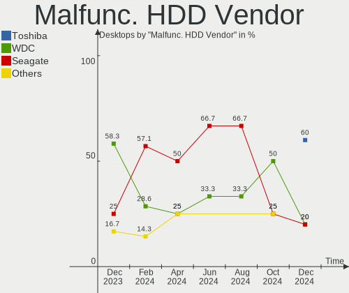
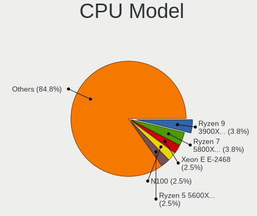
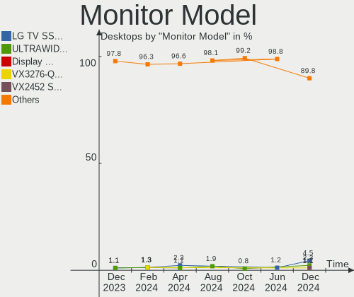
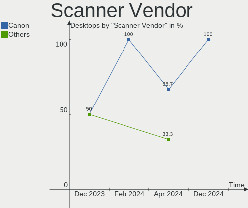
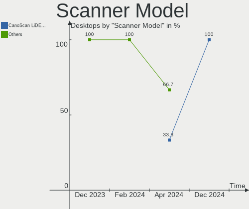

Linux in UK - Hardware Trends (Desktops)
----------------------------------------

A project to identify most popular hardware characteristics and track their change
over time based on data collected by Linux users at https://Linux-Hardware.org.

Anyone can contribute to this report by the [hw-probe](https://github.com/linuxhw/hw-probe) tool:

    sudo -E hw-probe -all -upload

Period: Jun, 2023.

Contents
--------

* [ System ](#system)
  - [ OS                       ](#os)
  - [ OS Family                ](#os-family)
  - [ Kernel                   ](#kernel)
  - [ Kernel Family            ](#kernel-family)
  - [ Kernel Major Ver.        ](#kernel-major-ver)
  - [ Arch                     ](#arch)
  - [ DE                       ](#de)
  - [ Display Server           ](#display-server)
  - [ Display Manager          ](#display-manager)
  - [ OS Lang                  ](#os-lang)
  - [ Boot Mode                ](#boot-mode)
  - [ Filesystem               ](#filesystem)
  - [ Part. scheme             ](#part-scheme)
  - [ Dual Boot with Linux/BSD ](#dual-boot-with-linuxbsd)
  - [ Dual Boot (Win)          ](#dual-boot-win)

* [ Board ](#board)
  - [ Vendor                   ](#vendor)
  - [ Model                    ](#model)
  - [ Model Family             ](#model-family)
  - [ MFG Year                 ](#mfg-year)
  - [ Form Factor              ](#form-factor)
  - [ Secure Boot              ](#secure-boot)
  - [ Coreboot                 ](#coreboot)
  - [ RAM Size                 ](#ram-size)
  - [ RAM Used                 ](#ram-used)
  - [ Total Drives             ](#total-drives)
  - [ Has CD-ROM               ](#has-cd-rom)
  - [ Has Ethernet             ](#has-ethernet)
  - [ Has WiFi                 ](#has-wifi)
  - [ Has Bluetooth            ](#has-bluetooth)

* [ Location ](#location)
  - [ Country                  ](#country)
  - [ City                     ](#city)

* [ Drives ](#drives)
  - [ Drive Vendor             ](#drive-vendor)
  - [ Drive Model              ](#drive-model)
  - [ HDD Vendor               ](#hdd-vendor)
  - [ SSD Vendor               ](#ssd-vendor)
  - [ Drive Kind               ](#drive-kind)
  - [ Drive Connector          ](#drive-connector)
  - [ Drive Size               ](#drive-size)
  - [ Space Total              ](#space-total)
  - [ Space Used               ](#space-used)
  - [ Malfunc. Drives          ](#malfunc-drives)
  - [ Malfunc. Drive Vendor    ](#malfunc-drive-vendor)
  - [ Malfunc. HDD Vendor      ](#malfunc-hdd-vendor)
  - [ Malfunc. Drive Kind      ](#malfunc-drive-kind)
  - [ Failed Drives            ](#failed-drives)
  - [ Failed Drive Vendor      ](#failed-drive-vendor)
  - [ Drive Status             ](#drive-status)

* [ Storage controller ](#storage-controller)
  - [ Storage Vendor           ](#storage-vendor)
  - [ Storage Model            ](#storage-model)
  - [ Storage Kind             ](#storage-kind)

* [ Processor ](#processor)
  - [ CPU Vendor               ](#cpu-vendor)
  - [ CPU Model                ](#cpu-model)
  - [ CPU Model Family         ](#cpu-model-family)
  - [ CPU Cores                ](#cpu-cores)
  - [ CPU Sockets              ](#cpu-sockets)
  - [ CPU Threads              ](#cpu-threads)
  - [ CPU Op-Modes             ](#cpu-op-modes)
  - [ CPU Microcode            ](#cpu-microcode)
  - [ CPU Microarch            ](#cpu-microarch)

* [ Graphics ](#graphics)
  - [ GPU Vendor               ](#gpu-vendor)
  - [ GPU Model                ](#gpu-model)
  - [ GPU Combo                ](#gpu-combo)
  - [ GPU Driver               ](#gpu-driver)
  - [ GPU Memory               ](#gpu-memory)

* [ Monitor ](#monitor)
  - [ Monitor Vendor           ](#monitor-vendor)
  - [ Monitor Model            ](#monitor-model)
  - [ Monitor Resolution       ](#monitor-resolution)
  - [ Monitor Diagonal         ](#monitor-diagonal)
  - [ Monitor Width            ](#monitor-width)
  - [ Aspect Ratio             ](#aspect-ratio)
  - [ Monitor Area             ](#monitor-area)
  - [ Pixel Density            ](#pixel-density)
  - [ Multiple Monitors        ](#multiple-monitors)

* [ Network ](#network)
  - [ Net Controller Vendor    ](#net-controller-vendor)
  - [ Net Controller Model     ](#net-controller-model)
  - [ Wireless Vendor          ](#wireless-vendor)
  - [ Wireless Model           ](#wireless-model)
  - [ Ethernet Vendor          ](#ethernet-vendor)
  - [ Ethernet Model           ](#ethernet-model)
  - [ Net Controller Kind      ](#net-controller-kind)
  - [ Used Controller          ](#used-controller)
  - [ NICs                     ](#nics)
  - [ IPv6                     ](#ipv6)

* [ Bluetooth ](#bluetooth)
  - [ Bluetooth Vendor         ](#bluetooth-vendor)
  - [ Bluetooth Model          ](#bluetooth-model)

* [ Sound ](#sound)
  - [ Sound Vendor             ](#sound-vendor)
  - [ Sound Model              ](#sound-model)

* [ Memory ](#memory)
  - [ Memory Vendor            ](#memory-vendor)
  - [ Memory Model             ](#memory-model)
  - [ Memory Kind              ](#memory-kind)
  - [ Memory Form Factor       ](#memory-form-factor)
  - [ Memory Size              ](#memory-size)
  - [ Memory Speed             ](#memory-speed)

* [ Printers & scanners ](#printers--scanners)
  - [ Printer Vendor           ](#printer-vendor)
  - [ Printer Model            ](#printer-model)
  - [ Scanner Vendor           ](#scanner-vendor)
  - [ Scanner Model            ](#scanner-model)

* [ Camera ](#camera)
  - [ Camera Vendor            ](#camera-vendor)
  - [ Camera Model             ](#camera-model)

* [ Security ](#security)
  - [ Fingerprint Vendor       ](#fingerprint-vendor)
  - [ Fingerprint Model        ](#fingerprint-model)
  - [ Chipcard Vendor          ](#chipcard-vendor)
  - [ Chipcard Model           ](#chipcard-model)

* [ Unsupported ](#unsupported)
  - [ Unsupported Devices      ](#unsupported-devices)
  - [ Unsupported Device Types ](#unsupported-device-types)

System
------

OS
--

Installed operating systems

| Name                         | Desktops | Percent |
|------------------------------|----------|---------|
| Ubuntu 22.04                 | 13       | 17.11%  |
| Pop!_OS 22.04                | 5        | 6.58%   |
| ArcoLinux Rolling            | 5        | 6.58%   |
| Zorin 16                     | 4        | 5.26%   |
| Linux Mint 21.1              | 4        | 5.26%   |
| Debian 12                    | 4        | 5.26%   |
| OpenMandriva 23.03           | 3        | 3.95%   |
| Kubuntu 23.04                | 3        | 3.95%   |
| Fedora 38                    | 3        | 3.95%   |
| Arch Rolling                 | 3        | 3.95%   |
| Ubuntu 23.04                 | 2        | 2.63%   |
| openSUSE Tumbleweed-XXXXXXXX | 2        | 2.63%   |
| Manjaro                      | 2        | 2.63%   |
| Linux Mint 20.3              | 2        | 2.63%   |
| Kubuntu 22.04                | 2        | 2.63%   |
| Debian 11                    | 2        | 2.63%   |
| Ultramarine 38               | 1        | 1.32%   |
| Ubuntu MATE 23.04            | 1        | 1.32%   |
| Pikaos 23.04                 | 1        | 1.32%   |
| Peppermint                   | 1        | 1.32%   |
| OpenMandriva 4.3             | 1        | 1.32%   |
| OpenMandriva 23.06           | 1        | 1.32%   |
| Nobara 37                    | 1        | 1.32%   |
| Manjaro 23.06-development    | 1        | 1.32%   |
| Makulu-beta1                 | 1        | 1.32%   |
| Lubuntu 22.04                | 1        | 1.32%   |
| LMDE 5                       | 1        | 1.32%   |
| Linux Mint 21                | 1        | 1.32%   |
| Linux Mint 20.1              | 1        | 1.32%   |
| KDE neon 22.04               | 1        | 1.32%   |
| Gentoo 2.13                  | 1        | 1.32%   |
| Debian 9                     | 1        | 1.32%   |
| Debian 10                    | 1        | 1.32%   |

OS Family
---------

OS without a version

| Name         | Desktops | Percent |
|--------------|----------|---------|
| Ubuntu       | 15       | 19.74%  |
| Linux Mint   | 8        | 10.53%  |
| Debian       | 8        | 10.53%  |
| Pop!_OS      | 5        | 6.58%   |
| OpenMandriva | 5        | 6.58%   |
| Kubuntu      | 5        | 6.58%   |
| ArcoLinux    | 5        | 6.58%   |
| Zorin        | 4        | 5.26%   |
| Manjaro      | 3        | 3.95%   |
| Fedora       | 3        | 3.95%   |
| Arch         | 3        | 3.95%   |
| openSUSE     | 2        | 2.63%   |
| Ultramarine  | 1        | 1.32%   |
| Ubuntu MATE  | 1        | 1.32%   |
| Pikaos       | 1        | 1.32%   |
| Peppermint   | 1        | 1.32%   |
| Nobara       | 1        | 1.32%   |
| Makulu-beta1 | 1        | 1.32%   |
| Lubuntu      | 1        | 1.32%   |
| LMDE         | 1        | 1.32%   |
| KDE neon     | 1        | 1.32%   |
| Gentoo       | 1        | 1.32%   |

Kernel
------

Version of the Linux kernel

| Version                     | Desktops | Percent |
|-----------------------------|----------|---------|
| 5.15.0-73-generic           | 7        | 9.21%   |
| 5.19.0-43-generic           | 6        | 7.89%   |
| 6.2.6-76060206-generic      | 5        | 6.58%   |
| 6.2.0-20-generic            | 5        | 6.58%   |
| 5.19.0-45-generic           | 4        | 5.26%   |
| 6.3.9-arch1-1               | 3        | 3.95%   |
| 6.3.8-200.fc38.x86_64       | 3        | 3.95%   |
| 6.2.6-desktop-1omv2390      | 3        | 3.95%   |
| 6.1.0-9-amd64               | 3        | 3.95%   |
| 5.10.0-23-amd64             | 3        | 3.95%   |
| 5.19.0-46-generic           | 2        | 2.63%   |
| 5.15.0-75-generic           | 2        | 2.63%   |
| 6.4.0-rc5-vanilla           | 1        | 1.32%   |
| 6.4.0-pikaos                | 1        | 1.32%   |
| 6.3.9-zen1-1-zen            | 1        | 1.32%   |
| 6.3.9                       | 1        | 1.32%   |
| 6.3.8-arch1-1               | 1        | 1.32%   |
| 6.3.7-1-cachyos-bore        | 1        | 1.32%   |
| 6.3.6-200.fc38.x86_64       | 1        | 1.32%   |
| 6.3.6-1-default             | 1        | 1.32%   |
| 6.3.5-zen1-1-zen            | 1        | 1.32%   |
| 6.3.5-desktop-3omv2390      | 1        | 1.32%   |
| 6.3.5-2-MANJARO             | 1        | 1.32%   |
| 6.3.4-201.fsync.fc37.x86_64 | 1        | 1.32%   |
| 6.3.3-arch1-1               | 1        | 1.32%   |
| 6.2.0-23-generic            | 1        | 1.32%   |
| 6.1.31-gentoo-x86_64        | 1        | 1.32%   |
| 6.1.31-2-MANJARO            | 1        | 1.32%   |
| 6.1.31-1-MANJARO            | 1        | 1.32%   |
| 6.1.0-0.deb11.6-amd64       | 1        | 1.32%   |
| 6.0.0-5-amd64               | 1        | 1.32%   |
| 5.4.0-58-generic            | 1        | 1.32%   |
| 5.4.0-150-generic           | 1        | 1.32%   |
| 5.17.9-051709-generic       | 1        | 1.32%   |
| 5.16.7-desktop-1omv4003     | 1        | 1.32%   |
| 5.15.108-1-pve              | 1        | 1.32%   |
| 5.15.0-71-generic           | 1        | 1.32%   |
| 5.15.0-67-generic           | 1        | 1.32%   |
| 5.13.0-39-generic           | 1        | 1.32%   |
| 5.10.60-qnap                | 1        | 1.32%   |

Kernel Family
-------------

Linux kernel without a distro release

| Version  | Desktops | Percent |
|----------|----------|---------|
| 5.19.0   | 12       | 15.79%  |
| 5.15.0   | 11       | 14.47%  |
| 6.2.6    | 8        | 10.53%  |
| 6.2.0    | 6        | 7.89%   |
| 6.3.9    | 5        | 6.58%   |
| 6.3.8    | 4        | 5.26%   |
| 6.1.0    | 4        | 5.26%   |
| 6.3.5    | 3        | 3.95%   |
| 6.1.31   | 3        | 3.95%   |
| 5.10.0   | 3        | 3.95%   |
| 6.4.0    | 2        | 2.63%   |
| 6.3.6    | 2        | 2.63%   |
| 5.4.0    | 2        | 2.63%   |
| 6.3.7    | 1        | 1.32%   |
| 6.3.4    | 1        | 1.32%   |
| 6.3.3    | 1        | 1.32%   |
| 6.0.0    | 1        | 1.32%   |
| 5.17.9   | 1        | 1.32%   |
| 5.16.7   | 1        | 1.32%   |
| 5.15.108 | 1        | 1.32%   |
| 5.13.0   | 1        | 1.32%   |
| 5.10.60  | 1        | 1.32%   |
| 4.9.0    | 1        | 1.32%   |
| 4.19.0   | 1        | 1.32%   |

Kernel Major Ver.
-----------------

Linux kernel major version

| Version | Desktops | Percent |
|---------|----------|---------|
| 6.3     | 17       | 22.37%  |
| 6.2     | 14       | 18.42%  |
| 5.19    | 12       | 15.79%  |
| 5.15    | 12       | 15.79%  |
| 6.1     | 7        | 9.21%   |
| 5.10    | 4        | 5.26%   |
| 6.4     | 2        | 2.63%   |
| 5.4     | 2        | 2.63%   |
| 6.0     | 1        | 1.32%   |
| 5.17    | 1        | 1.32%   |
| 5.16    | 1        | 1.32%   |
| 5.13    | 1        | 1.32%   |
| 4.9     | 1        | 1.32%   |
| 4.19    | 1        | 1.32%   |

Arch
----

OS architecture (x86_64, i586, etc.)

| Name   | Desktops | Percent |
|--------|----------|---------|
| x86_64 | 75       | 98.68%  |
| armv7l | 1        | 1.32%   |

DE
--

Desktop Environment

| Name       | Desktops | Percent |
|------------|----------|---------|
| GNOME      | 34       | 44.74%  |
| KDE5       | 16       | 21.05%  |
| X-Cinnamon | 9        | 11.84%  |
| XFCE       | 4        | 5.26%   |
| KDE        | 3        | 3.95%   |
| Unknown    | 3        | 3.95%   |
| MATE       | 2        | 2.63%   |
| i3         | 2        | 2.63%   |
| LXQt       | 1        | 1.32%   |
| Hyprland   | 1        | 1.32%   |
| Budgie     | 1        | 1.32%   |

Display Server
--------------

X11 or Wayland

| Name    | Desktops | Percent |
|---------|----------|---------|
| X11     | 50       | 65.79%  |
| Wayland | 22       | 28.95%  |
| Tty     | 3        | 3.95%   |
| Unknown | 1        | 1.32%   |

Display Manager
---------------

SDDM, LightDM, etc.

| Name    | Desktops | Percent |
|---------|----------|---------|
| Unknown | 25       | 32.89%  |
| GDM3    | 20       | 26.32%  |
| SDDM    | 18       | 23.68%  |
| LightDM | 10       | 13.16%  |
| GDM     | 3        | 3.95%   |

OS Lang
-------

Language

| Lang    | Desktops | Percent |
|---------|----------|---------|
| en_GB   | 61       | 80.26%  |
| en_US   | 9        | 11.84%  |
| POSIX   | 1        | 1.32%   |
| en_ZA   | 1        | 1.32%   |
| en_SG   | 1        | 1.32%   |
| C.UTF8  | 1        | 1.32%   |
| C       | 1        | 1.32%   |
| Unknown | 1        | 1.32%   |

Boot Mode
---------

EFI or BIOS

| Mode | Desktops | Percent |
|------|----------|---------|
| BIOS | 38       | 50%     |
| EFI  | 38       | 50%     |

Filesystem
----------

Type of filesystem

| Type    | Desktops | Percent |
|---------|----------|---------|
| Ext4    | 43       | 56.58%  |
| Tmpfs   | 14       | 18.42%  |
| Btrfs   | 11       | 14.47%  |
| Overlay | 6        | 7.89%   |
| Xfs     | 1        | 1.32%   |
| F2fs    | 1        | 1.32%   |

Part. scheme
------------

Scheme of partitioning

| Type    | Desktops | Percent |
|---------|----------|---------|
| GPT     | 46       | 60.53%  |
| Unknown | 23       | 30.26%  |
| MBR     | 7        | 9.21%   |

Dual Boot with Linux/BSD
------------------------

Hosting more than one Linux/BSD

| Dual boot | Desktops | Percent |
|-----------|----------|---------|
| No        | 58       | 76.32%  |
| Yes       | 18       | 23.68%  |

Dual Boot (Win)
---------------

Hosting Linux and Windows

| Dual boot | Desktops | Percent |
|-----------|----------|---------|
| No        | 50       | 65.79%  |
| Yes       | 26       | 34.21%  |

Board
-----

Vendor
------

Motherboard manufacturer

| Name                | Desktops | Percent |
|---------------------|----------|---------|
| ASUSTek Computer    | 21       | 27.63%  |
| Gigabyte Technology | 13       | 17.11%  |
| MSI                 | 10       | 13.16%  |
| ASRock              | 7        | 9.21%   |
| Lenovo              | 4        | 5.26%   |
| Dell                | 4        | 5.26%   |
| Intel               | 3        | 3.95%   |
| Unknown             | 3        | 3.95%   |
| Hewlett-Packard     | 2        | 2.63%   |
| Fujitsu             | 2        | 2.63%   |
| Foxconn             | 2        | 2.63%   |
| AZW                 | 2        | 2.63%   |
| Entroware           | 1        | 1.32%   |
| ECS                 | 1        | 1.32%   |
| Biostar             | 1        | 1.32%   |

Model
-----

Motherboard model

| Name                                | Desktops | Percent |
|-------------------------------------|----------|---------|
| Unknown                             | 3        | 3.95%   |
| MSI MS-7C37                         | 2        | 2.63%   |
| Gigabyte B550M DS3H                 | 2        | 2.63%   |
| Gigabyte B450 AORUS ELITE           | 2        | 2.63%   |
| Gigabyte 970A-DS3P                  | 2        | 2.63%   |
| MSI MS-7D32                         | 1        | 1.32%   |
| MSI MS-7C95                         | 1        | 1.32%   |
| MSI MS-7C91                         | 1        | 1.32%   |
| MSI MS-7C02                         | 1        | 1.32%   |
| MSI MS-7B79                         | 1        | 1.32%   |
| MSI MS-7B78                         | 1        | 1.32%   |
| MSI MS-7817                         | 1        | 1.32%   |
| MSI 7200-5086C                      | 1        | 1.32%   |
| Lenovo ThinkStation P300 30AH001GUK | 1        | 1.32%   |
| Lenovo ThinkCentre M83 10EAS01G00   | 1        | 1.32%   |
| Lenovo ThinkCentre M700 10J0S2QU00  | 1        | 1.32%   |
| Lenovo ThinkCentre Edge 91Z 7075G6G | 1        | 1.32%   |
| Intel X99                           | 1        | 1.32%   |
| Intel DH61WW                        | 1        | 1.32%   |
| Intel B85 V5.56                     | 1        | 1.32%   |
| HP ProDesk 400 G6 SFF               | 1        | 1.32%   |
| HP 290 G1 MT                        | 1        | 1.32%   |
| Gigabyte Z490 AORUS MASTER          | 1        | 1.32%   |
| Gigabyte X570 AORUS ULTRA           | 1        | 1.32%   |
| Gigabyte X470 AORUS ULTRA GAMING    | 1        | 1.32%   |
| Gigabyte H81M-S2H                   | 1        | 1.32%   |
| Gigabyte GB-BXBT-1900               | 1        | 1.32%   |
| Gigabyte GA-990XA-UD3               | 1        | 1.32%   |
| Gigabyte GA-78LMT-USB3              | 1        | 1.32%   |
| Fujitsu ESPRIMO D538                | 1        | 1.32%   |
| Fujitsu D3222-B1                    | 1        | 1.32%   |
| Foxconn SE 1101                     | 1        | 1.32%   |
| Foxconn H55M-S                      | 1        | 1.32%   |
| Entroware Poseidon                  | 1        | 1.32%   |
| ECS GF8100VM-M5                     | 1        | 1.32%   |
| Dell XPS 8940                       | 1        | 1.32%   |
| Dell Precision 3630 Tower           | 1        | 1.32%   |
| Dell OptiPlex 7010                  | 1        | 1.32%   |
| Dell OptiPlex 5070                  | 1        | 1.32%   |
| Biostar A10N-8800E                  | 1        | 1.32%   |

Model Family
------------

Motherboard model prefix

| Name                   | Desktops | Percent |
|------------------------|----------|---------|
| ASUS ROG               | 6        | 7.89%   |
| ASUS PRIME             | 4        | 5.26%   |
| Lenovo ThinkCentre     | 3        | 3.95%   |
| ASUS TUF               | 3        | 3.95%   |
| Unknown                | 3        | 3.95%   |
| MSI MS-7C37            | 2        | 2.63%   |
| Gigabyte B550M         | 2        | 2.63%   |
| Gigabyte B450          | 2        | 2.63%   |
| Gigabyte 970A-DS3P     | 2        | 2.63%   |
| Dell OptiPlex          | 2        | 2.63%   |
| MSI MS-7D32            | 1        | 1.32%   |
| MSI MS-7C95            | 1        | 1.32%   |
| MSI MS-7C91            | 1        | 1.32%   |
| MSI MS-7C02            | 1        | 1.32%   |
| MSI MS-7B79            | 1        | 1.32%   |
| MSI MS-7B78            | 1        | 1.32%   |
| MSI MS-7817            | 1        | 1.32%   |
| MSI 7200-5086C         | 1        | 1.32%   |
| Lenovo ThinkStation    | 1        | 1.32%   |
| Intel X99              | 1        | 1.32%   |
| Intel DH61WW           | 1        | 1.32%   |
| Intel B85              | 1        | 1.32%   |
| HP ProDesk             | 1        | 1.32%   |
| HP 290                 | 1        | 1.32%   |
| Gigabyte Z490          | 1        | 1.32%   |
| Gigabyte X570          | 1        | 1.32%   |
| Gigabyte X470          | 1        | 1.32%   |
| Gigabyte H81M-S2H      | 1        | 1.32%   |
| Gigabyte GB-BXBT-1900  | 1        | 1.32%   |
| Gigabyte GA-990XA-UD3  | 1        | 1.32%   |
| Gigabyte GA-78LMT-USB3 | 1        | 1.32%   |
| Fujitsu ESPRIMO        | 1        | 1.32%   |
| Fujitsu D3222-B1       | 1        | 1.32%   |
| Foxconn SE             | 1        | 1.32%   |
| Foxconn H55M-S         | 1        | 1.32%   |
| Entroware Poseidon     | 1        | 1.32%   |
| ECS GF8100VM-M5        | 1        | 1.32%   |
| Dell XPS               | 1        | 1.32%   |
| Dell Precision         | 1        | 1.32%   |
| Biostar A10N-8800E     | 1        | 1.32%   |

MFG Year
--------

Motherboard manufacture year

| Year    | Desktops | Percent |
|---------|----------|---------|
| 2018    | 14       | 18.42%  |
| 2020    | 9        | 11.84%  |
| 2021    | 8        | 10.53%  |
| 2019    | 8        | 10.53%  |
| 2022    | 7        | 9.21%   |
| 2014    | 6        | 7.89%   |
| 2023    | 4        | 5.26%   |
| 2013    | 4        | 5.26%   |
| 2015    | 3        | 3.95%   |
| 2012    | 3        | 3.95%   |
| 2011    | 2        | 2.63%   |
| 2010    | 2        | 2.63%   |
| 2008    | 2        | 2.63%   |
| Unknown | 2        | 2.63%   |
| 2016    | 1        | 1.32%   |
| 2009    | 1        | 1.32%   |

Form Factor
-----------

Physical design of the computer

| Name    | Desktops | Percent |
|---------|----------|---------|
| Desktop | 76       | 100%    |

Secure Boot
-----------

Enabled or disabled

| State    | Desktops | Percent |
|----------|----------|---------|
| Disabled | 73       | 96.05%  |
| Enabled  | 3        | 3.95%   |

Coreboot
--------

Have coreboot on board

| Used | Desktops | Percent |
|------|----------|---------|
| No   | 76       | 100%    |

RAM Size
--------

Total RAM memory

| Size in GB      | Desktops | Percent |
|-----------------|----------|---------|
| 16.01-24.0      | 19       | 25%     |
| 32.01-64.0      | 17       | 22.37%  |
| 64.01-256.0     | 10       | 13.16%  |
| 3.01-4.0        | 9        | 11.84%  |
| 4.01-8.0        | 8        | 10.53%  |
| 8.01-16.0       | 8        | 10.53%  |
| 24.01-32.0      | 3        | 3.95%   |
| More than 256.0 | 1        | 1.32%   |
| 0.01-0.5        | 1        | 1.32%   |

RAM Used
--------

Used RAM memory

| Used GB     | Desktops | Percent |
|-------------|----------|---------|
| 4.01-8.0    | 20       | 26.32%  |
| 1.01-2.0    | 19       | 25%     |
| 2.01-3.0    | 18       | 23.68%  |
| 3.01-4.0    | 10       | 13.16%  |
| 8.01-16.0   | 5        | 6.58%   |
| 0.01-0.5    | 2        | 2.63%   |
| 64.01-256.0 | 1        | 1.32%   |
| 16.01-24.0  | 1        | 1.32%   |

Total Drives
------------

Number of drives on board

| Drives | Desktops | Percent |
|--------|----------|---------|
| 1      | 22       | 28.95%  |
| 2      | 20       | 26.32%  |
| 3      | 12       | 15.79%  |
| 4      | 11       | 14.47%  |
| 5      | 6        | 7.89%   |
| 7      | 2        | 2.63%   |
| 29     | 1        | 1.32%   |
| 8      | 1        | 1.32%   |
| 6      | 1        | 1.32%   |

Has CD-ROM
----------

Has CD-ROM on board

| Presented | Desktops | Percent |
|-----------|----------|---------|
| No        | 44       | 57.89%  |
| Yes       | 32       | 42.11%  |

Has Ethernet
------------

Has Ethernet on board

| Presented | Desktops | Percent |
|-----------|----------|---------|
| Yes       | 75       | 98.68%  |
| No        | 1        | 1.32%   |

Has WiFi
--------

Has WiFi module

| Presented | Desktops | Percent |
|-----------|----------|---------|
| No        | 43       | 56.58%  |
| Yes       | 33       | 43.42%  |

Has Bluetooth
-------------

Has Bluetooth module

| Presented | Desktops | Percent |
|-----------|----------|---------|
| No        | 48       | 63.16%  |
| Yes       | 28       | 36.84%  |

Location
--------

Country
-------

Geographic location (country)

| Country | Desktops | Percent |
|---------|----------|---------|
| UK      | 76       | 100%    |

City
----

Geographic location (city)

| City            | Desktops | Percent |
|-----------------|----------|---------|
| London          | 6        | 7.89%   |
| Manchester      | 5        | 6.58%   |
| York            | 2        | 2.63%   |
| Nottingham      | 2        | 2.63%   |
| Newham          | 2        | 2.63%   |
| Lisburn         | 2        | 2.63%   |
| Cardiff         | 2        | 2.63%   |
| Burton-on-Trent | 2        | 2.63%   |
| Birmingham      | 2        | 2.63%   |
| Wallington      | 1        | 1.32%   |
| Uckfield        | 1        | 1.32%   |
| Torquay         | 1        | 1.32%   |
| Swadlincote     | 1        | 1.32%   |
| Sutton          | 1        | 1.32%   |
| Sudbury         | 1        | 1.32%   |
| Stourbridge     | 1        | 1.32%   |
| Stoke-on-Trent  | 1        | 1.32%   |
| Stevenage       | 1        | 1.32%   |
| Southend-on-Sea | 1        | 1.32%   |
| Rochester       | 1        | 1.32%   |
| Redditch        | 1        | 1.32%   |
| Oxford          | 1        | 1.32%   |
| Newton Abbot    | 1        | 1.32%   |
| Newbury         | 1        | 1.32%   |
| Middlesbrough   | 1        | 1.32%   |
| Lower Clapton   | 1        | 1.32%   |
| Llanelli        | 1        | 1.32%   |
| Liversedge      | 1        | 1.32%   |
| Liverpool       | 1        | 1.32%   |
| Linlithgow      | 1        | 1.32%   |
| Lincoln         | 1        | 1.32%   |
| Lewisham        | 1        | 1.32%   |
| Leicester       | 1        | 1.32%   |
| Islington       | 1        | 1.32%   |
| Hythe           | 1        | 1.32%   |
| Hounslow        | 1        | 1.32%   |
| Hemel Hempstead | 1        | 1.32%   |
| Hackney         | 1        | 1.32%   |
| Gateshead       | 1        | 1.32%   |
| Flint           | 1        | 1.32%   |

Drives
------

Drive Vendor
------------

Hard drive vendors

| Vendor                      | Desktops | Drives | Percent |
|-----------------------------|----------|--------|---------|
| Seagate                     | 31       | 64     | 18.9%   |
| Samsung Electronics         | 26       | 39     | 15.85%  |
| WDC                         | 19       | 30     | 11.59%  |
| Crucial                     | 15       | 16     | 9.15%   |
| Sandisk                     | 10       | 13     | 6.1%    |
| Toshiba                     | 8        | 10     | 4.88%   |
| Micron/Crucial Technology   | 7        | 8      | 4.27%   |
| Kingston                    | 6        | 6      | 3.66%   |
| Kingston Technology Company | 4        | 4      | 2.44%   |
| Hitachi                     | 3        | 3      | 1.83%   |
| Transcend                   | 2        | 2      | 1.22%   |
| Phison Electronics          | 2        | 2      | 1.22%   |
| Patriot                     | 2        | 2      | 1.22%   |
| MAXIO Technology (Hangzhou) | 2        | 2      | 1.22%   |
| Gigabyte Technology         | 2        | 2      | 1.22%   |
| A-DATA Technology           | 2        | 2      | 1.22%   |
| X12                         | 1        | 1      | 0.61%   |
| WD MediaMax                 | 1        | 1      | 0.61%   |
| Veno                        | 1        | 1      | 0.61%   |
| Unknown                     | 1        | 1      | 0.61%   |
| TurXun                      | 1        | 1      | 0.61%   |
| Team                        | 1        | 1      | 0.61%   |
| SK hynix                    | 1        | 1      | 0.61%   |
| Silicon Motion              | 1        | 1      | 0.61%   |
| SABRENT                     | 1        | 1      | 0.61%   |
| Phison                      | 1        | 2      | 0.61%   |
| NFHK                        | 1        | 1      | 0.61%   |
| Netac                       | 1        | 1      | 0.61%   |
| Mushkin                     | 1        | 1      | 0.61%   |
| Maxtor                      | 1        | 1      | 0.61%   |
| KIOXIA-EXCERIA              | 1        | 1      | 0.61%   |
| INTEL SS                    | 1        | 1      | 0.61%   |
| HPE                         | 1        | 2      | 0.61%   |
| Hikvision                   | 1        | 1      | 0.61%   |
| HGST                        | 1        | 1      | 0.61%   |
| Corsair                     | 1        | 1      | 0.61%   |
| China                       | 1        | 1      | 0.61%   |
| ASMT                        | 1        | 2      | 0.61%   |
| ADATA Technology            | 1        | 1      | 0.61%   |

Drive Model
-----------

Hard drive models

| Model                                               | Desktops | Percent |
|-----------------------------------------------------|----------|---------|
| Seagate ST4000DM004-2CV104 4TB                      | 5        | 2.62%   |
| Seagate ST2000DM008-2FR102 2TB                      | 5        | 2.62%   |
| SanDisk NVMe SSD Drive 1TB                          | 4        | 2.09%   |
| Samsung NVMe SSD Controller SM981/PM981/PM983 250GB | 4        | 2.09%   |
| Micron/Crucial P2 NVMe PCIe SSD 4TB                 | 4        | 2.09%   |
| Samsung NVMe SSD Controller PM9A1/PM9A3/980PRO 2TB  | 3        | 1.57%   |
| Crucial CT480BX500SSD1 480GB                        | 3        | 1.57%   |
| Transcend TS120GMTS820S 120GB SSD                   | 2        | 1.05%   |
| Toshiba DT01ACA300 3TB                              | 2        | 1.05%   |
| Seagate ST6000DM003-2CY186 6TB                      | 2        | 1.05%   |
| Seagate ST500DM002-1BD142 500GB                     | 2        | 1.05%   |
| Seagate ST4000VN008-2DR166 4TB                      | 2        | 1.05%   |
| Seagate ST3500312CS 500GB                           | 2        | 1.05%   |
| Seagate ST2000DM001-1CH164 2TB                      | 2        | 1.05%   |
| Seagate ST1000DM003-1ER162 1TB                      | 2        | 1.05%   |
| Seagate Expansion Desk 5TB                          | 2        | 1.05%   |
| Samsung SSD 870 QVO 1TB                             | 2        | 1.05%   |
| Samsung SSD 860 EVO 250GB                           | 2        | 1.05%   |
| Samsung SSD 850 EVO 500GB                           | 2        | 1.05%   |
| Micron/Crucial CT1000P5PSSD8 1TB                    | 2        | 1.05%   |
| Kingston SV300S37A120G 120GB SSD                    | 2        | 1.05%   |
| Crucial CT1000P3SSD8 1TB                            | 2        | 1.05%   |
| Crucial CT1000BX500SSD1 1TB                         | 2        | 1.05%   |
| X12 SSD 1TB                                         | 1        | 0.52%   |
| WDC WDS500G2B0B 500GB SSD                           | 1        | 0.52%   |
| WDC WDS500G2B0A 500GB SSD                           | 1        | 0.52%   |
| WDC WDS120G2G0A-00JH30 128GB SSD                    | 1        | 0.52%   |
| WDC WDS100T2B0B-00YS70 1TB SSD                      | 1        | 0.52%   |
| WDC WDS100T2B0A-00SM50 1TB SSD                      | 1        | 0.52%   |
| WDC WD5000LUCX-63HWNY0 500GB                        | 1        | 0.52%   |
| WDC WD5000AAKS-00TMA0 500GB                         | 1        | 0.52%   |
| WDC WD40EZRZ-00GXCB0 4TB                            | 1        | 0.52%   |
| WDC WD20NPVX-00EA4T0 2TB                            | 1        | 0.52%   |
| WDC WD20EZAZ-00L9GB0 2TB                            | 1        | 0.52%   |
| WDC WD20EURS-73TLHY0 2TB                            | 1        | 0.52%   |
| WDC WD20EFRX-68EUZN0 2TB                            | 1        | 0.52%   |
| WDC WD20EFRX-68AX9N0 2TB                            | 1        | 0.52%   |
| WDC WD20EARS-00J2GB0 2TB                            | 1        | 0.52%   |
| WDC WD2003FYPS-27W9B0 2TB                           | 1        | 0.52%   |
| WDC WD10JPCX-24UE4T0 1TB                            | 1        | 0.52%   |

HDD Vendor
----------

Hard disk drive vendors

| Vendor              | Desktops | Drives | Percent |
|---------------------|----------|--------|---------|
| Seagate             | 31       | 63     | 50%     |
| WDC                 | 13       | 18     | 20.97%  |
| Toshiba             | 8        | 10     | 12.9%   |
| Hitachi             | 3        | 3      | 4.84%   |
| Samsung Electronics | 2        | 2      | 3.23%   |
| WD MediaMax         | 1        | 1      | 1.61%   |
| Maxtor              | 1        | 1      | 1.61%   |
| HPE                 | 1        | 1      | 1.61%   |
| HGST                | 1        | 1      | 1.61%   |
| ASMT                | 1        | 2      | 1.61%   |

SSD Vendor
----------

Solid state drive vendors

| Vendor              | Desktops | Drives | Percent |
|---------------------|----------|--------|---------|
| Samsung Electronics | 16       | 21     | 26.67%  |
| Crucial             | 12       | 12     | 20%     |
| WDC                 | 6        | 12     | 10%     |
| Kingston            | 6        | 6      | 10%     |
| SanDisk             | 4        | 5      | 6.67%   |
| Transcend           | 2        | 2      | 3.33%   |
| Patriot             | 2        | 2      | 3.33%   |
| A-DATA Technology   | 2        | 2      | 3.33%   |
| X12                 | 1        | 1      | 1.67%   |
| Veno                | 1        | 1      | 1.67%   |
| Team                | 1        | 1      | 1.67%   |
| SK hynix            | 1        | 1      | 1.67%   |
| Netac               | 1        | 1      | 1.67%   |
| KIOXIA-EXCERIA      | 1        | 1      | 1.67%   |
| INTEL SS            | 1        | 1      | 1.67%   |
| HPE                 | 1        | 1      | 1.67%   |
| Gigabyte Technology | 1        | 1      | 1.67%   |
| China               | 1        | 1      | 1.67%   |

Drive Kind
----------

HDD or SSD

| Kind    | Desktops | Drives | Percent |
|---------|----------|--------|---------|
| SSD     | 47       | 72     | 35.61%  |
| HDD     | 46       | 102    | 34.85%  |
| NVMe    | 37       | 55     | 28.03%  |
| Unknown | 2        | 2      | 1.52%   |

Drive Connector
---------------

SATA, SAS, NVMe, etc.

| Type | Desktops | Drives | Percent |
|------|----------|--------|---------|
| SATA | 66       | 147    | 59.46%  |
| NVMe | 37       | 54     | 33.33%  |
| SAS  | 8        | 30     | 7.21%   |

Drive Size
----------

Size of hard drive

| Size in TB | Desktops | Drives | Percent |
|------------|----------|--------|---------|
| 0.01-0.5   | 45       | 65     | 43.69%  |
| 0.51-1.0   | 24       | 37     | 23.3%   |
| 1.01-2.0   | 16       | 26     | 15.53%  |
| 3.01-4.0   | 9        | 30     | 8.74%   |
| 4.01-10.0  | 6        | 9      | 5.83%   |
| 2.01-3.0   | 2        | 2      | 1.94%   |
| 10.01-20.0 | 1        | 5      | 0.97%   |

Space Total
-----------

Amount of disk space available on the file system

| Size in GB     | Desktops | Percent |
|----------------|----------|---------|
| More than 3000 | 18       | 23.68%  |
| 101-250        | 16       | 21.05%  |
| 501-1000       | 12       | 15.79%  |
| 1001-2000      | 9        | 11.84%  |
| 251-500        | 7        | 9.21%   |
| 1-20           | 6        | 7.89%   |
| 2001-3000      | 5        | 6.58%   |
| 21-50          | 2        | 2.63%   |
| Unknown        | 1        | 1.32%   |

Space Used
----------

Amount of used disk space

| Used GB        | Desktops | Percent |
|----------------|----------|---------|
| 1-20           | 17       | 22.37%  |
| 21-50          | 11       | 14.47%  |
| 101-250        | 11       | 14.47%  |
| 1001-2000      | 9        | 11.84%  |
| 501-1000       | 9        | 11.84%  |
| 251-500        | 6        | 7.89%   |
| 51-100         | 5        | 6.58%   |
| 2001-3000      | 4        | 5.26%   |
| More than 3000 | 3        | 3.95%   |
| Unknown        | 1        | 1.32%   |

Malfunc. Drives
---------------

Drive models with a malfunction

| Model                                        | Desktops | Drives | Percent |
|----------------------------------------------|----------|--------|---------|
| WDC WD1001FALS-403AA0 1TB                    | 1        | 1      | 12.5%   |
| WDC WD Blue SA510 2.5 1000GB SSD             | 1        | 1      | 12.5%   |
| WD MediaMax WL5000GSA12872B 5TB              | 1        | 1      | 12.5%   |
| Toshiba MQ01ABF050 500GB                     | 1        | 1      | 12.5%   |
| Seagate ST2000DM001-1CH164 2TB               | 1        | 1      | 12.5%   |
| Samsung Electronics SSD 840 PRO Series 256GB | 1        | 2      | 12.5%   |
| Mushkin MKNSSDHL500GB-D8                     | 1        | 1      | 12.5%   |
| Maxtor STM3320820AS 320GB                    | 1        | 1      | 12.5%   |

Malfunc. Drive Vendor
---------------------

Vendors of faulty drives

| Vendor              | Desktops | Drives | Percent |
|---------------------|----------|--------|---------|
| WDC                 | 2        | 2      | 25%     |
| WD MediaMax         | 1        | 1      | 12.5%   |
| Toshiba             | 1        | 1      | 12.5%   |
| Seagate             | 1        | 1      | 12.5%   |
| Samsung Electronics | 1        | 2      | 12.5%   |
| Mushkin             | 1        | 1      | 12.5%   |
| Maxtor              | 1        | 1      | 12.5%   |

Malfunc. HDD Vendor
-------------------

Vendors of faulty HDD drives

| Vendor      | Desktops | Drives | Percent |
|-------------|----------|--------|---------|
| WDC         | 1        | 1      | 20%     |
| WD MediaMax | 1        | 1      | 20%     |
| Toshiba     | 1        | 1      | 20%     |
| Seagate     | 1        | 1      | 20%     |
| Maxtor      | 1        | 1      | 20%     |

Malfunc. Drive Kind
-------------------

Kinds of faulty drives

| Kind | Desktops | Drives | Percent |
|------|----------|--------|---------|
| HDD  | 3        | 5      | 50%     |
| SSD  | 2        | 3      | 33.33%  |
| NVMe | 1        | 1      | 16.67%  |

Failed Drives
-------------

Failed drive models

| Model                                 | Desktops | Drives | Percent |
|---------------------------------------|----------|--------|---------|
| Samsung Electronics SSD 960 EVO 250GB | 1        | 2      | 100%    |

Failed Drive Vendor
-------------------

Failed drive vendors

| Vendor              | Desktops | Drives | Percent |
|---------------------|----------|--------|---------|
| Samsung Electronics | 1        | 2      | 100%    |

Drive Status
------------

Number of failed and malfunc. drives

| Status   | Desktops | Drives | Percent |
|----------|----------|--------|---------|
| Detected | 45       | 111    | 49.45%  |
| Works    | 39       | 109    | 42.86%  |
| Malfunc  | 6        | 9      | 6.59%   |
| Failed   | 1        | 2      | 1.1%    |

Storage controller
------------------

Storage Vendor
--------------

Storage controller vendors

| Vendor                      | Desktops | Percent |
|-----------------------------|----------|---------|
| AMD                         | 37       | 28.03%  |
| Intel                       | 35       | 26.52%  |
| Samsung Electronics         | 12       | 9.09%   |
| Micron/Crucial Technology   | 10       | 7.58%   |
| SanDisk                     | 7        | 5.3%    |
| ASMedia Technology          | 7        | 5.3%    |
| Phison Electronics          | 6        | 4.55%   |
| Kingston Technology Company | 4        | 3.03%   |
| Silicon Motion              | 2        | 1.52%   |
| MAXIO Technology (Hangzhou) | 2        | 1.52%   |
| Marvell Technology Group    | 2        | 1.52%   |
| JMicron Technology          | 2        | 1.52%   |
| Solidigm                    | 1        | 0.76%   |
| Seagate Technology          | 1        | 0.76%   |
| Nvidia                      | 1        | 0.76%   |
| LSI Logic / Symbios Logic   | 1        | 0.76%   |
| Broadcom / LSI              | 1        | 0.76%   |
| ADATA Technology            | 1        | 0.76%   |

Storage Model
-------------

Storage controller models

| Model                                                                          | Desktops | Percent |
|--------------------------------------------------------------------------------|----------|---------|
| AMD FCH SATA Controller [AHCI mode]                                            | 22       | 14.57%  |
| AMD 400 Series Chipset SATA Controller                                         | 9        | 5.96%   |
| Micron/Crucial P2 NVMe PCIe SSD                                                | 7        | 4.64%   |
| Intel 8 Series/C220 Series Chipset Family 6-port SATA Controller 1 [AHCI mode] | 7        | 4.64%   |
| ASMedia ASM1062 Serial ATA Controller                                          | 7        | 4.64%   |
| AMD 500 Series Chipset SATA Controller                                         | 7        | 4.64%   |
| AMD SB7x0/SB8x0/SB9x0 IDE Controller                                           | 6        | 3.97%   |
| Samsung NVMe SSD Controller SM981/PM981/PM983                                  | 5        | 3.31%   |
| Samsung NVMe SSD Controller PM9A1/PM9A3/980PRO                                 | 5        | 3.31%   |
| AMD SB7x0/SB8x0/SB9x0 SATA Controller [IDE mode]                               | 5        | 3.31%   |
| Intel Cannon Lake PCH SATA AHCI Controller                                     | 4        | 2.65%   |
| Kingston Company Company Non-Volatile memory controller                        | 3        | 1.99%   |
| Intel Q170/Q150/B150/H170/H110/Z170/CM236 Chipset SATA Controller [AHCI Mode]  | 3        | 1.99%   |
| Silicon Motion SM2263EN/SM2263XT SSD Controller                                | 2        | 1.32%   |
| SanDisk WD Blue SN570 NVMe SSD 1TB                                             | 2        | 1.32%   |
| SanDisk Non-Volatile memory controller                                         | 2        | 1.32%   |
| Samsung NVMe SSD Controller SM961/PM961/SM963                                  | 2        | 1.32%   |
| Samsung NVMe SSD Controller 980                                                | 2        | 1.32%   |
| Phison E12 NVMe Controller                                                     | 2        | 1.32%   |
| Micron/Crucial P5 Plus NVMe PCIe SSD                                           | 2        | 1.32%   |
| MAXIO (Hangzhou) NVMe SSD Controller MAP1202                                   | 2        | 1.32%   |
| Marvell Group 88SE9215 PCIe 2.0 x1 4-port SATA 6 Gb/s Controller               | 2        | 1.32%   |
| Intel SATA Controller [RAID mode]                                              | 2        | 1.32%   |
| Intel 7 Series/C210 Series Chipset Family 6-port SATA Controller [AHCI mode]   | 2        | 1.32%   |
| Intel 6 Series/C200 Series Chipset Family 6 port Desktop SATA AHCI Controller  | 2        | 1.32%   |
| Intel 500 Series Chipset Family SATA AHCI Controller                           | 2        | 1.32%   |
| Intel 200 Series PCH SATA controller [AHCI mode]                               | 2        | 1.32%   |
| Solidigm Non-Volatile memory controller                                        | 1        | 0.66%   |
| Seagate FireCuda 520 SSD                                                       | 1        | 0.66%   |
| Sandisk Western Digital WD Black SN850X NVMe SSD                               | 1        | 0.66%   |
| SanDisk WD Blue SN550 NVMe SSD                                                 | 1        | 0.66%   |
| SanDisk WD Black SN750 / PC SN730 NVMe SSD                                     | 1        | 0.66%   |
| Phison PS5021-E21 PCIe4 NVMe Controller (DRAM-less)                            | 1        | 0.66%   |
| Phison PS5013 E13 NVMe Controller                                              | 1        | 0.66%   |
| Phison E18 PCIe4 NVMe Controller                                               | 1        | 0.66%   |
| Phison E16 PCIe4 NVMe Controller                                               | 1        | 0.66%   |
| Nvidia MCP78S [GeForce 8200] SATA Controller (non-AHCI mode)                   | 1        | 0.66%   |
| Nvidia MCP78S [GeForce 8200] IDE                                               | 1        | 0.66%   |
| Micron/Crucial NVMe Storage Controller                                         | 1        | 0.66%   |
| LSI Logic / Symbios Logic SAS2008 PCI-Express Fusion-MPT SAS-2 [Falcon]        | 1        | 0.66%   |

Storage Kind
------------

Kind of storage controller (IDE, SATA, NVMe, SAS, ...)

| Kind | Desktops | Percent |
|------|----------|---------|
| SATA | 71       | 58.68%  |
| NVMe | 37       | 30.58%  |
| IDE  | 8        | 6.61%   |
| RAID | 3        | 2.48%   |
| SAS  | 2        | 1.65%   |

Processor
---------

CPU Vendor
----------

Processor vendors

| Vendor                | Desktops | Percent |
|-----------------------|----------|---------|
| AMD                   | 38       | 50%     |
| Intel                 | 37       | 48.68%  |
| Marvell Semiconductor | 1        | 1.32%   |

CPU Model
---------

Processor models

| Model                                                               | Desktops | Percent |
|---------------------------------------------------------------------|----------|---------|
| AMD Ryzen 9 5900X 12-Core Processor                                 | 3        | 3.95%   |
| AMD Ryzen 7 5800X3D 8-Core Processor                                | 3        | 3.95%   |
| AMD Ryzen 5 5600X 6-Core Processor                                  | 3        | 3.95%   |
| Intel Core i7-4790 CPU @ 3.60GHz                                    | 2        | 2.63%   |
| Intel Core i5-4460 CPU @ 3.20GHz                                    | 2        | 2.63%   |
| AMD Ryzen 9 7950X3D 16-Core Processor                               | 2        | 2.63%   |
| AMD Ryzen 7 5800X 8-Core Processor                                  | 2        | 2.63%   |
| AMD Ryzen 7 2700X Eight-Core Processor                              | 2        | 2.63%   |
| AMD Ryzen 5 5600G with Radeon Graphics                              | 2        | 2.63%   |
| AMD Phenom II X6 1090T Processor                                    | 2        | 2.63%   |
| Marvell Semiconductor Marvell Armada 370/XP (Device Tree) Processor | 1        | 1.32%   |
| Intel Xeon E-2186G CPU @ 3.80GHz                                    | 1        | 1.32%   |
| Intel Xeon CPU E5-2696 v4 @ 2.20GHz                                 | 1        | 1.32%   |
| Intel Xeon CPU E5-2670 v3 @ 2.30GHz                                 | 1        | 1.32%   |
| Intel Pentium Gold G5400 CPU @ 3.70GHz                              | 1        | 1.32%   |
| Intel N100                                                          | 1        | 1.32%   |
| Intel Core i9-10900K CPU @ 3.70GHz                                  | 1        | 1.32%   |
| Intel Core i7-8700K CPU @ 3.70GHz                                   | 1        | 1.32%   |
| Intel Core i7-7700K CPU @ 4.20GHz                                   | 1        | 1.32%   |
| Intel Core i7-3770K CPU @ 3.50GHz                                   | 1        | 1.32%   |
| Intel Core i7-2600 CPU @ 3.40GHz                                    | 1        | 1.32%   |
| Intel Core i5-9600K CPU @ 3.70GHz                                   | 1        | 1.32%   |
| Intel Core i5-9500 CPU @ 3.00GHz                                    | 1        | 1.32%   |
| Intel Core i5-6500T CPU @ 2.50GHz                                   | 1        | 1.32%   |
| Intel Core i5-6500 CPU @ 3.20GHz                                    | 1        | 1.32%   |
| Intel Core i5-4690K CPU @ 3.50GHz                                   | 1        | 1.32%   |
| Intel Core i5-2400 CPU @ 3.10GHz                                    | 1        | 1.32%   |
| Intel Core i5-10600KF CPU @ 4.10GHz                                 | 1        | 1.32%   |
| Intel Core i3-9100T CPU @ 3.10GHz                                   | 1        | 1.32%   |
| Intel Core i3-7100 CPU @ 3.90GHz                                    | 1        | 1.32%   |
| Intel Core i3-4370 CPU @ 3.80GHz                                    | 1        | 1.32%   |
| Intel Core i3-4160 CPU @ 3.60GHz                                    | 1        | 1.32%   |
| Intel Core i3-2100 CPU @ 3.10GHz                                    | 1        | 1.32%   |
| Intel Core i3-1005G1 CPU @ 1.20GHz                                  | 1        | 1.32%   |
| Intel Core i3 CPU 540 @ 3.07GHz                                     | 1        | 1.32%   |
| Intel Core 2 Quad CPU Q6600 @ 2.40GHz                               | 1        | 1.32%   |
| Intel Celeron CPU J1900 @ 1.99GHz                                   | 1        | 1.32%   |
| Intel Celeron CPU J1800 @ 2.41GHz                                   | 1        | 1.32%   |
| Intel Celeron CPU G1840 @ 2.80GHz                                   | 1        | 1.32%   |
| Intel 12th Gen Core i5-12400                                        | 1        | 1.32%   |

CPU Model Family
----------------

Processor model prefix

| Model                  | Desktops | Percent |
|------------------------|----------|---------|
| Intel Core i5          | 9        | 11.84%  |
| AMD Ryzen 7            | 9        | 11.84%  |
| AMD Ryzen 9            | 8        | 10.53%  |
| Other                  | 7        | 9.21%   |
| Intel Core i3          | 7        | 9.21%   |
| AMD Ryzen 5            | 7        | 9.21%   |
| Intel Core i7          | 6        | 7.89%   |
| Intel Xeon             | 3        | 3.95%   |
| Intel Celeron          | 3        | 3.95%   |
| AMD FX                 | 3        | 3.95%   |
| AMD Phenom II X6       | 2        | 2.63%   |
| AMD Athlon II X2       | 2        | 2.63%   |
| Intel Pentium Gold     | 1        | 1.32%   |
| Intel Core i9          | 1        | 1.32%   |
| Intel Core 2 Quad      | 1        | 1.32%   |
| AMD Ryzen Threadripper | 1        | 1.32%   |
| AMD Ryzen 3            | 1        | 1.32%   |
| AMD Phenom             | 1        | 1.32%   |
| AMD Athlon X4          | 1        | 1.32%   |
| AMD Athlon             | 1        | 1.32%   |
| AMD A6                 | 1        | 1.32%   |
| AMD A10                | 1        | 1.32%   |

CPU Cores
---------

Number of processor cores

| Number | Desktops | Percent |
|--------|----------|---------|
| 4      | 20       | 26.32%  |
| 6      | 15       | 19.74%  |
| 2      | 15       | 19.74%  |
| 8      | 11       | 14.47%  |
| 12     | 5        | 6.58%   |
| 16     | 4        | 5.26%   |
| 1      | 2        | 2.63%   |
| 24     | 1        | 1.32%   |
| 22     | 1        | 1.32%   |
| 10     | 1        | 1.32%   |
| 3      | 1        | 1.32%   |

CPU Sockets
-----------

Number of sockets

| Number | Desktops | Percent |
|--------|----------|---------|
| 1      | 76       | 100%    |

CPU Threads
-----------

Threads per core (Hyper-Threading)

| Number | Desktops | Percent |
|--------|----------|---------|
| 2      | 56       | 73.68%  |
| 1      | 20       | 26.32%  |

CPU Op-Modes
------------

CPU Operation Modes (32-bit, 64-bit)

| Op mode        | Desktops | Percent |
|----------------|----------|---------|
| 32-bit, 64-bit | 75       | 98.68%  |
| Unknown        | 1        | 1.32%   |

CPU Microcode
-------------

Microcode number

| Number     | Desktops | Percent |
|------------|----------|---------|
| Unknown    | 35       | 46.05%  |
| 0x0a20120a | 7        | 9.21%   |
| 0x306c3    | 3        | 3.95%   |
| 0x0a601203 | 3        | 3.95%   |
| 0x0a201016 | 3        | 3.95%   |
| 0x0800820d | 3        | 3.95%   |
| 0x506e3    | 2        | 2.63%   |
| 0x206a7    | 2        | 2.63%   |
| 0x0a50000d | 2        | 2.63%   |
| 0x906ea    | 1        | 1.32%   |
| 0x906e9    | 1        | 1.32%   |
| 0x90672    | 1        | 1.32%   |
| 0x806c2    | 1        | 1.32%   |
| 0x406f1    | 1        | 1.32%   |
| 0x30678    | 1        | 1.32%   |
| 0x20655    | 1        | 1.32%   |
| 0x0a201205 | 1        | 1.32%   |
| 0x08600106 | 1        | 1.32%   |
| 0x0830104d | 1        | 1.32%   |
| 0x0810100b | 1        | 1.32%   |
| 0x0600611a | 1        | 1.32%   |
| 0x06003106 | 1        | 1.32%   |
| 0x06001119 | 1        | 1.32%   |
| 0x06000852 | 1        | 1.32%   |
| 0x010000c8 | 1        | 1.32%   |

CPU Microarch
-------------

Microarchitecture

| Name             | Desktops | Percent |
|------------------|----------|---------|
| Zen 3            | 15       | 19.74%  |
| Haswell          | 9        | 11.84%  |
| KabyLake         | 8        | 10.53%  |
| Unknown          | 8        | 10.53%  |
| K10              | 5        | 6.58%   |
| Zen+             | 4        | 5.26%   |
| Zen 2            | 3        | 3.95%   |
| SandyBridge      | 3        | 3.95%   |
| Piledriver       | 3        | 3.95%   |
| Steamroller      | 2        | 2.63%   |
| Skylake          | 2        | 2.63%   |
| Silvermont       | 2        | 2.63%   |
| CometLake        | 2        | 2.63%   |
| Zen              | 1        | 1.32%   |
| Westmere         | 1        | 1.32%   |
| TigerLake        | 1        | 1.32%   |
| IvyBridge        | 1        | 1.32%   |
| IceLake          | 1        | 1.32%   |
| Gracemont        | 1        | 1.32%   |
| Excavator        | 1        | 1.32%   |
| Core             | 1        | 1.32%   |
| Broadwell        | 1        | 1.32%   |
| Alderlake Hybrid | 1        | 1.32%   |

Graphics
--------

GPU Vendor
----------

Vendors of graphics cards

| Vendor            | Desktops | Percent |
|-------------------|----------|---------|
| Nvidia            | 34       | 40%     |
| AMD               | 28       | 32.94%  |
| Intel             | 22       | 25.88%  |
| ASPEED Technology | 1        | 1.18%   |

GPU Model
---------

Graphics card models

| Model                                                                       | Desktops | Percent |
|-----------------------------------------------------------------------------|----------|---------|
| Intel Xeon E3-1200 v3/4th Gen Core Processor Integrated Graphics Controller | 5        | 5.68%   |
| Nvidia GK208B [GeForce GT 710]                                              | 3        | 3.41%   |
| Intel CoffeeLake-S GT2 [UHD Graphics 630]                                   | 3        | 3.41%   |
| AMD Raphael                                                                 | 3        | 3.41%   |
| AMD Navi 21 [Radeon RX 6800/6800 XT / 6900 XT]                              | 3        | 3.41%   |
| Nvidia TU117 [GeForce GTX 1650]                                             | 2        | 2.27%   |
| Nvidia GP107 [GeForce GTX 1050 Ti]                                          | 2        | 2.27%   |
| Nvidia GP106 [GeForce GTX 1060 6GB]                                         | 2        | 2.27%   |
| Nvidia GK106 [GeForce GTX 660]                                              | 2        | 2.27%   |
| Intel Atom Processor Z36xxx/Z37xxx Series Graphics & Display                | 2        | 2.27%   |
| AMD Navi 31 [Radeon RX 7900 XT/7900 XTX]                                    | 2        | 2.27%   |
| AMD Cezanne [Radeon Vega Series / Radeon Vega Mobile Series]                | 2        | 2.27%   |
| AMD Cedar [Radeon HD 5000/6000/7350/8350 Series]                            | 2        | 2.27%   |
| Nvidia TU116 [GeForce GTX 1660 Ti]                                          | 1        | 1.14%   |
| Nvidia TU116 [GeForce GTX 1660 SUPER]                                       | 1        | 1.14%   |
| Nvidia TU106 [GeForce RTX 2060 SUPER]                                       | 1        | 1.14%   |
| Nvidia TU106 [GeForce RTX 2060 Rev. A]                                      | 1        | 1.14%   |
| Nvidia TU106 [GeForce GTX 1650]                                             | 1        | 1.14%   |
| Nvidia TU104 [GeForce RTX 2070 SUPER]                                       | 1        | 1.14%   |
| Nvidia GP107GL [Quadro P1000]                                               | 1        | 1.14%   |
| Nvidia GM204 [GeForce GTX 970]                                              | 1        | 1.14%   |
| Nvidia GM107GL [Quadro K620]                                                | 1        | 1.14%   |
| Nvidia GM107GL [Quadro K2200]                                               | 1        | 1.14%   |
| Nvidia GM107 [GeForce GTX 750 Ti]                                           | 1        | 1.14%   |
| Nvidia GK107 [GeForce GTX 650]                                              | 1        | 1.14%   |
| Nvidia GF119 [GeForce GT 610]                                               | 1        | 1.14%   |
| Nvidia GF108 [GeForce GT 630]                                               | 1        | 1.14%   |
| Nvidia GF106 [GeForce GTS 450]                                              | 1        | 1.14%   |
| Nvidia GF104 [GeForce GTX 460 SE]                                           | 1        | 1.14%   |
| Nvidia GA106 [GeForce RTX 3060]                                             | 1        | 1.14%   |
| Nvidia GA106 [GeForce RTX 3060 Lite Hash Rate]                              | 1        | 1.14%   |
| Nvidia GA104 [GeForce RTX 3060 Ti]                                          | 1        | 1.14%   |
| Nvidia GA102 [GeForce RTX 3090]                                             | 1        | 1.14%   |
| Nvidia GA102 [GeForce RTX 3080]                                             | 1        | 1.14%   |
| Nvidia G96C [GeForce 9400 GT]                                               | 1        | 1.14%   |
| Nvidia AD104 [GeForce RTX 4070]                                             | 1        | 1.14%   |
| Intel TigerLake-LP GT2 [Iris Xe Graphics]                                   | 1        | 1.14%   |
| Intel RocketLake-S GT1 [UHD Graphics 750]                                   | 1        | 1.14%   |
| Intel RocketLake-S GT1 [UHD Graphics 730]                                   | 1        | 1.14%   |
| Intel Iris Plus Graphics G1 (Ice Lake)                                      | 1        | 1.14%   |

GPU Combo
---------

Combinations of graphics cards

| Name                     | Desktops | Percent |
|--------------------------|----------|---------|
| 1 x Nvidia               | 27       | 35.53%  |
| 1 x AMD                  | 21       | 27.63%  |
| 1 x Intel                | 16       | 21.05%  |
| Intel + Nvidia           | 3        | 3.95%   |
| 2 x AMD                  | 2        | 2.63%   |
| AMD + Nvidia             | 2        | 2.63%   |
| Other                    | 1        | 1.32%   |
| 2 x AMD + 1 x Nvidia     | 1        | 1.32%   |
| Intel + 2 x AMD          | 1        | 1.32%   |
| Intel + AMD + 1 x Nvidia | 1        | 1.32%   |
| 1 x ASPEED               | 1        | 1.32%   |

GPU Driver
----------

Free vs proprietary

| Driver      | Desktops | Percent |
|-------------|----------|---------|
| Free        | 43       | 56.58%  |
| Proprietary | 26       | 34.21%  |
| Unknown     | 7        | 9.21%   |

GPU Memory
----------

Total video memory

| Size in GB | Desktops | Percent |
|------------|----------|---------|
| Unknown    | 35       | 46.05%  |
| 3.01-4.0   | 12       | 15.79%  |
| 1.01-2.0   | 9        | 11.84%  |
| 7.01-8.0   | 6        | 7.89%   |
| 8.01-16.0  | 6        | 7.89%   |
| 5.01-6.0   | 3        | 3.95%   |
| 0.01-0.5   | 3        | 3.95%   |
| 16.01-24.0 | 2        | 2.63%   |

Monitor
-------

Monitor Vendor
--------------

Monitor vendors

| Vendor               | Desktops | Percent |
|----------------------|----------|---------|
| Goldstar             | 9        | 11.69%  |
| Dell                 | 8        | 10.39%  |
| Hewlett-Packard      | 7        | 9.09%   |
| BenQ                 | 7        | 9.09%   |
| AOC                  | 7        | 9.09%   |
| Samsung Electronics  | 6        | 7.79%   |
| Ancor Communications | 6        | 7.79%   |
| Acer                 | 6        | 7.79%   |
| ASUSTek Computer     | 3        | 3.9%    |
| Vestel Elektronik    | 2        | 2.6%    |
| Unknown              | 2        | 2.6%    |
| Iiyama               | 2        | 2.6%    |
| HannStar             | 2        | 2.6%    |
| Toshiba              | 1        | 1.3%    |
| Sony                 | 1        | 1.3%    |
| Pixio                | 1        | 1.3%    |
| Philips              | 1        | 1.3%    |
| OOO                  | 1        | 1.3%    |
| LG Electronics       | 1        | 1.3%    |
| Lenovo               | 1        | 1.3%    |
| Gigabyte Technology  | 1        | 1.3%    |
| DSGR                 | 1        | 1.3%    |
| DENON                | 1        | 1.3%    |

Monitor Model
-------------

Monitor models

| Model                                                                 | Desktops | Percent |
|-----------------------------------------------------------------------|----------|---------|
| Goldstar ULTRAWIDE GSM59F1 2560x1080 673x284mm 28.8-inch              | 2        | 2.44%   |
| Goldstar 27EA33 GSM59BD 1920x1080 598x337mm 27.0-inch                 | 2        | 2.44%   |
| Ancor Communications ASUS VS229 ACI22C2 1920x1080 477x268mm 21.5-inch | 2        | 2.44%   |
| Vestel Elektronik 32FHD_LCD_TV VES3700 1920x1080 700x400mm 31.7-inch  | 1        | 1.22%   |
| Vestel Elektronik '' VES2608 1280x768 620x390mm 28.8-inch             | 1        | 1.22%   |
| Unknown LCD Monitor SZM DSGi TV 1280x720                              | 1        | 1.22%   |
| Unknown LCD Monitor SAMSUNG 1366x768                                  | 1        | 1.22%   |
| Toshiba 32W_LCD_TV TSB3700 1280x720                                   | 1        | 1.22%   |
| Sony TV  *00 SNY4B04 3840x2160                                        | 1        | 1.22%   |
| Samsung Electronics U32H85x SAM0E3C 3840x2160 697x392mm 31.5-inch     | 1        | 1.22%   |
| Samsung Electronics U32E850 SAM0CE3 3840x2160 697x392mm 31.5-inch     | 1        | 1.22%   |
| Samsung Electronics U28E590 SAM0C4E 3840x2160 608x345mm 27.5-inch     | 1        | 1.22%   |
| Samsung Electronics SMBX2331 SAM076F 1920x1080 509x286mm 23.0-inch    | 1        | 1.22%   |
| Samsung Electronics SMB2440MH SAM06DD 1920x1080                       | 1        | 1.22%   |
| Samsung Electronics S24D300 SAM0B43 1920x1080 531x299mm 24.0-inch     | 1        | 1.22%   |
| Samsung Electronics S24B150 SAM0983 1920x1080 521x293mm 23.5-inch     | 1        | 1.22%   |
| Samsung Electronics S22E650 SAM0CA9 1920x1080 480x270mm 21.7-inch     | 1        | 1.22%   |
| Samsung Electronics LC49G95T SAM7053 2560x1440 1193x336mm 48.8-inch   | 1        | 1.22%   |
| Pixio G27P WAM2700 3840x2160 600x330mm 27.0-inch                      | 1        | 1.22%   |
| Philips PHL 242V8 PHLC219 1920x1080 527x296mm 23.8-inch               | 1        | 1.22%   |
| OOO HDMI OOO2150 1920x1080 368x207mm 16.6-inch                        | 1        | 1.22%   |
| LG Electronics LCD Monitor LG IPS FULLHD 1920x1080                    | 1        | 1.22%   |
| Lenovo LEN-E91-B LEN0005 1920x1080 476x268mm 21.5-inch                | 1        | 1.22%   |
| Iiyama PLT2250MTS IVM5613 1920x1080 477x268mm 21.5-inch               | 1        | 1.22%   |
| Iiyama PL2730H IVM663A 1920x1080 598x336mm 27.0-inch                  | 1        | 1.22%   |
| Hewlett-Packard L2045w HWP2695 1680x1050 430x270mm 20.0-inch          | 1        | 1.22%   |
| Hewlett-Packard L1530 HWP260C 1024x768 304x228mm 15.0-inch            | 1        | 1.22%   |
| Hewlett-Packard E243i HPN3463 1920x1200 518x324mm 24.1-inch           | 1        | 1.22%   |
| Hewlett-Packard E232 HWP327B 1920x1080 509x286mm 23.0-inch            | 1        | 1.22%   |
| Hewlett-Packard 23xi HWP3032 1920x1080 509x286mm 23.0-inch            | 1        | 1.22%   |
| Hewlett-Packard 2229h HWP2852 1680x1050 473x296mm 22.0-inch           | 1        | 1.22%   |
| Hewlett-Packard 2211 HWP2938 1920x1080 476x268mm 21.5-inch            | 1        | 1.22%   |
| HannStar HX191D HSD0DC6 1280x1024 376x301mm 19.0-inch                 | 1        | 1.22%   |
| HannStar HU196D HSD899A 1280x1024 376x301mm 19.0-inch                 | 1        | 1.22%   |
| HannStar HE195APB HSD4774 1366x768 410x230mm 18.5-inch                | 1        | 1.22%   |
| Goldstar L1930S GSM4A87 1280x1024 376x301mm 19.0-inch                 | 1        | 1.22%   |
| Goldstar L192WS GSM4B32 1440x900 410x256mm 19.0-inch                  | 1        | 1.22%   |
| Goldstar HDR 4K GSM7707 3840x2160 600x340mm 27.2-inch                 | 1        | 1.22%   |
| Goldstar HDR 4K GSM7706 3840x2160 600x340mm 27.2-inch                 | 1        | 1.22%   |
| Goldstar E2211 GSM5838 1920x1080 477x268mm 21.5-inch                  | 1        | 1.22%   |

Monitor Resolution
------------------

Monitor screen resolution

| Resolution         | Desktops | Percent |
|--------------------|----------|---------|
| 1920x1080 (FHD)    | 31       | 40.79%  |
| 3840x2160 (4K)     | 16       | 21.05%  |
| 2560x1440 (QHD)    | 9        | 11.84%  |
| 3440x1440          | 3        | 3.95%   |
| 2560x1080          | 2        | 2.63%   |
| 1920x1200 (WUXGA)  | 2        | 2.63%   |
| 1680x1050 (WSXGA+) | 2        | 2.63%   |
| 1440x900 (WXGA+)   | 2        | 2.63%   |
| 1366x768 (WXGA)    | 2        | 2.63%   |
| 1280x1024 (SXGA)   | 2        | 2.63%   |
| 1024x768 (XGA)     | 2        | 2.63%   |
| 3840x1080          | 1        | 1.32%   |
| 1280x768           | 1        | 1.32%   |
| 1280x720 (HD)      | 1        | 1.32%   |

Monitor Diagonal
----------------

Diagonal size in inches

| Inches  | Desktops | Percent |
|---------|----------|---------|
| 27      | 22       | 27.85%  |
| 21      | 10       | 12.66%  |
| 24      | 8        | 10.13%  |
| 23      | 7        | 8.86%   |
| Unknown | 5        | 6.33%   |
| 34      | 4        | 5.06%   |
| 31      | 4        | 5.06%   |
| 19      | 4        | 5.06%   |
| 84      | 2        | 2.53%   |
| 15      | 2        | 2.53%   |
| 72      | 1        | 1.27%   |
| 57      | 1        | 1.27%   |
| 48      | 1        | 1.27%   |
| 35      | 1        | 1.27%   |
| 32      | 1        | 1.27%   |
| 28      | 1        | 1.27%   |
| 25      | 1        | 1.27%   |
| 22      | 1        | 1.27%   |
| 20      | 1        | 1.27%   |
| 18      | 1        | 1.27%   |
| 16      | 1        | 1.27%   |

Monitor Width
-------------

Physical width

| Width in mm | Desktops | Percent |
|-------------|----------|---------|
| 501-600     | 33       | 42.86%  |
| 401-500     | 15       | 19.48%  |
| 601-700     | 8        | 10.39%  |
| 701-800     | 5        | 6.49%   |
| Unknown     | 5        | 6.49%   |
| 351-400     | 3        | 3.9%    |
| 1501-2000   | 3        | 3.9%    |
| 301-350     | 2        | 2.6%    |
| 1001-1500   | 2        | 2.6%    |
| 801-900     | 1        | 1.3%    |

Aspect Ratio
------------

Proportional relationship between the width and the height

| Ratio   | Desktops | Percent |
|---------|----------|---------|
| 16/9    | 50       | 70.42%  |
| 16/10   | 7        | 9.86%   |
| 21/9    | 5        | 7.04%   |
| Unknown | 4        | 5.63%   |
| 5/4     | 2        | 2.82%   |
| 4/3     | 2        | 2.82%   |
| 32/9    | 1        | 1.41%   |

Monitor Area
------------

Area in inch

| Area in inch | Desktops | Percent |
|----------------|----------|---------|
| 301-350        | 22       | 28.21%  |
| 201-250        | 18       | 23.08%  |
| 351-500        | 11       | 14.1%   |
| 151-200        | 9        | 11.54%  |
| Unknown        | 5        | 6.41%   |
| More than 1000 | 4        | 5.13%   |
| 251-300        | 4        | 5.13%   |
| 101-110        | 2        | 2.56%   |
| 141-150        | 1        | 1.28%   |
| 111-120        | 1        | 1.28%   |
| 501-1000       | 1        | 1.28%   |

Pixel Density
-------------

Pixels per inch

| Density | Desktops | Percent |
|---------|----------|---------|
| 51-100  | 32       | 43.84%  |
| 101-120 | 21       | 28.77%  |
| 161-240 | 8        | 10.96%  |
| 121-160 | 6        | 8.22%   |
| Unknown | 5        | 6.85%   |
| 1-50    | 1        | 1.37%   |

Multiple Monitors
-----------------

Total monitors connected

| Total | Desktops | Percent |
|-------|----------|---------|
| 1     | 56       | 73.68%  |
| 2     | 12       | 15.79%  |
| 0     | 6        | 7.89%   |
| 4     | 1        | 1.32%   |
| 3     | 1        | 1.32%   |

Network
-------

Net Controller Vendor
---------------------

Controller vendors

| Vendor                    | Desktops | Percent |
|---------------------------|----------|---------|
| Realtek Semiconductor     | 50       | 48.08%  |
| Intel                     | 32       | 30.77%  |
| MediaTek                  | 3        | 2.88%   |
| Broadcom                  | 3        | 2.88%   |
| Ralink                    | 2        | 1.92%   |
| Aquantia                  | 2        | 1.92%   |
| TP-Link                   | 1        | 0.96%   |
| Texas Instruments         | 1        | 0.96%   |
| Solarflare Communications | 1        | 0.96%   |
| Samsung Electronics       | 1        | 0.96%   |
| Ralink Technology         | 1        | 0.96%   |
| Qualcomm Atheros          | 1        | 0.96%   |
| NetGear                   | 1        | 0.96%   |
| Huawei Technologies       | 1        | 0.96%   |
| Gemtek                    | 1        | 0.96%   |
| Emulex                    | 1        | 0.96%   |
| Belkin Components         | 1        | 0.96%   |
| ASIX Electronics          | 1        | 0.96%   |

Net Controller Model
--------------------

Controller models

| Model                                                             | Desktops | Percent |
|-------------------------------------------------------------------|----------|---------|
| Realtek RTL8111/8168/8411 PCI Express Gigabit Ethernet Controller | 38       | 30.65%  |
| Realtek RTL8125 2.5GbE Controller                                 | 9        | 7.26%   |
| Intel I211 Gigabit Network Connection                             | 7        | 5.65%   |
| Intel Ethernet Controller I225-V                                  | 5        | 4.03%   |
| Intel Wi-Fi 6 AX200                                               | 4        | 3.23%   |
| MediaTek MT7921 802.11ax PCI Express Wireless Network Adapter     | 3        | 2.42%   |
| Intel Ethernet Connection I217-LM                                 | 3        | 2.42%   |
| Intel Ethernet Connection (2) I219-V                              | 3        | 2.42%   |
| Realtek RTL88x2bu [AC1200 Techkey]                                | 2        | 1.61%   |
| Realtek RTL8169 PCI Gigabit Ethernet Controller                   | 2        | 1.61%   |
| Intel I210 Gigabit Network Connection                             | 2        | 1.61%   |
| Intel Comet Lake PCH CNVi WiFi                                    | 2        | 1.61%   |
| Intel 82579LM Gigabit Network Connection (Lewisville)             | 2        | 1.61%   |
| Aquantia AQC107 NBase-T/IEEE 802.3bz Ethernet Controller [AQtion] | 2        | 1.61%   |
| TP-Link TL-WN823N v2/v3 [Realtek RTL8192EU]                       | 1        | 0.81%   |
| Texas Instruments TI CC2540 USB CDC                               | 1        | 0.81%   |
| Solarflare SFC9120 10G Ethernet Controller                        | 1        | 0.81%   |
| Samsung Galaxy series, misc. (tethering mode)                     | 1        | 0.81%   |
| Realtek RTL8852BE PCIe 802.11ax Wireless Network Controller       | 1        | 0.81%   |
| Realtek RTL8821AE 802.11ac PCIe Wireless Network Adapter          | 1        | 0.81%   |
| Realtek RTL8723BE PCIe Wireless Network Adapter                   | 1        | 0.81%   |
| Realtek RTL8192EU 802.11b/g/n WLAN Adapter                        | 1        | 0.81%   |
| Realtek RTL8192EE PCIe Wireless Network Adapter                   | 1        | 0.81%   |
| Realtek RTL8188FTV 802.11b/g/n 1T1R 2.4G WLAN Adapter             | 1        | 0.81%   |
| Realtek RTL8153 Gigabit Ethernet Adapter                          | 1        | 0.81%   |
| Realtek Killer E2600 Gigabit Ethernet Controller                  | 1        | 0.81%   |
| Realtek 802.11ac NIC                                              | 1        | 0.81%   |
| Ralink RT5370 Wireless Adapter                                    | 1        | 0.81%   |
| Ralink RT5392 PCIe Wireless Network Adapter                       | 1        | 0.81%   |
| Ralink RT5362 PCI 802.11n Wireless Network Adapter                | 1        | 0.81%   |
| Qualcomm Atheros QCA9377 802.11ac Wireless Network Adapter        | 1        | 0.81%   |
| NetGear A6210                                                     | 1        | 0.81%   |
| Intel Wireless 7260                                               | 1        | 0.81%   |
| Intel Wi-Fi 6 AX210/AX211/AX411 160MHz                            | 1        | 0.81%   |
| Intel Wi-Fi 6 AX201                                               | 1        | 0.81%   |
| Intel Tiger Lake PCH CNVi WiFi                                    | 1        | 0.81%   |
| Intel Ice Lake-LP PCH CNVi WiFi                                   | 1        | 0.81%   |
| Intel Ethernet Connection I217-V                                  | 1        | 0.81%   |
| Intel Ethernet Connection (7) I219-V                              | 1        | 0.81%   |
| Intel Ethernet Connection (7) I219-LM                             | 1        | 0.81%   |

Wireless Vendor
---------------

Wireless vendors

| Vendor                | Desktops | Percent |
|-----------------------|----------|---------|
| Intel                 | 14       | 40%     |
| Realtek Semiconductor | 9        | 25.71%  |
| MediaTek              | 3        | 8.57%   |
| Ralink                | 2        | 5.71%   |
| Broadcom              | 2        | 5.71%   |
| TP-Link               | 1        | 2.86%   |
| Ralink Technology     | 1        | 2.86%   |
| Qualcomm Atheros      | 1        | 2.86%   |
| NetGear               | 1        | 2.86%   |
| Gemtek                | 1        | 2.86%   |

Wireless Model
--------------

Wireless models

| Model                                                         | Desktops | Percent |
|---------------------------------------------------------------|----------|---------|
| Intel Wi-Fi 6 AX200                                           | 4        | 11.43%  |
| MediaTek MT7921 802.11ax PCI Express Wireless Network Adapter | 3        | 8.57%   |
| Realtek RTL88x2bu [AC1200 Techkey]                            | 2        | 5.71%   |
| Intel Comet Lake PCH CNVi WiFi                                | 2        | 5.71%   |
| TP-Link TL-WN823N v2/v3 [Realtek RTL8192EU]                   | 1        | 2.86%   |
| Realtek RTL8852BE PCIe 802.11ax Wireless Network Controller   | 1        | 2.86%   |
| Realtek RTL8821AE 802.11ac PCIe Wireless Network Adapter      | 1        | 2.86%   |
| Realtek RTL8723BE PCIe Wireless Network Adapter               | 1        | 2.86%   |
| Realtek RTL8192EU 802.11b/g/n WLAN Adapter                    | 1        | 2.86%   |
| Realtek RTL8192EE PCIe Wireless Network Adapter               | 1        | 2.86%   |
| Realtek RTL8188FTV 802.11b/g/n 1T1R 2.4G WLAN Adapter         | 1        | 2.86%   |
| Realtek 802.11ac NIC                                          | 1        | 2.86%   |
| Ralink RT5370 Wireless Adapter                                | 1        | 2.86%   |
| Ralink RT5392 PCIe Wireless Network Adapter                   | 1        | 2.86%   |
| Ralink RT5362 PCI 802.11n Wireless Network Adapter            | 1        | 2.86%   |
| Qualcomm Atheros QCA9377 802.11ac Wireless Network Adapter    | 1        | 2.86%   |
| NetGear A6210                                                 | 1        | 2.86%   |
| Intel Wireless 7260                                           | 1        | 2.86%   |
| Intel Wi-Fi 6 AX210/AX211/AX411 160MHz                        | 1        | 2.86%   |
| Intel Wi-Fi 6 AX201                                           | 1        | 2.86%   |
| Intel Tiger Lake PCH CNVi WiFi                                | 1        | 2.86%   |
| Intel Ice Lake-LP PCH CNVi WiFi                               | 1        | 2.86%   |
| Intel Centrino Wireless-N 1000 [Condor Peak]                  | 1        | 2.86%   |
| Intel Alder Lake-S PCH CNVi WiFi                              | 1        | 2.86%   |
| Intel Alder Lake-N Wireless-AC                                | 1        | 2.86%   |
| Gemtek WUBR-177G [Ralink RT2571W]                             | 1        | 2.86%   |
| Broadcom Network controller                                   | 1        | 2.86%   |
| Broadcom BCM4360 802.11ac Wireless Network Adapter            | 1        | 2.86%   |

Ethernet Vendor
---------------

Ethernet vendors

| Vendor                    | Desktops | Percent |
|---------------------------|----------|---------|
| Realtek Semiconductor     | 48       | 56.47%  |
| Intel                     | 28       | 32.94%  |
| Aquantia                  | 2        | 2.35%   |
| Solarflare Communications | 1        | 1.18%   |
| Samsung Electronics       | 1        | 1.18%   |
| Huawei Technologies       | 1        | 1.18%   |
| Emulex                    | 1        | 1.18%   |
| Broadcom                  | 1        | 1.18%   |
| Belkin Components         | 1        | 1.18%   |
| ASIX Electronics          | 1        | 1.18%   |

Ethernet Model
--------------

Ethernet models

| Model                                                             | Desktops | Percent |
|-------------------------------------------------------------------|----------|---------|
| Realtek RTL8111/8168/8411 PCI Express Gigabit Ethernet Controller | 38       | 43.18%  |
| Realtek RTL8125 2.5GbE Controller                                 | 9        | 10.23%  |
| Intel I211 Gigabit Network Connection                             | 7        | 7.95%   |
| Intel Ethernet Controller I225-V                                  | 5        | 5.68%   |
| Intel Ethernet Connection I217-LM                                 | 3        | 3.41%   |
| Intel Ethernet Connection (2) I219-V                              | 3        | 3.41%   |
| Realtek RTL8169 PCI Gigabit Ethernet Controller                   | 2        | 2.27%   |
| Intel I210 Gigabit Network Connection                             | 2        | 2.27%   |
| Intel 82579LM Gigabit Network Connection (Lewisville)             | 2        | 2.27%   |
| Aquantia AQC107 NBase-T/IEEE 802.3bz Ethernet Controller [AQtion] | 2        | 2.27%   |
| Solarflare SFC9120 10G Ethernet Controller                        | 1        | 1.14%   |
| Samsung Galaxy series, misc. (tethering mode)                     | 1        | 1.14%   |
| Realtek RTL8153 Gigabit Ethernet Adapter                          | 1        | 1.14%   |
| Realtek Killer E2600 Gigabit Ethernet Controller                  | 1        | 1.14%   |
| Intel Ethernet Connection I217-V                                  | 1        | 1.14%   |
| Intel Ethernet Connection (7) I219-V                              | 1        | 1.14%   |
| Intel Ethernet Connection (7) I219-LM                             | 1        | 1.14%   |
| Intel Ethernet Connection (2) I218-V                              | 1        | 1.14%   |
| Intel Ethernet Connection (13) I219-V                             | 1        | 1.14%   |
| Intel 82579V Gigabit Network Connection                           | 1        | 1.14%   |
| Huawei LLD-L21                                                    | 1        | 1.14%   |
| Emulex OneConnect OCe10100/OCe10102 Series 10 GbE                 | 1        | 1.14%   |
| Broadcom NetLink BCM57781 Gigabit Ethernet PCIe                   | 1        | 1.14%   |
| Belkin Components F5D5050 100Mbps Ethernet                        | 1        | 1.14%   |
| ASIX AX88179 Gigabit Ethernet                                     | 1        | 1.14%   |

Net Controller Kind
-------------------

Ethernet, WiFi or modem

| Kind     | Desktops | Percent |
|----------|----------|---------|
| Ethernet | 75       | 68.81%  |
| WiFi     | 33       | 30.28%  |
| Modem    | 1        | 0.92%   |

Used Controller
---------------

Currently used network controller

| Kind     | Desktops | Percent |
|----------|----------|---------|
| Ethernet | 59       | 76.62%  |
| WiFi     | 18       | 23.38%  |

NICs
----

Total network controllers on board

| Total | Desktops | Percent |
|-------|----------|---------|
| 1     | 43       | 56.58%  |
| 2     | 26       | 34.21%  |
| 3     | 4        | 5.26%   |
| 4     | 2        | 2.63%   |
| 0     | 1        | 1.32%   |

IPv6
----

IPv6 vs IPv4

| Used | Desktops | Percent |
|------|----------|---------|
| No   | 54       | 71.05%  |
| Yes  | 22       | 28.95%  |

Bluetooth
---------

Bluetooth Vendor
----------------

Controller vendors

| Vendor                          | Desktops | Percent |
|---------------------------------|----------|---------|
| Intel                           | 13       | 44.83%  |
| Cambridge Silicon Radio         | 6        | 20.69%  |
| IMC Networks                    | 4        | 13.79%  |
| TP-Link                         | 1        | 3.45%   |
| Realtek Semiconductor           | 1        | 3.45%   |
| Qualcomm Atheros Communications | 1        | 3.45%   |
| MediaTek                        | 1        | 3.45%   |
| Foxconn / Hon Hai               | 1        | 3.45%   |
| ASUSTek Computer                | 1        | 3.45%   |

Bluetooth Model
---------------

Controller models

| Model                                               | Desktops | Percent |
|-----------------------------------------------------|----------|---------|
| Intel AX201 Bluetooth                               | 7        | 24.14%  |
| Cambridge Silicon Radio Bluetooth Dongle (HCI mode) | 6        | 20.69%  |
| Intel AX200 Bluetooth                               | 4        | 13.79%  |
| IMC Networks Wireless_Device                        | 2        | 6.9%    |
| IMC Networks Bluetooth Radio                        | 2        | 6.9%    |
| TP-Link UB500 Adapter                               | 1        | 3.45%   |
| Realtek Bluetooth Radio                             | 1        | 3.45%   |
| Qualcomm Atheros  Bluetooth Device                  | 1        | 3.45%   |
| MediaTek Wireless_Device                            | 1        | 3.45%   |
| Intel Wireless-AC 9260 Bluetooth Adapter            | 1        | 3.45%   |
| Intel AX210 Bluetooth                               | 1        | 3.45%   |
| Foxconn / Hon Hai Wireless_Device                   | 1        | 3.45%   |
| ASUS Broadcom BCM20702A0 Bluetooth                  | 1        | 3.45%   |

Sound
-----

Sound Vendor
------------

Sound card vendors

| Vendor                               | Desktops | Percent |
|--------------------------------------|----------|---------|
| AMD                                  | 44       | 30.56%  |
| Intel                                | 37       | 25.69%  |
| Nvidia                               | 34       | 23.61%  |
| C-Media Electronics                  | 6        | 4.17%   |
| Thesycon Systemsoftware & Consulting | 3        | 2.08%   |
| Razer USA                            | 2        | 1.39%   |
| Creative Technology                  | 2        | 1.39%   |
| ASUSTek Computer                     | 2        | 1.39%   |
| XMOS                                 | 1        | 0.69%   |
| Texas Instruments                    | 1        | 0.69%   |
| Scarlett                             | 1        | 0.69%   |
| Realtek Semiconductor                | 1        | 0.69%   |
| PreSonus Audio Electronics           | 1        | 0.69%   |
| Micro Star International             | 1        | 0.69%   |
| Logitech                             | 1        | 0.69%   |
| JMTek                                | 1        | 0.69%   |
| Hewlett-Packard                      | 1        | 0.69%   |
| GN Netcom                            | 1        | 0.69%   |
| Generalplus Technology               | 1        | 0.69%   |
| DCMT Technology                      | 1        | 0.69%   |
| Creative Labs                        | 1        | 0.69%   |
| Asahi Kasei Microsystems             | 1        | 0.69%   |

Sound Model
-----------

Sound card models

| Model                                                                      | Desktops | Percent |
|----------------------------------------------------------------------------|----------|---------|
| AMD Starship/Matisse HD Audio Controller                                   | 13       | 7.65%   |
| Intel 8 Series/C220 Series Chipset High Definition Audio Controller        | 8        | 4.71%   |
| AMD Navi 21/23 HDMI/DP Audio Controller                                    | 8        | 4.71%   |
| AMD Family 17h/19h HD Audio Controller                                     | 8        | 4.71%   |
| Intel Xeon E3-1200 v3/4th Gen Core Processor HD Audio Controller           | 6        | 3.53%   |
| AMD SBx00 Azalia (Intel HDA)                                               | 6        | 3.53%   |
| Intel Cannon Lake PCH cAVS                                                 | 5        | 2.94%   |
| Nvidia TU106 High Definition Audio Controller                              | 3        | 1.76%   |
| Nvidia GP107GL High Definition Audio Controller                            | 3        | 1.76%   |
| Nvidia GM107 High Definition Audio Controller [GeForce 940MX]              | 3        | 1.76%   |
| Nvidia GK208 HDMI/DP Audio Controller                                      | 3        | 1.76%   |
| Intel 100 Series/C230 Series Chipset Family HD Audio Controller            | 3        | 1.76%   |
| AMD Renoir Radeon High Definition Audio Controller                         | 3        | 1.76%   |
| AMD Rembrandt Radeon High Definition Audio Controller                      | 3        | 1.76%   |
| AMD Oland/Hainan/Cape Verde/Pitcairn HDMI Audio [Radeon HD 7000 Series]    | 3        | 1.76%   |
| AMD FCH Azalia Controller                                                  | 3        | 1.76%   |
| AMD Family 17h (Models 00h-0fh) HD Audio Controller                        | 3        | 1.76%   |
| Thesycon Systemsoftware & Consulting D50s                                  | 2        | 1.18%   |
| Nvidia TU116 High Definition Audio Controller                              | 2        | 1.18%   |
| Nvidia TU107 GeForce GTX 1650 High Definition Audio Controller             | 2        | 1.18%   |
| Nvidia GP106 High Definition Audio Controller                              | 2        | 1.18%   |
| Nvidia GK106 HDMI Audio Controller                                         | 2        | 1.18%   |
| Nvidia GA106 High Definition Audio Controller                              | 2        | 1.18%   |
| Nvidia GA102 High Definition Audio Controller                              | 2        | 1.18%   |
| Intel Atom Processor Z36xxx/Z37xxx Series High Definition Audio Controller | 2        | 1.18%   |
| Intel 7 Series/C216 Chipset Family High Definition Audio Controller        | 2        | 1.18%   |
| Intel 6 Series/C200 Series Chipset Family High Definition Audio Controller | 2        | 1.18%   |
| Intel 200 Series PCH HD Audio                                              | 2        | 1.18%   |
| C-Media Electronics USB Advanced Audio Device                              | 2        | 1.18%   |
| AMD Raven/Raven2/Fenghuang HDMI/DP Audio Controller                        | 2        | 1.18%   |
| AMD Navi 31 [Radeon RX 7000 HDMI Audio]                                    | 2        | 1.18%   |
| AMD Ellesmere HDMI Audio [Radeon RX 470/480 / 570/580/590]                 | 2        | 1.18%   |
| AMD Cedar HDMI Audio [Radeon HD 5400/6300/7300 Series]                     | 2        | 1.18%   |
| XMOS iFi (by AMR) HD USB Audio                                             | 1        | 0.59%   |
| Thesycon Systemsoftware & Consulting SABAJ USB AUDIO                       | 1        | 0.59%   |
| Texas Instruments PCM2704 16-bit stereo audio DAC                          | 1        | 0.59%   |
| Scarlett Scarlett 2i2 Camera                                               | 1        | 0.59%   |
| Realtek Semiconductor USB Condenser Microphone                             | 1        | 0.59%   |
| Razer USA Razer Seiren Mini                                                | 1        | 0.59%   |
| Razer USA ManO'War                                                         | 1        | 0.59%   |

Memory
------

Memory Vendor
-------------

Memory module vendors

| Vendor              | Desktops | Percent |
|---------------------|----------|---------|
| Corsair             | 13       | 28.26%  |
| Crucial             | 7        | 15.22%  |
| Kingston            | 6        | 13.04%  |
| Samsung Electronics | 5        | 10.87%  |
| Micron Technology   | 3        | 6.52%   |
| Unknown             | 3        | 6.52%   |
| Unknown             | 2        | 4.35%   |
| SK hynix            | 2        | 4.35%   |
| Qimonda             | 1        | 2.17%   |
| Nanya Technology    | 1        | 2.17%   |
| KLEVV               | 1        | 2.17%   |
| Apacer              | 1        | 2.17%   |
| A-DATA Technology   | 1        | 2.17%   |

Memory Model
------------

Memory module models

| Model                                                    | Desktops | Percent |
|----------------------------------------------------------|----------|---------|
| Unknown                                                  | 3        | 6.25%   |
| Crucial RAM CT8G4DFRA266.C8FE 8GB DIMM DDR4 2933MT/s     | 2        | 4.17%   |
| Unknown RAM Module 8GB DIMM DDR3 1333MT/s                | 1        | 2.08%   |
| Unknown RAM Module 2GB DIMM SDRAM                        | 1        | 2.08%   |
| SK hynix RAM Module 8GB DIMM DDR4 2667MT/s               | 1        | 2.08%   |
| SK hynix RAM HMT451U6BFR8A-PB 4096MB DIMM DDR3 1648MT/s  | 1        | 2.08%   |
| Samsung RAM M471B5773CHS-CH9 2GB DIMM DDR3 1333MT/s      | 1        | 2.08%   |
| Samsung RAM M391B5773DH0-CK0 2GB DIMM DDR3 1600MT/s      | 1        | 2.08%   |
| Samsung RAM M391B1G73QH0-CK0 8GB DIMM DDR3 1600MT/s      | 1        | 2.08%   |
| Samsung RAM M391B1G73BH0-YK0 8GB DIMM DDR3 1600MT/s      | 1        | 2.08%   |
| Samsung RAM M386A4G40DM0-CPB 32GB RIMM DDR4 2133MT/s     | 1        | 2.08%   |
| Samsung RAM M378A5143DB0-CPB 4GB DIMM DDR4 2400MT/s      | 1        | 2.08%   |
| Qimonda RAM 64T128020EU2.5B2 1GB DIMM DDR2 800MT/s       | 1        | 2.08%   |
| Nanya RAM NT2GC64B88G0NS-CG 2GB DIMM DDR3 1333MT/s       | 1        | 2.08%   |
| Micron RAM 9ASF2G72AZ-3G2F1 16GB DIMM DDR4 3200MT/s      | 1        | 2.08%   |
| Micron RAM 4ATF1G64AZ-3G2E1 8GB DIMM DDR4 3200MT/s       | 1        | 2.08%   |
| Micron RAM 16ATF2G64AZ-2G6J1 16GB DIMM DDR4 2667MT/s     | 1        | 2.08%   |
| KLEVV RAM KD48GU880-32A160T 8GB DIMM DDR4 3200MT/s       | 1        | 2.08%   |
| Kingston RAM KHX2666C16/8G 8GB DIMM DDR4 3466MT/s        | 1        | 2.08%   |
| Kingston RAM KHX2400C11D3/8GX 8GB DIMM DDR3 2400MT/s     | 1        | 2.08%   |
| Kingston RAM KHX1600C10D3/8G 8GB DIMM DDR3 1600MT/s      | 1        | 2.08%   |
| Kingston RAM KF3200C16D4/32GX 32GB DIMM DDR4 3933MT/s    | 1        | 2.08%   |
| Kingston RAM 99U5471-037.A00LF 8GB DIMM DDR3 1600MT/s    | 1        | 2.08%   |
| Kingston RAM 9965745-028.A00G 16GB DIMM DDR4 2666MT/s    | 1        | 2.08%   |
| Crucial RAM CT51264BA160BJ.C8 4GB DIMM DDR3 1600MT/s     | 1        | 2.08%   |
| Crucial RAM CT25664BA160B.C8FN 2GB DIMM DDR3 1600MT/s    | 1        | 2.08%   |
| Crucial RAM CT16G4DFRA32A.C8FF 16GB DIMM DDR4 3200MT/s   | 1        | 2.08%   |
| Crucial RAM CT102464BD160 8GB DIMM DDR3 1600MT/s         | 1        | 2.08%   |
| Crucial RAM BLS16G4D240FSE.16FBD 16GB DIMM DDR4 2473MT/s | 1        | 2.08%   |
| Crucial RAM BL8G30C15U4R.M8FE 8GB DIMM DDR4 3200MT/s     | 1        | 2.08%   |
| Corsair RAM CMZ16GX3M2A1600C9 8GB DIMM DDR3 1600MT/s     | 1        | 2.08%   |
| Corsair RAM CMWX16GC3200C16W4 16GB DIMM DDR4 3200MT/s    | 1        | 2.08%   |
| Corsair RAM CMW16GX4M2Z3600C18 8GB DIMM DDR4 3600MT/s    | 1        | 2.08%   |
| Corsair RAM CMT64GX5M2B5600Z40 32GB DIMM DDR5 4800MT/s   | 1        | 2.08%   |
| Corsair RAM CMK64GX5M2B5600Z40 32GB DIMM DDR5 5600MT/s   | 1        | 2.08%   |
| Corsair RAM CMK32GX5M2D6000Z36 16GB DIMM DDR5 6000MT/s   | 1        | 2.08%   |
| Corsair RAM CMK32GX4M2Z3600C18 16GB DIMM DDR4 3800MT/s   | 1        | 2.08%   |
| Corsair RAM CMK32GX4M2B3200C16 16GB DIMM DDR4 3400MT/s   | 1        | 2.08%   |
| Corsair RAM CMK16GX4M2B3000C15 8GB DIMM DDR4 3533MT/s    | 1        | 2.08%   |
| Corsair RAM CMK16GX4M2A2666C16 8GB DIMM DDR4 3400MT/s    | 1        | 2.08%   |

Memory Kind
-----------

Memory module kinds

| Kind  | Desktops | Percent |
|-------|----------|---------|
| DDR4  | 23       | 58.97%  |
| DDR3  | 10       | 25.64%  |
| DDR5  | 3        | 7.69%   |
| SDRAM | 2        | 5.13%   |
| DDR2  | 1        | 2.56%   |

Memory Form Factor
------------------

Physical design of the memory module

| Name   | Desktops | Percent |
|--------|----------|---------|
| DIMM   | 35       | 92.11%  |
| SODIMM | 2        | 5.26%   |
| RIMM   | 1        | 2.63%   |

Memory Size
-----------

Memory module size

| Size  | Desktops | Percent |
|-------|----------|---------|
| 8192  | 18       | 43.9%   |
| 16384 | 11       | 26.83%  |
| 32768 | 4        | 9.76%   |
| 4096  | 4        | 9.76%   |
| 2048  | 3        | 7.32%   |
| 1024  | 1        | 2.44%   |

Memory Speed
------------

Memory module speed

| Speed   | Desktops | Percent |
|---------|----------|---------|
| 3200    | 7        | 15.91%  |
| 1600    | 5        | 11.36%  |
| 2133    | 4        | 9.09%   |
| 3600    | 3        | 6.82%   |
| 3400    | 2        | 4.55%   |
| 2933    | 2        | 4.55%   |
| 2667    | 2        | 4.55%   |
| 2400    | 2        | 4.55%   |
| 1333    | 2        | 4.55%   |
| 6000    | 1        | 2.27%   |
| 5600    | 1        | 2.27%   |
| 4800    | 1        | 2.27%   |
| 3933    | 1        | 2.27%   |
| 3800    | 1        | 2.27%   |
| 3533    | 1        | 2.27%   |
| 3466    | 1        | 2.27%   |
| 2800    | 1        | 2.27%   |
| 2666    | 1        | 2.27%   |
| 2473    | 1        | 2.27%   |
| 1867    | 1        | 2.27%   |
| 1648    | 1        | 2.27%   |
| 1400    | 1        | 2.27%   |
| 800     | 1        | 2.27%   |
| Unknown | 1        | 2.27%   |

Printers & scanners
-------------------

Printer Vendor
--------------

Printer device vendors

| Vendor              | Desktops | Percent |
|---------------------|----------|---------|
| Hewlett-Packard     | 3        | 60%     |
| Samsung Electronics | 1        | 20%     |
| Brother Industries  | 1        | 20%     |

Printer Model
-------------

Printer device models

| Model                    | Desktops | Percent |
|--------------------------|----------|---------|
| Samsung M2020 Series     | 1        | 20%     |
| HP LaserJet P2055 series | 1        | 20%     |
| HP LaserJet M101-M106    | 1        | 20%     |
| HP DeskJet 1220C         | 1        | 20%     |
| Brother HL-L2340D series | 1        | 20%     |

Scanner Vendor
--------------

Scanner device vendors

| Vendor | Desktops | Percent |
|--------|----------|---------|
| Canon  | 1        | 100%    |

Scanner Model
-------------

Scanner device models

| Model                              | Desktops | Percent |
|------------------------------------|----------|---------|
| Canon CanoScan N670U/N676U/LiDE 20 | 1        | 100%    |

Camera
------

Camera Vendor
-------------

Camera device vendors

| Vendor                      | Desktops | Percent |
|-----------------------------|----------|---------|
| Logitech                    | 10       | 41.67%  |
| Microdia                    | 3        | 12.5%   |
| ARC International           | 2        | 8.33%   |
| Z-Star Microelectronics     | 1        | 4.17%   |
| WaveRider Communications    | 1        | 4.17%   |
| Tobii Technology AB         | 1        | 4.17%   |
| Razer USA                   | 1        | 4.17%   |
| OmniVision Technologies     | 1        | 4.17%   |
| Oculus VR                   | 1        | 4.17%   |
| KYE Systems (Mouse Systems) | 1        | 4.17%   |
| Hewlett-Packard             | 1        | 4.17%   |
| GEMBIRD                     | 1        | 4.17%   |

Camera Model
------------

Camera device models

| Model                                             | Desktops | Percent |
|---------------------------------------------------|----------|---------|
| Logitech HD Pro Webcam C920                       | 4        | 16.67%  |
| Logitech Webcam C270                              | 2        | 8.33%   |
| ARC International Camera                          | 2        | 8.33%   |
| Z-Star Integrated Camera                          | 1        | 4.17%   |
| WaveRider USB 2.0 Camera                          | 1        | 4.17%   |
| Tobii AB EyeChip                                  | 1        | 4.17%   |
| Razer USA Razer Kiyo Pro                          | 1        | 4.17%   |
| OmniVision Monitor Webcam                         | 1        | 4.17%   |
| Oculus VR Quest 2                                 | 1        | 4.17%   |
| Microdia USB 2.0 Camera                           | 1        | 4.17%   |
| Microdia Sonix USB 2.0 Camera                     | 1        | 4.17%   |
| Microdia Camera                                   | 1        | 4.17%   |
| Logitech QuickCam Pro 9000                        | 1        | 4.17%   |
| Logitech HD Webcam C615                           | 1        | 4.17%   |
| Logitech C922 Pro Stream Webcam                   | 1        | 4.17%   |
| Logitech C920 PRO HD Webcam                       | 1        | 4.17%   |
| KYE Systems (Mouse Systems) AUKEY PC-LM1E Camera  | 1        | 4.17%   |
| HP USB Webcam                                     | 1        | 4.17%   |
| GEMBIRD Generic UVC 1.00 camera [AppoTech AX2311] | 1        | 4.17%   |

Security
--------

Fingerprint Vendor
------------------

Fingerprint sensor vendors

Zero info for selected period =(

Fingerprint Model
-----------------

Fingerprint sensor models

Zero info for selected period =(

Chipcard Vendor
---------------

Chipcard module vendors

Zero info for selected period =(

Chipcard Model
--------------

Chipcard module models

Zero info for selected period =(

Unsupported
-----------

Unsupported Devices
-------------------

Total unsupported devices on board

| Total | Desktops | Percent |
|-------|----------|---------|
| 0     | 64       | 84.21%  |
| 1     | 8        | 10.53%  |
| 2     | 2        | 2.63%   |
| 5     | 1        | 1.32%   |
| 3     | 1        | 1.32%   |

Unsupported Device Types
------------------------

Types of unsupported devices

| Type                  | Desktops | Percent |
|-----------------------|----------|---------|
| Graphics card         | 7        | 53.85%  |
| Unassigned class      | 1        | 7.69%   |
| Sound                 | 1        | 7.69%   |
| Net/wireless          | 1        | 7.69%   |
| Net/ethernet          | 1        | 7.69%   |
| Multimedia controller | 1        | 7.69%   |
| Card reader           | 1        | 7.69%   |

