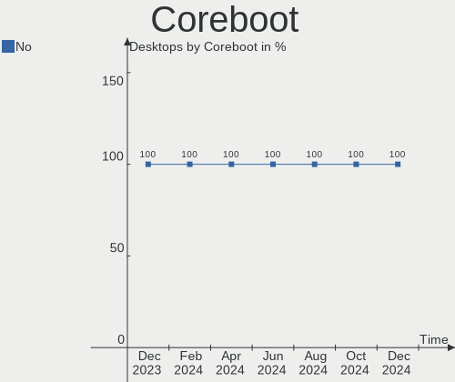
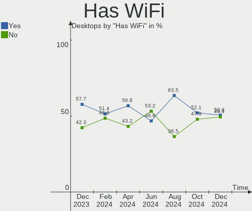
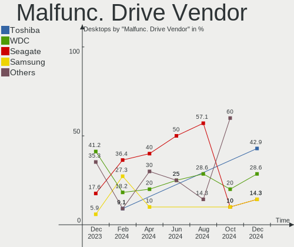
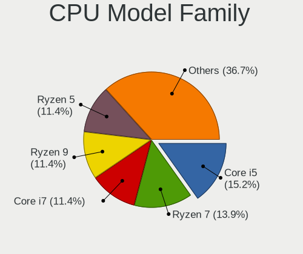
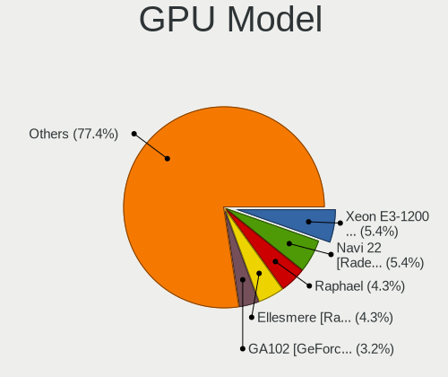

Linux in UK - Hardware Trends (Desktops)
----------------------------------------

A project to identify most popular hardware characteristics and track their change
over time based on data collected by Linux users at https://Linux-Hardware.org.

Anyone can contribute to this report by the [hw-probe](https://github.com/linuxhw/hw-probe) tool:

    sudo -E hw-probe -all -upload

Period: Jul, 2023.

Contents
--------

* [ System ](#system)
  - [ OS                       ](#os)
  - [ OS Family                ](#os-family)
  - [ Kernel                   ](#kernel)
  - [ Kernel Family            ](#kernel-family)
  - [ Kernel Major Ver.        ](#kernel-major-ver)
  - [ Arch                     ](#arch)
  - [ DE                       ](#de)
  - [ Display Server           ](#display-server)
  - [ Display Manager          ](#display-manager)
  - [ OS Lang                  ](#os-lang)
  - [ Boot Mode                ](#boot-mode)
  - [ Filesystem               ](#filesystem)
  - [ Part. scheme             ](#part-scheme)
  - [ Dual Boot with Linux/BSD ](#dual-boot-with-linuxbsd)
  - [ Dual Boot (Win)          ](#dual-boot-win)

* [ Board ](#board)
  - [ Vendor                   ](#vendor)
  - [ Model                    ](#model)
  - [ Model Family             ](#model-family)
  - [ MFG Year                 ](#mfg-year)
  - [ Form Factor              ](#form-factor)
  - [ Secure Boot              ](#secure-boot)
  - [ Coreboot                 ](#coreboot)
  - [ RAM Size                 ](#ram-size)
  - [ RAM Used                 ](#ram-used)
  - [ Total Drives             ](#total-drives)
  - [ Has CD-ROM               ](#has-cd-rom)
  - [ Has Ethernet             ](#has-ethernet)
  - [ Has WiFi                 ](#has-wifi)
  - [ Has Bluetooth            ](#has-bluetooth)

* [ Location ](#location)
  - [ Country                  ](#country)
  - [ City                     ](#city)

* [ Drives ](#drives)
  - [ Drive Vendor             ](#drive-vendor)
  - [ Drive Model              ](#drive-model)
  - [ HDD Vendor               ](#hdd-vendor)
  - [ SSD Vendor               ](#ssd-vendor)
  - [ Drive Kind               ](#drive-kind)
  - [ Drive Connector          ](#drive-connector)
  - [ Drive Size               ](#drive-size)
  - [ Space Total              ](#space-total)
  - [ Space Used               ](#space-used)
  - [ Malfunc. Drives          ](#malfunc-drives)
  - [ Malfunc. Drive Vendor    ](#malfunc-drive-vendor)
  - [ Malfunc. HDD Vendor      ](#malfunc-hdd-vendor)
  - [ Malfunc. Drive Kind      ](#malfunc-drive-kind)
  - [ Failed Drives            ](#failed-drives)
  - [ Failed Drive Vendor      ](#failed-drive-vendor)
  - [ Drive Status             ](#drive-status)

* [ Storage controller ](#storage-controller)
  - [ Storage Vendor           ](#storage-vendor)
  - [ Storage Model            ](#storage-model)
  - [ Storage Kind             ](#storage-kind)

* [ Processor ](#processor)
  - [ CPU Vendor               ](#cpu-vendor)
  - [ CPU Model                ](#cpu-model)
  - [ CPU Model Family         ](#cpu-model-family)
  - [ CPU Cores                ](#cpu-cores)
  - [ CPU Sockets              ](#cpu-sockets)
  - [ CPU Threads              ](#cpu-threads)
  - [ CPU Op-Modes             ](#cpu-op-modes)
  - [ CPU Microcode            ](#cpu-microcode)
  - [ CPU Microarch            ](#cpu-microarch)

* [ Graphics ](#graphics)
  - [ GPU Vendor               ](#gpu-vendor)
  - [ GPU Model                ](#gpu-model)
  - [ GPU Combo                ](#gpu-combo)
  - [ GPU Driver               ](#gpu-driver)
  - [ GPU Memory               ](#gpu-memory)

* [ Monitor ](#monitor)
  - [ Monitor Vendor           ](#monitor-vendor)
  - [ Monitor Model            ](#monitor-model)
  - [ Monitor Resolution       ](#monitor-resolution)
  - [ Monitor Diagonal         ](#monitor-diagonal)
  - [ Monitor Width            ](#monitor-width)
  - [ Aspect Ratio             ](#aspect-ratio)
  - [ Monitor Area             ](#monitor-area)
  - [ Pixel Density            ](#pixel-density)
  - [ Multiple Monitors        ](#multiple-monitors)

* [ Network ](#network)
  - [ Net Controller Vendor    ](#net-controller-vendor)
  - [ Net Controller Model     ](#net-controller-model)
  - [ Wireless Vendor          ](#wireless-vendor)
  - [ Wireless Model           ](#wireless-model)
  - [ Ethernet Vendor          ](#ethernet-vendor)
  - [ Ethernet Model           ](#ethernet-model)
  - [ Net Controller Kind      ](#net-controller-kind)
  - [ Used Controller          ](#used-controller)
  - [ NICs                     ](#nics)
  - [ IPv6                     ](#ipv6)

* [ Bluetooth ](#bluetooth)
  - [ Bluetooth Vendor         ](#bluetooth-vendor)
  - [ Bluetooth Model          ](#bluetooth-model)

* [ Sound ](#sound)
  - [ Sound Vendor             ](#sound-vendor)
  - [ Sound Model              ](#sound-model)

* [ Memory ](#memory)
  - [ Memory Vendor            ](#memory-vendor)
  - [ Memory Model             ](#memory-model)
  - [ Memory Kind              ](#memory-kind)
  - [ Memory Form Factor       ](#memory-form-factor)
  - [ Memory Size              ](#memory-size)
  - [ Memory Speed             ](#memory-speed)

* [ Printers & scanners ](#printers--scanners)
  - [ Printer Vendor           ](#printer-vendor)
  - [ Printer Model            ](#printer-model)
  - [ Scanner Vendor           ](#scanner-vendor)
  - [ Scanner Model            ](#scanner-model)

* [ Camera ](#camera)
  - [ Camera Vendor            ](#camera-vendor)
  - [ Camera Model             ](#camera-model)

* [ Security ](#security)
  - [ Fingerprint Vendor       ](#fingerprint-vendor)
  - [ Fingerprint Model        ](#fingerprint-model)
  - [ Chipcard Vendor          ](#chipcard-vendor)
  - [ Chipcard Model           ](#chipcard-model)

* [ Unsupported ](#unsupported)
  - [ Unsupported Devices      ](#unsupported-devices)
  - [ Unsupported Device Types ](#unsupported-device-types)

System
------

OS
--

Installed operating systems

| Name                         | Desktops | Percent |
|------------------------------|----------|---------|
| Ubuntu 22.04                 | 12       | 13.79%  |
| Zorin 16                     | 6        | 6.9%    |
| Arch Rolling                 | 6        | 6.9%    |
| OpenMandriva 23.03           | 5        | 5.75%   |
| Linux Mint 21.1              | 5        | 5.75%   |
| Fedora 38                    | 5        | 5.75%   |
| Debian 12                    | 4        | 4.6%    |
| Linux Mint 21.2              | 3        | 3.45%   |
| Linux Mint 20.3              | 3        | 3.45%   |
| Kubuntu 23.04                | 3        | 3.45%   |
| Gentoo 2.13                  | 3        | 3.45%   |
| Ubuntu 23.04                 | 2        | 2.3%    |
| Ubuntu 20.04                 | 2        | 2.3%    |
| Pop!_OS 22.04                | 2        | 2.3%    |
| OpenMandriva 23.07           | 2        | 2.3%    |
| Nobara 38                    | 2        | 2.3%    |
| Kubuntu 22.04                | 2        | 2.3%    |
| Kali 2023.2                  | 2        | 2.3%    |
| ArcoLinux Rolling            | 2        | 2.3%    |
| Xero Rolling                 | 1        | 1.15%   |
| Void Linux Rolling           | 1        | 1.15%   |
| Ubuntu 22.10                 | 1        | 1.15%   |
| Ubuntu 18.04                 | 1        | 1.15%   |
| Slackware 15.0               | 1        | 1.15%   |
| openSUSE Tumbleweed-XXXXXXXX | 1        | 1.15%   |
| OpenMandriva 4.3             | 1        | 1.15%   |
| OpenMandriva 23.01           | 1        | 1.15%   |
| Nobara 37                    | 1        | 1.15%   |
| Manjaro                      | 1        | 1.15%   |
| Linux Mint 21                | 1        | 1.15%   |
| Kubuntu 23.10                | 1        | 1.15%   |
| KDE neon 22.04               | 1        | 1.15%   |
| Garuda Linux Soaring         | 1        | 1.15%   |
| Endless 4.0.14               | 1        | 1.15%   |
| Debian 11                    | 1        | 1.15%   |

OS Family
---------

OS without a version

| Name         | Desktops | Percent |
|--------------|----------|---------|
| Ubuntu       | 18       | 20.69%  |
| Linux Mint   | 12       | 13.79%  |
| OpenMandriva | 9        | 10.34%  |
| Zorin        | 6        | 6.9%    |
| Kubuntu      | 6        | 6.9%    |
| Arch         | 6        | 6.9%    |
| Fedora       | 5        | 5.75%   |
| Debian       | 5        | 5.75%   |
| Nobara       | 3        | 3.45%   |
| Gentoo       | 3        | 3.45%   |
| Pop!_OS      | 2        | 2.3%    |
| Kali         | 2        | 2.3%    |
| ArcoLinux    | 2        | 2.3%    |
| Xero         | 1        | 1.15%   |
| Void Linux   | 1        | 1.15%   |
| Slackware    | 1        | 1.15%   |
| openSUSE     | 1        | 1.15%   |
| Manjaro      | 1        | 1.15%   |
| KDE neon     | 1        | 1.15%   |
| Garuda Linux | 1        | 1.15%   |
| Endless      | 1        | 1.15%   |

Kernel
------

Version of the Linux kernel

| Version                      | Desktops | Percent |
|------------------------------|----------|---------|
| 5.19.0-46-generic            | 12       | 13.79%  |
| 5.15.0-76-generic            | 12       | 13.79%  |
| 6.2.6-desktop-1omv2390       | 4        | 4.6%    |
| 6.1.0-10-amd64               | 3        | 3.45%   |
| 6.4.4-200.fc38.x86_64        | 2        | 2.3%    |
| 6.4.3-arch1-2                | 2        | 2.3%    |
| 6.4.3-arch1-1                | 2        | 2.3%    |
| 6.4.2-arch1-1                | 2        | 2.3%    |
| 6.3.5-desktop-3omv2390       | 2        | 2.3%    |
| 6.3.12-200.fc38.x86_64       | 2        | 2.3%    |
| 6.2.6-76060206-generic       | 2        | 2.3%    |
| 6.2.0-24-generic             | 2        | 2.3%    |
| 6.1.0-kali9-amd64            | 2        | 2.3%    |
| 5.4.0-153-generic            | 2        | 2.3%    |
| 5.15.0-78-generic            | 2        | 2.3%    |
| 5.15.0-75-generic            | 2        | 2.3%    |
| 6.5.0-rc2-2-cachyos-rc       | 1        | 1.15%   |
| 6.4.2-gentoo-x86_64          | 1        | 1.15%   |
| 6.4.2-gentoo                 | 1        | 1.15%   |
| 6.4.1-arch1-1                | 1        | 1.15%   |
| 6.3.9-arch1-1                | 1        | 1.15%   |
| 6.3.9-1-default              | 1        | 1.15%   |
| 6.3.12_1                     | 1        | 1.15%   |
| 6.3.12-203.fsync.fc38.x86_64 | 1        | 1.15%   |
| 6.3.11-200.fc38.x86_64       | 1        | 1.15%   |
| 6.3.10-200.fsync.fc38.x86_64 | 1        | 1.15%   |
| 6.3.10-200.fsync.fc37.x86_64 | 1        | 1.15%   |
| 6.3.0-7-generic              | 1        | 1.15%   |
| 6.2.2-desktop-1omv2390       | 1        | 1.15%   |
| 6.2.16-2-MANJARO             | 1        | 1.15%   |
| 6.2.0-26-generic             | 1        | 1.15%   |
| 6.2.0-25-generic             | 1        | 1.15%   |
| 6.2.0-23-generic             | 1        | 1.15%   |
| 6.1.38-gentoo-x86_64         | 1        | 1.15%   |
| 6.1.38-1-lts                 | 1        | 1.15%   |
| 6.1.15-1-pve                 | 1        | 1.15%   |
| 6.1.1-desktop-1omv2290       | 1        | 1.15%   |
| 6.1.0-10-686-pae             | 1        | 1.15%   |
| 5.4.0-155-generic            | 1        | 1.15%   |
| 5.4.0-150-generic            | 1        | 1.15%   |

Kernel Family
-------------

Linux kernel without a distro release

| Version | Desktops | Percent |
|---------|----------|---------|
| 5.15.0  | 18       | 20.69%  |
| 5.19.0  | 15       | 17.24%  |
| 6.2.6   | 6        | 6.9%    |
| 6.1.0   | 6        | 6.9%    |
| 6.2.0   | 5        | 5.75%   |
| 6.4.3   | 4        | 4.6%    |
| 6.4.2   | 4        | 4.6%    |
| 6.3.12  | 4        | 4.6%    |
| 5.4.0   | 4        | 4.6%    |
| 6.4.4   | 2        | 2.3%    |
| 6.3.9   | 2        | 2.3%    |
| 6.3.5   | 2        | 2.3%    |
| 6.3.10  | 2        | 2.3%    |
| 6.1.38  | 2        | 2.3%    |
| 6.5.0   | 1        | 1.15%   |
| 6.4.1   | 1        | 1.15%   |
| 6.3.11  | 1        | 1.15%   |
| 6.3.0   | 1        | 1.15%   |
| 6.2.2   | 1        | 1.15%   |
| 6.2.16  | 1        | 1.15%   |
| 6.1.15  | 1        | 1.15%   |
| 6.1.1   | 1        | 1.15%   |
| 5.16.13 | 1        | 1.15%   |
| 5.15.63 | 1        | 1.15%   |
| 5.11.0  | 1        | 1.15%   |

Kernel Major Ver.
-----------------

Linux kernel major version

| Version | Desktops | Percent |
|---------|----------|---------|
| 5.15    | 19       | 21.84%  |
| 5.19    | 15       | 17.24%  |
| 6.2     | 13       | 14.94%  |
| 6.3     | 12       | 13.79%  |
| 6.4     | 11       | 12.64%  |
| 6.1     | 10       | 11.49%  |
| 5.4     | 4        | 4.6%    |
| 6.5     | 1        | 1.15%   |
| 5.16    | 1        | 1.15%   |
| 5.11    | 1        | 1.15%   |

Arch
----

OS architecture (x86_64, i586, etc.)

| Name    | Desktops | Percent |
|---------|----------|---------|
| x86_64  | 85       | 97.7%   |
| riscv64 | 1        | 1.15%   |
| i686    | 1        | 1.15%   |

DE
--

Desktop Environment

| Name       | Desktops | Percent |
|------------|----------|---------|
| GNOME      | 37       | 42.53%  |
| KDE5       | 22       | 25.29%  |
| X-Cinnamon | 11       | 12.64%  |
| XFCE       | 7        | 8.05%   |
| Unknown    | 7        | 8.05%   |
| MATE       | 1        | 1.15%   |
| LXQt       | 1        | 1.15%   |
| chadwm     | 1        | 1.15%   |

Display Server
--------------

X11 or Wayland

| Name    | Desktops | Percent |
|---------|----------|---------|
| X11     | 65       | 74.71%  |
| Wayland | 18       | 20.69%  |
| Tty     | 4        | 4.6%    |

Display Manager
---------------

SDDM, LightDM, etc.

| Name    | Desktops | Percent |
|---------|----------|---------|
| Unknown | 36       | 41.38%  |
| SDDM    | 20       | 22.99%  |
| GDM3    | 15       | 17.24%  |
| LightDM | 10       | 11.49%  |
| GDM     | 6        | 6.9%    |

OS Lang
-------

Language

| Lang    | Desktops | Percent |
|---------|----------|---------|
| en_GB   | 71       | 81.61%  |
| en_US   | 7        | 8.05%   |
| C       | 3        | 3.45%   |
| Unknown | 3        | 3.45%   |
| pl_PL   | 2        | 2.3%    |
| us      | 1        | 1.15%   |

Boot Mode
---------

EFI or BIOS

| Mode | Desktops | Percent |
|------|----------|---------|
| EFI  | 45       | 51.72%  |
| BIOS | 42       | 48.28%  |

Filesystem
----------

Type of filesystem

| Type    | Desktops | Percent |
|---------|----------|---------|
| Ext4    | 52       | 59.77%  |
| Btrfs   | 17       | 19.54%  |
| Tmpfs   | 13       | 14.94%  |
| Overlay | 3        | 3.45%   |
| XXXX    | 1        | 1.15%   |
| Xfs     | 1        | 1.15%   |

Part. scheme
------------

Scheme of partitioning

| Type    | Desktops | Percent |
|---------|----------|---------|
| GPT     | 47       | 54.02%  |
| Unknown | 31       | 35.63%  |
| MBR     | 9        | 10.34%  |

Dual Boot with Linux/BSD
------------------------

Hosting more than one Linux/BSD

| Dual boot | Desktops | Percent |
|-----------|----------|---------|
| No        | 69       | 79.31%  |
| Yes       | 18       | 20.69%  |

Dual Boot (Win)
---------------

Hosting Linux and Windows

| Dual boot | Desktops | Percent |
|-----------|----------|---------|
| No        | 60       | 68.97%  |
| Yes       | 27       | 31.03%  |

Board
-----

Vendor
------

Motherboard manufacturer

| Name                                 | Desktops | Percent |
|--------------------------------------|----------|---------|
| ASUSTek Computer                     | 23       | 26.44%  |
| Gigabyte Technology                  | 20       | 22.99%  |
| MSI                                  | 12       | 13.79%  |
| Dell                                 | 7        | 8.05%   |
| Lenovo                               | 5        | 5.75%   |
| ASRock                               | 5        | 5.75%   |
| Hewlett-Packard                      | 3        | 3.45%   |
| Unknown                              | 3        | 3.45%   |
| Acer                                 | 2        | 2.3%    |
| Shenzhen Meigao Electronic Equipment | 1        | 1.15%   |
| Packard Bell                         | 1        | 1.15%   |
| Intel                                | 1        | 1.15%   |
| Fujitsu Siemens                      | 1        | 1.15%   |
| Fujitsu                              | 1        | 1.15%   |
| Apple                                | 1        | 1.15%   |
| Acidanthera                          | 1        | 1.15%   |

Model
-----

Motherboard model

| Name                                       | Desktops | Percent |
|--------------------------------------------|----------|---------|
| Unknown                                    | 3        | 3.45%   |
| MSI MS-7C91                                | 2        | 2.3%    |
| ASUS ROG STRIX B550-F GAMING               | 2        | 2.3%    |
| ASUS All Series                            | 2        | 2.3%    |
| Shenzhen Meigao Electronic Equipment HX90G | 1        | 1.15%   |
| Packard Bell IMEDIA S2885                  | 1        | 1.15%   |
| MSI VIG690M                                | 1        | 1.15%   |
| MSI MS-7E07                                | 1        | 1.15%   |
| MSI MS-7D75                                | 1        | 1.15%   |
| MSI MS-7D53                                | 1        | 1.15%   |
| MSI MS-7C73                                | 1        | 1.15%   |
| MSI MS-7B89                                | 1        | 1.15%   |
| MSI MS-7B78                                | 1        | 1.15%   |
| MSI MS-7A37                                | 1        | 1.15%   |
| MSI MS-7850                                | 1        | 1.15%   |
| MSI 7200-5086C                             | 1        | 1.15%   |
| Lenovo ThinkCentre M91p 4518A4M            | 1        | 1.15%   |
| Lenovo ThinkCentre M73z 10BC0017UK         | 1        | 1.15%   |
| Lenovo ThinkCentre M700 10J0S2QU00         | 1        | 1.15%   |
| Lenovo ThinkCentre Edge72 3493AZG          | 1        | 1.15%   |
| Lenovo IdeaCentre B320                     | 1        | 1.15%   |
| Intel B85 V5.56                            | 1        | 1.15%   |
| HP Compaq Elite 8300 USDT                  | 1        | 1.15%   |
| HP 860-050na                               | 1        | 1.15%   |
| HP 290 G1 MT                               | 1        | 1.15%   |
| Gigabyte Z97MX-Gaming 5                    | 1        | 1.15%   |
| Gigabyte Z390 AORUS PRO                    | 1        | 1.15%   |
| Gigabyte Z370 AORUS Gaming 3               | 1        | 1.15%   |
| Gigabyte X670 GAMING X AX                  | 1        | 1.15%   |
| Gigabyte X570 AORUS PRO                    | 1        | 1.15%   |
| Gigabyte X470 AORUS GAMING 7 WIFI          | 1        | 1.15%   |
| Gigabyte PC-2903                           | 1        | 1.15%   |
| Gigabyte H81M-S2H                          | 1        | 1.15%   |
| Gigabyte H81M-DS2V                         | 1        | 1.15%   |
| Gigabyte H61M-DS2 DVI                      | 1        | 1.15%   |
| Gigabyte H110-D3A                          | 1        | 1.15%   |
| Gigabyte GA-880GM-UD2H                     | 1        | 1.15%   |
| Gigabyte GA-78LMT-S2P                      | 1        | 1.15%   |
| Gigabyte B650M AORUS ELITE AX              | 1        | 1.15%   |
| Gigabyte B550M AORUS PRO-P                 | 1        | 1.15%   |

Model Family
------------

Motherboard model prefix

| Name                                       | Desktops | Percent |
|--------------------------------------------|----------|---------|
| ASUS ROG                                   | 10       | 11.49%  |
| Lenovo ThinkCentre                         | 4        | 4.6%    |
| Dell OptiPlex                              | 3        | 3.45%   |
| ASUS PRIME                                 | 3        | 3.45%   |
| Unknown                                    | 3        | 3.45%   |
| MSI MS-7C91                                | 2        | 2.3%    |
| Dell Precision                             | 2        | 2.3%    |
| ASUS TUF                                   | 2        | 2.3%    |
| ASUS All                                   | 2        | 2.3%    |
| ASRock A320M-HDV                           | 2        | 2.3%    |
| Shenzhen Meigao Electronic Equipment HX90G | 1        | 1.15%   |
| Packard Bell IMEDIA                        | 1        | 1.15%   |
| MSI VIG690M                                | 1        | 1.15%   |
| MSI MS-7E07                                | 1        | 1.15%   |
| MSI MS-7D75                                | 1        | 1.15%   |
| MSI MS-7D53                                | 1        | 1.15%   |
| MSI MS-7C73                                | 1        | 1.15%   |
| MSI MS-7B89                                | 1        | 1.15%   |
| MSI MS-7B78                                | 1        | 1.15%   |
| MSI MS-7A37                                | 1        | 1.15%   |
| MSI MS-7850                                | 1        | 1.15%   |
| MSI 7200-5086C                             | 1        | 1.15%   |
| Lenovo IdeaCentre                          | 1        | 1.15%   |
| Intel B85                                  | 1        | 1.15%   |
| HP Compaq                                  | 1        | 1.15%   |
| HP 860-050na                               | 1        | 1.15%   |
| HP 290                                     | 1        | 1.15%   |
| Gigabyte Z97MX-Gaming                      | 1        | 1.15%   |
| Gigabyte Z390                              | 1        | 1.15%   |
| Gigabyte Z370                              | 1        | 1.15%   |
| Gigabyte X670                              | 1        | 1.15%   |
| Gigabyte X570                              | 1        | 1.15%   |
| Gigabyte X470                              | 1        | 1.15%   |
| Gigabyte PC-2903                           | 1        | 1.15%   |
| Gigabyte H81M-S2H                          | 1        | 1.15%   |
| Gigabyte H81M-DS2V                         | 1        | 1.15%   |
| Gigabyte H61M-DS2                          | 1        | 1.15%   |
| Gigabyte H110-D3A                          | 1        | 1.15%   |
| Gigabyte GA-880GM-UD2H                     | 1        | 1.15%   |
| Gigabyte GA-78LMT-S2P                      | 1        | 1.15%   |

MFG Year
--------

Motherboard manufacture year

| Year | Desktops | Percent |
|------|----------|---------|
| 2018 | 13       | 14.94%  |
| 2022 | 11       | 12.64%  |
| 2020 | 9        | 10.34%  |
| 2014 | 9        | 10.34%  |
| 2017 | 7        | 8.05%   |
| 2021 | 5        | 5.75%   |
| 2023 | 4        | 4.6%    |
| 2019 | 4        | 4.6%    |
| 2012 | 4        | 4.6%    |
| 2011 | 4        | 4.6%    |
| 2016 | 3        | 3.45%   |
| 2015 | 3        | 3.45%   |
| 2007 | 3        | 3.45%   |
| 2013 | 2        | 2.3%    |
| 2010 | 2        | 2.3%    |
| 2009 | 2        | 2.3%    |
| 2008 | 1        | 1.15%   |
| 2002 | 1        | 1.15%   |

Form Factor
-----------

Physical design of the computer

| Name    | Desktops | Percent |
|---------|----------|---------|
| Desktop | 87       | 100%    |

Secure Boot
-----------

Enabled or disabled

| State    | Desktops | Percent |
|----------|----------|---------|
| Disabled | 84       | 96.55%  |
| Enabled  | 3        | 3.45%   |

Coreboot
--------

Have coreboot on board

| Used | Desktops | Percent |
|------|----------|---------|
| No   | 87       | 100%    |

RAM Size
--------

Total RAM memory

| Size in GB  | Desktops | Percent |
|-------------|----------|---------|
| 16.01-24.0  | 24       | 27.59%  |
| 32.01-64.0  | 23       | 26.44%  |
| 4.01-8.0    | 13       | 14.94%  |
| 8.01-16.0   | 10       | 11.49%  |
| 3.01-4.0    | 7        | 8.05%   |
| 64.01-256.0 | 5        | 5.75%   |
| 24.01-32.0  | 2        | 2.3%    |
| 2.01-3.0    | 2        | 2.3%    |
| 0.51-1.0    | 1        | 1.15%   |

RAM Used
--------

Used RAM memory

| Used GB    | Desktops | Percent |
|------------|----------|---------|
| 4.01-8.0   | 24       | 27.59%  |
| 1.01-2.0   | 23       | 26.44%  |
| 2.01-3.0   | 18       | 20.69%  |
| 3.01-4.0   | 11       | 12.64%  |
| 8.01-16.0  | 5        | 5.75%   |
| 16.01-24.0 | 2        | 2.3%    |
| 0.01-0.5   | 2        | 2.3%    |
| 24.01-32.0 | 1        | 1.15%   |
| 0.51-1.0   | 1        | 1.15%   |

Total Drives
------------

Number of drives on board

| Drives | Desktops | Percent |
|--------|----------|---------|
| 1      | 27       | 31.03%  |
| 2      | 25       | 28.74%  |
| 3      | 16       | 18.39%  |
| 4      | 11       | 12.64%  |
| 5      | 6        | 6.9%    |
| 8      | 1        | 1.15%   |
| 0      | 1        | 1.15%   |

Has CD-ROM
----------

Has CD-ROM on board

| Presented | Desktops | Percent |
|-----------|----------|---------|
| No        | 52       | 59.77%  |
| Yes       | 35       | 40.23%  |

Has Ethernet
------------

Has Ethernet on board

| Presented | Desktops | Percent |
|-----------|----------|---------|
| Yes       | 84       | 96.55%  |
| No        | 3        | 3.45%   |

Has WiFi
--------

Has WiFi module

| Presented | Desktops | Percent |
|-----------|----------|---------|
| Yes       | 46       | 52.87%  |
| No        | 41       | 47.13%  |

Has Bluetooth
-------------

Has Bluetooth module

| Presented | Desktops | Percent |
|-----------|----------|---------|
| No        | 50       | 57.47%  |
| Yes       | 37       | 42.53%  |

Location
--------

Country
-------

Geographic location (country)

| Country | Desktops | Percent |
|---------|----------|---------|
| UK      | 87       | 100%    |

City
----

Geographic location (city)

| City                 | Desktops | Percent |
|----------------------|----------|---------|
| Southend-on-Sea      | 4        | 4.6%    |
| London               | 4        | 4.6%    |
| Manchester           | 3        | 3.45%   |
| Birmingham           | 3        | 3.45%   |
| York                 | 2        | 2.3%    |
| Sheffield            | 2        | 2.3%    |
| Milton Keynes        | 2        | 2.3%    |
| Leeds                | 2        | 2.3%    |
| Gillingham           | 2        | 2.3%    |
| Flint                | 2        | 2.3%    |
| Worthing             | 1        | 1.15%   |
| Walsall              | 1        | 1.15%   |
| Wakefield            | 1        | 1.15%   |
| Uckfield             | 1        | 1.15%   |
| Tranent              | 1        | 1.15%   |
| Tipton               | 1        | 1.15%   |
| Swindon              | 1        | 1.15%   |
| Swadlincote          | 1        | 1.15%   |
| Sunderland           | 1        | 1.15%   |
| Stevenage            | 1        | 1.15%   |
| Stanmore             | 1        | 1.15%   |
| Sherborne            | 1        | 1.15%   |
| Salford              | 1        | 1.15%   |
| Runcorn              | 1        | 1.15%   |
| Royal Leamington Spa | 1        | 1.15%   |
| Rotherham            | 1        | 1.15%   |
| Rochester            | 1        | 1.15%   |
| Redhill              | 1        | 1.15%   |
| Reading              | 1        | 1.15%   |
| Preston              | 1        | 1.15%   |
| Plymouth             | 1        | 1.15%   |
| Peterborough         | 1        | 1.15%   |
| Penzance             | 1        | 1.15%   |
| Penrith              | 1        | 1.15%   |
| Paisley              | 1        | 1.15%   |
| Nottingham           | 1        | 1.15%   |
| Newport              | 1        | 1.15%   |
| Newham               | 1        | 1.15%   |
| Newcastle upon Tyne  | 1        | 1.15%   |
| New Milton           | 1        | 1.15%   |

Drives
------

Drive Vendor
------------

Hard drive vendors

| Vendor                      | Desktops | Drives | Percent |
|-----------------------------|----------|--------|---------|
| Samsung Electronics         | 28       | 41     | 16%     |
| Seagate                     | 27       | 34     | 15.43%  |
| WDC                         | 25       | 31     | 14.29%  |
| SanDisk                     | 11       | 13     | 6.29%   |
| Toshiba                     | 10       | 10     | 5.71%   |
| Kingston                    | 9        | 10     | 5.14%   |
| Crucial                     | 8        | 9      | 4.57%   |
| Phison Electronics          | 6        | 6      | 3.43%   |
| Hitachi                     | 4        | 4      | 2.29%   |
| HGST                        | 4        | 5      | 2.29%   |
| Patriot                     | 3        | 3      | 1.71%   |
| Intel                       | 3        | 3      | 1.71%   |
| Unknown                     | 2        | 2      | 1.14%   |
| Transcend                   | 2        | 2      | 1.14%   |
| OCZ                         | 2        | 4      | 1.14%   |
| Micron/Crucial Technology   | 2        | 2      | 1.14%   |
| Maxtor                      | 2        | 2      | 1.14%   |
| MAXIO Technology (Hangzhou) | 2        | 2      | 1.14%   |
| Kingston Technology Company | 2        | 2      | 1.14%   |
| Gigabyte Technology         | 2        | 2      | 1.14%   |
| Fanxiang                    | 2        | 2      | 1.14%   |
| China                       | 2        | 2      | 1.14%   |
| A-DATA Technology           | 2        | 2      | 1.14%   |
| X12                         | 1        | 1      | 0.57%   |
| Vaseky                      | 1        | 1      | 0.57%   |
| TurXun                      | 1        | 1      | 0.57%   |
| TCSUNBOW                    | 1        | 1      | 0.57%   |
| SPCC                        | 1        | 1      | 0.57%   |
| SK hynix                    | 1        | 1      | 0.57%   |
| Silicon Motion              | 1        | 1      | 0.57%   |
| SABRENT                     | 1        | 1      | 0.57%   |
| Realtek                     | 1        | 1      | 0.57%   |
| Phison                      | 1        | 1      | 0.57%   |
| MSI                         | 1        | 1      | 0.57%   |
| KIOXIA-EXCERIA              | 1        | 1      | 0.57%   |
| Integral                    | 1        | 1      | 0.57%   |
| CT500MX5                    | 1        | 1      | 0.57%   |
| ADATA Technology            | 1        | 1      | 0.57%   |

Drive Model
-----------

Hard drive models

| Model                                               | Desktops | Percent |
|-----------------------------------------------------|----------|---------|
| Samsung NVMe SSD Controller SM981/PM981/PM983 500GB | 6        | 2.99%   |
| Samsung NVMe SSD Controller PM9A1/PM9A3/980PRO 1TB  | 5        | 2.49%   |
| Seagate ST1000DM010-2EP102 1TB                      | 4        | 1.99%   |
| Samsung SSD 980 1TB                                 | 4        | 1.99%   |
| Phison E12 NVMe Controller 2TB                      | 4        | 1.99%   |
| Kingston SA400S37240G 240GB SSD                     | 4        | 1.99%   |
| SanDisk SSD PLUS 480GB                              | 3        | 1.49%   |
| Samsung SSD 870 QVO 1TB                             | 3        | 1.49%   |
| Samsung SSD 860 EVO 1TB                             | 3        | 1.49%   |
| WDC WDS500G2B0A-00SM50 500GB SSD                    | 2        | 1%      |
| WDC WD10EZEX-21WN4A0 1TB                            | 2        | 1%      |
| Toshiba HDWD110 1TB                                 | 2        | 1%      |
| Toshiba DT01ACA200 2TB                              | 2        | 1%      |
| Seagate ST3500413AS 500GB                           | 2        | 1%      |
| Seagate ST3000DM007-1WY10G 3TB                      | 2        | 1%      |
| Seagate ST2000DM008-2FR102 2TB                      | 2        | 1%      |
| Sandisk WD_BLACK SN850X HS 1000GB                   | 2        | 1%      |
| Samsung SSD 870 EVO 500GB                           | 2        | 1%      |
| Samsung SSD 850 EVO 500GB                           | 2        | 1%      |
| Samsung HD103SJ 1TB                                 | 2        | 1%      |
| Micron/Crucial CT2000P5PSSD8 2TB                    | 2        | 1%      |
| Kingston SA400S37120G 120GB SSD                     | 2        | 1%      |
| Gigabyte GP-GSTFS31120GNTD 120GB                    | 2        | 1%      |
| Crucial CT1000MX500SSD1 1TB                         | 2        | 1%      |
| X12 SSD 1TB                                         | 1        | 0.5%    |
| WDC WDS240G2G0B-00EPW0 240GB SSD                    | 1        | 0.5%    |
| WDC WDS240G2G0A-00JH30 240GB SSD                    | 1        | 0.5%    |
| WDC WDS120G2G0A-00JH30 120GB SSD                    | 1        | 0.5%    |
| WDC WDS100T2B0B-00YS70 1TB SSD                      | 1        | 0.5%    |
| WDC WDS100T1X0E-00AFY0 1TB                          | 1        | 0.5%    |
| WDC WD6400AAKS-22A7B2 640GB                         | 1        | 0.5%    |
| WDC WD5000KS-00MNB0 500GB                           | 1        | 0.5%    |
| WDC WD5000AVDS-63U7B1 500GB                         | 1        | 0.5%    |
| WDC WD5000AADS-00S9B0 500GB                         | 1        | 0.5%    |
| WDC WD400BB-75CAA0 40GB                             | 1        | 0.5%    |
| WDC WD3200KS-00PFB0 320GB                           | 1        | 0.5%    |
| WDC WD3200AAKS-75L9A0 320GB                         | 1        | 0.5%    |
| WDC WD3200AAKS-00TMA0 320GB                         | 1        | 0.5%    |
| WDC WD20EZRZ-00Z5HB0 2TB                            | 1        | 0.5%    |
| WDC WD20EURX-83T0FY0 2TB                            | 1        | 0.5%    |

HDD Vendor
----------

Hard disk drive vendors

| Vendor              | Desktops | Drives | Percent |
|---------------------|----------|--------|---------|
| Seagate             | 27       | 32     | 37.5%   |
| WDC                 | 20       | 23     | 27.78%  |
| Toshiba             | 9        | 9      | 12.5%   |
| Samsung Electronics | 5        | 5      | 6.94%   |
| Hitachi             | 4        | 4      | 5.56%   |
| HGST                | 4        | 5      | 5.56%   |
| Maxtor              | 2        | 2      | 2.78%   |
| Unknown             | 1        | 1      | 1.39%   |

SSD Vendor
----------

Solid state drive vendors

| Vendor              | Desktops | Drives | Percent |
|---------------------|----------|--------|---------|
| Samsung Electronics | 13       | 16     | 20.63%  |
| Kingston            | 9        | 10     | 14.29%  |
| WDC                 | 6        | 7      | 9.52%   |
| SanDisk             | 6        | 7      | 9.52%   |
| Crucial             | 6        | 7      | 9.52%   |
| Transcend           | 2        | 2      | 3.17%   |
| Patriot             | 2        | 2      | 3.17%   |
| OCZ                 | 2        | 4      | 3.17%   |
| Gigabyte Technology | 2        | 2      | 3.17%   |
| China               | 2        | 2      | 3.17%   |
| A-DATA Technology   | 2        | 2      | 3.17%   |
| X12                 | 1        | 1      | 1.59%   |
| Vaseky              | 1        | 1      | 1.59%   |
| Toshiba             | 1        | 1      | 1.59%   |
| TCSUNBOW            | 1        | 1      | 1.59%   |
| SPCC                | 1        | 1      | 1.59%   |
| Seagate             | 1        | 1      | 1.59%   |
| KIOXIA-EXCERIA      | 1        | 1      | 1.59%   |
| Intel               | 1        | 1      | 1.59%   |
| Integral            | 1        | 1      | 1.59%   |
| Fanxiang            | 1        | 1      | 1.59%   |
| CT500MX5            | 1        | 1      | 1.59%   |

Drive Kind
----------

HDD or SSD

| Kind    | Desktops | Drives | Percent |
|---------|----------|--------|---------|
| HDD     | 55       | 81     | 37.16%  |
| SSD     | 49       | 72     | 33.11%  |
| NVMe    | 41       | 52     | 27.7%   |
| Unknown | 2        | 2      | 1.35%   |
| MMC     | 1        | 1      | 0.68%   |

Drive Connector
---------------

SATA, SAS, NVMe, etc.

| Type | Desktops | Drives | Percent |
|------|----------|--------|---------|
| SATA | 77       | 147    | 61.6%   |
| NVMe | 39       | 50     | 31.2%   |
| SAS  | 8        | 10     | 6.4%    |
| MMC  | 1        | 1      | 0.8%    |

Drive Size
----------

Size of hard drive

| Size in TB | Desktops | Drives | Percent |
|------------|----------|--------|---------|
| 0.01-0.5   | 56       | 85     | 51.85%  |
| 0.51-1.0   | 26       | 36     | 24.07%  |
| 1.01-2.0   | 14       | 15     | 12.96%  |
| 3.01-4.0   | 4        | 7      | 3.7%    |
| 2.01-3.0   | 4        | 6      | 3.7%    |
| 4.01-10.0  | 4        | 4      | 3.7%    |

Space Total
-----------

Amount of disk space available on the file system

| Size in GB     | Desktops | Percent |
|----------------|----------|---------|
| 501-1000       | 17       | 19.54%  |
| 251-500        | 15       | 17.24%  |
| More than 3000 | 14       | 16.09%  |
| 101-250        | 13       | 14.94%  |
| 2001-3000      | 9        | 10.34%  |
| 1001-2000      | 6        | 6.9%    |
| Unknown        | 5        | 5.75%   |
| 21-50          | 3        | 3.45%   |
| 1-20           | 3        | 3.45%   |
| 51-100         | 2        | 2.3%    |

Space Used
----------

Amount of used disk space

| Used GB        | Desktops | Percent |
|----------------|----------|---------|
| 1-20           | 20       | 22.99%  |
| 101-250        | 16       | 18.39%  |
| 51-100         | 11       | 12.64%  |
| 1001-2000      | 9        | 10.34%  |
| 501-1000       | 8        | 9.2%    |
| More than 3000 | 6        | 6.9%    |
| 21-50          | 6        | 6.9%    |
| 251-500        | 5        | 5.75%   |
| Unknown        | 5        | 5.75%   |
| 2001-3000      | 1        | 1.15%   |

Malfunc. Drives
---------------

Drive models with a malfunction

| Model                                                          | Desktops | Drives | Percent |
|----------------------------------------------------------------|----------|--------|---------|
| WDC WD6400AAKS-22A7B2 640GB                                    | 1        | 1      | 7.69%   |
| WDC WD400BB-75CAA0 40GB                                        | 1        | 1      | 7.69%   |
| WDC WD20EARS-00MVWB0 2TB                                       | 1        | 1      | 7.69%   |
| WDC WD10EZEX-60ZF5A0 1TB                                       | 1        | 1      | 7.69%   |
| WDC WD10EZEX-21WN4A0 1TB                                       | 1        | 1      | 7.69%   |
| Seagate ST500LT012-1DG142 500GB                                | 1        | 1      | 7.69%   |
| Seagate ST1000DM003-1SB102 1TB                                 | 1        | 1      | 7.69%   |
| Samsung Electronics SSD 970 EVO Plus 1TB                       | 1        | 2      | 7.69%   |
| Samsung Electronics NVMe SSD Controller PM9A1/PM9A3/980PRO 1TB | 1        | 1      | 7.69%   |
| OCZ ARC100 240GB SSD                                           | 1        | 1      | 7.69%   |
| Kingston SA400S37480G 480GB SSD                                | 1        | 1      | 7.69%   |
| Intel SSDPEKKW512G7 512GB                                      | 1        | 1      | 7.69%   |
| Hitachi HDS721050CLA362 500GB                                  | 1        | 1      | 7.69%   |

Malfunc. Drive Vendor
---------------------

Vendors of faulty drives

| Vendor              | Desktops | Drives | Percent |
|---------------------|----------|--------|---------|
| WDC                 | 4        | 5      | 33.33%  |
| Seagate             | 2        | 2      | 16.67%  |
| Samsung Electronics | 2        | 3      | 16.67%  |
| OCZ                 | 1        | 1      | 8.33%   |
| Kingston            | 1        | 1      | 8.33%   |
| Intel               | 1        | 1      | 8.33%   |
| Hitachi             | 1        | 1      | 8.33%   |

Malfunc. HDD Vendor
-------------------

Vendors of faulty HDD drives

| Vendor  | Desktops | Drives | Percent |
|---------|----------|--------|---------|
| WDC     | 4        | 5      | 57.14%  |
| Seagate | 2        | 2      | 28.57%  |
| Hitachi | 1        | 1      | 14.29%  |

Malfunc. Drive Kind
-------------------

Kinds of faulty drives

| Kind | Desktops | Drives | Percent |
|------|----------|--------|---------|
| HDD  | 6        | 8      | 54.55%  |
| NVMe | 3        | 4      | 27.27%  |
| SSD  | 2        | 2      | 18.18%  |

Failed Drives
-------------

Failed drive models

Zero info for selected period =(

Failed Drive Vendor
-------------------

Failed drive vendors

Zero info for selected period =(

Drive Status
------------

Number of failed and malfunc. drives

| Status   | Desktops | Drives | Percent |
|----------|----------|--------|---------|
| Detected | 48       | 116    | 50%     |
| Works    | 37       | 78     | 38.54%  |
| Malfunc  | 11       | 14     | 11.46%  |

Storage controller
------------------

Storage Vendor
--------------

Storage controller vendors

| Vendor                      | Desktops | Percent |
|-----------------------------|----------|---------|
| Intel                       | 49       | 36.57%  |
| AMD                         | 37       | 27.61%  |
| Samsung Electronics         | 16       | 11.94%  |
| SanDisk                     | 7        | 5.22%   |
| Phison Electronics          | 7        | 5.22%   |
| Micron/Crucial Technology   | 4        | 2.99%   |
| MAXIO Technology (Hangzhou) | 3        | 2.24%   |
| ASMedia Technology          | 3        | 2.24%   |
| Kingston Technology Company | 2        | 1.49%   |
| SK hynix                    | 1        | 0.75%   |
| Silicon Motion              | 1        | 0.75%   |
| LSI Logic / Symbios Logic   | 1        | 0.75%   |
| JMicron Technology          | 1        | 0.75%   |
| INNOGRIT                    | 1        | 0.75%   |
| ADATA Technology            | 1        | 0.75%   |

Storage Model
-------------

Storage controller models

| Model                                                                          | Desktops | Percent |
|--------------------------------------------------------------------------------|----------|---------|
| AMD FCH SATA Controller [AHCI mode]                                            | 23       | 14.11%  |
| Intel 8 Series/C220 Series Chipset Family 6-port SATA Controller 1 [AHCI mode] | 9        | 5.52%   |
| AMD 400 Series Chipset SATA Controller                                         | 9        | 5.52%   |
| Samsung NVMe SSD Controller SM981/PM981/PM983                                  | 8        | 4.91%   |
| AMD 500 Series Chipset SATA Controller                                         | 7        | 4.29%   |
| Samsung NVMe SSD Controller PM9A1/PM9A3/980PRO                                 | 5        | 3.07%   |
| Phison E12 NVMe Controller                                                     | 5        | 3.07%   |
| Intel Q170/Q150/B150/H170/H110/Z170/CM236 Chipset SATA Controller [AHCI Mode]  | 5        | 3.07%   |
| Samsung NVMe SSD Controller 980                                                | 4        | 2.45%   |
| AMD SB7x0/SB8x0/SB9x0 IDE Controller                                           | 4        | 2.45%   |
| AMD FCH SATA Controller D                                                      | 4        | 2.45%   |
| Intel SATA Controller [RAID mode]                                              | 3        | 1.84%   |
| Intel 6 Series/C200 Series Chipset Family 6 port Desktop SATA AHCI Controller  | 3        | 1.84%   |
| Intel 500 Series Chipset Family SATA AHCI Controller                           | 3        | 1.84%   |
| Intel 200 Series PCH SATA controller [AHCI mode]                               | 3        | 1.84%   |
| ASMedia ASM1062 Serial ATA Controller                                          | 3        | 1.84%   |
| AMD SB7x0/SB8x0/SB9x0 SATA Controller [AHCI mode]                              | 3        | 1.84%   |
| Sandisk Western Digital WD Black SN850X NVMe SSD                               | 2        | 1.23%   |
| Micron/Crucial P5 Plus NVMe PCIe SSD                                           | 2        | 1.23%   |
| MAXIO (Hangzhou) NVMe SSD Controller MAP1602                                   | 2        | 1.23%   |
| Kingston Company Company Non-Volatile memory controller                        | 2        | 1.23%   |
| Intel SATA controller                                                          | 2        | 1.23%   |
| Intel NM10/ICH7 Family SATA Controller [IDE mode]                              | 2        | 1.23%   |
| Intel Cannon Lake PCH SATA AHCI Controller                                     | 2        | 1.23%   |
| Intel Alder Lake-S PCH SATA Controller [AHCI Mode]                             | 2        | 1.23%   |
| Intel 9 Series Chipset Family SATA Controller [AHCI Mode]                      | 2        | 1.23%   |
| Intel 82801IR/IO/IH (ICH9R/DO/DH) 4 port SATA Controller [IDE mode]            | 2        | 1.23%   |
| Intel 82801I (ICH9 Family) 2 port SATA Controller [IDE mode]                   | 2        | 1.23%   |
| Intel 700 Series Chipset Family SATA AHCI Controller                           | 2        | 1.23%   |
| AMD SB7x0/SB8x0/SB9x0 SATA Controller [IDE mode]                               | 2        | 1.23%   |
| SK hynix Gold P31/BC711/PC711 NVMe Solid State Drive                           | 1        | 0.61%   |
| Silicon Motion SM2262/SM2262EN SSD Controller                                  | 1        | 0.61%   |
| SanDisk WD PC SN810 / Black SN850 NVMe SSD                                     | 1        | 0.61%   |
| SanDisk WD Blue SN570 NVMe SSD 1TB                                             | 1        | 0.61%   |
| SanDisk WD Blue SN550 NVMe SSD                                                 | 1        | 0.61%   |
| SanDisk WD Black SN770 / PC SN740 256GB / PC SN560 (DRAM-less) NVMe SSD        | 1        | 0.61%   |
| SanDisk WD Black 2018/SN750 / PC SN720 NVMe SSD                                | 1        | 0.61%   |
| Samsung S4LN058A01[SSUBX] AHCI SSD Controller (Apple slot)                     | 1        | 0.61%   |
| Samsung NVMe SSD Controller S4LV008[Pascal]                                    | 1        | 0.61%   |
| Phison E18 PCIe4 NVMe Controller                                               | 1        | 0.61%   |

Storage Kind
------------

Kind of storage controller (IDE, SATA, NVMe, SAS, ...)

| Kind | Desktops | Percent |
|------|----------|---------|
| SATA | 75       | 56.82%  |
| NVMe | 39       | 29.55%  |
| IDE  | 12       | 9.09%   |
| RAID | 5        | 3.79%   |
| SAS  | 1        | 0.76%   |

Processor
---------

CPU Vendor
----------

Processor vendors

| Vendor        | Desktops | Percent |
|---------------|----------|---------|
| Intel         | 48       | 55.17%  |
| AMD           | 38       | 43.68%  |
| sifive,u74-mc | 1        | 1.15%   |

CPU Model
---------

Processor models

| Model                                       | Desktops | Percent |
|---------------------------------------------|----------|---------|
| Intel Core i5-4460 CPU @ 3.20GHz            | 4        | 4.6%    |
| AMD Ryzen 9 7900X 12-Core Processor         | 3        | 3.45%   |
| AMD Ryzen 9 5950X 16-Core Processor         | 3        | 3.45%   |
| AMD Ryzen 5 5600X 6-Core Processor          | 3        | 3.45%   |
| Intel Core i7-4770 CPU @ 3.40GHz            | 2        | 2.3%    |
| Intel Core i3-4150 CPU @ 3.50GHz            | 2        | 2.3%    |
| AMD Ryzen 7 3800X 8-Core Processor          | 2        | 2.3%    |
| AMD Ryzen 7 3700X 8-Core Processor          | 2        | 2.3%    |
| AMD Ryzen 5 2600 Six-Core Processor         | 2        | 2.3%    |
| AMD Ryzen 5 2400G with Radeon Vega Graphics | 2        | 2.3%    |
| AMD FX-6300 Six-Core Processor              | 2        | 2.3%    |
| sifive,u74-mc rv64imafdc                    | 1        | 1.15%   |
| Intel Xeon CPU X5450 @ 3.00GHz              | 1        | 1.15%   |
| Intel Xeon CPU X5365 @ 3.00GHz              | 1        | 1.15%   |
| Intel Pentium 4 CPU 2.00GHz                 | 1        | 1.15%   |
| Intel N95                                   | 1        | 1.15%   |
| Intel N100                                  | 1        | 1.15%   |
| Intel Core i9-9900K CPU @ 3.60GHz           | 1        | 1.15%   |
| Intel Core i9-10900X CPU @ 3.70GHz          | 1        | 1.15%   |
| Intel Core i9-10850K CPU @ 3.60GHz          | 1        | 1.15%   |
| Intel Core i7-9700K CPU @ 3.60GHz           | 1        | 1.15%   |
| Intel Core i7-8700K CPU @ 3.70GHz           | 1        | 1.15%   |
| Intel Core i7-7800X CPU @ 3.50GHz           | 1        | 1.15%   |
| Intel Core i7-6950X CPU @ 3.00GHz           | 1        | 1.15%   |
| Intel Core i7-4790K CPU @ 4.00GHz           | 1        | 1.15%   |
| Intel Core i7-10700K CPU @ 3.80GHz          | 1        | 1.15%   |
| Intel Core i5-8600K CPU @ 3.60GHz           | 1        | 1.15%   |
| Intel Core i5-7600K CPU @ 3.80GHz           | 1        | 1.15%   |
| Intel Core i5-6600K CPU @ 3.50GHz           | 1        | 1.15%   |
| Intel Core i5-6500T CPU @ 2.50GHz           | 1        | 1.15%   |
| Intel Core i5-4690 CPU @ 3.50GHz            | 1        | 1.15%   |
| Intel Core i5-4440 CPU @ 3.10GHz            | 1        | 1.15%   |
| Intel Core i5-3470S CPU @ 2.90GHz           | 1        | 1.15%   |
| Intel Core i5-3340 CPU @ 3.10GHz            | 1        | 1.15%   |
| Intel Core i5-2400 CPU @ 3.10GHz            | 1        | 1.15%   |
| Intel Core i3-7100 CPU @ 3.90GHz            | 1        | 1.15%   |
| Intel Core i3-6100T CPU @ 3.20GHz           | 1        | 1.15%   |
| Intel Core i3-3220 CPU @ 3.30GHz            | 1        | 1.15%   |
| Intel Core i3-2120 CPU @ 3.30GHz            | 1        | 1.15%   |
| Intel Core i3 CPU 550 @ 3.20GHz             | 1        | 1.15%   |

CPU Model Family
----------------

Processor model prefix

| Model            | Desktops | Percent |
|------------------|----------|---------|
| Intel Core i5    | 13       | 14.94%  |
| AMD Ryzen 5      | 13       | 14.94%  |
| Other            | 9        | 10.34%  |
| AMD Ryzen 7      | 9        | 10.34%  |
| Intel Core i7    | 8        | 9.2%    |
| AMD Ryzen 9      | 8        | 9.2%    |
| Intel Core i3    | 7        | 8.05%   |
| Intel Core 2 Duo | 4        | 4.6%    |
| AMD FX           | 4        | 4.6%    |
| Intel Core i9    | 3        | 3.45%   |
| Intel Xeon       | 2        | 2.3%    |
| Intel Celeron    | 2        | 2.3%    |
| Intel Pentium 4  | 1        | 1.15%   |
| AMD Phenom II X2 | 1        | 1.15%   |
| AMD Athlon X4    | 1        | 1.15%   |
| AMD Athlon       | 1        | 1.15%   |
| AMD A6           | 1        | 1.15%   |

CPU Cores
---------

Number of processor cores

| Number  | Desktops | Percent |
|---------|----------|---------|
| 4       | 24       | 27.59%  |
| 2       | 16       | 18.39%  |
| 8       | 15       | 17.24%  |
| 6       | 14       | 16.09%  |
| 12      | 4        | 4.6%    |
| 16      | 3        | 3.45%   |
| 10      | 3        | 3.45%   |
| 14      | 2        | 2.3%    |
| 3       | 2        | 2.3%    |
| 1       | 2        | 2.3%    |
| 24      | 1        | 1.15%   |
| Unknown | 1        | 1.15%   |

CPU Sockets
-----------

Number of sockets

| Number  | Desktops | Percent |
|---------|----------|---------|
| 1       | 85       | 97.7%   |
| 2       | 1        | 1.15%   |
| Unknown | 1        | 1.15%   |

CPU Threads
-----------

Threads per core (Hyper-Threading)

| Number  | Desktops | Percent |
|---------|----------|---------|
| 2       | 59       | 67.82%  |
| 1       | 27       | 31.03%  |
| Unknown | 1        | 1.15%   |

CPU Op-Modes
------------

CPU Operation Modes (32-bit, 64-bit)

| Op mode        | Desktops | Percent |
|----------------|----------|---------|
| 32-bit, 64-bit | 85       | 97.7%   |
| 32-bit         | 1        | 1.15%   |
| Unknown        | 1        | 1.15%   |

CPU Microcode
-------------

Microcode number

| Number     | Desktops | Percent |
|------------|----------|---------|
| Unknown    | 36       | 41.38%  |
| 0x306c3    | 5        | 5.75%   |
| 0x0a20120a | 5        | 5.75%   |
| 0x0800820d | 4        | 4.6%    |
| 0x0a601203 | 3        | 3.45%   |
| 0x0a201025 | 3        | 3.45%   |
| 0x206a7    | 2        | 2.3%    |
| 0x1067a    | 2        | 2.3%    |
| 0x0a50000d | 2        | 2.3%    |
| 0x0810100b | 2        | 2.3%    |
| 0x08001138 | 2        | 2.3%    |
| 0xf24      | 1        | 1.15%   |
| 0xb06e0    | 1        | 1.15%   |
| 0xb0671    | 1        | 1.15%   |
| 0xa0655    | 1        | 1.15%   |
| 0x906e9    | 1        | 1.15%   |
| 0x6f7      | 1        | 1.15%   |
| 0x506e3    | 1        | 1.15%   |
| 0x50654    | 1        | 1.15%   |
| 0x306a9    | 1        | 1.15%   |
| 0x20655    | 1        | 1.15%   |
| 0x10676    | 1        | 1.15%   |
| 0x0a601201 | 1        | 1.15%   |
| 0x0a50000c | 1        | 1.15%   |
| 0x08701030 | 1        | 1.15%   |
| 0x08701021 | 1        | 1.15%   |
| 0x08701013 | 1        | 1.15%   |
| 0x08108109 | 1        | 1.15%   |
| 0x06003106 | 1        | 1.15%   |
| 0x0600081c | 1        | 1.15%   |
| 0x0600063e | 1        | 1.15%   |
| 0x010000c8 | 1        | 1.15%   |

CPU Microarch
-------------

Microarchitecture

| Name             | Desktops | Percent |
|------------------|----------|---------|
| Zen 3            | 13       | 14.94%  |
| Haswell          | 12       | 13.79%  |
| Unknown          | 7        | 8.05%   |
| KabyLake         | 6        | 6.9%    |
| Zen+             | 5        | 5.75%   |
| Zen              | 5        | 5.75%   |
| Skylake          | 5        | 5.75%   |
| Zen 2            | 4        | 4.6%    |
| Penryn           | 4        | 4.6%    |
| Piledriver       | 3        | 3.45%   |
| IvyBridge        | 3        | 3.45%   |
| Alderlake Hybrid | 3        | 3.45%   |
| Steamroller      | 2        | 2.3%    |
| SandyBridge      | 2        | 2.3%    |
| Gracemont        | 2        | 2.3%    |
| Core             | 2        | 2.3%    |
| CometLake        | 2        | 2.3%    |
| Westmere         | 1        | 1.15%   |
| Tremont          | 1        | 1.15%   |
| NetBurst         | 1        | 1.15%   |
| K10              | 1        | 1.15%   |
| Icelake          | 1        | 1.15%   |
| Bulldozer        | 1        | 1.15%   |
| Broadwell        | 1        | 1.15%   |

Graphics
--------

GPU Vendor
----------

Vendors of graphics cards

| Vendor | Desktops | Percent |
|--------|----------|---------|
| Nvidia | 41       | 43.62%  |
| Intel  | 27       | 28.72%  |
| AMD    | 26       | 27.66%  |

GPU Model
---------

Graphics card models

| Model                                                                       | Desktops | Percent |
|-----------------------------------------------------------------------------|----------|---------|
| Intel Xeon E3-1200 v3/4th Gen Core Processor Integrated Graphics Controller | 7        | 7%      |
| AMD Ellesmere [Radeon RX 470/480/570/570X/580/580X/590]                     | 5        | 5%      |
| Nvidia GP108 [GeForce GT 1030]                                              | 3        | 3%      |
| Nvidia GK208B [GeForce GT 710]                                              | 3        | 3%      |
| Intel Xeon E3-1200 v2/3rd Gen Core processor Graphics Controller            | 3        | 3%      |
| AMD Raphael                                                                 | 3        | 3%      |
| AMD Navi 21 [Radeon RX 6800/6800 XT / 6900 XT]                              | 3        | 3%      |
| Nvidia TU117 [GeForce GTX 1650]                                             | 2        | 2%      |
| Nvidia GP107 [GeForce GTX 1050]                                             | 2        | 2%      |
| Nvidia GP104 [GeForce GTX 1070]                                             | 2        | 2%      |
| Intel HD Graphics 530                                                       | 2        | 2%      |
| Intel Alder Lake-N [UHD Graphics]                                           | 2        | 2%      |
| Intel 4th Generation Core Processor Family Integrated Graphics Controller   | 2        | 2%      |
| Intel 4 Series Chipset Integrated Graphics Controller                       | 2        | 2%      |
| Intel 2nd Generation Core Processor Family Integrated Graphics Controller   | 2        | 2%      |
| AMD Vega 10 XL/XT [Radeon RX Vega 56/64]                                    | 2        | 2%      |
| AMD Raven Ridge [Radeon Vega Series / Radeon Vega Mobile Series]            | 2        | 2%      |
| AMD Cezanne [Radeon Vega Series / Radeon Vega Mobile Series]                | 2        | 2%      |
| Nvidia TU116 [GeForce GTX 1660 Ti]                                          | 1        | 1%      |
| Nvidia TU116 [GeForce GTX 1660 SUPER]                                       | 1        | 1%      |
| Nvidia TU106 [GeForce RTX 2070]                                             | 1        | 1%      |
| Nvidia TU104 [GeForce RTX 2070 SUPER]                                       | 1        | 1%      |
| Nvidia TU104 [GeForce RTX 2060]                                             | 1        | 1%      |
| Nvidia GT200 [GeForce GTX 260]                                              | 1        | 1%      |
| Nvidia GP106GL [Quadro P2000]                                               | 1        | 1%      |
| Nvidia GP106 [GeForce GTX 1060 3GB]                                         | 1        | 1%      |
| Nvidia GM206 [GeForce GTX 960]                                              | 1        | 1%      |
| Nvidia GM204 [GeForce GTX 970]                                              | 1        | 1%      |
| Nvidia GM107 [GeForce GTX 750 Ti]                                           | 1        | 1%      |
| Nvidia GK107GL [Quadro K600]                                                | 1        | 1%      |
| Nvidia GK107 [GeForce GTX 650]                                              | 1        | 1%      |
| Nvidia GK106 [GeForce GTX 650 Ti]                                           | 1        | 1%      |
| Nvidia GK104 [GeForce GTX 760]                                              | 1        | 1%      |
| Nvidia GF119 [NVS 310]                                                      | 1        | 1%      |
| Nvidia GF119 [GeForce GT 610]                                               | 1        | 1%      |
| Nvidia GF108 [GeForce GT 630]                                               | 1        | 1%      |
| Nvidia GF106 [GeForce GTS 450]                                              | 1        | 1%      |
| Nvidia GA106 [GeForce RTX 3060 Lite Hash Rate]                              | 1        | 1%      |
| Nvidia GA106 [Geforce RTX 3050]                                             | 1        | 1%      |
| Nvidia GA104 [GeForce RTX 3070]                                             | 1        | 1%      |

GPU Combo
---------

Combinations of graphics cards

| Name                     | Desktops | Percent |
|--------------------------|----------|---------|
| 1 x Nvidia               | 35       | 40.23%  |
| 1 x Intel                | 21       | 24.14%  |
| 1 x AMD                  | 19       | 21.84%  |
| 2 x AMD                  | 3        | 3.45%   |
| Intel + Nvidia           | 3        | 3.45%   |
| Intel + AMD              | 2        | 2.3%    |
| Other                    | 1        | 1.15%   |
| 2 x Nvidia               | 1        | 1.15%   |
| Intel + AMD + 3 x Nvidia | 1        | 1.15%   |
| AMD + Nvidia             | 1        | 1.15%   |

GPU Driver
----------

Free vs proprietary

| Driver      | Desktops | Percent |
|-------------|----------|---------|
| Free        | 53       | 60.92%  |
| Proprietary | 30       | 34.48%  |
| Unknown     | 4        | 4.6%    |

GPU Memory
----------

Total video memory

| Size in GB | Desktops | Percent |
|------------|----------|---------|
| Unknown    | 40       | 45.98%  |
| 7.01-8.0   | 12       | 13.79%  |
| 1.01-2.0   | 10       | 11.49%  |
| 8.01-16.0  | 7        | 8.05%   |
| 0.01-0.5   | 5        | 5.75%   |
| 3.01-4.0   | 4        | 4.6%    |
| 0.51-1.0   | 3        | 3.45%   |
| 5.01-6.0   | 2        | 2.3%    |
| 16.01-24.0 | 2        | 2.3%    |
| 4.01-5.0   | 1        | 1.15%   |
| 2.01-3.0   | 1        | 1.15%   |

Monitor
-------

Monitor Vendor
--------------

Monitor vendors

| Vendor               | Desktops | Percent |
|----------------------|----------|---------|
| Samsung Electronics  | 14       | 16.28%  |
| Goldstar             | 8        | 9.3%    |
| Acer                 | 8        | 9.3%    |
| Dell                 | 7        | 8.14%   |
| BenQ                 | 7        | 8.14%   |
| Iiyama               | 5        | 5.81%   |
| ASUSTek Computer     | 5        | 5.81%   |
| Hewlett-Packard      | 4        | 4.65%   |
| AOC                  | 4        | 4.65%   |
| Ancor Communications | 4        | 4.65%   |
| Gigabyte Technology  | 3        | 3.49%   |
| Sony                 | 2        | 2.33%   |
| LG Electronics       | 2        | 2.33%   |
| Lenovo               | 2        | 2.33%   |
| HKC                  | 2        | 2.33%   |
| VMO                  | 1        | 1.16%   |
| Vestel Elektronik    | 1        | 1.16%   |
| Vestel               | 1        | 1.16%   |
| Unknown              | 1        | 1.16%   |
| MSI                  | 1        | 1.16%   |
| MPI                  | 1        | 1.16%   |
| Idek Iiyama          | 1        | 1.16%   |
| HannStar             | 1        | 1.16%   |
| Alba                 | 1        | 1.16%   |

Monitor Model
-------------

Monitor models

| Model                                                                   | Desktops | Percent |
|-------------------------------------------------------------------------|----------|---------|
| Samsung Electronics U28E590 SAM0C4D 3840x2160 607x345mm 27.5-inch       | 2        | 2.17%   |
| AOC 2270W AOC2270 1920x1080 477x268mm 21.5-inch                         | 2        | 2.17%   |
| Ancor Communications ASUS VS229 ACI22C2 1920x1080 477x268mm 21.5-inch   | 2        | 2.17%   |
| VMO LCD QHD 1 VMO1091 2560x1440 600x340mm 27.2-inch                     | 1        | 1.09%   |
| VMO LCD QHD 1 VMO1091 2560x1440 597x336mm 27.0-inch                     | 1        | 1.09%   |
| Vestel LCD Monitor 50UHD_LCD_TV 3840x2160                               | 1        | 1.09%   |
| Vestel Elektronik 42 FHD_LCD-TV VES3700 1920x540                        | 1        | 1.09%   |
| Unknown LCD Monitor SAMSUNG 1366x768                                    | 1        | 1.09%   |
| Sony TV SNYE903 1920x1080                                               | 1        | 1.09%   |
| Sony TV SNY1A02 1920x1080                                               | 1        | 1.09%   |
| Samsung Electronics T23B551 SAM09A8 1920x1080 510x287mm 23.0-inch       | 1        | 1.09%   |
| Samsung Electronics SyncMaster SAM0304 1680x1050 494x320mm 23.2-inch    | 1        | 1.09%   |
| Samsung Electronics SyncMaster SAM0226 1440x900 410x257mm 19.1-inch     | 1        | 1.09%   |
| Samsung Electronics S24B150 SAM0983 1920x1080 521x293mm 23.5-inch       | 1        | 1.09%   |
| Samsung Electronics S22D300 SAM0B3F 1920x1080 480x270mm 21.7-inch       | 1        | 1.09%   |
| Samsung Electronics S22B350 SAM08D4 1920x1080 477x268mm 21.5-inch       | 1        | 1.09%   |
| Samsung Electronics LU28R55 SAM1017 3840x2160 632x360mm 28.6-inch       | 1        | 1.09%   |
| Samsung Electronics LCD Monitor SAM7004 3840x2160 1872x1053mm 84.6-inch | 1        | 1.09%   |
| Samsung Electronics LCD Monitor SAM07D0 1360x768 700x390mm 31.5-inch    | 1        | 1.09%   |
| Samsung Electronics LCD Monitor S34J55x 3440x1440                       | 1        | 1.09%   |
| Samsung Electronics EPSON PJ SECA703 1920x1200                          | 1        | 1.09%   |
| Samsung Electronics C27F390 SAM0D32 1920x1080 598x336mm 27.0-inch       | 1        | 1.09%   |
| MSI Optix G241VC MSI1462 1920x1080 521x294mm 23.6-inch                  | 1        | 1.09%   |
| MPI WIMAXIT MPI7002 1920x1080 180x130mm 8.7-inch                        | 1        | 1.09%   |
| LG Electronics LCD Monitor LG ULTRAGEAR 1920x1080                       | 1        | 1.09%   |
| LG Electronics LCD Monitor 22MP55 1920x1080                             | 1        | 1.09%   |
| Lenovo LEN-M73Z-D LEN00A0 1600x900 442x249mm 20.0-inch                  | 1        | 1.09%   |
| Lenovo B320 QWA3602 1920x1080 509x286mm 23.0-inch                       | 1        | 1.09%   |
| Iiyama PLE2407HDS IVM560D 1920x1080 521x293mm 23.5-inch                 | 1        | 1.09%   |
| Iiyama PL2783Q IVM661E 2560x1440 597x336mm 27.0-inch                    | 1        | 1.09%   |
| Iiyama PL2730Q IVM6644 2560x1440 600x340mm 27.2-inch                    | 1        | 1.09%   |
| Iiyama PL2481H IVM610E 1920x1080 520x290mm 23.4-inch                    | 1        | 1.09%   |
| Iiyama PL2480H IVM610B 1920x1080 521x293mm 23.5-inch                    | 1        | 1.09%   |
| Iiyama PL2409HD IVM560C 1920x1080 521x293mm 23.5-inch                   | 1        | 1.09%   |
| Idek Iiyama LCD Monitor PL3266Q 2560x1440                               | 1        | 1.09%   |
| HKC LCD MONITOR HKC03D7 1440x900 410x256mm 19.0-inch                    | 1        | 1.09%   |
| HKC 27E6QC HKC274F 2560x1440 597x336mm 27.0-inch                        | 1        | 1.09%   |
| Hewlett-Packard V201a HWP3121 1600x900 432x239mm 19.4-inch              | 1        | 1.09%   |
| Hewlett-Packard E232 HWP327B 1920x1080 509x286mm 23.0-inch              | 1        | 1.09%   |
| Hewlett-Packard 23xi HWP3033 1920x1080 509x286mm 23.0-inch              | 1        | 1.09%   |

Monitor Resolution
------------------

Monitor screen resolution

| Resolution         | Desktops | Percent |
|--------------------|----------|---------|
| 1920x1080 (FHD)    | 37       | 43.02%  |
| 2560x1440 (QHD)    | 13       | 15.12%  |
| 3840x2160 (4K)     | 10       | 11.63%  |
| 3440x1440          | 5        | 5.81%   |
| 1920x1200 (WUXGA)  | 4        | 4.65%   |
| 1600x900 (HD+)     | 4        | 4.65%   |
| 1440x900 (WXGA+)   | 2        | 2.33%   |
| 1366x768 (WXGA)    | 2        | 2.33%   |
| 1360x768           | 2        | 2.33%   |
| 1280x1024 (SXGA)   | 2        | 2.33%   |
| 2560x1600          | 1        | 1.16%   |
| 2560x1080          | 1        | 1.16%   |
| 1680x1050 (WSXGA+) | 1        | 1.16%   |
| 1280x720 (HD)      | 1        | 1.16%   |
| 1024x768 (XGA)     | 1        | 1.16%   |

Monitor Diagonal
----------------

Diagonal size in inches

| Inches  | Desktops | Percent |
|---------|----------|---------|
| 27      | 14       | 15.91%  |
| 24      | 11       | 12.5%   |
| 21      | 11       | 12.5%   |
| 23      | 10       | 11.36%  |
| Unknown | 7        | 7.95%   |
| 34      | 5        | 5.68%   |
| 31      | 5        | 5.68%   |
| 19      | 5        | 5.68%   |
| 72      | 3        | 3.41%   |
| 32      | 3        | 3.41%   |
| 20      | 3        | 3.41%   |
| 84      | 2        | 2.27%   |
| 18      | 2        | 2.27%   |
| 42      | 1        | 1.14%   |
| 40      | 1        | 1.14%   |
| 29      | 1        | 1.14%   |
| 28      | 1        | 1.14%   |
| 26      | 1        | 1.14%   |
| 15      | 1        | 1.14%   |
| 14      | 1        | 1.14%   |

Monitor Width
-------------

Physical width

| Width in mm | Desktops | Percent |
|-------------|----------|---------|
| 501-600     | 27       | 32.93%  |
| 401-500     | 20       | 24.39%  |
| 601-700     | 9        | 10.98%  |
| 701-800     | 7        | 8.54%   |
| Unknown     | 7        | 8.54%   |
| 1501-2000   | 5        | 6.1%    |
| 801-900     | 2        | 2.44%   |
| 351-400     | 2        | 2.44%   |
| 301-350     | 1        | 1.22%   |
| 201-300     | 1        | 1.22%   |
| 901-1000    | 1        | 1.22%   |

Aspect Ratio
------------

Proportional relationship between the width and the height

| Ratio   | Desktops | Percent |
|---------|----------|---------|
| 16/9    | 57       | 72.15%  |
| 16/10   | 6        | 7.59%   |
| Unknown | 6        | 7.59%   |
| 21/9    | 5        | 6.33%   |
| 5/4     | 2        | 2.53%   |
| 4/3     | 1        | 1.27%   |
| 3/2     | 1        | 1.27%   |
| 1.00    | 1        | 1.27%   |

Monitor Area
------------

Area in inch

| Area in inch | Desktops | Percent |
|----------------|----------|---------|
| 201-250        | 24       | 27.91%  |
| 351-500        | 15       | 17.44%  |
| 301-350        | 14       | 16.28%  |
| 151-200        | 11       | 12.79%  |
| Unknown        | 7        | 8.14%   |
| More than 1000 | 5        | 5.81%   |
| 251-300        | 4        | 4.65%   |
| 141-150        | 2        | 2.33%   |
| 101-110        | 2        | 2.33%   |
| 501-1000       | 2        | 2.33%   |

Pixel Density
-------------

Pixels per inch

| Density | Desktops | Percent |
|---------|----------|---------|
| 51-100  | 41       | 49.4%   |
| 101-120 | 23       | 27.71%  |
| 121-160 | 8        | 9.64%   |
| Unknown | 7        | 8.43%   |
| 1-50    | 4        | 4.82%   |

Multiple Monitors
-----------------

Total monitors connected

| Total | Desktops | Percent |
|-------|----------|---------|
| 1     | 66       | 75.86%  |
| 2     | 9        | 10.34%  |
| 0     | 8        | 9.2%    |
| 3     | 4        | 4.6%    |

Network
-------

Net Controller Vendor
---------------------

Controller vendors

| Vendor                          | Desktops | Percent |
|---------------------------------|----------|---------|
| Realtek Semiconductor           | 48       | 37.8%   |
| Intel                           | 41       | 32.28%  |
| Qualcomm Atheros                | 8        | 6.3%    |
| Broadcom                        | 6        | 4.72%   |
| TP-Link                         | 4        | 3.15%   |
| MediaTek                        | 4        | 3.15%   |
| Ralink Technology               | 3        | 2.36%   |
| Microsoft                       | 2        | 1.57%   |
| Huawei Technologies             | 2        | 1.57%   |
| Xiaomi                          | 1        | 0.79%   |
| UltiMachine (ultimachine.com)   | 1        | 0.79%   |
| Ralink                          | 1        | 0.79%   |
| Qualcomm Atheros Communications | 1        | 0.79%   |
| Philips (or NXP)                | 1        | 0.79%   |
| OPPO Electronics                | 1        | 0.79%   |
| NetGear                         | 1        | 0.79%   |
| Google                          | 1        | 0.79%   |
| ASIX Electronics                | 1        | 0.79%   |

Net Controller Model
--------------------

Controller models

| Model                                                             | Desktops | Percent |
|-------------------------------------------------------------------|----------|---------|
| Realtek RTL8111/8168/8411 PCI Express Gigabit Ethernet Controller | 38       | 25.85%  |
| Intel Ethernet Controller I225-V                                  | 10       | 6.8%    |
| Realtek RTL8125 2.5GbE Controller                                 | 8        | 5.44%   |
| Intel I211 Gigabit Network Connection                             | 7        | 4.76%   |
| Intel Wi-Fi 6 AX210/AX211/AX411 160MHz                            | 5        | 3.4%    |
| MediaTek MT7922 802.11ax PCI Express Wireless Network Adapter     | 3        | 2.04%   |
| Intel Wi-Fi 6 AX200                                               | 3        | 2.04%   |
| TP-Link 802.11ac WLAN Adapter                                     | 2        | 1.36%   |
| Realtek RTL8821CE 802.11ac PCIe Wireless Network Adapter          | 2        | 1.36%   |
| Realtek RTL8169 PCI Gigabit Ethernet Controller                   | 2        | 1.36%   |
| Ralink MT7601U Wireless Adapter                                   | 2        | 1.36%   |
| Intel Tiger Lake PCH CNVi WiFi                                    | 2        | 1.36%   |
| Intel Ethernet Connection (7) I219-V                              | 2        | 1.36%   |
| Intel Ethernet Connection (2) I219-V                              | 2        | 1.36%   |
| Intel 82579LM Gigabit Network Connection (Lewisville)             | 2        | 1.36%   |
| Broadcom Network controller                                       | 2        | 1.36%   |
| Xiaomi Mi/Redmi series (RNDIS)                                    | 1        | 0.68%   |
| UltiMachine (ultimachine.com) RAMBo                               | 1        | 0.68%   |
| TP-Link Archer T3U [Realtek RTL8812BU]                            | 1        | 0.68%   |
| TP-Link Archer T2U PLUS [RTL8821AU]                               | 1        | 0.68%   |
| TP-Link 802.11ac NIC                                              | 1        | 0.68%   |
| Realtek RTL8812AU 802.11a/b/g/n/ac 2T2R DB WLAN Adapter           | 1        | 0.68%   |
| Realtek RTL8192EU 802.11b/g/n WLAN Adapter                        | 1        | 0.68%   |
| Realtek RTL8192EE PCIe Wireless Network Adapter                   | 1        | 0.68%   |
| Realtek RTL8192CE PCIe Wireless Network Adapter                   | 1        | 0.68%   |
| Realtek RTL8190 802.11n PCI Wireless Network Adapter              | 1        | 0.68%   |
| Realtek RTL8153 Gigabit Ethernet Adapter                          | 1        | 0.68%   |
| Realtek 802.11ac NIC                                              | 1        | 0.68%   |
| Ralink RT5370 Wireless Adapter                                    | 1        | 0.68%   |
| Ralink RT5392 PCIe Wireless Network Adapter                       | 1        | 0.68%   |
| Qualcomm Atheros Killer E2500 Gigabit Ethernet Controller         | 1        | 0.68%   |
| Qualcomm Atheros Killer E220x Gigabit Ethernet Controller         | 1        | 0.68%   |
| Qualcomm Atheros AR9271 802.11n                                   | 1        | 0.68%   |
| Qualcomm Atheros Attansic L1 Gigabit Ethernet                     | 1        | 0.68%   |
| Qualcomm Atheros AR9485 Wireless Network Adapter                  | 1        | 0.68%   |
| Qualcomm Atheros AR9462 Wireless Network Adapter                  | 1        | 0.68%   |
| Qualcomm Atheros AR93xx Wireless Network Adapter                  | 1        | 0.68%   |
| Qualcomm Atheros AR9285 Wireless Network Adapter (PCI-Express)    | 1        | 0.68%   |
| Qualcomm Atheros AR8151 v2.0 Gigabit Ethernet                     | 1        | 0.68%   |
| Philips (or NXP) SNU5600 802.11bg                                 | 1        | 0.68%   |

Wireless Vendor
---------------

Wireless vendors

| Vendor                          | Desktops | Percent |
|---------------------------------|----------|---------|
| Intel                           | 18       | 36%     |
| Realtek Semiconductor           | 7        | 14%     |
| TP-Link                         | 4        | 8%      |
| Qualcomm Atheros                | 4        | 8%      |
| MediaTek                        | 4        | 8%      |
| Broadcom                        | 4        | 8%      |
| Ralink Technology               | 3        | 6%      |
| Microsoft                       | 2        | 4%      |
| Ralink                          | 1        | 2%      |
| Qualcomm Atheros Communications | 1        | 2%      |
| Philips (or NXP)                | 1        | 2%      |
| NetGear                         | 1        | 2%      |

Wireless Model
--------------

Wireless models

| Model                                                          | Desktops | Percent |
|----------------------------------------------------------------|----------|---------|
| Intel Wi-Fi 6 AX210/AX211/AX411 160MHz                         | 5        | 9.62%   |
| MediaTek MT7922 802.11ax PCI Express Wireless Network Adapter  | 3        | 5.77%   |
| Intel Wi-Fi 6 AX200                                            | 3        | 5.77%   |
| TP-Link 802.11ac WLAN Adapter                                  | 2        | 3.85%   |
| Realtek RTL8821CE 802.11ac PCIe Wireless Network Adapter       | 2        | 3.85%   |
| Ralink MT7601U Wireless Adapter                                | 2        | 3.85%   |
| Intel Tiger Lake PCH CNVi WiFi                                 | 2        | 3.85%   |
| Broadcom Network controller                                    | 2        | 3.85%   |
| TP-Link Archer T3U [Realtek RTL8812BU]                         | 1        | 1.92%   |
| TP-Link Archer T2U PLUS [RTL8821AU]                            | 1        | 1.92%   |
| TP-Link 802.11ac NIC                                           | 1        | 1.92%   |
| Realtek RTL8812AU 802.11a/b/g/n/ac 2T2R DB WLAN Adapter        | 1        | 1.92%   |
| Realtek RTL8192EU 802.11b/g/n WLAN Adapter                     | 1        | 1.92%   |
| Realtek RTL8192EE PCIe Wireless Network Adapter                | 1        | 1.92%   |
| Realtek RTL8192CE PCIe Wireless Network Adapter                | 1        | 1.92%   |
| Realtek RTL8190 802.11n PCI Wireless Network Adapter           | 1        | 1.92%   |
| Realtek 802.11ac NIC                                           | 1        | 1.92%   |
| Ralink RT5370 Wireless Adapter                                 | 1        | 1.92%   |
| Ralink RT5392 PCIe Wireless Network Adapter                    | 1        | 1.92%   |
| Qualcomm Atheros AR9271 802.11n                                | 1        | 1.92%   |
| Qualcomm Atheros AR9485 Wireless Network Adapter               | 1        | 1.92%   |
| Qualcomm Atheros AR9462 Wireless Network Adapter               | 1        | 1.92%   |
| Qualcomm Atheros AR93xx Wireless Network Adapter               | 1        | 1.92%   |
| Qualcomm Atheros AR9285 Wireless Network Adapter (PCI-Express) | 1        | 1.92%   |
| Philips (or NXP) SNU5600 802.11bg                              | 1        | 1.92%   |
| NetGear WNA1100 Wireless-N 150 [Atheros AR9271]                | 1        | 1.92%   |
| Microsoft Xbox Wireless Adapter for Windows                    | 1        | 1.92%   |
| Microsoft Xbox 360 Wireless Adapter                            | 1        | 1.92%   |
| MediaTek MT7921K (RZ608) Wi-Fi 6E 80MHz                        | 1        | 1.92%   |
| Intel Wireless-AC 9260                                         | 1        | 1.92%   |
| Intel Wireless 8260                                            | 1        | 1.92%   |
| Intel Wireless 7260                                            | 1        | 1.92%   |
| Intel Wireless 3165                                            | 1        | 1.92%   |
| Intel Comet Lake PCH CNVi WiFi                                 | 1        | 1.92%   |
| Intel CNVi: Wi-Fi                                              | 1        | 1.92%   |
| Intel Alder Lake-S PCH CNVi WiFi                               | 1        | 1.92%   |
| Intel 700 Series Chipset Family Wi-Fi                          | 1        | 1.92%   |
| Broadcom Remote Download Wireless Adapter                      | 1        | 1.92%   |
| Broadcom BCM4360 802.11ac Wireless Network Adapter             | 1        | 1.92%   |

Ethernet Vendor
---------------

Ethernet vendors

| Vendor                | Desktops | Percent |
|-----------------------|----------|---------|
| Realtek Semiconductor | 45       | 50.56%  |
| Intel                 | 32       | 35.96%  |
| Qualcomm Atheros      | 4        | 4.49%   |
| Huawei Technologies   | 2        | 2.25%   |
| Broadcom              | 2        | 2.25%   |
| Xiaomi                | 1        | 1.12%   |
| OPPO Electronics      | 1        | 1.12%   |
| Google                | 1        | 1.12%   |
| ASIX Electronics      | 1        | 1.12%   |

Ethernet Model
--------------

Ethernet models

| Model                                                             | Desktops | Percent |
|-------------------------------------------------------------------|----------|---------|
| Realtek RTL8111/8168/8411 PCI Express Gigabit Ethernet Controller | 38       | 40.43%  |
| Intel Ethernet Controller I225-V                                  | 10       | 10.64%  |
| Realtek RTL8125 2.5GbE Controller                                 | 8        | 8.51%   |
| Intel I211 Gigabit Network Connection                             | 7        | 7.45%   |
| Realtek RTL8169 PCI Gigabit Ethernet Controller                   | 2        | 2.13%   |
| Intel Ethernet Connection (7) I219-V                              | 2        | 2.13%   |
| Intel Ethernet Connection (2) I219-V                              | 2        | 2.13%   |
| Intel 82579LM Gigabit Network Connection (Lewisville)             | 2        | 2.13%   |
| Xiaomi Mi/Redmi series (RNDIS)                                    | 1        | 1.06%   |
| Realtek RTL8153 Gigabit Ethernet Adapter                          | 1        | 1.06%   |
| Qualcomm Atheros Killer E2500 Gigabit Ethernet Controller         | 1        | 1.06%   |
| Qualcomm Atheros Killer E220x Gigabit Ethernet Controller         | 1        | 1.06%   |
| Qualcomm Atheros Attansic L1 Gigabit Ethernet                     | 1        | 1.06%   |
| Qualcomm Atheros AR8151 v2.0 Gigabit Ethernet                     | 1        | 1.06%   |
| OPPO SM6375-QRD _SN:F4A23F05                                      | 1        | 1.06%   |
| Intel I210 Gigabit Network Connection                             | 1        | 1.06%   |
| Intel Ethernet Controller I226-V                                  | 1        | 1.06%   |
| Intel Ethernet Connection I217-V                                  | 1        | 1.06%   |
| Intel Ethernet Connection I217-LM                                 | 1        | 1.06%   |
| Intel Ethernet Connection (2) I218-V                              | 1        | 1.06%   |
| Intel Ethernet Connection (17) I219-LM                            | 1        | 1.06%   |
| Intel 82579V Gigabit Network Connection                           | 1        | 1.06%   |
| Intel 82566DM-2 Gigabit Network Connection                        | 1        | 1.06%   |
| Intel 82562V-2 10/100 Network Connection                          | 1        | 1.06%   |
| Intel 80003ES2LAN Gigabit Ethernet Controller (Copper)            | 1        | 1.06%   |
| Huawei WLZ-AN00                                                   | 1        | 1.06%   |
| Huawei E353/E3131                                                 | 1        | 1.06%   |
| Google Pixel 7                                                    | 1        | 1.06%   |
| Broadcom NetLink BCM5784M Gigabit Ethernet PCIe                   | 1        | 1.06%   |
| Broadcom NetLink BCM57780 Gigabit Ethernet PCIe                   | 1        | 1.06%   |
| ASIX AX88179 Gigabit Ethernet                                     | 1        | 1.06%   |

Net Controller Kind
-------------------

Ethernet, WiFi or modem

| Kind     | Desktops | Percent |
|----------|----------|---------|
| Ethernet | 84       | 64.12%  |
| WiFi     | 46       | 35.11%  |
| Modem    | 1        | 0.76%   |

Used Controller
---------------

Currently used network controller

| Kind     | Desktops | Percent |
|----------|----------|---------|
| Ethernet | 66       | 75%     |
| WiFi     | 22       | 25%     |

NICs
----

Total network controllers on board

| Total | Desktops | Percent |
|-------|----------|---------|
| 1     | 50       | 57.47%  |
| 2     | 33       | 37.93%  |
| 3     | 2        | 2.3%    |
| 4     | 1        | 1.15%   |
| 0     | 1        | 1.15%   |

IPv6
----

IPv6 vs IPv4

| Used | Desktops | Percent |
|------|----------|---------|
| No   | 67       | 77.01%  |
| Yes  | 20       | 22.99%  |

Bluetooth
---------

Bluetooth Vendor
----------------

Controller vendors

| Vendor                  | Desktops | Percent |
|-------------------------|----------|---------|
| Intel                   | 18       | 47.37%  |
| Cambridge Silicon Radio | 5        | 13.16%  |
| MediaTek                | 4        | 10.53%  |
| Realtek Semiconductor   | 3        | 7.89%   |
| ASUSTek Computer        | 3        | 7.89%   |
| Broadcom                | 2        | 5.26%   |
| TP-Link                 | 1        | 2.63%   |
| Lite-On Technology      | 1        | 2.63%   |
| IMC Networks            | 1        | 2.63%   |

Bluetooth Model
---------------

Controller models

| Model                                                 | Desktops | Percent |
|-------------------------------------------------------|----------|---------|
| Intel AX210 Bluetooth                                 | 5        | 13.16%  |
| Cambridge Silicon Radio Bluetooth Dongle (HCI mode)   | 5        | 13.16%  |
| MediaTek Wireless_Device                              | 4        | 10.53%  |
| Intel AX201 Bluetooth                                 | 4        | 10.53%  |
| Realtek Bluetooth Radio                               | 3        | 7.89%   |
| Intel Bluetooth wireless interface                    | 3        | 7.89%   |
| Intel AX200 Bluetooth                                 | 3        | 7.89%   |
| Intel Bluetooth Device                                | 2        | 5.26%   |
| ASUS Broadcom BCM20702A0 Bluetooth                    | 2        | 5.26%   |
| TP-Link UB500 Adapter                                 | 1        | 2.63%   |
| Lite-On Bluetooth Device                              | 1        | 2.63%   |
| Intel Wireless-AC 9260 Bluetooth Adapter              | 1        | 2.63%   |
| IMC Networks Bluetooth Radio                          | 1        | 2.63%   |
| Broadcom Bluetooth Controller                         | 1        | 2.63%   |
| Broadcom BCM20702A0 Bluetooth 4.0                     | 1        | 2.63%   |
| ASUS Broadcom BCM20702 Single-Chip Bluetooth 4.0 + LE | 1        | 2.63%   |

Sound
-----

Sound Vendor
------------

Sound card vendors

| Vendor                                       | Desktops | Percent |
|----------------------------------------------|----------|---------|
| Intel                                        | 47       | 28.83%  |
| AMD                                          | 45       | 27.61%  |
| Nvidia                                       | 40       | 24.54%  |
| C-Media Electronics                          | 7        | 4.29%   |
| Zoran Co. Personal Media Division (Nogatech) | 2        | 1.23%   |
| Razer USA                                    | 2        | 1.23%   |
| Micro Star International                     | 2        | 1.23%   |
| Generalplus Technology                       | 2        | 1.23%   |
| Cambridge Silicon Radio                      | 2        | 1.23%   |
| ASUSTek Computer                             | 2        | 1.23%   |
| Thesycon Systemsoftware & Consulting         | 1        | 0.61%   |
| Texas Instruments                            | 1        | 0.61%   |
| SteelSeries ApS                              | 1        | 0.61%   |
| RODE Microphones                             | 1        | 0.61%   |
| PreSonus Audio Electronics                   | 1        | 0.61%   |
| Logitech                                     | 1        | 0.61%   |
| Jieli Technology                             | 1        | 0.61%   |
| FiiO Electronics Technology                  | 1        | 0.61%   |
| DSEA A/S                                     | 1        | 0.61%   |
| BEHRINGER International                      | 1        | 0.61%   |
| Audio-Technica                               | 1        | 0.61%   |
| AKG C44-USB Microphone                       | 1        | 0.61%   |

Sound Model
-----------

Sound card models

| Model                                                                      | Desktops | Percent |
|----------------------------------------------------------------------------|----------|---------|
| AMD Starship/Matisse HD Audio Controller                                   | 11       | 5.76%   |
| AMD Family 17h/19h HD Audio Controller                                     | 11       | 5.76%   |
| Intel 8 Series/C220 Series Chipset High Definition Audio Controller        | 10       | 5.24%   |
| Intel Xeon E3-1200 v3/4th Gen Core Processor HD Audio Controller           | 8        | 4.19%   |
| AMD Family 17h (Models 00h-0fh) HD Audio Controller                        | 6        | 3.14%   |
| AMD Ellesmere HDMI Audio [Radeon RX 470/480 / 570/580/590]                 | 5        | 2.62%   |
| Nvidia GA102 High Definition Audio Controller                              | 4        | 2.09%   |
| Intel 6 Series/C200 Series Chipset Family High Definition Audio Controller | 4        | 2.09%   |
| Intel 100 Series/C230 Series Chipset Family HD Audio Controller            | 4        | 2.09%   |
| AMD SBx00 Azalia (Intel HDA)                                               | 4        | 2.09%   |
| AMD Renoir Radeon High Definition Audio Controller                         | 4        | 2.09%   |
| AMD Navi 21/23 HDMI/DP Audio Controller                                    | 4        | 2.09%   |
| Nvidia GP108 High Definition Audio Controller                              | 3        | 1.57%   |
| Nvidia GK208 HDMI/DP Audio Controller                                      | 3        | 1.57%   |
| Nvidia GA104 High Definition Audio Controller                              | 3        | 1.57%   |
| Intel 82801I (ICH9 Family) HD Audio Controller                             | 3        | 1.57%   |
| Intel 200 Series PCH HD Audio                                              | 3        | 1.57%   |
| AMD Raven/Raven2/Fenghuang HDMI/DP Audio Controller                        | 3        | 1.57%   |
| Zoran Co. Personal Media Division (Nogatech) USB Audio and HID             | 2        | 1.05%   |
| Nvidia TU116 High Definition Audio Controller                              | 2        | 1.05%   |
| Nvidia TU107 GeForce GTX 1650 High Definition Audio Controller             | 2        | 1.05%   |
| Nvidia TU104 HD Audio Controller                                           | 2        | 1.05%   |
| Nvidia GP107GL High Definition Audio Controller                            | 2        | 1.05%   |
| Nvidia GP106 High Definition Audio Controller                              | 2        | 1.05%   |
| Nvidia GP104 High Definition Audio Controller                              | 2        | 1.05%   |
| Nvidia GK107 HDMI Audio Controller                                         | 2        | 1.05%   |
| Nvidia GF119 HDMI Audio Controller                                         | 2        | 1.05%   |
| Nvidia GA106 High Definition Audio Controller                              | 2        | 1.05%   |
| Nvidia Audio device                                                        | 2        | 1.05%   |
| Micro Star International USB Audio                                         | 2        | 1.05%   |
| Intel Tiger Lake-H HD Audio Controller                                     | 2        | 1.05%   |
| Intel NM10/ICH7 Family High Definition Audio Controller                    | 2        | 1.05%   |
| Intel Cannon Lake PCH cAVS                                                 | 2        | 1.05%   |
| Intel Alder Lake-S HD Audio Controller                                     | 2        | 1.05%   |
| Intel Alder Lake-N HD Graphics SGPC                                        | 2        | 1.05%   |
| Intel 9 Series Chipset Family HD Audio Controller                          | 2        | 1.05%   |
| Intel 700 Series Chipset Family Precise Touch and Stylus Port #1           | 2        | 1.05%   |
| Generalplus Technology USB Audio Device                                    | 2        | 1.05%   |
| C-Media Electronics CMI8788 [Oxygen HD Audio]                              | 2        | 1.05%   |
| AMD Vega 10 HDMI Audio [Radeon Vega 56/64]                                 | 2        | 1.05%   |

Memory
------

Memory Vendor
-------------

Memory module vendors

| Vendor              | Desktops | Percent |
|---------------------|----------|---------|
| Kingston            | 12       | 24%     |
| Corsair             | 12       | 24%     |
| Crucial             | 6        | 12%     |
| SK hynix            | 5        | 10%     |
| Samsung Electronics | 4        | 8%      |
| Unknown             | 3        | 6%      |
| G.Skill             | 3        | 6%      |
| Nanya Technology    | 1        | 2%      |
| Micron Technology   | 1        | 2%      |
| Lexar Co Limited    | 1        | 2%      |
| GOODRAM             | 1        | 2%      |
| AMD                 | 1        | 2%      |

Memory Model
------------

Memory module models

| Model                                                                   | Desktops | Percent |
|-------------------------------------------------------------------------|----------|---------|
| Kingston RAM KHX1600C9D3/4GX 4GB DIMM DDR3 1600MT/s                     | 2        | 3.77%   |
| Corsair RAM CMK16GX4M2B3200C16 8GB DIMM DDR4 3600MT/s                   | 2        | 3.77%   |
| Unknown RAM Module 8GB DIMM 1600MT/s                                    | 1        | 1.89%   |
| Unknown RAM Module 512MB DIMM SDRAM 266MT/s                             | 1        | 1.89%   |
| Unknown RAM Module 4GB DIMM 667MT/s                                     | 1        | 1.89%   |
| SK hynix RAM Module 4GB FB-DIMM DDR2 667MT/s                            | 1        | 1.89%   |
| SK hynix RAM HMT41GU6MFR8C-PB 8GB DIMM DDR3 1600MT/s                    | 1        | 1.89%   |
| SK hynix RAM HMT41GU6AFR8A-PB 8GB DIMM DDR3 1600MT/s                    | 1        | 1.89%   |
| SK hynix RAM HMT351U6EFR8C-PB 4GB DIMM DDR3 1800MT/s                    | 1        | 1.89%   |
| SK hynix RAM 48594D503132355536344350382D53362020 2GB DIMM DDR2 800MT/s | 1        | 1.89%   |
| Samsung RAM Module 8192MB DIMM DDR4 2667MT/s                            | 1        | 1.89%   |
| Samsung RAM Module 2GB Row Of Chips LPDDR5 6400MT/s                     | 1        | 1.89%   |
| Samsung RAM M3 78T5663QZ3-CF7 2048MB DIMM DDR2 800MT/s                  | 1        | 1.89%   |
| Samsung RAM 4D332037385432383633515A532D43463720 1GB DIMM DDR2 800MT/s  | 1        | 1.89%   |
| Nanya RAM NT2GT64U8HD0BY-AD 2GB DIMM DDR2 2048MT/s                      | 1        | 1.89%   |
| Micron RAM 8JTF25664AZ-1G4D1 2GB DIMM DDR3 1333MT/s                     | 1        | 1.89%   |
| Lexar Co Limited RAM LD4AS008G-3200ST 8GB SODIMM DDR4 3200MT/s          | 1        | 1.89%   |
| Kingston RAM Module 2GB DIMM DDR3 1333MT/s                              | 1        | 1.89%   |
| Kingston RAM Module 1GB DIMM DDR3 1333MT/s                              | 1        | 1.89%   |
| Kingston RAM KHX3200C16D4/8GX 8GB DIMM DDR4 3600MT/s                    | 1        | 1.89%   |
| Kingston RAM KHX2666C16/8G 8GB DIMM DDR4 3466MT/s                       | 1        | 1.89%   |
| Kingston RAM KHX2400C11D3/8GX 8GB DIMM DDR3 2400MT/s                    | 1        | 1.89%   |
| Kingston RAM KF552C40-16 16GB DIMM DDR5 5200MT/s                        | 1        | 1.89%   |
| Kingston RAM KF3600C18D4/16GX 16GB DIMM DDR4 3600MT/s                   | 1        | 1.89%   |
| Kingston RAM KF3200C20S4/32GX 32GB SODIMM DDR4 3200MT/s                 | 1        | 1.89%   |
| Kingston RAM KF3200C16D4/16GX 16GB DIMM DDR4 3200MT/s                   | 1        | 1.89%   |
| Kingston RAM 9965745-028.A00G 16GB DIMM DDR4 2666MT/s                   | 1        | 1.89%   |
| Kingston RAM 9905584-023.A00LF 4096MB DIMM DDR3 1600MT/s                | 1        | 1.89%   |
| GOODRAM RAM GR2666D464L19S/8G 8GB DIMM DDR4 2667MT/s                    | 1        | 1.89%   |
| G.Skill RAM F5-6600J3440G16G 16GB DIMM DDR5 6600MT/s                    | 1        | 1.89%   |
| G.Skill RAM F5-6000J3636F16G 16GB DIMM DDR5 6400MT/s                    | 1        | 1.89%   |
| G.Skill RAM F4-3200C14-16GTZR 16GB DIMM DDR4 3600MT/s                   | 1        | 1.89%   |
| Crucial RAM ST102464BA160B.16F 8GB DIMM DDR3 1600MT/s                   | 1        | 1.89%   |
| Crucial RAM CT8G4DFS824A.M8FB 8GB DIMM DDR4 2400MT/s                    | 1        | 1.89%   |
| Crucial RAM CT51264BD160BJ.M8F 4GB DIMM DDR3 1600MT/s                   | 1        | 1.89%   |
| Crucial RAM CT102464BA160B.C16 8GB DIMM DDR3 1600MT/s                   | 1        | 1.89%   |
| Crucial RAM BLT4G3D1869DT1TX0. 4GB DIMM DDR3 1867MT/s                   | 1        | 1.89%   |
| Crucial RAM BL8G36C16U4B.M8FE1 8GB DIMM DDR4 3733MT/s                   | 1        | 1.89%   |
| Corsair RAM CMWX16GC3600C18W2D 16GB DIMM DDR4 2133MT/s                  | 1        | 1.89%   |
| Corsair RAM CMW16GX4M2C3200C16 8GB DIMM DDR4 3733MT/s                   | 1        | 1.89%   |

Memory Kind
-----------

Memory module kinds

| Kind    | Desktops | Percent |
|---------|----------|---------|
| DDR4    | 21       | 48.84%  |
| DDR3    | 11       | 25.58%  |
| DDR5    | 4        | 9.3%    |
| SDRAM   | 2        | 4.65%   |
| DDR2    | 2        | 4.65%   |
| Unknown | 2        | 4.65%   |
| LPDDR5  | 1        | 2.33%   |

Memory Form Factor
------------------

Physical design of the memory module

| Name         | Desktops | Percent |
|--------------|----------|---------|
| DIMM         | 39       | 90.7%   |
| SODIMM       | 2        | 4.65%   |
| Row Of Chips | 1        | 2.33%   |
| FB-DIMM      | 1        | 2.33%   |

Memory Size
-----------

Memory module size

| Size  | Desktops | Percent |
|-------|----------|---------|
| 8192  | 18       | 38.3%   |
| 16384 | 10       | 21.28%  |
| 4096  | 8        | 17.02%  |
| 2048  | 5        | 10.64%  |
| 32768 | 3        | 6.38%   |
| 1024  | 2        | 4.26%   |
| 512   | 1        | 2.13%   |

Memory Speed
------------

Memory module speed

| Speed | Desktops | Percent |
|-------|----------|---------|
| 1600  | 7        | 13.73%  |
| 3200  | 6        | 11.76%  |
| 3600  | 5        | 9.8%    |
| 2400  | 5        | 9.8%    |
| 6400  | 2        | 3.92%   |
| 3733  | 2        | 3.92%   |
| 2800  | 2        | 3.92%   |
| 2667  | 2        | 3.92%   |
| 1333  | 2        | 3.92%   |
| 667   | 2        | 3.92%   |
| 6600  | 1        | 1.96%   |
| 5200  | 1        | 1.96%   |
| 4800  | 1        | 1.96%   |
| 3800  | 1        | 1.96%   |
| 3666  | 1        | 1.96%   |
| 3466  | 1        | 1.96%   |
| 3007  | 1        | 1.96%   |
| 2933  | 1        | 1.96%   |
| 2666  | 1        | 1.96%   |
| 2133  | 1        | 1.96%   |
| 2048  | 1        | 1.96%   |
| 1867  | 1        | 1.96%   |
| 1800  | 1        | 1.96%   |
| 1639  | 1        | 1.96%   |
| 800   | 1        | 1.96%   |
| 266   | 1        | 1.96%   |

Printers & scanners
-------------------

Printer Vendor
--------------

Printer device vendors

| Vendor | Desktops | Percent |
|--------|----------|---------|
| Canon  | 1        | 100%    |

Printer Model
-------------

Printer device models

| Model                                | Desktops | Percent |
|--------------------------------------|----------|---------|
| Canon PIXMA MP270 All-In-One Printer | 1        | 100%    |

Scanner Vendor
--------------

Scanner device vendors

| Vendor | Desktops | Percent |
|--------|----------|---------|
| Canon  | 1        | 100%    |

Scanner Model
-------------

Scanner device models

| Model                              | Desktops | Percent |
|------------------------------------|----------|---------|
| Canon CanoScan N670U/N676U/LiDE 20 | 1        | 100%    |

Camera
------

Camera Vendor
-------------

Camera device vendors

| Vendor                        | Desktops | Percent |
|-------------------------------|----------|---------|
| Logitech                      | 6        | 30%     |
| Microdia                      | 3        | 15%     |
| Z-Star Microelectronics       | 2        | 10%     |
| Sunplus Innovation Technology | 2        | 10%     |
| WCM_USB                       | 1        | 5%      |
| Tobii Technology AB           | 1        | 5%      |
| Microsoft                     | 1        | 5%      |
| MacroSilicon                  | 1        | 5%      |
| KYE Systems                   | 1        | 5%      |
| Generalplus Technology        | 1        | 5%      |
| Apple                         | 1        | 5%      |

Camera Model
------------

Camera device models

| Model                                    | Desktops | Percent |
|------------------------------------------|----------|---------|
| Logitech Webcam C270                     | 2        | 10%     |
| Logitech C922 Pro Stream Webcam          | 2        | 10%     |
| Z-Star Lenovo IdeaCentre Web Camera      | 1        | 5%      |
| Z-Star Integrated Camera                 | 1        | 5%      |
| WCM_USB WEB CAM                          | 1        | 5%      |
| Tobii AB EyeChip                         | 1        | 5%      |
| Sunplus Sandberg USB Webcam Pro          | 1        | 5%      |
| Sunplus Depstech webcam                  | 1        | 5%      |
| Microsoft LifeCam HD-3000                | 1        | 5%      |
| Microdia USB 2.0 Camera                  | 1        | 5%      |
| Microdia Sonix USB 2.0 Camera            | 1        | 5%      |
| Microdia Integrated Camera               | 1        | 5%      |
| MacroSilicon USB Video                   | 1        | 5%      |
| Logitech Webcam C925e                    | 1        | 5%      |
| Logitech BRIO 4K Stream Edition          | 1        | 5%      |
| KYE Systems Genius iLook 1321 V2         | 1        | 5%      |
| Generalplus 808 Camera #9 (web-cam mode) | 1        | 5%      |
| Apple iPhone 5/5C/5S/6/SE/7/8/X          | 1        | 5%      |

Security
--------

Fingerprint Vendor
------------------

Fingerprint sensor vendors

| Vendor    | Desktops | Percent |
|-----------|----------|---------|
| AuthenTec | 1        | 100%    |

Fingerprint Model
-----------------

Fingerprint sensor models

| Model                                | Desktops | Percent |
|--------------------------------------|----------|---------|
| AuthenTec AES2501 Fingerprint Sensor | 1        | 100%    |

Chipcard Vendor
---------------

Chipcard module vendors

Zero info for selected period =(

Chipcard Model
--------------

Chipcard module models

Zero info for selected period =(

Unsupported
-----------

Unsupported Devices
-------------------

Total unsupported devices on board

| Total | Desktops | Percent |
|-------|----------|---------|
| 0     | 71       | 81.61%  |
| 1     | 12       | 13.79%  |
| 2     | 3        | 3.45%   |
| 3     | 1        | 1.15%   |

Unsupported Device Types
------------------------

Types of unsupported devices

| Type                     | Desktops | Percent |
|--------------------------|----------|---------|
| Graphics card            | 6        | 31.58%  |
| Net/wireless             | 5        | 26.32%  |
| Sound                    | 2        | 10.53%  |
| Multimedia controller    | 2        | 10.53%  |
| Unassigned class         | 1        | 5.26%   |
| Fingerprint reader       | 1        | 5.26%   |
| Communication controller | 1        | 5.26%   |
| Camera                   | 1        | 5.26%   |

