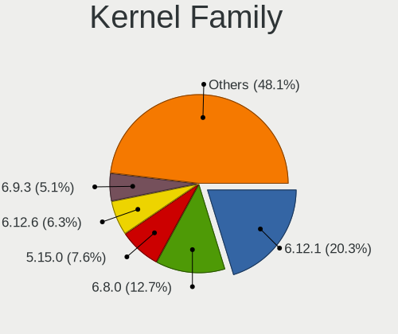
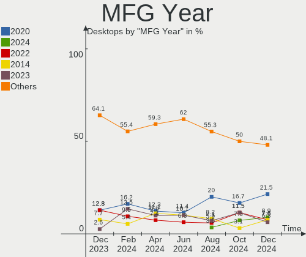
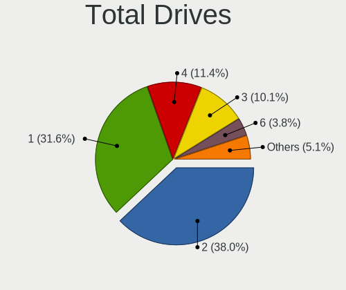
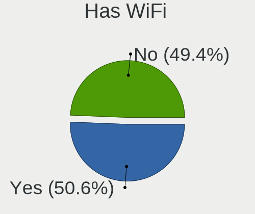
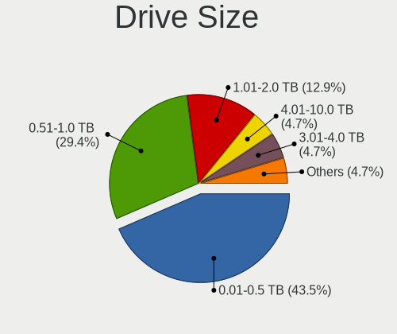
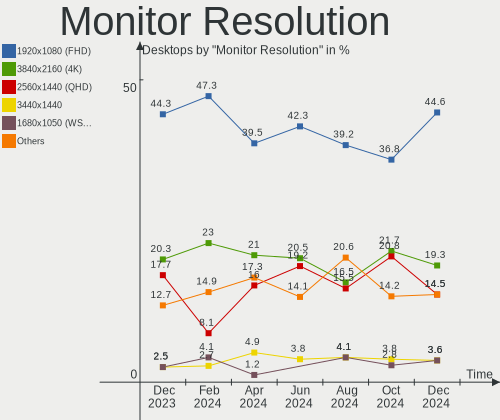

Linux in UK - Hardware Trends (Desktops)
----------------------------------------

A project to identify most popular hardware characteristics and track their change
over time based on data collected by Linux users at https://Linux-Hardware.org.

Anyone can contribute to this report by the [hw-probe](https://github.com/linuxhw/hw-probe) tool:

    sudo -E hw-probe -all -upload

Contents
--------

* [ System ](#system)
  - [ OS                       ](#os)
  - [ OS Family                ](#os-family)
  - [ Kernel                   ](#kernel)
  - [ Kernel Family            ](#kernel-family)
  - [ Kernel Major Ver.        ](#kernel-major-ver)
  - [ Arch                     ](#arch)
  - [ DE                       ](#de)
  - [ Display Server           ](#display-server)
  - [ Display Manager          ](#display-manager)
  - [ OS Lang                  ](#os-lang)
  - [ Boot Mode                ](#boot-mode)
  - [ Filesystem               ](#filesystem)
  - [ Part. scheme             ](#part-scheme)
  - [ Dual Boot with Linux/BSD ](#dual-boot-with-linuxbsd)
  - [ Dual Boot (Win)          ](#dual-boot-win)

* [ Board ](#board)
  - [ Vendor                   ](#vendor)
  - [ Model                    ](#model)
  - [ Model Family             ](#model-family)
  - [ MFG Year                 ](#mfg-year)
  - [ Form Factor              ](#form-factor)
  - [ Secure Boot              ](#secure-boot)
  - [ Coreboot                 ](#coreboot)
  - [ RAM Size                 ](#ram-size)
  - [ RAM Used                 ](#ram-used)
  - [ Total Drives             ](#total-drives)
  - [ Has CD-ROM               ](#has-cd-rom)
  - [ Has Ethernet             ](#has-ethernet)
  - [ Has WiFi                 ](#has-wifi)
  - [ Has Bluetooth            ](#has-bluetooth)

* [ Location ](#location)
  - [ Country                  ](#country)
  - [ City                     ](#city)

* [ Drives ](#drives)
  - [ Drive Vendor             ](#drive-vendor)
  - [ Drive Model              ](#drive-model)
  - [ HDD Vendor               ](#hdd-vendor)
  - [ SSD Vendor               ](#ssd-vendor)
  - [ Drive Kind               ](#drive-kind)
  - [ Drive Connector          ](#drive-connector)
  - [ Drive Size               ](#drive-size)
  - [ Space Total              ](#space-total)
  - [ Space Used               ](#space-used)
  - [ Malfunc. Drives          ](#malfunc-drives)
  - [ Malfunc. Drive Vendor    ](#malfunc-drive-vendor)
  - [ Malfunc. HDD Vendor      ](#malfunc-hdd-vendor)
  - [ Malfunc. Drive Kind      ](#malfunc-drive-kind)
  - [ Failed Drives            ](#failed-drives)
  - [ Failed Drive Vendor      ](#failed-drive-vendor)
  - [ Drive Status             ](#drive-status)

* [ Storage controller ](#storage-controller)
  - [ Storage Vendor           ](#storage-vendor)
  - [ Storage Model            ](#storage-model)
  - [ Storage Kind             ](#storage-kind)

* [ Processor ](#processor)
  - [ CPU Vendor               ](#cpu-vendor)
  - [ CPU Model                ](#cpu-model)
  - [ CPU Model Family         ](#cpu-model-family)
  - [ CPU Cores                ](#cpu-cores)
  - [ CPU Sockets              ](#cpu-sockets)
  - [ CPU Threads              ](#cpu-threads)
  - [ CPU Op-Modes             ](#cpu-op-modes)
  - [ CPU Microcode            ](#cpu-microcode)
  - [ CPU Microarch            ](#cpu-microarch)

* [ Graphics ](#graphics)
  - [ GPU Vendor               ](#gpu-vendor)
  - [ GPU Model                ](#gpu-model)
  - [ GPU Combo                ](#gpu-combo)
  - [ GPU Driver               ](#gpu-driver)
  - [ GPU Memory               ](#gpu-memory)

* [ Monitor ](#monitor)
  - [ Monitor Vendor           ](#monitor-vendor)
  - [ Monitor Model            ](#monitor-model)
  - [ Monitor Resolution       ](#monitor-resolution)
  - [ Monitor Diagonal         ](#monitor-diagonal)
  - [ Monitor Width            ](#monitor-width)
  - [ Aspect Ratio             ](#aspect-ratio)
  - [ Monitor Area             ](#monitor-area)
  - [ Pixel Density            ](#pixel-density)
  - [ Multiple Monitors        ](#multiple-monitors)

* [ Network ](#network)
  - [ Net Controller Vendor    ](#net-controller-vendor)
  - [ Net Controller Model     ](#net-controller-model)
  - [ Wireless Vendor          ](#wireless-vendor)
  - [ Wireless Model           ](#wireless-model)
  - [ Ethernet Vendor          ](#ethernet-vendor)
  - [ Ethernet Model           ](#ethernet-model)
  - [ Net Controller Kind      ](#net-controller-kind)
  - [ Used Controller          ](#used-controller)
  - [ NICs                     ](#nics)
  - [ IPv6                     ](#ipv6)

* [ Bluetooth ](#bluetooth)
  - [ Bluetooth Vendor         ](#bluetooth-vendor)
  - [ Bluetooth Model          ](#bluetooth-model)

* [ Sound ](#sound)
  - [ Sound Vendor             ](#sound-vendor)
  - [ Sound Model              ](#sound-model)

* [ Memory ](#memory)
  - [ Memory Vendor            ](#memory-vendor)
  - [ Memory Model             ](#memory-model)
  - [ Memory Kind              ](#memory-kind)
  - [ Memory Form Factor       ](#memory-form-factor)
  - [ Memory Size              ](#memory-size)
  - [ Memory Speed             ](#memory-speed)

* [ Printers & scanners ](#printers--scanners)
  - [ Printer Vendor           ](#printer-vendor)
  - [ Printer Model            ](#printer-model)
  - [ Scanner Vendor           ](#scanner-vendor)
  - [ Scanner Model            ](#scanner-model)

* [ Camera ](#camera)
  - [ Camera Vendor            ](#camera-vendor)
  - [ Camera Model             ](#camera-model)

* [ Security ](#security)
  - [ Fingerprint Vendor       ](#fingerprint-vendor)
  - [ Fingerprint Model        ](#fingerprint-model)
  - [ Chipcard Vendor          ](#chipcard-vendor)
  - [ Chipcard Model           ](#chipcard-model)

* [ Unsupported ](#unsupported)
  - [ Unsupported Devices      ](#unsupported-devices)
  - [ Unsupported Device Types ](#unsupported-device-types)

System
------

OS
--

Installed operating systems

| Name                         | Desktops | Percent |
|------------------------------|----------|---------|
| Linux Mint 20.3              | 13       | 13.83%  |
| Ubuntu 20.04                 | 10       | 10.64%  |
| Ubuntu 22.04                 | 9        | 9.57%   |
| Debian 11                    | 8        | 8.51%   |
| Ubuntu 21.10                 | 7        | 7.45%   |
| KDE neon 20.04               | 7        | 7.45%   |
| Zorin 16                     | 5        | 5.32%   |
| Arch Rolling                 | 5        | 5.32%   |
| Elementary 6.1               | 3        | 3.19%   |
| ArcoLinux Rolling            | 3        | 3.19%   |
| Ubuntu 18.04                 | 2        | 2.13%   |
| Pop!_OS 21.10                | 2        | 2.13%   |
| Kali 2022.1                  | 2        | 2.13%   |
| Zorin 15                     | 1        | 1.06%   |
| Ubuntu MATE 20.04            | 1        | 1.06%   |
| Slackware 15.0               | 1        | 1.06%   |
| Regata OS 21                 | 1        | 1.06%   |
| openSUSE Tumbleweed-20220324 | 1        | 1.06%   |
| openSUSE 20220411            | 1        | 1.06%   |
| OpenMandriva 4.2             | 1        | 1.06%   |
| Manjaro                      | 1        | 1.06%   |
| LMDE 4                       | 1        | 1.06%   |
| Kubuntu 20.04                | 1        | 1.06%   |
| Gentoo 2.7                   | 1        | 1.06%   |
| Gentoo 2.6                   | 1        | 1.06%   |
| Fedora 36                    | 1        | 1.06%   |
| Fedora 35                    | 1        | 1.06%   |
| Clear Linux 36250            | 1        | 1.06%   |
| Clear Linux 36120            | 1        | 1.06%   |
| Clear Linux 36010            | 1        | 1.06%   |
| Arch                         | 1        | 1.06%   |

OS Family
---------

OS without a version

| Name         | Desktops | Percent |
|--------------|----------|---------|
| Ubuntu       | 28       | 29.79%  |
| Linux Mint   | 13       | 13.83%  |
| Debian       | 8        | 8.51%   |
| KDE neon     | 7        | 7.45%   |
| Zorin        | 6        | 6.38%   |
| Arch         | 6        | 6.38%   |
| Elementary   | 3        | 3.19%   |
| Clear Linux  | 3        | 3.19%   |
| ArcoLinux    | 3        | 3.19%   |
| Pop!_OS      | 2        | 2.13%   |
| openSUSE     | 2        | 2.13%   |
| Kali         | 2        | 2.13%   |
| Gentoo       | 2        | 2.13%   |
| Fedora       | 2        | 2.13%   |
| Ubuntu MATE  | 1        | 1.06%   |
| Slackware    | 1        | 1.06%   |
| Regata OS    | 1        | 1.06%   |
| OpenMandriva | 1        | 1.06%   |
| Manjaro      | 1        | 1.06%   |
| LMDE         | 1        | 1.06%   |
| Kubuntu      | 1        | 1.06%   |

Kernel
------

Version of the Linux kernel

| Version                       | Desktops | Percent |
|-------------------------------|----------|---------|
| 5.13.0-39-generic             | 18       | 19.15%  |
| 5.4.0-107-generic             | 9        | 9.57%   |
| 5.13.0-40-generic             | 7        | 7.45%   |
| 5.15.0-27-generic             | 5        | 5.32%   |
| 5.10.0-13-amd64               | 5        | 5.32%   |
| 5.13.0-37-generic             | 4        | 4.26%   |
| 5.4.0-109-generic             | 3        | 3.19%   |
| 5.17.1-zen1-1-zen             | 3        | 3.19%   |
| 5.17.1-arch1-1                | 2        | 2.13%   |
| 5.16.13-1132.native           | 2        | 2.13%   |
| 5.16.0-kali6-amd64            | 2        | 2.13%   |
| 5.15.32-gentoo-r1             | 2        | 2.13%   |
| 5.15.0-25-generic             | 2        | 2.13%   |
| 5.14.0-1032-oem               | 2        | 2.13%   |
| 5.8.0-44-generic              | 1        | 1.06%   |
| 5.4.0-72-generic              | 1        | 1.06%   |
| 5.4.0-45-generic              | 1        | 1.06%   |
| 5.4.0-108-generic             | 1        | 1.06%   |
| 5.17.4-lp153.7-default        | 1        | 1.06%   |
| 5.17.2                        | 1        | 1.06%   |
| 5.17.1-300.fc36.x86_64        | 1        | 1.06%   |
| 5.17.1-1-default              | 1        | 1.06%   |
| 5.17.0-ext73-97.0-sandybridge | 1        | 1.06%   |
| 5.17.0-051700-generic         | 1        | 1.06%   |
| 5.16.19-200.fc35.x86_64       | 1        | 1.06%   |
| 5.16.18-1137.native           | 1        | 1.06%   |
| 5.16.16-arch1-1               | 1        | 1.06%   |
| 5.16.15-76051615-generic      | 1        | 1.06%   |
| 5.16.15-1-default             | 1        | 1.06%   |
| 5.16.14-arch1-1               | 1        | 1.06%   |
| 5.16.0-0.bpo.4-amd64          | 1        | 1.06%   |
| 5.15.33-1-lts                 | 1        | 1.06%   |
| 5.15.32-1-MANJARO             | 1        | 1.06%   |
| 5.15.31-xanmod1-tt            | 1        | 1.06%   |
| 5.15.0-23-generic             | 1        | 1.06%   |
| 5.14.0-4mx-amd64              | 1        | 1.06%   |
| 5.13.19-6-pve                 | 1        | 1.06%   |
| 5.13.0-35-generic             | 1        | 1.06%   |
| 5.13.0-19-generic             | 1        | 1.06%   |
| 5.10.14-desktop-1omv4002      | 1        | 1.06%   |
| 5.10.111-xanmod1-1-lts        | 1        | 1.06%   |
| 4.19.0-13-amd64               | 1        | 1.06%   |

Kernel Family
-------------

Linux kernel without a distro release

| Version  | Desktops | Percent |
|----------|----------|---------|
| 5.13.0   | 31       | 32.98%  |
| 5.4.0    | 15       | 15.96%  |
| 5.15.0   | 8        | 8.51%   |
| 5.17.1   | 7        | 7.45%   |
| 5.10.0   | 5        | 5.32%   |
| 5.16.0   | 3        | 3.19%   |
| 5.15.32  | 3        | 3.19%   |
| 5.14.0   | 3        | 3.19%   |
| 5.17.0   | 2        | 2.13%   |
| 5.16.15  | 2        | 2.13%   |
| 5.16.13  | 2        | 2.13%   |
| 5.8.0    | 1        | 1.06%   |
| 5.17.4   | 1        | 1.06%   |
| 5.17.2   | 1        | 1.06%   |
| 5.16.19  | 1        | 1.06%   |
| 5.16.18  | 1        | 1.06%   |
| 5.16.16  | 1        | 1.06%   |
| 5.16.14  | 1        | 1.06%   |
| 5.15.33  | 1        | 1.06%   |
| 5.15.31  | 1        | 1.06%   |
| 5.13.19  | 1        | 1.06%   |
| 5.10.14  | 1        | 1.06%   |
| 5.10.111 | 1        | 1.06%   |
| 4.19.0   | 1        | 1.06%   |

Kernel Major Ver.
-----------------

Linux kernel major version

| Version | Desktops | Percent |
|---------|----------|---------|
| 5.13    | 32       | 34.04%  |
| 5.4     | 15       | 15.96%  |
| 5.15    | 13       | 13.83%  |
| 5.17    | 11       | 11.7%   |
| 5.16    | 11       | 11.7%   |
| 5.10    | 7        | 7.45%   |
| 5.14    | 3        | 3.19%   |
| 5.8     | 1        | 1.06%   |
| 4.19    | 1        | 1.06%   |

Arch
----

OS architecture (x86_64, i586, etc.)

| Name   | Desktops | Percent |
|--------|----------|---------|
| x86_64 | 93       | 98.94%  |
| i686   | 1        | 1.06%   |

DE
--

Desktop Environment

| Name       | Desktops | Percent |
|------------|----------|---------|
| GNOME      | 41       | 43.62%  |
| KDE5       | 18       | 19.15%  |
| X-Cinnamon | 13       | 13.83%  |
| XFCE       | 6        | 6.38%   |
| Unknown    | 6        | 6.38%   |
| Pantheon   | 3        | 3.19%   |
| MATE       | 2        | 2.13%   |
| Cinnamon   | 2        | 2.13%   |
| Openbox    | 1        | 1.06%   |
| i3         | 1        | 1.06%   |
| awesome    | 1        | 1.06%   |

Display Server
--------------

X11 or Wayland

| Name    | Desktops | Percent |
|---------|----------|---------|
| X11     | 67       | 71.28%  |
| Tty     | 14       | 14.89%  |
| Wayland | 13       | 13.83%  |

Display Manager
---------------

SDDM, LightDM, etc.

| Name    | Desktops | Percent |
|---------|----------|---------|
| Unknown | 40       | 42.55%  |
| GDM3    | 18       | 19.15%  |
| SDDM    | 12       | 12.77%  |
| LightDM | 12       | 12.77%  |
| GDM     | 11       | 11.7%   |
| LXDM    | 1        | 1.06%   |

OS Lang
-------

Language

| Lang    | Desktops | Percent |
|---------|----------|---------|
| en_GB   | 78       | 82.98%  |
| en_US   | 10       | 10.64%  |
| POSIX   | 1        | 1.06%   |
| pl_PL   | 1        | 1.06%   |
| en_ZA   | 1        | 1.06%   |
| de_DE   | 1        | 1.06%   |
| C       | 1        | 1.06%   |
| Unknown | 1        | 1.06%   |

Boot Mode
---------

EFI or BIOS

| Mode | Desktops | Percent |
|------|----------|---------|
| BIOS | 49       | 52.13%  |
| EFI  | 45       | 47.87%  |

Filesystem
----------

Type of filesystem

| Type    | Desktops | Percent |
|---------|----------|---------|
| Ext4    | 83       | 88.3%   |
| Btrfs   | 9        | 9.57%   |
| Zfs     | 1        | 1.06%   |
| Overlay | 1        | 1.06%   |

Part. scheme
------------

Scheme of partitioning

| Type    | Desktops | Percent |
|---------|----------|---------|
| Unknown | 52       | 55.32%  |
| GPT     | 37       | 39.36%  |
| MBR     | 5        | 5.32%   |

Dual Boot with Linux/BSD
------------------------

Hosting more than one Linux/BSD

| Dual boot | Desktops | Percent |
|-----------|----------|---------|
| No        | 77       | 81.91%  |
| Yes       | 17       | 18.09%  |

Dual Boot (Win)
---------------

Hosting Linux and Windows

| Dual boot | Desktops | Percent |
|-----------|----------|---------|
| No        | 65       | 69.15%  |
| Yes       | 29       | 30.85%  |

Board
-----

Vendor
------

Motherboard manufacturer

| Name                | Desktops | Percent |
|---------------------|----------|---------|
| ASUSTek Computer    | 34       | 36.17%  |
| Dell                | 13       | 13.83%  |
| Gigabyte Technology | 12       | 12.77%  |
| MSI                 | 10       | 10.64%  |
| ASRock              | 4        | 4.26%   |
| Pegatron            | 3        | 3.19%   |
| Intel               | 3        | 3.19%   |
| Hewlett-Packard     | 3        | 3.19%   |
| Acer                | 3        | 3.19%   |
| Lenovo              | 2        | 2.13%   |
| AZW                 | 2        | 2.13%   |
| Unknown             | 2        | 2.13%   |
| Fujitsu             | 1        | 1.06%   |
| Biostar             | 1        | 1.06%   |
| Apple               | 1        | 1.06%   |

Model
-----

Motherboard model

| Name                               | Desktops | Percent |
|------------------------------------|----------|---------|
| MSI MS-7C02                        | 3        | 3.19%   |
| Dell OptiPlex 7010                 | 3        | 3.19%   |
| ASUS All Series                    | 3        | 3.19%   |
| MSI MS-7C37                        | 2        | 2.13%   |
| Gigabyte X570 GAMING X             | 2        | 2.13%   |
| Dell OptiPlex 780                  | 2        | 2.13%   |
| AZW U59                            | 2        | 2.13%   |
| ASUS TUF Gaming X570-PLUS          | 2        | 2.13%   |
| ASUS P9X79                         | 2        | 2.13%   |
| Unknown                            | 2        | 2.13%   |
| Pegatron G5200uk-m                 | 1        | 1.06%   |
| Pegatron Elite 7500 Series MT      | 1        | 1.06%   |
| Pegatron Compaq 505B Microtower PC | 1        | 1.06%   |
| MSI MS-7D07                        | 1        | 1.06%   |
| MSI MS-7C91                        | 1        | 1.06%   |
| MSI MS-7B79                        | 1        | 1.06%   |
| MSI MS-7B48                        | 1        | 1.06%   |
| MSI MS-7693                        | 1        | 1.06%   |
| Lenovo ThinkCentre M91p 7052A9G    | 1        | 1.06%   |
| Lenovo ThinkCentre M900 10FMCTO1WW | 1        | 1.06%   |
| Intel X99                          | 1        | 1.06%   |
| Intel DH67BL AAG10189-211          | 1        | 1.06%   |
| Intel D54250WYK H13922-303         | 1        | 1.06%   |
| HP xw6600 Workstation              | 1        | 1.06%   |
| HP OMEN by Desktop PC 880-p1xx     | 1        | 1.06%   |
| HP EliteDesk 705 G1 SFF            | 1        | 1.06%   |
| Gigabyte Z68AP-D3                  | 1        | 1.06%   |
| Gigabyte Z390 DESIGNARE            | 1        | 1.06%   |
| Gigabyte Z170N-Gaming 5            | 1        | 1.06%   |
| Gigabyte X570 AORUS MASTER         | 1        | 1.06%   |
| Gigabyte GA-78LMT-S2               | 1        | 1.06%   |
| Gigabyte B550M DS3H                | 1        | 1.06%   |
| Gigabyte B550 AORUS PRO V2         | 1        | 1.06%   |
| Gigabyte B550 AORUS ELITE V2       | 1        | 1.06%   |
| Gigabyte B460HD3                   | 1        | 1.06%   |
| Gigabyte 970A-DS3P                 | 1        | 1.06%   |
| Fujitsu PRIMERGY TX1310 M1         | 1        | 1.06%   |
| Dell Precision WorkStation T3500   | 1        | 1.06%   |
| Dell Precision T3600               | 1        | 1.06%   |
| Dell OptiPlex 7000                 | 1        | 1.06%   |
| Dell OptiPlex 5070                 | 1        | 1.06%   |
| Dell OptiPlex 3050                 | 1        | 1.06%   |
| Dell OptiPlex 3010                 | 1        | 1.06%   |
| Dell Inspiron 660                  | 1        | 1.06%   |
| Dell Inspiron 5675                 | 1        | 1.06%   |
| Biostar H55A+                      | 1        | 1.06%   |
| ASUS Z170 PRO GAMING               | 1        | 1.06%   |
| ASUS TUF Gaming B560-PLUS WIFI     | 1        | 1.06%   |
| ASUS TUF Gaming B550-PLUS          | 1        | 1.06%   |
| ASUS ROG STRIX Z590-F GAMING WIFI  | 1        | 1.06%   |
| ASUS ROG STRIX B550-E GAMING       | 1        | 1.06%   |
| ASUS ROG STRIX B450-F GAMING II    | 1        | 1.06%   |
| ASUS ROG STRIX B450-F GAMING       | 1        | 1.06%   |
| ASUS ROG Maximus XI HERO           | 1        | 1.06%   |
| ASUS ROG CROSSHAIR VIII HERO       | 1        | 1.06%   |
| ASUS ROG CROSSHAIR VII HERO        | 1        | 1.06%   |
| ASUS Pro WS WRX80E-SAGE SE WIFI    | 1        | 1.06%   |
| ASUS PRIME Z390-A                  | 1        | 1.06%   |
| ASUS PRIME X370-PRO                | 1        | 1.06%   |
| ASUS PRIME H510M-E                 | 1        | 1.06%   |

Model Family
------------

Motherboard model prefix

| Name                  | Desktops | Percent |
|-----------------------|----------|---------|
| Dell OptiPlex         | 9        | 9.57%   |
| ASUS ROG              | 7        | 7.45%   |
| ASUS PRIME            | 7        | 7.45%   |
| ASUS TUF              | 4        | 4.26%   |
| MSI MS-7C02           | 3        | 3.19%   |
| Gigabyte X570         | 3        | 3.19%   |
| ASUS All              | 3        | 3.19%   |
| Acer Aspire           | 3        | 3.19%   |
| MSI MS-7C37           | 2        | 2.13%   |
| Lenovo ThinkCentre    | 2        | 2.13%   |
| Gigabyte B550         | 2        | 2.13%   |
| Dell Precision        | 2        | 2.13%   |
| Dell Inspiron         | 2        | 2.13%   |
| AZW U59               | 2        | 2.13%   |
| ASUS P9X79            | 2        | 2.13%   |
| Unknown               | 2        | 2.13%   |
| Pegatron G5200uk-m    | 1        | 1.06%   |
| Pegatron Elite        | 1        | 1.06%   |
| Pegatron Compaq       | 1        | 1.06%   |
| MSI MS-7D07           | 1        | 1.06%   |
| MSI MS-7C91           | 1        | 1.06%   |
| MSI MS-7B79           | 1        | 1.06%   |
| MSI MS-7B48           | 1        | 1.06%   |
| MSI MS-7693           | 1        | 1.06%   |
| Intel X99             | 1        | 1.06%   |
| Intel DH67BL          | 1        | 1.06%   |
| Intel D54250WYK       | 1        | 1.06%   |
| HP xw6600             | 1        | 1.06%   |
| HP OMEN               | 1        | 1.06%   |
| HP EliteDesk          | 1        | 1.06%   |
| Gigabyte Z68AP-D3     | 1        | 1.06%   |
| Gigabyte Z390         | 1        | 1.06%   |
| Gigabyte Z170N-Gaming | 1        | 1.06%   |
| Gigabyte GA-78LMT-S2  | 1        | 1.06%   |
| Gigabyte B550M        | 1        | 1.06%   |
| Gigabyte B460HD3      | 1        | 1.06%   |
| Gigabyte 970A-DS3P    | 1        | 1.06%   |
| Fujitsu PRIMERGY      | 1        | 1.06%   |
| Biostar H55A+         | 1        | 1.06%   |
| ASUS Z170             | 1        | 1.06%   |
| ASUS Pro              | 1        | 1.06%   |
| ASUS P8Z77-V          | 1        | 1.06%   |
| ASUS P8H67-M          | 1        | 1.06%   |
| ASUS P6T              | 1        | 1.06%   |
| ASUS M5A78L           | 1        | 1.06%   |
| ASUS M4A78LT-M        | 1        | 1.06%   |
| ASUS Intel            | 1        | 1.06%   |
| ASUS H110M-A          | 1        | 1.06%   |
| ASUS F2A85-V          | 1        | 1.06%   |
| ASUS Amd              | 1        | 1.06%   |
| ASRock TRX40          | 1        | 1.06%   |
| ASRock P67            | 1        | 1.06%   |
| ASRock G41M-GS        | 1        | 1.06%   |
| ASRock B450M          | 1        | 1.06%   |
| Apple MacPro6         | 1        | 1.06%   |

MFG Year
--------

Motherboard manufacture year

| Year | Desktops | Percent |
|------|----------|---------|
| 2020 | 14       | 14.89%  |
| 2019 | 13       | 13.83%  |
| 2021 | 10       | 10.64%  |
| 2012 | 9        | 9.57%   |
| 2018 | 8        | 8.51%   |
| 2013 | 7        | 7.45%   |
| 2011 | 7        | 7.45%   |
| 2017 | 6        | 6.38%   |
| 2014 | 5        | 5.32%   |
| 2010 | 5        | 5.32%   |
| 2022 | 3        | 3.19%   |
| 2009 | 3        | 3.19%   |
| 2008 | 2        | 2.13%   |
| 2016 | 1        | 1.06%   |
| 2015 | 1        | 1.06%   |

Form Factor
-----------

Physical design of the computer

| Name    | Desktops | Percent |
|---------|----------|---------|
| Desktop | 94       | 100%    |

Secure Boot
-----------

Enabled or disabled

| State    | Desktops | Percent |
|----------|----------|---------|
| Disabled | 91       | 96.81%  |
| Enabled  | 3        | 3.19%   |

Coreboot
--------

Have coreboot on board

| Used | Desktops | Percent |
|------|----------|---------|
| No   | 94       | 100%    |

RAM Size
--------

Total RAM memory

| Size in GB      | Desktops | Percent |
|-----------------|----------|---------|
| 32.01-64.0      | 27       | 28.72%  |
| 16.01-24.0      | 26       | 27.66%  |
| 8.01-16.0       | 12       | 12.77%  |
| 4.01-8.0        | 10       | 10.64%  |
| 64.01-256.0     | 8        | 8.51%   |
| 3.01-4.0        | 5        | 5.32%   |
| 24.01-32.0      | 4        | 4.26%   |
| More than 256.0 | 1        | 1.06%   |
| 0.51-1.0        | 1        | 1.06%   |

RAM Used
--------

Used RAM memory

| Used GB    | Desktops | Percent |
|------------|----------|---------|
| 1.01-2.0   | 24       | 25.53%  |
| 4.01-8.0   | 20       | 21.28%  |
| 2.01-3.0   | 20       | 21.28%  |
| 3.01-4.0   | 14       | 14.89%  |
| 8.01-16.0  | 8        | 8.51%   |
| 24.01-32.0 | 3        | 3.19%   |
| 0.51-1.0   | 3        | 3.19%   |
| 32.01-64.0 | 1        | 1.06%   |
| 16.01-24.0 | 1        | 1.06%   |

Total Drives
------------

Number of drives on board

| Drives | Desktops | Percent |
|--------|----------|---------|
| 2      | 27       | 28.72%  |
| 1      | 27       | 28.72%  |
| 3      | 14       | 14.89%  |
| 4      | 13       | 13.83%  |
| 5      | 8        | 8.51%   |
| 6      | 3        | 3.19%   |
| 12     | 1        | 1.06%   |
| 8      | 1        | 1.06%   |

Has CD-ROM
----------

Has CD-ROM on board

| Presented | Desktops | Percent |
|-----------|----------|---------|
| No        | 55       | 58.51%  |
| Yes       | 39       | 41.49%  |

Has Ethernet
------------

Has Ethernet on board

| Presented | Desktops | Percent |
|-----------|----------|---------|
| Yes       | 94       | 100%    |

Has WiFi
--------

Has WiFi module

| Presented | Desktops | Percent |
|-----------|----------|---------|
| Yes       | 60       | 63.83%  |
| No        | 34       | 36.17%  |

Has Bluetooth
-------------

Has Bluetooth module

| Presented | Desktops | Percent |
|-----------|----------|---------|
| Yes       | 47       | 50%     |
| No        | 47       | 50%     |

Location
--------

Country
-------

Geographic location (country)

| Country | Desktops | Percent |
|---------|----------|---------|
| UK      | 94       | 100%    |

City
----

Geographic location (city)

| City                 | Desktops | Percent |
|----------------------|----------|---------|
| London               | 7        | 7.45%   |
| Edinburgh            | 4        | 4.26%   |
| Sheffield            | 3        | 3.19%   |
| Croydon              | 3        | 3.19%   |
| Bristol              | 3        | 3.19%   |
| Birmingham           | 3        | 3.19%   |
| Worcester Park       | 2        | 2.13%   |
| Portsmouth           | 2        | 2.13%   |
| Norwich              | 2        | 2.13%   |
| Manchester           | 2        | 2.13%   |
| Loughborough         | 2        | 2.13%   |
| Gloucester           | 2        | 2.13%   |
| Cambridge            | 2        | 2.13%   |
| York                 | 1        | 1.06%   |
| Worthing             | 1        | 1.06%   |
| Wolverhampton        | 1        | 1.06%   |
| Woking               | 1        | 1.06%   |
| Weston-super-Mare    | 1        | 1.06%   |
| Tullibody            | 1        | 1.06%   |
| Totteridge           | 1        | 1.06%   |
| Torquay              | 1        | 1.06%   |
| Tonypandy            | 1        | 1.06%   |
| Todmorden            | 1        | 1.06%   |
| Telford              | 1        | 1.06%   |
| Sutton Coldfield     | 1        | 1.06%   |
| Sunderland           | 1        | 1.06%   |
| Stirling             | 1        | 1.06%   |
| Sheerness            | 1        | 1.06%   |
| Seaford              | 1        | 1.06%   |
| Rhyl                 | 1        | 1.06%   |
| Redditch             | 1        | 1.06%   |
| Poplar               | 1        | 1.06%   |
| Pontypool            | 1        | 1.06%   |
| Petersfield          | 1        | 1.06%   |
| Perivale             | 1        | 1.06%   |
| Nottingham           | 1        | 1.06%   |
| North Shields        | 1        | 1.06%   |
| Newton Aycliffe      | 1        | 1.06%   |
| Newcastle upon Tyne  | 1        | 1.06%   |
| Nelson               | 1        | 1.06%   |
| Morden               | 1        | 1.06%   |
| Milton Keynes        | 1        | 1.06%   |
| Maidstone            | 1        | 1.06%   |
| Lochearnhead         | 1        | 1.06%   |
| Liverpool            | 1        | 1.06%   |
| Kingston upon Thames | 1        | 1.06%   |
| Islington            | 1        | 1.06%   |
| Helensburgh          | 1        | 1.06%   |
| Hawick               | 1        | 1.06%   |
| Hatfield             | 1        | 1.06%   |
| Gillingham           | 1        | 1.06%   |
| Gerrards Cross       | 1        | 1.06%   |
| Dunfermline          | 1        | 1.06%   |
| Derby                | 1        | 1.06%   |
| Deptford             | 1        | 1.06%   |
| Clapham              | 1        | 1.06%   |
| City of Westminster  | 1        | 1.06%   |
| Chiswick             | 1        | 1.06%   |
| Buckley              | 1        | 1.06%   |
| Bridgend             | 1        | 1.06%   |

Drives
------

Drive Vendor
------------

Hard drive vendors

| Vendor                    | Desktops | Drives | Percent |
|---------------------------|----------|--------|---------|
| Samsung Electronics       | 39       | 55     | 19.7%   |
| Seagate                   | 38       | 51     | 19.19%  |
| WDC                       | 28       | 33     | 14.14%  |
| Toshiba                   | 14       | 23     | 7.07%   |
| Crucial                   | 14       | 19     | 7.07%   |
| SanDisk                   | 11       | 15     | 5.56%   |
| Phison                    | 6        | 6      | 3.03%   |
| Hitachi                   | 6        | 6      | 3.03%   |
| Kingston                  | 5        | 5      | 2.53%   |
| Intel                     | 5        | 5      | 2.53%   |
| A-DATA Technology         | 3        | 3      | 1.52%   |
| Unknown                   | 2        | 2      | 1.01%   |
| SABRENT                   | 2        | 2      | 1.01%   |
| PNY                       | 2        | 2      | 1.01%   |
| NGFF                      | 2        | 2      | 1.01%   |
| Micron/Crucial Technology | 2        | 6      | 1.01%   |
| MAXTOR                    | 2        | 2      | 1.01%   |
| China                     | 2        | 2      | 1.01%   |
| Team                      | 1        | 1      | 0.51%   |
| SK Hynix                  | 1        | 1      | 0.51%   |
| Realtek                   | 1        | 1      | 0.51%   |
| OCZ                       | 1        | 1      | 0.51%   |
| Micron Technology         | 1        | 1      | 0.51%   |
| MATSHITA                  | 1        | 1      | 0.51%   |
| Inateck                   | 1        | 1      | 0.51%   |
| Hoodisk                   | 1        | 1      | 0.51%   |
| HGST                      | 1        | 1      | 0.51%   |
| FC-1307                   | 1        | 1      | 0.51%   |
| ExcelStor                 | 1        | 1      | 0.51%   |
| EMTEC                     | 1        | 1      | 0.51%   |
| Corsair                   | 1        | 1      | 0.51%   |
| ASMedia                   | 1        | 1      | 0.51%   |
| Apple                     | 1        | 1      | 0.51%   |

Drive Model
-----------

Hard drive models

| Model                            | Desktops | Percent |
|----------------------------------|----------|---------|
| Samsung SSD 850 EVO 250GB        | 6        | 2.55%   |
| Samsung NVMe SSD Drive 1TB       | 6        | 2.55%   |
| Samsung SSD 970 EVO Plus 1TB     | 5        | 2.13%   |
| Crucial CT500MX500SSD1 500GB     | 4        | 1.7%    |
| Seagate ST3500312CS 500GB        | 3        | 1.28%   |
| Seagate ST1000DM003-1CH162 1TB   | 3        | 1.28%   |
| Samsung NVMe SSD Drive 500GB     | 3        | 1.28%   |
| Phison Sabrent 256GB             | 3        | 1.28%   |
| WDC WDS100T2B0C 1TB              | 2        | 0.85%   |
| WDC WD10EZEX-00WN4A0 1TB         | 2        | 0.85%   |
| WDC WD1001FALS-00E8B0 1TB        | 2        | 0.85%   |
| Seagate ST500DM002-1BD142 500GB  | 2        | 0.85%   |
| Seagate ST4000DM004-2CV104 4TB   | 2        | 0.85%   |
| Seagate ST2000DM008-2FR102 2TB   | 2        | 0.85%   |
| Seagate ST2000DM001-1ER164 2TB   | 2        | 0.85%   |
| Seagate ST2000DM001-1CH164 2TB   | 2        | 0.85%   |
| Seagate ST1000DM010-2EP102 1TB   | 2        | 0.85%   |
| Seagate Backup+ Hub BK 6TB       | 2        | 0.85%   |
| SanDisk SDSSDHP256G 256GB        | 2        | 0.85%   |
| Sandisk NVMe SSD Drive 1TB       | 2        | 0.85%   |
| Samsung SSD 980 PRO 1TB          | 2        | 0.85%   |
| Samsung SSD 980 1TB              | 2        | 0.85%   |
| Samsung SSD 970 EVO 1TB          | 2        | 0.85%   |
| Samsung SSD 960 EVO 250GB        | 2        | 0.85%   |
| Samsung SSD 860 EVO 500GB        | 2        | 0.85%   |
| Samsung SSD 860 EVO 1TB          | 2        | 0.85%   |
| Samsung SSD 850 EVO 500GB        | 2        | 0.85%   |
| SABRENT Disk 250GB               | 2        | 0.85%   |
| NGFF 2280 256GB SSD              | 2        | 0.85%   |
| Crucial CT525MX300SSD1 528GB     | 2        | 0.85%   |
| Crucial CT250BX100SSD1 250GB     | 2        | 0.85%   |
| WDC WDS500G3X0C-00SJG0 500GB     | 1        | 0.43%   |
| WDC WDS240G1G0A-00SS50 240GB SSD | 1        | 0.43%   |
| WDC WDS100T2G0A-00JH30 1TB SSD   | 1        | 0.43%   |
| WDC WDS100T2B0C-00PXH0 1TB       | 1        | 0.43%   |
| WDC WD6400AAKS-22A7B2 640GB      | 1        | 0.43%   |
| WDC WD60EZRZ-00GZ5B1 6TB         | 1        | 0.43%   |
| WDC WD6003FZBX-00K5WB0 6TB       | 1        | 0.43%   |
| WDC WD5000LPVX-22V0TT0 500GB     | 1        | 0.43%   |
| WDC WD5000AAKX-75U6AA0 500GB     | 1        | 0.43%   |
| WDC WD40EZRX-00SPEB0 4TB         | 1        | 0.43%   |
| WDC WD4003FZEX-00Z4SA0 4TB       | 1        | 0.43%   |
| WDC WD3200BPVT-75JJ5T0 320GB     | 1        | 0.43%   |
| WDC WD3200AVJS-63B6A0 320GB      | 1        | 0.43%   |
| WDC WD30EZRX-00DC0B0 3TB         | 1        | 0.43%   |
| WDC WD30EZRX-00D8PB0 3TB         | 1        | 0.43%   |
| WDC WD2500AAJS-60B4A0 250GB      | 1        | 0.43%   |
| WDC WD20EZRX-00D8PB0 2TB         | 1        | 0.43%   |
| WDC WD20EFRX-68EUZN0 2TB         | 1        | 0.43%   |
| WDC WD20EARS-00MVWB0 2TB         | 1        | 0.43%   |
| WDC WD1600AAJS-22PSA0 160GB      | 1        | 0.43%   |
| WDC WD140EDFZ-11A0VA0 14TB       | 1        | 0.43%   |
| WDC WD10EZEX-21WN4A0 1TB         | 1        | 0.43%   |
| WDC WD10EZEX-00UD2A0 1TB         | 1        | 0.43%   |
| WDC WD10EZEX-00BN5A0 1TB         | 1        | 0.43%   |
| WDC WD10EURX-63C57Y0 1TB         | 1        | 0.43%   |
| WDC WD10EARS-00Y5B1 1TB          | 1        | 0.43%   |
| Unknown SD/MMC/MS PRO 128GB      | 1        | 0.43%   |
| Unknown 256GB PCS 2.5" S         | 1        | 0.43%   |
| Toshiba TR200 240GB SSD          | 1        | 0.43%   |

HDD Vendor
----------

Hard disk drive vendors

| Vendor              | Desktops | Drives | Percent |
|---------------------|----------|--------|---------|
| Seagate             | 37       | 49     | 42.53%  |
| WDC                 | 24       | 27     | 27.59%  |
| Toshiba             | 10       | 18     | 11.49%  |
| Hitachi             | 6        | 6      | 6.9%    |
| Samsung Electronics | 3        | 3      | 3.45%   |
| SABRENT             | 2        | 2      | 2.3%    |
| MAXTOR              | 2        | 2      | 2.3%    |
| Unknown             | 1        | 1      | 1.15%   |
| HGST                | 1        | 1      | 1.15%   |
| ExcelStor           | 1        | 1      | 1.15%   |

SSD Vendor
----------

Solid state drive vendors

| Vendor              | Desktops | Drives | Percent |
|---------------------|----------|--------|---------|
| Samsung Electronics | 19       | 24     | 28.36%  |
| Crucial             | 12       | 17     | 17.91%  |
| SanDisk             | 8        | 10     | 11.94%  |
| Toshiba             | 4        | 4      | 5.97%   |
| Kingston            | 4        | 4      | 5.97%   |
| PNY                 | 2        | 2      | 2.99%   |
| NGFF                | 2        | 2      | 2.99%   |
| China               | 2        | 2      | 2.99%   |
| A-DATA Technology   | 2        | 2      | 2.99%   |
| WDC                 | 1        | 2      | 1.49%   |
| Unknown             | 1        | 1      | 1.49%   |
| Team                | 1        | 1      | 1.49%   |
| SK Hynix            | 1        | 1      | 1.49%   |
| OCZ                 | 1        | 1      | 1.49%   |
| Micron Technology   | 1        | 1      | 1.49%   |
| Intel               | 1        | 1      | 1.49%   |
| Inateck             | 1        | 1      | 1.49%   |
| Hoodisk             | 1        | 1      | 1.49%   |
| EMTEC               | 1        | 1      | 1.49%   |
| ASMedia             | 1        | 1      | 1.49%   |
| Apple               | 1        | 1      | 1.49%   |

Drive Kind
----------

HDD or SSD

| Kind    | Desktops | Drives | Percent |
|---------|----------|--------|---------|
| HDD     | 62       | 110    | 38.99%  |
| SSD     | 51       | 80     | 32.08%  |
| NVMe    | 43       | 61     | 27.04%  |
| Unknown | 3        | 3      | 1.89%   |

Drive Connector
---------------

SATA, SAS, NVMe, etc.

| Type | Desktops | Drives | Percent |
|------|----------|--------|---------|
| SATA | 81       | 177    | 60.45%  |
| NVMe | 42       | 60     | 31.34%  |
| SAS  | 11       | 17     | 8.21%   |

Drive Size
----------

Size of hard drive

| Size in TB | Desktops | Drives | Percent |
|------------|----------|--------|---------|
| 0.01-0.5   | 56       | 95     | 42.11%  |
| 0.51-1.0   | 37       | 40     | 27.82%  |
| 1.01-2.0   | 15       | 15     | 11.28%  |
| 3.01-4.0   | 9        | 16     | 6.77%   |
| 4.01-10.0  | 9        | 12     | 6.77%   |
| 2.01-3.0   | 6        | 10     | 4.51%   |
| 10.01-20.0 | 1        | 2      | 0.75%   |

Space Total
-----------

Amount of disk space available on the file system

| Size in GB     | Desktops | Percent |
|----------------|----------|---------|
| 101-250        | 22       | 23.4%   |
| 251-500        | 18       | 19.15%  |
| 501-1000       | 16       | 17.02%  |
| More than 3000 | 15       | 15.96%  |
| 2001-3000      | 8        | 8.51%   |
| 1001-2000      | 6        | 6.38%   |
| Unknown        | 5        | 5.32%   |
| 51-100         | 2        | 2.13%   |
| 21-50          | 1        | 1.06%   |
| 1-20           | 1        | 1.06%   |

Space Used
----------

Amount of used disk space

| Used GB        | Desktops | Percent |
|----------------|----------|---------|
| 1-20           | 19       | 20.21%  |
| 21-50          | 17       | 18.09%  |
| 101-250        | 14       | 14.89%  |
| More than 3000 | 9        | 9.57%   |
| 1001-2000      | 9        | 9.57%   |
| 501-1000       | 9        | 9.57%   |
| 251-500        | 5        | 5.32%   |
| Unknown        | 5        | 5.32%   |
| 51-100         | 4        | 4.26%   |
| 2001-3000      | 3        | 3.19%   |

Malfunc. Drives
---------------

Drive models with a malfunction

| Model                                 | Desktops | Drives | Percent |
|---------------------------------------|----------|--------|---------|
| WDC WD60EZRZ-00GZ5B1 6TB              | 1        | 1      | 11.11%  |
| WDC WD40EZRX-00SPEB0 4TB              | 1        | 1      | 11.11%  |
| WDC WD10EARS-00Y5B1 1TB               | 1        | 1      | 11.11%  |
| Toshiba HDWQ140 4TB                   | 1        | 4      | 11.11%  |
| Toshiba DT01ACA050 500GB              | 1        | 1      | 11.11%  |
| Seagate ST8000AS0002-1NA17Z 8TB       | 1        | 2      | 11.11%  |
| Seagate ST3500418AS 500GB             | 1        | 1      | 11.11%  |
| SanDisk SDSSDHP256G 256GB             | 1        | 1      | 11.11%  |
| Samsung Electronics SSD 960 EVO 250GB | 1        | 1      | 11.11%  |

Malfunc. Drive Vendor
---------------------

Vendors of faulty drives

| Vendor              | Desktops | Drives | Percent |
|---------------------|----------|--------|---------|
| WDC                 | 3        | 3      | 33.33%  |
| Toshiba             | 2        | 5      | 22.22%  |
| Seagate             | 2        | 3      | 22.22%  |
| SanDisk             | 1        | 1      | 11.11%  |
| Samsung Electronics | 1        | 1      | 11.11%  |

Malfunc. HDD Vendor
-------------------

Vendors of faulty HDD drives

| Vendor  | Desktops | Drives | Percent |
|---------|----------|--------|---------|
| WDC     | 3        | 3      | 42.86%  |
| Toshiba | 2        | 5      | 28.57%  |
| Seagate | 2        | 3      | 28.57%  |

Malfunc. Drive Kind
-------------------

Kinds of faulty drives

| Kind | Desktops | Drives | Percent |
|------|----------|--------|---------|
| HDD  | 6        | 11     | 75%     |
| NVMe | 1        | 1      | 12.5%   |
| SSD  | 1        | 1      | 12.5%   |

Failed Drives
-------------

Failed drive models

Zero info for selected period =(

Failed Drive Vendor
-------------------

Failed drive vendors

Zero info for selected period =(

Drive Status
------------

Number of failed and malfunc. drives

| Status   | Desktops | Drives | Percent |
|----------|----------|--------|---------|
| Detected | 59       | 137    | 54.13%  |
| Works    | 43       | 104    | 39.45%  |
| Malfunc  | 7        | 13     | 6.42%   |

Storage controller
------------------

Storage Vendor
--------------

Storage controller vendors

| Vendor                       | Desktops | Percent |
|------------------------------|----------|---------|
| Intel                        | 57       | 38%     |
| AMD                          | 36       | 24%     |
| Samsung Electronics          | 24       | 16%     |
| Sandisk                      | 8        | 5.33%   |
| Phison Electronics           | 7        | 4.67%   |
| ASMedia Technology           | 6        | 4%      |
| Micron/Crucial Technology    | 4        | 2.67%   |
| Nvidia                       | 2        | 1.33%   |
| JMicron Technology           | 2        | 1.33%   |
| Toshiba America Info Systems | 1        | 0.67%   |
| Seagate Technology           | 1        | 0.67%   |
| Kingston Technology Company  | 1        | 0.67%   |
| ADATA Technology             | 1        | 0.67%   |

Storage Model
-------------

Storage controller models

| Model                                                                                   | Desktops | Percent |
|-----------------------------------------------------------------------------------------|----------|---------|
| AMD FCH SATA Controller [AHCI mode]                                                     | 21       | 11.48%  |
| Samsung NVMe SSD Controller SM981/PM981/PM983                                           | 14       | 7.65%   |
| AMD 500 Series Chipset SATA Controller                                                  | 7        | 3.83%   |
| AMD 400 Series Chipset SATA Controller                                                  | 7        | 3.83%   |
| Intel 7 Series/C210 Series Chipset Family 6-port SATA Controller [AHCI mode]            | 6        | 3.28%   |
| Phison E12 NVMe Controller                                                              | 5        | 2.73%   |
| Intel Cannon Lake PCH SATA AHCI Controller                                              | 5        | 2.73%   |
| ASMedia ASM1062 Serial ATA Controller                                                   | 5        | 2.73%   |
| Sandisk WD Blue SN550 NVMe SSD                                                          | 4        | 2.19%   |
| Samsung NVMe SSD Controller PM9A1/PM9A3/980PRO                                          | 4        | 2.19%   |
| Samsung NVMe SSD Controller 980                                                         | 4        | 2.19%   |
| Intel SATA Controller [RAID mode]                                                       | 4        | 2.19%   |
| Intel Q170/Q150/B150/H170/H110/Z170/CM236 Chipset SATA Controller [AHCI Mode]           | 4        | 2.19%   |
| Intel 6 Series/C200 Series Chipset Family Desktop SATA Controller (IDE mode, ports 4-5) | 4        | 2.19%   |
| Intel 6 Series/C200 Series Chipset Family Desktop SATA Controller (IDE mode, ports 0-3) | 4        | 2.19%   |
| Intel 500 Series Chipset Family SATA AHCI Controller                                    | 4        | 2.19%   |
| Intel 200 Series PCH SATA controller [AHCI mode]                                        | 4        | 2.19%   |
| AMD SB7x0/SB8x0/SB9x0 IDE Controller                                                    | 4        | 2.19%   |
| Intel C600/X79 series chipset 6-Port SATA AHCI Controller                               | 3        | 1.64%   |
| Intel 6 Series/C200 Series Chipset Family 6 port Desktop SATA AHCI Controller           | 3        | 1.64%   |
| AMD SB7x0/SB8x0/SB9x0 SATA Controller [IDE mode]                                        | 3        | 1.64%   |
| Samsung NVMe SSD Controller SM961/PM961/SM963                                           | 2        | 1.09%   |
| Phison E16 PCIe4 NVMe Controller                                                        | 2        | 1.09%   |
| Nvidia MCP61 SATA Controller                                                            | 2        | 1.09%   |
| Micron/Crucial P2 NVMe PCIe SSD                                                         | 2        | 1.09%   |
| Micron/Crucial Non-Volatile memory controller                                           | 2        | 1.09%   |
| Intel SSD Pro 7600p/760p/E 6100p Series                                                 | 2        | 1.09%   |
| Intel Jasper Lake SATA AHCI Controller                                                  | 2        | 1.09%   |
| Intel Alder Lake-S PCH SATA Controller [AHCI Mode]                                      | 2        | 1.09%   |
| Intel 9 Series Chipset Family SATA Controller [AHCI Mode]                               | 2        | 1.09%   |
| Intel 8 Series/C220 Series Chipset Family 6-port SATA Controller 1 [AHCI mode]          | 2        | 1.09%   |
| AMD X370 Series Chipset SATA Controller                                                 | 2        | 1.09%   |
| AMD SB7x0/SB8x0/SB9x0 SATA Controller [AHCI mode]                                       | 2        | 1.09%   |
| Toshiba America Info Systems XG4 NVMe SSD Controller                                    | 1        | 0.55%   |
| Seagate FireCuda 510 SSD                                                                | 1        | 0.55%   |
| Sandisk WD PC SN810 / Black SN850 NVMe SSD                                              | 1        | 0.55%   |
| Sandisk WD Blue SN570 NVMe SSD                                                          | 1        | 0.55%   |
| Sandisk WD Blue SN500 / PC SN520 NVMe SSD                                               | 1        | 0.55%   |
| Sandisk WD Black SN750 / PC SN730 NVMe SSD                                              | 1        | 0.55%   |
| Sandisk WD Black 2018/SN750 / PC SN720 NVMe SSD                                         | 1        | 0.55%   |
| Samsung Apple PCIe SSD                                                                  | 1        | 0.55%   |
| Kingston Company A2000 NVMe SSD                                                         | 1        | 0.55%   |
| JMicron JMB368 IDE controller                                                           | 1        | 0.55%   |
| JMicron JMB363 SATA/IDE Controller                                                      | 1        | 0.55%   |
| Intel Volume Management Device NVMe RAID Controller                                     | 1        | 0.55%   |
| Intel SSD 660P Series                                                                   | 1        | 0.55%   |
| Intel Non-Volatile memory controller                                                    | 1        | 0.55%   |
| Intel NM10/ICH7 Family SATA Controller [IDE mode]                                       | 1        | 0.55%   |
| Intel Celeron/Pentium Silver Processor SATA Controller                                  | 1        | 0.55%   |
| Intel Cannon Point-LP SATA Controller [AHCI Mode]                                       | 1        | 0.55%   |
| Intel C610/X99 series chipset sSATA Controller [AHCI mode]                              | 1        | 0.55%   |
| Intel C610/X99 series chipset 6-Port SATA Controller [AHCI mode]                        | 1        | 0.55%   |
| Intel C602 chipset 4-Port SATA Storage Control Unit                                     | 1        | 0.55%   |
| Intel 82801JI (ICH10 Family) 4 port SATA IDE Controller #1                              | 1        | 0.55%   |
| Intel 82801JI (ICH10 Family) 2 port SATA IDE Controller #2                              | 1        | 0.55%   |
| Intel 82801G (ICH7 Family) IDE Controller                                               | 1        | 0.55%   |
| Intel 8 Series SATA Controller 1 [AHCI mode]                                            | 1        | 0.55%   |
| Intel 7 Series/C210 Series Chipset Family IDE-r Controller                              | 1        | 0.55%   |
| Intel 631xESB/632xESB SATA RAID Controller                                              | 1        | 0.55%   |
| Intel 631xESB/632xESB IDE Controller                                                    | 1        | 0.55%   |

Storage Kind
------------

Kind of storage controller (IDE, SATA, NVMe, SAS, ...)

| Kind | Desktops | Percent |
|------|----------|---------|
| SATA | 78       | 53.06%  |
| NVMe | 42       | 28.57%  |
| IDE  | 17       | 11.56%  |
| RAID | 8        | 5.44%   |
| SAS  | 1        | 0.68%   |
| SCSI | 1        | 0.68%   |

Processor
---------

CPU Vendor
----------

Processor vendors

| Vendor | Desktops | Percent |
|--------|----------|---------|
| Intel  | 56       | 59.57%  |
| AMD    | 38       | 40.43%  |

CPU Model
---------

Processor models

| Model                                          | Desktops | Percent |
|------------------------------------------------|----------|---------|
| AMD Ryzen 5 3600 6-Core Processor              | 6        | 6.38%   |
| AMD Ryzen 5 3600X 6-Core Processor             | 3        | 3.19%   |
| Intel Core i9-9900K CPU @ 3.60GHz              | 2        | 2.13%   |
| Intel Core i7-8700 CPU @ 3.20GHz               | 2        | 2.13%   |
| Intel Core i5-3570 CPU @ 3.40GHz               | 2        | 2.13%   |
| Intel Core i5-3470 CPU @ 3.20GHz               | 2        | 2.13%   |
| Intel Core i5-2500K CPU @ 3.30GHz              | 2        | 2.13%   |
| Intel Core i5-2400 CPU @ 3.10GHz               | 2        | 2.13%   |
| Intel Celeron N5095 @ 2.00GHz                  | 2        | 2.13%   |
| Intel 11th Gen Core i7-11700K @ 3.60GHz        | 2        | 2.13%   |
| AMD Ryzen 9 5900X 12-Core Processor            | 2        | 2.13%   |
| AMD Ryzen 7 5800X 8-Core Processor             | 2        | 2.13%   |
| AMD Ryzen 7 3800X 8-Core Processor             | 2        | 2.13%   |
| AMD Ryzen 7 3700X 8-Core Processor             | 2        | 2.13%   |
| AMD Ryzen 7 2700X Eight-Core Processor         | 2        | 2.13%   |
| AMD Ryzen 7 1700 Eight-Core Processor          | 2        | 2.13%   |
| AMD FX-6100 Six-Core Processor                 | 2        | 2.13%   |
| Intel Xeon CPU W3503 @ 2.40GHz                 | 1        | 1.06%   |
| Intel Xeon CPU E5450 @ 3.00GHz                 | 1        | 1.06%   |
| Intel Xeon CPU E5-2699 v3 @ 2.30GHz            | 1        | 1.06%   |
| Intel Xeon CPU E5-2697 v2 @ 2.70GHz            | 1        | 1.06%   |
| Intel Xeon CPU E5-1607 0 @ 3.00GHz             | 1        | 1.06%   |
| Intel Xeon CPU E3-1226 v3 @ 3.30GHz            | 1        | 1.06%   |
| Intel Pentium Silver J5040 CPU @ 2.00GHz       | 1        | 1.06%   |
| Intel Pentium Dual-Core CPU E6600 @ 3.06GHz    | 1        | 1.06%   |
| Intel Pentium CPU G645 @ 2.90GHz               | 1        | 1.06%   |
| Intel Core i7-9700T CPU @ 2.00GHz              | 1        | 1.06%   |
| Intel Core i7-9700F CPU @ 3.00GHz              | 1        | 1.06%   |
| Intel Core i7-8700K CPU @ 3.70GHz              | 1        | 1.06%   |
| Intel Core i7-8559U CPU @ 2.70GHz              | 1        | 1.06%   |
| Intel Core i7-7700K CPU @ 4.20GHz              | 1        | 1.06%   |
| Intel Core i7-7700 CPU @ 3.60GHz               | 1        | 1.06%   |
| Intel Core i7-6700T CPU @ 2.80GHz              | 1        | 1.06%   |
| Intel Core i7-6700K CPU @ 4.00GHz              | 1        | 1.06%   |
| Intel Core i7-4930K CPU @ 3.40GHz              | 1        | 1.06%   |
| Intel Core i7-4820K CPU @ 3.70GHz              | 1        | 1.06%   |
| Intel Core i7-4790K CPU @ 4.00GHz              | 1        | 1.06%   |
| Intel Core i7-4790 CPU @ 3.60GHz               | 1        | 1.06%   |
| Intel Core i7-4770K CPU @ 3.50GHz              | 1        | 1.06%   |
| Intel Core i7-3770 CPU @ 3.40GHz               | 1        | 1.06%   |
| Intel Core i7-10700K CPU @ 3.80GHz             | 1        | 1.06%   |
| Intel Core i7 CPU 920 @ 2.67GHz                | 1        | 1.06%   |
| Intel Core i5-9400 CPU @ 2.90GHz               | 1        | 1.06%   |
| Intel Core i5-7500T CPU @ 2.70GHz              | 1        | 1.06%   |
| Intel Core i5-4250U CPU @ 1.30GHz              | 1        | 1.06%   |
| Intel Core i5-3570K CPU @ 3.40GHz              | 1        | 1.06%   |
| Intel Core i5-2500 CPU @ 3.30GHz               | 1        | 1.06%   |
| Intel Core i5-10400 CPU @ 2.90GHz              | 1        | 1.06%   |
| Intel Core i5 CPU 650 @ 3.20GHz                | 1        | 1.06%   |
| Intel Core i3-3245 CPU @ 3.40GHz               | 1        | 1.06%   |
| Intel Core i3-10300 CPU @ 3.70GHz              | 1        | 1.06%   |
| Intel Core i3 CPU 540 @ 3.07GHz                | 1        | 1.06%   |
| Intel Core 2 Quad CPU Q8400 @ 2.66GHz          | 1        | 1.06%   |
| Intel Core 2 Quad CPU Q6700 @ 2.66GHz          | 1        | 1.06%   |
| Intel 12th Gen Core i7-12700T                  | 1        | 1.06%   |
| Intel 12th Gen Core i7-12700K                  | 1        | 1.06%   |
| Intel 11th Gen Core i7-11700F @ 2.50GHz        | 1        | 1.06%   |
| AMD Ryzen Threadripper PRO 3995WX 64-Cores     | 1        | 1.06%   |
| AMD Ryzen Threadripper 3960X 24-Core Processor | 1        | 1.06%   |
| AMD Ryzen 9 5950X 16-Core Processor            | 1        | 1.06%   |

CPU Model Family
----------------

Processor model prefix

| Model                   | Desktops | Percent |
|-------------------------|----------|---------|
| Intel Core i7           | 18       | 19.15%  |
| Intel Core i5           | 15       | 15.96%  |
| AMD Ryzen 7             | 12       | 12.77%  |
| AMD Ryzen 5             | 10       | 10.64%  |
| Intel Xeon              | 6        | 6.38%   |
| Other                   | 5        | 5.32%   |
| AMD Ryzen 9             | 4        | 4.26%   |
| AMD FX                  | 4        | 4.26%   |
| Intel Core i3           | 3        | 3.19%   |
| AMD Athlon II X2        | 3        | 3.19%   |
| Intel Core i9           | 2        | 2.13%   |
| Intel Core 2 Quad       | 2        | 2.13%   |
| Intel Celeron           | 2        | 2.13%   |
| AMD Ryzen Threadripper  | 2        | 2.13%   |
| AMD A8                  | 2        | 2.13%   |
| Intel Pentium Silver    | 1        | 1.06%   |
| Intel Pentium Dual-Core | 1        | 1.06%   |
| Intel Pentium           | 1        | 1.06%   |
| AMD Ryzen 3             | 1        | 1.06%   |

CPU Cores
---------

Number of processor cores

| Number | Desktops | Percent |
|--------|----------|---------|
| 4      | 33       | 35.11%  |
| 8      | 21       | 22.34%  |
| 6      | 16       | 17.02%  |
| 2      | 12       | 12.77%  |
| 12     | 6        | 6.38%   |
| 3      | 2        | 2.13%   |
| 64     | 1        | 1.06%   |
| 24     | 1        | 1.06%   |
| 18     | 1        | 1.06%   |
| 16     | 1        | 1.06%   |

CPU Sockets
-----------

Number of sockets

| Number | Desktops | Percent |
|--------|----------|---------|
| 1      | 93       | 98.94%  |
| 2      | 1        | 1.06%   |

CPU Threads
-----------

Threads per core (Hyper-Threading)

| Number | Desktops | Percent |
|--------|----------|---------|
| 2      | 64       | 68.09%  |
| 1      | 30       | 31.91%  |

CPU Op-Modes
------------

CPU Operation Modes (32-bit, 64-bit)

| Op mode        | Desktops | Percent |
|----------------|----------|---------|
| 32-bit, 64-bit | 94       | 100%    |

CPU Microcode
-------------

Microcode number

| Number     | Desktops | Percent |
|------------|----------|---------|
| Unknown    | 22       | 23.4%   |
| 0x08701021 | 8        | 8.51%   |
| 0x306a9    | 5        | 5.32%   |
| 0x206a7    | 5        | 5.32%   |
| 0x0a201016 | 4        | 4.26%   |
| 0xa0671    | 3        | 3.19%   |
| 0x906ed    | 3        | 3.19%   |
| 0x906ea    | 3        | 3.19%   |
| 0x306e4    | 3        | 3.19%   |
| 0x306c3    | 3        | 3.19%   |
| 0x08701013 | 3        | 3.19%   |
| 0x906e9    | 2        | 2.13%   |
| 0x506e3    | 2        | 2.13%   |
| 0x1067a    | 2        | 2.13%   |
| 0x0a201009 | 2        | 2.13%   |
| 0x010000c8 | 2        | 2.13%   |
| 0xa0655    | 1        | 1.06%   |
| 0x906ec    | 1        | 1.06%   |
| 0x906c0    | 1        | 1.06%   |
| 0x90672    | 1        | 1.06%   |
| 0x806ea    | 1        | 1.06%   |
| 0x706a8    | 1        | 1.06%   |
| 0x6fb      | 1        | 1.06%   |
| 0x306f2    | 1        | 1.06%   |
| 0x206d7    | 1        | 1.06%   |
| 0x20655    | 1        | 1.06%   |
| 0x20652    | 1        | 1.06%   |
| 0x106a5    | 1        | 1.06%   |
| 0x10676    | 1        | 1.06%   |
| 0x0830104d | 1        | 1.06%   |
| 0x08301039 | 1        | 1.06%   |
| 0x08101016 | 1        | 1.06%   |
| 0x08001138 | 1        | 1.06%   |
| 0x08001137 | 1        | 1.06%   |
| 0x06003106 | 1        | 1.06%   |
| 0x06001119 | 1        | 1.06%   |
| 0x06000822 | 1        | 1.06%   |
| 0x0600063e | 1        | 1.06%   |

CPU Microarch
-------------

Microarchitecture

| Name             | Desktops | Percent |
|------------------|----------|---------|
| Zen 2            | 16       | 17.02%  |
| KabyLake         | 12       | 12.77%  |
| IvyBridge        | 10       | 10.64%  |
| Zen 3            | 7        | 7.45%   |
| SandyBridge      | 7        | 7.45%   |
| Haswell          | 6        | 6.38%   |
| Zen              | 4        | 4.26%   |
| Piledriver       | 3        | 3.19%   |
| Penryn           | 3        | 3.19%   |
| K10              | 3        | 3.19%   |
| CometLake        | 3        | 3.19%   |
| Unknown          | 3        | 3.19%   |
| Zen+             | 2        | 2.13%   |
| Westmere         | 2        | 2.13%   |
| Skylake          | 2        | 2.13%   |
| Nehalem          | 2        | 2.13%   |
| Icelake          | 2        | 2.13%   |
| Bulldozer        | 2        | 2.13%   |
| Tremont          | 1        | 1.06%   |
| Steamroller      | 1        | 1.06%   |
| Goldmont plus    | 1        | 1.06%   |
| Core             | 1        | 1.06%   |
| Alderlake Hybrid | 1        | 1.06%   |

Graphics
--------

GPU Vendor
----------

Vendors of graphics cards

| Vendor            | Desktops | Percent |
|-------------------|----------|---------|
| Nvidia            | 48       | 49.48%  |
| AMD               | 27       | 27.84%  |
| Intel             | 21       | 21.65%  |
| ASPEED Technology | 1        | 1.03%   |

GPU Model
---------

Graphics card models

| Model                                                                       | Desktops | Percent |
|-----------------------------------------------------------------------------|----------|---------|
| AMD Ellesmere [Radeon RX 470/480/570/570X/580/580X/590]                     | 9        | 8.91%   |
| Nvidia GP104 [GeForce GTX 1080]                                             | 5        | 4.95%   |
| Nvidia GP106 [GeForce GTX 1060 6GB]                                         | 4        | 3.96%   |
| Intel CoffeeLake-S GT2 [UHD Graphics 630]                                   | 4        | 3.96%   |
| Nvidia GP107 [GeForce GTX 1050 Ti]                                          | 3        | 2.97%   |
| Nvidia GP106 [GeForce GTX 1060 3GB]                                         | 3        | 2.97%   |
| Nvidia GP104 [GeForce GTX 1070]                                             | 3        | 2.97%   |
| Nvidia TU116 [GeForce GTX 1660 SUPER]                                       | 2        | 1.98%   |
| Nvidia TU106 [GeForce RTX 2060 Rev. A]                                      | 2        | 1.98%   |
| Nvidia TU104 [GeForce RTX 2070 SUPER]                                       | 2        | 1.98%   |
| Nvidia GT216 [GeForce 315]                                                  | 2        | 1.98%   |
| Nvidia GK107 [GeForce GTX 650]                                              | 2        | 1.98%   |
| Nvidia GK107 [GeForce GT 640]                                               | 2        | 1.98%   |
| Nvidia GF108 [GeForce GT 630]                                               | 2        | 1.98%   |
| Nvidia GA104 [GeForce RTX 3070]                                             | 2        | 1.98%   |
| Nvidia C61 [GeForce 6150SE nForce 430]                                      | 2        | 1.98%   |
| Intel Xeon E3-1200 v2/3rd Gen Core processor Graphics Controller            | 2        | 1.98%   |
| Intel JasperLake [UHD Graphics]                                             | 2        | 1.98%   |
| Intel AlderLake-S GT1                                                       | 2        | 1.98%   |
| Intel 2nd Generation Core Processor Family Integrated Graphics Controller   | 2        | 1.98%   |
| AMD Navi 10 [Radeon RX 5600 OEM/5600 XT / 5700/5700 XT]                     | 2        | 1.98%   |
| AMD Cedar [Radeon HD 5000/6000/7350/8350 Series]                            | 2        | 1.98%   |
| Nvidia TU106 [GeForce RTX 2070]                                             | 1        | 0.99%   |
| Nvidia NV41 [GeForce 6800 GS]                                               | 1        | 0.99%   |
| Nvidia GT218 [GeForce 8400 GS Rev. 3]                                       | 1        | 0.99%   |
| Nvidia GT218 [GeForce 210]                                                  | 1        | 0.99%   |
| Nvidia GP108 [GeForce GT 1030]                                              | 1        | 0.99%   |
| Nvidia GP107 [GeForce GTX 1050]                                             | 1        | 0.99%   |
| Nvidia GP102 [GeForce GTX 1080 Ti]                                          | 1        | 0.99%   |
| Nvidia GK208B [GeForce GT 710]                                              | 1        | 0.99%   |
| Nvidia GK107 [NVS 510]                                                      | 1        | 0.99%   |
| Nvidia GK104 [GeForce GTX 760]                                              | 1        | 0.99%   |
| Nvidia GF108GL [Quadro 600]                                                 | 1        | 0.99%   |
| Nvidia GF108 [GeForce GT 730]                                               | 1        | 0.99%   |
| Nvidia GA104GL [RTX A4000]                                                  | 1        | 0.99%   |
| Nvidia GA102 [GeForce RTX 3080]                                             | 1        | 0.99%   |
| Intel Xeon E3-1200 v3/4th Gen Core Processor Integrated Graphics Controller | 1        | 0.99%   |
| Intel Xeon E3-1200 v3 Processor Integrated Graphics Controller              | 1        | 0.99%   |
| Intel HD Graphics 630                                                       | 1        | 0.99%   |
| Intel HD Graphics 530                                                       | 1        | 0.99%   |
| Intel Haswell-ULT Integrated Graphics Controller                            | 1        | 0.99%   |
| Intel GeminiLake [UHD Graphics 605]                                         | 1        | 0.99%   |
| Intel Core Processor Integrated Graphics Controller                         | 1        | 0.99%   |
| Intel CometLake-S GT2 [UHD Graphics 630]                                    | 1        | 0.99%   |
| Intel CoffeeLake-U GT3e [Iris Plus Graphics 655]                            | 1        | 0.99%   |
| ASPEED Technology ASPEED Graphics Family                                    | 1        | 0.99%   |
| AMD Vega 10 XL/XT [Radeon RX Vega 56/64]                                    | 1        | 0.99%   |
| AMD Tonga PRO [Radeon R9 285/380]                                           | 1        | 0.99%   |
| AMD Tobago PRO [Radeon R7 360 / R9 360 OEM]                                 | 1        | 0.99%   |
| AMD Tahiti PRO [Radeon HD 7950/8950 OEM / R9 280]                           | 1        | 0.99%   |
| AMD Tahiti LE [Radeon HD 7870 XT]                                           | 1        | 0.99%   |
| AMD RV610 [Radeon HD 2400 PRO]                                              | 1        | 0.99%   |
| AMD RS780L [Radeon 3000]                                                    | 1        | 0.99%   |
| AMD Richland [Radeon HD 8570D]                                              | 1        | 0.99%   |
| AMD Raven Ridge [Radeon Vega Series / Radeon Vega Mobile Series]            | 1        | 0.99%   |
| AMD Pitcairn XT [Radeon HD 7870 GHz Edition]                                | 1        | 0.99%   |
| AMD Kaveri [Radeon R7 Graphics]                                             | 1        | 0.99%   |
| AMD Fiji [Radeon R9 FURY / NANO Series]                                     | 1        | 0.99%   |
| AMD Cypress PRO [Radeon HD 5850]                                            | 1        | 0.99%   |
| AMD Bonaire [FirePro W5100]                                                 | 1        | 0.99%   |

GPU Combo
---------

Combinations of graphics cards

| Name            | Desktops | Percent |
|-----------------|----------|---------|
| 1 x Nvidia      | 44       | 46.81%  |
| 1 x AMD         | 24       | 25.53%  |
| 1 x Intel       | 18       | 19.15%  |
| Other           | 2        | 2.13%   |
| 2 x Nvidia      | 2        | 2.13%   |
| 3 x AMD         | 1        | 1.06%   |
| Nvidia + ASPEED | 1        | 1.06%   |
| Intel + AMD     | 1        | 1.06%   |
| AMD + Nvidia    | 1        | 1.06%   |

GPU Driver
----------

Free vs proprietary

| Driver      | Desktops | Percent |
|-------------|----------|---------|
| Free        | 57       | 60.64%  |
| Proprietary | 31       | 32.98%  |
| Unknown     | 6        | 6.38%   |

GPU Memory
----------

Total video memory

| Size in GB | Desktops | Percent |
|------------|----------|---------|
| Unknown    | 36       | 38.3%   |
| 7.01-8.0   | 17       | 18.09%  |
| 0.51-1.0   | 9        | 9.57%   |
| 5.01-6.0   | 7        | 7.45%   |
| 3.01-4.0   | 7        | 7.45%   |
| 1.01-2.0   | 7        | 7.45%   |
| 0.01-0.5   | 5        | 5.32%   |
| 2.01-3.0   | 3        | 3.19%   |
| 8.01-16.0  | 3        | 3.19%   |

Monitor
-------

Monitor Vendor
--------------

Monitor vendors

| Vendor               | Desktops | Percent |
|----------------------|----------|---------|
| Samsung Electronics  | 16       | 14.95%  |
| Goldstar             | 12       | 11.21%  |
| Dell                 | 11       | 10.28%  |
| Hewlett-Packard      | 10       | 9.35%   |
| Acer                 | 9        | 8.41%   |
| AOC                  | 7        | 6.54%   |
| BenQ                 | 6        | 5.61%   |
| Ancor Communications | 6        | 5.61%   |
| LG Electronics       | 4        | 3.74%   |
| Iiyama               | 4        | 3.74%   |
| ViewSonic            | 2        | 1.87%   |
| Unknown              | 2        | 1.87%   |
| Sony                 | 2        | 1.87%   |
| Lenovo               | 2        | 1.87%   |
| HannStar             | 2        | 1.87%   |
| Eizo                 | 2        | 1.87%   |
| ASUSTek Computer     | 2        | 1.87%   |
| Toshiba              | 1        | 0.93%   |
| Sharp                | 1        | 0.93%   |
| Razer                | 1        | 0.93%   |
| Philips              | 1        | 0.93%   |
| NEC Computers        | 1        | 0.93%   |
| HUAWEI               | 1        | 0.93%   |
| Gigabyte Technology  | 1        | 0.93%   |
| EVE                  | 1        | 0.93%   |

Monitor Model
-------------

Monitor models

| Model                                                                  | Desktops | Percent |
|------------------------------------------------------------------------|----------|---------|
| Ancor Communications VS248 ACI2498 1920x1080 531x299mm 24.0-inch       | 3        | 2.5%    |
| Samsung Electronics S19C200 SAM09B3 1440x900 408x255mm 18.9-inch       | 2        | 1.67%   |
| Goldstar FULL HD GSM5B55 1920x1080 480x270mm 21.7-inch                 | 2        | 1.67%   |
| BenQ GL2250H BNQ78A1 1920x1080 477x268mm 21.5-inch                     | 2        | 1.67%   |
| Ancor Communications ASUS VP228 ACI22C3 1920x1080 476x268mm 21.5-inch  | 2        | 1.67%   |
| ViewSonic XG270 VSCF638 1920x1080 598x336mm 27.0-inch                  | 1        | 0.83%   |
| ViewSonic VP2458 VSC5337 1920x1080 527x296mm 23.8-inch                 | 1        | 0.83%   |
| Unknown LCD Monitor SAMSUNG 1920x1080                                  | 1        | 0.83%   |
| Unknown LCD Monitor RTK UHD HDR                                        | 1        | 0.83%   |
| Toshiba TV TSB0108 1920x540                                            | 1        | 0.83%   |
| Sony TV SNYE903 1920x1080                                              | 1        | 0.83%   |
| Sony TV *00 SNYF303 1920x1080 952x535mm 43.0-inch                      | 1        | 0.83%   |
| Sharp LCD SHP1098 1920x540 700x390mm 31.5-inch                         | 1        | 0.83%   |
| Samsung Electronics SyncMaster SAM03E5 1680x1050 474x296mm 22.0-inch   | 1        | 0.83%   |
| Samsung Electronics S27R35x SAM1053 1920x1080 598x336mm 27.0-inch      | 1        | 0.83%   |
| Samsung Electronics S27D590 SAM0BE9 1920x1080 598x336mm 27.0-inch      | 1        | 0.83%   |
| Samsung Electronics S24D330 SAM0D92 1920x1080 531x299mm 24.0-inch      | 1        | 0.83%   |
| Samsung Electronics LU28R55 SAM1018 3840x2160 632x360mm 28.6-inch      | 1        | 0.83%   |
| Samsung Electronics LU28R55 SAM1015 3840x2160 630x360mm 28.6-inch      | 1        | 0.83%   |
| Samsung Electronics LS27AG30x SAM717B 1920x1080 597x336mm 27.0-inch    | 1        | 0.83%   |
| Samsung Electronics LCD Monitor SAM7016 3840x2160 950x540mm 43.0-inch  | 1        | 0.83%   |
| Samsung Electronics LCD Monitor SAM0C3F 3840x2160 1050x590mm 47.4-inch | 1        | 0.83%   |
| Samsung Electronics LC49G95T SAM7053 3840x1080 1193x336mm 48.8-inch    | 1        | 0.83%   |
| Samsung Electronics LC49G95T SAM7052 3840x1080 1190x340mm 48.7-inch    | 1        | 0.83%   |
| Samsung Electronics C49RG9x SAM0F9C 3840x1080 1190x340mm 48.7-inch     | 1        | 0.83%   |
| Samsung Electronics C27F591 SAM0D36 1920x1080 600x340mm 27.2-inch      | 1        | 0.83%   |
| Samsung Electronics C24F390 SAM0D2D 1920x1080 520x290mm 23.4-inch      | 1        | 0.83%   |
| Razer RZ39-0276 RZR1400 2560x1440 597x336mm 27.0-inch                  | 1        | 0.83%   |
| Philips PHL 273V7 PHLC156 1920x1080 598x336mm 27.0-inch                | 1        | 0.83%   |
| NEC Computers LCD Monitor EA231WMi 1920x1080                           | 1        | 0.83%   |
| LG Electronics LCD Monitor LG Ultra HD                                 | 1        | 0.83%   |
| LG Electronics LCD Monitor LG TV 1360x768                              | 1        | 0.83%   |
| LG Electronics LCD Monitor LG TV                                       | 1        | 0.83%   |
| LG Electronics LCD Monitor LG FULL HD 1920x1080                        | 1        | 0.83%   |
| Lenovo LEN T24i-10 LEN61CE 1920x1080 527x296mm 23.8-inch               | 1        | 0.83%   |
| Lenovo LEN T2424pA LEN60C8 1920x1080 527x296mm 23.8-inch               | 1        | 0.83%   |
| Iiyama PLE2607WS IVM5608 1920x1200 550x344mm 25.5-inch                 | 1        | 0.83%   |
| Iiyama PL2760Q IVM663D 2560x1440 600x340mm 27.2-inch                   | 1        | 0.83%   |
| Iiyama PL2480H IVM610B 1920x1080 520x290mm 23.4-inch                   | 1        | 0.83%   |
| Iiyama PL2083H IVM53A1 1600x900 434x236mm 19.4-inch                    | 1        | 0.83%   |
| HUAWEI AD80HW HWV2402 1920x1080 527x296mm 23.8-inch                    | 1        | 0.83%   |
| Hewlett-Packard S2031 HWP2903 1600x900 443x249mm 20.0-inch             | 1        | 0.83%   |
| Hewlett-Packard P174 HPN362F 1280x1024 338x270mm 17.0-inch             | 1        | 0.83%   |
| Hewlett-Packard LCD Monitor w1907 3120x1050                            | 1        | 0.83%   |
| Hewlett-Packard LCD Monitor LA1956x                                    | 1        | 0.83%   |
| Hewlett-Packard LA2205 HWP2848 1680x1050 473x296mm 22.0-inch           | 1        | 0.83%   |
| Hewlett-Packard LA1956x HWP3022 1280x1024 376x301mm 19.0-inch          | 1        | 0.83%   |
| Hewlett-Packard L1910 HWP26E6 1280x1024 380x300mm 19.1-inch            | 1        | 0.83%   |
| Hewlett-Packard E231 HWP3064 1920x1080 510x290mm 23.1-inch             | 1        | 0.83%   |
| Hewlett-Packard E201 HWP305C 1600x900 443x249mm 20.0-inch              | 1        | 0.83%   |
| Hewlett-Packard 24w HPN3431 1920x1080 527x296mm 23.8-inch              | 1        | 0.83%   |
| Hewlett-Packard 2011 HWP2934 1600x900 443x249mm 20.0-inch              | 1        | 0.83%   |
| HannStar HX193DPB HSD30DF 1280x1024 376x301mm 19.0-inch                | 1        | 0.83%   |
| HannStar HE247DPB HSD49B7 1920x1080 520x290mm 23.4-inch                | 1        | 0.83%   |
| Goldstar W2452 GSM5694 1920x1200 518x324mm 24.1-inch                   | 1        | 0.83%   |
| Goldstar ULTRAGEAR GSM5B80 2560x1440 597x336mm 27.0-inch               | 1        | 0.83%   |
| Goldstar ULTRAGEAR GSM5B7F 2560x1440 597x336mm 27.0-inch               | 1        | 0.83%   |
| Goldstar TV SSCR2 GSMC0C8 3840x2160                                    | 1        | 0.83%   |
| Goldstar M2280D GSM57B9 1920x1080 480x270mm 21.7-inch                  | 1        | 0.83%   |
| Goldstar M227WDP GSM5774 1920x1080 598x336mm 27.0-inch                 | 1        | 0.83%   |

Monitor Resolution
------------------

Monitor screen resolution

| Resolution         | Desktops | Percent |
|--------------------|----------|---------|
| 1920x1080 (FHD)    | 51       | 48.57%  |
| 3840x2160 (4K)     | 13       | 12.38%  |
| 2560x1440 (QHD)    | 9        | 8.57%   |
| 1280x1024 (SXGA)   | 6        | 5.71%   |
| Unknown            | 5        | 4.76%   |
| 1600x900 (HD+)     | 4        | 3.81%   |
| 3840x1080          | 3        | 2.86%   |
| 1440x900 (WXGA+)   | 3        | 2.86%   |
| 1920x540           | 2        | 1.9%    |
| 1920x1200 (WUXGA)  | 2        | 1.9%    |
| 1680x1050 (WSXGA+) | 2        | 1.9%    |
| 7280x1440          | 1        | 0.95%   |
| 5120x1440          | 1        | 0.95%   |
| 3200x1080          | 1        | 0.95%   |
| 3120x1050          | 1        | 0.95%   |
| 1360x768           | 1        | 0.95%   |

Monitor Diagonal
----------------

Diagonal size in inches

| Inches  | Desktops | Percent |
|---------|----------|---------|
| 27      | 22       | 20%     |
| 24      | 20       | 18.18%  |
| 21      | 14       | 12.73%  |
| 23      | 12       | 10.91%  |
| Unknown | 10       | 9.09%   |
| 19      | 5        | 4.55%   |
| 31      | 4        | 3.64%   |
| 72      | 3        | 2.73%   |
| 48      | 3        | 2.73%   |
| 20      | 3        | 2.73%   |
| 17      | 3        | 2.73%   |
| 84      | 2        | 1.82%   |
| 28      | 2        | 1.82%   |
| 22      | 2        | 1.82%   |
| 18      | 2        | 1.82%   |
| 75      | 1        | 0.91%   |
| 26      | 1        | 0.91%   |
| 25      | 1        | 0.91%   |

Monitor Width
-------------

Physical width

| Width in mm | Desktops | Percent |
|-------------|----------|---------|
| 501-600     | 50       | 48.54%  |
| 401-500     | 21       | 20.39%  |
| Unknown     | 10       | 9.71%   |
| 601-700     | 7        | 6.8%    |
| 1501-2000   | 6        | 5.83%   |
| 351-400     | 3        | 2.91%   |
| 301-350     | 3        | 2.91%   |
| 1001-1500   | 3        | 2.91%   |

Aspect Ratio
------------

Proportional relationship between the width and the height

| Ratio   | Desktops | Percent |
|---------|----------|---------|
| 16/9    | 68       | 70.83%  |
| Unknown | 10       | 10.42%  |
| 16/10   | 9        | 9.38%   |
| 5/4     | 6        | 6.25%   |
| 32/9    | 3        | 3.13%   |

Monitor Area
------------

Area in inch

| Area in inch | Desktops | Percent |
|----------------|----------|---------|
| 201-250        | 37       | 35.92%  |
| 301-350        | 23       | 22.33%  |
| 151-200        | 11       | 10.68%  |
| Unknown        | 10       | 9.71%   |
| More than 1000 | 6        | 5.83%   |
| 351-500        | 6        | 5.83%   |
| 251-300        | 4        | 3.88%   |
| 141-150        | 3        | 2.91%   |
| 501-1000       | 3        | 2.91%   |

Pixel Density
-------------

Pixels per inch

| Density | Desktops | Percent |
|---------|----------|---------|
| 51-100  | 57       | 59.38%  |
| 101-120 | 19       | 19.79%  |
| Unknown | 10       | 10.42%  |
| 161-240 | 4        | 4.17%   |
| 1-50    | 3        | 3.13%   |
| 121-160 | 3        | 3.13%   |

Multiple Monitors
-----------------

Total monitors connected

| Total | Desktops | Percent |
|-------|----------|---------|
| 1     | 60       | 63.83%  |
| 2     | 25       | 26.6%   |
| 3     | 5        | 5.32%   |
| 0     | 4        | 4.26%   |

Network
-------

Net Controller Vendor
---------------------

Controller vendors

| Vendor                          | Desktops | Percent |
|---------------------------------|----------|---------|
| Realtek Semiconductor           | 58       | 42.03%  |
| Intel                           | 51       | 36.96%  |
| Qualcomm Atheros                | 9        | 6.52%   |
| TP-Link                         | 5        | 3.62%   |
| Broadcom                        | 4        | 2.9%    |
| Ralink                          | 3        | 2.17%   |
| Qualcomm Atheros Communications | 3        | 2.17%   |
| Ralink Technology               | 2        | 1.45%   |
| Nvidia                          | 2        | 1.45%   |
| Huawei Technologies             | 1        | 0.72%   |

Net Controller Model
--------------------

Controller models

| Model                                                                         | Desktops | Percent |
|-------------------------------------------------------------------------------|----------|---------|
| Realtek RTL8111/8168/8411 PCI Express Gigabit Ethernet Controller             | 40       | 23.39%  |
| Intel Wi-Fi 6 AX200                                                           | 10       | 5.85%   |
| Realtek RTL8125 2.5GbE Controller                                             | 8        | 4.68%   |
| Intel I211 Gigabit Network Connection                                         | 8        | 4.68%   |
| Intel 82579LM Gigabit Network Connection (Lewisville)                         | 6        | 3.51%   |
| Intel Ethernet Connection (7) I219-V                                          | 5        | 2.92%   |
| Realtek RTL88x2bu [AC1200 Techkey]                                            | 4        | 2.34%   |
| Intel Wireless 3165                                                           | 4        | 2.34%   |
| Intel Ethernet Controller I225-V                                              | 4        | 2.34%   |
| TP-Link 802.11ac WLAN Adapter                                                 | 3        | 1.75%   |
| Realtek RTL8192EE PCIe Wireless Network Adapter                               | 3        | 1.75%   |
| Realtek RTL8169 PCI Gigabit Ethernet Controller                               | 3        | 1.75%   |
| Intel Wireless-AC 9260                                                        | 3        | 1.75%   |
| Intel Wi-Fi 6 AX210/AX211/AX411 160MHz                                        | 3        | 1.75%   |
| Intel 82579V Gigabit Network Connection                                       | 3        | 1.75%   |
| Realtek RTL8188EUS 802.11n Wireless Network Adapter                           | 2        | 1.17%   |
| Realtek RTL8153 Gigabit Ethernet Adapter                                      | 2        | 1.17%   |
| Realtek 802.11ac NIC                                                          | 2        | 1.17%   |
| Qualcomm Atheros QCA6174 802.11ac Wireless Network Adapter                    | 2        | 1.17%   |
| Qualcomm Atheros Killer E220x Gigabit Ethernet Controller                     | 2        | 1.17%   |
| Qualcomm Atheros AR9271 802.11n                                               | 2        | 1.17%   |
| Qualcomm Atheros AR93xx Wireless Network Adapter                              | 2        | 1.17%   |
| Qualcomm Atheros AR8161 Gigabit Ethernet                                      | 2        | 1.17%   |
| Nvidia MCP61 Ethernet                                                         | 2        | 1.17%   |
| Intel Wireless 8260                                                           | 2        | 1.17%   |
| Intel Ethernet Connection (2) I219-V                                          | 2        | 1.17%   |
| Intel Cannon Lake PCH CNVi WiFi                                               | 2        | 1.17%   |
| Intel Alder Lake-S PCH CNVi WiFi                                              | 2        | 1.17%   |
| Intel 82567LM-3 Gigabit Network Connection                                    | 2        | 1.17%   |
| TP-Link Archer T9UH v1 [Realtek RTL8814AU]                                    | 1        | 0.58%   |
| TP-Link Archer T3U [Realtek RTL8812BU]                                        | 1        | 0.58%   |
| Realtek RTL8821CE 802.11ac PCIe Wireless Network Adapter                      | 1        | 0.58%   |
| Realtek RTL8723BU 802.11b/g/n WLAN Adapter                                    | 1        | 0.58%   |
| Realtek RTL810xE PCI Express Fast Ethernet controller                         | 1        | 0.58%   |
| Realtek Killer E2600 Gigabit Ethernet Controller                              | 1        | 0.58%   |
| Ralink MT7610U ("Archer T2U" 2.4G+5G WLAN Adapter                             | 1        | 0.58%   |
| Ralink MT7601U Wireless Adapter                                               | 1        | 0.58%   |
| Ralink RT5390R 802.11bgn PCIe Wireless Network Adapter                        | 1        | 0.58%   |
| Ralink RT2561/RT61 802.11g PCI                                                | 1        | 0.58%   |
| Ralink Network controller                                                     | 1        | 0.58%   |
| Qualcomm Atheros QCA9377 802.11ac Wireless Network Adapter                    | 1        | 0.58%   |
| Qualcomm Atheros TP-Link TL-WN821N v2 / TL-WN822N v1 802.11n [Atheros AR9170] | 1        | 0.58%   |
| Qualcomm Atheros AR9485 Wireless Network Adapter                              | 1        | 0.58%   |
| Qualcomm Atheros AR9287 Wireless Network Adapter (PCI-Express)                | 1        | 0.58%   |
| Intel WiFi Link 5100                                                          | 1        | 0.58%   |
| Intel Ultimate N WiFi Link 5300                                               | 1        | 0.58%   |
| Intel Tiger Lake PCH CNVi WiFi                                                | 1        | 0.58%   |
| Intel I350 Gigabit Network Connection                                         | 1        | 0.58%   |
| Intel I210 Gigabit Network Connection                                         | 1        | 0.58%   |
| Intel Ethernet Controller X550                                                | 1        | 0.58%   |
| Intel Ethernet Connection I218-V                                              | 1        | 0.58%   |
| Intel Ethernet Connection I217-V                                              | 1        | 0.58%   |
| Intel Ethernet Connection I217-LM                                             | 1        | 0.58%   |
| Intel Ethernet Connection (6) I219-V                                          | 1        | 0.58%   |
| Intel Ethernet Connection (2) I219-LM                                         | 1        | 0.58%   |
| Intel Ethernet Connection (2) I218-V                                          | 1        | 0.58%   |
| Intel Ethernet Connection (17) I219-LM                                        | 1        | 0.58%   |
| Intel Ethernet Connection (14) I219-V                                         | 1        | 0.58%   |
| Intel 82583V Gigabit Network Connection                                       | 1        | 0.58%   |
| Huawei R205 Mobile WiFi (Charging)                                            | 1        | 0.58%   |

Wireless Vendor
---------------

Wireless vendors

| Vendor                          | Desktops | Percent |
|---------------------------------|----------|---------|
| Intel                           | 29       | 46.77%  |
| Realtek Semiconductor           | 13       | 20.97%  |
| Qualcomm Atheros                | 7        | 11.29%  |
| TP-Link                         | 5        | 8.06%   |
| Qualcomm Atheros Communications | 3        | 4.84%   |
| Ralink Technology               | 2        | 3.23%   |
| Ralink                          | 2        | 3.23%   |
| Broadcom                        | 1        | 1.61%   |

Wireless Model
--------------

Wireless models

| Model                                                                         | Desktops | Percent |
|-------------------------------------------------------------------------------|----------|---------|
| Intel Wi-Fi 6 AX200                                                           | 10       | 16.13%  |
| Realtek RTL88x2bu [AC1200 Techkey]                                            | 4        | 6.45%   |
| Intel Wireless 3165                                                           | 4        | 6.45%   |
| TP-Link 802.11ac WLAN Adapter                                                 | 3        | 4.84%   |
| Realtek RTL8192EE PCIe Wireless Network Adapter                               | 3        | 4.84%   |
| Intel Wireless-AC 9260                                                        | 3        | 4.84%   |
| Intel Wi-Fi 6 AX210/AX211/AX411 160MHz                                        | 3        | 4.84%   |
| Realtek RTL8188EUS 802.11n Wireless Network Adapter                           | 2        | 3.23%   |
| Realtek 802.11ac NIC                                                          | 2        | 3.23%   |
| Qualcomm Atheros QCA6174 802.11ac Wireless Network Adapter                    | 2        | 3.23%   |
| Qualcomm Atheros AR9271 802.11n                                               | 2        | 3.23%   |
| Qualcomm Atheros AR93xx Wireless Network Adapter                              | 2        | 3.23%   |
| Intel Wireless 8260                                                           | 2        | 3.23%   |
| Intel Cannon Lake PCH CNVi WiFi                                               | 2        | 3.23%   |
| Intel Alder Lake-S PCH CNVi WiFi                                              | 2        | 3.23%   |
| TP-Link Archer T9UH v1 [Realtek RTL8814AU]                                    | 1        | 1.61%   |
| TP-Link Archer T3U [Realtek RTL8812BU]                                        | 1        | 1.61%   |
| Realtek RTL8821CE 802.11ac PCIe Wireless Network Adapter                      | 1        | 1.61%   |
| Realtek RTL8723BU 802.11b/g/n WLAN Adapter                                    | 1        | 1.61%   |
| Ralink MT7610U ("Archer T2U" 2.4G+5G WLAN Adapter                             | 1        | 1.61%   |
| Ralink MT7601U Wireless Adapter                                               | 1        | 1.61%   |
| Ralink RT5390R 802.11bgn PCIe Wireless Network Adapter                        | 1        | 1.61%   |
| Ralink RT2561/RT61 802.11g PCI                                                | 1        | 1.61%   |
| Qualcomm Atheros QCA9377 802.11ac Wireless Network Adapter                    | 1        | 1.61%   |
| Qualcomm Atheros TP-Link TL-WN821N v2 / TL-WN822N v1 802.11n [Atheros AR9170] | 1        | 1.61%   |
| Qualcomm Atheros AR9485 Wireless Network Adapter                              | 1        | 1.61%   |
| Qualcomm Atheros AR9287 Wireless Network Adapter (PCI-Express)                | 1        | 1.61%   |
| Intel WiFi Link 5100                                                          | 1        | 1.61%   |
| Intel Ultimate N WiFi Link 5300                                               | 1        | 1.61%   |
| Intel Tiger Lake PCH CNVi WiFi                                                | 1        | 1.61%   |
| Broadcom BCM4360 802.11ac Wireless Network Adapter                            | 1        | 1.61%   |

Ethernet Vendor
---------------

Ethernet vendors

| Vendor                | Desktops | Percent |
|-----------------------|----------|---------|
| Realtek Semiconductor | 54       | 52.94%  |
| Intel                 | 38       | 37.25%  |
| Qualcomm Atheros      | 4        | 3.92%   |
| Broadcom              | 4        | 3.92%   |
| Nvidia                | 2        | 1.96%   |

Ethernet Model
--------------

Ethernet models

| Model                                                             | Desktops | Percent |
|-------------------------------------------------------------------|----------|---------|
| Realtek RTL8111/8168/8411 PCI Express Gigabit Ethernet Controller | 40       | 37.38%  |
| Realtek RTL8125 2.5GbE Controller                                 | 8        | 7.48%   |
| Intel I211 Gigabit Network Connection                             | 8        | 7.48%   |
| Intel 82579LM Gigabit Network Connection (Lewisville)             | 6        | 5.61%   |
| Intel Ethernet Connection (7) I219-V                              | 5        | 4.67%   |
| Intel Ethernet Controller I225-V                                  | 4        | 3.74%   |
| Realtek RTL8169 PCI Gigabit Ethernet Controller                   | 3        | 2.8%    |
| Intel 82579V Gigabit Network Connection                           | 3        | 2.8%    |
| Realtek RTL8153 Gigabit Ethernet Adapter                          | 2        | 1.87%   |
| Qualcomm Atheros Killer E220x Gigabit Ethernet Controller         | 2        | 1.87%   |
| Qualcomm Atheros AR8161 Gigabit Ethernet                          | 2        | 1.87%   |
| Nvidia MCP61 Ethernet                                             | 2        | 1.87%   |
| Intel Ethernet Connection (2) I219-V                              | 2        | 1.87%   |
| Intel 82567LM-3 Gigabit Network Connection                        | 2        | 1.87%   |
| Realtek RTL810xE PCI Express Fast Ethernet controller             | 1        | 0.93%   |
| Realtek Killer E2600 Gigabit Ethernet Controller                  | 1        | 0.93%   |
| Intel I350 Gigabit Network Connection                             | 1        | 0.93%   |
| Intel I210 Gigabit Network Connection                             | 1        | 0.93%   |
| Intel Ethernet Controller X550                                    | 1        | 0.93%   |
| Intel Ethernet Connection I218-V                                  | 1        | 0.93%   |
| Intel Ethernet Connection I217-V                                  | 1        | 0.93%   |
| Intel Ethernet Connection I217-LM                                 | 1        | 0.93%   |
| Intel Ethernet Connection (6) I219-V                              | 1        | 0.93%   |
| Intel Ethernet Connection (2) I219-LM                             | 1        | 0.93%   |
| Intel Ethernet Connection (2) I218-V                              | 1        | 0.93%   |
| Intel Ethernet Connection (17) I219-LM                            | 1        | 0.93%   |
| Intel Ethernet Connection (14) I219-V                             | 1        | 0.93%   |
| Intel 82583V Gigabit Network Connection                           | 1        | 0.93%   |
| Broadcom NetXtreme BCM57762 Gigabit Ethernet PCIe                 | 1        | 0.93%   |
| Broadcom NetXtreme BCM5762 Gigabit Ethernet PCIe                  | 1        | 0.93%   |
| Broadcom NetXtreme BCM5761 Gigabit Ethernet PCIe                  | 1        | 0.93%   |
| Broadcom NetXtreme BCM5755 Gigabit Ethernet PCI Express           | 1        | 0.93%   |

Net Controller Kind
-------------------

Ethernet, WiFi or modem

| Kind     | Desktops | Percent |
|----------|----------|---------|
| Ethernet | 94       | 60.26%  |
| WiFi     | 60       | 38.46%  |
| Modem    | 1        | 0.64%   |
| Unknown  | 1        | 0.64%   |

Used Controller
---------------

Currently used network controller

| Kind     | Desktops | Percent |
|----------|----------|---------|
| Ethernet | 68       | 68%     |
| WiFi     | 32       | 32%     |

NICs
----

Total network controllers on board

| Total | Desktops | Percent |
|-------|----------|---------|
| 1     | 44       | 46.81%  |
| 2     | 42       | 44.68%  |
| 3     | 7        | 7.45%   |
| 6     | 1        | 1.06%   |

IPv6
----

IPv6 vs IPv4

| Used | Desktops | Percent |
|------|----------|---------|
| No   | 71       | 75.53%  |
| Yes  | 23       | 24.47%  |

Bluetooth
---------

Bluetooth Vendor
----------------

Controller vendors

| Vendor                          | Desktops | Percent |
|---------------------------------|----------|---------|
| Intel                           | 26       | 54.17%  |
| Cambridge Silicon Radio         | 9        | 18.75%  |
| Broadcom                        | 4        | 8.33%   |
| Realtek Semiconductor           | 3        | 6.25%   |
| TP-Link                         | 1        | 2.08%   |
| Qualcomm Atheros Communications | 1        | 2.08%   |
| Logitech                        | 1        | 2.08%   |
| Lite-On Technology              | 1        | 2.08%   |
| ASUSTek Computer                | 1        | 2.08%   |
| Apple                           | 1        | 2.08%   |

Bluetooth Model
---------------

Controller models

| Model                                               | Desktops | Percent |
|-----------------------------------------------------|----------|---------|
| Intel AX200 Bluetooth                               | 9        | 18.75%  |
| Cambridge Silicon Radio Bluetooth Dongle (HCI mode) | 9        | 18.75%  |
| Intel Bluetooth wireless interface                  | 6        | 12.5%   |
| Intel Wireless-AC 9260 Bluetooth Adapter            | 3        | 6.25%   |
| Intel AX210 Bluetooth                               | 3        | 6.25%   |
| Broadcom BCM20702A0 Bluetooth 4.0                   | 3        | 6.25%   |
| Realtek Bluetooth Radio                             | 2        | 4.17%   |
| Intel Bluetooth 9460/9560 Jefferson Peak (JfP)      | 2        | 4.17%   |
| Intel AX201 Bluetooth                               | 2        | 4.17%   |
| TP-Link TP-TR- UB500 Adapter                       | 1        | 2.08%   |
| Realtek  Bluetooth 4.2 Adapter                      | 1        | 2.08%   |
| Qualcomm Atheros  Bluetooth Device                  | 1        | 2.08%   |
| Logitech BT Mini-Receiver (HCI mode)                | 1        | 2.08%   |
| Lite-On Qualcomm Atheros QCA9377 Bluetooth          | 1        | 2.08%   |
| Intel Bluetooth Device                              | 1        | 2.08%   |
| Broadcom BCM2035 Bluetooth dongle                   | 1        | 2.08%   |
| ASUS Broadcom BCM20702A0 Bluetooth                  | 1        | 2.08%   |
| Apple Bluetooth USB Host Controller                 | 1        | 2.08%   |

Sound
-----

Sound Vendor
------------

Sound card vendors

| Vendor                                       | Desktops | Percent |
|----------------------------------------------|----------|---------|
| Intel                                        | 50       | 28.57%  |
| Nvidia                                       | 47       | 26.86%  |
| AMD                                          | 45       | 25.71%  |
| C-Media Electronics                          | 4        | 2.29%   |
| Texas Instruments                            | 3        | 1.71%   |
| Logitech                                     | 3        | 1.71%   |
| Creative Labs                                | 3        | 1.71%   |
| ASUSTek Computer                             | 3        | 1.71%   |
| Focusrite-Novation                           | 2        | 1.14%   |
| Creative Technology                          | 2        | 1.14%   |
| Zoran Co. Personal Media Division (Nogatech) | 1        | 0.57%   |
| Yamaha                                       | 1        | 0.57%   |
| Unknown                                      | 1        | 0.57%   |
| Razer USA                                    | 1        | 0.57%   |
| Micro Star International                     | 1        | 0.57%   |
| KTMicro                                      | 1        | 0.57%   |
| GN Netcom                                    | 1        | 0.57%   |
| FiiO Electronics Technology                  | 1        | 0.57%   |
| Cooler Master                                | 1        | 0.57%   |
| Blue Microphones                             | 1        | 0.57%   |
| B & W Group                                  | 1        | 0.57%   |
| Asahi Kasei Microsystems                     | 1        | 0.57%   |
| Alesis                                       | 1        | 0.57%   |

Sound Model
-----------

Sound card models

| Model                                                                      | Desktops | Percent |
|----------------------------------------------------------------------------|----------|---------|
| AMD Starship/Matisse HD Audio Controller                                   | 19       | 9.74%   |
| AMD Ellesmere HDMI Audio [Radeon RX 470/480 / 570/580/590]                 | 9        | 4.62%   |
| Nvidia GP104 High Definition Audio Controller                              | 8        | 4.1%    |
| Nvidia GP106 High Definition Audio Controller                              | 7        | 3.59%   |
| Intel 6 Series/C200 Series Chipset Family High Definition Audio Controller | 7        | 3.59%   |
| Intel 7 Series/C216 Chipset Family High Definition Audio Controller        | 6        | 3.08%   |
| Nvidia GK107 HDMI Audio Controller                                         | 5        | 2.56%   |
| AMD SBx00 Azalia (Intel HDA)                                               | 5        | 2.56%   |
| AMD Family 17h (Models 00h-0fh) HD Audio Controller                        | 5        | 2.56%   |
| Nvidia GP107GL High Definition Audio Controller                            | 4        | 2.05%   |
| Nvidia GF108 High Definition Audio Controller                              | 4        | 2.05%   |
| Intel Cannon Lake PCH cAVS                                                 | 4        | 2.05%   |
| Intel 200 Series PCH HD Audio                                              | 4        | 2.05%   |
| Intel 100 Series/C230 Series Chipset Family HD Audio Controller            | 4        | 2.05%   |
| Texas Instruments PCM2902 Audio Codec                                      | 3        | 1.54%   |
| Nvidia TU106 High Definition Audio Controller                              | 3        | 1.54%   |
| Nvidia GA104 High Definition Audio Controller                              | 3        | 1.54%   |
| Intel C600/X79 series chipset High Definition Audio Controller             | 3        | 1.54%   |
| Nvidia TU116 High Definition Audio Controller                              | 2        | 1.03%   |
| Nvidia TU104 HD Audio Controller                                           | 2        | 1.03%   |
| Nvidia MCP61 High Definition Audio                                         | 2        | 1.03%   |
| Nvidia High Definition Audio Controller                                    | 2        | 1.03%   |
| Nvidia GT216 HDMI Audio Controller                                         | 2        | 1.03%   |
| Intel Tiger Lake-H HD Audio Controller                                     | 2        | 1.03%   |
| Intel Jasper Lake HD Audio                                                 | 2        | 1.03%   |
| Intel Comet Lake PCH-V cAVS                                                | 2        | 1.03%   |
| Intel Alder Lake-S HD Audio Controller                                     | 2        | 1.03%   |
| Intel 9 Series Chipset Family HD Audio Controller                          | 2        | 1.03%   |
| Intel 82801JI (ICH10 Family) HD Audio Controller                           | 2        | 1.03%   |
| Intel 82801JD/DO (ICH10 Family) HD Audio Controller                        | 2        | 1.03%   |
| Intel 5 Series/3400 Series Chipset High Definition Audio                   | 2        | 1.03%   |
| Creative Labs Sound Core3D [Sound Blaster Recon3D / Z-Series]              | 2        | 1.03%   |
| AMD Tobago HDMI Audio [Radeon R7 360 / R9 360 OEM]                         | 2        | 1.03%   |
| AMD Tahiti HDMI Audio [Radeon HD 7870 XT / 7950/7970]                      | 2        | 1.03%   |
| AMD Navi 10 HDMI Audio                                                     | 2        | 1.03%   |
| AMD FCH Azalia Controller                                                  | 2        | 1.03%   |
| AMD Family 17h/19h HD Audio Controller                                     | 2        | 1.03%   |
| AMD Cedar HDMI Audio [Radeon HD 5400/6300/7300 Series]                     | 2        | 1.03%   |
| Zoran Co. Personal Media Division (Nogatech) USB Audio and HID             | 1        | 0.51%   |
| Yamaha Steinberg UR22C                                                     | 1        | 0.51%   |
| Unknown USB Audio                                                          | 1        | 0.51%   |
| Razer USA Razer USB Sound Card                                             | 1        | 0.51%   |
| Nvidia GP108 High Definition Audio Controller                              | 1        | 0.51%   |
| Nvidia GP102 HDMI Audio Controller                                         | 1        | 0.51%   |
| Nvidia GK208 HDMI/DP Audio Controller                                      | 1        | 0.51%   |
| Nvidia GK104 HDMI Audio Controller                                         | 1        | 0.51%   |
| Nvidia GA102 High Definition Audio Controller                              | 1        | 0.51%   |
| Micro Star International USB Audio                                         | 1        | 0.51%   |
| Logitech H600 [Wireless Headset]                                           | 1        | 0.51%   |
| Logitech G733 Gaming Headset                                               | 1        | 0.51%   |
| Logitech Blue Microphones                                                  | 1        | 0.51%   |
| KTMicro KT USB Audio                                                       | 1        | 0.51%   |
| Intel Xeon E3-1200 v3/4th Gen Core Processor HD Audio Controller           | 1        | 0.51%   |
| Intel NM10/ICH7 Family High Definition Audio Controller                    | 1        | 0.51%   |
| Intel Celeron/Pentium Silver Processor High Definition Audio               | 1        | 0.51%   |
| Intel Cannon Point-LP High Definition Audio Controller                     | 1        | 0.51%   |
| Intel C610/X99 series chipset HD Audio Controller                          | 1        | 0.51%   |
| Intel Audio device                                                         | 1        | 0.51%   |
| Intel 8 Series HD Audio Controller                                         | 1        | 0.51%   |
| GN Netcom Jabra SPEAK 410                                                  | 1        | 0.51%   |

Memory
------

Memory Vendor
-------------

Memory module vendors

| Vendor              | Desktops | Percent |
|---------------------|----------|---------|
| Corsair             | 16       | 33.33%  |
| Crucial             | 7        | 14.58%  |
| SK Hynix            | 6        | 12.5%   |
| Kingston            | 4        | 8.33%   |
| Samsung Electronics | 3        | 6.25%   |
| Micron Technology   | 3        | 6.25%   |
| G.Skill             | 3        | 6.25%   |
| Unknown             | 2        | 4.17%   |
| TIMETEC             | 1        | 2.08%   |
| Team                | 1        | 2.08%   |
| Nanya Technology    | 1        | 2.08%   |
| Lexar Co Limited    | 1        | 2.08%   |

Memory Model
------------

Memory module models

| Model                                                           | Desktops | Percent |
|-----------------------------------------------------------------|----------|---------|
| Corsair RAM CMK16GX4M2B3200C16 8GB DIMM DDR4 3600MT/s           | 3        | 5.56%   |
| Unknown RAM Module 8GB DIMM 1600MT/s                            | 1        | 1.85%   |
| Unknown RAM DDR4 NB 8G 2666 8GB SODIMM DDR4 2667MT/s            | 1        | 1.85%   |
| TIMETEC RAM UD3-1600 8GB DIMM DDR3 1600MT/s                     | 1        | 1.85%   |
| Team RAM TEAMGROUP-UD4-4000 8GB DIMM DDR4 2400MT/s              | 1        | 1.85%   |
| SK Hynix RAM HMT41GU7BFR8A-PB 8GB DIMM DDR3 1600MT/s            | 1        | 1.85%   |
| SK Hynix RAM HMT351U6CFR8C-PB 4GB DIMM DDR3 1800MT/s            | 1        | 1.85%   |
| SK Hynix RAM HMT325U6EFR8C-PB 2048MB DIMM DDR3 1067MT/s         | 1        | 1.85%   |
| SK Hynix RAM HMT125U6BFR8C-H9 2048MB DIMM DDR3 1333MT/s         | 1        | 1.85%   |
| SK Hynix RAM HMA82GS6DJR8N-VK 16GB SODIMM DDR4 2667MT/s         | 1        | 1.85%   |
| SK Hynix RAM HMA82GS6CJR8N-VK 16GB SODIMM DDR4 2667MT/s         | 1        | 1.85%   |
| Samsung RAM M471A1G43DB0-CPB 8GB SODIMM DDR4 2400MT/s           | 1        | 1.85%   |
| Samsung RAM M393AAG40M32-CAE 128GB DIMM DDR4 3200MT/s           | 1        | 1.85%   |
| Samsung RAM M378B5773SB0-CK0 2048MB DIMM DDR3 1600MT/s          | 1        | 1.85%   |
| Samsung RAM M378B5773DH0-CK0 2GB DIMM DDR3 1600MT/s             | 1        | 1.85%   |
| Nanya RAM NT2GC64B88G0NF-DI 2048MB DIMM DDR3 1600MT/s           | 1        | 1.85%   |
| Nanya RAM M2F2G64CB88G7N-CG 2048MB DIMM DDR3 1333MT/s           | 1        | 1.85%   |
| Nanya RAM M2F2G64CB88B7N-CG 2048MB DIMM DDR3 1333MT/s           | 1        | 1.85%   |
| Micron RAM Module 16GB DIMM DDR4 2400MT/s                       | 1        | 1.85%   |
| Micron RAM 8ATF1G64AZ-2G6E1 8GB DIMM DDR4 2667MT/s              | 1        | 1.85%   |
| Micron RAM 16KTF1G64AZ-1G6E1 8GB DIMM DDR3 1600MT/s             | 1        | 1.85%   |
| Lexar Co Limited RAM LD4AU016G-H3200GST 16GB DIMM DDR4 3200MT/s | 1        | 1.85%   |
| Kingston RAM KHX3200C16D4/16GX 16384MB DIMM DDR4 3600MT/s       | 1        | 1.85%   |
| Kingston RAM KHX2400C11D3/8GX 8GB DIMM DDR3 2400MT/s            | 1        | 1.85%   |
| Kingston RAM KF3600C18D4/16GX 16GB DIMM DDR4 3600MT/s           | 1        | 1.85%   |
| Kingston RAM 9905471-002.A00LF 2048MB DIMM DDR3 1066MT/s        | 1        | 1.85%   |
| G.Skill RAM F4-3600C18-32GVK 32GB DIMM DDR4 3600MT/s            | 1        | 1.85%   |
| G.Skill RAM F4-3400C16-8GSXW 8GB DIMM DDR4 3200MT/s             | 1        | 1.85%   |
| G.Skill RAM F4-3200C16-16GVK 16GB DIMM DDR4 3600MT/s            | 1        | 1.85%   |
| Crucial RAM CT8G4DFS8266.C8FN 8192MB DIMM DDR4 2667MT/s         | 1        | 1.85%   |
| Crucial RAM CT51264BA1339.C16F 4096MB DIMM DDR3 1333MT/s        | 1        | 1.85%   |
| Crucial RAM CT16G4SFRA32A.C16FR 16GB SODIMM DDR4 3200MT/s       | 1        | 1.85%   |
| Crucial RAM CT102464BF160B.C16 8GB SODIMM DDR3 1600MT/s         | 1        | 1.85%   |
| Crucial RAM CT102464BA160B.C1 8192MB DIMM DDR3 1600MT/s         | 1        | 1.85%   |
| Crucial RAM BLS8G4D32AESBK.M8FE1 8192MB DIMM DDR4 3600MT/s      | 1        | 1.85%   |
| Crucial RAM BL16G36C16U4BL.M8FB1 16GB DIMM DDR4 2667MT/s        | 1        | 1.85%   |
| Corsair RAM CMZ8GX3M2A1600C9 4096MB DIMM DDR3 1600MT/s          | 1        | 1.85%   |
| Corsair RAM CMZ8GX3M1A1600C10 8192MB DIMM DDR3 1600MT/s         | 1        | 1.85%   |
| Corsair RAM CMZ16GX3M4A1600C9 4096MB DIMM DDR3 1600MT/s         | 1        | 1.85%   |
| Corsair RAM CMW32GX4M2Z3600C18 16GB DIMM DDR4 3733MT/s          | 1        | 1.85%   |
| Corsair RAM CMW32GX4M2E3200C16 16GB DIMM DDR4 3200MT/s          | 1        | 1.85%   |
| Corsair RAM CMW32GX4M2C3466C16 16GB DIMM DDR4 3466MT/s          | 1        | 1.85%   |
| Corsair RAM CMW32GX4M2C3200C16 16384MB DIMM DDR4 3200MT/s       | 1        | 1.85%   |
| Corsair RAM CMV8GX3M2A1333C9 4GB DIMM DDR3 1333MT/s             | 1        | 1.85%   |
| Corsair RAM CMV4GX3M1A1333C9 4GB DIMM DDR3 1600MT/s             | 1        | 1.85%   |
| Corsair RAM CMK32GX4M2Z2400C16 16GB DIMM DDR4 2400MT/s          | 1        | 1.85%   |
| Corsair RAM CMK16GX4M2B3000C15 8GB DIMM DDR4 3000MT/s           | 1        | 1.85%   |
| Corsair RAM CMK16GX4M2A2666C16 8GB DIMM DDR4 3200MT/s           | 1        | 1.85%   |
| Corsair RAM CM4X4GF2666C16K4 4GB DIMM DDR4 2133MT/s             | 1        | 1.85%   |
| Corsair RAM CM4X16GE2400Z16K4 16GB DIMM DDR4 2400MT/s           | 1        | 1.85%   |
| Corsair RAM CM4X16GD3600C18K4D 16384MB DIMM DDR4 3600MT/s       | 1        | 1.85%   |
| Corsair RAM CM4X16GC3000C15K4 16GB DIMM DDR4 3000MT/s           | 1        | 1.85%   |

Memory Kind
-----------

Memory module kinds

| Kind    | Desktops | Percent |
|---------|----------|---------|
| DDR4    | 30       | 68.18%  |
| DDR3    | 12       | 27.27%  |
| SDRAM   | 1        | 2.27%   |
| Unknown | 1        | 2.27%   |

Memory Form Factor
------------------

Physical design of the memory module

| Name   | Desktops | Percent |
|--------|----------|---------|
| DIMM   | 37       | 86.05%  |
| SODIMM | 6        | 13.95%  |

Memory Size
-----------

Memory module size

| Size   | Desktops | Percent |
|--------|----------|---------|
| 8192   | 18       | 40.91%  |
| 16384  | 17       | 38.64%  |
| 4096   | 4        | 9.09%   |
| 2048   | 3        | 6.82%   |
| 131072 | 1        | 2.27%   |
| 32768  | 1        | 2.27%   |

Memory Speed
------------

Memory module speed

| Speed | Desktops | Percent |
|-------|----------|---------|
| 1600  | 10       | 21.28%  |
| 3600  | 9        | 19.15%  |
| 3200  | 7        | 14.89%  |
| 2400  | 6        | 12.77%  |
| 2667  | 5        | 10.64%  |
| 3466  | 2        | 4.26%   |
| 1333  | 2        | 4.26%   |
| 3733  | 1        | 2.13%   |
| 3000  | 1        | 2.13%   |
| 2133  | 1        | 2.13%   |
| 1800  | 1        | 2.13%   |
| 1067  | 1        | 2.13%   |
| 1066  | 1        | 2.13%   |

Printers & scanners
-------------------

Printer Vendor
--------------

Printer device vendors

| Vendor             | Desktops | Percent |
|--------------------|----------|---------|
| Hewlett-Packard    | 1        | 33.33%  |
| Canon              | 1        | 33.33%  |
| Brother Industries | 1        | 33.33%  |

Printer Model
-------------

Printer device models

| Model                            | Desktops | Percent |
|----------------------------------|----------|---------|
| HP DeskJet 2600 series           | 1        | 33.33%  |
| Canon PIXMA MX920 Series         | 1        | 33.33%  |
| Brother DCP-7055 scanner/printer | 1        | 33.33%  |

Scanner Vendor
--------------

Scanner device vendors

| Vendor          | Desktops | Percent |
|-----------------|----------|---------|
| Canon           | 2        | 66.67%  |
| AGFA-Gevaert NV | 1        | 33.33%  |

Scanner Model
-------------

Scanner device models

| Model                              | Desktops | Percent |
|------------------------------------|----------|---------|
| Canon CanoScan N1240U/LiDE 30      | 1        | 33.33%  |
| Canon CanoScan LiDE 90             | 1        | 33.33%  |
| AGFA-Gevaert NV SnapScan 1212U (?) | 1        | 33.33%  |

Camera
------

Camera Vendor
-------------

Camera device vendors

| Vendor                        | Desktops | Percent |
|-------------------------------|----------|---------|
| Logitech                      | 8        | 27.59%  |
| Sunplus Innovation Technology | 5        | 17.24%  |
| Microdia                      | 3        | 10.34%  |
| Razer USA                     | 2        | 6.9%    |
| Microsoft                     | 2        | 6.9%    |
| Generalplus Technology        | 2        | 6.9%    |
| YGTek                         | 1        | 3.45%   |
| Samsung Electronics           | 1        | 3.45%   |
| MacroSilicon                  | 1        | 3.45%   |
| IPEVO                         | 1        | 3.45%   |
| CQG-5693-201019               | 1        | 3.45%   |
| ARC International             | 1        | 3.45%   |
| Apple                         | 1        | 3.45%   |

Camera Model
------------

Camera device models

| Model                               | Desktops | Percent |
|-------------------------------------|----------|---------|
| Sunplus SPCA2281 Web Camera         | 2        | 6.9%    |
| Razer USA Razer Kiyo Pro            | 2        | 6.9%    |
| Microsoft LifeCam HD-3000           | 2        | 6.9%    |
| Microdia USB 2.0 Camera             | 2        | 6.9%    |
| Logitech HD Pro Webcam C920         | 2        | 6.9%    |
| YGTek Webcam                        | 1        | 3.45%   |
| Sunplus USB 2.0 Camera              | 1        | 3.45%   |
| Sunplus Integrated_Webcam_HD        | 1        | 3.45%   |
| Sunplus Full HD webcam              | 1        | 3.45%   |
| Samsung Galaxy A5 (MTP)             | 1        | 3.45%   |
| Microdia Sonix USB 2.0 Camera       | 1        | 3.45%   |
| MacroSilicon USB Video              | 1        | 3.45%   |
| Logitech Webcam C270                | 1        | 3.45%   |
| Logitech Webcam C250                | 1        | 3.45%   |
| Logitech Webcam C170                | 1        | 3.45%   |
| Logitech C922 Pro Stream Webcam     | 1        | 3.45%   |
| Logitech C920 PRO HD Webcam         | 1        | 3.45%   |
| Logitech B525 HD Webcam             | 1        | 3.45%   |
| IPEVO Point 2 View                  | 1        | 3.45%   |
| Generalplus USB WEBCAM              | 1        | 3.45%   |
| Generalplus GENERAL WEBCAM          | 1        | 3.45%   |
| CQG-5693-201019 Real QHD(2592x1944) | 1        | 3.45%   |
| ARC International Camera            | 1        | 3.45%   |
| Apple iPhone 5/5C/5S/6/SE           | 1        | 3.45%   |

Security
--------

Fingerprint Vendor
------------------

Fingerprint sensor vendors

| Vendor                | Desktops | Percent |
|-----------------------|----------|---------|
| Elan Microelectronics | 2        | 100%    |

Fingerprint Model
-----------------

Fingerprint sensor models

| Model                                       | Desktops | Percent |
|---------------------------------------------|----------|---------|
| Elan fingerprint sensor [FeinTech FPS00200] | 2        | 100%    |

Chipcard Vendor
---------------

Chipcard module vendors

| Vendor      | Desktops | Percent |
|-------------|----------|---------|
| Alcor Micro | 1        | 100%    |

Chipcard Model
--------------

Chipcard module models

| Model                        | Desktops | Percent |
|------------------------------|----------|---------|
| Alcor Micro Watchdata W 1981 | 1        | 100%    |

Unsupported
-----------

Unsupported Devices
-------------------

Total unsupported devices on board

| Total | Desktops | Percent |
|-------|----------|---------|
| 0     | 67       | 71.28%  |
| 1     | 26       | 27.66%  |
| 2     | 1        | 1.06%   |

Unsupported Device Types
------------------------

Types of unsupported devices

| Type                     | Desktops | Percent |
|--------------------------|----------|---------|
| Net/wireless             | 7        | 25%     |
| Graphics card            | 7        | 25%     |
| Communication controller | 3        | 10.71%  |
| Fingerprint reader       | 2        | 7.14%   |
| Camera                   | 2        | 7.14%   |
| Unassigned class         | 1        | 3.57%   |
| Storage/raid             | 1        | 3.57%   |
| Storage/ide              | 1        | 3.57%   |
| Network                  | 1        | 3.57%   |
| Multimedia controller    | 1        | 3.57%   |
| Chipcard                 | 1        | 3.57%   |
| Bluetooth                | 1        | 3.57%   |

