Linux in UK - Hardware Trends (Desktops)
----------------------------------------

A project to identify most popular hardware characteristics and track their change
over time based on data collected by Linux users at https://Linux-Hardware.org.

Anyone can contribute to this report by the [hw-probe](https://github.com/linuxhw/hw-probe) tool:

    sudo -E hw-probe -all -upload

Period: Jun, 2022.

Contents
--------

* [ System ](#system)
  - [ OS                       ](#os)
  - [ OS Family                ](#os-family)
  - [ Kernel                   ](#kernel)
  - [ Kernel Family            ](#kernel-family)
  - [ Kernel Major Ver.        ](#kernel-major-ver)
  - [ Arch                     ](#arch)
  - [ DE                       ](#de)
  - [ Display Server           ](#display-server)
  - [ Display Manager          ](#display-manager)
  - [ OS Lang                  ](#os-lang)
  - [ Boot Mode                ](#boot-mode)
  - [ Filesystem               ](#filesystem)
  - [ Part. scheme             ](#part-scheme)
  - [ Dual Boot with Linux/BSD ](#dual-boot-with-linuxbsd)
  - [ Dual Boot (Win)          ](#dual-boot-win)

* [ Board ](#board)
  - [ Vendor                   ](#vendor)
  - [ Model                    ](#model)
  - [ Model Family             ](#model-family)
  - [ MFG Year                 ](#mfg-year)
  - [ Form Factor              ](#form-factor)
  - [ Secure Boot              ](#secure-boot)
  - [ Coreboot                 ](#coreboot)
  - [ RAM Size                 ](#ram-size)
  - [ RAM Used                 ](#ram-used)
  - [ Total Drives             ](#total-drives)
  - [ Has CD-ROM               ](#has-cd-rom)
  - [ Has Ethernet             ](#has-ethernet)
  - [ Has WiFi                 ](#has-wifi)
  - [ Has Bluetooth            ](#has-bluetooth)

* [ Location ](#location)
  - [ Country                  ](#country)
  - [ City                     ](#city)

* [ Drives ](#drives)
  - [ Drive Vendor             ](#drive-vendor)
  - [ Drive Model              ](#drive-model)
  - [ HDD Vendor               ](#hdd-vendor)
  - [ SSD Vendor               ](#ssd-vendor)
  - [ Drive Kind               ](#drive-kind)
  - [ Drive Connector          ](#drive-connector)
  - [ Drive Size               ](#drive-size)
  - [ Space Total              ](#space-total)
  - [ Space Used               ](#space-used)
  - [ Malfunc. Drives          ](#malfunc-drives)
  - [ Malfunc. Drive Vendor    ](#malfunc-drive-vendor)
  - [ Malfunc. HDD Vendor      ](#malfunc-hdd-vendor)
  - [ Malfunc. Drive Kind      ](#malfunc-drive-kind)
  - [ Failed Drives            ](#failed-drives)
  - [ Failed Drive Vendor      ](#failed-drive-vendor)
  - [ Drive Status             ](#drive-status)

* [ Storage controller ](#storage-controller)
  - [ Storage Vendor           ](#storage-vendor)
  - [ Storage Model            ](#storage-model)
  - [ Storage Kind             ](#storage-kind)

* [ Processor ](#processor)
  - [ CPU Vendor               ](#cpu-vendor)
  - [ CPU Model                ](#cpu-model)
  - [ CPU Model Family         ](#cpu-model-family)
  - [ CPU Cores                ](#cpu-cores)
  - [ CPU Sockets              ](#cpu-sockets)
  - [ CPU Threads              ](#cpu-threads)
  - [ CPU Op-Modes             ](#cpu-op-modes)
  - [ CPU Microcode            ](#cpu-microcode)
  - [ CPU Microarch            ](#cpu-microarch)

* [ Graphics ](#graphics)
  - [ GPU Vendor               ](#gpu-vendor)
  - [ GPU Model                ](#gpu-model)
  - [ GPU Combo                ](#gpu-combo)
  - [ GPU Driver               ](#gpu-driver)
  - [ GPU Memory               ](#gpu-memory)

* [ Monitor ](#monitor)
  - [ Monitor Vendor           ](#monitor-vendor)
  - [ Monitor Model            ](#monitor-model)
  - [ Monitor Resolution       ](#monitor-resolution)
  - [ Monitor Diagonal         ](#monitor-diagonal)
  - [ Monitor Width            ](#monitor-width)
  - [ Aspect Ratio             ](#aspect-ratio)
  - [ Monitor Area             ](#monitor-area)
  - [ Pixel Density            ](#pixel-density)
  - [ Multiple Monitors        ](#multiple-monitors)

* [ Network ](#network)
  - [ Net Controller Vendor    ](#net-controller-vendor)
  - [ Net Controller Model     ](#net-controller-model)
  - [ Wireless Vendor          ](#wireless-vendor)
  - [ Wireless Model           ](#wireless-model)
  - [ Ethernet Vendor          ](#ethernet-vendor)
  - [ Ethernet Model           ](#ethernet-model)
  - [ Net Controller Kind      ](#net-controller-kind)
  - [ Used Controller          ](#used-controller)
  - [ NICs                     ](#nics)
  - [ IPv6                     ](#ipv6)

* [ Bluetooth ](#bluetooth)
  - [ Bluetooth Vendor         ](#bluetooth-vendor)
  - [ Bluetooth Model          ](#bluetooth-model)

* [ Sound ](#sound)
  - [ Sound Vendor             ](#sound-vendor)
  - [ Sound Model              ](#sound-model)

* [ Memory ](#memory)
  - [ Memory Vendor            ](#memory-vendor)
  - [ Memory Model             ](#memory-model)
  - [ Memory Kind              ](#memory-kind)
  - [ Memory Form Factor       ](#memory-form-factor)
  - [ Memory Size              ](#memory-size)
  - [ Memory Speed             ](#memory-speed)

* [ Printers & scanners ](#printers--scanners)
  - [ Printer Vendor           ](#printer-vendor)
  - [ Printer Model            ](#printer-model)
  - [ Scanner Vendor           ](#scanner-vendor)
  - [ Scanner Model            ](#scanner-model)

* [ Camera ](#camera)
  - [ Camera Vendor            ](#camera-vendor)
  - [ Camera Model             ](#camera-model)

* [ Security ](#security)
  - [ Fingerprint Vendor       ](#fingerprint-vendor)
  - [ Fingerprint Model        ](#fingerprint-model)
  - [ Chipcard Vendor          ](#chipcard-vendor)
  - [ Chipcard Model           ](#chipcard-model)

* [ Unsupported ](#unsupported)
  - [ Unsupported Devices      ](#unsupported-devices)
  - [ Unsupported Device Types ](#unsupported-device-types)

System
------

OS
--

Installed operating systems

| Name              | Desktops | Percent |
|-------------------|----------|---------|
| Ubuntu 22.04      | 7        | 11.11%  |
| Linux Mint 20.3   | 6        | 9.52%   |
| KDE neon 20.04    | 6        | 9.52%   |
| Fedora 36         | 5        | 7.94%   |
| Pop!_OS 22.04     | 4        | 6.35%   |
| OpenMandriva 4.3  | 4        | 6.35%   |
| Kubuntu 22.04     | 4        | 6.35%   |
| Zorin 16          | 3        | 4.76%   |
| Arch Rolling      | 3        | 4.76%   |
| Ubuntu 20.04      | 2        | 3.17%   |
| Manjaro           | 2        | 3.17%   |
| Debian 11         | 2        | 3.17%   |
| Xero              | 1        | 1.59%   |
| Ubuntu 18.04      | 1        | 1.59%   |
| Parrot 5.0        | 1        | 1.59%   |
| Manjaro 21.3.1    | 1        | 1.59%   |
| Lubuntu 22.10     | 1        | 1.59%   |
| LMDE 5            | 1        | 1.59%   |
| Linux Mint 20.2   | 1        | 1.59%   |
| Linux Mint 19.3   | 1        | 1.59%   |
| Lilidog 22        | 1        | 1.59%   |
| Kali 2022.2       | 1        | 1.59%   |
| Kali 2022.1       | 1        | 1.59%   |
| Deepin 20.6       | 1        | 1.59%   |
| Debian Unstable   | 1        | 1.59%   |
| Archcraft Rolling | 1        | 1.59%   |
| antergos Rolling  | 1        | 1.59%   |

OS Family
---------

OS without a version

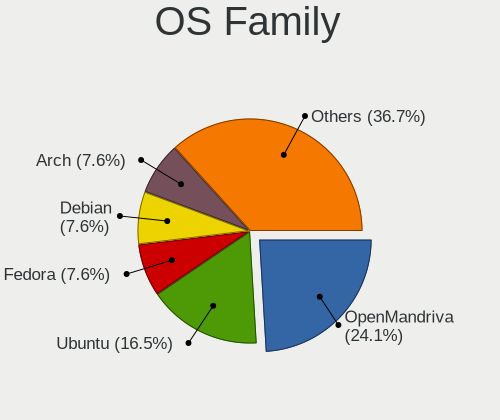

| Name         | Desktops | Percent |
|--------------|----------|---------|
| Ubuntu       | 10       | 15.87%  |
| Linux Mint   | 8        | 12.7%   |
| KDE neon     | 6        | 9.52%   |
| Fedora       | 5        | 7.94%   |
| Pop!_OS      | 4        | 6.35%   |
| OpenMandriva | 4        | 6.35%   |
| Kubuntu      | 4        | 6.35%   |
| Zorin        | 3        | 4.76%   |
| Manjaro      | 3        | 4.76%   |
| Debian       | 3        | 4.76%   |
| Arch         | 3        | 4.76%   |
| Kali         | 2        | 3.17%   |
| Xero         | 1        | 1.59%   |
| Parrot       | 1        | 1.59%   |
| Lubuntu      | 1        | 1.59%   |
| LMDE         | 1        | 1.59%   |
| Lilidog      | 1        | 1.59%   |
| Deepin       | 1        | 1.59%   |
| Archcraft    | 1        | 1.59%   |
| antergos     | 1        | 1.59%   |

Kernel
------

Version of the Linux kernel

| Version                 | Desktops | Percent |
|-------------------------|----------|---------|
| 5.17.5-76051705-generic | 4        | 6.35%   |
| 5.16.7-desktop-1omv4003 | 4        | 6.35%   |
| 5.15.0-37-generic       | 4        | 6.35%   |
| 5.13.0-51-generic       | 4        | 6.35%   |
| 5.15.0-33-generic       | 3        | 4.76%   |
| 5.13.0-44-generic       | 3        | 4.76%   |
| 5.4.0-121-generic       | 2        | 3.17%   |
| 5.4.0-120-generic       | 2        | 3.17%   |
| 5.18.5-200.fc36.x86_64  | 2        | 3.17%   |
| 5.18.3-arch1-1          | 2        | 3.17%   |
| 5.17.15-1-MANJARO       | 2        | 3.17%   |
| 5.17.13-300.fc36.x86_64 | 2        | 3.17%   |
| 5.15.0-40-generic       | 2        | 3.17%   |
| 5.7.1-050701-generic    | 1        | 1.59%   |
| 5.4.0-117-generic       | 1        | 1.59%   |
| 5.4.0-113-generic       | 1        | 1.59%   |
| 5.4.0-110-generic       | 1        | 1.59%   |
| 5.18.7-200.fc36.x86_64  | 1        | 1.59%   |
| 5.18.6-arch1-1          | 1        | 1.59%   |
| 5.18.3-zen1-1-zen       | 1        | 1.59%   |
| 5.18.2-arch1-1          | 1        | 1.59%   |
| 5.18.0-arch1-1          | 1        | 1.59%   |
| 5.18.0-2-amd64          | 1        | 1.59%   |
| 5.18.0-1parrot1-amd64   | 1        | 1.59%   |
| 5.18.0-1-amd64          | 1        | 1.59%   |
| 5.17.0-kali3-amd64      | 1        | 1.59%   |
| 5.15.49-1-MANJARO       | 1        | 1.59%   |
| 5.15.24-amd64-desktop   | 1        | 1.59%   |
| 5.15.0-kali3-amd64      | 1        | 1.59%   |
| 5.15.0-39-generic       | 1        | 1.59%   |
| 5.15.0-37-lowlatency    | 1        | 1.59%   |
| 5.15.0-35-generic       | 1        | 1.59%   |
| 5.15.0-30-generic       | 1        | 1.59%   |
| 5.14.0-1042-oem         | 1        | 1.59%   |
| 5.13.0-48-generic       | 1        | 1.59%   |
| 5.13.0-40-generic       | 1        | 1.59%   |
| 5.13.0-30-generic       | 1        | 1.59%   |
| 5.10.0-15-amd64         | 1        | 1.59%   |
| 5.10.0-14-amd64         | 1        | 1.59%   |
| 5.10.0-10-amd64         | 1        | 1.59%   |

Kernel Family
-------------

Linux kernel without a distro release

| Version | Desktops | Percent |
|---------|----------|---------|
| 5.15.0  | 14       | 22.22%  |
| 5.13.0  | 10       | 15.87%  |
| 5.4.0   | 7        | 11.11%  |
| 5.18.0  | 4        | 6.35%   |
| 5.17.5  | 4        | 6.35%   |
| 5.16.7  | 4        | 6.35%   |
| 5.18.3  | 3        | 4.76%   |
| 5.10.0  | 3        | 4.76%   |
| 5.18.5  | 2        | 3.17%   |
| 5.17.15 | 2        | 3.17%   |
| 5.17.13 | 2        | 3.17%   |
| 5.7.1   | 1        | 1.59%   |
| 5.18.7  | 1        | 1.59%   |
| 5.18.6  | 1        | 1.59%   |
| 5.18.2  | 1        | 1.59%   |
| 5.17.0  | 1        | 1.59%   |
| 5.15.49 | 1        | 1.59%   |
| 5.15.24 | 1        | 1.59%   |
| 5.14.0  | 1        | 1.59%   |

Kernel Major Ver.
-----------------

Linux kernel major version

| Version | Desktops | Percent |
|---------|----------|---------|
| 5.15    | 16       | 25.4%   |
| 5.18    | 12       | 19.05%  |
| 5.13    | 10       | 15.87%  |
| 5.17    | 9        | 14.29%  |
| 5.4     | 7        | 11.11%  |
| 5.16    | 4        | 6.35%   |
| 5.10    | 3        | 4.76%   |
| 5.7     | 1        | 1.59%   |
| 5.14    | 1        | 1.59%   |

Arch
----

OS architecture (x86_64, i586, etc.)

| Name   | Desktops | Percent |
|--------|----------|---------|
| x86_64 | 63       | 100%    |

DE
--

Desktop Environment

| Name             | Desktops | Percent |
|------------------|----------|---------|
| KDE5             | 23       | 36.51%  |
| GNOME            | 19       | 30.16%  |
| X-Cinnamon       | 9        | 14.29%  |
| XFCE             | 3        | 4.76%   |
| Unknown          | 3        | 4.76%   |
| MATE             | 2        | 3.17%   |
| openbox          | 1        | 1.59%   |
| LXQt             | 1        | 1.59%   |
| lightdm-xsession | 1        | 1.59%   |
| Deepin           | 1        | 1.59%   |

Display Server
--------------

X11 or Wayland

| Name    | Desktops | Percent |
|---------|----------|---------|
| X11     | 51       | 80.95%  |
| Wayland | 9        | 14.29%  |
| Tty     | 3        | 4.76%   |

Display Manager
---------------

SDDM, LightDM, etc.

| Name    | Desktops | Percent |
|---------|----------|---------|
| Unknown | 30       | 47.62%  |
| SDDM    | 11       | 17.46%  |
| LightDM | 11       | 17.46%  |
| GDM3    | 7        | 11.11%  |
| GDM     | 3        | 4.76%   |
| Ly      | 1        | 1.59%   |

OS Lang
-------

Language

| Lang    | Desktops | Percent |
|---------|----------|---------|
| en_GB   | 53       | 84.13%  |
| en_US   | 7        | 11.11%  |
| en_IE   | 1        | 1.59%   |
| C       | 1        | 1.59%   |
| Unknown | 1        | 1.59%   |

Boot Mode
---------

EFI or BIOS

| Mode | Desktops | Percent |
|------|----------|---------|
| EFI  | 36       | 57.14%  |
| BIOS | 27       | 42.86%  |

Filesystem
----------

Type of filesystem

| Type    | Desktops | Percent |
|---------|----------|---------|
| Ext4    | 52       | 82.54%  |
| Btrfs   | 6        | 9.52%   |
| Overlay | 5        | 7.94%   |

Part. scheme
------------

Scheme of partitioning

| Type    | Desktops | Percent |
|---------|----------|---------|
| Unknown | 36       | 57.14%  |
| GPT     | 25       | 39.68%  |
| MBR     | 2        | 3.17%   |

Dual Boot with Linux/BSD
------------------------

Hosting more than one Linux/BSD

| Dual boot | Desktops | Percent |
|-----------|----------|---------|
| No        | 52       | 82.54%  |
| Yes       | 11       | 17.46%  |

Dual Boot (Win)
---------------

Hosting Linux and Windows

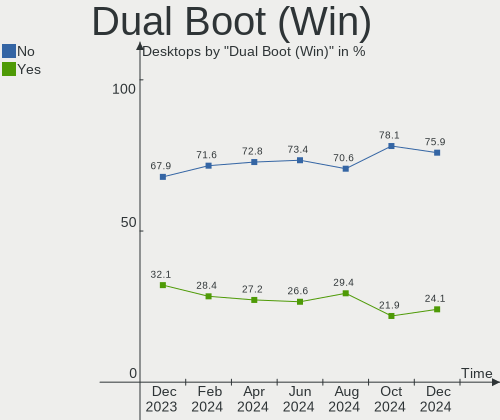

| Dual boot | Desktops | Percent |
|-----------|----------|---------|
| No        | 52       | 82.54%  |
| Yes       | 11       | 17.46%  |

Board
-----

Vendor
------

Motherboard manufacturer

| Name                | Desktops | Percent |
|---------------------|----------|---------|
| ASUSTek Computer    | 13       | 20.63%  |
| Hewlett-Packard     | 12       | 19.05%  |
| Dell                | 9        | 14.29%  |
| MSI                 | 7        | 11.11%  |
| Gigabyte Technology | 6        | 9.52%   |
| ASRock              | 5        | 7.94%   |
| Intel               | 2        | 3.17%   |
| AZW                 | 2        | 3.17%   |
| Apple               | 2        | 3.17%   |
| Lenovo              | 1        | 1.59%   |
| Fujitsu             | 1        | 1.59%   |
| Biostar             | 1        | 1.59%   |
| ABIT                | 1        | 1.59%   |
| Unknown             | 1        | 1.59%   |

Model
-----

Motherboard model

| Name                                          | Desktops | Percent |
|-----------------------------------------------|----------|---------|
| MSI MS-7C91                                   | 3        | 4.76%   |
| Dell OptiPlex 9020                            | 2        | 3.17%   |
| Dell OptiPlex 7010                            | 2        | 3.17%   |
| ASUS ROG CROSSHAIR VIII DARK HERO             | 2        | 3.17%   |
| MSI MS-7C51                                   | 1        | 1.59%   |
| MSI MS-7C02                                   | 1        | 1.59%   |
| MSI MS-7A20                                   | 1        | 1.59%   |
| MSI CCL Ryzen 5 5600G B550 Motherboard Bundle | 1        | 1.59%   |
| Lenovo V520S-08IKL 10NM0064UK                 | 1        | 1.59%   |
| Intel DQ57TM                                  | 1        | 1.59%   |
| Intel DH67BL AAG10189-211                     | 1        | 1.59%   |
| HP Z600 Workstation                           | 1        | 1.59%   |
| HP ProLiant ML110 G7                          | 1        | 1.59%   |
| HP Pavilion Desktop 590-p0xxx                 | 1        | 1.59%   |
| HP EliteDesk 800 G2 DM 35W                    | 1        | 1.59%   |
| HP EliteDesk 800 G1 USDT                      | 1        | 1.59%   |
| HP EliteDesk 705 G3 SFF                       | 1        | 1.59%   |
| HP Compaq Elite 8300 SFF                      | 1        | 1.59%   |
| HP Compaq dc7900 Small Form Factor            | 1        | 1.59%   |
| HP Compaq 8200 Elite USDT PC                  | 1        | 1.59%   |
| HP Compaq 8200 Elite CMT PC                   | 1        | 1.59%   |
| HP 860-050na                                  | 1        | 1.59%   |
| HP 290 G1 MT                                  | 1        | 1.59%   |
| Gigabyte X570S AORUS PRO AX                   | 1        | 1.59%   |
| Gigabyte X570 AORUS XTREME                    | 1        | 1.59%   |
| Gigabyte X570 AORUS MASTER                    | 1        | 1.59%   |
| Gigabyte PERSONAL COMPUTER                    | 1        | 1.59%   |
| Gigabyte GA-78LMT-USB3                        | 1        | 1.59%   |
| Gigabyte F2A78M-HD2                           | 1        | 1.59%   |
| Fujitsu ESPRIMO E400                          | 1        | 1.59%   |
| Dell XPS 8950                                 | 1        | 1.59%   |
| Dell OptiPlex 7040                            | 1        | 1.59%   |
| Dell OptiPlex 7020                            | 1        | 1.59%   |
| Dell OptiPlex 5070                            | 1        | 1.59%   |
| Dell Inspiron 660                             | 1        | 1.59%   |
| Biostar N68S3+                                | 1        | 1.59%   |
| AZW Gemini T34                                | 1        | 1.59%   |
| AZW Gemini J45                                | 1        | 1.59%   |
| ASUS Z170 PRO GAMING/AURA                     | 1        | 1.59%   |
| ASUS TUF Z270 MARK 2                          | 1        | 1.59%   |
| ASUS TUF Gaming X570-PLUS                     | 1        | 1.59%   |
| ASUS ROG STRIX B550-F GAMING                  | 1        | 1.59%   |
| ASUS ROG Maximus XII HERO                     | 1        | 1.59%   |
| ASUS PRIME Z370-P                             | 1        | 1.59%   |
| ASUS PRIME B550-PLUS                          | 1        | 1.59%   |
| ASUS PRIME B350-PLUS                          | 1        | 1.59%   |
| ASUS PRIME A320M-K                            | 1        | 1.59%   |
| ASUS P9X79                                    | 1        | 1.59%   |
| ASUS M5A97 EVO R2.0                           | 1        | 1.59%   |
| ASRock P43DE                                  | 1        | 1.59%   |
| ASRock H61M-ITX                               | 1        | 1.59%   |
| ASRock B550M-ITX/ac                           | 1        | 1.59%   |
| ASRock B450 Gaming-ITX/ac                     | 1        | 1.59%   |
| ASRock AB350 Pro4                             | 1        | 1.59%   |
| Apple MacPro6,1                               | 1        | 1.59%   |
| Apple MacPro5,1                               | 1        | 1.59%   |
| ABIT IP35 Pro                                 | 1        | 1.59%   |
| Unknown                                       | 1        | 1.59%   |

Model Family
------------

Motherboard model prefix

| Name                   | Desktops | Percent |
|------------------------|----------|---------|
| Dell OptiPlex          | 7        | 11.11%  |
| HP Compaq              | 4        | 6.35%   |
| ASUS ROG               | 4        | 6.35%   |
| ASUS PRIME             | 4        | 6.35%   |
| MSI MS-7C91            | 3        | 4.76%   |
| HP EliteDesk           | 3        | 4.76%   |
| Gigabyte X570          | 2        | 3.17%   |
| AZW Gemini             | 2        | 3.17%   |
| ASUS TUF               | 2        | 3.17%   |
| MSI MS-7C51            | 1        | 1.59%   |
| MSI MS-7C02            | 1        | 1.59%   |
| MSI MS-7A20            | 1        | 1.59%   |
| MSI CCL                | 1        | 1.59%   |
| Lenovo V520S-08IKL     | 1        | 1.59%   |
| Intel DQ57TM           | 1        | 1.59%   |
| Intel DH67BL           | 1        | 1.59%   |
| HP Z600                | 1        | 1.59%   |
| HP ProLiant            | 1        | 1.59%   |
| HP Pavilion            | 1        | 1.59%   |
| HP 860-050na           | 1        | 1.59%   |
| HP 290                 | 1        | 1.59%   |
| Gigabyte X570S         | 1        | 1.59%   |
| Gigabyte PERSONAL      | 1        | 1.59%   |
| Gigabyte GA-78LMT-USB3 | 1        | 1.59%   |
| Gigabyte F2A78M-HD2    | 1        | 1.59%   |
| Fujitsu ESPRIMO        | 1        | 1.59%   |
| Dell XPS               | 1        | 1.59%   |
| Dell Inspiron          | 1        | 1.59%   |
| Biostar N68S3+         | 1        | 1.59%   |
| ASUS Z170              | 1        | 1.59%   |
| ASUS P9X79             | 1        | 1.59%   |
| ASUS M5A97             | 1        | 1.59%   |
| ASRock P43DE           | 1        | 1.59%   |
| ASRock H61M-ITX        | 1        | 1.59%   |
| ASRock B550M-ITX       | 1        | 1.59%   |
| ASRock B450            | 1        | 1.59%   |
| ASRock AB350           | 1        | 1.59%   |
| Apple MacPro6          | 1        | 1.59%   |
| Apple MacPro5          | 1        | 1.59%   |
| ABIT IP35              | 1        | 1.59%   |
| Unknown                | 1        | 1.59%   |

MFG Year
--------

Motherboard manufacture year

| Year | Desktops | Percent |
|------|----------|---------|
| 2020 | 7        | 11.11%  |
| 2019 | 7        | 11.11%  |
| 2021 | 6        | 9.52%   |
| 2017 | 6        | 9.52%   |
| 2011 | 6        | 9.52%   |
| 2013 | 5        | 7.94%   |
| 2012 | 5        | 7.94%   |
| 2018 | 4        | 6.35%   |
| 2016 | 4        | 6.35%   |
| 2015 | 3        | 4.76%   |
| 2010 | 3        | 4.76%   |
| 2008 | 3        | 4.76%   |
| 2022 | 2        | 3.17%   |
| 2014 | 2        | 3.17%   |

Form Factor
-----------

Physical design of the computer

| Name    | Desktops | Percent |
|---------|----------|---------|
| Desktop | 63       | 100%    |

Secure Boot
-----------

Enabled or disabled

| State    | Desktops | Percent |
|----------|----------|---------|
| Disabled | 56       | 88.89%  |
| Enabled  | 7        | 11.11%  |

Coreboot
--------

Have coreboot on board

| Used | Desktops | Percent |
|------|----------|---------|
| No   | 63       | 100%    |

RAM Size
--------

Total RAM memory

| Size in GB  | Desktops | Percent |
|-------------|----------|---------|
| 4.01-8.0    | 16       | 25.4%   |
| 16.01-24.0  | 16       | 25.4%   |
| 32.01-64.0  | 15       | 23.81%  |
| 8.01-16.0   | 9        | 14.29%  |
| 3.01-4.0    | 4        | 6.35%   |
| 64.01-256.0 | 2        | 3.17%   |
| 24.01-32.0  | 1        | 1.59%   |

RAM Used
--------

Used RAM memory

| Used GB   | Desktops | Percent |
|-----------|----------|---------|
| 1.01-2.0  | 20       | 31.75%  |
| 4.01-8.0  | 14       | 22.22%  |
| 2.01-3.0  | 13       | 20.63%  |
| 3.01-4.0  | 9        | 14.29%  |
| 0.51-1.0  | 3        | 4.76%   |
| 8.01-16.0 | 2        | 3.17%   |
| 0.01-0.5  | 2        | 3.17%   |

Total Drives
------------

Number of drives on board

| Drives | Desktops | Percent |
|--------|----------|---------|
| 2      | 21       | 33.33%  |
| 1      | 19       | 30.16%  |
| 3      | 9        | 14.29%  |
| 4      | 6        | 9.52%   |
| 5      | 5        | 7.94%   |
| 7      | 1        | 1.59%   |
| 6      | 1        | 1.59%   |
| 0      | 1        | 1.59%   |

Has CD-ROM
----------

Has CD-ROM on board

| Presented | Desktops | Percent |
|-----------|----------|---------|
| No        | 38       | 60.32%  |
| Yes       | 25       | 39.68%  |

Has Ethernet
------------

Has Ethernet on board

| Presented | Desktops | Percent |
|-----------|----------|---------|
| Yes       | 63       | 100%    |

Has WiFi
--------

Has WiFi module

| Presented | Desktops | Percent |
|-----------|----------|---------|
| Yes       | 38       | 60.32%  |
| No        | 25       | 39.68%  |

Has Bluetooth
-------------

Has Bluetooth module

| Presented | Desktops | Percent |
|-----------|----------|---------|
| No        | 33       | 52.38%  |
| Yes       | 30       | 47.62%  |

Location
--------

Country
-------

Geographic location (country)

| Country | Desktops | Percent |
|---------|----------|---------|
| UK      | 63       | 100%    |

City
----

Geographic location (city)

| City              | Desktops | Percent |
|-------------------|----------|---------|
| Manchester        | 4        | 6.35%   |
| Bradford          | 4        | 6.35%   |
| Edinburgh         | 3        | 4.76%   |
| Walsall           | 2        | 3.17%   |
| Derby             | 2        | 3.17%   |
| Wolverhampton     | 1        | 1.59%   |
| Wigan             | 1        | 1.59%   |
| Wetherby          | 1        | 1.59%   |
| Weston-super-Mare | 1        | 1.59%   |
| West Bromwich     | 1        | 1.59%   |
| Wellingborough    | 1        | 1.59%   |
| Twickenham        | 1        | 1.59%   |
| Sunbury-on-Thames | 1        | 1.59%   |
| Stirling          | 1        | 1.59%   |
| Salisbury         | 1        | 1.59%   |
| Salford           | 1        | 1.59%   |
| Saint Neots       | 1        | 1.59%   |
| Rotherham         | 1        | 1.59%   |
| Redditch          | 1        | 1.59%   |
| Reading           | 1        | 1.59%   |
| Prestatyn         | 1        | 1.59%   |
| Portsmouth        | 1        | 1.59%   |
| Portishead        | 1        | 1.59%   |
| Plymouth          | 1        | 1.59%   |
| Perivale          | 1        | 1.59%   |
| Oxford            | 1        | 1.59%   |
| Olney             | 1        | 1.59%   |
| Newton Aycliffe   | 1        | 1.59%   |
| Morley            | 1        | 1.59%   |
| Milton Keynes     | 1        | 1.59%   |
| Long Eaton        | 1        | 1.59%   |
| Lancaster         | 1        | 1.59%   |
| Kirkcaldy         | 1        | 1.59%   |
| Kidlington        | 1        | 1.59%   |
| Hull              | 1        | 1.59%   |
| Gosport           | 1        | 1.59%   |
| Glasgow           | 1        | 1.59%   |
| Gillingham        | 1        | 1.59%   |
| Feltham           | 1        | 1.59%   |
| Enfield           | 1        | 1.59%   |
| Eggington         | 1        | 1.59%   |
| Edgware           | 1        | 1.59%   |
| Dronfield         | 1        | 1.59%   |
| Drighlington      | 1        | 1.59%   |
| Cleveleys         | 1        | 1.59%   |
| Cardiff           | 1        | 1.59%   |
| Cambridge         | 1        | 1.59%   |
| Bristol           | 1        | 1.59%   |
| Blackburn         | 1        | 1.59%   |
| Bath              | 1        | 1.59%   |
| Ballyclare        | 1        | 1.59%   |
| Antrim            | 1        | 1.59%   |
| Addlestone        | 1        | 1.59%   |

Drives
------

Drive Vendor
------------

Hard drive vendors

| Vendor                    | Desktops | Drives | Percent |
|---------------------------|----------|--------|---------|
| Seagate                   | 25       | 38     | 20.49%  |
| Samsung Electronics       | 22       | 26     | 18.03%  |
| WDC                       | 15       | 20     | 12.3%   |
| SanDisk                   | 10       | 11     | 8.2%    |
| Toshiba                   | 8        | 11     | 6.56%   |
| Kingston                  | 5        | 6      | 4.1%    |
| Crucial                   | 5        | 5      | 4.1%    |
| Unknown                   | 3        | 3      | 2.46%   |
| Phison                    | 3        | 3      | 2.46%   |
| Hitachi                   | 3        | 3      | 2.46%   |
| China                     | 3        | 3      | 2.46%   |
| Micron Technology         | 2        | 2      | 1.64%   |
| KingDian                  | 2        | 2      | 1.64%   |
| Intel                     | 2        | 2      | 1.64%   |
| Unknown                   | 2        | 2      | 1.64%   |
| SK hynix                  | 1        | 1      | 0.82%   |
| Silicon Motion            | 1        | 1      | 0.82%   |
| SABRENT                   | 1        | 1      | 0.82%   |
| OCZ                       | 1        | 1      | 0.82%   |
| Micron/Crucial Technology | 1        | 1      | 0.82%   |
| LITEON                    | 1        | 1      | 0.82%   |
| KingSpec                  | 1        | 1      | 0.82%   |
| Fujitsu                   | 1        | 1      | 0.82%   |
| Drevo                     | 1        | 1      | 0.82%   |
| Corsair                   | 1        | 1      | 0.82%   |
| Apple                     | 1        | 1      | 0.82%   |
| A-DATA Technology         | 1        | 1      | 0.82%   |

Drive Model
-----------

Hard drive models

| Model                                  | Desktops | Percent |
|----------------------------------------|----------|---------|
| Samsung SSD 850 EVO 250GB              | 5        | 3.6%    |
| Seagate ST4000DM004-2CV104 4TB         | 3        | 2.16%   |
| Kingston SA400S37240G 240GB SSD        | 3        | 2.16%   |
| WDC WD5000AAKX-75U6AA0 500GB           | 2        | 1.44%   |
| Toshiba MQ01ABD100 1TB                 | 2        | 1.44%   |
| Toshiba HDWD110 1TB                    | 2        | 1.44%   |
| Seagate ST3500418AS 500GB              | 2        | 1.44%   |
| Seagate ST3500312CS 500GB              | 2        | 1.44%   |
| Seagate ST2000LM010-1RA174 2TB         | 2        | 1.44%   |
| Seagate ST2000DM006-2DM164 2TB         | 2        | 1.44%   |
| Seagate ST1000DM010-2EP102 1TB         | 2        | 1.44%   |
| SanDisk SSD PLUS 120 GB                | 2        | 1.44%   |
| SanDisk NVMe SSD Drive 500GB           | 2        | 1.44%   |
| Samsung SSD 970 EVO Plus 1TB           | 2        | 1.44%   |
| Samsung SM963 2.5" NVMe PCIe SSD 500GB | 2        | 1.44%   |
| Samsung NVMe SSD Drive 2TB             | 2        | 1.44%   |
| KingDian S200 60GB SSD                 | 2        | 1.44%   |
| Unknown                                | 2        | 1.44%   |
| WDC WDS500G2B0C-00PXH0 500GB           | 1        | 0.72%   |
| WDC WDS500G2B0C 500GB                  | 1        | 0.72%   |
| WDC WDS500G2B0A-00SM50 500GB SSD       | 1        | 0.72%   |
| WDC WDS500G1X0E-00AFY0 500GB           | 1        | 0.72%   |
| WDC WDS100T2B0C-00PXH0 1TB             | 1        | 0.72%   |
| WDC WD6400AAVS-00G9B1 640GB            | 1        | 0.72%   |
| WDC WD5003AZEX-00K1GA0 500GB           | 1        | 0.72%   |
| WDC WD5000AAKX-07U6AA0 500GB           | 1        | 0.72%   |
| WDC WD50 00LPCX-24VHAT0 500GB          | 1        | 0.72%   |
| WDC WD30EFRX-68EUZN0 3TB               | 1        | 0.72%   |
| WDC WD20EZRZ-60Z5HB0 2TB               | 1        | 0.72%   |
| WDC WD15EARS-00MVWB0 1TB               | 1        | 0.72%   |
| WDC WD10EZEX-00WN4A0 1TB               | 1        | 0.72%   |
| WDC WD10EZEX-00RKKA0 1TB               | 1        | 0.72%   |
| WDC WD10EZEX-00KUWA0 1TB               | 1        | 0.72%   |
| WDC WD10EADS-00M2B0 1TB                | 1        | 0.72%   |
| WDC WD1002FBYS-05A6B0 1TB              | 1        | 0.72%   |
| Unknown SD/MMC/MS PRO 128GB            | 1        | 0.72%   |
| Unknown MMC Card  196GB                | 1        | 0.72%   |
| Unknown 256GB PCS 2.5" S               | 1        | 0.72%   |
| Toshiba MQ04ABF100 1TB                 | 1        | 0.72%   |
| Toshiba MK5076GSX 500GB                | 1        | 0.72%   |
| Toshiba HDWL110 1TB                    | 1        | 0.72%   |
| Toshiba DT01ACA100 1TB                 | 1        | 0.72%   |
| Toshiba DT01ABA200 2TB                 | 1        | 0.72%   |
| Toshiba A100 240GB SSD                 | 1        | 0.72%   |
| SK hynix HFS128G32MNB-2200A 128GB SSD  | 1        | 0.72%   |
| Silicon Motion NVME SSD 1TB            | 1        | 0.72%   |
| Seagate ST9120823ASG 120GB             | 1        | 0.72%   |
| Seagate ST6000NM0034 6TB               | 1        | 0.72%   |
| Seagate ST500LT012-1DG142 500GB        | 1        | 0.72%   |
| Seagate ST500LM012 HN-M500MBB 500GB    | 1        | 0.72%   |
| Seagate ST500DM002-1SB10A 500GB        | 1        | 0.72%   |
| Seagate ST500DM002-1BD142 500GB        | 1        | 0.72%   |
| Seagate ST3500413AS 500GB              | 1        | 0.72%   |
| Seagate ST3000DM003-2AE16L 3TB         | 1        | 0.72%   |
| Seagate ST2000DX002-2DV164 2TB         | 1        | 0.72%   |
| Seagate ST2000DM008-2FR102 2TB         | 1        | 0.72%   |
| Seagate ST1000LM024 HN-M101MBB 1TB     | 1        | 0.72%   |
| Seagate ST1000DM003-1SB102 1TB         | 1        | 0.72%   |
| Seagate ST1000DM003-1ER162 1TB         | 1        | 0.72%   |
| Seagate Expansion+ Desk 4TB            | 1        | 0.72%   |

HDD Vendor
----------

Hard disk drive vendors

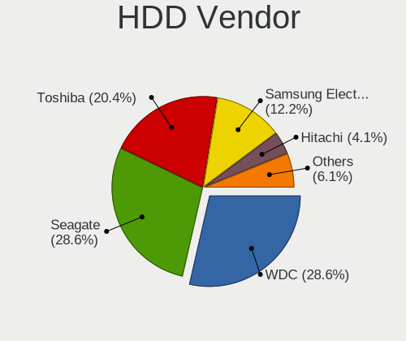

| Vendor              | Desktops | Drives | Percent |
|---------------------|----------|--------|---------|
| Seagate             | 25       | 36     | 49.02%  |
| WDC                 | 13       | 15     | 25.49%  |
| Toshiba             | 7        | 10     | 13.73%  |
| Hitachi             | 3        | 3      | 5.88%   |
| Unknown             | 1        | 1      | 1.96%   |
| Samsung Electronics | 1        | 1      | 1.96%   |
| Fujitsu             | 1        | 1      | 1.96%   |

SSD Vendor
----------

Solid state drive vendors

| Vendor              | Desktops | Drives | Percent |
|---------------------|----------|--------|---------|
| Samsung Electronics | 12       | 12     | 27.27%  |
| SanDisk             | 6        | 6      | 13.64%  |
| Kingston            | 5        | 6      | 11.36%  |
| Crucial             | 4        | 4      | 9.09%   |
| China               | 3        | 3      | 6.82%   |
| KingDian            | 2        | 2      | 4.55%   |
| Unknown             | 2        | 2      | 4.55%   |
| WDC                 | 1        | 1      | 2.27%   |
| Unknown             | 1        | 1      | 2.27%   |
| Toshiba             | 1        | 1      | 2.27%   |
| SK hynix            | 1        | 1      | 2.27%   |
| OCZ                 | 1        | 1      | 2.27%   |
| Micron Technology   | 1        | 1      | 2.27%   |
| LITEON              | 1        | 1      | 2.27%   |
| KingSpec            | 1        | 1      | 2.27%   |
| Drevo               | 1        | 1      | 2.27%   |
| Apple               | 1        | 1      | 2.27%   |

Drive Kind
----------

HDD or SSD

| Kind | Desktops | Drives | Percent |
|------|----------|--------|---------|
| HDD  | 38       | 67     | 38%     |
| SSD  | 35       | 45     | 35%     |
| NVMe | 26       | 36     | 26%     |
| MMC  | 1        | 1      | 1%      |

Drive Connector
---------------

SATA, SAS, NVMe, etc.

| Type | Desktops | Drives | Percent |
|------|----------|--------|---------|
| SATA | 58       | 107    | 64.44%  |
| NVMe | 25       | 35     | 27.78%  |
| SAS  | 6        | 6      | 6.67%   |
| MMC  | 1        | 1      | 1.11%   |

Drive Size
----------

Size of hard drive

| Size in TB | Desktops | Drives | Percent |
|------------|----------|--------|---------|
| 0.01-0.5   | 43       | 62     | 51.81%  |
| 0.51-1.0   | 24       | 29     | 28.92%  |
| 1.01-2.0   | 9        | 9      | 10.84%  |
| 3.01-4.0   | 4        | 8      | 4.82%   |
| 2.01-3.0   | 2        | 2      | 2.41%   |
| 4.01-10.0  | 1        | 2      | 1.2%    |

Space Total
-----------

Amount of disk space available on the file system

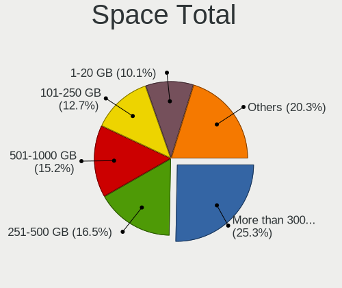

| Size in GB     | Desktops | Percent |
|----------------|----------|---------|
| 101-250        | 15       | 23.81%  |
| 501-1000       | 13       | 20.63%  |
| 1001-2000      | 9        | 14.29%  |
| 251-500        | 7        | 11.11%  |
| More than 3000 | 6        | 9.52%   |
| 2001-3000      | 3        | 4.76%   |
| 1-20           | 3        | 4.76%   |
| 51-100         | 3        | 4.76%   |
| Unknown        | 3        | 4.76%   |
| 21-50          | 1        | 1.59%   |

Space Used
----------

Amount of used disk space

| Used GB        | Desktops | Percent |
|----------------|----------|---------|
| 1-20           | 17       | 26.98%  |
| 101-250        | 10       | 15.87%  |
| 21-50          | 9        | 14.29%  |
| 251-500        | 7        | 11.11%  |
| 51-100         | 7        | 11.11%  |
| 2001-3000      | 3        | 4.76%   |
| 1001-2000      | 3        | 4.76%   |
| 501-1000       | 3        | 4.76%   |
| Unknown        | 3        | 4.76%   |
| More than 3000 | 1        | 1.59%   |

Malfunc. Drives
---------------

Drive models with a malfunction

| Model                               | Desktops | Drives | Percent |
|-------------------------------------|----------|--------|---------|
| WDC WD5000AAKX-75U6AA0 500GB        | 1        | 1      | 16.67%  |
| WDC WD10EADS-00M2B0 1TB             | 1        | 1      | 16.67%  |
| Samsung Electronics SSD 980 PRO 2TB | 1        | 1      | 16.67%  |
| Samsung Electronics HD103UJ 1TB     | 1        | 1      | 16.67%  |
| Intel SSDPEKKW512G7 512GB           | 1        | 1      | 16.67%  |
| Drevo X1 Pro SSD 128GB              | 1        | 1      | 16.67%  |

Malfunc. Drive Vendor
---------------------

Vendors of faulty drives

| Vendor              | Desktops | Drives | Percent |
|---------------------|----------|--------|---------|
| WDC                 | 2        | 2      | 33.33%  |
| Samsung Electronics | 2        | 2      | 33.33%  |
| Intel               | 1        | 1      | 16.67%  |
| Drevo               | 1        | 1      | 16.67%  |

Malfunc. HDD Vendor
-------------------

Vendors of faulty HDD drives

| Vendor              | Desktops | Drives | Percent |
|---------------------|----------|--------|---------|
| WDC                 | 2        | 2      | 66.67%  |
| Samsung Electronics | 1        | 1      | 33.33%  |

Malfunc. Drive Kind
-------------------

Kinds of faulty drives

| Kind | Desktops | Drives | Percent |
|------|----------|--------|---------|
| HDD  | 3        | 3      | 50%     |
| NVMe | 2        | 2      | 33.33%  |
| SSD  | 1        | 1      | 16.67%  |

Failed Drives
-------------

Failed drive models

Zero info for selected period =(

Failed Drive Vendor
-------------------

Failed drive vendors

Zero info for selected period =(

Drive Status
------------

Number of failed and malfunc. drives

| Status   | Desktops | Drives | Percent |
|----------|----------|--------|---------|
| Detected | 39       | 88     | 54.93%  |
| Works    | 27       | 55     | 38.03%  |
| Malfunc  | 5        | 6      | 7.04%   |

Storage controller
------------------

Storage Vendor
--------------

Storage controller vendors

| Vendor                    | Desktops | Percent |
|---------------------------|----------|---------|
| Intel                     | 38       | 38.78%  |
| AMD                       | 23       | 23.47%  |
| Samsung Electronics       | 12       | 12.24%  |
| SanDisk                   | 7        | 7.14%   |
| Phison Electronics        | 4        | 4.08%   |
| ASMedia Technology        | 3        | 3.06%   |
| Seagate Technology        | 2        | 2.04%   |
| Micron/Crucial Technology | 2        | 2.04%   |
| VIA Technologies          | 1        | 1.02%   |
| Silicon Motion            | 1        | 1.02%   |
| Nvidia                    | 1        | 1.02%   |
| Micron Technology         | 1        | 1.02%   |
| JMicron Technology        | 1        | 1.02%   |
| Broadcom / LSI            | 1        | 1.02%   |
| ADATA Technology          | 1        | 1.02%   |

Storage Model
-------------

Storage controller models

| Model                                                                                   | Desktops | Percent |
|-----------------------------------------------------------------------------------------|----------|---------|
| AMD FCH SATA Controller [AHCI mode]                                                     | 13       | 11.11%  |
| Samsung NVMe SSD Controller SM981/PM981/PM983                                           | 7        | 5.98%   |
| AMD 500 Series Chipset SATA Controller                                                  | 7        | 5.98%   |
| Intel SATA Controller [RAID mode]                                                       | 5        | 4.27%   |
| Intel Q170/Q150/B150/H170/H110/Z170/CM236 Chipset SATA Controller [AHCI Mode]           | 4        | 3.42%   |
| Intel 7 Series/C210 Series Chipset Family 6-port SATA Controller [AHCI mode]            | 4        | 3.42%   |
| Intel 6 Series/C200 Series Chipset Family 6 port Desktop SATA AHCI Controller           | 4        | 3.42%   |
| Samsung NVMe SSD Controller SM961/PM961/SM963                                           | 3        | 2.56%   |
| Samsung NVMe SSD Controller PM9A1/PM9A3/980PRO                                          | 3        | 2.56%   |
| Phison E16 PCIe4 NVMe Controller                                                        | 3        | 2.56%   |
| ASMedia ASM1062 Serial ATA Controller                                                   | 3        | 2.56%   |
| AMD 300 Series Chipset SATA Controller                                                  | 3        | 2.56%   |
| SanDisk WD Blue SN570 NVMe SSD                                                          | 2        | 1.71%   |
| SanDisk WD Blue SN550 NVMe SSD                                                          | 2        | 1.71%   |
| Intel Celeron N3350/Pentium N4200/Atom E3900 Series SATA AHCI Controller                | 2        | 1.71%   |
| Intel Cannon Lake PCH SATA AHCI Controller                                              | 2        | 1.71%   |
| Intel 8 Series/C220 Series Chipset Family 6-port SATA Controller 1 [AHCI mode]          | 2        | 1.71%   |
| Intel 200 Series PCH SATA controller [AHCI mode]                                        | 2        | 1.71%   |
| AMD FCH SATA Controller D                                                               | 2        | 1.71%   |
| AMD 400 Series Chipset SATA Controller                                                  | 2        | 1.71%   |
| VIA VT6415 PATA IDE Host Controller                                                     | 1        | 0.85%   |
| Silicon Motion SM2263EN/SM2263XT SSD Controller                                         | 1        | 0.85%   |
| Seagate Non-Volatile memory controller                                                  | 1        | 0.85%   |
| Seagate FireCuda 510 SSD                                                                | 1        | 0.85%   |
| SanDisk WD PC SN810 / Black SN850 NVMe SSD                                              | 1        | 0.85%   |
| SanDisk WD Blue SN500 / PC SN520 NVMe SSD                                               | 1        | 0.85%   |
| SanDisk WD Black SN750 / PC SN730 NVMe SSD                                              | 1        | 0.85%   |
| SanDisk Non-Volatile memory controller                                                  | 1        | 0.85%   |
| Samsung Apple PCIe SSD                                                                  | 1        | 0.85%   |
| Phison Electronics Non-Volatile memory controller                                       | 1        | 0.85%   |
| Nvidia MCP61 SATA Controller                                                            | 1        | 0.85%   |
| Nvidia MCP61 IDE                                                                        | 1        | 0.85%   |
| Micron/Crucial P2 NVMe PCIe SSD                                                         | 1        | 0.85%   |
| Micron/Crucial Non-Volatile memory controller                                           | 1        | 0.85%   |
| Micron Non-Volatile memory controller                                                   | 1        | 0.85%   |
| JMicron JMB363 SATA/IDE Controller                                                      | 1        | 0.85%   |
| Intel SSD Pro 7600p/760p/E 6100p Series                                                 | 1        | 0.85%   |
| Intel SSD 600P Series                                                                   | 1        | 0.85%   |
| Intel Comet Lake SATA AHCI Controller                                                   | 1        | 0.85%   |
| Intel Celeron/Pentium Silver Processor SATA Controller                                  | 1        | 0.85%   |
| Intel C600/X79 series chipset 6-Port SATA AHCI Controller                               | 1        | 0.85%   |
| Intel Atom Processor E3800 Series SATA AHCI Controller                                  | 1        | 0.85%   |
| Intel Alder Lake-S PCH SATA Controller [AHCI Mode]                                      | 1        | 0.85%   |
| Intel 82801JI (ICH10 Family) SATA AHCI Controller                                       | 1        | 0.85%   |
| Intel 82801JI (ICH10 Family) 4 port SATA IDE Controller #1                              | 1        | 0.85%   |
| Intel 82801JI (ICH10 Family) 2 port SATA IDE Controller #2                              | 1        | 0.85%   |
| Intel 82801JD/DO (ICH10 Family) SATA AHCI Controller                                    | 1        | 0.85%   |
| Intel 82801IR/IO/IH (ICH9R/DO/DH) 4 port SATA Controller [IDE mode]                     | 1        | 0.85%   |
| Intel 82801I (ICH9 Family) 2 port SATA Controller [IDE mode]                            | 1        | 0.85%   |
| Intel 6 Series/C200 Series Desktop SATA RAID Controller                                 | 1        | 0.85%   |
| Intel 6 Series/C200 Series Chipset Family Desktop SATA Controller (IDE mode, ports 4-5) | 1        | 0.85%   |
| Intel 6 Series/C200 Series Chipset Family Desktop SATA Controller (IDE mode, ports 0-3) | 1        | 0.85%   |
| Intel 5 Series/3400 Series Chipset PT IDER Controller                                   | 1        | 0.85%   |
| Intel 5 Series/3400 Series Chipset 4 port SATA IDE Controller                           | 1        | 0.85%   |
| Intel 5 Series/3400 Series Chipset 2 port SATA IDE Controller                           | 1        | 0.85%   |
| Intel 4 Series Chipset PT IDER Controller                                               | 1        | 0.85%   |
| Broadcom / LSI MegaRAID SAS 2108 [Liberator]                                            | 1        | 0.85%   |
| AMD SB7x0/SB8x0/SB9x0 SATA Controller [IDE mode]                                        | 1        | 0.85%   |
| AMD SB7x0/SB8x0/SB9x0 SATA Controller [AHCI mode]                                       | 1        | 0.85%   |
| AMD SB7x0/SB8x0/SB9x0 IDE Controller                                                    | 1        | 0.85%   |

Storage Kind
------------

Kind of storage controller (IDE, SATA, NVMe, SAS, ...)

| Kind | Desktops | Percent |
|------|----------|---------|
| SATA | 51       | 56.04%  |
| NVMe | 25       | 27.47%  |
| IDE  | 8        | 8.79%   |
| RAID | 7        | 7.69%   |

Processor
---------

CPU Vendor
----------

Processor vendors

| Vendor | Desktops | Percent |
|--------|----------|---------|
| Intel  | 39       | 61.9%   |
| AMD    | 24       | 38.1%   |

CPU Model
---------

Processor models

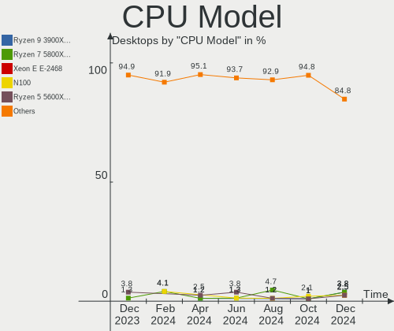

| Model                                          | Desktops | Percent |
|------------------------------------------------|----------|---------|
| AMD Ryzen 5 3600 6-Core Processor              | 4        | 6.35%   |
| Intel Core i5-3470 CPU @ 3.20GHz               | 3        | 4.76%   |
| Intel Core i5-6600K CPU @ 3.50GHz              | 2        | 3.17%   |
| Intel Core i3-7100 CPU @ 3.90GHz               | 2        | 3.17%   |
| AMD Ryzen 9 5900X 12-Core Processor            | 2        | 3.17%   |
| AMD Ryzen 5 5600X 6-Core Processor             | 2        | 3.17%   |
| AMD Ryzen 5 5600G with Radeon Graphics         | 2        | 3.17%   |
| Intel Xeon CPU X5690 @ 3.47GHz                 | 1        | 1.59%   |
| Intel Xeon CPU X5570 @ 2.93GHz                 | 1        | 1.59%   |
| Intel Xeon CPU E5-1620 v2 @ 3.70GHz            | 1        | 1.59%   |
| Intel Pentium Dual-Core CPU E5300 @ 2.60GHz    | 1        | 1.59%   |
| Intel Pentium CPU J4205 @ 1.50GHz              | 1        | 1.59%   |
| Intel Pentium CPU G840 @ 2.80GHz               | 1        | 1.59%   |
| Intel Pentium CPU G645 @ 2.90GHz               | 1        | 1.59%   |
| Intel Pentium CPU G620 @ 2.60GHz               | 1        | 1.59%   |
| Intel Core i9-10900K CPU @ 3.70GHz             | 1        | 1.59%   |
| Intel Core i7-9700T CPU @ 2.00GHz              | 1        | 1.59%   |
| Intel Core i7-7700K CPU @ 4.20GHz              | 1        | 1.59%   |
| Intel Core i7-6850K CPU @ 3.60GHz              | 1        | 1.59%   |
| Intel Core i7-4930K CPU @ 3.40GHz              | 1        | 1.59%   |
| Intel Core i7-4770S CPU @ 3.10GHz              | 1        | 1.59%   |
| Intel Core i7-4770 CPU @ 3.40GHz               | 1        | 1.59%   |
| Intel Core i7-3770 CPU @ 3.40GHz               | 1        | 1.59%   |
| Intel Core i7-2600K CPU @ 3.40GHz              | 1        | 1.59%   |
| Intel Core i7-2600 CPU @ 3.40GHz               | 1        | 1.59%   |
| Intel Core i5-8400 CPU @ 2.80GHz               | 1        | 1.59%   |
| Intel Core i5-6500T CPU @ 2.50GHz              | 1        | 1.59%   |
| Intel Core i5-6500 CPU @ 3.20GHz               | 1        | 1.59%   |
| Intel Core i5-4670S CPU @ 3.10GHz              | 1        | 1.59%   |
| Intel Core i5-4590 CPU @ 3.30GHz               | 1        | 1.59%   |
| Intel Core i5-2500 CPU @ 3.30GHz               | 1        | 1.59%   |
| Intel Core i5 CPU 650 @ 3.20GHz                | 1        | 1.59%   |
| Intel Core i3-9100 CPU @ 3.60GHz               | 1        | 1.59%   |
| Intel Core 2 Quad CPU Q9450 @ 2.66GHz          | 1        | 1.59%   |
| Intel Core 2 Duo CPU E8400 @ 3.00GHz           | 1        | 1.59%   |
| Intel Celeron J4125 CPU @ 2.00GHz              | 1        | 1.59%   |
| Intel Celeron CPU N3450 @ 1.10GHz              | 1        | 1.59%   |
| Intel Celeron CPU N2807 @ 1.58GHz              | 1        | 1.59%   |
| Intel 12th Gen Core i7-12700K                  | 1        | 1.59%   |
| AMD Ryzen 9 5950X 16-Core Processor            | 1        | 1.59%   |
| AMD Ryzen 9 3950X 16-Core Processor            | 1        | 1.59%   |
| AMD Ryzen 9 3900X 12-Core Processor            | 1        | 1.59%   |
| AMD Ryzen 7 3700X 8-Core Processor             | 1        | 1.59%   |
| AMD Ryzen 7 2700 Eight-Core Processor          | 1        | 1.59%   |
| AMD Ryzen 5 3500X 6-Core Processor             | 1        | 1.59%   |
| AMD Ryzen 5 1600X Six-Core Processor           | 1        | 1.59%   |
| AMD Ryzen 3 2200G with Radeon Vega Graphics    | 1        | 1.59%   |
| AMD PRO A8-9600 R7, 10 COMPUTE CORES 4C+6G     | 1        | 1.59%   |
| AMD FX-6300 Six-Core Processor                 | 1        | 1.59%   |
| AMD Athlon X4 950 Quad Core Processor          | 1        | 1.59%   |
| AMD Athlon II X4 640 Processor                 | 1        | 1.59%   |
| AMD Athlon II X4 605e Processor                | 1        | 1.59%   |
| AMD A10-7800 Radeon R7, 12 Compute Cores 4C+8G | 1        | 1.59%   |

CPU Model Family
----------------

Processor model prefix

| Model                   | Desktops | Percent |
|-------------------------|----------|---------|
| Intel Core i5           | 12       | 19.05%  |
| AMD Ryzen 5             | 10       | 15.87%  |
| Intel Core i7           | 9        | 14.29%  |
| AMD Ryzen 9             | 5        | 7.94%   |
| Intel Pentium           | 4        | 6.35%   |
| Intel Xeon              | 3        | 4.76%   |
| Intel Core i3           | 3        | 4.76%   |
| Intel Celeron           | 3        | 4.76%   |
| AMD Ryzen 7             | 2        | 3.17%   |
| AMD Athlon II X4        | 2        | 3.17%   |
| Other                   | 1        | 1.59%   |
| Intel Pentium Dual-Core | 1        | 1.59%   |
| Intel Core i9           | 1        | 1.59%   |
| Intel Core 2 Quad       | 1        | 1.59%   |
| Intel Core 2 Duo        | 1        | 1.59%   |
| AMD Ryzen 3             | 1        | 1.59%   |
| AMD PRO A8              | 1        | 1.59%   |
| AMD FX                  | 1        | 1.59%   |
| AMD Athlon X4           | 1        | 1.59%   |
| AMD A10                 | 1        | 1.59%   |

CPU Cores
---------

Number of processor cores

| Number | Desktops | Percent |
|--------|----------|---------|
| 4      | 25       | 39.68%  |
| 6      | 13       | 20.63%  |
| 2      | 12       | 19.05%  |
| 12     | 5        | 7.94%   |
| 8      | 4        | 6.35%   |
| 16     | 2        | 3.17%   |
| 10     | 1        | 1.59%   |
| 3      | 1        | 1.59%   |

CPU Sockets
-----------

Number of sockets

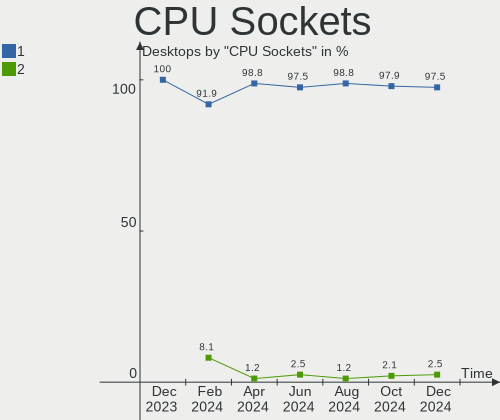

| Number | Desktops | Percent |
|--------|----------|---------|
| 1      | 61       | 96.83%  |
| 2      | 2        | 3.17%   |

CPU Threads
-----------

Threads per core (Hyper-Threading)

| Number | Desktops | Percent |
|--------|----------|---------|
| 2      | 35       | 55.56%  |
| 1      | 28       | 44.44%  |

CPU Op-Modes
------------

CPU Operation Modes (32-bit, 64-bit)

| Op mode        | Desktops | Percent |
|----------------|----------|---------|
| 32-bit, 64-bit | 63       | 100%    |

CPU Microcode
-------------

Microcode number

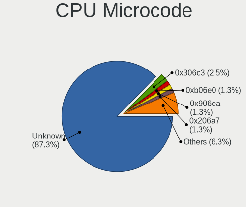

| Number     | Desktops | Percent |
|------------|----------|---------|
| Unknown    | 16       | 25.4%   |
| 0x206a7    | 5        | 7.94%   |
| 0x08701021 | 5        | 7.94%   |
| 0x306a9    | 4        | 6.35%   |
| 0x506e3    | 3        | 4.76%   |
| 0x306c3    | 3        | 4.76%   |
| 0x906e9    | 2        | 3.17%   |
| 0x306e4    | 2        | 3.17%   |
| 0x0a201016 | 2        | 3.17%   |
| 0x0a201009 | 2        | 3.17%   |
| 0xa0655    | 1        | 1.59%   |
| 0x906ed    | 1        | 1.59%   |
| 0x906eb    | 1        | 1.59%   |
| 0x906ea    | 1        | 1.59%   |
| 0x90672    | 1        | 1.59%   |
| 0x706a8    | 1        | 1.59%   |
| 0x506c9    | 1        | 1.59%   |
| 0x406f1    | 1        | 1.59%   |
| 0x30678    | 1        | 1.59%   |
| 0x206c2    | 1        | 1.59%   |
| 0x1067a    | 1        | 1.59%   |
| 0x10677    | 1        | 1.59%   |
| 0x0a50000d | 1        | 1.59%   |
| 0x08701013 | 1        | 1.59%   |
| 0x08001138 | 1        | 1.59%   |
| 0x0600611a | 1        | 1.59%   |
| 0x06003106 | 1        | 1.59%   |
| 0x06000852 | 1        | 1.59%   |
| 0x010000c8 | 1        | 1.59%   |

CPU Microarch
-------------

Microarchitecture

| Name          | Desktops | Percent |
|---------------|----------|---------|
| Zen 2         | 8        | 12.7%   |
| Zen 3         | 7        | 11.11%  |
| SandyBridge   | 6        | 9.52%   |
| KabyLake      | 6        | 9.52%   |
| IvyBridge     | 6        | 9.52%   |
| Skylake       | 4        | 6.35%   |
| Haswell       | 4        | 6.35%   |
| Penryn        | 3        | 4.76%   |
| Zen           | 2        | 3.17%   |
| Westmere      | 2        | 3.17%   |
| K10           | 2        | 3.17%   |
| Goldmont      | 2        | 3.17%   |
| Excavator     | 2        | 3.17%   |
| Zen+          | 1        | 1.59%   |
| Steamroller   | 1        | 1.59%   |
| Silvermont    | 1        | 1.59%   |
| Piledriver    | 1        | 1.59%   |
| Nehalem       | 1        | 1.59%   |
| Goldmont plus | 1        | 1.59%   |
| CometLake     | 1        | 1.59%   |
| Broadwell     | 1        | 1.59%   |
| Unknown       | 1        | 1.59%   |

Graphics
--------

GPU Vendor
----------

Vendors of graphics cards

| Vendor                     | Desktops | Percent |
|----------------------------|----------|---------|
| Intel                      | 23       | 34.33%  |
| AMD                        | 23       | 34.33%  |
| Nvidia                     | 20       | 29.85%  |
| Matrox Electronics Systems | 1        | 1.49%   |

GPU Model
---------

Graphics card models

| Model                                                                              | Desktops | Percent |
|------------------------------------------------------------------------------------|----------|---------|
| Nvidia GP106 [GeForce GTX 1060 6GB]                                                | 4        | 5.97%   |
| Nvidia GK208B [GeForce GT 710]                                                     | 3        | 4.48%   |
| Intel Xeon E3-1200 v3/4th Gen Core Processor Integrated Graphics Controller        | 3        | 4.48%   |
| Intel Xeon E3-1200 v2/3rd Gen Core processor Graphics Controller                   | 3        | 4.48%   |
| Intel HD Graphics 530                                                              | 3        | 4.48%   |
| Intel 2nd Generation Core Processor Family Integrated Graphics Controller          | 3        | 4.48%   |
| AMD Cedar [Radeon HD 5000/6000/7350/8350 Series]                                   | 3        | 4.48%   |
| Nvidia TU117 [GeForce GTX 1650]                                                    | 2        | 2.99%   |
| Nvidia GP104 [GeForce GTX 1070]                                                    | 2        | 2.99%   |
| Intel HD Graphics 630                                                              | 2        | 2.99%   |
| Intel CoffeeLake-S GT2 [UHD Graphics 630]                                          | 2        | 2.99%   |
| AMD Ellesmere [Radeon RX 470/480/570/570X/580/580X/590]                            | 2        | 2.99%   |
| AMD Cezanne                                                                        | 2        | 2.99%   |
| AMD Bonaire [FirePro W5100]                                                        | 2        | 2.99%   |
| Nvidia TU116 [GeForce GTX 1650]                                                    | 1        | 1.49%   |
| Nvidia GP108 [GeForce GT 1030]                                                     | 1        | 1.49%   |
| Nvidia GP104 [GeForce GTX 1080]                                                    | 1        | 1.49%   |
| Nvidia GK208B [GeForce GT 730]                                                     | 1        | 1.49%   |
| Nvidia GF100GL [Quadro 4000]                                                       | 1        | 1.49%   |
| Nvidia GA106 [Geforce RTX 3050]                                                    | 1        | 1.49%   |
| Nvidia GA104 [GeForce RTX 3070 Ti]                                                 | 1        | 1.49%   |
| Nvidia GA104 [GeForce RTX 3060 Ti Lite Hash Rate]                                  | 1        | 1.49%   |
| Nvidia G92 [GeForce 8800 GT]                                                       | 1        | 1.49%   |
| Matrox Electronics Systems MGA G200EH                                              | 1        | 1.49%   |
| Intel IvyBridge GT2 [HD Graphics 4000]                                             | 1        | 1.49%   |
| Intel HD Graphics 500                                                              | 1        | 1.49%   |
| Intel GeminiLake [UHD Graphics 600]                                                | 1        | 1.49%   |
| Intel Core Processor Integrated Graphics Controller                                | 1        | 1.49%   |
| Intel Celeron N3350/Pentium N4200/Atom E3900 Series Integrated Graphics Controller | 1        | 1.49%   |
| Intel Atom Processor Z36xxx/Z37xxx Series Graphics & Display                       | 1        | 1.49%   |
| Intel 4 Series Chipset Integrated Graphics Controller                              | 1        | 1.49%   |
| AMD Wani [Radeon R5/R6/R7 Graphics]                                                | 1        | 1.49%   |
| AMD Venus XT [Radeon HD 8870M / R9 M270X/M370X]                                    | 1        | 1.49%   |
| AMD Tonga PRO [Radeon R9 285/380]                                                  | 1        | 1.49%   |
| AMD Tahiti XT [Radeon HD 7970/8970 OEM / R9 280X]                                  | 1        | 1.49%   |
| AMD RV710 [Radeon HD 4350/4550]                                                    | 1        | 1.49%   |
| AMD Raven Ridge [Radeon Vega Series / Radeon Vega Mobile Series]                   | 1        | 1.49%   |
| AMD Park [Mobility Radeon HD 5430]                                                 | 1        | 1.49%   |
| AMD Navi 23 [Radeon RX 6600/6600 XT/6600M]                                         | 1        | 1.49%   |
| AMD Navi 21 [Radeon RX 6800/6800 XT / 6900 XT]                                     | 1        | 1.49%   |
| AMD Navi 10 [Radeon RX 5600 OEM/5600 XT / 5700/5700 XT]                            | 1        | 1.49%   |
| AMD Kaveri [Radeon R7 Graphics]                                                    | 1        | 1.49%   |
| AMD Hawaii XT / Grenada XT [Radeon R9 290X/390X]                                   | 1        | 1.49%   |
| AMD Curacao XT / Trinidad XT [Radeon R7 370 / R9 270X/370X]                        | 1        | 1.49%   |
| AMD Baffin [Radeon RX 460/560D / Pro 450/455/460/555/555X/560/560X]                | 1        | 1.49%   |

GPU Combo
---------

Combinations of graphics cards

| Name           | Desktops | Percent |
|----------------|----------|---------|
| 1 x AMD        | 21       | 33.33%  |
| 1 x Nvidia     | 19       | 30.16%  |
| 1 x Intel      | 19       | 30.16%  |
| 2 x AMD        | 1        | 1.59%   |
| 1 x Matrox     | 1        | 1.59%   |
| Intel + Nvidia | 1        | 1.59%   |
| Intel + AMD    | 1        | 1.59%   |

GPU Driver
----------

Free vs proprietary

| Driver      | Desktops | Percent |
|-------------|----------|---------|
| Free        | 49       | 77.78%  |
| Proprietary | 11       | 17.46%  |
| Unknown     | 3        | 4.76%   |

GPU Memory
----------

Total video memory

| Size in GB | Desktops | Percent |
|------------|----------|---------|
| Unknown    | 34       | 53.97%  |
| 7.01-8.0   | 7        | 11.11%  |
| 5.01-6.0   | 6        | 9.52%   |
| 1.01-2.0   | 6        | 9.52%   |
| 0.01-0.5   | 5        | 7.94%   |
| 0.51-1.0   | 3        | 4.76%   |
| 3.01-4.0   | 1        | 1.59%   |
| 8.01-16.0  | 1        | 1.59%   |

Monitor
-------

Monitor Vendor
--------------

Monitor vendors

| Vendor               | Desktops | Percent |
|----------------------|----------|---------|
| Samsung Electronics  | 9        | 12.68%  |
| Goldstar             | 6        | 8.45%   |
| Dell                 | 6        | 8.45%   |
| BenQ                 | 6        | 8.45%   |
| AOC                  | 6        | 8.45%   |
| Hewlett-Packard      | 5        | 7.04%   |
| Unknown              | 4        | 5.63%   |
| Philips              | 4        | 5.63%   |
| Acer                 | 4        | 5.63%   |
| ___                  | 2        | 2.82%   |
| OEM                  | 2        | 2.82%   |
| Iiyama               | 2        | 2.82%   |
| ASUSTek Computer     | 2        | 2.82%   |
| Ancor Communications | 2        | 2.82%   |
| ViewSonic            | 1        | 1.41%   |
| Videoseven           | 1        | 1.41%   |
| STD                  | 1        | 1.41%   |
| Packard Bell         | 1        | 1.41%   |
| NEC Computers        | 1        | 1.41%   |
| MSI                  | 1        | 1.41%   |
| MiTAC                | 1        | 1.41%   |
| LG Electronics       | 1        | 1.41%   |
| HannStar             | 1        | 1.41%   |
| Gigabyte Technology  | 1        | 1.41%   |
| ENMAR                | 1        | 1.41%   |

Monitor Model
-------------

Monitor models

| Model                                                                 | Desktops | Percent |
|-----------------------------------------------------------------------|----------|---------|
| OEM 32W_LCD_TV OEM3700 1920x540                                       | 2        | 2.6%    |
| Dell P2415Q DELA0BE 3840x2160 530x300mm 24.0-inch                     | 2        | 2.6%    |
| BenQ GL2760 BNQ78D5 1920x1080 598x336mm 27.0-inch                     | 2        | 2.6%    |
| AOC 27V2G5 AOC2702 1920x1080 598x336mm 27.0-inch                      | 2        | 2.6%    |
| ___ LCDTV16 ___9000 1360x768                                          | 1        | 1.3%    |
| ___ LCD TV ___0101 1360x768                                           | 1        | 1.3%    |
| ViewSonic VX2263 Series VSC692F 1920x1080 476x268mm 21.5-inch         | 1        | 1.3%    |
| Videoseven L19FM IGM0812 1280x1024 376x301mm 19.0-inch                | 1        | 1.3%    |
| Unknown LCD TV 9000 1360x768 1600x900mm 72.3-inch                     | 1        | 1.3%    |
| Unknown LCD TV 0101 1920x1080 1600x900mm 72.3-inch                    | 1        | 1.3%    |
| Unknown LCD Monitor RTK UHD HDR                                       | 1        | 1.3%    |
| Unknown LCD Monitor FFFF 2288x1287 2550x2550mm 142.0-inch             | 1        | 1.3%    |
| STD LED STD0001 2560x1440 330x220mm 15.6-inch                         | 1        | 1.3%    |
| Samsung Electronics U28E590 SAM0C4D 3840x2160 607x345mm 27.5-inch     | 1        | 1.3%    |
| Samsung Electronics U24E590 SAM0CD2 3840x2160 520x290mm 23.4-inch     | 1        | 1.3%    |
| Samsung Electronics SyncMaster SAM044C 1680x1050 474x296mm 22.0-inch  | 1        | 1.3%    |
| Samsung Electronics S24E450 SAM0C81 1920x1080 531x299mm 24.0-inch     | 1        | 1.3%    |
| Samsung Electronics S24C450 SAM09CF 1920x1200 518x324mm 24.1-inch     | 1        | 1.3%    |
| Samsung Electronics S24C300 SAM0A28 1920x1080 531x299mm 24.0-inch     | 1        | 1.3%    |
| Samsung Electronics S22F350 SAM0D1A 1920x1080 477x268mm 21.5-inch     | 1        | 1.3%    |
| Samsung Electronics LCD Monitor SAM07C0 1920x1080 890x500mm 40.2-inch | 1        | 1.3%    |
| Samsung Electronics LC49G95T SAM7053 3840x1080 1193x336mm 48.8-inch   | 1        | 1.3%    |
| Samsung Electronics C32R50x SAM7001 1920x1080 698x393mm 31.5-inch     | 1        | 1.3%    |
| Samsung Electronics C24F390 SAM0D2C 1920x1080 521x293mm 23.5-inch     | 1        | 1.3%    |
| Philips PHL 288E2 PHLC231 3840x2160 621x341mm 27.9-inch               | 1        | 1.3%    |
| Philips PHL 273V7 PHLC156 1920x1080 598x336mm 27.0-inch               | 1        | 1.3%    |
| Philips PHL 233V5 PHLC0D0 1920x1080 509x286mm 23.0-inch               | 1        | 1.3%    |
| Philips 236V4 PHLC0B3 1920x1080 510x287mm 23.0-inch                   | 1        | 1.3%    |
| Philips 227E4LH PHLC0AC 1920x1080 480x270mm 21.7-inch                 | 1        | 1.3%    |
| Packard Bell Viseo223DX PKB0385 1920x1080 477x268mm 21.5-inch         | 1        | 1.3%    |
| NEC Computers V423 NEC68AD 1920x1080 930x523mm 42.0-inch              | 1        | 1.3%    |
| MSI G241V E2 MSI3BA7 1920x1080 527x296mm 23.8-inch                    | 1        | 1.3%    |
| MiTAC DSGi TV SZM0308 1920x540 708x398mm 32.0-inch                    | 1        | 1.3%    |
| LG Electronics LCD Monitor LG Ultra HD                                | 1        | 1.3%    |
| Iiyama PLE2483H IVM6113 1920x1080 531x299mm 24.0-inch                 | 1        | 1.3%    |
| Iiyama PL2409HD IVM560C 1920x1080 521x293mm 23.5-inch                 | 1        | 1.3%    |
| Hewlett-Packard Z24i HWP309F 1920x1200 518x324mm 24.1-inch            | 1        | 1.3%    |
| Hewlett-Packard S270n HPN352F 3840x2160 600x340mm 27.2-inch           | 1        | 1.3%    |
| Hewlett-Packard L2245w HWP26FB 1680x1050 473x296mm 22.0-inch          | 1        | 1.3%    |
| Hewlett-Packard E232 HWP327A 1920x1080 509x286mm 23.0-inch            | 1        | 1.3%    |
| Hewlett-Packard 24w HPN3431 1920x1080 527x296mm 23.8-inch             | 1        | 1.3%    |
| HannStar HW223 HSD5B10 1680x1050 433x271mm 20.1-inch                  | 1        | 1.3%    |
| Goldstar ULTRAWIDE GSM59F1 2560x1080 673x284mm 28.8-inch              | 1        | 1.3%    |
| Goldstar Ultra HD GSM5B08 3840x2160 600x340mm 27.2-inch               | 1        | 1.3%    |
| Goldstar FULL HD GSM5B55 1920x1080 480x270mm 21.7-inch                | 1        | 1.3%    |
| Goldstar FULL HD GSM5ABB 1920x1080 480x270mm 21.7-inch                | 1        | 1.3%    |
| Goldstar 32ML600 GSM772D 1920x1080 480x270mm 21.7-inch                | 1        | 1.3%    |
| Goldstar 22MP65 GSM5A3C 1920x1080 477x268mm 21.5-inch                 | 1        | 1.3%    |
| Gigabyte Technology M28U GBT2800 3840x2160 697x392mm 31.5-inch        | 1        | 1.3%    |
| ENMAR LCDTV ENM0FD2 1360x768 820x460mm 37.0-inch                      | 1        | 1.3%    |
| Dell U2720Q DEL41B5 3840x2160 597x336mm 27.0-inch                     | 1        | 1.3%    |
| Dell U2412M DELA07B 1920x1200 518x324mm 24.1-inch                     | 1        | 1.3%    |
| Dell P2418HZm DELD0C4 1920x1080 527x296mm 23.8-inch                   | 1        | 1.3%    |
| Dell P2418HZm DELD0C3 1920x1080 527x296mm 23.8-inch                   | 1        | 1.3%    |
| Dell LCD Monitor 1907FP                                               | 1        | 1.3%    |
| BenQ PD3200U BNQ8025 3840x2160 708x399mm 32.0-inch                    | 1        | 1.3%    |
| BenQ GW2780 BNQ78E6 1920x1080 598x336mm 27.0-inch                     | 1        | 1.3%    |
| BenQ GL2450H BNQ78A7 1920x1080 531x298mm 24.0-inch                    | 1        | 1.3%    |
| BenQ BL3200 BNQ8017 2560x1440 708x398mm 32.0-inch                     | 1        | 1.3%    |
| ASUSTek Computer VG27AQL1A AUS2704 2560x1440 596x336mm 26.9-inch      | 1        | 1.3%    |

Monitor Resolution
------------------

Monitor screen resolution

| Resolution         | Desktops | Percent |
|--------------------|----------|---------|
| 1920x1080 (FHD)    | 33       | 47.83%  |
| 3840x2160 (4K)     | 12       | 17.39%  |
| 2560x1440 (QHD)    | 4        | 5.8%    |
| 1920x540           | 3        | 4.35%   |
| 1920x1200 (WUXGA)  | 3        | 4.35%   |
| 1680x1050 (WSXGA+) | 3        | 4.35%   |
| 1360x768           | 2        | 2.9%    |
| Unknown            | 2        | 2.9%    |
| 3840x1080          | 1        | 1.45%   |
| 2960x1050          | 1        | 1.45%   |
| 2560x1080          | 1        | 1.45%   |
| 2288x1287          | 1        | 1.45%   |
| 1440x900 (WXGA+)   | 1        | 1.45%   |
| 1366x768 (WXGA)    | 1        | 1.45%   |
| 1280x1024 (SXGA)   | 1        | 1.45%   |

Monitor Diagonal
----------------

Diagonal size in inches

| Inches  | Desktops | Percent |
|---------|----------|---------|
| 27      | 13       | 18.31%  |
| 23      | 12       | 16.9%   |
| 21      | 12       | 16.9%   |
| 24      | 11       | 15.49%  |
| Unknown | 5        | 7.04%   |
| 72      | 2        | 2.82%   |
| 32      | 2        | 2.82%   |
| 31      | 2        | 2.82%   |
| 22      | 2        | 2.82%   |
| 142     | 1        | 1.41%   |
| 48      | 1        | 1.41%   |
| 46      | 1        | 1.41%   |
| 42      | 1        | 1.41%   |
| 39      | 1        | 1.41%   |
| 37      | 1        | 1.41%   |
| 34      | 1        | 1.41%   |
| 33      | 1        | 1.41%   |
| 20      | 1        | 1.41%   |
| 19      | 1        | 1.41%   |

Monitor Width
-------------

Physical width

| Width in mm    | Desktops | Percent |
|----------------|----------|---------|
| 501-600        | 30       | 44.78%  |
| 401-500        | 15       | 22.39%  |
| Unknown        | 5        | 7.46%   |
| 701-800        | 4        | 5.97%   |
| 601-700        | 4        | 5.97%   |
| 801-900        | 2        | 2.99%   |
| 1501-2000      | 2        | 2.99%   |
| 1001-1500      | 2        | 2.99%   |
| More than 2000 | 1        | 1.49%   |
| 351-400        | 1        | 1.49%   |
| 901-1000       | 1        | 1.49%   |

Aspect Ratio
------------

Proportional relationship between the width and the height

| Ratio   | Desktops | Percent |
|---------|----------|---------|
| 16/9    | 47       | 77.05%  |
| 16/10   | 6        | 9.84%   |
| Unknown | 4        | 6.56%   |
| 5/4     | 1        | 1.64%   |
| 32/9    | 1        | 1.64%   |
| 21/9    | 1        | 1.64%   |
| 1.00    | 1        | 1.64%   |

Monitor Area
------------

Area in inch

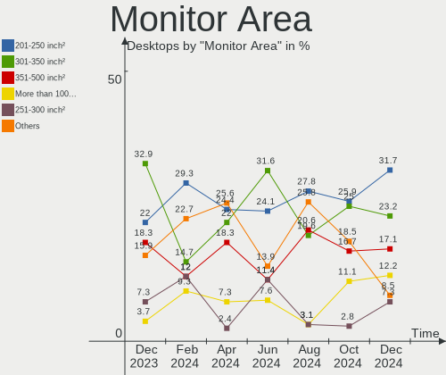

| Area in inch | Desktops | Percent |
|----------------|----------|---------|
| 201-250        | 30       | 42.25%  |
| 301-350        | 13       | 18.31%  |
| 351-500        | 6        | 8.45%   |
| 151-200        | 6        | 8.45%   |
| 501-1000       | 5        | 7.04%   |
| Unknown        | 5        | 7.04%   |
| More than 1000 | 3        | 4.23%   |
| 251-300        | 3        | 4.23%   |

Pixel Density
-------------

Pixels per inch

| Density | Desktops | Percent |
|---------|----------|---------|
| 51-100  | 35       | 51.47%  |
| 101-120 | 13       | 19.12%  |
| 161-240 | 6        | 8.82%   |
| 1-50    | 5        | 7.35%   |
| Unknown | 5        | 7.35%   |
| 121-160 | 4        | 5.88%   |

Multiple Monitors
-----------------

Total monitors connected

| Total | Desktops | Percent |
|-------|----------|---------|
| 1     | 43       | 68.25%  |
| 2     | 15       | 23.81%  |
| 0     | 3        | 4.76%   |
| 3     | 2        | 3.17%   |

Network
-------

Net Controller Vendor
---------------------

Controller vendors

| Vendor                | Desktops | Percent |
|-----------------------|----------|---------|
| Realtek Semiconductor | 37       | 39.36%  |
| Intel                 | 37       | 39.36%  |
| Broadcom              | 6        | 6.38%   |
| Ralink Technology     | 3        | 3.19%   |
| TP-Link               | 2        | 2.13%   |
| Qualcomm Atheros      | 2        | 2.13%   |
| Aquantia              | 2        | 2.13%   |
| Xiaomi                | 1        | 1.06%   |
| Nvidia                | 1        | 1.06%   |
| Microsoft             | 1        | 1.06%   |
| Broadcom Limited      | 1        | 1.06%   |
| Belkin Components     | 1        | 1.06%   |

Net Controller Model
--------------------

Controller models

| Model                                                                       | Desktops | Percent |
|-----------------------------------------------------------------------------|----------|---------|
| Realtek RTL8111/8168/8411 PCI Express Gigabit Ethernet Controller           | 26       | 22.81%  |
| Realtek RTL8125 2.5GbE Controller                                           | 6        | 5.26%   |
| Intel Wi-Fi 6 AX200                                                         | 5        | 4.39%   |
| Intel I211 Gigabit Network Connection                                       | 5        | 4.39%   |
| Intel 82579LM Gigabit Network Connection (Lewisville)                       | 5        | 4.39%   |
| Intel Ethernet Connection I217-LM                                           | 4        | 3.51%   |
| Realtek RTL8153 Gigabit Ethernet Adapter                                    | 3        | 2.63%   |
| Intel Wireless 3165                                                         | 3        | 2.63%   |
| Intel Wi-Fi 6 AX210/AX211/AX411 160MHz                                      | 3        | 2.63%   |
| Intel Ethernet Controller I225-V                                            | 3        | 2.63%   |
| Realtek 802.11ac NIC                                                        | 2        | 1.75%   |
| Ralink MT7601U Wireless Adapter                                             | 2        | 1.75%   |
| Intel Ethernet Connection (2) I219-V                                        | 2        | 1.75%   |
| Intel Ethernet Connection (2) I219-LM                                       | 2        | 1.75%   |
| Intel Dual Band Wireless-AC 3168NGW [Stone Peak]                            | 2        | 1.75%   |
| Intel 82579V Gigabit Network Connection                                     | 2        | 1.75%   |
| Intel 82574L Gigabit Network Connection                                     | 2        | 1.75%   |
| Xiaomi Mi/Redmi series (RNDIS + ADB)                                        | 1        | 0.88%   |
| TP-Link Archer T9UH v1 [Realtek RTL8814AU]                                  | 1        | 0.88%   |
| TP-Link 802.11ac WLAN Adapter                                               | 1        | 0.88%   |
| Realtek RTL88x2bu [AC1200 Techkey]                                          | 1        | 0.88%   |
| Realtek RTL8821CE 802.11ac PCIe Wireless Network Adapter                    | 1        | 0.88%   |
| Realtek RTL8723BU 802.11b/g/n WLAN Adapter                                  | 1        | 0.88%   |
| Realtek RTL8723BE PCIe Wireless Network Adapter                             | 1        | 0.88%   |
| Realtek RTL8192EE PCIe Wireless Network Adapter                             | 1        | 0.88%   |
| Realtek RTL8188FTV 802.11b/g/n 1T1R 2.4G WLAN Adapter                       | 1        | 0.88%   |
| Realtek RTL-8110SC/8169SC Gigabit Ethernet                                  | 1        | 0.88%   |
| Realtek Killer E3000 2.5GbE Controller                                      | 1        | 0.88%   |
| Realtek 802.11n WLAN Adapter                                                | 1        | 0.88%   |
| Ralink RT5370 Wireless Adapter                                              | 1        | 0.88%   |
| Qualcomm Atheros AR9485 Wireless Network Adapter                            | 1        | 0.88%   |
| Qualcomm Atheros AR9287 Wireless Network Adapter (PCI-Express)              | 1        | 0.88%   |
| Nvidia MCP61 Ethernet                                                       | 1        | 0.88%   |
| Microsoft Xbox 360 Wireless Adapter                                         | 1        | 0.88%   |
| Microsoft Wireless XBox Controller Dongle                                   | 1        | 0.88%   |
| Intel Wireless 8260                                                         | 1        | 0.88%   |
| Intel Ethernet Connection (7) I219-V                                        | 1        | 0.88%   |
| Intel Ethernet Connection (2) I218-V                                        | 1        | 0.88%   |
| Intel Ethernet Connection (11) I219-V                                       | 1        | 0.88%   |
| Intel Comet Lake PCH CNVi WiFi                                              | 1        | 0.88%   |
| Intel Cannon Lake PCH CNVi WiFi                                             | 1        | 0.88%   |
| Intel 82578DM Gigabit Network Connection                                    | 1        | 0.88%   |
| Intel 82567LM-3 Gigabit Network Connection                                  | 1        | 0.88%   |
| Broadcom NetXtreme BCM57762 Gigabit Ethernet PCIe                           | 1        | 0.88%   |
| Broadcom NetXtreme BCM5764M Gigabit Ethernet PCIe                           | 1        | 0.88%   |
| Broadcom NetXtreme BCM5762 Gigabit Ethernet PCIe                            | 1        | 0.88%   |
| Broadcom Network controller                                                 | 1        | 0.88%   |
| Broadcom Limited BCM43228 802.11a/b/g/n                                     | 1        | 0.88%   |
| Broadcom BCM43602 802.11ac Wireless LAN SoC                                 | 1        | 0.88%   |
| Broadcom BCM4360 802.11ac Wireless Network Adapter                          | 1        | 0.88%   |
| Broadcom BCM43224 802.11a/b/g/n                                             | 1        | 0.88%   |
| Belkin Components F9L1101v2 802.11abgn Wireless Adapter [Realtek RTL8192DU] | 1        | 0.88%   |
| Aquantia AQC111 NBase-T/IEEE 802.3bz Ethernet Controller [AQtion]           | 1        | 0.88%   |
| Aquantia AQC107 NBase-T/IEEE 802.3bz Ethernet Controller [AQtion]           | 1        | 0.88%   |

Wireless Vendor
---------------

Wireless vendors

| Vendor                | Desktops | Percent |
|-----------------------|----------|---------|
| Intel                 | 16       | 41.03%  |
| Realtek Semiconductor | 9        | 23.08%  |
| Broadcom              | 4        | 10.26%  |
| Ralink Technology     | 3        | 7.69%   |
| TP-Link               | 2        | 5.13%   |
| Qualcomm Atheros      | 2        | 5.13%   |
| Microsoft             | 1        | 2.56%   |
| Broadcom Limited      | 1        | 2.56%   |
| Belkin Components     | 1        | 2.56%   |

Wireless Model
--------------

Wireless models

| Model                                                                       | Desktops | Percent |
|-----------------------------------------------------------------------------|----------|---------|
| Intel Wi-Fi 6 AX200                                                         | 5        | 12.5%   |
| Intel Wireless 3165                                                         | 3        | 7.5%    |
| Intel Wi-Fi 6 AX210/AX211/AX411 160MHz                                      | 3        | 7.5%    |
| Realtek 802.11ac NIC                                                        | 2        | 5%      |
| Ralink MT7601U Wireless Adapter                                             | 2        | 5%      |
| Intel Dual Band Wireless-AC 3168NGW [Stone Peak]                            | 2        | 5%      |
| TP-Link Archer T9UH v1 [Realtek RTL8814AU]                                  | 1        | 2.5%    |
| TP-Link 802.11ac WLAN Adapter                                               | 1        | 2.5%    |
| Realtek RTL88x2bu [AC1200 Techkey]                                          | 1        | 2.5%    |
| Realtek RTL8821CE 802.11ac PCIe Wireless Network Adapter                    | 1        | 2.5%    |
| Realtek RTL8723BU 802.11b/g/n WLAN Adapter                                  | 1        | 2.5%    |
| Realtek RTL8723BE PCIe Wireless Network Adapter                             | 1        | 2.5%    |
| Realtek RTL8192EE PCIe Wireless Network Adapter                             | 1        | 2.5%    |
| Realtek RTL8188FTV 802.11b/g/n 1T1R 2.4G WLAN Adapter                       | 1        | 2.5%    |
| Realtek 802.11n WLAN Adapter                                                | 1        | 2.5%    |
| Ralink RT5370 Wireless Adapter                                              | 1        | 2.5%    |
| Qualcomm Atheros AR9485 Wireless Network Adapter                            | 1        | 2.5%    |
| Qualcomm Atheros AR9287 Wireless Network Adapter (PCI-Express)              | 1        | 2.5%    |
| Microsoft Xbox 360 Wireless Adapter                                         | 1        | 2.5%    |
| Microsoft Wireless XBox Controller Dongle                                   | 1        | 2.5%    |
| Intel Wireless 8260                                                         | 1        | 2.5%    |
| Intel Comet Lake PCH CNVi WiFi                                              | 1        | 2.5%    |
| Intel Cannon Lake PCH CNVi WiFi                                             | 1        | 2.5%    |
| Broadcom Network controller                                                 | 1        | 2.5%    |
| Broadcom Limited BCM43228 802.11a/b/g/n                                     | 1        | 2.5%    |
| Broadcom BCM43602 802.11ac Wireless LAN SoC                                 | 1        | 2.5%    |
| Broadcom BCM4360 802.11ac Wireless Network Adapter                          | 1        | 2.5%    |
| Broadcom BCM43224 802.11a/b/g/n                                             | 1        | 2.5%    |
| Belkin Components F9L1101v2 802.11abgn Wireless Adapter [Realtek RTL8192DU] | 1        | 2.5%    |

Ethernet Vendor
---------------

Ethernet vendors

| Vendor                | Desktops | Percent |
|-----------------------|----------|---------|
| Realtek Semiconductor | 33       | 47.14%  |
| Intel                 | 30       | 42.86%  |
| Broadcom              | 3        | 4.29%   |
| Aquantia              | 2        | 2.86%   |
| Xiaomi                | 1        | 1.43%   |
| Nvidia                | 1        | 1.43%   |

Ethernet Model
--------------

Ethernet models

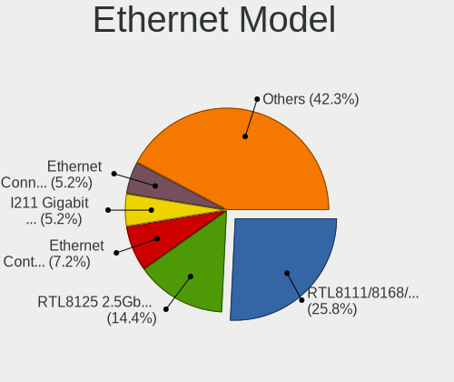

| Model                                                             | Desktops | Percent |
|-------------------------------------------------------------------|----------|---------|
| Realtek RTL8111/8168/8411 PCI Express Gigabit Ethernet Controller | 26       | 35.14%  |
| Realtek RTL8125 2.5GbE Controller                                 | 6        | 8.11%   |
| Intel I211 Gigabit Network Connection                             | 5        | 6.76%   |
| Intel 82579LM Gigabit Network Connection (Lewisville)             | 5        | 6.76%   |
| Intel Ethernet Connection I217-LM                                 | 4        | 5.41%   |
| Realtek RTL8153 Gigabit Ethernet Adapter                          | 3        | 4.05%   |
| Intel Ethernet Controller I225-V                                  | 3        | 4.05%   |
| Intel Ethernet Connection (2) I219-V                              | 2        | 2.7%    |
| Intel Ethernet Connection (2) I219-LM                             | 2        | 2.7%    |
| Intel 82579V Gigabit Network Connection                           | 2        | 2.7%    |
| Intel 82574L Gigabit Network Connection                           | 2        | 2.7%    |
| Xiaomi Mi/Redmi series (RNDIS + ADB)                              | 1        | 1.35%   |
| Realtek RTL-8110SC/8169SC Gigabit Ethernet                        | 1        | 1.35%   |
| Realtek Killer E3000 2.5GbE Controller                            | 1        | 1.35%   |
| Nvidia MCP61 Ethernet                                             | 1        | 1.35%   |
| Intel Ethernet Connection (7) I219-V                              | 1        | 1.35%   |
| Intel Ethernet Connection (2) I218-V                              | 1        | 1.35%   |
| Intel Ethernet Connection (11) I219-V                             | 1        | 1.35%   |
| Intel 82578DM Gigabit Network Connection                          | 1        | 1.35%   |
| Intel 82567LM-3 Gigabit Network Connection                        | 1        | 1.35%   |
| Broadcom NetXtreme BCM57762 Gigabit Ethernet PCIe                 | 1        | 1.35%   |
| Broadcom NetXtreme BCM5764M Gigabit Ethernet PCIe                 | 1        | 1.35%   |
| Broadcom NetXtreme BCM5762 Gigabit Ethernet PCIe                  | 1        | 1.35%   |
| Aquantia AQC111 NBase-T/IEEE 802.3bz Ethernet Controller [AQtion] | 1        | 1.35%   |
| Aquantia AQC107 NBase-T/IEEE 802.3bz Ethernet Controller [AQtion] | 1        | 1.35%   |

Net Controller Kind
-------------------

Ethernet, WiFi or modem

| Kind     | Desktops | Percent |
|----------|----------|---------|
| Ethernet | 63       | 62.38%  |
| WiFi     | 38       | 37.62%  |

Used Controller
---------------

Currently used network controller

| Kind     | Desktops | Percent |
|----------|----------|---------|
| Ethernet | 47       | 69.12%  |
| WiFi     | 21       | 30.88%  |

NICs
----

Total network controllers on board

| Total | Desktops | Percent |
|-------|----------|---------|
| 1     | 31       | 49.21%  |
| 2     | 26       | 41.27%  |
| 3     | 6        | 9.52%   |

IPv6
----

IPv6 vs IPv4

| Used | Desktops | Percent |
|------|----------|---------|
| No   | 49       | 77.78%  |
| Yes  | 14       | 22.22%  |

Bluetooth
---------

Bluetooth Vendor
----------------

Controller vendors

| Vendor                  | Desktops | Percent |
|-------------------------|----------|---------|
| Intel                   | 15       | 48.39%  |
| Cambridge Silicon Radio | 6        | 19.35%  |
| Realtek Semiconductor   | 3        | 9.68%   |
| Apple                   | 3        | 9.68%   |
| Broadcom                | 2        | 6.45%   |
| IMC Networks            | 1        | 3.23%   |
| Belkin Components       | 1        | 3.23%   |

Bluetooth Model
---------------

Controller models

| Model                                               | Desktops | Percent |
|-----------------------------------------------------|----------|---------|
| Cambridge Silicon Radio Bluetooth Dongle (HCI mode) | 6        | 19.35%  |
| Intel AX200 Bluetooth                               | 5        | 16.13%  |
| Intel Bluetooth wireless interface                  | 4        | 12.9%   |
| Realtek Bluetooth Radio                             | 3        | 9.68%   |
| Intel Wireless-AC 3168 Bluetooth                    | 2        | 6.45%   |
| Intel AX210 Bluetooth                               | 2        | 6.45%   |
| Intel Bluetooth Device                              | 1        | 3.23%   |
| Intel Bluetooth 9460/9560 Jefferson Peak (JfP)      | 1        | 3.23%   |
| IMC Networks Bluetooth Radio                        | 1        | 3.23%   |
| Broadcom BCM20702A0 Bluetooth 4.0                   | 1        | 3.23%   |
| Broadcom BCM20702A0                                 | 1        | 3.23%   |
| Belkin Components Bluetooth Mini Dongle             | 1        | 3.23%   |
| Apple Built-in Bluetooth 2.0+EDR HCI                | 1        | 3.23%   |
| Apple Bluetooth USB Host Controller                 | 1        | 3.23%   |
| Apple Bluetooth Host Controller                     | 1        | 3.23%   |

Sound
-----

Sound Vendor
------------

Sound card vendors

| Vendor                    | Desktops | Percent |
|---------------------------|----------|---------|
| Intel                     | 36       | 34.29%  |
| AMD                       | 32       | 30.48%  |
| Nvidia                    | 19       | 18.1%   |
| Texas Instruments         | 2        | 1.9%    |
| SteelSeries ApS           | 2        | 1.9%    |
| Samson Technologies       | 2        | 1.9%    |
| Logitech                  | 2        | 1.9%    |
| Sony                      | 1        | 0.95%   |
| Sennheiser Communications | 1        | 0.95%   |
| Razer USA                 | 1        | 0.95%   |
| Kingston Technology       | 1        | 0.95%   |
| JMTek                     | 1        | 0.95%   |
| Generalplus Technology    | 1        | 0.95%   |
| Creative Labs             | 1        | 0.95%   |
| Conexant Systems          | 1        | 0.95%   |
| C-Media Electronics       | 1        | 0.95%   |
| Antlion Audio             | 1        | 0.95%   |

Sound Model
-----------

Sound card models

| Model                                                                      | Desktops | Percent |
|----------------------------------------------------------------------------|----------|---------|
| AMD Starship/Matisse HD Audio Controller                                   | 13       | 10.66%  |
| Intel 6 Series/C200 Series Chipset Family High Definition Audio Controller | 5        | 4.1%    |
| Intel 100 Series/C230 Series Chipset Family HD Audio Controller            | 5        | 4.1%    |
| Nvidia GP106 High Definition Audio Controller                              | 4        | 3.28%   |
| Nvidia GK208 HDMI/DP Audio Controller                                      | 4        | 3.28%   |
| Intel 8 Series/C220 Series Chipset High Definition Audio Controller        | 4        | 3.28%   |
| Intel 7 Series/C216 Chipset Family High Definition Audio Controller        | 4        | 3.28%   |
| Nvidia GP104 High Definition Audio Controller                              | 3        | 2.46%   |
| Intel Xeon E3-1200 v3/4th Gen Core Processor HD Audio Controller           | 3        | 2.46%   |
| Intel 82801JI (ICH10 Family) HD Audio Controller                           | 3        | 2.46%   |
| Intel 200 Series PCH HD Audio                                              | 3        | 2.46%   |
| AMD Family 17h/19h HD Audio Controller                                     | 3        | 2.46%   |
| AMD Cedar HDMI Audio [Radeon HD 5400/6300/7300 Series]                     | 3        | 2.46%   |
| Nvidia TU107 GeForce GTX 1650 High Definition Audio Controller             | 2        | 1.64%   |
| Nvidia GA104 High Definition Audio Controller                              | 2        | 1.64%   |
| Intel Celeron N3350/Pentium N4200/Atom E3900 Series Audio Cluster          | 2        | 1.64%   |
| AMD Tobago HDMI Audio [Radeon R7 360 / R9 360 OEM]                         | 2        | 1.64%   |
| AMD SBx00 Azalia (Intel HDA)                                               | 2        | 1.64%   |
| AMD Renoir Radeon High Definition Audio Controller                         | 2        | 1.64%   |
| AMD Oland/Hainan/Cape Verde/Pitcairn HDMI Audio [Radeon HD 7000 Series]    | 2        | 1.64%   |
| AMD Navi 21/23 HDMI/DP Audio Controller                                    | 2        | 1.64%   |
| AMD Family 17h (Models 00h-0fh) HD Audio Controller                        | 2        | 1.64%   |
| AMD Family 15h (Models 60h-6fh) Audio Controller                           | 2        | 1.64%   |
| AMD Ellesmere HDMI Audio [Radeon RX 470/480 / 570/580/590]                 | 2        | 1.64%   |
| Texas Instruments SMSL M-3 Desktop DAC                                     | 1        | 0.82%   |
| Texas Instruments PCM2902 Audio Codec                                      | 1        | 0.82%   |
| SteelSeries ApS SteelSeries Arctis 7                                       | 1        | 0.82%   |
| SteelSeries ApS SteelSeries Arctis 1 Wireless                              | 1        | 0.82%   |
| Sony DualShock 4 [CUH-ZCT2x]                                               | 1        | 0.82%   |
| Sennheiser Communications EPOS BTD 800                                     | 1        | 0.82%   |
| Samson Technologies GoMic compact condenser mic                            | 1        | 0.82%   |
| Samson Technologies G-Track Pro microphone                                 | 1        | 0.82%   |
| Razer USA Razer BlackShark V2 Pro                                          | 1        | 0.82%   |
| Nvidia TU116 High Definition Audio Controller                              | 1        | 0.82%   |
| Nvidia MCP61 High Definition Audio                                         | 1        | 0.82%   |
| Nvidia GP108 High Definition Audio Controller                              | 1        | 0.82%   |
| Nvidia GF100 High Definition Audio Controller                              | 1        | 0.82%   |
| Nvidia Audio device                                                        | 1        | 0.82%   |
| Logitech Logitech G PRO X Gaming Headset                                   | 1        | 0.82%   |
| Logitech H600 [Wireless Headset]                                           | 1        | 0.82%   |
| Kingston Technology HyperX Quadcast                                        | 1        | 0.82%   |
| JMTek USB PnP Audio Device                                                 | 1        | 0.82%   |
| Intel Comet Lake PCH cAVS                                                  | 1        | 0.82%   |
| Intel Celeron/Pentium Silver Processor High Definition Audio               | 1        | 0.82%   |
| Intel Cannon Lake PCH cAVS                                                 | 1        | 0.82%   |
| Intel C610/X99 series chipset HD Audio Controller                          | 1        | 0.82%   |
| Intel C600/X79 series chipset High Definition Audio Controller             | 1        | 0.82%   |
| Intel Atom Processor Z36xxx/Z37xxx Series High Definition Audio Controller | 1        | 0.82%   |
| Intel Alder Lake-S HD Audio Controller                                     | 1        | 0.82%   |
| Intel 82801JD/DO (ICH10 Family) HD Audio Controller                        | 1        | 0.82%   |
| Intel 82801I (ICH9 Family) HD Audio Controller                             | 1        | 0.82%   |
| Intel 5 Series/3400 Series Chipset High Definition Audio                   | 1        | 0.82%   |
| Generalplus Technology USB Audio Device                                    | 1        | 0.82%   |
| Creative Labs Sound Core3D [Sound Blaster Recon3D / Z-Series]              | 1        | 0.82%   |
| Conexant Systems P2418HZm                                                  | 1        | 0.82%   |
| C-Media Electronics Audio Adapter (Unitek Y-247A)                          | 1        | 0.82%   |
| Antlion Audio Antlion Wireless Microphone                                  | 1        | 0.82%   |
| AMD Tonga HDMI Audio [Radeon R9 285/380]                                   | 1        | 0.82%   |
| AMD Tahiti HDMI Audio [Radeon HD 7870 XT / 7950/7970]                      | 1        | 0.82%   |
| AMD RV710/730 HDMI Audio [Radeon HD 4000 series]                           | 1        | 0.82%   |

Memory
------

Memory Vendor
-------------

Memory module vendors

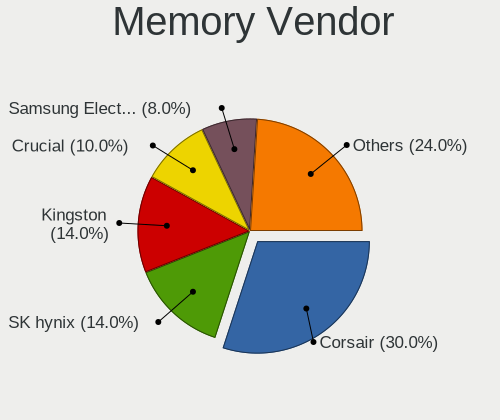

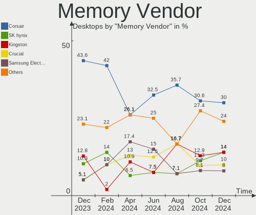

| Vendor              | Desktops | Percent |
|---------------------|----------|---------|
| Corsair             | 13       | 37.14%  |
| Crucial             | 5        | 14.29%  |
| SK hynix            | 4        | 11.43%  |
| Samsung Electronics | 4        | 11.43%  |
| Micron Technology   | 3        | 8.57%   |
| Kingston            | 3        | 8.57%   |
| Unknown (ABCD)      | 1        | 2.86%   |
| Nanya Technology    | 1        | 2.86%   |
| G.Skill             | 1        | 2.86%   |

Memory Model
------------

Memory module models

| Model                                                          | Desktops | Percent |
|----------------------------------------------------------------|----------|---------|
| Crucial RAM BL8G36C16U4B.M8FE1 8GB DIMM DDR4 3733MT/s          | 2        | 5.13%   |
| Corsair RAM CMK16GX4M2B3000C15 8192MB DIMM DDR4 3000MT/s       | 2        | 5.13%   |
| Unknown (ABCD) RAM 123456789012345678 2GB DIMM LPDDR4 2400MT/s | 1        | 2.56%   |
| SK hynix RAM HMT451S6BFR8A-PB 4096MB SODIMM DDR3 1600MT/s      | 1        | 2.56%   |
| SK hynix RAM HMT41GU6MFR8C-PB 8192MB DIMM DDR3 1600MT/s        | 1        | 2.56%   |
| SK hynix RAM HMT325U6EFR8C-PB 2GB DIMM DDR3 1600MT/s           | 1        | 2.56%   |
| SK hynix RAM HMT325U6CFR8C-PB 2GB DIMM DDR3 1600MT/s           | 1        | 2.56%   |
| SK hynix RAM HMA82GS6DJR8N-VK 16384MB SODIMM DDR4 2667MT/s     | 1        | 2.56%   |
| Samsung RAM Module 4GB DIMM DDR4 2666MT/s                      | 1        | 2.56%   |
| Samsung RAM M471B5173QH0-YK0 4GB SODIMM DDR3 1600MT/s          | 1        | 2.56%   |
| Samsung RAM M378B5773CH0-CH9 2GB DIMM DDR3 1867MT/s            | 1        | 2.56%   |
| Samsung RAM M378B5173QH0-CK0 4096MB DIMM DDR3 1866MT/s         | 1        | 2.56%   |
| Nanya RAM NT4GC64B88B1NF-DI 4GB DIMM DDR3 1600MT/s             | 1        | 2.56%   |
| Micron RAM Module 4GB DIMM DDR3 1866MT/s                       | 1        | 2.56%   |
| Micron RAM 18KSF51272AZ-1G4K1 4GB DIMM DDR3 1067MT/s           | 1        | 2.56%   |
| Micron RAM 18JSF25672AZ-1G1F1 2GB DIMM DDR3 1067MT/s           | 1        | 2.56%   |
| Kingston RAM Module 4096MB DIMM DDR4 2400MT/s                  | 1        | 2.56%   |
| Kingston RAM KF3200C16D4/8GX 8GB DIMM DDR4 3600MT/s            | 1        | 2.56%   |
| Kingston RAM 9905316-005.A04LF 1GB DIMM DDR2 667MT/s           | 1        | 2.56%   |
| G.Skill RAM F3-17000CL9-4 4GB DIMM DDR3 1600MT/s               | 1        | 2.56%   |
| Crucial RAM CT8G4DFRA266.C8FJ 8GB DIMM DDR4 2800MT/s           | 1        | 2.56%   |
| Crucial RAM CT4G4DFS824A.C8FG 4096MB DIMM DDR4 2400MT/s        | 1        | 2.56%   |
| Crucial RAM CT102464BF160B.M16 8GB DIMM DDR3 1600MT/s          | 1        | 2.56%   |
| Corsair RAM VS1GB667D2 1GB DIMM DDR2 667MT/s                   | 1        | 2.56%   |
| Corsair RAM CMX4GX3M1A1333C9 4GB DIMM DDR3 1333MT/s            | 1        | 2.56%   |
| Corsair RAM CMW64GX4M2D3600C18 32GB DIMM DDR4 3600MT/s         | 1        | 2.56%   |
| Corsair RAM CMW32GX4M2Z3200C16 16GB DIMM DDR4 3200MT/s         | 1        | 2.56%   |
| Corsair RAM CMW16GX4M2C3200C16 8GB DIMM DDR4 3266MT/s          | 1        | 2.56%   |
| Corsair RAM CMU32GX4M2C3200C16 16GB DIMM DDR4 3200MT/s         | 1        | 2.56%   |
| Corsair RAM CMK8GX4M1A2400C16 8GB DIMM DDR4 2800MT/s           | 1        | 2.56%   |
| Corsair RAM CMK16GX4M2Z3200C16 8GB DIMM DDR4 3200MT/s          | 1        | 2.56%   |
| Corsair RAM CMK16GX4M2D3600C18 8192MB DIMM DDR4 3600MT/s       | 1        | 2.56%   |
| Corsair RAM CMK16GX4M2D3000C16 8GB DIMM DDR4 3200MT/s          | 1        | 2.56%   |
| Corsair RAM CMK16GX4M2C3000C16 8GB DIMM DDR4 3000MT/s          | 1        | 2.56%   |
| Corsair RAM CMK16GX4M2B3200C16 8GB DIMM DDR4 3600MT/s          | 1        | 2.56%   |
| Corsair RAM CMK16GX4M1B3000C15 16384MB DIMM DDR4 3400MT/s      | 1        | 2.56%   |
| Corsair RAM CM4X8GF2400Z16K4 8GB DIMM DDR4 2400MT/s            | 1        | 2.56%   |

Memory Kind
-----------

Memory module kinds

| Kind   | Desktops | Percent |
|--------|----------|---------|
| DDR4   | 18       | 60%     |
| DDR3   | 9        | 30%     |
| SDRAM  | 1        | 3.33%   |
| LPDDR4 | 1        | 3.33%   |
| DDR2   | 1        | 3.33%   |

Memory Form Factor
------------------

Physical design of the memory module

| Name   | Desktops | Percent |
|--------|----------|---------|
| DIMM   | 27       | 93.1%   |
| SODIMM | 2        | 6.9%    |

Memory Size
-----------

Memory module size

| Size  | Desktops | Percent |
|-------|----------|---------|
| 8192  | 14       | 46.67%  |
| 4096  | 8        | 26.67%  |
| 16384 | 4        | 13.33%  |
| 2048  | 2        | 6.67%   |
| 32768 | 1        | 3.33%   |
| 1024  | 1        | 3.33%   |

Memory Speed
------------

Memory module speed

| Speed | Desktops | Percent |
|-------|----------|---------|
| 1600  | 6        | 17.65%  |
| 3600  | 4        | 11.76%  |
| 3200  | 3        | 8.82%   |
| 2400  | 3        | 8.82%   |
| 3733  | 2        | 5.88%   |
| 3466  | 2        | 5.88%   |
| 2800  | 2        | 5.88%   |
| 1866  | 2        | 5.88%   |
| 1067  | 2        | 5.88%   |
| 3400  | 1        | 2.94%   |
| 3266  | 1        | 2.94%   |
| 3000  | 1        | 2.94%   |
| 2667  | 1        | 2.94%   |
| 2666  | 1        | 2.94%   |
| 1867  | 1        | 2.94%   |
| 1333  | 1        | 2.94%   |
| 667   | 1        | 2.94%   |

Printers & scanners
-------------------

Printer Vendor
--------------

Printer device vendors

| Vendor          | Desktops | Percent |
|-----------------|----------|---------|
| Hewlett-Packard | 1        | 100%    |

Printer Model
-------------

Printer device models

| Model                   | Desktops | Percent |
|-------------------------|----------|---------|
| HP Deskjet F2280 series | 1        | 100%    |

Scanner Vendor
--------------

Scanner device vendors

| Vendor             | Desktops | Percent |
|--------------------|----------|---------|
| Ultima Electronics | 1        | 100%    |

Scanner Model
-------------

Scanner device models

| Model                                                                                 | Desktops | Percent |
|---------------------------------------------------------------------------------------|----------|---------|
| Ultima Artec Ultima 2000 (GT6801 based)/Lifetec LT9385/ScanMagic 1200 UB Plus Scanner | 1        | 100%    |

Camera
------

Camera Vendor
-------------

Camera device vendors

| Vendor                        | Desktops | Percent |
|-------------------------------|----------|---------|
| Logitech                      | 7        | 41.18%  |
| Sunplus Innovation Technology | 2        | 11.76%  |
| Microsoft                     | 2        | 11.76%  |
| SunplusIT                     | 1        | 5.88%   |
| Samsung Electronics           | 1        | 5.88%   |
| Realtek Semiconductor         | 1        | 5.88%   |
| MacroSilicon                  | 1        | 5.88%   |
| Generalplus Technology        | 1        | 5.88%   |
| ARC International             | 1        | 5.88%   |

Camera Model
------------

Camera device models

| Model                                   | Desktops | Percent |
|-----------------------------------------|----------|---------|
| Logitech HD Pro Webcam C920             | 3        | 17.65%  |
| SunplusIT USB 2.0 Camera                | 1        | 5.88%   |
| Sunplus USB 2.0 Camera                  | 1        | 5.88%   |
| Sunplus FHD Camera Microphone           | 1        | 5.88%   |
| Samsung Galaxy series, misc. (MTP mode) | 1        | 5.88%   |
| Realtek Dell_Monitor_IR_Webcam          | 1        | 5.88%   |
| Microsoft LifeCam HD-3000               | 1        | 5.88%   |
| Microsoft LifeCam Cinema                | 1        | 5.88%   |
| MacroSilicon MiraBox Capture            | 1        | 5.88%   |
| Logitech Webcam Pro 9000                | 1        | 5.88%   |
| Logitech Webcam C930e                   | 1        | 5.88%   |
| Logitech C922 Pro Stream Webcam         | 1        | 5.88%   |
| Logitech C920 PRO HD Webcam             | 1        | 5.88%   |
| Generalplus 808 Camera                  | 1        | 5.88%   |
| ARC International Camera                | 1        | 5.88%   |

Security
--------

Fingerprint Vendor
------------------

Fingerprint sensor vendors

| Vendor    | Desktops | Percent |
|-----------|----------|---------|
| Synaptics | 1        | 100%    |

Fingerprint Model
-----------------

Fingerprint sensor models

| Model                                        | Desktops | Percent |
|----------------------------------------------|----------|---------|
| Synaptics  WBDI Fingerprint Reader - USB 052 | 1        | 100%    |

Chipcard Vendor
---------------

Chipcard module vendors

Zero info for selected period =(

Chipcard Model
--------------

Chipcard module models

Zero info for selected period =(

Unsupported
-----------

Unsupported Devices
-------------------

Total unsupported devices on board

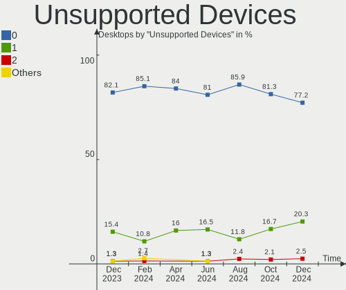

| Total | Desktops | Percent |
|-------|----------|---------|
| 0     | 53       | 84.13%  |
| 1     | 8        | 12.7%   |
| 4     | 1        | 1.59%   |
| 2     | 1        | 1.59%   |

Unsupported Device Types
------------------------

Types of unsupported devices

| Type                     | Desktops | Percent |
|--------------------------|----------|---------|
| Net/wireless             | 4        | 30.77%  |
| Graphics card            | 4        | 30.77%  |
| Unassigned class         | 1        | 7.69%   |
| Multimedia controller    | 1        | 7.69%   |
| Fingerprint reader       | 1        | 7.69%   |
| Communication controller | 1        | 7.69%   |
| Camera                   | 1        | 7.69%   |

