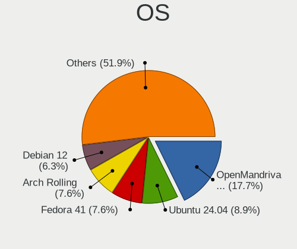
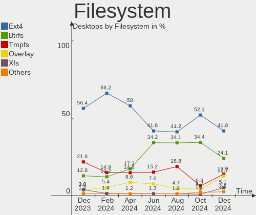
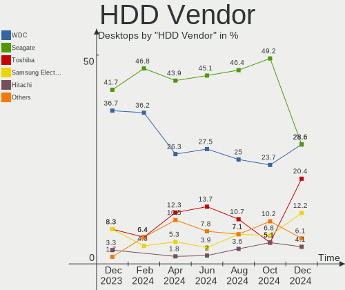
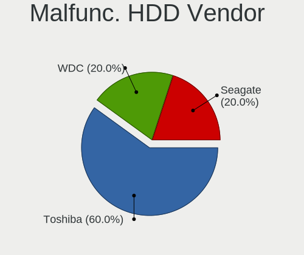
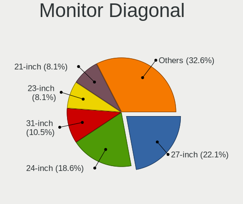
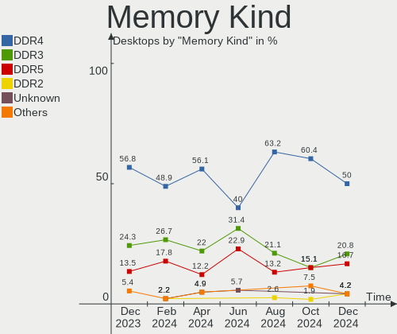
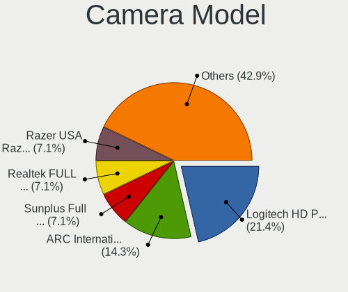
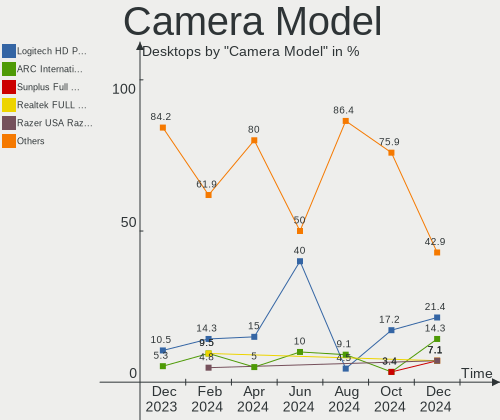

Linux in UK - Hardware Trends (Desktops)
----------------------------------------

A project to identify most popular hardware characteristics and track their change
over time based on data collected by Linux users at https://Linux-Hardware.org.

Anyone can contribute to this report by the [hw-probe](https://github.com/linuxhw/hw-probe) tool:

    sudo -E hw-probe -all -upload

Period: Jan, 2024.

Contents
--------

* [ System ](#system)
  - [ OS                       ](#os)
  - [ OS Family                ](#os-family)
  - [ Kernel                   ](#kernel)
  - [ Kernel Family            ](#kernel-family)
  - [ Kernel Major Ver.        ](#kernel-major-ver)
  - [ Arch                     ](#arch)
  - [ DE                       ](#de)
  - [ Display Server           ](#display-server)
  - [ Display Manager          ](#display-manager)
  - [ OS Lang                  ](#os-lang)
  - [ Boot Mode                ](#boot-mode)
  - [ Filesystem               ](#filesystem)
  - [ Part. scheme             ](#part-scheme)
  - [ Dual Boot with Linux/BSD ](#dual-boot-with-linuxbsd)
  - [ Dual Boot (Win)          ](#dual-boot-win)

* [ Board ](#board)
  - [ Vendor                   ](#vendor)
  - [ Model                    ](#model)
  - [ Model Family             ](#model-family)
  - [ MFG Year                 ](#mfg-year)
  - [ Form Factor              ](#form-factor)
  - [ Secure Boot              ](#secure-boot)
  - [ Coreboot                 ](#coreboot)
  - [ RAM Size                 ](#ram-size)
  - [ RAM Used                 ](#ram-used)
  - [ Total Drives             ](#total-drives)
  - [ Has CD-ROM               ](#has-cd-rom)
  - [ Has Ethernet             ](#has-ethernet)
  - [ Has WiFi                 ](#has-wifi)
  - [ Has Bluetooth            ](#has-bluetooth)

* [ Location ](#location)
  - [ Country                  ](#country)
  - [ City                     ](#city)

* [ Drives ](#drives)
  - [ Drive Vendor             ](#drive-vendor)
  - [ Drive Model              ](#drive-model)
  - [ HDD Vendor               ](#hdd-vendor)
  - [ SSD Vendor               ](#ssd-vendor)
  - [ Drive Kind               ](#drive-kind)
  - [ Drive Connector          ](#drive-connector)
  - [ Drive Size               ](#drive-size)
  - [ Space Total              ](#space-total)
  - [ Space Used               ](#space-used)
  - [ Malfunc. Drives          ](#malfunc-drives)
  - [ Malfunc. Drive Vendor    ](#malfunc-drive-vendor)
  - [ Malfunc. HDD Vendor      ](#malfunc-hdd-vendor)
  - [ Malfunc. Drive Kind      ](#malfunc-drive-kind)
  - [ Failed Drives            ](#failed-drives)
  - [ Failed Drive Vendor      ](#failed-drive-vendor)
  - [ Drive Status             ](#drive-status)

* [ Storage controller ](#storage-controller)
  - [ Storage Vendor           ](#storage-vendor)
  - [ Storage Model            ](#storage-model)
  - [ Storage Kind             ](#storage-kind)

* [ Processor ](#processor)
  - [ CPU Vendor               ](#cpu-vendor)
  - [ CPU Model                ](#cpu-model)
  - [ CPU Model Family         ](#cpu-model-family)
  - [ CPU Cores                ](#cpu-cores)
  - [ CPU Sockets              ](#cpu-sockets)
  - [ CPU Threads              ](#cpu-threads)
  - [ CPU Op-Modes             ](#cpu-op-modes)
  - [ CPU Microcode            ](#cpu-microcode)
  - [ CPU Microarch            ](#cpu-microarch)

* [ Graphics ](#graphics)
  - [ GPU Vendor               ](#gpu-vendor)
  - [ GPU Model                ](#gpu-model)
  - [ GPU Combo                ](#gpu-combo)
  - [ GPU Driver               ](#gpu-driver)
  - [ GPU Memory               ](#gpu-memory)

* [ Monitor ](#monitor)
  - [ Monitor Vendor           ](#monitor-vendor)
  - [ Monitor Model            ](#monitor-model)
  - [ Monitor Resolution       ](#monitor-resolution)
  - [ Monitor Diagonal         ](#monitor-diagonal)
  - [ Monitor Width            ](#monitor-width)
  - [ Aspect Ratio             ](#aspect-ratio)
  - [ Monitor Area             ](#monitor-area)
  - [ Pixel Density            ](#pixel-density)
  - [ Multiple Monitors        ](#multiple-monitors)

* [ Network ](#network)
  - [ Net Controller Vendor    ](#net-controller-vendor)
  - [ Net Controller Model     ](#net-controller-model)
  - [ Wireless Vendor          ](#wireless-vendor)
  - [ Wireless Model           ](#wireless-model)
  - [ Ethernet Vendor          ](#ethernet-vendor)
  - [ Ethernet Model           ](#ethernet-model)
  - [ Net Controller Kind      ](#net-controller-kind)
  - [ Used Controller          ](#used-controller)
  - [ NICs                     ](#nics)
  - [ IPv6                     ](#ipv6)

* [ Bluetooth ](#bluetooth)
  - [ Bluetooth Vendor         ](#bluetooth-vendor)
  - [ Bluetooth Model          ](#bluetooth-model)

* [ Sound ](#sound)
  - [ Sound Vendor             ](#sound-vendor)
  - [ Sound Model              ](#sound-model)

* [ Memory ](#memory)
  - [ Memory Vendor            ](#memory-vendor)
  - [ Memory Model             ](#memory-model)
  - [ Memory Kind              ](#memory-kind)
  - [ Memory Form Factor       ](#memory-form-factor)
  - [ Memory Size              ](#memory-size)
  - [ Memory Speed             ](#memory-speed)

* [ Printers & scanners ](#printers--scanners)
  - [ Printer Vendor           ](#printer-vendor)
  - [ Printer Model            ](#printer-model)
  - [ Scanner Vendor           ](#scanner-vendor)
  - [ Scanner Model            ](#scanner-model)

* [ Camera ](#camera)
  - [ Camera Vendor            ](#camera-vendor)
  - [ Camera Model             ](#camera-model)

* [ Security ](#security)
  - [ Fingerprint Vendor       ](#fingerprint-vendor)
  - [ Fingerprint Model        ](#fingerprint-model)
  - [ Chipcard Vendor          ](#chipcard-vendor)
  - [ Chipcard Model           ](#chipcard-model)

* [ Unsupported ](#unsupported)
  - [ Unsupported Devices      ](#unsupported-devices)
  - [ Unsupported Device Types ](#unsupported-device-types)

System
------

OS
--

Installed operating systems

| Name                         | Desktops | Percent |
|------------------------------|----------|---------|
| Ubuntu 22.04                 | 19       | 21.11%  |
| Zorin 17                     | 6        | 6.67%   |
| Ubuntu 23.10                 | 5        | 5.56%   |
| Fedora 39                    | 5        | 5.56%   |
| openSUSE Tumbleweed-XXXXXXXX | 4        | 4.44%   |
| OpenMandriva 23.08           | 4        | 4.44%   |
| Linux Mint 21.3              | 4        | 4.44%   |
| Ubuntu 20.04                 | 3        | 3.33%   |
| Pop!_OS 22.04                | 3        | 3.33%   |
| Linux Mint 21.2              | 3        | 3.33%   |
| Kubuntu 22.04                | 3        | 3.33%   |
| EndeavourOS Rolling          | 3        | 3.33%   |
| Debian 12                    | 3        | 3.33%   |
| Ubuntu 18.04                 | 2        | 2.22%   |
| Linux Mint 20.3              | 2        | 2.22%   |
| ArcoLinux Rolling            | 2        | 2.22%   |
| Zorin 16                     | 1        | 1.11%   |
| Xubuntu 22.04                | 1        | 1.11%   |
| Void Linux Rolling           | 1        | 1.11%   |
| Ubuntu Core 22               | 1        | 1.11%   |
| TUXEDO OS 22.04              | 1        | 1.11%   |
| OpenMandriva 5.0             | 1        | 1.11%   |
| OpenMandriva 24.01           | 1        | 1.11%   |
| OpenMandriva 23.03           | 1        | 1.11%   |
| Nobara 39                    | 1        | 1.11%   |
| Manjaro 23.1.3               | 1        | 1.11%   |
| Lubuntu 22.04                | 1        | 1.11%   |
| LMDE 6                       | 1        | 1.11%   |
| Linux Mint 21.1              | 1        | 1.11%   |
| Kubuntu 23.10                | 1        | 1.11%   |
| Kali 2023.4                  | 1        | 1.11%   |
| Garuda Linux Rolling         | 1        | 1.11%   |
| Elementary 7.1               | 1        | 1.11%   |
| ChimeraOS 44-1               | 1        | 1.11%   |
| Arch Rolling                 | 1        | 1.11%   |

OS Family
---------

OS without a version

| Name         | Desktops | Percent |
|--------------|----------|---------|
| Ubuntu       | 30       | 33.33%  |
| Linux Mint   | 10       | 11.11%  |
| Zorin        | 7        | 7.78%   |
| OpenMandriva | 7        | 7.78%   |
| Fedora       | 5        | 5.56%   |
| openSUSE     | 4        | 4.44%   |
| Kubuntu      | 4        | 4.44%   |
| Pop!_OS      | 3        | 3.33%   |
| EndeavourOS  | 3        | 3.33%   |
| Debian       | 3        | 3.33%   |
| ArcoLinux    | 2        | 2.22%   |
| Xubuntu      | 1        | 1.11%   |
| Void Linux   | 1        | 1.11%   |
| TUXEDO OS    | 1        | 1.11%   |
| Nobara       | 1        | 1.11%   |
| Manjaro      | 1        | 1.11%   |
| Lubuntu      | 1        | 1.11%   |
| LMDE         | 1        | 1.11%   |
| Kali         | 1        | 1.11%   |
| Garuda Linux | 1        | 1.11%   |
| Elementary   | 1        | 1.11%   |
| ChimeraOS    | 1        | 1.11%   |
| Arch         | 1        | 1.11%   |

Kernel
------

Version of the Linux kernel

| Version                     | Desktops | Percent |
|-----------------------------|----------|---------|
| 6.5.0-14-generic            | 16       | 17.78%  |
| 5.15.0-91-generic           | 14       | 15.56%  |
| 6.2.0-39-generic            | 8        | 8.89%   |
| 6.6.6-76060606-generic      | 3        | 3.33%   |
| 6.5.0-15-generic            | 3        | 3.33%   |
| 6.1.0-17-amd64              | 3        | 3.33%   |
| 6.6.9-1-default             | 2        | 2.22%   |
| 6.6.8-200.fc39.x86_64       | 2        | 2.22%   |
| 6.6.2-desktop-1omv2390      | 2        | 2.22%   |
| 6.4.8-desktop-2omv2390      | 2        | 2.22%   |
| 6.4.11-desktop-1omv2390     | 2        | 2.22%   |
| 5.4.0-169-generic           | 2        | 2.22%   |
| 5.15.0-92-generic           | 2        | 2.22%   |
| 6.7.2-arch1-1               | 1        | 1.11%   |
| 6.7.0-arch3-1               | 1        | 1.11%   |
| 6.6.9-arch1-1               | 1        | 1.11%   |
| 6.6.9-200.fsync.fc39.x86_64 | 1        | 1.11%   |
| 6.6.9-200.fc39.x86_64       | 1        | 1.11%   |
| 6.6.8_1                     | 1        | 1.11%   |
| 6.6.8-zen1-1-zen            | 1        | 1.11%   |
| 6.6.8-arch1-1               | 1        | 1.11%   |
| 6.6.7-1-default             | 1        | 1.11%   |
| 6.6.14-1-lts                | 1        | 1.11%   |
| 6.6.13-200.fc39.x86_64      | 1        | 1.11%   |
| 6.6.12-1-lts                | 1        | 1.11%   |
| 6.6.11-x64v3-xanmod1        | 1        | 1.11%   |
| 6.6.11-200.fc39.x86_64      | 1        | 1.11%   |
| 6.6.10-1-MANJARO            | 1        | 1.11%   |
| 6.6.10-1-default            | 1        | 1.11%   |
| 6.6.1-060601-generic        | 1        | 1.11%   |
| 6.5.6-chos1-chimeraos-1     | 1        | 1.11%   |
| 6.5.0-kali3-amd64           | 1        | 1.11%   |
| 6.5.0-10013-tuxedo          | 1        | 1.11%   |
| 6.2.6-desktop-1omv2390      | 1        | 1.11%   |
| 6.2.0-36-generic            | 1        | 1.11%   |
| 6.2.0-26-generic            | 1        | 1.11%   |
| 5.4.0-72-generic            | 1        | 1.11%   |
| 5.4.0-170-generic           | 1        | 1.11%   |
| 5.15.0-76-generic           | 1        | 1.11%   |
| 5.15.0-75-generic           | 1        | 1.11%   |

Kernel Family
-------------

Linux kernel without a distro release

| Version | Desktops | Percent |
|---------|----------|---------|
| 6.5.0   | 21       | 23.33%  |
| 5.15.0  | 19       | 21.11%  |
| 6.2.0   | 10       | 11.11%  |
| 6.6.9   | 5        | 5.56%   |
| 6.6.8   | 5        | 5.56%   |
| 5.4.0   | 4        | 4.44%   |
| 6.6.6   | 3        | 3.33%   |
| 6.1.0   | 3        | 3.33%   |
| 6.6.2   | 2        | 2.22%   |
| 6.6.11  | 2        | 2.22%   |
| 6.6.10  | 2        | 2.22%   |
| 6.4.8   | 2        | 2.22%   |
| 6.4.11  | 2        | 2.22%   |
| 6.7.2   | 1        | 1.11%   |
| 6.7.0   | 1        | 1.11%   |
| 6.6.7   | 1        | 1.11%   |
| 6.6.14  | 1        | 1.11%   |
| 6.6.13  | 1        | 1.11%   |
| 6.6.12  | 1        | 1.11%   |
| 6.6.1   | 1        | 1.11%   |
| 6.5.6   | 1        | 1.11%   |
| 6.2.6   | 1        | 1.11%   |
| 4.15.0  | 1        | 1.11%   |

Kernel Major Ver.
-----------------

Linux kernel major version

| Version | Desktops | Percent |
|---------|----------|---------|
| 6.6     | 24       | 26.67%  |
| 6.5     | 22       | 24.44%  |
| 5.15    | 19       | 21.11%  |
| 6.2     | 11       | 12.22%  |
| 6.4     | 4        | 4.44%   |
| 5.4     | 4        | 4.44%   |
| 6.1     | 3        | 3.33%   |
| 6.7     | 2        | 2.22%   |
| 4.15    | 1        | 1.11%   |

Arch
----

OS architecture (x86_64, i586, etc.)

| Name   | Desktops | Percent |
|--------|----------|---------|
| x86_64 | 90       | 100%    |

DE
--

Desktop Environment

| Name          | Desktops | Percent |
|---------------|----------|---------|
| GNOME         | 46       | 51.11%  |
| KDE5          | 16       | 17.78%  |
| X-Cinnamon    | 9        | 10%     |
| Unknown       | 7        | 7.78%   |
| XFCE          | 3        | 3.33%   |
| LXQt          | 2        | 2.22%   |
| Pantheon      | 1        | 1.11%   |
| MATE          | 1        | 1.11%   |
| LXDE          | 1        | 1.11%   |
| KDE           | 1        | 1.11%   |
| Hyprland      | 1        | 1.11%   |
| Enlightenment | 1        | 1.11%   |
| Budgie        | 1        | 1.11%   |

Display Server
--------------

X11 or Wayland

| Name    | Desktops | Percent |
|---------|----------|---------|
| X11     | 52       | 57.78%  |
| Wayland | 29       | 32.22%  |
| Tty     | 8        | 8.89%   |
| Unknown | 1        | 1.11%   |

Display Manager
---------------

SDDM, LightDM, etc.

| Name    | Desktops | Percent |
|---------|----------|---------|
| Unknown | 33       | 36.67%  |
| GDM3    | 25       | 27.78%  |
| SDDM    | 17       | 18.89%  |
| LightDM | 13       | 14.44%  |
| SLiM    | 1        | 1.11%   |
| GDM     | 1        | 1.11%   |

OS Lang
-------

Language

| Lang    | Desktops | Percent |
|---------|----------|---------|
| en_GB   | 71       | 78.89%  |
| en_US   | 14       | 15.56%  |
| C       | 2        | 2.22%   |
| Unknown | 2        | 2.22%   |
| POSIX   | 1        | 1.11%   |

Boot Mode
---------

EFI or BIOS

| Mode | Desktops | Percent |
|------|----------|---------|
| BIOS | 48       | 53.33%  |
| EFI  | 42       | 46.67%  |

Filesystem
----------

Type of filesystem

| Type    | Desktops | Percent |
|---------|----------|---------|
| Ext4    | 52       | 57.78%  |
| Tmpfs   | 20       | 22.22%  |
| Btrfs   | 12       | 13.33%  |
| Overlay | 3        | 3.33%   |
| Ext2    | 2        | 2.22%   |
| F2fs    | 1        | 1.11%   |

Part. scheme
------------

Scheme of partitioning

| Type    | Desktops | Percent |
|---------|----------|---------|
| GPT     | 53       | 58.89%  |
| Unknown | 26       | 28.89%  |
| MBR     | 11       | 12.22%  |

Dual Boot with Linux/BSD
------------------------

Hosting more than one Linux/BSD

| Dual boot | Desktops | Percent |
|-----------|----------|---------|
| No        | 72       | 80%     |
| Yes       | 18       | 20%     |

Dual Boot (Win)
---------------

Hosting Linux and Windows

| Dual boot | Desktops | Percent |
|-----------|----------|---------|
| No        | 60       | 66.67%  |
| Yes       | 30       | 33.33%  |

Board
-----

Vendor
------

Motherboard manufacturer

| Name                                 | Desktops | Percent |
|--------------------------------------|----------|---------|
| ASUSTek Computer                     | 22       | 24.44%  |
| Dell                                 | 11       | 12.22%  |
| MSI                                  | 10       | 11.11%  |
| ASRock                               | 9        | 10%     |
| Hewlett-Packard                      | 8        | 8.89%   |
| Gigabyte Technology                  | 8        | 8.89%   |
| Lenovo                               | 3        | 3.33%   |
| Biostar                              | 3        | 3.33%   |
| Acer                                 | 3        | 3.33%   |
| Foxconn                              | 2        | 2.22%   |
| ECS                                  | 2        | 2.22%   |
| BESSTAR Tech                         | 2        | 2.22%   |
| AZW                                  | 2        | 2.22%   |
| Shenzhen Meigao Electronic Equipment | 1        | 1.11%   |
| Pegatron                             | 1        | 1.11%   |
| Medion                               | 1        | 1.11%   |
| Intel                                | 1        | 1.11%   |
| Fujitsu                              | 1        | 1.11%   |

Model
-----

Motherboard model

| Name                                                | Desktops | Percent |
|-----------------------------------------------------|----------|---------|
| ASUS All Series                                     | 3        | 3.33%   |
| HP Compaq Elite 8300 SFF                            | 2        | 2.22%   |
| Dell OptiPlex 9020                                  | 2        | 2.22%   |
| Shenzhen Meigao Electronic Equipment Mercury series | 1        | 1.11%   |
| Pegatron VS161AA-ABU s5206uk                        | 1        | 1.11%   |
| MSI MS-7E27                                         | 1        | 1.11%   |
| MSI MS-7D70                                         | 1        | 1.11%   |
| MSI MS-7D54                                         | 1        | 1.11%   |
| MSI MS-7D30                                         | 1        | 1.11%   |
| MSI MS-7C86                                         | 1        | 1.11%   |
| MSI MS-7B92                                         | 1        | 1.11%   |
| MSI MS-7B89                                         | 1        | 1.11%   |
| MSI MS-7B78                                         | 1        | 1.11%   |
| MSI MS-7A78                                         | 1        | 1.11%   |
| MSI MS-7A38                                         | 1        | 1.11%   |
| Medion MS-7713                                      | 1        | 1.11%   |
| Lenovo ThinkStation P510 30B4S12T0M                 | 1        | 1.11%   |
| Lenovo ThinkCentre M910s 10MLS1D600                 | 1        | 1.11%   |
| Lenovo IdeaCentre 310S-08ASR 90G9002MUK             | 1        | 1.11%   |
| Intel DH55TC                                        | 1        | 1.11%   |
| HP ProDesk 400 G4 SFF                               | 1        | 1.11%   |
| HP ProDesk 400 G2.5 SFF                             | 1        | 1.11%   |
| HP EliteDesk 800 G3 TWR                             | 1        | 1.11%   |
| HP EliteDesk 800 G1 USDT                            | 1        | 1.11%   |
| HP EliteDesk 800 G1 SFF                             | 1        | 1.11%   |
| HP Compaq 8200 Elite CMT PC                         | 1        | 1.11%   |
| Gigabyte X570 GAMING X                              | 1        | 1.11%   |
| Gigabyte PDT-702-1020                               | 1        | 1.11%   |
| Gigabyte B550M DS3H                                 | 1        | 1.11%   |
| Gigabyte B450M K                                    | 1        | 1.11%   |
| Gigabyte AX370-Gaming K5                            | 1        | 1.11%   |
| Gigabyte 990FXA-UD3                                 | 1        | 1.11%   |
| Gigabyte 970A-UD3P                                  | 1        | 1.11%   |
| Gigabyte 970A-DS3P                                  | 1        | 1.11%   |
| Fujitsu D3222-B1                                    | 1        | 1.11%   |
| Foxconn 946 7MA Series                              | 1        | 1.11%   |
| Foxconn 500B Microtower                             | 1        | 1.11%   |
| ECS H67H2-M2                                        | 1        | 1.11%   |
| ECS H61H2-M2                                        | 1        | 1.11%   |
| Dell Vostro 260s                                    | 1        | 1.11%   |

Model Family
------------

Motherboard model prefix

| Name                                         | Desktops | Percent |
|----------------------------------------------|----------|---------|
| Dell OptiPlex                                | 6        | 6.67%   |
| ASUS PRIME                                   | 6        | 6.67%   |
| ASUS ROG                                     | 5        | 5.56%   |
| Dell Precision                               | 4        | 4.44%   |
| HP EliteDesk                                 | 3        | 3.33%   |
| HP Compaq                                    | 3        | 3.33%   |
| ASUS All                                     | 3        | 3.33%   |
| HP ProDesk                                   | 2        | 2.22%   |
| Acer Aspire                                  | 2        | 2.22%   |
| Shenzhen Meigao Electronic Equipment Mercury | 1        | 1.11%   |
| Pegatron VS161AA-ABU                         | 1        | 1.11%   |
| MSI MS-7E27                                  | 1        | 1.11%   |
| MSI MS-7D70                                  | 1        | 1.11%   |
| MSI MS-7D54                                  | 1        | 1.11%   |
| MSI MS-7D30                                  | 1        | 1.11%   |
| MSI MS-7C86                                  | 1        | 1.11%   |
| MSI MS-7B92                                  | 1        | 1.11%   |
| MSI MS-7B89                                  | 1        | 1.11%   |
| MSI MS-7B78                                  | 1        | 1.11%   |
| MSI MS-7A78                                  | 1        | 1.11%   |
| MSI MS-7A38                                  | 1        | 1.11%   |
| Medion MS-7713                               | 1        | 1.11%   |
| Lenovo ThinkStation                          | 1        | 1.11%   |
| Lenovo ThinkCentre                           | 1        | 1.11%   |
| Lenovo IdeaCentre                            | 1        | 1.11%   |
| Intel DH55TC                                 | 1        | 1.11%   |
| Gigabyte X570                                | 1        | 1.11%   |
| Gigabyte PDT-702-1020                        | 1        | 1.11%   |
| Gigabyte B550M                               | 1        | 1.11%   |
| Gigabyte B450M                               | 1        | 1.11%   |
| Gigabyte AX370-Gaming                        | 1        | 1.11%   |
| Gigabyte 990FXA-UD3                          | 1        | 1.11%   |
| Gigabyte 970A-UD3P                           | 1        | 1.11%   |
| Gigabyte 970A-DS3P                           | 1        | 1.11%   |
| Fujitsu D3222-B1                             | 1        | 1.11%   |
| Foxconn 946                                  | 1        | 1.11%   |
| Foxconn 500B                                 | 1        | 1.11%   |
| ECS H67H2-M2                                 | 1        | 1.11%   |
| ECS H61H2-M2                                 | 1        | 1.11%   |
| Dell Vostro                                  | 1        | 1.11%   |

MFG Year
--------

Motherboard manufacture year

| Year | Desktops | Percent |
|------|----------|---------|
| 2013 | 12       | 13.33%  |
| 2020 | 10       | 11.11%  |
| 2018 | 9        | 10%     |
| 2019 | 7        | 7.78%   |
| 2023 | 6        | 6.67%   |
| 2022 | 6        | 6.67%   |
| 2021 | 6        | 6.67%   |
| 2012 | 6        | 6.67%   |
| 2014 | 5        | 5.56%   |
| 2011 | 5        | 5.56%   |
| 2009 | 5        | 5.56%   |
| 2010 | 4        | 4.44%   |
| 2017 | 3        | 3.33%   |
| 2016 | 3        | 3.33%   |
| 2007 | 2        | 2.22%   |
| 2015 | 1        | 1.11%   |

Form Factor
-----------

Physical design of the computer

| Name    | Desktops | Percent |
|---------|----------|---------|
| Desktop | 90       | 100%    |

Secure Boot
-----------

Enabled or disabled

| State    | Desktops | Percent |
|----------|----------|---------|
| Disabled | 86       | 95.56%  |
| Enabled  | 4        | 4.44%   |

Coreboot
--------

Have coreboot on board

| Used | Desktops | Percent |
|------|----------|---------|
| No   | 90       | 100%    |

RAM Size
--------

Total RAM memory

| Size in GB  | Desktops | Percent |
|-------------|----------|---------|
| 32.01-64.0  | 25       | 27.78%  |
| 16.01-24.0  | 24       | 26.67%  |
| 4.01-8.0    | 12       | 13.33%  |
| 3.01-4.0    | 8        | 8.89%   |
| 64.01-256.0 | 7        | 7.78%   |
| 24.01-32.0  | 6        | 6.67%   |
| 8.01-16.0   | 6        | 6.67%   |
| 2.01-3.0    | 1        | 1.11%   |
| 1.01-2.0    | 1        | 1.11%   |

RAM Used
--------

Used RAM memory

| Used GB    | Desktops | Percent |
|------------|----------|---------|
| 1.01-2.0   | 24       | 26.67%  |
| 4.01-8.0   | 19       | 21.11%  |
| 3.01-4.0   | 17       | 18.89%  |
| 2.01-3.0   | 16       | 17.78%  |
| 8.01-16.0  | 8        | 8.89%   |
| 0.51-1.0   | 4        | 4.44%   |
| 16.01-24.0 | 1        | 1.11%   |
| 0.01-0.5   | 1        | 1.11%   |

Total Drives
------------

Number of drives on board

| Drives | Desktops | Percent |
|--------|----------|---------|
| 2      | 30       | 33.33%  |
| 1      | 26       | 28.89%  |
| 3      | 16       | 17.78%  |
| 4      | 11       | 12.22%  |
| 6      | 3        | 3.33%   |
| 5      | 2        | 2.22%   |
| 9      | 1        | 1.11%   |
| 7      | 1        | 1.11%   |

Has CD-ROM
----------

Has CD-ROM on board

| Presented | Desktops | Percent |
|-----------|----------|---------|
| No        | 60       | 66.67%  |
| Yes       | 30       | 33.33%  |

Has Ethernet
------------

Has Ethernet on board

| Presented | Desktops | Percent |
|-----------|----------|---------|
| Yes       | 90       | 100%    |

Has WiFi
--------

Has WiFi module

| Presented | Desktops | Percent |
|-----------|----------|---------|
| Yes       | 48       | 53.33%  |
| No        | 42       | 46.67%  |

Has Bluetooth
-------------

Has Bluetooth module

| Presented | Desktops | Percent |
|-----------|----------|---------|
| No        | 55       | 61.11%  |
| Yes       | 35       | 38.89%  |

Location
--------

Country
-------

Geographic location (country)

| Country | Desktops | Percent |
|---------|----------|---------|
| UK      | 90       | 100%    |

City
----

Geographic location (city)

| City           | Desktops | Percent |
|----------------|----------|---------|
| Leeds          | 4        | 4.44%   |
| Birmingham     | 4        | 4.44%   |
| Manchester     | 3        | 3.33%   |
| Brent          | 3        | 3.33%   |
| Bradford       | 3        | 3.33%   |
| Wakefield      | 2        | 2.22%   |
| Tower Hamlets  | 2        | 2.22%   |
| London         | 2        | 2.22%   |
| Cardiff        | 2        | 2.22%   |
| Bathgate       | 2        | 2.22%   |
| Bath           | 2        | 2.22%   |
| Wetherby       | 1        | 1.11%   |
| Welling        | 1        | 1.11%   |
| Walsall        | 1        | 1.11%   |
| Tamworth       | 1        | 1.11%   |
| Swansea        | 1        | 1.11%   |
| Stockport      | 1        | 1.11%   |
| Stalybridge    | 1        | 1.11%   |
| South Benfleet | 1        | 1.11%   |
| Sheffield      | 1        | 1.11%   |
| Sandhurst      | 1        | 1.11%   |
| Reading        | 1        | 1.11%   |
| Preston        | 1        | 1.11%   |
| Poole          | 1        | 1.11%   |
| Pontefract     | 1        | 1.11%   |
| Oxford         | 1        | 1.11%   |
| Newmarket      | 1        | 1.11%   |
| Newham         | 1        | 1.11%   |
| Milton Keynes  | 1        | 1.11%   |
| Middlesbrough  | 1        | 1.11%   |
| Lowestoft      | 1        | 1.11%   |
| Liverpool      | 1        | 1.11%   |
| Lincoln        | 1        | 1.11%   |
| Lewisham       | 1        | 1.11%   |
| Leigh-on-Sea   | 1        | 1.11%   |
| Ilford         | 1        | 1.11%   |
| Hull           | 1        | 1.11%   |
| Hounslow       | 1        | 1.11%   |
| Hawick         | 1        | 1.11%   |
| Hackney        | 1        | 1.11%   |

Drives
------

Drive Vendor
------------

Hard drive vendors

| Vendor                       | Desktops | Drives | Percent |
|------------------------------|----------|--------|---------|
| WDC                          | 31       | 39     | 16.94%  |
| Samsung Electronics          | 28       | 41     | 15.3%   |
| Seagate                      | 24       | 34     | 13.11%  |
| Crucial                      | 15       | 19     | 8.2%    |
| SanDisk                      | 10       | 10     | 5.46%   |
| Kingston                     | 10       | 11     | 5.46%   |
| Toshiba                      | 5        | 5      | 2.73%   |
| Micron/Crucial Technology    | 4        | 5      | 2.19%   |
| Hitachi                      | 4        | 4      | 2.19%   |
| Teclast                      | 2        | 2      | 1.09%   |
| Phison Electronics           | 2        | 3      | 1.09%   |
| Phison                       | 2        | 2      | 1.09%   |
| Intel                        | 2        | 2      | 1.09%   |
| Integral                     | 2        | 2      | 1.09%   |
| HGST                         | 2        | 2      | 1.09%   |
| Fanxiang                     | 2        | 2      | 1.09%   |
| China                        | 2        | 2      | 1.09%   |
| Apacer                       | 2        | 2      | 1.09%   |
| XrayDisk                     | 1        | 1      | 0.55%   |
| Vaseky                       | 1        | 1      | 0.55%   |
| Unknown                      | 1        | 3      | 0.55%   |
| Unique                       | 1        | 1      | 0.55%   |
| Union Memory                 | 1        | 1      | 0.55%   |
| SSSTC                        | 1        | 1      | 0.55%   |
| SMI                          | 1        | 1      | 0.55%   |
| SK hynix                     | 1        | 1      | 0.55%   |
| Silicon Motion               | 1        | 1      | 0.55%   |
| Shenzhen Longsys Electronics | 1        | 1      | 0.55%   |
| Realtek                      | 1        | 1      | 0.55%   |
| Patriot                      | 1        | 1      | 0.55%   |
| OCZ                          | 1        | 1      | 0.55%   |
| Netac                        | 1        | 1      | 0.55%   |
| MSI                          | 1        | 1      | 0.55%   |
| Micron Technology            | 1        | 1      | 0.55%   |
| Maxtor                       | 1        | 2      | 0.55%   |
| MAXIO Technology (Hangzhou)  | 1        | 1      | 0.55%   |
| LITEONIT                     | 1        | 1      | 0.55%   |
| LITEON                       | 1        | 1      | 0.55%   |
| Lexar                        | 1        | 1      | 0.55%   |
| KingSpec                     | 1        | 1      | 0.55%   |

Drive Model
-----------

Hard drive models

| Model                                             | Desktops | Percent |
|---------------------------------------------------|----------|---------|
| Samsung SSD 860 EVO 1TB                           | 5        | 2.33%   |
| Samsung NVMe SSD Controller SM981/PM981/PM983 1TB | 5        | 2.33%   |
| WDC WD10EZEX-08WN4A0 1TB                          | 3        | 1.4%    |
| Seagate ST3500312CS 500GB                         | 3        | 1.4%    |
| Seagate ST1000DM010-2EP102 1TB                    | 3        | 1.4%    |
| Samsung SSD 970 EVO Plus 500GB                    | 3        | 1.4%    |
| Samsung SSD 870 QVO 1TB                           | 3        | 1.4%    |
| Micron/Crucial P2 NVMe PCIe SSD 1TB               | 3        | 1.4%    |
| Kingston SV300S37A240G 240GB SSD                  | 3        | 1.4%    |
| Crucial CT240BX500SSD1 240GB                      | 3        | 1.4%    |
| WDC WDS500G2B0A-00SM50 500GB SSD                  | 2        | 0.93%   |
| Teclast 60GB S500 SSD                             | 2        | 0.93%   |
| Seagate ST2000DM008-2FR102 2TB                    | 2        | 0.93%   |
| Samsung SSD 850 EVO 500GB                         | 2        | 0.93%   |
| Samsung SSD 850 EVO 250GB                         | 2        | 0.93%   |
| Samsung HD103SI 1TB                               | 2        | 0.93%   |
| Phison E16 PCIe4 NVMe Controller 2TB              | 2        | 0.93%   |
| Kingston SA400S37480G 480GB SSD                   | 2        | 0.93%   |
| Crucial CT1000MX500SSD4 1TB                       | 2        | 0.93%   |
| Apacer AS350 120GB SSD                            | 2        | 0.93%   |
| XrayDisk SSD 512GB                                | 1        | 0.47%   |
| WDC WUH721818ALE6L4 18TB                          | 1        | 0.47%   |
| WDC WUH721816ALE6L4 16TB                          | 1        | 0.47%   |
| WDC WDS500G3X0C-00SJG0 500GB                      | 1        | 0.47%   |
| WDC WDS250G2B0A-00SM50 250GB SSD                  | 1        | 0.47%   |
| WDC WDS250G1B0A-00H9H0 250GB SSD                  | 1        | 0.47%   |
| WDC WDS120G2G0A-00JH30 120GB SSD                  | 1        | 0.47%   |
| WDC WDS100T2B0B-00YS70 1TB SSD                    | 1        | 0.47%   |
| WDC WD800JD-75MSA3 80GB                           | 1        | 0.47%   |
| WDC WD6003FZBX-00K5WB0 6TB                        | 1        | 0.47%   |
| WDC WD5002AALX-00J37A0 500GB                      | 1        | 0.47%   |
| WDC WD5000LPLX-16ZNTT1 500GB                      | 1        | 0.47%   |
| WDC WD5000HHTZ-04N21V0 500GB                      | 1        | 0.47%   |
| WDC WD5000BEVT-35A0RT0 500GB                      | 1        | 0.47%   |
| WDC WD5000AAKS-75V0A0 500GB                       | 1        | 0.47%   |
| WDC WD40EZRZ-22GXCB0 4TB                          | 1        | 0.47%   |
| WDC WD40EZRZ-00GXCB0 4TB                          | 1        | 0.47%   |
| WDC WD4005FZBX-00K5WB0 4TB                        | 1        | 0.47%   |
| WDC WD3201ABYS-01B9A0 320GB                       | 1        | 0.47%   |
| WDC WD3200AVJS-63B6A0 320GB                       | 1        | 0.47%   |

HDD Vendor
----------

Hard disk drive vendors

| Vendor              | Desktops | Drives | Percent |
|---------------------|----------|--------|---------|
| WDC                 | 26       | 31     | 38.24%  |
| Seagate             | 24       | 34     | 35.29%  |
| Toshiba             | 5        | 5      | 7.35%   |
| Samsung Electronics | 4        | 4      | 5.88%   |
| Hitachi             | 4        | 4      | 5.88%   |
| HGST                | 2        | 2      | 2.94%   |
| Maxtor              | 1        | 2      | 1.47%   |
| External            | 1        | 1      | 1.47%   |
| ExcelStor           | 1        | 1      | 1.47%   |

SSD Vendor
----------

Solid state drive vendors

| Vendor              | Desktops | Drives | Percent |
|---------------------|----------|--------|---------|
| Samsung Electronics | 16       | 19     | 22.86%  |
| Crucial             | 10       | 13     | 14.29%  |
| Kingston            | 9        | 10     | 12.86%  |
| WDC                 | 7        | 7      | 10%     |
| SanDisk             | 5        | 5      | 7.14%   |
| Teclast             | 2        | 2      | 2.86%   |
| Integral            | 2        | 2      | 2.86%   |
| China               | 2        | 2      | 2.86%   |
| Apacer              | 2        | 2      | 2.86%   |
| XrayDisk            | 1        | 1      | 1.43%   |
| Vaseky              | 1        | 1      | 1.43%   |
| Unique              | 1        | 1      | 1.43%   |
| Patriot             | 1        | 1      | 1.43%   |
| OCZ                 | 1        | 1      | 1.43%   |
| Netac               | 1        | 1      | 1.43%   |
| LITEONIT            | 1        | 1      | 1.43%   |
| LITEON              | 1        | 1      | 1.43%   |
| KingSpec            | 1        | 1      | 1.43%   |
| GOODRAM             | 1        | 1      | 1.43%   |
| Gigastone           | 1        | 1      | 1.43%   |
| Gigabyte Technology | 1        | 1      | 1.43%   |
| Emtec               | 1        | 1      | 1.43%   |
| ASMedia             | 1        | 1      | 1.43%   |
| A-DATA Technology   | 1        | 1      | 1.43%   |

Drive Kind
----------

HDD or SSD

| Kind    | Desktops | Drives | Percent |
|---------|----------|--------|---------|
| SSD     | 56       | 77     | 36.36%  |
| HDD     | 53       | 84     | 34.42%  |
| NVMe    | 42       | 58     | 27.27%  |
| Unknown | 3        | 5      | 1.95%   |

Drive Connector
---------------

SATA, SAS, NVMe, etc.

| Type | Desktops | Drives | Percent |
|------|----------|--------|---------|
| SATA | 76       | 157    | 61.29%  |
| NVMe | 41       | 57     | 33.06%  |
| SAS  | 7        | 10     | 5.65%   |

Drive Size
----------

Size of hard drive

| Size in TB | Desktops | Drives | Percent |
|------------|----------|--------|---------|
| 0.01-0.5   | 52       | 81     | 44.83%  |
| 0.51-1.0   | 39       | 47     | 33.62%  |
| 1.01-2.0   | 12       | 15     | 10.34%  |
| 3.01-4.0   | 4        | 4      | 3.45%   |
| 2.01-3.0   | 4        | 4      | 3.45%   |
| 4.01-10.0  | 3        | 8      | 2.59%   |
| 10.01-20.0 | 2        | 2      | 1.72%   |

Space Total
-----------

Amount of disk space available on the file system

| Size in GB     | Desktops | Percent |
|----------------|----------|---------|
| 101-250        | 22       | 24.44%  |
| 251-500        | 18       | 20%     |
| 501-1000       | 16       | 17.78%  |
| More than 3000 | 14       | 15.56%  |
| 2001-3000      | 7        | 7.78%   |
| 1001-2000      | 7        | 7.78%   |
| 51-100         | 3        | 3.33%   |
| Unknown        | 2        | 2.22%   |
| 1-20           | 1        | 1.11%   |

Space Used
----------

Amount of used disk space

| Used GB        | Desktops | Percent |
|----------------|----------|---------|
| 1-20           | 22       | 24.44%  |
| 21-50          | 13       | 14.44%  |
| 101-250        | 12       | 13.33%  |
| 251-500        | 11       | 12.22%  |
| 51-100         | 10       | 11.11%  |
| 501-1000       | 9        | 10%     |
| More than 3000 | 6        | 6.67%   |
| 1001-2000      | 5        | 5.56%   |
| Unknown        | 2        | 2.22%   |

Malfunc. Drives
---------------

Drive models with a malfunction

| Model                                        | Desktops | Drives | Percent |
|----------------------------------------------|----------|--------|---------|
| XrayDisk SSD 512GB                           | 1        | 1      | 9.09%   |
| WDC WD20EFRX-68EUZN0 2TB                     | 1        | 1      | 9.09%   |
| Toshiba MQ01ABD050V 500GB                    | 1        | 1      | 9.09%   |
| Seagate ST500DM002-1BC142 500GB              | 1        | 1      | 9.09%   |
| Seagate ST1000LM024 HN-M101MBB 1TB           | 1        | 1      | 9.09%   |
| Seagate ST1000DM003-1SB102 1TB               | 1        | 1      | 9.09%   |
| Samsung Electronics SSD 950 PRO 512GB        | 1        | 1      | 9.09%   |
| Samsung Electronics SSD 840 PRO Series 256GB | 1        | 2      | 9.09%   |
| Maxtor 6Y080L0 82GB                          | 1        | 2      | 9.09%   |
| Hitachi HDS721050CLA362 500GB                | 1        | 1      | 9.09%   |
| Crucial CT1050MX300SSD1 1050GB               | 1        | 1      | 9.09%   |

Malfunc. Drive Vendor
---------------------

Vendors of faulty drives

| Vendor              | Desktops | Drives | Percent |
|---------------------|----------|--------|---------|
| Seagate             | 3        | 3      | 27.27%  |
| Samsung Electronics | 2        | 3      | 18.18%  |
| XrayDisk            | 1        | 1      | 9.09%   |
| WDC                 | 1        | 1      | 9.09%   |
| Toshiba             | 1        | 1      | 9.09%   |
| Maxtor              | 1        | 2      | 9.09%   |
| Hitachi             | 1        | 1      | 9.09%   |
| Crucial             | 1        | 1      | 9.09%   |

Malfunc. HDD Vendor
-------------------

Vendors of faulty HDD drives

| Vendor  | Desktops | Drives | Percent |
|---------|----------|--------|---------|
| Seagate | 3        | 3      | 42.86%  |
| WDC     | 1        | 1      | 14.29%  |
| Toshiba | 1        | 1      | 14.29%  |
| Maxtor  | 1        | 2      | 14.29%  |
| Hitachi | 1        | 1      | 14.29%  |

Malfunc. Drive Kind
-------------------

Kinds of faulty drives

| Kind | Desktops | Drives | Percent |
|------|----------|--------|---------|
| HDD  | 6        | 8      | 60%     |
| SSD  | 3        | 4      | 30%     |
| NVMe | 1        | 1      | 10%     |

Failed Drives
-------------

Failed drive models

Zero info for selected period =(

Failed Drive Vendor
-------------------

Failed drive vendors

Zero info for selected period =(

Drive Status
------------

Number of failed and malfunc. drives

| Status   | Desktops | Drives | Percent |
|----------|----------|--------|---------|
| Detected | 53       | 110    | 51.46%  |
| Works    | 40       | 101    | 38.83%  |
| Malfunc  | 10       | 13     | 9.71%   |

Storage controller
------------------

Storage Vendor
--------------

Storage controller vendors

| Vendor                         | Desktops | Percent |
|--------------------------------|----------|---------|
| Intel                          | 50       | 34.25%  |
| AMD                            | 39       | 26.71%  |
| Samsung Electronics            | 15       | 10.27%  |
| Micron/Crucial Technology      | 9        | 6.16%   |
| SanDisk                        | 6        | 4.11%   |
| Phison Electronics             | 4        | 2.74%   |
| ASMedia Technology             | 4        | 2.74%   |
| Silicon Image                  | 2        | 1.37%   |
| Nvidia                         | 2        | 1.37%   |
| MAXIO Technology (Hangzhou)    | 2        | 1.37%   |
| JMicron Technology             | 2        | 1.37%   |
| VIA Technologies               | 1        | 0.68%   |
| Union Memory (Shenzhen)        | 1        | 0.68%   |
| Solid State Storage Technology | 1        | 0.68%   |
| SK hynix                       | 1        | 0.68%   |
| Silicon Motion                 | 1        | 0.68%   |
| Shenzhen Longsys Electronics   | 1        | 0.68%   |
| Micron Technology              | 1        | 0.68%   |
| Marvell Technology Group       | 1        | 0.68%   |
| Kingston Technology Company    | 1        | 0.68%   |
| INNOGRIT                       | 1        | 0.68%   |
| ADATA Technology               | 1        | 0.68%   |

Storage Model
-------------

Storage controller models

| Model                                                                                   | Desktops | Percent |
|-----------------------------------------------------------------------------------------|----------|---------|
| AMD FCH SATA Controller [AHCI mode]                                                     | 16       | 8.94%   |
| Intel 8 Series/C220 Series Chipset Family 6-port SATA Controller 1 [AHCI mode]          | 10       | 5.59%   |
| Samsung NVMe SSD Controller SM981/PM981/PM983                                           | 9        | 5.03%   |
| Micron/Crucial P2 [Nick P2] / P3 / P3 Plus NVMe PCIe SSD (DRAM-less)                    | 7        | 3.91%   |
| AMD 500 Series Chipset SATA Controller                                                  | 7        | 3.91%   |
| AMD 400 Series Chipset SATA Controller                                                  | 7        | 3.91%   |
| AMD SB7x0/SB8x0/SB9x0 IDE Controller                                                    | 6        | 3.35%   |
| Intel NM10/ICH7 Family SATA Controller [IDE mode]                                       | 5        | 2.79%   |
| Intel 7 Series/C210 Series Chipset Family 6-port SATA Controller [AHCI mode]            | 5        | 2.79%   |
| Intel 200 Series PCH SATA controller [AHCI mode]                                        | 5        | 2.79%   |
| ASMedia ASM1061/ASM1062 Serial ATA Controller                                           | 4        | 2.23%   |
| AMD SB7x0/SB8x0/SB9x0 SATA Controller [IDE mode]                                        | 4        | 2.23%   |
| AMD SB7x0/SB8x0/SB9x0 SATA Controller [AHCI mode]                                       | 4        | 2.23%   |
| AMD 600 Series Chipset SATA Controller                                                  | 4        | 2.23%   |
| Samsung NVMe SSD Controller PM9A1/PM9A3/980PRO                                          | 3        | 1.68%   |
| Phison E16 PCIe4 NVMe Controller                                                        | 3        | 1.68%   |
| Intel Alder Lake-S PCH SATA Controller [AHCI Mode]                                      | 3        | 1.68%   |
| Intel 82801G (ICH7 Family) IDE Controller                                               | 3        | 1.68%   |
| SanDisk Ultra 3D / WD Blue SN570 NVMe SSD (DRAM-less)                                   | 2        | 1.12%   |
| SanDisk Extreme Pro / WD Black SN750 / PC SN730 / Red SN700 NVMe SSD                    | 2        | 1.12%   |
| Samsung NVMe SSD Controller SM951/PM951                                                 | 2        | 1.12%   |
| Samsung NVMe SSD Controller 980 (DRAM-less)                                             | 2        | 1.12%   |
| Phison E12 NVMe Controller                                                              | 2        | 1.12%   |
| Micron/Crucial P5 Plus NVMe PCIe SSD                                                    | 2        | 1.12%   |
| Intel SATA Controller [RAID mode]                                                       | 2        | 1.12%   |
| Intel Cannon Lake PCH SATA AHCI Controller                                              | 2        | 1.12%   |
| Intel C610/X99 series chipset sSATA Controller [AHCI mode]                              | 2        | 1.12%   |
| Intel C610/X99 series chipset 6-Port SATA Controller [AHCI mode]                        | 2        | 1.12%   |
| Intel 6 Series/C200 Series Chipset Family Desktop SATA Controller (IDE mode, ports 4-5) | 2        | 1.12%   |
| Intel 6 Series/C200 Series Chipset Family Desktop SATA Controller (IDE mode, ports 0-3) | 2        | 1.12%   |
| Intel 6 Series/C200 Series Chipset Family 6 port Desktop SATA AHCI Controller           | 2        | 1.12%   |
| AMD FCH SATA Controller D                                                               | 2        | 1.12%   |
| VIA VT6415 PATA IDE Host Controller                                                     | 1        | 0.56%   |
| Union Memory (Shenzhen) AM620 PCIe 3.0 NVMe SSD 256GB                                   | 1        | 0.56%   |
| Solid State Storage CL4-8D512 NVMe SSD M.2 (DRAM-less)                                  | 1        | 0.56%   |
| SK hynix Gold P31/BC711/PC711 NVMe Solid State Drive                                    | 1        | 0.56%   |
| Silicon Motion SM2263EN/SM2263XT (DRAM-less) NVMe SSD Controllers                       | 1        | 0.56%   |
| Silicon Image SiI 3114 [SATALink/SATARaid] Serial ATA Controller                        | 1        | 0.56%   |
| Silicon Image SiI 3112 [SATALink/SATARaid] Serial ATA Controller                        | 1        | 0.56%   |
| Shenzhen Longsys Lexar NM790 NVME SSD (DRAM-less)                                       | 1        | 0.56%   |

Storage Kind
------------

Kind of storage controller (IDE, SATA, NVMe, SAS, ...)

| Kind | Desktops | Percent |
|------|----------|---------|
| SATA | 77       | 54.23%  |
| NVMe | 41       | 28.87%  |
| IDE  | 18       | 12.68%  |
| RAID | 6        | 4.23%   |

Processor
---------

CPU Vendor
----------

Processor vendors

| Vendor | Desktops | Percent |
|--------|----------|---------|
| Intel  | 49       | 54.44%  |
| AMD    | 41       | 45.56%  |

CPU Model
---------

Processor models

| Model                                       | Desktops | Percent |
|---------------------------------------------|----------|---------|
| AMD Ryzen 5 3600 6-Core Processor           | 6        | 6.67%   |
| AMD Ryzen 5 5600G with Radeon Graphics      | 3        | 3.33%   |
| Intel Core i7-8700 CPU @ 3.20GHz            | 2        | 2.22%   |
| Intel Core i7-4790 CPU @ 3.60GHz            | 2        | 2.22%   |
| Intel Core i7-3770S CPU @ 3.10GHz           | 2        | 2.22%   |
| Intel Core i7-10700 CPU @ 2.90GHz           | 2        | 2.22%   |
| Intel Core i5-4590 CPU @ 3.30GHz            | 2        | 2.22%   |
| Intel Core i3-4130 CPU @ 3.40GHz            | 2        | 2.22%   |
| Intel Core i3-2100 CPU @ 3.10GHz            | 2        | 2.22%   |
| AMD Ryzen 7 3700X 8-Core Processor          | 2        | 2.22%   |
| AMD Ryzen 7 2700X Eight-Core Processor      | 2        | 2.22%   |
| AMD Ryzen 5 7600 6-Core Processor           | 2        | 2.22%   |
| AMD FX-6300 Six-Core Processor              | 2        | 2.22%   |
| Intel Xeon CPU E5-2640 v2 @ 2.00GHz         | 1        | 1.11%   |
| Intel Xeon CPU E5-1650 v4 @ 3.60GHz         | 1        | 1.11%   |
| Intel Xeon CPU E5-1650 v3 @ 3.50GHz         | 1        | 1.11%   |
| Intel Xeon CPU E3-1270 v5 @ 3.60GHz         | 1        | 1.11%   |
| Intel Xeon CPU E3-1240 v3 @ 3.40GHz         | 1        | 1.11%   |
| Intel Pentium Dual-Core CPU E5800 @ 3.20GHz | 1        | 1.11%   |
| Intel Pentium Dual-Core CPU E5400 @ 2.70GHz | 1        | 1.11%   |
| Intel Pentium Dual-Core CPU E5300 @ 2.60GHz | 1        | 1.11%   |
| Intel Pentium Dual CPU E2180 @ 2.00GHz      | 1        | 1.11%   |
| Intel Pentium CPU N4200 @ 1.10GHz           | 1        | 1.11%   |
| Intel Pentium CPU G840 @ 2.80GHz            | 1        | 1.11%   |
| Intel Pentium CPU G3258 @ 3.20GHz           | 1        | 1.11%   |
| Intel N100                                  | 1        | 1.11%   |
| Intel Core i9-9900K CPU @ 3.60GHz           | 1        | 1.11%   |
| Intel Core i7-7700K CPU @ 4.20GHz           | 1        | 1.11%   |
| Intel Core i7-7700 CPU @ 3.60GHz            | 1        | 1.11%   |
| Intel Core i7-6700 CPU @ 3.40GHz            | 1        | 1.11%   |
| Intel Core i7-3770K CPU @ 3.50GHz           | 1        | 1.11%   |
| Intel Core i7-2600 CPU @ 3.40GHz            | 1        | 1.11%   |
| Intel Core i5-9600K CPU @ 3.70GHz           | 1        | 1.11%   |
| Intel Core i5-6500 CPU @ 3.20GHz            | 1        | 1.11%   |
| Intel Core i5-4670 CPU @ 3.40GHz            | 1        | 1.11%   |
| Intel Core i5-4590S CPU @ 3.00GHz           | 1        | 1.11%   |
| Intel Core i5-4570S CPU @ 2.90GHz           | 1        | 1.11%   |
| Intel Core i5-4570 CPU @ 3.20GHz            | 1        | 1.11%   |
| Intel Core i5-3570K CPU @ 3.40GHz           | 1        | 1.11%   |
| Intel Core i5-3470 CPU @ 3.20GHz            | 1        | 1.11%   |

CPU Model Family
----------------

Processor model prefix

| Model                   | Desktops | Percent |
|-------------------------|----------|---------|
| AMD Ryzen 5             | 14       | 15.56%  |
| Intel Core i7           | 13       | 14.44%  |
| Intel Core i5           | 11       | 12.22%  |
| AMD Ryzen 7             | 10       | 11.11%  |
| AMD FX                  | 6        | 6.67%   |
| Other                   | 5        | 5.56%   |
| Intel Xeon              | 5        | 5.56%   |
| Intel Core i3           | 5        | 5.56%   |
| Intel Pentium Dual-Core | 3        | 3.33%   |
| Intel Pentium           | 3        | 3.33%   |
| AMD Ryzen 9             | 3        | 3.33%   |
| Intel Atom              | 2        | 2.22%   |
| AMD Athlon II X2        | 2        | 2.22%   |
| Intel Pentium Dual      | 1        | 1.11%   |
| Intel Core i9           | 1        | 1.11%   |
| Intel Core 2 Duo        | 1        | 1.11%   |
| AMD Ryzen Threadripper  | 1        | 1.11%   |
| AMD Phenom II X6        | 1        | 1.11%   |
| AMD Athlon II X4        | 1        | 1.11%   |
| AMD Athlon              | 1        | 1.11%   |
| AMD A8                  | 1        | 1.11%   |

CPU Cores
---------

Number of processor cores

| Number | Desktops | Percent |
|--------|----------|---------|
| 4      | 27       | 30%     |
| 6      | 22       | 24.44%  |
| 2      | 20       | 22.22%  |
| 8      | 13       | 14.44%  |
| 16     | 2        | 2.22%   |
| 12     | 2        | 2.22%   |
| 3      | 2        | 2.22%   |
| 32     | 1        | 1.11%   |
| 24     | 1        | 1.11%   |

CPU Sockets
-----------

Number of sockets

| Number | Desktops | Percent |
|--------|----------|---------|
| 1      | 90       | 100%    |

CPU Threads
-----------

Threads per core (Hyper-Threading)

| Number | Desktops | Percent |
|--------|----------|---------|
| 2      | 66       | 73.33%  |
| 1      | 24       | 26.67%  |

CPU Op-Modes
------------

CPU Operation Modes (32-bit, 64-bit)

| Op mode        | Desktops | Percent |
|----------------|----------|---------|
| 32-bit, 64-bit | 90       | 100%    |

CPU Microcode
-------------

Microcode number

| Number     | Desktops | Percent |
|------------|----------|---------|
| Unknown    | 52       | 57.78%  |
| 0x0a50000d | 4        | 4.44%   |
| 0xa0655    | 3        | 3.33%   |
| 0x0800820d | 3        | 3.33%   |
| 0x306c3    | 2        | 2.22%   |
| 0x0a601203 | 2        | 2.22%   |
| 0x08701030 | 2        | 2.22%   |
| 0x906ea    | 1        | 1.11%   |
| 0x90675    | 1        | 1.11%   |
| 0x406f1    | 1        | 1.11%   |
| 0x306a9    | 1        | 1.11%   |
| 0x206a7    | 1        | 1.11%   |
| 0x20652    | 1        | 1.11%   |
| 0x106ca    | 1        | 1.11%   |
| 0x1067a    | 1        | 1.11%   |
| 0x0a601201 | 1        | 1.11%   |
| 0x0a50000f | 1        | 1.11%   |
| 0x0a20120e | 1        | 1.11%   |
| 0x0a20102b | 1        | 1.11%   |
| 0x08701013 | 1        | 1.11%   |
| 0x08108109 | 1        | 1.11%   |
| 0x0810100b | 1        | 1.11%   |
| 0x06006704 | 1        | 1.11%   |
| 0x0600611a | 1        | 1.11%   |
| 0x06003106 | 1        | 1.11%   |
| 0x0600081c | 1        | 1.11%   |
| 0x0600063e | 1        | 1.11%   |
| 0x010000dc | 1        | 1.11%   |
| 0x00000000 | 1        | 1.11%   |

CPU Microarch
-------------

Microarchitecture

| Name             | Desktops | Percent |
|------------------|----------|---------|
| Haswell          | 13       | 14.44%  |
| Zen 3            | 9        | 10%     |
| Zen 2            | 9        | 10%     |
| KabyLake         | 6        | 6.67%   |
| IvyBridge        | 6        | 6.67%   |
| Zen+             | 5        | 5.56%   |
| Unknown          | 5        | 5.56%   |
| SandyBridge      | 4        | 4.44%   |
| Piledriver       | 4        | 4.44%   |
| K10              | 4        | 4.44%   |
| Skylake          | 3        | 3.33%   |
| Penryn           | 3        | 3.33%   |
| CometLake        | 3        | 3.33%   |
| Alderlake Hybrid | 3        | 3.33%   |
| Excavator        | 2        | 2.22%   |
| Core             | 2        | 2.22%   |
| Bonnell          | 2        | 2.22%   |
| Zen              | 1        | 1.11%   |
| Westmere         | 1        | 1.11%   |
| Steamroller      | 1        | 1.11%   |
| Gracemont        | 1        | 1.11%   |
| Goldmont         | 1        | 1.11%   |
| Bulldozer        | 1        | 1.11%   |
| Broadwell        | 1        | 1.11%   |

Graphics
--------

GPU Vendor
----------

Vendors of graphics cards

| Vendor | Desktops | Percent |
|--------|----------|---------|
| Nvidia | 37       | 37.76%  |
| AMD    | 34       | 34.69%  |
| Intel  | 27       | 27.55%  |

GPU Model
---------

Graphics card models

| Model                                                                       | Desktops | Percent |
|-----------------------------------------------------------------------------|----------|---------|
| Intel Xeon E3-1200 v3/4th Gen Core Processor Integrated Graphics Controller | 7        | 7%      |
| AMD Raphael                                                                 | 4        | 4%      |
| Nvidia GF119 [GeForce GT 610]                                               | 3        | 3%      |
| Intel IvyBridge GT2 [HD Graphics 4000]                                      | 3        | 3%      |
| Intel CometLake-S GT2 [UHD Graphics 630]                                    | 3        | 3%      |
| Nvidia TU102 [GeForce RTX 2080 Ti Rev. A]                                   | 2        | 2%      |
| Nvidia GP108 [GeForce GT 1030]                                              | 2        | 2%      |
| Nvidia GP106 [GeForce GTX 1060 6GB]                                         | 2        | 2%      |
| Nvidia GK208B [GeForce GT 710]                                              | 2        | 2%      |
| Intel CoffeeLake-S GT2 [UHD Graphics 630]                                   | 2        | 2%      |
| Intel 4 Series Chipset Integrated Graphics Controller                       | 2        | 2%      |
| AMD Navi 23 [Radeon RX 6600/6600 XT/6600M]                                  | 2        | 2%      |
| AMD Navi 21 [Radeon RX 6800/6800 XT / 6900 XT]                              | 2        | 2%      |
| AMD Navi 10 [Radeon RX 5600 OEM/5600 XT / 5700/5700 XT]                     | 2        | 2%      |
| AMD Ellesmere [Radeon RX 470/480/570/570X/580/580X/590]                     | 2        | 2%      |
| AMD Caicos [Radeon HD 6450/7450/8450 / R5 230 OEM]                          | 2        | 2%      |
| Nvidia TU116 [GeForce GTX 1660 Ti]                                          | 1        | 1%      |
| Nvidia TU106 [GeForce RTX 2060 Rev. A]                                      | 1        | 1%      |
| Nvidia GT218 [ION]                                                          | 1        | 1%      |
| Nvidia GP107 [GeForce GTX 1050]                                             | 1        | 1%      |
| Nvidia GP107 [GeForce GTX 1050 Ti]                                          | 1        | 1%      |
| Nvidia GP106 [GeForce GTX 1060 3GB]                                         | 1        | 1%      |
| Nvidia GP104 [GeForce GTX 1080]                                             | 1        | 1%      |
| Nvidia GP102 [TITAN X]                                                      | 1        | 1%      |
| Nvidia GM206 [GeForce GTX 960]                                              | 1        | 1%      |
| Nvidia GM204GL [Quadro M4000]                                               | 1        | 1%      |
| Nvidia GM204 [GeForce GTX 980]                                              | 1        | 1%      |
| Nvidia GM204 [GeForce GTX 970]                                              | 1        | 1%      |
| Nvidia GM107GL [Quadro K1200]                                               | 1        | 1%      |
| Nvidia GK208B [GeForce GT 730]                                              | 1        | 1%      |
| Nvidia GK107GL [Quadro K600]                                                | 1        | 1%      |
| Nvidia GK106 [GeForce GTX 660]                                              | 1        | 1%      |
| Nvidia GA106 [GeForce RTX 3060 Lite Hash Rate]                              | 1        | 1%      |
| Nvidia GA106 [Geforce RTX 3050]                                             | 1        | 1%      |
| Nvidia GA104 [GeForce RTX 3060]                                             | 1        | 1%      |
| Nvidia GA104 [GeForce RTX 3060 Ti]                                          | 1        | 1%      |
| Nvidia GA102 [GeForce RTX 3080]                                             | 1        | 1%      |
| Nvidia GA102 [GeForce RTX 3080 Ti]                                          | 1        | 1%      |
| Nvidia G98 [GeForce 8400 GS Rev. 2]                                         | 1        | 1%      |
| Nvidia G72 [GeForce 7500 LE]                                                | 1        | 1%      |

GPU Combo
---------

Combinations of graphics cards

| Name           | Desktops | Percent |
|----------------|----------|---------|
| 1 x Nvidia     | 32       | 35.56%  |
| 1 x AMD        | 29       | 32.22%  |
| 1 x Intel      | 22       | 24.44%  |
| AMD + Nvidia   | 3        | 3.33%   |
| Intel + Nvidia | 2        | 2.22%   |
| 2 x AMD        | 1        | 1.11%   |
| Intel + AMD    | 1        | 1.11%   |

GPU Driver
----------

Free vs proprietary

| Driver      | Desktops | Percent |
|-------------|----------|---------|
| Free        | 60       | 66.67%  |
| Proprietary | 24       | 26.67%  |
| Unknown     | 6        | 6.67%   |

GPU Memory
----------

Total video memory

| Size in GB | Desktops | Percent |
|------------|----------|---------|
| Unknown    | 50       | 55.56%  |
| 1.01-2.0   | 9        | 10%     |
| 0.01-0.5   | 8        | 8.89%   |
| 7.01-8.0   | 6        | 6.67%   |
| 8.01-16.0  | 6        | 6.67%   |
| 0.51-1.0   | 4        | 4.44%   |
| 5.01-6.0   | 3        | 3.33%   |
| 3.01-4.0   | 3        | 3.33%   |
| 2.01-3.0   | 1        | 1.11%   |

Monitor
-------

Monitor Vendor
--------------

Monitor vendors

| Vendor               | Desktops | Percent |
|----------------------|----------|---------|
| Dell                 | 11       | 12.64%  |
| Samsung Electronics  | 10       | 11.49%  |
| Goldstar             | 10       | 11.49%  |
| Ancor Communications | 7        | 8.05%   |
| Hewlett-Packard      | 6        | 6.9%    |
| Lenovo               | 4        | 4.6%    |
| ViewSonic            | 3        | 3.45%   |
| Sony                 | 3        | 3.45%   |
| Iiyama               | 3        | 3.45%   |
| ASUSTek Computer     | 3        | 3.45%   |
| Acer                 | 3        | 3.45%   |
| Vestel Elektronik    | 2        | 2.3%    |
| Philips              | 2        | 2.3%    |
| HKC                  | 2        | 2.3%    |
| HannStar             | 2        | 2.3%    |
| AOpen                | 2        | 2.3%    |
| Vestel               | 1        | 1.15%   |
| Unknown              | 1        | 1.15%   |
| Toshiba              | 1        | 1.15%   |
| Sharp                | 1        | 1.15%   |
| Plain Tree Systems   | 1        | 1.15%   |
| Panasonic            | 1        | 1.15%   |
| NUL                  | 1        | 1.15%   |
| MSI                  | 1        | 1.15%   |
| KTC                  | 1        | 1.15%   |
| GreenWood            | 1        | 1.15%   |
| Gigabyte Technology  | 1        | 1.15%   |
| DMT                  | 1        | 1.15%   |
| BenQ                 | 1        | 1.15%   |
| AOC                  | 1        | 1.15%   |

Monitor Model
-------------

Monitor models

| Model                                                                   | Desktops | Percent |
|-------------------------------------------------------------------------|----------|---------|
| Ancor Communications ASUS VP228 ACI22C3 1920x1080 476x268mm 21.5-inch   | 4        | 4.35%   |
| Vestel Elektronik 32FHD_LCD_TV VES3700 1920x1080 700x400mm 31.7-inch    | 2        | 2.17%   |
| Samsung Electronics S24B150 SAM0983 1920x1080 521x293mm 23.5-inch       | 2        | 2.17%   |
| Lenovo LEN L28u-30 LEN65FA 3840x2160 620x340mm 27.8-inch                | 2        | 2.17%   |
| Goldstar Ultra HD GSM5B08 3840x2160 600x340mm 27.2-inch                 | 2        | 2.17%   |
| Goldstar FULL HD GSM5B55 1920x1080 480x270mm 21.7-inch                  | 2        | 2.17%   |
| ViewSonic VX2457 VSCB931 1920x1080 521x293mm 23.5-inch                  | 1        | 1.09%   |
| ViewSonic VX2263 Series VSC692F 1920x1080 476x268mm 21.5-inch           | 1        | 1.09%   |
| ViewSonic LCD Monitor VX922 1280x1024                                   | 1        | 1.09%   |
| Vestel LCD Monitor 50UHD_LCD_TV 3840x2160                               | 1        | 1.09%   |
| Unknown LCD Monitor FFFF 2288x1287 2550x2550mm 142.0-inch               | 1        | 1.09%   |
| Toshiba 55UHD_LCD_TV TSB3700 3840x2160 1872x1053mm 84.6-inch            | 1        | 1.09%   |
| Sony TV SNYC701 1920x1080 880x490mm 39.7-inch                           | 1        | 1.09%   |
| Sony TV *30 SNYAC06 3840x2160 1218x685mm 55.0-inch                      | 1        | 1.09%   |
| Sony SDM-S51R SNY2150 1024x768 304x228mm 15.0-inch                      | 1        | 1.09%   |
| Sharp LC-43LB371U SHP4353 1920x1080 940x529mm 42.5-inch                 | 1        | 1.09%   |
| Samsung Electronics U32R59x SAM0F96 3840x2160 697x392mm 31.5-inch       | 1        | 1.09%   |
| Samsung Electronics U32H85x SAM0E3C 3840x2160 697x392mm 31.5-inch       | 1        | 1.09%   |
| Samsung Electronics U28E590 SAM0C4C 3840x2160 608x345mm 27.5-inch       | 1        | 1.09%   |
| Samsung Electronics SMBX2331 SAM076F 1920x1080 509x286mm 23.0-inch      | 1        | 1.09%   |
| Samsung Electronics S24D300 SAM0B43 1920x1080 531x299mm 24.0-inch       | 1        | 1.09%   |
| Samsung Electronics S19F355 SAM0E79 1366x768 410x230mm 18.5-inch        | 1        | 1.09%   |
| Samsung Electronics LCD Monitor SAM0DFB 3840x2160 1872x1053mm 84.6-inch | 1        | 1.09%   |
| Samsung Electronics LCD Monitor SAM04FC 1360x768 410x256mm 19.0-inch    | 1        | 1.09%   |
| Samsung Electronics LCD Monitor S24D330 1920x1080                       | 1        | 1.09%   |
| Samsung Electronics LCD Monitor S24B150                                 | 1        | 1.09%   |
| Samsung Electronics C24F390 SAM0D2C 1920x1080 521x293mm 23.5-inch       | 1        | 1.09%   |
| Plain Tree Systems LCD Monitor PTS089C 1680x1050 474x296mm 22.0-inch    | 1        | 1.09%   |
| Philips 234EL PHLC069 1920x1080 509x286mm 23.0-inch                     | 1        | 1.09%   |
| Philips 230C PHLC02C 1920x1080 510x287mm 23.0-inch                      | 1        | 1.09%   |
| Panasonic TV MEIC135 1920x1080 698x392mm 31.5-inch                      | 1        | 1.09%   |
| NUL '' NUL0001 1280x1024 338x270mm 17.0-inch                            | 1        | 1.09%   |
| MSI MAG272C MSI3CA5 1920x1080 598x336mm 27.0-inch                       | 1        | 1.09%   |
| MSI G27C4 MSI3CA9 1920x1080 598x336mm 27.0-inch                         | 1        | 1.09%   |
| Lenovo MR LENB800 2880x1440                                             | 1        | 1.09%   |
| Lenovo D24-40 LEN67A2 1920x1080 527x296mm 23.8-inch                     | 1        | 1.09%   |
| KTC 24'TV KTC2400 1920x1080 516x323mm 24.0-inch                         | 1        | 1.09%   |
| Iiyama PLE2208HDD IVM5616 1920x1080 477x268mm 21.5-inch                 | 1        | 1.09%   |
| Iiyama PL2590 IVM6120 1920x1080 553x309mm 24.9-inch                     | 1        | 1.09%   |
| Iiyama PL2083H IVM53A1 1600x900 434x236mm 19.4-inch                     | 1        | 1.09%   |

Monitor Resolution
------------------

Monitor screen resolution

| Resolution         | Desktops | Percent |
|--------------------|----------|---------|
| 1920x1080 (FHD)    | 35       | 40.23%  |
| 3840x2160 (4K)     | 22       | 25.29%  |
| 1680x1050 (WSXGA+) | 5        | 5.75%   |
| 2560x1440 (QHD)    | 4        | 4.6%    |
| 1280x1024 (SXGA)   | 4        | 4.6%    |
| 2560x1080          | 3        | 3.45%   |
| 1600x900 (HD+)     | 3        | 3.45%   |
| 3440x1440          | 2        | 2.3%    |
| 3840x1080          | 1        | 1.15%   |
| 2880x1440          | 1        | 1.15%   |
| 2288x1287          | 1        | 1.15%   |
| 1920x1200 (WUXGA)  | 1        | 1.15%   |
| 1440x900 (WXGA+)   | 1        | 1.15%   |
| 1366x768 (WXGA)    | 1        | 1.15%   |
| 1360x768           | 1        | 1.15%   |
| 1024x768 (XGA)     | 1        | 1.15%   |
| Unknown            | 1        | 1.15%   |

Monitor Diagonal
----------------

Diagonal size in inches

| Inches  | Desktops | Percent |
|---------|----------|---------|
| 27      | 16       | 17.98%  |
| 23      | 13       | 14.61%  |
| 21      | 13       | 14.61%  |
| Unknown | 7        | 7.87%   |
| 24      | 6        | 6.74%   |
| 19      | 6        | 6.74%   |
| 84      | 4        | 4.49%   |
| 34      | 4        | 4.49%   |
| 31      | 4        | 4.49%   |
| 22      | 3        | 3.37%   |
| 15      | 2        | 2.25%   |
| 142     | 1        | 1.12%   |
| 72      | 1        | 1.12%   |
| 55      | 1        | 1.12%   |
| 43      | 1        | 1.12%   |
| 42      | 1        | 1.12%   |
| 39      | 1        | 1.12%   |
| 32      | 1        | 1.12%   |
| 25      | 1        | 1.12%   |
| 20      | 1        | 1.12%   |
| 18      | 1        | 1.12%   |
| 17      | 1        | 1.12%   |

Monitor Width
-------------

Physical width

| Width in mm    | Desktops | Percent |
|----------------|----------|---------|
| 501-600        | 30       | 34.48%  |
| 401-500        | 22       | 25.29%  |
| 601-700        | 8        | 9.2%    |
| Unknown        | 7        | 8.05%   |
| 701-800        | 5        | 5.75%   |
| 1501-2000      | 5        | 5.75%   |
| 301-350        | 3        | 3.45%   |
| 351-400        | 2        | 2.3%    |
| 901-1000       | 2        | 2.3%    |
| More than 2000 | 1        | 1.15%   |
| 801-900        | 1        | 1.15%   |
| 1001-1500      | 1        | 1.15%   |

Aspect Ratio
------------

Proportional relationship between the width and the height

| Ratio   | Desktops | Percent |
|---------|----------|---------|
| 16/9    | 60       | 71.43%  |
| 16/10   | 7        | 8.33%   |
| Unknown | 6        | 7.14%   |
| 21/9    | 5        | 5.95%   |
| 5/4     | 3        | 3.57%   |
| 4/3     | 1        | 1.19%   |
| 2.00    | 1        | 1.19%   |
| 1.00    | 1        | 1.19%   |

Monitor Area
------------

Area in inch

| Area in inch | Desktops | Percent |
|----------------|----------|---------|
| 201-250        | 31       | 35.63%  |
| 301-350        | 16       | 18.39%  |
| 351-500        | 9        | 10.34%  |
| 151-200        | 8        | 9.2%    |
| More than 1000 | 7        | 8.05%   |
| Unknown        | 7        | 8.05%   |
| 501-1000       | 3        | 3.45%   |
| 251-300        | 2        | 2.3%    |
| 141-150        | 2        | 2.3%    |
| 101-110        | 2        | 2.3%    |

Pixel Density
-------------

Pixels per inch

| Density | Desktops | Percent |
|---------|----------|---------|
| 51-100  | 45       | 52.94%  |
| 101-120 | 20       | 23.53%  |
| 121-160 | 7        | 8.24%   |
| Unknown | 7        | 8.24%   |
| 161-240 | 4        | 4.71%   |
| 1-50    | 2        | 2.35%   |

Multiple Monitors
-----------------

Total monitors connected

| Total | Desktops | Percent |
|-------|----------|---------|
| 1     | 74       | 82.22%  |
| 2     | 7        | 7.78%   |
| 0     | 6        | 6.67%   |
| 4     | 2        | 2.22%   |
| 3     | 1        | 1.11%   |

Network
-------

Net Controller Vendor
---------------------

Controller vendors

| Vendor                          | Desktops | Percent |
|---------------------------------|----------|---------|
| Realtek Semiconductor           | 62       | 44.93%  |
| Intel                           | 46       | 33.33%  |
| Qualcomm Atheros                | 5        | 3.62%   |
| TP-Link                         | 4        | 2.9%    |
| Ralink Technology               | 3        | 2.17%   |
| Ralink                          | 2        | 1.45%   |
| Qualcomm Atheros Communications | 2        | 1.45%   |
| Nvidia                          | 2        | 1.45%   |
| MediaTek                        | 2        | 1.45%   |
| TMS                             | 1        | 0.72%   |
| Texas Instruments               | 1        | 0.72%   |
| Sigma Designs                   | 1        | 0.72%   |
| Mellanox Technologies           | 1        | 0.72%   |
| Marvell Technology Group        | 1        | 0.72%   |
| IMC Networks                    | 1        | 0.72%   |
| Gemtek                          | 1        | 0.72%   |
| DisplayLink                     | 1        | 0.72%   |
| Broadcom                        | 1        | 0.72%   |
| ASUSTek Computer                | 1        | 0.72%   |

Net Controller Model
--------------------

Controller models

| Model                                                                         | Desktops | Percent |
|-------------------------------------------------------------------------------|----------|---------|
| Realtek RTL8111/8168/8211/8411 PCI Express Gigabit Ethernet Controller        | 43       | 27.92%  |
| Intel Ethernet Connection I217-LM                                             | 8        | 5.19%   |
| Realtek RTL8125 2.5GbE Controller                                             | 7        | 4.55%   |
| Intel Ethernet Controller I225-V                                              | 6        | 3.9%    |
| Intel I211 Gigabit Network Connection                                         | 5        | 3.25%   |
| Intel 82579LM Gigabit Network Connection (Lewisville)                         | 5        | 3.25%   |
| Realtek RTL88x2bu [AC1200 Techkey]                                            | 4        | 2.6%    |
| Intel Wi-Fi 6 AX200                                                           | 4        | 2.6%    |
| Realtek 802.11ac NIC                                                          | 3        | 1.95%   |
| Intel Wi-Fi 6E(802.11ax) AX210/AX1675* 2x2 [Typhoon Peak]                     | 3        | 1.95%   |
| Realtek RTL8188EUS 802.11n Wireless Network Adapter                           | 2        | 1.3%    |
| Realtek RTL8153 Gigabit Ethernet Adapter                                      | 2        | 1.3%    |
| Realtek RTL810xE PCI Express Fast Ethernet controller                         | 2        | 1.3%    |
| Ralink RT2870/RT3070 Wireless Adapter                                         | 2        | 1.3%    |
| Intel Wi-Fi 5(802.11ac) Wireless-AC 9x6x [Thunder Peak]                       | 2        | 1.3%    |
| Intel Ethernet Connection (2) I219-LM                                         | 2        | 1.3%    |
| Intel Cannon Lake PCH CNVi WiFi                                               | 2        | 1.3%    |
| TP-Link RTL8812AU Archer T4U 802.11ac                                         | 1        | 0.65%   |
| TP-Link Archer T4U v2 [Realtek RTL8812AU]                                     | 1        | 0.65%   |
| TP-Link Archer T3U [Realtek RTL8812BU]                                        | 1        | 0.65%   |
| TP-Link 802.11ac NIC                                                          | 1        | 0.65%   |
| TMS Virtual ComPort in FS Mode                                                | 1        | 0.65%   |
| Texas Instruments TI CC2540 USB CDC                                           | 1        | 0.65%   |
| Sigma Designs Aeotec Z-Stick Gen5 (ZW090) - UZB                               | 1        | 0.65%   |
| Realtek RTL8822BE 802.11a/b/g/n/ac WiFi adapter                               | 1        | 0.65%   |
| Realtek RTL8821AE 802.11ac PCIe Wireless Network Adapter                      | 1        | 0.65%   |
| Realtek RTL8811AU 802.11a/b/g/n/ac WLAN Adapter                               | 1        | 0.65%   |
| Realtek RTL8723DE Wireless Network Adapter                                    | 1        | 0.65%   |
| Realtek RTL8192EU 802.11b/g/n WLAN Adapter                                    | 1        | 0.65%   |
| Realtek RTL8192EE PCIe Wireless Network Adapter                               | 1        | 0.65%   |
| Realtek RTL8188GU 802.11n WLAN Adapter (After Modeswitch)                     | 1        | 0.65%   |
| Realtek Killer E3000 2.5GbE Controller                                        | 1        | 0.65%   |
| Ralink RT5370 Wireless Adapter                                                | 1        | 0.65%   |
| Ralink RT3090 Wireless 802.11n 1T/1R PCIe                                     | 1        | 0.65%   |
| Ralink RT2561/RT61 802.11g PCI                                                | 1        | 0.65%   |
| Qualcomm Atheros QCA8171 Gigabit Ethernet                                     | 1        | 0.65%   |
| Qualcomm Atheros Killer E2500 Gigabit Ethernet Controller                     | 1        | 0.65%   |
| Qualcomm Atheros TP-Link TL-WN821N v2 / TL-WN822N v1 802.11n [Atheros AR9170] | 1        | 0.65%   |
| Qualcomm Atheros AR9271 802.11n                                               | 1        | 0.65%   |
| Qualcomm Atheros AR9485 Wireless Network Adapter                              | 1        | 0.65%   |

Wireless Vendor
---------------

Wireless vendors

| Vendor                          | Desktops | Percent |
|---------------------------------|----------|---------|
| Intel                           | 19       | 36.54%  |
| Realtek Semiconductor           | 15       | 28.85%  |
| TP-Link                         | 4        | 7.69%   |
| Ralink Technology               | 3        | 5.77%   |
| Ralink                          | 2        | 3.85%   |
| Qualcomm Atheros Communications | 2        | 3.85%   |
| Qualcomm Atheros                | 2        | 3.85%   |
| MediaTek                        | 2        | 3.85%   |
| IMC Networks                    | 1        | 1.92%   |
| Gemtek                          | 1        | 1.92%   |
| ASUSTek Computer                | 1        | 1.92%   |

Wireless Model
--------------

Wireless models

| Model                                                                         | Desktops | Percent |
|-------------------------------------------------------------------------------|----------|---------|
| Realtek RTL88x2bu [AC1200 Techkey]                                            | 4        | 7.55%   |
| Intel Wi-Fi 6 AX200                                                           | 4        | 7.55%   |
| Realtek 802.11ac NIC                                                          | 3        | 5.66%   |
| Intel Wi-Fi 6E(802.11ax) AX210/AX1675* 2x2 [Typhoon Peak]                     | 3        | 5.66%   |
| Realtek RTL8188EUS 802.11n Wireless Network Adapter                           | 2        | 3.77%   |
| Ralink RT2870/RT3070 Wireless Adapter                                         | 2        | 3.77%   |
| Intel Wi-Fi 5(802.11ac) Wireless-AC 9x6x [Thunder Peak]                       | 2        | 3.77%   |
| Intel Cannon Lake PCH CNVi WiFi                                               | 2        | 3.77%   |
| TP-Link RTL8812AU Archer T4U 802.11ac                                         | 1        | 1.89%   |
| TP-Link Archer T4U v2 [Realtek RTL8812AU]                                     | 1        | 1.89%   |
| TP-Link Archer T3U [Realtek RTL8812BU]                                        | 1        | 1.89%   |
| TP-Link 802.11ac NIC                                                          | 1        | 1.89%   |
| Realtek RTL8822BE 802.11a/b/g/n/ac WiFi adapter                               | 1        | 1.89%   |
| Realtek RTL8821AE 802.11ac PCIe Wireless Network Adapter                      | 1        | 1.89%   |
| Realtek RTL8811AU 802.11a/b/g/n/ac WLAN Adapter                               | 1        | 1.89%   |
| Realtek RTL8723DE Wireless Network Adapter                                    | 1        | 1.89%   |
| Realtek RTL8192EU 802.11b/g/n WLAN Adapter                                    | 1        | 1.89%   |
| Realtek RTL8192EE PCIe Wireless Network Adapter                               | 1        | 1.89%   |
| Realtek RTL8188GU 802.11n WLAN Adapter (After Modeswitch)                     | 1        | 1.89%   |
| Ralink RT5370 Wireless Adapter                                                | 1        | 1.89%   |
| Ralink RT3090 Wireless 802.11n 1T/1R PCIe                                     | 1        | 1.89%   |
| Ralink RT2561/RT61 802.11g PCI                                                | 1        | 1.89%   |
| Qualcomm Atheros TP-Link TL-WN821N v2 / TL-WN822N v1 802.11n [Atheros AR9170] | 1        | 1.89%   |
| Qualcomm Atheros AR9271 802.11n                                               | 1        | 1.89%   |
| Qualcomm Atheros AR9485 Wireless Network Adapter                              | 1        | 1.89%   |
| Qualcomm Atheros AR242x / AR542x Wireless Network Adapter (PCI-Express)       | 1        | 1.89%   |
| MediaTek MT7922 802.11ax PCI Express Wireless Network Adapter                 | 1        | 1.89%   |
| MediaTek MT7921K (RZ608) Wi-Fi 6E 80MHz                                       | 1        | 1.89%   |
| Intel Wireless 8265 / 8275                                                    | 1        | 1.89%   |
| Intel Wireless 8260                                                           | 1        | 1.89%   |
| Intel Wireless 7265                                                           | 1        | 1.89%   |
| Intel Wireless 3165                                                           | 1        | 1.89%   |
| Intel Ultimate N WiFi Link 5300                                               | 1        | 1.89%   |
| Intel Dual Band Wireless-AC 3168NGW [Stone Peak]                              | 1        | 1.89%   |
| Intel CNVi: Wi-Fi                                                             | 1        | 1.89%   |
| Intel Alder Lake-S PCH CNVi WiFi                                              | 1        | 1.89%   |
| IMC Networks Mediao 802.11n WLAN [Realtek RTL8191SU]                          | 1        | 1.89%   |
| Gemtek WUBR-177G [Ralink RT2571W]                                             | 1        | 1.89%   |
| ASUS USB-N53 802.11abgn Network Adapter [Ralink RT3572]                       | 1        | 1.89%   |

Ethernet Vendor
---------------

Ethernet vendors

| Vendor                   | Desktops | Percent |
|--------------------------|----------|---------|
| Realtek Semiconductor    | 53       | 55.79%  |
| Intel                    | 33       | 34.74%  |
| Qualcomm Atheros         | 3        | 3.16%   |
| Nvidia                   | 2        | 2.11%   |
| Mellanox Technologies    | 1        | 1.05%   |
| Marvell Technology Group | 1        | 1.05%   |
| DisplayLink              | 1        | 1.05%   |
| Broadcom                 | 1        | 1.05%   |

Ethernet Model
--------------

Ethernet models

| Model                                                                  | Desktops | Percent |
|------------------------------------------------------------------------|----------|---------|
| Realtek RTL8111/8168/8211/8411 PCI Express Gigabit Ethernet Controller | 43       | 43.88%  |
| Intel Ethernet Connection I217-LM                                      | 8        | 8.16%   |
| Realtek RTL8125 2.5GbE Controller                                      | 7        | 7.14%   |
| Intel Ethernet Controller I225-V                                       | 6        | 6.12%   |
| Intel I211 Gigabit Network Connection                                  | 5        | 5.1%    |
| Intel 82579LM Gigabit Network Connection (Lewisville)                  | 5        | 5.1%    |
| Realtek RTL8153 Gigabit Ethernet Adapter                               | 2        | 2.04%   |
| Realtek RTL810xE PCI Express Fast Ethernet controller                  | 2        | 2.04%   |
| Intel Ethernet Connection (2) I219-LM                                  | 2        | 2.04%   |
| Realtek Killer E3000 2.5GbE Controller                                 | 1        | 1.02%   |
| Qualcomm Atheros QCA8171 Gigabit Ethernet                              | 1        | 1.02%   |
| Qualcomm Atheros Killer E2500 Gigabit Ethernet Controller              | 1        | 1.02%   |
| Qualcomm Atheros AR8151 v2.0 Gigabit Ethernet                          | 1        | 1.02%   |
| Nvidia MCP79 Ethernet                                                  | 1        | 1.02%   |
| Nvidia MCP61 Ethernet                                                  | 1        | 1.02%   |
| Mellanox MT26448 [ConnectX EN 10GigE, PCIe 2.0 5GT/s]                  | 1        | 1.02%   |
| Marvell Group 88E8001 Gigabit Ethernet Controller                      | 1        | 1.02%   |
| Intel Ethernet Controller I225-LM                                      | 1        | 1.02%   |
| Intel Ethernet Connection (7) I219-V                                   | 1        | 1.02%   |
| Intel Ethernet Connection (5) I219-LM                                  | 1        | 1.02%   |
| Intel Ethernet Connection (2) I218-LM                                  | 1        | 1.02%   |
| Intel Ethernet Connection (11) I219-V                                  | 1        | 1.02%   |
| Intel 82578DC Gigabit Network Connection                               | 1        | 1.02%   |
| Intel 82574L Gigabit Network Connection                                | 1        | 1.02%   |
| Intel 82566DC-2 Gigabit Network Connection                             | 1        | 1.02%   |
| DisplayLink USB3.0 Dual Video Dock                                     | 1        | 1.02%   |
| Broadcom NetLink BCM57781 Gigabit Ethernet PCIe                        | 1        | 1.02%   |

Net Controller Kind
-------------------

Ethernet, WiFi or modem

| Kind     | Desktops | Percent |
|----------|----------|---------|
| Ethernet | 90       | 63.83%  |
| WiFi     | 48       | 34.04%  |
| Modem    | 3        | 2.13%   |

Used Controller
---------------

Currently used network controller

| Kind     | Desktops | Percent |
|----------|----------|---------|
| Ethernet | 67       | 71.28%  |
| WiFi     | 27       | 28.72%  |

NICs
----

Total network controllers on board

| Total | Desktops | Percent |
|-------|----------|---------|
| 1     | 55       | 61.11%  |
| 2     | 34       | 37.78%  |
| 4     | 1        | 1.11%   |

IPv6
----

IPv6 vs IPv4

| Used | Desktops | Percent |
|------|----------|---------|
| No   | 78       | 86.67%  |
| Yes  | 12       | 13.33%  |

Bluetooth
---------

Bluetooth Vendor
----------------

Controller vendors

| Vendor                  | Desktops | Percent |
|-------------------------|----------|---------|
| Intel                   | 17       | 48.57%  |
| Cambridge Silicon Radio | 7        | 20%     |
| Realtek Semiconductor   | 4        | 11.43%  |
| Broadcom                | 3        | 8.57%   |
| MediaTek                | 2        | 5.71%   |
| ASUSTek Computer        | 2        | 5.71%   |

Bluetooth Model
---------------

Controller models

| Model                                               | Desktops | Percent |
|-----------------------------------------------------|----------|---------|
| Cambridge Silicon Radio Bluetooth Dongle (HCI mode) | 7        | 20%     |
| Intel Bluetooth wireless interface                  | 4        | 11.43%  |
| Realtek Bluetooth Radio                             | 3        | 8.57%   |
| Intel AX210 Bluetooth                               | 3        | 8.57%   |
| Intel AX200 Bluetooth                               | 3        | 8.57%   |
| Broadcom BCM20702A0 Bluetooth 4.0                   | 3        | 8.57%   |
| MediaTek Wireless_Device                            | 2        | 5.71%   |
| Intel Wireless-AC 9260 Bluetooth Adapter            | 2        | 5.71%   |
| Intel Bluetooth 9460/9560 Jefferson Peak (JfP)      | 2        | 5.71%   |
| Intel AX201 Bluetooth                               | 2        | 5.71%   |
| Realtek Bluetooth 5.3 Radio                         | 1        | 2.86%   |
| Intel Wireless-AC 3168 Bluetooth                    | 1        | 2.86%   |
| ASUS Bluetooth Radio                                | 1        | 2.86%   |
| ASUS ASUS USB-BT500                                 | 1        | 2.86%   |

Sound
-----

Sound Vendor
------------

Sound card vendors

| Vendor                     | Desktops | Percent |
|----------------------------|----------|---------|
| Intel                      | 50       | 31.25%  |
| AMD                        | 45       | 28.13%  |
| Nvidia                     | 36       | 22.5%   |
| C-Media Electronics        | 6        | 3.75%   |
| Tenx Technology            | 2        | 1.25%   |
| Micro Star International   | 2        | 1.25%   |
| JMTek                      | 2        | 1.25%   |
| Hewlett-Packard            | 2        | 1.25%   |
| Creative Technology        | 2        | 1.25%   |
| Texas Instruments          | 1        | 0.63%   |
| RODE Microphones           | 1        | 0.63%   |
| Realtek Semiconductor      | 1        | 0.63%   |
| PreSonus Audio Electronics | 1        | 0.63%   |
| Logitech                   | 1        | 0.63%   |
| Lenovo                     | 1        | 0.63%   |
| GN Netcom                  | 1        | 0.63%   |
| eMPIA Technology           | 1        | 0.63%   |
| DSEA A/S                   | 1        | 0.63%   |
| Blue Microphones           | 1        | 0.63%   |
| AudioQuest                 | 1        | 0.63%   |
| ASUSTek Computer           | 1        | 0.63%   |
| ASRock                     | 1        | 0.63%   |

Sound Model
-----------

Sound card models

| Model                                                                             | Desktops | Percent |
|-----------------------------------------------------------------------------------|----------|---------|
| AMD Starship/Matisse HD Audio Controller                                          | 12       | 5.97%   |
| AMD Family 17h/19h HD Audio Controller                                            | 12       | 5.97%   |
| Intel 8 Series/C220 Series Chipset High Definition Audio Controller               | 11       | 5.47%   |
| Intel Xeon E3-1200 v3/4th Gen Core Processor HD Audio Controller                  | 8        | 3.98%   |
| AMD SBx00 Azalia (Intel HDA)                                                      | 7        | 3.48%   |
| AMD Renoir Radeon High Definition Audio Controller                                | 6        | 2.99%   |
| Intel NM10/ICH7 Family High Definition Audio Controller                           | 5        | 2.49%   |
| Intel 7 Series/C216 Chipset Family High Definition Audio Controller               | 5        | 2.49%   |
| Intel 200 Series PCH HD Audio                                                     | 5        | 2.49%   |
| AMD Rembrandt Radeon High Definition Audio Controller                             | 5        | 2.49%   |
| AMD Navi 21/23 HDMI/DP Audio Controller                                           | 5        | 2.49%   |
| Intel 6 Series/C200 Series Chipset Family High Definition Audio Controller        | 4        | 1.99%   |
| AMD Family 17h (Models 00h-0fh) HD Audio Controller                               | 4        | 1.99%   |
| Nvidia GP106 High Definition Audio Controller                                     | 3        | 1.49%   |
| Nvidia GM204 High Definition Audio Controller                                     | 3        | 1.49%   |
| Nvidia GK208 HDMI/DP Audio Controller                                             | 3        | 1.49%   |
| Nvidia GF119 HDMI Audio Controller                                                | 3        | 1.49%   |
| Intel Cannon Lake PCH cAVS                                                        | 3        | 1.49%   |
| Intel Alder Lake-S HD Audio Controller                                            | 3        | 1.49%   |
| AMD Navi 10 HDMI Audio                                                            | 3        | 1.49%   |
| AMD Ellesmere HDMI Audio [Radeon RX 470/480 / 570/580/590]                        | 3        | 1.49%   |
| Tenx Technology USB AUDIO                                                         | 2        | 1%      |
| Nvidia TU102 High Definition Audio Controller                                     | 2        | 1%      |
| Nvidia GP108 High Definition Audio Controller                                     | 2        | 1%      |
| Nvidia GP107GL High Definition Audio Controller                                   | 2        | 1%      |
| Nvidia GA106 High Definition Audio Controller                                     | 2        | 1%      |
| Nvidia GA104 High Definition Audio Controller                                     | 2        | 1%      |
| Nvidia GA102 High Definition Audio Controller                                     | 2        | 1%      |
| Micro Star International USB Audio                                                | 2        | 1%      |
| JMTek USB PnP Audio Device                                                        | 2        | 1%      |
| Intel DG2 Audio Controller                                                        | 2        | 1%      |
| Intel Comet Lake PCH-V cAVS                                                       | 2        | 1%      |
| Intel C610/X99 series chipset HD Audio Controller                                 | 2        | 1%      |
| C-Media Electronics USB Audio Device                                              | 2        | 1%      |
| C-Media Electronics Audio Adapter (Unitek Y-247A)                                 | 2        | 1%      |
| AMD Raven/Raven2/Fenghuang HDMI/DP Audio Controller                               | 2        | 1%      |
| AMD Navi 31 HDMI/DP Audio                                                         | 2        | 1%      |
| AMD Family 15h (Models 60h-6fh) Audio Controller                                  | 2        | 1%      |
| AMD Cayman/Antilles HDMI Audio [Radeon HD 6930/6950/6970/6990]                    | 2        | 1%      |
| AMD Caicos HDMI Audio [Radeon HD 6450 / 7450/8450/8490 OEM / R5 230/235/235X OEM] | 2        | 1%      |

Memory
------

Memory Vendor
-------------

Memory module vendors

| Vendor              | Desktops | Percent |
|---------------------|----------|---------|
| Corsair             | 14       | 31.82%  |
| Kingston            | 6        | 13.64%  |
| Micron Technology   | 5        | 11.36%  |
| SK hynix            | 4        | 9.09%   |
| Samsung Electronics | 4        | 9.09%   |
| Unknown             | 2        | 4.55%   |
| G.Skill             | 2        | 4.55%   |
| Team                | 1        | 2.27%   |
| SGS/Thomson         | 1        | 2.27%   |
| Nanya Technology    | 1        | 2.27%   |
| G-Alantic           | 1        | 2.27%   |
| Crucial             | 1        | 2.27%   |
| A-DATA Technology   | 1        | 2.27%   |
| Unknown             | 1        | 2.27%   |

Memory Model
------------

Memory module models

| Model                                                     | Desktops | Percent |
|-----------------------------------------------------------|----------|---------|
| Micron RAM 8JTF51264AZ-1G6E1 4GB DIMM DDR3 1600MT/s       | 2        | 4.08%   |
| Corsair RAM CMK32GX5M2A4800C40 16GB DIMM DDR5 4800MT/s    | 2        | 4.08%   |
| Corsair RAM CMK16GX4M2B3200C16 8GB DIMM DDR4 3600MT/s     | 2        | 4.08%   |
| Unknown RAM Module 8GB DIMM DDR3 1600MT/s                 | 1        | 2.04%   |
| Unknown RAM Module 4GB DIMM DDR3 1333MT/s                 | 1        | 2.04%   |
| Unknown RAM Module 4GB DIMM 667MT/s                       | 1        | 2.04%   |
| Team RAM Elite-133300 2GB DIMM 1333MT/s                   | 1        | 2.04%   |
| SK hynix RAM HMT351U7EFR8C-PB 4GB DIMM DDR3 1600MT/s      | 1        | 2.04%   |
| SK hynix RAM HMA851U6AFR6N-UH 4GB DIMM DDR4 2400MT/s      | 1        | 2.04%   |
| SK hynix RAM HMA82GU6MFR8N-TF 16GB DIMM DDR4 2133MT/s     | 1        | 2.04%   |
| SK hynix RAM ERD4AB8B2Z1ABCZ01 16GB DIMM DDR4 3200MT/s    | 1        | 2.04%   |
| SGS/Thomson RAM M4 70T5663EH3-CF7 2GB SODIMM DDR2 800MT/s | 1        | 2.04%   |
| Samsung RAM XRD3PC16-8G 8GB DIMM DDR3 1600MT/s            | 1        | 2.04%   |
| Samsung RAM Module 8GB DIMM DDR4 2400MT/s                 | 1        | 2.04%   |
| Samsung RAM M393A4K40CB2-CTD 32GB DIMM DDR4 2667MT/s      | 1        | 2.04%   |
| Samsung RAM M378B5173QH0-CK0 4GB DIMM DDR3 1600MT/s       | 1        | 2.04%   |
| Nanya RAM NT2GC64B88B0NS-CG 2048MB SODIMM DDR3 1334MT/s   | 1        | 2.04%   |
| Micron RAM Module 4GB DIMM DDR3 1600MT/s                  | 1        | 2.04%   |
| Micron RAM 8KTF51264AZ-1G6E1 4GB DIMM DDR3 1600MT/s       | 1        | 2.04%   |
| Micron RAM 4ATF1G64AZ-3G2F1 8192MB DIMM DDR4 3200MT/s     | 1        | 2.04%   |
| Micron RAM 18ASF1G72PZ-2G1A2 8GB DIMM DDR4 2400MT/s       | 1        | 2.04%   |
| Micron RAM 16JTF1G64AZ-1G6E1 8GB DIMM DDR3 1600MT/s       | 1        | 2.04%   |
| Kingston RAM KHX2666C16D4/16GX 16GB DIMM DDR4 3000MT/s    | 1        | 2.04%   |
| Kingston RAM KHX2666C16/8G 8GB DIMM DDR4 3466MT/s         | 1        | 2.04%   |
| Kingston RAM KF3600C16D4/16GX 16GB DIMM DDR4 3800MT/s     | 1        | 2.04%   |
| Kingston RAM CBD26D4S9S8K2A-8 8GB SODIMM DDR4 2667MT/s    | 1        | 2.04%   |
| Kingston RAM 99U5702-095.A00G 8GB DIMM DDR4 2667MT/s      | 1        | 2.04%   |
| Kingston RAM 99U5471-037.A00LF 8GB DIMM DDR3 1600MT/s     | 1        | 2.04%   |
| Kingston RAM 9965745-028.A00G 16GB DIMM DDR4 2667MT/s     | 1        | 2.04%   |
| G.Skill RAM F4-3200C16-8GTZR 8GB DIMM DDR4 3200MT/s       | 1        | 2.04%   |
| G.Skill RAM F4-2400C15-16GFX 16GB DIMM DDR4 2400MT/s      | 1        | 2.04%   |
| G-Alantic RAM D3SS56082FH12AB 4GB SODIMM DDR3 1600MT/s    | 1        | 2.04%   |
| Crucial RAM CT102464BA160B.C16 8GB DIMM DDR3 1600MT/s     | 1        | 2.04%   |
| Corsair RAM CMZ16GX3M4A16 4GB DIMM DDR3 1333MT/s          | 1        | 2.04%   |
| Corsair RAM CMW32GX4M2Z3200C16 16GB DIMM DDR4 3200MT/s    | 1        | 2.04%   |
| Corsair RAM CMW16GX4M2D3600C18 8GB DIMM DDR4 3600MT/s     | 1        | 2.04%   |
| Corsair RAM CMW16GX4M2C3200C16 8GB DIMM DDR4 3733MT/s     | 1        | 2.04%   |
| Corsair RAM CMK64GX5M2B5200C40 32GB DIMM DDR5 5200MT/s    | 1        | 2.04%   |
| Corsair RAM CMK32GX5M2B5200C40 16GB DIMM DDR5 5200MT/s    | 1        | 2.04%   |
| Corsair RAM CMK32GX4M2D3200C16 16GB DIMM DDR4 3266MT/s    | 1        | 2.04%   |

Memory Kind
-----------

Memory module kinds

| Kind    | Desktops | Percent |
|---------|----------|---------|
| DDR4    | 23       | 52.27%  |
| DDR3    | 13       | 29.55%  |
| DDR5    | 5        | 11.36%  |
| SDRAM   | 1        | 2.27%   |
| DDR2    | 1        | 2.27%   |
| Unknown | 1        | 2.27%   |

Memory Form Factor
------------------

Physical design of the memory module

| Name   | Desktops | Percent |
|--------|----------|---------|
| DIMM   | 38       | 88.37%  |
| SODIMM | 5        | 11.63%  |

Memory Size
-----------

Memory module size

| Size  | Desktops | Percent |
|-------|----------|---------|
| 8192  | 16       | 34.04%  |
| 16384 | 15       | 31.91%  |
| 4096  | 11       | 23.4%   |
| 32768 | 2        | 4.26%   |
| 2048  | 2        | 4.26%   |
| 49152 | 1        | 2.13%   |

Memory Speed
------------

Memory module speed

| Speed | Desktops | Percent |
|-------|----------|---------|
| 1600  | 9        | 19.15%  |
| 3200  | 5        | 10.64%  |
| 2667  | 5        | 10.64%  |
| 3600  | 4        | 8.51%   |
| 2400  | 4        | 8.51%   |
| 4800  | 3        | 6.38%   |
| 1333  | 3        | 6.38%   |
| 5200  | 2        | 4.26%   |
| 3800  | 1        | 2.13%   |
| 3733  | 1        | 2.13%   |
| 3533  | 1        | 2.13%   |
| 3466  | 1        | 2.13%   |
| 3266  | 1        | 2.13%   |
| 3000  | 1        | 2.13%   |
| 2666  | 1        | 2.13%   |
| 2133  | 1        | 2.13%   |
| 1866  | 1        | 2.13%   |
| 1334  | 1        | 2.13%   |
| 800   | 1        | 2.13%   |
| 667   | 1        | 2.13%   |

Printers & scanners
-------------------

Printer Vendor
--------------

Printer device vendors

| Vendor              | Desktops | Percent |
|---------------------|----------|---------|
| Samsung Electronics | 1        | 50%     |
| Brother Industries  | 1        | 50%     |

Printer Model
-------------

Printer device models

| Model                         | Desktops | Percent |
|-------------------------------|----------|---------|
| Samsung M2020 Series          | 1        | 50%     |
| Brother HL-1430 Laser Printer | 1        | 50%     |

Scanner Vendor
--------------

Scanner device vendors

| Vendor             | Desktops | Percent |
|--------------------|----------|---------|
| Ultima Electronics | 1        | 50%     |
| Canon              | 1        | 50%     |

Scanner Model
-------------

Scanner device models

| Model                                                                                 | Desktops | Percent |
|---------------------------------------------------------------------------------------|----------|---------|
| Ultima Artec Ultima 2000 (GT6801 based)/Lifetec LT9385/ScanMagic 1200 UB Plus Scanner | 1        | 50%     |
| Canon CanoScan LIDE 25                                                                | 1        | 50%     |

Camera
------

Camera Vendor
-------------

Camera device vendors

| Vendor                 | Desktops | Percent |
|------------------------|----------|---------|
| Logitech               | 10       | 45.45%  |
| Microdia               | 3        | 13.64%  |
| Samsung Electronics    | 1        | 4.55%   |
| Realtek Semiconductor  | 1        | 4.55%   |
| Nexight                | 1        | 4.55%   |
| Netchip Technology     | 1        | 4.55%   |
| Microsoft              | 1        | 4.55%   |
| Generalplus Technology | 1        | 4.55%   |
| GEMBIRD                | 1        | 4.55%   |
| ASUSTek Computer       | 1        | 4.55%   |
| ARC International      | 1        | 4.55%   |

Camera Model
------------

Camera device models

| Model                                      | Desktops | Percent |
|--------------------------------------------|----------|---------|
| Logitech Webcam C270                       | 3        | 13.64%  |
| Microdia Webcam Vitade AF                  | 2        | 9.09%   |
| Logitech C922 Pro Stream Webcam            | 2        | 9.09%   |
| Samsung Galaxy series, misc. (MTP mode)    | 1        | 4.55%   |
| Realtek USB Camera                         | 1        | 4.55%   |
| Nexight NexiGo N930E FHD Webcam            | 1        | 4.55%   |
| Netchip Nuroum V11                         | 1        | 4.55%   |
| Microsoft LifeCam Cinema                   | 1        | 4.55%   |
| Microdia Camera                            | 1        | 4.55%   |
| Logitech QuickCam Communicate Deluxe/S7500 | 1        | 4.55%   |
| Logitech HD Pro Webcam C920                | 1        | 4.55%   |
| Logitech C920 PRO HD Webcam                | 1        | 4.55%   |
| Logitech BRIO Ultra HD Webcam              | 1        | 4.55%   |
| Logitech B525 HD Webcam                    | 1        | 4.55%   |
| Generalplus 808 Camera                     | 1        | 4.55%   |
| GEMBIRD USB2.0 PC CAMERA                   | 1        | 4.55%   |
| ASUS CU4K30 UVC UHD Video                  | 1        | 4.55%   |
| ARC International Camera                   | 1        | 4.55%   |

Security
--------

Fingerprint Vendor
------------------

Fingerprint sensor vendors

| Vendor                     | Desktops | Percent |
|----------------------------|----------|---------|
| Shenzhen Goodix Technology | 1        | 100%    |

Fingerprint Model
-----------------

Fingerprint sensor models

| Model                               | Desktops | Percent |
|-------------------------------------|----------|---------|
| Shenzhen Goodix  Fingerprint Device | 1        | 100%    |

Chipcard Vendor
---------------

Chipcard module vendors

Zero info for selected period =(

Chipcard Model
--------------

Chipcard module models

Zero info for selected period =(

Unsupported
-----------

Unsupported Devices
-------------------

Total unsupported devices on board

| Total | Desktops | Percent |
|-------|----------|---------|
| 0     | 73       | 81.11%  |
| 1     | 16       | 17.78%  |
| 2     | 1        | 1.11%   |

Unsupported Device Types
------------------------

Types of unsupported devices

| Type                  | Desktops | Percent |
|-----------------------|----------|---------|
| Graphics card         | 8        | 47.06%  |
| Net/wireless          | 4        | 23.53%  |
| Unassigned class      | 2        | 11.76%  |
| Tv card               | 1        | 5.88%   |
| Net/ethernet          | 1        | 5.88%   |
| Multimedia controller | 1        | 5.88%   |

