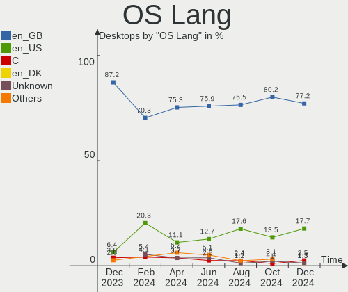
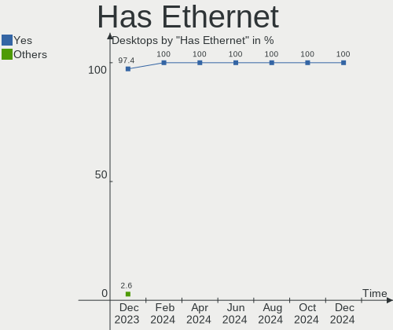
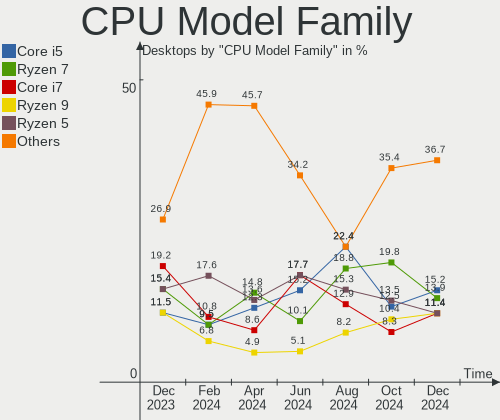
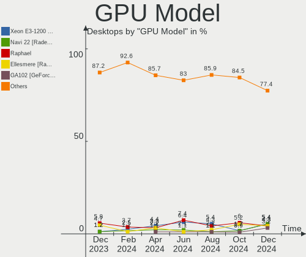
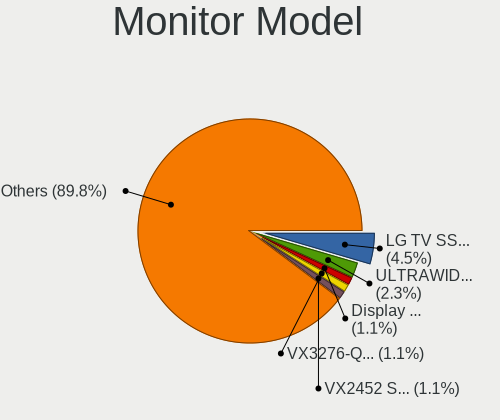
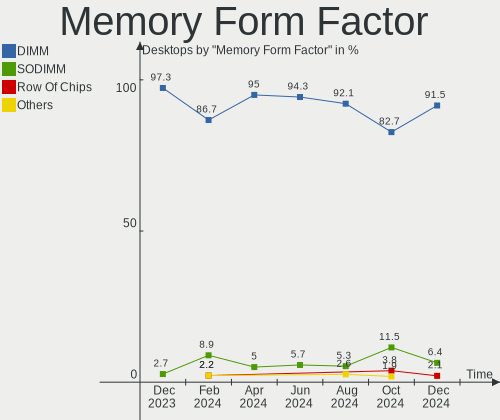

Linux in UK - Hardware Trends (Desktops)
----------------------------------------

A project to identify most popular hardware characteristics and track their change
over time based on data collected by Linux users at https://Linux-Hardware.org.

Anyone can contribute to this report by the [hw-probe](https://github.com/linuxhw/hw-probe) tool:

    sudo -E hw-probe -all -upload

Period: Nov, 2023.

Contents
--------

* [ System ](#system)
  - [ OS                       ](#os)
  - [ OS Family                ](#os-family)
  - [ Kernel                   ](#kernel)
  - [ Kernel Family            ](#kernel-family)
  - [ Kernel Major Ver.        ](#kernel-major-ver)
  - [ Arch                     ](#arch)
  - [ DE                       ](#de)
  - [ Display Server           ](#display-server)
  - [ Display Manager          ](#display-manager)
  - [ OS Lang                  ](#os-lang)
  - [ Boot Mode                ](#boot-mode)
  - [ Filesystem               ](#filesystem)
  - [ Part. scheme             ](#part-scheme)
  - [ Dual Boot with Linux/BSD ](#dual-boot-with-linuxbsd)
  - [ Dual Boot (Win)          ](#dual-boot-win)

* [ Board ](#board)
  - [ Vendor                   ](#vendor)
  - [ Model                    ](#model)
  - [ Model Family             ](#model-family)
  - [ MFG Year                 ](#mfg-year)
  - [ Form Factor              ](#form-factor)
  - [ Secure Boot              ](#secure-boot)
  - [ Coreboot                 ](#coreboot)
  - [ RAM Size                 ](#ram-size)
  - [ RAM Used                 ](#ram-used)
  - [ Total Drives             ](#total-drives)
  - [ Has CD-ROM               ](#has-cd-rom)
  - [ Has Ethernet             ](#has-ethernet)
  - [ Has WiFi                 ](#has-wifi)
  - [ Has Bluetooth            ](#has-bluetooth)

* [ Location ](#location)
  - [ Country                  ](#country)
  - [ City                     ](#city)

* [ Drives ](#drives)
  - [ Drive Vendor             ](#drive-vendor)
  - [ Drive Model              ](#drive-model)
  - [ HDD Vendor               ](#hdd-vendor)
  - [ SSD Vendor               ](#ssd-vendor)
  - [ Drive Kind               ](#drive-kind)
  - [ Drive Connector          ](#drive-connector)
  - [ Drive Size               ](#drive-size)
  - [ Space Total              ](#space-total)
  - [ Space Used               ](#space-used)
  - [ Malfunc. Drives          ](#malfunc-drives)
  - [ Malfunc. Drive Vendor    ](#malfunc-drive-vendor)
  - [ Malfunc. HDD Vendor      ](#malfunc-hdd-vendor)
  - [ Malfunc. Drive Kind      ](#malfunc-drive-kind)
  - [ Failed Drives            ](#failed-drives)
  - [ Failed Drive Vendor      ](#failed-drive-vendor)
  - [ Drive Status             ](#drive-status)

* [ Storage controller ](#storage-controller)
  - [ Storage Vendor           ](#storage-vendor)
  - [ Storage Model            ](#storage-model)
  - [ Storage Kind             ](#storage-kind)

* [ Processor ](#processor)
  - [ CPU Vendor               ](#cpu-vendor)
  - [ CPU Model                ](#cpu-model)
  - [ CPU Model Family         ](#cpu-model-family)
  - [ CPU Cores                ](#cpu-cores)
  - [ CPU Sockets              ](#cpu-sockets)
  - [ CPU Threads              ](#cpu-threads)
  - [ CPU Op-Modes             ](#cpu-op-modes)
  - [ CPU Microcode            ](#cpu-microcode)
  - [ CPU Microarch            ](#cpu-microarch)

* [ Graphics ](#graphics)
  - [ GPU Vendor               ](#gpu-vendor)
  - [ GPU Model                ](#gpu-model)
  - [ GPU Combo                ](#gpu-combo)
  - [ GPU Driver               ](#gpu-driver)
  - [ GPU Memory               ](#gpu-memory)

* [ Monitor ](#monitor)
  - [ Monitor Vendor           ](#monitor-vendor)
  - [ Monitor Model            ](#monitor-model)
  - [ Monitor Resolution       ](#monitor-resolution)
  - [ Monitor Diagonal         ](#monitor-diagonal)
  - [ Monitor Width            ](#monitor-width)
  - [ Aspect Ratio             ](#aspect-ratio)
  - [ Monitor Area             ](#monitor-area)
  - [ Pixel Density            ](#pixel-density)
  - [ Multiple Monitors        ](#multiple-monitors)

* [ Network ](#network)
  - [ Net Controller Vendor    ](#net-controller-vendor)
  - [ Net Controller Model     ](#net-controller-model)
  - [ Wireless Vendor          ](#wireless-vendor)
  - [ Wireless Model           ](#wireless-model)
  - [ Ethernet Vendor          ](#ethernet-vendor)
  - [ Ethernet Model           ](#ethernet-model)
  - [ Net Controller Kind      ](#net-controller-kind)
  - [ Used Controller          ](#used-controller)
  - [ NICs                     ](#nics)
  - [ IPv6                     ](#ipv6)

* [ Bluetooth ](#bluetooth)
  - [ Bluetooth Vendor         ](#bluetooth-vendor)
  - [ Bluetooth Model          ](#bluetooth-model)

* [ Sound ](#sound)
  - [ Sound Vendor             ](#sound-vendor)
  - [ Sound Model              ](#sound-model)

* [ Memory ](#memory)
  - [ Memory Vendor            ](#memory-vendor)
  - [ Memory Model             ](#memory-model)
  - [ Memory Kind              ](#memory-kind)
  - [ Memory Form Factor       ](#memory-form-factor)
  - [ Memory Size              ](#memory-size)
  - [ Memory Speed             ](#memory-speed)

* [ Printers & scanners ](#printers--scanners)
  - [ Printer Vendor           ](#printer-vendor)
  - [ Printer Model            ](#printer-model)
  - [ Scanner Vendor           ](#scanner-vendor)
  - [ Scanner Model            ](#scanner-model)

* [ Camera ](#camera)
  - [ Camera Vendor            ](#camera-vendor)
  - [ Camera Model             ](#camera-model)

* [ Security ](#security)
  - [ Fingerprint Vendor       ](#fingerprint-vendor)
  - [ Fingerprint Model        ](#fingerprint-model)
  - [ Chipcard Vendor          ](#chipcard-vendor)
  - [ Chipcard Model           ](#chipcard-model)

* [ Unsupported ](#unsupported)
  - [ Unsupported Devices      ](#unsupported-devices)
  - [ Unsupported Device Types ](#unsupported-device-types)

System
------

OS
--

Installed operating systems

| Name                | Desktops | Percent |
|---------------------|----------|---------|
| Ubuntu 22.04        | 18       | 18.56%  |
| Linux Mint 21.2     | 8        | 8.25%   |
| Debian 12           | 8        | 8.25%   |
| OpenMandriva 23.08  | 7        | 7.22%   |
| OpenMandriva 5.0    | 6        | 6.19%   |
| Ubuntu 23.10        | 4        | 4.12%   |
| Pop!_OS 22.04       | 4        | 4.12%   |
| OpenMandriva 23.10  | 4        | 4.12%   |
| Fedora 39           | 4        | 4.12%   |
| Zorin 16            | 3        | 3.09%   |
| Xubuntu 23.10       | 3        | 3.09%   |
| Arch Rolling        | 3        | 3.09%   |
| Ubuntu 23.04        | 2        | 2.06%   |
| LMDE 6              | 2        | 2.06%   |
| Kubuntu 23.10       | 2        | 2.06%   |
| Kubuntu 22.04       | 2        | 2.06%   |
| ChimeraOS 44-1      | 2        | 2.06%   |
| Ubuntu Unity 16.04  | 1        | 1.03%   |
| Ubuntu 18.04        | 1        | 1.03%   |
| Slackware 15.0      | 1        | 1.03%   |
| RHEL 9              | 1        | 1.03%   |
| Manjaro 23.0.4      | 1        | 1.03%   |
| Linux Mint 21       | 1        | 1.03%   |
| Linux Mint 20.3     | 1        | 1.03%   |
| KDE neon 22.04      | 1        | 1.03%   |
| Gentoo 2.14         | 1        | 1.03%   |
| EndeavourOS Rolling | 1        | 1.03%   |
| Elementary 7.1      | 1        | 1.03%   |
| Debian              | 1        | 1.03%   |
| CentOS 7            | 1        | 1.03%   |
| ArcoLinux Rolling   | 1        | 1.03%   |
| antergos Rolling    | 1        | 1.03%   |

OS Family
---------

OS without a version

| Name         | Desktops | Percent |
|--------------|----------|---------|
| Ubuntu       | 25       | 25.77%  |
| OpenMandriva | 17       | 17.53%  |
| Linux Mint   | 10       | 10.31%  |
| Debian       | 9        | 9.28%   |
| Pop!_OS      | 4        | 4.12%   |
| Kubuntu      | 4        | 4.12%   |
| Fedora       | 4        | 4.12%   |
| Zorin        | 3        | 3.09%   |
| Xubuntu      | 3        | 3.09%   |
| Arch         | 3        | 3.09%   |
| LMDE         | 2        | 2.06%   |
| ChimeraOS    | 2        | 2.06%   |
| Ubuntu Unity | 1        | 1.03%   |
| Slackware    | 1        | 1.03%   |
| RHEL         | 1        | 1.03%   |
| Manjaro      | 1        | 1.03%   |
| KDE neon     | 1        | 1.03%   |
| Gentoo       | 1        | 1.03%   |
| EndeavourOS  | 1        | 1.03%   |
| Elementary   | 1        | 1.03%   |
| CentOS       | 1        | 1.03%   |
| ArcoLinux    | 1        | 1.03%   |
| antergos     | 1        | 1.03%   |

Kernel
------

Version of the Linux kernel

| Version                      | Desktops | Percent |
|------------------------------|----------|---------|
| 6.2.0-36-generic             | 18       | 18.56%  |
| 6.1.0-13-amd64               | 8        | 8.25%   |
| 6.4.11-desktop-1omv2390      | 7        | 7.22%   |
| 6.6.2-desktop-1omv2390       | 5        | 5.15%   |
| 6.2.0-37-generic             | 5        | 5.15%   |
| 6.6.2-arch1-1                | 4        | 4.12%   |
| 6.5.6-76060506-generic       | 4        | 4.12%   |
| 6.5.0-10-generic             | 4        | 4.12%   |
| 5.15.0-88-generic            | 4        | 4.12%   |
| 6.5.5-desktop-1omv2390       | 3        | 3.09%   |
| 5.15.0-89-generic            | 3        | 3.09%   |
| 6.5.6-chos1-chimeraos-1      | 2        | 2.06%   |
| 6.5.6-300.fc39.x86_64        | 2        | 2.06%   |
| 6.5.0-13-generic             | 2        | 2.06%   |
| 6.6.2-gentoo-x86_64          | 1        | 1.03%   |
| 6.6.1-x64v4-xanmod1          | 1        | 1.03%   |
| 6.6.1-desktop-1omv2390       | 1        | 1.03%   |
| 6.6.0-desktop-0.rc3.1omv2390 | 1        | 1.03%   |
| 6.6.0-1-MANJARO              | 1        | 1.03%   |
| 6.5.9-arch2-1                | 1        | 1.03%   |
| 6.5.11-300.fc39.x86_64       | 1        | 1.03%   |
| 6.5.10-300.fc39.x86_64       | 1        | 1.03%   |
| 6.5.0-9-generic              | 1        | 1.03%   |
| 6.5.0-1006-oem               | 1        | 1.03%   |
| 6.5.0-10-lowlatency          | 1        | 1.03%   |
| 6.2.16-19-pve                | 1        | 1.03%   |
| 6.2.0-35-generic             | 1        | 1.03%   |
| 6.2.0-26-generic             | 1        | 1.03%   |
| 6.1.63-1-lts                 | 1        | 1.03%   |
| 6.1.0-13-armmp               | 1        | 1.03%   |
| 5.4.234-1.el7.elrepo.x86_64  | 1        | 1.03%   |
| 5.4.0-167-generic            | 1        | 1.03%   |
| 5.19.17-Unraid               | 1        | 1.03%   |
| 5.15.0-87-generic            | 1        | 1.03%   |
| 5.15.0-86-generic            | 1        | 1.03%   |
| 5.15.0-84-generic            | 1        | 1.03%   |
| 5.15.0-76-generic            | 1        | 1.03%   |
| 5.14.0-284.30.1.el9_2.x86_64 | 1        | 1.03%   |
| 4.8.0-36-generic             | 1        | 1.03%   |
| 4.15.0-156-generic           | 1        | 1.03%   |

Kernel Family
-------------

Linux kernel without a distro release

| Version | Desktops | Percent |
|---------|----------|---------|
| 6.2.0   | 25       | 25.77%  |
| 5.15.0  | 11       | 11.34%  |
| 6.6.2   | 10       | 10.31%  |
| 6.5.0   | 9        | 9.28%   |
| 6.1.0   | 9        | 9.28%   |
| 6.5.6   | 8        | 8.25%   |
| 6.4.11  | 7        | 7.22%   |
| 6.5.5   | 3        | 3.09%   |
| 6.6.1   | 2        | 2.06%   |
| 6.6.0   | 2        | 2.06%   |
| 6.5.9   | 1        | 1.03%   |
| 6.5.11  | 1        | 1.03%   |
| 6.5.10  | 1        | 1.03%   |
| 6.2.16  | 1        | 1.03%   |
| 6.1.63  | 1        | 1.03%   |
| 5.4.234 | 1        | 1.03%   |
| 5.4.0   | 1        | 1.03%   |
| 5.19.17 | 1        | 1.03%   |
| 5.14.0  | 1        | 1.03%   |
| 4.8.0   | 1        | 1.03%   |
| 4.15.0  | 1        | 1.03%   |

Kernel Major Ver.
-----------------

Linux kernel major version

| Version | Desktops | Percent |
|---------|----------|---------|
| 6.2     | 26       | 26.8%   |
| 6.5     | 23       | 23.71%  |
| 6.6     | 14       | 14.43%  |
| 5.15    | 11       | 11.34%  |
| 6.1     | 10       | 10.31%  |
| 6.4     | 7        | 7.22%   |
| 5.4     | 2        | 2.06%   |
| 5.19    | 1        | 1.03%   |
| 5.14    | 1        | 1.03%   |
| 4.8     | 1        | 1.03%   |
| 4.15    | 1        | 1.03%   |

Arch
----

OS architecture (x86_64, i586, etc.)

| Name   | Desktops | Percent |
|--------|----------|---------|
| x86_64 | 96       | 98.97%  |
| armv7l | 1        | 1.03%   |

DE
--

Desktop Environment

| Name       | Desktops | Percent |
|------------|----------|---------|
| GNOME      | 41       | 42.27%  |
| KDE5       | 27       | 27.84%  |
| X-Cinnamon | 9        | 9.28%   |
| XFCE       | 6        | 6.19%   |
| Unknown    | 6        | 6.19%   |
| MATE       | 3        | 3.09%   |
| Unity      | 1        | 1.03%   |
| Pantheon   | 1        | 1.03%   |
| LXQt       | 1        | 1.03%   |
| KDE4       | 1        | 1.03%   |
| i3         | 1        | 1.03%   |

Display Server
--------------

X11 or Wayland

| Name    | Desktops | Percent |
|---------|----------|---------|
| X11     | 46       | 47.42%  |
| Wayland | 40       | 41.24%  |
| Tty     | 6        | 6.19%   |
| Unknown | 5        | 5.15%   |

Display Manager
---------------

SDDM, LightDM, etc.

| Name    | Desktops | Percent |
|---------|----------|---------|
| GDM3    | 28       | 28.87%  |
| Unknown | 27       | 27.84%  |
| SDDM    | 25       | 25.77%  |
| LightDM | 13       | 13.4%   |
| GDM     | 4        | 4.12%   |

OS Lang
-------

Language

| Lang  | Desktops | Percent |
|-------|----------|---------|
| en_GB | 72       | 74.23%  |
| en_US | 20       | 20.62%  |
| C     | 3        | 3.09%   |
| pl_PL | 1        | 1.03%   |
| lt_LT | 1        | 1.03%   |

Boot Mode
---------

EFI or BIOS

| Mode | Desktops | Percent |
|------|----------|---------|
| EFI  | 52       | 53.61%  |
| BIOS | 45       | 46.39%  |

Filesystem
----------

Type of filesystem

| Type    | Desktops | Percent |
|---------|----------|---------|
| Ext4    | 52       | 53.61%  |
| Tmpfs   | 20       | 20.62%  |
| Overlay | 10       | 10.31%  |
| Btrfs   | 10       | 10.31%  |
| Xfs     | 3        | 3.09%   |
| Rootfs  | 1        | 1.03%   |
| Aufs    | 1        | 1.03%   |

Part. scheme
------------

Scheme of partitioning

| Type    | Desktops | Percent |
|---------|----------|---------|
| GPT     | 67       | 69.07%  |
| Unknown | 23       | 23.71%  |
| MBR     | 7        | 7.22%   |

Dual Boot with Linux/BSD
------------------------

Hosting more than one Linux/BSD

| Dual boot | Desktops | Percent |
|-----------|----------|---------|
| No        | 70       | 72.16%  |
| Yes       | 27       | 27.84%  |

Dual Boot (Win)
---------------

Hosting Linux and Windows

| Dual boot | Desktops | Percent |
|-----------|----------|---------|
| No        | 66       | 68.04%  |
| Yes       | 31       | 31.96%  |

Board
-----

Vendor
------

Motherboard manufacturer

| Name                                 | Desktops | Percent |
|--------------------------------------|----------|---------|
| ASUSTek Computer                     | 25       | 25.77%  |
| Gigabyte Technology                  | 20       | 20.62%  |
| MSI                                  | 12       | 12.37%  |
| Dell                                 | 11       | 11.34%  |
| Hewlett-Packard                      | 9        | 9.28%   |
| Lenovo                               | 5        | 5.15%   |
| ASRock                               | 4        | 4.12%   |
| Acer                                 | 2        | 2.06%   |
| Unknown                              | 2        | 2.06%   |
| Trigkey                              | 1        | 1.03%   |
| Shenzhen Meigao Electronic Equipment | 1        | 1.03%   |
| NZXT                                 | 1        | 1.03%   |
| Intel                                | 1        | 1.03%   |
| GMKtec                               | 1        | 1.03%   |
| Fujitsu                              | 1        | 1.03%   |
| Alienware                            | 1        | 1.03%   |

Model
-----

Motherboard model

| Name                                       | Desktops | Percent |
|--------------------------------------------|----------|---------|
| MSI MS-7C91                                | 2        | 2.06%   |
| MSI MS-7B79                                | 2        | 2.06%   |
| Gigabyte B550 AORUS ELITE AX V2            | 2        | 2.06%   |
| ASUS ROG STRIX X570-F GAMING               | 2        | 2.06%   |
| ASUS P5G41T-M LX2/GB                       | 2        | 2.06%   |
| ASUS All Series                            | 2        | 2.06%   |
| Unknown                                    | 2        | 2.06%   |
| Trigkey Green G4                           | 1        | 1.03%   |
| Shenzhen Meigao Electronic Equipment HX99G | 1        | 1.03%   |
| NZXT N7 B650E                              | 1        | 1.03%   |
| MSI MS-7E12                                | 1        | 1.03%   |
| MSI MS-7E07                                | 1        | 1.03%   |
| MSI MS-7E01                                | 1        | 1.03%   |
| MSI MS-7D75                                | 1        | 1.03%   |
| MSI MS-7C51                                | 1        | 1.03%   |
| MSI MS-7C02                                | 1        | 1.03%   |
| MSI MS-7B78                                | 1        | 1.03%   |
| MSI MS-7996                                | 1        | 1.03%   |
| Lenovo ThinkCentre M93p 10AAA0J8UK         | 1        | 1.03%   |
| Lenovo ThinkCentre M93p 10A8S0FEUK         | 1        | 1.03%   |
| Lenovo ThinkCentre M910t 10MNS0FR00        | 1        | 1.03%   |
| Lenovo ThinkCentre M82 2697BBG             | 1        | 1.03%   |
| Lenovo ThinkCentre M72e 36601Z5            | 1        | 1.03%   |
| Intel DQ77MK                               | 1        | 1.03%   |
| HP Pippin2                                 | 1        | 1.03%   |
| HP OMEN 25L Desktop GT11-0xxx              | 1        | 1.03%   |
| HP Desktop M01-F0xxx                       | 1        | 1.03%   |
| HP Compaq dc7700 Convertible Minitower     | 1        | 1.03%   |
| HP Compaq dc5850 Small Form Factor         | 1        | 1.03%   |
| HP Compaq dc5800 Small Form Factor         | 1        | 1.03%   |
| HP 810-150ea                               | 1        | 1.03%   |
| HP 550-179na                               | 1        | 1.03%   |
| HP 1495                                    | 1        | 1.03%   |
| GMKtec NucBox K2                           | 1        | 1.03%   |
| Gigabyte Z97X-Gaming 5                     | 1        | 1.03%   |
| Gigabyte Z97X-Gaming 3                     | 1        | 1.03%   |
| Gigabyte Z790 GAMING X AX                  | 1        | 1.03%   |
| Gigabyte Z77X-UP5 TH-CF                    | 1        | 1.03%   |
| Gigabyte Z370 AORUS Ultra Gaming           | 1        | 1.03%   |
| Gigabyte X670 AORUS ELITE AX               | 1        | 1.03%   |

Model Family
------------

Motherboard model prefix

| Name                                       | Desktops | Percent |
|--------------------------------------------|----------|---------|
| Dell OptiPlex                              | 6        | 6.19%   |
| ASUS ROG                                   | 6        | 6.19%   |
| Lenovo ThinkCentre                         | 5        | 5.15%   |
| ASUS PRIME                                 | 5        | 5.15%   |
| HP Compaq                                  | 3        | 3.09%   |
| Gigabyte B550                              | 3        | 3.09%   |
| ASUS P5G41T-M                              | 3        | 3.09%   |
| MSI MS-7C91                                | 2        | 2.06%   |
| MSI MS-7B79                                | 2        | 2.06%   |
| Gigabyte Z97X-Gaming                       | 2        | 2.06%   |
| Dell Precision                             | 2        | 2.06%   |
| ASUS All                                   | 2        | 2.06%   |
| Acer Aspire                                | 2        | 2.06%   |
| Unknown                                    | 2        | 2.06%   |
| Trigkey Green                              | 1        | 1.03%   |
| Shenzhen Meigao Electronic Equipment HX99G | 1        | 1.03%   |
| NZXT N7                                    | 1        | 1.03%   |
| MSI MS-7E12                                | 1        | 1.03%   |
| MSI MS-7E07                                | 1        | 1.03%   |
| MSI MS-7E01                                | 1        | 1.03%   |
| MSI MS-7D75                                | 1        | 1.03%   |
| MSI MS-7C51                                | 1        | 1.03%   |
| MSI MS-7C02                                | 1        | 1.03%   |
| MSI MS-7B78                                | 1        | 1.03%   |
| MSI MS-7996                                | 1        | 1.03%   |
| Intel DQ77MK                               | 1        | 1.03%   |
| HP Pippin2                                 | 1        | 1.03%   |
| HP OMEN                                    | 1        | 1.03%   |
| HP Desktop                                 | 1        | 1.03%   |
| HP 810-150ea                               | 1        | 1.03%   |
| HP 550-179na                               | 1        | 1.03%   |
| HP 1495                                    | 1        | 1.03%   |
| GMKtec NucBox                              | 1        | 1.03%   |
| Gigabyte Z790                              | 1        | 1.03%   |
| Gigabyte Z77X-UP5                          | 1        | 1.03%   |
| Gigabyte Z370                              | 1        | 1.03%   |
| Gigabyte X670                              | 1        | 1.03%   |
| Gigabyte X570                              | 1        | 1.03%   |
| Gigabyte PDT-702-1020                      | 1        | 1.03%   |
| Gigabyte H67MA-USB3-B3                     | 1        | 1.03%   |

MFG Year
--------

Motherboard manufacture year

| Year    | Desktops | Percent |
|---------|----------|---------|
| 2019    | 11       | 11.34%  |
| 2020    | 10       | 10.31%  |
| 2023    | 9        | 9.28%   |
| 2022    | 9        | 9.28%   |
| 2021    | 9        | 9.28%   |
| 2014    | 7        | 7.22%   |
| 2018    | 6        | 6.19%   |
| 2013    | 6        | 6.19%   |
| 2015    | 5        | 5.15%   |
| 2017    | 4        | 4.12%   |
| 2012    | 4        | 4.12%   |
| 2011    | 3        | 3.09%   |
| 2009    | 3        | 3.09%   |
| 2016    | 2        | 2.06%   |
| 2010    | 2        | 2.06%   |
| 2008    | 2        | 2.06%   |
| 2007    | 2        | 2.06%   |
| 2006    | 2        | 2.06%   |
| Unknown | 1        | 1.03%   |

Form Factor
-----------

Physical design of the computer

| Name    | Desktops | Percent |
|---------|----------|---------|
| Desktop | 97       | 100%    |

Secure Boot
-----------

Enabled or disabled

| State    | Desktops | Percent |
|----------|----------|---------|
| Disabled | 93       | 95.88%  |
| Enabled  | 4        | 4.12%   |

Coreboot
--------

Have coreboot on board

| Used | Desktops | Percent |
|------|----------|---------|
| No   | 97       | 100%    |

RAM Size
--------

Total RAM memory

| Size in GB  | Desktops | Percent |
|-------------|----------|---------|
| 16.01-24.0  | 24       | 24.74%  |
| 32.01-64.0  | 23       | 23.71%  |
| 64.01-256.0 | 15       | 15.46%  |
| 4.01-8.0    | 13       | 13.4%   |
| 8.01-16.0   | 9        | 9.28%   |
| 3.01-4.0    | 6        | 6.19%   |
| 24.01-32.0  | 5        | 5.15%   |
| 2.01-3.0    | 1        | 1.03%   |
| 0.51-1.0    | 1        | 1.03%   |

RAM Used
--------

Used RAM memory

| Used GB     | Desktops | Percent |
|-------------|----------|---------|
| 4.01-8.0    | 24       | 24.74%  |
| 2.01-3.0    | 23       | 23.71%  |
| 1.01-2.0    | 22       | 22.68%  |
| 3.01-4.0    | 14       | 14.43%  |
| 8.01-16.0   | 7        | 7.22%   |
| 16.01-24.0  | 2        | 2.06%   |
| 0.51-1.0    | 2        | 2.06%   |
| 0.01-0.5    | 2        | 2.06%   |
| 64.01-256.0 | 1        | 1.03%   |

Total Drives
------------

Number of drives on board

| Drives | Desktops | Percent |
|--------|----------|---------|
| 1      | 28       | 28.87%  |
| 3      | 23       | 23.71%  |
| 2      | 23       | 23.71%  |
| 4      | 8        | 8.25%   |
| 5      | 7        | 7.22%   |
| 6      | 3        | 3.09%   |
| 10     | 2        | 2.06%   |
| 8      | 1        | 1.03%   |
| 7      | 1        | 1.03%   |
| 0      | 1        | 1.03%   |

Has CD-ROM
----------

Has CD-ROM on board

| Presented | Desktops | Percent |
|-----------|----------|---------|
| No        | 58       | 59.79%  |
| Yes       | 39       | 40.21%  |

Has Ethernet
------------

Has Ethernet on board

| Presented | Desktops | Percent |
|-----------|----------|---------|
| Yes       | 96       | 98.97%  |
| No        | 1        | 1.03%   |

Has WiFi
--------

Has WiFi module

| Presented | Desktops | Percent |
|-----------|----------|---------|
| Yes       | 50       | 51.55%  |
| No        | 47       | 48.45%  |

Has Bluetooth
-------------

Has Bluetooth module

| Presented | Desktops | Percent |
|-----------|----------|---------|
| Yes       | 53       | 54.64%  |
| No        | 44       | 45.36%  |

Location
--------

Country
-------

Geographic location (country)

| Country | Desktops | Percent |
|---------|----------|---------|
| UK      | 97       | 100%    |

City
----

Geographic location (city)

| City               | Desktops | Percent |
|--------------------|----------|---------|
| Stowmarket         | 3        | 3.09%   |
| London             | 3        | 3.09%   |
| Liverpool          | 3        | 3.09%   |
| Croydon            | 3        | 3.09%   |
| Cardiff            | 3        | 3.09%   |
| Tower Hamlets      | 2        | 2.06%   |
| Reading            | 2        | 2.06%   |
| Peterborough       | 2        | 2.06%   |
| Newtownabbey       | 2        | 2.06%   |
| Manchester         | 2        | 2.06%   |
| Leeds              | 2        | 2.06%   |
| Lambeth            | 2        | 2.06%   |
| Harringay          | 2        | 2.06%   |
| Wandsworth         | 1        | 1.03%   |
| Wallasey           | 1        | 1.03%   |
| Swindon            | 1        | 1.03%   |
| Swansea            | 1        | 1.03%   |
| Stoke-on-Trent     | 1        | 1.03%   |
| St Helens          | 1        | 1.03%   |
| Southampton        | 1        | 1.03%   |
| Solihull           | 1        | 1.03%   |
| Shrewsbury         | 1        | 1.03%   |
| Sheffield          | 1        | 1.03%   |
| Sheerness          | 1        | 1.03%   |
| Sandwich           | 1        | 1.03%   |
| Rotherham          | 1        | 1.03%   |
| Rochester          | 1        | 1.03%   |
| Redruth            | 1        | 1.03%   |
| Ramsgate           | 1        | 1.03%   |
| Poplar             | 1        | 1.03%   |
| Nottingham         | 1        | 1.03%   |
| Norwich            | 1        | 1.03%   |
| Montrose           | 1        | 1.03%   |
| Merthyr Tydfil     | 1        | 1.03%   |
| Machynlleth        | 1        | 1.03%   |
| Lisburn            | 1        | 1.03%   |
| Leicester          | 1        | 1.03%   |
| Kirkby in Ashfield | 1        | 1.03%   |
| Kidlington         | 1        | 1.03%   |
| Kidderminster      | 1        | 1.03%   |

Drives
------

Drive Vendor
------------

Hard drive vendors

| Vendor                      | Desktops | Drives | Percent |
|-----------------------------|----------|--------|---------|
| Seagate                     | 35       | 56     | 18.04%  |
| Samsung Electronics         | 24       | 33     | 12.37%  |
| WDC                         | 22       | 34     | 11.34%  |
| SanDisk                     | 20       | 24     | 10.31%  |
| Crucial                     | 17       | 25     | 8.76%   |
| Toshiba                     | 10       | 12     | 5.15%   |
| Kingston                    | 7        | 7      | 3.61%   |
| Intel                       | 6        | 6      | 3.09%   |
| Unknown                     | 5        | 8      | 2.58%   |
| Micron/Crucial Technology   | 5        | 8      | 2.58%   |
| China                       | 4        | 4      | 2.06%   |
| Phison Electronics          | 3        | 3      | 1.55%   |
| Netac                       | 3        | 4      | 1.55%   |
| SPCC                        | 2        | 2      | 1.03%   |
| SK hynix                    | 2        | 2      | 1.03%   |
| Silicon Motion              | 2        | 3      | 1.03%   |
| PNY                         | 2        | 2      | 1.03%   |
| Micron Technology           | 2        | 2      | 1.03%   |
| LITEON                      | 2        | 2      | 1.03%   |
| Kingston Technology Company | 2        | 2      | 1.03%   |
| Integral                    | 2        | 2      | 1.03%   |
| TO Exter                    | 1        | 1      | 0.52%   |
| SSK                         | 1        | 1      | 0.52%   |
| SABRENT                     | 1        | 2      | 0.52%   |
| Realtek Semiconductor       | 1        | 1      | 0.52%   |
| Phison                      | 1        | 1      | 0.52%   |
| OCZ-VERTEX2                 | 1        | 1      | 0.52%   |
| OCZ                         | 1        | 1      | 0.52%   |
| Lexar                       | 1        | 1      | 0.52%   |
| KIOXIA                      | 1        | 1      | 0.52%   |
| Inateck                     | 1        | 1      | 0.52%   |
| Hitachi                     | 1        | 1      | 0.52%   |
| Gigabyte Technology         | 1        | 1      | 0.52%   |
| FORESEE                     | 1        | 1      | 0.52%   |
| Fanxiang                    | 1        | 1      | 0.52%   |
| Drevo                       | 1        | 1      | 0.52%   |
| ASMT                        | 1        | 1      | 0.52%   |
| A-DATA Technology           | 1        | 1      | 0.52%   |

Drive Model
-----------

Hard drive models

| Model                                               | Desktops | Percent |
|-----------------------------------------------------|----------|---------|
| Sandisk WD Black SN850 1024GB                       | 6        | 2.44%   |
| Seagate ST4000DM004-2CV104 4TB                      | 5        | 2.03%   |
| Seagate ST2000DM008-2FR102 2TB                      | 5        | 2.03%   |
| Seagate ST1000DM010-2EP102 1TB                      | 4        | 1.63%   |
| Crucial CT1000MX500SSD1 1TB                         | 4        | 1.63%   |
| Seagate ST3500312CS 500GB                           | 3        | 1.22%   |
| Samsung SSD 850 EVO 500GB                           | 3        | 1.22%   |
| Samsung NVMe SSD Controller SM981/PM981/PM983 250GB | 3        | 1.22%   |
| Crucial CT500P5PSSD8 500GB                          | 3        | 1.22%   |
| WDC WDS500G2B0A-00SM50 500GB SSD                    | 2        | 0.81%   |
| WDC WD10JPVX-22JC3T0 1TB                            | 2        | 0.81%   |
| WDC WD10EZEX-22MFCA0 1TB                            | 2        | 0.81%   |
| WDC WD10EZEX-08WN4A0 1TB                            | 2        | 0.81%   |
| Unknown SD/MMC/MS PRO 128GB                         | 2        | 0.81%   |
| Unknown SD/MMC 2GB                                  | 2        | 0.81%   |
| Unknown M.S./M.S.Pro/HG 16GB                        | 2        | 0.81%   |
| Toshiba HDWE160 6TB                                 | 2        | 0.81%   |
| Toshiba DT01ACA100 1TB                              | 2        | 0.81%   |
| SPCC Solid State Disk 256GB                         | 2        | 0.81%   |
| Seagate ST3500418AS 500GB                           | 2        | 0.81%   |
| Seagate ST31000528AS 1TB                            | 2        | 0.81%   |
| Seagate Expansion 1TB                               | 2        | 0.81%   |
| Sandisk WDC WDS100T2B0C-00PXH0 1TB                  | 2        | 0.81%   |
| SanDisk SSD PLUS 480GB                              | 2        | 0.81%   |
| SanDisk SDSSDP128G 128GB                            | 2        | 0.81%   |
| Samsung SSD 980 1TB                                 | 2        | 0.81%   |
| Samsung SSD 970 EVO Plus 1TB                        | 2        | 0.81%   |
| Samsung SSD 970 EVO 500GB                           | 2        | 0.81%   |
| Samsung SSD 870 QVO 1TB                             | 2        | 0.81%   |
| Micron/Crucial P2 NVMe PCIe SSD 1TB                 | 2        | 0.81%   |
| Micron/Crucial CT2000P5PSSD8 2TB                    | 2        | 0.81%   |
| Micron/Crucial CT1000P5PSSD8 1TB                    | 2        | 0.81%   |
| Kingston SV300S37A240G 240GB SSD                    | 2        | 0.81%   |
| Kingston SA400S37240G 240GB SSD                     | 2        | 0.81%   |
| Intel SSD 660P Series 512GB                         | 2        | 0.81%   |
| Intel SSD 600P Series 256GB                         | 2        | 0.81%   |
| Crucial CT500P3PSSD8 500GB                          | 2        | 0.81%   |
| Crucial CT240BX500SSD1 240GB                        | 2        | 0.81%   |
| Crucial CT1000P1SSD8 1TB                            | 2        | 0.81%   |
| WDC WDS500G2B0B-00YS70 500GB SSD                    | 1        | 0.41%   |

HDD Vendor
----------

Hard disk drive vendors

| Vendor              | Desktops | Drives | Percent |
|---------------------|----------|--------|---------|
| Seagate             | 35       | 56     | 47.95%  |
| WDC                 | 22       | 29     | 30.14%  |
| Toshiba             | 7        | 9      | 9.59%   |
| Samsung Electronics | 4        | 5      | 5.48%   |
| Unknown             | 2        | 2      | 2.74%   |
| TO Exter            | 1        | 1      | 1.37%   |
| Inateck             | 1        | 1      | 1.37%   |
| Hitachi             | 1        | 1      | 1.37%   |

SSD Vendor
----------

Solid state drive vendors

| Vendor              | Desktops | Drives | Percent |
|---------------------|----------|--------|---------|
| Samsung Electronics | 13       | 14     | 17.81%  |
| Crucial             | 13       | 15     | 17.81%  |
| SanDisk             | 11       | 12     | 15.07%  |
| Kingston            | 7        | 7      | 9.59%   |
| WDC                 | 4        | 5      | 5.48%   |
| China               | 4        | 4      | 5.48%   |
| Toshiba             | 3        | 3      | 4.11%   |
| SPCC                | 2        | 2      | 2.74%   |
| PNY                 | 2        | 2      | 2.74%   |
| Netac               | 2        | 3      | 2.74%   |
| LITEON              | 2        | 2      | 2.74%   |
| Integral            | 2        | 2      | 2.74%   |
| SK hynix            | 1        | 1      | 1.37%   |
| SABRENT             | 1        | 1      | 1.37%   |
| OCZ-VERTEX2         | 1        | 1      | 1.37%   |
| OCZ                 | 1        | 1      | 1.37%   |
| Gigabyte Technology | 1        | 1      | 1.37%   |
| FORESEE             | 1        | 1      | 1.37%   |
| Drevo               | 1        | 1      | 1.37%   |
| ASMT                | 1        | 1      | 1.37%   |

Drive Kind
----------

HDD or SSD

| Kind    | Desktops | Drives | Percent |
|---------|----------|--------|---------|
| HDD     | 59       | 104    | 35.98%  |
| SSD     | 56       | 79     | 34.15%  |
| NVMe    | 46       | 70     | 28.05%  |
| Unknown | 2        | 5      | 1.22%   |
| MMC     | 1        | 1      | 0.61%   |

Drive Connector
---------------

SATA, SAS, NVMe, etc.

| Type | Desktops | Drives | Percent |
|------|----------|--------|---------|
| SATA | 84       | 167    | 57.14%  |
| NVMe | 46       | 68     | 31.29%  |
| SAS  | 16       | 23     | 10.88%  |
| MMC  | 1        | 1      | 0.68%   |

Drive Size
----------

Size of hard drive

| Size in TB | Desktops | Drives | Percent |
|------------|----------|--------|---------|
| 0.01-0.5   | 55       | 78     | 40.74%  |
| 0.51-1.0   | 35       | 47     | 25.93%  |
| 1.01-2.0   | 20       | 21     | 14.81%  |
| 3.01-4.0   | 12       | 21     | 8.89%   |
| 2.01-3.0   | 6        | 7      | 4.44%   |
| 4.01-10.0  | 6        | 7      | 4.44%   |
| 10.01-20.0 | 1        | 2      | 0.74%   |

Space Total
-----------

Amount of disk space available on the file system

| Size in GB     | Desktops | Percent |
|----------------|----------|---------|
| 251-500        | 19       | 19.59%  |
| More than 3000 | 18       | 18.56%  |
| 101-250        | 15       | 15.46%  |
| 1001-2000      | 12       | 12.37%  |
| 501-1000       | 12       | 12.37%  |
| 1-20           | 10       | 10.31%  |
| 2001-3000      | 7        | 7.22%   |
| Unknown        | 2        | 2.06%   |
| 21-50          | 1        | 1.03%   |
| 51-100         | 1        | 1.03%   |

Space Used
----------

Amount of used disk space

| Used GB        | Desktops | Percent |
|----------------|----------|---------|
| 1-20           | 26       | 26.8%   |
| 101-250        | 17       | 17.53%  |
| 21-50          | 14       | 14.43%  |
| More than 3000 | 8        | 8.25%   |
| 251-500        | 8        | 8.25%   |
| 1001-2000      | 8        | 8.25%   |
| 501-1000       | 7        | 7.22%   |
| 51-100         | 6        | 6.19%   |
| Unknown        | 2        | 2.06%   |
| 2001-3000      | 1        | 1.03%   |

Malfunc. Drives
---------------

Drive models with a malfunction

| Model                            | Desktops | Drives | Percent |
|----------------------------------|----------|--------|---------|
| WDC WD40PURZ-85TTDY0 4TB         | 1        | 1      | 5.26%   |
| WDC WD30EZRX-00D8PB0 3TB         | 1        | 1      | 5.26%   |
| WDC WD10JPVX-22JC3T0 1TB         | 1        | 1      | 5.26%   |
| WDC WD10EZEX-22MFCA0 1TB         | 1        | 1      | 5.26%   |
| WDC WD10EZEX-08WN4A0 1TB         | 1        | 1      | 5.26%   |
| WDC WD10EARS-00Y5B1 1TB          | 1        | 1      | 5.26%   |
| WDC WD Blue SA510 M.2 2280 500GB | 1        | 1      | 5.26%   |
| Seagate ST500LM021-1KJ152 500GB  | 1        | 1      | 5.26%   |
| Seagate ST500DM002-1BC142 500GB  | 1        | 1      | 5.26%   |
| Seagate ST4000VX007-2DT166 4TB   | 1        | 1      | 5.26%   |
| Seagate ST3500418AS 500GB        | 1        | 1      | 5.26%   |
| Seagate ST2000DX001-1NS164 2TB   | 1        | 1      | 5.26%   |
| SanDisk SSD PLUS 240GB           | 1        | 1      | 5.26%   |
| SanDisk SDSSDP128G 128GB         | 1        | 1      | 5.26%   |
| Intel SSD 600P Series 256GB      | 1        | 1      | 5.26%   |
| Hitachi HDS721010CLA332 1TB      | 1        | 1      | 5.26%   |
| Drevo X1 Pro SSD 128GB           | 1        | 1      | 5.26%   |
| Crucial CT750MX300SSD1 752GB     | 1        | 1      | 5.26%   |
| China SH00M256GB SSD             | 1        | 1      | 5.26%   |

Malfunc. Drive Vendor
---------------------

Vendors of faulty drives

| Vendor  | Desktops | Drives | Percent |
|---------|----------|--------|---------|
| WDC     | 6        | 7      | 33.33%  |
| Seagate | 5        | 5      | 27.78%  |
| SanDisk | 2        | 2      | 11.11%  |
| Intel   | 1        | 1      | 5.56%   |
| Hitachi | 1        | 1      | 5.56%   |
| Drevo   | 1        | 1      | 5.56%   |
| Crucial | 1        | 1      | 5.56%   |
| China   | 1        | 1      | 5.56%   |

Malfunc. HDD Vendor
-------------------

Vendors of faulty HDD drives

| Vendor  | Desktops | Drives | Percent |
|---------|----------|--------|---------|
| WDC     | 5        | 6      | 45.45%  |
| Seagate | 5        | 5      | 45.45%  |
| Hitachi | 1        | 1      | 9.09%   |

Malfunc. Drive Kind
-------------------

Kinds of faulty drives

| Kind | Desktops | Drives | Percent |
|------|----------|--------|---------|
| HDD  | 10       | 12     | 58.82%  |
| SSD  | 6        | 6      | 35.29%  |
| NVMe | 1        | 1      | 5.88%   |

Failed Drives
-------------

Failed drive models

Zero info for selected period =(

Failed Drive Vendor
-------------------

Failed drive vendors

Zero info for selected period =(

Drive Status
------------

Number of failed and malfunc. drives

| Status   | Desktops | Drives | Percent |
|----------|----------|--------|---------|
| Detected | 50       | 120    | 43.48%  |
| Works    | 50       | 120    | 43.48%  |
| Malfunc  | 15       | 19     | 13.04%  |

Storage controller
------------------

Storage Vendor
--------------

Storage controller vendors

| Vendor                       | Desktops | Percent |
|------------------------------|----------|---------|
| Intel                        | 57       | 36.31%  |
| AMD                          | 40       | 25.48%  |
| Samsung Electronics          | 13       | 8.28%   |
| Micron/Crucial Technology    | 12       | 7.64%   |
| SanDisk                      | 10       | 6.37%   |
| Phison Electronics           | 5        | 3.18%   |
| ASMedia Technology           | 3        | 1.91%   |
| Silicon Motion               | 2        | 1.27%   |
| Silicon Image                | 2        | 1.27%   |
| Micron Technology            | 2        | 1.27%   |
| Kingston Technology Company  | 2        | 1.27%   |
| SK hynix                     | 1        | 0.64%   |
| Shenzhen Longsys Electronics | 1        | 0.64%   |
| Realtek Semiconductor        | 1        | 0.64%   |
| Nvidia                       | 1        | 0.64%   |
| MAXIO Technology (Hangzhou)  | 1        | 0.64%   |
| Marvell Technology Group     | 1        | 0.64%   |
| LSI Logic / Symbios Logic    | 1        | 0.64%   |
| KIOXIA                       | 1        | 0.64%   |
| ADATA Technology             | 1        | 0.64%   |

Storage Model
-------------

Storage controller models

| Model                                                                                   | Desktops | Percent |
|-----------------------------------------------------------------------------------------|----------|---------|
| AMD FCH SATA Controller [AHCI mode]                                                     | 23       | 12.37%  |
| AMD 500 Series Chipset SATA Controller                                                  | 9        | 4.84%   |
| Samsung NVMe SSD Controller SM981/PM981/PM983                                           | 7        | 3.76%   |
| AMD 400 Series Chipset SATA Controller                                                  | 7        | 3.76%   |
| SanDisk WD PC SN810 / Black SN850 NVMe SSD                                              | 6        | 3.23%   |
| Micron/Crucial P5 Plus NVMe PCIe SSD                                                    | 6        | 3.23%   |
| Intel Q170/Q150/B150/H170/H110/Z170/CM236 Chipset SATA Controller [AHCI Mode]           | 6        | 3.23%   |
| Intel 7 Series/C210 Series Chipset Family 6-port SATA Controller [AHCI mode]            | 6        | 3.23%   |
| Micron/Crucial P2 [Nick P2] / P3 / P3 Plus NVMe PCIe SSD (DRAM-less)                    | 5        | 2.69%   |
| Samsung NVMe SSD Controller 980 (DRAM-less)                                             | 4        | 2.15%   |
| Intel NM10/ICH7 Family SATA Controller [IDE mode]                                       | 4        | 2.15%   |
| Intel Comet Lake SATA AHCI Controller                                                   | 4        | 2.15%   |
| Intel 8 Series/C220 Series Chipset Family 6-port SATA Controller 1 [AHCI mode]          | 4        | 2.15%   |
| Intel 700 Series Chipset Family SATA AHCI Controller                                    | 4        | 2.15%   |
| Intel 200 Series PCH SATA controller [AHCI mode]                                        | 4        | 2.15%   |
| Phison PS5013-E13 PCIe3 NVMe Controller (DRAM-less)                                     | 3        | 1.61%   |
| Intel 9 Series Chipset Family SATA Controller [AHCI Mode]                               | 3        | 1.61%   |
| Intel 82801G (ICH7 Family) IDE Controller                                               | 3        | 1.61%   |
| Silicon Motion SM2263EN/SM2263XT (DRAM-less) NVMe SSD Controllers                       | 2        | 1.08%   |
| SanDisk WD Green SN350 240GB (DRAM-less) / SN560E NVMe SSD                              | 2        | 1.08%   |
| Micron/Crucial P1 NVMe PCIe SSD[Frampton]                                               | 2        | 1.08%   |
| Intel Volume Management Device NVMe RAID Controller Intel Corporation                   | 2        | 1.08%   |
| Intel SSD 660P Series                                                                   | 2        | 1.08%   |
| Intel SSD 600P Series                                                                   | 2        | 1.08%   |
| Intel SATA Controller [RAID mode]                                                       | 2        | 1.08%   |
| Intel Cannon Lake PCH SATA AHCI Controller                                              | 2        | 1.08%   |
| Intel 82801H (ICH8 Family) 4 port SATA Controller [IDE mode]                            | 2        | 1.08%   |
| Intel 6 Series/C200 Series Chipset Family Desktop SATA Controller (IDE mode, ports 4-5) | 2        | 1.08%   |
| Intel 6 Series/C200 Series Chipset Family Desktop SATA Controller (IDE mode, ports 0-3) | 2        | 1.08%   |
| Intel 500 Series Chipset Family SATA AHCI Controller                                    | 2        | 1.08%   |
| ASMedia ASM1062 Serial ATA Controller                                                   | 2        | 1.08%   |
| AMD SB7x0/SB8x0/SB9x0 SATA Controller [IDE mode]                                        | 2        | 1.08%   |
| AMD SB7x0/SB8x0/SB9x0 SATA Controller [AHCI mode]                                       | 2        | 1.08%   |
| SK hynix BC501 NVMe Solid State Drive                                                   | 1        | 0.54%   |
| Silicon Image SiI 3512 [SATALink/SATARaid] Serial ATA Controller                        | 1        | 0.54%   |
| Silicon Image SiI 3112 [SATALink/SATARaid] Serial ATA Controller                        | 1        | 0.54%   |
| Shenzhen Longsys Lexar NM800 PRO NVME SSD                                               | 1        | 0.54%   |
| Sandisk WD Black SN850X NVMe SSD                                                        | 1        | 0.54%   |
| SanDisk WD Black SN770 / PC SN740 256GB / PC SN560 (DRAM-less) NVMe SSD                 | 1        | 0.54%   |
| SanDisk Ultra 3D / WD Blue SN570 NVMe SSD (DRAM-less)                                   | 1        | 0.54%   |

Storage Kind
------------

Kind of storage controller (IDE, SATA, NVMe, SAS, ...)

| Kind | Desktops | Percent |
|------|----------|---------|
| SATA | 81       | 54%     |
| NVMe | 46       | 30.67%  |
| IDE  | 15       | 10%     |
| RAID | 7        | 4.67%   |
| SAS  | 1        | 0.67%   |

Processor
---------

CPU Vendor
----------

Processor vendors

| Vendor | Desktops | Percent |
|--------|----------|---------|
| Intel  | 53       | 54.64%  |
| AMD    | 43       | 44.33%  |
| ARM    | 1        | 1.03%   |

CPU Model
---------

Processor models

| Model                                       | Desktops | Percent |
|---------------------------------------------|----------|---------|
| AMD Ryzen 7 5800X 8-Core Processor          | 4        | 4.12%   |
| Intel Pentium Dual-Core CPU E5400 @ 2.70GHz | 3        | 3.09%   |
| AMD Ryzen 5 5600X 6-Core Processor          | 3        | 3.09%   |
| AMD Ryzen 5 3400G with Radeon Vega Graphics | 3        | 3.09%   |
| Intel Core i7-8700 CPU @ 3.20GHz            | 2        | 2.06%   |
| Intel Core i7-4790K CPU @ 4.00GHz           | 2        | 2.06%   |
| Intel Core i7-3770K CPU @ 3.50GHz           | 2        | 2.06%   |
| Intel Core i7-3770 CPU @ 3.40GHz            | 2        | 2.06%   |
| Intel Core i7-2600 CPU @ 3.40GHz            | 2        | 2.06%   |
| AMD Ryzen 9 7950X 16-Core Processor         | 2        | 2.06%   |
| AMD Ryzen 9 5900X 12-Core Processor         | 2        | 2.06%   |
| AMD Ryzen 7 7700X 8-Core Processor          | 2        | 2.06%   |
| AMD Ryzen 5 3600 6-Core Processor           | 2        | 2.06%   |
| Intel Xeon CPU E5-1650 v3 @ 3.50GHz         | 1        | 1.03%   |
| Intel Pentium CPU G645 @ 2.90GHz            | 1        | 1.03%   |
| Intel Pentium CPU G4400 @ 3.30GHz           | 1        | 1.03%   |
| Intel N100                                  | 1        | 1.03%   |
| Intel Core i9-9900X CPU @ 3.50GHz           | 1        | 1.03%   |
| Intel Core i9-10850K CPU @ 3.60GHz          | 1        | 1.03%   |
| Intel Core i7-9700T CPU @ 2.00GHz           | 1        | 1.03%   |
| Intel Core i7-8700K CPU @ 3.70GHz           | 1        | 1.03%   |
| Intel Core i7-6700 CPU @ 3.40GHz            | 1        | 1.03%   |
| Intel Core i7-4790 CPU @ 3.60GHz            | 1        | 1.03%   |
| Intel Core i7-4770K CPU @ 3.50GHz           | 1        | 1.03%   |
| Intel Core i7-4770 CPU @ 3.40GHz            | 1        | 1.03%   |
| Intel Core i5-7500 CPU @ 3.40GHz            | 1        | 1.03%   |
| Intel Core i5-7400T CPU @ 2.40GHz           | 1        | 1.03%   |
| Intel Core i5-6600K CPU @ 3.50GHz           | 1        | 1.03%   |
| Intel Core i5-6400 CPU @ 2.70GHz            | 1        | 1.03%   |
| Intel Core i5-4670K CPU @ 3.40GHz           | 1        | 1.03%   |
| Intel Core i5-4570T CPU @ 2.90GHz           | 1        | 1.03%   |
| Intel Core i5-4570 CPU @ 3.20GHz            | 1        | 1.03%   |
| Intel Core i5-3470 CPU @ 3.20GHz            | 1        | 1.03%   |
| Intel Core i5-2400 CPU @ 3.10GHz            | 1        | 1.03%   |
| Intel Core i5-10505 CPU @ 3.20GHz           | 1        | 1.03%   |
| Intel Core i5-10400 CPU @ 2.90GHz           | 1        | 1.03%   |
| Intel Core i3-8100T CPU @ 3.10GHz           | 1        | 1.03%   |
| Intel Core i3-6100U CPU @ 2.30GHz           | 1        | 1.03%   |
| Intel Core i3-6100 CPU @ 3.70GHz            | 1        | 1.03%   |
| Intel Core i3-10105F CPU @ 3.70GHz          | 1        | 1.03%   |

CPU Model Family
----------------

Processor model prefix

| Model                   | Desktops | Percent |
|-------------------------|----------|---------|
| Intel Core i7           | 16       | 16.49%  |
| AMD Ryzen 7             | 12       | 12.37%  |
| Intel Core i5           | 11       | 11.34%  |
| AMD Ryzen 5             | 11       | 11.34%  |
| AMD Ryzen 9             | 10       | 10.31%  |
| Other                   | 8        | 8.25%   |
| Intel Core i3           | 5        | 5.15%   |
| Intel Pentium Dual-Core | 3        | 3.09%   |
| Intel Pentium           | 2        | 2.06%   |
| Intel Core i9           | 2        | 2.06%   |
| Intel Core 2 Quad       | 2        | 2.06%   |
| Intel Core 2 Duo        | 2        | 2.06%   |
| Intel Core 2            | 2        | 2.06%   |
| AMD FX                  | 2        | 2.06%   |
| AMD A10                 | 2        | 2.06%   |
| Intel Xeon              | 1        | 1.03%   |
| AMD Ryzen Threadripper  | 1        | 1.03%   |
| AMD Ryzen 7 PRO         | 1        | 1.03%   |
| AMD Phenom II X4        | 1        | 1.03%   |
| AMD Phenom              | 1        | 1.03%   |
| AMD Athlon 64 X2        | 1        | 1.03%   |
| AMD A8                  | 1        | 1.03%   |

CPU Cores
---------

Number of processor cores

| Number | Desktops | Percent |
|--------|----------|---------|
| 4      | 32       | 32.99%  |
| 8      | 17       | 17.53%  |
| 2      | 17       | 17.53%  |
| 6      | 15       | 15.46%  |
| 16     | 8        | 8.25%   |
| 12     | 4        | 4.12%   |
| 10     | 3        | 3.09%   |
| 3      | 1        | 1.03%   |

CPU Sockets
-----------

Number of sockets

| Number | Desktops | Percent |
|--------|----------|---------|
| 1      | 97       | 100%    |

CPU Threads
-----------

Threads per core (Hyper-Threading)

| Number | Desktops | Percent |
|--------|----------|---------|
| 2      | 69       | 71.13%  |
| 1      | 28       | 28.87%  |

CPU Op-Modes
------------

CPU Operation Modes (32-bit, 64-bit)

| Op mode        | Desktops | Percent |
|----------------|----------|---------|
| 32-bit, 64-bit | 96       | 98.97%  |
| Unknown        | 1        | 1.03%   |

CPU Microcode
-------------

Microcode number

| Number     | Desktops | Percent |
|------------|----------|---------|
| Unknown    | 55       | 56.7%   |
| 0x0a601203 | 4        | 4.12%   |
| 0x906e9    | 2        | 2.06%   |
| 0x506e3    | 2        | 2.06%   |
| 0x206a7    | 2        | 2.06%   |
| 0x0a404102 | 2        | 2.06%   |
| 0x0a20120a | 2        | 2.06%   |
| 0x08701021 | 2        | 2.06%   |
| 0x08108109 | 2        | 2.06%   |
| 0x0800820d | 2        | 2.06%   |
| 0x06003106 | 2        | 2.06%   |
| 0xb0671    | 1        | 1.03%   |
| 0xa0653    | 1        | 1.03%   |
| 0x906ed    | 1        | 1.03%   |
| 0x906ea    | 1        | 1.03%   |
| 0x90672    | 1        | 1.03%   |
| 0x306a9    | 1        | 1.03%   |
| 0x1067a    | 1        | 1.03%   |
| 0x0a20120e | 1        | 1.03%   |
| 0x0a201205 | 1        | 1.03%   |
| 0x0a20102b | 1        | 1.03%   |
| 0x0a201025 | 1        | 1.03%   |
| 0x0a201016 | 1        | 1.03%   |
| 0x0a201009 | 1        | 1.03%   |
| 0x08701030 | 1        | 1.03%   |
| 0x08600109 | 1        | 1.03%   |
| 0x08600106 | 1        | 1.03%   |
| 0x08001138 | 1        | 1.03%   |
| 0x010000c8 | 1        | 1.03%   |
| 0x01000095 | 1        | 1.03%   |
| 0x00000000 | 1        | 1.03%   |

CPU Microarch
-------------

Microarchitecture

| Name             | Desktops | Percent |
|------------------|----------|---------|
| Zen 3            | 13       | 13.4%   |
| Unknown          | 11       | 11.34%  |
| Haswell          | 9        | 9.28%   |
| Zen+             | 7        | 7.22%   |
| Skylake          | 7        | 7.22%   |
| KabyLake         | 7        | 7.22%   |
| Zen 2            | 6        | 6.19%   |
| Penryn           | 6        | 6.19%   |
| IvyBridge        | 5        | 5.15%   |
| CometLake        | 5        | 5.15%   |
| SandyBridge      | 4        | 4.12%   |
| Steamroller      | 3        | 3.09%   |
| Core             | 3        | 3.09%   |
| Alderlake Hybrid | 3        | 3.09%   |
| Piledriver       | 2        | 2.06%   |
| K10              | 2        | 2.06%   |
| Zen              | 1        | 1.03%   |
| K8 Hammer        | 1        | 1.03%   |
| Icelake          | 1        | 1.03%   |
| Gracemont        | 1        | 1.03%   |

Graphics
--------

GPU Vendor
----------

Vendors of graphics cards

| Vendor | Desktops | Percent |
|--------|----------|---------|
| Nvidia | 47       | 45.63%  |
| AMD    | 29       | 28.16%  |
| Intel  | 27       | 26.21%  |

GPU Model
---------

Graphics card models

| Model                                                                       | Desktops | Percent |
|-----------------------------------------------------------------------------|----------|---------|
| Intel CoffeeLake-S GT2 [UHD Graphics 630]                                   | 6        | 5.66%   |
| Nvidia GP107 [GeForce GTX 1050 Ti]                                          | 4        | 3.77%   |
| Intel Xeon E3-1200 v3/4th Gen Core Processor Integrated Graphics Controller | 4        | 3.77%   |
| AMD Raphael                                                                 | 4        | 3.77%   |
| AMD Navi 21 [Radeon RX 6800/6800 XT / 6900 XT]                              | 4        | 3.77%   |
| Nvidia GP108 [GeForce GT 1030]                                              | 3        | 2.83%   |
| Nvidia GP106 [GeForce GTX 1060 3GB]                                         | 3        | 2.83%   |
| Nvidia GM206 [GeForce GTX 960]                                              | 3        | 2.83%   |
| Nvidia GK208B [GeForce GT 710]                                              | 3        | 2.83%   |
| Nvidia GA104 [GeForce RTX 3060 Ti]                                          | 3        | 2.83%   |
| Nvidia GA102 [GeForce RTX 3080 Ti]                                          | 3        | 2.83%   |
| AMD Picasso/Raven 2 [Radeon Vega Series / Radeon Vega Mobile Series]        | 3        | 2.83%   |
| Nvidia GF119 [GeForce GT 610]                                               | 2        | 1.89%   |
| Intel CometLake-S GT2 [UHD Graphics 630]                                    | 2        | 1.89%   |
| Intel Alder Lake-S GT1 [UHD Graphics 730]                                   | 2        | 1.89%   |
| Intel 82Q963/Q965 Integrated Graphics Controller                            | 2        | 1.89%   |
| Intel 2nd Generation Core Processor Family Integrated Graphics Controller   | 2        | 1.89%   |
| AMD Renoir [Radeon RX Vega 6 (Ryzen 4000/5000 Mobile Series)]               | 2        | 1.89%   |
| AMD Rembrandt [Radeon 680M]                                                 | 2        | 1.89%   |
| AMD Navi 24 [Radeon RX 6400/6500 XT/6500M]                                  | 2        | 1.89%   |
| AMD Lexa PRO [Radeon 540/540X/550/550X / RX 540X/550/550X]                  | 2        | 1.89%   |
| AMD Ellesmere [Radeon RX 470/480/570/570X/580/580X/590]                     | 2        | 1.89%   |
| Nvidia TU116 [GeForce GTX 1660 Ti]                                          | 1        | 0.94%   |
| Nvidia TU116 [GeForce GTX 1660 SUPER]                                       | 1        | 0.94%   |
| Nvidia TU116 [GeForce GTX 1650]                                             | 1        | 0.94%   |
| Nvidia TU106 [GeForce RTX 2060 Rev. A]                                      | 1        | 0.94%   |
| Nvidia GT218 [GeForce 210]                                                  | 1        | 0.94%   |
| Nvidia GP106 [GeForce GTX 1060 6GB]                                         | 1        | 0.94%   |
| Nvidia GP104GL [Quadro P4000]                                               | 1        | 0.94%   |
| Nvidia GP104 [GeForce GTX 1080]                                             | 1        | 0.94%   |
| Nvidia GP104 [GeForce GTX 1070]                                             | 1        | 0.94%   |
| Nvidia GP102 [GeForce GTX 1080 Ti]                                          | 1        | 0.94%   |
| Nvidia GM206 [GeForce GTX 950]                                              | 1        | 0.94%   |
| Nvidia GM204GL [Quadro M4000]                                               | 1        | 0.94%   |
| Nvidia GM200 [GeForce GTX 980 Ti]                                           | 1        | 0.94%   |
| Nvidia GF108 [GeForce GT 730]                                               | 1        | 0.94%   |
| Nvidia GA107 [GeForce RTX 3050 8GB]                                         | 1        | 0.94%   |
| Nvidia GA104 [GeForce RTX 3070 Ti]                                          | 1        | 0.94%   |
| Nvidia GA102 [GeForce RTX 3090]                                             | 1        | 0.94%   |
| Nvidia GA102 [GeForce RTX 3090 Ti]                                          | 1        | 0.94%   |

GPU Combo
---------

Combinations of graphics cards

| Name           | Desktops | Percent |
|----------------|----------|---------|
| 1 x Nvidia     | 43       | 44.33%  |
| 1 x Intel      | 23       | 23.71%  |
| 1 x AMD        | 23       | 23.71%  |
| 2 x AMD        | 3        | 3.09%   |
| AMD + Nvidia   | 3        | 3.09%   |
| Other          | 1        | 1.03%   |
| Intel + Nvidia | 1        | 1.03%   |

GPU Driver
----------

Free vs proprietary

| Driver      | Desktops | Percent |
|-------------|----------|---------|
| Free        | 62       | 63.92%  |
| Proprietary | 29       | 29.9%   |
| Unknown     | 6        | 6.19%   |

GPU Memory
----------

Total video memory

| Size in GB | Desktops | Percent |
|------------|----------|---------|
| Unknown    | 49       | 50.52%  |
| 3.01-4.0   | 9        | 9.28%   |
| 7.01-8.0   | 8        | 8.25%   |
| 8.01-16.0  | 7        | 7.22%   |
| 1.01-2.0   | 6        | 6.19%   |
| 0.51-1.0   | 5        | 5.15%   |
| 0.01-0.5   | 5        | 5.15%   |
| 5.01-6.0   | 3        | 3.09%   |
| 2.01-3.0   | 3        | 3.09%   |
| 16.01-24.0 | 2        | 2.06%   |

Monitor
-------

Monitor Vendor
--------------

Monitor vendors

| Vendor               | Desktops | Percent |
|----------------------|----------|---------|
| Dell                 | 19       | 20%     |
| Samsung Electronics  | 14       | 14.74%  |
| Philips              | 6        | 6.32%   |
| Hewlett-Packard      | 6        | 6.32%   |
| Goldstar             | 6        | 6.32%   |
| BenQ                 | 6        | 6.32%   |
| AOC                  | 6        | 6.32%   |
| Ancor Communications | 4        | 4.21%   |
| Lenovo               | 3        | 3.16%   |
| Iiyama               | 3        | 3.16%   |
| Acer                 | 3        | 3.16%   |
| Hitachi              | 2        | 2.11%   |
| ASUSTek Computer     | 2        | 2.11%   |
| Unknown              | 1        | 1.05%   |
| Toshiba              | 1        | 1.05%   |
| Sony                 | 1        | 1.05%   |
| MSI                  | 1        | 1.05%   |
| LG Electronics       | 1        | 1.05%   |
| IBM                  | 1        | 1.05%   |
| Huion                | 1        | 1.05%   |
| HKC                  | 1        | 1.05%   |
| HannStar             | 1        | 1.05%   |
| Gigabyte Technology  | 1        | 1.05%   |
| CVT                  | 1        | 1.05%   |
| CMT                  | 1        | 1.05%   |
| Beike                | 1        | 1.05%   |
| Apple                | 1        | 1.05%   |
| Unknown              | 1        | 1.05%   |

Monitor Model
-------------

Monitor models

| Model                                                                   | Desktops | Percent |
|-------------------------------------------------------------------------|----------|---------|
| Philips 221B PHL08A1 1920x1080 477x268mm 21.5-inch                      | 2        | 2.04%   |
| Hitachi HDMI HEC0030 1920x1080 580x330mm 26.3-inch                      | 2        | 2.04%   |
| Goldstar LG TV SSCR2 GSMC0C8 3840x2160                                  | 2        | 2.04%   |
| Dell SE2216H DELF070 1920x1080 476x268mm 21.5-inch                      | 2        | 2.04%   |
| Dell P2314H DEL4099 1920x1080 509x286mm 23.0-inch                       | 2        | 2.04%   |
| Unknown LCD Monitor XXX AAA 1920x1080                                   | 1        | 1.02%   |
| Toshiba ScreenXpert TSB8888 1080x2160                                   | 1        | 1.02%   |
| Sony TV SNYE903 1920x1080                                               | 1        | 1.02%   |
| Samsung Electronics U28E590 SAM0C4D 3840x2160 610x350mm 27.7-inch       | 1        | 1.02%   |
| Samsung Electronics T19C300 SAM0A98 1366x768 410x230mm 18.5-inch        | 1        | 1.02%   |
| Samsung Electronics SyncMaster SAM030C 1680x1050 474x296mm 22.0-inch    | 1        | 1.02%   |
| Samsung Electronics S27F350 SAM0D22 1920x1080 598x336mm 27.0-inch       | 1        | 1.02%   |
| Samsung Electronics QBQ90 SAM71FF 3840x2160 1872x1053mm 84.6-inch       | 1        | 1.02%   |
| Samsung Electronics LS32A70 SAM7166 3840x2160 698x393mm 31.5-inch       | 1        | 1.02%   |
| Samsung Electronics LF22T35 SAM707B 1920x1080 477x268mm 21.5-inch       | 1        | 1.02%   |
| Samsung Electronics LCD Monitor SAM7017 3840x2160 1872x1053mm 84.6-inch | 1        | 1.02%   |
| Samsung Electronics LCD Monitor SAM7016 3840x2160 1872x1053mm 84.6-inch | 1        | 1.02%   |
| Samsung Electronics LCD Monitor SAM7003 3840x2160 1872x1053mm 84.6-inch | 1        | 1.02%   |
| Samsung Electronics LCD Monitor SAM0FF0 3840x2160 950x540mm 43.0-inch   | 1        | 1.02%   |
| Samsung Electronics LCD Monitor SAM0C26 1920x1080 700x390mm 31.5-inch   | 1        | 1.02%   |
| Samsung Electronics LCD Monitor SAM0659 1920x1080                       | 1        | 1.02%   |
| Samsung Electronics LCD Monitor S34J55x 3440x1440                       | 1        | 1.02%   |
| Philips PHL 499P9 PHL092A 3840x1080 1193x336mm 48.8-inch                | 1        | 1.02%   |
| Philips PHL 322E1 PHLC20F 1920x1080 698x393mm 31.5-inch                 | 1        | 1.02%   |
| Philips PHL 243V7 PHLC155 1920x1080 527x296mm 23.8-inch                 | 1        | 1.02%   |
| Philips 273EL PHLC07C 1920x1080 600x340mm 27.2-inch                     | 1        | 1.02%   |
| MSI MAG241C MSI3EA2 1920x1080 521x293mm 23.5-inch                       | 1        | 1.02%   |
| LG Electronics LCD Monitor LG ULTRAGEAR 3840x2160                       | 1        | 1.02%   |
| Lenovo T2224pD LEN60CA 1920x1080 476x267mm 21.5-inch                    | 1        | 1.02%   |
| Lenovo LEN T22i-10 LEN61A9 1920x1080 476x268mm 21.5-inch                | 1        | 1.02%   |
| Lenovo L1951p Wide LEN0990 1440x900 408x255mm 18.9-inch                 | 1        | 1.02%   |
| Iiyama PLT2250MTS IVM5613 1920x1080 477x268mm 21.5-inch                 | 1        | 1.02%   |
| Iiyama PLE2208HDD IVM5616 1920x1080 477x268mm 21.5-inch                 | 1        | 1.02%   |
| Iiyama PL2760H IVM664A 1920x1080 598x336mm 27.0-inch                    | 1        | 1.02%   |
| IBM T120 IBM4945 1600x1200 400x300mm 19.7-inch                          | 1        | 1.02%   |
| Huion Kamvas Pro 16 HAT1560 1920x1080 345x195mm 15.6-inch               | 1        | 1.02%   |
| HKC 27E6QC HKC274F 2560x1440 597x336mm 27.0-inch                        | 1        | 1.02%   |
| Hewlett-Packard V24e HPN36AC 1920x1080 527x296mm 23.8-inch              | 1        | 1.02%   |
| Hewlett-Packard 27mq HPN3671 2560x1440 597x336mm 27.0-inch              | 1        | 1.02%   |
| Hewlett-Packard 24f HPN3545 1920x1080 527x296mm 23.8-inch               | 1        | 1.02%   |

Monitor Resolution
------------------

Monitor screen resolution

| Resolution         | Desktops | Percent |
|--------------------|----------|---------|
| 1920x1080 (FHD)    | 46       | 50%     |
| 3840x2160 (4K)     | 17       | 18.48%  |
| 2560x1440 (QHD)    | 9        | 9.78%   |
| 1680x1050 (WSXGA+) | 6        | 6.52%   |
| 1440x900 (WXGA+)   | 3        | 3.26%   |
| 3440x1440          | 2        | 2.17%   |
| 1920x1200 (WUXGA)  | 2        | 2.17%   |
| 1366x768 (WXGA)    | 2        | 2.17%   |
| 3840x1080          | 1        | 1.09%   |
| 2560x1080          | 1        | 1.09%   |
| 1600x900 (HD+)     | 1        | 1.09%   |
| 1600x1200          | 1        | 1.09%   |
| 1280x1024 (SXGA)   | 1        | 1.09%   |

Monitor Diagonal
----------------

Diagonal size in inches

| Inches  | Desktops | Percent |
|---------|----------|---------|
| 27      | 15       | 15.63%  |
| 24      | 15       | 15.63%  |
| 21      | 15       | 15.63%  |
| 23      | 8        | 8.33%   |
| 84      | 7        | 7.29%   |
| 22      | 5        | 5.21%   |
| Unknown | 5        | 5.21%   |
| 31      | 4        | 4.17%   |
| 19      | 4        | 4.17%   |
| 72      | 3        | 3.13%   |
| 34      | 2        | 2.08%   |
| 20      | 2        | 2.08%   |
| 18      | 2        | 2.08%   |
| 86      | 1        | 1.04%   |
| 60      | 1        | 1.04%   |
| 48      | 1        | 1.04%   |
| 36      | 1        | 1.04%   |
| 33      | 1        | 1.04%   |
| 26      | 1        | 1.04%   |
| 25      | 1        | 1.04%   |
| 17      | 1        | 1.04%   |
| 15      | 1        | 1.04%   |

Monitor Width
-------------

Physical width

| Width in mm | Desktops | Percent |
|-------------|----------|---------|
| 501-600     | 37       | 38.95%  |
| 401-500     | 27       | 28.42%  |
| 1501-2000   | 10       | 10.53%  |
| 601-700     | 6        | 6.32%   |
| Unknown     | 5        | 5.26%   |
| 701-800     | 4        | 4.21%   |
| 1001-1500   | 3        | 3.16%   |
| 301-350     | 2        | 2.11%   |
| 351-400     | 1        | 1.05%   |

Aspect Ratio
------------

Proportional relationship between the width and the height

| Ratio   | Desktops | Percent |
|---------|----------|---------|
| 16/9    | 67       | 74.44%  |
| 16/10   | 13       | 14.44%  |
| Unknown | 4        | 4.44%   |
| 21/9    | 2        | 2.22%   |
| 5/4     | 1        | 1.11%   |
| 4/3     | 1        | 1.11%   |
| 32/9    | 1        | 1.11%   |
| 0.56    | 1        | 1.11%   |

Monitor Area
------------

Area in inch

| Area in inch | Desktops | Percent |
|----------------|----------|---------|
| 201-250        | 33       | 35.87%  |
| 301-350        | 15       | 16.3%   |
| More than 1000 | 12       | 13.04%  |
| 151-200        | 8        | 8.7%    |
| 351-500        | 7        | 7.61%   |
| 251-300        | 6        | 6.52%   |
| Unknown        | 5        | 5.43%   |
| 141-150        | 3        | 3.26%   |
| 501-1000       | 2        | 2.17%   |
| 101-110        | 1        | 1.09%   |

Pixel Density
-------------

Pixels per inch

| Density | Desktops | Percent |
|---------|----------|---------|
| 51-100  | 51       | 56.04%  |
| 101-120 | 24       | 26.37%  |
| 121-160 | 6        | 6.59%   |
| Unknown | 5        | 5.49%   |
| 1-50    | 3        | 3.3%    |
| 161-240 | 2        | 2.2%    |

Multiple Monitors
-----------------

Total monitors connected

| Total | Desktops | Percent |
|-------|----------|---------|
| 1     | 79       | 81.44%  |
| 2     | 9        | 9.28%   |
| 0     | 7        | 7.22%   |
| 3     | 2        | 2.06%   |

Network
-------

Net Controller Vendor
---------------------

Controller vendors

| Vendor                | Desktops | Percent |
|-----------------------|----------|---------|
| Realtek Semiconductor | 59       | 43.38%  |
| Intel                 | 48       | 35.29%  |
| MediaTek              | 12       | 8.82%   |
| Qualcomm Atheros      | 6        | 4.41%   |
| TP-Link               | 4        | 2.94%   |
| Broadcom              | 3        | 2.21%   |
| Qualcomm              | 1        | 0.74%   |
| Nvidia                | 1        | 0.74%   |
| DisplayLink           | 1        | 0.74%   |
| Broadcom Limited      | 1        | 0.74%   |

Net Controller Model
--------------------

Controller models

| Model                                                             | Desktops | Percent |
|-------------------------------------------------------------------|----------|---------|
| Realtek RTL8111/8168/8411 PCI Express Gigabit Ethernet Controller | 41       | 25.63%  |
| Realtek RTL8125 2.5GbE Controller                                 | 14       | 8.75%   |
| Intel I211 Gigabit Network Connection                             | 9        | 5.63%   |
| MediaTek MT7921K (RZ608) Wi-Fi 6E 80MHz                           | 7        | 4.38%   |
| Intel Wi-Fi 6 AX200                                               | 6        | 3.75%   |
| Intel Wi-Fi 6 AX210/AX211/AX411 160MHz                            | 5        | 3.13%   |
| Intel Ethernet Controller I225-V                                  | 5        | 3.13%   |
| Realtek 802.11ac NIC                                              | 4        | 2.5%    |
| Intel 82579LM Gigabit Network Connection (Lewisville)             | 4        | 2.5%    |
| MediaTek MT7922 802.11ax PCI Express Wireless Network Adapter     | 3        | 1.88%   |
| Intel Ethernet Connection I217-LM                                 | 3        | 1.88%   |
| Intel Ethernet Connection (2) I219-V                              | 3        | 1.88%   |
| Intel 700 Series Chipset Family Wi-Fi                             | 3        | 1.88%   |
| Realtek RTL8821AE 802.11ac PCIe Wireless Network Adapter          | 2        | 1.25%   |
| Realtek RTL8188EUS 802.11n Wireless Network Adapter               | 2        | 1.25%   |
| Realtek RTL8153 Gigabit Ethernet Adapter                          | 2        | 1.25%   |
| Qualcomm Atheros Killer E220x Gigabit Ethernet Controller         | 2        | 1.25%   |
| Qualcomm Atheros AR9485 Wireless Network Adapter                  | 2        | 1.25%   |
| Intel Comet Lake PCH CNVi WiFi                                    | 2        | 1.25%   |
| Intel Cannon Lake PCH CNVi WiFi                                   | 2        | 1.25%   |
| TP-Link TL-WN823N v2/v3 [Realtek RTL8192EU]                       | 1        | 0.63%   |
| TP-Link Archer T9UH v1 [Realtek RTL8814AU]                        | 1        | 0.63%   |
| TP-Link Archer T2U PLUS [RTL8821AU]                               | 1        | 0.63%   |
| TP-Link AC600 wireless Realtek RTL8811AU [Archer T2U Nano]        | 1        | 0.63%   |
| Realtek USB 10/100/1G/2.5G LAN                                    | 1        | 0.63%   |
| Realtek RTL88x2bu [AC1200 Techkey]                                | 1        | 0.63%   |
| Realtek RTL8821CE 802.11ac PCIe Wireless Network Adapter          | 1        | 0.63%   |
| Realtek RTL8192EU 802.11b/g/n WLAN Adapter                        | 1        | 0.63%   |
| Realtek Killer E3000 2.5GbE Controller                            | 1        | 0.63%   |
| Qualcomm Fairphone 4 5G                                           | 1        | 0.63%   |
| Qualcomm Atheros QCA9377 802.11ac Wireless Network Adapter        | 1        | 0.63%   |
| Qualcomm Atheros AR8131 Gigabit Ethernet                          | 1        | 0.63%   |
| Nvidia MCP51 Ethernet Controller                                  | 1        | 0.63%   |
| MediaTek WiFi                                                     | 1        | 0.63%   |
| MediaTek MT7921 802.11ax PCI Express Wireless Network Adapter     | 1        | 0.63%   |
| Intel Wireless-AC 9260                                            | 1        | 0.63%   |
| Intel Wireless 3165                                               | 1        | 0.63%   |
| Intel WiFi Link 5100                                              | 1        | 0.63%   |
| Intel Ethernet Controller I226-V                                  | 1        | 0.63%   |
| Intel Ethernet Controller I225-LM                                 | 1        | 0.63%   |

Wireless Vendor
---------------

Wireless vendors

| Vendor                | Desktops | Percent |
|-----------------------|----------|---------|
| Intel                 | 22       | 41.51%  |
| MediaTek              | 12       | 22.64%  |
| Realtek Semiconductor | 10       | 18.87%  |
| TP-Link               | 4        | 7.55%   |
| Qualcomm Atheros      | 3        | 5.66%   |
| Broadcom              | 2        | 3.77%   |

Wireless Model
--------------

Wireless models

| Model                                                         | Desktops | Percent |
|---------------------------------------------------------------|----------|---------|
| MediaTek MT7921K (RZ608) Wi-Fi 6E 80MHz                       | 7        | 12.73%  |
| Intel Wi-Fi 6 AX200                                           | 6        | 10.91%  |
| Intel Wi-Fi 6 AX210/AX211/AX411 160MHz                        | 5        | 9.09%   |
| Realtek 802.11ac NIC                                          | 4        | 7.27%   |
| MediaTek MT7922 802.11ax PCI Express Wireless Network Adapter | 3        | 5.45%   |
| Intel 700 Series Chipset Family Wi-Fi                         | 3        | 5.45%   |
| Realtek RTL8821AE 802.11ac PCIe Wireless Network Adapter      | 2        | 3.64%   |
| Realtek RTL8188EUS 802.11n Wireless Network Adapter           | 2        | 3.64%   |
| Qualcomm Atheros AR9485 Wireless Network Adapter              | 2        | 3.64%   |
| Intel Comet Lake PCH CNVi WiFi                                | 2        | 3.64%   |
| Intel Cannon Lake PCH CNVi WiFi                               | 2        | 3.64%   |
| TP-Link TL-WN823N v2/v3 [Realtek RTL8192EU]                   | 1        | 1.82%   |
| TP-Link Archer T9UH v1 [Realtek RTL8814AU]                    | 1        | 1.82%   |
| TP-Link Archer T2U PLUS [RTL8821AU]                           | 1        | 1.82%   |
| TP-Link AC600 wireless Realtek RTL8811AU [Archer T2U Nano]    | 1        | 1.82%   |
| Realtek RTL88x2bu [AC1200 Techkey]                            | 1        | 1.82%   |
| Realtek RTL8821CE 802.11ac PCIe Wireless Network Adapter      | 1        | 1.82%   |
| Realtek RTL8192EU 802.11b/g/n WLAN Adapter                    | 1        | 1.82%   |
| Qualcomm Atheros QCA9377 802.11ac Wireless Network Adapter    | 1        | 1.82%   |
| MediaTek WiFi                                                 | 1        | 1.82%   |
| MediaTek MT7921 802.11ax PCI Express Wireless Network Adapter | 1        | 1.82%   |
| Intel Wireless-AC 9260                                        | 1        | 1.82%   |
| Intel Wireless 3165                                           | 1        | 1.82%   |
| Intel WiFi Link 5100                                          | 1        | 1.82%   |
| Intel Dual Band Wireless-AC 3168NGW [Stone Peak]              | 1        | 1.82%   |
| Intel CNVi: Wi-Fi                                             | 1        | 1.82%   |
| Broadcom BCM43602 802.11ac Wireless LAN SoC                   | 1        | 1.82%   |
| Broadcom BCM4306 802.11b/g Wireless LAN Controller            | 1        | 1.82%   |

Ethernet Vendor
---------------

Ethernet vendors

| Vendor                | Desktops | Percent |
|-----------------------|----------|---------|
| Realtek Semiconductor | 56       | 55.45%  |
| Intel                 | 37       | 36.63%  |
| Qualcomm Atheros      | 3        | 2.97%   |
| Qualcomm              | 1        | 0.99%   |
| Nvidia                | 1        | 0.99%   |
| DisplayLink           | 1        | 0.99%   |
| Broadcom Limited      | 1        | 0.99%   |
| Broadcom              | 1        | 0.99%   |

Ethernet Model
--------------

Ethernet models

| Model                                                             | Desktops | Percent |
|-------------------------------------------------------------------|----------|---------|
| Realtek RTL8111/8168/8411 PCI Express Gigabit Ethernet Controller | 41       | 39.05%  |
| Realtek RTL8125 2.5GbE Controller                                 | 14       | 13.33%  |
| Intel I211 Gigabit Network Connection                             | 9        | 8.57%   |
| Intel Ethernet Controller I225-V                                  | 5        | 4.76%   |
| Intel 82579LM Gigabit Network Connection (Lewisville)             | 4        | 3.81%   |
| Intel Ethernet Connection I217-LM                                 | 3        | 2.86%   |
| Intel Ethernet Connection (2) I219-V                              | 3        | 2.86%   |
| Realtek RTL8153 Gigabit Ethernet Adapter                          | 2        | 1.9%    |
| Qualcomm Atheros Killer E220x Gigabit Ethernet Controller         | 2        | 1.9%    |
| Realtek USB 10/100/1G/2.5G LAN                                    | 1        | 0.95%   |
| Realtek Killer E3000 2.5GbE Controller                            | 1        | 0.95%   |
| Qualcomm Fairphone 4 5G                                           | 1        | 0.95%   |
| Qualcomm Atheros AR8131 Gigabit Ethernet                          | 1        | 0.95%   |
| Nvidia MCP51 Ethernet Controller                                  | 1        | 0.95%   |
| Intel Ethernet Controller I226-V                                  | 1        | 0.95%   |
| Intel Ethernet Controller I225-LM                                 | 1        | 0.95%   |
| Intel Ethernet Connection (7) I219-V                              | 1        | 0.95%   |
| Intel Ethernet Connection (5) I219-LM                             | 1        | 0.95%   |
| Intel Ethernet Connection (2) I219-LM                             | 1        | 0.95%   |
| Intel Ethernet Connection (17) I219-V                             | 1        | 0.95%   |
| Intel Ethernet Connection (11) I219-V                             | 1        | 0.95%   |
| Intel Ethernet Connection (11) I219-LM                            | 1        | 0.95%   |
| Intel 82579V Gigabit Network Connection                           | 1        | 0.95%   |
| Intel 82574L Gigabit Network Connection                           | 1        | 0.95%   |
| Intel 82567LM-3 Gigabit Network Connection                        | 1        | 0.95%   |
| Intel 82566DM-2 Gigabit Network Connection                        | 1        | 0.95%   |
| Intel 82566DM Gigabit Network Connection                          | 1        | 0.95%   |
| Intel 82566DC-2 Gigabit Network Connection                        | 1        | 0.95%   |
| DisplayLink Dell D3100 Docking Station                            | 1        | 0.95%   |
| Broadcom NetXtreme BCM5754 Gigabit Ethernet PCI Express           | 1        | 0.95%   |
| Broadcom Limited NetXtreme BCM5754 Gigabit Ethernet PCI Express   | 1        | 0.95%   |

Net Controller Kind
-------------------

Ethernet, WiFi or modem

| Kind     | Desktops | Percent |
|----------|----------|---------|
| Ethernet | 96       | 65.75%  |
| WiFi     | 50       | 34.25%  |

Used Controller
---------------

Currently used network controller

| Kind     | Desktops | Percent |
|----------|----------|---------|
| Ethernet | 75       | 75.76%  |
| WiFi     | 24       | 24.24%  |

NICs
----

Total network controllers on board

| Total | Desktops | Percent |
|-------|----------|---------|
| 1     | 53       | 54.64%  |
| 2     | 39       | 40.21%  |
| 3     | 3        | 3.09%   |
| 4     | 1        | 1.03%   |
| 0     | 1        | 1.03%   |

IPv6
----

IPv6 vs IPv4

| Used | Desktops | Percent |
|------|----------|---------|
| No   | 78       | 80.41%  |
| Yes  | 19       | 19.59%  |

Bluetooth
---------

Bluetooth Vendor
----------------

Controller vendors

| Vendor                          | Desktops | Percent |
|---------------------------------|----------|---------|
| Intel                           | 20       | 37.74%  |
| MediaTek                        | 10       | 18.87%  |
| Cambridge Silicon Radio         | 8        | 15.09%  |
| TP-Link                         | 3        | 5.66%   |
| IMC Networks                    | 3        | 5.66%   |
| Realtek Semiconductor           | 2        | 3.77%   |
| Qualcomm Atheros Communications | 2        | 3.77%   |
| Integrated System Solution      | 1        | 1.89%   |
| Dell                            | 1        | 1.89%   |
| Broadcom                        | 1        | 1.89%   |
| ASUSTek Computer                | 1        | 1.89%   |
| Apple                           | 1        | 1.89%   |

Bluetooth Model
---------------

Controller models

| Model                                               | Desktops | Percent |
|-----------------------------------------------------|----------|---------|
| MediaTek Wireless_Device                            | 10       | 18.87%  |
| Cambridge Silicon Radio Bluetooth Dongle (HCI mode) | 8        | 15.09%  |
| Intel AX200 Bluetooth                               | 5        | 9.43%   |
| Intel AX210 Bluetooth                               | 4        | 7.55%   |
| TP-Link TP-Cdj+ UB5A Adapter                        | 3        | 5.66%   |
| Intel Bluetooth Device                              | 3        | 5.66%   |
| Intel AX201 Bluetooth                               | 3        | 5.66%   |
| Intel Bluetooth 9460/9560 Jefferson Peak (JfP)      | 2        | 3.77%   |
| IMC Networks Bluetooth Radio                        | 2        | 3.77%   |
| Realtek  Bluetooth 4.2 Adapter                      | 1        | 1.89%   |
| Realtek Bluetooth Radio                             | 1        | 1.89%   |
| Qualcomm Atheros  Bluetooth Device                  | 1        | 1.89%   |
| Qualcomm Atheros Bluetooth USB Host Controller      | 1        | 1.89%   |
| Intel Wireless-AC 9260 Bluetooth Adapter            | 1        | 1.89%   |
| Intel Wireless-AC 3168 Bluetooth                    | 1        | 1.89%   |
| Intel Bluetooth wireless interface                  | 1        | 1.89%   |
| Integrated System Solution Bluetooth Device         | 1        | 1.89%   |
| IMC Networks Wireless_Device                        | 1        | 1.89%   |
| Dell BT Mini-Receiver                               | 1        | 1.89%   |
| Broadcom BCM20702A0 Bluetooth 4.0                   | 1        | 1.89%   |
| ASUS Broadcom BCM20702A0 Bluetooth                  | 1        | 1.89%   |
| Apple Bluetooth Host Controller                     | 1        | 1.89%   |

Sound
-----

Sound Vendor
------------

Sound card vendors

| Vendor                                          | Desktops | Percent |
|-------------------------------------------------|----------|---------|
| Intel                                           | 52       | 29.05%  |
| Nvidia                                          | 44       | 24.58%  |
| AMD                                             | 42       | 23.46%  |
| C-Media Electronics                             | 7        | 3.91%   |
| Razer USA                                       | 3        | 1.68%   |
| Texas Instruments                               | 2        | 1.12%   |
| SteelSeries ApS                                 | 2        | 1.12%   |
| Micro Star International                        | 2        | 1.12%   |
| Logitech                                        | 2        | 1.12%   |
| Corsair                                         | 2        | 1.12%   |
| ASUSTek Computer                                | 2        | 1.12%   |
| Astro Gaming                                    | 2        | 1.12%   |
| VIA Technologies                                | 1        | 0.56%   |
| Valve Software                                  | 1        | 0.56%   |
| Sony                                            | 1        | 0.56%   |
| RODE Microphones                                | 1        | 0.56%   |
| Realtek Semiconductor                           | 1        | 0.56%   |
| Micronas                                        | 1        | 0.56%   |
| Licensed by Sony Computer Entertainment America | 1        | 0.56%   |
| Kingston Technology                             | 1        | 0.56%   |
| JMTek                                           | 1        | 0.56%   |
| Jieli Technology                                | 1        | 0.56%   |
| iCreate Technologies                            | 1        | 0.56%   |
| GN Netcom                                       | 1        | 0.56%   |
| Focusrite-Novation                              | 1        | 0.56%   |
| DSEA A/S                                        | 1        | 0.56%   |
| Dell                                            | 1        | 0.56%   |
| BR25                                            | 1        | 0.56%   |
| ARCAM                                           | 1        | 0.56%   |

Sound Model
-----------

Sound card models

| Model                                                                      | Desktops | Percent |
|----------------------------------------------------------------------------|----------|---------|
| AMD Starship/Matisse HD Audio Controller                                   | 14       | 6.57%   |
| AMD Family 17h/19h HD Audio Controller                                     | 13       | 6.1%    |
| AMD Navi 21/23 HDMI/DP Audio Controller                                    | 8        | 3.76%   |
| Intel 7 Series/C216 Chipset Family High Definition Audio Controller        | 6        | 2.82%   |
| Intel 100 Series/C230 Series Chipset Family HD Audio Controller            | 6        | 2.82%   |
| AMD Rembrandt Radeon High Definition Audio Controller                      | 6        | 2.82%   |
| Nvidia GA102 High Definition Audio Controller                              | 5        | 2.35%   |
| Intel 8 Series/C220 Series Chipset High Definition Audio Controller        | 5        | 2.35%   |
| AMD Family 17h (Models 00h-0fh) HD Audio Controller                        | 5        | 2.35%   |
| Nvidia GP106 High Definition Audio Controller                              | 4        | 1.88%   |
| Nvidia GM206 High Definition Audio Controller                              | 4        | 1.88%   |
| Nvidia GA104 High Definition Audio Controller                              | 4        | 1.88%   |
| Intel Xeon E3-1200 v3/4th Gen Core Processor HD Audio Controller           | 4        | 1.88%   |
| Intel NM10/ICH7 Family High Definition Audio Controller                    | 4        | 1.88%   |
| Intel 700 Series Chipset Family Precise Touch and Stylus Port #1           | 4        | 1.88%   |
| Intel 200 Series PCH HD Audio                                              | 4        | 1.88%   |
| Nvidia TU116 High Definition Audio Controller                              | 3        | 1.41%   |
| Nvidia GP108 High Definition Audio Controller                              | 3        | 1.41%   |
| Nvidia GP107GL High Definition Audio Controller                            | 3        | 1.41%   |
| Nvidia GP104 High Definition Audio Controller                              | 3        | 1.41%   |
| Nvidia GK208 HDMI/DP Audio Controller                                      | 3        | 1.41%   |
| Intel Comet Lake PCH cAVS                                                  | 3        | 1.41%   |
| Intel 9 Series Chipset Family HD Audio Controller                          | 3        | 1.41%   |
| Intel 6 Series/C200 Series Chipset Family High Definition Audio Controller | 3        | 1.41%   |
| C-Media Electronics Audio Adapter (Unitek Y-247A)                          | 3        | 1.41%   |
| AMD SBx00 Azalia (Intel HDA)                                               | 3        | 1.41%   |
| AMD Renoir Radeon High Definition Audio Controller                         | 3        | 1.41%   |
| AMD Raven/Raven2/Fenghuang HDMI/DP Audio Controller                        | 3        | 1.41%   |
| AMD FCH Azalia Controller                                                  | 3        | 1.41%   |
| Texas Instruments PCM2902 Audio Codec                                      | 2        | 0.94%   |
| Razer USA Razer Seiren Mini                                                | 2        | 0.94%   |
| Nvidia GF119 HDMI Audio Controller                                         | 2        | 0.94%   |
| Nvidia Audio device                                                        | 2        | 0.94%   |
| Micro Star International USB Audio                                         | 2        | 0.94%   |
| Intel Smart Sound Technology (SST) Audio Controller                        | 2        | 0.94%   |
| Intel Cannon Lake PCH cAVS                                                 | 2        | 0.94%   |
| Intel 82801I (ICH9 Family) HD Audio Controller                             | 2        | 0.94%   |
| Intel 82801H (ICH8 Family) HD Audio Controller                             | 2        | 0.94%   |
| C-Media Electronics USB Audio Device                                       | 2        | 0.94%   |
| ASUSTek Computer USB Audio                                                 | 2        | 0.94%   |

Memory
------

Memory Vendor
-------------

Memory module vendors

| Vendor              | Desktops | Percent |
|---------------------|----------|---------|
| Corsair             | 19       | 27.94%  |
| Kingston            | 9        | 13.24%  |
| Unknown             | 7        | 10.29%  |
| SK hynix            | 7        | 10.29%  |
| Crucial             | 6        | 8.82%   |
| Samsung Electronics | 3        | 4.41%   |
| Micron Technology   | 3        | 4.41%   |
| G.Skill             | 3        | 4.41%   |
| A-DATA Technology   | 3        | 4.41%   |
| Ramaxel Technology  | 2        | 2.94%   |
| Nanya Technology    | 2        | 2.94%   |
| Unknown             | 2        | 2.94%   |
| Unknown (89F7)      | 1        | 1.47%   |
| Lexar               | 1        | 1.47%   |

Memory Model
------------

Memory module models

| Model                                                    | Desktops | Percent |
|----------------------------------------------------------|----------|---------|
| Unknown RAM Module 2GB DIMM DDR2 800MT/s                 | 2        | 2.56%   |
| Crucial RAM CP16G4DFRA32A.M8FF 16GB DIMM DDR4 3200MT/s   | 2        | 2.56%   |
| Corsair RAM CMK32GX4M2E3200C16 16GB DIMM DDR4 3534MT/s   | 2        | 2.56%   |
| Corsair RAM CMK16GX4M2B3200C16 8GB DIMM DDR4 3600MT/s    | 2        | 2.56%   |
| Unknown                                                  | 2        | 2.56%   |
| Unknown RAM Module 8GB DIMM DDR3 1600MT/s                | 1        | 1.28%   |
| Unknown RAM Module 8GB DIMM 1333MT/s                     | 1        | 1.28%   |
| Unknown RAM Module 4GB DIMM 1333MT/s                     | 1        | 1.28%   |
| Unknown RAM Module 2GB DIMM 800MT/s                      | 1        | 1.28%   |
| Unknown RAM Module 2GB DIMM                              | 1        | 1.28%   |
| Unknown (89F7) RAM Module 8GB DIMM DDR4 2400MT/s         | 1        | 1.28%   |
| SK hynix RAM HMT451U6AFR8A-PB 4GB DIMM DDR3 1600MT/s     | 1        | 1.28%   |
| SK hynix RAM HMAA4GS6AJR8N-XN 32GB SODIMM DDR4 3200MT/s  | 1        | 1.28%   |
| SK hynix RAM HMA82GS6DJR8N-VK 16GB SODIMM DDR4 2667MT/s  | 1        | 1.28%   |
| SK hynix RAM HMA81GU6DJR8N-XN 8192MB DIMM DDR4 3200MT/s  | 1        | 1.28%   |
| SK hynix RAM HMA81GS6MFR8N-UH 8GB SODIMM DDR4 2400MT/s   | 1        | 1.28%   |
| SK hynix RAM HMA81GS6DJR8N-XN 8GB SODIMM DDR4 3200MT/s   | 1        | 1.28%   |
| SK hynix RAM HMA451U6AFR8N-TF 4GB DIMM DDR4 2133MT/s     | 1        | 1.28%   |
| SK hynix RAM HMA41GU6AFR8N-TF 8GB DIMM DDR4 2465MT/s     | 1        | 1.28%   |
| Samsung RAM Module 8GB DIMM DDR4 2666MT/s                | 1        | 1.28%   |
| Samsung RAM M471B5173QH0-YK0 4GB SODIMM DDR3 1600MT/s    | 1        | 1.28%   |
| Samsung RAM M471B5173DB0-YK0 4GB SODIMM DDR3 1600MT/s    | 1        | 1.28%   |
| Samsung RAM M378B1G73DB0-CK0 8GB DIMM DDR3 2133MT/s      | 1        | 1.28%   |
| Ramaxel RAM RMR5030ME68F9F1600 4GB DIMM DDR3 1600MT/s    | 1        | 1.28%   |
| Ramaxel RAM RMR5030EF68F9W1600 4GB DIMM DDR3 1600MT/s    | 1        | 1.28%   |
| Nanya RAM NT4GC64B8HG0NF-DI 4GB DIMM DDR3 1600MT/s       | 1        | 1.28%   |
| Nanya RAM M2Y2G64TU8HD6B-AC 2GB DIMM DDR2 800MT/s        | 1        | 1.28%   |
| Micron RAM Module 2GB DIMM DDR3 1333MT/s                 | 1        | 1.28%   |
| Micron RAM 8ATF1G64HZ-3G2R1 8GB SODIMM DDR4 3200MT/s     | 1        | 1.28%   |
| Micron RAM 16HTF25664AZ-800J1 2GB DIMM DDR2 800MT/s      | 1        | 1.28%   |
| Lexar RAM LD4AU016G-H3200GST 16GB DIMM DDR4 3200MT/s     | 1        | 1.28%   |
| Kingston RAM Module 8GB DIMM DDR4 2400MT/s               | 1        | 1.28%   |
| Kingston RAM KP223C-ELD 2GB DIMM DDR3 1600MT/s           | 1        | 1.28%   |
| Kingston RAM KHX3200C16D4/8GX 8GB DIMM DDR4 3733MT/s     | 1        | 1.28%   |
| Kingston RAM KHX1866C10D3/8G 8GB DIMM DDR3 2133MT/s      | 1        | 1.28%   |
| Kingston RAM 99U5471-054.A00LF 8192MB DIMM DDR3 1600MT/s | 1        | 1.28%   |
| Kingston RAM 99U5471-034.A00LF 4GB DIMM DDR3 1600MT/s    | 1        | 1.28%   |
| Kingston RAM 99U5402-027.A01LF 2GB DIMM DDR3 1333MT/s    | 1        | 1.28%   |
| Kingston RAM 9965745-028.A00G 16GB DIMM DDR4 2667MT/s    | 1        | 1.28%   |
| Kingston RAM 9965745-020.A00G 32GB DIMM DDR4 3600MT/s    | 1        | 1.28%   |

Memory Kind
-----------

Memory module kinds

| Kind    | Desktops | Percent |
|---------|----------|---------|
| DDR4    | 34       | 59.65%  |
| DDR3    | 11       | 19.3%   |
| DDR5    | 6        | 10.53%  |
| Unknown | 4        | 7.02%   |
| DDR2    | 2        | 3.51%   |

Memory Form Factor
------------------

Physical design of the memory module

| Name   | Desktops | Percent |
|--------|----------|---------|
| DIMM   | 49       | 85.96%  |
| SODIMM | 8        | 14.04%  |

Memory Size
-----------

Memory module size

| Size  | Desktops | Percent |
|-------|----------|---------|
| 8192  | 26       | 40.63%  |
| 16384 | 16       | 25%     |
| 32768 | 8        | 12.5%   |
| 4096  | 7        | 10.94%  |
| 2048  | 7        | 10.94%  |

Memory Speed
------------

Memory module speed

| Speed   | Desktops | Percent |
|---------|----------|---------|
| 3200    | 14       | 20.9%   |
| 3600    | 6        | 8.96%   |
| 1600    | 6        | 8.96%   |
| 2133    | 5        | 7.46%   |
| 4800    | 4        | 5.97%   |
| 3000    | 4        | 5.97%   |
| 1333    | 4        | 5.97%   |
| 800     | 3        | 4.48%   |
| 3534    | 2        | 2.99%   |
| 2667    | 2        | 2.99%   |
| 2666    | 2        | 2.99%   |
| 2400    | 2        | 2.99%   |
| 6400    | 1        | 1.49%   |
| 6000    | 1        | 1.49%   |
| 3733    | 1        | 1.49%   |
| 2933    | 1        | 1.49%   |
| 2800    | 1        | 1.49%   |
| 2500    | 1        | 1.49%   |
| 2465    | 1        | 1.49%   |
| 2187    | 1        | 1.49%   |
| 1867    | 1        | 1.49%   |
| 1866    | 1        | 1.49%   |
| 1800    | 1        | 1.49%   |
| 1632    | 1        | 1.49%   |
| Unknown | 1        | 1.49%   |

Printers & scanners
-------------------

Printer Vendor
--------------

Printer device vendors

| Vendor              | Desktops | Percent |
|---------------------|----------|---------|
| Hewlett-Packard     | 3        | 42.86%  |
| Samsung Electronics | 1        | 14.29%  |
| Pantum              | 1        | 14.29%  |
| Canon               | 1        | 14.29%  |
| Brother Industries  | 1        | 14.29%  |

Printer Model
-------------

Printer device models

| Model                     | Desktops | Percent |
|---------------------------|----------|---------|
| HP OfficeJet 3830 series  | 2        | 28.57%  |
| Samsung M2070 Series      | 1        | 14.29%  |
| Pantum P2200W series      | 1        | 14.29%  |
| HP LaserJet P1005         | 1        | 14.29%  |
| Canon PIXMA MG2500 Series | 1        | 14.29%  |
| Brother HL-52x0 series    | 1        | 14.29%  |

Scanner Vendor
--------------

Scanner device vendors

| Vendor | Desktops | Percent |
|--------|----------|---------|
| UMAX   | 1        | 50%     |
| Canon  | 1        | 50%     |

Scanner Model
-------------

Scanner device models

| Model                  | Desktops | Percent |
|------------------------|----------|---------|
| UMAX Astra 2200/2200SU | 1        | 50%     |
| Canon CanoScan LIDE 25 | 1        | 50%     |

Camera
------

Camera Vendor
-------------

Camera device vendors

| Vendor                        | Desktops | Percent |
|-------------------------------|----------|---------|
| Logitech                      | 7        | 28%     |
| ARC International             | 3        | 12%     |
| Sunplus Innovation Technology | 2        | 8%      |
| Microsoft                     | 2        | 8%      |
| Creative Technology           | 2        | 8%      |
| Apple                         | 2        | 8%      |
| Z-Star Microelectronics       | 1        | 4%      |
| Valve Software                | 1        | 4%      |
| Realtek Semiconductor         | 1        | 4%      |
| Netchip Technology            | 1        | 4%      |
| Microdia                      | 1        | 4%      |
| Hewlett-Packard               | 1        | 4%      |
| Chicony Electronics           | 1        | 4%      |

Camera Model
------------

Camera device models

| Model                                  | Desktops | Percent |
|----------------------------------------|----------|---------|
| Logitech HD Pro Webcam C920            | 3        | 12%     |
| ARC International Camera               | 3        | 12%     |
| Apple iPhone 5/5C/5S/6/SE/7/8/X/XR     | 2        | 8%      |
| Z-Star Traveler TV 6500 SF Dia-scanner | 1        | 4%      |
| Valve Software 3D Camera               | 1        | 4%      |
| Sunplus Webcam                         | 1        | 4%      |
| Sunplus HD 720P webcam                 | 1        | 4%      |
| Realtek Integrated_Webcam_FHD          | 1        | 4%      |
| Netchip Nuroum V11                     | 1        | 4%      |
| Microsoft Microsoft LifeCam Cinema   | 1        | 4%      |
| Microsoft LifeCam Cinema               | 1        | 4%      |
| Microdia USB 2.0 Camera                | 1        | 4%      |
| Logitech Logitech Webcam C925e         | 1        | 4%      |
| Logitech HD Webcam C615                | 1        | 4%      |
| Logitech C922 Pro Stream Webcam        | 1        | 4%      |
| Logitech C505e HD Webcam               | 1        | 4%      |
| HP Webcam HD 2300                      | 1        | 4%      |
| Creative Live! Cam Sync 1080p          | 1        | 4%      |
| Creative Live! Cam Optia               | 1        | 4%      |
| Chicony USB2.0 FHD UVC WebCam          | 1        | 4%      |

Security
--------

Fingerprint Vendor
------------------

Fingerprint sensor vendors

| Vendor                     | Desktops | Percent |
|----------------------------|----------|---------|
| STMicroelectronics         | 1        | 33.33%  |
| Shenzhen Goodix Technology | 1        | 33.33%  |
| AuthenTec                  | 1        | 33.33%  |

Fingerprint Model
-----------------

Fingerprint sensor models

| Model                                 | Desktops | Percent |
|---------------------------------------|----------|---------|
| STMicroelectronics Fingerprint Reader | 1        | 33.33%  |
| Shenzhen Goodix  Fingerprint Device   | 1        | 33.33%  |
| AuthenTec AES2501 Fingerprint Sensor  | 1        | 33.33%  |

Chipcard Vendor
---------------

Chipcard module vendors

Zero info for selected period =(

Chipcard Model
--------------

Chipcard module models

Zero info for selected period =(

Unsupported
-----------

Unsupported Devices
-------------------

Total unsupported devices on board

| Total | Desktops | Percent |
|-------|----------|---------|
| 0     | 78       | 80.41%  |
| 1     | 15       | 15.46%  |
| 2     | 3        | 3.09%   |
| 3     | 1        | 1.03%   |

Unsupported Device Types
------------------------

Types of unsupported devices

| Type                  | Desktops | Percent |
|-----------------------|----------|---------|
| Graphics card         | 8        | 38.1%   |
| Net/wireless          | 7        | 33.33%  |
| Sound                 | 2        | 9.52%   |
| Fingerprint reader    | 2        | 9.52%   |
| Unassigned class      | 1        | 4.76%   |
| Multimedia controller | 1        | 4.76%   |

