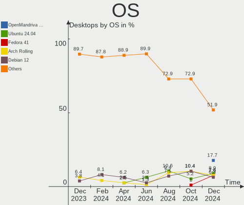
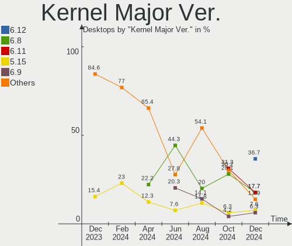
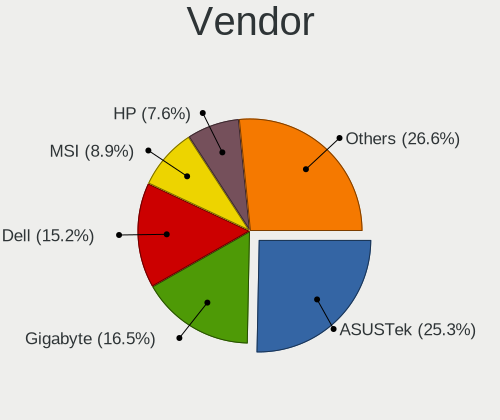
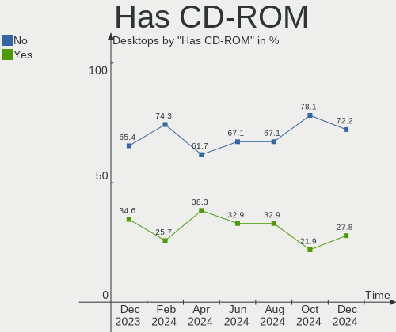
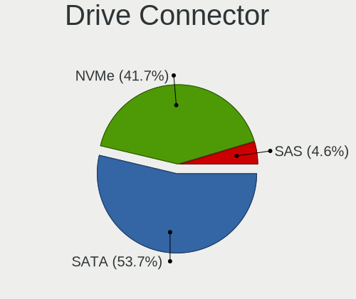
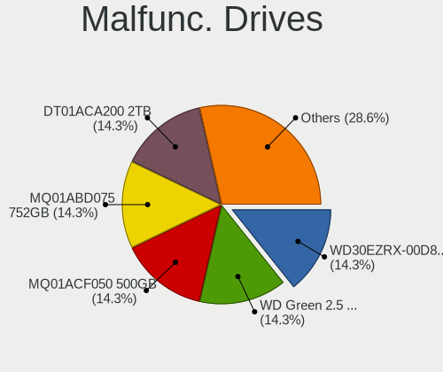
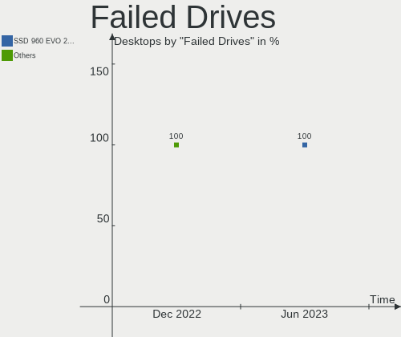
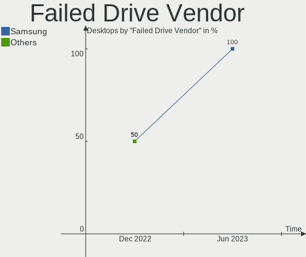
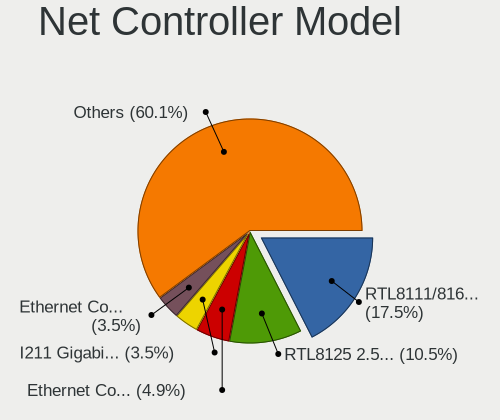

Linux in UK - Hardware Trends (Desktops)
----------------------------------------

A project to identify most popular hardware characteristics and track their change
over time based on data collected by Linux users at https://Linux-Hardware.org.

Anyone can contribute to this report by the [hw-probe](https://github.com/linuxhw/hw-probe) tool:

    sudo -E hw-probe -all -upload

Period: Jul, 2022.

Contents
--------

* [ System ](#system)
  - [ OS                       ](#os)
  - [ OS Family                ](#os-family)
  - [ Kernel                   ](#kernel)
  - [ Kernel Family            ](#kernel-family)
  - [ Kernel Major Ver.        ](#kernel-major-ver)
  - [ Arch                     ](#arch)
  - [ DE                       ](#de)
  - [ Display Server           ](#display-server)
  - [ Display Manager          ](#display-manager)
  - [ OS Lang                  ](#os-lang)
  - [ Boot Mode                ](#boot-mode)
  - [ Filesystem               ](#filesystem)
  - [ Part. scheme             ](#part-scheme)
  - [ Dual Boot with Linux/BSD ](#dual-boot-with-linuxbsd)
  - [ Dual Boot (Win)          ](#dual-boot-win)

* [ Board ](#board)
  - [ Vendor                   ](#vendor)
  - [ Model                    ](#model)
  - [ Model Family             ](#model-family)
  - [ MFG Year                 ](#mfg-year)
  - [ Form Factor              ](#form-factor)
  - [ Secure Boot              ](#secure-boot)
  - [ Coreboot                 ](#coreboot)
  - [ RAM Size                 ](#ram-size)
  - [ RAM Used                 ](#ram-used)
  - [ Total Drives             ](#total-drives)
  - [ Has CD-ROM               ](#has-cd-rom)
  - [ Has Ethernet             ](#has-ethernet)
  - [ Has WiFi                 ](#has-wifi)
  - [ Has Bluetooth            ](#has-bluetooth)

* [ Location ](#location)
  - [ Country                  ](#country)
  - [ City                     ](#city)

* [ Drives ](#drives)
  - [ Drive Vendor             ](#drive-vendor)
  - [ Drive Model              ](#drive-model)
  - [ HDD Vendor               ](#hdd-vendor)
  - [ SSD Vendor               ](#ssd-vendor)
  - [ Drive Kind               ](#drive-kind)
  - [ Drive Connector          ](#drive-connector)
  - [ Drive Size               ](#drive-size)
  - [ Space Total              ](#space-total)
  - [ Space Used               ](#space-used)
  - [ Malfunc. Drives          ](#malfunc-drives)
  - [ Malfunc. Drive Vendor    ](#malfunc-drive-vendor)
  - [ Malfunc. HDD Vendor      ](#malfunc-hdd-vendor)
  - [ Malfunc. Drive Kind      ](#malfunc-drive-kind)
  - [ Failed Drives            ](#failed-drives)
  - [ Failed Drive Vendor      ](#failed-drive-vendor)
  - [ Drive Status             ](#drive-status)

* [ Storage controller ](#storage-controller)
  - [ Storage Vendor           ](#storage-vendor)
  - [ Storage Model            ](#storage-model)
  - [ Storage Kind             ](#storage-kind)

* [ Processor ](#processor)
  - [ CPU Vendor               ](#cpu-vendor)
  - [ CPU Model                ](#cpu-model)
  - [ CPU Model Family         ](#cpu-model-family)
  - [ CPU Cores                ](#cpu-cores)
  - [ CPU Sockets              ](#cpu-sockets)
  - [ CPU Threads              ](#cpu-threads)
  - [ CPU Op-Modes             ](#cpu-op-modes)
  - [ CPU Microcode            ](#cpu-microcode)
  - [ CPU Microarch            ](#cpu-microarch)

* [ Graphics ](#graphics)
  - [ GPU Vendor               ](#gpu-vendor)
  - [ GPU Model                ](#gpu-model)
  - [ GPU Combo                ](#gpu-combo)
  - [ GPU Driver               ](#gpu-driver)
  - [ GPU Memory               ](#gpu-memory)

* [ Monitor ](#monitor)
  - [ Monitor Vendor           ](#monitor-vendor)
  - [ Monitor Model            ](#monitor-model)
  - [ Monitor Resolution       ](#monitor-resolution)
  - [ Monitor Diagonal         ](#monitor-diagonal)
  - [ Monitor Width            ](#monitor-width)
  - [ Aspect Ratio             ](#aspect-ratio)
  - [ Monitor Area             ](#monitor-area)
  - [ Pixel Density            ](#pixel-density)
  - [ Multiple Monitors        ](#multiple-monitors)

* [ Network ](#network)
  - [ Net Controller Vendor    ](#net-controller-vendor)
  - [ Net Controller Model     ](#net-controller-model)
  - [ Wireless Vendor          ](#wireless-vendor)
  - [ Wireless Model           ](#wireless-model)
  - [ Ethernet Vendor          ](#ethernet-vendor)
  - [ Ethernet Model           ](#ethernet-model)
  - [ Net Controller Kind      ](#net-controller-kind)
  - [ Used Controller          ](#used-controller)
  - [ NICs                     ](#nics)
  - [ IPv6                     ](#ipv6)

* [ Bluetooth ](#bluetooth)
  - [ Bluetooth Vendor         ](#bluetooth-vendor)
  - [ Bluetooth Model          ](#bluetooth-model)

* [ Sound ](#sound)
  - [ Sound Vendor             ](#sound-vendor)
  - [ Sound Model              ](#sound-model)

* [ Memory ](#memory)
  - [ Memory Vendor            ](#memory-vendor)
  - [ Memory Model             ](#memory-model)
  - [ Memory Kind              ](#memory-kind)
  - [ Memory Form Factor       ](#memory-form-factor)
  - [ Memory Size              ](#memory-size)
  - [ Memory Speed             ](#memory-speed)

* [ Printers & scanners ](#printers--scanners)
  - [ Printer Vendor           ](#printer-vendor)
  - [ Printer Model            ](#printer-model)
  - [ Scanner Vendor           ](#scanner-vendor)
  - [ Scanner Model            ](#scanner-model)

* [ Camera ](#camera)
  - [ Camera Vendor            ](#camera-vendor)
  - [ Camera Model             ](#camera-model)

* [ Security ](#security)
  - [ Fingerprint Vendor       ](#fingerprint-vendor)
  - [ Fingerprint Model        ](#fingerprint-model)
  - [ Chipcard Vendor          ](#chipcard-vendor)
  - [ Chipcard Model           ](#chipcard-model)

* [ Unsupported ](#unsupported)
  - [ Unsupported Devices      ](#unsupported-devices)
  - [ Unsupported Device Types ](#unsupported-device-types)

System
------

OS
--

Installed operating systems

| Name                         | Desktops | Percent |
|------------------------------|----------|---------|
| Ubuntu 22.04                 | 10       | 12.66%  |
| Zorin 16                     | 7        | 8.86%   |
| Linux Mint 20.3              | 7        | 8.86%   |
| OpenMandriva 4.3             | 6        | 7.59%   |
| Manjaro                      | 4        | 5.06%   |
| Fedora 36                    | 4        | 5.06%   |
| Ubuntu 20.04                 | 3        | 3.8%    |
| Pop!_OS 22.04                | 3        | 3.8%    |
| OpenMandriva 4.90            | 3        | 3.8%    |
| Kubuntu 22.04                | 3        | 3.8%    |
| Ubuntu 18.04                 | 2        | 2.53%   |
| Debian 11                    | 2        | 2.53%   |
| Arch Rolling                 | 2        | 2.53%   |
| Ubuntu 21.04                 | 1        | 1.27%   |
| SteamOS 3.3                  | 1        | 1.27%   |
| SteamOS 3.2 (steamdeck-main) | 1        | 1.27%   |
| RHEL 9                       | 1        | 1.27%   |
| openSUSE Tumbleweed-XXXXXXXX | 1        | 1.27%   |
| Nobara 36                    | 1        | 1.27%   |
| Manjaro 21.3.2               | 1        | 1.27%   |
| Lubuntu 22.10                | 1        | 1.27%   |
| Linux Mint 20                | 1        | 1.27%   |
| Kubuntu 20.04                | 1        | 1.27%   |
| Kubuntu 11.1                 | 1        | 1.27%   |
| KDE neon 20.04               | 1        | 1.27%   |
| Kali 2022.3                  | 1        | 1.27%   |
| Kali 2022.2                  | 1        | 1.27%   |
| Gentoo 2.8                   | 1        | 1.27%   |
| Feren OS 20.04               | 1        | 1.27%   |
| Fedora 34                    | 1        | 1.27%   |
| Elementary 6.1               | 1        | 1.27%   |
| Devuan 5                     | 1        | 1.27%   |
| Clear Linux 36580            | 1        | 1.27%   |
| Arch                         | 1        | 1.27%   |
| antergos Rolling             | 1        | 1.27%   |
| Alpine 3.15.4                | 1        | 1.27%   |

OS Family
---------

OS without a version

| Name         | Desktops | Percent |
|--------------|----------|---------|
| Ubuntu       | 16       | 20.25%  |
| OpenMandriva | 9        | 11.39%  |
| Linux Mint   | 8        | 10.13%  |
| Zorin        | 7        | 8.86%   |
| Manjaro      | 5        | 6.33%   |
| Kubuntu      | 5        | 6.33%   |
| Fedora       | 5        | 6.33%   |
| Pop!_OS      | 3        | 3.8%    |
| Arch         | 3        | 3.8%    |
| SteamOS      | 2        | 2.53%   |
| Kali         | 2        | 2.53%   |
| Debian       | 2        | 2.53%   |
| RHEL         | 1        | 1.27%   |
| openSUSE     | 1        | 1.27%   |
| Nobara       | 1        | 1.27%   |
| Lubuntu      | 1        | 1.27%   |
| KDE neon     | 1        | 1.27%   |
| Gentoo       | 1        | 1.27%   |
| Feren OS     | 1        | 1.27%   |
| Elementary   | 1        | 1.27%   |
| Devuan       | 1        | 1.27%   |
| Clear Linux  | 1        | 1.27%   |
| antergos     | 1        | 1.27%   |
| Alpine       | 1        | 1.27%   |

Kernel
------

Version of the Linux kernel

| Version                                            | Desktops | Percent |
|----------------------------------------------------|----------|---------|
| 5.15.0-41-generic                                  | 10       | 12.66%  |
| 5.13.0-52-generic                                  | 8        | 10.13%  |
| 5.16.7-desktop-1omv4003                            | 6        | 7.59%   |
| 5.4.0-122-generic                                  | 5        | 6.33%   |
| 5.18.12-desktop-3omv4090                           | 3        | 3.8%    |
| 5.15.0-40-generic                                  | 3        | 3.8%    |
| 5.4.0-121-generic                                  | 2        | 2.53%   |
| 5.18.12-3-MANJARO                                  | 2        | 2.53%   |
| 5.18.11-200.fc36.x86_64                            | 2        | 2.53%   |
| 5.18.0-kali5-amd64                                 | 2        | 2.53%   |
| 5.17.15-76051715-generic                           | 2        | 2.53%   |
| 5.4.0-90-generic                                   | 1        | 1.27%   |
| 5.4.0-110-generic                                  | 1        | 1.27%   |
| 5.18.9-zen1-1-zen                                  | 1        | 1.27%   |
| 5.18.7-200.fc36.x86_64                             | 1        | 1.27%   |
| 5.18.6-1159.native                                 | 1        | 1.27%   |
| 5.18.2-zen1-1-zen                                  | 1        | 1.27%   |
| 5.18.13-200.fc36.x86_64                            | 1        | 1.27%   |
| 5.18.12-arch1-1                                    | 1        | 1.27%   |
| 5.18.12-051812-generic                             | 1        | 1.27%   |
| 5.18.11-arch1-1                                    | 1        | 1.27%   |
| 5.18.11-201.fsync.fc36.x86_64                      | 1        | 1.27%   |
| 5.18.11-1-default                                  | 1        | 1.27%   |
| 5.18.10-76051810-generic                           | 1        | 1.27%   |
| 5.18.10-051810-generic                             | 1        | 1.27%   |
| 5.17.12-100.fc34.x86_64                            | 1        | 1.27%   |
| 5.17.0-051700-generic                              | 1        | 1.27%   |
| 5.15.55-1-MANJARO                                  | 1        | 1.27%   |
| 5.15.53-1-MANJARO                                  | 1        | 1.27%   |
| 5.15.50-1-MANJARO                                  | 1        | 1.27%   |
| 5.15.41-gentoo                                     | 1        | 1.27%   |
| 5.15.40-0-lts                                      | 1        | 1.27%   |
| 5.15.39-1-pve                                      | 1        | 1.27%   |
| 5.15.0-35-generic                                  | 1        | 1.27%   |
| 5.15.0-30-generic                                  | 1        | 1.27%   |
| 5.15.0-25-generic                                  | 1        | 1.27%   |
| 5.14.0-70.17.1.el9_0.x86_64                        | 1        | 1.27%   |
| 5.13.0-valve22-1-neptune-02213-gb68995364335       | 1        | 1.27%   |
| 5.13.0-valve10.1-2-neptune-dri-02144-g7fffaf925dfb | 1        | 1.27%   |
| 5.13.0-51-generic                                  | 1        | 1.27%   |
| 5.13.0-44-generic                                  | 1        | 1.27%   |
| 5.11.0-49-generic                                  | 1        | 1.27%   |
| 5.10.0-16-amd64                                    | 1        | 1.27%   |
| 4.19.0-20-amd64                                    | 1        | 1.27%   |
| 4.15.0-188-generic                                 | 1        | 1.27%   |

Kernel Family
-------------

Linux kernel without a distro release

| Version | Desktops | Percent |
|---------|----------|---------|
| 5.15.0  | 16       | 20.25%  |
| 5.13.0  | 12       | 15.19%  |
| 5.4.0   | 9        | 11.39%  |
| 5.18.12 | 7        | 8.86%   |
| 5.16.7  | 6        | 7.59%   |
| 5.18.11 | 5        | 6.33%   |
| 5.18.10 | 2        | 2.53%   |
| 5.18.0  | 2        | 2.53%   |
| 5.17.15 | 2        | 2.53%   |
| 5.18.9  | 1        | 1.27%   |
| 5.18.7  | 1        | 1.27%   |
| 5.18.6  | 1        | 1.27%   |
| 5.18.2  | 1        | 1.27%   |
| 5.18.13 | 1        | 1.27%   |
| 5.17.12 | 1        | 1.27%   |
| 5.17.0  | 1        | 1.27%   |
| 5.15.55 | 1        | 1.27%   |
| 5.15.53 | 1        | 1.27%   |
| 5.15.50 | 1        | 1.27%   |
| 5.15.41 | 1        | 1.27%   |
| 5.15.40 | 1        | 1.27%   |
| 5.15.39 | 1        | 1.27%   |
| 5.14.0  | 1        | 1.27%   |
| 5.11.0  | 1        | 1.27%   |
| 5.10.0  | 1        | 1.27%   |
| 4.19.0  | 1        | 1.27%   |
| 4.15.0  | 1        | 1.27%   |

Kernel Major Ver.
-----------------

Linux kernel major version

| Version | Desktops | Percent |
|---------|----------|---------|
| 5.15    | 22       | 27.85%  |
| 5.18    | 21       | 26.58%  |
| 5.13    | 12       | 15.19%  |
| 5.4     | 9        | 11.39%  |
| 5.16    | 6        | 7.59%   |
| 5.17    | 4        | 5.06%   |
| 5.14    | 1        | 1.27%   |
| 5.11    | 1        | 1.27%   |
| 5.10    | 1        | 1.27%   |
| 4.19    | 1        | 1.27%   |
| 4.15    | 1        | 1.27%   |

Arch
----

OS architecture (x86_64, i586, etc.)

| Name   | Desktops | Percent |
|--------|----------|---------|
| x86_64 | 77       | 97.47%  |
| i686   | 2        | 2.53%   |

DE
--

Desktop Environment

| Name       | Desktops | Percent |
|------------|----------|---------|
| GNOME      | 33       | 41.77%  |
| KDE5       | 27       | 34.18%  |
| X-Cinnamon | 6        | 7.59%   |
| Unknown    | 6        | 7.59%   |
| XFCE       | 3        | 3.8%    |
| MATE       | 2        | 2.53%   |
| Pantheon   | 1        | 1.27%   |
| LXQt       | 1        | 1.27%   |

Display Server
--------------

X11 or Wayland

| Name    | Desktops | Percent |
|---------|----------|---------|
| X11     | 62       | 78.48%  |
| Wayland | 10       | 12.66%  |
| Tty     | 4        | 5.06%   |
| Unknown | 2        | 2.53%   |
| Web     | 1        | 1.27%   |

Display Manager
---------------

SDDM, LightDM, etc.

| Name    | Desktops | Percent |
|---------|----------|---------|
| Unknown | 32       | 40.51%  |
| SDDM    | 19       | 24.05%  |
| GDM3    | 13       | 16.46%  |
| LightDM | 10       | 12.66%  |
| GDM     | 4        | 5.06%   |
| SLiM    | 1        | 1.27%   |

OS Lang
-------

Language

| Lang    | Desktops | Percent |
|---------|----------|---------|
| en_GB   | 63       | 79.75%  |
| en_US   | 9        | 11.39%  |
| C       | 5        | 6.33%   |
| ro_RO   | 1        | 1.27%   |
| Unknown | 1        | 1.27%   |

Boot Mode
---------

EFI or BIOS

| Mode | Desktops | Percent |
|------|----------|---------|
| BIOS | 40       | 50.63%  |
| EFI  | 39       | 49.37%  |

Filesystem
----------

Type of filesystem

| Type    | Desktops | Percent |
|---------|----------|---------|
| Ext4    | 55       | 69.62%  |
| Btrfs   | 11       | 13.92%  |
| Overlay | 10       | 12.66%  |
| Xfs     | 2        | 2.53%   |
| Tmpfs   | 1        | 1.27%   |

Part. scheme
------------

Scheme of partitioning

| Type    | Desktops | Percent |
|---------|----------|---------|
| Unknown | 41       | 51.9%   |
| GPT     | 32       | 40.51%  |
| MBR     | 6        | 7.59%   |

Dual Boot with Linux/BSD
------------------------

Hosting more than one Linux/BSD

| Dual boot | Desktops | Percent |
|-----------|----------|---------|
| No        | 65       | 82.28%  |
| Yes       | 14       | 17.72%  |

Dual Boot (Win)
---------------

Hosting Linux and Windows

| Dual boot | Desktops | Percent |
|-----------|----------|---------|
| No        | 60       | 75.95%  |
| Yes       | 19       | 24.05%  |

Board
-----

Vendor
------

Motherboard manufacturer

| Name                | Desktops | Percent |
|---------------------|----------|---------|
| Gigabyte Technology | 21       | 26.58%  |
| ASUSTek Computer    | 16       | 20.25%  |
| MSI                 | 9        | 11.39%  |
| Dell                | 9        | 11.39%  |
| ASRock              | 6        | 7.59%   |
| Hewlett-Packard     | 4        | 5.06%   |
| Inventec            | 2        | 2.53%   |
| Intel               | 2        | 2.53%   |
| Fujitsu             | 2        | 2.53%   |
| Apple               | 2        | 2.53%   |
| Acer                | 2        | 2.53%   |
| Medion              | 1        | 1.27%   |
| Foxconn             | 1        | 1.27%   |
| BESSTAR Tech        | 1        | 1.27%   |
| Unknown             | 1        | 1.27%   |

Model
-----

Motherboard model

| Name                                | Desktops | Percent |
|-------------------------------------|----------|---------|
| MSI MS-7C02                         | 2        | 2.53%   |
| Inventec D CLASS                    | 2        | 2.53%   |
| Gigabyte X570 I AORUS PRO WIFI      | 2        | 2.53%   |
| Gigabyte A320M-S2H                  | 2        | 2.53%   |
| ASUS ROG STRIX B550-F GAMING        | 2        | 2.53%   |
| MSI MS-7C91                         | 1        | 1.27%   |
| MSI MS-7C39                         | 1        | 1.27%   |
| MSI MS-7B86                         | 1        | 1.27%   |
| MSI MS-7B79                         | 1        | 1.27%   |
| MSI MS-7B17                         | 1        | 1.27%   |
| MSI MS-7982                         | 1        | 1.27%   |
| MSI MS-7865                         | 1        | 1.27%   |
| Medion MS-7800                      | 1        | 1.27%   |
| Intel DQ67SW                        | 1        | 1.27%   |
| Intel DQ57TM                        | 1        | 1.27%   |
| HP Z2 G8 SFF Workstation Desktop PC | 1        | 1.27%   |
| HP EliteDesk 800 G1 SFF             | 1        | 1.27%   |
| HP Compaq Elite 8300 USDT           | 1        | 1.27%   |
| HP 290 G1 MT                        | 1        | 1.27%   |
| Gigabyte Z97-D3H                    | 1        | 1.27%   |
| Gigabyte Z87X-OC                    | 1        | 1.27%   |
| Gigabyte Z77-D3H                    | 1        | 1.27%   |
| Gigabyte Z170X-UD3                  | 1        | 1.27%   |
| Gigabyte Z170X-Gaming 7             | 1        | 1.27%   |
| Gigabyte X570S AORUS PRO AX         | 1        | 1.27%   |
| Gigabyte X570 AORUS XTREME          | 1        | 1.27%   |
| Gigabyte X570 AORUS ULTRA           | 1        | 1.27%   |
| Gigabyte X570 AORUS ELITE           | 1        | 1.27%   |
| Gigabyte PDT-702-1020               | 1        | 1.27%   |
| Gigabyte H97-Gaming 3               | 1        | 1.27%   |
| Gigabyte GA-78LMT-S2P               | 1        | 1.27%   |
| Gigabyte B550M AORUS PRO-P          | 1        | 1.27%   |
| Gigabyte B550 GAMING X V2           | 1        | 1.27%   |
| Gigabyte B450 AORUS M               | 1        | 1.27%   |
| Gigabyte AB350M-Gaming 3            | 1        | 1.27%   |
| Gigabyte 970A-DS3P                  | 1        | 1.27%   |
| Fujitsu ESPRIMO P910                | 1        | 1.27%   |
| Fujitsu ESPRIMO P557                | 1        | 1.27%   |
| Foxconn A76ML-K 30                  | 1        | 1.27%   |
| Dell Vostro 430                     | 1        | 1.27%   |
| Dell OptiPlex GX620                 | 1        | 1.27%   |
| Dell OptiPlex 790                   | 1        | 1.27%   |
| Dell OptiPlex 755                   | 1        | 1.27%   |
| Dell OptiPlex 7040                  | 1        | 1.27%   |
| Dell OptiPlex 5070                  | 1        | 1.27%   |
| Dell OptiPlex 5050                  | 1        | 1.27%   |
| Dell OptiPlex 3020                  | 1        | 1.27%   |
| Dell ASM100                         | 1        | 1.27%   |
| BESSTAR Tech TL50                   | 1        | 1.27%   |
| ASUS V-P8H61E                       | 1        | 1.27%   |
| ASUS TUF Gaming X570-PLUS           | 1        | 1.27%   |
| ASUS ROG STRIX Z490-F GAMING        | 1        | 1.27%   |
| ASUS ROG STRIX X570-I GAMING        | 1        | 1.27%   |
| ASUS ROG Strix GA15DH_G15DH         | 1        | 1.27%   |
| ASUS ROG Maximus X HERO             | 1        | 1.27%   |
| ASUS ROG CROSSHAIR VIII DARK HERO   | 1        | 1.27%   |
| ASUS ProArt X570-CREATOR WIFI       | 1        | 1.27%   |
| ASUS PRIME X370-PRO                 | 1        | 1.27%   |
| ASUS PRIME B450-PLUS                | 1        | 1.27%   |
| ASUS PRIME A320M-A                  | 1        | 1.27%   |

Model Family
------------

Motherboard model prefix

| Name                     | Desktops | Percent |
|--------------------------|----------|---------|
| Dell OptiPlex            | 7        | 8.86%   |
| ASUS ROG                 | 7        | 8.86%   |
| Gigabyte X570            | 5        | 6.33%   |
| ASUS PRIME               | 3        | 3.8%    |
| MSI MS-7C02              | 2        | 2.53%   |
| Inventec D               | 2        | 2.53%   |
| Gigabyte A320M-S2H       | 2        | 2.53%   |
| Fujitsu ESPRIMO          | 2        | 2.53%   |
| MSI MS-7C91              | 1        | 1.27%   |
| MSI MS-7C39              | 1        | 1.27%   |
| MSI MS-7B86              | 1        | 1.27%   |
| MSI MS-7B79              | 1        | 1.27%   |
| MSI MS-7B17              | 1        | 1.27%   |
| MSI MS-7982              | 1        | 1.27%   |
| MSI MS-7865              | 1        | 1.27%   |
| Medion MS-7800           | 1        | 1.27%   |
| Intel DQ67SW             | 1        | 1.27%   |
| Intel DQ57TM             | 1        | 1.27%   |
| HP Z2                    | 1        | 1.27%   |
| HP EliteDesk             | 1        | 1.27%   |
| HP Compaq                | 1        | 1.27%   |
| HP 290                   | 1        | 1.27%   |
| Gigabyte Z97-D3H         | 1        | 1.27%   |
| Gigabyte Z87X-OC         | 1        | 1.27%   |
| Gigabyte Z77-D3H         | 1        | 1.27%   |
| Gigabyte Z170X-UD3       | 1        | 1.27%   |
| Gigabyte Z170X-Gaming    | 1        | 1.27%   |
| Gigabyte X570S           | 1        | 1.27%   |
| Gigabyte PDT-702-1020    | 1        | 1.27%   |
| Gigabyte H97-Gaming      | 1        | 1.27%   |
| Gigabyte GA-78LMT-S2P    | 1        | 1.27%   |
| Gigabyte B550M           | 1        | 1.27%   |
| Gigabyte B550            | 1        | 1.27%   |
| Gigabyte B450            | 1        | 1.27%   |
| Gigabyte AB350M-Gaming   | 1        | 1.27%   |
| Gigabyte 970A-DS3P       | 1        | 1.27%   |
| Foxconn A76ML-K          | 1        | 1.27%   |
| Dell Vostro              | 1        | 1.27%   |
| Dell ASM100              | 1        | 1.27%   |
| BESSTAR Tech TL50        | 1        | 1.27%   |
| ASUS V-P8H61E            | 1        | 1.27%   |
| ASUS TUF                 | 1        | 1.27%   |
| ASUS ProArt              | 1        | 1.27%   |
| ASUS H110M-R             | 1        | 1.27%   |
| ASUS All                 | 1        | 1.27%   |
| ASUS 970                 | 1        | 1.27%   |
| ASRock Z77               | 1        | 1.27%   |
| ASRock Wolfdale1333-D667 | 1        | 1.27%   |
| ASRock P43DE             | 1        | 1.27%   |
| ASRock FM2A55M-DGS       | 1        | 1.27%   |
| ASRock A520M-ITX         | 1        | 1.27%   |
| ASRock A320M-HDV         | 1        | 1.27%   |
| Apple MacPro6            | 1        | 1.27%   |
| Apple MacPro5            | 1        | 1.27%   |
| Acer Predator            | 1        | 1.27%   |
| Acer Aspire              | 1        | 1.27%   |
| Unknown                  | 1        | 1.27%   |

MFG Year
--------

Motherboard manufacture year

| Year | Desktops | Percent |
|------|----------|---------|
| 2019 | 14       | 17.72%  |
| 2020 | 9        | 11.39%  |
| 2018 | 9        | 11.39%  |
| 2017 | 7        | 8.86%   |
| 2013 | 7        | 8.86%   |
| 2021 | 6        | 7.59%   |
| 2012 | 6        | 7.59%   |
| 2011 | 4        | 5.06%   |
| 2016 | 3        | 3.8%    |
| 2014 | 3        | 3.8%    |
| 2010 | 3        | 3.8%    |
| 2022 | 2        | 2.53%   |
| 2015 | 2        | 2.53%   |
| 2007 | 2        | 2.53%   |
| 2008 | 1        | 1.27%   |
| 2005 | 1        | 1.27%   |

Form Factor
-----------

Physical design of the computer

| Name    | Desktops | Percent |
|---------|----------|---------|
| Desktop | 79       | 100%    |

Secure Boot
-----------

Enabled or disabled

| State    | Desktops | Percent |
|----------|----------|---------|
| Disabled | 77       | 97.47%  |
| Enabled  | 2        | 2.53%   |

Coreboot
--------

Have coreboot on board

| Used | Desktops | Percent |
|------|----------|---------|
| No   | 79       | 100%    |

RAM Size
--------

Total RAM memory

| Size in GB  | Desktops | Percent |
|-------------|----------|---------|
| 16.01-24.0  | 25       | 31.65%  |
| 32.01-64.0  | 16       | 20.25%  |
| 8.01-16.0   | 15       | 18.99%  |
| 4.01-8.0    | 9        | 11.39%  |
| 3.01-4.0    | 5        | 6.33%   |
| 64.01-256.0 | 4        | 5.06%   |
| 24.01-32.0  | 2        | 2.53%   |
| 2.01-3.0    | 2        | 2.53%   |
| 1.01-2.0    | 1        | 1.27%   |

RAM Used
--------

Used RAM memory

| Used GB    | Desktops | Percent |
|------------|----------|---------|
| 1.01-2.0   | 26       | 32.91%  |
| 4.01-8.0   | 15       | 18.99%  |
| 2.01-3.0   | 15       | 18.99%  |
| 3.01-4.0   | 14       | 17.72%  |
| 0.51-1.0   | 5        | 6.33%   |
| 8.01-16.0  | 2        | 2.53%   |
| 32.01-64.0 | 1        | 1.27%   |
| 0.01-0.5   | 1        | 1.27%   |

Total Drives
------------

Number of drives on board

| Drives | Desktops | Percent |
|--------|----------|---------|
| 1      | 29       | 36.71%  |
| 2      | 27       | 34.18%  |
| 3      | 10       | 12.66%  |
| 4      | 6        | 7.59%   |
| 5      | 4        | 5.06%   |
| 6      | 2        | 2.53%   |
| 7      | 1        | 1.27%   |

Has CD-ROM
----------

Has CD-ROM on board

| Presented | Desktops | Percent |
|-----------|----------|---------|
| No        | 49       | 62.03%  |
| Yes       | 30       | 37.97%  |

Has Ethernet
------------

Has Ethernet on board

| Presented | Desktops | Percent |
|-----------|----------|---------|
| Yes       | 78       | 98.73%  |
| No        | 1        | 1.27%   |

Has WiFi
--------

Has WiFi module

| Presented | Desktops | Percent |
|-----------|----------|---------|
| Yes       | 46       | 58.23%  |
| No        | 33       | 41.77%  |

Has Bluetooth
-------------

Has Bluetooth module

| Presented | Desktops | Percent |
|-----------|----------|---------|
| No        | 41       | 51.9%   |
| Yes       | 38       | 48.1%   |

Location
--------

Country
-------

Geographic location (country)

| Country | Desktops | Percent |
|---------|----------|---------|
| UK      | 79       | 100%    |

City
----

Geographic location (city)

| City                 | Desktops | Percent |
|----------------------|----------|---------|
| Milton Keynes        | 4        | 5.06%   |
| Bathgate             | 3        | 3.8%    |
| Southport            | 2        | 2.53%   |
| London               | 2        | 2.53%   |
| Liverpool            | 2        | 2.53%   |
| Croydon              | 2        | 2.53%   |
| Chorley              | 2        | 2.53%   |
| Cambridge            | 2        | 2.53%   |
| Bristol              | 2        | 2.53%   |
| York                 | 1        | 1.27%   |
| Wrexham              | 1        | 1.27%   |
| Wolverhampton        | 1        | 1.27%   |
| Wolsingham           | 1        | 1.27%   |
| Wilmslow             | 1        | 1.27%   |
| West Bromwich        | 1        | 1.27%   |
| Warrington           | 1        | 1.27%   |
| Walsall              | 1        | 1.27%   |
| Ulverston            | 1        | 1.27%   |
| Tonbridge            | 1        | 1.27%   |
| Thornton Heath       | 1        | 1.27%   |
| Telford              | 1        | 1.27%   |
| Tamworth             | 1        | 1.27%   |
| Sutton               | 1        | 1.27%   |
| Stewartby            | 1        | 1.27%   |
| St Helens            | 1        | 1.27%   |
| Shrewsbury           | 1        | 1.27%   |
| Sheffield            | 1        | 1.27%   |
| Salford              | 1        | 1.27%   |
| Runcorn              | 1        | 1.27%   |
| Royal Leamington Spa | 1        | 1.27%   |
| Rotherham            | 1        | 1.27%   |
| Okehampton           | 1        | 1.27%   |
| Nottingham           | 1        | 1.27%   |
| Norwich              | 1        | 1.27%   |
| Northfleet           | 1        | 1.27%   |
| Newton Abbot         | 1        | 1.27%   |
| Merthyr Tydfil       | 1        | 1.27%   |
| Melton Mowbray       | 1        | 1.27%   |
| Manchester           | 1        | 1.27%   |
| Luton                | 1        | 1.27%   |
| Littlehampton        | 1        | 1.27%   |
| Leicester            | 1        | 1.27%   |
| Kirkcaldy            | 1        | 1.27%   |
| Islington            | 1        | 1.27%   |
| Ideford              | 1        | 1.27%   |
| Harrogate            | 1        | 1.27%   |
| Hammersmith          | 1        | 1.27%   |
| Grantham             | 1        | 1.27%   |
| Glasgow              | 1        | 1.27%   |
| Gillingham           | 1        | 1.27%   |
| Edinburgh            | 1        | 1.27%   |
| Earls Court          | 1        | 1.27%   |
| Dundee               | 1        | 1.27%   |
| City of London       | 1        | 1.27%   |
| Church Village       | 1        | 1.27%   |
| Chelmsford           | 1        | 1.27%   |
| Cardiff              | 1        | 1.27%   |
| Camelford            | 1        | 1.27%   |
| Brighton             | 1        | 1.27%   |
| Bradford             | 1        | 1.27%   |

Drives
------

Drive Vendor
------------

Hard drive vendors

| Vendor                    | Desktops | Drives | Percent |
|---------------------------|----------|--------|---------|
| WDC                       | 30       | 36     | 20.13%  |
| Seagate                   | 25       | 35     | 16.78%  |
| Samsung Electronics       | 16       | 20     | 10.74%  |
| SanDisk                   | 14       | 17     | 9.4%    |
| Crucial                   | 12       | 12     | 8.05%   |
| Toshiba                   | 6        | 6      | 4.03%   |
| Phison                    | 6        | 6      | 4.03%   |
| Kingston                  | 6        | 7      | 4.03%   |
| China                     | 4        | 4      | 2.68%   |
| PNY                       | 3        | 3      | 2.01%   |
| A-DATA Technology         | 3        | 3      | 2.01%   |
| Unknown                   | 2        | 2      | 1.34%   |
| OCZ                       | 2        | 2      | 1.34%   |
| Micron Technology         | 2        | 2      | 1.34%   |
| Intel                     | 2        | 2      | 1.34%   |
| Hitachi                   | 2        | 2      | 1.34%   |
| Corsair                   | 2        | 2      | 1.34%   |
| Zheino                    | 1        | 2      | 0.67%   |
| XPG                       | 1        | 1      | 0.67%   |
| ORIGIN                    | 1        | 1      | 0.67%   |
| Micron/Crucial Technology | 1        | 1      | 0.67%   |
| LITEON                    | 1        | 1      | 0.67%   |
| JMicron Technology        | 1        | 1      | 0.67%   |
| Indilinx                  | 1        | 1      | 0.67%   |
| HGST                      | 1        | 1      | 0.67%   |
| Gigabyte Technology       | 1        | 1      | 0.67%   |
| Drevo                     | 1        | 1      | 0.67%   |
| BAITITON                  | 1        | 1      | 0.67%   |
| Unknown                   | 1        | 1      | 0.67%   |

Drive Model
-----------

Hard drive models

| Model                                | Desktops | Percent |
|--------------------------------------|----------|---------|
| Crucial CT1000MX500SSD1 1TB          | 4        | 2.4%    |
| Seagate ST2000DM008-2FR102 2TB       | 3        | 1.8%    |
| Seagate ST1000DM010-2EP102 1TB       | 3        | 1.8%    |
| SanDisk NVMe SSD Drive 500GB         | 3        | 1.8%    |
| SanDisk NVMe SSD Drive 1TB           | 3        | 1.8%    |
| WDC WD5000AAKX-07U6AA0 500GB         | 2        | 1.2%    |
| WDC WD4003FZEX-00Z4SA0 4TB           | 2        | 1.2%    |
| Seagate ST500DM002-1BD142 500GB      | 2        | 1.2%    |
| SanDisk SSD PLUS 480GB               | 2        | 1.2%    |
| Samsung SSD 850 EVO 500GB            | 2        | 1.2%    |
| Samsung NVMe SSD Drive 1TB           | 2        | 1.2%    |
| Samsung HD161GJ 160GB                | 2        | 1.2%    |
| Phison Sabrent 1TB                   | 2        | 1.2%    |
| Crucial CT240BX500SSD1 240GB         | 2        | 1.2%    |
| Crucial CT1000BX500SSD1 1TB          | 2        | 1.2%    |
| Zheino CHN 25SATA01M 120 120GB SSD   | 1        | 0.6%    |
| Zheino CHN 25SATA01M 060 64GB SSD    | 1        | 0.6%    |
| XPG NVMe SSD Drive 2TB               | 1        | 0.6%    |
| WDC WDS500G3X0C-00SJG0 500GB         | 1        | 0.6%    |
| WDC WDS240G2G0A-00JH30 240GB SSD     | 1        | 0.6%    |
| WDC WDS120G1G0B-00RC30 120GB SSD     | 1        | 0.6%    |
| WDC WDS100T2B0B-00YS70 1TB SSD       | 1        | 0.6%    |
| WDC WDBNCE5000PNC 500GB SSD          | 1        | 0.6%    |
| WDC WD6400AAKS-00A7B2 640GB          | 1        | 0.6%    |
| WDC WD6003FRYZ-01F0DB0 6TB           | 1        | 0.6%    |
| WDC WD5000AAKX-00ERMA0 500GB         | 1        | 0.6%    |
| WDC WD5000AAKX-001CA0 500GB          | 1        | 0.6%    |
| WDC WD5000AAKS-00A7B0 500GB          | 1        | 0.6%    |
| WDC WD40PURZ-85TTDY0 4TB             | 1        | 0.6%    |
| WDC WD40EZRZ-00GXCB0 4TB             | 1        | 0.6%    |
| WDC WD40EFRX-68N32N0 4TB             | 1        | 0.6%    |
| WDC WD3200AAKX-0 320GB               | 1        | 0.6%    |
| WDC WD30EZRZ-00Z5HB0 3TB             | 1        | 0.6%    |
| WDC WD30EZRZ-00WN9B0 3TB             | 1        | 0.6%    |
| WDC WD20EZAZ-00GGJB0 2TB             | 1        | 0.6%    |
| WDC WD20EARX-22PASB0 2TB             | 1        | 0.6%    |
| WDC WD1600YS-18SHB2 160GB            | 1        | 0.6%    |
| WDC WD1600HLFS-75G6U1 160GB          | 1        | 0.6%    |
| WDC WD10JFCX-68N6GN0 1TB             | 1        | 0.6%    |
| WDC WD10EZEX-60ZF5A0 1TB             | 1        | 0.6%    |
| WDC WD10EZEX-08WN4A0 1TB             | 1        | 0.6%    |
| WDC WD10EZEX-08M2NA0 1TB             | 1        | 0.6%    |
| WDC WD10EZEX-00BN5A0 1TB             | 1        | 0.6%    |
| WDC WD10EAVS-00D7B0 1TB              | 1        | 0.6%    |
| WDC WD10EARS-00MVWB0 1TB             | 1        | 0.6%    |
| WDC WD10EADS-11M2B2 1TB              | 1        | 0.6%    |
| WDC WD10EADS-00M2B0 1TB              | 1        | 0.6%    |
| WDC PC SN520 SDAPNUW-256G-1202 256GB | 1        | 0.6%    |
| WDC PC SN520 SDAPMUW-256G-1101 256GB | 1        | 0.6%    |
| Unknown SD/MMC/MS PRO 64GB           | 1        | 0.6%    |
| Unknown 2GB ATA Flash Disk           | 1        | 0.6%    |
| Toshiba NVMe SSD Drive 256GB         | 1        | 0.6%    |
| Toshiba MQ01ABF050 500GB             | 1        | 0.6%    |
| Toshiba MK8034GSX 80GB               | 1        | 0.6%    |
| Toshiba HDWD120 2TB                  | 1        | 0.6%    |
| Toshiba DT01ACA300 3TB               | 1        | 0.6%    |
| Toshiba DT01ACA100 1TB               | 1        | 0.6%    |
| Seagate ST9200827AS 200GB            | 1        | 0.6%    |
| Seagate ST91000430AS 1TB             | 1        | 0.6%    |
| Seagate ST8000DM004-2CX188 8TB       | 1        | 0.6%    |

HDD Vendor
----------

Hard disk drive vendors

| Vendor              | Desktops | Drives | Percent |
|---------------------|----------|--------|---------|
| Seagate             | 25       | 34     | 39.06%  |
| WDC                 | 24       | 29     | 37.5%   |
| Toshiba             | 5        | 5      | 7.81%   |
| Samsung Electronics | 5        | 5      | 7.81%   |
| Unknown             | 2        | 2      | 3.13%   |
| Hitachi             | 2        | 2      | 3.13%   |
| HGST                | 1        | 1      | 1.56%   |

SSD Vendor
----------

Solid state drive vendors

| Vendor              | Desktops | Drives | Percent |
|---------------------|----------|--------|---------|
| Crucial             | 11       | 11     | 20.37%  |
| SanDisk             | 8        | 9      | 14.81%  |
| Samsung Electronics | 8        | 9      | 14.81%  |
| Kingston            | 5        | 6      | 9.26%   |
| WDC                 | 4        | 4      | 7.41%   |
| China               | 4        | 4      | 7.41%   |
| PNY                 | 3        | 3      | 5.56%   |
| OCZ                 | 2        | 2      | 3.7%    |
| Zheino              | 1        | 2      | 1.85%   |
| ORIGIN              | 1        | 1      | 1.85%   |
| Micron Technology   | 1        | 1      | 1.85%   |
| LITEON              | 1        | 1      | 1.85%   |
| Gigabyte Technology | 1        | 1      | 1.85%   |
| Drevo               | 1        | 1      | 1.85%   |
| BAITITON            | 1        | 1      | 1.85%   |
| A-DATA Technology   | 1        | 1      | 1.85%   |
| Unknown             | 1        | 1      | 1.85%   |

Drive Kind
----------

HDD or SSD

| Kind    | Desktops | Drives | Percent |
|---------|----------|--------|---------|
| HDD     | 48       | 78     | 39.67%  |
| SSD     | 40       | 58     | 33.06%  |
| NVMe    | 31       | 36     | 25.62%  |
| Unknown | 2        | 2      | 1.65%   |

Drive Connector
---------------

SATA, SAS, NVMe, etc.

| Type | Desktops | Drives | Percent |
|------|----------|--------|---------|
| SATA | 70       | 133    | 66.67%  |
| NVMe | 31       | 36     | 29.52%  |
| SAS  | 4        | 5      | 3.81%   |

Drive Size
----------

Size of hard drive

| Size in TB | Desktops | Drives | Percent |
|------------|----------|--------|---------|
| 0.01-0.5   | 48       | 70     | 47.52%  |
| 0.51-1.0   | 30       | 36     | 29.7%   |
| 3.01-4.0   | 9        | 11     | 8.91%   |
| 1.01-2.0   | 8        | 12     | 7.92%   |
| 4.01-10.0  | 4        | 4      | 3.96%   |
| 2.01-3.0   | 2        | 3      | 1.98%   |

Space Total
-----------

Amount of disk space available on the file system

| Size in GB     | Desktops | Percent |
|----------------|----------|---------|
| 101-250        | 19       | 24.05%  |
| More than 3000 | 14       | 17.72%  |
| 251-500        | 11       | 13.92%  |
| 501-1000       | 11       | 13.92%  |
| 1001-2000      | 7        | 8.86%   |
| 1-20           | 7        | 8.86%   |
| 2001-3000      | 4        | 5.06%   |
| Unknown        | 4        | 5.06%   |
| 21-50          | 1        | 1.27%   |
| 51-100         | 1        | 1.27%   |

Space Used
----------

Amount of used disk space

| Used GB        | Desktops | Percent |
|----------------|----------|---------|
| 1-20           | 29       | 36.71%  |
| 21-50          | 10       | 12.66%  |
| 101-250        | 8        | 10.13%  |
| 251-500        | 7        | 8.86%   |
| 1001-2000      | 7        | 8.86%   |
| More than 3000 | 6        | 7.59%   |
| 501-1000       | 4        | 5.06%   |
| Unknown        | 4        | 5.06%   |
| 51-100         | 3        | 3.8%    |
| 2001-3000      | 1        | 1.27%   |

Malfunc. Drives
---------------

Drive models with a malfunction

| Model                              | Desktops | Drives | Percent |
|------------------------------------|----------|--------|---------|
| WDC WD5000AAKS-00A7B0 500GB        | 1        | 1      | 5.26%   |
| WDC WD40PURZ-85TTDY0 4TB           | 1        | 1      | 5.26%   |
| WDC WD3200AAKX-0 320GB             | 1        | 1      | 5.26%   |
| WDC WD20EARX-22PASB0 2TB           | 1        | 1      | 5.26%   |
| WDC WD10EZEX-60ZF5A0 1TB           | 1        | 1      | 5.26%   |
| WDC WD10EAVS-00D7B0 1TB            | 1        | 1      | 5.26%   |
| WDC WD10EADS-11M2B2 1TB            | 1        | 1      | 5.26%   |
| Seagate ST9200827AS 200GB          | 1        | 1      | 5.26%   |
| Seagate ST500DM002-1BD142 500GB    | 1        | 1      | 5.26%   |
| Seagate ST500DM002-1BC142 500GB    | 1        | 1      | 5.26%   |
| Seagate ST4000VX007-2DT166 4TB     | 1        | 1      | 5.26%   |
| Seagate ST3500418AS 500GB          | 1        | 1      | 5.26%   |
| Seagate ST3160827AS 160GB          | 1        | 1      | 5.26%   |
| Seagate ST1000LM024 HN-M101MBB 1TB | 1        | 1      | 5.26%   |
| Seagate ST1000DM003-1CH162 1TB     | 1        | 1      | 5.26%   |
| Intel SSDPEKKW512G7 512GB          | 1        | 1      | 5.26%   |
| Drevo X1 Pro SSD 128GB             | 1        | 1      | 5.26%   |
| BAITITON BT58SSD09S 240GB          | 1        | 1      | 5.26%   |
| A-DATA Technology SX8200PNP 1TB    | 1        | 1      | 5.26%   |

Malfunc. Drive Vendor
---------------------

Vendors of faulty drives

| Vendor            | Desktops | Drives | Percent |
|-------------------|----------|--------|---------|
| Seagate           | 8        | 8      | 44.44%  |
| WDC               | 6        | 7      | 33.33%  |
| Intel             | 1        | 1      | 5.56%   |
| Drevo             | 1        | 1      | 5.56%   |
| BAITITON          | 1        | 1      | 5.56%   |
| A-DATA Technology | 1        | 1      | 5.56%   |

Malfunc. HDD Vendor
-------------------

Vendors of faulty HDD drives

| Vendor  | Desktops | Drives | Percent |
|---------|----------|--------|---------|
| Seagate | 8        | 8      | 57.14%  |
| WDC     | 6        | 7      | 42.86%  |

Malfunc. Drive Kind
-------------------

Kinds of faulty drives

| Kind | Desktops | Drives | Percent |
|------|----------|--------|---------|
| HDD  | 12       | 15     | 75%     |
| NVMe | 2        | 2      | 12.5%   |
| SSD  | 2        | 2      | 12.5%   |

Failed Drives
-------------

Failed drive models

| Model                             | Desktops | Drives | Percent |
|-----------------------------------|----------|--------|---------|
| Samsung Electronics HD502IJ 500GB | 1        | 1      | 50%     |
| Hitachi HTS547550A9E384 500GB     | 1        | 1      | 50%     |

Failed Drive Vendor
-------------------

Failed drive vendors

| Vendor              | Desktops | Drives | Percent |
|---------------------|----------|--------|---------|
| Samsung Electronics | 1        | 1      | 50%     |
| Hitachi             | 1        | 1      | 50%     |

Drive Status
------------

Number of failed and malfunc. drives

| Status   | Desktops | Drives | Percent |
|----------|----------|--------|---------|
| Detected | 42       | 83     | 45.65%  |
| Works    | 35       | 70     | 38.04%  |
| Malfunc  | 14       | 19     | 15.22%  |
| Failed   | 1        | 2      | 1.09%   |

Storage controller
------------------

Storage Vendor
--------------

Storage controller vendors

| Vendor                       | Desktops | Percent |
|------------------------------|----------|---------|
| Intel                        | 40       | 34.78%  |
| AMD                          | 38       | 33.04%  |
| SanDisk                      | 10       | 8.7%    |
| Phison Electronics           | 8        | 6.96%   |
| Samsung Electronics          | 5        | 4.35%   |
| ADATA Technology             | 3        | 2.61%   |
| Micron/Crucial Technology    | 2        | 1.74%   |
| ASMedia Technology           | 2        | 1.74%   |
| VIA Technologies             | 1        | 0.87%   |
| Toshiba America Info Systems | 1        | 0.87%   |
| Seagate Technology           | 1        | 0.87%   |
| Micron Technology            | 1        | 0.87%   |
| LSI Logic / Symbios Logic    | 1        | 0.87%   |
| Kingston Technology Company  | 1        | 0.87%   |
| JMicron Technology           | 1        | 0.87%   |

Storage Model
-------------

Storage controller models

| Model                                                                                   | Desktops | Percent |
|-----------------------------------------------------------------------------------------|----------|---------|
| AMD FCH SATA Controller [AHCI mode]                                                     | 22       | 15.83%  |
| AMD 400 Series Chipset SATA Controller                                                  | 7        | 5.04%   |
| Intel Q170/Q150/B150/H170/H110/Z170/CM236 Chipset SATA Controller [AHCI Mode]           | 6        | 4.32%   |
| AMD 500 Series Chipset SATA Controller                                                  | 6        | 4.32%   |
| Intel 8 Series/C220 Series Chipset Family 6-port SATA Controller 1 [AHCI mode]          | 5        | 3.6%    |
| Phison E12 NVMe Controller                                                              | 4        | 2.88%   |
| Intel 7 Series/C210 Series Chipset Family 6-port SATA Controller [AHCI mode]            | 4        | 2.88%   |
| Intel 200 Series PCH SATA controller [AHCI mode]                                        | 4        | 2.88%   |
| AMD FCH SATA Controller D                                                               | 4        | 2.88%   |
| SanDisk WD Blue SN550 NVMe SSD                                                          | 3        | 2.16%   |
| Samsung NVMe SSD Controller SM981/PM981/PM983                                           | 3        | 2.16%   |
| Phison E16 PCIe4 NVMe Controller                                                        | 3        | 2.16%   |
| AMD SB7x0/SB8x0/SB9x0 SATA Controller [IDE mode]                                        | 3        | 2.16%   |
| AMD SB7x0/SB8x0/SB9x0 SATA Controller [AHCI mode]                                       | 3        | 2.16%   |
| AMD SB7x0/SB8x0/SB9x0 IDE Controller                                                    | 3        | 2.16%   |
| ADATA XPG SX8200 Pro PCIe Gen3x4 M.2 2280 Solid State Drive                             | 3        | 2.16%   |
| SanDisk WD Black SN750 / PC SN730 NVMe SSD                                              | 2        | 1.44%   |
| SanDisk Non-Volatile memory controller                                                  | 2        | 1.44%   |
| Samsung NVMe SSD Controller PM9A1/PM9A3/980PRO                                          | 2        | 1.44%   |
| Intel SATA Controller [RAID mode]                                                       | 2        | 1.44%   |
| Intel NM10/ICH7 Family SATA Controller [IDE mode]                                       | 2        | 1.44%   |
| Intel Comet Lake SATA AHCI Controller                                                   | 2        | 1.44%   |
| Intel Cannon Lake PCH SATA AHCI Controller                                              | 2        | 1.44%   |
| Intel 9 Series Chipset Family SATA Controller [AHCI Mode]                               | 2        | 1.44%   |
| Intel 82801G (ICH7 Family) IDE Controller                                               | 2        | 1.44%   |
| Intel 6 Series/C200 Series Chipset Family 6 port Desktop SATA AHCI Controller           | 2        | 1.44%   |
| ASMedia ASM1062 Serial ATA Controller                                                   | 2        | 1.44%   |
| AMD FCH IDE Controller                                                                  | 2        | 1.44%   |
| VIA VT6415 PATA IDE Host Controller                                                     | 1        | 0.72%   |
| Toshiba America Info Systems XG6 NVMe SSD Controller                                    | 1        | 0.72%   |
| Seagate Non-Volatile memory controller                                                  | 1        | 0.72%   |
| SanDisk WD Blue SN570 NVMe SSD                                                          | 1        | 0.72%   |
| SanDisk WD Blue SN500 / PC SN520 NVMe SSD                                               | 1        | 0.72%   |
| SanDisk PC SN520 NVMe SSD                                                               | 1        | 0.72%   |
| Phison Electronics Non-Volatile memory controller                                       | 1        | 0.72%   |
| Micron/Crucial P1 NVMe PCIe SSD                                                         | 1        | 0.72%   |
| Micron/Crucial Non-Volatile memory controller                                           | 1        | 0.72%   |
| Micron Non-Volatile memory controller                                                   | 1        | 0.72%   |
| LSI Logic / Symbios Logic SAS2008 PCI-Express Fusion-MPT SAS-2 [Falcon]                 | 1        | 0.72%   |
| Kingston Company OM3PDP3 NVMe SSD                                                       | 1        | 0.72%   |
| JMicron JMB363 SATA/IDE Controller                                                      | 1        | 0.72%   |
| Intel Tiger Lake-LP SATA Controller                                                     | 1        | 0.72%   |
| Intel SSD Pro 7600p/760p/E 6100p Series                                                 | 1        | 0.72%   |
| Intel SSD 600P Series                                                                   | 1        | 0.72%   |
| Intel Jasper Lake SATA AHCI Controller                                                  | 1        | 0.72%   |
| Intel 82Q35 Express PT IDER Controller                                                  | 1        | 0.72%   |
| Intel 82801JI (ICH10 Family) SATA AHCI Controller                                       | 1        | 0.72%   |
| Intel 82801JI (ICH10 Family) 4 port SATA IDE Controller #1                              | 1        | 0.72%   |
| Intel 82801JI (ICH10 Family) 2 port SATA IDE Controller #2                              | 1        | 0.72%   |
| Intel 82801IR/IO/IH (ICH9R/DO/DH) 6 port SATA Controller [AHCI mode]                    | 1        | 0.72%   |
| Intel 6 Series/C200 Series Chipset Family IDE-r Controller                              | 1        | 0.72%   |
| Intel 6 Series/C200 Series Chipset Family Desktop SATA Controller (IDE mode, ports 4-5) | 1        | 0.72%   |
| Intel 6 Series/C200 Series Chipset Family Desktop SATA Controller (IDE mode, ports 0-3) | 1        | 0.72%   |
| Intel 5 Series/3400 Series Chipset PT IDER Controller                                   | 1        | 0.72%   |
| Intel 5 Series/3400 Series Chipset 6 port SATA AHCI Controller                          | 1        | 0.72%   |
| Intel 5 Series/3400 Series Chipset 4 port SATA IDE Controller                           | 1        | 0.72%   |
| Intel 5 Series/3400 Series Chipset 2 port SATA IDE Controller                           | 1        | 0.72%   |
| AMD X370 Series Chipset SATA Controller                                                 | 1        | 0.72%   |
| AMD FCH SATA Controller [IDE mode]                                                      | 1        | 0.72%   |
| AMD 300 Series Chipset SATA Controller                                                  | 1        | 0.72%   |

Storage Kind
------------

Kind of storage controller (IDE, SATA, NVMe, SAS, ...)

| Kind | Desktops | Percent |
|------|----------|---------|
| SATA | 70       | 59.83%  |
| NVMe | 31       | 26.5%   |
| IDE  | 13       | 11.11%  |
| RAID | 2        | 1.71%   |
| SAS  | 1        | 0.85%   |

Processor
---------

CPU Vendor
----------

Processor vendors

| Vendor | Desktops | Percent |
|--------|----------|---------|
| Intel  | 41       | 51.9%   |
| AMD    | 38       | 48.1%   |

CPU Model
---------

Processor models

| Model                                       | Desktops | Percent |
|---------------------------------------------|----------|---------|
| AMD Ryzen 9 5900X 12-Core Processor         | 4        | 5.06%   |
| AMD Ryzen 5 3600 6-Core Processor           | 4        | 5.06%   |
| Intel Core i7-6700K CPU @ 4.00GHz           | 2        | 2.53%   |
| Intel Core i5-6500 CPU @ 3.20GHz            | 2        | 2.53%   |
| Intel Core i5-4570 CPU @ 3.20GHz            | 2        | 2.53%   |
| Intel Core i5-2400 CPU @ 3.10GHz            | 2        | 2.53%   |
| Intel 11th Gen Core i7-11700 @ 2.50GHz      | 2        | 2.53%   |
| AMD Ryzen 9 5950X 16-Core Processor         | 2        | 2.53%   |
| AMD Ryzen 7 3700X 8-Core Processor          | 2        | 2.53%   |
| AMD Ryzen 5 5600G with Radeon Graphics      | 2        | 2.53%   |
| AMD Ryzen 5 3600X 6-Core Processor          | 2        | 2.53%   |
| AMD Ryzen 5 3400G with Radeon Vega Graphics | 2        | 2.53%   |
| AMD Ryzen 5 2600 Six-Core Processor         | 2        | 2.53%   |
| AMD G-T48E Processor                        | 2        | 2.53%   |
| Intel Xeon CPU X5690 @ 3.47GHz              | 1        | 1.27%   |
| Intel Xeon CPU E5-1680 v2 @ 3.00GHz         | 1        | 1.27%   |
| Intel Pentium 4 CPU 2.80GHz                 | 1        | 1.27%   |
| Intel Core i9-9900K CPU @ 3.60GHz           | 1        | 1.27%   |
| Intel Core i9-10900K CPU @ 3.70GHz          | 1        | 1.27%   |
| Intel Core i7-9700T CPU @ 2.00GHz           | 1        | 1.27%   |
| Intel Core i7-8700K CPU @ 3.70GHz           | 1        | 1.27%   |
| Intel Core i7-8700 CPU @ 3.20GHz            | 1        | 1.27%   |
| Intel Core i7-7700 CPU @ 3.60GHz            | 1        | 1.27%   |
| Intel Core i7-4790 CPU @ 3.60GHz            | 1        | 1.27%   |
| Intel Core i7-3770K CPU @ 3.50GHz           | 1        | 1.27%   |
| Intel Core i7 CPU 860 @ 2.80GHz             | 1        | 1.27%   |
| Intel Core i5-9600KF CPU @ 3.70GHz          | 1        | 1.27%   |
| Intel Core i5-7400 CPU @ 3.00GHz            | 1        | 1.27%   |
| Intel Core i5-6600 CPU @ 3.30GHz            | 1        | 1.27%   |
| Intel Core i5-4670K CPU @ 3.40GHz           | 1        | 1.27%   |
| Intel Core i5-4590T CPU @ 2.00GHz           | 1        | 1.27%   |
| Intel Core i5-4460 CPU @ 3.20GHz            | 1        | 1.27%   |
| Intel Core i5-4440 CPU @ 3.10GHz            | 1        | 1.27%   |
| Intel Core i5-3570S CPU @ 3.10GHz           | 1        | 1.27%   |
| Intel Core i5-3570K CPU @ 3.40GHz           | 1        | 1.27%   |
| Intel Core i5-2300 CPU @ 2.80GHz            | 1        | 1.27%   |
| Intel Core i5-10400F CPU @ 2.90GHz          | 1        | 1.27%   |
| Intel Core i5 CPU 650 @ 3.20GHz             | 1        | 1.27%   |
| Intel Core i3-7100 CPU @ 3.90GHz            | 1        | 1.27%   |
| Intel Core i3-3220 CPU @ 3.30GHz            | 1        | 1.27%   |
| Intel Core 2 Quad CPU Q9450 @ 2.66GHz       | 1        | 1.27%   |
| Intel Core 2 Duo CPU E6550 @ 2.33GHz        | 1        | 1.27%   |
| Intel Celeron N5105 @ 2.00GHz               | 1        | 1.27%   |
| Intel Celeron CPU E1200 @ 1.60GHz           | 1        | 1.27%   |
| Intel 11th Gen Core i5-1135G7 @ 2.40GHz     | 1        | 1.27%   |
| AMD Ryzen 9 3900X 12-Core Processor         | 1        | 1.27%   |
| AMD Ryzen 7 5700X 8-Core Processor          | 1        | 1.27%   |
| AMD Ryzen 7 3800X 8-Core Processor          | 1        | 1.27%   |
| AMD Ryzen 7 1800X Eight-Core Processor      | 1        | 1.27%   |
| AMD Ryzen 5 5600X 6-Core Processor          | 1        | 1.27%   |
| AMD Ryzen 5 2600X Six-Core Processor        | 1        | 1.27%   |
| AMD Ryzen 5 1600 Six-Core Processor         | 1        | 1.27%   |
| AMD Ryzen 3 3200G with Radeon Vega Graphics | 1        | 1.27%   |
| AMD Phenom II X4 840 Processor              | 1        | 1.27%   |
| AMD FX-8320 Eight-Core Processor            | 1        | 1.27%   |
| AMD FX-6300 Six-Core Processor              | 1        | 1.27%   |
| AMD Athlon II X2 270 Processor              | 1        | 1.27%   |
| AMD Athlon 5350 APU with Radeon R3          | 1        | 1.27%   |
| AMD Athlon 3000G with Radeon Vega Graphics  | 1        | 1.27%   |
| AMD A8-5600K APU with Radeon HD Graphics    | 1        | 1.27%   |

CPU Model Family
----------------

Processor model prefix

| Model             | Desktops | Percent |
|-------------------|----------|---------|
| Intel Core i5     | 18       | 22.78%  |
| AMD Ryzen 5       | 15       | 18.99%  |
| Intel Core i7     | 9        | 11.39%  |
| AMD Ryzen 9       | 7        | 8.86%   |
| AMD Ryzen 7       | 5        | 6.33%   |
| Other             | 3        | 3.8%    |
| Intel Xeon        | 2        | 2.53%   |
| Intel Core i9     | 2        | 2.53%   |
| Intel Core i3     | 2        | 2.53%   |
| Intel Celeron     | 2        | 2.53%   |
| AMD G             | 2        | 2.53%   |
| AMD FX            | 2        | 2.53%   |
| AMD Athlon        | 2        | 2.53%   |
| AMD A8            | 2        | 2.53%   |
| Intel Pentium 4   | 1        | 1.27%   |
| Intel Core 2 Quad | 1        | 1.27%   |
| Intel Core 2 Duo  | 1        | 1.27%   |
| AMD Ryzen 3       | 1        | 1.27%   |
| AMD Phenom II X4  | 1        | 1.27%   |
| AMD Athlon II X2  | 1        | 1.27%   |

CPU Cores
---------

Number of processor cores

| Number | Desktops | Percent |
|--------|----------|---------|
| 4      | 30       | 37.97%  |
| 6      | 17       | 21.52%  |
| 2      | 11       | 13.92%  |
| 8      | 10       | 12.66%  |
| 12     | 6        | 7.59%   |
| 16     | 2        | 2.53%   |
| 10     | 1        | 1.27%   |
| 3      | 1        | 1.27%   |
| 1      | 1        | 1.27%   |

CPU Sockets
-----------

Number of sockets

| Number | Desktops | Percent |
|--------|----------|---------|
| 1      | 78       | 98.73%  |
| 2      | 1        | 1.27%   |

CPU Threads
-----------

Threads per core (Hyper-Threading)

| Number | Desktops | Percent |
|--------|----------|---------|
| 2      | 52       | 65.82%  |
| 1      | 27       | 34.18%  |

CPU Op-Modes
------------

CPU Operation Modes (32-bit, 64-bit)

| Op mode        | Desktops | Percent |
|----------------|----------|---------|
| 32-bit, 64-bit | 78       | 98.73%  |
| Unknown        | 1        | 1.27%   |

CPU Microcode
-------------

Microcode number

| Number     | Desktops | Percent |
|------------|----------|---------|
| Unknown    | 20       | 25.32%  |
| 0x08701021 | 6        | 7.59%   |
| 0x506e3    | 5        | 6.33%   |
| 0x306c3    | 5        | 6.33%   |
| 0x906e9    | 3        | 3.8%    |
| 0x0a201016 | 3        | 3.8%    |
| 0x08108109 | 3        | 3.8%    |
| 0x906ed    | 2        | 2.53%   |
| 0x906ea    | 2        | 2.53%   |
| 0x306a9    | 2        | 2.53%   |
| 0x206a7    | 2        | 2.53%   |
| 0x0800820d | 2        | 2.53%   |
| 0x08001138 | 2        | 2.53%   |
| 0x06000852 | 2        | 2.53%   |
| 0x00000000 | 2        | 2.53%   |
| 0xf41      | 1        | 1.27%   |
| 0xa0671    | 1        | 1.27%   |
| 0xa0655    | 1        | 1.27%   |
| 0xa0653    | 1        | 1.27%   |
| 0x906c0    | 1        | 1.27%   |
| 0x6fd      | 1        | 1.27%   |
| 0x6fb      | 1        | 1.27%   |
| 0x306e4    | 1        | 1.27%   |
| 0x206c2    | 1        | 1.27%   |
| 0x106e5    | 1        | 1.27%   |
| 0x10677    | 1        | 1.27%   |
| 0x0a50000d | 1        | 1.27%   |
| 0x0a50000c | 1        | 1.27%   |
| 0x08701013 | 1        | 1.27%   |
| 0x0700010b | 1        | 1.27%   |
| 0x06001119 | 1        | 1.27%   |
| 0x05000101 | 1        | 1.27%   |
| 0x010000c8 | 1        | 1.27%   |

CPU Microarch
-------------

Microarchitecture

| Name        | Desktops | Percent |
|-------------|----------|---------|
| Zen 3       | 10       | 12.66%  |
| Zen 2       | 10       | 12.66%  |
| KabyLake    | 8        | 10.13%  |
| Zen+        | 7        | 8.86%   |
| Haswell     | 7        | 8.86%   |
| Skylake     | 5        | 6.33%   |
| IvyBridge   | 5        | 6.33%   |
| Piledriver  | 4        | 5.06%   |
| SandyBridge | 3        | 3.8%    |
| Zen         | 2        | 2.53%   |
| Westmere    | 2        | 2.53%   |
| K10         | 2        | 2.53%   |
| Core        | 2        | 2.53%   |
| CometLake   | 2        | 2.53%   |
| Bobcat      | 2        | 2.53%   |
| Tremont     | 1        | 1.27%   |
| TigerLake   | 1        | 1.27%   |
| Penryn      | 1        | 1.27%   |
| NetBurst    | 1        | 1.27%   |
| Nehalem     | 1        | 1.27%   |
| Jaguar      | 1        | 1.27%   |
| Icelake     | 1        | 1.27%   |
| Unknown     | 1        | 1.27%   |

Graphics
--------

GPU Vendor
----------

Vendors of graphics cards

| Vendor | Desktops | Percent |
|--------|----------|---------|
| Nvidia | 34       | 40%     |
| AMD    | 29       | 34.12%  |
| Intel  | 22       | 25.88%  |

GPU Model
---------

Graphics card models

| Model                                                                       | Desktops | Percent |
|-----------------------------------------------------------------------------|----------|---------|
| Intel Xeon E3-1200 v3/4th Gen Core Processor Integrated Graphics Controller | 6        | 6.98%   |
| AMD Ellesmere [Radeon RX 470/480/570/570X/580/580X/590]                     | 6        | 6.98%   |
| Nvidia GK208B [GeForce GT 710]                                              | 5        | 5.81%   |
| AMD Navi 23 [Radeon RX 6600/6600 XT/6600M]                                  | 4        | 4.65%   |
| Intel CoffeeLake-S GT2 [UHD Graphics 630]                                   | 3        | 3.49%   |
| AMD Picasso/Raven 2 [Radeon Vega Series / Radeon Vega Mobile Series]        | 3        | 3.49%   |
| Nvidia GP104 [GeForce GTX 1070]                                             | 2        | 2.33%   |
| Nvidia GM206 [GeForce GTX 960]                                              | 2        | 2.33%   |
| Nvidia GM107 [GeForce GTX 750 Ti]                                           | 2        | 2.33%   |
| Intel RocketLake-S GT1 [UHD Graphics 750]                                   | 2        | 2.33%   |
| Intel HD Graphics 530                                                       | 2        | 2.33%   |
| AMD Wrestler [Radeon HD 6250]                                               | 2        | 2.33%   |
| AMD Navi 21 [Radeon RX 6800/6800 XT / 6900 XT]                              | 2        | 2.33%   |
| Nvidia TU117GLM [Quadro T1000 Mobile]                                       | 1        | 1.16%   |
| Nvidia TU117 [GeForce GTX 1650]                                             | 1        | 1.16%   |
| Nvidia TU116 [GeForce GTX 1660 Ti]                                          | 1        | 1.16%   |
| Nvidia TU116 [GeForce GTX 1660 SUPER]                                       | 1        | 1.16%   |
| Nvidia TU104 [GeForce RTX 2080 SUPER]                                       | 1        | 1.16%   |
| Nvidia TU104 [GeForce RTX 2080 Rev. A]                                      | 1        | 1.16%   |
| Nvidia TU104 [GeForce RTX 2070 SUPER]                                       | 1        | 1.16%   |
| Nvidia GT218 [GeForce 8400 GS Rev. 3]                                       | 1        | 1.16%   |
| Nvidia GT218 [GeForce 310]                                                  | 1        | 1.16%   |
| Nvidia GP108 [GeForce GT 1030]                                              | 1        | 1.16%   |
| Nvidia GP107 [GeForce GTX 1050]                                             | 1        | 1.16%   |
| Nvidia GP107 [GeForce GTX 1050 Ti]                                          | 1        | 1.16%   |
| Nvidia GM204 [GeForce GTX 980]                                              | 1        | 1.16%   |
| Nvidia GM107M [GeForce GTX 860M]                                            | 1        | 1.16%   |
| Nvidia GK208B [GeForce GT 730]                                              | 1        | 1.16%   |
| Nvidia GF116 [GeForce GTX 550 Ti]                                           | 1        | 1.16%   |
| Nvidia GF108 [GeForce GT 630]                                               | 1        | 1.16%   |
| Nvidia GA106 [GeForce RTX 3060 Lite Hash Rate]                              | 1        | 1.16%   |
| Nvidia GA106 [Geforce RTX 3050]                                             | 1        | 1.16%   |
| Nvidia GA104 [GeForce RTX 3070]                                             | 1        | 1.16%   |
| Nvidia GA102 [GeForce RTX 3080 Ti]                                          | 1        | 1.16%   |
| Nvidia G98 [GeForce 9300 GS]                                                | 1        | 1.16%   |
| Nvidia G96C [GeForce 9500 GT]                                               | 1        | 1.16%   |
| Nvidia G72 [GeForce 7200 GS / 7300 SE]                                      | 1        | 1.16%   |
| Intel Xeon E3-1200 v2/3rd Gen Core processor Graphics Controller            | 1        | 1.16%   |
| Intel TigerLake-LP GT2 [Iris Xe Graphics]                                   | 1        | 1.16%   |
| Intel JasperLake [UHD Graphics]                                             | 1        | 1.16%   |
| Intel IvyBridge GT2 [HD Graphics 4000]                                      | 1        | 1.16%   |
| Intel HD Graphics 630                                                       | 1        | 1.16%   |
| Intel Core Processor Integrated Graphics Controller                         | 1        | 1.16%   |
| Intel CometLake-S GT2 [UHD Graphics 630]                                    | 1        | 1.16%   |
| Intel 82Q35 Express Integrated Graphics Controller                          | 1        | 1.16%   |
| Intel 2nd Generation Core Processor Family Integrated Graphics Controller   | 1        | 1.16%   |
| AMD Vega 10 XL/XT [Radeon RX Vega 56/64]                                    | 1        | 1.16%   |
| AMD Turks GL [FirePro V3900]                                                | 1        | 1.16%   |
| AMD Trinity [Radeon HD 7560D]                                               | 1        | 1.16%   |
| AMD Park [Mobility Radeon HD 5430]                                          | 1        | 1.16%   |
| AMD Oland [Radeon HD 8570 / R5 430 OEM / R7 240/340 / Radeon 520 OEM]       | 1        | 1.16%   |
| AMD Oland PRO [Radeon R7 240/340 / Radeon 520]                              | 1        | 1.16%   |
| AMD Navi 22 [Radeon RX 6700/6700 XT/6750 XT / 6800M]                        | 1        | 1.16%   |
| AMD Navi 14 [Radeon RX 5500/5500M / Pro 5500M]                              | 1        | 1.16%   |
| AMD Lexa PRO [Radeon 540/540X/550/550X / RX 540X/550/550X]                  | 1        | 1.16%   |
| AMD Curacao XT / Trinidad XT [Radeon R7 370 / R9 270X/370X]                 | 1        | 1.16%   |
| AMD Cezanne                                                                 | 1        | 1.16%   |
| AMD Baffin [Radeon RX 460/560D / Pro 450/455/460/555/555X/560/560X]         | 1        | 1.16%   |

GPU Combo
---------

Combinations of graphics cards

| Name           | Desktops | Percent |
|----------------|----------|---------|
| 1 x Nvidia     | 32       | 40.51%  |
| 1 x AMD        | 26       | 32.91%  |
| 1 x Intel      | 17       | 21.52%  |
| 2 x AMD        | 1        | 1.27%   |
| Intel + Nvidia | 1        | 1.27%   |
| Intel + AMD    | 1        | 1.27%   |
| AMD + Nvidia   | 1        | 1.27%   |

GPU Driver
----------

Free vs proprietary

| Driver      | Desktops | Percent |
|-------------|----------|---------|
| Free        | 57       | 72.15%  |
| Proprietary | 17       | 21.52%  |
| Unknown     | 5        | 6.33%   |

GPU Memory
----------

Total video memory

| Size in GB | Desktops | Percent |
|------------|----------|---------|
| Unknown    | 34       | 43.04%  |
| 1.01-2.0   | 14       | 17.72%  |
| 7.01-8.0   | 11       | 13.92%  |
| 3.01-4.0   | 7        | 8.86%   |
| 0.01-0.5   | 5        | 6.33%   |
| 8.01-16.0  | 3        | 3.8%    |
| 0.51-1.0   | 3        | 3.8%    |
| 5.01-6.0   | 2        | 2.53%   |

Monitor
-------

Monitor Vendor
--------------

Monitor vendors

| Vendor               | Desktops | Percent |
|----------------------|----------|---------|
| Dell                 | 12       | 14.81%  |
| Samsung Electronics  | 7        | 8.64%   |
| Iiyama               | 7        | 8.64%   |
| Goldstar             | 5        | 6.17%   |
| BenQ                 | 5        | 6.17%   |
| Acer                 | 5        | 6.17%   |
| Sony                 | 4        | 4.94%   |
| HannStar             | 3        | 3.7%    |
| ASUSTek Computer     | 3        | 3.7%    |
| ___                  | 2        | 2.47%   |
| Unknown              | 2        | 2.47%   |
| Toshiba              | 2        | 2.47%   |
| Philips              | 2        | 2.47%   |
| OEM                  | 2        | 2.47%   |
| NEC Computers        | 2        | 2.47%   |
| MiTAC                | 2        | 2.47%   |
| Lenovo               | 2        | 2.47%   |
| Hewlett-Packard      | 2        | 2.47%   |
| AOC                  | 2        | 2.47%   |
| Wacom                | 1        | 1.23%   |
| ViewSonic            | 1        | 1.23%   |
| Videoseven           | 1        | 1.23%   |
| Vestel Elektronik    | 1        | 1.23%   |
| Pixio                | 1        | 1.23%   |
| LG Electronics       | 1        | 1.23%   |
| ITE                  | 1        | 1.23%   |
| Gigabyte Technology  | 1        | 1.23%   |
| Fujitsu Siemens      | 1        | 1.23%   |
| Ancor Communications | 1        | 1.23%   |

Monitor Model
-------------

Monitor models

| Model                                                                 | Desktops | Percent |
|-----------------------------------------------------------------------|----------|---------|
| ___ LCD TV ___9000 1360x768                                           | 2        | 2.35%   |
| Unknown LCD TV 9000 1360x768 1600x900mm 72.3-inch                     | 2        | 2.35%   |
| Toshiba TV TSB0108 1920x1080 1594x900mm 72.1-inch                     | 2        | 2.35%   |
| Samsung Electronics LCD Monitor SAM07C0 1920x1080 890x500mm 40.2-inch | 2        | 2.35%   |
| NEC Computers LCD1715 NEC6618 1280x1024 338x270mm 17.0-inch           | 2        | 2.35%   |
| Wacom Cintiq 12WX WAC1019 1280x800 261x163mm 12.1-inch                | 1        | 1.18%   |
| ViewSonic LCD Monitor XG2431 1920x1080                                | 1        | 1.18%   |
| Videoseven L19FM IGM0812 1280x1024 376x301mm 19.0-inch                | 1        | 1.18%   |
| Vestel Elektronik 39FHD_LCD_TV VES3700 1920x1080 1280x720mm 57.8-inch | 1        | 1.18%   |
| Sony TV SNYEE01 1920x1080                                             | 1        | 1.18%   |
| Sony TV SNY2C02 1920x1080 708x398mm 32.0-inch                         | 1        | 1.18%   |
| Sony TV *00 SNY8204 3840x2160 1218x685mm 55.0-inch                    | 1        | 1.18%   |
| Sony LCD Monitor TV 1920x1080                                         | 1        | 1.18%   |
| Samsung Electronics T19C300 SAM0A98 1366x768 410x230mm 18.5-inch      | 1        | 1.18%   |
| Samsung Electronics S27F350 SAM0D22 1920x1080 598x336mm 27.0-inch     | 1        | 1.18%   |
| Samsung Electronics S24D300 SAM0B42 1920x1080 531x299mm 24.0-inch     | 1        | 1.18%   |
| Samsung Electronics S22E390 SAM0C18 1920x1080 477x268mm 21.5-inch     | 1        | 1.18%   |
| Samsung Electronics LU28R55 SAM1015 3840x2160 632x360mm 28.6-inch     | 1        | 1.18%   |
| Samsung Electronics LCD Monitor SAM0FEF 3840x2160 950x540mm 43.0-inch | 1        | 1.18%   |
| Samsung Electronics LCD Monitor SAM039B 1280x720                      | 1        | 1.18%   |
| Pixio HDMI1 ICB3500 3440x1440 609x348mm 27.6-inch                     | 1        | 1.18%   |
| Philips PHL 499P9 PHL092A 3840x1080 1193x336mm 48.8-inch              | 1        | 1.18%   |
| Philips PHL 242V8 PHLC219 1920x1080 527x296mm 23.8-inch               | 1        | 1.18%   |
| OEM 32W_LCD_TV OEM3700 1920x540                                       | 1        | 1.18%   |
| OEM 26W_LCD_TV OEM3700 1920x540                                       | 1        | 1.18%   |
| MiTAC Smart TV SZM0030 1920x1080 708x398mm 32.0-inch                  | 1        | 1.18%   |
| MiTAC DSGi TV SZM0308 1920x540 708x398mm 32.0-inch                    | 1        | 1.18%   |
| LG Electronics LCD Monitor LG HDR 4K 7680x2160                        | 1        | 1.18%   |
| LG Electronics LCD Monitor LG HDR 4K                                  | 1        | 1.18%   |
| Lenovo Q24i-10 LEN65F3 1920x1080 527x296mm 23.8-inch                  | 1        | 1.18%   |
| Lenovo LCD Monitor LEN1144 1920x1200 518x324mm 24.1-inch              | 1        | 1.18%   |
| ITE HDMI2VGA V101 ITE6693 1920x1080 600x340mm 27.2-inch               | 1        | 1.18%   |
| Iiyama PLT2250MTS IVM5613 1920x1080 477x268mm 21.5-inch               | 1        | 1.18%   |
| Iiyama PLG2773H IVM6618 1920x1080 598x336mm 27.0-inch                 | 1        | 1.18%   |
| Iiyama PLG2488H IVM6117 1920x1080 531x299mm 24.0-inch                 | 1        | 1.18%   |
| Iiyama PLE481 IVM482B 1280x1024 376x301mm 19.0-inch                   | 1        | 1.18%   |
| Iiyama PL2474H IVM6137 1920x1080 520x290mm 23.4-inch                  | 1        | 1.18%   |
| Iiyama PL2473HD IVM6107 1920x1080 521x293mm 23.5-inch                 | 1        | 1.18%   |
| Iiyama PL2409HD IVM560C 1920x1080 521x293mm 23.5-inch                 | 1        | 1.18%   |
| Hewlett-Packard E232 HWP327A 1920x1080 509x286mm 23.0-inch            | 1        | 1.18%   |
| Hewlett-Packard E232 HWP3279 1920x1080 509x286mm 23.0-inch            | 1        | 1.18%   |
| HannStar LM02 HSP0013 1440x900 408x255mm 18.9-inch                    | 1        | 1.18%   |
| HannStar HSG1142 HSP0020 1920x1080 409x230mm 18.5-inch                | 1        | 1.18%   |
| HannStar Hanns.G HH221 HSD20A9 1920x1080 477x268mm 21.5-inch          | 1        | 1.18%   |
| Goldstar W2361 GSM56F9 1920x1080 510x290mm 23.1-inch                  | 1        | 1.18%   |
| Goldstar TV GSMC0A0 3840x2160                                         | 1        | 1.18%   |
| Goldstar L1720B GSM4372 1280x1024 338x270mm 17.0-inch                 | 1        | 1.18%   |
| Goldstar IPS FULLHD GSM5AB7 1920x1080 480x270mm 21.7-inch             | 1        | 1.18%   |
| Goldstar HDR 4K GSM7706 3840x2160 600x340mm 27.2-inch                 | 1        | 1.18%   |
| Gigabyte Technology M28U GBT2800 3840x2160 697x392mm 31.5-inch        | 1        | 1.18%   |
| Fujitsu Siemens L19W-2 GB FUS070E 1440x900 410x256mm 19.0-inch        | 1        | 1.18%   |
| Dell U2720Q DEL41B5 3840x2160 597x336mm 27.0-inch                     | 1        | 1.18%   |
| Dell U2412M DELA079 1920x1200 518x324mm 24.1-inch                     | 1        | 1.18%   |
| Dell SE198WFP DELF003 1440x900 408x255mm 18.9-inch                    | 1        | 1.18%   |
| Dell S2721DGF DEL41DA 2560x1440 597x336mm 27.0-inch                   | 1        | 1.18%   |
| Dell S2721DGF DEL41D9 2560x1440 597x336mm 27.0-inch                   | 1        | 1.18%   |
| Dell P3421W DELA1A3 3440x1440 800x335mm 34.1-inch                     | 1        | 1.18%   |
| Dell P2421DC DELD0F9 2560x1440 527x296mm 23.8-inch                    | 1        | 1.18%   |
| Dell P2312H DEL4077 1920x1080 510x287mm 23.0-inch                     | 1        | 1.18%   |
| Dell P170S DEL4059 1280x1024 338x270mm 17.0-inch                      | 1        | 1.18%   |

Monitor Resolution
------------------

Monitor screen resolution

| Resolution        | Desktops | Percent |
|-------------------|----------|---------|
| 1920x1080 (FHD)   | 33       | 41.25%  |
| 3840x2160 (4K)    | 11       | 13.75%  |
| 2560x1440 (QHD)   | 7        | 8.75%   |
| 1440x900 (WXGA+)  | 6        | 7.5%    |
| 1280x1024 (SXGA)  | 6        | 7.5%    |
| 1920x540          | 4        | 5%      |
| 3440x1440         | 2        | 2.5%    |
| 1920x1200 (WUXGA) | 2        | 2.5%    |
| 1360x768          | 2        | 2.5%    |
| 7680x2160         | 1        | 1.25%   |
| 3840x1080         | 1        | 1.25%   |
| 1600x1200         | 1        | 1.25%   |
| 1366x768 (WXGA)   | 1        | 1.25%   |
| 1280x800 (WXGA)   | 1        | 1.25%   |
| 1280x720 (HD)     | 1        | 1.25%   |
| Unknown           | 1        | 1.25%   |

Monitor Diagonal
----------------

Diagonal size in inches

| Inches  | Desktops | Percent |
|---------|----------|---------|
| 24      | 13       | 15.66%  |
| 27      | 12       | 14.46%  |
| 23      | 11       | 13.25%  |
| Unknown | 7        | 8.43%   |
| 72      | 6        | 7.23%   |
| 21      | 5        | 6.02%   |
| 19      | 5        | 6.02%   |
| 32      | 4        | 4.82%   |
| 17      | 4        | 4.82%   |
| 84      | 2        | 2.41%   |
| 46      | 2        | 2.41%   |
| 31      | 2        | 2.41%   |
| 18      | 2        | 2.41%   |
| 65      | 1        | 1.2%    |
| 55      | 1        | 1.2%    |
| 48      | 1        | 1.2%    |
| 39      | 1        | 1.2%    |
| 34      | 1        | 1.2%    |
| 28      | 1        | 1.2%    |
| 20      | 1        | 1.2%    |
| 12      | 1        | 1.2%    |

Monitor Width
-------------

Physical width

| Width in mm | Desktops | Percent |
|-------------|----------|---------|
| 501-600     | 32       | 40%     |
| 401-500     | 11       | 13.75%  |
| 1501-2000   | 8        | 10%     |
| Unknown     | 7        | 8.75%   |
| 701-800     | 5        | 6.25%   |
| 1001-1500   | 5        | 6.25%   |
| 601-700     | 4        | 5%      |
| 301-350     | 4        | 5%      |
| 351-400     | 2        | 2.5%    |
| 801-900     | 1        | 1.25%   |
| 201-300     | 1        | 1.25%   |

Aspect Ratio
------------

Proportional relationship between the width and the height

| Ratio   | Desktops | Percent |
|---------|----------|---------|
| 16/9    | 54       | 72.97%  |
| 16/10   | 8        | 10.81%  |
| 5/4     | 6        | 8.11%   |
| Unknown | 3        | 4.05%   |
| 4/3     | 1        | 1.35%   |
| 32/9    | 1        | 1.35%   |
| 21/9    | 1        | 1.35%   |

Monitor Area
------------

Area in inch

| Area in inch | Desktops | Percent |
|----------------|----------|---------|
| 201-250        | 23       | 28.05%  |
| 301-350        | 12       | 14.63%  |
| More than 1000 | 10       | 12.2%   |
| 151-200        | 9        | 10.98%  |
| 351-500        | 8        | 9.76%   |
| Unknown        | 7        | 8.54%   |
| 141-150        | 5        | 6.1%    |
| 501-1000       | 4        | 4.88%   |
| 251-300        | 3        | 3.66%   |
| 71-80          | 1        | 1.22%   |

Pixel Density
-------------

Pixels per inch

| Density | Desktops | Percent |
|---------|----------|---------|
| 51-100  | 44       | 55%     |
| 101-120 | 12       | 15%     |
| 1-50    | 8        | 10%     |
| 121-160 | 7        | 8.75%   |
| Unknown | 7        | 8.75%   |
| 161-240 | 2        | 2.5%    |

Multiple Monitors
-----------------

Total monitors connected

| Total | Desktops | Percent |
|-------|----------|---------|
| 1     | 62       | 78.48%  |
| 2     | 9        | 11.39%  |
| 0     | 6        | 7.59%   |
| 4     | 1        | 1.27%   |
| 3     | 1        | 1.27%   |

Network
-------

Net Controller Vendor
---------------------

Controller vendors

| Vendor                          | Desktops | Percent |
|---------------------------------|----------|---------|
| Intel                           | 45       | 39.47%  |
| Realtek Semiconductor           | 44       | 38.6%   |
| Qualcomm Atheros                | 7        | 6.14%   |
| Qualcomm Atheros Communications | 3        | 2.63%   |
| Broadcom                        | 3        | 2.63%   |
| Aquantia                        | 3        | 2.63%   |
| Broadcom Limited                | 2        | 1.75%   |
| TP-Link                         | 1        | 0.88%   |
| Ralink Technology               | 1        | 0.88%   |
| Ralink                          | 1        | 0.88%   |
| Oculus VR                       | 1        | 0.88%   |
| NetGear                         | 1        | 0.88%   |
| Microsoft                       | 1        | 0.88%   |
| MediaTek                        | 1        | 0.88%   |

Net Controller Model
--------------------

Controller models

| Model                                                               | Desktops | Percent |
|---------------------------------------------------------------------|----------|---------|
| Realtek RTL8111/8168/8411 PCI Express Gigabit Ethernet Controller   | 34       | 25.19%  |
| Intel Wi-Fi 6 AX200                                                 | 10       | 7.41%   |
| Intel I211 Gigabit Network Connection                               | 9        | 6.67%   |
| Intel Ethernet Controller I225-V                                    | 7        | 5.19%   |
| Intel 82579LM Gigabit Network Connection (Lewisville)               | 4        | 2.96%   |
| Realtek RTL8125 2.5GbE Controller                                   | 3        | 2.22%   |
| Realtek 802.11ac NIC                                                | 3        | 2.22%   |
| Qualcomm Atheros AR9271 802.11n                                     | 3        | 2.22%   |
| Intel Wi-Fi 6 AX210/AX211/AX411 160MHz                              | 3        | 2.22%   |
| Intel Ethernet Connection (2) I219-V                                | 3        | 2.22%   |
| Realtek RTL8188CUS 802.11n WLAN Adapter                             | 2        | 1.48%   |
| Qualcomm Atheros AR8161 Gigabit Ethernet                            | 2        | 1.48%   |
| Intel Ethernet Connection I217-V                                    | 2        | 1.48%   |
| Intel Ethernet Connection (7) I219-V                                | 2        | 1.48%   |
| Intel Cannon Lake PCH CNVi WiFi                                     | 2        | 1.48%   |
| Intel 82574L Gigabit Network Connection                             | 2        | 1.48%   |
| Broadcom Limited BCM4360 802.11ac Wireless Network Adapter          | 2        | 1.48%   |
| Aquantia AQC113CS NBase-T/IEEE 802.3bz Ethernet Controller [AQtion] | 2        | 1.48%   |
| TP-Link AC600 wireless Realtek RTL8811AU [Archer T2U Nano]          | 1        | 0.74%   |
| Realtek RTL8822CE 802.11ac PCIe Wireless Network Adapter            | 1        | 0.74%   |
| Realtek RTL8812AE 802.11ac PCIe Wireless Network Adapter            | 1        | 0.74%   |
| Realtek RTL8192CE PCIe Wireless Network Adapter                     | 1        | 0.74%   |
| Realtek RTL8188FTV 802.11b/g/n 1T1R 2.4G WLAN Adapter               | 1        | 0.74%   |
| Realtek RTL8153 Gigabit Ethernet Adapter                            | 1        | 0.74%   |
| Realtek RTL810xE PCI Express Fast Ethernet controller               | 1        | 0.74%   |
| Realtek Killer E2600 Gigabit Ethernet Controller                    | 1        | 0.74%   |
| Ralink RT5370 Wireless Adapter                                      | 1        | 0.74%   |
| Ralink RT3060 Wireless 802.11n 1T/1R                                | 1        | 0.74%   |
| Qualcomm Atheros QCA9377 802.11ac Wireless Network Adapter          | 1        | 0.74%   |
| Qualcomm Atheros Killer E2400 Gigabit Ethernet Controller           | 1        | 0.74%   |
| Qualcomm Atheros Killer E220x Gigabit Ethernet Controller           | 1        | 0.74%   |
| Qualcomm Atheros AR9462 Wireless Network Adapter                    | 1        | 0.74%   |
| Qualcomm Atheros AR93xx Wireless Network Adapter                    | 1        | 0.74%   |
| Qualcomm Atheros AR9287 Wireless Network Adapter (PCI-Express)      | 1        | 0.74%   |
| Oculus VR Rift S                                                    | 1        | 0.74%   |
| NetGear WNDA3100v3 802.11abgn 2x2:2 [MediaTek MT7632U]              | 1        | 0.74%   |
| Microsoft XBOX ACC                                                  | 1        | 0.74%   |
| MediaTek WiFi                                                       | 1        | 0.74%   |
| Intel Wireless-AC 9260                                              | 1        | 0.74%   |
| Intel Wireless 8260                                                 | 1        | 0.74%   |
| Intel Wireless 7265                                                 | 1        | 0.74%   |
| Intel Wireless 7260                                                 | 1        | 0.74%   |
| Intel Wi-Fi 6 AX201 160MHz                                          | 1        | 0.74%   |
| Intel Ethernet Controller 10-Gigabit X540-AT2                       | 1        | 0.74%   |
| Intel Ethernet Connection I217-LM                                   | 1        | 0.74%   |
| Intel Ethernet Connection (5) I219-V                                | 1        | 0.74%   |
| Intel Ethernet Connection (2) I219-LM                               | 1        | 0.74%   |
| Intel Ethernet Connection (14) I219-LM                              | 1        | 0.74%   |
| Intel Dual Band Wireless-AC 3168NGW [Stone Peak]                    | 1        | 0.74%   |
| Intel Comet Lake PCH CNVi WiFi                                      | 1        | 0.74%   |
| Intel 82578DM Gigabit Network Connection                            | 1        | 0.74%   |
| Intel 82572EI Gigabit Ethernet Controller (Copper)                  | 1        | 0.74%   |
| Intel 82566DM-2 Gigabit Network Connection                          | 1        | 0.74%   |
| Broadcom NetXtreme BCM57762 Gigabit Ethernet PCIe                   | 1        | 0.74%   |
| Broadcom NetXtreme BCM5751 Gigabit Ethernet PCI Express             | 1        | 0.74%   |
| Broadcom NetLink BCM57780 Gigabit Ethernet PCIe                     | 1        | 0.74%   |
| Broadcom BCM4360 802.11ac Wireless Network Adapter                  | 1        | 0.74%   |
| Aquantia AQC107 NBase-T/IEEE 802.3bz Ethernet Controller [AQtion]   | 1        | 0.74%   |

Wireless Vendor
---------------

Wireless vendors

| Vendor                          | Desktops | Percent |
|---------------------------------|----------|---------|
| Intel                           | 22       | 46.81%  |
| Realtek Semiconductor           | 9        | 19.15%  |
| Qualcomm Atheros                | 4        | 8.51%   |
| Qualcomm Atheros Communications | 3        | 6.38%   |
| Broadcom Limited                | 2        | 4.26%   |
| TP-Link                         | 1        | 2.13%   |
| Ralink Technology               | 1        | 2.13%   |
| Ralink                          | 1        | 2.13%   |
| NetGear                         | 1        | 2.13%   |
| Microsoft                       | 1        | 2.13%   |
| MediaTek                        | 1        | 2.13%   |
| Broadcom                        | 1        | 2.13%   |

Wireless Model
--------------

Wireless models

| Model                                                          | Desktops | Percent |
|----------------------------------------------------------------|----------|---------|
| Intel Wi-Fi 6 AX200                                            | 10       | 21.28%  |
| Realtek 802.11ac NIC                                           | 3        | 6.38%   |
| Qualcomm Atheros AR9271 802.11n                                | 3        | 6.38%   |
| Intel Wi-Fi 6 AX210/AX211/AX411 160MHz                         | 3        | 6.38%   |
| Realtek RTL8188CUS 802.11n WLAN Adapter                        | 2        | 4.26%   |
| Intel Cannon Lake PCH CNVi WiFi                                | 2        | 4.26%   |
| Broadcom Limited BCM4360 802.11ac Wireless Network Adapter     | 2        | 4.26%   |
| TP-Link AC600 wireless Realtek RTL8811AU [Archer T2U Nano]     | 1        | 2.13%   |
| Realtek RTL8822CE 802.11ac PCIe Wireless Network Adapter       | 1        | 2.13%   |
| Realtek RTL8812AE 802.11ac PCIe Wireless Network Adapter       | 1        | 2.13%   |
| Realtek RTL8192CE PCIe Wireless Network Adapter                | 1        | 2.13%   |
| Realtek RTL8188FTV 802.11b/g/n 1T1R 2.4G WLAN Adapter          | 1        | 2.13%   |
| Ralink RT5370 Wireless Adapter                                 | 1        | 2.13%   |
| Ralink RT3060 Wireless 802.11n 1T/1R                           | 1        | 2.13%   |
| Qualcomm Atheros QCA9377 802.11ac Wireless Network Adapter     | 1        | 2.13%   |
| Qualcomm Atheros AR9462 Wireless Network Adapter               | 1        | 2.13%   |
| Qualcomm Atheros AR93xx Wireless Network Adapter               | 1        | 2.13%   |
| Qualcomm Atheros AR9287 Wireless Network Adapter (PCI-Express) | 1        | 2.13%   |
| NetGear WNDA3100v3 802.11abgn 2x2:2 [MediaTek MT7632U]         | 1        | 2.13%   |
| Microsoft XBOX ACC                                             | 1        | 2.13%   |
| MediaTek WiFi                                                  | 1        | 2.13%   |
| Intel Wireless-AC 9260                                         | 1        | 2.13%   |
| Intel Wireless 8260                                            | 1        | 2.13%   |
| Intel Wireless 7265                                            | 1        | 2.13%   |
| Intel Wireless 7260                                            | 1        | 2.13%   |
| Intel Wi-Fi 6 AX201 160MHz                                     | 1        | 2.13%   |
| Intel Dual Band Wireless-AC 3168NGW [Stone Peak]               | 1        | 2.13%   |
| Intel Comet Lake PCH CNVi WiFi                                 | 1        | 2.13%   |
| Broadcom BCM4360 802.11ac Wireless Network Adapter             | 1        | 2.13%   |

Ethernet Vendor
---------------

Ethernet vendors

| Vendor                | Desktops | Percent |
|-----------------------|----------|---------|
| Realtek Semiconductor | 40       | 46.51%  |
| Intel                 | 36       | 41.86%  |
| Qualcomm Atheros      | 4        | 4.65%   |
| Broadcom              | 3        | 3.49%   |
| Aquantia              | 3        | 3.49%   |

Ethernet Model
--------------

Ethernet models

| Model                                                               | Desktops | Percent |
|---------------------------------------------------------------------|----------|---------|
| Realtek RTL8111/8168/8411 PCI Express Gigabit Ethernet Controller   | 34       | 39.08%  |
| Intel I211 Gigabit Network Connection                               | 9        | 10.34%  |
| Intel Ethernet Controller I225-V                                    | 7        | 8.05%   |
| Intel 82579LM Gigabit Network Connection (Lewisville)               | 4        | 4.6%    |
| Realtek RTL8125 2.5GbE Controller                                   | 3        | 3.45%   |
| Intel Ethernet Connection (2) I219-V                                | 3        | 3.45%   |
| Qualcomm Atheros AR8161 Gigabit Ethernet                            | 2        | 2.3%    |
| Intel Ethernet Connection I217-V                                    | 2        | 2.3%    |
| Intel Ethernet Connection (7) I219-V                                | 2        | 2.3%    |
| Intel 82574L Gigabit Network Connection                             | 2        | 2.3%    |
| Aquantia AQC113CS NBase-T/IEEE 802.3bz Ethernet Controller [AQtion] | 2        | 2.3%    |
| Realtek RTL8153 Gigabit Ethernet Adapter                            | 1        | 1.15%   |
| Realtek RTL810xE PCI Express Fast Ethernet controller               | 1        | 1.15%   |
| Realtek Killer E2600 Gigabit Ethernet Controller                    | 1        | 1.15%   |
| Qualcomm Atheros Killer E2400 Gigabit Ethernet Controller           | 1        | 1.15%   |
| Qualcomm Atheros Killer E220x Gigabit Ethernet Controller           | 1        | 1.15%   |
| Intel Ethernet Controller 10-Gigabit X540-AT2                       | 1        | 1.15%   |
| Intel Ethernet Connection I217-LM                                   | 1        | 1.15%   |
| Intel Ethernet Connection (5) I219-V                                | 1        | 1.15%   |
| Intel Ethernet Connection (2) I219-LM                               | 1        | 1.15%   |
| Intel Ethernet Connection (14) I219-LM                              | 1        | 1.15%   |
| Intel 82578DM Gigabit Network Connection                            | 1        | 1.15%   |
| Intel 82572EI Gigabit Ethernet Controller (Copper)                  | 1        | 1.15%   |
| Intel 82566DM-2 Gigabit Network Connection                          | 1        | 1.15%   |
| Broadcom NetXtreme BCM57762 Gigabit Ethernet PCIe                   | 1        | 1.15%   |
| Broadcom NetXtreme BCM5751 Gigabit Ethernet PCI Express             | 1        | 1.15%   |
| Broadcom NetLink BCM57780 Gigabit Ethernet PCIe                     | 1        | 1.15%   |
| Aquantia AQC107 NBase-T/IEEE 802.3bz Ethernet Controller [AQtion]   | 1        | 1.15%   |

Net Controller Kind
-------------------

Ethernet, WiFi or modem

| Kind     | Desktops | Percent |
|----------|----------|---------|
| Ethernet | 78       | 62.4%   |
| WiFi     | 46       | 36.8%   |
| Modem    | 1        | 0.8%    |

Used Controller
---------------

Currently used network controller

| Kind     | Desktops | Percent |
|----------|----------|---------|
| Ethernet | 59       | 73.75%  |
| WiFi     | 21       | 26.25%  |

NICs
----

Total network controllers on board

| Total | Desktops | Percent |
|-------|----------|---------|
| 1     | 46       | 58.23%  |
| 2     | 26       | 32.91%  |
| 3     | 5        | 6.33%   |
| 5     | 1        | 1.27%   |
| 4     | 1        | 1.27%   |

IPv6
----

IPv6 vs IPv4

| Used | Desktops | Percent |
|------|----------|---------|
| No   | 67       | 84.81%  |
| Yes  | 12       | 15.19%  |

Bluetooth
---------

Bluetooth Vendor
----------------

Controller vendors

| Vendor                  | Desktops | Percent |
|-------------------------|----------|---------|
| Intel                   | 19       | 50%     |
| Cambridge Silicon Radio | 5        | 13.16%  |
| Broadcom                | 3        | 7.89%   |
| Apple                   | 3        | 7.89%   |
| TP-Link                 | 2        | 5.26%   |
| Realtek Semiconductor   | 2        | 5.26%   |
| Lite-On Technology      | 1        | 2.63%   |
| IMC Networks            | 1        | 2.63%   |
| Foxconn / Hon Hai       | 1        | 2.63%   |
| ASUSTek Computer        | 1        | 2.63%   |

Bluetooth Model
---------------

Controller models

| Model                                               | Desktops | Percent |
|-----------------------------------------------------|----------|---------|
| Intel AX200 Bluetooth                               | 9        | 23.68%  |
| Cambridge Silicon Radio Bluetooth Dongle (HCI mode) | 5        | 13.16%  |
| Intel AX210 Bluetooth                               | 3        | 7.89%   |
| TP-Link TP-hink UB500 Adapter                       | 2        | 5.26%   |
| Realtek Bluetooth Radio                             | 2        | 5.26%   |
| Intel Bluetooth 9460/9560 Jefferson Peak (JfP)      | 2        | 5.26%   |
| Intel AX201 Bluetooth                               | 2        | 5.26%   |
| Broadcom BCM20702A0 Bluetooth 4.0                   | 2        | 5.26%   |
| Apple Bluetooth USB Host Controller                 | 2        | 5.26%   |
| Lite-On Qualcomm Atheros QCA9377 Bluetooth          | 1        | 2.63%   |
| Intel Wireless-AC 3168 Bluetooth                    | 1        | 2.63%   |
| Intel Bluetooth wireless interface                  | 1        | 2.63%   |
| Intel Bluetooth Device                              | 1        | 2.63%   |
| IMC Networks Bluetooth Radio                        | 1        | 2.63%   |
| Foxconn / Hon Hai Bluetooth Device                  | 1        | 2.63%   |
| Broadcom Bluetooth 2.0+eDR dongle                   | 1        | 2.63%   |
| ASUS Broadcom BCM20702A0 Bluetooth                  | 1        | 2.63%   |
| Apple Built-in Bluetooth 2.0+EDR HCI                | 1        | 2.63%   |

Sound
-----

Sound Vendor
------------

Sound card vendors

| Vendor                                       | Desktops | Percent |
|----------------------------------------------|----------|---------|
| AMD                                          | 46       | 33.58%  |
| Intel                                        | 39       | 28.47%  |
| Nvidia                                       | 31       | 22.63%  |
| C-Media Electronics                          | 6        | 4.38%   |
| Creative Labs                                | 4        | 2.92%   |
| Logitech                                     | 3        | 2.19%   |
| Zoran Co. Personal Media Division (Nogatech) | 1        | 0.73%   |
| Unknown                                      | 1        | 0.73%   |
| Texas Instruments                            | 1        | 0.73%   |
| OLKB                                         | 1        | 0.73%   |
| MAG Technology                               | 1        | 0.73%   |
| KORG                                         | 1        | 0.73%   |
| Focusrite-Novation                           | 1        | 0.73%   |
| Cambridge Silicon Radio                      | 1        | 0.73%   |

Sound Model
-----------

Sound card models

| Model                                                                      | Desktops | Percent |
|----------------------------------------------------------------------------|----------|---------|
| AMD Starship/Matisse HD Audio Controller                                   | 18       | 10.91%  |
| Intel 100 Series/C230 Series Chipset Family HD Audio Controller            | 7        | 4.24%   |
| AMD Navi 21/23 HDMI/DP Audio Controller                                    | 7        | 4.24%   |
| Nvidia GK208 HDMI/DP Audio Controller                                      | 6        | 3.64%   |
| AMD SBx00 Azalia (Intel HDA)                                               | 6        | 3.64%   |
| AMD Family 17h/19h HD Audio Controller                                     | 6        | 3.64%   |
| AMD Ellesmere HDMI Audio [Radeon RX 470/480 / 570/580/590]                 | 6        | 3.64%   |
| Intel Xeon E3-1200 v3/4th Gen Core Processor HD Audio Controller           | 5        | 3.03%   |
| Intel 8 Series/C220 Series Chipset High Definition Audio Controller        | 5        | 3.03%   |
| AMD Family 17h (Models 00h-0fh) HD Audio Controller                        | 5        | 3.03%   |
| Intel 200 Series PCH HD Audio                                              | 4        | 2.42%   |
| C-Media Electronics Blue Snowball                                          | 4        | 2.42%   |
| Nvidia TU104 HD Audio Controller                                           | 3        | 1.82%   |
| Nvidia GM107 High Definition Audio Controller [GeForce 940MX]              | 3        | 1.82%   |
| Intel 7 Series/C216 Chipset Family High Definition Audio Controller        | 3        | 1.82%   |
| Intel 6 Series/C200 Series Chipset Family High Definition Audio Controller | 3        | 1.82%   |
| AMD Raven/Raven2/Fenghuang HDMI/DP Audio Controller                        | 3        | 1.82%   |
| AMD Oland/Hainan/Cape Verde/Pitcairn HDMI Audio [Radeon HD 7000 Series]    | 3        | 1.82%   |
| Nvidia TU116 High Definition Audio Controller                              | 2        | 1.21%   |
| Nvidia TU107 GeForce GTX 1650 High Definition Audio Controller             | 2        | 1.21%   |
| Nvidia High Definition Audio Controller                                    | 2        | 1.21%   |
| Nvidia GP107GL High Definition Audio Controller                            | 2        | 1.21%   |
| Nvidia GP104 High Definition Audio Controller                              | 2        | 1.21%   |
| Nvidia GM206 High Definition Audio Controller                              | 2        | 1.21%   |
| Nvidia GA106 High Definition Audio Controller                              | 2        | 1.21%   |
| Logitech USB Headset                                                       | 2        | 1.21%   |
| Intel Tiger Lake-H HD Audio Controller                                     | 2        | 1.21%   |
| Intel Comet Lake PCH cAVS                                                  | 2        | 1.21%   |
| Intel 9 Series Chipset Family HD Audio Controller                          | 2        | 1.21%   |
| Intel 82801JI (ICH10 Family) HD Audio Controller                           | 2        | 1.21%   |
| Intel 5 Series/3400 Series Chipset High Definition Audio                   | 2        | 1.21%   |
| AMD Wrestler HDMI Audio                                                    | 2        | 1.21%   |
| AMD Renoir Radeon High Definition Audio Controller                         | 2        | 1.21%   |
| AMD FCH Azalia Controller                                                  | 2        | 1.21%   |
| AMD Baffin HDMI/DP Audio [Radeon RX 550 640SP / RX 560/560X]               | 2        | 1.21%   |
| Zoran Co. Personal Media Division (Nogatech) USB Audio and HID             | 1        | 0.61%   |
| Unknown USB MIDI Interface                                                 | 1        | 0.61%   |
| Texas Instruments PCM2902 Audio Codec                                      | 1        | 0.61%   |
| OLKB Planck                                                                | 1        | 0.61%   |
| Nvidia GP108 High Definition Audio Controller                              | 1        | 0.61%   |
| Nvidia GM204 High Definition Audio Controller                              | 1        | 0.61%   |
| Nvidia GF116 High Definition Audio Controller                              | 1        | 0.61%   |
| Nvidia GF108 High Definition Audio Controller                              | 1        | 0.61%   |
| Nvidia GA104 High Definition Audio Controller                              | 1        | 0.61%   |
| Nvidia GA102 High Definition Audio Controller                              | 1        | 0.61%   |
| MAG Technology ARC AMP DAC                                                 | 1        | 0.61%   |
| Logitech QuickCam Fusion                                                   | 1        | 0.61%   |
| KORG nanoKEY2                                                              | 1        | 0.61%   |
| Intel Tiger Lake-LP Smart Sound Technology Audio Controller                | 1        | 0.61%   |
| Intel NM10/ICH7 Family High Definition Audio Controller                    | 1        | 0.61%   |
| Intel Jasper Lake HD Audio                                                 | 1        | 0.61%   |
| Intel Cannon Lake PCH cAVS                                                 | 1        | 0.61%   |
| Intel C600/X79 series chipset High Definition Audio Controller             | 1        | 0.61%   |
| Intel 82801I (ICH9 Family) HD Audio Controller                             | 1        | 0.61%   |
| Intel 82801G (ICH7 Family) AC'97 Audio Controller                          | 1        | 0.61%   |
| Focusrite-Novation Scarlett 2i2 Camera                                     | 1        | 0.61%   |
| Creative Labs Sound Core3D [Sound Blaster Recon3D / Z-Series]              | 1        | 0.61%   |
| Creative Labs EMU10k2/CA0100/CA0102/CA10200 [Sound Blaster Audigy Series]  | 1        | 0.61%   |
| Creative Labs CA0110 [Sound Blaster X-Fi Xtreme Audio]                     | 1        | 0.61%   |
| Creative Labs CA0106/CA0111 [SB Live!/Audigy/X-Fi Series]                  | 1        | 0.61%   |

Memory
------

Memory Vendor
-------------

Memory module vendors

| Vendor              | Desktops | Percent |
|---------------------|----------|---------|
| Corsair             | 17       | 33.33%  |
| SK hynix            | 11       | 21.57%  |
| Kingston            | 6        | 11.76%  |
| Crucial             | 6        | 11.76%  |
| Unknown             | 4        | 7.84%   |
| Samsung Electronics | 2        | 3.92%   |
| A-DATA Technology   | 2        | 3.92%   |
| Patriot             | 1        | 1.96%   |
| Nanya Technology    | 1        | 1.96%   |
| Micron Technology   | 1        | 1.96%   |

Memory Model
------------

Memory module models

| Model                                                      | Desktops | Percent |
|------------------------------------------------------------|----------|---------|
| Corsair RAM CMK16GX4M2B3200C16 8GB DIMM DDR4 3600MT/s      | 4        | 7.02%   |
| Unknown RAM Module 4GB DIMM DDR3 667MT/s                   | 1        | 1.75%   |
| Unknown RAM Module 2048MB DIMM SDRAM                       | 1        | 1.75%   |
| Unknown RAM Module 1GB DIMM SDRAM                          | 1        | 1.75%   |
| Unknown RAM Module 1024MB DIMM SDRAM                       | 1        | 1.75%   |
| Unknown RAM 3000 C16 Series 8192MB DIMM DDR4 2133MT/s      | 1        | 1.75%   |
| SK hynix RAM Module 16GB Row Of Chips LPDDR4 2933MT/s      | 1        | 1.75%   |
| SK hynix RAM Module 16GB DIMM DDR3 1866MT/s                | 1        | 1.75%   |
| SK hynix RAM HYMP112U64CP8-S6 1024MB DIMM DDR 800MT/s      | 1        | 1.75%   |
| SK hynix RAM HMT451U7BFR8A-PB 4GB DIMM 1600MT/s            | 1        | 1.75%   |
| SK hynix RAM HMT451U6AFR8C-PB 4GB DIMM DDR3 1600MT/s       | 1        | 1.75%   |
| SK hynix RAM HMT351U6CFR8C-PB 4GB DIMM 1600MT/s            | 1        | 1.75%   |
| SK hynix RAM HMT351U6CFR8C-H9 4GB DIMM DDR3 1333MT/s       | 1        | 1.75%   |
| SK hynix RAM HMA82GU6AFR8N-UH 16GB DIMM DDR4 2400MT/s      | 1        | 1.75%   |
| SK hynix RAM HMA82GS6DJR8N-VK 16384MB SODIMM DDR4 2667MT/s | 1        | 1.75%   |
| SK hynix RAM HMA81GU6DJR8N-XN 8GB DIMM DDR4 3200MT/s       | 1        | 1.75%   |
| SK hynix RAM HMA451U6AFR8N-TF 4096MB DIMM DDR4 2133MT/s    | 1        | 1.75%   |
| SK hynix RAM 484D543435315336 4GB SODIMM DDR3 1600MT/s     | 1        | 1.75%   |
| Samsung RAM Module 32GB DIMM DDR4 3200MT/s                 | 1        | 1.75%   |
| Samsung RAM M378B1G73DB0-CK0 8GB DIMM DDR3 2133MT/s        | 1        | 1.75%   |
| Patriot RAM 3200 C16 Series 8GB DIMM DDR4 3200MT/s         | 1        | 1.75%   |
| Nanya RAM NT1GT64U88D0BY-AD 1024MB DIMM DDR 49926MT/s      | 1        | 1.75%   |
| Micron RAM Module 8GB DIMM DDR3 1333MT/s                   | 1        | 1.75%   |
| Kingston RAM KHX2133C14D4/4G 4GB DIMM DDR4 2933MT/s        | 1        | 1.75%   |
| Kingston RAM KHX1600C9D3/4GX 4GB DIMM DDR3 2400MT/s        | 1        | 1.75%   |
| Kingston RAM ACR32D4U2S8HD-8X 8GB DIMM DDR4 3200MT/s       | 1        | 1.75%   |
| Kingston RAM 99U5471-052.A00LF 8GB DIMM DDR3 1333MT/s      | 1        | 1.75%   |
| Kingston RAM 99P5474-013.AOOLF 4GB DIMM DDR3 1600MT/s      | 1        | 1.75%   |
| Kingston RAM 9905584-016.A00LF 4GB DIMM DDR3 1600MT/s      | 1        | 1.75%   |
| Crucial RAM RM25664BA1339.8FR0 2GB DIMM 667MT/s            | 1        | 1.75%   |
| Crucial RAM CT8G4DFRA266.C8FE 8GB DIMM DDR4 2667MT/s       | 1        | 1.75%   |
| Crucial RAM CT8G4DFD824A.M16FF 8GB DIMM DDR4 2400MT/s      | 1        | 1.75%   |
| Crucial RAM CT16G4DFD824A.C16FDD 16GB DIMM DDR4 2400MT/s   | 1        | 1.75%   |
| Crucial RAM BLS4G4D240FSB.8FBD 4GB DIMM DDR4 2400MT/s      | 1        | 1.75%   |
| Crucial RAM BL8G36C16U4B.M8FE1 8GB DIMM DDR4 3733MT/s      | 1        | 1.75%   |
| Crucial RAM BL8G26C16U4B.8FD 8192MB DIMM DDR4 2667MT/s     | 1        | 1.75%   |
| Corsair RAM CMX4GX3M1A1600C11 4GB DIMM DDR3 1600MT/s       | 1        | 1.75%   |
| Corsair RAM CMX32GX3M4A1600C11 8GB DIMM DDR3 1600MT/s      | 1        | 1.75%   |
| Corsair RAM CMW64GX4M2D3600C18 32GB DIMM DDR4 3600MT/s     | 1        | 1.75%   |
| Corsair RAM CMW16GX4M2C3200C16 8GB DIMM DDR4 3266MT/s      | 1        | 1.75%   |
| Corsair RAM CMK8GX4M1A2400C16 8GB DIMM DDR4 2800MT/s       | 1        | 1.75%   |
| Corsair RAM CMK64GX4M2D3600C18 32GB DIMM DDR4 3600MT/s     | 1        | 1.75%   |
| Corsair RAM CMK32GX4M2E3200C16 16GB DIMM DDR4 3200MT/s     | 1        | 1.75%   |
| Corsair RAM CMK32GX4M2B3200C16 16GB DIMM DDR4 3400MT/s     | 1        | 1.75%   |
| Corsair RAM CMK32GX4M2B3000C15 16GB DIMM DDR4 3000MT/s     | 1        | 1.75%   |
| Corsair RAM CMK16GX4M2C3000C16 8GB DIMM DDR4 3000MT/s      | 1        | 1.75%   |
| Corsair RAM CMK16GX4M2B3000C15 8GB DIMM DDR4 3000MT/s      | 1        | 1.75%   |
| Corsair RAM CMK16GX4M2A2666C16 8192MB DIMM DDR4 3200MT/s   | 1        | 1.75%   |
| Corsair RAM CMK16GX4M2A2400C16 8GB DIMM DDR4 2933MT/s      | 1        | 1.75%   |
| Corsair RAM CMK16GX4M2A2133C13 8GB DIMM DDR4 3000MT/s      | 1        | 1.75%   |
| Corsair RAM CM4X8GD3200C16K4 8GB DIMM DDR4 2133MT/s        | 1        | 1.75%   |
| Corsair RAM CM4X16GE2400Z16K4 16384MB DIMM DDR4 2400MT/s   | 1        | 1.75%   |
| A-DATA RAM Module 16384MB DIMM DDR4 2666MT/s               | 1        | 1.75%   |
| A-DATA RAM DDR4 2800 2OZ 8GB DIMM DDR4 2133MT/s            | 1        | 1.75%   |

Memory Kind
-----------

Memory module kinds

| Kind    | Desktops | Percent |
|---------|----------|---------|
| DDR4    | 27       | 60%     |
| DDR3    | 12       | 26.67%  |
| SDRAM   | 2        | 4.44%   |
| Unknown | 2        | 4.44%   |
| LPDDR4  | 1        | 2.22%   |
| DDR2    | 1        | 2.22%   |

Memory Form Factor
------------------

Physical design of the memory module

| Name         | Desktops | Percent |
|--------------|----------|---------|
| DIMM         | 41       | 93.18%  |
| SODIMM       | 2        | 4.55%   |
| Row Of Chips | 1        | 2.27%   |

Memory Size
-----------

Memory module size

| Size  | Desktops | Percent |
|-------|----------|---------|
| 8192  | 19       | 39.58%  |
| 4096  | 10       | 20.83%  |
| 16384 | 9        | 18.75%  |
| 32768 | 5        | 10.42%  |
| 1024  | 3        | 6.25%   |
| 2048  | 2        | 4.17%   |

Memory Speed
------------

Memory module speed

| Speed   | Desktops | Percent |
|---------|----------|---------|
| 1600    | 8        | 15.09%  |
| 3200    | 7        | 13.21%  |
| 3600    | 6        | 11.32%  |
| 2400    | 4        | 7.55%   |
| 2133    | 4        | 7.55%   |
| 3000    | 3        | 5.66%   |
| 2933    | 3        | 5.66%   |
| 2667    | 3        | 5.66%   |
| 1333    | 2        | 3.77%   |
| 667     | 2        | 3.77%   |
| Unknown | 2        | 3.77%   |
| 49926   | 1        | 1.89%   |
| 3733    | 1        | 1.89%   |
| 3466    | 1        | 1.89%   |
| 3400    | 1        | 1.89%   |
| 3266    | 1        | 1.89%   |
| 2800    | 1        | 1.89%   |
| 2666    | 1        | 1.89%   |
| 1866    | 1        | 1.89%   |
| 800     | 1        | 1.89%   |

Printers & scanners
-------------------

Printer Vendor
--------------

Printer device vendors

| Vendor             | Desktops | Percent |
|--------------------|----------|---------|
| Hewlett-Packard    | 2        | 66.67%  |
| Brother Industries | 1        | 33.33%  |

Printer Model
-------------

Printer device models

| Model                    | Desktops | Percent |
|--------------------------|----------|---------|
| HP DeskJet 3700 series   | 1        | 33.33%  |
| HP Color LaserJet CP1215 | 1        | 33.33%  |
| Brother HL-52x0 series   | 1        | 33.33%  |

Scanner Vendor
--------------

Scanner device vendors

Zero info for selected period =(

Scanner Model
-------------

Scanner device models

Zero info for selected period =(

Camera
------

Camera Vendor
-------------

Camera device vendors

| Vendor                | Desktops | Percent |
|-----------------------|----------|---------|
| Logitech              | 8        | 42.11%  |
| Realtek Semiconductor | 2        | 10.53%  |
| Microsoft             | 2        | 10.53%  |
| MacroSilicon          | 2        | 10.53%  |
| Lenovo                | 1        | 5.26%   |
| Hewlett-Packard       | 1        | 5.26%   |
| Cubeternet            | 1        | 5.26%   |
| Creative Technology   | 1        | 5.26%   |
| Apple                 | 1        | 5.26%   |

Camera Model
------------

Camera device models

| Model                               | Desktops | Percent |
|-------------------------------------|----------|---------|
| MacroSilicon USB3.0 HD VIDEO        | 2        | 10.53%  |
| Logitech HD Pro Webcam C920         | 2        | 10.53%  |
| Realtek Integrated_Webcam_FHD       | 1        | 5.26%   |
| Realtek FULL HD 1080P Webcam        | 1        | 5.26%   |
| Microsoft LifeCam HD-3000           | 1        | 5.26%   |
| Microsoft LifeCam Cinema            | 1        | 5.26%   |
| Logitech Webcam C925e               | 1        | 5.26%   |
| Logitech Webcam C270                | 1        | 5.26%   |
| Logitech Logi 4K Stream Edition     | 1        | 5.26%   |
| Logitech HD Webcam C615             | 1        | 5.26%   |
| Logitech HD Webcam C525             | 1        | 5.26%   |
| Logitech Cisco VTCamera3            | 1        | 5.26%   |
| Lenovo 500 RGB Camera               | 1        | 5.26%   |
| HP Webcam HD 2300                   | 1        | 5.26%   |
| Cubeternet GL-UPC822 UVC WebCam     | 1        | 5.26%   |
| Creative Live! Cam Sync HD [VF0770] | 1        | 5.26%   |
| Apple iPhone 5/5C/5S/6/SE           | 1        | 5.26%   |

Security
--------

Fingerprint Vendor
------------------

Fingerprint sensor vendors

Zero info for selected period =(

Fingerprint Model
-----------------

Fingerprint sensor models

Zero info for selected period =(

Chipcard Vendor
---------------

Chipcard module vendors

| Vendor  | Desktops | Percent |
|---------|----------|---------|
| OmniKey | 1        | 100%    |

Chipcard Model
--------------

Chipcard module models

| Model                          | Desktops | Percent |
|--------------------------------|----------|---------|
| OmniKey 3x21 Smart Card Reader | 1        | 100%    |

Unsupported
-----------

Unsupported Devices
-------------------

Total unsupported devices on board

| Total | Desktops | Percent |
|-------|----------|---------|
| 0     | 63       | 79.75%  |
| 1     | 14       | 17.72%  |
| 2     | 2        | 2.53%   |

Unsupported Device Types
------------------------

Types of unsupported devices

| Type                  | Desktops | Percent |
|-----------------------|----------|---------|
| Net/wireless          | 7        | 41.18%  |
| Graphics card         | 6        | 35.29%  |
| Sound                 | 2        | 11.76%  |
| Multimedia controller | 1        | 5.88%   |
| Chipcard              | 1        | 5.88%   |

