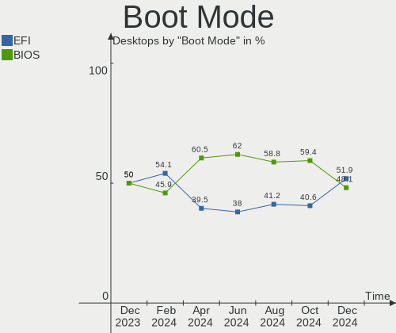
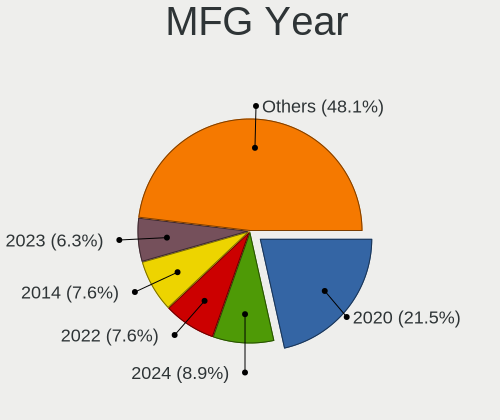
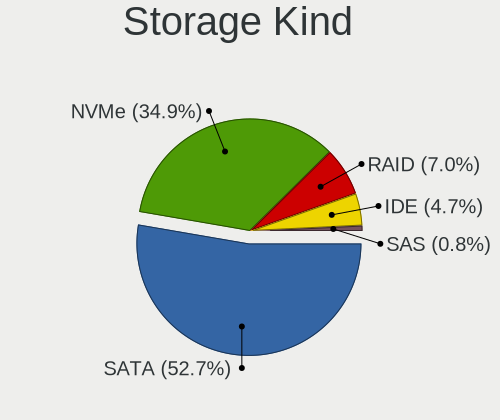
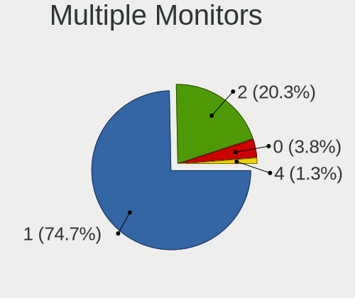
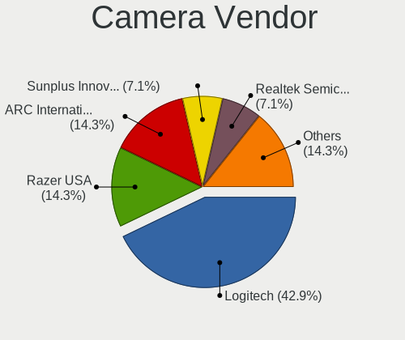

Linux in UK - Hardware Trends (Desktops)
----------------------------------------

A project to identify most popular hardware characteristics and track their change
over time based on data collected by Linux users at https://Linux-Hardware.org.

Anyone can contribute to this report by the [hw-probe](https://github.com/linuxhw/hw-probe) tool:

    sudo -E hw-probe -all -upload

Period: Mar, 2023.

Contents
--------

* [ System ](#system)
  - [ OS                       ](#os)
  - [ OS Family                ](#os-family)
  - [ Kernel                   ](#kernel)
  - [ Kernel Family            ](#kernel-family)
  - [ Kernel Major Ver.        ](#kernel-major-ver)
  - [ Arch                     ](#arch)
  - [ DE                       ](#de)
  - [ Display Server           ](#display-server)
  - [ Display Manager          ](#display-manager)
  - [ OS Lang                  ](#os-lang)
  - [ Boot Mode                ](#boot-mode)
  - [ Filesystem               ](#filesystem)
  - [ Part. scheme             ](#part-scheme)
  - [ Dual Boot with Linux/BSD ](#dual-boot-with-linuxbsd)
  - [ Dual Boot (Win)          ](#dual-boot-win)

* [ Board ](#board)
  - [ Vendor                   ](#vendor)
  - [ Model                    ](#model)
  - [ Model Family             ](#model-family)
  - [ MFG Year                 ](#mfg-year)
  - [ Form Factor              ](#form-factor)
  - [ Secure Boot              ](#secure-boot)
  - [ Coreboot                 ](#coreboot)
  - [ RAM Size                 ](#ram-size)
  - [ RAM Used                 ](#ram-used)
  - [ Total Drives             ](#total-drives)
  - [ Has CD-ROM               ](#has-cd-rom)
  - [ Has Ethernet             ](#has-ethernet)
  - [ Has WiFi                 ](#has-wifi)
  - [ Has Bluetooth            ](#has-bluetooth)

* [ Location ](#location)
  - [ Country                  ](#country)
  - [ City                     ](#city)

* [ Drives ](#drives)
  - [ Drive Vendor             ](#drive-vendor)
  - [ Drive Model              ](#drive-model)
  - [ HDD Vendor               ](#hdd-vendor)
  - [ SSD Vendor               ](#ssd-vendor)
  - [ Drive Kind               ](#drive-kind)
  - [ Drive Connector          ](#drive-connector)
  - [ Drive Size               ](#drive-size)
  - [ Space Total              ](#space-total)
  - [ Space Used               ](#space-used)
  - [ Malfunc. Drives          ](#malfunc-drives)
  - [ Malfunc. Drive Vendor    ](#malfunc-drive-vendor)
  - [ Malfunc. HDD Vendor      ](#malfunc-hdd-vendor)
  - [ Malfunc. Drive Kind      ](#malfunc-drive-kind)
  - [ Failed Drives            ](#failed-drives)
  - [ Failed Drive Vendor      ](#failed-drive-vendor)
  - [ Drive Status             ](#drive-status)

* [ Storage controller ](#storage-controller)
  - [ Storage Vendor           ](#storage-vendor)
  - [ Storage Model            ](#storage-model)
  - [ Storage Kind             ](#storage-kind)

* [ Processor ](#processor)
  - [ CPU Vendor               ](#cpu-vendor)
  - [ CPU Model                ](#cpu-model)
  - [ CPU Model Family         ](#cpu-model-family)
  - [ CPU Cores                ](#cpu-cores)
  - [ CPU Sockets              ](#cpu-sockets)
  - [ CPU Threads              ](#cpu-threads)
  - [ CPU Op-Modes             ](#cpu-op-modes)
  - [ CPU Microcode            ](#cpu-microcode)
  - [ CPU Microarch            ](#cpu-microarch)

* [ Graphics ](#graphics)
  - [ GPU Vendor               ](#gpu-vendor)
  - [ GPU Model                ](#gpu-model)
  - [ GPU Combo                ](#gpu-combo)
  - [ GPU Driver               ](#gpu-driver)
  - [ GPU Memory               ](#gpu-memory)

* [ Monitor ](#monitor)
  - [ Monitor Vendor           ](#monitor-vendor)
  - [ Monitor Model            ](#monitor-model)
  - [ Monitor Resolution       ](#monitor-resolution)
  - [ Monitor Diagonal         ](#monitor-diagonal)
  - [ Monitor Width            ](#monitor-width)
  - [ Aspect Ratio             ](#aspect-ratio)
  - [ Monitor Area             ](#monitor-area)
  - [ Pixel Density            ](#pixel-density)
  - [ Multiple Monitors        ](#multiple-monitors)

* [ Network ](#network)
  - [ Net Controller Vendor    ](#net-controller-vendor)
  - [ Net Controller Model     ](#net-controller-model)
  - [ Wireless Vendor          ](#wireless-vendor)
  - [ Wireless Model           ](#wireless-model)
  - [ Ethernet Vendor          ](#ethernet-vendor)
  - [ Ethernet Model           ](#ethernet-model)
  - [ Net Controller Kind      ](#net-controller-kind)
  - [ Used Controller          ](#used-controller)
  - [ NICs                     ](#nics)
  - [ IPv6                     ](#ipv6)

* [ Bluetooth ](#bluetooth)
  - [ Bluetooth Vendor         ](#bluetooth-vendor)
  - [ Bluetooth Model          ](#bluetooth-model)

* [ Sound ](#sound)
  - [ Sound Vendor             ](#sound-vendor)
  - [ Sound Model              ](#sound-model)

* [ Memory ](#memory)
  - [ Memory Vendor            ](#memory-vendor)
  - [ Memory Model             ](#memory-model)
  - [ Memory Kind              ](#memory-kind)
  - [ Memory Form Factor       ](#memory-form-factor)
  - [ Memory Size              ](#memory-size)
  - [ Memory Speed             ](#memory-speed)

* [ Printers & scanners ](#printers--scanners)
  - [ Printer Vendor           ](#printer-vendor)
  - [ Printer Model            ](#printer-model)
  - [ Scanner Vendor           ](#scanner-vendor)
  - [ Scanner Model            ](#scanner-model)

* [ Camera ](#camera)
  - [ Camera Vendor            ](#camera-vendor)
  - [ Camera Model             ](#camera-model)

* [ Security ](#security)
  - [ Fingerprint Vendor       ](#fingerprint-vendor)
  - [ Fingerprint Model        ](#fingerprint-model)
  - [ Chipcard Vendor          ](#chipcard-vendor)
  - [ Chipcard Model           ](#chipcard-model)

* [ Unsupported ](#unsupported)
  - [ Unsupported Devices      ](#unsupported-devices)
  - [ Unsupported Device Types ](#unsupported-device-types)

System
------

OS
--

Installed operating systems

| Name                         | Desktops | Percent |
|------------------------------|----------|---------|
| Ubuntu 22.04                 | 17       | 18.48%  |
| OpenMandriva 23.01           | 7        | 7.61%   |
| Linux Mint 21.1              | 7        | 7.61%   |
| Zorin 16                     | 5        | 5.43%   |
| OpenMandriva 23.03           | 5        | 5.43%   |
| Ubuntu 22.10                 | 4        | 4.35%   |
| Pop!_OS 22.04                | 4        | 4.35%   |
| ArcoLinux Rolling            | 4        | 4.35%   |
| Arch Rolling                 | 4        | 4.35%   |
| Gentoo 2.13                  | 3        | 3.26%   |
| Fedora 37                    | 3        | 3.26%   |
| Debian 11                    | 3        | 3.26%   |
| Ubuntu 20.04                 | 2        | 2.17%   |
| ROSA 12.1                    | 2        | 2.17%   |
| Rocky Linux 9.1              | 2        | 2.17%   |
| openSUSE Tumbleweed-XXXXXXXX | 2        | 2.17%   |
| Linux Mint 21                | 2        | 2.17%   |
| Xubuntu 22.04                | 1        | 1.09%   |
| SteamOS 3.4                  | 1        | 1.09%   |
| Slackware 15.0               | 1        | 1.09%   |
| ROSA 12.3                    | 1        | 1.09%   |
| RHEL 8                       | 1        | 1.09%   |
| OpenMandriva 23.90           | 1        | 1.09%   |
| Nobara 37                    | 1        | 1.09%   |
| Nobara 36                    | 1        | 1.09%   |
| Manjaro 22.0.5               | 1        | 1.09%   |
| Manjaro                      | 1        | 1.09%   |
| Kali 2023.1                  | 1        | 1.09%   |
| Gentoo 2.9                   | 1        | 1.09%   |
| Endless 5.0.1                | 1        | 1.09%   |
| CentOS 7                     | 1        | 1.09%   |
| Athena Rolling               | 1        | 1.09%   |
| antergos Rolling             | 1        | 1.09%   |

OS Family
---------

OS without a version

| Name         | Desktops | Percent |
|--------------|----------|---------|
| Ubuntu       | 23       | 25%     |
| OpenMandriva | 13       | 14.13%  |
| Linux Mint   | 9        | 9.78%   |
| Zorin        | 5        | 5.43%   |
| Pop!_OS      | 4        | 4.35%   |
| Gentoo       | 4        | 4.35%   |
| ArcoLinux    | 4        | 4.35%   |
| Arch         | 4        | 4.35%   |
| ROSA         | 3        | 3.26%   |
| Fedora       | 3        | 3.26%   |
| Debian       | 3        | 3.26%   |
| Rocky Linux  | 2        | 2.17%   |
| openSUSE     | 2        | 2.17%   |
| Nobara       | 2        | 2.17%   |
| Manjaro      | 2        | 2.17%   |
| Xubuntu      | 1        | 1.09%   |
| SteamOS      | 1        | 1.09%   |
| Slackware    | 1        | 1.09%   |
| RHEL         | 1        | 1.09%   |
| Kali         | 1        | 1.09%   |
| Endless      | 1        | 1.09%   |
| CentOS       | 1        | 1.09%   |
| Athena       | 1        | 1.09%   |
| antergos     | 1        | 1.09%   |

Kernel
------

Version of the Linux kernel

| Version                            | Desktops | Percent |
|------------------------------------|----------|---------|
| 5.19.0-35-generic                  | 13       | 14.13%  |
| 5.15.0-67-generic                  | 12       | 13.04%  |
| 6.1.1-desktop-1omv2290             | 7        | 7.61%   |
| 6.2.6-desktop-1omv2390             | 5        | 5.43%   |
| 5.19.0-32-generic                  | 5        | 5.43%   |
| 6.2.8-arch1-1                      | 3        | 3.26%   |
| 6.2.0-76060200-generic             | 3        | 3.26%   |
| 6.2.2-arch1-1                      | 2        | 2.17%   |
| 5.19.0-38-generic                  | 2        | 2.17%   |
| 5.15.0-60-generic                  | 2        | 2.17%   |
| 5.15.0-47-generic                  | 2        | 2.17%   |
| 5.14.0-162.18.1.el9_1.x86_64       | 2        | 2.17%   |
| 5.10.74-generic-2rosa2021.1-x86_64 | 2        | 2.17%   |
| 6.3.0-rc1-recompv5                 | 1        | 1.09%   |
| 6.2.8-200.fc37.x86_64              | 1        | 1.09%   |
| 6.2.7-200.fc37.x86_64              | 1        | 1.09%   |
| 6.2.6-zen1-1-zen                   | 1        | 1.09%   |
| 6.2.6-201.fsync.fc37.x86_64        | 1        | 1.09%   |
| 6.2.5-zen1-1-zen                   | 1        | 1.09%   |
| 6.2.2-arch2-1                      | 1        | 1.09%   |
| 6.2.1-gentoo-x86_64                | 1        | 1.09%   |
| 6.2.1-arch1-1                      | 1        | 1.09%   |
| 6.2.1-1-default                    | 1        | 1.09%   |
| 6.2.0-1-default                    | 1        | 1.09%   |
| 6.1.9-desktop-1omv2390             | 1        | 1.09%   |
| 6.1.19-1-MANJARO                   | 1        | 1.09%   |
| 6.1.18_tkg_ws_will                 | 1        | 1.09%   |
| 6.1.15-1-lts                       | 1        | 1.09%   |
| 6.1.13-gentoo-x86_64               | 1        | 1.09%   |
| 6.1.12-gentoo-x86_64               | 1        | 1.09%   |
| 6.1.12-gentoo-dist-hardened        | 1        | 1.09%   |
| 6.1.11-76060111-generic            | 1        | 1.09%   |
| 6.1.0-kali5-amd64                  | 1        | 1.09%   |
| 6.0.14-201.fsync.fc36.x86_64       | 1        | 1.09%   |
| 6.0.0-1012-oem                     | 1        | 1.09%   |
| 5.15.79-generic-1rosa2021.1-x86_64 | 1        | 1.09%   |
| 5.15.74-1-pve                      | 1        | 1.09%   |
| 5.15.103                           | 1        | 1.09%   |
| 5.15.102-1-MANJARO                 | 1        | 1.09%   |
| 5.15.0-69-generic                  | 1        | 1.09%   |

Kernel Family
-------------

Linux kernel without a distro release

| Version  | Desktops | Percent |
|----------|----------|---------|
| 5.19.0   | 20       | 21.74%  |
| 5.15.0   | 18       | 19.57%  |
| 6.2.6    | 7        | 7.61%   |
| 6.1.1    | 7        | 7.61%   |
| 6.2.8    | 4        | 4.35%   |
| 6.2.0    | 4        | 4.35%   |
| 6.2.2    | 3        | 3.26%   |
| 6.2.1    | 3        | 3.26%   |
| 6.1.12   | 2        | 2.17%   |
| 5.14.0   | 2        | 2.17%   |
| 5.10.74  | 2        | 2.17%   |
| 6.3.0    | 1        | 1.09%   |
| 6.2.7    | 1        | 1.09%   |
| 6.2.5    | 1        | 1.09%   |
| 6.1.9    | 1        | 1.09%   |
| 6.1.19   | 1        | 1.09%   |
| 6.1.18   | 1        | 1.09%   |
| 6.1.15   | 1        | 1.09%   |
| 6.1.13   | 1        | 1.09%   |
| 6.1.11   | 1        | 1.09%   |
| 6.1.0    | 1        | 1.09%   |
| 6.0.14   | 1        | 1.09%   |
| 6.0.0    | 1        | 1.09%   |
| 5.15.79  | 1        | 1.09%   |
| 5.15.74  | 1        | 1.09%   |
| 5.15.103 | 1        | 1.09%   |
| 5.15.102 | 1        | 1.09%   |
| 5.13.0   | 1        | 1.09%   |
| 5.10.0   | 1        | 1.09%   |
| 4.18.0   | 1        | 1.09%   |
| 3.10.0   | 1        | 1.09%   |

Kernel Major Ver.
-----------------

Linux kernel major version

| Version | Desktops | Percent |
|---------|----------|---------|
| 6.2     | 23       | 25%     |
| 5.15    | 22       | 23.91%  |
| 5.19    | 20       | 21.74%  |
| 6.1     | 16       | 17.39%  |
| 5.10    | 3        | 3.26%   |
| 6.0     | 2        | 2.17%   |
| 5.14    | 2        | 2.17%   |
| 6.3     | 1        | 1.09%   |
| 5.13    | 1        | 1.09%   |
| 4.18    | 1        | 1.09%   |
| 3.10    | 1        | 1.09%   |

Arch
----

OS architecture (x86_64, i586, etc.)

| Name   | Desktops | Percent |
|--------|----------|---------|
| x86_64 | 92       | 100%    |

DE
--

Desktop Environment

| Name       | Desktops | Percent |
|------------|----------|---------|
| GNOME      | 43       | 46.74%  |
| KDE5       | 23       | 25%     |
| Unknown    | 10       | 10.87%  |
| X-Cinnamon | 6        | 6.52%   |
| XFCE       | 5        | 5.43%   |
| MATE       | 3        | 3.26%   |
| KDE4       | 1        | 1.09%   |
| bspwm      | 1        | 1.09%   |

Display Server
--------------

X11 or Wayland

| Name    | Desktops | Percent |
|---------|----------|---------|
| X11     | 56       | 60.87%  |
| Wayland | 26       | 28.26%  |
| Tty     | 6        | 6.52%   |
| Unknown | 4        | 4.35%   |

Display Manager
---------------

SDDM, LightDM, etc.

| Name    | Desktops | Percent |
|---------|----------|---------|
| Unknown | 38       | 41.3%   |
| SDDM    | 22       | 23.91%  |
| GDM3    | 18       | 19.57%  |
| GDM     | 11       | 11.96%  |
| LightDM | 2        | 2.17%   |
| XDM     | 1        | 1.09%   |

OS Lang
-------

Language

| Lang    | Desktops | Percent |
|---------|----------|---------|
| en_GB   | 67       | 72.83%  |
| en_US   | 16       | 17.39%  |
| Unknown | 5        | 5.43%   |
| ru_RU   | 2        | 2.17%   |
| C.UTF8  | 1        | 1.09%   |
| C       | 1        | 1.09%   |

Boot Mode
---------

EFI or BIOS

| Mode | Desktops | Percent |
|------|----------|---------|
| EFI  | 58       | 63.04%  |
| BIOS | 34       | 36.96%  |

Filesystem
----------

Type of filesystem

| Type    | Desktops | Percent |
|---------|----------|---------|
| Ext4    | 57       | 61.96%  |
| Btrfs   | 18       | 19.57%  |
| Overlay | 9        | 9.78%   |
| Xfs     | 5        | 5.43%   |
| Zfs     | 3        | 3.26%   |

Part. scheme
------------

Scheme of partitioning

| Type    | Desktops | Percent |
|---------|----------|---------|
| GPT     | 55       | 59.78%  |
| Unknown | 29       | 31.52%  |
| MBR     | 8        | 8.7%    |

Dual Boot with Linux/BSD
------------------------

Hosting more than one Linux/BSD

| Dual boot | Desktops | Percent |
|-----------|----------|---------|
| No        | 68       | 73.91%  |
| Yes       | 24       | 26.09%  |

Dual Boot (Win)
---------------

Hosting Linux and Windows

| Dual boot | Desktops | Percent |
|-----------|----------|---------|
| No        | 67       | 72.83%  |
| Yes       | 25       | 27.17%  |

Board
-----

Vendor
------

Motherboard manufacturer

| Name                | Desktops | Percent |
|---------------------|----------|---------|
| ASUSTek Computer    | 28       | 30.43%  |
| Gigabyte Technology | 19       | 20.65%  |
| MSI                 | 12       | 13.04%  |
| Dell                | 11       | 11.96%  |
| ASRock              | 5        | 5.43%   |
| Hewlett-Packard     | 4        | 4.35%   |
| Lenovo              | 2        | 2.17%   |
| Acer                | 2        | 2.17%   |
| Unknown             | 2        | 2.17%   |
| Supermicro          | 1        | 1.09%   |
| Pegatron            | 1        | 1.09%   |
| IP3 Tech            | 1        | 1.09%   |
| Intel               | 1        | 1.09%   |
| Google              | 1        | 1.09%   |
| Foxconn             | 1        | 1.09%   |
| AZW                 | 1        | 1.09%   |

Model
-----

Motherboard model

| Name                                | Desktops | Percent |
|-------------------------------------|----------|---------|
| ASUS All Series                     | 4        | 4.35%   |
| Dell OptiPlex 3050                  | 3        | 3.26%   |
| MSI MS-7D32                         | 2        | 2.17%   |
| HP EliteDesk 800 G1 SFF             | 2        | 2.17%   |
| Dell OptiPlex 3020                  | 2        | 2.17%   |
| ASUS TUF Gaming X570-PLUS           | 2        | 2.17%   |
| ASUS ROG STRIX X670E-E GAMING WIFI  | 2        | 2.17%   |
| ASUS P5W DH Deluxe                  | 2        | 2.17%   |
| Unknown                             | 2        | 2.17%   |
| Supermicro SSG-6028R-ER12-HDP-AI050 | 1        | 1.09%   |
| Pegatron Elite 7300 Series MT       | 1        | 1.09%   |
| MSI MS-7D54                         | 1        | 1.09%   |
| MSI MS-7D25                         | 1        | 1.09%   |
| MSI MS-7C91                         | 1        | 1.09%   |
| MSI MS-7C56                         | 1        | 1.09%   |
| MSI MS-7C51                         | 1        | 1.09%   |
| MSI MS-7C02                         | 1        | 1.09%   |
| MSI MS-7B78                         | 1        | 1.09%   |
| MSI MS-7B51                         | 1        | 1.09%   |
| MSI MS-7885                         | 1        | 1.09%   |
| MSI MS-7758                         | 1        | 1.09%   |
| Lenovo ThinkCentre M92P 32371D5     | 1        | 1.09%   |
| Lenovo ThinkCentre M710s 10M8S16G00 | 1        | 1.09%   |
| IP3 Tech IB8                        | 1        | 1.09%   |
| Intel HURONRIVER                    | 1        | 1.09%   |
| HP OMEN 25L Desktop GT11-0xxx       | 1        | 1.09%   |
| HP Compaq Elite 8300 SFF            | 1        | 1.09%   |
| Google Teemo                        | 1        | 1.09%   |
| Gigabyte Z97X-Gaming 7              | 1        | 1.09%   |
| Gigabyte Z690 GAMING X              | 1        | 1.09%   |
| Gigabyte Z370M D3H                  | 1        | 1.09%   |
| Gigabyte X570S AORUS ELITE AX       | 1        | 1.09%   |
| Gigabyte X570 UD                    | 1        | 1.09%   |
| Gigabyte X570 AORUS XTREME          | 1        | 1.09%   |
| Gigabyte X470 AORUS ULTRA GAMING    | 1        | 1.09%   |
| Gigabyte PDT-702-1020               | 1        | 1.09%   |
| Gigabyte MBB-57600                  | 1        | 1.09%   |
| Gigabyte H170M-D3H                  | 1        | 1.09%   |
| Gigabyte GA-970A-UD3                | 1        | 1.09%   |
| Gigabyte GA-970A-DS3                | 1        | 1.09%   |

Model Family
------------

Motherboard model prefix

| Name                                | Desktops | Percent |
|-------------------------------------|----------|---------|
| Dell OptiPlex                       | 8        | 8.7%    |
| ASUS ROG                            | 7        | 7.61%   |
| ASUS TUF                            | 4        | 4.35%   |
| ASUS All                            | 4        | 4.35%   |
| ASUS PRIME                          | 3        | 3.26%   |
| MSI MS-7D32                         | 2        | 2.17%   |
| Lenovo ThinkCentre                  | 2        | 2.17%   |
| HP EliteDesk                        | 2        | 2.17%   |
| Gigabyte X570                       | 2        | 2.17%   |
| Gigabyte A520M                      | 2        | 2.17%   |
| Dell Inspiron                       | 2        | 2.17%   |
| ASUS P5W                            | 2        | 2.17%   |
| Unknown                             | 2        | 2.17%   |
| Supermicro SSG-6028R-ER12-HDP-AI050 | 1        | 1.09%   |
| Pegatron Elite                      | 1        | 1.09%   |
| MSI MS-7D54                         | 1        | 1.09%   |
| MSI MS-7D25                         | 1        | 1.09%   |
| MSI MS-7C91                         | 1        | 1.09%   |
| MSI MS-7C56                         | 1        | 1.09%   |
| MSI MS-7C51                         | 1        | 1.09%   |
| MSI MS-7C02                         | 1        | 1.09%   |
| MSI MS-7B78                         | 1        | 1.09%   |
| MSI MS-7B51                         | 1        | 1.09%   |
| MSI MS-7885                         | 1        | 1.09%   |
| MSI MS-7758                         | 1        | 1.09%   |
| IP3 Tech IB8                        | 1        | 1.09%   |
| Intel HURONRIVER                    | 1        | 1.09%   |
| HP OMEN                             | 1        | 1.09%   |
| HP Compaq                           | 1        | 1.09%   |
| Google Teemo                        | 1        | 1.09%   |
| Gigabyte Z97X-Gaming                | 1        | 1.09%   |
| Gigabyte Z690                       | 1        | 1.09%   |
| Gigabyte Z370M                      | 1        | 1.09%   |
| Gigabyte X570S                      | 1        | 1.09%   |
| Gigabyte X470                       | 1        | 1.09%   |
| Gigabyte PDT-702-1020               | 1        | 1.09%   |
| Gigabyte MBB-57600                  | 1        | 1.09%   |
| Gigabyte H170M-D3H                  | 1        | 1.09%   |
| Gigabyte GA-970A-UD3                | 1        | 1.09%   |
| Gigabyte GA-970A-DS3                | 1        | 1.09%   |

MFG Year
--------

Motherboard manufacture year

| Year | Desktops | Percent |
|------|----------|---------|
| 2020 | 14       | 15.22%  |
| 2022 | 9        | 9.78%   |
| 2021 | 9        | 9.78%   |
| 2018 | 9        | 9.78%   |
| 2017 | 8        | 8.7%    |
| 2013 | 8        | 8.7%    |
| 2019 | 5        | 5.43%   |
| 2014 | 5        | 5.43%   |
| 2015 | 4        | 4.35%   |
| 2012 | 4        | 4.35%   |
| 2023 | 3        | 3.26%   |
| 2011 | 3        | 3.26%   |
| 2010 | 3        | 3.26%   |
| 2009 | 3        | 3.26%   |
| 2006 | 3        | 3.26%   |
| 2016 | 1        | 1.09%   |
| 2008 | 1        | 1.09%   |

Form Factor
-----------

Physical design of the computer

| Name    | Desktops | Percent |
|---------|----------|---------|
| Desktop | 92       | 100%    |

Secure Boot
-----------

Enabled or disabled

| State    | Desktops | Percent |
|----------|----------|---------|
| Disabled | 88       | 95.65%  |
| Enabled  | 4        | 4.35%   |

Coreboot
--------

Have coreboot on board

| Used | Desktops | Percent |
|------|----------|---------|
| No   | 91       | 98.91%  |
| Yes  | 1        | 1.09%   |

RAM Size
--------

Total RAM memory

| Size in GB      | Desktops | Percent |
|-----------------|----------|---------|
| 32.01-64.0      | 30       | 32.61%  |
| 16.01-24.0      | 26       | 28.26%  |
| 4.01-8.0        | 12       | 13.04%  |
| 64.01-256.0     | 7        | 7.61%   |
| 8.01-16.0       | 7        | 7.61%   |
| 3.01-4.0        | 5        | 5.43%   |
| 24.01-32.0      | 3        | 3.26%   |
| More than 256.0 | 1        | 1.09%   |
| 1.01-2.0        | 1        | 1.09%   |

RAM Used
--------

Used RAM memory

| Used GB    | Desktops | Percent |
|------------|----------|---------|
| 1.01-2.0   | 27       | 29.35%  |
| 4.01-8.0   | 22       | 23.91%  |
| 2.01-3.0   | 19       | 20.65%  |
| 3.01-4.0   | 15       | 16.3%   |
| 8.01-16.0  | 5        | 5.43%   |
| 32.01-64.0 | 2        | 2.17%   |
| 16.01-24.0 | 1        | 1.09%   |
| 0.01-0.5   | 1        | 1.09%   |

Total Drives
------------

Number of drives on board

| Drives | Desktops | Percent |
|--------|----------|---------|
| 1      | 27       | 29.35%  |
| 2      | 25       | 27.17%  |
| 3      | 20       | 21.74%  |
| 4      | 7        | 7.61%   |
| 6      | 4        | 4.35%   |
| 5      | 4        | 4.35%   |
| 0      | 2        | 2.17%   |
| 11     | 1        | 1.09%   |
| 8      | 1        | 1.09%   |
| 7      | 1        | 1.09%   |

Has CD-ROM
----------

Has CD-ROM on board

| Presented | Desktops | Percent |
|-----------|----------|---------|
| No        | 57       | 61.96%  |
| Yes       | 35       | 38.04%  |

Has Ethernet
------------

Has Ethernet on board

| Presented | Desktops | Percent |
|-----------|----------|---------|
| Yes       | 91       | 98.91%  |
| No        | 1        | 1.09%   |

Has WiFi
--------

Has WiFi module

| Presented | Desktops | Percent |
|-----------|----------|---------|
| No        | 48       | 52.17%  |
| Yes       | 44       | 47.83%  |

Has Bluetooth
-------------

Has Bluetooth module

| Presented | Desktops | Percent |
|-----------|----------|---------|
| No        | 57       | 61.96%  |
| Yes       | 35       | 38.04%  |

Location
--------

Country
-------

Geographic location (country)

| Country | Desktops | Percent |
|---------|----------|---------|
| UK      | 92       | 100%    |

City
----

Geographic location (city)

| City                  | Desktops | Percent |
|-----------------------|----------|---------|
| London                | 12       | 13.04%  |
| Mirfield              | 5        | 5.43%   |
| Birmingham            | 4        | 4.35%   |
| Leeds                 | 3        | 3.26%   |
| Uxbridge              | 2        | 2.17%   |
| Rotherham             | 2        | 2.17%   |
| Rochdale              | 2        | 2.17%   |
| Manchester            | 2        | 2.17%   |
| Isle of Arran         | 2        | 2.17%   |
| Ipswich               | 2        | 2.17%   |
| Farnborough           | 2        | 2.17%   |
| Cambridge             | 2        | 2.17%   |
| Bristol               | 2        | 2.17%   |
| Wokingham             | 1        | 1.09%   |
| Wisbech               | 1        | 1.09%   |
| Wirral                | 1        | 1.09%   |
| Warwick               | 1        | 1.09%   |
| Walthamstow           | 1        | 1.09%   |
| Surrey                | 1        | 1.09%   |
| Stockton-on-Tees      | 1        | 1.09%   |
| Stamford              | 1        | 1.09%   |
| St Albans             | 1        | 1.09%   |
| Skegness              | 1        | 1.09%   |
| Salisbury             | 1        | 1.09%   |
| Royal Tunbridge Wells | 1        | 1.09%   |
| Ripon                 | 1        | 1.09%   |
| Peterlee              | 1        | 1.09%   |
| Pembroke Dock         | 1        | 1.09%   |
| Norwich               | 1        | 1.09%   |
| Newport               | 1        | 1.09%   |
| Newcastle upon Tyne   | 1        | 1.09%   |
| Milton Keynes         | 1        | 1.09%   |
| Middlesbrough         | 1        | 1.09%   |
| Mansfield             | 1        | 1.09%   |
| Malton                | 1        | 1.09%   |
| Maidenhead            | 1        | 1.09%   |
| Leicester             | 1        | 1.09%   |
| Kings Lynn            | 1        | 1.09%   |
| Hinckley              | 1        | 1.09%   |
| Haywards Heath        | 1        | 1.09%   |

Drives
------

Drive Vendor
------------

Hard drive vendors

| Vendor                      | Desktops | Drives | Percent |
|-----------------------------|----------|--------|---------|
| Seagate                     | 27       | 46     | 15.17%  |
| Crucial                     | 25       | 29     | 14.04%  |
| Sandisk                     | 24       | 31     | 13.48%  |
| Samsung Electronics         | 23       | 34     | 12.92%  |
| WDC                         | 21       | 26     | 11.8%   |
| Toshiba                     | 8        | 10     | 4.49%   |
| Phison Electronics          | 5        | 9      | 2.81%   |
| Kingston                    | 5        | 5      | 2.81%   |
| Hitachi                     | 5        | 10     | 2.81%   |
| Intel                       | 4        | 5      | 2.25%   |
| Micron/Crucial Technology   | 3        | 3      | 1.69%   |
| Transcend                   | 2        | 2      | 1.12%   |
| ORTIAL                      | 2        | 2      | 1.12%   |
| Kingston Technology Company | 2        | 2      | 1.12%   |
| Integral                    | 2        | 2      | 1.12%   |
| Corsair                     | 2        | 2      | 1.12%   |
| Unknown                     | 2        | 2      | 1.12%   |
| SPCC                        | 1        | 1      | 0.56%   |
| Silicon Motion              | 1        | 1      | 0.56%   |
| PNY                         | 1        | 1      | 0.56%   |
| Phison                      | 1        | 1      | 0.56%   |
| Netac                       | 1        | 1      | 0.56%   |
| MSI                         | 1        | 1      | 0.56%   |
| Lexar                       | 1        | 1      | 0.56%   |
| KIOXIA-EXCERIA              | 1        | 1      | 0.56%   |
| KIOXIA                      | 1        | 1      | 0.56%   |
| KingFast                    | 1        | 1      | 0.56%   |
| HGST                        | 1        | 1      | 0.56%   |
| Fanxiang                    | 1        | 1      | 0.56%   |
| External                    | 1        | 1      | 0.56%   |
| Drevo                       | 1        | 1      | 0.56%   |
| China                       | 1        | 1      | 0.56%   |
| A-DATA Technology           | 1        | 1      | 0.56%   |

Drive Model
-----------

Hard drive models

| Model                                               | Desktops | Percent |
|-----------------------------------------------------|----------|---------|
| Seagate ST1000DM010-2EP102 1TB                      | 4        | 1.95%   |
| Samsung NVMe SSD Controller SM981/PM981/PM983 250GB | 4        | 1.95%   |
| SanDisk SDSSDA240G 240GB                            | 3        | 1.46%   |
| SanDisk NVMe SSD Drive 1TB                          | 3        | 1.46%   |
| Samsung SSD 850 EVO 250GB                           | 3        | 1.46%   |
| Phison E12 NVMe Controller 256GB                    | 3        | 1.46%   |
| Crucial CT500MX500SSD1 500GB                        | 3        | 1.46%   |
| Crucial CT240BX500SSD1 240GB                        | 3        | 1.46%   |
| Crucial CT1000MX500SSD1 1TB                         | 3        | 1.46%   |
| WDC WDS240G2G0A-00JH30 240GB SSD                    | 2        | 0.98%   |
| WDC WD10EURX-63FH1Y0 1TB                            | 2        | 0.98%   |
| Toshiba HDWD130 3TB                                 | 2        | 0.98%   |
| Toshiba HDWD120 2TB                                 | 2        | 0.98%   |
| Seagate ST3500312CS 500GB                           | 2        | 0.98%   |
| Seagate ST2000DM008-2FR102 2TB                      | 2        | 0.98%   |
| Seagate ST1000LM048-2E7172 1TB                      | 2        | 0.98%   |
| Sandisk WD Blue SN550 NVMe SSD 256GB                | 2        | 0.98%   |
| SanDisk SSD PLUS 240GB                              | 2        | 0.98%   |
| SanDisk NVMe SSD Drive 500GB                        | 2        | 0.98%   |
| Samsung SSD 870 QVO 1TB                             | 2        | 0.98%   |
| Samsung SSD 870 EVO 1TB                             | 2        | 0.98%   |
| Samsung SSD 850 EVO 500GB                           | 2        | 0.98%   |
| Samsung SSD 840 EVO 500GB                           | 2        | 0.98%   |
| Samsung NVMe SSD Controller SM961/PM961/SM963 256GB | 2        | 0.98%   |
| Samsung HD103SI 1TB                                 | 2        | 0.98%   |
| Phison E16 PCIe4 NVMe Controller 1TB                | 2        | 0.98%   |
| ORTIAL SSD 512GB                                    | 2        | 0.98%   |
| Kingston SA400S37240G 240GB SSD                     | 2        | 0.98%   |
| Integral V Series SATA SSD 240GB                    | 2        | 0.98%   |
| Hitachi HDT725032VLA380 320GB                       | 2        | 0.98%   |
| Hitachi HDT725032VLA360 320GB                       | 2        | 0.98%   |
| Crucial M4-CT128M4SSD2 128GB                        | 2        | 0.98%   |
| Crucial CT2000MX500SSD1 2TB                         | 2        | 0.98%   |
| Crucial CT1000BX500SSD1 1TB                         | 2        | 0.98%   |
| Unknown                                             | 2        | 0.98%   |
| WDC WDS500G2B0A-00SM50 500GB SSD                    | 1        | 0.49%   |
| WDC WDS500G1X0E-00AFY0 500GB                        | 1        | 0.49%   |
| WDC WDS100T3XHC-00SJG0 1TB                          | 1        | 0.49%   |
| WDC WD60PURX-64T0ZY0 6TB                            | 1        | 0.49%   |
| WDC WD5003AZEX-00K1GA0 500GB                        | 1        | 0.49%   |

HDD Vendor
----------

Hard disk drive vendors

| Vendor              | Desktops | Drives | Percent |
|---------------------|----------|--------|---------|
| Seagate             | 25       | 43     | 43.86%  |
| WDC                 | 15       | 19     | 26.32%  |
| Toshiba             | 7        | 9      | 12.28%  |
| Hitachi             | 5        | 10     | 8.77%   |
| Samsung Electronics | 4        | 4      | 7.02%   |
| External            | 1        | 1      | 1.75%   |

SSD Vendor
----------

Solid state drive vendors

| Vendor              | Desktops | Drives | Percent |
|---------------------|----------|--------|---------|
| Crucial             | 21       | 25     | 28.77%  |
| Samsung Electronics | 14       | 20     | 19.18%  |
| SanDisk             | 13       | 15     | 17.81%  |
| WDC                 | 4        | 4      | 5.48%   |
| Transcend           | 2        | 2      | 2.74%   |
| ORTIAL              | 2        | 2      | 2.74%   |
| Kingston            | 2        | 2      | 2.74%   |
| Integral            | 2        | 2      | 2.74%   |
| Corsair             | 2        | 2      | 2.74%   |
| Unknown             | 2        | 2      | 2.74%   |
| Toshiba             | 1        | 1      | 1.37%   |
| Seagate             | 1        | 1      | 1.37%   |
| PNY                 | 1        | 1      | 1.37%   |
| Netac               | 1        | 1      | 1.37%   |
| KingFast            | 1        | 1      | 1.37%   |
| Intel               | 1        | 2      | 1.37%   |
| Fanxiang            | 1        | 1      | 1.37%   |
| Drevo               | 1        | 1      | 1.37%   |
| China               | 1        | 1      | 1.37%   |

Drive Kind
----------

HDD or SSD

| Kind    | Desktops | Drives | Percent |
|---------|----------|--------|---------|
| SSD     | 56       | 86     | 39.44%  |
| HDD     | 44       | 86     | 30.99%  |
| NVMe    | 39       | 61     | 27.46%  |
| Unknown | 3        | 3      | 2.11%   |

Drive Connector
---------------

SATA, SAS, NVMe, etc.

| Type | Desktops | Drives | Percent |
|------|----------|--------|---------|
| SATA | 76       | 160    | 62.81%  |
| NVMe | 39       | 61     | 32.23%  |
| SAS  | 6        | 15     | 4.96%   |

Drive Size
----------

Size of hard drive

| Size in TB | Desktops | Drives | Percent |
|------------|----------|--------|---------|
| 0.01-0.5   | 52       | 74     | 44.83%  |
| 0.51-1.0   | 30       | 44     | 25.86%  |
| 1.01-2.0   | 19       | 26     | 16.38%  |
| 3.01-4.0   | 7        | 16     | 6.03%   |
| 2.01-3.0   | 5        | 8      | 4.31%   |
| 4.01-10.0  | 3        | 4      | 2.59%   |

Space Total
-----------

Amount of disk space available on the file system

| Size in GB     | Desktops | Percent |
|----------------|----------|---------|
| More than 3000 | 17       | 18.48%  |
| 251-500        | 15       | 16.3%   |
| 101-250        | 15       | 16.3%   |
| 1-20           | 11       | 11.96%  |
| 1001-2000      | 10       | 10.87%  |
| 2001-3000      | 7        | 7.61%   |
| 501-1000       | 7        | 7.61%   |
| Unknown        | 6        | 6.52%   |
| 21-50          | 2        | 2.17%   |
| 51-100         | 2        | 2.17%   |

Space Used
----------

Amount of used disk space

| Used GB        | Desktops | Percent |
|----------------|----------|---------|
| 1-20           | 31       | 33.7%   |
| 21-50          | 11       | 11.96%  |
| 251-500        | 9        | 9.78%   |
| 101-250        | 8        | 8.7%    |
| 1001-2000      | 8        | 8.7%    |
| 501-1000       | 8        | 8.7%    |
| 51-100         | 7        | 7.61%   |
| Unknown        | 6        | 6.52%   |
| More than 3000 | 3        | 3.26%   |
| 2001-3000      | 1        | 1.09%   |

Malfunc. Drives
---------------

Drive models with a malfunction

| Model                           | Desktops | Drives | Percent |
|---------------------------------|----------|--------|---------|
| WDC WD30EZRX-00MMMB0 3TB        | 1        | 1      | 9.09%   |
| WDC WD20EARX-00PASB0 2TB        | 1        | 1      | 9.09%   |
| Seagate ST9250315AS 250GB       | 1        | 1      | 9.09%   |
| Seagate ST500DM002-1BC142 500GB | 1        | 1      | 9.09%   |
| Intel SSDSC2BB160G4T 160GB      | 1        | 2      | 9.09%   |
| Intel SSDPEKKW512G7 512GB       | 1        | 1      | 9.09%   |
| Intel SSD 600P Series 512GB     | 1        | 1      | 9.09%   |
| Hitachi HTS542525K9SA00 250GB   | 1        | 1      | 9.09%   |
| Drevo X1 Pro SSD 128GB          | 1        | 1      | 9.09%   |
| Crucial CT480M500SSD1 480GB     | 1        | 1      | 9.09%   |
| Crucial CT250BX100SSD1 250GB    | 1        | 1      | 9.09%   |

Malfunc. Drive Vendor
---------------------

Vendors of faulty drives

| Vendor  | Desktops | Drives | Percent |
|---------|----------|--------|---------|
| Intel   | 3        | 4      | 30%     |
| Seagate | 2        | 2      | 20%     |
| Crucial | 2        | 2      | 20%     |
| WDC     | 1        | 2      | 10%     |
| Hitachi | 1        | 1      | 10%     |
| Drevo   | 1        | 1      | 10%     |

Malfunc. HDD Vendor
-------------------

Vendors of faulty HDD drives

| Vendor  | Desktops | Drives | Percent |
|---------|----------|--------|---------|
| Seagate | 2        | 2      | 50%     |
| WDC     | 1        | 2      | 25%     |
| Hitachi | 1        | 1      | 25%     |

Malfunc. Drive Kind
-------------------

Kinds of faulty drives

| Kind | Desktops | Drives | Percent |
|------|----------|--------|---------|
| SSD  | 4        | 5      | 44.44%  |
| HDD  | 3        | 5      | 33.33%  |
| NVMe | 2        | 2      | 22.22%  |

Failed Drives
-------------

Failed drive models

Zero info for selected period =(

Failed Drive Vendor
-------------------

Failed drive vendors

Zero info for selected period =(

Drive Status
------------

Number of failed and malfunc. drives

| Status   | Desktops | Drives | Percent |
|----------|----------|--------|---------|
| Works    | 51       | 110    | 49.51%  |
| Detected | 44       | 114    | 42.72%  |
| Malfunc  | 8        | 12     | 7.77%   |

Storage controller
------------------

Storage Vendor
--------------

Storage controller vendors

| Vendor                       | Desktops | Percent |
|------------------------------|----------|---------|
| Intel                        | 56       | 38.1%   |
| AMD                          | 33       | 22.45%  |
| SanDisk                      | 14       | 9.52%   |
| Samsung Electronics          | 8        | 5.44%   |
| Phison Electronics           | 7        | 4.76%   |
| Micron/Crucial Technology    | 7        | 4.76%   |
| ASMedia Technology           | 6        | 4.08%   |
| Kingston Technology Company  | 4        | 2.72%   |
| Marvell Technology Group     | 3        | 2.04%   |
| KIOXIA                       | 2        | 1.36%   |
| Silicon Motion               | 1        | 0.68%   |
| Shenzhen Longsys Electronics | 1        | 0.68%   |
| Nvidia                       | 1        | 0.68%   |
| LSI Logic / Symbios Logic    | 1        | 0.68%   |
| JMicron Technology           | 1        | 0.68%   |
| Broadcom / LSI               | 1        | 0.68%   |
| ADATA Technology             | 1        | 0.68%   |

Storage Model
-------------

Storage controller models

| Model                                                                          | Desktops | Percent |
|--------------------------------------------------------------------------------|----------|---------|
| AMD FCH SATA Controller [AHCI mode]                                            | 20       | 10.93%  |
| AMD 400 Series Chipset SATA Controller                                         | 9        | 4.92%   |
| Intel 8 Series/C220 Series Chipset Family 6-port SATA Controller 1 [AHCI mode] | 8        | 4.37%   |
| Intel 200 Series PCH SATA controller [AHCI mode]                               | 8        | 4.37%   |
| Samsung NVMe SSD Controller SM981/PM981/PM983                                  | 6        | 3.28%   |
| Intel Alder Lake-S PCH SATA Controller [AHCI Mode]                             | 6        | 3.28%   |
| ASMedia ASM1062 Serial ATA Controller                                          | 6        | 3.28%   |
| AMD 500 Series Chipset SATA Controller                                         | 6        | 3.28%   |
| Micron/Crucial P2 NVMe PCIe SSD                                                | 5        | 2.73%   |
| Phison E12 NVMe Controller                                                     | 4        | 2.19%   |
| Intel 82801G (ICH7 Family) IDE Controller                                      | 4        | 2.19%   |
| Intel 7 Series/C210 Series Chipset Family 6-port SATA Controller [AHCI mode]   | 4        | 2.19%   |
| AMD SB7x0/SB8x0/SB9x0 IDE Controller                                           | 4        | 2.19%   |
| SanDisk WD Blue SN570 NVMe SSD 1TB                                             | 3        | 1.64%   |
| SanDisk WD Blue SN550 NVMe SSD                                                 | 3        | 1.64%   |
| Intel Volume Management Device NVMe RAID Controller                            | 3        | 1.64%   |
| Intel SATA Controller [RAID mode]                                              | 3        | 1.64%   |
| Intel Q170/Q150/B150/H170/H110/Z170/CM236 Chipset SATA Controller [AHCI Mode]  | 3        | 1.64%   |
| Intel 9 Series Chipset Family SATA Controller [AHCI Mode]                      | 3        | 1.64%   |
| AMD SB7x0/SB8x0/SB9x0 SATA Controller [IDE mode]                               | 3        | 1.64%   |
| AMD FCH SATA Controller D                                                      | 3        | 1.64%   |
| Sandisk Western Digital WD Black SN850X NVMe SSD                               | 2        | 1.09%   |
| SanDisk WD PC SN810 / Black SN850 NVMe SSD                                     | 2        | 1.09%   |
| SanDisk NVMe Controller                                                        | 2        | 1.09%   |
| SanDisk Non-Volatile memory controller                                         | 2        | 1.09%   |
| Samsung NVMe SSD Controller SM961/PM961/SM963                                  | 2        | 1.09%   |
| Phison E18 PCIe4 NVMe Controller                                               | 2        | 1.09%   |
| Phison E16 PCIe4 NVMe Controller                                               | 2        | 1.09%   |
| Marvell Group 88SE9215 PCIe 2.0 x1 4-port SATA 6 Gb/s Controller               | 2        | 1.09%   |
| KIOXIA NVMe SSD                                                                | 2        | 1.09%   |
| Kingston Company Company Non-Volatile memory controller                        | 2        | 1.09%   |
| Intel SSD 600P Series                                                          | 2        | 1.09%   |
| Intel NM10/ICH7 Family SATA Controller [IDE mode]                              | 2        | 1.09%   |
| Intel NM10/ICH7 Family SATA Controller [AHCI mode]                             | 2        | 1.09%   |
| Intel Comet Lake SATA AHCI Controller                                          | 2        | 1.09%   |
| Intel Cannon Lake PCH SATA AHCI Controller                                     | 2        | 1.09%   |
| Intel 700 Series Chipset Family SATA AHCI Controller                           | 2        | 1.09%   |
| Silicon Motion SM2263EN/SM2263XT SSD Controller                                | 1        | 0.55%   |
| Shenzhen Longsys Electronics Non-Volatile memory controller                    | 1        | 0.55%   |
| SanDisk WD Black SN750 / PC SN730 NVMe SSD                                     | 1        | 0.55%   |

Storage Kind
------------

Kind of storage controller (IDE, SATA, NVMe, SAS, ...)

| Kind | Desktops | Percent |
|------|----------|---------|
| SATA | 83       | 58.45%  |
| NVMe | 39       | 27.46%  |
| IDE  | 11       | 7.75%   |
| RAID | 7        | 4.93%   |
| SAS  | 2        | 1.41%   |

Processor
---------

CPU Vendor
----------

Processor vendors

| Vendor | Desktops | Percent |
|--------|----------|---------|
| Intel  | 58       | 63.04%  |
| AMD    | 34       | 36.96%  |

CPU Model
---------

Processor models

| Model                                       | Desktops | Percent |
|---------------------------------------------|----------|---------|
| AMD Ryzen 5 5600G with Radeon Graphics      | 5        | 5.43%   |
| Intel Core i7-4790K CPU @ 4.00GHz           | 3        | 3.26%   |
| Intel Core i5-4570 CPU @ 3.20GHz            | 3        | 3.26%   |
| Intel Pentium D CPU 3.00GHz                 | 2        | 2.17%   |
| Intel Core i7-8700 CPU @ 3.20GHz            | 2        | 2.17%   |
| Intel Core i7-4770K CPU @ 3.50GHz           | 2        | 2.17%   |
| Intel Core i5-6500 CPU @ 3.20GHz            | 2        | 2.17%   |
| Intel Core i5-4590 CPU @ 3.30GHz            | 2        | 2.17%   |
| Intel Core i5-3470 CPU @ 3.20GHz            | 2        | 2.17%   |
| Intel 13th Gen Core i7-13700K               | 2        | 2.17%   |
| Intel 12th Gen Core i7-12700K               | 2        | 2.17%   |
| Intel 12th Gen Core i5-12400F               | 2        | 2.17%   |
| AMD Ryzen 9 3900X 12-Core Processor         | 2        | 2.17%   |
| AMD Ryzen 7 5800X 8-Core Processor          | 2        | 2.17%   |
| AMD Ryzen 7 3700X 8-Core Processor          | 2        | 2.17%   |
| AMD Ryzen 7 2700X Eight-Core Processor      | 2        | 2.17%   |
| AMD Ryzen 5 3600 6-Core Processor           | 2        | 2.17%   |
| Intel Xeon CPU X5450 @ 3.00GHz              | 1        | 1.09%   |
| Intel Xeon CPU E5-2696 v4 @ 2.20GHz         | 1        | 1.09%   |
| Intel Pentium Dual-Core CPU E6300 @ 2.80GHz | 1        | 1.09%   |
| Intel Pentium Dual-Core CPU E5800 @ 3.20GHz | 1        | 1.09%   |
| Intel Pentium Dual-Core CPU E5300 @ 2.60GHz | 1        | 1.09%   |
| Intel Pentium CPU G4560 @ 3.50GHz           | 1        | 1.09%   |
| Intel Pentium CPU G4400 @ 3.30GHz           | 1        | 1.09%   |
| Intel N100                                  | 1        | 1.09%   |
| Intel Core i9-7960X CPU @ 2.80GHz           | 1        | 1.09%   |
| Intel Core i9-10850K CPU @ 3.60GHz          | 1        | 1.09%   |
| Intel Core i7-9700T CPU @ 2.00GHz           | 1        | 1.09%   |
| Intel Core i7-8550U CPU @ 1.80GHz           | 1        | 1.09%   |
| Intel Core i7-6800K CPU @ 3.40GHz           | 1        | 1.09%   |
| Intel Core i7-4790 CPU @ 3.60GHz            | 1        | 1.09%   |
| Intel Core i7-3770 CPU @ 3.40GHz            | 1        | 1.09%   |
| Intel Core i7-2760QM CPU @ 2.40GHz          | 1        | 1.09%   |
| Intel Core i7-2600 CPU @ 3.40GHz            | 1        | 1.09%   |
| Intel Core i7-1065G7 CPU @ 1.30GHz          | 1        | 1.09%   |
| Intel Core i7-10510U CPU @ 1.80GHz          | 1        | 1.09%   |
| Intel Core i5-9600K CPU @ 3.70GHz           | 1        | 1.09%   |
| Intel Core i5-8400 CPU @ 2.80GHz            | 1        | 1.09%   |
| Intel Core i5-7600K CPU @ 3.80GHz           | 1        | 1.09%   |
| Intel Core i5-7500 CPU @ 3.40GHz            | 1        | 1.09%   |

CPU Model Family
----------------

Processor model prefix

| Model                   | Desktops | Percent |
|-------------------------|----------|---------|
| Intel Core i5           | 18       | 19.57%  |
| Intel Core i7           | 16       | 17.39%  |
| AMD Ryzen 5             | 10       | 10.87%  |
| Other                   | 9        | 9.78%   |
| AMD Ryzen 7             | 9        | 9.78%   |
| AMD Ryzen 9             | 6        | 6.52%   |
| Intel Pentium Dual-Core | 3        | 3.26%   |
| Intel Xeon              | 2        | 2.17%   |
| Intel Pentium D         | 2        | 2.17%   |
| Intel Pentium           | 2        | 2.17%   |
| Intel Core i9           | 2        | 2.17%   |
| Intel Celeron           | 2        | 2.17%   |
| AMD FX                  | 2        | 2.17%   |
| Intel Core i3           | 1        | 1.09%   |
| Intel Core 2 Quad       | 1        | 1.09%   |
| AMD Ryzen Threadripper  | 1        | 1.09%   |
| AMD Ryzen 3             | 1        | 1.09%   |
| AMD Phenom II X4        | 1        | 1.09%   |
| AMD Athlon II X4        | 1        | 1.09%   |
| AMD Athlon 64 X2        | 1        | 1.09%   |
| AMD Athlon              | 1        | 1.09%   |
| AMD A8                  | 1        | 1.09%   |

CPU Cores
---------

Number of processor cores

| Number | Desktops | Percent |
|--------|----------|---------|
| 4      | 35       | 38.04%  |
| 6      | 18       | 19.57%  |
| 2      | 14       | 15.22%  |
| 8      | 10       | 10.87%  |
| 16     | 6        | 6.52%   |
| 12     | 6        | 6.52%   |
| 44     | 1        | 1.09%   |
| 24     | 1        | 1.09%   |
| 10     | 1        | 1.09%   |

CPU Sockets
-----------

Number of sockets

| Number | Desktops | Percent |
|--------|----------|---------|
| 1      | 91       | 98.91%  |
| 2      | 1        | 1.09%   |

CPU Threads
-----------

Threads per core (Hyper-Threading)

| Number | Desktops | Percent |
|--------|----------|---------|
| 2      | 59       | 64.13%  |
| 1      | 33       | 35.87%  |

CPU Op-Modes
------------

CPU Operation Modes (32-bit, 64-bit)

| Op mode        | Desktops | Percent |
|----------------|----------|---------|
| 32-bit, 64-bit | 92       | 100%    |

CPU Microcode
-------------

Microcode number

| Number     | Desktops | Percent |
|------------|----------|---------|
| Unknown    | 29       | 31.52%  |
| 0x306c3    | 6        | 6.52%   |
| 0x90672    | 4        | 4.35%   |
| 0x506e3    | 4        | 4.35%   |
| 0x08701021 | 4        | 4.35%   |
| 0x906e9    | 3        | 3.26%   |
| 0x306a9    | 3        | 3.26%   |
| 0x0a20120a | 3        | 3.26%   |
| 0xf44      | 2        | 2.17%   |
| 0xb0671    | 2        | 2.17%   |
| 0x906ea    | 2        | 2.17%   |
| 0x1067a    | 2        | 2.17%   |
| 0x0a601203 | 2        | 2.17%   |
| 0x0a50000d | 2        | 2.17%   |
| 0x08701013 | 2        | 2.17%   |
| 0x0800820d | 2        | 2.17%   |
| 0x010000c8 | 2        | 2.17%   |
| 0xb06e0    | 1        | 1.09%   |
| 0xa0653    | 1        | 1.09%   |
| 0x906ed    | 1        | 1.09%   |
| 0x906c0    | 1        | 1.09%   |
| 0x806ea    | 1        | 1.09%   |
| 0x406f1    | 1        | 1.09%   |
| 0x206a7    | 1        | 1.09%   |
| 0x0a50000c | 1        | 1.09%   |
| 0x0a201016 | 1        | 1.09%   |
| 0x0a201009 | 1        | 1.09%   |
| 0x08701030 | 1        | 1.09%   |
| 0x08600106 | 1        | 1.09%   |
| 0x08101016 | 1        | 1.09%   |
| 0x08008206 | 1        | 1.09%   |
| 0x08001138 | 1        | 1.09%   |
| 0x08001137 | 1        | 1.09%   |
| 0x06000852 | 1        | 1.09%   |
| 0x06000623 | 1        | 1.09%   |

CPU Microarch
-------------

Microarchitecture

| Name             | Desktops | Percent |
|------------------|----------|---------|
| Haswell          | 12       | 13.04%  |
| Zen 3            | 11       | 11.96%  |
| KabyLake         | 11       | 11.96%  |
| Zen 2            | 9        | 9.78%   |
| Alderlake Hybrid | 6        | 6.52%   |
| Skylake          | 5        | 5.43%   |
| Penryn           | 5        | 5.43%   |
| IvyBridge        | 5        | 5.43%   |
| Unknown          | 5        | 5.43%   |
| Zen+             | 3        | 3.26%   |
| Zen              | 3        | 3.26%   |
| CometLake        | 3        | 3.26%   |
| SandyBridge      | 2        | 2.17%   |
| NetBurst         | 2        | 2.17%   |
| K10              | 2        | 2.17%   |
| Broadwell        | 2        | 2.17%   |
| Tremont          | 1        | 1.09%   |
| Piledriver       | 1        | 1.09%   |
| K8 Hammer        | 1        | 1.09%   |
| IceLake          | 1        | 1.09%   |
| Excavator        | 1        | 1.09%   |
| Bulldozer        | 1        | 1.09%   |

Graphics
--------

GPU Vendor
----------

Vendors of graphics cards

| Vendor            | Desktops | Percent |
|-------------------|----------|---------|
| Nvidia            | 44       | 41.9%   |
| Intel             | 33       | 31.43%  |
| AMD               | 27       | 25.71%  |
| ASPEED Technology | 1        | 0.95%   |

GPU Model
---------

Graphics card models

| Model                                                                       | Desktops | Percent |
|-----------------------------------------------------------------------------|----------|---------|
| Intel Xeon E3-1200 v3/4th Gen Core Processor Integrated Graphics Controller | 6        | 5.5%    |
| Intel CoffeeLake-S GT2 [UHD Graphics 630]                                   | 4        | 3.67%   |
| AMD Cezanne [Radeon Vega Series / Radeon Vega Mobile Series]                | 4        | 3.67%   |
| Nvidia GP107 [GeForce GTX 1050 Ti]                                          | 3        | 2.75%   |
| Nvidia GK208B [GeForce GT 730]                                              | 3        | 2.75%   |
| Nvidia GA106 [GeForce RTX 3060 Lite Hash Rate]                              | 3        | 2.75%   |
| Nvidia GA102 [GeForce RTX 3080 Ti]                                          | 3        | 2.75%   |
| Nvidia GA102 [GeForce RTX 3080 Lite Hash Rate]                              | 3        | 2.75%   |
| AMD Lexa PRO [Radeon 540/540X/550/550X / RX 540X/550/550X]                  | 3        | 2.75%   |
| AMD Ellesmere [Radeon RX 470/480/570/570X/580/580X/590]                     | 3        | 2.75%   |
| Nvidia GP106 [GeForce GTX 1060 3GB]                                         | 2        | 1.83%   |
| Nvidia GP104 [GeForce GTX 1070]                                             | 2        | 1.83%   |
| Nvidia GM206 [GeForce GTX 950]                                              | 2        | 1.83%   |
| Nvidia G98 [GeForce 8400 GS Rev. 2]                                         | 2        | 1.83%   |
| Nvidia G96C [GeForce 9400 GT]                                               | 2        | 1.83%   |
| Nvidia AD102 [GeForce RTX 4090]                                             | 2        | 1.83%   |
| Intel Xeon E3-1200 v2/3rd Gen Core processor Graphics Controller            | 2        | 1.83%   |
| Intel Raptor Lake-S GT1 [UHD Graphics 770]                                  | 2        | 1.83%   |
| Intel HD Graphics 630                                                       | 2        | 1.83%   |
| Intel HD Graphics 530                                                       | 2        | 1.83%   |
| Intel AlderLake-S GT1                                                       | 2        | 1.83%   |
| Intel 4 Series Chipset Integrated Graphics Controller                       | 2        | 1.83%   |
| AMD RV730 PRO [Radeon HD 4650]                                              | 2        | 1.83%   |
| AMD Raphael                                                                 | 2        | 1.83%   |
| AMD Oland XT [Radeon HD 8670 / R5 340X OEM / R7 250/350/350X OEM]           | 2        | 1.83%   |
| AMD Navi 23 [Radeon RX 6600/6600 XT/6600M]                                  | 2        | 1.83%   |
| AMD Navi 22 [Radeon RX 6700/6700 XT/6750 XT / 6800M/6850M XT]               | 2        | 1.83%   |
| AMD Navi 21 [Radeon RX 6800/6800 XT / 6900 XT]                              | 2        | 1.83%   |
| Nvidia TU116 [GeForce GTX 1660 SUPER]                                       | 1        | 0.92%   |
| Nvidia TU106 [GeForce RTX 2070]                                             | 1        | 0.92%   |
| Nvidia TU106 [GeForce RTX 2060 SUPER]                                       | 1        | 0.92%   |
| Nvidia TU104 [GeForce RTX 2070 SUPER]                                       | 1        | 0.92%   |
| Nvidia GP107GL [Quadro P400]                                                | 1        | 0.92%   |
| Nvidia GP106 [GeForce GTX 1060 6GB]                                         | 1        | 0.92%   |
| Nvidia GP102 [GeForce GTX 1080 Ti]                                          | 1        | 0.92%   |
| Nvidia GM204 [GeForce GTX 980]                                              | 1        | 0.92%   |
| Nvidia GM204 [GeForce GTX 970]                                              | 1        | 0.92%   |
| Nvidia GK208B [GeForce GT 710]                                              | 1        | 0.92%   |
| Nvidia GK104 [GeForce GTX 760]                                              | 1        | 0.92%   |
| Nvidia GK104 [GeForce GTX 680]                                              | 1        | 0.92%   |

GPU Combo
---------

Combinations of graphics cards

| Name                     | Desktops | Percent |
|--------------------------|----------|---------|
| 1 x Nvidia               | 35       | 38.04%  |
| 1 x Intel                | 25       | 27.17%  |
| 1 x AMD                  | 17       | 18.48%  |
| AMD + Nvidia             | 4        | 4.35%   |
| 2 x AMD                  | 3        | 3.26%   |
| Intel + Nvidia           | 3        | 3.26%   |
| Intel + AMD              | 2        | 2.17%   |
| 2 x Nvidia               | 1        | 1.09%   |
| Intel + AMD + 1 x Nvidia | 1        | 1.09%   |
| 1 x ASPEED               | 1        | 1.09%   |

GPU Driver
----------

Free vs proprietary

| Driver      | Desktops | Percent |
|-------------|----------|---------|
| Free        | 61       | 66.3%   |
| Proprietary | 27       | 29.35%  |
| Unknown     | 4        | 4.35%   |

GPU Memory
----------

Total video memory

| Size in GB | Desktops | Percent |
|------------|----------|---------|
| Unknown    | 45       | 48.91%  |
| 7.01-8.0   | 10       | 10.87%  |
| 8.01-16.0  | 10       | 10.87%  |
| 1.01-2.0   | 8        | 8.7%    |
| 0.51-1.0   | 6        | 6.52%   |
| 3.01-4.0   | 4        | 4.35%   |
| 0.01-0.5   | 4        | 4.35%   |
| 2.01-3.0   | 3        | 3.26%   |
| 5.01-6.0   | 2        | 2.17%   |

Monitor
-------

Monitor Vendor
--------------

Monitor vendors

| Vendor               | Desktops | Percent |
|----------------------|----------|---------|
| Dell                 | 16       | 19.05%  |
| Samsung Electronics  | 13       | 15.48%  |
| ASUSTek Computer     | 6        | 7.14%   |
| Iiyama               | 5        | 5.95%   |
| AOC                  | 5        | 5.95%   |
| Acer                 | 5        | 5.95%   |
| Hewlett-Packard      | 4        | 4.76%   |
| Goldstar             | 4        | 4.76%   |
| BenQ                 | 4        | 4.76%   |
| Ancor Communications | 3        | 3.57%   |
| ViewSonic            | 2        | 2.38%   |
| Sony                 | 2        | 2.38%   |
| HannStar             | 2        | 2.38%   |
| Vestel Elektronik    | 1        | 1.19%   |
| Unknown              | 1        | 1.19%   |
| Toshiba              | 1        | 1.19%   |
| Philips              | 1        | 1.19%   |
| OEM                  | 1        | 1.19%   |
| NEC Computers        | 1        | 1.19%   |
| Microstep            | 1        | 1.19%   |
| Lenovo               | 1        | 1.19%   |
| JRY                  | 1        | 1.19%   |
| Idek Iiyama          | 1        | 1.19%   |
| Gigabyte Technology  | 1        | 1.19%   |
| DSGR                 | 1        | 1.19%   |
| Unknown              | 1        | 1.19%   |

Monitor Model
-------------

Monitor models

| Model                                                                   | Desktops | Percent |
|-------------------------------------------------------------------------|----------|---------|
| Iiyama PL2730H IVM663A 1920x1080 598x336mm 27.0-inch                    | 3        | 3.41%   |
| Samsung Electronics LCD Monitor Odyssey G8 3440x1440                    | 2        | 2.27%   |
| HannStar Hanns.G HH191 HSD213F 1280x1024 376x301mm 19.0-inch            | 2        | 2.27%   |
| Dell U2412M DELA07A 1920x1200 518x324mm 24.1-inch                       | 2        | 2.27%   |
| Dell E193FP DEL700E 1280x1024 338x270mm 17.0-inch                       | 2        | 2.27%   |
| Ancor Communications ASUS PB277 ACI27B5 1920x1080 597x336mm 27.0-inch   | 2        | 2.27%   |
| Acer K242HL ACR03E3 1920x1080 531x299mm 24.0-inch                       | 2        | 2.27%   |
| ViewSonic XG2405 VSC0D39 1920x1080 527x296mm 23.8-inch                  | 1        | 1.14%   |
| ViewSonic VA2261 Series VSC0F30 1920x1080 477x268mm 21.5-inch           | 1        | 1.14%   |
| Vestel Elektronik 55UHD_LCD_TV VES3700 3840x2160 1872x1053mm 84.6-inch  | 1        | 1.14%   |
| Unknown LCD Monitor XXX AAA 1920x1080                                   | 1        | 1.14%   |
| Toshiba TV TSB0108 1920x540                                             | 1        | 1.14%   |
| Sony TV SNY4B03 1920x1080 1063x598mm 48.0-inch                          | 1        | 1.14%   |
| Sony TV SNY0801 1360x768                                                | 1        | 1.14%   |
| Samsung Electronics SyncMaster SAM03E4 1680x1050 474x296mm 22.0-inch    | 1        | 1.14%   |
| Samsung Electronics SyncMaster SAM0304 1680x1050 494x320mm 23.2-inch    | 1        | 1.14%   |
| Samsung Electronics SMT24A350 SAM07AD 1920x1080 531x299mm 24.0-inch     | 1        | 1.14%   |
| Samsung Electronics SMS19A200 SAM0830 1440x900 408x255mm 18.9-inch      | 1        | 1.14%   |
| Samsung Electronics S24E391 SAM0C12 1920x1080 521x293mm 23.5-inch       | 1        | 1.14%   |
| Samsung Electronics S24C770 SAM0AF7 1920x1080 531x299mm 24.0-inch       | 1        | 1.14%   |
| Samsung Electronics S24C450 SAM09CF 1920x1200 518x324mm 24.1-inch       | 1        | 1.14%   |
| Samsung Electronics Q95A SAM714D 3840x2160 1872x1053mm 84.6-inch        | 1        | 1.14%   |
| Samsung Electronics LF22T450F SAM7091 1920x1080 476x267mm 21.5-inch     | 1        | 1.14%   |
| Samsung Electronics LCD Monitor SAM7003 3840x2160 1872x1053mm 84.6-inch | 1        | 1.14%   |
| Samsung Electronics LCD Monitor SAM0C26 1920x1080 1209x680mm 54.6-inch  | 1        | 1.14%   |
| Philips PHL 346P1C PHL093F 3440x1440 797x334mm 34.0-inch                | 1        | 1.14%   |
| OEM 32W_LCD_TV OEM3700 1920x540                                         | 1        | 1.14%   |
| NEC Computers 90GX2 NEC6692 1280x1024 376x301mm 19.0-inch               | 1        | 1.14%   |
| Microstep LCD Monitor MSI AG32CV 1920x1080                              | 1        | 1.14%   |
| Lenovo LEN S24q-10 LEN61E7 2560x1440 527x296mm 23.8-inch                | 1        | 1.14%   |
| JRY HDMI JRY3200 1920x1080 368x207mm 16.6-inch                          | 1        | 1.14%   |
| Iiyama PL2493H IVM616F 1920x1080 527x296mm 23.8-inch                    | 1        | 1.14%   |
| Iiyama PL1980 IVM4844 1280x1024 376x301mm 19.0-inch                     | 1        | 1.14%   |
| Idek Iiyama LCD Monitor PL3266Q 2048x1152                               | 1        | 1.14%   |
| Hewlett-Packard Z27n HWP3219 2560x1440 597x336mm 27.0-inch              | 1        | 1.14%   |
| Hewlett-Packard V24e HPN36AC 1920x1080 527x296mm 23.8-inch              | 1        | 1.14%   |
| Hewlett-Packard LP2475w HWP26F9 1920x1200 546x352mm 25.6-inch           | 1        | 1.14%   |
| Hewlett-Packard LP2475w HWP26F8 1920x1200 546x352mm 25.6-inch           | 1        | 1.14%   |
| Hewlett-Packard LA1905 HWP2844 1440x900 408x255mm 18.9-inch             | 1        | 1.14%   |
| Goldstar Ultra HD GSM5B09 3840x2160 600x340mm 27.2-inch                 | 1        | 1.14%   |

Monitor Resolution
------------------

Monitor screen resolution

| Resolution         | Desktops | Percent |
|--------------------|----------|---------|
| 1920x1080 (FHD)    | 32       | 38.55%  |
| 3840x2160 (4K)     | 12       | 14.46%  |
| 2560x1440 (QHD)    | 8        | 9.64%   |
| 1280x1024 (SXGA)   | 6        | 7.23%   |
| 3440x1440          | 4        | 4.82%   |
| 1920x1200 (WUXGA)  | 4        | 4.82%   |
| 1680x1050 (WSXGA+) | 4        | 4.82%   |
| 2560x1080          | 2        | 2.41%   |
| 1920x540           | 2        | 2.41%   |
| 1440x900 (WXGA+)   | 2        | 2.41%   |
| Unknown            | 2        | 2.41%   |
| 5120x1440          | 1        | 1.2%    |
| 3840x1600          | 1        | 1.2%    |
| 3200x1080          | 1        | 1.2%    |
| 2048x1152          | 1        | 1.2%    |
| 1360x768           | 1        | 1.2%    |

Monitor Diagonal
----------------

Diagonal size in inches

| Inches  | Desktops | Percent |
|---------|----------|---------|
| 27      | 17       | 20.73%  |
| 24      | 11       | 13.41%  |
| Unknown | 10       | 12.2%   |
| 23      | 7        | 8.54%   |
| 21      | 6        | 7.32%   |
| 19      | 6        | 7.32%   |
| 84      | 3        | 3.66%   |
| 72      | 2        | 2.44%   |
| 34      | 2        | 2.44%   |
| 32      | 2        | 2.44%   |
| 31      | 2        | 2.44%   |
| 22      | 2        | 2.44%   |
| 18      | 2        | 2.44%   |
| 60      | 1        | 1.22%   |
| 57      | 1        | 1.22%   |
| 50      | 1        | 1.22%   |
| 39      | 1        | 1.22%   |
| 37      | 1        | 1.22%   |
| 28      | 1        | 1.22%   |
| 26      | 1        | 1.22%   |
| 25      | 1        | 1.22%   |
| 20      | 1        | 1.22%   |
| 16      | 1        | 1.22%   |

Monitor Width
-------------

Physical width

| Width in mm | Desktops | Percent |
|-------------|----------|---------|
| 501-600     | 32       | 39.02%  |
| 401-500     | 12       | 14.63%  |
| Unknown     | 10       | 12.2%   |
| 601-700     | 7        | 8.54%   |
| 351-400     | 7        | 8.54%   |
| 1501-2000   | 5        | 6.1%    |
| 701-800     | 4        | 4.88%   |
| 1001-1500   | 3        | 3.66%   |
| 801-900     | 1        | 1.22%   |
| 901-1000    | 1        | 1.22%   |

Aspect Ratio
------------

Proportional relationship between the width and the height

| Ratio   | Desktops | Percent |
|---------|----------|---------|
| 16/9    | 45       | 57.69%  |
| 16/10   | 10       | 12.82%  |
| Unknown | 10       | 12.82%  |
| 5/4     | 6        | 7.69%   |
| 21/9    | 5        | 6.41%   |
| 4/3     | 1        | 1.28%   |
| 3/2     | 1        | 1.28%   |

Monitor Area
------------

Area in inch

| Area in inch | Desktops | Percent |
|----------------|----------|---------|
| 201-250        | 19       | 23.46%  |
| 301-350        | 18       | 22.22%  |
| 151-200        | 12       | 14.81%  |
| Unknown        | 10       | 12.35%  |
| More than 1000 | 8        | 9.88%   |
| 351-500        | 6        | 7.41%   |
| 251-300        | 5        | 6.17%   |
| 501-1000       | 2        | 2.47%   |
| 111-120        | 1        | 1.23%   |

Pixel Density
-------------

Pixels per inch

| Density | Desktops | Percent |
|---------|----------|---------|
| 51-100  | 41       | 50.62%  |
| 101-120 | 16       | 19.75%  |
| Unknown | 10       | 12.35%  |
| 121-160 | 7        | 8.64%   |
| 1-50    | 5        | 6.17%   |
| 161-240 | 2        | 2.47%   |

Multiple Monitors
-----------------

Total monitors connected

| Total | Desktops | Percent |
|-------|----------|---------|
| 1     | 65       | 70.65%  |
| 2     | 15       | 16.3%   |
| 0     | 12       | 13.04%  |

Network
-------

Net Controller Vendor
---------------------

Controller vendors

| Vendor                          | Desktops | Percent |
|---------------------------------|----------|---------|
| Realtek Semiconductor           | 53       | 39.85%  |
| Intel                           | 49       | 36.84%  |
| Qualcomm Atheros                | 8        | 6.02%   |
| Broadcom                        | 4        | 3.01%   |
| Marvell Technology Group        | 3        | 2.26%   |
| TP-Link                         | 2        | 1.5%    |
| Ralink Technology               | 2        | 1.5%    |
| THEC64 Joystick                 | 1        | 0.75%   |
| Texas Instruments               | 1        | 0.75%   |
| Samsung Electronics             | 1        | 0.75%   |
| Ralink                          | 1        | 0.75%   |
| Qualcomm Atheros Communications | 1        | 0.75%   |
| NetGear                         | 1        | 0.75%   |
| Microsoft                       | 1        | 0.75%   |
| MediaTek                        | 1        | 0.75%   |
| D-Link                          | 1        | 0.75%   |
| ASUSTek Computer                | 1        | 0.75%   |
| ASIX Electronics                | 1        | 0.75%   |
| Aquantia                        | 1        | 0.75%   |

Net Controller Model
--------------------

Controller models

| Model                                                                         | Desktops | Percent |
|-------------------------------------------------------------------------------|----------|---------|
| Realtek RTL8111/8168/8411 PCI Express Gigabit Ethernet Controller             | 43       | 27.39%  |
| Intel I211 Gigabit Network Connection                                         | 8        | 5.1%    |
| Intel Ethernet Controller I225-V                                              | 7        | 4.46%   |
| Realtek RTL8125 2.5GbE Controller                                             | 6        | 3.82%   |
| Intel Wi-Fi 6 AX200                                                           | 5        | 3.18%   |
| Intel Wi-Fi 6 AX210/AX211/AX411 160MHz                                        | 4        | 2.55%   |
| Intel Ethernet Connection (2) I218-V                                          | 4        | 2.55%   |
| Intel 82579LM Gigabit Network Connection (Lewisville)                         | 4        | 2.55%   |
| Realtek RTL8192EE PCIe Wireless Network Adapter                               | 3        | 1.91%   |
| Intel Ethernet Connection I217-V                                              | 3        | 1.91%   |
| Broadcom BCM4352 802.11ac Wireless Network Adapter                            | 3        | 1.91%   |
| Realtek RTL88x2bu [AC1200 Techkey]                                            | 2        | 1.27%   |
| Qualcomm Atheros AR93xx Wireless Network Adapter                              | 2        | 1.27%   |
| Marvell Group 88E8053 PCI-E Gigabit Ethernet Controller                       | 2        | 1.27%   |
| Intel Wireless 7265                                                           | 2        | 1.27%   |
| Intel Wireless 7260                                                           | 2        | 1.27%   |
| Intel I350 Gigabit Network Connection                                         | 2        | 1.27%   |
| Intel Ethernet Connection I217-LM                                             | 2        | 1.27%   |
| Intel Ethernet Connection (7) I219-V                                          | 2        | 1.27%   |
| Intel Ethernet Connection (2) I219-V                                          | 2        | 1.27%   |
| Intel Alder Lake-S PCH CNVi WiFi                                              | 2        | 1.27%   |
| Intel 82574L Gigabit Network Connection                                       | 2        | 1.27%   |
| TP-Link TL-WN823N v2/v3 [Realtek RTL8192EU]                                   | 1        | 0.64%   |
| TP-Link Archer T9UH v1 [Realtek RTL8814AU]                                    | 1        | 0.64%   |
| THEC64 Joystick OSA Express Network card                                      | 1        | 0.64%   |
| Texas Instruments CC2531 ZigBee                                               | 1        | 0.64%   |
| Samsung Galaxy series, misc. (tethering mode)                                 | 1        | 0.64%   |
| Realtek USB 10/100/1G/2.5G LAN                                                | 1        | 0.64%   |
| Realtek RTL8821AE 802.11ac PCIe Wireless Network Adapter                      | 1        | 0.64%   |
| Realtek RTL8812AE 802.11ac PCIe Wireless Network Adapter                      | 1        | 0.64%   |
| Realtek RTL8188EUS 802.11n Wireless Network Adapter                           | 1        | 0.64%   |
| Realtek RTL8153 Gigabit Ethernet Adapter                                      | 1        | 0.64%   |
| Realtek RTL810xE PCI Express Fast Ethernet controller                         | 1        | 0.64%   |
| Realtek 802.11ac NIC                                                          | 1        | 0.64%   |
| Ralink RT2870/RT3070 Wireless Adapter                                         | 1        | 0.64%   |
| Ralink MT7601U Wireless Adapter                                               | 1        | 0.64%   |
| Ralink RT2800 802.11n PCI                                                     | 1        | 0.64%   |
| Qualcomm Atheros QCA9377 802.11ac Wireless Network Adapter                    | 1        | 0.64%   |
| Qualcomm Atheros Killer E220x Gigabit Ethernet Controller                     | 1        | 0.64%   |
| Qualcomm Atheros TP-Link TL-WN322G v3 / TL-WN422G v2 802.11g [Atheros AR9271] | 1        | 0.64%   |

Wireless Vendor
---------------

Wireless vendors

| Vendor                          | Desktops | Percent |
|---------------------------------|----------|---------|
| Intel                           | 22       | 44.9%   |
| Realtek Semiconductor           | 8        | 16.33%  |
| Qualcomm Atheros                | 5        | 10.2%   |
| Broadcom                        | 3        | 6.12%   |
| TP-Link                         | 2        | 4.08%   |
| Ralink Technology               | 2        | 4.08%   |
| Ralink                          | 1        | 2.04%   |
| Qualcomm Atheros Communications | 1        | 2.04%   |
| NetGear                         | 1        | 2.04%   |
| Microsoft                       | 1        | 2.04%   |
| MediaTek                        | 1        | 2.04%   |
| D-Link                          | 1        | 2.04%   |
| ASUSTek Computer                | 1        | 2.04%   |

Wireless Model
--------------

Wireless models

| Model                                                                         | Desktops | Percent |
|-------------------------------------------------------------------------------|----------|---------|
| Intel Wi-Fi 6 AX200                                                           | 5        | 10%     |
| Intel Wi-Fi 6 AX210/AX211/AX411 160MHz                                        | 4        | 8%      |
| Realtek RTL8192EE PCIe Wireless Network Adapter                               | 3        | 6%      |
| Broadcom BCM4352 802.11ac Wireless Network Adapter                            | 3        | 6%      |
| Realtek RTL88x2bu [AC1200 Techkey]                                            | 2        | 4%      |
| Qualcomm Atheros AR93xx Wireless Network Adapter                              | 2        | 4%      |
| Intel Wireless 7265                                                           | 2        | 4%      |
| Intel Wireless 7260                                                           | 2        | 4%      |
| Intel Alder Lake-S PCH CNVi WiFi                                              | 2        | 4%      |
| TP-Link TL-WN823N v2/v3 [Realtek RTL8192EU]                                   | 1        | 2%      |
| TP-Link Archer T9UH v1 [Realtek RTL8814AU]                                    | 1        | 2%      |
| Realtek RTL8821AE 802.11ac PCIe Wireless Network Adapter                      | 1        | 2%      |
| Realtek RTL8812AE 802.11ac PCIe Wireless Network Adapter                      | 1        | 2%      |
| Realtek RTL8188EUS 802.11n Wireless Network Adapter                           | 1        | 2%      |
| Realtek 802.11ac NIC                                                          | 1        | 2%      |
| Ralink RT2870/RT3070 Wireless Adapter                                         | 1        | 2%      |
| Ralink MT7601U Wireless Adapter                                               | 1        | 2%      |
| Ralink RT2800 802.11n PCI                                                     | 1        | 2%      |
| Qualcomm Atheros QCA9377 802.11ac Wireless Network Adapter                    | 1        | 2%      |
| Qualcomm Atheros TP-Link TL-WN322G v3 / TL-WN422G v2 802.11g [Atheros AR9271] | 1        | 2%      |
| Qualcomm Atheros AR9462 Wireless Network Adapter                              | 1        | 2%      |
| Qualcomm Atheros AR9287 Wireless Network Adapter (PCI-Express)                | 1        | 2%      |
| NetGear A6210                                                                 | 1        | 2%      |
| Microsoft XBOX ACC                                                            | 1        | 2%      |
| MediaTek MT7921K (RZ608) Wi-Fi 6E 80MHz                                       | 1        | 2%      |
| Intel Wireless 3165                                                           | 1        | 2%      |
| Intel Ice Lake-LP PCH CNVi WiFi                                               | 1        | 2%      |
| Intel Dual Band Wireless-AC 3168NGW [Stone Peak]                              | 1        | 2%      |
| Intel Comet Lake PCH CNVi WiFi                                                | 1        | 2%      |
| Intel Cannon Lake PCH CNVi WiFi                                               | 1        | 2%      |
| Intel Alder Lake-N Wireless-AC                                                | 1        | 2%      |
| Intel 700 Series Chipset Family Wi-Fi                                         | 1        | 2%      |
| D-Link 802.11ac WLAN Adapter                                                  | 1        | 2%      |
| ASUS N10 Nano 802.11n Network Adapter [Realtek RTL8192CU]                     | 1        | 2%      |

Ethernet Vendor
---------------

Ethernet vendors

| Vendor                   | Desktops | Percent |
|--------------------------|----------|---------|
| Realtek Semiconductor    | 47       | 48.45%  |
| Intel                    | 40       | 41.24%  |
| Qualcomm Atheros         | 3        | 3.09%   |
| Marvell Technology Group | 3        | 3.09%   |
| Samsung Electronics      | 1        | 1.03%   |
| Broadcom                 | 1        | 1.03%   |
| ASIX Electronics         | 1        | 1.03%   |
| Aquantia                 | 1        | 1.03%   |

Ethernet Model
--------------

Ethernet models

| Model                                                                  | Desktops | Percent |
|------------------------------------------------------------------------|----------|---------|
| Realtek RTL8111/8168/8411 PCI Express Gigabit Ethernet Controller      | 43       | 40.95%  |
| Intel I211 Gigabit Network Connection                                  | 8        | 7.62%   |
| Intel Ethernet Controller I225-V                                       | 7        | 6.67%   |
| Realtek RTL8125 2.5GbE Controller                                      | 6        | 5.71%   |
| Intel Ethernet Connection (2) I218-V                                   | 4        | 3.81%   |
| Intel 82579LM Gigabit Network Connection (Lewisville)                  | 4        | 3.81%   |
| Intel Ethernet Connection I217-V                                       | 3        | 2.86%   |
| Marvell Group 88E8053 PCI-E Gigabit Ethernet Controller                | 2        | 1.9%    |
| Intel I350 Gigabit Network Connection                                  | 2        | 1.9%    |
| Intel Ethernet Connection I217-LM                                      | 2        | 1.9%    |
| Intel Ethernet Connection (7) I219-V                                   | 2        | 1.9%    |
| Intel Ethernet Connection (2) I219-V                                   | 2        | 1.9%    |
| Intel 82574L Gigabit Network Connection                                | 2        | 1.9%    |
| Samsung Galaxy series, misc. (tethering mode)                          | 1        | 0.95%   |
| Realtek USB 10/100/1G/2.5G LAN                                         | 1        | 0.95%   |
| Realtek RTL8153 Gigabit Ethernet Adapter                               | 1        | 0.95%   |
| Realtek RTL810xE PCI Express Fast Ethernet controller                  | 1        | 0.95%   |
| Qualcomm Atheros Killer E220x Gigabit Ethernet Controller              | 1        | 0.95%   |
| Qualcomm Atheros Attansic L1 Gigabit Ethernet                          | 1        | 0.95%   |
| Qualcomm Atheros AR8121/AR8113/AR8114 Gigabit or Fast Ethernet         | 1        | 0.95%   |
| Marvell Group 88E8056 PCI-E Gigabit Ethernet Controller                | 1        | 0.95%   |
| Intel Ethernet Controller I226-V                                       | 1        | 0.95%   |
| Intel Ethernet Connection (5) I219-LM                                  | 1        | 0.95%   |
| Intel Ethernet Connection (11) I219-V                                  | 1        | 0.95%   |
| Intel 82599ES 10-Gigabit SFI/SFP+ Network Connection                   | 1        | 0.95%   |
| Intel 82579V Gigabit Network Connection                                | 1        | 0.95%   |
| Intel 82576 Gigabit Network Connection                                 | 1        | 0.95%   |
| Intel 82567LM-3 Gigabit Network Connection                             | 1        | 0.95%   |
| Broadcom BCM57508 NetXtreme-E 10Gb/25Gb/40Gb/50Gb/100Gb/200Gb Ethernet | 1        | 0.95%   |
| ASIX AX88179 Gigabit Ethernet                                          | 1        | 0.95%   |
| Aquantia AQC107 NBase-T/IEEE 802.3bz Ethernet Controller [AQtion]      | 1        | 0.95%   |

Net Controller Kind
-------------------

Ethernet, WiFi or modem

| Kind     | Desktops | Percent |
|----------|----------|---------|
| Ethernet | 91       | 66.42%  |
| WiFi     | 44       | 32.12%  |
| Modem    | 1        | 0.73%   |
| Unknown  | 1        | 0.73%   |

Used Controller
---------------

Currently used network controller

| Kind     | Desktops | Percent |
|----------|----------|---------|
| Ethernet | 71       | 76.34%  |
| WiFi     | 22       | 23.66%  |

NICs
----

Total network controllers on board

| Total | Desktops | Percent |
|-------|----------|---------|
| 1     | 46       | 50%     |
| 2     | 39       | 42.39%  |
| 3     | 5        | 5.43%   |
| 6     | 1        | 1.09%   |
| 4     | 1        | 1.09%   |

IPv6
----

IPv6 vs IPv4

| Used | Desktops | Percent |
|------|----------|---------|
| No   | 66       | 71.74%  |
| Yes  | 26       | 28.26%  |

Bluetooth
---------

Bluetooth Vendor
----------------

Controller vendors

| Vendor                          | Desktops | Percent |
|---------------------------------|----------|---------|
| Intel                           | 20       | 54.05%  |
| Cambridge Silicon Radio         | 7        | 18.92%  |
| Realtek Semiconductor           | 4        | 10.81%  |
| ASUSTek Computer                | 3        | 8.11%   |
| Qualcomm Atheros Communications | 1        | 2.7%    |
| MediaTek                        | 1        | 2.7%    |
| Lite-On Technology              | 1        | 2.7%    |

Bluetooth Model
---------------

Controller models

| Model                                               | Desktops | Percent |
|-----------------------------------------------------|----------|---------|
| Cambridge Silicon Radio Bluetooth Dongle (HCI mode) | 7        | 18.92%  |
| Intel Bluetooth wireless interface                  | 5        | 13.51%  |
| Intel AX201 Bluetooth                               | 4        | 10.81%  |
| Intel AX200 Bluetooth                               | 4        | 10.81%  |
| Realtek Bluetooth Radio                             | 3        | 8.11%   |
| Intel AX210 Bluetooth                               | 3        | 8.11%   |
| ASUS BCM20702A0                                     | 3        | 8.11%   |
| Intel Bluetooth Device                              | 2        | 5.41%   |
| Realtek Bluetooth 5.1 Radio                         | 1        | 2.7%    |
| Qualcomm Atheros  Bluetooth Device                  | 1        | 2.7%    |
| MediaTek Wireless_Device                            | 1        | 2.7%    |
| Lite-On Bluetooth Device                            | 1        | 2.7%    |
| Intel Wireless-AC 3168 Bluetooth                    | 1        | 2.7%    |
| Intel Bluetooth 9460/9560 Jefferson Peak (JfP)      | 1        | 2.7%    |

Sound
-----

Sound Vendor
------------

Sound card vendors

| Vendor                                       | Desktops | Percent |
|----------------------------------------------|----------|---------|
| Intel                                        | 54       | 30.68%  |
| AMD                                          | 42       | 23.86%  |
| Nvidia                                       | 41       | 23.3%   |
| Creative Labs                                | 6        | 3.41%   |
| C-Media Electronics                          | 6        | 3.41%   |
| Logitech                                     | 5        | 2.84%   |
| Micro Star International                     | 3        | 1.7%    |
| JMTek                                        | 2        | 1.14%   |
| ASUSTek Computer                             | 2        | 1.14%   |
| Zoran Co. Personal Media Division (Nogatech) | 1        | 0.57%   |
| VALETON AUDIO                                | 1        | 0.57%   |
| Thesycon Systemsoftware & Consulting         | 1        | 0.57%   |
| Texas Instruments                            | 1        | 0.57%   |
| SteelSeries ApS                              | 1        | 0.57%   |
| Sony                                         | 1        | 0.57%   |
| Sennheiser Communications                    | 1        | 0.57%   |
| Realtek Semiconductor                        | 1        | 0.57%   |
| Razer USA                                    | 1        | 0.57%   |
| Micronas                                     | 1        | 0.57%   |
| MAG Technology                               | 1        | 0.57%   |
| KTMicro                                      | 1        | 0.57%   |
| Focusrite-Novation                           | 1        | 0.57%   |
| Audio-Technica                               | 1        | 0.57%   |
| ASRock                                       | 1        | 0.57%   |

Sound Model
-----------

Sound card models

| Model                                                                                           | Desktops | Percent |
|-------------------------------------------------------------------------------------------------|----------|---------|
| AMD Starship/Matisse HD Audio Controller                                                        | 11       | 5.47%   |
| Intel 200 Series PCH HD Audio                                                                   | 9        | 4.48%   |
| Intel 8 Series/C220 Series Chipset High Definition Audio Controller                             | 8        | 3.98%   |
| AMD Family 17h/19h HD Audio Controller                                                          | 8        | 3.98%   |
| Nvidia GA102 High Definition Audio Controller                                                   | 7        | 3.48%   |
| AMD Renoir Radeon High Definition Audio Controller                                              | 7        | 3.48%   |
| Intel Xeon E3-1200 v3/4th Gen Core Processor HD Audio Controller                                | 6        | 2.99%   |
| AMD Navi 21/23 HDMI/DP Audio Controller                                                         | 6        | 2.99%   |
| Nvidia GA106 High Definition Audio Controller                                                   | 5        | 2.49%   |
| Intel Alder Lake-S HD Audio Controller                                                          | 5        | 2.49%   |
| Intel 7 Series/C216 Chipset Family High Definition Audio Controller                             | 5        | 2.49%   |
| AMD Family 17h (Models 00h-0fh) HD Audio Controller                                             | 5        | 2.49%   |
| Nvidia GP107GL High Definition Audio Controller                                                 | 4        | 1.99%   |
| Nvidia GK208 HDMI/DP Audio Controller                                                           | 4        | 1.99%   |
| Intel NM10/ICH7 Family High Definition Audio Controller                                         | 4        | 1.99%   |
| Intel 9 Series Chipset Family HD Audio Controller                                               | 4        | 1.99%   |
| Creative Labs CA0132 Sound Core3D [Sound Blaster Recon3D / Z-Series / Sound BlasterX AE-5 Plus] | 4        | 1.99%   |
| AMD SBx00 Azalia (Intel HDA)                                                                    | 4        | 1.99%   |
| Nvidia GP106 High Definition Audio Controller                                                   | 3        | 1.49%   |
| Micro Star International USB Audio                                                              | 3        | 1.49%   |
| Intel 100 Series/C230 Series Chipset Family HD Audio Controller                                 | 3        | 1.49%   |
| AMD Oland/Hainan/Cape Verde/Pitcairn HDMI Audio [Radeon HD 7000 Series]                         | 3        | 1.49%   |
| AMD Ellesmere HDMI Audio [Radeon RX 470/480 / 570/580/590]                                      | 3        | 1.49%   |
| AMD Baffin HDMI/DP Audio [Radeon RX 550 640SP / RX 560/560X]                                    | 3        | 1.49%   |
| Nvidia TU106 High Definition Audio Controller                                                   | 2        | 1%      |
| Nvidia GP104 High Definition Audio Controller                                                   | 2        | 1%      |
| Nvidia GM206 High Definition Audio Controller                                                   | 2        | 1%      |
| Nvidia GM204 High Definition Audio Controller                                                   | 2        | 1%      |
| Nvidia GK104 HDMI Audio Controller                                                              | 2        | 1%      |
| Nvidia AD102 High Definition Audio Controller                                                   | 2        | 1%      |
| Logitech Blue Snowball                                                                          | 2        | 1%      |
| Logitech Blue Microphones                                                                       | 2        | 1%      |
| JMTek USB PnP Audio Device                                                                      | 2        | 1%      |
| Intel Comet Lake PCH cAVS                                                                       | 2        | 1%      |
| Intel 700 Series Chipset Family Precise Touch and Stylus Port #1                                | 2        | 1%      |
| Intel 6 Series/C200 Series Chipset Family High Definition Audio Controller                      | 2        | 1%      |
| ASUSTek Computer USB Audio                                                                      | 2        | 1%      |
| AMD RV710/730 HDMI Audio [Radeon HD 4000 series]                                                | 2        | 1%      |
| AMD Rembrandt Radeon High Definition Audio Controller                                           | 2        | 1%      |
| Zoran Co. Personal Media Division (Nogatech) USB Audio and HID                                  | 1        | 0.5%    |

Memory
------

Memory Vendor
-------------

Memory module vendors

| Vendor              | Desktops | Percent |
|---------------------|----------|---------|
| Corsair             | 23       | 36.51%  |
| Kingston            | 9        | 14.29%  |
| Unknown             | 8        | 12.7%   |
| SK hynix            | 6        | 9.52%   |
| G.Skill             | 3        | 4.76%   |
| Crucial             | 3        | 4.76%   |
| Samsung Electronics | 2        | 3.17%   |
| Micron Technology   | 2        | 3.17%   |
| A-DATA Technology   | 2        | 3.17%   |
| Unknown (83CB)      | 1        | 1.59%   |
| Unknown (0B38)      | 1        | 1.59%   |
| Team                | 1        | 1.59%   |
| Ramaxel Technology  | 1        | 1.59%   |
| Patriot             | 1        | 1.59%   |

Memory Model
------------

Memory module models

| Model                                                          | Desktops | Percent |
|----------------------------------------------------------------|----------|---------|
| Unknown RAM Module 2GB DIMM SDRAM                              | 2        | 2.99%   |
| Corsair RAM CMW16GX4M2C3200C16 8GB DIMM DDR4 3733MT/s          | 2        | 2.99%   |
| Corsair RAM CMK16GX4M2Z3200C16 8GB DIMM DDR4 3200MT/s          | 2        | 2.99%   |
| Corsair RAM CMK16GX4M2D3600C18 8GB DIMM DDR4                   | 2        | 2.99%   |
| Corsair RAM CMK16GX4M2B3200C16 8GB DIMM DDR4 3600MT/s          | 2        | 2.99%   |
| Unknown RAM Module 8GB SODIMM DDR3 1600MT/s                    | 1        | 1.49%   |
| Unknown RAM Module 8GB DIMM 1333MT/s                           | 1        | 1.49%   |
| Unknown RAM Module 2GB DIMM DDR 800MT/s                        | 1        | 1.49%   |
| Unknown RAM Module 1GB DIMM DDR 800MT/s                        | 1        | 1.49%   |
| Unknown RAM Module 16GB SODIMM DDR4 2667MT/s                   | 1        | 1.49%   |
| Unknown RAM DDR4 NB 8G 2666 8GB SODIMM DDR4 2667MT/s           | 1        | 1.49%   |
| Unknown RAM 3733 C17 Series 8192MB DIMM DDR4 2133MT/s          | 1        | 1.49%   |
| Unknown (83CB) RAM Module 4GB DIMM DDR4 2133MT/s               | 1        | 1.49%   |
| Unknown (0B38) RAM GMA16G4SCL196P-26 16GB SODIMM DDR4 2667MT/s | 1        | 1.49%   |
| Team RAM TEAMGROUP-UD4-3200 8GB DIMM DDR4 3733MT/s             | 1        | 1.49%   |
| SK hynix RAM HMT41GU6AFR8A-PB 8GB DIMM DDR3 1600MT/s           | 1        | 1.49%   |
| SK hynix RAM HMT351U6CFR8C-PB 4GB DIMM DDR3 1600MT/s           | 1        | 1.49%   |
| SK hynix RAM HMA851U6AFR6N-UH 4GB DIMM DDR4 2400MT/s           | 1        | 1.49%   |
| SK hynix RAM HMA82GS6DJR8N-VK 16GB SODIMM DDR4 2667MT/s        | 1        | 1.49%   |
| SK hynix RAM HMA81GU6DJR8N-XN 8192MB DIMM DDR4 3200MT/s        | 1        | 1.49%   |
| SK hynix RAM HMA81GS6AFR8N-UH 8GB SODIMM DDR4 2400MT/s         | 1        | 1.49%   |
| Samsung RAM M378B5173DB0-CK0 4GB DIMM DDR3 1600MT/s            | 1        | 1.49%   |
| Samsung RAM DX8GDDR3U1600 8GB DIMM DDR3 1600MT/s               | 1        | 1.49%   |
| Ramaxel RAM RMUA5110MH78HAF-2666 8192MB DIMM DDR4 2667MT/s     | 1        | 1.49%   |
| Patriot RAM 3200 C16 Series 16GB DIMM DDR4 3266MT/s            | 1        | 1.49%   |
| Micron RAM 4ATF51264AZ-2G3B1 4GB DIMM DDR4 2800MT/s            | 1        | 1.49%   |
| Micron RAM 36ASF4G72PZ-2G3B1 32GB DIMM DDR4 2400MT/s           | 1        | 1.49%   |
| Kingston RAM Module 8GB DIMM DDR4 2666MT/s                     | 1        | 1.49%   |
| Kingston RAM KHX1866C10D3/8G 8GB DIMM DDR3 2133MT/s            | 1        | 1.49%   |
| Kingston RAM KF560C36-16 16GB DIMM DDR5 6000MT/s               | 1        | 1.49%   |
| Kingston RAM KF3600C18D4/16GX 16GB DIMM DDR4 3600MT/s          | 1        | 1.49%   |
| Kingston RAM KF3200C20S4/32GX 32GB SODIMM DDR4 3200MT/s        | 1        | 1.49%   |
| Kingston RAM K821PJ-MIE 16GB SODIMM DDR4 2400MT/s              | 1        | 1.49%   |
| Kingston RAM HP698650-154-HYAG 4GB DIMM DDR3 1600MT/s          | 1        | 1.49%   |
| Kingston RAM 99U5471-055.A00LF 8GB DIMM DDR3 1600MT/s          | 1        | 1.49%   |
| Kingston RAM 9965745-028.A00G 16GB DIMM DDR4 2666MT/s          | 1        | 1.49%   |
| G.Skill RAM F5-6000J3040G32G 32GB DIMM 4800MT/s                | 1        | 1.49%   |
| G.Skill RAM F4-3200C16-8GVKB 8GB DIMM DDR4 3866MT/s            | 1        | 1.49%   |
| G.Skill RAM F4-3000C16-8GTZR 8GB DIMM DDR4 3200MT/s            | 1        | 1.49%   |
| Crucial RAM CT8G4DFS824A.M8FH3 8GB DIMM DDR4 2400MT/s          | 1        | 1.49%   |

Memory Kind
-----------

Memory module kinds

| Kind    | Desktops | Percent |
|---------|----------|---------|
| DDR4    | 39       | 68.42%  |
| DDR3    | 10       | 17.54%  |
| Unknown | 3        | 5.26%   |
| SDRAM   | 2        | 3.51%   |
| DDR5    | 2        | 3.51%   |
| DDR     | 1        | 1.75%   |

Memory Form Factor
------------------

Physical design of the memory module

| Name   | Desktops | Percent |
|--------|----------|---------|
| DIMM   | 49       | 85.96%  |
| SODIMM | 8        | 14.04%  |

Memory Size
-----------

Memory module size

| Size  | Desktops | Percent |
|-------|----------|---------|
| 8192  | 29       | 48.33%  |
| 16384 | 12       | 20%     |
| 4096  | 8        | 13.33%  |
| 32768 | 7        | 11.67%  |
| 2048  | 3        | 5%      |
| 1024  | 1        | 1.67%   |

Memory Speed
------------

Memory module speed

| Speed   | Desktops | Percent |
|---------|----------|---------|
| 3200    | 7        | 11.11%  |
| 1600    | 7        | 11.11%  |
| 2667    | 6        | 9.52%   |
| 2400    | 6        | 9.52%   |
| 3600    | 5        | 7.94%   |
| 3733    | 4        | 6.35%   |
| 4800    | 3        | 4.76%   |
| 3000    | 3        | 4.76%   |
| 2666    | 3        | 4.76%   |
| 3666    | 2        | 3.17%   |
| 2800    | 2        | 3.17%   |
| 2133    | 2        | 3.17%   |
| Unknown | 2        | 3.17%   |
| 6000    | 1        | 1.59%   |
| 3866    | 1        | 1.59%   |
| 3800    | 1        | 1.59%   |
| 3534    | 1        | 1.59%   |
| 3466    | 1        | 1.59%   |
| 3266    | 1        | 1.59%   |
| 2733    | 1        | 1.59%   |
| 1867    | 1        | 1.59%   |
| 1333    | 1        | 1.59%   |
| 800     | 1        | 1.59%   |
| 533     | 1        | 1.59%   |

Printers & scanners
-------------------

Printer Vendor
--------------

Printer device vendors

| Vendor              | Desktops | Percent |
|---------------------|----------|---------|
| Samsung Electronics | 1        | 33.33%  |
| Hewlett-Packard     | 1        | 33.33%  |
| Canon               | 1        | 33.33%  |

Printer Model
-------------

Printer device models

| Model                   | Desktops | Percent |
|-------------------------|----------|---------|
| Samsung SCX-4200 series | 1        | 33.33%  |
| HP LaserJet M207-M212   | 1        | 33.33%  |
| Canon MF750C Series     | 1        | 33.33%  |

Scanner Vendor
--------------

Scanner device vendors

Zero info for selected period =(

Scanner Model
-------------

Scanner device models

Zero info for selected period =(

Camera
------

Camera Vendor
-------------

Camera device vendors

| Vendor               | Desktops | Percent |
|----------------------|----------|---------|
| Logitech             | 10       | 62.5%   |
| Microsoft            | 2        | 12.5%   |
| MacroSilicon         | 1        | 6.25%   |
| ARC International    | 1        | 6.25%   |
| Apple                | 1        | 6.25%   |
| Anker PowerConf C200 | 1        | 6.25%   |

Camera Model
------------

Camera device models

| Model                                     | Desktops | Percent |
|-------------------------------------------|----------|---------|
| Logitech HD Pro Webcam C920               | 5        | 31.25%  |
| Logitech Webcam C270                      | 3        | 18.75%  |
| Microsoft LifeCam HD-3000                 | 2        | 12.5%   |
| MacroSilicon USB Video                    | 1        | 6.25%   |
| Logitech HD Webcam C615                   | 1        | 6.25%   |
| Logitech BRIO 4K Stream Edition           | 1        | 6.25%   |
| ARC International Camera                  | 1        | 6.25%   |
| Apple iPhone 5/5C/5S/6/SE/7/8/X           | 1        | 6.25%   |
| Anker PowerConf C200 Anker PowerConf C200 | 1        | 6.25%   |

Security
--------

Fingerprint Vendor
------------------

Fingerprint sensor vendors

Zero info for selected period =(

Fingerprint Model
-----------------

Fingerprint sensor models

Zero info for selected period =(

Chipcard Vendor
---------------

Chipcard module vendors

| Vendor                    | Desktops | Percent |
|---------------------------|----------|---------|
| Yubico.com                | 1        | 50%     |
| Aladdin Knowledge Systems | 1        | 50%     |

Chipcard Model
--------------

Chipcard module models

| Model                              | Desktops | Percent |
|------------------------------------|----------|---------|
| Yubico.com Yubikey 4/5 CCID        | 1        | 50%     |
| Aladdin Knowledge Systems Token JC | 1        | 50%     |

Unsupported
-----------

Unsupported Devices
-------------------

Total unsupported devices on board

| Total | Desktops | Percent |
|-------|----------|---------|
| 0     | 75       | 81.52%  |
| 1     | 11       | 11.96%  |
| 2     | 4        | 4.35%   |
| 7     | 1        | 1.09%   |
| 3     | 1        | 1.09%   |

Unsupported Device Types
------------------------

Types of unsupported devices

| Type                     | Desktops | Percent |
|--------------------------|----------|---------|
| Graphics card            | 9        | 40.91%  |
| Net/wireless             | 4        | 18.18%  |
| Unassigned class         | 2        | 9.09%   |
| Communication controller | 2        | 9.09%   |
| Bluetooth                | 2        | 9.09%   |
| Storage/raid             | 1        | 4.55%   |
| Modem                    | 1        | 4.55%   |
| Chipcard                 | 1        | 4.55%   |

