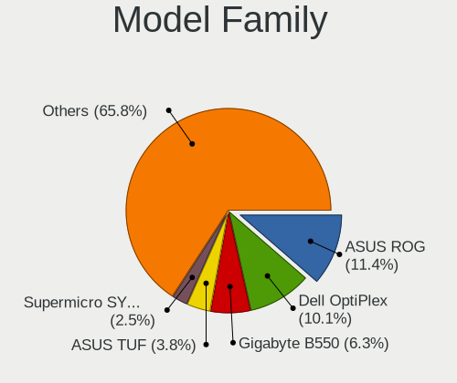
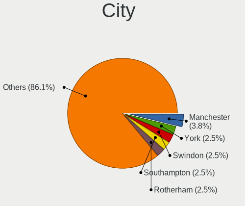
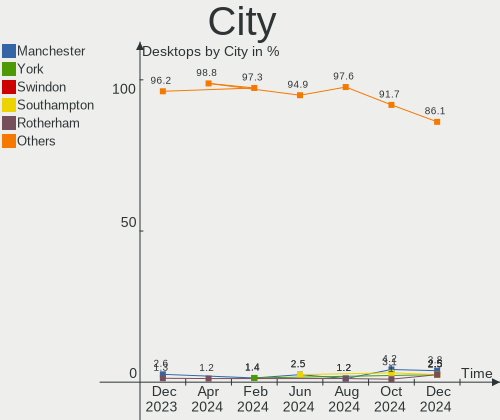
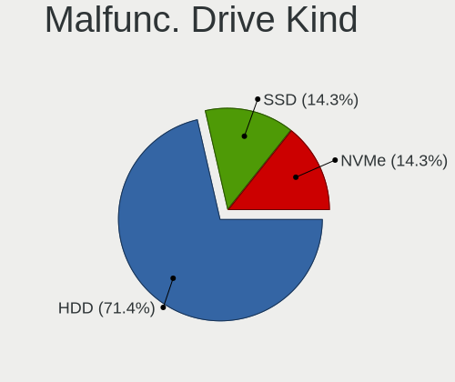
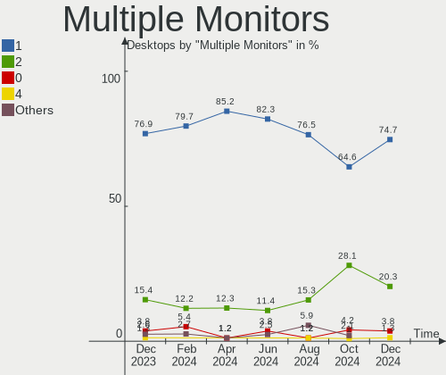
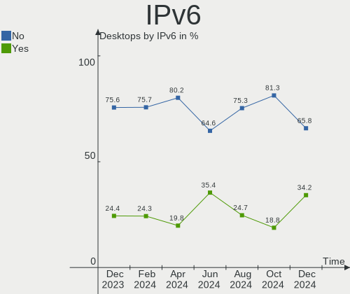
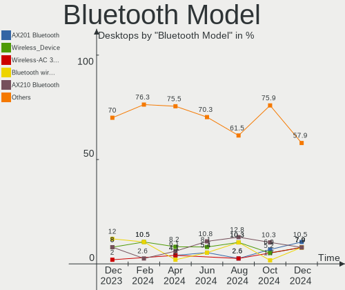
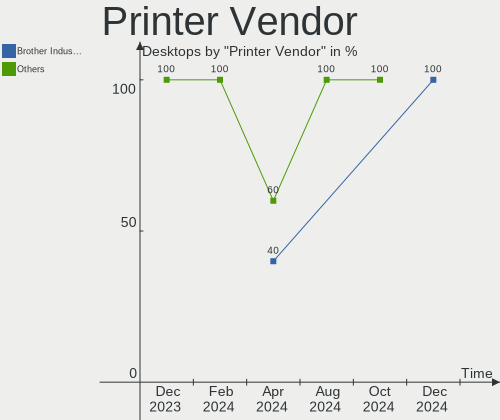
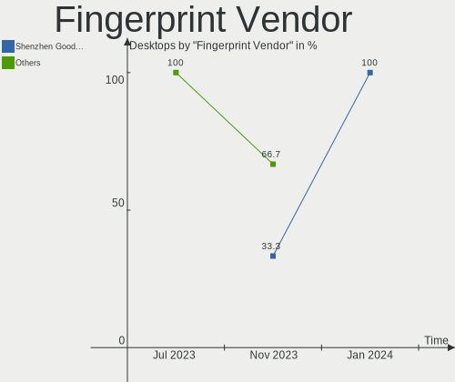

Linux in UK - Hardware Trends (Desktops)
----------------------------------------

A project to identify most popular hardware characteristics and track their change
over time based on data collected by Linux users at https://Linux-Hardware.org.

Anyone can contribute to this report by the [hw-probe](https://github.com/linuxhw/hw-probe) tool:

    sudo -E hw-probe -all -upload

Contents
--------

* [ System ](#system)
  - [ OS                       ](#os)
  - [ OS Family                ](#os-family)
  - [ Kernel                   ](#kernel)
  - [ Kernel Family            ](#kernel-family)
  - [ Kernel Major Ver.        ](#kernel-major-ver)
  - [ Arch                     ](#arch)
  - [ DE                       ](#de)
  - [ Display Server           ](#display-server)
  - [ Display Manager          ](#display-manager)
  - [ OS Lang                  ](#os-lang)
  - [ Boot Mode                ](#boot-mode)
  - [ Filesystem               ](#filesystem)
  - [ Part. scheme             ](#part-scheme)
  - [ Dual Boot with Linux/BSD ](#dual-boot-with-linuxbsd)
  - [ Dual Boot (Win)          ](#dual-boot-win)

* [ Board ](#board)
  - [ Vendor                   ](#vendor)
  - [ Model                    ](#model)
  - [ Model Family             ](#model-family)
  - [ MFG Year                 ](#mfg-year)
  - [ Form Factor              ](#form-factor)
  - [ Secure Boot              ](#secure-boot)
  - [ Coreboot                 ](#coreboot)
  - [ RAM Size                 ](#ram-size)
  - [ RAM Used                 ](#ram-used)
  - [ Total Drives             ](#total-drives)
  - [ Has CD-ROM               ](#has-cd-rom)
  - [ Has Ethernet             ](#has-ethernet)
  - [ Has WiFi                 ](#has-wifi)
  - [ Has Bluetooth            ](#has-bluetooth)

* [ Location ](#location)
  - [ Country                  ](#country)
  - [ City                     ](#city)

* [ Drives ](#drives)
  - [ Drive Vendor             ](#drive-vendor)
  - [ Drive Model              ](#drive-model)
  - [ HDD Vendor               ](#hdd-vendor)
  - [ SSD Vendor               ](#ssd-vendor)
  - [ Drive Kind               ](#drive-kind)
  - [ Drive Connector          ](#drive-connector)
  - [ Drive Size               ](#drive-size)
  - [ Space Total              ](#space-total)
  - [ Space Used               ](#space-used)
  - [ Malfunc. Drives          ](#malfunc-drives)
  - [ Malfunc. Drive Vendor    ](#malfunc-drive-vendor)
  - [ Malfunc. HDD Vendor      ](#malfunc-hdd-vendor)
  - [ Malfunc. Drive Kind      ](#malfunc-drive-kind)
  - [ Failed Drives            ](#failed-drives)
  - [ Failed Drive Vendor      ](#failed-drive-vendor)
  - [ Drive Status             ](#drive-status)

* [ Storage controller ](#storage-controller)
  - [ Storage Vendor           ](#storage-vendor)
  - [ Storage Model            ](#storage-model)
  - [ Storage Kind             ](#storage-kind)

* [ Processor ](#processor)
  - [ CPU Vendor               ](#cpu-vendor)
  - [ CPU Model                ](#cpu-model)
  - [ CPU Model Family         ](#cpu-model-family)
  - [ CPU Cores                ](#cpu-cores)
  - [ CPU Sockets              ](#cpu-sockets)
  - [ CPU Threads              ](#cpu-threads)
  - [ CPU Op-Modes             ](#cpu-op-modes)
  - [ CPU Microcode            ](#cpu-microcode)
  - [ CPU Microarch            ](#cpu-microarch)

* [ Graphics ](#graphics)
  - [ GPU Vendor               ](#gpu-vendor)
  - [ GPU Model                ](#gpu-model)
  - [ GPU Combo                ](#gpu-combo)
  - [ GPU Driver               ](#gpu-driver)
  - [ GPU Memory               ](#gpu-memory)

* [ Monitor ](#monitor)
  - [ Monitor Vendor           ](#monitor-vendor)
  - [ Monitor Model            ](#monitor-model)
  - [ Monitor Resolution       ](#monitor-resolution)
  - [ Monitor Diagonal         ](#monitor-diagonal)
  - [ Monitor Width            ](#monitor-width)
  - [ Aspect Ratio             ](#aspect-ratio)
  - [ Monitor Area             ](#monitor-area)
  - [ Pixel Density            ](#pixel-density)
  - [ Multiple Monitors        ](#multiple-monitors)

* [ Network ](#network)
  - [ Net Controller Vendor    ](#net-controller-vendor)
  - [ Net Controller Model     ](#net-controller-model)
  - [ Wireless Vendor          ](#wireless-vendor)
  - [ Wireless Model           ](#wireless-model)
  - [ Ethernet Vendor          ](#ethernet-vendor)
  - [ Ethernet Model           ](#ethernet-model)
  - [ Net Controller Kind      ](#net-controller-kind)
  - [ Used Controller          ](#used-controller)
  - [ NICs                     ](#nics)
  - [ IPv6                     ](#ipv6)

* [ Bluetooth ](#bluetooth)
  - [ Bluetooth Vendor         ](#bluetooth-vendor)
  - [ Bluetooth Model          ](#bluetooth-model)

* [ Sound ](#sound)
  - [ Sound Vendor             ](#sound-vendor)
  - [ Sound Model              ](#sound-model)

* [ Memory ](#memory)
  - [ Memory Vendor            ](#memory-vendor)
  - [ Memory Model             ](#memory-model)
  - [ Memory Kind              ](#memory-kind)
  - [ Memory Form Factor       ](#memory-form-factor)
  - [ Memory Size              ](#memory-size)
  - [ Memory Speed             ](#memory-speed)

* [ Printers & scanners ](#printers--scanners)
  - [ Printer Vendor           ](#printer-vendor)
  - [ Printer Model            ](#printer-model)
  - [ Scanner Vendor           ](#scanner-vendor)
  - [ Scanner Model            ](#scanner-model)

* [ Camera ](#camera)
  - [ Camera Vendor            ](#camera-vendor)
  - [ Camera Model             ](#camera-model)

* [ Security ](#security)
  - [ Fingerprint Vendor       ](#fingerprint-vendor)
  - [ Fingerprint Model        ](#fingerprint-model)
  - [ Chipcard Vendor          ](#chipcard-vendor)
  - [ Chipcard Model           ](#chipcard-model)

* [ Unsupported ](#unsupported)
  - [ Unsupported Devices      ](#unsupported-devices)
  - [ Unsupported Device Types ](#unsupported-device-types)

System
------

OS
--

Installed operating systems

| Name               | Desktops | Percent |
|--------------------|----------|---------|
| Ubuntu 22.04       | 14       | 20.59%  |
| Linux Mint 20.3    | 6        | 8.82%   |
| Ubuntu 20.04       | 4        | 5.88%   |
| Pop!_OS 22.04      | 4        | 5.88%   |
| KDE neon 20.04     | 4        | 5.88%   |
| Zorin 16           | 3        | 4.41%   |
| Ubuntu 18.04       | 3        | 4.41%   |
| Fedora 36          | 3        | 4.41%   |
| Linux Mint 19.1    | 2        | 2.94%   |
| Kubuntu 20.04      | 2        | 2.94%   |
| Debian 11          | 2        | 2.94%   |
| ArcoLinux Rolling  | 2        | 2.94%   |
| Ubuntu 21.04       | 1        | 1.47%   |
| Ubuntu 16.04       | 1        | 1.47%   |
| SteamOS Snapshot   | 1        | 1.47%   |
| ROSA 12.2          | 1        | 1.47%   |
| RHEL 8             | 1        | 1.47%   |
| Pop!_OS 21.10      | 1        | 1.47%   |
| openSUSE Leap-15.4 | 1        | 1.47%   |
| openSUSE Leap-15.3 | 1        | 1.47%   |
| OpenMandriva 4.3   | 1        | 1.47%   |
| NixOS 22.05        | 1        | 1.47%   |
| Manjaro            | 1        | 1.47%   |
| Lubuntu 22.04      | 1        | 1.47%   |
| Lubuntu 21.10      | 1        | 1.47%   |
| LMDE 5             | 1        | 1.47%   |
| Kali 2022.2        | 1        | 1.47%   |
| Kaisen 2.0         | 1        | 1.47%   |
| Debian Testing     | 1        | 1.47%   |
| Clear Linux 36410  | 1        | 1.47%   |
| Arch Rolling       | 1        | 1.47%   |

OS Family
---------

OS without a version

| Name         | Desktops | Percent |
|--------------|----------|---------|
| Ubuntu       | 23       | 33.82%  |
| Linux Mint   | 8        | 11.76%  |
| Pop!_OS      | 5        | 7.35%   |
| KDE neon     | 4        | 5.88%   |
| Zorin        | 3        | 4.41%   |
| Fedora       | 3        | 4.41%   |
| Debian       | 3        | 4.41%   |
| openSUSE     | 2        | 2.94%   |
| Lubuntu      | 2        | 2.94%   |
| Kubuntu      | 2        | 2.94%   |
| ArcoLinux    | 2        | 2.94%   |
| SteamOS      | 1        | 1.47%   |
| ROSA         | 1        | 1.47%   |
| RHEL         | 1        | 1.47%   |
| OpenMandriva | 1        | 1.47%   |
| NixOS        | 1        | 1.47%   |
| Manjaro      | 1        | 1.47%   |
| LMDE         | 1        | 1.47%   |
| Kali         | 1        | 1.47%   |
| Kaisen       | 1        | 1.47%   |
| Clear Linux  | 1        | 1.47%   |
| Arch         | 1        | 1.47%   |

Kernel
------

Version of the Linux kernel

| Version                                            | Desktops | Percent |
|----------------------------------------------------|----------|---------|
| 5.13.0-41-generic                                  | 7        | 10.29%  |
| 5.15.0-33-generic                                  | 6        | 8.82%   |
| 5.4.0-110-generic                                  | 5        | 7.35%   |
| 5.17.5-76051705-generic                            | 5        | 7.35%   |
| 5.15.0-27-generic                                  | 5        | 7.35%   |
| 5.13.0-40-generic                                  | 5        | 7.35%   |
| 4.15.0-176-generic                                 | 3        | 4.41%   |
| 5.4.0-109-generic                                  | 2        | 2.94%   |
| 5.17.8-300.fc36.x86_64                             | 2        | 2.94%   |
| 5.15.0-30-generic                                  | 2        | 2.94%   |
| 5.10.0-14-amd64                                    | 2        | 2.94%   |
| 5.3.18-150300.59.60-default                        | 1        | 1.47%   |
| 5.18.0-051800-generic                              | 1        | 1.47%   |
| 5.17.9-xanmod1-x64v2                               | 1        | 1.47%   |
| 5.17.9-arch1-1                                     | 1        | 1.47%   |
| 5.17.7-arch1-1                                     | 1        | 1.47%   |
| 5.17.5-zen1-1-zen                                  | 1        | 1.47%   |
| 5.17.5-300.fc36.x86_64                             | 1        | 1.47%   |
| 5.17.0-1-amd64                                     | 1        | 1.47%   |
| 5.16.7-desktop-1omv4003                            | 1        | 1.47%   |
| 5.16.13-1132.native                                | 1        | 1.47%   |
| 5.16.0-kali7-amd64                                 | 1        | 1.47%   |
| 5.15.41-1-MANJARO                                  | 1        | 1.47%   |
| 5.15.34                                            | 1        | 1.47%   |
| 5.15.0-kaisen1-amd64                               | 1        | 1.47%   |
| 5.14.21-150400.19-default                          | 1        | 1.47%   |
| 5.14.0-1038-oem                                    | 1        | 1.47%   |
| 5.13.19-6-pve                                      | 1        | 1.47%   |
| 5.13.0-valve10.1-2-neptune-dri-02144-g7fffaf925dfb | 1        | 1.47%   |
| 5.11.0-25-generic                                  | 1        | 1.47%   |
| 5.10.74-generic-2rosa2021.1-x86_64                 | 1        | 1.47%   |
| 4.18.0-348.20.1.el8_5.x86_64                       | 1        | 1.47%   |
| 4.15.0-177-generic                                 | 1        | 1.47%   |
| 4.15.0-167-generic                                 | 1        | 1.47%   |
| 4.15.0-142-generic                                 | 1        | 1.47%   |

Kernel Family
-------------

Linux kernel without a distro release

| Version | Desktops | Percent |
|---------|----------|---------|
| 5.15.0  | 14       | 20.59%  |
| 5.13.0  | 13       | 19.12%  |
| 5.4.0   | 7        | 10.29%  |
| 5.17.5  | 7        | 10.29%  |
| 4.15.0  | 6        | 8.82%   |
| 5.17.9  | 2        | 2.94%   |
| 5.17.8  | 2        | 2.94%   |
| 5.10.0  | 2        | 2.94%   |
| 5.3.18  | 1        | 1.47%   |
| 5.18.0  | 1        | 1.47%   |
| 5.17.7  | 1        | 1.47%   |
| 5.17.0  | 1        | 1.47%   |
| 5.16.7  | 1        | 1.47%   |
| 5.16.13 | 1        | 1.47%   |
| 5.16.0  | 1        | 1.47%   |
| 5.15.41 | 1        | 1.47%   |
| 5.15.34 | 1        | 1.47%   |
| 5.14.21 | 1        | 1.47%   |
| 5.14.0  | 1        | 1.47%   |
| 5.13.19 | 1        | 1.47%   |
| 5.11.0  | 1        | 1.47%   |
| 5.10.74 | 1        | 1.47%   |
| 4.18.0  | 1        | 1.47%   |

Kernel Major Ver.
-----------------

Linux kernel major version

| Version | Desktops | Percent |
|---------|----------|---------|
| 5.15    | 16       | 23.53%  |
| 5.13    | 14       | 20.59%  |
| 5.17    | 13       | 19.12%  |
| 5.4     | 7        | 10.29%  |
| 4.15    | 6        | 8.82%   |
| 5.16    | 3        | 4.41%   |
| 5.10    | 3        | 4.41%   |
| 5.14    | 2        | 2.94%   |
| 5.3     | 1        | 1.47%   |
| 5.18    | 1        | 1.47%   |
| 5.11    | 1        | 1.47%   |
| 4.18    | 1        | 1.47%   |

Arch
----

OS architecture (x86_64, i586, etc.)

| Name   | Desktops | Percent |
|--------|----------|---------|
| x86_64 | 67       | 98.53%  |
| i686   | 1        | 1.47%   |

DE
--

Desktop Environment

| Name        | Desktops | Percent |
|-------------|----------|---------|
| GNOME       | 30       | 44.12%  |
| KDE5        | 12       | 17.65%  |
| X-Cinnamon  | 11       | 16.18%  |
| Unknown     | 6        | 8.82%   |
| XFCE        | 4        | 5.88%   |
| LXQt        | 3        | 4.41%   |
| WindowMaker | 1        | 1.47%   |
| Unity       | 1        | 1.47%   |

Display Server
--------------

X11 or Wayland

| Name    | Desktops | Percent |
|---------|----------|---------|
| X11     | 56       | 82.35%  |
| Wayland | 8        | 11.76%  |
| Unknown | 3        | 4.41%   |
| Tty     | 1        | 1.47%   |

Display Manager
---------------

SDDM, LightDM, etc.

| Name    | Desktops | Percent |
|---------|----------|---------|
| Unknown | 29       | 42.65%  |
| GDM3    | 19       | 27.94%  |
| LightDM | 10       | 14.71%  |
| SDDM    | 8        | 11.76%  |
| GDM     | 2        | 2.94%   |

OS Lang
-------

Language

| Lang    | Desktops | Percent |
|---------|----------|---------|
| en_GB   | 58       | 85.29%  |
| en_US   | 8        | 11.76%  |
| Unknown | 2        | 2.94%   |

Boot Mode
---------

EFI or BIOS

| Mode | Desktops | Percent |
|------|----------|---------|
| BIOS | 41       | 60.29%  |
| EFI  | 27       | 39.71%  |

Filesystem
----------

Type of filesystem

| Type    | Desktops | Percent |
|---------|----------|---------|
| Ext4    | 57       | 83.82%  |
| Btrfs   | 7        | 10.29%  |
| Overlay | 2        | 2.94%   |
| Xfs     | 1        | 1.47%   |
| Ext3    | 1        | 1.47%   |

Part. scheme
------------

Scheme of partitioning

| Type    | Desktops | Percent |
|---------|----------|---------|
| Unknown | 42       | 61.76%  |
| GPT     | 18       | 26.47%  |
| MBR     | 8        | 11.76%  |

Dual Boot with Linux/BSD
------------------------

Hosting more than one Linux/BSD

| Dual boot | Desktops | Percent |
|-----------|----------|---------|
| No        | 57       | 83.82%  |
| Yes       | 11       | 16.18%  |

Dual Boot (Win)
---------------

Hosting Linux and Windows

| Dual boot | Desktops | Percent |
|-----------|----------|---------|
| No        | 45       | 66.18%  |
| Yes       | 23       | 33.82%  |

Board
-----

Vendor
------

Motherboard manufacturer

| Name                | Desktops | Percent |
|---------------------|----------|---------|
| ASUSTek Computer    | 17       | 25%     |
| Gigabyte Technology | 14       | 20.59%  |
| MSI                 | 12       | 17.65%  |
| Dell                | 7        | 10.29%  |
| Hewlett-Packard     | 3        | 4.41%   |
| Lenovo              | 2        | 2.94%   |
| Intel               | 2        | 2.94%   |
| ASRock              | 2        | 2.94%   |
| Acer                | 2        | 2.94%   |
| YANYU               | 1        | 1.47%   |
| Seeed Studio        | 1        | 1.47%   |
| MW                  | 1        | 1.47%   |
| ECS                 | 1        | 1.47%   |
| AZW                 | 1        | 1.47%   |
| Apple               | 1        | 1.47%   |
| Unknown             | 1        | 1.47%   |

Model
-----

Motherboard model

| Name                                    | Desktops | Percent |
|-----------------------------------------|----------|---------|
| MSI MS-7C91                             | 2        | 2.94%   |
| MSI MS-7C56                             | 2        | 2.94%   |
| MSI MS-7C37                             | 2        | 2.94%   |
| ASUS PRIME H510M-E                      | 2        | 2.94%   |
| ASUS A68HM-PLUS                         | 2        | 2.94%   |
| YANYU ITX-N29 VER:1.3                   | 1        | 1.47%   |
| Seeed Studio ODYSSEY-X86J4125           | 1        | 1.47%   |
| MW GMLK-2_5G4L                          | 1        | 1.47%   |
| MSI VIG644M                             | 1        | 1.47%   |
| MSI p6-2475ea                           | 1        | 1.47%   |
| MSI MS-7D53                             | 1        | 1.47%   |
| MSI MS-7D09                             | 1        | 1.47%   |
| MSI MS-7C60                             | 1        | 1.47%   |
| MSI MS-7B78                             | 1        | 1.47%   |
| Lenovo ThinkCentre M73z 10BC0017UK      | 1        | 1.47%   |
| Lenovo IdeaCentre 310S-08ASR 90G9002VUK | 1        | 1.47%   |
| Intel DQ57TM                            | 1        | 1.47%   |
| Intel DQ35JO                            | 1        | 1.47%   |
| HP ProLiant ML110 Gen9                  | 1        | 1.47%   |
| HP Compaq Pro 6300 SFF                  | 1        | 1.47%   |
| HP Compaq dc5100 SFF(EC960ET)           | 1        | 1.47%   |
| Gigabyte Z97X-Gaming 5                  | 1        | 1.47%   |
| Gigabyte X99-UD4-CF                     | 1        | 1.47%   |
| Gigabyte X570 AORUS MASTER              | 1        | 1.47%   |
| Gigabyte X470 AORUS GAMING 7 WIFI       | 1        | 1.47%   |
| Gigabyte Q35M-S2                        | 1        | 1.47%   |
| Gigabyte MBB-670016                     | 1        | 1.47%   |
| Gigabyte GA-78LMT-USB3                  | 1        | 1.47%   |
| Gigabyte GA-78LMT-S2P                   | 1        | 1.47%   |
| Gigabyte BB-83508                       | 1        | 1.47%   |
| Gigabyte B85M-DS3H-A                    | 1        | 1.47%   |
| Gigabyte B85M-DS3H                      | 1        | 1.47%   |
| Gigabyte B450 AORUS PRO                 | 1        | 1.47%   |
| Gigabyte A320M-S2H                      | 1        | 1.47%   |
| Gigabyte 970A-DS3P                      | 1        | 1.47%   |
| ECS GF8100VM-M5                         | 1        | 1.47%   |
| Dell Precision WorkStation T3500        | 1        | 1.47%   |
| Dell Precision Tower 3420               | 1        | 1.47%   |
| Dell OptiPlex 780                       | 1        | 1.47%   |
| Dell OptiPlex 760                       | 1        | 1.47%   |
| Dell OptiPlex 7010                      | 1        | 1.47%   |
| Dell OptiPlex 5070                      | 1        | 1.47%   |
| Dell DM061                              | 1        | 1.47%   |
| AZW BT3 X                               | 1        | 1.47%   |
| ASUS ROG STRIX G15DK_G15DK              | 1        | 1.47%   |
| ASUS ROG STRIX B450-F GAMING II         | 1        | 1.47%   |
| ASUS ROG Maximus XI HERO                | 1        | 1.47%   |
| ASUS PRIME Z270-P                       | 1        | 1.47%   |
| ASUS PRIME B450M-A                      | 1        | 1.47%   |
| ASUS PRIME B350-PLUS                    | 1        | 1.47%   |
| ASUS PRIME A520M-K                      | 1        | 1.47%   |
| ASUS M5A78L-M/USB3                      | 1        | 1.47%   |
| ASUS H110M-R                            | 1        | 1.47%   |
| ASUS H110M-A/DP                         | 1        | 1.47%   |
| ASUS Amd Am4 Gen3                       | 1        | 1.47%   |
| ASUS All Series                         | 1        | 1.47%   |
| ASUS 970 PRO GAMING/AURA                | 1        | 1.47%   |
| ASRock Z390 Extreme4                    | 1        | 1.47%   |
| ASRock B250M-HDV                        | 1        | 1.47%   |
| Apple MacPro5,1                         | 1        | 1.47%   |

Model Family
------------

Motherboard model prefix

| Name                          | Desktops | Percent |
|-------------------------------|----------|---------|
| ASUS PRIME                    | 6        | 8.82%   |
| Dell OptiPlex                 | 4        | 5.88%   |
| ASUS ROG                      | 3        | 4.41%   |
| MSI MS-7C91                   | 2        | 2.94%   |
| MSI MS-7C56                   | 2        | 2.94%   |
| MSI MS-7C37                   | 2        | 2.94%   |
| HP Compaq                     | 2        | 2.94%   |
| Dell Precision                | 2        | 2.94%   |
| ASUS A68HM-PLUS               | 2        | 2.94%   |
| YANYU ITX-N29                 | 1        | 1.47%   |
| Seeed Studio ODYSSEY-X86J4125 | 1        | 1.47%   |
| MW GMLK-2                     | 1        | 1.47%   |
| MSI VIG644M                   | 1        | 1.47%   |
| MSI p6-2475ea                 | 1        | 1.47%   |
| MSI MS-7D53                   | 1        | 1.47%   |
| MSI MS-7D09                   | 1        | 1.47%   |
| MSI MS-7C60                   | 1        | 1.47%   |
| MSI MS-7B78                   | 1        | 1.47%   |
| Lenovo ThinkCentre            | 1        | 1.47%   |
| Lenovo IdeaCentre             | 1        | 1.47%   |
| Intel DQ57TM                  | 1        | 1.47%   |
| Intel DQ35JO                  | 1        | 1.47%   |
| HP ProLiant                   | 1        | 1.47%   |
| Gigabyte Z97X-Gaming          | 1        | 1.47%   |
| Gigabyte X99-UD4-CF           | 1        | 1.47%   |
| Gigabyte X570                 | 1        | 1.47%   |
| Gigabyte X470                 | 1        | 1.47%   |
| Gigabyte Q35M-S2              | 1        | 1.47%   |
| Gigabyte MBB-670016           | 1        | 1.47%   |
| Gigabyte GA-78LMT-USB3        | 1        | 1.47%   |
| Gigabyte GA-78LMT-S2P         | 1        | 1.47%   |
| Gigabyte BB-83508             | 1        | 1.47%   |
| Gigabyte B85M-DS3H-A          | 1        | 1.47%   |
| Gigabyte B85M-DS3H            | 1        | 1.47%   |
| Gigabyte B450                 | 1        | 1.47%   |
| Gigabyte A320M-S2H            | 1        | 1.47%   |
| Gigabyte 970A-DS3P            | 1        | 1.47%   |
| ECS GF8100VM-M5               | 1        | 1.47%   |
| Dell DM061                    | 1        | 1.47%   |
| AZW BT3                       | 1        | 1.47%   |
| ASUS M5A78L-M                 | 1        | 1.47%   |
| ASUS H110M-R                  | 1        | 1.47%   |
| ASUS H110M-A                  | 1        | 1.47%   |
| ASUS Amd                      | 1        | 1.47%   |
| ASUS All                      | 1        | 1.47%   |
| ASUS 970                      | 1        | 1.47%   |
| ASRock Z390                   | 1        | 1.47%   |
| ASRock B250M-HDV              | 1        | 1.47%   |
| Apple MacPro5                 | 1        | 1.47%   |
| Acer Revo                     | 1        | 1.47%   |
| Acer Aspire                   | 1        | 1.47%   |
| Unknown                       | 1        | 1.47%   |

MFG Year
--------

Motherboard manufacture year

| Year | Desktops | Percent |
|------|----------|---------|
| 2021 | 9        | 13.24%  |
| 2020 | 8        | 11.76%  |
| 2018 | 8        | 11.76%  |
| 2019 | 6        | 8.82%   |
| 2014 | 5        | 7.35%   |
| 2012 | 5        | 7.35%   |
| 2011 | 5        | 7.35%   |
| 2016 | 4        | 5.88%   |
| 2015 | 4        | 5.88%   |
| 2017 | 3        | 4.41%   |
| 2013 | 3        | 4.41%   |
| 2010 | 2        | 2.94%   |
| 2022 | 1        | 1.47%   |
| 2009 | 1        | 1.47%   |
| 2008 | 1        | 1.47%   |
| 2007 | 1        | 1.47%   |
| 2006 | 1        | 1.47%   |
| 2005 | 1        | 1.47%   |

Form Factor
-----------

Physical design of the computer

| Name    | Desktops | Percent |
|---------|----------|---------|
| Desktop | 68       | 100%    |

Secure Boot
-----------

Enabled or disabled

| State    | Desktops | Percent |
|----------|----------|---------|
| Disabled | 66       | 97.06%  |
| Enabled  | 2        | 2.94%   |

Coreboot
--------

Have coreboot on board

| Used | Desktops | Percent |
|------|----------|---------|
| No   | 68       | 100%    |

RAM Size
--------

Total RAM memory

| Size in GB      | Desktops | Percent |
|-----------------|----------|---------|
| 16.01-24.0      | 20       | 29.41%  |
| 8.01-16.0       | 14       | 20.59%  |
| 32.01-64.0      | 12       | 17.65%  |
| 4.01-8.0        | 10       | 14.71%  |
| 3.01-4.0        | 5        | 7.35%   |
| 24.01-32.0      | 3        | 4.41%   |
| 64.01-256.0     | 3        | 4.41%   |
| More than 256.0 | 1        | 1.47%   |

RAM Used
--------

Used RAM memory

| Used GB    | Desktops | Percent |
|------------|----------|---------|
| 2.01-3.0   | 24       | 35.29%  |
| 1.01-2.0   | 20       | 29.41%  |
| 3.01-4.0   | 10       | 14.71%  |
| 4.01-8.0   | 9        | 13.24%  |
| 0.51-1.0   | 4        | 5.88%   |
| 32.01-64.0 | 1        | 1.47%   |

Total Drives
------------

Number of drives on board

| Drives | Desktops | Percent |
|--------|----------|---------|
| 1      | 22       | 32.35%  |
| 2      | 19       | 27.94%  |
| 3      | 12       | 17.65%  |
| 4      | 9        | 13.24%  |
| 5      | 3        | 4.41%   |
| 9      | 1        | 1.47%   |
| 6      | 1        | 1.47%   |
| 0      | 1        | 1.47%   |

Has CD-ROM
----------

Has CD-ROM on board

| Presented | Desktops | Percent |
|-----------|----------|---------|
| No        | 35       | 51.47%  |
| Yes       | 33       | 48.53%  |

Has Ethernet
------------

Has Ethernet on board

| Presented | Desktops | Percent |
|-----------|----------|---------|
| Yes       | 68       | 100%    |

Has WiFi
--------

Has WiFi module

| Presented | Desktops | Percent |
|-----------|----------|---------|
| No        | 35       | 51.47%  |
| Yes       | 33       | 48.53%  |

Has Bluetooth
-------------

Has Bluetooth module

| Presented | Desktops | Percent |
|-----------|----------|---------|
| No        | 40       | 58.82%  |
| Yes       | 28       | 41.18%  |

Location
--------

Country
-------

Geographic location (country)

| Country | Desktops | Percent |
|---------|----------|---------|
| UK      | 68       | 100%    |

City
----

Geographic location (city)

| City              | Desktops | Percent |
|-------------------|----------|---------|
| London            | 6        | 8.82%   |
| Croydon           | 3        | 4.41%   |
| Sheerness         | 2        | 2.94%   |
| Manchester        | 2        | 2.94%   |
| Hackney           | 2        | 2.94%   |
| Didcot            | 2        | 2.94%   |
| Derby             | 2        | 2.94%   |
| Brighton          | 2        | 2.94%   |
| Yeovil            | 1        | 1.47%   |
| Weston-super-Mare | 1        | 1.47%   |
| Tillicoultry      | 1        | 1.47%   |
| Thornton Heath    | 1        | 1.47%   |
| Taunton           | 1        | 1.47%   |
| Tamworth          | 1        | 1.47%   |
| Stoke-on-Trent    | 1        | 1.47%   |
| Stockport         | 1        | 1.47%   |
| Stafford          | 1        | 1.47%   |
| St Helens         | 1        | 1.47%   |
| St Albans         | 1        | 1.47%   |
| South Shields     | 1        | 1.47%   |
| Seaford           | 1        | 1.47%   |
| Rotherham         | 1        | 1.47%   |
| Redruth           | 1        | 1.47%   |
| Redhill           | 1        | 1.47%   |
| Pontypool         | 1        | 1.47%   |
| Penarth           | 1        | 1.47%   |
| Notting Hill Gate | 1        | 1.47%   |
| Norwich           | 1        | 1.47%   |
| Northampton       | 1        | 1.47%   |
| Newport           | 1        | 1.47%   |
| Melton Mowbray    | 1        | 1.47%   |
| Malton            | 1        | 1.47%   |
| Liverpool         | 1        | 1.47%   |
| Lichfield         | 1        | 1.47%   |
| Kirkcaldy         | 1        | 1.47%   |
| Ipswich           | 1        | 1.47%   |
| Hornsea           | 1        | 1.47%   |
| Holyhead          | 1        | 1.47%   |
| Harlesden         | 1        | 1.47%   |
| Guildford         | 1        | 1.47%   |
| Gloucester        | 1        | 1.47%   |
| Glasgow           | 1        | 1.47%   |
| Eggington         | 1        | 1.47%   |
| Edinburgh         | 1        | 1.47%   |
| Claygate          | 1        | 1.47%   |
| Clapham           | 1        | 1.47%   |
| Cannock           | 1        | 1.47%   |
| Cambridge         | 1        | 1.47%   |
| Bury              | 1        | 1.47%   |
| Bridgend          | 1        | 1.47%   |
| Birmingham        | 1        | 1.47%   |
| Barnsley          | 1        | 1.47%   |
| Barnet            | 1        | 1.47%   |
| Bangor            | 1        | 1.47%   |
| Balham            | 1        | 1.47%   |

Drives
------

Drive Vendor
------------

Hard drive vendors

| Vendor              | Desktops | Drives | Percent |
|---------------------|----------|--------|---------|
| Seagate             | 28       | 35     | 21.71%  |
| WDC                 | 21       | 33     | 16.28%  |
| Samsung Electronics | 19       | 25     | 14.73%  |
| Crucial             | 10       | 13     | 7.75%   |
| SanDisk             | 9        | 9      | 6.98%   |
| Kingston            | 9        | 10     | 6.98%   |
| Toshiba             | 6        | 7      | 4.65%   |
| Phison              | 3        | 3      | 2.33%   |
| Hitachi             | 3        | 3      | 2.33%   |
| Unknown             | 2        | 2      | 1.55%   |
| A-DATA Technology   | 2        | 3      | 1.55%   |
| Verbatim            | 1        | 1      | 0.78%   |
| USB3.2              | 1        | 1      | 0.78%   |
| TO Exter            | 1        | 1      | 0.78%   |
| SK Hynix            | 1        | 1      | 0.78%   |
| Silicon Motion      | 1        | 1      | 0.78%   |
| PNY                 | 1        | 1      | 0.78%   |
| OCZ-AGIL            | 1        | 1      | 0.78%   |
| Netac               | 1        | 1      | 0.78%   |
| Micron Technology   | 1        | 1      | 0.78%   |
| MAXTOR              | 1        | 2      | 0.78%   |
| LITEONIT            | 1        | 1      | 0.78%   |
| Intel               | 1        | 1      | 0.78%   |
| HPE                 | 1        | 2      | 0.78%   |
| H/W                 | 1        | 1      | 0.78%   |
| Gigabyte Technology | 1        | 1      | 0.78%   |
| China               | 1        | 1      | 0.78%   |
| BIWIN               | 1        | 1      | 0.78%   |

Drive Model
-----------

Hard drive models

| Model                                 | Desktops | Percent |
|---------------------------------------|----------|---------|
| Seagate ST2000DM001-1ER164 2TB        | 3        | 2.01%   |
| Seagate ST1000DM010-2EP102 1TB        | 3        | 2.01%   |
| Samsung SSD 850 EVO 250GB             | 3        | 2.01%   |
| Crucial CT500MX500SSD1 500GB          | 3        | 2.01%   |
| Crucial CT1000MX500SSD1 1TB           | 3        | 2.01%   |
| Toshiba HDWD110 1TB                   | 2        | 1.34%   |
| Seagate ST2000DM008-2FR102 2TB        | 2        | 1.34%   |
| Seagate ST2000DM006-2DM164 2TB        | 2        | 1.34%   |
| Seagate ST1000LM035-1RK172 1TB        | 2        | 1.34%   |
| Seagate BUP Slim BL 1TB               | 2        | 1.34%   |
| SanDisk SSD PLUS 240GB                | 2        | 1.34%   |
| SanDisk SDSSDHII240G 240GB            | 2        | 1.34%   |
| Samsung SSD 970 EVO Plus 500GB        | 2        | 1.34%   |
| Samsung SSD 970 EVO Plus 250GB        | 2        | 1.34%   |
| Samsung NVMe SSD Drive 512GB          | 2        | 1.34%   |
| Samsung NVMe SSD Drive 1TB            | 2        | 1.34%   |
| WDC WDS500G2B0A-00SM50 500GB SSD      | 1        | 0.67%   |
| WDC WDS500G2B0A 500GB SSD             | 1        | 0.67%   |
| WDC WDS256G1X0C-00ENX0 256GB          | 1        | 0.67%   |
| WDC WDS240G2G0A-00JH30 240GB SSD      | 1        | 0.67%   |
| WDC WDS120G1G0A-00SS50 120GB SSD      | 1        | 0.67%   |
| WDC WD80EZAZ-11TDBA0 8TB              | 1        | 0.67%   |
| WDC WD7500AADS-00M2B0 752GB           | 1        | 0.67%   |
| WDC WD60EFRX-68L0BN1 6TB              | 1        | 0.67%   |
| WDC WD6003FZBX-00K5WB0 6TB            | 1        | 0.67%   |
| WDC WD5002AALX-00J37A0 500GB          | 1        | 0.67%   |
| WDC WD5000BEVT-35A0RT0 500GB          | 1        | 0.67%   |
| WDC WD5000AAKX-07U6AA0 500GB          | 1        | 0.67%   |
| WDC WD40EZRZ-00WN9B0 4TB              | 1        | 0.67%   |
| WDC WD20EZRZ-00Z5HB0 2TB              | 1        | 0.67%   |
| WDC WD20EARS-00MVWB0 2TB              | 1        | 0.67%   |
| WDC WD2005FBYZ-01YCBB2 2TB            | 1        | 0.67%   |
| WDC WD1600JS-75NCB3 160GB             | 1        | 0.67%   |
| WDC WD1600JD-75HBB0 160GB             | 1        | 0.67%   |
| WDC WD140EDGZ-11B1PA0 14TB            | 1        | 0.67%   |
| WDC WD10EZEX-60WN4A1 1TB              | 1        | 0.67%   |
| WDC WD10EZEX-21WN4A0 1TB              | 1        | 0.67%   |
| WDC WD10EZEX-08M2NA0 1TB              | 1        | 0.67%   |
| WDC WD10EZEX-00BBHA0 1TB              | 1        | 0.67%   |
| WDC PC SN530 SDBPNPZ-512G-1002 512GB  | 1        | 0.67%   |
| Verbatim Vi550 S3 SSD 256GB           | 1        | 0.67%   |
| USB3.2 FLASH DRIVE 128GB              | 1        | 0.67%   |
| Unknown MMC Card  64GB                | 1        | 0.67%   |
| Unknown DA4064  64GB                  | 1        | 0.67%   |
| Toshiba MQ01ABD100 1TB                | 1        | 0.67%   |
| Toshiba MK1032GSX 100GB               | 1        | 0.67%   |
| Toshiba KBG30ZMS128G 128GB NVMe SSD   | 1        | 0.67%   |
| Toshiba HDWR160 6TB                   | 1        | 0.67%   |
| Toshiba HDWD130 3TB                   | 1        | 0.67%   |
| TO Exter nal USB 3.0 320GB            | 1        | 0.67%   |
| SK Hynix HFS256G32MND-3310A 256GB SSD | 1        | 0.67%   |
| Silicon Motion NVMe SSD Drive 128GB   | 1        | 0.67%   |
| Seagate ST8000DM004-2CX188 8TB        | 1        | 0.67%   |
| Seagate ST6000DM003-2CY186 6TB        | 1        | 0.67%   |
| Seagate ST500LT012-1DG142 500GB       | 1        | 0.67%   |
| Seagate ST4000NE001-2MA101 4TB        | 1        | 0.67%   |
| Seagate ST4000DM004-2CV104 4TB        | 1        | 0.67%   |
| Seagate ST3500312CS 500GB             | 1        | 0.67%   |
| Seagate ST3160318AS 160GB             | 1        | 0.67%   |
| Seagate ST2000LM007-1R8174 2TB        | 1        | 0.67%   |

HDD Vendor
----------

Hard disk drive vendors

| Vendor              | Desktops | Drives | Percent |
|---------------------|----------|--------|---------|
| Seagate             | 27       | 32     | 49.09%  |
| WDC                 | 16       | 27     | 29.09%  |
| Toshiba             | 5        | 6      | 9.09%   |
| Hitachi             | 3        | 3      | 5.45%   |
| Samsung Electronics | 2        | 2      | 3.64%   |
| MAXTOR              | 1        | 2      | 1.82%   |
| HPE                 | 1        | 2      | 1.82%   |

SSD Vendor
----------

Solid state drive vendors

| Vendor              | Desktops | Drives | Percent |
|---------------------|----------|--------|---------|
| Samsung Electronics | 11       | 12     | 22.45%  |
| Crucial             | 9        | 12     | 18.37%  |
| SanDisk             | 6        | 6      | 12.24%  |
| Kingston            | 6        | 6      | 12.24%  |
| WDC                 | 4        | 4      | 8.16%   |
| A-DATA Technology   | 2        | 3      | 4.08%   |
| Verbatim            | 1        | 1      | 2.04%   |
| TO Exter            | 1        | 1      | 2.04%   |
| SK Hynix            | 1        | 1      | 2.04%   |
| PNY                 | 1        | 1      | 2.04%   |
| OCZ-AGIL            | 1        | 1      | 2.04%   |
| Netac               | 1        | 1      | 2.04%   |
| Micron Technology   | 1        | 1      | 2.04%   |
| LITEONIT            | 1        | 1      | 2.04%   |
| Gigabyte Technology | 1        | 1      | 2.04%   |
| China               | 1        | 1      | 2.04%   |
| BIWIN               | 1        | 1      | 2.04%   |

Drive Kind
----------

HDD or SSD

| Kind    | Desktops | Drives | Percent |
|---------|----------|--------|---------|
| HDD     | 46       | 74     | 41.82%  |
| SSD     | 37       | 54     | 33.64%  |
| NVMe    | 21       | 28     | 19.09%  |
| Unknown | 4        | 4      | 3.64%   |
| MMC     | 2        | 2      | 1.82%   |

Drive Connector
---------------

SATA, SAS, NVMe, etc.

| Type | Desktops | Drives | Percent |
|------|----------|--------|---------|
| SATA | 62       | 123    | 66.67%  |
| NVMe | 21       | 28     | 22.58%  |
| SAS  | 8        | 9      | 8.6%    |
| MMC  | 2        | 2      | 2.15%   |

Drive Size
----------

Size of hard drive

| Size in TB | Desktops | Drives | Percent |
|------------|----------|--------|---------|
| 0.01-0.5   | 36       | 59     | 41.86%  |
| 0.51-1.0   | 24       | 30     | 27.91%  |
| 1.01-2.0   | 13       | 17     | 15.12%  |
| 3.01-4.0   | 6        | 8      | 6.98%   |
| 4.01-10.0  | 5        | 9      | 5.81%   |
| 2.01-3.0   | 1        | 1      | 1.16%   |
| 10.01-20.0 | 1        | 4      | 1.16%   |

Space Total
-----------

Amount of disk space available on the file system

| Size in GB     | Desktops | Percent |
|----------------|----------|---------|
| 101-250        | 17       | 25%     |
| 1001-2000      | 11       | 16.18%  |
| 501-1000       | 10       | 14.71%  |
| More than 3000 | 9        | 13.24%  |
| 251-500        | 8        | 11.76%  |
| 51-100         | 6        | 8.82%   |
| Unknown        | 5        | 7.35%   |
| 2001-3000      | 2        | 2.94%   |

Space Used
----------

Amount of used disk space

| Used GB        | Desktops | Percent |
|----------------|----------|---------|
| 1-20           | 20       | 29.41%  |
| 21-50          | 12       | 17.65%  |
| 251-500        | 7        | 10.29%  |
| 101-250        | 6        | 8.82%   |
| 51-100         | 6        | 8.82%   |
| 501-1000       | 5        | 7.35%   |
| Unknown        | 5        | 7.35%   |
| 1001-2000      | 4        | 5.88%   |
| More than 3000 | 2        | 2.94%   |
| 2001-3000      | 1        | 1.47%   |

Malfunc. Drives
---------------

Drive models with a malfunction

| Model                            | Desktops | Drives | Percent |
|----------------------------------|----------|--------|---------|
| Seagate ST500LT012-1DG142 500GB  | 1        | 1      | 33.33%  |
| Seagate ST2000DM001-1CH164 2TB   | 1        | 1      | 33.33%  |
| Samsung Electronics HD080HJ 80GB | 1        | 1      | 33.33%  |

Malfunc. Drive Vendor
---------------------

Vendors of faulty drives

| Vendor              | Desktops | Drives | Percent |
|---------------------|----------|--------|---------|
| Seagate             | 2        | 2      | 66.67%  |
| Samsung Electronics | 1        | 1      | 33.33%  |

Malfunc. HDD Vendor
-------------------

Vendors of faulty HDD drives

| Vendor              | Desktops | Drives | Percent |
|---------------------|----------|--------|---------|
| Seagate             | 2        | 2      | 66.67%  |
| Samsung Electronics | 1        | 1      | 33.33%  |

Malfunc. Drive Kind
-------------------

Kinds of faulty drives

| Kind | Desktops | Drives | Percent |
|------|----------|--------|---------|
| HDD  | 3        | 3      | 100%    |

Failed Drives
-------------

Failed drive models

Zero info for selected period =(

Failed Drive Vendor
-------------------

Failed drive vendors

Zero info for selected period =(

Drive Status
------------

Number of failed and malfunc. drives

| Status   | Desktops | Drives | Percent |
|----------|----------|--------|---------|
| Detected | 44       | 100    | 63.77%  |
| Works    | 22       | 59     | 31.88%  |
| Malfunc  | 3        | 3      | 4.35%   |

Storage controller
------------------

Storage Vendor
--------------

Storage controller vendors

| Vendor                       | Desktops | Percent |
|------------------------------|----------|---------|
| Intel                        | 37       | 37%     |
| AMD                          | 29       | 29%     |
| Samsung Electronics          | 10       | 10%     |
| Sandisk                      | 5        | 5%      |
| ASMedia Technology           | 5        | 5%      |
| Phison Electronics           | 3        | 3%      |
| Kingston Technology Company  | 3        | 3%      |
| Toshiba America Info Systems | 1        | 1%      |
| Silicon Motion               | 1        | 1%      |
| Seagate Technology           | 1        | 1%      |
| Nvidia                       | 1        | 1%      |
| Micron/Crucial Technology    | 1        | 1%      |
| Marvell Technology Group     | 1        | 1%      |
| JMicron Technology           | 1        | 1%      |
| Broadcom / LSI               | 1        | 1%      |

Storage Model
-------------

Storage controller models

| Model                                                                          | Desktops | Percent |
|--------------------------------------------------------------------------------|----------|---------|
| AMD FCH SATA Controller [AHCI mode]                                            | 16       | 13.33%  |
| Samsung NVMe SSD Controller SM981/PM981/PM983                                  | 7        | 5.83%   |
| AMD 500 Series Chipset SATA Controller                                         | 6        | 5%      |
| AMD SB7x0/SB8x0/SB9x0 IDE Controller                                           | 5        | 4.17%   |
| AMD 400 Series Chipset SATA Controller                                         | 5        | 4.17%   |
| ASMedia ASM1062 Serial ATA Controller                                          | 4        | 3.33%   |
| Phison E12 NVMe Controller                                                     | 3        | 2.5%    |
| Intel Q170/Q150/B150/H170/H110/Z170/CM236 Chipset SATA Controller [AHCI Mode]  | 3        | 2.5%    |
| Intel Celeron/Pentium Silver Processor SATA Controller                         | 3        | 2.5%    |
| Intel Cannon Lake PCH SATA AHCI Controller                                     | 3        | 2.5%    |
| Intel 8 Series/C220 Series Chipset Family 6-port SATA Controller 1 [AHCI mode] | 3        | 2.5%    |
| Intel 500 Series Chipset Family SATA AHCI Controller                           | 3        | 2.5%    |
| AMD SB7x0/SB8x0/SB9x0 SATA Controller [IDE mode]                               | 3        | 2.5%    |
| Kingston Company A2000 NVMe SSD                                                | 2        | 1.67%   |
| Intel 9 Series Chipset Family SATA Controller [AHCI Mode]                      | 2        | 1.67%   |
| Intel 82801JI (ICH10 Family) SATA AHCI Controller                              | 2        | 1.67%   |
| Intel 82801JD/DO (ICH10 Family) SATA AHCI Controller                           | 2        | 1.67%   |
| Intel 7 Series/C210 Series Chipset Family 6-port SATA Controller [AHCI mode]   | 2        | 1.67%   |
| Intel 200 Series PCH SATA controller [AHCI mode]                               | 2        | 1.67%   |
| AMD SB7x0/SB8x0/SB9x0 SATA Controller [AHCI mode]                              | 2        | 1.67%   |
| Toshiba America Info Systems XG6 NVMe SSD Controller                           | 1        | 0.83%   |
| Silicon Motion SM2263EN/SM2263XT SSD Controller                                | 1        | 0.83%   |
| Seagate FireCuda 520 SSD                                                       | 1        | 0.83%   |
| Sandisk WD PC SN810 / Black SN850 NVMe SSD                                     | 1        | 0.83%   |
| Sandisk WD Blue SN570 NVMe SSD                                                 | 1        | 0.83%   |
| Sandisk WD Blue SN550 NVMe SSD                                                 | 1        | 0.83%   |
| Sandisk WD Blue SN500 / PC SN520 NVMe SSD                                      | 1        | 0.83%   |
| Sandisk WD Black NVMe SSD                                                      | 1        | 0.83%   |
| Samsung NVMe SSD Controller SM961/PM961/SM963                                  | 1        | 0.83%   |
| Samsung NVMe SSD Controller SM951/PM951                                        | 1        | 0.83%   |
| Samsung NVMe SSD Controller PM9A1/PM9A3/980PRO                                 | 1        | 0.83%   |
| Nvidia MCP78S [GeForce 8200] SATA Controller (non-AHCI mode)                   | 1        | 0.83%   |
| Nvidia MCP78S [GeForce 8200] IDE                                               | 1        | 0.83%   |
| Micron/Crucial Non-Volatile memory controller                                  | 1        | 0.83%   |
| Marvell Group 88SE6101/6102 single-port PATA133 interface                      | 1        | 0.83%   |
| Kingston Company OM3PDP3 NVMe SSD                                              | 1        | 0.83%   |
| JMicron JMB368 IDE controller                                                  | 1        | 0.83%   |
| Intel SSD Pro 7600p/760p/E 6100p Series                                        | 1        | 0.83%   |
| Intel SATA Controller [RAID mode]                                              | 1        | 0.83%   |
| Intel Celeron N3350/Pentium N4200/Atom E3900 Series SATA AHCI Controller       | 1        | 0.83%   |
| Intel C610/X99 series chipset sSATA Controller [RAID mode]                     | 1        | 0.83%   |
| Intel C610/X99 series chipset sSATA Controller [AHCI mode]                     | 1        | 0.83%   |
| Intel C610/X99 series chipset SATA Controller [RAID mode]                      | 1        | 0.83%   |
| Intel Atom Processor E3800 Series SATA IDE Controller                          | 1        | 0.83%   |
| Intel 82Q35 Express PT IDER Controller                                         | 1        | 0.83%   |
| Intel 82801IR/IO/IH (ICH9R/DO/DH) 6 port SATA Controller [AHCI mode]           | 1        | 0.83%   |
| Intel 82801IR/IO/IH (ICH9R/DO/DH) 4 port SATA Controller [IDE mode]            | 1        | 0.83%   |
| Intel 82801I (ICH9 Family) 2 port SATA Controller [IDE mode]                   | 1        | 0.83%   |
| Intel 82801HR/HO/HH (ICH8R/DO/DH) 2 port SATA Controller [IDE mode]            | 1        | 0.83%   |
| Intel 82801H (ICH8 Family) 4 port SATA Controller [IDE mode]                   | 1        | 0.83%   |
| Intel 82801FB/FW (ICH6/ICH6W) SATA Controller                                  | 1        | 0.83%   |
| Intel 82801FB/FBM/FR/FW/FRW (ICH6 Family) IDE Controller                       | 1        | 0.83%   |
| Intel 7 Series Chipset Family 6-port SATA Controller [AHCI mode]               | 1        | 0.83%   |
| Intel 6 Series/C200 Series Chipset Family 6 port Desktop SATA AHCI Controller  | 1        | 0.83%   |
| Intel 5 Series/3400 Series Chipset PT IDER Controller                          | 1        | 0.83%   |
| Intel 5 Series/3400 Series Chipset 4 port SATA IDE Controller                  | 1        | 0.83%   |
| Intel 5 Series/3400 Series Chipset 2 port SATA IDE Controller                  | 1        | 0.83%   |
| Intel 4 Series Chipset PT IDER Controller                                      | 1        | 0.83%   |
| Broadcom / LSI SAS2116 PCI-Express Fusion-MPT SAS-2 [Meteor]                   | 1        | 0.83%   |
| ASMedia 106x SATA/RAID Controller                                              | 1        | 0.83%   |

Storage Kind
------------

Kind of storage controller (IDE, SATA, NVMe, SAS, ...)

| Kind | Desktops | Percent |
|------|----------|---------|
| SATA | 59       | 61.46%  |
| NVMe | 21       | 21.88%  |
| IDE  | 13       | 13.54%  |
| RAID | 2        | 2.08%   |
| SAS  | 1        | 1.04%   |

Processor
---------

CPU Vendor
----------

Processor vendors

| Vendor | Desktops | Percent |
|--------|----------|---------|
| Intel  | 37       | 54.41%  |
| AMD    | 31       | 45.59%  |

CPU Model
---------

Processor models

| Model                                           | Desktops | Percent |
|-------------------------------------------------|----------|---------|
| AMD Ryzen 5 5600X 6-Core Processor              | 3        | 4.41%   |
| Intel Core i7-4790K CPU @ 4.00GHz               | 2        | 2.94%   |
| Intel Core i5-3470 CPU @ 3.20GHz                | 2        | 2.94%   |
| Intel Celeron J4125 CPU @ 2.00GHz               | 2        | 2.94%   |
| AMD Ryzen 7 5800X 8-Core Processor              | 2        | 2.94%   |
| AMD Ryzen 7 3700X 8-Core Processor              | 2        | 2.94%   |
| AMD Ryzen 7 2700X Eight-Core Processor          | 2        | 2.94%   |
| AMD Ryzen 5 3600 6-Core Processor               | 2        | 2.94%   |
| AMD FX-8350 Eight-Core Processor                | 2        | 2.94%   |
| Intel Xeon CPU X5650 @ 2.67GHz                  | 1        | 1.47%   |
| Intel Xeon CPU E5620 @ 2.40GHz                  | 1        | 1.47%   |
| Intel Xeon CPU E5-2620 v4 @ 2.10GHz             | 1        | 1.47%   |
| Intel Xeon CPU E3-1270 v5 @ 3.60GHz             | 1        | 1.47%   |
| Intel Pentium Silver J5040 CPU @ 2.00GHz        | 1        | 1.47%   |
| Intel Pentium CPU G4560 @ 3.50GHz               | 1        | 1.47%   |
| Intel Pentium 4 CPU 3.00GHz                     | 1        | 1.47%   |
| Intel Core i9-9900K CPU @ 3.60GHz               | 1        | 1.47%   |
| Intel Core i9-10900K CPU @ 3.70GHz              | 1        | 1.47%   |
| Intel Core i7-9700T CPU @ 2.00GHz               | 1        | 1.47%   |
| Intel Core i7-9700F CPU @ 3.00GHz               | 1        | 1.47%   |
| Intel Core i7-7700K CPU @ 4.20GHz               | 1        | 1.47%   |
| Intel Core i7-6700K CPU @ 4.00GHz               | 1        | 1.47%   |
| Intel Core i7-5820K CPU @ 3.30GHz               | 1        | 1.47%   |
| Intel Core i5-7400 CPU @ 3.00GHz                | 1        | 1.47%   |
| Intel Core i5-4690 CPU @ 3.50GHz                | 1        | 1.47%   |
| Intel Core i5-4460 CPU @ 3.20GHz                | 1        | 1.47%   |
| Intel Core i5-2500K CPU @ 3.30GHz               | 1        | 1.47%   |
| Intel Core i5-10400F CPU @ 2.90GHz              | 1        | 1.47%   |
| Intel Core i5 CPU 650 @ 3.20GHz                 | 1        | 1.47%   |
| Intel Core i3-6100 CPU @ 3.70GHz                | 1        | 1.47%   |
| Intel Core i3-4150 CPU @ 3.50GHz                | 1        | 1.47%   |
| Intel Core i3-10300 CPU @ 3.70GHz               | 1        | 1.47%   |
| Intel Core 2 Quad CPU Q9550 @ 2.83GHz           | 1        | 1.47%   |
| Intel Core 2 Quad CPU Q8200 @ 2.33GHz           | 1        | 1.47%   |
| Intel Core 2 Quad CPU Q6700 @ 2.66GHz           | 1        | 1.47%   |
| Intel Core 2 Quad CPU Q6600 @ 2.40GHz           | 1        | 1.47%   |
| Intel Core 2 Duo CPU E8400 @ 3.00GHz            | 1        | 1.47%   |
| Intel Celeron CPU J3355 @ 2.00GHz               | 1        | 1.47%   |
| Intel Celeron CPU J1800 @ 2.41GHz               | 1        | 1.47%   |
| Intel Celeron CPU 887 @ 1.50GHz                 | 1        | 1.47%   |
| AMD Ryzen Threadripper 3960X 24-Core Processor  | 1        | 1.47%   |
| AMD Ryzen 9 5950X 16-Core Processor             | 1        | 1.47%   |
| AMD Ryzen 9 5900HX with Radeon Graphics         | 1        | 1.47%   |
| AMD Ryzen 7 5700X 8-Core Processor              | 1        | 1.47%   |
| AMD Ryzen 7 3800X 8-Core Processor              | 1        | 1.47%   |
| AMD Ryzen 5 5600G with Radeon Graphics          | 1        | 1.47%   |
| AMD Ryzen 5 3500X 6-Core Processor              | 1        | 1.47%   |
| AMD Ryzen 5 2600 Six-Core Processor             | 1        | 1.47%   |
| AMD Ryzen 3 2200G with Radeon Vega Graphics     | 1        | 1.47%   |
| AMD Phenom II X4 955 Processor                  | 1        | 1.47%   |
| AMD Phenom 8550 Triple-Core Processor           | 1        | 1.47%   |
| AMD FX-6300 Six-Core Processor                  | 1        | 1.47%   |
| AMD FX-4300 Quad-Core Processor                 | 1        | 1.47%   |
| AMD Athlon II X2 270 Processor                  | 1        | 1.47%   |
| AMD A8-5500 APU with Radeon HD Graphics         | 1        | 1.47%   |
| AMD A6-9230 RADEON R4, 5 COMPUTE CORES 2C+3G    | 1        | 1.47%   |
| AMD A6-6400K APU with Radeon HD Graphics        | 1        | 1.47%   |
| AMD A10-7850K Radeon R7, 12 Compute Cores 4C+8G | 1        | 1.47%   |

CPU Model Family
----------------

Processor model prefix

| Model                  | Desktops | Percent |
|------------------------|----------|---------|
| Intel Core i5          | 8        | 11.76%  |
| AMD Ryzen 7            | 8        | 11.76%  |
| AMD Ryzen 5            | 8        | 11.76%  |
| Intel Core i7          | 7        | 10.29%  |
| Intel Celeron          | 5        | 7.35%   |
| Intel Xeon             | 4        | 5.88%   |
| Intel Core 2 Quad      | 4        | 5.88%   |
| AMD FX                 | 4        | 5.88%   |
| Intel Core i3          | 3        | 4.41%   |
| Intel Core i9          | 2        | 2.94%   |
| AMD Ryzen 9            | 2        | 2.94%   |
| AMD A6                 | 2        | 2.94%   |
| Intel Pentium Silver   | 1        | 1.47%   |
| Intel Pentium 4        | 1        | 1.47%   |
| Intel Pentium          | 1        | 1.47%   |
| Intel Core 2 Duo       | 1        | 1.47%   |
| AMD Ryzen Threadripper | 1        | 1.47%   |
| AMD Ryzen 3            | 1        | 1.47%   |
| AMD Phenom II X4       | 1        | 1.47%   |
| AMD Phenom             | 1        | 1.47%   |
| AMD Athlon II X2       | 1        | 1.47%   |
| AMD A8                 | 1        | 1.47%   |
| AMD A10                | 1        | 1.47%   |

CPU Cores
---------

Number of processor cores

| Number | Desktops | Percent |
|--------|----------|---------|
| 4      | 23       | 33.82%  |
| 8      | 14       | 20.59%  |
| 2      | 13       | 19.12%  |
| 6      | 11       | 16.18%  |
| 3      | 2        | 2.94%   |
| 1      | 2        | 2.94%   |
| 24     | 1        | 1.47%   |
| 16     | 1        | 1.47%   |
| 10     | 1        | 1.47%   |

CPU Sockets
-----------

Number of sockets

| Number | Desktops | Percent |
|--------|----------|---------|
| 1      | 67       | 98.53%  |
| 2      | 1        | 1.47%   |

CPU Threads
-----------

Threads per core (Hyper-Threading)

| Number | Desktops | Percent |
|--------|----------|---------|
| 2      | 42       | 61.76%  |
| 1      | 26       | 38.24%  |

CPU Op-Modes
------------

CPU Operation Modes (32-bit, 64-bit)

| Op mode        | Desktops | Percent |
|----------------|----------|---------|
| 32-bit, 64-bit | 68       | 100%    |

CPU Microcode
-------------

Microcode number

| Number     | Desktops | Percent |
|------------|----------|---------|
| Unknown    | 25       | 36.76%  |
| 0x306c3    | 4        | 5.88%   |
| 0x0a201016 | 3        | 4.41%   |
| 0x0800820d | 3        | 4.41%   |
| 0x06000852 | 3        | 4.41%   |
| 0x906ed    | 2        | 2.94%   |
| 0x706a8    | 2        | 2.94%   |
| 0x0a50000c | 2        | 2.94%   |
| 0x08701021 | 2        | 2.94%   |
| 0x06001119 | 2        | 2.94%   |
| 0xf43      | 1        | 1.47%   |
| 0xa0655    | 1        | 1.47%   |
| 0x906ec    | 1        | 1.47%   |
| 0x906e9    | 1        | 1.47%   |
| 0x506e3    | 1        | 1.47%   |
| 0x406f1    | 1        | 1.47%   |
| 0x306a9    | 1        | 1.47%   |
| 0x30678    | 1        | 1.47%   |
| 0x206c2    | 1        | 1.47%   |
| 0x206a7    | 1        | 1.47%   |
| 0x1067a    | 1        | 1.47%   |
| 0x10677    | 1        | 1.47%   |
| 0x0a201205 | 1        | 1.47%   |
| 0x08101016 | 1        | 1.47%   |
| 0x06006705 | 1        | 1.47%   |
| 0x06003106 | 1        | 1.47%   |
| 0x06000822 | 1        | 1.47%   |
| 0x010000c8 | 1        | 1.47%   |
| 0x01000095 | 1        | 1.47%   |
| 0x00000000 | 1        | 1.47%   |

CPU Microarch
-------------

Microarchitecture

| Name          | Desktops | Percent |
|---------------|----------|---------|
| Zen 3         | 9        | 13.24%  |
| Zen 2         | 7        | 10.29%  |
| Piledriver    | 6        | 8.82%   |
| KabyLake      | 6        | 8.82%   |
| Haswell       | 6        | 8.82%   |
| Zen+          | 3        | 4.41%   |
| Westmere      | 3        | 4.41%   |
| Skylake       | 3        | 4.41%   |
| Penryn        | 3        | 4.41%   |
| K10           | 3        | 4.41%   |
| Goldmont plus | 3        | 4.41%   |
| CometLake     | 3        | 4.41%   |
| SandyBridge   | 2        | 2.94%   |
| IvyBridge     | 2        | 2.94%   |
| Core          | 2        | 2.94%   |
| Zen           | 1        | 1.47%   |
| Steamroller   | 1        | 1.47%   |
| Silvermont    | 1        | 1.47%   |
| NetBurst      | 1        | 1.47%   |
| Goldmont      | 1        | 1.47%   |
| Excavator     | 1        | 1.47%   |
| Broadwell     | 1        | 1.47%   |

Graphics
--------

GPU Vendor
----------

Vendors of graphics cards

| Vendor                     | Desktops | Percent |
|----------------------------|----------|---------|
| Nvidia                     | 33       | 45.83%  |
| Intel                      | 21       | 29.17%  |
| AMD                        | 17       | 23.61%  |
| Matrox Electronics Systems | 1        | 1.39%   |

GPU Model
---------

Graphics card models

| Model                                                                             | Desktops | Percent |
|-----------------------------------------------------------------------------------|----------|---------|
| Nvidia GM206 [GeForce GTX 960]                                                    | 3        | 4.11%   |
| Nvidia GM107GL [Quadro K620]                                                      | 3        | 4.11%   |
| Nvidia GM107 [GeForce GTX 750 Ti]                                                 | 3        | 4.11%   |
| Nvidia GK208B [GeForce GT 710]                                                    | 3        | 4.11%   |
| Intel Xeon E3-1200 v3/4th Gen Core Processor Integrated Graphics Controller       | 3        | 4.11%   |
| Nvidia GP106 [GeForce GTX 1060 6GB]                                               | 2        | 2.74%   |
| Nvidia GP104 [GeForce GTX 1070]                                                   | 2        | 2.74%   |
| Nvidia GM204 [GeForce GTX 970]                                                    | 2        | 2.74%   |
| Intel HD Graphics 530                                                             | 2        | 2.74%   |
| Intel GeminiLake [UHD Graphics 600]                                               | 2        | 2.74%   |
| Intel 2nd Generation Core Processor Family Integrated Graphics Controller         | 2        | 2.74%   |
| AMD Navi 10 [Radeon RX 5600 OEM/5600 XT / 5700/5700 XT]                           | 2        | 2.74%   |
| AMD Ellesmere [Radeon RX 470/480/570/570X/580/580X/590]                           | 2        | 2.74%   |
| AMD Caicos [Radeon HD 6450/7450/8450 / R5 230 OEM]                                | 2        | 2.74%   |
| Nvidia TU116 [GeForce GTX 1650 SUPER]                                             | 1        | 1.37%   |
| Nvidia GT216 [GeForce 315]                                                        | 1        | 1.37%   |
| Nvidia GP107GL [Quadro P400]                                                      | 1        | 1.37%   |
| Nvidia GP107 [GeForce GTX 1050 Ti]                                                | 1        | 1.37%   |
| Nvidia GP106 [GeForce GTX 1060 3GB]                                               | 1        | 1.37%   |
| Nvidia GP104 [GeForce GTX 1080]                                                   | 1        | 1.37%   |
| Nvidia GP104 [GeForce GTX 1070 Ti]                                                | 1        | 1.37%   |
| Nvidia GK208B [GeForce GT 730]                                                    | 1        | 1.37%   |
| Nvidia GK104GL [Quadro K4200]                                                     | 1        | 1.37%   |
| Nvidia GK104 [GeForce GTX 670]                                                    | 1        | 1.37%   |
| Nvidia GF119 [GeForce GT 620 OEM]                                                 | 1        | 1.37%   |
| Nvidia GF119 [GeForce GT 520]                                                     | 1        | 1.37%   |
| Nvidia GF108 [GeForce GT 430]                                                     | 1        | 1.37%   |
| Nvidia GA106 [GeForce RTX 3060 Lite Hash Rate]                                    | 1        | 1.37%   |
| Nvidia GA104 [GeForce RTX 3070]                                                   | 1        | 1.37%   |
| Nvidia G96C [GeForce 9500 GS]                                                     | 1        | 1.37%   |
| Matrox Electronics Systems MGA G200EH                                             | 1        | 1.37%   |
| Intel HD Graphics 630                                                             | 1        | 1.37%   |
| Intel HD Graphics 610                                                             | 1        | 1.37%   |
| Intel HD Graphics 500                                                             | 1        | 1.37%   |
| Intel GeminiLake [UHD Graphics 605]                                               | 1        | 1.37%   |
| Intel Core Processor Integrated Graphics Controller                               | 1        | 1.37%   |
| Intel CometLake-S GT2 [UHD Graphics 630]                                          | 1        | 1.37%   |
| Intel CoffeeLake-S GT2 [UHD Graphics 630]                                         | 1        | 1.37%   |
| Intel Atom Processor Z36xxx/Z37xxx Series Graphics & Display                      | 1        | 1.37%   |
| Intel 82Q35 Express Integrated Graphics Controller                                | 1        | 1.37%   |
| Intel 82915G/GV/910GL Integrated Graphics Controller                              | 1        | 1.37%   |
| Intel 4th Generation Core Processor Family Integrated Graphics Controller         | 1        | 1.37%   |
| Intel 4 Series Chipset Integrated Graphics Controller                             | 1        | 1.37%   |
| AMD Turks PRO [Radeon HD 6570/7570/8550 / R5 230]                                 | 1        | 1.37%   |
| AMD Stoney [Radeon R2/R3/R4/R5 Graphics]                                          | 1        | 1.37%   |
| AMD RV710 [Radeon HD 4350/4550]                                                   | 1        | 1.37%   |
| AMD Raven Ridge [Radeon Vega Series / Radeon Vega Mobile Series]                  | 1        | 1.37%   |
| AMD Navi 23 [Radeon RX 6600/6600 XT/6600M]                                        | 1        | 1.37%   |
| AMD Navi 22 [Radeon RX 6700/6700 XT/6750 XT / 6800M]                              | 1        | 1.37%   |
| AMD Lexa PRO [Radeon 540/540X/550/550X / RX 540X/550/550X]                        | 1        | 1.37%   |
| AMD Juniper XT [Radeon HD 5770]                                                   | 1        | 1.37%   |
| AMD Cezanne                                                                       | 1        | 1.37%   |
| AMD Cedar [Radeon HD 5000/6000/7350/8350 Series]                                  | 1        | 1.37%   |
| AMD Cape Verde PRO / Venus LE / Tropo PRO-L [Radeon HD 8830M / R7 250 / R7 M465X] | 1        | 1.37%   |

GPU Combo
---------

Combinations of graphics cards

| Name           | Desktops | Percent |
|----------------|----------|---------|
| 1 x Nvidia     | 31       | 45.59%  |
| 1 x Intel      | 17       | 25%     |
| 1 x AMD        | 17       | 25%     |
| 2 x Nvidia     | 1        | 1.47%   |
| 1 x Matrox     | 1        | 1.47%   |
| Intel + Nvidia | 1        | 1.47%   |

GPU Driver
----------

Free vs proprietary

| Driver      | Desktops | Percent |
|-------------|----------|---------|
| Free        | 43       | 63.24%  |
| Proprietary | 22       | 32.35%  |
| Unknown     | 3        | 4.41%   |

GPU Memory
----------

Total video memory

| Size in GB | Desktops | Percent |
|------------|----------|---------|
| Unknown    | 31       | 45.59%  |
| 1.01-2.0   | 14       | 20.59%  |
| 7.01-8.0   | 5        | 7.35%   |
| 0.51-1.0   | 5        | 7.35%   |
| 3.01-4.0   | 4        | 5.88%   |
| 0.01-0.5   | 4        | 5.88%   |
| 5.01-6.0   | 2        | 2.94%   |
| 8.01-16.0  | 2        | 2.94%   |
| 2.01-3.0   | 1        | 1.47%   |

Monitor
-------

Monitor Vendor
--------------

Monitor vendors

| Vendor               | Desktops | Percent |
|----------------------|----------|---------|
| Samsung Electronics  | 9        | 13.24%  |
| Hewlett-Packard      | 7        | 10.29%  |
| Dell                 | 7        | 10.29%  |
| AOC                  | 6        | 8.82%   |
| Acer                 | 5        | 7.35%   |
| ViewSonic            | 4        | 5.88%   |
| Philips              | 4        | 5.88%   |
| Goldstar             | 3        | 4.41%   |
| Unknown              | 2        | 2.94%   |
| LG Electronics       | 2        | 2.94%   |
| Lenovo               | 2        | 2.94%   |
| Iiyama               | 2        | 2.94%   |
| BenQ                 | 2        | 2.94%   |
| Ancor Communications | 2        | 2.94%   |
| Videoseven           | 1        | 1.47%   |
| SKY                  | 1        | 1.47%   |
| Sharp                | 1        | 1.47%   |
| OEM                  | 1        | 1.47%   |
| NCS                  | 1        | 1.47%   |
| MSI                  | 1        | 1.47%   |
| HannStar             | 1        | 1.47%   |
| Gigabyte Technology  | 1        | 1.47%   |
| FHD                  | 1        | 1.47%   |
| Eizo                 | 1        | 1.47%   |
| ASUSTek Computer     | 1        | 1.47%   |

Monitor Model
-------------

Monitor models

| Model                                                                 | Desktops | Percent |
|-----------------------------------------------------------------------|----------|---------|
| Hewlett-Packard E231 HWP3064 1920x1080 509x286mm 23.0-inch            | 2        | 2.86%   |
| Acer K222HQL ACR040D 1920x1080 477x268mm 21.5-inch                    | 2        | 2.86%   |
| ViewSonic VX3276-QHD VSCE635 2560x1440 698x393mm 31.5-inch            | 1        | 1.43%   |
| ViewSonic VX3276-FHD VSCE735 1920x1080 698x393mm 31.5-inch            | 1        | 1.43%   |
| ViewSonic VX2718 series VSCE439 1920x1080 609x348mm 27.6-inch         | 1        | 1.43%   |
| ViewSonic VA2261 Series VSC0F30 1920x1080 477x268mm 21.5-inch         | 1        | 1.43%   |
| Videoseven L19FM IGM0812 1280x1024 376x301mm 19.0-inch                | 1        | 1.43%   |
| Unknown LCD Monitor SAMSUNG 2464x900                                  | 1        | 1.43%   |
| Unknown LCD Monitor SAMSUNG 1360x768                                  | 1        | 1.43%   |
| Unknown LCD Monitor RTK                                               | 1        | 1.43%   |
| SKY BenQ G2420HD SKY6400 1920x1080 531x299mm 24.0-inch                | 1        | 1.43%   |
| Sharp HDMI SHP4404 1366x768 700x390mm 31.5-inch                       | 1        | 1.43%   |
| Samsung Electronics S27A950D SAM079D 1920x1080 598x336mm 27.0-inch    | 1        | 1.43%   |
| Samsung Electronics S24B150 SAM0983 1920x1080 521x293mm 23.5-inch     | 1        | 1.43%   |
| Samsung Electronics S24B150 SAM0982 1920x1080 521x293mm 23.5-inch     | 1        | 1.43%   |
| Samsung Electronics LCD Monitor SAM7129 3840x2160 950x540mm 43.0-inch | 1        | 1.43%   |
| Samsung Electronics LCD Monitor SAM0669 1920x1080                     | 1        | 1.43%   |
| Samsung Electronics LCD Monitor SAM029D 1360x768                      | 1        | 1.43%   |
| Samsung Electronics LCD Monitor C27H58x 1920x1080                     | 1        | 1.43%   |
| Samsung Electronics C32F39M SAM100B 1920x1080 698x393mm 31.5-inch     | 1        | 1.43%   |
| Samsung Electronics C24F390 SAM0D2C 1920x1080 521x293mm 23.5-inch     | 1        | 1.43%   |
| Philips PHL 273V7 PHLC156 1920x1080 598x336mm 27.0-inch               | 1        | 1.43%   |
| Philips PHL 242V8 PHLC219 1920x1080 527x296mm 23.8-inch               | 1        | 1.43%   |
| Philips FTV PHL01EA 1920x1080 1440x810mm 65.0-inch                    | 1        | 1.43%   |
| Philips 234EL PHLC069 1920x1080 509x286mm 23.0-inch                   | 1        | 1.43%   |
| OEM 185W_LCD_TV OEM3700 1920x540                                      | 1        | 1.43%   |
| NCS LCD Monitor NCS2275 1920x1080 256x192mm 12.6-inch                 | 1        | 1.43%   |
| MSI LCD Monitor MSI3CA6 2560x1440 600x340mm 27.2-inch                 | 1        | 1.43%   |
| LG Electronics LCD Monitor LG ULTRAWIDE 1920x1080                     | 1        | 1.43%   |
| LG Electronics LCD Monitor E2251 1920x1080                            | 1        | 1.43%   |
| Lenovo LEN-M73Z-D LEN00A0 1600x900 442x249mm 20.0-inch                | 1        | 1.43%   |
| Lenovo LEN LI2264d LEN65C5 1920x1080 476x268mm 21.5-inch              | 1        | 1.43%   |
| Iiyama PL2473HD IVM6107 1920x1080 521x293mm 23.5-inch                 | 1        | 1.43%   |
| Iiyama PL2274HD IVM5619 1920x1080 477x268mm 21.5-inch                 | 1        | 1.43%   |
| Hewlett-Packard LP1965 HWP2692 1280x1024 380x300mm 19.1-inch          | 1        | 1.43%   |
| Hewlett-Packard L2045w HWP2695 1680x1050 430x270mm 20.0-inch          | 1        | 1.43%   |
| Hewlett-Packard 27fw HPN354A 1920x1080 598x336mm 27.0-inch            | 1        | 1.43%   |
| Hewlett-Packard 24f HPN3545 1920x1080 527x296mm 23.8-inch             | 1        | 1.43%   |
| Hewlett-Packard 2311x HWP293A 1920x1080 510x287mm 23.0-inch           | 1        | 1.43%   |
| Hewlett-Packard 2311x HWP2939 1920x1080 510x287mm 23.0-inch           | 1        | 1.43%   |
| HannStar HL249DPB HSD6505 1920x1080 521x293mm 23.5-inch               | 1        | 1.43%   |
| Goldstar LG Ultra HD GSM5B08 3840x2160 600x340mm 27.2-inch            | 1        | 1.43%   |
| Goldstar FULL HD GSM5B55 1920x1080 480x270mm 21.7-inch                | 1        | 1.43%   |
| Goldstar 2D FHD LG TV GSM59C6 1920x1080 510x290mm 23.1-inch           | 1        | 1.43%   |
| Gigabyte Technology M27Q GBT270D 2560x1440 596x335mm 26.9-inch        | 1        | 1.43%   |
| FHD HDMI FHD1080 1920x1080 532x299mm 24.0-inch                        | 1        | 1.43%   |
| Eizo S2110W ENC1792 1680x1050 454x284mm 21.1-inch                     | 1        | 1.43%   |
| Dell U2720Q DEL41B5 3840x2160 597x336mm 27.0-inch                     | 1        | 1.43%   |
| Dell U2415 DELA0BA 1920x1200 518x324mm 24.1-inch                      | 1        | 1.43%   |
| Dell U2410 DELF015 1920x1200 518x324mm 24.1-inch                      | 1        | 1.43%   |
| Dell S2421HN DEL41F2 1920x1080 527x296mm 23.8-inch                    | 1        | 1.43%   |
| Dell LCD Monitor U2413 3840x1200                                      | 1        | 1.43%   |
| Dell LCD Monitor U2312HM 1920x1080                                    | 1        | 1.43%   |
| Dell E176FP DELA014 1280x1024 338x270mm 17.0-inch                     | 1        | 1.43%   |
| BenQ GL2250H BNQ78A1 1920x1080 477x268mm 21.5-inch                    | 1        | 1.43%   |
| BenQ FP51G BNQ769E 1024x768 304x228mm 15.0-inch                       | 1        | 1.43%   |
| ASUSTek Computer PB278QV AUS278A 2560x1440 597x336mm 27.0-inch        | 1        | 1.43%   |
| AOC LCD Monitor U34G2G4R3 3440x1440                                   | 1        | 1.43%   |
| AOC 831W AOC1831 1366x768 410x230mm 18.5-inch                         | 1        | 1.43%   |
| AOC 32G1WG4 AOC3201 1920x1080 700x390mm 31.5-inch                     | 1        | 1.43%   |

Monitor Resolution
------------------

Monitor screen resolution

| Resolution         | Desktops | Percent |
|--------------------|----------|---------|
| 1920x1080 (FHD)    | 40       | 58.82%  |
| 2560x1440 (QHD)    | 6        | 8.82%   |
| 3840x2160 (4K)     | 5        | 7.35%   |
| 1280x1024 (SXGA)   | 3        | 4.41%   |
| 1680x1050 (WSXGA+) | 2        | 2.94%   |
| 1366x768 (WXGA)    | 2        | 2.94%   |
| 1360x768           | 2        | 2.94%   |
| 3840x1200          | 1        | 1.47%   |
| 3440x1440          | 1        | 1.47%   |
| 2464x900           | 1        | 1.47%   |
| 1920x540           | 1        | 1.47%   |
| 1920x1200 (WUXGA)  | 1        | 1.47%   |
| 1600x900 (HD+)     | 1        | 1.47%   |
| 1024x768 (XGA)     | 1        | 1.47%   |
| Unknown            | 1        | 1.47%   |

Monitor Diagonal
----------------

Diagonal size in inches

| Inches  | Desktops | Percent |
|---------|----------|---------|
| 23      | 14       | 20.59%  |
| Unknown | 11       | 16.18%  |
| 27      | 9        | 13.24%  |
| 24      | 9        | 13.24%  |
| 21      | 9        | 13.24%  |
| 31      | 6        | 8.82%   |
| 20      | 2        | 2.94%   |
| 19      | 2        | 2.94%   |
| 84      | 1        | 1.47%   |
| 65      | 1        | 1.47%   |
| 18      | 1        | 1.47%   |
| 17      | 1        | 1.47%   |
| 15      | 1        | 1.47%   |
| 12      | 1        | 1.47%   |

Monitor Width
-------------

Physical width

| Width in mm | Desktops | Percent |
|-------------|----------|---------|
| 501-600     | 30       | 44.78%  |
| 401-500     | 12       | 17.91%  |
| Unknown     | 11       | 16.42%  |
| 601-700     | 7        | 10.45%  |
| 351-400     | 2        | 2.99%   |
| 301-350     | 2        | 2.99%   |
| 201-300     | 1        | 1.49%   |
| 1501-2000   | 1        | 1.49%   |
| 1001-1500   | 1        | 1.49%   |

Aspect Ratio
------------

Proportional relationship between the width and the height

| Ratio   | Desktops | Percent |
|---------|----------|---------|
| 16/9    | 46       | 70.77%  |
| Unknown | 9        | 13.85%  |
| 16/10   | 5        | 7.69%   |
| 5/4     | 3        | 4.62%   |
| 4/3     | 2        | 3.08%   |

Monitor Area
------------

Area in inch

| Area in inch | Desktops | Percent |
|----------------|----------|---------|
| 201-250        | 26       | 38.24%  |
| Unknown        | 11       | 16.18%  |
| 301-350        | 9        | 13.24%  |
| 151-200        | 7        | 10.29%  |
| 351-500        | 6        | 8.82%   |
| 251-300        | 3        | 4.41%   |
| More than 1000 | 2        | 2.94%   |
| 141-150        | 2        | 2.94%   |
| 71-80          | 1        | 1.47%   |
| 101-110        | 1        | 1.47%   |

Pixel Density
-------------

Pixels per inch

| Density | Desktops | Percent |
|---------|----------|---------|
| 51-100  | 35       | 57.38%  |
| Unknown | 11       | 18.03%  |
| 101-120 | 10       | 16.39%  |
| 161-240 | 3        | 4.92%   |
| 1-50    | 2        | 3.28%   |

Multiple Monitors
-----------------

Total monitors connected

| Total | Desktops | Percent |
|-------|----------|---------|
| 1     | 53       | 77.94%  |
| 2     | 11       | 16.18%  |
| 0     | 4        | 5.88%   |

Network
-------

Net Controller Vendor
---------------------

Controller vendors

| Vendor                   | Desktops | Percent |
|--------------------------|----------|---------|
| Intel                    | 38       | 38.38%  |
| Realtek Semiconductor    | 37       | 37.37%  |
| Qualcomm Atheros         | 5        | 5.05%   |
| Broadcom                 | 5        | 5.05%   |
| Ralink Technology        | 3        | 3.03%   |
| Xiaomi                   | 1        | 1.01%   |
| Seeed Technology         | 1        | 1.01%   |
| Samsung Electronics      | 1        | 1.01%   |
| Ralink                   | 1        | 1.01%   |
| Nvidia                   | 1        | 1.01%   |
| Mellanox Technologies    | 1        | 1.01%   |
| MEDIATEK                 | 1        | 1.01%   |
| Marvell Technology Group | 1        | 1.01%   |
| Lenovo                   | 1        | 1.01%   |
| Dell                     | 1        | 1.01%   |
| Broadcom Limited         | 1        | 1.01%   |

Net Controller Model
--------------------

Controller models

| Model                                                             | Desktops | Percent |
|-------------------------------------------------------------------|----------|---------|
| Realtek RTL8111/8168/8411 PCI Express Gigabit Ethernet Controller | 27       | 23.48%  |
| Intel Wi-Fi 6 AX200                                               | 7        | 6.09%   |
| Intel I211 Gigabit Network Connection                             | 7        | 6.09%   |
| Realtek RTL8125 2.5GbE Controller                                 | 4        | 3.48%   |
| Intel Ethernet Controller I225-V                                  | 3        | 2.61%   |
| Intel Ethernet Connection (7) I219-V                              | 3        | 2.61%   |
| Qualcomm Atheros AR8161 Gigabit Ethernet                          | 2        | 1.74%   |
| Intel Wi-Fi 6 AX210/AX211/AX411 160MHz                            | 2        | 1.74%   |
| Intel Ethernet Connection (2) I219-V                              | 2        | 1.74%   |
| Intel Ethernet Connection (14) I219-V                             | 2        | 1.74%   |
| Intel 82579LM Gigabit Network Connection (Lewisville)             | 2        | 1.74%   |
| Intel 82567LM-3 Gigabit Network Connection                        | 2        | 1.74%   |
| Intel 82566DM-2 Gigabit Network Connection                        | 2        | 1.74%   |
| Broadcom BCM4360 802.11ac Wireless Network Adapter                | 2        | 1.74%   |
| Xiaomi Mi/Redmi series (RNDIS)                                    | 1        | 0.87%   |
| Seeed Seeeduino_Cortex_M0+                                        | 1        | 0.87%   |
| Samsung Galaxy series, misc. (tethering mode)                     | 1        | 0.87%   |
| Realtek RTL88x2bu [AC1200 Techkey]                                | 1        | 0.87%   |
| Realtek RTL8821AE 802.11ac PCIe Wireless Network Adapter          | 1        | 0.87%   |
| Realtek RTL8813AE 802.11ac PCIe Wireless Network Adapter          | 1        | 0.87%   |
| Realtek RTL8723BU 802.11b/g/n WLAN Adapter                        | 1        | 0.87%   |
| Realtek RTL8192EE PCIe Wireless Network Adapter                   | 1        | 0.87%   |
| Realtek RTL8192CU 802.11n WLAN Adapter                            | 1        | 0.87%   |
| Realtek RTL8192CE PCIe Wireless Network Adapter                   | 1        | 0.87%   |
| Realtek RTL8188EUS 802.11n Wireless Network Adapter               | 1        | 0.87%   |
| Realtek RTL8169 PCI Gigabit Ethernet Controller                   | 1        | 0.87%   |
| Realtek RTL8153 Gigabit Ethernet Adapter                          | 1        | 0.87%   |
| Realtek Killer E2600 Gigabit Ethernet Controller                  | 1        | 0.87%   |
| Ralink RT5572 Wireless Adapter                                    | 1        | 0.87%   |
| Ralink RT5372 Wireless Adapter                                    | 1        | 0.87%   |
| Ralink RT5370 Wireless Adapter                                    | 1        | 0.87%   |
| Ralink RT5390R 802.11bgn PCIe Wireless Network Adapter            | 1        | 0.87%   |
| Qualcomm Atheros QCA9377 802.11ac Wireless Network Adapter        | 1        | 0.87%   |
| Qualcomm Atheros Killer E220x Gigabit Ethernet Controller         | 1        | 0.87%   |
| Qualcomm Atheros AR9462 Wireless Network Adapter                  | 1        | 0.87%   |
| Nvidia MCP77 Ethernet                                             | 1        | 0.87%   |
| Mellanox MT26448 [ConnectX EN 10GigE, PCIe 2.0 5GT/s]             | 1        | 0.87%   |
| MEDIATEK MT7921K (RZ608) Wi-Fi 6E 80MHz                           | 1        | 0.87%   |
| Marvell Group 88E8053 PCI-E Gigabit Ethernet Controller           | 1        | 0.87%   |
| Lenovo P2a42                                                      | 1        | 0.87%   |
| Intel Wireless-AC 9260                                            | 1        | 0.87%   |
| Intel Wireless 7265                                               | 1        | 0.87%   |
| Intel Wireless 7260                                               | 1        | 0.87%   |
| Intel I350 Gigabit Network Connection                             | 1        | 0.87%   |
| Intel Gemini Lake PCH CNVi WiFi                                   | 1        | 0.87%   |
| Intel Ethernet Controller 10-Gigabit X540-AT2                     | 1        | 0.87%   |
| Intel Ethernet Connection I217-V                                  | 1        | 0.87%   |
| Intel Ethernet Connection (2) I219-LM                             | 1        | 0.87%   |
| Intel Ethernet Connection (2) I218-V                              | 1        | 0.87%   |
| Intel Ethernet 10G 2P X520 Adapter                                | 1        | 0.87%   |
| Intel Dual Band Wireless-AC 3168NGW [Stone Peak]                  | 1        | 0.87%   |
| Intel Cannon Lake PCH CNVi WiFi                                   | 1        | 0.87%   |
| Intel 82579V Gigabit Network Connection                           | 1        | 0.87%   |
| Intel 82578DM Gigabit Network Connection                          | 1        | 0.87%   |
| Intel 82576 Gigabit Network Connection                            | 1        | 0.87%   |
| Intel 82574L Gigabit Network Connection                           | 1        | 0.87%   |
| Intel 82562V 10/100 Network Connection                            | 1        | 0.87%   |
| Dell DW5811e Snapdragon X7 LTE                              | 1        | 0.87%   |
| Broadcom NetXtreme BCM5761 Gigabit Ethernet PCIe                  | 1        | 0.87%   |
| Broadcom NetXtreme BCM5717 Gigabit Ethernet PCIe                  | 1        | 0.87%   |

Wireless Vendor
---------------

Wireless vendors

| Vendor                | Desktops | Percent |
|-----------------------|----------|---------|
| Intel                 | 15       | 44.12%  |
| Realtek Semiconductor | 8        | 23.53%  |
| Ralink Technology     | 3        | 8.82%   |
| Broadcom              | 3        | 8.82%   |
| Qualcomm Atheros      | 2        | 5.88%   |
| Ralink                | 1        | 2.94%   |
| MEDIATEK              | 1        | 2.94%   |
| Dell                  | 1        | 2.94%   |

Wireless Model
--------------

Wireless models

| Model                                                      | Desktops | Percent |
|------------------------------------------------------------|----------|---------|
| Intel Wi-Fi 6 AX200                                        | 7        | 20.59%  |
| Intel Wi-Fi 6 AX210/AX211/AX411 160MHz                     | 2        | 5.88%   |
| Broadcom BCM4360 802.11ac Wireless Network Adapter         | 2        | 5.88%   |
| Realtek RTL88x2bu [AC1200 Techkey]                         | 1        | 2.94%   |
| Realtek RTL8821AE 802.11ac PCIe Wireless Network Adapter   | 1        | 2.94%   |
| Realtek RTL8813AE 802.11ac PCIe Wireless Network Adapter   | 1        | 2.94%   |
| Realtek RTL8723BU 802.11b/g/n WLAN Adapter                 | 1        | 2.94%   |
| Realtek RTL8192EE PCIe Wireless Network Adapter            | 1        | 2.94%   |
| Realtek RTL8192CU 802.11n WLAN Adapter                     | 1        | 2.94%   |
| Realtek RTL8192CE PCIe Wireless Network Adapter            | 1        | 2.94%   |
| Realtek RTL8188EUS 802.11n Wireless Network Adapter        | 1        | 2.94%   |
| Ralink RT5572 Wireless Adapter                             | 1        | 2.94%   |
| Ralink RT5372 Wireless Adapter                             | 1        | 2.94%   |
| Ralink RT5370 Wireless Adapter                             | 1        | 2.94%   |
| Ralink RT5390R 802.11bgn PCIe Wireless Network Adapter     | 1        | 2.94%   |
| Qualcomm Atheros QCA9377 802.11ac Wireless Network Adapter | 1        | 2.94%   |
| Qualcomm Atheros AR9462 Wireless Network Adapter           | 1        | 2.94%   |
| MEDIATEK MT7921K (RZ608) Wi-Fi 6E 80MHz                    | 1        | 2.94%   |
| Intel Wireless-AC 9260                                     | 1        | 2.94%   |
| Intel Wireless 7265                                        | 1        | 2.94%   |
| Intel Wireless 7260                                        | 1        | 2.94%   |
| Intel Gemini Lake PCH CNVi WiFi                            | 1        | 2.94%   |
| Intel Dual Band Wireless-AC 3168NGW [Stone Peak]           | 1        | 2.94%   |
| Intel Cannon Lake PCH CNVi WiFi                            | 1        | 2.94%   |
| Dell DW5811e Snapdragon X7 LTE                       | 1        | 2.94%   |
| Broadcom BCM4322 802.11a/b/g/n Wireless LAN Controller     | 1        | 2.94%   |

Ethernet Vendor
---------------

Ethernet vendors

| Vendor                   | Desktops | Percent |
|--------------------------|----------|---------|
| Realtek Semiconductor    | 33       | 42.86%  |
| Intel                    | 32       | 41.56%  |
| Qualcomm Atheros         | 3        | 3.9%    |
| Broadcom                 | 2        | 2.6%    |
| Xiaomi                   | 1        | 1.3%    |
| Samsung Electronics      | 1        | 1.3%    |
| Nvidia                   | 1        | 1.3%    |
| Mellanox Technologies    | 1        | 1.3%    |
| Marvell Technology Group | 1        | 1.3%    |
| Lenovo                   | 1        | 1.3%    |
| Broadcom Limited         | 1        | 1.3%    |

Ethernet Model
--------------

Ethernet models

| Model                                                             | Desktops | Percent |
|-------------------------------------------------------------------|----------|---------|
| Realtek RTL8111/8168/8411 PCI Express Gigabit Ethernet Controller | 27       | 33.75%  |
| Intel I211 Gigabit Network Connection                             | 7        | 8.75%   |
| Realtek RTL8125 2.5GbE Controller                                 | 4        | 5%      |
| Intel Ethernet Controller I225-V                                  | 3        | 3.75%   |
| Intel Ethernet Connection (7) I219-V                              | 3        | 3.75%   |
| Qualcomm Atheros AR8161 Gigabit Ethernet                          | 2        | 2.5%    |
| Intel Ethernet Connection (2) I219-V                              | 2        | 2.5%    |
| Intel Ethernet Connection (14) I219-V                             | 2        | 2.5%    |
| Intel 82579LM Gigabit Network Connection (Lewisville)             | 2        | 2.5%    |
| Intel 82567LM-3 Gigabit Network Connection                        | 2        | 2.5%    |
| Intel 82566DM-2 Gigabit Network Connection                        | 2        | 2.5%    |
| Xiaomi Mi/Redmi series (RNDIS)                                    | 1        | 1.25%   |
| Samsung Galaxy series, misc. (tethering mode)                     | 1        | 1.25%   |
| Realtek RTL8169 PCI Gigabit Ethernet Controller                   | 1        | 1.25%   |
| Realtek RTL8153 Gigabit Ethernet Adapter                          | 1        | 1.25%   |
| Realtek Killer E2600 Gigabit Ethernet Controller                  | 1        | 1.25%   |
| Qualcomm Atheros Killer E220x Gigabit Ethernet Controller         | 1        | 1.25%   |
| Nvidia MCP77 Ethernet                                             | 1        | 1.25%   |
| Mellanox MT26448 [ConnectX EN 10GigE, PCIe 2.0 5GT/s]             | 1        | 1.25%   |
| Marvell Group 88E8053 PCI-E Gigabit Ethernet Controller           | 1        | 1.25%   |
| Lenovo P2a42                                                      | 1        | 1.25%   |
| Intel I350 Gigabit Network Connection                             | 1        | 1.25%   |
| Intel Ethernet Controller 10-Gigabit X540-AT2                     | 1        | 1.25%   |
| Intel Ethernet Connection I217-V                                  | 1        | 1.25%   |
| Intel Ethernet Connection (2) I219-LM                             | 1        | 1.25%   |
| Intel Ethernet Connection (2) I218-V                              | 1        | 1.25%   |
| Intel Ethernet 10G 2P X520 Adapter                                | 1        | 1.25%   |
| Intel 82579V Gigabit Network Connection                           | 1        | 1.25%   |
| Intel 82578DM Gigabit Network Connection                          | 1        | 1.25%   |
| Intel 82576 Gigabit Network Connection                            | 1        | 1.25%   |
| Intel 82574L Gigabit Network Connection                           | 1        | 1.25%   |
| Intel 82562V 10/100 Network Connection                            | 1        | 1.25%   |
| Broadcom NetXtreme BCM5761 Gigabit Ethernet PCIe                  | 1        | 1.25%   |
| Broadcom NetXtreme BCM5717 Gigabit Ethernet PCIe                  | 1        | 1.25%   |
| Broadcom Limited NetXtreme BCM5751 Gigabit Ethernet PCI Express   | 1        | 1.25%   |

Net Controller Kind
-------------------

Ethernet, WiFi or modem

| Kind     | Desktops | Percent |
|----------|----------|---------|
| Ethernet | 68       | 66.67%  |
| WiFi     | 33       | 32.35%  |
| Modem    | 1        | 0.98%   |

Used Controller
---------------

Currently used network controller

| Kind     | Desktops | Percent |
|----------|----------|---------|
| Ethernet | 53       | 74.65%  |
| WiFi     | 18       | 25.35%  |

NICs
----

Total network controllers on board

| Total | Desktops | Percent |
|-------|----------|---------|
| 1     | 35       | 51.47%  |
| 2     | 23       | 33.82%  |
| 3     | 6        | 8.82%   |
| 8     | 1        | 1.47%   |
| 5     | 1        | 1.47%   |
| 4     | 1        | 1.47%   |
| 0     | 1        | 1.47%   |

IPv6
----

IPv6 vs IPv4

| Used | Desktops | Percent |
|------|----------|---------|
| No   | 51       | 75%     |
| Yes  | 17       | 25%     |

Bluetooth
---------

Bluetooth Vendor
----------------

Controller vendors

| Vendor                  | Desktops | Percent |
|-------------------------|----------|---------|
| Intel                   | 16       | 55.17%  |
| Cambridge Silicon Radio | 4        | 13.79%  |
| Broadcom                | 3        | 10.34%  |
| Lite-On Technology      | 2        | 6.9%    |
| TP-Link                 | 1        | 3.45%   |
| Realtek Semiconductor   | 1        | 3.45%   |
| MediaTek                | 1        | 3.45%   |
| Apple                   | 1        | 3.45%   |

Bluetooth Model
---------------

Controller models

| Model                                               | Desktops | Percent |
|-----------------------------------------------------|----------|---------|
| Intel AX200 Bluetooth                               | 7        | 24.14%  |
| Cambridge Silicon Radio Bluetooth Dongle (HCI mode) | 4        | 13.79%  |
| Intel Bluetooth wireless interface                  | 3        | 10.34%  |
| Intel Bluetooth 9460/9560 Jefferson Peak (JfP)      | 2        | 6.9%    |
| Intel AX210 Bluetooth                               | 2        | 6.9%    |
| Broadcom BCM20702A0 Bluetooth 4.0                   | 2        | 6.9%    |
| TP-Link UB500 Adapter                               | 1        | 3.45%   |
| Realtek Bluetooth Radio                             | 1        | 3.45%   |
| MediaTek Wireless_Device                            | 1        | 3.45%   |
| Lite-On Qualcomm Atheros QCA9377 Bluetooth          | 1        | 3.45%   |
| Lite-On Bluetooth Device                            | 1        | 3.45%   |
| Intel Wireless-AC 9260 Bluetooth Adapter            | 1        | 3.45%   |
| Intel Wireless-AC 3168 Bluetooth                    | 1        | 3.45%   |
| Broadcom BCM2035 Bluetooth dongle                   | 1        | 3.45%   |
| Apple Built-in Bluetooth 2.0+EDR HCI                | 1        | 3.45%   |

Sound
-----

Sound Vendor
------------

Sound card vendors

| Vendor                    | Desktops | Percent |
|---------------------------|----------|---------|
| Nvidia                    | 34       | 28.57%  |
| AMD                       | 34       | 28.57%  |
| Intel                     | 33       | 27.73%  |
| Micro Star International  | 3        | 2.52%   |
| Logitech                  | 3        | 2.52%   |
| C-Media Electronics       | 3        | 2.52%   |
| Texas Instruments         | 2        | 1.68%   |
| Sony                      | 1        | 0.84%   |
| Sennheiser Communications | 1        | 0.84%   |
| Razer USA                 | 1        | 0.84%   |
| Elgato Systems            | 1        | 0.84%   |
| Creative Labs             | 1        | 0.84%   |
| Corsair                   | 1        | 0.84%   |
| Asahi Kasei Microsystems  | 1        | 0.84%   |

Sound Model
-----------

Sound card models

| Model                                                                             | Desktops | Percent |
|-----------------------------------------------------------------------------------|----------|---------|
| AMD Starship/Matisse HD Audio Controller                                          | 13       | 9.63%   |
| Nvidia GM107 High Definition Audio Controller [GeForce 940MX]                     | 6        | 4.44%   |
| AMD SBx00 Azalia (Intel HDA)                                                      | 6        | 4.44%   |
| Nvidia GP104 High Definition Audio Controller                                     | 4        | 2.96%   |
| Nvidia GK208 HDMI/DP Audio Controller                                             | 4        | 2.96%   |
| Intel 100 Series/C230 Series Chipset Family HD Audio Controller                   | 4        | 2.96%   |
| Nvidia GP106 High Definition Audio Controller                                     | 3        | 2.22%   |
| Nvidia GM206 High Definition Audio Controller                                     | 3        | 2.22%   |
| Intel Xeon E3-1200 v3/4th Gen Core Processor HD Audio Controller                  | 3        | 2.22%   |
| Intel Celeron/Pentium Silver Processor High Definition Audio                      | 3        | 2.22%   |
| Intel 8 Series/C220 Series Chipset High Definition Audio Controller               | 3        | 2.22%   |
| Intel 7 Series/C216 Chipset Family High Definition Audio Controller               | 3        | 2.22%   |
| AMD FCH Azalia Controller                                                         | 3        | 2.22%   |
| AMD Family 17h/19h HD Audio Controller                                            | 3        | 2.22%   |
| AMD Family 17h (Models 00h-0fh) HD Audio Controller                               | 3        | 2.22%   |
| Texas Instruments PCM2902 Audio Codec                                             | 2        | 1.48%   |
| Nvidia GP107GL High Definition Audio Controller                                   | 2        | 1.48%   |
| Nvidia GM204 High Definition Audio Controller                                     | 2        | 1.48%   |
| Nvidia GK104 HDMI Audio Controller                                                | 2        | 1.48%   |
| Nvidia GF119 HDMI Audio Controller                                                | 2        | 1.48%   |
| Micro Star International USB Audio                                                | 2        | 1.48%   |
| Intel Cannon Lake PCH cAVS                                                        | 2        | 1.48%   |
| Intel Audio device                                                                | 2        | 1.48%   |
| Intel 9 Series Chipset Family HD Audio Controller                                 | 2        | 1.48%   |
| Intel 82801JI (ICH10 Family) HD Audio Controller                                  | 2        | 1.48%   |
| Intel 82801JD/DO (ICH10 Family) HD Audio Controller                               | 2        | 1.48%   |
| Intel 82801I (ICH9 Family) HD Audio Controller                                    | 2        | 1.48%   |
| AMD Renoir Radeon High Definition Audio Controller                                | 2        | 1.48%   |
| AMD Navi 21/23 HDMI/DP Audio Controller                                           | 2        | 1.48%   |
| AMD Navi 10 HDMI Audio                                                            | 2        | 1.48%   |
| AMD Ellesmere HDMI Audio [Radeon RX 470/480 / 570/580/590]                        | 2        | 1.48%   |
| AMD Caicos HDMI Audio [Radeon HD 6450 / 7450/8450/8490 OEM / R5 230/235/235X OEM] | 2        | 1.48%   |
| Sony DualShock 4 [CUH-ZCT2x]                                                      | 1        | 0.74%   |
| Sennheiser Communications EPOS ADAPT 1x5T                                         | 1        | 0.74%   |
| Razer USA Razer USB Sound Card                                                    | 1        | 0.74%   |
| Nvidia TU116 High Definition Audio Controller                                     | 1        | 0.74%   |
| Nvidia MCP72XE/MCP72P/MCP78U/MCP78S High Definition Audio                         | 1        | 0.74%   |
| Nvidia GT216 HDMI Audio Controller                                                | 1        | 0.74%   |
| Nvidia GF108 High Definition Audio Controller                                     | 1        | 0.74%   |
| Nvidia GA104 High Definition Audio Controller                                     | 1        | 0.74%   |
| Nvidia Audio device                                                               | 1        | 0.74%   |
| Micro Star International MSI GH50 Gaming Headset                                  | 1        | 0.74%   |
| Logitech USB Headset H540                                                         | 1        | 0.74%   |
| Logitech H390 headset with microphone                                             | 1        | 0.74%   |
| Logitech Blue Microphones                                                         | 1        | 0.74%   |
| Intel Celeron N3350/Pentium N4200/Atom E3900 Series Audio Cluster                 | 1        | 0.74%   |
| Intel C610/X99 series chipset HD Audio Controller                                 | 1        | 0.74%   |
| Intel Atom Processor Z36xxx/Z37xxx Series High Definition Audio Controller        | 1        | 0.74%   |
| Intel 82801H (ICH8 Family) HD Audio Controller                                    | 1        | 0.74%   |
| Intel 82801FB/FBM/FR/FW/FRW (ICH6 Family) AC'97 Audio Controller                  | 1        | 0.74%   |
| Intel 6 Series/C200 Series Chipset Family High Definition Audio Controller        | 1        | 0.74%   |
| Intel 5 Series/3400 Series Chipset High Definition Audio                          | 1        | 0.74%   |
| Intel 200 Series PCH HD Audio                                                     | 1        | 0.74%   |
| Elgato Systems Elgato Wave:1                                                      | 1        | 0.74%   |
| Creative Labs CA0108/CA10300 [Sound Blaster Audigy Series]                        | 1        | 0.74%   |
| Corsair HS70 Pro Wireless Gaming Headset                                          | 1        | 0.74%   |
| C-Media Electronics USB Audio Device                                              | 1        | 0.74%   |
| C-Media Electronics CM102-A+/102S+ Audio Controller                               | 1        | 0.74%   |
| C-Media Electronics Audio Adapter (Unitek Y-247A)                                 | 1        | 0.74%   |
| Asahi Kasei Microsystems AK5370 I/F A/D Converter                                 | 1        | 0.74%   |

Memory
------

Memory Vendor
-------------

Memory module vendors

| Vendor              | Desktops | Percent |
|---------------------|----------|---------|
| Kingston            | 7        | 18.42%  |
| Crucial             | 6        | 15.79%  |
| Corsair             | 6        | 15.79%  |
| SK Hynix            | 4        | 10.53%  |
| Samsung Electronics | 3        | 7.89%   |
| Micron Technology   | 3        | 7.89%   |
| Unknown             | 2        | 5.26%   |
| Ramaxel Technology  | 2        | 5.26%   |
| Unknown (ABCD)      | 1        | 2.63%   |
| Patriot             | 1        | 2.63%   |
| Hewlett-Packard     | 1        | 2.63%   |
| G.Skill             | 1        | 2.63%   |
| A Force             | 1        | 2.63%   |

Memory Model
------------

Memory module models

| Model                                                          | Desktops | Percent |
|----------------------------------------------------------------|----------|---------|
| Corsair RAM CMX4GX3M1A1600C11 4GB DIMM DDR3 1600MT/s           | 2        | 4.88%   |
| Unknown RAM Module 4096MB DIMM 1600MT/s                        | 1        | 2.44%   |
| Unknown RAM Module 32GB DIMM DDR4 2400MT/s                     | 1        | 2.44%   |
| Unknown (ABCD) RAM 123456789012345678 2GB DIMM LPDDR4 2400MT/s | 1        | 2.44%   |
| SK Hynix RAM Module 2GB DIMM DDR3 1066MT/s                     | 1        | 2.44%   |
| SK Hynix RAM HYMP112U64CP8-Y5 1024MB DIMM DDR2 1639MT/s        | 1        | 2.44%   |
| SK Hynix RAM HMT351U6EFR8C-PB 4096MB DIMM DDR3 1600MT/s        | 1        | 2.44%   |
| SK Hynix RAM HMA82GS6DJR8N-VK 16384MB SODIMM DDR4 2667MT/s     | 1        | 2.44%   |
| Samsung RAM M471B5173QH0-YK0 4GB SODIMM DDR3 1600MT/s          | 1        | 2.44%   |
| Samsung RAM M471B5173QH0-YK0 4096MB DIMM DDR3 1600MT/s         | 1        | 2.44%   |
| Samsung RAM M3 78T5663EH3-CF7 2GB DIMM DDR2 800MT/s            | 1        | 2.44%   |
| Ramaxel RAM RMT3170EB68F9W1600 4GB SODIMM DDR3 1600MT/s        | 1        | 2.44%   |
| Ramaxel RAM RMR1870EC58E9F1333 4096MB DIMM DDR3 1333MT/s       | 1        | 2.44%   |
| Patriot RAM 3200 C16 Series 8GB DIMM DDR4 3200MT/s             | 1        | 2.44%   |
| Micron RAM 8HTF12864AY-667E1 1GB DIMM DDR2 667MT/s             | 1        | 2.44%   |
| Micron RAM 16JTF51264AZ-1G6M1 4GB DIMM DDR3 1600MT/s           | 1        | 2.44%   |
| Micron RAM 16ATF1G64AZ-2G1B1 8GB DIMM DDR4 2133MT/s            | 1        | 2.44%   |
| Kingston RAM KHX3200C16D4/8GX 8192MB DIMM DDR4 3533MT/s        | 1        | 2.44%   |
| Kingston RAM KHX2400C15/8G 8192MB DIMM DDR4 2933MT/s           | 1        | 2.44%   |
| Kingston RAM KF2666C16D4/16GX 16GB DIMM DDR4 2667MT/s          | 1        | 2.44%   |
| Kingston RAM CBD32D4S2S8MF-16 16GB SODIMM DDR4 3200MT/s        | 1        | 2.44%   |
| Kingston RAM 99U5403-067.A00LF 4096MB DIMM DDR3 1600MT/s       | 1        | 2.44%   |
| Kingston RAM 9965745-028.A00G 16384MB DIMM DDR4 2666MT/s       | 1        | 2.44%   |
| Kingston RAM 9965684-028.A00G 8GB DIMM DDR4 3200MT/s           | 1        | 2.44%   |
| HP RAM 809080-091 8GB DIMM DDR4 2400MT/s                       | 1        | 2.44%   |
| G.Skill RAM F4-3600C16-16GTZN 16GB DIMM DDR4 3733MT/s          | 1        | 2.44%   |
| Crucial RAM Module 1024MB DIMM DDR2 533MT/s                    | 1        | 2.44%   |
| Crucial RAM CT8G4DFS8266.M8FE 8GB DIMM DDR4 2667MT/s           | 1        | 2.44%   |
| Crucial RAM CT51264BA160BJ.M8F 4GB DIMM DDR3 1600MT/s          | 1        | 2.44%   |
| Crucial RAM CT12864AA667.M8FJ1 1024MB DIMM DDR2 533MT/s        | 1        | 2.44%   |
| Crucial RAM BL8G32C16U4B.M8FE1 8192MB DIMM DDR4 3600MT/s       | 1        | 2.44%   |
| Crucial RAM BL16G32C16U4BL.16FE 16GB DIMM DDR4 3200MT/s        | 1        | 2.44%   |
| Crucial RAM BL16G32C16U4B.16FE 16GB DIMM DDR4 3200MT/s         | 1        | 2.44%   |
| Corsair RAM CMZ8GX3M2A1600C9 4GB DIMM DDR3 1600MT/s            | 1        | 2.44%   |
| Corsair RAM CMWX16GC3000C15W4 16GB DIMM DDR4 3000MT/s          | 1        | 2.44%   |
| Corsair RAM CMWX16GC30.0C15W4 16GB DIMM DDR4 3000MT/s          | 1        | 2.44%   |
| Corsair RAM CMW32GX4M2Z3600C18 16GB DIMM DDR4 3733MT/s         | 1        | 2.44%   |
| Corsair RAM CMK16GX4M1D3000C16 16GB DIMM DDR4 3000MT/s         | 1        | 2.44%   |
| Corsair RAM CM3B4G1C1600L11 4GB DIMM DDR3 1600MT/s             | 1        | 2.44%   |
| A Force RAM 1GX64V160K 8GB DIMM DDR3 1600MT/s                  | 1        | 2.44%   |

Memory Kind
-----------

Memory module kinds

| Kind    | Desktops | Percent |
|---------|----------|---------|
| DDR4    | 16       | 53.33%  |
| DDR3    | 9        | 30%     |
| DDR2    | 2        | 6.67%   |
| SDRAM   | 1        | 3.33%   |
| LPDDR4  | 1        | 3.33%   |
| Unknown | 1        | 3.33%   |

Memory Form Factor
------------------

Physical design of the memory module

| Name   | Desktops | Percent |
|--------|----------|---------|
| DIMM   | 26       | 89.66%  |
| SODIMM | 3        | 10.34%  |

Memory Size
-----------

Memory module size

| Size  | Desktops | Percent |
|-------|----------|---------|
| 16384 | 11       | 32.35%  |
| 4096  | 9        | 26.47%  |
| 8192  | 8        | 23.53%  |
| 32768 | 2        | 5.88%   |
| 2048  | 2        | 5.88%   |
| 1024  | 2        | 5.88%   |

Memory Speed
------------

Memory module speed

| Speed | Desktops | Percent |
|-------|----------|---------|
| 1600  | 9        | 27.27%  |
| 3200  | 4        | 12.12%  |
| 2667  | 3        | 9.09%   |
| 3733  | 2        | 6.06%   |
| 3000  | 2        | 6.06%   |
| 2400  | 2        | 6.06%   |
| 3600  | 1        | 3.03%   |
| 3533  | 1        | 3.03%   |
| 2933  | 1        | 3.03%   |
| 2666  | 1        | 3.03%   |
| 2133  | 1        | 3.03%   |
| 2048  | 1        | 3.03%   |
| 1639  | 1        | 3.03%   |
| 1333  | 1        | 3.03%   |
| 1066  | 1        | 3.03%   |
| 667   | 1        | 3.03%   |
| 533   | 1        | 3.03%   |

Printers & scanners
-------------------

Printer Vendor
--------------

Printer device vendors

| Vendor          | Desktops | Percent |
|-----------------|----------|---------|
| Hewlett-Packard | 1        | 100%    |

Printer Model
-------------

Printer device models

| Model             | Desktops | Percent |
|-------------------|----------|---------|
| HP LaserJet P2035 | 1        | 100%    |

Scanner Vendor
--------------

Scanner device vendors

Zero info for selected period =(

Scanner Model
-------------

Scanner device models

Zero info for selected period =(

Camera
------

Camera Vendor
-------------

Camera device vendors

| Vendor                        | Desktops | Percent |
|-------------------------------|----------|---------|
| Logitech                      | 9        | 42.86%  |
| Nokia Mobile Phones           | 2        | 9.52%   |
| Microdia                      | 2        | 9.52%   |
| Unknown                       | 1        | 4.76%   |
| Sunplus Innovation Technology | 1        | 4.76%   |
| Samsung Electronics           | 1        | 4.76%   |
| Microsoft                     | 1        | 4.76%   |
| Generalplus Technology        | 1        | 4.76%   |
| Creative Technology           | 1        | 4.76%   |
| Chicony Electronics           | 1        | 4.76%   |
| ARC International             | 1        | 4.76%   |

Camera Model
------------

Camera device models

| Model                               | Desktops | Percent |
|-------------------------------------|----------|---------|
| Logitech HD Pro Webcam C920         | 3        | 14.29%  |
| Nokia Mobile Phones Lumia 640 Phone | 2        | 9.52%   |
| Logitech C922 Pro Stream Webcam     | 2        | 9.52%   |
| Unknown HuddleCamHD                 | 1        | 4.76%   |
| Sunplus USB 2.0 Camera              | 1        | 4.76%   |
| Samsung Galaxy A5 (MTP)             | 1        | 4.76%   |
| Microsoft LifeCam HD-3000           | 1        | 4.76%   |
| Microdia USB Camera                 | 1        | 4.76%   |
| Microdia Sonix USB 2.0 Camera       | 1        | 4.76%   |
| Logitech HD Webcam C615             | 1        | 4.76%   |
| Logitech HD Webcam C525             | 1        | 4.76%   |
| Logitech C930c                      | 1        | 4.76%   |
| Logitech B525 HD Webcam             | 1        | 4.76%   |
| Generalplus GENERAL - UVC           | 1        | 4.76%   |
| Creative Live! Cam Chat HD [VF0700] | 1        | 4.76%   |
| Chicony Integrated Camera           | 1        | 4.76%   |
| ARC International Camera            | 1        | 4.76%   |

Security
--------

Fingerprint Vendor
------------------

Fingerprint sensor vendors

| Vendor                | Desktops | Percent |
|-----------------------|----------|---------|
| Elan Microelectronics | 2        | 100%    |

Fingerprint Model
-----------------

Fingerprint sensor models

| Model                                       | Desktops | Percent |
|---------------------------------------------|----------|---------|
| Elan fingerprint sensor [FeinTech FPS00200] | 2        | 100%    |

Chipcard Vendor
---------------

Chipcard module vendors

Zero info for selected period =(

Chipcard Model
--------------

Chipcard module models

Zero info for selected period =(

Unsupported
-----------

Unsupported Devices
-------------------

Total unsupported devices on board

| Total | Desktops | Percent |
|-------|----------|---------|
| 0     | 55       | 80.88%  |
| 1     | 11       | 16.18%  |
| 3     | 1        | 1.47%   |
| 2     | 1        | 1.47%   |

Unsupported Device Types
------------------------

Types of unsupported devices

| Type                     | Desktops | Percent |
|--------------------------|----------|---------|
| Net/wireless             | 3        | 18.75%  |
| Graphics card            | 3        | 18.75%  |
| Unassigned class         | 2        | 12.5%   |
| Fingerprint reader       | 2        | 12.5%   |
| Storage/raid             | 1        | 6.25%   |
| Sound                    | 1        | 6.25%   |
| Net/ethernet             | 1        | 6.25%   |
| Multimedia controller    | 1        | 6.25%   |
| Communication controller | 1        | 6.25%   |
| Bluetooth                | 1        | 6.25%   |

