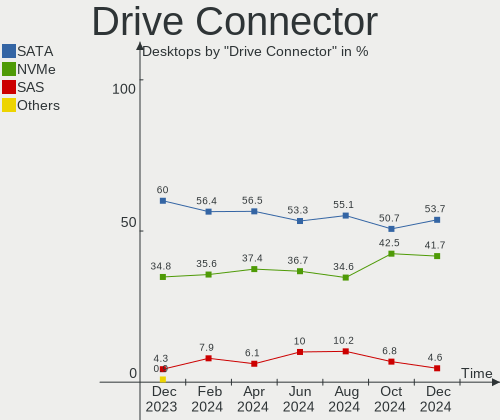
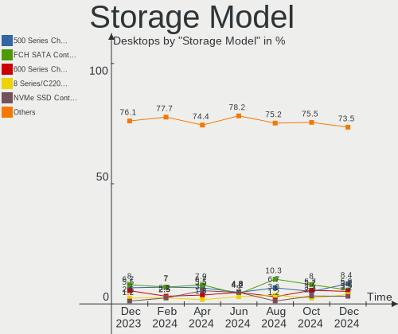
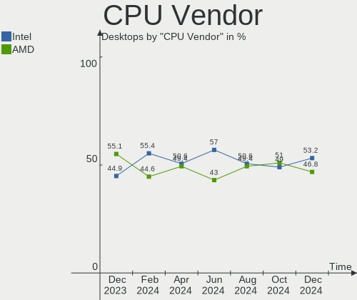
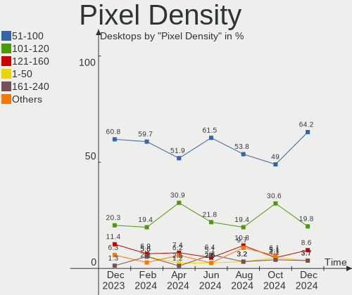
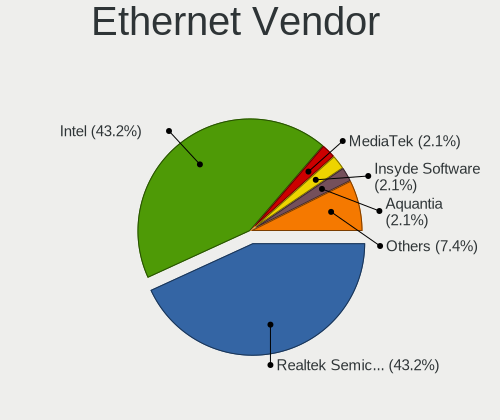

Linux in UK - Hardware Trends (Desktops)
----------------------------------------

A project to identify most popular hardware characteristics and track their change
over time based on data collected by Linux users at https://Linux-Hardware.org.

Anyone can contribute to this report by the [hw-probe](https://github.com/linuxhw/hw-probe) tool:

    sudo -E hw-probe -all -upload

Period: Dec, 2022.

Contents
--------

* [ System ](#system)
  - [ OS                       ](#os)
  - [ OS Family                ](#os-family)
  - [ Kernel                   ](#kernel)
  - [ Kernel Family            ](#kernel-family)
  - [ Kernel Major Ver.        ](#kernel-major-ver)
  - [ Arch                     ](#arch)
  - [ DE                       ](#de)
  - [ Display Server           ](#display-server)
  - [ Display Manager          ](#display-manager)
  - [ OS Lang                  ](#os-lang)
  - [ Boot Mode                ](#boot-mode)
  - [ Filesystem               ](#filesystem)
  - [ Part. scheme             ](#part-scheme)
  - [ Dual Boot with Linux/BSD ](#dual-boot-with-linuxbsd)
  - [ Dual Boot (Win)          ](#dual-boot-win)

* [ Board ](#board)
  - [ Vendor                   ](#vendor)
  - [ Model                    ](#model)
  - [ Model Family             ](#model-family)
  - [ MFG Year                 ](#mfg-year)
  - [ Form Factor              ](#form-factor)
  - [ Secure Boot              ](#secure-boot)
  - [ Coreboot                 ](#coreboot)
  - [ RAM Size                 ](#ram-size)
  - [ RAM Used                 ](#ram-used)
  - [ Total Drives             ](#total-drives)
  - [ Has CD-ROM               ](#has-cd-rom)
  - [ Has Ethernet             ](#has-ethernet)
  - [ Has WiFi                 ](#has-wifi)
  - [ Has Bluetooth            ](#has-bluetooth)

* [ Location ](#location)
  - [ Country                  ](#country)
  - [ City                     ](#city)

* [ Drives ](#drives)
  - [ Drive Vendor             ](#drive-vendor)
  - [ Drive Model              ](#drive-model)
  - [ HDD Vendor               ](#hdd-vendor)
  - [ SSD Vendor               ](#ssd-vendor)
  - [ Drive Kind               ](#drive-kind)
  - [ Drive Connector          ](#drive-connector)
  - [ Drive Size               ](#drive-size)
  - [ Space Total              ](#space-total)
  - [ Space Used               ](#space-used)
  - [ Malfunc. Drives          ](#malfunc-drives)
  - [ Malfunc. Drive Vendor    ](#malfunc-drive-vendor)
  - [ Malfunc. HDD Vendor      ](#malfunc-hdd-vendor)
  - [ Malfunc. Drive Kind      ](#malfunc-drive-kind)
  - [ Failed Drives            ](#failed-drives)
  - [ Failed Drive Vendor      ](#failed-drive-vendor)
  - [ Drive Status             ](#drive-status)

* [ Storage controller ](#storage-controller)
  - [ Storage Vendor           ](#storage-vendor)
  - [ Storage Model            ](#storage-model)
  - [ Storage Kind             ](#storage-kind)

* [ Processor ](#processor)
  - [ CPU Vendor               ](#cpu-vendor)
  - [ CPU Model                ](#cpu-model)
  - [ CPU Model Family         ](#cpu-model-family)
  - [ CPU Cores                ](#cpu-cores)
  - [ CPU Sockets              ](#cpu-sockets)
  - [ CPU Threads              ](#cpu-threads)
  - [ CPU Op-Modes             ](#cpu-op-modes)
  - [ CPU Microcode            ](#cpu-microcode)
  - [ CPU Microarch            ](#cpu-microarch)

* [ Graphics ](#graphics)
  - [ GPU Vendor               ](#gpu-vendor)
  - [ GPU Model                ](#gpu-model)
  - [ GPU Combo                ](#gpu-combo)
  - [ GPU Driver               ](#gpu-driver)
  - [ GPU Memory               ](#gpu-memory)

* [ Monitor ](#monitor)
  - [ Monitor Vendor           ](#monitor-vendor)
  - [ Monitor Model            ](#monitor-model)
  - [ Monitor Resolution       ](#monitor-resolution)
  - [ Monitor Diagonal         ](#monitor-diagonal)
  - [ Monitor Width            ](#monitor-width)
  - [ Aspect Ratio             ](#aspect-ratio)
  - [ Monitor Area             ](#monitor-area)
  - [ Pixel Density            ](#pixel-density)
  - [ Multiple Monitors        ](#multiple-monitors)

* [ Network ](#network)
  - [ Net Controller Vendor    ](#net-controller-vendor)
  - [ Net Controller Model     ](#net-controller-model)
  - [ Wireless Vendor          ](#wireless-vendor)
  - [ Wireless Model           ](#wireless-model)
  - [ Ethernet Vendor          ](#ethernet-vendor)
  - [ Ethernet Model           ](#ethernet-model)
  - [ Net Controller Kind      ](#net-controller-kind)
  - [ Used Controller          ](#used-controller)
  - [ NICs                     ](#nics)
  - [ IPv6                     ](#ipv6)

* [ Bluetooth ](#bluetooth)
  - [ Bluetooth Vendor         ](#bluetooth-vendor)
  - [ Bluetooth Model          ](#bluetooth-model)

* [ Sound ](#sound)
  - [ Sound Vendor             ](#sound-vendor)
  - [ Sound Model              ](#sound-model)

* [ Memory ](#memory)
  - [ Memory Vendor            ](#memory-vendor)
  - [ Memory Model             ](#memory-model)
  - [ Memory Kind              ](#memory-kind)
  - [ Memory Form Factor       ](#memory-form-factor)
  - [ Memory Size              ](#memory-size)
  - [ Memory Speed             ](#memory-speed)

* [ Printers & scanners ](#printers--scanners)
  - [ Printer Vendor           ](#printer-vendor)
  - [ Printer Model            ](#printer-model)
  - [ Scanner Vendor           ](#scanner-vendor)
  - [ Scanner Model            ](#scanner-model)

* [ Camera ](#camera)
  - [ Camera Vendor            ](#camera-vendor)
  - [ Camera Model             ](#camera-model)

* [ Security ](#security)
  - [ Fingerprint Vendor       ](#fingerprint-vendor)
  - [ Fingerprint Model        ](#fingerprint-model)
  - [ Chipcard Vendor          ](#chipcard-vendor)
  - [ Chipcard Model           ](#chipcard-model)

* [ Unsupported ](#unsupported)
  - [ Unsupported Devices      ](#unsupported-devices)
  - [ Unsupported Device Types ](#unsupported-device-types)

System
------

OS
--

Installed operating systems

| Name                         | Desktops | Percent |
|------------------------------|----------|---------|
| Ubuntu 22.04                 | 11       | 14.86%  |
| Fedora 37                    | 5        | 6.76%   |
| Debian 11                    | 5        | 6.76%   |
| Ubuntu 20.04                 | 4        | 5.41%   |
| Pop!_OS 22.04                | 4        | 5.41%   |
| Linux Mint 21                | 4        | 5.41%   |
| Zorin 16                     | 3        | 4.05%   |
| Ubuntu 22.10                 | 3        | 4.05%   |
| openSUSE Tumbleweed-XXXXXXXX | 3        | 4.05%   |
| Linux Mint 20.3              | 3        | 4.05%   |
| KDE neon 22.04               | 3        | 4.05%   |
| Arch Rolling                 | 3        | 4.05%   |
| Xubuntu 22.10                | 2        | 2.7%    |
| OpenMandriva 4.3             | 2        | 2.7%    |
| Manjaro                      | 2        | 2.7%    |
| Linux Mint 21.1              | 2        | 2.7%    |
| Kali 2022.4                  | 2        | 2.7%    |
| Ubuntu Core 18               | 1        | 1.35%   |
| Puppy 9                      | 1        | 1.35%   |
| Pop!_OS 20.10                | 1        | 1.35%   |
| Pop!_OS 20.04                | 1        | 1.35%   |
| OpenMandriva 4.50            | 1        | 1.35%   |
| Nobara 36                    | 1        | 1.35%   |
| Manjaro 21.3.7               | 1        | 1.35%   |
| Linux Mint 19.3              | 1        | 1.35%   |
| Kubuntu 22.04                | 1        | 1.35%   |
| Fedora 35                    | 1        | 1.35%   |
| CachyOS Rolling              | 1        | 1.35%   |
| ArcoLinux Rolling            | 1        | 1.35%   |
| antergos Rolling             | 1        | 1.35%   |

OS Family
---------

OS without a version

| Name         | Desktops | Percent |
|--------------|----------|---------|
| Ubuntu       | 19       | 25.68%  |
| Linux Mint   | 10       | 13.51%  |
| Pop!_OS      | 6        | 8.11%   |
| Fedora       | 6        | 8.11%   |
| Debian       | 5        | 6.76%   |
| Zorin        | 3        | 4.05%   |
| openSUSE     | 3        | 4.05%   |
| OpenMandriva | 3        | 4.05%   |
| Manjaro      | 3        | 4.05%   |
| KDE neon     | 3        | 4.05%   |
| Arch         | 3        | 4.05%   |
| Xubuntu      | 2        | 2.7%    |
| Kali         | 2        | 2.7%    |
| Puppy        | 1        | 1.35%   |
| Nobara       | 1        | 1.35%   |
| Kubuntu      | 1        | 1.35%   |
| CachyOS      | 1        | 1.35%   |
| ArcoLinux    | 1        | 1.35%   |
| antergos     | 1        | 1.35%   |

Kernel
------

Version of the Linux kernel

| Version                      | Desktops | Percent |
|------------------------------|----------|---------|
| 5.15.0-56-generic            | 19       | 25.68%  |
| 5.4.0-135-generic            | 5        | 6.76%   |
| 5.19.0-26-generic            | 4        | 5.41%   |
| 6.0.6-76060006-generic       | 3        | 4.05%   |
| 6.0.11-300.fc37.x86_64       | 3        | 4.05%   |
| 5.15.0-53-generic            | 3        | 4.05%   |
| 5.10.0-19-amd64              | 3        | 4.05%   |
| 6.0.12-arch1-1               | 2        | 2.7%    |
| 5.16.7-desktop-1omv4003      | 2        | 2.7%    |
| 5.15.0-57-generic            | 2        | 2.7%    |
| 6.1.1-1-MANJARO              | 1        | 1.35%   |
| 6.1.0-2-cachyos-lto          | 1        | 1.35%   |
| 6.1.0-060100rc5-generic      | 1        | 1.35%   |
| 6.0.8-1-MANJARO              | 1        | 1.35%   |
| 6.0.8-1-default              | 1        | 1.35%   |
| 6.0.13-602.inttf.fc37.x86_64 | 1        | 1.35%   |
| 6.0.12-300.fc37.x86_64       | 1        | 1.35%   |
| 6.0.12-1-default             | 1        | 1.35%   |
| 6.0.11-arch1-1               | 1        | 1.35%   |
| 6.0.11-100.fc35.x86_64       | 1        | 1.35%   |
| 6.0.10-zen2-1-zen            | 1        | 1.35%   |
| 6.0.10-arch2-1               | 1        | 1.35%   |
| 6.0.10-201.fc36.x86_64       | 1        | 1.35%   |
| 6.0.10-1-default             | 1        | 1.35%   |
| 6.0.0-kali3-amd64            | 1        | 1.35%   |
| 6.0.0-0.deb11.2-amd64        | 1        | 1.35%   |
| 5.8.0-7642-generic           | 1        | 1.35%   |
| 5.4.53                       | 1        | 1.35%   |
| 5.19.12-desktop-2omv4090     | 1        | 1.35%   |
| 5.19.0-kali2-amd64           | 1        | 1.35%   |
| 5.19.0-23-generic            | 1        | 1.35%   |
| 5.19.0-21-generic            | 1        | 1.35%   |
| 5.18.0-0.deb11.3-amd64       | 1        | 1.35%   |
| 5.17.5-76051705-generic      | 1        | 1.35%   |
| 5.15.60-1-MANJARO            | 1        | 1.35%   |
| 5.15.0-52-generic            | 1        | 1.35%   |
| 5.15.0-46-generic            | 1        | 1.35%   |
| 5.15.0-43-generic            | 1        | 1.35%   |

Kernel Family
-------------

Linux kernel without a distro release

| Version | Desktops | Percent |
|---------|----------|---------|
| 5.15.0  | 27       | 36.49%  |
| 5.19.0  | 7        | 9.46%   |
| 6.0.11  | 5        | 6.76%   |
| 5.4.0   | 5        | 6.76%   |
| 6.0.12  | 4        | 5.41%   |
| 6.0.10  | 4        | 5.41%   |
| 6.0.6   | 3        | 4.05%   |
| 5.10.0  | 3        | 4.05%   |
| 6.1.0   | 2        | 2.7%    |
| 6.0.8   | 2        | 2.7%    |
| 6.0.0   | 2        | 2.7%    |
| 5.16.7  | 2        | 2.7%    |
| 6.1.1   | 1        | 1.35%   |
| 6.0.13  | 1        | 1.35%   |
| 5.8.0   | 1        | 1.35%   |
| 5.4.53  | 1        | 1.35%   |
| 5.19.12 | 1        | 1.35%   |
| 5.18.0  | 1        | 1.35%   |
| 5.17.5  | 1        | 1.35%   |
| 5.15.60 | 1        | 1.35%   |

Kernel Major Ver.
-----------------

Linux kernel major version

| Version | Desktops | Percent |
|---------|----------|---------|
| 5.15    | 28       | 37.84%  |
| 6.0     | 21       | 28.38%  |
| 5.19    | 8        | 10.81%  |
| 5.4     | 6        | 8.11%   |
| 6.1     | 3        | 4.05%   |
| 5.10    | 3        | 4.05%   |
| 5.16    | 2        | 2.7%    |
| 5.8     | 1        | 1.35%   |
| 5.18    | 1        | 1.35%   |
| 5.17    | 1        | 1.35%   |

Arch
----

OS architecture (x86_64, i586, etc.)

| Name   | Desktops | Percent |
|--------|----------|---------|
| x86_64 | 74       | 100%    |

DE
--

Desktop Environment

| Name       | Desktops | Percent |
|------------|----------|---------|
| GNOME      | 35       | 47.3%   |
| X-Cinnamon | 13       | 17.57%  |
| KDE5       | 13       | 17.57%  |
| XFCE       | 5        | 6.76%   |
| Unknown    | 5        | 6.76%   |
| MATE       | 2        | 2.7%    |
| LXDE       | 1        | 1.35%   |

Display Server
--------------

X11 or Wayland

| Name    | Desktops | Percent |
|---------|----------|---------|
| X11     | 52       | 70.27%  |
| Wayland | 18       | 24.32%  |
| Tty     | 2        | 2.7%    |
| Unknown | 2        | 2.7%    |

Display Manager
---------------

SDDM, LightDM, etc.

| Name    | Desktops | Percent |
|---------|----------|---------|
| Unknown | 32       | 43.24%  |
| GDM3    | 13       | 17.57%  |
| LightDM | 12       | 16.22%  |
| SDDM    | 10       | 13.51%  |
| GDM     | 6        | 8.11%   |
| LXDM    | 1        | 1.35%   |

OS Lang
-------

Language

| Lang    | Desktops | Percent |
|---------|----------|---------|
| en_GB   | 64       | 86.49%  |
| en_US   | 7        | 9.46%   |
| Unknown | 2        | 2.7%    |
| C       | 1        | 1.35%   |

Boot Mode
---------

EFI or BIOS

| Mode | Desktops | Percent |
|------|----------|---------|
| BIOS | 37       | 50%     |
| EFI  | 37       | 50%     |

Filesystem
----------

Type of filesystem

| Type    | Desktops | Percent |
|---------|----------|---------|
| Ext4    | 55       | 74.32%  |
| Btrfs   | 14       | 18.92%  |
| Overlay | 2        | 2.7%    |
| Xfs     | 1        | 1.35%   |
| Ext3    | 1        | 1.35%   |
| Aufs    | 1        | 1.35%   |

Part. scheme
------------

Scheme of partitioning

| Type    | Desktops | Percent |
|---------|----------|---------|
| GPT     | 37       | 50%     |
| Unknown | 27       | 36.49%  |
| MBR     | 10       | 13.51%  |

Dual Boot with Linux/BSD
------------------------

Hosting more than one Linux/BSD

| Dual boot | Desktops | Percent |
|-----------|----------|---------|
| No        | 60       | 81.08%  |
| Yes       | 14       | 18.92%  |

Dual Boot (Win)
---------------

Hosting Linux and Windows

| Dual boot | Desktops | Percent |
|-----------|----------|---------|
| No        | 52       | 70.27%  |
| Yes       | 22       | 29.73%  |

Board
-----

Vendor
------

Motherboard manufacturer

| Name                                 | Desktops | Percent |
|--------------------------------------|----------|---------|
| ASUSTek Computer                     | 19       | 25.68%  |
| Gigabyte Technology                  | 13       | 17.57%  |
| MSI                                  | 12       | 16.22%  |
| Dell                                 | 8        | 10.81%  |
| Lenovo                               | 5        | 6.76%   |
| ASRock                               | 5        | 6.76%   |
| Hewlett-Packard                      | 4        | 5.41%   |
| Intel                                | 2        | 2.7%    |
| Supermicro                           | 1        | 1.35%   |
| Shenzhen Meigao Electronic Equipment | 1        | 1.35%   |
| ECS                                  | 1        | 1.35%   |
| Alienware                            | 1        | 1.35%   |
| Acer                                 | 1        | 1.35%   |
| Unknown                              | 1        | 1.35%   |

Model
-----

Motherboard model

| Name                                          | Desktops | Percent |
|-----------------------------------------------|----------|---------|
| MSI MS-7C91                                   | 2        | 2.7%    |
| ASUS ROG STRIX B550-F GAMING                  | 2        | 2.7%    |
| ASUS ROG STRIX B450-F GAMING                  | 2        | 2.7%    |
| Supermicro C7Q67                              | 1        | 1.35%   |
| Shenzhen Meigao Electronic Equipment HX90G    | 1        | 1.35%   |
| MSI MS-7D76                                   | 1        | 1.35%   |
| MSI MS-7D70                                   | 1        | 1.35%   |
| MSI MS-7D25                                   | 1        | 1.35%   |
| MSI MS-7C56                                   | 1        | 1.35%   |
| MSI MS-7C37                                   | 1        | 1.35%   |
| MSI MS-7B51                                   | 1        | 1.35%   |
| MSI MS-7B09                                   | 1        | 1.35%   |
| MSI MS-7A38                                   | 1        | 1.35%   |
| MSI MS-7A12                                   | 1        | 1.35%   |
| MSI CCL Ryzen 5 5600G B550 Motherboard Bundle | 1        | 1.35%   |
| Lenovo ThinkStation C20 4263BA7               | 1        | 1.35%   |
| Lenovo ThinkCentre M93p 10AB003CUK            | 1        | 1.35%   |
| Lenovo ThinkCentre M93p 10A9S01000            | 1        | 1.35%   |
| Lenovo ThinkCentre M700 10J0S2QU00            | 1        | 1.35%   |
| Lenovo ThinkCentre E73 10AU003JUK             | 1        | 1.35%   |
| Intel X79M-S                                  | 1        | 1.35%   |
| Intel MahoBay Platform                        | 1        | 1.35%   |
| HP Z400 Workstation                           | 1        | 1.35%   |
| HP Pavilion Desktop TP01-2xxx                 | 1        | 1.35%   |
| HP EngageFlex Pro                             | 1        | 1.35%   |
| HP 290 G1 MT                                  | 1        | 1.35%   |
| Gigabyte Z97-HD3                              | 1        | 1.35%   |
| Gigabyte Z590I VISION D                       | 1        | 1.35%   |
| Gigabyte X570 AORUS XTREME                    | 1        | 1.35%   |
| Gigabyte PC-2903                              | 1        | 1.35%   |
| Gigabyte GA-990X-Gaming SLI-CF                | 1        | 1.35%   |
| Gigabyte GA-78LMT-USB3                        | 1        | 1.35%   |
| Gigabyte B85M-DS3H-A                          | 1        | 1.35%   |
| Gigabyte B550I AORUS PRO AX                   | 1        | 1.35%   |
| Gigabyte B550 AORUS ELITE AX V2               | 1        | 1.35%   |
| Gigabyte B450 AORUS M                         | 1        | 1.35%   |
| Gigabyte A320M-S2H                            | 1        | 1.35%   |
| Gigabyte 970A-UD3P                            | 1        | 1.35%   |
| Gigabyte 970A-DS3P                            | 1        | 1.35%   |
| ECS GeForce7050M-M                            | 1        | 1.35%   |

Model Family
------------

Motherboard model prefix

| Name                                       | Desktops | Percent |
|--------------------------------------------|----------|---------|
| ASUS ROG                                   | 6        | 8.11%   |
| Lenovo ThinkCentre                         | 4        | 5.41%   |
| Dell OptiPlex                              | 4        | 5.41%   |
| ASUS PRIME                                 | 3        | 4.05%   |
| MSI MS-7C91                                | 2        | 2.7%    |
| Dell Precision                             | 2        | 2.7%    |
| ASUS TUF                                   | 2        | 2.7%    |
| Supermicro C7Q67                           | 1        | 1.35%   |
| Shenzhen Meigao Electronic Equipment HX90G | 1        | 1.35%   |
| MSI MS-7D76                                | 1        | 1.35%   |
| MSI MS-7D70                                | 1        | 1.35%   |
| MSI MS-7D25                                | 1        | 1.35%   |
| MSI MS-7C56                                | 1        | 1.35%   |
| MSI MS-7C37                                | 1        | 1.35%   |
| MSI MS-7B51                                | 1        | 1.35%   |
| MSI MS-7B09                                | 1        | 1.35%   |
| MSI MS-7A38                                | 1        | 1.35%   |
| MSI MS-7A12                                | 1        | 1.35%   |
| MSI CCL                                    | 1        | 1.35%   |
| Lenovo ThinkStation                        | 1        | 1.35%   |
| Intel X79M-S                               | 1        | 1.35%   |
| Intel MahoBay                              | 1        | 1.35%   |
| HP Z400                                    | 1        | 1.35%   |
| HP Pavilion                                | 1        | 1.35%   |
| HP EngageFlex                              | 1        | 1.35%   |
| HP 290                                     | 1        | 1.35%   |
| Gigabyte Z97-HD3                           | 1        | 1.35%   |
| Gigabyte Z590I                             | 1        | 1.35%   |
| Gigabyte X570                              | 1        | 1.35%   |
| Gigabyte PC-2903                           | 1        | 1.35%   |
| Gigabyte GA-990X-Gaming                    | 1        | 1.35%   |
| Gigabyte GA-78LMT-USB3                     | 1        | 1.35%   |
| Gigabyte B85M-DS3H-A                       | 1        | 1.35%   |
| Gigabyte B550I                             | 1        | 1.35%   |
| Gigabyte B550                              | 1        | 1.35%   |
| Gigabyte B450                              | 1        | 1.35%   |
| Gigabyte A320M-S2H                         | 1        | 1.35%   |
| Gigabyte 970A-UD3P                         | 1        | 1.35%   |
| Gigabyte 970A-DS3P                         | 1        | 1.35%   |
| ECS GeForce7050M-M                         | 1        | 1.35%   |

MFG Year
--------

Motherboard manufacture year

| Year | Desktops | Percent |
|------|----------|---------|
| 2018 | 11       | 14.86%  |
| 2022 | 10       | 13.51%  |
| 2020 | 9        | 12.16%  |
| 2014 | 7        | 9.46%   |
| 2021 | 5        | 6.76%   |
| 2019 | 5        | 6.76%   |
| 2017 | 4        | 5.41%   |
| 2015 | 4        | 5.41%   |
| 2013 | 4        | 5.41%   |
| 2010 | 3        | 4.05%   |
| 2016 | 2        | 2.7%    |
| 2012 | 2        | 2.7%    |
| 2011 | 2        | 2.7%    |
| 2008 | 2        | 2.7%    |
| 2009 | 1        | 1.35%   |
| 2007 | 1        | 1.35%   |
| 2006 | 1        | 1.35%   |
| 2005 | 1        | 1.35%   |

Form Factor
-----------

Physical design of the computer

| Name    | Desktops | Percent |
|---------|----------|---------|
| Desktop | 74       | 100%    |

Secure Boot
-----------

Enabled or disabled

| State    | Desktops | Percent |
|----------|----------|---------|
| Disabled | 71       | 95.95%  |
| Enabled  | 3        | 4.05%   |

Coreboot
--------

Have coreboot on board

| Used | Desktops | Percent |
|------|----------|---------|
| No   | 74       | 100%    |

RAM Size
--------

Total RAM memory

| Size in GB  | Desktops | Percent |
|-------------|----------|---------|
| 16.01-24.0  | 20       | 27.03%  |
| 32.01-64.0  | 15       | 20.27%  |
| 8.01-16.0   | 15       | 20.27%  |
| 4.01-8.0    | 7        | 9.46%   |
| 24.01-32.0  | 5        | 6.76%   |
| 64.01-256.0 | 5        | 6.76%   |
| 3.01-4.0    | 4        | 5.41%   |
| 1.01-2.0    | 2        | 2.7%    |
| 2.01-3.0    | 1        | 1.35%   |

RAM Used
--------

Used RAM memory

| Used GB    | Desktops | Percent |
|------------|----------|---------|
| 2.01-3.0   | 21       | 28.38%  |
| 4.01-8.0   | 19       | 25.68%  |
| 1.01-2.0   | 14       | 18.92%  |
| 3.01-4.0   | 13       | 17.57%  |
| 0.51-1.0   | 3        | 4.05%   |
| 8.01-16.0  | 2        | 2.7%    |
| 24.01-32.0 | 1        | 1.35%   |
| 0.01-0.5   | 1        | 1.35%   |

Total Drives
------------

Number of drives on board

| Drives | Desktops | Percent |
|--------|----------|---------|
| 1      | 23       | 31.08%  |
| 2      | 20       | 27.03%  |
| 4      | 11       | 14.86%  |
| 3      | 9        | 12.16%  |
| 5      | 7        | 9.46%   |
| 6      | 3        | 4.05%   |
| 10     | 1        | 1.35%   |

Has CD-ROM
----------

Has CD-ROM on board

| Presented | Desktops | Percent |
|-----------|----------|---------|
| No        | 44       | 59.46%  |
| Yes       | 30       | 40.54%  |

Has Ethernet
------------

Has Ethernet on board

| Presented | Desktops | Percent |
|-----------|----------|---------|
| Yes       | 72       | 97.3%   |
| No        | 2        | 2.7%    |

Has WiFi
--------

Has WiFi module

| Presented | Desktops | Percent |
|-----------|----------|---------|
| No        | 40       | 54.05%  |
| Yes       | 34       | 45.95%  |

Has Bluetooth
-------------

Has Bluetooth module

| Presented | Desktops | Percent |
|-----------|----------|---------|
| No        | 46       | 62.16%  |
| Yes       | 28       | 37.84%  |

Location
--------

Country
-------

Geographic location (country)

| Country | Desktops | Percent |
|---------|----------|---------|
| UK      | 74       | 100%    |

City
----

Geographic location (city)

| City                 | Desktops | Percent |
|----------------------|----------|---------|
| London               | 11       | 14.86%  |
| Newton Abbot         | 3        | 4.05%   |
| Manchester           | 3        | 4.05%   |
| Birmingham           | 3        | 4.05%   |
| Nottingham           | 2        | 2.7%    |
| Luton                | 2        | 2.7%    |
| Leeds                | 2        | 2.7%    |
| Yeovil               | 1        | 1.35%   |
| Workington           | 1        | 1.35%   |
| Witham               | 1        | 1.35%   |
| Wigan                | 1        | 1.35%   |
| Warwick              | 1        | 1.35%   |
| Unstone              | 1        | 1.35%   |
| Twickenham           | 1        | 1.35%   |
| Thrapston            | 1        | 1.35%   |
| Thornton Heath       | 1        | 1.35%   |
| Telford              | 1        | 1.35%   |
| Stoke-on-Trent       | 1        | 1.35%   |
| Stevenage            | 1        | 1.35%   |
| Southampton          | 1        | 1.35%   |
| Salford              | 1        | 1.35%   |
| Royal Leamington Spa | 1        | 1.35%   |
| Rotherham            | 1        | 1.35%   |
| Rochester            | 1        | 1.35%   |
| Preston              | 1        | 1.35%   |
| Portsmouth           | 1        | 1.35%   |
| Poole                | 1        | 1.35%   |
| Perth                | 1        | 1.35%   |
| Norwich              | 1        | 1.35%   |
| Newton Tony          | 1        | 1.35%   |
| Newton Aycliffe      | 1        | 1.35%   |
| Newport              | 1        | 1.35%   |
| Newcastle upon Tyne  | 1        | 1.35%   |
| Morden               | 1        | 1.35%   |
| Mold                 | 1        | 1.35%   |
| Lincoln              | 1        | 1.35%   |
| Ledbury              | 1        | 1.35%   |
| Huntingdon           | 1        | 1.35%   |
| Hemel Hempstead      | 1        | 1.35%   |
| Glossop              | 1        | 1.35%   |

Drives
------

Drive Vendor
------------

Hard drive vendors

| Vendor                    | Desktops | Drives | Percent |
|---------------------------|----------|--------|---------|
| Samsung Electronics       | 26       | 41     | 16.46%  |
| Seagate                   | 25       | 30     | 15.82%  |
| WDC                       | 23       | 32     | 14.56%  |
| Crucial                   | 15       | 17     | 9.49%   |
| Sandisk                   | 11       | 13     | 6.96%   |
| Toshiba                   | 9        | 10     | 5.7%    |
| Kingston                  | 8        | 9      | 5.06%   |
| Phison Electronics        | 4        | 5      | 2.53%   |
| A-DATA Technology         | 4        | 4      | 2.53%   |
| Micron/Crucial Technology | 3        | 3      | 1.9%    |
| Hitachi                   | 3        | 3      | 1.9%    |
| Unknown                   | 2        | 2      | 1.27%   |
| OCZ                       | 2        | 2      | 1.27%   |
| Intel                     | 2        | 2      | 1.27%   |
| HGST                      | 2        | 2      | 1.27%   |
| China                     | 2        | 2      | 1.27%   |
| Unknown                   | 2        | 2      | 1.27%   |
| TSA                       | 1        | 1      | 0.63%   |
| Transcend                 | 1        | 1      | 0.63%   |
| TO Exter                  | 1        | 1      | 0.63%   |
| Silicon Motion            | 1        | 1      | 0.63%   |
| SABRENT                   | 1        | 1      | 0.63%   |
| RSH-339                   | 1        | 1      | 0.63%   |
| Realtek Semiconductor     | 1        | 1      | 0.63%   |
| Phison                    | 1        | 1      | 0.63%   |
| Netac                     | 1        | 2      | 0.63%   |
| Maxtor                    | 1        | 1      | 0.63%   |
| KIOXIA-EXCERIA            | 1        | 1      | 0.63%   |
| Gigabyte Technology       | 1        | 1      | 0.63%   |
| Drevo                     | 1        | 1      | 0.63%   |
| Corsair                   | 1        | 2      | 0.63%   |
| ADATA Technology          | 1        | 1      | 0.63%   |

Drive Model
-----------

Hard drive models

| Model                                               | Desktops | Percent |
|-----------------------------------------------------|----------|---------|
| Kingston SA400S37240G 240GB SSD                     | 6        | 3.17%   |
| Crucial CT240BX500SSD1 240GB                        | 6        | 3.17%   |
| Samsung NVMe SSD Controller SM981/PM981/PM983 500GB | 4        | 2.12%   |
| Seagate ST4000DM004-2CV104 4TB                      | 3        | 1.59%   |
| Seagate ST4000DM000-1F2168 4TB                      | 3        | 1.59%   |
| Phison E16 PCIe4 NVMe Controller 512GB              | 3        | 1.59%   |
| WDC WD40EZRX-00SPEB0 4TB                            | 2        | 1.06%   |
| WDC WD20EZRZ-00Z5HB0 2TB                            | 2        | 1.06%   |
| WDC WD20EFRX-68EUZN0 2TB                            | 2        | 1.06%   |
| Toshiba DT01ACA200 2TB                              | 2        | 1.06%   |
| Seagate ST2000DM001-1ER164 2TB                      | 2        | 1.06%   |
| Seagate ST2000DM001-1CH164 2TB                      | 2        | 1.06%   |
| Seagate ST1000DM010-2EP102 1TB                      | 2        | 1.06%   |
| Sandisk WD Black SN850 1TB                          | 2        | 1.06%   |
| Samsung SSD 980 PRO 1TB                             | 2        | 1.06%   |
| Samsung SSD 980 1TB                                 | 2        | 1.06%   |
| Samsung SSD 870 QVO 1TB                             | 2        | 1.06%   |
| Samsung Portable SSD T5 250GB                       | 2        | 1.06%   |
| Samsung NVMe SSD Controller PM9A1/PM9A3/980PRO 2TB  | 2        | 1.06%   |
| Samsung HD204UI 2TB                                 | 2        | 1.06%   |
| Micron/Crucial P2 NVMe PCIe SSD 500GB               | 2        | 1.06%   |
| Crucial CT480BX500SSD1 480GB                        | 2        | 1.06%   |
| Unknown                                             | 2        | 1.06%   |
| WDC WDS500G3X0C-00SJG0 500GB                        | 1        | 0.53%   |
| WDC WDS500G2B0C 500GB                               | 1        | 0.53%   |
| WDC WDS500G2B0B-00YS70 500GB SSD                    | 1        | 0.53%   |
| WDC WDS500G2B0A-00SM50 500GB SSD                    | 1        | 0.53%   |
| WDC WDS100T2B0C-00PXH0 1TB                          | 1        | 0.53%   |
| WDC WDS100T2B0B-00YS70 1TB SSD                      | 1        | 0.53%   |
| WDC WD5000LPVX-22V0TT0 500GB                        | 1        | 0.53%   |
| WDC WD40PURZ-85TTDY0 4TB                            | 1        | 0.53%   |
| WDC WD40PURX-64GVNY0 4TB                            | 1        | 0.53%   |
| WDC WD40EZAZ-22SF3B0 4TB                            | 1        | 0.53%   |
| WDC WD40EMAZ-51TKPB0 4TB                            | 1        | 0.53%   |
| WDC WD20EZAZ-00GGJB0 2TB                            | 1        | 0.53%   |
| WDC WD20EFRX-68AX9N0 2TB                            | 1        | 0.53%   |
| WDC WD200EDGZ-11BLDS0 20TB                          | 1        | 0.53%   |
| WDC WD2003FZEX-00Z4SA0 2TB                          | 1        | 0.53%   |
| WDC WD2003FYYS-02W0B1 2TB                           | 1        | 0.53%   |
| WDC WD120EMFZ-11A6JA0 12TB                          | 1        | 0.53%   |

HDD Vendor
----------

Hard disk drive vendors

| Vendor              | Desktops | Drives | Percent |
|---------------------|----------|--------|---------|
| Seagate             | 25       | 29     | 37.88%  |
| WDC                 | 20       | 26     | 30.3%   |
| Toshiba             | 7        | 7      | 10.61%  |
| Samsung Electronics | 6        | 7      | 9.09%   |
| Hitachi             | 3        | 3      | 4.55%   |
| HGST                | 2        | 2      | 3.03%   |
| Unknown             | 1        | 1      | 1.52%   |
| RSH-339             | 1        | 1      | 1.52%   |
| Maxtor              | 1        | 1      | 1.52%   |

SSD Vendor
----------

Solid state drive vendors

| Vendor              | Desktops | Drives | Percent |
|---------------------|----------|--------|---------|
| Crucial             | 14       | 16     | 24.14%  |
| Samsung Electronics | 12       | 17     | 20.69%  |
| Kingston            | 7        | 8      | 12.07%  |
| SanDisk             | 4        | 4      | 6.9%    |
| A-DATA Technology   | 4        | 4      | 6.9%    |
| WDC                 | 2        | 3      | 3.45%   |
| OCZ                 | 2        | 2      | 3.45%   |
| China               | 2        | 2      | 3.45%   |
| Unknown             | 2        | 2      | 3.45%   |
| Unknown             | 1        | 1      | 1.72%   |
| TSA                 | 1        | 1      | 1.72%   |
| Toshiba             | 1        | 1      | 1.72%   |
| TO Exter            | 1        | 1      | 1.72%   |
| Netac               | 1        | 2      | 1.72%   |
| KIOXIA-EXCERIA      | 1        | 1      | 1.72%   |
| Gigabyte Technology | 1        | 1      | 1.72%   |
| Drevo               | 1        | 1      | 1.72%   |
| Corsair             | 1        | 2      | 1.72%   |

Drive Kind
----------

HDD or SSD

| Kind    | Desktops | Drives | Percent |
|---------|----------|--------|---------|
| HDD     | 45       | 77     | 36.29%  |
| SSD     | 42       | 69     | 33.87%  |
| NVMe    | 36       | 49     | 29.03%  |
| Unknown | 1        | 1      | 0.81%   |

Drive Connector
---------------

SATA, SAS, NVMe, etc.

| Type | Desktops | Drives | Percent |
|------|----------|--------|---------|
| SATA | 62       | 135    | 57.41%  |
| NVMe | 35       | 48     | 32.41%  |
| SAS  | 11       | 13     | 10.19%  |

Drive Size
----------

Size of hard drive

| Size in TB | Desktops | Drives | Percent |
|------------|----------|--------|---------|
| 0.01-0.5   | 44       | 65     | 40.74%  |
| 0.51-1.0   | 25       | 32     | 23.15%  |
| 1.01-2.0   | 19       | 24     | 17.59%  |
| 3.01-4.0   | 14       | 17     | 12.96%  |
| 4.01-10.0  | 4        | 4      | 3.7%    |
| 2.01-3.0   | 1        | 1      | 0.93%   |
| 10.01-20.0 | 1        | 3      | 0.93%   |

Space Total
-----------

Amount of disk space available on the file system

| Size in GB     | Desktops | Percent |
|----------------|----------|---------|
| More than 3000 | 19       | 25.68%  |
| 101-250        | 13       | 17.57%  |
| 501-1000       | 13       | 17.57%  |
| 251-500        | 8        | 10.81%  |
| 1001-2000      | 8        | 10.81%  |
| 2001-3000      | 5        | 6.76%   |
| Unknown        | 5        | 6.76%   |
| 1-20           | 2        | 2.7%    |
| 51-100         | 1        | 1.35%   |

Space Used
----------

Amount of used disk space

| Used GB        | Desktops | Percent |
|----------------|----------|---------|
| 1-20           | 14       | 18.92%  |
| 51-100         | 14       | 18.92%  |
| 251-500        | 7        | 9.46%   |
| 101-250        | 7        | 9.46%   |
| More than 3000 | 6        | 8.11%   |
| 21-50          | 6        | 8.11%   |
| 2001-3000      | 5        | 6.76%   |
| 1001-2000      | 5        | 6.76%   |
| 501-1000       | 5        | 6.76%   |
| Unknown        | 5        | 6.76%   |

Malfunc. Drives
---------------

Drive models with a malfunction

| Model                                    | Desktops | Drives | Percent |
|------------------------------------------|----------|--------|---------|
| WDC WD10EARS-00Y5B1 1TB                  | 1        | 2      | 9.09%   |
| Toshiba DT01ACA200 2TB                   | 1        | 1      | 9.09%   |
| Seagate ST3320310CS 320GB                | 1        | 1      | 9.09%   |
| Seagate ST31000340NS 1TB                 | 1        | 1      | 9.09%   |
| Samsung Electronics SSD 840 Series 120GB | 1        | 1      | 9.09%   |
| Samsung Electronics HD753LJ 752GB        | 1        | 1      | 9.09%   |
| Samsung Electronics HD103SJ 1TB          | 1        | 1      | 9.09%   |
| Intel SSD 600P Series 512GB              | 1        | 1      | 9.09%   |
| Hitachi HDT725025VLA380 250GB            | 1        | 1      | 9.09%   |
| Drevo X1 Pro SSD 128GB                   | 1        | 1      | 9.09%   |
| A-DATA Technology SU630 480GB SSD        | 1        | 1      | 9.09%   |

Malfunc. Drive Vendor
---------------------

Vendors of faulty drives

| Vendor              | Desktops | Drives | Percent |
|---------------------|----------|--------|---------|
| Seagate             | 2        | 2      | 20%     |
| Samsung Electronics | 2        | 3      | 20%     |
| WDC                 | 1        | 2      | 10%     |
| Toshiba             | 1        | 1      | 10%     |
| Intel               | 1        | 1      | 10%     |
| Hitachi             | 1        | 1      | 10%     |
| Drevo               | 1        | 1      | 10%     |
| A-DATA Technology   | 1        | 1      | 10%     |

Malfunc. HDD Vendor
-------------------

Vendors of faulty HDD drives

| Vendor              | Desktops | Drives | Percent |
|---------------------|----------|--------|---------|
| Seagate             | 2        | 2      | 33.33%  |
| WDC                 | 1        | 2      | 16.67%  |
| Toshiba             | 1        | 1      | 16.67%  |
| Samsung Electronics | 1        | 2      | 16.67%  |
| Hitachi             | 1        | 1      | 16.67%  |

Malfunc. Drive Kind
-------------------

Kinds of faulty drives

| Kind | Desktops | Drives | Percent |
|------|----------|--------|---------|
| HDD  | 6        | 8      | 60%     |
| SSD  | 3        | 3      | 30%     |
| NVMe | 1        | 1      | 10%     |

Failed Drives
-------------

Failed drive models

| Model                           | Desktops | Drives | Percent |
|---------------------------------|----------|--------|---------|
| Toshiba DT01ACA100 1TB          | 1        | 1      | 50%     |
| Samsung Electronics SSD 980 1TB | 1        | 1      | 50%     |

Failed Drive Vendor
-------------------

Failed drive vendors

| Vendor              | Desktops | Drives | Percent |
|---------------------|----------|--------|---------|
| Toshiba             | 1        | 1      | 50%     |
| Samsung Electronics | 1        | 1      | 50%     |

Drive Status
------------

Number of failed and malfunc. drives

| Status   | Desktops | Drives | Percent |
|----------|----------|--------|---------|
| Detected | 45       | 118    | 51.72%  |
| Works    | 31       | 64     | 35.63%  |
| Malfunc  | 9        | 12     | 10.34%  |
| Failed   | 2        | 2      | 2.3%    |

Storage controller
------------------

Storage Vendor
--------------

Storage controller vendors

| Vendor                       | Desktops | Percent |
|------------------------------|----------|---------|
| Intel                        | 38       | 30.89%  |
| AMD                          | 35       | 28.46%  |
| Samsung Electronics          | 14       | 11.38%  |
| SanDisk                      | 9        | 7.32%   |
| Phison Electronics           | 5        | 4.07%   |
| ASMedia Technology           | 5        | 4.07%   |
| Micron/Crucial Technology    | 4        | 3.25%   |
| Nvidia                       | 3        | 2.44%   |
| Toshiba America Info Systems | 2        | 1.63%   |
| Silicon Motion               | 2        | 1.63%   |
| Realtek Semiconductor        | 1        | 0.81%   |
| Marvell Technology Group     | 1        | 0.81%   |
| Kingston Technology Company  | 1        | 0.81%   |
| JMicron Technology           | 1        | 0.81%   |
| ADATA Technology             | 1        | 0.81%   |
| Adaptec                      | 1        | 0.81%   |

Storage Model
-------------

Storage controller models

| Model                                                                          | Desktops | Percent |
|--------------------------------------------------------------------------------|----------|---------|
| AMD FCH SATA Controller [AHCI mode]                                            | 15       | 10.14%  |
| AMD 500 Series Chipset SATA Controller                                         | 10       | 6.76%   |
| AMD 400 Series Chipset SATA Controller                                         | 8        | 5.41%   |
| Intel Q170/Q150/B150/H170/H110/Z170/CM236 Chipset SATA Controller [AHCI Mode]  | 7        | 4.73%   |
| Intel 8 Series/C220 Series Chipset Family 6-port SATA Controller 1 [AHCI mode] | 6        | 4.05%   |
| Sandisk Non-Volatile memory controller                                         | 5        | 3.38%   |
| Samsung NVMe SSD Controller SM981/PM981/PM983                                  | 5        | 3.38%   |
| Samsung NVMe SSD Controller PM9A1/PM9A3/980PRO                                 | 5        | 3.38%   |
| ASMedia ASM1062 Serial ATA Controller                                          | 5        | 3.38%   |
| AMD SATA controller                                                            | 5        | 3.38%   |
| Samsung NVMe SSD Controller 980                                                | 3        | 2.03%   |
| Phison E16 PCIe4 NVMe Controller                                               | 3        | 2.03%   |
| Micron/Crucial P2 NVMe PCIe SSD                                                | 3        | 2.03%   |
| Intel 82801JI (ICH10 Family) SATA AHCI Controller                              | 3        | 2.03%   |
| Intel 6 Series/C200 Series Chipset Family 6 port Desktop SATA AHCI Controller  | 3        | 2.03%   |
| AMD SB7x0/SB8x0/SB9x0 IDE Controller                                           | 3        | 2.03%   |
| SanDisk WD PC SN810 / Black SN850 NVMe SSD                                     | 2        | 1.35%   |
| SanDisk WD Blue SN570 NVMe SSD                                                 | 2        | 1.35%   |
| Intel SATA Controller [RAID mode]                                              | 2        | 1.35%   |
| Intel Cannon Lake PCH SATA AHCI Controller                                     | 2        | 1.35%   |
| Intel Alder Lake-S PCH SATA Controller [AHCI Mode]                             | 2        | 1.35%   |
| Intel 500 Series Chipset Family SATA AHCI Controller                           | 2        | 1.35%   |
| AMD SB7x0/SB8x0/SB9x0 SATA Controller [IDE mode]                               | 2        | 1.35%   |
| AMD SB7x0/SB8x0/SB9x0 SATA Controller [AHCI mode]                              | 2        | 1.35%   |
| AMD FCH SATA Controller D                                                      | 2        | 1.35%   |
| Toshiba America Info Systems XG6 NVMe SSD Controller                           | 1        | 0.68%   |
| Toshiba America Info Systems BG3 NVMe SSD Controller                           | 1        | 0.68%   |
| Silicon Motion SM2263EN/SM2263XT SSD Controller                                | 1        | 0.68%   |
| Silicon Motion SM2262/SM2262EN SSD Controller                                  | 1        | 0.68%   |
| SanDisk WD Blue SN550 NVMe SSD                                                 | 1        | 0.68%   |
| SanDisk WD Black 2018/SN750 / PC SN720 NVMe SSD                                | 1        | 0.68%   |
| Samsung NVMe SSD Controller SM961/PM961/SM963                                  | 1        | 0.68%   |
| Samsung NVMe SSD Controller SM951/PM951                                        | 1        | 0.68%   |
| Realtek RTS5763DL NVMe SSD Controller                                          | 1        | 0.68%   |
| Phison Electronics Non-Volatile memory controller                              | 1        | 0.68%   |
| Phison E12 NVMe Controller                                                     | 1        | 0.68%   |
| Nvidia MCP67 IDE Controller                                                    | 1        | 0.68%   |
| Nvidia MCP67 AHCI Controller                                                   | 1        | 0.68%   |
| Nvidia MCP61 SATA Controller                                                   | 1        | 0.68%   |
| Nvidia MCP61 IDE                                                               | 1        | 0.68%   |

Storage Kind
------------

Kind of storage controller (IDE, SATA, NVMe, SAS, ...)

| Kind | Desktops | Percent |
|------|----------|---------|
| SATA | 67       | 58.26%  |
| NVMe | 35       | 30.43%  |
| IDE  | 10       | 8.7%    |
| RAID | 3        | 2.61%   |

Processor
---------

CPU Vendor
----------

Processor vendors

| Vendor | Desktops | Percent |
|--------|----------|---------|
| AMD    | 38       | 51.35%  |
| Intel  | 36       | 48.65%  |

CPU Model
---------

Processor models

| Model                                       | Desktops | Percent |
|---------------------------------------------|----------|---------|
| AMD Ryzen 5 5600X 6-Core Processor          | 4        | 5.41%   |
| AMD Ryzen 5 3600 6-Core Processor           | 4        | 5.41%   |
| AMD Ryzen 9 3900X 12-Core Processor         | 3        | 4.05%   |
| AMD Ryzen 5 5600G with Radeon Graphics      | 3        | 4.05%   |
| Intel Core i7-6700K CPU @ 4.00GHz           | 2        | 2.7%    |
| Intel Core i5-6500T CPU @ 2.50GHz           | 2        | 2.7%    |
| Intel Core i5-4590 CPU @ 3.30GHz            | 2        | 2.7%    |
| AMD Ryzen 9 7950X 16-Core Processor         | 2        | 2.7%    |
| AMD Ryzen 7 7700X 8-Core Processor          | 2        | 2.7%    |
| AMD Ryzen 7 3800X 8-Core Processor          | 2        | 2.7%    |
| AMD FX-8350 Eight-Core Processor            | 2        | 2.7%    |
| Intel Xeon CPU X5675 @ 3.07GHz              | 1        | 1.35%   |
| Intel Xeon CPU W3540 @ 2.93GHz              | 1        | 1.35%   |
| Intel Xeon CPU E5620 @ 2.40GHz              | 1        | 1.35%   |
| Intel Xeon CPU E5345 @ 2.33GHz              | 1        | 1.35%   |
| Intel Xeon CPU E5-2620 0 @ 2.00GHz          | 1        | 1.35%   |
| Intel Pentium Gold G5400 CPU @ 3.70GHz      | 1        | 1.35%   |
| Intel Pentium Dual-Core CPU E5800 @ 3.20GHz | 1        | 1.35%   |
| Intel Pentium CPU G3220 @ 3.00GHz           | 1        | 1.35%   |
| Intel Core i7-9700K CPU @ 3.60GHz           | 1        | 1.35%   |
| Intel Core i7-6700 CPU @ 3.40GHz            | 1        | 1.35%   |
| Intel Core i7-5820K CPU @ 3.30GHz           | 1        | 1.35%   |
| Intel Core i7-4790K CPU @ 4.00GHz           | 1        | 1.35%   |
| Intel Core i7-3820 CPU @ 3.60GHz            | 1        | 1.35%   |
| Intel Core i5-6600K CPU @ 3.50GHz           | 1        | 1.35%   |
| Intel Core i5-6400 CPU @ 2.70GHz            | 1        | 1.35%   |
| Intel Core i5-4690 CPU @ 3.50GHz            | 1        | 1.35%   |
| Intel Core i5-4590T CPU @ 2.00GHz           | 1        | 1.35%   |
| Intel Core i5-4570 CPU @ 3.20GHz            | 1        | 1.35%   |
| Intel Core i5-2400 CPU @ 3.10GHz            | 1        | 1.35%   |
| Intel Core i3-7100 CPU @ 3.90GHz            | 1        | 1.35%   |
| Intel Core i3-3220 CPU @ 3.30GHz            | 1        | 1.35%   |
| Intel Core i3-2100 CPU @ 3.10GHz            | 1        | 1.35%   |
| Intel Core i3-10100F CPU @ 3.60GHz          | 1        | 1.35%   |
| Intel Core i3-10100 CPU @ 3.60GHz           | 1        | 1.35%   |
| Intel Core 2 Quad CPU Q6600 @ 2.40GHz       | 1        | 1.35%   |
| Intel Core 2 Quad CPU @ 2.40GHz             | 1        | 1.35%   |
| Intel Celeron N5105 @ 2.00GHz               | 1        | 1.35%   |
| Intel Atom CPU D525 @ 1.80GHz               | 1        | 1.35%   |
| Intel 13th Gen Core i5-13600K               | 1        | 1.35%   |

CPU Model Family
----------------

Processor model prefix

| Model                   | Desktops | Percent |
|-------------------------|----------|---------|
| AMD Ryzen 5             | 16       | 21.62%  |
| Intel Core i5           | 10       | 13.51%  |
| Intel Core i7           | 7        | 9.46%   |
| AMD Ryzen 9             | 7        | 9.46%   |
| AMD Ryzen 7             | 6        | 8.11%   |
| Intel Xeon              | 5        | 6.76%   |
| Intel Core i3           | 5        | 6.76%   |
| Other                   | 2        | 2.7%    |
| Intel Core 2 Quad       | 2        | 2.7%    |
| AMD FX                  | 2        | 2.7%    |
| AMD Athlon 64 X2        | 2        | 2.7%    |
| Intel Pentium Gold      | 1        | 1.35%   |
| Intel Pentium Dual-Core | 1        | 1.35%   |
| Intel Pentium           | 1        | 1.35%   |
| Intel Celeron           | 1        | 1.35%   |
| Intel Atom              | 1        | 1.35%   |
| AMD Sempron             | 1        | 1.35%   |
| AMD Ryzen Threadripper  | 1        | 1.35%   |
| AMD Ryzen 3             | 1        | 1.35%   |
| AMD Phenom              | 1        | 1.35%   |
| AMD Athlon II X4        | 1        | 1.35%   |

CPU Cores
---------

Number of processor cores

| Number | Desktops | Percent |
|--------|----------|---------|
| 4      | 26       | 35.14%  |
| 6      | 18       | 24.32%  |
| 8      | 10       | 13.51%  |
| 2      | 9        | 12.16%  |
| 12     | 5        | 6.76%   |
| 16     | 2        | 2.7%    |
| 24     | 1        | 1.35%   |
| 14     | 1        | 1.35%   |
| 10     | 1        | 1.35%   |
| 1      | 1        | 1.35%   |

CPU Sockets
-----------

Number of sockets

| Number | Desktops | Percent |
|--------|----------|---------|
| 1      | 71       | 95.95%  |
| 2      | 3        | 4.05%   |

CPU Threads
-----------

Threads per core (Hyper-Threading)

| Number | Desktops | Percent |
|--------|----------|---------|
| 2      | 48       | 64.86%  |
| 1      | 26       | 35.14%  |

CPU Op-Modes
------------

CPU Operation Modes (32-bit, 64-bit)

| Op mode        | Desktops | Percent |
|----------------|----------|---------|
| 32-bit, 64-bit | 74       | 100%    |

CPU Microcode
-------------

Microcode number

| Number     | Desktops | Percent |
|------------|----------|---------|
| Unknown    | 24       | 32.43%  |
| 0x08701021 | 7        | 9.46%   |
| 0x506e3    | 6        | 8.11%   |
| 0x306c3    | 5        | 6.76%   |
| 0x0a601203 | 3        | 4.05%   |
| 0x0a50000d | 2        | 2.7%    |
| 0x0a50000c | 2        | 2.7%    |
| 0x08701013 | 2        | 2.7%    |
| 0x08001138 | 2        | 2.7%    |
| 0x010000c8 | 2        | 2.7%    |
| 0xb0671    | 1        | 1.35%   |
| 0xa0655    | 1        | 1.35%   |
| 0xa0653    | 1        | 1.35%   |
| 0x906ea    | 1        | 1.35%   |
| 0x906e9    | 1        | 1.35%   |
| 0x906c0    | 1        | 1.35%   |
| 0x90672    | 1        | 1.35%   |
| 0x6fb      | 1        | 1.35%   |
| 0x6f7      | 1        | 1.35%   |
| 0x306f2    | 1        | 1.35%   |
| 0x206c2    | 1        | 1.35%   |
| 0x106ca    | 1        | 1.35%   |
| 0x106a5    | 1        | 1.35%   |
| 0x0a601201 | 1        | 1.35%   |
| 0x0a201016 | 1        | 1.35%   |
| 0x0a201009 | 1        | 1.35%   |
| 0x0800820d | 1        | 1.35%   |
| 0x06000852 | 1        | 1.35%   |
| 0x01000065 | 1        | 1.35%   |

CPU Microarch
-------------

Microarchitecture

| Name             | Desktops | Percent |
|------------------|----------|---------|
| Zen 2            | 13       | 17.57%  |
| Zen 3            | 8        | 10.81%  |
| Haswell          | 8        | 10.81%  |
| Skylake          | 7        | 9.46%   |
| Unknown          | 5        | 6.76%   |
| SandyBridge      | 4        | 5.41%   |
| Zen+             | 3        | 4.05%   |
| KabyLake         | 3        | 4.05%   |
| K10              | 3        | 4.05%   |
| Core             | 3        | 4.05%   |
| Zen              | 2        | 2.7%    |
| Westmere         | 2        | 2.7%    |
| Piledriver       | 2        | 2.7%    |
| K8 Hammer        | 2        | 2.7%    |
| CometLake        | 2        | 2.7%    |
| Alderlake Hybrid | 2        | 2.7%    |
| Tremont          | 1        | 1.35%   |
| Penryn           | 1        | 1.35%   |
| Nehalem          | 1        | 1.35%   |
| IvyBridge        | 1        | 1.35%   |
| Bonnell          | 1        | 1.35%   |

Graphics
--------

GPU Vendor
----------

Vendors of graphics cards

| Vendor | Desktops | Percent |
|--------|----------|---------|
| Nvidia | 39       | 48.75%  |
| AMD    | 24       | 30%     |
| Intel  | 17       | 21.25%  |

GPU Model
---------

Graphics card models

| Model                                                                       | Desktops | Percent |
|-----------------------------------------------------------------------------|----------|---------|
| AMD Raphael                                                                 | 5        | 5.88%   |
| Nvidia GK208B [GeForce GT 710]                                              | 4        | 4.71%   |
| Intel Xeon E3-1200 v3/4th Gen Core Processor Integrated Graphics Controller | 4        | 4.71%   |
| Intel HD Graphics 530                                                       | 4        | 4.71%   |
| AMD Ellesmere [Radeon RX 470/480/570/570X/580/580X/590]                     | 4        | 4.71%   |
| AMD Cezanne [Radeon Vega Series / Radeon Vega Mobile Series]                | 4        | 4.71%   |
| Nvidia GT218 [GeForce 210]                                                  | 3        | 3.53%   |
| Nvidia GM206 [GeForce GTX 960]                                              | 3        | 3.53%   |
| AMD Navi 21 [Radeon RX 6800/6800 XT / 6900 XT]                              | 3        | 3.53%   |
| Nvidia GP107 [GeForce GTX 1050 Ti]                                          | 2        | 2.35%   |
| Nvidia GM204 [GeForce GTX 970]                                              | 2        | 2.35%   |
| Intel 4 Series Chipset Integrated Graphics Controller                       | 2        | 2.35%   |
| Intel 2nd Generation Core Processor Family Integrated Graphics Controller   | 2        | 2.35%   |
| AMD Navi 23 [Radeon RX 6600/6600 XT/6600M]                                  | 2        | 2.35%   |
| Nvidia TU117 [GeForce GTX 1650]                                             | 1        | 1.18%   |
| Nvidia TU116 [GeForce GTX 1660 SUPER]                                       | 1        | 1.18%   |
| Nvidia TU106 [GeForce RTX 2060 Rev. A]                                      | 1        | 1.18%   |
| Nvidia TU104 [GeForce RTX 2080 Rev. A]                                      | 1        | 1.18%   |
| Nvidia TU102 [GeForce RTX 2080 Ti]                                          | 1        | 1.18%   |
| Nvidia GT218 [NVS 300]                                                      | 1        | 1.18%   |
| Nvidia GP108 [GeForce GT 1030]                                              | 1        | 1.18%   |
| Nvidia GP107 [GeForce GTX 1050]                                             | 1        | 1.18%   |
| Nvidia GP106 [GeForce GTX 1060 6GB]                                         | 1        | 1.18%   |
| Nvidia GP104 [GeForce GTX 1080]                                             | 1        | 1.18%   |
| Nvidia GP104 [GeForce GTX 1070]                                             | 1        | 1.18%   |
| Nvidia GK208B [GeForce GT 730]                                              | 1        | 1.18%   |
| Nvidia GK208B [GeForce GT 720]                                              | 1        | 1.18%   |
| Nvidia GK107 [GeForce GT 640]                                               | 1        | 1.18%   |
| Nvidia GF108 [GeForce GT 440]                                               | 1        | 1.18%   |
| Nvidia GF108 [GeForce GT 420]                                               | 1        | 1.18%   |
| Nvidia GA106 [GeForce RTX 3060 Lite Hash Rate]                              | 1        | 1.18%   |
| Nvidia GA106 [Geforce RTX 3050]                                             | 1        | 1.18%   |
| Nvidia GA104 [GeForce RTX 3070]                                             | 1        | 1.18%   |
| Nvidia GA104 [GeForce RTX 3070 Ti]                                          | 1        | 1.18%   |
| Nvidia GA104 [GeForce RTX 3070 Lite Hash Rate]                              | 1        | 1.18%   |
| Nvidia GA104 [GeForce RTX 3060 Ti]                                          | 1        | 1.18%   |
| Nvidia GA102 [GeForce RTX 3080 Ti]                                          | 1        | 1.18%   |
| Nvidia G98 [GeForce 8400 GS Rev. 2]                                         | 1        | 1.18%   |
| Nvidia G96C [GeForce 9400 GT]                                               | 1        | 1.18%   |
| Nvidia AD102 [GeForce RTX 4090]                                             | 1        | 1.18%   |

GPU Combo
---------

Combinations of graphics cards

| Name           | Desktops | Percent |
|----------------|----------|---------|
| 1 x Nvidia     | 34       | 45.95%  |
| 1 x AMD        | 18       | 24.32%  |
| 1 x Intel      | 13       | 17.57%  |
| 2 x AMD        | 3        | 4.05%   |
| Intel + Nvidia | 2        | 2.7%    |
| AMD + Nvidia   | 2        | 2.7%    |
| 2 x Nvidia     | 1        | 1.35%   |
| 2 x Intel      | 1        | 1.35%   |

GPU Driver
----------

Free vs proprietary

| Driver      | Desktops | Percent |
|-------------|----------|---------|
| Free        | 48       | 64.86%  |
| Proprietary | 24       | 32.43%  |
| Unknown     | 2        | 2.7%    |

GPU Memory
----------

Total video memory

| Size in GB | Desktops | Percent |
|------------|----------|---------|
| Unknown    | 34       | 45.95%  |
| 7.01-8.0   | 9        | 12.16%  |
| 1.01-2.0   | 9        | 12.16%  |
| 0.51-1.0   | 6        | 8.11%   |
| 3.01-4.0   | 5        | 6.76%   |
| 0.01-0.5   | 5        | 6.76%   |
| 8.01-16.0  | 4        | 5.41%   |
| 5.01-6.0   | 2        | 2.7%    |

Monitor
-------

Monitor Vendor
--------------

Monitor vendors

| Vendor              | Desktops | Percent |
|---------------------|----------|---------|
| Samsung Electronics | 14       | 18.18%  |
| Dell                | 8        | 10.39%  |
| AOC                 | 7        | 9.09%   |
| Acer                | 6        | 7.79%   |
| Philips             | 5        | 6.49%   |
| Iiyama              | 5        | 6.49%   |
| Gigabyte Technology | 5        | 6.49%   |
| Hewlett-Packard     | 4        | 5.19%   |
| Goldstar            | 3        | 3.9%    |
| BenQ                | 3        | 3.9%    |
| Unknown             | 2        | 2.6%    |
| NEC Computers       | 2        | 2.6%    |
| MSI                 | 2        | 2.6%    |
| ASUSTek Computer    | 2        | 2.6%    |
| Vestel Elektronik   | 1        | 1.3%    |
| Sony                | 1        | 1.3%    |
| SGT                 | 1        | 1.3%    |
| MHD                 | 1        | 1.3%    |
| Lenovo              | 1        | 1.3%    |
| HVR                 | 1        | 1.3%    |
| HannStar            | 1        | 1.3%    |
| ENMAR               | 1        | 1.3%    |
| Unknown             | 1        | 1.3%    |

Monitor Model
-------------

Monitor models

| Model                                                                 | Desktops | Percent |
|-----------------------------------------------------------------------|----------|---------|
| Samsung Electronics S22C150 SAM0AE5 1920x1080 477x268mm 21.5-inch     | 2        | 2.47%   |
| Hewlett-Packard E190i HWP3119 1280x1024 374x299mm 18.9-inch           | 2        | 2.47%   |
| Gigabyte Technology G32QC GBT3200 2560x1440 697x392mm 31.5-inch       | 2        | 2.47%   |
| Vestel Elektronik 40UHD_LCD_TV VES3700 3840x2160 890x500mm 40.2-inch  | 1        | 1.23%   |
| Unknown LCD Monitor XXX AAA 1920x1080                                 | 1        | 1.23%   |
| Unknown LCD Monitor SAMSUNG 1920x1080                                 | 1        | 1.23%   |
| Sony TV SNY8400 1920x1080 735x420mm 33.3-inch                         | 1        | 1.23%   |
| SGT HS156PC SGT9156 1920x1080 345x194mm 15.6-inch                     | 1        | 1.23%   |
| Samsung Electronics SyncMaster SAM0587 1920x1200 518x324mm 24.1-inch  | 1        | 1.23%   |
| Samsung Electronics SyncMaster SAM044B 1680x1050 474x296mm 22.0-inch  | 1        | 1.23%   |
| Samsung Electronics SyncMaster SAM0304 1680x1050 494x320mm 23.2-inch  | 1        | 1.23%   |
| Samsung Electronics SyncMaster SAM027F 1680x1050 474x296mm 22.0-inch  | 1        | 1.23%   |
| Samsung Electronics SE790C SAM0C63 2560x1080 700x310mm 30.1-inch      | 1        | 1.23%   |
| Samsung Electronics S24B300 SAM08CC 1920x1080 521x293mm 23.5-inch     | 1        | 1.23%   |
| Samsung Electronics S24B150 SAM0983 1920x1080 521x293mm 23.5-inch     | 1        | 1.23%   |
| Samsung Electronics S22F350 SAM0D1A 1920x1080 477x268mm 21.5-inch     | 1        | 1.23%   |
| Samsung Electronics LU28R55 SAM1018 3840x2160 632x360mm 28.6-inch     | 1        | 1.23%   |
| Samsung Electronics LS49AG95 SAM71AC 2560x1440 1193x336mm 48.8-inch   | 1        | 1.23%   |
| Samsung Electronics LS27A70 SAM719F 3840x2160 597x336mm 27.0-inch     | 1        | 1.23%   |
| Samsung Electronics LCD Monitor SAM7016 3840x2160 950x540mm 43.0-inch | 1        | 1.23%   |
| Samsung Electronics LC27RG50 SAM100A 1920x1080 530x300mm 24.0-inch    | 1        | 1.23%   |
| Philips PHL BDM4350 PHL08FA 3840x2160 953x543mm 43.2-inch             | 1        | 1.23%   |
| Philips PHL 273V7 PHLC156 1920x1080 598x336mm 27.0-inch               | 1        | 1.23%   |
| Philips PHL 234E5 PHLC0C7 1920x1080 509x286mm 23.0-inch               | 1        | 1.23%   |
| Philips LCD Monitor PHLC0AF 1366x768 410x230mm 18.5-inch              | 1        | 1.23%   |
| Philips 247EL PHLC084 1920x1080 521x293mm 23.5-inch                   | 1        | 1.23%   |
| NEC Computers LCD1770NX NEC6665 1280x1024 338x270mm 17.0-inch         | 1        | 1.23%   |
| NEC Computers E231W NEC67E9 1920x1080 510x287mm 23.0-inch             | 1        | 1.23%   |
| MSI Optix G241VC MSI1462 1920x1080 521x294mm 23.6-inch                | 1        | 1.23%   |
| MSI MAG271CQR MSI3FA7 2560x1440 597x336mm 27.0-inch                   | 1        | 1.23%   |
| MHD MHD700 MHD665D 1600x1200 338x270mm 17.0-inch                      | 1        | 1.23%   |
| Lenovo LEN T2254pC LEN60CC 1680x1050 474x296mm 22.0-inch              | 1        | 1.23%   |
| Iiyama PLE2483H IVM6113 1920x1080 530x300mm 24.0-inch                 | 1        | 1.23%   |
| Iiyama PL2792H IVM664F 1920x1080 598x336mm 27.0-inch                  | 1        | 1.23%   |
| Iiyama PL2788H IVM6628 1920x1080 598x336mm 27.0-inch                  | 1        | 1.23%   |
| Iiyama PL2760Q IVM663D 2560x1440 597x336mm 27.0-inch                  | 1        | 1.23%   |
| Iiyama PL2730Q IVM6644 2560x1440 597x336mm 27.0-inch                  | 1        | 1.23%   |
| Iiyama PL2481H IVM610E 1920x1080 521x293mm 23.5-inch                  | 1        | 1.23%   |
| HVR VIVE Pro HVRAA02 2880x1600                                        | 1        | 1.23%   |
| Hewlett-Packard L1740 HWP2649 1280x1024 338x270mm 17.0-inch           | 1        | 1.23%   |

Monitor Resolution
------------------

Monitor screen resolution

| Resolution         | Desktops | Percent |
|--------------------|----------|---------|
| 1920x1080 (FHD)    | 29       | 39.19%  |
| 3840x2160 (4K)     | 12       | 16.22%  |
| 2560x1440 (QHD)    | 11       | 14.86%  |
| 1680x1050 (WSXGA+) | 5        | 6.76%   |
| 3440x1440          | 4        | 5.41%   |
| 1280x1024 (SXGA)   | 4        | 5.41%   |
| 1920x1200 (WUXGA)  | 2        | 2.7%    |
| 3840x1080          | 1        | 1.35%   |
| 2880x1600          | 1        | 1.35%   |
| 2560x1080          | 1        | 1.35%   |
| 1600x1200          | 1        | 1.35%   |
| 1440x900 (WXGA+)   | 1        | 1.35%   |
| 1366x768 (WXGA)    | 1        | 1.35%   |
| 1360x768           | 1        | 1.35%   |

Monitor Diagonal
----------------

Diagonal size in inches

| Inches  | Desktops | Percent |
|---------|----------|---------|
| 27      | 14       | 18.42%  |
| 23      | 11       | 14.47%  |
| 31      | 8        | 10.53%  |
| 21      | 7        | 9.21%   |
| Unknown | 6        | 7.89%   |
| 24      | 5        | 6.58%   |
| 34      | 4        | 5.26%   |
| 22      | 4        | 5.26%   |
| 18      | 3        | 3.95%   |
| 17      | 3        | 3.95%   |
| 84      | 2        | 2.63%   |
| 48      | 1        | 1.32%   |
| 43      | 1        | 1.32%   |
| 37      | 1        | 1.32%   |
| 33      | 1        | 1.32%   |
| 30      | 1        | 1.32%   |
| 28      | 1        | 1.32%   |
| 25      | 1        | 1.32%   |
| 19      | 1        | 1.32%   |
| 15      | 1        | 1.32%   |

Monitor Width
-------------

Physical width

| Width in mm | Desktops | Percent |
|-------------|----------|---------|
| 501-600     | 27       | 36.99%  |
| 601-700     | 12       | 16.44%  |
| 401-500     | 12       | 16.44%  |
| Unknown     | 6        | 8.22%   |
| 701-800     | 5        | 6.85%   |
| 301-350     | 4        | 5.48%   |
| 351-400     | 2        | 2.74%   |
| 1501-2000   | 2        | 2.74%   |
| 801-900     | 1        | 1.37%   |
| 1001-1500   | 1        | 1.37%   |
| 901-1000    | 1        | 1.37%   |

Aspect Ratio
------------

Proportional relationship between the width and the height

| Ratio   | Desktops | Percent |
|---------|----------|---------|
| 16/9    | 45       | 65.22%  |
| 16/10   | 7        | 10.14%  |
| 5/4     | 5        | 7.25%   |
| 21/9    | 5        | 7.25%   |
| Unknown | 5        | 7.25%   |
| 32/9    | 1        | 1.45%   |
| 3/2     | 1        | 1.45%   |

Monitor Area
------------

Area in inch

| Area in inch | Desktops | Percent |
|----------------|----------|---------|
| 201-250        | 20       | 27.03%  |
| 301-350        | 15       | 20.27%  |
| 351-500        | 14       | 18.92%  |
| Unknown        | 6        | 8.11%   |
| 151-200        | 5        | 6.76%   |
| 251-300        | 4        | 5.41%   |
| 141-150        | 4        | 5.41%   |
| 501-1000       | 3        | 4.05%   |
| More than 1000 | 2        | 2.7%    |
| 101-110        | 1        | 1.35%   |

Pixel Density
-------------

Pixels per inch

| Density | Desktops | Percent |
|---------|----------|---------|
| 51-100  | 38       | 54.29%  |
| 101-120 | 18       | 25.71%  |
| 121-160 | 6        | 8.57%   |
| Unknown | 6        | 8.57%   |
| 1-50    | 1        | 1.43%   |
| 161-240 | 1        | 1.43%   |

Multiple Monitors
-----------------

Total monitors connected

| Total | Desktops | Percent |
|-------|----------|---------|
| 1     | 50       | 67.57%  |
| 2     | 18       | 24.32%  |
| 0     | 5        | 6.76%   |
| 3     | 1        | 1.35%   |

Network
-------

Net Controller Vendor
---------------------

Controller vendors

| Vendor                        | Desktops | Percent |
|-------------------------------|----------|---------|
| Realtek Semiconductor         | 42       | 40.78%  |
| Intel                         | 33       | 32.04%  |
| Broadcom                      | 7        | 6.8%    |
| MediaTek                      | 6        | 5.83%   |
| Nvidia                        | 3        | 2.91%   |
| Samsung Electronics           | 2        | 1.94%   |
| TP-Link                       | 1        | 0.97%   |
| Ralink Technology             | 1        | 0.97%   |
| Qualcomm Atheros              | 1        | 0.97%   |
| OnePlus Technology (Shenzhen) | 1        | 0.97%   |
| Microsoft                     | 1        | 0.97%   |
| MicroPython                   | 1        | 0.97%   |
| Mellanox Technologies         | 1        | 0.97%   |
| Broadcom Limited              | 1        | 0.97%   |
| Belkin Components             | 1        | 0.97%   |
| Aquantia                      | 1        | 0.97%   |

Net Controller Model
--------------------

Controller models

| Model                                                             | Desktops | Percent |
|-------------------------------------------------------------------|----------|---------|
| Realtek RTL8111/8168/8411 PCI Express Gigabit Ethernet Controller | 32       | 26.67%  |
| Realtek RTL8125 2.5GbE Controller                                 | 8        | 6.67%   |
| Intel I211 Gigabit Network Connection                             | 7        | 5.83%   |
| Intel Ethernet Controller I225-V                                  | 6        | 5%      |
| Intel Wi-Fi 6 AX200                                               | 5        | 4.17%   |
| Intel Ethernet Connection (2) I219-V                              | 5        | 4.17%   |
| Realtek 802.11ac NIC                                              | 4        | 3.33%   |
| MediaTek MT7922 802.11ax PCI Express Wireless Network Adapter     | 3        | 2.5%    |
| MediaTek MT7921K (RZ608) Wi-Fi 6E 80MHz                           | 3        | 2.5%    |
| Intel 82579LM Gigabit Network Connection (Lewisville)             | 3        | 2.5%    |
| Samsung Galaxy series, misc. (tethering mode)                     | 2        | 1.67%   |
| Realtek Killer E3000 2.5GbE Controller                            | 2        | 1.67%   |
| Intel Wi-Fi 6 AX210/AX211/AX411 160MHz                            | 2        | 1.67%   |
| Intel Dual Band Wireless-AC 3168NGW [Stone Peak]                  | 2        | 1.67%   |
| Intel 82574L Gigabit Network Connection                           | 2        | 1.67%   |
| Broadcom Network controller                                       | 2        | 1.67%   |
| Broadcom BCM4360 802.11ac Wireless Network Adapter                | 2        | 1.67%   |
| TP-Link Archer T2U PLUS [RTL8821AU]                               | 1        | 0.83%   |
| Realtek RTL8822CE 802.11ac PCIe Wireless Network Adapter          | 1        | 0.83%   |
| Realtek RTL8821CE 802.11ac PCIe Wireless Network Adapter          | 1        | 0.83%   |
| Realtek RTL8192CU 802.11n WLAN Adapter                            | 1        | 0.83%   |
| Realtek RTL8192CE PCIe Wireless Network Adapter                   | 1        | 0.83%   |
| Ralink MT7601U Wireless Adapter                                   | 1        | 0.83%   |
| Qualcomm Atheros AR9287 Wireless Network Adapter (PCI-Express)    | 1        | 0.83%   |
| OnePlus (Shenzhen) OnePlus                                        | 1        | 0.83%   |
| Nvidia MCP67 Ethernet                                             | 1        | 0.83%   |
| Nvidia MCP61 Ethernet                                             | 1        | 0.83%   |
| Nvidia CK804 Ethernet Controller                                  | 1        | 0.83%   |
| Microsoft XBOX ACC                                                | 1        | 0.83%   |
| MicroPython Board in FS mode                                      | 1        | 0.83%   |
| Mellanox MT27500 Family [ConnectX-3]                              | 1        | 0.83%   |
| Intel Wireless-AC 9260                                            | 1        | 0.83%   |
| Intel Wireless Gigabit 17265                                      | 1        | 0.83%   |
| Intel Wireless 7260                                               | 1        | 0.83%   |
| Intel Ethernet Connection I217-LM                                 | 1        | 0.83%   |
| Intel Ethernet Connection (7) I219-V                              | 1        | 0.83%   |
| Intel Ethernet Connection (7) I219-LM                             | 1        | 0.83%   |
| Intel Ethernet Connection (2) I218-V                              | 1        | 0.83%   |
| Intel Ethernet Connection (17) I219-V                             | 1        | 0.83%   |
| Intel Alder Lake-S PCH CNVi WiFi                                  | 1        | 0.83%   |

Wireless Vendor
---------------

Wireless vendors

| Vendor                | Desktops | Percent |
|-----------------------|----------|---------|
| Intel                 | 13       | 36.11%  |
| Realtek Semiconductor | 8        | 22.22%  |
| MediaTek              | 6        | 16.67%  |
| Broadcom              | 4        | 11.11%  |
| TP-Link               | 1        | 2.78%   |
| Ralink Technology     | 1        | 2.78%   |
| Qualcomm Atheros      | 1        | 2.78%   |
| Microsoft             | 1        | 2.78%   |
| Belkin Components     | 1        | 2.78%   |

Wireless Model
--------------

Wireless models

| Model                                                                       | Desktops | Percent |
|-----------------------------------------------------------------------------|----------|---------|
| Intel Wi-Fi 6 AX200                                                         | 5        | 13.89%  |
| Realtek 802.11ac NIC                                                        | 4        | 11.11%  |
| MediaTek MT7922 802.11ax PCI Express Wireless Network Adapter               | 3        | 8.33%   |
| MediaTek MT7921K (RZ608) Wi-Fi 6E 80MHz                                     | 3        | 8.33%   |
| Intel Wi-Fi 6 AX210/AX211/AX411 160MHz                                      | 2        | 5.56%   |
| Intel Dual Band Wireless-AC 3168NGW [Stone Peak]                            | 2        | 5.56%   |
| Broadcom Network controller                                                 | 2        | 5.56%   |
| Broadcom BCM4360 802.11ac Wireless Network Adapter                          | 2        | 5.56%   |
| TP-Link Archer T2U PLUS [RTL8821AU]                                         | 1        | 2.78%   |
| Realtek RTL8822CE 802.11ac PCIe Wireless Network Adapter                    | 1        | 2.78%   |
| Realtek RTL8821CE 802.11ac PCIe Wireless Network Adapter                    | 1        | 2.78%   |
| Realtek RTL8192CU 802.11n WLAN Adapter                                      | 1        | 2.78%   |
| Realtek RTL8192CE PCIe Wireless Network Adapter                             | 1        | 2.78%   |
| Ralink MT7601U Wireless Adapter                                             | 1        | 2.78%   |
| Qualcomm Atheros AR9287 Wireless Network Adapter (PCI-Express)              | 1        | 2.78%   |
| Microsoft XBOX ACC                                                          | 1        | 2.78%   |
| Intel Wireless-AC 9260                                                      | 1        | 2.78%   |
| Intel Wireless Gigabit 17265                                                | 1        | 2.78%   |
| Intel Wireless 7260                                                         | 1        | 2.78%   |
| Intel Alder Lake-S PCH CNVi WiFi                                            | 1        | 2.78%   |
| Belkin Components F9L1101v2 802.11abgn Wireless Adapter [Realtek RTL8192DU] | 1        | 2.78%   |

Ethernet Vendor
---------------

Ethernet vendors

| Vendor                        | Desktops | Percent |
|-------------------------------|----------|---------|
| Realtek Semiconductor         | 40       | 50.63%  |
| Intel                         | 27       | 34.18%  |
| Nvidia                        | 3        | 3.8%    |
| Broadcom                      | 3        | 3.8%    |
| Samsung Electronics           | 2        | 2.53%   |
| OnePlus Technology (Shenzhen) | 1        | 1.27%   |
| Mellanox Technologies         | 1        | 1.27%   |
| Broadcom Limited              | 1        | 1.27%   |
| Aquantia                      | 1        | 1.27%   |

Ethernet Model
--------------

Ethernet models

| Model                                                             | Desktops | Percent |
|-------------------------------------------------------------------|----------|---------|
| Realtek RTL8111/8168/8411 PCI Express Gigabit Ethernet Controller | 32       | 38.55%  |
| Realtek RTL8125 2.5GbE Controller                                 | 8        | 9.64%   |
| Intel I211 Gigabit Network Connection                             | 7        | 8.43%   |
| Intel Ethernet Controller I225-V                                  | 6        | 7.23%   |
| Intel Ethernet Connection (2) I219-V                              | 5        | 6.02%   |
| Intel 82579LM Gigabit Network Connection (Lewisville)             | 3        | 3.61%   |
| Samsung Galaxy series, misc. (tethering mode)                     | 2        | 2.41%   |
| Realtek Killer E3000 2.5GbE Controller                            | 2        | 2.41%   |
| Intel 82574L Gigabit Network Connection                           | 2        | 2.41%   |
| OnePlus (Shenzhen) OnePlus                                        | 1        | 1.2%    |
| Nvidia MCP67 Ethernet                                             | 1        | 1.2%    |
| Nvidia MCP61 Ethernet                                             | 1        | 1.2%    |
| Nvidia CK804 Ethernet Controller                                  | 1        | 1.2%    |
| Mellanox MT27500 Family [ConnectX-3]                              | 1        | 1.2%    |
| Intel Ethernet Connection I217-LM                                 | 1        | 1.2%    |
| Intel Ethernet Connection (7) I219-V                              | 1        | 1.2%    |
| Intel Ethernet Connection (7) I219-LM                             | 1        | 1.2%    |
| Intel Ethernet Connection (2) I218-V                              | 1        | 1.2%    |
| Intel Ethernet Connection (17) I219-V                             | 1        | 1.2%    |
| Intel 82566DC-2 Gigabit Network Connection                        | 1        | 1.2%    |
| Broadcom NetXtreme BCM5764M Gigabit Ethernet PCIe                 | 1        | 1.2%    |
| Broadcom NetXtreme BCM5761 Gigabit Ethernet PCIe                  | 1        | 1.2%    |
| Broadcom NetXtreme BCM5752 Gigabit Ethernet PCI Express           | 1        | 1.2%    |
| Broadcom Limited NetXtreme BCM5755 Gigabit Ethernet PCI Express   | 1        | 1.2%    |
| Aquantia AQC107 NBase-T/IEEE 802.3bz Ethernet Controller [AQtion] | 1        | 1.2%    |

Net Controller Kind
-------------------

Ethernet, WiFi or modem

| Kind     | Desktops | Percent |
|----------|----------|---------|
| Ethernet | 72       | 67.29%  |
| WiFi     | 34       | 31.78%  |
| Modem    | 1        | 0.93%   |

Used Controller
---------------

Currently used network controller

| Kind     | Desktops | Percent |
|----------|----------|---------|
| Ethernet | 56       | 76.71%  |
| WiFi     | 17       | 23.29%  |

NICs
----

Total network controllers on board

| Total | Desktops | Percent |
|-------|----------|---------|
| 1     | 42       | 56.76%  |
| 2     | 27       | 36.49%  |
| 3     | 4        | 5.41%   |
| 0     | 1        | 1.35%   |

IPv6
----

IPv6 vs IPv4

| Used | Desktops | Percent |
|------|----------|---------|
| No   | 57       | 77.03%  |
| Yes  | 17       | 22.97%  |

Bluetooth
---------

Bluetooth Vendor
----------------

Controller vendors

| Vendor                   | Desktops | Percent |
|--------------------------|----------|---------|
| Intel                    | 11       | 39.29%  |
| Cambridge Silicon Radio  | 5        | 17.86%  |
| MediaTek                 | 4        | 14.29%  |
| Realtek Semiconductor    | 2        | 7.14%   |
| Broadcom                 | 2        | 7.14%   |
| TP-Link                  | 1        | 3.57%   |
| IMC Networks             | 1        | 3.57%   |
| HTC (High Tech Computer) | 1        | 3.57%   |
| ASUSTek Computer         | 1        | 3.57%   |

Bluetooth Model
---------------

Controller models

| Model                                                                | Desktops | Percent |
|----------------------------------------------------------------------|----------|---------|
| Intel AX200 Bluetooth                                                | 5        | 17.86%  |
| Cambridge Silicon Radio Bluetooth Dongle (HCI mode)                  | 5        | 17.86%  |
| MediaTek Wireless_Device                                             | 4        | 14.29%  |
| Realtek Bluetooth Radio                                              | 2        | 7.14%   |
| Intel Wireless-AC 3168 Bluetooth                                     | 2        | 7.14%   |
| Broadcom BCM20702A0 Bluetooth 4.0                                    | 2        | 7.14%   |
| TP-Link UB500 Adapter                                                | 1        | 3.57%   |
| Intel Wireless-AC 9260 Bluetooth Adapter                             | 1        | 3.57%   |
| Intel Bluetooth wireless interface                                   | 1        | 3.57%   |
| Intel Bluetooth Device                                               | 1        | 3.57%   |
| Intel AX210 Bluetooth                                                | 1        | 3.57%   |
| IMC Networks Bluetooth Radio                                         | 1        | 3.57%   |
| HTC (High Tech Computer) Vive Hub Bluetooth 4.1 (Broadcom BCM920703) | 1        | 3.57%   |
| ASUS Broadcom BCM20702 Single-Chip Bluetooth 4.0 + LE                | 1        | 3.57%   |

Sound
-----

Sound Vendor
------------

Sound card vendors

| Vendor                   | Desktops | Percent |
|--------------------------|----------|---------|
| AMD                      | 41       | 30.37%  |
| Nvidia                   | 39       | 28.89%  |
| Intel                    | 36       | 26.67%  |
| Logitech                 | 3        | 2.22%   |
| SteelSeries ApS          | 2        | 1.48%   |
| Micro Star International | 2        | 1.48%   |
| C-Media Electronics      | 2        | 1.48%   |
| Unknown                  | 1        | 0.74%   |
| Texas Instruments        | 1        | 0.74%   |
| Tenx Technology          | 1        | 0.74%   |
| ROCCAT                   | 1        | 0.74%   |
| Razer USA                | 1        | 0.74%   |
| HTC (High Tech Computer) | 1        | 0.74%   |
| Giga-Byte Technology     | 1        | 0.74%   |
| Focusrite-Novation       | 1        | 0.74%   |
| Creative Technology      | 1        | 0.74%   |
| ASUSTek Computer         | 1        | 0.74%   |

Sound Model
-----------

Sound card models

| Model                                                                      | Desktops | Percent |
|----------------------------------------------------------------------------|----------|---------|
| AMD Starship/Matisse HD Audio Controller                                   | 17       | 10.63%  |
| AMD Family 17h/19h HD Audio Controller                                     | 9        | 5.63%   |
| Intel 100 Series/C230 Series Chipset Family HD Audio Controller            | 7        | 4.38%   |
| AMD Navi 21/23 HDMI/DP Audio Controller                                    | 7        | 4.38%   |
| Nvidia GK208 HDMI/DP Audio Controller                                      | 6        | 3.75%   |
| Intel 8 Series/C220 Series Chipset High Definition Audio Controller        | 5        | 3.13%   |
| AMD Rembrandt Radeon High Definition Audio Controller                      | 5        | 3.13%   |
| Nvidia High Definition Audio Controller                                    | 4        | 2.5%    |
| Nvidia GA104 High Definition Audio Controller                              | 4        | 2.5%    |
| Intel Xeon E3-1200 v3/4th Gen Core Processor HD Audio Controller           | 4        | 2.5%    |
| Intel 82801JI (ICH10 Family) HD Audio Controller                           | 4        | 2.5%    |
| Intel 6 Series/C200 Series Chipset Family High Definition Audio Controller | 4        | 2.5%    |
| AMD SBx00 Azalia (Intel HDA)                                               | 4        | 2.5%    |
| AMD Renoir Radeon High Definition Audio Controller                         | 4        | 2.5%    |
| AMD Family 17h (Models 00h-0fh) HD Audio Controller                        | 4        | 2.5%    |
| AMD Ellesmere HDMI Audio [Radeon RX 470/480 / 570/580/590]                 | 4        | 2.5%    |
| Nvidia GP107GL High Definition Audio Controller                            | 3        | 1.88%   |
| Nvidia GM206 High Definition Audio Controller                              | 3        | 1.88%   |
| SteelSeries ApS Arctis Pro Wireless                                        | 2        | 1.25%   |
| Nvidia GP104 High Definition Audio Controller                              | 2        | 1.25%   |
| Nvidia GM204 High Definition Audio Controller                              | 2        | 1.25%   |
| Nvidia GF108 High Definition Audio Controller                              | 2        | 1.25%   |
| Nvidia GA106 High Definition Audio Controller                              | 2        | 1.25%   |
| Micro Star International USB Audio                                         | 2        | 1.25%   |
| Intel Cannon Lake PCH cAVS                                                 | 2        | 1.25%   |
| Intel Audio device                                                         | 2        | 1.25%   |
| Intel Alder Lake-S HD Audio Controller                                     | 2        | 1.25%   |
| Intel 82801I (ICH9 Family) HD Audio Controller                             | 2        | 1.25%   |
| Unknown USB MIDI Interface                                                 | 1        | 0.63%   |
| Texas Instruments PCM2902 Audio Codec                                      | 1        | 0.63%   |
| Tenx Technology USB AUDIO                                                  | 1        | 0.63%   |
| ROCCAT Elo 7.1 Air                                                         | 1        | 0.63%   |
| Razer USA CONEXANT USB AUDIO                                               | 1        | 0.63%   |
| Nvidia TU116 High Definition Audio Controller                              | 1        | 0.63%   |
| Nvidia TU107 GeForce GTX 1650 High Definition Audio Controller             | 1        | 0.63%   |
| Nvidia TU106 High Definition Audio Controller                              | 1        | 0.63%   |
| Nvidia TU104 HD Audio Controller                                           | 1        | 0.63%   |
| Nvidia TU102 High Definition Audio Controller                              | 1        | 0.63%   |
| Nvidia MCP67 High Definition Audio                                         | 1        | 0.63%   |
| Nvidia MCP61 High Definition Audio                                         | 1        | 0.63%   |

Memory
------

Memory Vendor
-------------

Memory module vendors

| Vendor              | Desktops | Percent |
|---------------------|----------|---------|
| Corsair             | 11       | 26.19%  |
| Kingston            | 8        | 19.05%  |
| Samsung Electronics | 5        | 11.9%   |
| Crucial             | 5        | 11.9%   |
| SK hynix            | 3        | 7.14%   |
| Patriot             | 2        | 4.76%   |
| Unknown             | 1        | 2.38%   |
| Timetec             | 1        | 2.38%   |
| Ramaxel Technology  | 1        | 2.38%   |
| Micron Technology   | 1        | 2.38%   |
| G.Skill             | 1        | 2.38%   |
| Elpida              | 1        | 2.38%   |
| A-DATA Technology   | 1        | 2.38%   |
| Unknown             | 1        | 2.38%   |

Memory Model
------------

Memory module models

| Model                                                    | Desktops | Percent |
|----------------------------------------------------------|----------|---------|
| Unknown RAM Module 2GB SODIMM DDR2 800MT/s               | 1        | 2.13%   |
| Timetec RAM UD3-1600 8GB DIMM DDR3 1600MT/s              | 1        | 2.13%   |
| SK hynix RAM HYMP151F72CP4N3-Y5 4GB FB-DIMM DDR2 667MT/s | 1        | 2.13%   |
| SK hynix RAM HMT451U6BFR8C-PB 4GB DIMM DDR3 1600MT/s     | 1        | 2.13%   |
| SK hynix RAM HMA81GU6AFR8N-UH 8GB DIMM DDR4 2400MT/s     | 1        | 2.13%   |
| Samsung RAM M395T5160QZ4-CE65 4GB FB-DIMM DDR2 667MT/s   | 1        | 2.13%   |
| Samsung RAM M395T5160DZ4-CE66 4GB FB-DIMM DDR2 667MT/s   | 1        | 2.13%   |
| Samsung RAM M395T5160CZ4-CE66 4GB FB-DIMM DDR2 667MT/s   | 1        | 2.13%   |
| Samsung RAM M393B1K70CHD-CH9 8GB DIMM DDR3 1333MT/s      | 1        | 2.13%   |
| Samsung RAM M391B5673FH0-CH9 2GB DIMM DDR3 1333MT/s      | 1        | 2.13%   |
| Samsung RAM M378A1G44AB0-CWE 8GB DIMM DDR4 3200MT/s      | 1        | 2.13%   |
| Samsung RAM 0009099295 00F0000 4GB DIMM DDR2 400MT/s     | 1        | 2.13%   |
| Ramaxel RAM RMT3170ME68F9F1600 4GB SODIMM DDR3 1600MT/s  | 1        | 2.13%   |
| Patriot RAM PSD38G16002 8GB DIMM DDR3 1600MT/s           | 1        | 2.13%   |
| Patriot RAM 3200 C16 Series 16GB DIMM DDR4 3200MT/s      | 1        | 2.13%   |
| Micron RAM 8ATF1G64HZ-2G3E1 8192MB SODIMM DDR4 2400MT/s  | 1        | 2.13%   |
| Kingston RAM KHX3200C16D4/8GX 8GB DIMM DDR4 3600MT/s     | 1        | 2.13%   |
| Kingston RAM KHX2400C15/16G 16GB DIMM DDR4 3334MT/s      | 1        | 2.13%   |
| Kingston RAM KF548C38-16 16GB DIMM DDR5 4800MT/s         | 1        | 2.13%   |
| Kingston RAM KF3200C16D4/8GX 8GB DIMM DDR4 3600MT/s      | 1        | 2.13%   |
| Kingston RAM KF3200C16D4/16GX 16GB DIMM DDR4 3200MT/s    | 1        | 2.13%   |
| Kingston RAM K531R8-MIN 4GB DIMM DDR3 1600MT/s           | 1        | 2.13%   |
| Kingston RAM 99U5584-005.A 4096MB DIMM DDR3 1600MT/s     | 1        | 2.13%   |
| Kingston RAM 9905584-027.A 4096MB DIMM DDR3 1600MT/s     | 1        | 2.13%   |
| Kingston RAM 9905469-055.A00LF 4GB SODIMM DDR3 1600MT/s  | 1        | 2.13%   |
| G.Skill RAM F3-14900CL10 8192MB DIMM DDR3 667MT/s        | 1        | 2.13%   |
| Elpida RAM EBJ21EE8BDFA-DJ-F 2048MB DIMM DDR3 1333MT/s   | 1        | 2.13%   |
| Crucial RAM CT8G48C40U5.M4A1 8GB DIMM DDR5 4800MT/s      | 1        | 2.13%   |
| Crucial RAM CT25664BA1339 2048MB DIMM DDR3 1333MT/s      | 1        | 2.13%   |
| Crucial RAM CT25664AA800.K16F 2GB DIMM DDR2 800MT/s      | 1        | 2.13%   |
| Crucial RAM CT16G48C40U5.M8A1 16GB DIMM DDR5 4800MT/s    | 1        | 2.13%   |
| Crucial RAM BL8G36C16U4R.M8FE1 8GB DIMM DDR4 3600MT/s    | 1        | 2.13%   |
| Corsair RAM CMY16GX3M2A2400C11 8GB DIMM DDR3 2400MT/s    | 1        | 2.13%   |
| Corsair RAM CMW32GX4M2Z3600C18 16GB DIMM DDR4 3733MT/s   | 1        | 2.13%   |
| Corsair RAM CMW16GX4M2C3200C16 8GB DIMM DDR4 3733MT/s    | 1        | 2.13%   |
| Corsair RAM CMK32GX5M2B5600C36 16GB DIMM 5800MT/s        | 1        | 2.13%   |
| Corsair RAM CMK32GX4M4A2666C16 8GB DIMM DDR4 2667MT/s    | 1        | 2.13%   |
| Corsair RAM CMK32GX4M2Z3600C18 16GB DIMM DDR4 3800MT/s   | 1        | 2.13%   |
| Corsair RAM CMK32GX4M2B3000C15 16GB DIMM DDR4 3000MT/s   | 1        | 2.13%   |
| Corsair RAM CMK16GX4M2C3000C16 8GB DIMM DDR4 3000MT/s    | 1        | 2.13%   |

Memory Kind
-----------

Memory module kinds

| Kind | Desktops | Percent |
|------|----------|---------|
| DDR4 | 19       | 51.35%  |
| DDR3 | 9        | 24.32%  |
| DDR5 | 5        | 13.51%  |
| DDR2 | 4        | 10.81%  |

Memory Form Factor
------------------

Physical design of the memory module

| Name    | Desktops | Percent |
|---------|----------|---------|
| DIMM    | 32       | 86.49%  |
| SODIMM  | 4        | 10.81%  |
| FB-DIMM | 1        | 2.7%    |

Memory Size
-----------

Memory module size

| Size  | Desktops | Percent |
|-------|----------|---------|
| 8192  | 18       | 45%     |
| 16384 | 9        | 22.5%   |
| 4096  | 6        | 15%     |
| 2048  | 5        | 12.5%   |
| 32768 | 2        | 5%      |

Memory Speed
------------

Memory module speed

| Speed | Desktops | Percent |
|-------|----------|---------|
| 3600  | 5        | 12.5%   |
| 2400  | 5        | 12.5%   |
| 4800  | 4        | 10%     |
| 3200  | 4        | 10%     |
| 1600  | 4        | 10%     |
| 1333  | 4        | 10%     |
| 3733  | 2        | 5%      |
| 3000  | 2        | 5%      |
| 800   | 2        | 5%      |
| 667   | 2        | 5%      |
| 5800  | 1        | 2.5%    |
| 3800  | 1        | 2.5%    |
| 3466  | 1        | 2.5%    |
| 3334  | 1        | 2.5%    |
| 2667  | 1        | 2.5%    |
| 400   | 1        | 2.5%    |

Printers & scanners
-------------------

Printer Vendor
--------------

Printer device vendors

| Vendor          | Desktops | Percent |
|-----------------|----------|---------|
| Hewlett-Packard | 1        | 50%     |
| Canon           | 1        | 50%     |

Printer Model
-------------

Printer device models

| Model                   | Desktops | Percent |
|-------------------------|----------|---------|
| HP Deskjet F2280 series | 1        | 50%     |
| Canon TS3100 series     | 1        | 50%     |

Scanner Vendor
--------------

Scanner device vendors

Zero info for selected period =(

Scanner Model
-------------

Scanner device models

Zero info for selected period =(

Camera
------

Camera Vendor
-------------

Camera device vendors

| Vendor                        | Desktops | Percent |
|-------------------------------|----------|---------|
| Logitech                      | 8        | 53.33%  |
| Sunplus Innovation Technology | 1        | 6.67%   |
| Realtek Semiconductor         | 1        | 6.67%   |
| Microsoft                     | 1        | 6.67%   |
| Microdia                      | 1        | 6.67%   |
| HTC (High Tech Computer)      | 1        | 6.67%   |
| Hewlett-Packard               | 1        | 6.67%   |
| Apple                         | 1        | 6.67%   |

Camera Model
------------

Camera device models

| Model                                               | Desktops | Percent |
|-----------------------------------------------------|----------|---------|
| Logitech Webcam C270                                | 2        | 13.33%  |
| Logitech HD Pro Webcam C920                         | 2        | 13.33%  |
| Sunplus HD 720P webcam                              | 1        | 6.67%   |
| Realtek Full HD webcam                              | 1        | 6.67%   |
| Microsoft LifeCam HD-3000                           | 1        | 6.67%   |
| Microdia USB 2.0 Camera                             | 1        | 6.67%   |
| Logitech Webcam C925e                               | 1        | 6.67%   |
| Logitech Webcam C310                                | 1        | 6.67%   |
| Logitech HD Webcam C615                             | 1        | 6.67%   |
| Logitech HD Webcam C525                             | 1        | 6.67%   |
| HTC (High Tech Computer) VIVE Pro Multimedia Camera | 1        | 6.67%   |
| HP Webcam 3110                                      | 1        | 6.67%   |
| Apple iPhone5/5C/5S/6                               | 1        | 6.67%   |

Security
--------

Fingerprint Vendor
------------------

Fingerprint sensor vendors

Zero info for selected period =(

Fingerprint Model
-----------------

Fingerprint sensor models

Zero info for selected period =(

Chipcard Vendor
---------------

Chipcard module vendors

| Vendor      | Desktops | Percent |
|-------------|----------|---------|
| Alcor Micro | 1        | 100%    |

Chipcard Model
--------------

Chipcard module models

| Model                               | Desktops | Percent |
|-------------------------------------|----------|---------|
| Alcor Micro AU9540 Smartcard Reader | 1        | 100%    |

Unsupported
-----------

Unsupported Devices
-------------------

Total unsupported devices on board

| Total | Desktops | Percent |
|-------|----------|---------|
| 0     | 61       | 82.43%  |
| 1     | 8        | 10.81%  |
| 2     | 4        | 5.41%   |
| 3     | 1        | 1.35%   |

Unsupported Device Types
------------------------

Types of unsupported devices

| Type                  | Desktops | Percent |
|-----------------------|----------|---------|
| Net/wireless          | 6        | 37.5%   |
| Graphics card         | 4        | 25%     |
| Unassigned class      | 1        | 6.25%   |
| Sound                 | 1        | 6.25%   |
| Net/ethernet          | 1        | 6.25%   |
| Multimedia controller | 1        | 6.25%   |
| Chipcard              | 1        | 6.25%   |
| Bluetooth             | 1        | 6.25%   |

