Linux in UK - Hardware Trends (Notebooks)
-----------------------------------------

A project to identify most popular hardware characteristics and track their change
over time based on data collected by Linux users at https://Linux-Hardware.org.

Anyone can contribute to this report by the [hw-probe](https://github.com/linuxhw/hw-probe) tool:

    sudo -E hw-probe -all -upload

Period: Dec, 2025.

Contents
--------

* [ System ](#system)
  - [ OS                       ](#os)
  - [ OS Family                ](#os-family)
  - [ Kernel                   ](#kernel)
  - [ Kernel Family            ](#kernel-family)
  - [ Kernel Major Ver.        ](#kernel-major-ver)
  - [ Arch                     ](#arch)
  - [ DE                       ](#de)
  - [ Display Server           ](#display-server)
  - [ Display Manager          ](#display-manager)
  - [ OS Lang                  ](#os-lang)
  - [ Boot Mode                ](#boot-mode)
  - [ Filesystem               ](#filesystem)
  - [ Part. scheme             ](#part-scheme)
  - [ Dual Boot with Linux/BSD ](#dual-boot-with-linuxbsd)
  - [ Dual Boot (Win)          ](#dual-boot-win)

* [ Board ](#board)
  - [ Vendor                   ](#vendor)
  - [ Model                    ](#model)
  - [ Model Family             ](#model-family)
  - [ MFG Year                 ](#mfg-year)
  - [ Form Factor              ](#form-factor)
  - [ Secure Boot              ](#secure-boot)
  - [ Coreboot                 ](#coreboot)
  - [ RAM Size                 ](#ram-size)
  - [ RAM Used                 ](#ram-used)
  - [ Total Drives             ](#total-drives)
  - [ Has CD-ROM               ](#has-cd-rom)
  - [ Has Ethernet             ](#has-ethernet)
  - [ Has WiFi                 ](#has-wifi)
  - [ Has Bluetooth            ](#has-bluetooth)

* [ Location ](#location)
  - [ Country                  ](#country)
  - [ City                     ](#city)

* [ Drives ](#drives)
  - [ Drive Vendor             ](#drive-vendor)
  - [ Drive Model              ](#drive-model)
  - [ HDD Vendor               ](#hdd-vendor)
  - [ SSD Vendor               ](#ssd-vendor)
  - [ Drive Kind               ](#drive-kind)
  - [ Drive Connector          ](#drive-connector)
  - [ Drive Size               ](#drive-size)
  - [ Space Total              ](#space-total)
  - [ Space Used               ](#space-used)
  - [ Malfunc. Drives          ](#malfunc-drives)
  - [ Malfunc. Drive Vendor    ](#malfunc-drive-vendor)
  - [ Malfunc. HDD Vendor      ](#malfunc-hdd-vendor)
  - [ Malfunc. Drive Kind      ](#malfunc-drive-kind)
  - [ Failed Drives            ](#failed-drives)
  - [ Failed Drive Vendor      ](#failed-drive-vendor)
  - [ Drive Status             ](#drive-status)

* [ Storage controller ](#storage-controller)
  - [ Storage Vendor           ](#storage-vendor)
  - [ Storage Model            ](#storage-model)
  - [ Storage Kind             ](#storage-kind)

* [ Processor ](#processor)
  - [ CPU Vendor               ](#cpu-vendor)
  - [ CPU Model                ](#cpu-model)
  - [ CPU Model Family         ](#cpu-model-family)
  - [ CPU Cores                ](#cpu-cores)
  - [ CPU Sockets              ](#cpu-sockets)
  - [ CPU Threads              ](#cpu-threads)
  - [ CPU Op-Modes             ](#cpu-op-modes)
  - [ CPU Microcode            ](#cpu-microcode)
  - [ CPU Microarch            ](#cpu-microarch)

* [ Graphics ](#graphics)
  - [ GPU Vendor               ](#gpu-vendor)
  - [ GPU Model                ](#gpu-model)
  - [ GPU Combo                ](#gpu-combo)
  - [ GPU Driver               ](#gpu-driver)
  - [ GPU Memory               ](#gpu-memory)

* [ Monitor ](#monitor)
  - [ Monitor Vendor           ](#monitor-vendor)
  - [ Monitor Model            ](#monitor-model)
  - [ Monitor Resolution       ](#monitor-resolution)
  - [ Monitor Diagonal         ](#monitor-diagonal)
  - [ Monitor Width            ](#monitor-width)
  - [ Aspect Ratio             ](#aspect-ratio)
  - [ Monitor Area             ](#monitor-area)
  - [ Pixel Density            ](#pixel-density)
  - [ Multiple Monitors        ](#multiple-monitors)

* [ Network ](#network)
  - [ Net Controller Vendor    ](#net-controller-vendor)
  - [ Net Controller Model     ](#net-controller-model)
  - [ Wireless Vendor          ](#wireless-vendor)
  - [ Wireless Model           ](#wireless-model)
  - [ Ethernet Vendor          ](#ethernet-vendor)
  - [ Ethernet Model           ](#ethernet-model)
  - [ Net Controller Kind      ](#net-controller-kind)
  - [ Used Controller          ](#used-controller)
  - [ NICs                     ](#nics)
  - [ IPv6                     ](#ipv6)

* [ Bluetooth ](#bluetooth)
  - [ Bluetooth Vendor         ](#bluetooth-vendor)
  - [ Bluetooth Model          ](#bluetooth-model)

* [ Sound ](#sound)
  - [ Sound Vendor             ](#sound-vendor)
  - [ Sound Model              ](#sound-model)

* [ Memory ](#memory)
  - [ Memory Vendor            ](#memory-vendor)
  - [ Memory Model             ](#memory-model)
  - [ Memory Kind              ](#memory-kind)
  - [ Memory Form Factor       ](#memory-form-factor)
  - [ Memory Size              ](#memory-size)
  - [ Memory Speed             ](#memory-speed)

* [ Printers & scanners ](#printers--scanners)
  - [ Printer Vendor           ](#printer-vendor)
  - [ Printer Model            ](#printer-model)
  - [ Scanner Vendor           ](#scanner-vendor)
  - [ Scanner Model            ](#scanner-model)

* [ Camera ](#camera)
  - [ Camera Vendor            ](#camera-vendor)
  - [ Camera Model             ](#camera-model)

* [ Security ](#security)
  - [ Fingerprint Vendor       ](#fingerprint-vendor)
  - [ Fingerprint Model        ](#fingerprint-model)
  - [ Chipcard Vendor          ](#chipcard-vendor)
  - [ Chipcard Model           ](#chipcard-model)

* [ Unsupported ](#unsupported)
  - [ Unsupported Devices      ](#unsupported-devices)
  - [ Unsupported Device Types ](#unsupported-device-types)

System
------

OS
--

Installed operating systems

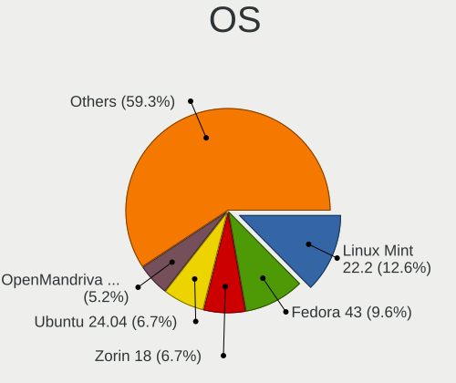

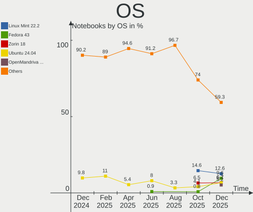

| Name                 | Notebooks | Percent |
|----------------------|-----------|---------|
| Linux Mint 22.2      | 17        | 12.59%  |
| Fedora 43            | 13        | 9.63%   |
| Zorin 18             | 9         | 6.67%   |
| Ubuntu 24.04         | 9         | 6.67%   |
| OpenMandriva 25.11   | 7         | 5.19%   |
| Ubuntu 25.10         | 6         | 4.44%   |
| Arch Rolling         | 6         | 4.44%   |
| OpenMandriva 6.0     | 5         | 3.7%    |
| Bazzite 43           | 5         | 3.7%    |
| Zorin 17             | 4         | 2.96%   |
| Kubuntu 25.10        | 4         | 2.96%   |
| Void Linux Rolling   | 3         | 2.22%   |
| KDE neon 24.04       | 3         | 2.22%   |
| Debian 13            | 3         | 2.22%   |
| SteamOS 3.7.17       | 2         | 1.48%   |
| Pop!_OS 24.04        | 2         | 1.48%   |
| Pop!_OS 22.04        | 2         | 1.48%   |
| OpenMandriva 25.90   | 2         | 1.48%   |
| MX 25                | 2         | 1.48%   |
| LMDE 7               | 2         | 1.48%   |
| CachyOS Rolling      | 2         | 1.48%   |
| CachyOS              | 2         | 1.48%   |
| Xubuntu 24.04        | 1         | 0.74%   |
| Ultramarine 43       | 1         | 0.74%   |
| Ubuntu Unity 24.04   | 1         | 0.74%   |
| Ubuntu 22.04         | 1         | 0.74%   |
| Sparky 8.0           | 1         | 0.74%   |
| Solus 4.8            | 1         | 0.74%   |
| Rocky Linux 10.1     | 1         | 0.74%   |
| RHEL 9               | 1         | 0.74%   |
| Nobara 43            | 1         | 0.74%   |
| Manjaro 25.0.10      | 1         | 0.74%   |
| Linux Mint 21.3      | 1         | 0.74%   |
| Linux Mint 18.1      | 1         | 0.74%   |
| Kali 2025.4          | 1         | 0.74%   |
| Gentoo 2.18          | 1         | 0.74%   |
| Garuda Linux Rolling | 1         | 0.74%   |
| Fedora 42            | 1         | 0.74%   |
| Elementary 8         | 1         | 0.74%   |
| Elementary 7.1       | 1         | 0.74%   |

OS Family
---------

OS without a version

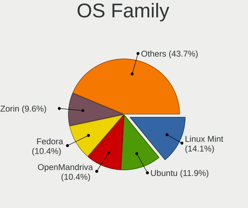

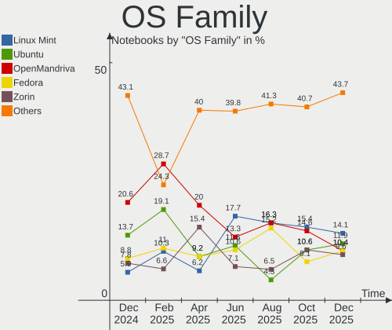

| Name         | Notebooks | Percent |
|--------------|-----------|---------|
| Linux Mint   | 19        | 14.07%  |
| Ubuntu       | 16        | 11.85%  |
| OpenMandriva | 14        | 10.37%  |
| Fedora       | 14        | 10.37%  |
| Zorin        | 13        | 9.63%   |
| Arch         | 7         | 5.19%   |
| Bazzite      | 6         | 4.44%   |
| Debian       | 5         | 3.7%    |
| Pop!_OS      | 4         | 2.96%   |
| Kubuntu      | 4         | 2.96%   |
| CachyOS      | 4         | 2.96%   |
| Void Linux   | 3         | 2.22%   |
| KDE neon     | 3         | 2.22%   |
| SteamOS      | 2         | 1.48%   |
| MX           | 2         | 1.48%   |
| LMDE         | 2         | 1.48%   |
| Elementary   | 2         | 1.48%   |
| Xubuntu      | 1         | 0.74%   |
| Ultramarine  | 1         | 0.74%   |
| Ubuntu Unity | 1         | 0.74%   |
| Sparky       | 1         | 0.74%   |
| Solus        | 1         | 0.74%   |
| Rocky Linux  | 1         | 0.74%   |
| RHEL         | 1         | 0.74%   |
| Nobara       | 1         | 0.74%   |
| Manjaro      | 1         | 0.74%   |
| Kali         | 1         | 0.74%   |
| Gentoo       | 1         | 0.74%   |
| Garuda Linux | 1         | 0.74%   |
| Dts-distro   | 1         | 0.74%   |
| BlackPanther | 1         | 0.74%   |
| Aurora       | 1         | 0.74%   |

Kernel
------

Version of the Linux kernel

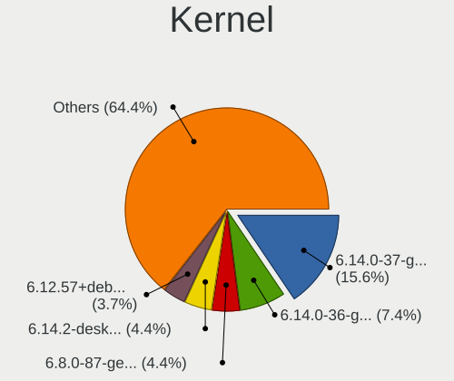

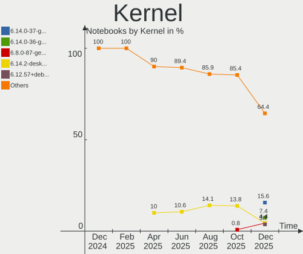

| Version                                     | Notebooks | Percent |
|---------------------------------------------|-----------|---------|
| 6.14.0-37-generic                           | 21        | 15.56%  |
| 6.14.0-36-generic                           | 10        | 7.41%   |
| 6.8.0-87-generic                            | 6         | 4.44%   |
| 6.14.2-desktop-3omv2590                     | 6         | 4.44%   |
| 6.12.57+deb13-amd64                         | 5         | 3.7%    |
| 6.18.0-desktop-1omv2590                     | 4         | 2.96%   |
| 6.17.9-arch1-1                              | 4         | 2.96%   |
| 6.17.12-300.fc43.x86_64                     | 4         | 2.96%   |
| 6.17.0-8-generic                            | 4         | 2.96%   |
| 6.17.8-300.fc43.x86_64                      | 3         | 2.22%   |
| 6.17.7-ba19.fc43.x86_64                     | 3         | 2.22%   |
| 6.17.0-7-generic                            | 3         | 2.22%   |
| 6.17.0-5-generic                            | 3         | 2.22%   |
| 6.17.9-76061709-generic                     | 2         | 1.48%   |
| 6.17.9-300.fc43.x86_64                      | 2         | 1.48%   |
| 6.17.8-arch1-1                              | 2         | 1.48%   |
| 6.17.7-desktop-1omv2590                     | 2         | 1.48%   |
| 6.17.7-ba20.fc43.x86_64                     | 2         | 1.48%   |
| 6.17.4-76061704-generic                     | 2         | 1.48%   |
| 6.17.1-300.fc43.x86_64                      | 2         | 1.48%   |
| 6.14.0-29-generic                           | 2         | 1.48%   |
| 6.12.48+deb13-amd64                         | 2         | 1.48%   |
| 6.11.11-valve24-2-neptune-611-gfd0dd251480d | 2         | 1.48%   |
| 6.8.0-90-generic                            | 1         | 0.74%   |
| 6.8.0-88-generic                            | 1         | 0.74%   |
| 6.6.21-yocto-standard                       | 1         | 0.74%   |
| 6.5.0-45-generic                            | 1         | 0.74%   |
| 6.18.2_1                                    | 1         | 0.74%   |
| 6.18.2-2-cachyos                            | 1         | 0.74%   |
| 6.18.1-arch1-2                              | 1         | 0.74%   |
| 6.18.0-5-cachyos                            | 1         | 0.74%   |
| 6.18.0-1-mainline                           | 1         | 0.74%   |
| 6.17.9-200.nobara.fc43.x86_64               | 1         | 0.74%   |
| 6.17.9-2-cachyos                            | 1         | 0.74%   |
| 6.17.9-1-cachyos-audio                      | 1         | 0.74%   |
| 6.17.8-324.current                          | 1         | 0.74%   |
| 6.17.8-200.fc42.x86_64                      | 1         | 0.74%   |
| 6.17.7-300.fc43.x86_64                      | 1         | 0.74%   |
| 6.17.6-061706-generic                       | 1         | 0.74%   |
| 6.17.5-300.fc43.x86_64                      | 1         | 0.74%   |

Kernel Family
-------------

Linux kernel without a distro release

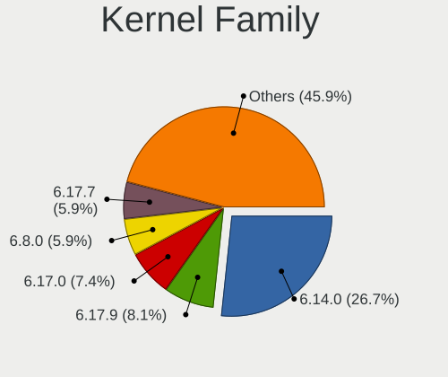

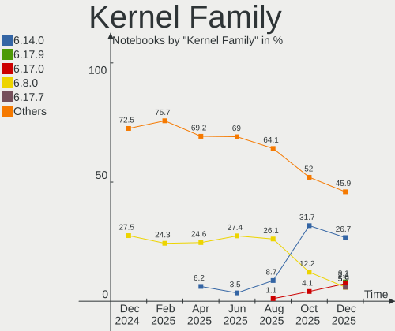

| Version | Notebooks | Percent |
|---------|-----------|---------|
| 6.14.0  | 36        | 26.67%  |
| 6.17.9  | 11        | 8.15%   |
| 6.17.0  | 10        | 7.41%   |
| 6.8.0   | 8         | 5.93%   |
| 6.17.7  | 8         | 5.93%   |
| 6.17.8  | 7         | 5.19%   |
| 6.18.0  | 6         | 4.44%   |
| 6.14.2  | 6         | 4.44%   |
| 6.12.57 | 6         | 4.44%   |
| 6.17.12 | 4         | 2.96%   |
| 6.17.4  | 3         | 2.22%   |
| 6.17.10 | 3         | 2.22%   |
| 6.12.48 | 3         | 2.22%   |
| 6.18.2  | 2         | 1.48%   |
| 6.17.1  | 2         | 1.48%   |
| 6.11.11 | 2         | 1.48%   |
| 6.6.21  | 1         | 0.74%   |
| 6.5.0   | 1         | 0.74%   |
| 6.18.1  | 1         | 0.74%   |
| 6.17.6  | 1         | 0.74%   |
| 6.17.5  | 1         | 0.74%   |
| 6.17.11 | 1         | 0.74%   |
| 6.16.4  | 1         | 0.74%   |
| 6.16.12 | 1         | 0.74%   |
| 6.12.60 | 1         | 0.74%   |
| 6.12.59 | 1         | 0.74%   |
| 6.12.58 | 1         | 0.74%   |
| 6.12.1  | 1         | 0.74%   |
| 6.12.0  | 1         | 0.74%   |
| 5.15.0  | 1         | 0.74%   |
| 5.14.0  | 1         | 0.74%   |
| 5.10.0  | 1         | 0.74%   |
| 4.4.0   | 1         | 0.74%   |
| 4.18.16 | 1         | 0.74%   |

Kernel Major Ver.
-----------------

Linux kernel major version

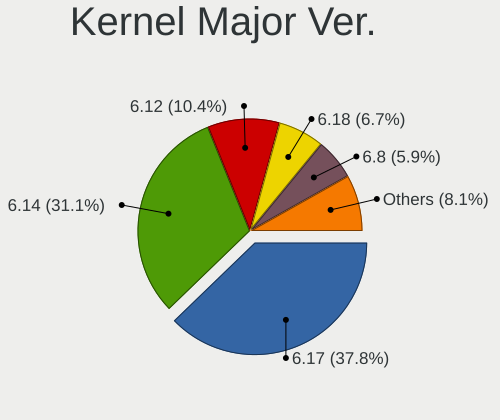

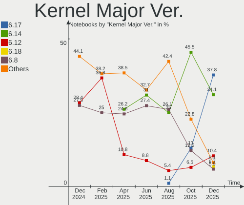

| Version | Notebooks | Percent |
|---------|-----------|---------|
| 6.17    | 51        | 37.78%  |
| 6.14    | 42        | 31.11%  |
| 6.12    | 14        | 10.37%  |
| 6.18    | 9         | 6.67%   |
| 6.8     | 8         | 5.93%   |
| 6.16    | 2         | 1.48%   |
| 6.11    | 2         | 1.48%   |
| 6.6     | 1         | 0.74%   |
| 6.5     | 1         | 0.74%   |
| 5.15    | 1         | 0.74%   |
| 5.14    | 1         | 0.74%   |
| 5.10    | 1         | 0.74%   |
| 4.4     | 1         | 0.74%   |
| 4.18    | 1         | 0.74%   |

Arch
----

OS architecture (x86_64, i586, etc.)

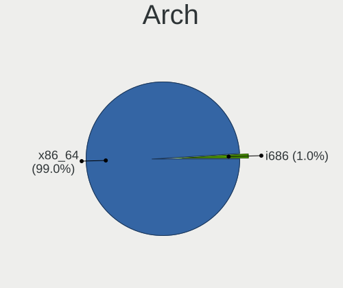

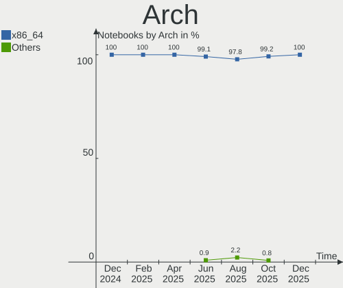

| Name   | Notebooks | Percent |
|--------|-----------|---------|
| x86_64 | 135       | 100%    |

DE
--

Desktop Environment

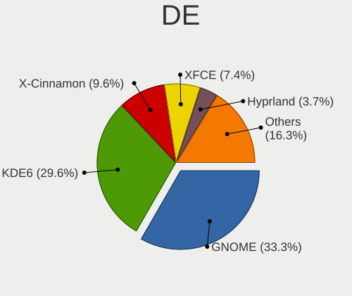

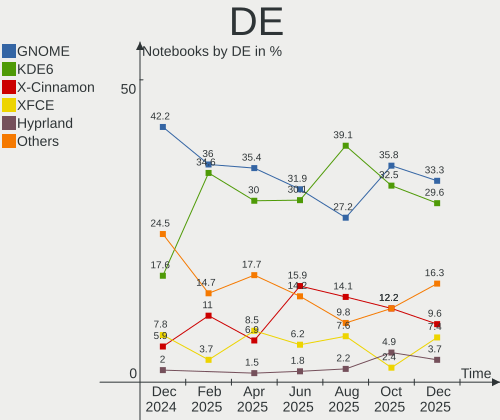

| Name                        | Notebooks | Percent |
|-----------------------------|-----------|---------|
| GNOME                       | 45        | 33.33%  |
| KDE6                        | 40        | 29.63%  |
| X-Cinnamon                  | 13        | 9.63%   |
| XFCE                        | 10        | 7.41%   |
| Hyprland                    | 5         | 3.7%    |
| MATE                        | 4         | 2.96%   |
| KDE                         | 3         | 2.22%   |
| Unknown                     | 3         | 2.22%   |
| Pantheon                    | 2         | 1.48%   |
| KDE5                        | 2         | 1.48%   |
| COSMIC                      | 2         | 1.48%   |
| Unity                       | 1         | 0.74%   |
| LXQt                        | 1         | 0.74%   |
| i3                          | 1         | 0.74%   |
| Deepin                      | 1         | 0.74%   |
| Budgie                      | 1         | 0.74%   |
| /usr/local/bin/start-mwm.sh | 1         | 0.74%   |

Display Server
--------------

X11 or Wayland

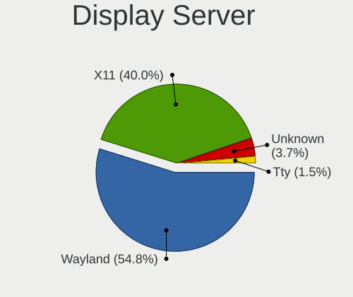

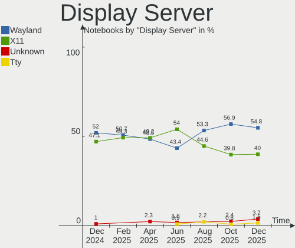

| Name    | Notebooks | Percent |
|---------|-----------|---------|
| Wayland | 74        | 54.81%  |
| X11     | 54        | 40%     |
| Unknown | 5         | 3.7%    |
| Tty     | 2         | 1.48%   |

Display Manager
---------------

SDDM, LightDM, etc.

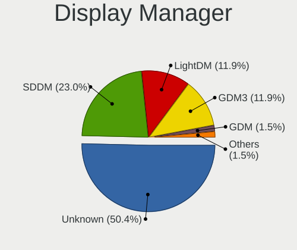

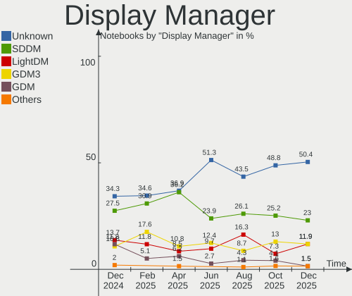

| Name    | Notebooks | Percent |
|---------|-----------|---------|
| Unknown | 68        | 50.37%  |
| SDDM    | 31        | 22.96%  |
| LightDM | 16        | 11.85%  |
| GDM3    | 16        | 11.85%  |
| GDM     | 2         | 1.48%   |
| MDM     | 1         | 0.74%   |
| LXDM    | 1         | 0.74%   |

OS Lang
-------

Language

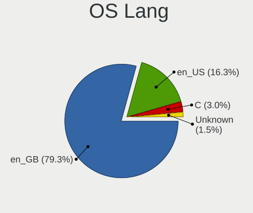

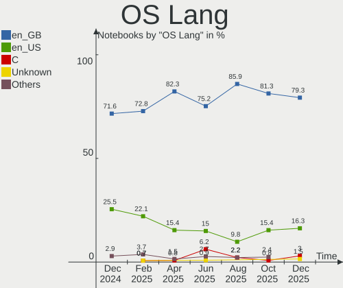

| Lang    | Notebooks | Percent |
|---------|-----------|---------|
| en_GB   | 107       | 79.26%  |
| en_US   | 22        | 16.3%   |
| C       | 4         | 2.96%   |
| Unknown | 2         | 1.48%   |

Boot Mode
---------

EFI or BIOS

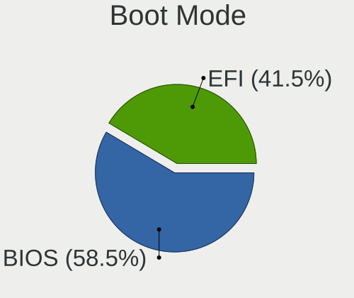

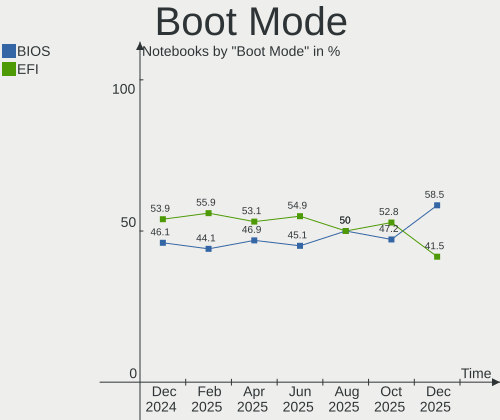

| Mode | Notebooks | Percent |
|------|-----------|---------|
| BIOS | 79        | 58.52%  |
| EFI  | 56        | 41.48%  |

Filesystem
----------

Type of filesystem

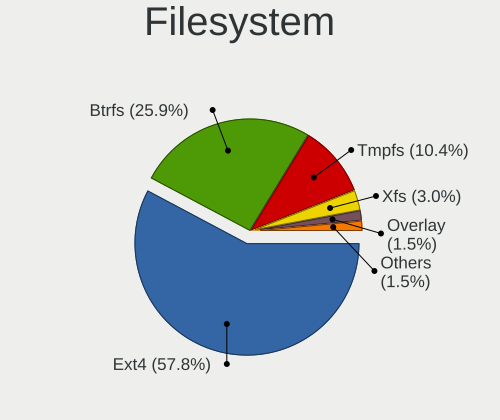

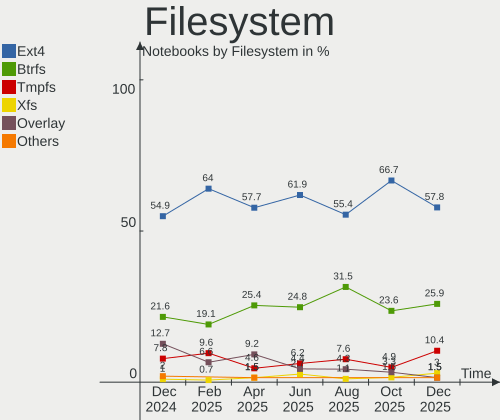

| Type    | Notebooks | Percent |
|---------|-----------|---------|
| Ext4    | 78        | 57.78%  |
| Btrfs   | 35        | 25.93%  |
| Tmpfs   | 14        | 10.37%  |
| Xfs     | 4         | 2.96%   |
| Overlay | 2         | 1.48%   |
| Rootfs  | 1         | 0.74%   |
| Ext3    | 1         | 0.74%   |

Part. scheme
------------

Scheme of partitioning

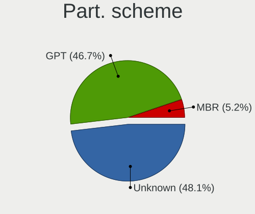

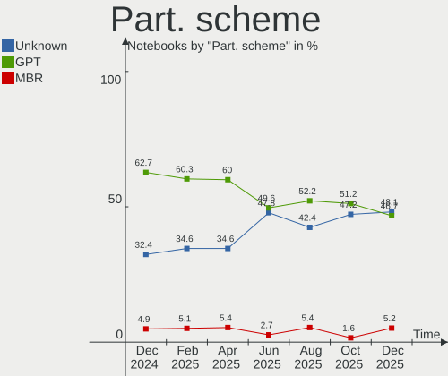

| Type    | Notebooks | Percent |
|---------|-----------|---------|
| Unknown | 65        | 48.15%  |
| GPT     | 63        | 46.67%  |
| MBR     | 7         | 5.19%   |

Dual Boot with Linux/BSD
------------------------

Hosting more than one Linux/BSD

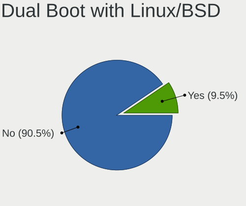

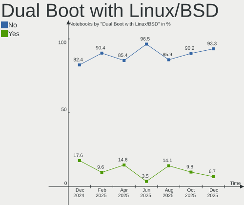

| Dual boot | Notebooks | Percent |
|-----------|-----------|---------|
| No        | 126       | 93.33%  |
| Yes       | 9         | 6.67%   |

Dual Boot (Win)
---------------

Hosting Linux and Windows

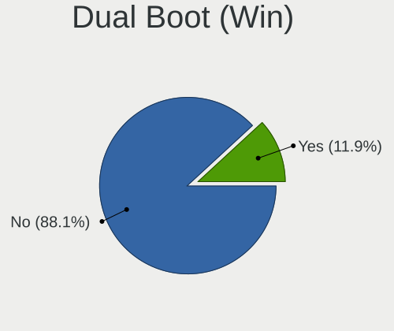

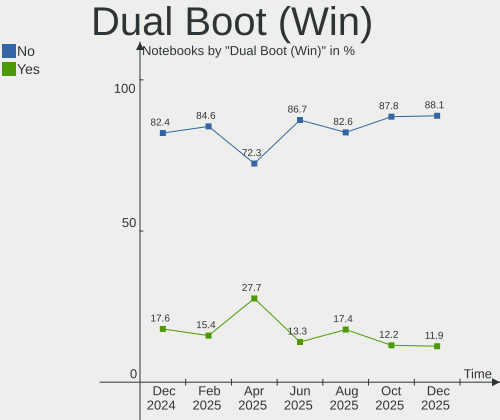

| Dual boot | Notebooks | Percent |
|-----------|-----------|---------|
| No        | 119       | 88.15%  |
| Yes       | 16        | 11.85%  |

Board
-----

Vendor
------

Motherboard manufacturer

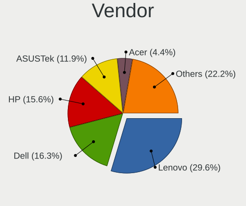

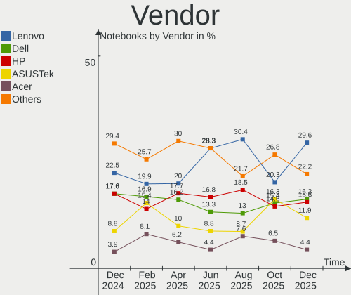

| Name                | Notebooks | Percent |
|---------------------|-----------|---------|
| Lenovo              | 40        | 29.63%  |
| Dell                | 22        | 16.3%   |
| Hewlett-Packard     | 21        | 15.56%  |
| ASUSTek Computer    | 16        | 11.85%  |
| Acer                | 6         | 4.44%   |
| Valve               | 3         | 2.22%   |
| MSI                 | 3         | 2.22%   |
| Samsung Electronics | 2         | 1.48%   |
| Razer               | 2         | 1.48%   |
| PC Specialist       | 2         | 1.48%   |
| Google              | 2         | 1.48%   |
| Fujitsu             | 2         | 1.48%   |
| Framework           | 2         | 1.48%   |
| Apple               | 2         | 1.48%   |
| Standard            | 1         | 0.74%   |
| Sony                | 1         | 0.74%   |
| RM Education        | 1         | 0.74%   |
| Panasonic           | 1         | 0.74%   |
| Notebook            | 1         | 0.74%   |
| HUAWEI              | 1         | 0.74%   |
| Entroware           | 1         | 0.74%   |
| Clevo               | 1         | 0.74%   |
| Chuwi               | 1         | 0.74%   |
| Alienware           | 1         | 0.74%   |

Model
-----

Motherboard model

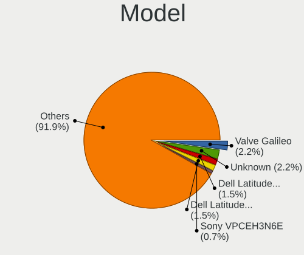

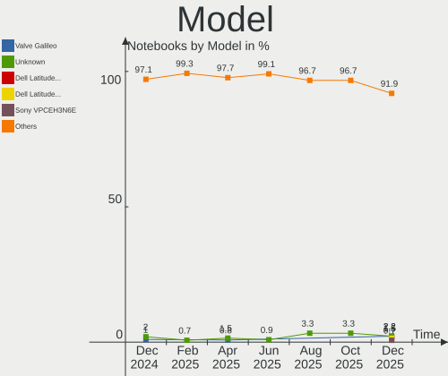

| Name                                               | Notebooks | Percent |
|----------------------------------------------------|-----------|---------|
| Valve Galileo                                      | 3         | 2.22%   |
| Unknown                                            | 3         | 2.22%   |
| Dell Latitude D630                                 | 2         | 1.48%   |
| Dell Latitude 3400                                 | 2         | 1.48%   |
| Sony VPCEH3N6E                                     | 1         | 0.74%   |
| Samsung R530/R730                                  | 1         | 0.74%   |
| Samsung 767XCL                                     | 1         | 0.74%   |
| RM Education RM                                    | 1         | 0.74%   |
| Razer Blade 16 - RZ09-0483                         | 1         | 0.74%   |
| Razer Blade 15 Base Model (Early 2020) - RZ09-0328 | 1         | 0.74%   |
| PC Specialist OctaneVI 17                          | 1         | 0.74%   |
| PC Specialist Lafite Pro 15 AMD                    | 1         | 0.74%   |
| Panasonic FZG1-4                                   | 1         | 0.74%   |
| Notebook V5xTNC_TND_TNE                            | 1         | 0.74%   |
| MSI Prestige 16 AI Studio B1VFG                    | 1         | 0.74%   |
| MSI Modern 15 B12M                                 | 1         | 0.74%   |
| MSI Crosshair 16 HX MONSTER HUNTER EDITION D14VFKG | 1         | 0.74%   |
| Lenovo Yoga710-14ISK 80TY                          | 1         | 0.74%   |
| Lenovo Yoga Slim 7 15ILL9 83HM                     | 1         | 0.74%   |
| Lenovo Yoga Pro 9 16IAH10 83L0                     | 1         | 0.74%   |
| Lenovo Yoga Pro 7 14ASP10 83LX                     | 1         | 0.74%   |
| Lenovo Yoga 3 14 80JH                              | 1         | 0.74%   |
| Lenovo ThinkStation P500 30A6S1FR00                | 1         | 0.74%   |
| Lenovo ThinkPad X61s 7666WJ5                       | 1         | 0.74%   |
| Lenovo ThinkPad X395 20NMS2YM00                    | 1         | 0.74%   |
| Lenovo ThinkPad X270 W10DG 20K5S04N00              | 1         | 0.74%   |
| Lenovo ThinkPad X270 20HMS1N700                    | 1         | 0.74%   |
| Lenovo ThinkPad X13 Gen 3 21CNS1M600               | 1         | 0.74%   |
| Lenovo ThinkPad X13 Gen 2a 20XH0093UK              | 1         | 0.74%   |
| Lenovo ThinkPad X1 Carbon Gen 10 21CCS4LT00        | 1         | 0.74%   |
| Lenovo ThinkPad T495s 20QKS1LC1U                   | 1         | 0.74%   |
| Lenovo ThinkPad T480 20L6S9UJ0Y                    | 1         | 0.74%   |
| Lenovo ThinkPad T480 20L6S66N0K                    | 1         | 0.74%   |
| Lenovo ThinkPad T440 20B7004EUK                    | 1         | 0.74%   |
| Lenovo ThinkPad T410 2522DV7                       | 1         | 0.74%   |
| Lenovo ThinkPad T400 6475CA6                       | 1         | 0.74%   |
| Lenovo ThinkPad T14 Gen 6 21QCCTO1WW               | 1         | 0.74%   |
| Lenovo ThinkPad T14 Gen 2i 20W1S29800              | 1         | 0.74%   |
| Lenovo ThinkPad P16s Gen 2 21K9CTO1WW              | 1         | 0.74%   |
| Lenovo ThinkPad P15 Gen 1 20SUS6TY0B               | 1         | 0.74%   |

Model Family
------------

Motherboard model prefix

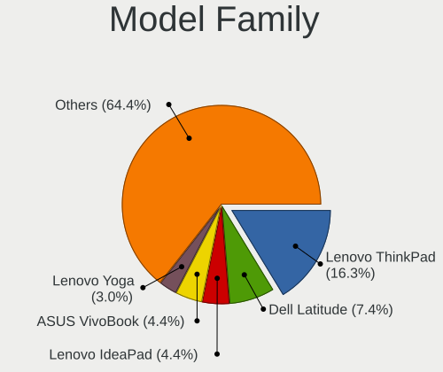

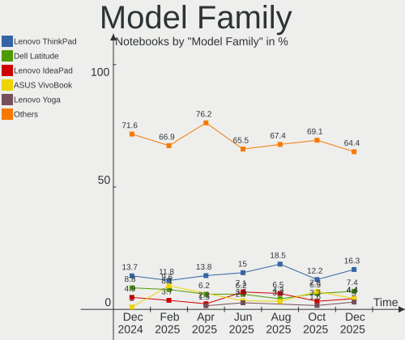

| Name                   | Notebooks | Percent |
|------------------------|-----------|---------|
| Lenovo ThinkPad        | 22        | 16.3%   |
| Dell Latitude          | 10        | 7.41%   |
| Lenovo IdeaPad         | 6         | 4.44%   |
| ASUS VivoBook          | 6         | 4.44%   |
| Lenovo Yoga            | 4         | 2.96%   |
| Lenovo Legion          | 4         | 2.96%   |
| HP ZBook               | 4         | 2.96%   |
| HP EliteBook           | 4         | 2.96%   |
| Dell XPS               | 4         | 2.96%   |
| Valve Galileo          | 3         | 2.22%   |
| Dell Precision         | 3         | 2.22%   |
| Dell Inspiron          | 3         | 2.22%   |
| ASUS Zenbook           | 3         | 2.22%   |
| ASUS ROG               | 3         | 2.22%   |
| Acer Aspire            | 3         | 2.22%   |
| Unknown                | 3         | 2.22%   |
| Razer Blade            | 2         | 1.48%   |
| HP ProBook             | 2         | 1.48%   |
| HP Pavilion            | 2         | 1.48%   |
| HP Laptop              | 2         | 1.48%   |
| Fujitsu LIFEBOOK       | 2         | 1.48%   |
| Framework Laptop       | 2         | 1.48%   |
| Dell Vostro            | 2         | 1.48%   |
| Sony VPCEH3N6E         | 1         | 0.74%   |
| Samsung R530           | 1         | 0.74%   |
| Samsung 767XCL         | 1         | 0.74%   |
| RM Education RM        | 1         | 0.74%   |
| PC Specialist OctaneVI | 1         | 0.74%   |
| PC Specialist Lafite   | 1         | 0.74%   |
| Panasonic FZG1-4       | 1         | 0.74%   |
| Notebook V5xTNC        | 1         | 0.74%   |
| MSI Prestige           | 1         | 0.74%   |
| MSI Modern             | 1         | 0.74%   |
| MSI Crosshair          | 1         | 0.74%   |
| Lenovo Yoga710-14ISK   | 1         | 0.74%   |
| Lenovo ThinkStation    | 1         | 0.74%   |
| Lenovo G700            | 1         | 0.74%   |
| Lenovo B570e           | 1         | 0.74%   |
| HUAWEI WRTB-WXX9       | 1         | 0.74%   |
| HP Stream              | 1         | 0.74%   |

MFG Year
--------

Motherboard manufacture year

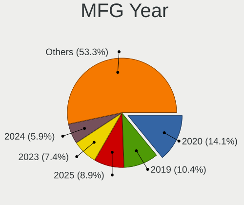

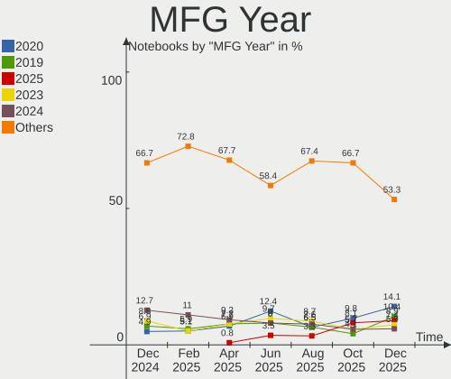

| Year | Notebooks | Percent |
|------|-----------|---------|
| 2020 | 19        | 14.07%  |
| 2019 | 14        | 10.37%  |
| 2025 | 12        | 8.89%   |
| 2023 | 10        | 7.41%   |
| 2024 | 8         | 5.93%   |
| 2022 | 8         | 5.93%   |
| 2021 | 8         | 5.93%   |
| 2013 | 7         | 5.19%   |
| 2012 | 7         | 5.19%   |
| 2011 | 7         | 5.19%   |
| 2015 | 6         | 4.44%   |
| 2018 | 5         | 3.7%    |
| 2017 | 5         | 3.7%    |
| 2016 | 4         | 2.96%   |
| 2014 | 4         | 2.96%   |
| 2009 | 4         | 2.96%   |
| 2007 | 4         | 2.96%   |
| 2010 | 2         | 1.48%   |
| 2008 | 1         | 0.74%   |

Form Factor
-----------

Physical design of the computer

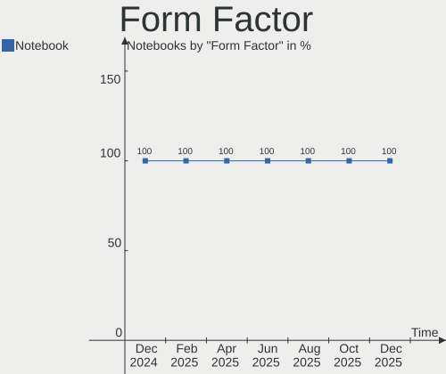

| Name     | Notebooks | Percent |
|----------|-----------|---------|
| Notebook | 135       | 100%    |

Secure Boot
-----------

Enabled or disabled

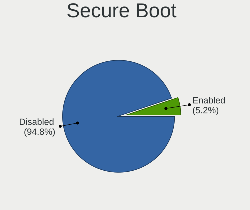

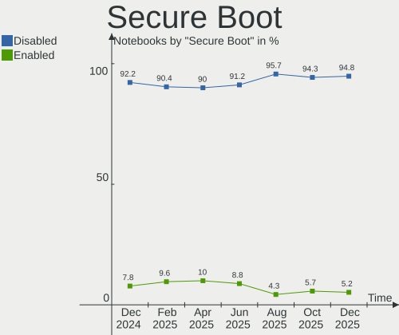

| State    | Notebooks | Percent |
|----------|-----------|---------|
| Disabled | 128       | 94.81%  |
| Enabled  | 7         | 5.19%   |

Coreboot
--------

Have coreboot on board

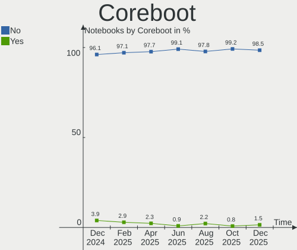

| Used | Notebooks | Percent |
|------|-----------|---------|
| No   | 133       | 98.52%  |
| Yes  | 2         | 1.48%   |

RAM Size
--------

Total RAM memory

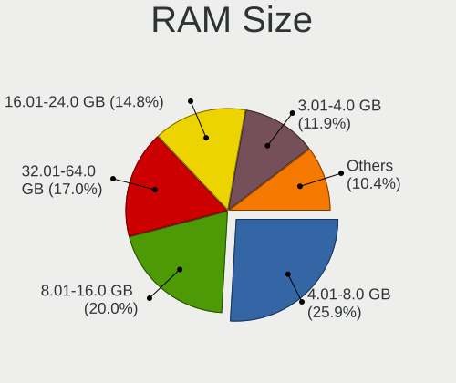

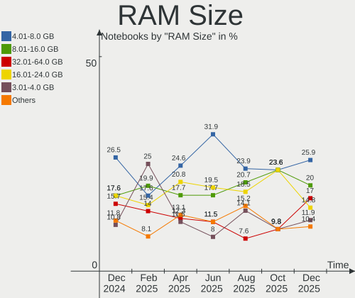

| Size in GB  | Notebooks | Percent |
|-------------|-----------|---------|
| 4.01-8.0    | 35        | 25.93%  |
| 8.01-16.0   | 27        | 20%     |
| 32.01-64.0  | 23        | 17.04%  |
| 16.01-24.0  | 20        | 14.81%  |
| 3.01-4.0    | 16        | 11.85%  |
| 24.01-32.0  | 6         | 4.44%   |
| 64.01-256.0 | 4         | 2.96%   |
| 1.01-2.0    | 3         | 2.22%   |
| 0.51-1.0    | 1         | 0.74%   |

RAM Used
--------

Used RAM memory

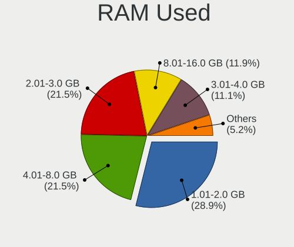

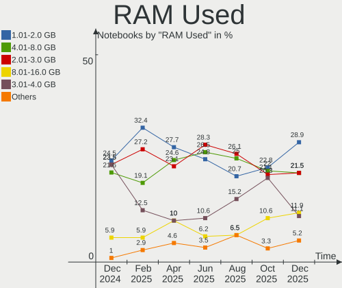

| Used GB    | Notebooks | Percent |
|------------|-----------|---------|
| 1.01-2.0   | 39        | 28.89%  |
| 4.01-8.0   | 29        | 21.48%  |
| 2.01-3.0   | 29        | 21.48%  |
| 8.01-16.0  | 16        | 11.85%  |
| 3.01-4.0   | 15        | 11.11%  |
| 0.51-1.0   | 6         | 4.44%   |
| 16.01-24.0 | 1         | 0.74%   |

Total Drives
------------

Number of drives on board

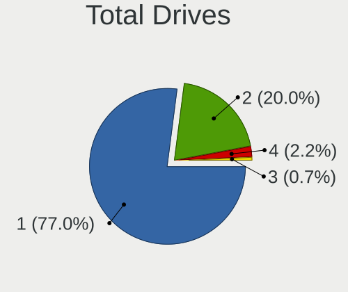

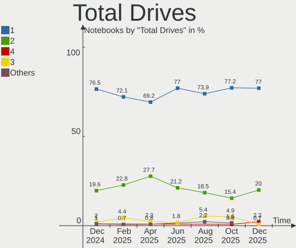

| Drives | Notebooks | Percent |
|--------|-----------|---------|
| 1      | 104       | 77.04%  |
| 2      | 27        | 20%     |
| 4      | 3         | 2.22%   |
| 3      | 1         | 0.74%   |

Has CD-ROM
----------

Has CD-ROM on board

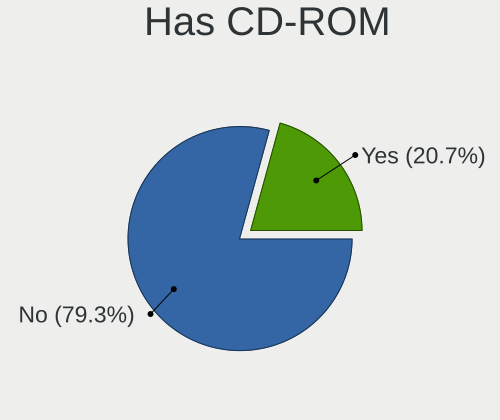

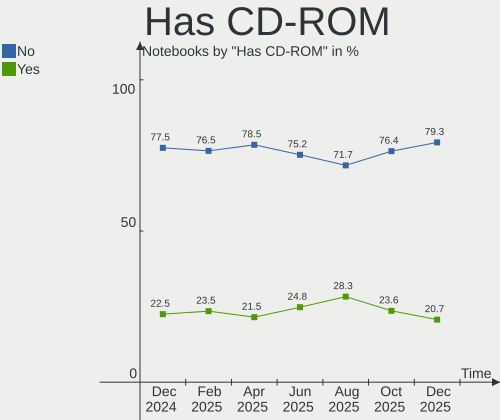

| Presented | Notebooks | Percent |
|-----------|-----------|---------|
| No        | 107       | 79.26%  |
| Yes       | 28        | 20.74%  |

Has Ethernet
------------

Has Ethernet on board

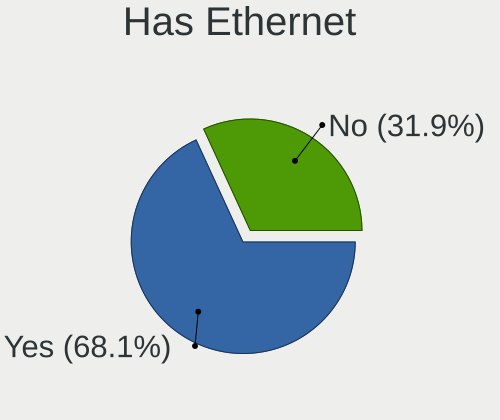

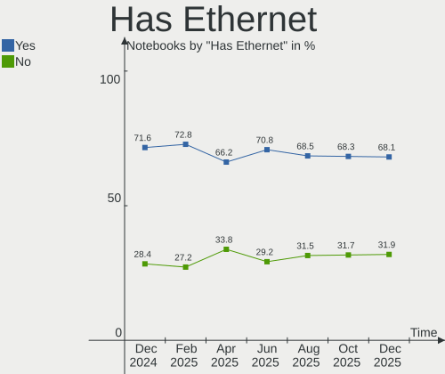

| Presented | Notebooks | Percent |
|-----------|-----------|---------|
| Yes       | 92        | 68.15%  |
| No        | 43        | 31.85%  |

Has WiFi
--------

Has WiFi module

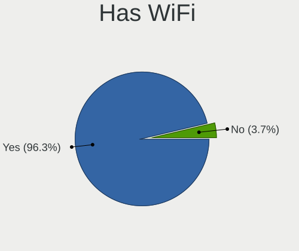

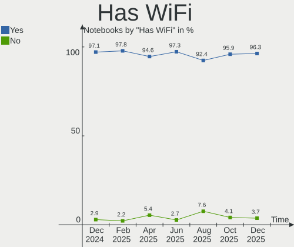

| Presented | Notebooks | Percent |
|-----------|-----------|---------|
| Yes       | 130       | 96.3%   |
| No        | 5         | 3.7%    |

Has Bluetooth
-------------

Has Bluetooth module

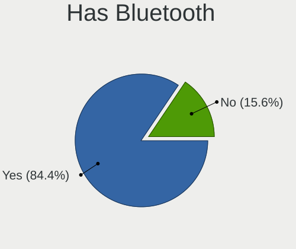

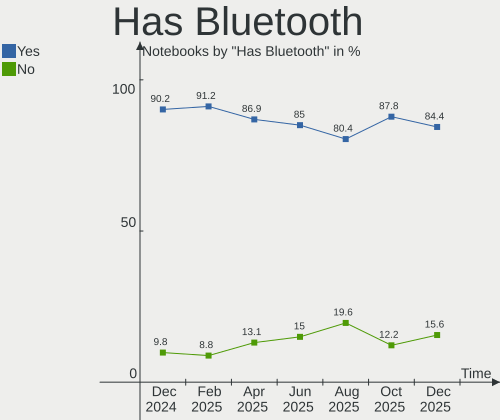

| Presented | Notebooks | Percent |
|-----------|-----------|---------|
| Yes       | 114       | 84.44%  |
| No        | 21        | 15.56%  |

Location
--------

Country
-------

Geographic location (country)

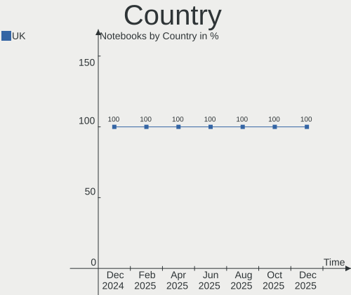

| Country | Notebooks | Percent |
|---------|-----------|---------|
| UK      | 135       | 100%    |

City
----

Geographic location (city)

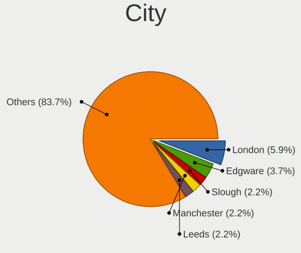

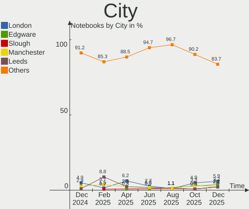

| City                | Notebooks | Percent |
|---------------------|-----------|---------|
| London              | 8         | 5.93%   |
| Edgware             | 5         | 3.7%    |
| Slough              | 3         | 2.22%   |
| Manchester          | 3         | 2.22%   |
| Leeds               | 3         | 2.22%   |
| Goole               | 3         | 2.22%   |
| Wandsworth          | 2         | 1.48%   |
| Tower Hamlets       | 2         | 1.48%   |
| Stoke-on-Trent      | 2         | 1.48%   |
| St Albans           | 2         | 1.48%   |
| Reading             | 2         | 1.48%   |
| Newport             | 2         | 1.48%   |
| Newcastle upon Tyne | 2         | 1.48%   |
| Middlesbrough       | 2         | 1.48%   |
| Liverpool           | 2         | 1.48%   |
| Hackney             | 2         | 1.48%   |
| Gravesend           | 2         | 1.48%   |
| Glasgow             | 2         | 1.48%   |
| Brent               | 2         | 1.48%   |
| Bolton              | 2         | 1.48%   |
| Bingley             | 2         | 1.48%   |
| Barnet              | 2         | 1.48%   |
| York                | 1         | 0.74%   |
| Worthing            | 1         | 0.74%   |
| Whyteleafe          | 1         | 0.74%   |
| Walton on Thames    | 1         | 0.74%   |
| Wallasey            | 1         | 0.74%   |
| Wakefield           | 1         | 0.74%   |
| Uckfield            | 1         | 0.74%   |
| Turriff             | 1         | 0.74%   |
| Trowbridge          | 1         | 0.74%   |
| Taunton             | 1         | 0.74%   |
| Tamworth            | 1         | 0.74%   |
| Sunderland          | 1         | 0.74%   |
| Stourbridge         | 1         | 0.74%   |
| Stanmore            | 1         | 0.74%   |
| Stafford            | 1         | 0.74%   |
| Southampton         | 1         | 0.74%   |
| South Shields       | 1         | 0.74%   |
| Shoreham-by-Sea     | 1         | 0.74%   |

Drives
------

Drive Vendor
------------

Hard drive vendors

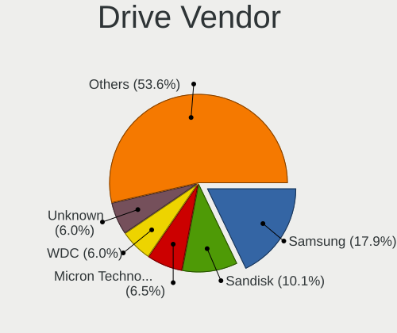

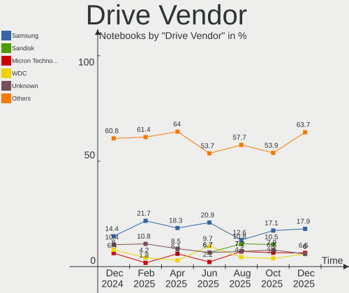

| Vendor                         | Notebooks | Drives | Percent |
|--------------------------------|-----------|--------|---------|
| Samsung Electronics            | 30        | 33     | 17.86%  |
| Sandisk                        | 17        | 17     | 10.12%  |
| Micron Technology              | 11        | 11     | 6.55%   |
| WDC                            | 10        | 11     | 5.95%   |
| Unknown                        | 10        | 12     | 5.95%   |
| SK hynix                       | 10        | 10     | 5.95%   |
| Toshiba                        | 7         | 7      | 4.17%   |
| Kingston                       | 7         | 7      | 4.17%   |
| MAXIO Technology (Hangzhou)    | 5         | 5      | 2.98%   |
| KIOXIA                         | 5         | 5      | 2.98%   |
| Kingston Technology Company    | 5         | 5      | 2.98%   |
| HGST                           | 5         | 5      | 2.98%   |
| Crucial                        | 5         | 5      | 2.98%   |
| Seagate                        | 4         | 4      | 2.38%   |
| Micron/Crucial Technology      | 3         | 3      | 1.79%   |
| Hitachi                        | 3         | 4      | 1.79%   |
| XUM                            | 2         | 2      | 1.19%   |
| Phison Electronics             | 2         | 2      | 1.19%   |
| Patriot                        | 2         | 2      | 1.19%   |
| LITEONIT                       | 2         | 2      | 1.19%   |
| China                          | 2         | 2      | 1.19%   |
| Unknown                        | 2         | 2      | 1.19%   |
| Wibtek                         | 1         | 1      | 0.6%    |
| Union Memory                   | 1         | 1      | 0.6%    |
| Team                           | 1         | 1      | 0.6%    |
| Solid State Storage Technology | 1         | 1      | 0.6%    |
| Shenzhen Longsys Electronics   | 1         | 1      | 0.6%    |
| PNY                            | 1         | 1      | 0.6%    |
| Plextor                        | 1         | 1      | 0.6%    |
| ORICO                          | 1         | 1      | 0.6%    |
| MicroDream                     | 1         | 1      | 0.6%    |
| KingSpec                       | 1         | 1      | 0.6%    |
| ITGZ                           | 1         | 1      | 0.6%    |
| Intenso                        | 1         | 1      | 0.6%    |
| Intel                          | 1         | 1      | 0.6%    |
| Fanxiang                       | 1         | 1      | 0.6%    |
| BIWIN                          | 1         | 1      | 0.6%    |
| BHT                            | 1         | 1      | 0.6%    |
| Apple                          | 1         | 1      | 0.6%    |
| Acer                           | 1         | 1      | 0.6%    |

Drive Model
-----------

Hard drive models

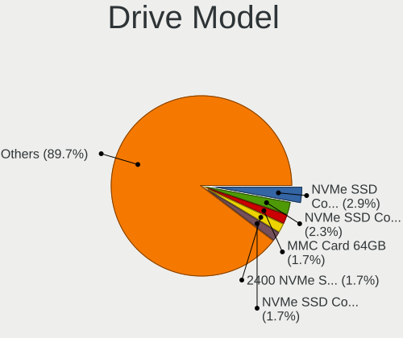

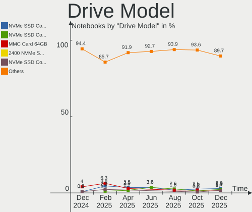

| Model                                              | Notebooks | Percent |
|----------------------------------------------------|-----------|---------|
| Samsung NVMe SSD Controller SM981/PM981/PM983 1TB  | 5         | 2.87%   |
| Samsung NVMe SSD Controller PM9A1/PM9A3/980PRO 1TB | 4         | 2.3%    |
| Unknown MMC Card  64GB                             | 3         | 1.72%   |
| Micron 2400 NVMe SSD (DRAM-less) 512GB             | 3         | 1.72%   |
| MAXIO (Hangzhou) NVMe SSD Controller MAP1202 2TB   | 3         | 1.72%   |
| Unknown SD/MMC/MS PRO 2GB                          | 2         | 1.15%   |
| Unknown MMC Card  32GB                             | 2         | 1.15%   |
| Unknown MMC Card  128GB                            | 2         | 1.15%   |
| Sandisk WD_BLACK SN850X 2000GB                     | 2         | 1.15%   |
| Sandisk WD PC SN740 SDDPTQE-2T00 2TB               | 2         | 1.15%   |
| Sandisk WD Black SN850 1TB                         | 2         | 1.15%   |
| SanDisk NVMe SSD Drive 1TB                         | 2         | 1.15%   |
| Samsung NVMe SSD Controller 980 (DRAM-less) 256GB  | 2         | 1.15%   |
| HGST HTS725050A7E630 500GB                         | 2         | 1.15%   |
| HGST HTS721010A9E630 1TB                           | 2         | 1.15%   |
| Unknown                                            | 2         | 1.15%   |
| XUM HX256GSSDSATA3 256GB                           | 1         | 0.57%   |
| XUM HX128GSSDSATA3 128GB                           | 1         | 0.57%   |
| Wibtek W800S 256GB SSD                             | 1         | 0.57%   |
| WDC WDS100T2B0C-00PXH0 1TB                         | 1         | 0.57%   |
| WDC WD800BEVS-75RST0 80GB                          | 1         | 0.57%   |
| WDC WD7500BPVT-60HXZT3 752GB                       | 1         | 0.57%   |
| WDC WD5000LPLX-08ZNTT0 500GB                       | 1         | 0.57%   |
| WDC WD50 00LPCX-60VHA 500GB                        | 1         | 0.57%   |
| WDC WD3200BPVT-75JJ5T0 320GB                       | 1         | 0.57%   |
| WDC WD30PURX-64P6ZY0 3TB                           | 1         | 0.57%   |
| WDC WD1600BEVT-22A23T0 160GB                       | 1         | 0.57%   |
| WDC WD10SPCX-60KHST0 1TB                           | 1         | 0.57%   |
| WDC WD10SPCX-24HWST1 1TB                           | 1         | 0.57%   |
| Unknown SD64G  64GB                                | 1         | 0.57%   |
| Unknown NVMe SSD Drive 512GB                       | 1         | 0.57%   |
| Unknown MMC Card  250GB                            | 1         | 0.57%   |
| Union Memory UMIS RPJTJ256MED1OWX 256GB            | 1         | 0.57%   |
| Toshiba XG6 NVMe SSD Controller 1024GB             | 1         | 0.57%   |
| Toshiba XG3 NVMe SSD Controller 1TB                | 1         | 0.57%   |
| Toshiba MQ01ACF032 320GB                           | 1         | 0.57%   |
| Toshiba MQ01ABD100 1TB                             | 1         | 0.57%   |
| Toshiba MK2555GSX 250GB                            | 1         | 0.57%   |
| Toshiba KXG6AZNV512G 512GB                         | 1         | 0.57%   |
| Toshiba HDWD130 3TB                                | 1         | 0.57%   |

HDD Vendor
----------

Hard disk drive vendors

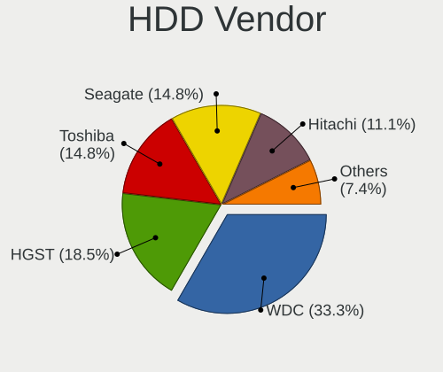

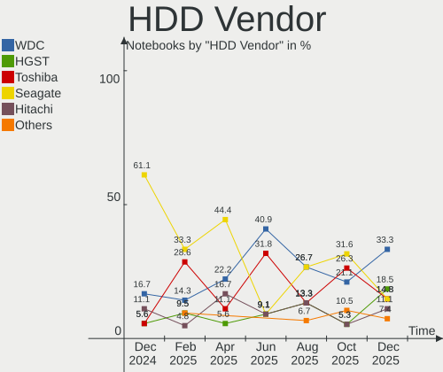

| Vendor  | Notebooks | Drives | Percent |
|---------|-----------|--------|---------|
| WDC     | 9         | 10     | 33.33%  |
| HGST    | 5         | 5      | 18.52%  |
| Toshiba | 4         | 4      | 14.81%  |
| Seagate | 4         | 4      | 14.81%  |
| Hitachi | 3         | 4      | 11.11%  |
| Unknown | 2         | 2      | 7.41%   |

SSD Vendor
----------

Solid state drive vendors

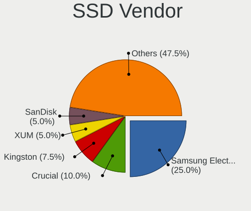

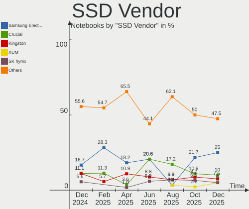

| Vendor              | Notebooks | Drives | Percent |
|---------------------|-----------|--------|---------|
| Samsung Electronics | 10        | 10     | 25%     |
| Crucial             | 4         | 4      | 10%     |
| Kingston            | 3         | 3      | 7.5%    |
| XUM                 | 2         | 2      | 5%      |
| SK hynix            | 2         | 2      | 5%      |
| SanDisk             | 2         | 2      | 5%      |
| LITEONIT            | 2         | 2      | 5%      |
| China               | 2         | 2      | 5%      |
| Wibtek              | 1         | 1      | 2.5%    |
| Team                | 1         | 1      | 2.5%    |
| PNY                 | 1         | 1      | 2.5%    |
| Plextor             | 1         | 1      | 2.5%    |
| Patriot             | 1         | 1      | 2.5%    |
| MicroDream          | 1         | 1      | 2.5%    |
| KingSpec            | 1         | 1      | 2.5%    |
| Intenso             | 1         | 1      | 2.5%    |
| BIWIN               | 1         | 1      | 2.5%    |
| BHT                 | 1         | 1      | 2.5%    |
| Acer                | 1         | 1      | 2.5%    |
| 2-Power             | 1         | 1      | 2.5%    |
| Unknown             | 1         | 1      | 2.5%    |

Drive Kind
----------

HDD or SSD

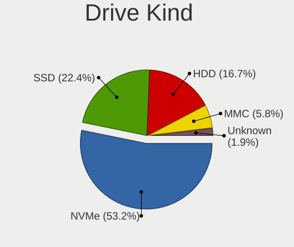

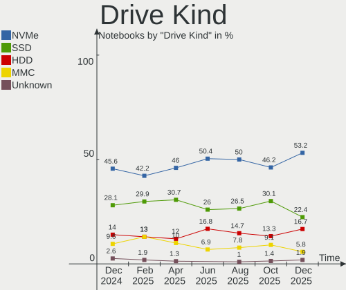

| Kind    | Notebooks | Drives | Percent |
|---------|-----------|--------|---------|
| NVMe    | 83        | 93     | 53.21%  |
| SSD     | 35        | 40     | 22.44%  |
| HDD     | 26        | 29     | 16.67%  |
| MMC     | 9         | 10     | 5.77%   |
| Unknown | 3         | 3      | 1.92%   |

Drive Connector
---------------

SATA, SAS, NVMe, etc.

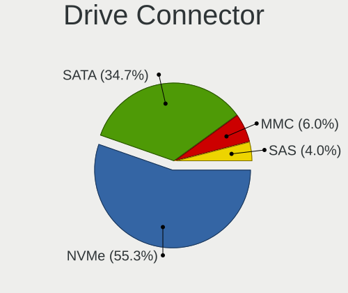

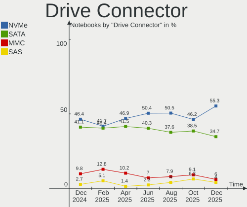

| Type | Notebooks | Drives | Percent |
|------|-----------|--------|---------|
| NVMe | 83        | 93     | 55.33%  |
| SATA | 52        | 66     | 34.67%  |
| MMC  | 9         | 10     | 6%      |
| SAS  | 6         | 6      | 4%      |

Drive Size
----------

Size of hard drive

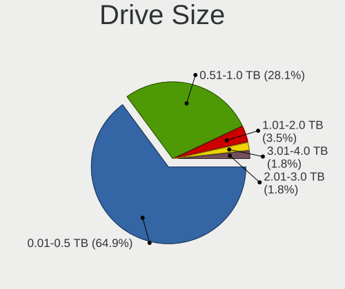

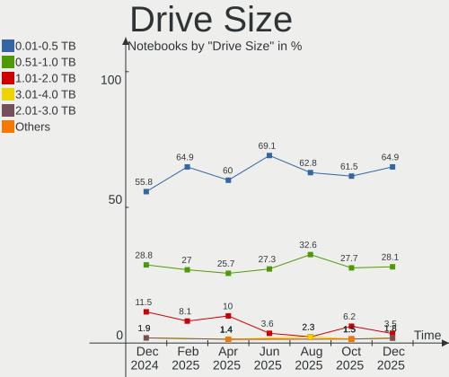

| Size in TB | Notebooks | Drives | Percent |
|------------|-----------|--------|---------|
| 0.01-0.5   | 37        | 45     | 64.91%  |
| 0.51-1.0   | 16        | 18     | 28.07%  |
| 1.01-2.0   | 2         | 2      | 3.51%   |
| 3.01-4.0   | 1         | 1      | 1.75%   |
| 2.01-3.0   | 1         | 3      | 1.75%   |

Space Total
-----------

Amount of disk space available on the file system

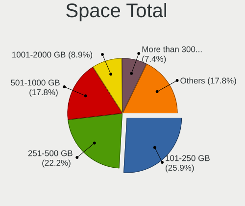

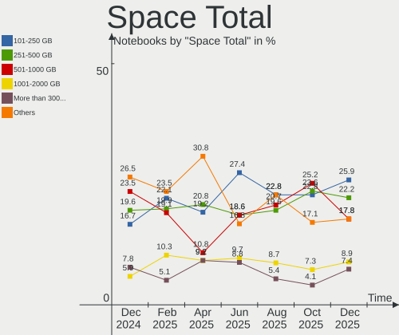

| Size in GB     | Notebooks | Percent |
|----------------|-----------|---------|
| 101-250        | 35        | 25.93%  |
| 251-500        | 30        | 22.22%  |
| 501-1000       | 24        | 17.78%  |
| 1001-2000      | 12        | 8.89%   |
| More than 3000 | 10        | 7.41%   |
| 1-20           | 9         | 6.67%   |
| 51-100         | 6         | 4.44%   |
| Unknown        | 5         | 3.7%    |
| 2001-3000      | 3         | 2.22%   |
| 21-50          | 1         | 0.74%   |

Space Used
----------

Amount of used disk space

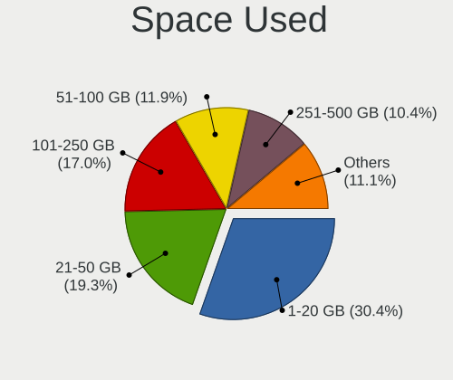

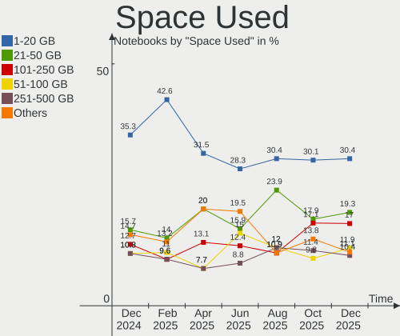

| Used GB   | Notebooks | Percent |
|-----------|-----------|---------|
| 1-20      | 41        | 30.37%  |
| 21-50     | 26        | 19.26%  |
| 101-250   | 23        | 17.04%  |
| 51-100    | 16        | 11.85%  |
| 251-500   | 14        | 10.37%  |
| 501-1000  | 7         | 5.19%   |
| Unknown   | 5         | 3.7%    |
| 1001-2000 | 2         | 1.48%   |
| 2001-3000 | 1         | 0.74%   |

Malfunc. Drives
---------------

Drive models with a malfunction

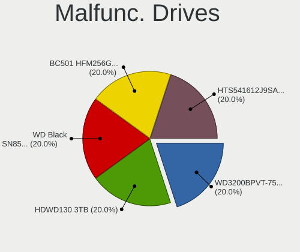

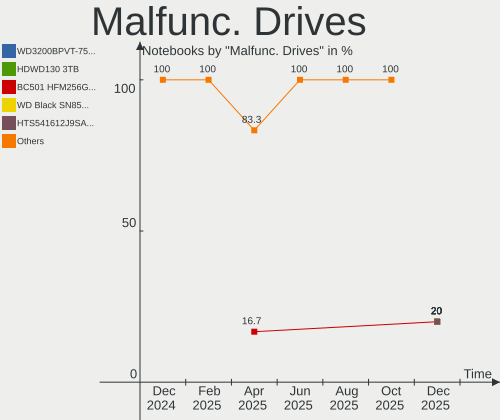

| Model                                   | Notebooks | Drives | Percent |
|-----------------------------------------|-----------|--------|---------|
| WDC WD3200BPVT-75JJ5T0 320GB            | 1         | 1      | 20%     |
| Toshiba HDWD130 3TB                     | 1         | 1      | 20%     |
| SK hynix BC501 HFM256GDJTNG-8310A 256GB | 1         | 1      | 20%     |
| Sandisk WD Black SN850 1TB              | 1         | 1      | 20%     |
| Hitachi HTS541612J9SA00 3H 120GB        | 1         | 1      | 20%     |

Malfunc. Drive Vendor
---------------------

Vendors of faulty drives

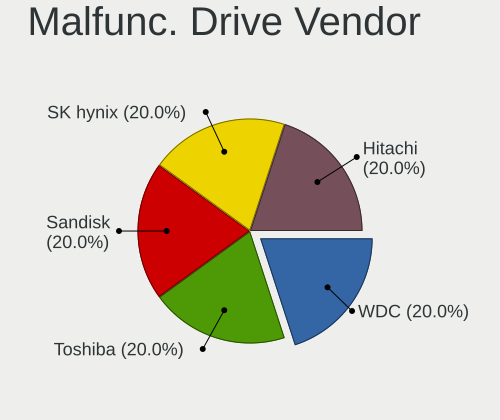

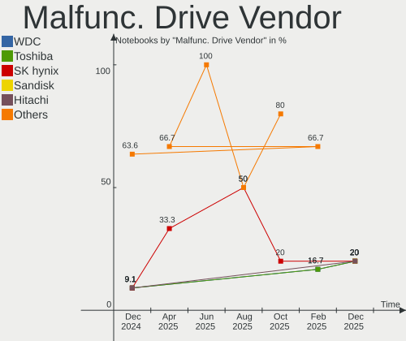

| Vendor   | Notebooks | Drives | Percent |
|----------|-----------|--------|---------|
| WDC      | 1         | 1      | 20%     |
| Toshiba  | 1         | 1      | 20%     |
| SK hynix | 1         | 1      | 20%     |
| Sandisk  | 1         | 1      | 20%     |
| Hitachi  | 1         | 1      | 20%     |

Malfunc. HDD Vendor
-------------------

Vendors of faulty HDD drives

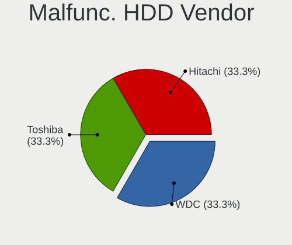

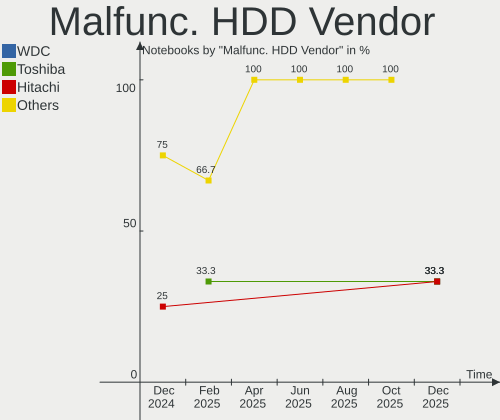

| Vendor  | Notebooks | Drives | Percent |
|---------|-----------|--------|---------|
| WDC     | 1         | 1      | 33.33%  |
| Toshiba | 1         | 1      | 33.33%  |
| Hitachi | 1         | 1      | 33.33%  |

Malfunc. Drive Kind
-------------------

Kinds of faulty drives

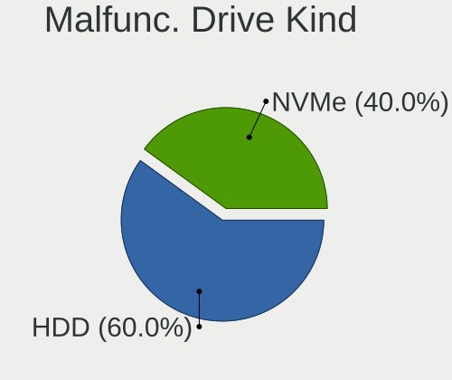

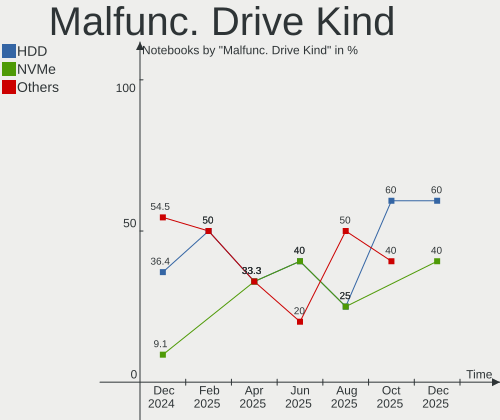

| Kind | Notebooks | Drives | Percent |
|------|-----------|--------|---------|
| HDD  | 3         | 3      | 60%     |
| NVMe | 2         | 2      | 40%     |

Failed Drives
-------------

Failed drive models

Zero info for selected period =(

Failed Drive Vendor
-------------------

Failed drive vendors

Zero info for selected period =(

Drive Status
------------

Number of failed and malfunc. drives

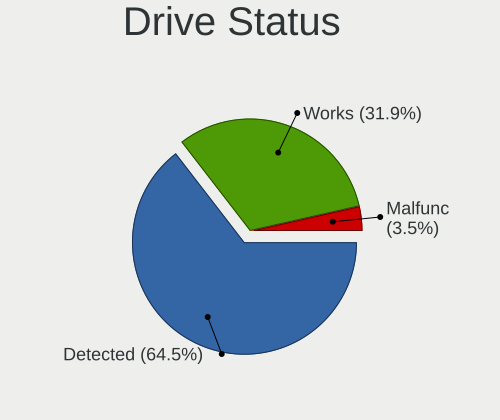

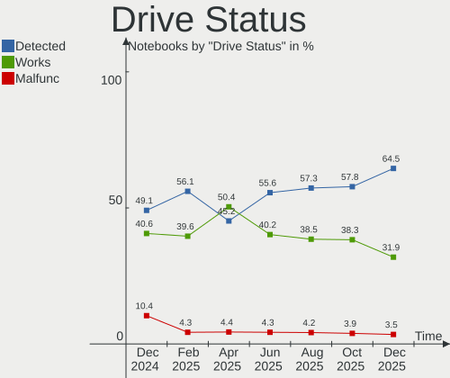

| Status   | Notebooks | Drives | Percent |
|----------|-----------|--------|---------|
| Detected | 91        | 116    | 64.54%  |
| Works    | 45        | 54     | 31.91%  |
| Malfunc  | 5         | 5      | 3.55%   |

Storage controller
------------------

Storage Vendor
--------------

Storage controller vendors

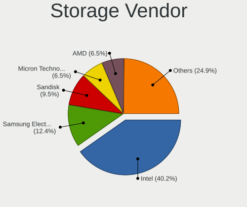

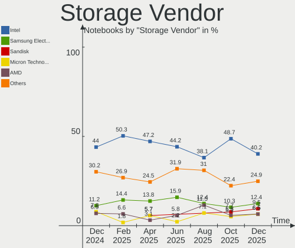

| Vendor                          | Notebooks | Percent |
|---------------------------------|-----------|---------|
| Intel                           | 68        | 40.24%  |
| Samsung Electronics             | 21        | 12.43%  |
| Sandisk                         | 16        | 9.47%   |
| Micron Technology               | 11        | 6.51%   |
| AMD                             | 11        | 6.51%   |
| Kingston Technology Company     | 9         | 5.33%   |
| SK hynix                        | 8         | 4.73%   |
| MAXIO Technology (Hangzhou)     | 5         | 2.96%   |
| KIOXIA                          | 5         | 2.96%   |
| Micron/Crucial Technology       | 4         | 2.37%   |
| Toshiba America Info Systems    | 3         | 1.78%   |
| Phison Electronics              | 2         | 1.18%   |
| Union Memory (Shenzhen)         | 1         | 0.59%   |
| Solid State Storage Technology  | 1         | 0.59%   |
| Shenzhen Techwinsemi Technology | 1         | 0.59%   |
| Shenzhen Longsys Electronics    | 1         | 0.59%   |
| Hosin Global Electronics        | 1         | 0.59%   |
| Apple                           | 1         | 0.59%   |

Storage Model
-------------

Storage controller models

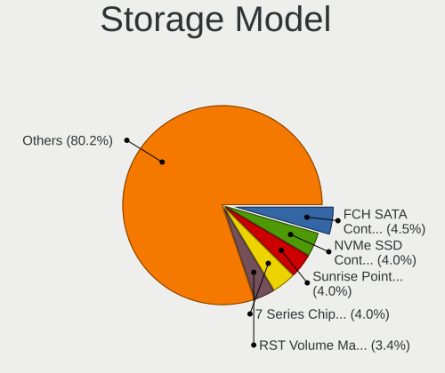

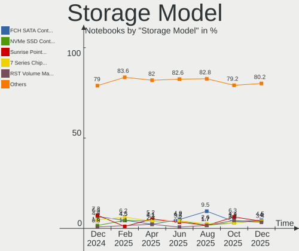

| Model                                                                          | Notebooks | Percent |
|--------------------------------------------------------------------------------|-----------|---------|
| AMD FCH SATA Controller [AHCI mode]                                            | 8         | 4.52%   |
| Samsung NVMe SSD Controller SM981/PM981/PM983                                  | 7         | 3.95%   |
| Intel Sunrise Point-LP SATA Controller [AHCI mode]                             | 7         | 3.95%   |
| Intel 7 Series Chipset Family 6-port SATA Controller [AHCI mode]               | 7         | 3.95%   |
| Intel RST Volume Management Device Controller                                  | 6         | 3.39%   |
| SanDisk WD SN560/SN740/SN770/SN5000 NVMe SSD                                   | 5         | 2.82%   |
| Samsung NVMe SSD Controller 980 (DRAM-less)                                    | 5         | 2.82%   |
| Samsung NVMe SSD Controller PM9A1/PM9A3/980PRO                                 | 4         | 2.26%   |
| Micron 2400 NVMe SSD (DRAM-less)                                               | 4         | 2.26%   |
| MAXIO (Hangzhou) NVMe SSD Controller MAP1202 (DRAM-less)                       | 4         | 2.26%   |
| Intel Comet Lake SATA AHCI Controller                                          | 4         | 2.26%   |
| Intel 82801 Mobile SATA Controller [RAID mode]                                 | 4         | 2.26%   |
| Kingston Company NV3 NVMe SSD [TC2201] (DRAM-less)                             | 3         | 1.69%   |
| Intel Volume Management Device NVMe RAID Controller                            | 3         | 1.69%   |
| Intel HM170/QM170 Chipset SATA Controller [AHCI Mode]                          | 3         | 1.69%   |
| Intel 82801HM/HEM (ICH8M/ICH8M-E) SATA Controller [IDE mode]                   | 3         | 1.69%   |
| Intel 8 Series SATA Controller 1 [AHCI mode]                                   | 3         | 1.69%   |
| Intel 6 Series/C200 Series Chipset Family 6 port Mobile SATA AHCI Controller   | 3         | 1.69%   |
| Toshiba America Info Systems XG6 NVMe SSD Controller                           | 2         | 1.13%   |
| SK hynix PVC10 NVMe Solid State Drive (DRAM-less)                              | 2         | 1.13%   |
| SK hynix BC901 NVMe Solid State Drive (DRAM-less)                              | 2         | 1.13%   |
| SanDisk WD PC SN810 / Black SN850 NVMe SSD                                     | 2         | 1.13%   |
| Sandisk WD Black SN850X NVMe SSD                                               | 2         | 1.13%   |
| Sandisk PC SN740 NVMe SSD (DRAM-less)                                          | 2         | 1.13%   |
| Samsung NVMe SSD Controller PM9C1a (DRAM-less)                                 | 2         | 1.13%   |
| Samsung NVMe SSD 9100 PRO [PM9E1]                                              | 2         | 1.13%   |
| Micron 2200S NVMe SSD [Cassandra]                                              | 2         | 1.13%   |
| KIOXIA NVMe SSD Controller BG4 (DRAM-less)                                     | 2         | 1.13%   |
| Intel Wildcat Point-LP SATA Controller [AHCI Mode]                             | 2         | 1.13%   |
| Intel Tiger Lake-LP SATA Controller                                            | 2         | 1.13%   |
| Intel Q170/Q150/B150/H170/H110/Z170/CM236 Chipset SATA Controller [AHCI Mode]  | 2         | 1.13%   |
| Intel 82801IBM/IEM (ICH9M/ICH9M-E) 4 port SATA Controller [AHCI mode]          | 2         | 1.13%   |
| Intel 82801HM/HEM (ICH8M/ICH8M-E) IDE Controller                               | 2         | 1.13%   |
| Intel 8 Series/C220 Series Chipset Family 6-port SATA Controller 1 [AHCI mode] | 2         | 1.13%   |
| Intel 5 Series/3400 Series Chipset 6 port SATA AHCI Controller                 | 2         | 1.13%   |
| Intel 5 Series/3400 Series Chipset 4 port SATA AHCI Controller                 | 2         | 1.13%   |
| AMD 600 Series Chipset SATA Controller                                         | 2         | 1.13%   |
| Union Memory (Shenzhen) AM611 PCIe 3.0 x2 NVMe SSD 256GB                       | 1         | 0.56%   |
| Toshiba America Info Systems XG3 NVMe SSD Controller                           | 1         | 0.56%   |
| Solid State Storage CA6-8D512 NVMe SSD M.2                                     | 1         | 0.56%   |

Storage Kind
------------

Kind of storage controller (IDE, SATA, NVMe, SAS, ...)

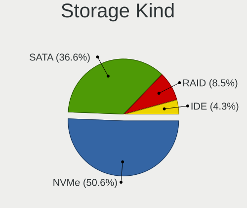

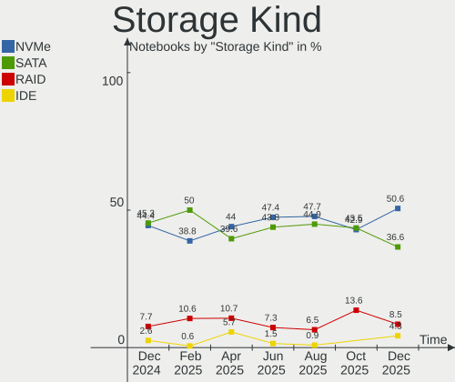

| Kind | Notebooks | Percent |
|------|-----------|---------|
| NVMe | 83        | 50.61%  |
| SATA | 60        | 36.59%  |
| RAID | 14        | 8.54%   |
| IDE  | 7         | 4.27%   |

Processor
---------

CPU Vendor
----------

Processor vendors

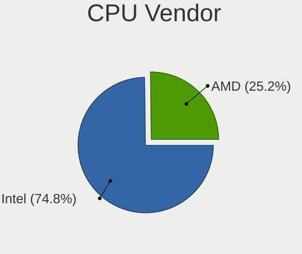

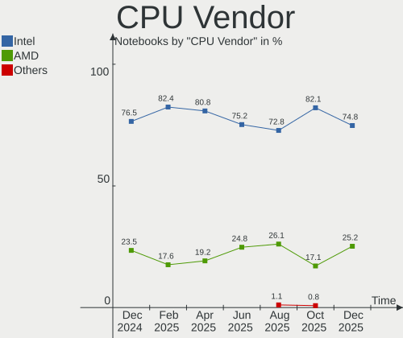

| Vendor | Notebooks | Percent |
|--------|-----------|---------|
| Intel  | 101       | 74.81%  |
| AMD    | 34        | 25.19%  |

CPU Model
---------

Processor models

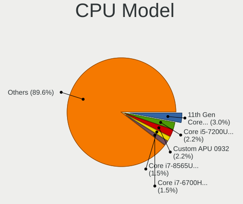

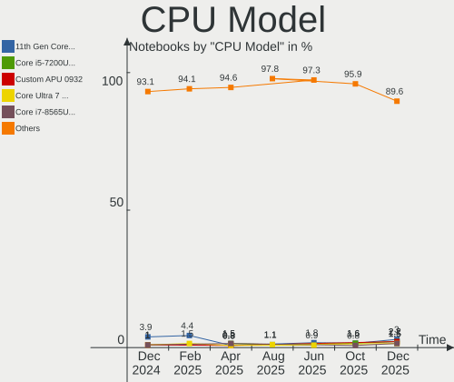

| Model                                         | Notebooks | Percent |
|-----------------------------------------------|-----------|---------|
| Intel 11th Gen Core i5-1135G7 @ 2.40GHz       | 4         | 2.96%   |
| Intel Core i5-7200U CPU @ 2.50GHz             | 3         | 2.22%   |
| AMD Custom APU 0932                           | 3         | 2.22%   |
| Intel Core Ultra 7 155H                       | 2         | 1.48%   |
| Intel Core i7-8565U CPU @ 1.80GHz             | 2         | 1.48%   |
| Intel Core i7-6700HQ CPU @ 2.60GHz            | 2         | 1.48%   |
| Intel Core i7-5500U CPU @ 2.40GHz             | 2         | 1.48%   |
| Intel Core i7-14700HX                         | 2         | 1.48%   |
| Intel Core i7-10850H CPU @ 2.70GHz            | 2         | 1.48%   |
| Intel Core i7-10510U CPU @ 1.80GHz            | 2         | 1.48%   |
| Intel Core i7 CPU M 640 @ 2.80GHz             | 2         | 1.48%   |
| Intel Core i5-8350U CPU @ 1.70GHz             | 2         | 1.48%   |
| Intel Core i5-6300U CPU @ 2.40GHz             | 2         | 1.48%   |
| Intel Core i5-1035G1 CPU @ 1.00GHz            | 2         | 1.48%   |
| Intel Core i5-10310U CPU @ 1.70GHz            | 2         | 1.48%   |
| Intel Core i5-10300H CPU @ 2.50GHz            | 2         | 1.48%   |
| Intel Core i5-10210U CPU @ 1.60GHz            | 2         | 1.48%   |
| Intel Celeron N4120 CPU @ 1.10GHz             | 2         | 1.48%   |
| Intel 13th Gen Core i7-13700H                 | 2         | 1.48%   |
| Intel 12th Gen Core i5-1240P                  | 2         | 1.48%   |
| AMD Ryzen AI 9 365 w/ Radeon 880M             | 2         | 1.48%   |
| AMD Ryzen 7 7730U with Radeon Graphics        | 2         | 1.48%   |
| AMD Ryzen 5 7520U with Radeon Graphics        | 2         | 1.48%   |
| AMD Ryzen 5 3500U with Radeon Vega Mobile Gfx | 2         | 1.48%   |
| Intel Xeon W-10855M CPU @ 2.80GHz             | 1         | 0.74%   |
| Intel Xeon CPU E5-2699 v3 @ 2.30GHz           | 1         | 0.74%   |
| Intel Pentium Dual-Core CPU T4400 @ 2.20GHz   | 1         | 0.74%   |
| Intel Genuine CPU U4100 @ 1.30GHz             | 1         | 0.74%   |
| Intel Core Ultra 7 258V                       | 1         | 0.74%   |
| Intel Core Ultra 7 255U                       | 1         | 0.74%   |
| Intel Core Ultra 7 255H                       | 1         | 0.74%   |
| Intel Core i9-9980HK CPU @ 2.40GHz            | 1         | 0.74%   |
| Intel Core i9-9900K CPU @ 3.60GHz             | 1         | 0.74%   |
| Intel Core i7-8850H CPU @ 2.60GHz             | 1         | 0.74%   |
| Intel Core i7-8650U CPU @ 1.90GHz             | 1         | 0.74%   |
| Intel Core i7-8550U CPU @ 1.80GHz             | 1         | 0.74%   |
| Intel Core i7-7820HK CPU @ 2.90GHz            | 1         | 0.74%   |
| Intel Core i7-6820HQ CPU @ 2.70GHz            | 1         | 0.74%   |
| Intel Core i7-6820HK CPU @ 2.70GHz            | 1         | 0.74%   |
| Intel Core i7-6500U CPU @ 2.50GHz             | 1         | 0.74%   |

CPU Model Family
----------------

Processor model prefix

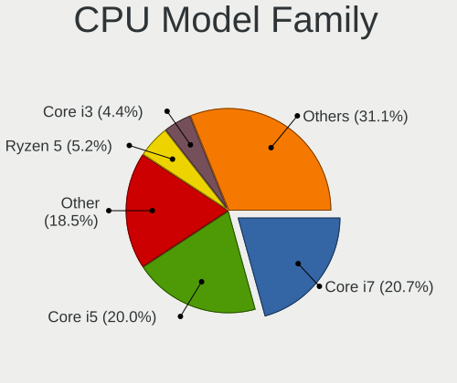

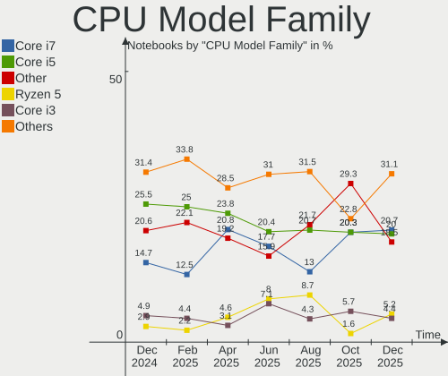

| Model                   | Notebooks | Percent |
|-------------------------|-----------|---------|
| Intel Core i7           | 28        | 20.74%  |
| Intel Core i5           | 27        | 20%     |
| Other                   | 25        | 18.52%  |
| AMD Ryzen 5             | 7         | 5.19%   |
| Intel Core i3           | 6         | 4.44%   |
| Intel Celeron           | 6         | 4.44%   |
| AMD Ryzen 7             | 6         | 4.44%   |
| Intel Core              | 5         | 3.7%    |
| Intel Core 2 Duo        | 4         | 2.96%   |
| AMD Ryzen 9             | 3         | 2.22%   |
| AMD Ryzen 5 PRO         | 3         | 2.22%   |
| Intel Xeon              | 2         | 1.48%   |
| Intel Core i9           | 2         | 1.48%   |
| AMD Ryzen 7 PRO         | 2         | 1.48%   |
| AMD Ryzen 3             | 2         | 1.48%   |
| AMD A8                  | 2         | 1.48%   |
| Intel Pentium Dual-Core | 1         | 0.74%   |
| Intel Genuine           | 1         | 0.74%   |
| AMD E2                  | 1         | 0.74%   |
| AMD Athlon X2           | 1         | 0.74%   |
| AMD A4                  | 1         | 0.74%   |

CPU Cores
---------

Number of processor cores

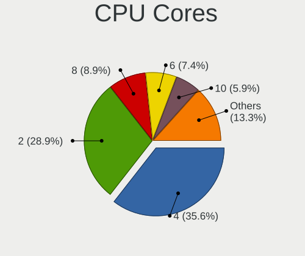

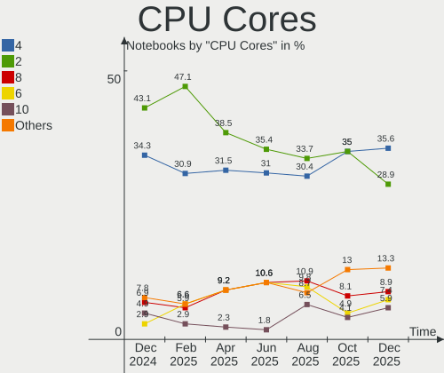

| Number | Notebooks | Percent |
|--------|-----------|---------|
| 4      | 48        | 35.56%  |
| 2      | 39        | 28.89%  |
| 8      | 12        | 8.89%   |
| 6      | 10        | 7.41%   |
| 10     | 8         | 5.93%   |
| 16     | 5         | 3.7%    |
| 12     | 5         | 3.7%    |
| 14     | 3         | 2.22%   |
| 20     | 2         | 1.48%   |
| 24     | 1         | 0.74%   |
| 18     | 1         | 0.74%   |
| 5      | 1         | 0.74%   |

CPU Sockets
-----------

Number of sockets

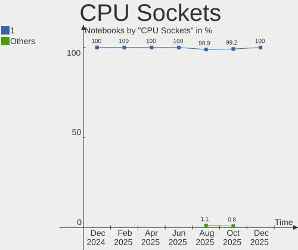

| Number | Notebooks | Percent |
|--------|-----------|---------|
| 1      | 135       | 100%    |

CPU Threads
-----------

Threads per core (Hyper-Threading)

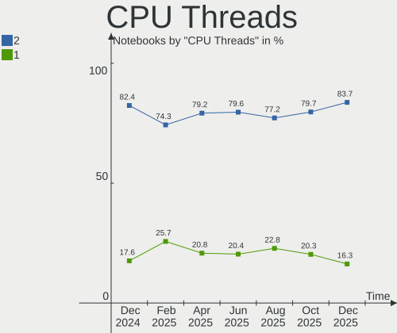

| Number | Notebooks | Percent |
|--------|-----------|---------|
| 2      | 113       | 83.7%   |
| 1      | 22        | 16.3%   |

CPU Op-Modes
------------

CPU Operation Modes (32-bit, 64-bit)

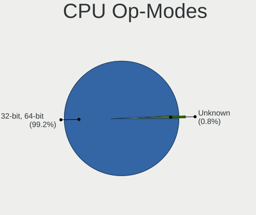

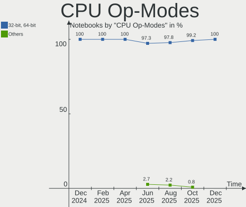

| Op mode        | Notebooks | Percent |
|----------------|-----------|---------|
| 32-bit, 64-bit | 135       | 100%    |

CPU Microcode
-------------

Microcode number

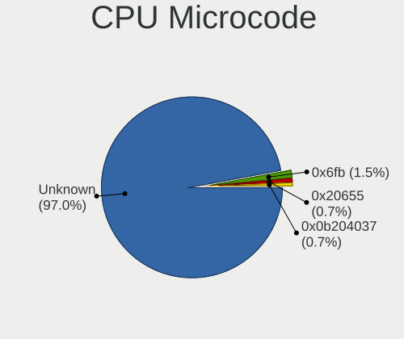

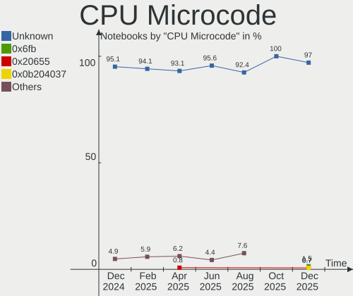

| Number     | Notebooks | Percent |
|------------|-----------|---------|
| Unknown    | 131       | 97.04%  |
| 0x6fb      | 2         | 1.48%   |
| 0x20655    | 1         | 0.74%   |
| 0x0b204037 | 1         | 0.74%   |

CPU Microarch
-------------

Microarchitecture

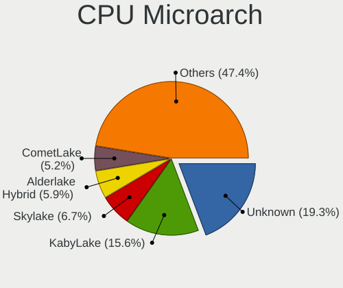

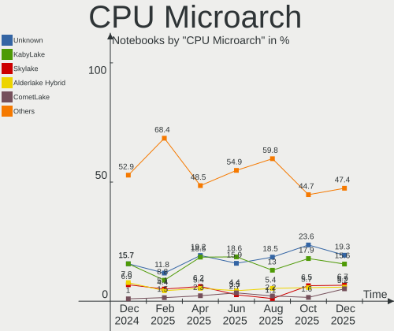

| Name               | Notebooks | Percent |
|--------------------|-----------|---------|
| Unknown            | 26        | 19.26%  |
| KabyLake           | 21        | 15.56%  |
| Skylake            | 9         | 6.67%   |
| Alderlake Hybrid   | 8         | 5.93%   |
| CometLake          | 7         | 5.19%   |
| Zen 3              | 6         | 4.44%   |
| TigerLake          | 6         | 4.44%   |
| IvyBridge          | 6         | 4.44%   |
| Haswell            | 6         | 4.44%   |
| Zen+               | 5         | 3.7%    |
| Westmere           | 5         | 3.7%    |
| SandyBridge        | 4         | 2.96%   |
| Penryn             | 3         | 2.22%   |
| IceLake            | 3         | 2.22%   |
| Core               | 3         | 2.22%   |
| Zen 2              | 2         | 1.48%   |
| Silvermont         | 2         | 1.48%   |
| Puma               | 2         | 1.48%   |
| Meteorlake Hybrid  | 2         | 1.48%   |
| Goldmont plus      | 2         | 1.48%   |
| Broadwell          | 2         | 1.48%   |
| Steamroller        | 1         | 0.74%   |
| K8 Hammer          | 1         | 0.74%   |
| Goldmont           | 1         | 0.74%   |
| Bobcat             | 1         | 0.74%   |
| ArrowLake-H Hybrid | 1         | 0.74%   |

Graphics
--------

GPU Vendor
----------

Vendors of graphics cards

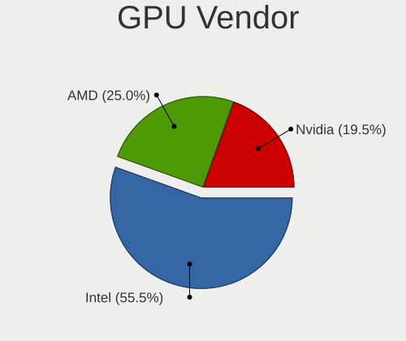

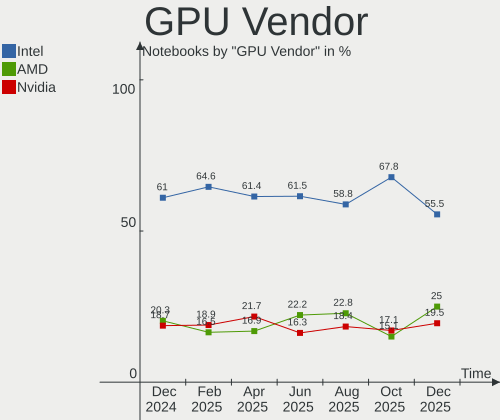

| Vendor | Notebooks | Percent |
|--------|-----------|---------|
| Intel  | 91        | 55.49%  |
| AMD    | 41        | 25%     |
| Nvidia | 32        | 19.51%  |

GPU Model
---------

Graphics card models

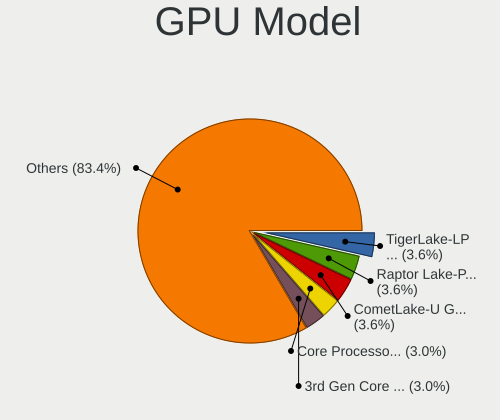

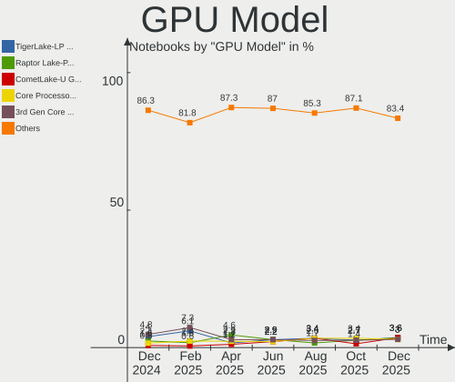

| Model                                                                                    | Notebooks | Percent |
|------------------------------------------------------------------------------------------|-----------|---------|
| Intel TigerLake-LP GT2 [Iris Xe Graphics]                                                | 6         | 3.55%   |
| Intel Raptor Lake-P [Iris Xe Graphics]                                                   | 6         | 3.55%   |
| Intel CometLake-U GT2 [UHD Graphics]                                                     | 6         | 3.55%   |
| Intel Core Processor Integrated Graphics Controller                                      | 5         | 2.96%   |
| Intel 3rd Gen Core processor Graphics Controller                                         | 5         | 2.96%   |
| AMD Picasso/Raven 2 [Radeon Vega Series / Radeon Vega Mobile Series]                     | 5         | 2.96%   |
| Intel WhiskeyLake-U GT2 [UHD Graphics 620]                                               | 4         | 2.37%   |
| Intel Skylake-U GT2 [HD Graphics 520]                                                    | 4         | 2.37%   |
| Intel Kaby Lake-R GT2 [UHD Graphics 620]                                                 | 4         | 2.37%   |
| Intel CometLake-H GT2 [UHD Graphics]                                                     | 4         | 2.37%   |
| Intel 2nd Generation Core Processor Family Integrated Graphics Controller                | 4         | 2.37%   |
| Nvidia AD107M [GeForce RTX 4060 Max-Q / Mobile]                                          | 3         | 1.78%   |
| Intel Skylake-H GT2 [HD Graphics 530]                                                    | 3         | 1.78%   |
| Intel Mobile 4 Series Chipset Integrated Graphics Controller                             | 3         | 1.78%   |
| Intel Kaby Lake-U GT2 [HD Graphics 620]                                                  | 3         | 1.78%   |
| Intel Alder Lake-P GT2 [Iris Xe Graphics]                                                | 3         | 1.78%   |
| AMD Strix [Radeon 880M / 890M]                                                           | 3         | 1.78%   |
| AMD Sephiroth [AMD Custom GPU 0405]                                                      | 3         | 1.78%   |
| AMD Phoenix1                                                                             | 3         | 1.78%   |
| AMD Mendocino [Radeon 610M]                                                              | 3         | 1.78%   |
| AMD Granite Ridge [Radeon Graphics]                                                      | 3         | 1.78%   |
| AMD Cezanne [Radeon Vega Series / Radeon Vega Mobile Series]                             | 3         | 1.78%   |
| AMD Barcelo                                                                              | 3         | 1.78%   |
| Nvidia TU117GLM [Quadro T1000 Mobile]                                                    | 2         | 1.18%   |
| Nvidia TU106M [GeForce RTX 2070 Mobile / Max-Q Refresh]                                  | 2         | 1.18%   |
| Nvidia GP108M [GeForce MX250]                                                            | 2         | 1.18%   |
| Nvidia GP104BM [GeForce GTX 1070 Mobile]                                                 | 2         | 1.18%   |
| Nvidia GA107M [GeForce RTX 3050 Mobile]                                                  | 2         | 1.18%   |
| Intel Raptor Lake-S UHD Graphics                                                         | 2         | 1.18%   |
| Intel Mobile GM965/GL960 Integrated Graphics Controller (secondary)                      | 2         | 1.18%   |
| Intel Mobile GM965/GL960 Integrated Graphics Controller (primary)                        | 2         | 1.18%   |
| Intel Iris Plus Graphics G1 (Ice Lake)                                                   | 2         | 1.18%   |
| Intel Haswell-ULT Integrated Graphics Controller                                         | 2         | 1.18%   |
| Intel GeminiLake [UHD Graphics 600]                                                      | 2         | 1.18%   |
| Intel CoffeeLake-H GT2 [UHD Graphics 630]                                                | 2         | 1.18%   |
| Intel Broadwell-U GT2 [HD Graphics 5500]                                                 | 2         | 1.18%   |
| Intel Atom/Celeron/Pentium Processor x5-E8000/J3xxx/N3xxx Integrated Graphics Controller | 2         | 1.18%   |
| Intel Alder Lake-UP3 GT2 [Iris Xe Graphics]                                              | 2         | 1.18%   |
| AMD Renoir [Radeon Vega Series / Radeon Vega Mobile Series]                              | 2         | 1.18%   |
| Nvidia TU117M [GeForce GTX 1650 Ti Mobile]                                               | 1         | 0.59%   |

GPU Combo
---------

Combinations of graphics cards

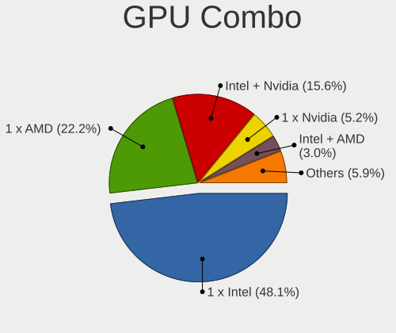

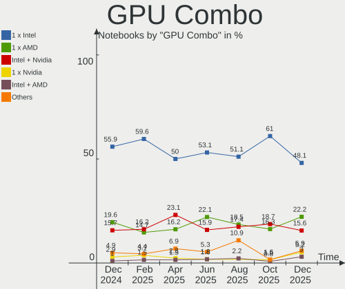

| Name           | Notebooks | Percent |
|----------------|-----------|---------|
| 1 x Intel      | 65        | 48.15%  |
| 1 x AMD        | 30        | 22.22%  |
| Intel + Nvidia | 21        | 15.56%  |
| 1 x Nvidia     | 7         | 5.19%   |
| Intel + AMD    | 4         | 2.96%   |
| AMD + Nvidia   | 4         | 2.96%   |
| 2 x AMD        | 3         | 2.22%   |
| Other          | 1         | 0.74%   |

GPU Driver
----------

Free vs proprietary

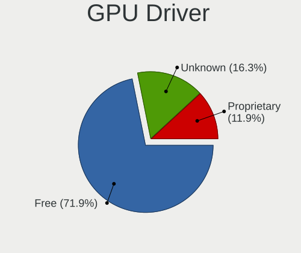

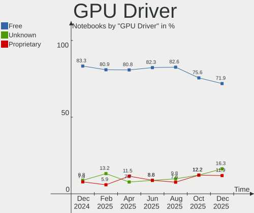

| Driver      | Notebooks | Percent |
|-------------|-----------|---------|
| Free        | 97        | 71.85%  |
| Unknown     | 22        | 16.3%   |
| Proprietary | 16        | 11.85%  |

GPU Memory
----------

Total video memory

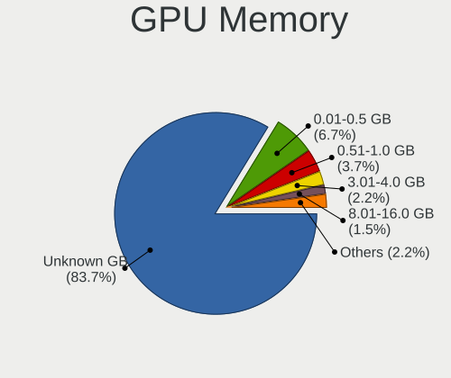

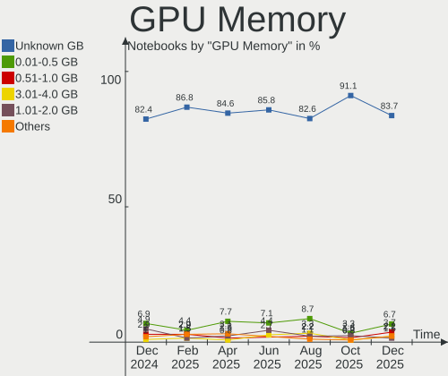

| Size in GB | Notebooks | Percent |
|------------|-----------|---------|
| Unknown    | 113       | 83.7%   |
| 0.01-0.5   | 9         | 6.67%   |
| 0.51-1.0   | 5         | 3.7%    |
| 3.01-4.0   | 3         | 2.22%   |
| 1.01-2.0   | 2         | 1.48%   |
| 8.01-16.0  | 2         | 1.48%   |
| 7.01-8.0   | 1         | 0.74%   |

Monitor
-------

Monitor Vendor
--------------

Monitor vendors

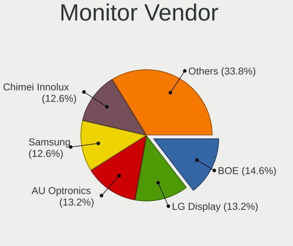

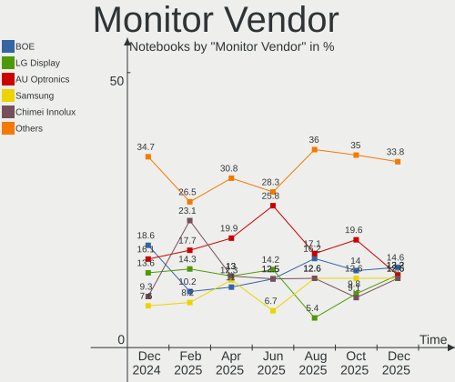

| Vendor                  | Notebooks | Percent |
|-------------------------|-----------|---------|
| BOE                     | 22        | 14.57%  |
| LG Display              | 20        | 13.25%  |
| AU Optronics            | 20        | 13.25%  |
| Samsung Electronics     | 19        | 12.58%  |
| Chimei Innolux          | 19        | 12.58%  |
| Lenovo                  | 10        | 6.62%   |
| Valve                   | 3         | 1.99%   |
| Sharp                   | 3         | 1.99%   |
| InfoVision              | 3         | 1.99%   |
| Goldstar                | 3         | 1.99%   |
| BenQ                    | 3         | 1.99%   |
| AOC                     | 3         | 1.99%   |
| Acer                    | 3         | 1.99%   |
| Philips                 | 2         | 1.32%   |
| PANDA                   | 2         | 1.32%   |
| Chi Mei Optoelectronics | 2         | 1.32%   |
| Apple                   | 2         | 1.32%   |
| TMX                     | 1         | 0.66%   |
| Panasonic               | 1         | 0.66%   |
| Mobile Pixels           | 1         | 0.66%   |
| LG Philips              | 1         | 0.66%   |
| Hewlett-Packard         | 1         | 0.66%   |
| Eizo                    | 1         | 0.66%   |
| EDO                     | 1         | 0.66%   |
| Dell                    | 1         | 0.66%   |
| CVT                     | 1         | 0.66%   |
| CTO                     | 1         | 0.66%   |
| CSW                     | 1         | 0.66%   |
| ASUSTek Computer        | 1         | 0.66%   |

Monitor Model
-------------

Monitor models

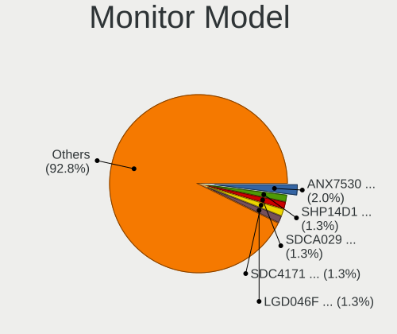

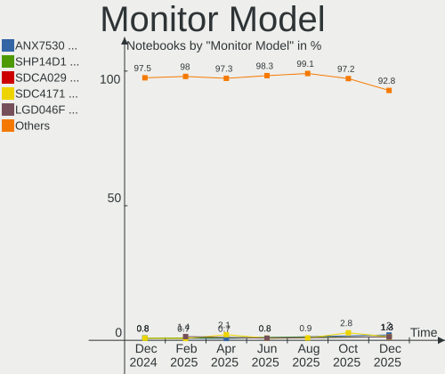

| Model                                                                 | Notebooks | Percent |
|-----------------------------------------------------------------------|-----------|---------|
| Valve ANX7530 U VLV3003 800x1280 100x160mm 7.4-inch                   | 3         | 1.97%   |
| Sharp LCD Monitor SHP14D1 1920x1200 336x210mm 15.6-inch               | 2         | 1.32%   |
| Samsung Electronics LCD Monitor SDCA029 3840x2160 344x194mm 15.5-inch | 2         | 1.32%   |
| Samsung Electronics LCD Monitor SDC4171 2880x1800 302x189mm 14.0-inch | 2         | 1.32%   |
| LG Display LCD Monitor LGD046F 1920x1080 344x194mm 15.5-inch          | 2         | 1.32%   |
| Chimei Innolux P130ZFA-BA1 CMN8201 2160x1440 275x183mm 13.0-inch      | 2         | 1.32%   |
| Chimei Innolux LCD Monitor CMN14D4 1920x1080 309x173mm 13.9-inch      | 2         | 1.32%   |
| Chimei Innolux LCD Monitor CMN14C9 1920x1080 309x173mm 13.9-inch      | 2         | 1.32%   |
| AU Optronics LCD Monitor AUO235C 1366x768 256x144mm 11.6-inch         | 2         | 1.32%   |
| Acer G276HL ACR0300 1920x1080 598x336mm 27.0-inch                     | 2         | 1.32%   |
| TMX TL140BDXP01-0 TMX1400 2560x1440 310x174mm 14.0-inch               | 1         | 0.66%   |
| Sharp LCD Monitor SHP1542 1920x1080 309x174mm 14.0-inch               | 1         | 0.66%   |
| Samsung Electronics S24D330 SAM0D92 1920x1080 531x299mm 24.0-inch     | 1         | 0.66%   |
| Samsung Electronics S22D300 SAM0B3E 1920x1080 477x268mm 21.5-inch     | 1         | 0.66%   |
| Samsung Electronics LCD Monitor SEC5441 1280x800 331x207mm 15.4-inch  | 1         | 0.66%   |
| Samsung Electronics LCD Monitor SEC4256 1600x900 382x215mm 17.3-inch  | 1         | 0.66%   |
| Samsung Electronics LCD Monitor SEC4149 1366x768 292x174mm 13.4-inch  | 1         | 0.66%   |
| Samsung Electronics LCD Monitor SEC334A 1366x768 344x194mm 15.5-inch  | 1         | 0.66%   |
| Samsung Electronics LCD Monitor SDC4E42 1366x768 309x174mm 14.0-inch  | 1         | 0.66%   |
| Samsung Electronics LCD Monitor SDC4C48 1920x1080 293x165mm 13.2-inch | 1         | 0.66%   |
| Samsung Electronics LCD Monitor SDC4180 2880x1620 344x194mm 15.5-inch | 1         | 0.66%   |
| Samsung Electronics LCD Monitor SDC4161 1920x1080 344x194mm 15.5-inch | 1         | 0.66%   |
| Samsung Electronics LCD Monitor SDC4141 1366x768 344x194mm 15.5-inch  | 1         | 0.66%   |
| Samsung Electronics LCD Monitor SDC3754 1600x900 382x215mm 17.3-inch  | 1         | 0.66%   |
| Samsung Electronics LC27G7xT SAM105E 2560x1440 597x336mm 27.0-inch    | 1         | 0.66%   |
| Samsung Electronics LC27G7xT SAM105C 2560x1440 597x336mm 27.0-inch    | 1         | 0.66%   |
| Samsung Electronics ATNA60HU02-0  SDC421B                             | 1         | 0.66%   |
| Samsung Electronics ATNA60HR04-0  SDC4218                             | 1         | 0.66%   |
| Philips PHL 345E2 PHLC237 3440x1440 800x335mm 34.1-inch               | 1         | 0.66%   |
| Philips 271P4 PHL08C3 1920x1080 597x336mm 27.0-inch                   | 1         | 0.66%   |
| PANDA LCD Monitor NCP0061 2560x1600 302x189mm 14.0-inch               | 1         | 0.66%   |
| PANDA LCD Monitor NCP0035 1920x1080 344x194mm 15.5-inch               | 1         | 0.66%   |
| Panasonic LCD Monitor YLT4100 1920x1200 216x135mm 10.0-inch           | 1         | 0.66%   |
| Mobile Pixels Duex Pro REG0527 1920x1080 270x150mm 12.2-inch          | 1         | 0.66%   |
| LG Philips LCD Monitor LPL00E5 1440x900 304x190mm 14.1-inch           | 1         | 0.66%   |
| LG Display LP156WH2-TLBA LGD026C 1366x768 344x194mm 15.5-inch         | 1         | 0.66%   |
| LG Display LP140WH2-TLA1 LGD0201 1366x768 310x174mm 14.0-inch         | 1         | 0.66%   |
| LG Display LCD Monitor LGD073B 1920x1080 309x174mm 14.0-inch          | 1         | 0.66%   |
| LG Display LCD Monitor LGD06B3 1920x1200 336x210mm 15.6-inch          | 1         | 0.66%   |
| LG Display LCD Monitor LGD0671 1920x1080 382x215mm 17.3-inch          | 1         | 0.66%   |

Monitor Resolution
------------------

Monitor screen resolution

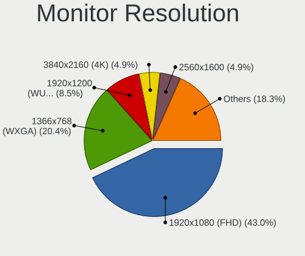

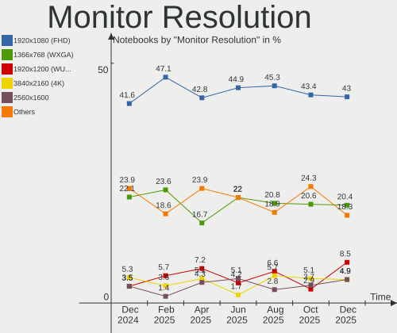

| Resolution        | Notebooks | Percent |
|-------------------|-----------|---------|
| 1920x1080 (FHD)   | 61        | 42.96%  |
| 1366x768 (WXGA)   | 29        | 20.42%  |
| 1920x1200 (WUXGA) | 12        | 8.45%   |
| 3840x2160 (4K)    | 7         | 4.93%   |
| 2560x1600         | 7         | 4.93%   |
| 2560x1440 (QHD)   | 4         | 2.82%   |
| 1600x900 (HD+)    | 4         | 2.82%   |
| 800x1280          | 3         | 2.11%   |
| 2880x1800         | 3         | 2.11%   |
| Unknown           | 3         | 2.11%   |
| 2160x1440         | 2         | 1.41%   |
| 1280x800 (WXGA)   | 2         | 1.41%   |
| 3840x1080         | 1         | 0.7%    |
| 3440x1440         | 1         | 0.7%    |
| 2880x1920         | 1         | 0.7%    |
| 2880x1620         | 1         | 0.7%    |
| 1440x900 (WXGA+)  | 1         | 0.7%    |

Monitor Diagonal
----------------

Diagonal size in inches

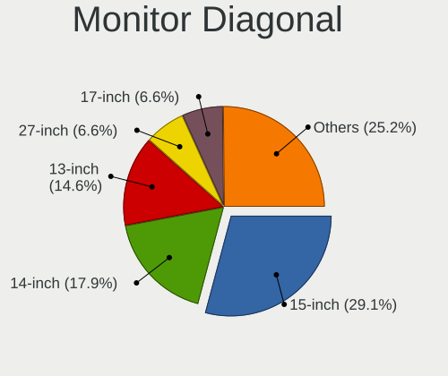

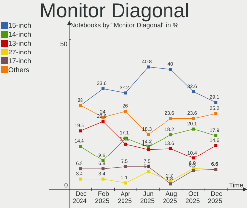

| Inches  | Notebooks | Percent |
|---------|-----------|---------|
| 15      | 44        | 29.14%  |
| 14      | 27        | 17.88%  |
| 13      | 22        | 14.57%  |
| 27      | 10        | 6.62%   |
| 17      | 10        | 6.62%   |
| 16      | 7         | 4.64%   |
| 24      | 6         | 3.97%   |
| 11      | 5         | 3.31%   |
| 12      | 4         | 2.65%   |
| 21      | 3         | 1.99%   |
| 7       | 3         | 1.99%   |
| Unknown | 3         | 1.99%   |
| 48      | 1         | 0.66%   |
| 34      | 1         | 0.66%   |
| 31      | 1         | 0.66%   |
| 26      | 1         | 0.66%   |
| 23      | 1         | 0.66%   |
| 18      | 1         | 0.66%   |
| 10      | 1         | 0.66%   |

Monitor Width
-------------

Physical width

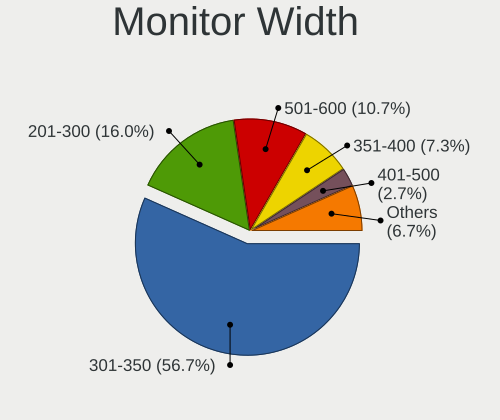

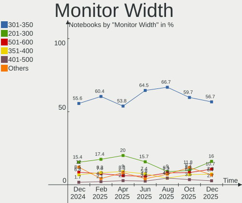

| Width in mm | Notebooks | Percent |
|-------------|-----------|---------|
| 301-350     | 85        | 56.67%  |
| 201-300     | 24        | 16%     |
| 501-600     | 16        | 10.67%  |
| 351-400     | 11        | 7.33%   |
| 401-500     | 4         | 2.67%   |
| 1-100       | 3         | 2%      |
| Unknown     | 3         | 2%      |
| 601-700     | 2         | 1.33%   |
| 701-800     | 1         | 0.67%   |
| 1001-1500   | 1         | 0.67%   |

Aspect Ratio
------------

Proportional relationship between the width and the height

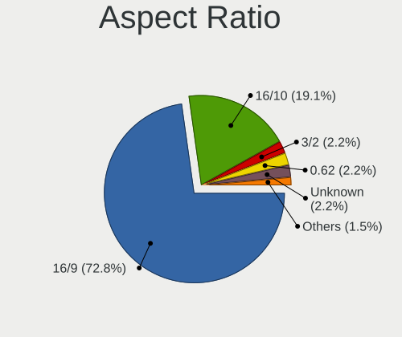

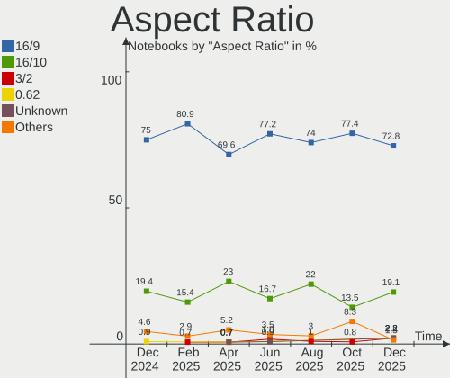

| Ratio   | Notebooks | Percent |
|---------|-----------|---------|
| 16/9    | 99        | 72.79%  |
| 16/10   | 26        | 19.12%  |
| 3/2     | 3         | 2.21%   |
| 0.62    | 3         | 2.21%   |
| Unknown | 3         | 2.21%   |
| 32/9    | 1         | 0.74%   |
| 21/9    | 1         | 0.74%   |

Monitor Area
------------

Area in inch²

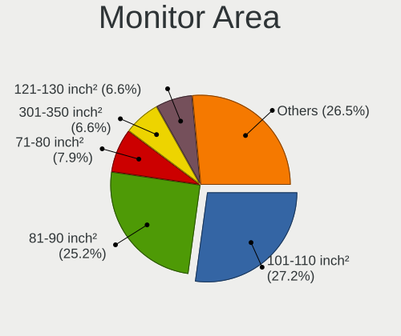

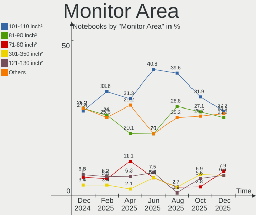

| Area in inch² | Notebooks | Percent |
|----------------|-----------|---------|
| 101-110        | 41        | 27.15%  |
| 81-90          | 38        | 25.17%  |
| 71-80          | 12        | 7.95%   |
| 301-350        | 10        | 6.62%   |
| 121-130        | 10        | 6.62%   |
| 111-120        | 10        | 6.62%   |
| 201-250        | 7         | 4.64%   |
| 51-60          | 5         | 3.31%   |
| 61-70          | 3         | 1.99%   |
| 1-40           | 3         | 1.99%   |
| 251-300        | 3         | 1.99%   |
| Unknown        | 3         | 1.99%   |
| 351-500        | 2         | 1.32%   |
| 41-50          | 1         | 0.66%   |
| 151-200        | 1         | 0.66%   |
| 141-150        | 1         | 0.66%   |
| 501-1000       | 1         | 0.66%   |

Pixel Density
-------------

Pixels per inch

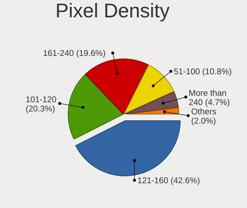

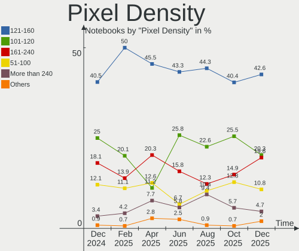

| Density       | Notebooks | Percent |
|---------------|-----------|---------|
| 121-160       | 63        | 42.57%  |
| 101-120       | 30        | 20.27%  |
| 161-240       | 29        | 19.59%  |
| 51-100        | 16        | 10.81%  |
| More than 240 | 7         | 4.73%   |
| Unknown       | 3         | 2.03%   |

Multiple Monitors
-----------------

Total monitors connected

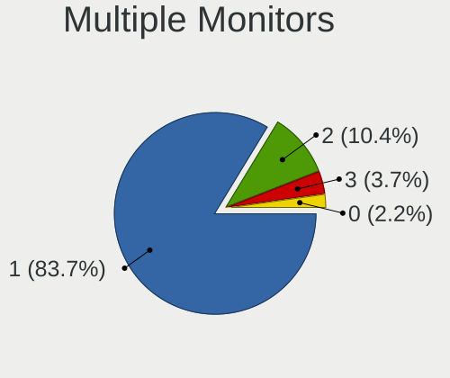

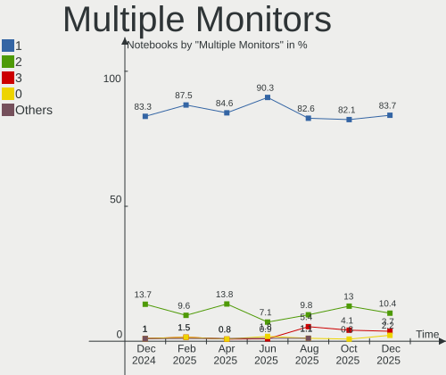

| Total | Notebooks | Percent |
|-------|-----------|---------|
| 1     | 113       | 83.7%   |
| 2     | 14        | 10.37%  |
| 3     | 5         | 3.7%    |
| 0     | 3         | 2.22%   |

Network
-------

Net Controller Vendor
---------------------

Controller vendors

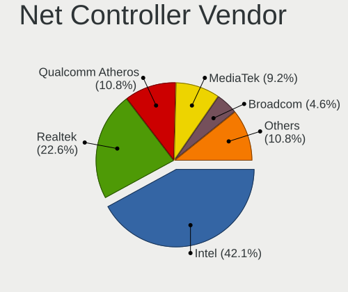

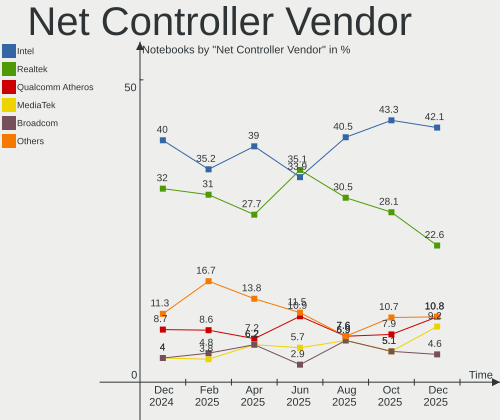

| Vendor                                 | Notebooks | Percent |
|----------------------------------------|-----------|---------|
| Intel                                  | 82        | 42.05%  |
| Realtek Semiconductor                  | 44        | 22.56%  |
| Qualcomm Atheros                       | 21        | 10.77%  |
| MediaTek                               | 18        | 9.23%   |
| Broadcom                               | 9         | 4.62%   |
| Qualcomm                               | 5         | 2.56%   |
| TP-Link                                | 2         | 1.03%   |
| Ralink                                 | 2         | 1.03%   |
| ASIX Electronics                       | 2         | 1.03%   |
| Sony Ericsson Mobile Communications AB | 1         | 0.51%   |
| Sierra Wireless                        | 1         | 0.51%   |
| Shenzhen Goodix Technology             | 1         | 0.51%   |
| Ralink Technology                      | 1         | 0.51%   |
| NetGear                                | 1         | 0.51%   |
| Motorcomm Microelectronics.            | 1         | 0.51%   |
| Marvell Technology Group               | 1         | 0.51%   |
| Lenovo                                 | 1         | 0.51%   |
| Google                                 | 1         | 0.51%   |
| DisplayLink                            | 1         | 0.51%   |

Net Controller Model
--------------------

Controller models

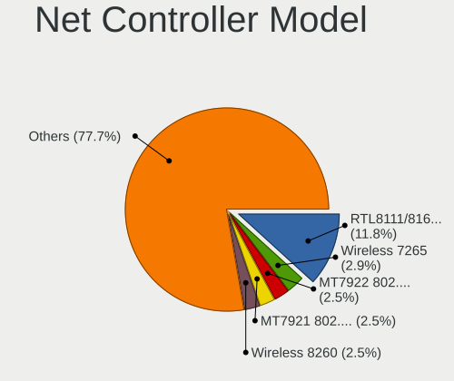

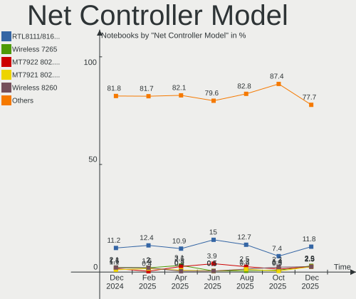

| Model                                                                           | Notebooks | Percent |
|---------------------------------------------------------------------------------|-----------|---------|
| Realtek RTL8111/8168/8211/8411 PCI Express Gigabit Ethernet Controller          | 28        | 11.76%  |
| Intel Wireless 7265                                                             | 7         | 2.94%   |
| MediaTek MT7922 802.11ax PCI Express Wireless Network Adapter                   | 6         | 2.52%   |
| MediaTek MT7921 802.11ax PCIe Wireless Network Adapter [Filogic 330]            | 6         | 2.52%   |
| Intel Wireless 8260                                                             | 6         | 2.52%   |
| Intel Comet Lake PCH CNVi WiFi                                                  | 6         | 2.52%   |
| Realtek RTL810xE PCI Express Fast Ethernet controller                           | 5         | 2.1%    |
| Qualcomm QCNFA765 Wireless Network Adapter                                      | 5         | 2.1%    |
| Qualcomm Atheros QCA6174 802.11ac Wireless Network Adapter                      | 5         | 2.1%    |
| Qualcomm Atheros AR9285 Wireless Network Adapter (PCI-Express)                  | 5         | 2.1%    |
| Intel Wi-Fi 6 AX200                                                             | 5         | 2.1%    |
| Intel Raptor Lake PCH CNVi WiFi                                                 | 5         | 2.1%    |
| Intel Comet Lake PCH-LP CNVi WiFi                                               | 5         | 2.1%    |
| Broadcom BCM43142 802.11b/g/n                                                   | 5         | 2.1%    |
| Realtek RTL8153 Gigabit Ethernet Adapter                                        | 4         | 1.68%   |
| Intel Wireless 8265 / 8275                                                      | 4         | 1.68%   |
| Intel Wi-Fi 6E(802.11ax) AX210/AX1675* 2x2 [Typhoon Peak]                       | 4         | 1.68%   |
| Intel Centrino Advanced-N 6200                                                  | 4         | 1.68%   |
| Intel Cannon Point-LP CNVi [Wireless-AC]                                        | 4         | 1.68%   |
| Intel Alder Lake-P PCH CNVi WiFi                                                | 4         | 1.68%   |
| Realtek RTL8821CE 802.11ac PCIe Wireless Network Adapter                        | 3         | 1.26%   |
| Qualcomm Atheros AR8131 Gigabit Ethernet                                        | 3         | 1.26%   |
| Intel Wireless 7260                                                             | 3         | 1.26%   |
| Intel Wi-Fi 7(802.11be) AX1775*/AX1790*/BE20*/BE401/BE1750* 2x2                 | 3         | 1.26%   |
| Intel Wi-Fi 6 AX201                                                             | 3         | 1.26%   |
| Intel Wi-Fi 5(802.11ac) Wireless-AC 9x6x [Thunder Peak]                         | 3         | 1.26%   |
| Intel PRO/Wireless 3945ABG [Golan] Network Connection                           | 3         | 1.26%   |
| Intel Ethernet Connection (4) I219-LM                                           | 3         | 1.26%   |
| Realtek RTL88x2bu [AC1200 Techkey]                                              | 2         | 0.84%   |
| Realtek RTL8822CE 802.11ac PCIe Wireless Network Adapter                        | 2         | 0.84%   |
| Realtek RTL8125 2.5GbE Controller                                               | 2         | 0.84%   |
| Qualcomm Atheros QCA9377 802.11ac Wireless Network Adapter                      | 2         | 0.84%   |
| Qualcomm Atheros Killer E2500 Gigabit Ethernet Controller                       | 2         | 0.84%   |
| Qualcomm Atheros AR9485 Wireless Network Adapter                                | 2         | 0.84%   |
| Qualcomm Atheros AR8161 Gigabit Ethernet                                        | 2         | 0.84%   |
| MediaTek MT7925 802.11be 160MHz 2x2 PCIe Wireless Network Adapter [Filogic 360] | 2         | 0.84%   |
| MediaTek MT7902 802.11ax PCIe Wireless Network Adapter [Filogic 310]            | 2         | 0.84%   |
| Intel I210 Gigabit Network Connection                                           | 2         | 0.84%   |
| Intel Ethernet Connection I217-LM                                               | 2         | 0.84%   |
| Intel Ethernet Connection (23) I219-LM                                          | 2         | 0.84%   |

Wireless Vendor
---------------

Wireless vendors

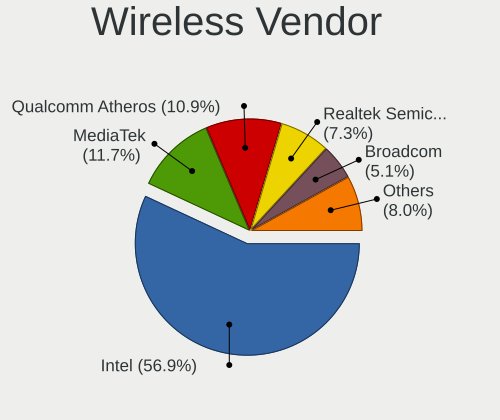

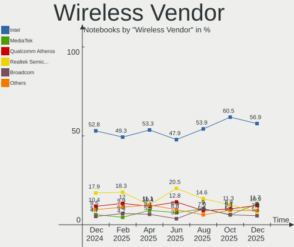

| Vendor                | Notebooks | Percent |
|-----------------------|-----------|---------|
| Intel                 | 78        | 56.93%  |
| MediaTek              | 16        | 11.68%  |
| Qualcomm Atheros      | 15        | 10.95%  |
| Realtek Semiconductor | 10        | 7.3%    |
| Broadcom              | 7         | 5.11%   |
| Qualcomm              | 5         | 3.65%   |
| Ralink                | 2         | 1.46%   |
| TP-Link               | 1         | 0.73%   |
| Sierra Wireless       | 1         | 0.73%   |
| Ralink Technology     | 1         | 0.73%   |
| NetGear               | 1         | 0.73%   |

Wireless Model
--------------

Wireless models

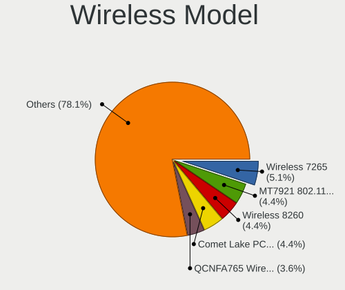

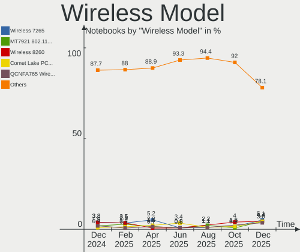

| Model                                                                           | Notebooks | Percent |
|---------------------------------------------------------------------------------|-----------|---------|
| Intel Wireless 7265                                                             | 7         | 5.11%   |
| MediaTek MT7921 802.11ax PCIe Wireless Network Adapter [Filogic 330]            | 6         | 4.38%   |
| Intel Wireless 8260                                                             | 6         | 4.38%   |
| Intel Comet Lake PCH CNVi WiFi                                                  | 6         | 4.38%   |
| Qualcomm QCNFA765 Wireless Network Adapter                                      | 5         | 3.65%   |
| Qualcomm Atheros QCA6174 802.11ac Wireless Network Adapter                      | 5         | 3.65%   |
| Qualcomm Atheros AR9285 Wireless Network Adapter (PCI-Express)                  | 5         | 3.65%   |
| Intel Wi-Fi 6 AX200                                                             | 5         | 3.65%   |
| Intel Raptor Lake PCH CNVi WiFi                                                 | 5         | 3.65%   |
| Intel Comet Lake PCH-LP CNVi WiFi                                               | 5         | 3.65%   |
| Broadcom BCM43142 802.11b/g/n                                                   | 5         | 3.65%   |
| MediaTek MT7922 802.11ax PCI Express Wireless Network Adapter                   | 4         | 2.92%   |
| Intel Wireless 8265 / 8275                                                      | 4         | 2.92%   |
| Intel Wi-Fi 6E(802.11ax) AX210/AX1675* 2x2 [Typhoon Peak]                       | 4         | 2.92%   |
| Intel Centrino Advanced-N 6200                                                  | 4         | 2.92%   |
| Intel Cannon Point-LP CNVi [Wireless-AC]                                        | 4         | 2.92%   |
| Realtek RTL8821CE 802.11ac PCIe Wireless Network Adapter                        | 3         | 2.19%   |
| Intel Wireless 7260                                                             | 3         | 2.19%   |
| Intel Wi-Fi 7(802.11be) AX1775*/AX1790*/BE20*/BE401/BE1750* 2x2                 | 3         | 2.19%   |
| Intel Wi-Fi 6 AX201                                                             | 3         | 2.19%   |
| Intel Wi-Fi 5(802.11ac) Wireless-AC 9x6x [Thunder Peak]                         | 3         | 2.19%   |
| Intel PRO/Wireless 3945ABG [Golan] Network Connection                           | 3         | 2.19%   |
| Intel Alder Lake-P PCH CNVi WiFi                                                | 3         | 2.19%   |
| Realtek RTL88x2bu [AC1200 Techkey]                                              | 2         | 1.46%   |
| Realtek RTL8822CE 802.11ac PCIe Wireless Network Adapter                        | 2         | 1.46%   |
| Qualcomm Atheros QCA9377 802.11ac Wireless Network Adapter                      | 2         | 1.46%   |
| Qualcomm Atheros AR9485 Wireless Network Adapter                                | 2         | 1.46%   |
| MediaTek MT7925 802.11be 160MHz 2x2 PCIe Wireless Network Adapter [Filogic 360] | 2         | 1.46%   |
| MediaTek MT7902 802.11ax PCIe Wireless Network Adapter [Filogic 310]            | 2         | 1.46%   |
| Intel Centrino Advanced-N 6205 [Taylor Peak]                                    | 2         | 1.46%   |
| TP-Link Archer T2U PLUS [RTL8821AU]                                             | 1         | 0.73%   |
| Sierra Wireless EM7305 Modem                                                    | 1         | 0.73%   |
| Realtek RTL8852BE PCIe 802.11ax Wireless Network Controller                     | 1         | 0.73%   |
| Realtek RTL8723BE PCIe Wireless Network Adapter                                 | 1         | 0.73%   |
| Realtek RTL8188FTV 802.11b/g/n 1T1R 2.4G WLAN Adapter                           | 1         | 0.73%   |
| Ralink RT5370 Wireless Adapter                                                  | 1         | 0.73%   |
| Ralink RT5390 Wireless 802.11n 1T/1R PCIe                                       | 1         | 0.73%   |
| Ralink RT3290 Wireless 802.11n 1T/1R PCIe                                       | 1         | 0.73%   |
| Qualcomm Atheros AR928X Wireless Network Adapter (PCI-Express)                  | 1         | 0.73%   |
| NetGear A6210                                                                   | 1         | 0.73%   |

Ethernet Vendor
---------------

Ethernet vendors

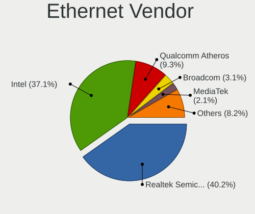

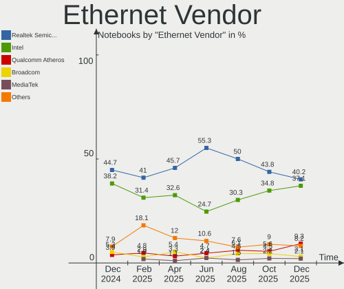

| Vendor                                 | Notebooks | Percent |
|----------------------------------------|-----------|---------|
| Realtek Semiconductor                  | 39        | 40.21%  |
| Intel                                  | 36        | 37.11%  |
| Qualcomm Atheros                       | 9         | 9.28%   |
| Broadcom                               | 3         | 3.09%   |
| MediaTek                               | 2         | 2.06%   |
| ASIX Electronics                       | 2         | 2.06%   |
| TP-Link                                | 1         | 1.03%   |
| Sony Ericsson Mobile Communications AB | 1         | 1.03%   |
| Motorcomm Microelectronics.            | 1         | 1.03%   |
| Marvell Technology Group               | 1         | 1.03%   |
| Google                                 | 1         | 1.03%   |
| DisplayLink                            | 1         | 1.03%   |

Ethernet Model
--------------

Ethernet models

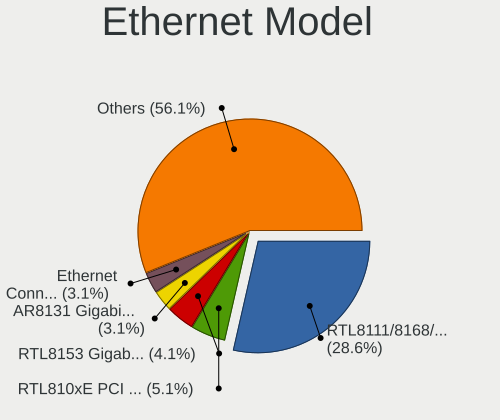

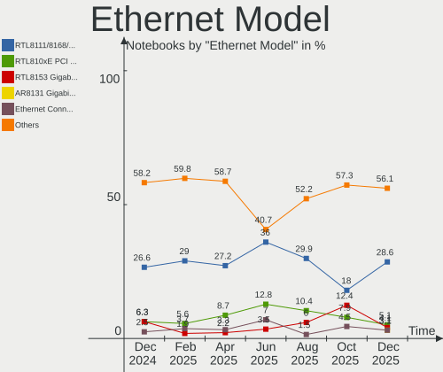

| Model                                                                  | Notebooks | Percent |
|------------------------------------------------------------------------|-----------|---------|
| Realtek RTL8111/8168/8211/8411 PCI Express Gigabit Ethernet Controller | 28        | 28.57%  |
| Realtek RTL810xE PCI Express Fast Ethernet controller                  | 5         | 5.1%    |
| Realtek RTL8153 Gigabit Ethernet Adapter                               | 4         | 4.08%   |
| Qualcomm Atheros AR8131 Gigabit Ethernet                               | 3         | 3.06%   |
| Intel Ethernet Connection (4) I219-LM                                  | 3         | 3.06%   |
| Realtek RTL8125 2.5GbE Controller                                      | 2         | 2.04%   |
| Qualcomm Atheros Killer E2500 Gigabit Ethernet Controller              | 2         | 2.04%   |
| Qualcomm Atheros AR8161 Gigabit Ethernet                               | 2         | 2.04%   |
| MediaTek MT7922 802.11ax PCI Express Wireless Network Adapter          | 2         | 2.04%   |
| Intel I210 Gigabit Network Connection                                  | 2         | 2.04%   |
| Intel Ethernet Connection I217-LM                                      | 2         | 2.04%   |
| Intel Ethernet Connection (23) I219-LM                                 | 2         | 2.04%   |
| Intel Ethernet Connection (13) I219-V                                  | 2         | 2.04%   |
| Intel 82579LM Gigabit Network Connection (Lewisville)                  | 2         | 2.04%   |
| Intel 82577LM Gigabit Network Connection                               | 2         | 2.04%   |
| Broadcom NetXtreme BCM5755M Gigabit Ethernet PCI Express               | 2         | 2.04%   |
| ASIX AX88179 Gigabit Ethernet                                          | 2         | 2.04%   |
| TP-Link UE300 10/100/1000 LAN (ethernet mode) [Realtek RTL8153]        | 1         | 1.02%   |
| Sony Ericsson Mobile AB XQ-BT52                                        | 1         | 1.02%   |
| Realtek RTL8126 5GbE Controller                                        | 1         | 1.02%   |
| Qualcomm Atheros QCA8172 Fast Ethernet                                 | 1         | 1.02%   |
| Qualcomm Atheros Killer E2400 Gigabit Ethernet Controller              | 1         | 1.02%   |
| Motorcomm Microelectronics. YT6801 Gigabit Ethernet Controller         | 1         | 1.02%   |
| Marvell Group 88E8040 PCI-E Fast Ethernet Controller                   | 1         | 1.02%   |
| Intel Ethernet Controller I226-V                                       | 1         | 1.02%   |
| Intel Ethernet Connection I219-V                                       | 1         | 1.02%   |
| Intel Ethernet Connection I219-LM                                      | 1         | 1.02%   |
| Intel Ethernet Connection I218-LM                                      | 1         | 1.02%   |
| Intel Ethernet Connection (7) I219-LM                                  | 1         | 1.02%   |
| Intel Ethernet Connection (6) I219-V                                   | 1         | 1.02%   |
| Intel Ethernet Connection (4) I219-V                                   | 1         | 1.02%   |
| Intel Ethernet Connection (3) I218-LM                                  | 1         | 1.02%   |
| Intel Ethernet Connection (24) I219-V                                  | 1         | 1.02%   |
| Intel Ethernet Connection (23) I219-V                                  | 1         | 1.02%   |
| Intel Ethernet Connection (2) I219-LM                                  | 1         | 1.02%   |
| Intel Ethernet Connection (2) I218-LM                                  | 1         | 1.02%   |
| Intel Ethernet Connection (18) I219-LM                                 | 1         | 1.02%   |
| Intel Ethernet Connection (11) I219-LM                                 | 1         | 1.02%   |
| Intel Ethernet Connection (10) I219-V                                  | 1         | 1.02%   |
| Intel Ethernet Connection (10) I219-LM                                 | 1         | 1.02%   |

Net Controller Kind
-------------------

Ethernet, WiFi or modem

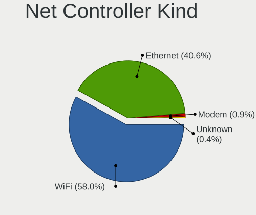

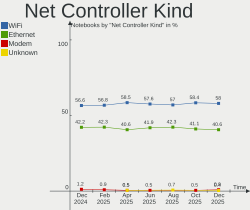

| Kind     | Notebooks | Percent |
|----------|-----------|---------|
| WiFi     | 130       | 58.04%  |
| Ethernet | 91        | 40.63%  |
| Modem    | 2         | 0.89%   |
| Unknown  | 1         | 0.45%   |

Used Controller
---------------

Currently used network controller

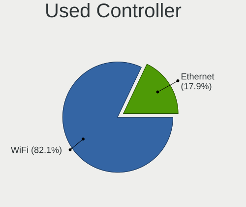

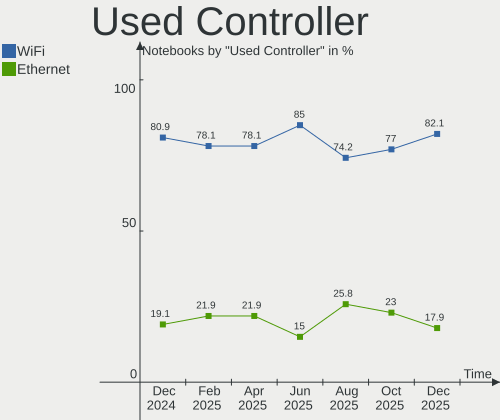

| Kind     | Notebooks | Percent |
|----------|-----------|---------|
| WiFi     | 110       | 82.09%  |
| Ethernet | 24        | 17.91%  |

NICs
----

Total network controllers on board

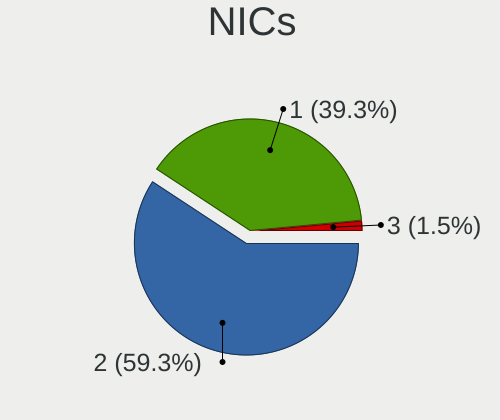

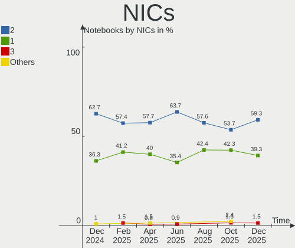

| Total | Notebooks | Percent |
|-------|-----------|---------|
| 2     | 80        | 59.26%  |
| 1     | 53        | 39.26%  |
| 3     | 2         | 1.48%   |

IPv6
----

IPv6 vs IPv4

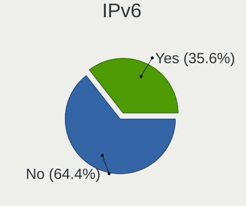

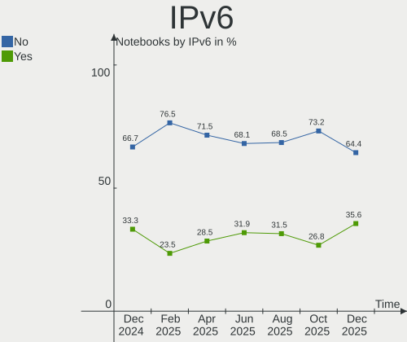

| Used | Notebooks | Percent |
|------|-----------|---------|
| No   | 87        | 64.44%  |
| Yes  | 48        | 35.56%  |

Bluetooth
---------

Bluetooth Vendor
----------------

Controller vendors

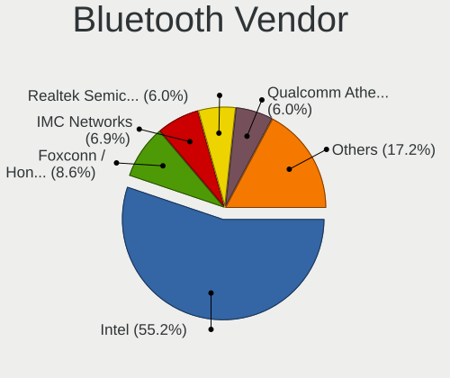

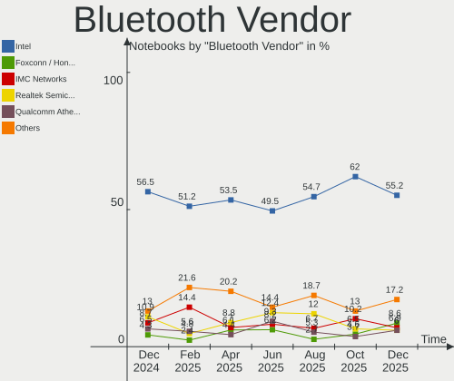

| Vendor                          | Notebooks | Percent |
|---------------------------------|-----------|---------|
| Intel                           | 64        | 55.17%  |
| Foxconn / Hon Hai               | 10        | 8.62%   |
| IMC Networks                    | 8         | 6.9%    |
| Realtek Semiconductor           | 7         | 6.03%   |
| Qualcomm Atheros Communications | 7         | 6.03%   |
| Broadcom                        | 6         | 5.17%   |
| MediaTek                        | 3         | 2.59%   |
| Lite-On Technology              | 2         | 1.72%   |
| Askey Computer                  | 2         | 1.72%   |
| USI                             | 1         | 0.86%   |
| Ralink                          | 1         | 0.86%   |
| Hewlett-Packard                 | 1         | 0.86%   |
| Foxconn International           | 1         | 0.86%   |
| Dell                            | 1         | 0.86%   |
| Cambridge Silicon Radio         | 1         | 0.86%   |
| Apple                           | 1         | 0.86%   |

Bluetooth Model
---------------

Controller models

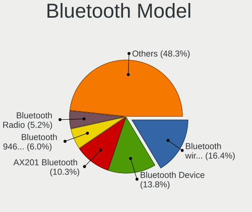

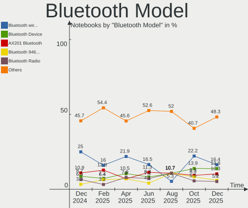

| Model                                               | Notebooks | Percent |
|-----------------------------------------------------|-----------|---------|
| Intel Bluetooth wireless interface                  | 19        | 16.38%  |
| Intel Bluetooth Device                              | 16        | 13.79%  |
| Intel AX201 Bluetooth                               | 12        | 10.34%  |
| Intel Bluetooth 9460/9560 Jefferson Peak (JfP)      | 7         | 6.03%   |
| Realtek Bluetooth Radio                             | 6         | 5.17%   |
| IMC Networks Wireless_Device                        | 6         | 5.17%   |
| Foxconn / Hon Hai Wireless_Device                   | 5         | 4.31%   |
| Intel AX200 Bluetooth                               | 4         | 3.45%   |
| Qualcomm Atheros  Bluetooth Device                  | 3         | 2.59%   |
| MediaTek Wireless_Device                            | 3         | 2.59%   |
| Intel Wireless-AC 9260 Bluetooth Adapter            | 3         | 2.59%   |
| Intel AX210 Bluetooth                               | 3         | 2.59%   |
| Foxconn / Hon Hai MediaTek Bluetooth Adapter        | 3         | 2.59%   |
| Qualcomm Atheros QCA61x4 Bluetooth 4.0              | 2         | 1.72%   |
| Qualcomm Atheros AR3011 Bluetooth                   | 2         | 1.72%   |
| Broadcom BCM43142A0 Bluetooth 4.0                   | 2         | 1.72%   |
| Broadcom BCM43142 Bluetooth 4.0                     | 2         | 1.72%   |
| Askey Bluetooth Device                              | 2         | 1.72%   |
| USI Bluetooth Device                                | 1         | 0.86%   |
| Realtek  Bluetooth 4.2 Adapter                      | 1         | 0.86%   |
| Ralink RT3290 Bluetooth                             | 1         | 0.86%   |
| Lite-On Wireless_Device                             | 1         | 0.86%   |
| Lite-On Bluetooth Device                            | 1         | 0.86%   |
| IMC Networks Bluetooth Radio                        | 1         | 0.86%   |
| IMC Networks Bluetooth Device                       | 1         | 0.86%   |
| HP Broadcom 2070 Bluetooth Combo                    | 1         | 0.86%   |
| Foxconn International BCM43142A0 Bluetooth module   | 1         | 0.86%   |
| Foxconn / Hon Hai Broadcom BCM20702 Bluetooth       | 1         | 0.86%   |
| Foxconn / Hon Hai Acer Bluetooth module             | 1         | 0.86%   |
| Dell Wireless 360 Bluetooth                         | 1         | 0.86%   |
| Cambridge Silicon Radio Bluetooth Dongle (HCI mode) | 1         | 0.86%   |
| Broadcom HP Portable SoftSailing                    | 1         | 0.86%   |
| Broadcom BCM2045B (BDC-2.1) [Bluetooth Controller]  | 1         | 0.86%   |
| Apple Bluetooth USB Host Controller                 | 1         | 0.86%   |

Sound
-----

Sound Vendor
------------

Sound card vendors

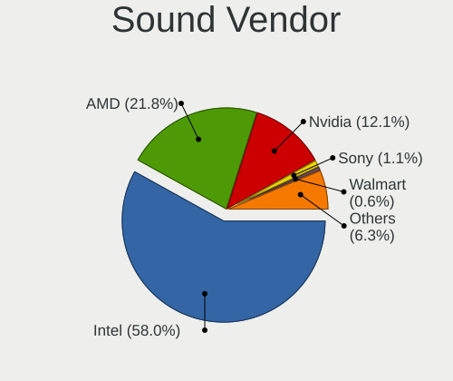

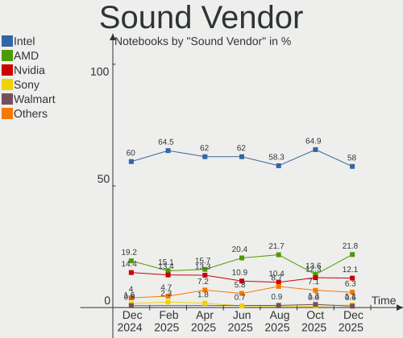

| Vendor                | Notebooks | Percent |
|-----------------------|-----------|---------|
| Intel                 | 101       | 58.05%  |
| AMD                   | 38        | 21.84%  |
| Nvidia                | 21        | 12.07%  |
| Sony                  | 2         | 1.15%   |
| Walmart               | 1         | 0.57%   |
| Texas Instruments     | 1         | 0.57%   |
| Realtek Semiconductor | 1         | 0.57%   |
| Razer USA             | 1         | 0.57%   |
| No brand              | 1         | 0.57%   |
| KTMicro               | 1         | 0.57%   |
| DSEA A/S              | 1         | 0.57%   |
| Creative Labs         | 1         | 0.57%   |
| C-Media Electronics   | 1         | 0.57%   |
| Blue Microphones      | 1         | 0.57%   |
| ASUSTek Computer      | 1         | 0.57%   |
| Apple                 | 1         | 0.57%   |

Sound Model
-----------

Sound card models

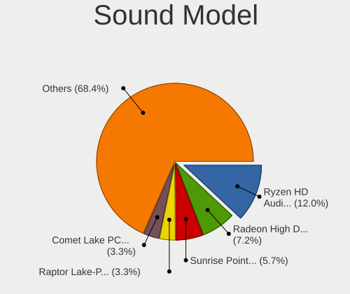

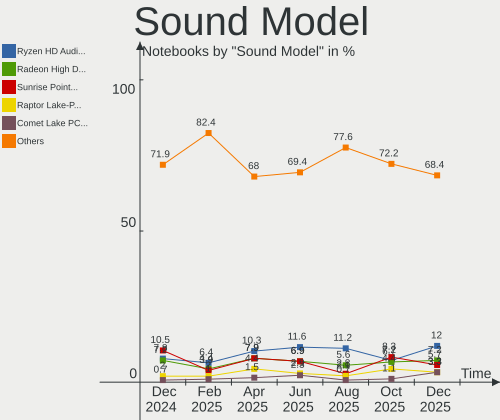

| Model                                                                                             | Notebooks | Percent |
|---------------------------------------------------------------------------------------------------|-----------|---------|
| AMD Ryzen HD Audio Controller                                                                     | 25        | 11.96%  |
| AMD Radeon High Definition Audio Controller                                                       | 15        | 7.18%   |
| Intel Sunrise Point-LP HD Audio                                                                   | 12        | 5.74%   |
| Intel Raptor Lake-P/U/H cAVS                                                                      | 7         | 3.35%   |
| Intel Comet Lake PCH cAVS                                                                         | 7         | 3.35%   |
| Intel 7 Series/C216 Chipset Family High Definition Audio Controller                               | 7         | 3.35%   |
| AMD Renoir/Cezanne HDMI/DP Audio Controller                                                       | 7         | 3.35%   |
| Intel Tiger Lake-LP Smart Sound Technology Audio Controller                                       | 6         | 2.87%   |
| Intel Comet Lake PCH-LP cAVS                                                                      | 6         | 2.87%   |
| Intel Alder Lake PCH-P High Definition Audio Controller                                           | 5         | 2.39%   |
| Intel 5 Series/3400 Series Chipset High Definition Audio                                          | 5         | 2.39%   |
| AMD Raven/Raven2/Fenghuang HDMI/DP Audio Controller                                               | 5         | 2.39%   |
| Intel Cannon Point-LP High Definition Audio Controller                                            | 4         | 1.91%   |
| Intel 100 Series/C230 Series Chipset Family HD Audio Controller                                   | 4         | 1.91%   |
| AMD FCH Azalia Controller                                                                         | 4         | 1.91%   |
| Nvidia TU107 GeForce GTX 1650 High Definition Audio Controller                                    | 3         | 1.44%   |
| Nvidia TU106 High Definition Audio Controller                                                     | 3         | 1.44%   |
| Nvidia AD107 High Definition Audio Controller                                                     | 3         | 1.44%   |
| Intel Raptor Lake High Definition Audio Controller                                                | 3         | 1.44%   |
| Intel Ice Lake-LP Smart Sound Technology Audio Controller                                         | 3         | 1.44%   |
| Intel Haswell-ULT HD Audio Controller                                                             | 3         | 1.44%   |
| Intel 82801I (ICH9 Family) HD Audio Controller                                                    | 3         | 1.44%   |
| Intel 82801H (ICH8 Family) HD Audio Controller                                                    | 3         | 1.44%   |
| Intel 8 Series HD Audio Controller                                                                | 3         | 1.44%   |
| Intel 6 Series/C200 Series Chipset Family High Definition Audio Controller                        | 3         | 1.44%   |
| Nvidia GP104 High Definition Audio Controller                                                     | 2         | 0.96%   |
| Nvidia GB206 High Definition Audio Controller                                                     | 2         | 0.96%   |
| Intel Wildcat Point-LP High Definition Audio Controller                                           | 2         | 0.96%   |
| Intel Meteor Lake-P HD Audio Controller                                                           | 2         | 0.96%   |
| Intel Celeron/Pentium Silver Processor High Definition Audio                                      | 2         | 0.96%   |
| Intel Cannon Lake PCH cAVS                                                                        | 2         | 0.96%   |
| Intel Broadwell-U Audio Controller                                                                | 2         | 0.96%   |
| Intel Atom/Celeron/Pentium Processor x5-E8000/J3xxx/N3xxx Series High Definition Audio Controller | 2         | 0.96%   |
| Intel Arrow Lake cAVS                                                                             | 2         | 0.96%   |
| Intel 8 Series/C220 Series Chipset High Definition Audio Controller                               | 2         | 0.96%   |
| AMD Kabini HDMI/DP Audio                                                                          | 2         | 0.96%   |
| Walmart AB13X Headset Adapter                                                                     | 1         | 0.48%   |
| Texas Instruments PCM2912A Audio Codec                                                            | 1         | 0.48%   |
| Sony DualShock 4 [CUH-ZCT2x]                                                                      | 1         | 0.48%   |
| Sony DualSense wireless controller (PS5)                                                          | 1         | 0.48%   |

Memory
------

Memory Vendor
-------------

Memory module vendors

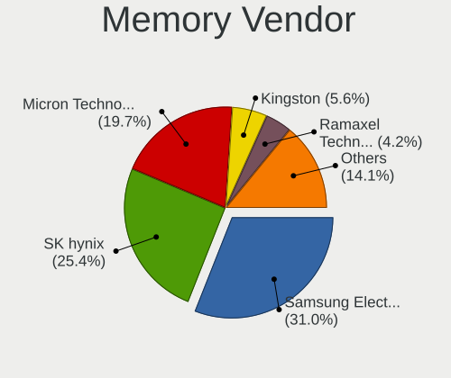

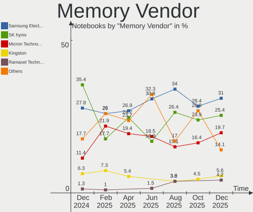

| Vendor              | Notebooks | Percent |
|---------------------|-----------|---------|
| Samsung Electronics | 22        | 30.99%  |
| SK hynix            | 18        | 25.35%  |
| Micron Technology   | 14        | 19.72%  |
| Kingston            | 4         | 5.63%   |
| Ramaxel Technology  | 3         | 4.23%   |
| Crucial             | 3         | 4.23%   |
| A-DATA Technology   | 2         | 2.82%   |
| Unknown             | 2         | 2.82%   |
| Unknown             | 1         | 1.41%   |
| Essencore Limited   | 1         | 1.41%   |
| Corsair             | 1         | 1.41%   |

Memory Model
------------

Memory module models

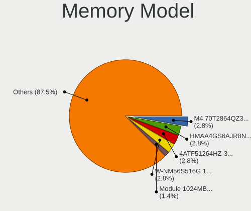

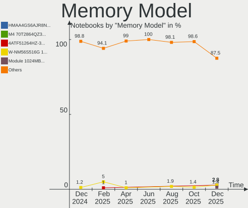

| Model                                                            | Notebooks | Percent |
|------------------------------------------------------------------|-----------|---------|
| SK hynix RAM HMAA4GS6AJR8N-XN 32GB SODIMM DDR4 3200MT/s          | 2         | 2.78%   |
| Samsung RAM M4 70T2864QZ3-CE6 1GB SODIMM DDR 1639MT/s            | 2         | 2.78%   |
| Micron RAM 4ATF51264HZ-3G2R1 4GB SODIMM DDR4 3200MT/s            | 2         | 2.78%   |
| Unknown                                                          | 2         | 2.78%   |
| Unknown RAM Module 1024MB SODIMM DDR2 667MT/s                    | 1         | 1.39%   |
| SK hynix RAM Module 8GB SODIMM DDR3 1600MT/s                     | 1         | 1.39%   |
| SK hynix RAM Module 4GB Row Of Chips LPDDR4 4267MT/s             | 1         | 1.39%   |
| SK hynix RAM Module 16GB SODIMM DDR4 2133MT/s                    | 1         | 1.39%   |
| SK hynix RAM HMT41GS6BFR8A-PB 8GB SODIMM DDR3 2667MT/s           | 1         | 1.39%   |
| SK hynix RAM HMT41GS6AFR8A-PB 8GiB SODIMM DDR3 2667MT/s          | 1         | 1.39%   |
| SK hynix RAM HMT325S6CFR8C-H9 2GB SODIMM DDR3 1333MT/s           | 1         | 1.39%   |
| SK hynix RAM HMAG68EXNSA051N 8GB SODIMM DDR4 3200MT/s            | 1         | 1.39%   |
| SK hynix RAM HMA851S6DJR6N-XN 4GB SODIMM DDR4 3200MT/s           | 1         | 1.39%   |
| SK hynix RAM HMA851S6CJR6N-XN 4GB SODIMM DDR4 3200MT/s           | 1         | 1.39%   |
| SK hynix RAM HMA851S6CJR6N-VK 4GB SODIMM DDR4 2667MT/s           | 1         | 1.39%   |
| SK hynix RAM HMA82GS6CJR8N-VK 16GB SODIMM DDR4 2667MT/s          | 1         | 1.39%   |
| SK hynix RAM HMA81GS6DJR8N-XN 8GB SODIMM DDR4 3200MT/s           | 1         | 1.39%   |
| SK hynix RAM HMA81GS6DJR8N-VK 8GB SODIMM DDR4 2667MT/s           | 1         | 1.39%   |
| SK hynix RAM H9JCNNNCP3MLYR-N6E 4GB SODIMM LPDDR5 6400MT/s       | 1         | 1.39%   |
| SK hynix RAM H9JCNNNBK3MLYR-N6E 1GB Row Of Chips LPDDR5 6400MT/s | 1         | 1.39%   |
| SK hynix RAM H5TC8G63AMR-PBR 4GB SODIMM DDR3 1600MT/s            | 1         | 1.39%   |
| SK hynix RAM H58G66AK6BX070N 8GB Row Of Chips LPDDR5 6400MT/s    | 1         | 1.39%   |
| Samsung RAM Module 16GB SODIMM DDR4 2667MT/s                     | 1         | 1.39%   |
| Samsung RAM M471B5273DH0-CH9 4GB SODIMM DDR3 1600MT/s            | 1         | 1.39%   |
| Samsung RAM M471B5273BH1-CF8 4096MB SODIMM 1067MT/s              | 1         | 1.39%   |
| Samsung RAM M471B5173QH0-YK0 4GB SODIMM DDR3 1600MT/s            | 1         | 1.39%   |
| Samsung RAM M471B1G73DB0-YK0 8GB SODIMM DDR3 1600MT/s            | 1         | 1.39%   |
| Samsung RAM M471A5244CB0-CWE 4GB SODIMM DDR4 3200MT/s            | 1         | 1.39%   |
| Samsung RAM M471A5244CB0-CTD 4GB SODIMM DDR4 3266MT/s            | 1         | 1.39%   |
| Samsung RAM M471A4G43AB1-CWE 32GB SODIMM DDR4 3200MT/s           | 1         | 1.39%   |
| Samsung RAM M471A2K43DB1-CTD 16GB SODIMM DDR4 2667MT/s           | 1         | 1.39%   |
| Samsung RAM M471A2G44BM0-CWE 16GB SODIMM DDR4 3200MT/s           | 1         | 1.39%   |
| Samsung RAM M471A2G44AM0-CWE 16GB SODIMM DDR4 3200MT/s           | 1         | 1.39%   |
| Samsung RAM M471A1K43DB1-CWE 8GB SODIMM DDR4 3200MT/s            | 1         | 1.39%   |
| Samsung RAM M471A1K43CB1-CTD 8GB SODIMM DDR4 3200MT/s            | 1         | 1.39%   |
| Samsung RAM M471A1G44BB0-CWE 8GB SODIMM DDR4 3200MT/s            | 1         | 1.39%   |
| Samsung RAM M425R2GA3EB0-CWMOD 16GB SODIMM DDR5 5600MT/s         | 1         | 1.39%   |
| Samsung RAM K4EBE304EC-EGCG 8GB Row Of Chips LPDDR3 2133MT/s     | 1         | 1.39%   |
| Samsung RAM K3LKBKB@BM-MGCP 2GB Row Of Chips LPDDR5 6400MT/s     | 1         | 1.39%   |
| Samsung RAM K3LKBKB0BM-MGCP 2GB Row Of Chips LPDDR5 6400MT/s     | 1         | 1.39%   |

Memory Kind
-----------

Memory module kinds

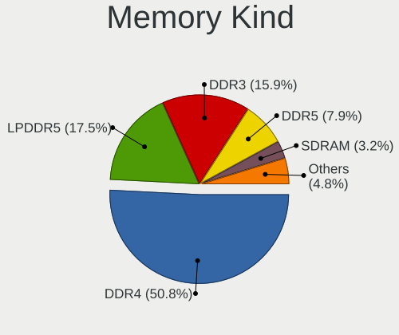

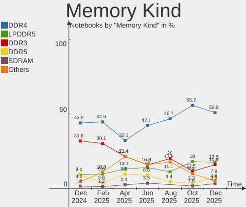

| Kind   | Notebooks | Percent |
|--------|-----------|---------|
| DDR4   | 32        | 50.79%  |
| LPDDR5 | 11        | 17.46%  |
| DDR3   | 10        | 15.87%  |
| DDR5   | 5         | 7.94%   |
| SDRAM  | 2         | 3.17%   |
| LPDDR4 | 1         | 1.59%   |
| LPDDR3 | 1         | 1.59%   |
| DDR2   | 1         | 1.59%   |

Memory Form Factor
------------------

Physical design of the memory module

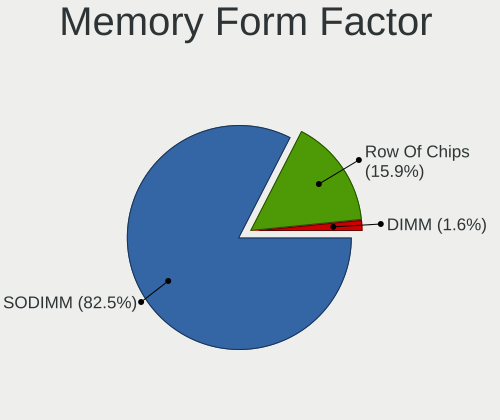

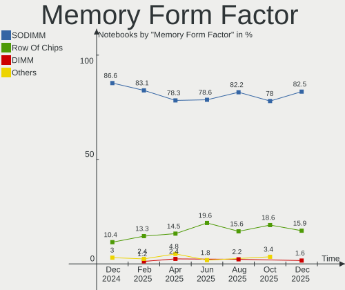

| Name         | Notebooks | Percent |
|--------------|-----------|---------|
| SODIMM       | 52        | 82.54%  |
| Row Of Chips | 10        | 15.87%  |
| DIMM         | 1         | 1.59%   |

Memory Size
-----------

Memory module size

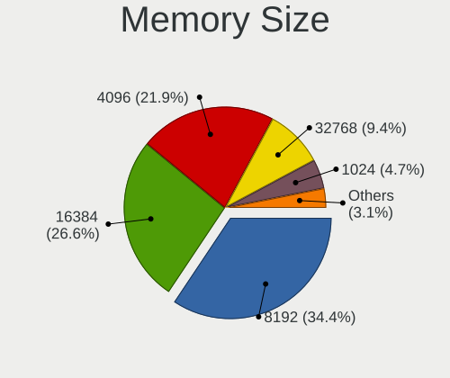

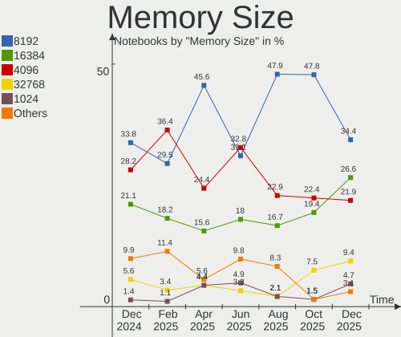

| Size  | Notebooks | Percent |
|-------|-----------|---------|
| 8192  | 22        | 34.38%  |
| 16384 | 17        | 26.56%  |
| 4096  | 14        | 21.88%  |
| 32768 | 6         | 9.38%   |
| 1024  | 3         | 4.69%   |
| 12288 | 1         | 1.56%   |
| 2048  | 1         | 1.56%   |

Memory Speed
------------

Memory module speed

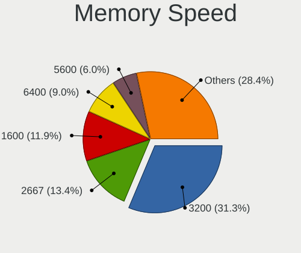

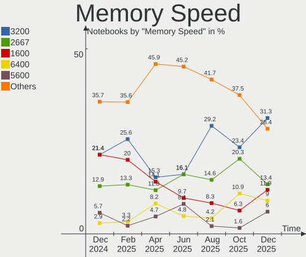

| Speed | Notebooks | Percent |
|-------|-----------|---------|
| 3200  | 21        | 31.34%  |
| 2667  | 9         | 13.43%  |
| 1600  | 8         | 11.94%  |
| 6400  | 6         | 8.96%   |
| 5600  | 4         | 5.97%   |
| 7500  | 3         | 4.48%   |
| 2400  | 3         | 4.48%   |
| 8533  | 2         | 2.99%   |
| 2133  | 2         | 2.99%   |
| 1639  | 2         | 2.99%   |
| 4800  | 1         | 1.49%   |
| 4267  | 1         | 1.49%   |
| 3266  | 1         | 1.49%   |
| 1334  | 1         | 1.49%   |
| 1333  | 1         | 1.49%   |
| 1067  | 1         | 1.49%   |
| 667   | 1         | 1.49%   |

Printers & scanners
-------------------

Printer Vendor
--------------

Printer device vendors

Zero info for selected period =(

Printer Model
-------------

Printer device models

Zero info for selected period =(

Scanner Vendor
--------------

Scanner device vendors

Zero info for selected period =(

Scanner Model
-------------

Scanner device models

Zero info for selected period =(

Camera
------

Camera Vendor
-------------

Camera device vendors

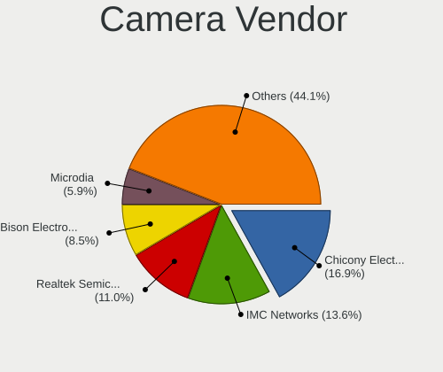

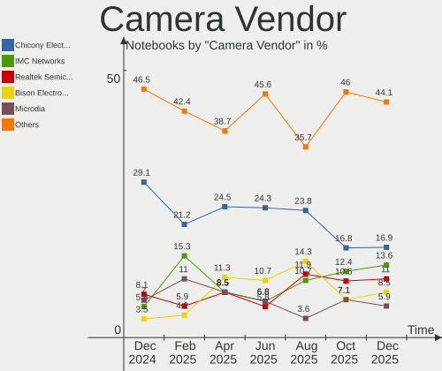

| Vendor                                 | Notebooks | Percent |
|----------------------------------------|-----------|---------|
| Chicony Electronics                    | 20        | 16.95%  |
| IMC Networks                           | 16        | 13.56%  |
| Realtek Semiconductor                  | 13        | 11.02%  |
| Bison Electronics                      | 10        | 8.47%   |
| Microdia                               | 7         | 5.93%   |
| Lite-On Technology                     | 7         | 5.93%   |
| Cheng Uei Precision Industry (Foxlink) | 7         | 5.93%   |
| Syntek                                 | 6         | 5.08%   |
| Sunplus Innovation Technology          | 5         | 4.24%   |
| Quanta                                 | 5         | 4.24%   |
| Luxvisions Innotech Limited            | 4         | 3.39%   |
| Logitech                               | 3         | 2.54%   |
| Apple                                  | 3         | 2.54%   |
| Sonix Technology                       | 2         | 1.69%   |
| Primax Electronics                     | 2         | 1.69%   |
| Suyin                                  | 1         | 0.85%   |
| Silicon Motion                         | 1         | 0.85%   |
| Shinetech                              | 1         | 0.85%   |
| kingcome                               | 1         | 0.85%   |
| Framework                              | 1         | 0.85%   |
| DigiTech                               | 1         | 0.85%   |
| Anker Innovations Limited              | 1         | 0.85%   |
| Acer                                   | 1         | 0.85%   |

Camera Model
------------

Camera device models

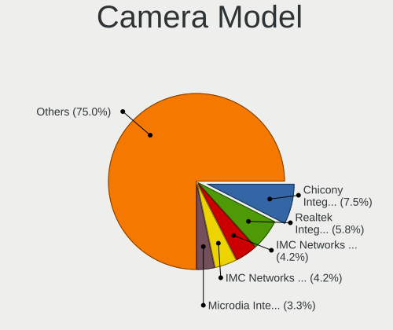

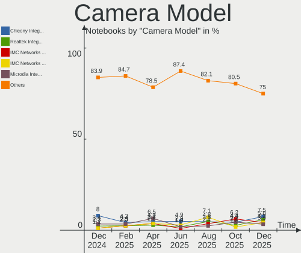

| Model                                                   | Notebooks | Percent |
|---------------------------------------------------------|-----------|---------|
| Chicony Integrated Camera                               | 9         | 7.5%    |
| Realtek Integrated_Webcam_HD                            | 7         | 5.83%   |
| IMC Networks USB2.0 HD UVC WebCam                       | 5         | 4.17%   |
| IMC Networks Integrated Camera                          | 5         | 4.17%   |
| Microdia Integrated_Webcam_HD                           | 4         | 3.33%   |
| Lite-On HP HD Webcam                                    | 4         | 3.33%   |
| Syntek Integrated Camera                                | 3         | 2.5%    |
| Sunplus Integrated_Webcam_HD                            | 3         | 2.5%    |
| Chicony HD WebCam                                       | 3         | 2.5%    |
| Bison Integrated Camera                                 | 3         | 2.5%    |
| Syntek Integrated RGB Camera                            | 2         | 1.67%   |
| Sunplus Integrated Camera                               | 2         | 1.67%   |
| Sonix USB2.0 FHD UVC WebCam                             | 2         | 1.67%   |
| Realtek Integrated Webcam HD                            | 2         | 1.67%   |
| Quanta HP HD Camera                                     | 2         | 1.67%   |
| Primax HP HD Webcam [Fixed]                             | 2         | 1.67%   |
| Microdia Integrated_Webcam_FHD                          | 2         | 1.67%   |
| Luxvisions Innotech Limited Integrated RGB Camera       | 2         | 1.67%   |
| Luxvisions Innotech Limited HP TrueVision HD Camera     | 2         | 1.67%   |
| Logitech Webcam C270                                    | 2         | 1.67%   |
| Lite-On Integrated Camera                               | 2         | 1.67%   |
| IMC Networks Integrated RGB Camera                      | 2         | 1.67%   |
| Cheng Uei Precision Industry (Foxlink) HP Truevision HD | 2         | 1.67%   |
| Bison SunplusIT Integrated Camera                       | 2         | 1.67%   |
| Apple iPhone 5/5C/5S/6/SE/7/8/X                         | 2         | 1.67%   |
| Syntek Lenovo EasyCamera                                | 1         | 0.83%   |
| Suyin HD Video WebCam                                   | 1         | 0.83%   |
| Sunplus Lenovo EasyCamera                               | 1         | 0.83%   |
| Silicon Motion USB 2.0 PC Cam                           | 1         | 0.83%   |
| Shinetech USB2.0 FHD UVC WebCam                         | 1         | 0.83%   |
| Realtek USB Video device                                | 1         | 0.83%   |
| Realtek Laptop Camera                                   | 1         | 0.83%   |
| Realtek HD WebCam                                       | 1         | 0.83%   |
| Realtek EasyCamera                                      | 1         | 0.83%   |
| Quanta USB Webcam                                       | 1         | 0.83%   |
| Quanta HD WebCam                                        | 1         | 0.83%   |
| Quanta HD User Facing                                   | 1         | 0.83%   |
| Microdia Webcam Vitade AF                               | 1         | 0.83%   |
| Logitech C920 PRO HD Webcam                             | 1         | 0.83%   |
| Lite-On HP Wide Vision HD Camera                        | 1         | 0.83%   |

Security
--------

Fingerprint Vendor
------------------

Fingerprint sensor vendors

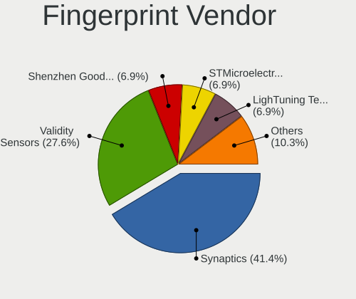

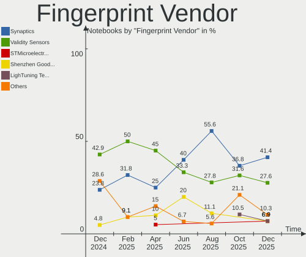

| Vendor                     | Notebooks | Percent |
|----------------------------|-----------|---------|
| Synaptics                  | 12        | 41.38%  |
| Validity Sensors           | 8         | 27.59%  |
| STMicroelectronics         | 2         | 6.9%    |
| Shenzhen Goodix Technology | 2         | 6.9%    |
| LighTuning Technology      | 2         | 6.9%    |
| Elan Microelectronics      | 2         | 6.9%    |
| AuthenTec                  | 1         | 3.45%   |

Fingerprint Model
-----------------

Fingerprint sensor models

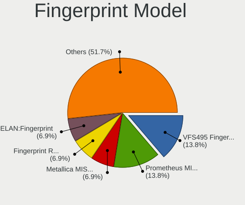

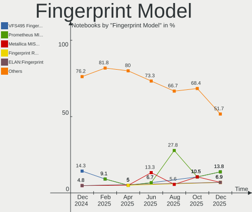

| Model                                                    | Notebooks | Percent |
|----------------------------------------------------------|-----------|---------|
| Validity Sensors VFS495 Fingerprint Reader               | 4         | 13.79%  |
| Synaptics Prometheus MIS Touch Fingerprint Reader        | 4         | 13.79%  |
| Synaptics Metallica MIS Touch Fingerprint Reader         | 2         | 6.9%    |
| STMicroelectronics Fingerprint Reader                    | 2         | 6.9%    |
| Elan ELAN:Fingerprint                                    | 2         | 6.9%    |
| Validity Sensors VFS5011 Fingerprint Reader              | 1         | 3.45%   |
| Validity Sensors VFS491                                  | 1         | 3.45%   |
| Validity Sensors VFS471 Fingerprint Reader               | 1         | 3.45%   |
| Validity Sensors VFS 5011 fingerprint sensor             | 1         | 3.45%   |
| Synaptics WBDI Device                                    | 1         | 3.45%   |
| Synaptics WBDI                                           | 1         | 3.45%   |
| Synaptics UWP WBDI                                       | 1         | 3.45%   |
| Synaptics Prometheus Fingerprint Reader                  | 1         | 3.45%   |
| Synaptics FS7604 Touch Fingerprint Sensor with PurePrint | 1         | 3.45%   |
| Synaptics Fingerprint reader [HP G6]                     | 1         | 3.45%   |
| Shenzhen Goodix  FingerPrint Device                      | 1         | 3.45%   |
| Shenzhen Goodix FingerPrint                              | 1         | 3.45%   |
| LighTuning ES603 Swipe Fingerprint Sensor                | 1         | 3.45%   |
| LighTuning EgisTec Touch Fingerprint Sensor              | 1         | 3.45%   |
| AuthenTec AES2810                                        | 1         | 3.45%   |

Chipcard Vendor
---------------

Chipcard module vendors

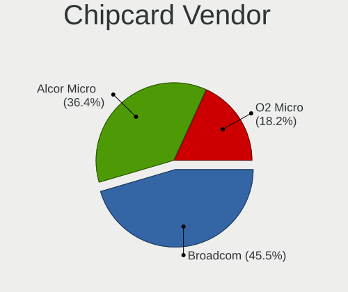

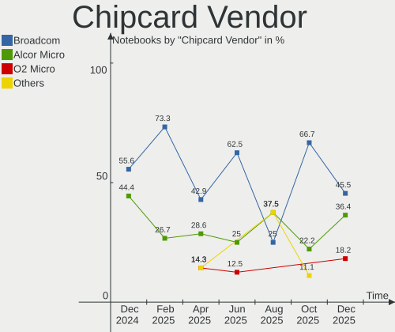

| Vendor      | Notebooks | Percent |
|-------------|-----------|---------|
| Broadcom    | 5         | 45.45%  |
| Alcor Micro | 4         | 36.36%  |
| O2 Micro    | 2         | 18.18%  |

Chipcard Model
--------------

Chipcard module models

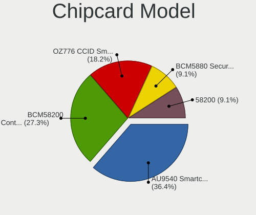

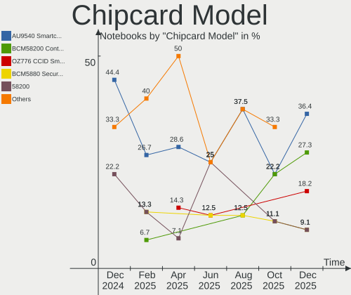

| Model                                                                       | Notebooks | Percent |
|-----------------------------------------------------------------------------|-----------|---------|
| Alcor Micro AU9540 Smartcard Reader                                         | 4         | 36.36%  |
| Broadcom BCM58200 ControlVault 3 (FingerPrint sensor + Contacted SmartCard) | 3         | 27.27%  |
| O2 Micro OZ776 CCID Smartcard Reader                                        | 2         | 18.18%  |
| Broadcom BCM5880 Secure Applications Processor                              | 1         | 9.09%   |
| Broadcom 58200                                                              | 1         | 9.09%   |

Unsupported
-----------

Unsupported Devices
-------------------

Total unsupported devices on board

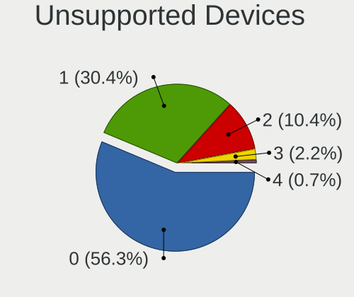

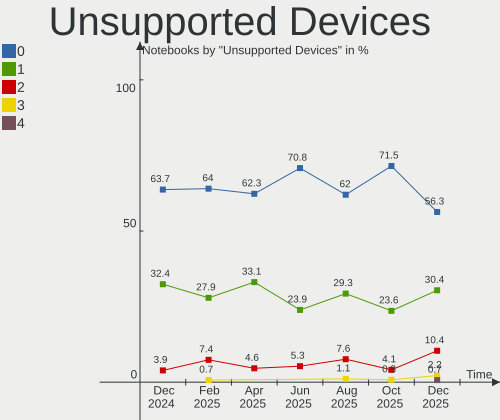

| Total | Notebooks | Percent |
|-------|-----------|---------|
| 0     | 76        | 56.3%   |
| 1     | 41        | 30.37%  |
| 2     | 14        | 10.37%  |
| 3     | 3         | 2.22%   |
| 4     | 1         | 0.74%   |

Unsupported Device Types
------------------------

Types of unsupported devices

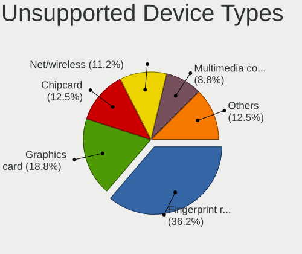

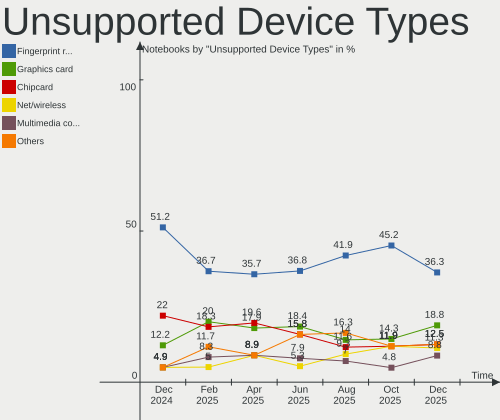

| Type                     | Notebooks | Percent |
|--------------------------|-----------|---------|
| Fingerprint reader       | 29        | 36.25%  |
| Graphics card            | 15        | 18.75%  |
| Chipcard                 | 10        | 12.5%   |
| Net/wireless             | 9         | 11.25%  |
| Multimedia controller    | 7         | 8.75%   |
| Communication controller | 2         | 2.5%    |
| Bluetooth                | 2         | 2.5%    |
| Unassigned class         | 1         | 1.25%   |
| Storage                  | 1         | 1.25%   |
| Sound                    | 1         | 1.25%   |
| Network                  | 1         | 1.25%   |
| Net/ethernet             | 1         | 1.25%   |
| Modem                    | 1         | 1.25%   |

