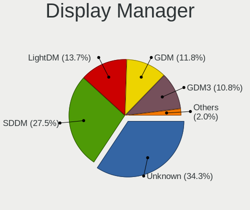
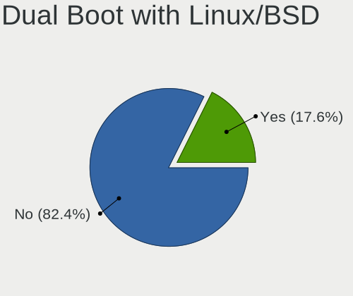
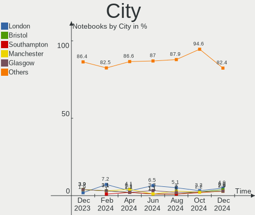
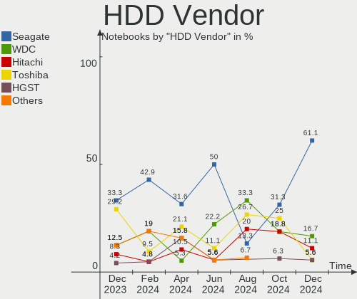
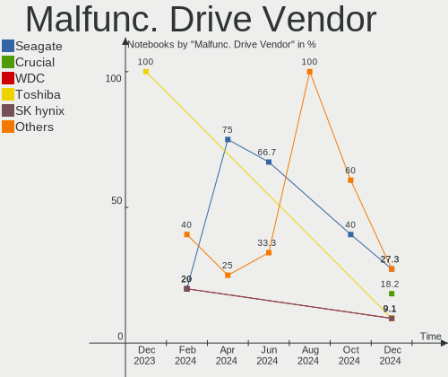
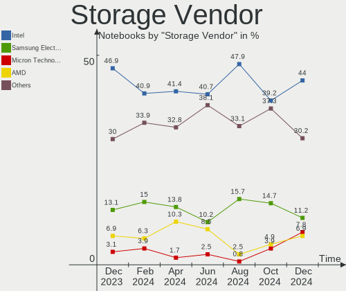
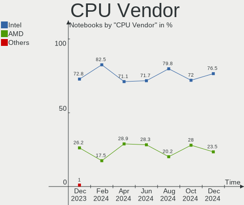
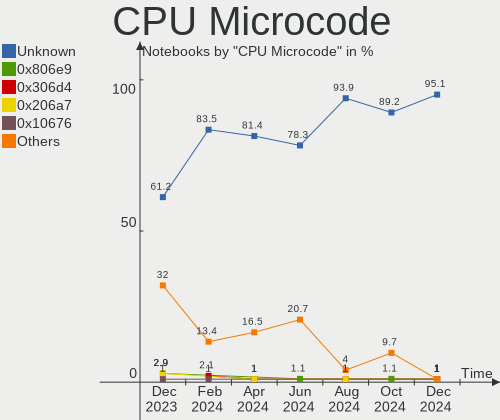
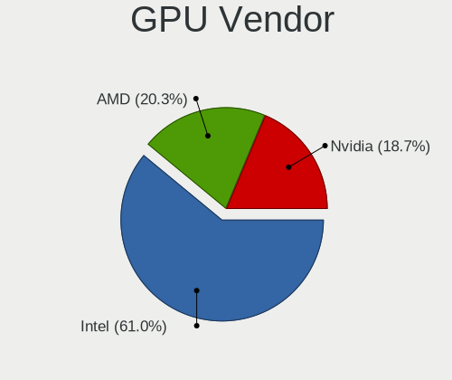
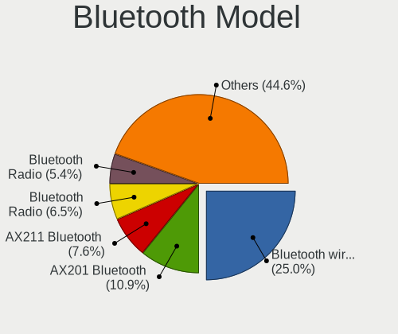

Linux in UK - Hardware Trends (Notebooks)
-----------------------------------------

A project to identify most popular hardware characteristics and track their change
over time based on data collected by Linux users at https://Linux-Hardware.org.

Anyone can contribute to this report by the [hw-probe](https://github.com/linuxhw/hw-probe) tool:

    sudo -E hw-probe -all -upload

Period: Aug, 2022.

Contents
--------

* [ System ](#system)
  - [ OS                       ](#os)
  - [ OS Family                ](#os-family)
  - [ Kernel                   ](#kernel)
  - [ Kernel Family            ](#kernel-family)
  - [ Kernel Major Ver.        ](#kernel-major-ver)
  - [ Arch                     ](#arch)
  - [ DE                       ](#de)
  - [ Display Server           ](#display-server)
  - [ Display Manager          ](#display-manager)
  - [ OS Lang                  ](#os-lang)
  - [ Boot Mode                ](#boot-mode)
  - [ Filesystem               ](#filesystem)
  - [ Part. scheme             ](#part-scheme)
  - [ Dual Boot with Linux/BSD ](#dual-boot-with-linuxbsd)
  - [ Dual Boot (Win)          ](#dual-boot-win)

* [ Board ](#board)
  - [ Vendor                   ](#vendor)
  - [ Model                    ](#model)
  - [ Model Family             ](#model-family)
  - [ MFG Year                 ](#mfg-year)
  - [ Form Factor              ](#form-factor)
  - [ Secure Boot              ](#secure-boot)
  - [ Coreboot                 ](#coreboot)
  - [ RAM Size                 ](#ram-size)
  - [ RAM Used                 ](#ram-used)
  - [ Total Drives             ](#total-drives)
  - [ Has CD-ROM               ](#has-cd-rom)
  - [ Has Ethernet             ](#has-ethernet)
  - [ Has WiFi                 ](#has-wifi)
  - [ Has Bluetooth            ](#has-bluetooth)

* [ Location ](#location)
  - [ Country                  ](#country)
  - [ City                     ](#city)

* [ Drives ](#drives)
  - [ Drive Vendor             ](#drive-vendor)
  - [ Drive Model              ](#drive-model)
  - [ HDD Vendor               ](#hdd-vendor)
  - [ SSD Vendor               ](#ssd-vendor)
  - [ Drive Kind               ](#drive-kind)
  - [ Drive Connector          ](#drive-connector)
  - [ Drive Size               ](#drive-size)
  - [ Space Total              ](#space-total)
  - [ Space Used               ](#space-used)
  - [ Malfunc. Drives          ](#malfunc-drives)
  - [ Malfunc. Drive Vendor    ](#malfunc-drive-vendor)
  - [ Malfunc. HDD Vendor      ](#malfunc-hdd-vendor)
  - [ Malfunc. Drive Kind      ](#malfunc-drive-kind)
  - [ Failed Drives            ](#failed-drives)
  - [ Failed Drive Vendor      ](#failed-drive-vendor)
  - [ Drive Status             ](#drive-status)

* [ Storage controller ](#storage-controller)
  - [ Storage Vendor           ](#storage-vendor)
  - [ Storage Model            ](#storage-model)
  - [ Storage Kind             ](#storage-kind)

* [ Processor ](#processor)
  - [ CPU Vendor               ](#cpu-vendor)
  - [ CPU Model                ](#cpu-model)
  - [ CPU Model Family         ](#cpu-model-family)
  - [ CPU Cores                ](#cpu-cores)
  - [ CPU Sockets              ](#cpu-sockets)
  - [ CPU Threads              ](#cpu-threads)
  - [ CPU Op-Modes             ](#cpu-op-modes)
  - [ CPU Microcode            ](#cpu-microcode)
  - [ CPU Microarch            ](#cpu-microarch)

* [ Graphics ](#graphics)
  - [ GPU Vendor               ](#gpu-vendor)
  - [ GPU Model                ](#gpu-model)
  - [ GPU Combo                ](#gpu-combo)
  - [ GPU Driver               ](#gpu-driver)
  - [ GPU Memory               ](#gpu-memory)

* [ Monitor ](#monitor)
  - [ Monitor Vendor           ](#monitor-vendor)
  - [ Monitor Model            ](#monitor-model)
  - [ Monitor Resolution       ](#monitor-resolution)
  - [ Monitor Diagonal         ](#monitor-diagonal)
  - [ Monitor Width            ](#monitor-width)
  - [ Aspect Ratio             ](#aspect-ratio)
  - [ Monitor Area             ](#monitor-area)
  - [ Pixel Density            ](#pixel-density)
  - [ Multiple Monitors        ](#multiple-monitors)

* [ Network ](#network)
  - [ Net Controller Vendor    ](#net-controller-vendor)
  - [ Net Controller Model     ](#net-controller-model)
  - [ Wireless Vendor          ](#wireless-vendor)
  - [ Wireless Model           ](#wireless-model)
  - [ Ethernet Vendor          ](#ethernet-vendor)
  - [ Ethernet Model           ](#ethernet-model)
  - [ Net Controller Kind      ](#net-controller-kind)
  - [ Used Controller          ](#used-controller)
  - [ NICs                     ](#nics)
  - [ IPv6                     ](#ipv6)

* [ Bluetooth ](#bluetooth)
  - [ Bluetooth Vendor         ](#bluetooth-vendor)
  - [ Bluetooth Model          ](#bluetooth-model)

* [ Sound ](#sound)
  - [ Sound Vendor             ](#sound-vendor)
  - [ Sound Model              ](#sound-model)

* [ Memory ](#memory)
  - [ Memory Vendor            ](#memory-vendor)
  - [ Memory Model             ](#memory-model)
  - [ Memory Kind              ](#memory-kind)
  - [ Memory Form Factor       ](#memory-form-factor)
  - [ Memory Size              ](#memory-size)
  - [ Memory Speed             ](#memory-speed)

* [ Printers & scanners ](#printers--scanners)
  - [ Printer Vendor           ](#printer-vendor)
  - [ Printer Model            ](#printer-model)
  - [ Scanner Vendor           ](#scanner-vendor)
  - [ Scanner Model            ](#scanner-model)

* [ Camera ](#camera)
  - [ Camera Vendor            ](#camera-vendor)
  - [ Camera Model             ](#camera-model)

* [ Security ](#security)
  - [ Fingerprint Vendor       ](#fingerprint-vendor)
  - [ Fingerprint Model        ](#fingerprint-model)
  - [ Chipcard Vendor          ](#chipcard-vendor)
  - [ Chipcard Model           ](#chipcard-model)

* [ Unsupported ](#unsupported)
  - [ Unsupported Devices      ](#unsupported-devices)
  - [ Unsupported Device Types ](#unsupported-device-types)

System
------

OS
--

Installed operating systems

| Name                         | Notebooks | Percent |
|------------------------------|-----------|---------|
| Ubuntu 22.04                 | 14        | 16.67%  |
| Zorin 16                     | 8         | 9.52%   |
| OpenMandriva 4.3             | 7         | 8.33%   |
| Linux Mint 21                | 6         | 7.14%   |
| Ubuntu 20.04                 | 4         | 4.76%   |
| SteamOS 3.3                  | 4         | 4.76%   |
| SteamOS 3.3.1                | 3         | 3.57%   |
| Pop!_OS 22.04                | 3         | 3.57%   |
| OpenMandriva 4.90            | 3         | 3.57%   |
| Fedora 36                    | 3         | 3.57%   |
| Elementary 6.1               | 3         | 3.57%   |
| Arch                         | 3         | 3.57%   |
| Zorin 15                     | 2         | 2.38%   |
| openSUSE Tumbleweed-XXXXXXXX | 2         | 2.38%   |
| Linux Mint 20.3              | 2         | 2.38%   |
| Debian 11                    | 2         | 2.38%   |
| Xubuntu 20.04                | 1         | 1.19%   |
| OpenMandriva 4.2             | 1         | 1.19%   |
| Manjaro 21.3.7               | 1         | 1.19%   |
| Manjaro 21.3.6               | 1         | 1.19%   |
| Lubuntu 20.04                | 1         | 1.19%   |
| Linux Mint 19.1              | 1         | 1.19%   |
| Kubuntu 22.04                | 1         | 1.19%   |
| Kubuntu 11.1                 | 1         | 1.19%   |
| KDE neon 20.04               | 1         | 1.19%   |
| Kali 2022.3                  | 1         | 1.19%   |
| Kali 2022.2                  | 1         | 1.19%   |
| Garuda Linux Soaring         | 1         | 1.19%   |
| Feren OS 20.04               | 1         | 1.19%   |
| Debian Testing               | 1         | 1.19%   |
| Arch Rolling                 | 1         | 1.19%   |

OS Family
---------

OS without a version

| Name         | Notebooks | Percent |
|--------------|-----------|---------|
| Ubuntu       | 18        | 21.43%  |
| OpenMandriva | 11        | 13.1%   |
| Zorin        | 10        | 11.9%   |
| Linux Mint   | 9         | 10.71%  |
| SteamOS      | 7         | 8.33%   |
| Arch         | 4         | 4.76%   |
| Pop!_OS      | 3         | 3.57%   |
| Fedora       | 3         | 3.57%   |
| Elementary   | 3         | 3.57%   |
| Debian       | 3         | 3.57%   |
| openSUSE     | 2         | 2.38%   |
| Manjaro      | 2         | 2.38%   |
| Kubuntu      | 2         | 2.38%   |
| Kali         | 2         | 2.38%   |
| Xubuntu      | 1         | 1.19%   |
| Lubuntu      | 1         | 1.19%   |
| KDE neon     | 1         | 1.19%   |
| Garuda Linux | 1         | 1.19%   |
| Feren OS     | 1         | 1.19%   |

Kernel
------

Version of the Linux kernel

| Version                                        | Notebooks | Percent |
|------------------------------------------------|-----------|---------|
| 5.15.0-46-generic                              | 21        | 25%     |
| 5.16.7-desktop-1omv4003                        | 7         | 8.33%   |
| 5.15.0-43-generic                              | 7         | 8.33%   |
| 5.13.0-valve21-1-neptune-02209-g2a5bdc1102a0   | 4         | 4.76%   |
| 5.18.12-desktop-3omv4090                       | 3         | 3.57%   |
| 5.15.0-41-generic                              | 3         | 3.57%   |
| 5.13.0-valve21.1-1-neptune-02211-gc54cda5a36f3 | 3         | 3.57%   |
| 5.4.0-124-generic                              | 2         | 2.38%   |
| 5.18.10-76051810-generic                       | 2         | 2.38%   |
| 5.13.0-30-generic                              | 2         | 2.38%   |
| 5.8.0-50-generic                               | 1         | 1.19%   |
| 5.4.0-125-generic                              | 1         | 1.19%   |
| 5.4.0-110-generic                              | 1         | 1.19%   |
| 5.19.3-zen1-1-zen                              | 1         | 1.19%   |
| 5.19.2-arch1-1                                 | 1         | 1.19%   |
| 5.19.1-arch2-1                                 | 1         | 1.19%   |
| 5.19.1-4.g4fdb301-default                      | 1         | 1.19%   |
| 5.19.1-2-MANJARO                               | 1         | 1.19%   |
| 5.19.0-76051900-generic                        | 1         | 1.19%   |
| 5.19.0-1-default                               | 1         | 1.19%   |
| 5.18.18-201.fsync.fc36.x86_64                  | 1         | 1.19%   |
| 5.18.17-200.fc36.x86_64                        | 1         | 1.19%   |
| 5.18.16-zen1-1-zen                             | 1         | 1.19%   |
| 5.18.15-051815-generic                         | 1         | 1.19%   |
| 5.18.13-200.fc36.x86_64                        | 1         | 1.19%   |
| 5.18.0-kali5-amd64                             | 1         | 1.19%   |
| 5.18.0-3-amd64                                 | 1         | 1.19%   |
| 5.17.5-76051705-generic                        | 1         | 1.19%   |
| 5.16.0-kali7-amd64                             | 1         | 1.19%   |
| 5.15.60-1-MANJARO                              | 1         | 1.19%   |
| 5.15.60-1-lts                                  | 1         | 1.19%   |
| 5.15.0-43-lowlatency                           | 1         | 1.19%   |
| 5.15.0-42-lowlatency                           | 1         | 1.19%   |
| 5.15.0-25-generic                              | 1         | 1.19%   |
| 5.13.0-51-generic                              | 1         | 1.19%   |
| 5.11.0-43-generic                              | 1         | 1.19%   |
| 5.10.14-desktop-1omv4002                       | 1         | 1.19%   |
| 5.10.0-17-amd64                                | 1         | 1.19%   |
| 5.10.0-16-amd64                                | 1         | 1.19%   |
| 4.15.0-191-generic                             | 1         | 1.19%   |

Kernel Family
-------------

Linux kernel without a distro release

| Version | Notebooks | Percent |
|---------|-----------|---------|
| 5.15.0  | 34        | 40.48%  |
| 5.13.0  | 10        | 11.9%   |
| 5.16.7  | 7         | 8.33%   |
| 5.4.0   | 4         | 4.76%   |
| 5.19.1  | 3         | 3.57%   |
| 5.18.12 | 3         | 3.57%   |
| 5.19.0  | 2         | 2.38%   |
| 5.18.10 | 2         | 2.38%   |
| 5.18.0  | 2         | 2.38%   |
| 5.15.60 | 2         | 2.38%   |
| 5.10.0  | 2         | 2.38%   |
| 5.8.0   | 1         | 1.19%   |
| 5.19.3  | 1         | 1.19%   |
| 5.19.2  | 1         | 1.19%   |
| 5.18.18 | 1         | 1.19%   |
| 5.18.17 | 1         | 1.19%   |
| 5.18.16 | 1         | 1.19%   |
| 5.18.15 | 1         | 1.19%   |
| 5.18.13 | 1         | 1.19%   |
| 5.17.5  | 1         | 1.19%   |
| 5.16.0  | 1         | 1.19%   |
| 5.11.0  | 1         | 1.19%   |
| 5.10.14 | 1         | 1.19%   |
| 4.15.0  | 1         | 1.19%   |

Kernel Major Ver.
-----------------

Linux kernel major version

| Version | Notebooks | Percent |
|---------|-----------|---------|
| 5.15    | 36        | 42.86%  |
| 5.18    | 12        | 14.29%  |
| 5.13    | 10        | 11.9%   |
| 5.16    | 8         | 9.52%   |
| 5.19    | 7         | 8.33%   |
| 5.4     | 4         | 4.76%   |
| 5.10    | 3         | 3.57%   |
| 5.8     | 1         | 1.19%   |
| 5.17    | 1         | 1.19%   |
| 5.11    | 1         | 1.19%   |
| 4.15    | 1         | 1.19%   |

Arch
----

OS architecture (x86_64, i586, etc.)

| Name   | Notebooks | Percent |
|--------|-----------|---------|
| x86_64 | 84        | 100%    |

DE
--

Desktop Environment

| Name       | Notebooks | Percent |
|------------|-----------|---------|
| GNOME      | 33        | 39.29%  |
| KDE5       | 27        | 32.14%  |
| X-Cinnamon | 10        | 11.9%   |
| XFCE       | 8         | 9.52%   |
| Pantheon   | 3         | 3.57%   |
| sway       | 1         | 1.19%   |
| LXQt       | 1         | 1.19%   |
| LXDE       | 1         | 1.19%   |

Display Server
--------------

X11 or Wayland

| Name    | Notebooks | Percent |
|---------|-----------|---------|
| X11     | 69        | 82.14%  |
| Wayland | 14        | 16.67%  |
| Unknown | 1         | 1.19%   |

Display Manager
---------------

SDDM, LightDM, etc.

| Name    | Notebooks | Percent |
|---------|-----------|---------|
| Unknown | 30        | 35.71%  |
| GDM3    | 19        | 22.62%  |
| SDDM    | 17        | 20.24%  |
| LightDM | 12        | 14.29%  |
| GDM     | 5         | 5.95%   |
| GREETD  | 1         | 1.19%   |

OS Lang
-------

Language

| Lang    | Notebooks | Percent |
|---------|-----------|---------|
| en_GB   | 54        | 64.29%  |
| en_US   | 24        | 28.57%  |
| POSIX   | 1         | 1.19%   |
| pl_PL   | 1         | 1.19%   |
| es_ES   | 1         | 1.19%   |
| en_GG   | 1         | 1.19%   |
| C       | 1         | 1.19%   |
| Unknown | 1         | 1.19%   |

Boot Mode
---------

EFI or BIOS

| Mode | Notebooks | Percent |
|------|-----------|---------|
| EFI  | 48        | 57.14%  |
| BIOS | 36        | 42.86%  |

Filesystem
----------

Type of filesystem

| Type    | Notebooks | Percent |
|---------|-----------|---------|
| Ext4    | 61        | 72.62%  |
| Overlay | 11        | 13.1%   |
| Btrfs   | 11        | 13.1%   |
| Xfs     | 1         | 1.19%   |

Part. scheme
------------

Scheme of partitioning

| Type    | Notebooks | Percent |
|---------|-----------|---------|
| Unknown | 45        | 53.57%  |
| GPT     | 35        | 41.67%  |
| MBR     | 4         | 4.76%   |

Dual Boot with Linux/BSD
------------------------

Hosting more than one Linux/BSD

| Dual boot | Notebooks | Percent |
|-----------|-----------|---------|
| No        | 73        | 86.9%   |
| Yes       | 11        | 13.1%   |

Dual Boot (Win)
---------------

Hosting Linux and Windows

| Dual boot | Notebooks | Percent |
|-----------|-----------|---------|
| No        | 68        | 80.95%  |
| Yes       | 16        | 19.05%  |

Board
-----

Vendor
------

Motherboard manufacturer

| Name                | Notebooks | Percent |
|---------------------|-----------|---------|
| Dell                | 19        | 22.62%  |
| Hewlett-Packard     | 13        | 15.48%  |
| Lenovo              | 12        | 14.29%  |
| Acer                | 8         | 9.52%   |
| Valve               | 7         | 8.33%   |
| ASUSTek Computer    | 5         | 5.95%   |
| Apple               | 5         | 5.95%   |
| Toshiba             | 2         | 2.38%   |
| Notebook            | 2         | 2.38%   |
| MSI                 | 2         | 2.38%   |
| HUAWEI              | 2         | 2.38%   |
| Star Labs           | 1         | 1.19%   |
| Standard            | 1         | 1.19%   |
| Samsung Electronics | 1         | 1.19%   |
| Packard Bell        | 1         | 1.19%   |
| Linx                | 1         | 1.19%   |
| Fujitsu Siemens     | 1         | 1.19%   |
| AMI                 | 1         | 1.19%   |

Model
-----

Motherboard model

| Name                                 | Notebooks | Percent |
|--------------------------------------|-----------|---------|
| Valve Jupiter                        | 7         | 8.33%   |
| Apple MacBookPro9,2                  | 2         | 2.38%   |
| Acer Aspire 5740                     | 2         | 2.38%   |
| Unknown                              | 2         | 2.38%   |
| Toshiba TECRA Z40-C                  | 1         | 1.19%   |
| Toshiba Satellite C660               | 1         | 1.19%   |
| Star Labs LabTop                     | 1         | 1.19%   |
| Samsung R519/R719                    | 1         | 1.19%   |
| Packard Bell EasyNote TK13BZ         | 1         | 1.19%   |
| Notebook PCx0Dx                      | 1         | 1.19%   |
| Notebook NL40_50CU                   | 1         | 1.19%   |
| MSI GE62VR 7RF                       | 1         | 1.19%   |
| MSI Creator Z16 Hiroshi F A11UE      | 1         | 1.19%   |
| Linx LINX1010B                       | 1         | 1.19%   |
| Lenovo Z51-70 80K6                   | 1         | 1.19%   |
| Lenovo V15-IIL 82C5                  | 1         | 1.19%   |
| Lenovo ThinkPad T480 20L6SBD000      | 1         | 1.19%   |
| Lenovo ThinkPad T450s 20BXCTO1WW     | 1         | 1.19%   |
| Lenovo ThinkBook 15-IIL 20SM         | 1         | 1.19%   |
| Lenovo Legion 5 15ACH6H 82JU         | 1         | 1.19%   |
| Lenovo IdeaPad Z580                  | 1         | 1.19%   |
| Lenovo IdeaPad S540-13API 81XC       | 1         | 1.19%   |
| Lenovo IdeaPad S130-11IGM 81J1       | 1         | 1.19%   |
| Lenovo IdeaPad 510S-14ISK 80TK       | 1         | 1.19%   |
| Lenovo IdeaPad 5 Pro 14ACN6 82L7     | 1         | 1.19%   |
| Lenovo G505s 20255                   | 1         | 1.19%   |
| HUAWEI NBD-WXX9                      | 1         | 1.19%   |
| HUAWEI KLVD-WXX9                     | 1         | 1.19%   |
| HP ProBook 6570b                     | 1         | 1.19%   |
| HP ProBook 455 G7                    | 1         | 1.19%   |
| HP ProBook 450 G6                    | 1         | 1.19%   |
| HP Pavilion Laptop 15-cd0xx          | 1         | 1.19%   |
| HP Pavilion Gaming Laptop 15-ec0xxx  | 1         | 1.19%   |
| HP Pavilion g6                       | 1         | 1.19%   |
| HP OMEN by Laptop 16-c0xxx           | 1         | 1.19%   |
| HP Notebook                          | 1         | 1.19%   |
| HP Laptop 17-cn0xxx                  | 1         | 1.19%   |
| HP Laptop 15-db0xxx                  | 1         | 1.19%   |
| HP Laptop 14-cm0xxx                  | 1         | 1.19%   |
| HP G62                               | 1         | 1.19%   |
| HP ENVY Laptop 13-aq0xxx             | 1         | 1.19%   |
| Fujitsu Siemens ESPRIMO Mobile U9210 | 1         | 1.19%   |
| Dell XPS 15 9560                     | 1         | 1.19%   |
| Dell XPS 15 9520                     | 1         | 1.19%   |
| Dell XPS 15 7590                     | 1         | 1.19%   |
| Dell XPS 13 9380                     | 1         | 1.19%   |
| Dell XPS 13 9305                     | 1         | 1.19%   |
| Dell Vostro 5625                     | 1         | 1.19%   |
| Dell Studio 1735                     | 1         | 1.19%   |
| Dell Precision M6400                 | 1         | 1.19%   |
| Dell Latitude E7450                  | 1         | 1.19%   |
| Dell Latitude E6510                  | 1         | 1.19%   |
| Dell Latitude E6430                  | 1         | 1.19%   |
| Dell Latitude E5470                  | 1         | 1.19%   |
| Dell Inspiron 7570                   | 1         | 1.19%   |
| Dell Inspiron 5748                   | 1         | 1.19%   |
| Dell Inspiron 5593                   | 1         | 1.19%   |
| Dell Inspiron 5580                   | 1         | 1.19%   |
| Dell Inspiron 5570                   | 1         | 1.19%   |
| Dell Inspiron 5567                   | 1         | 1.19%   |

Model Family
------------

Motherboard model prefix

| Name                    | Notebooks | Percent |
|-------------------------|-----------|---------|
| Valve Jupiter           | 7         | 8.33%   |
| Dell Inspiron           | 7         | 8.33%   |
| Lenovo IdeaPad          | 5         | 5.95%   |
| Dell XPS                | 5         | 5.95%   |
| Acer Aspire             | 5         | 5.95%   |
| Dell Latitude           | 4         | 4.76%   |
| HP ProBook              | 3         | 3.57%   |
| HP Pavilion             | 3         | 3.57%   |
| HP Laptop               | 3         | 3.57%   |
| Lenovo ThinkPad         | 2         | 2.38%   |
| Apple MacBookPro9       | 2         | 2.38%   |
| Unknown                 | 2         | 2.38%   |
| Toshiba TECRA           | 1         | 1.19%   |
| Toshiba Satellite       | 1         | 1.19%   |
| Star Labs LabTop        | 1         | 1.19%   |
| Samsung R519            | 1         | 1.19%   |
| Packard Bell EasyNote   | 1         | 1.19%   |
| Notebook PCx0Dx         | 1         | 1.19%   |
| Notebook NL40           | 1         | 1.19%   |
| MSI GE62VR              | 1         | 1.19%   |
| MSI Creator             | 1         | 1.19%   |
| Linx LINX1010B          | 1         | 1.19%   |
| Lenovo Z51-70           | 1         | 1.19%   |
| Lenovo V15-IIL          | 1         | 1.19%   |
| Lenovo ThinkBook        | 1         | 1.19%   |
| Lenovo Legion           | 1         | 1.19%   |
| Lenovo G505s            | 1         | 1.19%   |
| HUAWEI NBD-WXX9         | 1         | 1.19%   |
| HUAWEI KLVD-WXX9        | 1         | 1.19%   |
| HP OMEN                 | 1         | 1.19%   |
| HP Notebook             | 1         | 1.19%   |
| HP G62                  | 1         | 1.19%   |
| HP ENVY                 | 1         | 1.19%   |
| Fujitsu Siemens ESPRIMO | 1         | 1.19%   |
| Dell Vostro             | 1         | 1.19%   |
| Dell Studio             | 1         | 1.19%   |
| Dell Precision          | 1         | 1.19%   |
| ASUS ZenBook            | 1         | 1.19%   |
| ASUS X555LAB            | 1         | 1.19%   |
| ASUS VivoBook           | 1         | 1.19%   |
| ASUS ROG                | 1         | 1.19%   |
| ASUS G750JM             | 1         | 1.19%   |
| Apple MacBookPro12      | 1         | 1.19%   |
| Apple MacBookPro10      | 1         | 1.19%   |
| Apple MacBookAir6       | 1         | 1.19%   |
| Acer TravelMate         | 1         | 1.19%   |
| Acer Swift              | 1         | 1.19%   |
| Acer Nitro              | 1         | 1.19%   |

MFG Year
--------

Motherboard manufacture year

| Year | Notebooks | Percent |
|------|-----------|---------|
| 2021 | 12        | 14.29%  |
| 2019 | 10        | 11.9%   |
| 2022 | 8         | 9.52%   |
| 2018 | 8         | 9.52%   |
| 2015 | 6         | 7.14%   |
| 2020 | 5         | 5.95%   |
| 2017 | 5         | 5.95%   |
| 2012 | 5         | 5.95%   |
| 2009 | 5         | 5.95%   |
| 2016 | 4         | 4.76%   |
| 2014 | 4         | 4.76%   |
| 2010 | 4         | 4.76%   |
| 2011 | 3         | 3.57%   |
| 2013 | 2         | 2.38%   |
| 2008 | 2         | 2.38%   |
| 2006 | 1         | 1.19%   |

Form Factor
-----------

Physical design of the computer

| Name     | Notebooks | Percent |
|----------|-----------|---------|
| Notebook | 84        | 100%    |

Secure Boot
-----------

Enabled or disabled

| State    | Notebooks | Percent |
|----------|-----------|---------|
| Disabled | 75        | 89.29%  |
| Enabled  | 9         | 10.71%  |

Coreboot
--------

Have coreboot on board

| Used | Notebooks | Percent |
|------|-----------|---------|
| No   | 84        | 100%    |

RAM Size
--------

Total RAM memory

| Size in GB  | Notebooks | Percent |
|-------------|-----------|---------|
| 4.01-8.0    | 29        | 34.52%  |
| 8.01-16.0   | 24        | 28.57%  |
| 16.01-24.0  | 14        | 16.67%  |
| 3.01-4.0    | 9         | 10.71%  |
| 32.01-64.0  | 3         | 3.57%   |
| 64.01-256.0 | 2         | 2.38%   |
| 1.01-2.0    | 2         | 2.38%   |
| 2.01-3.0    | 1         | 1.19%   |

RAM Used
--------

Used RAM memory

| Used GB   | Notebooks | Percent |
|-----------|-----------|---------|
| 2.01-3.0  | 29        | 34.52%  |
| 1.01-2.0  | 27        | 32.14%  |
| 4.01-8.0  | 13        | 15.48%  |
| 3.01-4.0  | 7         | 8.33%   |
| 8.01-16.0 | 6         | 7.14%   |
| 0.51-1.0  | 2         | 2.38%   |

Total Drives
------------

Number of drives on board

| Drives | Notebooks | Percent |
|--------|-----------|---------|
| 1      | 62        | 73.81%  |
| 2      | 19        | 22.62%  |
| 3      | 3         | 3.57%   |

Has CD-ROM
----------

Has CD-ROM on board

| Presented | Notebooks | Percent |
|-----------|-----------|---------|
| No        | 56        | 66.67%  |
| Yes       | 28        | 33.33%  |

Has Ethernet
------------

Has Ethernet on board

| Presented | Notebooks | Percent |
|-----------|-----------|---------|
| Yes       | 56        | 66.67%  |
| No        | 28        | 33.33%  |

Has WiFi
--------

Has WiFi module

| Presented | Notebooks | Percent |
|-----------|-----------|---------|
| Yes       | 83        | 98.81%  |
| No        | 1         | 1.19%   |

Has Bluetooth
-------------

Has Bluetooth module

| Presented | Notebooks | Percent |
|-----------|-----------|---------|
| Yes       | 66        | 78.57%  |
| No        | 18        | 21.43%  |

Location
--------

Country
-------

Geographic location (country)

| Country | Notebooks | Percent |
|---------|-----------|---------|
| UK      | 84        | 100%    |

City
----

Geographic location (city)

| City              | Notebooks | Percent |
|-------------------|-----------|---------|
| London            | 4         | 4.76%   |
| Bristol           | 4         | 4.76%   |
| Leicester         | 3         | 3.57%   |
| Islington         | 3         | 3.57%   |
| Glasgow           | 3         | 3.57%   |
| Sutton            | 2         | 2.38%   |
| Salford           | 2         | 2.38%   |
| Nottingham        | 2         | 2.38%   |
| Wolverhampton     | 1         | 1.19%   |
| Wirral            | 1         | 1.19%   |
| Winchmore Hill    | 1         | 1.19%   |
| Wimbledon         | 1         | 1.19%   |
| West Bromwich     | 1         | 1.19%   |
| Watford           | 1         | 1.19%   |
| Wanstead          | 1         | 1.19%   |
| Walthamstow       | 1         | 1.19%   |
| Tring             | 1         | 1.19%   |
| Torquay           | 1         | 1.19%   |
| Taunton           | 1         | 1.19%   |
| Stone             | 1         | 1.19%   |
| Stevenage         | 1         | 1.19%   |
| Spalding          | 1         | 1.19%   |
| Sherburn in Elmet | 1         | 1.19%   |
| Sheffield         | 1         | 1.19%   |
| Rugby             | 1         | 1.19%   |
| Ringwood          | 1         | 1.19%   |
| Redhill           | 1         | 1.19%   |
| Reading           | 1         | 1.19%   |
| Peterborough      | 1         | 1.19%   |
| Paisley           | 1         | 1.19%   |
| Paddington        | 1         | 1.19%   |
| North Shields     | 1         | 1.19%   |
| North Acton       | 1         | 1.19%   |
| Mitcham           | 1         | 1.19%   |
| Milton Keynes     | 1         | 1.19%   |
| Mansfield         | 1         | 1.19%   |
| Manchester        | 1         | 1.19%   |
| Liverpool         | 1         | 1.19%   |
| Lewisham          | 1         | 1.19%   |
| Lancaster         | 1         | 1.19%   |
| Keighley          | 1         | 1.19%   |
| Ipswich           | 1         | 1.19%   |
| Ilford            | 1         | 1.19%   |
| Hull              | 1         | 1.19%   |
| Horsham           | 1         | 1.19%   |
| Hereford          | 1         | 1.19%   |
| Hampstead         | 1         | 1.19%   |
| Gravesend         | 1         | 1.19%   |
| Golders Green     | 1         | 1.19%   |
| Gloucester        | 1         | 1.19%   |
| Fulham            | 1         | 1.19%   |
| Farnborough       | 1         | 1.19%   |
| East Kilbride     | 1         | 1.19%   |
| East Hendred      | 1         | 1.19%   |
| Durham            | 1         | 1.19%   |
| Dunoon            | 1         | 1.19%   |
| Derby             | 1         | 1.19%   |
| Chester           | 1         | 1.19%   |
| Cheadle           | 1         | 1.19%   |
| Catford           | 1         | 1.19%   |

Drives
------

Drive Vendor
------------

Hard drive vendors

| Vendor                      | Notebooks | Drives | Percent |
|-----------------------------|-----------|--------|---------|
| Samsung Electronics         | 21        | 24     | 20%     |
| Seagate                     | 12        | 12     | 11.43%  |
| Unknown                     | 11        | 11     | 10.48%  |
| SK hynix                    | 9         | 9      | 8.57%   |
| Toshiba                     | 7         | 7      | 6.67%   |
| WDC                         | 6         | 6      | 5.71%   |
| Phison                      | 5         | 5      | 4.76%   |
| Crucial                     | 5         | 7      | 4.76%   |
| SanDisk                     | 3         | 3      | 2.86%   |
| Apple                       | 3         | 3      | 2.86%   |
| PNY                         | 2         | 2      | 1.9%    |
| LITEON                      | 2         | 2      | 1.9%    |
| Kingston                    | 2         | 2      | 1.9%    |
| Hitachi                     | 2         | 2      | 1.9%    |
| China                       | 2         | 2      | 1.9%    |
| ZTE                         | 1         | 1      | 0.95%   |
| ZTC                         | 1         | 1      | 0.95%   |
| Yangtze Memory Technologies | 1         | 1      | 0.95%   |
| Silicon Motion              | 1         | 2      | 0.95%   |
| O2 Micro                    | 1         | 1      | 0.95%   |
| Micron Technology           | 1         | 1      | 0.95%   |
| KIOXIA                      | 1         | 1      | 0.95%   |
| KingFast                    | 1         | 1      | 0.95%   |
| HGST                        | 1         | 1      | 0.95%   |
| GOODRAM                     | 1         | 1      | 0.95%   |
| External                    | 1         | 1      | 0.95%   |
| BHT                         | 1         | 1      | 0.95%   |
| A-DATA Technology           | 1         | 1      | 0.95%   |

Drive Model
-----------

Hard drive models

| Model                                        | Notebooks | Percent |
|----------------------------------------------|-----------|---------|
| Phison NVMe SSD Drive 512GB                  | 5         | 4.5%    |
| Unknown MMC Card  512GB                      | 3         | 2.7%    |
| Seagate ST1000LM035-1RK172 1TB               | 3         | 2.7%    |
| Unknown MMC Card  32GB                       | 2         | 1.8%    |
| Unknown MMC Card  128GB                      | 2         | 1.8%    |
| Toshiba KBG30ZMS128G 128GB NVMe SSD          | 2         | 1.8%    |
| Seagate ST1000LM024 HN-M101MBB 1TB           | 2         | 1.8%    |
| Samsung SM963 2.5" NVMe PCIe SSD 1024GB      | 2         | 1.8%    |
| Samsung NVMe SSD Drive 512GB                 | 2         | 1.8%    |
| Crucial CT500MX500SSD1 500GB                 | 2         | 1.8%    |
| ZTE MMC Storage 942MB                        | 1         | 0.9%    |
| ZTC SM201-512G SSD                           | 1         | 0.9%    |
| Yangtze Memory NVMe SSD Drive 512GB          | 1         | 0.9%    |
| WDC WDS120G2G0A-00JH30 120GB SSD             | 1         | 0.9%    |
| WDC WD5000BPKT-00PK4T0 500GB                 | 1         | 0.9%    |
| WDC WD2500BEVT-80A23T0 250GB                 | 1         | 0.9%    |
| WDC WD10SPZX-75Z10T2 1TB                     | 1         | 0.9%    |
| WDC PC SN730 SDBPNTY-512G-1006 512GB         | 1         | 0.9%    |
| WDC PC SN520 SDAPNUW-256G-1006 256GB         | 1         | 0.9%    |
| Unknown SD256  256GB                         | 1         | 0.9%    |
| Unknown SC200  197GB                         | 1         | 0.9%    |
| Unknown DJNB4R  128GB                        | 1         | 0.9%    |
| Unknown 032G72  32GB                         | 1         | 0.9%    |
| Toshiba THNSNJ256G8NY 256GB SSD              | 1         | 0.9%    |
| Toshiba THNSNF128GCSS 128GB SSD              | 1         | 0.9%    |
| Toshiba MQ02ABF050H 500GB                    | 1         | 0.9%    |
| Toshiba MQ01ABD100 1TB                       | 1         | 0.9%    |
| Toshiba KXG50ZNV512G NVMe 512GB              | 1         | 0.9%    |
| SK hynix SC311 SATA 256GB SSD                | 1         | 0.9%    |
| SK hynix SC300 mSATA 512GB SSD               | 1         | 0.9%    |
| SK hynix PC611 NVMe 1TB                      | 1         | 0.9%    |
| SK hynix PC401 NVMe 512GB                    | 1         | 0.9%    |
| SK hynix HFM001TD3JX013N 1TB                 | 1         | 0.9%    |
| SK hynix BC711 NVMe 512GB                    | 1         | 0.9%    |
| SK hynix BC711 HFM512GD3JX013N 512GB         | 1         | 0.9%    |
| SK hynix BC511 NVMe 512GB                    | 1         | 0.9%    |
| SK hynix BC501 NVMe Solid State Drive 512GB  | 1         | 0.9%    |
| Silicon Motion NVMe SSD Drive 512GB          | 1         | 0.9%    |
| Silicon Motion 512GB PCS PCIe M.2 SSD        | 1         | 0.9%    |
| Seagate ST9640320AS 640GB                    | 1         | 0.9%    |
| Seagate ST500LM012 HN-M500MBB 500GB          | 1         | 0.9%    |
| Seagate ST2000LM015-2E8174 2TB               | 1         | 0.9%    |
| Seagate ST2000LM007-1R8174 2TB               | 1         | 0.9%    |
| Seagate ST1000LM048-2E7172 1TB               | 1         | 0.9%    |
| Seagate ST1000LM014-1EJ164 1TB               | 1         | 0.9%    |
| Seagate Expansion SW 8TB                     | 1         | 0.9%    |
| Sandisk WDC PC SN530 SDBPMPZ-512G-1101 512GB | 1         | 0.9%    |
| SanDisk NVMe SSD Drive 1024GB                | 1         | 0.9%    |
| SanDisk DF4032  32GB                         | 1         | 0.9%    |
| Samsung SSD 980 PRO 250GB                    | 1         | 0.9%    |
| Samsung SSD 970 EVO Plus 2TB                 | 1         | 0.9%    |
| Samsung SSD 970 EVO Plus 1TB                 | 1         | 0.9%    |
| Samsung SSD 860 QVO 1TB                      | 1         | 0.9%    |
| Samsung SSD 850 PRO 1TB                      | 1         | 0.9%    |
| Samsung SSD 850 EVO 500GB                    | 1         | 0.9%    |
| Samsung SM963 2.5" NVMe PCIe SSD 128GB       | 1         | 0.9%    |
| Samsung PSSD T7 1TB                          | 1         | 0.9%    |
| Samsung PM9A1 NVMe 512GB                     | 1         | 0.9%    |
| Samsung NVMe SSD Drive 500GB                 | 1         | 0.9%    |
| Samsung NVMe SSD Drive 2TB                   | 1         | 0.9%    |

HDD Vendor
----------

Hard disk drive vendors

| Vendor              | Notebooks | Drives | Percent |
|---------------------|-----------|--------|---------|
| Seagate             | 12        | 12     | 50%     |
| WDC                 | 3         | 3      | 12.5%   |
| Samsung Electronics | 3         | 3      | 12.5%   |
| Toshiba             | 2         | 2      | 8.33%   |
| Hitachi             | 2         | 2      | 8.33%   |
| HGST                | 1         | 1      | 4.17%   |
| Apple               | 1         | 1      | 4.17%   |

SSD Vendor
----------

Solid state drive vendors

| Vendor              | Notebooks | Drives | Percent |
|---------------------|-----------|--------|---------|
| Samsung Electronics | 5         | 6      | 18.52%  |
| Crucial             | 4         | 6      | 14.81%  |
| Toshiba             | 2         | 2      | 7.41%   |
| SK hynix            | 2         | 2      | 7.41%   |
| PNY                 | 2         | 2      | 7.41%   |
| LITEON              | 2         | 2      | 7.41%   |
| China               | 2         | 2      | 7.41%   |
| Apple               | 2         | 2      | 7.41%   |
| ZTC                 | 1         | 1      | 3.7%    |
| WDC                 | 1         | 1      | 3.7%    |
| Kingston            | 1         | 1      | 3.7%    |
| KingFast            | 1         | 1      | 3.7%    |
| GOODRAM             | 1         | 1      | 3.7%    |
| BHT                 | 1         | 1      | 3.7%    |

Drive Kind
----------

HDD or SSD

| Kind    | Notebooks | Drives | Percent |
|---------|-----------|--------|---------|
| NVMe    | 40        | 44     | 39.6%   |
| SSD     | 24        | 30     | 23.76%  |
| HDD     | 24        | 24     | 23.76%  |
| MMC     | 12        | 12     | 11.88%  |
| Unknown | 1         | 1      | 0.99%   |

Drive Connector
---------------

SATA, SAS, NVMe, etc.

| Type | Notebooks | Drives | Percent |
|------|-----------|--------|---------|
| SATA | 44        | 52     | 44.44%  |
| NVMe | 39        | 43     | 39.39%  |
| MMC  | 12        | 12     | 12.12%  |
| SAS  | 4         | 4      | 4.04%   |

Drive Size
----------

Size of hard drive

| Size in TB | Notebooks | Drives | Percent |
|------------|-----------|--------|---------|
| 0.01-0.5   | 31        | 34     | 62%     |
| 0.51-1.0   | 14        | 15     | 28%     |
| 1.01-2.0   | 4         | 4      | 8%      |
| 4.01-10.0  | 1         | 1      | 2%      |

Space Total
-----------

Amount of disk space available on the file system

| Size in GB     | Notebooks | Percent |
|----------------|-----------|---------|
| 101-250        | 24        | 28.57%  |
| 251-500        | 23        | 27.38%  |
| 501-1000       | 11        | 13.1%   |
| 1-20           | 8         | 9.52%   |
| 21-50          | 5         | 5.95%   |
| 1001-2000      | 4         | 4.76%   |
| 51-100         | 4         | 4.76%   |
| 2001-3000      | 2         | 2.38%   |
| Unknown        | 2         | 2.38%   |
| More than 3000 | 1         | 1.19%   |

Space Used
----------

Amount of used disk space

| Used GB   | Notebooks | Percent |
|-----------|-----------|---------|
| 1-20      | 32        | 38.1%   |
| 101-250   | 18        | 21.43%  |
| 21-50     | 11        | 13.1%   |
| 51-100    | 9         | 10.71%  |
| 251-500   | 7         | 8.33%   |
| 501-1000  | 3         | 3.57%   |
| 1001-2000 | 2         | 2.38%   |
| Unknown   | 2         | 2.38%   |

Malfunc. Drives
---------------

Drive models with a malfunction

| Model                              | Notebooks | Drives | Percent |
|------------------------------------|-----------|--------|---------|
| Seagate ST9640320AS 640GB          | 1         | 1      | 25%     |
| Seagate ST1000LM024 HN-M101MBB 1TB | 1         | 1      | 25%     |
| Seagate ST1000LM014-1EJ164 1TB     | 1         | 1      | 25%     |
| Hitachi HTS543216L9A300 160GB      | 1         | 1      | 25%     |

Malfunc. Drive Vendor
---------------------

Vendors of faulty drives

| Vendor  | Notebooks | Drives | Percent |
|---------|-----------|--------|---------|
| Seagate | 3         | 3      | 75%     |
| Hitachi | 1         | 1      | 25%     |

Malfunc. HDD Vendor
-------------------

Vendors of faulty HDD drives

| Vendor  | Notebooks | Drives | Percent |
|---------|-----------|--------|---------|
| Seagate | 3         | 3      | 75%     |
| Hitachi | 1         | 1      | 25%     |

Malfunc. Drive Kind
-------------------

Kinds of faulty drives

| Kind | Notebooks | Drives | Percent |
|------|-----------|--------|---------|
| HDD  | 4         | 4      | 100%    |

Failed Drives
-------------

Failed drive models

Zero info for selected period =(

Failed Drive Vendor
-------------------

Failed drive vendors

Zero info for selected period =(

Drive Status
------------

Number of failed and malfunc. drives

| Status   | Notebooks | Drives | Percent |
|----------|-----------|--------|---------|
| Detected | 51        | 61     | 56.04%  |
| Works    | 36        | 46     | 39.56%  |
| Malfunc  | 4         | 4      | 4.4%    |

Storage controller
------------------

Storage Vendor
--------------

Storage controller vendors

| Vendor                       | Notebooks | Percent |
|------------------------------|-----------|---------|
| Intel                        | 50        | 48.54%  |
| Samsung Electronics          | 14        | 13.59%  |
| AMD                          | 12        | 11.65%  |
| SK hynix                     | 7         | 6.8%    |
| Phison Electronics           | 5         | 4.85%   |
| SanDisk                      | 4         | 3.88%   |
| Toshiba America Info Systems | 3         | 2.91%   |
| Yangtze Memory Technologies  | 1         | 0.97%   |
| Silicon Motion               | 1         | 0.97%   |
| O2 Micro                     | 1         | 0.97%   |
| Micron/Crucial Technology    | 1         | 0.97%   |
| Micron Technology            | 1         | 0.97%   |
| KIOXIA                       | 1         | 0.97%   |
| Kingston Technology Company  | 1         | 0.97%   |
| ADATA Technology             | 1         | 0.97%   |

Storage Model
-------------

Storage controller models

| Model                                                                            | Notebooks | Percent |
|----------------------------------------------------------------------------------|-----------|---------|
| AMD FCH SATA Controller [AHCI mode]                                              | 11        | 10.19%  |
| Intel 82801 Mobile SATA Controller [RAID mode]                                   | 7         | 6.48%   |
| Samsung NVMe SSD Controller 980                                                  | 5         | 4.63%   |
| Phison PS5013 E13 NVMe Controller                                                | 5         | 4.63%   |
| Samsung NVMe SSD Controller SM981/PM981/PM983                                    | 4         | 3.7%    |
| Intel Sunrise Point-LP SATA Controller [AHCI mode]                               | 4         | 3.7%    |
| Intel 7 Series Chipset Family 6-port SATA Controller [AHCI mode]                 | 4         | 3.7%    |
| Intel 5 Series/3400 Series Chipset 4 port SATA AHCI Controller                   | 4         | 3.7%    |
| SK hynix Gold P31 SSD                                                            | 3         | 2.78%   |
| Intel Wildcat Point-LP SATA Controller [AHCI Mode]                               | 3         | 2.78%   |
| Intel Volume Management Device NVMe RAID Controller                              | 3         | 2.78%   |
| Intel Ice Lake-LP SATA Controller [AHCI mode]                                    | 3         | 2.78%   |
| Intel 6 Series/C200 Series Chipset Family 6 port Mobile SATA AHCI Controller     | 3         | 2.78%   |
| Toshiba America Info Systems XG6 NVMe SSD Controller                             | 2         | 1.85%   |
| Samsung NVMe SSD Controller PM9A1/PM9A3/980PRO                                   | 2         | 1.85%   |
| Intel HM170/QM170 Chipset SATA Controller [AHCI Mode]                            | 2         | 1.85%   |
| Intel Comet Lake SATA AHCI Controller                                            | 2         | 1.85%   |
| Intel Cannon Lake Mobile PCH SATA AHCI Controller                                | 2         | 1.85%   |
| Intel 82801IBM/IEM (ICH9M/ICH9M-E) 4 port SATA Controller [AHCI mode]            | 2         | 1.85%   |
| Intel 82801HM/HEM (ICH8M/ICH8M-E) SATA Controller [AHCI mode]                    | 2         | 1.85%   |
| Intel 7 Series Chipset Family 4-port SATA Controller [IDE mode]                  | 2         | 1.85%   |
| Intel 7 Series Chipset Family 2-port SATA Controller [IDE mode]                  | 2         | 1.85%   |
| Intel 400 Series Chipset Family SATA AHCI Controller                             | 2         | 1.85%   |
| Yangtze Memory Non-Volatile memory controller                                    | 1         | 0.93%   |
| Toshiba America Info Systems Toshiba America Info Non-Volatile memory controller | 1         | 0.93%   |
| SK hynix PC401 NVMe Solid State Drive 256GB                                      | 1         | 0.93%   |
| SK hynix Non-Volatile memory controller                                          | 1         | 0.93%   |
| SK hynix BC511                                                                   | 1         | 0.93%   |
| SK hynix BC501 NVMe Solid State Drive                                            | 1         | 0.93%   |
| Silicon Motion SM2263EN/SM2263XT SSD Controller                                  | 1         | 0.93%   |
| SanDisk WD Blue SN550 NVMe SSD                                                   | 1         | 0.93%   |
| SanDisk WD Blue SN500 / PC SN520 NVMe SSD                                        | 1         | 0.93%   |
| SanDisk WD Black SN750 / PC SN730 NVMe SSD                                       | 1         | 0.93%   |
| SanDisk Non-Volatile memory controller                                           | 1         | 0.93%   |
| Samsung NVMe SSD Controller SM961/PM961/SM963                                    | 1         | 0.93%   |
| Samsung NVMe SSD Controller SM951/PM951                                          | 1         | 0.93%   |
| Samsung Electronics SATA controller                                              | 1         | 0.93%   |
| O2 Micro Non-Volatile memory controller                                          | 1         | 0.93%   |
| Micron/Crucial P2 NVMe PCIe SSD                                                  | 1         | 0.93%   |
| Micron Non-Volatile memory controller                                            | 1         | 0.93%   |
| KIOXIA Non-Volatile memory controller                                            | 1         | 0.93%   |
| Kingston Company A2000 NVMe SSD                                                  | 1         | 0.93%   |
| Intel Tiger Lake-LP SATA Controller                                              | 1         | 0.93%   |
| Intel Celeron/Pentium Silver Processor SATA Controller                           | 1         | 0.93%   |
| Intel Cannon Point-LP SATA Controller [AHCI Mode]                                | 1         | 0.93%   |
| Intel 82801HM/HEM (ICH8M/ICH8M-E) IDE Controller                                 | 1         | 0.93%   |
| Intel 82801GBM/GHM (ICH7-M Family) SATA Controller [IDE mode]                    | 1         | 0.93%   |
| Intel 8 Series/C220 Series Chipset Family 6-port SATA Controller 1 [AHCI mode]   | 1         | 0.93%   |
| Intel 8 Series SATA Controller 1 [AHCI mode]                                     | 1         | 0.93%   |
| Intel 5 Series/3400 Series Chipset 6 port SATA AHCI Controller                   | 1         | 0.93%   |
| AMD SB7x0/SB8x0/SB9x0 SATA Controller [AHCI mode]                                | 1         | 0.93%   |
| ADATA XPG SX8200 Pro PCIe Gen3x4 M.2 2280 Solid State Drive                      | 1         | 0.93%   |

Storage Kind
------------

Kind of storage controller (IDE, SATA, NVMe, SAS, ...)

| Kind | Notebooks | Percent |
|------|-----------|---------|
| SATA | 52        | 49.52%  |
| NVMe | 39        | 37.14%  |
| RAID | 10        | 9.52%   |
| IDE  | 4         | 3.81%   |

Processor
---------

CPU Vendor
----------

Processor vendors

| Vendor | Notebooks | Percent |
|--------|-----------|---------|
| Intel  | 61        | 72.62%  |
| AMD    | 23        | 27.38%  |

CPU Model
---------

Processor models

| Model                                         | Notebooks | Percent |
|-----------------------------------------------|-----------|---------|
| AMD Custom APU 0405                           | 7         | 8.33%   |
| Intel Core i5-8265U CPU @ 1.60GHz             | 3         | 3.57%   |
| Intel 11th Gen Core i7-1165G7 @ 2.80GHz       | 3         | 3.57%   |
| Intel Core i7-7700HQ CPU @ 2.80GHz            | 2         | 2.38%   |
| Intel Core i5-5200U CPU @ 2.20GHz             | 2         | 2.38%   |
| Intel Core i5-3210M CPU @ 2.50GHz             | 2         | 2.38%   |
| Intel Core i5-1035G1 CPU @ 1.00GHz            | 2         | 2.38%   |
| Intel Core i3 CPU M 330 @ 2.13GHz             | 2         | 2.38%   |
| AMD Ryzen 7 5800H with Radeon Graphics        | 2         | 2.38%   |
| Intel Pentium Gold 7505 @ 2.00GHz             | 1         | 1.19%   |
| Intel Pentium Dual-Core CPU T4300 @ 2.10GHz   | 1         | 1.19%   |
| Intel Pentium Dual-Core CPU T4200 @ 2.00GHz   | 1         | 1.19%   |
| Intel Pentium CPU N3710 @ 1.60GHz             | 1         | 1.19%   |
| Intel Core i7-9750H CPU @ 2.60GHz             | 1         | 1.19%   |
| Intel Core i7-8565U CPU @ 1.80GHz             | 1         | 1.19%   |
| Intel Core i7-8550U CPU @ 1.80GHz             | 1         | 1.19%   |
| Intel Core i7-7500U CPU @ 2.70GHz             | 1         | 1.19%   |
| Intel Core i7-6567U CPU @ 3.30GHz             | 1         | 1.19%   |
| Intel Core i7-5600U CPU @ 2.60GHz             | 1         | 1.19%   |
| Intel Core i7-5557U CPU @ 3.10GHz             | 1         | 1.19%   |
| Intel Core i7-5500U CPU @ 2.40GHz             | 1         | 1.19%   |
| Intel Core i7-4700HQ CPU @ 2.40GHz            | 1         | 1.19%   |
| Intel Core i7-4650U CPU @ 1.70GHz             | 1         | 1.19%   |
| Intel Core i7-3615QM CPU @ 2.30GHz            | 1         | 1.19%   |
| Intel Core i7-10875H CPU @ 2.30GHz            | 1         | 1.19%   |
| Intel Core i7-10870H CPU @ 2.20GHz            | 1         | 1.19%   |
| Intel Core i7-1065G7 CPU @ 1.30GHz            | 1         | 1.19%   |
| Intel Core i5-9300H CPU @ 2.40GHz             | 1         | 1.19%   |
| Intel Core i5-8250U CPU @ 1.60GHz             | 1         | 1.19%   |
| Intel Core i5-7200U CPU @ 2.50GHz             | 1         | 1.19%   |
| Intel Core i5-6300U CPU @ 2.40GHz             | 1         | 1.19%   |
| Intel Core i5-6200U CPU @ 2.30GHz             | 1         | 1.19%   |
| Intel Core i5-4210U CPU @ 1.70GHz             | 1         | 1.19%   |
| Intel Core i5-3320M CPU @ 2.60GHz             | 1         | 1.19%   |
| Intel Core i5-3230M CPU @ 2.60GHz             | 1         | 1.19%   |
| Intel Core i5-2430M CPU @ 2.40GHz             | 1         | 1.19%   |
| Intel Core i5-2410M CPU @ 2.30GHz             | 1         | 1.19%   |
| Intel Core i5-10210U CPU @ 1.60GHz            | 1         | 1.19%   |
| Intel Core i5 CPU M 540 @ 2.53GHz             | 1         | 1.19%   |
| Intel Core i3-3120M CPU @ 2.50GHz             | 1         | 1.19%   |
| Intel Core i3-2350M CPU @ 2.30GHz             | 1         | 1.19%   |
| Intel Core i3-10110U CPU @ 2.10GHz            | 1         | 1.19%   |
| Intel Core i3 CPU M 370 @ 2.40GHz             | 1         | 1.19%   |
| Intel Core i3 CPU M 350 @ 2.27GHz             | 1         | 1.19%   |
| Intel Core 2 Duo CPU T9600 @ 2.80GHz          | 1         | 1.19%   |
| Intel Core 2 Duo CPU T5870 @ 2.00GHz          | 1         | 1.19%   |
| Intel Core 2 Duo CPU T5800 @ 2.00GHz          | 1         | 1.19%   |
| Intel Core 2 CPU T7200 @ 2.00GHz              | 1         | 1.19%   |
| Intel Celeron N4000 CPU @ 1.10GHz             | 1         | 1.19%   |
| Intel Celeron CPU N3050 @ 1.60GHz             | 1         | 1.19%   |
| Intel Atom x7-Z8750 CPU @ 1.60GHz             | 1         | 1.19%   |
| Intel Atom CPU Z3735F @ 1.33GHz               | 1         | 1.19%   |
| Intel 12th Gen Core i7-12700H                 | 1         | 1.19%   |
| Intel 11th Gen Core i7-11800H @ 2.30GHz       | 1         | 1.19%   |
| AMD Ryzen 9 5900HX with Radeon Graphics       | 1         | 1.19%   |
| AMD Ryzen 9 4900HS with Radeon Graphics       | 1         | 1.19%   |
| AMD Ryzen 7 5825U with Radeon Graphics        | 1         | 1.19%   |
| AMD Ryzen 7 3750H with Radeon Vega Mobile Gfx | 1         | 1.19%   |
| AMD Ryzen 5 5600U with Radeon Graphics        | 1         | 1.19%   |
| AMD Ryzen 5 4500U with Radeon Graphics        | 1         | 1.19%   |

CPU Model Family
----------------

Processor model prefix

| Model                   | Notebooks | Percent |
|-------------------------|-----------|---------|
| Intel Core i5           | 21        | 25%     |
| Intel Core i7           | 16        | 19.05%  |
| Other                   | 14        | 16.67%  |
| Intel Core i3           | 7         | 8.33%   |
| AMD Ryzen 7             | 4         | 4.76%   |
| AMD Ryzen 5             | 4         | 4.76%   |
| Intel Core 2 Duo        | 3         | 3.57%   |
| Intel Pentium Dual-Core | 2         | 2.38%   |
| Intel Celeron           | 2         | 2.38%   |
| Intel Atom              | 2         | 2.38%   |
| AMD Ryzen 9             | 2         | 2.38%   |
| Intel Pentium Gold      | 1         | 1.19%   |
| Intel Pentium           | 1         | 1.19%   |
| Intel Core 2            | 1         | 1.19%   |
| AMD Ryzen 3             | 1         | 1.19%   |
| AMD E                   | 1         | 1.19%   |
| AMD A4                  | 1         | 1.19%   |
| AMD A10                 | 1         | 1.19%   |

CPU Cores
---------

Number of processor cores

| Number | Notebooks | Percent |
|--------|-----------|---------|
| 2      | 40        | 47.62%  |
| 4      | 31        | 36.9%   |
| 8      | 8         | 9.52%   |
| 6      | 3         | 3.57%   |
| 14     | 1         | 1.19%   |
| 1      | 1         | 1.19%   |

CPU Sockets
-----------

Number of sockets

| Number | Notebooks | Percent |
|--------|-----------|---------|
| 1      | 84        | 100%    |

CPU Threads
-----------

Threads per core (Hyper-Threading)

| Number | Notebooks | Percent |
|--------|-----------|---------|
| 2      | 66        | 78.57%  |
| 1      | 18        | 21.43%  |

CPU Op-Modes
------------

CPU Operation Modes (32-bit, 64-bit)

| Op mode        | Notebooks | Percent |
|----------------|-----------|---------|
| 32-bit, 64-bit | 84        | 100%    |

CPU Microcode
-------------

Microcode number

| Number     | Notebooks | Percent |
|------------|-----------|---------|
| Unknown    | 22        | 26.19%  |
| 0x306a9    | 6         | 7.14%   |
| 0x306d4    | 5         | 5.95%   |
| 0x806ec    | 3         | 3.57%   |
| 0x806c1    | 3         | 3.57%   |
| 0x406e3    | 3         | 3.57%   |
| 0x206a7    | 3         | 3.57%   |
| 0x0a50000c | 3         | 3.57%   |
| 0x06006705 | 3         | 3.57%   |
| 0xa0652    | 2         | 2.38%   |
| 0x906ea    | 2         | 2.38%   |
| 0x806ea    | 2         | 2.38%   |
| 0x806e9    | 2         | 2.38%   |
| 0x706e5    | 2         | 2.38%   |
| 0x406c4    | 2         | 2.38%   |
| 0x20655    | 2         | 2.38%   |
| 0x1067a    | 2         | 2.38%   |
| 0x08108109 | 2         | 2.38%   |
| 0x906e9    | 1         | 1.19%   |
| 0x806eb    | 1         | 1.19%   |
| 0x806d1    | 1         | 1.19%   |
| 0x706a1    | 1         | 1.19%   |
| 0x6fd      | 1         | 1.19%   |
| 0x6f6      | 1         | 1.19%   |
| 0x406c3    | 1         | 1.19%   |
| 0x306c3    | 1         | 1.19%   |
| 0x20652    | 1         | 1.19%   |
| 0x08600106 | 1         | 1.19%   |
| 0x08600104 | 1         | 1.19%   |
| 0x08108102 | 1         | 1.19%   |
| 0x08101007 | 1         | 1.19%   |
| 0x06001119 | 1         | 1.19%   |
| 0x05000028 | 1         | 1.19%   |

CPU Microarch
-------------

Microarchitecture

| Name          | Notebooks | Percent |
|---------------|-----------|---------|
| KabyLake      | 14        | 16.67%  |
| Unknown       | 8         | 9.52%   |
| IvyBridge     | 6         | 7.14%   |
| Zen 3         | 5         | 5.95%   |
| Westmere      | 5         | 5.95%   |
| Broadwell     | 5         | 5.95%   |
| TigerLake     | 4         | 4.76%   |
| Silvermont    | 4         | 4.76%   |
| IceLake       | 4         | 4.76%   |
| Zen+          | 3         | 3.57%   |
| Skylake       | 3         | 3.57%   |
| SandyBridge   | 3         | 3.57%   |
| Penryn        | 3         | 3.57%   |
| Haswell       | 3         | 3.57%   |
| Excavator     | 3         | 3.57%   |
| Core          | 3         | 3.57%   |
| Zen 2         | 2         | 2.38%   |
| CometLake     | 2         | 2.38%   |
| Zen           | 1         | 1.19%   |
| Piledriver    | 1         | 1.19%   |
| Goldmont plus | 1         | 1.19%   |
| Bobcat        | 1         | 1.19%   |

Graphics
--------

GPU Vendor
----------

Vendors of graphics cards

| Vendor | Notebooks | Percent |
|--------|-----------|---------|
| Intel  | 56        | 53.85%  |
| AMD    | 27        | 25.96%  |
| Nvidia | 21        | 20.19%  |

GPU Model
---------

Graphics card models

| Model                                                                                    | Notebooks | Percent |
|------------------------------------------------------------------------------------------|-----------|---------|
| AMD VanGogh [AMD Custom GPU 0405]                                                        | 7         | 6.6%    |
| Intel 3rd Gen Core processor Graphics Controller                                         | 6         | 5.66%   |
| Intel WhiskeyLake-U GT2 [UHD Graphics 620]                                               | 4         | 3.77%   |
| Intel HD Graphics 5500                                                                   | 4         | 3.77%   |
| Nvidia GA106M [GeForce RTX 3060 Mobile / Max-Q]                                          | 3         | 2.83%   |
| Intel TigerLake-LP GT2 [Iris Xe Graphics]                                                | 3         | 2.83%   |
| Intel Core Processor Integrated Graphics Controller                                      | 3         | 2.83%   |
| Intel Atom/Celeron/Pentium Processor x5-E8000/J3xxx/N3xxx Integrated Graphics Controller | 3         | 2.83%   |
| Intel 2nd Generation Core Processor Family Integrated Graphics Controller                | 3         | 2.83%   |
| AMD Topaz XT [Radeon R7 M260/M265 / M340/M360 / M440/M445 / 530/535 / 620/625 Mobile]    | 3         | 2.83%   |
| AMD Stoney [Radeon R2/R3/R4/R5 Graphics]                                                 | 3         | 2.83%   |
| AMD Picasso/Raven 2 [Radeon Vega Series / Radeon Vega Mobile Series]                     | 3         | 2.83%   |
| AMD Cezanne                                                                              | 3         | 2.83%   |
| Nvidia TU117M [GeForce GTX 1650 Mobile / Max-Q]                                          | 2         | 1.89%   |
| Intel UHD Graphics 620                                                                   | 2         | 1.89%   |
| Intel Skylake GT2 [HD Graphics 520]                                                      | 2         | 1.89%   |
| Intel Mobile 4 Series Chipset Integrated Graphics Controller                             | 2         | 1.89%   |
| Intel Iris Plus Graphics G1 (Ice Lake)                                                   | 2         | 1.89%   |
| Intel HD Graphics 630                                                                    | 2         | 1.89%   |
| Intel HD Graphics 620                                                                    | 2         | 1.89%   |
| Intel Haswell-ULT Integrated Graphics Controller                                         | 2         | 1.89%   |
| Intel CometLake-U GT2 [UHD Graphics]                                                     | 2         | 1.89%   |
| Intel CometLake-H GT2 [UHD Graphics]                                                     | 2         | 1.89%   |
| Intel CoffeeLake-H GT2 [UHD Graphics 630]                                                | 2         | 1.89%   |
| AMD Renoir                                                                               | 2         | 1.89%   |
| Nvidia TU106M [GeForce RTX 2070 Mobile / Max-Q Refresh]                                  | 1         | 0.94%   |
| Nvidia TU106M [GeForce RTX 2060 Max-Q]                                                   | 1         | 0.94%   |
| Nvidia GT218M [NVS 3100M]                                                                | 1         | 0.94%   |
| Nvidia GP108M [GeForce MX250]                                                            | 1         | 0.94%   |
| Nvidia GP107M [GeForce GTX 1050 Mobile]                                                  | 1         | 0.94%   |
| Nvidia GP107M [GeForce GTX 1050 3 GB Max-Q]                                              | 1         | 0.94%   |
| Nvidia GP106M [GeForce GTX 1060 Mobile]                                                  | 1         | 0.94%   |
| Nvidia GM108M [GeForce MX130]                                                            | 1         | 0.94%   |
| Nvidia GM108M [GeForce 840M]                                                             | 1         | 0.94%   |
| Nvidia GM107M [GeForce GTX 860M]                                                         | 1         | 0.94%   |
| Nvidia GK107M [GeForce GT 650M Mac Edition]                                              | 1         | 0.94%   |
| Nvidia GF108M [GeForce GT 520M]                                                          | 1         | 0.94%   |
| Nvidia GA107M [GeForce RTX 3050 Ti Mobile]                                               | 1         | 0.94%   |
| Nvidia GA107M [GeForce RTX 3050 Mobile]                                                  | 1         | 0.94%   |
| Nvidia G94GLM [Quadro FX 2700M]                                                          | 1         | 0.94%   |
| Nvidia G73M [GeForce Go 7600]                                                            | 1         | 0.94%   |
| Intel TigerLake-H GT1 [UHD Graphics]                                                     | 1         | 0.94%   |
| Intel Tiger Lake UHD Graphics                                                            | 1         | 0.94%   |
| Intel Mobile GM965/GL960 Integrated Graphics Controller (secondary)                      | 1         | 0.94%   |
| Intel Mobile GM965/GL960 Integrated Graphics Controller (primary)                        | 1         | 0.94%   |
| Intel Iris Plus Graphics G7                                                              | 1         | 0.94%   |
| Intel Iris Graphics 6100                                                                 | 1         | 0.94%   |
| Intel Iris Graphics 550                                                                  | 1         | 0.94%   |
| Intel GeminiLake [UHD Graphics 600]                                                      | 1         | 0.94%   |
| Intel Atom Processor Z36xxx/Z37xxx Series Graphics & Display                             | 1         | 0.94%   |
| Intel Alder Lake-P Integrated Graphics Controller                                        | 1         | 0.94%   |
| Intel 4th Gen Core Processor Integrated Graphics Controller                              | 1         | 0.94%   |
| AMD Wrestler [Radeon HD 6310]                                                            | 1         | 0.94%   |
| AMD RV635/M86 [Mobility Radeon HD 3650]                                                  | 1         | 0.94%   |
| AMD Richland [Radeon HD 8650G]                                                           | 1         | 0.94%   |
| AMD Raven Ridge [Radeon Vega Series / Radeon Vega Mobile Series]                         | 1         | 0.94%   |
| AMD Park [Mobility Radeon HD 5430/5450/5470]                                             | 1         | 0.94%   |
| AMD Navi 23 [Radeon RX 6600/6600 XT/6600M]                                               | 1         | 0.94%   |
| AMD Barcelo                                                                              | 1         | 0.94%   |

GPU Combo
---------

Combinations of graphics cards

| Name           | Notebooks | Percent |
|----------------|-----------|---------|
| 1 x Intel      | 39        | 46.43%  |
| 1 x AMD        | 20        | 23.81%  |
| Intel + Nvidia | 14        | 16.67%  |
| 1 x Nvidia     | 4         | 4.76%   |
| Intel + AMD    | 3         | 3.57%   |
| AMD + Nvidia   | 3         | 3.57%   |
| 2 x AMD        | 1         | 1.19%   |

GPU Driver
----------

Free vs proprietary

| Driver      | Notebooks | Percent |
|-------------|-----------|---------|
| Free        | 74        | 88.1%   |
| Proprietary | 10        | 11.9%   |

GPU Memory
----------

Total video memory

| Size in GB | Notebooks | Percent |
|------------|-----------|---------|
| Unknown    | 56        | 66.67%  |
| 0.01-0.5   | 13        | 15.48%  |
| 1.01-2.0   | 6         | 7.14%   |
| 0.51-1.0   | 3         | 3.57%   |
| 7.01-8.0   | 2         | 2.38%   |
| 3.01-4.0   | 2         | 2.38%   |
| 5.01-6.0   | 1         | 1.19%   |
| 2.01-3.0   | 1         | 1.19%   |

Monitor
-------

Monitor Vendor
--------------

Monitor vendors

| Vendor               | Notebooks | Percent |
|----------------------|-----------|---------|
| AU Optronics         | 26        | 27.96%  |
| BOE                  | 13        | 13.98%  |
| LG Display           | 9         | 9.68%   |
| Chimei Innolux       | 7         | 7.53%   |
| ANX                  | 7         | 7.53%   |
| Samsung Electronics  | 6         | 6.45%   |
| Apple                | 5         | 5.38%   |
| Sharp                | 4         | 4.3%    |
| PANDA                | 3         | 3.23%   |
| BenQ                 | 3         | 3.23%   |
| Goldstar             | 2         | 2.15%   |
| Toshiba              | 1         | 1.08%   |
| Pixio                | 1         | 1.08%   |
| Iiyama               | 1         | 1.08%   |
| Higer                | 1         | 1.08%   |
| Dell                 | 1         | 1.08%   |
| CSO                  | 1         | 1.08%   |
| Ancor Communications | 1         | 1.08%   |
| Acer                 | 1         | 1.08%   |

Monitor Model
-------------

Monitor models

| Model                                                                 | Notebooks | Percent |
|-----------------------------------------------------------------------|-----------|---------|
| ANX ANX7530 U ANX7539 800x1280                                        | 7         | 7.45%   |
| AU Optronics LCD Monitor AUO38ED 1920x1080 344x193mm 15.5-inch        | 3         | 3.19%   |
| LG Display LCD Monitor LGD046D 1920x1080 309x174mm 14.0-inch          | 2         | 2.13%   |
| AU Optronics LCD Monitor AUO22EC 1366x768 344x193mm 15.5-inch         | 2         | 2.13%   |
| Toshiba LCD Monitor LCD58E1 1280x800 261x163mm 12.1-inch              | 1         | 1.06%   |
| Sharp LCD Monitor SHP1515 1920x1200 336x210mm 15.6-inch               | 1         | 1.06%   |
| Sharp LCD Monitor SHP14BA 1920x1080 344x194mm 15.5-inch               | 1         | 1.06%   |
| Sharp LCD Monitor SHP1491 3840x2160 346x194mm 15.6-inch               | 1         | 1.06%   |
| Sharp LCD Monitor SHP1476 3840x2160 346x194mm 15.6-inch               | 1         | 1.06%   |
| Samsung Electronics SyncMaster SAM03F2 1680x1050                      | 1         | 1.06%   |
| Samsung Electronics LCD Monitor SEC544B 1600x900 382x215mm 17.3-inch  | 1         | 1.06%   |
| Samsung Electronics LCD Monitor SEC5443 1920x1200 367x230mm 17.1-inch | 1         | 1.06%   |
| Samsung Electronics LCD Monitor SEC3358 1280x800 331x207mm 15.4-inch  | 1         | 1.06%   |
| Samsung Electronics LCD Monitor SEC3245 1366x768 344x194mm 15.5-inch  | 1         | 1.06%   |
| Samsung Electronics LCD Monitor SDC4161 1920x1080 344x194mm 15.5-inch | 1         | 1.06%   |
| Pixio PX277P PNS0277 2560x1440 620x370mm 28.4-inch                    | 1         | 1.06%   |
| PANDA LM133LF1L02 NCP0019 1920x1080 294x165mm 13.3-inch               | 1         | 1.06%   |
| PANDA LCD Monitor NCP0046 1920x1080 344x194mm 15.5-inch               | 1         | 1.06%   |
| PANDA LCD Monitor NCP0035 1920x1080 309x174mm 14.0-inch               | 1         | 1.06%   |
| LG Display LCD Monitor LGD05C4 1920x1080 344x194mm 15.5-inch          | 1         | 1.06%   |
| LG Display LCD Monitor LGD046F 1920x1080 345x194mm 15.6-inch          | 1         | 1.06%   |
| LG Display LCD Monitor LGD02F2 1366x768 344x194mm 15.5-inch           | 1         | 1.06%   |
| LG Display LCD Monitor LGD02DF 1600x900 310x174mm 14.0-inch           | 1         | 1.06%   |
| LG Display LCD Monitor LGD02DC 1366x768 344x194mm 15.5-inch           | 1         | 1.06%   |
| LG Display LCD Monitor LGD02AC 1366x768 344x194mm 15.5-inch           | 1         | 1.06%   |
| LG Display LCD Monitor LGD0250 1366x768 345x194mm 15.6-inch           | 1         | 1.06%   |
| Iiyama PLT2250MTS IVM5613 1920x1080 477x268mm 21.5-inch               | 1         | 1.06%   |
| Iiyama PL2480H IVM610B 1920x1080 521x293mm 23.5-inch                  | 1         | 1.06%   |
| Higer H22W HII2262 1680x1050 473x296mm 22.0-inch                      | 1         | 1.06%   |
| Goldstar LG HDR 5K GSM7721 3440x1440 800x330mm 34.1-inch              | 1         | 1.06%   |
| Goldstar FULL HD GSM5B55 1920x1080 480x270mm 21.7-inch                | 1         | 1.06%   |
| Dell E196FP DELA015 1280x1024 338x270mm 17.0-inch                     | 1         | 1.06%   |
| CSO LCD Monitor CSO1402 2880x1800 302x188mm 14.0-inch                 | 1         | 1.06%   |
| Chimei Innolux LCD Monitor CMN176F 1920x1080 381x214mm 17.2-inch      | 1         | 1.06%   |
| Chimei Innolux LCD Monitor CMN1734 1600x900 382x214mm 17.2-inch       | 1         | 1.06%   |
| Chimei Innolux LCD Monitor CMN15CB 1920x1080 344x193mm 15.5-inch      | 1         | 1.06%   |
| Chimei Innolux LCD Monitor CMN15C4 1920x1080 344x193mm 15.5-inch      | 1         | 1.06%   |
| Chimei Innolux LCD Monitor CMN14C3 1366x768 309x173mm 13.9-inch       | 1         | 1.06%   |
| Chimei Innolux LCD Monitor CMN14B1 1920x1080 308x173mm 13.9-inch      | 1         | 1.06%   |
| Chimei Innolux LCD Monitor CMN1404 1920x1080 309x173mm 13.9-inch      | 1         | 1.06%   |
| BOE LCD Monitor BOE0A34 1920x1200 345x215mm 16.0-inch                 | 1         | 1.06%   |
| BOE LCD Monitor BOE09E5 2560x1440 355x200mm 16.0-inch                 | 1         | 1.06%   |
| BOE LCD Monitor BOE0893 2160x1440 296x197mm 14.0-inch                 | 1         | 1.06%   |
| BOE LCD Monitor BOE0852 1920x1080 344x194mm 15.5-inch                 | 1         | 1.06%   |
| BOE LCD Monitor BOE084E 1920x1080 382x215mm 17.3-inch                 | 1         | 1.06%   |
| BOE LCD Monitor BOE0819 1920x1080 344x194mm 15.5-inch                 | 1         | 1.06%   |
| BOE LCD Monitor BOE07B6 1920x1080 382x215mm 17.3-inch                 | 1         | 1.06%   |
| BOE LCD Monitor BOE076E 1366x768 344x194mm 15.5-inch                  | 1         | 1.06%   |
| BOE LCD Monitor BOE0731 1366x768 256x144mm 11.6-inch                  | 1         | 1.06%   |
| BOE LCD Monitor BOE0700 1920x1080 344x194mm 15.5-inch                 | 1         | 1.06%   |
| BOE LCD Monitor BOE06B3 1366x768 309x173mm 13.9-inch                  | 1         | 1.06%   |
| BOE LCD Monitor BOE06A9 1920x1080 344x193mm 15.5-inch                 | 1         | 1.06%   |
| BOE LCD Monitor BOE06A5 1366x768 344x194mm 15.5-inch                  | 1         | 1.06%   |
| BenQ GW2280 BNQ78E8 1920x1080 476x268mm 21.5-inch                     | 1         | 1.06%   |
| BenQ GL2580 BNQ78E5 1920x1080 540x300mm 24.3-inch                     | 1         | 1.06%   |
| BenQ EX2510 BNQ7F7D 1920x1080 544x303mm 24.5-inch                     | 1         | 1.06%   |
| AU Optronics LCD Monitor AUOF992 1920x1080 382x215mm 17.3-inch        | 1         | 1.06%   |
| AU Optronics LCD Monitor AUOE68C 2560x1440 309x174mm 14.0-inch        | 1         | 1.06%   |
| AU Optronics LCD Monitor AUODB95 2560x1600 344x215mm 16.0-inch        | 1         | 1.06%   |
| AU Optronics LCD Monitor AUO61ED 1920x1080 344x193mm 15.5-inch        | 1         | 1.06%   |

Monitor Resolution
------------------

Monitor screen resolution

| Resolution         | Notebooks | Percent |
|--------------------|-----------|---------|
| 1920x1080 (FHD)    | 37        | 41.57%  |
| 1366x768 (WXGA)    | 15        | 16.85%  |
| 800x1280           | 7         | 7.87%   |
| 1280x800 (WXGA)    | 5         | 5.62%   |
| 3840x2160 (4K)     | 4         | 4.49%   |
| 1600x900 (HD+)     | 4         | 4.49%   |
| 2560x1600          | 3         | 3.37%   |
| 2560x1440 (QHD)    | 3         | 3.37%   |
| 1920x1200 (WUXGA)  | 3         | 3.37%   |
| 2880x1800          | 2         | 2.25%   |
| 1680x1050 (WSXGA+) | 2         | 2.25%   |
| 3440x1440          | 1         | 1.12%   |
| 2160x1440          | 1         | 1.12%   |
| 1440x900 (WXGA+)   | 1         | 1.12%   |
| 1280x1024 (SXGA)   | 1         | 1.12%   |

Monitor Diagonal
----------------

Diagonal size in inches

| Inches  | Notebooks | Percent |
|---------|-----------|---------|
| 15      | 36        | 38.3%   |
| 13      | 17        | 18.09%  |
| 17      | 9         | 9.57%   |
| Unknown | 9         | 9.57%   |
| 14      | 6         | 6.38%   |
| 21      | 5         | 5.32%   |
| 16      | 3         | 3.19%   |
| 24      | 2         | 2.13%   |
| 34      | 1         | 1.06%   |
| 28      | 1         | 1.06%   |
| 23      | 1         | 1.06%   |
| 22      | 1         | 1.06%   |
| 19      | 1         | 1.06%   |
| 12      | 1         | 1.06%   |
| 11      | 1         | 1.06%   |

Monitor Width
-------------

Physical width

| Width in mm | Notebooks | Percent |
|-------------|-----------|---------|
| 301-350     | 51        | 54.26%  |
| 201-300     | 12        | 12.77%  |
| 351-400     | 11        | 11.7%   |
| Unknown     | 9         | 9.57%   |
| 401-500     | 6         | 6.38%   |
| 501-600     | 3         | 3.19%   |
| 701-800     | 1         | 1.06%   |
| 601-700     | 1         | 1.06%   |

Aspect Ratio
------------

Proportional relationship between the width and the height

| Ratio   | Notebooks | Percent |
|---------|-----------|---------|
| 16/9    | 61        | 70.11%  |
| 16/10   | 15        | 17.24%  |
| 0.62    | 7         | 8.05%   |
| 5/4     | 1         | 1.15%   |
| 3/2     | 1         | 1.15%   |
| 21/9    | 1         | 1.15%   |
| Unknown | 1         | 1.15%   |

Monitor Area
------------

Area in inch

| Area in inch | Notebooks | Percent |
|----------------|-----------|---------|
| 101-110        | 36        | 38.71%  |
| 81-90          | 17        | 18.28%  |
| Unknown        | 9         | 9.68%   |
| 121-130        | 8         | 8.6%    |
| 71-80          | 6         | 6.45%   |
| 201-250        | 5         | 5.38%   |
| 111-120        | 3         | 3.23%   |
| 351-500        | 2         | 2.15%   |
| 251-300        | 2         | 2.15%   |
| 151-200        | 2         | 2.15%   |
| 61-70          | 1         | 1.08%   |
| 51-60          | 1         | 1.08%   |
| 131-140        | 1         | 1.08%   |

Pixel Density
-------------

Pixels per inch

| Density       | Notebooks | Percent |
|---------------|-----------|---------|
| 121-160       | 37        | 39.78%  |
| 101-120       | 25        | 26.88%  |
| 161-240       | 10        | 10.75%  |
| Unknown       | 9         | 9.68%   |
| 51-100        | 8         | 8.6%    |
| More than 240 | 4         | 4.3%    |

Multiple Monitors
-----------------

Total monitors connected

| Total | Notebooks | Percent |
|-------|-----------|---------|
| 1     | 71        | 84.52%  |
| 2     | 10        | 11.9%   |
| 0     | 2         | 2.38%   |
| 3     | 1         | 1.19%   |

Network
-------

Net Controller Vendor
---------------------

Controller vendors

| Vendor                     | Notebooks | Percent |
|----------------------------|-----------|---------|
| Realtek Semiconductor      | 39        | 31.45%  |
| Intel                      | 37        | 29.84%  |
| Qualcomm Atheros           | 18        | 14.52%  |
| Broadcom                   | 12        | 9.68%   |
| Broadcom Limited           | 6         | 4.84%   |
| MediaTek                   | 4         | 3.23%   |
| TP-Link                    | 3         | 2.42%   |
| ZTE WCDMA Technologies MSM | 1         | 0.81%   |
| Ralink                     | 1         | 0.81%   |
| Qualcomm                   | 1         | 0.81%   |
| Marvell Technology Group   | 1         | 0.81%   |
| ASIX Electronics           | 1         | 0.81%   |

Net Controller Model
--------------------

Controller models

| Model                                                                   | Notebooks | Percent |
|-------------------------------------------------------------------------|-----------|---------|
| Realtek RTL8111/8168/8411 PCI Express Gigabit Ethernet Controller       | 17        | 11.81%  |
| Realtek RTL810xE PCI Express Fast Ethernet controller                   | 11        | 7.64%   |
| Realtek RTL8822CE 802.11ac PCIe Wireless Network Adapter                | 9         | 6.25%   |
| Intel Wi-Fi 6 AX200                                                     | 6         | 4.17%   |
| Qualcomm Atheros QCA9377 802.11ac Wireless Network Adapter              | 4         | 2.78%   |
| MediaTek MT7921 802.11ax PCI Express Wireless Network Adapter           | 4         | 2.78%   |
| Intel Wi-Fi 6 AX210/AX211/AX411 160MHz                                  | 4         | 2.78%   |
| Realtek RTL8153 Gigabit Ethernet Adapter                                | 3         | 2.08%   |
| Intel Wireless 8265 / 8275                                              | 3         | 2.08%   |
| Intel Wireless 8260                                                     | 3         | 2.08%   |
| Intel Cannon Point-LP CNVi [Wireless-AC]                                | 3         | 2.08%   |
| Realtek RTL8821CE 802.11ac PCIe Wireless Network Adapter                | 2         | 1.39%   |
| Realtek RTL8723BE PCIe Wireless Network Adapter                         | 2         | 1.39%   |
| Qualcomm Atheros QCA9565 / AR9565 Wireless Network Adapter              | 2         | 1.39%   |
| Qualcomm Atheros QCA6174 802.11ac Wireless Network Adapter              | 2         | 1.39%   |
| Qualcomm Atheros AR928X Wireless Network Adapter (PCI-Express)          | 2         | 1.39%   |
| Qualcomm Atheros AR8151 v2.0 Gigabit Ethernet                           | 2         | 1.39%   |
| Intel Wi-Fi 6 AX201                                                     | 2         | 1.39%   |
| Intel Dual Band Wireless-AC 3168NGW [Stone Peak]                        | 2         | 1.39%   |
| Intel Centrino Ultimate-N 6300                                          | 2         | 1.39%   |
| Intel Centrino Advanced-N 6205 [Taylor Peak]                            | 2         | 1.39%   |
| Broadcom NetXtreme BCM57765 Gigabit Ethernet PCIe                       | 2         | 1.39%   |
| Broadcom NetLink BCM57780 Gigabit Ethernet PCIe                         | 2         | 1.39%   |
| Broadcom BCM4331 802.11a/b/g/n                                          | 2         | 1.39%   |
| Broadcom BCM4313 802.11bgn Wireless Network Adapter                     | 2         | 1.39%   |
| ZTE WCDMA MSM ZTE Mobile Broadband Station                              | 1         | 0.69%   |
| TP-Link UE300 10/100/1000 LAN (ethernet mode) [Realtek RTL8153]         | 1         | 0.69%   |
| TP-Link TL-WN722N v2                                                    | 1         | 0.69%   |
| TP-Link Archer T3U [Realtek RTL8812BU]                                  | 1         | 0.69%   |
| Realtek RTL8852AE 802.11ax PCIe Wireless Network Adapter                | 1         | 0.69%   |
| Realtek RTL8821AE 802.11ac PCIe Wireless Network Adapter                | 1         | 0.69%   |
| Realtek RTL8188CE 802.11b/g/n WiFi Adapter                              | 1         | 0.69%   |
| Ralink RT5390 Wireless 802.11n 1T/1R PCIe                               | 1         | 0.69%   |
| Qualcomm Nokia X100                                                     | 1         | 0.69%   |
| Qualcomm Atheros QCA8172 Fast Ethernet                                  | 1         | 0.69%   |
| Qualcomm Atheros QCA8171 Gigabit Ethernet                               | 1         | 0.69%   |
| Qualcomm Atheros Killer E2500 Gigabit Ethernet Controller               | 1         | 0.69%   |
| Qualcomm Atheros AR9485 Wireless Network Adapter                        | 1         | 0.69%   |
| Qualcomm Atheros AR9462 Wireless Network Adapter                        | 1         | 0.69%   |
| Qualcomm Atheros AR9287 Wireless Network Adapter (PCI-Express)          | 1         | 0.69%   |
| Qualcomm Atheros AR9285 Wireless Network Adapter (PCI-Express)          | 1         | 0.69%   |
| Qualcomm Atheros AR242x / AR542x Wireless Network Adapter (PCI-Express) | 1         | 0.69%   |
| Marvell Group 88E8040 PCI-E Fast Ethernet Controller                    | 1         | 0.69%   |
| Intel Wireless 7265                                                     | 1         | 0.69%   |
| Intel Wireless 3165                                                     | 1         | 0.69%   |
| Intel WiFi Link 5100                                                    | 1         | 0.69%   |
| Intel PRO/Wireless 3945ABG [Golan] Network Connection                   | 1         | 0.69%   |
| Intel Ice Lake-LP PCH CNVi WiFi                                         | 1         | 0.69%   |
| Intel Ethernet Connection I219-V                                        | 1         | 0.69%   |
| Intel Ethernet Connection I219-LM                                       | 1         | 0.69%   |
| Intel Ethernet Connection (4) I219-V                                    | 1         | 0.69%   |
| Intel Ethernet Connection (3) I218-V                                    | 1         | 0.69%   |
| Intel Ethernet Connection (3) I218-LM                                   | 1         | 0.69%   |
| Intel Comet Lake PCH-LP CNVi WiFi                                       | 1         | 0.69%   |
| Intel Comet Lake PCH CNVi WiFi                                          | 1         | 0.69%   |
| Intel Cannon Lake PCH CNVi WiFi                                         | 1         | 0.69%   |
| Intel Alder Lake-P PCH CNVi WiFi                                        | 1         | 0.69%   |
| Intel 82579V Gigabit Network Connection                                 | 1         | 0.69%   |
| Intel 82579LM Gigabit Network Connection (Lewisville)                   | 1         | 0.69%   |
| Intel 82577LM Gigabit Network Connection                                | 1         | 0.69%   |

Wireless Vendor
---------------

Wireless vendors

| Vendor                | Notebooks | Percent |
|-----------------------|-----------|---------|
| Intel                 | 36        | 42.35%  |
| Realtek Semiconductor | 16        | 18.82%  |
| Qualcomm Atheros      | 15        | 17.65%  |
| Broadcom              | 7         | 8.24%   |
| MediaTek              | 4         | 4.71%   |
| Broadcom Limited      | 4         | 4.71%   |
| TP-Link               | 2         | 2.35%   |
| Ralink                | 1         | 1.18%   |

Wireless Model
--------------

Wireless models

| Model                                                                   | Notebooks | Percent |
|-------------------------------------------------------------------------|-----------|---------|
| Realtek RTL8822CE 802.11ac PCIe Wireless Network Adapter                | 9         | 10.59%  |
| Intel Wi-Fi 6 AX200                                                     | 6         | 7.06%   |
| Qualcomm Atheros QCA9377 802.11ac Wireless Network Adapter              | 4         | 4.71%   |
| MediaTek MT7921 802.11ax PCI Express Wireless Network Adapter           | 4         | 4.71%   |
| Intel Wi-Fi 6 AX210/AX211/AX411 160MHz                                  | 4         | 4.71%   |
| Intel Wireless 8265 / 8275                                              | 3         | 3.53%   |
| Intel Wireless 8260                                                     | 3         | 3.53%   |
| Intel Cannon Point-LP CNVi [Wireless-AC]                                | 3         | 3.53%   |
| Realtek RTL8821CE 802.11ac PCIe Wireless Network Adapter                | 2         | 2.35%   |
| Realtek RTL8723BE PCIe Wireless Network Adapter                         | 2         | 2.35%   |
| Qualcomm Atheros QCA9565 / AR9565 Wireless Network Adapter              | 2         | 2.35%   |
| Qualcomm Atheros QCA6174 802.11ac Wireless Network Adapter              | 2         | 2.35%   |
| Qualcomm Atheros AR928X Wireless Network Adapter (PCI-Express)          | 2         | 2.35%   |
| Intel Wi-Fi 6 AX201                                                     | 2         | 2.35%   |
| Intel Dual Band Wireless-AC 3168NGW [Stone Peak]                        | 2         | 2.35%   |
| Intel Centrino Ultimate-N 6300                                          | 2         | 2.35%   |
| Intel Centrino Advanced-N 6205 [Taylor Peak]                            | 2         | 2.35%   |
| Broadcom BCM4331 802.11a/b/g/n                                          | 2         | 2.35%   |
| Broadcom BCM4313 802.11bgn Wireless Network Adapter                     | 2         | 2.35%   |
| TP-Link TL-WN722N v2                                                    | 1         | 1.18%   |
| TP-Link Archer T3U [Realtek RTL8812BU]                                  | 1         | 1.18%   |
| Realtek RTL8852AE 802.11ax PCIe Wireless Network Adapter                | 1         | 1.18%   |
| Realtek RTL8821AE 802.11ac PCIe Wireless Network Adapter                | 1         | 1.18%   |
| Realtek RTL8188CE 802.11b/g/n WiFi Adapter                              | 1         | 1.18%   |
| Ralink RT5390 Wireless 802.11n 1T/1R PCIe                               | 1         | 1.18%   |
| Qualcomm Atheros AR9485 Wireless Network Adapter                        | 1         | 1.18%   |
| Qualcomm Atheros AR9462 Wireless Network Adapter                        | 1         | 1.18%   |
| Qualcomm Atheros AR9287 Wireless Network Adapter (PCI-Express)          | 1         | 1.18%   |
| Qualcomm Atheros AR9285 Wireless Network Adapter (PCI-Express)          | 1         | 1.18%   |
| Qualcomm Atheros AR242x / AR542x Wireless Network Adapter (PCI-Express) | 1         | 1.18%   |
| Intel Wireless 7265                                                     | 1         | 1.18%   |
| Intel Wireless 3165                                                     | 1         | 1.18%   |
| Intel WiFi Link 5100                                                    | 1         | 1.18%   |
| Intel PRO/Wireless 3945ABG [Golan] Network Connection                   | 1         | 1.18%   |
| Intel Ice Lake-LP PCH CNVi WiFi                                         | 1         | 1.18%   |
| Intel Comet Lake PCH-LP CNVi WiFi                                       | 1         | 1.18%   |
| Intel Comet Lake PCH CNVi WiFi                                          | 1         | 1.18%   |
| Intel Cannon Lake PCH CNVi WiFi                                         | 1         | 1.18%   |
| Intel Alder Lake-P PCH CNVi WiFi                                        | 1         | 1.18%   |
| Broadcom Limited BCM4360 802.11ac Wireless Network Adapter              | 1         | 1.18%   |
| Broadcom Limited BCM4331 802.11a/b/g/n                                  | 1         | 1.18%   |
| Broadcom Limited BCM4313 802.11bgn Wireless Network Adapter             | 1         | 1.18%   |
| Broadcom Limited BCM4312 802.11b/g LP-PHY                               | 1         | 1.18%   |
| Broadcom BCM43602 802.11ac Wireless LAN SoC                             | 1         | 1.18%   |
| Broadcom BCM4356 802.11ac Wireless Network Adapter                      | 1         | 1.18%   |
| Broadcom BCM4312 802.11b/g LP-PHY                                       | 1         | 1.18%   |

Ethernet Vendor
---------------

Ethernet vendors

| Vendor                   | Notebooks | Percent |
|--------------------------|-----------|---------|
| Realtek Semiconductor    | 30        | 52.63%  |
| Intel                    | 9         | 15.79%  |
| Broadcom                 | 7         | 12.28%  |
| Qualcomm Atheros         | 5         | 8.77%   |
| Broadcom Limited         | 2         | 3.51%   |
| TP-Link                  | 1         | 1.75%   |
| Qualcomm                 | 1         | 1.75%   |
| Marvell Technology Group | 1         | 1.75%   |
| ASIX Electronics         | 1         | 1.75%   |

Ethernet Model
--------------

Ethernet models

| Model                                                             | Notebooks | Percent |
|-------------------------------------------------------------------|-----------|---------|
| Realtek RTL8111/8168/8411 PCI Express Gigabit Ethernet Controller | 17        | 29.31%  |
| Realtek RTL810xE PCI Express Fast Ethernet controller             | 11        | 18.97%  |
| Realtek RTL8153 Gigabit Ethernet Adapter                          | 3         | 5.17%   |
| Qualcomm Atheros AR8151 v2.0 Gigabit Ethernet                     | 2         | 3.45%   |
| Broadcom NetXtreme BCM57765 Gigabit Ethernet PCIe                 | 2         | 3.45%   |
| Broadcom NetLink BCM57780 Gigabit Ethernet PCIe                   | 2         | 3.45%   |
| TP-Link UE300 10/100/1000 LAN (ethernet mode) [Realtek RTL8153]   | 1         | 1.72%   |
| Qualcomm Nokia X100                                               | 1         | 1.72%   |
| Qualcomm Atheros QCA8172 Fast Ethernet                            | 1         | 1.72%   |
| Qualcomm Atheros QCA8171 Gigabit Ethernet                         | 1         | 1.72%   |
| Qualcomm Atheros Killer E2500 Gigabit Ethernet Controller         | 1         | 1.72%   |
| Marvell Group 88E8040 PCI-E Fast Ethernet Controller              | 1         | 1.72%   |
| Intel Ethernet Connection I219-V                                  | 1         | 1.72%   |
| Intel Ethernet Connection I219-LM                                 | 1         | 1.72%   |
| Intel Ethernet Connection (4) I219-V                              | 1         | 1.72%   |
| Intel Ethernet Connection (3) I218-V                              | 1         | 1.72%   |
| Intel Ethernet Connection (3) I218-LM                             | 1         | 1.72%   |
| Intel 82579V Gigabit Network Connection                           | 1         | 1.72%   |
| Intel 82579LM Gigabit Network Connection (Lewisville)             | 1         | 1.72%   |
| Intel 82577LM Gigabit Network Connection                          | 1         | 1.72%   |
| Intel 82567LF Gigabit Network Connection                          | 1         | 1.72%   |
| Broadcom NetXtreme BCM57786 Gigabit Ethernet PCIe                 | 1         | 1.72%   |
| Broadcom NetLink BCM5789 Gigabit Ethernet PCI Express             | 1         | 1.72%   |
| Broadcom NetLink BCM5784M Gigabit Ethernet PCIe                   | 1         | 1.72%   |
| Broadcom Limited NetXtreme BCM5761e Gigabit Ethernet PCIe         | 1         | 1.72%   |
| Broadcom Limited NetLink BCM57780 Gigabit Ethernet PCIe           | 1         | 1.72%   |
| ASIX AX88179 Gigabit Ethernet                                     | 1         | 1.72%   |

Net Controller Kind
-------------------

Ethernet, WiFi or modem

| Kind     | Notebooks | Percent |
|----------|-----------|---------|
| WiFi     | 83        | 59.29%  |
| Ethernet | 56        | 40%     |
| Modem    | 1         | 0.71%   |

Used Controller
---------------

Currently used network controller

| Kind     | Notebooks | Percent |
|----------|-----------|---------|
| WiFi     | 70        | 82.35%  |
| Ethernet | 15        | 17.65%  |

NICs
----

Total network controllers on board

| Total | Notebooks | Percent |
|-------|-----------|---------|
| 2     | 52        | 61.9%   |
| 1     | 31        | 36.9%   |
| 0     | 1         | 1.19%   |

IPv6
----

IPv6 vs IPv4

| Used | Notebooks | Percent |
|------|-----------|---------|
| No   | 65        | 77.38%  |
| Yes  | 19        | 22.62%  |

Bluetooth
---------

Bluetooth Vendor
----------------

Controller vendors

| Vendor                          | Notebooks | Percent |
|---------------------------------|-----------|---------|
| Intel                           | 28        | 41.79%  |
| IMC Networks                    | 8         | 11.94%  |
| Realtek Semiconductor           | 6         | 8.96%   |
| Qualcomm Atheros Communications | 6         | 8.96%   |
| Foxconn / Hon Hai               | 5         | 7.46%   |
| Apple                           | 5         | 7.46%   |
| Lite-On Technology              | 2         | 2.99%   |
| Cambridge Silicon Radio         | 2         | 2.99%   |
| Broadcom                        | 2         | 2.99%   |
| Toshiba                         | 1         | 1.49%   |
| Realtek                         | 1         | 1.49%   |
| Dell                            | 1         | 1.49%   |

Bluetooth Model
---------------

Controller models

| Model                                               | Notebooks | Percent |
|-----------------------------------------------------|-----------|---------|
| IMC Networks Bluetooth Radio                        | 7         | 10.45%  |
| Realtek Bluetooth Radio                             | 6         | 8.96%   |
| Intel Bluetooth wireless interface                  | 6         | 8.96%   |
| Intel AX200 Bluetooth                               | 6         | 8.96%   |
| Intel AX201 Bluetooth                               | 5         | 7.46%   |
| Intel Bluetooth 9460/9560 Jefferson Peak (JfP)      | 4         | 5.97%   |
| Intel AX210 Bluetooth                               | 4         | 5.97%   |
| Foxconn / Hon Hai Wireless_Device                   | 3         | 4.48%   |
| Apple Bluetooth USB Host Controller                 | 3         | 4.48%   |
| Qualcomm Atheros  Bluetooth Device                  | 2         | 2.99%   |
| Qualcomm Atheros AR3012 Bluetooth 4.0               | 2         | 2.99%   |
| Intel Wireless-AC 3168 Bluetooth                    | 2         | 2.99%   |
| Cambridge Silicon Radio Bluetooth Dongle (HCI mode) | 2         | 2.99%   |
| Apple Bluetooth Host Controller                     | 2         | 2.99%   |
| Toshiba Bluetooth Radio                             | 1         | 1.49%   |
| Realtek Bluetooth Radio                             | 1         | 1.49%   |
| Qualcomm Atheros QCA61x4 Bluetooth 4.0              | 1         | 1.49%   |
| Qualcomm Atheros AR9462 Bluetooth                   | 1         | 1.49%   |
| Lite-On Qualcomm Atheros QCA9377 Bluetooth          | 1         | 1.49%   |
| Lite-On Qualcomm Atheros Bluetooth                  | 1         | 1.49%   |
| Intel Bluetooth Device                              | 1         | 1.49%   |
| IMC Networks Wireless_Device                        | 1         | 1.49%   |
| Foxconn / Hon Hai Broadcom BCM20702 Bluetooth       | 1         | 1.49%   |
| Foxconn / Hon Hai Bluetooth Device                  | 1         | 1.49%   |
| Dell BCM20702A0 Bluetooth Module                    | 1         | 1.49%   |
| Broadcom HP Portable SoftSailing                    | 1         | 1.49%   |
| Broadcom BCM2045 Bluetooth                          | 1         | 1.49%   |

Sound
-----

Sound Vendor
------------

Sound card vendors

| Vendor              | Notebooks | Percent |
|---------------------|-----------|---------|
| Intel               | 60        | 59.41%  |
| AMD                 | 25        | 24.75%  |
| Nvidia              | 11        | 10.89%  |
| GN Netcom           | 2         | 1.98%   |
| Texas Instruments   | 1         | 0.99%   |
| RODE Microphones    | 1         | 0.99%   |
| Creative Technology | 1         | 0.99%   |

Sound Model
-----------

Sound card models

| Model                                                                                             | Notebooks | Percent |
|---------------------------------------------------------------------------------------------------|-----------|---------|
| AMD Family 17h/19h HD Audio Controller                                                            | 11        | 8.87%   |
| Intel Sunrise Point-LP HD Audio                                                                   | 7         | 5.65%   |
| AMD Rembrandt Radeon High Definition Audio Controller                                             | 7         | 5.65%   |
| Intel 7 Series/C216 Chipset Family High Definition Audio Controller                               | 6         | 4.84%   |
| AMD Renoir Radeon High Definition Audio Controller                                                | 6         | 4.84%   |
| Intel Wildcat Point-LP High Definition Audio Controller                                           | 5         | 4.03%   |
| Intel Broadwell-U Audio Controller                                                                | 5         | 4.03%   |
| Intel 5 Series/3400 Series Chipset High Definition Audio                                          | 5         | 4.03%   |
| Intel Tiger Lake-LP Smart Sound Technology Audio Controller                                       | 4         | 3.23%   |
| Intel Cannon Point-LP High Definition Audio Controller                                            | 4         | 3.23%   |
| Nvidia GA106 High Definition Audio Controller                                                     | 3         | 2.42%   |
| Intel Ice Lake-LP Smart Sound Technology Audio Controller                                         | 3         | 2.42%   |
| Intel 82801I (ICH9 Family) HD Audio Controller                                                    | 3         | 2.42%   |
| Intel 6 Series/C200 Series Chipset Family High Definition Audio Controller                        | 3         | 2.42%   |
| AMD Raven/Raven2/Fenghuang HDMI/DP Audio Controller                                               | 3         | 2.42%   |
| AMD High Definition Audio Controller                                                              | 3         | 2.42%   |
| AMD Family 15h (Models 60h-6fh) Audio Controller                                                  | 3         | 2.42%   |
| Nvidia TU106 High Definition Audio Controller                                                     | 2         | 1.61%   |
| Intel Haswell-ULT HD Audio Controller                                                             | 2         | 1.61%   |
| Intel Comet Lake PCH-LP cAVS                                                                      | 2         | 1.61%   |
| Intel Comet Lake PCH cAVS                                                                         | 2         | 1.61%   |
| Intel CM238 HD Audio Controller                                                                   | 2         | 1.61%   |
| Intel Cannon Lake PCH cAVS                                                                        | 2         | 1.61%   |
| Intel Atom/Celeron/Pentium Processor x5-E8000/J3xxx/N3xxx Series High Definition Audio Controller | 2         | 1.61%   |
| Intel 82801H (ICH8 Family) HD Audio Controller                                                    | 2         | 1.61%   |
| Intel 8 Series HD Audio Controller                                                                | 2         | 1.61%   |
| Texas Instruments PCM2902 Audio Codec                                                             | 1         | 0.81%   |
| RODE Microphones RODE AI-1                                                                        | 1         | 0.81%   |
| Nvidia TU107 GeForce GTX 1650 High Definition Audio Controller                                    | 1         | 0.81%   |
| Nvidia High Definition Audio Controller                                                           | 1         | 0.81%   |
| Nvidia GP107GL High Definition Audio Controller                                                   | 1         | 0.81%   |
| Nvidia GP106 High Definition Audio Controller                                                     | 1         | 0.81%   |
| Nvidia GK107 HDMI Audio Controller                                                                | 1         | 0.81%   |
| Nvidia GF108 High Definition Audio Controller                                                     | 1         | 0.81%   |
| Intel Xeon E3-1200 v3/4th Gen Core Processor HD Audio Controller                                  | 1         | 0.81%   |
| Intel UNA USB audio                                                                               | 1         | 0.81%   |
| Intel Tiger Lake-H HD Audio Controller                                                            | 1         | 0.81%   |
| Intel NM10/ICH7 Family High Definition Audio Controller                                           | 1         | 0.81%   |
| Intel Celeron/Pentium Silver Processor High Definition Audio                                      | 1         | 0.81%   |
| Intel Alder Lake PCH-P High Definition Audio Controller                                           | 1         | 0.81%   |
| Intel 8 Series/C220 Series Chipset High Definition Audio Controller                               | 1         | 0.81%   |
| GN Netcom Jabra Link 380                                                                          | 1         | 0.81%   |
| GN Netcom Jabra EVOLVE 20 MS                                                                      | 1         | 0.81%   |
| Creative Technology SB X-Fi Surround 5.1 Pro                                                      | 1         | 0.81%   |
| AMD Wrestler HDMI Audio                                                                           | 1         | 0.81%   |
| AMD Trinity HDMI Audio Controller                                                                 | 1         | 0.81%   |
| AMD SBx00 Azalia (Intel HDA)                                                                      | 1         | 0.81%   |
| AMD RV635 HDMI Audio [Radeon HD 3650/3730/3750]                                                   | 1         | 0.81%   |
| AMD Navi 21/23 HDMI/DP Audio Controller                                                           | 1         | 0.81%   |
| AMD FCH Azalia Controller                                                                         | 1         | 0.81%   |
| AMD Cedar HDMI Audio [Radeon HD 5400/6300/7300 Series]                                            | 1         | 0.81%   |

Memory
------

Memory Vendor
-------------

Memory module vendors

| Vendor              | Notebooks | Percent |
|---------------------|-----------|---------|
| SK hynix            | 16        | 29.63%  |
| Samsung Electronics | 16        | 29.63%  |
| Micron Technology   | 8         | 14.81%  |
| Crucial             | 4         | 7.41%   |
| Unknown             | 3         | 5.56%   |
| Ramaxel Technology  | 2         | 3.7%    |
| Kingston            | 2         | 3.7%    |
| Nanya Technology    | 1         | 1.85%   |
| Elpida              | 1         | 1.85%   |
| Corsair             | 1         | 1.85%   |

Memory Model
------------

Memory module models

| Model                                                        | Notebooks | Percent |
|--------------------------------------------------------------|-----------|---------|
| SK hynix RAM Module 4GB SODIMM DDR3 1600MT/s                 | 2         | 3.51%   |
| SK hynix RAM HMT41GS6BFR8A-PB 8GB SODIMM DDR3 1600MT/s       | 2         | 3.51%   |
| SK hynix RAM HMT351S6CFR8C-PB 4GB SODIMM DDR3 1600MT/s       | 2         | 3.51%   |
| Samsung RAM M471A1G44AB0-CWE 8GB SODIMM DDR4 3200MT/s        | 2         | 3.51%   |
| Unknown RAM Module 4GB SODIMM DDR3 1067MT/s                  | 1         | 1.75%   |
| Unknown RAM Module 4GB SODIMM DDR2 667MT/s                   | 1         | 1.75%   |
| Unknown RAM Module 2GB Row Of Chips LPDDR4 4267MT/s          | 1         | 1.75%   |
| SK hynix RAM Module 8GB SODIMM DDR4 3200MT/s                 | 1         | 1.75%   |
| SK hynix RAM HMT851S6CMR6A-PB 4GB SODIMM DDR3 1600MT/s       | 1         | 1.75%   |
| SK hynix RAM HMT451S6BFR8A-PB 4GB SODIMM DDR3 1600MT/s       | 1         | 1.75%   |
| SK hynix RAM HMT351S6EFR8A-PB 4GB SODIMM DDR3 1600MT/s       | 1         | 1.75%   |
| SK hynix RAM HMT351S6BFR8C-H9 4GB SODIMM DDR3 1333MT/s       | 1         | 1.75%   |
| SK hynix RAM HMT125S6BFR8C-G7 2GB SODIMM DDR3 1067MT/s       | 1         | 1.75%   |
| SK hynix RAM HMAA4GS6AJR8N-VK 32GB SODIMM DDR4 2667MT/s      | 1         | 1.75%   |
| SK hynix RAM HMAA1GS6CJR6N-XN 8GB SODIMM DDR4 3200MT/s       | 1         | 1.75%   |
| SK hynix RAM HMA81GS6JJR8N-VK 8GB SODIMM DDR4 2667MT/s       | 1         | 1.75%   |
| SK hynix RAM HMA81GS6CJR8N-VK 8GB SODIMM DDR4 2667MT/s       | 1         | 1.75%   |
| SK hynix RAM HMA81GS6AFR8N-UH 8GB SODIMM DDR4 2667MT/s       | 1         | 1.75%   |
| SK hynix RAM HMA41GS6AFR8N-TF 8GB SODIMM DDR4 2667MT/s       | 1         | 1.75%   |
| Samsung RAM Module 8192MB SODIMM DDR4 2667MT/s               | 1         | 1.75%   |
| Samsung RAM M471B5273EB0-CK0 4GB SODIMM DDR3 4199MT/s        | 1         | 1.75%   |
| Samsung RAM M471B5173DB0-YK0 4096MB SODIMM DDR3 1600MT/s     | 1         | 1.75%   |
| Samsung RAM M471B1G73DB0-YK0 8GB SODIMM DDR3 1600MT/s        | 1         | 1.75%   |
| Samsung RAM M471A5244CB0-CTD 4096MB SODIMM DDR4 3266MT/s     | 1         | 1.75%   |
| Samsung RAM M471A5244CB0-CRC 4GB SODIMM DDR4 2667MT/s        | 1         | 1.75%   |
| Samsung RAM M471A2K43EB1-CWE 16GB SODIMM DDR4 3200MT/s       | 1         | 1.75%   |
| Samsung RAM M471A1K43EB1-CWE 8GB SODIMM DDR4 3200MT/s        | 1         | 1.75%   |
| Samsung RAM M471A1K43CB1-CTD 8GB SODIMM DDR4 2667MT/s        | 1         | 1.75%   |
| Samsung RAM M471A1K43CB1-CRC 8GB SODIMM DDR4 2667MT/s        | 1         | 1.75%   |
| Samsung RAM M471A1K43BB1-CRC 8GB SODIMM DDR4 2667MT/s        | 1         | 1.75%   |
| Samsung RAM M4 70T5663RZ3-CF7 2GB SODIMM DDR 975MT/s         | 1         | 1.75%   |
| Samsung RAM M4 70T2864QZ3-CF7 1GB SODIMM DDR 2048MT/s        | 1         | 1.75%   |
| Samsung RAM M378A5244CB0-CRC 4GB SODIMM DDR4 2400MT/s        | 1         | 1.75%   |
| Samsung RAM K4EBE304EC-EGCG 8GB Row Of Chips LPDDR3 2133MT/s | 1         | 1.75%   |
| Ramaxel RAM RMT3170MN68F9F1600 4GB SODIMM DDR3 1600MT/s      | 1         | 1.75%   |
| Ramaxel RAM RMT3170ME68F9F1600 4096MB SODIMM DDR3 1600MT/s   | 1         | 1.75%   |
| Nanya RAM NT2GC64B8HA1NS-BE 2GB SODIMM DDR3 1067MT/s         | 1         | 1.75%   |
| Micron RAM 8ATF2G64HZ-3G2E1 8GB Row Of Chips DDR4 3200MT/s   | 1         | 1.75%   |
| Micron RAM 8ATF1G64HZ-2G6J1 8GB SODIMM DDR4 2667MT/s         | 1         | 1.75%   |
| Micron RAM 4ATF51264HZ-3G2J1 4GB SODIMM DDR4 3200MT/s        | 1         | 1.75%   |
| Micron RAM 4ATF51264HZ-3G2J1 4GB Row Of Chips DDR4 3200MT/s  | 1         | 1.75%   |
| Micron RAM 4ATF51264HZ-2G6E1 4GB SODIMM DDR4 2667MT/s        | 1         | 1.75%   |
| Micron RAM 4ATF51264HZ-2G3BZ 8GB SODIMM DDR4 2667MT/s        | 1         | 1.75%   |
| Micron RAM 41K256M16LY-107:N 2GB SODIMM DDR3 1600MT/s        | 1         | 1.75%   |
| Micron RAM 16JSF25664HZ-1G1F1 2GB SODIMM DDR3 1067MT/s       | 1         | 1.75%   |
| Kingston RAM KHX2400C14S4/16G 16GB SODIMM DDR4 2667MT/s      | 1         | 1.75%   |
| Kingston RAM KHX1866C11S3L/8G 8GB SODIMM DDR3 1867MT/s       | 1         | 1.75%   |
| Elpida RAM Module 8GB SODIMM DDR3 1867MT/s                   | 1         | 1.75%   |
| Crucial RAM CT8G4SFS824A.C8FP 8GB SODIMM DDR4 2400MT/s       | 1         | 1.75%   |
| Crucial RAM CT8G4SFRA266.M8FRS 8GB SODIMM DDR4 2667MT/s      | 1         | 1.75%   |
| Crucial RAM CT51264BF160B.C16F 4GB SODIMM DDR3 1600MT/s      | 1         | 1.75%   |
| Crucial RAM CT204864BF160B.16F 16GB SODIMM DDR3 1600MT/s     | 1         | 1.75%   |
| Corsair RAM CM4X16GE2666C18S4 16GB SODIMM DDR4 2667MT/s      | 1         | 1.75%   |

Memory Kind
-----------

Memory module kinds

| Kind   | Notebooks | Percent |
|--------|-----------|---------|
| DDR4   | 25        | 53.19%  |
| DDR3   | 16        | 34.04%  |
| SDRAM  | 2         | 4.26%   |
| DDR2   | 2         | 4.26%   |
| LPDDR4 | 1         | 2.13%   |
| LPDDR3 | 1         | 2.13%   |

Memory Form Factor
------------------

Physical design of the memory module

| Name         | Notebooks | Percent |
|--------------|-----------|---------|
| SODIMM       | 42        | 91.3%   |
| Row Of Chips | 4         | 8.7%    |

Memory Size
-----------

Memory module size

| Size  | Notebooks | Percent |
|-------|-----------|---------|
| 8192  | 22        | 44%     |
| 4096  | 18        | 36%     |
| 16384 | 4         | 8%      |
| 2048  | 4         | 8%      |
| 32768 | 1         | 2%      |
| 1024  | 1         | 2%      |

Memory Speed
------------

Memory module speed

| Speed | Notebooks | Percent |
|-------|-----------|---------|
| 2667  | 14        | 28.57%  |
| 1600  | 12        | 24.49%  |
| 3200  | 9         | 18.37%  |
| 2400  | 2         | 4.08%   |
| 1867  | 2         | 4.08%   |
| 1067  | 2         | 4.08%   |
| 4267  | 1         | 2.04%   |
| 4199  | 1         | 2.04%   |
| 3266  | 1         | 2.04%   |
| 2133  | 1         | 2.04%   |
| 2048  | 1         | 2.04%   |
| 1333  | 1         | 2.04%   |
| 975   | 1         | 2.04%   |
| 667   | 1         | 2.04%   |

Printers & scanners
-------------------

Printer Vendor
--------------

Printer device vendors

Zero info for selected period =(

Printer Model
-------------

Printer device models

Zero info for selected period =(

Scanner Vendor
--------------

Scanner device vendors

| Vendor | Notebooks | Percent |
|--------|-----------|---------|
| Canon  | 1         | 100%    |

Scanner Model
-------------

Scanner device models

| Model                    | Notebooks | Percent |
|--------------------------|-----------|---------|
| Canon CanoScan LiDE 600F | 1         | 100%    |

Camera
------

Camera Vendor
-------------

Camera device vendors

| Vendor                                 | Notebooks | Percent |
|----------------------------------------|-----------|---------|
| Chicony Electronics                    | 9         | 14.29%  |
| Realtek Semiconductor                  | 7         | 11.11%  |
| Quanta                                 | 6         | 9.52%   |
| Microdia                               | 6         | 9.52%   |
| IMC Networks                           | 5         | 7.94%   |
| Acer                                   | 5         | 7.94%   |
| Sunplus Innovation Technology          | 4         | 6.35%   |
| Lite-On Technology                     | 3         | 4.76%   |
| Apple                                  | 3         | 4.76%   |
| Suyin                                  | 2         | 3.17%   |
| Ricoh                                  | 2         | 3.17%   |
| Logitech                               | 2         | 3.17%   |
| Cheng Uei Precision Industry (Foxlink) | 2         | 3.17%   |
| ALi                                    | 2         | 3.17%   |
| Z-Star Microelectronics                | 1         | 1.59%   |
| SHENZHEN EMEET TECHNOLOGY              | 1         | 1.59%   |
| Luxvisions Innotech Limited            | 1         | 1.59%   |
| Intel                                  | 1         | 1.59%   |
| Alcor Micro                            | 1         | 1.59%   |

Camera Model
------------

Camera device models

| Model                                                           | Notebooks | Percent |
|-----------------------------------------------------------------|-----------|---------|
| Realtek Integrated_Webcam_HD                                    | 3         | 4.76%   |
| Microdia Integrated_Webcam_HD                                   | 3         | 4.76%   |
| IMC Networks Integrated Camera                                  | 3         | 4.76%   |
| Suyin VGA Webcam                                                | 2         | 3.17%   |
| Sunplus Integrated_Webcam_HD                                    | 2         | 3.17%   |
| Realtek USB Camera                                              | 2         | 3.17%   |
| Quanta HD Camera                                                | 2         | 3.17%   |
| Chicony Integrated Camera                                       | 2         | 3.17%   |
| Apple FaceTime HD Camera                                        | 2         | 3.17%   |
| ALi Gateway Webcam                                              | 2         | 3.17%   |
| Acer BisonCam,NB Pro                                            | 2         | 3.17%   |
| Z-Star WebCam SCB-0320N                                         | 1         | 1.59%   |
| Sunplus Lenovo EasyCamera                                       | 1         | 1.59%   |
| Sunplus HP HD Webcam [Fixed]                                    | 1         | 1.59%   |
| SHENZHEN EMEET TECHNOLOGY HD Webcam eMeet C960                  | 1         | 1.59%   |
| Ricoh Integrated Webcam                                         | 1         | 1.59%   |
| Ricoh HD Webcam                                                 | 1         | 1.59%   |
| Realtek Integrated Webcam                                       | 1         | 1.59%   |
| Realtek HP Wide Vision FHD Camera                               | 1         | 1.59%   |
| Quanta HP Wide Vision HD Camera                                 | 1         | 1.59%   |
| Quanta HP TrueVision HD Camera                                  | 1         | 1.59%   |
| Quanta HP HD Camera                                             | 1         | 1.59%   |
| Quanta HD Webcam                                                | 1         | 1.59%   |
| Microdia Laptop_Integrated_Webcam_E4HD                          | 1         | 1.59%   |
| Microdia Integrated_Webcam_FHD                                  | 1         | 1.59%   |
| Microdia HP Integrated Webcam                                   | 1         | 1.59%   |
| Luxvisions Innotech Limited HP TrueVision HD Camera             | 1         | 1.59%   |
| Logitech C505 HD Webcam                                         | 1         | 1.59%   |
| Logitech BRIO Ultra HD Webcam                                   | 1         | 1.59%   |
| Lite-On Integrated Camera                                       | 1         | 1.59%   |
| Lite-On HP Wide Vision HD Camera                                | 1         | 1.59%   |
| Lite-On HP HD Camera                                            | 1         | 1.59%   |
| Intel RealSense 3D Camera (Front F200)                          | 1         | 1.59%   |
| IMC Networks USB2.0 HD UVC WebCam                               | 1         | 1.59%   |
| IMC Networks HP TrueVision HD Camera                            | 1         | 1.59%   |
| Chicony USB2.0 VGA UVC WebCam                                   | 1         | 1.59%   |
| Chicony USB2.0 HD UVC WebCam                                    | 1         | 1.59%   |
| Chicony TOSHIBA Web Camera - FHD                                | 1         | 1.59%   |
| Chicony HP TrueVision HD                                        | 1         | 1.59%   |
| Chicony HD Webcam                                               | 1         | 1.59%   |
| Chicony CNF9055 Toshiba Webcam                                  | 1         | 1.59%   |
| Chicony Acer CrystalEye Webcam                                  | 1         | 1.59%   |
| Cheng Uei Precision Industry (Foxlink) HP True Vision HD Camera | 1         | 1.59%   |
| Cheng Uei Precision Industry (Foxlink) FM13FF-81                | 1         | 1.59%   |
| Apple FaceTime HD Camera (Built-in)                             | 1         | 1.59%   |
| Alcor Micro Acer Integrated Webcam                              | 1         | 1.59%   |
| Acer Lenovo Integrated Webcam                                   | 1         | 1.59%   |
| Acer HD Camera                                                  | 1         | 1.59%   |
| Acer EasyCamera                                                 | 1         | 1.59%   |

Security
--------

Fingerprint Vendor
------------------

Fingerprint sensor vendors

| Vendor                     | Notebooks | Percent |
|----------------------------|-----------|---------|
| Synaptics                  | 5         | 38.46%  |
| Shenzhen Goodix Technology | 5         | 38.46%  |
| Validity Sensors           | 3         | 23.08%  |

Fingerprint Model
-----------------

Fingerprint sensor models

| Model                                                      | Notebooks | Percent |
|------------------------------------------------------------|-----------|---------|
| Shenzhen Goodix  Fingerprint Device                        | 4         | 30.77%  |
| Unknown                                                    | 2         | 15.38%  |
| Validity Sensors VFS7552 Touch Fingerprint Sensor          | 1         | 7.69%   |
| Validity Sensors VFS Fingerprint sensor                    | 1         | 7.69%   |
| Validity Sensors VFS 5011 fingerprint sensor               | 1         | 7.69%   |
| Synaptics  VFS7552 Touch Fingerprint Sensor with PurePrint | 1         | 7.69%   |
| Synaptics  FS7604 Touch Fingerprint Sensor with PurePrint  | 1         | 7.69%   |
| Synaptics Metallica MIS Touch Fingerprint Reader           | 1         | 7.69%   |
| Shenzhen Goodix Fingerprint Reader                         | 1         | 7.69%   |

Chipcard Vendor
---------------

Chipcard module vendors

| Vendor                | Notebooks | Percent |
|-----------------------|-----------|---------|
| Broadcom              | 4         | 57.14%  |
| O2 Micro              | 2         | 28.57%  |
| Gemalto (was Gemplus) | 1         | 14.29%  |

Chipcard Model
--------------

Chipcard module models

| Model                                                                        | Notebooks | Percent |
|------------------------------------------------------------------------------|-----------|---------|
| O2 Micro OZ776 CCID Smartcard Reader                                         | 2         | 28.57%  |
| Broadcom BCM5880 Secure Applications Processor with fingerprint swipe sensor | 2         | 28.57%  |
| Gemalto (was Gemplus) GemPC Twin SmartCard Reader                            | 1         | 14.29%  |
| Broadcom BCM5880 Secure Applications Processor                               | 1         | 14.29%  |
| Broadcom 5880                                                                | 1         | 14.29%  |

Unsupported
-----------

Unsupported Devices
-------------------

Total unsupported devices on board

| Total | Notebooks | Percent |
|-------|-----------|---------|
| 0     | 55        | 65.48%  |
| 1     | 22        | 26.19%  |
| 2     | 6         | 7.14%   |
| 3     | 1         | 1.19%   |

Unsupported Device Types
------------------------

Types of unsupported devices

| Type                     | Notebooks | Percent |
|--------------------------|-----------|---------|
| Fingerprint reader       | 12        | 34.29%  |
| Chipcard                 | 7         | 20%     |
| Graphics card            | 5         | 14.29%  |
| Multimedia controller    | 4         | 11.43%  |
| Storage/nvme             | 1         | 2.86%   |
| Net/wireless             | 1         | 2.86%   |
| Net/ethernet             | 1         | 2.86%   |
| Flash memory             | 1         | 2.86%   |
| Communication controller | 1         | 2.86%   |
| Camera                   | 1         | 2.86%   |
| Bluetooth                | 1         | 2.86%   |

