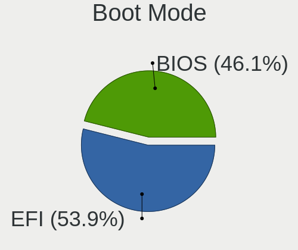
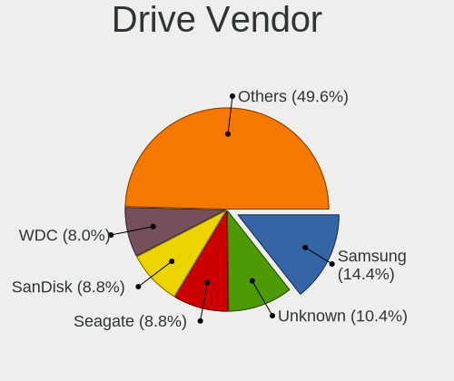
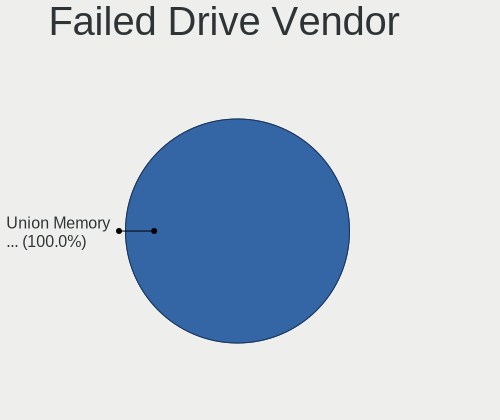
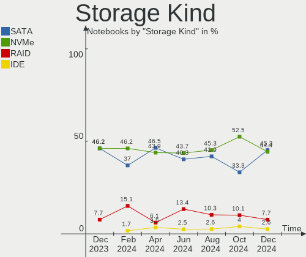

Linux in UK - Hardware Trends (Notebooks)
-----------------------------------------

A project to identify most popular hardware characteristics and track their change
over time based on data collected by Linux users at https://Linux-Hardware.org.

Anyone can contribute to this report by the [hw-probe](https://github.com/linuxhw/hw-probe) tool:

    sudo -E hw-probe -all -upload

Period: Aug, 2023.

Contents
--------

* [ System ](#system)
  - [ OS                       ](#os)
  - [ OS Family                ](#os-family)
  - [ Kernel                   ](#kernel)
  - [ Kernel Family            ](#kernel-family)
  - [ Kernel Major Ver.        ](#kernel-major-ver)
  - [ Arch                     ](#arch)
  - [ DE                       ](#de)
  - [ Display Server           ](#display-server)
  - [ Display Manager          ](#display-manager)
  - [ OS Lang                  ](#os-lang)
  - [ Boot Mode                ](#boot-mode)
  - [ Filesystem               ](#filesystem)
  - [ Part. scheme             ](#part-scheme)
  - [ Dual Boot with Linux/BSD ](#dual-boot-with-linuxbsd)
  - [ Dual Boot (Win)          ](#dual-boot-win)

* [ Board ](#board)
  - [ Vendor                   ](#vendor)
  - [ Model                    ](#model)
  - [ Model Family             ](#model-family)
  - [ MFG Year                 ](#mfg-year)
  - [ Form Factor              ](#form-factor)
  - [ Secure Boot              ](#secure-boot)
  - [ Coreboot                 ](#coreboot)
  - [ RAM Size                 ](#ram-size)
  - [ RAM Used                 ](#ram-used)
  - [ Total Drives             ](#total-drives)
  - [ Has CD-ROM               ](#has-cd-rom)
  - [ Has Ethernet             ](#has-ethernet)
  - [ Has WiFi                 ](#has-wifi)
  - [ Has Bluetooth            ](#has-bluetooth)

* [ Location ](#location)
  - [ Country                  ](#country)
  - [ City                     ](#city)

* [ Drives ](#drives)
  - [ Drive Vendor             ](#drive-vendor)
  - [ Drive Model              ](#drive-model)
  - [ HDD Vendor               ](#hdd-vendor)
  - [ SSD Vendor               ](#ssd-vendor)
  - [ Drive Kind               ](#drive-kind)
  - [ Drive Connector          ](#drive-connector)
  - [ Drive Size               ](#drive-size)
  - [ Space Total              ](#space-total)
  - [ Space Used               ](#space-used)
  - [ Malfunc. Drives          ](#malfunc-drives)
  - [ Malfunc. Drive Vendor    ](#malfunc-drive-vendor)
  - [ Malfunc. HDD Vendor      ](#malfunc-hdd-vendor)
  - [ Malfunc. Drive Kind      ](#malfunc-drive-kind)
  - [ Failed Drives            ](#failed-drives)
  - [ Failed Drive Vendor      ](#failed-drive-vendor)
  - [ Drive Status             ](#drive-status)

* [ Storage controller ](#storage-controller)
  - [ Storage Vendor           ](#storage-vendor)
  - [ Storage Model            ](#storage-model)
  - [ Storage Kind             ](#storage-kind)

* [ Processor ](#processor)
  - [ CPU Vendor               ](#cpu-vendor)
  - [ CPU Model                ](#cpu-model)
  - [ CPU Model Family         ](#cpu-model-family)
  - [ CPU Cores                ](#cpu-cores)
  - [ CPU Sockets              ](#cpu-sockets)
  - [ CPU Threads              ](#cpu-threads)
  - [ CPU Op-Modes             ](#cpu-op-modes)
  - [ CPU Microcode            ](#cpu-microcode)
  - [ CPU Microarch            ](#cpu-microarch)

* [ Graphics ](#graphics)
  - [ GPU Vendor               ](#gpu-vendor)
  - [ GPU Model                ](#gpu-model)
  - [ GPU Combo                ](#gpu-combo)
  - [ GPU Driver               ](#gpu-driver)
  - [ GPU Memory               ](#gpu-memory)

* [ Monitor ](#monitor)
  - [ Monitor Vendor           ](#monitor-vendor)
  - [ Monitor Model            ](#monitor-model)
  - [ Monitor Resolution       ](#monitor-resolution)
  - [ Monitor Diagonal         ](#monitor-diagonal)
  - [ Monitor Width            ](#monitor-width)
  - [ Aspect Ratio             ](#aspect-ratio)
  - [ Monitor Area             ](#monitor-area)
  - [ Pixel Density            ](#pixel-density)
  - [ Multiple Monitors        ](#multiple-monitors)

* [ Network ](#network)
  - [ Net Controller Vendor    ](#net-controller-vendor)
  - [ Net Controller Model     ](#net-controller-model)
  - [ Wireless Vendor          ](#wireless-vendor)
  - [ Wireless Model           ](#wireless-model)
  - [ Ethernet Vendor          ](#ethernet-vendor)
  - [ Ethernet Model           ](#ethernet-model)
  - [ Net Controller Kind      ](#net-controller-kind)
  - [ Used Controller          ](#used-controller)
  - [ NICs                     ](#nics)
  - [ IPv6                     ](#ipv6)

* [ Bluetooth ](#bluetooth)
  - [ Bluetooth Vendor         ](#bluetooth-vendor)
  - [ Bluetooth Model          ](#bluetooth-model)

* [ Sound ](#sound)
  - [ Sound Vendor             ](#sound-vendor)
  - [ Sound Model              ](#sound-model)

* [ Memory ](#memory)
  - [ Memory Vendor            ](#memory-vendor)
  - [ Memory Model             ](#memory-model)
  - [ Memory Kind              ](#memory-kind)
  - [ Memory Form Factor       ](#memory-form-factor)
  - [ Memory Size              ](#memory-size)
  - [ Memory Speed             ](#memory-speed)

* [ Printers & scanners ](#printers--scanners)
  - [ Printer Vendor           ](#printer-vendor)
  - [ Printer Model            ](#printer-model)
  - [ Scanner Vendor           ](#scanner-vendor)
  - [ Scanner Model            ](#scanner-model)

* [ Camera ](#camera)
  - [ Camera Vendor            ](#camera-vendor)
  - [ Camera Model             ](#camera-model)

* [ Security ](#security)
  - [ Fingerprint Vendor       ](#fingerprint-vendor)
  - [ Fingerprint Model        ](#fingerprint-model)
  - [ Chipcard Vendor          ](#chipcard-vendor)
  - [ Chipcard Model           ](#chipcard-model)

* [ Unsupported ](#unsupported)
  - [ Unsupported Devices      ](#unsupported-devices)
  - [ Unsupported Device Types ](#unsupported-device-types)

System
------

OS
--

Installed operating systems

| Name                 | Notebooks | Percent |
|----------------------|-----------|---------|
| OpenMandriva 23.08   | 15        | 14.29%  |
| Ubuntu 22.04         | 14        | 13.33%  |
| Fedora 38            | 10        | 9.52%   |
| Zorin 16             | 6         | 5.71%   |
| Linux Mint 21.2      | 5         | 4.76%   |
| ArcoLinux Rolling    | 5         | 4.76%   |
| Pop!_OS 22.04        | 4         | 3.81%   |
| Debian 12            | 4         | 3.81%   |
| Arch Rolling         | 4         | 3.81%   |
| Ubuntu 23.04         | 3         | 2.86%   |
| SteamOS 3.4.8        | 3         | 2.86%   |
| Xubuntu 22.04        | 2         | 1.9%    |
| openSUSE Leap-15.5   | 2         | 1.9%    |
| OpenMandriva 23.03   | 2         | 1.9%    |
| Kubuntu 23.04        | 2         | 1.9%    |
| Kubuntu 22.04        | 2         | 1.9%    |
| Garuda Linux Soaring | 2         | 1.9%    |
| Elementary 7         | 2         | 1.9%    |
| BlackPanther 18.1    | 2         | 1.9%    |
| Xubuntu 23.04        | 1         | 0.95%   |
| Xero Rolling         | 1         | 0.95%   |
| Ubuntu Unity 18.04   | 1         | 0.95%   |
| Ubuntu Unity 16.04   | 1         | 0.95%   |
| Ubuntu 22.10         | 1         | 0.95%   |
| SteamOS 4            | 1         | 0.95%   |
| openSUSE 42.3        | 1         | 0.95%   |
| OpenMandriva 23.01   | 1         | 0.95%   |
| Manjaro 23.0.0       | 1         | 0.95%   |
| Manjaro              | 1         | 0.95%   |
| Lubuntu 22.10        | 1         | 0.95%   |
| Lubuntu 22.04        | 1         | 0.95%   |
| LMDE 5               | 1         | 0.95%   |
| Linux Mint 19.1      | 1         | 0.95%   |
| KDE neon 22.04       | 1         | 0.95%   |
| blendOS              | 1         | 0.95%   |

OS Family
---------

OS without a version

| Name         | Notebooks | Percent |
|--------------|-----------|---------|
| Ubuntu       | 18        | 17.14%  |
| OpenMandriva | 18        | 17.14%  |
| Fedora       | 10        | 9.52%   |
| Zorin        | 6         | 5.71%   |
| Linux Mint   | 6         | 5.71%   |
| ArcoLinux    | 5         | 4.76%   |
| SteamOS      | 4         | 3.81%   |
| Pop!_OS      | 4         | 3.81%   |
| Kubuntu      | 4         | 3.81%   |
| Debian       | 4         | 3.81%   |
| Arch         | 4         | 3.81%   |
| Xubuntu      | 3         | 2.86%   |
| openSUSE     | 3         | 2.86%   |
| Ubuntu Unity | 2         | 1.9%    |
| Manjaro      | 2         | 1.9%    |
| Lubuntu      | 2         | 1.9%    |
| Garuda Linux | 2         | 1.9%    |
| Elementary   | 2         | 1.9%    |
| BlackPanther | 2         | 1.9%    |
| Xero         | 1         | 0.95%   |
| LMDE         | 1         | 0.95%   |
| KDE neon     | 1         | 0.95%   |
| blendOS      | 1         | 0.95%   |

Kernel
------

Version of the Linux kernel

| Version                      | Notebooks | Percent |
|------------------------------|-----------|---------|
| 6.2.0-26-generic             | 20        | 19.05%  |
| 6.4.11-desktop-1omv2390      | 10        | 9.52%   |
| 5.15.0-79-generic            | 6         | 5.71%   |
| 6.4.8-desktop-2omv2390       | 5         | 4.76%   |
| 6.2.0-27-generic             | 4         | 3.81%   |
| 5.15.0-78-generic            | 4         | 3.81%   |
| 6.4.7-200.fc38.x86_64        | 3         | 2.86%   |
| 6.4.6-76060406-generic       | 3         | 2.86%   |
| 6.4.11-200.fc38.x86_64       | 3         | 2.86%   |
| 6.4.10-arch1-1               | 3         | 2.86%   |
| 5.13.0-valve36-1-neptune     | 3         | 2.86%   |
| 6.4.9-arch1-1                | 2         | 1.9%    |
| 6.4.12-arch1-1               | 2         | 1.9%    |
| 6.2.9-300.fc38.x86_64        | 2         | 1.9%    |
| 6.2.6-desktop-1omv2390       | 2         | 1.9%    |
| 6.1.0-10-amd64               | 2         | 1.9%    |
| 5.19.0-50-generic            | 2         | 1.9%    |
| 5.19.0-46-generic            | 2         | 1.9%    |
| 4.18.16-desktop-1bP          | 2         | 1.9%    |
| 4.15.0-213-generic           | 2         | 1.9%    |
| 6.4.9-zen1-1-zen             | 1         | 0.95%   |
| 6.4.9-200.fc38.x86_64        | 1         | 0.95%   |
| 6.4.3-arch1-2                | 1         | 0.95%   |
| 6.4.2-060402-generic         | 1         | 0.95%   |
| 6.4.12-zen1-1-zen            | 1         | 0.95%   |
| 6.4.10-zen2-1-zen            | 1         | 0.95%   |
| 6.4.10-200.fc38.x86_64       | 1         | 0.95%   |
| 6.3.9-zen1-1-zen             | 1         | 0.95%   |
| 6.3.8-arch1-1                | 1         | 0.95%   |
| 6.3.7-zen1-1-zen             | 1         | 0.95%   |
| 6.2.6-76060206-generic       | 1         | 0.95%   |
| 6.2.0-1009-lowlatency        | 1         | 0.95%   |
| 6.1.44-1-MANJARO             | 1         | 0.95%   |
| 6.1.41-1-MANJARO             | 1         | 0.95%   |
| 6.1.1-desktop-1omv2290       | 1         | 0.95%   |
| 6.1.0-11-amd64               | 1         | 0.95%   |
| 6.1.0-10-686-pae             | 1         | 0.95%   |
| 5.3.18-lp152.72-default      | 1         | 0.95%   |
| 5.14.21-150500.55.7-default  | 1         | 0.95%   |
| 5.14.21-150500.55.19-default | 1         | 0.95%   |

Kernel Family
-------------

Linux kernel without a distro release

| Version | Notebooks | Percent |
|---------|-----------|---------|
| 6.2.0   | 25        | 23.81%  |
| 6.4.11  | 13        | 12.38%  |
| 5.15.0  | 10        | 9.52%   |
| 6.4.8   | 5         | 4.76%   |
| 6.4.10  | 5         | 4.76%   |
| 6.4.9   | 4         | 3.81%   |
| 6.1.0   | 4         | 3.81%   |
| 5.19.0  | 4         | 3.81%   |
| 6.4.7   | 3         | 2.86%   |
| 6.4.6   | 3         | 2.86%   |
| 6.4.12  | 3         | 2.86%   |
| 6.2.6   | 3         | 2.86%   |
| 5.13.0  | 3         | 2.86%   |
| 4.15.0  | 3         | 2.86%   |
| 6.2.9   | 2         | 1.9%    |
| 5.14.21 | 2         | 1.9%    |
| 4.18.16 | 2         | 1.9%    |
| 6.4.3   | 1         | 0.95%   |
| 6.4.2   | 1         | 0.95%   |
| 6.3.9   | 1         | 0.95%   |
| 6.3.8   | 1         | 0.95%   |
| 6.3.7   | 1         | 0.95%   |
| 6.1.44  | 1         | 0.95%   |
| 6.1.41  | 1         | 0.95%   |
| 6.1.1   | 1         | 0.95%   |
| 5.3.18  | 1         | 0.95%   |
| 5.11.0  | 1         | 0.95%   |
| 5.10.0  | 1         | 0.95%   |

Kernel Major Ver.
-----------------

Linux kernel major version

| Version | Notebooks | Percent |
|---------|-----------|---------|
| 6.4     | 38        | 36.19%  |
| 6.2     | 30        | 28.57%  |
| 5.15    | 10        | 9.52%   |
| 6.1     | 7         | 6.67%   |
| 5.19    | 4         | 3.81%   |
| 6.3     | 3         | 2.86%   |
| 5.13    | 3         | 2.86%   |
| 4.15    | 3         | 2.86%   |
| 5.14    | 2         | 1.9%    |
| 4.18    | 2         | 1.9%    |
| 5.3     | 1         | 0.95%   |
| 5.11    | 1         | 0.95%   |
| 5.10    | 1         | 0.95%   |

Arch
----

OS architecture (x86_64, i586, etc.)

| Name   | Notebooks | Percent |
|--------|-----------|---------|
| x86_64 | 102       | 97.14%  |
| i686   | 3         | 2.86%   |

DE
--

Desktop Environment

| Name       | Notebooks | Percent |
|------------|-----------|---------|
| KDE5       | 37        | 35.24%  |
| GNOME      | 37        | 35.24%  |
| XFCE       | 7         | 6.67%   |
| X-Cinnamon | 5         | 4.76%   |
| LXQt       | 4         | 3.81%   |
| Unknown    | 3         | 2.86%   |
| Unity      | 2         | 1.9%    |
| Pantheon   | 2         | 1.9%    |
| MATE       | 2         | 1.9%    |
| Hyprland   | 2         | 1.9%    |
| chadwm     | 2         | 1.9%    |
| Cinnamon   | 1         | 0.95%   |
| Budgie     | 1         | 0.95%   |

Display Server
--------------

X11 or Wayland

| Name    | Notebooks | Percent |
|---------|-----------|---------|
| X11     | 55        | 52.38%  |
| Wayland | 47        | 44.76%  |
| Unknown | 2         | 1.9%    |
| Tty     | 1         | 0.95%   |

Display Manager
---------------

SDDM, LightDM, etc.

| Name    | Notebooks | Percent |
|---------|-----------|---------|
| SDDM    | 32        | 30.48%  |
| Unknown | 32        | 30.48%  |
| GDM3    | 18        | 17.14%  |
| LightDM | 13        | 12.38%  |
| GDM     | 10        | 9.52%   |

OS Lang
-------

Language

| Lang    | Notebooks | Percent |
|---------|-----------|---------|
| en_GB   | 83        | 79.05%  |
| en_US   | 18        | 17.14%  |
| Unknown | 3         | 2.86%   |
| pl_PL   | 1         | 0.95%   |

Boot Mode
---------

EFI or BIOS

| Mode | Notebooks | Percent |
|------|-----------|---------|
| EFI  | 55        | 52.38%  |
| BIOS | 50        | 47.62%  |

Filesystem
----------

Type of filesystem

| Type    | Notebooks | Percent |
|---------|-----------|---------|
| Ext4    | 56        | 53.33%  |
| Tmpfs   | 19        | 18.1%   |
| Btrfs   | 19        | 18.1%   |
| Overlay | 9         | 8.57%   |
| Zfs     | 1         | 0.95%   |
| Xfs     | 1         | 0.95%   |

Part. scheme
------------

Scheme of partitioning

| Type    | Notebooks | Percent |
|---------|-----------|---------|
| GPT     | 63        | 60%     |
| Unknown | 31        | 29.52%  |
| MBR     | 11        | 10.48%  |

Dual Boot with Linux/BSD
------------------------

Hosting more than one Linux/BSD

| Dual boot | Notebooks | Percent |
|-----------|-----------|---------|
| No        | 88        | 83.81%  |
| Yes       | 17        | 16.19%  |

Dual Boot (Win)
---------------

Hosting Linux and Windows

| Dual boot | Notebooks | Percent |
|-----------|-----------|---------|
| No        | 88        | 83.81%  |
| Yes       | 17        | 16.19%  |

Board
-----

Vendor
------

Motherboard manufacturer

| Name                | Notebooks | Percent |
|---------------------|-----------|---------|
| Lenovo              | 28        | 26.67%  |
| Dell                | 19        | 18.1%   |
| Hewlett-Packard     | 11        | 10.48%  |
| Acer                | 11        | 10.48%  |
| ASUSTek Computer    | 5         | 4.76%   |
| Toshiba             | 4         | 3.81%   |
| Valve               | 3         | 2.86%   |
| Apple               | 3         | 2.86%   |
| Timi                | 2         | 1.9%    |
| Sony                | 2         | 1.9%    |
| Samsung Electronics | 2         | 1.9%    |
| HUAWEI              | 2         | 1.9%    |
| Google              | 2         | 1.9%    |
| Unknown             | 2         | 1.9%    |
| ZOOSTORM            | 1         | 0.95%   |
| Packard Bell        | 1         | 0.95%   |
| ONE-NETBOOK         | 1         | 0.95%   |
| Novatech            | 1         | 0.95%   |
| Notebook            | 1         | 0.95%   |
| MSI                 | 1         | 0.95%   |
| GPD                 | 1         | 0.95%   |
| Gigabyte Technology | 1         | 0.95%   |
| Framework           | 1         | 0.95%   |

Model
-----

Motherboard model

| Name                                        | Notebooks | Percent |
|---------------------------------------------|-----------|---------|
| Valve Jupiter                               | 3         | 2.86%   |
| Dell XPS 15 9560                            | 2         | 1.9%    |
| Unknown                                     | 2         | 1.9%    |
| ZOOSTORM 7200-9062A                         | 1         | 0.95%   |
| Toshiba Satellite Pro C50-A-1E6             | 1         | 0.95%   |
| Toshiba Satellite C660                      | 1         | 0.95%   |
| Toshiba Satellite C55D-A-14W                | 1         | 0.95%   |
| Toshiba Satellite C50D-A-13G                | 1         | 0.95%   |
| Timi RedmiBook Pro 15S                      | 1         | 0.95%   |
| Timi RedmiBook Pro 14S                      | 1         | 0.95%   |
| Sony VPCEH3N6E                              | 1         | 0.95%   |
| Sony SVF15A1M2ES                            | 1         | 0.95%   |
| Samsung N150P/N210P/N220P                   | 1         | 0.95%   |
| Samsung 755XDA                              | 1         | 0.95%   |
| Packard Bell EasyNote TJ66                  | 1         | 0.95%   |
| ONE-NETBOOK ONEXPLAYER 2 PRO ARP23P         | 1         | 0.95%   |
| Novatech 15.6 nSpire Laptop                 | 1         | 0.95%   |
| Notebook NL5xNU                             | 1         | 0.95%   |
| MSI GP62 6QF                                | 1         | 0.95%   |
| Lenovo Z70-80 80FG                          | 1         | 0.95%   |
| Lenovo Yoga 300-11IBY 80M0                  | 1         | 0.95%   |
| Lenovo ThinkPad X250 20CLS3320C             | 1         | 0.95%   |
| Lenovo ThinkPad X200 7459BN8                | 1         | 0.95%   |
| Lenovo ThinkPad X200 74591P0                | 1         | 0.95%   |
| Lenovo ThinkPad X1 Extreme Gen 5 21DES04B00 | 1         | 0.95%   |
| Lenovo ThinkPad T510 43842RG                | 1         | 0.95%   |
| Lenovo ThinkPad T480 20L6S42000             | 1         | 0.95%   |
| Lenovo ThinkPad T460s 20FAS2RV0G            | 1         | 0.95%   |
| Lenovo ThinkPad T460 20FMS05K05             | 1         | 0.95%   |
| Lenovo ThinkPad T450 20BUS5W000             | 1         | 0.95%   |
| Lenovo ThinkPad T430 2349KAG                | 1         | 0.95%   |
| Lenovo ThinkPad T410 2522AC1                | 1         | 0.95%   |
| Lenovo ThinkPad P51s W10DG 20JY0003UK       | 1         | 0.95%   |
| Lenovo ThinkPad P16 Gen 1 21D6CTO1WW        | 1         | 0.95%   |
| Lenovo ThinkPad P15s Gen 1 20T40008UK       | 1         | 0.95%   |
| Lenovo ThinkPad E15 20RD0011UK              | 1         | 0.95%   |
| Lenovo Legion Y530-15ICH 81FV               | 1         | 0.95%   |
| Lenovo Legion S7 15ACH6 82K8                | 1         | 0.95%   |
| Lenovo Legion 7 16ARHA7 82UH                | 1         | 0.95%   |
| Lenovo IdeaPad Slim 1-11AST-05 81VR         | 1         | 0.95%   |

Model Family
------------

Motherboard model prefix

| Name                   | Notebooks | Percent |
|------------------------|-----------|---------|
| Lenovo ThinkPad        | 15        | 14.29%  |
| Dell Latitude          | 8         | 7.62%   |
| Acer Aspire            | 8         | 7.62%   |
| Lenovo IdeaPad         | 5         | 4.76%   |
| Dell XPS               | 5         | 4.76%   |
| Toshiba Satellite      | 4         | 3.81%   |
| HP Pavilion            | 4         | 3.81%   |
| Valve Jupiter          | 3         | 2.86%   |
| Lenovo Legion          | 3         | 2.86%   |
| HP Laptop              | 3         | 2.86%   |
| Dell Inspiron          | 3         | 2.86%   |
| Timi RedmiBook         | 2         | 1.9%    |
| HP EliteBook           | 2         | 1.9%    |
| ASUS VivoBook          | 2         | 1.9%    |
| Acer Swift             | 2         | 1.9%    |
| Unknown                | 2         | 1.9%    |
| ZOOSTORM 7200-9062A    | 1         | 0.95%   |
| Sony VPCEH3N6E         | 1         | 0.95%   |
| Sony SVF15A1M2ES       | 1         | 0.95%   |
| Samsung N150P          | 1         | 0.95%   |
| Samsung 755XDA         | 1         | 0.95%   |
| Packard Bell EasyNote  | 1         | 0.95%   |
| ONE-NETBOOK ONEXPLAYER | 1         | 0.95%   |
| Novatech 15.6          | 1         | 0.95%   |
| Notebook NL5xNU        | 1         | 0.95%   |
| MSI GP62               | 1         | 0.95%   |
| Lenovo Z70-80          | 1         | 0.95%   |
| Lenovo Yoga            | 1         | 0.95%   |
| Lenovo G500            | 1         | 0.95%   |
| Lenovo Flex            | 1         | 0.95%   |
| Lenovo 100w            | 1         | 0.95%   |
| HUAWEI MACHR-WX9       | 1         | 0.95%   |
| HUAWEI MACH-WX9        | 1         | 0.95%   |
| HP 470                 | 1         | 0.95%   |
| HP 255                 | 1         | 0.95%   |
| GPD G1621-02           | 1         | 0.95%   |
| Google Eldrid          | 1         | 0.95%   |
| Google Bobba360        | 1         | 0.95%   |
| Gigabyte AERO          | 1         | 0.95%   |
| Framework Laptop       | 1         | 0.95%   |

MFG Year
--------

Motherboard manufacture year

| Year | Notebooks | Percent |
|------|-----------|---------|
| 2021 | 11        | 10.48%  |
| 2019 | 11        | 10.48%  |
| 2022 | 8         | 7.62%   |
| 2017 | 8         | 7.62%   |
| 2013 | 8         | 7.62%   |
| 2020 | 7         | 6.67%   |
| 2018 | 7         | 6.67%   |
| 2012 | 7         | 6.67%   |
| 2023 | 6         | 5.71%   |
| 2014 | 6         | 5.71%   |
| 2010 | 5         | 4.76%   |
| 2016 | 4         | 3.81%   |
| 2015 | 4         | 3.81%   |
| 2011 | 4         | 3.81%   |
| 2008 | 4         | 3.81%   |
| 2009 | 3         | 2.86%   |
| 2007 | 2         | 1.9%    |

Form Factor
-----------

Physical design of the computer

| Name     | Notebooks | Percent |
|----------|-----------|---------|
| Notebook | 105       | 100%    |

Secure Boot
-----------

Enabled or disabled

| State    | Notebooks | Percent |
|----------|-----------|---------|
| Disabled | 96        | 91.43%  |
| Enabled  | 9         | 8.57%   |

Coreboot
--------

Have coreboot on board

| Used | Notebooks | Percent |
|------|-----------|---------|
| No   | 103       | 98.1%   |
| Yes  | 2         | 1.9%    |

RAM Size
--------

Total RAM memory

| Size in GB  | Notebooks | Percent |
|-------------|-----------|---------|
| 4.01-8.0    | 32        | 30.48%  |
| 3.01-4.0    | 20        | 19.05%  |
| 16.01-24.0  | 20        | 19.05%  |
| 8.01-16.0   | 12        | 11.43%  |
| 32.01-64.0  | 7         | 6.67%   |
| 1.01-2.0    | 6         | 5.71%   |
| 24.01-32.0  | 4         | 3.81%   |
| 2.01-3.0    | 2         | 1.9%    |
| 64.01-256.0 | 2         | 1.9%    |

RAM Used
--------

Used RAM memory

| Used GB    | Notebooks | Percent |
|------------|-----------|---------|
| 1.01-2.0   | 35        | 33.33%  |
| 2.01-3.0   | 29        | 27.62%  |
| 4.01-8.0   | 14        | 13.33%  |
| 3.01-4.0   | 13        | 12.38%  |
| 0.51-1.0   | 7         | 6.67%   |
| 8.01-16.0  | 5         | 4.76%   |
| 16.01-24.0 | 1         | 0.95%   |
| 0.01-0.5   | 1         | 0.95%   |

Total Drives
------------

Number of drives on board

| Drives | Notebooks | Percent |
|--------|-----------|---------|
| 1      | 76        | 72.38%  |
| 2      | 28        | 26.67%  |
| 3      | 1         | 0.95%   |

Has CD-ROM
----------

Has CD-ROM on board

| Presented | Notebooks | Percent |
|-----------|-----------|---------|
| No        | 75        | 71.43%  |
| Yes       | 30        | 28.57%  |

Has Ethernet
------------

Has Ethernet on board

| Presented | Notebooks | Percent |
|-----------|-----------|---------|
| Yes       | 68        | 64.76%  |
| No        | 37        | 35.24%  |

Has WiFi
--------

Has WiFi module

| Presented | Notebooks | Percent |
|-----------|-----------|---------|
| Yes       | 105       | 100%    |

Has Bluetooth
-------------

Has Bluetooth module

| Presented | Notebooks | Percent |
|-----------|-----------|---------|
| Yes       | 87        | 82.86%  |
| No        | 18        | 17.14%  |

Location
--------

Country
-------

Geographic location (country)

| Country | Notebooks | Percent |
|---------|-----------|---------|
| UK      | 105       | 100%    |

City
----

Geographic location (city)

| City                  | Notebooks | Percent |
|-----------------------|-----------|---------|
| London                | 6         | 5.71%   |
| Southwark             | 5         | 4.76%   |
| Manchester            | 4         | 3.81%   |
| Lewisham              | 3         | 2.86%   |
| Leeds                 | 3         | 2.86%   |
| Perth                 | 2         | 1.9%    |
| Lambeth               | 2         | 1.9%    |
| Feltham               | 2         | 1.9%    |
| Enfield               | 2         | 1.9%    |
| Edinburgh             | 2         | 1.9%    |
| Crewe                 | 2         | 1.9%    |
| Cambridge             | 2         | 1.9%    |
| Ashford               | 2         | 1.9%    |
| Wouldham              | 1         | 0.95%   |
| Wisbech               | 1         | 0.95%   |
| Wigan                 | 1         | 0.95%   |
| West Bromwich         | 1         | 0.95%   |
| Verwood               | 1         | 0.95%   |
| Torquay               | 1         | 0.95%   |
| Tonbridge             | 1         | 0.95%   |
| Thames Ditton         | 1         | 0.95%   |
| Telford               | 1         | 0.95%   |
| Taunton               | 1         | 0.95%   |
| Swindon               | 1         | 0.95%   |
| Stratford-upon-Avon   | 1         | 0.95%   |
| Stourbridge           | 1         | 0.95%   |
| Southampton           | 1         | 0.95%   |
| Slough                | 1         | 0.95%   |
| Shipley               | 1         | 0.95%   |
| Sheffield             | 1         | 0.95%   |
| Scarborough           | 1         | 0.95%   |
| Saint Neots           | 1         | 0.95%   |
| Saint Leonards-on-Sea | 1         | 0.95%   |
| Ryde                  | 1         | 0.95%   |
| Rochdale              | 1         | 0.95%   |
| Ringwood              | 1         | 0.95%   |
| Prestonpans           | 1         | 0.95%   |
| Pinner                | 1         | 0.95%   |
| Paisley               | 1         | 0.95%   |
| Paignton              | 1         | 0.95%   |

Drives
------

Drive Vendor
------------

Hard drive vendors

| Vendor                       | Notebooks | Drives | Percent |
|------------------------------|-----------|--------|---------|
| Samsung Electronics          | 15        | 16     | 12%     |
| SanDisk                      | 12        | 13     | 9.6%    |
| Unknown                      | 11        | 11     | 8.8%    |
| SK hynix                     | 10        | 12     | 8%      |
| Toshiba                      | 9         | 9      | 7.2%    |
| WDC                          | 6         | 6      | 4.8%    |
| Seagate                      | 6         | 9      | 4.8%    |
| Kingston                     | 6         | 6      | 4.8%    |
| Crucial                      | 6         | 6      | 4.8%    |
| Micron Technology            | 4         | 4      | 3.2%    |
| Intel                        | 4         | 4      | 3.2%    |
| Hitachi                      | 3         | 3      | 2.4%    |
| HGST                         | 3         | 3      | 2.4%    |
| Phison Electronics           | 2         | 2      | 1.6%    |
| MAXIO Technology (Hangzhou)  | 2         | 2      | 1.6%    |
| KIOXIA                       | 2         | 2      | 1.6%    |
| Kingston Technology Company  | 2         | 2      | 1.6%    |
| Fanxiang                     | 2         | 2      | 1.6%    |
| Union Memory (Shenzhen)      | 1         | 1      | 0.8%    |
| Teclast                      | 1         | 1      | 0.8%    |
| SSK                          | 1         | 1      | 0.8%    |
| SPCC                         | 1         | 2      | 0.8%    |
| Shenzhen Longsys Electronics | 1         | 1      | 0.8%    |
| PNY                          | 1         | 1      | 0.8%    |
| Pioneer                      | 1         | 1      | 0.8%    |
| Patriot                      | 1         | 1      | 0.8%    |
| O2 Micro                     | 1         | 1      | 0.8%    |
| Netac                        | 1         | 1      | 0.8%    |
| LITEONIT                     | 1         | 1      | 0.8%    |
| JMicron Technology           | 1         | 1      | 0.8%    |
| Intenso                      | 1         | 1      | 0.8%    |
| Gigabyte Technology          | 1         | 1      | 0.8%    |
| Generic-                     | 1         | 1      | 0.8%    |
| FORESEE                      | 1         | 1      | 0.8%    |
| CT500MX5                     | 1         | 1      | 0.8%    |
| Biwin Storage Technology     | 1         | 1      | 0.8%    |
| BIWIN                        | 1         | 1      | 0.8%    |
| Apple                        | 1         | 2      | 0.8%    |

Drive Model
-----------

Hard drive models

| Model                                         | Notebooks | Percent |
|-----------------------------------------------|-----------|---------|
| Unknown MMC Card  64GB                        | 2         | 1.53%   |
| Unknown DA4064  64GB                          | 2         | 1.53%   |
| Toshiba XG4 NVMe SSD Controller 256GB         | 2         | 1.53%   |
| Toshiba MQ01ABF050 500GB                      | 2         | 1.53%   |
| Seagate Expansion 2TB                         | 2         | 1.53%   |
| Sandisk WD Blue SN550 NVMe SSD 250GB          | 2         | 1.53%   |
| Samsung SSD 870 EVO 500GB                     | 2         | 1.53%   |
| Samsung MZVLQ1T0HBLB-00BTW 1024GB             | 2         | 1.53%   |
| Phison PS5013 E13 NVMe Controller 512GB       | 2         | 1.53%   |
| Kingston Company OM3PDP3 NVMe SSD 256GB       | 2         | 1.53%   |
| Kingston SA400S37480G 480GB SSD               | 2         | 1.53%   |
| Crucial CT480BX500SSD1 480GB                  | 2         | 1.53%   |
| Crucial CT1000BX500SSD1 1TB                   | 2         | 1.53%   |
| WDC WDS500G2B0A-00SM50 500GB SSD              | 1         | 0.76%   |
| WDC WD5000LPVT-22G33T0 500GB                  | 1         | 0.76%   |
| WDC WD3200BEVT-60ZCT0 320GB                   | 1         | 0.76%   |
| WDC WD2500BEVT-80A23T0 250GB                  | 1         | 0.76%   |
| WDC WD2500BEVT-22ZCT0 250GB                   | 1         | 0.76%   |
| WDC WD Blue SA510 M.2 2280 1000GB             | 1         | 0.76%   |
| Unknown USB DISK 3.2 250GB                    | 1         | 0.76%   |
| Unknown SC128  128GB                          | 1         | 0.76%   |
| Unknown MMC Card  512GB                       | 1         | 0.76%   |
| Unknown MMC Card  32GB                        | 1         | 0.76%   |
| Unknown MMC Card  197GB                       | 1         | 0.76%   |
| Unknown MMC Card  128GB                       | 1         | 0.76%   |
| Unknown DA4128  128GB                         | 1         | 0.76%   |
| Union Memory (Shenzhen) RPFTJ128PDD2EWX 128GB | 1         | 0.76%   |
| Toshiba THNSNK128GVN8 M.2 2280 128GB SSD      | 1         | 0.76%   |
| Toshiba MQ01ACF050 500GB                      | 1         | 0.76%   |
| Toshiba MQ01ABD100 1TB                        | 1         | 0.76%   |
| Toshiba MK6037GSX 64GB                        | 1         | 0.76%   |
| Toshiba KXG50ZNV512G NVMe 512GB               | 1         | 0.76%   |
| Teclast BD256GB SHCA-2280 SSD                 | 1         | 0.76%   |
| SSK Disk 1TB                                  | 1         | 0.76%   |
| SPCC Solid State Disk 1TB                     | 1         | 0.76%   |
| SPCC M.2 PCIe SSD 1TB                         | 1         | 0.76%   |
| SK hynix SKHynix_HFS512GEJ9X115N 512GB        | 1         | 0.76%   |
| SK hynix SKHynix_HFS512GDE9X084N 512GB        | 1         | 0.76%   |
| SK hynix SKHynix_HFS001TDE9X081N 1TB          | 1         | 0.76%   |
| SK hynix SHPP41-2000GM 2TB                    | 1         | 0.76%   |

HDD Vendor
----------

Hard disk drive vendors

| Vendor              | Notebooks | Drives | Percent |
|---------------------|-----------|--------|---------|
| Seagate             | 6         | 9      | 25%     |
| Toshiba             | 5         | 5      | 20.83%  |
| WDC                 | 4         | 4      | 16.67%  |
| Hitachi             | 3         | 3      | 12.5%   |
| HGST                | 3         | 3      | 12.5%   |
| SSK                 | 1         | 1      | 4.17%   |
| Samsung Electronics | 1         | 1      | 4.17%   |
| Generic-            | 1         | 1      | 4.17%   |

SSD Vendor
----------

Solid state drive vendors

| Vendor              | Notebooks | Drives | Percent |
|---------------------|-----------|--------|---------|
| Samsung Electronics | 8         | 8      | 17.78%  |
| Kingston            | 6         | 6      | 13.33%  |
| Crucial             | 6         | 6      | 13.33%  |
| SanDisk             | 4         | 5      | 8.89%   |
| SK hynix            | 3         | 3      | 6.67%   |
| WDC                 | 2         | 2      | 4.44%   |
| Micron Technology   | 2         | 2      | 4.44%   |
| Toshiba             | 1         | 1      | 2.22%   |
| Teclast             | 1         | 1      | 2.22%   |
| SPCC                | 1         | 1      | 2.22%   |
| PNY                 | 1         | 1      | 2.22%   |
| Pioneer             | 1         | 1      | 2.22%   |
| Patriot             | 1         | 1      | 2.22%   |
| Netac               | 1         | 1      | 2.22%   |
| LITEONIT            | 1         | 1      | 2.22%   |
| Intenso             | 1         | 1      | 2.22%   |
| Intel               | 1         | 1      | 2.22%   |
| Gigabyte Technology | 1         | 1      | 2.22%   |
| Fanxiang            | 1         | 1      | 2.22%   |
| CT500MX5            | 1         | 1      | 2.22%   |
| BIWIN               | 1         | 1      | 2.22%   |

Drive Kind
----------

HDD or SSD

| Kind    | Notebooks | Drives | Percent |
|---------|-----------|--------|---------|
| NVMe    | 45        | 48     | 37.19%  |
| SSD     | 39        | 46     | 32.23%  |
| HDD     | 24        | 27     | 19.83%  |
| MMC     | 10        | 10     | 8.26%   |
| Unknown | 3         | 3      | 2.48%   |

Drive Connector
---------------

SATA, SAS, NVMe, etc.

| Type | Notebooks | Drives | Percent |
|------|-----------|--------|---------|
| SATA | 60        | 68     | 49.18%  |
| NVMe | 45        | 48     | 36.89%  |
| MMC  | 10        | 10     | 8.2%    |
| SAS  | 7         | 8      | 5.74%   |

Drive Size
----------

Size of hard drive

| Size in TB | Notebooks | Drives | Percent |
|------------|-----------|--------|---------|
| 0.01-0.5   | 46        | 51     | 67.65%  |
| 0.51-1.0   | 18        | 18     | 26.47%  |
| 1.01-2.0   | 3         | 3      | 4.41%   |
| 4.01-10.0  | 1         | 1      | 1.47%   |

Space Total
-----------

Amount of disk space available on the file system

| Size in GB     | Notebooks | Percent |
|----------------|-----------|---------|
| 251-500        | 30        | 28.57%  |
| 101-250        | 29        | 27.62%  |
| 501-1000       | 16        | 15.24%  |
| 1-20           | 9         | 8.57%   |
| More than 3000 | 6         | 5.71%   |
| 1001-2000      | 5         | 4.76%   |
| 51-100         | 5         | 4.76%   |
| Unknown        | 3         | 2.86%   |
| 21-50          | 2         | 1.9%    |

Space Used
----------

Amount of used disk space

| Used GB        | Notebooks | Percent |
|----------------|-----------|---------|
| 1-20           | 41        | 39.05%  |
| 21-50          | 22        | 20.95%  |
| 101-250        | 14        | 13.33%  |
| 51-100         | 10        | 9.52%   |
| 501-1000       | 7         | 6.67%   |
| 251-500        | 6         | 5.71%   |
| Unknown        | 3         | 2.86%   |
| More than 3000 | 1         | 0.95%   |
| 1001-2000      | 1         | 0.95%   |

Malfunc. Drives
---------------

Drive models with a malfunction

| Model                                    | Notebooks | Drives | Percent |
|------------------------------------------|-----------|--------|---------|
| WDC WD2500BEVT-80A23T0 250GB             | 1         | 1      | 11.11%  |
| Toshiba THNSNK128GVN8 M.2 2280 128GB SSD | 1         | 1      | 11.11%  |
| SK hynix HFS128G39TND-N210A 128GB SSD    | 1         | 1      | 11.11%  |
| Seagate ST9320325AS 320GB                | 1         | 1      | 11.11%  |
| LITEONIT LCT-128M3S 128GB SSD            | 1         | 1      | 11.11%  |
| Kingston RBU-SNS8350DES3128GP 128GB SSD  | 1         | 1      | 11.11%  |
| Intel SSDSC2BF180A5L 180GB               | 1         | 1      | 11.11%  |
| Hitachi HTS547550A9E384 500GB            | 1         | 1      | 11.11%  |
| Hitachi HTS542516K9SA00 160GB            | 1         | 1      | 11.11%  |

Malfunc. Drive Vendor
---------------------

Vendors of faulty drives

| Vendor   | Notebooks | Drives | Percent |
|----------|-----------|--------|---------|
| Hitachi  | 2         | 2      | 22.22%  |
| WDC      | 1         | 1      | 11.11%  |
| Toshiba  | 1         | 1      | 11.11%  |
| SK hynix | 1         | 1      | 11.11%  |
| Seagate  | 1         | 1      | 11.11%  |
| LITEONIT | 1         | 1      | 11.11%  |
| Kingston | 1         | 1      | 11.11%  |
| Intel    | 1         | 1      | 11.11%  |

Malfunc. HDD Vendor
-------------------

Vendors of faulty HDD drives

| Vendor  | Notebooks | Drives | Percent |
|---------|-----------|--------|---------|
| Hitachi | 2         | 2      | 50%     |
| WDC     | 1         | 1      | 25%     |
| Seagate | 1         | 1      | 25%     |

Malfunc. Drive Kind
-------------------

Kinds of faulty drives

| Kind | Notebooks | Drives | Percent |
|------|-----------|--------|---------|
| SSD  | 5         | 5      | 55.56%  |
| HDD  | 4         | 4      | 44.44%  |

Failed Drives
-------------

Failed drive models

| Model                                         | Notebooks | Drives | Percent |
|-----------------------------------------------|-----------|--------|---------|
| Union Memory (Shenzhen) RPFTJ128PDD2EWX 128GB | 1         | 1      | 100%    |

Failed Drive Vendor
-------------------

Failed drive vendors

| Vendor                  | Notebooks | Drives | Percent |
|-------------------------|-----------|--------|---------|
| Union Memory (Shenzhen) | 1         | 1      | 100%    |

Drive Status
------------

Number of failed and malfunc. drives

| Status   | Notebooks | Drives | Percent |
|----------|-----------|--------|---------|
| Detected | 58        | 74     | 52.25%  |
| Works    | 43        | 50     | 38.74%  |
| Malfunc  | 9         | 9      | 8.11%   |
| Failed   | 1         | 1      | 0.9%    |

Storage controller
------------------

Storage Vendor
--------------

Storage controller vendors

| Vendor                       | Notebooks | Percent |
|------------------------------|-----------|---------|
| Intel                        | 70        | 56.91%  |
| AMD                          | 10        | 8.13%   |
| SanDisk                      | 8         | 6.5%    |
| SK hynix                     | 7         | 5.69%   |
| Samsung Electronics          | 7         | 5.69%   |
| Toshiba America Info Systems | 3         | 2.44%   |
| Shenzhen Longsys Electronics | 2         | 1.63%   |
| Phison Electronics           | 2         | 1.63%   |
| Micron Technology            | 2         | 1.63%   |
| MAXIO Technology (Hangzhou)  | 2         | 1.63%   |
| KIOXIA                       | 2         | 1.63%   |
| Kingston Technology Company  | 2         | 1.63%   |
| Union Memory (Shenzhen)      | 1         | 0.81%   |
| Realtek Semiconductor        | 1         | 0.81%   |
| O2 Micro                     | 1         | 0.81%   |
| Nvidia                       | 1         | 0.81%   |
| Biwin Storage Technology     | 1         | 0.81%   |
| Apple                        | 1         | 0.81%   |

Storage Model
-------------

Storage controller models

| Model                                                                        | Notebooks | Percent |
|------------------------------------------------------------------------------|-----------|---------|
| Intel 7 Series Chipset Family 6-port SATA Controller [AHCI mode]             | 10        | 7.58%   |
| AMD FCH SATA Controller [AHCI mode]                                          | 10        | 7.58%   |
| Intel 82801 Mobile SATA Controller [RAID mode]                               | 9         | 6.82%   |
| Intel Sunrise Point-LP SATA Controller [AHCI mode]                           | 6         | 4.55%   |
| Intel HM170/QM170 Chipset SATA Controller [AHCI Mode]                        | 6         | 4.55%   |
| Intel 82801IBM/IEM (ICH9M/ICH9M-E) 4 port SATA Controller [AHCI mode]        | 6         | 4.55%   |
| Intel Volume Management Device NVMe RAID Controller                          | 5         | 3.79%   |
| Intel 6 Series/C200 Series Chipset Family 6 port Mobile SATA AHCI Controller | 5         | 3.79%   |
| Samsung NVMe SSD Controller 980                                              | 4         | 3.03%   |
| Intel Wildcat Point-LP SATA Controller [AHCI Mode]                           | 4         | 3.03%   |
| Intel Tiger Lake-LP SATA Controller                                          | 4         | 3.03%   |
| SanDisk WD Blue SN550 NVMe SSD                                               | 3         | 2.27%   |
| Samsung NVMe SSD Controller SM981/PM981/PM983                                | 3         | 2.27%   |
| Toshiba America Info Systems XG4 NVMe SSD Controller                         | 2         | 1.52%   |
| SK hynix Platinum P41/PC801 NVMe Solid State Drive                           | 2         | 1.52%   |
| SK hynix PC611 NVMe Solid State Drive                                        | 2         | 1.52%   |
| SK hynix Gold P31/BC711/PC711 NVMe Solid State Drive                         | 2         | 1.52%   |
| Shenzhen Longsys Lexar NM620 NVME SSD (DRAM-less)                            | 2         | 1.52%   |
| Phison PS5013 E13 NVMe Controller                                            | 2         | 1.52%   |
| KIOXIA NVMe SSD Controller BG4 (DRAM-less)                                   | 2         | 1.52%   |
| Kingston Company OM3PDP3 NVMe SSD                                            | 2         | 1.52%   |
| Intel SSD 660P Series                                                        | 2         | 1.52%   |
| Intel Celeron/Pentium Silver Processor SATA Controller                       | 2         | 1.52%   |
| Intel 82801HM/HEM (ICH8M/ICH8M-E) IDE Controller                             | 2         | 1.52%   |
| Intel 5 Series/3400 Series Chipset 6 port SATA AHCI Controller               | 2         | 1.52%   |
| Union Memory (Shenzhen) AM610 PCIe 3.0 NVMe SSD 128GB                        | 1         | 0.76%   |
| Toshiba America Info Systems XG5 NVMe SSD Controller                         | 1         | 0.76%   |
| SK hynix PC300 NVMe Solid State Drive 512GB                                  | 1         | 0.76%   |
| Sandisk Western Digital WD Black SN850X NVMe SSD                             | 1         | 0.76%   |
| SanDisk WD PC SN810 / Black SN850 NVMe SSD                                   | 1         | 0.76%   |
| SanDisk WD Blue SN570 NVMe SSD 2TB                                           | 1         | 0.76%   |
| SanDisk PC SN530 NVMe SSD (DRAM-less)                                        | 1         | 0.76%   |
| SanDisk PC SN520 NVMe SSD                                                    | 1         | 0.76%   |
| Realtek RTS5765DL NVMe SSD Controller (DRAM-less)                            | 1         | 0.76%   |
| O2 Micro FORESEE E2M2 NVMe SSD                                               | 1         | 0.76%   |
| Nvidia MCP79 AHCI Controller                                                 | 1         | 0.76%   |
| Micron 3400 NVMe SSD [Hendrix]                                               | 1         | 0.76%   |
| Micron 2450 NVMe SSD [HendrixV] (DRAM-less)                                  | 1         | 0.76%   |
| MAXIO (Hangzhou) NVMe SSD Controller MAP1602                                 | 1         | 0.76%   |
| MAXIO (Hangzhou) NVMe SSD Controller MAP1202                                 | 1         | 0.76%   |

Storage Kind
------------

Kind of storage controller (IDE, SATA, NVMe, SAS, ...)

| Kind | Notebooks | Percent |
|------|-----------|---------|
| SATA | 65        | 50%     |
| NVMe | 45        | 34.62%  |
| RAID | 15        | 11.54%  |
| IDE  | 5         | 3.85%   |

Processor
---------

CPU Vendor
----------

Processor vendors

| Vendor | Notebooks | Percent |
|--------|-----------|---------|
| Intel  | 84        | 80%     |
| AMD    | 21        | 20%     |

CPU Model
---------

Processor models

| Model                                         | Notebooks | Percent |
|-----------------------------------------------|-----------|---------|
| Intel 11th Gen Core i5-1135G7 @ 2.40GHz       | 4         | 3.81%   |
| Intel Core i7-7700HQ CPU @ 2.80GHz            | 3         | 2.86%   |
| Intel Core i7-6700HQ CPU @ 2.60GHz            | 3         | 2.86%   |
| Intel Core 2 Duo CPU P8600 @ 2.40GHz          | 3         | 2.86%   |
| AMD Custom APU 0405                           | 3         | 2.86%   |
| Intel Core i7-8550U CPU @ 1.80GHz             | 2         | 1.9%    |
| Intel Core i5-6300U CPU @ 2.40GHz             | 2         | 1.9%    |
| Intel Core i5-5300U CPU @ 2.30GHz             | 2         | 1.9%    |
| Intel Celeron N4120 CPU @ 1.10GHz             | 2         | 1.9%    |
| Intel Atom CPU N450 @ 1.66GHz                 | 2         | 1.9%    |
| AMD Ryzen 7 5800H with Radeon Graphics        | 2         | 1.9%    |
| AMD Ryzen 5 3500U with Radeon Vega Mobile Gfx | 2         | 1.9%    |
| AMD A4-5000 APU with Radeon HD Graphics       | 2         | 1.9%    |
| Intel Pentium Silver N6000 @ 1.10GHz          | 1         | 0.95%   |
| Intel Pentium Gold 7505 @ 2.00GHz             | 1         | 0.95%   |
| Intel Pentium Dual-Core CPU T4400 @ 2.20GHz   | 1         | 0.95%   |
| Intel Pentium Dual CPU T3200 @ 2.00GHz        | 1         | 0.95%   |
| Intel Pentium CPU N4200 @ 1.10GHz             | 1         | 0.95%   |
| Intel Pentium CPU 2020M @ 2.40GHz             | 1         | 0.95%   |
| Intel Genuine CPU U4100 @ 1.30GHz             | 1         | 0.95%   |
| Intel Core i9-10885H CPU @ 2.40GHz            | 1         | 0.95%   |
| Intel Core i7-9750H CPU @ 2.60GHz             | 1         | 0.95%   |
| Intel Core i7-8650U CPU @ 1.90GHz             | 1         | 0.95%   |
| Intel Core i7-8565U CPU @ 1.80GHz             | 1         | 0.95%   |
| Intel Core i7-6500U CPU @ 2.50GHz             | 1         | 0.95%   |
| Intel Core i7-5500U CPU @ 2.40GHz             | 1         | 0.95%   |
| Intel Core i7-4810MQ CPU @ 2.80GHz            | 1         | 0.95%   |
| Intel Core i7-4600U CPU @ 2.10GHz             | 1         | 0.95%   |
| Intel Core i7-4510U CPU @ 2.00GHz             | 1         | 0.95%   |
| Intel Core i7-3940XM CPU @ 3.00GHz            | 1         | 0.95%   |
| Intel Core i7-3610QM CPU @ 2.30GHz            | 1         | 0.95%   |
| Intel Core i7-10850H CPU @ 2.70GHz            | 1         | 0.95%   |
| Intel Core i7-10610U CPU @ 1.80GHz            | 1         | 0.95%   |
| Intel Core i7-10510U CPU @ 1.80GHz            | 1         | 0.95%   |
| Intel Core i7 CPU M 620 @ 2.67GHz             | 1         | 0.95%   |
| Intel Core i5-8350U CPU @ 1.70GHz             | 1         | 0.95%   |
| Intel Core i5-8300H CPU @ 2.30GHz             | 1         | 0.95%   |
| Intel Core i5-8250U CPU @ 1.60GHz             | 1         | 0.95%   |
| Intel Core i5-7360U CPU @ 2.30GHz             | 1         | 0.95%   |
| Intel Core i5-7300U CPU @ 2.60GHz             | 1         | 0.95%   |

CPU Model Family
----------------

Processor model prefix

| Model                   | Notebooks | Percent |
|-------------------------|-----------|---------|
| Intel Core i7           | 22        | 20.95%  |
| Intel Core i5           | 21        | 20%     |
| Other                   | 14        | 13.33%  |
| Intel Core i3           | 7         | 6.67%   |
| Intel Celeron           | 7         | 6.67%   |
| AMD Ryzen 7             | 7         | 6.67%   |
| Intel Core 2 Duo        | 6         | 5.71%   |
| AMD Ryzen 5             | 4         | 3.81%   |
| Intel Atom              | 3         | 2.86%   |
| AMD A4                  | 3         | 2.86%   |
| Intel Pentium           | 2         | 1.9%    |
| Intel Pentium Silver    | 1         | 0.95%   |
| Intel Pentium Gold      | 1         | 0.95%   |
| Intel Pentium Dual-Core | 1         | 0.95%   |
| Intel Pentium Dual      | 1         | 0.95%   |
| Intel Genuine           | 1         | 0.95%   |
| Intel Core i9           | 1         | 0.95%   |
| AMD Ryzen 5 PRO         | 1         | 0.95%   |
| AMD A8                  | 1         | 0.95%   |
| AMD A6                  | 1         | 0.95%   |

CPU Cores
---------

Number of processor cores

| Number | Notebooks | Percent |
|--------|-----------|---------|
| 2      | 46        | 43.81%  |
| 4      | 40        | 38.1%   |
| 8      | 7         | 6.67%   |
| 6      | 5         | 4.76%   |
| 14     | 2         | 1.9%    |
| 12     | 2         | 1.9%    |
| 1      | 2         | 1.9%    |
| 16     | 1         | 0.95%   |

CPU Sockets
-----------

Number of sockets

| Number | Notebooks | Percent |
|--------|-----------|---------|
| 1      | 105       | 100%    |

CPU Threads
-----------

Threads per core (Hyper-Threading)

| Number | Notebooks | Percent |
|--------|-----------|---------|
| 2      | 80        | 76.19%  |
| 1      | 25        | 23.81%  |

CPU Op-Modes
------------

CPU Operation Modes (32-bit, 64-bit)

| Op mode        | Notebooks | Percent |
|----------------|-----------|---------|
| 32-bit, 64-bit | 105       | 100%    |

CPU Microcode
-------------

Microcode number

| Number     | Notebooks | Percent |
|------------|-----------|---------|
| Unknown    | 74        | 70.48%  |
| 0x806ec    | 3         | 2.86%   |
| 0x806e9    | 2         | 1.9%    |
| 0x40651    | 2         | 1.9%    |
| 0x1067a    | 2         | 1.9%    |
| 0x0a50000c | 2         | 1.9%    |
| 0x08108102 | 2         | 1.9%    |
| 0xb06a2    | 1         | 0.95%   |
| 0x906e9    | 1         | 0.95%   |
| 0x806ea    | 1         | 0.95%   |
| 0x706e5    | 1         | 0.95%   |
| 0x6fd      | 1         | 0.95%   |
| 0x506c9    | 1         | 0.95%   |
| 0x406e3    | 1         | 0.95%   |
| 0x306d4    | 1         | 0.95%   |
| 0x206a7    | 1         | 0.95%   |
| 0x20655    | 1         | 0.95%   |
| 0x10676    | 1         | 0.95%   |
| 0x0a404102 | 1         | 0.95%   |
| 0x08608104 | 1         | 0.95%   |
| 0x08608103 | 1         | 0.95%   |
| 0x08200103 | 1         | 0.95%   |
| 0x08108109 | 1         | 0.95%   |
| 0x0700010f | 1         | 0.95%   |
| 0x06006705 | 1         | 0.95%   |

CPU Microarch
-------------

Microarchitecture

| Name             | Notebooks | Percent |
|------------------|-----------|---------|
| KabyLake         | 17        | 16.19%  |
| Unknown          | 11        | 10.48%  |
| Skylake          | 8         | 7.62%   |
| IvyBridge        | 8         | 7.62%   |
| SandyBridge      | 7         | 6.67%   |
| TigerLake        | 6         | 5.71%   |
| Penryn           | 6         | 5.71%   |
| Zen 3            | 4         | 3.81%   |
| Haswell          | 4         | 3.81%   |
| Broadwell        | 4         | 3.81%   |
| Zen+             | 3         | 2.86%   |
| Westmere         | 3         | 2.86%   |
| Jaguar           | 3         | 2.86%   |
| Goldmont plus    | 3         | 2.86%   |
| Core             | 3         | 2.86%   |
| Alderlake Hybrid | 3         | 2.86%   |
| Silvermont       | 2         | 1.9%    |
| CometLake        | 2         | 1.9%    |
| Bonnell          | 2         | 1.9%    |
| Zen 2            | 1         | 0.95%   |
| Zen              | 1         | 0.95%   |
| Puma             | 1         | 0.95%   |
| IceLake          | 1         | 0.95%   |
| Goldmont         | 1         | 0.95%   |
| Excavator        | 1         | 0.95%   |

Graphics
--------

GPU Vendor
----------

Vendors of graphics cards

| Vendor | Notebooks | Percent |
|--------|-----------|---------|
| Intel  | 79        | 61.72%  |
| Nvidia | 25        | 19.53%  |
| AMD    | 24        | 18.75%  |

GPU Model
---------

Graphics card models

| Model                                                                     | Notebooks | Percent |
|---------------------------------------------------------------------------|-----------|---------|
| Intel 3rd Gen Core processor Graphics Controller                          | 8         | 6.02%   |
| Intel 2nd Generation Core Processor Family Integrated Graphics Controller | 6         | 4.51%   |
| Intel UHD Graphics 620                                                    | 5         | 3.76%   |
| Intel TigerLake-LP GT2 [Iris Xe Graphics]                                 | 4         | 3.01%   |
| Intel Skylake GT2 [HD Graphics 520]                                       | 4         | 3.01%   |
| Intel Mobile 4 Series Chipset Integrated Graphics Controller              | 4         | 3.01%   |
| Intel HD Graphics 5500                                                    | 4         | 3.01%   |
| AMD Picasso/Raven 2 [Radeon Vega Series / Radeon Vega Mobile Series]      | 4         | 3.01%   |
| Nvidia GP107M [GeForce GTX 1050 Mobile]                                   | 3         | 2.26%   |
| Nvidia GM107M [GeForce GTX 960M]                                          | 3         | 2.26%   |
| Intel HD Graphics 630                                                     | 3         | 2.26%   |
| Intel HD Graphics 530                                                     | 3         | 2.26%   |
| Intel Haswell-ULT Integrated Graphics Controller                          | 3         | 2.26%   |
| Intel GeminiLake [UHD Graphics 600]                                       | 3         | 2.26%   |
| Intel CometLake-U GT2 [UHD Graphics]                                      | 3         | 2.26%   |
| AMD VanGogh [AMD Custom GPU 0405]                                         | 3         | 2.26%   |
| Intel Tiger Lake-LP GT2 [UHD Graphics G4]                                 | 2         | 1.5%    |
| Intel Raptor Lake-P [Iris Xe Graphics]                                    | 2         | 1.5%    |
| Intel Mobile GM965/GL960 Integrated Graphics Controller (secondary)       | 2         | 1.5%    |
| Intel Mobile GM965/GL960 Integrated Graphics Controller (primary)         | 2         | 1.5%    |
| Intel JasperLake [UHD Graphics]                                           | 2         | 1.5%    |
| Intel HD Graphics 620                                                     | 2         | 1.5%    |
| Intel Core Processor Integrated Graphics Controller                       | 2         | 1.5%    |
| Intel CometLake-H GT2 [UHD Graphics]                                      | 2         | 1.5%    |
| Intel CoffeeLake-H GT2 [UHD Graphics 630]                                 | 2         | 1.5%    |
| Intel Atom Processor D4xx/D5xx/N4xx/N5xx Integrated Graphics Controller   | 2         | 1.5%    |
| Intel Alder Lake-P Integrated Graphics Controller                         | 2         | 1.5%    |
| AMD Lucienne                                                              | 2         | 1.5%    |
| AMD Kabini [Radeon HD 8330]                                               | 2         | 1.5%    |
| AMD Barcelo                                                               | 2         | 1.5%    |
| Nvidia TU117M [GeForce GTX 1650 Ti Mobile]                                | 1         | 0.75%   |
| Nvidia TU106M [GeForce RTX 2060 Mobile]                                   | 1         | 0.75%   |
| Nvidia GT218M [NVS 3100M]                                                 | 1         | 0.75%   |
| Nvidia GT216M [GeForce GT 240M]                                           | 1         | 0.75%   |
| Nvidia GP108M [GeForce MX250]                                             | 1         | 0.75%   |
| Nvidia GP108M [GeForce MX150]                                             | 1         | 0.75%   |
| Nvidia GP108GLM [Quadro P520]                                             | 1         | 0.75%   |
| Nvidia GP108BM [GeForce MX250]                                            | 1         | 0.75%   |
| Nvidia GP107M [GeForce GTX 1050 Ti Mobile]                                | 1         | 0.75%   |
| Nvidia GM108M [GeForce 840M]                                              | 1         | 0.75%   |

GPU Combo
---------

Combinations of graphics cards

| Name           | Notebooks | Percent |
|----------------|-----------|---------|
| 1 x Intel      | 53        | 50.48%  |
| Intel + Nvidia | 20        | 19.05%  |
| 1 x AMD        | 20        | 19.05%  |
| 1 x Nvidia     | 4         | 3.81%   |
| 2 x Intel      | 3         | 2.86%   |
| Intel + AMD    | 3         | 2.86%   |
| 2 x Nvidia     | 1         | 0.95%   |
| 2 x AMD        | 1         | 0.95%   |

GPU Driver
----------

Free vs proprietary

| Driver      | Notebooks | Percent |
|-------------|-----------|---------|
| Free        | 93        | 88.57%  |
| Proprietary | 10        | 9.52%   |
| Unknown     | 2         | 1.9%    |

GPU Memory
----------

Total video memory

| Size in GB | Notebooks | Percent |
|------------|-----------|---------|
| Unknown    | 79        | 75.24%  |
| 1.01-2.0   | 10        | 9.52%   |
| 0.01-0.5   | 10        | 9.52%   |
| 5.01-6.0   | 2         | 1.9%    |
| 3.01-4.0   | 2         | 1.9%    |
| 8.01-16.0  | 1         | 0.95%   |
| 0.51-1.0   | 1         | 0.95%   |

Monitor
-------

Monitor Vendor
--------------

Monitor vendors

| Vendor                  | Notebooks | Percent |
|-------------------------|-----------|---------|
| LG Display              | 18        | 14.88%  |
| BOE                     | 17        | 14.05%  |
| AU Optronics            | 17        | 14.05%  |
| Chimei Innolux          | 13        | 10.74%  |
| Samsung Electronics     | 9         | 7.44%   |
| Lenovo                  | 7         | 5.79%   |
| Sharp                   | 5         | 4.13%   |
| Apple                   | 4         | 3.31%   |
| Valve                   | 3         | 2.48%   |
| InfoVision              | 3         | 2.48%   |
| Chi Mei Optoelectronics | 3         | 2.48%   |
| AOC                     | 3         | 2.48%   |
| Vestel Elektronik       | 2         | 1.65%   |
| JDI                     | 2         | 1.65%   |
| Dell                    | 2         | 1.65%   |
| BenQ                    | 2         | 1.65%   |
| Acer                    | 2         | 1.65%   |
| Unknown                 | 1         | 0.83%   |
| TMX                     | 1         | 0.83%   |
| Razer                   | 1         | 0.83%   |
| LG Philips              | 1         | 0.83%   |
| Iiyama                  | 1         | 0.83%   |
| HRG                     | 1         | 0.83%   |
| Goldstar                | 1         | 0.83%   |
| CSO                     | 1         | 0.83%   |
| Ancor Communications    | 1         | 0.83%   |

Monitor Model
-------------

Monitor models

| Model                                                                 | Notebooks | Percent |
|-----------------------------------------------------------------------|-----------|---------|
| Valve ANX7530 U VLV3001 800x1280 100x150mm 7.1-inch                   | 3         | 2.44%   |
| LG Display LCD Monitor LGD02DC 1366x768 344x194mm 15.5-inch           | 3         | 2.44%   |
| Vestel Elektronik 40W_LCD_TV VES3700 1920x540                         | 2         | 1.63%   |
| Sharp LCD Monitor SHP1476 3840x2160 346x194mm 15.6-inch               | 2         | 1.63%   |
| Lenovo LCD Monitor LEN4010 1280x800 261x163mm 12.1-inch               | 2         | 1.63%   |
| JDI LCD Monitor JDI422A 3000x2000 293x196mm 13.9-inch                 | 2         | 1.63%   |
| Chimei Innolux LCD Monitor CMN15F5 1920x1080 344x193mm 15.5-inch      | 2         | 1.63%   |
| Chimei Innolux LCD Monitor CMN15E7 1920x1080 344x193mm 15.5-inch      | 2         | 1.63%   |
| Chimei Innolux LCD Monitor CMN1406 1920x1080 309x173mm 13.9-inch      | 2         | 1.63%   |
| BOE LCD Monitor BOE084E 1920x1080 382x215mm 17.3-inch                 | 2         | 1.63%   |
| AU Optronics LCD Monitor AUO45EC 1366x768 344x193mm 15.5-inch         | 2         | 1.63%   |
| Unknown LCD Monitor FFFF 2288x1287 2550x2550mm 142.0-inch             | 1         | 0.81%   |
| TMX TL156MDMP01-1 TMX1560 3200x2000 336x210mm 15.6-inch               | 1         | 0.81%   |
| Sharp LCD Monitor SHP1515 1920x1200 336x210mm 15.6-inch               | 1         | 0.81%   |
| Sharp LCD Monitor SHP14D0 3840x2400 336x210mm 15.6-inch               | 1         | 0.81%   |
| Sharp LCD Monitor SHP1453 1920x1080 346x194mm 15.6-inch               | 1         | 0.81%   |
| Samsung Electronics U32J59x SAM0F33 3840x2160 697x392mm 31.5-inch     | 1         | 0.81%   |
| Samsung Electronics S24E650 SAM0CB8 1920x1080 521x293mm 23.5-inch     | 1         | 0.81%   |
| Samsung Electronics LCD Monitor SEC5441 1280x800 331x207mm 15.4-inch  | 1         | 0.81%   |
| Samsung Electronics LCD Monitor SEC3157 1280x800 303x190mm 14.1-inch  | 1         | 0.81%   |
| Samsung Electronics LCD Monitor SEC3052 1024x600 223x125mm 10.1-inch  | 1         | 0.81%   |
| Samsung Electronics LCD Monitor SDC4951 1366x768 344x194mm 15.5-inch  | 1         | 0.81%   |
| Samsung Electronics LCD Monitor SDC4347 1366x768 344x193mm 15.5-inch  | 1         | 0.81%   |
| Samsung Electronics LCD Monitor SDC4171 2880x1800 302x189mm 14.0-inch | 1         | 0.81%   |
| Samsung Electronics LC27G7xT SAM105C 2560x1440 597x336mm 27.0-inch    | 1         | 0.81%   |
| Samsung Electronics Color LCD SDCA029 2160x1440 252x168mm 11.9-inch   | 1         | 0.81%   |
| Razer RZ39-0276 RZR1402 2560x1440 597x336mm 27.0-inch                 | 1         | 0.81%   |
| LG Philips LCD Monitor LPL3B01 1280x800 331x207mm 15.4-inch           | 1         | 0.81%   |
| LG Display LCD Monitor LGD070A 1920x1080 309x174mm 14.0-inch          | 1         | 0.81%   |
| LG Display LCD Monitor LGD06AA 3840x2400 344x215mm 16.0-inch          | 1         | 0.81%   |
| LG Display LCD Monitor LGD0541 1920x1080 344x194mm 15.5-inch          | 1         | 0.81%   |
| LG Display LCD Monitor LGD0521 1920x1080 309x174mm 14.0-inch          | 1         | 0.81%   |
| LG Display LCD Monitor LGD050B 1920x1080 309x174mm 14.0-inch          | 1         | 0.81%   |
| LG Display LCD Monitor LGD04FF 1920x1080 309x174mm 14.0-inch          | 1         | 0.81%   |
| LG Display LCD Monitor LGD046B 1366x768 344x194mm 15.5-inch           | 1         | 0.81%   |
| LG Display LCD Monitor LGD0469 1920x1080 382x215mm 17.3-inch          | 1         | 0.81%   |
| LG Display LCD Monitor LGD0438 1366x768 344x194mm 15.5-inch           | 1         | 0.81%   |
| LG Display LCD Monitor LGD0435 1600x900 309x174mm 14.0-inch           | 1         | 0.81%   |
| LG Display LCD Monitor LGD040E 1920x1080 345x194mm 15.6-inch          | 1         | 0.81%   |
| LG Display LCD Monitor LGD03DC 1366x768 277x156mm 12.5-inch           | 1         | 0.81%   |

Monitor Resolution
------------------

Monitor screen resolution

| Resolution        | Notebooks | Percent |
|-------------------|-----------|---------|
| 1920x1080 (FHD)   | 40        | 33.9%   |
| 1366x768 (WXGA)   | 31        | 26.27%  |
| 3840x2160 (4K)    | 9         | 7.63%   |
| 2560x1440 (QHD)   | 6         | 5.08%   |
| 1280x800 (WXGA)   | 6         | 5.08%   |
| 1600x900 (HD+)    | 5         | 4.24%   |
| 800x1280          | 3         | 2.54%   |
| 3840x2400         | 2         | 1.69%   |
| 3000x2000         | 2         | 1.69%   |
| 2880x1800         | 2         | 1.69%   |
| 2560x1600         | 2         | 1.69%   |
| 1920x1200 (WUXGA) | 2         | 1.69%   |
| 1440x900 (WXGA+)  | 2         | 1.69%   |
| 3200x2000         | 1         | 0.85%   |
| 2288x1287         | 1         | 0.85%   |
| 2256x1504         | 1         | 0.85%   |
| 1600x2560         | 1         | 0.85%   |
| 1360x768          | 1         | 0.85%   |
| 1024x600          | 1         | 0.85%   |

Monitor Diagonal
----------------

Diagonal size in inches

| Inches | Notebooks | Percent |
|--------|-----------|---------|
| 15     | 47        | 38.52%  |
| 14     | 16        | 13.11%  |
| 13     | 11        | 9.02%   |
| 17     | 8         | 6.56%   |
| 27     | 6         | 4.92%   |
| 11     | 6         | 4.92%   |
| 12     | 5         | 4.1%    |
| 23     | 4         | 3.28%   |
| 24     | 3         | 2.46%   |
| 16     | 3         | 2.46%   |
| 7      | 3         | 2.46%   |
| 84     | 2         | 1.64%   |
| 31     | 2         | 1.64%   |
| 142    | 1         | 0.82%   |
| 32     | 1         | 0.82%   |
| 21     | 1         | 0.82%   |
| 20     | 1         | 0.82%   |
| 10     | 1         | 0.82%   |
| 8      | 1         | 0.82%   |

Monitor Width
-------------

Physical width

| Width in mm    | Notebooks | Percent |
|----------------|-----------|---------|
| 301-350        | 69        | 57.5%   |
| 201-300        | 19        | 15.83%  |
| 501-600        | 10        | 8.33%   |
| 351-400        | 9         | 7.5%    |
| 601-700        | 3         | 2.5%    |
| 1-100          | 3         | 2.5%    |
| 401-500        | 2         | 1.67%   |
| 1501-2000      | 2         | 1.67%   |
| More than 2000 | 1         | 0.83%   |
| 701-800        | 1         | 0.83%   |
| 101-200        | 1         | 0.83%   |

Aspect Ratio
------------

Proportional relationship between the width and the height

| Ratio | Notebooks | Percent |
|-------|-----------|---------|
| 16/9  | 84        | 77.06%  |
| 16/10 | 17        | 15.6%   |
| 3/2   | 3         | 2.75%   |
| 0.67  | 3         | 2.75%   |
| 1.00  | 1         | 0.92%   |
| 0.62  | 1         | 0.92%   |

Monitor Area
------------

Area in inch

| Area in inch | Notebooks | Percent |
|----------------|-----------|---------|
| 101-110        | 46        | 38.02%  |
| 81-90          | 25        | 20.66%  |
| 121-130        | 8         | 6.61%   |
| 51-60          | 6         | 4.96%   |
| 301-350        | 6         | 4.96%   |
| 61-70          | 5         | 4.13%   |
| 201-250        | 5         | 4.13%   |
| 1-40           | 4         | 3.31%   |
| 111-120        | 4         | 3.31%   |
| More than 1000 | 3         | 2.48%   |
| 351-500        | 3         | 2.48%   |
| 71-80          | 2         | 1.65%   |
| 151-200        | 2         | 1.65%   |
| 41-50          | 1         | 0.83%   |
| 91-100         | 1         | 0.83%   |

Pixel Density
-------------

Pixels per inch

| Density       | Notebooks | Percent |
|---------------|-----------|---------|
| 121-160       | 50        | 41.67%  |
| 101-120       | 33        | 27.5%   |
| More than 240 | 12        | 10%     |
| 51-100        | 12        | 10%     |
| 161-240       | 11        | 9.17%   |
| 1-50          | 2         | 1.67%   |

Multiple Monitors
-----------------

Total monitors connected

| Total | Notebooks | Percent |
|-------|-----------|---------|
| 1     | 83        | 79.05%  |
| 2     | 19        | 18.1%   |
| 0     | 2         | 1.9%    |
| 3     | 1         | 0.95%   |

Network
-------

Net Controller Vendor
---------------------

Controller vendors

| Vendor                   | Notebooks | Percent |
|--------------------------|-----------|---------|
| Intel                    | 57        | 37.5%   |
| Realtek Semiconductor    | 41        | 26.97%  |
| Qualcomm Atheros         | 23        | 15.13%  |
| Broadcom                 | 12        | 7.89%   |
| MediaTek                 | 3         | 1.97%   |
| Samsung Electronics      | 2         | 1.32%   |
| Ralink Technology        | 2         | 1.32%   |
| Dell                     | 2         | 1.32%   |
| Broadcom Limited         | 2         | 1.32%   |
| TP-Link                  | 1         | 0.66%   |
| Sierra Wireless          | 1         | 0.66%   |
| Qualcomm                 | 1         | 0.66%   |
| Nvidia                   | 1         | 0.66%   |
| Marvell Technology Group | 1         | 0.66%   |
| Lenovo                   | 1         | 0.66%   |
| D-Link                   | 1         | 0.66%   |
| ASIX Electronics         | 1         | 0.66%   |

Net Controller Model
--------------------

Controller models

| Model                                                             | Notebooks | Percent |
|-------------------------------------------------------------------|-----------|---------|
| Realtek RTL8111/8168/8411 PCI Express Gigabit Ethernet Controller | 21        | 11.41%  |
| Intel Wireless 8265 / 8275                                        | 7         | 3.8%    |
| Realtek RTL8821CE 802.11ac PCIe Wireless Network Adapter          | 6         | 3.26%   |
| Realtek RTL810xE PCI Express Fast Ethernet controller             | 5         | 2.72%   |
| Qualcomm Atheros QCA9565 / AR9565 Wireless Network Adapter        | 5         | 2.72%   |
| Intel Wireless 7265                                               | 5         | 2.72%   |
| Intel Wi-Fi 6 AX200                                               | 5         | 2.72%   |
| Realtek RTL8822CE 802.11ac PCIe Wireless Network Adapter          | 4         | 2.17%   |
| Realtek RTL8153 Gigabit Ethernet Adapter                          | 4         | 2.17%   |
| Qualcomm Atheros AR9462 Wireless Network Adapter                  | 4         | 2.17%   |
| Intel Wi-Fi 6 AX210/AX211/AX411 160MHz                            | 4         | 2.17%   |
| Intel Ethernet Connection (4) I219-LM                             | 4         | 2.17%   |
| Qualcomm Atheros QCA6174 802.11ac Wireless Network Adapter        | 3         | 1.63%   |
| Intel Wireless 8260                                               | 3         | 1.63%   |
| Intel Wireless 3165                                               | 3         | 1.63%   |
| Intel Wi-Fi 6 AX201                                               | 3         | 1.63%   |
| Intel Comet Lake PCH-LP CNVi WiFi                                 | 3         | 1.63%   |
| Intel 82577LM Gigabit Network Connection                          | 3         | 1.63%   |
| Samsung Galaxy series, misc. (tethering mode)                     | 2         | 1.09%   |
| Realtek RTL8822BE 802.11a/b/g/n/ac WiFi adapter                   | 2         | 1.09%   |
| Realtek RTL8125 2.5GbE Controller                                 | 2         | 1.09%   |
| Qualcomm Atheros QCA8172 Fast Ethernet                            | 2         | 1.09%   |
| Qualcomm Atheros AR9485 Wireless Network Adapter                  | 2         | 1.09%   |
| Qualcomm Atheros AR9285 Wireless Network Adapter (PCI-Express)    | 2         | 1.09%   |
| Intel Wireless 7260                                               | 2         | 1.09%   |
| Intel PRO/Wireless 5100 AGN [Shiloh] Network Connection           | 2         | 1.09%   |
| Intel Ethernet Connection I219-LM                                 | 2         | 1.09%   |
| Intel Centrino Ultimate-N 6300                                    | 2         | 1.09%   |
| Intel Alder Lake-P PCH CNVi WiFi                                  | 2         | 1.09%   |
| Intel 82579LM Gigabit Network Connection (Lewisville)             | 2         | 1.09%   |
| Intel 82567LM Gigabit Network Connection                          | 2         | 1.09%   |
| Broadcom NetLink BCM5784M Gigabit Ethernet PCIe                   | 2         | 1.09%   |
| Broadcom BCM43142 802.11b/g/n                                     | 2         | 1.09%   |
| Broadcom BCM4313 802.11bgn Wireless Network Adapter               | 2         | 1.09%   |
| TP-Link UE300 10/100/1000 LAN (ethernet mode) [Realtek RTL8153]   | 1         | 0.54%   |
| Sierra Wireless EM7455                                            | 1         | 0.54%   |
| Realtek RTL8852BE PCIe 802.11ax Wireless Network Controller       | 1         | 0.54%   |
| Realtek RTL8821AE 802.11ac PCIe Wireless Network Adapter          | 1         | 0.54%   |
| Realtek RTL8723BE PCIe Wireless Network Adapter                   | 1         | 0.54%   |
| Realtek RTL8188CE 802.11b/g/n WiFi Adapter                        | 1         | 0.54%   |

Wireless Vendor
---------------

Wireless vendors

| Vendor                | Notebooks | Percent |
|-----------------------|-----------|---------|
| Intel                 | 55        | 50.46%  |
| Qualcomm Atheros      | 19        | 17.43%  |
| Realtek Semiconductor | 16        | 14.68%  |
| Broadcom              | 8         | 7.34%   |
| MediaTek              | 3         | 2.75%   |
| Ralink Technology     | 2         | 1.83%   |
| Broadcom Limited      | 2         | 1.83%   |
| Sierra Wireless       | 1         | 0.92%   |
| Qualcomm              | 1         | 0.92%   |
| Dell                  | 1         | 0.92%   |
| D-Link                | 1         | 0.92%   |

Wireless Model
--------------

Wireless models

| Model                                                                   | Notebooks | Percent |
|-------------------------------------------------------------------------|-----------|---------|
| Intel Wireless 8265 / 8275                                              | 7         | 6.42%   |
| Realtek RTL8821CE 802.11ac PCIe Wireless Network Adapter                | 6         | 5.5%    |
| Qualcomm Atheros QCA9565 / AR9565 Wireless Network Adapter              | 5         | 4.59%   |
| Intel Wireless 7265                                                     | 5         | 4.59%   |
| Intel Wi-Fi 6 AX200                                                     | 5         | 4.59%   |
| Realtek RTL8822CE 802.11ac PCIe Wireless Network Adapter                | 4         | 3.67%   |
| Qualcomm Atheros AR9462 Wireless Network Adapter                        | 4         | 3.67%   |
| Intel Wi-Fi 6 AX210/AX211/AX411 160MHz                                  | 4         | 3.67%   |
| Qualcomm Atheros QCA6174 802.11ac Wireless Network Adapter              | 3         | 2.75%   |
| Intel Wireless 8260                                                     | 3         | 2.75%   |
| Intel Wireless 3165                                                     | 3         | 2.75%   |
| Intel Wi-Fi 6 AX201                                                     | 3         | 2.75%   |
| Intel Comet Lake PCH-LP CNVi WiFi                                       | 3         | 2.75%   |
| Realtek RTL8822BE 802.11a/b/g/n/ac WiFi adapter                         | 2         | 1.83%   |
| Qualcomm Atheros AR9485 Wireless Network Adapter                        | 2         | 1.83%   |
| Qualcomm Atheros AR9285 Wireless Network Adapter (PCI-Express)          | 2         | 1.83%   |
| Intel Wireless 7260                                                     | 2         | 1.83%   |
| Intel PRO/Wireless 5100 AGN [Shiloh] Network Connection                 | 2         | 1.83%   |
| Intel Centrino Ultimate-N 6300                                          | 2         | 1.83%   |
| Intel Alder Lake-P PCH CNVi WiFi                                        | 2         | 1.83%   |
| Broadcom BCM43142 802.11b/g/n                                           | 2         | 1.83%   |
| Broadcom BCM4313 802.11bgn Wireless Network Adapter                     | 2         | 1.83%   |
| Sierra Wireless EM7455                                                  | 1         | 0.92%   |
| Realtek RTL8852BE PCIe 802.11ax Wireless Network Controller             | 1         | 0.92%   |
| Realtek RTL8821AE 802.11ac PCIe Wireless Network Adapter                | 1         | 0.92%   |
| Realtek RTL8723BE PCIe Wireless Network Adapter                         | 1         | 0.92%   |
| Realtek RTL8188CE 802.11b/g/n WiFi Adapter                              | 1         | 0.92%   |
| Ralink MT7610U ("Archer T2U" 2.4G+5G WLAN Adapter                       | 1         | 0.92%   |
| Ralink MT7601U Wireless Adapter                                         | 1         | 0.92%   |
| Qualcomm QCA6390 Wireless Network Adapter                               | 1         | 0.92%   |
| Qualcomm Atheros QCA9377 802.11ac Wireless Network Adapter              | 1         | 0.92%   |
| Qualcomm Atheros AR928X Wireless Network Adapter (PCI-Express)          | 1         | 0.92%   |
| Qualcomm Atheros AR242x / AR542x Wireless Network Adapter (PCI-Express) | 1         | 0.92%   |
| MediaTek MT7922 802.11ax PCI Express Wireless Network Adapter           | 1         | 0.92%   |
| MediaTek MT7921 802.11ax PCI Express Wireless Network Adapter           | 1         | 0.92%   |
| MediaTek 802.11AC MT7663 Wireless Network Adapter                       | 1         | 0.92%   |
| Intel Wireless 3160                                                     | 1         | 0.92%   |
| Intel Wi-Fi 6 AX201 160MHz                                              | 1         | 0.92%   |
| Intel Ultimate N WiFi Link 5300                                         | 1         | 0.92%   |
| Intel Raptor Lake PCH CNVi WiFi                                         | 1         | 0.92%   |

Ethernet Vendor
---------------

Ethernet vendors

| Vendor                   | Notebooks | Percent |
|--------------------------|-----------|---------|
| Realtek Semiconductor    | 32        | 44.44%  |
| Intel                    | 20        | 27.78%  |
| Qualcomm Atheros         | 9         | 12.5%   |
| Broadcom                 | 5         | 6.94%   |
| Samsung Electronics      | 2         | 2.78%   |
| TP-Link                  | 1         | 1.39%   |
| Nvidia                   | 1         | 1.39%   |
| Marvell Technology Group | 1         | 1.39%   |
| ASIX Electronics         | 1         | 1.39%   |

Ethernet Model
--------------

Ethernet models

| Model                                                             | Notebooks | Percent |
|-------------------------------------------------------------------|-----------|---------|
| Realtek RTL8111/8168/8411 PCI Express Gigabit Ethernet Controller | 21        | 28.77%  |
| Realtek RTL810xE PCI Express Fast Ethernet controller             | 5         | 6.85%   |
| Realtek RTL8153 Gigabit Ethernet Adapter                          | 4         | 5.48%   |
| Intel Ethernet Connection (4) I219-LM                             | 4         | 5.48%   |
| Intel 82577LM Gigabit Network Connection                          | 3         | 4.11%   |
| Samsung Galaxy series, misc. (tethering mode)                     | 2         | 2.74%   |
| Realtek RTL8125 2.5GbE Controller                                 | 2         | 2.74%   |
| Qualcomm Atheros QCA8172 Fast Ethernet                            | 2         | 2.74%   |
| Intel Ethernet Connection I219-LM                                 | 2         | 2.74%   |
| Intel 82579LM Gigabit Network Connection (Lewisville)             | 2         | 2.74%   |
| Intel 82567LM Gigabit Network Connection                          | 2         | 2.74%   |
| Broadcom NetLink BCM5784M Gigabit Ethernet PCIe                   | 2         | 2.74%   |
| TP-Link UE300 10/100/1000 LAN (ethernet mode) [Realtek RTL8153]   | 1         | 1.37%   |
| Realtek Killer E2600 Gigabit Ethernet Controller                  | 1         | 1.37%   |
| Qualcomm Atheros QCA8171 Gigabit Ethernet                         | 1         | 1.37%   |
| Qualcomm Atheros Killer E2400 Gigabit Ethernet Controller         | 1         | 1.37%   |
| Qualcomm Atheros AR8162 Fast Ethernet                             | 1         | 1.37%   |
| Qualcomm Atheros AR8161 Gigabit Ethernet                          | 1         | 1.37%   |
| Qualcomm Atheros AR8152 v1.1 Fast Ethernet                        | 1         | 1.37%   |
| Qualcomm Atheros AR8151 v2.0 Gigabit Ethernet                     | 1         | 1.37%   |
| Qualcomm Atheros AR8131 Gigabit Ethernet                          | 1         | 1.37%   |
| Nvidia MCP79 Ethernet                                             | 1         | 1.37%   |
| Marvell Group 88E8040 PCI-E Fast Ethernet Controller              | 1         | 1.37%   |
| Intel I210 Gigabit Network Connection                             | 1         | 1.37%   |
| Intel Ethernet Connection I219-V                                  | 1         | 1.37%   |
| Intel Ethernet Connection I218-LM                                 | 1         | 1.37%   |
| Intel Ethernet Connection I217-LM                                 | 1         | 1.37%   |
| Intel Ethernet Connection (3) I218-LM                             | 1         | 1.37%   |
| Intel Ethernet Connection (11) I219-LM                            | 1         | 1.37%   |
| Intel Ethernet Connection (10) I219-LM                            | 1         | 1.37%   |
| Broadcom NetXtreme BCM57765 Gigabit Ethernet PCIe                 | 1         | 1.37%   |
| Broadcom NetLink BCM5787M Gigabit Ethernet PCI Express            | 1         | 1.37%   |
| Broadcom NetLink BCM57785 Gigabit Ethernet PCIe                   | 1         | 1.37%   |
| ASIX AX88179 Gigabit Ethernet                                     | 1         | 1.37%   |

Net Controller Kind
-------------------

Ethernet, WiFi or modem

| Kind     | Notebooks | Percent |
|----------|-----------|---------|
| WiFi     | 105       | 60%     |
| Ethernet | 68        | 38.86%  |
| Modem    | 2         | 1.14%   |

Used Controller
---------------

Currently used network controller

| Kind     | Notebooks | Percent |
|----------|-----------|---------|
| WiFi     | 91        | 83.49%  |
| Ethernet | 18        | 16.51%  |

NICs
----

Total network controllers on board

| Total | Notebooks | Percent |
|-------|-----------|---------|
| 2     | 63        | 60%     |
| 1     | 40        | 38.1%   |
| 3     | 1         | 0.95%   |
| 0     | 1         | 0.95%   |

IPv6
----

IPv6 vs IPv4

| Used | Notebooks | Percent |
|------|-----------|---------|
| No   | 71        | 67.62%  |
| Yes  | 34        | 32.38%  |

Bluetooth
---------

Bluetooth Vendor
----------------

Controller vendors

| Vendor                          | Notebooks | Percent |
|---------------------------------|-----------|---------|
| Intel                           | 43        | 48.86%  |
| Realtek Semiconductor           | 9         | 10.23%  |
| Qualcomm Atheros Communications | 9         | 10.23%  |
| IMC Networks                    | 7         | 7.95%   |
| Broadcom                        | 6         | 6.82%   |
| Toshiba                         | 3         | 3.41%   |
| Lite-On Technology              | 3         | 3.41%   |
| Foxconn / Hon Hai               | 2         | 2.27%   |
| Apple                           | 2         | 2.27%   |
| TP-Link                         | 1         | 1.14%   |
| Realtek                         | 1         | 1.14%   |
| Opticis                         | 1         | 1.14%   |
| Dell                            | 1         | 1.14%   |

Bluetooth Model
---------------

Controller models

| Model                                              | Notebooks | Percent |
|----------------------------------------------------|-----------|---------|
| Intel Bluetooth wireless interface                 | 22        | 25%     |
| Intel AX201 Bluetooth                              | 7         | 7.95%   |
| Realtek Bluetooth Radio                            | 5         | 5.68%   |
| Intel AX200 Bluetooth                              | 5         | 5.68%   |
| IMC Networks Bluetooth Radio                       | 5         | 5.68%   |
| Qualcomm Atheros QCA61x4 Bluetooth 4.0             | 3         | 3.41%   |
| Intel Bluetooth Device                             | 3         | 3.41%   |
| Intel AX210 Bluetooth                              | 3         | 3.41%   |
| Toshiba Bluetooth Device                           | 2         | 2.27%   |
| Realtek  Bluetooth 4.2 Adapter                     | 2         | 2.27%   |
| Qualcomm Atheros  Bluetooth Device                 | 2         | 2.27%   |
| Qualcomm Atheros AR3012 Bluetooth 4.0              | 2         | 2.27%   |
| Lite-On Wireless_Device                            | 2         | 2.27%   |
| Intel Bluetooth 9460/9560 Jefferson Peak (JfP)     | 2         | 2.27%   |
| Apple Bluetooth Host Controller                    | 2         | 2.27%   |
| TP-Link UB5A Adapter                               | 1         | 1.14%   |
| Toshiba Atheros AR3012 Bluetooth                   | 1         | 1.14%   |
| Realtek RTL8822BE Bluetooth 4.2 Adapter            | 1         | 1.14%   |
| Realtek RTL8821A Bluetooth                         | 1         | 1.14%   |
| Realtek Bluetooth Radio                            | 1         | 1.14%   |
| Qualcomm Atheros Bluetooth (AR3011)                | 1         | 1.14%   |
| Qualcomm Atheros AR3011 Bluetooth                  | 1         | 1.14%   |
| Opticis Bluetooth Radio                            | 1         | 1.14%   |
| Lite-On Bluetooth Device                           | 1         | 1.14%   |
| Intel Centrino Bluetooth Wireless Transceiver      | 1         | 1.14%   |
| IMC Networks Wireless_Device                       | 1         | 1.14%   |
| IMC Networks Bluetooth USB Host Controller         | 1         | 1.14%   |
| Foxconn / Hon Hai Bluetooth Device                 | 1         | 1.14%   |
| Foxconn / Hon Hai BCM43142A0                       | 1         | 1.14%   |
| Dell Broadcom BCM20702A0 Bluetooth                 | 1         | 1.14%   |
| Broadcom BCM43142A0 Bluetooth Device               | 1         | 1.14%   |
| Broadcom BCM20702A0 Bluetooth 4.0                  | 1         | 1.14%   |
| Broadcom BCM20702 Bluetooth 4.0 [ThinkPad]         | 1         | 1.14%   |
| Broadcom BCM2070 Bluetooth Device                  | 1         | 1.14%   |
| Broadcom BCM2045B (BDC-2.1) [Bluetooth Controller] | 1         | 1.14%   |
| Broadcom BCM2045B (BDC-2.1)                        | 1         | 1.14%   |

Sound
-----

Sound Vendor
------------

Sound card vendors

| Vendor                | Notebooks | Percent |
|-----------------------|-----------|---------|
| Intel                 | 82        | 66.13%  |
| AMD                   | 23        | 18.55%  |
| Nvidia                | 9         | 7.26%   |
| Plantronics           | 2         | 1.61%   |
| Realtek Semiconductor | 1         | 0.81%   |
| Razer USA             | 1         | 0.81%   |
| No brand              | 1         | 0.81%   |
| Logitech              | 1         | 0.81%   |
| GN Netcom             | 1         | 0.81%   |
| DCMT Technology       | 1         | 0.81%   |
| C-Media Electronics   | 1         | 0.81%   |
| ASUSTek Computer      | 1         | 0.81%   |

Sound Model
-----------

Sound card models

| Model                                                                      | Notebooks | Percent |
|----------------------------------------------------------------------------|-----------|---------|
| Intel Sunrise Point-LP HD Audio                                            | 13        | 8.67%   |
| AMD Family 17h/19h HD Audio Controller                                     | 13        | 8.67%   |
| Intel 7 Series/C216 Chipset Family High Definition Audio Controller        | 10        | 6.67%   |
| Intel Tiger Lake-LP Smart Sound Technology Audio Controller                | 6         | 4%      |
| Intel 82801I (ICH9 Family) HD Audio Controller                             | 6         | 4%      |
| AMD Renoir Radeon High Definition Audio Controller                         | 6         | 4%      |
| Intel 6 Series/C200 Series Chipset Family High Definition Audio Controller | 5         | 3.33%   |
| AMD Rembrandt Radeon High Definition Audio Controller                      | 5         | 3.33%   |
| Intel Wildcat Point-LP High Definition Audio Controller                    | 4         | 2.67%   |
| Intel Broadwell-U Audio Controller                                         | 4         | 2.67%   |
| AMD Raven/Raven2/Fenghuang HDMI/DP Audio Controller                        | 4         | 2.67%   |
| AMD Kabini HDMI/DP Audio                                                   | 4         | 2.67%   |
| AMD FCH Azalia Controller                                                  | 4         | 2.67%   |
| Intel Haswell-ULT HD Audio Controller                                      | 3         | 2%      |
| Intel Comet Lake PCH-LP cAVS                                               | 3         | 2%      |
| Intel CM238 HD Audio Controller                                            | 3         | 2%      |
| Intel Celeron/Pentium Silver Processor High Definition Audio               | 3         | 2%      |
| Intel 8 Series HD Audio Controller                                         | 3         | 2%      |
| Intel 5 Series/3400 Series Chipset High Definition Audio                   | 3         | 2%      |
| Intel 100 Series/C230 Series Chipset Family HD Audio Controller            | 3         | 2%      |
| Nvidia Audio device                                                        | 2         | 1.33%   |
| Intel Raptor Lake-P/U/H cAVS                                               | 2         | 1.33%   |
| Intel NM10/ICH7 Family High Definition Audio Controller                    | 2         | 1.33%   |
| Intel Jasper Lake HD Audio                                                 | 2         | 1.33%   |
| Intel Comet Lake PCH cAVS                                                  | 2         | 1.33%   |
| Intel Cannon Lake PCH cAVS                                                 | 2         | 1.33%   |
| Intel Alder Lake PCH-P High Definition Audio Controller                    | 2         | 1.33%   |
| Intel 82801H (ICH8 Family) HD Audio Controller                             | 2         | 1.33%   |
| Realtek Semiconductor USB Audio                                            | 1         | 0.67%   |
| Razer USA Nommo Pro                                                        | 1         | 0.67%   |
| Plantronics Poly Blackwire 8225 Series                                     | 1         | 0.67%   |
| Plantronics DA80                                                           | 1         | 0.67%   |
| Nvidia TU106 High Definition Audio Controller                              | 1         | 0.67%   |
| Nvidia MCP79 High Definition Audio                                         | 1         | 0.67%   |
| Nvidia High Definition Audio Controller                                    | 1         | 0.67%   |
| Nvidia GT216 HDMI Audio Controller                                         | 1         | 0.67%   |
| Nvidia GP107GL High Definition Audio Controller                            | 1         | 0.67%   |
| Nvidia GF108 High Definition Audio Controller                              | 1         | 0.67%   |
| Nvidia GA106 High Definition Audio Controller                              | 1         | 0.67%   |
| No brand CalDigit Thunderbolt 3 Audio                                      | 1         | 0.67%   |

Memory
------

Memory Vendor
-------------

Memory module vendors

| Vendor              | Notebooks | Percent |
|---------------------|-----------|---------|
| SK hynix            | 20        | 27.03%  |
| Micron Technology   | 17        | 22.97%  |
| Samsung Electronics | 15        | 20.27%  |
| Crucial             | 6         | 8.11%   |
| Kingston            | 3         | 4.05%   |
| Ramaxel Technology  | 2         | 2.7%    |
| Unknown             | 2         | 2.7%    |
| Unknown (ABCD)      | 1         | 1.35%   |
| Unknown             | 1         | 1.35%   |
| Nanya Technology    | 1         | 1.35%   |
| ff                  | 1         | 1.35%   |
| Corsair             | 1         | 1.35%   |
| A-DATA Technology   | 1         | 1.35%   |
| A Force             | 1         | 1.35%   |
| 86B5040B0000        | 1         | 1.35%   |
| 4ea5                | 1         | 1.35%   |

Memory Model
------------

Memory module models

| Model                                                            | Notebooks | Percent |
|------------------------------------------------------------------|-----------|---------|
| SK hynix RAM HMA81GS6AFR8N-UH 8GB SODIMM DDR4 2667MT/s           | 4         | 5.06%   |
| Samsung RAM M471A1G44AB0-CWE 8GB Row Of Chips DDR4 3200MT/s      | 2         | 2.53%   |
| Unknown                                                          | 2         | 2.53%   |
| Unknown RAM Module 4GB SODIMM DDR2 667MT/s                       | 1         | 1.27%   |
| Unknown (ABCD) RAM 123456789012345678 4GB SODIMM LPDDR4 2400MT/s | 1         | 1.27%   |
| SK hynix RAM HMT451S6MFR8C-PB 4GB SODIMM DDR3 1600MT/s           | 1         | 1.27%   |
| SK hynix RAM HMT451S6BFR8A-PB 4GB SODIMM DDR3 1600MT/s           | 1         | 1.27%   |
| SK hynix RAM HMT41GS6BFR8A-PB 8192MB SODIMM DDR3 1600MT/s        | 1         | 1.27%   |
| SK hynix RAM HMT351S6EFR8A-PB 4096MB SODIMM DDR3 1600MT/s        | 1         | 1.27%   |
| SK hynix RAM HMT325S6CFR8C-H9 2GB SODIMM DDR3 1333MT/s           | 1         | 1.27%   |
| SK hynix RAM HMT125S6BFR8C-H9 2GB SODIMM DDR3 1333MT/s           | 1         | 1.27%   |
| SK hynix RAM HMCG78MEBSA095N 16GB SODIMM DDR5 4800MT/s           | 1         | 1.27%   |
| SK hynix RAM HMAA51S6AMR6N-UH 8GB Row Of Chips DDR4 2400MT/s     | 1         | 1.27%   |
| SK hynix RAM HMAA4GS6AJR8N-XN 32GB SODIMM DDR4 3200MT/s          | 1         | 1.27%   |
| SK hynix RAM HMA851S6JJR6N-VK 4GB SODIMM DDR4 2667MT/s           | 1         | 1.27%   |
| SK hynix RAM HMA851S6DJR6N-XN 4GB SODIMM DDR4 3200MT/s           | 1         | 1.27%   |
| SK hynix RAM HMA81GS6DJR8N-XN 8GB SODIMM DDR4 3200MT/s           | 1         | 1.27%   |
| SK hynix RAM HMA41GS6AFR8N-TF 8GB SODIMM DDR4 2667MT/s           | 1         | 1.27%   |
| SK hynix RAM H9HCNNNCPMMLXR-NEE 8GB SODIMM LPDDR4 4266MT/s       | 1         | 1.27%   |
| SK hynix RAM H9HCNNNCPMMLXR-NEE 2GB Row Of Chips LPDDR4 4267MT/s | 1         | 1.27%   |
| SK hynix RAM H9CCNNNCLGALAR-NVD 8GB Row Of Chips LPDDR3 2133MT/s | 1         | 1.27%   |
| SK hynix RAM 0000000000-00000 4GB SODIMM DDR4 2400MT/s           | 1         | 1.27%   |
| Samsung RAM U6E3S4AA-MGCR 1GB Row Of Chips LPDDR4 4267MT/s       | 1         | 1.27%   |
| Samsung RAM M471B5773DH0-CK0 2GB SODIMM DDR3 1600MT/s            | 1         | 1.27%   |
| Samsung RAM M471B5773DH0-CH9 2GB SODIMM DDR3 1600MT/s            | 1         | 1.27%   |
| Samsung RAM M471B5273DH0-CK0 4GB SODIMM DDR3 1600MT/s            | 1         | 1.27%   |
| Samsung RAM M471B5273DH0-CH9 4GB SODIMM DDR3 1334MT/s            | 1         | 1.27%   |
| Samsung RAM M471B5173QH0-YK0 4GB SODIMM DDR3 1600MT/s            | 1         | 1.27%   |
| Samsung RAM M471B5173DB0-YK0 4GB SODIMM DDR3 1600MT/s            | 1         | 1.27%   |
| Samsung RAM M471B1G73EB0-YK0 8GB SODIMM DDR3 1600MT/s            | 1         | 1.27%   |
| Samsung RAM M471A5244CB0-CTD 4GB Row Of Chips DDR4 2667MT/s      | 1         | 1.27%   |
| Samsung RAM M471A5244CB0-CRC 4GB SODIMM DDR4 2667MT/s            | 1         | 1.27%   |
| Samsung RAM M471A1K43CB1-CTD 8GB SODIMM DDR4 2667MT/s            | 1         | 1.27%   |
| Samsung RAM M471A1K43CB1-CRC 8GB SODIMM DDR4 2667MT/s            | 1         | 1.27%   |
| Samsung RAM M471A1K43BB1-CRC 8GB SODIMM DDR4 2667MT/s            | 1         | 1.27%   |
| Samsung RAM M471A1G43EB1-CPB 8GB SODIMM DDR4 2133MT/s            | 1         | 1.27%   |
| Samsung RAM K4EBE304EB-EGCG 8GB Row Of Chips LPDDR3 2133MT/s     | 1         | 1.27%   |
| Ramaxel RAM RMSA3320KE78HAF-3200 8GB SODIMM DDR4 3200MT/s        | 1         | 1.27%   |
| Ramaxel RAM RMSA3260MD78HAF-2666 8GB SODIMM DDR4 2667MT/s        | 1         | 1.27%   |
| Nanya RAM M2N2G64TU8HD5B-3C 2GB SODIMM DDR2 667MT/s              | 1         | 1.27%   |

Memory Kind
-----------

Memory module kinds

| Kind   | Notebooks | Percent |
|--------|-----------|---------|
| DDR4   | 27        | 42.19%  |
| DDR3   | 21        | 32.81%  |
| LPDDR4 | 7         | 10.94%  |
| LPDDR3 | 3         | 4.69%   |
| DDR5   | 3         | 4.69%   |
| DDR2   | 3         | 4.69%   |

Memory Form Factor
------------------

Physical design of the memory module

| Name         | Notebooks | Percent |
|--------------|-----------|---------|
| SODIMM       | 52        | 81.25%  |
| Row Of Chips | 10        | 15.63%  |
| DIMM         | 1         | 1.56%   |
| Unknown      | 1         | 1.56%   |

Memory Size
-----------

Memory module size

| Size  | Notebooks | Percent |
|-------|-----------|---------|
| 8192  | 31        | 44.29%  |
| 4096  | 18        | 25.71%  |
| 16384 | 9         | 12.86%  |
| 2048  | 8         | 11.43%  |
| 32768 | 2         | 2.86%   |
| 1024  | 2         | 2.86%   |

Memory Speed
------------

Memory module speed

| Speed | Notebooks | Percent |
|-------|-----------|---------|
| 1600  | 16        | 22.86%  |
| 3200  | 13        | 18.57%  |
| 2667  | 11        | 15.71%  |
| 2133  | 6         | 8.57%   |
| 2400  | 5         | 7.14%   |
| 4800  | 3         | 4.29%   |
| 1333  | 3         | 4.29%   |
| 667   | 3         | 4.29%   |
| 4267  | 2         | 2.86%   |
| 1334  | 2         | 2.86%   |
| 1067  | 2         | 2.86%   |
| 4266  | 1         | 1.43%   |
| 3733  | 1         | 1.43%   |
| 1867  | 1         | 1.43%   |
| 800   | 1         | 1.43%   |

Printers & scanners
-------------------

Printer Vendor
--------------

Printer device vendors

| Vendor | Notebooks | Percent |
|--------|-----------|---------|
| Canon  | 1         | 100%    |

Printer Model
-------------

Printer device models

| Model                     | Notebooks | Percent |
|---------------------------|-----------|---------|
| Canon PIXMA MG3600 Series | 1         | 100%    |

Scanner Vendor
--------------

Scanner device vendors

Zero info for selected period =(

Scanner Model
-------------

Scanner device models

Zero info for selected period =(

Camera
------

Camera Vendor
-------------

Camera device vendors

| Vendor                                 | Notebooks | Percent |
|----------------------------------------|-----------|---------|
| Chicony Electronics                    | 25        | 26.32%  |
| IMC Networks                           | 9         | 9.47%   |
| Microdia                               | 8         | 8.42%   |
| Sunplus Innovation Technology          | 7         | 7.37%   |
| Realtek Semiconductor                  | 6         | 6.32%   |
| Cheng Uei Precision Industry (Foxlink) | 5         | 5.26%   |
| Lenovo                                 | 4         | 4.21%   |
| Bison Electronics                      | 4         | 4.21%   |
| Lite-On Technology                     | 3         | 3.16%   |
| Acer                                   | 3         | 3.16%   |
| Syntek                                 | 2         | 2.11%   |
| Quanta                                 | 2         | 2.11%   |
| Logitech                               | 2         | 2.11%   |
| Apple                                  | 2         | 2.11%   |
| Z-Star Microelectronics                | 1         | 1.05%   |
| Trust                                  | 1         | 1.05%   |
| Suyin                                  | 1         | 1.05%   |
| SunplusIT                              | 1         | 1.05%   |
| Sunplus Technology                     | 1         | 1.05%   |
| Sonix Technology                       | 1         | 1.05%   |
| Razer USA                              | 1         | 1.05%   |
| Microsoft                              | 1         | 1.05%   |
| Luxvisions Innotech Limited            | 1         | 1.05%   |
| GEMBIRD                                | 1         | 1.05%   |
| ALi                                    | 1         | 1.05%   |
| Alcor Micro                            | 1         | 1.05%   |
| Unknown                                | 1         | 1.05%   |

Camera Model
------------

Camera device models

| Model                                            | Notebooks | Percent |
|--------------------------------------------------|-----------|---------|
| Chicony Integrated Camera                        | 5         | 5.26%   |
| Sunplus Integrated_Webcam_HD                     | 4         | 4.21%   |
| Chicony HP TrueVision HD Camera                  | 4         | 4.21%   |
| Microdia Integrated_Webcam_HD                    | 3         | 3.16%   |
| IMC Networks USB2.0 HD UVC WebCam                | 3         | 3.16%   |
| IMC Networks Integrated Camera                   | 3         | 3.16%   |
| Chicony HD WebCam                                | 3         | 3.16%   |
| Chicony EasyCamera                               | 3         | 3.16%   |
| Sunplus XiaoMi USB 2.0 Webcam                    | 2         | 2.11%   |
| Realtek Integrated Webcam_HD                     | 2         | 2.11%   |
| Lite-On TOSHIBA Web Camera - HD                  | 2         | 2.11%   |
| Lenovo Integrated Webcam [R5U877]                | 2         | 2.11%   |
| Lenovo Integrated Webcam                         | 2         | 2.11%   |
| IMC Networks USB2.0 UVC HD Webcam                | 2         | 2.11%   |
| Cheng Uei Precision Industry (Foxlink) HD Camera | 2         | 2.11%   |
| Z-Star Webcam                                    | 1         | 1.05%   |
| Trust Full HD Webcam                             | 1         | 1.05%   |
| Syntek Lenovo EasyCamera                         | 1         | 1.05%   |
| Syntek Integrated Camera                         | 1         | 1.05%   |
| Suyin HD WebCam                                  | 1         | 1.05%   |
| SunplusIT 720p HD Camera                         | 1         | 1.05%   |
| Sunplus 1.3M WebCam                              | 1         | 1.05%   |
| Sunplus HD WebCam                                | 1         | 1.05%   |
| Sonix USB2.0 FHD UVC WebCam                      | 1         | 1.05%   |
| Realtek MTD Camera                               | 1         | 1.05%   |
| Realtek Lenovo EasyCamera                        | 1         | 1.05%   |
| Realtek Integrated_Webcam_HD                     | 1         | 1.05%   |
| Realtek Integrated Webcam HD                     | 1         | 1.05%   |
| Razer USA Razer Kiyo Pro                         | 1         | 1.05%   |
| Quanta HP HD Camera                              | 1         | 1.05%   |
| Quanta HD User Facing                            | 1         | 1.05%   |
| Microsoft LifeCam HD-3000                        | 1         | 1.05%   |
| Microdia USB 2.0 Camera                          | 1         | 1.05%   |
| Microdia Laptop_Integrated_Webcam_HD             | 1         | 1.05%   |
| Microdia Laptop_Integrated_Webcam_2M             | 1         | 1.05%   |
| Microdia Integrated Webcam                       | 1         | 1.05%   |
| Microdia Integrated HD Webcam                    | 1         | 1.05%   |
| Luxvisions Innotech Limited Integrated Camera    | 1         | 1.05%   |
| Logitech HD Webcam C910                          | 1         | 1.05%   |
| Logitech HD Pro Webcam C920                      | 1         | 1.05%   |

Security
--------

Fingerprint Vendor
------------------

Fingerprint sensor vendors

| Vendor                     | Notebooks | Percent |
|----------------------------|-----------|---------|
| Validity Sensors           | 6         | 40%     |
| Synaptics                  | 3         | 20%     |
| AuthenTec                  | 2         | 13.33%  |
| Upek                       | 1         | 6.67%   |
| Shenzhen Goodix Technology | 1         | 6.67%   |
| LighTuning Technology      | 1         | 6.67%   |
| Elan Microelectronics      | 1         | 6.67%   |

Fingerprint Model
-----------------

Fingerprint sensor models

| Model                                                     | Notebooks | Percent |
|-----------------------------------------------------------|-----------|---------|
| Validity Sensors VFS7552 Touch Fingerprint Sensor         | 2         | 13.33%  |
| AuthenTec AES2810                                         | 2         | 13.33%  |
| Validity Sensors VFS7500 Touch Fingerprint Sensor         | 1         | 6.67%   |
| Validity Sensors VFS451 Fingerprint Reader                | 1         | 6.67%   |
| Validity Sensors VFS 5011 fingerprint sensor              | 1         | 6.67%   |
| Validity Sensors Synaptics WBDI                           | 1         | 6.67%   |
| Upek Biometric Touchchip/Touchstrip Fingerprint Sensor    | 1         | 6.67%   |
| Synaptics UWP WBDI Device                                 | 1         | 6.67%   |
| Synaptics  FS7604 Touch Fingerprint Sensor with PurePrint | 1         | 6.67%   |
| Synaptics Prometheus MIS Touch Fingerprint Reader         | 1         | 6.67%   |
| Shenzhen Goodix FingerPrint                               | 1         | 6.67%   |
| LighTuning EgisTec Touch Fingerprint Sensor               | 1         | 6.67%   |
| Elan ELAN:Fingerprint                                     | 1         | 6.67%   |

Chipcard Vendor
---------------

Chipcard module vendors

| Vendor      | Notebooks | Percent |
|-------------|-----------|---------|
| Broadcom    | 6         | 54.55%  |
| Alcor Micro | 2         | 18.18%  |
| Upek        | 1         | 9.09%   |
| O2 Micro    | 1         | 9.09%   |
| Cherry      | 1         | 9.09%   |

Chipcard Model
--------------

Chipcard module models

| Model                                                                        | Notebooks | Percent |
|------------------------------------------------------------------------------|-----------|---------|
| Broadcom BCM5880 Secure Applications Processor                               | 2         | 18.18%  |
| Broadcom 5880                                                                | 2         | 18.18%  |
| Alcor Micro AU9540 Smartcard Reader                                          | 2         | 18.18%  |
| Upek TouchChip Fingerprint Coprocessor (WBF advanced mode)                   | 1         | 9.09%   |
| O2 Micro OZ776 CCID Smartcard Reader                                         | 1         | 9.09%   |
| Cherry SmartCard Reader Keyboard KC 1000 SC                                  | 1         | 9.09%   |
| Broadcom BCM5880 Secure Applications Processor with fingerprint swipe sensor | 1         | 9.09%   |
| Broadcom 58200                                                               | 1         | 9.09%   |

Unsupported
-----------

Unsupported Devices
-------------------

Total unsupported devices on board

| Total | Notebooks | Percent |
|-------|-----------|---------|
| 0     | 68        | 64.76%  |
| 1     | 24        | 22.86%  |
| 2     | 10        | 9.52%   |
| 3     | 3         | 2.86%   |

Unsupported Device Types
------------------------

Types of unsupported devices

| Type                     | Notebooks | Percent |
|--------------------------|-----------|---------|
| Fingerprint reader       | 15        | 29.41%  |
| Graphics card            | 13        | 25.49%  |
| Chipcard                 | 10        | 19.61%  |
| Net/wireless             | 4         | 7.84%   |
| Multimedia controller    | 4         | 7.84%   |
| Card reader              | 2         | 3.92%   |
| Storage                  | 1         | 1.96%   |
| Sound                    | 1         | 1.96%   |
| Communication controller | 1         | 1.96%   |

