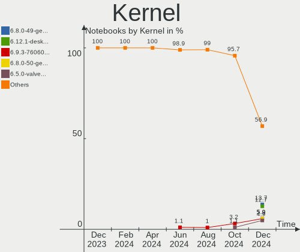
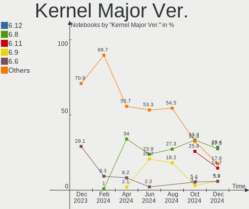
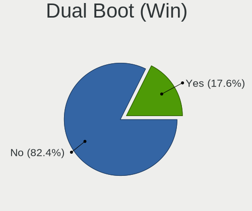
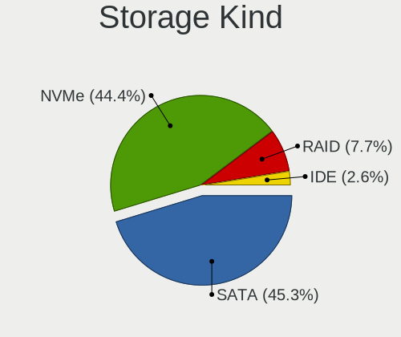
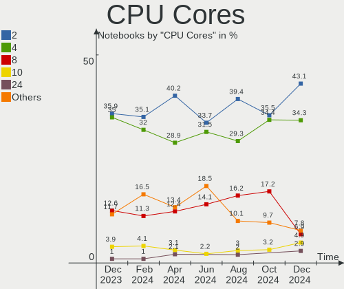
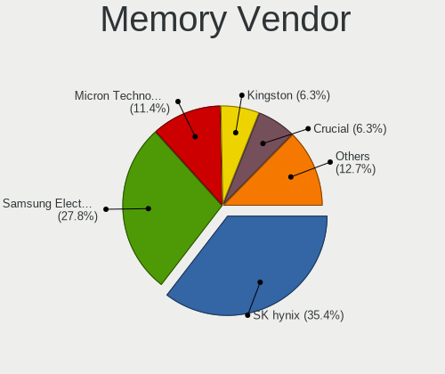
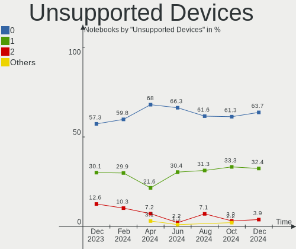

Linux in UK - Hardware Trends (Notebooks)
-----------------------------------------

A project to identify most popular hardware characteristics and track their change
over time based on data collected by Linux users at https://Linux-Hardware.org.

Anyone can contribute to this report by the [hw-probe](https://github.com/linuxhw/hw-probe) tool:

    sudo -E hw-probe -all -upload

Contents
--------

* [ System ](#system)
  - [ OS                       ](#os)
  - [ OS Family                ](#os-family)
  - [ Kernel                   ](#kernel)
  - [ Kernel Family            ](#kernel-family)
  - [ Kernel Major Ver.        ](#kernel-major-ver)
  - [ Arch                     ](#arch)
  - [ DE                       ](#de)
  - [ Display Server           ](#display-server)
  - [ Display Manager          ](#display-manager)
  - [ OS Lang                  ](#os-lang)
  - [ Boot Mode                ](#boot-mode)
  - [ Filesystem               ](#filesystem)
  - [ Part. scheme             ](#part-scheme)
  - [ Dual Boot with Linux/BSD ](#dual-boot-with-linuxbsd)
  - [ Dual Boot (Win)          ](#dual-boot-win)

* [ Board ](#board)
  - [ Vendor                   ](#vendor)
  - [ Model                    ](#model)
  - [ Model Family             ](#model-family)
  - [ MFG Year                 ](#mfg-year)
  - [ Form Factor              ](#form-factor)
  - [ Secure Boot              ](#secure-boot)
  - [ Coreboot                 ](#coreboot)
  - [ RAM Size                 ](#ram-size)
  - [ RAM Used                 ](#ram-used)
  - [ Total Drives             ](#total-drives)
  - [ Has CD-ROM               ](#has-cd-rom)
  - [ Has Ethernet             ](#has-ethernet)
  - [ Has WiFi                 ](#has-wifi)
  - [ Has Bluetooth            ](#has-bluetooth)

* [ Location ](#location)
  - [ Country                  ](#country)
  - [ City                     ](#city)

* [ Drives ](#drives)
  - [ Drive Vendor             ](#drive-vendor)
  - [ Drive Model              ](#drive-model)
  - [ HDD Vendor               ](#hdd-vendor)
  - [ SSD Vendor               ](#ssd-vendor)
  - [ Drive Kind               ](#drive-kind)
  - [ Drive Connector          ](#drive-connector)
  - [ Drive Size               ](#drive-size)
  - [ Space Total              ](#space-total)
  - [ Space Used               ](#space-used)
  - [ Malfunc. Drives          ](#malfunc-drives)
  - [ Malfunc. Drive Vendor    ](#malfunc-drive-vendor)
  - [ Malfunc. HDD Vendor      ](#malfunc-hdd-vendor)
  - [ Malfunc. Drive Kind      ](#malfunc-drive-kind)
  - [ Failed Drives            ](#failed-drives)
  - [ Failed Drive Vendor      ](#failed-drive-vendor)
  - [ Drive Status             ](#drive-status)

* [ Storage controller ](#storage-controller)
  - [ Storage Vendor           ](#storage-vendor)
  - [ Storage Model            ](#storage-model)
  - [ Storage Kind             ](#storage-kind)

* [ Processor ](#processor)
  - [ CPU Vendor               ](#cpu-vendor)
  - [ CPU Model                ](#cpu-model)
  - [ CPU Model Family         ](#cpu-model-family)
  - [ CPU Cores                ](#cpu-cores)
  - [ CPU Sockets              ](#cpu-sockets)
  - [ CPU Threads              ](#cpu-threads)
  - [ CPU Op-Modes             ](#cpu-op-modes)
  - [ CPU Microcode            ](#cpu-microcode)
  - [ CPU Microarch            ](#cpu-microarch)

* [ Graphics ](#graphics)
  - [ GPU Vendor               ](#gpu-vendor)
  - [ GPU Model                ](#gpu-model)
  - [ GPU Combo                ](#gpu-combo)
  - [ GPU Driver               ](#gpu-driver)
  - [ GPU Memory               ](#gpu-memory)

* [ Monitor ](#monitor)
  - [ Monitor Vendor           ](#monitor-vendor)
  - [ Monitor Model            ](#monitor-model)
  - [ Monitor Resolution       ](#monitor-resolution)
  - [ Monitor Diagonal         ](#monitor-diagonal)
  - [ Monitor Width            ](#monitor-width)
  - [ Aspect Ratio             ](#aspect-ratio)
  - [ Monitor Area             ](#monitor-area)
  - [ Pixel Density            ](#pixel-density)
  - [ Multiple Monitors        ](#multiple-monitors)

* [ Network ](#network)
  - [ Net Controller Vendor    ](#net-controller-vendor)
  - [ Net Controller Model     ](#net-controller-model)
  - [ Wireless Vendor          ](#wireless-vendor)
  - [ Wireless Model           ](#wireless-model)
  - [ Ethernet Vendor          ](#ethernet-vendor)
  - [ Ethernet Model           ](#ethernet-model)
  - [ Net Controller Kind      ](#net-controller-kind)
  - [ Used Controller          ](#used-controller)
  - [ NICs                     ](#nics)
  - [ IPv6                     ](#ipv6)

* [ Bluetooth ](#bluetooth)
  - [ Bluetooth Vendor         ](#bluetooth-vendor)
  - [ Bluetooth Model          ](#bluetooth-model)

* [ Sound ](#sound)
  - [ Sound Vendor             ](#sound-vendor)
  - [ Sound Model              ](#sound-model)

* [ Memory ](#memory)
  - [ Memory Vendor            ](#memory-vendor)
  - [ Memory Model             ](#memory-model)
  - [ Memory Kind              ](#memory-kind)
  - [ Memory Form Factor       ](#memory-form-factor)
  - [ Memory Size              ](#memory-size)
  - [ Memory Speed             ](#memory-speed)

* [ Printers & scanners ](#printers--scanners)
  - [ Printer Vendor           ](#printer-vendor)
  - [ Printer Model            ](#printer-model)
  - [ Scanner Vendor           ](#scanner-vendor)
  - [ Scanner Model            ](#scanner-model)

* [ Camera ](#camera)
  - [ Camera Vendor            ](#camera-vendor)
  - [ Camera Model             ](#camera-model)

* [ Security ](#security)
  - [ Fingerprint Vendor       ](#fingerprint-vendor)
  - [ Fingerprint Model        ](#fingerprint-model)
  - [ Chipcard Vendor          ](#chipcard-vendor)
  - [ Chipcard Model           ](#chipcard-model)

* [ Unsupported ](#unsupported)
  - [ Unsupported Devices      ](#unsupported-devices)
  - [ Unsupported Device Types ](#unsupported-device-types)

System
------

OS
--

Installed operating systems

| Name                         | Notebooks | Percent |
|------------------------------|-----------|---------|
| Ubuntu 22.04                 | 10        | 10.42%  |
| Linux Mint 20.3              | 9         | 9.38%   |
| Fedora 36                    | 8         | 8.33%   |
| OpenMandriva 4.3             | 7         | 7.29%   |
| Ubuntu 20.04                 | 6         | 6.25%   |
| Pop!_OS 22.04                | 6         | 6.25%   |
| Zorin 16                     | 4         | 4.17%   |
| LMDE 5                       | 4         | 4.17%   |
| Manjaro 21.2.6               | 3         | 3.13%   |
| Manjaro                      | 3         | 3.13%   |
| Kubuntu 22.04                | 3         | 3.13%   |
| Xubuntu 20.04                | 2         | 2.08%   |
| SteamOS 3.1                  | 2         | 2.08%   |
| Pop!_OS 21.10                | 2         | 2.08%   |
| openSUSE Leap-15.4           | 2         | 2.08%   |
| KDE neon 20.04               | 2         | 2.08%   |
| Fedora 35                    | 2         | 2.08%   |
| Xubuntu 22.04                | 1         | 1.04%   |
| Ubuntu 21.04                 | 1         | 1.04%   |
| Ubuntu 14.04                 | 1         | 1.04%   |
| RHEL 8                       | 1         | 1.04%   |
| Pop!_OS 21.04                | 1         | 1.04%   |
| openSUSE Tumbleweed-XXXXXXXX | 1         | 1.04%   |
| openSUSE Leap-15.3           | 1         | 1.04%   |
| Mageia 8                     | 1         | 1.04%   |
| Lubuntu 22.04                | 1         | 1.04%   |
| Linux Mint 19.3              | 1         | 1.04%   |
| Linux Lite 6.0               | 1         | 1.04%   |
| Gentoo 2.8                   | 1         | 1.04%   |
| Gentoo 2.6                   | 1         | 1.04%   |
| EndeavourOS                  | 1         | 1.04%   |
| Debian 11                    | 1         | 1.04%   |
| Clear Linux 36360            | 1         | 1.04%   |
| Clear Linux 36010            | 1         | 1.04%   |
| BlackPanther 18.1            | 1         | 1.04%   |
| ArcoLinux Rolling            | 1         | 1.04%   |
| Arch Rolling                 | 1         | 1.04%   |
| Arch                         | 1         | 1.04%   |

OS Family
---------

OS without a version

| Name         | Notebooks | Percent |
|--------------|-----------|---------|
| Ubuntu       | 18        | 18.75%  |
| Linux Mint   | 10        | 10.42%  |
| Fedora       | 10        | 10.42%  |
| Pop!_OS      | 9         | 9.38%   |
| OpenMandriva | 7         | 7.29%   |
| Manjaro      | 6         | 6.25%   |
| Zorin        | 4         | 4.17%   |
| openSUSE     | 4         | 4.17%   |
| LMDE         | 4         | 4.17%   |
| Xubuntu      | 3         | 3.13%   |
| Kubuntu      | 3         | 3.13%   |
| SteamOS      | 2         | 2.08%   |
| KDE neon     | 2         | 2.08%   |
| Gentoo       | 2         | 2.08%   |
| Clear Linux  | 2         | 2.08%   |
| Arch         | 2         | 2.08%   |
| RHEL         | 1         | 1.04%   |
| Mageia       | 1         | 1.04%   |
| Lubuntu      | 1         | 1.04%   |
| Linux Lite   | 1         | 1.04%   |
| EndeavourOS  | 1         | 1.04%   |
| Debian       | 1         | 1.04%   |
| BlackPanther | 1         | 1.04%   |
| ArcoLinux    | 1         | 1.04%   |

Kernel
------

Version of the Linux kernel

| Version                                        | Notebooks | Percent |
|------------------------------------------------|-----------|---------|
| 5.16.7-desktop-1omv4003                        | 6         | 6.25%   |
| 5.15.0-27-generic                              | 6         | 6.25%   |
| 5.13.0-41-generic                              | 6         | 6.25%   |
| 5.4.0-109-generic                              | 5         | 5.21%   |
| 5.17.5-76051705-generic                        | 5         | 5.21%   |
| 5.15.0-30-generic                              | 5         | 5.21%   |
| 5.13.0-40-generic                              | 5         | 5.21%   |
| 5.15.0-33-generic                              | 3         | 3.13%   |
| 5.10.0-14-amd64                                | 3         | 3.13%   |
| 5.4.0-110-generic                              | 2         | 2.08%   |
| 5.17.5-300.fc36.x86_64                         | 2         | 2.08%   |
| 5.17.3-302.fc36.x86_64                         | 2         | 2.08%   |
| 5.16.19-76051619-generic                       | 2         | 2.08%   |
| 5.15.32-1-MANJARO                              | 2         | 2.08%   |
| 5.14.21-150400.19-default                      | 2         | 2.08%   |
| 5.13.0-valve10.3-1-neptune-02176-g5fe416c4acd8 | 2         | 2.08%   |
| 5.6.14-desktop-2bP                             | 1         | 1.04%   |
| 5.4.0-113-generic                              | 1         | 1.04%   |
| 5.4.0-107-generic                              | 1         | 1.04%   |
| 5.3.18-150300.59.63-default                    | 1         | 1.04%   |
| 5.17.9-zen1-1-zen                              | 1         | 1.04%   |
| 5.17.9-arch1-1                                 | 1         | 1.04%   |
| 5.17.9-300.fc36.x86_64                         | 1         | 1.04%   |
| 5.17.9-1144.native                             | 1         | 1.04%   |
| 5.17.7-300.fc36.x86_64                         | 1         | 1.04%   |
| 5.17.6-300.fc36.x86_64                         | 1         | 1.04%   |
| 5.17.6-200.fc35.x86_64                         | 1         | 1.04%   |
| 5.17.5-arch1-1                                 | 1         | 1.04%   |
| 5.17.5-200.fc35.x86_64                         | 1         | 1.04%   |
| 5.17.4-1-default                               | 1         | 1.04%   |
| 5.17.11-300.fc36.x86_64                        | 1         | 1.04%   |
| 5.17.1-gentoo-r1                               | 1         | 1.04%   |
| 5.16.18-1-MANJARO                              | 1         | 1.04%   |
| 5.16.15-76051615-generic                       | 1         | 1.04%   |
| 5.16.13-desktop-1omv4003                       | 1         | 1.04%   |
| 5.16.13-1132.native                            | 1         | 1.04%   |
| 5.16.0-0.bpo.4-amd64                           | 1         | 1.04%   |
| 5.15.41-1-MANJARO                              | 1         | 1.04%   |
| 5.15.38-1-MANJARO                              | 1         | 1.04%   |
| 5.15.37-1-lts                                  | 1         | 1.04%   |
| 5.15.35-desktop-2.mga8                         | 1         | 1.04%   |
| 5.15.32-gentoo-r1                              | 1         | 1.04%   |
| 5.15.0-30-lowlatency                           | 1         | 1.04%   |
| 5.15.0-27-lowlatency                           | 1         | 1.04%   |
| 5.14.0-1038-oem                                | 1         | 1.04%   |
| 5.14.0-1033-oem                                | 1         | 1.04%   |
| 5.13.0-7614-generic                            | 1         | 1.04%   |
| 5.13.0-44-generic                              | 1         | 1.04%   |
| 5.13.0-27-generic                              | 1         | 1.04%   |
| 5.11.0-49-generic                              | 1         | 1.04%   |
| 5.10.109-1-MANJARO                             | 1         | 1.04%   |
| 5.10.0-12-amd64                                | 1         | 1.04%   |
| 4.18.0-240.10.1.el8_3.x86_64                   | 1         | 1.04%   |
| 3.13.0-170-generic                             | 1         | 1.04%   |

Kernel Family
-------------

Linux kernel without a distro release

| Version  | Notebooks | Percent |
|----------|-----------|---------|
| 5.15.0   | 16        | 16.67%  |
| 5.13.0   | 16        | 16.67%  |
| 5.4.0    | 9         | 9.38%   |
| 5.17.5   | 9         | 9.38%   |
| 5.16.7   | 6         | 6.25%   |
| 5.17.9   | 4         | 4.17%   |
| 5.10.0   | 4         | 4.17%   |
| 5.15.32  | 3         | 3.13%   |
| 5.17.6   | 2         | 2.08%   |
| 5.17.3   | 2         | 2.08%   |
| 5.16.19  | 2         | 2.08%   |
| 5.16.13  | 2         | 2.08%   |
| 5.14.21  | 2         | 2.08%   |
| 5.14.0   | 2         | 2.08%   |
| 5.6.14   | 1         | 1.04%   |
| 5.3.18   | 1         | 1.04%   |
| 5.17.7   | 1         | 1.04%   |
| 5.17.4   | 1         | 1.04%   |
| 5.17.11  | 1         | 1.04%   |
| 5.17.1   | 1         | 1.04%   |
| 5.16.18  | 1         | 1.04%   |
| 5.16.15  | 1         | 1.04%   |
| 5.16.0   | 1         | 1.04%   |
| 5.15.41  | 1         | 1.04%   |
| 5.15.38  | 1         | 1.04%   |
| 5.15.37  | 1         | 1.04%   |
| 5.15.35  | 1         | 1.04%   |
| 5.11.0   | 1         | 1.04%   |
| 5.10.109 | 1         | 1.04%   |
| 4.18.0   | 1         | 1.04%   |
| 3.13.0   | 1         | 1.04%   |

Kernel Major Ver.
-----------------

Linux kernel major version

| Version | Notebooks | Percent |
|---------|-----------|---------|
| 5.15    | 23        | 23.96%  |
| 5.17    | 21        | 21.88%  |
| 5.13    | 16        | 16.67%  |
| 5.16    | 13        | 13.54%  |
| 5.4     | 9         | 9.38%   |
| 5.10    | 5         | 5.21%   |
| 5.14    | 4         | 4.17%   |
| 5.6     | 1         | 1.04%   |
| 5.3     | 1         | 1.04%   |
| 5.11    | 1         | 1.04%   |
| 4.18    | 1         | 1.04%   |
| 3.13    | 1         | 1.04%   |

Arch
----

OS architecture (x86_64, i586, etc.)

| Name   | Notebooks | Percent |
|--------|-----------|---------|
| x86_64 | 95        | 98.96%  |
| i686   | 1         | 1.04%   |

DE
--

Desktop Environment

| Name       | Notebooks | Percent |
|------------|-----------|---------|
| GNOME      | 43        | 44.79%  |
| KDE5       | 25        | 26.04%  |
| XFCE       | 10        | 10.42%  |
| X-Cinnamon | 9         | 9.38%   |
| Unknown    | 4         | 4.17%   |
| Cinnamon   | 2         | 2.08%   |
| MATE       | 1         | 1.04%   |
| LXQt       | 1         | 1.04%   |
| i3         | 1         | 1.04%   |

Display Server
--------------

X11 or Wayland

| Name    | Notebooks | Percent |
|---------|-----------|---------|
| X11     | 76        | 79.17%  |
| Wayland | 17        | 17.71%  |
| Tty     | 2         | 2.08%   |
| Unknown | 1         | 1.04%   |

Display Manager
---------------

SDDM, LightDM, etc.

| Name    | Notebooks | Percent |
|---------|-----------|---------|
| Unknown | 44        | 45.83%  |
| SDDM    | 17        | 17.71%  |
| LightDM | 17        | 17.71%  |
| GDM3    | 13        | 13.54%  |
| GDM     | 5         | 5.21%   |

OS Lang
-------

Language

| Lang    | Notebooks | Percent |
|---------|-----------|---------|
| en_GB   | 73        | 76.04%  |
| en_US   | 15        | 15.63%  |
| Unknown | 3         | 3.13%   |
| en_IE   | 2         | 2.08%   |
| uk_UA   | 1         | 1.04%   |
| POSIX   | 1         | 1.04%   |
| cs_CZ   | 1         | 1.04%   |

Boot Mode
---------

EFI or BIOS

| Mode | Notebooks | Percent |
|------|-----------|---------|
| EFI  | 50        | 52.08%  |
| BIOS | 46        | 47.92%  |

Filesystem
----------

Type of filesystem

| Type    | Notebooks | Percent |
|---------|-----------|---------|
| Ext4    | 69        | 71.88%  |
| Btrfs   | 13        | 13.54%  |
| Overlay | 8         | 8.33%   |
| Zfs     | 3         | 3.13%   |
| Xfs     | 3         | 3.13%   |

Part. scheme
------------

Scheme of partitioning

| Type    | Notebooks | Percent |
|---------|-----------|---------|
| Unknown | 52        | 54.17%  |
| GPT     | 30        | 31.25%  |
| MBR     | 14        | 14.58%  |

Dual Boot with Linux/BSD
------------------------

Hosting more than one Linux/BSD

| Dual boot | Notebooks | Percent |
|-----------|-----------|---------|
| No        | 82        | 85.42%  |
| Yes       | 14        | 14.58%  |

Dual Boot (Win)
---------------

Hosting Linux and Windows

| Dual boot | Notebooks | Percent |
|-----------|-----------|---------|
| No        | 78        | 81.25%  |
| Yes       | 18        | 18.75%  |

Board
-----

Vendor
------

Motherboard manufacturer

| Name             | Notebooks | Percent |
|------------------|-----------|---------|
| Lenovo           | 20        | 20.83%  |
| Dell             | 18        | 18.75%  |
| Hewlett-Packard  | 15        | 15.63%  |
| Acer             | 10        | 10.42%  |
| ASUSTek Computer | 7         | 7.29%   |
| Toshiba          | 4         | 4.17%   |
| Notebook         | 3         | 3.13%   |
| Valve            | 2         | 2.08%   |
| MSI              | 2         | 2.08%   |
| Entroware        | 2         | 2.08%   |
| Alienware        | 2         | 2.08%   |
| Star Labs        | 1         | 1.04%   |
| Razer            | 1         | 1.04%   |
| PC Specialist    | 1         | 1.04%   |
| HYPA             | 1         | 1.04%   |
| HUAWEI           | 1         | 1.04%   |
| Fujitsu Siemens  | 1         | 1.04%   |
| Clevo            | 1         | 1.04%   |
| BOX              | 1         | 1.04%   |
| AZW              | 1         | 1.04%   |
| Apple            | 1         | 1.04%   |
| AMI              | 1         | 1.04%   |

Model
-----

Motherboard model

| Name                                             | Notebooks | Percent |
|--------------------------------------------------|-----------|---------|
| Valve Jupiter                                    | 2         | 2.08%   |
| Lenovo Z50-75 80EC                               | 2         | 2.08%   |
| HP ZBook 15 G5                                   | 2         | 2.08%   |
| HP Pavilion Notebook                             | 2         | 2.08%   |
| Dell XPS 13 9305                                 | 2         | 2.08%   |
| Acer Aspire A515-45                              | 2         | 2.08%   |
| Toshiba TECRA A50-C                              | 1         | 1.04%   |
| Toshiba Satellite P850                           | 1         | 1.04%   |
| Toshiba Satellite C850-1KN                       | 1         | 1.04%   |
| Toshiba PORTEGE R30-A                            | 1         | 1.04%   |
| Star Labs Lite                                   | 1         | 1.04%   |
| Razer Blade                                      | 1         | 1.04%   |
| PC Specialist NH5x_7xDCx_DDx                     | 1         | 1.04%   |
| Notebook NS50_70MU                               | 1         | 1.04%   |
| Notebook NLx0MU                                  | 1         | 1.04%   |
| Notebook NH5x_NH7x_HHx_HJx_HKx                   | 1         | 1.04%   |
| MSI Stealth GS66 12UGS                           | 1         | 1.04%   |
| MSI GE63 Raider RGB 8RE                          | 1         | 1.04%   |
| Lenovo Yoga 300-11IBY 80M0                       | 1         | 1.04%   |
| Lenovo V145-15AST 81MT                           | 1         | 1.04%   |
| Lenovo ThinkPad X250 20CMCTO1WW                  | 1         | 1.04%   |
| Lenovo ThinkPad X1 Carbon Gen 9 20XWCTO1WW       | 1         | 1.04%   |
| Lenovo ThinkPad X1 Carbon 2nd 20A8S1AW11         | 1         | 1.04%   |
| Lenovo ThinkPad T480 20L6S5M40M                  | 1         | 1.04%   |
| Lenovo ThinkPad T470 20HES1RB06                  | 1         | 1.04%   |
| Lenovo ThinkPad T440 20B7A1P700                  | 1         | 1.04%   |
| Lenovo ThinkPad T410 25223FG                     | 1         | 1.04%   |
| Lenovo ThinkPad T15 Gen 2i 20W5S12J0K            | 1         | 1.04%   |
| Lenovo ThinkPad T14s Gen 2i 20WNS1F81N           | 1         | 1.04%   |
| Lenovo ThinkPad P73 20QSS09S00                   | 1         | 1.04%   |
| Lenovo ThinkPad P50 20EQS0VV0C                   | 1         | 1.04%   |
| Lenovo S21e-20 80M4                              | 1         | 1.04%   |
| Lenovo Legion 5 15ACH6H 82JU                     | 1         | 1.04%   |
| Lenovo IdeaPad Z580                              | 1         | 1.04%   |
| Lenovo IdeaPad Gaming 3 15IHU6 82K1              | 1         | 1.04%   |
| Lenovo IdeaPad 5 15ARE05 81YQ                    | 1         | 1.04%   |
| HYPA FLUX                                        | 1         | 1.04%   |
| HUAWEI BOD-WXX9                                  | 1         | 1.04%   |
| HP ZBook Fury 17.3 inch G8 Mobile Workstation PC | 1         | 1.04%   |
| HP ZBook 15 G6                                   | 1         | 1.04%   |
| HP ProBook 6570b                                 | 1         | 1.04%   |
| HP ProBook 430 G4                                | 1         | 1.04%   |
| HP Presario C500 (RT155EA#ABU)                   | 1         | 1.04%   |
| HP Laptop 15-bs0xx                               | 1         | 1.04%   |
| HP ENVY 17                                       | 1         | 1.04%   |
| HP EliteBook 820 G2                              | 1         | 1.04%   |
| HP EliteBook 2730p                               | 1         | 1.04%   |
| HP EliteBook 2560p                               | 1         | 1.04%   |
| Fujitsu Siemens LIFEBOOK S7110                   | 1         | 1.04%   |
| Entroware Triton                                 | 1         | 1.04%   |
| Entroware Apollo                                 | 1         | 1.04%   |
| Dell XPS 15 9570                                 | 1         | 1.04%   |
| Dell XPS 15 9560                                 | 1         | 1.04%   |
| Dell XPS 13 9360                                 | 1         | 1.04%   |
| Dell XPS 13 9310                                 | 1         | 1.04%   |
| Dell Precision M6600                             | 1         | 1.04%   |
| Dell Precision 5530                              | 1         | 1.04%   |
| Dell Latitude E7470                              | 1         | 1.04%   |
| Dell Latitude E6540                              | 1         | 1.04%   |
| Dell Latitude E6400                              | 1         | 1.04%   |

Model Family
------------

Motherboard model prefix

| Name                     | Notebooks | Percent |
|--------------------------|-----------|---------|
| Lenovo ThinkPad          | 11        | 11.46%  |
| Acer Aspire              | 9         | 9.38%   |
| Dell XPS                 | 6         | 6.25%   |
| Dell Inspiron            | 6         | 6.25%   |
| HP ZBook                 | 4         | 4.17%   |
| Lenovo IdeaPad           | 3         | 3.13%   |
| HP EliteBook             | 3         | 3.13%   |
| Dell Latitude            | 3         | 3.13%   |
| ASUS VivoBook            | 3         | 3.13%   |
| Valve Jupiter            | 2         | 2.08%   |
| Toshiba Satellite        | 2         | 2.08%   |
| Lenovo Z50-75            | 2         | 2.08%   |
| HP ProBook               | 2         | 2.08%   |
| HP Pavilion              | 2         | 2.08%   |
| Dell Precision           | 2         | 2.08%   |
| Toshiba TECRA            | 1         | 1.04%   |
| Toshiba PORTEGE          | 1         | 1.04%   |
| Star Labs Lite           | 1         | 1.04%   |
| Razer Blade              | 1         | 1.04%   |
| PC Specialist NH5x       | 1         | 1.04%   |
| Notebook NS50            | 1         | 1.04%   |
| Notebook NLx0MU          | 1         | 1.04%   |
| Notebook NH5x            | 1         | 1.04%   |
| MSI Stealth              | 1         | 1.04%   |
| MSI GE63                 | 1         | 1.04%   |
| Lenovo Yoga              | 1         | 1.04%   |
| Lenovo V145-15AST        | 1         | 1.04%   |
| Lenovo S21e-20           | 1         | 1.04%   |
| Lenovo Legion            | 1         | 1.04%   |
| HYPA FLUX                | 1         | 1.04%   |
| HUAWEI BOD-WXX9          | 1         | 1.04%   |
| HP Presario              | 1         | 1.04%   |
| HP Laptop                | 1         | 1.04%   |
| HP ENVY                  | 1         | 1.04%   |
| Fujitsu Siemens LIFEBOOK | 1         | 1.04%   |
| Entroware Triton         | 1         | 1.04%   |
| Entroware Apollo         | 1         | 1.04%   |
| Dell G7                  | 1         | 1.04%   |
| Clevo W55xEU             | 1         | 1.04%   |
| BOX W54                  | 1         | 1.04%   |
| AZW GT-R                 | 1         | 1.04%   |
| ASUS UX310UA             | 1         | 1.04%   |
| ASUS N751JK              | 1         | 1.04%   |
| ASUS E200HA              | 1         | 1.04%   |
| ASUS ASUS                | 1         | 1.04%   |
| Apple MacBookPro10       | 1         | 1.04%   |
| AMI Cherry               | 1         | 1.04%   |
| Alienware x17            | 1         | 1.04%   |
| Alienware M11x           | 1         | 1.04%   |
| Acer Swift               | 1         | 1.04%   |
| Unknown                  | 1         | 1.04%   |

MFG Year
--------

Motherboard manufacture year

| Year | Notebooks | Percent |
|------|-----------|---------|
| 2021 | 17        | 17.71%  |
| 2015 | 10        | 10.42%  |
| 2020 | 8         | 8.33%   |
| 2018 | 8         | 8.33%   |
| 2016 | 7         | 7.29%   |
| 2019 | 6         | 6.25%   |
| 2017 | 6         | 6.25%   |
| 2013 | 6         | 6.25%   |
| 2014 | 5         | 5.21%   |
| 2012 | 5         | 5.21%   |
| 2011 | 5         | 5.21%   |
| 2022 | 3         | 3.13%   |
| 2009 | 3         | 3.13%   |
| 2008 | 3         | 3.13%   |
| 2006 | 2         | 2.08%   |
| 2010 | 1         | 1.04%   |
| 2007 | 1         | 1.04%   |

Form Factor
-----------

Physical design of the computer

| Name     | Notebooks | Percent |
|----------|-----------|---------|
| Notebook | 96        | 100%    |

Secure Boot
-----------

Enabled or disabled

| State    | Notebooks | Percent |
|----------|-----------|---------|
| Disabled | 90        | 93.75%  |
| Enabled  | 6         | 6.25%   |

Coreboot
--------

Have coreboot on board

| Used | Notebooks | Percent |
|------|-----------|---------|
| No   | 95        | 98.96%  |
| Yes  | 1         | 1.04%   |

RAM Size
--------

Total RAM memory

| Size in GB  | Notebooks | Percent |
|-------------|-----------|---------|
| 4.01-8.0    | 24        | 25%     |
| 16.01-24.0  | 24        | 25%     |
| 3.01-4.0    | 17        | 17.71%  |
| 32.01-64.0  | 13        | 13.54%  |
| 8.01-16.0   | 9         | 9.38%   |
| 1.01-2.0    | 5         | 5.21%   |
| 24.01-32.0  | 1         | 1.04%   |
| 2.01-3.0    | 1         | 1.04%   |
| 64.01-256.0 | 1         | 1.04%   |
| 0.51-1.0    | 1         | 1.04%   |

RAM Used
--------

Used RAM memory

| Used GB    | Notebooks | Percent |
|------------|-----------|---------|
| 1.01-2.0   | 31        | 32.29%  |
| 2.01-3.0   | 23        | 23.96%  |
| 3.01-4.0   | 18        | 18.75%  |
| 4.01-8.0   | 13        | 13.54%  |
| 0.51-1.0   | 4         | 4.17%   |
| 16.01-24.0 | 2         | 2.08%   |
| 8.01-16.0  | 2         | 2.08%   |
| 0.01-0.5   | 2         | 2.08%   |
| Unknown    | 1         | 1.04%   |

Total Drives
------------

Number of drives on board

| Drives | Notebooks | Percent |
|--------|-----------|---------|
| 1      | 62        | 64.58%  |
| 2      | 32        | 33.33%  |
| 3      | 2         | 2.08%   |

Has CD-ROM
----------

Has CD-ROM on board

| Presented | Notebooks | Percent |
|-----------|-----------|---------|
| No        | 64        | 66.67%  |
| Yes       | 32        | 33.33%  |

Has Ethernet
------------

Has Ethernet on board

| Presented | Notebooks | Percent |
|-----------|-----------|---------|
| Yes       | 71        | 73.96%  |
| No        | 25        | 26.04%  |

Has WiFi
--------

Has WiFi module

| Presented | Notebooks | Percent |
|-----------|-----------|---------|
| Yes       | 94        | 97.92%  |
| No        | 2         | 2.08%   |

Has Bluetooth
-------------

Has Bluetooth module

| Presented | Notebooks | Percent |
|-----------|-----------|---------|
| Yes       | 79        | 82.29%  |
| No        | 17        | 17.71%  |

Location
--------

Country
-------

Geographic location (country)

| Country | Notebooks | Percent |
|---------|-----------|---------|
| UK      | 96        | 100%    |

City
----

Geographic location (city)

| City             | Notebooks | Percent |
|------------------|-----------|---------|
| London           | 8         | 8.33%   |
| Reading          | 3         | 3.13%   |
| Neasden          | 3         | 3.13%   |
| Leicester        | 3         | 3.13%   |
| Glasgow          | 3         | 3.13%   |
| Edinburgh        | 3         | 3.13%   |
| Islington        | 2         | 2.08%   |
| Cambridge        | 2         | 2.08%   |
| Bristol          | 2         | 2.08%   |
| Birmingham       | 2         | 2.08%   |
| Wokingham        | 1         | 1.04%   |
| Witham           | 1         | 1.04%   |
| Todmorden        | 1         | 1.04%   |
| Tankerton        | 1         | 1.04%   |
| Swansea          | 1         | 1.04%   |
| Sunderland       | 1         | 1.04%   |
| Streatham        | 1         | 1.04%   |
| Stockton-on-Tees | 1         | 1.04%   |
| Stockport        | 1         | 1.04%   |
| Stanmore         | 1         | 1.04%   |
| Skegness         | 1         | 1.04%   |
| Sidcup           | 1         | 1.04%   |
| Sheffield        | 1         | 1.04%   |
| Reigate          | 1         | 1.04%   |
| Redruth          | 1         | 1.04%   |
| Pontypool        | 1         | 1.04%   |
| Peterlee         | 1         | 1.04%   |
| Peterborough     | 1         | 1.04%   |
| Palmers Green    | 1         | 1.04%   |
| Oxford           | 1         | 1.04%   |
| Oldham           | 1         | 1.04%   |
| Nottingham       | 1         | 1.04%   |
| Norwich          | 1         | 1.04%   |
| Newark on Trent  | 1         | 1.04%   |
| Nelson           | 1         | 1.04%   |
| Mitcham          | 1         | 1.04%   |
| Milton Keynes    | 1         | 1.04%   |
| Maesteg          | 1         | 1.04%   |
| Londonderry      | 1         | 1.04%   |
| Liverpool        | 1         | 1.04%   |
| Leyton           | 1         | 1.04%   |
| Kings Lynn       | 1         | 1.04%   |
| Kidlington       | 1         | 1.04%   |
| Inverness        | 1         | 1.04%   |
| Huntingdon       | 1         | 1.04%   |
| Hove             | 1         | 1.04%   |
| Hornchurch       | 1         | 1.04%   |
| Harrow           | 1         | 1.04%   |
| Halifax          | 1         | 1.04%   |
| Greenwich        | 1         | 1.04%   |
| Gillingham       | 1         | 1.04%   |
| Fulham           | 1         | 1.04%   |
| Exmouth          | 1         | 1.04%   |
| Ely              | 1         | 1.04%   |
| Easton           | 1         | 1.04%   |
| Dunstable        | 1         | 1.04%   |
| Dunfermline      | 1         | 1.04%   |
| Dudley           | 1         | 1.04%   |
| Doncaster        | 1         | 1.04%   |
| Dawlish          | 1         | 1.04%   |

Drives
------

Drive Vendor
------------

Hard drive vendors

| Vendor                    | Notebooks | Drives | Percent |
|---------------------------|-----------|--------|---------|
| Samsung Electronics       | 31        | 35     | 25.41%  |
| Seagate                   | 17        | 18     | 13.93%  |
| WDC                       | 13        | 13     | 10.66%  |
| Unknown                   | 10        | 11     | 8.2%    |
| Sandisk                   | 8         | 8      | 6.56%   |
| Kingston                  | 8         | 8      | 6.56%   |
| Toshiba                   | 7         | 7      | 5.74%   |
| SK Hynix                  | 5         | 5      | 4.1%    |
| Crucial                   | 4         | 4      | 3.28%   |
| Phison                    | 2         | 2      | 1.64%   |
| Micron Technology         | 2         | 2      | 1.64%   |
| Intel                     | 2         | 2      | 1.64%   |
| Team                      | 1         | 1      | 0.82%   |
| Star                      | 1         | 1      | 0.82%   |
| Silicon Motion            | 1         | 1      | 0.82%   |
| Patriot                   | 1         | 1      | 0.82%   |
| Micron/Crucial Technology | 1         | 1      | 0.82%   |
| LITEONIT                  | 1         | 1      | 0.82%   |
| Lexar                     | 1         | 1      | 0.82%   |
| KIOXIA-EXCERIA            | 1         | 1      | 0.82%   |
| KIOXIA                    | 1         | 2      | 0.82%   |
| China                     | 1         | 1      | 0.82%   |
| Aura                      | 1         | 1      | 0.82%   |
| ADATA Technology          | 1         | 1      | 0.82%   |
| A-DATA Technology         | 1         | 1      | 0.82%   |

Drive Model
-----------

Hard drive models

| Model                                 | Notebooks | Percent |
|---------------------------------------|-----------|---------|
| Samsung NVMe SSD Drive 512GB          | 4         | 3.17%   |
| Samsung NVMe SSD Drive 500GB          | 4         | 3.17%   |
| Toshiba NVMe SSD Drive 512GB          | 3         | 2.38%   |
| Samsung SSD 970 EVO 1TB               | 3         | 2.38%   |
| WDC WD10JPVX-60JC3T0 1TB              | 2         | 1.59%   |
| Unknown MMC Card  32GB                | 2         | 1.59%   |
| SK Hynix NVMe SSD Drive 512GB         | 2         | 1.59%   |
| Seagate ST2000LM015-2E8174 2TB        | 2         | 1.59%   |
| Seagate ST2000LM007-1R8174 2TB        | 2         | 1.59%   |
| Seagate ST2000LM003 HN-M201RAD 2TB    | 2         | 1.59%   |
| Seagate ST1000LM049-2GH172 1TB        | 2         | 1.59%   |
| Seagate ST1000LM035-1RK172 1TB        | 2         | 1.59%   |
| Samsung PM991a NVMe 512GB             | 2         | 1.59%   |
| Micron NVMe SSD Drive 1024GB          | 2         | 1.59%   |
| WDC WDS500G2B0C 500GB                 | 1         | 0.79%   |
| WDC WDS240G2G0B-00EPW0 240GB SSD      | 1         | 0.79%   |
| WDC WD800BEVS-22RST0 80GB             | 1         | 0.79%   |
| WDC WD800BEVS-07RST0 80GB             | 1         | 0.79%   |
| WDC WD5000LPCX-60VHAT0 500GB          | 1         | 0.79%   |
| WDC WD2500BEVT-75A23T0 250GB          | 1         | 0.79%   |
| WDC WD10JPCX-24UE4T0 1TB              | 1         | 0.79%   |
| WDC PC SN810 SDCPNRZ-2T00-1032 2TB    | 1         | 0.79%   |
| WDC PC SN730 SDBQNTY-256G-1001 256GB  | 1         | 0.79%   |
| WDC PC SN530 SDBPMPZ-512G-1101 512GB  | 1         | 0.79%   |
| WDC PC SN530 SDBPMPZ-256G-1101 256GB  | 1         | 0.79%   |
| Unknown SL16G  16GB                   | 1         | 0.79%   |
| Unknown MMC64G  64GB                  | 1         | 0.79%   |
| Unknown MMC Card  64GB                | 1         | 0.79%   |
| Unknown MMC Card  512GB               | 1         | 0.79%   |
| Unknown MMC Card  248GB               | 1         | 0.79%   |
| Unknown ISOCOM  64GB                  | 1         | 0.79%   |
| Unknown ED2S5  128GB                  | 1         | 0.79%   |
| Unknown BJNB4R  32GB                  | 1         | 0.79%   |
| Unknown BGND3R  32GB                  | 1         | 0.79%   |
| Toshiba THNSN5512GPUK NVMe 512GB      | 1         | 0.79%   |
| Toshiba MQ01ABF050 500GB              | 1         | 0.79%   |
| Toshiba MQ01ABD050V 500GB             | 1         | 0.79%   |
| Toshiba KBG30ZMS128G 128GB NVMe SSD   | 1         | 0.79%   |
| Team TM8PS7256G 256GB SSD             | 1         | 0.79%   |
| Star Drive SATA SSD 240GB             | 1         | 0.79%   |
| SK Hynix SC308 SATA 128GB SSD         | 1         | 0.79%   |
| SK Hynix NVMe SSD Drive 128GB         | 1         | 0.79%   |
| SK Hynix NVMe SSD Drive 1024GB        | 1         | 0.79%   |
| Silicon Motion PCS M.2 NVME SSD 512GB | 1         | 0.79%   |
| Seagate ST9500325AS 500GB             | 1         | 0.79%   |
| Seagate ST9250315AS 250GB             | 1         | 0.79%   |
| Seagate ST9160412ASG 160GB            | 1         | 0.79%   |
| Seagate ST750LX003-1AC15 752GB        | 1         | 0.79%   |
| Seagate ST500LT012-1DG142 500GB       | 1         | 0.79%   |
| Seagate ST500LM034-2GH17A 500GB       | 1         | 0.79%   |
| Seagate ST500LM000-1EJ162 500GB       | 1         | 0.79%   |
| Seagate ST1000LM014-SSHD-8GB          | 1         | 0.79%   |
| SanDisk Ultra II 240GB SSD            | 1         | 0.79%   |
| SanDisk SSD U100 128GB                | 1         | 0.79%   |
| SanDisk SSD PLUS 120GB                | 1         | 0.79%   |
| SanDisk SD8SNAT256G1002 256GB SSD     | 1         | 0.79%   |
| SanDisk SD7SB2Q-512G-1006 512GB SSD   | 1         | 0.79%   |
| Sandisk NVMe SSD Drive 256GB          | 1         | 0.79%   |
| Sandisk NVMe SSD Drive 128GB          | 1         | 0.79%   |
| Sandisk NVMe SSD Drive 1024GB         | 1         | 0.79%   |

HDD Vendor
----------

Hard disk drive vendors

| Vendor              | Notebooks | Drives | Percent |
|---------------------|-----------|--------|---------|
| Seagate             | 17        | 18     | 60.71%  |
| WDC                 | 7         | 7      | 25%     |
| Toshiba             | 2         | 2      | 7.14%   |
| Samsung Electronics | 2         | 2      | 7.14%   |

SSD Vendor
----------

Solid state drive vendors

| Vendor              | Notebooks | Drives | Percent |
|---------------------|-----------|--------|---------|
| Samsung Electronics | 12        | 13     | 31.58%  |
| Kingston            | 7         | 7      | 18.42%  |
| SanDisk             | 5         | 5      | 13.16%  |
| Crucial             | 2         | 2      | 5.26%   |
| WDC                 | 1         | 1      | 2.63%   |
| Team                | 1         | 1      | 2.63%   |
| Star                | 1         | 1      | 2.63%   |
| SK Hynix            | 1         | 1      | 2.63%   |
| Patriot             | 1         | 1      | 2.63%   |
| LITEONIT            | 1         | 1      | 2.63%   |
| Lexar               | 1         | 1      | 2.63%   |
| KIOXIA-EXCERIA      | 1         | 1      | 2.63%   |
| Intel               | 1         | 1      | 2.63%   |
| China               | 1         | 1      | 2.63%   |
| Aura                | 1         | 1      | 2.63%   |
| A-DATA Technology   | 1         | 1      | 2.63%   |

Drive Kind
----------

HDD or SSD

| Kind | Notebooks | Drives | Percent |
|------|-----------|--------|---------|
| NVMe | 41        | 50     | 35.65%  |
| SSD  | 36        | 39     | 31.3%   |
| HDD  | 28        | 29     | 24.35%  |
| MMC  | 10        | 11     | 8.7%    |

Drive Connector
---------------

SATA, SAS, NVMe, etc.

| Type | Notebooks | Drives | Percent |
|------|-----------|--------|---------|
| SATA | 57        | 68     | 52.78%  |
| NVMe | 41        | 50     | 37.96%  |
| MMC  | 10        | 11     | 9.26%   |

Drive Size
----------

Size of hard drive

| Size in TB | Notebooks | Drives | Percent |
|------------|-----------|--------|---------|
| 0.01-0.5   | 41        | 44     | 64.06%  |
| 0.51-1.0   | 17        | 18     | 26.56%  |
| 1.01-2.0   | 6         | 6      | 9.38%   |

Space Total
-----------

Amount of disk space available on the file system

| Size in GB     | Notebooks | Percent |
|----------------|-----------|---------|
| 101-250        | 26        | 27.08%  |
| 251-500        | 20        | 20.83%  |
| 501-1000       | 15        | 15.63%  |
| 1001-2000      | 9         | 9.38%   |
| 51-100         | 8         | 8.33%   |
| 1-20           | 7         | 7.29%   |
| Unknown        | 7         | 7.29%   |
| 21-50          | 2         | 2.08%   |
| More than 3000 | 1         | 1.04%   |
| 2001-3000      | 1         | 1.04%   |

Space Used
----------

Amount of used disk space

| Used GB   | Notebooks | Percent |
|-----------|-----------|---------|
| 1-20      | 30        | 31.25%  |
| 21-50     | 23        | 23.96%  |
| 101-250   | 15        | 15.63%  |
| 501-1000  | 7         | 7.29%   |
| Unknown   | 7         | 7.29%   |
| 251-500   | 6         | 6.25%   |
| 51-100    | 6         | 6.25%   |
| 2001-3000 | 1         | 1.04%   |
| 1001-2000 | 1         | 1.04%   |

Malfunc. Drives
---------------

Drive models with a malfunction

| Model                             | Notebooks | Drives | Percent |
|-----------------------------------|-----------|--------|---------|
| WDC WD2500BEVT-75A23T0 250GB      | 1         | 1      | 16.67%  |
| Seagate ST9500325AS 500GB         | 1         | 1      | 16.67%  |
| Seagate ST750LX003-1AC15 752GB    | 1         | 1      | 16.67%  |
| Seagate ST1000LM014-SSHD-8GB      | 1         | 1      | 16.67%  |
| Samsung Electronics HM320JI 320GB | 1         | 1      | 16.67%  |
| Kingston SMS200S3240G 240GB SSD   | 1         | 1      | 16.67%  |

Malfunc. Drive Vendor
---------------------

Vendors of faulty drives

| Vendor              | Notebooks | Drives | Percent |
|---------------------|-----------|--------|---------|
| Seagate             | 3         | 3      | 50%     |
| WDC                 | 1         | 1      | 16.67%  |
| Samsung Electronics | 1         | 1      | 16.67%  |
| Kingston            | 1         | 1      | 16.67%  |

Malfunc. HDD Vendor
-------------------

Vendors of faulty HDD drives

| Vendor              | Notebooks | Drives | Percent |
|---------------------|-----------|--------|---------|
| Seagate             | 3         | 3      | 60%     |
| WDC                 | 1         | 1      | 20%     |
| Samsung Electronics | 1         | 1      | 20%     |

Malfunc. Drive Kind
-------------------

Kinds of faulty drives

| Kind | Notebooks | Drives | Percent |
|------|-----------|--------|---------|
| HDD  | 5         | 5      | 83.33%  |
| SSD  | 1         | 1      | 16.67%  |

Failed Drives
-------------

Failed drive models

Zero info for selected period =(

Failed Drive Vendor
-------------------

Failed drive vendors

Zero info for selected period =(

Drive Status
------------

Number of failed and malfunc. drives

| Status   | Notebooks | Drives | Percent |
|----------|-----------|--------|---------|
| Detected | 57        | 77     | 57%     |
| Works    | 37        | 46     | 37%     |
| Malfunc  | 6         | 6      | 6%      |

Storage controller
------------------

Storage Vendor
--------------

Storage controller vendors

| Vendor                       | Notebooks | Percent |
|------------------------------|-----------|---------|
| Intel                        | 64        | 52.03%  |
| Samsung Electronics          | 18        | 14.63%  |
| AMD                          | 12        | 9.76%   |
| Sandisk                      | 8         | 6.5%    |
| Toshiba America Info Systems | 6         | 4.88%   |
| SK Hynix                     | 4         | 3.25%   |
| Micron Technology            | 3         | 2.44%   |
| Phison Electronics           | 2         | 1.63%   |
| Micron/Crucial Technology    | 2         | 1.63%   |
| Silicon Motion               | 1         | 0.81%   |
| Kingston Technology Company  | 1         | 0.81%   |
| ASMedia Technology           | 1         | 0.81%   |
| ADATA Technology             | 1         | 0.81%   |

Storage Model
-------------

Storage controller models

| Model                                                                                  | Notebooks | Percent |
|----------------------------------------------------------------------------------------|-----------|---------|
| AMD FCH SATA Controller [AHCI mode]                                                    | 11        | 8.21%   |
| Samsung NVMe SSD Controller SM981/PM981/PM983                                          | 10        | 7.46%   |
| Intel 7 Series Chipset Family 6-port SATA Controller [AHCI mode]                       | 8         | 5.97%   |
| Intel Sunrise Point-LP SATA Controller [AHCI mode]                                     | 7         | 5.22%   |
| Intel Volume Management Device NVMe RAID Controller                                    | 6         | 4.48%   |
| Intel Cannon Lake Mobile PCH SATA AHCI Controller                                      | 6         | 4.48%   |
| Samsung NVMe SSD Controller 980                                                        | 4         | 2.99%   |
| Toshiba America Info Systems XG6 NVMe SSD Controller                                   | 3         | 2.24%   |
| Toshiba America Info Systems XG4 NVMe SSD Controller                                   | 3         | 2.24%   |
| Samsung NVMe SSD Controller PM9A1/PM9A3/980PRO                                         | 3         | 2.24%   |
| Micron Non-Volatile memory controller                                                  | 3         | 2.24%   |
| Intel Wildcat Point-LP SATA Controller [AHCI Mode]                                     | 3         | 2.24%   |
| Intel 82801G (ICH7 Family) IDE Controller                                              | 3         | 2.24%   |
| Intel 8 Series/C220 Series Chipset Family 6-port SATA Controller 1 [AHCI mode]         | 3         | 2.24%   |
| Intel 8 Series SATA Controller 1 [AHCI mode]                                           | 3         | 2.24%   |
| Intel 400 Series Chipset Family SATA AHCI Controller                                   | 3         | 2.24%   |
| Sandisk WD Black SN750 / PC SN730 NVMe SSD                                             | 2         | 1.49%   |
| Sandisk Non-Volatile memory controller                                                 | 2         | 1.49%   |
| Phison PS5013 E13 NVMe Controller                                                      | 2         | 1.49%   |
| Micron/Crucial P2 NVMe PCIe SSD                                                        | 2         | 1.49%   |
| Intel Tiger Lake-LP SATA Controller [AHCI mode]                                        | 2         | 1.49%   |
| Intel HM170/QM170 Chipset SATA Controller [AHCI Mode]                                  | 2         | 1.49%   |
| Intel Celeron/Pentium Silver Processor SATA Controller                                 | 2         | 1.49%   |
| Intel Celeron N3350/Pentium N4200/Atom E3900 Series SATA AHCI Controller               | 2         | 1.49%   |
| Intel 82801IBM/IEM (ICH9M/ICH9M-E) 4 port SATA Controller [AHCI mode]                  | 2         | 1.49%   |
| Intel 82801IBM/IEM (ICH9M/ICH9M-E) 2 port SATA Controller [IDE mode]                   | 2         | 1.49%   |
| Intel 82801GBM/GHM (ICH7-M Family) SATA Controller [AHCI mode]                         | 2         | 1.49%   |
| Intel 82801 Mobile SATA Controller [RAID mode]                                         | 2         | 1.49%   |
| Intel 6 Series/C200 Series Chipset Family Mobile SATA Controller (IDE mode, ports 4-5) | 2         | 1.49%   |
| Intel 6 Series/C200 Series Chipset Family Mobile SATA Controller (IDE mode, ports 0-3) | 2         | 1.49%   |
| Intel 6 Series/C200 Series Chipset Family 6 port Mobile SATA AHCI Controller           | 2         | 1.49%   |
| Intel 5 Series/3400 Series Chipset 6 port SATA AHCI Controller                         | 2         | 1.49%   |
| SK Hynix PC401 NVMe Solid State Drive 256GB                                            | 1         | 0.75%   |
| SK Hynix Gold P31 SSD                                                                  | 1         | 0.75%   |
| SK Hynix BC511                                                                         | 1         | 0.75%   |
| SK Hynix BC501 NVMe Solid State Drive                                                  | 1         | 0.75%   |
| Silicon Motion SM2263EN/SM2263XT SSD Controller                                        | 1         | 0.75%   |
| Sandisk WD PC SN810 / Black SN850 NVMe SSD                                             | 1         | 0.75%   |
| Sandisk WD Blue SN550 NVMe SSD                                                         | 1         | 0.75%   |
| Sandisk WD Blue SN500 / PC SN520 NVMe SSD                                              | 1         | 0.75%   |
| Sandisk WD Black 2018/SN750 / PC SN720 NVMe SSD                                        | 1         | 0.75%   |
| Samsung NVMe SSD Controller SM961/PM961/SM963                                          | 1         | 0.75%   |
| Kingston Company OM3PDP3 NVMe SSD                                                      | 1         | 0.75%   |
| Intel Q170/Q150/B150/H170/H110/Z170/CM236 Chipset SATA Controller [AHCI Mode]          | 1         | 0.75%   |
| Intel Non-Volatile memory controller                                                   | 1         | 0.75%   |
| Intel Mobile 4 Series Chipset PT IDER Controller                                       | 1         | 0.75%   |
| Intel Cannon Point-LP SATA Controller [AHCI Mode]                                      | 1         | 0.75%   |
| Intel Atom Processor E3800 Series SATA AHCI Controller                                 | 1         | 0.75%   |
| Intel 82801HM/HEM (ICH8M/ICH8M-E) SATA Controller [AHCI mode]                          | 1         | 0.75%   |
| Intel 82801HM/HEM (ICH8M/ICH8M-E) IDE Controller                                       | 1         | 0.75%   |
| Intel 82801GBM/GHM (ICH7-M Family) SATA Controller [IDE mode]                          | 1         | 0.75%   |
| Intel 500 Series Chipset Family SATA AHCI Controller                                   | 1         | 0.75%   |
| ASMedia ASM1062 Serial ATA Controller                                                  | 1         | 0.75%   |
| AMD FCH SATA Controller [IDE mode]                                                     | 1         | 0.75%   |
| ADATA Non-Volatile memory controller                                                   | 1         | 0.75%   |

Storage Kind
------------

Kind of storage controller (IDE, SATA, NVMe, SAS, ...)

| Kind | Notebooks | Percent |
|------|-----------|---------|
| SATA | 66        | 53.23%  |
| NVMe | 41        | 33.06%  |
| IDE  | 9         | 7.26%   |
| RAID | 8         | 6.45%   |

Processor
---------

CPU Vendor
----------

Processor vendors

| Vendor | Notebooks | Percent |
|--------|-----------|---------|
| Intel  | 81        | 84.38%  |
| AMD    | 15        | 15.63%  |

CPU Model
---------

Processor models

| Model                                          | Notebooks | Percent |
|------------------------------------------------|-----------|---------|
| Intel 11th Gen Core i7-1165G7 @ 2.80GHz        | 5         | 5.21%   |
| Intel Core i7-8750H CPU @ 2.20GHz              | 3         | 3.13%   |
| Intel Core i5-7200U CPU @ 2.50GHz              | 3         | 3.13%   |
| Intel 11th Gen Core i7-1185G7 @ 3.00GHz        | 3         | 3.13%   |
| Intel 11th Gen Core i7-11800H @ 2.30GHz        | 3         | 3.13%   |
| Intel Core i7-8850H CPU @ 2.60GHz              | 2         | 2.08%   |
| Intel Core i7-7700HQ CPU @ 2.80GHz             | 2         | 2.08%   |
| Intel Core i7-6500U CPU @ 2.50GHz              | 2         | 2.08%   |
| Intel Core i7-5600U CPU @ 2.60GHz              | 2         | 2.08%   |
| Intel Core i7-10750H CPU @ 2.60GHz             | 2         | 2.08%   |
| Intel Core i5-3230M CPU @ 2.60GHz              | 2         | 2.08%   |
| Intel Core 2 Duo CPU P8600 @ 2.40GHz           | 2         | 2.08%   |
| Intel Celeron CPU N2840 @ 2.16GHz              | 2         | 2.08%   |
| AMD Ryzen 7 5700U with Radeon Graphics         | 2         | 2.08%   |
| AMD Custom APU 0405                            | 2         | 2.08%   |
| AMD A10-7300 Radeon R6, 10 Compute Cores 4C+6G | 2         | 2.08%   |
| Intel Pentium Silver N5030 CPU @ 1.10GHz       | 1         | 1.04%   |
| Intel Pentium Dual-Core CPU T4400 @ 2.20GHz    | 1         | 1.04%   |
| Intel Pentium CPU B960 @ 2.20GHz               | 1         | 1.04%   |
| Intel Pentium CPU 2117U @ 1.80GHz              | 1         | 1.04%   |
| Intel Core i9-9880H CPU @ 2.30GHz              | 1         | 1.04%   |
| Intel Core i7-9850H CPU @ 2.60GHz              | 1         | 1.04%   |
| Intel Core i7-8565U CPU @ 1.80GHz              | 1         | 1.04%   |
| Intel Core i7-7560U CPU @ 2.40GHz              | 1         | 1.04%   |
| Intel Core i7-6820HQ CPU @ 2.70GHz             | 1         | 1.04%   |
| Intel Core i7-4710MQ CPU @ 2.50GHz             | 1         | 1.04%   |
| Intel Core i7-4710HQ CPU @ 2.50GHz             | 1         | 1.04%   |
| Intel Core i7-4600U CPU @ 2.10GHz              | 1         | 1.04%   |
| Intel Core i7-3632QM CPU @ 2.20GHz             | 1         | 1.04%   |
| Intel Core i7-3630QM CPU @ 2.40GHz             | 1         | 1.04%   |
| Intel Core i7-3615QM CPU @ 2.30GHz             | 1         | 1.04%   |
| Intel Core i7-2760QM CPU @ 2.40GHz             | 1         | 1.04%   |
| Intel Core i7 CPU M 620 @ 2.67GHz              | 1         | 1.04%   |
| Intel Core i5-8350U CPU @ 1.70GHz              | 1         | 1.04%   |
| Intel Core i5-8300H CPU @ 2.30GHz              | 1         | 1.04%   |
| Intel Core i5-7300U CPU @ 2.60GHz              | 1         | 1.04%   |
| Intel Core i5-6300U CPU @ 2.40GHz              | 1         | 1.04%   |
| Intel Core i5-4300U CPU @ 1.90GHz              | 1         | 1.04%   |
| Intel Core i5-4210M CPU @ 2.60GHz              | 1         | 1.04%   |
| Intel Core i5-4200U CPU @ 1.60GHz              | 1         | 1.04%   |
| Intel Core i5-4200M CPU @ 2.50GHz              | 1         | 1.04%   |
| Intel Core i5-3210M CPU @ 2.50GHz              | 1         | 1.04%   |
| Intel Core i5-2540M CPU @ 2.60GHz              | 1         | 1.04%   |
| Intel Core i5-2467M CPU @ 1.60GHz              | 1         | 1.04%   |
| Intel Core i5-10300H CPU @ 2.50GHz             | 1         | 1.04%   |
| Intel Core i5 CPU U 520 @ 1.07GHz              | 1         | 1.04%   |
| Intel Core i3-5157U CPU @ 2.50GHz              | 1         | 1.04%   |
| Intel Core i3-2330M CPU @ 2.20GHz              | 1         | 1.04%   |
| Intel Core 2 Duo CPU T5550 @ 1.83GHz           | 1         | 1.04%   |
| Intel Core 2 Duo CPU L9400 @ 1.86GHz           | 1         | 1.04%   |
| Intel Core 2 CPU T5600 @ 1.83GHz               | 1         | 1.04%   |
| Intel Core 2 CPU T5500 @ 1.66GHz               | 1         | 1.04%   |
| Intel Celeron N4020 CPU @ 1.10GHz              | 1         | 1.04%   |
| Intel Celeron M CPU 430 @ 1.73GHz              | 1         | 1.04%   |
| Intel Celeron CPU N3450 @ 1.10GHz              | 1         | 1.04%   |
| Intel Celeron CPU N3350 @ 1.10GHz              | 1         | 1.04%   |
| Intel Celeron CPU N3060 @ 1.60GHz              | 1         | 1.04%   |
| Intel Celeron CPU N2940 @ 1.83GHz              | 1         | 1.04%   |
| Intel Atom x5-Z8350 CPU @ 1.44GHz              | 1         | 1.04%   |
| Intel Atom x5-Z8300 CPU @ 1.44GHz              | 1         | 1.04%   |

CPU Model Family
----------------

Processor model prefix

| Model                   | Notebooks | Percent |
|-------------------------|-----------|---------|
| Intel Core i7           | 25        | 26.04%  |
| Intel Core i5           | 18        | 18.75%  |
| Other                   | 17        | 17.71%  |
| Intel Celeron           | 7         | 7.29%   |
| Intel Core 2 Duo        | 4         | 4.17%   |
| AMD Ryzen 7             | 4         | 4.17%   |
| Intel Pentium           | 2         | 2.08%   |
| Intel Core i3           | 2         | 2.08%   |
| Intel Core 2            | 2         | 2.08%   |
| Intel Atom              | 2         | 2.08%   |
| AMD Ryzen 5             | 2         | 2.08%   |
| AMD A6                  | 2         | 2.08%   |
| AMD A10                 | 2         | 2.08%   |
| Intel Pentium Silver    | 1         | 1.04%   |
| Intel Pentium Dual-Core | 1         | 1.04%   |
| Intel Core i9           | 1         | 1.04%   |
| Intel Celeron M         | 1         | 1.04%   |
| AMD FX                  | 1         | 1.04%   |
| AMD E1                  | 1         | 1.04%   |
| AMD Athlon              | 1         | 1.04%   |

CPU Cores
---------

Number of processor cores

| Number | Notebooks | Percent |
|--------|-----------|---------|
| 2      | 45        | 46.88%  |
| 4      | 32        | 33.33%  |
| 8      | 9         | 9.38%   |
| 6      | 8         | 8.33%   |
| 14     | 1         | 1.04%   |
| 1      | 1         | 1.04%   |

CPU Sockets
-----------

Number of sockets

| Number | Notebooks | Percent |
|--------|-----------|---------|
| 1      | 96        | 100%    |

CPU Threads
-----------

Threads per core (Hyper-Threading)

| Number | Notebooks | Percent |
|--------|-----------|---------|
| 2      | 72        | 75%     |
| 1      | 24        | 25%     |

CPU Op-Modes
------------

CPU Operation Modes (32-bit, 64-bit)

| Op mode        | Notebooks | Percent |
|----------------|-----------|---------|
| 32-bit, 64-bit | 95        | 98.96%  |
| 32-bit         | 1         | 1.04%   |

CPU Microcode
-------------

Microcode number

| Number     | Notebooks | Percent |
|------------|-----------|---------|
| Unknown    | 30        | 31.25%  |
| 0x806c1    | 8         | 8.33%   |
| 0x906ea    | 5         | 5.21%   |
| 0x806e9    | 5         | 5.21%   |
| 0x206a7    | 5         | 5.21%   |
| 0x306a9    | 4         | 4.17%   |
| 0x1067a    | 3         | 3.13%   |
| 0x06003106 | 3         | 3.13%   |
| 0x906ed    | 2         | 2.08%   |
| 0x806d1    | 2         | 2.08%   |
| 0x506c9    | 2         | 2.08%   |
| 0x406e3    | 2         | 2.08%   |
| 0x406c4    | 2         | 2.08%   |
| 0x40651    | 2         | 2.08%   |
| 0x306c3    | 2         | 2.08%   |
| 0x30678    | 2         | 2.08%   |
| 0x08108109 | 2         | 2.08%   |
| 0xa0652    | 1         | 1.04%   |
| 0x906e9    | 1         | 1.04%   |
| 0x906a3    | 1         | 1.04%   |
| 0x806eb    | 1         | 1.04%   |
| 0x806ea    | 1         | 1.04%   |
| 0x6fd      | 1         | 1.04%   |
| 0x6f6      | 1         | 1.04%   |
| 0x6f2      | 1         | 1.04%   |
| 0x6e8      | 1         | 1.04%   |
| 0x506e3    | 1         | 1.04%   |
| 0x406c3    | 1         | 1.04%   |
| 0x306d4    | 1         | 1.04%   |
| 0x20655    | 1         | 1.04%   |
| 0x08600106 | 1         | 1.04%   |
| 0x06006705 | 1         | 1.04%   |

CPU Microarch
-------------

Microarchitecture

| Name             | Notebooks | Percent |
|------------------|-----------|---------|
| KabyLake         | 17        | 17.71%  |
| TigerLake        | 10        | 10.42%  |
| IvyBridge        | 7         | 7.29%   |
| Haswell          | 7         | 7.29%   |
| Silvermont       | 6         | 6.25%   |
| Unknown          | 6         | 6.25%   |
| SandyBridge      | 5         | 5.21%   |
| Skylake          | 4         | 4.17%   |
| Penryn           | 4         | 4.17%   |
| Zen+             | 3         | 3.13%   |
| Steamroller      | 3         | 3.13%   |
| Core             | 3         | 3.13%   |
| CometLake        | 3         | 3.13%   |
| Broadwell        | 3         | 3.13%   |
| Westmere         | 2         | 2.08%   |
| Icelake          | 2         | 2.08%   |
| Goldmont plus    | 2         | 2.08%   |
| Goldmont         | 2         | 2.08%   |
| Excavator        | 2         | 2.08%   |
| Zen 3            | 1         | 1.04%   |
| Zen 2            | 1         | 1.04%   |
| Puma             | 1         | 1.04%   |
| P6               | 1         | 1.04%   |
| Alderlake Hybrid | 1         | 1.04%   |

Graphics
--------

GPU Vendor
----------

Vendors of graphics cards

| Vendor | Notebooks | Percent |
|--------|-----------|---------|
| Intel  | 74        | 63.25%  |
| Nvidia | 28        | 23.93%  |
| AMD    | 15        | 12.82%  |

GPU Model
---------

Graphics card models

| Model                                                                                    | Notebooks | Percent |
|------------------------------------------------------------------------------------------|-----------|---------|
| Intel TigerLake-LP GT2 [Iris Xe Graphics]                                                | 10        | 8.26%   |
| Intel 3rd Gen Core processor Graphics Controller                                         | 7         | 5.79%   |
| Intel CoffeeLake-H GT2 [UHD Graphics 630]                                                | 6         | 4.96%   |
| Intel HD Graphics 620                                                                    | 4         | 3.31%   |
| Intel 4th Gen Core Processor Integrated Graphics Controller                              | 4         | 3.31%   |
| Intel 2nd Generation Core Processor Family Integrated Graphics Controller                | 4         | 3.31%   |
| Intel TigerLake-H GT1 [UHD Graphics]                                                     | 3         | 2.48%   |
| Intel Skylake GT2 [HD Graphics 520]                                                      | 3         | 2.48%   |
| Intel Mobile 945GM/GMS/GME, 943/940GML Express Integrated Graphics Controller            | 3         | 2.48%   |
| Intel Mobile 945GM/GMS, 943/940GML Express Integrated Graphics Controller                | 3         | 2.48%   |
| Intel Haswell-ULT Integrated Graphics Controller                                         | 3         | 2.48%   |
| Intel CometLake-H GT2 [UHD Graphics]                                                     | 3         | 2.48%   |
| Intel Atom/Celeron/Pentium Processor x5-E8000/J3xxx/N3xxx Integrated Graphics Controller | 3         | 2.48%   |
| Intel Atom Processor Z36xxx/Z37xxx Series Graphics & Display                             | 3         | 2.48%   |
| AMD Picasso/Raven 2 [Radeon Vega Series / Radeon Vega Mobile Series]                     | 3         | 2.48%   |
| Nvidia TU116M [GeForce GTX 1660 Ti Mobile]                                               | 2         | 1.65%   |
| Nvidia GP107M [GeForce GTX 1050 Ti Mobile]                                               | 2         | 1.65%   |
| Nvidia GA107M [GeForce RTX 3050 Ti Mobile]                                               | 2         | 1.65%   |
| Intel Mobile 4 Series Chipset Integrated Graphics Controller                             | 2         | 1.65%   |
| Intel HD Graphics 630                                                                    | 2         | 1.65%   |
| Intel HD Graphics 5500                                                                   | 2         | 1.65%   |
| Intel HD Graphics 500                                                                    | 2         | 1.65%   |
| AMD VanGogh [AMD Custom GPU 0405]                                                        | 2         | 1.65%   |
| AMD Stoney [Radeon R2/R3/R4/R5 Graphics]                                                 | 2         | 1.65%   |
| AMD Lucienne                                                                             | 2         | 1.65%   |
| AMD Kaveri [Radeon R6 Graphics]                                                          | 2         | 1.65%   |
| Nvidia TU117M [GeForce MX450]                                                            | 1         | 0.83%   |
| Nvidia TU117GLM [Quadro T1000 Mobile]                                                    | 1         | 0.83%   |
| Nvidia TU106M [GeForce RTX 2070 Mobile]                                                  | 1         | 0.83%   |
| Nvidia TU104GLM [Quadro RTX 4000 Mobile / Max-Q]                                         | 1         | 0.83%   |
| Nvidia GT218M [NVS 3100M]                                                                | 1         | 0.83%   |
| Nvidia GT215M [GeForce GT 335M]                                                          | 1         | 0.83%   |
| Nvidia GP107M [GeForce GTX 1050 Mobile]                                                  | 1         | 0.83%   |
| Nvidia GP107GLM [Quadro P1000 Mobile]                                                    | 1         | 0.83%   |
| Nvidia GP106M [GeForce GTX 1060 Mobile]                                                  | 1         | 0.83%   |
| Nvidia GM108M [GeForce 930M]                                                             | 1         | 0.83%   |
| Nvidia GM108M [GeForce 840M]                                                             | 1         | 0.83%   |
| Nvidia GM107M [GeForce GTX 850M]                                                         | 1         | 0.83%   |
| Nvidia GM107GLM [Quadro M1000M]                                                          | 1         | 0.83%   |
| Nvidia GK107M [GeForce GT 650M Mac Edition]                                              | 1         | 0.83%   |
| Nvidia GK107M [GeForce GT 640M]                                                          | 1         | 0.83%   |
| Nvidia GF104GLM [Quadro 3000M]                                                           | 1         | 0.83%   |
| Nvidia GA107GLM [RTX A2000 Mobile]                                                       | 1         | 0.83%   |
| Nvidia GA106M [GeForce RTX 3060 Mobile / Max-Q]                                          | 1         | 0.83%   |
| Nvidia GA104M [GeForce RTX 3070 Mobile / Max-Q]                                          | 1         | 0.83%   |
| Nvidia GA104 [Geforce RTX 3070 Ti Laptop GPU]                                            | 1         | 0.83%   |
| Nvidia G98M [Quadro NVS 160M]                                                            | 1         | 0.83%   |
| Nvidia G96CM [GeForce 9600M GS]                                                          | 1         | 0.83%   |
| Intel WhiskeyLake-U GT2 [UHD Graphics 620]                                               | 1         | 0.83%   |
| Intel UHD Graphics 620                                                                   | 1         | 0.83%   |
| Intel Mobile GM965/GL960 Integrated Graphics Controller (secondary)                      | 1         | 0.83%   |
| Intel Mobile GM965/GL960 Integrated Graphics Controller (primary)                        | 1         | 0.83%   |
| Intel Iris Plus Graphics 640                                                             | 1         | 0.83%   |
| Intel Iris Graphics 6100                                                                 | 1         | 0.83%   |
| Intel HD Graphics 530                                                                    | 1         | 0.83%   |
| Intel GeminiLake [UHD Graphics 605]                                                      | 1         | 0.83%   |
| Intel GeminiLake [UHD Graphics 600]                                                      | 1         | 0.83%   |
| Intel Core Processor Integrated Graphics Controller                                      | 1         | 0.83%   |
| Intel Alder Lake-P Integrated Graphics Controller                                        | 1         | 0.83%   |
| AMD Sun XT [Radeon HD 8670A/8670M/8690M / R5 M330 / M430 / Radeon 520 Mobile]            | 1         | 0.83%   |

GPU Combo
---------

Combinations of graphics cards

| Name           | Notebooks | Percent |
|----------------|-----------|---------|
| 1 x Intel      | 53        | 55.21%  |
| Intel + Nvidia | 20        | 20.83%  |
| 1 x AMD        | 14        | 14.58%  |
| 1 x Nvidia     | 8         | 8.33%   |
| Intel + AMD    | 1         | 1.04%   |

GPU Driver
----------

Free vs proprietary

| Driver      | Notebooks | Percent |
|-------------|-----------|---------|
| Free        | 78        | 81.25%  |
| Proprietary | 15        | 15.63%  |
| Unknown     | 3         | 3.13%   |

GPU Memory
----------

Total video memory

| Size in GB | Notebooks | Percent |
|------------|-----------|---------|
| Unknown    | 76        | 79.17%  |
| 1.01-2.0   | 8         | 8.33%   |
| 0.01-0.5   | 5         | 5.21%   |
| 0.51-1.0   | 3         | 3.13%   |
| 5.01-6.0   | 2         | 2.08%   |
| 7.01-8.0   | 1         | 1.04%   |
| 3.01-4.0   | 1         | 1.04%   |

Monitor
-------

Monitor Vendor
--------------

Monitor vendors

| Vendor              | Notebooks | Percent |
|---------------------|-----------|---------|
| AU Optronics        | 23        | 21.1%   |
| Chimei Innolux      | 14        | 12.84%  |
| LG Display          | 13        | 11.93%  |
| BOE                 | 13        | 11.93%  |
| Samsung Electronics | 11        | 10.09%  |
| Sharp               | 7         | 6.42%   |
| Hewlett-Packard     | 4         | 3.67%   |
| Goldstar            | 4         | 3.67%   |
| LG Philips          | 3         | 2.75%   |
| Dell                | 3         | 2.75%   |
| Lenovo              | 2         | 1.83%   |
| ANX                 | 2         | 1.83%   |
| Acer                | 2         | 1.83%   |
| Philips             | 1         | 0.92%   |
| PANDA               | 1         | 0.92%   |
| InfoVision          | 1         | 0.92%   |
| DENON               | 1         | 0.92%   |
| CSO                 | 1         | 0.92%   |
| CMN                 | 1         | 0.92%   |
| BenQ                | 1         | 0.92%   |
| Apple               | 1         | 0.92%   |

Monitor Model
-------------

Monitor models

| Model                                                                   | Notebooks | Percent |
|-------------------------------------------------------------------------|-----------|---------|
| Samsung Electronics LCD Monitor SEC3150 1366x768 344x193mm 15.5-inch    | 2         | 1.82%   |
| Hewlett-Packard 27fw HPN354A 1920x1080 598x336mm 27.0-inch              | 2         | 1.82%   |
| Goldstar FULL HD GSM5B55 1920x1080 480x270mm 21.7-inch                  | 2         | 1.82%   |
| Chimei Innolux LCD Monitor CMN1482 1600x900 309x174mm 14.0-inch         | 2         | 1.82%   |
| BOE LCD Monitor BOE06A4 1366x768 344x194mm 15.5-inch                    | 2         | 1.82%   |
| AU Optronics LCD Monitor AUO4999 1920x1080 344x193mm 15.5-inch          | 2         | 1.82%   |
| AU Optronics LCD Monitor AUO235C 1366x768 256x144mm 11.6-inch           | 2         | 1.82%   |
| ANX ANX7530 U ANX7539 800x1280                                          | 2         | 1.82%   |
| Sharp LCD Monitor SHP14F9 1920x1200 288x180mm 13.4-inch                 | 1         | 0.91%   |
| Sharp LCD Monitor SHP14A1 3840x2160 344x194mm 15.5-inch                 | 1         | 0.91%   |
| Sharp LCD Monitor SHP149A 1920x1080 344x194mm 15.5-inch                 | 1         | 0.91%   |
| Sharp LCD Monitor SHP148D 3840x2160 344x194mm 15.5-inch                 | 1         | 0.91%   |
| Sharp LCD Monitor SHP1453 1920x1080 346x194mm 15.6-inch                 | 1         | 0.91%   |
| Sharp LCD Monitor SHP1450 3840x2160 350x190mm 15.7-inch                 | 1         | 0.91%   |
| Sharp LCD Monitor SHP1449 1920x1080 294x165mm 13.3-inch                 | 1         | 0.91%   |
| Samsung Electronics LCD Monitor SEC544B 1600x900 310x174mm 14.0-inch    | 1         | 0.91%   |
| Samsung Electronics LCD Monitor SEC5441 1366x768 309x174mm 14.0-inch    | 1         | 0.91%   |
| Samsung Electronics LCD Monitor SEC4641 1280x800 261x163mm 12.1-inch    | 1         | 0.91%   |
| Samsung Electronics LCD Monitor SEC4142 1280x800 303x190mm 14.1-inch    | 1         | 0.91%   |
| Samsung Electronics LCD Monitor SEC304C 1366x768 350x200mm 15.9-inch    | 1         | 0.91%   |
| Samsung Electronics LCD Monitor SDC4852 1366x768 344x194mm 15.5-inch    | 1         | 0.91%   |
| Samsung Electronics LCD Monitor SDC374A 3200x1800 293x165mm 13.2-inch   | 1         | 0.91%   |
| Samsung Electronics LCD Monitor SAM0D42 3840x2160 1872x1053mm 84.6-inch | 1         | 0.91%   |
| Samsung Electronics LC27RG50 SAM100A 1920x1080 532x304mm 24.1-inch      | 1         | 0.91%   |
| Philips 227E4LH PHLC0AC 1920x1080 477x268mm 21.5-inch                   | 1         | 0.91%   |
| PANDA LCD Monitor NCP004D 1920x1080 344x194mm 15.5-inch                 | 1         | 0.91%   |
| LG Philips LCD Monitor LPLBC00 1280x800 331x207mm 15.4-inch             | 1         | 0.91%   |
| LG Philips LCD Monitor LPL0301 1280x800 331x207mm 15.4-inch             | 1         | 0.91%   |
| LG Philips LCD Monitor LPL0140 1440x900 304x190mm 14.1-inch             | 1         | 0.91%   |
| LG Display LCD Monitor LGD40BA 1920x1080 344x194mm 15.5-inch            | 1         | 0.91%   |
| LG Display LCD Monitor LGD066A 1920x1080 344x194mm 15.5-inch            | 1         | 0.91%   |
| LG Display LCD Monitor LGD05C0 1920x1080 344x194mm 15.5-inch            | 1         | 0.91%   |
| LG Display LCD Monitor LGD05BE 1920x1080 382x215mm 17.3-inch            | 1         | 0.91%   |
| LG Display LCD Monitor LGD0521 1920x1080 309x174mm 14.0-inch            | 1         | 0.91%   |
| LG Display LCD Monitor LGD04D5 1920x1080 344x194mm 15.5-inch            | 1         | 0.91%   |
| LG Display LCD Monitor LGD0493 1366x768 344x194mm 15.5-inch             | 1         | 0.91%   |
| LG Display LCD Monitor LGD0437 1920x1080 276x156mm 12.5-inch            | 1         | 0.91%   |
| LG Display LCD Monitor LGD03FB 1920x1080 382x215mm 17.3-inch            | 1         | 0.91%   |
| LG Display LCD Monitor LGD03EE 1366x768 277x156mm 12.5-inch             | 1         | 0.91%   |
| LG Display LCD Monitor LGD0395 1366x768 344x194mm 15.5-inch             | 1         | 0.91%   |
| LG Display LCD Monitor LGD037E 1920x1080 345x194mm 15.6-inch            | 1         | 0.91%   |
| LG Display LCD Monitor LGD0365 1600x900 382x215mm 17.3-inch             | 1         | 0.91%   |
| Lenovo LEN T34w-20 LEN61F3 3440x1440 800x330mm 34.1-inch                | 1         | 0.91%   |
| Lenovo LCD Monitor LEN4035 1280x800 303x190mm 14.1-inch                 | 1         | 0.91%   |
| InfoVision LCD Monitor IVO061F 1920x1080 344x194mm 15.5-inch            | 1         | 0.91%   |
| Hewlett-Packard M24fw FHD HPN3709 1920x1080 527x296mm 23.8-inch         | 1         | 0.91%   |
| Hewlett-Packard E232 HWP327A 1920x1080 509x286mm 23.0-inch              | 1         | 0.91%   |
| Goldstar HDR 4K GSM7706 3840x2160 600x340mm 27.2-inch                   | 1         | 0.91%   |
| Goldstar 2D HD TV GSM59CA 1366x768 509x286mm 23.0-inch                  | 1         | 0.91%   |
| DENON AVR DON005F 1920x1080                                             | 1         | 0.91%   |
| Dell SE2417HGX DELD0F6 1920x1080 520x290mm 23.4-inch                    | 1         | 0.91%   |
| Dell S2330MX DELD04A 1920x1080 509x286mm 23.0-inch                      | 1         | 0.91%   |
| Dell P2720DC DELD0FB 2560x1440 597x336mm 27.0-inch                      | 1         | 0.91%   |
| Dell 2208WFP DEL403C 1680x1050 473x296mm 22.0-inch                      | 1         | 0.91%   |
| CSO LCD Monitor CSO1403 3840x2400 302x189mm 14.0-inch                   | 1         | 0.91%   |
| CMN LCD Monitor 1920x1080                                               | 1         | 0.91%   |
| Chimei Innolux LCD Monitor CMN175F 1920x1080 381x214mm 17.2-inch        | 1         | 0.91%   |
| Chimei Innolux LCD Monitor CMN15F5 1920x1080 344x193mm 15.5-inch        | 1         | 0.91%   |
| Chimei Innolux LCD Monitor CMN15D6 1920x1080 344x193mm 15.5-inch        | 1         | 0.91%   |
| Chimei Innolux LCD Monitor CMN15D5 1920x1080 344x193mm 15.5-inch        | 1         | 0.91%   |

Monitor Resolution
------------------

Monitor screen resolution

| Resolution         | Notebooks | Percent |
|--------------------|-----------|---------|
| 1920x1080 (FHD)    | 46        | 44.66%  |
| 1366x768 (WXGA)    | 26        | 25.24%  |
| 3840x2160 (4K)     | 11        | 10.68%  |
| 1600x900 (HD+)     | 5         | 4.85%   |
| 1280x800 (WXGA)    | 5         | 4.85%   |
| 800x1280           | 2         | 1.94%   |
| 3840x2400          | 1         | 0.97%   |
| 3440x1440          | 1         | 0.97%   |
| 3200x1800 (QHD+)   | 1         | 0.97%   |
| 2880x1800          | 1         | 0.97%   |
| 2560x1440 (QHD)    | 1         | 0.97%   |
| 1920x1200 (WUXGA)  | 1         | 0.97%   |
| 1680x1050 (WSXGA+) | 1         | 0.97%   |
| 1440x900 (WXGA+)   | 1         | 0.97%   |

Monitor Diagonal
----------------

Diagonal size in inches

| Inches  | Notebooks | Percent |
|---------|-----------|---------|
| 15      | 48        | 44.04%  |
| 13      | 13        | 11.93%  |
| 17      | 9         | 8.26%   |
| 14      | 8         | 7.34%   |
| 27      | 6         | 5.5%    |
| 11      | 5         | 4.59%   |
| 23      | 4         | 3.67%   |
| 12      | 4         | 3.67%   |
| 21      | 3         | 2.75%   |
| Unknown | 3         | 2.75%   |
| 24      | 2         | 1.83%   |
| 84      | 1         | 0.92%   |
| 72      | 1         | 0.92%   |
| 34      | 1         | 0.92%   |
| 22      | 1         | 0.92%   |

Monitor Width
-------------

Physical width

| Width in mm | Notebooks | Percent |
|-------------|-----------|---------|
| 301-350     | 59        | 54.13%  |
| 201-300     | 17        | 15.6%   |
| 501-600     | 11        | 10.09%  |
| 351-400     | 11        | 10.09%  |
| 401-500     | 4         | 3.67%   |
| Unknown     | 3         | 2.75%   |
| 1501-2000   | 2         | 1.83%   |
| 701-800     | 1         | 0.92%   |
| 601-700     | 1         | 0.92%   |

Aspect Ratio
------------

Proportional relationship between the width and the height

| Ratio   | Notebooks | Percent |
|---------|-----------|---------|
| 16/9    | 81        | 85.26%  |
| 16/10   | 10        | 10.53%  |
| 0.62    | 2         | 2.11%   |
| 21/9    | 1         | 1.05%   |
| Unknown | 1         | 1.05%   |

Monitor Area
------------

Area in inch

| Area in inch | Notebooks | Percent |
|----------------|-----------|---------|
| 101-110        | 47        | 43.12%  |
| 81-90          | 13        | 11.93%  |
| 201-250        | 9         | 8.26%   |
| 121-130        | 9         | 8.26%   |
| 71-80          | 8         | 7.34%   |
| 301-350        | 6         | 5.5%    |
| 51-60          | 5         | 4.59%   |
| 61-70          | 4         | 3.67%   |
| Unknown        | 3         | 2.75%   |
| More than 1000 | 2         | 1.83%   |
| 351-500        | 1         | 0.92%   |
| 251-300        | 1         | 0.92%   |
| 91-100         | 1         | 0.92%   |

Pixel Density
-------------

Pixels per inch

| Density       | Notebooks | Percent |
|---------------|-----------|---------|
| 121-160       | 49        | 45.37%  |
| 101-120       | 27        | 25%     |
| 51-100        | 15        | 13.89%  |
| 161-240       | 7         | 6.48%   |
| More than 240 | 6         | 5.56%   |
| Unknown       | 3         | 2.78%   |
| 1-50          | 1         | 0.93%   |

Multiple Monitors
-----------------

Total monitors connected

| Total | Notebooks | Percent |
|-------|-----------|---------|
| 1     | 78        | 81.25%  |
| 2     | 14        | 14.58%  |
| 3     | 2         | 2.08%   |
| 0     | 2         | 2.08%   |

Network
-------

Net Controller Vendor
---------------------

Controller vendors

| Vendor                   | Notebooks | Percent |
|--------------------------|-----------|---------|
| Intel                    | 64        | 44.14%  |
| Realtek Semiconductor    | 43        | 29.66%  |
| Qualcomm Atheros         | 15        | 10.34%  |
| Broadcom                 | 9         | 6.21%   |
| Marvell Technology Group | 3         | 2.07%   |
| Broadcom Limited         | 3         | 2.07%   |
| MEDIATEK                 | 2         | 1.38%   |
| Lenovo                   | 2         | 1.38%   |
| Sierra Wireless          | 1         | 0.69%   |
| Qualcomm                 | 1         | 0.69%   |
| NetGear                  | 1         | 0.69%   |
| Huawei Technologies      | 1         | 0.69%   |

Net Controller Model
--------------------

Controller models

| Model                                                             | Notebooks | Percent |
|-------------------------------------------------------------------|-----------|---------|
| Realtek RTL8111/8168/8411 PCI Express Gigabit Ethernet Controller | 25        | 14.12%  |
| Intel Wi-Fi 6 AX200                                               | 13        | 7.34%   |
| Realtek RTL810xE PCI Express Fast Ethernet controller             | 7         | 3.95%   |
| Intel Wi-Fi 6 AX201                                               | 5         | 2.82%   |
| Qualcomm Atheros QCA9377 802.11ac Wireless Network Adapter        | 4         | 2.26%   |
| Intel Wireless 7265                                               | 4         | 2.26%   |
| Intel PRO/Wireless 3945ABG [Golan] Network Connection             | 4         | 2.26%   |
| Intel Ethernet Connection (7) I219-LM                             | 4         | 2.26%   |
| Intel Cannon Lake PCH CNVi WiFi                                   | 4         | 2.26%   |
| Realtek RTL8153 Gigabit Ethernet Adapter                          | 3         | 1.69%   |
| Qualcomm Atheros QCA6174 802.11ac Wireless Network Adapter        | 3         | 1.69%   |
| Intel Wireless 8265 / 8275                                        | 3         | 1.69%   |
| Intel Wireless 8260                                               | 3         | 1.69%   |
| Intel Wireless 7260                                               | 3         | 1.69%   |
| Intel Wireless 3165                                               | 3         | 1.69%   |
| Broadcom BCM43142 802.11b/g/n                                     | 3         | 1.69%   |
| Realtek RTL88x2bu [AC1200 Techkey]                                | 2         | 1.13%   |
| Realtek RTL8822CE 802.11ac PCIe Wireless Network Adapter          | 2         | 1.13%   |
| Realtek RTL8821CE 802.11ac PCIe Wireless Network Adapter          | 2         | 1.13%   |
| Realtek Killer E3000 2.5GbE Controller                            | 2         | 1.13%   |
| Qualcomm Atheros AR9485 Wireless Network Adapter                  | 2         | 1.13%   |
| Marvell Group 88E8040 PCI-E Fast Ethernet Controller              | 2         | 1.13%   |
| Intel Wireless-AC 9260                                            | 2         | 1.13%   |
| Intel Ethernet Connection I218-LM                                 | 2         | 1.13%   |
| Intel Ethernet Connection (4) I219-LM                             | 2         | 1.13%   |
| Intel Ethernet Connection (3) I218-LM                             | 2         | 1.13%   |
| Intel Dual Band Wireless-AC 3168NGW [Stone Peak]                  | 2         | 1.13%   |
| Intel Comet Lake PCH CNVi WiFi                                    | 2         | 1.13%   |
| Intel Centrino Wireless-N 2230                                    | 2         | 1.13%   |
| Intel Centrino Ultimate-N 6300                                    | 2         | 1.13%   |
| Intel 82579LM Gigabit Network Connection (Lewisville)             | 2         | 1.13%   |
| Intel 82567LM Gigabit Network Connection                          | 2         | 1.13%   |
| Broadcom BCM4313 802.11bgn Wireless Network Adapter               | 2         | 1.13%   |
| Sierra Wireless EM7345 4G LTE                                     | 1         | 0.56%   |
| Realtek RTL8852AE 802.11ax PCIe Wireless Network Adapter          | 1         | 0.56%   |
| Realtek RTL8723BU 802.11b/g/n WLAN Adapter                        | 1         | 0.56%   |
| Realtek RTL8723BE PCIe Wireless Network Adapter                   | 1         | 0.56%   |
| Realtek RTL8192EU 802.11b/g/n WLAN Adapter                        | 1         | 0.56%   |
| Realtek RTL8188CUS 802.11n WLAN Adapter                           | 1         | 0.56%   |
| Realtek RTL8188CE 802.11b/g/n WiFi Adapter                        | 1         | 0.56%   |
| Realtek RTL-8100/8101L/8139 PCI Fast Ethernet Adapter             | 1         | 0.56%   |
| Realtek Realtek Ethernet controller                               | 1         | 0.56%   |
| Realtek Killer E2500 Gigabit Ethernet Controller                  | 1         | 0.56%   |
| Qualcomm QCA6390 Wireless Network Adapter                         | 1         | 0.56%   |
| Qualcomm Atheros QCA9565 / AR9565 Wireless Network Adapter        | 1         | 0.56%   |
| Qualcomm Atheros QCA6164 802.11ac Wireless Network Adapter        | 1         | 0.56%   |
| Qualcomm Atheros Killer E2500 Gigabit Ethernet Controller         | 1         | 0.56%   |
| Qualcomm Atheros AR9462 Wireless Network Adapter                  | 1         | 0.56%   |
| Qualcomm Atheros AR8132 Fast Ethernet                             | 1         | 0.56%   |
| Qualcomm Atheros AR8121/AR8113/AR8114 Gigabit or Fast Ethernet    | 1         | 0.56%   |
| NetGear WNA3100M(v1) Wireless-N 300 [Realtek RTL8192CU]           | 1         | 0.56%   |
| MediaTek Vodafone Smart N10                                       | 1         | 0.56%   |
| MEDIATEK MT7921 802.11ax PCI Express Wireless Network Adapter     | 1         | 0.56%   |
| Marvell Group 88E8055 PCI-E Gigabit Ethernet Controller           | 1         | 0.56%   |
| Lenovo USB-C Dock Ethernet                                        | 1         | 0.56%   |
| Lenovo ThinkPad TBT 3 Dock                                        | 1         | 0.56%   |
| Intel Wireless 3160                                               | 1         | 0.56%   |
| Intel WiFi Link 5100                                              | 1         | 0.56%   |
| Intel Wi-Fi 6 AX210/AX211/AX411 160MHz                            | 1         | 0.56%   |
| Intel Tiger Lake PCH CNVi WiFi                                    | 1         | 0.56%   |

Wireless Vendor
---------------

Wireless vendors

| Vendor                | Notebooks | Percent |
|-----------------------|-----------|---------|
| Intel                 | 62        | 62%     |
| Realtek Semiconductor | 12        | 12%     |
| Qualcomm Atheros      | 12        | 12%     |
| Broadcom              | 7         | 7%      |
| Broadcom Limited      | 3         | 3%      |
| Sierra Wireless       | 1         | 1%      |
| Qualcomm              | 1         | 1%      |
| NetGear               | 1         | 1%      |
| MEDIATEK              | 1         | 1%      |

Wireless Model
--------------

Wireless models

| Model                                                         | Notebooks | Percent |
|---------------------------------------------------------------|-----------|---------|
| Intel Wi-Fi 6 AX200                                           | 13        | 13%     |
| Intel Wi-Fi 6 AX201                                           | 5         | 5%      |
| Qualcomm Atheros QCA9377 802.11ac Wireless Network Adapter    | 4         | 4%      |
| Intel Wireless 7265                                           | 4         | 4%      |
| Intel PRO/Wireless 3945ABG [Golan] Network Connection         | 4         | 4%      |
| Intel Cannon Lake PCH CNVi WiFi                               | 4         | 4%      |
| Qualcomm Atheros QCA6174 802.11ac Wireless Network Adapter    | 3         | 3%      |
| Intel Wireless 8265 / 8275                                    | 3         | 3%      |
| Intel Wireless 8260                                           | 3         | 3%      |
| Intel Wireless 7260                                           | 3         | 3%      |
| Intel Wireless 3165                                           | 3         | 3%      |
| Broadcom BCM43142 802.11b/g/n                                 | 3         | 3%      |
| Realtek RTL88x2bu [AC1200 Techkey]                            | 2         | 2%      |
| Realtek RTL8822CE 802.11ac PCIe Wireless Network Adapter      | 2         | 2%      |
| Realtek RTL8821CE 802.11ac PCIe Wireless Network Adapter      | 2         | 2%      |
| Qualcomm Atheros AR9485 Wireless Network Adapter              | 2         | 2%      |
| Intel Wireless-AC 9260                                        | 2         | 2%      |
| Intel Dual Band Wireless-AC 3168NGW [Stone Peak]              | 2         | 2%      |
| Intel Comet Lake PCH CNVi WiFi                                | 2         | 2%      |
| Intel Centrino Wireless-N 2230                                | 2         | 2%      |
| Intel Centrino Ultimate-N 6300                                | 2         | 2%      |
| Broadcom BCM4313 802.11bgn Wireless Network Adapter           | 2         | 2%      |
| Sierra Wireless EM7345 4G LTE                                 | 1         | 1%      |
| Realtek RTL8852AE 802.11ax PCIe Wireless Network Adapter      | 1         | 1%      |
| Realtek RTL8723BU 802.11b/g/n WLAN Adapter                    | 1         | 1%      |
| Realtek RTL8723BE PCIe Wireless Network Adapter               | 1         | 1%      |
| Realtek RTL8192EU 802.11b/g/n WLAN Adapter                    | 1         | 1%      |
| Realtek RTL8188CUS 802.11n WLAN Adapter                       | 1         | 1%      |
| Realtek RTL8188CE 802.11b/g/n WiFi Adapter                    | 1         | 1%      |
| Qualcomm QCA6390 Wireless Network Adapter                     | 1         | 1%      |
| Qualcomm Atheros QCA9565 / AR9565 Wireless Network Adapter    | 1         | 1%      |
| Qualcomm Atheros QCA6164 802.11ac Wireless Network Adapter    | 1         | 1%      |
| Qualcomm Atheros AR9462 Wireless Network Adapter              | 1         | 1%      |
| NetGear WNA3100M(v1) Wireless-N 300 [Realtek RTL8192CU]       | 1         | 1%      |
| MEDIATEK MT7921 802.11ax PCI Express Wireless Network Adapter | 1         | 1%      |
| Intel Wireless 3160                                           | 1         | 1%      |
| Intel WiFi Link 5100                                          | 1         | 1%      |
| Intel Wi-Fi 6 AX210/AX211/AX411 160MHz                        | 1         | 1%      |
| Intel Tiger Lake PCH CNVi WiFi                                | 1         | 1%      |
| Intel PRO/Wireless 5100 AGN [Shiloh] Network Connection       | 1         | 1%      |
| Intel Gemini Lake PCH CNVi WiFi                               | 1         | 1%      |
| Intel Centrino Wireless-N 1030 [Rainbow Peak]                 | 1         | 1%      |
| Intel Centrino Advanced-N 6235                                | 1         | 1%      |
| Intel Centrino Advanced-N 6205 [Taylor Peak]                  | 1         | 1%      |
| Intel Alder Lake-P PCH CNVi WiFi                              | 1         | 1%      |
| Broadcom Limited BCM4331 802.11a/b/g/n                        | 1         | 1%      |
| Broadcom Limited BCM4313 802.11bgn Wireless Network Adapter   | 1         | 1%      |
| Broadcom Limited BCM4312 802.11b/g LP-PHY                     | 1         | 1%      |
| Broadcom BCM43224 802.11a/b/g/n                               | 1         | 1%      |
| Broadcom BCM4311 802.11b/g WLAN                               | 1         | 1%      |

Ethernet Vendor
---------------

Ethernet vendors

| Vendor                   | Notebooks | Percent |
|--------------------------|-----------|---------|
| Realtek Semiconductor    | 38        | 51.35%  |
| Intel                    | 24        | 32.43%  |
| Qualcomm Atheros         | 3         | 4.05%   |
| Marvell Technology Group | 3         | 4.05%   |
| Broadcom                 | 3         | 4.05%   |
| Lenovo                   | 2         | 2.7%    |
| MediaTek                 | 1         | 1.35%   |

Ethernet Model
--------------

Ethernet models

| Model                                                             | Notebooks | Percent |
|-------------------------------------------------------------------|-----------|---------|
| Realtek RTL8111/8168/8411 PCI Express Gigabit Ethernet Controller | 25        | 32.89%  |
| Realtek RTL810xE PCI Express Fast Ethernet controller             | 7         | 9.21%   |
| Intel Ethernet Connection (7) I219-LM                             | 4         | 5.26%   |
| Realtek RTL8153 Gigabit Ethernet Adapter                          | 3         | 3.95%   |
| Realtek Killer E3000 2.5GbE Controller                            | 2         | 2.63%   |
| Marvell Group 88E8040 PCI-E Fast Ethernet Controller              | 2         | 2.63%   |
| Intel Ethernet Connection I218-LM                                 | 2         | 2.63%   |
| Intel Ethernet Connection (4) I219-LM                             | 2         | 2.63%   |
| Intel Ethernet Connection (3) I218-LM                             | 2         | 2.63%   |
| Intel 82579LM Gigabit Network Connection (Lewisville)             | 2         | 2.63%   |
| Intel 82567LM Gigabit Network Connection                          | 2         | 2.63%   |
| Realtek RTL-8100/8101L/8139 PCI Fast Ethernet Adapter             | 1         | 1.32%   |
| Realtek Realtek Ethernet controller                               | 1         | 1.32%   |
| Realtek Killer E2500 Gigabit Ethernet Controller                  | 1         | 1.32%   |
| Qualcomm Atheros Killer E2500 Gigabit Ethernet Controller         | 1         | 1.32%   |
| Qualcomm Atheros AR8132 Fast Ethernet                             | 1         | 1.32%   |
| Qualcomm Atheros AR8121/AR8113/AR8114 Gigabit or Fast Ethernet    | 1         | 1.32%   |
| MediaTek Vodafone Smart N10                                       | 1         | 1.32%   |
| Marvell Group 88E8055 PCI-E Gigabit Ethernet Controller           | 1         | 1.32%   |
| Lenovo USB-C Dock Ethernet                                        | 1         | 1.32%   |
| Lenovo ThinkPad TBT 3 Dock                                        | 1         | 1.32%   |
| Intel Ethernet Connection I219-V                                  | 1         | 1.32%   |
| Intel Ethernet Connection I219-LM                                 | 1         | 1.32%   |
| Intel Ethernet Connection I217-V                                  | 1         | 1.32%   |
| Intel Ethernet Connection I217-LM                                 | 1         | 1.32%   |
| Intel Ethernet Connection (2) I219-LM                             | 1         | 1.32%   |
| Intel Ethernet Connection (14) I219-LM                            | 1         | 1.32%   |
| Intel Ethernet Connection (13) I219-V                             | 1         | 1.32%   |
| Intel Ethernet Connection (13) I219-LM                            | 1         | 1.32%   |
| Intel 82579V Gigabit Network Connection                           | 1         | 1.32%   |
| Intel 82577LM Gigabit Network Connection                          | 1         | 1.32%   |
| Broadcom NetXtreme BCM57786 Gigabit Ethernet PCIe                 | 1         | 1.32%   |
| Broadcom NetXtreme BCM5753M Gigabit Ethernet PCI Express          | 1         | 1.32%   |
| Broadcom NetLink BCM57785 Gigabit Ethernet PCIe                   | 1         | 1.32%   |

Net Controller Kind
-------------------

Ethernet, WiFi or modem

| Kind     | Notebooks | Percent |
|----------|-----------|---------|
| WiFi     | 94        | 56.63%  |
| Ethernet | 71        | 42.77%  |
| Modem    | 1         | 0.6%    |

Used Controller
---------------

Currently used network controller

| Kind     | Notebooks | Percent |
|----------|-----------|---------|
| WiFi     | 83        | 83%     |
| Ethernet | 17        | 17%     |

NICs
----

Total network controllers on board

| Total | Notebooks | Percent |
|-------|-----------|---------|
| 2     | 68        | 70.83%  |
| 1     | 25        | 26.04%  |
| 0     | 2         | 2.08%   |
| 3     | 1         | 1.04%   |

IPv6
----

IPv6 vs IPv4

| Used | Notebooks | Percent |
|------|-----------|---------|
| No   | 77        | 80.21%  |
| Yes  | 19        | 19.79%  |

Bluetooth
---------

Bluetooth Vendor
----------------

Controller vendors

| Vendor                          | Notebooks | Percent |
|---------------------------------|-----------|---------|
| Intel                           | 48        | 60%     |
| IMC Networks                    | 7         | 8.75%   |
| Qualcomm Atheros Communications | 4         | 5%      |
| Lite-On Technology              | 4         | 5%      |
| Realtek Semiconductor           | 3         | 3.75%   |
| Hewlett-Packard                 | 3         | 3.75%   |
| Foxconn / Hon Hai               | 3         | 3.75%   |
| Broadcom                        | 3         | 3.75%   |
| Dell                            | 2         | 2.5%    |
| Foxconn International           | 1         | 1.25%   |
| Cambridge Silicon Radio         | 1         | 1.25%   |
| Apple                           | 1         | 1.25%   |

Bluetooth Model
---------------

Controller models

| Model                                               | Notebooks | Percent |
|-----------------------------------------------------|-----------|---------|
| Intel Bluetooth wireless interface                  | 14        | 17.5%   |
| Intel AX200 Bluetooth                               | 13        | 16.25%  |
| Intel Bluetooth 9460/9560 Jefferson Peak (JfP)      | 6         | 7.5%    |
| Intel AX201 Bluetooth                               | 6         | 7.5%    |
| Realtek Bluetooth Radio                             | 3         | 3.75%   |
| Qualcomm Atheros QCA61x4 Bluetooth 4.0              | 3         | 3.75%   |
| Intel Centrino Bluetooth Wireless Transceiver       | 3         | 3.75%   |
| IMC Networks Bluetooth Radio                        | 3         | 3.75%   |
| Intel Wireless-AC 3168 Bluetooth                    | 2         | 2.5%    |
| IMC Networks Bluetooth Device                       | 2         | 2.5%    |
| HP Bluetooth 2.0 Interface [Broadcom BCM2045]       | 2         | 2.5%    |
| Foxconn / Hon Hai Bluetooth Device                  | 2         | 2.5%    |
| Qualcomm Atheros AR3012 Bluetooth 4.0               | 1         | 1.25%   |
| Lite-On Qualcomm Atheros QCA9377 Bluetooth          | 1         | 1.25%   |
| Lite-On Bluetooth USB Host Controller               | 1         | 1.25%   |
| Lite-On Bluetooth Device                            | 1         | 1.25%   |
| Lite-On BCM43142A0                                  | 1         | 1.25%   |
| Intel Wireless-AC 9260 Bluetooth Adapter            | 1         | 1.25%   |
| Intel Centrino Advanced-N 6230 Bluetooth adapter    | 1         | 1.25%   |
| Intel Bluetooth Device                              | 1         | 1.25%   |
| Intel AX210 Bluetooth                               | 1         | 1.25%   |
| IMC Networks Wireless_Device                        | 1         | 1.25%   |
| IMC Networks Bluetooth USB Host Controller          | 1         | 1.25%   |
| HP Broadcom 2070 Bluetooth Combo                    | 1         | 1.25%   |
| Foxconn International BCM43142A0 Bluetooth module   | 1         | 1.25%   |
| Foxconn / Hon Hai Broadcom BCM20702 Bluetooth       | 1         | 1.25%   |
| Dell Wireless 370 Bluetooth Mini-card               | 1         | 1.25%   |
| Dell Wireless 365 Bluetooth                         | 1         | 1.25%   |
| Cambridge Silicon Radio Bluetooth Dongle (HCI mode) | 1         | 1.25%   |
| Broadcom HP Portable SoftSailing                    | 1         | 1.25%   |
| Broadcom BCM43142 Bluetooth 4.0                     | 1         | 1.25%   |
| Broadcom BCM2045B (BDC-2.1)                         | 1         | 1.25%   |
| Apple Bluetooth Host Controller                     | 1         | 1.25%   |

Sound
-----

Sound Vendor
------------

Sound card vendors

| Vendor                  | Notebooks | Percent |
|-------------------------|-----------|---------|
| Intel                   | 79        | 65.29%  |
| Nvidia                  | 19        | 15.7%   |
| AMD                     | 15        | 12.4%   |
| Lenovo                  | 2         | 1.65%   |
| JMTek                   | 1         | 0.83%   |
| GN Netcom               | 1         | 0.83%   |
| Creative Technology     | 1         | 0.83%   |
| Corsair                 | 1         | 0.83%   |
| C-Media Electronics     | 1         | 0.83%   |
| BEHRINGER International | 1         | 0.83%   |

Sound Model
-----------

Sound card models

| Model                                                                                             | Notebooks | Percent |
|---------------------------------------------------------------------------------------------------|-----------|---------|
| Intel Tiger Lake-LP Smart Sound Technology Audio Controller                                       | 10        | 6.99%   |
| Intel Sunrise Point-LP HD Audio                                                                   | 9         | 6.29%   |
| Intel Cannon Lake PCH cAVS                                                                        | 8         | 5.59%   |
| Intel 7 Series/C216 Chipset Family High Definition Audio Controller                               | 8         | 5.59%   |
| AMD Family 17h/19h HD Audio Controller                                                            | 7         | 4.9%    |
| Nvidia Audio device                                                                               | 4         | 2.8%    |
| Intel Xeon E3-1200 v3/4th Gen Core Processor HD Audio Controller                                  | 4         | 2.8%    |
| Intel Tiger Lake-H HD Audio Controller                                                            | 4         | 2.8%    |
| Intel 82801I (ICH9 Family) HD Audio Controller                                                    | 4         | 2.8%    |
| Intel 8 Series/C220 Series Chipset High Definition Audio Controller                               | 4         | 2.8%    |
| Intel 6 Series/C200 Series Chipset Family High Definition Audio Controller                        | 4         | 2.8%    |
| AMD FCH Azalia Controller                                                                         | 4         | 2.8%    |
| Intel Wildcat Point-LP High Definition Audio Controller                                           | 3         | 2.1%    |
| Intel NM10/ICH7 Family High Definition Audio Controller                                           | 3         | 2.1%    |
| Intel Haswell-ULT HD Audio Controller                                                             | 3         | 2.1%    |
| Intel Comet Lake PCH cAVS                                                                         | 3         | 2.1%    |
| Intel Broadwell-U Audio Controller                                                                | 3         | 2.1%    |
| Intel Atom Processor Z36xxx/Z37xxx Series High Definition Audio Controller                        | 3         | 2.1%    |
| Intel 8 Series HD Audio Controller                                                                | 3         | 2.1%    |
| AMD Renoir Radeon High Definition Audio Controller                                                | 3         | 2.1%    |
| AMD Raven/Raven2/Fenghuang HDMI/DP Audio Controller                                               | 3         | 2.1%    |
| AMD Kaveri HDMI/DP Audio Controller                                                               | 3         | 2.1%    |
| Nvidia TU116 High Definition Audio Controller                                                     | 2         | 1.4%    |
| Nvidia High Definition Audio Controller                                                           | 2         | 1.4%    |
| Nvidia GP107GL High Definition Audio Controller                                                   | 2         | 1.4%    |
| Nvidia GA104 High Definition Audio Controller                                                     | 2         | 1.4%    |
| Intel CM238 HD Audio Controller                                                                   | 2         | 1.4%    |
| Intel Celeron/Pentium Silver Processor High Definition Audio                                      | 2         | 1.4%    |
| Intel Celeron N3350/Pentium N4200/Atom E3900 Series Audio Cluster                                 | 2         | 1.4%    |
| Intel 5 Series/3400 Series Chipset High Definition Audio                                          | 2         | 1.4%    |
| AMD Rembrandt Radeon High Definition Audio Controller                                             | 2         | 1.4%    |
| AMD High Definition Audio Controller                                                              | 2         | 1.4%    |
| AMD Family 15h (Models 60h-6fh) Audio Controller                                                  | 2         | 1.4%    |
| Nvidia TU107 GeForce GTX 1650 High Definition Audio Controller                                    | 1         | 0.7%    |
| Nvidia TU106 High Definition Audio Controller                                                     | 1         | 0.7%    |
| Nvidia TU104 HD Audio Controller                                                                  | 1         | 0.7%    |
| Nvidia GP106 High Definition Audio Controller                                                     | 1         | 0.7%    |
| Nvidia GM107 High Definition Audio Controller [GeForce 940MX]                                     | 1         | 0.7%    |
| Nvidia GK107 HDMI Audio Controller                                                                | 1         | 0.7%    |
| Nvidia GF104 High Definition Audio Controller                                                     | 1         | 0.7%    |
| Lenovo ThinkPad USB-C Dock Gen2 USB Audio                                                         | 1         | 0.7%    |
| Lenovo ThinkPad Thunderbolt 3 Dock USB Audio                                                      | 1         | 0.7%    |
| JMTek USB Speaker                                                                                 | 1         | 0.7%    |
| Intel Cannon Point-LP High Definition Audio Controller                                            | 1         | 0.7%    |
| Intel Atom/Celeron/Pentium Processor x5-E8000/J3xxx/N3xxx Series High Definition Audio Controller | 1         | 0.7%    |
| Intel Alder Lake PCH-P High Definition Audio Controller                                           | 1         | 0.7%    |
| Intel 82801H (ICH8 Family) HD Audio Controller                                                    | 1         | 0.7%    |
| Intel 100 Series/C230 Series Chipset Family HD Audio Controller                                   | 1         | 0.7%    |
| GN Netcom Jabra EVOLVE 20 SE MS                                                                   | 1         | 0.7%    |
| Creative Technology BT-W3                                                                         | 1         | 0.7%    |
| Corsair VOID Wireless Gaming Dongle                                                               | 1         | 0.7%    |
| C-Media Electronics USB Advanced Audio Device                                                     | 1         | 0.7%    |
| BEHRINGER International UMC404HD 192k                                                             | 1         | 0.7%    |
| AMD Kabini HDMI/DP Audio                                                                          | 1         | 0.7%    |

Memory
------

Memory Vendor
-------------

Memory module vendors

| Vendor              | Notebooks | Percent |
|---------------------|-----------|---------|
| SK Hynix            | 14        | 25%     |
| Samsung Electronics | 14        | 25%     |
| Unknown             | 8         | 14.29%  |
| Micron Technology   | 6         | 10.71%  |
| Kingston            | 3         | 5.36%   |
| Crucial             | 3         | 5.36%   |
| Corsair             | 2         | 3.57%   |
| Unknown (ABCD)      | 1         | 1.79%   |
| Ramaxel Technology  | 1         | 1.79%   |
| Qimonda             | 1         | 1.79%   |
| Nanya Technology    | 1         | 1.79%   |
| Elpida              | 1         | 1.79%   |
| A-DATA Technology   | 1         | 1.79%   |

Memory Model
------------

Memory module models

| Model                                                          | Notebooks | Percent |
|----------------------------------------------------------------|-----------|---------|
| SK Hynix RAM HMA81GS6AFR8N-UH 8GB SODIMM DDR4 2667MT/s         | 3         | 5.36%   |
| Unknown RAM Module 2GB Row Of Chips LPDDR4 4267MT/s            | 2         | 3.57%   |
| Unknown RAM Module 2GB SODIMM DDR3 1600MT/s                    | 1         | 1.79%   |
| Unknown RAM Module 2048MB SODIMM DDR3 1600MT/s                 | 1         | 1.79%   |
| Unknown RAM Module 2048MB SODIMM DDR2 667MT/s                  | 1         | 1.79%   |
| Unknown RAM Module 1GB SODIMM DDR2 333MT/s                     | 1         | 1.79%   |
| Unknown RAM Module 1GB SODIMM DDR                              | 1         | 1.79%   |
| Unknown RAM DDR4 16GB 2666MHz 16GB SODIMM DDR4 2667MT/s        | 1         | 1.79%   |
| Unknown (ABCD) RAM 123456789012345678 2GB SODIMM DDR4 2400MT/s | 1         | 1.79%   |
| SK Hynix RAM Module 4GB SODIMM DDR4 2133MT/s                   | 1         | 1.79%   |
| SK Hynix RAM Module 4GB DIMM DDR3 1066MT/s                     | 1         | 1.79%   |
| SK Hynix RAM Module 32GB SODIMM DDR4 3200MT/s                  | 1         | 1.79%   |
| SK Hynix RAM HYMP125S64CP8-S6 2GB SODIMM DDR 975MT/s           | 1         | 1.79%   |
| SK Hynix RAM HMT851S6AMR6R-PB N0 4GB Chip DDR3 1600MT/s        | 1         | 1.79%   |
| SK Hynix RAM HMT41GS6BFR8A-PB 8GB SODIMM DDR3 1600MT/s         | 1         | 1.79%   |
| SK Hynix RAM HMT351S6CFR8C-PB 4GB SODIMM DDR3 1600MT/s         | 1         | 1.79%   |
| SK Hynix RAM HMT351S6BFR8C-H9 4096MB SODIMM DDR3 1334MT/s      | 1         | 1.79%   |
| SK Hynix RAM HMCG78MEBSA092N 16GB SODIMM 4800MT/s              | 1         | 1.79%   |
| SK Hynix RAM HMA851S6AFR6N-UH 4GB SODIMM DDR4 2667MT/s         | 1         | 1.79%   |
| SK Hynix RAM HMA82GS6AFR8N-UH 16384MB SODIMM DDR4 2667MT/s     | 1         | 1.79%   |
| Samsung RAM Module 8GB SODIMM DDR4 2667MT/s                    | 1         | 1.79%   |
| Samsung RAM Module 16GB SODIMM DDR4 2667MT/s                   | 1         | 1.79%   |
| Samsung RAM M471B5773CHS-CH9 2GB SODIMM DDR3 4199MT/s          | 1         | 1.79%   |
| Samsung RAM M471B5674EB0-YK0 2GB SODIMM 1600MT/s               | 1         | 1.79%   |
| Samsung RAM M471B5673FH0-CH9 2GB SODIMM DDR3 1334MT/s          | 1         | 1.79%   |
| Samsung RAM M471B5273DH0-CH9 4GB SODIMM DDR3 1334MT/s          | 1         | 1.79%   |
| Samsung RAM M471B1G73QH0-YK0 8192MB SODIMM DDR3 1600MT/s       | 1         | 1.79%   |
| Samsung RAM M471B1G73EB0-YK0 8192MB SODIMM DDR3 1600MT/s       | 1         | 1.79%   |
| Samsung RAM M471B1G73DB0-YK0 8192MB SODIMM DDR3 1600MT/s       | 1         | 1.79%   |
| Samsung RAM M471A5244CB0-CTD 4GB Row Of Chips DDR4 2667MT/s    | 1         | 1.79%   |
| Samsung RAM M471A1K43CB1-CTD 8GB SODIMM DDR4 2667MT/s          | 1         | 1.79%   |
| Samsung RAM M471A1G44AB0-CWE 8GB SODIMM DDR4 3200MT/s          | 1         | 1.79%   |
| Samsung RAM M4 70T5663EH3-CF7 2GB SODIMM DDR2 975MT/s          | 1         | 1.79%   |
| Samsung RAM M4 70T2864QZ3-CE6 1GB SODIMM DDR 1639MT/s          | 1         | 1.79%   |
| Ramaxel RAM RMT3170MN68F9F1600 4GB SODIMM DDR3 1600MT/s        | 1         | 1.79%   |
| Qimonda RAM 64T128021HDL3SB 1GB SODIMM DDR2 667MT/s            | 1         | 1.79%   |
| Nanya RAM NT2GT64U8HD0BN-AD 2GB SODIMM DDR 2048MT/s            | 1         | 1.79%   |
| Micron RAM Module 8GB SODIMM DDR4 2667MT/s                     | 1         | 1.79%   |
| Micron RAM CT102464BF160B.M16 8GB SODIMM DDR3 1600MT/s         | 1         | 1.79%   |
| Micron RAM 8KTF51264HZ-1G6N1 4096MB SODIMM DDR3 1600MT/s       | 1         | 1.79%   |
| Micron RAM 53E2G32D4NQ-046 4096MB Row Of Chips LPDDR4 4267MT/s | 1         | 1.79%   |
| Micron RAM 16G2666MHz 16GB SODIMM DDR4 2667MT/s                | 1         | 1.79%   |
| Micron RAM 16ATF2G64HZ-3G2J1 16GB SODIMM DDR4 3200MT/s         | 1         | 1.79%   |
| Kingston RAM KHX1600C9S3/8G 8GB SODIMM DDR3 1600MT/s           | 1         | 1.79%   |
| Kingston RAM 99U5428-018.A00LF 8GB SODIMM DDR3 1600MT/s        | 1         | 1.79%   |
| Kingston RAM 9905428-087.A00LF 8GB SODIMM DDR3 1600MT/s        | 1         | 1.79%   |
| Elpida RAM EBJ41UF8BCS0-DJ-F 4GB SODIMM DDR3 1334MT/s          | 1         | 1.79%   |
| Crucial RAM CT8G4SFRA32A.M8FRS 8GB SODIMM DDR4 3200MT/s        | 1         | 1.79%   |
| Crucial RAM CT8G4SFRA266.C8FD1 8GB SODIMM DDR4 2667MT/s        | 1         | 1.79%   |
| Crucial RAM CB8GS2666.C8JT 8GB SODIMM DDR4 2667MT/s            | 1         | 1.79%   |
| Corsair RAM CMSX32GX4M2A3200C22 16GB SODIMM DDR4 3200MT/s      | 1         | 1.79%   |
| Corsair RAM CM4X32GE2666C18S2 32GB SODIMM DDR4 2667MT/s        | 1         | 1.79%   |
| A-DATA RAM Module 8GB SODIMM DDR4 2667MT/s                     | 1         | 1.79%   |

Memory Kind
-----------

Memory module kinds

| Kind    | Notebooks | Percent |
|---------|-----------|---------|
| DDR4    | 19        | 37.25%  |
| DDR3    | 17        | 33.33%  |
| LPDDR4  | 5         | 9.8%    |
| SDRAM   | 4         | 7.84%   |
| DDR2    | 4         | 7.84%   |
| DDR     | 1         | 1.96%   |
| Unknown | 1         | 1.96%   |

Memory Form Factor
------------------

Physical design of the memory module

| Name         | Notebooks | Percent |
|--------------|-----------|---------|
| SODIMM       | 42        | 87.5%   |
| Row Of Chips | 4         | 8.33%   |
| DIMM         | 1         | 2.08%   |
| Chip         | 1         | 2.08%   |

Memory Size
-----------

Memory module size

| Size  | Notebooks | Percent |
|-------|-----------|---------|
| 8192  | 17        | 34%     |
| 4096  | 13        | 26%     |
| 2048  | 9         | 18%     |
| 16384 | 6         | 12%     |
| 1024  | 3         | 6%      |
| 32768 | 2         | 4%      |

Memory Speed
------------

Memory module speed

| Speed   | Notebooks | Percent |
|---------|-----------|---------|
| 2667    | 15        | 29.41%  |
| 1600    | 12        | 23.53%  |
| 3200    | 5         | 9.8%    |
| 4267    | 3         | 5.88%   |
| 1334    | 3         | 5.88%   |
| 2048    | 2         | 3.92%   |
| 667     | 2         | 3.92%   |
| 4800    | 1         | 1.96%   |
| 4199    | 1         | 1.96%   |
| 2400    | 1         | 1.96%   |
| 2133    | 1         | 1.96%   |
| 1639    | 1         | 1.96%   |
| 1066    | 1         | 1.96%   |
| 975     | 1         | 1.96%   |
| 333     | 1         | 1.96%   |
| Unknown | 1         | 1.96%   |

Printers & scanners
-------------------

Printer Vendor
--------------

Printer device vendors

| Vendor              | Notebooks | Percent |
|---------------------|-----------|---------|
| Samsung Electronics | 1         | 100%    |

Printer Model
-------------

Printer device models

| Model               | Notebooks | Percent |
|---------------------|-----------|---------|
| Samsung C43x Series | 1         | 100%    |

Scanner Vendor
--------------

Scanner device vendors

Zero info for selected period =(

Scanner Model
-------------

Scanner device models

Zero info for selected period =(

Camera
------

Camera Vendor
-------------

Camera device vendors

| Vendor                                 | Notebooks | Percent |
|----------------------------------------|-----------|---------|
| Chicony Electronics                    | 20        | 22.99%  |
| Microdia                               | 11        | 12.64%  |
| IMC Networks                           | 8         | 9.2%    |
| Sunplus Innovation Technology          | 7         | 8.05%   |
| Realtek Semiconductor                  | 7         | 8.05%   |
| Quanta                                 | 6         | 6.9%    |
| Acer                                   | 6         | 6.9%    |
| Syntek                                 | 4         | 4.6%    |
| Logitech                               | 4         | 4.6%    |
| Lite-On Technology                     | 3         | 3.45%   |
| Cheng Uei Precision Industry (Foxlink) | 3         | 3.45%   |
| Suyin                                  | 2         | 2.3%    |
| Sonix Technology                       | 1         | 1.15%   |
| Silicon Motion                         | 1         | 1.15%   |
| Primax Electronics                     | 1         | 1.15%   |
| Lenovo                                 | 1         | 1.15%   |
| Apple                                  | 1         | 1.15%   |
| Alcor Micro                            | 1         | 1.15%   |

Camera Model
------------

Camera device models

| Model                                                                      | Notebooks | Percent |
|----------------------------------------------------------------------------|-----------|---------|
| Microdia Integrated_Webcam_HD                                              | 7         | 8.05%   |
| Chicony Integrated Camera                                                  | 5         | 5.75%   |
| IMC Networks Integrated Camera                                             | 4         | 4.6%    |
| Chicony USB2.0 Camera                                                      | 3         | 3.45%   |
| Acer BisonCam,NB Pro                                                       | 3         | 3.45%   |
| Syntek Lenovo EasyCamera                                                   | 2         | 2.3%    |
| Syntek Integrated Camera                                                   | 2         | 2.3%    |
| Realtek Integrated_Webcam_HD                                               | 2         | 2.3%    |
| Quanta HD User Facing                                                      | 2         | 2.3%    |
| Logitech HD Webcam C615                                                    | 2         | 2.3%    |
| Logitech HD Pro Webcam C920                                                | 2         | 2.3%    |
| Cheng Uei Precision Industry (Foxlink) Webcam                              | 2         | 2.3%    |
| Suyin HD WebCam                                                            | 1         | 1.15%   |
| Suyin Acer/HP Integrated Webcam [CN0314]                                   | 1         | 1.15%   |
| Sunplus Lenovo EasyCamera                                                  | 1         | 1.15%   |
| Sunplus Laptop_Integrated_Webcam_FHD                                       | 1         | 1.15%   |
| Sunplus Laptop Integrated WebCam HD                                        | 1         | 1.15%   |
| Sunplus Integrated_Webcam_HD                                               | 1         | 1.15%   |
| Sunplus HD WebCam                                                          | 1         | 1.15%   |
| Sunplus HD 720P webcam                                                     | 1         | 1.15%   |
| Sunplus Dell HD Webcam                                                     | 1         | 1.15%   |
| Sonix USB2.0 HD UVC WebCam                                                 | 1         | 1.15%   |
| Silicon Motion 300k Pixel Camera                                           | 1         | 1.15%   |
| Realtek USB2.0 HD UVC WebCam                                               | 1         | 1.15%   |
| Realtek Integrated Webcam HD                                               | 1         | 1.15%   |
| Realtek Integrated Webcam                                                  | 1         | 1.15%   |
| Realtek HP Truevision HD                                                   | 1         | 1.15%   |
| Realtek HP "Truevision HD" laptop camera                                   | 1         | 1.15%   |
| Quanta VGA WebCam                                                          | 1         | 1.15%   |
| Quanta HP Wide version HD                                                  | 1         | 1.15%   |
| Quanta HP HD Camera                                                        | 1         | 1.15%   |
| Quanta HD Camera                                                           | 1         | 1.15%   |
| Primax HP HD Webcam [Fixed]                                                | 1         | 1.15%   |
| Microdia USB 2.0 Camera                                                    | 1         | 1.15%   |
| Microdia Laptop_Integrated_Webcam_HD                                       | 1         | 1.15%   |
| Microdia Laptop_Integrated_Webcam_1.3M                                     | 1         | 1.15%   |
| Microdia Integrated_Webcam_1.3M                                            | 1         | 1.15%   |
| Lite-On TOSHIBA Web Camera - HD                                            | 1         | 1.15%   |
| Lite-On Integrated Camera                                                  | 1         | 1.15%   |
| Lite-On HP HD Webcam                                                       | 1         | 1.15%   |
| Lenovo Integrated Webcam [R5U877]                                          | 1         | 1.15%   |
| IMC Networks VGA UVC WebCam                                                | 1         | 1.15%   |
| IMC Networks USB2.0 VGA UVC WebCam                                         | 1         | 1.15%   |
| IMC Networks USB2.0 HD UVC WebCam                                          | 1         | 1.15%   |
| IMC Networks Lenovo EasyCamera                                             | 1         | 1.15%   |
| Chicony VGA Webcam                                                         | 1         | 1.15%   |
| Chicony USB2.0 VGA UVC WebCam                                              | 1         | 1.15%   |
| Chicony USB 2.0 Camera                                                     | 1         | 1.15%   |
| Chicony TOSHIBA Web Camera - HD                                            | 1         | 1.15%   |
| Chicony TOSHIBA Web Camera - FHD                                           | 1         | 1.15%   |
| Chicony Lenovo EasyCamera                                                  | 1         | 1.15%   |
| Chicony Integrated Camera (1280x720@30)                                    | 1         | 1.15%   |
| Chicony HP TrueVision HD Camera                                            | 1         | 1.15%   |
| Chicony HP HD Camera                                                       | 1         | 1.15%   |
| Chicony HD WebCam (Asus N-series)                                          | 1         | 1.15%   |
| Chicony EasyCamera                                                         | 1         | 1.15%   |
| Chicony CKA7240                                                            | 1         | 1.15%   |
| Cheng Uei Precision Industry (Foxlink) HP Wide Vision HD Integrated Webcam | 1         | 1.15%   |
| Apple FaceTime HD Camera (Built-in)                                        | 1         | 1.15%   |
| Alcor Micro SHUNCCM2MP                                                     | 1         | 1.15%   |

Security
--------

Fingerprint Vendor
------------------

Fingerprint sensor vendors

| Vendor                     | Notebooks | Percent |
|----------------------------|-----------|---------|
| Validity Sensors           | 8         | 34.78%  |
| Synaptics                  | 5         | 21.74%  |
| Shenzhen Goodix Technology | 5         | 21.74%  |
| Upek                       | 2         | 8.7%    |
| AuthenTec                  | 2         | 8.7%    |
| LighTuning Technology      | 1         | 4.35%   |

Fingerprint Model
-----------------

Fingerprint sensor models

| Model                                                                      | Notebooks | Percent |
|----------------------------------------------------------------------------|-----------|---------|
| Shenzhen Goodix  Fingerprint Device                                        | 4         | 17.39%  |
| Validity Sensors VFS495 Fingerprint Reader                                 | 2         | 8.7%    |
| Upek Biometric Touchchip/Touchstrip Fingerprint Sensor                     | 2         | 8.7%    |
| Unknown                                                                    | 2         | 8.7%    |
| Validity Sensors VFS7500 Touch Fingerprint Sensor                          | 1         | 4.35%   |
| Validity Sensors VFS471 Fingerprint Reader                                 | 1         | 4.35%   |
| Validity Sensors VFS 5011 fingerprint sensor                               | 1         | 4.35%   |
| Validity Sensors Synaptics WBDI                                            | 1         | 4.35%   |
| Validity Sensors Synaptics VFS7552 Touch Fingerprint Sensor with PurePrint | 1         | 4.35%   |
| Validity Sensors Swipe Fingerprint Sensor                                  | 1         | 4.35%   |
| Synaptics  VFS7552 Touch Fingerprint Sensor with PurePrint                 | 1         | 4.35%   |
| Synaptics Prometheus MIS Touch Fingerprint Reader                          | 1         | 4.35%   |
| Synaptics Metallica MIS Touch Fingerprint Reader                           | 1         | 4.35%   |
| Shenzhen Goodix FingerPrint                                                | 1         | 4.35%   |
| LighTuning EgisTec Touch Fingerprint Sensor                                | 1         | 4.35%   |
| AuthenTec AES2810                                                          | 1         | 4.35%   |
| AuthenTec AES2501 Fingerprint Sensor                                       | 1         | 4.35%   |

Chipcard Vendor
---------------

Chipcard module vendors

| Vendor      | Notebooks | Percent |
|-------------|-----------|---------|
| Broadcom    | 4         | 57.14%  |
| Alcor Micro | 2         | 28.57%  |
| O2 Micro    | 1         | 14.29%  |

Chipcard Model
--------------

Chipcard module models

| Model                                                                        | Notebooks | Percent |
|------------------------------------------------------------------------------|-----------|---------|
| Broadcom BCM5880 Secure Applications Processor                               | 2         | 28.57%  |
| Alcor Micro AU9540 Smartcard Reader                                          | 2         | 28.57%  |
| O2 Micro OZ776 CCID Smartcard Reader                                         | 1         | 14.29%  |
| Broadcom BCM5880 Secure Applications Processor with fingerprint swipe sensor | 1         | 14.29%  |
| Broadcom 5880                                                                | 1         | 14.29%  |

Unsupported
-----------

Unsupported Devices
-------------------

Total unsupported devices on board

| Total | Notebooks | Percent |
|-------|-----------|---------|
| 0     | 60        | 62.5%   |
| 1     | 23        | 23.96%  |
| 2     | 12        | 12.5%   |
| 3     | 1         | 1.04%   |

Unsupported Device Types
------------------------

Types of unsupported devices

| Type                     | Notebooks | Percent |
|--------------------------|-----------|---------|
| Fingerprint reader       | 21        | 42.86%  |
| Chipcard                 | 7         | 14.29%  |
| Graphics card            | 4         | 8.16%   |
| Bluetooth                | 3         | 6.12%   |
| Net/wireless             | 2         | 4.08%   |
| Net/ethernet             | 2         | 4.08%   |
| Multimedia controller    | 2         | 4.08%   |
| Storage/ide              | 1         | 2.04%   |
| Storage                  | 1         | 2.04%   |
| Network                  | 1         | 2.04%   |
| Modem                    | 1         | 2.04%   |
| Firewire controller      | 1         | 2.04%   |
| Communication controller | 1         | 2.04%   |
| Card reader              | 1         | 2.04%   |
| Camera                   | 1         | 2.04%   |

