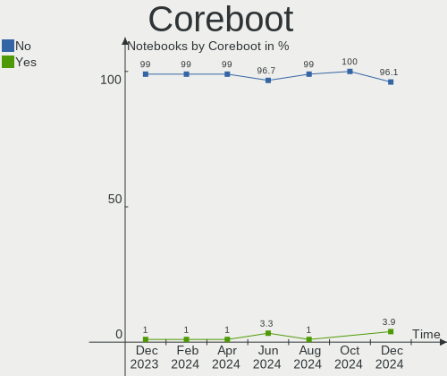
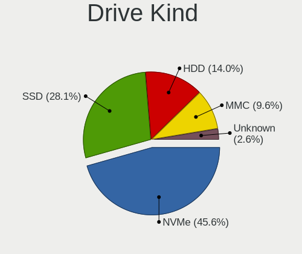
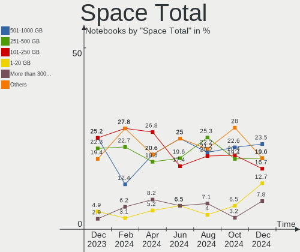
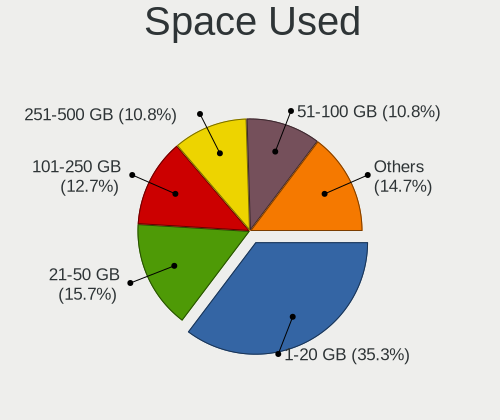
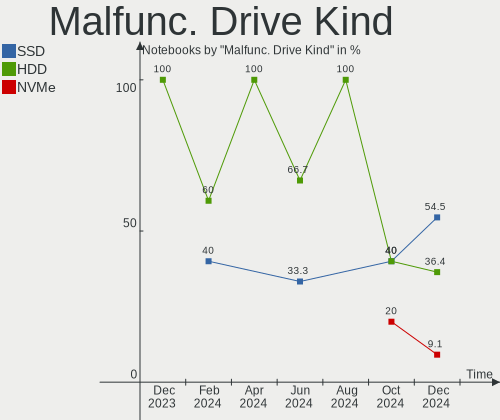
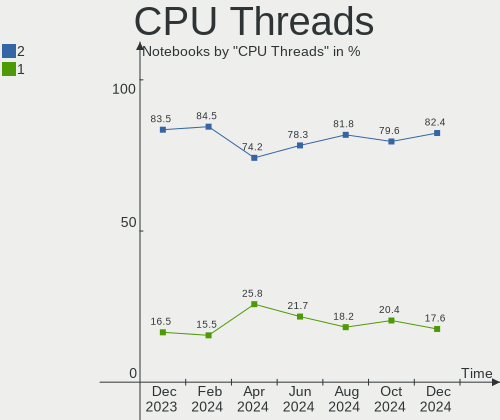

Linux in UK - Hardware Trends (Notebooks)
-----------------------------------------

A project to identify most popular hardware characteristics and track their change
over time based on data collected by Linux users at https://Linux-Hardware.org.

Anyone can contribute to this report by the [hw-probe](https://github.com/linuxhw/hw-probe) tool:

    sudo -E hw-probe -all -upload

Period: Jul, 2022.

Contents
--------

* [ System ](#system)
  - [ OS                       ](#os)
  - [ OS Family                ](#os-family)
  - [ Kernel                   ](#kernel)
  - [ Kernel Family            ](#kernel-family)
  - [ Kernel Major Ver.        ](#kernel-major-ver)
  - [ Arch                     ](#arch)
  - [ DE                       ](#de)
  - [ Display Server           ](#display-server)
  - [ Display Manager          ](#display-manager)
  - [ OS Lang                  ](#os-lang)
  - [ Boot Mode                ](#boot-mode)
  - [ Filesystem               ](#filesystem)
  - [ Part. scheme             ](#part-scheme)
  - [ Dual Boot with Linux/BSD ](#dual-boot-with-linuxbsd)
  - [ Dual Boot (Win)          ](#dual-boot-win)

* [ Board ](#board)
  - [ Vendor                   ](#vendor)
  - [ Model                    ](#model)
  - [ Model Family             ](#model-family)
  - [ MFG Year                 ](#mfg-year)
  - [ Form Factor              ](#form-factor)
  - [ Secure Boot              ](#secure-boot)
  - [ Coreboot                 ](#coreboot)
  - [ RAM Size                 ](#ram-size)
  - [ RAM Used                 ](#ram-used)
  - [ Total Drives             ](#total-drives)
  - [ Has CD-ROM               ](#has-cd-rom)
  - [ Has Ethernet             ](#has-ethernet)
  - [ Has WiFi                 ](#has-wifi)
  - [ Has Bluetooth            ](#has-bluetooth)

* [ Location ](#location)
  - [ Country                  ](#country)
  - [ City                     ](#city)

* [ Drives ](#drives)
  - [ Drive Vendor             ](#drive-vendor)
  - [ Drive Model              ](#drive-model)
  - [ HDD Vendor               ](#hdd-vendor)
  - [ SSD Vendor               ](#ssd-vendor)
  - [ Drive Kind               ](#drive-kind)
  - [ Drive Connector          ](#drive-connector)
  - [ Drive Size               ](#drive-size)
  - [ Space Total              ](#space-total)
  - [ Space Used               ](#space-used)
  - [ Malfunc. Drives          ](#malfunc-drives)
  - [ Malfunc. Drive Vendor    ](#malfunc-drive-vendor)
  - [ Malfunc. HDD Vendor      ](#malfunc-hdd-vendor)
  - [ Malfunc. Drive Kind      ](#malfunc-drive-kind)
  - [ Failed Drives            ](#failed-drives)
  - [ Failed Drive Vendor      ](#failed-drive-vendor)
  - [ Drive Status             ](#drive-status)

* [ Storage controller ](#storage-controller)
  - [ Storage Vendor           ](#storage-vendor)
  - [ Storage Model            ](#storage-model)
  - [ Storage Kind             ](#storage-kind)

* [ Processor ](#processor)
  - [ CPU Vendor               ](#cpu-vendor)
  - [ CPU Model                ](#cpu-model)
  - [ CPU Model Family         ](#cpu-model-family)
  - [ CPU Cores                ](#cpu-cores)
  - [ CPU Sockets              ](#cpu-sockets)
  - [ CPU Threads              ](#cpu-threads)
  - [ CPU Op-Modes             ](#cpu-op-modes)
  - [ CPU Microcode            ](#cpu-microcode)
  - [ CPU Microarch            ](#cpu-microarch)

* [ Graphics ](#graphics)
  - [ GPU Vendor               ](#gpu-vendor)
  - [ GPU Model                ](#gpu-model)
  - [ GPU Combo                ](#gpu-combo)
  - [ GPU Driver               ](#gpu-driver)
  - [ GPU Memory               ](#gpu-memory)

* [ Monitor ](#monitor)
  - [ Monitor Vendor           ](#monitor-vendor)
  - [ Monitor Model            ](#monitor-model)
  - [ Monitor Resolution       ](#monitor-resolution)
  - [ Monitor Diagonal         ](#monitor-diagonal)
  - [ Monitor Width            ](#monitor-width)
  - [ Aspect Ratio             ](#aspect-ratio)
  - [ Monitor Area             ](#monitor-area)
  - [ Pixel Density            ](#pixel-density)
  - [ Multiple Monitors        ](#multiple-monitors)

* [ Network ](#network)
  - [ Net Controller Vendor    ](#net-controller-vendor)
  - [ Net Controller Model     ](#net-controller-model)
  - [ Wireless Vendor          ](#wireless-vendor)
  - [ Wireless Model           ](#wireless-model)
  - [ Ethernet Vendor          ](#ethernet-vendor)
  - [ Ethernet Model           ](#ethernet-model)
  - [ Net Controller Kind      ](#net-controller-kind)
  - [ Used Controller          ](#used-controller)
  - [ NICs                     ](#nics)
  - [ IPv6                     ](#ipv6)

* [ Bluetooth ](#bluetooth)
  - [ Bluetooth Vendor         ](#bluetooth-vendor)
  - [ Bluetooth Model          ](#bluetooth-model)

* [ Sound ](#sound)
  - [ Sound Vendor             ](#sound-vendor)
  - [ Sound Model              ](#sound-model)

* [ Memory ](#memory)
  - [ Memory Vendor            ](#memory-vendor)
  - [ Memory Model             ](#memory-model)
  - [ Memory Kind              ](#memory-kind)
  - [ Memory Form Factor       ](#memory-form-factor)
  - [ Memory Size              ](#memory-size)
  - [ Memory Speed             ](#memory-speed)

* [ Printers & scanners ](#printers--scanners)
  - [ Printer Vendor           ](#printer-vendor)
  - [ Printer Model            ](#printer-model)
  - [ Scanner Vendor           ](#scanner-vendor)
  - [ Scanner Model            ](#scanner-model)

* [ Camera ](#camera)
  - [ Camera Vendor            ](#camera-vendor)
  - [ Camera Model             ](#camera-model)

* [ Security ](#security)
  - [ Fingerprint Vendor       ](#fingerprint-vendor)
  - [ Fingerprint Model        ](#fingerprint-model)
  - [ Chipcard Vendor          ](#chipcard-vendor)
  - [ Chipcard Model           ](#chipcard-model)

* [ Unsupported ](#unsupported)
  - [ Unsupported Devices      ](#unsupported-devices)
  - [ Unsupported Device Types ](#unsupported-device-types)

System
------

OS
--

Installed operating systems

| Name              | Notebooks | Percent |
|-------------------|-----------|---------|
| OpenMandriva 4.3  | 13        | 16.67%  |
| Ubuntu 22.04      | 12        | 15.38%  |
| Ubuntu 20.04      | 6         | 7.69%   |
| Zorin 16          | 5         | 6.41%   |
| Pop!_OS 22.04     | 4         | 5.13%   |
| Linux Mint 20.3   | 4         | 5.13%   |
| Debian 11         | 3         | 3.85%   |
| SteamOS 3.2       | 2         | 2.56%   |
| Peppermint 10     | 2         | 2.56%   |
| Lubuntu 20.04     | 2         | 2.56%   |
| Kubuntu 22.04     | 2         | 2.56%   |
| Elementary 6.1    | 2         | 2.56%   |
| Zorin 15          | 1         | 1.28%   |
| Xubuntu 22.04     | 1         | 1.28%   |
| Ubuntu 21.10      | 1         | 1.28%   |
| Ubuntu 18.04      | 1         | 1.28%   |
| Ubuntu 16.04      | 1         | 1.28%   |
| Solus 4.3         | 1         | 1.28%   |
| Pop!_OS 21.10     | 1         | 1.28%   |
| Peppermint 11.3   | 1         | 1.28%   |
| Parrot 5.0        | 1         | 1.28%   |
| OpenMandriva 4.90 | 1         | 1.28%   |
| Manjaro 21.3.1    | 1         | 1.28%   |
| Manjaro           | 1         | 1.28%   |
| LMDE 5            | 1         | 1.28%   |
| Linux Mint 20.1   | 1         | 1.28%   |
| Linux Mint 19.3   | 1         | 1.28%   |
| KDE neon 20.04    | 1         | 1.28%   |
| Gentoo 2.8        | 1         | 1.28%   |
| Fedora 36         | 1         | 1.28%   |
| ArcoLinux Rolling | 1         | 1.28%   |
| Arch Rolling      | 1         | 1.28%   |
| Arch              | 1         | 1.28%   |

OS Family
---------

OS without a version

| Name         | Notebooks | Percent |
|--------------|-----------|---------|
| Ubuntu       | 21        | 26.92%  |
| OpenMandriva | 14        | 17.95%  |
| Zorin        | 6         | 7.69%   |
| Linux Mint   | 6         | 7.69%   |
| Pop!_OS      | 5         | 6.41%   |
| Peppermint   | 3         | 3.85%   |
| Debian       | 3         | 3.85%   |
| SteamOS      | 2         | 2.56%   |
| Manjaro      | 2         | 2.56%   |
| Lubuntu      | 2         | 2.56%   |
| Kubuntu      | 2         | 2.56%   |
| Elementary   | 2         | 2.56%   |
| Arch         | 2         | 2.56%   |
| Xubuntu      | 1         | 1.28%   |
| Solus        | 1         | 1.28%   |
| Parrot       | 1         | 1.28%   |
| LMDE         | 1         | 1.28%   |
| KDE neon     | 1         | 1.28%   |
| Gentoo       | 1         | 1.28%   |
| Fedora       | 1         | 1.28%   |
| ArcoLinux    | 1         | 1.28%   |

Kernel
------

Version of the Linux kernel

| Version                                      | Notebooks | Percent |
|----------------------------------------------|-----------|---------|
| 5.15.0-41-generic                            | 16        | 20.51%  |
| 5.16.7-desktop-1omv4003                      | 13        | 16.67%  |
| 5.13.0-52-generic                            | 6         | 7.69%   |
| 5.4.0-122-generic                            | 4         | 5.13%   |
| 5.15.0-40-generic                            | 4         | 5.13%   |
| 5.10.0-16-amd64                              | 4         | 5.13%   |
| 5.4.0-121-generic                            | 3         | 3.85%   |
| 5.18.10-76051810-generic                     | 2         | 2.56%   |
| 5.17.15-76051715-generic                     | 2         | 2.56%   |
| 5.15.0-43-generic                            | 2         | 2.56%   |
| 5.13.0-valve15-1-neptune-02197-gf6ec7ad3762a | 2         | 2.56%   |
| 5.4.0-91-generic                             | 1         | 1.28%   |
| 5.19.0-1-MANJARO                             | 1         | 1.28%   |
| 5.18.14-arch1-1                              | 1         | 1.28%   |
| 5.18.13-arch1-1                              | 1         | 1.28%   |
| 5.18.12-desktop-3omv4090                     | 1         | 1.28%   |
| 5.18.11-200.fc36.x86_64                      | 1         | 1.28%   |
| 5.18.10-arch1-1                              | 1         | 1.28%   |
| 5.18.10-051810-generic                       | 1         | 1.28%   |
| 5.16.11-76051611-generic                     | 1         | 1.28%   |
| 5.16.0-12parrot1-amd64                       | 1         | 1.28%   |
| 5.15.50-216.current                          | 1         | 1.28%   |
| 5.15.49-1-MANJARO                            | 1         | 1.28%   |
| 5.15.41-gentoo                               | 1         | 1.28%   |
| 5.15.0-41-lowlatency                         | 1         | 1.28%   |
| 5.13.0-51-generic                            | 1         | 1.28%   |
| 5.13.0-40-generic                            | 1         | 1.28%   |
| 5.13.0-30-generic                            | 1         | 1.28%   |
| 5.10.0-14-amd64                              | 1         | 1.28%   |
| 4.4.0-210-generic                            | 1         | 1.28%   |
| 4.15.0-189-generic                           | 1         | 1.28%   |

Kernel Family
-------------

Linux kernel without a distro release

| Version | Notebooks | Percent |
|---------|-----------|---------|
| 5.15.0  | 23        | 29.49%  |
| 5.16.7  | 13        | 16.67%  |
| 5.13.0  | 11        | 14.1%   |
| 5.4.0   | 8         | 10.26%  |
| 5.10.0  | 5         | 6.41%   |
| 5.18.10 | 4         | 5.13%   |
| 5.17.15 | 2         | 2.56%   |
| 5.19.0  | 1         | 1.28%   |
| 5.18.14 | 1         | 1.28%   |
| 5.18.13 | 1         | 1.28%   |
| 5.18.12 | 1         | 1.28%   |
| 5.18.11 | 1         | 1.28%   |
| 5.16.11 | 1         | 1.28%   |
| 5.16.0  | 1         | 1.28%   |
| 5.15.50 | 1         | 1.28%   |
| 5.15.49 | 1         | 1.28%   |
| 5.15.41 | 1         | 1.28%   |
| 4.4.0   | 1         | 1.28%   |
| 4.15.0  | 1         | 1.28%   |

Kernel Major Ver.
-----------------

Linux kernel major version

| Version | Notebooks | Percent |
|---------|-----------|---------|
| 5.15    | 26        | 33.33%  |
| 5.16    | 15        | 19.23%  |
| 5.13    | 11        | 14.1%   |
| 5.4     | 8         | 10.26%  |
| 5.18    | 8         | 10.26%  |
| 5.10    | 5         | 6.41%   |
| 5.17    | 2         | 2.56%   |
| 5.19    | 1         | 1.28%   |
| 4.4     | 1         | 1.28%   |
| 4.15    | 1         | 1.28%   |

Arch
----

OS architecture (x86_64, i586, etc.)

| Name   | Notebooks | Percent |
|--------|-----------|---------|
| x86_64 | 75        | 96.15%  |
| i686   | 3         | 3.85%   |

DE
--

Desktop Environment

| Name       | Notebooks | Percent |
|------------|-----------|---------|
| GNOME      | 33        | 42.31%  |
| KDE5       | 23        | 29.49%  |
| XFCE       | 8         | 10.26%  |
| X-Cinnamon | 3         | 3.85%   |
| Pantheon   | 2         | 2.56%   |
| MATE       | 2         | 2.56%   |
| LXQt       | 2         | 2.56%   |
| LXDE       | 2         | 2.56%   |
| Unity      | 1         | 1.28%   |
| Cinnamon   | 1         | 1.28%   |
| Budgie     | 1         | 1.28%   |

Display Server
--------------

X11 or Wayland

| Name    | Notebooks | Percent |
|---------|-----------|---------|
| X11     | 63        | 80.77%  |
| Wayland | 12        | 15.38%  |
| Tty     | 2         | 2.56%   |
| Unknown | 1         | 1.28%   |

Display Manager
---------------

SDDM, LightDM, etc.

| Name    | Notebooks | Percent |
|---------|-----------|---------|
| Unknown | 24        | 30.77%  |
| SDDM    | 22        | 28.21%  |
| GDM3    | 16        | 20.51%  |
| LightDM | 9         | 11.54%  |
| GDM     | 7         | 8.97%   |

OS Lang
-------

Language

| Lang  | Notebooks | Percent |
|-------|-----------|---------|
| en_GB | 64        | 82.05%  |
| en_US | 12        | 15.38%  |
| pl_PL | 2         | 2.56%   |

Boot Mode
---------

EFI or BIOS

| Mode | Notebooks | Percent |
|------|-----------|---------|
| BIOS | 43        | 55.13%  |
| EFI  | 35        | 44.87%  |

Filesystem
----------

Type of filesystem

| Type    | Notebooks | Percent |
|---------|-----------|---------|
| Ext4    | 60        | 76.92%  |
| Overlay | 10        | 12.82%  |
| Btrfs   | 6         | 7.69%   |
| Zfs     | 2         | 2.56%   |

Part. scheme
------------

Scheme of partitioning

| Type    | Notebooks | Percent |
|---------|-----------|---------|
| Unknown | 42        | 53.85%  |
| GPT     | 26        | 33.33%  |
| MBR     | 10        | 12.82%  |

Dual Boot with Linux/BSD
------------------------

Hosting more than one Linux/BSD

| Dual boot | Notebooks | Percent |
|-----------|-----------|---------|
| No        | 67        | 85.9%   |
| Yes       | 11        | 14.1%   |

Dual Boot (Win)
---------------

Hosting Linux and Windows

| Dual boot | Notebooks | Percent |
|-----------|-----------|---------|
| No        | 57        | 73.08%  |
| Yes       | 21        | 26.92%  |

Board
-----

Vendor
------

Motherboard manufacturer

| Name                | Notebooks | Percent |
|---------------------|-----------|---------|
| Dell                | 17        | 21.79%  |
| Hewlett-Packard     | 12        | 15.38%  |
| Lenovo              | 8         | 10.26%  |
| Acer                | 8         | 10.26%  |
| ASUSTek Computer    | 7         | 8.97%   |
| Apple               | 3         | 3.85%   |
| Valve               | 2         | 2.56%   |
| Sony                | 2         | 2.56%   |
| MSI                 | 2         | 2.56%   |
| AZW                 | 2         | 2.56%   |
| Toshiba             | 1         | 1.28%   |
| Samsung Electronics | 1         | 1.28%   |
| Razer               | 1         | 1.28%   |
| PC Specialist       | 1         | 1.28%   |
| Panasonic           | 1         | 1.28%   |
| Packard Bell        | 1         | 1.28%   |
| Medion              | 1         | 1.28%   |
| Linx                | 1         | 1.28%   |
| LG Electronics      | 1         | 1.28%   |
| HUAWEI              | 1         | 1.28%   |
| Google              | 1         | 1.28%   |
| Gigabyte Technology | 1         | 1.28%   |
| Fusion5             | 1         | 1.28%   |
| Fujitsu             | 1         | 1.28%   |
| AWOW                | 1         | 1.28%   |

Model
-----

Motherboard model

| Name                                                  | Notebooks | Percent |
|-------------------------------------------------------|-----------|---------|
| Valve Jupiter                                         | 2         | 2.56%   |
| Dell XPS 15 9520                                      | 2         | 2.56%   |
| Apple MacBookAir7,2                                   | 2         | 2.56%   |
| Toshiba EQUIUM A110                                   | 1         | 1.28%   |
| Sony VPCSB1C5E                                        | 1         | 1.28%   |
| Sony VGN-FS415B                                       | 1         | 1.28%   |
| Samsung Q210/P210                                     | 1         | 1.28%   |
| Razer Blade 15 Advanced Model (Early 2021) - RZ09-036 | 1         | 1.28%   |
| PC Specialist NS50MU                                  | 1         | 1.28%   |
| Panasonic CF-53JAWZYDE                                | 1         | 1.28%   |
| Packard Bell EasyNote TE69KB                          | 1         | 1.28%   |
| MSI Raider GE66 12UH                                  | 1         | 1.28%   |
| MSI GF63 Thin 9RCX                                    | 1         | 1.28%   |
| Medion Erazer P6661 MD60303                           | 1         | 1.28%   |
| Linx LINX1010B                                        | 1         | 1.28%   |
| LG 17Z90N-V.AA55A1                                    | 1         | 1.28%   |
| Lenovo ThinkPad X280 20KES2SN00                       | 1         | 1.28%   |
| Lenovo ThinkPad X240 20AMS1JQ11                       | 1         | 1.28%   |
| Lenovo ThinkPad X1 Nano Gen 1 20UN002VUK              | 1         | 1.28%   |
| Lenovo ThinkPad W550s 20E2000PUK                      | 1         | 1.28%   |
| Lenovo ThinkPad T480 20L6A0XKUK                       | 1         | 1.28%   |
| Lenovo ThinkPad T460 20FMS02R0G                       | 1         | 1.28%   |
| Lenovo S21e-20 80M4                                   | 1         | 1.28%   |
| Lenovo IdeaPad 510-15ISK 80SR                         | 1         | 1.28%   |
| HUAWEI BOM-WXX9                                       | 1         | 1.28%   |
| HP ProBook 4545s                                      | 1         | 1.28%   |
| HP ProBook 4515s                                      | 1         | 1.28%   |
| HP Presario CQ56                                      | 1         | 1.28%   |
| HP Pavilion Laptop 15-eh0xxx                          | 1         | 1.28%   |
| HP Pavilion Laptop 15-eg0xxx                          | 1         | 1.28%   |
| HP Pavilion Laptop 15-cd0xx                           | 1         | 1.28%   |
| HP Pavilion Gaming Laptop 15-ec0xxx                   | 1         | 1.28%   |
| HP Pavilion g6                                        | 1         | 1.28%   |
| HP G62                                                | 1         | 1.28%   |
| HP G61                                                | 1         | 1.28%   |
| HP G56                                                | 1         | 1.28%   |
| HP EliteBook 840 G7 Notebook PC                       | 1         | 1.28%   |
| Google Lindar                                         | 1         | 1.28%   |
| Gigabyte AORUS 17 XE4                                 | 1         | 1.28%   |
| Fusion5 S14+                                          | 1         | 1.28%   |
| Fujitsu LIFEBOOK AH531                                | 1         | 1.28%   |
| Dell XPS 13 9370                                      | 1         | 1.28%   |
| Dell XPS 13 7390                                      | 1         | 1.28%   |
| Dell Vostro 5568                                      | 1         | 1.28%   |
| Dell Vostro 3559                                      | 1         | 1.28%   |
| Dell Precision M6800                                  | 1         | 1.28%   |
| Dell Latitude E6440                                   | 1         | 1.28%   |
| Dell Latitude E6400                                   | 1         | 1.28%   |
| Dell Latitude E5570                                   | 1         | 1.28%   |
| Dell Latitude D430                                    | 1         | 1.28%   |
| Dell Latitude 5285                                    | 1         | 1.28%   |
| Dell Inspiron 7570                                    | 1         | 1.28%   |
| Dell Inspiron 7520                                    | 1         | 1.28%   |
| Dell Inspiron 16 7610                                 | 1         | 1.28%   |
| Dell Inspiron 1545                                    | 1         | 1.28%   |
| Dell Inspiron 1525                                    | 1         | 1.28%   |
| AZW SEi                                               | 1         | 1.28%   |
| AZW GT-R                                              | 1         | 1.28%   |
| AWOW AL34                                             | 1         | 1.28%   |
| ASUS VivoBook_ASUSLaptop X7600PC_N7600PC              | 1         | 1.28%   |

Model Family
------------

Motherboard model prefix

| Name                   | Notebooks | Percent |
|------------------------|-----------|---------|
| Lenovo ThinkPad        | 6         | 7.69%   |
| ASUS VivoBook          | 6         | 7.69%   |
| HP Pavilion            | 5         | 6.41%   |
| Dell Latitude          | 5         | 6.41%   |
| Dell Inspiron          | 5         | 6.41%   |
| Acer Aspire            | 5         | 6.41%   |
| Dell XPS               | 4         | 5.13%   |
| Valve Jupiter          | 2         | 2.56%   |
| HP ProBook             | 2         | 2.56%   |
| Dell Vostro            | 2         | 2.56%   |
| Apple MacBookAir7      | 2         | 2.56%   |
| Toshiba EQUIUM         | 1         | 1.28%   |
| Sony VPCSB1C5E         | 1         | 1.28%   |
| Sony VGN-FS415B        | 1         | 1.28%   |
| Samsung Q210           | 1         | 1.28%   |
| Razer Blade            | 1         | 1.28%   |
| PC Specialist NS50MU   | 1         | 1.28%   |
| Panasonic CF-53JAWZYDE | 1         | 1.28%   |
| Packard Bell EasyNote  | 1         | 1.28%   |
| MSI Raider             | 1         | 1.28%   |
| MSI GF63               | 1         | 1.28%   |
| Medion Erazer          | 1         | 1.28%   |
| Linx LINX1010B         | 1         | 1.28%   |
| LG 17Z90N-V.AA55A1     | 1         | 1.28%   |
| Lenovo S21e-20         | 1         | 1.28%   |
| Lenovo IdeaPad         | 1         | 1.28%   |
| HUAWEI BOM-WXX9        | 1         | 1.28%   |
| HP Presario            | 1         | 1.28%   |
| HP G62                 | 1         | 1.28%   |
| HP G61                 | 1         | 1.28%   |
| HP G56                 | 1         | 1.28%   |
| HP EliteBook           | 1         | 1.28%   |
| Google Lindar          | 1         | 1.28%   |
| Gigabyte AORUS         | 1         | 1.28%   |
| Fusion5 S14+           | 1         | 1.28%   |
| Fujitsu LIFEBOOK       | 1         | 1.28%   |
| Dell Precision         | 1         | 1.28%   |
| AZW SEi                | 1         | 1.28%   |
| AZW GT-R               | 1         | 1.28%   |
| AWOW AL34              | 1         | 1.28%   |
| ASUS ASUS              | 1         | 1.28%   |
| Apple MacBookAir6      | 1         | 1.28%   |
| Acer Predator          | 1         | 1.28%   |
| Acer Nitro             | 1         | 1.28%   |
| Acer Extensa           | 1         | 1.28%   |

MFG Year
--------

Motherboard manufacture year

| Year | Notebooks | Percent |
|------|-----------|---------|
| 2021 | 11        | 14.1%   |
| 2020 | 9         | 11.54%  |
| 2018 | 8         | 10.26%  |
| 2015 | 7         | 8.97%   |
| 2022 | 6         | 7.69%   |
| 2016 | 6         | 7.69%   |
| 2013 | 5         | 6.41%   |
| 2019 | 4         | 5.13%   |
| 2012 | 4         | 5.13%   |
| 2008 | 4         | 5.13%   |
| 2010 | 3         | 3.85%   |
| 2007 | 3         | 3.85%   |
| 2017 | 2         | 2.56%   |
| 2011 | 2         | 2.56%   |
| 2009 | 2         | 2.56%   |
| 2006 | 2         | 2.56%   |

Form Factor
-----------

Physical design of the computer

| Name     | Notebooks | Percent |
|----------|-----------|---------|
| Notebook | 78        | 100%    |

Secure Boot
-----------

Enabled or disabled

| State    | Notebooks | Percent |
|----------|-----------|---------|
| Disabled | 72        | 92.31%  |
| Enabled  | 6         | 7.69%   |

Coreboot
--------

Have coreboot on board

| Used | Notebooks | Percent |
|------|-----------|---------|
| No   | 77        | 98.72%  |
| Yes  | 1         | 1.28%   |

RAM Size
--------

Total RAM memory

| Size in GB  | Notebooks | Percent |
|-------------|-----------|---------|
| 4.01-8.0    | 19        | 24.36%  |
| 3.01-4.0    | 16        | 20.51%  |
| 16.01-24.0  | 13        | 16.67%  |
| 8.01-16.0   | 10        | 12.82%  |
| 32.01-64.0  | 6         | 7.69%   |
| 1.01-2.0    | 6         | 7.69%   |
| 2.01-3.0    | 3         | 3.85%   |
| 24.01-32.0  | 2         | 2.56%   |
| 64.01-256.0 | 2         | 2.56%   |
| 0.51-1.0    | 1         | 1.28%   |

RAM Used
--------

Used RAM memory

| Used GB    | Notebooks | Percent |
|------------|-----------|---------|
| 1.01-2.0   | 33        | 42.31%  |
| 2.01-3.0   | 15        | 19.23%  |
| 0.51-1.0   | 10        | 12.82%  |
| 3.01-4.0   | 9         | 11.54%  |
| 4.01-8.0   | 8         | 10.26%  |
| 8.01-16.0  | 2         | 2.56%   |
| 24.01-32.0 | 1         | 1.28%   |

Total Drives
------------

Number of drives on board

| Drives | Notebooks | Percent |
|--------|-----------|---------|
| 1      | 58        | 74.36%  |
| 2      | 16        | 20.51%  |
| 3      | 2         | 2.56%   |
| 4      | 1         | 1.28%   |
| 0      | 1         | 1.28%   |

Has CD-ROM
----------

Has CD-ROM on board

| Presented | Notebooks | Percent |
|-----------|-----------|---------|
| No        | 53        | 67.95%  |
| Yes       | 25        | 32.05%  |

Has Ethernet
------------

Has Ethernet on board

| Presented | Notebooks | Percent |
|-----------|-----------|---------|
| Yes       | 56        | 71.79%  |
| No        | 22        | 28.21%  |

Has WiFi
--------

Has WiFi module

| Presented | Notebooks | Percent |
|-----------|-----------|---------|
| Yes       | 76        | 97.44%  |
| No        | 2         | 2.56%   |

Has Bluetooth
-------------

Has Bluetooth module

| Presented | Notebooks | Percent |
|-----------|-----------|---------|
| Yes       | 65        | 83.33%  |
| No        | 13        | 16.67%  |

Location
--------

Country
-------

Geographic location (country)

| Country | Notebooks | Percent |
|---------|-----------|---------|
| UK      | 78        | 100%    |

City
----

Geographic location (city)

| City                 | Notebooks | Percent |
|----------------------|-----------|---------|
| London               | 7         | 8.97%   |
| Nottingham           | 4         | 5.13%   |
| Stockton-on-Tees     | 2         | 2.56%   |
| Liverpool            | 2         | 2.56%   |
| Lancaster            | 2         | 2.56%   |
| Kensington           | 2         | 2.56%   |
| Glasgow              | 2         | 2.56%   |
| Cossington           | 2         | 2.56%   |
| Conwy                | 2         | 2.56%   |
| Aylesbury            | 2         | 2.56%   |
| Yeovil               | 1         | 1.28%   |
| Worthing             | 1         | 1.28%   |
| Willesden            | 1         | 1.28%   |
| Whaley Bridge        | 1         | 1.28%   |
| Watford              | 1         | 1.28%   |
| Uddingston           | 1         | 1.28%   |
| Twickenham           | 1         | 1.28%   |
| Trowbridge           | 1         | 1.28%   |
| Taunton              | 1         | 1.28%   |
| Sunderland           | 1         | 1.28%   |
| Stratford            | 1         | 1.28%   |
| Salisbury            | 1         | 1.28%   |
| Rotherham            | 1         | 1.28%   |
| Rhigos               | 1         | 1.28%   |
| Reading              | 1         | 1.28%   |
| Peterborough         | 1         | 1.28%   |
| Peckham              | 1         | 1.28%   |
| Paddington           | 1         | 1.28%   |
| Norwich              | 1         | 1.28%   |
| Maidstone            | 1         | 1.28%   |
| Maidenhead           | 1         | 1.28%   |
| Leeds                | 1         | 1.28%   |
| Kingston upon Thames | 1         | 1.28%   |
| Islington            | 1         | 1.28%   |
| Huntingdon           | 1         | 1.28%   |
| Holyhead             | 1         | 1.28%   |
| Hereford             | 1         | 1.28%   |
| Heathfield           | 1         | 1.28%   |
| Hampstead            | 1         | 1.28%   |
| Great Dalby          | 1         | 1.28%   |
| Gillingham           | 1         | 1.28%   |
| Fulham               | 1         | 1.28%   |
| Flitwick             | 1         | 1.28%   |
| Edinburgh            | 1         | 1.28%   |
| Edgware              | 1         | 1.28%   |
| Dundee               | 1         | 1.28%   |
| Dartford             | 1         | 1.28%   |
| Dagenham             | 1         | 1.28%   |
| Croydon              | 1         | 1.28%   |
| Coventry             | 1         | 1.28%   |
| Cleckheaton          | 1         | 1.28%   |
| Chelmsford           | 1         | 1.28%   |
| Cannock              | 1         | 1.28%   |
| Camberwell           | 1         | 1.28%   |
| Brighton             | 1         | 1.28%   |
| Blackburn            | 1         | 1.28%   |
| Birkenhead           | 1         | 1.28%   |
| Bethnal Green        | 1         | 1.28%   |
| Battle               | 1         | 1.28%   |
| Ballymena            | 1         | 1.28%   |

Drives
------

Drive Vendor
------------

Hard drive vendors

| Vendor                       | Notebooks | Drives | Percent |
|------------------------------|-----------|--------|---------|
| Samsung Electronics          | 10        | 10     | 10.42%  |
| Unknown                      | 9         | 9      | 9.38%   |
| WDC                          | 8         | 9      | 8.33%   |
| Toshiba                      | 8         | 8      | 8.33%   |
| Hitachi                      | 8         | 8      | 8.33%   |
| Kingston                     | 6         | 7      | 6.25%   |
| SK hynix                     | 5         | 5      | 5.21%   |
| Phison                       | 5         | 5      | 5.21%   |
| Crucial                      | 4         | 4      | 4.17%   |
| Seagate                      | 3         | 3      | 3.13%   |
| SanDisk                      | 3         | 3      | 3.13%   |
| KIOXIA                       | 3         | 3      | 3.13%   |
| Apple                        | 3         | 3      | 3.13%   |
| Unknown                      | 3         | 3      | 3.13%   |
| Silicon Motion               | 2         | 2      | 2.08%   |
| SABRENT                      | 2         | 2      | 2.08%   |
| Micron Technology            | 2         | 2      | 2.08%   |
| Intel                        | 2         | 2      | 2.08%   |
| China                        | 2         | 2      | 2.08%   |
| Team                         | 1         | 1      | 1.04%   |
| Shenzhen Longsys Electronics | 1         | 1      | 1.04%   |
| Patriot                      | 1         | 1      | 1.04%   |
| ORTIAL                       | 1         | 1      | 1.04%   |
| MicroDream                   | 1         | 1      | 1.04%   |
| Gigabyte Technology          | 1         | 1      | 1.04%   |
| AirDisk                      | 1         | 1      | 1.04%   |
| A-DATA Technology            | 1         | 1      | 1.04%   |

Drive Model
-----------

Hard drive models

| Model                                 | Notebooks | Percent |
|---------------------------------------|-----------|---------|
| SK hynix HFM001TD3JX013N 1TB          | 3         | 3.06%   |
| Unknown                               | 3         | 3.06%   |
| WDC WD10SPZX-21Z10T0 1TB              | 2         | 2.04%   |
| Unknown MMC Card  128GB               | 2         | 2.04%   |
| Samsung NVMe SSD Drive 512GB          | 2         | 2.04%   |
| SABRENT Disk 1TB                      | 2         | 2.04%   |
| Phison NVMe SSD Drive 256GB           | 2         | 2.04%   |
| KIOXIA NVMe SSD Drive 512GB           | 2         | 2.04%   |
| Kingston SA400S37240G 240GB SSD       | 2         | 2.04%   |
| Hitachi HTS541680J9SA00 80GB          | 2         | 2.04%   |
| WDC WDS240G2G0A-00JH30 240GB SSD      | 1         | 1.02%   |
| WDC WDS100T2B0B-00YS70 1TB SSD        | 1         | 1.02%   |
| WDC WD5000LUCT-63C26Y0 500GB          | 1         | 1.02%   |
| WDC WD2500BEVT-60A23T0 250GB          | 1         | 1.02%   |
| WDC WD10SPZX-80Z10T0 1TB              | 1         | 1.02%   |
| WDC PC SN810 NVMe 512GB               | 1         | 1.02%   |
| WDC PC SN530 SDBPNPZ-512G-1114 512GB  | 1         | 1.02%   |
| Unknown TA2964  64GB                  | 1         | 1.02%   |
| Unknown SDW32G  32GB                  | 1         | 1.02%   |
| Unknown MMC Card  512GB               | 1         | 1.02%   |
| Unknown MMC Card  32GB                | 1         | 1.02%   |
| Unknown MMC Card  16GB                | 1         | 1.02%   |
| Unknown 032G72  32GB                  | 1         | 1.02%   |
| Unknown 00000  64GB                   | 1         | 1.02%   |
| Toshiba NVMe SSD Drive 256GB          | 1         | 1.02%   |
| Toshiba MQ02ABF050H 500GB             | 1         | 1.02%   |
| Toshiba MQ01ABD100M 1TB               | 1         | 1.02%   |
| Toshiba MK8009GAH 80GB                | 1         | 1.02%   |
| Toshiba MK3256GSY 320GB               | 1         | 1.02%   |
| Toshiba MK1661GSYFN 160GB             | 1         | 1.02%   |
| Toshiba KXG50ZNV512G NVMe 512GB       | 1         | 1.02%   |
| Toshiba HDWL120 2TB                   | 1         | 1.02%   |
| Team TM8PS7256G 256GB SSD             | 1         | 1.02%   |
| SK hynix NVMe SSD Drive 256GB         | 1         | 1.02%   |
| SK hynix HFS128G39TND-N210A 128GB SSD | 1         | 1.02%   |
| Silicon Motion NVME 512GB SSD         | 1         | 1.02%   |
| Silicon Motion 512GB                  | 1         | 1.02%   |
| Shenzhen Longsys NVMe SSD Drive 128GB | 1         | 1.02%   |
| Seagate ST1000LX015-1U7172 1TB        | 1         | 1.02%   |
| Seagate ST1000LM035-1RK172 1TB        | 1         | 1.02%   |
| Seagate Expansion 1TB                 | 1         | 1.02%   |
| SanDisk SSD PLUS 480GB                | 1         | 1.02%   |
| SanDisk SDSSDH3 1T00 1TB              | 1         | 1.02%   |
| SanDisk NVMe SSD Drive 1TB            | 1         | 1.02%   |
| Samsung SSD PM871a M.2 2280 256GB     | 1         | 1.02%   |
| Samsung SSD 980 PRO 1TB               | 1         | 1.02%   |
| Samsung NVMe SSD Drive 500GB          | 1         | 1.02%   |
| Samsung NVMe SSD Drive 256GB          | 1         | 1.02%   |
| Samsung MZVLQ256HBJD-00BH1 256GB      | 1         | 1.02%   |
| Samsung MZVLB512HBJQ-00A00 512GB      | 1         | 1.02%   |
| Samsung MZVL21T0HCLR-00B00 1TB        | 1         | 1.02%   |
| Samsung HM121HI 120GB                 | 1         | 1.02%   |
| Phison S10C-128G-PHISON-SSD 128GB     | 1         | 1.02%   |
| Phison NVMe SSD Drive 512GB           | 1         | 1.02%   |
| Phison 311CD0512GB                    | 1         | 1.02%   |
| Patriot Burst 240GB SSD               | 1         | 1.02%   |
| ORTIAL SSD 1TB                        | 1         | 1.02%   |
| Micron NVMe SSD Drive 256GB           | 1         | 1.02%   |
| Micron 2200V_MTFDHBA256TCK 256GB      | 1         | 1.02%   |
| MicroDream 512G SSD                   | 1         | 1.02%   |

HDD Vendor
----------

Hard disk drive vendors

| Vendor              | Notebooks | Drives | Percent |
|---------------------|-----------|--------|---------|
| Hitachi             | 8         | 8      | 32%     |
| Toshiba             | 6         | 6      | 24%     |
| WDC                 | 5         | 5      | 20%     |
| Seagate             | 3         | 3      | 12%     |
| SABRENT             | 2         | 2      | 8%      |
| Samsung Electronics | 1         | 1      | 4%      |

SSD Vendor
----------

Solid state drive vendors

| Vendor              | Notebooks | Drives | Percent |
|---------------------|-----------|--------|---------|
| Kingston            | 6         | 6      | 21.43%  |
| Crucial             | 4         | 4      | 14.29%  |
| Apple               | 3         | 3      | 10.71%  |
| WDC                 | 2         | 2      | 7.14%   |
| SanDisk             | 2         | 2      | 7.14%   |
| China               | 2         | 2      | 7.14%   |
| Team                | 1         | 1      | 3.57%   |
| SK hynix            | 1         | 1      | 3.57%   |
| Samsung Electronics | 1         | 1      | 3.57%   |
| Phison              | 1         | 1      | 3.57%   |
| Patriot             | 1         | 1      | 3.57%   |
| ORTIAL              | 1         | 1      | 3.57%   |
| MicroDream          | 1         | 1      | 3.57%   |
| AirDisk             | 1         | 1      | 3.57%   |
| A-DATA Technology   | 1         | 1      | 3.57%   |

Drive Kind
----------

HDD or SSD

| Kind | Notebooks | Drives | Percent |
|------|-----------|--------|---------|
| NVMe | 31        | 33     | 33.7%   |
| SSD  | 25        | 28     | 27.17%  |
| HDD  | 24        | 25     | 26.09%  |
| MMC  | 12        | 12     | 13.04%  |

Drive Connector
---------------

SATA, SAS, NVMe, etc.

| Type | Notebooks | Drives | Percent |
|------|-----------|--------|---------|
| SATA | 44        | 50     | 48.89%  |
| NVMe | 31        | 33     | 34.44%  |
| MMC  | 12        | 12     | 13.33%  |
| SAS  | 3         | 3      | 3.33%   |

Drive Size
----------

Size of hard drive

| Size in TB | Notebooks | Drives | Percent |
|------------|-----------|--------|---------|
| 0.01-0.5   | 36        | 37     | 70.59%  |
| 0.51-1.0   | 12        | 13     | 23.53%  |
| 1.01-2.0   | 3         | 3      | 5.88%   |

Space Total
-----------

Amount of disk space available on the file system

| Size in GB | Notebooks | Percent |
|------------|-----------|---------|
| 101-250    | 30        | 38.46%  |
| 251-500    | 13        | 16.67%  |
| 1-20       | 12        | 15.38%  |
| 501-1000   | 9         | 11.54%  |
| 21-50      | 5         | 6.41%   |
| 1001-2000  | 5         | 6.41%   |
| 51-100     | 3         | 3.85%   |
| 2001-3000  | 1         | 1.28%   |

Space Used
----------

Amount of used disk space

| Used GB  | Notebooks | Percent |
|----------|-----------|---------|
| 1-20     | 42        | 53.85%  |
| 21-50    | 11        | 14.1%   |
| 101-250  | 11        | 14.1%   |
| 51-100   | 7         | 8.97%   |
| 251-500  | 6         | 7.69%   |
| 501-1000 | 1         | 1.28%   |

Malfunc. Drives
---------------

Drive models with a malfunction

| Model                          | Notebooks | Drives | Percent |
|--------------------------------|-----------|--------|---------|
| WDC WD2500BEVT-60A23T0 250GB   | 1         | 1      | 12.5%   |
| Toshiba MK3256GSY 320GB        | 1         | 1      | 12.5%   |
| Seagate ST1000LX015-1U7172 1TB | 1         | 1      | 12.5%   |
| Hitachi HTS725032A9A364 320GB  | 1         | 1      | 12.5%   |
| Hitachi HTS545032B9A300 320GB  | 1         | 1      | 12.5%   |
| Hitachi HTS545016B9SA00 160GB  | 1         | 1      | 12.5%   |
| Hitachi HTS543232L9A300 320GB  | 1         | 1      | 12.5%   |
| Hitachi HTS541680J9SA00 80GB   | 1         | 1      | 12.5%   |

Malfunc. Drive Vendor
---------------------

Vendors of faulty drives

| Vendor  | Notebooks | Drives | Percent |
|---------|-----------|--------|---------|
| Hitachi | 5         | 5      | 62.5%   |
| WDC     | 1         | 1      | 12.5%   |
| Toshiba | 1         | 1      | 12.5%   |
| Seagate | 1         | 1      | 12.5%   |

Malfunc. HDD Vendor
-------------------

Vendors of faulty HDD drives

| Vendor  | Notebooks | Drives | Percent |
|---------|-----------|--------|---------|
| Hitachi | 5         | 5      | 62.5%   |
| WDC     | 1         | 1      | 12.5%   |
| Toshiba | 1         | 1      | 12.5%   |
| Seagate | 1         | 1      | 12.5%   |

Malfunc. Drive Kind
-------------------

Kinds of faulty drives

| Kind | Notebooks | Drives | Percent |
|------|-----------|--------|---------|
| HDD  | 8         | 8      | 100%    |

Failed Drives
-------------

Failed drive models

Zero info for selected period =(

Failed Drive Vendor
-------------------

Failed drive vendors

Zero info for selected period =(

Drive Status
------------

Number of failed and malfunc. drives

| Status   | Notebooks | Drives | Percent |
|----------|-----------|--------|---------|
| Detected | 46        | 57     | 58.23%  |
| Works    | 25        | 33     | 31.65%  |
| Malfunc  | 8         | 8      | 10.13%  |

Storage controller
------------------

Storage Vendor
--------------

Storage controller vendors

| Vendor                       | Notebooks | Percent |
|------------------------------|-----------|---------|
| Intel                        | 46        | 51.11%  |
| Samsung Electronics          | 10        | 11.11%  |
| AMD                          | 9         | 10%     |
| Phison Electronics           | 5         | 5.56%   |
| SK hynix                     | 4         | 4.44%   |
| SanDisk                      | 3         | 3.33%   |
| KIOXIA                       | 3         | 3.33%   |
| Toshiba America Info Systems | 2         | 2.22%   |
| Silicon Motion               | 2         | 2.22%   |
| Micron Technology            | 2         | 2.22%   |
| Shenzhen Longsys Electronics | 1         | 1.11%   |
| Marvell Technology Group     | 1         | 1.11%   |
| Kingston Technology Company  | 1         | 1.11%   |
| ASMedia Technology           | 1         | 1.11%   |

Storage Model
-------------

Storage controller models

| Model                                                                            | Notebooks | Percent |
|----------------------------------------------------------------------------------|-----------|---------|
| AMD FCH SATA Controller [AHCI mode]                                              | 8         | 8.51%   |
| Intel Sunrise Point-LP SATA Controller [AHCI mode]                               | 7         | 7.45%   |
| Intel Volume Management Device NVMe RAID Controller                              | 6         | 6.38%   |
| Intel 82801IBM/IEM (ICH9M/ICH9M-E) 4 port SATA Controller [AHCI mode]            | 5         | 5.32%   |
| Intel 82801 Mobile SATA Controller [RAID mode]                                   | 5         | 5.32%   |
| Samsung NVMe SSD Controller SM981/PM981/PM983                                    | 4         | 4.26%   |
| Phison PS5013 E13 NVMe Controller                                                | 4         | 4.26%   |
| SK hynix Gold P31 SSD                                                            | 3         | 3.19%   |
| Intel Celeron N3350/Pentium N4200/Atom E3900 Series SATA AHCI Controller         | 3         | 3.19%   |
| Intel 82801HM/HEM (ICH8M/ICH8M-E) IDE Controller                                 | 3         | 3.19%   |
| Silicon Motion SM2263EN/SM2263XT SSD Controller                                  | 2         | 2.13%   |
| SanDisk WD PC SN810 / Black SN850 NVMe SSD                                       | 2         | 2.13%   |
| Samsung NVMe SSD Controller PM9A1/PM9A3/980PRO                                   | 2         | 2.13%   |
| Samsung NVMe SSD Controller 980                                                  | 2         | 2.13%   |
| Samsung Electronics SATA controller                                              | 2         | 2.13%   |
| Micron Non-Volatile memory controller                                            | 2         | 2.13%   |
| KIOXIA NVMe SSD Controller BG4                                                   | 2         | 2.13%   |
| Intel SSD Pro 7600p/760p/E 6100p Series                                          | 2         | 2.13%   |
| Intel Celeron/Pentium Silver Processor SATA Controller                           | 2         | 2.13%   |
| Intel 82801HM/HEM (ICH8M/ICH8M-E) SATA Controller [AHCI mode]                    | 2         | 2.13%   |
| Intel 7 Series Chipset Family 6-port SATA Controller [AHCI mode]                 | 2         | 2.13%   |
| Toshiba America Info Systems XG6 NVMe SSD Controller                             | 1         | 1.06%   |
| Toshiba America Info Systems Toshiba America Info Non-Volatile memory controller | 1         | 1.06%   |
| SK hynix BC511                                                                   | 1         | 1.06%   |
| Shenzhen Longsys Non-Volatile memory controller                                  | 1         | 1.06%   |
| SanDisk WD Blue SN550 NVMe SSD                                                   | 1         | 1.06%   |
| Phison E18 PCIe4 NVMe Controller                                                 | 1         | 1.06%   |
| Marvell Group 88SS9183 PCIe SSD Controller                                       | 1         | 1.06%   |
| KIOXIA Non-Volatile memory controller                                            | 1         | 1.06%   |
| Kingston Company U-SNS8154P3 NVMe SSD                                            | 1         | 1.06%   |
| Intel Wildcat Point-LP SATA Controller [AHCI Mode]                               | 1         | 1.06%   |
| Intel SATA Controller [RAID mode]                                                | 1         | 1.06%   |
| Intel Cannon Point-LP SATA Controller [AHCI Mode]                                | 1         | 1.06%   |
| Intel Cannon Lake Mobile PCH SATA AHCI Controller                                | 1         | 1.06%   |
| Intel 82801HM/HEM (ICH8M/ICH8M-E) SATA Controller [IDE mode]                     | 1         | 1.06%   |
| Intel 82801GBM/GHM (ICH7-M Family) SATA Controller [IDE mode]                    | 1         | 1.06%   |
| Intel 82801G (ICH7 Family) IDE Controller                                        | 1         | 1.06%   |
| Intel 82801FB/FBM/FR/FW/FRW (ICH6 Family) IDE Controller                         | 1         | 1.06%   |
| Intel 8 Series/C220 Series Chipset Family 6-port SATA Controller 1 [AHCI mode]   | 1         | 1.06%   |
| Intel 8 Series SATA Controller 1 [AHCI mode]                                     | 1         | 1.06%   |
| Intel 6 Series/C200 Series Chipset Family 6 port Mobile SATA AHCI Controller     | 1         | 1.06%   |
| Intel 500 Series Chipset Family SATA AHCI Controller                             | 1         | 1.06%   |
| Intel 5 Series/3400 Series Chipset 4 port SATA AHCI Controller                   | 1         | 1.06%   |
| ASMedia ASM1062 Serial ATA Controller                                            | 1         | 1.06%   |
| AMD SB7x0/SB8x0/SB9x0 SATA Controller [IDE mode]                                 | 1         | 1.06%   |

Storage Kind
------------

Kind of storage controller (IDE, SATA, NVMe, SAS, ...)

| Kind | Notebooks | Percent |
|------|-----------|---------|
| SATA | 41        | 45.56%  |
| NVMe | 31        | 34.44%  |
| RAID | 12        | 13.33%  |
| IDE  | 6         | 6.67%   |

Processor
---------

CPU Vendor
----------

Processor vendors

| Vendor | Notebooks | Percent |
|--------|-----------|---------|
| Intel  | 64        | 82.05%  |
| AMD    | 14        | 17.95%  |

CPU Model
---------

Processor models

| Model                                         | Notebooks | Percent |
|-----------------------------------------------|-----------|---------|
| Intel 12th Gen Core i7-12700H                 | 3         | 3.85%   |
| Intel 11th Gen Core i7-11800H @ 2.30GHz       | 3         | 3.85%   |
| Intel Core i7-8550U CPU @ 1.80GHz             | 2         | 2.56%   |
| Intel Core i5-8350U CPU @ 1.70GHz             | 2         | 2.56%   |
| Intel Celeron N4000 CPU @ 1.10GHz             | 2         | 2.56%   |
| Intel Celeron CPU N3350 @ 1.10GHz             | 2         | 2.56%   |
| AMD Custom APU 0405                           | 2         | 2.56%   |
| Intel Pentium M processor 1.73GHz             | 1         | 1.28%   |
| Intel Pentium Gold 7505 @ 2.00GHz             | 1         | 1.28%   |
| Intel Pentium Dual-Core CPU T4500 @ 2.30GHz   | 1         | 1.28%   |
| Intel Pentium Dual-Core CPU T4300 @ 2.10GHz   | 1         | 1.28%   |
| Intel Pentium Dual-Core CPU T4200 @ 2.00GHz   | 1         | 1.28%   |
| Intel Pentium CPU 6805 @ 1.10GHz              | 1         | 1.28%   |
| Intel Genuine CPU T1350 @ 1.86GHz             | 1         | 1.28%   |
| Intel Core i7-9750H CPU @ 2.60GHz             | 1         | 1.28%   |
| Intel Core i7-6500U CPU @ 2.50GHz             | 1         | 1.28%   |
| Intel Core i7-5500U CPU @ 2.40GHz             | 1         | 1.28%   |
| Intel Core i7-4810MQ CPU @ 2.80GHz            | 1         | 1.28%   |
| Intel Core i7-10875H CPU @ 2.30GHz            | 1         | 1.28%   |
| Intel Core i7-10710U CPU @ 1.10GHz            | 1         | 1.28%   |
| Intel Core i5-8300H CPU @ 2.30GHz             | 1         | 1.28%   |
| Intel Core i5-8259U CPU @ 2.30GHz             | 1         | 1.28%   |
| Intel Core i5-7300U CPU @ 2.60GHz             | 1         | 1.28%   |
| Intel Core i5-7200U CPU @ 2.50GHz             | 1         | 1.28%   |
| Intel Core i5-6440HQ CPU @ 2.60GHz            | 1         | 1.28%   |
| Intel Core i5-6300U CPU @ 2.40GHz             | 1         | 1.28%   |
| Intel Core i5-6200U CPU @ 2.30GHz             | 1         | 1.28%   |
| Intel Core i5-5350U CPU @ 1.80GHz             | 1         | 1.28%   |
| Intel Core i5-5250U CPU @ 1.60GHz             | 1         | 1.28%   |
| Intel Core i5-4310M CPU @ 2.70GHz             | 1         | 1.28%   |
| Intel Core i5-4300U CPU @ 1.90GHz             | 1         | 1.28%   |
| Intel Core i5-4260U CPU @ 1.40GHz             | 1         | 1.28%   |
| Intel Core i5-3320M CPU @ 2.60GHz             | 1         | 1.28%   |
| Intel Core i5-3230M CPU @ 2.60GHz             | 1         | 1.28%   |
| Intel Core i5-2520M CPU @ 2.50GHz             | 1         | 1.28%   |
| Intel Core i5-2410M CPU @ 2.30GHz             | 1         | 1.28%   |
| Intel Core i5-1035G7 CPU @ 1.20GHz            | 1         | 1.28%   |
| Intel Core i5-10310U CPU @ 1.70GHz            | 1         | 1.28%   |
| Intel Core i3-6100U CPU @ 2.30GHz             | 1         | 1.28%   |
| Intel Core i3 CPU M 350 @ 2.27GHz             | 1         | 1.28%   |
| Intel Core 2 Duo CPU U7600 @ 1.20GHz          | 1         | 1.28%   |
| Intel Core 2 Duo CPU T8300 @ 2.40GHz          | 1         | 1.28%   |
| Intel Core 2 Duo CPU T5750 @ 2.00GHz          | 1         | 1.28%   |
| Intel Core 2 Duo CPU P8700 @ 2.53GHz          | 1         | 1.28%   |
| Intel Celeron Dual-Core CPU T3100 @ 1.90GHz   | 1         | 1.28%   |
| Intel Celeron CPU N3060 @ 1.60GHz             | 1         | 1.28%   |
| Intel Celeron CPU N3050 @ 1.60GHz             | 1         | 1.28%   |
| Intel Celeron CPU N2840 @ 2.16GHz             | 1         | 1.28%   |
| Intel Celeron CPU J3455 @ 1.50GHz             | 1         | 1.28%   |
| Intel Celeron CPU 900 @ 2.20GHz               | 1         | 1.28%   |
| Intel Celeron CPU 540 @ 1.86GHz               | 1         | 1.28%   |
| Intel Atom CPU Z3735F @ 1.33GHz               | 1         | 1.28%   |
| Intel 12th Gen Core i9-12900HK                | 1         | 1.28%   |
| Intel 11th Gen Core i7-1160G7 @ 1.20GHz       | 1         | 1.28%   |
| Intel 11th Gen Core i7-11370H @ 3.30GHz       | 1         | 1.28%   |
| Intel 11th Gen Core i5-1135G7 @ 2.40GHz       | 1         | 1.28%   |
| Intel 11th Gen Core i3-1115G4 @ 3.00GHz       | 1         | 1.28%   |
| AMD Ryzen 9 5900HX with Radeon Graphics       | 1         | 1.28%   |
| AMD Ryzen 7 3750H with Radeon Vega Mobile Gfx | 1         | 1.28%   |
| AMD Ryzen 5 5500U with Radeon Graphics        | 1         | 1.28%   |

CPU Model Family
----------------

Processor model prefix

| Model                   | Notebooks | Percent |
|-------------------------|-----------|---------|
| Intel Core i5           | 20        | 25.64%  |
| Other                   | 14        | 17.95%  |
| Intel Celeron           | 10        | 12.82%  |
| Intel Core i7           | 8         | 10.26%  |
| Intel Core 2 Duo        | 4         | 5.13%   |
| Intel Pentium Dual-Core | 3         | 3.85%   |
| AMD Ryzen 5             | 3         | 3.85%   |
| Intel Core i3           | 2         | 2.56%   |
| AMD A6                  | 2         | 2.56%   |
| Intel Pentium M         | 1         | 1.28%   |
| Intel Pentium Gold      | 1         | 1.28%   |
| Intel Pentium           | 1         | 1.28%   |
| Intel Genuine           | 1         | 1.28%   |
| Intel Celeron Dual-Core | 1         | 1.28%   |
| Intel Atom              | 1         | 1.28%   |
| AMD Ryzen 9             | 1         | 1.28%   |
| AMD Ryzen 7             | 1         | 1.28%   |
| AMD Ryzen 3             | 1         | 1.28%   |
| AMD Athlon II Dual-Core | 1         | 1.28%   |
| AMD A8                  | 1         | 1.28%   |
| AMD A4                  | 1         | 1.28%   |

CPU Cores
---------

Number of processor cores

| Number | Notebooks | Percent |
|--------|-----------|---------|
| 2      | 39        | 50%     |
| 4      | 23        | 29.49%  |
| 8      | 5         | 6.41%   |
| 14     | 4         | 5.13%   |
| 1      | 4         | 5.13%   |
| 6      | 3         | 3.85%   |

CPU Sockets
-----------

Number of sockets

| Number | Notebooks | Percent |
|--------|-----------|---------|
| 1      | 78        | 100%    |

CPU Threads
-----------

Threads per core (Hyper-Threading)

| Number | Notebooks | Percent |
|--------|-----------|---------|
| 2      | 48        | 61.54%  |
| 1      | 30        | 38.46%  |

CPU Op-Modes
------------

CPU Operation Modes (32-bit, 64-bit)

| Op mode        | Notebooks | Percent |
|----------------|-----------|---------|
| 32-bit, 64-bit | 76        | 97.44%  |
| 32-bit         | 2         | 2.56%   |

CPU Microcode
-------------

Microcode number

| Number     | Notebooks | Percent |
|------------|-----------|---------|
| Unknown    | 25        | 32.05%  |
| 0x1067a    | 6         | 7.69%   |
| 0x806ea    | 5         | 6.41%   |
| 0x906a3    | 3         | 3.85%   |
| 0x806c1    | 3         | 3.85%   |
| 0x406e3    | 3         | 3.85%   |
| 0x906ea    | 2         | 2.56%   |
| 0x806e9    | 2         | 2.56%   |
| 0x706a1    | 2         | 2.56%   |
| 0x506c9    | 2         | 2.56%   |
| 0x306a9    | 2         | 2.56%   |
| 0x08108109 | 2         | 2.56%   |
| 0xa0660    | 1         | 1.28%   |
| 0x806ec    | 1         | 1.28%   |
| 0x706e5    | 1         | 1.28%   |
| 0x6fd      | 1         | 1.28%   |
| 0x6e8      | 1         | 1.28%   |
| 0x6d8      | 1         | 1.28%   |
| 0x506e3    | 1         | 1.28%   |
| 0x506ca    | 1         | 1.28%   |
| 0x406c4    | 1         | 1.28%   |
| 0x306d4    | 1         | 1.28%   |
| 0x306c3    | 1         | 1.28%   |
| 0x30678    | 1         | 1.28%   |
| 0x10676    | 1         | 1.28%   |
| 0x10661    | 1         | 1.28%   |
| 0x0a50000c | 1         | 1.28%   |
| 0x08608103 | 1         | 1.28%   |
| 0x08600106 | 1         | 1.28%   |
| 0x0700010f | 1         | 1.28%   |
| 0x06006705 | 1         | 1.28%   |
| 0x0600111f | 1         | 1.28%   |
| 0x03000027 | 1         | 1.28%   |

CPU Microarch
-------------

Microarchitecture

| Name             | Notebooks | Percent |
|------------------|-----------|---------|
| KabyLake         | 10        | 12.82%  |
| Penryn           | 7         | 8.97%   |
| Unknown          | 7         | 8.97%   |
| TigerLake        | 5         | 6.41%   |
| Skylake          | 5         | 6.41%   |
| Silvermont       | 4         | 5.13%   |
| Haswell          | 4         | 5.13%   |
| Zen+             | 3         | 3.85%   |
| Goldmont         | 3         | 3.85%   |
| Core             | 3         | 3.85%   |
| Broadwell        | 3         | 3.85%   |
| Alderlake Hybrid | 3         | 3.85%   |
| SandyBridge      | 2         | 2.56%   |
| P6               | 2         | 2.56%   |
| IvyBridge        | 2         | 2.56%   |
| IceLake          | 2         | 2.56%   |
| Goldmont plus    | 2         | 2.56%   |
| Excavator        | 2         | 2.56%   |
| CometLake        | 2         | 2.56%   |
| Zen 3            | 1         | 1.28%   |
| Zen 2            | 1         | 1.28%   |
| Westmere         | 1         | 1.28%   |
| Piledriver       | 1         | 1.28%   |
| K10 Llano        | 1         | 1.28%   |
| K10              | 1         | 1.28%   |
| Jaguar           | 1         | 1.28%   |

Graphics
--------

GPU Vendor
----------

Vendors of graphics cards

| Vendor | Notebooks | Percent |
|--------|-----------|---------|
| Intel  | 61        | 64.21%  |
| Nvidia | 17        | 17.89%  |
| AMD    | 17        | 17.89%  |

GPU Model
---------

Graphics card models

| Model                                                                                    | Notebooks | Percent |
|------------------------------------------------------------------------------------------|-----------|---------|
| Intel Mobile 4 Series Chipset Integrated Graphics Controller                             | 5         | 5%      |
| Intel UHD Graphics 620                                                                   | 4         | 4%      |
| Intel Skylake GT2 [HD Graphics 520]                                                      | 4         | 4%      |
| Intel Alder Lake-P Integrated Graphics Controller                                        | 4         | 4%      |
| Nvidia GA107M [GeForce RTX 3050 Ti Mobile]                                               | 3         | 3%      |
| Intel TigerLake-H GT1 [UHD Graphics]                                                     | 3         | 3%      |
| Intel Mobile GM965/GL960 Integrated Graphics Controller (secondary)                      | 3         | 3%      |
| Intel Mobile GM965/GL960 Integrated Graphics Controller (primary)                        | 3         | 3%      |
| Intel HD Graphics 500                                                                    | 3         | 3%      |
| AMD Picasso/Raven 2 [Radeon Vega Series / Radeon Vega Mobile Series]                     | 3         | 3%      |
| Nvidia GP107M [GeForce GTX 1050 Ti Mobile]                                               | 2         | 2%      |
| Nvidia GA107M [GeForce RTX 3050 Mobile]                                                  | 2         | 2%      |
| Nvidia GA106M [GeForce RTX 3060 Mobile / Max-Q]                                          | 2         | 2%      |
| Intel TigerLake-LP GT2 [Iris Xe Graphics]                                                | 2         | 2%      |
| Intel Tiger Lake UHD Graphics                                                            | 2         | 2%      |
| Intel Mobile 945GM/GMS/GME, 943/940GML Express Integrated Graphics Controller            | 2         | 2%      |
| Intel Mobile 945GM/GMS, 943/940GML Express Integrated Graphics Controller                | 2         | 2%      |
| Intel HD Graphics 620                                                                    | 2         | 2%      |
| Intel HD Graphics 6000                                                                   | 2         | 2%      |
| Intel Haswell-ULT Integrated Graphics Controller                                         | 2         | 2%      |
| Intel GeminiLake [UHD Graphics 600]                                                      | 2         | 2%      |
| Intel CoffeeLake-H GT2 [UHD Graphics 630]                                                | 2         | 2%      |
| Intel Atom/Celeron/Pentium Processor x5-E8000/J3xxx/N3xxx Integrated Graphics Controller | 2         | 2%      |
| Intel Atom Processor Z36xxx/Z37xxx Series Graphics & Display                             | 2         | 2%      |
| Intel 3rd Gen Core processor Graphics Controller                                         | 2         | 2%      |
| Intel 2nd Generation Core Processor Family Integrated Graphics Controller                | 2         | 2%      |
| AMD VanGogh [AMD Custom GPU 0405]                                                        | 2         | 2%      |
| AMD Stoney [Radeon R2/R3/R4/R5 Graphics]                                                 | 2         | 2%      |
| Nvidia GP107M [GeForce GTX 1050 3 GB Max-Q]                                              | 1         | 1%      |
| Nvidia GM108M [GeForce MX130]                                                            | 1         | 1%      |
| Nvidia GM108GLM [Quadro K620M / Quadro M500M]                                            | 1         | 1%      |
| Nvidia GM107M [GeForce GTX 950M]                                                         | 1         | 1%      |
| Nvidia GA104M [GeForce RTX 3080 Mobile / Max-Q 8GB/16GB]                                 | 1         | 1%      |
| Nvidia GA104M [GeForce RTX 3070 Mobile / Max-Q]                                          | 1         | 1%      |
| Nvidia GA104 [Geforce RTX 3070 Ti Laptop GPU]                                            | 1         | 1%      |
| Nvidia G98M [GeForce 9200M GS]                                                           | 1         | 1%      |
| Intel Tiger Lake Iris Xe Graphics                                                        | 1         | 1%      |
| Intel Mobile 915GM/GMS/910GML Express Graphics Controller                                | 1         | 1%      |
| Intel Iris Plus Graphics G7                                                              | 1         | 1%      |
| Intel Iris Plus Graphics G1 (Ice Lake)                                                   | 1         | 1%      |
| Intel HD Graphics 5500                                                                   | 1         | 1%      |
| Intel HD Graphics 530                                                                    | 1         | 1%      |
| Intel Core Processor Integrated Graphics Controller                                      | 1         | 1%      |
| Intel CometLake-U GT2 [UHD Graphics]                                                     | 1         | 1%      |
| Intel Comet Lake UHD Graphics                                                            | 1         | 1%      |
| Intel CoffeeLake-U GT3e [Iris Plus Graphics 655]                                         | 1         | 1%      |
| Intel 4th Gen Core Processor Integrated Graphics Controller                              | 1         | 1%      |
| AMD Whistler [Radeon HD 6630M/6650M/6750M/7670M/7690M]                                   | 1         | 1%      |
| AMD Trinity [Radeon HD 7640G]                                                            | 1         | 1%      |
| AMD Sumo [Radeon HD 6520G]                                                               | 1         | 1%      |
| AMD Saturn XT [FirePro M6100]                                                            | 1         | 1%      |
| AMD RS880M [Mobility Radeon HD 4225/4250]                                                | 1         | 1%      |
| AMD Renoir                                                                               | 1         | 1%      |
| AMD Lucienne                                                                             | 1         | 1%      |
| AMD Kabini [Radeon HD 8330]                                                              | 1         | 1%      |
| AMD Chelsea LP [Radeon HD 7730M]                                                         | 1         | 1%      |
| AMD Cezanne                                                                              | 1         | 1%      |

GPU Combo
---------

Combinations of graphics cards

| Name           | Notebooks | Percent |
|----------------|-----------|---------|
| 1 x Intel      | 46        | 58.97%  |
| Intel + Nvidia | 13        | 16.67%  |
| 1 x AMD        | 13        | 16.67%  |
| 1 x Nvidia     | 2         | 2.56%   |
| Intel + AMD    | 2         | 2.56%   |
| AMD + Nvidia   | 2         | 2.56%   |

GPU Driver
----------

Free vs proprietary

| Driver      | Notebooks | Percent |
|-------------|-----------|---------|
| Free        | 66        | 84.62%  |
| Proprietary | 10        | 12.82%  |
| Unknown     | 2         | 2.56%   |

GPU Memory
----------

Total video memory

| Size in GB | Notebooks | Percent |
|------------|-----------|---------|
| Unknown    | 61        | 78.21%  |
| 0.01-0.5   | 10        | 12.82%  |
| 1.01-2.0   | 3         | 3.85%   |
| 3.01-4.0   | 2         | 2.56%   |
| 7.01-8.0   | 1         | 1.28%   |
| 5.01-6.0   | 1         | 1.28%   |

Monitor
-------

Monitor Vendor
--------------

Monitor vendors

| Vendor                  | Notebooks | Percent |
|-------------------------|-----------|---------|
| AU Optronics            | 19        | 22.89%  |
| Samsung Electronics     | 13        | 15.66%  |
| LG Display              | 9         | 10.84%  |
| BOE                     | 8         | 9.64%   |
| Sharp                   | 5         | 6.02%   |
| Chimei Innolux          | 5         | 6.02%   |
| Apple                   | 3         | 3.61%   |
| Panasonic               | 2         | 2.41%   |
| Hewlett-Packard         | 2         | 2.41%   |
| Chi Mei Optoelectronics | 2         | 2.41%   |
| ANX                     | 2         | 2.41%   |
| ViewSonic               | 1         | 1.2%    |
| Toshiba                 | 1         | 1.2%    |
| TMX                     | 1         | 1.2%    |
| Philips                 | 1         | 1.2%    |
| PANDA                   | 1         | 1.2%    |
| MSI                     | 1         | 1.2%    |
| InfoVision              | 1         | 1.2%    |
| Iiyama                  | 1         | 1.2%    |
| Goldstar                | 1         | 1.2%    |
| Dell                    | 1         | 1.2%    |
| CSO                     | 1         | 1.2%    |
| AGO                     | 1         | 1.2%    |
| Acer                    | 1         | 1.2%    |

Monitor Model
-------------

Monitor models

| Model                                                                    | Notebooks | Percent |
|--------------------------------------------------------------------------|-----------|---------|
| AU Optronics LCD Monitor AUO38ED 1920x1080 344x193mm 15.5-inch           | 3         | 3.61%   |
| Samsung Electronics LCD Monitor SDC415D 3840x2400 344x215mm 16.0-inch    | 2         | 2.41%   |
| BOE LCD Monitor BOE0947 1920x1080 344x194mm 15.5-inch                    | 2         | 2.41%   |
| AU Optronics LCD Monitor AUO106C 1366x768 277x156mm 12.5-inch            | 2         | 2.41%   |
| Apple Color LCD APP9CF0 1440x900 290x180mm 13.4-inch                     | 2         | 2.41%   |
| ANX ANX7530 U ANX7539 800x1280                                           | 2         | 2.41%   |
| ViewSonic VX3211-2K VSCF634 2560x1440 698x392mm 31.5-inch                | 1         | 1.2%    |
| Toshiba LCD Monitor LCD3706 1280x800 261x163mm 12.1-inch                 | 1         | 1.2%    |
| TMX LCD Monitor TMX1560 1920x1080 340x190mm 15.3-inch                    | 1         | 1.2%    |
| Sharp LQ173M1JW12 SHP1563 1920x1080 382x215mm 17.3-inch                  | 1         | 1.2%    |
| Sharp LQ156M1JW26 SHP1532 1920x1080 344x194mm 15.5-inch                  | 1         | 1.2%    |
| Sharp LCD Monitor SHP14AD 3840x2160 294x165mm 13.3-inch                  | 1         | 1.2%    |
| Sharp LCD Monitor SHP1491 3840x2160 346x194mm 15.6-inch                  | 1         | 1.2%    |
| Sharp LCD Monitor SHP1484 1920x1080 294x165mm 13.3-inch                  | 1         | 1.2%    |
| Samsung Electronics SA300/SA350 SAM078D 1600x900 443x249mm 20.0-inch     | 1         | 1.2%    |
| Samsung Electronics LCD Monitor SEC5541 1366x768 344x193mm 15.5-inch     | 1         | 1.2%    |
| Samsung Electronics LCD Monitor SEC3641 1280x800 331x207mm 15.4-inch     | 1         | 1.2%    |
| Samsung Electronics LCD Monitor SEC3551 1366x768 344x194mm 15.5-inch     | 1         | 1.2%    |
| Samsung Electronics LCD Monitor SEC3358 1280x800 331x207mm 15.4-inch     | 1         | 1.2%    |
| Samsung Electronics LCD Monitor SEC325A 1366x768 344x194mm 15.5-inch     | 1         | 1.2%    |
| Samsung Electronics LCD Monitor SEC3245 1280x800 331x207mm 15.4-inch     | 1         | 1.2%    |
| Samsung Electronics LCD Monitor SEC3051 1366x768 344x194mm 15.5-inch     | 1         | 1.2%    |
| Samsung Electronics LCD Monitor SDC414D 3456x2160 336x210mm 15.6-inch    | 1         | 1.2%    |
| Samsung Electronics LCD Monitor SAM0DF6 3840x2160 1020x570mm 46.0-inch   | 1         | 1.2%    |
| Samsung Electronics LCD Monitor SAM0A7A 1920x1080 890x500mm 40.2-inch    | 1         | 1.2%    |
| Philips PHL 243V7 PHLC155 1920x1080 527x296mm 23.8-inch                  | 1         | 1.2%    |
| PANDA LCD Monitor NCP0046 1920x1080 344x194mm 15.5-inch                  | 1         | 1.2%    |
| Panasonic TV MEIA296 1280x1024 698x392mm 31.5-inch                       | 1         | 1.2%    |
| Panasonic TDM13O56 MEI96A2 3000x2000 285x190mm 13.5-inch                 | 1         | 1.2%    |
| MSI G271 MSI3CB5 1920x1080 600x340mm 27.2-inch                           | 1         | 1.2%    |
| LG Display LCD Monitor LGD6E01 1366x768 344x194mm 15.5-inch              | 1         | 1.2%    |
| LG Display LCD Monitor LGD06B3 1920x1200 336x210mm 15.6-inch             | 1         | 1.2%    |
| LG Display LCD Monitor LGD0612 1920x1080 344x194mm 15.5-inch             | 1         | 1.2%    |
| LG Display LCD Monitor LGD05F8 2560x1600 366x229mm 17.0-inch             | 1         | 1.2%    |
| LG Display LCD Monitor LGD04AF 1366x768 344x194mm 15.5-inch              | 1         | 1.2%    |
| LG Display LCD Monitor LGD04A7 1920x1080 344x194mm 15.5-inch             | 1         | 1.2%    |
| LG Display LCD Monitor LGD049B 1920x1080 344x194mm 15.5-inch             | 1         | 1.2%    |
| LG Display LCD Monitor LGD02DC 1366x768 344x194mm 15.5-inch              | 1         | 1.2%    |
| LG Display LCD Monitor LGD02AC 1366x768 344x194mm 15.5-inch              | 1         | 1.2%    |
| InfoVision LCD Monitor IVO03F4 1024x600 223x125mm 10.1-inch              | 1         | 1.2%    |
| Iiyama AS4332 IVM4670 1280x1024 338x270mm 17.0-inch                      | 1         | 1.2%    |
| Hewlett-Packard E24 G4 HPN3689 1920x1080 527x296mm 23.8-inch             | 1         | 1.2%    |
| Hewlett-Packard 24w HPN3432 1920x1080 527x296mm 23.8-inch                | 1         | 1.2%    |
| Goldstar LG HDR DQHD GSM9E7A 3840x1080 1200x340mm 49.1-inch              | 1         | 1.2%    |
| Dell P2222H DEL423E 1920x1080 476x268mm 21.5-inch                        | 1         | 1.2%    |
| CSO LCD Monitor CSO1303 2160x1350 280x175mm 13.0-inch                    | 1         | 1.2%    |
| Chimei Innolux LCD Monitor CMN15F5 1920x1080 344x193mm 15.5-inch         | 1         | 1.2%    |
| Chimei Innolux LCD Monitor CMN15DC 1366x768 344x193mm 15.5-inch          | 1         | 1.2%    |
| Chimei Innolux LCD Monitor CMN14F5 1920x1080 309x173mm 13.9-inch         | 1         | 1.2%    |
| Chimei Innolux LCD Monitor CMN14B1 1920x1080 308x173mm 13.9-inch         | 1         | 1.2%    |
| Chimei Innolux LCD Monitor CMN1490 1366x768 309x173mm 13.9-inch          | 1         | 1.2%    |
| Chi Mei Optoelectronics LCD Monitor CMO1558 1366x768 344x193mm 15.5-inch | 1         | 1.2%    |
| Chi Mei Optoelectronics LCD Monitor CMO1552 1280x800 331x207mm 15.4-inch | 1         | 1.2%    |
| BOE LCD Monitor BOE0A13 2560x1440 381x214mm 17.2-inch                    | 1         | 1.2%    |
| BOE LCD Monitor BOE0852 1920x1080 344x194mm 15.5-inch                    | 1         | 1.2%    |
| BOE LCD Monitor BOE07F1 1920x1080 344x193mm 15.5-inch                    | 1         | 1.2%    |
| BOE LCD Monitor BOE078D 1366x768 310x170mm 13.9-inch                     | 1         | 1.2%    |
| BOE LCD Monitor BOE06DC 1920x1280 259x173mm 12.3-inch                    | 1         | 1.2%    |
| BOE LCD Monitor BOE0675 1366x768 344x194mm 15.5-inch                     | 1         | 1.2%    |
| AU Optronics LCD Monitor AUOC99E 3072x1920 344x215mm 16.0-inch           | 1         | 1.2%    |

Monitor Resolution
------------------

Monitor screen resolution

| Resolution        | Notebooks | Percent |
|-------------------|-----------|---------|
| 1920x1080 (FHD)   | 25        | 32.05%  |
| 1366x768 (WXGA)   | 22        | 28.21%  |
| 3840x2160 (4K)    | 5         | 6.41%   |
| 1280x800 (WXGA)   | 5         | 6.41%   |
| 1600x900 (HD+)    | 3         | 3.85%   |
| 1440x900 (WXGA+)  | 3         | 3.85%   |
| 800x1280          | 2         | 2.56%   |
| 3840x2400         | 2         | 2.56%   |
| 2560x1440 (QHD)   | 2         | 2.56%   |
| 1920x1200 (WUXGA) | 2         | 2.56%   |
| 3840x1080         | 1         | 1.28%   |
| 3456x2160         | 1         | 1.28%   |
| 3072x1920         | 1         | 1.28%   |
| 2560x1600         | 1         | 1.28%   |
| 2160x1350         | 1         | 1.28%   |
| 1920x1280         | 1         | 1.28%   |
| 1280x1024 (SXGA)  | 1         | 1.28%   |

Monitor Diagonal
----------------

Diagonal size in inches

| Inches  | Notebooks | Percent |
|---------|-----------|---------|
| 15      | 38        | 46.34%  |
| 13      | 9         | 10.98%  |
| 17      | 5         | 6.1%    |
| 14      | 4         | 4.88%   |
| 12      | 4         | 4.88%   |
| 16      | 3         | 3.66%   |
| 11      | 3         | 3.66%   |
| 84      | 2         | 2.44%   |
| 24      | 2         | 2.44%   |
| 23      | 2         | 2.44%   |
| 18      | 2         | 2.44%   |
| Unknown | 2         | 2.44%   |
| 49      | 1         | 1.22%   |
| 48      | 1         | 1.22%   |
| 31      | 1         | 1.22%   |
| 27      | 1         | 1.22%   |
| 21      | 1         | 1.22%   |
| 20      | 1         | 1.22%   |

Monitor Width
-------------

Physical width

| Width in mm | Notebooks | Percent |
|-------------|-----------|---------|
| 301-350     | 47        | 57.32%  |
| 201-300     | 13        | 15.85%  |
| 351-400     | 8         | 9.76%   |
| 501-600     | 5         | 6.1%    |
| 401-500     | 2         | 2.44%   |
| 1501-2000   | 2         | 2.44%   |
| 1001-1500   | 2         | 2.44%   |
| Unknown     | 2         | 2.44%   |
| 601-700     | 1         | 1.22%   |

Aspect Ratio
------------

Proportional relationship between the width and the height

| Ratio | Notebooks | Percent |
|-------|-----------|---------|
| 16/9  | 55        | 72.37%  |
| 16/10 | 15        | 19.74%  |
| 0.62  | 2         | 2.63%   |
| 6/5   | 1         | 1.32%   |
| 4/3   | 1         | 1.32%   |
| 32/9  | 1         | 1.32%   |
| 3/2   | 1         | 1.32%   |

Monitor Area
------------

Area in inch

| Area in inch | Notebooks | Percent |
|----------------|-----------|---------|
| 101-110        | 38        | 46.34%  |
| 81-90          | 9         | 10.98%  |
| 121-130        | 5         | 6.1%    |
| 61-70          | 4         | 4.88%   |
| 201-250        | 4         | 4.88%   |
| More than 1000 | 3         | 3.66%   |
| 71-80          | 3         | 3.66%   |
| 51-60          | 3         | 3.66%   |
| 151-200        | 3         | 3.66%   |
| 111-120        | 3         | 3.66%   |
| Unknown        | 2         | 2.44%   |
| 351-500        | 1         | 1.22%   |
| 301-350        | 1         | 1.22%   |
| 141-150        | 1         | 1.22%   |
| 501-1000       | 1         | 1.22%   |
| 91-100         | 1         | 1.22%   |

Pixel Density
-------------

Pixels per inch

| Density       | Notebooks | Percent |
|---------------|-----------|---------|
| 121-160       | 31        | 37.8%   |
| 101-120       | 20        | 24.39%  |
| 51-100        | 16        | 19.51%  |
| More than 240 | 6         | 7.32%   |
| 161-240       | 6         | 7.32%   |
| Unknown       | 2         | 2.44%   |
| 1-50          | 1         | 1.22%   |

Multiple Monitors
-----------------

Total monitors connected

| Total | Notebooks | Percent |
|-------|-----------|---------|
| 1     | 65        | 83.33%  |
| 2     | 9         | 11.54%  |
| 0     | 3         | 3.85%   |
| 3     | 1         | 1.28%   |

Network
-------

Net Controller Vendor
---------------------

Controller vendors

| Vendor                   | Notebooks | Percent |
|--------------------------|-----------|---------|
| Intel                    | 42        | 34.43%  |
| Realtek Semiconductor    | 38        | 31.15%  |
| Qualcomm Atheros         | 14        | 11.48%  |
| Broadcom                 | 7         | 5.74%   |
| Broadcom Limited         | 6         | 4.92%   |
| Marvell Technology Group | 4         | 3.28%   |
| Qualcomm                 | 3         | 2.46%   |
| Dell                     | 2         | 1.64%   |
| TP-Link                  | 1         | 0.82%   |
| Ralink                   | 1         | 0.82%   |
| MediaTek                 | 1         | 0.82%   |
| ASIX Electronics         | 1         | 0.82%   |
| Aquantia                 | 1         | 0.82%   |
| Apple                    | 1         | 0.82%   |

Net Controller Model
--------------------

Controller models

| Model                                                                   | Notebooks | Percent |
|-------------------------------------------------------------------------|-----------|---------|
| Realtek RTL8111/8168/8411 PCI Express Gigabit Ethernet Controller       | 20        | 14.49%  |
| Realtek RTL810xE PCI Express Fast Ethernet controller                   | 7         | 5.07%   |
| Realtek RTL8822CE 802.11ac PCIe Wireless Network Adapter                | 5         | 3.62%   |
| Qualcomm Atheros QCA9565 / AR9565 Wireless Network Adapter              | 4         | 2.9%    |
| Qualcomm Atheros QCA9377 802.11ac Wireless Network Adapter              | 4         | 2.9%    |
| Intel Wi-Fi 6 AX200                                                     | 4         | 2.9%    |
| Intel Alder Lake-P PCH CNVi WiFi                                        | 4         | 2.9%    |
| Realtek RTL8821CE 802.11ac PCIe Wireless Network Adapter                | 3         | 2.17%   |
| Qualcomm BENGAL-QRD _SN:C5464635                                        | 3         | 2.17%   |
| Intel Wireless 8265 / 8275                                              | 3         | 2.17%   |
| Intel Wireless 7265                                                     | 3         | 2.17%   |
| Intel Wi-Fi 6 AX201                                                     | 3         | 2.17%   |
| Intel Tiger Lake PCH CNVi WiFi                                          | 3         | 2.17%   |
| Broadcom Limited BCM4360 802.11ac Wireless Network Adapter              | 3         | 2.17%   |
| Realtek RTL8191SEvA Wireless LAN Controller                             | 2         | 1.45%   |
| Realtek RTL8153 Gigabit Ethernet Adapter                                | 2         | 1.45%   |
| Qualcomm Atheros AR9285 Wireless Network Adapter (PCI-Express)          | 2         | 1.45%   |
| Qualcomm Atheros AR242x / AR542x Wireless Network Adapter (PCI-Express) | 2         | 1.45%   |
| Marvell Group 88E8040 PCI-E Fast Ethernet Controller                    | 2         | 1.45%   |
| Intel Wireless 3165                                                     | 2         | 1.45%   |
| Intel Wi-Fi 6 AX210/AX211/AX411 160MHz                                  | 2         | 1.45%   |
| Intel Ethernet Connection I217-LM                                       | 2         | 1.45%   |
| Intel Ethernet Connection (4) I219-LM                                   | 2         | 1.45%   |
| Intel Cannon Lake PCH CNVi WiFi                                         | 2         | 1.45%   |
| TP-Link TL-WN823N v2/v3 [Realtek RTL8192EU]                             | 1         | 0.72%   |
| Realtek RTL88x2bu [AC1200 Techkey]                                      | 1         | 0.72%   |
| Realtek RTL8125 2.5GbE Controller                                       | 1         | 0.72%   |
| Realtek Killer E3000 2.5GbE Controller                                  | 1         | 0.72%   |
| Realtek Killer E2600 Gigabit Ethernet Controller                        | 1         | 0.72%   |
| Ralink RT3290 Wireless 802.11n 1T/1R PCIe                               | 1         | 0.72%   |
| Qualcomm Atheros QCA8171 Gigabit Ethernet                               | 1         | 0.72%   |
| Qualcomm Atheros QCA6174 802.11ac Wireless Network Adapter              | 1         | 0.72%   |
| Qualcomm Atheros AR9485 Wireless Network Adapter                        | 1         | 0.72%   |
| MediaTek MT7921 802.11ax PCI Express Wireless Network Adapter           | 1         | 0.72%   |
| Marvell Group 88E8072 PCI-E Gigabit Ethernet Controller                 | 1         | 0.72%   |
| Marvell Group 88E8055 PCI-E Gigabit Ethernet Controller                 | 1         | 0.72%   |
| Intel Wireless 8260                                                     | 1         | 0.72%   |
| Intel Wireless 7260                                                     | 1         | 0.72%   |
| Intel Wireless 3160                                                     | 1         | 0.72%   |
| Intel WiFi Link 5100                                                    | 1         | 0.72%   |
| Intel PRO/Wireless 3945ABG [Golan] Network Connection                   | 1         | 0.72%   |
| Intel PRO/Wireless 2200BG [Calexico2] Network Connection                | 1         | 0.72%   |
| Intel Ice Lake-LP PCH CNVi WiFi                                         | 1         | 0.72%   |
| Intel Ethernet Connection I219-LM                                       | 1         | 0.72%   |
| Intel Ethernet Connection I218-LM                                       | 1         | 0.72%   |
| Intel Ethernet Connection (3) I218-V                                    | 1         | 0.72%   |
| Intel Ethernet Connection (2) I219-LM                                   | 1         | 0.72%   |
| Intel Dual Band Wireless-AC 3168NGW [Stone Peak]                        | 1         | 0.72%   |
| Intel Dual Band Wireless-AC 3165 Plus Bluetooth                         | 1         | 0.72%   |
| Intel Comet Lake PCH-LP CNVi WiFi                                       | 1         | 0.72%   |
| Intel Centrino Wireless-N 1030 [Rainbow Peak]                           | 1         | 0.72%   |
| Intel Centrino Ultimate-N 6300                                          | 1         | 0.72%   |
| Intel Centrino Advanced-N 6230 [Rainbow Peak]                           | 1         | 0.72%   |
| Intel Centrino Advanced-N 6205 [Taylor Peak]                            | 1         | 0.72%   |
| Intel 82579LM Gigabit Network Connection (Lewisville)                   | 1         | 0.72%   |
| Intel 82567LM Gigabit Network Connection                                | 1         | 0.72%   |
| Intel 82562ET/EZ/GT/GZ - PRO/100 VE (LOM) Ethernet Controller Mobile    | 1         | 0.72%   |
| Dell F3507g Mobile Broadband Module                                     | 1         | 0.72%   |
| Dell DW5811e Snapdragon X7 LTE                                    | 1         | 0.72%   |
| Broadcom NetXtreme BCM57762 Gigabit Ethernet PCIe                       | 1         | 0.72%   |

Wireless Vendor
---------------

Wireless vendors

| Vendor                | Notebooks | Percent |
|-----------------------|-----------|---------|
| Intel                 | 40        | 50.63%  |
| Qualcomm Atheros      | 14        | 17.72%  |
| Realtek Semiconductor | 11        | 13.92%  |
| Broadcom Limited      | 6         | 7.59%   |
| Broadcom              | 4         | 5.06%   |
| TP-Link               | 1         | 1.27%   |
| Ralink                | 1         | 1.27%   |
| MediaTek              | 1         | 1.27%   |
| Dell                  | 1         | 1.27%   |

Wireless Model
--------------

Wireless models

| Model                                                                   | Notebooks | Percent |
|-------------------------------------------------------------------------|-----------|---------|
| Realtek RTL8822CE 802.11ac PCIe Wireless Network Adapter                | 5         | 6.33%   |
| Qualcomm Atheros QCA9565 / AR9565 Wireless Network Adapter              | 4         | 5.06%   |
| Qualcomm Atheros QCA9377 802.11ac Wireless Network Adapter              | 4         | 5.06%   |
| Intel Wi-Fi 6 AX200                                                     | 4         | 5.06%   |
| Intel Alder Lake-P PCH CNVi WiFi                                        | 4         | 5.06%   |
| Realtek RTL8821CE 802.11ac PCIe Wireless Network Adapter                | 3         | 3.8%    |
| Intel Wireless 8265 / 8275                                              | 3         | 3.8%    |
| Intel Wireless 7265                                                     | 3         | 3.8%    |
| Intel Wi-Fi 6 AX201                                                     | 3         | 3.8%    |
| Intel Tiger Lake PCH CNVi WiFi                                          | 3         | 3.8%    |
| Broadcom Limited BCM4360 802.11ac Wireless Network Adapter              | 3         | 3.8%    |
| Realtek RTL8191SEvA Wireless LAN Controller                             | 2         | 2.53%   |
| Qualcomm Atheros AR9285 Wireless Network Adapter (PCI-Express)          | 2         | 2.53%   |
| Qualcomm Atheros AR242x / AR542x Wireless Network Adapter (PCI-Express) | 2         | 2.53%   |
| Intel Wireless 3165                                                     | 2         | 2.53%   |
| Intel Wi-Fi 6 AX210/AX211/AX411 160MHz                                  | 2         | 2.53%   |
| Intel Cannon Lake PCH CNVi WiFi                                         | 2         | 2.53%   |
| TP-Link TL-WN823N v2/v3 [Realtek RTL8192EU]                             | 1         | 1.27%   |
| Realtek RTL88x2bu [AC1200 Techkey]                                      | 1         | 1.27%   |
| Ralink RT3290 Wireless 802.11n 1T/1R PCIe                               | 1         | 1.27%   |
| Qualcomm Atheros QCA6174 802.11ac Wireless Network Adapter              | 1         | 1.27%   |
| Qualcomm Atheros AR9485 Wireless Network Adapter                        | 1         | 1.27%   |
| MediaTek MT7921 802.11ax PCI Express Wireless Network Adapter           | 1         | 1.27%   |
| Intel Wireless 8260                                                     | 1         | 1.27%   |
| Intel Wireless 7260                                                     | 1         | 1.27%   |
| Intel Wireless 3160                                                     | 1         | 1.27%   |
| Intel WiFi Link 5100                                                    | 1         | 1.27%   |
| Intel PRO/Wireless 3945ABG [Golan] Network Connection                   | 1         | 1.27%   |
| Intel PRO/Wireless 2200BG [Calexico2] Network Connection                | 1         | 1.27%   |
| Intel Ice Lake-LP PCH CNVi WiFi                                         | 1         | 1.27%   |
| Intel Dual Band Wireless-AC 3168NGW [Stone Peak]                        | 1         | 1.27%   |
| Intel Dual Band Wireless-AC 3165 Plus Bluetooth                         | 1         | 1.27%   |
| Intel Comet Lake PCH-LP CNVi WiFi                                       | 1         | 1.27%   |
| Intel Centrino Wireless-N 1030 [Rainbow Peak]                           | 1         | 1.27%   |
| Intel Centrino Ultimate-N 6300                                          | 1         | 1.27%   |
| Intel Centrino Advanced-N 6230 [Rainbow Peak]                           | 1         | 1.27%   |
| Intel Centrino Advanced-N 6205 [Taylor Peak]                            | 1         | 1.27%   |
| Dell DW5811e Snapdragon X7 LTE                                    | 1         | 1.27%   |
| Broadcom Limited BCM4352 802.11ac Wireless Network Adapter              | 1         | 1.27%   |
| Broadcom Limited BCM4321 802.11a/b/g/n                                  | 1         | 1.27%   |
| Broadcom Limited BCM4312 802.11b/g LP-PHY                               | 1         | 1.27%   |
| Broadcom BCM43142 802.11b/g/n                                           | 1         | 1.27%   |
| Broadcom BCM4313 802.11bgn Wireless Network Adapter                     | 1         | 1.27%   |
| Broadcom BCM4312 802.11b/g LP-PHY                                       | 1         | 1.27%   |
| Broadcom BCM4311 802.11b/g WLAN                                         | 1         | 1.27%   |

Ethernet Vendor
---------------

Ethernet vendors

| Vendor                   | Notebooks | Percent |
|--------------------------|-----------|---------|
| Realtek Semiconductor    | 32        | 55.17%  |
| Intel                    | 11        | 18.97%  |
| Marvell Technology Group | 4         | 6.9%    |
| Broadcom                 | 4         | 6.9%    |
| Qualcomm                 | 3         | 5.17%   |
| Qualcomm Atheros         | 1         | 1.72%   |
| ASIX Electronics         | 1         | 1.72%   |
| Aquantia                 | 1         | 1.72%   |
| Apple                    | 1         | 1.72%   |

Ethernet Model
--------------

Ethernet models

| Model                                                                | Notebooks | Percent |
|----------------------------------------------------------------------|-----------|---------|
| Realtek RTL8111/8168/8411 PCI Express Gigabit Ethernet Controller    | 20        | 34.48%  |
| Realtek RTL810xE PCI Express Fast Ethernet controller                | 7         | 12.07%  |
| Qualcomm BENGAL-QRD _SN:C5464635                                     | 3         | 5.17%   |
| Realtek RTL8153 Gigabit Ethernet Adapter                             | 2         | 3.45%   |
| Marvell Group 88E8040 PCI-E Fast Ethernet Controller                 | 2         | 3.45%   |
| Intel Ethernet Connection I217-LM                                    | 2         | 3.45%   |
| Intel Ethernet Connection (4) I219-LM                                | 2         | 3.45%   |
| Realtek RTL8125 2.5GbE Controller                                    | 1         | 1.72%   |
| Realtek Killer E3000 2.5GbE Controller                               | 1         | 1.72%   |
| Realtek Killer E2600 Gigabit Ethernet Controller                     | 1         | 1.72%   |
| Qualcomm Atheros QCA8171 Gigabit Ethernet                            | 1         | 1.72%   |
| Marvell Group 88E8072 PCI-E Gigabit Ethernet Controller              | 1         | 1.72%   |
| Marvell Group 88E8055 PCI-E Gigabit Ethernet Controller              | 1         | 1.72%   |
| Intel Ethernet Connection I219-LM                                    | 1         | 1.72%   |
| Intel Ethernet Connection I218-LM                                    | 1         | 1.72%   |
| Intel Ethernet Connection (3) I218-V                                 | 1         | 1.72%   |
| Intel Ethernet Connection (2) I219-LM                                | 1         | 1.72%   |
| Intel 82579LM Gigabit Network Connection (Lewisville)                | 1         | 1.72%   |
| Intel 82567LM Gigabit Network Connection                             | 1         | 1.72%   |
| Intel 82562ET/EZ/GT/GZ - PRO/100 VE (LOM) Ethernet Controller Mobile | 1         | 1.72%   |
| Broadcom NetXtreme BCM57762 Gigabit Ethernet PCIe                    | 1         | 1.72%   |
| Broadcom NetXtreme BCM5752 Gigabit Ethernet PCI Express              | 1         | 1.72%   |
| Broadcom NetLink BCM5906M Fast Ethernet PCI Express                  | 1         | 1.72%   |
| Broadcom NetLink BCM5787M Gigabit Ethernet PCI Express               | 1         | 1.72%   |
| ASIX AX88179 Gigabit Ethernet                                        | 1         | 1.72%   |
| Aquantia 5G USB Ethernet Adapter                                     | 1         | 1.72%   |
| Apple iPad 4/Mini1                                                   | 1         | 1.72%   |

Net Controller Kind
-------------------

Ethernet, WiFi or modem

| Kind     | Notebooks | Percent |
|----------|-----------|---------|
| WiFi     | 76        | 57.14%  |
| Ethernet | 56        | 42.11%  |
| Modem    | 1         | 0.75%   |

Used Controller
---------------

Currently used network controller

| Kind     | Notebooks | Percent |
|----------|-----------|---------|
| WiFi     | 59        | 75.64%  |
| Ethernet | 19        | 24.36%  |

NICs
----

Total network controllers on board

| Total | Notebooks | Percent |
|-------|-----------|---------|
| 2     | 48        | 61.54%  |
| 1     | 28        | 35.9%   |
| 3     | 1         | 1.28%   |
| 0     | 1         | 1.28%   |

IPv6
----

IPv6 vs IPv4

| Used | Notebooks | Percent |
|------|-----------|---------|
| No   | 61        | 78.21%  |
| Yes  | 17        | 21.79%  |

Bluetooth
---------

Bluetooth Vendor
----------------

Controller vendors

| Vendor                          | Notebooks | Percent |
|---------------------------------|-----------|---------|
| Intel                           | 34        | 51.52%  |
| IMC Networks                    | 6         | 9.09%   |
| Lite-On Technology              | 5         | 7.58%   |
| Cambridge Silicon Radio         | 5         | 7.58%   |
| Realtek Semiconductor           | 4         | 6.06%   |
| Apple                           | 3         | 4.55%   |
| Foxconn / Hon Hai               | 2         | 3.03%   |
| Realtek                         | 1         | 1.52%   |
| Ralink                          | 1         | 1.52%   |
| Qualcomm Atheros Communications | 1         | 1.52%   |
| Hewlett-Packard                 | 1         | 1.52%   |
| Foxconn International           | 1         | 1.52%   |
| Broadcom                        | 1         | 1.52%   |
| Alps Electric                   | 1         | 1.52%   |

Bluetooth Model
---------------

Controller models

| Model                                                                               | Notebooks | Percent |
|-------------------------------------------------------------------------------------|-----------|---------|
| Intel Bluetooth wireless interface                                                  | 12        | 18.18%  |
| Intel AX201 Bluetooth                                                               | 8         | 12.12%  |
| Intel Bluetooth Device                                                              | 6         | 9.09%   |
| Cambridge Silicon Radio Bluetooth Dongle (HCI mode)                                 | 5         | 7.58%   |
| Intel AX200 Bluetooth                                                               | 4         | 6.06%   |
| Realtek Bluetooth Radio                                                             | 3         | 4.55%   |
| IMC Networks Bluetooth Radio                                                        | 3         | 4.55%   |
| Apple Bluetooth USB Host Controller                                                 | 3         | 4.55%   |
| Lite-On Qualcomm Atheros QCA9377 Bluetooth                                          | 2         | 3.03%   |
| Lite-On Atheros AR3012 Bluetooth                                                    | 2         | 3.03%   |
| Intel Bluetooth 9460/9560 Jefferson Peak (JfP)                                      | 2         | 3.03%   |
| IMC Networks Bluetooth Device                                                       | 2         | 3.03%   |
| Realtek  Bluetooth 4.2 Adapter                                                      | 1         | 1.52%   |
| Realtek Bluetooth Radio                                                             | 1         | 1.52%   |
| Ralink RT3290 Bluetooth                                                             | 1         | 1.52%   |
| Qualcomm Atheros AR9462 Bluetooth                                                   | 1         | 1.52%   |
| Lite-On Bluetooth Device                                                            | 1         | 1.52%   |
| Intel Wireless-AC 3168 Bluetooth                                                    | 1         | 1.52%   |
| Intel AX210 Bluetooth                                                               | 1         | 1.52%   |
| IMC Networks Wireless_Device                                                        | 1         | 1.52%   |
| HP Broadcom 2070 Bluetooth Combo                                                    | 1         | 1.52%   |
| Foxconn International BCM43142A0 Bluetooth module                                   | 1         | 1.52%   |
| Foxconn / Hon Hai Foxconn T77H114 BCM2070 [Single-Chip Bluetooth 2.1 + EDR Adapter] | 1         | 1.52%   |
| Foxconn / Hon Hai Bluetooth Device                                                  | 1         | 1.52%   |
| Broadcom BCM2045 Bluetooth                                                          | 1         | 1.52%   |
| Alps Electric UGNZG                                                                 | 1         | 1.52%   |

Sound
-----

Sound Vendor
------------

Sound card vendors

| Vendor                | Notebooks | Percent |
|-----------------------|-----------|---------|
| Intel                 | 63        | 72.41%  |
| AMD                   | 15        | 17.24%  |
| Nvidia                | 7         | 8.05%   |
| Realtek Semiconductor | 1         | 1.15%   |
| Conexant Systems      | 1         | 1.15%   |

Sound Model
-----------

Sound card models

| Model                                                                                             | Notebooks | Percent |
|---------------------------------------------------------------------------------------------------|-----------|---------|
| Intel Sunrise Point-LP HD Audio                                                                   | 10        | 9.71%   |
| Intel 82801I (ICH9 Family) HD Audio Controller                                                    | 6         | 5.83%   |
| Intel Tiger Lake-LP Smart Sound Technology Audio Controller                                       | 5         | 4.85%   |
| AMD Family 17h/19h HD Audio Controller                                                            | 5         | 4.85%   |
| Intel Alder Lake PCH-P High Definition Audio Controller                                           | 4         | 3.88%   |
| Nvidia GA104 High Definition Audio Controller                                                     | 3         | 2.91%   |
| Intel Wildcat Point-LP High Definition Audio Controller                                           | 3         | 2.91%   |
| Intel Tiger Lake-H HD Audio Controller                                                            | 3         | 2.91%   |
| Intel Celeron N3350/Pentium N4200/Atom E3900 Series Audio Cluster                                 | 3         | 2.91%   |
| Intel Broadwell-U Audio Controller                                                                | 3         | 2.91%   |
| Intel 82801H (ICH8 Family) HD Audio Controller                                                    | 3         | 2.91%   |
| AMD Renoir Radeon High Definition Audio Controller                                                | 3         | 2.91%   |
| AMD FCH Azalia Controller                                                                         | 3         | 2.91%   |
| Nvidia GP107GL High Definition Audio Controller                                                   | 2         | 1.94%   |
| Nvidia GA106 High Definition Audio Controller                                                     | 2         | 1.94%   |
| Intel NM10/ICH7 Family High Definition Audio Controller                                           | 2         | 1.94%   |
| Intel Ice Lake-LP Smart Sound Technology Audio Controller                                         | 2         | 1.94%   |
| Intel Haswell-ULT HD Audio Controller                                                             | 2         | 1.94%   |
| Intel Comet Lake PCH-LP cAVS                                                                      | 2         | 1.94%   |
| Intel Celeron/Pentium Silver Processor High Definition Audio                                      | 2         | 1.94%   |
| Intel Cannon Lake PCH cAVS                                                                        | 2         | 1.94%   |
| Intel Atom/Celeron/Pentium Processor x5-E8000/J3xxx/N3xxx Series High Definition Audio Controller | 2         | 1.94%   |
| Intel 8 Series/C220 Series Chipset High Definition Audio Controller                               | 2         | 1.94%   |
| Intel 8 Series HD Audio Controller                                                                | 2         | 1.94%   |
| Intel 7 Series/C216 Chipset Family High Definition Audio Controller                               | 2         | 1.94%   |
| Intel 6 Series/C200 Series Chipset Family High Definition Audio Controller                        | 2         | 1.94%   |
| AMD Rembrandt Radeon High Definition Audio Controller                                             | 2         | 1.94%   |
| AMD Raven/Raven2/Fenghuang HDMI/DP Audio Controller                                               | 2         | 1.94%   |
| AMD High Definition Audio Controller                                                              | 2         | 1.94%   |
| AMD Family 15h (Models 60h-6fh) Audio Controller                                                  | 2         | 1.94%   |
| Realtek Semiconductor USB Audio                                                                   | 1         | 0.97%   |
| Intel Xeon E3-1200 v3/4th Gen Core Processor HD Audio Controller                                  | 1         | 0.97%   |
| Intel Comet Lake PCH cAVS                                                                         | 1         | 0.97%   |
| Intel Cannon Point-LP High Definition Audio Controller                                            | 1         | 0.97%   |
| Intel Atom Processor Z36xxx/Z37xxx Series High Definition Audio Controller                        | 1         | 0.97%   |
| Intel 82801FB/FBM/FR/FW/FRW (ICH6 Family) High Definition Audio Controller                        | 1         | 0.97%   |
| Intel 5 Series/3400 Series Chipset High Definition Audio                                          | 1         | 0.97%   |
| Intel 100 Series/C230 Series Chipset Family HD Audio Controller                                   | 1         | 0.97%   |
| Conexant Systems Hi-Res Audio                                                                     | 1         | 0.97%   |
| AMD Trinity HDMI Audio Controller                                                                 | 1         | 0.97%   |
| AMD Tobago HDMI Audio [Radeon R7 360 / R9 360 OEM]                                                | 1         | 0.97%   |
| AMD SBx00 Azalia (Intel HDA)                                                                      | 1         | 0.97%   |
| AMD RS880 HDMI Audio [Radeon HD 4200 Series]                                                      | 1         | 0.97%   |
| AMD Kabini HDMI/DP Audio                                                                          | 1         | 0.97%   |
| AMD BeaverCreek HDMI Audio [Radeon HD 6500D and 6400G-6600G series]                               | 1         | 0.97%   |

Memory
------

Memory Vendor
-------------

Memory module vendors

| Vendor              | Notebooks | Percent |
|---------------------|-----------|---------|
| Samsung Electronics | 14        | 29.17%  |
| SK hynix            | 11        | 22.92%  |
| Micron Technology   | 8         | 16.67%  |
| Unknown             | 5         | 10.42%  |
| Crucial             | 4         | 8.33%   |
| Unknown (ABCD)      | 1         | 2.08%   |
| Neo Forza           | 1         | 2.08%   |
| Nanya Technology    | 1         | 2.08%   |
| Kingston            | 1         | 2.08%   |
| Foxline             | 1         | 2.08%   |
| Unknown             | 1         | 2.08%   |

Memory Model
------------

Memory module models

| Model                                                            | Notebooks | Percent |
|------------------------------------------------------------------|-----------|---------|
| SK hynix RAM HYMP125S64CR8-S6 2GB SODIMM DDR2 800MT/s            | 2         | 4%      |
| SK hynix RAM HYMP112S64CR6-S6 1024MB SODIMM DDR2 800MT/s         | 2         | 4%      |
| Samsung RAM M471A1K43CB1-CRC 8GB SODIMM DDR4 2667MT/s            | 2         | 4%      |
| Samsung RAM M471A1G44AB0-CWE 8192MB SODIMM DDR4 3200MT/s         | 2         | 4%      |
| Micron RAM 4ATF51264HZ-2G6E1 4GB SODIMM DDR4 2667MT/s            | 2         | 4%      |
| Unknown RAM Module 512MB SODIMM DDR2 533MT/s                     | 1         | 2%      |
| Unknown RAM Module 4GB SODIMM DDR4 2400MT/s                      | 1         | 2%      |
| Unknown RAM Module 4GB Row Of Chips LPDDR3 1867MT/s              | 1         | 2%      |
| Unknown RAM Module 2GB SODIMM DDR2 667MT/s                       | 1         | 2%      |
| Unknown RAM Module 2048MB SODIMM LPDDR4 2133MT/s                 | 1         | 2%      |
| Unknown RAM Module 1GB SODIMM DDR2 667MT/s                       | 1         | 2%      |
| Unknown (ABCD) RAM 123456789012345678 4GB SODIMM LPDDR4 2400MT/s | 1         | 2%      |
| SK hynix RAM HYMP125S64CP8-S6 2GB SODIMM DDR 800MT/s             | 1         | 2%      |
| SK hynix RAM HMT425S6CFR6A-PB 2GB SODIMM DDR3 1600MT/s           | 1         | 2%      |
| SK hynix RAM HMT41GS6DFR8A-PB 8GB SODIMM DDR3 1600MT/s           | 1         | 2%      |
| SK hynix RAM HMT41GS6AFR8A-PB 8GB SODIMM DDR3 1600MT/s           | 1         | 2%      |
| SK hynix RAM HMCG78MEBSA095N 16GB SODIMM 4800MT/s                | 1         | 2%      |
| SK hynix RAM HMA81GS6MFR8N-UH 8192MB SODIMM DDR4 2400MT/s        | 1         | 2%      |
| SK hynix RAM HMA81GS6CJR8N-XN 8GB SODIMM DDR4 3200MT/s           | 1         | 2%      |
| SK hynix RAM HMA81GS6AFR8N-UH 8192MB SODIMM DDR4 2400MT/s        | 1         | 2%      |
| Samsung RAM M471B5773CHS-CH9 2GB SODIMM DDR3 4199MT/s            | 1         | 2%      |
| Samsung RAM M471A5244CB0-CRC 4GB SODIMM DDR4 2667MT/s            | 1         | 2%      |
| Samsung RAM M471A5244BB0-CPB 4GB SODIMM DDR4 2400MT/s            | 1         | 2%      |
| Samsung RAM M471A2K43DB1-CTD 16GB SODIMM DDR4 2667MT/s           | 1         | 2%      |
| Samsung RAM M471A2G44AM0-CWE 16GB SODIMM DDR4 3200MT/s           | 1         | 2%      |
| Samsung RAM M471A1K43EB1-CWE 8192MB SODIMM DDR4 3200MT/s         | 1         | 2%      |
| Samsung RAM M425R4GA3BB0-CQKOD 32GB SODIMM 4800MT/s              | 1         | 2%      |
| Samsung RAM M425R2GA3BB0-CQKOL 16384MB SODIMM 4800MT/s           | 1         | 2%      |
| Samsung RAM K4EBE304EC-EGCG 8GB Row Of Chips LPDDR3 2133MT/s     | 1         | 2%      |
| Samsung RAM K4A8G165WC-BCTD 4GB Row Of Chips DDR4 2667MT/s       | 1         | 2%      |
| Neo Forza RAM NMSO480E82-3200E 8GB SODIMM DDR4 3200MT/s          | 1         | 2%      |
| Nanya RAM NT1GT64UH8D0FN-AD 1GB SODIMM DDR 800MT/s               | 1         | 2%      |
| Micron RAM 8KTF51264HZ-1G9P1 4GB SODIMM DDR3 1866MT/s            | 1         | 2%      |
| Micron RAM 8KTF51264HZ-1G6E1 4GB SODIMM DDR3 1600MT/s            | 1         | 2%      |
| Micron RAM 8ATF1G64HZ-3G2R1 8GB SODIMM DDR4 3200MT/s             | 1         | 2%      |
| Micron RAM 4ATF51264HZ-2G3A1 4GB SODIMM DDR4 2400MT/s            | 1         | 2%      |
| Micron RAM 16HTF25664HZ-800J1 2GB SODIMM DDR2 800MT/s            | 1         | 2%      |
| Micron RAM 16HTF25664HY-800J1 2048MB SODIMM DDR2 667MT/s         | 1         | 2%      |
| Kingston RAM KHX2400C14S4/16G 16GB SODIMM DDR4 2667MT/s          | 1         | 2%      |
| Foxline RAM KETECH 32GB SODIMM DDR4 2667MT/s                     | 1         | 2%      |
| Crucial RAM CT4G3S1067M.M16FKD 4GB SODIMM DDR3 1067MT/s          | 1         | 2%      |
| Crucial RAM CT204864BF160B.C16 16384MB SODIMM DDR3 1600MT/s      | 1         | 2%      |
| Crucial RAM CT16G4SFRA32A.C8FE 16384MB SODIMM DDR4 3200MT/s      | 1         | 2%      |
| Crucial RAM BL16G32C16S4B.M16FE 16GB SODIMM DDR4 3200MT/s        | 1         | 2%      |
| Unknown                                                          | 1         | 2%      |

Memory Kind
-----------

Memory module kinds

| Kind    | Notebooks | Percent |
|---------|-----------|---------|
| DDR4    | 19        | 46.34%  |
| DDR3    | 7         | 17.07%  |
| DDR2    | 6         | 14.63%  |
| Unknown | 3         | 7.32%   |
| SDRAM   | 2         | 4.88%   |
| LPDDR4  | 2         | 4.88%   |
| LPDDR3  | 2         | 4.88%   |

Memory Form Factor
------------------

Physical design of the memory module

| Name         | Notebooks | Percent |
|--------------|-----------|---------|
| SODIMM       | 38        | 92.68%  |
| Row Of Chips | 3         | 7.32%   |

Memory Size
-----------

Memory module size

| Size  | Notebooks | Percent |
|-------|-----------|---------|
| 8192  | 14        | 28.57%  |
| 4096  | 10        | 20.41%  |
| 2048  | 10        | 20.41%  |
| 16384 | 8         | 16.33%  |
| 1024  | 4         | 8.16%   |
| 32768 | 2         | 4.08%   |
| 512   | 1         | 2.04%   |

Memory Speed
------------

Memory module speed

| Speed | Notebooks | Percent |
|-------|-----------|---------|
| 3200  | 9         | 20%     |
| 2667  | 8         | 17.78%  |
| 2400  | 5         | 11.11%  |
| 1600  | 5         | 11.11%  |
| 800   | 4         | 8.89%   |
| 4800  | 3         | 6.67%   |
| 2133  | 2         | 4.44%   |
| 1867  | 2         | 4.44%   |
| 4199  | 1         | 2.22%   |
| 2048  | 1         | 2.22%   |
| 1866  | 1         | 2.22%   |
| 1067  | 1         | 2.22%   |
| 975   | 1         | 2.22%   |
| 667   | 1         | 2.22%   |
| 533   | 1         | 2.22%   |

Printers & scanners
-------------------

Printer Vendor
--------------

Printer device vendors

Zero info for selected period =(

Printer Model
-------------

Printer device models

Zero info for selected period =(

Scanner Vendor
--------------

Scanner device vendors

Zero info for selected period =(

Scanner Model
-------------

Scanner device models

Zero info for selected period =(

Camera
------

Camera Vendor
-------------

Camera device vendors

| Vendor                                 | Notebooks | Percent |
|----------------------------------------|-----------|---------|
| Microdia                               | 10        | 16.95%  |
| Chicony Electronics                    | 10        | 16.95%  |
| Realtek Semiconductor                  | 7         | 11.86%  |
| IMC Networks                           | 7         | 11.86%  |
| Acer                                   | 6         | 10.17%  |
| Quanta                                 | 5         | 8.47%   |
| Cheng Uei Precision Industry (Foxlink) | 3         | 5.08%   |
| Luxvisions Innotech Limited            | 2         | 3.39%   |
| Syntek                                 | 1         | 1.69%   |
| Suyin                                  | 1         | 1.69%   |
| Sonix Technology                       | 1         | 1.69%   |
| Silicon Motion                         | 1         | 1.69%   |
| Logitech                               | 1         | 1.69%   |
| Huawei Technologies                    | 1         | 1.69%   |
| Goodong                                | 1         | 1.69%   |
| GEMBIRD                                | 1         | 1.69%   |
| Alcor Micro                            | 1         | 1.69%   |

Camera Model
------------

Camera device models

| Model                                                | Notebooks | Percent |
|------------------------------------------------------|-----------|---------|
| Microdia Integrated_Webcam_HD                        | 5         | 8.47%   |
| IMC Networks USB2.0 HD UVC WebCam                    | 3         | 5.08%   |
| Chicony Integrated Camera                            | 3         | 5.08%   |
| Cheng Uei Precision Industry (Foxlink) HP Webcam-101 | 3         | 5.08%   |
| Realtek Integrated_Webcam_HD                         | 2         | 3.39%   |
| Quanta VGA WebCam                                    | 2         | 3.39%   |
| Microdia Laptop_Integrated_Webcam_HD                 | 2         | 3.39%   |
| Microdia Integrated Webcam                           | 2         | 3.39%   |
| IMC Networks Integrated Camera                       | 2         | 3.39%   |
| Chicony USB2.0 Camera                                | 2         | 3.39%   |
| Acer SunplusIT Integrated Camera                     | 2         | 3.39%   |
| Syntek USB2.0 UVC PC Camera                          | 1         | 1.69%   |
| Suyin HD WebCam                                      | 1         | 1.69%   |
| Sonix USB2.0 HD UVC WebCam                           | 1         | 1.69%   |
| Silicon Motion HP Webcam-101                         | 1         | 1.69%   |
| Realtek LG Camera                                    | 1         | 1.69%   |
| Realtek HP Wide Vision FHD Camera                    | 1         | 1.69%   |
| Realtek HP Webcam-101                                | 1         | 1.69%   |
| Realtek HD Webcam - Realtek                          | 1         | 1.69%   |
| Realtek Built-In Video Camera                        | 1         | 1.69%   |
| Quanta USB2.0 VGA UVC WebCam                         | 1         | 1.69%   |
| Quanta HP Wide Vision HD Camera                      | 1         | 1.69%   |
| Quanta HD Webcam                                     | 1         | 1.69%   |
| Microdia Laptop_Integrated_Webcam_E4HD               | 1         | 1.69%   |
| Luxvisions Innotech Limited HP Wide Vision HD Camera | 1         | 1.69%   |
| Luxvisions Innotech Limited HP TrueVision HD Camera  | 1         | 1.69%   |
| Logitech BRIO Ultra HD Webcam                        | 1         | 1.69%   |
| IMC Networks USB2.0 VGA UVC WebCam                   | 1         | 1.69%   |
| IMC Networks HD Camera                               | 1         | 1.69%   |
| Huawei HiCamera                                      | 1         | 1.69%   |
| Goodong USB Camera                                   | 1         | 1.69%   |
| GEMBIRD Generic UVC 1.00 camera [AppoTech AX2311]    | 1         | 1.69%   |
| Chicony HP HD Webcam [Fixed]                         | 1         | 1.69%   |
| Chicony HP HD Camera                                 | 1         | 1.69%   |
| Chicony HD User Facing                               | 1         | 1.69%   |
| Chicony Fujitsu Integrated Camera                    | 1         | 1.69%   |
| Chicony EasyCamera                                   | 1         | 1.69%   |
| Alcor Micro 2M Front Camera                          | 1         | 1.69%   |
| Acer ThinkPad P50 Integrated Camera                  | 1         | 1.69%   |
| Acer Lenovo EasyCamera                               | 1         | 1.69%   |
| Acer Integrated Camera                               | 1         | 1.69%   |
| Acer HP Webcam [2 MP Fixed]                          | 1         | 1.69%   |

Security
--------

Fingerprint Vendor
------------------

Fingerprint sensor vendors

| Vendor                     | Notebooks | Percent |
|----------------------------|-----------|---------|
| Validity Sensors           | 3         | 37.5%   |
| Elan Microelectronics      | 2         | 25%     |
| Synaptics                  | 1         | 12.5%   |
| Shenzhen Goodix Technology | 1         | 12.5%   |
| AuthenTec                  | 1         | 12.5%   |

Fingerprint Model
-----------------

Fingerprint sensor models

| Model                                             | Notebooks | Percent |
|---------------------------------------------------|-----------|---------|
| Validity Sensors VFS 5011 fingerprint sensor      | 2         | 25%     |
| Elan ELAN:ARM-M4                                  | 2         | 25%     |
| Validity Sensors VFS491                           | 1         | 12.5%   |
| Synaptics Prometheus MIS Touch Fingerprint Reader | 1         | 12.5%   |
| Shenzhen Goodix  Fingerprint Device               | 1         | 12.5%   |
| AuthenTec AES1660 Fingerprint Sensor              | 1         | 12.5%   |

Chipcard Vendor
---------------

Chipcard module vendors

| Vendor      | Notebooks | Percent |
|-------------|-----------|---------|
| Broadcom    | 2         | 50%     |
| O2 Micro    | 1         | 25%     |
| Alcor Micro | 1         | 25%     |

Chipcard Model
--------------

Chipcard module models

| Model                                          | Notebooks | Percent |
|------------------------------------------------|-----------|---------|
| Broadcom BCM5880 Secure Applications Processor | 2         | 50%     |
| O2 Micro Oz776 SmartCard Reader                | 1         | 25%     |
| Alcor Micro AU9540 Smartcard Reader            | 1         | 25%     |

Unsupported
-----------

Unsupported Devices
-------------------

Total unsupported devices on board

| Total | Notebooks | Percent |
|-------|-----------|---------|
| 0     | 56        | 71.79%  |
| 1     | 15        | 19.23%  |
| 2     | 7         | 8.97%   |

Unsupported Device Types
------------------------

Types of unsupported devices

| Type                  | Notebooks | Percent |
|-----------------------|-----------|---------|
| Fingerprint reader    | 8         | 29.63%  |
| Graphics card         | 5         | 18.52%  |
| Net/wireless          | 4         | 14.81%  |
| Chipcard              | 4         | 14.81%  |
| Multimedia controller | 3         | 11.11%  |
| Sound                 | 1         | 3.7%    |
| Flash memory          | 1         | 3.7%    |
| Bluetooth             | 1         | 3.7%    |

