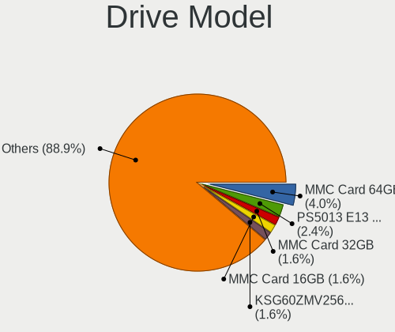
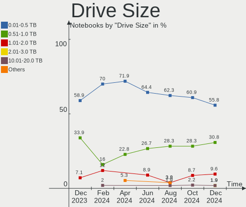
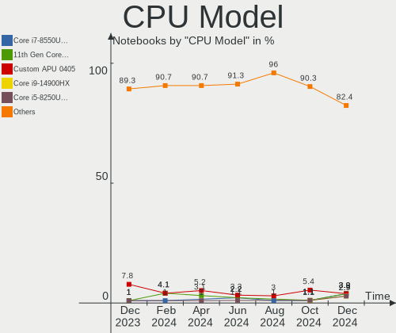
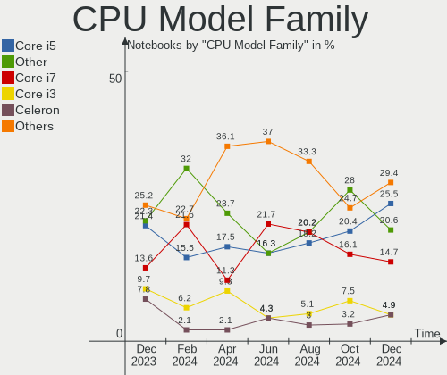
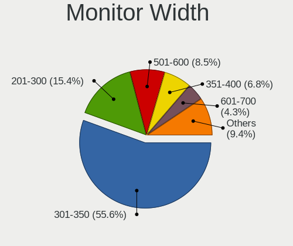
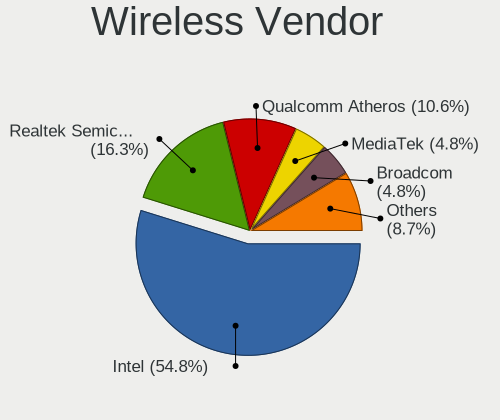
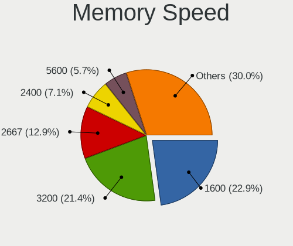

Linux in UK - Hardware Trends (Notebooks)
-----------------------------------------

A project to identify most popular hardware characteristics and track their change
over time based on data collected by Linux users at https://Linux-Hardware.org.

Anyone can contribute to this report by the [hw-probe](https://github.com/linuxhw/hw-probe) tool:

    sudo -E hw-probe -all -upload

Contents
--------

* [ System ](#system)
  - [ OS                       ](#os)
  - [ OS Family                ](#os-family)
  - [ Kernel                   ](#kernel)
  - [ Kernel Family            ](#kernel-family)
  - [ Kernel Major Ver.        ](#kernel-major-ver)
  - [ Arch                     ](#arch)
  - [ DE                       ](#de)
  - [ Display Server           ](#display-server)
  - [ Display Manager          ](#display-manager)
  - [ OS Lang                  ](#os-lang)
  - [ Boot Mode                ](#boot-mode)
  - [ Filesystem               ](#filesystem)
  - [ Part. scheme             ](#part-scheme)
  - [ Dual Boot with Linux/BSD ](#dual-boot-with-linuxbsd)
  - [ Dual Boot (Win)          ](#dual-boot-win)

* [ Board ](#board)
  - [ Vendor                   ](#vendor)
  - [ Model                    ](#model)
  - [ Model Family             ](#model-family)
  - [ MFG Year                 ](#mfg-year)
  - [ Form Factor              ](#form-factor)
  - [ Secure Boot              ](#secure-boot)
  - [ Coreboot                 ](#coreboot)
  - [ RAM Size                 ](#ram-size)
  - [ RAM Used                 ](#ram-used)
  - [ Total Drives             ](#total-drives)
  - [ Has CD-ROM               ](#has-cd-rom)
  - [ Has Ethernet             ](#has-ethernet)
  - [ Has WiFi                 ](#has-wifi)
  - [ Has Bluetooth            ](#has-bluetooth)

* [ Location ](#location)
  - [ Country                  ](#country)
  - [ City                     ](#city)

* [ Drives ](#drives)
  - [ Drive Vendor             ](#drive-vendor)
  - [ Drive Model              ](#drive-model)
  - [ HDD Vendor               ](#hdd-vendor)
  - [ SSD Vendor               ](#ssd-vendor)
  - [ Drive Kind               ](#drive-kind)
  - [ Drive Connector          ](#drive-connector)
  - [ Drive Size               ](#drive-size)
  - [ Space Total              ](#space-total)
  - [ Space Used               ](#space-used)
  - [ Malfunc. Drives          ](#malfunc-drives)
  - [ Malfunc. Drive Vendor    ](#malfunc-drive-vendor)
  - [ Malfunc. HDD Vendor      ](#malfunc-hdd-vendor)
  - [ Malfunc. Drive Kind      ](#malfunc-drive-kind)
  - [ Failed Drives            ](#failed-drives)
  - [ Failed Drive Vendor      ](#failed-drive-vendor)
  - [ Drive Status             ](#drive-status)

* [ Storage controller ](#storage-controller)
  - [ Storage Vendor           ](#storage-vendor)
  - [ Storage Model            ](#storage-model)
  - [ Storage Kind             ](#storage-kind)

* [ Processor ](#processor)
  - [ CPU Vendor               ](#cpu-vendor)
  - [ CPU Model                ](#cpu-model)
  - [ CPU Model Family         ](#cpu-model-family)
  - [ CPU Cores                ](#cpu-cores)
  - [ CPU Sockets              ](#cpu-sockets)
  - [ CPU Threads              ](#cpu-threads)
  - [ CPU Op-Modes             ](#cpu-op-modes)
  - [ CPU Microcode            ](#cpu-microcode)
  - [ CPU Microarch            ](#cpu-microarch)

* [ Graphics ](#graphics)
  - [ GPU Vendor               ](#gpu-vendor)
  - [ GPU Model                ](#gpu-model)
  - [ GPU Combo                ](#gpu-combo)
  - [ GPU Driver               ](#gpu-driver)
  - [ GPU Memory               ](#gpu-memory)

* [ Monitor ](#monitor)
  - [ Monitor Vendor           ](#monitor-vendor)
  - [ Monitor Model            ](#monitor-model)
  - [ Monitor Resolution       ](#monitor-resolution)
  - [ Monitor Diagonal         ](#monitor-diagonal)
  - [ Monitor Width            ](#monitor-width)
  - [ Aspect Ratio             ](#aspect-ratio)
  - [ Monitor Area             ](#monitor-area)
  - [ Pixel Density            ](#pixel-density)
  - [ Multiple Monitors        ](#multiple-monitors)

* [ Network ](#network)
  - [ Net Controller Vendor    ](#net-controller-vendor)
  - [ Net Controller Model     ](#net-controller-model)
  - [ Wireless Vendor          ](#wireless-vendor)
  - [ Wireless Model           ](#wireless-model)
  - [ Ethernet Vendor          ](#ethernet-vendor)
  - [ Ethernet Model           ](#ethernet-model)
  - [ Net Controller Kind      ](#net-controller-kind)
  - [ Used Controller          ](#used-controller)
  - [ NICs                     ](#nics)
  - [ IPv6                     ](#ipv6)

* [ Bluetooth ](#bluetooth)
  - [ Bluetooth Vendor         ](#bluetooth-vendor)
  - [ Bluetooth Model          ](#bluetooth-model)

* [ Sound ](#sound)
  - [ Sound Vendor             ](#sound-vendor)
  - [ Sound Model              ](#sound-model)

* [ Memory ](#memory)
  - [ Memory Vendor            ](#memory-vendor)
  - [ Memory Model             ](#memory-model)
  - [ Memory Kind              ](#memory-kind)
  - [ Memory Form Factor       ](#memory-form-factor)
  - [ Memory Size              ](#memory-size)
  - [ Memory Speed             ](#memory-speed)

* [ Printers & scanners ](#printers--scanners)
  - [ Printer Vendor           ](#printer-vendor)
  - [ Printer Model            ](#printer-model)
  - [ Scanner Vendor           ](#scanner-vendor)
  - [ Scanner Model            ](#scanner-model)

* [ Camera ](#camera)
  - [ Camera Vendor            ](#camera-vendor)
  - [ Camera Model             ](#camera-model)

* [ Security ](#security)
  - [ Fingerprint Vendor       ](#fingerprint-vendor)
  - [ Fingerprint Model        ](#fingerprint-model)
  - [ Chipcard Vendor          ](#chipcard-vendor)
  - [ Chipcard Model           ](#chipcard-model)

* [ Unsupported ](#unsupported)
  - [ Unsupported Devices      ](#unsupported-devices)
  - [ Unsupported Device Types ](#unsupported-device-types)

System
------

OS
--

Installed operating systems

| Name                 | Notebooks | Percent |
|----------------------|-----------|---------|
| Zorin 16             | 7         | 7.37%   |
| Fedora 35            | 7         | 7.37%   |
| Debian 11            | 7         | 7.37%   |
| Ubuntu 20.04         | 6         | 6.32%   |
| Pop!_OS 21.10        | 6         | 6.32%   |
| Linux Mint 20.3      | 6         | 6.32%   |
| Ubuntu 22.04         | 5         | 5.26%   |
| Ubuntu 21.10         | 5         | 5.26%   |
| OpenMandriva 4.3     | 5         | 5.26%   |
| Manjaro 21.2.5       | 4         | 4.21%   |
| Gentoo 2.8           | 3         | 3.16%   |
| SteamOS Snapshot     | 2         | 2.11%   |
| PureOS 10.0          | 2         | 2.11%   |
| Pop!_OS 22.04        | 2         | 2.11%   |
| Manjaro              | 2         | 2.11%   |
| Kubuntu 20.04        | 2         | 2.11%   |
| Garuda Linux Soaring | 2         | 2.11%   |
| Fedora 36            | 2         | 2.11%   |
| Debian Testing       | 2         | 2.11%   |
| Arch                 | 2         | 2.11%   |
| Ubuntu Budgie 21.10  | 1         | 1.05%   |
| SteamOS 3.2          | 1         | 1.05%   |
| openSUSE 20220410    | 1         | 1.05%   |
| OpenMandriva 4.2     | 1         | 1.05%   |
| NixOS 21.11          | 1         | 1.05%   |
| Manjaro 21.2.6       | 1         | 1.05%   |
| Mageia 8             | 1         | 1.05%   |
| LMDE 5               | 1         | 1.05%   |
| Linux Mint 19.3      | 1         | 1.05%   |
| Kubuntu 22.04        | 1         | 1.05%   |
| Kubuntu 21.10        | 1         | 1.05%   |
| KDE neon 20.04       | 1         | 1.05%   |
| Elementary 6.1       | 1         | 1.05%   |
| Clear Linux 36220    | 1         | 1.05%   |
| ArcoLinux Rolling    | 1         | 1.05%   |
| ArcoLinux            | 1         | 1.05%   |

OS Family
---------

OS without a version

| Name          | Notebooks | Percent |
|---------------|-----------|---------|
| Ubuntu        | 16        | 16.84%  |
| Fedora        | 9         | 9.47%   |
| Debian        | 9         | 9.47%   |
| Pop!_OS       | 8         | 8.42%   |
| Zorin         | 7         | 7.37%   |
| Manjaro       | 7         | 7.37%   |
| Linux Mint    | 7         | 7.37%   |
| OpenMandriva  | 6         | 6.32%   |
| Kubuntu       | 4         | 4.21%   |
| SteamOS       | 3         | 3.16%   |
| Gentoo        | 3         | 3.16%   |
| PureOS        | 2         | 2.11%   |
| Garuda Linux  | 2         | 2.11%   |
| ArcoLinux     | 2         | 2.11%   |
| Arch          | 2         | 2.11%   |
| Ubuntu Budgie | 1         | 1.05%   |
| openSUSE      | 1         | 1.05%   |
| NixOS         | 1         | 1.05%   |
| Mageia        | 1         | 1.05%   |
| LMDE          | 1         | 1.05%   |
| KDE neon      | 1         | 1.05%   |
| Elementary    | 1         | 1.05%   |
| Clear Linux   | 1         | 1.05%   |

Kernel
------

Version of the Linux kernel

| Version                                        | Notebooks | Percent |
|------------------------------------------------|-----------|---------|
| 5.13.0-39-generic                              | 15        | 15.79%  |
| 5.16.18-200.fc35.x86_64                        | 6         | 6.32%   |
| 5.16.7-desktop-1omv4003                        | 5         | 5.26%   |
| 5.13.0-40-generic                              | 5         | 5.26%   |
| 5.10.0-13-amd64                                | 5         | 5.26%   |
| 5.16.15-76051615-generic                       | 4         | 4.21%   |
| 5.4.0-107-generic                              | 3         | 3.16%   |
| 5.16.19-76051619-generic                       | 3         | 3.16%   |
| 5.15.0-27-generic                              | 3         | 3.16%   |
| 5.15.0-25-generic                              | 3         | 3.16%   |
| 5.17.3-zen1-1-zen                              | 2         | 2.11%   |
| 5.17.1-arch1-1                                 | 2         | 2.11%   |
| 5.16.0-6-amd64                                 | 2         | 2.11%   |
| 5.15.28-1-MANJARO                              | 2         | 2.11%   |
| 5.14.0-1032-oem                                | 2         | 2.11%   |
| 5.13.0-37-generic                              | 2         | 2.11%   |
| 5.4.0-91-generic                               | 1         | 1.05%   |
| 5.4.0-109-generic                              | 1         | 1.05%   |
| 5.17.5-xanmod1                                 | 1         | 1.05%   |
| 5.17.5-arch1-1                                 | 1         | 1.05%   |
| 5.17.4-200.fc35.x86_64                         | 1         | 1.05%   |
| 5.17.3-gentoo                                  | 1         | 1.05%   |
| 5.17.3-302.fc36.x86_64                         | 1         | 1.05%   |
| 5.17.2-arch3-1                                 | 1         | 1.05%   |
| 5.17.1-arch1-g14-1                             | 1         | 1.05%   |
| 5.17.1-300.fc36.x86_64                         | 1         | 1.05%   |
| 5.17.1-1-rt16-MANJARO                          | 1         | 1.05%   |
| 5.17.1-1-default                               | 1         | 1.05%   |
| 5.16.15-lqx2-1-lqx                             | 1         | 1.05%   |
| 5.16.14-1-MANJARO                              | 1         | 1.05%   |
| 5.16.13-1132.native                            | 1         | 1.05%   |
| 5.16.11-76051611-generic                       | 1         | 1.05%   |
| 5.16.0-pf5                                     | 1         | 1.05%   |
| 5.16.0-1-amd64                                 | 1         | 1.05%   |
| 5.15.35-adry                                   | 1         | 1.05%   |
| 5.15.32-desktop-1.mga8                         | 1         | 1.05%   |
| 5.15.32-1-MANJARO                              | 1         | 1.05%   |
| 5.13.0-valve14-1-neptune-02195-g5b0f749d00fa   | 1         | 1.05%   |
| 5.13.0-valve10.3-1-neptune-02176-g5fe416c4acd8 | 1         | 1.05%   |
| 5.13.0-valve10.1-1-neptune-02144-g7fffaf925dfb | 1         | 1.05%   |
| 5.13.0-27-generic                              | 1         | 1.05%   |
| 5.11.0-41-generic                              | 1         | 1.05%   |
| 5.10.14-desktop-1omv4002                       | 1         | 1.05%   |
| 5.10.109                                       | 1         | 1.05%   |
| 5.10.0-13-686                                  | 1         | 1.05%   |
| 5.10.0-11-amd64                                | 1         | 1.05%   |
| 5.10.0-10-amd64                                | 1         | 1.05%   |

Kernel Family
-------------

Linux kernel without a distro release

| Version  | Notebooks | Percent |
|----------|-----------|---------|
| 5.13.0   | 26        | 27.37%  |
| 5.10.0   | 8         | 8.42%   |
| 5.17.1   | 6         | 6.32%   |
| 5.16.18  | 6         | 6.32%   |
| 5.15.0   | 6         | 6.32%   |
| 5.4.0    | 5         | 5.26%   |
| 5.16.7   | 5         | 5.26%   |
| 5.16.15  | 5         | 5.26%   |
| 5.17.3   | 4         | 4.21%   |
| 5.16.0   | 4         | 4.21%   |
| 5.16.19  | 3         | 3.16%   |
| 5.17.5   | 2         | 2.11%   |
| 5.15.32  | 2         | 2.11%   |
| 5.15.28  | 2         | 2.11%   |
| 5.14.0   | 2         | 2.11%   |
| 5.17.4   | 1         | 1.05%   |
| 5.17.2   | 1         | 1.05%   |
| 5.16.14  | 1         | 1.05%   |
| 5.16.13  | 1         | 1.05%   |
| 5.16.11  | 1         | 1.05%   |
| 5.15.35  | 1         | 1.05%   |
| 5.11.0   | 1         | 1.05%   |
| 5.10.14  | 1         | 1.05%   |
| 5.10.109 | 1         | 1.05%   |

Kernel Major Ver.
-----------------

Linux kernel major version

| Version | Notebooks | Percent |
|---------|-----------|---------|
| 5.16    | 26        | 27.37%  |
| 5.13    | 26        | 27.37%  |
| 5.17    | 14        | 14.74%  |
| 5.15    | 11        | 11.58%  |
| 5.10    | 10        | 10.53%  |
| 5.4     | 5         | 5.26%   |
| 5.14    | 2         | 2.11%   |
| 5.11    | 1         | 1.05%   |

Arch
----

OS architecture (x86_64, i586, etc.)

| Name   | Notebooks | Percent |
|--------|-----------|---------|
| x86_64 | 94        | 98.95%  |
| i686   | 1         | 1.05%   |

DE
--

Desktop Environment

| Name       | Notebooks | Percent |
|------------|-----------|---------|
| GNOME      | 46        | 48.42%  |
| KDE5       | 22        | 23.16%  |
| X-Cinnamon | 9         | 9.47%   |
| XFCE       | 6         | 6.32%   |
| Unknown    | 4         | 4.21%   |
| i3         | 3         | 3.16%   |
| MATE       | 2         | 2.11%   |
| Pantheon   | 1         | 1.05%   |
| Cinnamon   | 1         | 1.05%   |
| Budgie     | 1         | 1.05%   |

Display Server
--------------

X11 or Wayland

| Name    | Notebooks | Percent |
|---------|-----------|---------|
| X11     | 69        | 72.63%  |
| Wayland | 23        | 24.21%  |
| Unknown | 2         | 2.11%   |
| Tty     | 1         | 1.05%   |

Display Manager
---------------

SDDM, LightDM, etc.

| Name    | Notebooks | Percent |
|---------|-----------|---------|
| Unknown | 41        | 43.16%  |
| SDDM    | 17        | 17.89%  |
| GDM     | 15        | 15.79%  |
| LightDM | 12        | 12.63%  |
| GDM3    | 9         | 9.47%   |
| XDM     | 1         | 1.05%   |

OS Lang
-------

Language

| Lang    | Notebooks | Percent |
|---------|-----------|---------|
| en_GB   | 75        | 78.95%  |
| en_US   | 12        | 12.63%  |
| pl_PL   | 2         | 2.11%   |
| Unknown | 2         | 2.11%   |
| zh_CN   | 1         | 1.05%   |
| POSIX   | 1         | 1.05%   |
| it_IT   | 1         | 1.05%   |
| en_IN   | 1         | 1.05%   |

Boot Mode
---------

EFI or BIOS

| Mode | Notebooks | Percent |
|------|-----------|---------|
| BIOS | 48        | 50.53%  |
| EFI  | 47        | 49.47%  |

Filesystem
----------

Type of filesystem

| Type    | Notebooks | Percent |
|---------|-----------|---------|
| Ext4    | 68        | 71.58%  |
| Btrfs   | 20        | 21.05%  |
| Overlay | 6         | 6.32%   |
| Zfs     | 1         | 1.05%   |

Part. scheme
------------

Scheme of partitioning

| Type    | Notebooks | Percent |
|---------|-----------|---------|
| Unknown | 50        | 52.63%  |
| GPT     | 39        | 41.05%  |
| MBR     | 6         | 6.32%   |

Dual Boot with Linux/BSD
------------------------

Hosting more than one Linux/BSD

| Dual boot | Notebooks | Percent |
|-----------|-----------|---------|
| No        | 84        | 88.42%  |
| Yes       | 11        | 11.58%  |

Dual Boot (Win)
---------------

Hosting Linux and Windows

| Dual boot | Notebooks | Percent |
|-----------|-----------|---------|
| No        | 76        | 80%     |
| Yes       | 19        | 20%     |

Board
-----

Vendor
------

Motherboard manufacturer

| Name                | Notebooks | Percent |
|---------------------|-----------|---------|
| Lenovo              | 24        | 25.26%  |
| Dell                | 16        | 16.84%  |
| Hewlett-Packard     | 11        | 11.58%  |
| ASUSTek Computer    | 10        | 10.53%  |
| Acer                | 6         | 6.32%   |
| Toshiba             | 4         | 4.21%   |
| Valve               | 3         | 3.16%   |
| MSI                 | 3         | 3.16%   |
| PC Specialist       | 2         | 2.11%   |
| Framework           | 2         | 2.11%   |
| TUXEDO              | 1         | 1.05%   |
| Sony                | 1         | 1.05%   |
| Samsung Electronics | 1         | 1.05%   |
| Purism              | 1         | 1.05%   |
| Notebook            | 1         | 1.05%   |
| LG Electronics      | 1         | 1.05%   |
| HUAWEI              | 1         | 1.05%   |
| Getac               | 1         | 1.05%   |
| Dynabook            | 1         | 1.05%   |
| Dixonsxp            | 1         | 1.05%   |
| CyberPowerPC        | 1         | 1.05%   |
| ARKA                | 1         | 1.05%   |
| Apple               | 1         | 1.05%   |
| Advent              | 1         | 1.05%   |

Model
-----

Motherboard model

| Name                                        | Notebooks | Percent |
|---------------------------------------------|-----------|---------|
| Valve Jupiter                               | 3         | 3.16%   |
| Dell Inspiron 5415                          | 3         | 3.16%   |
| HP Pavilion g6                              | 2         | 2.11%   |
| HP Notebook                                 | 2         | 2.11%   |
| Framework Laptop                            | 2         | 2.11%   |
| ASUS VivoBook_ASUSLaptop X515EA_X515EA      | 2         | 2.11%   |
| ASUS ROG Flow X13 GV301QH_GV301QH           | 2         | 2.11%   |
| TUXEDO Pulse 15 Gen1                        | 1         | 1.05%   |
| Toshiba TECRA X40-D                         | 1         | 1.05%   |
| Toshiba Satellite Pro R50-B                 | 1         | 1.05%   |
| Toshiba Satellite P50t-A                    | 1         | 1.05%   |
| Toshiba dynabook R73/A                      | 1         | 1.05%   |
| Sony VPCEB4L1E                              | 1         | 1.05%   |
| Samsung 950XDB/951XDB/950XDY                | 1         | 1.05%   |
| Purism Librem 14                            | 1         | 1.05%   |
| PC Specialist PC5x_7xHP_HR_HS               | 1         | 1.05%   |
| PC Specialist NJ50_70CU                     | 1         | 1.05%   |
| Notebook W130SV                             | 1         | 1.05%   |
| MSI GP66 Leopard 11UH                       | 1         | 1.05%   |
| MSI GL63 9SD                                | 1         | 1.05%   |
| MSI GF63 Thin 10SC                          | 1         | 1.05%   |
| LG 16Z90P-K.AA78A1                          | 1         | 1.05%   |
| Lenovo Z50-75 80EC                          | 1         | 1.05%   |
| Lenovo ThinkPad X230 23202DG                | 1         | 1.05%   |
| Lenovo ThinkPad X220 4291QT1                | 1         | 1.05%   |
| Lenovo ThinkPad X220 429136G                | 1         | 1.05%   |
| Lenovo ThinkPad X1 Extreme Gen 3 20TKCTO1WW | 1         | 1.05%   |
| Lenovo ThinkPad T490 20N2000LUK             | 1         | 1.05%   |
| Lenovo ThinkPad T480 20L50004UK             | 1         | 1.05%   |
| Lenovo ThinkPad T470 W10DG 20JNS29X02       | 1         | 1.05%   |
| Lenovo ThinkPad T450 20BV001YMS             | 1         | 1.05%   |
| Lenovo ThinkPad T440 20B7A1P700             | 1         | 1.05%   |
| Lenovo ThinkPad T410 2522AC1                | 1         | 1.05%   |
| Lenovo ThinkPad T15 Gen 2i 20W4003FUK       | 1         | 1.05%   |
| Lenovo ThinkPad P14s Gen 1 20Y1CTO1WW       | 1         | 1.05%   |
| Lenovo ThinkPad P14s Gen 1 20Y1000SUK       | 1         | 1.05%   |
| Lenovo ThinkPad L440 20ASA02800             | 1         | 1.05%   |
| Lenovo ThinkBook 15 G2 ITL 20VE             | 1         | 1.05%   |
| Lenovo Legion R7000 2020 82B6               | 1         | 1.05%   |
| Lenovo Legion 5P 15ARH05H 82GU              | 1         | 1.05%   |
| Lenovo Legion 5 15IMH05H 81Y6               | 1         | 1.05%   |
| Lenovo Legion 5 15IMH05 82AU                | 1         | 1.05%   |
| Lenovo IdeaPadFlex 15 20309                 | 1         | 1.05%   |
| Lenovo IdeaPad S540-15IML D 81NG            | 1         | 1.05%   |
| Lenovo IdeaPad 320S-14IKB 80X4              | 1         | 1.05%   |
| Lenovo Flex 2-15 20405                      | 1         | 1.05%   |
| HUAWEI KLVL-WXX9                            | 1         | 1.05%   |
| HP ProBook 6570b                            | 1         | 1.05%   |
| HP Pavilion Notebook                        | 1         | 1.05%   |
| HP Pavilion Gaming Laptop 15-ec0xxx         | 1         | 1.05%   |
| HP Pavilion dv6                             | 1         | 1.05%   |
| HP Laptop 15-da0xxx                         | 1         | 1.05%   |
| HP ENVY 13                                  | 1         | 1.05%   |
| HP EliteBook 840 G2                         | 1         | 1.05%   |
| Getac S400                                  | 1         | 1.05%   |
| Dynabook PORTEGE X30L-J                     | 1         | 1.05%   |
| Dell XPS 15 9510                            | 1         | 1.05%   |
| Dell XPS 15 9500                            | 1         | 1.05%   |
| Dell XPS 13 9310                            | 1         | 1.05%   |
| Dell Vostro 5515                            | 1         | 1.05%   |

Model Family
------------

Motherboard model prefix

| Name                | Notebooks | Percent |
|---------------------|-----------|---------|
| Lenovo ThinkPad     | 14        | 14.74%  |
| Dell Inspiron       | 7         | 7.37%   |
| HP Pavilion         | 5         | 5.26%   |
| Lenovo Legion       | 4         | 4.21%   |
| Acer Aspire         | 4         | 4.21%   |
| Valve Jupiter       | 3         | 3.16%   |
| Dell XPS            | 3         | 3.16%   |
| Dell Latitude       | 3         | 3.16%   |
| ASUS VivoBook       | 3         | 3.16%   |
| Toshiba Satellite   | 2         | 2.11%   |
| Lenovo IdeaPad      | 2         | 2.11%   |
| HP Notebook         | 2         | 2.11%   |
| Framework Laptop    | 2         | 2.11%   |
| ASUS ROG            | 2         | 2.11%   |
| TUXEDO Pulse        | 1         | 1.05%   |
| Toshiba TECRA       | 1         | 1.05%   |
| Toshiba dynabook    | 1         | 1.05%   |
| Sony VPCEB4L1E      | 1         | 1.05%   |
| Samsung 950XDB      | 1         | 1.05%   |
| Purism Librem       | 1         | 1.05%   |
| PC Specialist PC5x  | 1         | 1.05%   |
| PC Specialist NJ50  | 1         | 1.05%   |
| Notebook W130SV     | 1         | 1.05%   |
| MSI GP66            | 1         | 1.05%   |
| MSI GL63            | 1         | 1.05%   |
| MSI GF63            | 1         | 1.05%   |
| LG 16Z90P-K.AA78A1  | 1         | 1.05%   |
| Lenovo Z50-75       | 1         | 1.05%   |
| Lenovo ThinkBook    | 1         | 1.05%   |
| Lenovo IdeaPadFlex  | 1         | 1.05%   |
| Lenovo Flex         | 1         | 1.05%   |
| HUAWEI KLVL-WXX9    | 1         | 1.05%   |
| HP ProBook          | 1         | 1.05%   |
| HP Laptop           | 1         | 1.05%   |
| HP ENVY             | 1         | 1.05%   |
| HP EliteBook        | 1         | 1.05%   |
| Getac S400          | 1         | 1.05%   |
| Dynabook PORTEGE    | 1         | 1.05%   |
| Dell Vostro         | 1         | 1.05%   |
| Dell Precision      | 1         | 1.05%   |
| Dell G7             | 1         | 1.05%   |
| CyberPowerPC Tracer | 1         | 1.05%   |
| ASUS ZenBook        | 1         | 1.05%   |
| ASUS UX310UA        | 1         | 1.05%   |
| ASUS TUF            | 1         | 1.05%   |
| ASUS FX503VM        | 1         | 1.05%   |
| ASUS ASUS           | 1         | 1.05%   |
| ARKA BOOK           | 1         | 1.05%   |
| Apple MacBookPro11  | 1         | 1.05%   |
| Advent Tacto        | 1         | 1.05%   |
| Acer Swift          | 1         | 1.05%   |
| Acer NC-E5-573-36PM | 1         | 1.05%   |
| Unknown             | 1         | 1.05%   |

MFG Year
--------

Motherboard manufacture year

| Year    | Notebooks | Percent |
|---------|-----------|---------|
| 2021    | 20        | 21.05%  |
| 2020    | 16        | 16.84%  |
| 2019    | 8         | 8.42%   |
| 2017    | 7         | 7.37%   |
| 2014    | 7         | 7.37%   |
| 2018    | 5         | 5.26%   |
| 2015    | 5         | 5.26%   |
| 2011    | 5         | 5.26%   |
| 2013    | 4         | 4.21%   |
| 2012    | 4         | 4.21%   |
| 2016    | 3         | 3.16%   |
| 2022    | 2         | 2.11%   |
| 2010    | 2         | 2.11%   |
| 2009    | 2         | 2.11%   |
| 2007    | 2         | 2.11%   |
| Unknown | 2         | 2.11%   |
| 2008    | 1         | 1.05%   |

Form Factor
-----------

Physical design of the computer

| Name     | Notebooks | Percent |
|----------|-----------|---------|
| Notebook | 95        | 100%    |

Secure Boot
-----------

Enabled or disabled

| State    | Notebooks | Percent |
|----------|-----------|---------|
| Disabled | 87        | 91.58%  |
| Enabled  | 8         | 8.42%   |

Coreboot
--------

Have coreboot on board

| Used | Notebooks | Percent |
|------|-----------|---------|
| No   | 94        | 98.95%  |
| Yes  | 1         | 1.05%   |

RAM Size
--------

Total RAM memory

| Size in GB  | Notebooks | Percent |
|-------------|-----------|---------|
| 16.01-24.0  | 28        | 29.47%  |
| 4.01-8.0    | 20        | 21.05%  |
| 8.01-16.0   | 17        | 17.89%  |
| 3.01-4.0    | 14        | 14.74%  |
| 32.01-64.0  | 9         | 9.47%   |
| 24.01-32.0  | 3         | 3.16%   |
| 1.01-2.0    | 3         | 3.16%   |
| 64.01-256.0 | 1         | 1.05%   |

RAM Used
--------

Used RAM memory

| Used GB    | Notebooks | Percent |
|------------|-----------|---------|
| 1.01-2.0   | 28        | 29.47%  |
| 2.01-3.0   | 23        | 24.21%  |
| 4.01-8.0   | 19        | 20%     |
| 3.01-4.0   | 12        | 12.63%  |
| 8.01-16.0  | 6         | 6.32%   |
| 24.01-32.0 | 2         | 2.11%   |
| 0.51-1.0   | 2         | 2.11%   |
| 32.01-64.0 | 1         | 1.05%   |
| 16.01-24.0 | 1         | 1.05%   |
| 0.01-0.5   | 1         | 1.05%   |

Total Drives
------------

Number of drives on board

| Drives | Notebooks | Percent |
|--------|-----------|---------|
| 1      | 67        | 70.53%  |
| 2      | 23        | 24.21%  |
| 3      | 4         | 4.21%   |
| 0      | 1         | 1.05%   |

Has CD-ROM
----------

Has CD-ROM on board

| Presented | Notebooks | Percent |
|-----------|-----------|---------|
| No        | 76        | 80%     |
| Yes       | 19        | 20%     |

Has Ethernet
------------

Has Ethernet on board

| Presented | Notebooks | Percent |
|-----------|-----------|---------|
| Yes       | 77        | 81.05%  |
| No        | 18        | 18.95%  |

Has WiFi
--------

Has WiFi module

| Presented | Notebooks | Percent |
|-----------|-----------|---------|
| Yes       | 95        | 100%    |

Has Bluetooth
-------------

Has Bluetooth module

| Presented | Notebooks | Percent |
|-----------|-----------|---------|
| Yes       | 83        | 87.37%  |
| No        | 12        | 12.63%  |

Location
--------

Country
-------

Geographic location (country)

| Country | Notebooks | Percent |
|---------|-----------|---------|
| UK      | 95        | 100%    |

City
----

Geographic location (city)

| City                | Notebooks | Percent |
|---------------------|-----------|---------|
| London              | 10        | 10.53%  |
| Harrow              | 5         | 5.26%   |
| Birmingham          | 4         | 4.21%   |
| Norwich             | 3         | 3.16%   |
| Woking              | 2         | 2.11%   |
| Liverpool           | 2         | 2.11%   |
| Leicester           | 2         | 2.11%   |
| Ilkley              | 2         | 2.11%   |
| Glasgow             | 2         | 2.11%   |
| Edinburgh           | 2         | 2.11%   |
| Bristol             | 2         | 2.11%   |
| Yate                | 1         | 1.05%   |
| Woodford            | 1         | 1.05%   |
| Wolverhampton       | 1         | 1.05%   |
| Witney              | 1         | 1.05%   |
| Weston-super-Mare   | 1         | 1.05%   |
| Wembley             | 1         | 1.05%   |
| Warboys             | 1         | 1.05%   |
| Totteridge          | 1         | 1.05%   |
| Todmorden           | 1         | 1.05%   |
| Tain                | 1         | 1.05%   |
| Swansea             | 1         | 1.05%   |
| Surbiton            | 1         | 1.05%   |
| Stratford           | 1         | 1.05%   |
| St Andrews          | 1         | 1.05%   |
| St Albans           | 1         | 1.05%   |
| Somerset            | 1         | 1.05%   |
| Sittingbourne       | 1         | 1.05%   |
| Sherborne           | 1         | 1.05%   |
| Shefford            | 1         | 1.05%   |
| Sheffield           | 1         | 1.05%   |
| Purley              | 1         | 1.05%   |
| Prestwick           | 1         | 1.05%   |
| Orpington           | 1         | 1.05%   |
| Nuneaton            | 1         | 1.05%   |
| Newcastle upon Tyne | 1         | 1.05%   |
| Neath               | 1         | 1.05%   |
| Milton Keynes       | 1         | 1.05%   |
| Manchester          | 1         | 1.05%   |
| Leeds               | 1         | 1.05%   |
| Huntingdon          | 1         | 1.05%   |
| Holyhead            | 1         | 1.05%   |
| Holmes Chapel       | 1         | 1.05%   |
| High Wycombe        | 1         | 1.05%   |
| Greenford           | 1         | 1.05%   |
| Gerrards Cross      | 1         | 1.05%   |
| Finsbury            | 1         | 1.05%   |
| Exmouth             | 1         | 1.05%   |
| Erskine             | 1         | 1.05%   |
| Dundee              | 1         | 1.05%   |
| Dunbar              | 1         | 1.05%   |
| Ditcheat            | 1         | 1.05%   |
| Darlington          | 1         | 1.05%   |
| Coventry            | 1         | 1.05%   |
| City of London      | 1         | 1.05%   |
| Chesterfield        | 1         | 1.05%   |
| Chester             | 1         | 1.05%   |
| Chepstow            | 1         | 1.05%   |
| Cheltenham          | 1         | 1.05%   |
| Chatburn            | 1         | 1.05%   |

Drives
------

Drive Vendor
------------

Hard drive vendors

| Vendor              | Notebooks | Drives | Percent |
|---------------------|-----------|--------|---------|
| Samsung Electronics | 17        | 17     | 13.93%  |
| WDC                 | 15        | 15     | 12.3%   |
| Toshiba             | 14        | 14     | 11.48%  |
| SK Hynix            | 11        | 12     | 9.02%   |
| Seagate             | 10        | 13     | 8.2%    |
| Kingston            | 8         | 8      | 6.56%   |
| Unknown             | 7         | 7      | 5.74%   |
| Sandisk             | 7         | 8      | 5.74%   |
| Intel               | 7         | 7      | 5.74%   |
| Hitachi             | 4         | 4      | 3.28%   |
| Crucial             | 4         | 4      | 3.28%   |
| Phison              | 3         | 3      | 2.46%   |
| Transcend           | 2         | 2      | 1.64%   |
| KIOXIA              | 2         | 2      | 1.64%   |
| A-DATA Technology   | 2         | 2      | 1.64%   |
| SPCC                | 1         | 1      | 0.82%   |
| Silicon Motion      | 1         | 1      | 0.82%   |
| Patriot             | 1         | 1      | 0.82%   |
| Micron Technology   | 1         | 1      | 0.82%   |
| China               | 1         | 1      | 0.82%   |
| BHT                 | 1         | 1      | 0.82%   |
| Apple               | 1         | 1      | 0.82%   |
| ADATA Technology    | 1         | 1      | 0.82%   |
| Unknown             | 1         | 1      | 0.82%   |

Drive Model
-----------

Hard drive models

| Model                                     | Notebooks | Percent |
|-------------------------------------------|-----------|---------|
| SK Hynix NVMe SSD Drive 512GB             | 4         | 3.15%   |
| Samsung NVMe SSD Drive 512GB              | 4         | 3.15%   |
| Toshiba MQ01ABF050 500GB                  | 3         | 2.36%   |
| WDC WD10JPCX-24UE4T0 1TB                  | 2         | 1.57%   |
| Unknown SD/MMC/MS PRO 128GB               | 2         | 1.57%   |
| Transcend TS512GMTS430S 512GB SSD         | 2         | 1.57%   |
| Toshiba NVMe SSD Drive 256GB              | 2         | 1.57%   |
| Toshiba MQ04ABF100 1TB                    | 2         | 1.57%   |
| Seagate Backup+ Hub BK 6TB                | 2         | 1.57%   |
| SanDisk SDSSDH3 1T00 1TB                  | 2         | 1.57%   |
| Sandisk NVMe SSD Drive 1TB                | 2         | 1.57%   |
| Samsung MZVLB256HBHQ-000L2 256GB          | 2         | 1.57%   |
| Intel SSDPEKNU512GZ 512GB                 | 2         | 1.57%   |
| WDC WDS240G2G0A-00JH30 240GB SSD          | 1         | 0.79%   |
| WDC WDS120G2G0B-00EPW0 120GB SSD          | 1         | 0.79%   |
| WDC WDS120G2G0A-00JH30 120GB SSD          | 1         | 0.79%   |
| WDC WDS100T2B0C-00PXH0 1TB                | 1         | 0.79%   |
| WDC WDS100T2B0A-00SM50 1TB SSD            | 1         | 0.79%   |
| WDC WDS100T1X0E-00AFY0 1TB                | 1         | 0.79%   |
| WDC WD5000BPVT-75HXZT1 500GB              | 1         | 0.79%   |
| WDC WD20SPZX-21UA7T0 2TB                  | 1         | 0.79%   |
| WDC WD10SPZX-24Z10 1TB                    | 1         | 0.79%   |
| WDC WD10JPVX-60JC3T0 1TB                  | 1         | 0.79%   |
| WDC PC SN720 NVMe 1024GB                  | 1         | 0.79%   |
| WDC PC SN530 SDBPTPZ-512G-1002 512GB      | 1         | 0.79%   |
| WDC PC SN530 SDBPTPZ-1T00-1002 1TB        | 1         | 0.79%   |
| Unknown SD64G  64GB                       | 1         | 0.79%   |
| Unknown MMC Card  64GB                    | 1         | 0.79%   |
| Unknown MMC Card  512GB                   | 1         | 0.79%   |
| Unknown MMC Card  256GB                   | 1         | 0.79%   |
| Unknown ISOCOM  64GB                      | 1         | 0.79%   |
| Toshiba NVMe SSD Drive 1TB                | 1         | 0.79%   |
| Toshiba MQ01ABD100V 1TB                   | 1         | 0.79%   |
| Toshiba MQ01ABD050 500GB                  | 1         | 0.79%   |
| Toshiba MK8009GAH 80GB                    | 1         | 0.79%   |
| Toshiba KXG6AZNV512G 512GB                | 1         | 0.79%   |
| Toshiba KXG6AZNV1T02 1TB                  | 1         | 0.79%   |
| Toshiba KBG40ZNV512G MEMORY 512GB         | 1         | 0.79%   |
| SPCC Solid State Disk 1024GB              | 1         | 0.79%   |
| SK Hynix SKHynix_HFS256GD9TNI-L2B0B 256GB | 1         | 0.79%   |
| SK Hynix SKHynix_HFS256GD9TNI-L2A0B 256GB | 1         | 0.79%   |
| SK Hynix SKHynix_HFS256GD9TNG-L3A0B 256GB | 1         | 0.79%   |
| SK Hynix PC711 NVMe 512GB                 | 1         | 0.79%   |
| SK Hynix PC711 NVMe 1TB                   | 1         | 0.79%   |
| SK Hynix NVMe SSD Drive 1024GB            | 1         | 0.79%   |
| SK Hynix HFM512GD3JX013N 512GB            | 1         | 0.79%   |
| SK Hynix BC711 NVMe 512GB                 | 1         | 0.79%   |
| Silicon Motion 256GB PCS PCIe M.2 SSD     | 1         | 0.79%   |
| Seagate ST500LM000-SSHD-8GB               | 1         | 0.79%   |
| Seagate ST2000LM007-1R8174 2TB            | 1         | 0.79%   |
| Seagate ST2000LM003 HN-M201RAD 2TB        | 1         | 0.79%   |
| Seagate ST1000LM049-2GH172 1TB            | 1         | 0.79%   |
| Seagate ST1000LM048-2E7172 1TB            | 1         | 0.79%   |
| Seagate ST1000LM024 HN-M101MBB 1TB        | 1         | 0.79%   |
| Seagate ST1000LM014-1EJ164 1TB            | 1         | 0.79%   |
| Seagate Expansion+ 2TB                    | 1         | 0.79%   |
| Seagate BUP Slim BK 1TB                   | 1         | 0.79%   |
| Seagate BUP Portable 5TB                  | 1         | 0.79%   |
| Seagate BUP BK 4TB                        | 1         | 0.79%   |
| SanDisk SD8SNAT256G1002 256GB SSD         | 1         | 0.79%   |

HDD Vendor
----------

Hard disk drive vendors

| Vendor  | Notebooks | Drives | Percent |
|---------|-----------|--------|---------|
| Seagate | 10        | 13     | 33.33%  |
| Toshiba | 8         | 8      | 26.67%  |
| WDC     | 6         | 6      | 20%     |
| Hitachi | 4         | 4      | 13.33%  |
| Unknown | 2         | 2      | 6.67%   |

SSD Vendor
----------

Solid state drive vendors

| Vendor              | Notebooks | Drives | Percent |
|---------------------|-----------|--------|---------|
| WDC                 | 4         | 4      | 12.9%   |
| SanDisk             | 4         | 4      | 12.9%   |
| Samsung Electronics | 4         | 4      | 12.9%   |
| Kingston            | 4         | 4      | 12.9%   |
| Crucial             | 3         | 3      | 9.68%   |
| Transcend           | 2         | 2      | 6.45%   |
| Intel               | 2         | 2      | 6.45%   |
| A-DATA Technology   | 2         | 2      | 6.45%   |
| SPCC                | 1         | 1      | 3.23%   |
| Patriot             | 1         | 1      | 3.23%   |
| Micron Technology   | 1         | 1      | 3.23%   |
| China               | 1         | 1      | 3.23%   |
| BHT                 | 1         | 1      | 3.23%   |
| Apple               | 1         | 1      | 3.23%   |

Drive Kind
----------

HDD or SSD

| Kind | Notebooks | Drives | Percent |
|------|-----------|--------|---------|
| NVMe | 50        | 57     | 43.48%  |
| HDD  | 30        | 33     | 26.09%  |
| SSD  | 29        | 31     | 25.22%  |
| MMC  | 6         | 6      | 5.22%   |

Drive Connector
---------------

SATA, SAS, NVMe, etc.

| Type | Notebooks | Drives | Percent |
|------|-----------|--------|---------|
| NVMe | 50        | 57     | 43.86%  |
| SATA | 50        | 55     | 43.86%  |
| SAS  | 8         | 9      | 7.02%   |
| MMC  | 6         | 6      | 5.26%   |

Drive Size
----------

Size of hard drive

| Size in TB | Notebooks | Drives | Percent |
|------------|-----------|--------|---------|
| 0.01-0.5   | 33        | 36     | 55%     |
| 0.51-1.0   | 17        | 18     | 28.33%  |
| 1.01-2.0   | 5         | 5      | 8.33%   |
| 4.01-10.0  | 4         | 4      | 6.67%   |
| 3.01-4.0   | 1         | 1      | 1.67%   |

Space Total
-----------

Amount of disk space available on the file system

| Size in GB     | Notebooks | Percent |
|----------------|-----------|---------|
| 101-250        | 23        | 24.21%  |
| 251-500        | 19        | 20%     |
| 501-1000       | 13        | 13.68%  |
| 1001-2000      | 9         | 9.47%   |
| 21-50          | 8         | 8.42%   |
| More than 3000 | 7         | 7.37%   |
| 1-20           | 6         | 6.32%   |
| 51-100         | 4         | 4.21%   |
| Unknown        | 4         | 4.21%   |
| 2001-3000      | 2         | 2.11%   |

Space Used
----------

Amount of used disk space

| Used GB        | Notebooks | Percent |
|----------------|-----------|---------|
| 1-20           | 26        | 27.37%  |
| 21-50          | 17        | 17.89%  |
| 101-250        | 16        | 16.84%  |
| 51-100         | 15        | 15.79%  |
| 251-500        | 5         | 5.26%   |
| 501-1000       | 5         | 5.26%   |
| More than 3000 | 4         | 4.21%   |
| Unknown        | 4         | 4.21%   |
| 1001-2000      | 3         | 3.16%   |

Malfunc. Drives
---------------

Drive models with a malfunction

| Model                             | Notebooks | Drives | Percent |
|-----------------------------------|-----------|--------|---------|
| Kingston SEDC500R7680G 8TB SSD    | 1         | 1      | 33.33%  |
| Hitachi HTS547575A9E384 752GB     | 1         | 1      | 33.33%  |
| A-DATA Technology SP550 240GB SSD | 1         | 1      | 33.33%  |

Malfunc. Drive Vendor
---------------------

Vendors of faulty drives

| Vendor            | Notebooks | Drives | Percent |
|-------------------|-----------|--------|---------|
| Kingston          | 1         | 1      | 33.33%  |
| Hitachi           | 1         | 1      | 33.33%  |
| A-DATA Technology | 1         | 1      | 33.33%  |

Malfunc. HDD Vendor
-------------------

Vendors of faulty HDD drives

| Vendor  | Notebooks | Drives | Percent |
|---------|-----------|--------|---------|
| Hitachi | 1         | 1      | 100%    |

Malfunc. Drive Kind
-------------------

Kinds of faulty drives

| Kind | Notebooks | Drives | Percent |
|------|-----------|--------|---------|
| SSD  | 2         | 2      | 66.67%  |
| HDD  | 1         | 1      | 33.33%  |

Failed Drives
-------------

Failed drive models

Zero info for selected period =(

Failed Drive Vendor
-------------------

Failed drive vendors

Zero info for selected period =(

Drive Status
------------

Number of failed and malfunc. drives

| Status   | Notebooks | Drives | Percent |
|----------|-----------|--------|---------|
| Detected | 54        | 74     | 54%     |
| Works    | 43        | 50     | 43%     |
| Malfunc  | 3         | 3      | 3%      |

Storage controller
------------------

Storage Vendor
--------------

Storage controller vendors

| Vendor                       | Notebooks | Percent |
|------------------------------|-----------|---------|
| Intel                        | 58        | 47.54%  |
| Samsung Electronics          | 14        | 11.48%  |
| AMD                          | 13        | 10.66%  |
| SK Hynix                     | 11        | 9.02%   |
| Sandisk                      | 8         | 6.56%   |
| Toshiba America Info Systems | 4         | 3.28%   |
| KIOXIA                       | 4         | 3.28%   |
| Kingston Technology Company  | 4         | 3.28%   |
| Phison Electronics           | 3         | 2.46%   |
| Silicon Motion               | 1         | 0.82%   |
| Micron/Crucial Technology    | 1         | 0.82%   |
| ADATA Technology             | 1         | 0.82%   |

Storage Model
-------------

Storage controller models

| Model                                                                            | Notebooks | Percent |
|----------------------------------------------------------------------------------|-----------|---------|
| AMD FCH SATA Controller [AHCI mode]                                              | 12        | 9.3%    |
| Intel 82801 Mobile SATA Controller [RAID mode]                                   | 7         | 5.43%   |
| SK Hynix Gold P31 SSD                                                            | 6         | 4.65%   |
| Samsung NVMe SSD Controller SM981/PM981/PM983                                    | 6         | 4.65%   |
| Samsung NVMe SSD Controller 980                                                  | 6         | 4.65%   |
| Intel Volume Management Device NVMe RAID Controller                              | 6         | 4.65%   |
| Intel Sunrise Point-LP SATA Controller [AHCI mode]                               | 6         | 4.65%   |
| Intel Wildcat Point-LP SATA Controller [AHCI Mode]                               | 5         | 3.88%   |
| SK Hynix Non-Volatile memory controller                                          | 4         | 3.1%    |
| Intel 7 Series Chipset Family 6-port SATA Controller [AHCI mode]                 | 4         | 3.1%    |
| Intel 6 Series/C200 Series Chipset Family 6 port Mobile SATA AHCI Controller     | 4         | 3.1%    |
| Intel 400 Series Chipset Family SATA AHCI Controller                             | 4         | 3.1%    |
| Toshiba America Info Systems XG6 NVMe SSD Controller                             | 3         | 2.33%   |
| KIOXIA Non-Volatile memory controller                                            | 3         | 2.33%   |
| Intel Tiger Lake-LP SATA Controller [AHCI mode]                                  | 3         | 2.33%   |
| Intel Non-Volatile memory controller                                             | 3         | 2.33%   |
| Intel 8 Series/C220 Series Chipset Family 6-port SATA Controller 1 [AHCI mode]   | 3         | 2.33%   |
| Intel 8 Series SATA Controller 1 [AHCI mode]                                     | 3         | 2.33%   |
| Sandisk WD PC SN810 / Black SN850 NVMe SSD                                       | 2         | 1.55%   |
| Sandisk WD Blue SN550 NVMe SSD                                                   | 2         | 1.55%   |
| Sandisk Non-Volatile memory controller                                           | 2         | 1.55%   |
| Phison PS5013 E13 NVMe Controller                                                | 2         | 1.55%   |
| Kingston Company OM3PDP3 NVMe SSD                                                | 2         | 1.55%   |
| Intel HM170/QM170 Chipset SATA Controller [AHCI Mode]                            | 2         | 1.55%   |
| Intel Celeron N3350/Pentium N4200/Atom E3900 Series SATA AHCI Controller         | 2         | 1.55%   |
| Intel Cannon Lake Mobile PCH SATA AHCI Controller                                | 2         | 1.55%   |
| Intel 5 Series/3400 Series Chipset 6 port SATA AHCI Controller                   | 2         | 1.55%   |
| Intel 5 Series/3400 Series Chipset 4 port SATA AHCI Controller                   | 2         | 1.55%   |
| Toshiba America Info Systems BG3 NVMe SSD Controller                             | 1         | 0.78%   |
| SK Hynix BC511                                                                   | 1         | 0.78%   |
| Silicon Motion SM2263EN/SM2263XT SSD Controller                                  | 1         | 0.78%   |
| Sandisk WD Black SN750 / PC SN730 NVMe SSD                                       | 1         | 0.78%   |
| Sandisk WD Black 2018/SN750 / PC SN720 NVMe SSD                                  | 1         | 0.78%   |
| Samsung NVMe SSD Controller SM961/PM961/SM963                                    | 1         | 0.78%   |
| Samsung Apple PCIe SSD                                                           | 1         | 0.78%   |
| Phison E12 NVMe Controller                                                       | 1         | 0.78%   |
| Micron/Crucial P2 NVMe PCIe SSD                                                  | 1         | 0.78%   |
| KIOXIA NVMe SSD                                                                  | 1         | 0.78%   |
| Kingston Company Company Non-Volatile memory controller                          | 1         | 0.78%   |
| Kingston Company A2000 NVMe SSD                                                  | 1         | 0.78%   |
| Intel SSD Pro 7600p/760p/E 6100p Series                                          | 1         | 0.78%   |
| Intel NVMe Optane Memory Series                                                  | 1         | 0.78%   |
| Intel Comet Lake SATA AHCI Controller                                            | 1         | 0.78%   |
| Intel Atom/Celeron/Pentium Processor x5-E8000/J3xxx/N3xxx Series SATA Controller | 1         | 0.78%   |
| Intel 82801IBM/IEM (ICH9M/ICH9M-E) 4 port SATA Controller [AHCI mode]            | 1         | 0.78%   |
| Intel 82801G (ICH7 Family) IDE Controller                                        | 1         | 0.78%   |
| AMD IXP SB4x0 Serial ATA Controller                                              | 1         | 0.78%   |
| AMD IXP SB4x0 IDE Controller                                                     | 1         | 0.78%   |
| ADATA Non-Volatile memory controller                                             | 1         | 0.78%   |

Storage Kind
------------

Kind of storage controller (IDE, SATA, NVMe, SAS, ...)

| Kind | Notebooks | Percent |
|------|-----------|---------|
| SATA | 58        | 47.15%  |
| NVMe | 50        | 40.65%  |
| RAID | 13        | 10.57%  |
| IDE  | 2         | 1.63%   |

Processor
---------

CPU Vendor
----------

Processor vendors

| Vendor | Notebooks | Percent |
|--------|-----------|---------|
| Intel  | 74        | 77.89%  |
| AMD    | 21        | 22.11%  |

CPU Model
---------

Processor models

| Model                                      | Notebooks | Percent |
|--------------------------------------------|-----------|---------|
| Intel 11th Gen Core i7-1165G7 @ 2.80GHz    | 6         | 6.32%   |
| Intel 11th Gen Core i7-11800H @ 2.30GHz    | 4         | 4.21%   |
| Intel 11th Gen Core i5-1135G7 @ 2.40GHz    | 3         | 3.16%   |
| AMD Ryzen 7 4800H with Radeon Graphics     | 3         | 3.16%   |
| AMD Custom APU 0405                        | 3         | 3.16%   |
| Intel Core i7-8565U CPU @ 1.80GHz          | 2         | 2.11%   |
| Intel Core i7-10750H CPU @ 2.60GHz         | 2         | 2.11%   |
| Intel Core i5-8250U CPU @ 1.60GHz          | 2         | 2.11%   |
| Intel Core i5-6300U CPU @ 2.40GHz          | 2         | 2.11%   |
| Intel Core i5-5300U CPU @ 2.30GHz          | 2         | 2.11%   |
| Intel Core i5-4210M CPU @ 2.60GHz          | 2         | 2.11%   |
| Intel Core i5-3210M CPU @ 2.50GHz          | 2         | 2.11%   |
| Intel Core i5-10300H CPU @ 2.50GHz         | 2         | 2.11%   |
| Intel Core i5-10210U CPU @ 1.60GHz         | 2         | 2.11%   |
| AMD Ryzen 7 PRO 4750U with Radeon Graphics | 2         | 2.11%   |
| AMD Ryzen 7 5700U with Radeon Graphics     | 2         | 2.11%   |
| AMD Ryzen 5 5500U with Radeon Graphics     | 2         | 2.11%   |
| Intel Pentium CPU N4200 @ 1.10GHz          | 1         | 1.05%   |
| Intel Pentium CPU B940 @ 2.00GHz           | 1         | 1.05%   |
| Intel Pentium 3556U @ 1.70GHz              | 1         | 1.05%   |
| Intel Core i7-9750H CPU @ 2.60GHz          | 1         | 1.05%   |
| Intel Core i7-8850H CPU @ 2.60GHz          | 1         | 1.05%   |
| Intel Core i7-8750H CPU @ 2.20GHz          | 1         | 1.05%   |
| Intel Core i7-8550U CPU @ 1.80GHz          | 1         | 1.05%   |
| Intel Core i7-7700HQ CPU @ 2.80GHz         | 1         | 1.05%   |
| Intel Core i7-7500U CPU @ 2.70GHz          | 1         | 1.05%   |
| Intel Core i7-6700HQ CPU @ 2.60GHz         | 1         | 1.05%   |
| Intel Core i7-6500U CPU @ 2.50GHz          | 1         | 1.05%   |
| Intel Core i7-5600U CPU @ 2.60GHz          | 1         | 1.05%   |
| Intel Core i7-4700MQ CPU @ 2.40GHz         | 1         | 1.05%   |
| Intel Core i7-3540M CPU @ 3.00GHz          | 1         | 1.05%   |
| Intel Core i7-2620M CPU @ 2.70GHz          | 1         | 1.05%   |
| Intel Core i7-10850H CPU @ 2.70GHz         | 1         | 1.05%   |
| Intel Core i7-10710U CPU @ 1.10GHz         | 1         | 1.05%   |
| Intel Core i5-8265U CPU @ 1.60GHz          | 1         | 1.05%   |
| Intel Core i5-7300HQ CPU @ 2.50GHz         | 1         | 1.05%   |
| Intel Core i5-7200U CPU @ 2.50GHz          | 1         | 1.05%   |
| Intel Core i5-5200U CPU @ 2.20GHz          | 1         | 1.05%   |
| Intel Core i5-4308U CPU @ 2.80GHz          | 1         | 1.05%   |
| Intel Core i5-4300U CPU @ 1.90GHz          | 1         | 1.05%   |
| Intel Core i5-2520M CPU @ 2.50GHz          | 1         | 1.05%   |
| Intel Core i5-10500H CPU @ 2.50GHz         | 1         | 1.05%   |
| Intel Core i5 CPU M 540 @ 2.53GHz          | 1         | 1.05%   |
| Intel Core i5 CPU M 520 @ 2.40GHz          | 1         | 1.05%   |
| Intel Core i5 CPU M 460 @ 2.53GHz          | 1         | 1.05%   |
| Intel Core i3-7100U CPU @ 2.40GHz          | 1         | 1.05%   |
| Intel Core i3-6100U CPU @ 2.30GHz          | 1         | 1.05%   |
| Intel Core i3-5005U CPU @ 2.00GHz          | 1         | 1.05%   |
| Intel Core i3-4030U CPU @ 1.90GHz          | 1         | 1.05%   |
| Intel Core i3-2370M CPU @ 2.40GHz          | 1         | 1.05%   |
| Intel Core i3-2330M CPU @ 2.20GHz          | 1         | 1.05%   |
| Intel Core i3 CPU M 380 @ 2.53GHz          | 1         | 1.05%   |
| Intel Core 2 Duo CPU U7600 @ 1.20GHz       | 1         | 1.05%   |
| Intel Core 2 Duo CPU L9400 @ 1.86GHz       | 1         | 1.05%   |
| Intel Celeron M CPU 440 @ 1.86GHz          | 1         | 1.05%   |
| Intel Celeron CPU N3350 @ 1.10GHz          | 1         | 1.05%   |
| Intel Celeron CPU N3050 @ 1.60GHz          | 1         | 1.05%   |
| Intel Celeron CPU 1017U @ 1.60GHz          | 1         | 1.05%   |
| Intel 11th Gen Core i7-1185G7 @ 3.00GHz    | 1         | 1.05%   |
| Intel 11th Gen Core i5-11400H @ 2.70GHz    | 1         | 1.05%   |

CPU Model Family
----------------

Processor model prefix

| Model            | Notebooks | Percent |
|------------------|-----------|---------|
| Intel Core i5    | 25        | 26.32%  |
| Other            | 18        | 18.95%  |
| Intel Core i7    | 18        | 18.95%  |
| Intel Core i3    | 7         | 7.37%   |
| AMD Ryzen 7      | 5         | 5.26%   |
| AMD Ryzen 5      | 4         | 4.21%   |
| Intel Pentium    | 3         | 3.16%   |
| Intel Celeron    | 3         | 3.16%   |
| Intel Core 2 Duo | 2         | 2.11%   |
| AMD Ryzen 9      | 2         | 2.11%   |
| AMD Ryzen 7 PRO  | 2         | 2.11%   |
| Intel Celeron M  | 1         | 1.05%   |
| AMD Ryzen 3      | 1         | 1.05%   |
| AMD FX           | 1         | 1.05%   |
| AMD E2           | 1         | 1.05%   |
| AMD A8           | 1         | 1.05%   |
| AMD A6           | 1         | 1.05%   |

CPU Cores
---------

Number of processor cores

| Number | Notebooks | Percent |
|--------|-----------|---------|
| 2      | 39        | 41.05%  |
| 4      | 30        | 31.58%  |
| 8      | 13        | 13.68%  |
| 6      | 12        | 12.63%  |
| 1      | 1         | 1.05%   |

CPU Sockets
-----------

Number of sockets

| Number | Notebooks | Percent |
|--------|-----------|---------|
| 1      | 95        | 100%    |

CPU Threads
-----------

Threads per core (Hyper-Threading)

| Number | Notebooks | Percent |
|--------|-----------|---------|
| 2      | 82        | 86.32%  |
| 1      | 13        | 13.68%  |

CPU Op-Modes
------------

CPU Operation Modes (32-bit, 64-bit)

| Op mode        | Notebooks | Percent |
|----------------|-----------|---------|
| 32-bit, 64-bit | 94        | 98.95%  |
| 32-bit         | 1         | 1.05%   |

CPU Microcode
-------------

Microcode number

| Number     | Notebooks | Percent |
|------------|-----------|---------|
| Unknown    | 39        | 41.05%  |
| 0x806c1    | 8         | 8.42%   |
| 0x40651    | 4         | 4.21%   |
| 0x306d4    | 4         | 4.21%   |
| 0xa0652    | 3         | 3.16%   |
| 0x806ec    | 3         | 3.16%   |
| 0x806d1    | 3         | 3.16%   |
| 0x306a9    | 3         | 3.16%   |
| 0x906ea    | 2         | 2.11%   |
| 0x906e9    | 2         | 2.11%   |
| 0x506c9    | 2         | 2.11%   |
| 0x406e3    | 2         | 2.11%   |
| 0x206a7    | 2         | 2.11%   |
| 0x20655    | 2         | 2.11%   |
| 0x08608103 | 2         | 2.11%   |
| 0x08600106 | 2         | 2.11%   |
| 0x08108109 | 2         | 2.11%   |
| 0x806ea    | 1         | 1.05%   |
| 0x6ec      | 1         | 1.05%   |
| 0x406c3    | 1         | 1.05%   |
| 0x306c3    | 1         | 1.05%   |
| 0x1067a    | 1         | 1.05%   |
| 0x0a50000c | 1         | 1.05%   |
| 0x08600104 | 1         | 1.05%   |
| 0x07030105 | 1         | 1.05%   |
| 0x06006705 | 1         | 1.05%   |
| 0x03000027 | 1         | 1.05%   |

CPU Microarch
-------------

Microarchitecture

| Name        | Notebooks | Percent |
|-------------|-----------|---------|
| KabyLake    | 16        | 16.84%  |
| TigerLake   | 10        | 10.53%  |
| Unknown     | 9         | 9.47%   |
| Haswell     | 7         | 7.37%   |
| CometLake   | 7         | 7.37%   |
| Zen 2       | 6         | 6.32%   |
| Skylake     | 5         | 5.26%   |
| SandyBridge | 5         | 5.26%   |
| Broadwell   | 5         | 5.26%   |
| Westmere    | 4         | 4.21%   |
| IvyBridge   | 4         | 4.21%   |
| Icelake     | 3         | 3.16%   |
| Zen+        | 2         | 2.11%   |
| Zen 3       | 2         | 2.11%   |
| Goldmont    | 2         | 2.11%   |
| Steamroller | 1         | 1.05%   |
| Silvermont  | 1         | 1.05%   |
| Puma        | 1         | 1.05%   |
| Penryn      | 1         | 1.05%   |
| P6          | 1         | 1.05%   |
| K10 Llano   | 1         | 1.05%   |
| Excavator   | 1         | 1.05%   |
| Core        | 1         | 1.05%   |

Graphics
--------

GPU Vendor
----------

Vendors of graphics cards

| Vendor | Notebooks | Percent |
|--------|-----------|---------|
| Intel  | 69        | 57.98%  |
| Nvidia | 26        | 21.85%  |
| AMD    | 24        | 20.17%  |

GPU Model
---------

Graphics card models

| Model                                                                                    | Notebooks | Percent |
|------------------------------------------------------------------------------------------|-----------|---------|
| Intel TigerLake-LP GT2 [Iris Xe Graphics]                                                | 10        | 8.33%   |
| Intel TigerLake-H GT1 [UHD Graphics]                                                     | 5         | 4.17%   |
| Intel HD Graphics 5500                                                                   | 5         | 4.17%   |
| Intel CometLake-H GT2 [UHD Graphics]                                                     | 5         | 4.17%   |
| Intel 2nd Generation Core Processor Family Integrated Graphics Controller                | 5         | 4.17%   |
| Intel Skylake GT2 [HD Graphics 520]                                                      | 4         | 3.33%   |
| Intel Haswell-ULT Integrated Graphics Controller                                         | 4         | 3.33%   |
| Intel Core Processor Integrated Graphics Controller                                      | 4         | 3.33%   |
| AMD Renoir                                                                               | 4         | 3.33%   |
| AMD Lucienne                                                                             | 4         | 3.33%   |
| Nvidia GP106M [GeForce GTX 1060 Mobile]                                                  | 3         | 2.5%    |
| Intel WhiskeyLake-U GT2 [UHD Graphics 620]                                               | 3         | 2.5%    |
| Intel UHD Graphics 620                                                                   | 3         | 2.5%    |
| Intel HD Graphics 620                                                                    | 3         | 2.5%    |
| Intel CoffeeLake-H GT2 [UHD Graphics 630]                                                | 3         | 2.5%    |
| Intel 4th Gen Core Processor Integrated Graphics Controller                              | 3         | 2.5%    |
| AMD VanGogh [AMD Custom GPU 0405]                                                        | 3         | 2.5%    |
| Nvidia TU117M [GeForce GTX 1650 Ti Mobile]                                               | 2         | 1.67%   |
| Nvidia TU117M [GeForce GTX 1650 Mobile / Max-Q]                                          | 2         | 1.67%   |
| Nvidia TU117M                                                                            | 2         | 1.67%   |
| Nvidia TU116M [GeForce GTX 1660 Ti Mobile]                                               | 2         | 1.67%   |
| Nvidia TU106M [GeForce RTX 2060 Mobile]                                                  | 2         | 1.67%   |
| Nvidia GA107M [GeForce RTX 3050 Ti Mobile]                                               | 2         | 1.67%   |
| Nvidia GA104M [GeForce RTX 3080 Mobile / Max-Q 8GB/16GB]                                 | 2         | 1.67%   |
| Intel CometLake-U GT2 [UHD Graphics]                                                     | 2         | 1.67%   |
| Intel 3rd Gen Core processor Graphics Controller                                         | 2         | 1.67%   |
| AMD Picasso/Raven 2 [Radeon Vega Series / Radeon Vega Mobile Series]                     | 2         | 1.67%   |
| AMD Cezanne                                                                              | 2         | 1.67%   |
| Nvidia TU117M [GeForce MX450]                                                            | 1         | 0.83%   |
| Nvidia GP108M [GeForce MX250]                                                            | 1         | 0.83%   |
| Nvidia GP107M [GeForce GTX 1050 3 GB Max-Q]                                              | 1         | 0.83%   |
| Nvidia GP107GLM [Quadro P1000 Mobile]                                                    | 1         | 0.83%   |
| Nvidia GM107M [GeForce GTX 960M]                                                         | 1         | 0.83%   |
| Nvidia GK107M [GeForce GT 745M]                                                          | 1         | 0.83%   |
| Nvidia GF108GLM [NVS 5200M]                                                              | 1         | 0.83%   |
| Nvidia GA107M [GeForce RTX 3050 Mobile]                                                  | 1         | 0.83%   |
| Nvidia GA106M [GeForce RTX 3060 Mobile / Max-Q]                                          | 1         | 0.83%   |
| Intel Mobile 945GM/GMS/GME, 943/940GML Express Integrated Graphics Controller            | 1         | 0.83%   |
| Intel Mobile 945GM/GMS, 943/940GML Express Integrated Graphics Controller                | 1         | 0.83%   |
| Intel Mobile 4 Series Chipset Integrated Graphics Controller                             | 1         | 0.83%   |
| Intel HD Graphics 630                                                                    | 1         | 0.83%   |
| Intel HD Graphics 530                                                                    | 1         | 0.83%   |
| Intel HD Graphics 500                                                                    | 1         | 0.83%   |
| Intel Comet Lake UHD Graphics                                                            | 1         | 0.83%   |
| Intel Celeron N3350/Pentium N4200/Atom E3900 Series Integrated Graphics Controller       | 1         | 0.83%   |
| Intel Atom/Celeron/Pentium Processor x5-E8000/J3xxx/N3xxx Integrated Graphics Controller | 1         | 0.83%   |
| AMD Thames [Radeon HD 7550M/7570M/7650M]                                                 | 1         | 0.83%   |
| AMD SuperSumo [Radeon HD 6380G]                                                          | 1         | 0.83%   |
| AMD Stoney [Radeon R2/R3/R4/R5 Graphics]                                                 | 1         | 0.83%   |
| AMD RV710/M92 [Mobility Radeon HD 4330/4350/4550]                                        | 1         | 0.83%   |
| AMD RC410M [Mobility Radeon Xpress 200M]                                                 | 1         | 0.83%   |
| AMD Park [Mobility Radeon HD 5430/5450/5470]                                             | 1         | 0.83%   |
| AMD Mullins [Radeon R4/R5 Graphics]                                                      | 1         | 0.83%   |
| AMD Kaveri [Radeon R6/R7 Graphics]                                                       | 1         | 0.83%   |
| AMD Jet PRO [Radeon R5 M230 / R7 M260DX / Radeon 520 Mobile]                             | 1         | 0.83%   |

GPU Combo
---------

Combinations of graphics cards

| Name           | Notebooks | Percent |
|----------------|-----------|---------|
| 1 x Intel      | 48        | 50.53%  |
| 1 x AMD        | 18        | 18.95%  |
| Intel + Nvidia | 17        | 17.89%  |
| 1 x Nvidia     | 6         | 6.32%   |
| Intel + AMD    | 3         | 3.16%   |
| AMD + Nvidia   | 3         | 3.16%   |

GPU Driver
----------

Free vs proprietary

| Driver      | Notebooks | Percent |
|-------------|-----------|---------|
| Free        | 76        | 80%     |
| Proprietary | 18        | 18.95%  |
| Unknown     | 1         | 1.05%   |

GPU Memory
----------

Total video memory

| Size in GB | Notebooks | Percent |
|------------|-----------|---------|
| Unknown    | 69        | 72.63%  |
| 0.01-0.5   | 8         | 8.42%   |
| 3.01-4.0   | 6         | 6.32%   |
| 5.01-6.0   | 5         | 5.26%   |
| 1.01-2.0   | 4         | 4.21%   |
| 0.51-1.0   | 3         | 3.16%   |

Monitor
-------

Monitor Vendor
--------------

Monitor vendors

| Vendor              | Notebooks | Percent |
|---------------------|-----------|---------|
| AU Optronics        | 17        | 14.78%  |
| LG Display          | 16        | 13.91%  |
| BOE                 | 15        | 13.04%  |
| Chimei Innolux      | 13        | 11.3%   |
| Sharp               | 11        | 9.57%   |
| Samsung Electronics | 8         | 6.96%   |
| Iiyama              | 4         | 3.48%   |
| Philips             | 3         | 2.61%   |
| Lenovo              | 3         | 2.61%   |
| Goldstar            | 3         | 2.61%   |
| ANX                 | 3         | 2.61%   |
| Toshiba             | 2         | 1.74%   |
| PANDA               | 2         | 1.74%   |
| Dell                | 2         | 1.74%   |
| BenQ                | 2         | 1.74%   |
| Apple               | 2         | 1.74%   |
| Quanta Display      | 1         | 0.87%   |
| InnoLux Display     | 1         | 0.87%   |
| HRG                 | 1         | 0.87%   |
| Grundig             | 1         | 0.87%   |
| Gigabyte Technology | 1         | 0.87%   |
| Eizo                | 1         | 0.87%   |
| CSO                 | 1         | 0.87%   |
| ASUSTek Computer    | 1         | 0.87%   |
| AOC                 | 1         | 0.87%   |

Monitor Model
-------------

Monitor models

| Model                                                                 | Notebooks | Percent |
|-----------------------------------------------------------------------|-----------|---------|
| AU Optronics LCD Monitor AUO38ED 1920x1080 344x193mm 15.5-inch        | 3         | 2.59%   |
| ANX ANX7530 U ANX7539 800x1280                                        | 3         | 2.59%   |
| Sharp LQ156M1JW03 SHP155D 1920x1080 344x194mm 15.5-inch               | 2         | 1.72%   |
| Sharp LQ134N1JW52 SHP151E 1920x1200 288x180mm 13.4-inch               | 2         | 1.72%   |
| Sharp LCD Monitor SHP1542 1920x1080 309x174mm 14.0-inch               | 2         | 1.72%   |
| LG Display LCD Monitor LGD05E5 1920x1080 344x194mm 15.5-inch          | 2         | 1.72%   |
| Chimei Innolux LCD Monitor CMN15E7 1920x1080 344x193mm 15.5-inch      | 2         | 1.72%   |
| BOE LCD Monitor BOE095F 2256x1504 285x190mm 13.5-inch                 | 2         | 1.72%   |
| Toshiba LCD Monitor LCD3706 1280x800 261x163mm 12.1-inch              | 1         | 0.86%   |
| Toshiba LCD Monitor LCD081A 1366x768 291x164mm 13.2-inch              | 1         | 0.86%   |
| Sharp LQ156M1JW01 SHP14C3 1920x1080 344x194mm 15.5-inch               | 1         | 0.86%   |
| Sharp LCD Monitor SHP1515 1920x1200 336x210mm 15.6-inch               | 1         | 0.86%   |
| Sharp LCD Monitor SHP14F9 1920x1200 288x180mm 13.4-inch               | 1         | 0.86%   |
| Sharp LCD Monitor SHP14D1 1920x1200 336x210mm 15.6-inch               | 1         | 0.86%   |
| Sharp LCD Monitor SHP149A 1920x1080 344x194mm 15.5-inch               | 1         | 0.86%   |
| Samsung Electronics LCD Monitor SEC4251 1366x768 344x194mm 15.5-inch  | 1         | 0.86%   |
| Samsung Electronics LCD Monitor SEC315A 1366x768 344x194mm 15.5-inch  | 1         | 0.86%   |
| Samsung Electronics LCD Monitor SEC3047 1366x768 277x156mm 12.5-inch  | 1         | 0.86%   |
| Samsung Electronics LCD Monitor SDC5451 1366x768 344x194mm 15.5-inch  | 1         | 0.86%   |
| Samsung Electronics LCD Monitor SDC4E42 1366x768 309x174mm 14.0-inch  | 1         | 0.86%   |
| Samsung Electronics LCD Monitor SDC4159 1920x1080 344x194mm 15.5-inch | 1         | 0.86%   |
| Samsung Electronics LCD Monitor SDC374A 3200x1800 293x165mm 13.2-inch | 1         | 0.86%   |
| Samsung Electronics C27F390 SAM0D32 1920x1080 600x340mm 27.2-inch     | 1         | 0.86%   |
| Quanta Display LCD Monitor QDS004B 1280x800 331x207mm 15.4-inch       | 1         | 0.86%   |
| Philips PHL 323E7 PHLC121 1920x1080 698x393mm 31.5-inch               | 1         | 0.86%   |
| Philips PHL 245E1 PHLC20B 2560x1440 527x296mm 23.8-inch               | 1         | 0.86%   |
| Philips FTV PHL01EA 1920x1080 640x360mm 28.9-inch                     | 1         | 0.86%   |
| PANDA LM156LF1L02 NCP000B 1920x1080 344x194mm 15.5-inch               | 1         | 0.86%   |
| PANDA LCD Monitor NCP0062 1920x1080 309x174mm 14.0-inch               | 1         | 0.86%   |
| LG Display LCD Monitor LGD0694 2560x1600 344x215mm 16.0-inch          | 1         | 0.86%   |
| LG Display LCD Monitor LGD0657 1920x1080 344x194mm 15.5-inch          | 1         | 0.86%   |
| LG Display LCD Monitor LGD05FA 1920x1080 309x174mm 14.0-inch          | 1         | 0.86%   |
| LG Display LCD Monitor LGD0575 1920x1080 309x174mm 14.0-inch          | 1         | 0.86%   |
| LG Display LCD Monitor LGD0521 1920x1080 309x174mm 14.0-inch          | 1         | 0.86%   |
| LG Display LCD Monitor LGD046D 1920x1080 309x174mm 14.0-inch          | 1         | 0.86%   |
| LG Display LCD Monitor LGD045E 1366x768 309x174mm 14.0-inch           | 1         | 0.86%   |
| LG Display LCD Monitor LGD045D 1366x768 345x194mm 15.6-inch           | 1         | 0.86%   |
| LG Display LCD Monitor LGD0438 1366x768 344x194mm 15.5-inch           | 1         | 0.86%   |
| LG Display LCD Monitor LGD038E 1366x768 344x194mm 15.5-inch           | 1         | 0.86%   |
| LG Display LCD Monitor LGD032C 1920x1080 344x194mm 15.5-inch          | 1         | 0.86%   |
| LG Display LCD Monitor LGD02F2 1366x768 344x194mm 15.5-inch           | 1         | 0.86%   |
| LG Display LCD Monitor LGD02D3 1366x768 277x156mm 12.5-inch           | 1         | 0.86%   |
| LG Display LCD Monitor LGD0258 1600x900 345x194mm 15.6-inch           | 1         | 0.86%   |
| Lenovo P24q-10 LEN61A5 2560x1440 527x296mm 23.8-inch                  | 1         | 0.86%   |
| Lenovo LEN S24e-10 LEN61CA 1920x1080 527x296mm 23.8-inch              | 1         | 0.86%   |
| Lenovo LCD Monitor LEN4035 1280x800 303x190mm 14.1-inch               | 1         | 0.86%   |
| InnoLux Display LCD Monitor INL0014 1366x768 309x174mm 14.0-inch      | 1         | 0.86%   |
| Iiyama PLE2607WS IVM5608 1920x1200 550x344mm 25.5-inch                | 1         | 0.86%   |
| Iiyama PLE2483H IVM6113 1920x1080 531x299mm 24.0-inch                 | 1         | 0.86%   |
| Iiyama PLE2407HDS IVM560D 1920x1080 521x293mm 23.5-inch               | 1         | 0.86%   |
| Iiyama PL2792H IVM664F 1920x1080 598x336mm 27.0-inch                  | 1         | 0.86%   |
| HRG A632N HRG321C 1360x768 697x392mm 31.5-inch                        | 1         | 0.86%   |
| Grundig UHD GRU4448 3840x2160 1210x680mm 54.6-inch                    | 1         | 0.86%   |
| Goldstar Ultra HD GSM5B09 3840x2160 600x340mm 27.2-inch               | 1         | 0.86%   |
| Goldstar LG ULTRAWIDE GSM59F1 2560x1080 800x340mm 34.2-inch           | 1         | 0.86%   |
| Goldstar 22MP55 GSM5A26 1920x1080 477x268mm 21.5-inch                 | 1         | 0.86%   |
| Gigabyte Technology M27Q GBT270D 2560x1440 596x335mm 26.9-inch        | 1         | 0.86%   |
| Eizo EV2216W ENC2441 1680x1050 474x297mm 22.0-inch                    | 1         | 0.86%   |
| Dell P2720DC DELD0FB 2560x1440 597x336mm 27.0-inch                    | 1         | 0.86%   |
| Dell 2209WA DELF011 1680x1050 474x296mm 22.0-inch                     | 1         | 0.86%   |

Monitor Resolution
------------------

Monitor screen resolution

| Resolution         | Notebooks | Percent |
|--------------------|-----------|---------|
| 1920x1080 (FHD)    | 49        | 44.95%  |
| 1366x768 (WXGA)    | 24        | 22.02%  |
| 3840x2160 (4K)     | 6         | 5.5%    |
| 2560x1440 (QHD)    | 5         | 4.59%   |
| 1920x1200 (WUXGA)  | 5         | 4.59%   |
| 800x1280           | 3         | 2.75%   |
| 1600x900 (HD+)     | 3         | 2.75%   |
| 1280x800 (WXGA)    | 3         | 2.75%   |
| 2560x1600          | 2         | 1.83%   |
| 2256x1504          | 2         | 1.83%   |
| 1680x1050 (WSXGA+) | 2         | 1.83%   |
| 3200x1800 (QHD+)   | 1         | 0.92%   |
| 3072x1920          | 1         | 0.92%   |
| 2560x1080          | 1         | 0.92%   |
| 2160x1440          | 1         | 0.92%   |
| 1360x768           | 1         | 0.92%   |

Monitor Diagonal
----------------

Diagonal size in inches

| Inches  | Notebooks | Percent |
|---------|-----------|---------|
| 15      | 47        | 40.87%  |
| 14      | 17        | 14.78%  |
| 13      | 15        | 13.04%  |
| 27      | 5         | 4.35%   |
| 31      | 4         | 3.48%   |
| 12      | 4         | 3.48%   |
| 24      | 3         | 2.61%   |
| 17      | 3         | 2.61%   |
| Unknown | 3         | 2.61%   |
| 25      | 2         | 1.74%   |
| 23      | 2         | 1.74%   |
| 22      | 2         | 1.74%   |
| 21      | 2         | 1.74%   |
| 16      | 2         | 1.74%   |
| 65      | 1         | 0.87%   |
| 54      | 1         | 0.87%   |
| 34      | 1         | 0.87%   |
| 11      | 1         | 0.87%   |

Monitor Width
-------------

Physical width

| Width in mm | Notebooks | Percent |
|-------------|-----------|---------|
| 301-350     | 69        | 60%     |
| 201-300     | 17        | 14.78%  |
| 501-600     | 11        | 9.57%   |
| 601-700     | 5         | 4.35%   |
| 401-500     | 4         | 3.48%   |
| 351-400     | 3         | 2.61%   |
| Unknown     | 3         | 2.61%   |
| 1001-1500   | 2         | 1.74%   |
| 701-800     | 1         | 0.87%   |

Aspect Ratio
------------

Proportional relationship between the width and the height

| Ratio | Notebooks | Percent |
|-------|-----------|---------|
| 16/9  | 79        | 79%     |
| 16/10 | 14        | 14%     |
| 3/2   | 3         | 3%      |
| 0.62  | 3         | 3%      |
| 21/9  | 1         | 1%      |

Monitor Area
------------

Area in inch

| Area in inch | Notebooks | Percent |
|----------------|-----------|---------|
| 101-110        | 47        | 41.23%  |
| 81-90          | 23        | 20.18%  |
| 71-80          | 9         | 7.89%   |
| 201-250        | 8         | 7.02%   |
| 351-500        | 5         | 4.39%   |
| 301-350        | 5         | 4.39%   |
| 61-70          | 4         | 3.51%   |
| 121-130        | 3         | 2.63%   |
| Unknown        | 3         | 2.63%   |
| More than 1000 | 2         | 1.75%   |
| 251-300        | 2         | 1.75%   |
| 111-120        | 2         | 1.75%   |
| 51-60          | 1         | 0.88%   |

Pixel Density
-------------

Pixels per inch

| Density       | Notebooks | Percent |
|---------------|-----------|---------|
| 121-160       | 54        | 48.21%  |
| 101-120       | 25        | 22.32%  |
| 51-100        | 15        | 13.39%  |
| 161-240       | 10        | 8.93%   |
| More than 240 | 3         | 2.68%   |
| Unknown       | 3         | 2.68%   |
| 1-50          | 2         | 1.79%   |

Multiple Monitors
-----------------

Total monitors connected

| Total | Notebooks | Percent |
|-------|-----------|---------|
| 1     | 74        | 77.89%  |
| 2     | 18        | 18.95%  |
| 4     | 1         | 1.05%   |
| 3     | 1         | 1.05%   |
| 0     | 1         | 1.05%   |

Network
-------

Net Controller Vendor
---------------------

Controller vendors

| Vendor                            | Notebooks | Percent |
|-----------------------------------|-----------|---------|
| Intel                             | 61        | 39.87%  |
| Realtek Semiconductor             | 56        | 36.6%   |
| Qualcomm Atheros                  | 16        | 10.46%  |
| Broadcom                          | 5         | 3.27%   |
| Ralink                            | 2         | 1.31%   |
| Ericsson Business Mobile Networks | 2         | 1.31%   |
| Broadcom Limited                  | 2         | 1.31%   |
| Samsung Electronics               | 1         | 0.65%   |
| Qualcomm Atheros Communications   | 1         | 0.65%   |
| Qualcomm                          | 1         | 0.65%   |
| Motorola PCS                      | 1         | 0.65%   |
| MEDIATEK                          | 1         | 0.65%   |
| Marvell Technology Group          | 1         | 0.65%   |
| Linksys                           | 1         | 0.65%   |
| Hewlett-Packard                   | 1         | 0.65%   |
| ASIX Electronics                  | 1         | 0.65%   |

Net Controller Model
--------------------

Controller models

| Model                                                                          | Notebooks | Percent |
|--------------------------------------------------------------------------------|-----------|---------|
| Realtek RTL8111/8168/8411 PCI Express Gigabit Ethernet Controller              | 27        | 14.84%  |
| Realtek RTL8153 Gigabit Ethernet Adapter                                       | 11        | 6.04%   |
| Intel Wi-Fi 6 AX200                                                            | 11        | 6.04%   |
| Realtek RTL810xE PCI Express Fast Ethernet controller                          | 8         | 4.4%    |
| Intel Wireless 7265                                                            | 6         | 3.3%    |
| Intel Comet Lake PCH CNVi WiFi                                                 | 6         | 3.3%    |
| Realtek RTL8822CE 802.11ac PCIe Wireless Network Adapter                       | 5         | 2.75%   |
| Qualcomm Atheros QCA9377 802.11ac Wireless Network Adapter                     | 5         | 2.75%   |
| Intel Wi-Fi 6 AX210/AX211/AX411 160MHz                                         | 5         | 2.75%   |
| Realtek RTL8821CE 802.11ac PCIe Wireless Network Adapter                       | 4         | 2.2%    |
| Intel Wi-Fi 6 AX201                                                            | 4         | 2.2%    |
| Intel 82579LM Gigabit Network Connection (Lewisville)                          | 4         | 2.2%    |
| Qualcomm Atheros QCA9565 / AR9565 Wireless Network Adapter                     | 3         | 1.65%   |
| Qualcomm Atheros AR9485 Wireless Network Adapter                               | 3         | 1.65%   |
| Intel Wireless 8265 / 8275                                                     | 3         | 1.65%   |
| Intel Wireless 7260                                                            | 3         | 1.65%   |
| Intel Ethernet Connection (3) I218-LM                                          | 3         | 1.65%   |
| Intel Centrino Advanced-N 6205 [Taylor Peak]                                   | 3         | 1.65%   |
| Realtek RTL8188CE 802.11b/g/n WiFi Adapter                                     | 2         | 1.1%    |
| Qualcomm Atheros QCA6174 802.11ac Wireless Network Adapter                     | 2         | 1.1%    |
| Qualcomm Atheros AR9462 Wireless Network Adapter                               | 2         | 1.1%    |
| Intel Wireless 8260                                                            | 2         | 1.1%    |
| Intel Wireless 3165                                                            | 2         | 1.1%    |
| Intel Tiger Lake PCH CNVi WiFi                                                 | 2         | 1.1%    |
| Intel Ethernet Connection (13) I219-V                                          | 2         | 1.1%    |
| Intel Centrino Ultimate-N 6300                                                 | 2         | 1.1%    |
| Intel Cannon Point-LP CNVi [Wireless-AC]                                       | 2         | 1.1%    |
| Intel Cannon Lake PCH CNVi WiFi                                                | 2         | 1.1%    |
| Intel 82577LM Gigabit Network Connection                                       | 2         | 1.1%    |
| Ericsson Business Mobile Networks F5521gw                                      | 2         | 1.1%    |
| Broadcom BCM43142 802.11b/g/n                                                  | 2         | 1.1%    |
| Samsung GT-I9070 (network tethering, USB debugging enabled)                    | 1         | 0.55%   |
| Realtek RTL8811AU 802.11a/b/g/n/ac WLAN Adapter                                | 1         | 0.55%   |
| Realtek RTL8723BU 802.11b/g/n WLAN Adapter                                     | 1         | 0.55%   |
| Realtek RTL8125 2.5GbE Controller                                              | 1         | 0.55%   |
| Realtek RTL-8100/8101L/8139 PCI Fast Ethernet Adapter                          | 1         | 0.55%   |
| Realtek Realtek Ethernet controller                                            | 1         | 0.55%   |
| Realtek Killer E2500 Gigabit Ethernet Controller                               | 1         | 0.55%   |
| Ralink RT3090 Wireless 802.11n 1T/1R PCIe                                      | 1         | 0.55%   |
| Ralink RT2561/RT61 rev B 802.11g                                               | 1         | 0.55%   |
| Qualcomm Redmi 9T                                                              | 1         | 0.55%   |
| Qualcomm Atheros QCA8171 Gigabit Ethernet                                      | 1         | 0.55%   |
| Qualcomm Atheros Killer E2400 Gigabit Ethernet Controller                      | 1         | 0.55%   |
| Qualcomm Atheros AR9271 802.11n                                                | 1         | 0.55%   |
| Qualcomm Atheros AR9285 Wireless Network Adapter (PCI-Express)                 | 1         | 0.55%   |
| Motorola PCS moto g(30)                                                        | 1         | 0.55%   |
| MEDIATEK MT7921 802.11ax PCI Express Wireless Network Adapter                  | 1         | 0.55%   |
| Marvell Group Yukon Optima 88E8059 [PCIe Gigabit Ethernet Controller with AVB] | 1         | 0.55%   |
| Linksys Gigabit Ethernet Adapter                                               | 1         | 0.55%   |
| Intel Wireless-AC 9260                                                         | 1         | 0.55%   |
| Intel PRO/Wireless 5100 AGN [Shiloh] Network Connection                        | 1         | 0.55%   |
| Intel I210 Gigabit Network Connection                                          | 1         | 0.55%   |
| Intel Ethernet Connection I219-V                                               | 1         | 0.55%   |
| Intel Ethernet Connection I219-LM                                              | 1         | 0.55%   |
| Intel Ethernet Connection I218-LM                                              | 1         | 0.55%   |
| Intel Ethernet Connection I217-V                                               | 1         | 0.55%   |
| Intel Ethernet Connection I217-LM                                              | 1         | 0.55%   |
| Intel Ethernet Connection (6) I219-V                                           | 1         | 0.55%   |
| Intel Ethernet Connection (4) I219-V                                           | 1         | 0.55%   |
| Intel Ethernet Connection (10) I219-V                                          | 1         | 0.55%   |

Wireless Vendor
---------------

Wireless vendors

| Vendor                          | Notebooks | Percent |
|---------------------------------|-----------|---------|
| Intel                           | 60        | 61.86%  |
| Qualcomm Atheros                | 15        | 15.46%  |
| Realtek Semiconductor           | 13        | 13.4%   |
| Broadcom                        | 3         | 3.09%   |
| Ralink                          | 2         | 2.06%   |
| Broadcom Limited                | 2         | 2.06%   |
| Qualcomm Atheros Communications | 1         | 1.03%   |
| MEDIATEK                        | 1         | 1.03%   |

Wireless Model
--------------

Wireless models

| Model                                                          | Notebooks | Percent |
|----------------------------------------------------------------|-----------|---------|
| Intel Wi-Fi 6 AX200                                            | 11        | 11.22%  |
| Intel Wireless 7265                                            | 6         | 6.12%   |
| Intel Comet Lake PCH CNVi WiFi                                 | 6         | 6.12%   |
| Realtek RTL8822CE 802.11ac PCIe Wireless Network Adapter       | 5         | 5.1%    |
| Qualcomm Atheros QCA9377 802.11ac Wireless Network Adapter     | 5         | 5.1%    |
| Intel Wi-Fi 6 AX210/AX211/AX411 160MHz                         | 5         | 5.1%    |
| Realtek RTL8821CE 802.11ac PCIe Wireless Network Adapter       | 4         | 4.08%   |
| Intel Wi-Fi 6 AX201                                            | 4         | 4.08%   |
| Qualcomm Atheros QCA9565 / AR9565 Wireless Network Adapter     | 3         | 3.06%   |
| Qualcomm Atheros AR9485 Wireless Network Adapter               | 3         | 3.06%   |
| Intel Wireless 8265 / 8275                                     | 3         | 3.06%   |
| Intel Wireless 7260                                            | 3         | 3.06%   |
| Intel Centrino Advanced-N 6205 [Taylor Peak]                   | 3         | 3.06%   |
| Realtek RTL8188CE 802.11b/g/n WiFi Adapter                     | 2         | 2.04%   |
| Qualcomm Atheros QCA6174 802.11ac Wireless Network Adapter     | 2         | 2.04%   |
| Qualcomm Atheros AR9462 Wireless Network Adapter               | 2         | 2.04%   |
| Intel Wireless 8260                                            | 2         | 2.04%   |
| Intel Wireless 3165                                            | 2         | 2.04%   |
| Intel Tiger Lake PCH CNVi WiFi                                 | 2         | 2.04%   |
| Intel Centrino Ultimate-N 6300                                 | 2         | 2.04%   |
| Intel Cannon Point-LP CNVi [Wireless-AC]                       | 2         | 2.04%   |
| Intel Cannon Lake PCH CNVi WiFi                                | 2         | 2.04%   |
| Broadcom BCM43142 802.11b/g/n                                  | 2         | 2.04%   |
| Realtek RTL8811AU 802.11a/b/g/n/ac WLAN Adapter                | 1         | 1.02%   |
| Realtek RTL8723BU 802.11b/g/n WLAN Adapter                     | 1         | 1.02%   |
| Ralink RT3090 Wireless 802.11n 1T/1R PCIe                      | 1         | 1.02%   |
| Ralink RT2561/RT61 rev B 802.11g                               | 1         | 1.02%   |
| Qualcomm Atheros AR9271 802.11n                                | 1         | 1.02%   |
| Qualcomm Atheros AR9285 Wireless Network Adapter (PCI-Express) | 1         | 1.02%   |
| MEDIATEK MT7921 802.11ax PCI Express Wireless Network Adapter  | 1         | 1.02%   |
| Intel Wireless-AC 9260                                         | 1         | 1.02%   |
| Intel PRO/Wireless 5100 AGN [Shiloh] Network Connection        | 1         | 1.02%   |
| Intel Dual Band Wireless-AC 3168NGW [Stone Peak]               | 1         | 1.02%   |
| Intel Dual Band Wireless-AC 3165 Plus Bluetooth                | 1         | 1.02%   |
| Intel Comet Lake PCH-LP CNVi WiFi                              | 1         | 1.02%   |
| Intel Centrino Wireless-N 1000 [Condor Peak]                   | 1         | 1.02%   |
| Intel Centrino Advanced-N 6200                                 | 1         | 1.02%   |
| Broadcom Limited BCM4360 802.11ac Wireless Network Adapter     | 1         | 1.02%   |
| Broadcom Limited BCM4321 802.11a/b/g/n                         | 1         | 1.02%   |
| Broadcom BCM4313 802.11bgn Wireless Network Adapter            | 1         | 1.02%   |

Ethernet Vendor
---------------

Ethernet vendors

| Vendor                   | Notebooks | Percent |
|--------------------------|-----------|---------|
| Realtek Semiconductor    | 48        | 60%     |
| Intel                    | 21        | 26.25%  |
| Qualcomm Atheros         | 2         | 2.5%    |
| Broadcom                 | 2         | 2.5%    |
| Samsung Electronics      | 1         | 1.25%   |
| Qualcomm                 | 1         | 1.25%   |
| Motorola PCS             | 1         | 1.25%   |
| Marvell Technology Group | 1         | 1.25%   |
| Linksys                  | 1         | 1.25%   |
| Hewlett-Packard          | 1         | 1.25%   |
| ASIX Electronics         | 1         | 1.25%   |

Ethernet Model
--------------

Ethernet models

| Model                                                                          | Notebooks | Percent |
|--------------------------------------------------------------------------------|-----------|---------|
| Realtek RTL8111/8168/8411 PCI Express Gigabit Ethernet Controller              | 27        | 32.93%  |
| Realtek RTL8153 Gigabit Ethernet Adapter                                       | 11        | 13.41%  |
| Realtek RTL810xE PCI Express Fast Ethernet controller                          | 8         | 9.76%   |
| Intel 82579LM Gigabit Network Connection (Lewisville)                          | 4         | 4.88%   |
| Intel Ethernet Connection (3) I218-LM                                          | 3         | 3.66%   |
| Intel Ethernet Connection (13) I219-V                                          | 2         | 2.44%   |
| Intel 82577LM Gigabit Network Connection                                       | 2         | 2.44%   |
| Samsung GT-I9070 (network tethering, USB debugging enabled)                    | 1         | 1.22%   |
| Realtek RTL8125 2.5GbE Controller                                              | 1         | 1.22%   |
| Realtek RTL-8100/8101L/8139 PCI Fast Ethernet Adapter                          | 1         | 1.22%   |
| Realtek Realtek Ethernet controller                                            | 1         | 1.22%   |
| Realtek Killer E2500 Gigabit Ethernet Controller                               | 1         | 1.22%   |
| Qualcomm Redmi 9T                                                              | 1         | 1.22%   |
| Qualcomm Atheros QCA8171 Gigabit Ethernet                                      | 1         | 1.22%   |
| Qualcomm Atheros Killer E2400 Gigabit Ethernet Controller                      | 1         | 1.22%   |
| Motorola PCS moto g(30)                                                        | 1         | 1.22%   |
| Marvell Group Yukon Optima 88E8059 [PCIe Gigabit Ethernet Controller with AVB] | 1         | 1.22%   |
| Linksys Gigabit Ethernet Adapter                                               | 1         | 1.22%   |
| Intel I210 Gigabit Network Connection                                          | 1         | 1.22%   |
| Intel Ethernet Connection I219-V                                               | 1         | 1.22%   |
| Intel Ethernet Connection I219-LM                                              | 1         | 1.22%   |
| Intel Ethernet Connection I218-LM                                              | 1         | 1.22%   |
| Intel Ethernet Connection I217-V                                               | 1         | 1.22%   |
| Intel Ethernet Connection I217-LM                                              | 1         | 1.22%   |
| Intel Ethernet Connection (6) I219-V                                           | 1         | 1.22%   |
| Intel Ethernet Connection (4) I219-V                                           | 1         | 1.22%   |
| Intel Ethernet Connection (10) I219-V                                          | 1         | 1.22%   |
| Intel 82579V Gigabit Network Connection                                        | 1         | 1.22%   |
| HP lt4211 Gobi 4G Module                                                       | 1         | 1.22%   |
| Broadcom NetXtreme BCM5752 Gigabit Ethernet PCI Express                        | 1         | 1.22%   |
| Broadcom NetLink BCM57785 Gigabit Ethernet PCIe                                | 1         | 1.22%   |
| ASIX AX88179 Gigabit Ethernet                                                  | 1         | 1.22%   |

Net Controller Kind
-------------------

Ethernet, WiFi or modem

| Kind     | Notebooks | Percent |
|----------|-----------|---------|
| WiFi     | 95        | 54.6%   |
| Ethernet | 77        | 44.25%  |
| Modem    | 2         | 1.15%   |

Used Controller
---------------

Currently used network controller

| Kind     | Notebooks | Percent |
|----------|-----------|---------|
| WiFi     | 74        | 76.29%  |
| Ethernet | 23        | 23.71%  |

NICs
----

Total network controllers on board

| Total | Notebooks | Percent |
|-------|-----------|---------|
| 2     | 63        | 66.32%  |
| 1     | 29        | 30.53%  |
| 3     | 2         | 2.11%   |
| 0     | 1         | 1.05%   |

IPv6
----

IPv6 vs IPv4

| Used | Notebooks | Percent |
|------|-----------|---------|
| No   | 75        | 78.95%  |
| Yes  | 20        | 21.05%  |

Bluetooth
---------

Bluetooth Vendor
----------------

Controller vendors

| Vendor                          | Notebooks | Percent |
|---------------------------------|-----------|---------|
| Intel                           | 51        | 60.71%  |
| Qualcomm Atheros Communications | 9         | 10.71%  |
| IMC Networks                    | 8         | 9.52%   |
| Broadcom                        | 5         | 5.95%   |
| Lite-On Technology              | 4         | 4.76%   |
| Realtek Semiconductor           | 3         | 3.57%   |
| Realtek                         | 1         | 1.19%   |
| Ralink Technology               | 1         | 1.19%   |
| Dell                            | 1         | 1.19%   |
| Apple                           | 1         | 1.19%   |

Bluetooth Model
---------------

Controller models

| Model                                             | Notebooks | Percent |
|---------------------------------------------------|-----------|---------|
| Intel Bluetooth wireless interface                | 17        | 20.24%  |
| Intel AX201 Bluetooth                             | 12        | 14.29%  |
| Intel AX200 Bluetooth                             | 10        | 11.9%   |
| IMC Networks Bluetooth Radio                      | 6         | 7.14%   |
| Intel Bluetooth 9460/9560 Jefferson Peak (JfP)    | 5         | 5.95%   |
| Intel AX210 Bluetooth                             | 5         | 5.95%   |
| Qualcomm Atheros  Bluetooth Device                | 4         | 4.76%   |
| Qualcomm Atheros AR3012 Bluetooth 4.0             | 4         | 4.76%   |
| Lite-On Qualcomm Atheros QCA9377 Bluetooth        | 4         | 4.76%   |
| Realtek Bluetooth Radio                           | 2         | 2.38%   |
| Realtek  Bluetooth 4.2 Adapter                    | 1         | 1.19%   |
| Realtek Bluetooth Radio                           | 1         | 1.19%   |
| Ralink Motorola BC4 Bluetooth 3.0+HS Adapter      | 1         | 1.19%   |
| Qualcomm Atheros AR3011 Bluetooth                 | 1         | 1.19%   |
| Intel Wireless-AC 9260 Bluetooth Adapter          | 1         | 1.19%   |
| Intel Wireless-AC 3168 Bluetooth                  | 1         | 1.19%   |
| IMC Networks Wireless_Device                      | 1         | 1.19%   |
| IMC Networks Atheros AR3012 Bluetooth 4.0 Adapter | 1         | 1.19%   |
| Dell BCM20702A0 Bluetooth Module                  | 1         | 1.19%   |
| Broadcom HP Portable Valentine                    | 1         | 1.19%   |
| Broadcom HP Portable SoftSailing                  | 1         | 1.19%   |
| Broadcom BCM43142A0 Bluetooth 4.0                 | 1         | 1.19%   |
| Broadcom BCM20702 Bluetooth 4.0 [ThinkPad]        | 1         | 1.19%   |
| Broadcom BCM2045B (BDC-2.1)                       | 1         | 1.19%   |
| Apple Bluetooth Host Controller                   | 1         | 1.19%   |

Sound
-----

Sound Vendor
------------

Sound card vendors

| Vendor                | Notebooks | Percent |
|-----------------------|-----------|---------|
| Intel                 | 73        | 58.4%   |
| AMD                   | 25        | 20%     |
| Nvidia                | 16        | 12.8%   |
| C-Media Electronics   | 3         | 2.4%    |
| Realtek Semiconductor | 2         | 1.6%    |
| Plantronics           | 2         | 1.6%    |
| XMOS                  | 1         | 0.8%    |
| Toshiba               | 1         | 0.8%    |
| GN Netcom             | 1         | 0.8%    |
| Corsair               | 1         | 0.8%    |

Sound Model
-----------

Sound card models

| Model                                                                                             | Notebooks | Percent |
|---------------------------------------------------------------------------------------------------|-----------|---------|
| AMD Family 17h/19h HD Audio Controller                                                            | 14        | 9.21%   |
| Intel Tiger Lake-LP Smart Sound Technology Audio Controller                                       | 10        | 6.58%   |
| Intel Sunrise Point-LP HD Audio                                                                   | 10        | 6.58%   |
| AMD Renoir Radeon High Definition Audio Controller                                                | 10        | 6.58%   |
| Intel Comet Lake PCH cAVS                                                                         | 6         | 3.95%   |
| Intel Wildcat Point-LP High Definition Audio Controller                                           | 5         | 3.29%   |
| Intel Tiger Lake-H HD Audio Controller                                                            | 5         | 3.29%   |
| Intel Broadwell-U Audio Controller                                                                | 5         | 3.29%   |
| Intel 7 Series/C216 Chipset Family High Definition Audio Controller                               | 5         | 3.29%   |
| Intel Haswell-ULT HD Audio Controller                                                             | 4         | 2.63%   |
| Intel 8 Series HD Audio Controller                                                                | 4         | 2.63%   |
| Intel 6 Series/C200 Series Chipset Family High Definition Audio Controller                        | 4         | 2.63%   |
| Intel 5 Series/3400 Series Chipset High Definition Audio                                          | 4         | 2.63%   |
| Nvidia TU107 GeForce GTX 1650 High Definition Audio Controller                                    | 3         | 1.97%   |
| Nvidia GP106 High Definition Audio Controller                                                     | 3         | 1.97%   |
| Intel Xeon E3-1200 v3/4th Gen Core Processor HD Audio Controller                                  | 3         | 1.97%   |
| Intel Comet Lake PCH-LP cAVS                                                                      | 3         | 1.97%   |
| Intel Cannon Point-LP High Definition Audio Controller                                            | 3         | 1.97%   |
| Intel Cannon Lake PCH cAVS                                                                        | 3         | 1.97%   |
| Intel 8 Series/C220 Series Chipset High Definition Audio Controller                               | 3         | 1.97%   |
| AMD Rembrandt Radeon High Definition Audio Controller                                             | 3         | 1.97%   |
| AMD FCH Azalia Controller                                                                         | 3         | 1.97%   |
| Nvidia TU116 High Definition Audio Controller                                                     | 2         | 1.32%   |
| Nvidia TU106 High Definition Audio Controller                                                     | 2         | 1.32%   |
| Nvidia GA104 High Definition Audio Controller                                                     | 2         | 1.32%   |
| Nvidia Audio device                                                                               | 2         | 1.32%   |
| Intel CM238 HD Audio Controller                                                                   | 2         | 1.32%   |
| Intel Celeron N3350/Pentium N4200/Atom E3900 Series Audio Cluster                                 | 2         | 1.32%   |
| C-Media Electronics Audio Adapter (Unitek Y-247A)                                                 | 2         | 1.32%   |
| XMOS M2s                                                                                          | 1         | 0.66%   |
| Toshiba Thunderbolt3 Dock Audio                                                                   | 1         | 0.66%   |
| Realtek Semiconductor USB Audio                                                                   | 1         | 0.66%   |
| Realtek Semiconductor Realtek USB2.0 Audio                                                        | 1         | 0.66%   |
| Plantronics BT600                                                                                 | 1         | 0.66%   |
| Plantronics Blackwire 325.1                                                                       | 1         | 0.66%   |
| Nvidia GP107GL High Definition Audio Controller                                                   | 1         | 0.66%   |
| Nvidia GF108 High Definition Audio Controller                                                     | 1         | 0.66%   |
| Intel NM10/ICH7 Family High Definition Audio Controller                                           | 1         | 0.66%   |
| Intel Atom/Celeron/Pentium Processor x5-E8000/J3xxx/N3xxx Series High Definition Audio Controller | 1         | 0.66%   |
| Intel 82801I (ICH9 Family) HD Audio Controller                                                    | 1         | 0.66%   |
| Intel 100 Series/C230 Series Chipset Family HD Audio Controller                                   | 1         | 0.66%   |
| GN Netcom Jabra EVOLVE 20 MS                                                                      | 1         | 0.66%   |
| Corsair VOID ELITE Wireless Gaming Dongle                                                         | 1         | 0.66%   |
| C-Media Electronics USB Advanced Audio Device                                                     | 1         | 0.66%   |
| AMD Turks HDMI Audio [Radeon HD 6500/6600 / 6700M Series]                                         | 1         | 0.66%   |
| AMD RV710/730 HDMI Audio [Radeon HD 4000 series]                                                  | 1         | 0.66%   |
| AMD Raven/Raven2/Fenghuang HDMI/DP Audio Controller                                               | 1         | 0.66%   |
| AMD Kaveri HDMI/DP Audio Controller                                                               | 1         | 0.66%   |
| AMD Kabini HDMI/DP Audio                                                                          | 1         | 0.66%   |
| AMD IXP SB4x0 High Definition Audio Controller                                                    | 1         | 0.66%   |
| AMD High Definition Audio Controller                                                              | 1         | 0.66%   |
| AMD Family 15h (Models 60h-6fh) Audio Controller                                                  | 1         | 0.66%   |
| AMD Cedar HDMI Audio [Radeon HD 5400/6300/7300 Series]                                            | 1         | 0.66%   |
| AMD BeaverCreek HDMI Audio [Radeon HD 6500D and 6400G-6600G series]                               | 1         | 0.66%   |

Memory
------

Memory Vendor
-------------

Memory module vendors

| Vendor              | Notebooks | Percent |
|---------------------|-----------|---------|
| Samsung Electronics | 17        | 28.33%  |
| SK Hynix            | 13        | 21.67%  |
| Micron Technology   | 10        | 16.67%  |
| Crucial             | 8         | 13.33%  |
| Kingston            | 4         | 6.67%   |
| Ramaxel Technology  | 2         | 3.33%   |
| Corsair             | 2         | 3.33%   |
| A-DATA Technology   | 2         | 3.33%   |
| Unknown (ABCD)      | 1         | 1.67%   |
| Miron               | 1         | 1.67%   |

Memory Model
------------

Memory module models

| Model                                                               | Notebooks | Percent |
|---------------------------------------------------------------------|-----------|---------|
| SK Hynix RAM HMA81GS6DJR8N-XN 8GB SODIMM DDR4 3200MT/s              | 3         | 4.69%   |
| Micron RAM 4ATF1G64HZ-3G2E1 8GB SODIMM DDR4 3200MT/s                | 3         | 4.69%   |
| Crucial RAM CT16G4SFRA32A.C8FE 16GB SODIMM DDR4 3200MT/s            | 3         | 4.69%   |
| SK Hynix RAM HMT351S6CFR8C-PB 4GB SODIMM DDR3 1600MT/s              | 2         | 3.13%   |
| SK Hynix RAM HMAA1GS6CJR6N-XN 8GB SODIMM DDR4 3200MT/s              | 2         | 3.13%   |
| SK Hynix RAM HMA81GS6AFR8N-UH 8GB SODIMM DDR4 2667MT/s              | 2         | 3.13%   |
| Samsung RAM M471A1K43DB1-CWE 8GB SODIMM DDR4 3200MT/s               | 2         | 3.13%   |
| Unknown (ABCD) RAM 123456789012345678 2048MB SODIMM LPDDR4 2400MT/s | 1         | 1.56%   |
| SK Hynix RAM HMT451S6AFR8A-PB 4GB SODIMM DDR3 1600MT/s              | 1         | 1.56%   |
| SK Hynix RAM HMT41GS6BFR8A-PB 8GB SODIMM DDR3 1600MT/s              | 1         | 1.56%   |
| SK Hynix RAM HMAB2GS6AMR6N-XN 16384MB SODIMM DDR4 3200MT/s          | 1         | 1.56%   |
| SK Hynix RAM HMA82GS6DJR8N-XN 16384MB SODIMM DDR4 3200MT/s          | 1         | 1.56%   |
| SK Hynix RAM HMA81GS6JJR8N-VK 8GB SODIMM DDR4 2667MT/s              | 1         | 1.56%   |
| Samsung RAM UBE3D4AA-MGCR 2GB Row Of Chips LPDDR4 4267MT/s          | 1         | 1.56%   |
| Samsung RAM Module 8GB SODIMM DDR3 1333MT/s                         | 1         | 1.56%   |
| Samsung RAM Module 16GB Row Of Chips DDR4 3200MT/s                  | 1         | 1.56%   |
| Samsung RAM M471B5773DH0-CK0 2GB SODIMM DDR3 1600MT/s               | 1         | 1.56%   |
| Samsung RAM M471B5773CHS-CH9 2GB SODIMM DDR3 4199MT/s               | 1         | 1.56%   |
| Samsung RAM M471B5273CH0-CH9 4096MB SODIMM DDR3 1334MT/s            | 1         | 1.56%   |
| Samsung RAM M471B5173QH0-YK0 4GB SODIMM DDR3 1600MT/s               | 1         | 1.56%   |
| Samsung RAM M471B1G73QH0-YK0 8GB SODIMM DDR3 1600MT/s               | 1         | 1.56%   |
| Samsung RAM M471B1G73DB0-YK0 8GB SODIMM DDR3 1600MT/s               | 1         | 1.56%   |
| Samsung RAM M471A5244CB0-CTD 4GB SODIMM DDR4 3266MT/s               | 1         | 1.56%   |
| Samsung RAM M471A4G43AB1-CWE 32GB SODIMM DDR4 3200MT/s              | 1         | 1.56%   |
| Samsung RAM M471A2K43EB1-CWE 16384MB SODIMM DDR4 3200MT/s           | 1         | 1.56%   |
| Samsung RAM M471A2K43CB1-CTD 16GB SODIMM DDR4 2667MT/s              | 1         | 1.56%   |
| Samsung RAM M471A2K43CB1-CRC 16GB SODIMM DDR4 2667MT/s              | 1         | 1.56%   |
| Samsung RAM M471A2G43AB2-CWE 16GB SODIMM DDR4 3200MT/s              | 1         | 1.56%   |
| Samsung RAM M471A1K43DB1-CTD 8GB SODIMM DDR4 2667MT/s               | 1         | 1.56%   |
| Samsung RAM M471A1K43CB1-CRC 8GB SODIMM DDR4 2667MT/s               | 1         | 1.56%   |
| Samsung RAM K4E6E304EC-EGCG 4GB Row Of Chips LPDDR3 2133MT/s        | 1         | 1.56%   |
| Ramaxel RAM RMSA3330MJ78HBF-3200 16384MB SODIMM DDR4 3200MT/s       | 1         | 1.56%   |
| Ramaxel RAM RMSA3270ME86H9F-2666 4GB SODIMM DDR4 2667MT/s           | 1         | 1.56%   |
| Miron RAM Module 2GB SODIMM DDR3 1333MT/s                           | 1         | 1.56%   |
| Micron RAM MT53E2G32D4NQ-046 16GB SODIMM LPDDR4 4266MT/s            | 1         | 1.56%   |
| Micron RAM MT53E1G32D2NP-046 8GB SODIMM LPDDR4 4266MT/s             | 1         | 1.56%   |
| Micron RAM Module 4GB SODIMM DDR3 1600MT/s                          | 1         | 1.56%   |
| Micron RAM 8ATF2G64HZ-3G2F1 16GB SODIMM DDR4 3200MT/s               | 1         | 1.56%   |
| Micron RAM 4ATS1G64HZ-2G6E1 8GB SODIMM DDR4 2667MT/s                | 1         | 1.56%   |
| Micron RAM 4ATF1G64HZ-3G2E2 8GB SODIMM DDR4 3200MT/s                | 1         | 1.56%   |
| Micron RAM 16KTF51264HZ-1G6M1 4096MB SODIMM DDR3 1600MT/s           | 1         | 1.56%   |
| Kingston RAM LV32D4S2S8HD-8 8GB SODIMM DDR4 3200MT/s                | 1         | 1.56%   |
| Kingston RAM KKRVFX-MIE 8GB SODIMM DDR4 3200MT/s                    | 1         | 1.56%   |
| Kingston RAM KCRXJ6-MIE 16GB SODIMM DDR4 2667MT/s                   | 1         | 1.56%   |
| Kingston RAM ACR26D4S9S8ME-8 8GB SODIMM DDR4 2667MT/s               | 1         | 1.56%   |
| Crucial RAM CT8G4SFS8266.M8FJ 8GB SODIMM DDR4 2667MT/s              | 1         | 1.56%   |
| Crucial RAM CT51264BF160BJ.T8 4GB SODIMM DDR3 1600MT/s              | 1         | 1.56%   |
| Crucial RAM CT204864BF160B.C16 16384MB SODIMM DDR3 1600MT/s         | 1         | 1.56%   |
| Crucial RAM CT16G4SFRA32A.M16FRS 16384MB SODIMM DDR4 3200MT/s       | 1         | 1.56%   |
| Crucial RAM BL8G32C16S4B.8FE 8GB SODIMM DDR4 2667MT/s               | 1         | 1.56%   |
| Corsair RAM CMSX8GX4M1A2666C18 8GB SODIMM DDR4 2667MT/s             | 1         | 1.56%   |
| Corsair RAM CM4X8GF3200C22S2 8GB SODIMM DDR4 3200MT/s               | 1         | 1.56%   |
| A-DATA RAM Module 8GB SODIMM DDR4 2400MT/s                          | 1         | 1.56%   |
| A-DATA RAM AD73I1B0873EV 2GB SODIMM DDR3 1333MT/s                   | 1         | 1.56%   |

Memory Kind
-----------

Memory module kinds

| Kind   | Notebooks | Percent |
|--------|-----------|---------|
| DDR4   | 31        | 63.27%  |
| DDR3   | 12        | 24.49%  |
| LPDDR4 | 4         | 8.16%   |
| SDRAM  | 1         | 2.04%   |
| LPDDR3 | 1         | 2.04%   |

Memory Form Factor
------------------

Physical design of the memory module

| Name         | Notebooks | Percent |
|--------------|-----------|---------|
| SODIMM       | 45        | 93.75%  |
| Row Of Chips | 3         | 6.25%   |

Memory Size
-----------

Memory module size

| Size  | Notebooks | Percent |
|-------|-----------|---------|
| 8192  | 24        | 46.15%  |
| 16384 | 14        | 26.92%  |
| 4096  | 10        | 19.23%  |
| 2048  | 3         | 5.77%   |
| 32768 | 1         | 1.92%   |

Memory Speed
------------

Memory module speed

| Speed | Notebooks | Percent |
|-------|-----------|---------|
| 3200  | 20        | 37.04%  |
| 2667  | 12        | 22.22%  |
| 1600  | 10        | 18.52%  |
| 1333  | 3         | 5.56%   |
| 4266  | 2         | 3.7%    |
| 2400  | 2         | 3.7%    |
| 4267  | 1         | 1.85%   |
| 4199  | 1         | 1.85%   |
| 3266  | 1         | 1.85%   |
| 2133  | 1         | 1.85%   |
| 1334  | 1         | 1.85%   |

Printers & scanners
-------------------

Printer Vendor
--------------

Printer device vendors

| Vendor          | Notebooks | Percent |
|-----------------|-----------|---------|
| Hewlett-Packard | 1         | 100%    |

Printer Model
-------------

Printer device models

| Model                     | Notebooks | Percent |
|---------------------------|-----------|---------|
| HP ENVY Photo 6200 series | 1         | 100%    |

Scanner Vendor
--------------

Scanner device vendors

Zero info for selected period =(

Scanner Model
-------------

Scanner device models

Zero info for selected period =(

Camera
------

Camera Vendor
-------------

Camera device vendors

| Vendor                                 | Notebooks | Percent |
|----------------------------------------|-----------|---------|
| Chicony Electronics                    | 20        | 23.53%  |
| IMC Networks                           | 15        | 17.65%  |
| Microdia                               | 8         | 9.41%   |
| Sunplus Innovation Technology          | 7         | 8.24%   |
| Realtek Semiconductor                  | 7         | 8.24%   |
| Acer                                   | 6         | 7.06%   |
| Logitech                               | 3         | 3.53%   |
| Cheng Uei Precision Industry (Foxlink) | 3         | 3.53%   |
| Syntek                                 | 2         | 2.35%   |
| Suyin                                  | 2         | 2.35%   |
| Sonix Technology                       | 2         | 2.35%   |
| Quanta                                 | 2         | 2.35%   |
| Alcor Micro                            | 2         | 2.35%   |
| Unknown                                | 1         | 1.18%   |
| Luxvisions Innotech Limited            | 1         | 1.18%   |
| Lenovo                                 | 1         | 1.18%   |
| Google                                 | 1         | 1.18%   |
| ARC International                      | 1         | 1.18%   |
| Apple                                  | 1         | 1.18%   |

Camera Model
------------

Camera device models

| Model                                                                      | Notebooks | Percent |
|----------------------------------------------------------------------------|-----------|---------|
| IMC Networks Integrated Camera                                             | 6         | 7.06%   |
| Chicony Integrated Camera                                                  | 6         | 7.06%   |
| Microdia Integrated_Webcam_HD                                              | 5         | 5.88%   |
| IMC Networks USB2.0 HD UVC WebCam                                          | 5         | 5.88%   |
| Sunplus Integrated_Webcam_HD                                               | 3         | 3.53%   |
| Chicony HD WebCam                                                          | 3         | 3.53%   |
| Sonix USB2.0 HD UVC WebCam                                                 | 2         | 2.35%   |
| Realtek Integrated_Webcam_HD                                               | 2         | 2.35%   |
| Quanta VGA WebCam                                                          | 2         | 2.35%   |
| Chicony TOSHIBA Web Camera - HD                                            | 2         | 2.35%   |
| Acer HD Webcam                                                             | 2         | 2.35%   |
| Unknown 720p HD Camera                                                     | 1         | 1.18%   |
| Syntek Lenovo EasyCamera                                                   | 1         | 1.18%   |
| Syntek Integrated Camera                                                   | 1         | 1.18%   |
| Suyin USB 2.0 Camera                                                       | 1         | 1.18%   |
| Suyin HP Webcam                                                            | 1         | 1.18%   |
| Sunplus Laptop Integrated Webcam HD                                        | 1         | 1.18%   |
| Sunplus HD Webcam                                                          | 1         | 1.18%   |
| Sunplus HD User Facing                                                     | 1         | 1.18%   |
| Sunplus Dell HD Webcam                                                     | 1         | 1.18%   |
| Realtek USB2.0 HD UVC WebCam                                               | 1         | 1.18%   |
| Realtek Laptop Camera                                                      | 1         | 1.18%   |
| Realtek Integrated Webcam                                                  | 1         | 1.18%   |
| Realtek Integrated Camera                                                  | 1         | 1.18%   |
| Realtek FULL HD 1080P Webcam                                               | 1         | 1.18%   |
| Microdia Webcam Vitade AF                                                  | 1         | 1.18%   |
| Microdia Integrated Webcam                                                 | 1         | 1.18%   |
| Microdia HP Integrated Webcam                                              | 1         | 1.18%   |
| Luxvisions Innotech Limited HP TrueVision HD Camera                        | 1         | 1.18%   |
| Logitech Webcam C270                                                       | 1         | 1.18%   |
| Logitech Webcam B500                                                       | 1         | 1.18%   |
| Logitech HD Webcam C525                                                    | 1         | 1.18%   |
| Lenovo Integrated Webcam [R5U877]                                          | 1         | 1.18%   |
| IMC Networks USB2.0 VGA UVC WebCam                                         | 1         | 1.18%   |
| IMC Networks USB2.0 HD IR UVC WebCam                                       | 1         | 1.18%   |
| IMC Networks TOSHIBA Web Camera - HD                                       | 1         | 1.18%   |
| IMC Networks Lenovo EasyCamera                                             | 1         | 1.18%   |
| Chicony Web Camera - HD                                                    | 1         | 1.18%   |
| Chicony VGA WebCam                                                         | 1         | 1.18%   |
| Chicony USB2.0 Camera                                                      | 1         | 1.18%   |
| Chicony TOSHIBA Web Camera - FHD                                           | 1         | 1.18%   |
| Chicony LG Camera                                                          | 1         | 1.18%   |
| Chicony Lenovo Integrated Camera (0.3MP)                                   | 1         | 1.18%   |
| Chicony Integrated Camera (1280x720@30)                                    | 1         | 1.18%   |
| Chicony HP TrueVision HD Camera                                            | 1         | 1.18%   |
| Chicony HP HD Webcam                                                       | 1         | 1.18%   |
| Cheng Uei Precision Industry (Foxlink) HP Wide Vision HD integrated webcam | 1         | 1.18%   |
| Cheng Uei Precision Industry (Foxlink) HP Webcam                           | 1         | 1.18%   |
| Cheng Uei Precision Industry (Foxlink) HD Camera                           | 1         | 1.18%   |
| ARC International Camera                                                   | 1         | 1.18%   |
| Apple iPhone 5/5C/5S/6/SE                                                  | 1         | 1.18%   |
| Alcor Micro USB 2.0 Camera                                                 | 1         | 1.18%   |
| Alcor Micro HP Webcam-101                                                  | 1         | 1.18%   |
| Acer ThinkPad Integrated Camera                                            | 1         | 1.18%   |
| Acer HP Webcam                                                             | 1         | 1.18%   |
| Acer EasyCamera                                                            | 1         | 1.18%   |
| Acer BisonCam,NB Pro                                                       | 1         | 1.18%   |
| Unknown                                                                    | 1         | 1.18%   |

Security
--------

Fingerprint Vendor
------------------

Fingerprint sensor vendors

| Vendor                     | Notebooks | Percent |
|----------------------------|-----------|---------|
| Synaptics                  | 7         | 46.67%  |
| Shenzhen Goodix Technology | 3         | 20%     |
| LighTuning Technology      | 2         | 13.33%  |
| Validity Sensors           | 1         | 6.67%   |
| Upek                       | 1         | 6.67%   |
| AuthenTec                  | 1         | 6.67%   |

Fingerprint Model
-----------------

Fingerprint sensor models

| Model                                                  | Notebooks | Percent |
|--------------------------------------------------------|-----------|---------|
| Synaptics Prometheus MIS Touch Fingerprint Reader      | 4         | 26.67%  |
| Shenzhen Goodix FingerPrint                            | 2         | 13.33%  |
| Unknown                                                | 2         | 13.33%  |
| Validity Sensors VFS 5011 fingerprint sensor           | 1         | 6.67%   |
| Upek Biometric Touchchip/Touchstrip Fingerprint Sensor | 1         | 6.67%   |
| Synaptics Metallica MIS Touch Fingerprint Reader       | 1         | 6.67%   |
| Shenzhen Goodix  Fingerprint Device                    | 1         | 6.67%   |
| LighTuning ES603 Swipe Fingerprint Sensor              | 1         | 6.67%   |
| LighTuning EgisTec Touch Fingerprint Sensor            | 1         | 6.67%   |
| AuthenTec AES2550 Fingerprint Sensor                   | 1         | 6.67%   |

Chipcard Vendor
---------------

Chipcard module vendors

| Vendor      | Notebooks | Percent |
|-------------|-----------|---------|
| Alcor Micro | 6         | 66.67%  |
| Upek        | 1         | 11.11%  |
| O2 Micro    | 1         | 11.11%  |
| Broadcom    | 1         | 11.11%  |

Chipcard Model
--------------

Chipcard module models

| Model                                                                        | Notebooks | Percent |
|------------------------------------------------------------------------------|-----------|---------|
| Alcor Micro AU9540 Smartcard Reader                                          | 5         | 55.56%  |
| Upek TouchChip Fingerprint Coprocessor (WBF advanced mode)                   | 1         | 11.11%  |
| O2 Micro Oz776 SmartCard Reader                                              | 1         | 11.11%  |
| Broadcom BCM5880 Secure Applications Processor with fingerprint swipe sensor | 1         | 11.11%  |
| Alcor Micro Watchdata W 1981                                                 | 1         | 11.11%  |

Unsupported
-----------

Unsupported Devices
-------------------

Total unsupported devices on board

| Total | Notebooks | Percent |
|-------|-----------|---------|
| 0     | 64        | 67.37%  |
| 1     | 22        | 23.16%  |
| 2     | 7         | 7.37%   |
| 3     | 2         | 2.11%   |

Unsupported Device Types
------------------------

Types of unsupported devices

| Type                     | Notebooks | Percent |
|--------------------------|-----------|---------|
| Fingerprint reader       | 15        | 35.71%  |
| Chipcard                 | 7         | 16.67%  |
| Net/wireless             | 4         | 9.52%   |
| Multimedia controller    | 4         | 9.52%   |
| Graphics card            | 3         | 7.14%   |
| Bluetooth                | 3         | 7.14%   |
| Communication controller | 2         | 4.76%   |
| Network                  | 1         | 2.38%   |
| Modem                    | 1         | 2.38%   |
| Firewire controller      | 1         | 2.38%   |
| Card reader              | 1         | 2.38%   |

