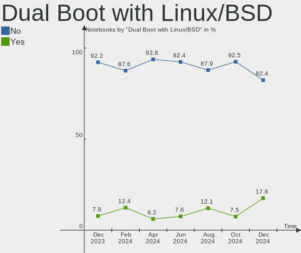
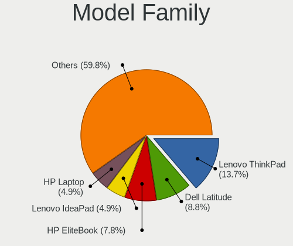
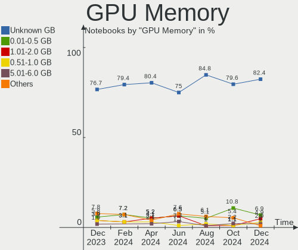
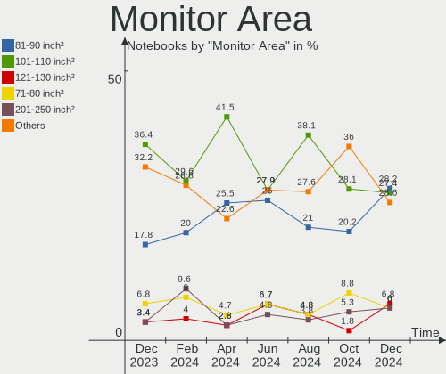

Linux in UK - Hardware Trends (Notebooks)
-----------------------------------------

A project to identify most popular hardware characteristics and track their change
over time based on data collected by Linux users at https://Linux-Hardware.org.

Anyone can contribute to this report by the [hw-probe](https://github.com/linuxhw/hw-probe) tool:

    sudo -E hw-probe -all -upload

Period: Jan, 2023.

Contents
--------

* [ System ](#system)
  - [ OS                       ](#os)
  - [ OS Family                ](#os-family)
  - [ Kernel                   ](#kernel)
  - [ Kernel Family            ](#kernel-family)
  - [ Kernel Major Ver.        ](#kernel-major-ver)
  - [ Arch                     ](#arch)
  - [ DE                       ](#de)
  - [ Display Server           ](#display-server)
  - [ Display Manager          ](#display-manager)
  - [ OS Lang                  ](#os-lang)
  - [ Boot Mode                ](#boot-mode)
  - [ Filesystem               ](#filesystem)
  - [ Part. scheme             ](#part-scheme)
  - [ Dual Boot with Linux/BSD ](#dual-boot-with-linuxbsd)
  - [ Dual Boot (Win)          ](#dual-boot-win)

* [ Board ](#board)
  - [ Vendor                   ](#vendor)
  - [ Model                    ](#model)
  - [ Model Family             ](#model-family)
  - [ MFG Year                 ](#mfg-year)
  - [ Form Factor              ](#form-factor)
  - [ Secure Boot              ](#secure-boot)
  - [ Coreboot                 ](#coreboot)
  - [ RAM Size                 ](#ram-size)
  - [ RAM Used                 ](#ram-used)
  - [ Total Drives             ](#total-drives)
  - [ Has CD-ROM               ](#has-cd-rom)
  - [ Has Ethernet             ](#has-ethernet)
  - [ Has WiFi                 ](#has-wifi)
  - [ Has Bluetooth            ](#has-bluetooth)

* [ Location ](#location)
  - [ Country                  ](#country)
  - [ City                     ](#city)

* [ Drives ](#drives)
  - [ Drive Vendor             ](#drive-vendor)
  - [ Drive Model              ](#drive-model)
  - [ HDD Vendor               ](#hdd-vendor)
  - [ SSD Vendor               ](#ssd-vendor)
  - [ Drive Kind               ](#drive-kind)
  - [ Drive Connector          ](#drive-connector)
  - [ Drive Size               ](#drive-size)
  - [ Space Total              ](#space-total)
  - [ Space Used               ](#space-used)
  - [ Malfunc. Drives          ](#malfunc-drives)
  - [ Malfunc. Drive Vendor    ](#malfunc-drive-vendor)
  - [ Malfunc. HDD Vendor      ](#malfunc-hdd-vendor)
  - [ Malfunc. Drive Kind      ](#malfunc-drive-kind)
  - [ Failed Drives            ](#failed-drives)
  - [ Failed Drive Vendor      ](#failed-drive-vendor)
  - [ Drive Status             ](#drive-status)

* [ Storage controller ](#storage-controller)
  - [ Storage Vendor           ](#storage-vendor)
  - [ Storage Model            ](#storage-model)
  - [ Storage Kind             ](#storage-kind)

* [ Processor ](#processor)
  - [ CPU Vendor               ](#cpu-vendor)
  - [ CPU Model                ](#cpu-model)
  - [ CPU Model Family         ](#cpu-model-family)
  - [ CPU Cores                ](#cpu-cores)
  - [ CPU Sockets              ](#cpu-sockets)
  - [ CPU Threads              ](#cpu-threads)
  - [ CPU Op-Modes             ](#cpu-op-modes)
  - [ CPU Microcode            ](#cpu-microcode)
  - [ CPU Microarch            ](#cpu-microarch)

* [ Graphics ](#graphics)
  - [ GPU Vendor               ](#gpu-vendor)
  - [ GPU Model                ](#gpu-model)
  - [ GPU Combo                ](#gpu-combo)
  - [ GPU Driver               ](#gpu-driver)
  - [ GPU Memory               ](#gpu-memory)

* [ Monitor ](#monitor)
  - [ Monitor Vendor           ](#monitor-vendor)
  - [ Monitor Model            ](#monitor-model)
  - [ Monitor Resolution       ](#monitor-resolution)
  - [ Monitor Diagonal         ](#monitor-diagonal)
  - [ Monitor Width            ](#monitor-width)
  - [ Aspect Ratio             ](#aspect-ratio)
  - [ Monitor Area             ](#monitor-area)
  - [ Pixel Density            ](#pixel-density)
  - [ Multiple Monitors        ](#multiple-monitors)

* [ Network ](#network)
  - [ Net Controller Vendor    ](#net-controller-vendor)
  - [ Net Controller Model     ](#net-controller-model)
  - [ Wireless Vendor          ](#wireless-vendor)
  - [ Wireless Model           ](#wireless-model)
  - [ Ethernet Vendor          ](#ethernet-vendor)
  - [ Ethernet Model           ](#ethernet-model)
  - [ Net Controller Kind      ](#net-controller-kind)
  - [ Used Controller          ](#used-controller)
  - [ NICs                     ](#nics)
  - [ IPv6                     ](#ipv6)

* [ Bluetooth ](#bluetooth)
  - [ Bluetooth Vendor         ](#bluetooth-vendor)
  - [ Bluetooth Model          ](#bluetooth-model)

* [ Sound ](#sound)
  - [ Sound Vendor             ](#sound-vendor)
  - [ Sound Model              ](#sound-model)

* [ Memory ](#memory)
  - [ Memory Vendor            ](#memory-vendor)
  - [ Memory Model             ](#memory-model)
  - [ Memory Kind              ](#memory-kind)
  - [ Memory Form Factor       ](#memory-form-factor)
  - [ Memory Size              ](#memory-size)
  - [ Memory Speed             ](#memory-speed)

* [ Printers & scanners ](#printers--scanners)
  - [ Printer Vendor           ](#printer-vendor)
  - [ Printer Model            ](#printer-model)
  - [ Scanner Vendor           ](#scanner-vendor)
  - [ Scanner Model            ](#scanner-model)

* [ Camera ](#camera)
  - [ Camera Vendor            ](#camera-vendor)
  - [ Camera Model             ](#camera-model)

* [ Security ](#security)
  - [ Fingerprint Vendor       ](#fingerprint-vendor)
  - [ Fingerprint Model        ](#fingerprint-model)
  - [ Chipcard Vendor          ](#chipcard-vendor)
  - [ Chipcard Model           ](#chipcard-model)

* [ Unsupported ](#unsupported)
  - [ Unsupported Devices      ](#unsupported-devices)
  - [ Unsupported Device Types ](#unsupported-device-types)

System
------

OS
--

Installed operating systems

| Name                 | Notebooks | Percent |
|----------------------|-----------|---------|
| OpenMandriva 23.01   | 31        | 23.66%  |
| Ubuntu 22.04         | 17        | 12.98%  |
| Linux Mint 21.1      | 8         | 6.11%   |
| Fedora 37            | 6         | 4.58%   |
| Ubuntu 20.04         | 5         | 3.82%   |
| SteamOS 3.4.4        | 5         | 3.82%   |
| Pop!_OS 22.04        | 5         | 3.82%   |
| Zorin 16             | 4         | 3.05%   |
| OpenMandriva 4.3     | 4         | 3.05%   |
| KDE neon 22.04       | 4         | 3.05%   |
| Debian 11            | 4         | 3.05%   |
| Arch Rolling         | 4         | 3.05%   |
| Ubuntu 22.10         | 3         | 2.29%   |
| Linux Mint 20.3      | 3         | 2.29%   |
| Ubuntu Budgie 22.10  | 2         | 1.53%   |
| SteamOS 3.4.2        | 2         | 1.53%   |
| Kubuntu 22.10        | 2         | 1.53%   |
| Kali 2022.4          | 2         | 1.53%   |
| Fedora 36            | 2         | 1.53%   |
| ArcoLinux Rolling    | 2         | 1.53%   |
| Ubuntu MATE 22.10    | 1         | 0.76%   |
| SteamOS 3.1          | 1         | 0.76%   |
| ROSA 12.3            | 1         | 0.76%   |
| OpenMandriva 4.50    | 1         | 0.76%   |
| MX 21                | 1         | 0.76%   |
| Manjaro 22.0.1       | 1         | 0.76%   |
| Manjaro              | 1         | 0.76%   |
| Linux Mint 21        | 1         | 0.76%   |
| Linux Mint 19.1      | 1         | 0.76%   |
| Linux Mint 19        | 1         | 0.76%   |
| Kubuntu 22.04        | 1         | 0.76%   |
| Garuda Linux Rolling | 1         | 0.76%   |
| EndeavourOS Rolling  | 1         | 0.76%   |
| Calculate 23         | 1         | 0.76%   |
| Archcraft Rolling    | 1         | 0.76%   |
| Alpine 3.17.0        | 1         | 0.76%   |

OS Family
---------

OS without a version

| Name          | Notebooks | Percent |
|---------------|-----------|---------|
| OpenMandriva  | 36        | 27.48%  |
| Ubuntu        | 25        | 19.08%  |
| Linux Mint    | 14        | 10.69%  |
| SteamOS       | 8         | 6.11%   |
| Fedora        | 8         | 6.11%   |
| Pop!_OS       | 5         | 3.82%   |
| Zorin         | 4         | 3.05%   |
| KDE neon      | 4         | 3.05%   |
| Debian        | 4         | 3.05%   |
| Arch          | 4         | 3.05%   |
| Kubuntu       | 3         | 2.29%   |
| Ubuntu Budgie | 2         | 1.53%   |
| Manjaro       | 2         | 1.53%   |
| Kali          | 2         | 1.53%   |
| ArcoLinux     | 2         | 1.53%   |
| Ubuntu MATE   | 1         | 0.76%   |
| ROSA          | 1         | 0.76%   |
| MX            | 1         | 0.76%   |
| Garuda Linux  | 1         | 0.76%   |
| EndeavourOS   | 1         | 0.76%   |
| Calculate     | 1         | 0.76%   |
| Archcraft     | 1         | 0.76%   |
| Alpine        | 1         | 0.76%   |

Kernel
------

Version of the Linux kernel

| Version                  | Notebooks | Percent |
|--------------------------|-----------|---------|
| 6.1.1-desktop-1omv2290   | 29        | 22.14%  |
| 5.15.0-58-generic        | 20        | 15.27%  |
| 5.15.0-56-generic        | 7         | 5.34%   |
| 5.13.0-valve36-1-neptune | 7         | 5.34%   |
| 5.15.0-57-generic        | 6         | 4.58%   |
| 6.0.12-76060006-generic  | 4         | 3.05%   |
| 5.19.0-29-generic        | 4         | 3.05%   |
| 5.16.7-desktop-1omv4003  | 4         | 3.05%   |
| 5.15.0-43-generic        | 3         | 2.29%   |
| 5.10.0-20-amd64          | 3         | 2.29%   |
| 6.1.7-arch1-1            | 2         | 1.53%   |
| 6.1.7-200.fc37.x86_64    | 2         | 1.53%   |
| 6.1.6-zen1-2-zen         | 2         | 1.53%   |
| 6.1.4-desktop-1omv2301   | 2         | 1.53%   |
| 6.0.7-301.fc37.x86_64    | 2         | 1.53%   |
| 6.0.0-kali6-amd64        | 2         | 1.53%   |
| 5.4.0-137-generic        | 2         | 1.53%   |
| 6.1.8-arch1-1            | 1         | 0.76%   |
| 6.1.8-2-liquorix-amd64   | 1         | 0.76%   |
| 6.1.7-zen1-1-zen         | 1         | 0.76%   |
| 6.1.6-arch1-3            | 1         | 0.76%   |
| 6.1.4-060104-generic     | 1         | 0.76%   |
| 6.1.2-arch1-1            | 1         | 0.76%   |
| 6.0.6-76060006-generic   | 1         | 0.76%   |
| 6.0.2-271-tkg-bore       | 1         | 0.76%   |
| 6.0.18-300.fc37.x86_64   | 1         | 0.76%   |
| 6.0.18-200.fc36.x86_64   | 1         | 0.76%   |
| 6.0.15-200.fc36.x86_64   | 1         | 0.76%   |
| 6.0.15-1-espMANJARO      | 1         | 0.76%   |
| 6.0.14-300.fc37.x86_64   | 1         | 0.76%   |
| 6.0.0-0.deb11.2-amd64    | 1         | 0.76%   |
| 5.8.0-50-generic         | 1         | 0.76%   |
| 5.4.0-91-generic         | 1         | 0.76%   |
| 5.4.0-135-generic        | 1         | 0.76%   |
| 5.4.0-128-generic        | 1         | 0.76%   |
| 5.19.17-2-MANJARO        | 1         | 0.76%   |
| 5.19.11-desktop-2omv4090 | 1         | 0.76%   |
| 5.19.0-31-generic        | 1         | 0.76%   |
| 5.19.0-26-generic        | 1         | 0.76%   |
| 5.19.0-1014-lowlatency   | 1         | 0.76%   |

Kernel Family
-------------

Linux kernel without a distro release

| Version | Notebooks | Percent |
|---------|-----------|---------|
| 5.15.0  | 37        | 28.24%  |
| 6.1.1   | 29        | 22.14%  |
| 5.13.0  | 8         | 6.11%   |
| 5.19.0  | 7         | 5.34%   |
| 6.1.7   | 5         | 3.82%   |
| 5.4.0   | 5         | 3.82%   |
| 6.0.12  | 4         | 3.05%   |
| 5.16.7  | 4         | 3.05%   |
| 5.10.0  | 4         | 3.05%   |
| 6.1.6   | 3         | 2.29%   |
| 6.1.4   | 3         | 2.29%   |
| 6.0.0   | 3         | 2.29%   |
| 6.1.8   | 2         | 1.53%   |
| 6.0.7   | 2         | 1.53%   |
| 6.0.18  | 2         | 1.53%   |
| 6.0.15  | 2         | 1.53%   |
| 6.1.2   | 1         | 0.76%   |
| 6.0.6   | 1         | 0.76%   |
| 6.0.2   | 1         | 0.76%   |
| 6.0.14  | 1         | 0.76%   |
| 5.8.0   | 1         | 0.76%   |
| 5.19.17 | 1         | 0.76%   |
| 5.19.11 | 1         | 0.76%   |
| 5.17.11 | 1         | 0.76%   |
| 5.15.86 | 1         | 0.76%   |
| 5.15.82 | 1         | 0.76%   |
| 4.15.0  | 1         | 0.76%   |

Kernel Major Ver.
-----------------

Linux kernel major version

| Version | Notebooks | Percent |
|---------|-----------|---------|
| 6.1     | 43        | 32.82%  |
| 5.15    | 39        | 29.77%  |
| 6.0     | 16        | 12.21%  |
| 5.19    | 9         | 6.87%   |
| 5.13    | 8         | 6.11%   |
| 5.4     | 5         | 3.82%   |
| 5.16    | 4         | 3.05%   |
| 5.10    | 4         | 3.05%   |
| 5.8     | 1         | 0.76%   |
| 5.17    | 1         | 0.76%   |
| 4.15    | 1         | 0.76%   |

Arch
----

OS architecture (x86_64, i586, etc.)

| Name   | Notebooks | Percent |
|--------|-----------|---------|
| x86_64 | 131       | 100%    |

DE
--

Desktop Environment

| Name       | Notebooks | Percent |
|------------|-----------|---------|
| KDE5       | 49        | 37.4%   |
| GNOME      | 45        | 34.35%  |
| X-Cinnamon | 15        | 11.45%  |
| XFCE       | 11        | 8.4%    |
| MATE       | 5         | 3.82%   |
| Unknown    | 3         | 2.29%   |
| Budgie     | 2         | 1.53%   |
| awesome    | 1         | 0.76%   |

Display Server
--------------

X11 or Wayland

| Name    | Notebooks | Percent |
|---------|-----------|---------|
| X11     | 98        | 74.81%  |
| Wayland | 29        | 22.14%  |
| Tty     | 4         | 3.05%   |

Display Manager
---------------

SDDM, LightDM, etc.

| Name    | Notebooks | Percent |
|---------|-----------|---------|
| SDDM    | 36        | 27.48%  |
| Unknown | 35        | 26.72%  |
| GDM3    | 26        | 19.85%  |
| LightDM | 22        | 16.79%  |
| GDM     | 12        | 9.16%   |

OS Lang
-------

Language

| Lang  | Notebooks | Percent |
|-------|-----------|---------|
| en_GB | 91        | 69.47%  |
| en_US | 32        | 24.43%  |
| C     | 3         | 2.29%   |
| fr_FR | 2         | 1.53%   |
| es_ES | 2         | 1.53%   |
| pl_PL | 1         | 0.76%   |

Boot Mode
---------

EFI or BIOS

| Mode | Notebooks | Percent |
|------|-----------|---------|
| EFI  | 66        | 50.38%  |
| BIOS | 65        | 49.62%  |

Filesystem
----------

Type of filesystem

| Type    | Notebooks | Percent |
|---------|-----------|---------|
| Ext4    | 81        | 61.83%  |
| Overlay | 29        | 22.14%  |
| Btrfs   | 18        | 13.74%  |
| Zfs     | 3         | 2.29%   |

Part. scheme
------------

Scheme of partitioning

| Type    | Notebooks | Percent |
|---------|-----------|---------|
| GPT     | 80        | 61.07%  |
| Unknown | 33        | 25.19%  |
| MBR     | 18        | 13.74%  |

Dual Boot with Linux/BSD
------------------------

Hosting more than one Linux/BSD

| Dual boot | Notebooks | Percent |
|-----------|-----------|---------|
| No        | 106       | 80.92%  |
| Yes       | 25        | 19.08%  |

Dual Boot (Win)
---------------

Hosting Linux and Windows

| Dual boot | Notebooks | Percent |
|-----------|-----------|---------|
| No        | 96        | 73.28%  |
| Yes       | 35        | 26.72%  |

Board
-----

Vendor
------

Motherboard manufacturer

| Name                | Notebooks | Percent |
|---------------------|-----------|---------|
| Lenovo              | 26        | 19.85%  |
| Dell                | 19        | 14.5%   |
| Hewlett-Packard     | 16        | 12.21%  |
| ASUSTek Computer    | 16        | 12.21%  |
| Toshiba             | 11        | 8.4%    |
| Valve               | 8         | 6.11%   |
| Acer                | 5         | 3.82%   |
| Sony                | 4         | 3.05%   |
| PC Specialist       | 3         | 2.29%   |
| Google              | 3         | 2.29%   |
| Apple               | 3         | 2.29%   |
| Razer               | 2         | 1.53%   |
| Packard Bell        | 2         | 1.53%   |
| Notebook            | 2         | 1.53%   |
| TUXEDO              | 1         | 0.76%   |
| Samsung Electronics | 1         | 0.76%   |
| Razer x Lambda      | 1         | 0.76%   |
| OEGStone            | 1         | 0.76%   |
| Novatech            | 1         | 0.76%   |
| MSI                 | 1         | 0.76%   |
| Gateway             | 1         | 0.76%   |
| Clevo               | 1         | 0.76%   |
| Alienware           | 1         | 0.76%   |
| Advent              | 1         | 0.76%   |
| Unknown             | 1         | 0.76%   |

Model
-----

Motherboard model

| Name                                  | Notebooks | Percent |
|---------------------------------------|-----------|---------|
| Valve Jupiter                         | 8         | 6.11%   |
| ASUS ROG Flow X13 GV301QH_GV301QH     | 5         | 3.82%   |
| Toshiba Satellite Pro C50-A-1E6       | 2         | 1.53%   |
| Toshiba Satellite C660                | 2         | 1.53%   |
| Dell XPS 13 7390                      | 2         | 1.53%   |
| Dell Inspiron N5110                   | 2         | 1.53%   |
| ASUS Zenbook UX5401ZAS_UX5401ZAS      | 2         | 1.53%   |
| ASUS X102BA                           | 2         | 1.53%   |
| Unknown                               | 2         | 1.53%   |
| TUXEDO Pulse 15 Gen1                  | 1         | 0.76%   |
| Toshiba Satellite Pro L450D           | 1         | 0.76%   |
| Toshiba Satellite Pro C660            | 1         | 0.76%   |
| Toshiba Satellite P50-C               | 1         | 0.76%   |
| Toshiba Satellite L70-C-12H           | 1         | 0.76%   |
| Toshiba Satellite C850-1GL            | 1         | 0.76%   |
| Toshiba Satellite C50-B               | 1         | 0.76%   |
| Toshiba EQUIUM A100                   | 1         | 0.76%   |
| Sony VPCEH3N6E                        | 1         | 0.76%   |
| Sony VGN-NW26M                        | 1         | 0.76%   |
| Sony SVF1521Q1EW                      | 1         | 0.76%   |
| Sony SVE1513B4E                       | 1         | 0.76%   |
| Samsung 350V5C/351V5C/3540VC/3440VC   | 1         | 0.76%   |
| Razer x Lambda TensorBook (late 2021) | 1         | 0.76%   |
| Razer Blade 17 (2022) - RZ09-0423     | 1         | 0.76%   |
| Razer Blade 15 (2022) - RZ09-0421     | 1         | 0.76%   |
| PC Specialist P65_P67RGRERA           | 1         | 0.76%   |
| PC Specialist P65_67RSRP              | 1         | 0.76%   |
| PC Specialist Elimina Iv 17           | 1         | 0.76%   |
| Packard Bell EasyNote TM97            | 1         | 0.76%   |
| Packard Bell EasyNote TM82            | 1         | 0.76%   |
| OEGStone C4100/C5100                  | 1         | 0.76%   |
| Novatech NL40_50CU                    | 1         | 0.76%   |
| Notebook PCx0Dx                       | 1         | 0.76%   |
| Notebook P17SM-A                      | 1         | 0.76%   |
| MSI Katana GF66 11UE                  | 1         | 0.76%   |
| Lenovo Z51-70 80K6                    | 1         | 0.76%   |
| Lenovo Yoga 3 14 80JH                 | 1         | 0.76%   |
| Lenovo Yoga 2 11 20332                | 1         | 0.76%   |
| Lenovo ThinkPad X260 20F5S28R00       | 1         | 0.76%   |
| Lenovo ThinkPad X131e 33711Q7         | 1         | 0.76%   |

Model Family
------------

Motherboard model prefix

| Name                      | Notebooks | Percent |
|---------------------------|-----------|---------|
| Lenovo ThinkPad           | 13        | 9.92%   |
| Toshiba Satellite         | 10        | 7.63%   |
| Valve Jupiter             | 8         | 6.11%   |
| Lenovo IdeaPad            | 7         | 5.34%   |
| Dell Latitude             | 7         | 5.34%   |
| HP EliteBook              | 6         | 4.58%   |
| Dell Inspiron             | 6         | 4.58%   |
| ASUS VivoBook             | 6         | 4.58%   |
| ASUS ROG                  | 5         | 3.82%   |
| Dell XPS                  | 4         | 3.05%   |
| Acer Aspire               | 4         | 3.05%   |
| Razer Blade               | 2         | 1.53%   |
| PC Specialist P65         | 2         | 1.53%   |
| Packard Bell EasyNote     | 2         | 1.53%   |
| Lenovo Yoga               | 2         | 1.53%   |
| Lenovo ThinkBook          | 2         | 1.53%   |
| HP Laptop                 | 2         | 1.53%   |
| ASUS Zenbook              | 2         | 1.53%   |
| ASUS X102BA               | 2         | 1.53%   |
| Unknown                   | 2         | 1.53%   |
| TUXEDO Pulse              | 1         | 0.76%   |
| Toshiba EQUIUM            | 1         | 0.76%   |
| Sony VPCEH3N6E            | 1         | 0.76%   |
| Sony VGN-NW26M            | 1         | 0.76%   |
| Sony SVF1521Q1EW          | 1         | 0.76%   |
| Sony SVE1513B4E           | 1         | 0.76%   |
| Samsung 350V5C            | 1         | 0.76%   |
| Razer x Lambda TensorBook | 1         | 0.76%   |
| PC Specialist Elimina     | 1         | 0.76%   |
| OEGStone C4100            | 1         | 0.76%   |
| Novatech NL40             | 1         | 0.76%   |
| Notebook PCx0Dx           | 1         | 0.76%   |
| Notebook P17SM-A          | 1         | 0.76%   |
| MSI Katana                | 1         | 0.76%   |
| Lenovo Z51-70             | 1         | 0.76%   |
| Lenovo Flex               | 1         | 0.76%   |
| HP ZBook                  | 1         | 0.76%   |
| HP Sona                   | 1         | 0.76%   |
| HP ProBook                | 1         | 0.76%   |
| HP Presario               | 1         | 0.76%   |

MFG Year
--------

Motherboard manufacture year

| Year | Notebooks | Percent |
|------|-----------|---------|
| 2022 | 20        | 15.27%  |
| 2021 | 14        | 10.69%  |
| 2020 | 14        | 10.69%  |
| 2015 | 9         | 6.87%   |
| 2013 | 9         | 6.87%   |
| 2019 | 8         | 6.11%   |
| 2016 | 8         | 6.11%   |
| 2014 | 7         | 5.34%   |
| 2012 | 7         | 5.34%   |
| 2011 | 7         | 5.34%   |
| 2018 | 6         | 4.58%   |
| 2017 | 6         | 4.58%   |
| 2010 | 6         | 4.58%   |
| 2009 | 3         | 2.29%   |
| 2008 | 3         | 2.29%   |
| 2007 | 3         | 2.29%   |
| 2023 | 1         | 0.76%   |

Form Factor
-----------

Physical design of the computer

| Name     | Notebooks | Percent |
|----------|-----------|---------|
| Notebook | 131       | 100%    |

Secure Boot
-----------

Enabled or disabled

| State    | Notebooks | Percent |
|----------|-----------|---------|
| Disabled | 120       | 91.6%   |
| Enabled  | 11        | 8.4%    |

Coreboot
--------

Have coreboot on board

| Used | Notebooks | Percent |
|------|-----------|---------|
| No   | 127       | 96.95%  |
| Yes  | 4         | 3.05%   |

RAM Size
--------

Total RAM memory

| Size in GB  | Notebooks | Percent |
|-------------|-----------|---------|
| 8.01-16.0   | 33        | 25.19%  |
| 4.01-8.0    | 29        | 22.14%  |
| 16.01-24.0  | 27        | 20.61%  |
| 3.01-4.0    | 25        | 19.08%  |
| 32.01-64.0  | 7         | 5.34%   |
| 2.01-3.0    | 4         | 3.05%   |
| 1.01-2.0    | 3         | 2.29%   |
| 64.01-256.0 | 2         | 1.53%   |
| 24.01-32.0  | 1         | 0.76%   |

RAM Used
--------

Used RAM memory

| Used GB    | Notebooks | Percent |
|------------|-----------|---------|
| 1.01-2.0   | 56        | 42.75%  |
| 2.01-3.0   | 33        | 25.19%  |
| 4.01-8.0   | 18        | 13.74%  |
| 3.01-4.0   | 15        | 11.45%  |
| 8.01-16.0  | 5         | 3.82%   |
| 0.51-1.0   | 3         | 2.29%   |
| 16.01-24.0 | 1         | 0.76%   |

Total Drives
------------

Number of drives on board

| Drives | Notebooks | Percent |
|--------|-----------|---------|
| 1      | 89        | 67.94%  |
| 2      | 31        | 23.66%  |
| 3      | 7         | 5.34%   |
| 4      | 4         | 3.05%   |

Has CD-ROM
----------

Has CD-ROM on board

| Presented | Notebooks | Percent |
|-----------|-----------|---------|
| No        | 90        | 68.7%   |
| Yes       | 41        | 31.3%   |

Has Ethernet
------------

Has Ethernet on board

| Presented | Notebooks | Percent |
|-----------|-----------|---------|
| Yes       | 94        | 71.76%  |
| No        | 37        | 28.24%  |

Has WiFi
--------

Has WiFi module

| Presented | Notebooks | Percent |
|-----------|-----------|---------|
| Yes       | 131       | 100%    |

Has Bluetooth
-------------

Has Bluetooth module

| Presented | Notebooks | Percent |
|-----------|-----------|---------|
| Yes       | 108       | 82.44%  |
| No        | 23        | 17.56%  |

Location
--------

Country
-------

Geographic location (country)

| Country | Notebooks | Percent |
|---------|-----------|---------|
| UK      | 131       | 100%    |

City
----

Geographic location (city)

| City             | Notebooks | Percent |
|------------------|-----------|---------|
| London           | 19        | 14.5%   |
| Birmingham       | 7         | 5.34%   |
| Southampton      | 5         | 3.82%   |
| Manchester       | 4         | 3.05%   |
| Glasgow          | 4         | 3.05%   |
| Canterbury       | 4         | 3.05%   |
| Nottingham       | 3         | 2.29%   |
| Leeds            | 3         | 2.29%   |
| Dudley           | 3         | 2.29%   |
| Derby            | 3         | 2.29%   |
| Bolton           | 3         | 2.29%   |
| Shipley          | 2         | 1.53%   |
| Plymouth         | 2         | 1.53%   |
| Peterborough     | 2         | 1.53%   |
| Crewe            | 2         | 1.53%   |
| Worcester        | 1         | 0.76%   |
| Woodford Green   | 1         | 0.76%   |
| Watford          | 1         | 0.76%   |
| Warrington       | 1         | 0.76%   |
| Walsall          | 1         | 0.76%   |
| Wakefield        | 1         | 0.76%   |
| Teignmouth       | 1         | 0.76%   |
| Tamworth         | 1         | 0.76%   |
| Swansea          | 1         | 0.76%   |
| Sutton           | 1         | 0.76%   |
| Stroud           | 1         | 0.76%   |
| Strabane         | 1         | 0.76%   |
| Stockton-on-Tees | 1         | 0.76%   |
| Spalding         | 1         | 0.76%   |
| Southend-on-Sea  | 1         | 0.76%   |
| Soham            | 1         | 0.76%   |
| Sheffield        | 1         | 0.76%   |
| Saint Ives       | 1         | 0.76%   |
| Rotherham        | 1         | 0.76%   |
| Rochester        | 1         | 0.76%   |
| Pontlliw         | 1         | 0.76%   |
| Penarth          | 1         | 0.76%   |
| Okehampton       | 1         | 0.76%   |
| Norwich          | 1         | 0.76%   |
| Northampton      | 1         | 0.76%   |

Drives
------

Drive Vendor
------------

Hard drive vendors

| Vendor                      | Notebooks | Drives | Percent |
|-----------------------------|-----------|--------|---------|
| Samsung Electronics         | 24        | 30     | 14.46%  |
| Unknown                     | 16        | 17     | 9.64%   |
| WDC                         | 14        | 14     | 8.43%   |
| Toshiba                     | 14        | 14     | 8.43%   |
| Seagate                     | 14        | 16     | 8.43%   |
| SanDisk                     | 11        | 12     | 6.63%   |
| Crucial                     | 9         | 12     | 5.42%   |
| SK hynix                    | 8         | 8      | 4.82%   |
| Kingston                    | 8         | 8      | 4.82%   |
| Hitachi                     | 6         | 6      | 3.61%   |
| Phison Electronics          | 3         | 3      | 1.81%   |
| Phison                      | 3         | 3      | 1.81%   |
| Micron Technology           | 3         | 3      | 1.81%   |
| O2 Micro                    | 2         | 2      | 1.2%    |
| KIOXIA                      | 2         | 2      | 1.2%    |
| Kingston Technology Company | 2         | 2      | 1.2%    |
| Intel                       | 2         | 2      | 1.2%    |
| Integral                    | 2         | 2      | 1.2%    |
| Unknown                     | 2         | 2      | 1.2%    |
| Zheino                      | 1         | 1      | 0.6%    |
| USB3.0                      | 1         | 1      | 0.6%    |
| UMIS                        | 1         | 1      | 0.6%    |
| TO Exter                    | 1         | 1      | 0.6%    |
| TCSUNBOW                    | 1         | 1      | 0.6%    |
| SSSTC                       | 1         | 1      | 0.6%    |
| SSK                         | 1         | 2      | 0.6%    |
| SSD 500G                    | 1         | 1      | 0.6%    |
| Silicon Motion              | 1         | 1      | 0.6%    |
| Patriot                     | 1         | 1      | 0.6%    |
| OCZ                         | 1         | 1      | 0.6%    |
| MAXIO Technology (Hangzhou) | 1         | 1      | 0.6%    |
| Lenovo                      | 1         | 1      | 0.6%    |
| KingFast                    | 1         | 1      | 0.6%    |
| JMicron Technology          | 1         | 1      | 0.6%    |
| HGST                        | 1         | 1      | 0.6%    |
| Fujitsu                     | 1         | 1      | 0.6%    |
| Apple                       | 1         | 1      | 0.6%    |
| ADATA Technology            | 1         | 1      | 0.6%    |
| A-DATA Technology           | 1         | 1      | 0.6%    |
| 2-Power                     | 1         | 1      | 0.6%    |

Drive Model
-----------

Hard drive models

| Model                                                | Notebooks | Percent |
|------------------------------------------------------|-----------|---------|
| WDC PC SN530 SDBPTPZ-512G-1002 512GB                 | 5         | 2.87%   |
| Samsung PSSD T7 500GB                                | 5         | 2.87%   |
| Seagate ST1000LM024 HN-M101MBB 1TB                   | 3         | 1.72%   |
| Samsung Portable SSD T5 1TB                          | 3         | 1.72%   |
| Unknown SD/MMC/MS PRO 2GB                            | 2         | 1.15%   |
| Unknown MMC Card  64GB                               | 2         | 1.15%   |
| Unknown MMC Card  512GB                              | 2         | 1.15%   |
| Unknown MMC Card  256GB                              | 2         | 1.15%   |
| Unknown DA4032  32GB                                 | 2         | 1.15%   |
| Toshiba MQ04ABF100 1TB                               | 2         | 1.15%   |
| Toshiba MQ01ABF050 500GB                             | 2         | 1.15%   |
| Toshiba MQ01ABD100 1TB                               | 2         | 1.15%   |
| Seagate ST1000LM049-2GH172 1TB                       | 2         | 1.15%   |
| Sandisk WD Blue SN550 NVMe SSD 1TB                   | 2         | 1.15%   |
| SanDisk SD8TB8U256G1001 256GB SSD                    | 2         | 1.15%   |
| Samsung NVMe SSD Controller SM981/PM981/PM983 500GB  | 2         | 1.15%   |
| Samsung NVMe SSD Controller PM9A1/PM9A3/980PRO 512GB | 2         | 1.15%   |
| Samsung MZVL21T0HCLR-00B00 1TB                       | 2         | 1.15%   |
| O2 Micro E2M2 64GB                                   | 2         | 1.15%   |
| Micron 2450_MTFDKBA1T0TFK 1TB                        | 2         | 1.15%   |
| KIOXIA KBG40ZNS256G NVMe 256GB                       | 2         | 1.15%   |
| Kingston Company OM3PDP3 NVMe SSD 512GB              | 2         | 1.15%   |
| Kingston OM8PCP3512F-AB 512GB                        | 2         | 1.15%   |
| Crucial CT250MX500SSD1 250GB                         | 2         | 1.15%   |
| Unknown                                              | 2         | 1.15%   |
| Zheino CHN 25SATA01M 120 120GB                       | 1         | 0.57%   |
| WDC WDS500G2B0A-00SM50 500GB SSD                     | 1         | 0.57%   |
| WDC WDS250G2B0A 250GB SSD                            | 1         | 0.57%   |
| WDC WD5000BEVT-22A0RT0 500GB                         | 1         | 0.57%   |
| WDC WD2500BEVT-80A23T0 250GB                         | 1         | 0.57%   |
| WDC WD20SPZX-22UA7T0 2TB                             | 1         | 0.57%   |
| WDC WD10SPZX-75Z10T2 1TB                             | 1         | 0.57%   |
| WDC WD10SPCX-60KHST0 1TB                             | 1         | 0.57%   |
| WDC WD10JPVX-60JC3T0 1TB                             | 1         | 0.57%   |
| WDC WD Green M.2 2280 480GB                          | 1         | 0.57%   |
| USB3.0 Super Speed 128GB                             | 1         | 0.57%   |
| Unknown SC128  128GB                                 | 1         | 0.57%   |
| Unknown NVMe SSD Drive 1TB                           | 1         | 0.57%   |
| Unknown MMC32G  32GB                                 | 1         | 0.57%   |
| Unknown MMC Card  2TB                                | 1         | 0.57%   |

HDD Vendor
----------

Hard disk drive vendors

| Vendor  | Notebooks | Drives | Percent |
|---------|-----------|--------|---------|
| Seagate | 14        | 16     | 32.56%  |
| Toshiba | 12        | 12     | 27.91%  |
| WDC     | 6         | 6      | 13.95%  |
| Hitachi | 6         | 6      | 13.95%  |
| Unknown | 2         | 2      | 4.65%   |
| USB3.0  | 1         | 1      | 2.33%   |
| HGST    | 1         | 1      | 2.33%   |
| Fujitsu | 1         | 1      | 2.33%   |

SSD Vendor
----------

Solid state drive vendors

| Vendor              | Notebooks | Drives | Percent |
|---------------------|-----------|--------|---------|
| Samsung Electronics | 14        | 18     | 28%     |
| SanDisk             | 9         | 9      | 18%     |
| Crucial             | 7         | 10     | 14%     |
| Kingston            | 4         | 4      | 8%      |
| WDC                 | 2         | 2      | 4%      |
| Integral            | 2         | 2      | 4%      |
| Zheino              | 1         | 1      | 2%      |
| Toshiba             | 1         | 1      | 2%      |
| TO Exter            | 1         | 1      | 2%      |
| TCSUNBOW            | 1         | 1      | 2%      |
| SK hynix            | 1         | 1      | 2%      |
| Patriot             | 1         | 1      | 2%      |
| OCZ                 | 1         | 1      | 2%      |
| Lenovo              | 1         | 1      | 2%      |
| KingFast            | 1         | 1      | 2%      |
| Intel               | 1         | 1      | 2%      |
| A-DATA Technology   | 1         | 1      | 2%      |
| 2-Power             | 1         | 1      | 2%      |

Drive Kind
----------

HDD or SSD

| Kind    | Notebooks | Drives | Percent |
|---------|-----------|--------|---------|
| NVMe    | 52        | 58     | 33.12%  |
| SSD     | 46        | 57     | 29.3%   |
| HDD     | 41        | 45     | 26.11%  |
| MMC     | 15        | 15     | 9.55%   |
| Unknown | 3         | 5      | 1.91%   |

Drive Connector
---------------

SATA, SAS, NVMe, etc.

| Type | Notebooks | Drives | Percent |
|------|-----------|--------|---------|
| SATA | 75        | 89     | 48.39%  |
| NVMe | 52        | 58     | 33.55%  |
| MMC  | 15        | 15     | 9.68%   |
| SAS  | 13        | 18     | 8.39%   |

Drive Size
----------

Size of hard drive

| Size in TB | Notebooks | Drives | Percent |
|------------|-----------|--------|---------|
| 0.01-0.5   | 62        | 68     | 67.39%  |
| 0.51-1.0   | 26        | 29     | 28.26%  |
| 1.01-2.0   | 4         | 5      | 4.35%   |

Space Total
-----------

Amount of disk space available on the file system

| Size in GB     | Notebooks | Percent |
|----------------|-----------|---------|
| 101-250        | 30        | 22.9%   |
| 251-500        | 29        | 22.14%  |
| 1-20           | 25        | 19.08%  |
| 501-1000       | 24        | 18.32%  |
| 1001-2000      | 8         | 6.11%   |
| 21-50          | 5         | 3.82%   |
| 51-100         | 5         | 3.82%   |
| Unknown        | 3         | 2.29%   |
| More than 3000 | 2         | 1.53%   |

Space Used
----------

Amount of used disk space

| Used GB   | Notebooks | Percent |
|-----------|-----------|---------|
| 1-20      | 61        | 46.56%  |
| 101-250   | 22        | 16.79%  |
| 21-50     | 16        | 12.21%  |
| 251-500   | 11        | 8.4%    |
| 51-100    | 10        | 7.63%   |
| 1001-2000 | 4         | 3.05%   |
| 501-1000  | 4         | 3.05%   |
| Unknown   | 3         | 2.29%   |

Malfunc. Drives
---------------

Drive models with a malfunction

| Model                              | Notebooks | Drives | Percent |
|------------------------------------|-----------|--------|---------|
| Toshiba MQ01ABD100 1TB             | 1         | 1      | 9.09%   |
| Toshiba MK5065GSXN 500GB           | 1         | 1      | 9.09%   |
| Toshiba MK3256GSY 320GB            | 1         | 1      | 9.09%   |
| Toshiba MK2565GSXN 250GB           | 1         | 1      | 9.09%   |
| Toshiba HDWJ105 500GB              | 1         | 1      | 9.09%   |
| Seagate ST9500325AS 500GB          | 1         | 1      | 9.09%   |
| Seagate ST9100824AS 100GB          | 1         | 1      | 9.09%   |
| Seagate ST1000LM024 HN-M101MBB 1TB | 1         | 1      | 9.09%   |
| Intel SSDSC2BW240A4 240GB          | 1         | 1      | 9.09%   |
| Hitachi HTS543216L9SA00 160GB      | 1         | 1      | 9.09%   |
| 2-Power SSD2042B 256GB             | 1         | 1      | 9.09%   |

Malfunc. Drive Vendor
---------------------

Vendors of faulty drives

| Vendor  | Notebooks | Drives | Percent |
|---------|-----------|--------|---------|
| Toshiba | 5         | 5      | 45.45%  |
| Seagate | 3         | 3      | 27.27%  |
| Intel   | 1         | 1      | 9.09%   |
| Hitachi | 1         | 1      | 9.09%   |
| 2-Power | 1         | 1      | 9.09%   |

Malfunc. HDD Vendor
-------------------

Vendors of faulty HDD drives

| Vendor  | Notebooks | Drives | Percent |
|---------|-----------|--------|---------|
| Toshiba | 5         | 5      | 55.56%  |
| Seagate | 3         | 3      | 33.33%  |
| Hitachi | 1         | 1      | 11.11%  |

Malfunc. Drive Kind
-------------------

Kinds of faulty drives

| Kind | Notebooks | Drives | Percent |
|------|-----------|--------|---------|
| HDD  | 9         | 9      | 81.82%  |
| SSD  | 2         | 2      | 18.18%  |

Failed Drives
-------------

Failed drive models

Zero info for selected period =(

Failed Drive Vendor
-------------------

Failed drive vendors

Zero info for selected period =(

Drive Status
------------

Number of failed and malfunc. drives

| Status   | Notebooks | Drives | Percent |
|----------|-----------|--------|---------|
| Detected | 68        | 95     | 49.28%  |
| Works    | 59        | 74     | 42.75%  |
| Malfunc  | 11        | 11     | 7.97%   |

Storage controller
------------------

Storage Vendor
--------------

Storage controller vendors

| Vendor                         | Notebooks | Percent |
|--------------------------------|-----------|---------|
| Intel                          | 81        | 52.94%  |
| AMD                            | 15        | 9.8%    |
| Samsung Electronics            | 11        | 7.19%   |
| SK hynix                       | 8         | 5.23%   |
| SanDisk                        | 8         | 5.23%   |
| Kingston Technology Company    | 6         | 3.92%   |
| Phison Electronics             | 5         | 3.27%   |
| Micron Technology              | 3         | 1.96%   |
| Solid State Storage Technology | 2         | 1.31%   |
| O2 Micro                       | 2         | 1.31%   |
| Nvidia                         | 2         | 1.31%   |
| Micron/Crucial Technology      | 2         | 1.31%   |
| KIOXIA                         | 2         | 1.31%   |
| Union Memory (Shenzhen)        | 1         | 0.65%   |
| Toshiba America Info Systems   | 1         | 0.65%   |
| Silicon Motion                 | 1         | 0.65%   |
| MAXIO Technology (Hangzhou)    | 1         | 0.65%   |
| Apple                          | 1         | 0.65%   |
| ADATA Technology               | 1         | 0.65%   |

Storage Model
-------------

Storage controller models

| Model                                                                            | Notebooks | Percent |
|----------------------------------------------------------------------------------|-----------|---------|
| AMD FCH SATA Controller [AHCI mode]                                              | 13        | 7.98%   |
| Intel Volume Management Device NVMe RAID Controller                              | 9         | 5.52%   |
| Intel 82801 Mobile SATA Controller [RAID mode]                                   | 9         | 5.52%   |
| Intel 7 Series Chipset Family 6-port SATA Controller [AHCI mode]                 | 9         | 5.52%   |
| Intel Wildcat Point-LP SATA Controller [AHCI Mode]                               | 6         | 3.68%   |
| Intel Sunrise Point-LP SATA Controller [AHCI mode]                               | 6         | 3.68%   |
| Intel 82801IBM/IEM (ICH9M/ICH9M-E) 4 port SATA Controller [AHCI mode]            | 6         | 3.68%   |
| SK hynix Gold P31/PC711 NVMe Solid State Drive                                   | 5         | 3.07%   |
| SanDisk Non-Volatile memory controller                                           | 5         | 3.07%   |
| Intel 6 Series/C200 Series Chipset Family 6 port Mobile SATA AHCI Controller     | 5         | 3.07%   |
| Samsung NVMe SSD Controller SM981/PM981/PM983                                    | 4         | 2.45%   |
| Samsung NVMe SSD Controller PM9A1/PM9A3/980PRO                                   | 4         | 2.45%   |
| Kingston Company OM3PDP3 NVMe SSD                                                | 4         | 2.45%   |
| Intel Tiger Lake-LP SATA Controller                                              | 4         | 2.45%   |
| Intel Celeron/Pentium Silver Processor SATA Controller                           | 4         | 2.45%   |
| Micron Non-Volatile memory controller                                            | 3         | 1.84%   |
| Intel Atom Processor E3800 Series SATA AHCI Controller                           | 3         | 1.84%   |
| Intel 8 Series/C220 Series Chipset Family 6-port SATA Controller 1 [AHCI mode]   | 3         | 1.84%   |
| Solid State Storage Non-Volatile memory controller                               | 2         | 1.23%   |
| SK hynix BC511                                                                   | 2         | 1.23%   |
| SanDisk WD Blue SN550 NVMe SSD                                                   | 2         | 1.23%   |
| Phison PS5013 E13 NVMe Controller                                                | 2         | 1.23%   |
| Phison E16 PCIe4 NVMe Controller                                                 | 2         | 1.23%   |
| O2 Micro Non-Volatile memory controller                                          | 2         | 1.23%   |
| KIOXIA NVMe SSD Controller BG4                                                   | 2         | 1.23%   |
| Kingston Company Company Non-Volatile memory controller                          | 2         | 1.23%   |
| Intel HM170/QM170 Chipset SATA Controller [AHCI Mode]                            | 2         | 1.23%   |
| Intel Atom/Celeron/Pentium Processor x5-E8000/J3xxx/N3xxx Series SATA Controller | 2         | 1.23%   |
| Intel 82801IBM/IEM (ICH9M/ICH9M-E) 2 port SATA Controller [IDE mode]             | 2         | 1.23%   |
| Intel 400 Series Chipset Family SATA AHCI Controller                             | 2         | 1.23%   |
| Union Memory (Shenzhen) Non-Volatile memory controller                           | 1         | 0.61%   |
| Toshiba America Info Systems XG6 NVMe SSD Controller                             | 1         | 0.61%   |
| SK hynix BC501 NVMe Solid State Drive                                            | 1         | 0.61%   |
| Silicon Motion SM2263EN/SM2263XT SSD Controller                                  | 1         | 0.61%   |
| SanDisk WD PC SN810 / Black SN850 NVMe SSD                                       | 1         | 0.61%   |
| Samsung NVMe SSD Controller SM961/PM961/SM963                                    | 1         | 0.61%   |
| Samsung NVMe SSD Controller SM951/PM951                                          | 1         | 0.61%   |
| Samsung NVMe SSD Controller 980                                                  | 1         | 0.61%   |
| Phison E18 PCIe4 NVMe Controller                                                 | 1         | 0.61%   |
| Phison E12 NVMe Controller                                                       | 1         | 0.61%   |

Storage Kind
------------

Kind of storage controller (IDE, SATA, NVMe, SAS, ...)

| Kind | Notebooks | Percent |
|------|-----------|---------|
| SATA | 78        | 50%     |
| NVMe | 53        | 33.97%  |
| RAID | 18        | 11.54%  |
| IDE  | 7         | 4.49%   |

Processor
---------

CPU Vendor
----------

Processor vendors

| Vendor | Notebooks | Percent |
|--------|-----------|---------|
| Intel  | 98        | 74.81%  |
| AMD    | 33        | 25.19%  |

CPU Model
---------

Processor models

| Model                                       | Notebooks | Percent |
|---------------------------------------------|-----------|---------|
| AMD Custom APU 0405                         | 8         | 6.11%   |
| Intel 11th Gen Core i7-11800H @ 2.30GHz     | 5         | 3.82%   |
| AMD Ryzen 9 5900HS with Radeon Graphics     | 5         | 3.82%   |
| Intel Core i7-6700HQ CPU @ 2.60GHz          | 3         | 2.29%   |
| Intel Core i7-5500U CPU @ 2.40GHz           | 3         | 2.29%   |
| Intel Core i7-10510U CPU @ 1.80GHz          | 3         | 2.29%   |
| Intel Core i5-6300U CPU @ 2.40GHz           | 3         | 2.29%   |
| Intel 12th Gen Core i7-12700H               | 3         | 2.29%   |
| Intel Pentium Dual-Core CPU T4500 @ 2.30GHz | 2         | 1.53%   |
| Intel Core i5-8265U CPU @ 1.60GHz           | 2         | 1.53%   |
| Intel Core i5-5200U CPU @ 2.20GHz           | 2         | 1.53%   |
| Intel Core i5-4300U CPU @ 1.90GHz           | 2         | 1.53%   |
| Intel Core i5-3320M CPU @ 2.60GHz           | 2         | 1.53%   |
| Intel Core i5-3230M CPU @ 2.60GHz           | 2         | 1.53%   |
| Intel Core i5-3210M CPU @ 2.50GHz           | 2         | 1.53%   |
| Intel Core 2 Duo CPU P8600 @ 2.40GHz        | 2         | 1.53%   |
| Intel Celeron N4020 CPU @ 1.10GHz           | 2         | 1.53%   |
| Intel Celeron CPU N2840 @ 2.16GHz           | 2         | 1.53%   |
| Intel 12th Gen Core i7-12800H               | 2         | 1.53%   |
| Intel 11th Gen Core i7-1165G7 @ 2.80GHz     | 2         | 1.53%   |
| Intel 11th Gen Core i5-1135G7 @ 2.40GHz     | 2         | 1.53%   |
| AMD Ryzen 7 4800H with Radeon Graphics      | 2         | 1.53%   |
| AMD A4-1200 APU with Radeon HD Graphics     | 2         | 1.53%   |
| Intel Pentium Silver N5030 CPU @ 1.10GHz    | 1         | 0.76%   |
| Intel Pentium Silver N5000 CPU @ 1.10GHz    | 1         | 0.76%   |
| Intel Pentium Dual-Core CPU T4400 @ 2.20GHz | 1         | 0.76%   |
| Intel Pentium Dual-Core CPU T4300 @ 2.10GHz | 1         | 0.76%   |
| Intel Pentium CPU N4200 @ 1.10GHz           | 1         | 0.76%   |
| Intel Pentium CPU N3540 @ 2.16GHz           | 1         | 0.76%   |
| Intel Pentium CPU B940 @ 2.00GHz            | 1         | 0.76%   |
| Intel Core M-5Y51 CPU @ 1.10GHz             | 1         | 0.76%   |
| Intel Core i7-9750H CPU @ 2.60GHz           | 1         | 0.76%   |
| Intel Core i7-8750H CPU @ 2.20GHz           | 1         | 0.76%   |
| Intel Core i7-8565U CPU @ 1.80GHz           | 1         | 0.76%   |
| Intel Core i7-7600U CPU @ 2.80GHz           | 1         | 0.76%   |
| Intel Core i7-6600U CPU @ 2.60GHz           | 1         | 0.76%   |
| Intel Core i7-6500U CPU @ 2.50GHz           | 1         | 0.76%   |
| Intel Core i7-4710MQ CPU @ 2.50GHz          | 1         | 0.76%   |
| Intel Core i7-4700MQ CPU @ 2.40GHz          | 1         | 0.76%   |
| Intel Core i7-4600M CPU @ 2.90GHz           | 1         | 0.76%   |

CPU Model Family
----------------

Processor model prefix

| Model                   | Notebooks | Percent |
|-------------------------|-----------|---------|
| Intel Core i5           | 27        | 20.61%  |
| Other                   | 25        | 19.08%  |
| Intel Core i7           | 22        | 16.79%  |
| Intel Celeron           | 9         | 6.87%   |
| Intel Core i3           | 5         | 3.82%   |
| Intel Core 2 Duo        | 5         | 3.82%   |
| AMD Ryzen 9             | 5         | 3.82%   |
| Intel Pentium Dual-Core | 4         | 3.05%   |
| AMD Ryzen 7             | 4         | 3.05%   |
| Intel Pentium           | 3         | 2.29%   |
| AMD A8                  | 3         | 2.29%   |
| AMD A4                  | 3         | 2.29%   |
| Intel Pentium Silver    | 2         | 1.53%   |
| Intel Core 2            | 2         | 1.53%   |
| AMD Ryzen 5 PRO         | 2         | 1.53%   |
| Intel Core M            | 1         | 0.76%   |
| Intel Celeron Dual-Core | 1         | 0.76%   |
| AMD V120                | 1         | 0.76%   |
| AMD Turion 64 X2 Mobile | 1         | 0.76%   |
| AMD Ryzen 5             | 1         | 0.76%   |
| AMD Ryzen 3             | 1         | 0.76%   |
| AMD PRO A8              | 1         | 0.76%   |
| AMD E2                  | 1         | 0.76%   |
| AMD Athlon X2           | 1         | 0.76%   |
| AMD Athlon              | 1         | 0.76%   |

CPU Cores
---------

Number of processor cores

| Number | Notebooks | Percent |
|--------|-----------|---------|
| 2      | 67        | 51.15%  |
| 4      | 37        | 28.24%  |
| 8      | 14        | 10.69%  |
| 14     | 5         | 3.82%   |
| 6      | 5         | 3.82%   |
| 1      | 2         | 1.53%   |
| 10     | 1         | 0.76%   |

CPU Sockets
-----------

Number of sockets

| Number | Notebooks | Percent |
|--------|-----------|---------|
| 1      | 131       | 100%    |

CPU Threads
-----------

Threads per core (Hyper-Threading)

| Number | Notebooks | Percent |
|--------|-----------|---------|
| 2      | 92        | 70.23%  |
| 1      | 39        | 29.77%  |

CPU Op-Modes
------------

CPU Operation Modes (32-bit, 64-bit)

| Op mode        | Notebooks | Percent |
|----------------|-----------|---------|
| 32-bit, 64-bit | 130       | 99.24%  |
| Unknown        | 1         | 0.76%   |

CPU Microcode
-------------

Microcode number

| Number     | Notebooks | Percent |
|------------|-----------|---------|
| Unknown    | 46        | 35.11%  |
| 0x1067a    | 8         | 6.11%   |
| 0x306d4    | 7         | 5.34%   |
| 0x806c1    | 5         | 3.82%   |
| 0x306a9    | 5         | 3.82%   |
| 0x0a50000c | 5         | 3.82%   |
| 0x406e3    | 4         | 3.05%   |
| 0x906a3    | 3         | 2.29%   |
| 0x806ec    | 3         | 2.29%   |
| 0x806ea    | 3         | 2.29%   |
| 0x806e9    | 3         | 2.29%   |
| 0x30678    | 3         | 2.29%   |
| 0x206a7    | 3         | 2.29%   |
| 0x806eb    | 2         | 1.53%   |
| 0x706a8    | 2         | 1.53%   |
| 0x706a1    | 2         | 1.53%   |
| 0x306c3    | 2         | 1.53%   |
| 0x0700010f | 2         | 1.53%   |
| 0xa0652    | 1         | 0.76%   |
| 0x906ea    | 1         | 0.76%   |
| 0x906a4    | 1         | 0.76%   |
| 0x806d1    | 1         | 0.76%   |
| 0x706e5    | 1         | 0.76%   |
| 0x6f6      | 1         | 0.76%   |
| 0x6f2      | 1         | 0.76%   |
| 0x506e3    | 1         | 0.76%   |
| 0x506c9    | 1         | 0.76%   |
| 0x406c4    | 1         | 0.76%   |
| 0x406c3    | 1         | 0.76%   |
| 0x40651    | 1         | 0.76%   |
| 0x20655    | 1         | 0.76%   |
| 0x106e5    | 1         | 0.76%   |
| 0x0a404102 | 1         | 0.76%   |
| 0x08600104 | 1         | 0.76%   |
| 0x08200103 | 1         | 0.76%   |
| 0x08108109 | 1         | 0.76%   |
| 0x07030104 | 1         | 0.76%   |
| 0x06006705 | 1         | 0.76%   |
| 0x0600611a | 1         | 0.76%   |
| 0x02000057 | 1         | 0.76%   |

CPU Microarch
-------------

Microarchitecture

| Name             | Notebooks | Percent |
|------------------|-----------|---------|
| KabyLake         | 15        | 11.45%  |
| Unknown          | 15        | 11.45%  |
| IvyBridge        | 11        | 8.4%    |
| Penryn           | 10        | 7.63%   |
| Skylake          | 9         | 6.87%   |
| Broadwell        | 8         | 6.11%   |
| Zen 3            | 6         | 4.58%   |
| TigerLake        | 6         | 4.58%   |
| Silvermont       | 5         | 3.82%   |
| SandyBridge      | 5         | 3.82%   |
| Haswell          | 5         | 3.82%   |
| Goldmont plus    | 5         | 3.82%   |
| Zen 2            | 4         | 3.05%   |
| Alderlake Hybrid | 4         | 3.05%   |
| Zen              | 2         | 1.53%   |
| Puma             | 2         | 1.53%   |
| Jaguar           | 2         | 1.53%   |
| Icelake          | 2         | 1.53%   |
| Excavator        | 2         | 1.53%   |
| Core             | 2         | 1.53%   |
| CometLake        | 2         | 1.53%   |
| Zen+             | 1         | 0.76%   |
| Westmere         | 1         | 0.76%   |
| Steamroller      | 1         | 0.76%   |
| Nehalem          | 1         | 0.76%   |
| K8 Hammer        | 1         | 0.76%   |
| K8 & K10 hybrid  | 1         | 0.76%   |
| K10              | 1         | 0.76%   |
| Goldmont         | 1         | 0.76%   |
| Bobcat           | 1         | 0.76%   |

Graphics
--------

GPU Vendor
----------

Vendors of graphics cards

| Vendor | Notebooks | Percent |
|--------|-----------|---------|
| Intel  | 92        | 57.14%  |
| AMD    | 35        | 21.74%  |
| Nvidia | 34        | 21.12%  |

GPU Model
---------

Graphics card models

| Model                                                                                    | Notebooks | Percent |
|------------------------------------------------------------------------------------------|-----------|---------|
| Intel 3rd Gen Core processor Graphics Controller                                         | 10        | 6.1%    |
| Intel Mobile 4 Series Chipset Integrated Graphics Controller                             | 8         | 4.88%   |
| AMD VanGogh [AMD Custom GPU 0405]                                                        | 8         | 4.88%   |
| Nvidia TU117M [GeForce GTX 1650 Mobile / Max-Q]                                          | 6         | 3.66%   |
| Intel Skylake GT2 [HD Graphics 520]                                                      | 6         | 3.66%   |
| AMD Cezanne [Radeon Vega Series / Radeon Vega Mobile Series]                             | 6         | 3.66%   |
| Nvidia GA106M [GeForce RTX 3060 Mobile / Max-Q]                                          | 5         | 3.05%   |
| Intel TigerLake-LP GT2 [Iris Xe Graphics]                                                | 5         | 3.05%   |
| Intel TigerLake-H GT1 [UHD Graphics]                                                     | 5         | 3.05%   |
| Intel HD Graphics 5500                                                                   | 5         | 3.05%   |
| Intel 2nd Generation Core Processor Family Integrated Graphics Controller                | 5         | 3.05%   |
| Intel CometLake-U GT2 [UHD Graphics]                                                     | 4         | 2.44%   |
| Intel Alder Lake-P Integrated Graphics Controller                                        | 4         | 2.44%   |
| AMD Renoir                                                                               | 4         | 2.44%   |
| Nvidia GA107M [GeForce RTX 3050 Ti Mobile]                                               | 3         | 1.83%   |
| Intel WhiskeyLake-U GT2 [UHD Graphics 620]                                               | 3         | 1.83%   |
| Intel UHD Graphics 620                                                                   | 3         | 1.83%   |
| Intel HD Graphics 620                                                                    | 3         | 1.83%   |
| Intel GeminiLake [UHD Graphics 600]                                                      | 3         | 1.83%   |
| Intel Atom Processor Z36xxx/Z37xxx Series Graphics & Display                             | 3         | 1.83%   |
| Intel 4th Gen Core Processor Integrated Graphics Controller                              | 3         | 1.83%   |
| Nvidia GM204M [GeForce GTX 970M]                                                         | 2         | 1.22%   |
| Intel Mobile 945GM/GMS/GME, 943/940GML Express Integrated Graphics Controller            | 2         | 1.22%   |
| Intel Mobile 945GM/GMS, 943/940GML Express Integrated Graphics Controller                | 2         | 1.22%   |
| Intel HD Graphics 530                                                                    | 2         | 1.22%   |
| Intel Haswell-ULT Integrated Graphics Controller                                         | 2         | 1.22%   |
| Intel GeminiLake [UHD Graphics 605]                                                      | 2         | 1.22%   |
| Intel CometLake-H GT2 [UHD Graphics]                                                     | 2         | 1.22%   |
| Intel CoffeeLake-H GT2 [UHD Graphics 630]                                                | 2         | 1.22%   |
| Intel Atom/Celeron/Pentium Processor x5-E8000/J3xxx/N3xxx Integrated Graphics Controller | 2         | 1.22%   |
| AMD Topaz XT [Radeon R7 M260/M265 / M340/M360 / M440/M445 / 530/535 / 620/625 Mobile]    | 2         | 1.22%   |
| AMD Picasso/Raven 2 [Radeon Vega Series / Radeon Vega Mobile Series]                     | 2         | 1.22%   |
| AMD Mullins [Radeon R4/R5 Graphics]                                                      | 2         | 1.22%   |
| AMD Kabini [Radeon HD 8180]                                                              | 2         | 1.22%   |
| Nvidia TU117M [GeForce MX450]                                                            | 1         | 0.61%   |
| Nvidia TU117M                                                                            | 1         | 0.61%   |
| Nvidia TU117GLM [T550 Laptop GPU]                                                        | 1         | 0.61%   |
| Nvidia TU116M [GeForce GTX 1660 Ti Mobile]                                               | 1         | 0.61%   |
| Nvidia MCP89 [GeForce 320M]                                                              | 1         | 0.61%   |
| Nvidia GT216GLM [Quadro FX 880M]                                                         | 1         | 0.61%   |

GPU Combo
---------

Combinations of graphics cards

| Name           | Notebooks | Percent |
|----------------|-----------|---------|
| 1 x Intel      | 62        | 47.33%  |
| 1 x AMD        | 26        | 19.85%  |
| Intel + Nvidia | 22        | 16.79%  |
| 2 x Intel      | 6         | 4.58%   |
| 1 x Nvidia     | 6         | 4.58%   |
| AMD + Nvidia   | 6         | 4.58%   |
| Intel + AMD    | 2         | 1.53%   |
| 2 x AMD        | 1         | 0.76%   |

GPU Driver
----------

Free vs proprietary

| Driver      | Notebooks | Percent |
|-------------|-----------|---------|
| Free        | 115       | 87.79%  |
| Proprietary | 13        | 9.92%   |
| Unknown     | 3         | 2.29%   |

GPU Memory
----------

Total video memory

| Size in GB | Notebooks | Percent |
|------------|-----------|---------|
| Unknown    | 98        | 74.81%  |
| 0.01-0.5   | 10        | 7.63%   |
| 3.01-4.0   | 9         | 6.87%   |
| 1.01-2.0   | 6         | 4.58%   |
| 0.51-1.0   | 3         | 2.29%   |
| 5.01-6.0   | 2         | 1.53%   |
| 7.01-8.0   | 1         | 0.76%   |
| 2.01-3.0   | 1         | 0.76%   |
| 8.01-16.0  | 1         | 0.76%   |

Monitor
-------

Monitor Vendor
--------------

Monitor vendors

| Vendor                  | Notebooks | Percent |
|-------------------------|-----------|---------|
| LG Display              | 28        | 19.31%  |
| AU Optronics            | 27        | 18.62%  |
| Chimei Innolux          | 19        | 13.1%   |
| BOE                     | 14        | 9.66%   |
| Samsung Electronics     | 11        | 7.59%   |
| Sharp                   | 10        | 6.9%    |
| Valve                   | 7         | 4.83%   |
| Lenovo                  | 3         | 2.07%   |
| Dell                    | 3         | 2.07%   |
| Apple                   | 3         | 2.07%   |
| ViewSonic               | 2         | 1.38%   |
| Iiyama                  | 2         | 1.38%   |
| Chi Mei Optoelectronics | 2         | 1.38%   |
| AOC                     | 2         | 1.38%   |
| Acer                    | 2         | 1.38%   |
| Vestel Elektronik       | 1         | 0.69%   |
| Unknown                 | 1         | 0.69%   |
| PANDA                   | 1         | 0.69%   |
| Panasonic               | 1         | 0.69%   |
| LG Philips              | 1         | 0.69%   |
| InfoVision              | 1         | 0.69%   |
| Hewlett-Packard         | 1         | 0.69%   |
| Goldstar                | 1         | 0.69%   |
| Ancor Communications    | 1         | 0.69%   |
| Analogix                | 1         | 0.69%   |

Monitor Model
-------------

Monitor models

| Model                                                                 | Notebooks | Percent |
|-----------------------------------------------------------------------|-----------|---------|
| Valve ANX7530 U VLV3001 800x1280 100x150mm 7.1-inch                   | 7         | 4.83%   |
| Sharp LQ134N1JW52 SHP151E 1920x1200 288x180mm 13.4-inch               | 5         | 3.45%   |
| LG Display LCD Monitor LGD02DC 1366x768 344x194mm 15.5-inch           | 3         | 2.07%   |
| Samsung Electronics LCD Monitor SDC4154 2880x1800 302x189mm 14.0-inch | 2         | 1.38%   |
| LG Display LCD Monitor LGD033B 1366x768 344x194mm 15.5-inch           | 2         | 1.38%   |
| LG Display LCD Monitor LGD033A 1366x768 344x194mm 15.5-inch           | 2         | 1.38%   |
| AU Optronics LCD Monitor AUO39ED 1920x1080 344x193mm 15.5-inch        | 2         | 1.38%   |
| AU Optronics LCD Monitor AUO35EC 1366x768 344x193mm 15.5-inch         | 2         | 1.38%   |
| AU Optronics LCD Monitor AUO22EC 1366x768 344x193mm 15.5-inch         | 2         | 1.38%   |
| ViewSonic VX2758 Series VSCDD35 1920x1080 597x336mm 27.0-inch         | 1         | 0.69%   |
| ViewSonic VX2703 SERIES VSCF62B 1920x1080 597x336mm 27.0-inch         | 1         | 0.69%   |
| Vestel Elektronik 50FHD_LCD_TV VES3700 1920x1080 1280x720mm 57.8-inch | 1         | 0.69%   |
| Unknown LCD Monitor FFFF 2288x1287 2550x2550mm 142.0-inch             | 1         | 0.69%   |
| Sharp LQ156T1JW03 SHP1529 2560x1440 344x194mm 15.5-inch               | 1         | 0.69%   |
| Sharp LQ156M1JW01 SHP14C3 1920x1080 344x194mm 15.5-inch               | 1         | 0.69%   |
| Sharp LCD Monitor SHP14AE 1920x1080 294x165mm 13.3-inch               | 1         | 0.69%   |
| Sharp LCD Monitor SHP14AD 3840x2160 294x165mm 13.3-inch               | 1         | 0.69%   |
| Sharp LCD Monitor SHP149A 1920x1080 344x194mm 15.5-inch               | 1         | 0.69%   |
| Samsung Electronics SMS27A850 SAM083C 2560x1440 518x324mm 24.1-inch   | 1         | 0.69%   |
| Samsung Electronics S22C300 SAM0A1E 1920x1080 477x268mm 21.5-inch     | 1         | 0.69%   |
| Samsung Electronics LCD Monitor SEC5541 1366x768 344x193mm 15.5-inch  | 1         | 0.69%   |
| Samsung Electronics LCD Monitor SEC5042 1280x800 303x190mm 14.1-inch  | 1         | 0.69%   |
| Samsung Electronics LCD Monitor SEC3847 1440x900 367x230mm 17.1-inch  | 1         | 0.69%   |
| Samsung Electronics LCD Monitor SEC3252 1600x900 344x194mm 15.5-inch  | 1         | 0.69%   |
| Samsung Electronics LCD Monitor SDC4A52 1366x768 344x194mm 15.5-inch  | 1         | 0.69%   |
| Samsung Electronics LCD Monitor SDC4161 1920x1080 344x194mm 15.5-inch | 1         | 0.69%   |
| Samsung Electronics C49RG9x SAM0F9C 3840x1080 1193x336mm 48.8-inch    | 1         | 0.69%   |
| PANDA LCD Monitor NCP0046 1920x1080 344x194mm 15.5-inch               | 1         | 0.69%   |
| Panasonic TV MEIC312 1920x1080 698x392mm 31.5-inch                    | 1         | 0.69%   |
| LG Philips LCD Monitor LPLC800 1280x800 331x207mm 15.4-inch           | 1         | 0.69%   |
| LG Display LP156WH2-TLAA LGD0230 1366x768 344x194mm 15.5-inch         | 1         | 0.69%   |
| LG Display LCD Monitor LGD6302 1366x768 344x194mm 15.5-inch           | 1         | 0.69%   |
| LG Display LCD Monitor LGD06D1 1920x1080 344x194mm 15.5-inch          | 1         | 0.69%   |
| LG Display LCD Monitor LGD06B3 1920x1200 336x210mm 15.6-inch          | 1         | 0.69%   |
| LG Display LCD Monitor LGD05C4 1920x1080 344x194mm 15.5-inch          | 1         | 0.69%   |
| LG Display LCD Monitor LGD058B 2560x1440 309x174mm 14.0-inch          | 1         | 0.69%   |
| LG Display LCD Monitor LGD0551 1920x1080 309x174mm 14.0-inch          | 1         | 0.69%   |
| LG Display LCD Monitor LGD0521 1920x1080 309x174mm 14.0-inch          | 1         | 0.69%   |
| LG Display LCD Monitor LGD0493 1366x768 344x194mm 15.5-inch           | 1         | 0.69%   |
| LG Display LCD Monitor LGD0484 1366x768 344x194mm 15.5-inch           | 1         | 0.69%   |

Monitor Resolution
------------------

Monitor screen resolution

| Resolution         | Notebooks | Percent |
|--------------------|-----------|---------|
| 1920x1080 (FHD)    | 47        | 34.06%  |
| 1366x768 (WXGA)    | 43        | 31.16%  |
| 800x1280           | 8         | 5.8%    |
| 2560x1440 (QHD)    | 8         | 5.8%    |
| 1920x1200 (WUXGA)  | 7         | 5.07%   |
| 1600x900 (HD+)     | 5         | 3.62%   |
| 3840x2160 (4K)     | 3         | 2.17%   |
| 1440x900 (WXGA+)   | 3         | 2.17%   |
| 1280x800 (WXGA)    | 3         | 2.17%   |
| 2880x1800          | 2         | 1.45%   |
| 1680x1050 (WSXGA+) | 2         | 1.45%   |
| 3840x1080          | 1         | 0.72%   |
| 3440x1440          | 1         | 0.72%   |
| 2560x1700          | 1         | 0.72%   |
| 2560x1600          | 1         | 0.72%   |
| 2304x1440          | 1         | 0.72%   |
| 2288x1287          | 1         | 0.72%   |
| 1366x912           | 1         | 0.72%   |

Monitor Diagonal
----------------

Diagonal size in inches

| Inches  | Notebooks | Percent |
|---------|-----------|---------|
| 15      | 54        | 37.24%  |
| 13      | 21        | 14.48%  |
| 14      | 14        | 9.66%   |
| 17      | 13        | 8.97%   |
| 12      | 7         | 4.83%   |
| 7       | 7         | 4.83%   |
| 21      | 5         | 3.45%   |
| 27      | 4         | 2.76%   |
| 31      | 3         | 2.07%   |
| 11      | 3         | 2.07%   |
| 24      | 2         | 1.38%   |
| 23      | 2         | 1.38%   |
| 16      | 2         | 1.38%   |
| 10      | 2         | 1.38%   |
| 142     | 1         | 0.69%   |
| 84      | 1         | 0.69%   |
| 48      | 1         | 0.69%   |
| 34      | 1         | 0.69%   |
| 25      | 1         | 0.69%   |
| Unknown | 1         | 0.69%   |

Monitor Width
-------------

Physical width

| Width in mm    | Notebooks | Percent |
|----------------|-----------|---------|
| 301-350        | 79        | 54.48%  |
| 201-300        | 23        | 15.86%  |
| 351-400        | 14        | 9.66%   |
| 501-600        | 8         | 5.52%   |
| 1-100          | 7         | 4.83%   |
| 401-500        | 6         | 4.14%   |
| 601-700        | 3         | 2.07%   |
| More than 2000 | 1         | 0.69%   |
| 701-800        | 1         | 0.69%   |
| 1501-2000      | 1         | 0.69%   |
| 1001-1500      | 1         | 0.69%   |
| Unknown        | 1         | 0.69%   |

Aspect Ratio
------------

Proportional relationship between the width and the height

| Ratio | Notebooks | Percent |
|-------|-----------|---------|
| 16/9  | 97        | 75.19%  |
| 16/10 | 19        | 14.73%  |
| 0.67  | 7         | 5.43%   |
| 3/2   | 2         | 1.55%   |
| 32/9  | 1         | 0.78%   |
| 21/9  | 1         | 0.78%   |
| 1.00  | 1         | 0.78%   |
| 0.62  | 1         | 0.78%   |

Monitor Area
------------

Area in inch

| Area in inch | Notebooks | Percent |
|----------------|-----------|---------|
| 101-110        | 55        | 37.93%  |
| 81-90          | 25        | 17.24%  |
| 121-130        | 12        | 8.28%   |
| 71-80          | 10        | 6.9%    |
| 1-40           | 7         | 4.83%   |
| 61-70          | 6         | 4.14%   |
| 201-250        | 6         | 4.14%   |
| 351-500        | 4         | 2.76%   |
| 301-350        | 4         | 2.76%   |
| 51-60          | 3         | 2.07%   |
| More than 1000 | 2         | 1.38%   |
| 41-50          | 2         | 1.38%   |
| 251-300        | 2         | 1.38%   |
| 151-200        | 2         | 1.38%   |
| 131-140        | 1         | 0.69%   |
| 111-120        | 1         | 0.69%   |
| 501-1000       | 1         | 0.69%   |
| 91-100         | 1         | 0.69%   |
| Unknown        | 1         | 0.69%   |

Pixel Density
-------------

Pixels per inch

| Density       | Notebooks | Percent |
|---------------|-----------|---------|
| 121-160       | 52        | 36.11%  |
| 101-120       | 47        | 32.64%  |
| 161-240       | 25        | 17.36%  |
| 51-100        | 15        | 10.42%  |
| More than 240 | 3         | 2.08%   |
| 1-50          | 1         | 0.69%   |
| Unknown       | 1         | 0.69%   |

Multiple Monitors
-----------------

Total monitors connected

| Total | Notebooks | Percent |
|-------|-----------|---------|
| 1     | 107       | 81.68%  |
| 2     | 23        | 17.56%  |
| 0     | 1         | 0.76%   |

Network
-------

Net Controller Vendor
---------------------

Controller vendors

| Vendor                                 | Notebooks | Percent |
|----------------------------------------|-----------|---------|
| Intel                                  | 70        | 34.65%  |
| Realtek Semiconductor                  | 67        | 33.17%  |
| Qualcomm Atheros                       | 25        | 12.38%  |
| Broadcom                               | 12        | 5.94%   |
| Broadcom Limited                       | 5         | 2.48%   |
| OnePlus Technology (Shenzhen)          | 4         | 1.98%   |
| MediaTek                               | 3         | 1.49%   |
| Samsung Electronics                    | 2         | 0.99%   |
| Lenovo                                 | 2         | 0.99%   |
| JMicron Technology                     | 2         | 0.99%   |
| Edimax Technology                      | 2         | 0.99%   |
| Xiaomi                                 | 1         | 0.5%    |
| Sony Ericsson Mobile Communications AB | 1         | 0.5%    |
| Sierra Wireless                        | 1         | 0.5%    |
| Ralink Technology                      | 1         | 0.5%    |
| Qualcomm                               | 1         | 0.5%    |
| Nvidia                                 | 1         | 0.5%    |
| NetGear                                | 1         | 0.5%    |
| Marvell Technology Group               | 1         | 0.5%    |

Net Controller Model
--------------------

Controller models

| Model                                                             | Notebooks | Percent |
|-------------------------------------------------------------------|-----------|---------|
| Realtek RTL8111/8168/8411 PCI Express Gigabit Ethernet Controller | 35        | 14.46%  |
| Realtek RTL810xE PCI Express Fast Ethernet controller             | 14        | 5.79%   |
| Intel Wi-Fi 6 AX200                                               | 12        | 4.96%   |
| Realtek RTL8822CE 802.11ac PCIe Wireless Network Adapter          | 10        | 4.13%   |
| Realtek RTL8153 Gigabit Ethernet Adapter                          | 8         | 3.31%   |
| Qualcomm Atheros QCA9565 / AR9565 Wireless Network Adapter        | 6         | 2.48%   |
| Intel Wireless 8260                                               | 6         | 2.48%   |
| Qualcomm Atheros AR9485 Wireless Network Adapter                  | 5         | 2.07%   |
| Intel Wireless 3160                                               | 5         | 2.07%   |
| Intel Wi-Fi 6 AX201                                               | 5         | 2.07%   |
| Qualcomm Atheros QCA6174 802.11ac Wireless Network Adapter        | 4         | 1.65%   |
| OnePlus (Shenzhen) OnePlus                                        | 4         | 1.65%   |
| Intel Wireless 8265 / 8275                                        | 4         | 1.65%   |
| Intel Tiger Lake PCH CNVi WiFi                                    | 4         | 1.65%   |
| Intel Ethernet Connection I219-LM                                 | 4         | 1.65%   |
| Intel Alder Lake-P PCH CNVi WiFi                                  | 4         | 1.65%   |
| Broadcom BCM43142 802.11b/g/n                                     | 4         | 1.65%   |
| Realtek RTL8821CE 802.11ac PCIe Wireless Network Adapter          | 3         | 1.24%   |
| Realtek RTL8188CE 802.11b/g/n WiFi Adapter                        | 3         | 1.24%   |
| Qualcomm Atheros QCA8171 Gigabit Ethernet                         | 3         | 1.24%   |
| Qualcomm Atheros AR9462 Wireless Network Adapter                  | 3         | 1.24%   |
| Intel Wireless 7260                                               | 3         | 1.24%   |
| Intel Ethernet Connection (4) I219-LM                             | 3         | 1.24%   |
| Intel 82579LM Gigabit Network Connection (Lewisville)             | 3         | 1.24%   |
| Intel 82567LM Gigabit Network Connection                          | 3         | 1.24%   |
| Qualcomm Atheros AR9285 Wireless Network Adapter (PCI-Express)    | 2         | 0.83%   |
| MediaTek WLAN controller                                          | 2         | 0.83%   |
| Lenovo USB-C Dock Ethernet                                        | 2         | 0.83%   |
| JMicron JMC260 PCI Express Fast Ethernet Controller               | 2         | 0.83%   |
| Intel Wireless 7265                                               | 2         | 0.83%   |
| Intel Wi-Fi 6 AX210/AX211/AX411 160MHz                            | 2         | 0.83%   |
| Intel PRO/Wireless 3945ABG [Golan] Network Connection             | 2         | 0.83%   |
| Intel PRO/100 VE Network Connection                               | 2         | 0.83%   |
| Intel Gemini Lake PCH CNVi WiFi                                   | 2         | 0.83%   |
| Intel Dual Band Wireless-AC 3165 Plus Bluetooth                   | 2         | 0.83%   |
| Intel Comet Lake PCH-LP CNVi WiFi                                 | 2         | 0.83%   |
| Intel Centrino Advanced-N 6205 [Taylor Peak]                      | 2         | 0.83%   |
| Intel Cannon Point-LP CNVi [Wireless-AC]                          | 2         | 0.83%   |
| Edimax EW-7811Un 802.11n Wireless Adapter [Realtek RTL8188CUS]    | 2         | 0.83%   |
| Broadcom Limited BCM4360 802.11ac Wireless Network Adapter        | 2         | 0.83%   |

Wireless Vendor
---------------

Wireless vendors

| Vendor                | Notebooks | Percent |
|-----------------------|-----------|---------|
| Intel                 | 67        | 48.2%   |
| Realtek Semiconductor | 25        | 17.99%  |
| Qualcomm Atheros      | 23        | 16.55%  |
| Broadcom              | 11        | 7.91%   |
| Broadcom Limited      | 4         | 2.88%   |
| MediaTek              | 3         | 2.16%   |
| Edimax Technology     | 2         | 1.44%   |
| Sierra Wireless       | 1         | 0.72%   |
| Ralink Technology     | 1         | 0.72%   |
| Qualcomm              | 1         | 0.72%   |
| NetGear               | 1         | 0.72%   |

Wireless Model
--------------

Wireless models

| Model                                                          | Notebooks | Percent |
|----------------------------------------------------------------|-----------|---------|
| Intel Wi-Fi 6 AX200                                            | 12        | 8.57%   |
| Realtek RTL8822CE 802.11ac PCIe Wireless Network Adapter       | 10        | 7.14%   |
| Qualcomm Atheros QCA9565 / AR9565 Wireless Network Adapter     | 6         | 4.29%   |
| Intel Wireless 8260                                            | 6         | 4.29%   |
| Qualcomm Atheros AR9485 Wireless Network Adapter               | 5         | 3.57%   |
| Intel Wireless 3160                                            | 5         | 3.57%   |
| Intel Wi-Fi 6 AX201                                            | 5         | 3.57%   |
| Qualcomm Atheros QCA6174 802.11ac Wireless Network Adapter     | 4         | 2.86%   |
| Intel Wireless 8265 / 8275                                     | 4         | 2.86%   |
| Intel Tiger Lake PCH CNVi WiFi                                 | 4         | 2.86%   |
| Intel Alder Lake-P PCH CNVi WiFi                               | 4         | 2.86%   |
| Broadcom BCM43142 802.11b/g/n                                  | 4         | 2.86%   |
| Realtek RTL8821CE 802.11ac PCIe Wireless Network Adapter       | 3         | 2.14%   |
| Realtek RTL8188CE 802.11b/g/n WiFi Adapter                     | 3         | 2.14%   |
| Qualcomm Atheros AR9462 Wireless Network Adapter               | 3         | 2.14%   |
| Intel Wireless 7260                                            | 3         | 2.14%   |
| Qualcomm Atheros AR9285 Wireless Network Adapter (PCI-Express) | 2         | 1.43%   |
| MediaTek WLAN controller                                       | 2         | 1.43%   |
| Intel Wireless 7265                                            | 2         | 1.43%   |
| Intel Wi-Fi 6 AX210/AX211/AX411 160MHz                         | 2         | 1.43%   |
| Intel PRO/Wireless 3945ABG [Golan] Network Connection          | 2         | 1.43%   |
| Intel Gemini Lake PCH CNVi WiFi                                | 2         | 1.43%   |
| Intel Dual Band Wireless-AC 3165 Plus Bluetooth                | 2         | 1.43%   |
| Intel Comet Lake PCH-LP CNVi WiFi                              | 2         | 1.43%   |
| Intel Centrino Advanced-N 6205 [Taylor Peak]                   | 2         | 1.43%   |
| Intel Cannon Point-LP CNVi [Wireless-AC]                       | 2         | 1.43%   |
| Edimax EW-7811Un 802.11n Wireless Adapter [Realtek RTL8188CUS] | 2         | 1.43%   |
| Broadcom Limited BCM4360 802.11ac Wireless Network Adapter     | 2         | 1.43%   |
| Broadcom Limited BCM43228 802.11a/b/g/n                        | 2         | 1.43%   |
| Broadcom BCM4322 802.11a/b/g/n Wireless LAN Controller         | 2         | 1.43%   |
| Broadcom BCM4313 802.11bgn Wireless Network Adapter            | 2         | 1.43%   |
| Sierra Wireless EM7455                                         | 1         | 0.71%   |
| Realtek RTL88x2bu [AC1200 Techkey]                             | 1         | 0.71%   |
| Realtek RTL8812AU 802.11a/b/g/n/ac 2T2R DB WLAN Adapter        | 1         | 0.71%   |
| Realtek RTL8723DE Wireless Network Adapter                     | 1         | 0.71%   |
| Realtek RTL8723AE PCIe Wireless Network Adapter                | 1         | 0.71%   |
| Realtek RTL8192SE Wireless LAN Controller                      | 1         | 0.71%   |
| Realtek RTL8191SEvB Wireless LAN Controller                    | 1         | 0.71%   |
| Realtek RTL8191SEvA Wireless LAN Controller                    | 1         | 0.71%   |
| Realtek RTL8188EUS 802.11n Wireless Network Adapter            | 1         | 0.71%   |

Ethernet Vendor
---------------

Ethernet vendors

| Vendor                        | Notebooks | Percent |
|-------------------------------|-----------|---------|
| Realtek Semiconductor         | 55        | 56.7%   |
| Intel                         | 21        | 21.65%  |
| Qualcomm Atheros              | 5         | 5.15%   |
| OnePlus Technology (Shenzhen) | 4         | 4.12%   |
| Samsung Electronics           | 2         | 2.06%   |
| Lenovo                        | 2         | 2.06%   |
| JMicron Technology            | 2         | 2.06%   |
| Broadcom                      | 2         | 2.06%   |
| Xiaomi                        | 1         | 1.03%   |
| Nvidia                        | 1         | 1.03%   |
| Marvell Technology Group      | 1         | 1.03%   |
| Broadcom Limited              | 1         | 1.03%   |

Ethernet Model
--------------

Ethernet models

| Model                                                             | Notebooks | Percent |
|-------------------------------------------------------------------|-----------|---------|
| Realtek RTL8111/8168/8411 PCI Express Gigabit Ethernet Controller | 35        | 34.65%  |
| Realtek RTL810xE PCI Express Fast Ethernet controller             | 14        | 13.86%  |
| Realtek RTL8153 Gigabit Ethernet Adapter                          | 8         | 7.92%   |
| OnePlus (Shenzhen) OnePlus                                        | 4         | 3.96%   |
| Intel Ethernet Connection I219-LM                                 | 4         | 3.96%   |
| Qualcomm Atheros QCA8171 Gigabit Ethernet                         | 3         | 2.97%   |
| Intel Ethernet Connection (4) I219-LM                             | 3         | 2.97%   |
| Intel 82579LM Gigabit Network Connection (Lewisville)             | 3         | 2.97%   |
| Intel 82567LM Gigabit Network Connection                          | 3         | 2.97%   |
| Lenovo USB-C Dock Ethernet                                        | 2         | 1.98%   |
| JMicron JMC260 PCI Express Fast Ethernet Controller               | 2         | 1.98%   |
| Intel PRO/100 VE Network Connection                               | 2         | 1.98%   |
| Xiaomi Mi/Redmi series (RNDIS)                                    | 1         | 0.99%   |
| Samsung GT-I9070 (network tethering, USB debugging enabled)       | 1         | 0.99%   |
| Samsung Galaxy series, misc. (tethering mode)                     | 1         | 0.99%   |
| Realtek RTL8152 Fast Ethernet Adapter                             | 1         | 0.99%   |
| Realtek RTL8125 2.5GbE Controller                                 | 1         | 0.99%   |
| Qualcomm Atheros Killer E2400 Gigabit Ethernet Controller         | 1         | 0.99%   |
| Qualcomm Atheros AR8132 Fast Ethernet                             | 1         | 0.99%   |
| Nvidia MCP51 Ethernet Controller                                  | 1         | 0.99%   |
| Marvell Group 88E8057 PCI-E Gigabit Ethernet Controller           | 1         | 0.99%   |
| Intel Ethernet Connection I219-V                                  | 1         | 0.99%   |
| Intel Ethernet Connection I218-LM                                 | 1         | 0.99%   |
| Intel Ethernet Connection I217-LM                                 | 1         | 0.99%   |
| Intel Ethernet Connection (7) I219-V                              | 1         | 0.99%   |
| Intel Ethernet Connection (13) I219-LM                            | 1         | 0.99%   |
| Intel 82577LM Gigabit Network Connection                          | 1         | 0.99%   |
| Broadcom NetXtreme BCM5764M Gigabit Ethernet PCIe                 | 1         | 0.99%   |
| Broadcom NetLink BCM57780 Gigabit Ethernet PCIe                   | 1         | 0.99%   |
| Broadcom Limited NetLink BCM57780 Gigabit Ethernet PCIe           | 1         | 0.99%   |

Net Controller Kind
-------------------

Ethernet, WiFi or modem

| Kind     | Notebooks | Percent |
|----------|-----------|---------|
| WiFi     | 131       | 57.96%  |
| Ethernet | 94        | 41.59%  |
| Unknown  | 1         | 0.44%   |

Used Controller
---------------

Currently used network controller

| Kind     | Notebooks | Percent |
|----------|-----------|---------|
| WiFi     | 110       | 84.62%  |
| Ethernet | 20        | 15.38%  |

NICs
----

Total network controllers on board

| Total | Notebooks | Percent |
|-------|-----------|---------|
| 2     | 83        | 63.36%  |
| 1     | 48        | 36.64%  |

IPv6
----

IPv6 vs IPv4

| Used | Notebooks | Percent |
|------|-----------|---------|
| No   | 109       | 83.21%  |
| Yes  | 22        | 16.79%  |

Bluetooth
---------

Bluetooth Vendor
----------------

Controller vendors

| Vendor                          | Notebooks | Percent |
|---------------------------------|-----------|---------|
| Intel                           | 56        | 50.91%  |
| Qualcomm Atheros Communications | 12        | 10.91%  |
| IMC Networks                    | 11        | 10%     |
| Broadcom                        | 7         | 6.36%   |
| Realtek Semiconductor           | 5         | 4.55%   |
| Foxconn / Hon Hai               | 4         | 3.64%   |
| Toshiba                         | 3         | 2.73%   |
| Apple                           | 3         | 2.73%   |
| Lite-On Technology              | 2         | 1.82%   |
| Hewlett-Packard                 | 2         | 1.82%   |
| USI                             | 1         | 0.91%   |
| Foxconn International           | 1         | 0.91%   |
| Cambridge Silicon Radio         | 1         | 0.91%   |
| Belkin Components               | 1         | 0.91%   |
| Alps Electric                   | 1         | 0.91%   |

Bluetooth Model
---------------

Controller models

| Model                                                 | Notebooks | Percent |
|-------------------------------------------------------|-----------|---------|
| Intel Bluetooth wireless interface                    | 22        | 20%     |
| Intel Bluetooth Device                                | 13        | 11.82%  |
| Intel AX200 Bluetooth                                 | 12        | 10.91%  |
| IMC Networks Bluetooth Radio                          | 9         | 8.18%   |
| Intel Bluetooth 9460/9560 Jefferson Peak (JfP)        | 6         | 5.45%   |
| Realtek Bluetooth Radio                               | 3         | 2.73%   |
| Qualcomm Atheros QCA61x4 Bluetooth 4.0                | 3         | 2.73%   |
| Qualcomm Atheros AR3012 Bluetooth 4.0                 | 3         | 2.73%   |
| Toshiba Atheros AR3012 Bluetooth                      | 2         | 1.82%   |
| Qualcomm Atheros  Bluetooth Device                    | 2         | 1.82%   |
| Qualcomm Atheros AR3011 Bluetooth                     | 2         | 1.82%   |
| Lite-On Bluetooth Device                              | 2         | 1.82%   |
| Intel AX210 Bluetooth                                 | 2         | 1.82%   |
| IMC Networks Wireless_Device                          | 2         | 1.82%   |
| HP Bluetooth 2.0 Interface [Broadcom BCM2045]         | 2         | 1.82%   |
| Broadcom BCM20702A0                                   | 2         | 1.82%   |
| Apple Bluetooth Host Controller                       | 2         | 1.82%   |
| USI Bluetooth Device                                  | 1         | 0.91%   |
| Toshiba Bluetooth Device                              | 1         | 0.91%   |
| Realtek RTL8723A Bluetooth                            | 1         | 0.91%   |
| Realtek  Bluetooth 4.2 Adapter                        | 1         | 0.91%   |
| Qualcomm Atheros Bluetooth                            | 1         | 0.91%   |
| Qualcomm Atheros AR9462 Bluetooth                     | 1         | 0.91%   |
| Intel Centrino Advanced-N 6230 Bluetooth adapter      | 1         | 0.91%   |
| Foxconn International BCM43142A0 Bluetooth module     | 1         | 0.91%   |
| Foxconn / Hon Hai Bluetooth USB Host Controller       | 1         | 0.91%   |
| Foxconn / Hon Hai Bluetooth Device                    | 1         | 0.91%   |
| Foxconn / Hon Hai BCM43142A0 broadcom bluetooth       | 1         | 0.91%   |
| Foxconn / Hon Hai BCM43142A0                          | 1         | 0.91%   |
| Cambridge Silicon Radio Bluetooth Dongle (HCI mode)   | 1         | 0.91%   |
| Broadcom HP Portable Valentine                        | 1         | 0.91%   |
| Broadcom HP Portable Bumble Bee                       | 1         | 0.91%   |
| Broadcom BCM43142A0 Bluetooth 4.0                     | 1         | 0.91%   |
| Broadcom BCM20702 Bluetooth 4.0 [ThinkPad]            | 1         | 0.91%   |
| Broadcom BCM2045B (BDC-2.1)                           | 1         | 0.91%   |
| Belkin Components F8T065BF Mini Bluetooth 4.0 Adapter | 1         | 0.91%   |
| Apple Bluetooth USB Host Controller                   | 1         | 0.91%   |
| Alps Electric BCM2046 Bluetooth Device                | 1         | 0.91%   |

Sound
-----

Sound Vendor
------------

Sound card vendors

| Vendor                     | Notebooks | Percent |
|----------------------------|-----------|---------|
| Intel                      | 97        | 62.18%  |
| AMD                        | 33        | 21.15%  |
| Nvidia                     | 18        | 11.54%  |
| Lenovo                     | 2         | 1.28%   |
| GN Netcom                  | 2         | 1.28%   |
| C-Media Electronics        | 2         | 1.28%   |
| PreSonus Audio Electronics | 1         | 0.64%   |
| eMeet                      | 1         | 0.64%   |

Sound Model
-----------

Sound card models

| Model                                                                                             | Notebooks | Percent |
|---------------------------------------------------------------------------------------------------|-----------|---------|
| AMD Family 17h/19h HD Audio Controller                                                            | 14        | 7.29%   |
| Intel Sunrise Point-LP HD Audio                                                                   | 12        | 6.25%   |
| Intel 7 Series/C216 Chipset Family High Definition Audio Controller                               | 11        | 5.73%   |
| AMD Renoir Radeon High Definition Audio Controller                                                | 10        | 5.21%   |
| Intel 82801I (ICH9 Family) HD Audio Controller                                                    | 9         | 4.69%   |
| AMD Rembrandt Radeon High Definition Audio Controller                                             | 9         | 4.69%   |
| Intel Wildcat Point-LP High Definition Audio Controller                                           | 8         | 4.17%   |
| Intel Broadwell-U Audio Controller                                                                | 8         | 4.17%   |
| Intel Tiger Lake-LP Smart Sound Technology Audio Controller                                       | 6         | 3.13%   |
| Intel Alder Lake PCH-P High Definition Audio Controller                                           | 6         | 3.13%   |
| AMD FCH Azalia Controller                                                                         | 6         | 3.13%   |
| Nvidia GA106 High Definition Audio Controller                                                     | 5         | 2.6%    |
| Intel Tiger Lake-H HD Audio Controller                                                            | 5         | 2.6%    |
| Intel Celeron/Pentium Silver Processor High Definition Audio                                      | 5         | 2.6%    |
| Intel 6 Series/C200 Series Chipset Family High Definition Audio Controller                        | 5         | 2.6%    |
| AMD Kabini HDMI/DP Audio                                                                          | 5         | 2.6%    |
| Intel Comet Lake PCH-LP cAVS                                                                      | 4         | 2.08%   |
| Nvidia GM204 High Definition Audio Controller                                                     | 3         | 1.56%   |
| Intel Xeon E3-1200 v3/4th Gen Core Processor HD Audio Controller                                  | 3         | 1.56%   |
| Intel Cannon Point-LP High Definition Audio Controller                                            | 3         | 1.56%   |
| Intel Atom Processor Z36xxx/Z37xxx Series High Definition Audio Controller                        | 3         | 1.56%   |
| Intel 8 Series/C220 Series Chipset High Definition Audio Controller                               | 3         | 1.56%   |
| Intel 100 Series/C230 Series Chipset Family HD Audio Controller                                   | 3         | 1.56%   |
| AMD Raven/Raven2/Fenghuang HDMI/DP Audio Controller                                               | 3         | 1.56%   |
| Nvidia TU107 GeForce GTX 1650 High Definition Audio Controller                                    | 2         | 1.04%   |
| Lenovo ThinkPad USB-C Dock Gen2 USB Audio                                                         | 2         | 1.04%   |
| Intel NM10/ICH7 Family High Definition Audio Controller                                           | 2         | 1.04%   |
| Intel Haswell-ULT HD Audio Controller                                                             | 2         | 1.04%   |
| Intel Comet Lake PCH cAVS                                                                         | 2         | 1.04%   |
| Intel Cannon Lake PCH cAVS                                                                        | 2         | 1.04%   |
| Intel Atom/Celeron/Pentium Processor x5-E8000/J3xxx/N3xxx Series High Definition Audio Controller | 2         | 1.04%   |
| Intel 8 Series HD Audio Controller                                                                | 2         | 1.04%   |
| Intel 5 Series/3400 Series Chipset High Definition Audio                                          | 2         | 1.04%   |
| AMD SBx00 Azalia (Intel HDA)                                                                      | 2         | 1.04%   |
| PreSonus Audio Electronics Studio 24c                                                             | 1         | 0.52%   |
| Nvidia TU116 High Definition Audio Controller                                                     | 1         | 0.52%   |
| Nvidia MCP89 High Definition Audio                                                                | 1         | 0.52%   |
| Nvidia MCP51 High Definition Audio                                                                | 1         | 0.52%   |
| Nvidia GT216 HDMI Audio Controller                                                                | 1         | 0.52%   |
| Nvidia GP104 High Definition Audio Controller                                                     | 1         | 0.52%   |

Memory
------

Memory Vendor
-------------

Memory module vendors

| Vendor              | Notebooks | Percent |
|---------------------|-----------|---------|
| Samsung Electronics | 27        | 28.72%  |
| SK hynix            | 19        | 20.21%  |
| Micron Technology   | 18        | 19.15%  |
| Crucial             | 8         | 8.51%   |
| Unknown             | 4         | 4.26%   |
| Ramaxel Technology  | 4         | 4.26%   |
| Toshiba             | 3         | 3.19%   |
| Kingston            | 2         | 2.13%   |
| Elpida              | 2         | 2.13%   |
| Corsair             | 2         | 2.13%   |
| Unknown (0B38)      | 1         | 1.06%   |
| Miron               | 1         | 1.06%   |
| Gold Key            | 1         | 1.06%   |
| ff                  | 1         | 1.06%   |
| 4ea5                | 1         | 1.06%   |

Memory Model
------------

Memory module models

| Model                                                            | Notebooks | Percent |
|------------------------------------------------------------------|-----------|---------|
| Micron RAM MT53E1G32D2NP-046 8192MB SODIMM LPDDR4 4266MT/s       | 5         | 4.85%   |
| Toshiba RAM 8HTF12864HDY-800G1 2GB SODIMM 1066MT/s               | 3         | 2.91%   |
| Toshiba RAM 64T128020EDL2.5C2 2GB SODIMM 1066MT/s                | 3         | 2.91%   |
| Samsung RAM M471A1G44AB0-CWE 8GB SODIMM DDR4 3200MT/s            | 3         | 2.91%   |
| Unknown RAM Module 2GB SODIMM DDR2                               | 2         | 1.94%   |
| SK hynix RAM HMT451S6AFR6A-PB 4096MB SODIMM DDR3 1600MT/s        | 2         | 1.94%   |
| SK hynix RAM HMA81GS6AFR8N-UH 8192MB SODIMM DDR4 2667MT/s        | 2         | 1.94%   |
| Samsung RAM M471A5244CB0-CRC 4GB SODIMM DDR4 2667MT/s            | 2         | 1.94%   |
| Samsung RAM M425R1GB4BB0-CQKOL 8GB SODIMM DDR5 4800MT/s          | 2         | 1.94%   |
| Micron RAM 8ATF1G64HZ-2G3B1 8GB SODIMM DDR4 2400MT/s             | 2         | 1.94%   |
| Crucial RAM CT8G4SFRA266.M8FRS 8GB SODIMM DDR4 2667MT/s          | 2         | 1.94%   |
| Unknown RAM Module 2GB SODIMM LPDDR4 2400MT/s                    | 1         | 0.97%   |
| Unknown RAM Module 2GB SODIMM DDR2 667MT/s                       | 1         | 0.97%   |
| Unknown RAM Module 2GB SODIMM DDR2 533MT/s                       | 1         | 0.97%   |
| Unknown (0B38) RAM GST32G08SCL226P-52 32GB SODIMM DDR4 3200MT/s  | 1         | 0.97%   |
| SK hynix RAM Module 8GB SODIMM DDR4 2133MT/s                     | 1         | 0.97%   |
| SK hynix RAM Module 4GB SODIMM DDR3 1600MT/s                     | 1         | 0.97%   |
| SK hynix RAM HYMP125S64CP8-S6 2GB SODIMM DDR2 800MT/s            | 1         | 0.97%   |
| SK hynix RAM HYMP125S64CP8-S6 2GB SODIMM DDR 800MT/s             | 1         | 0.97%   |
| SK hynix RAM HMT851S6AMR6R-PB 4GB Chip DDR3 1600MT/s             | 1         | 0.97%   |
| SK hynix RAM HMT451S6BFR8A-PB 4096MB SODIMM DDR3 1600MT/s        | 1         | 0.97%   |
| SK hynix RAM HMT41GS6BFR8A-PB 8GB SODIMM DDR3 1600MT/s           | 1         | 0.97%   |
| SK hynix RAM HMT41GS6AFR8A-PB 8GB SODIMM DDR3 1600MT/s           | 1         | 0.97%   |
| SK hynix RAM HMT351S6CFR8C-PB 4096MB SODIMM DDR3 1600MT/s        | 1         | 0.97%   |
| SK hynix RAM HMP125S6EFR8C-S6 2GB SODIMM DDR 800MT/s             | 1         | 0.97%   |
| SK hynix RAM HMAA1GS6CJR6N-XN 8GB Row Of Chips DDR4 3200MT/s     | 1         | 0.97%   |
| SK hynix RAM HMA81GS6JJR8N-VK 8GB SODIMM DDR4 2667MT/s           | 1         | 0.97%   |
| SK hynix RAM HMA81GS6DJR8N-XN 8GB SODIMM DDR4 3200MT/s           | 1         | 0.97%   |
| SK hynix RAM HMA81GS6CJR8N-VK 8GB SODIMM DDR4 2667MT/s           | 1         | 0.97%   |
| SK hynix RAM HMA41GS6AFR8N-TF 8GB SODIMM DDR4 2667MT/s           | 1         | 0.97%   |
| SK hynix RAM H9CCNNNCLGALAR-NVD 8GB Row Of Chips LPDDR3 2133MT/s | 1         | 0.97%   |
| SK hynix RAM H5AN8G6NCJR-VKC 4GB SODIMM DDR4 933MT/s             | 1         | 0.97%   |
| Samsung RAM Module 4GB SODIMM DDR3 1067MT/s                      | 1         | 0.97%   |
| Samsung RAM Module 2GB SODIMM DDR3 1067MT/s                      | 1         | 0.97%   |
| Samsung RAM Module 16GB SODIMM 4800MT/s                          | 1         | 0.97%   |
| Samsung RAM M471B5273DH0-CH9 4GB SODIMM DDR3 1334MT/s            | 1         | 0.97%   |
| Samsung RAM M471B5273CH0-CH9 4GB SODIMM DDR3 1334MT/s            | 1         | 0.97%   |
| Samsung RAM M471B5173QH0-YK0 4GB SODIMM DDR3 1600MT/s            | 1         | 0.97%   |
| Samsung RAM M471B2873GB0-CH9 1GB SODIMM DDR3 1334MT/s            | 1         | 0.97%   |
| Samsung RAM M471B1G73QH0-YK0 8GB SODIMM DDR3 1867MT/s            | 1         | 0.97%   |

Memory Kind
-----------

Memory module kinds

| Kind    | Notebooks | Percent |
|---------|-----------|---------|
| DDR4    | 32        | 38.55%  |
| DDR3    | 28        | 33.73%  |
| LPDDR4  | 8         | 9.64%   |
| DDR2    | 8         | 9.64%   |
| LPDDR3  | 2         | 2.41%   |
| DDR5    | 2         | 2.41%   |
| SDRAM   | 1         | 1.2%    |
| LPDDR5  | 1         | 1.2%    |
| Unknown | 1         | 1.2%    |

Memory Form Factor
------------------

Physical design of the memory module

| Name         | Notebooks | Percent |
|--------------|-----------|---------|
| SODIMM       | 78        | 92.86%  |
| Row Of Chips | 4         | 4.76%   |
| Chip         | 1         | 1.19%   |
| Unknown      | 1         | 1.19%   |

Memory Size
-----------

Memory module size

| Size  | Notebooks | Percent |
|-------|-----------|---------|
| 8192  | 40        | 44.94%  |
| 4096  | 25        | 28.09%  |
| 2048  | 13        | 14.61%  |
| 16384 | 7         | 7.87%   |
| 32768 | 2         | 2.25%   |
| 1024  | 2         | 2.25%   |

Memory Speed
------------

Memory module speed

| Speed   | Notebooks | Percent |
|---------|-----------|---------|
| 1600    | 18        | 20.69%  |
| 3200    | 17        | 19.54%  |
| 2667    | 13        | 14.94%  |
| 4266    | 5         | 5.75%   |
| 2400    | 5         | 5.75%   |
| 4800    | 3         | 3.45%   |
| 1334    | 3         | 3.45%   |
| 1333    | 3         | 3.45%   |
| 1066    | 3         | 3.45%   |
| 2133    | 2         | 2.3%    |
| 1867    | 2         | 2.3%    |
| 800     | 2         | 2.3%    |
| Unknown | 2         | 2.3%    |
| 6400    | 1         | 1.15%   |
| 2048    | 1         | 1.15%   |
| 1866    | 1         | 1.15%   |
| 1596    | 1         | 1.15%   |
| 1067    | 1         | 1.15%   |
| 975     | 1         | 1.15%   |
| 933     | 1         | 1.15%   |
| 667     | 1         | 1.15%   |
| 533     | 1         | 1.15%   |

Printers & scanners
-------------------

Printer Vendor
--------------

Printer device vendors

| Vendor | Notebooks | Percent |
|--------|-----------|---------|
| Canon  | 1         | 100%    |

Printer Model
-------------

Printer device models

| Model              | Notebooks | Percent |
|--------------------|-----------|---------|
| Canon SELPHY CP400 | 1         | 100%    |

Scanner Vendor
--------------

Scanner device vendors

Zero info for selected period =(

Scanner Model
-------------

Scanner device models

Zero info for selected period =(

Camera
------

Camera Vendor
-------------

Camera device vendors

| Vendor                                 | Notebooks | Percent |
|----------------------------------------|-----------|---------|
| Chicony Electronics                    | 28        | 24.56%  |
| IMC Networks                           | 23        | 20.18%  |
| Microdia                               | 11        | 9.65%   |
| Acer                                   | 11        | 9.65%   |
| Realtek Semiconductor                  | 7         | 6.14%   |
| Lite-On Technology                     | 6         | 5.26%   |
| Sunplus Innovation Technology          | 4         | 3.51%   |
| Quanta                                 | 4         | 3.51%   |
| Syntek                                 | 2         | 1.75%   |
| Suyin                                  | 2         | 1.75%   |
| Silicon Motion                         | 2         | 1.75%   |
| Luxvisions Innotech Limited            | 2         | 1.75%   |
| Logitech                               | 2         | 1.75%   |
| Intel                                  | 2         | 1.75%   |
| Cheng Uei Precision Industry (Foxlink) | 2         | 1.75%   |
| Apple                                  | 2         | 1.75%   |
| Z-Star Microelectronics                | 1         | 0.88%   |
| Microsoft                              | 1         | 0.88%   |
| MacroSilicon                           | 1         | 0.88%   |
| Alcor Micro                            | 1         | 0.88%   |

Camera Model
------------

Camera device models

| Model                                                       | Notebooks | Percent |
|-------------------------------------------------------------|-----------|---------|
| IMC Networks USB2.0 HD UVC WebCam                           | 10        | 8.62%   |
| Chicony Integrated Camera                                   | 7         | 6.03%   |
| Microdia Integrated_Webcam_HD                               | 6         | 5.17%   |
| Microdia Integrated Webcam                                  | 4         | 3.45%   |
| Lite-On TOSHIBA Web Camera - HD                             | 4         | 3.45%   |
| IMC Networks USB2.0 VGA UVC WebCam                          | 4         | 3.45%   |
| Realtek Integrated_Webcam_HD                                | 3         | 2.59%   |
| IMC Networks Integrated RGB Camera                          | 3         | 2.59%   |
| IMC Networks Integrated Camera                              | 3         | 2.59%   |
| Chicony CNF9055 Toshiba Webcam                              | 3         | 2.59%   |
| Acer BisonCam,NB Pro                                        | 3         | 2.59%   |
| Suyin 1.3M WebCam (notebook emachines E730, Acer sub-brand) | 2         | 1.72%   |
| Sunplus Integrated_Webcam_HD                                | 2         | 1.72%   |
| Intel RealSense 3D Camera (Front F200)                      | 2         | 1.72%   |
| IMC Networks TOSHIBA Web Camera - HD                        | 2         | 1.72%   |
| Chicony USB2.0 HD UVC WebCam                                | 2         | 1.72%   |
| Chicony USB 2.0 Camera                                      | 2         | 1.72%   |
| Chicony Sony Visual Communication Camera                    | 2         | 1.72%   |
| Chicony HD WebCam                                           | 2         | 1.72%   |
| Acer Integrated Camera                                      | 2         | 1.72%   |
| Acer BisonCam, NB Pro                                       | 2         | 1.72%   |
| Z-Star Venus USB2.0 Camera                                  | 1         | 0.86%   |
| Syntek Lenovo EasyCamera                                    | 1         | 0.86%   |
| Syntek Integrated Camera                                    | 1         | 0.86%   |
| Sunplus Lenovo EasyCamera                                   | 1         | 0.86%   |
| Sunplus Dell HD Webcam                                      | 1         | 0.86%   |
| Silicon Motion WebCam SC-13HDL11939N                        | 1         | 0.86%   |
| Silicon Motion Chromebook HD WebCam                         | 1         | 0.86%   |
| Realtek Lenovo EasyCamera                                   | 1         | 0.86%   |
| Realtek Integrated Webcam HD                                | 1         | 0.86%   |
| Realtek HP Truevision HD                                    | 1         | 0.86%   |
| Realtek Acer 640 x 480 laptop camera                        | 1         | 0.86%   |
| Quanta HP Wide Vision HD Camera                             | 1         | 0.86%   |
| Quanta HP TrueVision HD Camera                              | 1         | 0.86%   |
| Quanta HP HD Camera                                         | 1         | 0.86%   |
| Quanta HD User Facing                                       | 1         | 0.86%   |
| Microsoft LifeCam HD-3000                                   | 1         | 0.86%   |
| Microdia Lenovo EasyCamera                                  | 1         | 0.86%   |
| MacroSilicon USB Video                                      | 1         | 0.86%   |
| Luxvisions Innotech Limited HP HD Camera                    | 1         | 0.86%   |

Security
--------

Fingerprint Vendor
------------------

Fingerprint sensor vendors

| Vendor                     | Notebooks | Percent |
|----------------------------|-----------|---------|
| Validity Sensors           | 5         | 25%     |
| Synaptics                  | 5         | 25%     |
| LighTuning Technology      | 4         | 20%     |
| Shenzhen Goodix Technology | 2         | 10%     |
| AuthenTec                  | 2         | 10%     |
| Upek                       | 1         | 5%      |
| Elan Microelectronics      | 1         | 5%      |

Fingerprint Model
-----------------

Fingerprint sensor models

| Model                                                     | Notebooks | Percent |
|-----------------------------------------------------------|-----------|---------|
| LighTuning ES603 Swipe Fingerprint Sensor                 | 3         | 15%     |
| Validity Sensors VFS495 Fingerprint Reader                | 2         | 10%     |
| Validity Sensors Synaptics WBDI                           | 2         | 10%     |
| AuthenTec AES2810                                         | 2         | 10%     |
| Unknown                                                   | 2         | 10%     |
| Validity Sensors VFS 5011 fingerprint sensor              | 1         | 5%      |
| Upek Biometric Touchchip/Touchstrip Fingerprint Sensor    | 1         | 5%      |
| Synaptics  FS7604 Touch Fingerprint Sensor with PurePrint | 1         | 5%      |
| Synaptics Prometheus MIS Touch Fingerprint Reader         | 1         | 5%      |
| Synaptics Metallica MOH Touch Fingerprint Reader          | 1         | 5%      |
| Shenzhen Goodix  FingerPrint Device                       | 1         | 5%      |
| Shenzhen Goodix Fingerprint Reader                        | 1         | 5%      |
| LighTuning EgisTec Touch Fingerprint Sensor               | 1         | 5%      |
| Elan ELAN:Fingerprint                                     | 1         | 5%      |

Chipcard Vendor
---------------

Chipcard module vendors

| Vendor      | Notebooks | Percent |
|-------------|-----------|---------|
| Broadcom    | 5         | 50%     |
| Lenovo      | 2         | 20%     |
| Upek        | 1         | 10%     |
| O2 Micro    | 1         | 10%     |
| Alcor Micro | 1         | 10%     |

Chipcard Model
--------------

Chipcard module models

| Model                                                                        | Notebooks | Percent |
|------------------------------------------------------------------------------|-----------|---------|
| Broadcom 5880                                                                | 2         | 20%     |
| Upek TouchChip Fingerprint Coprocessor (WBF advanced mode)                   | 1         | 10%     |
| O2 Micro OZ776 CCID Smartcard Reader                                         | 1         | 10%     |
| Lenovo Smartcard Keyboard                                                    | 1         | 10%     |
| Lenovo Integrated Smart Card Reader                                          | 1         | 10%     |
| Broadcom BCM5880 Secure Applications Processor with fingerprint swipe sensor | 1         | 10%     |
| Broadcom BCM5880 Secure Applications Processor                               | 1         | 10%     |
| Broadcom 58200                                                               | 1         | 10%     |
| Alcor Micro AU9540 Smartcard Reader                                          | 1         | 10%     |

Unsupported
-----------

Unsupported Devices
-------------------

Total unsupported devices on board

| Total | Notebooks | Percent |
|-------|-----------|---------|
| 0     | 86        | 65.65%  |
| 1     | 35        | 26.72%  |
| 2     | 7         | 5.34%   |
| 3     | 3         | 2.29%   |

Unsupported Device Types
------------------------

Types of unsupported devices

| Type                     | Notebooks | Percent |
|--------------------------|-----------|---------|
| Fingerprint reader       | 20        | 36.36%  |
| Graphics card            | 16        | 29.09%  |
| Chipcard                 | 7         | 12.73%  |
| Net/wireless             | 3         | 5.45%   |
| Multimedia controller    | 2         | 3.64%   |
| Card reader              | 2         | 3.64%   |
| Storage/nvme             | 1         | 1.82%   |
| Modem                    | 1         | 1.82%   |
| Communication controller | 1         | 1.82%   |
| Camera                   | 1         | 1.82%   |
| Bluetooth                | 1         | 1.82%   |

