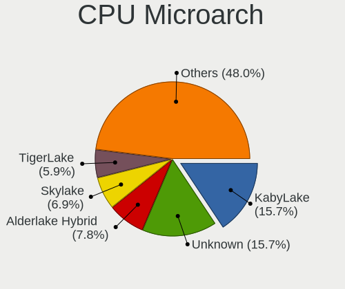
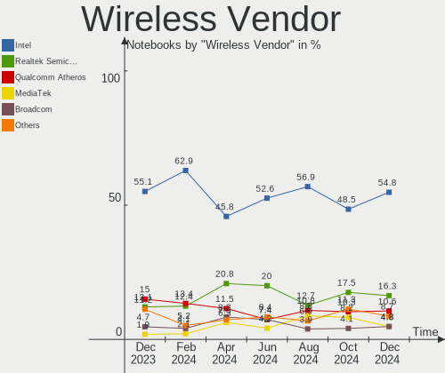
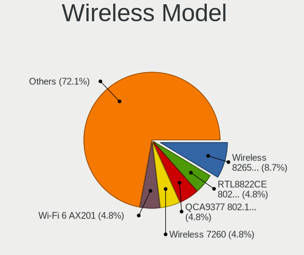
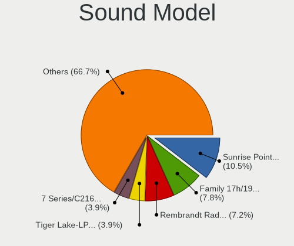
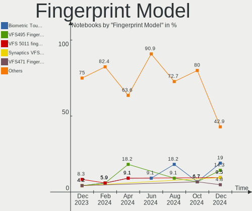

Linux in UK - Hardware Trends (Notebooks)
-----------------------------------------

A project to identify most popular hardware characteristics and track their change
over time based on data collected by Linux users at https://Linux-Hardware.org.

Anyone can contribute to this report by the [hw-probe](https://github.com/linuxhw/hw-probe) tool:

    sudo -E hw-probe -all -upload

Period: Jul, 2023.

Contents
--------

* [ System ](#system)
  - [ OS                       ](#os)
  - [ OS Family                ](#os-family)
  - [ Kernel                   ](#kernel)
  - [ Kernel Family            ](#kernel-family)
  - [ Kernel Major Ver.        ](#kernel-major-ver)
  - [ Arch                     ](#arch)
  - [ DE                       ](#de)
  - [ Display Server           ](#display-server)
  - [ Display Manager          ](#display-manager)
  - [ OS Lang                  ](#os-lang)
  - [ Boot Mode                ](#boot-mode)
  - [ Filesystem               ](#filesystem)
  - [ Part. scheme             ](#part-scheme)
  - [ Dual Boot with Linux/BSD ](#dual-boot-with-linuxbsd)
  - [ Dual Boot (Win)          ](#dual-boot-win)

* [ Board ](#board)
  - [ Vendor                   ](#vendor)
  - [ Model                    ](#model)
  - [ Model Family             ](#model-family)
  - [ MFG Year                 ](#mfg-year)
  - [ Form Factor              ](#form-factor)
  - [ Secure Boot              ](#secure-boot)
  - [ Coreboot                 ](#coreboot)
  - [ RAM Size                 ](#ram-size)
  - [ RAM Used                 ](#ram-used)
  - [ Total Drives             ](#total-drives)
  - [ Has CD-ROM               ](#has-cd-rom)
  - [ Has Ethernet             ](#has-ethernet)
  - [ Has WiFi                 ](#has-wifi)
  - [ Has Bluetooth            ](#has-bluetooth)

* [ Location ](#location)
  - [ Country                  ](#country)
  - [ City                     ](#city)

* [ Drives ](#drives)
  - [ Drive Vendor             ](#drive-vendor)
  - [ Drive Model              ](#drive-model)
  - [ HDD Vendor               ](#hdd-vendor)
  - [ SSD Vendor               ](#ssd-vendor)
  - [ Drive Kind               ](#drive-kind)
  - [ Drive Connector          ](#drive-connector)
  - [ Drive Size               ](#drive-size)
  - [ Space Total              ](#space-total)
  - [ Space Used               ](#space-used)
  - [ Malfunc. Drives          ](#malfunc-drives)
  - [ Malfunc. Drive Vendor    ](#malfunc-drive-vendor)
  - [ Malfunc. HDD Vendor      ](#malfunc-hdd-vendor)
  - [ Malfunc. Drive Kind      ](#malfunc-drive-kind)
  - [ Failed Drives            ](#failed-drives)
  - [ Failed Drive Vendor      ](#failed-drive-vendor)
  - [ Drive Status             ](#drive-status)

* [ Storage controller ](#storage-controller)
  - [ Storage Vendor           ](#storage-vendor)
  - [ Storage Model            ](#storage-model)
  - [ Storage Kind             ](#storage-kind)

* [ Processor ](#processor)
  - [ CPU Vendor               ](#cpu-vendor)
  - [ CPU Model                ](#cpu-model)
  - [ CPU Model Family         ](#cpu-model-family)
  - [ CPU Cores                ](#cpu-cores)
  - [ CPU Sockets              ](#cpu-sockets)
  - [ CPU Threads              ](#cpu-threads)
  - [ CPU Op-Modes             ](#cpu-op-modes)
  - [ CPU Microcode            ](#cpu-microcode)
  - [ CPU Microarch            ](#cpu-microarch)

* [ Graphics ](#graphics)
  - [ GPU Vendor               ](#gpu-vendor)
  - [ GPU Model                ](#gpu-model)
  - [ GPU Combo                ](#gpu-combo)
  - [ GPU Driver               ](#gpu-driver)
  - [ GPU Memory               ](#gpu-memory)

* [ Monitor ](#monitor)
  - [ Monitor Vendor           ](#monitor-vendor)
  - [ Monitor Model            ](#monitor-model)
  - [ Monitor Resolution       ](#monitor-resolution)
  - [ Monitor Diagonal         ](#monitor-diagonal)
  - [ Monitor Width            ](#monitor-width)
  - [ Aspect Ratio             ](#aspect-ratio)
  - [ Monitor Area             ](#monitor-area)
  - [ Pixel Density            ](#pixel-density)
  - [ Multiple Monitors        ](#multiple-monitors)

* [ Network ](#network)
  - [ Net Controller Vendor    ](#net-controller-vendor)
  - [ Net Controller Model     ](#net-controller-model)
  - [ Wireless Vendor          ](#wireless-vendor)
  - [ Wireless Model           ](#wireless-model)
  - [ Ethernet Vendor          ](#ethernet-vendor)
  - [ Ethernet Model           ](#ethernet-model)
  - [ Net Controller Kind      ](#net-controller-kind)
  - [ Used Controller          ](#used-controller)
  - [ NICs                     ](#nics)
  - [ IPv6                     ](#ipv6)

* [ Bluetooth ](#bluetooth)
  - [ Bluetooth Vendor         ](#bluetooth-vendor)
  - [ Bluetooth Model          ](#bluetooth-model)

* [ Sound ](#sound)
  - [ Sound Vendor             ](#sound-vendor)
  - [ Sound Model              ](#sound-model)

* [ Memory ](#memory)
  - [ Memory Vendor            ](#memory-vendor)
  - [ Memory Model             ](#memory-model)
  - [ Memory Kind              ](#memory-kind)
  - [ Memory Form Factor       ](#memory-form-factor)
  - [ Memory Size              ](#memory-size)
  - [ Memory Speed             ](#memory-speed)

* [ Printers & scanners ](#printers--scanners)
  - [ Printer Vendor           ](#printer-vendor)
  - [ Printer Model            ](#printer-model)
  - [ Scanner Vendor           ](#scanner-vendor)
  - [ Scanner Model            ](#scanner-model)

* [ Camera ](#camera)
  - [ Camera Vendor            ](#camera-vendor)
  - [ Camera Model             ](#camera-model)

* [ Security ](#security)
  - [ Fingerprint Vendor       ](#fingerprint-vendor)
  - [ Fingerprint Model        ](#fingerprint-model)
  - [ Chipcard Vendor          ](#chipcard-vendor)
  - [ Chipcard Model           ](#chipcard-model)

* [ Unsupported ](#unsupported)
  - [ Unsupported Devices      ](#unsupported-devices)
  - [ Unsupported Device Types ](#unsupported-device-types)

System
------

OS
--

Installed operating systems

| Name                 | Notebooks | Percent |
|----------------------|-----------|---------|
| Fedora 38            | 17        | 13.93%  |
| Ubuntu 22.04         | 10        | 8.2%    |
| SteamOS 3.4.8        | 8         | 6.56%   |
| Linux Mint 21.2      | 8         | 6.56%   |
| Pop!_OS 22.04        | 6         | 4.92%   |
| Ubuntu 23.04         | 5         | 4.1%    |
| OpenMandriva 23.03   | 5         | 4.1%    |
| Linux Mint 21.1      | 5         | 4.1%    |
| Debian 12            | 5         | 4.1%    |
| Arch Rolling         | 5         | 4.1%    |
| KDE neon 22.04       | 3         | 2.46%   |
| Zorin 16             | 2         | 1.64%   |
| Zorin 15             | 2         | 1.64%   |
| Ubuntu MATE 23.04    | 2         | 1.64%   |
| TUXEDO OS 22.04      | 2         | 1.64%   |
| Nobara 38            | 2         | 1.64%   |
| MX 21                | 2         | 1.64%   |
| Manjaro              | 2         | 1.64%   |
| Kubuntu 23.04        | 2         | 1.64%   |
| Kubuntu 22.04        | 2         | 1.64%   |
| Gentoo 2.13          | 2         | 1.64%   |
| EndeavourOS Rolling  | 2         | 1.64%   |
| Debian               | 2         | 1.64%   |
| Xubuntu 22.04        | 1         | 0.82%   |
| Xubuntu 21.04        | 1         | 0.82%   |
| Ubuntu MATE 22.10    | 1         | 0.82%   |
| Ubuntu MATE 22.04    | 1         | 0.82%   |
| Ubuntu 22.10         | 1         | 0.82%   |
| OpenMandriva 4.3     | 1         | 0.82%   |
| OpenMandriva 4.2     | 1         | 0.82%   |
| OpenMandriva 23.07   | 1         | 0.82%   |
| OpenMandriva 23.06   | 1         | 0.82%   |
| Neptune OS 8.0       | 1         | 0.82%   |
| MX 23                | 1         | 0.82%   |
| Manjaro 23.0.0       | 1         | 0.82%   |
| LMDE 5               | 1         | 0.82%   |
| Kali 2023.2          | 1         | 0.82%   |
| Garuda Linux Rolling | 1         | 0.82%   |
| Endless 5.1.0        | 1         | 0.82%   |
| Elementary 6.1       | 1         | 0.82%   |

OS Family
---------

OS without a version

| Name         | Notebooks | Percent |
|--------------|-----------|---------|
| Fedora       | 17        | 13.93%  |
| Ubuntu       | 16        | 13.11%  |
| Linux Mint   | 13        | 10.66%  |
| OpenMandriva | 9         | 7.38%   |
| SteamOS      | 8         | 6.56%   |
| Debian       | 7         | 5.74%   |
| Pop!_OS      | 6         | 4.92%   |
| Arch         | 5         | 4.1%    |
| Zorin        | 4         | 3.28%   |
| Ubuntu MATE  | 4         | 3.28%   |
| Kubuntu      | 4         | 3.28%   |
| MX           | 3         | 2.46%   |
| Manjaro      | 3         | 2.46%   |
| KDE neon     | 3         | 2.46%   |
| Xubuntu      | 2         | 1.64%   |
| TUXEDO OS    | 2         | 1.64%   |
| Nobara       | 2         | 1.64%   |
| Gentoo       | 2         | 1.64%   |
| EndeavourOS  | 2         | 1.64%   |
| Neptune OS   | 1         | 0.82%   |
| LMDE         | 1         | 0.82%   |
| Kali         | 1         | 0.82%   |
| Garuda Linux | 1         | 0.82%   |
| Endless      | 1         | 0.82%   |
| Elementary   | 1         | 0.82%   |
| CentOS       | 1         | 0.82%   |
| CachyOS      | 1         | 0.82%   |
| blendOS      | 1         | 0.82%   |
| ArcoLinux    | 1         | 0.82%   |

Kernel
------

Version of the Linux kernel

| Version                      | Notebooks | Percent |
|------------------------------|-----------|---------|
| 5.19.0-46-generic            | 13        | 10.66%  |
| 5.15.0-76-generic            | 10        | 8.2%    |
| 5.13.0-valve36-1-neptune     | 8         | 6.56%   |
| 6.3.12-200.fc38.x86_64       | 5         | 4.1%    |
| 6.2.6-desktop-1omv2390       | 5         | 4.1%    |
| 6.2.6-76060206-generic       | 4         | 3.28%   |
| 6.2.0-25-generic             | 4         | 3.28%   |
| 6.3.8-200.fc38.x86_64        | 3         | 2.46%   |
| 6.2.9-300.fc38.x86_64        | 3         | 2.46%   |
| 6.2.0-24-generic             | 3         | 2.46%   |
| 6.1.0-10-amd64               | 3         | 2.46%   |
| 5.15.0-78-generic            | 3         | 2.46%   |
| 6.4.6-200.fc38.x86_64        | 2         | 1.64%   |
| 6.4.6-060406-generic         | 2         | 1.64%   |
| 6.4.4-200.fc38.x86_64        | 2         | 1.64%   |
| 6.4.3-060403-generic         | 2         | 1.64%   |
| 6.3.5-desktop-3omv2390       | 2         | 1.64%   |
| 6.3.12-204.fsync.fc38.x86_64 | 2         | 1.64%   |
| 6.3.11-200.fc38.x86_64       | 2         | 1.64%   |
| 6.1.39-1-lts                 | 2         | 1.64%   |
| 6.1.0-9-amd64                | 2         | 1.64%   |
| 5.4.0-150-generic            | 2         | 1.64%   |
| 6.4.5-1-cachyos              | 1         | 0.82%   |
| 6.4.4-arch1-1-g14            | 1         | 0.82%   |
| 6.4.3-arch1-2                | 1         | 0.82%   |
| 6.4.3-arch1-1                | 1         | 0.82%   |
| 6.4.2-x64v2-xanmod1-3        | 1         | 0.82%   |
| 6.4.2-3-MANJARO              | 1         | 0.82%   |
| 6.4.1-arch2-1                | 1         | 0.82%   |
| 6.4.1-arch1-1                | 1         | 0.82%   |
| 6.4.0-060400-generic         | 1         | 0.82%   |
| 6.3.9-zen1-1-zen             | 1         | 0.82%   |
| 6.3.7-060307-generic         | 1         | 0.82%   |
| 6.3.5-2-MANJARO              | 1         | 0.82%   |
| 6.3.0-2-amd64                | 1         | 0.82%   |
| 6.3.0-1-amd64                | 1         | 0.82%   |
| 6.2.0-26-generic             | 1         | 0.82%   |
| 6.2.0-10014-tuxedo           | 1         | 0.82%   |
| 6.2.0-10011-tuxedo           | 1         | 0.82%   |
| 6.1.41-1-MANJARO             | 1         | 0.82%   |

Kernel Family
-------------

Linux kernel without a distro release

| Version | Notebooks | Percent |
|---------|-----------|---------|
| 5.19.0  | 17        | 13.93%  |
| 5.15.0  | 15        | 12.3%   |
| 6.2.0   | 10        | 8.2%    |
| 6.2.6   | 9         | 7.38%   |
| 6.1.0   | 9         | 7.38%   |
| 5.13.0  | 8         | 6.56%   |
| 6.3.12  | 7         | 5.74%   |
| 6.4.6   | 4         | 3.28%   |
| 6.4.3   | 4         | 3.28%   |
| 6.4.4   | 3         | 2.46%   |
| 6.3.8   | 3         | 2.46%   |
| 6.3.5   | 3         | 2.46%   |
| 6.2.9   | 3         | 2.46%   |
| 6.4.2   | 2         | 1.64%   |
| 6.4.1   | 2         | 1.64%   |
| 6.3.11  | 2         | 1.64%   |
| 6.3.0   | 2         | 1.64%   |
| 6.1.39  | 2         | 1.64%   |
| 6.1.38  | 2         | 1.64%   |
| 5.4.0   | 2         | 1.64%   |
| 5.10.0  | 2         | 1.64%   |
| 6.4.5   | 1         | 0.82%   |
| 6.4.0   | 1         | 0.82%   |
| 6.3.9   | 1         | 0.82%   |
| 6.3.7   | 1         | 0.82%   |
| 6.1.41  | 1         | 0.82%   |
| 6.1.31  | 1         | 0.82%   |
| 6.0.0   | 1         | 0.82%   |
| 5.16.13 | 1         | 0.82%   |
| 5.11.12 | 1         | 0.82%   |
| 5.11.0  | 1         | 0.82%   |
| 3.10.0  | 1         | 0.82%   |

Kernel Major Ver.
-----------------

Linux kernel major version

| Version | Notebooks | Percent |
|---------|-----------|---------|
| 6.2     | 22        | 18.03%  |
| 6.3     | 19        | 15.57%  |
| 6.4     | 17        | 13.93%  |
| 5.19    | 17        | 13.93%  |
| 6.1     | 15        | 12.3%   |
| 5.15    | 15        | 12.3%   |
| 5.13    | 8         | 6.56%   |
| 5.4     | 2         | 1.64%   |
| 5.11    | 2         | 1.64%   |
| 5.10    | 2         | 1.64%   |
| 6.0     | 1         | 0.82%   |
| 5.16    | 1         | 0.82%   |
| 3.10    | 1         | 0.82%   |

Arch
----

OS architecture (x86_64, i586, etc.)

| Name   | Notebooks | Percent |
|--------|-----------|---------|
| x86_64 | 119       | 97.54%  |
| i686   | 3         | 2.46%   |

DE
--

Desktop Environment

| Name       | Notebooks | Percent |
|------------|-----------|---------|
| GNOME      | 47        | 38.52%  |
| KDE5       | 38        | 31.15%  |
| X-Cinnamon | 11        | 9.02%   |
| XFCE       | 10        | 8.2%    |
| MATE       | 7         | 5.74%   |
| Cinnamon   | 3         | 2.46%   |
| Unknown    | 2         | 1.64%   |
| sway       | 1         | 0.82%   |
| Pantheon   | 1         | 0.82%   |
| LXQt       | 1         | 0.82%   |
| bspwm      | 1         | 0.82%   |

Display Server
--------------

X11 or Wayland

| Name    | Notebooks | Percent |
|---------|-----------|---------|
| X11     | 72        | 59.02%  |
| Wayland | 48        | 39.34%  |
| Tty     | 1         | 0.82%   |
| Unknown | 1         | 0.82%   |

Display Manager
---------------

SDDM, LightDM, etc.

| Name    | Notebooks | Percent |
|---------|-----------|---------|
| Unknown | 46        | 37.7%   |
| SDDM    | 27        | 22.13%  |
| LightDM | 20        | 16.39%  |
| GDM3    | 18        | 14.75%  |
| GDM     | 11        | 9.02%   |

OS Lang
-------

Language

| Lang  | Notebooks | Percent |
|-------|-----------|---------|
| en_GB | 94        | 77.05%  |
| en_US | 22        | 18.03%  |
| C     | 3         | 2.46%   |
| pl_PL | 1         | 0.82%   |
| hu_HU | 1         | 0.82%   |
| enGB  | 1         | 0.82%   |

Boot Mode
---------

EFI or BIOS

| Mode | Notebooks | Percent |
|------|-----------|---------|
| BIOS | 64        | 52.46%  |
| EFI  | 58        | 47.54%  |

Filesystem
----------

Type of filesystem

| Type    | Notebooks | Percent |
|---------|-----------|---------|
| Ext4    | 64        | 52.46%  |
| Btrfs   | 35        | 28.69%  |
| Tmpfs   | 14        | 11.48%  |
| Overlay | 6         | 4.92%   |
| Xfs     | 2         | 1.64%   |
| Zfs     | 1         | 0.82%   |

Part. scheme
------------

Scheme of partitioning

| Type    | Notebooks | Percent |
|---------|-----------|---------|
| GPT     | 65        | 53.28%  |
| Unknown | 46        | 37.7%   |
| MBR     | 11        | 9.02%   |

Dual Boot with Linux/BSD
------------------------

Hosting more than one Linux/BSD

| Dual boot | Notebooks | Percent |
|-----------|-----------|---------|
| No        | 113       | 92.62%  |
| Yes       | 9         | 7.38%   |

Dual Boot (Win)
---------------

Hosting Linux and Windows

| Dual boot | Notebooks | Percent |
|-----------|-----------|---------|
| No        | 96        | 78.69%  |
| Yes       | 26        | 21.31%  |

Board
-----

Vendor
------

Motherboard manufacturer

| Name                | Notebooks | Percent |
|---------------------|-----------|---------|
| Dell                | 25        | 20.49%  |
| Lenovo              | 24        | 19.67%  |
| Hewlett-Packard     | 20        | 16.39%  |
| ASUSTek Computer    | 9         | 7.38%   |
| Valve               | 8         | 6.56%   |
| Acer                | 7         | 5.74%   |
| Apple               | 6         | 4.92%   |
| Sony                | 3         | 2.46%   |
| MSI                 | 3         | 2.46%   |
| Toshiba             | 2         | 1.64%   |
| Samsung Electronics | 2         | 1.64%   |
| PC Specialist       | 2         | 1.64%   |
| Google              | 2         | 1.64%   |
| Teclast             | 1         | 0.82%   |
| Razer               | 1         | 0.82%   |
| Notebook            | 1         | 0.82%   |
| LG Electronics      | 1         | 0.82%   |
| lapbook             | 1         | 0.82%   |
| Gigabyte Technology | 1         | 0.82%   |
| Chuwi               | 1         | 0.82%   |
| Alienware           | 1         | 0.82%   |
| Unknown             | 1         | 0.82%   |

Model
-----

Motherboard model

| Name                                        | Notebooks | Percent |
|---------------------------------------------|-----------|---------|
| Valve Jupiter                               | 8         | 6.56%   |
| Lenovo ThinkPad E15 20RD0011UK              | 2         | 1.64%   |
| Dell XPS 15 9570                            | 2         | 1.64%   |
| Dell XPS 13 9380                            | 2         | 1.64%   |
| Dell Inspiron 13-5378                       | 2         | 1.64%   |
| Apple MacBookPro12,1                        | 2         | 1.64%   |
| Toshiba Satellite Pro L650                  | 1         | 0.82%   |
| Toshiba Satellite Pro C50-A-1E6             | 1         | 0.82%   |
| Teclast F15Plus 2                           | 1         | 0.82%   |
| Sony VPCZ214GX                              | 1         | 0.82%   |
| Sony VGN-S3HP                               | 1         | 0.82%   |
| Sony SVP1321M2EB                            | 1         | 0.82%   |
| Samsung RV411/RV511/E3511/S3511/RV711/E3411 | 1         | 0.82%   |
| Samsung 950XCJ/951XCJ/950XCR                | 1         | 0.82%   |
| Razer Blade                                 | 1         | 0.82%   |
| PC Specialist Standard                      | 1         | 0.82%   |
| PC Specialist Ionico 16                     | 1         | 0.82%   |
| Notebook N150ZU                             | 1         | 0.82%   |
| MSI Katana GF66 11UG                        | 1         | 0.82%   |
| MSI GT70 2PE                                | 1         | 0.82%   |
| MSI GF75 Thin 9SC                           | 1         | 0.82%   |
| LG 17Z90P-K.AA78A1                          | 1         | 0.82%   |
| Lenovo Yoga S740-14IIL 81RS                 | 1         | 0.82%   |
| Lenovo V15 G2 ITL 82KB                      | 1         | 0.82%   |
| Lenovo V15 G2 ALC 82KD                      | 1         | 0.82%   |
| Lenovo ThinkPad X270 20HMS1N700             | 1         | 0.82%   |
| Lenovo ThinkPad X240 20AMS1FW00             | 1         | 0.82%   |
| Lenovo ThinkPad X230 2325FG0                | 1         | 0.82%   |
| Lenovo ThinkPad X220 4290FC1                | 1         | 0.82%   |
| Lenovo ThinkPad X201 3249CTO                | 1         | 0.82%   |
| Lenovo ThinkPad T530 2429HD6                | 1         | 0.82%   |
| Lenovo ThinkPad T470 W10DG 20JNS1BL00       | 1         | 0.82%   |
| Lenovo ThinkPad T460 20FMS50T0Q             | 1         | 0.82%   |
| Lenovo ThinkPad T400 6474W7T                | 1         | 0.82%   |
| Lenovo ThinkPad T14 Gen 3 21AJS0XK00        | 1         | 0.82%   |
| Lenovo ThinkPad P14s Gen 1 20Y1CTO1WW       | 1         | 0.82%   |
| Lenovo ThinkPad E560 20EV000YUK             | 1         | 0.82%   |
| Lenovo ThinkPad E15 Gen 2 20TDS0G500        | 1         | 0.82%   |
| Lenovo ThinkPad A285 20MXS0JR14             | 1         | 0.82%   |
| Lenovo Legion 5 15ACH6H 82JU                | 1         | 0.82%   |

Model Family
------------

Motherboard model prefix

| Name                   | Notebooks | Percent |
|------------------------|-----------|---------|
| Lenovo ThinkPad        | 16        | 13.11%  |
| Valve Jupiter          | 8         | 6.56%   |
| Dell XPS               | 8         | 6.56%   |
| Dell Inspiron          | 6         | 4.92%   |
| HP EliteBook           | 5         | 4.1%    |
| Dell Latitude          | 5         | 4.1%    |
| Acer Aspire            | 4         | 3.28%   |
| HP ProBook             | 3         | 2.46%   |
| ASUS VivoBook          | 3         | 2.46%   |
| Toshiba Satellite      | 2         | 1.64%   |
| Lenovo V15             | 2         | 1.64%   |
| Lenovo IdeaPad         | 2         | 1.64%   |
| HP Laptop              | 2         | 1.64%   |
| HP ENVY                | 2         | 1.64%   |
| ASUS Zenbook           | 2         | 1.64%   |
| ASUS ROG               | 2         | 1.64%   |
| Apple MacBookPro12     | 2         | 1.64%   |
| Acer Swift             | 2         | 1.64%   |
| Teclast F15Plus        | 1         | 0.82%   |
| Sony VPCZ214GX         | 1         | 0.82%   |
| Sony VGN-S3HP          | 1         | 0.82%   |
| Sony SVP1321M2EB       | 1         | 0.82%   |
| Samsung RV411          | 1         | 0.82%   |
| Samsung 950XCJ         | 1         | 0.82%   |
| Razer Blade            | 1         | 0.82%   |
| PC Specialist Standard | 1         | 0.82%   |
| PC Specialist Ionico   | 1         | 0.82%   |
| Notebook N150ZU        | 1         | 0.82%   |
| MSI Katana             | 1         | 0.82%   |
| MSI GT70               | 1         | 0.82%   |
| MSI GF75               | 1         | 0.82%   |
| LG 17Z90P-K.AA78A1     | 1         | 0.82%   |
| Lenovo Yoga            | 1         | 0.82%   |
| Lenovo Legion          | 1         | 0.82%   |
| Lenovo G580            | 1         | 0.82%   |
| Lenovo Flex            | 1         | 0.82%   |
| lapbook S15            | 1         | 0.82%   |
| HP ZBook               | 1         | 0.82%   |
| HP Stream              | 1         | 0.82%   |
| HP Pavilion            | 1         | 0.82%   |

MFG Year
--------

Motherboard manufacture year

| Year | Notebooks | Percent |
|------|-----------|---------|
| 2022 | 18        | 14.75%  |
| 2021 | 16        | 13.11%  |
| 2020 | 10        | 8.2%    |
| 2019 | 10        | 8.2%    |
| 2018 | 10        | 8.2%    |
| 2011 | 8         | 6.56%   |
| 2023 | 7         | 5.74%   |
| 2015 | 7         | 5.74%   |
| 2016 | 6         | 4.92%   |
| 2012 | 6         | 4.92%   |
| 2017 | 5         | 4.1%    |
| 2010 | 5         | 4.1%    |
| 2014 | 4         | 3.28%   |
| 2013 | 4         | 3.28%   |
| 2008 | 3         | 2.46%   |
| 2007 | 1         | 0.82%   |
| 2006 | 1         | 0.82%   |
| 2005 | 1         | 0.82%   |

Form Factor
-----------

Physical design of the computer

| Name     | Notebooks | Percent |
|----------|-----------|---------|
| Notebook | 122       | 100%    |

Secure Boot
-----------

Enabled or disabled

| State    | Notebooks | Percent |
|----------|-----------|---------|
| Disabled | 112       | 91.8%   |
| Enabled  | 10        | 8.2%    |

Coreboot
--------

Have coreboot on board

| Used | Notebooks | Percent |
|------|-----------|---------|
| No   | 120       | 98.36%  |
| Yes  | 2         | 1.64%   |

RAM Size
--------

Total RAM memory

| Size in GB  | Notebooks | Percent |
|-------------|-----------|---------|
| 4.01-8.0    | 33        | 27.05%  |
| 8.01-16.0   | 28        | 22.95%  |
| 16.01-24.0  | 23        | 18.85%  |
| 3.01-4.0    | 14        | 11.48%  |
| 32.01-64.0  | 10        | 8.2%    |
| 64.01-256.0 | 6         | 4.92%   |
| 1.01-2.0    | 4         | 3.28%   |
| 24.01-32.0  | 2         | 1.64%   |
| 2.01-3.0    | 1         | 0.82%   |
| 0.51-1.0    | 1         | 0.82%   |

RAM Used
--------

Used RAM memory

| Used GB    | Notebooks | Percent |
|------------|-----------|---------|
| 4.01-8.0   | 31        | 25.41%  |
| 1.01-2.0   | 30        | 24.59%  |
| 2.01-3.0   | 25        | 20.49%  |
| 3.01-4.0   | 17        | 13.93%  |
| 8.01-16.0  | 9         | 7.38%   |
| 0.51-1.0   | 8         | 6.56%   |
| 24.01-32.0 | 1         | 0.82%   |
| 16.01-24.0 | 1         | 0.82%   |

Total Drives
------------

Number of drives on board

| Drives | Notebooks | Percent |
|--------|-----------|---------|
| 1      | 87        | 71.31%  |
| 2      | 31        | 25.41%  |
| 3      | 2         | 1.64%   |
| 5      | 1         | 0.82%   |
| 4      | 1         | 0.82%   |

Has CD-ROM
----------

Has CD-ROM on board

| Presented | Notebooks | Percent |
|-----------|-----------|---------|
| No        | 97        | 79.51%  |
| Yes       | 25        | 20.49%  |

Has Ethernet
------------

Has Ethernet on board

| Presented | Notebooks | Percent |
|-----------|-----------|---------|
| Yes       | 87        | 71.31%  |
| No        | 35        | 28.69%  |

Has WiFi
--------

Has WiFi module

| Presented | Notebooks | Percent |
|-----------|-----------|---------|
| Yes       | 122       | 100%    |

Has Bluetooth
-------------

Has Bluetooth module

| Presented | Notebooks | Percent |
|-----------|-----------|---------|
| Yes       | 98        | 80.33%  |
| No        | 24        | 19.67%  |

Location
--------

Country
-------

Geographic location (country)

| Country | Notebooks | Percent |
|---------|-----------|---------|
| UK      | 122       | 100%    |

City
----

Geographic location (city)

| City                 | Notebooks | Percent |
|----------------------|-----------|---------|
| Manchester           | 5         | 4.1%    |
| London               | 4         | 3.28%   |
| Edinburgh            | 4         | 3.28%   |
| Coventry             | 4         | 3.28%   |
| Swindon              | 3         | 2.46%   |
| Newcastle upon Tyne  | 3         | 2.46%   |
| Leeds                | 3         | 2.46%   |
| Islington            | 3         | 2.46%   |
| Telford              | 2         | 1.64%   |
| Southwark            | 2         | 1.64%   |
| Sheffield            | 2         | 1.64%   |
| Kingston upon Thames | 2         | 1.64%   |
| Ilford               | 2         | 1.64%   |
| Farnborough          | 2         | 1.64%   |
| Brent                | 2         | 1.64%   |
| Bradford             | 2         | 1.64%   |
| Yeovil               | 1         | 0.82%   |
| Worthing             | 1         | 0.82%   |
| Woodford             | 1         | 0.82%   |
| Wilmslow             | 1         | 0.82%   |
| Wigan                | 1         | 0.82%   |
| Wembley              | 1         | 0.82%   |
| Ware                 | 1         | 0.82%   |
| Wandsworth           | 1         | 0.82%   |
| Thrapston            | 1         | 0.82%   |
| Thamesmead           | 1         | 0.82%   |
| Sutton               | 1         | 0.82%   |
| Stockton-on-Tees     | 1         | 0.82%   |
| St Albans            | 1         | 0.82%   |
| Shrewsbury           | 1         | 0.82%   |
| Saint Neots          | 1         | 0.82%   |
| Rochdale             | 1         | 0.82%   |
| Reading              | 1         | 0.82%   |
| Rainham              | 1         | 0.82%   |
| Prenton              | 1         | 0.82%   |
| Portsmouth           | 1         | 0.82%   |
| Portishead           | 1         | 0.82%   |
| Poplar               | 1         | 0.82%   |
| Orpington            | 1         | 0.82%   |
| Newtownabbey         | 1         | 0.82%   |

Drives
------

Drive Vendor
------------

Hard drive vendors

| Vendor                      | Notebooks | Drives | Percent |
|-----------------------------|-----------|--------|---------|
| Samsung Electronics         | 27        | 29     | 17.31%  |
| SK hynix                    | 16        | 16     | 10.26%  |
| Unknown                     | 14        | 14     | 8.97%   |
| Sandisk                     | 12        | 13     | 7.69%   |
| Kingston                    | 11        | 11     | 7.05%   |
| WDC                         | 8         | 9      | 5.13%   |
| Toshiba                     | 7         | 8      | 4.49%   |
| Seagate                     | 7         | 7      | 4.49%   |
| Crucial                     | 5         | 5      | 3.21%   |
| Apple                       | 5         | 6      | 3.21%   |
| Micron/Crucial Technology   | 4         | 4      | 2.56%   |
| KIOXIA                      | 4         | 5      | 2.56%   |
| Intel                       | 4         | 5      | 2.56%   |
| Hitachi                     | 4         | 4      | 2.56%   |
| Phison Electronics          | 3         | 3      | 1.92%   |
| HGST                        | 3         | 3      | 1.92%   |
| Silicon Motion              | 2         | 2      | 1.28%   |
| O2 Micro                    | 2         | 2      | 1.28%   |
| Micron Technology           | 2         | 2      | 1.28%   |
| LITEON                      | 2         | 2      | 1.28%   |
| China                       | 2         | 2      | 1.28%   |
| Unknown                     | 2         | 2      | 1.28%   |
| Union Memory                | 1         | 1      | 0.64%   |
| Transcend                   | 1         | 1      | 0.64%   |
| Teclast                     | 1         | 1      | 0.64%   |
| SPCC                        | 1         | 1      | 0.64%   |
| ShiJi                       | 1         | 1      | 0.64%   |
| Realtek                     | 1         | 1      | 0.64%   |
| Lenovo                      | 1         | 1      | 0.64%   |
| Kingston Technology Company | 1         | 1      | 0.64%   |
| Fujitsu                     | 1         | 1      | 0.64%   |
| A-DATA Technology           | 1         | 1      | 0.64%   |

Drive Model
-----------

Hard drive models

| Model                                                 | Notebooks | Percent |
|-------------------------------------------------------|-----------|---------|
| Seagate ST1000LM035-1RK172 1TB                        | 4         | 2.55%   |
| Samsung NVMe SSD Controller SM981/PM981/PM983 500GB   | 4         | 2.55%   |
| Micron/Crucial P2 NVMe PCIe SSD 1TB                   | 4         | 2.55%   |
| Unknown MMC Card  512GB                               | 3         | 1.91%   |
| Kingston SA400S37480G 480GB SSD                       | 3         | 1.91%   |
| Unknown SD/MMC/MS PRO 128GB                           | 2         | 1.27%   |
| Unknown MMC Card  64GB                                | 2         | 1.27%   |
| Unknown MMC Card  256GB                               | 2         | 1.27%   |
| SK hynix PC401 NVMe Solid State Drive 256GB           | 2         | 1.27%   |
| SK hynix HFM001TD3JX013N 1TB                          | 2         | 1.27%   |
| Silicon Motion SM2263EN/SM2263XT SSD Controller 500GB | 2         | 1.27%   |
| Seagate ST9120822AS 120GB                             | 2         | 1.27%   |
| Sandisk WD Black SN850 1TB                            | 2         | 1.27%   |
| Samsung SSD 970 EVO Plus 2TB                          | 2         | 1.27%   |
| Phison PS5013 E13 NVMe Controller 256GB               | 2         | 1.27%   |
| O2 Micro E2M2 64GB                                    | 2         | 1.27%   |
| Kingston SA400S37240G 240GB SSD                       | 2         | 1.27%   |
| Intel SSDPEKNU020TZ 2TB                               | 2         | 1.27%   |
| Hitachi HTS545050B9A300 500GB                         | 2         | 1.27%   |
| HGST HTS721010A9E630 1TB                              | 2         | 1.27%   |
| Unknown                                               | 2         | 1.27%   |
| WDC WDS200T1X0E-00AFY0 2TB                            | 1         | 0.64%   |
| WDC WDS100T2B0A 1TB SSD                               | 1         | 0.64%   |
| WDC WD7500BPVX-00JC3T0 752GB                          | 1         | 0.64%   |
| WDC WD5000LPCX-24VHAT0 500GB                          | 1         | 0.64%   |
| WDC WD1600BJKT-75F4T0 160GB                           | 1         | 0.64%   |
| WDC WD1600BEVT-75A23T0 160GB                          | 1         | 0.64%   |
| WDC WD10SPZX-21Z10T0 1TB                              | 1         | 0.64%   |
| WDC WD10JPVX-22JC3T0 1TB                              | 1         | 0.64%   |
| WDC PC SN810 NVMe 1024GB                              | 1         | 0.64%   |
| Unknown SDW32G  32GB                                  | 1         | 0.64%   |
| Unknown MMC Card  32MB                                | 1         | 0.64%   |
| Unknown MMC Card  32GB                                | 1         | 0.64%   |
| Unknown MMC Card  16GB                                | 1         | 0.64%   |
| Unknown MMC Card  128GB                               | 1         | 0.64%   |
| Union Memory UMIS RPJTJ256MEE1OWX 256GB               | 1         | 0.64%   |
| Transcend TS240GMTS420S 240GB SSD                     | 1         | 0.64%   |
| Toshiba XG6 NVMe SSD Controller 512GB                 | 1         | 0.64%   |
| Toshiba THNSNJ128GMCU 128GB SSD                       | 1         | 0.64%   |
| Toshiba THNSNJ128GCSU 128GB SSD                       | 1         | 0.64%   |

HDD Vendor
----------

Hard disk drive vendors

| Vendor  | Notebooks | Drives | Percent |
|---------|-----------|--------|---------|
| Seagate | 7         | 7      | 26.92%  |
| WDC     | 6         | 6      | 23.08%  |
| Hitachi | 4         | 4      | 15.38%  |
| Toshiba | 3         | 3      | 11.54%  |
| HGST    | 3         | 3      | 11.54%  |
| Unknown | 2         | 2      | 7.69%   |
| Fujitsu | 1         | 1      | 3.85%   |

SSD Vendor
----------

Solid state drive vendors

| Vendor              | Notebooks | Drives | Percent |
|---------------------|-----------|--------|---------|
| Kingston            | 10        | 10     | 22.22%  |
| Samsung Electronics | 9         | 10     | 20%     |
| Crucial             | 5         | 5      | 11.11%  |
| Toshiba             | 3         | 4      | 6.67%   |
| Apple               | 3         | 3      | 6.67%   |
| SK hynix            | 2         | 2      | 4.44%   |
| SanDisk             | 2         | 2      | 4.44%   |
| LITEON              | 2         | 2      | 4.44%   |
| China               | 2         | 2      | 4.44%   |
| WDC                 | 1         | 1      | 2.22%   |
| Transcend           | 1         | 1      | 2.22%   |
| Teclast             | 1         | 1      | 2.22%   |
| SPCC                | 1         | 1      | 2.22%   |
| ShiJi               | 1         | 1      | 2.22%   |
| Intel               | 1         | 1      | 2.22%   |
| A-DATA Technology   | 1         | 1      | 2.22%   |

Drive Kind
----------

HDD or SSD

| Kind | Notebooks | Drives | Percent |
|------|-----------|--------|---------|
| NVMe | 67        | 77     | 45.27%  |
| SSD  | 41        | 47     | 27.7%   |
| HDD  | 26        | 26     | 17.57%  |
| MMC  | 14        | 14     | 9.46%   |

Drive Connector
---------------

SATA, SAS, NVMe, etc.

| Type | Notebooks | Drives | Percent |
|------|-----------|--------|---------|
| NVMe | 66        | 76     | 46.81%  |
| SATA | 58        | 71     | 41.13%  |
| MMC  | 14        | 14     | 9.93%   |
| SAS  | 3         | 3      | 2.13%   |

Drive Size
----------

Size of hard drive

| Size in TB | Notebooks | Drives | Percent |
|------------|-----------|--------|---------|
| 0.01-0.5   | 44        | 52     | 67.69%  |
| 0.51-1.0   | 19        | 19     | 29.23%  |
| 3.01-4.0   | 1         | 1      | 1.54%   |
| 1.01-2.0   | 1         | 1      | 1.54%   |

Space Total
-----------

Amount of disk space available on the file system

| Size in GB     | Notebooks | Percent |
|----------------|-----------|---------|
| 101-250        | 28        | 22.95%  |
| 251-500        | 26        | 21.31%  |
| 501-1000       | 26        | 21.31%  |
| 1001-2000      | 11        | 9.02%   |
| 1-20           | 10        | 8.2%    |
| 51-100         | 6         | 4.92%   |
| More than 3000 | 5         | 4.1%    |
| 21-50          | 4         | 3.28%   |
| Unknown        | 4         | 3.28%   |
| 2001-3000      | 2         | 1.64%   |

Space Used
----------

Amount of used disk space

| Used GB        | Notebooks | Percent |
|----------------|-----------|---------|
| 1-20           | 38        | 31.15%  |
| 21-50          | 24        | 19.67%  |
| 51-100         | 20        | 16.39%  |
| 101-250        | 15        | 12.3%   |
| 251-500        | 12        | 9.84%   |
| 501-1000       | 7         | 5.74%   |
| Unknown        | 4         | 3.28%   |
| More than 3000 | 1         | 0.82%   |
| 1001-2000      | 1         | 0.82%   |

Malfunc. Drives
---------------

Drive models with a malfunction

| Model                                           | Notebooks | Drives | Percent |
|-------------------------------------------------|-----------|--------|---------|
| Samsung Electronics MZRPA128HMCD-000SO 64GB SSD | 1         | 2      | 33.33%  |
| Kingston RBU-SNS8350DES3128GP 128GB SSD         | 1         | 1      | 33.33%  |
| Hitachi HTS541680J9SA00 80GB                    | 1         | 1      | 33.33%  |

Malfunc. Drive Vendor
---------------------

Vendors of faulty drives

| Vendor              | Notebooks | Drives | Percent |
|---------------------|-----------|--------|---------|
| Samsung Electronics | 1         | 2      | 33.33%  |
| Kingston            | 1         | 1      | 33.33%  |
| Hitachi             | 1         | 1      | 33.33%  |

Malfunc. HDD Vendor
-------------------

Vendors of faulty HDD drives

| Vendor  | Notebooks | Drives | Percent |
|---------|-----------|--------|---------|
| Hitachi | 1         | 1      | 100%    |

Malfunc. Drive Kind
-------------------

Kinds of faulty drives

| Kind | Notebooks | Drives | Percent |
|------|-----------|--------|---------|
| SSD  | 2         | 3      | 66.67%  |
| HDD  | 1         | 1      | 33.33%  |

Failed Drives
-------------

Failed drive models

Zero info for selected period =(

Failed Drive Vendor
-------------------

Failed drive vendors

Zero info for selected period =(

Drive Status
------------

Number of failed and malfunc. drives

| Status   | Notebooks | Drives | Percent |
|----------|-----------|--------|---------|
| Detected | 69        | 98     | 54.76%  |
| Works    | 54        | 62     | 42.86%  |
| Malfunc  | 3         | 4      | 2.38%   |

Storage controller
------------------

Storage Vendor
--------------

Storage controller vendors

| Vendor                       | Notebooks | Percent |
|------------------------------|-----------|---------|
| Intel                        | 70        | 47.3%   |
| Samsung Electronics          | 20        | 13.51%  |
| SK hynix                     | 14        | 9.46%   |
| SanDisk                      | 12        | 8.11%   |
| AMD                          | 8         | 5.41%   |
| Micron/Crucial Technology    | 4         | 2.7%    |
| Phison Electronics           | 3         | 2.03%   |
| KIOXIA                       | 3         | 2.03%   |
| Toshiba America Info Systems | 2         | 1.35%   |
| Silicon Motion               | 2         | 1.35%   |
| O2 Micro                     | 2         | 1.35%   |
| Micron Technology            | 2         | 1.35%   |
| Kingston Technology Company  | 2         | 1.35%   |
| Apple                        | 2         | 1.35%   |
| Union Memory (Shenzhen)      | 1         | 0.68%   |
| Lenovo                       | 1         | 0.68%   |

Storage Model
-------------

Storage controller models

| Model                                                                        | Notebooks | Percent |
|------------------------------------------------------------------------------|-----------|---------|
| Intel Sunrise Point-LP SATA Controller [AHCI mode]                           | 10        | 6.33%   |
| Samsung NVMe SSD Controller SM981/PM981/PM983                                | 8         | 5.06%   |
| Intel 82801 Mobile SATA Controller [RAID mode]                               | 8         | 5.06%   |
| SK hynix Gold P31/BC711/PC711 NVMe Solid State Drive                         | 7         | 4.43%   |
| Samsung NVMe SSD Controller 980                                              | 7         | 4.43%   |
| AMD FCH SATA Controller [AHCI mode]                                          | 7         | 4.43%   |
| Intel 7 Series Chipset Family 6-port SATA Controller [AHCI mode]             | 6         | 3.8%    |
| Intel Cannon Lake Mobile PCH SATA AHCI Controller                            | 5         | 3.16%   |
| Intel 6 Series/C200 Series Chipset Family 6 port Mobile SATA AHCI Controller | 5         | 3.16%   |
| SanDisk WD PC SN810 / Black SN850 NVMe SSD                                   | 4         | 2.53%   |
| Micron/Crucial P2 [Nick P2] / P3 / P3 Plus NVMe PCIe SSD (DRAM-less)         | 4         | 2.53%   |
| Intel Volume Management Device NVMe RAID Controller                          | 4         | 2.53%   |
| SK hynix PC401 NVMe Solid State Drive 256GB                                  | 3         | 1.9%    |
| Intel Tiger Lake-LP SATA Controller                                          | 3         | 1.9%    |
| Intel SSD 670p Series [Keystone Harbor]                                      | 3         | 1.9%    |
| Intel Comet Lake SATA AHCI Controller                                        | 3         | 1.9%    |
| Intel Celeron/Pentium Silver Processor SATA Controller                       | 3         | 1.9%    |
| Intel 8 Series SATA Controller 1 [AHCI mode]                                 | 3         | 1.9%    |
| Intel 5 Series/3400 Series Chipset 6 port SATA AHCI Controller               | 3         | 1.9%    |
| Intel 5 Series/3400 Series Chipset 4 port SATA AHCI Controller               | 3         | 1.9%    |
| Toshiba America Info Systems XG6 NVMe SSD Controller                         | 2         | 1.27%   |
| Silicon Motion SM2263EN/SM2263XT (DRAM-less) NVMe SSD Controllers            | 2         | 1.27%   |
| Samsung S4LN058A01[SSUBX] AHCI SSD Controller (Apple slot)                   | 2         | 1.27%   |
| Phison PS5013 E13 NVMe Controller                                            | 2         | 1.27%   |
| O2 Micro FORESEE E2M2 NVMe SSD                                               | 2         | 1.27%   |
| KIOXIA NVMe SSD Controller BG5 (DRAM-less)                                   | 2         | 1.27%   |
| Intel Alder Lake-P SATA AHCI Controller                                      | 2         | 1.27%   |
| Intel 82801HM/HEM (ICH8M/ICH8M-E) SATA Controller [AHCI mode]                | 2         | 1.27%   |
| Intel 82801HM/HEM (ICH8M/ICH8M-E) IDE Controller                             | 2         | 1.27%   |
| Union Memory (Shenzhen) AM620 PCIe 3.0 NVMe SSD 256GB                        | 1         | 0.63%   |
| SK hynix Platinum P41/PC801 NVMe Solid State Drive                           | 1         | 0.63%   |
| SK hynix PC611 NVMe Solid State Drive                                        | 1         | 0.63%   |
| SK hynix PC601 NVMe Solid State Drive                                        | 1         | 0.63%   |
| SK hynix BC501 NVMe Solid State Drive                                        | 1         | 0.63%   |
| SanDisk WD Green SN350 NVMe SSD 1 TB (DRAM-less)                             | 1         | 0.63%   |
| SanDisk WD Blue SN570 NVMe SSD 2TB                                           | 1         | 0.63%   |
| SanDisk WD Blue SN550 NVMe SSD                                               | 1         | 0.63%   |
| SanDisk WD Blue SN500 / PC SN520 NVMe SSD                                    | 1         | 0.63%   |
| SanDisk WD Black SN770 / PC SN740 256GB / PC SN560 (DRAM-less) NVMe SSD      | 1         | 0.63%   |
| SanDisk WD Black SN750 / PC SN730 NVMe SSD                                   | 1         | 0.63%   |

Storage Kind
------------

Kind of storage controller (IDE, SATA, NVMe, SAS, ...)

| Kind | Notebooks | Percent |
|------|-----------|---------|
| NVMe | 66        | 44%     |
| SATA | 64        | 42.67%  |
| RAID | 13        | 8.67%   |
| IDE  | 7         | 4.67%   |

Processor
---------

CPU Vendor
----------

Processor vendors

| Vendor | Notebooks | Percent |
|--------|-----------|---------|
| Intel  | 93        | 76.23%  |
| AMD    | 29        | 23.77%  |

CPU Model
---------

Processor models

| Model                                    | Notebooks | Percent |
|------------------------------------------|-----------|---------|
| AMD Custom APU 0405                      | 8         | 6.56%   |
| Intel 11th Gen Core i5-1135G7 @ 2.40GHz  | 4         | 3.28%   |
| Intel Core i7-8750H CPU @ 2.20GHz        | 3         | 2.46%   |
| Intel Core i7-8565U CPU @ 1.80GHz        | 3         | 2.46%   |
| Intel Core i7-1065G7 CPU @ 1.30GHz       | 3         | 2.46%   |
| Intel Core i7-9750H CPU @ 2.60GHz        | 2         | 1.64%   |
| Intel Core i7-4810MQ CPU @ 2.80GHz       | 2         | 1.64%   |
| Intel Core i7-2620M CPU @ 2.70GHz        | 2         | 1.64%   |
| Intel Core i7-10510U CPU @ 1.80GHz       | 2         | 1.64%   |
| Intel Core i5-8300H CPU @ 2.30GHz        | 2         | 1.64%   |
| Intel Core i5-8265U CPU @ 1.60GHz        | 2         | 1.64%   |
| Intel Core i5-7200U CPU @ 2.50GHz        | 2         | 1.64%   |
| Intel Core i5-6200U CPU @ 2.30GHz        | 2         | 1.64%   |
| Intel Core i5-3320M CPU @ 2.60GHz        | 2         | 1.64%   |
| Intel Core i5-3210M CPU @ 2.50GHz        | 2         | 1.64%   |
| Intel Core i5-2430M CPU @ 2.40GHz        | 2         | 1.64%   |
| Intel Core i5-10210U CPU @ 1.60GHz       | 2         | 1.64%   |
| Intel Core i5 CPU M 480 @ 2.67GHz        | 2         | 1.64%   |
| Intel 13th Gen Core i9-13900H            | 2         | 1.64%   |
| Intel 12th Gen Core i7-1255U             | 2         | 1.64%   |
| Intel 12th Gen Core i5-1235U             | 2         | 1.64%   |
| Intel 11th Gen Core i7-11800H @ 2.30GHz  | 2         | 1.64%   |
| AMD Ryzen 9 7845HX with Radeon Graphics  | 2         | 1.64%   |
| AMD Ryzen 9 5900HX with Radeon Graphics  | 2         | 1.64%   |
| AMD Ryzen 7 5800HS with Radeon Graphics  | 2         | 1.64%   |
| AMD Ryzen 7 5800H with Radeon Graphics   | 2         | 1.64%   |
| Intel Pentium Silver N5030 CPU @ 1.10GHz | 1         | 0.82%   |
| Intel Pentium M processor 1.60GHz        | 1         | 0.82%   |
| Intel Pentium 3558U @ 1.70GHz            | 1         | 0.82%   |
| Intel Core i9-9880H CPU @ 2.30GHz        | 1         | 0.82%   |
| Intel Core i7-7820HQ CPU @ 2.90GHz       | 1         | 0.82%   |
| Intel Core i7-7500U CPU @ 2.70GHz        | 1         | 0.82%   |
| Intel Core i7-6700HQ CPU @ 2.60GHz       | 1         | 0.82%   |
| Intel Core i7-6600U CPU @ 2.60GHz        | 1         | 0.82%   |
| Intel Core i7-6500U CPU @ 2.50GHz        | 1         | 0.82%   |
| Intel Core i7-5557U CPU @ 3.10GHz        | 1         | 0.82%   |
| Intel Core i7-3720QM CPU @ 2.60GHz       | 1         | 0.82%   |
| Intel Core i7-3610QM CPU @ 2.30GHz       | 1         | 0.82%   |
| Intel Core i7-10870H CPU @ 2.20GHz       | 1         | 0.82%   |
| Intel Core i7 CPU L 640 @ 2.13GHz        | 1         | 0.82%   |

CPU Model Family
----------------

Processor model prefix

| Model                   | Notebooks | Percent |
|-------------------------|-----------|---------|
| Other                   | 27        | 22.13%  |
| Intel Core i7           | 27        | 22.13%  |
| Intel Core i5           | 27        | 22.13%  |
| Intel Core i3           | 7         | 5.74%   |
| AMD Ryzen 7             | 7         | 5.74%   |
| Intel Core 2 Duo        | 4         | 3.28%   |
| Intel Celeron           | 4         | 3.28%   |
| AMD Ryzen 9             | 4         | 3.28%   |
| AMD Ryzen 5             | 3         | 2.46%   |
| Intel Pentium Silver    | 1         | 0.82%   |
| Intel Pentium M         | 1         | 0.82%   |
| Intel Pentium           | 1         | 0.82%   |
| Intel Core i9           | 1         | 0.82%   |
| Intel Atom              | 1         | 0.82%   |
| AMD Turion 64 X2 Mobile | 1         | 0.82%   |
| AMD Ryzen 7 PRO         | 1         | 0.82%   |
| AMD Ryzen 5 PRO         | 1         | 0.82%   |
| AMD Ryzen 3             | 1         | 0.82%   |
| AMD A8                  | 1         | 0.82%   |
| AMD A6                  | 1         | 0.82%   |
| AMD A10                 | 1         | 0.82%   |

CPU Cores
---------

Number of processor cores

| Number | Notebooks | Percent |
|--------|-----------|---------|
| 2      | 46        | 37.7%   |
| 4      | 40        | 32.79%  |
| 8      | 15        | 12.3%   |
| 6      | 7         | 5.74%   |
| 10     | 5         | 4.1%    |
| 12     | 4         | 3.28%   |
| 14     | 3         | 2.46%   |
| 1      | 2         | 1.64%   |

CPU Sockets
-----------

Number of sockets

| Number | Notebooks | Percent |
|--------|-----------|---------|
| 1      | 122       | 100%    |

CPU Threads
-----------

Threads per core (Hyper-Threading)

| Number | Notebooks | Percent |
|--------|-----------|---------|
| 2      | 104       | 85.25%  |
| 1      | 18        | 14.75%  |

CPU Op-Modes
------------

CPU Operation Modes (32-bit, 64-bit)

| Op mode        | Notebooks | Percent |
|----------------|-----------|---------|
| 32-bit, 64-bit | 121       | 99.18%  |
| 32-bit         | 1         | 0.82%   |

CPU Microcode
-------------

Microcode number

| Number     | Notebooks | Percent |
|------------|-----------|---------|
| Unknown    | 78        | 63.93%  |
| 0x206a7    | 4         | 3.28%   |
| 0xb06a2    | 3         | 2.46%   |
| 0x806ec    | 3         | 2.46%   |
| 0x806e9    | 3         | 2.46%   |
| 0x406e3    | 3         | 2.46%   |
| 0x0a50000d | 3         | 2.46%   |
| 0x906ea    | 2         | 1.64%   |
| 0x40651    | 2         | 1.64%   |
| 0x306d4    | 2         | 1.64%   |
| 0x0a601203 | 2         | 1.64%   |
| 0x0a50000c | 2         | 1.64%   |
| 0x806d1    | 1         | 0.82%   |
| 0x806c1    | 1         | 0.82%   |
| 0x706e5    | 1         | 0.82%   |
| 0x706a1    | 1         | 0.82%   |
| 0x6fd      | 1         | 0.82%   |
| 0x6fb      | 1         | 0.82%   |
| 0x6d8      | 1         | 0.82%   |
| 0x30678    | 1         | 0.82%   |
| 0x106ca    | 1         | 0.82%   |
| 0x10676    | 1         | 0.82%   |
| 0x0a704101 | 1         | 0.82%   |
| 0x0a404101 | 1         | 0.82%   |
| 0x08600106 | 1         | 0.82%   |
| 0x08108102 | 1         | 0.82%   |
| 0x0810100b | 1         | 0.82%   |

CPU Microarch
-------------

Microarchitecture

| Name             | Notebooks | Percent |
|------------------|-----------|---------|
| KabyLake         | 22        | 18.03%  |
| Unknown          | 20        | 16.39%  |
| Skylake          | 9         | 7.38%   |
| Zen 3            | 7         | 5.74%   |
| IvyBridge        | 7         | 5.74%   |
| Westmere         | 6         | 4.92%   |
| TigerLake        | 6         | 4.92%   |
| SandyBridge      | 6         | 4.92%   |
| Icelake          | 5         | 4.1%    |
| Haswell          | 5         | 4.1%    |
| Alderlake Hybrid | 5         | 4.1%    |
| Goldmont plus    | 4         | 3.28%   |
| Broadwell        | 4         | 3.28%   |
| Zen 2            | 2         | 1.64%   |
| Penryn           | 2         | 1.64%   |
| Excavator        | 2         | 1.64%   |
| Core             | 2         | 1.64%   |
| Zen+             | 1         | 0.82%   |
| Zen              | 1         | 0.82%   |
| Silvermont       | 1         | 0.82%   |
| Puma             | 1         | 0.82%   |
| P6               | 1         | 0.82%   |
| K8 Hammer        | 1         | 0.82%   |
| CometLake        | 1         | 0.82%   |
| Bonnell          | 1         | 0.82%   |

Graphics
--------

GPU Vendor
----------

Vendors of graphics cards

| Vendor | Notebooks | Percent |
|--------|-----------|---------|
| Intel  | 86        | 55.84%  |
| AMD    | 35        | 22.73%  |
| Nvidia | 33        | 21.43%  |

GPU Model
---------

Graphics card models

| Model                                                                     | Notebooks | Percent |
|---------------------------------------------------------------------------|-----------|---------|
| Intel CoffeeLake-H GT2 [UHD Graphics 630]                                 | 8         | 5.16%   |
| AMD VanGogh [AMD Custom GPU 0405]                                         | 8         | 5.16%   |
| Intel 3rd Gen Core processor Graphics Controller                          | 7         | 4.52%   |
| Intel Skylake GT2 [HD Graphics 520]                                       | 6         | 3.87%   |
| AMD Cezanne [Radeon Vega Series / Radeon Vega Mobile Series]              | 6         | 3.87%   |
| Intel WhiskeyLake-U GT2 [UHD Graphics 620]                                | 5         | 3.23%   |
| Intel TigerLake-LP GT2 [Iris Xe Graphics]                                 | 5         | 3.23%   |
| Intel 2nd Generation Core Processor Family Integrated Graphics Controller | 5         | 3.23%   |
| Intel Raptor Lake-P [Iris Xe Graphics]                                    | 4         | 2.58%   |
| Intel HD Graphics 620                                                     | 4         | 2.58%   |
| Intel Core Processor Integrated Graphics Controller                       | 4         | 2.58%   |
| Intel CometLake-U GT2 [UHD Graphics]                                      | 4         | 2.58%   |
| Intel Alder Lake-UP3 GT2 [Iris Xe Graphics]                               | 4         | 2.58%   |
| Nvidia GP107M [GeForce GTX 1050 Ti Mobile]                                | 3         | 1.94%   |
| Nvidia GA106M [GeForce RTX 3060 Mobile / Max-Q]                           | 3         | 1.94%   |
| Nvidia GA104M [GeForce RTX 3070 Mobile / Max-Q]                           | 3         | 1.94%   |
| Intel Iris Plus Graphics G7                                               | 3         | 1.94%   |
| Intel Haswell-ULT Integrated Graphics Controller                          | 3         | 1.94%   |
| Intel GeminiLake [UHD Graphics 600]                                       | 3         | 1.94%   |
| Nvidia TU117M [GeForce GTX 1650 Mobile / Max-Q]                           | 2         | 1.29%   |
| Nvidia GP106M [GeForce GTX 1060 Mobile]                                   | 2         | 1.29%   |
| Nvidia AD107M [GeForce RTX 4060 Max-Q / Mobile]                           | 2         | 1.29%   |
| Nvidia AD104M [GeForce RTX 4080 Max-Q / Mobile]                           | 2         | 1.29%   |
| Intel TigerLake-H GT1 [UHD Graphics]                                      | 2         | 1.29%   |
| Intel Mobile 4 Series Chipset Integrated Graphics Controller              | 2         | 1.29%   |
| Intel Iris Graphics 6100                                                  | 2         | 1.29%   |
| Intel 4th Gen Core Processor Integrated Graphics Controller               | 2         | 1.29%   |
| AMD Renoir                                                                | 2         | 1.29%   |
| AMD Raphael                                                               | 2         | 1.29%   |
| AMD Lucienne                                                              | 2         | 1.29%   |
| AMD Lexa [Radeon 540X/550X/630 / RX 640 / E9171 MCM]                      | 2         | 1.29%   |
| Nvidia TU117M [GeForce MX550]                                             | 1         | 0.65%   |
| Nvidia TU106M [GeForce RTX 2060 Mobile]                                   | 1         | 0.65%   |
| Nvidia NV44M [GeForce Go 6200]                                            | 1         | 0.65%   |
| Nvidia GT218M [GeForce 315M]                                              | 1         | 0.65%   |
| Nvidia GP107M [GeForce MX350]                                             | 1         | 0.65%   |
| Nvidia GM107M [GeForce GTX 950M]                                          | 1         | 0.65%   |
| Nvidia GK107M [GeForce GT 650M Mac Edition]                               | 1         | 0.65%   |
| Nvidia GK104M [GeForce GTX 880M]                                          | 1         | 0.65%   |
| Nvidia GF119M [NVS 4200M]                                                 | 1         | 0.65%   |

GPU Combo
---------

Combinations of graphics cards

| Name           | Notebooks | Percent |
|----------------|-----------|---------|
| 1 x Intel      | 57        | 46.72%  |
| 1 x AMD        | 25        | 20.49%  |
| Intel + Nvidia | 22        | 18.03%  |
| 1 x Nvidia     | 6         | 4.92%   |
| Intel + AMD    | 5         | 4.1%    |
| AMD + Nvidia   | 5         | 4.1%    |
| Other          | 1         | 0.82%   |
| 2 x Intel      | 1         | 0.82%   |

GPU Driver
----------

Free vs proprietary

| Driver      | Notebooks | Percent |
|-------------|-----------|---------|
| Free        | 106       | 86.89%  |
| Proprietary | 16        | 13.11%  |

GPU Memory
----------

Total video memory

| Size in GB | Notebooks | Percent |
|------------|-----------|---------|
| Unknown    | 94        | 77.05%  |
| 0.01-0.5   | 12        | 9.84%   |
| 1.01-2.0   | 6         | 4.92%   |
| 0.51-1.0   | 4         | 3.28%   |
| 3.01-4.0   | 3         | 2.46%   |
| 5.01-6.0   | 2         | 1.64%   |
| 7.01-8.0   | 1         | 0.82%   |

Monitor
-------

Monitor Vendor
--------------

Monitor vendors

| Vendor                  | Notebooks | Percent |
|-------------------------|-----------|---------|
| BOE                     | 21        | 15%     |
| AU Optronics            | 21        | 15%     |
| Chimei Innolux          | 16        | 11.43%  |
| Samsung Electronics     | 14        | 10%     |
| LG Display              | 13        | 9.29%   |
| Valve                   | 8         | 5.71%   |
| Sharp                   | 7         | 5%      |
| Lenovo                  | 6         | 4.29%   |
| Apple                   | 6         | 4.29%   |
| Dell                    | 4         | 2.86%   |
| PANDA                   | 3         | 2.14%   |
| Panasonic               | 2         | 1.43%   |
| InfoVision              | 2         | 1.43%   |
| Hewlett-Packard         | 2         | 1.43%   |
| Goldstar                | 2         | 1.43%   |
| Chi Mei Optoelectronics | 2         | 1.43%   |
| BenQ                    | 2         | 1.43%   |
| Ancor Communications    | 2         | 1.43%   |
| Sony                    | 1         | 0.71%   |
| Seiko/Epson             | 1         | 0.71%   |
| Philips                 | 1         | 0.71%   |
| Iiyama                  | 1         | 0.71%   |
| CPT                     | 1         | 0.71%   |
| CMT                     | 1         | 0.71%   |
| Acer                    | 1         | 0.71%   |

Monitor Model
-------------

Monitor models

| Model                                                                 | Notebooks | Percent |
|-----------------------------------------------------------------------|-----------|---------|
| Valve ANX7530 U VLV3001 800x1280 100x150mm 7.1-inch                   | 8         | 5.63%   |
| Sharp LCD Monitor SHP14AD 3840x2160 294x165mm 13.3-inch               | 2         | 1.41%   |
| Sharp LCD Monitor SHP148D 3840x2160 344x194mm 15.5-inch               | 2         | 1.41%   |
| Lenovo LCD Monitor LEN40BA 1920x1080 344x194mm 15.5-inch              | 2         | 1.41%   |
| Dell P2419H DELD0DA 1920x1080 527x296mm 23.8-inch                     | 2         | 1.41%   |
| Chimei Innolux LCD Monitor CMN15F5 1920x1080 344x193mm 15.5-inch      | 2         | 1.41%   |
| BOE LCD Monitor BOE0675 1366x768 344x194mm 15.5-inch                  | 2         | 1.41%   |
| AU Optronics LCD Monitor AUO119D 1920x1080 381x214mm 17.2-inch        | 2         | 1.41%   |
| AU Optronics LCD Monitor AUO106C 1366x768 277x156mm 12.5-inch         | 2         | 1.41%   |
| AU Optronics LCD Monitor AUO102D 1920x1080 293x165mm 13.2-inch        | 2         | 1.41%   |
| Apple Color LCD APPA02A 2560x1600 286x179mm 13.3-inch                 | 2         | 1.41%   |
| Sony LCD SNY06FA 1600x900 291x164mm 13.2-inch                         | 1         | 0.7%    |
| Sharp LQ156M1JW26 SHP1532 1920x1080 344x194mm 15.5-inch               | 1         | 0.7%    |
| Sharp LCD Monitor SHP1517 3840x2400 366x229mm 17.0-inch               | 1         | 0.7%    |
| Sharp LCD Monitor SHP14CB 1920x1200 288x180mm 13.4-inch               | 1         | 0.7%    |
| Seiko/Epson LCD Monitor 1280x800                                      | 1         | 0.7%    |
| Samsung Electronics U32R59x SAM0F94 3840x2160 697x392mm 31.5-inch     | 1         | 0.7%    |
| Samsung Electronics U32J59x SAM0F52 3840x2160 697x392mm 31.5-inch     | 1         | 0.7%    |
| Samsung Electronics S27D590 SAM0BE9 1920x1080 598x336mm 27.0-inch     | 1         | 0.7%    |
| Samsung Electronics LCD Monitor SEC5441 1366x768 344x194mm 15.5-inch  | 1         | 0.7%    |
| Samsung Electronics LCD Monitor SEC4542 1366x768 309x174mm 14.0-inch  | 1         | 0.7%    |
| Samsung Electronics LCD Monitor SEC4252 1366x768 344x194mm 15.5-inch  | 1         | 0.7%    |
| Samsung Electronics LCD Monitor SEC3358 1280x800 331x207mm 15.4-inch  | 1         | 0.7%    |
| Samsung Electronics LCD Monitor SEC315A 1366x768 344x194mm 15.5-inch  | 1         | 0.7%    |
| Samsung Electronics LCD Monitor SDC4951 1366x768 344x194mm 15.5-inch  | 1         | 0.7%    |
| Samsung Electronics LCD Monitor SDC418D 3200x2000 344x215mm 16.0-inch | 1         | 0.7%    |
| Samsung Electronics LCD Monitor SDC4172 2880x1800 289x186mm 13.5-inch | 1         | 0.7%    |
| Samsung Electronics LCD Monitor SDC4163 3456x2160 288x180mm 13.4-inch | 1         | 0.7%    |
| Samsung Electronics LCD Monitor SDC415D 3840x2400 344x215mm 16.0-inch | 1         | 0.7%    |
| Samsung Electronics LCD Monitor SDC414D 3456x2160 336x210mm 15.6-inch | 1         | 0.7%    |
| Philips PHL 272V8 PHLC21A 1920x1080 598x336mm 27.0-inch               | 1         | 0.7%    |
| PANDA LCD Monitor NCP005E 1920x1080 309x174mm 14.0-inch               | 1         | 0.7%    |
| PANDA LCD Monitor NCP0046 1920x1080 344x194mm 15.5-inch               | 1         | 0.7%    |
| PANDA LCD Monitor NCP002B 1920x1080 309x174mm 14.0-inch               | 1         | 0.7%    |
| Panasonic TV MEIC312 1920x1080 698x392mm 31.5-inch                    | 1         | 0.7%    |
| Panasonic LCD Monitor MEI96A2 2560x1440 309x173mm 13.9-inch           | 1         | 0.7%    |
| LG Display LCD Monitor LGD0738 1920x1080 344x194mm 15.5-inch          | 1         | 0.7%    |
| LG Display LCD Monitor LGD0709 1920x1080 344x194mm 15.5-inch          | 1         | 0.7%    |
| LG Display LCD Monitor LGD06DB 1920x1080 382x215mm 17.3-inch          | 1         | 0.7%    |
| LG Display LCD Monitor LGD0695 2560x1600 366x229mm 17.0-inch          | 1         | 0.7%    |

Monitor Resolution
------------------

Monitor screen resolution

| Resolution        | Notebooks | Percent |
|-------------------|-----------|---------|
| 1920x1080 (FHD)   | 54        | 41.22%  |
| 1366x768 (WXGA)   | 22        | 16.79%  |
| 3840x2160 (4K)    | 12        | 9.16%   |
| 800x1280          | 8         | 6.11%   |
| 1600x900 (HD+)    | 6         | 4.58%   |
| 1280x800 (WXGA)   | 5         | 3.82%   |
| 2880x1800         | 4         | 3.05%   |
| 2560x1600         | 4         | 3.05%   |
| 1920x1200 (WUXGA) | 4         | 3.05%   |
| 2560x1440 (QHD)   | 3         | 2.29%   |
| 3840x2400         | 2         | 1.53%   |
| 3456x2160         | 2         | 1.53%   |
| 3200x2000         | 1         | 0.76%   |
| 2256x1504         | 1         | 0.76%   |
| 2160x1440         | 1         | 0.76%   |
| 1440x900 (WXGA+)  | 1         | 0.76%   |
| 1024x600          | 1         | 0.76%   |

Monitor Diagonal
----------------

Diagonal size in inches

| Inches  | Notebooks | Percent |
|---------|-----------|---------|
| 15      | 43        | 30.5%   |
| 14      | 17        | 12.06%  |
| 13      | 17        | 12.06%  |
| 17      | 15        | 10.64%  |
| 27      | 9         | 6.38%   |
| 7       | 8         | 5.67%   |
| 12      | 7         | 4.96%   |
| 24      | 6         | 4.26%   |
| 16      | 4         | 2.84%   |
| 31      | 3         | 2.13%   |
| Unknown | 3         | 2.13%   |
| 26      | 2         | 1.42%   |
| 11      | 2         | 1.42%   |
| 72      | 1         | 0.71%   |
| 23      | 1         | 0.71%   |
| 21      | 1         | 0.71%   |
| 20      | 1         | 0.71%   |
| 10      | 1         | 0.71%   |

Monitor Width
-------------

Physical width

| Width in mm | Notebooks | Percent |
|-------------|-----------|---------|
| 301-350     | 67        | 48.2%   |
| 201-300     | 23        | 16.55%  |
| 501-600     | 16        | 11.51%  |
| 351-400     | 16        | 11.51%  |
| 1-100       | 8         | 5.76%   |
| 601-700     | 3         | 2.16%   |
| Unknown     | 3         | 2.16%   |
| 401-500     | 2         | 1.44%   |
| 1501-2000   | 1         | 0.72%   |

Aspect Ratio
------------

Proportional relationship between the width and the height

| Ratio   | Notebooks | Percent |
|---------|-----------|---------|
| 16/9    | 88        | 70.97%  |
| 16/10   | 22        | 17.74%  |
| 0.67    | 8         | 6.45%   |
| 3/2     | 3         | 2.42%   |
| Unknown | 3         | 2.42%   |

Monitor Area
------------

Area in inch

| Area in inch | Notebooks | Percent |
|----------------|-----------|---------|
| 101-110        | 43        | 30.5%   |
| 81-90          | 26        | 18.44%  |
| 121-130        | 15        | 10.64%  |
| 301-350        | 11        | 7.8%    |
| 71-80          | 8         | 5.67%   |
| 1-40           | 8         | 5.67%   |
| 201-250        | 8         | 5.67%   |
| 61-70          | 7         | 4.96%   |
| 111-120        | 4         | 2.84%   |
| 351-500        | 3         | 2.13%   |
| Unknown        | 3         | 2.13%   |
| 51-60          | 2         | 1.42%   |
| More than 1000 | 1         | 0.71%   |
| 41-50          | 1         | 0.71%   |
| 151-200        | 1         | 0.71%   |

Pixel Density
-------------

Pixels per inch

| Density       | Notebooks | Percent |
|---------------|-----------|---------|
| 121-160       | 58        | 41.73%  |
| 161-240       | 26        | 18.71%  |
| 101-120       | 24        | 17.27%  |
| 51-100        | 17        | 12.23%  |
| More than 240 | 11        | 7.91%   |
| Unknown       | 3         | 2.16%   |

Multiple Monitors
-----------------

Total monitors connected

| Total | Notebooks | Percent |
|-------|-----------|---------|
| 1     | 101       | 82.79%  |
| 2     | 19        | 15.57%  |
| 3     | 2         | 1.64%   |

Network
-------

Net Controller Vendor
---------------------

Controller vendors

| Vendor                | Notebooks | Percent |
|-----------------------|-----------|---------|
| Intel                 | 72        | 38.5%   |
| Realtek Semiconductor | 56        | 29.95%  |
| Qualcomm Atheros      | 16        | 8.56%   |
| Broadcom              | 13        | 6.95%   |
| MediaTek              | 5         | 2.67%   |
| Broadcom Limited      | 5         | 2.67%   |
| Samsung Electronics   | 3         | 1.6%    |
| Ralink Technology     | 3         | 1.6%    |
| Qualcomm              | 2         | 1.07%   |
| DisplayLink           | 2         | 1.07%   |
| ASIX Electronics      | 2         | 1.07%   |
| TP-Link               | 1         | 0.53%   |
| Ralink                | 1         | 0.53%   |
| Qualcomm Technologies | 1         | 0.53%   |
| OPPO Electronics      | 1         | 0.53%   |
| Hewlett-Packard       | 1         | 0.53%   |
| Fibocom               | 1         | 0.53%   |
| Edimax Technology     | 1         | 0.53%   |
| Dell                  | 1         | 0.53%   |

Net Controller Model
--------------------

Controller models

| Model                                                             | Notebooks | Percent |
|-------------------------------------------------------------------|-----------|---------|
| Realtek RTL8111/8168/8411 PCI Express Gigabit Ethernet Controller | 34        | 15.18%  |
| Realtek RTL8822CE 802.11ac PCIe Wireless Network Adapter          | 11        | 4.91%   |
| Intel Wireless 3165                                               | 6         | 2.68%   |
| Realtek RTL8153 Gigabit Ethernet Adapter                          | 5         | 2.23%   |
| Intel Wi-Fi 6 AX200                                               | 5         | 2.23%   |
| Intel Alder Lake-P PCH CNVi WiFi                                  | 5         | 2.23%   |
| Intel 82579LM Gigabit Network Connection (Lewisville)             | 5         | 2.23%   |
| Realtek RTL810xE PCI Express Fast Ethernet controller             | 4         | 1.79%   |
| Qualcomm Atheros QCA9377 802.11ac Wireless Network Adapter        | 4         | 1.79%   |
| Intel Wi-Fi 6 AX201                                               | 4         | 1.79%   |
| Intel Raptor Lake PCH CNVi WiFi                                   | 4         | 1.79%   |
| Intel Comet Lake PCH-LP CNVi WiFi                                 | 4         | 1.79%   |
| Intel Centrino Advanced-N 6205 [Taylor Peak]                      | 4         | 1.79%   |
| Samsung Galaxy series, misc. (tethering mode)                     | 3         | 1.34%   |
| Realtek RTL8821CE 802.11ac PCIe Wireless Network Adapter          | 3         | 1.34%   |
| Realtek RTL8125 2.5GbE Controller                                 | 3         | 1.34%   |
| Qualcomm Atheros QCA6174 802.11ac Wireless Network Adapter        | 3         | 1.34%   |
| Intel Wireless 8265 / 8275                                        | 3         | 1.34%   |
| Intel Wireless 8260                                               | 3         | 1.34%   |
| Intel Wi-Fi 6 AX210/AX211/AX411 160MHz                            | 3         | 1.34%   |
| Intel Tiger Lake PCH CNVi WiFi                                    | 3         | 1.34%   |
| Intel Ice Lake-LP PCH CNVi WiFi                                   | 3         | 1.34%   |
| Intel Cannon Lake PCH CNVi WiFi                                   | 3         | 1.34%   |
| Intel 82577LM Gigabit Network Connection                          | 3         | 1.34%   |
| Broadcom BCM43602 802.11ac Wireless LAN SoC                       | 3         | 1.34%   |
| Broadcom BCM43142 802.11b/g/n                                     | 3         | 1.34%   |
| Broadcom BCM4313 802.11bgn Wireless Network Adapter               | 3         | 1.34%   |
| Qualcomm Redmi Note 8                                             | 2         | 0.89%   |
| Qualcomm Atheros AR9462 Wireless Network Adapter                  | 2         | 0.89%   |
| MediaTek MT7922 802.11ax PCI Express Wireless Network Adapter     | 2         | 0.89%   |
| MediaTek MT7921 802.11ax PCI Express Wireless Network Adapter     | 2         | 0.89%   |
| Intel Wireless-AC 9260                                            | 2         | 0.89%   |
| Intel Ethernet Connection I219-V                                  | 2         | 0.89%   |
| Intel Ethernet Connection I219-LM                                 | 2         | 0.89%   |
| Intel Ethernet Connection (16) I219-LM                            | 2         | 0.89%   |
| Intel Dual Band Wireless-AC 3165 Plus Bluetooth                   | 2         | 0.89%   |
| Intel Centrino Wireless-N 1030 [Rainbow Peak]                     | 2         | 0.89%   |
| Intel Centrino Ultimate-N 6300                                    | 2         | 0.89%   |
| Intel Centrino Advanced-N 6200                                    | 2         | 0.89%   |
| Intel 82567LM Gigabit Network Connection                          | 2         | 0.89%   |

Wireless Vendor
---------------

Wireless vendors

| Vendor                | Notebooks | Percent |
|-----------------------|-----------|---------|
| Intel                 | 71        | 54.2%   |
| Realtek Semiconductor | 20        | 15.27%  |
| Broadcom              | 12        | 9.16%   |
| Qualcomm Atheros      | 11        | 8.4%    |
| MediaTek              | 5         | 3.82%   |
| Broadcom Limited      | 4         | 3.05%   |
| Ralink Technology     | 3         | 2.29%   |
| TP-Link               | 1         | 0.76%   |
| Ralink                | 1         | 0.76%   |
| Qualcomm Technologies | 1         | 0.76%   |
| Fibocom               | 1         | 0.76%   |
| Edimax Technology     | 1         | 0.76%   |

Wireless Model
--------------

Wireless models

| Model                                                         | Notebooks | Percent |
|---------------------------------------------------------------|-----------|---------|
| Realtek RTL8822CE 802.11ac PCIe Wireless Network Adapter      | 11        | 8.33%   |
| Intel Wireless 3165                                           | 6         | 4.55%   |
| Intel Wi-Fi 6 AX200                                           | 5         | 3.79%   |
| Intel Alder Lake-P PCH CNVi WiFi                              | 5         | 3.79%   |
| Qualcomm Atheros QCA9377 802.11ac Wireless Network Adapter    | 4         | 3.03%   |
| Intel Wi-Fi 6 AX201                                           | 4         | 3.03%   |
| Intel Raptor Lake PCH CNVi WiFi                               | 4         | 3.03%   |
| Intel Comet Lake PCH-LP CNVi WiFi                             | 4         | 3.03%   |
| Intel Centrino Advanced-N 6205 [Taylor Peak]                  | 4         | 3.03%   |
| Realtek RTL8821CE 802.11ac PCIe Wireless Network Adapter      | 3         | 2.27%   |
| Qualcomm Atheros QCA6174 802.11ac Wireless Network Adapter    | 3         | 2.27%   |
| Intel Wireless 8265 / 8275                                    | 3         | 2.27%   |
| Intel Wireless 8260                                           | 3         | 2.27%   |
| Intel Wi-Fi 6 AX210/AX211/AX411 160MHz                        | 3         | 2.27%   |
| Intel Tiger Lake PCH CNVi WiFi                                | 3         | 2.27%   |
| Intel Ice Lake-LP PCH CNVi WiFi                               | 3         | 2.27%   |
| Intel Cannon Lake PCH CNVi WiFi                               | 3         | 2.27%   |
| Broadcom BCM43602 802.11ac Wireless LAN SoC                   | 3         | 2.27%   |
| Broadcom BCM43142 802.11b/g/n                                 | 3         | 2.27%   |
| Broadcom BCM4313 802.11bgn Wireless Network Adapter           | 3         | 2.27%   |
| Qualcomm Atheros AR9462 Wireless Network Adapter              | 2         | 1.52%   |
| MediaTek MT7922 802.11ax PCI Express Wireless Network Adapter | 2         | 1.52%   |
| MediaTek MT7921 802.11ax PCI Express Wireless Network Adapter | 2         | 1.52%   |
| Intel Wireless-AC 9260                                        | 2         | 1.52%   |
| Intel Dual Band Wireless-AC 3165 Plus Bluetooth               | 2         | 1.52%   |
| Intel Centrino Wireless-N 1030 [Rainbow Peak]                 | 2         | 1.52%   |
| Intel Centrino Ultimate-N 6300                                | 2         | 1.52%   |
| Intel Centrino Advanced-N 6200                                | 2         | 1.52%   |
| TP-Link Archer T2U PLUS [RTL8821AU]                           | 1         | 0.76%   |
| Realtek RTL88x2bu [AC1200 Techkey]                            | 1         | 0.76%   |
| Realtek RTL8852BE PCIe 802.11ax Wireless Network Controller   | 1         | 0.76%   |
| Realtek RTL8822BE 802.11a/b/g/n/ac WiFi adapter               | 1         | 0.76%   |
| Realtek RTL8814AU 802.11a/b/g/n/ac Wireless Adapter           | 1         | 0.76%   |
| Realtek RTL8812AU 802.11a/b/g/n/ac 2T2R DB WLAN Adapter       | 1         | 0.76%   |
| Realtek RTL8723BE PCIe Wireless Network Adapter               | 1         | 0.76%   |
| Realtek 802.11ac NIC                                          | 1         | 0.76%   |
| Ralink RT5572 Wireless Adapter                                | 1         | 0.76%   |
| Ralink RT2870/RT3070 Wireless Adapter                         | 1         | 0.76%   |
| Ralink MT7610U ("Archer T2U" 2.4G+5G WLAN Adapter             | 1         | 0.76%   |
| Ralink RT5390 Wireless 802.11n 1T/1R PCIe                     | 1         | 0.76%   |

Ethernet Vendor
---------------

Ethernet vendors

| Vendor                | Notebooks | Percent |
|-----------------------|-----------|---------|
| Realtek Semiconductor | 45        | 51.14%  |
| Intel                 | 22        | 25%     |
| Qualcomm Atheros      | 7         | 7.95%   |
| Samsung Electronics   | 3         | 3.41%   |
| Broadcom              | 3         | 3.41%   |
| Qualcomm              | 2         | 2.27%   |
| DisplayLink           | 2         | 2.27%   |
| ASIX Electronics      | 2         | 2.27%   |
| OPPO Electronics      | 1         | 1.14%   |
| Broadcom Limited      | 1         | 1.14%   |

Ethernet Model
--------------

Ethernet models

| Model                                                                | Notebooks | Percent |
|----------------------------------------------------------------------|-----------|---------|
| Realtek RTL8111/8168/8411 PCI Express Gigabit Ethernet Controller    | 34        | 37.78%  |
| Realtek RTL8153 Gigabit Ethernet Adapter                             | 5         | 5.56%   |
| Intel 82579LM Gigabit Network Connection (Lewisville)                | 5         | 5.56%   |
| Realtek RTL810xE PCI Express Fast Ethernet controller                | 4         | 4.44%   |
| Samsung Galaxy series, misc. (tethering mode)                        | 3         | 3.33%   |
| Realtek RTL8125 2.5GbE Controller                                    | 3         | 3.33%   |
| Intel 82577LM Gigabit Network Connection                             | 3         | 3.33%   |
| Qualcomm Redmi Note 8                                                | 2         | 2.22%   |
| Intel Ethernet Connection I219-V                                     | 2         | 2.22%   |
| Intel Ethernet Connection I219-LM                                    | 2         | 2.22%   |
| Intel Ethernet Connection (16) I219-LM                               | 2         | 2.22%   |
| Intel 82567LM Gigabit Network Connection                             | 2         | 2.22%   |
| ASIX AX88179 Gigabit Ethernet                                        | 2         | 2.22%   |
| Realtek Killer E2600 Gigabit Ethernet Controller                     | 1         | 1.11%   |
| Qualcomm Atheros QCA8171 Gigabit Ethernet                            | 1         | 1.11%   |
| Qualcomm Atheros Killer E2500 Gigabit Ethernet Controller            | 1         | 1.11%   |
| Qualcomm Atheros Killer E2400 Gigabit Ethernet Controller            | 1         | 1.11%   |
| Qualcomm Atheros Killer E220x Gigabit Ethernet Controller            | 1         | 1.11%   |
| Qualcomm Atheros AR8162 Fast Ethernet                                | 1         | 1.11%   |
| Qualcomm Atheros AR8152 v1.1 Fast Ethernet                           | 1         | 1.11%   |
| Qualcomm Atheros AR8151 v2.0 Gigabit Ethernet                        | 1         | 1.11%   |
| OPPO SM6375-QRD _SN:F4A23F05                                         | 1         | 1.11%   |
| Intel Ethernet Connection I218-LM                                    | 1         | 1.11%   |
| Intel Ethernet Connection I217-LM                                    | 1         | 1.11%   |
| Intel Ethernet Connection (4) I219-V                                 | 1         | 1.11%   |
| Intel Ethernet Connection (14) I219-LM                               | 1         | 1.11%   |
| Intel 82566MM Gigabit Network Connection                             | 1         | 1.11%   |
| Intel 82562ET/EZ/GT/GZ - PRO/100 VE (LOM) Ethernet Controller Mobile | 1         | 1.11%   |
| DisplayLink Dell Universal Dock D6000                                | 1         | 1.11%   |
| DisplayLink Dell D3100 Docking Station                               | 1         | 1.11%   |
| Broadcom NetXtreme BCM57786 Gigabit Ethernet PCIe                    | 1         | 1.11%   |
| Broadcom NetXtreme BCM57760 Gigabit Ethernet PCIe                    | 1         | 1.11%   |
| Broadcom Limited BCM4401-B0 100Base-TX                               | 1         | 1.11%   |
| Broadcom BCM4401-B0 100Base-TX                                       | 1         | 1.11%   |

Net Controller Kind
-------------------

Ethernet, WiFi or modem

| Kind     | Notebooks | Percent |
|----------|-----------|---------|
| WiFi     | 122       | 57.82%  |
| Ethernet | 87        | 41.23%  |
| Modem    | 2         | 0.95%   |

Used Controller
---------------

Currently used network controller

| Kind     | Notebooks | Percent |
|----------|-----------|---------|
| WiFi     | 105       | 83.33%  |
| Ethernet | 21        | 16.67%  |

NICs
----

Total network controllers on board

| Total | Notebooks | Percent |
|-------|-----------|---------|
| 2     | 74        | 60.66%  |
| 1     | 47        | 38.52%  |
| 3     | 1         | 0.82%   |

IPv6
----

IPv6 vs IPv4

| Used | Notebooks | Percent |
|------|-----------|---------|
| No   | 96        | 78.69%  |
| Yes  | 26        | 21.31%  |

Bluetooth
---------

Bluetooth Vendor
----------------

Controller vendors

| Vendor                          | Notebooks | Percent |
|---------------------------------|-----------|---------|
| Intel                           | 54        | 55.1%   |
| IMC Networks                    | 9         | 9.18%   |
| Realtek Semiconductor           | 8         | 8.16%   |
| Foxconn / Hon Hai               | 5         | 5.1%    |
| Broadcom                        | 5         | 5.1%    |
| Qualcomm Atheros Communications | 4         | 4.08%   |
| Apple                           | 4         | 4.08%   |
| Lite-On Technology              | 3         | 3.06%   |
| Hewlett-Packard                 | 3         | 3.06%   |
| Toshiba                         | 1         | 1.02%   |
| Dell                            | 1         | 1.02%   |
| Alps Electric                   | 1         | 1.02%   |

Bluetooth Model
---------------

Controller models

| Model                                            | Notebooks | Percent |
|--------------------------------------------------|-----------|---------|
| Intel Bluetooth wireless interface               | 14        | 14.29%  |
| Intel AX201 Bluetooth                            | 13        | 13.27%  |
| Intel Bluetooth Device                           | 8         | 8.16%   |
| IMC Networks Bluetooth Radio                     | 7         | 7.14%   |
| Realtek Bluetooth Radio                          | 6         | 6.12%   |
| Intel Bluetooth 9460/9560 Jefferson Peak (JfP)   | 5         | 5.1%    |
| Intel AX200 Bluetooth                            | 5         | 5.1%    |
| Intel Centrino Advanced-N 6230 Bluetooth adapter | 3         | 3.06%   |
| Intel AX210 Bluetooth                            | 3         | 3.06%   |
| Foxconn / Hon Hai Bluetooth Device               | 3         | 3.06%   |
| Apple Bluetooth Host Controller                  | 3         | 3.06%   |
| Qualcomm Atheros  Bluetooth Device               | 2         | 2.04%   |
| Lite-On Qualcomm Atheros QCA9377 Bluetooth       | 2         | 2.04%   |
| Intel Wireless-AC 9260 Bluetooth Adapter         | 2         | 2.04%   |
| IMC Networks Wireless_Device                     | 2         | 2.04%   |
| Foxconn / Hon Hai Wireless_Device                | 2         | 2.04%   |
| Broadcom BCM43142A0 Bluetooth Device             | 2         | 2.04%   |
| Toshiba Atheros AR3012 Bluetooth                 | 1         | 1.02%   |
| Realtek RTL8822BE Bluetooth 4.2 Adapter          | 1         | 1.02%   |
| Realtek  Bluetooth 4.2 Adapter                   | 1         | 1.02%   |
| Qualcomm Atheros QCA61x4 Bluetooth 4.0           | 1         | 1.02%   |
| Qualcomm Atheros AR3012 Bluetooth 4.0            | 1         | 1.02%   |
| Lite-On Wireless_Device                          | 1         | 1.02%   |
| Intel Wireless-AC 3168 Bluetooth                 | 1         | 1.02%   |
| HP Broadcom 2070 Bluetooth Combo                 | 1         | 1.02%   |
| HP Bluetooth 2.0 Interface [Broadcom BCM2045]    | 1         | 1.02%   |
| HP Atheros AR9285 Malbec Bluetooth Adapter       | 1         | 1.02%   |
| Dell Broadcom BCM20702A0 Bluetooth               | 1         | 1.02%   |
| Broadcom HP Portable SoftSailing                 | 1         | 1.02%   |
| Broadcom BCM43142A0 Bluetooth 4.0                | 1         | 1.02%   |
| Broadcom BCM2045B (BDC-2.1)                      | 1         | 1.02%   |
| Apple Bluetooth USB Host Controller              | 1         | 1.02%   |
| Alps Electric Bluetooth Controller (ALPS/UGX)    | 1         | 1.02%   |

Sound
-----

Sound Vendor
------------

Sound card vendors

| Vendor                | Notebooks | Percent |
|-----------------------|-----------|---------|
| Intel                 | 93        | 59.62%  |
| AMD                   | 32        | 20.51%  |
| Nvidia                | 22        | 14.1%   |
| Razer USA             | 2         | 1.28%   |
| Kingston Technology   | 2         | 1.28%   |
| Realtek Semiconductor | 1         | 0.64%   |
| miniDSP               | 1         | 0.64%   |
| Logitech              | 1         | 0.64%   |
| Google                | 1         | 0.64%   |
| GN Netcom             | 1         | 0.64%   |

Sound Model
-----------

Sound card models

| Model                                                                      | Notebooks | Percent |
|----------------------------------------------------------------------------|-----------|---------|
| AMD Family 17h/19h HD Audio Controller                                     | 17        | 9.44%   |
| Intel Sunrise Point-LP HD Audio                                            | 12        | 6.67%   |
| AMD Rembrandt Radeon High Definition Audio Controller                      | 10        | 5.56%   |
| AMD Renoir Radeon High Definition Audio Controller                         | 9         | 5%      |
| Intel Cannon Lake PCH cAVS                                                 | 8         | 4.44%   |
| Intel 7 Series/C216 Chipset Family High Definition Audio Controller        | 7         | 3.89%   |
| Intel Tiger Lake-LP Smart Sound Technology Audio Controller                | 6         | 3.33%   |
| Intel Alder Lake PCH-P High Definition Audio Controller                    | 6         | 3.33%   |
| Intel 6 Series/C200 Series Chipset Family High Definition Audio Controller | 6         | 3.33%   |
| Intel 5 Series/3400 Series Chipset High Definition Audio                   | 6         | 3.33%   |
| Nvidia Audio device                                                        | 5         | 2.78%   |
| Intel Cannon Point-LP High Definition Audio Controller                     | 5         | 2.78%   |
| Intel Wildcat Point-LP High Definition Audio Controller                    | 4         | 2.22%   |
| Intel Raptor Lake-P/U/H cAVS                                               | 4         | 2.22%   |
| Intel Comet Lake PCH-LP cAVS                                               | 4         | 2.22%   |
| Intel Celeron/Pentium Silver Processor High Definition Audio               | 4         | 2.22%   |
| Intel Broadwell-U Audio Controller                                         | 4         | 2.22%   |
| Nvidia GA106 High Definition Audio Controller                              | 3         | 1.67%   |
| Nvidia GA104 High Definition Audio Controller                              | 3         | 1.67%   |
| Intel Tiger Lake-H HD Audio Controller                                     | 3         | 1.67%   |
| Intel Ice Lake-LP Smart Sound Technology Audio Controller                  | 3         | 1.67%   |
| Intel Haswell-ULT HD Audio Controller                                      | 3         | 1.67%   |
| Intel 8 Series HD Audio Controller                                         | 3         | 1.67%   |
| Nvidia GP106 High Definition Audio Controller                              | 2         | 1.11%   |
| Nvidia GF108 High Definition Audio Controller                              | 2         | 1.11%   |
| Intel 82801I (ICH9 Family) HD Audio Controller                             | 2         | 1.11%   |
| Intel 82801H (ICH8 Family) HD Audio Controller                             | 2         | 1.11%   |
| Intel 8 Series/C220 Series Chipset High Definition Audio Controller        | 2         | 1.11%   |
| Intel 100 Series/C230 Series Chipset Family HD Audio Controller            | 2         | 1.11%   |
| AMD Raven/Raven2/Fenghuang HDMI/DP Audio Controller                        | 2         | 1.11%   |
| AMD Kabini HDMI/DP Audio                                                   | 2         | 1.11%   |
| AMD Family 15h (Models 60h-6fh) Audio Controller                           | 2         | 1.11%   |
| Realtek Semiconductor USB Audio                                            | 1         | 0.56%   |
| Razer USA Razer BlackShark V2 Pro                                          | 1         | 0.56%   |
| Razer USA Kraken 7.1                                                       | 1         | 0.56%   |
| Nvidia TU107 GeForce GTX 1650 High Definition Audio Controller             | 1         | 0.56%   |
| Nvidia TU106 High Definition Audio Controller                              | 1         | 0.56%   |
| Nvidia High Definition Audio Controller                                    | 1         | 0.56%   |
| Nvidia GP107GL High Definition Audio Controller                            | 1         | 0.56%   |
| Nvidia GK107 HDMI Audio Controller                                         | 1         | 0.56%   |

Memory
------

Memory Vendor
-------------

Memory module vendors

| Vendor              | Notebooks | Percent |
|---------------------|-----------|---------|
| SK hynix            | 18        | 25.71%  |
| Samsung Electronics | 17        | 24.29%  |
| Micron Technology   | 10        | 14.29%  |
| Crucial             | 8         | 11.43%  |
| Kingston            | 5         | 7.14%   |
| Unknown             | 4         | 5.71%   |
| Unknown (ABCD)      | 2         | 2.86%   |
| Corsair             | 2         | 2.86%   |
| Unknown             | 2         | 2.86%   |
| Nanya Technology    | 1         | 1.43%   |
| Elpida              | 1         | 1.43%   |

Memory Model
------------

Memory module models

| Model                                                            | Notebooks | Percent |
|------------------------------------------------------------------|-----------|---------|
| Unknown RAM Module 2GB SODIMM DDR3                               | 2         | 2.82%   |
| Unknown (ABCD) RAM 123456789012345678 2GB SODIMM LPDDR4 2400MT/s | 2         | 2.82%   |
| SK hynix RAM HMA81GS6AFR8N-UH 8GB SODIMM DDR4 2667MT/s           | 2         | 2.82%   |
| Samsung RAM K3LKBKB0BM-MGCP 4GB SODIMM LPDDR5 6400MT/s           | 2         | 2.82%   |
| Micron RAM 4ATF1G64HZ-3G2F1 8GB SODIMM DDR4 3200MT/s             | 2         | 2.82%   |
| Unknown                                                          | 2         | 2.82%   |
| Unknown RAM Module 8GB Row Of Chips LPDDR4 4267MT/s              | 1         | 1.41%   |
| Unknown RAM Module 512MB SODIMM DDR 100MT/s                      | 1         | 1.41%   |
| SK hynix RAM Module 8GB SODIMM DDR4 3200MT/s                     | 1         | 1.41%   |
| SK hynix RAM Module 4GB SODIMM DDR3 1867MT/s                     | 1         | 1.41%   |
| SK hynix RAM Module 32GB SODIMM DDR4 3200MT/s                    | 1         | 1.41%   |
| SK hynix RAM Module 1GB Row Of Chips LPDDR4 4267MT/s             | 1         | 1.41%   |
| SK hynix RAM HMT425S6AFR6A-PB 2048MB SODIMM DDR3 1600MT/s        | 1         | 1.41%   |
| SK hynix RAM HMT351S6CFR8C-PB 4GB SODIMM DDR3 1600MT/s           | 1         | 1.41%   |
| SK hynix RAM HMT125S6BFR8C-H9 2GB SODIMM DDR3 1333MT/s           | 1         | 1.41%   |
| SK hynix RAM HMCG88MEBSA095N 32GB SODIMM DDR5 4800MT/s           | 1         | 1.41%   |
| SK hynix RAM HMAG78EXNSA051N 16GB SODIMM DDR4 3200MT/s           | 1         | 1.41%   |
| SK hynix RAM HMAA1GS6CJR6N-XN 8GB SODIMM DDR4 3200MT/s           | 1         | 1.41%   |
| SK hynix RAM HMA851S6DJR6N-XN 4GB SODIMM DDR4 3200MT/s           | 1         | 1.41%   |
| SK hynix RAM HMA851S6CJR6N-XN 4GB SODIMM DDR4 3200MT/s           | 1         | 1.41%   |
| SK hynix RAM HMA851S6AFR6N-UH 4096MB SODIMM DDR4 2667MT/s        | 1         | 1.41%   |
| SK hynix RAM HMA82GS6AFR8N-UH 16GB SODIMM DDR4 2667MT/s          | 1         | 1.41%   |
| SK hynix RAM HMA81GS6AFR8N-UH 8GB SODIMM DDR4 2400MT/s           | 1         | 1.41%   |
| SK hynix RAM H9CCNNNCLGALAR-NVD 8GB Row Of Chips LPDDR3 2133MT/s | 1         | 1.41%   |
| Samsung RAM UBE3D4AA-MGCR 8GB Row Of Chips LPDDR4 4267MT/s       | 1         | 1.41%   |
| Samsung RAM M471B5673EH1-CF8 2GB SODIMM 4199MT/s                 | 1         | 1.41%   |
| Samsung RAM M471B5273DH0-CH9 4GB SODIMM DDR3 1334MT/s            | 1         | 1.41%   |
| Samsung RAM M471B5273CH0-CH9 4GB SODIMM DDR3 1334MT/s            | 1         | 1.41%   |
| Samsung RAM M471B5173EB0-YK0 4GB SODIMM DDR3 1600MT/s            | 1         | 1.41%   |
| Samsung RAM M471B5173DB0-YK0 4GB SODIMM DDR3 1600MT/s            | 1         | 1.41%   |
| Samsung RAM M471B1G73EB0-YK0 8GB SODIMM DDR3 1600MT/s            | 1         | 1.41%   |
| Samsung RAM M471A5244CB0-CTD 4GB SODIMM DDR4 3266MT/s            | 1         | 1.41%   |
| Samsung RAM M471A2G44AM0-CWE 16GB SODIMM DDR4 3200MT/s           | 1         | 1.41%   |
| Samsung RAM M471A1K43DB1-CWE 8192MB SODIMM DDR4 3200MT/s         | 1         | 1.41%   |
| Samsung RAM M471A1K43CB1-CTD 8GB SODIMM DDR4 2667MT/s            | 1         | 1.41%   |
| Samsung RAM M471A1G44BB0-CWE 8GB SODIMM DDR4 3200MT/s            | 1         | 1.41%   |
| Samsung RAM M471A1G44AB0-CWE 8GB SODIMM DDR4 3200MT/s            | 1         | 1.41%   |
| Samsung RAM M471A1G44AB0-CTD 8GB DDR4 2667MT/s                   | 1         | 1.41%   |
| Samsung RAM M425R1GB4BB0-CQKOL 8GB SODIMM DDR5 4800MT/s          | 1         | 1.41%   |
| Samsung RAM K4U6E3S4AA-M 4GB Row Of Chips LPDDR4 3733MT/s        | 1         | 1.41%   |

Memory Kind
-----------

Memory module kinds

| Kind   | Notebooks | Percent |
|--------|-----------|---------|
| DDR4   | 29        | 45.31%  |
| DDR3   | 17        | 26.56%  |
| LPDDR4 | 8         | 12.5%   |
| DDR5   | 4         | 6.25%   |
| LPDDR5 | 3         | 4.69%   |
| SDRAM  | 1         | 1.56%   |
| LPDDR3 | 1         | 1.56%   |
| DDR    | 1         | 1.56%   |

Memory Form Factor
------------------

Physical design of the memory module

| Name         | Notebooks | Percent |
|--------------|-----------|---------|
| SODIMM       | 56        | 88.89%  |
| Row Of Chips | 6         | 9.52%   |
| Unknown      | 1         | 1.59%   |

Memory Size
-----------

Memory module size

| Size  | Notebooks | Percent |
|-------|-----------|---------|
| 8192  | 29        | 43.28%  |
| 4096  | 14        | 20.9%   |
| 16384 | 7         | 10.45%  |
| 2048  | 7         | 10.45%  |
| 32768 | 6         | 8.96%   |
| 1024  | 3         | 4.48%   |
| 512   | 1         | 1.49%   |

Memory Speed
------------

Memory module speed

| Speed   | Notebooks | Percent |
|---------|-----------|---------|
| 3200    | 15        | 23.08%  |
| 2667    | 11        | 16.92%  |
| 1600    | 8         | 12.31%  |
| 2400    | 5         | 7.69%   |
| 6400    | 3         | 4.62%   |
| 4800    | 3         | 4.62%   |
| 4267    | 3         | 4.62%   |
| 1334    | 3         | 4.62%   |
| 2133    | 2         | 3.08%   |
| Unknown | 2         | 3.08%   |
| 5600    | 1         | 1.54%   |
| 4266    | 1         | 1.54%   |
| 4199    | 1         | 1.54%   |
| 3733    | 1         | 1.54%   |
| 3266    | 1         | 1.54%   |
| 1867    | 1         | 1.54%   |
| 1333    | 1         | 1.54%   |
| 1067    | 1         | 1.54%   |
| 1066    | 1         | 1.54%   |
| 100     | 1         | 1.54%   |

Printers & scanners
-------------------

Printer Vendor
--------------

Printer device vendors

| Vendor | Notebooks | Percent |
|--------|-----------|---------|
| Canon  | 1         | 100%    |

Printer Model
-------------

Printer device models

| Model                     | Notebooks | Percent |
|---------------------------|-----------|---------|
| Canon PIXMA MG3600 Series | 1         | 100%    |

Scanner Vendor
--------------

Scanner device vendors

Zero info for selected period =(

Scanner Model
-------------

Scanner device models

Zero info for selected period =(

Camera
------

Camera Vendor
-------------

Camera device vendors

| Vendor                                 | Notebooks | Percent |
|----------------------------------------|-----------|---------|
| Chicony Electronics                    | 18        | 18%     |
| Microdia                               | 12        | 12%     |
| Quanta                                 | 11        | 11%     |
| IMC Networks                           | 11        | 11%     |
| Realtek Semiconductor                  | 9         | 9%      |
| Syntek                                 | 5         | 5%      |
| Cheng Uei Precision Industry (Foxlink) | 4         | 4%      |
| Logitech                               | 3         | 3%      |
| Lite-On Technology                     | 3         | 3%      |
| Bison Electronics                      | 3         | 3%      |
| Acer                                   | 3         | 3%      |
| Sunplus Innovation Technology          | 2         | 2%      |
| Luxvisions Innotech Limited            | 2         | 2%      |
| Lenovo                                 | 2         | 2%      |
| Apple                                  | 2         | 2%      |
| Sony Ericsson Mobile Communications AB | 1         | 1%      |
| Silicon Motion                         | 1         | 1%      |
| Shenzhen Kingcome Optoelectronic       | 1         | 1%      |
| Ricoh                                  | 1         | 1%      |
| Primax Electronics                     | 1         | 1%      |
| OmniVision Technologies                | 1         | 1%      |
| Microsoft                              | 1         | 1%      |
| Importek                               | 1         | 1%      |
| Arkmicro Technologies                  | 1         | 1%      |
| Anker PowerConf C200                   | 1         | 1%      |

Camera Model
------------

Camera device models

| Model                                           | Notebooks | Percent |
|-------------------------------------------------|-----------|---------|
| Microdia Integrated_Webcam_HD                   | 7         | 7%      |
| Syntek Integrated Camera                        | 5         | 5%      |
| Chicony Integrated Camera                       | 5         | 5%      |
| Realtek Integrated_Webcam_HD                    | 4         | 4%      |
| Quanta HD User Facing                           | 4         | 4%      |
| IMC Networks USB2.0 HD UVC WebCam               | 4         | 4%      |
| IMC Networks Integrated Camera                  | 4         | 4%      |
| Quanta VGA WebCam                               | 2         | 2%      |
| Microdia Webcam Vitade AF                       | 2         | 2%      |
| Microdia Integrated_Webcam_FHD                  | 2         | 2%      |
| Logitech C922 Pro Stream Webcam                 | 2         | 2%      |
| Lite-On Integrated Camera                       | 2         | 2%      |
| Chicony USB2.0 Camera                           | 2         | 2%      |
| Chicony HP TrueVision HD Camera                 | 2         | 2%      |
| Chicony HP Truevision HD                        | 2         | 2%      |
| Chicony HP HD Camera                            | 2         | 2%      |
| Cheng Uei Precision Industry (Foxlink) Webcam   | 2         | 2%      |
| Bison Lenovo EasyCamera                         | 2         | 2%      |
| Sunplus Integrated_Webcam_HD                    | 1         | 1%      |
| Sunplus Dell HD Webcam                          | 1         | 1%      |
| Sony Ericsson Mobile AB XQ-BT52                 | 1         | 1%      |
| Silicon Motion WebCam SC-0311139N               | 1         | 1%      |
| Shenzhen Kingcome Optoelectronic 720p HD Camera | 1         | 1%      |
| Ricoh Laptop_Integrated_Webcam_FHD              | 1         | 1%      |
| Realtek USB Webcam                              | 1         | 1%      |
| Realtek LG Camera                               | 1         | 1%      |
| Realtek Integrated Webcam HD                    | 1         | 1%      |
| Realtek Integrated Webcam                       | 1         | 1%      |
| Realtek Integrated Camera                       | 1         | 1%      |
| Quanta USB2.0 HD UVC WebCam                     | 1         | 1%      |
| Quanta Laptop_Integrated_Webcam_2HDM            | 1         | 1%      |
| Quanta HP Webcam                                | 1         | 1%      |
| Quanta HP TrueVision HD Camera                  | 1         | 1%      |
| Quanta HP HD Camera                             | 1         | 1%      |
| Primax HP HD Webcam [Fixed]                     | 1         | 1%      |
| OmniVision OV2640 Webcam                        | 1         | 1%      |
| Microsoft Microsoft LifeCam Studio            | 1         | 1%      |
| Microdia Laptop_Integrated_Webcam_HD            | 1         | 1%      |
| Luxvisions Innotech Limited Integrated Camera   | 1         | 1%      |
| Luxvisions Innotech Limited HP 5MP Camera       | 1         | 1%      |

Security
--------

Fingerprint Vendor
------------------

Fingerprint sensor vendors

| Vendor                     | Notebooks | Percent |
|----------------------------|-----------|---------|
| Validity Sensors           | 6         | 35.29%  |
| Synaptics                  | 4         | 23.53%  |
| AuthenTec                  | 3         | 17.65%  |
| Upek                       | 1         | 5.88%   |
| Shenzhen Goodix Technology | 1         | 5.88%   |
| Samsung Electronics        | 1         | 5.88%   |
| Elan Microelectronics      | 1         | 5.88%   |

Fingerprint Model
-----------------

Fingerprint sensor models

| Model                                                    | Notebooks | Percent |
|----------------------------------------------------------|-----------|---------|
| Validity Sensors VFS451 Fingerprint Reader               | 2         | 11.76%  |
| Validity Sensors VFS5011 Fingerprint Reader              | 1         | 5.88%   |
| Validity Sensors VFS495 Fingerprint Reader               | 1         | 5.88%   |
| Validity Sensors VFS491                                  | 1         | 5.88%   |
| Validity Sensors VFS 5011 fingerprint sensor             | 1         | 5.88%   |
| Upek Biometric Touchchip/Touchstrip Fingerprint Sensor   | 1         | 5.88%   |
| Synaptics UWP WBDI Device                                | 1         | 5.88%   |
| Synaptics Metallica MIS Touch Fingerprint Reader         | 1         | 5.88%   |
| Synaptics FS7604 Touch Fingerprint Sensor with PurePrint | 1         | 5.88%   |
| Shenzhen Goodix FingerPrint                              | 1         | 5.88%   |
| Samsung Fingerprint Sensor Device - 730B                 | 1         | 5.88%   |
| Elan ELAN:ARM-M4                                         | 1         | 5.88%   |
| AuthenTec AES2810                                        | 1         | 5.88%   |
| AuthenTec AES2501 Fingerprint Sensor                     | 1         | 5.88%   |
| AuthenTec AES1660 Fingerprint Sensor                     | 1         | 5.88%   |
| Unknown                                                  | 1         | 5.88%   |

Chipcard Vendor
---------------

Chipcard module vendors

| Vendor   | Notebooks | Percent |
|----------|-----------|---------|
| Broadcom | 4         | 66.67%  |
| Upek     | 1         | 16.67%  |
| Lenovo   | 1         | 16.67%  |

Chipcard Model
--------------

Chipcard module models

| Model                                                                        | Notebooks | Percent |
|------------------------------------------------------------------------------|-----------|---------|
| Broadcom BCM5880 Secure Applications Processor                               | 2         | 33.33%  |
| Upek TouchChip Fingerprint Coprocessor (WBF advanced mode)                   | 1         | 16.67%  |
| Lenovo Integrated Smart Card Reader                                          | 1         | 16.67%  |
| Broadcom BCM5880 Secure Applications Processor with fingerprint swipe sensor | 1         | 16.67%  |
| Broadcom 58200                                                               | 1         | 16.67%  |

Unsupported
-----------

Unsupported Devices
-------------------

Total unsupported devices on board

| Total | Notebooks | Percent |
|-------|-----------|---------|
| 0     | 80        | 65.57%  |
| 1     | 31        | 25.41%  |
| 2     | 9         | 7.38%   |
| 3     | 2         | 1.64%   |

Unsupported Device Types
------------------------

Types of unsupported devices

| Type                  | Notebooks | Percent |
|-----------------------|-----------|---------|
| Fingerprint reader    | 17        | 32.08%  |
| Graphics card         | 13        | 24.53%  |
| Multimedia controller | 6         | 11.32%  |
| Chipcard              | 6         | 11.32%  |
| Net/wireless          | 5         | 9.43%   |
| Camera                | 2         | 3.77%   |
| Storage               | 1         | 1.89%   |
| Sound                 | 1         | 1.89%   |
| Net/ethernet          | 1         | 1.89%   |
| Modem                 | 1         | 1.89%   |

