Linux in UK - Hardware Trends (Notebooks)
-----------------------------------------

A project to identify most popular hardware characteristics and track their change
over time based on data collected by Linux users at https://Linux-Hardware.org.

Anyone can contribute to this report by the [hw-probe](https://github.com/linuxhw/hw-probe) tool:

    sudo -E hw-probe -all -upload

Period: Dec, 2023.

Contents
--------

* [ System ](#system)
  - [ OS                       ](#os)
  - [ OS Family                ](#os-family)
  - [ Kernel                   ](#kernel)
  - [ Kernel Family            ](#kernel-family)
  - [ Kernel Major Ver.        ](#kernel-major-ver)
  - [ Arch                     ](#arch)
  - [ DE                       ](#de)
  - [ Display Server           ](#display-server)
  - [ Display Manager          ](#display-manager)
  - [ OS Lang                  ](#os-lang)
  - [ Boot Mode                ](#boot-mode)
  - [ Filesystem               ](#filesystem)
  - [ Part. scheme             ](#part-scheme)
  - [ Dual Boot with Linux/BSD ](#dual-boot-with-linuxbsd)
  - [ Dual Boot (Win)          ](#dual-boot-win)

* [ Board ](#board)
  - [ Vendor                   ](#vendor)
  - [ Model                    ](#model)
  - [ Model Family             ](#model-family)
  - [ MFG Year                 ](#mfg-year)
  - [ Form Factor              ](#form-factor)
  - [ Secure Boot              ](#secure-boot)
  - [ Coreboot                 ](#coreboot)
  - [ RAM Size                 ](#ram-size)
  - [ RAM Used                 ](#ram-used)
  - [ Total Drives             ](#total-drives)
  - [ Has CD-ROM               ](#has-cd-rom)
  - [ Has Ethernet             ](#has-ethernet)
  - [ Has WiFi                 ](#has-wifi)
  - [ Has Bluetooth            ](#has-bluetooth)

* [ Location ](#location)
  - [ Country                  ](#country)
  - [ City                     ](#city)

* [ Drives ](#drives)
  - [ Drive Vendor             ](#drive-vendor)
  - [ Drive Model              ](#drive-model)
  - [ HDD Vendor               ](#hdd-vendor)
  - [ SSD Vendor               ](#ssd-vendor)
  - [ Drive Kind               ](#drive-kind)
  - [ Drive Connector          ](#drive-connector)
  - [ Drive Size               ](#drive-size)
  - [ Space Total              ](#space-total)
  - [ Space Used               ](#space-used)
  - [ Malfunc. Drives          ](#malfunc-drives)
  - [ Malfunc. Drive Vendor    ](#malfunc-drive-vendor)
  - [ Malfunc. HDD Vendor      ](#malfunc-hdd-vendor)
  - [ Malfunc. Drive Kind      ](#malfunc-drive-kind)
  - [ Failed Drives            ](#failed-drives)
  - [ Failed Drive Vendor      ](#failed-drive-vendor)
  - [ Drive Status             ](#drive-status)

* [ Storage controller ](#storage-controller)
  - [ Storage Vendor           ](#storage-vendor)
  - [ Storage Model            ](#storage-model)
  - [ Storage Kind             ](#storage-kind)

* [ Processor ](#processor)
  - [ CPU Vendor               ](#cpu-vendor)
  - [ CPU Model                ](#cpu-model)
  - [ CPU Model Family         ](#cpu-model-family)
  - [ CPU Cores                ](#cpu-cores)
  - [ CPU Sockets              ](#cpu-sockets)
  - [ CPU Threads              ](#cpu-threads)
  - [ CPU Op-Modes             ](#cpu-op-modes)
  - [ CPU Microcode            ](#cpu-microcode)
  - [ CPU Microarch            ](#cpu-microarch)

* [ Graphics ](#graphics)
  - [ GPU Vendor               ](#gpu-vendor)
  - [ GPU Model                ](#gpu-model)
  - [ GPU Combo                ](#gpu-combo)
  - [ GPU Driver               ](#gpu-driver)
  - [ GPU Memory               ](#gpu-memory)

* [ Monitor ](#monitor)
  - [ Monitor Vendor           ](#monitor-vendor)
  - [ Monitor Model            ](#monitor-model)
  - [ Monitor Resolution       ](#monitor-resolution)
  - [ Monitor Diagonal         ](#monitor-diagonal)
  - [ Monitor Width            ](#monitor-width)
  - [ Aspect Ratio             ](#aspect-ratio)
  - [ Monitor Area             ](#monitor-area)
  - [ Pixel Density            ](#pixel-density)
  - [ Multiple Monitors        ](#multiple-monitors)

* [ Network ](#network)
  - [ Net Controller Vendor    ](#net-controller-vendor)
  - [ Net Controller Model     ](#net-controller-model)
  - [ Wireless Vendor          ](#wireless-vendor)
  - [ Wireless Model           ](#wireless-model)
  - [ Ethernet Vendor          ](#ethernet-vendor)
  - [ Ethernet Model           ](#ethernet-model)
  - [ Net Controller Kind      ](#net-controller-kind)
  - [ Used Controller          ](#used-controller)
  - [ NICs                     ](#nics)
  - [ IPv6                     ](#ipv6)

* [ Bluetooth ](#bluetooth)
  - [ Bluetooth Vendor         ](#bluetooth-vendor)
  - [ Bluetooth Model          ](#bluetooth-model)

* [ Sound ](#sound)
  - [ Sound Vendor             ](#sound-vendor)
  - [ Sound Model              ](#sound-model)

* [ Memory ](#memory)
  - [ Memory Vendor            ](#memory-vendor)
  - [ Memory Model             ](#memory-model)
  - [ Memory Kind              ](#memory-kind)
  - [ Memory Form Factor       ](#memory-form-factor)
  - [ Memory Size              ](#memory-size)
  - [ Memory Speed             ](#memory-speed)

* [ Printers & scanners ](#printers--scanners)
  - [ Printer Vendor           ](#printer-vendor)
  - [ Printer Model            ](#printer-model)
  - [ Scanner Vendor           ](#scanner-vendor)
  - [ Scanner Model            ](#scanner-model)

* [ Camera ](#camera)
  - [ Camera Vendor            ](#camera-vendor)
  - [ Camera Model             ](#camera-model)

* [ Security ](#security)
  - [ Fingerprint Vendor       ](#fingerprint-vendor)
  - [ Fingerprint Model        ](#fingerprint-model)
  - [ Chipcard Vendor          ](#chipcard-vendor)
  - [ Chipcard Model           ](#chipcard-model)

* [ Unsupported ](#unsupported)
  - [ Unsupported Devices      ](#unsupported-devices)
  - [ Unsupported Device Types ](#unsupported-device-types)

System
------

OS
--

Installed operating systems

| Name                  | Notebooks | Percent |
|-----------------------|-----------|---------|
| Fedora 39             | 14        | 13.73%  |
| Linux Mint 21.2       | 7         | 6.86%   |
| Zorin 16              | 6         | 5.88%   |
| Ubuntu 22.04          | 6         | 5.88%   |
| Debian 12             | 6         | 5.88%   |
| Arch Rolling          | 6         | 5.88%   |
| Ubuntu 23.10          | 5         | 4.9%    |
| SteamOS 3.5.7         | 5         | 4.9%    |
| BlackPanther 18.1     | 4         | 3.92%   |
| ArcoLinux Rolling     | 4         | 3.92%   |
| Fedora 38             | 3         | 2.94%   |
| Zorin 17              | 2         | 1.96%   |
| Xero Rolling          | 2         | 1.96%   |
| Ubuntu 20.04          | 2         | 1.96%   |
| Pop!_OS 22.04         | 2         | 1.96%   |
| NixOS 24.05           | 2         | 1.96%   |
| Kubuntu 23.10         | 2         | 1.96%   |
| Kubuntu 22.04         | 2         | 1.96%   |
| Xubuntu 22.04         | 1         | 0.98%   |
| Xubuntu 2023.4~rc     | 1         | 0.98%   |
| Void Linux Rolling    | 1         | 0.98%   |
| Ubuntu 23.04          | 1         | 0.98%   |
| SteamOS 3.6           | 1         | 0.98%   |
| SteamOS 3.5.12        | 1         | 0.98%   |
| RHEL 9                | 1         | 0.98%   |
| RHEL 8                | 1         | 0.98%   |
| Oracle Linux 8.9      | 1         | 0.98%   |
| OpenMandriva 5.0      | 1         | 0.98%   |
| OpenMandriva 4.3      | 1         | 0.98%   |
| OpenMandriva 23.08    | 1         | 0.98%   |
| Nobara 38             | 1         | 0.98%   |
| Manjaro 23.1.0        | 1         | 0.98%   |
| Manjaro               | 1         | 0.98%   |
| Lubuntu 23.10         | 1         | 0.98%   |
| LMDE 6                | 1         | 0.98%   |
| Linux Mint 20.3       | 1         | 0.98%   |
| KDE neon 22.04        | 1         | 0.98%   |
| Fedora-asahi-remix 39 | 1         | 0.98%   |
| EndeavourOS Rolling   | 1         | 0.98%   |
| Debian 11             | 1         | 0.98%   |

OS Family
---------

OS without a version

| Name               | Notebooks | Percent |
|--------------------|-----------|---------|
| Fedora             | 17        | 16.67%  |
| Ubuntu             | 14        | 13.73%  |
| Zorin              | 8         | 7.84%   |
| Linux Mint         | 8         | 7.84%   |
| SteamOS            | 7         | 6.86%   |
| Debian             | 7         | 6.86%   |
| Arch               | 6         | 5.88%   |
| Kubuntu            | 4         | 3.92%   |
| BlackPanther       | 4         | 3.92%   |
| ArcoLinux          | 4         | 3.92%   |
| OpenMandriva       | 3         | 2.94%   |
| Xubuntu            | 2         | 1.96%   |
| Xero               | 2         | 1.96%   |
| RHEL               | 2         | 1.96%   |
| Pop!_OS            | 2         | 1.96%   |
| NixOS              | 2         | 1.96%   |
| Manjaro            | 2         | 1.96%   |
| Void Linux         | 1         | 0.98%   |
| Oracle Linux       | 1         | 0.98%   |
| Nobara             | 1         | 0.98%   |
| Lubuntu            | 1         | 0.98%   |
| LMDE               | 1         | 0.98%   |
| KDE neon           | 1         | 0.98%   |
| Fedora-asahi-remix | 1         | 0.98%   |
| EndeavourOS        | 1         | 0.98%   |

Kernel
------

Version of the Linux kernel

| Version                          | Notebooks | Percent |
|----------------------------------|-----------|---------|
| 6.5.0-14-generic                 | 8         | 7.84%   |
| 5.15.0-91-generic                | 7         | 6.86%   |
| 5.15.0-89-generic                | 6         | 5.88%   |
| 6.6.7-200.fc39.x86_64            | 5         | 4.9%    |
| 6.2.0-39-generic                 | 5         | 4.9%    |
| 6.1.52-valve9-1-neptune-61       | 5         | 4.9%    |
| 6.6.7-arch1-1                    | 4         | 3.92%   |
| 6.1.0-13-amd64                   | 4         | 3.92%   |
| 5.15.85-desktop-1bP              | 4         | 3.92%   |
| 6.6.8-200.fc39.x86_64            | 3         | 2.94%   |
| 6.6.4-arch1-1                    | 3         | 2.94%   |
| 6.5.6-300.fc39.x86_64            | 3         | 2.94%   |
| 6.2.0-37-generic                 | 3         | 2.94%   |
| 6.6.3-arch1-1                    | 2         | 1.96%   |
| 6.6.1-arch1-1                    | 2         | 1.96%   |
| 6.5.0-13-generic                 | 2         | 1.96%   |
| 6.1.0-16-amd64                   | 2         | 1.96%   |
| 5.15.0-91-lowlatency             | 2         | 1.96%   |
| 5.15.0-73-generic                | 2         | 1.96%   |
| 6.6.8-arch1-1                    | 1         | 0.98%   |
| 6.6.8-100.fc38.x86_64            | 1         | 0.98%   |
| 6.6.7-060607-generic             | 1         | 0.98%   |
| 6.6.6-76060606-generic           | 1         | 0.98%   |
| 6.6.6-100.fc38.x86_64            | 1         | 0.98%   |
| 6.6.5-3-MANJARO                  | 1         | 0.98%   |
| 6.6.4-202.fsync.fc38.x86_64      | 1         | 0.98%   |
| 6.6.3-407.asahi.fc39.aarch64+16k | 1         | 0.98%   |
| 6.6.3-200.fc39.x86_64            | 1         | 0.98%   |
| 6.6.2-desktop-1omv2390           | 1         | 0.98%   |
| 6.6.2                            | 1         | 0.98%   |
| 6.5.6-76060506-generic           | 1         | 0.98%   |
| 6.5.13_1                         | 1         | 0.98%   |
| 6.5.13-1-MANJARO                 | 1         | 0.98%   |
| 6.5.12-200.fc38.x86_64           | 1         | 0.98%   |
| 6.5.11-300.fc39.x86_64           | 1         | 0.98%   |
| 6.5.10-hardened1-1-hardened      | 1         | 0.98%   |
| 6.4.11-desktop-1omv2390          | 1         | 0.98%   |
| 6.2.9-300.fc38.x86_64            | 1         | 0.98%   |
| 6.1.65                           | 1         | 0.98%   |
| 6.1.52-valve12-1-neptune-61      | 1         | 0.98%   |

Kernel Family
-------------

Linux kernel without a distro release

| Version | Notebooks | Percent |
|---------|-----------|---------|
| 5.15.0  | 18        | 17.65%  |
| 6.6.7   | 10        | 9.8%    |
| 6.5.0   | 10        | 9.8%    |
| 6.2.0   | 8         | 7.84%   |
| 6.1.52  | 7         | 6.86%   |
| 6.1.0   | 7         | 6.86%   |
| 6.6.8   | 5         | 4.9%    |
| 6.6.4   | 4         | 3.92%   |
| 6.6.3   | 4         | 3.92%   |
| 6.5.6   | 4         | 3.92%   |
| 5.15.85 | 4         | 3.92%   |
| 6.6.6   | 2         | 1.96%   |
| 6.6.2   | 2         | 1.96%   |
| 6.6.1   | 2         | 1.96%   |
| 6.5.13  | 2         | 1.96%   |
| 5.4.0   | 2         | 1.96%   |
| 6.6.5   | 1         | 0.98%   |
| 6.5.12  | 1         | 0.98%   |
| 6.5.11  | 1         | 0.98%   |
| 6.5.10  | 1         | 0.98%   |
| 6.4.11  | 1         | 0.98%   |
| 6.2.9   | 1         | 0.98%   |
| 6.1.65  | 1         | 0.98%   |
| 5.16.13 | 1         | 0.98%   |
| 5.14.0  | 1         | 0.98%   |
| 5.10.0  | 1         | 0.98%   |
| 4.18.0  | 1         | 0.98%   |

Kernel Major Ver.
-----------------

Linux kernel major version

| Version | Notebooks | Percent |
|---------|-----------|---------|
| 6.6     | 30        | 29.41%  |
| 5.15    | 22        | 21.57%  |
| 6.5     | 19        | 18.63%  |
| 6.1     | 15        | 14.71%  |
| 6.2     | 9         | 8.82%   |
| 5.4     | 2         | 1.96%   |
| 6.4     | 1         | 0.98%   |
| 5.16    | 1         | 0.98%   |
| 5.14    | 1         | 0.98%   |
| 5.10    | 1         | 0.98%   |
| 4.18    | 1         | 0.98%   |

Arch
----

OS architecture (x86_64, i586, etc.)

| Name    | Notebooks | Percent |
|---------|-----------|---------|
| x86_64  | 101       | 99.02%  |
| aarch64 | 1         | 0.98%   |

DE
--

Desktop Environment

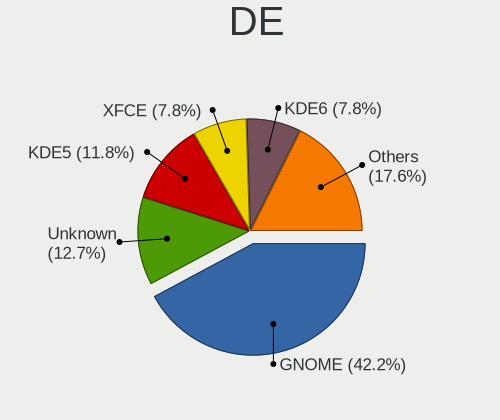

| Name         | Notebooks | Percent |
|--------------|-----------|---------|
| GNOME        | 47        | 46.08%  |
| KDE5         | 27        | 26.47%  |
| X-Cinnamon   | 10        | 9.8%    |
| XFCE         | 7         | 6.86%   |
| Unknown      | 5         | 4.9%    |
| LXQt         | 2         | 1.96%   |
| Hyprland     | 2         | 1.96%   |
| Unicorn:XFCE | 1         | 0.98%   |
| awesome      | 1         | 0.98%   |

Display Server
--------------

X11 or Wayland

| Name    | Notebooks | Percent |
|---------|-----------|---------|
| X11     | 48        | 47.06%  |
| Wayland | 47        | 46.08%  |
| Unknown | 4         | 3.92%   |
| Tty     | 3         | 2.94%   |

Display Manager
---------------

SDDM, LightDM, etc.

| Name    | Notebooks | Percent |
|---------|-----------|---------|
| Unknown | 45        | 44.12%  |
| SDDM    | 22        | 21.57%  |
| GDM3    | 15        | 14.71%  |
| GDM     | 10        | 9.8%    |
| LightDM | 9         | 8.82%   |
| GREETD  | 1         | 0.98%   |

OS Lang
-------

Language

| Lang    | Notebooks | Percent |
|---------|-----------|---------|
| en_GB   | 80        | 78.43%  |
| en_US   | 15        | 14.71%  |
| Unknown | 4         | 3.92%   |
| C       | 2         | 1.96%   |
| en_AU   | 1         | 0.98%   |

Boot Mode
---------

EFI or BIOS

| Mode | Notebooks | Percent |
|------|-----------|---------|
| EFI  | 61        | 59.8%   |
| BIOS | 41        | 40.2%   |

Filesystem
----------

Type of filesystem

| Type    | Notebooks | Percent |
|---------|-----------|---------|
| Ext4    | 57        | 55.88%  |
| Btrfs   | 30        | 29.41%  |
| Tmpfs   | 11        | 10.78%  |
| Xfs     | 2         | 1.96%   |
| Zfs     | 1         | 0.98%   |
| Overlay | 1         | 0.98%   |

Part. scheme
------------

Scheme of partitioning

| Type    | Notebooks | Percent |
|---------|-----------|---------|
| GPT     | 55        | 53.92%  |
| Unknown | 41        | 40.2%   |
| MBR     | 6         | 5.88%   |

Dual Boot with Linux/BSD
------------------------

Hosting more than one Linux/BSD

| Dual boot | Notebooks | Percent |
|-----------|-----------|---------|
| No        | 94        | 92.16%  |
| Yes       | 8         | 7.84%   |

Dual Boot (Win)
---------------

Hosting Linux and Windows

| Dual boot | Notebooks | Percent |
|-----------|-----------|---------|
| No        | 81        | 79.41%  |
| Yes       | 21        | 20.59%  |

Board
-----

Vendor
------

Motherboard manufacturer

| Name                | Notebooks | Percent |
|---------------------|-----------|---------|
| Dell                | 23        | 22.55%  |
| Lenovo              | 19        | 18.63%  |
| Hewlett-Packard     | 14        | 13.73%  |
| ASUSTek Computer    | 11        | 10.78%  |
| Valve               | 8         | 7.84%   |
| Acer                | 8         | 7.84%   |
| MSI                 | 3         | 2.94%   |
| Toshiba             | 2         | 1.96%   |
| Tactus              | 1         | 0.98%   |
| Sony                | 1         | 0.98%   |
| Schenker            | 1         | 0.98%   |
| Samsung Electronics | 1         | 0.98%   |
| Razer               | 1         | 0.98%   |
| PC Specialist       | 1         | 0.98%   |
| Notebook            | 1         | 0.98%   |
| Google              | 1         | 0.98%   |
| GEO                 | 1         | 0.98%   |
| Dynabook            | 1         | 0.98%   |
| AZW                 | 1         | 0.98%   |
| AWOW                | 1         | 0.98%   |
| Apple               | 1         | 0.98%   |
| Unknown             | 1         | 0.98%   |

Model
-----

Motherboard model

| Name                                              | Notebooks | Percent |
|---------------------------------------------------|-----------|---------|
| Valve Jupiter                                     | 7         | 6.86%   |
| Dell XPS 15 9570                                  | 3         | 2.94%   |
| Dell Inspiron 13-5378                             | 2         | 1.96%   |
| Valve Galileo                                     | 1         | 0.98%   |
| Toshiba Satellite Pro C50-A-1E2                   | 1         | 0.98%   |
| Toshiba Satellite L300                            | 1         | 0.98%   |
| Tactus IOTA Flo                                   | 1         | 0.98%   |
| Sony SVE1511K1EW                                  | 1         | 0.98%   |
| Schenker XMG NEO (E23)                            | 1         | 0.98%   |
| Samsung R720                                      | 1         | 0.98%   |
| Razer Blade 15 (2022) - RZ09-0421                 | 1         | 0.98%   |
| PC Specialist 14 Fusion Pro                       | 1         | 0.98%   |
| Notebook NL5xNU                                   | 1         | 0.98%   |
| MSI Pulse GL66 12UEK                              | 1         | 0.98%   |
| MSI MS-16Y1                                       | 1         | 0.98%   |
| MSI GS43VR 7RE                                    | 1         | 0.98%   |
| Lenovo Yoga 500-15IBD 80N6                        | 1         | 0.98%   |
| Lenovo Y50-70 20378                               | 1         | 0.98%   |
| Lenovo ThinkPad X280 20KEA00SUK                   | 1         | 0.98%   |
| Lenovo ThinkPad X1 Carbon Gen 11 21HM003UUK       | 1         | 0.98%   |
| Lenovo ThinkPad T540p 20BE003YUK                  | 1         | 0.98%   |
| Lenovo ThinkPad T440p 20AWA16R00                  | 1         | 0.98%   |
| Lenovo ThinkPad T420 4180PR1                      | 1         | 0.98%   |
| Lenovo ThinkPad T410 2522AC1                      | 1         | 0.98%   |
| Lenovo ThinkPad T16 Gen 2 21K7CTO1WW              | 1         | 0.98%   |
| Lenovo ThinkPad T16 Gen 1 21CHCTO1WW              | 1         | 0.98%   |
| Lenovo ThinkPad T14 Gen 1 20UDS01C00              | 1         | 0.98%   |
| Lenovo ThinkPad P52 20MAS25B1X                    | 1         | 0.98%   |
| Lenovo ThinkPad P50 20EQS0VV0R                    | 1         | 0.98%   |
| Lenovo ThinkPad P16s Gen 2 21K9CTO1WW             | 1         | 0.98%   |
| Lenovo ThinkPad P14s Gen 3 21J6S0K700             | 1         | 0.98%   |
| Lenovo ThinkPad L15 Gen 1 20U7001WMX              | 1         | 0.98%   |
| Lenovo ThinkPad L14 Gen 1 20U5002DUK              | 1         | 0.98%   |
| Lenovo Legion Slim 7 16APH8 82Y4                  | 1         | 0.98%   |
| Lenovo Flex 2-14 20404                            | 1         | 0.98%   |
| HP ZBook Firefly 15 inch G8 Mobile Workstation PC | 1         | 0.98%   |
| HP ZBook 14u G6                                   | 1         | 0.98%   |
| HP ProBook 455 G1                                 | 1         | 0.98%   |
| HP ProBook 4540s                                  | 1         | 0.98%   |
| HP ProBook 430 G8 Notebook PC                     | 1         | 0.98%   |

Model Family
------------

Motherboard model prefix

| Name               | Notebooks | Percent |
|--------------------|-----------|---------|
| Lenovo ThinkPad    | 15        | 14.71%  |
| Dell Latitude      | 9         | 8.82%   |
| Valve Jupiter      | 7         | 6.86%   |
| Dell Inspiron      | 7         | 6.86%   |
| ASUS VivoBook      | 6         | 5.88%   |
| Acer Aspire        | 6         | 5.88%   |
| Dell XPS           | 5         | 4.9%    |
| HP EliteBook       | 4         | 3.92%   |
| HP ProBook         | 3         | 2.94%   |
| Toshiba Satellite  | 2         | 1.96%   |
| HP ZBook           | 2         | 1.96%   |
| HP Pavilion        | 2         | 1.96%   |
| ASUS ROG           | 2         | 1.96%   |
| Valve Galileo      | 1         | 0.98%   |
| Tactus IOTA        | 1         | 0.98%   |
| Sony SVE1511K1EW   | 1         | 0.98%   |
| Schenker XMG       | 1         | 0.98%   |
| Samsung R720       | 1         | 0.98%   |
| Razer Blade        | 1         | 0.98%   |
| PC Specialist 14   | 1         | 0.98%   |
| Notebook NL5xNU    | 1         | 0.98%   |
| MSI Pulse          | 1         | 0.98%   |
| MSI MS-16Y1        | 1         | 0.98%   |
| MSI GS43VR         | 1         | 0.98%   |
| Lenovo Yoga        | 1         | 0.98%   |
| Lenovo Y50-70      | 1         | 0.98%   |
| Lenovo Legion      | 1         | 0.98%   |
| Lenovo Flex        | 1         | 0.98%   |
| HP Notebook        | 1         | 0.98%   |
| HP ENVY            | 1         | 0.98%   |
| HP 255             | 1         | 0.98%   |
| Google Nami        | 1         | 0.98%   |
| GEO GEOBOOK        | 1         | 0.98%   |
| Dynabook Satellite | 1         | 0.98%   |
| Dell Precision     | 1         | 0.98%   |
| Dell G5            | 1         | 0.98%   |
| AZW GT-R           | 1         | 0.98%   |
| AWOW AK41          | 1         | 0.98%   |
| ASUS X551CA        | 1         | 0.98%   |
| ASUS N552VW        | 1         | 0.98%   |

MFG Year
--------

Motherboard manufacture year

| Year    | Notebooks | Percent |
|---------|-----------|---------|
| 2023    | 17        | 16.67%  |
| 2020    | 17        | 16.67%  |
| 2018    | 10        | 9.8%    |
| 2022    | 8         | 7.84%   |
| 2019    | 7         | 6.86%   |
| 2013    | 6         | 5.88%   |
| 2014    | 5         | 4.9%    |
| 2011    | 5         | 4.9%    |
| 2021    | 4         | 3.92%   |
| 2017    | 4         | 3.92%   |
| 2016    | 4         | 3.92%   |
| 2015    | 4         | 3.92%   |
| 2012    | 3         | 2.94%   |
| 2008    | 3         | 2.94%   |
| 2010    | 2         | 1.96%   |
| 2009    | 2         | 1.96%   |
| Unknown | 1         | 0.98%   |

Form Factor
-----------

Physical design of the computer

| Name     | Notebooks | Percent |
|----------|-----------|---------|
| Notebook | 102       | 100%    |

Secure Boot
-----------

Enabled or disabled

| State    | Notebooks | Percent |
|----------|-----------|---------|
| Disabled | 92        | 90.2%   |
| Enabled  | 10        | 9.8%    |

Coreboot
--------

Have coreboot on board

| Used | Notebooks | Percent |
|------|-----------|---------|
| No   | 101       | 99.02%  |
| Yes  | 1         | 0.98%   |

RAM Size
--------

Total RAM memory

| Size in GB | Notebooks | Percent |
|------------|-----------|---------|
| 4.01-8.0   | 30        | 29.41%  |
| 8.01-16.0  | 25        | 24.51%  |
| 16.01-24.0 | 17        | 16.67%  |
| 3.01-4.0   | 14        | 13.73%  |
| 32.01-64.0 | 13        | 12.75%  |
| 24.01-32.0 | 3         | 2.94%   |

RAM Used
--------

Used RAM memory

| Used GB    | Notebooks | Percent |
|------------|-----------|---------|
| 2.01-3.0   | 28        | 27.45%  |
| 1.01-2.0   | 26        | 25.49%  |
| 4.01-8.0   | 24        | 23.53%  |
| 3.01-4.0   | 15        | 14.71%  |
| 8.01-16.0  | 5         | 4.9%    |
| 0.51-1.0   | 3         | 2.94%   |
| 16.01-24.0 | 1         | 0.98%   |

Total Drives
------------

Number of drives on board

| Drives | Notebooks | Percent |
|--------|-----------|---------|
| 1      | 73        | 71.57%  |
| 2      | 21        | 20.59%  |
| 3      | 5         | 4.9%    |
| 4      | 3         | 2.94%   |

Has CD-ROM
----------

Has CD-ROM on board

| Presented | Notebooks | Percent |
|-----------|-----------|---------|
| No        | 80        | 78.43%  |
| Yes       | 22        | 21.57%  |

Has Ethernet
------------

Has Ethernet on board

| Presented | Notebooks | Percent |
|-----------|-----------|---------|
| Yes       | 70        | 68.63%  |
| No        | 32        | 31.37%  |

Has WiFi
--------

Has WiFi module

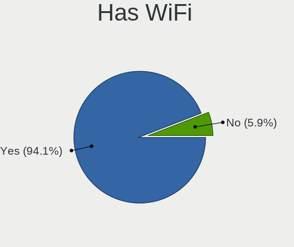

| Presented | Notebooks | Percent |
|-----------|-----------|---------|
| Yes       | 102       | 100%    |

Has Bluetooth
-------------

Has Bluetooth module

| Presented | Notebooks | Percent |
|-----------|-----------|---------|
| Yes       | 87        | 85.29%  |
| No        | 15        | 14.71%  |

Location
--------

Country
-------

Geographic location (country)

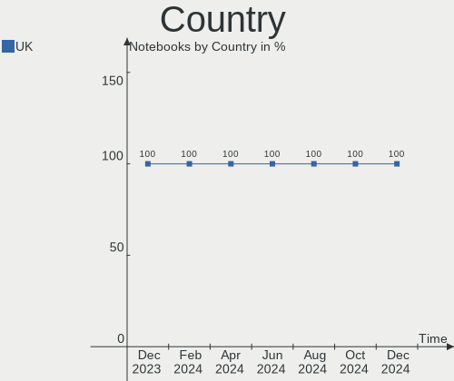

| Country | Notebooks | Percent |
|---------|-----------|---------|
| UK      | 102       | 100%    |

City
----

Geographic location (city)

| City                | Notebooks | Percent |
|---------------------|-----------|---------|
| Manchester          | 4         | 3.92%   |
| Glasgow             | 4         | 3.92%   |
| Bristol             | 4         | 3.92%   |
| Brent               | 4         | 3.92%   |
| Reading             | 3         | 2.94%   |
| Leeds               | 3         | 2.94%   |
| Lambeth             | 3         | 2.94%   |
| Cardiff             | 3         | 2.94%   |
| York                | 2         | 1.96%   |
| Southwark           | 2         | 1.96%   |
| Sale                | 2         | 1.96%   |
| London              | 2         | 1.96%   |
| Liverpool           | 2         | 1.96%   |
| Harringay           | 2         | 1.96%   |
| Enfield             | 2         | 1.96%   |
| Basingstoke         | 2         | 1.96%   |
| Wellingborough      | 1         | 0.98%   |
| Thatcham            | 1         | 0.98%   |
| Tamworth            | 1         | 0.98%   |
| Swansea             | 1         | 0.98%   |
| Sutton              | 1         | 0.98%   |
| Surbiton            | 1         | 0.98%   |
| Stourbridge         | 1         | 0.98%   |
| Stamford            | 1         | 0.98%   |
| Slough              | 1         | 0.98%   |
| Shepton Mallet      | 1         | 0.98%   |
| Rossendale          | 1         | 0.98%   |
| Rochdale            | 1         | 0.98%   |
| Preston             | 1         | 0.98%   |
| Plymouth            | 1         | 0.98%   |
| Peterborough        | 1         | 0.98%   |
| Oxford              | 1         | 0.98%   |
| Okehampton          | 1         | 0.98%   |
| Oakham              | 1         | 0.98%   |
| Newcastle upon Tyne | 1         | 0.98%   |
| Middlesbrough       | 1         | 0.98%   |
| Manor Park          | 1         | 0.98%   |
| Leicester           | 1         | 0.98%   |
| Lancing             | 1         | 0.98%   |
| Keighley            | 1         | 0.98%   |

Drives
------

Drive Vendor
------------

Hard drive vendors

| Vendor                      | Notebooks | Drives | Percent |
|-----------------------------|-----------|--------|---------|
| Samsung Electronics         | 21        | 24     | 15.91%  |
| Toshiba                     | 11        | 11     | 8.33%   |
| Sandisk                     | 11        | 12     | 8.33%   |
| Unknown                     | 10        | 11     | 7.58%   |
| Seagate                     | 8         | 8      | 6.06%   |
| WDC                         | 7         | 7      | 5.3%    |
| Crucial                     | 7         | 7      | 5.3%    |
| Phison Electronics          | 6         | 6      | 4.55%   |
| Kingston                    | 6         | 6      | 4.55%   |
| Micron/Crucial Technology   | 5         | 6      | 3.79%   |
| Micron Technology           | 5         | 5      | 3.79%   |
| SK hynix                    | 4         | 4      | 3.03%   |
| KIOXIA                      | 3         | 3      | 2.27%   |
| Intel                       | 3         | 4      | 2.27%   |
| Unknown                     | 3         | 3      | 2.27%   |
| Hitachi                     | 2         | 2      | 1.52%   |
| ASMT                        | 2         | 2      | 1.52%   |
| A-DATA Technology           | 2         | 2      | 1.52%   |
| Transcend                   | 1         | 1      | 0.76%   |
| Team                        | 1         | 1      | 0.76%   |
| SSK                         | 1         | 1      | 0.76%   |
| SABRENT                     | 1         | 2      | 0.76%   |
| PNY                         | 1         | 1      | 0.76%   |
| Netac Mo                    | 1         | 1      | 0.76%   |
| MAXIO Technology (Hangzhou) | 1         | 1      | 0.76%   |
| LITEON                      | 1         | 1      | 0.76%   |
| Lexar                       | 1         | 1      | 0.76%   |
| Kingston Technology Company | 1         | 1      | 0.76%   |
| JMicron Technology          | 1         | 1      | 0.76%   |
| HGST                        | 1         | 1      | 0.76%   |
| Fanxiang                    | 1         | 1      | 0.76%   |
| China                       | 1         | 1      | 0.76%   |
| ASENNO                      | 1         | 1      | 0.76%   |
| Apple                       | 1         | 3      | 0.76%   |

Drive Model
-----------

Hard drive models

| Model                                               | Notebooks | Percent |
|-----------------------------------------------------|-----------|---------|
| Samsung NVMe SSD Controller SM981/PM981/PM983 512GB | 7         | 5%      |
| Phison PS5013 E13 NVMe Controller 512GB             | 6         | 4.29%   |
| Unknown MMC Card  64GB                              | 3         | 2.14%   |
| Micron/Crucial P2 NVMe PCIe SSD 4TB                 | 3         | 2.14%   |
| Unknown                                             | 3         | 2.14%   |
| Unknown MMC Card  32GB                              | 2         | 1.43%   |
| Unknown MMC Card  256GB                             | 2         | 1.43%   |
| Unknown MMC Card  128GB                             | 2         | 1.43%   |
| Toshiba MQ01ABD100 1TB                              | 2         | 1.43%   |
| Seagate ST2000LM003 HN-M201RAD 2TB                  | 2         | 1.43%   |
| Sandisk WD_BLACK SN850X 2000GB                      | 2         | 1.43%   |
| Sandisk WD Black 2018/SN750 / PC SN720 NVMe SSD 1TB | 2         | 1.43%   |
| Samsung MZVL4512HBLU-00BL7 512GB                    | 2         | 1.43%   |
| Micron 2400_MTFDKBA1T0QFM 1024GB                    | 2         | 1.43%   |
| Crucial CT1000MX500SSD1 1TB                         | 2         | 1.43%   |
| WDC WDS500G2B0A-00SM50 500GB SSD                    | 1         | 0.71%   |
| WDC WDS250G2B0A-00SM50 250GB SSD                    | 1         | 0.71%   |
| WDC WD10SPCX-24HWST1 1TB                            | 1         | 0.71%   |
| WDC WD10S21X-24R1BT0-SSHD-8GB                       | 1         | 0.71%   |
| WDC WD10JPVX-22JC3T0 1TB                            | 1         | 0.71%   |
| WDC PC SN720 SDAQNTW-256G-1001 256GB                | 1         | 0.71%   |
| WDC PC SN520 SDAPNUW-128G-1014 128GB                | 1         | 0.71%   |
| Unknown NVMe SSD Drive 1024GB                       | 1         | 0.71%   |
| Unknown MMC Card  512GB                             | 1         | 0.71%   |
| Transcend TS960GMTS820S 960GB SSD                   | 1         | 0.71%   |
| Toshiba XG6 NVMe SSD Controller 512GB               | 1         | 0.71%   |
| Toshiba THNSNK256GCS8 SATA 256GB SSD                | 1         | 0.71%   |
| Toshiba MQ04ABF100 1TB                              | 1         | 0.71%   |
| Toshiba MQ01ABF050 500GB                            | 1         | 0.71%   |
| Toshiba MK6475GSX 640GB                             | 1         | 0.71%   |
| Toshiba MK5061GSYN 500GB                            | 1         | 0.71%   |
| Toshiba MK2555GSXF 250GB                            | 1         | 0.71%   |
| Toshiba KSG60ZMV256G M.2 2280 256GB SSD             | 1         | 0.71%   |
| Toshiba BG3 NVMe SSD Controller 256GB               | 1         | 0.71%   |
| Team T253X1120G 120GB SSD                           | 1         | 0.71%   |
| SSK Disk 240GB                                      | 1         | 0.71%   |
| SK hynix SKHynix_HFS256GDE9X081N 256GB              | 1         | 0.71%   |
| SK hynix PC801 NVMe 1TB                             | 1         | 0.71%   |
| SK hynix HFM001TD3JX013N 1024GB                     | 1         | 0.71%   |
| SK hynix BC711 HFM256GD3JX013N 256GB                | 1         | 0.71%   |

HDD Vendor
----------

Hard disk drive vendors

| Vendor              | Notebooks | Drives | Percent |
|---------------------|-----------|--------|---------|
| Seagate             | 8         | 8      | 30.77%  |
| Toshiba             | 7         | 7      | 26.92%  |
| WDC                 | 3         | 3      | 11.54%  |
| Hitachi             | 2         | 2      | 7.69%   |
| ASMT                | 2         | 2      | 7.69%   |
| SSK                 | 1         | 1      | 3.85%   |
| Samsung Electronics | 1         | 1      | 3.85%   |
| SABRENT             | 1         | 2      | 3.85%   |
| HGST                | 1         | 1      | 3.85%   |

SSD Vendor
----------

Solid state drive vendors

| Vendor              | Notebooks | Drives | Percent |
|---------------------|-----------|--------|---------|
| Samsung Electronics | 5         | 6      | 15.15%  |
| Kingston            | 5         | 5      | 15.15%  |
| Crucial             | 5         | 5      | 15.15%  |
| SanDisk             | 3         | 3      | 9.09%   |
| WDC                 | 2         | 2      | 6.06%   |
| Toshiba             | 2         | 2      | 6.06%   |
| A-DATA Technology   | 2         | 2      | 6.06%   |
| Transcend           | 1         | 1      | 3.03%   |
| Team                | 1         | 1      | 3.03%   |
| PNY                 | 1         | 1      | 3.03%   |
| Micron Technology   | 1         | 1      | 3.03%   |
| LITEON              | 1         | 1      | 3.03%   |
| Lexar               | 1         | 1      | 3.03%   |
| Fanxiang            | 1         | 1      | 3.03%   |
| China               | 1         | 1      | 3.03%   |
| ASENNO              | 1         | 1      | 3.03%   |

Drive Kind
----------

HDD or SSD

| Kind    | Notebooks | Drives | Percent |
|---------|-----------|--------|---------|
| NVMe    | 60        | 66     | 48%     |
| SSD     | 27        | 34     | 21.6%   |
| HDD     | 24        | 27     | 19.2%   |
| MMC     | 12        | 13     | 9.6%    |
| Unknown | 2         | 2      | 1.6%    |

Drive Connector
---------------

SATA, SAS, NVMe, etc.

| Type | Notebooks | Drives | Percent |
|------|-----------|--------|---------|
| NVMe | 60        | 66     | 48.78%  |
| SATA | 44        | 52     | 35.77%  |
| MMC  | 12        | 13     | 9.76%   |
| SAS  | 7         | 11     | 5.69%   |

Drive Size
----------

Size of hard drive

| Size in TB | Notebooks | Drives | Percent |
|------------|-----------|--------|---------|
| 0.01-0.5   | 33        | 35     | 57.89%  |
| 0.51-1.0   | 19        | 19     | 33.33%  |
| 1.01-2.0   | 5         | 7      | 8.77%   |

Space Total
-----------

Amount of disk space available on the file system

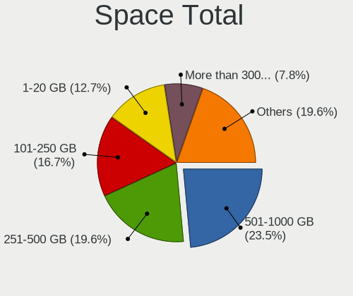

| Size in GB     | Notebooks | Percent |
|----------------|-----------|---------|
| 101-250        | 26        | 25.49%  |
| 501-1000       | 25        | 24.51%  |
| 251-500        | 23        | 22.55%  |
| 1001-2000      | 12        | 11.76%  |
| 1-20           | 5         | 4.9%    |
| 51-100         | 5         | 4.9%    |
| More than 3000 | 3         | 2.94%   |
| 2001-3000      | 2         | 1.96%   |
| Unknown        | 1         | 0.98%   |

Space Used
----------

Amount of used disk space

| Used GB        | Notebooks | Percent |
|----------------|-----------|---------|
| 1-20           | 32        | 31.37%  |
| 51-100         | 19        | 18.63%  |
| 21-50          | 14        | 13.73%  |
| 101-250        | 13        | 12.75%  |
| 251-500        | 11        | 10.78%  |
| 501-1000       | 8         | 7.84%   |
| 1001-2000      | 2         | 1.96%   |
| More than 3000 | 1         | 0.98%   |
| 2001-3000      | 1         | 0.98%   |
| Unknown        | 1         | 0.98%   |

Malfunc. Drives
---------------

Drive models with a malfunction

| Model                  | Notebooks | Drives | Percent |
|------------------------|-----------|--------|---------|
| Toshiba MQ01ABD100 1TB | 1         | 1      | 100%    |

Malfunc. Drive Vendor
---------------------

Vendors of faulty drives

| Vendor  | Notebooks | Drives | Percent |
|---------|-----------|--------|---------|
| Toshiba | 1         | 1      | 100%    |

Malfunc. HDD Vendor
-------------------

Vendors of faulty HDD drives

| Vendor  | Notebooks | Drives | Percent |
|---------|-----------|--------|---------|
| Toshiba | 1         | 1      | 100%    |

Malfunc. Drive Kind
-------------------

Kinds of faulty drives

| Kind | Notebooks | Drives | Percent |
|------|-----------|--------|---------|
| HDD  | 1         | 1      | 100%    |

Failed Drives
-------------

Failed drive models

Zero info for selected period =(

Failed Drive Vendor
-------------------

Failed drive vendors

Zero info for selected period =(

Drive Status
------------

Number of failed and malfunc. drives

| Status   | Notebooks | Drives | Percent |
|----------|-----------|--------|---------|
| Detected | 62        | 88     | 59.05%  |
| Works    | 42        | 53     | 40%     |
| Malfunc  | 1         | 1      | 0.95%   |

Storage controller
------------------

Storage Vendor
--------------

Storage controller vendors

| Vendor                       | Notebooks | Percent |
|------------------------------|-----------|---------|
| Intel                        | 60        | 46.88%  |
| Samsung Electronics          | 17        | 13.28%  |
| SanDisk                      | 11        | 8.59%   |
| AMD                          | 9         | 7.03%   |
| Micron/Crucial Technology    | 7         | 5.47%   |
| Phison Electronics           | 6         | 4.69%   |
| SK hynix                     | 4         | 3.13%   |
| Micron Technology            | 4         | 3.13%   |
| KIOXIA                       | 3         | 2.34%   |
| Toshiba America Info Systems | 2         | 1.56%   |
| Kingston Technology Company  | 2         | 1.56%   |
| Solidigm                     | 1         | 0.78%   |
| MAXIO Technology (Hangzhou)  | 1         | 0.78%   |
| ASMedia Technology           | 1         | 0.78%   |

Storage Model
-------------

Storage controller models

| Model                                                                          | Notebooks | Percent |
|--------------------------------------------------------------------------------|-----------|---------|
| Samsung NVMe SSD Controller SM981/PM981/PM983                                  | 11        | 8.4%    |
| AMD FCH SATA Controller [AHCI mode]                                            | 9         | 6.87%   |
| Phison PS5013-E13 PCIe3 NVMe Controller (DRAM-less)                            | 6         | 4.58%   |
| Intel Cannon Lake Mobile PCH SATA AHCI Controller                              | 6         | 4.58%   |
| Intel 7 Series Chipset Family 6-port SATA Controller [AHCI mode]               | 6         | 4.58%   |
| Micron/Crucial P2 [Nick P2] / P3 / P3 Plus NVMe PCIe SSD (DRAM-less)           | 5         | 3.82%   |
| Intel Celeron/Pentium Silver Processor SATA Controller                         | 5         | 3.82%   |
| Intel 6 Series/C200 Series Chipset Family 6 port Mobile SATA AHCI Controller   | 5         | 3.82%   |
| Intel Wildcat Point-LP SATA Controller [AHCI Mode]                             | 4         | 3.05%   |
| Intel Volume Management Device NVMe RAID Controller                            | 4         | 3.05%   |
| Intel 82801 Mobile SATA Controller [RAID mode]                                 | 4         | 3.05%   |
| SK hynix Gold P31/BC711/PC711 NVMe Solid State Drive                           | 3         | 2.29%   |
| SanDisk Extreme Pro / WD Black 2018/SN750/PC SN720 NVMe SSD                    | 3         | 2.29%   |
| Samsung NVMe SSD Controller PM9A1/PM9A3/980PRO                                 | 3         | 2.29%   |
| Micron 2400 NVMe SSD (DRAM-less)                                               | 3         | 2.29%   |
| Intel Sunrise Point-LP SATA Controller [AHCI mode]                             | 3         | 2.29%   |
| Intel HM170/QM170 Chipset SATA Controller [AHCI Mode]                          | 3         | 2.29%   |
| Intel 82801IBM/IEM (ICH9M/ICH9M-E) 4 port SATA Controller [AHCI mode]          | 3         | 2.29%   |
| Intel 8 Series/C220 Series Chipset Family 6-port SATA Controller 1 [AHCI mode] | 3         | 2.29%   |
| Intel 8 Series SATA Controller 1 [AHCI mode]                                   | 3         | 2.29%   |
| Sandisk WD Black SN850X NVMe SSD                                               | 2         | 1.53%   |
| SanDisk IX SN530 NVMe SSD (DRAM-less)                                          | 2         | 1.53%   |
| Samsung NVMe SSD Controller PM9B1 (DRAM-less)                                  | 2         | 1.53%   |
| Intel Volume Management Device NVMe RAID Controller Intel Corporation          | 2         | 1.53%   |
| Intel SSD 670p Series [Keystone Harbor]                                        | 2         | 1.53%   |
| Intel Celeron N3350/Pentium N4200/Atom E3900 Series SATA AHCI Controller       | 2         | 1.53%   |
| Intel Alder Lake-P SATA AHCI Controller                                        | 2         | 1.53%   |
| Intel 5 Series/3400 Series Chipset 4 port SATA AHCI Controller                 | 2         | 1.53%   |
| Toshiba America Info Systems XG6 NVMe SSD Controller                           | 1         | 0.76%   |
| Toshiba America Info Systems BG3 x2 NVMe SSD Controller (DRAM-less)            | 1         | 0.76%   |
| Solidigm P41 Plus NVMe SSD (DRAM-less) [Echo Harbor]                           | 1         | 0.76%   |
| SK hynix Platinum P41/PC801 NVMe Solid State Drive                             | 1         | 0.76%   |
| SanDisk WD PC SN810 / Black SN850 NVMe SSD                                     | 1         | 0.76%   |
| SanDisk WD Blue SN500 / PC SN520 x2 M.2 2280 NVMe SSD                          | 1         | 0.76%   |
| SanDisk WD Black SN770 / PC SN740 256GB / PC SN560 (DRAM-less) NVMe SSD        | 1         | 0.76%   |
| SanDisk Ultra 3D / WD Blue SN550 NVMe SSD                                      | 1         | 0.76%   |
| Samsung NVMe SSD Controller 980 (DRAM-less)                                    | 1         | 0.76%   |
| Micron/Crucial P5 Plus NVMe PCIe SSD                                           | 1         | 0.76%   |
| Micron/Crucial P5 NVMe PCIe SSD[SlashP5]                                       | 1         | 0.76%   |
| Micron 2210 NVMe SSD [Cobain]                                                  | 1         | 0.76%   |

Storage Kind
------------

Kind of storage controller (IDE, SATA, NVMe, SAS, ...)

| Kind | Notebooks | Percent |
|------|-----------|---------|
| NVMe | 59        | 46.09%  |
| SATA | 59        | 46.09%  |
| RAID | 10        | 7.81%   |

Processor
---------

CPU Vendor
----------

Processor vendors

| Vendor  | Notebooks | Percent |
|---------|-----------|---------|
| Intel   | 74        | 72.55%  |
| AMD     | 27        | 26.47%  |
| Unknown | 1         | 0.98%   |

CPU Model
---------

Processor models

| Model                                         | Notebooks | Percent |
|-----------------------------------------------|-----------|---------|
| AMD Custom APU 0405                           | 8         | 7.84%   |
| Intel Celeron N4020 CPU @ 1.10GHz             | 4         | 3.92%   |
| Intel Core i7-8750H CPU @ 2.20GHz             | 3         | 2.94%   |
| Intel Core i5-7200U CPU @ 2.50GHz             | 3         | 2.94%   |
| Intel 11th Gen Core i7-1165G7 @ 2.80GHz       | 3         | 2.94%   |
| AMD Ryzen 7 PRO 4750U with Radeon Graphics    | 3         | 2.94%   |
| Intel Core i5-8365U CPU @ 1.60GHz             | 2         | 1.96%   |
| Intel Core i5-2520M CPU @ 2.50GHz             | 2         | 1.96%   |
| Intel Core i3-3217U CPU @ 1.80GHz             | 2         | 1.96%   |
| Intel 13th Gen Core i7-1355U                  | 2         | 1.96%   |
| AMD Ryzen 7 PRO 7840U w/ Radeon 780M Graphics | 2         | 1.96%   |
| AMD Ryzen 7 PRO 6850U with Radeon Graphics    | 2         | 1.96%   |
| AMD Ryzen 5 3500U with Radeon Vega Mobile Gfx | 2         | 1.96%   |
| Intel Pentium CPU 4417U @ 2.30GHz             | 1         | 0.98%   |
| Intel Pentium 3558U @ 1.70GHz                 | 1         | 0.98%   |
| Intel Core M-5Y71 CPU @ 1.20GHz               | 1         | 0.98%   |
| Intel Core i9-8950HK CPU @ 2.90GHz            | 1         | 0.98%   |
| Intel Core i7-8850H CPU @ 2.60GHz             | 1         | 0.98%   |
| Intel Core i7-8565U CPU @ 1.80GHz             | 1         | 0.98%   |
| Intel Core i7-8550U CPU @ 1.80GHz             | 1         | 0.98%   |
| Intel Core i7-7700HQ CPU @ 2.80GHz            | 1         | 0.98%   |
| Intel Core i7-6820HQ CPU @ 2.70GHz            | 1         | 0.98%   |
| Intel Core i7-6700HQ CPU @ 2.60GHz            | 1         | 0.98%   |
| Intel Core i7-4720HQ CPU @ 2.60GHz            | 1         | 0.98%   |
| Intel Core i7-4700MQ CPU @ 2.40GHz            | 1         | 0.98%   |
| Intel Core i7-2760QM CPU @ 2.40GHz            | 1         | 0.98%   |
| Intel Core i7-10510U CPU @ 1.80GHz            | 1         | 0.98%   |
| Intel Core i7 CPU Q 720 @ 1.60GHz             | 1         | 0.98%   |
| Intel Core i5-9300H CPU @ 2.40GHz             | 1         | 0.98%   |
| Intel Core i5-8350U CPU @ 1.70GHz             | 1         | 0.98%   |
| Intel Core i5-8265U CPU @ 1.60GHz             | 1         | 0.98%   |
| Intel Core i5-8250U CPU @ 1.60GHz             | 1         | 0.98%   |
| Intel Core i5-7360U CPU @ 2.30GHz             | 1         | 0.98%   |
| Intel Core i5-7300U CPU @ 2.60GHz             | 1         | 0.98%   |
| Intel Core i5-7300HQ CPU @ 2.50GHz            | 1         | 0.98%   |
| Intel Core i5-5200U CPU @ 2.20GHz             | 1         | 0.98%   |
| Intel Core i5-4300M CPU @ 2.60GHz             | 1         | 0.98%   |
| Intel Core i5-4210U CPU @ 1.70GHz             | 1         | 0.98%   |
| Intel Core i5-3230M CPU @ 2.60GHz             | 1         | 0.98%   |
| Intel Core i5-2450M CPU @ 2.50GHz             | 1         | 0.98%   |

CPU Model Family
----------------

Processor model prefix

| Model            | Notebooks | Percent |
|------------------|-----------|---------|
| Other            | 22        | 21.57%  |
| Intel Core i5    | 22        | 21.57%  |
| Intel Core i7    | 14        | 13.73%  |
| Intel Core i3    | 10        | 9.8%    |
| Intel Celeron    | 8         | 7.84%   |
| AMD Ryzen 7 PRO  | 7         | 6.86%   |
| AMD Ryzen 5      | 4         | 3.92%   |
| Intel Core 2 Duo | 3         | 2.94%   |
| AMD Ryzen 7      | 3         | 2.94%   |
| Intel Pentium    | 2         | 1.96%   |
| AMD Ryzen 9      | 2         | 1.96%   |
| Intel Core M     | 1         | 0.98%   |
| Intel Core i9    | 1         | 0.98%   |
| AMD Ryzen 3      | 1         | 0.98%   |
| AMD A8           | 1         | 0.98%   |
| AMD A6           | 1         | 0.98%   |

CPU Cores
---------

Number of processor cores

| Number | Notebooks | Percent |
|--------|-----------|---------|
| 2      | 37        | 36.27%  |
| 4      | 36        | 35.29%  |
| 8      | 12        | 11.76%  |
| 6      | 6         | 5.88%   |
| 14     | 4         | 3.92%   |
| 10     | 4         | 3.92%   |
| 24     | 1         | 0.98%   |
| 12     | 1         | 0.98%   |
| 1      | 1         | 0.98%   |

CPU Sockets
-----------

Number of sockets

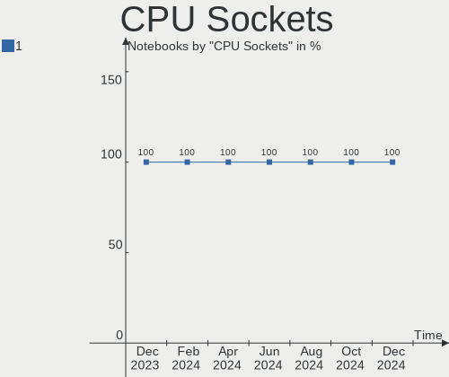

| Number | Notebooks | Percent |
|--------|-----------|---------|
| 1      | 102       | 100%    |

CPU Threads
-----------

Threads per core (Hyper-Threading)

| Number | Notebooks | Percent |
|--------|-----------|---------|
| 2      | 85        | 83.33%  |
| 1      | 17        | 16.67%  |

CPU Op-Modes
------------

CPU Operation Modes (32-bit, 64-bit)

| Op mode        | Notebooks | Percent |
|----------------|-----------|---------|
| 32-bit, 64-bit | 101       | 99.02%  |
| 64-bit         | 1         | 0.98%   |

CPU Microcode
-------------

Microcode number

| Number     | Notebooks | Percent |
|------------|-----------|---------|
| Unknown    | 62        | 60.78%  |
| 0x906ea    | 4         | 3.92%   |
| 0x806e9    | 3         | 2.94%   |
| 0x306a9    | 3         | 2.94%   |
| 0x206a7    | 3         | 2.94%   |
| 0x0a704103 | 3         | 2.94%   |
| 0x08108109 | 3         | 2.94%   |
| 0x706a8    | 2         | 1.96%   |
| 0x0a404102 | 2         | 1.96%   |
| 0x08600109 | 2         | 1.96%   |
| 0xb0671    | 1         | 0.98%   |
| 0x906e9    | 1         | 0.98%   |
| 0x806ec    | 1         | 0.98%   |
| 0x806c1    | 1         | 0.98%   |
| 0x706a1    | 1         | 0.98%   |
| 0x506e3    | 1         | 0.98%   |
| 0x506c9    | 1         | 0.98%   |
| 0x306c3    | 1         | 0.98%   |
| 0x106e5    | 1         | 0.98%   |
| 0x10676    | 1         | 0.98%   |
| 0x0a601203 | 1         | 0.98%   |
| 0x0a50000d | 1         | 0.98%   |
| 0x0a50000c | 1         | 0.98%   |
| 0x08900201 | 1         | 0.98%   |
| 0x08600106 | 1         | 0.98%   |

CPU Microarch
-------------

Microarchitecture

| Name             | Notebooks | Percent |
|------------------|-----------|---------|
| KabyLake         | 23        | 22.55%  |
| Unknown          | 18        | 17.65%  |
| SandyBridge      | 7         | 6.86%   |
| Haswell          | 6         | 5.88%   |
| Alderlake Hybrid | 6         | 5.88%   |
| Goldmont plus    | 5         | 4.9%    |
| Zen+             | 4         | 3.92%   |
| Zen 2            | 4         | 3.92%   |
| TigerLake        | 4         | 3.92%   |
| IvyBridge        | 4         | 3.92%   |
| Broadwell        | 4         | 3.92%   |
| Zen 3            | 3         | 2.94%   |
| Penryn           | 3         | 2.94%   |
| Westmere         | 2         | 1.96%   |
| Skylake          | 2         | 1.96%   |
| Goldmont         | 2         | 1.96%   |
| Puma             | 1         | 0.98%   |
| Piledriver       | 1         | 0.98%   |
| Nehalem          | 1         | 0.98%   |
| IceLake          | 1         | 0.98%   |
| Core             | 1         | 0.98%   |

Graphics
--------

GPU Vendor
----------

Vendors of graphics cards

| Vendor | Notebooks | Percent |
|--------|-----------|---------|
| Intel  | 70        | 57.85%  |
| AMD    | 30        | 24.79%  |
| Nvidia | 21        | 17.36%  |

GPU Model
---------

Graphics card models

| Model                                                                     | Notebooks | Percent |
|---------------------------------------------------------------------------|-----------|---------|
| Intel 2nd Generation Core Processor Family Integrated Graphics Controller | 7         | 5.79%   |
| AMD VanGogh [AMD Custom GPU 0405]                                         | 7         | 5.79%   |
| Intel CoffeeLake-H GT2 [UHD Graphics 630]                                 | 6         | 4.96%   |
| Intel HD Graphics 620                                                     | 5         | 4.13%   |
| Intel GeminiLake [UHD Graphics 600]                                       | 5         | 4.13%   |
| Intel WhiskeyLake-U GT2 [UHD Graphics 620]                                | 4         | 3.31%   |
| Intel TigerLake-LP GT2 [Iris Xe Graphics]                                 | 4         | 3.31%   |
| Intel Raptor Lake-P [Iris Xe Graphics]                                    | 4         | 3.31%   |
| Intel 3rd Gen Core processor Graphics Controller                          | 4         | 3.31%   |
| AMD Renoir [Radeon RX Vega 6 (Ryzen 4000/5000 Mobile Series)]             | 4         | 3.31%   |
| AMD Picasso/Raven 2 [Radeon Vega Series / Radeon Vega Mobile Series]      | 4         | 3.31%   |
| Nvidia GP107M [GeForce GTX 1050 Ti Mobile]                                | 3         | 2.48%   |
| Nvidia AD107M [GeForce RTX 4060 Max-Q / Mobile]                           | 3         | 2.48%   |
| Intel UHD Graphics 620                                                    | 3         | 2.48%   |
| Intel Haswell-ULT Integrated Graphics Controller                          | 3         | 2.48%   |
| Intel 4th Gen Core Processor Integrated Graphics Controller               | 3         | 2.48%   |
| AMD Phoenix1                                                              | 3         | 2.48%   |
| Nvidia GA106M [GeForce RTX 3060 Mobile / Max-Q]                           | 2         | 1.65%   |
| Nvidia AD104M [GeForce RTX 4080 Max-Q / Mobile]                           | 2         | 1.65%   |
| Intel Raptor Lake-S UHD Graphics                                          | 2         | 1.65%   |
| Intel Mobile 4 Series Chipset Integrated Graphics Controller              | 2         | 1.65%   |
| Intel HD Graphics 630                                                     | 2         | 1.65%   |
| Intel HD Graphics 5500                                                    | 2         | 1.65%   |
| Intel HD Graphics 500                                                     | 2         | 1.65%   |
| Intel Core Processor Integrated Graphics Controller                       | 2         | 1.65%   |
| Intel Alder Lake-P GT2 [Iris Xe Graphics]                                 | 2         | 1.65%   |
| AMD Rembrandt [Radeon 680M]                                               | 2         | 1.65%   |
| AMD Barcelo                                                               | 2         | 1.65%   |
| Nvidia TU117M [GeForce GTX 1650 Mobile / Max-Q]                           | 1         | 0.83%   |
| Nvidia TU117GLM [Quadro T500 Mobile]                                      | 1         | 0.83%   |
| Nvidia GP107M [GeForce GTX 1050 Mobile]                                   | 1         | 0.83%   |
| Nvidia GP107GLM [Quadro P1000 Mobile]                                     | 1         | 0.83%   |
| Nvidia GP106M [GeForce GTX 1060 Mobile]                                   | 1         | 0.83%   |
| Nvidia GM107M [GeForce GTX 960M]                                          | 1         | 0.83%   |
| Nvidia GM107GLM [Quadro M1000M]                                           | 1         | 0.83%   |
| Nvidia GK208M [GeForce GT 730M]                                           | 1         | 0.83%   |
| Nvidia GA107M [GeForce RTX 3050 Ti Mobile]                                | 1         | 0.83%   |
| Nvidia G98M [GeForce 9300M GS]                                            | 1         | 0.83%   |
| Nvidia AD107M [GeForce RTX 4050 Max-Q / Mobile]                           | 1         | 0.83%   |
| Intel Raptor Lake-P [UHD Graphics]                                        | 1         | 0.83%   |

GPU Combo
---------

Combinations of graphics cards

| Name           | Notebooks | Percent |
|----------------|-----------|---------|
| 1 x Intel      | 52        | 50.98%  |
| 1 x AMD        | 26        | 25.49%  |
| Intel + Nvidia | 16        | 15.69%  |
| AMD + Nvidia   | 3         | 2.94%   |
| 1 x Nvidia     | 2         | 1.96%   |
| Other          | 1         | 0.98%   |
| 2 x Intel      | 1         | 0.98%   |
| Intel + AMD    | 1         | 0.98%   |

GPU Driver
----------

Free vs proprietary

| Driver      | Notebooks | Percent |
|-------------|-----------|---------|
| Free        | 89        | 87.25%  |
| Proprietary | 11        | 10.78%  |
| Unknown     | 2         | 1.96%   |

GPU Memory
----------

Total video memory

| Size in GB | Notebooks | Percent |
|------------|-----------|---------|
| Unknown    | 79        | 77.45%  |
| 3.01-4.0   | 7         | 6.86%   |
| 0.01-0.5   | 6         | 5.88%   |
| 1.01-2.0   | 4         | 3.92%   |
| 0.51-1.0   | 4         | 3.92%   |
| 7.01-8.0   | 1         | 0.98%   |
| 5.01-6.0   | 1         | 0.98%   |

Monitor
-------

Monitor Vendor
--------------

Monitor vendors

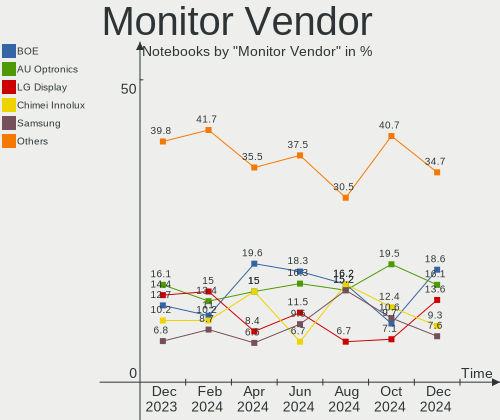

| Vendor                  | Notebooks | Percent |
|-------------------------|-----------|---------|
| AU Optronics            | 19        | 16.24%  |
| LG Display              | 17        | 14.53%  |
| BOE                     | 15        | 12.82%  |
| Chimei Innolux          | 12        | 10.26%  |
| Valve                   | 8         | 6.84%   |
| Sharp                   | 8         | 6.84%   |
| Samsung Electronics     | 8         | 6.84%   |
| InfoVision              | 3         | 2.56%   |
| Philips                 | 2         | 1.71%   |
| PANDA                   | 2         | 1.71%   |
| Lenovo                  | 2         | 1.71%   |
| Iiyama                  | 2         | 1.71%   |
| Hewlett-Packard         | 2         | 1.71%   |
| Goldstar                | 2         | 1.71%   |
| Dell                    | 2         | 1.71%   |
| Chi Mei Optoelectronics | 2         | 1.71%   |
| ViewSonic               | 1         | 0.85%   |
| SGT                     | 1         | 0.85%   |
| LG Philips              | 1         | 0.85%   |
| InnoLux Display         | 1         | 0.85%   |
| GreenWood               | 1         | 0.85%   |
| CSO                     | 1         | 0.85%   |
| CDS                     | 1         | 0.85%   |
| BenQ                    | 1         | 0.85%   |
| ASUSTek Computer        | 1         | 0.85%   |
| Apple                   | 1         | 0.85%   |
| AOC                     | 1         | 0.85%   |

Monitor Model
-------------

Monitor models

| Model                                                                 | Notebooks | Percent |
|-----------------------------------------------------------------------|-----------|---------|
| Valve ANX7530 U VLV3001 800x1280 100x150mm 7.1-inch                   | 7         | 5.98%   |
| AU Optronics LCD Monitor AUO403D 1920x1080 309x173mm 13.9-inch        | 3         | 2.56%   |
| Sharp LCD Monitor SHP148D 3840x2160 344x194mm 15.5-inch               | 2         | 1.71%   |
| BOE LCD Monitor BOE07F6 1920x1080 309x174mm 14.0-inch                 | 2         | 1.71%   |
| AU Optronics LCD Monitor AUO313C 1366x768 309x173mm 13.9-inch         | 2         | 1.71%   |
| ViewSonic VG2719-2K VSC1935 2560x1440 600x340mm 27.2-inch             | 1         | 0.85%   |
| Valve ANX7530 U VLV3003 800x1280 100x160mm 7.4-inch                   | 1         | 0.85%   |
| Sharp LQ156T1JW03 SHP1529 2560x1440 344x194mm 15.5-inch               | 1         | 0.85%   |
| Sharp LCD Monitor SHP14AB 1920x1080 294x165mm 13.3-inch               | 1         | 0.85%   |
| Sharp LCD Monitor SHP149A 1920x1080 344x194mm 15.5-inch               | 1         | 0.85%   |
| Sharp LCD Monitor SHP1479 1920x1280 259x173mm 12.3-inch               | 1         | 0.85%   |
| Sharp LCD Monitor SHP144A 3200x1800 294x165mm 13.3-inch               | 1         | 0.85%   |
| Sharp LCD Monitor SHP1417 1366x768 256x144mm 11.6-inch                | 1         | 0.85%   |
| SGT 156EE SGT0157 1920x1080 345x194mm 15.6-inch                       | 1         | 0.85%   |
| Samsung Electronics LS32R75 SAM0F92 3840x2160 697x392mm 31.5-inch     | 1         | 0.85%   |
| Samsung Electronics LCD Monitor SEC544B 1600x900 382x215mm 17.3-inch  | 1         | 0.85%   |
| Samsung Electronics LCD Monitor SEC5441 1366x768 344x194mm 15.5-inch  | 1         | 0.85%   |
| Samsung Electronics LCD Monitor SEC304C 1366x768 353x198mm 15.9-inch  | 1         | 0.85%   |
| Samsung Electronics LCD Monitor SDC4447 1366x768 344x193mm 15.5-inch  | 1         | 0.85%   |
| Samsung Electronics LCD Monitor SDC4193 2880x1800 302x189mm 14.0-inch | 1         | 0.85%   |
| Samsung Electronics LCD Monitor SDC415D 3840x2400 344x215mm 16.0-inch | 1         | 0.85%   |
| Samsung Electronics LCD Monitor SDC3852 1366x768 344x194mm 15.5-inch  | 1         | 0.85%   |
| Philips PHL 272V8 PHLC21A 1920x1080 598x336mm 27.0-inch               | 1         | 0.85%   |
| Philips FTV PHL01EA 1920x1080 1440x810mm 65.0-inch                    | 1         | 0.85%   |
| PANDA LCD Monitor NCP005F 1920x1080 344x194mm 15.5-inch               | 1         | 0.85%   |
| PANDA LCD Monitor NCP0040 1920x1080 344x194mm 15.5-inch               | 1         | 0.85%   |
| LG Philips LP154WX4-TLC8 LPL0120 1280x800 331x207mm 15.4-inch         | 1         | 0.85%   |
| LG Display LCD Monitor LGD0ABC 1280x800 304x190mm 14.1-inch           | 1         | 0.85%   |
| LG Display LCD Monitor LGD075C 2560x1600 345x215mm 16.0-inch          | 1         | 0.85%   |
| LG Display LCD Monitor LGD06B3 1920x1200 336x210mm 15.6-inch          | 1         | 0.85%   |
| LG Display LCD Monitor LGD0659 2560x1600 312x195mm 14.5-inch          | 1         | 0.85%   |
| LG Display LCD Monitor LGD05DB 1920x1080 294x165mm 13.3-inch          | 1         | 0.85%   |
| LG Display LCD Monitor LGD0589 1920x1080 294x165mm 13.3-inch          | 1         | 0.85%   |
| LG Display LCD Monitor LGD0563 1920x1080 344x194mm 15.5-inch          | 1         | 0.85%   |
| LG Display LCD Monitor LGD0540 1920x1080 344x194mm 15.5-inch          | 1         | 0.85%   |
| LG Display LCD Monitor LGD0493 1366x768 344x194mm 15.5-inch           | 1         | 0.85%   |
| LG Display LCD Monitor LGD046D 1920x1080 309x174mm 14.0-inch          | 1         | 0.85%   |
| LG Display LCD Monitor LGD044F 1920x1080 345x194mm 15.6-inch          | 1         | 0.85%   |
| LG Display LCD Monitor LGD0446 1920x1080 309x174mm 14.0-inch          | 1         | 0.85%   |
| LG Display LCD Monitor LGD03D9 1366x768 345x194mm 15.6-inch           | 1         | 0.85%   |

Monitor Resolution
------------------

Monitor screen resolution

| Resolution        | Notebooks | Percent |
|-------------------|-----------|---------|
| 1920x1080 (FHD)   | 48        | 42.48%  |
| 1366x768 (WXGA)   | 24        | 21.24%  |
| 800x1280          | 8         | 7.08%   |
| 3840x2160 (4K)    | 8         | 7.08%   |
| 1920x1200 (WUXGA) | 6         | 5.31%   |
| 2560x1600         | 4         | 3.54%   |
| 2560x1440 (QHD)   | 4         | 3.54%   |
| 1280x800 (WXGA)   | 3         | 2.65%   |
| 2880x1800         | 2         | 1.77%   |
| 1600x900 (HD+)    | 2         | 1.77%   |
| 3840x2400         | 1         | 0.88%   |
| 3200x1800 (QHD+)  | 1         | 0.88%   |
| 2560x1080         | 1         | 0.88%   |
| 1920x1280         | 1         | 0.88%   |

Monitor Diagonal
----------------

Diagonal size in inches

| Inches | Notebooks | Percent |
|--------|-----------|---------|
| 15     | 43        | 37.07%  |
| 13     | 16        | 13.79%  |
| 14     | 14        | 12.07%  |
| 7      | 8         | 6.9%    |
| 16     | 7         | 6.03%   |
| 27     | 5         | 4.31%   |
| 17     | 4         | 3.45%   |
| 12     | 4         | 3.45%   |
| 11     | 3         | 2.59%   |
| 23     | 2         | 1.72%   |
| 72     | 1         | 0.86%   |
| 65     | 1         | 0.86%   |
| 64     | 1         | 0.86%   |
| 34     | 1         | 0.86%   |
| 31     | 1         | 0.86%   |
| 29     | 1         | 0.86%   |
| 26     | 1         | 0.86%   |
| 24     | 1         | 0.86%   |
| 21     | 1         | 0.86%   |
| 18     | 1         | 0.86%   |

Monitor Width
-------------

Physical width

| Width in mm | Notebooks | Percent |
|-------------|-----------|---------|
| 301-350     | 68        | 59.13%  |
| 201-300     | 16        | 13.91%  |
| 501-600     | 8         | 6.96%   |
| 1-100       | 8         | 6.96%   |
| 351-400     | 6         | 5.22%   |
| 601-700     | 3         | 2.61%   |
| 401-500     | 2         | 1.74%   |
| 1001-1500   | 2         | 1.74%   |
| 701-800     | 1         | 0.87%   |
| 1501-2000   | 1         | 0.87%   |

Aspect Ratio
------------

Proportional relationship between the width and the height

| Ratio | Notebooks | Percent |
|-------|-----------|---------|
| 16/9  | 81        | 76.42%  |
| 16/10 | 15        | 14.15%  |
| 0.67  | 7         | 6.6%    |
| 3/2   | 1         | 0.94%   |
| 21/9  | 1         | 0.94%   |
| 0.62  | 1         | 0.94%   |

Monitor Area
------------

Area in inch

| Area in inch | Notebooks | Percent |
|----------------|-----------|---------|
| 101-110        | 43        | 36.75%  |
| 81-90          | 21        | 17.95%  |
| 71-80          | 8         | 6.84%   |
| 1-40           | 8         | 6.84%   |
| 111-120        | 7         | 5.98%   |
| 301-350        | 6         | 5.13%   |
| 61-70          | 4         | 3.42%   |
| 201-250        | 4         | 3.42%   |
| 121-130        | 4         | 3.42%   |
| More than 1000 | 3         | 2.56%   |
| 51-60          | 3         | 2.56%   |
| 351-500        | 3         | 2.56%   |
| 151-200        | 1         | 0.85%   |
| 141-150        | 1         | 0.85%   |
| 91-100         | 1         | 0.85%   |

Pixel Density
-------------

Pixels per inch

| Density       | Notebooks | Percent |
|---------------|-----------|---------|
| 121-160       | 46        | 40.35%  |
| 101-120       | 25        | 21.93%  |
| 161-240       | 24        | 21.05%  |
| 51-100        | 12        | 10.53%  |
| More than 240 | 6         | 5.26%   |
| 1-50          | 1         | 0.88%   |

Multiple Monitors
-----------------

Total monitors connected

| Total | Notebooks | Percent |
|-------|-----------|---------|
| 1     | 82        | 80.39%  |
| 2     | 17        | 16.67%  |
| 0     | 2         | 1.96%   |
| 3     | 1         | 0.98%   |

Network
-------

Net Controller Vendor
---------------------

Controller vendors

| Vendor                            | Notebooks | Percent |
|-----------------------------------|-----------|---------|
| Intel                             | 58        | 37.66%  |
| Realtek Semiconductor             | 53        | 34.42%  |
| Qualcomm Atheros                  | 17        | 11.04%  |
| Broadcom                          | 6         | 3.9%    |
| Qualcomm                          | 5         | 3.25%   |
| MediaTek                          | 3         | 1.95%   |
| TP-Link                           | 2         | 1.3%    |
| Ralink                            | 1         | 0.65%   |
| Microsoft                         | 1         | 0.65%   |
| Marvell Technology Group          | 1         | 0.65%   |
| Lenovo                            | 1         | 0.65%   |
| Ericsson Business Mobile Networks | 1         | 0.65%   |
| Edimax Technology                 | 1         | 0.65%   |
| Dell                              | 1         | 0.65%   |
| D-Link                            | 1         | 0.65%   |
| Broadcom Limited                  | 1         | 0.65%   |
| ASIX Electronics                  | 1         | 0.65%   |

Net Controller Model
--------------------

Controller models

| Model                                                                   | Notebooks | Percent |
|-------------------------------------------------------------------------|-----------|---------|
| Realtek RTL8111/8168/8411 PCI Express Gigabit Ethernet Controller       | 28        | 15.38%  |
| Realtek RTL8153 Gigabit Ethernet Adapter                                | 9         | 4.95%   |
| Realtek RTL8822CE 802.11ac PCIe Wireless Network Adapter                | 8         | 4.4%    |
| Intel Wi-Fi 6 AX200                                                     | 8         | 4.4%    |
| Intel Wireless 8265 / 8275                                              | 6         | 3.3%    |
| Realtek RTL810xE PCI Express Fast Ethernet controller                   | 5         | 2.75%   |
| Qualcomm QCNFA765 Wireless Network Adapter                              | 5         | 2.75%   |
| Qualcomm Atheros QCA6174 802.11ac Wireless Network Adapter              | 5         | 2.75%   |
| Intel Wireless 7260                                                     | 5         | 2.75%   |
| Qualcomm Atheros AR9485 Wireless Network Adapter                        | 4         | 2.2%    |
| Intel Wireless 3165                                                     | 4         | 2.2%    |
| Intel Wi-Fi 6 AX201                                                     | 4         | 2.2%    |
| Intel Raptor Lake PCH CNVi WiFi                                         | 4         | 2.2%    |
| Intel Gemini Lake PCH CNVi WiFi                                         | 4         | 2.2%    |
| Intel Centrino Advanced-N 6205 [Taylor Peak]                            | 4         | 2.2%    |
| Intel 82579LM Gigabit Network Connection (Lewisville)                   | 4         | 2.2%    |
| Realtek RTL8821CE 802.11ac PCIe Wireless Network Adapter                | 3         | 1.65%   |
| Intel Wireless 7265                                                     | 3         | 1.65%   |
| TP-Link 802.11ac WLAN Adapter                                           | 2         | 1.1%    |
| Realtek RTL8125 2.5GbE Controller                                       | 2         | 1.1%    |
| Qualcomm Atheros QCA9565 / AR9565 Wireless Network Adapter              | 2         | 1.1%    |
| Qualcomm Atheros AR242x / AR542x Wireless Network Adapter (PCI-Express) | 2         | 1.1%    |
| MediaTek MT7922 802.11ax PCI Express Wireless Network Adapter           | 2         | 1.1%    |
| Intel WiFi Link 5100                                                    | 2         | 1.1%    |
| Intel Ethernet Connection I217-LM                                       | 2         | 1.1%    |
| Intel Ethernet Connection (7) I219-LM                                   | 2         | 1.1%    |
| Intel Ethernet Connection (6) I219-V                                    | 2         | 1.1%    |
| Intel Ethernet Connection (4) I219-V                                    | 2         | 1.1%    |
| Intel Cannon Point-LP CNVi [Wireless-AC]                                | 2         | 1.1%    |
| Intel Cannon Lake PCH CNVi WiFi                                         | 2         | 1.1%    |
| Intel Alder Lake-P PCH CNVi WiFi                                        | 2         | 1.1%    |
| Intel 700 Series Chipset Family Wi-Fi                                   | 2         | 1.1%    |
| Realtek RTL8852BE PCIe 802.11ax Wireless Network Controller             | 1         | 0.55%   |
| Realtek RTL8723BE PCIe Wireless Network Adapter                         | 1         | 0.55%   |
| Realtek RTL8152 Fast Ethernet Adapter                                   | 1         | 0.55%   |
| Ralink RT3290 Wireless 802.11n 1T/1R PCIe                               | 1         | 0.55%   |
| Qualcomm Atheros QCA9377 802.11ac Wireless Network Adapter              | 1         | 0.55%   |
| Qualcomm Atheros QCA8171 Gigabit Ethernet                               | 1         | 0.55%   |
| Qualcomm Atheros Killer E2500 Gigabit Ethernet Controller               | 1         | 0.55%   |
| Qualcomm Atheros AR9462 Wireless Network Adapter                        | 1         | 0.55%   |

Wireless Vendor
---------------

Wireless vendors

| Vendor                            | Notebooks | Percent |
|-----------------------------------|-----------|---------|
| Intel                             | 58        | 53.7%   |
| Qualcomm Atheros                  | 16        | 14.81%  |
| Realtek Semiconductor             | 13        | 12.04%  |
| Qualcomm                          | 5         | 4.63%   |
| Broadcom                          | 5         | 4.63%   |
| MediaTek                          | 3         | 2.78%   |
| TP-Link                           | 2         | 1.85%   |
| Ralink                            | 1         | 0.93%   |
| Microsoft                         | 1         | 0.93%   |
| Ericsson Business Mobile Networks | 1         | 0.93%   |
| Edimax Technology                 | 1         | 0.93%   |
| Dell                              | 1         | 0.93%   |
| D-Link                            | 1         | 0.93%   |

Wireless Model
--------------

Wireless models

| Model                                                                   | Notebooks | Percent |
|-------------------------------------------------------------------------|-----------|---------|
| Realtek RTL8822CE 802.11ac PCIe Wireless Network Adapter                | 8         | 7.41%   |
| Intel Wi-Fi 6 AX200                                                     | 8         | 7.41%   |
| Intel Wireless 8265 / 8275                                              | 6         | 5.56%   |
| Qualcomm QCNFA765 Wireless Network Adapter                              | 5         | 4.63%   |
| Qualcomm Atheros QCA6174 802.11ac Wireless Network Adapter              | 5         | 4.63%   |
| Intel Wireless 7260                                                     | 5         | 4.63%   |
| Qualcomm Atheros AR9485 Wireless Network Adapter                        | 4         | 3.7%    |
| Intel Wireless 3165                                                     | 4         | 3.7%    |
| Intel Wi-Fi 6 AX201                                                     | 4         | 3.7%    |
| Intel Raptor Lake PCH CNVi WiFi                                         | 4         | 3.7%    |
| Intel Gemini Lake PCH CNVi WiFi                                         | 4         | 3.7%    |
| Intel Centrino Advanced-N 6205 [Taylor Peak]                            | 4         | 3.7%    |
| Realtek RTL8821CE 802.11ac PCIe Wireless Network Adapter                | 3         | 2.78%   |
| Intel Wireless 7265                                                     | 3         | 2.78%   |
| TP-Link 802.11ac WLAN Adapter                                           | 2         | 1.85%   |
| Qualcomm Atheros QCA9565 / AR9565 Wireless Network Adapter              | 2         | 1.85%   |
| Qualcomm Atheros AR242x / AR542x Wireless Network Adapter (PCI-Express) | 2         | 1.85%   |
| MediaTek MT7922 802.11ax PCI Express Wireless Network Adapter           | 2         | 1.85%   |
| Intel WiFi Link 5100                                                    | 2         | 1.85%   |
| Intel Cannon Point-LP CNVi [Wireless-AC]                                | 2         | 1.85%   |
| Intel Cannon Lake PCH CNVi WiFi                                         | 2         | 1.85%   |
| Intel Alder Lake-P PCH CNVi WiFi                                        | 2         | 1.85%   |
| Intel 700 Series Chipset Family Wi-Fi                                   | 2         | 1.85%   |
| Realtek RTL8852BE PCIe 802.11ax Wireless Network Controller             | 1         | 0.93%   |
| Realtek RTL8723BE PCIe Wireless Network Adapter                         | 1         | 0.93%   |
| Ralink RT3290 Wireless 802.11n 1T/1R PCIe                               | 1         | 0.93%   |
| Qualcomm Atheros QCA9377 802.11ac Wireless Network Adapter              | 1         | 0.93%   |
| Qualcomm Atheros AR9462 Wireless Network Adapter                        | 1         | 0.93%   |
| Qualcomm Atheros AR9285 Wireless Network Adapter (PCI-Express)          | 1         | 0.93%   |
| Microsoft Wireless XBox Controller Dongle                               | 1         | 0.93%   |
| MediaTek MT7921 802.11ax PCI Express Wireless Network Adapter           | 1         | 0.93%   |
| Intel Wireless-AC 9260                                                  | 1         | 0.93%   |
| Intel Wireless 8260                                                     | 1         | 0.93%   |
| Intel Wi-Fi 6 AX210/AX211/AX411 160MHz                                  | 1         | 0.93%   |
| Intel Ice Lake-LP PCH CNVi WiFi                                         | 1         | 0.93%   |
| Intel Dual Band Wireless-AC 3168NGW [Stone Peak]                        | 1         | 0.93%   |
| Intel Centrino Ultimate-N 6300                                          | 1         | 0.93%   |
| Ericsson Business Mobile Networks N5321 gw                              | 1         | 0.93%   |
| Edimax EW-7811Un 802.11n Wireless Adapter [Realtek RTL8188CUS]          | 1         | 0.93%   |
| Dell Wireless 5809e Gobi 4G LTE Mobile Broadband Card             | 1         | 0.93%   |

Ethernet Vendor
---------------

Ethernet vendors

| Vendor                   | Notebooks | Percent |
|--------------------------|-----------|---------|
| Realtek Semiconductor    | 45        | 61.64%  |
| Intel                    | 18        | 24.66%  |
| Qualcomm Atheros         | 5         | 6.85%   |
| Marvell Technology Group | 1         | 1.37%   |
| Lenovo                   | 1         | 1.37%   |
| Broadcom Limited         | 1         | 1.37%   |
| Broadcom                 | 1         | 1.37%   |
| ASIX Electronics         | 1         | 1.37%   |

Ethernet Model
--------------

Ethernet models

| Model                                                             | Notebooks | Percent |
|-------------------------------------------------------------------|-----------|---------|
| Realtek RTL8111/8168/8411 PCI Express Gigabit Ethernet Controller | 28        | 38.36%  |
| Realtek RTL8153 Gigabit Ethernet Adapter                          | 9         | 12.33%  |
| Realtek RTL810xE PCI Express Fast Ethernet controller             | 5         | 6.85%   |
| Intel 82579LM Gigabit Network Connection (Lewisville)             | 4         | 5.48%   |
| Realtek RTL8125 2.5GbE Controller                                 | 2         | 2.74%   |
| Intel Ethernet Connection I217-LM                                 | 2         | 2.74%   |
| Intel Ethernet Connection (7) I219-LM                             | 2         | 2.74%   |
| Intel Ethernet Connection (6) I219-V                              | 2         | 2.74%   |
| Intel Ethernet Connection (4) I219-V                              | 2         | 2.74%   |
| Realtek RTL8152 Fast Ethernet Adapter                             | 1         | 1.37%   |
| Qualcomm Atheros QCA8171 Gigabit Ethernet                         | 1         | 1.37%   |
| Qualcomm Atheros Killer E2500 Gigabit Ethernet Controller         | 1         | 1.37%   |
| Qualcomm Atheros AR8151 v2.0 Gigabit Ethernet                     | 1         | 1.37%   |
| Qualcomm Atheros AR8151 v1.0 Gigabit Ethernet                     | 1         | 1.37%   |
| Qualcomm Atheros AR8121/AR8113/AR8114 Gigabit or Fast Ethernet    | 1         | 1.37%   |
| Marvell Group 88E8057 PCI-E Gigabit Ethernet Controller           | 1         | 1.37%   |
| Lenovo USB-C Dock Ethernet                                        | 1         | 1.37%   |
| Intel Ethernet Connection I218-LM                                 | 1         | 1.37%   |
| Intel Ethernet Connection (6) I219-LM                             | 1         | 1.37%   |
| Intel Ethernet Connection (4) I219-LM                             | 1         | 1.37%   |
| Intel Ethernet Connection (2) I219-LM                             | 1         | 1.37%   |
| Intel 82577LM Gigabit Network Connection                          | 1         | 1.37%   |
| Intel 82567LM Gigabit Network Connection                          | 1         | 1.37%   |
| Broadcom NetXtreme BCM57786 Gigabit Ethernet PCIe                 | 1         | 1.37%   |
| Broadcom Limited NetXtreme BCM5761e Gigabit Ethernet PCIe         | 1         | 1.37%   |
| ASIX AX88179 Gigabit Ethernet                                     | 1         | 1.37%   |

Net Controller Kind
-------------------

Ethernet, WiFi or modem

| Kind     | Notebooks | Percent |
|----------|-----------|---------|
| WiFi     | 102       | 58.96%  |
| Ethernet | 70        | 40.46%  |
| Unknown  | 1         | 0.58%   |

Used Controller
---------------

Currently used network controller

| Kind     | Notebooks | Percent |
|----------|-----------|---------|
| WiFi     | 91        | 86.67%  |
| Ethernet | 14        | 13.33%  |

NICs
----

Total network controllers on board

| Total | Notebooks | Percent |
|-------|-----------|---------|
| 2     | 60        | 58.82%  |
| 1     | 39        | 38.24%  |
| 3     | 2         | 1.96%   |
| 0     | 1         | 0.98%   |

IPv6
----

IPv6 vs IPv4

| Used | Notebooks | Percent |
|------|-----------|---------|
| No   | 66        | 64.71%  |
| Yes  | 36        | 35.29%  |

Bluetooth
---------

Bluetooth Vendor
----------------

Controller vendors

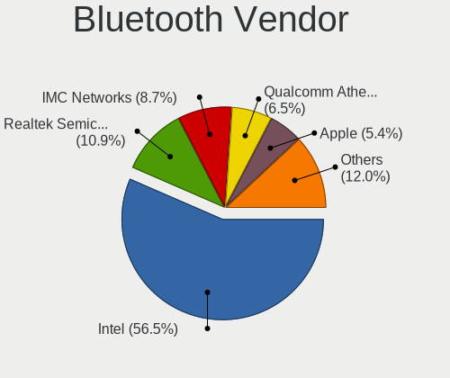

| Vendor                          | Notebooks | Percent |
|---------------------------------|-----------|---------|
| Intel                           | 50        | 56.82%  |
| IMC Networks                    | 9         | 10.23%  |
| Qualcomm Atheros Communications | 8         | 9.09%   |
| Realtek Semiconductor           | 6         | 6.82%   |
| Foxconn / Hon Hai               | 4         | 4.55%   |
| USI                             | 3         | 3.41%   |
| Broadcom                        | 2         | 2.27%   |
| Toshiba                         | 1         | 1.14%   |
| Ralink                          | 1         | 1.14%   |
| Lite-On Technology              | 1         | 1.14%   |
| Hewlett-Packard                 | 1         | 1.14%   |
| Cambridge Silicon Radio         | 1         | 1.14%   |
| Belkin Components               | 1         | 1.14%   |

Bluetooth Model
---------------

Controller models

| Model                                                 | Notebooks | Percent |
|-------------------------------------------------------|-----------|---------|
| Intel Bluetooth wireless interface                    | 19        | 21.59%  |
| Intel Bluetooth Device                                | 13        | 14.77%  |
| Intel Bluetooth 9460/9560 Jefferson Peak (JfP)        | 8         | 9.09%   |
| Intel AX200 Bluetooth                                 | 8         | 9.09%   |
| IMC Networks 802.11ac WLAN Adapter                    | 7         | 7.95%   |
| Realtek Bluetooth Radio                               | 6         | 6.82%   |
| Qualcomm Atheros QCA61x4 Bluetooth 4.0                | 4         | 4.55%   |
| USI Bluetooth Device                                  | 3         | 3.41%   |
| Qualcomm Atheros Bluetooth                            | 2         | 2.27%   |
| Toshiba Atheros AR3012 Bluetooth                      | 1         | 1.14%   |
| Ralink RT3290 Bluetooth                               | 1         | 1.14%   |
| Qualcomm Atheros  Bluetooth Device                    | 1         | 1.14%   |
| Qualcomm Atheros AR3012 Bluetooth 4.0                 | 1         | 1.14%   |
| Lite-On Atheros AR3012 Bluetooth                      | 1         | 1.14%   |
| Intel Wireless-AC 3168 Bluetooth                      | 1         | 1.14%   |
| Intel AX210 Bluetooth                                 | 1         | 1.14%   |
| IMC Networks Wireless_Device                          | 1         | 1.14%   |
| IMC Networks Bluetooth Radio                          | 1         | 1.14%   |
| HP Broadcom 2070 Bluetooth Combo                      | 1         | 1.14%   |
| Foxconn / Hon Hai Wireless_Device                     | 1         | 1.14%   |
| Foxconn / Hon Hai Bluetooth Device                    | 1         | 1.14%   |
| Foxconn / Hon Hai Bluetooth Adapter                   | 1         | 1.14%   |
| Foxconn / Hon Hai BCM2045A0                           | 1         | 1.14%   |
| Cambridge Silicon Radio Bluetooth Dongle (HCI mode)   | 1         | 1.14%   |
| Broadcom HP Portable Valentine                        | 1         | 1.14%   |
| Broadcom BCM20702A0 Bluetooth 4.0                     | 1         | 1.14%   |
| Belkin Components F8T065BF Mini Bluetooth 4.0 Adapter | 1         | 1.14%   |

Sound
-----

Sound Vendor
------------

Sound card vendors

| Vendor                 | Notebooks | Percent |
|------------------------|-----------|---------|
| Intel                  | 74        | 61.67%  |
| AMD                    | 29        | 24.17%  |
| Nvidia                 | 11        | 9.17%   |
| Realtek Semiconductor  | 1         | 0.83%   |
| Razer USA              | 1         | 0.83%   |
| Lenovo                 | 1         | 0.83%   |
| GN Netcom              | 1         | 0.83%   |
| Generalplus Technology | 1         | 0.83%   |
| ASUSTek Computer       | 1         | 0.83%   |

Sound Model
-----------

Sound card models

| Model                                                                      | Notebooks | Percent |
|----------------------------------------------------------------------------|-----------|---------|
| AMD Family 17h/19h HD Audio Controller                                     | 17        | 11.49%  |
| AMD Rembrandt Radeon High Definition Audio Controller                      | 13        | 8.78%   |
| Intel Sunrise Point-LP HD Audio                                            | 10        | 6.76%   |
| AMD Renoir Radeon High Definition Audio Controller                         | 7         | 4.73%   |
| Intel Cannon Lake PCH cAVS                                                 | 6         | 4.05%   |
| Intel 7 Series/C216 Chipset Family High Definition Audio Controller        | 6         | 4.05%   |
| Nvidia Audio device                                                        | 5         | 3.38%   |
| Intel Raptor Lake-P/U/H cAVS                                               | 5         | 3.38%   |
| Intel Celeron/Pentium Silver Processor High Definition Audio               | 5         | 3.38%   |
| Intel 6 Series/C200 Series Chipset Family High Definition Audio Controller | 5         | 3.38%   |
| Intel Wildcat Point-LP High Definition Audio Controller                    | 4         | 2.7%    |
| Intel Tiger Lake-LP Smart Sound Technology Audio Controller                | 4         | 2.7%    |
| Intel Cannon Point-LP High Definition Audio Controller                     | 4         | 2.7%    |
| Intel Broadwell-U Audio Controller                                         | 4         | 2.7%    |
| Intel 82801I (ICH9 Family) HD Audio Controller                             | 4         | 2.7%    |
| AMD Raven/Raven2/Fenghuang HDMI/DP Audio Controller                        | 4         | 2.7%    |
| Intel Xeon E3-1200 v3/4th Gen Core Processor HD Audio Controller           | 3         | 2.03%   |
| Intel Haswell-ULT HD Audio Controller                                      | 3         | 2.03%   |
| Intel 8 Series/C220 Series Chipset High Definition Audio Controller        | 3         | 2.03%   |
| Intel 8 Series HD Audio Controller                                         | 3         | 2.03%   |
| Intel 5 Series/3400 Series Chipset High Definition Audio                   | 3         | 2.03%   |
| Nvidia GA106 High Definition Audio Controller                              | 2         | 1.35%   |
| Intel CM238 HD Audio Controller                                            | 2         | 1.35%   |
| Intel Celeron N3350/Pentium N4200/Atom E3900 Series Audio Cluster          | 2         | 1.35%   |
| Intel Alder Lake PCH-P High Definition Audio Controller                    | 2         | 1.35%   |
| Intel 700 Series Chipset Family Precise Touch and Stylus Port #1           | 2         | 1.35%   |
| Intel 100 Series/C230 Series Chipset Family HD Audio Controller            | 2         | 1.35%   |
| AMD FCH Azalia Controller                                                  | 2         | 1.35%   |
| Realtek Semiconductor USB-C Audio Adapter                                  | 1         | 0.68%   |
| Razer USA Razer Seiren Mini                                                | 1         | 0.68%   |
| Nvidia TU107 GeForce GTX 1650 High Definition Audio Controller             | 1         | 0.68%   |
| Nvidia GP107GL High Definition Audio Controller                            | 1         | 0.68%   |
| Nvidia GP106 High Definition Audio Controller                              | 1         | 0.68%   |
| Nvidia GM107 High Definition Audio Controller [GeForce 940MX]              | 1         | 0.68%   |
| Lenovo ThinkPad USB-C Dock Gen2 USB Audio                                  | 1         | 0.68%   |
| Intel Ice Lake-LP Smart Sound Technology Audio Controller                  | 1         | 0.68%   |
| Intel Comet Lake PCH-LP cAVS                                               | 1         | 0.68%   |
| GN Netcom Jabra EVOLVE Link MS                                             | 1         | 0.68%   |
| Generalplus Technology USB Audio Device                                    | 1         | 0.68%   |
| ASUSTek Computer C-Media Audio                                             | 1         | 0.68%   |

Memory
------

Memory Vendor
-------------

Memory module vendors

| Vendor              | Notebooks | Percent |
|---------------------|-----------|---------|
| Samsung Electronics | 16        | 25%     |
| Micron Technology   | 13        | 20.31%  |
| SK hynix            | 12        | 18.75%  |
| Kingston            | 6         | 9.38%   |
| Unknown             | 4         | 6.25%   |
| Crucial             | 3         | 4.69%   |
| Corsair             | 3         | 4.69%   |
| Unknown (ABCD)      | 2         | 3.13%   |
| Unknown (CB83)      | 1         | 1.56%   |
| Ramaxel Technology  | 1         | 1.56%   |
| Nanya Technology    | 1         | 1.56%   |
| A-DATA Technology   | 1         | 1.56%   |
| Unknown             | 1         | 1.56%   |

Memory Model
------------

Memory module models

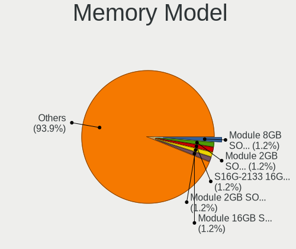

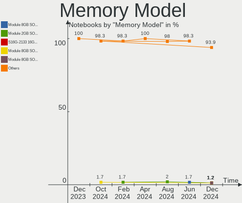

| Model                                                                     | Notebooks | Percent |
|---------------------------------------------------------------------------|-----------|---------|
| Unknown (ABCD) RAM 123456789012345678 2GB SODIMM LPDDR4 2400MT/s          | 2         | 3.08%   |
| SK hynix RAM HMCG78AEBSA095N 16384MB SODIMM 4800MT/s                      | 2         | 3.08%   |
| Micron RAM MT62F1G32D4DR-031 WT 4GB SODIMM LPDDR5 6400MT/s                | 2         | 3.08%   |
| Unknown RAM Module 8GB Row Of Chips LPDDR3 2133MT/s                       | 1         | 1.54%   |
| Unknown RAM Module 4GB SODIMM DDR4 2400MT/s                               | 1         | 1.54%   |
| Unknown RAM Module 2GB SODIMM DDR2 800MT/s                                | 1         | 1.54%   |
| Unknown RAM DDR4 16GB 2666MHz 16GB SODIMM DDR4 2667MT/s                   | 1         | 1.54%   |
| Unknown (CB83) RAM Module 8GB SODIMM DDR4 2667MT/s                        | 1         | 1.54%   |
| SK hynix RAM Module 16GB SODIMM DDR4 2133MT/s                             | 1         | 1.54%   |
| SK hynix RAM HMT451S6AFR8C-PB 4096MB SODIMM DDR3 1600MT/s                 | 1         | 1.54%   |
| SK hynix RAM HMT451S6AFR6A-PB 4GB SODIMM DDR3 1600MT/s                    | 1         | 1.54%   |
| SK hynix RAM HMT351S6CFR8C-PB 4GB SODIMM DDR3 1600MT/s                    | 1         | 1.54%   |
| SK hynix RAM HMCG78AGBSA095N 16GB SODIMM DDR5 5600MT/s                    | 1         | 1.54%   |
| SK hynix RAM HMCG78AGBSA092N 16GB SODIMM DDR5 5600MT/s                    | 1         | 1.54%   |
| SK hynix RAM HMA851S6CJR6N-VK 4GB SODIMM DDR4 2667MT/s                    | 1         | 1.54%   |
| SK hynix RAM HMA81GS6JJR8N-VK 8GB SODIMM DDR4 2667MT/s                    | 1         | 1.54%   |
| SK hynix RAM HMA81GS6AFR8N-UH 8GB SODIMM DDR4 2667MT/s                    | 1         | 1.54%   |
| SK hynix RAM HMA41GS6AFR8N-TF 8GB SODIMM DDR4 2667MT/s                    | 1         | 1.54%   |
| SK hynix RAM 414141414141414141414141414141414141 2GB SODIMM DDR2 800MT/s | 1         | 1.54%   |
| Samsung RAM U6E3S4AA-MGCR 1GB Row Of Chips LPDDR4 4267MT/s                | 1         | 1.54%   |
| Samsung RAM Module 8GB SODIMM DDR4 2667MT/s                               | 1         | 1.54%   |
| Samsung RAM Module 4GB SODIMM LPDDR3 2133MT/s                             | 1         | 1.54%   |
| Samsung RAM M471B5773CHS-CH9 2GB SODIMM DDR3 4199MT/s                     | 1         | 1.54%   |
| Samsung RAM M471B5173QH0-YK0 4GB SODIMM DDR3 1600MT/s                     | 1         | 1.54%   |
| Samsung RAM M471A5244BB0-CRC 4GB SODIMM DDR4 2667MT/s                     | 1         | 1.54%   |
| Samsung RAM M471A5143DB0-CPB 4GB SODIMM DDR4 2133MT/s                     | 1         | 1.54%   |
| Samsung RAM M471A2K43DB1-CTD 16GB SODIMM DDR4 2667MT/s                    | 1         | 1.54%   |
| Samsung RAM M471A2G44AM0-CWE 16GB SODIMM DDR4 3200MT/s                    | 1         | 1.54%   |
| Samsung RAM M471A1K43DB1-CWE 8GB SODIMM DDR4 3200MT/s                     | 1         | 1.54%   |
| Samsung RAM M471A1K43DB1-CTD 8GB SODIMM DDR4 2667MT/s                     | 1         | 1.54%   |
| Samsung RAM M425R2GA3BB0-CWMOD 16GB SODIMM DDR5 5600MT/s                  | 1         | 1.54%   |
| Samsung RAM M425R1GB4BB0-CQKOL 8GB SODIMM DDR5 4800MT/s                   | 1         | 1.54%   |
| Samsung RAM M4 70T5663QZ3-CF7 2GB SODIMM DDR2 2048MT/s                    | 1         | 1.54%   |
| Samsung RAM K4U6E3S4AA-MGCL 4GB Row Of Chips LPDDR4 4267MT/s              | 1         | 1.54%   |
| Samsung RAM K3KL8L80CM-MGCT 2GB Row Of Chips LPDDR5 6400MT/s              | 1         | 1.54%   |
| Ramaxel RAM RMSA3330MJ78HBF-3200 16GB SODIMM DDR4 3200MT/s                | 1         | 1.54%   |
| Nanya RAM NT2GC64B88B0NS-CG 2GB SODIMM DDR3 1334MT/s                      | 1         | 1.54%   |
| Micron RAM MTC4C10163S1SC48BA1 8GB SODIMM DDR5 4800MT/s                   | 1         | 1.54%   |
| Micron RAM MT62F4G32D8DV-026 WT 16GB SODIMM LPDDR5 6400MT/s               | 1         | 1.54%   |
| Micron RAM MT62F1G32D2DS-026 WT 4GB SODIMM LPDDR5 6400MT/s                | 1         | 1.54%   |

Memory Kind
-----------

Memory module kinds

| Kind   | Notebooks | Percent |
|--------|-----------|---------|
| DDR4   | 25        | 44.64%  |
| DDR3   | 8         | 14.29%  |
| DDR5   | 7         | 12.5%   |
| LPDDR5 | 5         | 8.93%   |
| LPDDR4 | 4         | 7.14%   |
| LPDDR3 | 3         | 5.36%   |
| SDRAM  | 2         | 3.57%   |
| DDR2   | 2         | 3.57%   |

Memory Form Factor
------------------

Physical design of the memory module

| Name         | Notebooks | Percent |
|--------------|-----------|---------|
| SODIMM       | 49        | 89.09%  |
| Row Of Chips | 5         | 9.09%   |
| Unknown      | 1         | 1.82%   |

Memory Size
-----------

Memory module size

| Size  | Notebooks | Percent |
|-------|-----------|---------|
| 8192  | 21        | 35.59%  |
| 16384 | 15        | 25.42%  |
| 4096  | 15        | 25.42%  |
| 2048  | 6         | 10.17%  |
| 32768 | 2         | 3.39%   |

Memory Speed
------------

Memory module speed

| Speed | Notebooks | Percent |
|-------|-----------|---------|
| 2667  | 12        | 20.69%  |
| 3200  | 8         | 13.79%  |
| 1600  | 7         | 12.07%  |
| 2400  | 6         | 10.34%  |
| 6400  | 5         | 8.62%   |
| 4800  | 5         | 8.62%   |
| 2133  | 4         | 6.9%    |
| 5600  | 2         | 3.45%   |
| 4267  | 2         | 3.45%   |
| 800   | 2         | 3.45%   |
| 4199  | 1         | 1.72%   |
| 2933  | 1         | 1.72%   |
| 2048  | 1         | 1.72%   |
| 1867  | 1         | 1.72%   |
| 1334  | 1         | 1.72%   |

Printers & scanners
-------------------

Printer Vendor
--------------

Printer device vendors

| Vendor              | Notebooks | Percent |
|---------------------|-----------|---------|
| Samsung Electronics | 1         | 100%    |

Printer Model
-------------

Printer device models

| Model                | Notebooks | Percent |
|----------------------|-----------|---------|
| Samsung M2020 Series | 1         | 100%    |

Scanner Vendor
--------------

Scanner device vendors

Zero info for selected period =(

Scanner Model
-------------

Scanner device models

Zero info for selected period =(

Camera
------

Camera Vendor
-------------

Camera device vendors

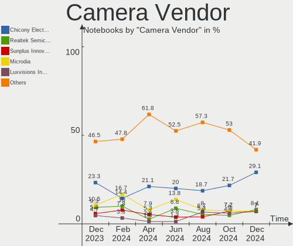

| Vendor                                 | Notebooks | Percent |
|----------------------------------------|-----------|---------|
| Chicony Electronics                    | 20        | 23.26%  |
| IMC Networks                           | 10        | 11.63%  |
| Microdia                               | 9         | 10.47%  |
| Realtek Semiconductor                  | 8         | 9.3%    |
| Bison Electronics                      | 6         | 6.98%   |
| Sunplus Innovation Technology          | 5         | 5.81%   |
| Lite-On Technology                     | 5         | 5.81%   |
| Luxvisions Innotech Limited            | 4         | 4.65%   |
| Suyin                                  | 2         | 2.33%   |
| SunplusIT                              | 2         | 2.33%   |
| Sonix Technology                       | 2         | 2.33%   |
| Cheng Uei Precision Industry (Foxlink) | 2         | 2.33%   |
| Apple                                  | 2         | 2.33%   |
| Acer                                   | 2         | 2.33%   |
| Samsung Electronics                    | 1         | 1.16%   |
| Ricoh                                  | 1         | 1.16%   |
| Quanta                                 | 1         | 1.16%   |
| Primax Electronics                     | 1         | 1.16%   |
| Microsoft                              | 1         | 1.16%   |
| Lenovo                                 | 1         | 1.16%   |
| Alcor Micro                            | 1         | 1.16%   |

Camera Model
------------

Camera device models

| Model                                                       | Notebooks | Percent |
|-------------------------------------------------------------|-----------|---------|
| Realtek Integrated_Webcam_HD                                | 6         | 6.9%    |
| IMC Networks USB2.0 HD UVC WebCam                           | 6         | 6.9%    |
| Microdia Integrated_Webcam_HD                               | 4         | 4.6%    |
| Chicony HD WebCam                                           | 4         | 4.6%    |
| Lite-On HP HD Camera                                        | 3         | 3.45%   |
| Chicony Integrated Camera                                   | 3         | 3.45%   |
| SunplusIT MTD camera                                        | 2         | 2.3%    |
| Sunplus Integrated_Webcam_HD                                | 2         | 2.3%    |
| Sunplus HD WebCam                                           | 2         | 2.3%    |
| Sonix USB2.0 HD UVC WebCam                                  | 2         | 2.3%    |
| Microdia Integrated_Webcam_FHD                              | 2         | 2.3%    |
| Luxvisions Innotech Limited Integrated Camera               | 2         | 2.3%    |
| IMC Networks USB2.0 VGA UVC WebCam                          | 2         | 2.3%    |
| Bison Lenovo EasyCamera                                     | 2         | 2.3%    |
| Apple iPhone 5/5C/5S/6/SE                                   | 2         | 2.3%    |
| Suyin Acer/HP Integrated Webcam [CN0314]                    | 1         | 1.15%   |
| Suyin 1.3M WebCam (notebook emachines E730, Acer sub-brand) | 1         | 1.15%   |
| Sunplus Laptop_Integrated_Webcam_FHD                        | 1         | 1.15%   |
| Samsung Galaxy series, misc. (MTP mode)                     | 1         | 1.15%   |
| Ricoh USB2.0 Camera                                         | 1         | 1.15%   |
| Realtek Integrated_Webcam_FHD                               | 1         | 1.15%   |
| Realtek Integrated_Webcam_8M                                | 1         | 1.15%   |
| Realtek Integrated Webcam HD                                | 1         | 1.15%   |
| Quanta HD User Facing                                       | 1         | 1.15%   |
| Primax HP HD Webcam [Fixed]                                 | 1         | 1.15%   |
| Microsoft LifeCam Studio                                    | 1         | 1.15%   |
| Microdia Webcam Vitade AF                                   | 1         | 1.15%   |
| Microdia USB Camera                                         | 1         | 1.15%   |
| Microdia Integrated Webcam HD                               | 1         | 1.15%   |
| Luxvisions Innotech Limited HP TrueVision HD Camera         | 1         | 1.15%   |
| Luxvisions Innotech Limited HP HD Camera                    | 1         | 1.15%   |
| Lite-On TOSHIBA Web Camera - HD                             | 1         | 1.15%   |
| Lite-On Integrated Camera                                   | 1         | 1.15%   |
| Lenovo Integrated Webcam [R5U877]                           | 1         | 1.15%   |
| IMC Networks Integrated RGB Camera                          | 1         | 1.15%   |
| IMC Networks Integrated Camera                              | 1         | 1.15%   |
| Chicony Web Camera - FHD                                    | 1         | 1.15%   |
| Chicony USB2.0 HD UVC WebCam                                | 1         | 1.15%   |
| Chicony USB 2.0 Webcam Device                               | 1         | 1.15%   |
| Chicony Lenovo EasyCamera                                   | 1         | 1.15%   |

Security
--------

Fingerprint Vendor
------------------

Fingerprint sensor vendors

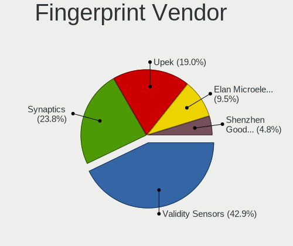

| Vendor                     | Notebooks | Percent |
|----------------------------|-----------|---------|
| Validity Sensors           | 8         | 34.78%  |
| Synaptics                  | 8         | 34.78%  |
| Shenzhen Goodix Technology | 2         | 8.7%    |
| LighTuning Technology      | 2         | 8.7%    |
| Upek                       | 1         | 4.35%   |
| Elan Microelectronics      | 1         | 4.35%   |
| AuthenTec                  | 1         | 4.35%   |

Fingerprint Model
-----------------

Fingerprint sensor models

| Model                                                                      | Notebooks | Percent |
|----------------------------------------------------------------------------|-----------|---------|
| Validity Sensors VFS 5011 fingerprint sensor                               | 2         | 8.7%    |
| Synaptics Metallica MIS Touch Fingerprint Reader                           | 2         | 8.7%    |
| Synaptics Fingerprint reader [HP G6]                                       | 2         | 8.7%    |
| Shenzhen Goodix Fingerprint Reader                                         | 2         | 8.7%    |
| Validity Sensors VFS7552 Touch Fingerprint Sensor                          | 1         | 4.35%   |
| Validity Sensors VFS7500 Touch Fingerprint Sensor                          | 1         | 4.35%   |
| Validity Sensors VFS495 Fingerprint Reader                                 | 1         | 4.35%   |
| Validity Sensors VFS491                                                    | 1         | 4.35%   |
| Validity Sensors VFS471 Fingerprint Reader                                 | 1         | 4.35%   |
| Validity Sensors Synaptics VFS7552 Touch Fingerprint Sensor with PurePrint | 1         | 4.35%   |
| Upek Biometric Touchchip/Touchstrip Fingerprint Sensor                     | 1         | 4.35%   |
| Synaptics WBDI                                                             | 1         | 4.35%   |
| Synaptics UWP WBDI Device                                                  | 1         | 4.35%   |
| Synaptics Prometheus MIS Touch Fingerprint Reader                          | 1         | 4.35%   |
| Synaptics FS7604 Touch Fingerprint Sensor with PurePrint                   | 1         | 4.35%   |
| LighTuning Fingerprint Reader                                              | 1         | 4.35%   |
| LighTuning ES603 Swipe Fingerprint Sensor                                  | 1         | 4.35%   |
| Elan ELAN:Fingerprint                                                      | 1         | 4.35%   |
| AuthenTec AES2810                                                          | 1         | 4.35%   |

Chipcard Vendor
---------------

Chipcard module vendors

| Vendor      | Notebooks | Percent |
|-------------|-----------|---------|
| Broadcom    | 7         | 50%     |
| Alcor Micro | 5         | 35.71%  |
| OmniKey     | 1         | 7.14%   |
| O2 Micro    | 1         | 7.14%   |

Chipcard Model
--------------

Chipcard module models

| Model                                                                        | Notebooks | Percent |
|------------------------------------------------------------------------------|-----------|---------|
| Alcor Micro AU9540 Smartcard Reader                                          | 5         | 35.71%  |
| Broadcom 5880                                                                | 3         | 21.43%  |
| Broadcom 58200                                                               | 2         | 14.29%  |
| OmniKey CardMan 3021 / 3121                                                  | 1         | 7.14%   |
| O2 Micro OZ776 CCID Smartcard Reader                                         | 1         | 7.14%   |
| Broadcom BCM5880 Secure Applications Processor with fingerprint swipe sensor | 1         | 7.14%   |
| Broadcom BCM5880 Secure Applications Processor                               | 1         | 7.14%   |

Unsupported
-----------

Unsupported Devices
-------------------

Total unsupported devices on board

| Total | Notebooks | Percent |
|-------|-----------|---------|
| 0     | 58        | 56.86%  |
| 1     | 33        | 32.35%  |
| 2     | 11        | 10.78%  |

Unsupported Device Types
------------------------

Types of unsupported devices

| Type                  | Notebooks | Percent |
|-----------------------|-----------|---------|
| Fingerprint reader    | 23        | 42.59%  |
| Chipcard              | 10        | 18.52%  |
| Graphics card         | 9         | 16.67%  |
| Net/wireless          | 4         | 7.41%   |
| Multimedia controller | 3         | 5.56%   |
| Storage               | 2         | 3.7%    |
| Bluetooth             | 2         | 3.7%    |
| Card reader           | 1         | 1.85%   |

